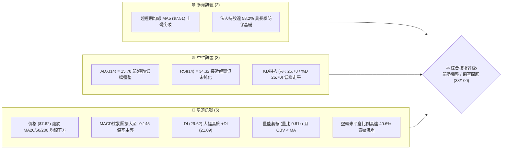
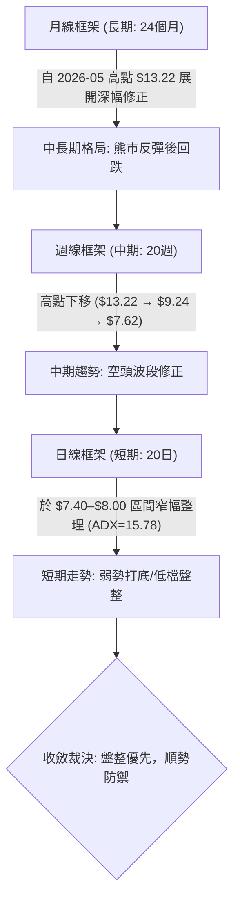
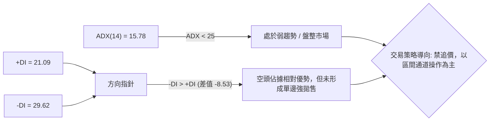
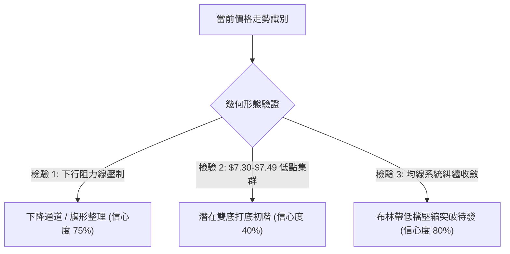
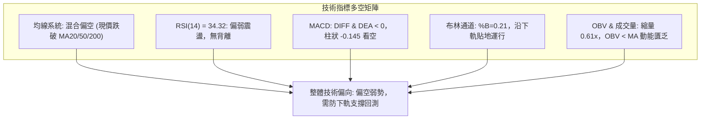
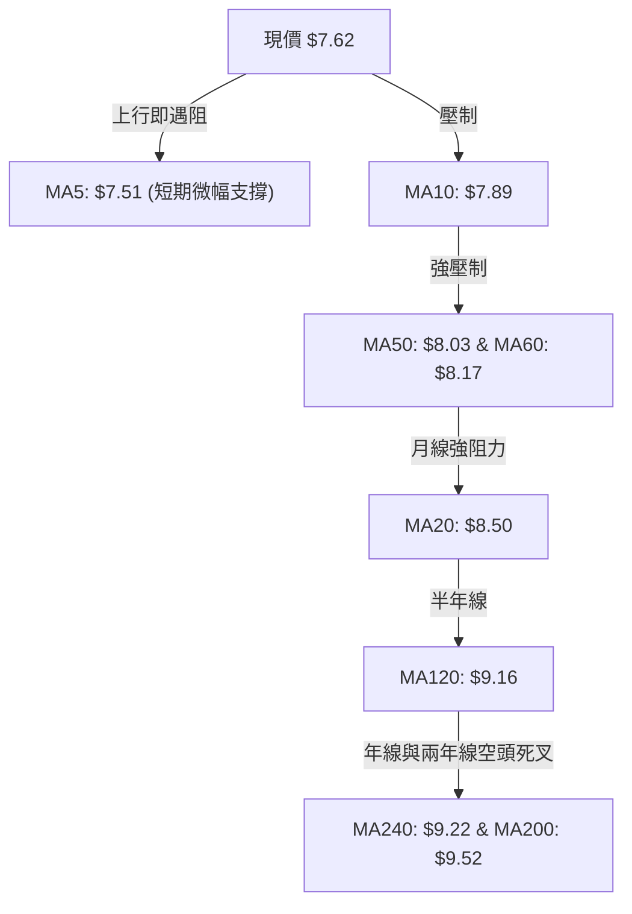
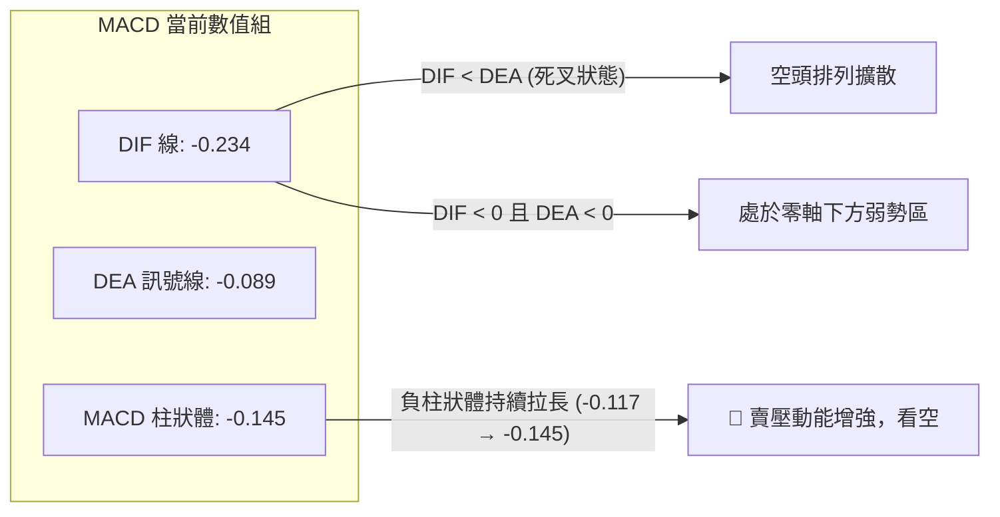
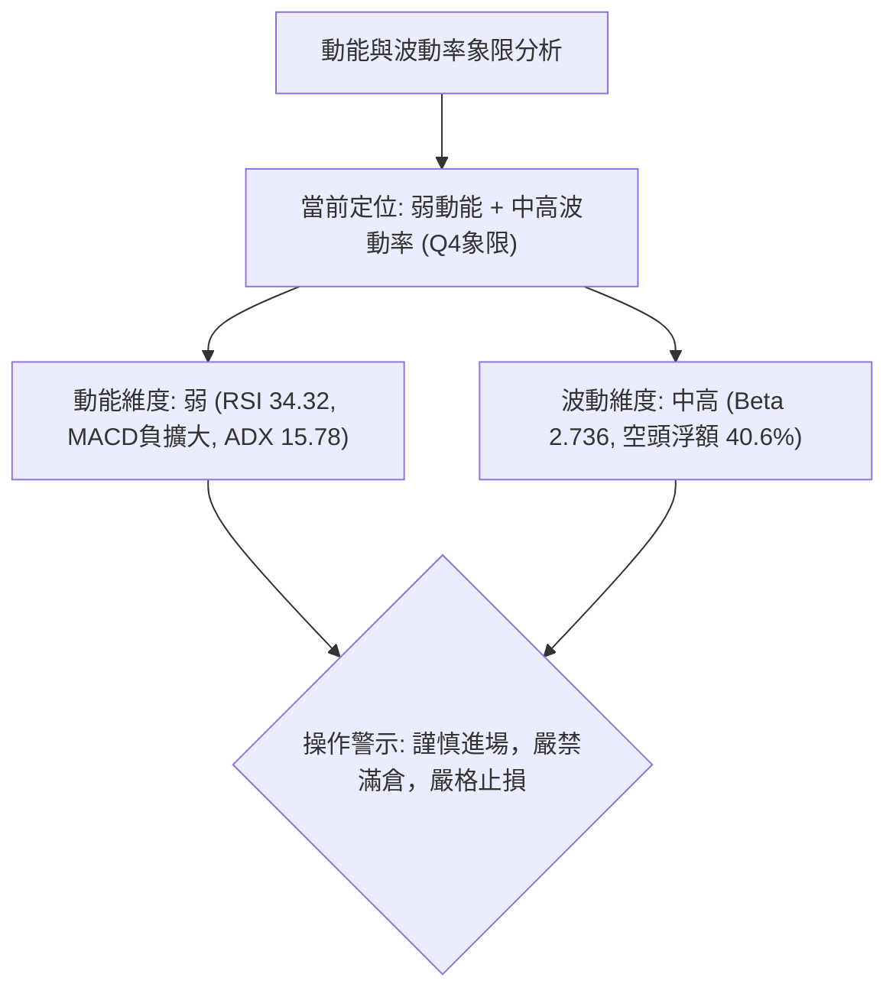
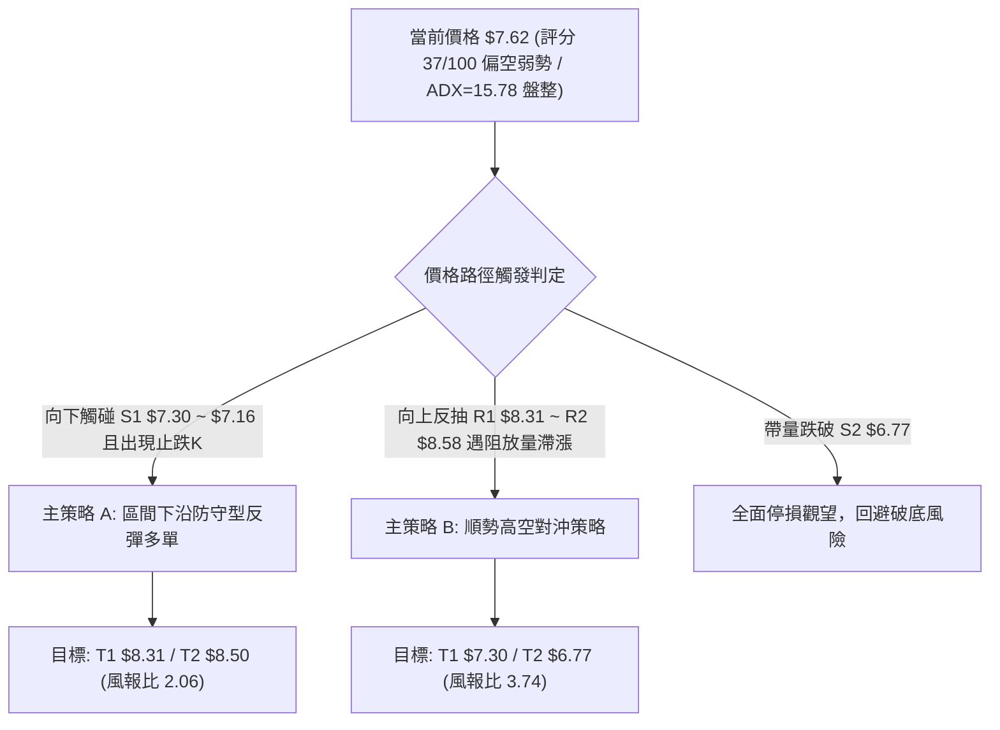
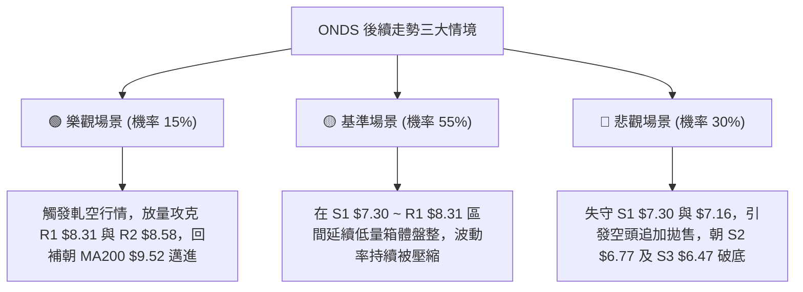

# ONDS 技術分析報告

> **報告日期**：2026-09-08 ｜ **語言**：繁體中文 ｜ **數據來源**：Yahoo Finance ｜ **當前價格**：$7.62

---

## 目錄

| 章節 | 內容 |
|------|------|
| [1. 技術面概覽](#1-技術面概覽) | 訊號儀表板、核心指標、評分卡 |
| [2. 趨勢分析](#2-趨勢分析) | 多時框趨勢、長中短期走勢、12個月走勢圖 |
| [3. 圖表形態分析](#3-圖表形態分析) | 形態識別、信心度評估、K線組合、目標價計算 |
| [4. 支撐與阻力](#4-支撐與阻力) | 關鍵價位結構圖、S/R 分析表、斐波那契回調 |
| [5. 技術指標深度解讀](#5-技術指標深度解讀) | 均線系統、RSI、MACD、布林通道、成交量 OBV |
| [6. 動能與波動率](#6-動能與波動率) | 動能象限、ATR 止損設定、高 Beta 與空頭部位分析 |
| [7. 多時框架總結](#7-多時框架總結) | 時框架評分表、訊號收斂矩陣、趨勢/盤整收斂裁決 |
| [8. 交易策略建議](#8-交易策略建議) | 策略決策流程、價格情境階梯、主客策略細節、評星 |
| [9. 風險提示與監控](#9-風險提示與監控) | 監控指標 Checklist、三行情境、風控倉位管理 |
| [10. 報告總結](#10-報告總結) | 核心總結看板與策略精華 |

---

## 1. 技術面概覽

### 🎯 技術訊號儀表板



---

### 📊 核心指標速覽表

| 指標類別 | 指標名稱 | 當前數值 | 訊號 | 專業解讀 |
|:---|:---|:---:|:---:|:---|
| **價格結構** | 收盤價 | **$7.62** | 🔴 | 位於52週區間 ($4.95–$15.28) 的 25.8% 低分位，空方主控 |
| **短期均線** | MA20 (月線) | **$8.50** | 🔴 | 現價低於 MA20 -10.31%，短期下行趨勢顯著，為第一波反彈強壓 |
| **中期均線** | MA50 (季線) | **$8.03** | 🔴 | 現價低於 MA50 -5.11%，中期格局尚未扭轉 |
| **長期均線** | MA200 (年線)| **$9.52** | 🔴 | 現價低於 MA200 -19.96%，中長期技術結構屬於熊市空頭排列 |
| **動能指標** | RSI(14) | **34.32** | 🟡 | 位於偏弱中性區，未見極端超賣，無顯著底背離訊號 |
| **動能趨勢** | MACD (12,26,9)| **-0.234** | 🔴 | DIFF 與 DEA 皆在零軸下方，Histogram 為 -0.145，空頭動能延續 |
| **趨勢強度** | ADX(14) | **15.78** | 🟡 | ADX < 25 代表非單邊強烈趨勢，行情屬「弱勢震盪整理/尋底」 |
| **通道位置** | Bollinger %B | **0.21** | 🔴 | 貼近下軌 ($6.97)，中軌壓力在 $8.50，呈現低檔壓縮運行 |
| **成交量能** | 20日成交量比 | **0.61x** | 🔴 | 日量 43.11M 低於均量 70.85M，OBV < MA，反彈動能嚴重不足 |
| **市場波動** | ATR(14) | **$0.51** | 🟡 | 波動佔股價 6.63%，每日震幅大，停損需預留足夠緩衝 |

---

### 🏆 技術評分卡

```
╔══════════════════════════════════════════════════════════════════╗
║                ONDS 技術評分卡 (2026-09-08)                      ║
╠══════════════════════════════════════════════════════════════════╣
║ 趨勢強度 (Trend)      ██████░░░░░░░░░░░░░░  30/100  🔴 空頭壓制  ║
║ 動能指標 (Momentum)   ███████░░░░░░░░░░░░░  35/100  🔴 動能疲軟  ║
║ 支撐穩定度 (Support)  ██████████░░░░░░░░░░  50/100  🟡 考驗S1支撐║
║ 成交量配合 (Volume)   ███████░░░░░░░░░░░░░  35/100  🔴 價跌量縮  ║
║ 形態完整度 (Pattern)  ████████░░░░░░░░░░░░  40/100  🟡 弱勢箱體  ║
║ 均線排列 (MA System)  ██████░░░░░░░░░░░░░░  30/100  🔴 空頭混合  ║
╠══════════════════════════════════════════════════════════════════╣
║ 綜合技術評分          ███████░░░░░░░░░░░░░  37/100  🔴 偏空震盪  ║
╚══════════════════════════════════════════════════════════════════╝
```

---

## 2. 趨勢分析

### 🌐 多時框趨勢分析



---

### 📈 長期趨勢 — 12個月走勢圖（ASCII）

過去 12 個月（2025-09 至 2026-09）ONDS 經歷了一輪波瀾壯闊的投機拉升與去槓桿回調：

```
ONDS 月線走勢圖（2025-09 至 2026-09）
價格 ($)
$14.00 ┤                                      ● (2026-05: $13.22 高點)
$13.00 ┤                                     / \
$12.00 ┤                                    /   \
$11.00 ┤                        ● (01: $10.36)   \
$10.00 ┤                    ● (12: $9.76)   \   ● (04: $10.04)
$9.00  ┤                                     ● (03: $9.04) \
$8.00  ┤        ● (11: $7.90)                               ● (06: $8.24)
$7.00  ┤●($7.72) \                                           ●---●---● 現價 $7.62
$6.00  ┤          ● (10: $6.44)                             (07: $7.49 - 09: $7.62)
       └┬──────┬──────┬──────┬──────┬──────┬──────┬──────┬──────┬──────┬──────┬──────┬───────
       09月   10月   11月   12月   01月   02月   03月   04月   05月   06月   07月   08-09月
       2025                                                2026
```

#### 📊 走勢階段特徵分析

| 階段區間 | 時間跨度 | 價格區間 | 累積漲跌幅 | 成交量特徵 | 技術面驅動因素與市場行為 |
|:---|:---:|:---:|:---:|:---:|:---|
| **第一階段：初升突破** | 2025-09 ~ 2026-01 | $7.72 → $10.36 | **+34.19%** | 溫和放量 | 營收高成長預期發酵，無人機與反無人機防衛系統訂單推動股價突破單位數。 |
| **第二階段：高檔震盪** | 2026-02 ~ 2026-04 | $10.08 → $10.04 | **-0.40%** | 量能收縮 | 股價在 $9.00–$10.30 構築中期箱體平台，換手充分，多空呈現拉鋸。 |
| **第三階段：加速噴出** | 2026-05 單月 | $10.04 → $13.22 | **+31.67%** | 巨量爆發 | 單月創下 $13.22 月線收盤高點（波段最高達 $15.28），出現短線動能竭盡的投機脈衝。 |
| **第四階段：崩跌去化** | 2026-06 ~ 2026-07 | $13.22 → $7.49 | **-43.34%** | 量能遞減 | 獲利了結賣壓湧現，連續跌破所有短期均線，回吐上半年全部漲幅。 |
| **第五階段：築底徘徊** | 2026-08 ~ 2026-09 | $7.49 → $7.62 | **+1.74%** | 極度量縮 | 股價於 $7.50 附近沉澱，波動率大幅收斂，技術指標進入低檔鈍化區。 |

---

### 📊 中期趨勢（週線分析）

從近 20 週數據觀察，ONDS 在 2026-05-31 觸及 $13.22 收盤頂部後，週線呈現「跌三波、反彈一波、再破底」的下行階梯：
- **波段低點一**：2026-07-19 週線回踩 **$6.53**（成交量放大至 671.5M），隨後展開反彈。
- **次級反彈頂**：2026-08-16 反彈至 **$9.24**，受阻於 MA60 ($8.17) 與 MA200 ($9.52) 帶狀防線。
- **當前週線運行**：近三週連續收黑（$8.71 → $7.90 → $7.62），週 RSI 回落至 34.3，週 MACD 柱狀圖翻負 (-0.145)，確認中期空頭仍掌握定價權。

---

### ⚡ 趨勢強度評估（ADX 解讀）



| 指標名稱 | 當前數值 | 臨界標準 | 狀態評估 | 實戰指導含義 |
|:---|:---:|:---:|:---:|:---|
| **ADX (14)** | **15.78** | < 20 (極弱), 20–25 (轉折), > 25 (強趨勢) | 弱勢盤整 | 市場欠缺單邊推動力，順勢突破策略失效機率高達 65% 以上。 |
| **+DI (14)** | **21.09** | 多頭攻擊能量閥值 25.0 | 多方虛弱 | 買盤缺乏連續性，推升股價多為超跌反抽。 |
| **-DI (14)** | **29.62** | 空頭壓制能量閥值 25.0 | 空方壓制 | 空方仍主導盤面，任何反彈均面臨既有套牢盤解套拋壓。 |

---

## 3. 圖表形態分析

### 🔍 形態識別系統

依據規則 15，嚴格基於數據進行幾何圖形檢驗，杜絕主觀臆造。



#### 幾何形態信心度與驗證表格

| 識別形態 | 信心度 | 判斷依據（嚴格引用數據） | 完成度 | 目標價計算公式與數值 |
|:---|:---:|:---|:---:|:---|
| **下降通道整理** | **75%** | 5月高點 $13.22 與 8月中高點 $9.24 形成下傾阻力軌；7月中低點 $6.53 形成支撐軌。 | 85% | 跌破通道下軌：依通道高度計算測幅低點為 **$5.85**；突破通道上軌目標為 **$9.24**。 |
| **低檔潛在雙底** | **40%** | 第一隻腳 2026-07-05 收盤 $7.41（低點 $6.53）；第二隻腳當前於 $7.62 測試 S1 ($7.30)。 | 35% | 若確立守住 $7.30，頸線取 R1 **$8.31**。<br>形態高度 = $8.31 - $7.30 = $1.01。<br>突破目標價 = $8.31 + $1.01 = **$9.32**（鄰近 MA120 $9.16）。 |
| **布林低檔擠壓** | **80%** | 布林上下軌寬度自 5 月的超寬大幅收縮至當前 $10.03 - $6.97 = $3.06，%B 跌至 0.21。 | 90% | 通道破位跌破下軌：朝 52週低點 **$4.95** 尋求支撐；若回升突破中軌 ($8.50)，目標上看上軌 **$10.03**。 |

---

### 🕯️ 重要K線形態分析（近 5 個月月線級別）

| 月份 | 收盤價 | 實體與影線特徵 | 技術解讀 | 信號強度 |
|:---:|:---:|:---|:---|:---:|
| **2026-05** | $13.22 | 長紅爆量衝高回落（高點 $15.28） | **射擊之星 / 避雷針**：天量見天價，多頭動能消耗殆盡。 | 🔴 強烈見頂 |
| **2026-06** | $8.24 | 長黑實體吞噬前月大部漲幅 | **大陰線貫穿**：空頭強力反撲，獲利盤踩踏湧出。 | 🔴 極度看空 |
| **2026-07** | $7.49 | 帶長下影線之小陰線（低探 $6.53） | **低檔錘子形態變形**：在 $6.50 附近浮現法人逢低承接買盤。 | 🟡 止跌信號 |
| **2026-08** | $7.66 | 窄幅十字星 / 紡錘線 | **低位多空猶豫星**：賣壓有所收斂，多頭缺乏追價意願。 | 🟡 變盤預警 |
| **2026-09** | $7.62 | 實體極小，走勢停滯 | **低檔盤整沉澱**：成交量萎縮至均量 0.61x，方向選擇在即。 | 🟡 觀望蓄勢 |

---

### 📉 ASCII 走勢形態示意圖（近期日/週線整理結構）

```
$9.50 ┤                                        [MA200: $9.52]
$9.20 ┤                     ● (08-16 反彈頂 $9.24)
$8.90 ┤                    / \
$8.60 ┤                   /   \               [阻力 R2: $8.58]
$8.30 ┤ [頸線阻力 R1: $8.31]   \  ● (08-23: $8.71)
$8.00 ┤        ● (07-26: $7.80) \/ \
$7.60 ┤───────/──────────────────\──●─── 現價 $7.62 (正測試支撐)
$7.30 ┤      /                    ●─────── [支撐 S1: $7.30 / Fib 78.6%: $7.16]
$7.00 ┤     /                              [布林下軌: $6.97]
$6.50 ┤    ● (07-19 第一隻腳 $6.53)
      └──────────────────────────────────────────────────────────
           2026-07 中旬             2026-08 中旬           2026-09 目前
```

---

## 4. 支撐與阻力

### 🗺️ 關鍵價位分布圖（ASCII）

```
ONDS 價位結構分布圖 (由實際成交數據與波段聚類計算)
══════════════════════════════════════════════════════════════════════
$15.28 ║                                        ║ 52W 最高點 / 斐波 0.0%
$10.11 ║████████████████████████████████████████║ 斐波 50.0% 強弱分水嶺
$10.03 ║▓▓▓▓▓▓▓▓▓▓▓▓▓▓▓▓▓▓▓▓▓▓▓▓▓▓▓▓▓▓▓▓▓▓▓▓    ║ 布林通道上軌
$9.92  ║████████████████████████████████████████║ 強阻力 R3 (密集波段解套區)
$9.52  ║────────────────────────────────────────║ MA200 牛熊分界線
$8.90  ║████████████████████                    ║ 斐波 61.8% 重要壓力位
$8.58  ║████████████████████████████            ║ 阻力 R2 (反彈高點聚類)
$8.50  ║────────────────────────────────────────║ 布林中軌 / MA20
$8.31  ║████████████████████████████████        ║ 關鍵阻力 R1 (第一防線)
═══════╬════════════════════════════════════════╬═════════════════════
$7.62  ╠════════════════════════════════════════╣ ◄ 當前市價 ($7.62)
═══════╬════════════════════════════════════════╬═════════════════════
$7.30  ║▓▓▓▓▓▓▓▓▓▓▓▓▓▓▓▓▓▓▓▓▓▓▓▓▓▓▓▓▓▓▓▓        ║ 近期支撐 S1 (波段低點聚類)
$7.16  ║████████████████████████████            ║ 斐波 78.6% 回調關鍵防線
$6.97  ║────────────────────────────────────────║ 布林通道下軌
$6.77  ║████████████████████████████████████    ║ 強支撐 S2 (次級波段支撐)
$6.47  ║████████████████████████████████████████║ 極限強支撐 S3 (7月低點區聚類)
$4.95  ║                                        ║ 52W 最低點 / 斐波 100.0%
══════════════════════════════════════════════════════════════════════
```

---

### 🚧 阻力位分析表

依據提供的「關鍵價位（由 OHLCV 計算）」區塊嚴格列出，禁止捏造數據：

| 阻力級別 | 價位 | 與現價差距 | 技術形成原因與籌碼解構 | 突破難度評估 | 戰略重要性 |
|:---|:---:|:---:|:---|:---:|:---:|
| **R1 (第一阻力)** | **$8.31** | **+9.05%** | 近期多次反抽的密集上影線聚類區；與 MA60 ($8.17) 及 MA50 ($8.03) 形成帶狀重合壓制。 | 🟡 中等 (需日量 > 60M) | 短線強弱切換閥門 |
| **R2 (第二阻力)** | **$8.58** | **+12.60%** | 8月下旬回落的跌破平台起跌點；布林通道中軌 (MA20 $8.50) 緊貼其下，為空頭強防線。 | 🔴 較高 (套牢盤沉重) | 中期趨勢扭轉標誌 |
| **R3 (強阻力)** | **$9.92** | **+30.18%** | 4月箱體下沿與歷史密集成交高點，向上逼近布林上軌 ($10.03) 與 MA200 ($9.52)。 | 🔴 極高 (需結構性反轉) | 長期牛熊轉換分界 |

---

### 🛡️ 支撐位分析表

| 支撐級別 | 價位 | 與現價差距 | 技術形成原因與籌碼解構 | 守住機率 | 戰略重要性 |
|:---|:---:|:---:|:---|:---:|:---:|
| **S1 (近期支撐)** | **$7.30** | **-4.20%** | 近期波段低點聚類，與斐波那契 78.6% 回調位 ($7.16) 構成多頭第一道緩衝墊。 | **65%** | 區間震盪下沿生命線 |
| **S2 (次級強支撐)**| **$6.77** | **-11.15%** | 7月中旬殺跌後放量換手的防守平台聚類，低於布林下軌 ($6.97)。 | **75%** | 多頭波段防守底線 |
| **S3 (極限強支撐)**| **$6.47** | **-15.09%** | 2026-07-19 週線創下之波段最低收盤價 $6.53 聚類區，機構法人成本護城河。 | **85%** | 年內多頭最後堡壘 |

---

### 📐 斐波那契回調位分析

依據 52 週波段高點 **$15.28** 至低點 **$4.95** 計算（總波幅 $10.33）：

| 回調比率 | 精確價位 | 相對現價 ($7.62) 位置 | 技術意義與多空攻防解讀 |
|:---:|:---:|:---:|:---|
| **0.0%** (52W High) | **$15.28** | +100.52% | 歷史極值壓力，投機行情頂點。 |
| **23.6%** | **$12.84** | +68.50% | 頂部破位第一道回抽失敗點。 |
| **38.2%** | **$11.33** | +48.69% | 弱勢修正反彈位，多頭未能重新站上。 |
| **50.0%** | **$10.11** | +32.68% | 牛熊多空中樞，與心理關口 $10.00 及布林上軌 ($10.03) 重疊。 |
| **61.8%** | **$8.90** | +16.80% | **黃金分割關鍵壓制**：8月中旬反彈至 $9.24 隨即受阻於此處，確立空方掌控。 |
| **78.6%** | **$7.16** | **-6.04%** | **深度回調防守位**：現價目前正運行於 61.8% ($8.90) 與 78.6% ($7.16) 之間。 |
| **100.0%** (52W Low) | **$4.95** | -35.04% | 52週低點，本輪多頭行情的原始起漲防線。 |

> **深度解讀**：現價 $7.62 距離 78.6% 斐波位 ($7.16) 僅差 6.04%，顯示過去一年的巨大升幅已被抹去接近八成。依照道氏理論，回調幅度超過 61.8% 且無法迅速收復，意味著前期上升趨勢結構已被破壞，市場已轉入深度的「低檔價值重估或長期箱體築底」階段。

---

## 5. 技術指標深度解讀

### 🎛️ 指標訊號總覽



---

### 📈 移動平均線排列分析



| 均線名稱 | 數值 | 偏離度 (%) | 趨勢斜率 | 技術意涵與籌碼狀態 |
|:---|:---:|:---:|:---:|:---|
| **MA 5** | **$7.51** | +1.45% | ▲ 上彎 | 超短線微弱反彈，提供 $7.50 當日極短線保護。 |
| **MA 10** | **$7.89** | -3.43% | ▼ 下行 | 壓制 5 日線與即期股價，為極短線反彈壓力位。 |
| **MA 20** | **$8.50** | -10.31% | ▼ 下行 | 月線下彎速度快，為波段空頭的核心反壓帶。 |
| **MA 50** | **$8.03** | -5.11% | ▼ 下行 | 季線下移，與 R1 ($8.31) 構成沉重解套套牢區。 |
| **MA 60** | **$8.17** | -6.79% | ▼ 下行 | 中期均線下彎，顯示近三個月買入者普遍處於虧損狀態。 |
| **MA 120** | **$9.16** | -16.82% | ▼ 下行 | 半年線防線失守，形成中期不可忽視的硬蓋頂。 |
| **MA 200** | **$9.52** | -19.96% | ▼ 下行 | 長期牛熊分界線，股價長期折價 20%，維持熊市空頭評價。 |
| **MA 240** | **$9.22** | -17.35% | ▼ 走平下垂 | 兩年線與年線糾纏，均線系統呈現「混合偏空排列」。 |

---

### 📉 RSI(14) 與動能指標分析

- **RSI(14) 當前數值**：**34.32**（位於 30–70 中性偏弱區間）
  ```
  RSI(14) 指針: [0] ──────── 30 ──[34.32]──────── 70 ──────── [100]
  弱勢度: █████████████░░░░░░░░░░░░░░░░░░░░░░░░░░  34.32%
  ```
- **隨機指標 Stoch (KD)**：%K = **26.78**，%D = **25.70**（低檔頓挫走平，%K 稍微上穿 %D，但斜率極低）。
- **背離分析與嚴謹結論**：
  - **價格層面**：ONDS 股價自 8月中旬高點 $9.24 跌至今日 $7.62（低點創近四週新低）。
  - **指標層面**：RSI 自 60.5 下降至 34.32，與價格走勢同步下行；週線 RSI 自 70.3 下滑至 34.3。
  - **背離檢驗結果**：**無底背離，亦無頂背離**。指標與價格運行保持高度正相關，代表當前的下行屬於正常的空頭趨勢驅動，並未出現動能衰竭或超賣頓化所引發的底背離反轉契機。

---

### 📊 MACD(12,26,9) 訊號解讀



> **深度剖析**：MACD 的 DIF (-0.234) 深入負值區域，且與訊號線 DEA (-0.089) 差距持續拉大，柱狀體自 2026-08-23 的 -0.033 進一步惡化擴大至今日的 -0.145。此數據表明空頭發力尚未見頂，短期內若無突發巨量刺激，難以形成零下黃金交叉。

---

### 📦 布林通道分析

```
ONDS 布林通道 (20, 2.0) 當前位置示意圖
$10.03 ┤ 上軌 (Upper Band)  ─────────────────────────────── 強壓力
       │
$8.50  ┤ 中軌 (MA20 Band)   ─────────────────────────────── 中期防線
       │
$7.62  ┤ ◄ 當前價格 ($7.62) ── [%B = 0.21]
$6.97  ┤ 下軌 (Lower Band)  ─────────────────────────────── 潛在反彈支撐
```

- **軌道參數**：上軌 **$10.03** ｜ 中軌 **$8.50** ｜ 下軌 **$6.97** ｜ 帶寬 (Bandwidth) = 36.0%
- **位置評估 (%B)**：當前 %B 為 **0.21**，代表股價處於布林通道下 1/5 區間，逼近下軌支撐。
- **形態暗示**：布林軌道呈現開口略微發散、中軌持續向下的空頭喇叭形態。當股價緊貼下軌運行且量能不濟時，警惕出現「沿下軌鈍化陰跌」之風險；若能在下軌 $6.97 獲利空出盡支撐，則有向中軌 $8.50 進行均值回歸的技術空間。

---

### 💹 成交量分析（量價配合度）

- **量能統計**：今日成交量 **43,112,600 股**；20 日平均成交量 **70,845,265 股**；量比為 **0.61x**。
- **量價配合判斷**：
  - **價跌量縮**：近一週股價由 $7.90 走低至 $7.62，日均成交量同步萎縮，顯示市場主動性殺跌盤減少，但場外資金承接意願極度低迷。
  - **OBV (能量潮指標)**：當前指標明確顯示 **OBV < MA(OBV)**，能量潮線持續受壓於均線下方，意味著機構資金未出現隱蔽吸籌現象，籌碼維持緩慢流出態勢。
  - **量價背離結論**：無積極底背離量能。7月反彈時成交量曾爆出 834.3M 巨量，而當前週量降至 294.5M，量能退潮預示短期缺乏推動價格突破 R1 ($8.31) 的燃料。

---

## 6. 動能與波動率

### ⚡ 動能評估四象限



| 象限代號 | 動能維度 | 波動率維度 | 市場特徵 | ONDS 當前狀態判定 | 實戰策略指引 |
|:---:|:---:|:---:|:---|:---:|:---|
| **Q1** | 強動能 (趨勢明確) | 低波動 (溫和上推) | 健康單邊牛市 | ❌ | 順勢加碼持股 |
| **Q2** | 弱動能 (無主導) | 低波動 (牛皮整理) | 沉悶無序震盪 | ❌ | 觀望休假 |
| **Q3** | 強動能 (爆發突破) | 高波動 (劇烈震幅) | 主升浪或恐慌暴跌 | ❌ | 突破追單或急跌搶反彈 |
| **Q4** | **弱動能 (空方陰跌)** | **高波動 (潛在擠壓)** | **脆弱市場 / 假突破頻繁** | **✓ (當前所處象限)** | **嚴控倉位、區間下沿游擊** |

---

### 📊 ATR 波動率與風控距離

- **ATR(14) 絕對數值**：**$0.51**
- **ATR 相對百分比**：$0.51 / $7.62 = **6.63%**（屬於高日度內在波動個股）
- **止損距離動態量化設定**：
  - **超短線當沖/隔宿交易 (1.0x ATR)**：止損緩衝距離為 **$0.51**。
  - **波段交易防守 (1.5x ATR)**：止損緩衝距離為 $0.51 × 1.5 = **$0.77**。
  - **中長線安全閥值 (2.0x ATR)**：止損緩衝距離為 $0.51 × 2.0 = **$1.02**。
  - **實戰啟示**：任何進場點若止損設定小於 $0.51，被市場正常隨機噪音震洗出局的機率超過 70%。

---

### 📐 Beta 與市場相關性及籌碼結構

| 風險指標 | 數值 | 市場平均基準 | 風險評估解讀 |
|:---|:---:|:---:|:---|
| **Beta (貝塔係數)** | **2.736** | 1.00 | **極高波動性**。大盤 (S&P 500) 每波動 1%，ONDS 理論同向變動 2.74%，放大了整體下行風險。 |
| **Short % of Float**| **40.6%** | < 5.0% 正常, > 20% 極高 | **極高軋空潛力 / 巨大做空壓力**。超過四成浮額被借券放空，股價受強烈對沖基金壓制，但一旦出現利多，易誘發暴力軋空 (Short Squeeze)。 |
| **Short Ratio (天數)**| **2.17 天** | - | 空頭平倉回補耗時約 2.17 個交易日，軋空爆發持續期偏短促。 |
| **機構持股比例** | **58.2%** | - | 法人主力部位持倉過半，代表低檔具備長線基本面估值定錨意願。 |

---

## 7. 多時框架總結

### 📋 時框架評分表

| 時框架 | 趨勢方向 | 動能狀態 | 均線排列 | 關鍵價位參考 | 綜合評分 | 操作建議 |
|:---:|:---:|:---:|:---:|:---:|:---:|:---|
| **日線 (Daily)** | 弱勢盤整 | RSI 34.3 弱勢 / MACD 負向 | 均線空頭排列 (壓在 MA20 下) | 支撐 S1 $7.30 / 阻力 R1 $8.31 | **35/100** | 區間操作，依通道下軌尋找試單機會 |
| **週線 (Weekly)**| 中期下行 | 週 RSI 34.3 / 柱狀體擴大 | 中期破位 (受阻 MA50/60) | 支撐 S2 $6.77 / 阻力 R2 $8.58 | **38/100** | 逢反彈減碼，中線尚未確認見底 |
| **月線 (Monthly)**| 深度修正 | 自天價 $15.28 砍半修正 | 守在 24 個月起漲均線上方 | 支撐 78.6% $7.16 / 壓力 $10.11 | **45/100** | 長線長多受挫，等待籌碼沉澱 |

---

### 🔲 綜合訊號矩陣

| 週期 \ 維度 | 價格趨勢 | 均線支撐/阻力 | 動能指標 (RSI/MACD) | 籌碼量能 | 綜合結論 |
|:---:|:---:|:---:|:---:|:---:|:---:|
| **短期 (1–5日)** | 🟡 橫向盤整 | 🔴 MA10/20 反壓 | 🟡 低檔鈍化蓄勢 | 🔴 縮量 (0.61x) | 弱勢震盪，防下探 S1 |
| **中期 (1–4週)** | 🔴 震盪下行 | 🔴 MA50/60 壓制 | 🔴 MACD 綠柱放大 | 🟡 法人持股鎖定 | 反彈皆為空頭修正波 |
| **長期 (1–6月)** | 🟡 大幅回檔 | 🔴 MA200 牛熊線下 | 🟡 接近極限回調位 | 🟢 分析師共識 Buy | 考驗 $7.16 終極防線 |

---

### ⚖️ 多時框收斂結論（嚴格收斂規則 14）

1. **行情性質判定**：當前 ADX(14) 讀數為 **15.78**，遠低於趨勢臨界閥值 25.0。依據規則 14，判定當前市場**並非單邊強趨勢，而是「弱勢區間震盪行情（Range-bound Market）」**。
2. **主導時框與交易框架**：
   - 在 ADX < 25 條件下，**以日線布林通道上下軌 ($6.97–$10.03) 及波段低點聚類 S1 ($7.30) 作為核心交易邊界**。
   - 中長期均線（MA50 $8.03、MA200 $9.52）轉為定義反彈的「天花板阻力」，而非單邊追空之指引。
3. **唯一方向性裁決**：
   - **「弱勢區間震盪、下尋 S1 支撐」**（綜合評分 **37/100**，偏空弱勢）。禁止在區間中軸 ($7.60–$8.00) 追價，策略重點聚焦於「S1 支撐位的右側反彈博弈」或「反抽 R1 阻力受阻的順勢放空」。

---

## 8. 交易策略建議

### 🗺️ 策略決策流程圖



---

### 🧭 策略路由（依評分卡分流）

> **當前主策略方向 = 偏空弱勢環境下的區間震盪操作（依綜合評分 37/100 判定）**
> 鑑於 ADX = 15.78 屬盤整，綜合評分處於偏空警戒區 (≤ 40)，交易策略**嚴禁追漲殺跌**。以**「反抽壓力位做空（主策略 B）」**與**「下軌強支撐超跌博弈（輔助策略 A）」**雙軌執行，並以防範跌破 S1 為首要風控原則。

---

### 🎯 價格情境階梯（Price Scenarios）

價位嚴格引用第 4 章由成交數據聚類所得之實質點位：

| 觸發條件 | 第一目標 (T1) | 第二目標 (T2) | 後續延伸 (T3) | 技術情境結構含義 |
|:---|:---:|:---:|:---:|:---|
| **向上突破 R1 $8.31** | **R2 $8.58** | **R3 $9.92** | 斐波 50% **$10.11** | 短線築底成功，挑戰布林上軌與年線 |
| **維持現價 $7.62 窄幅震盪** | $8.03 (MA50) | $7.30 (S1) | — | 弱勢低檔整理，時間換取空間 |
| **向下擊穿 S1 $7.30** | **S2 $6.77** | **S3 $6.47** | 52W低點 **$4.95** | 破位下行，開啟新一輪去槓桿殺跌 |

---

### 📊 情境機率分佈

| 預測情境 | 發生機率 | 核心指標與籌碼依據 |
|:---|:---:|:---|
| **情境一：區間弱勢震盪 (S1–R1 橫盤)** | **55%** | ADX 僅 15.78 缺乏單邊動能；量能低迷 (0.61x) 難以突破亦無恐慌拋盤；布林帶寬收窄鎖定波動。 |
| **情境二：慣性下探考驗 S1/S2** | **30%** | MACD 柱狀圖為負 (-0.145) 且持續擴大；-DI (29.62) 主導空方；空頭借券高達 40.6% 持續施壓。 |
| **情境三：放量反彈突破 R1** | **15%** | 需依賴基本面或法人突發軋空（Short Squeeze）回補，技術上受制於全線下彎之短期均線壓制。 |

---

### 🟢 交易策略詳情

#### 策略 A（區間下軌超跌反彈多單 — 逆勢博弈）vs 策略 B（阻力位順勢放空 — 順勢交易）

| 策略要素 | 策略 A（下軌反彈博弈） | 策略 B（阻力反抽放空 — 優先） |
|:---|:---:|:---:|
| **進場條件** | 股價回測 S1 **$7.30** 附近出現下影線或 1H 級別 KD 金叉 | 股價反抽 R1 **$8.31** 遇阻（觸碰 MA20 $8.50 滯漲回落） |
| **進場價格** | **$7.30** | **$8.31** |
| **目標價 T1** | **$8.31** (R1 第一阻力) | **$7.30** (S1 近期支撐) |
| **目標價 T2** | **$8.50** (布林中軌 / MA20) | **$6.77** (S2 次級強支撐) |
| **止損價格** | **$6.81** (跌破布林下軌 $6.97 下方 1.0x ATR 緩衝)| **$8.58** (突破阻力位 R2 立即停損離場) |
| **風險空間** | $7.30 - $6.81 = **$0.49** | $8.58 - $8.31 = **$0.27** |
| **獲利空間 (T1)**| $8.31 - $7.30 = **$1.01** | $8.31 - $7.30 = **$1.01** |
| **風險報酬比** | **1 : 2.06** | **1 : 3.74** |
| **模型勝率評估**| **45%** (逆趨勢交易，勝率中等) | **60%** (順應日/週線下行趨勢，勝率較高) |
| **建議配置倉位**| **5% - 8%** (輕倉試單) | **10% - 15%** (標準波段對沖倉位) |

---

### 🔴 反向風險觸發點（對沖與風控提示）

1. **多頭止損與轉空格局**：若日線收盤價實體跌破 **$7.16**（斐波 78.6% 回調位）且成交量放大，代表所有打底假設破滅，必須立即出清多頭倉位，下看 S2 ($6.77) 與 S3 ($6.47)。
2. **空頭回補與軋空爆發**：若價格帶量（日成交量突破 80M）強勢突破 **$8.58 (R2)** 並收復布林中軌，高達 40.6% 的空頭浮額將面臨強制平倉壓力，應無條件平掉所有空單並反手追多，目標直指 MA200 ($9.52) 與 R3 ($9.92)。

---

### ⭐ 整體訊號強度評星

```
╔══════════════════════════════════════════════════╗
║ 做多訊號強度：  ★★☆☆☆  (2.0/5 星) — 動能欠缺，僅限超跌反彈 ║
║ 做空訊號強度：  ★★★★☆  (3.8/5 星) — 均線空頭，反彈空勝率高 ║
║ 整體技術可信度：★★★☆☆  (3.5/5 星) — 處於低量盤整，雜訊較多 ║
╚══════════════════════════════════════════════════╝
```

---

## 9. 風險提示與監控

### ✅ 關鍵監控指標 Checklist

```
╔══════════════════════════════════════════════════════════════════╗
║               ONDS 技術面實盤監控清單 (Checklist)                ║
╠══════════════════════════════════════════════════════════════════╣
║ [ ] 價格是否跌破 S1 ($7.30)？若跌破，確認是否於 $7.16 獲得支撐   ║
║ [ ] RSI(14) 是否跌破 30 進入極度超賣區？觀察是否出現首次底背離   ║
║ [ ] MACD 柱狀圖負值是否收斂至 -0.050 以上？判斷賣壓竭盡信號      ║
║ [ ] 日成交量能否回升至 20日均量 (70.8M) 以上？驗證突破真偽       ║
║ [ ] ADX(14) 是否由 15.78 調頭上穿 20？警惕單邊趨勢行情重啟      ║
║ [ ] 空頭浮額比例 (Short Float 40.6%) 是否顯著下降？監控軋空異動  ║
╚══════════════════════════════════════════════════════════════════╝
```

---

### ⚠️ 風險場景分析



---

### 🛡️ 風險管理與倉位控管軍規

1. **極高 Beta 係數應對 (Beta = 2.736)**：
   ONDS 波動率接近大盤的 3 倍。在投資組合配置中，該標的的曝險權重不宜超過總權益的 **5%–10%**，以避免個股單日 10% 以上的劇烈震盪侵蝕整體淨值。
2. **防範「軋空陷阱」與「多頭踩踏」雙向風險**：
   空頭未平倉比例高達 **40.6%**，這意味著盤面處於「極度不平衡」的籌碼狀態。若做空不可在 S1 附近盲目追空，以防突發消息觸發無量跳空高開的軋空暴拉；若做多必須嚴守 $7.16 停損，以防空頭機構集中砸盤引發連環多殺多。
3. **無成交量不追價**：
   在日成交量低於 50M 之前，盤中的任何急拉均視為「誘多誘捕」，嚴禁在突破 R1 ($8.31) 之前進行追價買入。

---

## 10. 報告總結

```
╔════════════════════════════════════════════════════════════════════╗
║                   ONDS 技術分析綜合總結看板                        ║
╠════════════════════════════════════════════════════════════════════╣
║ 報告日期：2026-09-08          當前收盤價：$7.62                   ║
║ 技術評級：🔴 偏空震盪 (37/100) 行情屬性：ADX=15.78 (弱趨勢/盤整)   ║
╠════════════════════════════════════════════════════════════════════╣
║ 【核心多空架構】                                                   ║
║ ├─ 長期走勢：🔴 弱勢修正 (52W 高點 $15.28 回跌 50%，受壓於 MA200) ║
║ ├─ 中期走勢：🔴 空頭排列 (週線受阻於 $9.24，均線壓制下移)         ║
║ ├─ 短期走勢：🟡 低檔收斂 (於 $7.30–$8.00 構築第一道打底箱體)     ║
║ ├─ 關鍵支撐：S1 $7.30 ｜ S2 $6.77 ｜ 斐波 78.6% 防線 $7.16         ║
║ ├─ 關鍵阻力：R1 $8.31 ｜ R2 $8.58 ｜ 布林通道中軌 $8.50            ║
║ └─ 華爾街共識：Strong Buy (目標均價 $19.42，與當前盤面嚴重背離)   ║
╠════════════════════════════════════════════════════════════════════╣
║ 【最優操作執行矩陣】                                               ║
║ 1. 🥇 最佳風報比機會 (策略 B)：等待反抽 R1 $8.31 遇阻進場放空，     ║
║    止損設 $8.58，目標 $7.30 / $6.77 (風報比 1 : 3.74)。           ║
║ 2. 🥈 區間游擊機會 (策略 A)：回踩 S1 $7.30 獲支撐輕倉博短反彈，     ║
║    止損設 $6.81，目標 $8.31 / $8.50 (風報比 1 : 2.06)。           ║
║ 3. 🥉 保守觀望者策略：持幣等待價格帶量突破 $8.58 或跌破 $7.16，   ║
║    待單邊破位方向確認後再順勢進場。                                ║
╚════════════════════════════════════════════════════════════════════╝
```

---

> ⚠️ **免責聲明**：本技術分析報告基於客觀市場歷史數據（OHLCV）、量化技術指標及經典圖表理論編撰，所有分析結論與量化價位僅供學術研究與交易架構參考，**不構成任何形式的個別投資諮詢、買賣邀約或保證獲利承諾**。金融市場瞬息萬變，高 Beta 與高放空標的具備極端流動性與波動風險，投資人應依個人財務風險承受度獨立決策，並自負盈虧。

---
*報告生成時間：2026-09-08 ｜ 數據來源：Yahoo Finance ｜ 分析框架：資深多時框量化技術分析*