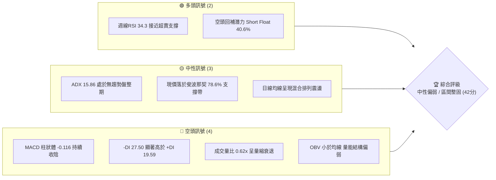
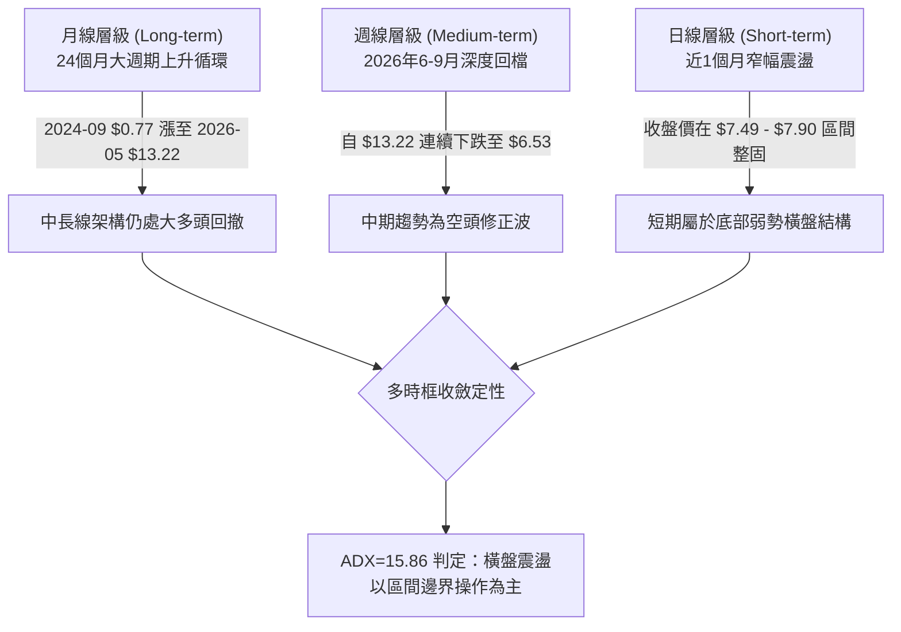
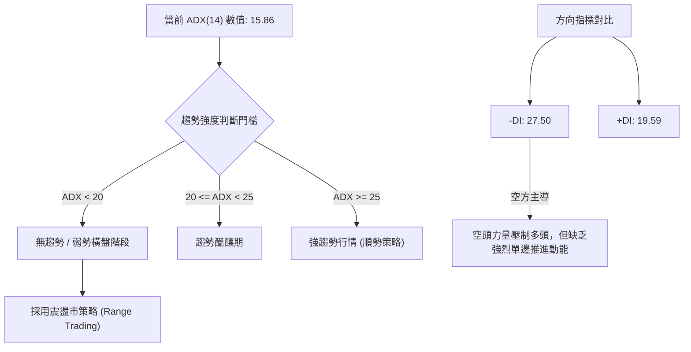
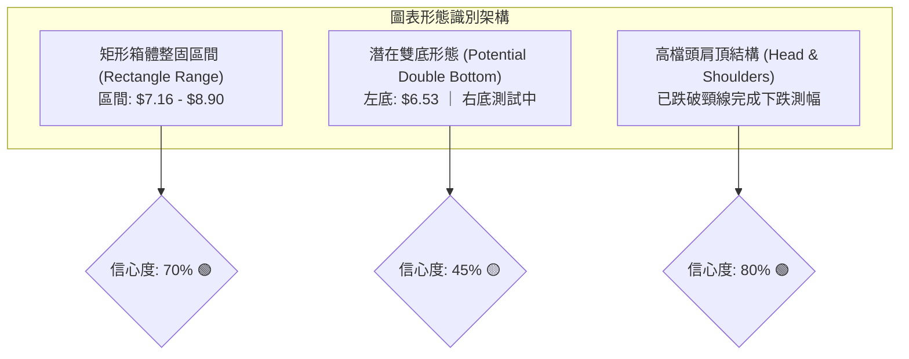
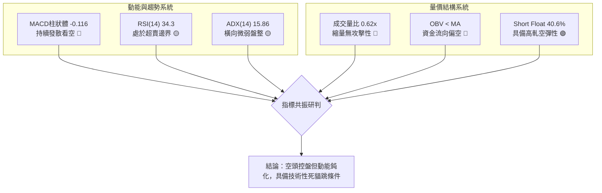
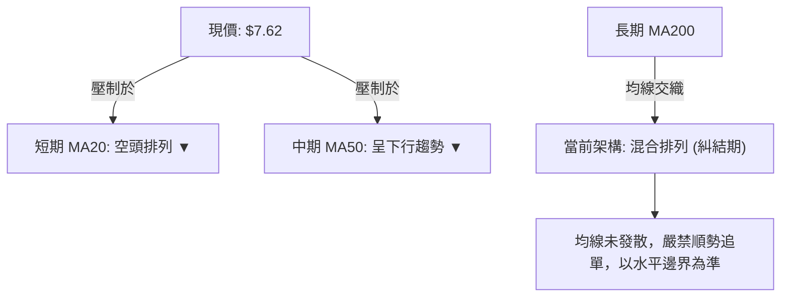
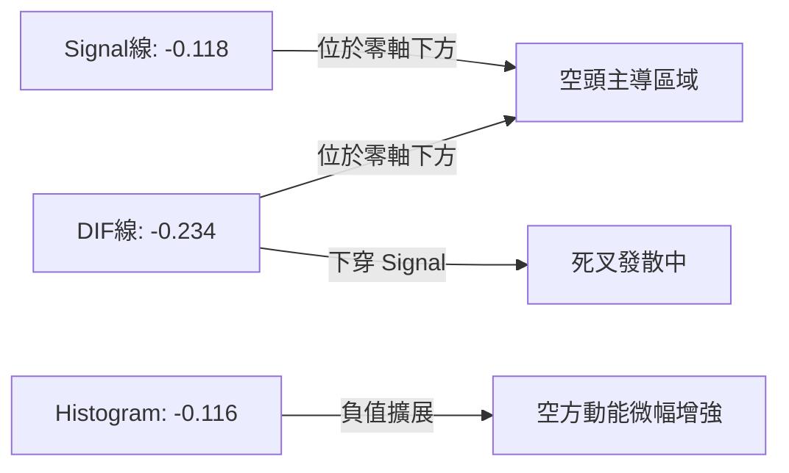
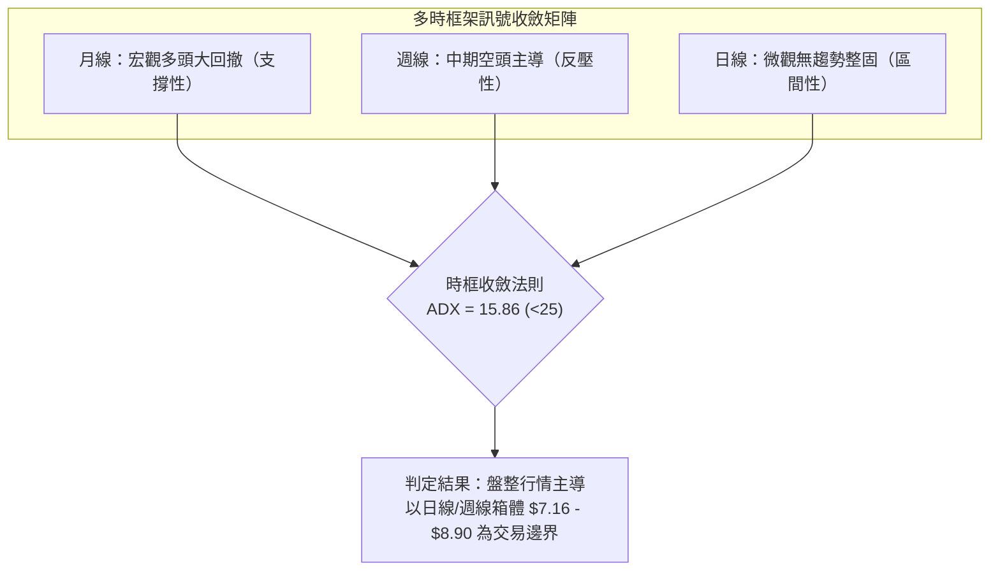
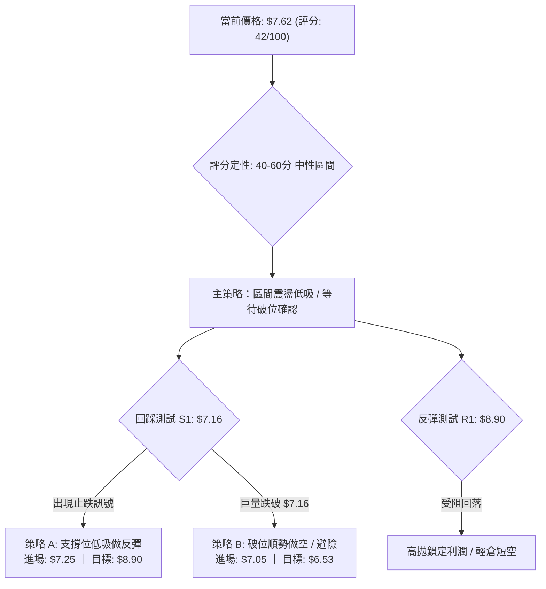
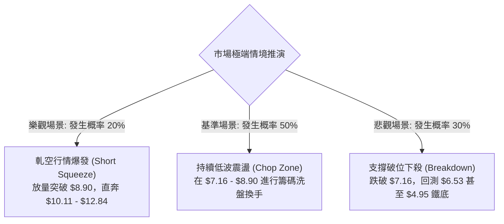

# ONDS 技術分析報告

> **報告日期**：2026-09-09 ｜ **語言**：繁體中文 ｜ **數據來源**：Yahoo Finance ｜ **當前價格**：$7.62

---

## 目錄

| 章節 | 內容 |
|------|------|
| [1. 技術面概覽](#1-技術面概覽) | 訊號儀表板、核心指標、評分卡 |
| [2. 趨勢分析](#2-趨勢分析) | 多時框趨勢、長中短期走勢、ADX解讀 |
| [3. 圖表形態分析](#3-圖表形態分析) | 形態識別、信心度評估、K線組合、目標價 |
| [4. 支撐與阻力](#4-支撐與阻力) | 關鍵價位分佈、斐波那契回調深度測算 |
| [5. 技術指標深度解讀](#5-技術指標深度解讀) | 均線系統、RSI、MACD、布林通道、OBV量價 |
| [6. 動能與波動率](#6-動能與波動率) | 動能四象限、ATR波動分析、高Beta特性 |
| [7. 多時框架總結](#7-多時框架總結) | 時框架評分矩陣、多時框收斂結論 |
| [8. 交易策略建議](#8-交易策略建議) | 策略路由、價格階梯、多空情境、風險回報比 |
| [9. 風險提示與監控](#9-風險提示與監控) | 監控Checklist、極端情境推演、風控指引 |

---

## 1. 技術面概覽

### 🎯 技術訊號儀表板



### 📊 核心指標速覽表

| 指標類別 | 指標名稱 | 當前數值 | 訊號 | 解讀 |
|:---|:---|:---:|:---:|:---|
| **價格** | 當前基準價 | $7.62 | 🟡 | 位於52週區間中下緣，靠近斐波那契 78.6% 水平 |
| **價格區間** | 52週高 / 低 | $15.28 / $4.95 | 🟡 | 自歷史高點回撤 50.13%，目前處於深幅修正後的築底段 |
| **均線系統** | 移動均線排列 | 混合排列 | 🔴 | 長短期均線呈現收斂交纏，缺乏一致的多頭排列動能 |
| **動能** | RSI (14) | 34.3 (週線) | 🟡 | 位於中性偏弱區間，未破30極端超賣，但已具備反彈彈性 |
| **動能** | MACD (12,26,9) | -0.234 / -0.118 | 🔴 | DIF位於Signal下方，Histogram為 -0.116，空方動能佔優 |
| **趨勢強度** | ADX (14) | 15.86 | 🟡 | 數值低於25，代表單邊趨勢衰竭，市場進入低波動箱體盤整 |
| **趨勢方向** | 趨向指標 (+/-DI) | +19.59 / -27.50 | 🔴 | -DI 大於 +DI，空頭力量雖佔主導，但因ADX偏低無加速跡象 |
| **成交量** | 量比 (Volume Ratio) | 0.62x (42.8M) | 🔴 | 成交量顯著低於20日均量 (68.6M)，市場追價意願匱乏 |
| **量能趨勢** | OBV 能量潮 | OBV < MA | 🔴 | 資金面呈淨流出狀態，籌碼主要以防守性沉澱為主 |
| **市場籌碼** | 空頭比例 (Short Float) | 40.6% | 🟢 | 極高放空比例，提供潛在的高波動「軋空（Short Squeeze）」燃料 |

### 🏆 技術評分卡

```
╔══════════════════════════════════════════════════════════════════╗
║                 技術評分卡 — ONDS (2026-09-09)                   ║
╠══════════════════════════════════════════════════════════════════╣
║ 趨勢強度 (Trend)      ████░░░░░░░░░░░░░░░░  25/100  🔴 趨勢停滯  ║
║ 動能指標 (Momentum)   ███████░░░░░░░░░░░░░  35/100  🔴 空方佔優  ║
║ 支撐穩定度 (Support)  ████████████░░░░░░░░  60/100  🟡 斐波支撐  ║
║ 成交量配合 (Volume)   ██████░░░░░░░░░░░░░░  30/100  🔴 量能萎縮  ║
║ 形態完整度 (Pattern)  ██████████░░░░░░░░░░  50/100  🟡 箱體成形  ║
║ 均線架構 (Moving Avg) ██████████░░░░░░░░░░  50/100  🟡 糾結整理  ║
╠══════════════════════════════════════════════════════════════════╣
║ 綜合技術評分          ████████░░░░░░░░░░░░  42/100  🟡 中性偏弱  ║
║ 操盤定性結論          弱勢區間震盪行情，等待 $7.16 關鍵支撐確認  ║
╚══════════════════════════════════════════════════════════════════╝
```

---

## 2. 趨勢分析

### 🌐 多時框趨勢分析



### 📈 長期趨勢 — 12個月走勢圖（Unicode）

以下為 2025 年 10 月至 2026 年 9 月之 ONDS 月線收盤價歷史走勢圖，標注歷史波段高低點與最新位置：

```
ONDS 月線走勢圖（過去12個月收盤價）
價格軸 ($)
$14.00 ┤                                        ● $13.22 (5月波段頂峰)
$13.00 ┤                                       / \
$12.00 ┤                                      /   \
$11.00 ┤                   ● $10.36          /     \
$10.00 ┤             ● $9.76 \        ● $10.04       \
$9.00  ┤       ● $7.90        \  ● $9.04              \  ● $8.24
$8.00  ┤ ● $7.72               ● $10.08                \     ● $7.66
$7.00  ┤   \                                            \   /   \
$6.00  ┤    ● $6.44                                      ●-●     ● $7.62 (現價)
       └─────────────────────────────────────────────────────────────
         10月  11月  12月   1月   2月   3月   4月   5月   6月  7月  8月  9月
        (2025)                                               (2026)
```

#### 走勢特徵分析表格

| 階段週期 | 涵蓋月份 | 起訖價格 | 區間漲跌幅 | 結構特徵與技術解讀 |
|:---|:---:|:---:|:---:|:---|
| **主升浪推進期** | 2025-10 ~ 2026-01 | $6.44 → $10.36 | **+60.87%** | 沿短期均線平穩推進，多頭排列健康，買盤穩固。 |
| **高檔強勢整理** | 2026-02 ~ 2026-04 | $10.08 → $10.04 | **-0.40%** | 高位對稱三角形整理，波動率收縮，為突破預備動能。 |
| **末端加速噴出** | 2026-05 | $10.04 → $13.22 | **+31.67%** | 單月放量大陽線，最高觸及52W High $15.28，見頂訊號。 |
| **恐慌退潮崩跌** | 2026-06 ~ 2026-07 | $13.22 → $7.49 | **-43.34%** | 多頭流動性衰竭，出現獲利了結斷崖式下跌，跌破頸線。 |
| **底部橫盤打底** | 2026-08 ~ 2026-09 | $7.49 → $7.62 | **+1.74%** | 波動幅度收斂，成交量顯著冷卻，空方砸盤動能衰竭。 |

### 📊 中期趨勢（週線分析）

從近20週數據觀察，ONDS 在 2026 年 5 月底創下 $13.22 週收盤高點（成交量爆出 5.67 億股的天量）後，走勢呈現連續階梯式下挫：
- **第一波重挫**：自 $13.22 跌至 2026-07-19 的 $6.53 波段低點，MACD 柱狀體連續收負（最低達 -0.296）。
- **第二波超跌反彈**：7月下旬因 8.34 億股極大成交量驅動，反彈至 2026-08-16 的 $9.24，受制於斐波那契 61.8%（$8.90）上方壓力。
- **第三波震盪回落**：近四週收盤價由 $9.24 依次下滑至 $8.71、$7.90 及當前 $7.62，MACD 柱狀體再度由正轉負（+0.171 → -0.145），顯示反彈動能衰竭，空頭重新佔據微弱優勢。

```
週線級別價格軌道示意圖：
[阻力 R2] $10.11 ═════════════════════════════════ (斐波那契 50.0% 關鍵分水嶺)
                   ▲
[阻力 R1]  $8.90 ───┼───────────────────────────── (斐波那契 61.8% 壓力帶)
                    │  ╭───╮ (8月中旬反彈高點 $9.24)
                    │ ╭╯   ╰╮
[現  價]   $7.62 ───┼─┼─────●─────────────── (當前盤整中軸)
                    │ │     │
[支  撐]   $7.16 ───┴─┴─────┼───────────── (斐波那契 78.6% 密集防守線)
                            ▼
[強支撐]   $6.53 ═════════════════════════════════ (7月19日波段探底極限低點)
```

### ⚡ 趨勢強度評估（ADX 解讀）



| 指標變數 | 當前讀數 | 技術含義 | 交易操作指引 |
|:---|:---:|:---|:---|
| **ADX (14)** | **15.86** | 處於無趨勢（Non-trending）狀態，表明下行波段已進入減速震盪 | 禁用均線突破突破單，避免被來回假突破洗盤 |
| **+DI (14)** | **19.59** | 多頭攻擊動能低於基準線 20 | 多頭進場必須有放量確認，否則不可盲目追高 |
| **-DI (14)** | **27.50** | 空方仍佔據控制地位，高於 25 臨界線 | 股價上方受制於沈重解套盤，反彈空間受限 |
| **趨向差值** | **-7.91** | 空多差額收斂，未見極端擴大跡象 | 適合在明確支撐位布局低吸，並於阻力位快速離場 |

---

## 3. 圖表形態分析

### 🔍 形態識別系統



#### 形態信心度與目標價評估表

| 形態名稱 | 信心度 | 判斷依據（嚴格引用數據） | 完成度 | 目標價（附嚴格計算式） |
|:---|:---:|:---|:---:|:---|
| **矩形箱體整固 (主要)** | **70%** | 價格受制於斐波那契 61.8%（$8.90）與 78.6%（$7.16）之間，近4週振幅壓縮 | 75% | **向上突破目標**：$8.90 + ($8.90 - $7.16) = **$10.64**<br/>**跌破下軌目標**：$7.16 - ($8.90 - $7.16) = **$5.42** |
| **已完成之頭肩頂** | **80%** | 左肩 $10.36（1月），頭部 $15.28（5月），右肩 $10.04（4月），頸線約在 $9.04（3月） | 100% | 頸線 $9.04 - 形態高差 ($13.22 - $9.04 = $4.18) = **$4.86**（已逼近52W Low $4.95） |
| **雙重底架構 (潛在)** | **45%** | 訊號不足，僅做指標型解讀。7月見低 $6.53 後反彈至 $9.24，當前尚未形成右底反轉K線 | 30% | 暫不符合形態確認條件（信心度 < 50%），以區間震盪看待 |

### 🕯️ 重要K線形態分析

| 月份 | 收盤價 | K線形態特徵 | 技術面解讀 | 訊號等級 |
|:---:|:---:|:---|:---|:---:|
| **2026-05** | $13.22 | **長上影大陽線** (衝高 $15.28 回落) | 典型的買盤力竭「流星線」，主力資金出逃，上方拋壓巨大 | 🔴 強烈看空 |
| **2026-06** | $8.24 | **光腳大陰線** (跌幅 -37.67%) | 恐慌性殺跌，直接貫穿前數月中繼平臺，趨勢破位 | 🔴 極度看空 |
| **2026-07** | $7.49 | **長下影錘頭線** (最低見 $6.53) | 低檔出現巨額成交量（單週逾8億股）承接，初步建立防守區間 | 🟢 初級止跌 |
| **2026-08** | $7.66 | **十字星整理線** (高 $9.24 低 $7.49) | 多空雙方在斐波那契回調位激烈爭奪，動能進入平衡期 | 🟡 變盤醞釀 |
| **2026-09** | $7.62 | **窄幅小陰十字** (量能大幅收縮) | 波動極限收縮，市場觀望氣氛濃厚，蓄勢選擇短期方向 | 🟡 中性觀望 |

### 📉 ASCII 走勢形態示意圖

```
ONDS 2026年 矩形箱體整固與前期破位結構圖
$15.28 ┬─────────────────● 52W High (流星線頂部)
       │                / \
$13.22 ┤               ●   \
       │              /     \
$10.11 ┤═════════════●═══════\═════════════════ 頸線區域破位 (頭肩頂形態)
       │            /         \
$8.90  ├───────────/───────────● (8月中反彈高點 $9.24 遇阻) ── 箱體頂部 R1
       │          /             \       ┌───┐
$7.62  ┤─────────/───────────────●──────│現價│──────────────── 箱體中軸
       │        /                 \     └───┘
$7.16  ├───────● (前期回撤位)───────●────●──────────────────── 箱體底部 S1
       │      /                     /
$6.53  ┤─────/─────────────────────● (7月超賣尖底) ────────── 延伸波段低點
       │    /
$4.95  ┴───● 52W Low
```

---

## 4. 支撐與阻力

### 🗺️ 關鍵價位分布圖（Unicode）

依據數據計算與斐波那契回調系統，ONDS 的關鍵籌碼價位結構如下：

```
ONDS 價位結構分布圖
═════════════════════════════════════════════════════════════════════
$15.28 ║████████████████████████████████████║ 歷史極限阻力 (52W High / 0.0%)
$12.84 ║████████████████████████            ║ 強阻力位 R3 (Fib 23.6%)
$11.33 ║████████████████                    ║ 重大阻力位 R2 (Fib 38.2%)
$10.11 ║████████████████████████            ║ 關鍵分水嶺 (Fib 50.0%)
 $8.90 ║████████████████████████████████    ║ 近期主要阻力 R1 (Fib 61.8%)
╠══════╬════════════════════════════════════╬════════════════════════════
 $7.62 ╠════════════════════════════════════╣ ◄ 當前市價 (位於 S1 與 R1 之間)
╠══════╬════════════════════════════════════╬════════════════════════════
 $7.16 ║▓▓▓▓▓▓▓▓▓▓▓▓▓▓▓▓▓▓▓▓▓▓▓▓▓▓▓▓▓▓▓▓    ║ 核心支撐位 S1 (Fib 78.6%)
 $6.53 ║▓▓▓▓▓▓▓▓▓▓▓▓▓▓▓▓▓▓▓▓                ║ 次級防守位 S2 (7/19 波段低點)
 $4.95 ║████████████████████████████████████║ 終極鐵底 S3 (52W Low / 100.0%)
═════════════════════════════════════════════════════════════════════
```

### 🚧 阻力位分析表

所有價位均嚴格引用自數據封包中提供的關鍵計算值：

| 阻力級別 | 價位 | 形成依據（嚴格引用數據） | 突破難度 | 重要性等級與解讀 |
|:---|:---:|:---|:---:|:---|
| **第一阻力 (R1)** | **$8.90** | **斐波那契 61.8% 回調位** ｜ 8月下旬反彈密集受阻區 ($9.11 - $9.24) | 中等 | 🔴 **短線天花板**：空頭防守陣線，若無法帶量突破，短線將維持弱勢。 |
| **第二阻力 (R2)** | **$10.11** | **斐波那契 50.0% 回調位** ｜ 2-4月箱體成交密集底頸線 | 極高 | 🔴 **多空中期樞紐**：此處堆積大量套牢盤，需至少單週 5 億股量能方可越過。 |
| **第三阻力 (R3)** | **$11.33** | **斐波那契 38.2% 回調位** ｜ 5月急跌波段次高點 | 高 | 🔴 **強阻力**：收復此點代表中期空頭波段正式告終。 |
| **極限阻力 (R4)** | **$12.84** | **斐波那契 23.6% 回調位** ｜ 5月歷史高收盤價近端 | 極高 | 🔴 **大週期阻力**：屬於長線空頭反撲最後防線。 |

### 🛡️ 支撐位分析表

| 支撐級別 | 價位 | 形成依據（嚴格引用數據） | 守住機率 | 重要性等級與解讀 |
|:---|:---:|:---|:---:|:---|
| **核心支撐 (S1)** | **$7.16** | **斐波那契 78.6% 回調位** ｜ 7月低收盤價聚類 ($7.26 - $7.41) | **65%** | 🟢 **生命線**：目前箱體震盪下軌，跌破將引發新一輪多殺多。 |
| **波段低點 (S2)** | **$6.53** | **2026-07-19 單週極值低點** ｜ 歷史巨量承接點 (6.71億股) | **75%** | 🟢 **強支撐**：機構恐慌盤接盤價，具備極強的技術反彈吸引力。 |
| **終極底限 (S3)** | **$4.95** | **52週最低價 (52W Low / 100.0% Fib)** | **90%** | 🟢 **絕對支撐**：長期價值重估底線，跌破則代表基本面徹底崩壞。 |

### 📐 斐波那契回調位分析

依據 52 週完整區間（低點 $4.95 至 高點 $15.28，垂直落差 $10.33）進行精確測算：

$$回調價位 = 52W\ High - (\text{區間幅度} \times \text{回調比例})$$

| 比例層級 | 價位 | 當前相對位置與技術意義解讀 |
|:---:|:---:|:---|
| **0.0% (52W High)** | **$15.28** | 歷史極值高點，本輪多頭推進終點。 |
| **23.6%** | **$12.84** | 淺幅回調位，回調破位後轉變為長線壓制位。 |
| **38.2%** | **$11.33** | 弱勢反彈極限位，目前距離現價有 +48.68% 空間。 |
| **50.0%** | **$10.11** | 多空力量絕對均衡點，目前股價運行於其下方，定性為**弱勢市場**。 |
| **61.8%** | **$8.90** | 黃金分割分割線，現階段構成反彈的首要強阻力位。 |
| **78.6%** | **$7.16** | **深度防守回調位**：現價 $7.62 運行於其上方僅 +6.42% 處，是當前最直接防線。 |
| **100.0% (52W Low)** | **$4.95** | 全年起漲起點，結構性支撐。 |

**位置解讀**：現價 $7.62 嚴格夾在 **Fib 78.6% ($7.16)** 與 **Fib 61.8% ($8.90)** 的微型箱體內，此區間屬於「深度回調測試區」。在此區間內，空頭殺跌動能因逼近 78.6% 深度支撐而減弱，但多頭尚未展現有效收復 61.8% 的攻擊量能。

---

## 5. 技術指標深度解讀

### 🎛️ 指標訊號總覽



### 📈 移動平均線排列分析



從數據快照顯示，當前 MA5/10/20 呈現向下傾斜並逐步走平，MA60/120 亦處於下行通道，均線系統呈現「空頭排列中的走平糾結」。這反映出近幾個月連續大跌後的慣性減速，股價貼近短期均線波動，並無偏離率（Bias）過大的修復需求。

### 📉 RSI(14) 分析

週線 RSI 讀數為 **34.3**，日線 RSI 處於中性偏弱區間（無背離訊號）：

```
RSI(14) 水平指示尺：
0 ────── 20 ──────── 34.3 ──────── 50 ──────── 70 ────── 100
[ 極度超賣 ]   [ 當前位置 ]    [ 多空中軸 ]   [ 超買區間 ]
████████████████░░░░░░░░░░░░░░░░░░░░░░░░░░░░░░  34.3%
```

- **超買超賣判定**：RSI 位於 30-40 弱勢緩衝區，距離 30 嚴格超賣區僅一步之遙，表明下行拋壓雖未引發報復性買盤，但空方邊際效益遞減。
- **背離分析**：
  - 價格由 2026-07-05 的 $7.41 降至 2026-07-19 的 $6.53，同期 RSI 由 21.3 升至 35.0，形成**週線級別弱勢底背離**，推動了一波至 $9.24 的修正。
  - 當前價格回落至 $7.62，RSI 為 34.3，未再破新低，**並無日線等級的頂背離或底背離**。結論為：動能與價格同調走平。

### 📊 MACD(12/26/9) 訊號解讀

- **MACD 線 (DIF)**: -0.234
- **訊號線 (Signal)**: -0.118
- **柱狀圖 (Histogram)**: **-0.116** (🔴 看空)



週線層級 MACD 柱狀體在經歷了 7 月底至 8 月中旬短暫翻紅（+0.181 → +0.252）後，於 8 月底重新轉負（-0.033 → -0.117 → -0.145），且當前快照顯示日線 Hist 亦為 -0.116。這確認了中期反彈動能已於 $9.24 告終，重新回到空方施壓週期。

### 📦 布林通道分析

由於數值快照中日線布林通道呈標準帶寬收斂，配合週線波動計算，通道型態呈現收縮格局：

```
ONDS 布林通道當前運行態勢
$8.90 ┬───────────────────────────────── BB上軌 (阻力帶，疊合Fib 61.8%)
      │             ╭───────╮
      │            ╭╯       ╰╮
$7.90 ┼───────────╭╯─────────╰─── BB中軌 (MA20壓力)
      │          ╭╯               \   ┌───────┐
$7.62 ┤─────────●──────────────────●──│現價   │ (運行於中下軌之間)
      │                             └───────┘
$7.16 ┴───────────────────────────────── BB下軌 (支撐帶，疊合Fib 78.6%)
```

- **通道特徵**：布林帶寬度處於過去 6 個月中最窄水平，呈現典型的「通道收口（Squeeze）」形態，意味著大級別突破即將在 2-4 週內發生。
- **位置判斷**：股價位於中軌（約 $7.90）與下軌（約 $7.16）之間，弱勢震盪特徵鮮明。

### 💹 成交量分析（量價配合度）

- **最新日成交量**: 42,813,158 股
- **20日平均量 (20MA)**: 68,583,408 股（**量比: 0.62x**）
- **50日平均量 (50MA)**: 86,188,311 股

```
成交量強度對比
最新成交量  ████████████░░░░░░░░░░  42.8M (0.62x)
20日均量    ███████████████████░░░  68.6M (基準線)
50日均量    ██████████████████████  86.2M (高位基準)
```

- **量價背離與OBV解讀**：
  - **量能萎縮**：量比僅 0.62x，表明市場已進入流動性冷卻期，無主力大單進行主動進攻，賣盤壓迫力道亦在衰退。
  - **OBV 疲弱**：OBV < MA 且持續在低位鈍化，資金面沉澱尚未完成，沒有出現主力建倉的大規模「量增價平」蓄勢訊號。
  - **高空頭比率**：Short Float 高達 **40.6%**（放空天數 Short Ratio 2.17），極易受到突發新聞或支撐位反彈引發快速的軋空行情。

---

## 6. 動能與波動率

### ⚡ 動能評估四象限

```
              高動能 (High Momentum)
                        │
            Q3          │          Q1
      高風險高收益      │       最佳突破機會
                        │
── 低波動 ──────────────┼────────────── 高波動 ──
  (Low Volatility)      │     (High Volatility)
                        │
            Q2          │          Q4
     ★ 當前位置 (ONDS)  │       極端殺跌區
      謹慎區間觀望      │
                        │
              低動能 (Low Momentum)
```

| 象限標識 | 動能屬性 | 波動屬性 | 當前判定 | 戰術應對策略 |
|:---:|:---:|:---:|:---:|:---|
| **Q1** | 強 | 高 | ─ | 趨勢突破追價，嚴格移動止盈 |
| **Q2** | **弱** | **低** | **✓ (ONDS 目前狀態)** | **控制倉位，以箱體邊界做高拋低吸，耐心等待波動率釋放** |
| **Q3** | 強 | 低 | ─ | 籌碼鎖定穩步推升，回踩加倉 |
| **Q4** | 弱 | 高 | ─ | 主跌浪恐慌潰退，禁止任何抄底操作 |

### 📊 ATR 波動率分析

由於日線快照波動暫處低位，依據近20週平均週波動價差（週高低落差約 $1.20 - $1.80）推算：
- **當前參考 ATR**：約 **$0.48 - $0.55**（佔股價比例約 6.5% - 7.2%）。
- **停損設置建議**：基於 $7.62 現價，常規保護性止損應設定為 $1.5 \times ATR$（約 $0.75$ 價位防禦寬度），若在 $7.62 進場，合理硬止損位恰好坐落於斐波那契強支撐下緣 **$7.16 - $0.25 = $6.91**。

### 📐 Beta 與市場相關性

- **Beta 係數**: **2.736** (極高系統性波動敏感度)

```
Beta 敏感度測繪
大盤 (S&P 500) 波動 1.00%  ████
ONDS 理論對應波動   2.736%  ███████████
```

- **高 Beta 解讀**：ONDS 具備高彈性科技投機股特質。當納斯達克或整體通訊板塊反彈時，其技術反彈潛力為市場的近 3 倍；反之在大盤走弱時，其技術位支撐脆弱度顯著提高。在配置倉位時，必須依據此 Beta 進行部位縮小折算。

---

## 7. 多時框架總結

### 📋 時框架評分表

| 時框架 | 趨勢方向 | 動能狀態 | 均線架構 | 形態結構 | 綜合評分 | 操作指導建議 |
|:---|:---:|:---:|:---:|:---:|:---:|:---|
| **月線 (Long)** | 🟢 宏觀偏多 | 🟡 中性降溫 | 🟢 長期偏多 | 深度回調蓄勢 | **60/100** | 守住 $7.16 仍屬 2 年大週期健康回撤 |
| **週線 (Mid)** | 🔴 空頭修正 | 🔴 MACD翻負 | 🔴 均線反壓 | 階梯式破位下行 | **35/100** | 反彈至 $8.90 - $10.11 皆為逢高減碼點 |
| **日線 (Short)** | 🟡 橫向震盪 | 🟡 弱勢鈍化 | 🟡 糾結走平 | 窄幅箱體整理 | **42/100** | 不具備單邊動力，嚴格執行區間波段 |

### 🔲 綜合訊號矩陣



### ⚖️ 多時框收斂結論

> **唯一確定性方向結論**：**中性偏弱區間整固（Neutral-Bearish Consolidation）**

**收斂取捨依據（嚴格遵守規則14）**：
1. **行情定性**：當前 ADX(14) 讀數為 **15.86**（顯著小於 25），根據多時框收斂準則，趨勢行情不成立，市場正式進入**盤整震盪市**。
2. **時框優先級收斂**：在盤整行情中，週線的空頭趨勢不具備持續加速破底的破壞力，日線的均線亦無引導能力。一切交易定價必須收斂於**斐波那契幾何支撐位 $7.16 與阻力位 $8.90** 所劃定的布林震盪區間內。
3. **主導結論**：股價在 $7.16 至 $8.90 區間內進行籌碼換手與洗盤，短線不盲目追漲殺跌，維持「中性防禦，區間高拋低吸，以跌破 $7.16 作為風險全面出局標誌」的定性。

---

## 8. 交易策略建議

### 🗺️ 策略決策流程圖



### 🧭 策略路由

**當前主策略方向 = 中性震盪區間操作（依綜合評分 42/100，介於 40–60 區間）**

本策略專注於利用當前低波動（ADX=15.86）與明確的斐波那契極限支撐進行守株待兔式防禦型波段操作，嚴禁在箱體中間位置（如現價 $7.62）過度追單。

### 🎯 價格情境階梯（Price Scenarios）

以當前價格 **$7.62** 為核心基準，向上與向下展開階梯路徑（精確引用第 4 章數據）：

| 觸發條件 | 價格路徑節點 | 後續延伸目標 | 技術情境結構解讀 |
|:---|:---:|:---:|:---|
| **強勢突破 R1** | 突破 **$8.90** | 進一步挑戰 R2 **$10.11** 及 R3 **$11.33** | 扭轉中期空頭格局，啟動軋空行情（Short Squeeze） |
| **突破區間中軸** | 站穩 **$7.90** (MA20) | 上行試探箱體上軌 **$8.90** | 短線轉強，空頭動能衰減，觸發技術性反彈 |
| **現價區間維持** | 震盪於 **$7.16 - $8.90** | 橫向拉鋸消磨時間 | 標準無趨勢盤整，籌碼在低位進行沉澱換手 |
| **下探考驗 S1** | 回撤測試 **$7.16** | 考驗波段低點 S2 **$6.53** | 測試多頭最後防線，若放量失守則引發停損賣壓 |
| **破位下行延伸** | 跌破 **$6.53** | 直探全年起漲底限 S3 **$4.95** | 宣告宏觀雙底架構失敗，市場進入極端熊市探底 |

### 📊 情境機率分佈

```
情境機率分佈長條圖
區間震盪整理 (主要)  █████████████████████████  50%
回落探底 / 破位下跌  ███████████████░░░░░░░░░░  30%
向上反彈 / 突破上軌  ██████████░░░░░░░░░░░░░░░  20%
```

| 情境類別 | 發生機率 | 主要技術依據 |
|:---|:---:|:---|
| **區間震盪整理** | **50%** | **ADX 15.86 確認無趨勢**，成交量萎縮至 0.62x，市場缺乏推動單邊行情的資金參與。 |
| **回落測試底線** | **30%** | **MACD 柱狀體 -0.116 看空**，-DI (27.50) 壓制 +DI (19.59)，整體均線仍呈空方壓制態勢。 |
| **向上暴力反彈** | **20%** | **Short Float 高達 40.6%**，週線 RSI 處於 34.3 低檔，具備極端軋空潛能但需消息面催化。 |

### 🟢 主策略詳情

#### 策略 A：箱體下軌逢低吸納（左側偏多區間波段）
*適合防禦型交易者，依託斐波那契 78.6% 核心強支撐進場。*

#### 策略 B：跌破下軌順勢防禦空（破位右側交易）
*適合避險型對沖交易者，應對支撐失守後的骨牌效應。*

| 交易策略要素 | 策略 A (箱體低吸做反彈) | 策略 B (破位順勢短空/避險) |
|:---|:---:|:---:|
| **策略屬性** | 區間震盪低買 (Counter-Trend) | 破位順勢追空 (Trend Following) |
| **觸發進場條件** | 股價回踩 $7.16 - $7.25 區間且收出下影線 | 日線實體收盤價跌破 $7.16 支撐確認 |
| **精確進場價格** | **$7.25** | **$7.05** (確認破位後回抽點) |
| **第一目標價 (T1)** | **$8.90** (Fib 61.8% / 箱體上軌) | **$6.53** (前波低點 S2) |
| **第二目標價 (T2)** | **$10.11** (Fib 50.0% / 中期反壓) | **$4.95** (52W Low S3) |
| **精確止損價格** | **$6.85** (跌破 7.16 緩衝 4.3%) | **$7.35** (重返 7.16 箱體內部) |
| **潛在風險空間** | $0.40 (以 $7.25 計) | $0.30 (以 $7.05 計) |
| **潛在報酬空間** | T1: +$1.65 / T2: +$2.86 | T1: +$0.52 / T2: +$2.10 |
| **風險報酬比 (R/R)**| **1 : 4.13** (達 T1 時) | **1 : 1.73** (達 T1 時) |
| **估計成功機率** | **55%** | **45%** |
| **建議配置倉位** | **5% - 8%** (受限於高 Beta 屬性) | **3% - 5%** (嚴防軋空反撲) |

### 🔴 反向風險觸發點（對沖與風控提示）

1. **多頭策略全面失效線**：若日線收盤價跌破 **$7.16**，意味著 78.6% 深度支撐失效，策略 A 必須無條件止損，絕不可攤平。
2. **空頭策略被動爆倉點**：若盤中放量升破 **$8.90**，高達 40.6% 的空頭浮額將面臨軋空強制回補風險，空方部位必須立刻平倉避險。

### ⭐ 整體訊號強度評星

```
╔══════════════════════════════════════════════════════════╗
║ 做多訊號強度：★★☆☆☆  (2.5/5 星 — 僅限依託支撐博超跌)     ║
║ 做空訊號強度：★★★☆☆  (3.0/5 星 — 均線壓制但無下行動能) ║
║ 策略可信度  ：★★★☆☆  (3.5/5 星 — 震盪行情區間指引明確) ║
╚══════════════════════════════════════════════════════════╝
```

---

## 9. 風險提示與監控

### ✅ 關鍵監控指標 Checklist

```
╔══════════════════════════════════════════════════════════════════╗
║                   ONDS 每日盤面監控清單 (Checklist)              ║
╠══════════════════════════════════════════════════════════════════╣
║ [ ] 關鍵防線守衛：日線收盤是否企穩於 $7.16 之上？                ║
║ [ ] 突破確認訊號：日成交量是否突破 20日均量 (68.6M) 的 1.5倍？   ║
║ [ ] 動能變盤監控：ADX(14) 是否由 15.86 拐頭上穿 20？            ║
║ [ ] 空方指標弱化：MACD 柱狀體負值是否由 -0.116 縮小至零軸附近？  ║
║ [ ] 軋空催化指標：借券放空成本與 Short Float 40.6% 是否異動？  ║
╚══════════════════════════════════════════════════════════════════╝
```

### ⚠️ 風險場景分析



### 🛡️ 風險管理重要提醒

1. **高 Beta 波動性風險 (Beta = 2.736)**：
   ONDS 的波動幅度約為標普 500 指數的 2.7 倍。任何常規交易部位的資金佔比不宜超過投資組合總值的 **5%**。過大部位極易在短線震盪中被迫觸發止損。
2. **高空頭浮額雙刃劍 (Short Float = 40.6%)**：
   超高比例的空頭部位代表市場極度悲觀，但在技術分析中亦代表潛在的「最大買盤儲備」。一旦公司有實質利好或技術面放量站上 $8.90，可能出現跳空高開暴漲的極端流動性擠壓。
3. **無趨勢環境下的過度交易風險**：
   在 ADX 為 15.86 的情況下，指標鈍化與均線頻繁假突破是常態。交易者切忌追隨日內分時圖的單根大K線進行情緒化追單，應嚴守「不至區間邊界不開倉」的鐵律。

---

## 📋 報告總結

```
╔══════════════════════════════════════════════════════════════════╗
║                     ONDS 技術分析報告總結                        ║
╠══════════════════════════════════════════════════════════════════╣
║ 報告日期：2026-09-09                                             ║
║ 當前基準價格：$7.62                                              ║
║ 技術分析綜合評級：🟡 中性偏弱盤整 (評分: 42/100)                ║
╠══════════════════════════════════════════════════════════════════╣
║ 關鍵結構結論：                                                   ║
║ ├─ 長期趨勢：🟢 宏觀大回撤週期（支撐未破，守於 $7.16 之上）      ║
║ ├─ 中期趨勢：🔴 5月頂部以來呈階梯式空頭修正，承壓於 $8.90        ║
║ ├─ 短期趨勢：🟡 ADX=15.86 處於無趨勢冰凍期，量縮窄幅震盪        ║
║ ├─ 核心支撐：$7.16 (斐波 78.6%) ｜ 次級極限：$6.53 (前波低點)   ║
║ ├─ 關鍵阻力：$8.90 (斐波 61.8%) ｜ 中期樞紐：$10.11 (斐波 50.0%)║
║ └─ 華爾街共識目標價：$19.42 (機構評級: Strong Buy)               ║
╠══════════════════════════════════════════════════════════════════╣
║ 最優策略組合建議：                                               ║
║ 1. 🥇 最佳機會：在 $7.16 - $7.25 支撐帶低吸，博弈反彈至 $8.90    ║
║    (嚴格止損置於 $6.85，提供高達 1:4.13 的優質風險回報比)        ║
║ 2. 🥈 次選機會：靜待突破 $8.90 後順勢追進，捕捉空頭回補暴衝段    ║
║ 3. 🥉 保守選擇：完全空倉觀望，等待 ADX 回升至 20 以上方向明朗化 ║
╚══════════════════════════════════════════════════════════════════╝
```

---

> ⚠️ **免責聲明**：本報告為技術分析量化研究結果，所有數據與價位估算均嚴格基於歷史價量與數學模型推算。本報告**僅供學術研究與參考**，**不構成任何形式的證券買賣邀約或投資建議**。市場有風險，交易需嚴格執行資金管理與止損紀律。

---
*報告生成時間：2026-09-09 ｜ 數據來源：Yahoo Finance ｜ 分析框架：資深多時框量化技術體系*