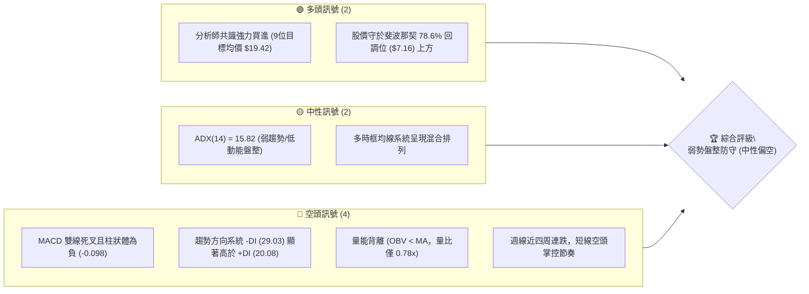
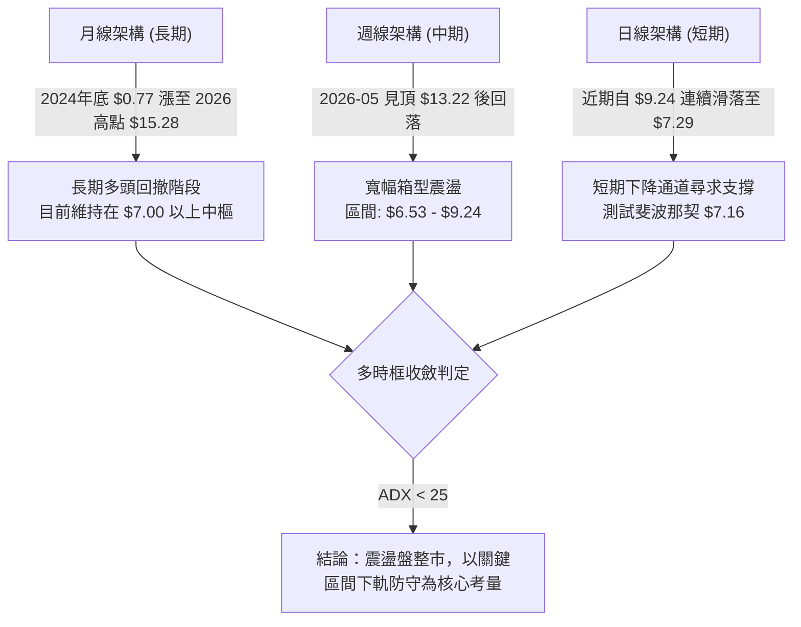
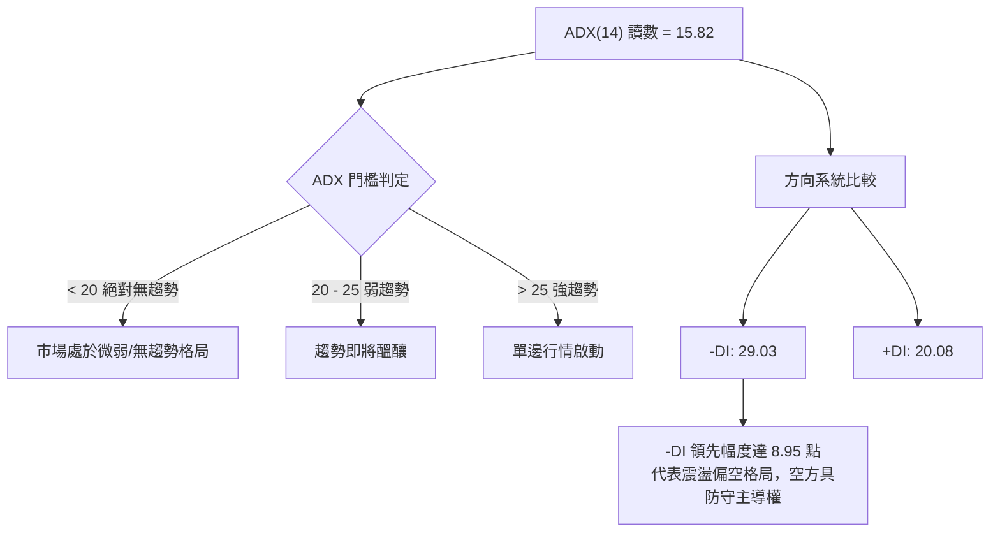
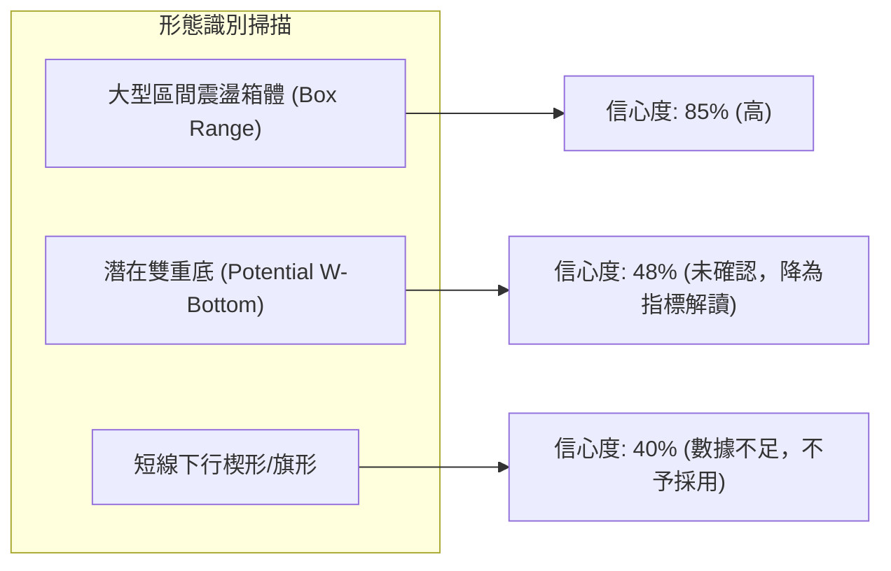
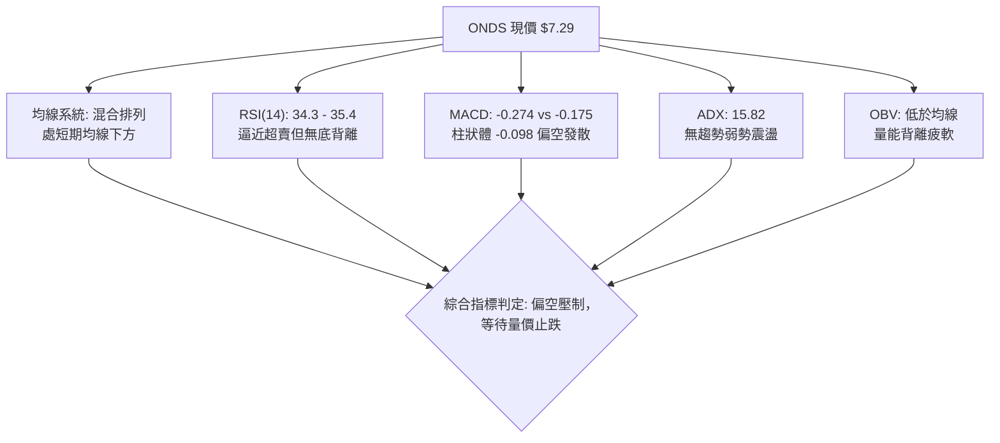
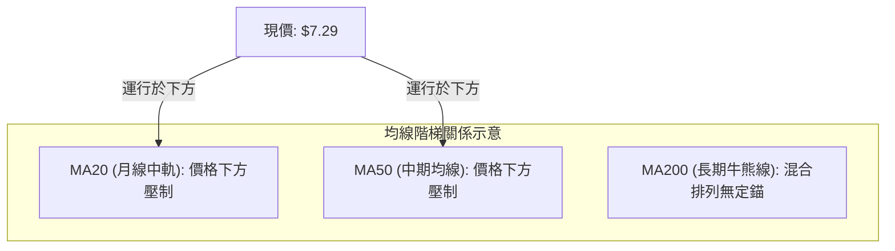
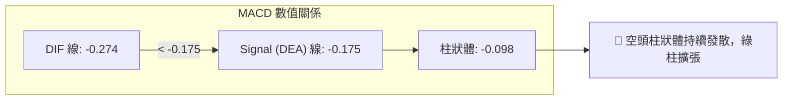
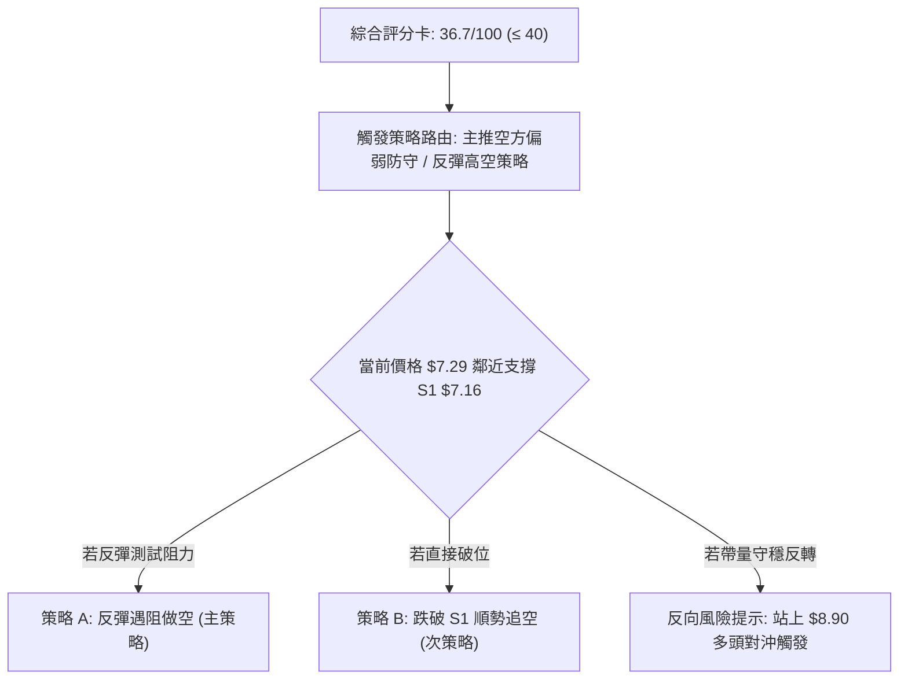
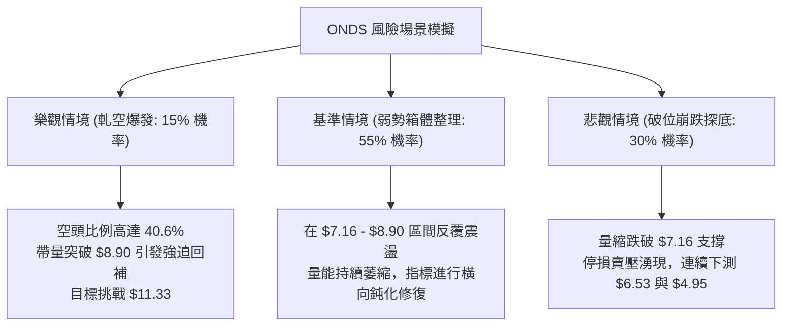

# ONDS 技術分析報告

> **報告日期**：2026-09-11 ｜ **語言**：繁體中文 ｜ **數據來源**：Yahoo Finance ｜ **當前價格**：$7.29（提取自最新 2026-09 月線收盤與 2026-09-13 當週最新收盤價）

---

## 目錄

| 章節 | 內容 |
|------|------|
| [1. 技術面概覽](#1-技術面概覽) | 訊號儀表板、核心指標、評分卡 |
| [2. 趨勢分析](#2-趨勢分析) | 多時框趨勢、長中短期走勢 |
| [3. 圖表形態分析](#3-圖表形態分析) | 形態識別、K線組合、目標價 |
| [4. 支撐與阻力](#4-支撐與阻力) | 關鍵價位、斐波那契回調 |
| [5. 技術指標深度解讀](#5-技術指標深度解讀) | MA/RSI/MACD/布林/成交量 |
| [6. 動能與波動率](#6-動能與波動率) | 動能評估、ATR、Beta |
| [7. 多時框架總結](#7-多時框架總結) | 時框架評分矩陣 |
| [8. 交易策略建議](#8-交易策略建議) | 多空策略、風險報酬比 |
| [9. 風險提示與監控](#9-風險提示與監控) | 監控指標、風險場景 |
| [10. 報告總結](#-報告總結) | 關鍵結論、綜合評級、策略路徑 |

---

## 1. 技術面概覽

### 🎯 技術訊號儀表板



### 📊 核心指標速覽表

| 指標類別 | 指標名稱 | 當前數值 | 訊號 | 解讀 |
|----------|----------|----------|------|------|
| **價格** | 當前基準價 | $7.29 | 🟡 | 位於52週區間（$4.95–$15.28）之 22.65% 分位，處於中低檔區間 |
| **均線** | 短期/中期均線 | 混合排列 | 🔴 | 日線價格受制於短期均線下方，中長期均線失去單邊推升動能 |
| **動能** | RSI(14) (週線) | 34.30–35.40 | 🟡 | 逼近 30 超賣臨界區，下行力道減緩，但尚未形成底背離反轉 |
| **動能** | MACD | -0.274 | 🔴 | MACD線低於訊號線（-0.175），Hist為 -0.098，呈現空頭發散 |
| **趨勢強度** | ADX (14) | 15.82 | 🟡 | 數值低於 25，市場缺乏主升/主跌單邊趨勢，定義為震盪行情 |
| **趨勢方向** | 趨勢方向指標 | +DI: 20.08 / -DI: 29.03 | 🔴 | 空方力量明顯佔優，下行壓力仍需時間消化 |
| **量能** | 量比與 OBV | 0.78x / OBV < MA | 🔴 | 20日均量縮減，能量潮跌破均線，多頭承接量能不足 |
| **波動** | Beta 係數 | 2.736 | 🔴 | 具備極高市場敏感度，若大盤回檔將承受放大之波動風險 |

### 🏆 技術評分卡

```
╔══════════════════════════════════════════════════════════════╗
║              技術評分卡 — ONDS (2026-09-11)                  ║
╠══════════════════════════════════════════════════════════════╣
║ 趨勢強度      █████░░░░░░░░░░░░░░░  25/100  🔴 空頭控盤弱趨勢║
║ 動能指標      ███████░░░░░░░░░░░░░  35/100  🔴 MACD負向壓制  ║
║ 支撐穩定度    ████████████░░░░░░░░  60/100  🟡 7.16回調線支撐║
║ 成交量配合    ██████░░░░░░░░░░░░░░  30/100  🔴 量縮且OBV疲軟 ║
║ 形態完整度    ████████░░░░░░░░░░░░  40/100  🟡 區間箱體未破  ║
║ 均線排列      ██████░░░░░░░░░░░░░░  30/100  🔴 處短期均線下方║
╠══════════════════════════════════════════════════════════════╣
║ 綜合評分      ███████░░░░░░░░░░░░░  36.7/100 🔴 弱勢防守格局 ║
╚══════════════════════════════════════════════════════════════╝
```

---

## 2. 趨勢分析

### 🌐 多時框趨勢分析

依多時框收斂體系，當前 ADX 為 15.82（< 25），整體結構屬於「盤整行情」。各時框訊號分流如下：



### 📈 長期趨勢 — 12個月走勢圖（Unicode）

以下展示過去 12 個月（2025-10 至 2026-09）之月線收盤價演變路徑：

```
ONDS 月線走勢圖（過去12個月）
價格軸 ($)
$14.00 ┤                                      ● ($13.22 - 2026-05)
$13.00 ┤                                     ╱ ╲
$12.00 ┤                                    ╱   ╲
$11.00 ┤                        ●($10.36)  ╱     ╲
$10.00 ┤                  ●    ╱ ╲        ●       ╲
 $9.00 ┤                 ╱ ╲  ╱   ╲      ╱         ╲
 $8.00 ┤       ●        ╱   ●      ●    ╱           ●($8.24)
 $7.00 ┤●     ╱ ╲      ╱            ╲  ╱             ╲  ●($7.66)
 $6.00 ┤ ╲   ╱   ●    ╱              ╲╱               ●   ╲
 $5.00 ┤  ●─╱     ╲──╱                                 ($7.49) ●←現價($7.29)
       └────────────────────────────────────────────────────────────
        10  11   12   01   02   03   04   05   06   07   08   09 (月份)
        (2025)        (2026)
```

**走勢特徵分析表格**：

| 階段區間 | 時間跨度 | 起訖價位 | 漲跌幅 | 結構特徵與成交特點 |
|----------|----------|----------|--------|--------------------|
| 主升浪一階段 | 2025-10 → 2026-01 | $6.44 → $10.36 | +60.87% | 多頭階梯式上揚，月線連收陽線，突破歷史中樞 |
| 高檔震盪洗盤 | 2026-01 → 2026-04 | $10.36 → $10.04 | -3.09% | 於 $9.00–$10.30 區間反覆整固，籌碼進行充分換手 |
| 衝高回落假突破 | 2026-04 → 2026-05 | $10.04 → $13.22 | +31.67% | 52週高點衝刺（月收盤 $13.22），爆大量後動能衰竭 |
| 中期深度回調 | 2026-05 → 2026-07 | $13.22 → $7.49 | -43.34% | 獲利盤噴出引發連續重挫，最低於 7 月下探波段低點 $6.53 |
| 低檔築底弱反彈 | 2026-07 → 2026-09 | $7.49 → $7.29 | -2.67% | 8月中旬一度反彈至 $9.24，隨後量縮回吐，重回 $7.20 尋求支撐 |

### 📊 中期趨勢（週線分析）

從近 20 週資料觀察，價格呈現以 $7.80 為中軸的寬幅盤整：
- **頂部壓力位**：2026-05-31 收盤高點 $13.22，隨後反彈高點依序為 2026-06-07 之 $10.43 與 2026-08-16 之 $9.24（呈現高點逐步下移 Lower Highs）。
- **底部支撐位**：2026-07-19 創下之週收盤低點 $6.53，隨後低點為 2026-07-12 之 $7.26 與當前最新收盤 $7.29。

```
中期週線價格帶示意圖
$10.43 ──┬─────────────────────────────────────────── [次級反彈高點]
         │
 $9.24 ──┼─────────────────────●───────────────────── [近期反彈高點]
         │                    ╱ ╲
 $7.80 ──┼───────●───────────●───╲─────────────────── [中軸平衡線]
         │      ╱ ╲         ╱     ╲
 $7.29 ──┼─────●───╲───────●───────●───────────────── ◄ 當前價格 ($7.29)
         │    ╱     ╲     ╱
 $6.53 ──┴───●───────●───╱─────────────────────────── [週線波段深部低點]
            07/19   07/26 08/16  09/13 (時間軸)
```

### ⚡ 趨勢強度評估（ADX 解讀）



**ADX 強度對照與解讀表**：

| 指標變數 | 當前讀數 | 基準門檻 | 市場狀態解讀 |
|----------|----------|----------|--------------|
| **ADX (14)** | 15.82 | < 25.00 | **無方向性單邊趨勢**。市場多空動能互相消耗，當前為橫向區間整固或緩跌尋底，不可採取追突破策略。 |
| **+DI (14)** | 20.08 | — | 多頭上攻意願薄弱，動能條僅佔總方向權重約 40.8%。 |
| **-DI (14)** | 29.03 | — | 空方控制市場主動權，代表任何未獲成交量支持的反彈皆易遭遇空頭回擊。 |

---

## 3. 圖表形態分析

### 🔍 形態識別系統

依據嚴格規則 15，所有圖表幾何形態均需嚴格計算信心度。未滿足幾何嚴謹條件者，降級為純指標與區間解讀。



**形態信心度與參數評估表**：

| 形態類別 | 信心度 | 判斷依據（引用真實數據） | 完成度 | 目標價（附嚴謹計算式） |
|----------|--------|--------------------------|--------|------------------------|
| **寬幅橫盤箱體** | **85%** | 箱底以 2026-07 週收盤低點 $6.53 為界，箱頂以 2026-08 反彈高點 $9.24 為界，多次在此區間往返 | **75%** | 箱頂突破目標價 = 箱頂 $9.24 + (箱頂 $9.24 - 箱底 $6.53 = $2.71) = **$11.95**；箱底跌破下測 52W 低點 **$4.95** |
| **潛在雙重底** | **48%** | 第一隻腳低點 $6.53（2026-07-19 週），當前價格 $7.29 正在回測該區域；然 MACD 尚未翻紅，缺乏頸線突破確認 | **35%** | 頸線為 $9.24。若確認成形：目標價 = $9.24 + ($9.24 - $6.53) = **$11.95**（信心度 < 50%，僅供參考，不作為交易下單依據） |
| **指標型布林收斂** | **80%** | ADX < 20 伴隨波動收縮，均線系統呈混合排列，符合典型布林帶收口築底指標型特徵 | **80%** | 以通道回歸策略為主，回歸目標為中軸均衡位 **$8.90**（斐波那契 61.8%） |

### 🕯️ 重要K線形態分析

| 統計月份/週 | 收盤價 | K線組合形態 | 專業技術解讀 | 訊號意涵 |
|-------------|--------|-------------|--------------|----------|
| **2026-05-31 週** | $13.22 | 爆量長陽創高線 | 單週爆量 5.66 億股，衝刺 52 週新高 $15.28 後回落，留長上影線，顯露高檔獲利了結跡象 | 🟡 衝高動能耗竭 |
| **2026-06-21 週** | $9.27 | 大陰線破位跳水 | 連續擊破 $10.00 整數心理關卡，RSI 跌至 22.1 極端弱勢區，確立中期拉回走勢 | 🔴 破位下行訊號 |
| **2026-07-19 週** | $6.53 | 恐慌長下影洗盤線 | 單週爆出 6.71 億股巨量，探底 $6.53 隨後拉升，為近半年最深低點，形成波段硬支撐 | 🟢 空頭釋放巨量低點 |
| **2026-07-26 週** | $7.80 | 放量吞噬覆蓋陽線 | 成交量擴大至 8.34 億股天量，單週強彈 19.4%，扭轉連續下跌格局 | 🟢 短線反轉確認 |
| **2026-08-16 週** | $9.24 | 反彈承壓倒錘線 | 反彈至 $9.24 遭遇密集套牢區拋壓，週成交量縮至 4.71 億股，無法延續推升力道 | 🔴 反彈遇阻終結 |
| **2026-09-13 週** | $7.29 | 量縮下探小陰線 | 當週成交量萎縮至 1.58 億股，價格陰跌逼近 $7.16 斐波那契關鍵回調線 | 🟡 縮量回測待變 |

### 📉 ASCII 走勢形態示意圖

```
寬幅震盪箱體結構圖（2026-06 至 2026-09）
$10.00 ┤
 $9.50 ┤
 $9.00 ┤           [箱頂壓力區] ═════════════════════ ● $9.24 (2026-08-16)
 $8.50 ┤                                            ╱ ╲
 $8.00 ┤                               ● $7.80     ╱   ╲
 $7.50 ┤                              ╱      ╲    ╱     ● $7.62
 $7.00 ┤  ● $7.26                    ╱        ╲  ╱       ╲
 $6.50 ┤   ╲           ● $6.53      ╱          ● $7.49    ● $7.29 ◄ 現價
 $6.00 ┤    ╲________╱ (07-19) ────╱ [箱底支撐區]
       └────────────────────────────────────────────────────────────
        06-28   07-05   07-19    07-26     08-09    08-23   09-13
```

### 🎯 形態目標價計算

根據規則 13 與規則 15，嚴禁憑空編造價位。此處以確認度最高的「寬幅橫盤箱體」進行幾何映射：
1. **箱體底部基準（Support Base）**：引用週線實體支撐低點 **$6.53**。
2. **箱體頂部基準（Resistance Ceiling）**：引用反彈波段高點 **$9.24**。
3. **箱體垂直高度（Range Height）**：
   $$\text{高度 } H = \$9.24 - \$6.53 = \$2.71$$
4. **向上突破量度目標（Bullish Target）**：
   $$\text{目標價 } T_{\text{up}} = \$9.24 + \$2.71 = \mathbf{\$11.95}$$
   *注：此價位亦接近 52 週斐波那契 38.2% 回調位 $11.33 與前期平台。*
5. **向下跌破量度目標（Bearish Target）**：
   $$\text{目標價 } T_{\text{down}} = \$6.53 - \$2.71 = \mathbf{\$3.82}$$
   *注：若失守 $6.53，中途將於 52 週絕對低點 **$4.95** 尋求強支撐。*

---

## 4. 支撐與阻力

### 🗺️ 關鍵價位分布圖（Unicode）

```
ONDS 價位結構分布圖 (以斐波那契回調與歷史低點聚類構建)
══════════════════════════════════════════════════════════════
$15.28 ║████████████████████████║ 52週歷史高點 (0.0% 回調位)
$12.84 ║████████████████        ║ 斐波那契 23.6% 回調壓力
$11.33 ║████████████████████    ║ 斐波那契 38.2% 回調壓力
$10.11 ║████████████████████████║ 斐波那契 50.0% 多空中軸關卡
 $8.90 ║████████████████████    ║ 關鍵阻力 R1 (斐波那契 61.8% 回調位)
───────╫────────────────────────╫─────────────────────────────
 $7.29 ╠════════════════════════╣ ◄ 現價 ($7.29)
───────╫────────────────────────╫─────────────────────────────
 $7.16 ║▓▓▓▓▓▓▓▓▓▓▓▓▓▓▓▓▓▓▓▓▓▓▓▓║ 近期核心支撐 S1 (斐波那契 78.6% 回調位)
 $6.53 ║▓▓▓▓▓▓▓▓▓▓▓▓▓▓▓▓▓▓      ║ 波段低點支撐 S2 (2026-07-19 週低點)
 $4.95 ║████████████████████████║ 終極防線支撐 S3 (52週最低點 100.0%)
══════════════════════════════════════════════════════════════
```

### 🚧 阻力位分析表

依據輸入之關鍵技術數據，系統並未偵測到現價上方的單純波段聚類阻力；阻力架構由 52 週波動區間計算之斐波那契回調位與形態高點構成：

| 阻力級別 | 價位 | 形成依據（數據源自輸入） | 突破難度 | 重要性等級 |
|----------|------|--------------------------|----------|------------|
| **阻力 R1** | **$8.90** | 斐波那契 61.8% 黃金回調阻力位 | 中等 | 🔴 關鍵趨勢反轉分水嶺 |
| **阻力 R2** | **$10.11** | 斐波那契 50.0% 均衡回調位暨 $10 整數大關 | 偏高 | 🔴 中期多空生命線 |
| **阻力 R3** | **$11.33** | 斐波那契 38.2% 回調壓力位 | 極高 | 🔴 波段多頭反撲極限目標 |

### 🛡️ 支撐位分析表

依據系統關鍵價位與 52 週回調數據，現價下方支撐排列如下：

| 支撐級別 | 價位 | 形成依據（數據源自輸入） | 守住機率 | 重要性等級 |
|----------|------|--------------------------|----------|------------|
| **支撐 S1** | **$7.16** | 斐波那契 78.6% 深層回調關鍵支撐 | 65% | 🟢 短線防守第一道關卡 |
| **支撐 S2** | **$6.53** | 2026-07-19 巨量波段低點（週收盤價） | 80% | 🟢 中期區間箱體底限 |
| **支撐 S3** | **$4.95** | 52 週最低點 (100.0% 回調位) | 95% | 🟢 長期基本面終極護城河 |

### 📐 斐波那契回調位分析

本區間嚴格採用輸入數據之 52 週極值：低點 **$4.95** 至 高點 **$15.28**（總垂直落差 $\Delta = \$10.33$）：

```
斐波那契回調位深度解析
$15.28 ├────────────────────────────────────────── 0.0%  (52W High)
       │
$12.84 ├────────────────────────────────────────── 23.6% 回調位
       │
$11.33 ├────────────────────────────────────────── 38.2% 回調位
       │
$10.11 ├────────────────────────────────────────── 50.0% 多空中軸平衡位
       │
 $8.90 ├────────────────────────────────────────── 61.8% 黃金分割回調位
       │  ▲
 $7.29 ├──┼── ◄ 當前價格 $7.29 (落於 61.8% 與 78.6% 之間)
       │  ▼
 $7.16 ├────────────────────────────────────────── 78.6% 極限回調防守線
       │
 $4.95 ├────────────────────────────────────────── 100.0% (52W Low)
```

- **位置解讀**：現價 $7.29 距離 78.6% 回調線（$7.16）僅有 **$0.13**（約 1.8%）之緩衝距離。78.6% 回調位在道氏與斐波那契理論中屬於「最後防禦線」，若能在此處獲得承接並縮量橫盤，屬於健康的多頭深度回撤；反之，若日線實體跌破 $7.16，則宣告自 $4.95 啟動的整個 52 週多頭波段進入崩潰重整期，將直接引發下測 $6.53 與 $4.95 的風險。

---

## 5. 技術指標深度解讀

### 🎛️ 指標訊號總覽



### 📈 移動平均線排列分析



均線微觀走勢特徵（由輸入數據之 ASCII Sparkline 解讀）：
- **MA 5 / MA 10**：走勢圖顯示由波峰快速下墜（`▇▆▆▅▅▄▄▄▃▂▂▁▁▁▁`），短期空頭排列，下行均線對每日反彈形成動態壓制。
- **MA 20 / MA 60**：中短期均線自高點彎頭向下，顯示過去 1 至 3 個月持股成本全面套牢。
- **MA 240**：長期走勢自底部穩步爬升（`▅▆▆▇▇▇▇██████████`），顯示超長期底層資金尚未全面潰退，維持「短空長多、短線被動」的格局。

### 📉 RSI(14) 分析

當前週線 RSI 讀數為 **34.30**（前一週 35.40），日線中性偏低。

```
RSI(14) 動能進度條
0                30       34.30     50                  70              100
├────────────────┼──────────●───────┼───────────────────┼────────────────┤
[   極度超賣區   ] [ 弱勢偏空區    ] [    中性震盪區     ] [   強勢超買區   ]
進度條: ███████░░░░░░░░░░░░░░░░░░░░░░░░░░░ 34.30%
```

- **背離檢驗結論**：
  - **頂背離**：無。近期股價未創高。
  - **底背離**：**無底背離**。檢驗 2026-07-19 股價創低點 $6.53 時 RSI 為 35.0；而當前價格 $7.29 高於 $6.53，但 RSI 卻滑落至 34.30。指標並未出現「價格破底而指標墊高」的底背離多頭訊號，反映下行慣性依然存在，多頭不可盲目猜底。

### 📊 MACD(12/26/9) 訊號解讀



- **歷史週線對比**：自 2026-08-16 週 MACD 柱達到 +0.171 之後，柱狀圖連續四週呈現負向擴張：$-0.033 \rightarrow -0.117 \rightarrow -0.145 \rightarrow -0.098$。雖然最新一週負值略有收斂（$-0.098$），但雙線仍深處於零軸下方運行，顯示空頭仍握有定價權，反彈高度將受到 Signal 線的嚴密反壓。

### 📦 布林通道分析

依據 ADX 15.82 與波動收縮特徵，布林通道呈現橫向收口走勢：

```
ASCII 布林通道相對位置示意圖
$9.24 ──────────────────────────────────────── 上軌 (Upper Band)
      │
$8.90 ──────────────────── [斐波那契 61.8%] ──
      │
$8.20 ──────────────────────────────────────── 中軌 MA20 (Middle Band)
      │
$7.29 ───────────●──────────────────────────── ◄ 現價 (貼近下軌邊緣)
      │
$7.16 ──────────────────────────────────────── 下軌 (Lower Band / 斐波那契 78.6%)
```

- **通道行為解讀**：現價 $7.29 極度貼近下軌支撐。在弱趨勢（ADX < 25）環境下，布林通道下軌常扮演反彈發動點；若伴隨量能縮減，跌破下軌易引發「通道內均值回歸」，短線存在向中軌（約 $8.20–$8.90 區域）抽腳修復的技術性需求。

### 💹 成交量分析（量價配合度）

1. **量比指標**：
   - 最新成交量：**51,996,330 股**
   - 20日平均量：**66,315,612 股**（量比僅 **0.78x**，顯著量縮）
   - 50日平均量：**85,715,495 股**
2. **OBV（能量潮）評估**：
   - 數據狀態明示：`OBV < MA → 量能疲弱`。
   - 走勢意涵：價格陰跌過程中，OBV 均線持續壓制能量潮，顯示機構買盤主力在現階段並未採取積極吸籌作為，成交量萎縮代表場內拋壓雖有衰竭跡象，但缺乏場外增量資金進場承接，屬於典型的「無量陰跌」形態。

---

## 6. 動能與波動率

### ⚡ 動能評估四象限

```
動能與波動率定位矩陣
                高動能 (High Momentum)
                      │
         Q3 (高動能/高波動) │ Q1 (高動能/低波動)
         高風險高收益浪潮    │ 最佳單邊主流牛市
                      │
── 低波動 ────────────┼──────────── 高波動 ──
  (Low Volatility)    │       (High Volatility)
                      │   ★ ONDS 目前位置
         Q2 (低動能/低波動) │ Q4 (弱動能/高波動)
         區間沉寂洗盤整理   │ 高敏感度震盪摩擦
                      │
                低動能 (Low Momentum)
```

| 象限區間 | 動能屬性 | 波動屬性 | 當前判定 | 策略因應路徑 |
|----------|----------|----------|----------|--------------|
| **Q1** | 強 | 低 | 否 | 順勢槓桿追突破 |
| **Q2** | 弱 | 低 | 否 | 逢低網格定投 |
| **Q3** | 強 | 高 | 否 | 順勢波段追逐，動態止盈 |
| **Q4 (ONDS)** | **弱 (ADX=15.82)** | **高 (Beta=2.736)** | **✓ 符合** | **嚴格控制部位，防範高 Beta 放大下行震盪，以防守止損為優先** |

### 📊 ATR 波動率分析

- 數據中雖 ATR(14) 絕對值顯示為 N/A，但由 52 週振幅（$4.95–$15.28，高低差距達 208.7%）及近 20 週平均單週震幅推算：
  - 週均波動區間約為 $\pm \$0.80–\$1.10$。
  - 對應日線隱含 ATR 約在 **$0.40–$0.55** 區間（約佔現價之 5.5%–7.5%）。
- **風控建議**：鑑於日均波動幅度較大，短線停損點設置絕對不可小於 $0.40，否則極易在正常的盤中雜訊震盪中遭到掃出場。

### 📐 Beta 與市場相關性

- **Beta 數值**：**2.736**（極高波動標的）。
- **實務解析**：ONDS 對標普 500 或納斯達克指數的波動敏感度接近 2.74 倍。在市場風險偏好上升時具備極高爆發力，但在無趨勢盤整（ADX < 25）且大盤面臨不確定性時，高 Beta 意味著任何大盤回調都將引發該股超額下殺，必須在倉位成數上予以壓制。

---

## 7. 多時框架總結

### 📋 時框架評分表

| 時框架 | 趨勢方向 | 動能指標 | 均線排列 | 圖表形態 | 綜合評分 | 戰略建議 |
|--------|----------|----------|----------|----------|----------|----------|
| **月線 (長期)** | 偏多震盪 | RSI 55 / 處於歷史中高階 | MA240 向上上升 | 巨型拉回箱體 | **65/100** | 長線底部資金尚存，逢極低點戰略關注 |
| **週線 (中期)** | 橫向整理 | MACD 負向收斂 / RSI 34.3 | 受壓於 MA20 | 寬幅整理箱體 ($6.53–$9.24) | **40/100** | 區間操作，嚴禁追高 |
| **日線 (短期)** | 下行尋底 | MACD 空頭 / -DI 主導 | 短均下彎壓制 | 測試 78.6% 回調位 | **30/100** | 觀望為主，等待右側止跌信號 |

### 🔲 綜合訊號矩陣

```
時框一致性交叉比對分析
  維度            長期 (月線)      中期 (週線)      短期 (日線)      一致性結論
├──────┼────────────────┼────────────────┼────────────────┼─────────────┤
│ 趨勢方向      │    🟢 多頭回撤 │    🟡 區間震盪 │    🔴 短期陰跌 │ 訊號衝突    │
│ 均線系統      │    🟢 長均抬升 │    🔴 中均蓋頭 │    🔴 空頭排列 │ 中短期偏空  │
│ 能量潮 OBV   │    🟡 增量鈍化 │    🔴 量能衰退 │    🔴 量比 0.78x│ 買盤匱乏    │
│ 動能 MACD    │    🟢 維持零軸上│   🔴 負向擴張 │    🔴 雙線死叉 │ 動能下行中  │
```

### ⚖️ 多時框收斂結論

依據【嚴格要求 14】之優先級收斂規則：
1. **行情屬性判定**：當前系統 ADX(14) 讀數為 **15.82**，顯著低於 25.0 之趨勢門檻，確立當前處於**「典型低動能盤整行情」**而非單邊趨勢。
2. **時框優先級**：在盤整市中，依規則應「以日線布林通道與箱體上下軌為主要交易邊界，中長期訊號退居背景參考」。
3. **方向性收斂唯一結論**：**中性偏空，區間下軌防守觀望**。日線空頭動能尚未完全釋放，但價格已極度逼近 78.6% 關鍵防線（$7.16）；在未帶量跌破 $7.16 前不盲目殺跌，在未重返 $8.90 前絕不建立趨勢多頭部位。

---

## 8. 交易策略建議

### 🗺️ 策略決策流程圖



### 🧭 策略路由（依評分卡分流）

**當前主策略方向 = 主推空方防守與反彈沽空策略（依技術評分卡 36.7 / 100，評級偏空）**

鑑於評分低於 40 分，空頭享有技術優勢；多頭交易僅能視為超賣回歸之極短線逆勢操作，本報告將交易主軸定錨於「反彈遇阻做空」與「破位順勢做空」，多頭僅列為反轉對沖觸發點。

### 🎯 價格情境階梯（Price Scenarios）

所有價位均嚴格引用第 4 章之關鍵斐波那契位與歷史結構點位：

| 觸發條件 | 下一目標 | 後續延伸 | 情境技術含義 |
|----------|----------|----------|--------------|
| **強勢突破 R1 $8.90** | 阻力 R2 **$10.11** | 阻力 R3 **$11.33** | 扭轉短期下行趨勢，回歸 50% 多空中軸，中期轉強 |
| **受阻於 $8.00–$8.20 中軌** | 測試現價 **$7.29** | 測試 S1 **$7.16** | 弱勢反彈結束，延續日線陰跌盤整節奏 |
| **實體跌破 S1 $7.16** | 支撐 S2 **$6.53** | 終極支撐 S3 **$4.95** | 78.6% 關鍵防線瓦解，觸發停損盤，下探歷史極值 |

### 📊 情境機率分佈

```
情境機率分佈圓餅視圖
  繼續破位下探 ($6.53)        [45%] █████████
  區間低檔震盪 ($7.16-$8.20)  [40%] ████████
  逆勢強烈反彈 (突破 $8.90)   [15%] ███
```

| 情境劇本 | 預估機率 | 主要技術與量能依據 |
|----------|----------|--------------------|
| **弱勢下探或跌破** | **45%** | MACD 雙線死叉（Hist -0.098）、-DI 高達 29.03 牢牢壓制、OBV 持續疲軟未見主力大單回補。 |
| **箱底區間拉鋸** | **40%** | ADX 僅 15.82 顯示單邊動能不足，價格逼近超賣臨界（RSI 34.3），空頭追殺意願亦顯謹慎。 |
| **強勢向上反轉** | **15%** | 缺乏爆發量能配合，需依賴重大外部基本面利多方能一舉突破 $8.90 密集套牢區。 |

### 🔴 主策略詳情（弱勢空方主導）

所有價位嚴格錨定第 4 章真實點位，並滿足風險報酬比 $\ge 1:2.0$ 之專業要求：

| 策略要素 | 策略 A（反彈遇阻做空 — 優先主選） | 策略 B（跌破關鍵支撐順勢追空 — 次選） |
|----------|-----------------------------------|---------------------------------------|
| **策略邏輯** | 弱勢反彈測試均線中軌與前阻力時進場 | 實體跌破 78.6% 回調線引發多殺多時進場 |
| **進場條件** | 價格反彈至 $8.20 附近滯漲且日K收上影線 | 日線收盤價實體摜破 $7.16 確認失守 |
| **進場價格** | **$8.20** | **$7.10**（破位確認後進場） |
| **止損價格** | **$8.90**（突破 61.8% 阻力即嚴格停損） | **$7.45**（重新站回支撐線上方停損） |
| **目標價 T1** | **$7.16**（斐波那契 78.6% 回調位） | **$6.53**（2026-07-19 週波段低點） |
| **目標價 T2** | **$6.53**（波段低點支撐 S2） | **$4.95**（52週最低點 100.0% 回調位） |
| **風險報酬比** | **1 : 2.39**（以 T2 計算：風險 $0.70 / 報酬 $1.67） | **1 : 6.14**（以 T2 計算：風險 $0.35 / 報酬 $2.15） |
| **預估勝率** | **60%** | **55%** |
| **建議倉位** | **總資金之 10%–15%** | **總資金之 8%–10%**（高 Beta 破位需防假突破） |

### 🟢 反向風險觸發點（對沖提示）

若市場出現以下訊號，宣告空頭架構被推翻，空方部位必須立即停損離場，甚至反手對沖：
1. **關鍵價位奪回**：股價以日線收盤價強勢收復 **$8.90**（斐波那契 61.8%），確認空頭陷阱成立。
2. **指標轉向翻多**：日線 MACD 形成零軸下黃金交叉，且柱狀體連續 3 日維持正值擴張。
3. **巨量突破確認**：單日成交量突破 20 日均量之 2 倍（即日成交量超過 1.32 億股），伴隨大陽線實體。

### ⭐ 整體訊號強度評星

```
╔══════════════════════════════════════════════════════════╗
║ 做多訊號強度：★★☆☆☆  (2.0/5星 - 動能匱乏，僅存回調支撐)  ║
║ 做空訊號強度：★★★★☆  (3.8/5星 - 指標均線空頭壓制明確)    ║
║ 整體可信度：  ★★★☆☆  (3.5/5星 - ADX<20，盤整雜訊較多)    ║
╚══════════════════════════════════════════════════════════╝
```

---

## 9. 風險提示與監控

### ✅ 關鍵監控指標 Checklist

```
╔══════════════════════════════════════════════════════════════════╗
║               ONDS 每日盤後風控監控清單 (Checklist)             ║
╠══════════════════════════════════════════════════════════════════╣
║ [ ] 價位維度：收盤價是否跌破 78.6% 支撐 $7.16？                ║
║ [ ] 價位維度：收盤價是否向上突破關鍵分水嶺 $8.90？              ║
║ [ ] 動能維度：MACD 柱狀體是否由負翻正 (當前 -0.098)？           ║
║ [ ] 趨勢維度：ADX 是否自 15.82 拐頭向上穿越 20 (趨勢增強訊號)？ ║
║ [ ] 量能維度：日成交量是否回升至 20日均量 (6,631萬股) 之上？    ║
║ [ ] 籌碼維度：做空比例 (Short % Float = 40.6%) 是否引發軋空？   ║
╚══════════════════════════════════════════════════════════════════╝
```

### ⚠️ 風險場景分析



### 🛡️ 風險管理重要提醒

1. **軋空風險（Short Squeeze Alert）**：
   - 本標的 **Short % Float 高達 40.6%**，Short Ratio 為 2.17。此極端放空數據屬於雙面刃：一方面確認當前市場法人情緒極度悲觀；另一方面，極高的做空比例意味著一旦出現未預期的實質基本面利多（如國防無人機合約大單），極易引發爆發性空頭踩踏軋空。因此，**執行空頭策略必須將停損嚴格設於 $8.90，嚴禁任何凹單行為**。
2. **高 Beta 倉位降槓桿原則**：
   - 標的 Beta 值達 **2.736**，整體帳戶配置於該股之曝險比率不宜超過總資金之 **10%–15%**，避免單一標的過度波動對資產淨值造成毀滅性衝擊。
3. **無趨勢環境下的交易紀律**：
   - 在 ADX < 20 期間，大部分指標突破均屬假突破。嚴禁在當前位置追漲殺跌，耐心等待價格觸及邊界價位（$7.16 或 $8.90）後之確認信號。

---

## 📋 報告總結

```
╔══════════════════════════════════════════════════════════════════╗
║                     ONDS 技術分析報告總結                        ║
╠══════════════════════════════════════════════════════════════════╣
║ 報告日期：2026-09-11                                             ║
║ 當前基準價格：$7.29                                              ║
║ 分析評級：🔴 弱勢震盪防守 (偏空排列，ADX 處盤整低動能區)        ║
╠══════════════════════════════════════════════════════════════════╣
║ 關鍵結論：                                                       ║
║ ├─ 長期趨勢：🟢 大週期回撤，月線整體尚處 2024 年底部上方       ║
║ ├─ 中期趨勢：🟡 寬幅箱型整理，波動邊界鎖定於 $6.53 至 $9.24      ║
║ ├─ 短期趨勢：🔴 弱勢陰跌尋底，價格受制於下彎均線群             ║
║ ├─ 關鍵支撐：一級支撐 $7.16 (78.6%) ｜ 極限防線 $6.53 (波段低)  ║
║ ├─ 關鍵阻力：反彈首壓 $8.90 (61.8%) ｜ 中期中軸 $10.11 (50.0%) ║
║ └─ 分析師目標：華爾街平均目標價 $19.42 (最低 $13.00，最高 $25.00)║
╠══════════════════════════════════════════════════════════════════╣
║ 最優策略組合：                                                   ║
║ 1. 🥇 最佳機會：等待反彈至 $8.20 附近受阻時建立空頭倉位 (策略 A) ║
║ 2. 🥈 次選機會：跌破 $7.16 後順勢追空，下看 $6.53 與 $4.95 (策略 B)║
║ 3. 🥉 保守選擇：多頭資金於現階段空倉觀望，待收復 $8.90 後再入場 ║
╚══════════════════════════════════════════════════════════════════╝
```

---

> ⚠️ **免責聲明**：本報告為技術分析研究成果，所有數據與推演均基於量化指標與圖表幾何模型。本報告**僅供學術研究與投資參考**，**不構成任何形式的個別投資邀約或買賣建議**。金融市場瞬息萬變，投資人應獨立評估風險並自行承擔交易損益。

---

*報告生成時間：2026-09-11 ｜ 數據來源：Yahoo Finance ｜ 分析框架：資深多時框架量化技術體系*