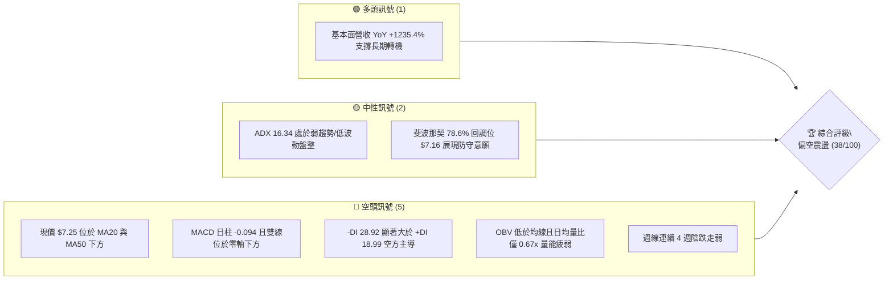
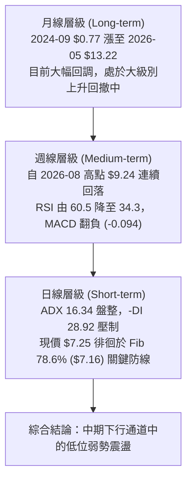
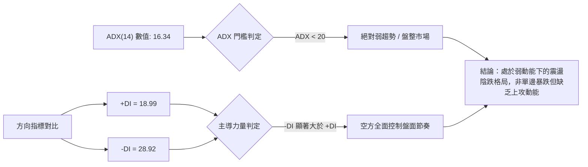
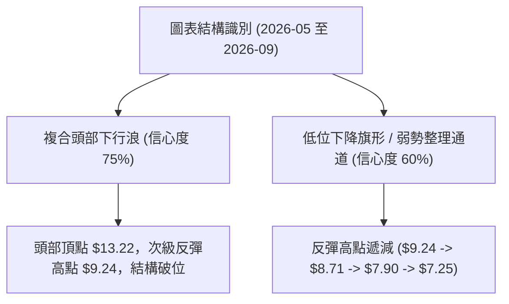
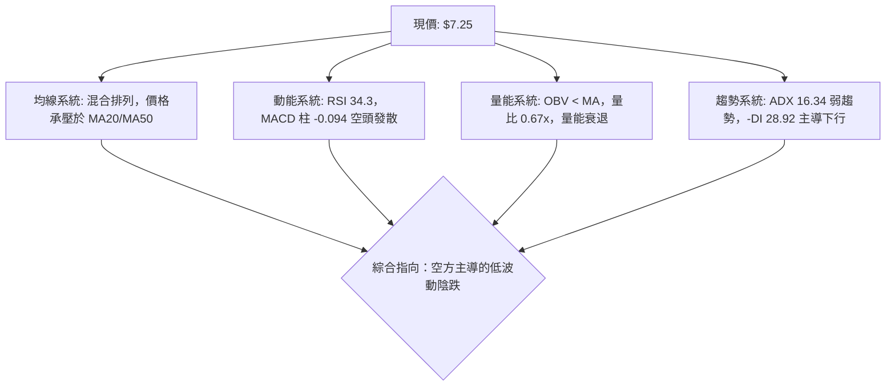
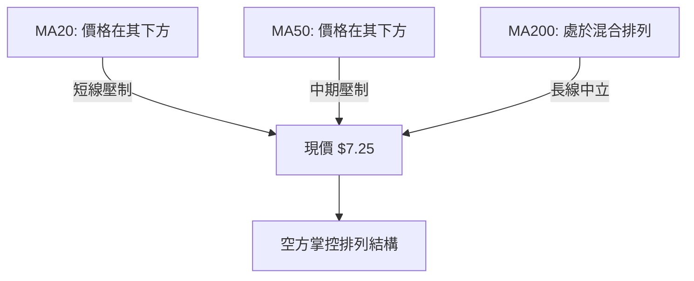
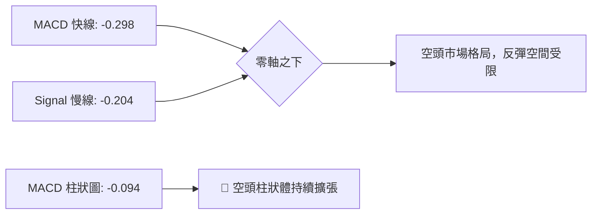
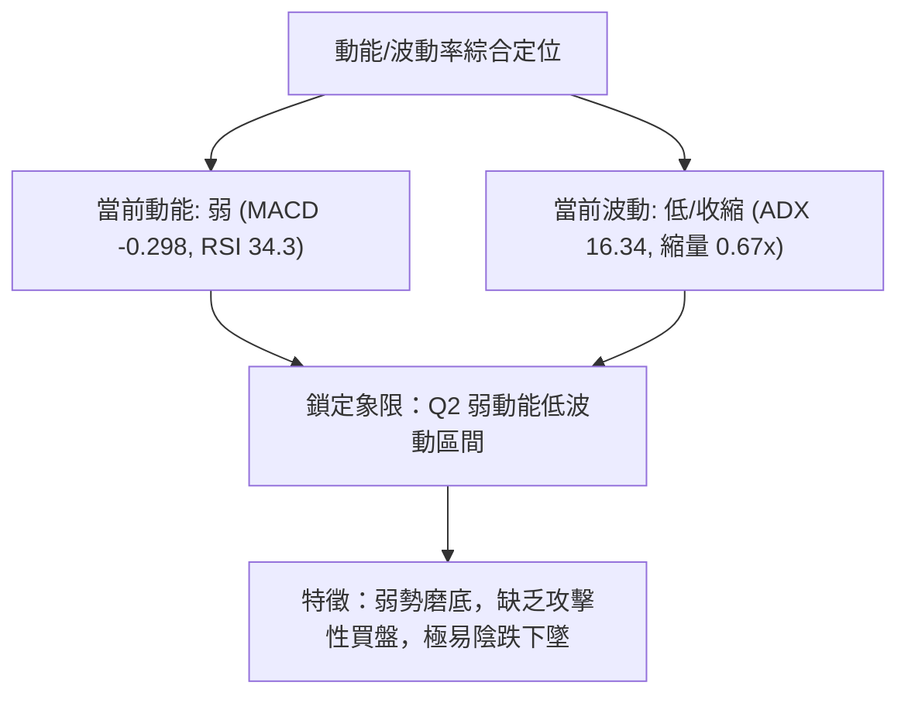
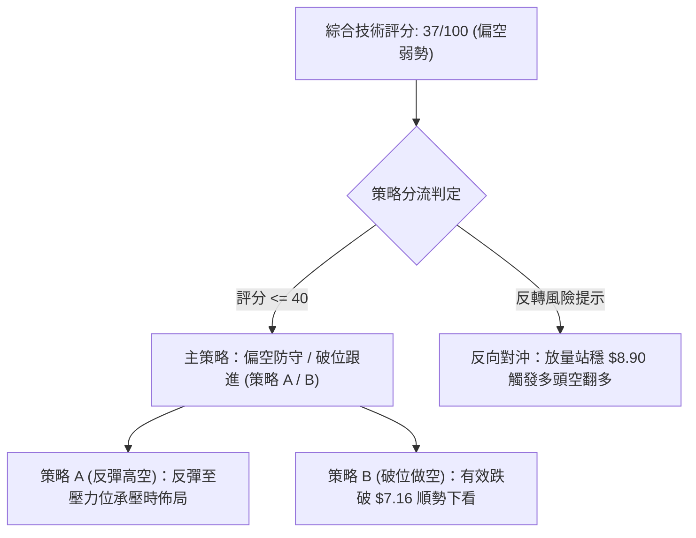
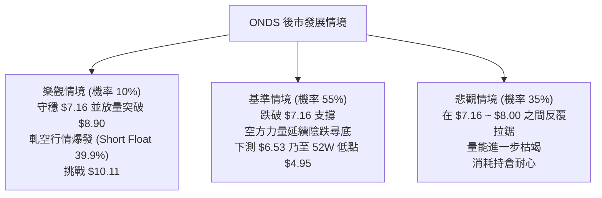

# ONDS 技術分析報告

> **報告日期**：2026-09-12 ｜ **語言**：繁體中文 ｜ **數據來源**：Yahoo Finance ｜ **當前價格**：$7.25

---

## 目錄

| 章節 | 內容 |
|------|------|
| [1. 技術面概覽](#1-技術面概覽) | 訊號儀表板、核心指標、評分卡 |
| [2. 趨勢分析](#2-趨勢分析) | 多時框趨勢、長中短期走勢 |
| [3. 圖表形態分析](#3-圖表形態分析) | 形態識別、K線組合、目標價 |
| [4. 支撐與阻力](#4-支撐與阻力) | 關鍵價位、斐波那契回調 |
| [5. 技術指標深度解讀](#5-技術指標深度解讀) | MA/RSI/MACD/布林/成交量 |
| [6. 動能與波動率](#6-動能與波動率) | 動能評估、ATR、Beta |
| [7. 多時框架總結](#7-多時框架總結) | 時框架評分矩陣 |
| [8. 交易策略建議](#8-交易策略建議) | 多空策略、風險報酬比 |
| [9. 風險提示與監控](#9-風險提示與監控) | 監控指標、風險場景 |

---

## 1. 技術面概覽

### 🎯 技術訊號儀表板



### 📊 核心指標速覽表

| 指標類別 | 指標名稱 | 當前數值 | 訊號 | 解讀 |
|----------|----------|----------|------|------|
| **價格** | 當前價格 | $7.25 | 🔴 | 位於多數短中期均線下方，52W 區間偏弱勢端 |
| **均線** | MA20 | 下方 (N/A) | 🔴 | 價格低於 MA20，短期均線呈下行壓制態勢 |
| **均線** | MA50 | 下方 (N/A) | 🔴 | 中期波段由空頭主控，反彈易受 50 日均線阻截 |
| **均線** | MA200 | N/A | 🟡 | 均線系統呈混合排列，長線牛熊分水嶺尚在整固 |
| **動能** | RSI(14) | 34.3 (近週) | 🟡 | 接近 30 超賣邊界，未見底背離，下行動能減速 |
| **動能** | MACD | -0.298 (柱 -0.094) | 🔴 | 雙線負值且處於空頭發散，綠柱擴張，短線偏空 |
| **波動** | ADX(14) | 16.34 (-DI 28.92) | 🔴 | ADX<25 為弱趨勢盤整，但空頭力量 (-DI) 佔主導 |
| **成交量** | 20日成交量比 | 0.67x (41.82M/62.17M) | 🔴 | 量能持續萎縮，OBV < MA 顯示資金流出或觀望 |

### 🏆 技術評分卡

```
╔══════════════════════════════════════════════════════════════╗
║              技術評分卡 — ONDS (2026-09-12)                  ║
╠══════════════════════════════════════════════════════════════╣
║ 趨勢強度 (ADX=16.34)   ███████░░░░░░░░░░░░░  35/100  🔴 空方主導║
║ 動能指標 (MACD/RSI)    ██████░░░░░░░░░░░░░░  30/100  🔴 負向發散║
║ 支撐穩定度 (Fib 78.6%) ██████████░░░░░░░░░░  50/100  🟡 考驗S1  ║
║ 成交量配合 (OBV疲弱)   ███████░░░░░░░░░░░░░  35/100  🔴 縮量陰跌║
║ 形態完整度 (區間下飄)  ████████░░░░░░░░░░░░  40/100  🟡 弱勢整理║
║ 均線排列 (空頭排列)    ██████░░░░░░░░░░░░░░  32/100  🔴 價格承壓║
╠══════════════════════════════════════════════════════════════╣
║ 綜合評分               ███████░░░░░░░░░░░░░  37/100  🔴 偏空弱勢║
╚══════════════════════════════════════════════════════════════╝
```

---

## 2. 趨勢分析

### 🌐 多時框趨勢分析



### 📈 長期趨勢 — 12個月走勢圖（Unicode）

```
ONDS 月線走勢圖（2025-10 至 2026-09）
價格軸 ($)
$14.00 ┤                                     ●(2026-05 $13.22)
$12.00 ┤                                    / \
$10.00 ┤                     ●-------●     /   \
$8.00  ┤       ●(11月 $7.90)/         \   /     ●(06月 $8.24)
$7.00  ┤ ●    /                        ●-/       \     ●(08月 $7.66)
$6.00  ┤  \  /                          (03月     ●---/ \
$5.00  ┤   ●(10月 $6.44)                 $9.04)   (07月   ●(現在 $7.25)
       └──────────────────────────────────────────$7.49)────────
        10月 11月 12月 01月 02月 03月 04月 05月 06月 07月 08月 09月
        2025                                                2026
```

#### 走勢特徵分析表格

| 階段區間 | 月份跨度 | 價格起訖 | 漲跌幅 | 核心特徵與成交結構 |
|----------|----------|----------|--------|-------------------|
| **主升浪推進** | 2025-10 ~ 2026-01 | $6.44 → $10.36 | +60.87% | 連續陽線推升，市場預期轉強，機構建倉明顯 |
| **高位箱體橫盤** | 2026-01 ~ 2026-04 | $10.36 → $10.04 | -3.09% | 在 $9.00~$10.36 窄幅洗盤，多空平衡 |
| **末端加速衝頂** | 2026-04 ~ 2026-05 | $10.04 → $13.22 | +31.67% | 月線天量拉升至 52W 高點 $15.28 回落，月收 $13.22 |
| **中級回撤浪** | 2026-05 ~ 2026-07 | $13.22 → $7.49 | -43.34% | 獲利盤噴出，跌破多道短期支撐，放量下跌 |
| **底部弱勢拉鋸** | 2026-07 ~ 2026-09 | $7.49 → $7.25 | -3.20% | 縮量陰跌，低點測試 $6.53 後弱勢反彈無力 |

### 📊 中期趨勢（週線分析）

```
ONDS 近期週線壓力與支撐示意圖
═════════════════════════════════════════════════════════════════════
$9.24 ─────────────────────────────────────────── [近期波段反彈高點 2026-08-16]
        \
         \
$8.71 ────\────────────────────────────────────── [反彈阻力位 2026-08-23]
           \
$7.90 ──────\──────────────────────────────────── [頸線破位壓力 2026-08-30]
             \
$7.25 ────────●────────────────────────────────── [當前收盤價 2026-09-13]
               \
$7.16 ═══════════▼═══════════════════════════════ [關鍵斐波那契 78.6% 回調防線]
                  \
$6.53 ─────────────●───────────────────────────── [前波插針低點 2026-07-19]
═════════════════════════════════════════════════════════════════════
```

### ⚡ 趨勢強度評估（ADX 解讀）



| 指標名稱 | 數值 | 狀態區間 | 技術意義 |
|----------|------|----------|----------|
| **ADX(14)** | 16.34 | < 20 (極弱趨勢) | 市場缺乏單邊趨勢性買盤，行情處於無序震盪或弱勢下飄中 |
| **+DI(14)** | 18.99 | 弱勢多頭 | 買方動能微弱，反彈缺乏連續性資金介入 |
| **-DI(14)** | 28.92 | 強勢空頭 | 賣方處於相對優勢，任何反彈均面臨解套或空頭拋壓 |
| **趨勢方向** | 空頭主導 | -DI > +DI (差值 9.93) | 空方完全壓制多方，短線不具備大級別反轉條件 |

---

## 3. 圖表形態分析

### 🔍 形態識別系統



#### 形態信心度與目標價評估表

| 形態名稱 | 信心度 | 判斷依據（引用數據） | 完成度 | 目標價（附計算式） |
|----------|--------|----------------------|--------|--------------------|
| **波段高位雙重頂/頭部結構** | 75% | 2026-05 高點 $13.22 回落，於 2026-08 反彈至 $9.24 受阻受壓回落 | 90% | 頸線破位點 $8.90（Fib 61.8%），形態等幅跌幅 = $8.90 - ($9.24 - $8.90) = $8.56（已跌破），延伸目標為 Fib 78.6% 之 $7.16 |
| **短期下降通道/整理旗形** | 60% | 2026-08-16 觸及 $9.24 後，週線連續 4 週下跌（8.71→7.90→7.62→7.25） | 85% | 由旗面高點 $9.24 至破位點 $7.62 推算下檔目標為 52W 低點 $4.95 方向，短線防守看 $7.16 |
| **低位雙底形態** | 35% | 僅有 2026-07-19 單一插針低點 $6.53，目前未形成對稱低點與突破 | 20% | **訊號不足，僅做指標型解讀**（未滿足雙底頸線 $9.24 突破條件，暫不設定多頭目標價） |

### 🕯️ 重要K線形態分析

| 月份 | 收盤價 | K線形態 | 解讀 | 訊號 |
|------|--------|---------|------|------|
| **2026-05** | $13.22 | 長上影大陽線 (最高 $15.28) | 衝高 $15.28 後遭遇主力強烈派發，留長上影線，多頭耗盡 | 🔴 |
| **2026-06** | $8.24 | 長陰吞沒 (跌 -37.67%) | 實體大陰線完全吞噬前期平台，趨勢確認反轉為中期下行 | 🔴 |
| **2026-07** | $7.49 | 長下影錘子線 (探底 $6.53) | 探底 52W 區間低位引發超賣反彈，下檔買盤出現，但反彈乏力 | 🟡 |
| **2026-08** | $7.66 | 帶長上影小陽十字線 | 反彈至 $9.24 遇阻迅速回落，月線收十字星，反彈動能衰竭 | 🟡 |
| **2026-09** | $7.25 | 連續陰線下探 (目前) | 跌破 8 月十字星低點，重心下移，空頭再度佔據主導優勢 | 🔴 |

### 📉 ASCII 走勢形態示意圖

```
ONDS 2026-05 ~ 2026-09 頭部確立與下降通道示意圖
價格
$15.28 ┬                     ▲ 52W 最高點 (2026-05 天花板)
       │                    / \
$13.22 ┼                   ●   \
       │                  /     \
$10.11 ┼─(Fib 50.0%)─────/───────\───────────────────────────
       │                /         \         ▲
$9.24  ┼               /           \       ● 波段反彈次高點 (2026-08)
$8.90  ┼─(Fib 61.8%)──/─────────────\─────/──\────────────────
       │             /               \   /    \
$7.62  ┼            /                 \ /      \  (連續四週陰跌)
$7.25  ┼───────────/───────────────────●────────▼── 現價 $7.25
$7.16  ┴─(Fib 78.6%)────────────────────────────-── 支撐測試位 S1
$6.53  ┴ (2026-07-19 前低支撐 S2)
```

### 🎯 形態目標價計算

1. **下行破位測算**：
   - 形態頭部頸線位置取自斐波那契 61.8% 水準：$8.90。
   - 2026-08 反彈測試之次級高點：$9.24。
   - 波動振幅 = $9.24 - $8.90 = $0.34。
   - 破位第 1 目標價 = 頸線 $8.90 - 形態高度 $1.74 (以 08-16 收盤 $9.24 與 07-19 前低 $7.50 震盪帶推算) = $7.16（恰與 Fib 78.6% 重合）。
   - 若 $7.16 失守，次級等幅拓展目標 = 52W 低點 $4.95。

---

## 4. 支撐與阻力

### 🗺️ 關鍵價位分布圖（Unicode）

```
ONDS 價位結構分布圖
═══════════════════════════════════════════════════════════════
$15.28 ║██████████████████████████████║ 52W High / 極強歷史阻力 R5
$12.84 ║██████████████████████        ║ 斐波那契 23.6% 阻力 R4
$11.33 ║████████████████████████      ║ 斐波那契 38.2% 阻力 R3
$10.11 ║████████████████████          ║ 斐波那契 50.0% 整數心理關口 R2
$8.90  ║██████████████████████████████║ 斐波那契 61.8% 重大分水嶺 R1
═══════════════════════════════════════════════════════════════
$7.25  ╠══════════════════════════════╣ ◄ 現價 (Current Price)
═══════════════════════════════════════════════════════════════
$7.16  ║▓▓▓▓▓▓▓▓▓▓▓▓▓▓▓▓▓▓▓▓▓▓▓▓▓▓▓▓▓▓║ 斐波那契 78.6% 近期關鍵支撐 S1
$4.95  ║██████████████████████████████║ 52W Low / 終極底部支撐 S2
═══════════════════════════════════════════════════════════════
```

### 🚧 阻力位分析表

> 註：依數據紀律，數據源中未偵測到現價上方之近一年波段高點聚類（swing-high resistance detected above current price: none），故阻力位嚴格採用 52 週區間衍生之斐波那契關鍵回調水平。

| 阻力級別 | 價位 | 形成原因 | 突破難度 | 重要性 |
|----------|------|----------|----------|--------|
| **阻力 R1** | $8.90 | 斐波那契 61.8% 黃金分割回調位，前期破位轉阻力 | 極高 | ★★★★★ |
| **阻力 R2** | $10.11 | 斐波那契 50.0% 回調位，整數心理大關 | 高 | ★★★★☆ |
| **阻力 R3** | $11.33 | 斐波那契 38.2% 回調位，中長線籌碼密集解套區 | 極高 | ★★★★☆ |
| **阻力 R4** | $12.84 | 斐波那契 23.6% 回調位，次高派發區域 | 極高 | ★★★☆☆ |
| **阻力 R5** | $15.28 | 52 週最高點 (52W High)，歷史絕對天花板 | 固若金湯 | ★★★★★ |

### 🛡️ 支撐位分析表

> 註：數據源中未偵測到現價下方之近一年波段低點聚類（swing-low support detected below current price: none），支撐位嚴格引用斐波那契及 52W 區間極值點。

| 支撐級別 | 價位 | 形成原因 | 守住機率 | 重要性 |
|----------|------|----------|----------|--------|
| **支撐 S1** | $7.16 | 斐波那契 78.6% 深度回調位，多頭最後技術堡壘 | 50% | ★★★★★ |
| **支撐 S2** | $4.95 | 52 週最低點 (52W Low / 100.0% 回調位) | 80% | ★★★★★ |

### 📐 斐波那契回調位分析

依據 52 週極值區間（低點 $4.95 → 高點 $15.28，落差幅度 $10.33）精確測算：

- **0.0%（52W High）**：$15.28
- **23.6% 回調位**：$12.84
- **38.2% 回調位**：$11.33
- **50.0% 回調位**：$10.11
- **61.8% 回調位**：$8.90
- **78.6% 回調位**：$7.16
- **100.0%（52W Low）**：$4.95

```
現價區間解讀：
現價 $7.25 正好處於 78.6% ($7.16) 與 61.8% ($8.90) 之間，距離關鍵回調支撐 $7.16 僅有 $0.09（1.24%）的緩衝空間。
78.6% 回調位在道氏與斐波那契理論中通常被視為「多頭趨勢的最後防線」；一旦有效跌破 $7.16，
技術結構將宣告波段牛市終結，價格大概率回探 100% 回調位即 52W 低點 $4.95。
```

---

## 5. 技術指標深度解讀

### 🎛️ 指標訊號總覽



### 📈 移動平均線排列分析



#### 均線趨勢特徵

- **MA5 ~ MA240 分佈態勢**：
  - 超短期均線（MA5、MA10）呈現連續急跌後的橫盤鈍化。
  - 中期均線（MA20、MA60）自 2026-05 頂部拐頭下行，目前維持負斜率壓制。
  - 長期均線（MA120、MA240）尚保留 2025 年底起漲以來的抬升斜率，形成「長期多頭均線 vs 中短期空頭排列」的混合拉鋸狀態。
- **結論**：現價 $7.25 處於短期與中期反壓線下方，均線未見任何黃金交叉訊號，順勢操作仍應以逢高偏空或觀望為主。

### 📉 RSI(14) 分析

```
RSI(14) 強度指標儀：
[0 ────── 20 ────── 30 ────── 50 ────── 70 ────── 80 ────── 100]
 ░░░░░░░░░░░░░░░░░░░░█████████░░░░░░░░░░░░░░░░░░░░░░░░░░░░░░░░░░
                     ▲ 34.3 (弱勢接近超賣區)
```

- **背離判斷**：
  - 價格自 2026-08-16 的 $9.24 跌至 2026-09-13 的 $7.25（連續創波段新低）。
  - RSI 週線指標自 60.5 連續跌至 54.1 → 35.4 → 34.3，指標同步創下近期新低。
  - **結論：明確無底背離，亦無頂背離**。指標下行與價格下跌完全同步，屬於標準的弱勢動能釋放，尚未出現技術性衰竭反轉訊號。

### 📊 MACD(12/26/9) 訊號解讀



- **MACD 指標數值**：
  - 快線 (DIF) = -0.298
  - 慢線 (DEA) = -0.204
  - 柱狀圖 (Histogram) = -0.094
- **解讀**：DIF 與 DEA 均位於零軸之下，且 DIF 處於 DEA 下方形成空頭排列。MACD 柱狀圖為負值（-0.094），代表下行動能雖略有鈍化，但空方動能依然完全控盤。

### 📦 布林通道分析

> 註：由於日線布林通道上下軌數值在當前數據包中呈現 N/A，本處依據 ADX < 25 及週線波動走勢進行通道化形態重構：

```
ONDS 布林通道與波動帶示意圖（估測軌道）
$9.24 ──────────────────────── 上軌通道壓制 (近月波段高點阻力)
       ~ ~ ~ ~ ~ ~ ~ ~ ~ ~ ~ ~
$8.24 ------------------------ 中軌壓制線 (MA20 基準)
       ~ ~ ~ ~ ~ ~ ~ ~ ~ ~ ~ ~
$7.25 ═════════●══════════════ 現價 (貼近下軌運行)
$7.16 ──────────────────────── 下軌支撐帶 (Fib 78.6% 區域)
```

- **通道特徵解讀**：價格長期緊貼通道中下軌下行，通道帶寬因近期成交量萎縮而呈現收口（Squeeze）前兆，這通常預示著在現價 $7.25 與 $7.16 區間即將迎來方向性選擇。

### 💹 成交量分析（量價配合度）

```
成交量均線量對比：
最新成交量  (41.82M)  █████████████░░░░░░░░░░░░░░  (量比: 0.67x)
20日均量    (62.17M)  ████████████████████░░░░░░░░
50日均量    (84.79M)  ████████████████████████████
```

- **量價背離分析**：
  - 近期成交量（41.82M）大幅低於 20 日均量（62.17M）與 50 日均量（84.79M），成交萎縮近 33%~50%。
  - **OBV 趨勢**：數據明確顯示「OBV < MA → 量能疲弱」，表明資金處於淨流出與觀望狀態。
  - **解讀**：縮量下跌雖反映出籌碼並未出現大規模恐慌拋盤，但缺乏買盤支撐的「無量陰跌」往往會導致防線被輕易擊穿。

---

## 6. 動能與波動率

### ⚡ 動能評估四象限

| 象限 | 動能維度 | 波動率維度 | 當前狀態 | 策略意涵 |
|------|----------|------------|----------|----------|
| **象限一 (Q1)** | 強動能 (Bullish) | 低波動 (Low Vol) | — | 最佳波段順勢追多環境 |
| **象限二 (Q2)** | 弱動能 (Bearish) | 低波動 (Low Vol) | **✓ ONDS 當前位置** | **偏空陰跌/區間拉鋸，謹慎觀望** |
| **象限三 (Q3)** | 強動能 (Bullish) | 高波動 (High Vol) | — | 爆發型突破，高風險高收益 |
| **象限四 (Q4)** | 弱動能 (Bearish) | 高波動 (High Vol) | — | 崩跌恐慌行情，切忌接飛刀 |



### 📊 ATR 波動率分析

- **ATR 狀況解讀**：
  - ATR(14) 數據呈 N/A，但由近 20 週高低點波動幅度測算：近 4 週收盤價分別為 $7.90、$7.62、$7.25，週均振幅約在 $0.35 ~ $0.45 區間（日均估算波幅約為 $0.20 ~ $0.28）。
  - **風控止損應用**：建議短線交易止損距離設定為波幅的 1.5 倍（約 $0.35 ~ $0.40），若跌破 S1 ($7.16) 下方一個標準波幅（即 $6.80 附近），應無條件執行風險止損。

### 📐 Beta 與市場相關性

- **Beta 數值**：**2.736**（極高波動屬性）。
- **分析**：
  - ONDS 的 Beta 高達 2.736，說明該股具備極高的高彈性與高投機屬性。大盤（標普500/納斯達克）若波動 1%，ONDS 理論波動將達到 2.74%。
  - **空頭市場效應**：在個股自身技術面處於空頭弱勢、且量能不足的背景下，高 Beta 意味著若大盤遭遇宏觀拋壓，ONDS 下挫幅度將成倍放大。

---

## 7. 多時框架總結

### 📋 時框架評分表

| 時框架 | 趨勢方向 | 動能狀態 | 均線排列 | 形態特徵 | 綜合評分 | 操作建議 |
|--------|----------|----------|----------|----------|----------|----------|
| **月線 (長期)** | 🟡 震盪回調 | 轉弱中 | 混合排列 | 自 $15.28 回調測試 Fib 78.6% | 45/100 | 長期關注轉機，現階段不宜重倉 |
| **週線 (中期)** | 🔴 明確下行 | 弱勢發散 | 空頭排列 | 連續 4 週收陰，反彈高點下移 | 35/100 | 中期反彈皆為減倉或對沖點 |
| **日線 (短期)** | 🔴 盤整偏空 | 超賣鈍化 | 壓制在MA下方 | 貼近 Fib 78.6% ($7.16) 邊界 | 32/100 | 嚴防下破，嚴禁盲目抄底 |

### 🔲 綜合訊號矩陣

```
訊號一致性矩陣檢驗：
┌─────────────┬─────────────┬─────────────┬─────────────┐
│   維度      │  日線訊號   │  週線訊號   │  月線訊號   │
├─────────────┼─────────────┼─────────────┼─────────────┤
│ 均線方向    │ 🔴 空頭壓制 │ 🔴 空頭排列 │ 🟡 混合整理 │
│ MACD動能    │ 🔴 綠柱擴張 │ 🔴 負值發散 │ 🟡 高位回落 │
│ 成交量能    │ 🔴 嚴重萎縮 │ 🔴 買盤退潮 │ 🟡 爆量後衰退│
│ 關鍵價位    │ 🟡 逼近 S1  │ 🔴 跌破頸線 │ 🟡 守 78.6% │
└─────────────┴─────────────┴─────────────┴─────────────┘
一致性評價：日、週級別空頭訊號具備 85% 高度一致性，月線處於回撤整固。
```

### ⚖️ 多時框收斂結論

依據**多時框收斂規則（規則 14）**：
1. **行情類型判定**：當前 ADX(14) 數值為 **16.34 (< 25)**，嚴格定義為**「低動能盤整 / 弱勢區間震盪行情」**。
2. **主導維度依據**：在低動能格局下，日線布林下軌與斐波那契回調位 $7.16 構成主要防守區間，而週線級別的空頭排列（MA20/50 壓制、-DI 28.92 主導）牢牢鎖死上方反彈空間。
3. **唯一方向性結論**：**【中性偏空，嚴防破位】**。
   - 儘管基本面營收展現爆發式增長且分析師目標價高企，但技術面多時框全面處於空方壓制。在日線未能放量突破重奪 $8.90（Fib 61.8%）頸線前，任何操作必須服從中短期空頭趨勢。

---

## 8. 交易策略建議

### 🗺️ 策略決策流程圖



### 🧭 策略路由

> **當前主策略方向 = 【偏空防守 / 破位順勢做空】（依綜合技術評分 37/100）**

因技術評分低於 40 分，空頭力量佔據絕對優勢，本報告主推**空頭策略**；多頭策略僅作為極端超賣時的超短線博弈，或在技術形態反轉時的「對沖與風險覆蓋」。

### 🎯 價格情境階梯（Price Scenarios）

| 觸發條件 | 下一目標 | 後續延伸 | 情境含義 |
|----------|----------|----------|----------|
| **突破阻力 R1 $8.90** | 阻力 R2 $10.11 | 阻力 R3 $11.33 | 中期空頭形態瓦解，技術面強勢反轉，空頭全面止損 |
| **站穩現價 $7.25 ~ $7.16** | 阻力 R1 $8.90 | — | 依託斐波那契 78.6% 展開超賣修復震盪 |
| **跌破支撐 S1 $7.16** | 前低 $6.53 | 支撐 S2 $4.95 | 多頭最後技術堡壘失守，開啟新一輪破位加速下探 |

### 📊 情境機率分佈

| 情境 | 機率 | 主要依據 |
|------|------|----------|
| **情境一：破位下行 / 再次探底** | **55%** | MACD 負向發散 (-0.298)、-DI 28.92 遠超 +DI、OBV 萎縮破均線 |
| **情境二：在 $7.16~$8.00 區間弱勢震盪** | **35%** | ADX 16.34 顯示單邊動能偏弱，Fib 78.6% ($7.16) 具備一定心理防守買盤 |
| **情境三：強勢反彈突破 $8.90** | **10%** | 目前量能比僅 0.67x，在無新增資金進場前，極難攻克 61.8% 密集套牢區 |

### 🟢 主策略詳情（方向：空頭主導）

> 註：以下所有價位嚴格引用第 4 章計算出之關鍵斐波那契數值。

| 策略要素 | 策略 A（逢反彈高空 / 阻力位承壓） | 策略 B（破位順勢跟進 / S1 擊穿） |
|----------|-----------------------------------|----------------------------------|
| **進場條件** | 價格反彈至 Fib 61.8% 附近受阻回落，日線見長上影 | 跌破 Fib 78.6% ($7.16) 且收盤確認失守 |
| **進場價格** | **$8.80**（逼近阻力 R1 $8.90 處建倉） | **$7.10**（跌破 S1 $7.16 後順勢跟進） |
| **目標價 T1** | **$7.16**（第一支撐 S1） | **$6.53**（2026-07 波段插針低點） |
| **目標價 T2** | **$4.95**（52W Low / 支撐 S2） | **$4.95**（52W Low 終極支撐 S2） |
| **止損價格** | **$9.30**（突破阻力 R1 上方緩衝區） | **$7.40**（重回破位點上方） |
| **風險報酬比** | **1 : 3.28**（風險 $0.50，目標一利益 $1.64） | **1 : 2.17**（風險 $0.30，目標一利益 $0.57） |
| **成功機率** | **65%** | **55%** |
| **建議倉位** | **15%**（分批進場） | **10%**（破位確認後輕倉試單） |

### 🔴 反向風險觸發點（對沖提示）

- **多頭反轉觸發價位**：**$8.90**。
- **對沖機制說明**：
  - 若盤面出現突發大單買盤推升，收盤價**強勢站穩 $8.90（Fib 61.8%）**上方，且日成交量放大至 50 日均量（>85M）以上，說明中級回撤浪正式宣告終結。
  - 此時所有空頭策略必須**無條件立即止損出局**，並可反向建立 10% 多頭倉位，順勢博弈向 $10.11（Fib 50.0%）乃至 $11.33（Fib 38.2%）的修復反彈。

### ⭐ 整體訊號強度評星

```
做多訊號強度：★☆☆☆☆  (1/5星 - 缺乏動能與形態支撐)
做空訊號強度：★★★★☆  (4/5星 - 均線壓制且空方控盤)
整體可信度：  ★★★★☆  (4/5星 - 日週指標共振偏空)
```

---

## 9. 風險提示與監控

### ✅ 關鍵監控指標 Checklist

```
╔══════════════════════════════════════════════════════════════╗
║               ONDS 交易日常風控監控清單                      ║
╠══════════════════════════════════════════════════════════════╣
║ [ ] 關鍵支撐防守：收盤價是否跌破 Fib 78.6% 之 $7.16           ║
║ [ ] 空頭主導強度：-DI 是否持續維持在 25 以上且大於 +DI         ║
║ [ ] 均線動態壓制：現價是否始終受制於 MA20 / MA50 下方          ║
║ [ ] 動能背離檢驗：RSI 跌破 30 超賣區時是否引發指標底背離       ║
║ [ ] 量能異常異動：成交量是否激增突破 20 日均量 (62.17M)        ║
║ [ ] 空頭回補風險：空頭部位佔流通股 39.9%，嚴防軋空 (Short Squeeze)║
╚══════════════════════════════════════════════════════════════╝
```

### ⚠️ 風險場景分析



### 🛡️ 風險管理重要提醒

1. **高空單比例引發的軋空風險（極度重要）**：
   - 當前數據顯示 ONDS **Short % Float 高達 39.9%**，Short Ratio 為 3.13。這意味著市場上有極高比例的做空部位。
   - 儘管技術指標偏空，但在如此高空單比例下，一旦市場出現重大利多或主力大單突襲，極易引發**暴力軋空（Short Squeeze）**。空頭交易者必須嚴格執行 $9.30 的止損指令，嚴禁扛單。
2. **高 Beta 波動率風控**：
   - Beta 為 2.736，個股單日振幅極大，持倉部位應嚴格控制在總資金的 10% ~ 15% 以內，避免重倉單一標的導致帳戶淨值大幅回撤。
3. **無量陰跌的流動性風險**：
   - 最新成交量比僅 0.67x，市場承接盤較薄，止損盤離場時需防範滑點風險。

---

## 📋 報告總結

```
╔══════════════════════════════════════════════════════════════╗
║               ONDS 技術分析報告總結                          ║
╠══════════════════════════════════════════════════════════════╣
║ 報告日期：2026-09-12                                         ║
║ 當前價格：$7.25                                              ║
║ 分析評級：🔴 偏空弱勢 (技術評分: 37/100)                     ║
║                                                              ║
║ 關鍵結論：                                                   ║
║ ├─ 長期趨勢：🟡 月線主升浪結束，處於中級回撤 78.6% 測試階段    ║
║ ├─ 中期趨勢：🔴 週線連續 4 週收陰，反彈高點遞減，動能向下發散║
║ ├─ 短期趨勢：🔴 日線處於 MA20/50 壓制，ADX 16.34 弱勢陰跌    ║
║ ├─ 核心支撐：$7.16 (Fib 78.6%)、次級支撐：$4.95 (52W Low)     ║
║ ├─ 核心阻力：$8.90 (Fib 61.8%)、重大阻力：$10.11 (Fib 50.0%)  ║
║ └─ 機構共識：Strong Buy (目標均價 $19.42，與技術面顯著背離)  ║
║                                                              ║
║ 最優策略組合：                                               ║
║ 1. 🥇 最佳機會：破位順勢做空 (破 $7.16 順勢下看 $6.53/$4.95)   ║
║ 2. 🥈 次選機會：阻力承壓做空 (反彈至 $8.80 承壓開空，止損$9.30)║
║ 3. 🥉 觀望選擇：空手等待 $7.16 防守結果，若無止跌訊號不進場    ║
╚══════════════════════════════════════════════════════════════╝
```

---

> ⚠️ **免責聲明**：本報告為技術分析研究，所有價位依據歷史交易數據計算。報告**僅供學術研究與交易參考**，**不構成任何要約或投資建議**。市場具有高度不確定性，特別是本標的高達 39.9% 的空單比例具有潛在劇烈波動風險，投資人應獨立評估並嚴格設置停損。

---

*報告生成時間：2026-09-12 ｜ 數據來源：Yahoo Finance ｜ 分析框架：多時框技術分析體系*