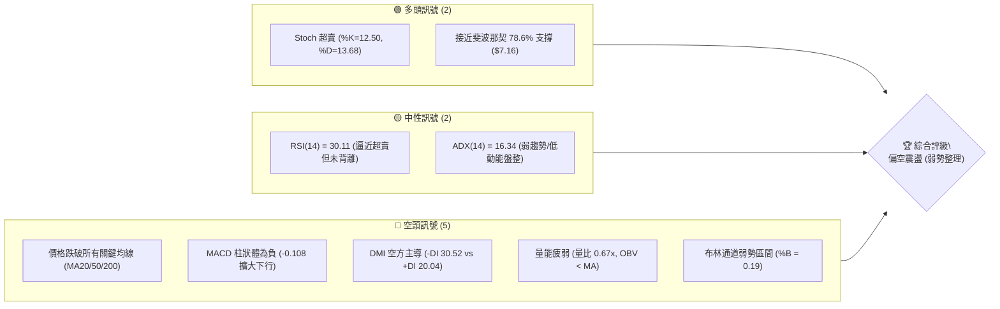
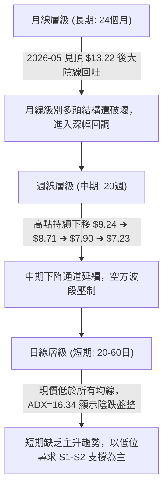
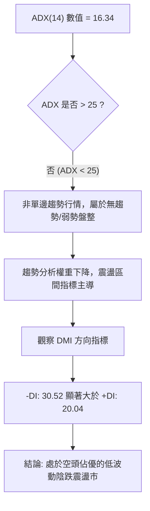
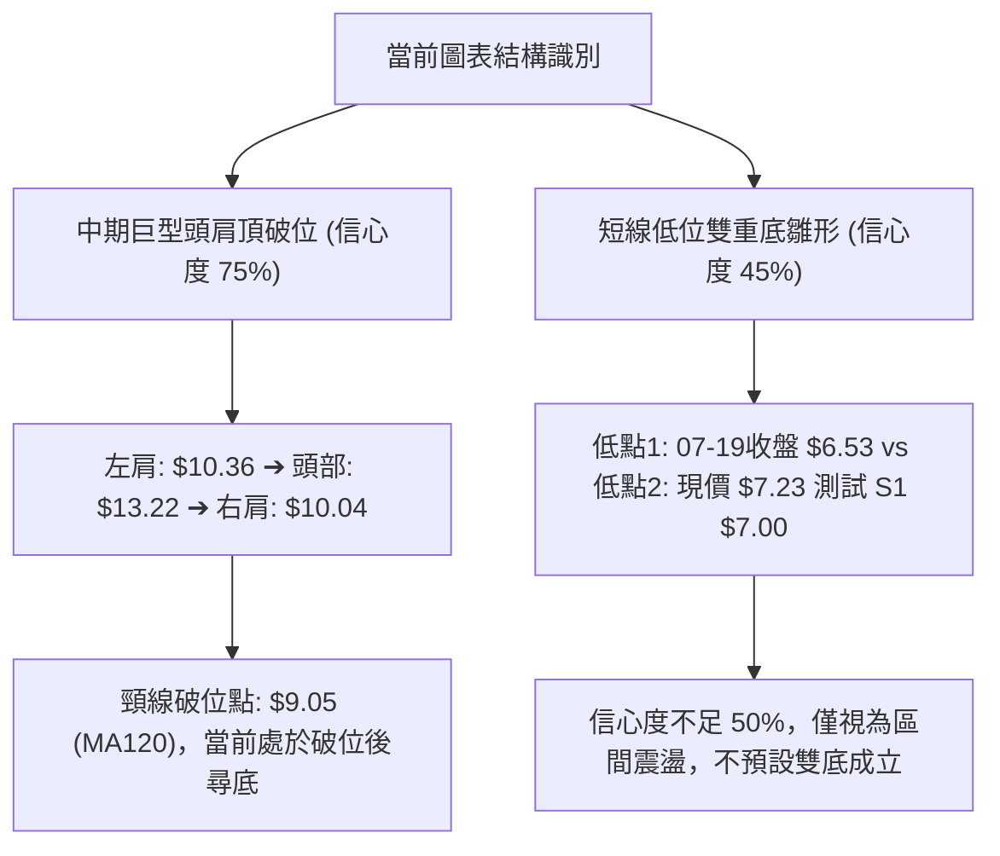
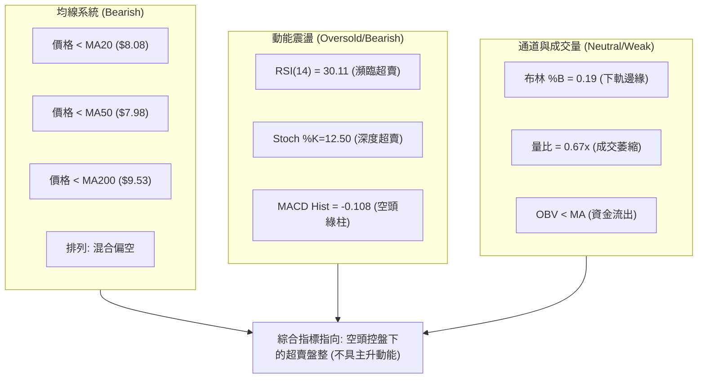
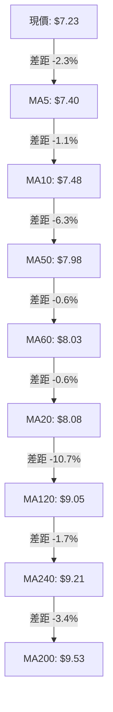
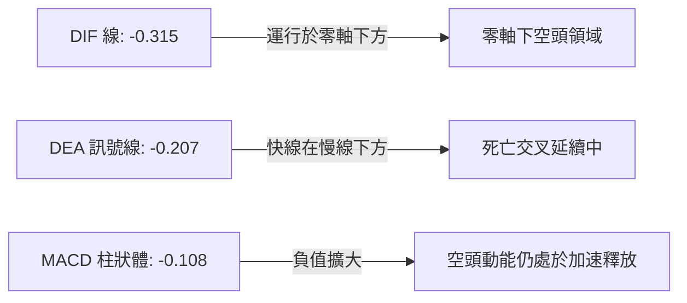
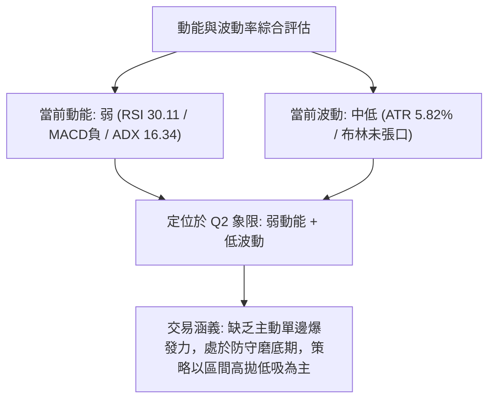
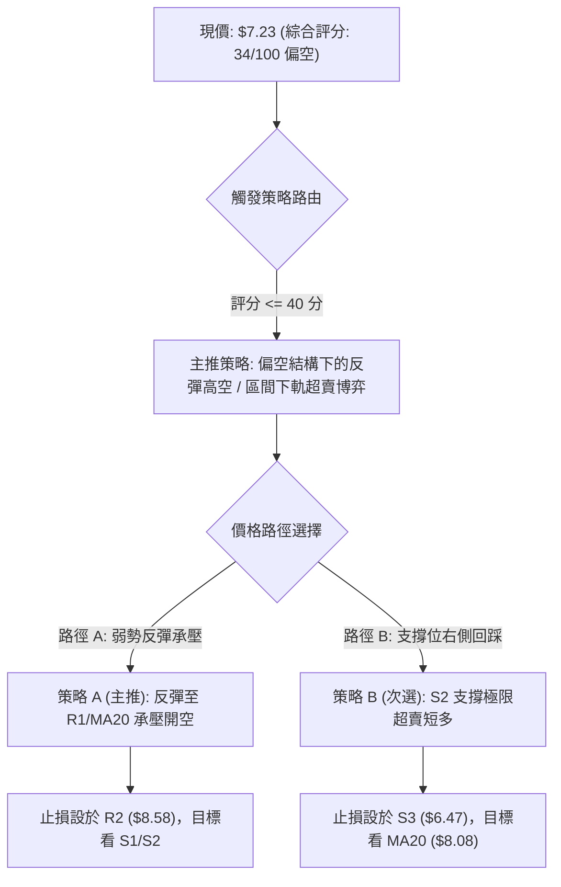
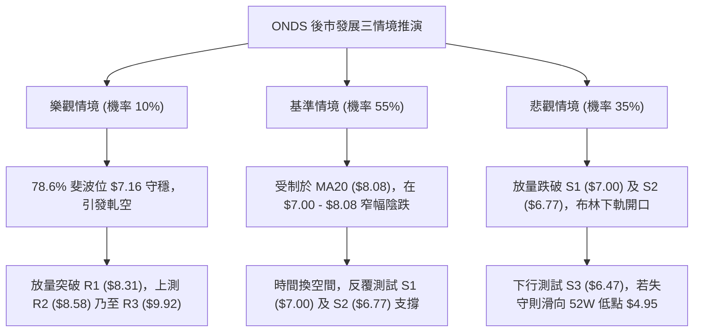

# ONDS 技術分析報告

> **報告日期**：2026-09-13 ｜ **語言**：繁體中文 ｜ **數據來源**：Yahoo Finance ｜ **當前價格**：$7.23

---

## 目錄

| 章節 | 內容 |
|------|------|
| [1. 技術面概覽](#1-技術面概覽) | 訊號儀表板、核心指標、評分卡 |
| [2. 趨勢分析](#2-趨勢分析) | 多時框趨勢、長中短期走勢 |
| [3. 圖表形態分析](#3-圖表形態分析) | 形態識別、K線組合、目標價 |
| [4. 支撐與阻力](#4-支撐與阻力) | 關鍵價位、斐波那契回調 |
| [5. 技術指標深度解讀](#5-技術指標深度解讀) | MA/RSI/MACD/布林/成交量 |
| [6. 動能與波動率](#6-動能與波動率) | 動能評估、ATR、Beta |
| [7. 多時框架總結](#7-多時框架總結) | 時框架評分矩陣 |
| [8. 交易策略建議](#8-交易策略建議) | 多空策略、風險報酬比 |
| [9. 風險提示與監控](#9-風險提示與監控) | 監控指標、風險場景 |

---

## 1. 技術面概覽

### 🎯 技術訊號儀表板



### 📊 核心指標速覽表

| 指標類別 | 指標名稱 | 當前數值 | 訊號 | 解讀 |
|----------|----------|----------|------|------|
| **價格** | 當前價格 | $7.23 | 🔴 | 位於 52 週高低區間之 22.1%，空頭壓制明顯 |
| **均線** | MA20 | $8.08 | 🔴 | 現價低於 MA20 達 -10.51%，短期下行趨勢顯著 |
| **均線** | MA50 | $7.98 | 🔴 | 現價低於 MA50，且均線呈現混合偏空發散 |
| **均線** | MA200 | $9.53 | 🔴 | 現價低於 MA200 達 -24.13%，長期格局全面轉空 |
| **動能** | RSI(14) | 30.11 | 🟡 | 位於超賣臨界點邊緣，具短線技術修復需求但無底背離 |
| **動能** | MACD | -0.315 | 🔴 | DIF 線低於 DEA 信號線 (-0.207)，Hist 為 -0.108 延續綠柱 |
| **動能** | Stoch %K/%D | 12.50 / 13.68 | 🟢 | 進入極度超賣區間，下行空間受限，醞釀弱勢抽頭 |
| **趨勢** | ADX(14) | 16.34 | 🟡 | 數值低於 25 表明非單邊趨勢，當前為無主動強動能的弱勢陰跌盤整 |
| **趨勢** | DMI (+/-DI) | 20.04 / 30.52 | 🔴 | -DI 大幅超越 +DI，空方力量居於明確主導權 |
| **通道** | 布林 %B | 0.19 | 🔴 | 貼近布林下軌 ($6.70)，處於通道弱勢下限運行 |
| **量能** | 量比 / OBV | 0.67x / OBV<MA | 🔴 | 成交量較 20 日均量萎縮，資金動能衰退，未能形成帶量反攻 |
| **波動** | ATR(14) | $0.42 | 🟡 | 每日平均波幅 5.82%，波動度處於中等收斂階段 |

### 🏆 技術評分卡

```
╔══════════════════════════════════════════════════════════════════╗
║                   技術評分卡 — ONDS (2026-09-13)                 ║
╠══════════════════════════════════════════════════════════════════╣
║ 趨勢強度      ██████░░░░░░░░░░░░░░  30/100  🔴 空方控盤/弱趨勢   ║
║ 動能指標      ███████░░░░░░░░░░░░░  35/100  🔴 動能疲軟但已超賣 ║
║ 支撐穩定度    ██████████░░░░░░░░░░  50/100  🟡 臨近斐波 78.6%    ║
║ 成交量配合    ██████░░░░░░░░░░░░░░  30/100  🔴 量能不彰/量比萎縮 ║
║ 形態完整度    ████████░░░░░░░░░░░░  40/100  🟡 破位後低位箱型   ║
║ 均線排列      ████░░░░░░░░░░░░░░░░  20/100  🔴 空頭壓制/混合排列 ║
╠══════════════════════════════════════════════════════════════════╣
║ 綜合評分      ███████░░░░░░░░░░░░░  34/100  🔴 偏空震盪 (弱勢)   ║
╚══════════════════════════════════════════════════════════════════╝
```

---

## 2. 趨勢分析

### 🌐 多時框趨勢分析



### 📈 長期趨勢 — 12個月走勢圖（Unicode）

```
ONDS 月線走勢圖（2025-10 至 2026-09）
價格軸 ($)
$14.00 ┤                                      ● (05月高點: $13.22)
$12.00 ┤
$10.00 ┤                          ●     ●  ●
$8.00  ┤              ●     ●           (02月)      ●
$7.00  ┤  ●     ●                                         ●     ●←現在 ($7.23)
$6.00  ┤     ● (10月: $6.44)
       └─────────────────────────────────────────────────────────────
         10    11    12    01    02    03    04    05    06    07    08    09 (月份)
        (2025)                                    (2026)
```

#### 走勢特徵分析表格

| 階段區間 | 時間週期 | 價格區間 | 累積漲跌幅 | 結構特徵與走勢解讀 |
|----------|----------|----------|------------|-------------------|
| **主升攻擊波** | 2025-10 至 2026-01 | $6.44 ➔ $10.36 | +60.87% | 強勢突破均線密集區，月線四連陽，買盤動能充沛 |
| **高位箱體震盪** | 2026-01 至 2026-04 | $10.36 ➔ $10.04 | -3.09% | 圍繞 $10.00 整數關卡橫盤換手，高位籌碼產生鬆動 |
| **最後脈衝噴射** | 2026-04 至 2026-05 | $10.04 ➔ $13.22 | +31.67% | 月線天量拉升創波段收盤新高，為典型派發誘多頂部 |
| **雪崩式破位** | 2026-05 至 2026-07 | $13.22 ➔ $7.49 | -43.34% | 單月長黑暴跌，多頭防線全面瓦解，跌破中長期均線 |
| **低位弱勢陰跌** | 2026-07 至 2026-09 | $7.49 ➔ $7.23 | -3.47% | 弱勢低位盤整，反彈高點無力挑戰 MA20，尋求 78.6% 斐波支撐 |

### 📊 中期趨勢（週線分析）

從近 20 週收盤走勢可見，股價在 2026-05-31 達到 $13.22 頂峰後，隨後於 2026-07-19 下探至波段低點 $6.53。隨後雖然在 2026-07-26 爆出 8.34 億股天量反彈至 $7.80，並在 2026-08-16 摸高至 $9.24，但成交量未能持續放大，反彈宣告夭折。近期週線收盤呈現連續下挫（$9.24 ➔ $8.71 ➔ $7.90 ➔ $7.62 ➔ $7.23），週線 RSI 自 60.5 連續滑落至 30.1，MACD 柱狀體再度轉負（-0.108），顯示中期波段仍由空頭牢牢掌控。

```
近期週線結構壓制示意圖：
波段高點 ($9.24) ───┐
                    ├── 下降軌道壓制
波段次高 ($8.71) ───┤
                    ├── MA20 反壓 ($8.08)
波段反彈 ($7.90) ───┘
─────────────────────────────────────────────
現價: $7.23 (運行於下降通道下軌邊緣)
支撐防線: S1 ($7.00) ── S2 ($6.77) ── S3 ($6.47)
```

### ⚡ 趨勢強度評估（ADX 解讀）



#### ADX 強度對照與量化解讀

| 指標名稱 | 當前數值 | 臨界標準 | 狀態評估 | 實質市場意義 |
|----------|----------|----------|----------|--------------|
| **ADX(14)** | 16.34 | < 20 (極弱) / > 25 (趨勢) | 弱勢盤整市 | 市場缺乏強烈的單邊主驅動力，空頭雖控盤但未爆發恐慌宣洩 |
| **+DI** | 20.04 | > 25 (多頭強) | 多方潰散 | 多頭攻擊動能匱乏，無力發起持續性波段反攻 |
| **-DI** | 30.52 | > 25 (空頭強) | 空方主導 | 空頭在邊際定價權上佔據主導，價格壓制常態化 |
| **綜合判定** | 差值 -10.48 | 趨勢弱 + 空方主導 | 弱勢陰跌 | 走勢以時間換空間為主，操作上忌追漲，應依賴通道邊界低吸高拋 |

---

## 3. 圖表形態分析

### 🔍 形態識別系統



#### 圖表形態信心度與目標價評估表

| 形態名稱 | 信心度 | 判斷依據（引用數據） | 完成度 | 目標價（附嚴格計算式） |
|----------|--------|----------------------|--------|------------------------|
| **中期頭肩頂 (破位)** | 75% | 左肩 2026-01 收盤 $10.36，頭部 2026-05 收盤 $13.22，右肩 2026-04 高點 $10.04。頸線取自 $9.05 (MA120)。 | 100% (已跌破) | 頸線 $9.05 - (頭部 $13.22 - 頸線 $9.05) = $4.88。接近 52W 低點 $4.95。 |
| **低位區間震盪** | 70% | 價格受阻於 MA20 ($8.08)，下方獲得 S1 ($7.00) 與 S2 ($6.77) 支撐，ADX=16.34 證實無趨勢。 | 85% | 震盪區間上軌 R1: $8.31，下軌 S2: $6.77。當前於區間下緣。 |
| **低位雙重底 (潛在)** | 40% | 第一次低點為 2026-07-19 週收盤 $6.53（接近 S3 $6.47），現價 $7.23 試圖築第二底。 | 30% (未成形) | 頸線阻力 R1 $8.31。若成立：$8.31 + ($8.31 - $6.53) = $10.09。**因信心度 < 50%，不採納為交易依據**。 |

### 🕯️ 重要K線形態分析

| 月份 | 收盤價 | K線形態 | 解讀 | 訊號 |
|------|--------|---------|------|------|
| **2026-05** | $13.22 | 帶巨量長上影大陽線 | 多頭竭盡性衝高，觸及 52W 高點 $15.28 後遭遇機構沉重拋壓獲利了結 | 🔴 頂部力竭 |
| **2026-06** | $8.24 | 斷頭鍘刀巨陰線 (-37.67%) | 一舉擊穿 MA20 與短期上升支撐，宣告牛市行情瓦解，恐慌盤大量湧出 | 🔴 極度看空 |
| **2026-07** | $7.49 | 低位長下影鎚頭線 | 盤中下探波段低位後獲得逢低買盤支撐，週成交量達 8.34 億股歷史天量 | 🟢 初步止跌 |
| **2026-08** | $7.66 | 弱勢小實體陽十字星 | 衝高至 $9.24 後受制於 MA200 ($9.53) 回落，多方反彈無功而返，量能銳減 | 🟡 多空僵持 |
| **2026-09** | $7.23 | 弱勢下引陰線 (半月) | 跌破 8 月震盪平台，重心再次下移，空方掌控局勢，測試 78.6% 斐波位 | 🔴 弱勢尋底 |

### 📉 ASCII 走勢形態示意圖

```
ONDS 2026年日線/週線關鍵形態解構：
$13.22 ─────────── Head (頭部: 2026-05)
                   /\
                  /  \
$10.36 ─ Left    /    \    Right ─ $10.04
         Shoulder/      \  Shoulder
           /\   /        \   /\
          /  \_/          \_/  \
$9.05  ──[=====================]── 頸線破位點 (MA120)
                                \
                                 \     $8.31 (阻力 R1)
                                  \    ┌──┐
                                   \  /    \  $7.23 (現價測試 S1)
$6.53 ──────────────────────────────\/──────\/──────────────────
                              低點1(07-19) 低點2(構築中)
```

### 🎯 形態目標價計算

根據已確認破位的**頭肩頂形態**進行等幅測量：
1. **頭部高點**：2026-05 收盤價 $13.22
2. **形態頸線位**：取自中長期關鍵均線交匯破位點 $9.05
3. **形態垂直高度**：$13.22 - $9.05 = $4.17
4. **理論破位量度跌幅目標價**：
   $$\text{目標價} = \text{頸線位} - \text{形態高度} = \$9.05 - \$4.17 = \$4.88$$
   *(該數值與 52 週最低價 $4.95 產生高度技術共振，顯示若下破當前支撐帶，下行終極邊界將指向 $4.95 附近)*

---

## 4. 支撐與阻力

### 🗺️ 關鍵價位分布圖（Unicode）

```
ONDS 價位結構分布圖（引用 OHLCV 聚類計算數據）
═══════════════════════════════════════════════════════════════════════
$15.28 ║                                        ║ 52週最高點 (0.0%)
$12.84 ║                                        ║ 斐波那契 23.6%
$11.33 ║                                        ║ 斐波那契 38.2%
$10.11 ║                                        ║ 斐波那契 50.0%
$9.92  ║████████████████████████████████████████║ 強阻力 R3 (+37.28%)
$9.53  ║----------------------------------------║ 長期均線 MA200 反壓
$8.90  ║                                        ║ 斐波那契 61.8%
$8.58  ║████████████████████████                ║ 次要阻力 R2 (+18.67%)
$8.31  ║████████████████████████████████        ║ 關鍵阻力 R1 (+15.01%)
$8.08  ║----------------------------------------║ 短期均線 MA20 (布林中軌)
$7.23  ╠════════════════════════════════════════╣ ◄ 當前價格 ($7.23)
$7.16  ║........................................║ 斐波那契 78.6% 回調位
$7.00  ║▓▓▓▓▓▓▓▓▓▓▓▓▓▓▓▓▓▓▓▓▓▓▓▓                ║ 近期核心支撐 S1 (-3.18%)
$6.77  ║▓▓▓▓▓▓▓▓▓▓▓▓▓▓▓▓▓▓▓▓▓▓▓▓▓▓▓▓▓▓          ║ 波段強支撐 S2 (-6.36%)
$6.70  ║----------------------------------------║ 布林通道下軌
$6.47  ║████████████████████████████████████████║ 極限防守支撐 S3 (-10.58%)
$4.95  ║                                        ║ 52週最低點 (100.0%)
═══════════════════════════════════════════════════════════════════════
```

### 🚧 阻力位分析表

| 阻力級別 | 價位 | 形成原因（嚴格引用數據） | 突破難度 | 重要性 |
|----------|------|--------------------------|----------|--------|
| **R1** | $8.31 | 近一年波段高點聚類位，且位於 MA20 ($8.08) 與 MA60 ($8.03) 上方，密集成交套牢區 | 🔴 極高 | ★★★★★<br>多空強弱分水嶺 |
| **R2** | $8.58 | 近一年波段高點聚類次級壓力位，對應 2026-08-23 週反彈衰竭處 ($8.71) 之前哨防線 | 🟡 高 | ★★★★☆<br>波段反彈延伸阻力 |
| **R3** | $9.92 | 近一年密集高點聚類位，上方緊貼 MA200 ($9.53) 與 50.0% 斐波那契回調位 ($10.11) | 🔴 極難 | ★★★★★<br>中長期牛熊轉換線 |

### 🛡️ 支撐位分析表

| 支撐級別 | 價位 | 形成原因（嚴格引用數據） | 守住機率 | 重要性 |
|----------|------|--------------------------|----------|--------|
| **S1** | $7.00 | 近一年波段低點聚類位，整數關卡，上方緊鄰斐波那契 78.6% ($7.16) 防守點 | 🟡 60% | ★★★★☆<br>短線多頭第一防線 |
| **S2** | $6.77 | 近一年波段低點聚類位，重合日線布林通道下軌 ($6.70) 區域 | 🟢 70% | ★★★★★<br>通道超賣支撐線 |
| **S3** | $6.47 | 近一年波段低點極限聚類位，對應 2026-07-19 週收盤低點 $6.53 之實質支撐底部 | 🟢 85% | ★★★★★<br>中期波段生命線 |

### 📐 斐波那契回調位分析

依據 52 週絕對波動區間（低點 $4.95 ➔ 高點 $15.28，波幅 $10.33）計算之標準斐波那契回調位如下：

| 回調比例 | 關鍵價位 | 距現價空間 | 技術意涵解讀 |
|----------|----------|------------|--------------|
| **0.0% (高點)** | $15.28 | +111.34% | 52 週絕對頂部，派發極限區域 |
| **23.6%** | $12.84 | +77.59% | 強勢回調極限位，失守後行情由強轉震盪 |
| **38.2%** | $11.33 | +56.71% | 弱勢回調支撐位，破位確認牛市終結 |
| **50.0%** | $10.11 | +39.83% | 多空中軸平衡位，前期 1-4 月橫盤震盪中樞 |
| **61.8%** | $8.90 | +23.10% | 黃金分割重要轉折點，跌破後轉為強阻力區間 |
| **78.6%** | $7.16 | -0.97% | **現價 ($7.23) 正處於 78.6% ($7.16) 邊緣**，為深度修正防守位 |
| **100.0% (低點)**| $4.95 | -31.54% | 52 週絕對底部，長期趨勢最後防禦要塞 |

**現價區間解讀**：現價 $7.23 運行於 **61.8% ($8.90)** 與 **78.6% ($7.16)** 之間，且無限逼近 $7.16。在技術分析理論中，當股價跌破 61.8% 黃金分割位後，原上升波段面臨嚴重結構性毀壞，78.6% 回調位是多頭避免全面回踩 100% 起點 ($4.95) 的最後一道重要黃金防線。

---

## 5. 技術指標深度解讀

### 🎛️ 指標訊號總覽



### 📈 移動平均線排列分析



#### 均線量化解構表

| 均線名稱 | 數值 | 偏離現價 | 走勢微型圖 | 均線狀態與技術意涵 |
|----------|------|----------|------------|-------------------|
| **MA5** | $7.40 | -2.32% | ▁▁▂▄▅▆▇████ | 短期扣高走低，下行壓制現價 |
| **MA10** | $7.48 | -3.40% | ▁▂▂▃▃▄▄▅▇▇█ | 空頭下壓，日線級別第一動態阻力 |
| **MA20** | $8.08 | -10.51% | ▁▁▁▁▂▂▃▄▄▅ | 布林中軌，下穿 MA60 形成死叉壓制 |
| **MA50** | $7.98 | -9.40% | 走平微跌 | 中期均線糾纏，壓制反彈空間 |
| **MA60** | $8.03 | -10.00% | ███████████ | 季線阻力，與 MA20/MA50 構成 $8.00 密集反壓 |
| **MA120** | $9.05 | -20.10% | ████████▇▇▇ | 半年線持續下行，確認中期頭部壓制 |
| **MA200** | $9.53 | -24.13% | 走平偏下 | 長期牛熊分界線，價格遠處其下表明大格局處於修正熊市 |

### 📉 RSI(14) 分析

#### RSI 數值進度條
```
超賣區 (0-30)        中性平衡區 (30-70)        超買區 (70-100)
[████████████░░░░░░░░░░░░░░░░░░░░░░░░░░░░] 30.11
▲ 現價 RSI 位置 (30.11)
```

- **超買超賣狀態**：RSI(14) 當前讀數為 **30.11**，剛好觸及 30 的經典超賣線邊界。這表明空方拋壓已經釋放至極端邊際，空頭動能進入階段性枯竭期。隨時可能引發技術性跌深反彈，但不代表反轉。
- **背離判斷**：
  - **結論**：**明確無底背離**。
  - **驗證過程**：檢視週線與日線走勢，2026-07-19 收盤 $6.53 時 RSI 為 35.0；2026-07-05 收盤 $7.41 時 RSI 為 21.3；而當前價格 $7.23 低於 07-05 收盤價，RSI 讀數為 30.11。價格並未創出顯著低於 $6.53 的新低，RSI 亦未在更低價格呈現抬高形態，指標與價格波動同步下挫，未出現底背離特徵，不可盲目左側抄底。

### 📊 MACD(12/26/9) 訊號解讀



- **MACD 線**：-0.315
- **Signal 訊號線**：-0.207
- **柱狀體 (Hist)**：-0.108（處於零軸之下，且連續數週保持為負）
- **背離分析**：
  - 檢視 2026-08-09 週線 MACD 柱為 +0.252，隨後逐步萎縮至 2026-08-23 的 -0.033，並擴大至當前的 -0.108。柱狀體綠柱持續擴長，表明空頭動能仍在延展，無任何日線或週線級別的柱狀體底背離徵兆。

### 📦 布林通道分析

```
ONDS 布林通道結構圖 (20日, 2倍標準差)
═══════════════════════════════════════════════════════════════════
$9.46 ── 上軌 (Upper Band)
          \
           \
$8.08 ────── 中軌 (MA20) ─────────────── 偏空壓制線
             \
              \
$7.23 ───────── 現價 (%B = 0.19) ────── 逼近下軌超賣區
                \
$6.70 ────────── 下軌 (Lower Band)
═══════════════════════════════════════════════════════════════════
```

- **通道參數**：上軌 $9.46 ｜ 中軌 $8.08 ｜ 下軌 $6.70
- **帶寬與位置**：帶寬為 $9.46 - $6.70 = $2.76（佔價格比 38.1%）。
- **%B 指標**：
  $$\%B = \frac{\$7.23 - \$6.70}{\$9.46 - \$6.70} = \frac{0.53}{2.76} = 0.19$$
  現價處於布林通道下軌上方僅 19% 位置，落入極度弱勢區。若後續價格跌破 $6.70（下軌），將引發布林帶「張口下行」的單邊破位風險；若能於下軌上方獲得支撐，則有望向中軌 $8.08 展開均值回歸。

### 💹 成交量分析（量價配合度）

- **最新成交量**：41,875,300 股
- **20日均量**：62,167,870 股（**量比：0.67x**）
- **50日均量**：84,788,482 股
- **OBV 趨勢**：**OBV < MA**，指標持續跌破其均線支撐，顯示資金處於淨流出格局。
- **量價特徵**：目前成交量呈現典型的「陰跌無量」特徵。量比 0.67x 說明市場交投清淡，多頭缺乏接盤意願，空方亦未爆發集中拋售。然而在無量陰跌行情中，由於缺乏主動買盤承接，微小的拋單即可打壓股價逐步下滑，此種量價架構屬於典型的「弱勢鈍化」。

---

## 6. 動能與波動率

### ⚡ 動能評估四象限

| 象限代號 | 動能狀態 | 波動率狀態 | 典型市場特徵 | 當前標的狀態 |
|----------|----------|------------|--------------|--------------|
| **象限 I (Q1)** | 強動能 (Bull) | 低波動 (Low Vol) | 穩健上升趨勢，最佳加碼區間 | 否 |
| **象限 II (Q2)** | 弱動能 (Bear) | 低波動 (Low Vol) | 縮量陰跌、窄幅盤整、方向不明 | **✓ 本標的歸屬 (Q2)** |
| **象限 III (Q3)**| 強動能 (Bull) | 高波動 (High Vol)| 主升浪噴射、情緒高亢、高風險高收益 | 否 |
| **象限 IV (Q4)** | 弱動能 (Bear) | 高波動 (High Vol)| 恐慌崩跌、單邊下瀉、嚴禁做多 | 否 |



### 📊 ATR 波動率分析

- **ATR(14) 絕對值**：**$0.42**
- **價格波幅比**：
  $$\text{ATR 百分比} = \frac{\$0.42}{\$7.23} = 5.82\%$$
- **止損距離建議（以 ATR 為基準量化）**：
  - **短線緊密止損 (1.0 × ATR)**：$\$0.42$（自進場點下浮約 5.8%）
  - **波段標準止損 (1.5 × ATR)**：$\$0.42 \times 1.5 = \$0.63$（自進場點下浮約 8.7%）
  - **寬鬆結構止損 (2.0 × ATR)**：$\$0.42 \times 2.0 = \$0.84$（自進場點下浮約 11.6%）

### 📐 Beta 與市場相關性

- **Beta 係數**：**2.736**
- **市場敏感度評估**：
  - ONDS 的 Beta 高達 2.736，屬於極高波動性成長/科技防禦標的。當標普 500 指數或納斯達克指數波動 1% 時，該股在理論上將放大波動 2.74 倍。
  - **高空頭部位警示**：該股目前 Short % Float 高達 **39.9%**，空頭回補天數 (Short Ratio) 為 3.13 天。高達近 40% 的借券賣空比例意味著一旦出現超預期催化劑引發股價站上 R1 ($8.31)，將極易觸發猛烈的「軋空潮 (Short Squeeze)」。但在技術面破位前，極高 Beta 值意味著下行波動風險同樣被劇烈放大。

---

## 7. 多時框架總結

### 📋 時框架評分表

| 時框架 | 趨勢方向 | 動能指標 | 均線排列 | 形態結構 | 綜合評分 | 交易建議 |
|--------|----------|----------|----------|----------|----------|----------|
| **月線 (長期)** | 🟡 中性偏空 | 弱 (自高位大幅回落) | 破位失守短期均線 | 高位派發大雙頂破位 | 35/100 | 觀望，規避長期下行週期 |
| **週線 (中期)** | 🔴 明確下行 | 負向 (-0.108 / RSI 30.1) | 空頭壓制 (MA20下穿) | 下降通道延伸 | 28/100 | 順勢偏空，反彈均線受阻拋空 |
| **日線 (短期)** | 🟡 震盪尋底 | 超賣 (Stoch 12.5) | 混合偏空 (MA5-MA20下行) | 逼近 78.6% 斐波支撐 | 40/100 | 禁追空，等待 S1/S2 超賣抽頭 |

### 🔲 綜合訊號矩陣

```
╔══════════════════════════════════════════════════════════════════╗
║                     ONDS 多時框架訊號矩陣                       ║
╠════════════════╦══════════════╦══════════════╦═══════════════════╣
║ 維度 / 週期    ║ 日線 (短期)  ║ 週線 (中期)  ║ 月線 (長期)       ║
╠════════════════╬══════════════╬══════════════╬═══════════════════╣
║ 趨勢方向       ║ 🟡 弱勢盤整  ║ 🔴 震盪下跌  ║ 🔴 頂部派發回調   ║
║ 均線系統       ║ 🔴 全面反壓  ║ 🔴 混合偏空  ║ 🟡 測試長期均線   ║
║ 動能強弱       ║ 🟢 極度超賣  ║ 🔴 空頭延展  ║ 🟡 動能持續走弱   ║
║ 支撐/阻力位置  ║ 🟢 逼近 S1/S2║ 🔴 跌破中軸  ║ 🟡 斐波 78.6% 處  ║
║ 成交量配合     ║ 🔴 嚴重萎縮  ║ 🔴 資金外流  ║ 🟡 高位天量後萎縮 ║
╠════════════════╬══════════════╬══════════════╬═══════════════════╣
║ 綜合一致性判定 ║ 【中短期空頭共振，但短期面臨超賣邊界約束】       ║
╚════════════════╩══════════════╩══════════════╩═══════════════════╝
```

### ⚖️ 多時框收斂結論

依據技術分析「多時框收斂優先級規則」進行判定：
1. **行情性質判定**：當前 ADX(14) 讀數為 **16.34 (< 25)**，技術上嚴格定性為**「盤整行情（非趨勢行情）」**。
2. **主導維度收斂**：在盤整市道中，單邊趨勢跟隨指標失效，價格波動依循**布林通道上下軌（$6.70 至 $9.46）與密集成交支撐阻力位**進行區間擺動。
3. **時框衝突取捨**：雖然中期週線呈現下行排列，但由於日線 Stoch (%K=12.50) 進入極限超賣區，且價格已迫近斐波那契 78.6% ($7.16) 及 S1 ($7.00) 核心支撐，因此在盤整規則下，**不可在支撐位上方進行激進追空**。
4. **唯一方向性結論**：**【偏空觀望，區間下緣防守震盪】**。
   整體大勢被中長期均線全面壓制，但短線下跌動能已在低位鈍化，走勢將以在 **S1 ($7.00) / S2 ($6.77)** 與 **MA20 ($8.08) / R1 ($8.31)** 之間進行窄幅弱勢箱型築底為主。

---

## 8. 交易策略建議

### 🗺️ 策略決策流程圖



### 🧭 策略路由（依評分卡分流）

> **當前主策略方向 = 【空頭主導下的反彈逢高布空策略】（依評分 34/100 評定）**
> 
> *路由依據*：第 1 章技術評分卡綜合評分為 **34/100 (≤ 40)**，技術面由空頭均線與負向 MACD 牢牢控盤。主體交易策略嚴格鎖定**空頭高拋策略**；任何多頭策略僅定位為「區間下緣依託支撐的極短線超跌反抽交易」，倉位必須嚴格受限。

### 🎯 價格情境階梯（Price Scenarios）

所有價位**嚴格引用第 4 章「關鍵價位」計算數據**：

| 觸發條件 | 第一目標位 | 第二目標位 | 後續延伸 | 情境含義與技術解讀 |
|----------|------------|------------|----------|-------------------|
| **強勢向上突破 R1 ($8.31)** | R2 ($8.58) | R3 ($9.92) | MA200 ($9.53) | 短線強勢反轉，軋空行情啟動，收復布林中軌 |
| **向上反彈遇阻 MA20 ($8.08)** | S1 ($7.00) | S2 ($6.77) | S3 ($6.47) | 弱勢反抽確認，均線死叉反壓有效，回踩下軌 |
| **跌破 S1 ($7.00)** | S2 ($6.77) | S3 ($6.47) | 52W 低 ($4.95) | 破位下行，考驗布林下軌及前波歷史低位支撐 |

### 📊 情境機率分佈

| 情境類型 | 機率估計 | 主要技術依據（引用數據） |
|----------|----------|--------------------------|
| **弱勢回落 / 再探支撐** | **55%** | 價格受阻於所有均線，MACD Hist (-0.108) 擴大，-DI (30.52) 佔優，量能疲弱 |
| **區間震盪 (S1 ↔ MA20)** | **35%** | ADX(14) 為 16.34 (< 25) 顯示無強趨勢，Stoch 超賣限制下行空間，斐波 78.6% 護盤 |
| **強勢突破 / 展開主升反彈** | **10%** | OBV 持續走弱，成交量僅 0.67x 萎縮，無大級別買盤底背離支持 |

### 🔴 主策略詳情（方向：主推偏空反彈高空，輔以低位超賣短多）

#### 策略方案對比表

| 策略要素 | 策略 A（主推：反彈遇阻做空） | 策略 B（次選：區間下軌超賣短多） |
|----------|------------------------------|-----------------------------------|
| **策略類型** | 順應中中期趨勢空頭策略 | 逆勢短線超跌博弈多頭策略 |
| **進場條件** | 價格反彈至 MA20 與 R1 阻力區間滯漲收陰 | 價格下探 S1/S2 獲得支撐，日線止跌企穩 |
| **進場價格** | **$8.08**（MA20 / 布林中軌反壓處） | **$6.77**（波段支撐位 S2 / 近布林下軌） |
| **目標價 T1** | **$7.00**（波段支撐 S1） | **$8.08**（短期阻力 MA20 / 布林中軌） |
| **目標價 T2** | **$6.77**（波段強支撐 S2） | **$8.31**（關鍵阻力位 R1） |
| **止損價格** | **$8.58**（突破阻力 R2 止損） | **$6.47**（跌破極限支撐 S3 嚴格止損） |
| **風險報酬比** | **1 : 2.16**（風險 $0.50，目標 T1 獲利 $1.08） | **1 : 4.37**（風險 $0.30，目標 T1 獲利 $1.31） |
| **成功機率** | **65%** | **40%** |
| **建議倉位** | **15% - 20%**（標準頭寸） | **5% - 8%**（輕倉防禦性試探） |

> **計算校核**：
> - 策略 A：進場 $8.08，止損 $8.58（風險空間 = $0.50）；目標 T1 = $7.00（獲利空間 = $1.08）。風報比 = $1.08 / $0.50 = **2.16 : 1**。
> - 策略 B：進場 $6.77，止損 $6.47（風險空間 = $0.30）；目標 T1 = $8.08（獲利空間 = $1.31）。風報比 = $1.31 / $0.30 = **4.37 : 1**。

### 🔴 反向風險觸發點（對沖與風控提示）

對於空方主策略，若發生以下任一事件，必須無條件終止看空並平倉避險：
1. **價格強勢收盤站上 R1 ($8.31)**：若日線放量突破 $8.31，標誌著中期下降通道被向上打破，均線系統進入修復重構。
2. **高空頭部位軋空引爆**：空頭借券佔比高達 39.9%，一旦週成交量突破 5 億股且突破 MA20 ($8.08)，將引發空頭踩踏式回補，不可逆勢死守空單。

### ⭐ 整體訊號強度評星

```
做多訊號強度：★★☆☆☆  (2.0/5星 — 僅有超賣指標支撐，缺乏形態與量能配合)
做空訊號強度：★★★★☆  (4.0/5星 — 均線與中長期趨勢完全處於空頭壓制)
整體可信度：  ★★★☆☆  (3.5/5星 — ADX 顯示盤整，需提防區間假突破)
```

---

## 9. 風險提示與監控

### ✅ 關鍵監控指標 Checklist

```
╔══════════════════════════════════════════════════════════════════╗
║                     ONDS 交易監控指標 Checklist                  ║
╠══════════════════════════════════════════════════════════════════╣
║ [ ] 核心防守位 S1 ($7.00) / 斐波那契 78.6% ($7.16) 是否收盤失守  ║
║ [ ] 布林通道下軌 ($6.70) 是否被日線連續擊穿引發通道開口擴大     ║
║ [ ] RSI(14) 讀數是否跌破 30 進一步下探至 20 深度極限超賣區       ║
║ [ ] 每日成交量是否突破 6,216 萬股 (20日均量) 呈現放量破位或築底  ║
║ [ ] 向上反彈時能否突破短期生命線 MA20 ($8.08) 與阻力 R1 ($8.31)  ║
║ [ ] Short Float (39.9%) 是否出現異動減持，引發軋空警報           ║
╚══════════════════════════════════════════════════════════════════╝
```

### ⚠️ 風險場景分析



### 🛡️ 風險管理重要提醒

1. **極高 Beta 帶來的部位縮減原則**：
   - 鑑於該股 Beta 值高達 **2.736**，其每日平均波幅 (ATR) 達 5.82%，波動劇烈度遠超大盤。在進行任何倉位配置時，單一帳戶在 ONDS 上的曝險資金上限**不得超過總資金的 5% - 10%**，嚴禁全倉押注。
2. **空頭擠壓 (Short Squeeze) 尾部風險**：
   - 目前高達 **39.9%** 的流通盤被做空。在基本面上，公司擁有 13.8 億美元充裕現金儲備（淨現金 13.4 億美元，流動比率高達 9.85），且分析師一致評級為「強力買入 (Strong Buy)」，平均目標價高達 $19.42。這意味著基本面並無即刻破產倒閉風險。若技術面上放量收復 R1 ($8.31)，極度擁擠的空頭交易可能引發暴力軋空，進行空頭操作時必須嚴格執行 $8.58 的止損紀律。
3. **無量陰跌市場的左側禁忌**：
   - 成交量持續萎縮（量比 0.67x），OBV 持續在均線下方運行，明確揭示出缺乏機構增量資金入場。在未見到明確的「日線級別帶量陽包陰」或「MACD 底部金叉」前，切忌出於「跌幅已深」的主觀心態進行左側滿倉抄底。

---

## 📋 報告總結

```
╔══════════════════════════════════════════════════════════════════╗
║                     ONDS 技術分析報告總結                        ║
╠══════════════════════════════════════════════════════════════════╣
║ 報告日期：2026-09-13                                             ║
║ 當前價格：$7.23                                                  ║
║ 分析評級：🔴 偏空震盪 (弱勢盤整尋底)                             ║
║                                                                  ║
║ 關鍵技術結論：                                                   ║
║ ├─ 長期趨勢：🔴 偏空（5月衝高 $13.22 後破位回吐，均線發散向下）  ║
║ ├─ 中期趨勢：🔴 看空（近20週下降通道延續，MACD綠柱擴大至 -0.108）║
║ ├─ 短期趨勢：🟡 弱勢盤整（ADX=16.34 顯示非趨勢市，逼近超賣）    ║
║ ├─ 關鍵支撐：S1: $7.00 ｜ S2: $6.77 ｜ S3: $6.47                 ║
║ ├─ 關鍵阻力：R1: $8.31 ｜ R2: $8.58 ｜ R3: $9.92                 ║
║ └─ 斐波那契關鍵位：現價逼近 78.6% 回調位 ($7.16)                 ║
║                                                                  ║
║ 最優策略組合：                                                   ║
║ 1. 🥇 最佳機會：反彈至 MA20 ($8.08) 阻力區遇阻布空 (策略 A)      ║
║    目標 T1: $7.00，止損設於 R2 ($8.58)，風報比 1 : 2.16          ║
║ 2. 🥈 次選機會：下探 S2 ($6.77) 支撐處輕倉博弈超跌反彈 (策略 B)  ║
║    目標 T1: $8.08，止損設於 S3 ($6.47)，風報比 1 : 4.37          ║
║ 3. 🥉 保守選擇：完全空倉觀望，等待價格帶量突破 R1 或守穩 S1 再定║
╚══════════════════════════════════════════════════════════════════╝
```

---

> ⚠️ **免責聲明**：本報告為 AI 自動生成之技術分析，所有數據及估算均基於提供的歷史價格資訊。本報告**僅供研究與學術參考**，**不構成任何投資建議**。投資有風險，入市需謹慎。

---

*報告生成時間：2026-09-13 ｜ 數據來源：Yahoo Finance ｜ 分析框架：多時框技術分析*