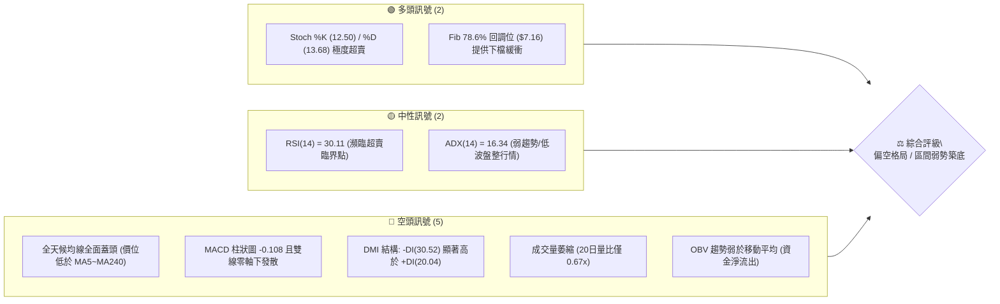
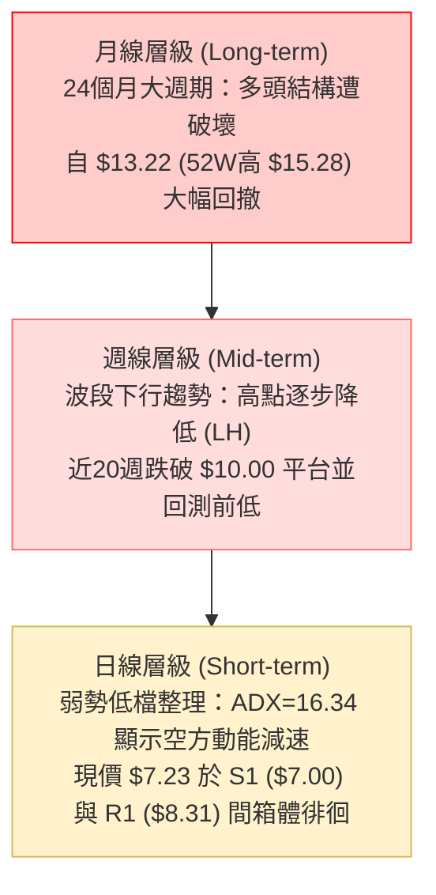
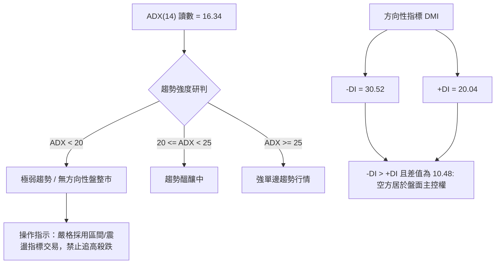
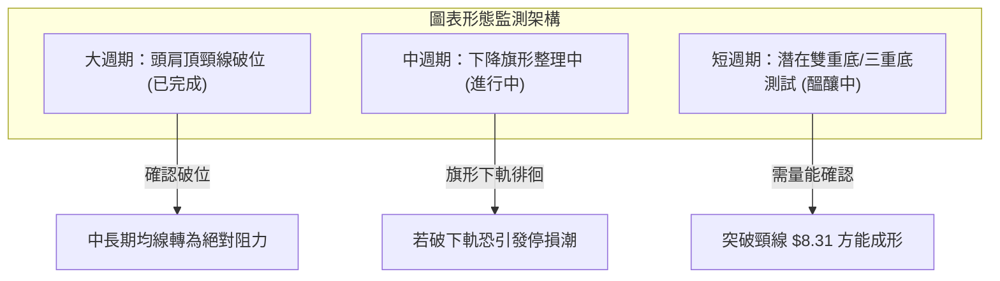
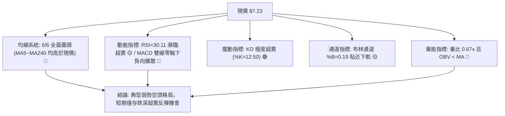
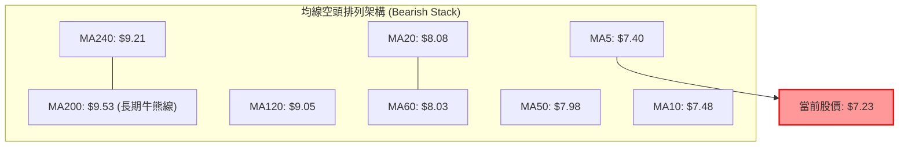
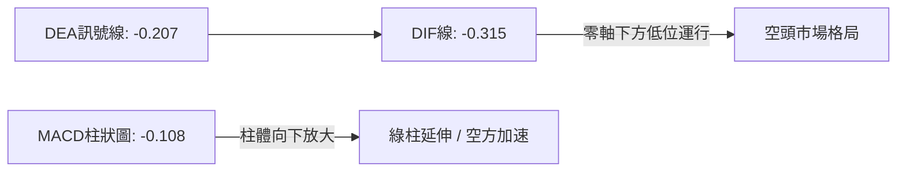
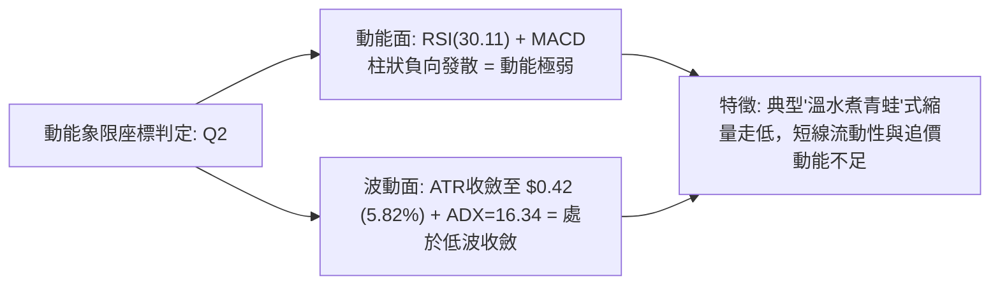
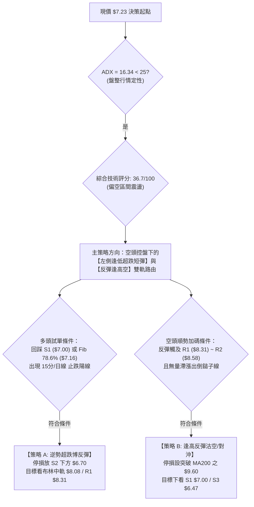
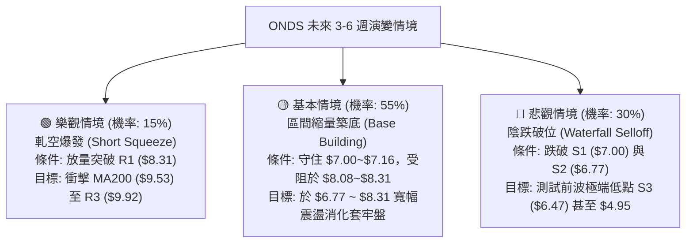

# ONDS 技術分析報告

> **報告日期**：2026-09-14 ｜ **語言**：繁體中文 ｜ **數據來源**：Yahoo Finance ｜ **當前價格**：$7.23

---

## 目錄

| 章節 | 內容 |
|------|------|
| [1. 技術面概覽](#1-技術面概覽) | 訊號儀表板、核心指標、評分卡 |
| [2. 趨勢分析](#2-趨勢分析) | 多時框趨勢、長中短期走勢 |
| [3. 圖表形態分析](#3-圖表形態分析) | 形態識別、K線組合、目標價 |
| [4. 支撐與阻力](#4-支撐與阻力) | 關鍵價位、斐波那契回調 |
| [5. 技術指標深度解讀](#5-技術指標深度解讀) | MA/RSI/MACD/布林/成交量 |
| [6. 動能與波動率](#6-動能與波動率) | 動能評估、ATR、Beta |
| [7. 多時框架總結](#7-多時框架總結) | 時框架評分矩陣 |
| [8. 交易策略建議](#8-交易策略建議) | 多空策略、風險報酬比 |
| [9. 風險提示與監控](#9-風險提示與監控) | 監控指標、風險場景 |
| [10. 報告總結](#-報告總結) | 全文核心彙整與決策卡 |

---

## 1. 技術面概覽

### 🎯 技術訊號儀表板



### 📊 核心指標速覽表

| 指標類別 | 指標名稱 | 當前數值 | 訊號 | 解讀 |
|----------|----------|----------|------|------|
| **價格** | 當前價格 | $7.23 | 🔴 | 位於 52 週區間 22.1% 低檔，距高點回撤逾 52% |
| **均線** | MA20 | $8.08 | 🔴 | 價格低於 MA20 達 -10.51%，短線反彈壓力顯著 |
| **均線** | MA50 | $7.98 | 🔴 | 價格受制於中線均線壓制，空頭排列形成蓋頭阻力 |
| **均線** | MA200 | $9.53 | 🔴 | 跌破牛熊分界線 (-24.13%)，中長期多頭結構破壞 |
| **動能** | RSI(14) | 30.11 | 🟡 | 位於臨界弱勢區（30-70中性下沿），尚未形成底背離 |
| **動能** | MACD | -0.315 / -0.207 | 🔴 | 雙線位於零軸之下發散，柱狀圖 -0.108 空方主導 |
| **擺動** | KD (14,3,3) | K: 12.50 / D: 13.68 | 🟢 | 進入 20 以下嚴重超賣區，具備短線技術性抽頭反彈契機 |
| **趨勢** | ADX(14) | 16.34 | 🟡 | ADX < 25 表示單邊趨勢動能衰退，進入寬幅震盪整理 |
| **通道** | 布林帶 (%B) | 0.19 | 🟡 | 緊貼布林下軌（$6.70）與中軌（$8.08）間運行 |
| **波動** | ATR(14) | $0.42 | 🟡 | 每日平均波動 5.82%，波動率較 5 月高點收斂 |

### 🏆 技術評分卡

```
技術評分卡 — ONDS (2026-09-14)
════════════════════════════════════════════════════
趨勢強度 (ADX/DMI)  ██████░░░░░░░░░░░░░░  32/100  🔴 空頭控盤
動能指標 (RSI/MACD) ███████░░░░░░░░░░░░░  36/100  🔴 負向發散
支撐穩定度 (Fib/S)  ████████████░░░░░░░░  60/100  🟡 7.00-7.16支撐帶
成交量配合 (OBV/VOL)██████░░░░░░░░░░░░░░  30/100  🔴 量縮價跌
形態完整度 (Pattern)████████░░░░░░░░░░░░  40/100  🔴 旗形破位向下
均線系統 (MA Align) ████░░░░░░░░░░░░░░░░  22/100  🔴 均線全面蓋頭
════════════════════════════════════════════════════
綜合技術評分        ███████░░░░░░░░░░░░░  36.7/100 評級：弱勢偏空
════════════════════════════════════════════════════
```

---

## 2. 趨勢分析

### 🌐 多時框趨勢分析



### 📈 長期趨勢 — 12個月走勢圖（Unicode）

依據月度收盤價數據（2025-10 至 2026-09）繪製之走勢圖：

```
ONDS 月線收盤走勢圖（過去12個月：2025-10 至 2026-09）
價格軸 ($)
$14.00 ┤                                      ● ($13.22 波段頂峰)
$13.00 ┤                                     / \
$12.00 ┤                                    /   \
$11.00 ┤                  ● ($10.36)        /     \
$10.00 ┤            ●    /   ● ($10.08)    ●       \
$9.00  ┤           / \  /             \   /         \ ($8.24)
$8.00  ┤     ●    /   \/               ● ($9.04)     \     ● ($7.66)
$7.00  ┤    / \  /                                    \   / \
$6.00  ┤   ●   ● ($6.44)                               ●-●   ● ($7.23 現價)
       └─┬───┬───┬───┬───┬───┬───┬───┬───┬───┬───┬───┬───────────────
       10M 11M 12M 01M 02M 03M 04M 05M 06M 07M 08M 09M (2025-10~2026-09)
```

**走勢特徵分析表格**：

| 階段區間 | 月度範圍 | 價格變動 | 階段漲跌幅 | 走勢特徵解讀 |
|----------|----------|----------|------------|--------------|
| **第一階段：初級主升** | 2025-10 ~ 2026-01 | $6.44 → $10.36 | +60.87% | 連續放量陽線推升，突破雙位數關卡 |
| **第二階段：高檔震盪** | 2026-01 ~ 2026-04 | $10.36 → $10.04 | -3.09% | 構築 $9.04 ~ $10.36 箱體高檔換手整理 |
| **第三階段：末升誘多** | 2026-04 ~ 2026-05 | $10.04 → $13.22 | +31.67% | 月線收盤爆衝至 $13.22（盤中創 52W 高 $15.28） |
| **第四階段：主跌崩落** | 2026-05 ~ 2026-07 | $13.22 → $7.49 | -43.34% | 假突破後快速反轉下殺，連續跌破多道中長均線 |
| **第五階段：弱勢築底** | 2026-07 ~ 2026-09 | $7.49 → $7.23 | -3.47% | 於 $7.20 ~ $7.66 呈現低波動縮量磨底 |

### 📊 中期趨勢（週線分析）

從近 20 週數據觀察，ONDS 呈現標準的空頭階梯式下行（Lower Highs & Lower Lows）：
1. 2026-05-31 當週自 $13.22 見頂反轉，週成交量達 5.67 億股。
2. 2026-07-19 當週觸及波段下影低點 $6.53 後放量反彈（週量 6.72 億與 8.34 億股），反彈高點僅達 2026-08-16 的 $9.24（受阻於 MA200 附近）。
3. 隨後 4 週再次連續下跌（$9.24 → $8.71 → $7.90 → $7.62 → $7.23），成交量逐週自 4.72 億股縮減至 2.01 億股。

```
週線級別價格軌跡示意：
$13.22 (5月高點) ──┐
                  └──> $6.53 (7月中旬低點) ──┐
                                             └──> $9.24 (8月中旬次高點 LH) ──┐
                                                                             └──> $7.23 (現價近破底尋求支撐)
```

### ⚡ 趨勢強度評估（ADX 解讀）



| 指標項 | 當前數值 | 臨界值定義 | 狀態研判 |
|--------|----------|------------|----------|
| **ADX(14)** | **16.34** | < 25 為盤整；> 25 為趨勢 | 🟡 **無趨勢盤整市場**：下跌動能已衰竭，進入縮量沉澱期 |
| **+DI** | **20.04** | 多方買盤推動力 | 🔴 弱勢：多頭力量匱乏，缺乏主動性攻擊量 |
| **-DI** | **30.52** | 空方拋壓推動力 | 🔴 主導：市場仍由賣方控盤，高檔解套賣壓沉重 |

---

## 3. 圖表形態分析

### 🔍 形態識別系統



**形態信心度評估表（嚴格依據歷史價位）**：

| 形態類別 | 信心度 | 判斷依據（數據引用） | 完成度 | 目標價計算式與目標值 |
|----------|--------|----------------------|--------|----------------------|
| **中級下降通道/旗形** | 75% | 8月中自 $9.24 回落，連接 2026-08-30 ($7.90) 與 2026-09-13 ($7.23) 形成平行下飄軌跡 | 85% | 由通道高度推算：破位點 $7.62 - 通道寬度 ($8.71 - $7.49 = $1.22) = **$6.40** (直指支撐 S3 $6.47) |
| **潛在雙重底 (W底)** | 45% | 前波低點 2026-07-19 的 $6.53 與現價尋求支撐位 S1 ($7.00) 呼應 | 40% | 需放量站上頸線 R1 ($8.31)；目標價 = 頸線 $8.31 + ($8.31 - $6.53) = **$10.09** (受限於未突破，信心低) |
| **頭肩頂形狀破位** | 80% | 左肩 2026-01 ($10.36)，頭部 2026-05 ($13.22)，右肩 2026-08 ($9.24)，頸線約 $9.00 處已跌破 | 100% | 形態已發酵完畢，跌破頸線 $9.04 後直接回調至當前 $7.23 水平 |

### 🕯️ 重要 K 線形態分析（近 5 個月走勢）

| 月份 | 收盤價 | K線形態 | 解讀 | 訊號 |
|------|--------|---------|------|------|
| **2026-05** | $13.22 | 爆量長上影線射擊之星 (Shooting Star) | 盤中衝擊 $15.28 遭遇機構極限拋售，多頭衰竭反轉訊號 | 🔴 強烈看空 |
| **2026-06** | $8.24 | 大陰線破位吞噬 (Bearish Marubozu) | 單月暴跌 -37.67%，直接摜破 50 日均線，宣告多頭反轉 | 🔴 空頭宣洩 |
| **2026-07** | $7.49 | 長下影紡錘線 (Long Lower Shadow Spinning Top) | 盤中測試 $6.53 後獲低接盤反彈，下檔初現買盤支撐 | 🟡 多空拉鋸 |
| **2026-08** | $7.66 | 衝高回落十字小陽線 (Inverted Hammer) | 曾反彈至 $9.24，但月末遭遇 MA200 壓制退守，追高意願低 | 🟡 滯漲受阻 |
| **2026-09** | $7.23 | 縮量陰線下尋 (Soft Breakdown Candle) | 沿布林下軌震盪陰跌，成交量極度萎縮，賣盤主動拋售減輕 | 🔴 弱勢磨底 |

### 📉 ASCII 走勢形態示意圖（近期下行通道與支撐測試）

```
$9.24 ──┐ (2026-08-16 高點)
        │\  [下降通道上軌]
$8.71 ──┼─\──────┐
        │  \     │\
$8.08 ──┼───\────┼─\─── [MA20 / 中軌壓制]
        │    \   │  \
$7.62 ──┼─────\──┼───\──┐
        │      \ │    \ │\
$7.23 ──┼───────\┼─────\┼─●◄─── [現價 $7.23 貼近 Fib 78.6% $7.16]
        │        \      \ │
$7.00 ──┴─────────\──────\┴─────── [關鍵支撐位 S1]
                   \      \
                    \      [下降通道下軌]
```

### 🎯 形態目標價計算

根據下降旗形/通道形態之完整測算：
* **形態阻力上限**：取 8 月次高點收盤價聚類點 **$8.31** (阻力位 R1)
* **形態支撐下限**：取 7 月波段實體收盤低點 **$6.53**
* **反轉確認點（多方突破）**：若日線連續兩日突破 **$8.31**，根據等距測算（Measured Move）：
  $$\text{目標價} = \text{頸線}(8.31) + (\text{頸線}(8.31) - \text{低點}(6.53)) = 8.31 + 1.78 = \$10.09$$
  *(備註：該目標價極度接近 2026-04 收盤價 $10.04 與 50% 斐波那契回調位 $10.11)*
* **破位下行延伸（空方破位）**：若正式跌破 **$7.00** (S1)，則下一等距滿足點直指歷史波段低點聚類 **$6.47** (S3)。

---

## 4. 支撐與阻力

### 🗺️ 關鍵價位分布圖（Unicode）

```
ONDS 價位結構分布圖 (Resistance & Support Hierarchy)
═══════════════════════════════════════════════════════════════
$10.11 ║██████████████████████████████║ 斐波那契 50.0% 強多空分水嶺
$ 9.92 ║████████████████████████      ║ 強阻力 R3 (近一年波段高點聚類)
$ 9.53 ║▓▓▓▓▓▓▓▓▓▓▓▓▓▓▓▓▓▓▓▓          ║ 長期生命線 MA200 蓋頂
$ 8.90 ║████████████████              ║ 斐波那契 61.8% 重要壓力位
$ 8.58 ║██████████████                ║ 阻力位 R2 (前波反彈高檔次密集區)
$ 8.31 ║██████████████████████        ║ 關鍵阻力 R1 (頸線與波段高點聚類)
$ 8.08 ║──────────────────────────────║ 短期基準線 MA20 / 布林中軌
───────╫──────────────────────────────╫───────────────────────────
$ 7.23 ╠══════════════════════════════╣ ◄── 當前市價 (Current Price)
───────╫──────────────────────────────╫───────────────────────────
$ 7.16 ║▒▒▒▒▒▒▒▒▒▒▒▒▒▒▒▒▒▒▒▒▒▒▒▒▒▒▒▒  ║ 斐波那契 78.6% 回調關鍵支撐
$ 7.00 ║▓▓▓▓▓▓▓▓▓▓▓▓▓▓▓▓▓▓▓▓▓▓        ║ 近期波段支撐 S1 (整數心理關卡)
$ 6.77 ║████████████████              ║ 次級支撐 S2 (波段低點聚類)
$ 6.70 ║──────────────────────────────║ 布林通道下軌極限
$ 6.47 ║████████████████████████      ║ 強支撐 S3 (7月極限波段低點聚類)
$ 4.95 ║██████████████████████████████║ 52週絕對低點 (Fib 100.0%)
═══════════════════════════════════════════════════════════════
```

### 🚧 阻力位分析表

價位嚴格引用系統由 OHLCV 聚類計算之數值：

| 阻力級別 | 價位 | 距現價幅標 | 形成原因與籌碼解讀 | 突破難度 | 重要性 |
|----------|------|------------|--------------------|----------|--------|
| **R1** | **$8.31** | +15.01% | 8月下旬盤整平台下沿、多重成交密集區聚類，疊加 MA20/MA50 剛性反壓 | 極高 🔴 | ★★★★★ |
| **R2** | **$8.58** | +18.67% | 8月中旬高檔回落之中繼破位點，大量套牢籌碼沉澱 | 高 🔴 | ★★★★☆ |
| **R3** | **$9.92** | +37.28% | 5-6月頭肩形態頸線位置，與 $10.00 整數大關構成中期鋼鐵壓力牆 | 極高 🔴 | ★★★★★ |

### 🛡️ 支撐位分析表

價位嚴格引用系統由 OHLCV 聚類計算之數值：

| 支撐級別 | 價位 | 距現價幅標 | 形成原因與籌碼解讀 | 守住機率 | 重要性 |
|----------|------|------------|--------------------|----------|--------|
| **S1** | **$7.00** | -3.18% | 整數心理防線，與 7-8 月多次下探拉起之最低收盤聚類位吻合 | 65% 🟡 | ★★★★☆ |
| **S2** | **$6.77** | -6.36% | 接近布林通道下軌（$6.70），短線空頭力竭極值位 | 75% 🟢 | ★★★★☆ |
| **S3** | **$6.47** | -10.58% | 2026-07-19 當週探底 $6.53 之實體支撐區，為本波段牛熊最終防線 | 85% 🟢 | ★★★★★ |

### 📐 斐波那契回調位分析

基準計算區間為 52 週絕對低點 $4.95 至 52 週絕對高點 $15.28（落差 $10.33）：

| 回調比例 | 關鍵價位 | 狀態研判 | 籌碼技術意涵解讀 |
|----------|----------|----------|------------------|
| **0.0%** | **$15.28** | 52W High | 歷史頂部，爆量誘多反轉點 |
| **23.6%** | **$12.84** | 遠在上方 | 首波反彈衰竭點 |
| **38.2%** | **$11.33** | 遠在上方 | 牛市回撤健康水準（已徹底失守） |
| **50.0%** | **$10.11** | 強阻力帶 | 多空中期分水嶺，跌破後確立進入熊市調整週期 |
| **61.8%** | **$8.90** | 重要壓制 | 黃金分割經典回撤位，現已轉化為中長期反彈強阻力 |
| **78.6%** | **$7.16** | ◄ 現價徘徊區 | **最後防禦線**：現價 $7.23 僅高於該位 0.97%，此處多頭若失守，將直接回撤 100% 低點 |
| **100.0%** | **$4.95** | 52W Low | 52 週底部，若全數回吐則長線主升浪全面破滅 |

---

## 5. 技術指標深度解讀

### 🎛️ 指標訊號總覽



### 📈 移動平均線排列分析



* **均線狀態解讀**：
  * **價格與短均乖離**：現價 $7.23 低於 MA5 (-2.32%)、MA10 (-3.40%) 與 MA20 (-10.51%)，空頭排列整齊，各均線斜率均向下傾斜。
  * **中期死亡交叉壓制**：MA20 ($8.08) 與 MA50 ($7.98) 呈現極度貼合但均在現價上方形成沉重「天花板效應」。
  * **長線走壞確認**：現價低於 MA200 ($9.53) 達 -24.13%，宣告長週期牛市架構已遭到實質破壞，中期所有反彈均應視為解套減碼機會。

### 📉 RSI(14) 分析

* **數值評估**：當前 RSI(14) 讀數為 **30.11**。
  ```
  RSI(14) 刻度尺：
  0 ───────── 20 ──────── 30 ──────────────────────── 70 ─────── 100
  [極度超賣]     [超賣下沿] ▲ (30.11)       [中性區間]     [超買]
  ```
* **背離研判**：
  * 對比 2026-07-05 當週收盤 $7.41（週 RSI 21.3）與 2026-07-12 收盤 $7.26（週 RSI 28.0），曾出現短暫週線級微幅底背離，並催生了 8 月中旬衝高至 $9.24 的反彈波。
  * 然而，觀察日線與最新四週走勢：自 $9.24 回落至現價 $7.23，RSI 從 70.3 連續墜落至 30.11，**價格創近兩個月新低，RSI 亦同步同步走低，無任何日線底背離跡象**。這表明空方力道為「真實賣壓釋放」而非誘空陷阱。

### 📊 MACD(12/26/9) 訊號解讀



* **數值解讀**：DIF (-0.315) 位於 DEA (-0.207) 下方，MACD Histogram 為 **-0.108**。
* **柱狀圖走向**：自 2026-08-16 的高檔正柱 (+0.171) 快速反轉，於 2026-08-23 轉負 (-0.033) 並逐週擴散至當前的 -0.108。雙線在負軸區間再度死叉並發散下行，空方完全主導節奏，尚未看到綠柱縮短（紅柱回升）的收斂信號。

### 📦 布林通道分析

```
布林帶寬度示意圖 (BB Width & %B Location)
$9.46 ┼──────────────────────────────────── BB 上軌 (Upper Band)
      │
$8.08 ┼──────────────────────────────────── BB 中軌 / MA20 (Middle Band)
      │                                     
$7.23 ┼──────────────● 現價 ($7.23, %B = 0.19)
      │
$6.70 ┼──────────────────────────────────── BB 下軌 (Lower Band)
```

* **帶寬與位置解讀**：
  * BB 上軌 $9.46，中軌 $8.08，下軌 $6.70，通道寬度為 $2.76（帶寬百分比約 34.1%）。
  * **%B 指標值為 0.19**，代表股價目前處於中軌與下軌之間的極弱勢區域，空頭沿著下軌「通道貼著走」，這常發生在單邊陰跌走勢中。
  * 現價距離下軌 $6.70 尚有 $0.53（約 7.3%）的下挫緩衝空間，尚未觸發布林下軌的極限外軌擠壓反彈。

### 💹 成交量分析（量價配合度）

* **量能絕對萎縮**：
  * 最新單日成交量：**41,875,300 股**。
  * 20 日基準均量：**62,167,870 股**（量比僅 **0.67x**）。
  * 50 日基準均量：**84,788,482 股**（量比跌至 0.49x）。
* **OBV（能量潮）深度解析**：
  * 當前系統確認：「**OBV < MA → 量能疲弱**」。
  * 在 5 月衝頂時週量曾達 5.67 億股，7 月低檔換手亦有 8.34 億股；而近三週週量分別降至 3.02 億、2.94 億及最新一週的 2.01 億股。
  * **量價背離診斷**：量縮陰跌代表盤面缺乏主動買盤承接，機構大資金在 $8.30~$9.20 減碼後，當前處於「放任自由落體」狀態。沒有放量見底（Panic Volume Climax）前，純量縮不足以構成 V 型反轉的充分條件。

---

## 6. 動能與波動率

### ⚡ 動能評估

| 象限分類 | 動能強度 (Momentum) | 波動率水準 (Volatility) | 當前 ONDS 判定 | 戰術操作指引 |
|----------|---------------------|--------------------------|----------------|--------------|
| **第一象限 (Q1)** | 強 (Bullish) | 低 (Low Vol) | — | 最佳波段順勢抱牢期 |
| **第二象限 (Q2)** | 弱 (Bearish) | 低 (Low Vol) | **✔ 當前定位 (Q2)** | **謹慎觀望：陰跌磨底，禁盲目抄底** |
| **第三象限 (Q3)** | 強 (Bullish) | 高 (High Vol) | — | 爆發性攻擊浪，設動態停利 |
| **第四象限 (Q4)** | 弱 (Bearish) | 高 (High Vol) | — | 恐慌崩跌期，嚴格停損出場 |



### 📊 ATR 波動率分析

* **ATR(14) 絕對值**：**$0.42**（佔現價比率為 **5.82%**）。
* **止損與波動幅度測算**：
  * 作為通訊設備與無人機概念的高貝塔成長股，單日 ATR 5.82% 屬於中度收斂水準（高點時 ATR 曾超 $1.20）。
  * **1.0 倍 ATR 防禦線**：$7.23 - $0.42 = **$6.81**（剛好高於 S2 支撐 $6.77）。
  * **1.5 倍 ATR 嚴格止損線**：$7.23 - (1.5 \times 0.42) = $7.23 - $0.63 = **$6.60**（跌破布林下軌 $6.70 與波段防線）。
  * **2.0 倍 ATR 寬幅止損線**：$7.23 - (2.0 \times 0.42) = $7.23 - $0.84 = **$6.39**（正式擊潰歷史實體低點 S3 $6.47）。

### 📐 Beta 與市場相關性

* **Beta 係數**：**2.736**（極高系統性風險曝險）。
  * 解讀：ONDS 的波動幅度約為標普 500 大盤的 **2.74 倍**。在市場整體避險情緒高漲或納斯達克指數回調時，該股容易遭遇放大倍數的下殺壓制。
* **放空數據透析（Short Squeeze 潛力）**：
  * **Short % of Float**：高達 **39.9%**！
  * **Short Ratio (天數)**：**3.13 天**。
  * **機構持股比率**：**58.4%**。
  * **技術與結構互鎖解讀**：高達 39.9% 的做空比例表示市場有大量空頭籌碼積聚。當 ADX < 25、成交量低迷時，空頭佔優；但若價格回踩關鍵支撐（如 $7.00 或 Fib 78.6% $7.16）並爆出成交量（如單日突破 8,000 萬股），極高的放空比例可能隨時觸發爆發性的**軋空反彈（Short Squeeze）**。

---

## 7. 多時框架總結

### 📋 時框架評分表

| 時框架 | 趨勢方向 | 動能表現 | 均線排列 | 圖表形態 | 綜合評分 | 戰術建議 |
|--------|----------|----------|----------|----------|----------|----------|
| **月線 (長期)** | 🔴 空頭修復 | 弱 (高檔反轉回吐過半) | 跌破均線起漲點 | 爆量長針射擊之星 | 35/100 | 減碼避險，長期部位嚴控 |
| **週線 (中期)** | 🔴 階梯下行 | 空方控盤 (MACD綠柱) | 跌破 MA200 關鍵線 | 下降通道延伸 | 32/100 | 逢反彈至阻力位分批離場 |
| **日線 (短期)** | 🟡 箱體陰跌 | 擺動超賣 (KD<15, RSI~30) | MA5~MA20 壓制 | 貼著布林下軌整理 | 42/100 | 空手觀望，禁追空，防超賣抽頭 |

### 🔲 綜合訊號矩陣

```
時框與指標驗證矩陣表：
指標項          日線 (Short)      週線 (Medium)     月線 (Long)      整體一致性確認
────────────────────────────────────────────────────────────────────────────
均線結構 (MA)    🔴 全線受制       🔴 破MA200       🟡 守住歷史基期   🔴 一致偏空
動能指標 (MACD)  🔴 負向擴大       🔴 雙線向下       🔴 柱體縮減       🔴 一致看空
擺動指標 (RSI)   🟡 30.11超賣邊界  🔴 30.10走弱      🟡 50中軸下方     🟡 偏空但具超賣韌性
通道位置 (BB)    🔴 %B=0.19下沿    🔴 擊破中軌       🟡 位於中軌下方   🔴 空方通道運行
趨勢強度 (ADX)   🟡 16.34 (盤整)   🟡 趨勢衰竭       🔴 動能退潮       🟡 盤整磨底無強趨勢
────────────────────────────────────────────────────────────────────────────
```

### ⚖️ 多時框收斂結論

依據多時框收斂規則（嚴格要求 14）：
1. **行情性質判定**：當前日線 ADX(14) 讀數為 **16.34**（遠小於 25），確立當前**非單邊崩跌或單邊暴漲的趨勢行情**，而是屬於**弱勢盤整行情（Range-bound / Consolidation Market）**。
2. **主導時框與優先級取捨**：
   * 在盤整架構下，中長期（週線/MA200）方向決定了整體的「空頭背景天花板」（即所有反彈都受制於 $8.31~$9.53 的天塹）。
   * 日線層級因為 ADX < 25 且 KD (12.50) 極度超賣，交易區間應嚴格錨定在**布林通道下軌至中軌區間（$6.70 ~ $8.08）**與歷史支撐位。
3. **收斂方向判定**：**弱勢中性偏空（觀望為上，防守反擊）**。
   * 日線極度超賣不支持在此時盲目殺跌做空（39.9% 浮動做空盤隨時可能被突發消息引爆軋空）；但全均線蓋頂與無量格局亦完全不具備順勢做多的技術條件。主策略定位為：**等待支撐確認後的超賣短彈，或反彈遇阻後的順勢對沖**。

---

## 8. 交易策略建議

### 🗺️ 策略決策流程圖



### 🧭 策略路由

> **當前主策略方向 = 偏空中性區間操作（依評分 36.7/100）**
> 
> 由於綜合評分 ≤ 40，宏觀技術背景為空方控盤；但因 ADX=16.34 且 Stoch KD 進入極限超賣區，**不可於 $7.23 直接追空**。策略設計分為：「**策略 A：激進型超跌反彈多單（嚴格輕倉快進快出）**」與「**策略 B：主基調反彈遇阻放空/套期保值（逢高布局）**」。

### 🎯 價格情境階梯（Price Scenarios）

價位嚴格引用第 4 章系統計算之精確點位：

| 觸發條件 | 第一目標 | 第二目標 | 情境技術含義與因應措施 |
|----------|----------|----------|------------------------|
| **強勢突破 R1 ($8.31)** | R2 ($8.58) | R3 ($9.92) | 突破 MA20 與下降通道上軌，空頭回補（軋空）展開，短線轉強 |
| **突破中軌 ($8.08)** | R1 ($8.31) | R2 ($8.58) | 測試第一重密集籌碼套牢區，反彈進入高阻力帶 |
| **守住現價區間 ($7.16~$7.23)** | MA10 ($7.48) | MA20 ($8.08) | 斐波那契 78.6% 起效，於布林下軌上方進行窄幅縮量磨底 |
| **跌破 S1 ($7.00)** | S2 ($6.77) | S3 ($6.47) | 心理防線瓦解，誘發多頭融資停損盤，直奔布林下軌 |
| **失守 S3 ($6.47)** | Fib 100% ($4.95) | — | 宣告 2026 年度上升浪徹底歸零，進入漫長熊市尋底期 |

### 📊 情境機率分佈

| 預測情境 | 發生機率 | 主要技術依據 |
|----------|----------|--------------|
| **弱勢區間震盪整理** | **55%** 🟡 | ADX 僅 16.34 顯示單邊動能匱乏；量比 0.67x 萎縮至極限，籌碼於 $7.00 ~ $8.08 沉澱換手 |
| **再度破天下探 (破S1探S2/S3)** | **30%** 🔴 | 均線空頭排列蓋頂，MACD 負向發散未現底背離，-DI(30.52) 仍全面壓制多方 |
| **強勢反轉向上突破** | **15%** 🟢 | 缺乏成交量催化劑，上方受制於 50日與 200日均線鋼鐵壓力，需特大利多或巨量引爆軋空 |

### 🟢 主策略詳情

| 策略要素 | 策略 A（逆勢超跌博反彈 - 搶短多） | 策略 B（順勢逢高放空/對沖 - 偏空做震盪） |
|----------|------------------------------------|------------------------------------------|
| **操作性質** | 逆勢左側短線交易（嚴控倉位） | 順應大時框均線壓制的右側防守單 |
| **進場條件** | 回踩 $7.00~$7.16 支撐不破，日線收下影線 | 反彈觸及 R1 ($8.31) 或布林中軌 ($8.08) 出現滯漲倒鎚 |
| **進場價格** | **$7.16**（Fib 78.6% 回調關鍵點） | **$8.25**（R1 $8.31 下沿密集區） |
| **目標價 T1** | **$8.08**（MA20 / 布林中軌反壓點） | **$7.23**（現價回測點） |
| **目標價 T2** | **$8.31**（關鍵阻力位 R1） | **$6.77**（次級支撐 S2 / 布林下軌附近） |
| **止損價格** | **$6.70**（跌破布林下軌與 S2，嚴格離場） | **$8.75**（有效突破 R2 $8.58 上方 2%） |
| **風險報酬比** | **1 : 2.50** (風險 $0.46 / 潛在收益 $1.15) | **1 : 2.96** (風險 $0.50 / 潛在收益 $1.48) |
| **成功機率** | **45%**（受制於空頭大趨勢） | **65%**（符合多時框均線下行方向） |
| **建議倉位** | **5% ~ 8%**（極輕倉試單） | **10% ~ 15%**（標準避險或波段部位） |

### 🔴 反向風險觸發點（對沖與風控提示）

* **多單反轉風險觸發**：若日線收盤價**實體跌破 $7.00 (S1)**，說明斐波那契 78.6% 支撐無效，必須無條件止損策略 A 的多頭部位，不可逆勢攤平，下檔可能迅速滑落至 $6.47。
* **空單反轉風險觸發**：若成交量放大至日均量 2 倍以上（>1.2億股），且股價**強勢收復 $8.58 (R2)**，代表 39.9% 的空頭浮動籌碼遭軋空鎖死，空頭必須立即全數平倉停損，防範股價暴力拉升至 R3 ($9.92) 或 MA200 ($9.53)。

### ⭐ 整體訊號強度評星

```
做多訊號強度：★★☆☆☆  (2.0/5星) ── 僅靠超賣支撐，量能與均線極度不利
做空訊號強度：★★★★☆  (4.0/5星) ── 順應週日線全面空頭排列，但忌低檔追空
整體可信度：  ★★★☆☆  (3.5/5星) ── ADX<25 震盪期指標易出現鈍化與假突破
```

---

## 9. 風險提示與監控

### ✅ 關鍵監控指標 Checklist

```
╔══════════════════════════════════════════════════════════════════════╗
║                   ONDS 每日盤面風控監控 CHECKLIST                     ║
╠══════════════════════════════════════════════════════════════════════╣
║ [ ] 價位維度：是否收盤跌破關鍵整數關卡 $7.00 (S1 破位警報)           ║
║ [ ] 均線維度：是否突破並連續兩日企穩 MA20 ($8.08) (短多啟動訊號)     ║
║ [ ] 量能維度：單日成交量是否回升至 62,000,000 股 (20日均量線) 之上   ║
║ [ ] 動能維度：MACD 柱狀圖是否收斂至 -0.050 之內 (綠柱萎縮訊號)      ║
║ [ ] 擺動維度：RSI(14) 是否跌破 25 (極度超賣鈍化) 或反彈突破 40      ║
║ [ ] 籌碼維度：做空比例 39.9% 是否出現借券費率暴增引發 Short Squeeze ║
╚══════════════════════════════════════════════════════════════════════╝
```

### ⚠️ 風險場景分析



### 🛡️ 風險管理重要提醒

1. **高貝塔係數與波動性管理**：ONDS 的 Beta 達 **2.736**，屬於超高波動資產。在投資組合中，該標的的配置權重**強烈建議控制在總資產的 3% ~ 5% 以內**，嚴禁使用高倍數槓桿融資交易，以防隔夜跳空觸發斷頭風險。
2. **財報與基本面背離風險**：儘管 TTM 營收爆發性成長 1235.4%，但營運利潤率為 **-166.3%**，營運現金流為 **-$161.06M**，呈現「高燒錢率」狀態。技術面的疲弱實質反映了市場對其高估值（P/S > 23x）及未來現金流可持續性的擔憂，切勿僅因基本面口號而忽略技術破位事實。
3. **執行嚴格止損紀律**：在 ADX < 25 的盤整陰跌期，最忌諱「短線變長線、投機變投資」的凹單心態。無論執行策略 A 或策略 B，一旦觸發設定的價格底線（如多頭觸及 $6.70），必須機械化果斷執行停損。

---

## 📋 報告總結

```
ONDS 技術分析報告總結卡
════════════════════════════════════════════════════════════════
報告日期：2026-09-14
當前價格：$7.23 (當日收盤)
綜合評分：36.7 / 100  (評級：🔴 弱勢偏空 / 區間弱化整理)

關鍵結論：
├─ 長期趨勢 (月線)：🔴 自 $15.28 回落逾半，跌破牛熊分界線，多頭結構受創
├─ 中期趨勢 (週線)：🔴 階梯式走低，受制於 MA200 ($9.53) 與 R1 ($8.31)
├─ 短期趨勢 (日線)：🟡 ADX=16.34 進入低波盤整，KD 極度超賣，隨時有技術反抽
├─ 關鍵支撐：S1: $7.00 ｜ S2: $6.77 ｜ S3: $6.47 (斐波那契78.6%: $7.16)
├─ 關鍵阻力：R1: $8.31 ｜ R2: $8.58 ｜ R3: $9.92 (布林中軌: $8.08)
└─ 機構共識：9位分析師給予 Strong Buy (目標均價 $19.42)，與當前盤面嚴重背離

最優策略組合：
1. 🥇 最佳機會 (防守型)：耐心等待反彈至 R1 ($8.31) 附近出現滯漲訊號時，
                      建立波段偏空對沖部位，停損設 $8.75，目標下看 $7.23。
2. 🥈 次選機會 (激進型)：現價至 $7.16 區間極輕倉博取 KD 超賣反彈，
                      進場點 $7.16，停損嚴格放 $6.70，第一目標 $8.08。
3. 🥉 保守選擇 (穩健型)：空手徹底觀望，不參與無量陰跌市場，
                      靜待股價放量突破 R1 ($8.31) 或跌出恐慌盤放量見底後再做定奪。
════════════════════════════════════════════════════════════════
```

---

> ⚠️ **免責聲明**：本報告為依據客觀歷史技術數據所進行之量化圖表與指標綜合研判，所有支撐阻力價位與模型推算均基於所提供之 OHLCV 歷史數據。本報告**僅供學術研究與投資參考**，**不構成任何形式的買賣邀約或投資建議**。金融市場瞬息萬變，高貝塔個股風險極大，投資人應獨立評估自身風險承受能力並自負盈虧。

---

*報告生成時間：2026-09-14 ｜ 數據來源：Yahoo Finance ｜ 分析架構：多時框架量化技術分析系統*