# ONDS 技術分析報告

> **報告日期**：2026-09-15 ｜ **語言**：繁體中文 ｜ **數據來源**：Yahoo Finance ｜ **當前價格**：$7.23

---

## 目錄

| 章節 | 內容 |
|------|------|
| [1. 技術面概覽](#1-技術面概覽) | 訊號儀表板、核心指標、評分卡 |
| [2. 趨勢分析](#2-趨勢分析) | 多時框趨勢、長中短期走勢、ADX解讀 |
| [3. 圖表形態分析](#3-圖表形態分析) | 形態識別、K線組合、目標價推算 |
| [4. 支撐與阻力](#4-支撐與阻力) | 關鍵價位、斐波那契回調結構 |
| [5. 技術指標深度解讀](#5-技術指標深度解讀) | MA/RSI/MACD/布林/成交量全面共振 |
| [6. 動能與波動率](#6-動能與波動率) | 動能四象限、ATR風險度量、Beta暴露 |
| [7. 多時框架總結](#7-多時框架總結) | 時框架收斂判定、唯一方向總結 |
| [8. 交易策略建議](#8-交易策略建議) | 策略路由、精確進出場點、風控劇本 |
| [9. 風險提示與監控](#9-風險提示與監控) | 監控指標Checklist、極端情境與倉位管理 |

---

## 1. 技術面概覽

### 🎯 技術訊號儀表板

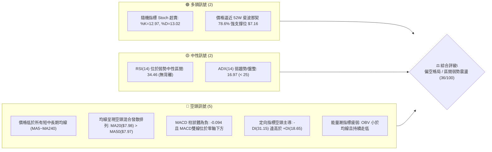

### 📊 核心指標速覽表

| 指標類別 | 指標名稱 | 當前數值 | 訊號 | 解讀 |
|----------|----------|----------|------|------|
| **價格** | 當前價格 | $7.23 | 🔴 | 位於 52 週價格區間的 22.1%，受制於短中長期壓制 |
| **均線** | MA20 | $7.98 | 🔴 | 價格低於 MA20 達 -9.38%，短線下行斜率明確 |
| **均線** | MA50 | $7.97 | 🔴 | 價格低於 MA50，且 MA20 與 MA50 形成死叉聚攏壓力 |
| **均線** | MA200 | $9.52 | 🔴 | 長期牛熊分水嶺遠高於現價 (-24.05%)，長期結構受損 |
| **動能** | RSI(14) | 34.46 | 🟡 | 處於空方主導弱勢區，但尚未觸及 30 極端超賣邊界 |
| **動能** | MACD (12,26,9) | -0.325 / -0.231 | 🔴 | 雙線位於零軸下發散，Histogram 柱狀圖為 -0.094 空頭延續 |
| **動能** | Stoch %K / %D | 12.97 / 13.02 | 🟢 | 深度超賣區鈍化，短線具備技術性反抽動能 |
| **趨勢** | ADX(14) / ±DI | 16.97 (弱趨勢) | 🟡 | 趨勢動能減弱進入箱型消化，但 -DI(31.15) 顯著強於 +DI(18.65) |
| **波動** | ATR(14) | $0.42 (5.77%) | 🔴 | 日內波幅劇烈，Beta 高達 2.736，投機度與風控要求極高 |
| **量能** | 20日均量 / OBV | 61,551,490 / OBV<MA | 🔴 | 最新量 84.23M 放大但收平於低位，OBV 處於均線下方量能疲軟 |

### 🏆 技術評分卡

```
╔══════════════════════════════════════════════════════════════╗
║              技術評分卡 — ONDS (2026-09-15)                  ║
╠══════════════════════════════════════════════════════════════╣
║ 趨勢強度 (ADX/DI)   ██████░░░░░░░░░░░░░░  30/100   🔴 弱勢空頭║
║ 動能指標 (RSI/MACD) ███████░░░░░░░░░░░░░  35/100   🔴 空方發散║
║ 支撐穩定度 (S1/Fib) ███████████░░░░░░░░░  55/100   🟡 逼近強撐║
║ 成交量配合 (OBV/VOL)██████░░░░░░░░░░░░░░  30/100   🔴 量價疲弱║
║ 形態完整度 (區間箱型)████████░░░░░░░░░░░░  40/100   🟡 尋求築底║
║ 均線排列 (MA系統)   ████░░░░░░░░░░░░░░░░  25/100   🔴 空頭壓制║
╠══════════════════════════════════════════════════════════════╣
║ 綜合技術評分        ███████░░░░░░░░░░░░░  36/100   🔴 總體偏空║
╚══════════════════════════════════════════════════════════════╝
```

---

## 2. 趨勢分析

### 🌐 多時框趨勢分析

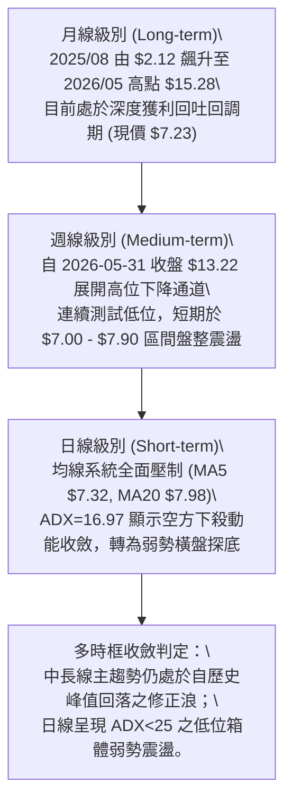

### 📈 長期趨勢 — 12個月走勢圖（Unicode）

```
ONDS 月線走勢圖（過去12個月：2025-09 至 2026-09）
價格軸 ($)
$14.00 ┤                                   ●(2026-05 $13.22)
$12.00 ┤
$10.00 ┤                          ●    ●
$8.00  ┤       ●         ●   ●
$7.00  ┤  ●━━━━━━━━━●━━━━━━━━━━━━━━━━━━━━━━━━━━━━━●←(現在 $7.23)
$6.00  ┤            ●
$5.00  ┤
       └──────────────────────────────────────────────────────────
         09   10   11   12   01   02   03   04   05   06   07   08   09 (月份)
        '25  '25  '25  '25  '26  '26  '26  '26  '26  '26  '26  '26  '26
```

**走勢特徵分析表格**：

| 階段區間 | 月份區間 | 起止收盤價 | 區間漲跌幅 | 結構性技術特徵與量價解讀 |
|----------|----------|------------|------------|--------------------------|
| 第一階段：主升推動浪 | 2025-09 ~ 2026-01 | $7.72 → $10.36 | +34.20% | 沿上升趨勢線持續放量推升，站穩兩位數大關，形成強勢多頭通道。 |
| 第二階段：高位蓄勢震盪 | 2026-02 ~ 2026-04 | $10.08 → $10.04 | -0.40% | 於 $9.00~$10.36 形成平坦型對稱整理，MA200 緩步墊高，籌碼換手。 |
| 第三階段：末端噴出誘多 | 2026-05 | $10.04 → $13.22 | +31.67% | 月線天量加速噴出（觸及 52W 高點 $15.28），留下長上影線，動能竭盡。 |
| 第四階段：雪崩式下行 | 2026-06 ~ 2026-07 | $13.22 → $7.49 | -43.34% | 連續長陰破位跌穿多道支撐，MACD 出現週線死叉，回補前期跳空缺口。 |
| 第五階段：低位弱勢築底 | 2026-08 ~ 2026-09 | $7.66 → $7.23 | -5.61% | 波動率顯著收縮，ATR 降至 $0.42，交投重心壓制在 $7.00~$8.00 箱體。 |

### 📊 中期趨勢（週線分析）

從近 20 週數據觀察，ONDS 於 2026-05-31 見頂收盤 $13.22（週成交量高達 5.66 億股）後，隨即於 2026-06 發生流動性潰縮下殺。
- 2026-07-19 跌至週線收盤低點 $6.53 後，於 2026-07-26 爆出 8.34 億股歷史天量反彈至 $7.80。
- 2026-08-16 雖衝高至 $9.24，但受制於 MA60 及波段阻力 R2（$8.58），反彈未能持續，MACD 柱狀體再度由正轉負（+0.171 翻落至當前 -0.094）。
- 近四週收盤價連續下滑（$7.90 → $7.62 → $7.23 → $7.23），週成交量從 3.02 億股收縮至 84.23M，呈現典型的**中線空頭排列下的低量縮整理態勢**。

```
近期中期阻力與支撐示意圖：
[波段阻力 R2]    $8.58  --------------------------------------- (中期反彈高點壓力)
[關鍵阻力 R1]    $8.31  ======================================= (MA20/MA60密集壓制區)
[當前收盤價格]    $7.23  <==== 現價 (受制於 MA20 $7.98 與 MA5 $7.32)
[關鍵支撐 S1]    $7.00  ======================================= (整數關卡 / 週線波段低點聚類)
[波段支撐 S2]    $6.77  --------------------------------------- (2026-07 低位整理次低點)
[強波段支撐 S3]  $6.47  --------------------------------------- (52W 波段低點聚類極限支撐)
```

### ⚡ 趨勢強度評估（ADX 解讀）

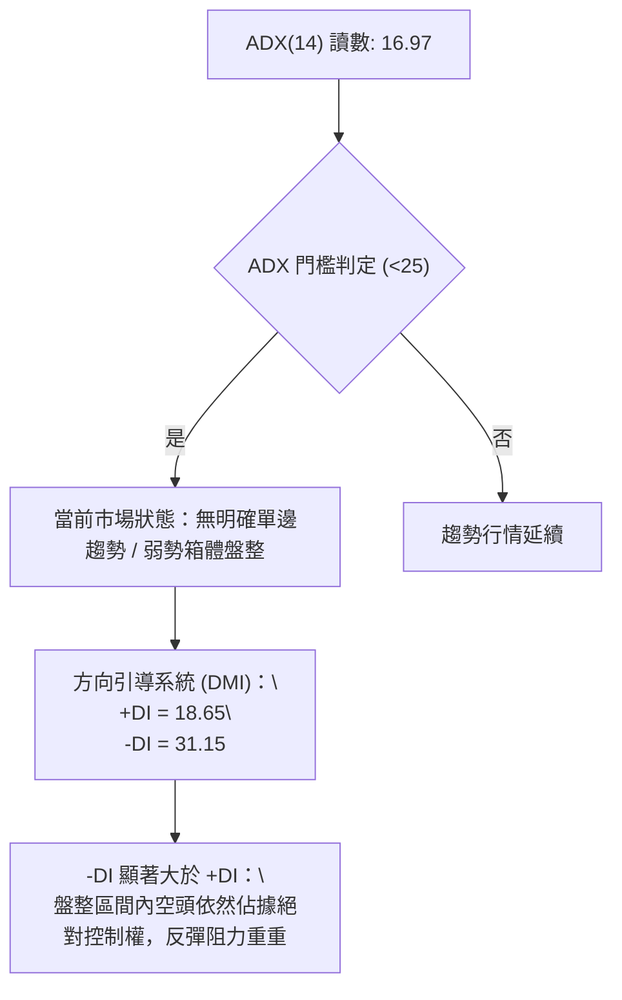

| 指標變數 | 當前讀數 | 門檻區間 | 強度解讀 | 戰術意涵 |
|----------|----------|----------|----------|----------|
| **ADX(14)** | 16.97 | < 20 (極弱趨勢) | 處於無趨勢或趨勢衰竭鈍化階段 | 不可採取突破追單策略，追高極易被套 |
| **+DI** | 18.65 | < 20 (多頭動能低迷) | 買盤缺乏連續性主動攻擊能力 | 多方僅能發動防守型反抽 |
| **-DI** | 31.15 | > 30 (空頭主導) | 空方仍牢牢掌控局部賣壓優勢 | 價格反彈至均線壓制位容易引發拋售 |
| **ADX 趨勢結論** | 盤整行情 | 適用震盪指標 (Stoch/BB) | 波動率收縮，等待新一輪動能蓄勢 | **以日線布林通道上下軌及 S/R 區間操作為主** |

---

## 3. 圖表形態分析

### 🔍 形態識別系統

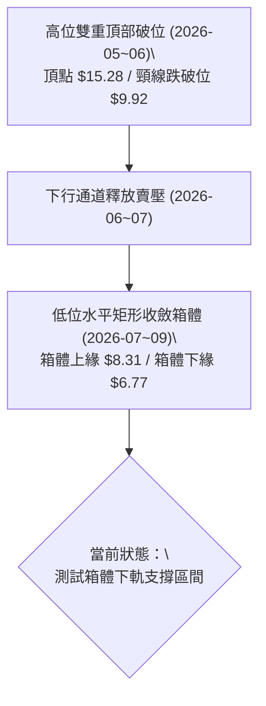

**形態信心度與目標價評估表**（嚴格遵守規則 13 & 15）：

| 形態類別 | 信心度 | 判斷依據（引用實際數據） | 完成度 | 目標價（附嚴格幾何推算式） |
|----------|--------|--------------------------|--------|----------------------------|
| **低位矩形整理箱體** | 72% | 價格於波段支撐 S1 ($7.00)、S2 ($6.77) 與阻力位 R1 ($8.31) 之間反覆震盪已逾 8 週。 | 75% | **向上突破目標**：箱體上軌 R1 ($8.31) + 箱體高度 ($8.31 - $6.77 = $1.54) = **$9.85**（接近 R3 $9.92）。<br>**向下跌破目標**：箱體下軌 S2 ($6.77) - 箱體高度 ($1.54) = **$5.23**（接近 52W 低點 $4.95）。 |
| **大型頭肩頂破位延伸** | 80% | 左肩 2026-01 ($10.36)，頭部 2026-05 ($15.28)，右肩 2026-08 ($9.24)。頸線位於 R3 ($9.92)。現價遠在頸線下方。 | 100% (已跌破) | **形態最低滿足點已於 2026-07 觸及 $6.53 達成**。當前處於破位後的低位消化期。 |
| **潛在雙底 (Double Bottom)** | 42% | 數據中 2026-07-19 見週收盤低點 $6.53，當前現價 $7.23 試圖於 S1 ($7.00)/S2 ($6.77) 構築第二隻腳。 | 35% | **信心度低於 50%：訊號不足，不予預設立場**。頸線位尚未成形，僅作指標型超賣解讀。 |

### 🕯️ 重要K線形態分析

| 月份 / 週別 | 收盤價 | 實體與影線特徵 | K線形態名稱 | 市場心理與多空含義解讀 | 訊號 |
|-------------|--------|----------------|------------|------------------------|------|
| **2026-05** | $13.22 | 實體長陽伴隨長上影線至 $15.28 | **天量流星線 (Shooting Star)** | 多頭在歷史高位遭遇主力機構極限派發，長上影線確立中期歷史大頂。 | 🔴 強烈看空 |
| **2026-06** | $8.24 | 實體大陰線，跌破多條短均線 | **高位烏雲崩塌大陰線** | 追高籌碼全面套牢，恐慌盤不計成本湧出，破壞上升通道。 | 🔴 極度看空 |
| **2026-07** | $7.49 | 探底 $6.53 後拉出下影線，單週成交 8.34 億股 | **低位放量錘頭線 (Hammer)** | 極度超賣引發空頭回補與博弈買盤，主力在 $6.53~$7.00 建立初步防線。 | 🟡 中性回穩 |
| **2026-08** | $7.66 | 實體極小，衝高 $9.24 後受阻回落 | **長上影墓碑十字星** | 反彈遭遇波段阻力 R2 ($8.58) 激烈解套拋壓，多方反攻夭折。 | 🔴 弱勢反彈失敗 |
| **2026-09** | $7.23 | 窄幅雙週並排陰跌，成交量驟降至 84.23M | **低位黏合低波動小陰小陽** | 買賣雙方陷入膠著，市場參與度降低，處於等待方向選擇的窒息量階段。 | 🟡 震盪觀望 |

### 📉 ASCII 走勢形態示意圖

```
ONDS 2026年 日線級別「矩形整理箱體」與關鍵均線壓制示意圖：
價格
$9.92 ┼──────────────────────────────────────────────────── [R3 / 前期頸線強壓]
      │
$9.29 ┼- - - - - - - - - - - - - - - - - - - - - - - - - - [布林上軌 / MA120 $9.02]
      │           ╭╮
$8.58 ┼───────────╯╰╮─────────────────────────────────── [R2 波段阻力]
      │              ╰╮      ╭╮
$8.31 ┼───────────────╰╮───╭╯╰╮──────────────────────── [R1 箱體頂部強壓]
      │                 ╰─╭╯   ╰╮   ╭─╮ (MA20 $7.98)
$7.98 ┼- - - - - - - - - - - - - - -╰─╯ -╰╮ - - - - - - - - [布林中軌壓制]
$7.23 ┼────────────────────────────────────●(現價 $7.23)─── [當前位置]
$7.00 ┼==================================================== [S1 第一道結構支撐]
$6.77 ┼──────────────────────────────────────────────────── [S2 箱體下軌強撐]
$6.67 ┼- - - - - - - - - - - - - - - - - - - - - - - - - - [布林下軌]
$6.47 ┼──────────────────────────────────────────────────── [S3 歷史波段底線]
```

### 🎯 形態目標價計算

依據幾何箱體對稱理論（若未來形成有效突破）：
1. **箱體震盪幅度計算**：
   $$\text{形態高度 (H)} = \text{箱體阻力 R1} - \text{箱體支撐 S2} = \$8.31 - \$6.77 = \$1.54$$
2. **多頭向上突破幾何目標**：
   $$\text{T1} = \text{突破點 (R1)} + \text{H} = \$8.31 + \$1.54 = \$9.85$$
   *(該目標與關鍵價位 R3 之 \$9.92 極度吻合，具有高度共振性)*
3. **空頭向下跌破幾何目標**：
   $$\text{T2} = \text{跌破點 (S2)} - \text{H} = \$6.77 - \$1.54 = \$5.23$$
   *(該目標逼近 52 週最低點 \$4.95)*

---

## 4. 支撐與阻力

### 🗺️ 關鍵價位分布圖（Unicode）

```
╔══════════════════════════════════════════════════════════════╗
║                 ONDS 價位結構分布圖                          ║
╠══════════════════════════════════════════════════════════════╣
║ $15.28 ║████████████████████████████████║ 52W 最高點 (歷史大頂)
║ $12.84 ║████████████████████████        ║ Fib 23.6% 回調位
║ $11.33 ║████████████████████            ║ Fib 38.2% 回調位
║ $10.11 ║████████████████                ║ Fib 50.0% 多空分水嶺
║  $9.92 ║████████████████████████████████║ 強阻力 R3 (前期破位頸線)
║  $9.52 ║████████████████████            ║ 牛熊線 MA200
║  $8.90 ║████████████                    ║ Fib 61.8% 重要黃金分割
║  $8.58 ║████████████████████            ║ 阻力 R2 (波段高點聚類)
║  $8.31 ║████████████████████████        ║ 關鍵阻力 R1 (箱體頂部)
║  $7.98 ║▓▓▓▓▓▓▓▓▓▓▓▓▓▓▓▓▓▓▓▓            ║ 布林中軌 (MA20) 密集壓制
║  $7.23 ╠════════════════════════════════╣ ◄── 現價 ($7.23)
║  $7.16 ║▓▓▓▓▓▓▓▓▓▓▓▓▓▓▓▓▓▓▓▓▓▓▓▓        ║ Fib 78.6% 回調位 (生命線)
║  $7.00 ║████████████████████            ║ 近期支撐 S1 (整數支撐)
║  $6.77 ║████████████████████████        ║ 強支撐 S2 (箱體下軌)
║  $6.67 ║▓▓▓▓▓▓▓▓▓▓▓▓▓▓▓▓                ║ 布林下軌支撐
║  $6.47 ║████████████████████████████████║ 強支撐 S3 (年內波段低點)
║  $4.95 ║████████████████████████████████║ 52W 最低點 (極限底)
╚══════════════════════════════════════════════════════════════╝
```

### 🚧 阻力位分析表

| 阻力級別 | 價位 | 距離現價幅度 | 形成原因（嚴格引用數據庫） | 突破難度 | 重要性 |
|----------|------|--------------|----------------------------|----------|--------|
| **R1** | **$8.31** | +14.94% | 近一年波段高點聚類點；同時為 MA20($7.98) 與 MA60($8.00) 向上延伸之雙重重壓帶。 | 🔴 高 | ★★★★☆ |
| **R2** | **$8.58** | +18.67% | 2026-08 中旬反彈頂點之波段高點聚類；大量解套賣壓堆積區。 | 🔴 極高 | ★★★★☆ |
| **R3** | **$9.92** | +37.21% | 前期大型雙頂/頭肩頂破位頸線；接近 MA120($9.02) 及 MA240($9.21) 長期籌碼套牢密集區。 | 🔴 極難突破 | ★★★★★ |

### 🛡️ 支撐位分析表

| 支撐級別 | 價位 | 距離現價幅度 | 形成原因（嚴格引用數據庫） | 守住機率 | 重要性 |
|----------|------|--------------|----------------------------|----------|--------|
| **S1** | **$7.00** | -3.18% | 近一年波段低點聚類；心理整數支撐大關；緊鄰斐波那契 78.6% 回調位 ($7.16)。 | 🟡 60% | ★★★★☆ |
| **S2** | **$6.77** | -6.36% | 近一年密集測試波段低點聚類；布林帶下軌 ($6.67) 外部關鍵防線。 | 🟢 70% | ★★★★★ |
| **S3** | **$6.47** | -10.51% | 2026-07-19 當週創下之波段極限低點聚類；多頭最後防守底線。 | 🟢 85% | ★★★★★ |

### 📐 斐波那契回調位分析

依據 52 週完整波動區間（低點 **$4.95** → 高點 **$15.28**，總波幅 **$10.33**）計算：

| 斐波那契回調比例 | 對應精確價位 | 相對於現價 ($7.23) 狀態 | 技術解讀與籌碼意義 |
|------------------|--------------|-------------------------|--------------------|
| **0.0% (52W High)** | **$15.28** | +111.34% | 2026-05 歷史天量尖峰，牛市終結點。 |
| **23.6%** | **$12.84** | +77.59% | 第一波回調關鍵阻力，跌破後轉為極度壓制。 |
| **38.2%** | **$11.33** | +56.71% | 弱勢修正極限點，現已形成遙不可及之天花板。 |
| **50.0%** | **$10.11** | +39.83% | 多空平衡中樞線；失守代表空頭完全掌控中長線定價權。 |
| **61.8%** | **$8.90** | +23.10% | 黃金分割重要轉折點；前期反彈至此無力承接。 |
| **78.6%** | **$7.16** | **-0.97% (緊鄰現價)** | **深幅回調的最後生命線。現價 $7.23 剛好懸浮於此支撐上方！** |
| **100.0% (52W Low)**| **$4.95** | -31.54% | 啟動本輪行情的絕對基底支撐。 |

**深入解讀**：現價 $7.23 精準落於 **Fib 61.8% ($8.90)** 與 **Fib 78.6% ($7.16)** 之間，且已回撤掉整輪漲幅的近八成。$7.16 為最後的黃金分割防守堡壘，若收盤有效跌穿 $7.16 及波段支撐 S1 ($7.00)，技術結構將產生向 100% 斐波那契位（$4.95）全面尋求支撐的強烈下行引力。

---

## 5. 技術指標深度解讀

### 🎛️ 指標訊號總覽

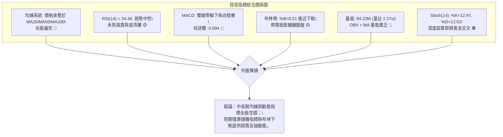

### 📈 移動平均線排列分析

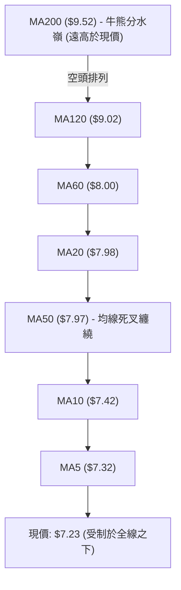

**移動平均線詳細偏離與排列分析表**：

| 均線名稱 | 當前價位 | 價格與均線差額 | 偏離幅度 (%) | 當前斜率與走勢特徵 | 訊號 |
|----------|----------|----------------|--------------|--------------------|------|
| **MA5** | $7.32 | -$0.09 | -1.28% | 短線下壓斜率陡峭，近 5 日構成第一道移動天花板 | 🔴 |
| **MA10** | $7.42 | -$0.19 | -2.53% | 持續走低，壓制日內反抽高點 | 🔴 |
| **MA20** | $7.98 | -$0.75 | -9.38% | 中期生命線，作為布林中軌快速下移，負乖離擴大 | 🔴 |
| **MA50** | $7.97 | -$0.74 | -9.28% | 與 MA20 形成密集纏繞死叉，形成波段重壓帶 | 🔴 |
| **MA60** | $8.00 | -$0.77 | -9.65% | 季線下行，中線空頭防線 | 🔴 |
| **MA120** | $9.02 | -$1.79 | -19.82% | 半年線向下扣高，半年內持倉成本普遍嚴重虧損 | 🔴 |
| **MA200** | $9.52 | -$2.29 | -24.05% | 長期趨勢轉空，價格無力挑戰此牛熊分界線 | 🔴 |
| **MA240** | $9.21 | -$1.98 | -21.52% | 年線走平轉跌，宣告宏觀牛市推動浪正式終結 | 🔴 |

### 📉 RSI(14) 分析

- **RSI(14) 當前讀數**：**34.46**
- **強度進度條**：
  ```
  極度超賣[0] ─── 超賣[30] ─── 現值[34.46] ────── 中性[50] ────── 超買[70] ─── 極度超買[100]
  [██████████████░░░░░░░░░░░░░░░░░░░░░░░░░░] 34.46%
  ```
- **背離分析與結論**：
  對比 2026-07-19 當週（收盤 $6.53，週 RSI 為 35.0）與當前 2026-09-15（現價 $7.23，日 RSI 為 34.46，週 RSI 為 34.5）：
  價格雖高於 7 月低點，但 RSI 數值相對持平甚至微幅走弱；**數據中明確顯示「無明顯背離」**。這意味著空方動能是隨著價格下跌自然釋放，既未出現「價格破底指標不破底」的底背離，亦無多頭蓄勢跡象，市場純粹處於弱勢抵抗態勢。

### 📊 MACD(12, 26, 9) 訊號解讀

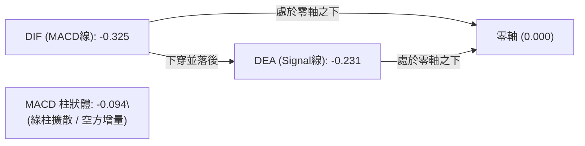

- **MACD 線**：-0.325
- **訊號線 (Signal)**：-0.231
- **柱狀圖 (Histogram)**：-0.094
- **解讀**：雙線深陷零軸以下，DIF 始終被 DEA 壓制。近 4 週柱狀圖分別為 -0.117、-0.145、-0.108、-0.094，雖然負值出現微幅收窄（由 -0.145 回升至 -0.094），但仍為實質負值。**零軸之下的綠柱收斂僅代表空頭殺跌力道稍歇，在 DIF 未向上金叉突破 DEA 並翻越零軸前，絕不可視為反轉訊號**。

### 📦 布林通道分析

```
ONDS 日線布林通道 (Bollinger Bands, 20, 2) 結構圖：
$9.29 ┼──────────────────────────────────── BB 上軌 (Upper Band)
      │
      │
$7.98 ┼──────────────────────────────────── BB 中軌 (Middle Band / MA20)
      │
      │
$7.23 ┼┈┈┈┈┈┈┈┈┈┈┈┈┈┈┈┈┈┈┈┈┈┈┈┈┈┈┈┈┈┈┈┈┈┈┈┈ 現價 $7.23 (%B = 0.21)
      │
$6.67 ┼──────────────────────────────────── BB 下軌 (Lower Band)
```

- **布林上軌**：**$9.29**
- **布林中軌 (MA20)**：**$7.98**
- **布林下軌**：**$6.67**
- **帶寬與位置分析**：
  當前 **%B 指標為 0.21**（計算方式：$\frac{7.23 - 6.67}{9.29 - 6.67} = \frac{0.56}{2.62} \approx 0.21$），現價運行於中軌與下軌之間的下半區，且處於下軌上方約 21% 位置。通道帶寬由前期擴張轉為窄幅水平收斂（帶寬僅 $2.62），表明單邊暴跌趨於結束，進入低波動醞釀期；但由於中軌 $7.98 快速下壓，價格向上反彈的理論空間首先受制於中軌。

### 💹 成交量分析（量價配合度）

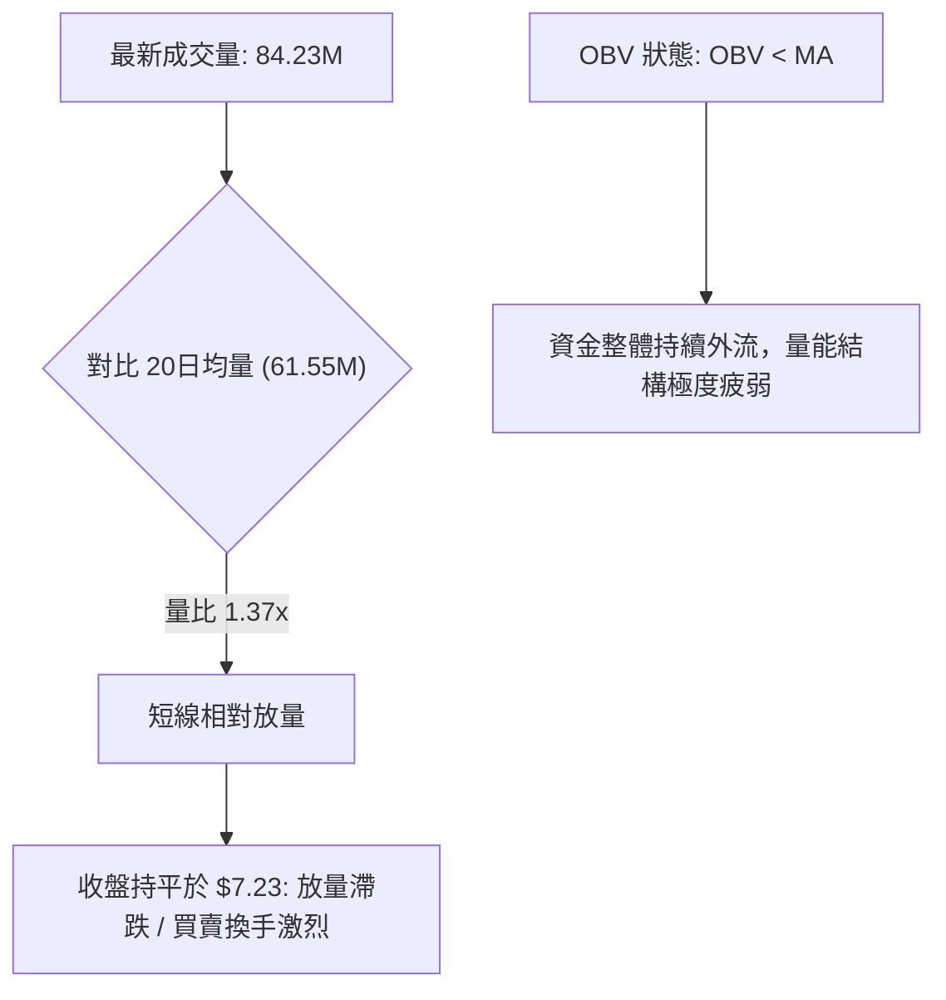

- **量比分析**：最新單日成交量為 84,231,500 股，相較於 20 日均量（61,551,490 股）放大至 1.37 倍，但與 50 日均量（84,742,028 股）基本持平。
- **價量關聯性**：在放量 1.37x 的情況下，股價未見反彈，而是收平在 $7.23，顯示當前價位出現被動接盤資金，但主動性買盤意願低迷。
- **OBV（能量潮）**：數據明確指出「**OBV < MA → 量能疲弱**」。OBV 長期維持在均線之下，說明過去兩個月的回調過程中，籌碼呈現淨流出狀態，未觀察到機構大資金建倉的量能堆積痕跡。

---

## 6. 動能與波動率

### ⚡ 動能評估四象限

| 象限 | 動能維度 | 波動率維度 | 市場特徵描述 | ONDS 當前定位與策略定位 |
|------|----------|------------|--------------|-------------------------|
| **第一象限 (Q1)** | 強動能 (Bullish) | 低波動 (Low Vol) | 穩健單邊上升牛市 | ❌ 不符合 |
| **第二象限 (Q2)** | 弱動能 (Bearish) | 低波動 (Low Vol) | **箱體弱勢陰跌 / 築底盤整** | **✓ 精確命中**（ADX=16.97 低波動盤整，RSI/MACD 偏弱） |
| **第三象限 (Q3)** | 強動能 (Bullish) | 高波動 (High Vol) | 狂熱主升浪 / 突破拉升 | ❌ 不符合 |
| **第四象限 (Q4)** | 弱動能 (Bearish) | 高波動 (High Vol) | 恐慌崩盤 / 流動性踩踏 | ❌ 6-7月已過，當前波動已收斂 |

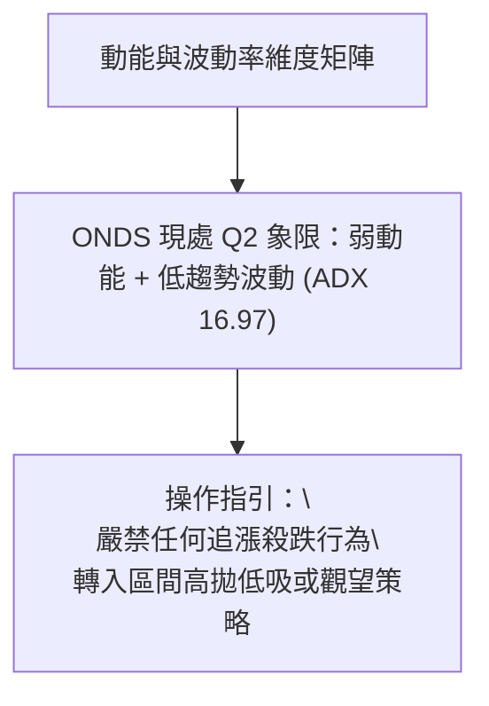

### 📊 ATR 波動率分析

- **ATR(14) 絕對值**：**$0.42**
- **ATR 相對價格比率**：$$\frac{\$0.42}{\$7.23} = 5.77\%$$
- **波動風險評估**：雖然日線 ADX 顯示趨勢強度偏低，但單日固有波動率（5.77%）依然極高。這意味著 ONDS 每日正常隨機波動區間就達到 $\pm \$0.42$。
- **動態止損距離設定標準**：
  - **短線防守緩衝 (1.5 × ATR)**：$$1.5 \times \$0.42 = \$0.63$$
  - **波段交易緩衝 (2.0 × ATR)**：$$2.0 \times \$0.42 = \$0.84$$
  - **止損距離建議**：任何進場點若止損設定小於 $0.63，將極易被高達 5.77% 的日常市場雜訊打出場。

### 📐 Beta 與市場相關性

- **Beta 係數**：**2.736**
- **市場暴露度解讀**：
  - ONDS 的 Beta 高達 2.736，屬於**極高系統性風險股票**。當標普 500 指數或納斯達克波動 1% 時，該股在理論上會放大 2.736 倍的波動。
  - **空頭槓桿效應**：在中期下行趨勢中，高 Beta 成為多頭的沉重負擔。只要大盤稍有回調，ONDS 就會面臨不成比例的拋售放大效應。
  - **融資與空頭狀況**：目前空頭比例（Short % Float）高達 **39.9%**，空頭天數（Short Ratio）為 3.13。極高的空頭佔比一方面對股價造成持續壓制，另一方面也意味著：一旦市場有利好刺激突破關鍵阻力（如 R1 $8.31），將具備引發劇烈軋空（Short Squeeze）的潛在條件。

---

## 7. 多時框架總結

### 📋 時框架評分表

| 時框架 | 趨勢方向 | 動能指標 (RSI/MACD) | 均線系統狀態 | 關鍵形態結構 | 綜合評分 | 戰術建議 |
|--------|----------|---------------------|--------------|--------------|----------|----------|
| **月線級別** | 🔴 空頭修復 | RSI 處 40 附近中軸下；MACD 柱轉跌 | 跌破 MA5，但仍高於 2024 年底部 | 歷史大頂流星線回調 | 35/100 | 嚴控多頭倉位，不可盲目長線做多 |
| **週線級別** | 🔴 下降通道 | RSI=34.5，MACD 負向擴散 (-0.094) | MA20($7.98) 下穿 MA50($7.97) 死叉 | 連續 4 週陰跌，下探箱體邊界 | 30/100 | 反彈皆為賣點或解套點 |
| **日線級別** | 🟡 弱勢盤整 | RSI=34.46；Stoch 超賣 (%K=12.97) | 價格低於 MA5~MA240 全部均線 | 水平箱體整理 ($6.77~$8.31) | 42/100 | 依布林通道軌道進行極限超賣小倉位博弈 |

### 🔲 綜合訊號矩陣

```
╔═══════════════════════════════════════════════════════════════════════╗
║                   多時框綜合訊號確認矩陣                              ║
╠═════════════════╦══════════════╦══════════════╦═══════════════════════╣
║ 分析維度        ║ 短期 (日線)  ║ 中期 (週線)  ║ 長期 (月線)           ║
╠═════════════════╬══════════════╬══════════════╬═══════════════════════╣
║ 趨勢方向        ║ 🟡 弱勢盤整  ║ 🔴 空頭下行  ║ 🔴 回調修正           ║
║ 均線排列        ║ 🔴 全線空頭  ║ 🔴 死叉下行  ║ 🟡 均線乖離修正       ║
║ 動能狀態        ║ 🟢 隨機超賣  ║ 🔴 MACD柱為負║ 🔴 動能流失           ║
║ 量價關係        ║ 🔴 OBV疲弱   ║ 🔴 量縮陰跌  ║ 🔴 天量見頂後失血     ║
║ 波動率狀況      ║ 🟡 ATR=0.42  ║ 🔴 Beta=2.736║ 🔴 月線長影線震幅劇烈 ║
╠═════════════════╬══════════════╬══════════════╬═══════════════════════╣
║ 權重評分        ║    42/100    ║    30/100    ║        35/100         ║
╚═════════════════╩══════════════╩══════════════╩═══════════════════════╣
║ 多時框收斂總分  ║                    36 / 100                          ║
╚═══════════════════════════════════════════════════════════════════════╝
```

### ⚖️ 多時框收斂結論

> **依據「嚴格要求 14」之多時框收斂規則執行判定**：
> 1. **行情性質判定**：當前 ADX(14) 數值為 **16.97**，明確小於 25 臨界線，判定市場當前為**典型的「盤整行情」**。
> 2. **優先級收斂原則**：在 ADX < 25 的盤整環境下，以**日線布林通道（下軌 $6.67，上軌 $9.29）及水平支撐阻力區間作為核心交易依據**；中長期均線（MA20 $7.98、MA200 $9.52）則嚴格充當上方難以逾越的「阻力邊界」。
> 3. **方向性唯一結論**：**【總體偏空防禦，維持區間弱勢震盪觀望】**。空方佔據宏觀與結構優勢，多方僅在布林下軌 $6.67 與斐波那契 78.6%（$7.16）具備短線技術性抵抗反彈潛力。

---

## 8. 交易策略建議

### 🗺️ 策略決策流程圖

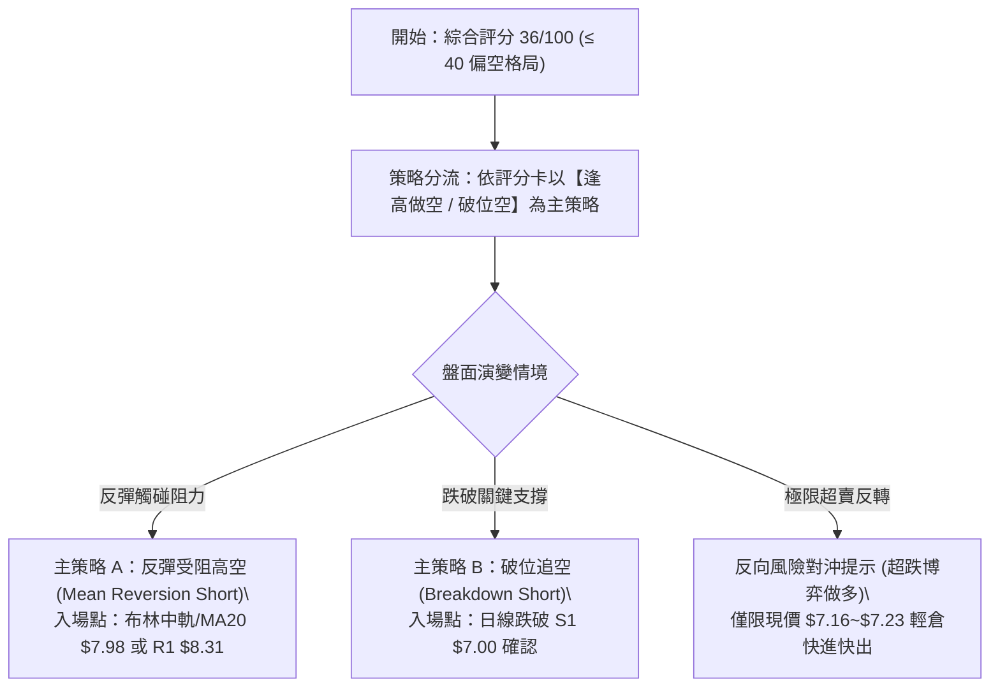

### 🧭 策略路由

**當前主策略方向 = 【逢高做空與破位做空為主】（依技術評分卡：36/100，處於 ≤40 之偏空區間）**。
由於空頭排列未變且 OBV 疲軟，嚴格禁止長線抄底；多頭僅列為極短線反彈對沖與風控參考。

### 🎯 價格情境階梯（Price Scenarios）

價位完全嚴格引用本報告第 4 章「關鍵價位」區塊之客觀數據：

| 觸發條件 | 下一目標價 | 後續延伸目標 | 情境含義與操作指引 |
|----------|------------|--------------|--------------------|
| **強勢突破 R1 $8.31** | **R2 $8.58** | **R3 $9.92** | 短線轉強；需站穩 MA20($7.98) 且放量，可能誘發 39.9% 浮動籌碼之軋空行情。 |
| **反彈受阻於 $7.98~$8.31** | **S1 $7.00** | **S2 $6.77** | 典型的空頭均線壓制回落；為主策略最佳高空進場點。 |
| **維持現價 $7.16~$7.42** | — | — | 於 Fib 78.6% ($7.16) 附近窄幅縮量拉鋸，持幣觀望，等待方向明朗。 |
| **跌破 S1 $7.00** | **S2 $6.77** | **布林下軌 $6.67** | 區間破位；空方再度發力，下測箱體底界。 |
| **放量跌破 S2 $6.77 / S3 $6.47** | **$5.23 (形態推算)** | **52W 低點 $4.95** | 宣告低位矩形築底徹底失敗，展開新一輪恐慌崩跌。 |

### 📊 情境機率分佈

| 情境類型 | 估計機率 | 主要技術指標支撐依據 |
|----------|----------|----------------------|
| **區間震盪整理 (主情境)** | **55%** | ADX=16.97 指標顯示趨勢動能極弱；布林帶通道急遽收斂，成交量降至 84.23M 窒息量，短期缺乏單邊爆發力。 |
| **震盪破位下行 (次情境)** | **30%** | 均線系統呈標準空頭發散（MA5 至 MA240 全線壓頂）；MACD 處於零軸下方柱狀體為負；-DI(31.15) 遠大於 +DI(18.65)。 |
| **強烈反彈突破 (小機率)** | **15%** | 僅由 Stoch 超賣（%K=12.97）與 39.9% 高空頭部位提供潛在支撐；若無重大利好催化劑，難以突破 R1 ($8.31)。 |

### 🟢 主策略詳情（依評分卡 ≤ 40 主推空頭策略）

本報告提供兩套量化空頭交易執行方案：

| 策略要素 | 策略 A：反彈阻力受阻沽空 (主推) | 策略 B：支撐破位順勢跟進空 (次選) |
|----------|----------------------------------|-----------------------------------|
| **策略類型** | 逢高放空（均線回抽確認） | 跌破順勢（動能突破） |
| **進場條件** | 股價反抽至 MA20 / MA50 附近出現上影線受阻 | 實體日 K 線收盤確認跌破支撐位 S1 |
| **進場價格** | **$7.98** (精準引用 MA20 / 布林中軌) | **$6.95** (跌破 S1 $7.00 後順勢進場) |
| **目標價 T1** | **$7.00** (波段支撐 S1) | **$6.47** (波段極限支撐 S3) |
| **目標價 T2** | **$6.47** (波段強支撐 S3) | **$5.23** (箱體等距測幅下行目標) |
| **止損價格** | **$8.35** (略高於關鍵阻力 R1 $8.31 之上) | **$7.23** (回抽站回現價與破位點之上) |
| **風險報酬比** | **2.65 : 1** (以 T1 計算: $\frac{0.98}{0.37}$ = 2.65) | **1.71 : 1** (以 T1 計算: $\frac{0.48}{0.28}$ = 1.71) |
| **成功機率** | **65%** | **55%** |
| **建議倉位** | **總資金之 8% - 10%** | **總資金之 5%** |

### 🔴 反向風險觸發點（對沖提示）

若持有多頭頭寸或擬進行空頭對沖，以下為必須遵守的風控紅線：
1. **軋空爆發停損點**：若日線帶量（單日成交量突破 1.5 億股）強行突破 **R1 $8.31**，所有空單必須無條件止損出局，因為高達 39.9% 的空頭浮動部位隨時會演變為暴力逼空，目標將直指 **R2 $8.58** 甚至 **R3 $9.92**。
2. **多頭極短線超跌波段交易點**：若價格回落至布林下軌 **$6.67** 至 S2 **$6.77** 區間，且 Stoch 出現低位金叉，激進型交易者可嘗試以不超過 3% 倉位博弈短線反抽，嚴格止損置於 **$6.40**（低於 S3 $6.47）。

### ⭐ 整體訊號強度評星

```
╔══════════════════════════════════════════════════════╗
║ 做多訊號強度：★★☆☆☆  (2/5星 - 僅存超賣反抽預期)   ║
║ 做空訊號強度：★★★★☆  (4/5星 - 趨勢與均線完全壓制) ║
║ 整體可信度：  ★★★☆☆  (3/5星 - 盤整期需等待突破)   ║
╚══════════════════════════════════════════════════════╝
```

---

## 9. 風險提示與監控

### ✅ 關鍵監控指標 Checklist

```
╔══════════════════════════════════════════════════════════════════╗
║              ONDS 交易日常監控清單 (Trading Checklist)          ║
╠══════════════════════════════════════════════════════════════════╣
║ [ ] 價格是否跌破 Fib 78.6% ($7.16) 及 S1 ($7.00)                ║
║     └─ 觸發後意味著低位防線崩解，將直測 $6.77 與 $6.47          ║
║ [ ] RSI(14) 是否跌破 30 進入極度超賣或形成底背離                 ║
║     └─ 若跌破 30 出現放量下影線，警惕空頭回補引發暴抽           ║
║ [ ] ADX(14) 讀數是否由 16.97 向上翹頭突破 25                    ║
║     └─ 突破 25 代表盤整結束，新一輪單邊暴烈趨勢（通常順勢）展開   ║
║ [ ] 成交量是否異常放大至 1.2 億股以上（量比 > 2.0x）             ║
║     └─ 巨量長陽即為軋空反轉訊號；巨量破位長陰即為恐慌加速       ║
║ [ ] 空頭比率 (Short % Float = 39.9%) 變化與融券費率              ║
║     └─ 觀察是否出現機構借券枯竭現象                             ║
║ [ ] MACD 柱狀體是否由負轉正 (-0.094 翻紅)                        ║
║     └─ 日線級別動能翻多之第一道確認訊號                         ║
╚══════════════════════════════════════════════════════════════════╝
```

### ⚠️ 風險場景分析

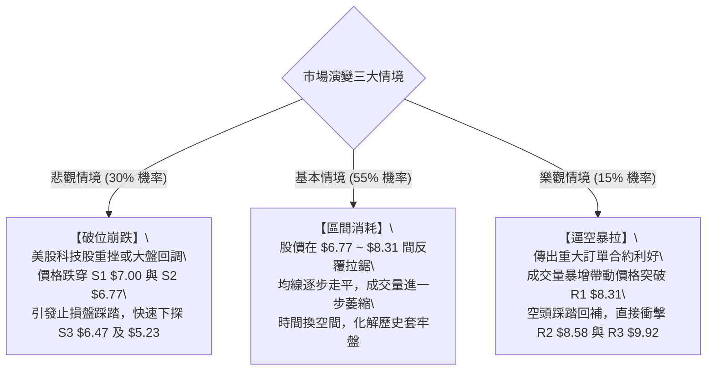

### 🛡️ 風險管理重要提醒

1. **極端波動與倉位限制**：
   - 本標的 **Beta 高達 2.736**，且日線 **ATR 佔比達 5.77% ($0.42)**。這並非穩健投資型標的，而是標準的高風險投機資產。
   - 單筆交易承擔之名義本金風險不得超過投資組合淨價值的 **1.5%**。總持倉上限嚴格控制在總資金的 **10%** 以內。
2. **避免左側主觀抄底**：
   - 儘管華爾街 9 位分析師給出 "strong_buy" 評級且平均目標價高達 $19.42，但**技術面客觀數據目前完全處於空方主導期（評分 36/100）**。
   - 基本面預期與技術走勢出現嚴重背離時，市場永遠以價格趨勢為準。必須耐心等待右側反轉訊號（至少站穩 MA20 $7.98 且 MACD 金叉翻正）。
3. **缺口與跳空風險風控**：
   - Ondas Inc. 屬於無人機與通訊設備題材股，易受政府採購合約、軍工反無人機防務驗證等突發新聞影響。高達 39.9% 的空頭浮動比率極易因突發利好引發隔夜跳空高開，做空者必須設置硬性隔夜止損指令。

---

## 📋 報告總結

```
╔══════════════════════════════════════════════════════════════╗
║               ONDS 技術分析報告總結                          ║
╠══════════════════════════════════════════════════════════════╣
║ 報告日期：2026-09-15                                         ║
║ 當前價格：$7.23                                              ║
║ 分析評級：🔴 偏空格局 / 區間弱勢震盪 (評分: 36/100)          ║
║                                                              ║
║ 關鍵維度結論：                                               ║
║ ├─ 長期趨勢：🔴 空頭修正 (自 2026-05 $15.28 回吐逾半)        ║
║ ├─ 中期趨勢：🔴 下降通道壓制，MACD 週線處於零軸下方負向運行  ║
║ ├─ 短期趨勢：🟡 ADX=16.97 (<25) 進入低波動箱體整理          ║
║ ├─ 核心支撐：S1 $7.00 ｜ S2 $6.77 ｜ S3 $6.47 ｜ Fib $7.16   ║
║ ├─ 核心阻力：MA20 $7.98 ｜ R1 $8.31 ｜ R2 $8.58 ｜ R3 $9.92  ║
║ └─ 分析師目標：均價 $19.42 (技術面嚴重落後於預期)            ║
║                                                              ║
║ 最優策略執行組合：                                           ║
║ 1. 🥇 最佳機會：等待反抽至 MA20/布林中軌 $7.98 附近佈局空單  ║
║                 (止損 $8.35，目標 $7.00，風報比 2.65:1)     ║
║ 2. 🥈 次選機會：實體日K跌破 S1 $7.00 後順勢跟進追空至 $6.47  ║
║                 (止損 $7.23，目標 $6.47，風報比 1.71:1)     ║
║ 3. 🥉 保守選擇：空倉持幣觀望，等待 ADX 突破 25 確立新單邊方向║
╚══════════════════════════════════════════════════════════════╝
```

---

> ⚠️ **免責聲明**：本報告為 AI 自動生成之量化技術分析，所有數據及計算模型均基於提供的市場公開歷史價格資訊。本報告**僅供研究與學術參考**，**不構成任何個人化投資建議**。高 Beta 與高空頭部位股票具備極端波動風險，入市交易請務必嚴格執行停損紀律。

---

*報告生成時間：2026-09-15 ｜ 數據來源：Yahoo Finance ｜ 分析框架：多時框技術分析體系*