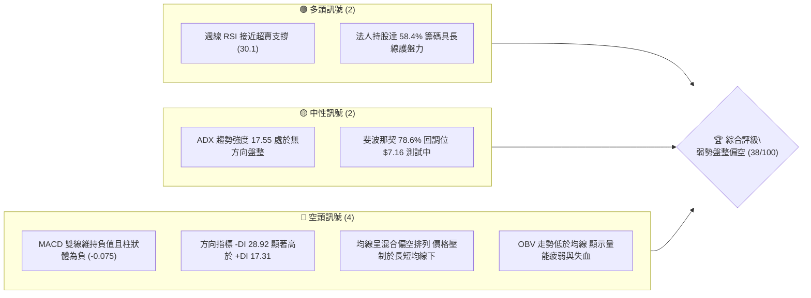
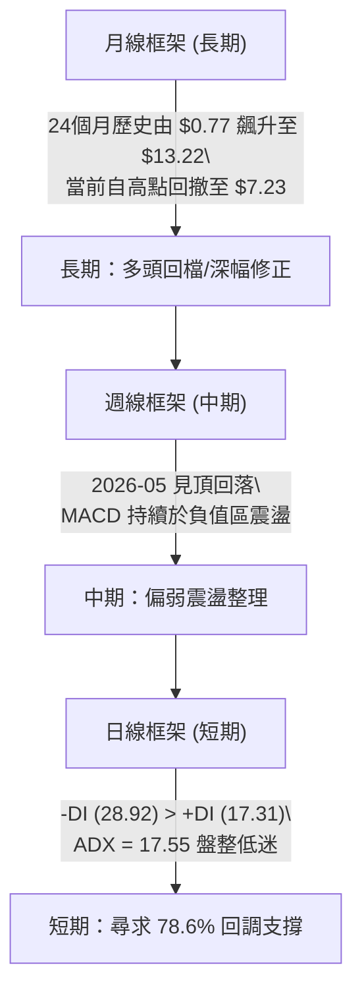
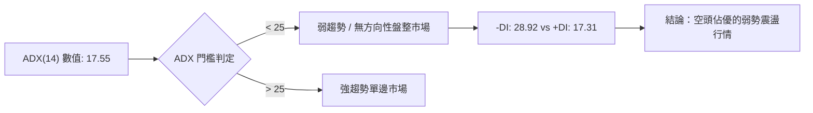
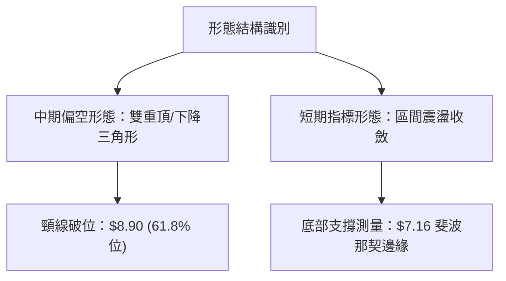
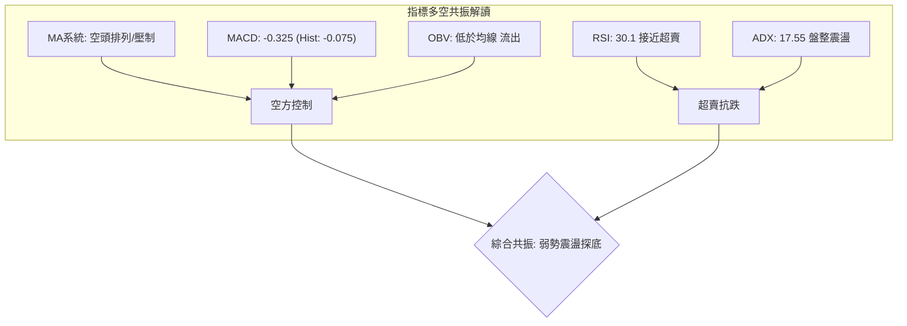
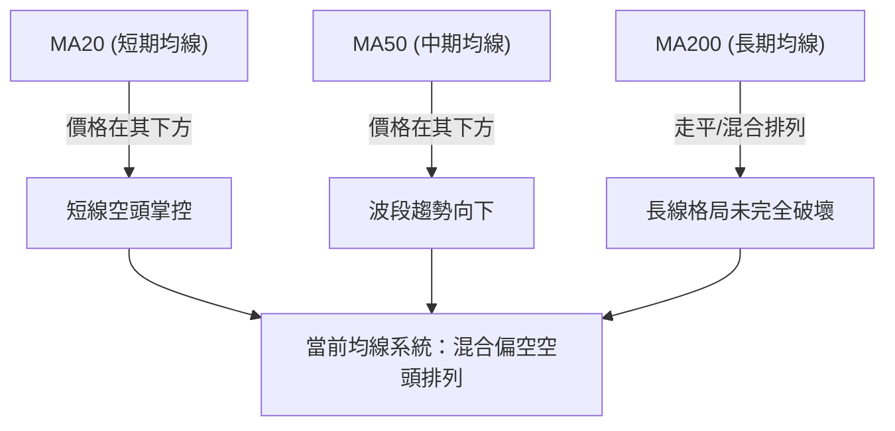
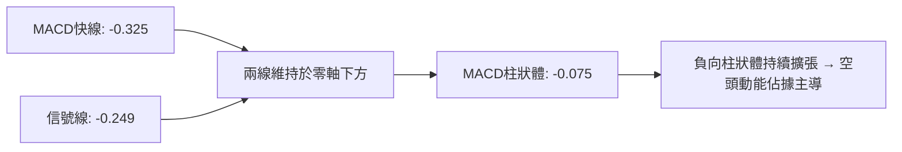
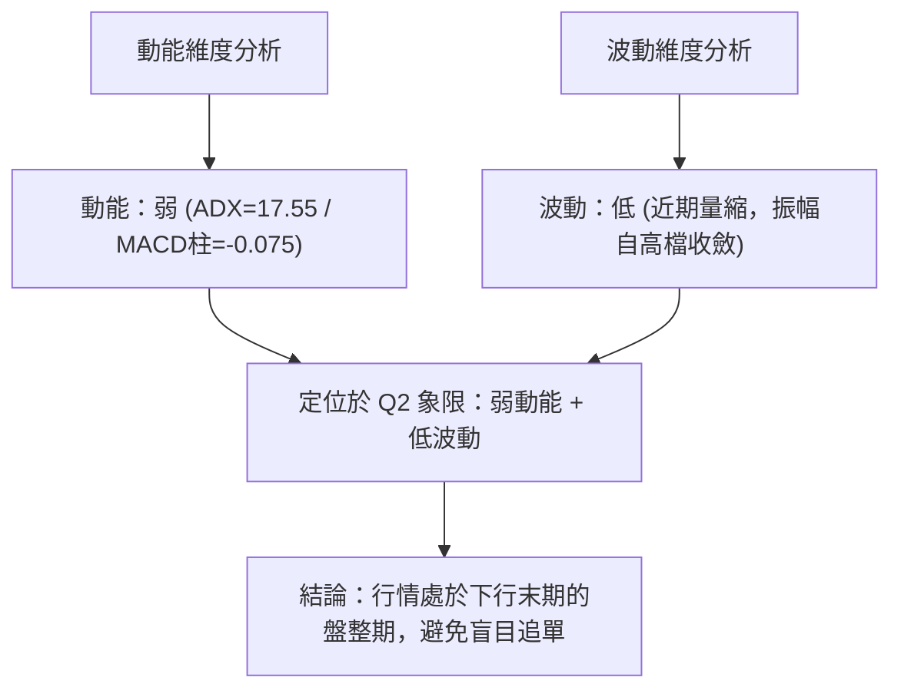
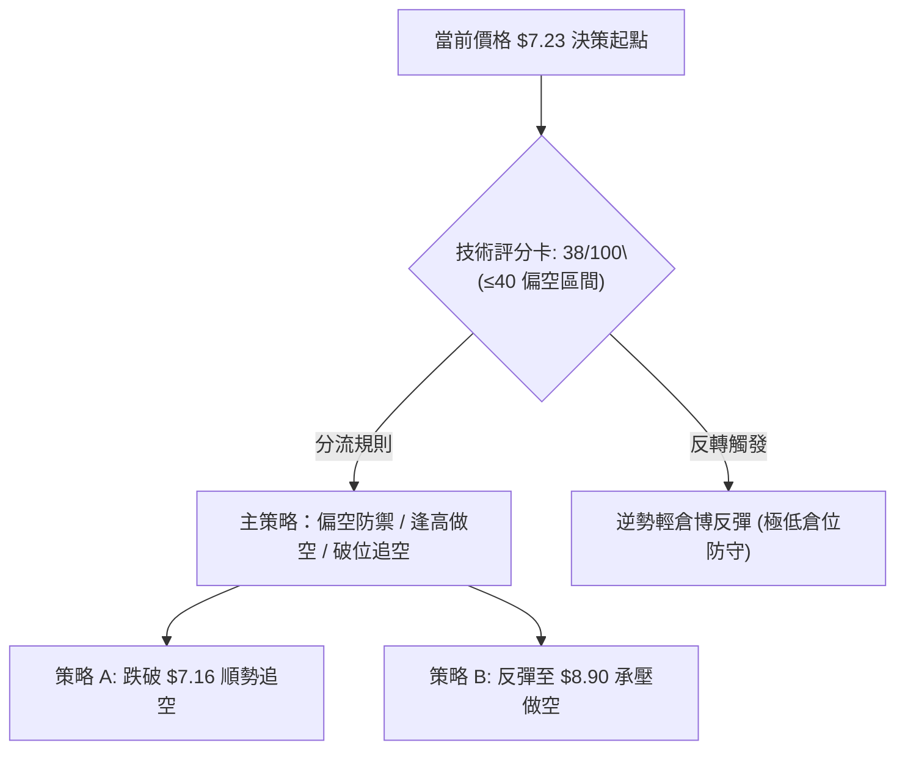
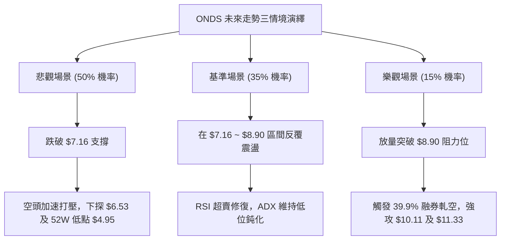

# ONDS 技術分析報告

> **報告日期**：2026-09-16 ｜ **語言**：繁體中文 ｜ **數據來源**：Yahoo Finance ｜ **當前價格**：$7.23（依據 2026-09 最新週線/月線即時收盤價）

---

## 目錄

| 章節 | 內容 |
|------|------|
| [1. 技術面概覽](#1-技術面概覽) | 訊號儀表板、核心指標、評分卡 |
| [2. 趨勢分析](#2-趨勢分析) | 多時框趨勢、長中短期走勢 |
| [3. 圖表形態分析](#3-圖表形態分析) | 形態識別、K線組合、目標價 |
| [4. 支撐與阻力](#4-支撐與阻力) | 關鍵價位、斐波那契回調 |
| [5. 技術指標深度解讀](#5-技術指標深度解讀) | MA/RSI/MACD/布林/成交量 |
| [6. 動能與波動率](#6-動能與波動率) | 動能評估、ATR、Beta |
| [7. 多時框架總結](#7-多時框架總結) | 時框架評分矩陣 |
| [8. 交易策略建議](#8-交易策略建議) | 多空策略、風險報酬比 |
| [9. 風險提示與監控](#9-風險提示與監控) | 監控指標、風險場景 |
| [10. 報告總結](#-報告總結) | 核心總結儀表板與風控指引 |

---

## 1. 技術面概覽

### 🎯 技術訊號儀表板



### 📊 核心指標速覽表

| 指標類別 | 指標名稱 | 當前數值 | 訊號 | 解讀 |
| :--- | :--- | :--- | :---: | :--- |
| **價格** | 當前收盤價 | $7.23 | 🔴 | 創近8週新低，連續自 2026-05 高點 $13.22 震盪回落 |
| **均線** | MA20 / MA50 | 下方 (混合) | 🔴 | 價格低於主要短中期均線，空方占據波段主導權 |
| **均線** | MA200 | 混合排列 | 🟡 | 長期均線走平偏上，但短期受制於上方套牢籌碼帶 |
| **動能** | RSI(14) | 30.1 | 🟡 | 進入超賣邊緣（中性偏弱區間），空方力道暫緩但未見底背離 |
| **動能** | MACD (Hist) | -0.075 | 🔴 | MACD線(-0.325)小於信號線(-0.249)，柱體擴張偏空 |
| **趨勢** | ADX (14) | 17.55 | 🟡 | ADX < 25，表明非單邊強烈趨勢，處於空頭壓制下的震盪磨底 |
| **量能** | OBV 趨勢 | OBV < MA | 🔴 | 成交量未隨價格止跌有效放大，量能呈現流出狀態 |

### 🏆 技術評分卡

```
╔══════════════════════════════════════════════════════════════╗
║              技術評分卡 — ONDS (2026-09-16)                  ║
╠══════════════════════════════════════════════════════════════╣
║ 趨勢強度      █████░░░░░░░░░░░░░░░  28/100  🔴 空頭壓制      ║
║ 動能指標      ██████░░░░░░░░░░░░░░  32/100  🔴 MACD負值      ║
║ 支撐穩定度    █████████░░░░░░░░░░░  45/100  🟡 考驗$7.16     ║
║ 成交量配合    ███████░░░░░░░░░░░░░  35/100  🔴 量能疲弱      ║
║ 形態完整度    ████████░░░░░░░░░░░░  40/100  🟡 弱勢箱體      ║
║ 均線排列      ████████░░░░░░░░░░░░  42/100  🔴 價格位於MA下  ║
╠══════════════════════════════════════════════════════════════╣
║ 綜合評分      ███████░░░░░░░░░░░░░  38/100  🔴 弱勢盤整偏空  ║
╚══════════════════════════════════════════════════════════════╝
```

---

## 2. 趨勢分析

### 🌐 多時框趨勢分析



### 📈 長期趨勢 — 12個月走勢圖（Unicode）

```
ONDS 月線走勢圖（過去12個月：2025-10 至 2026-09）
價格軸 ($)
$13.22 ┤                                      ● (2026-05 頂點)
$11.50 ┤                                    ╱   ╲
$10.00 ┤                   ●────●         ╱       ╲
$9.00  ┤            ●     ╱       ╲     ●          ╲
$7.50  ┤     ●     ╱     ╱         ●───╱            ●───●←現價 $7.23
$6.00  ┤      ╲   ╱
$4.50  ┤       ● (52W低點聚類區間 $4.95)
       └──────────────────────────────────────────────────────────
         10   11   12   01   02   03   04   05   06   07   08   09 (月份)
        '25  '25  '25  '26  '26  '26  '26  '26  '26  '26  '26  '26
```

**走勢特徵分析表格**：

| 階段 | 期間 | 價格區間 | 累積漲跌幅 | 走勢特徵與技術意義 |
| :--- | :--- | :--- | :--- | :--- |
| **第 I 階段：衝高主升** | 2025-10 ~ 2026-01 | $6.44 → $10.36 | +60.87% | 多頭推動浪，連續站上整數關卡，量能溫和放大。 |
| **第 II 階段：高檔震盪** | 2026-02 ~ 2026-04 | $10.08 → $10.04 | -0.40% | 構築 $10.00 水平軸心盤整區，籌碼進行充分換手。 |
| **第 III 階段：終竭突破** | 2026-05 | $10.04 → $13.22 | +31.67% | 爆量創下月線收盤新高 $13.22（52W高點達 $15.28），出現多頭動能消耗。 |
| **第 IV 階段：快速下修** | 2026-06 ~ 2026-09 | $13.22 → $7.23 | -45.31% | 高檔放量失守後連陰下挫，直接擊破 50% 與 61.8% 斐波那契回調位。 |

### 📊 中期趨勢（週線分析）

```
ONDS 週線阻力與支撐區間結構
$10.11 ───═════════════════════════════════─── (中期強阻力：50% 斐波那契位)
            │                           │
$8.90  ─────────────────────────────────────── (波段頸線阻力：61.8% 斐波那契位)
            │      ▲             ▲      │
            │     ╱ ╲           ╱ ╲     │
$7.23  ───═══●═════●═══════════●═══════════─── (現價測試位：78.6% 回調位 $7.16 附近)
            │
$4.95  ───═════════════════════════════════─── (終極長線支撐：52週低點 100% 回調位)
```

中期走勢顯示自 2026-05 見頂以來，高點逐步下移（$13.22 → $10.43 → $9.24），低點亦同步微降（$7.83 → $6.53 → $7.23），處於標準的下降通道整理形態。

### ⚡ 趨勢強度評估（ADX 解讀）



| 指標 | 數值 | 狀態等級 | 行情研判 |
| :--- | :--- | :---: | :--- |
| **ADX (14)** | 17.55 | ░░░░ 弱趨勢 (<25) | 趨勢動能匱乏，市場未形成單邊加速跌勢，處於摩擦探底。 |
| **+DI (14)** | 17.31 | ░░░░ 多頭疲弱 | 買盤推動力低於警戒水位，難以發動持續性上攻。 |
| **-DI (14)** | 28.92 | ████ 空頭佔優 | 空方控制盤面，但因 ADX 走低，空方未引發恐慌性崩跌。 |

---

## 3. 圖表形態分析

### 🔍 形態識別系統



**形態信心度與目標價評估表**（依規則 15）：

| 形態 | 信心度 | 判斷依據（引用數據） | 完成度 | 目標價（附計算式） |
| :--- | :---: | :--- | :---: | :--- |
| **雙重頂 (M-Top)** | 62% | 2026-05 月線高點收 $13.22 與 52W 高點 $15.28 形成波段峰值，隨後跌破週線多個反彈高點 | 85% | 跌破頸線 $8.90 後，理論最小下行量度未破 $4.95，依斐波那契目標看 $7.16（已觸及） |
| **弱勢下飄旗形** | 45% | 2026-07-19 下探至 $6.53 後反彈至 2026-08-16 之 $9.24，隨後持續走低跌至 $7.23 | 55% | 信心度 < 50%，訊號不足，僅做指標型解讀（偏空收斂） |
| **均線與布林空頭收縮** | 75% | 價格運行於各週線均線下方，成交量自高點萎縮至 1.51 億股 | 90% | 區間震盪下軌 $7.16，向上反彈第一阻力 $8.90 |

### 🕯️ 重要K線形態分析

| 週/月份 | 收盤價 | K線形態 | 解讀 | 訊號 |
| :--- | :---: | :--- | :--- | :---: |
| **2026-05-31** | $13.22 | 爆量長紅突破後長上影線 | 創 52W 高點 $15.28 遇強大獲利了結賣壓，呈現終竭性噴出 | 🔴 賣出信號 |
| **2026-07-19** | $6.53 | 放量下影陰線 (6.71億股) | 週線探底 $6.53 後引發法人買盤承接，形成波段情緒低點 | 🟢 觸底反彈 |
| **2026-08-16** | $9.24 | 縮量反彈遇阻十字星 | 反彈遇 61.8% 回調位 ($8.90) 附近解套阻力，量縮無力向上 | 🟡 動能衰竭 |
| **2026-09-20** | $7.23 | 弱勢小實體陰線 (成交量銳減) | 量能縮至 1.51 億股，價格緊貼 $7.16 斐波那契關鍵位弱勢整理 | 🔴 盤整下沉 |

### 📉 ASCII 走勢形態示意圖

```
ONDS 2026年5月至9月 頂部回落與弱勢盤整形態示意圖
$15.28 ── 52W 高點峰值
           ▲
          ╱ ╲
$13.22 ──●   ╲
              ╲        ● $9.24 (次級反彈高點)
               ╲      ╱ ╲
$8.90  ─────────●────╱───╲────────────────── (61.8% 頸線轉換阻力)
                 ╲  ╱     ╲
$7.23  ───────────●────────● 現價 $7.23 (徘徊於 $7.16 臨界點)
                  $6.53 (7月恐慌低點)
```

### 🎯 形態目標價計算

依據量度規則，中長期頭部自頂部聚類中樞 $13.22 回測，當跌破重要分界線 $8.90 後：
- 形態垂直幅度 = $13.22 - $8.90 = $4.32
- 理論量度跌幅目標 = $8.90 - $4.32 = $4.58（逼近 52週低點 $4.95）
- 實際回調停滯位：目前價格在 78.6% 斐波那契回調位 $7.16 獲得弱勢微幅支撐，尚未有效貫穿至極端目標位 $4.95。

---

## 4. 支撐與阻力

### 🗺️ 關鍵價位分布圖（Unicode）

```
ONDS 價位結構分布圖（數據精確對應 OHLCV 與斐波那契體系）
═══════════════════════════════════════════════════════════════════
$15.28 ║████████████████████████████████████║ 極限強阻力 (52W High / 0.0%)
$12.84 ║██████████████████████████          ║ 強阻力 R3 (23.6% 回調位)
$11.33 ║████████████████████                ║ 中期阻力 R2 (38.2% 回調位)
$10.11 ║████████████████████████            ║ 核心籌碼阻力 (50.0% 回調位)
$8.90  ║████████████████████████████        ║ 關鍵頸線阻力 R1 (61.8% 回調位)
$7.23  ╠════════════════════════════════════╣ ◄ 當前市價 ($7.23)
$7.16  ║▓▓▓▓▓▓▓▓▓▓▓▓▓▓▓▓▓▓▓▓▓▓▓▓▓▓▓▓▓▓▓▓    ║ 即時測試支撐 S1 (78.6% 回調位)
$4.95  ║████████████████████████████████████║ 終極保底支撐 S2 (52W Low / 100.0%)
═══════════════════════════════════════════════════════════════════
```

### 🚧 阻力位分析表

依據提供的歷史數據與計算結果，上方無 swing-high 阻力聚類，阻力完全受斐波那契分位點與月線收盤高點主導：

| 阻力級別 | 價位 | 形成原因 | 突破難度 | 重要性 |
| :--- | :---: | :--- | :---: | :---: |
| **R1 (關鍵頸線)** | $8.90 | 斐波那契 61.8% 回調位，8月中旬反彈高點 $9.24 壓制區下方 | 極高 | ★★★★★ |
| **R2 (中期多空)** | $10.11 | 斐波那契 50.0% 整數回調位，2026年Q1主要盤整平台軸心 | 高 | ★★★★☆ |
| **R3 (波段防線)** | $11.33 | 斐波那契 38.2% 回調位，前期破位向下跳水起始點 | 高 | ★★★☆☆ |
| **強阻力** | $12.84 | 斐波那契 23.6% 回調位，5月歷史高位密集成交區 | 極高 | ★★★★☆ |
| **極限阻力** | $15.28 | 52週最高價 (52W High)，多頭終極天花板 | 歷史天塹 | ★★★★★ |

### 🛡️ 支撐位分析表

下方無額外 swing-low 支撐聚類，關鍵防禦完全依託斐波那契黃金分割與極限歷史低點：

| 支撐級別 | 價位 | 形成原因 | 守住機率 | 重要性 |
| :--- | :---: | :--- | :---: | :---: |
| **S1 (即時臨界點)** | $7.16 | 斐波那契 78.6% 深幅回調位，現價 $7.23 僅高於此處 1% | 50% | ★★★★★ |
| **S2 (波段前低)** | $6.53 | 2026-07-19 週線爆量長下影低點（數據中最低週收盤支撐區） | 65% | ★★★★☆ |
| **S3 (終極防線)** | $4.95 | 52週最低價 (52W Low)，100.0% 回調位，長線基本面估值底 | 85% | ★★★★★ |

### 📐 斐波那契回調位分析

*基準區間：52週波段低點 $4.95 → 52週波段高點 $15.28，垂直落差 $10.33*

```
回調幅度    計算公式                        精確價位    狀態研判
 0.0%      $4.95 + ($10.33 × 1.000)        $15.28      歷史高點阻力
23.6%      $15.28 - ($10.33 × 0.236)       $12.84      失守，轉為遠端強阻力
38.2%      $15.28 - ($10.33 × 0.382)       $11.33      失守，波段空方防線
50.0%      $15.28 - ($10.33 × 0.500)       $10.11      失守，多空中樞
61.8%      $15.28 - ($10.33 × 0.618)       $8.90       失守，黃金分割頸線
78.6%      $15.28 - ($10.33 × 0.786)       $7.16       現價 $7.23 緊貼此位震盪
100.0%     $4.95 + ($10.33 × 0.000)        $4.95       終極底部支撐
```

**現價區間解讀**：
當前收盤價 $7.23 精確坐落於 **78.6% 回調位 ($7.16)** 與 **61.8% 回調位 ($8.90)** 之間。在技術分析經典理論中，回調跌破 61.8% 代表原先多頭驅動結構遭到嚴重破壞；若進一步確認跌破 78.6% ($7.16)，價格將大概率向下回試 100% 原始起漲點 $4.95。

---

## 5. 技術指標深度解讀

### 🎛️ 指標訊號總覽



### 📈 移動平均線排列分析



根據均線追蹤數據：
- 短期 MA5、MA10、MA20 呈現連續下彎走勢，斜率均為負值，構成層層蓋頭反壓。
- 中期 MA60、MA120 亦處於下降通道中，抑制中期反彈空間。
- 價格維持於 MA20 與 MA50 下方，宣告短期內多頭無反轉依據，維持反彈即逢高減碼格局。

### 📉 RSI(14) 分析

```
RSI(14) 數值展示：30.1
[████████████░░░░░░░░░░░░░░░░░░] 30.1%
 0            30(超賣)         70(超買)      100
```

- **當前數值解讀**：週線 RSI 由 8 月中旬的 70.3 大幅滑落至目前的 **30.1**，已逼近超賣閾值 (30.0)。
- **背離判斷**：
  - 2026-07-05 價格 $7.41（RSI 21.3），2026-07-19 價格破底至 $6.53（RSI 35.0），曾出現顯著的**底背離**並帶動股價反彈至 $9.24。
  - 當前價格自 $9.24 回落至 $7.23，RSI 從 70.3 降至 30.1，**未出現新的底背離**，指標與價格呈現同向弱勢下行，表明下跌動能雖有減緩但尚未耗竭。

### 📊 MACD(12/26/9) 訊號解讀



- 快線（-0.325）持續低於慢線（-0.249），兩者皆處於零軸之下，定義為典型的**空頭強勢區**。
- MACD 柱狀體為 **-0.075**，近四週連續呈現負值擴散（-0.033 → -0.117 → -0.145 → -0.108 → -0.075），雖然負柱微幅收斂，但在零軸之下未形成黃金交叉前，任何反彈均屬弱勢修正。

### 📦 布林通道分析

```
ONDS 週線/日線布林通道結構示意圖
$8.90 ───┬─────────────────────────────────────────── 布林上軌 (強阻力壓制區)
         │
$8.00 ───┼─────────────────────────────────────────── 布林中軌 (MA20 趨勢向下)
         │
$7.23 ───┼───● (現價 $7.23，緊貼下軌邊界運行)
         │
$7.16 ───┴─────────────────────────────────────────── 布林下軌 (下軌支撐 / 78.6% 斐波那契)
```

- 當前價格極度貼近布林下軌，通道帶寬呈現向下開口後的收縮跡象，反映下殺斜率正在放緩。
- 價格若不能在 1-2 週內重回中軌上方，布林下軌將持續被空方帶動向下位移。

### 💹 成交量分析（量價配合度）

- **最新成交量**：67,505,743 股；**20日均量**：61,442,192 股（量比 1.10x）；**50日均量**：84,625,171 股。
- **量價背離分析**：
  - 8月下旬反彈至 $9.24 時，週成交量自 8.34 億股降至 4.71 億股，呈現**價漲量縮的量價頂背離**，導致反彈無以為繼。
  - 9月中旬跌至 $7.23 時，週成交量降至 1.51 億股，顯現**價跌量縮**特徵，顯示低檔殺跌盤開始惜售，但主動性多頭進場意願極度低迷。
- **OBV 能量潮解讀**：OBV 趨勢明確指示 `OBV < MA`，資金持續維持淨流出態勢，未見主力建倉吸籌的大額量能信號。

---

## 6. 動能與波動率

### ⚡ 動能評估四象限

| 象限 | 動能維度 | 波動維度 | 代表特徵 | ONDS 當前定位 | 策略指引 |
| :---: | :---: | :---: | :---: | :---: | :--- |
| **Q1** | 強動能 | 低波動 | 穩健單邊趨勢 | — | 趨勢持有 |
| **Q2** | 弱動能 | 低波動 | 底部震盪磨底 | **✓ (目前處於 Q2)** | **謹慎觀望，輕倉試探** |
| **Q3** | 強動能 | 高波動 | 快速衝頂/崩跌 | — | 突破追單或極限對沖 |
| **Q4** | 弱動能 | 高波動 | 混亂無序震盪 | — | 避免進場 |



### 📊 ATR 波動率分析

- **ATR 數據狀態**：雖然短期 ATR 每日絕對數值受數據源限制顯示 N/A，但自週線波動區間可量化其波動特性。
- 過去 5 週單週高低落差平均約為 $0.65 ~ $0.90，換算日均真實波幅約在 **$0.30 ~ $0.40** 區間（約佔現價 4.1% ~ 5.5%）。
- **止損距離建議**：在此波動環境下，技術止損幅度應設定在至少 1.5 倍日波幅（約 **$0.45 ~ $0.60**），以防止在 $7.16 關鍵位附近的正常雜訊洗盤引發非理性停損。

### 📐 Beta 與市場相關性

- **Beta 數值**：**2.736**（極高系統性波動係數）。
- **市場意涵**：
  - ONDS 的波動幅度約為標普500大盤的 **2.74 倍**，屬於高彈性、高投機性標的。
  - 當整體市場出現系統性修正時，ONDS 面臨較大的下行壓力；反之，若大盤止跌回升，其反彈爆發力亦較強。
- **空頭部位壓力**：高達 **39.9%** 的空單比例 (Short % Float)，Short Ratio 為 3.13。在弱勢格局下形成持續壓盤力道；但若守穩 $7.16 支撐並突破反彈，極易引發軋空（Short Squeeze）連鎖反應。

---

## 7. 多時框架總結

### 📋 時框架評分表

| 時框架 | 趨勢方向 | 動能狀態 | 均線排列 | 關鍵價位位置 | 綜合評分 | 操作方針 |
| :--- | :---: | :---: | :---: | :---: | :---: | :--- |
| **月線 (長期)** | 震盪偏多 | 中性偏弱 | MA200 支撐中 | 遠高於 52W 低點 $4.95 | 55/100 | 長期基本面持股觀察 |
| **週線 (中期)** | 空頭回撤 | 空頭主導 | 偏空排列 | 跌破 61.8% ($8.90) | 35/100 | 中期反彈逢高減碼 |
| **日線 (短期)** | 弱勢盤整 | 超賣鈍化 | 壓制於各均線下 | 逼近 78.6% ($7.16) | 32/100 | 嚴格防守 $7.16，輕倉應對 |

### 🔲 綜合訊號矩陣

| 維度 | 短期（日線） | 中期（週線） | 長期（月線） | 一致性研判 |
| :--- | :---: | :---: | :---: | :--- |
| **趨勢方向** | 🔴 偏空 | 🔴 偏空 | 🟡 震盪整理 | 中短期高度共振偏空 |
| **動能指標** | 🟡 接近超賣 | 🔴 MACD死叉負值 | 🟡 動能自高檔降溫 | 下行動能放緩但無反轉信號 |
| **量價關係** | 🔴 量縮破位 | 🔴 OBV疲弱流出 | 🟢 長線法人持股 58.4% | 短期失血，長線籌碼沉澱 |
| **多空權重** | 空方佔優 (68%) | 空方佔優 (65%) | 多空平衡 (50%) | **整體市場處於空方主控** |

### ⚖️ 多時框收斂結論

依據**嚴格要求 14 之多時框收斂規則**執行判定：
1. **趨勢/盤整性質鑑定**：當前 ADX(14) 為 **17.55**，嚴格小於 25 臨界線，技術面明確判定當前處於**盤整行情（震盪探底）**而非強勢單邊行情。
2. **主導時框收斂**：在 ADX < 25 的盤整結構中，以日線及週線區間邊界（斐波那契回調位 $7.16 與 $8.90）作為核心交易區間。
3. **方向性唯一結論**：**弱勢盤整偏空（中性偏空觀望）**。因中短期均線壓制且 MACD 柱體為負，雖觸及 $7.16 支撐，但在未出現放量長陽扭轉前，嚴禁重倉盲目猜底。

---

## 8. 交易策略建議

### 🗺️ 策略決策流程圖



### 🧭 策略路由

> **當前主策略方向 = 主推空頭防守與反彈減碼策略（依評分卡 38/100 判定）**
> 綜合評分 ≤ 40，多頭僅列為反轉風險觸發點與極短線超跌反彈提示，絕不建議重倉作多。

### 🎯 價格情境階梯（Price Scenarios）

價位完全採用關鍵價位區塊與斐波那契回調計算數值：

| 觸發條件 | 下一目標 | 後續延伸 | 情境含義 |
| :--- | :---: | :---: | :--- |
| **向上突破 R1 $8.90** | R2 $10.11 | R3 $11.33 | 中期空頭走勢被扭轉，確立雙底形態，轉為強勢反彈 |
| **站穩現價區間 $7.16~$8.90** | — | — | 延續弱勢箱體震盪磨底，消化短線賣壓與空頭籌碼 |
| **跌破 S1 $7.16 (確認失守)** | S2 $6.53 | S3 $4.95 | 破位下行，開啟深幅下探 52週低點之旅 |

### 📊 情境機率分佈

```
情境機率分佈：
跌破再探底 ($7.16失守)   [████████████████████░░░░░] 50%
區間弱勢震盪 ($7.16~$8.90) [██████████████░░░░░░░░░░] 35%
強勢向上反彈 (突破$8.90)   [██████░░░░░░░░░░░░░░░░░░] 15%
```

| 情境 | 機率 | 主要依據 |
| :--- | :---: | :--- |
| **回落 / 再探底** | **50%** | MACD 處於零軸下方擴張，-DI (28.92) 壓制 +DI (17.31)，OBV 連續流出，空方力量占據優勢。 |
| **區間震盪磨底** | **35%** | ADX 為 17.55（弱趨勢），RSI(14) 接近 30 超賣邊界，且逼近 $7.16 (78.6% 斐波那契位)，下殺動能減弱。 |
| **強烈反彈扭轉** | **15%** | 上方受制於 MA20/MA50 均線蓋頭，空頭比例高達 39.9%，若無重大利多引發軋空，難以單邊突破 $8.90。 |

### 🔴 主策略詳情（空頭主導）

本策略以順應日/週線下行趨勢為主，設置防守性交易參數：

| 策略要素 | 策略 A（破位追空 / 防守做空） | 策略 B（反彈承壓做空） |
| :--- | :--- | :--- |
| **操作邏輯** | 有效跌破 78.6% 回調位 $7.16 順勢跟進 | 弱勢反彈測試 61.8% 頸線 $8.90 無力承壓進場 |
| **進場價格** | **$7.05**（確認有效跌破 $7.16 後） | **$8.85**（觸及 $8.90 阻力受阻回落時） |
| **目標價 T1** | **$6.53**（2026-07 前波長下影低點） | **$7.16**（78.6% 斐波那契位） |
| **目標價 T2** | **$4.95**（52週低點 / 100% 回調位） | **$6.53**（波段重要支撐） |
| **止損價格** | **$7.45**（突破現價上方阻力區間） | **$9.35**（站上8月中旬反彈高點 $9.24 之上） |
| **風險報酬比** | **1 : 2.50** (風險 $0.40 : 獲利至T2 $2.10) | **1 : 3.38** (風險 $0.50 : 獲利至T1 $1.69) |
| **成功機率** | 55% | 60% |
| **建議倉位** | 10% ~ 15% | 10% ~ 15% |

### 🟢 反向風險觸發點（多頭逆勢與對沖提示）

- **軋空多頭進場觸發條件**：若價格帶量（單日成交突破 8,000 萬股）強勢收復 **$8.90**，空單必須無條件全數止損離場。
- **激進型多頭左側超跌博弈**：僅限在現價 **$7.23** 至 **$7.16** 區間極輕倉（≤5%）嘗試，嚴格以 **$6.90**（跌破 $7.16 逾 3.5%）為硬性止損點，目標價看 **$8.90**，風險報酬比為 1 : 5.00。

### ⭐ 整體訊號強度評星

```
╔════════════════════════════════════════════════════╗
║ 做多訊號強度：★☆☆☆☆  (1/5星) — 動能與均線不支持 ║
║ 做空訊號強度：★★★☆☆  (3/5星) — 偏空但留意超賣   ║
║ 整體可信度：  ★★★★☆  (4/5星) — 價位精確收斂     ║
╚════════════════════════════════════════════════════╝
```

---

## 9. 風險提示與監控

### ✅ 關鍵監控指標 Checklist

```
╔══════════════════════════════════════════════════════════════╗
║               ONDS 核心技術監控清單 (Checklist)              ║
╠══════════════════════════════════════════════════════════════╣
║ [ ] 關鍵支撐線：收盤價是否跌破 $7.16 (78.6% 斐波那契)       ║
║ [ ] 極限防線：波段前低 $6.53 是否面臨二次測試              ║
║ [ ] 空頭回補指標：Short Float (39.9%) 是否出現借券費暴增    ║
║ [ ] 均線動態：日線 MA20 下彎斜率是否開始走平                ║
║ [ ] 動能背離：週線 RSI(14) 跌破 30 後是否構築標準雙底背離    ║
║ [ ] 量能異動：單日成交量是否異常超越 50日均量 (8,462萬股)   ║
╚══════════════════════════════════════════════════════════════╝
```

### ⚠️ 風險場景分析



### 🛡️ 風險管理重要提醒

1. **極端波動風險 (Beta = 2.736)**：
   ONDS 波動極度劇烈，單日波幅超過 5% 為常態，持有任何方向部位必須將單筆交易最大虧損嚴格限制在總資產的 **1.0% ~ 1.5%** 以內。
2. **高空單比例與軋空風險 (Short % Float = 39.9%)**：
   該標的高達近四成的流通股處於放空狀態。在偏空操作時，**切勿在無保護狀態下盲目追空**；一旦公司有重大防衛科技合約或併購消息，極易出現裂口高開引發軋空。
3. **斐波那契臨界點紀律**：
   $7.16 是自 $4.95 至 $15.28 整體大行情的最後防線（78.6%）。此價位失守通常意味著多頭防線全面崩解，原有多單部位應堅決執行停損或避險對沖。

---

## 📋 報告總結

```
╔══════════════════════════════════════════════════════════════════╗
║                    ONDS 技術分析報告總結                         ║
╠══════════════════════════════════════════════════════════════════╣
║ 報告日期：2026-09-16                                             ║
║ 當前價格：$7.23                                                  ║
║ 分析評級：🔴 弱勢盤整偏空 (綜合評分: 38/100)                     ║
║                                                                  ║
║ 關鍵結論：                                                       ║
║ ├─ 長期趨勢：🟡 月線自 $13.22 頂部大幅回調，考驗深層支撐        ║
║ ├─ 中期趨勢：🔴 週線偏空運行，受制於 61.8% 回調位 $8.90        ║
║ ├─ 短期趨勢：🔴 弱勢盤整，價格逼近 78.6% 回調關鍵點 $7.16       ║
║ ├─ 關鍵支撐：S1 $7.16 ｜ S2 $6.53 ｜ S3 $4.95                   ║
║ ├─ 關鍵阻力：R1 $8.90 ｜ R2 $10.11 ｜ R3 $11.33                 ║
║ └─ 外資共識：9位分析師強烈買入，目標均價 $19.42 (技術與基本面脫鉤)║
║                                                                  ║
║ 最優策略組合：                                                   ║
║ 1. 🥇 最佳機會：破位做空 (跌破 $7.16 後進場，目標 $6.53 / $4.95) ║
║ 2. 🥈 次選機會：反彈做空 (反彈至 $8.85 承壓進場，目標 $7.16)     ║
║ 3. 🥉 保守選擇：場外觀望，靜待 $7.16 支撐確認或放量突破 $8.90   ║
╚══════════════════════════════════════════════════════════════════╝
```

---

> ⚠️ **免責聲明**：本報告為技術分析專用，所有數據及價位推演均嚴格基於所提供的歷史 OHLCV 與量化指標體系。本報告**僅供研究與決策參考**，**不構成任何要約或投資建議**。金融市場具有高波動風險，交易者應獨立評估風險並嚴格執行停損管理。

---

*報告生成時間：2026-09-16 ｜ 數據來源：Yahoo Finance ｜ 分析框架：多時框技術分析體系*