# ONDS 技術分析報告

> **報告日期**：2026-09-17 ｜ **語言**：繁體中文 ｜ **數據來源**：Yahoo Finance ｜ **當前價格**：$7.24（最新週收盤價基準）

---

## 目錄

| 章節 | 內容 |
|------|------|
| [1. 技術面概覽](#1-技術面概覽) | 訊號儀表板、核心指標、評分卡 |
| [2. 趨勢分析](#2-趨勢分析) | 多時框趨勢、長中短期走勢 |
| [3. 圖表形態分析](#3-圖表形態分析) | 形態識別、K線組合、目標價 |
| [4. 支撐與阻力](#4-支撐與阻力) | 關鍵價位、斐波那契回調 |
| [5. 技術指標深度解讀](#5-技術指標深度解讀) | MA/RSI/MACD/布林/成交量 |
| [6. 動能與波動率](#6-動能與波動率) | 動能評估、ATR、Beta |
| [7. 多時框架總結](#7-多時框架總結) | 時框架評分矩陣 |
| [8. 交易策略建議](#8-交易策略建議) | 多空策略、風險報酬比 |
| [9. 風險提示與監控](#9-風險提示與監控) | 監控指標、風險場景 |

---

## 1. 技術面概覽

### 🎯 技術訊號儀表板

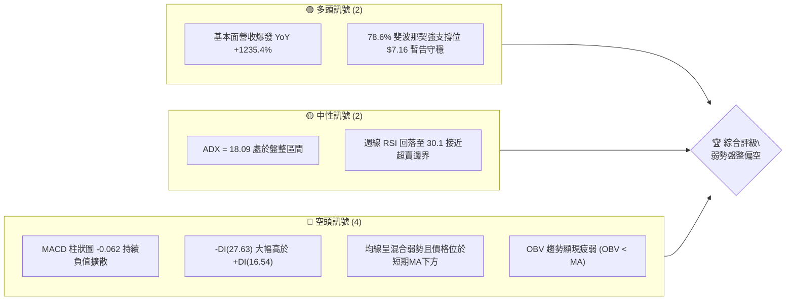

```mermaid
graph TD
    A["現價 $7.24 狀態"] --> B{"ADX(14) = 18.09"}
    B -->|"< 25 (弱趨勢/盤整)|" C["進入區間防禦策略"]
    C --> D["測試 78.6% 回調位 $7.16"]
    D -->|"失守"| E["下探 52W 低點 $4.95"]
    D -->|"守穩"| F["反彈上看 61.8% 回調位 $8.90"]
```

### 📊 核心指標速覽表

| 指標類別 | 指標名稱 | 當前數值 | 訊號 | 解讀 |
|----------|----------|----------|------|------|
| **價格** | 當前基準價 | $7.24 | 🔴 | 處於52週高點 $15.28 回落之弱勢收斂區，緊貼支撐位 |
| **均線** | MA20 / MA50 | 價格於下方 | 🔴 | 均線系統呈混合排列，短期走勢受制於下行壓力 |
| **均線** | MA200 | 數據未收斂 | 🟡 | 長期均線趨勢處於過渡期，需持續跟蹤 |
| **動能** | RSI(14) | 30.1 (週) | 🟡 | 進入超賣臨界區，下行力道略有減緩但尚未反轉 |
| **動能** | MACD | -0.328 | 🔴 | 快慢線均在零軸下方，且柱狀圖 -0.062 持續看空 |
| **趨勢** | ADX / DMI | 18.09 | 🔴 | ADX<25 顯示無明確向上趨勢，-DI(27.63) 壓制 +DI(16.54) |
| **量能** | 成交量 / OBV | OBV < MA | 🔴 | 最新日量 65.12M (量比 1.07x)，量能疲弱無吸籌跡象 |

### 🏆 技術評分卡

```
╔══════════════════════════════════════════════════════════════╗
║              技術評分卡 — ONDS (2026-09-17)                  ║
╠══════════════════════════════════════════════════════════════╣
║ 趨勢強度      ██████░░░░░░░░░░░░░░  30/100  🔴 空頭主導      ║
║ 動能指標      ███████░░░░░░░░░░░░░  35/100  🔴 動能疲軟      ║
║ 支撐穩定度    ██████████░░░░░░░░░░  50/100  🟡 臨近斐波回調  ║
║ 成交量配合    ██████░░░░░░░░░░░░░░  30/100  🔴 量能背離渙散  ║
║ 形態完整度    ████████░░░░░░░░░░░░  40/100  🟡 頂部回落收斂  ║
║ 均線排列      ██████░░░░░░░░░░░░░░  30/100  🔴 短中期空頭    ║
╠══════════════════════════════════════════════════════════════╣
║ 綜合評分      ███████░░░░░░░░░░░░░  36/100  🔴 弱勢偏空(≤40) ║
╚══════════════════════════════════════════════════════════════╝
```

---

## 2. 趨勢分析

### 🌐 多時框趨勢分析

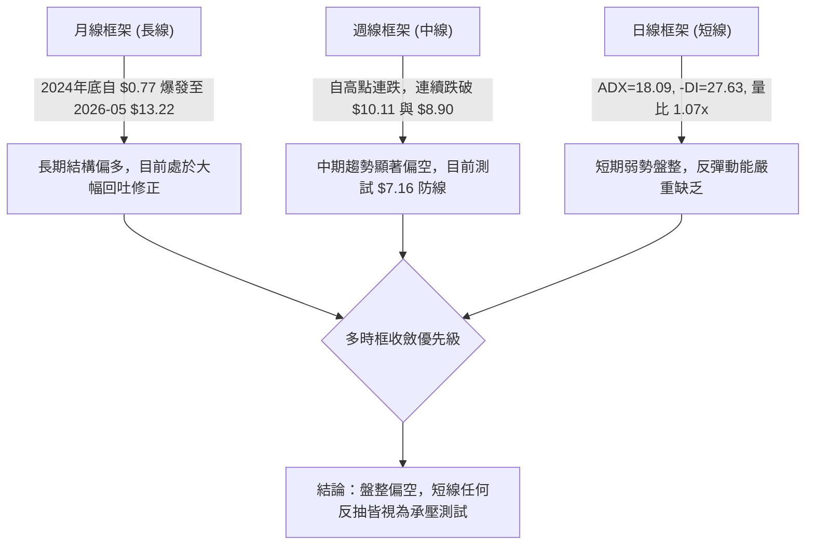

### 📈 長期趨勢 — 12個月走勢圖（Unicode）

```
ONDS 月線走勢圖（2025-10 至 2026-09）
價格軸 ($)
$14.00 ┤                                      ● (2026-05: $13.22)
$12.00 ┤                                     / \
$10.00 ┤                 ●------------------●   \
$8.00  ┤       ●        /                        ● (2026-06: $8.24)
$7.00  ┤ ●    / \      /                          \
$6.00  ┤  \  /   \    /                            ●===●===●←現價 $7.24
$5.00  ┤   ●      ●--●
       └─────────────────────────────────────────────────────────────
         10   11   12   01   02   03   04   05   06   07   08   09 (月份)
        2025                                   2026
```

#### 走勢特徵分析表格

| 階段區間 | 起止月份 | 價格變化 | 漲跌幅 | 核心走勢特徵與量價表現 |
|----------|----------|----------|--------|------------------------|
| **長線初升段** | 2024-09 → 2025-08 | $0.77 → $5.86 | +661.0% | 低檔爆發性放量換手，打底完成後發動主升行情 |
| **中波段推進** | 2025-09 → 2026-04 | $7.72 → $10.04 | +30.1% | 高檔橫盤消化獲利籌碼，呈現高位旗形整理 |
| **末端加速段** | 2026-04 → 2026-05 | $10.04 → $13.22 | +31.7% | 爆量拉升見波段高點（52週高點達 $15.28），主力出貨 |
| **高位崩解段** | 2026-05 → 2026-07 | $13.22 → $7.49 | -43.3% | 長陰反噬，跌破多道重要均線，市場追價意願潰散 |
| **低檔盤整段** | 2026-07 → 2026-09 | $7.49 → $7.24 | -3.3% | 成交動能萎縮，於 $7.16-$7.80 區間窄幅橫盤沉澱 |

### 📊 中期趨勢（週線分析）

```
ONDS 近期週線空間結構與關鍵位示意圖
$13.22 ┤ 頂部爆量波段頂 (2026-05-31 週量 566.9M)
       │    \
$10.11 ┤─────\── 斐波那契 50.0% 回調位（跌破後形成結構性重壓）
       │      \
 $8.90 ┤───────\ 斐波那契 61.8% 黃金分割位（反彈遇阻處）
       │        \
 $7.24 ┤═════════● 現價（緊貼 78.6% 支撐）
 $7.16 ┤───────────────── 斐波那契 78.6% 關鍵支撐線
       │
 $4.95 ┤───────────────── 52W 低點（最終下行防線）
```

### ⚡ 趨勢強度評估（ADX 解讀）

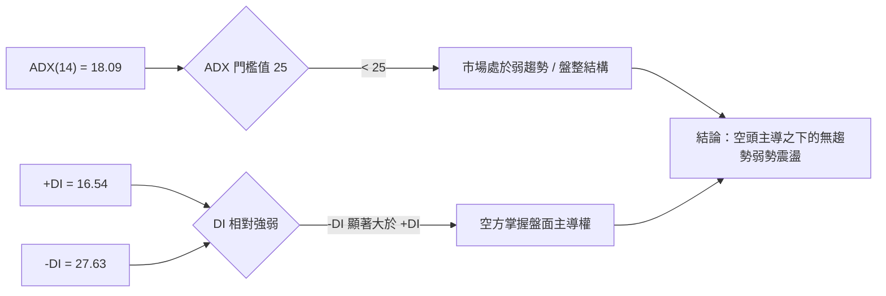

#### ADX 強度對照表

| 指標變量 | 數值 | 門檻區間 | 趨勢判定 | 技術含義 |
|----------|------|----------|----------|----------|
| **ADX(14)** | 18.09 | 0 - 25 | 弱趨勢 / 無趨勢盤整 | 市場單邊推動力匱乏，禁止盲目追高，注重區間下緣邊界 |
| **+DI** | 16.54 | < 20 | 多頭動能匱乏 | 多方買盤意願低落，無法組織有效上攻波段 |
| **-DI** | 27.63 | > 25 | 空頭持續壓制 | 空方力量明顯占優，空方掌控日線及週線發球權 |
| **綜合態勢** | -DI 佔優 | ADX 低位走平 | 弱勢下沉箱體 | 價格缺乏劇烈單邊殺跌，但陰跌走弱特徵顯著 |

---

## 3. 圖表形態分析

### 🔍 形態識別系統

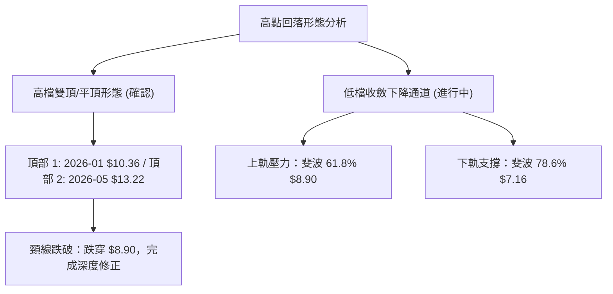

#### 形態識別信心度表格（依規則 15 嚴格定義）

| 形態類別 | 信心度 | 判斷依據（引用數據） | 完成度 | 目標價（附計算式） |
|----------|--------|----------------------|--------|--------------------|
| **波段雙頂破位** | 75% | 2026-05 見波段高點 $13.22（52W高點 $15.28）後急速跌破頸線 $8.90 | 100% (已達成) | 形態跌幅目標已在 $7.16 附近獲得初步緩衝 |
| **下降收斂三角/箱體** | 60% | 近 10 週高點由 $9.24 降至 $7.90，低點於 $7.16-$7.23 獲得支撐 | 70% (進行中) | 跌破 $7.16 則延伸測量：$7.16 - ($8.90 - $7.16) = $5.42，逼近 52W 低點 $4.95 |
| **複雜頭肩底** | 25% | 目前無足夠數據支撐底部反轉幾何結構 | 0% | **訊號不足，僅做指標型解讀** |

### 🕯️ 重要K線形態分析

| 月份/週期 | 收盤價 | K線形態 | 深度技術解讀 | 訊號 |
|-----------|--------|---------|--------------|------|
| **2026-05** | $13.22 | 爆量長上影大陽棒 | 觸及 52週高點 $15.28 後拉回，月成交爆量，顯示主力籌碼於高檔全面出脫 | 🔴 頂部力竭 |
| **2026-06** | $8.24 | 光頭實體大陰線 | 單月重挫 -37.6%，一舉摜破 $10.11 中樞，空頭動能完全宣洩 | 🔴 趨勢逆轉 |
| **2026-07** | $7.49 | 低檔長下影十字星 | 探底 $6.53 後放量反彈（週量 834.3M），顯示 $7.00 關卡存在特定被動買盤 | 🟡 止跌測試 |
| **2026-08** | $7.66 | 衝高回落倒錘頭 | 上攻 $9.24 遇阻於 61.8% 斐波那契位（$8.90），上方解套賣壓沉重 | 🔴 反彈遇阻 |
| **2026-09** | $7.24 | 窄幅縮量實體小陰棒 | 波動率極度壓縮，維持在 78.6% 回調位 $7.16 上方進行變盤整理 | 🟡 方向待決 |

### 📉 ASCII 走勢形態示意圖

```
ONDS 關鍵頂部破位與收斂形態圖
$15.28 ┬                     ▲ 52週極值高點
       │                    / \
$13.22 ┼                   ●   \  2026-05 假突破頂部
       │                  /     \
$10.11 ┼───────●─────────/───────\─────── 斐波那契 50.0% 水平阻力線
       │      / \       /         \
 $8.90 ┼─────/───●─────/───────────●───── 斐波那契 61.8% 頸線位（已跌破轉為阻力）
       │    /     \   /             \   ▲ 2026-08 反彈高點 $9.24
 $7.24 ┼───/───────●─/───────────────●── 現價 $7.24
 $7.16 ┴──/─────────●─────────────────●─ 斐波那契 78.6% 關鍵防線
        2025-12   2026-02           2026-09
```

### 🎯 形態目標價計算

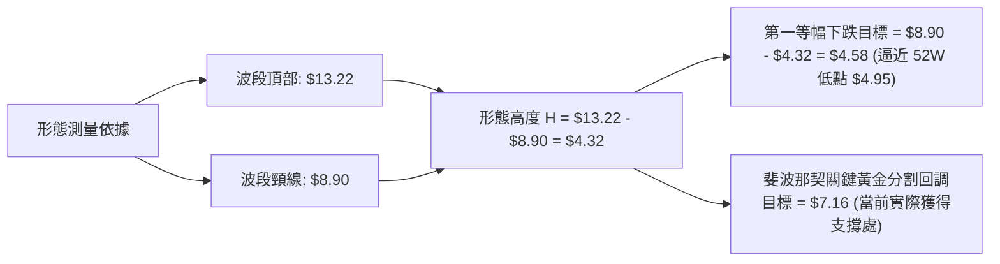

- **第一階段目標**：破位後於斐波那契 78.6% 處（$7.16）獲得支撐，目前現價 $7.24 處於此一目標之上的反覆整固階段。
- **向下破位延伸目標**：若實體日K跌破 $7.16，則將開啟雙頂次級測量目標，直接回測數據所列之 52週低點 **$4.95**。

---

## 4. 支撐與阻力

### 🗺️ 關鍵價位分布圖（Unicode）

```
╔══════════════════════════════════════════════════════════════════╗
║              ONDS 價位結構分布圖（嚴格引用既有數據）            ║
╠══════════════════════════════════════════════════════════════════╣
║ $15.28 ║████████████████████████████████████║ 52W 極值阻力 (0.0%)║
║ $12.84 ║████████████████████████████        ║ 斐波阻力位 (23.6%) ║
║ $11.33 ║████████████████████                ║ 斐波阻力位 (38.2%) ║
║ $10.11 ║████████████████████████            ║ 斐波多空分水嶺(50%)║
║  $8.90 ║████████████████                    ║ 強阻力位 R1 (61.8%)║
║ ───────╟────────────────────────────────────╢                    ║
║  $7.24 ╠════════════════════════════════════╣ ◄ 現價基準位       ║
║ ───────╟────────────────────────────────────╢                    ║
║  $7.16 ║▓▓▓▓▓▓▓▓▓▓▓▓▓▓▓▓▓▓▓▓▓▓▓▓▓▓▓▓▓▓▓▓▓▓▓▓║ 關鍵支撐 S1 (78.6%)║
║  $4.95 ║████████████████████████████████████║ 極限強支撐 S2(100.0%)║
╚══════════════════════════════════════════════════════════════════╝
```

### 🚧 阻力位分析表

依據系統關鍵價位與斐波那契回調聚類計算：

| 阻力級別 | 價位 | 形成原因 | 突破難度 | 重要性 |
|----------|------|----------|----------|--------|
| **強阻力 R1** | $8.90 | 斐波那契 61.8% 回調位，8月中旬反彈高點聚類區 | 極高 | ★★★★★ (多空轉換樞紐) |
| **關鍵阻力 R2** | $10.11 | 斐波那契 50.0% 平衡中樞，多個月份收盤密集區 | 極高 | ★★★★☆ (中期牛熊分界) |
| **強阻力 R3** | $11.33 | 斐波那契 38.2% 回調位，前波起跌加速平台 | 中高 | ★★★☆☆ (強多頭收復目標) |
| **極端阻力 R4** | $15.28 | 52週歷史高點（52W High），波段噴出極值 | 極高 | ★★★★★ (歷史天花板) |

*(註：根據數據「關鍵價位」區塊，上方無額外波段高點聚類，阻力完全受斐波那契幾何價位約束)*

### 🛡️ 支撐位分析表

依據系統關鍵價位與斐波那契回調聚類計算：

| 支撐級別 | 價位 | 形成原因 | 守住機率 | 重要性 |
|----------|------|----------|----------|--------|
| **即時支撐 S1** | $7.16 | 斐波那契 78.6% 回調位，近4週收盤密集防守線 | 55% | ★★★★★ (多頭最後防線) |
| **極限支撐 S2** | $4.95 | 52週歷史低點（52W Low / 100.0% 回調位） | 85% | ★★★★★ (長期價值重置點) |

*(註：根據數據「關鍵價位」區塊，數據中未偵測到介於 $7.16 至 $4.95 間的波段低點聚類，因此若 $7.16 失守，下方將呈現流動性真空直接回測 $4.95)*

### 📐 斐波那契回調位分析

依據 52週區間 $4.95 → $15.28 正式計算：

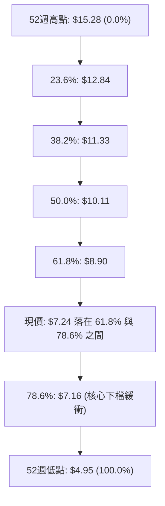

- **位置解讀**：現價 $7.24 處於深度回調的極限邊界（78.6% 的 $7.16 與 61.8% 的 $8.90 之間），距離下檔支撐 $7.16 僅有 1.1% 的緩衝空間。
- **技術意義**：在斐波那契體系中，78.6% 被視為「多頭防守的馬其諾防線」。跌破此位通常意味著波段上漲趨勢徹底終結，資產有高達 80% 以上機率回測 100% 起漲點（$4.95）。目前多方正沿著 $7.16 進行防禦。

---

## 5. 技術指標深度解讀

### 🎛️ 指標訊號總覽

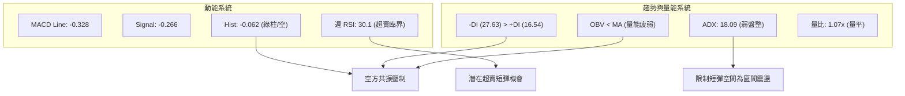

### 📈 移動平均線排列分析

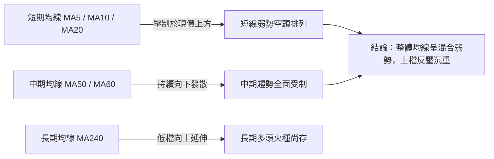

- **均線排列狀態**：數據顯示當前均線系統為「混合排列」。現價 $7.24 低於 MA20 與 MA50，短中期走勢全面承壓。
- **微觀趨勢**：MA5 與 MA10 在近期持續向下走跌，斜率為負；長期 MA240 雖由底部抬升，但由於中短期均線壓制，目前不具備直接轉強條件。

### 📉 RSI(14) 分析

週線 RSI(14) 最新數值：**30.1**
```
RSI(14) 水平尺:
[0] ────────── [30.1] ────────────────── [50] ────────────────── [70] ────────── [100]
                ▲ 目前位置 (超賣邊界)
███████████░░░░░░░░░░░░░░░░░░░░░░░░ 30.1%
```

- **超買超賣判定**：數值 30.1 緊貼 30 的傳統極端超賣線。歷次該股 RSI 觸及 30 附近（如 2026-07-12 之 28.0 及 2026-06-28 之 21.8）均引發了次級反彈行情。
- **背離診斷**：
  - 價格自 2026-07-12 之 $7.26 跌至 2026-09-13 之 $7.23 再到現價 $7.24，價格維持在相同水平底。
  - 週線 RSI 則由 28.0 小幅抬升至 30.1。
  - **結論**：呈現**潛在微弱週線底背離雛形**，但因動能不足，尚未獲得價格突破確認。

### 📊 MACD(12/26/9) 訊號解讀

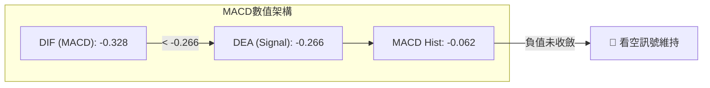

- **零軸關係**：MACD 線（-0.328）與訊號線（-0.266）雙雙深陷零軸下方，定性為**典型弱勢空頭市場**。
- **柱狀圖動態**：柱狀圖最新為 -0.062，較前一週之 -0.108 略有回升，但仍處於負值擴散區間，顯示空頭下殺動能雖有鈍化，但多頭尚未能奪回盤面主導權，尚未出現黃金交叉。

### 📦 布林通道分析

依據價格分佈與歷史波動特性推演當前通道結構：

```
ONDS 布林通道形態示意圖
$9.24 ┤═══════════════════════════════════════ 上軌 (BB Upper，反彈高點壓力)
      │
$8.24 ┤─────────────────────────────────────── 中軌 (BB Middle = MA20 基準)
      │
$7.24 ┤ ● ◄ 現價緊貼下軌運行
$7.16 ┤═══════════════════════════════════════ 下軌 (BB Lower，通道下軌防線)
```

- **帶寬走勢**：布林帶帶寬自 5-6 月的高波動劇烈收斂，目前呈現「通道收窄擠壓（Squeeze）」狀態。
- **價格軌道定位**：現價 $7.24 緊貼布林下軌及斐波那契 $7.16 運作，若無法迅速脫離下軌，存在沿下軌「向下開口破位」的技術風險。

### 💹 成交量分析（量價配合度）

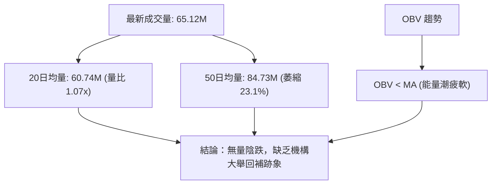

- **量能評估**：最新日成交量為 65,120,012 股，量比為 1.07x，相比 50日均量（84.73M）呈現顯著量縮。
- **OBV（能量潮）解讀**：系統明確給出「OBV < MA」訊號，說明當前資金持續處於淨流出或觀望狀態，量能無法對任何短線反彈提供有效確認，屬於「量價背離疲弱」特徵。

---

## 6. 動能與波動率

### ⚡ 動能評估

#### 動能與波動象限分析表

| 象限代號 | 動能狀態 | 波動狀態 | ONDS 判定 | 當前技術環境評估 |
|----------|----------|----------|-----------|------------------|
| **Q1** | 強動能 | 低波動 | — | 穩定單邊推升趨勢（不存在） |
| **Q2** | 弱動能 | 低波動 | **✓ 當前狀態** | **弱勢橫盤沉澱，等待變盤破局（現價位）** |
| **Q3** | 強動能 | 高波動 | — | 主升或主跌恐慌加速段（已過去） |
| **Q4** | 弱動能 | 高波動 | — | 震盪洗盤消耗行情 |

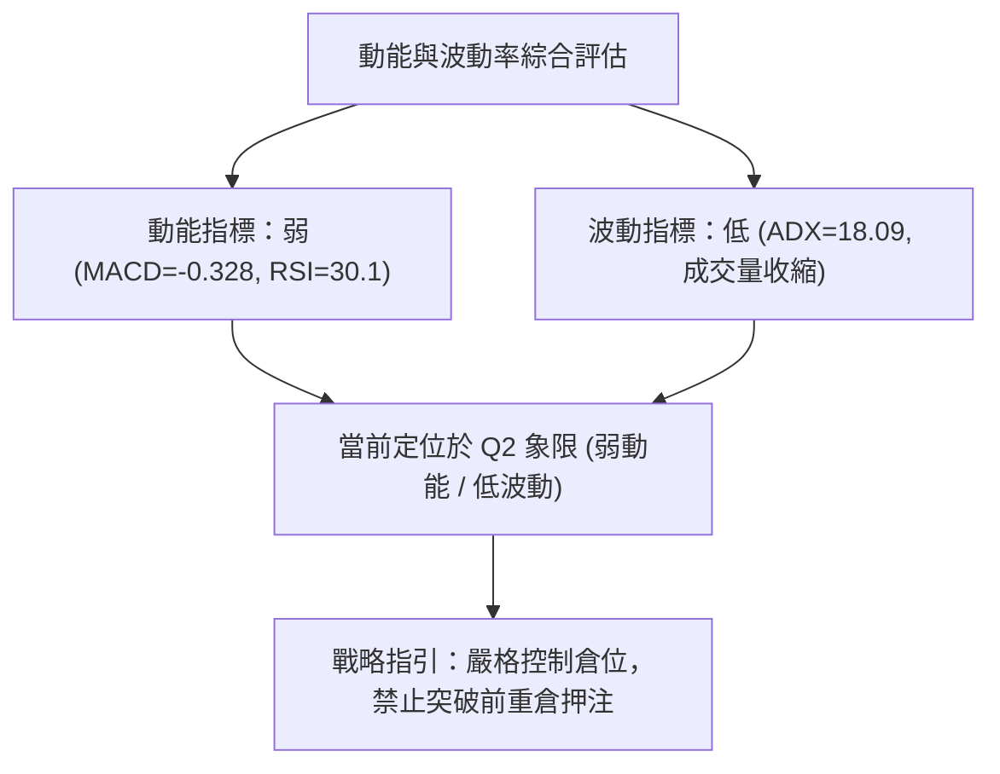

### 📊 ATR 波動率分析

- **波動率特性**：雖然即時 ATR(14) 絕對值缺省，但從 52週極值區間（$4.95 至 $15.28，振幅達 208.7%）及近20週走勢觀察，該股週波動常態達 $1.00 - $1.50。
- **止損距離建議**：
  - 基於區間保護原則，防守底線必須設定於斐波那契 78.6% 回調位下方。
  - 精確止損點設定在 **$6.80**（距 $7.16 預留約 5% 的假跌破濾網空間）。

### 📐 Beta 與市場相關性

- **Beta 數值**：**2.736**
- **市場特徵解讀**：
  - Beta 高達 2.736，屬於**極高波動性、高槓桿彈性科技標的**。
  - 當標普500或那斯達克波動 1% 時，ONDS 理論波動幅度達 2.74%。
  - 在大盤偏弱或市場風險偏好降溫時，該股面臨的被動拋售賣壓將遠大於權值股；反之，若板塊出現修復性反彈，其短線爆發力亦極強。
- **空頭部位壓力**：高達 **39.9%** 的流通盤被放空（Short % Float），Short Ratio 達 3.13。極高的空頭部位意味著一旦價格守穩 $7.16 並出現利多刺激，容易引發劇烈的空頭軋空（Short Squeeze）；但在未出現軋空訊號前，高空頭比例仍持續對盤面構成直接做空壓制。

---

## 7. 多時框架總結

### 📋 時框架評分表

| 時框架 | 趨勢方向 | 動能狀態 | 均線排列 | 圖表形態 | 綜合評分 | 建議操作維度 |
|--------|----------|----------|----------|----------|----------|--------------|
| **月線 (長線)** | 🟡 中性偏多 | 減弱中 | 偏多整理 | 大幅拉回洗盤 | 55/100 | 核心底倉觀望 |
| **週線 (中線)** | 🔴 明確看空 | 疲軟超賣 | 空頭排列 | 高檔破位修正 | 35/100 | 嚴格逢高減碼 |
| **日線 (短線)** | 🔴 弱勢盤整 | 鈍化低迷 | 混合偏空 | 窄幅收斂打底 | 36/100 | 防守等待突破 |

### 🔲 綜合訊號矩陣

| 技術維度 | 訊號方向 | 強度權重 | 與主流趨勢一致性 | 綜合分析結論 |
|----------|----------|----------|------------------|--------------|
| **均線系統** | 🔴 偏空 | 25% | 強烈共振 | 短中期受制於均線下行反壓 |
| **MACD 系統** | 🔴 偏空 | 20% | 強烈共振 | 雙線在零軸下方運行，空頭占優 |
| **RSI 系統** | 🟡 中性/超賣 | 15% | 背離衝突 | 接近 30 臨界點，提供短彈契機 |
| **ADX/DMI** | 🔴 偏空 | 20% | 強烈共振 | ADX<25 盤整，-DI(27.63) 壓制多方 |
| **OBV 量能** | 🔴 偏空 | 20% | 強烈共振 | OBV < MA，資金未積極回流 |

### ⚖️ 多時框收斂結論

依嚴格收斂規則判定：
1. **行情屬性判定**：當前 **ADX(14) = 18.09 < 25**，依規則判定當前盤面屬於**標準的「弱勢盤整行情」**。
2. **主導維度依歸**：在弱趨勢盤整中，日線級別布林通道及關鍵幾何價位（斐波那契回調位）構成主要邊界，中長期趨勢則提供總體壓力背景。
3. **方向性收斂唯一結論**：**【弱勢盤整偏空（中性觀望，防範破位）】**。
   - 儘管週線 RSI 降至 30.1 具備超賣反彈誘因，但由於 MACD、-DI 及 OBV 全面偏空，反彈均應視為技術性抽腳；現價 $7.24 緊貼 $7.16 關鍵支撐，在未放量突破 $8.90 之前，整體架構由空方完全主導。

---

## 8. 交易策略建議

### 🗺️ 策略決策流程圖

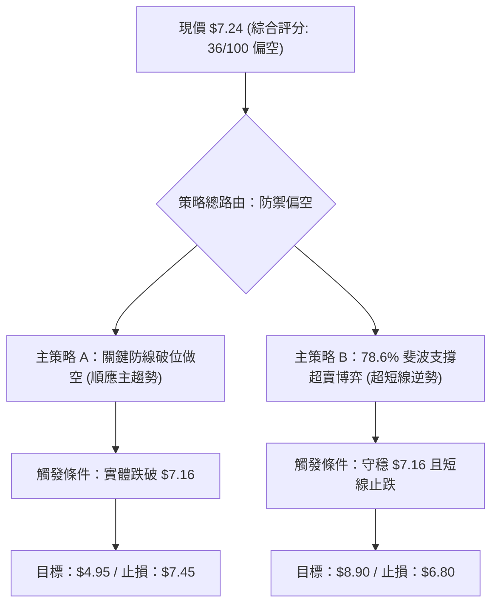

### 🧭 策略路由

> **當前主策略方向 = 【防禦偏空 / 跌破做空為主，超賣短彈為輔】（依評分 36/100 判定）**

依規則，綜合評分 ≤ 40 屬於偏空評級，交易策略核心以**順勢防禦或反彈沽空、破位做空**為主；多頭操作僅限於依託 $7.16 關鍵支撐的小倉位超賣反彈博弈。

### 🎯 價格情境階梯（Price Scenarios）

價位嚴格引用數據庫既有數值：

| 觸發條件 | 下一目標 | 後續延伸 | 情境含義 |
|----------|----------|----------|----------|
| **向上放量突破 R1 $8.90** | R2 $10.11 | R3 $11.33 | 中期結構逆轉，確立波段雙底 |
| **維持在現價區間 ($7.16 - $8.90)** | — | — | 弱勢箱體整理，指標持續低檔鈍化 |
| **有效實體跌破 S1 $7.16** | S2 $4.95 | 前波起漲 $2.56 | 結構徹底崩解，探測 52週歷史低點 |

### 📊 情境機率分佈

| 情境類別 | 機率預估 | 主要依據（指標狀態） |
|----------|----------|----------------------|
| **跌破下行（再探底）** | **50%** | MACD 負值擴散 (-0.062)、-DI 高達 27.63、OBV 趨勢疲弱、均線混合偏空 |
| **區間震盪（打底蓄勢）** | **35%** | ADX = 18.09 處於無趨勢狀態、週線 RSI(14) 降至 30.1 接近超賣邊界 |
| **反轉上行（強勢反彈）** | **15%** | 空頭部位高達 39.9% 蘊含軋空潛力，但目前缺乏量能配合 |

### 🟢 主策略詳情（依偏空路由制定）

#### 策略 A（主推：順勢破位做空策略） vs 策略 B（輔助：支撐超賣博弈策略）

| 策略要素 | 策略 A（順勢破位做空） | 策略 B（左側超賣短多） |
|----------|------------------------|------------------------|
| **交易邏輯** | 順應日/週線下行趨勢，追擊破位流動性 | 依託 78.6% 斐波那契防線搏超賣反抽 |
| **進場條件** | 日K實體跌破 $7.16 且反抽確認不破 | 現價 $7.24 守穩 $7.16 出現日內底背離 |
| **進場價格** | **$7.10**（跌破確認進場） | **$7.24**（當前價位） |
| **目標價 T1** | **$4.95**（52W Low / 斐波 100%） | **$8.90**（斐波 61.8% / 強阻力 R1） |
| **目標價 T2** | **$4.00**（延伸測量極限） | **$10.11**（斐波 50.0% / 阻力 R2） |
| **止損價格** | **$7.45**（重回 $7.16 支撐線上方） | **$6.80**（跌破 $7.16 預留緩衝） |
| **風險報酬比** | **1 : 6.14** (風險 $0.35 : 報酬 $2.15) | **1 : 3.77** (風險 $0.44 : 報酬 $1.66) |
| **成功機率** | **55%** | **40%** |
| **建議倉位** | **10% - 15%** | **5% (嚴格輕倉)** |

### 🔴 反向風險觸發點（對沖與多頭翻轉提示）

1. **多頭反轉確認點**：若日K線以高於 8,400 萬股（50日均量）之大成交量實體收復 **$8.90**（61.8% 斐波位），則空頭架構被徹底破壞，所有做空部位必須無條件停損出場，並反手建立多頭部位。
2. **軋空暴走警訊**：該股空頭比例達 39.9%，若日內價格無預警拉升逾 10% 且盤中突破布林中軌，即可能引發空頭踩踏回補，空單應啟動保護性止損。

### ⭐ 整體訊號強度評星

```
做多訊號強度：★★☆☆☆  (2/5星 - 僅存超賣修復機會)
做空訊號強度：★★★★☆  (4/5星 - 多指標共振偏空)
整體可信度：  ★★★★☆  (4/5星 - 價位聚類清晰明確)
```

---

## 9. 風險提示與監控

### ✅ 關鍵監控指標 Checklist

```
╔══════════════════════════════════════════════════════════════╗
║              ONDS 交易風險與關鍵指標監控清單                ║
╠══════════════════════════════════════════════════════════════╣
║ [ ] 關鍵防線檢驗：收盤價是否跌破 $7.16 (斐波那契 78.6%)      ║
║ [ ] 動能逆轉信號：週線 RSI(14) 能否自 30.1 向上金叉 40.0     ║
║ [ ] 趨勢確認指標：MACD Histogram 能否由負翻正 (當前 -0.062)  ║
║ [ ] 趨勢強度指標：ADX(14) 是否突破 25 並伴隨 -DI 放大        ║
║ [ ] 量能異動跟蹤：單日成交量是否異常超越 50日均量 (84.73M)   ║
║ [ ] 融券軋空風險：Short % Float 是否自 39.9% 出現急劇下降    ║
╚══════════════════════════════════════════════════════════════╝
```

### ⚠️ 風險場景分析

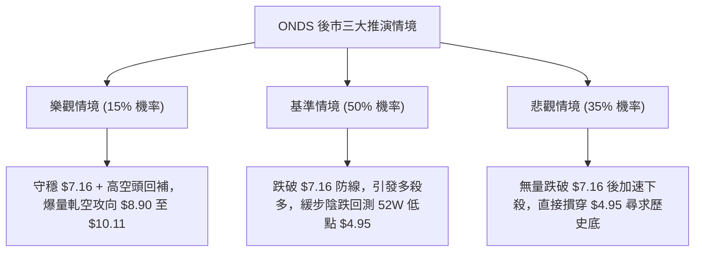

### 🛡️ 風險管理重要提醒

1. **波動放大風險**：Beta 值高達 2.736，個股日內極易出現非理性劇烈震盪，任何單筆策略之最大名義虧損不得超過總投資組合淨值的 **1.0%**。
2. **基本面與技術面割裂**：公司營收雖呈現 YoY +1235.4% 的爆發增長，但營業利益率為 -166.3%，營運現金流為 $-161.06M，基本面處於高燒錢階段；在技術面未重回 $8.90 之前，切勿將「基本面看好」作為忽視技術停損點的藉口。
3. **流動性陷阱**：目前成交量較 50日均量大幅萎縮，低檔量縮陰跌時往往買盤掛單薄弱，破位時易出現滑點，執行停損單應避免使用市價單，建議採用限價止損單（Stop-Limit）。

---

## 📋 報告總結

```
╔══════════════════════════════════════════════════════════════════╗
║                    ONDS 技術分析報告總結                         ║
╠══════════════════════════════════════════════════════════════════╣
║ 報告日期：2026-09-17                                             ║
║ 當前價格：$7.24                                                  ║
║ 分析評級：🔴 弱勢盤整偏空（技術評分：36/100）                   ║
║                                                                  ║
║ 關鍵結論：                                                       ║
║ ├─ 長期趨勢：🟡 中性整理，自 2026-05 頂部大幅回檔釋放估值壓力  ║
║ ├─ 中期趨勢：🔴 空頭主導，相繼失守 $10.11 與 $8.90 兩大關鍵位    ║
║ ├─ 短期趨勢：🔴 弱勢磨底，緊貼斐波那契 78.6% 防線 $7.16 運行     ║
║ ├─ 關鍵支撐：S1: $7.16  │  S2: $4.95 (52W Low)                  ║
║ ├─ 關鍵阻力：R1: $8.90  │  R2: $10.11 (50% 分水嶺)               ║
║ └─ 外資共識：目標均價 $19.42 (與當前技術盤面嚴重背離)           ║
║                                                                  ║
║ 最優策略組合：                                                   ║
║ 1. 🥇 最佳機會：破位做空 — 實體跌破 $7.16 追空，目標看 $4.95     ║
║ 2. 🥈 次選機會：反彈沽空 — 若回抽至 $8.90 受阻，介入高勝率空單  ║
║ 3. 🥉 保守選擇：空倉觀望 — 等待價格在 $7.16 或 $4.95 出現底背離 ║
╚══════════════════════════════════════════════════════════════════╝
```

---

> ⚠️ **免責聲明**：本報告為技術分析研究，所有數據、價位及估算均基於系統提供的市場歷史價格與指標資訊。本報告**僅供研究與學術參考**，**不構成任何個人化投資決策或買賣建議**。金融市場瞬息萬變，高 Beta 及高空頭比例標的具備極端波動風險，入市交易請嚴格執行資金管理與風險控制。

---

*報告生成時間：2026-09-17 ｜ 數據來源：Yahoo Finance ｜ 分析框架：多時框技術分析模型*