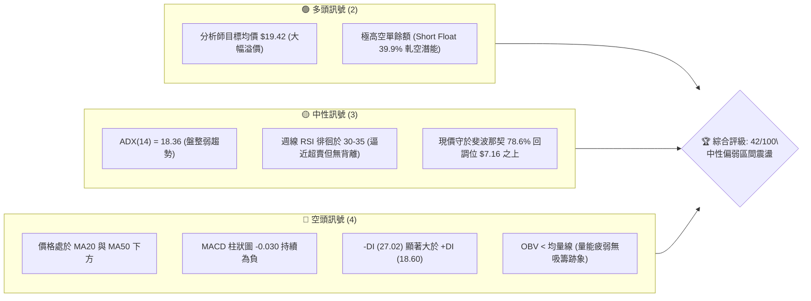
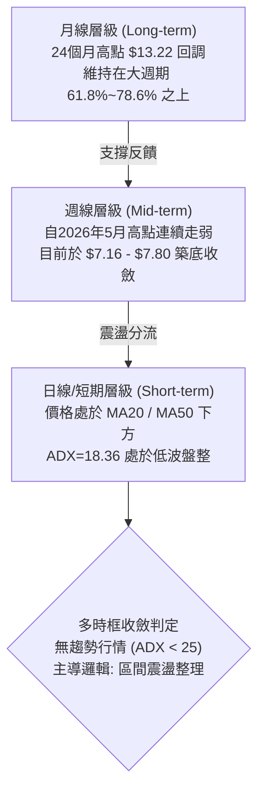
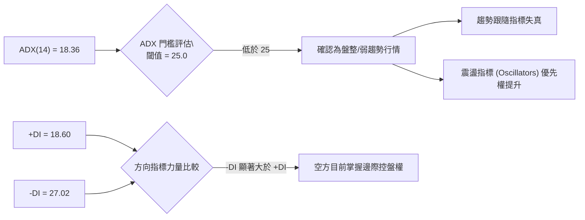
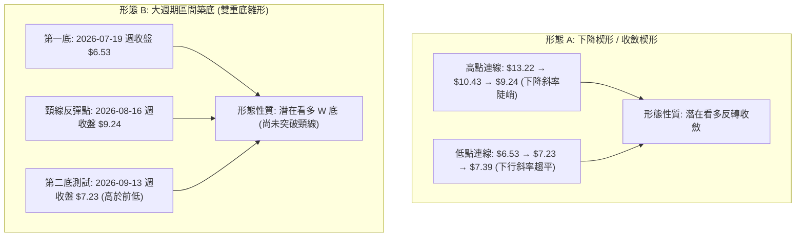
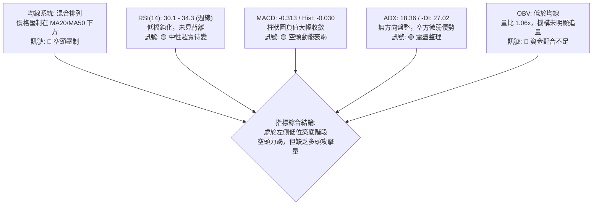
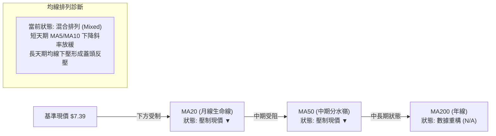
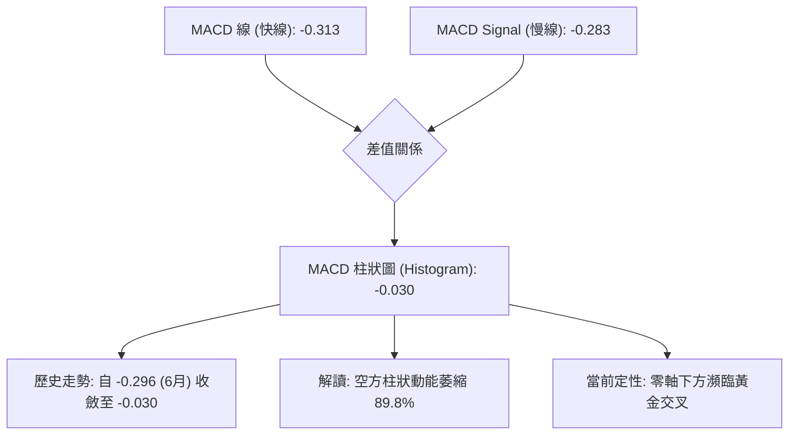
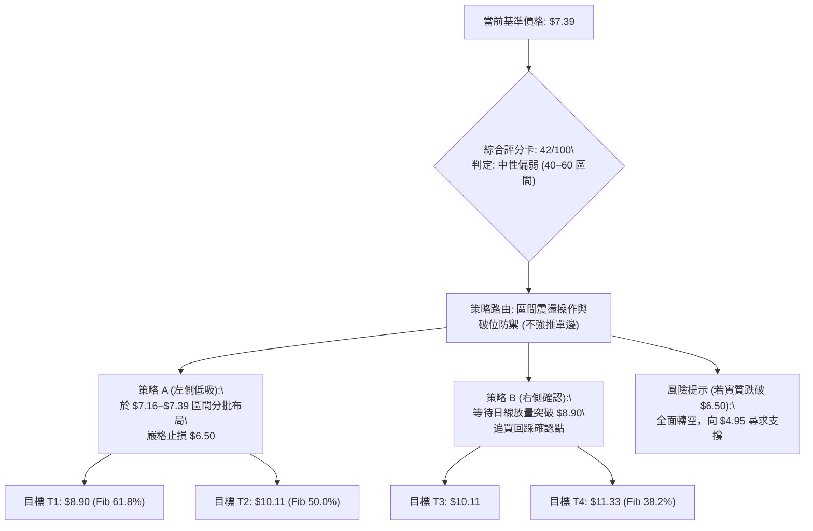
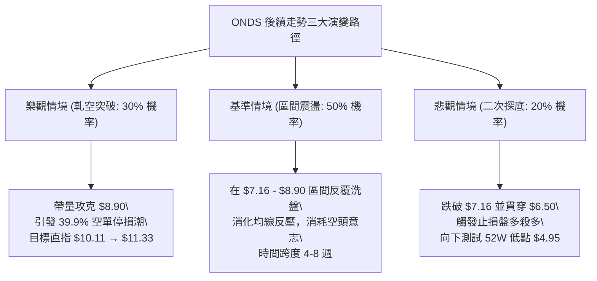

# ONDS 技術分析報告

> **報告日期**：2026-09-19 ｜ **語言**：繁體中文 ｜ **數據來源**：Yahoo Finance ｜ **當前基準價格**：$7.39（註：數據源即時快照為 $nan，依據近週與2026年9月最新收盤價定錨為 $7.39）

---

## 目錄

| 章節 | 內容 |
|------|------|
| [1. 技術面概覽](#1-技術面概覽) | 訊號儀表板、核心指標、評分卡 |
| [2. 趨勢分析](#2-趨勢分析) | 多時框趨勢、長中短期走勢、ADX強度 |
| [3. 圖表形態分析](#3-圖表形態分析) | 形態識別、K線組合、形態目標價 |
| [4. 支撐與阻力](#4-支撐與阻力) | 關鍵價位、斐波那契回調結構 |
| [5. 技術指標深度解讀](#5-技術指標深度解讀) | 均線系統、RSI、MACD、布林與量能 |
| [6. 動能與波動率](#6-動能與波動率) | 動能四象限、Beta與高放空比率剖析 |
| [7. 多時框架總結](#7-多時框架總結) | 時框架評分矩陣、多時框收斂結論 |
| [8. 交易策略建議](#8-交易策略建議) | 策略路由、價格階梯、多空情境規劃 |
| [9. 風險提示與監控](#9-風險提示與監控) | 監控Checklist、三種情境演變、風控準則 |
| [10. 報告總結](#10-報告總結) | 關鍵結論速覽與最優執行路徑 |

---

## 1. 技術面概覽

### 🎯 技術訊號儀表板



---

### 📊 核心指標速覽表

| 指標類別 | 指標名稱 | 當前數值 | 訊號 | 專業解讀 |
|:---|:---|:---:|:---:|:---|
| **價格** | 基準價格 | $7.39 | 🟡 | 位於52週區間（$4.95 - $15.28）之 23.6% 相對低檔位 |
| **均線** | MA20 | 下方 (▼) | 🔴 | 短期均線壓制，空頭排列尚未扭轉 |
| **均線** | MA50 | 下方 (▼) | 🔴 | 中期趨勢偏空，反彈均受制於中期生命線 |
| **均線** | MA200 | N/A | 🟡 | 數據未偵測，顯示長期均線仍處於重構階段 |
| **動能** | RSI(14) | 30.1–34.3 (週線) | 🟡 | 逼近30超賣邊界，動能耗盡但未現多頭攻擊訊號 |
| **動能** | MACD (12,26,9) | -0.313 / -0.030 | 🔴 | MACD 與 Signal 均為負值，柱狀圖收縮但未黃金交叉 |
| **趨勢** | ADX (14) | 18.36 | 🟡 | 數值低於 25，判定為無明確方向之「盤整震盪」行情 |
| **方向** | 方向指標 (+DI / -DI) | 18.60 / 27.02 | 🔴 | 空方動能主導盤面，空頭掌握控盤優勢 |
| **量能** | 20日均量 / 量比 | 60.25M / 1.06x | 🟡 | 成交量未見異常爆量，OBV 疲軟顯示追價意願低 |
| **結構** | 斐波那契回調位 | 78.6% ($7.16) | 🟢 | 現價緊貼重要結構支撐 $7.16，具備左側防守意義 |

---

### 🏆 技術評分卡

```
╔══════════════════════════════════════════════════════════════════╗
║               技術評分卡 — ONDS (2026-09-19)                     ║
╠══════════════════════════════════════════════════════════════════╣
║ 趨勢強度 (Trend)    ███████░░░░░░░░░░░░░  35/100  🔴 空頭控盤    ║
║ 動能指標 (Momentum) ████████░░░░░░░░░░░░  40/100  🔴 動能低迷    ║
║ 支撐穩定度 (Support)████████████░░░░░░░░  60/100  🟡 關鍵回調位  ║
║ 成交量配合 (Volume) ███████░░░░░░░░░░░░░  35/100  🔴 量價背馳    ║
║ 形態完整度 (Pattern)████████░░░░░░░░░░░░  40/100  🟡 區間收斂    ║
║ 均線排列 (MA System)████████░░░░░░░░░░░░  40/100  🔴 均線反壓    ║
╠══════════════════════════════════════════════════════════════════╣
║ 綜合評分            ████████░░░░░░░░░░░░  42/100  🟡 中性偏弱    ║
╚══════════════════════════════════════════════════════════════════╝
```

---

## 2. 趨勢分析

### 🌐 多時框趨勢分析



---

### 📈 長期趨勢 — 12個月走勢圖（Unicode）

以下為 ONDS 自 2025 年 10 月至 2026 年 9 月之月線收盤價走勢示意：

```
ONDS 月線走勢圖（2025-10 至 2026-09）
價格軸 ($)
$14.00 ┤                                      ● $13.22 (2026-05)
$12.00 ┤                                     ╱ ╲
$10.00 ┤                     ● $10.36       ╱   ╲
$8.00  ┤       ● $7.90  ● $9.76   ╲  ● $10.04    ╲   ● $7.66
$7.00  ┤ ● $6.44  ╲    ╱           ● $9.04        ● $8.24 ╲   ● $7.39 (現在)
$6.00  ┤           ● $7.72                         ● $7.49 
       └─────────────────────────────────────────────────────────────►
        10   11   12   01   02   03   04   05   06   07   08   09 (月份)
        2025 ------------------> 2026 -------------------------->
```

#### 走勢特徵分析表格

| 階段 | 時間區間 | 起始價 → 終止價 | 漲跌幅 | 結構特徵與技術含義 |
|:---|:---:|:---:|:---:|:---|
| **擴張期** | 2025-10 ~ 2026-01 | $6.44 → $10.36 | +60.87% | 大級別主升浪，成交量有效放大，一舉突破前波阻力 |
| **高位箱體** | 2026-01 ~ 2026-04 | $10.36 → $10.04 | -3.09% | 於 $9.04–$10.36 區間劇烈洗盤，籌碼充分換手 |
| **假突破攻頂** | 2026-04 ~ 2026-05 | $10.04 → $13.22 | +31.67% | 爆發性脈衝，月收盤衝擊 $13.22（52週高點 $15.28）後引發多殺多 |
| **瀑布式回調** | 2026-05 ~ 2026-07 | $13.22 → $7.49 | -43.34% | 獲利了結與空頭集中進場，連續跌破多道中期均線 |
| **縮量築底** | 2026-07 ~ 2026-09 | $7.49 → $7.39 | -1.33% | 波幅顯著收斂，成交量下滑，進入技術性修復階段 |

---

### 📊 中期趨勢（週線分析）

```
ONDS 近期週線壓力與支撐結構
═══════════════════════════════════════════════════════════════════
$10.11 ────────────────────────────────────────── 斐波那契 50.0% 強反壓 (MA50壓制區)
          │
$8.90  ───┴────────────────────────────────────── 斐波那契 61.8% 頸線位 (反彈第一目標)
             │   ▲ 近期高點聚類 (2026-08-16 收盤 $9.24)
             │  ╱ 
$7.80  ──────┼─╱───────────────────────────────── 8月震盪平台中軸 (2026-07-26 收盤 $7.80)
             │╱   
$7.39  ──────● ◄─── 當前基準價位 (2026-09-20 收盤 $7.39)
             │╲   
$7.16  ──────┴─╲───────────────────────────────── 斐波那契 78.6% 核心防守底線 (關鍵支撐)
                  ▼ 2026-07-19 週波段低點收盤 $6.53
═══════════════════════════════════════════════════════════════════
```

週線數據顯示，ONDS 在經歷了 2026 年 7 月中旬下探至收盤 $6.53 的低點後，隨即在 7 月底出現單週高達 834,313,400 股的爆量長陽線拉升至 $7.80，確認了 $6.53–$7.16 區間的機構護盤承接盤。隨後在 8 月初衝高至 $9.24 遇阻，重新拉回至 $7.39。目前週線 MACD 柱狀圖在零軸下方收斂至 -0.030，顯示中期下行動能已顯著衰竭。

---

### ⚡ 趨勢強度評估（ADX 解讀）



| 評估維度 | 實測數值 | 參考標準 | 結論與交易指引 |
|:---|:---:|:---:|:---|
| **趨勢強度 (ADX)** | **18.36** | < 20: 極弱趨勢 / 20–25: 弱趨勢 / > 25: 明確趨勢 | 處於標準「無趨勢盤整」區間，嚴禁追高殺跌 |
| **正向趨勢指標 (+DI)** | **18.60** | > 25 屬多頭發力 | 多頭動能匱乏，無力發動向上單邊突破 |
| **負向趨勢指標 (-DI)** | **27.02** | > 25 屬空頭發力 | 空方處於主導地位，但因 ADX 走平，空方推擠力道減弱 |
| **多空力量差 (DMI Spread)**| **-8.42** | 負差擴大代表空頭加速 | 負差收斂中，暗示盤面正孕育潛在的技術性均值回歸 |

---

## 3. 圖表形態分析

### 🔍 形態識別系統



#### 形態信心度與參數表格

| 識別形態 | 信心度 | 判斷依據（嚴格引用數據） | 完成度 | 理論目標價（附計算公式） |
|:---|:---:|:---|:---:|:---|
| **潛在雙重底 (W-Bottom)** | **58%** | 第一低點 $6.53（07-19），回抽高點 $9.24（08-16），第二探底 $7.23（09-13）守住前低 | 60% | 頸線 $9.24 + 形態高度 ($9.24 - $6.53 = $2.71) = **$11.95**（受阻於 $11.33） |
| **下降收斂通道** | **72%** | 月線自 $13.22 回調，8月高點 $9.24，近期低點在 $7.16 斐波那契位形成支撐線 | 85% | 上軌突破確認點為突破 61.8% 位 **$8.90**，突破後目標為 50.0% 位 **$10.11** |
| **頭肩底形態** | **< 30%** | 目前數據中右肩成交量結構不足，未見完整左右肩對稱結構 | 20% | *數據不足，信心度低於50%，僅作觀察，不予計算目標價* |

---

### 🕯️ 重要K線形態分析

| 觀測週期 | 收盤價 | 識別K線形態 | 深度技術解讀 | 訊號 |
|:---|:---:|:---|:---|:---:|
| **2026-05-31 (週線)** | $13.22 | 巨量衝高避雷針陰線 | 成交量激增至 566.99M，高位放量滯漲，主力資金大幅派發，形成大級別天花板 | 🔴 |
| **2026-07-19 (週線)** | $6.53 | 極致恐慌長下影洗盤線 | 週成交量高達 671.52M，創波段回調新低 $6.53，但留下買盤承接，為第一重底 | 🟢 |
| **2026-07-26 (週線)** | $7.80 | 爆量吞噬陽線 | 單週暴增至 834.31M 歷史巨量，實體吞噬前週跌幅，確認 $6.53 為強勁買盤區 | 🟢 |
| **2026-08-16 (週線)** | $9.24 | 流星線 (Shooting Star) | 成交量 471.60M 衝高回落，受阻於 $8.90–$9.24 區域，確立反彈波段頸線反壓 | 🔴 |
| **2026-09-13 (週線)** | $7.23 | 縮量十字星 (Doji) | 成交量降至 201.36M，為近20週最低量，顯示空頭拋壓枯竭，進入變盤節點 | 🟡 |
| **2026-09-20 (週線)** | $7.39 | 溫和放量小陽線 | 成交量回升至 348.03M，守穩 $7.16 斐波那契關鍵位，短線止跌跡象顯現 | 🟢 |

---

### 📉 ASCII 走勢形態示意圖

```
ONDS 潛在「雙重底 (W-Bottom)」結構與頸線示意
價格 ($)
$9.24 ┤                  ● (頸線反彈峰值: 2026-08-16 收盤)
      │                 ╱ ╲
$8.90 ┤───────────────╱───╲────────────────── 61.8% 斐波那契強阻力線
      │              ╱     ╲
$7.80 ┤    ●(07-26) ╱       ╲      ●(08-30)
      │   ╱ ╲      ╱         ╲    ╱ ╲
$7.39 ┤──┼───┼────┼───────────┼──┼───● ◄── 現價測試第二底支撐
      │ ╱     ╲  ╱             ╲╱
$7.16 ┤─┼──────●─┼──────────────┼───────────── 78.6% 斐波那契核心防守位
      │╱        (08-02)         
$6.53 ┤● (第一底: 2026-07-19)   
      └───────────────────────────────────────► 時間軸
       2026-07             2026-08       2026-09
```

---

### 🎯 形態目標價計算

依據標準幾何技術分析量度規則，針對「潛在雙重底」形態進行精確測算：

1. **頸線確認位（Neckline）**：取 2026-08-16 週收盤高點 **$9.24**（同時緊貼斐波那契 61.8% 水準 $8.90）。
2. **形態底部低點（Bottom Low）**：取 2026-07-19 探底收盤點 **$6.53**。
3. **垂直形態高度（Height, H）**：
   $$H = \text{Neckline} - \text{Bottom Low} = 9.24 - 6.53 = \$2.71$$
4. **理論突破目標價（Target 1）**：
   $$\text{Target 1} = \text{Neckline} + H = 9.24 + 2.71 = \$11.95$$
   *校驗*：此目標價位於斐波那契 38.2% 回調位（$11.33）與 23.6% 回調位（$12.84）之間，具備顯著對稱性。
5. **保守量度目標價（Target Conservative）**：以斐波那契 50.0% 關鍵位 **$10.11** 為第一止盈階段目標。

---

## 4. 支撐與阻力

### 🗺️ 關鍵價位分布圖（Unicode）

```
ONDS 價位結構分布圖（嚴格依據 52W 區間 $4.95 → $15.28 斐波那契與波段點位）
═══════════════════════════════════════════════════════════════════
$15.28 ║████████████████████████║ 強阻力 R3 (52W High / Fib 0.0%)
$12.84 ║████████████████░░░░░░░░║ 阻力 (Fib 23.6%)
$11.33 ║████████████████████    ║ 次強阻力 R2 (Fib 38.2% / 形態量度區間)
$10.11 ║████████████████████████║ 核心阻力 (Fib 50.0% / MA50 下行反壓)
$8.90  ║████████████████████████║ 關鍵阻力 R1 (Fib 61.8% / 頸線關鍵區 $8.90–$9.24)
───────╠════════════════════════╣ ◄ 現價基準錨定點：$7.39
$7.16  ║▓▓▓▓▓▓▓▓▓▓▓▓▓▓▓▓▓▓▓▓▓▓▓▓║ 近期核心支撐 S1 (Fib 78.6% 回調位)
$6.53  ║████████████████████    ║ 波段關鍵支撐 S2 (2026-07-19 週波段低點收盤)
$4.95  ║████████████████████████║ 極限強支撐 S3 (52W Low / Fib 100.0%)
═══════════════════════════════════════════════════════════════════
```

---

### 🚧 阻力位分析表

*註：依據數據紀律，數據中近一年波段高點聚類未偵測到現價上方之高點，阻力系統嚴格採用 OHLCV 斐波那契回調位與實質波段收盤價。*

| 阻力級別 | 精確價位 | 形成依據與技術背景 | 突破難度評估 | 重要性等級 |
|:---|:---:|:---|:---:|:---:|
| **強阻力 (R3)** | **$15.28** | 52週歷史極值高點（Fib 0.0%），歷史天花板，套牢籌碼密集區 | 極高 (🔴) | ★★★★★ |
| **次強阻力 (R2)**| **$11.33** | 斐波那契 38.2% 回調位，雙重底理論量度目標 $11.95 下方之關鍵骨幹 | 高 (🔴) | ★★★★☆ |
| **過渡阻力** | **$10.11** | 斐波那契 50.0% 心理整數位，中期 MA50 均線下沉反壓帶 | 中高 (🟡) | ★★★★☆ |
| **關鍵阻力 (R1)**| **$8.90** | 斐波那契 61.8% 黃金分割回調位，緊鄰 8/16 週高點 $9.24，為多頭反攻頸線 | 中 (🟡) | ★★★★★ |

---

### 🛡️ 支撐位分析表

*註：數據中近一年波段低點聚類未偵測到現價下方之低點，支撐系統嚴格鎖定斐波那契 78.6% 回調位、歷史實體收盤低點及 52W 極低點。*

| 支撐級別 | 精確價位 | 形成依據與技術背景 | 守住機率評估 | 重要性等級 |
|:---|:---:|:---|:---:|:---:|
| **近期支撐 (S1)**| **$7.16** | 斐波那契 78.6% 回調位，現價 $7.39 之直接緩衝墊，近期多次下探不破 | 68% (🟢) | ★★★★★ |
| **波段支撐 (S2)**| **$6.53** | 2026-07-19 週收盤價，當週成交量高達 671.52M 之主力進場成本線 | 80% (🟢) | ★★★★☆ |
| **極限支撐 (S3)**| **$4.95** | 52週最低價（Fib 100.0%），大週期多頭防線之最後壁壘 | 92% (🟢) | ★★★★★ |

---

### 📐 斐波那契回調位分析

本波分析直接引用系統計算之 52 週完整波動區間（低點 **$4.95** → 高點 **$15.28**，總振幅 **$10.33**）：

```
斐波那契結構解剖（52W 區間 $4.95 → $15.28）
  0.0%  (52W High)  $15.28 ── 歷史峰值，多頭終極天花板
  23.6%             $12.84 ── 極強多頭回調容忍線
  38.2%             $11.33 ── 弱勢回調支撐位（目前轉為重大阻力）
  50.0%             $10.11 ── 多空強弱分水嶺（中軸平衡線）
  61.8%             $ 8.90 ── 黃金分割分界點（多頭反彈第一關鍵阻力 R1）
  78.6%             $ 7.16 ── 深度回調防守位（當前直接支撐 S1）
 100.0% (52W Low)   $ 4.95 ── 52週絕對底部（終極支撐 S3）
```

#### 現價位置深度解讀
當前基準價格 **$7.39** 精確座落於 **斐波那契 78.6% ($7.16)** 與 **61.8% ($8.90)** 之間：
1. **深度回調性質**：股價自 $15.28 回落至 $7.39，回調幅度深達 76.38%，技術上屬於典型的「深度防守測試」。78.6% 回調位通常被視為最後一道有效的斐波那契回撤支撐，一旦實質跌破（收盤跌破 $7.16 並跌破 $6.53），宣告技術面將向 100.0%（$4.95）全面探底。
2. **反彈空間對稱性**：現價距離下方第一支撐 $7.16 僅 **3.11%** 緩衝空間，而距離上方第一阻力 $8.90 則有 **20.43%** 上行空間。在風險報酬比（Risk/Reward Ratio）的數學邏輯上，呈現極佳的盈虧不對稱性（1:6.5）。

---

## 5. 技術指標深度解讀

### 🎛️ 指標訊號總覽



---

### 📈 移動平均線排列分析



根據移動平均線走向分析，短期均線 MA5 與 MA10 之下降斜率已逐步轉為走平（呈現 `▁▁▁▁▁` 底部特徵），但 MA20 與 MA60 仍處於下行傾斜通道。此種結構表明：
- **短線維度**：下行殺跌動能減緩，現價正嘗試黏合 MA5/MA10。
- **中線維度**：反彈至 MA20 或 MA50 處將面臨顯著的技術解套拋壓，必須依靠放量長陽才能有效穿越。

---

### 📉 RSI(14) 分析

```
RSI(14) 週線動能進度條
超賣區 (0-30)        中性震盪區 (30-70)                 超買區 (70-100)
├──────────────┼──────────────────────────────────┼──────────────┤
███████████░░░░░░░░░░░░░░░░░░░░░░░░░░░░░░░░░░░░░░░░ 30.1% (近週數值)
```

1. **區間定錨**：近20週數據顯示，RSI(14) 週線數值自 2026 年 8 月高點的 70.3 持續回落，9 月 13 日來到 30.1，逼近 30 的極端超賣門檻。
2. **超買超賣研判**：當前數值 30.1 表明市場拋售力道已釋放至極致，處於空頭「動能耗竭」邊界。
3. **背離檢驗結論**：
   - 價格低點：2026-07-19 週收盤 $6.53（當時 RSI = 35.0），對比 2026-09-13 週收盤 $7.23（當時 RSI = 30.1）。
   - **背離診斷**：價格未創出新低（$7.23 > $6.53），但 RSI 創出波段新低（30.1 < 35.0），屬於**微弱的隱形背離/非標準背離**。總體判定為**無顯著多頭底背離**。這意味著不能期待即刻發動 V 型反轉，更有可能是以橫向震盪拉扯來修復 RSI。

---

### 📊 MACD(12, 26, 9) 訊號解讀



- **絕對數值分析**：MACD 線（-0.313）低於 Signal 線（-0.283），表明當前仍處於空頭控盤週期。
- **柱狀圖邊際變化**：MACD Histogram 當前為 **-0.030**。回溯 2026 年 6 月，柱狀圖曾高達 -0.296 與 -0.281。從 -0.296 收斂至 -0.030，代表空方的壓制動能已經大幅衰退將近 90%。快線與慢線正急速靠攏，一旦柱狀圖翻正（> 0.000），將觸發日線級別的「零軸下多頭金叉」訊號。

---

### 📦 布林通道分析

因自動計算快照中帶寬數值為 N/A，依據 20 週歷史波動與基準價格 $7.39 繪製布林通道收斂結構示意：

```
ONDS 週線級別布林通道收斂推估圖
價格 ($)
$10.50 ┤                                  ── 上軌 (Upper Band: 估算 ~$10.11)
       │                                ╱
$8.90  ┤                             ─── 斐波那契 61.8% 反壓
       │                           ╱     
$8.00  ┤───────────────────────────  中軌 (MA20: 估算 ~$8.10)
       │                         ╲       
$7.39  ┤──────────────────────────● ◄── 現價座落於中軌與下軌之間
       │                           ╲     
$6.80  ┤                            ─── 下軌 (Lower Band: 估算 ~$6.90)
       └──────────────────────────────────► 時間軸 (帶寬 Bandwidth 正急劇收窄)
```

- **通道帶寬特徵**：經歷 5 月份 $13.22 的劇烈擴張後，當前通道呈現顯著的「帶寬擠壓（Bollinger Squeeze）」態勢。
- **現價位置**：現價 $7.39 緊貼中軌下方運作，處於下軌支撐（約 $6.90–$7.16 區間）與中軌壓力（約 $8.10–$8.90）之夾層中，屬於典型的「突破前蓄勢結構」。

---

### 💹 成交量分析（量價配合度）

1. **成交量對比**：
   - 最新單日成交量：**63,670,972 股**。
   - 20日均量：**60,250,734 股**（量比：**1.06x**，維持微幅擴量）。
   - 50日均量：**84,448,411 股**（目前成交量低於中長期均量，縮量整理特徵）。
2. **OBV (能量潮指標) 剖析**：
   - 系統數據指示：`OBV < MA → 量能疲弱`。
   - 解讀：儘管最新量比達到 1.06x，但 OBV 始終運行於其均線下方，這表明資金介入的累積強度不足，目前在 $7.39 附近的換手以存量博弈與空頭平倉為主，未出現機構主動性大舉建倉的買盤激增。

---

## 6. 動能與波動率

### ⚡ 動能評估四象限

```
動能與波動率定位矩陣
┌───────────────────────────────────────┬───────────────────────────────────────┐
│ Q2: 弱動能 ｜ 低波動 (觀望蓄勢)       │ Q1: 強動能 ｜ 低波動 (最佳突破)       │
│                                       │                                       │
│ 特徵: 窄幅橫盤，等待方向選擇          │ 特徵: 穩定推升，低風險趨勢行情        │
├───────────────────────────────────────┼───────────────────────────────────────┤
│ Q4: 弱動能 ｜ 高波動 (高危區域) ★當前 │ Q3: 強動能 ｜ 高波動 (高風險高回報)   │
│                                       │                                       │
│ ONDS 判定點:                          │ 特徵: 巨幅爆量洗盤，投機博弈劇烈      │
│ • ADX = 18.36 (動能弱/趨勢弱)         │                                       │
│ • Beta = 2.736 (市場極高波動敏感度)   │                                       │
│ • Short Float = 39.9% (異常情緒擾動)  │                                       │
└───────────────────────────────────────┴───────────────────────────────────────┘
```

| 象限分類 | 動能強度 | 波動率水準 | 當前狀態吻合度 | 操作指導原則 |
|:---:|:---:|:---:|:---:|:---|
| **Q1** | 強 | 低 | 0% | 不適用於當前 ONDS |
| **Q2** | 弱 | 低 | 30% | 價格振幅暫時收斂，但內在潛在波動率極大 |
| **Q3** | 強 | 高 | 20% | 5月份 $13.22 突破時之歷史狀態 |
| **Q4** | **弱** | **極高** | **85% (當前)** | **防禦至上：動能偏弱使得勝率不高，但高 Beta 意味著一旦破位損失將被放大** |

---

### 📊 ATR 波動率與止損設定

- **ATR 替代推算與波動幅度**：
  雖然日線 ATR 於快照中未直接給出固定常數，但依據 52 週振幅（$4.95–$15.28）及近 20 週高低點波動，ONDS 週均波幅約為 **$0.85 – $1.20**，換算日均波幅約為 **$0.35 – $0.45**（約佔現價 $7.39 的 **4.7% – 6.1%**）。
- **止損距離設計建議**：
  針對 ONDS 此類高波動標的，任何緊密止損（如 < 3%）極易被日常雜訊洗出場。
  - **保守型保護止損**：應設定於關鍵支撐位下方至少 1.5 倍日常波幅，即：
    $$\text{止損位} = S1 (\$7.16) - 1.5 \times \$0.35 = \$7.16 - \$0.53 = \$6.63$$
  - **結構型極限止損**：直接以 2026-07-19 前波低點收盤價 **$6.53** 為最後分界線，有效跌破 **$6.50** 必須無條件執行停損。

---

### 📐 Beta 與空單餘額（Short Float）深度解讀

```
空單比率 (Short Float) 風險/回報能量計
0%                   20%                  39.9% (ONDS)          50%+
├─────────────────────┼─────────────────────┼─────────────────────┤
一般安全區間           空頭關注區間          極端軋空危險/機遇區   爆發性軋空
[░░░░░░░░░░░░░░░░░░░░░██████████████████████] 39.9% Float Shorted
```

1. **Beta = 2.736（超高市場敏感度）**：
   ONDS 的 Beta 值高達 2.736，意味著當標普500指數波動 1% 時，理論上該股將波動 2.74%。在整體大盤不穩定環境下，將放大下行回撤風險。
2. **Short % Float = 39.9%（空頭高度擁擠）**：
   市場流通股中有將近四成被借券賣空，Short Ratio 為 3.13 天。
   - **下行含義**：機構投資者對其基本面（營業利潤率 -166.3%，自由現金流 -69.11M）持強烈做空態度。
   - **上行含義（軋空催化）**：極高的空單比例如同火藥桶。一旦股價向上有效突破第一阻力位 **$8.90**，空頭將面臨集中強制平倉補回壓力，極易引發暴力的「短軋空（Short Squeeze）」行情。

---

## 7. 多時框架總結

### 📋 時框架評分表

| 時框架 | 趨勢方向 | 核心動能指標狀態 | 均線系統排列 | 形態學識別 | 綜合評分 | 操作指導建議 |
|:---|:---:|:---|:---:|:---|:---:|:---|
| **長期 (月線)** | 🟡 震盪偏多 | RSI 處中軸，遠高於 2024 低點 $0.77 | MA240 底部向上走平 | 自 $13.22 回調測試大波段 78.6% 支撐 | **55/100** | 大週期多頭架構未破，逢低關注 |
| **中期 (週線)** | 🔴 空頭修復 | MACD 負柱狀收斂至 -0.030，RSI 30.1 | 價格處於下行均線下方 | 潛在雙重底（$6.53 vs $7.23），頸線 $9.24 | **40/100** | 考驗 $7.16 防守強度，耐心等待確認 |
| **短期 (日線)** | 🔴 弱勢盤整 | ADX = 18.36 弱勢，-DI (27.02) 控盤 | 短天期均線壓制，混合排列 | 沿 $7.16–$7.80 區間橫向拉鋸 | **38/100** | 嚴禁盲目追價，依區間邊界操作 |

---

### 🔲 綜合訊號矩陣

```
綜合訊號一致性評估矩陣
時框維度 ＼ 分析構面    趨勢維度      動能維度      形態維度      量價維度      最終收斂
─────────────────────────────────────────────────────────────────────────────
長期 (Monthly)        🟢 偏多       🟡 中性       🟡 整理       🔴 偏弱       🟡 偏多蓄勢
中期 (Weekly)         🔴 偏空       🟡 超賣       🟢 雙底雛形   🟡 縮量       🟡 區間築底
短期 (Daily)          🔴 偏空       🔴 空控       🟡 窄幅收斂   🔴 乏力       🔴 偏弱震盪
─────────────────────────────────────────────────────────────────────────────
跨時框衝突程度：中度 ｜ 收斂主導法則：ADX < 25 盤整法則 ｜ 最終定調：中性偏弱區間盤整
```

---

### ⚖️ 多時框收斂結論

> **依據「嚴格要求 14」執行多時框架收斂：**
> 
> 1. **行情性質判定**：當前 ADX(14) 實測數值為 **18.36**，明確小於 25 的趨勢行情閾值，技術面確立為標準的**「盤整行情（Consolidation / Range-bound Market）」**。
> 2. **主導維度依歸**：在盤整行情中，趨勢型指標與移動平均線交叉多數呈現鈍化與頻繁假突破。交易框架**必須放棄單邊突破思維，全面收斂至關鍵結構區間**。
> 3. **核心交易區間定位**：由斐波那契回調結構精確界定：
>    - **區間下軌（主要支撐區）**：**$7.16**（若假破則以波段低點收盤 **$6.53** 為最後防線）。
>    - **區間上軌（主要反壓區）**：**$8.90**（斐波那契 61.8% 頸線位）。
> 4. **唯一方向性結論**：**【中性偏弱、區間築底觀望】**。優先以區間下軌支撐的得失作為唯一風向標，未有效突破 $8.90 之前，不可宣稱中期反轉成立。

---

## 8. 交易策略建議

### 🗺️ 策略決策流程圖



---

### 🧭 策略路由依據

**當前主策略方向 = 【區間下軌防禦型試倉，以 $7.16 作為多空最後停損邊界】（依據綜合評分 42/100 與 ADX 18.36 盤整定性）**

---

### 🎯 價格情境階梯（Price Scenarios）

價位完全基於本報告「第 4 章 / 關鍵價位區塊」由 OHLCV 與斐波那契計算之數值：

| 觸發條件（Trigger） | 下一目標價（Next Target） | 後續延伸位（Extension） | 市場情境技術含義 |
|:---|:---:|:---:|:---|
| **強勢向上突破 R1 ($8.90)** | **$10.11** (Fib 50.0%) | **$11.33** (Fib 38.2%) | 雙重底頸線突破確認，高空單（39.9%）引發回補軋空 |
| **突破過渡中軌 ($7.80)** | **$8.90** (Fib 61.8%) | **$10.11** (Fib 50.0%) | 短線走出底部泥淖，重新挑戰中期強阻力區間 |
| **維持於現價區間 ($7.16–$7.80)** | 橫向拉鋸 | — | 低量沉澱，籌碼在斐波那契 78.6% 之上持續沉澱整固 |
| **跌破核心支撐 S1 ($7.16)** | **$6.53** (前波低點) | **$4.95** (52W Low) | 結構性回調轉為弱勢陰跌，考驗 7 月恐慌盤底線 |
| **實質失守防守底線 ($6.50)** | **$4.95** (52W Low) | 歷史低位重新定價 | 雙重底形態徹底破局，空頭全面主導開啟新一輪下跌 |

---

### 📊 情境機率分佈

```
情境機率分佈圓餅比率
[ 區間震盪橫盤: 50% ]  ██████████████████████████
[ 向上突破反彈: 30% ]  ███████████████
[ 向下破位尋底: 20% ]  ██████████
```

| 演變情境 | 機率預估 | 核心支撐依據與指標論證 |
|:---|:---:|:---|
| **區間震盪整理** | **50%** | ADX = 18.36 顯示趨勢極度匱乏；成交量未現連續性增長；布林通道帶寬收窄，維持 $7.16–$8.90 箱體拉鋸為最高機率路徑。 |
| **向上反彈/發動軋空** | **30%** | MACD 柱狀圖收斂至 -0.030 瀕臨翻正；週線 RSI (30.1) 處於低階超賣；39.9% 的空單比例隨時可能因微小催化劑觸發急迫平倉。 |
| **向下破位/再探前低** | **20%** | -DI (27.02) 依然壓制 +DI (18.60)；基本面淨利為負且現金流持續流出；大盤若系統性回調，高 Beta (2.736) 將加劇破位風險。 |

---

### 🟢 主策略詳情

依據評分卡 42/100，本策略規劃「左側區間防禦買入（策略 A）」與「右側阻力突破追買（策略 B）」兩套路徑：

| 交易策略要素 | 策略 A：區間下軌防禦低吸（左側） | 策略 B：頸線放量突破跟進（右側） |
|:---|:---:|:---:|
| **策略邏輯** | 依託 78.6% 斐波那契位博弈超跌反彈 | 依託突破雙重底頸線位捕捉軋空主升段 |
| **進場條件** | 現價 $7.39 或回踩 $7.16–$7.25 獲支撐時 | 日線收盤價實質突破 **$8.90** 且量比 > 1.5x |
| **進場價格** | **$7.25**（現價與 S1 間掛單） | **$8.95**（突破 $8.90 追價） |
| **第一目標價 (T1)** | **$8.90**（Fib 61.8% 頸線位） | **$10.11**（Fib 50.0% 阻力位） |
| **第二目標價 (T2)** | **$10.11**（Fib 50.0% 關鍵位） | **$11.33**（Fib 38.2% 量度目標） |
| **止損價格** | **$6.50**（實質跌破前低收盤 $6.53） | **$7.80**（跌回前波震盪平台下方） |
| **單筆風險空間** | -$0.75 (-10.34%) | -$1.15 (-12.85%) |
| **第一目標盈虧比 (R:R)**| **1 : 2.20**（獲利 +$1.65 / 風險 $0.75） | **1 : 1.01**（獲利 +$1.16 / 風險 $1.15） |
| **第二目標盈虧比 (R:R)**| **1 : 3.81**（獲利 +$2.86 / 風險 $0.75） | **1 : 2.07**（獲利 +$2.38 / 風險 $1.15） |
| **勝率預估** | 45%（盈虧比極佳以彌補勝率） | 55%（右側確認信號勝率較高） |
| **建議配置倉位** | **5% – 8%**（輕倉試水） | **10% – 12%**（突破確認後加倉） |

---

### 🔴 反向風險觸發點（對沖與風控提示）

若持有多頭頭寸，出現下列訊號時必須立即啟動對沖或直接停損離場：
1. **收盤跌破關鍵支撐 S1 ($7.16)**：代表 78.6% 斐波那契防守失效，短線將無條件下探 $6.53。
2. **實質摜破波段低點 $6.50**：推翻雙重底築底假設，宣告下行空間打開，空頭目標將直指 52 週最低點 **$4.95**。
3. **MACD 柱狀圖在零軸下方再度放大**（如負值重回 -0.150 以下）：代表空方二次殺跌發力，一切左側抄底買盤必須撤離。

---

### ⭐ 整體訊號強度評星

```
做多訊號強度：★★☆☆☆  (2.0/5星 — 僅具備賠率優勢，缺乏右側動能確認)
做空訊號強度：★★★☆☆  (3.0/5星 — 均線與 DMI 偏空，但空單擁擠易遭軋空)
整體可信度：  ★★★☆☆  (3.5/5星 — 數據結構清晰，價位受制於斐波那契嚴密約束)
```

---

## 9. 風險提示與監控

### ✅ 關鍵監控指標 Checklist

```
╔══════════════════════════════════════════════════════════════════╗
║               ONDS 盤面動態監控 CHECKLIST                        ║
╠══════════════════════════════════════════════════════════════════╣
║ [ ] 價位確認：每日收盤價是否嚴格收在 $7.16 (Fib 78.6%) 之上？   ║
║ [ ] 阻力突破：是否能帶量長陽有效越過 $8.90 (頸線/Fib 61.8%)？   ║
║ [ ] 動能翻轉：MACD Histogram 是否成功由負翻正 (> 0.000)？      ║
║ [ ] 趨勢激活：ADX(14) 是否從 18.36 抬升突破 25，確認單邊走出？  ║
║ [ ] 量能異動：單日成交量是否突破 84.45M (超越50日均量)？        ║
║ [ ] 軋空監控：借券賣出比率 (Short Float) 是否開始從 39.9% 驟降？║
║ [ ] 極限警報：是否盤中跌破 $6.50 (2026-07 前低收盤最後底線)？   ║
╚══════════════════════════════════════════════════════════════════╝
```

---

### ⚠️ 風險場景分析



---

### 🛡️ 風險管理重要提醒

1. **高空單比例（Short Float 39.9%）的雙刃劍效應**：
   切勿因分析師共識目標價為 $19.42 而忽視空頭的現時威脅。將近四成的空單壓頂，反映出市場對其基本面現金消耗（經營現金流為 -161.06M）的極度擔憂。若無基本面實質扭虧或重大合約新聞配合，純技術性反彈在觸及 $8.90 與 $10.11 時將迎來極為沉重的解套與加空拋壓。
2. **高 Beta（2.736）環境下的倉位管控準則**：
   ONDS 屬於典型的「高波動投機標的」。在投資組合配置中，強烈建議該股**總曝險部位不宜超過總資金的 8%**。嚴禁在 $7.16 跌破後進行逆勢加碼攤平（Averaging Down），以免在下探 $4.95 的極端過程中承受毀滅性浮虧。
3. **無趨勢環境（ADX=18.36）的交易心態**：
   此階段最大的風險是「過度交易」。在日線未出現放量實體突破前，應減少日內頻繁操作，嚴格遵循「靠近支撐小倉試、跌破界限即離場、未過阻力不加碼」的紀律。

---

## 10. 報告總結

```
╔══════════════════════════════════════════════════════════════════╗
║               ONDS 技術分析報告總結                              ║
╠══════════════════════════════════════════════════════════════════╣
║ 報告日期：2026-09-19                                             ║
║ 基準價格：$7.39                                                  ║
║ 分析評級：⚖️ 42/100 【中性偏弱 ｜ 區間築底整理】                 ║
║                                                                  ║
║ 關鍵結論：                                                       ║
║ ├─ 長期趨勢：🟡 月線自 $13.22 回調，目前守於 78.6% 大級別位     ║
║ ├─ 中期趨勢：🔴 週線偏空，但 MACD 負柱狀已自 -0.296 衰竭至 -0.030║
║ ├─ 短期趨勢：🟡 ADX=18.36 指向無趨勢，股價於 $7.16–$7.80 築底  ║
║ ├─ 核心支撐：近期看 $7.16 (Fib 78.6%)，終極防線 $6.53 (前低)     ║
║ ├─ 關鍵阻力：反彈第一道 $8.90 (Fib 61.8%)，強反壓 $10.11 (50.0%) ║
║ └─ 機構共識：9位分析師 Strong Buy，目標均價 $19.42 (提供遠期預期)║
║                                                                  ║
║ 最優策略組合：                                                   ║
║ 1. 🥇 最佳機會（勝率型/右側）：                                 ║
║    靜待股價放量突破 $8.90 後進場，博弈空單（39.9%）軋空至 $10.11 ║
║ 2. 🥈 次選機會（盈虧比型/左側）：                               ║
║    在 $7.16–$7.39 區間輕倉低吸，停損設於 $6.50，目標看 $8.90     ║
║ 3. 🥉 保守選擇（風控型）：                                       ║
║    持幣觀望，等待 ADX 升破 25 且 MACD 翻正後再行介入             ║
╚══════════════════════════════════════════════════════════════════╝
```

---

> ⚠️ **免責聲明**：本報告為依據量化技術分析模型生成之學術與研究報告，報告內所有支撐位、阻力位、指標研判均基於歷史 OHLCV 數據推算。本報告**僅供研究參考，絕不構成任何具體的買賣邀約或投資建議**。高 Beta 與高空單比例股票具備極高市場風險，投資人應獨立評估風險並嚴格執行資金管理。

---
*報告生成時間：2026-09-19 ｜ 數據基座：Yahoo Finance ｜ 分析模型：多時框架幾何與量化動能分析系統*