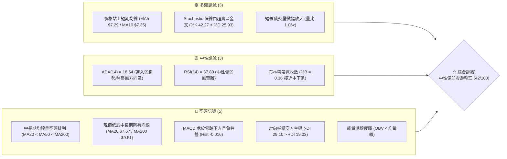
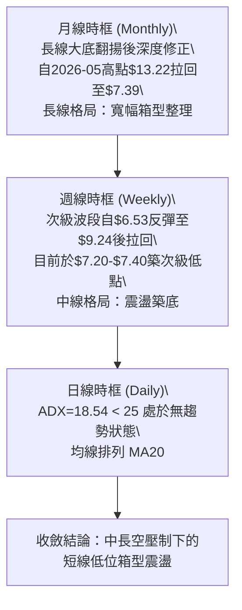
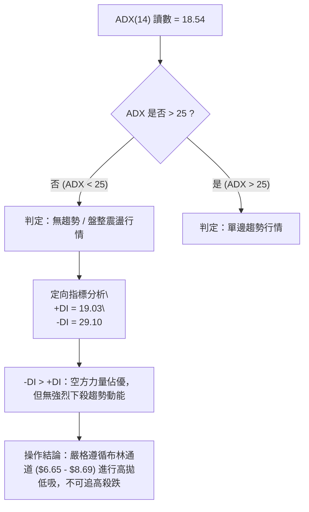
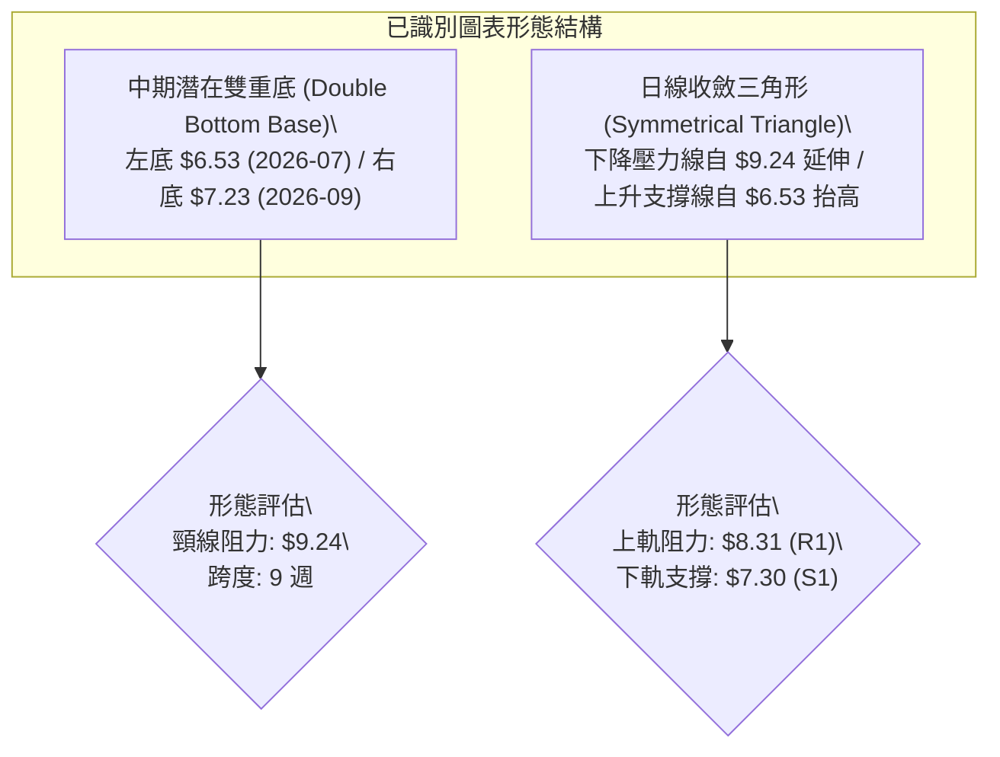
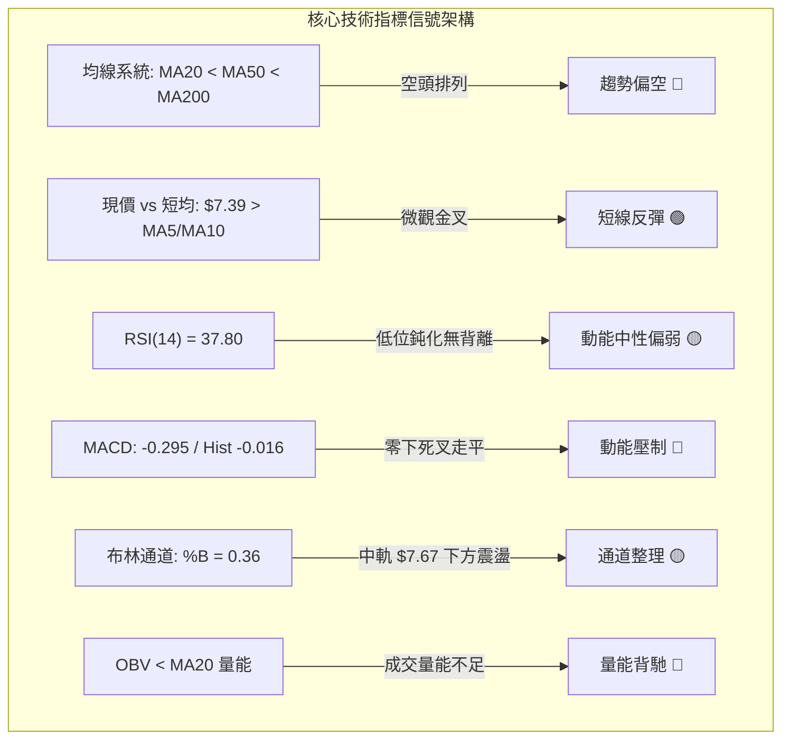
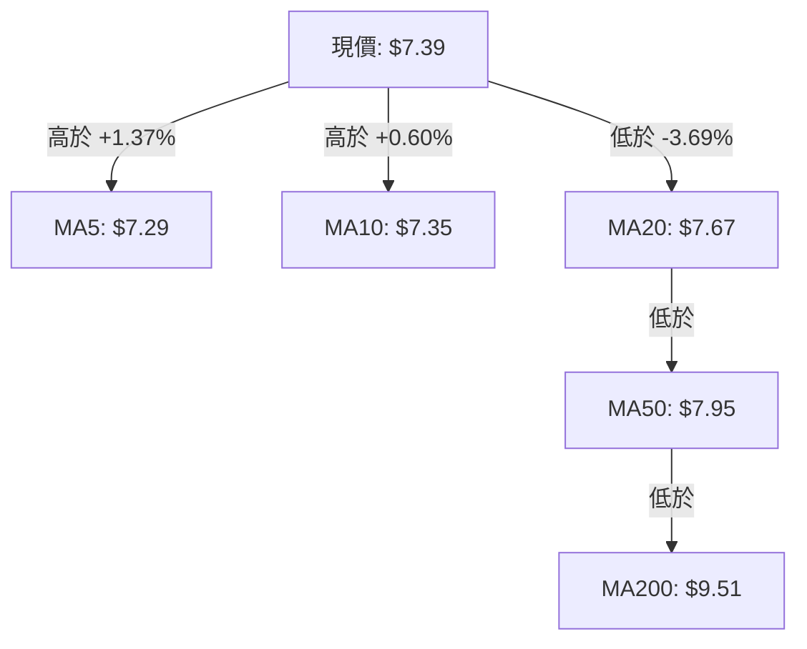
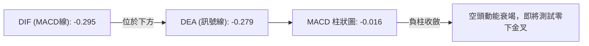
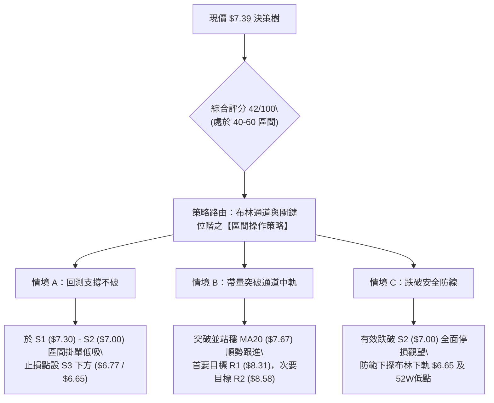
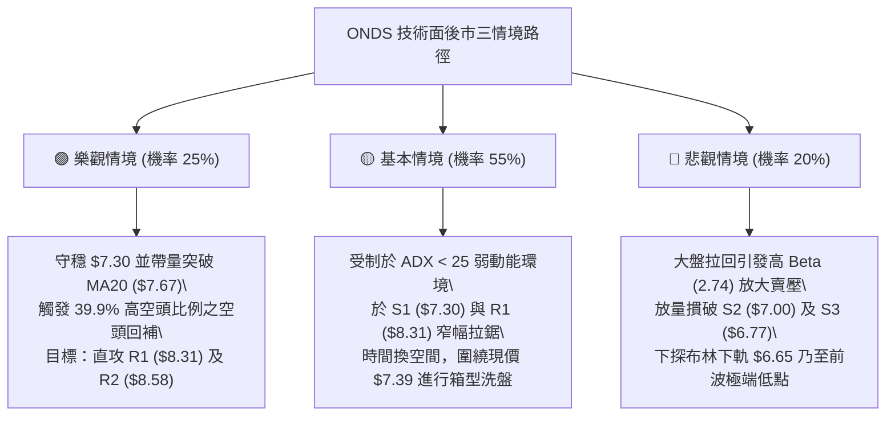

# ONDS 技術分析報告

> **報告日期**：2026-09-20 ｜ **語言**：繁體中文 ｜ **數據來源**：Yahoo Finance ｜ **當前價格**：$7.39

---

## 目錄

| 章節 | 內容 |
|------|------|
| [1. 技術面概覽](#1-技術面概覽) | 訊號儀表板、核心指標、評分卡 |
| [2. 趨勢分析](#2-趨勢分析) | 多時框趨勢、長中短期走勢、ADX 趨勢強度 |
| [3. 圖表形態分析](#3-圖表形態分析) | 形態識別、K線組合、形態信心度與目標價 |
| [4. 支撐與阻力](#4-支撐與阻力) | 關鍵價位聚類、斐波那契回調結構 |
| [5. 技術指標深度解讀](#5-技術指標深度解讀) | 均線系統、RSI、MACD、布林通道、量價配合 |
| [6. 動能與波動率](#6-動能與波動率) | 動能四象限、ATR 波動率、高 Beta 與空頭部位 |
| [7. 多時框架總結](#7-多時框架總結) | 時框架評分表、訊號收斂規則與結論 |
| [8. 交易策略建議](#8-交易策略建議) | 策略路由、情境階梯、進出場規劃、風報比 |
| [9. 風險提示與監控](#9-風險提示與監控) | 監控指標 Checklist、情境樹狀圖、風控指引 |

---

## 1. 技術面概覽

### 🎯 技術訊號儀表板



### 📊 核心指標速覽表

| 指標類別 | 指標名稱 | 當前數值 | 訊號 | 解讀 |
|:---|:---|:---|:---:|:---|
| **價格結構** | 現價 (Current Price) | $7.39 | 🟡 | 位於52週區間 23.6% 分位，處於波段深幅修正後的低位整理 |
| **短期均線** | MA5 / MA10 | $7.29 / $7.35 | 🟢 | 現價站上5日與10日均線，微觀結構出現超跌反彈動能 |
| **中期均線** | MA20 (布林中軌) | $7.67 | 🔴 | 現價位於MA20下方 -3.69%，短線反彈首道均線壓制 |
| **季度均線** | MA50 / MA60 | $7.95 / $7.92 | 🔴 | 中期空頭下彎壓制，波段反彈強阻力區 |
| **長期均線** | MA200 / MA240 | $9.51 / $9.19 | 🔴 | 長期趨勢轉弱，均線系統呈典型中長期空頭排列 |
| **動能震盪** | RSI(14) | 37.80 | 🟡 | 脫離超賣區但低於50榮枯線，多頭攻擊力道偏弱 |
| **動能趨勢** | MACD (12,26,9) | -0.295 / -0.279 | 🔴 | 柱狀圖 -0.016，雙線深陷零軸之下，空頭結構未扭轉 |
| **趨勢強度** | ADX(14) / ±DI | 18.54 | 🟡 | ADX < 25 表示單邊趨勢消退，-DI(29.10) 仍壓制 +DI(19.03) |
| **通道狀態** | Bollinger Bands | $6.65 - $8.69 | 🟡 | %B 為 0.36，處於中軌與下軌間之弱勢震盪區間 |
| **籌碼量能** | Volume Ratio / OBV | 1.06x / OBV<MA | 🔴 | 當日量能 63.80M 略高於20日均量，但整體OBV趨勢仍低於均線 |
| **波動風險** | ATR(14) | $0.37 (4.94%) | 🔴 | 每日震幅佔比近5%，具備典型的微型成長股高波動特質 |

### 🏆 技術評分卡

```
╔══════════════════════════════════════════════════════════════════╗
║              技術評分卡 — ONDS (2026-09-20)                     ║
╠══════════════════════════════════════════════════════════════════╣
║ 趨勢強度 (Trend)      ██████░░░░░░░░░░░░░░  30/100  🔴 空頭壓制  ║
║ 動能指標 (Momentum)   ████████░░░░░░░░░░░░  40/100  🟡 弱勢中性  ║
║ 支撐穩定度 (Support)  ████████████░░░░░░░░  60/100  🟢 區間築底  ║
║ 成交量配合 (Volume)   ████████░░░░░░░░░░░░  40/100  🟡 量能平淡  ║
║ 形態完整度 (Pattern)  ██████████░░░░░░░░░░  50/100  🟡 整理待變  ║
║ 均線排列 (MA System)  ██████░░░░░░░░░░░░░░  30/100  🔴 空頭排列  ║
╠══════════════════════════════════════════════════════════════════╣
║ 綜合技術評分          ████████░░░░░░░░░░░░  42/100  🟡 區間盤整  ║
║ 操作定調：ADX<25 弱趨勢格局，以日線布林通道區間操作為主，防範破位 ║
╚══════════════════════════════════════════════════════════════════╝
```

---

## 2. 趨勢分析

### 🌐 多時框趨勢分析



### 📈 長期趨勢 — 12個月走勢圖（Unicode）

```
ONDS 月線收盤走勢圖（2025-10 至 2026-09）
價格軸 ($)
$14.00 ┤                                      ● $13.22 (2026-05 峰值)
$13.00 ┤                                     ╱ ╲
$12.00 ┤                                    ╱   ╲
$11.00 ┤                   ● $10.36        ╱     ╲
$10.00 ┤         ● $9.76  ╱  ╲    ● $10.04╱       ╲
 $9.00 ┤        ╱ ╲      ╱    ● $9.04    ╱         ╲ $8.24
 $8.00 ┤  ●7.90╱   ╲    ●10.08                     ╲     ●7.66
 $7.00 ┤ ●6.44     ╲                              ╲   ╱  ╲  ● $7.39 (現價)
 $6.00 ┤                                             ●7.49 
       └───────────────────────────────────────────────────────────
         10    11   12    01    02    03    04    05    06    07    08    09 (月)
        (2025)           (2026)
```

#### 走勢特徵分析表格

| 階段區間 | 時間跨度 | 起訖價位 | 漲跌幅 | 走勢結構與技術特徵 |
|:---|:---:|:---:|:---:|:---|
| **主升攻擊浪** | 2025-10 → 2026-01 | $6.44 → $10.36 | +60.87% | 多頭連續放量推升，突破雙位數關卡，建立中長期波段頭部基礎 |
| **高位箱型擴散** | 2026-01 → 2026-04 | $10.36 → $10.04 | -3.09% | 圍繞 $9.00 - $10.36 寬幅震盪，籌碼進行密集換手與再分配 |
| **終竭式噴出** | 2026-04 → 2026-05 | $10.04 → $13.22 | +31.67% | 月線收盤創歷史次高，週成交量達 566M 形成高位巨量換手（假突破） |
| **快速崩跌浪** | 2026-05 → 2026-07 | $13.22 → $7.49 | -43.34% | 獲利了結盤湧出，跌破MA20/50，週線創下 $6.53 極端波段低點 |
| **低位區間休整** | 2026-07 → 2026-09 | $7.49 → $7.39 | -1.34% | 波動率收斂，價格於 $7.00 - $8.00 築底，量能由極端萎縮轉為常態 |

### 📊 中期趨勢（週線分析）

```
ONDS 週線價格結構與阻力支撐分布
 阻力 R3  $9.92  ───────────────────────────────── (前波反彈高點聚類區)
                  ╭──╮
 阻力 R2  $8.58  ─╯  ╰──╮       ╭──╮              (MA20與前波反彈頸線)
 阻力 R1  $8.31  ───────╯       │  ╰╮
 現價     $7.39  ═══════════════╪═══●═════════════ (當前價格位階)
 支撐 S1  $7.30  ───────────────╯    ╰─╮          (近期日線平台支撐)
 支撐 S2  $7.00  ──────────────────────╯  ╭───     (整數心理防線)
 支撐 S3  $6.77  ─────────────────────────╯        (7月波段極端低點收盤區)
```

從週線級別觀察，2026-07-19 當週創下 $6.53 低點後，多頭曾發動一波放量反彈（2026-07-26 當週成交量達 834.31M），並推升至 2026-08-16 的高點 $9.24。隨後因未能克服 MA200（$9.51）與斐波那契 61.8%（$8.90）的多重強阻力，股價再度回落，目前於 $7.23 - $7.39 連續兩週收出下影線，顯示中期賣壓正逐步被 S1（$7.30）與 S2（$7.00）附近的低接買盤吸收。

### ⚡ 趨勢強度評估（ADX 解讀）



#### ADX 趨勢強度對照表

| 指標變數 | 當前數值 | 參考門檻 | 狀態解讀 |
|:---|:---:|:---:|:---|
| **ADX(14)** | **18.54** | < 20 極弱 / 20-25 轉折 / > 25 趨勢確立 | **極弱勢盤整**。市場缺乏明確單邊推動力，任何假突破或假跌破機率高。 |
| **+DI (14)** | **19.03** | 數值越高多頭動能越強 | 多頭攻擊動能低迷，顯示買盤僅為被動防守，主動性推升意願不足。 |
| **-DI (14)** | **29.10** | 數值越高空頭動能越強 | 空方仍控制盤面局勢，但因 ADX 下行，空方殺跌力道亦在衰退。 |
| **DI 差值** | **-10.07** | 正值多頭佔優 / 負值空頭佔優 | 空方佔優但斜率走平，確認盤面進入箱體收斂狀態。 |

---

## 3. 圖表形態分析

### 🔍 形態識別系統



#### 形態識別與信心度評估表

| 識別形態 | 信心度 | 判斷依據（引用實際數據） | 形態完成度 | 理論目標價（附計算式） |
|:---|:---:|:---|:---:|:---|
| **潛在雙重底**<br>(Weekly Base) | **55%** | 1. 左底低點 $6.53（2026-07-19 週）<br>2. 右底低點 $7.23（2026-09-13 週，低點抬高）<br>3. 中間反彈高點頸線 $9.24（2026-08-16 週） | 60%<br>(尚未突破頸線) | 頸線突破目標價 = 頸線 $9.24 + (頸線 $9.24 - 左底 $6.53) = **$11.95**<br>*註：若遇 R3 強阻力，第一波折衷目標為 R3 ($9.92)* |
| **下降通道收斂**<br>(Channel Consolidation) | **70%** | 1. 高點降序：$13.22 (5月) → $9.24 (8月)<br>2. 短期壓制線匯聚於 R1 ($8.31) 與 MA20 ($7.67)<br>3. 下檔支撐受 S1 ($7.30) 與 S2 ($7.00) 有效承接 | 85%<br>(逼近三角收斂末端) | 通道向上突破目標價 = 突破點 $8.31 + 形態寬度 ($8.31 - $7.00) = **$9.62**<br>通道向下跌破目標價 = 破位點 $7.00 - 形態寬度 ($1.31) = **$5.69** |
| **頭肩頂形態** | < 30% | 歷史高位缺乏對稱右肩結構 | 訊號不足 | 數據不足以支撐幾何頭肩頂，依規則 15 不做過度推演。 |

### 🕯️ 重要K線形態分析

| 週/月份 | 收盤價 | K線形態特徵 | 量能狀態 | 技術解讀 | 多空訊號 |
|:---|:---:|:---|:---:|:---|:---:|
| **2026-05-31** | $13.22 | 長上影線避雷針天線 | 566.99M (巨量) | 買盤衰竭，歷史級高位誘多放量滯漲，形成長線歷史頭部。 | 🔴 強烈看空 |
| **2026-07-19** | $6.53 | 恐慌長陰落底十字星 | 671.52M (恐慌量) | 空頭極致宣洩，主力資金進場承接融資斷頭籌碼，奠定左底。 | 🟢 轉折訊號 |
| **2026-07-26** | $7.80 | 大陽線吞噬 (Bullish Engulfing) | 834.31M (天量) | 創歷史級單週成交量，確認 $6.53 為中期絕對硬支撐，啟動反彈。 | 🟢 強烈買訊 |
| **2026-08-16** | $9.24 | 高位流星線 (Shooting Star) | 471.59M (量縮) | 挑戰斐波那契 61.8%（$8.90）失敗，受制於 MA200 反轉向下。 | 🔴 漲勢受阻 |
| **2026-09-13** | $7.23 | 帶長下影線之紡錘線 | 201.36M (極致窒息量) | 賣壓徹底耗竭，回測波段支撐區 S1/S2 不破，形成右底架構。 | 🟡 止跌訊號 |
| **2026-09-20** | $7.39 | 小實體紅K（孕線反彈） | 348.16M (溫和回升) | 守穩 S1（$7.30），短線站上 MA5/MA10，確立右底築底企圖。 | 🟢 短線轉多 |

### 📉 ASCII 走勢形態示意圖

```
ONDS 2026年5月至9月 雙重底打底走勢圖
$13.22 ┤  ● (波段頂部 2026-05)
$12.00 ┤   ╲
$10.00 ┤    ╲                     ● $9.24 (反彈頸線 2026-08)
 $9.00 ┤     ╲                   ╱ ╲
 $8.00 ┤      ╲         ● $7.80 ╱   ╲          ● $7.39 (現價)
 $7.00 ┤       ╲       ╱       ╱     ╲       ╭─●
 $6.50 ┤        ● $6.53       ╱       ● $7.23
       └─────────┴─────────────────────┴────────┴─────────
               左底 (2026-07)       右底 (2026-09)  現階段築底
                 (放量 671M)          (縮量 201M)
```

### 🎯 形態目標價計算

依據形態學嚴格測量規則：
1. **中期雙底頸線測幅**：
   - 頸線位置：$9.24（2026-08-16 高點）
   - 基底低點：$6.53（2026-07-19 低點）
   - 形態垂直高度 $H = \$9.24 - \$6.53 = \$2.71$
   - 突破最小等距目標價 $T = \$9.24 + \$2.71 = \mathbf{\$11.95}$
   - *註：在抵達 $11.95 之前，必先面臨關鍵價位 R3（$9.92）與斐波那契 50.0%（$10.11）的重壓。*
2. **短期收斂箱體破局測幅**：
   - 箱頂壓力：R1（$8.31）
   - 箱底支撐：S2（$7.00）
   - 箱體高度 $H = \$8.31 - \$7.00 = \$1.31$
   - 向上突破目標價 = $\$8.31 + \$1.31 = \mathbf{\$9.62}$（與 MA200 $9.51 極為貼近）
   - 向下跌破目標價 = $\$7.00 - \$1.31 = \mathbf{\$5.69}$（接近 52週低點 $4.95 之緩衝區）

---

## 4. 支撐與阻力

### 🗺️ 關鍵價位分布圖（Unicode）

```
ONDS 關鍵價位結構分布圖（OHLCV 精確計算）
═══════════════════════════════════════════════════════════════
$9.92 ║██████████████████████████████║ 強阻力 R3 (前波反彈高位重壓)
$8.90 ║──────────────────────────────║ Fib 61.8% 回調位
$8.69 ║░░░░░░░░░░░░░░░░░░░░░░░░░░░░░░║ 布林通道上軌
$8.58 ║████████████████████          ║ 中期阻力 R2 (反彈高點聚類)
$8.31 ║████████████████████████      ║ 關鍵阻力 R1 (下降趨勢線壓制)
$7.67 ║┄┄┄┄┄┄┄┄┄┄┄┄┄┄┄┄┄┄┄┄┄┄┄┄┄┄┄┄┄┄║ 布林中軌 (MA20)
$7.39 ╠══════════════════════════════╣ ◄ 當前市價 ($7.39)
$7.30 ║▓▓▓▓▓▓▓▓▓▓▓▓▓▓▓▓▓▓▓▓▓▓▓▓      ║ 近期核心支撐 S1 (週線下影線低點)
$7.16 ║──────────────────────────────║ Fib 78.6% 回調位
$7.00 ║████████████████████████████  ║ 整數心理強支撐 S2 (波段安全防線)
$6.77 ║████████████████████          ║ 極限防守支撐 S3 (波段低點聚類)
$6.65 ║░░░░░░░░░░░░░░░░░░░░░░░░░░░░░░║ 布林通道下軌
═══════════════════════════════════════════════════════════════
```

### 🚧 阻力位分析表

| 阻力級別 | 精確價位 | 距現價幅幅 | 形成原因與技術共振 | 突破難度 | 重要性 |
|:---:|:---:|:---:|:---|:---:|:---:|
| **R1** | **$8.31** | +12.52% | 近一年波段高點聚類位，重疊 MA50（$7.95）與 MA60（$7.92）上方解套賣壓區。 | 🟡 中等 | ★★★☆☆ |
| **R2** | **$8.58** | +16.10% | 8月下旬反彈次高點聚類，貼近布林通道上軌（$8.69），空頭波段防守關鍵。 | 🔴 較高 | ★★★★☆ |
| **R3** | **$9.92** | +34.30% | 近一年核心波段高點聚類，重合 MA200（$9.51）與斐波那契 50%（$10.11），為牛熊分水嶺。 | 🔴 極高 | ★★★★★ |

### 🛡️ 支撐位分析表

| 支撐級別 | 精確價位 | 距現價幅幅 | 形成原因與技術共振 | 守住機率 | 重要性 |
|:---:|:---:|:---:|:---|:---:|:---:|
| **S1** | **$7.30** | -1.29% | 近期波段密集低點聚類，9月連續兩週低點支撐（9/13收$7.23後迅速收復），微觀雙底支撐。 | 🟢 70% | ★★★★☆ |
| **S2** | **$7.00** | -5.28% | 心理整數大關，接近斐波那契 78.6%（$7.16），機構被動防守買盤集中區。 | 🟢 80% | ★★★★★ |
| **S3** | **$6.77** | -8.39% | 近一年波段低點聚類，接近布林通道下軌（$6.65）及7月恐慌拋售後之密集成交區。 | 🟢 90% | ★★★★☆ |

### 📐 斐波那契回調位分析

依據 52週極端波動區間（低點 $4.95 → 高點 $15.28，垂直落差 $10.33）精確計算：

```
斐波那契回調結構位階圖
0.0%  (52W High) ─────────────────────── $15.28
23.6%            ─────────────────────── $12.84
38.2%            ─────────────────────── $11.33
50.0%            ─────────────────────── $10.11
61.8% (黃金分割) ─────────────────────── $8.90  (中期反彈致命壓力)
================ 當前價格落入此區間 ($7.16 - $8.90) ================
                 ► 現價 $7.39 ◄
78.6% (深幅回調) ─────────────────────── $7.16  (極限回調支撐位)
100.0%(52W Low)  ─────────────────────── $4.95
```

#### 技術意義解讀：
1. **深度回撤位階**：現價 $7.39 跌破了代表多頭強勢整理的 61.8%（$8.90），直接下探至 78.6%（$7.16）上方。此區間代表上升趨勢已遭嚴重破壞，轉入長線打底或低位擴散形態。
2. **支撐有效性**：78.6% 回調位 $7.16 與支撐 S1（$7.30）、S2（$7.00）形成了極度緻密的「支撐防護網」。歷史數據顯示，股價在 9月中旬觸及 $7.23 即獲買盤承接，未實質跌破 $7.16，顯示 78.6% 具備極強的技術反彈觸發效應。

---

## 5. 技術指標深度解讀

### 🎛️ 指標訊號總覽



### 📈 移動平均線排列分析



#### 均線各週期狀態詳解：
- **微觀短期均線（MA5 $7.29 / MA10 $7.35）**：現價突破這兩條短期均線，MA5 向上挑釁 MA10，呈現超跌後的微型金叉雛形，對短線日內交易者提供保護。
- **波段中軌均線（MA20 $7.67）**：呈現下彎趨勢，每日以約 $0.05 的速率下移，是多頭短線反彈的首要攔路虎。在未有效帶量站穩 $7.67 之前，任何反彈均屬弱勢修復。
- **長線牛熊分水嶺（MA200 $9.51）**：MA200 與 MA240（$9.19）形成重壓帶，且 MA20 < MA50 < MA200 空頭排列確立，限制了中長期的反轉高度。

### 📉 RSI(14) 分析

```
RSI(14) 動能位置展示：
0 ──────────── 30 ────── 37.80 ───────── 50 ─────────────────── 70 ─────────── 100
[    超賣區    ] ░░░░░░░  ▲               [       強勢區        ] [   超買區   ]
                          │
                   當前 RSI 數值: 37.80 (中性偏弱)
```

- **超買超賣狀態**：RSI(14) 讀數為 **37.80**，處於 30 至 50 的弱勢中性格局。指標已於 9月13日的 30.1 低位獲得支撐並小幅勾頭向上，脫離了極端超賣警戒區。
- **背離分析判斷**：
  - 檢視 2026-07-05 低點（股價 $7.41，RSI 21.3）、2026-07-19 低點（股價 $6.53，RSI 35.0），此處曾出現顯著的「週線底背離」，隨後引發至 $9.24 的波段暴量反彈。
  - 檢視近期：2026-09-13 股價跌至 $7.23 時，日線 RSI 為 30.1，未破前低；目前現價 $7.39 對應 RSI 37.80，**當前無明顯頂背離或底背離**。動能與價格同向收斂，確認處於常規箱型震盪。

### 📊 MACD(12/26/9) 訊號解讀



- **數值狀態**：DIF (-0.295) < DEA (-0.279)，柱狀圖值為 **-0.016**。
- **解讀**：雙線深處零軸下方（距離零軸 -0.30 左右），代表中長期動能處於空方主導區域。然而，負柱狀圖由前週的 -0.108 顯著收窄至 -0.016，顯示空方摜壓動能已大幅削弱，短期內具備「零下弱勢金叉」的技術潛能。若金叉成形，通常對應股價向布林中軌（$7.67）邁進的修復行情。

### 📦 布林通道分析

```
ONDS 日線布林通道結構示意圖
$8.69 ───────────────────────────────── 上軌 (Upper Band)
        │
        │
$7.67 ──┼────────────────────────────── 中軌 (MA20 / Middle Band)
        │
$7.39 ──●────────────────────────────── 現價 (%B = 0.36)
        │
$6.65 ───────────────────────────────── 下軌 (Lower Band)
```

- **通道帶寬與形態**：上軌 $8.69、中軌 $7.67、下軌 $6.65，帶寬（Bandwidth）持續收縮，顯示前期單邊下殺的波動能量已被箱型震盪耗盡。
- **%B 指標分析**：當前 %B 數值為 **0.36**（公式：$(7.39 - 6.65) / (8.69 - 6.65) = 0.362$）。數值低於 0.50，顯示價格運行於中軌至下軌的弱勢區域，但已遠離下軌極端超賣區（%B < 0.20），呈現沿中下軌拉鋸整理態勢。

### 💹 成交量分析（量價配合度）

- **量比與均量對比**：最新單日成交量為 **63,805,100** 股，相較於 20日均量（60,257,440 股）量比為 **1.06x**，呈現溫和量增；然而相較於 50日均量（84,451,094 股），量能依然呈現收縮，量能未達攻擊等級（通常需 1.5x 以上）。
- **OBV 趨勢剖析**：數據顯示「OBV < MA」，OBV 指標線運行於其移動平均線下方。這意味著在過去數週的整理過程中，主動性資金淨流出仍微幅大於淨流入，多頭並未展現出積極的大規模回補吃貨跡象，量價配合處於「量平價穩」的防守狀態，而非「量增價揚」的突破狀態。

---

## 6. 動能與波動率

### ⚡ 動能評估四象限

```
動能與波動率四象限分佈
       高波動率 (High Volatility)
                 │
      Q3 (投機突破) │  Q4 (恐慌出逃)
      強動能 / 高波動 │  弱動能 / 高波動
                 │
─────────────────┼─────────────────
                 │
      Q1 (強勢慢牛) │  Q2 (蟄伏盤整) ◄ ONDS 目前落點
      強動能 / 低波動 │  弱動能 / 低波動 (ATR=$0.37, ADX=18.54)
                 │
       低波動率 (Low Volatility)
```

| 象限分區 | 動能強度 | 波動特徵 | 當前歸屬 | 行情特徵與交易應對 |
|:---:|:---:|:---:|:---:|:---|
| **第一象限 (Q1)** | 強 (RSI>60) | 低 (ATR收斂) | ─ | 慢牛主升段，沿均線順勢持有。 |
| **第二象限 (Q2)** | **弱 (RSI 37.8)** | **低 (波動收縮)** | **✓ (ONDS)** | **築底洗盤階段。動能疲弱但波動已被壓抑，適合區間網格操作或耐心逢低佈局。** |
| **第三象限 (Q3)** | 強 (量能噴發) | 高 (ATR急擴) | ─ | 趨勢爆發段，需嚴格設定移動止盈。 |
| **第四象限 (Q4)** | 弱 (MACD死叉) | 高 (放量長陰) | ─ | 空頭崩跌段，必須全面空倉觀望。 |

### 📊 ATR 波動率分析

- **ATR(14) 絕對數值**：當前 14日平均真實波動區間 ATR 為 **$0.37**。
- **相對波動幅度**：$\text{ATR比率} = \$0.37 / \$7.39 = \mathbf{4.94\%}$。這表明 ONDS 即使處於成交量收斂的盤整期，平均每日正常雜訊震幅仍高達 5%。
- **止損距離動態測算**：
  - 保守型止損空間（2.0 × ATR）：$2.0 \times \$0.37 = \mathbf{\$0.74}$。若現價 $7.39 進場，技術性保護需設於 $\$7.39 - \$0.74 = \$6.65$（正好與布林下軌完全重疊）。
  - 激進型短線止損（1.0 × ATR）：$1.0 \times \$0.37 = \mathbf{\$0.37}$。對應防守價為 $\$7.39 - \$0.37 = \$7.02$（緊貼整數關卡 S2 $7.00）。

### 📐 Beta 與市場相關性

- **Beta 係數 (2.736)**：ONDS 的 Beta 高達 **2.74**，代表其對大盤（S&P 500 / Nasdaq）的敏感度極高。當整體市場指數下跌 1% 時，該股理論上將放大波動至 -2.74%。
- **籌碼面放空壓力（Short Interest）**：
  - **Short % of Float**：高達 **39.9%**，在外流通股本中有近四成處於放空狀態。
  - **Short Ratio (Days to Cover)**：**3.13 天**。
  - **技術連動意義**：極高的空頭部位與高達 2.74 的 Beta，賦予了該股典型的「軋空期權」特質。一旦基本面或大盤環境好轉推升股價突破 R1（$8.31），極易觸發空頭停損回補潮，形成短線爆發性軋空。

---

## 7. 多時框架總結

### 📋 時框架評分表

| 時框架 | 趨勢方向 | 動能指標 | 均線排列 | 關鍵形態 | 評分 | 戰略建議 |
|:---:|:---:|:---:|:---:|:---:|:---:|:---|
| **日線 (Daily)** | 🟡 橫向盤整 | 🟡 RSI 37.8 脫離超賣 | 🔴 MA20<50<200 壓制 | 區間震盪收斂末端 | 45/100 | 依布林帶上下軌進行高拋低吸，嚴格控制倉位。 |
| **週線 (Weekly)** | 🔴 中期偏空 | 🔴 MACD 柱狀體微幅收窄 | 🔴 受阻於 MA20/MA200 | 潛在雙底打底中 ($6.53/$7.23) | 40/100 | 觀察 S1/S2 支撐平台是否牢固，未站穩 $8.31 前不追價。 |
| **月線 (Monthly)** | 🟡 寬幅箱型 | 🟡 高位回檔至深幅回調位 | 🟢 仍高於長週期基底均線 | 自高位 $13.22 深度回撤整理 | 42/100 | 處於歷史次級底部區間，適合戰略投資者分批定投。 |

### 🔲 綜合訊號矩陣

```
時框與指標維度矩陣表
┌───────────┬────────────┬────────────┬────────────┬────────────┐
│   維度    │  均線架構  │  動能震盪  │  量價結構  │  支撐阻力  │
├───────────┼────────────┼────────────┼────────────┼────────────┤
│ 短期 (日) │  🟢 偏多   │  🟡 中性   │  🟡 中性   │  🟢 守穩S1 │
│ 中期 (週) │  🔴 空頭   │  🔴 偏弱   │  🔴 偏弱   │  🟡 夾於S1/R1│
│ 長期 (月) │  🔴 壓制   │  🟡 中性   │  🟡 萎縮   │  🟢 守穩78.6%│
└───────────┴────────────┴────────────┴────────────┴────────────┘
```

### ⚖️ 多時框收斂結論

> **依據多時框收斂規則（嚴格要求 14）**：
> 1. 當前日線 **ADX(14) = 18.54 (< 25)**，明確指示當前市場屬於**「盤整震盪行情」而非單邊趨勢行情**。
> 2. 依規則，盤整行情**以日線布林通道上下軌（$6.65 - $8.69）為核心交易區間**，中長期均線的空頭排列僅作為反彈阻力之參考，不具備強烈單邊追跌依據。
> 3. **方向性最終裁決**：**【中性偏弱區間震盪（Neutral-Bearish Range Bound）】**。
> 策略重點在於依託下方緻密支撐 S1（$7.30）與 S2（$7.00）尋找防守型低吸機會，並將布林中軌（$7.67）與 R1（$8.31）視為分批減碼獲利了結點，杜絕單邊追高。

---

## 8. 交易策略建議

### 🗺️ 策略決策流程圖



### 🧭 策略路由

**當前主策略方向 = 【中性區間低吸高拋（Range Trading），評分 42/100】**
由於綜合評分落於 40–60 之中性盤整區間，主推以支撐位 S1/S2 為防守依託的**「區間底部低吸反彈策略」**，並以放量突破關鍵阻力 R1 為右側加碼條件。

### 🎯 價格情境階梯（Price Scenarios）

| 觸發條件 | 下一目標 | 後續延伸 | 情境技術含義 |
|:---|:---:|:---:|:---|
| **放量突破 R1 ($8.31)** | **R2 ($8.58)** | **R3 ($9.92)** | 突破近一年波段高點聚類，空頭停損觸發，挑戰牛熊分水嶺。 |
| **突破 MA20 ($7.67)** | **R1 ($8.31)** | **R2 ($8.58)** | 短線脫離弱勢區，自布林中軌向上軌（$8.69）發起均值回歸。 |
| **現價 $7.39 區間震盪** | **MA20 ($7.67)** | **S1 ($7.30)** | 波動率持續受抑，圍繞布林下半部進行時間換空間的籌碼沉澱。 |
| **跌破 S1 ($7.30)** | **S2 ($7.00)** | **S3 ($6.77)** | 弱勢尋底，測試整數關卡及斐波那契 78.6%（$7.16）的最後防線。 |
| **實質跌破 S2 ($7.00)** | **S3 ($6.77)** | **$4.95 (52W低)**| 中期打底失敗，引發多殺多恐慌盤，下探布林下軌 $6.65 及極限低點。 |

### 📊 情境機率分佈

| 預期情境 | 預估機率 | 主要技術依據（引用指標數據） |
|:---|:---:|:---|
| **區間震盪 (箱體拉鋸)** | **55%** | ADX 僅 18.54 指向無趨勢；布林通道帶寬收窄；成交量能維持 1.06x 平穩無爆發。 |
| **反彈上行 (測試阻力)** | **25%** | 短線站上 MA5/10；Stochastic %K(42.27) 金叉 %D(25.93)；Short % Float 39.9% 具軋空底蘊。 |
| **破位下行 (再探新低)** | **20%** | 中長均線空頭排列（MA20<50<200）；MACD 負柱體；-DI(29.10) 仍壓制 +DI(19.03)。 |

### 🟢 主策略詳情（依路由配置）

```
主策略架構一覽：
【策略 A：支撐區間低吸短線單】  ──► 逢回踩 S1 ($7.30) 至現價佈局，博取布林中軌修復
【策略 B：右側突破動能跟進單】  ──► 待帶量突破 R1 ($8.31) 確認反轉，博取波段軋空
```

| 策略要素 | 策略 A（區間低吸博反彈 — 左側/中性） | 策略 B（突破追買動能策略 — 右側確認） |
|:---|:---|:---|
| **進場條件** | 回踩測試 S1（$7.30）獲得支撐，或現價直接分批建倉 | 日K收盤價實質突破 R1（$8.31），且成交量放大至 1.5x 以上 |
| **進場價格** | **$7.30**（或現價 $7.39 區間進場） | **$8.35**（確認突破 R1 $8.31 後掛進） |
| **目標價 T1** | **$7.95**（MA50 壓力位） | **$8.90**（斐波那契 61.8% 重要壓力） |
| **目標價 T2** | **$8.31**（關鍵阻力位 R1） | **$9.92**（關鍵阻力位 R3 / 波段重壓） |
| **止損價格** | **$6.95**（有效跌破整數關卡 S2 $7.00） | **$7.90**（跌回下降趨勢線與 MA60 之下） |
| **風險報酬比** | $\frac{\$8.31 - \$7.30}{\$7.30 - \$6.95} = \frac{\$1.01}{\$0.35} \approx \mathbf{2.89 : 1}$ | $\frac{\$9.92 - \$8.35}{\$8.35 - \$7.90} = \frac{\$1.57}{\$0.45} \approx \mathbf{3.49 : 1}$ |
| **預估勝率** | **55%** | **45%** |
| **建議倉位** | **總資金 8% - 10%**（分兩批進場） | **總資金 5% - 8%**（動能倉位） |

### 🔴 反向風險觸發點（對沖提示）

- **多頭結構破壞點**：若日K線收盤價**實質跌破 S2 ($7.00)**，代表 78.6% 回調防線失守，應立即對多頭部位無條件停損，不可向下攤平。
- **對沖啟動信號**：若價格反彈至布林中軌（$7.67）或 R1（$8.31）出現長上影線且成交量急縮，可小幅建立反向保護部位（例如買入反向認售期權或收緊移動停利），以鎖定微觀反彈利潤。

### ⭐ 整體訊號強度評星

```
做多訊號強度：★★☆☆☆  (2/5星 - 缺乏中長期趨勢背書，僅屬區間超跌反彈)
做空訊號強度：★★★☆☆  (3/5星 - 均線偏空，但空方動能減弱且高空頭比例壓制)
整體技術可信度：★★★☆☆  (3/5星 - 盤整期指標鈍化，需以區間邊界嚴格風控)
```

---

## 9. 風險提示與監控

### ✅ 關鍵監控指標 Checklist

```
╔══════════════════════════════════════════════════════════════════╗
║               ONDS 每日盤後關鍵技術監控清單                      ║
╠══════════════════════════════════════════════════════════════════╣
║ [ ] 支撐有效性：收盤價是否守穩 S1 ($7.30) 與 S2 ($7.00) ?          ║
║ [ ] 均線挑戰度：收盤價是否能攻克布林中軌 MA20 ($7.67) ?         ║
║ [ ] ADX 趨勢轉折：ADX(14) 是否由 18.54 勾頭向上突破 20 門檻 ?   ║
║ [ ] 柱狀體翻正：MACD Histogram 是否由 -0.016 轉正實現零下金叉 ?  ║
║ [ ] 量能擴散度：單日成交量是否突破 20日均量 (60.25M) 的 1.5倍 ?   ║
║ [ ] 阻力警報線：向上逼近 R1 ($8.31) 時是否伴隨 39.9% 空頭回補 ?   ║
╚══════════════════════════════════════════════════════════════════╝
```

### ⚠️ 風險場景分析



### 🛡️ 風險管理重要提醒

1. **高 Beta 波動懲罰機制**：ONDS 的 Beta 達 2.736，每日 ATR 高達 4.94%。投資人絕不可使用高槓桿操作。單筆交易之最大虧損金額，應嚴格限制於總投資組合淨值的 **1.0% - 1.5%** 之內。
2. **空頭擠壓與流動性陷阱**：高達 39.9% 的空頭浮動比率意味著該標的容易受到極端消息面刺激出現跳空暴漲或暴跌。盤中嚴禁市價追單，進出場應以限價單（Limit Order）在預設的關鍵價位（如 S1 $7.30、R1 $8.31）掛單交易。
3. **時間停損法則（Time Stop）**：由於 ADX 處於 18.54 的極低水位，若進場建立策略 A 倉位後，股價在 **7-10 個交易日內**仍無法收復 MA20（$7.67），代表市場資金缺乏關注度，應主動撤出資金，避免陷入冗長無效益的資金沉沒成本。

---

## 📋 報告總結

```
╔══════════════════════════════════════════════════════════════════╗
║                    ONDS 技術分析報告總結                         ║
╠══════════════════════════════════════════════════════════════════╣
║ 報告日期：2026-09-20                                            ║
║ 當前價格：$7.39                                                  ║
║ 分析評級：⚖️ 中性盤整觀望（技術評分 42/100）                    ║
║                                                                  ║
║ 關鍵結論：                                                       ║
║ ├─ 長期趨勢：🔴 空頭修正，自 $13.22 高點回撤，位於長線 78.6% 支撐 ║
║ ├─ 中期趨勢：🟡 築底震盪，形成 $6.53 與 $7.23 之潛在雙底架構     ║
║ ├─ 短期趨勢：🟢 弱勢反彈，現價小幅收復 MA5 ($7.29) 與 MA10 ($7.35)║
║ ├─ 核心支撐：S1: $7.30  ｜  S2: $7.00  ｜  S3: $6.77            ║
║ ├─ 關鍵阻力：R1: $8.31  ｜  R2: $8.58  ｜  R3: $9.92            ║
║ └─ 華爾街共識：Strong Buy (9家機構，目標均價 $19.42)             ║
║                                                                  ║
║ 最優策略組合：                                                   ║
║ 1. 🥇 最佳機會：依託支撐 S1 ($7.30) 於現價建立策略 A 區間短線單 ║
║                 (停損設 $6.95，目標看 $7.95 - $8.31)             ║
║ 2. 🥈 次選機會：耐心等待帶量突破 R1 ($8.31) 順勢跟進策略 B 軋空單 ║
║                 (停損設 $7.90，目標看 $8.90 - $9.92)             ║
║ 3. 🥉 保守選擇：空倉觀望，直至 ADX 突破 25 且站上 MA20 再做定奪 ║
╚══════════════════════════════════════════════════════════════════╝
```

---

> ⚠️ **免責聲明**：本報告為 AI 自動生成之技術分析，所有數據及估算均基於歷史價格與客觀技術指標計算。本報告**僅供研究與學術參考**，**不構成任何形式的投資建議或買賣邀約**。金融市場投資具備極高風險，投資人應獨立思考並自行承擔所有投資損益。

---

*報告生成時間：2026-09-20 ｜ 數據來源：Yahoo Finance ｜ 分析框架：多時框技術分析體系*