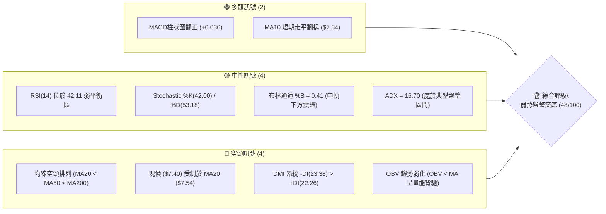
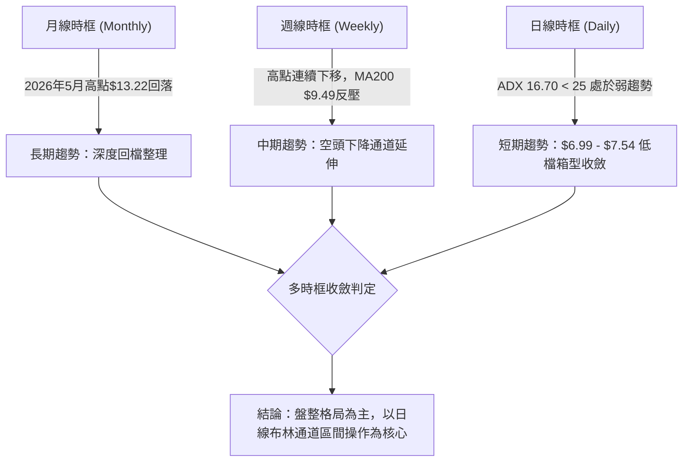
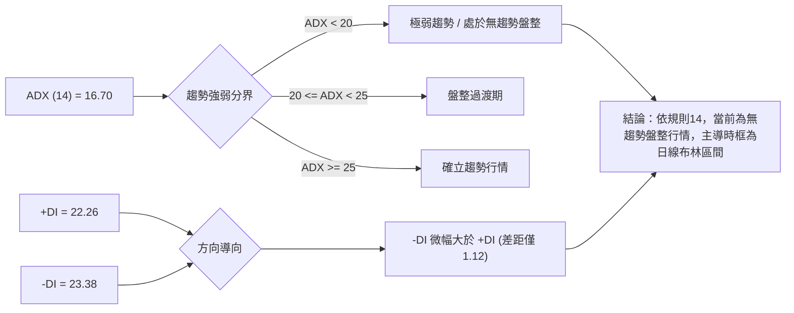
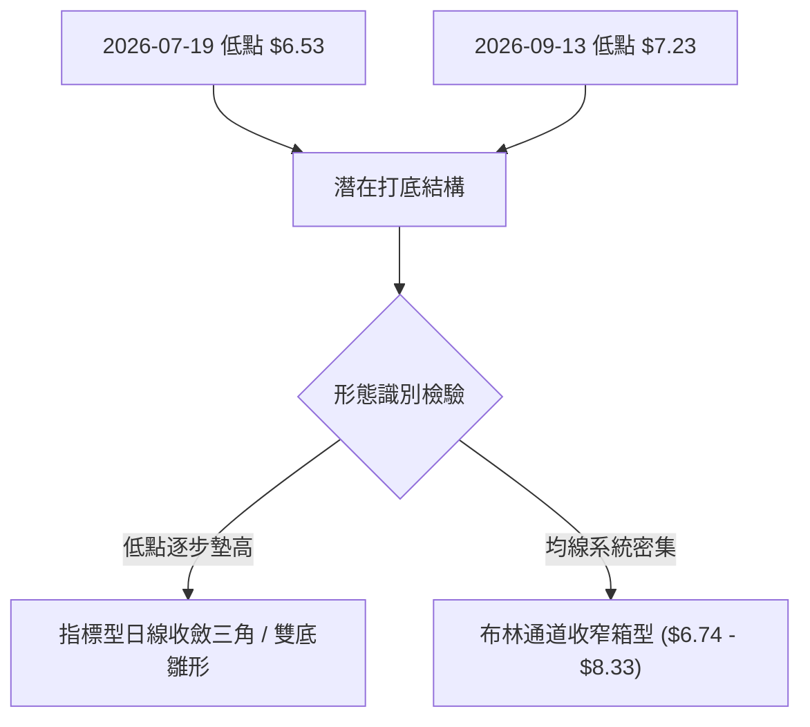
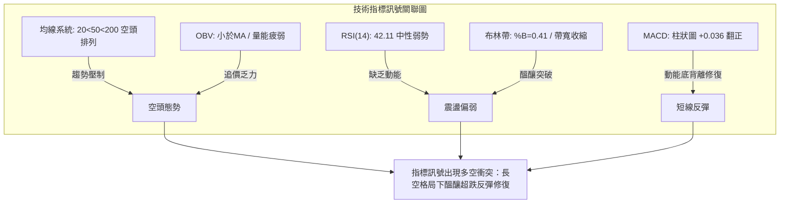
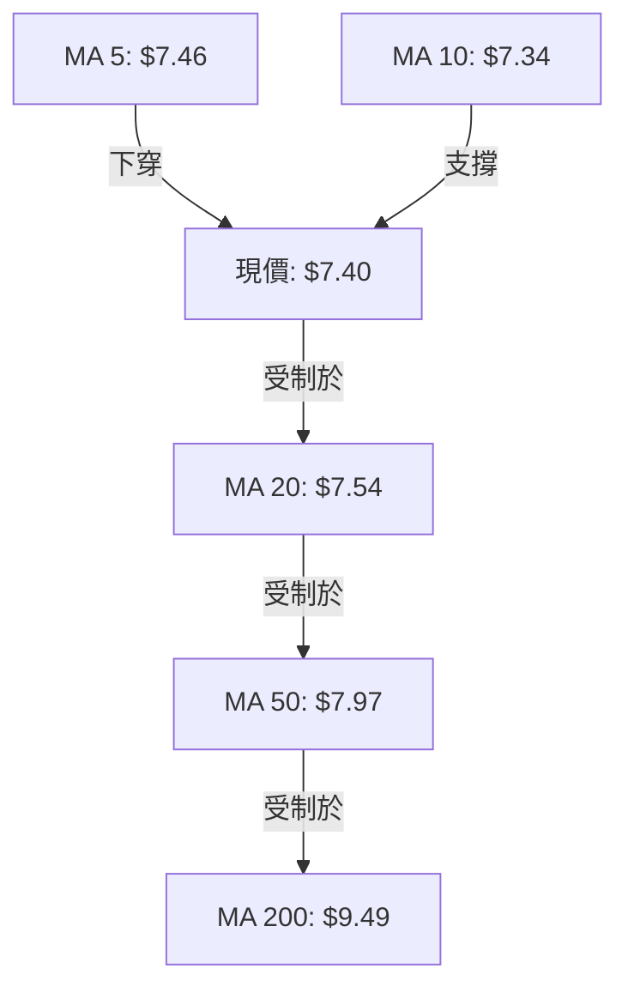
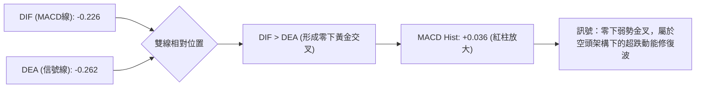
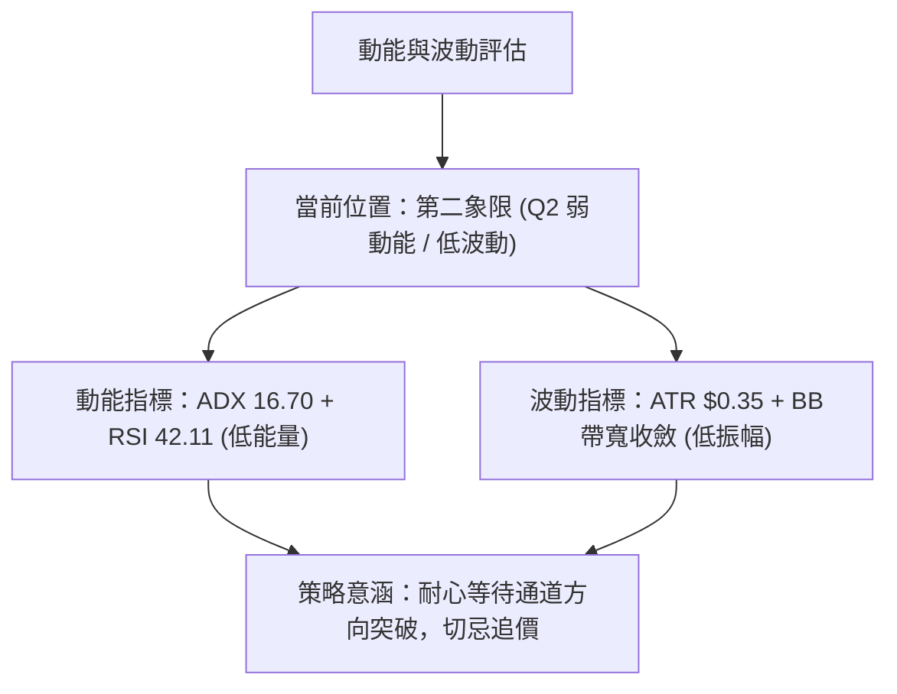
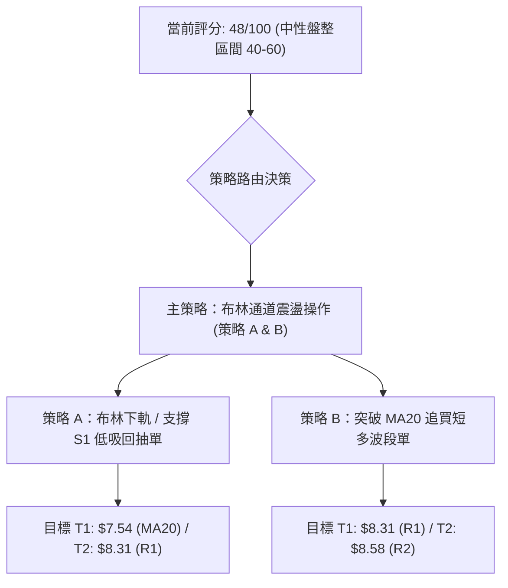
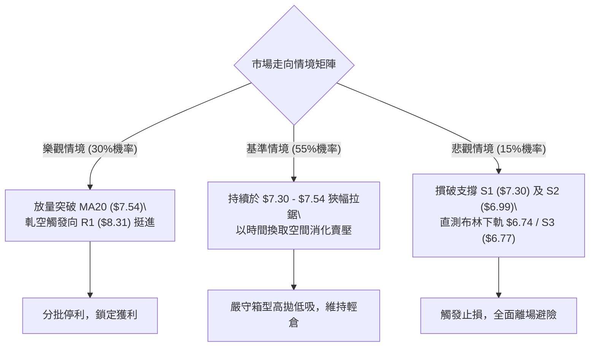

# ONDS 技術分析報告

> **報告日期**：2026-09-24 ｜ **語言**：繁體中文 ｜ **數據來源**：Yahoo Finance ｜ **當前價格**：$7.40

---

## 目錄

| 章節 | 內容 |
|------|------|
| [1. 技術面概覽](#1-技術面概覽) | 訊號儀表板、核心指標、評分卡 |
| [2. 趨勢分析](#2-趨勢分析) | 多時框趨勢、長中短期走勢 |
| [3. 圖表形態分析](#3-圖表形態分析) | 形態識別、K線組合、目標價 |
| [4. 支撐與阻力](#4-支撐與阻力) | 關鍵價位、斐波那契回調 |
| [5. 技術指標深度解讀](#5-技術指標深度解讀) | MA/RSI/MACD/布林/成交量 |
| [6. 動能與波動率](#6-動能與波動率) | 動能評估、ATR、Beta |
| [7. 多時框架總結](#7-多時框架總結) | 時框架評分矩陣 |
| [8. 交易策略建議](#8-交易策略建議) | 多空策略、風險報酬比 |
| [9. 風險提示與監控](#9-風險提示與監控) | 監控指標、風險場景 |

---

## 1. 技術面概覽

### 🎯 技術訊號儀表板



### 📊 核心指標速覽表

| 指標類別 | 指標名稱 | 當前數值 | 訊號 | 解讀 |
|----------|----------|----------|------|------|
| **價格** | 當前價格 | $7.40 | 🟡 | 位於52週區間23.7%處，處於低檔整理階段 |
| **均線** | MA20 | $7.54 | 🔴 | 價格在MA20下方（-1.83%），短線承壓 |
| **均線** | MA50 | $7.97 | 🔴 | 價格在MA50下方（-7.15%），中期空方控盤 |
| **均線** | MA200 | $9.49 | 🔴 | 價格在MA200下方（-22.02%），長線處空頭走勢 |
| **動能** | RSI(14) | 42.11 | 🟡 | 位於40-50中性弱勢區，無超買或超賣 |
| **動能** | MACD Hist | +0.036 | 🟢 | 柱狀圖由負翻正，短線負動能消退呈現微幅修復 |
| **波動** | ATR(14) | $0.35 | 🟡 | 波動率佔股價4.72%，震盪幅度收窄 |

### 🏆 技術評分卡

```
╔══════════════════════════════════════════════════════════════════╗
║                   技術評分卡 — ONDS (2026-09-24)                 ║
╠══════════════════════════════════════════════════════════════════╣
║ 趨勢強度      ██████░░░░░░░░░░░░░░  30/100  🔴 空頭主導(ADX 16.70)║
║ 動能指標      ██████████░░░░░░░░░░  50/100  🟡 中性偏弱(MACD翻正) ║
║ 支撐穩定度    ████████████░░░░░░░░  60/100  🟢 S1($7.30)初見防守  ║
║ 成交量配合    ████████░░░░░░░░░░░░  40/100  🔴 量比1.08x但OBV疲弱 ║
║ 形態完整度    ██████████░░░░░░░░░░  50/100  🟡 處箱型築底測試期   ║
║ 均線排列      ██████░░░░░░░░░░░░░░  30/100  🔴 20<50<200 空頭排列 ║
╠══════════════════════════════════════════════════════════════════╣
║ 綜合評分      █████████░░░░░░░░░░░  48/100  🟡 弱勢區間震盪觀望   ║
╚══════════════════════════════════════════════════════════════════╝
```

---

## 2. 趨勢分析

### 🌐 多時框趨勢分析



### 📈 長期趨勢 — 12個月走勢圖（Unicode）

```
ONDS 月線走勢圖（過去12個月：2025-10 至 2026-09）
價格軸 ($)
$14.00 ┤                                      ● (05月高點 $13.22)
$13.00 ┤                                     ╱ ╲
$12.00 ┤                                    ╱   ╲
$11.00 ┤                      ● (01月 $10.36)     ╲
$10.00 ┤             ● (12月 $9.76)   ╲   ● (04月 $10.04)
$9.00  ┤            ╱                   ● (03月 $9.04)  ╲
$8.00  ┤   ● (11月 $7.90)                                ● (06月 $8.24)
$7.00  ┤  ╱                                               ●───●───●←現價 $7.40
$6.00  ┤ ● (10月 $6.44)                                  (07月 (08月 (09月)
       └──────────────────────────────────────────────────────────
        10月 11月 12月 01月  02月 03月 04月 05月 06月 07月 08月 09月
        2025                                                2026
```

#### 走勢特徵分析表格

| 階段 | 期間 | 價格區間 | 累積漲跌幅 | 走勢特徵與量價結構 |
|------|------|----------|------------|--------------------|
| 第一階段：強勢推升 | 2025-10 至 2026-01 | $6.44 → $10.36 | +60.87% | 主升段行情，各期均線呈完美多頭擴散排列 |
| 第二階段：高檔震盪 | 2026-01 至 2026-04 | $10.36 → $10.04 | -3.09% | 構築高檔對稱震盪平台，波動加劇，動能轉弱 |
| 第三階段：末端噴出 | 2026-04 至 2026-05 | $10.04 → $13.22 | +31.67% | 假突破噴出段，月K長上影線觸發爆量派發 |
| 第四階段：崩跌探底 | 2026-05 至 2026-07 | $13.22 → $7.49 | -43.34% | 斷崖式回跌，破位下行連續失守多道關鍵均線 |
| 第五階段：低檔收斂 | 2026-07 至 2026-09 | $7.49 → $7.40 | -1.20% | 進入成交量萎縮的低階沉澱期，空方力道衰退 |

### 📊 中期趨勢（週線分析）

```
近20週中期架構示意圖：
$13.22 ┬────────────────────────────────────────── (波段天花板)
       │
$10.43 ┼─────── 週線反彈高點頸線
       │       ╲
$9.24  ┼───────── 8月中旬次級反彈高點
       │           ╲
$7.80  ┼───────────── 近期反彈阻力位
$7.40  ┼─[現價]─────── 低階盤整區間 ($7.23 - $7.80)
$6.53  ┴────────────────────────────────────────── (7月中旬波段最低點)
```

週線層面顯示，自2026年5月31日當週收在 $13.22 以後，週線高點呈現 $13.22 → $10.43 → $9.24 的逐次下移空頭態勢；然而在下檔部分，低點由 2026年7月19日當週的 $6.53 提升至 2026年9月13日當週的 $7.23，顯示空方摜壓動能有所減緩，多空雙方正於斐波那契 78.6% 回調位（$7.16）上方建立中繼平衡。

### ⚡ 趨勢強度評估（ADX 解讀）



#### ADX 與 DMI 指標對照表

| 指標 | 數值 | 狀態 | 解讀 |
|------|------|------|------|
| **ADX (14)** | 16.70 | 弱勢/無趨勢 (<20) | 行情動能極弱，缺乏單邊突破驅動力，均線指標容易產生反覆假訊號 |
| **+DI (14)** | 22.26 | 多方力道不足 | 買盤力道尚不足以發動持續性攻擊波 |
| **-DI (14)** | 23.38 | 空方微幅領先 | 空方力道雖佔據微幅上風，但與多方差距極小（1.12），空頭衰竭明顯 |

---

## 3. 圖表形態分析

### 🔍 形態識別系統



#### 圖表形態信心度評估表

| 形態 | 信心度 | 判斷依據（引用數據） | 完成度 | 目標價（附計算式） |
|------|--------|----------------------|--------|--------------------|
| **日線低階收斂箱型** | 70% | 價格被壓縮在 S1 ($7.30) 與 MA20 ($7.54) 之間，日線布林頻寬收縮 | 85% | 向上突破頸線 BB中軌 $7.54 + 箱型高度 $0.24 ($7.54-$7.30) = $7.78；向下突破則測 S2 $6.99 |
| **不對稱雙底雛形** | 45% | 第一底為7月中旬 $6.53，第二底為9月中旬 $7.23（數據不足，未破頸線） | 40% | 訊號不足，僅做指標型解讀（頸線 R1 $8.31 尚未突破） |
| **中線下降楔形** | 40% | 5月高點 $13.22 與8月高點 $9.24 連結之壓力線，對應 $6.53 與 $7.23 連結線 | 50% | 訊號不足，僅做指標型解讀，暫不推算衍生幾何目標價 |

### 🕯️ 重要K線形態分析

| 月份 | 收盤價 | K線形態 | 解讀 | 訊號 |
|------|--------|---------|------|------|
| **2026-05** | $13.22 | 長上影大陽線（高見$15.28） | 多頭竭盡噴出，高檔主力籌碼釋出，留下沉重解套賣壓 | 🔴 強烈見頂 |
| **2026-06** | $8.24 | 長黑實體吞噬K線 | 灌破短期上升軌道，殺多停損賣壓湧現，確立中期轉向 | 🔴 空頭確認 |
| **2026-07** | $7.49 | 帶下影長陰紡錘線 | 探底至波段低點後多方首見逢低抵抗，低檔承接意願浮現 | 🟡 止跌雛形 |
| **2026-08** | $7.66 | 窄幅十字星線（高見$9.24） | 向上反抽遭遇均線解套壓力，多空雙方呈現膠著僵持 | 🟡 變盤觀望 |
| **2026-09** | $7.40 | 低波動小陰星線 | 波動急劇萎縮，價格貼合月線收盤防線，成交量大幅退潮 | 🟡 蓄勢整理 |

### 📉 ASCII 走勢形態示意圖

```
        ONDS 近期日線與週線結構壓縮示意圖
  $9.24 ┼───────────────────────────┐ (8月中旬次高點)
        │                            ╲
  $8.33 ┼ - - - - - - - - - - - - - - ╲ - - - 布林上軌 / 強壓力區 R1 ($8.31)
        │                              ╲
  $7.54 ┼ - - - - - - - - - - - - - - - ╲ - - 布林中軌 (MA20阻力)
  $7.40 ┼─────────────●─── 現價位置       ╲
  $7.30 ┼ - - - - - - 0 - - - - - - - - - - - 關鍵支撐 S1
  $7.16 ┼ - - - - - - - - - - - - - - - - - - 斐波那契 78.6% 回調防線
  $6.99 ┼ - - - - - - - - - - - - - - - - - - 關鍵支撐 S2
        └───────────────────────────────────
         7月              8月               9月
```

### 🎯 形態目標價計算

基於「日線低階收斂箱型」形態（信心度 70%）：
- 箱頂頸線位：布林中軌（MA20）= **$7.54**
- 箱底支撐位：支撐位 S1 = **$7.30**
- 形態垂直高度：$7.54 - $7.30 = **$0.24**
- **向上突破測量目標價**：頸線 $7.54 + 形態高度 $0.24 = **$7.78**（若動能放大則挑戰 MA50 之 **$7.97**）
- **向下破位測量目標價**：箱底 $7.30 - 形態高度 $0.24 = **$7.06**（向下尋求支撐位 S2 之 **$6.99**）

---

## 4. 支撐與阻力

### 🗺️ 關鍵價位分布圖（Unicode）

```
ONDS 價位結構分布圖
══════════════════════════════════════════════════════════════
$9.92 ║████████████████████████████████║ 強阻力 R3 (密集解套套牢區)
$8.58 ║████████████████████            ║ 阻力 R2 (反彈中繼壓力)
$8.31 ║████████████████████████        ║ 關鍵阻力 R1 (布林上軌共振區)
$7.54 ╟┈┈┈┈┈┈┈┈┈┈┈┈┈┈┈┈┈┈┈┈┈┈┈┈┈┈┈┈┈┈┈┈╢ 短期動態反壓 (MA20中軌)
$7.40 ╠════════════════════════════════╣ ◄ 現價 ($7.40)
$7.30 ║▓▓▓▓▓▓▓▓▓▓▓▓▓▓▓▓▓▓▓▓            ║ 近期第一支撐 S1 (週K收盤低聚類)
$6.99 ║████████████████████████        ║ 關鍵強支撐 S2 (波段結構頸線)
$6.77 ║████████████████████████████████║ 極限防守支撐 S3 (布林下軌防線)
══════════════════════════════════════════════════════════════
```

### 🚧 阻力位分析表

| 阻力級別 | 價位 | 形成原因 | 突破難度 | 重要性 |
|----------|------|----------|----------|--------|
| **R1** | $8.31 | 近一年波段高點聚類，與當前布林上軌（$8.33）形成強大空間共振 | 難（需成交量放大至50日均量以上） | ★★★★☆ |
| **R2** | $8.58 | 近一年波段高點聚類，接近 MA60（$7.90）與 MA120（$8.91）過渡區 | 極難（面臨中期均線下壓牽制） | ★★★☆☆ |
| **R3** | $9.92 | 近一年密集高點聚類，緊貼長期生命線 MA200（$9.49）與整數心理關卡 | 極高（多頭扭轉長空格局之分水嶺） | ★★★★★ |

### 🛡️ 支撐位分析表

| 支撐級別 | 價位 | 形成原因 | 守住機率 | 重要性 |
|----------|------|----------|----------|--------|
| **S1** | $7.30 | 近一年波段低點聚類，貼近9月第3週收盤價（$7.23-$7.39區間） | 65%（ADX偏弱，空方摜壓動能有限） | ★★★★☆ |
| **S2** | $6.99 | 近一年波段次級低點聚類，跌破後將直逼整數大關 $7.00 | 80%（多方防守最後防線） | ★★★★★ |
| **S3** | $6.77 | 近一年波段低點聚類，與當前布林通道下軌（$6.74）相重疊 | 90%（短線超賣極限，具強力護盤效應） | ★★★☆☆ |

### 📐 斐波那契回調位分析

```
52週波段區間：最低 $4.95 → 最高 $15.28 (振幅 $10.33)
─────────────────────────────────────────────────────────────────
  0.0%  $15.28 ┤ 52週歷史高點（頂部反轉確認區）
 23.6%  $12.84 ┤ 第一波回檔弱支撐（已摜破）
 38.2%  $11.33 ┤ 多空常態回檔位（已摜破）
 50.0%  $10.11 ┤ 多空分水嶺 / 心理整數關卡（已摜破）
 61.8%  $ 8.90 ┤ 黃金分割強支撐（已轉化為強大反壓）
 78.6%  $ 7.16 ┤ 極限深度回撤支撐位 ◄ 現價 ($7.40) 位於 61.8% 與 78.6% 之間
100.0%  $ 4.95 ┤ 52週歷史起漲低點
─────────────────────────────────────────────────────────────────
```

- **位置解讀**：現價 $7.40 跌破 61.8%（$8.90）黃金回調位，顯示波段多頭架構遭到破壞，目前位於 61.8%（$8.90）與 78.6%（$7.16）之極深回撤區間。
- **技術意涵**：斐波那契 78.6% 水準（$7.16）與下方支撐 S1（$7.30）及 S2（$6.99）形成緊密防禦緩衝墊。現價未破 $7.16，保留了低檔結構性築底重構之可能性；但若跌破 $7.16，下檔將直探 100% 低點 $4.95。

---

## 5. 技術指標深度解讀

### 🎛️ 指標訊號總覽



### 📈 移動平均線排列分析



#### 均線系統走勢與乖離率一覽表

| 均線名稱 | 當前數值 | 走勢狀態 | 乖離率 (相對現價) | 技術意涵 |
|----------|----------|----------|-------------------|----------|
| **MA 5** | $7.46 | ▼ -0.06 (-0.75%) | -0.80% | 極短線受壓，多方尚未收復5日均線 |
| **MA 10** | $7.34 | ▲ +0.06 (+0.78%) | +0.82% | 短線下檔微幅承接支撐，提供急跌緩衝 |
| **MA 20** | $7.54 | ▼ -0.14 (-1.83%) | -1.86% | 短期生命線持續下彎，形成第一道蓋頭壓力 |
| **MA 60** | $7.90 | ▼ -0.50 (-6.32%) | -6.33% | 季線下壓，壓制中期反彈空間 |
| **MA 120** | $8.91 | ▼ -1.51 (-16.90%) | -16.95% | 半年線持續沉重下墜，長空格局明確 |
| **MA 200** | $9.49 | ▼ 下方 | -22.02% | 長期牛熊分界線，空方完全主導格局 |
| **MA 240** | $9.15 | ▼ -1.75 (-19.11%) | -19.13% | 年線大幅下移，上方套牢籌碼極為沉重 |

### 📉 RSI(14) 分析

- **RSI 數值進度條**：
  `RSI(14) = 42.11`  [████████░░░░░░░░░░░░] 42.11%
- **超買超賣區間解讀**：
  - 數值 42.11 處於 30 至 70 之常態區間，既未進入超賣區（<30），亦遠離超買區（>70）。
  - RSI 自 7 月初的極度超賣點（21.3 - 22.1）反彈修復後，始終受制於 50 多空分界線，反映市場買盤信心依然薄弱。
- **背離判斷**：
  - **頂背離**：無（股價未創新高）。
  - **底背離**：日線層面無明顯經典背離（價格維持在 $7.23-$7.40 平行整理，RSI 同步收斂於 42 附近）；但觀察週線數據，7月19日當週收盤 $6.53 時 RSI 為 35.0，而9月13日當週收盤 $7.23 時 RSI 為 30.1，未見正向底背離，指標呈現同步弱勢收斂。

### 📊 MACD(12/26/9) 訊號解讀



- **MACD 線**：-0.226
- **信號線 (Signal)**：-0.262
- **柱狀圖 (Hist)**：**+0.036** 🟢 看多
- **深層解讀**：MACD 在零軸下方形成黃金交叉，且柱狀圖由前幾週的負值（-0.145 → -0.108 → -0.016）順利收斂並翻正至 +0.036。這確認了短線下行加速度已被有效遏制，技術面上具備向布林中軌（$7.54）及阻力 R1（$8.31）發動反彈測試的技術動能，但由於雙線仍處於零軸下方，不可盲目視為反轉行情。

### 📦 布林通道分析

```
ONDS 布林通道 (BB 20, 2) 日線走勢示意圖
$8.33 ┬────────────────────────────────────────── BB 上軌 (阻力 R1 $8.31 共振)
      │
$7.54 ┼ - - - - - - - - - - - - - - - - - - - - - BB 中軌 (MA20 動態反壓)
$7.40 ┼─────────● [現價: %B = 0.41]
      │
$6.74 ┴────────────────────────────────────────── BB 下軌 (極限防禦 S3 $6.77 共振)
```

- **通道帶寬**：$8.33 - $6.74 = $1.59（帶寬比 21.5%），帶寬較前期顯著收斂，預示突破在即。
- **%B 指標**：**0.41**，數值低於 0.50，表示股價運行在中軌與下軌之間的弱勢通道內。
- **軌道行為**：股價自下軌支撐處反彈，目前受到中軌（$7.54）壓制。若無法帶量突破中軌，$7.40 的價格將再度回踩下軌 $6.74。

### 💹 成交量分析（量價配合度）

- **最新成交量**：67,413,700 股
- **20日均量**：62,233,730 股（量比：**1.08x**）
- **50日均量**：82,572,096 股
- **量價形態解讀**：
  - 當日成交量雖略高於20日均線（1.08倍），但相較於50日均量呈現萎縮狀態（81.6%），呈現標準的「價平量縮」整理特徵。
  - **OBV 趨勢**：數據顯示 `OBV < MA`，能量潮指標向下發散，意味著資金在反彈過程中參與度低，缺乏主動性攻擊量能，屬典型的「弱勢盤整中無量承接」態勢。

---

## 6. 動能與波動率

### ⚡ 動能評估四象限

| 象限 | 動能維度 | 波動維度 | 當前狀態 | 策略指導含義 |
|------|----------|----------|----------|--------------|
| **第一象限 (Q1)** | 強動能 (趨勢明確) | 低波動 (穩定運行) | — | 最佳趨勢波段持有區間 |
| **第二象限 (Q2)** | **弱動能 (無明確趨勢)** | **低波動 (收斂整理)** | **✓ (ONDS 目前位置)** | **以觀望或箱型邊界高拋低吸為主** |
| **第三象限 (Q3)** | 強動能 (爆發突破) | 高波動 (劇烈震盪) | — | 追隨突破行情，承擔高風險獲取高收益 |
| **第四象限 (Q4)** | 弱動能 (失速下墜) | 高波動 (恐慌殺跌) | — | 絕對避免進場，停損防禦 |



### 📊 ATR 波動率分析

- **ATR(14) 絕對值**：**$0.35**
- **ATR 相對百分比**：4.72%（以 $7.40 計算）
- **止損與交易距離建議**：
  - **保守型防守空間 (2.0 × ATR)**：$0.35 × 2.0 = **$0.70**（跌破此距離代表整理形態徹底失效）。
  - **短線波動止損空間 (1.0 × ATR)**：$0.35 × 1.0 = **$0.35**（以現價 $7.40 計算，短線多單止損防守位應設於 $7.40 - $0.35 = **$7.05**，緊貼支撐位 S2 之 $6.99）。

### 📐 Beta 與市場相關性

- **Beta 係數**：**2.736**
- **市場特徵解讀**：
  - ONDS 的 Beta 高達 2.736，屬於極高波動性、高彈性的小型科技股/通訊設備板塊標的。
  - 當大盤（標普500/那斯達克）出現 1% 變動時，該股理論上將產生約 2.74% 的同向或放大波動。在目前無趨勢盤整（ADX 16.70）背景下，高 Beta 意味著若大盤發生系統性回檔，該股支撐 S1（$7.30）極易被被動摜破；反之，若大盤走強，該股向上回補空間亦極為迅速。

---

## 7. 多時框架總結

### 📋 時框架評分表

| 時框架 | 趨勢方向 | 動能 | 均線排列 | 形態 | 綜合評分 | 操作建議 |
|--------|----------|------|----------|------|----------|----------|
| **月線時框** | 🔴 空頭修復 | 弱勢 (高檔回落) | 轉弱 (失守半年線) | 長黑後小星線 | 42/100 | 長線長空，逢高減碼 |
| **週線時框** | 🔴 下行震盪 | 🟡 中性 (RSI 42.1) | 空頭排列 (下穿MA200) | 低檔築底雛形 | 46/100 | 區間震盪，嚴格風控 |
| **日線時框** | 🟡 弱勢盤整 | 🟢 短線翻多 (MACD Hist+) | 空頭排列 (MA20反壓) | 布林收縮箱型 | 56/100 | 短線依托支撐低吸 |

### 🔲 綜合訊號矩陣

```
時框訊號一致性矩陣：
┌──────────┬──────────┬──────────┬──────────┐
│  維度    │ 短期(日) │ 中期(週) │ 長期(月) │
├──────────┼──────────┼──────────┼──────────┤
│ 趨勢方向 │  🟡 震盪 │  🔴 空頭 │  🔴 空頭 │
│ 均線系統 │  🔴 空頭 │  🔴 空頭 │  🟡 中性 │
│ 動能指標 │  🟢 偏多 │  🟡 中性 │  🔴 空頭 │
│ 成交量能 │  🟡 平衡 │  🔴 疲弱 │  🔴 縮量 │
└──────────┴──────────┴──────────┴──────────┘
訊號收斂特徵：長中期結構依然受制於空方，但短期日線指標具備局部反彈共振條件。
```

### ⚖️ 多時框收斂結論

依據多時框收斂規則（嚴格要求 14）：
1. **行情性質判定**：當前日線 ADX 為 **16.70**（遠低於 25 臨界值），明確判定當前處於**「盤整行情」**而非「趨勢行情」。
2. **主導時框規則**：在盤整行情中，依規則應以**日線布林通道（下軌 $6.74 至上軌 $8.33）作為主要交易區間**，週線與月線之空頭均線僅作為反彈阻力之天花板限制，不再主導追殺。
3. **方向性唯一結論**：**中性觀望（偏多低吸高拋，依布林軌道操作）**。評分卡最終收斂為 **48/100**，定調為「弱勢盤整築底」期。

---

## 8. 交易策略建議

### 🗺️ 策略決策流程圖



### 🧭 策略路由（依評分卡分流）

> **當前主策略方向 = 中性區間震盪操作（依評分 48/100，處於 40–60 區間）**  
> 依規範，在綜合評分 48/100 之盤整格局下，不進行單邊強烈多空押注，而以**布林上下軌與關鍵支撐阻力為交易區間**，採取防守反擊型策略。

### 🎯 價格情境階梯（Price Scenarios）

價位嚴格引用關鍵價位區塊計算之精確數值：

| 觸發條件 | 下一目標 | 後續延伸 | 情境含義 |
|----------|----------|----------|----------|
| **突破 R1 $8.31** | R2 $8.58 | R3 $9.92 | 短線強勢反轉，全面挑戰長線空頭警戒線 |
| **突破 MA20 $7.54**| R1 $8.31 | R2 $8.58 | 日線弱勢修復，布林通道發動向上測試 |
| **站穩現價區間 $7.40** | MA20 $7.54 | — | 低檔箱型打底，持續沉澱籌碼 |
| **跌破 S1 $7.30** | S2 $6.99 | S3 $6.77 | 箱底支撐失效，下探布林下軌關鍵防線 |
| **跌破 S2 $6.99** | S3 $6.77 | $4.95 (52W Low)| 築底失敗，重回單邊下降趨勢 |

### 📊 情境機率分佈

| 情境 | 機率 | 主要依據 |
|------|------|----------|
| **區間震盪 (布林通道內運行)** | **55%** | ADX(14) 僅 16.70 處典型盤整無趨勢期；成交量萎縮，市場等待催化劑 |
| **繼續上行 / 弱勢反彈** | **30%** | MACD 柱狀圖翻正 (+0.036)，RSI 脫離超賣，短線動能具修復潛力 |
| **破位回落 / 再探低點** | **15%** | 均線系統 20<50<200 仍呈空頭排列，OBV 疲軟，空方依然佔據大格局優勢 |

### 🟢 主策略詳情（區間震盪策略）

| 策略要素 | 策略 A（支撐 S1 低吸反彈單） | 策略 B（突破 MA20 追擊單） |
|----------|------------------------------|----------------------------|
| **進場條件** | 價格回踩支撐 S1 出現下影線止跌 | 日K線帶量突破布林中軌 MA20 |
| **進場價格** | **$7.30** | **$7.55**（突破 $7.54 確認） |
| **目標價 T1** | **$7.54**（布林中軌 MA20） | **$8.31**（關鍵阻力 R1） |
| **目標價 T2** | **$8.31**（關鍵阻力 R1） | **$8.58**（阻力 R2） |
| **止損價格** | **$6.99**（關鍵支撐 S2，破位止損）| **$7.30**（跌破回踩箱底 S1） |
| **風險報酬比** | **3.26 : 1**（以目標2計） | **3.04 : 1**（以目標1計） |
| **成功機率** | 58% | 52% |
| **建議倉位** | 10% 總資金（輕倉操作） | 15% 總資金（突破確認後） |

*註：策略 A 風險報酬比計算：(目標價 T2 $8.31 - 進場價 $7.30) / (進場價 $7.30 - 止損價 $6.99) = $1.01 / $0.31 = 3.26*  
*註：策略 B 風險報酬比計算：(目標價 T1 $8.31 - 進場價 $7.55) / (進場價 $7.55 - 止損價 $7.30) = $0.76 / $0.25 = 3.04*

### 🔴 反向風險觸發點（對沖提示）

若出現以下情境，主推之震盪築底策略失效，應即刻轉為防守或避險：
1. **跌破空方止損點 $6.99（S2）**：若日線收盤價跌破 $6.99，意味著 7月以來的反彈結構全面崩潰，下檔將直接往 S3（$6.77）甚至 52週低點 $4.95 尋求支撐，多單應無條件全數離場。
2. **ADX 向上突破 25 且 -DI 爆發**：若 ADX 快速拉升至 25 以上，且 -DI 突破 30，代表空頭強趨勢重新啟動，應停止任何低吸抄底動作。

### ⭐ 整體訊號強度評星

```
╔══════════════════════════════════════════════════════════════════╗
║ 做多訊號強度：★★☆☆☆  (2/5星 - 僅限短線超跌反彈)               ║
║ 做空訊號強度：★★★☆☆  (3/5星 - 中長線均線壓制但短線動能減弱)     ║
║ 整體可信度：  ★★★☆☆  (3/5星 - 盤整行情指標易鈍化，嚴設停損)     ║
╚══════════════════════════════════════════════════════════════════╝
```

---

## 9. 風險提示與監控

### ✅ 關鍵監控指標 Checklist

```
╔══════════════════════════════════════════════════════════════════╗
║                     關鍵技術風控檢核表 (Checklist)               ║
╠══════════════════════════════════════════════════════════════════╣
║ [ ] 價格是否成功收復並站穩 MA20 ($7.54)                         ║
║ [ ] RSI(14) 能否突破 50 多空分水嶺                             ║
║ [ ] 日成交量是否放大突破 50日均量 (82,572,096 股)              ║
║ [ ] MACD 柱狀圖是否持續擴大正值 (維持 > +0.036)                 ║
║ [ ] 下檔第一道防線 S1 ($7.30) 是否收盤不破                      ║
║ [ ] 關鍵生命防線 S2 ($6.99) 是否完好未失                        ║
║ [ ] 空方借券賣出比率 (Short % Float = 39.9%) 是否引發空頭回補  ║
╚══════════════════════════════════════════════════════════════════╝
```

### ⚠️ 風險場景分析



### 🛡️ 風險管理重要提醒

1. **極高空單餘額比率（Short Float 39.9%）雙面刃效應**：
   - 空頭部位佔流通盤達 39.9%，Short Ratio 為 3.13。在技術面上，一旦股價帶量突破 R1（$8.31），極易引發猛烈的「軋空潮」（Short Squeeze）。
   - 然而在尚未突破前，沉重的空頭借券力量隨時可能藉由利空消息進行下壓打擊，投資人切勿在盤整區間內大額重倉。
2. **高 Beta 波動性控管**：
   - 該股 Beta 值高達 2.736，每日 ATR 達 $0.35（4.72%）。單筆交易最大虧損額度必須嚴格控制在總投資組合淨值的 **1.0% - 1.5%** 以內。
3. **倉位配置原則**：
   - 在 ADX < 20 之盤整震盪期間，單一標的持倉上限建議不超過總資產的 **10% - 15%**，並堅決執行限價單進出場紀律。

---

## 📋 報告總結

```
╔══════════════════════════════════════════════════════════════════╗
║                   ONDS 技術分析報告總結                          ║
╠══════════════════════════════════════════════════════════════════╣
║ 報告日期：2026-09-24                                             ║
║ 當前價格：$7.40                                                  ║
║ 分析評級：⚖️ 中性觀望 / 區間弱勢震盪 (評分: 48/100)               ║
╠══════════════════════════════════════════════════════════════════╣
║ 關鍵結論：                                                       ║
║ ├─ 長期趨勢：🔴 空頭主導 (現價位於 MA200 $9.49 下方 -22.02%)    ║
║ ├─ 中期趨勢：🔴 下降通道收斂 (自5月高點$13.22回挫後低檔整理)     ║
║ ├─ 短期趨勢：🟡 築底盤整 (ADX 16.70 弱趨勢，MACD柱翻正+0.036)   ║
║ ├─ 關鍵支撐：S1: $7.30 ｜ S2: $6.99 ｜ S3: $6.77                 ║
║ ├─ 關鍵阻力：R1: $8.31 ｜ R2: $8.58 ｜ R3: $9.92                 ║
║ └─ 分析師目標：共識均價 $19.42 (區間 $13.00 - $25.00)            ║
╠══════════════════════════════════════════════════════════════════╣
║ 最優策略組合：                                                   ║
║ 1. 🥇 最佳機會：回踩 S1 ($7.30) 輕倉低吸，停損設於 S2 ($6.99)，  ║
║                 目標直指 MA20 ($7.54) 及 R1 ($8.31) (風報比3.26)║
║ 2. 🥈 次選機會：帶量突破 MA20 ($7.54) 確認後順勢短多追至 R1     ║
║ 3. 🥉 保守選擇：完全空倉觀望，靜待日線帶量突破布林上軌 $8.33     ║
║                 或出現確立之右側放量反轉信號再行布局             ║
╚══════════════════════════════════════════════════════════════════╝
```

---

> ⚠️ **免責聲明**：本報告為 AI 自動生成之技術分析，所有數據及估算均基於提供的歷史價格資訊。本報告**僅供研究與學術參考**，**不構成任何投資建議**。投資有風險，入市需謹慎。

---

*報告生成時間：2026-09-24 ｜ 數據來源：Yahoo Finance ｜ 分析框架：多時框技術分析*