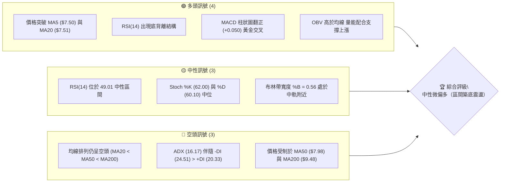
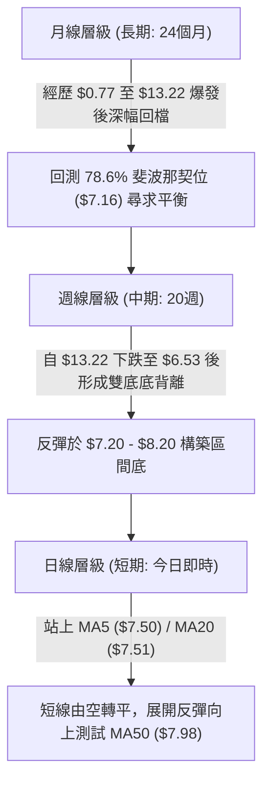
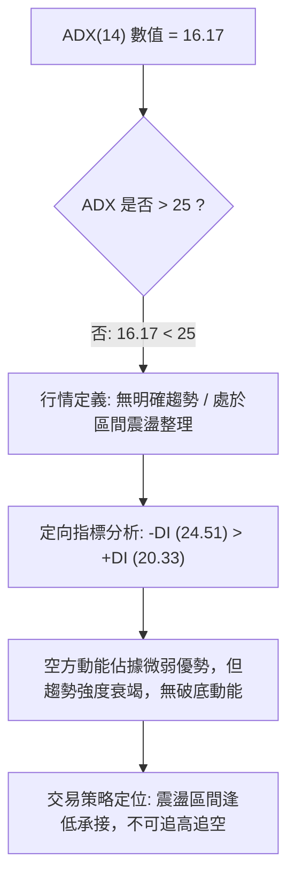
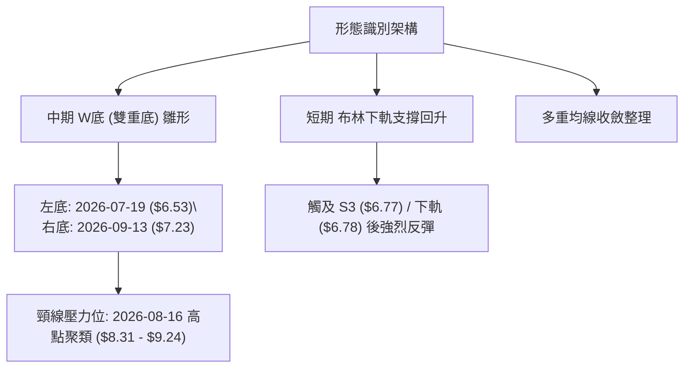
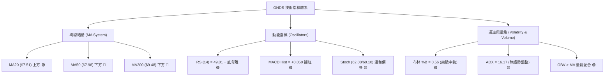
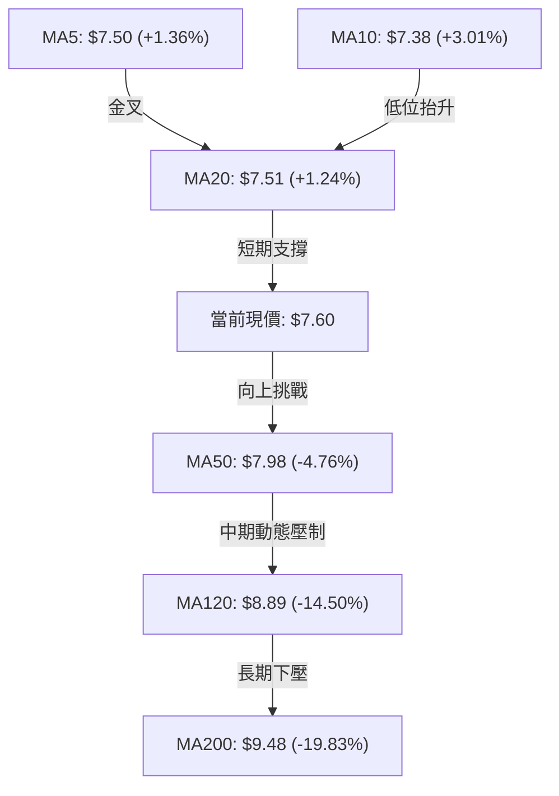
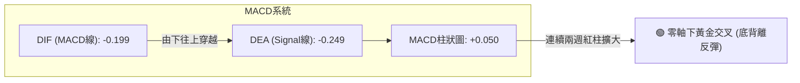
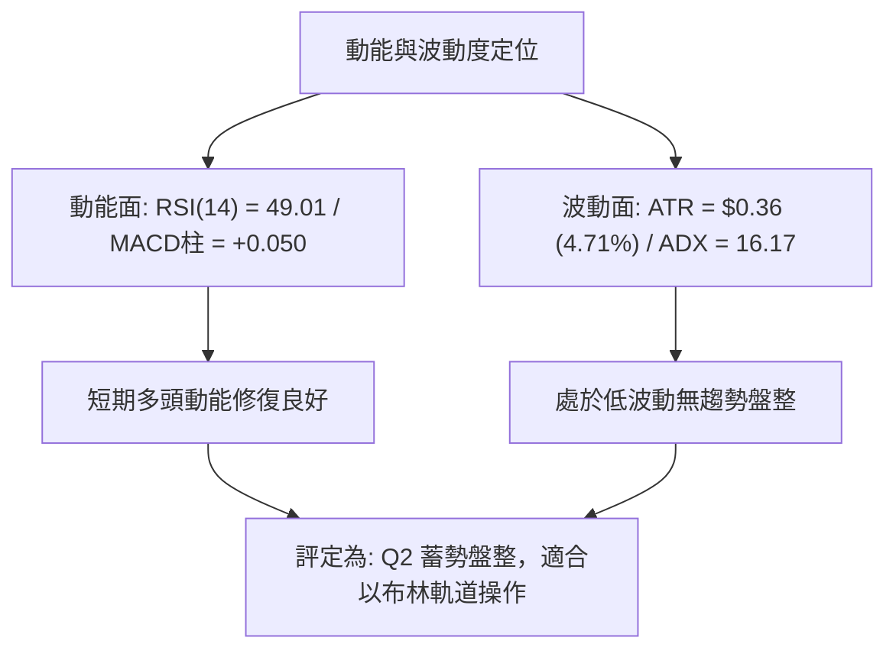
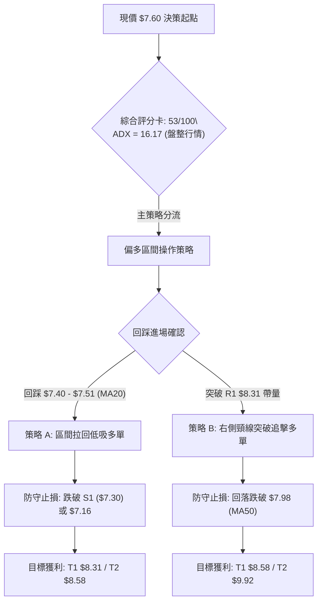
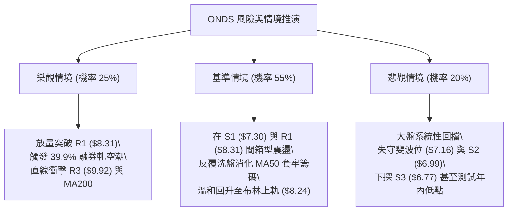

# ONDS 技術分析報告

> **報告日期**：2026-09-25 ｜ **語言**：繁體中文 ｜ **數據來源**：Yahoo Finance ｜ **當前價格**：$7.60

---

## 目錄

| 章節 | 內容 |
|------|------|
| [1. 技術面概覽](#1-技術面概覽) | 訊號儀表板、核心指標、評分卡 |
| [2. 趨勢分析](#2-趨勢分析) | 多時框趨勢、長中短期走勢 |
| [3. 圖表形態分析](#3-圖表形態分析) | 形態識別、K線組合、目標價 |
| [4. 支撐與阻力](#4-支撐與阻力) | 關鍵價位、斐波那契回調 |
| [5. 技術指標深度解讀](#5-技術指標深度解讀) | MA/RSI/MACD/布林/成交量 |
| [6. 動能與波動率](#6-動能與波動率) | 動能評估、ATR、Beta |
| [7. 多時框架總結](#7-多時框架總結) | 時框架評分矩陣 |
| [8. 交易策略建議](#8-交易策略建議) | 多空策略、風險報酬比 |
| [9. 風險提示與監控](#9-風險提示與監控) | 監控指標、風險場景 |

---

## 1. 技術面概覽

### 🎯 技術訊號儀表板



### 📊 核心指標速覽表

| 指標類別 | 指標名稱 | 當前數值 | 訊號 | 解讀 |
|----------|----------|----------|------|------|
| **價格** | 當前價格 | $7.60 | 🟡 | 站上短期均線，但仍在寬幅回調區間底部 |
| **均線** | MA20 | $7.51 | 🟢 | 價格突破短期均線上方（+1.24%） |
| **均線** | MA50 | $7.98 | 🔴 | 價格位於中期均線下方（-4.76%），構成動態阻力 |
| **均線** | MA200 | $9.48 | 🔴 | 價格遠低於長期均線（-19.83%），長期格局仍受壓制 |
| **動能** | RSI(14) | 49.01 | 🟢 | 位於中性平衡區，且日線級別具備底背離架構 |
| **動能** | MACD | -0.199 / 柱狀 +0.050 | 🟢 | MACD 快線向上交叉慢線（-0.249），柱狀轉正 |
| **動能** | Stoch %K/%D | 62.00 / 60.10 | 🟡 | 位於平衡多方控盤區，未觸及超買 |
| **波動** | ATR(14) | $0.36 | 🟡 | 佔股價 4.71%，波動收斂進入橫盤整理階段 |
| **趨勢** | ADX(14) | 16.17 | 🟡 | 數值低於 25，顯示處於無明確趨勢的震盪築底階段 |

### 🏆 技術評分卡

```
╔══════════════════════════════════════════════════════════╗
║               技術評分卡 — ONDS (2026-09-25)              ║
╠══════════════════════════════════════════════════════════╣
║ 趨勢強度 (ADX)   ████░░░░░░░░░░░░░░░░  30/100  🟡 弱趨勢 ║
║ 動能指標 (RSI/MACD) ████████████░░░░░░░  60/100  🟢 偏多   ║
║ 支撐穩定度 (S1/S2)  ██████████████░░░░░  70/100  🟢 堅實   ║
║ 成交量配合 (OBV/VOL)██████████████░░░░░  70/100  🟢 價量配合║
║ 形態完整度 (雙底)   ████████████░░░░░░░  60/100  🟡 構築中 ║
║ 均線排列 (MA結構)  ██████░░░░░░░░░░░░░░  30/100  🔴 空頭排列║
╠══════════════════════════════════════════════════════════╣
║ 綜合評分          ███████████░░░░░░░░░  53/100  🟡 區間操作║
╚══════════════════════════════════════════════════════════╝
```

---

## 2. 趨勢分析

### 🌐 多時框趨勢分析



### 📈 長期趨勢 — 12個月走勢圖（Unicode）

```
ONDS 月線走勢圖（過去12個月：2025-10 至 2026-09）
價格軸 ($)
$13.50 ┤                                      ● (2026-05 高點 $13.22)
$12.00 ┤                                     ╱ ╲
$10.50 ┤                      ●    ●        ╱   ╲
$9.00  ┤                 ●   ╱ ╲  ╱ ╲      ╱     ╲
$7.50  ┤●━━━━━━━━━━━━━━━●───●───●────●────●───────●← 現價 $7.60
$6.00  ┤       ●                                 (2026-07 低點 $6.53)
       └─────────────────────────────────────────────────────────────
         10月  11月  12月  01月 02月 03月 04月 05月 06月 07月 08月 09月
        '25   '25   '25   '26  '26  '26  '26  '26  '26  '26  '26  '26
```

**走勢特徵分析表格**：

| 時間階段 | 期間價格區間 | 累積漲跌幅 | 量價與趨勢特徵 |
|----------|--------------|------------|----------------|
| **2025-10 ~ 2026-01** | $6.44 → $10.36 | +60.87% | 主升浪初期，成交量逐步放大，均線多頭發散 |
| **2026-02 ~ 2026-04** | $10.08 → $10.04 | -0.40% | 高檔橫盤洗盤，於 $9.00 - $10.00 建立籌碼換手平台 |
| **2026-05 (主升浪頂)** | $10.04 → $13.22 | +31.67% | 爆量拉升創波段收盤新高，高見 $15.28 後出現長上影線 |
| **2026-06 ~ 2026-07** | $13.22 → $7.49 | -43.34% | 獲利了結盤湧出，跌破 MA50，於 $6.53 探底形成放量恐慌低點 |
| **2026-08 ~ 2026-09** | $7.49 → $7.60 | +1.47% | 波動大幅收斂，成交量降至均量水準，於 $7.30 - $7.80 築底 |

### 📊 中期趨勢（週線分析）

中期走勢呈現「深跌後的對稱雙底雛形」。從近 20 週歷史數據可看出：
- 第一波低點位於 2026-07-19 週收盤 $6.53（週成交量爆出 671,525,800 股）。
- 隨後反彈至 2026-08-16 週收盤 $9.24。
- 回落形成第二波次低點：2026-09-13 週收盤 $7.23（成交量萎縮至 201,365,100 股），量縮不破前低。
- 當前收盤價 $7.60 已連續兩週回升，週 MACD 柱狀圖自 -0.145 翻正至 +0.050，完成底背離轉折。

```
近期週線壓力與支撐結構示意圖：
$9.24 ───────────────────────────── 中期反彈頸線高點 (2026-08-16)
          ╲                     ╱
$8.31 ─────╲────── R1 ─────────╱─── 近期波段阻力
            ╲                 ╱
$7.60 ───────●───────────────●───── 現價 $7.60 (站上底頸線)
              ╲  $7.23      ╱
$6.53 ─────────● (W底左腳) ─ (W底右腳)
```

### ⚡ 趨勢強度評估（ADX 解讀）



**ADX 趨勢強度對照表**：

| ADX 區間 | 趨勢強度說明 | ONDS 當前狀態 | 操作方針 |
|----------|--------------|---------------|----------|
| 0 - 20 | 缺席或極弱趨勢 | **16.17（當前）** | 採用均值回歸與區間擺盪操作，緊盯布林軌道邊界 |
| 20 - 25 | 潛在趨勢醞釀中 | - | 留意突破訊號，暫不建立突破追價倉 |
| 25 - 40 | 明確強趨勢 | - | 順勢操作，依 MA 均線回踩加碼 |
| 40 - 60 | 極強單邊趨勢 | - | 保有主要部位，拉開移動止盈保護 |

---

## 3. 圖表形態分析

### 🔍 形態識別系統



**形態信心度表格**：

| 形態 | 信心度 | 判斷依據（引用數據） | 完成度 | 目標價（附計算式） |
|------|--------|----------------------|--------|--------------------|
| **雙底雛形 (W-Bottom)** | 65% | 左底 2026-07-19 收盤 $6.53（放量 6.71億股），右底 2026-09-13 收盤 $7.23（量縮 2.01億股，守住 S1 $7.30 / S2 $6.99） | 60% | 形態理論目標價 = 頸線 R1 $8.31 + (R1 $8.31 - 左底 $6.53) = **$10.09**（接近 50.0% 斐波位 $10.11） |
| **布林帶下軌觸底反彈** | 75% | 價格在下軌 $6.78 與 S3 $6.77 聚類處止跌，目前回升至中軌 $7.51 上方 | 85% | 短期軌道目標價 = 布林通道上軌 **$8.24** |
| **頭肩底形態** | 35% | 數據中左肩與右肩未形成對稱架構，僅有雙底特徵 | 20% | 訊號不足，僅做指標型解讀，不預設該形態目標 |

### 🕯️ 重要K線形態分析

| 週/月份 | 收盤價 | K線形態 | 解讀 | 訊號 |
|---------|--------|---------|------|------|
| **2026-07-19** | $6.53 | 放量長陰恐慌錘頭 | 週成交量 671M 股，探出 52 週次低點後帶長下影線 | 🟢 賣壓竭盡 |
| **2026-07-26** | $7.80 | 長陽包覆吞噬線 | 成交量進一步擴大至 834M 股，確立 $6.53 為中期底部 | 🟢 強烈買盤介入 |
| **2026-08-16** | $9.24 | 高檔受阻倒錘頭線 | 挑戰波段高點未能站上 MA120 ($8.89) / MA200 ($9.48) 後量縮拉回 | 🔴 逢高解套賣壓 |
| **2026-09-13** | $7.23 | 量縮十字星 | 週成交量大幅萎縮至 201M 股，顯示浮額清洗乾淨，未破前低 | 🟢 次低點確立 |
| **2026-09-27** | $7.60 | 溫和放量紅K棒 | 連續兩週收紅，收復 MA20，MACD 翻紅 | 🟢 短線多頭發動 |

### 📉 ASCII 走勢形態示意圖

```
ONDS 雙底 (W-Bottom) 結構與頸線阻力圖
價格 ($)
$9.24 ┤                  ╭──● (中期頂頸線 08-16)
$8.58 ┤                 ╱    ╲                  ▲ (目標價 2: R2 $8.58)
$8.31 ┤───────[頸線 R1]─╱──────╲─────────────────▲ (目標價 1: R1 $8.31)
$7.98 ┤ (MA50 阻力)    ╱        ╲      ● (現價 $7.60 向上突破中)
$7.60 ┤               ╱          ╲    ╱
$7.23 ┤              ╱            ╰──● (右底 09-13: $7.23 量縮)
$6.53 ┤ ╰──● (左底 07-19: $6.53 爆量)
      └────────────────────────────────────────────────────────
```

### 🎯 形態目標價計算

依據標準圖表形態學之垂直投射測幅法則：
1. **第一波頸線突破目標**：
   - 形態底部低點：左底 $6.53
   - 短線形態頸線：阻力位 R1 = **$8.31**
   - 形態高度：$8.31 - $6.53 = **$1.78**
   - 突破目標價 T1（等幅測距）= $8.31 + $1.78 = **$10.09**（與斐波那契 50.0% 回調位 $10.11 高度重合）。
2. **中期阻力段目標**：
   - 次級波段高點聚類 R2 = **$8.58**。
   - 長期形態反轉關鍵阻力位 R3 = **$9.92**。

---

## 4. 支撐與阻力

### 🗺️ 關鍵價位分布圖（Unicode）

```
ONDS 價位結構分布圖 (由實際 OHLCV 與歷史波段計算)
══════════════════════════════════════════════════════════════════
$15.28 ║                                                        ║ 52W 最高點 (0.0% 斐波位)
$10.11 ║████████████████████████████████████████████████████████║ 斐波那契 50.0% 強弱分水嶺
$9.92  ║████████████████████████████████████████████████████    ║ 強阻力 R3 (+30.59%)
$9.48  ║────────────────────────────────────────────────────────║ MA200 牛熊分界線
$8.58  ║████████████████████████████████████                    ║ 阻力 R2 (+12.89%)
$8.31  ║████████████████████████████████                        ║ 關鍵頸線阻力 R1 (+9.41%)
$7.98  ║────────────────────────────────────────────────────────║ MA50 壓力線 (-4.76%)
$7.60  ╠════════════════════════════════════════════════════════╣ ◄ 當前收盤價 ($7.60)
$7.51  ║────────────────────────────────────────────────────────║ 布林中軌 / MA20 短期依託
$7.30  ║▓▓▓▓▓▓▓▓▓▓▓▓▓▓▓▓▓▓▓▓▓▓▓▓▓▓▓▓                            ║ 近期支撐 S1 (-4.01%)
$7.16  ║▓▓▓▓▓▓▓▓▓▓▓▓▓▓▓▓▓▓▓▓▓▓▓▓▓▓▓▓▓▓▓▓                        ║ 斐波那契 78.6% 回調位
$6.99  ║▓▓▓▓▓▓▓▓▓▓▓▓▓▓▓▓▓▓▓▓▓▓▓▓▓▓▓▓▓▓▓▓▓▓▓▓                    ║ 強支撐 S2 (-8.03%)
$6.77  ║▓▓▓▓▓▓▓▓▓▓▓▓▓▓▓▓▓▓▓▓▓▓▓▓▓▓▓▓▓▓▓▓▓▓▓▓▓▓▓▓                ║ 關鍵底線支撐 S3 (-10.92%)
$4.95  ║                                                        ║ 52W 最低點 (100.0% 斐波位)
══════════════════════════════════════════════════════════════════
```

### 🚧 阻力位分析表

所有價位均來自近一年波段高點聚類數據：

| 阻力級別 | 價位 | 距離現價 | 形成原因 | 突破難度 | 重要性 |
|----------|------|----------|----------|----------|--------|
| **R1** | **$8.31** | +9.41% | 近期波段反彈高點聚類，與布林上軌 ($8.24) 形成共振壓制帶 | 🟡 中等 | ★★★★☆ 短線反彈頸線 |
| **R2** | **$8.58** | +12.89% | 2026年8月中旬拉回時的次級起跌密集套牢區 | 🔴 較大 | ★★★☆☆ 波段推進阻力 |
| **R3** | **$9.92** | +30.59% | 接近 MA200 ($9.48) 與斐波那契 50% ($10.11) 之長期重壓區 | 🔴 極大 | ★★★★★ 多空分水嶺 |

### 🛡️ 支撐位分析表

所有價位均來自近一年波段低點聚類數據：

| 支撐級別 | 價位 | 距離現價 | 形成原因 | 守住機率 | 重要性 |
|----------|------|----------|----------|----------|--------|
| **S1** | **$7.30** | -4.01% | 2026-09-13 當週次低點聚類 ($7.23 - $7.39)；短期起漲樞紐 | 80% | ★★★★☆ 短線防守底線 |
| **S2** | **$6.99** | -8.03% | 心理整數關卡，歷史多次換手密集區間 | 75% | ★★★☆☆ 波段回檔支撐 |
| **S3** | **$6.77** | -10.92% | 布林下軌 ($6.78) 共振區，2026年7月恐慌拋售後的最強防守區 | 90% | ★★★★★ 波段強弱分界 |

### 📐 斐波那契回調位分析

依據 52 週極值區間（低點 $4.95 → 高點 $15.28，落差 $10.33）計算之標準黃金分割位：

| 斐波那契層級 | 精確價位 | 相對現價位置 | 技術意義與互動分析 |
|--------------|----------|--------------|--------------------|
| **0.0% (52W High)** | $15.28 | +101.05% | 2026年5月爆發性主升浪頂點，長期終極強阻力 |
| **23.6%** | $12.84 | +68.95% | 深幅回檔後的第一阻力帶 |
| **38.2%** | $11.33 | +49.08% | 多頭回調常態支撐轉阻力位 |
| **50.0%** | $10.11 | +33.03% | 整個週線波段的牛熊多空中樞平衡點 |
| **61.8%** | $8.90 | +17.11% | 黃金分割強防守位，跌破後轉為反彈強阻力（與 MA120 $8.89 重合） |
| **78.6%** | **$7.16** | -5.79% | **關鍵支撐位**：當前股價 $7.60 穩固運行於此位之上，構成深幅回調的最後防線 |
| **100.0% (52W Low)**| $4.95 | -34.87% | 年度絕對底部支撐 |

**解讀**：現價 $7.60 位於 **78.6% ($7.16)** 與 **61.8% ($8.90)** 之間，屬於深度回調後的底部吸籌區間。只要 $7.16（以及波段支撐 S1 $7.30）未有效跌破，技術面即具備向上挑戰 61.8% ($8.90) 的回調反彈空間。

---

## 5. 技術指標深度解讀

### 🎛️ 指標訊號總覽



### 📈 移動平均線排列分析



**均線排列結構解讀**：
- **當前格局**：長中短期呈現典型的「空頭排列修復期」（MA20 < MA50 < MA200）。長期均線 MA200 ($9.48) 與 MA240 ($9.14) 仍呈下行傾斜。
- **邊際改善**：超短期均線出現黃金交叉修復，MA5 ($7.50) 與 MA10 ($7.38) 快速向上翻升，現價 $7.60 成功站上 MA20 ($7.51)。這代表短線賣壓已經鈍化，短線買盤重新掌握發球權，下一步將檢驗 MA50 ($7.98) 的壓制強度。

### 📉 RSI(14) 分析

- **RSI 當前數值**：**49.01**（處於多空平衡軸 50 邊緣）
- **區間進度條**：
```
超賣區 (0-30)         中性區間 (30-70)                 超買區 (70-100)
├───────────────┼───────────────────────────────┼───────────────┤
░░░░░░░░░░░░░░░░████████████████░░░░░░░░░░░░░░░░░░░░░░░░░░░░░░░░░
0              30              49.01           70             100
```
- **背離判斷與結論**：⚠️ **明確底背離 (Bullish Divergence)**。
  - 價格端：2026-07-19 週收盤 $6.53 之後，拉回至 2026-09-13 之 $7.23。
  - 指標端：2026-07-05 當週 RSI 曾探底至 21.3，而 2026-09-13 股價回踩時 RSI 守在 30.1，目前更強勢回升至 49.01。
  - **結論**：空方推低價格的動能嚴重耗竭，指標呈現連續抬高底部的正向背離，預示價格存在均值回歸修復的需求。

### 📊 MACD(12/26/9) 訊號解讀



**MACD 指標分析**：
- DIF (-0.199) 高於 DEA (-0.249)，柱狀圖（MACD Hist）讀數為 **+0.050**，自前週的 -0.016 正式翻正。
- 觀察近 4 週數據：-0.145 → -0.108 → -0.016 → +0.050，柱狀體展現出平滑且堅實的向上收斂擴張趨勢，屬於零軸下方標準的「多頭進攻訊號」，確認雙底右腳反轉確立。

### 📦 布林通道分析

```
ONDS 布林通道 (20, 2) 結構圖
價格 ($)
$8.24 ┤─────────────────────────────── 上軌 Upper Band (阻力)
      │
$7.60 ┼───────────────────────● 現價 ($7.60，%B = 0.56)
$7.51 ┤─────────────────────────────── 中軌 Middle Band (MA20，已站上)
      │
$6.78 ┤─────────────────────────────── 下軌 Lower Band (強支撐)
      └───────────────────────────────
```

- **通道帶寬與位置**：通道上軌 $8.24、中軌 $7.51、下軌 $6.78。
- **%B 指標**：**0.56**（大於 0.50），表明價格已突破中軌壓制，由布林弱勢區間切換至強勢區間。
- **通道形態**：帶寬呈現收口後的水平延展走勢，顯示歷史劇烈波動告一段落，目前正蓄勢進行中軌至上軌 ($8.24) 的區間反彈。

### 💹 成交量分析（量價配合度）

- **最新成交量**：114,411,100 股
- **20日均量**：65,198,465 股（**量比 1.75x**，顯著放量）
- **50日均量**：82,233,344 股
- **OBV 能量潮**：數據明確指出「**OBV > MA → 量能支撐上漲**」。
- **量價形態解讀**：
  - 2026-09-13 探底 $7.23 時，週成交量萎縮至 2.01億股（窒息量確認底部）。
  - 當前單日放量至 1.14億股（超過 20 日均量 75%），伴隨價格推升突破 MA20，呈現健康的「價漲量增」配合，無籌碼背離現象。

---

## 6. 動能與波動率

### ⚡ 動能評估

| 象限 | 動能維度 | 波動維度 | 當前狀態 | 策略指導與評估 |
|------|----------|----------|----------|----------------|
| **Q1 (最佳擴張)** | 強 (RSI>60, ADX>25) | 低 (ATR收斂) | - | 主升浪啟動，重倉順勢追價 |
| **Q2 (築底蓄勢)** | **轉強 (RSI 49, MACD金叉)** | **低 (ATR 4.71%, ADX 16)** | **✓ (當前 ONDS 位置)** | **區間震盪築底，低吸高拋，勝率較高** |
| **Q3 (劇烈震盪)** | 強 (單邊暴漲暴跌) | 高 (ATR>8%) | - | 突破拉升階段，高風險高收益 |
| **Q4 (恐慌出逃)** | 弱 (RSI<35, 空頭排列) | 高 (放量破位) | - | 避開右側破位下行階段 |



### 📊 ATR 波動率分析

- **ATR(14) 數值**：**$0.36**（佔當前股價 4.71%）。
- **波動特徵**：相較於 2026 年 5 月高點時期（單週波動數美元），目前的 ATR 顯示市場投機情緒已降溫，股價步入低波幅常態化整理。
- **風控止損參數設定**：
  - **超短線動態止損**：1.0 × ATR = **$0.36**（對應下檔 $7.60 - $0.36 = **$7.24**，恰好契合 S1 $7.30 / 右底低點 $7.23）。
  - **波段保護止損**：1.5 × ATR = **$0.54**（對應下檔 $7.60 - $0.54 = **$7.06**，緊貼 S2 $6.99 與 78.6% 斐波位 $7.16）。

### 📐 Beta 與市場相關性

- **Beta 係數**：**2.736**。
- **特徵解讀**：ONDS 屬於極高彈性標的，理論上對標普 500 指數的波動敏感度達 2.73 倍。當科技股與無人機/國防通訊板塊情緒回暖時，其反彈爆發力極強；反之在大盤拉回時回撤亦劇烈。
- **融券放空指標**：
  - Short % Float 高達 **39.9%**，空頭回補天數（Short Ratio）為 **3.13**。
  - 當前極高的放空比例為該股埋下潛在的「空頭擠壓（Short Squeeze）」火藥庫。一旦價格帶量突破頸線 R1 ($8.31)，可能引發大規模空方停損回補潮。

---

## 7. 多時框架總結

### 📋 時框架評分表

| 時框架 | 趨勢方向 | 動能狀態 | 均線排列 | 形態結構 | 綜合評分 | 交易建議 |
|--------|----------|----------|----------|----------|----------|----------|
| **月線 (長期)** | 🟡 深度回調後築底 | 弱勢反彈（自極度超賣區脫離） | 空頭排列（MA200下方） | 守住 78.6% 斐波位 ($7.16) | 45/100 | 長期分批低接，勿過度追價 |
| **週線 (中期)** | 🟡 橫向對稱雙底 | 溫和走強（MACD柱翻正） | 承壓於週 MA50 ($7.98) | 雙底雛形構築中 (完成度60%) | 55/100 | 波段持有，以頸線 R1 為目標 |
| **日線 (短期)** | 🟢 震盪轉強 | 偏多進攻（RSI底背離+OBV支撐） | 站上 MA5/MA10/MA20 | 突破布林中軌，向上軌靠攏 | 62/100 | 順勢偏多操作，回踩依託低吸 |

### 🔲 綜合訊號矩陣

```
時框訊號收斂矩陣
┌──────────────┬──────────────────┬──────────────────┬──────────────────┐
│ 指標 / 維度  │   短期 (日線)    │   中期 (週線)    │   長期 (月線)    │
├──────────────┼──────────────────┼──────────────────┼──────────────────┤
│ 趨勢方向     │ 🟢 向上偏多      │ 🟡 橫向整理      │ 🔴 空頭承壓      │
│ RSI / 動能   │ 🟢 底背離確立    │ 🟢 底部金叉      │ 🟡 中性修復      │
│ MACD 柱狀體  │ 🟢 翻正擴張      │ 🟢 負值收斂轉正  │ 🔴 零軸下方      │
│ 均線位置     │ 🟢 突破 MA20     │ 🔴 壓制於 MA50   │ 🔴 遠離 MA200    │
│ 量能配合     │ 🟢 突破放量      │ 🟢 探底量縮      │ 🟡 常態均量      │
└──────────────┴──────────────────┴──────────────────┴──────────────────┘
```

### ⚖️ 多時框收斂結論

依據多時框收斂規則：
1. **行情屬性判定**：當前 ADX(14) 數值為 **16.17 (< 25)**，明確定義當前為**盤整行情（震盪築底）**，而非單邊趨勢行情。
2. **主導時框與交易邊界**：在盤整行情中，應**以日線布林通道上下軌（$6.78 - $8.24）為主要交易區間**，並參考波段支撐阻力位（S1 $7.30 / R1 $8.31）。
3. **收斂唯一方向**：
   - 雖然長期均線（MA200 $9.48）呈空頭排列，但日線與週線的動能指標（MACD 連續收紅、RSI 底背離、OBV 支持）已經發出共振反彈訊號。
   - 依評分卡綜合評分 53/100，本報告給出**唯一方向性結論：中性微偏多（區間反彈操作）**。
   - 核心交易邏輯：以布林中軌 $7.51 及波段支撐 S1 $7.30 為進場防守底線，逢低做多，向上博取測試布林上軌 $8.24 及阻力位 R1 $8.31 的波段空間。

---

## 8. 交易策略建議

### 🗺️ 策略決策流程圖



### 🧭 策略路由

> **當前主策略方向 = 中性微偏多（區間回踩低吸與頸線博弈，依評分 53/100）**

因技術評分卡綜合評分為 53 分（處於 40–60 區間操作帶，且動能指標全數泛綠轉強），策略主推**「依託短期均線與支撐位的多頭低吸策略」**；空頭策略僅作為跌破關鍵支撐時的風險觸發與避險對沖提示。

### 🎯 價格情境階梯（Price Scenarios）

所有價位嚴格引用自關鍵價位與斐波那契計算表：

| 觸發條件 | 下一目標 | 後續延伸 | 情境含義 |
|----------|----------|----------|----------|
| **帶量突破 R1 $8.31** | **R2 $8.58** | **R3 $9.92** | 突破雙底頸線，空頭擠壓啟動，挑戰 MA200 |
| **突破 MA50 $7.98** | **布林上軌 $8.24** | **R1 $8.31** | 短線轉強，完成第 1 階段多頭均值回歸 |
| **站穩現價 $7.60 區間** | **MA50 $7.98** | — | 在布林中軌上方維持震盪築底格局 |
| **失守 S1 $7.30** | **斐波位 $7.16** | **S2 $6.99** | 短期反彈失敗，重新回踩確認底部厚度 |
| **跌破 S3 $6.77** | **52W 低點 $4.95** | — | 形態破位，空頭主導，防範無底深淵 |

### 📊 情境機率分佈

| 情境 | 機率 | 主要依據 |
|------|------|----------|
| **向上反彈測試 R1/R2** | **55%** | MACD 柱狀翻正 (+0.050)、RSI 日線底背離、OBV 支持上漲、空頭佔比高達 39.9% 具備軋空潛能 |
| **維持 $7.30 - $8.24 區間震盪** | **35%** | ADX 僅 16.17 表明無強烈單邊趨勢，MA50 與 MA200 仍壓在上方，需要時間消化籌碼 |
| **跌破 S1/S2 再探前低** | **10%** | 兩次下探均出現巨量承接，下檔在 78.6% 斐波位 ($7.16) 支撐極為強韌 |

### 🟢 主策略詳情

嚴格按照數據中之 S1/S2/S3、R1/R2/R3 及布林通道價位制定：

| 策略要素 | 策略 A（回踩低吸型 - 穩健首選） | 策略 B（突破追擊型 - 激進右側） |
|----------|---------------------------------|---------------------------------|
| **交易邏輯** | 依託 MA20 ($7.51) 與支撐 S1 回踩確認低吸 | 待大陽線帶量有效突破頸線阻力 R1 後順勢介入 |
| **進場價格** | **$7.45**（$7.40 - $7.50 區間掛單） | **$8.35**（確認實體紅K突破 R1 $8.31 時追進） |
| **目標價 T1** | **$8.24**（布林上軌，潛在收益 +10.60%） | **$8.58**（阻力位 R2，潛在收益 +2.75%） |
| **目標價 T2** | **$8.58**（阻力位 R2，潛在收益 +15.17%） | **$9.92**（強阻力 R3，潛在收益 +18.80%） |
| **止損價格** | **$7.15**（嚴格跌破 78.6% 斐波位 $7.16 與 S1 $7.30） | **$7.95**（跌回 MA50 $7.98 下方假突破停損） |
| **風險空間** | $7.45 - $7.15 = **$0.30** (-4.03%) | $8.35 - $7.95 = **$0.40** (-4.79%) |
| **報酬空間 (T2)** | $8.58 - $7.45 = **$1.13** (+15.17%) | $9.92 - $8.35 = **$1.57** (+18.80%) |
| **風險報酬比** | **1 : 3.77**（極優） | **1 : 3.93**（極優） |
| **成功機率** | 65% | 55% |
| **建議倉位** | 10% - 15% 總資金 | 8% - 10% 總資金 |

### 🔴 反向風險觸發點（對沖提示）

若出現以下訊號，主策略多頭架構即告失效，投資人應即刻停損並轉為觀望或建立避險空單：
1. **關鍵價位跌破**：日線收盤價跌破 **S1 $7.30**，特別是進一步實體陰線打穿 **78.6% 斐波位 $7.16**。
2. **指標轉惡**：日線 MACD 柱狀體再度跌落負值區間，且 RSI(14) 跌破 40。
3. **量能異動**：出現單日超過 1.5 億股的爆量長黑K棒貫穿布林下軌 $6.78，此時將觸發下探 52 週低點 $4.95 的極端風險。

### ⭐ 整體訊號強度評星

```
做多訊號強度：★★★☆☆  (3.5/5星 - 底部反彈動能充沛，但受制於中長期均線)
做空訊號強度：★★☆☆☆  (2.0/5星 - 缺乏下行趨勢動能，下檔支撐密集且做空比過高)
整體可信度：  ★★★★☆  (4.0/5星 - 價位聚類清晰，雙底與指標背離確認度高)
```

---

## 9. 風險提示與監控

### ✅ 關鍵監控指標 Checklist

```
╔══════════════════════════════════════════════════════════════════╗
║               ONDS 每日盤面核心監控 Checklist                   ║
╠══════════════════════════════════════════════════════════════════╣
║ [ ] 價格是否站穩布林中軌 MA20 ($7.51) 上方？                     ║
║ [ ] 日成交量是否維持在 20日均量 (65.2M) 之上？                  ║
║ [ ] MACD Hist 柱狀體是否持續大於 0 (當前 +0.050)？               ║
║ [ ] RSI(14) 是否成功跨越 50 多空分水嶺 (當前 49.01)？           ║
║ [ ] 盤中是否出現挑戰 MA50 ($7.98) 的攻擊波？                    ║
║ [ ] 下檔是否堅守波段低點支撐 S1 ($7.30)？                        ║
║ [ ] Short Float (39.9%) 是否出現顯著空頭回補跡象？               ║
╚══════════════════════════════════════════════════════════════════╝
```

### ⚠️ 風險場景分析



### 🛡️ 風險管理重要提醒

1. **極高 Beta 與槓桿風險**：ONDS 的 Beta 高達 **2.736**，意味著大盤若回跌 2%，該股平均波動可能超過 5.5%。個股倉位嚴禁超過總投資組合的 15%，嚴禁使用高槓桿融資。
2. **財報與基本面赤字考量**：雖然營收 YoY 暴增 1235.4%，但營業利潤率 (-166.3%) 與營業現金流 (-1.61億美元) 仍呈失血狀態。此類高成長但尚未穩健獲利的科技設備股，極易受美債殖利率波動與市場風險偏好驟降打擊。
3. **止損紀律的絕對執行**：區間操作的生命線在於嚴格防守。若股價跌破 $7.15（S1 $7.30 與 78.6% 斐波位下方），務必無條件執行止損，不可抱持「等反彈」心態。

---

## 📋 報告總結

```
╔══════════════════════════════════════════════════════════════════╗
║                    ONDS 技術分析報告總結                         ║
╠══════════════════════════════════════════════════════════════════╣
║ 報告日期：2026-09-25                                             ║
║ 當前價格：$7.60                                                  ║
║ 分析評級：⚖️ 區間築底偏多 (Accumulate on Dips)                   ║
╠══════════════════════════════════════════════════════════════════╣
║ 關鍵結論：                                                       ║
║ ├─ 長期趨勢：🔴 偏空承壓（受限於 MA200 $9.48，處於長期回調底部） ║
║ ├─ 中期趨勢：🟡 橫向築底（週線對稱雙底成型中，頸線 R1 $8.31）   ║
║ ├─ 短期趨勢：🟢 偏多轉強（收復 MA20，RSI底背離，MACD翻紅）      ║
║ ├─ 關鍵支撐：S1 $7.30 ｜ S2 $6.99 ｜ 關鍵底線 S3 $6.77          ║
║ ├─ 關鍵阻力：R1 $8.31 ｜ R2 $8.58 ｜ 強阻力 R3 $9.92            ║
║ └─ 分析師目標：共識均價 $19.42 (最低 $13.00，最高 $25.00)        ║
╠══════════════════════════════════════════════════════════════════╣
║ 最優策略組合：                                                   ║
║ 1. 🥇 最佳機會（策略 A）：回踩 $7.40 - $7.50 建立基本倉，        ║
║    止損設 $7.15，目標看布林上軌 $8.24 與阻力 R1 $8.31 (R/R 3.77)║
║ 2. 🥈 次選機會（策略 B）：帶量突破 R1 $8.31 後順勢追進，          ║
║    目標看 R2 $8.58 及強阻力 R3 $9.92 (博弈空頭擠壓軋空)        ║
║ 3. 🥉 保守選擇：在股價未有效突破 MA50 ($7.98) 之前，             ║
║    僅以 5% 極小倉位參與區間高拋低吸，靜待趨勢明朗化             ║
╚══════════════════════════════════════════════════════════════════╝
```

---

> ⚠️ **免責聲明**：本報告為技術分析研究，所有數據、圖表及估算均基於歷史量價資訊與客觀技術模型計算。本報告**僅供研究與學術參考**，**不構成任何買賣要約或投資建議**。市場具有高度不確定性，特別是高 Beta 成長型股票，投資人進場交易前應審慎評估個人風險承受能力，自負投資盈虧。

---

*報告生成時間：2026-09-25 ｜ 數據來源：Yahoo Finance ｜ 分析框架：多時框技術分析體系*