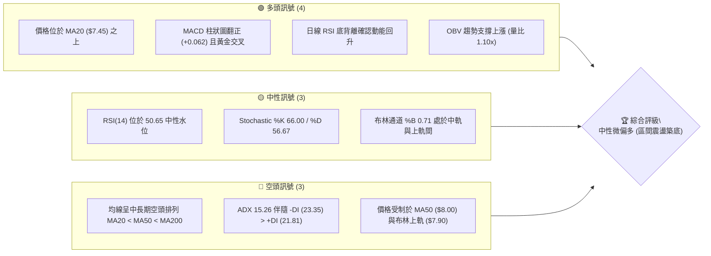
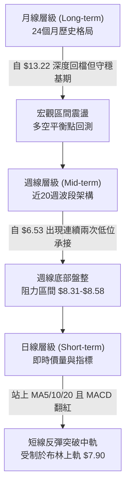
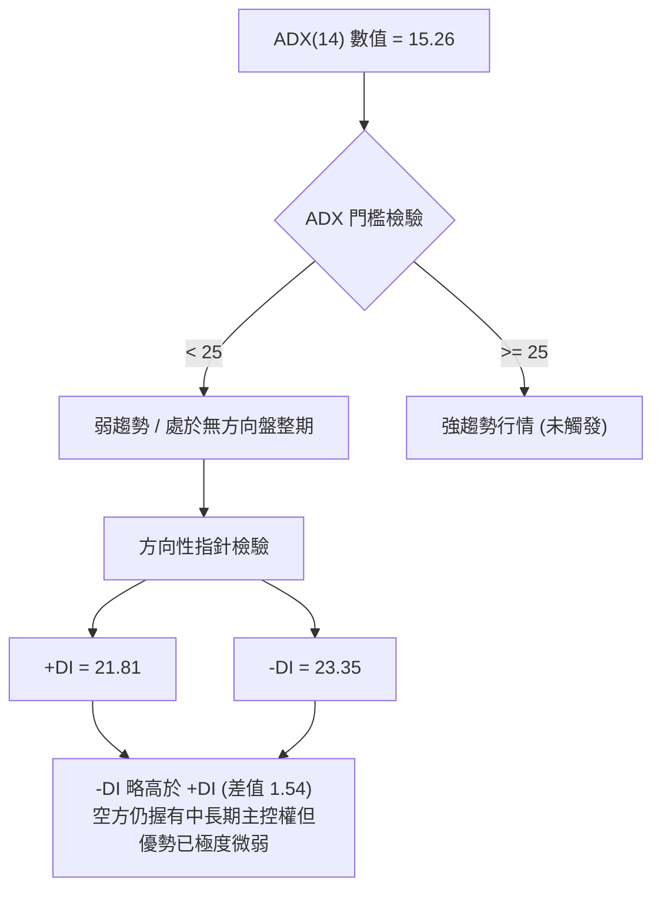
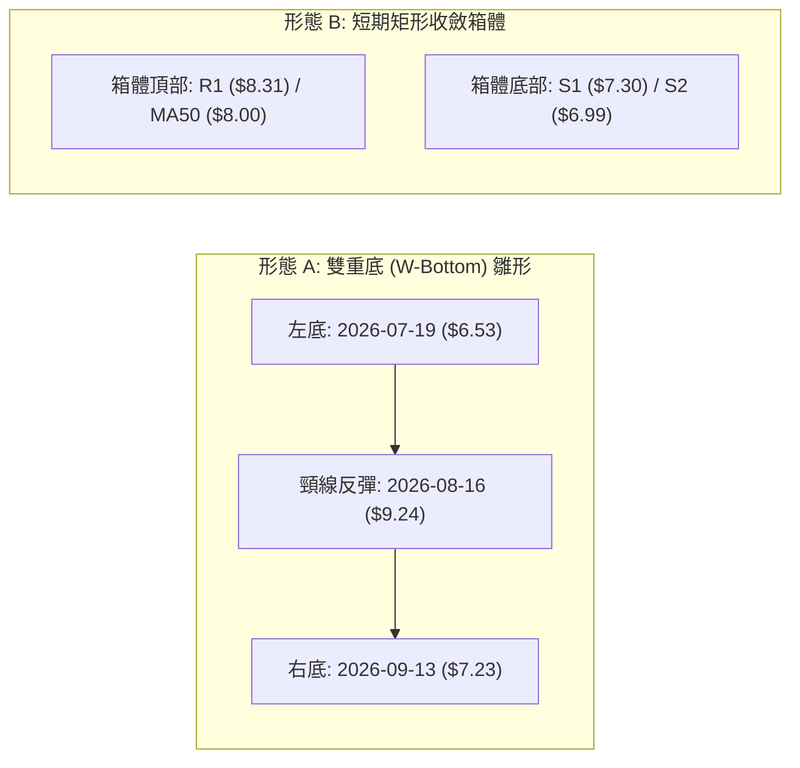
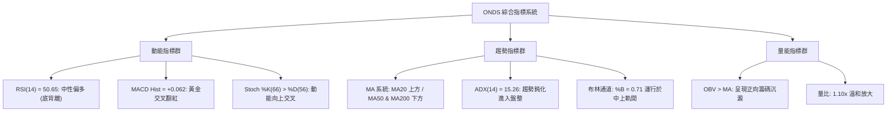
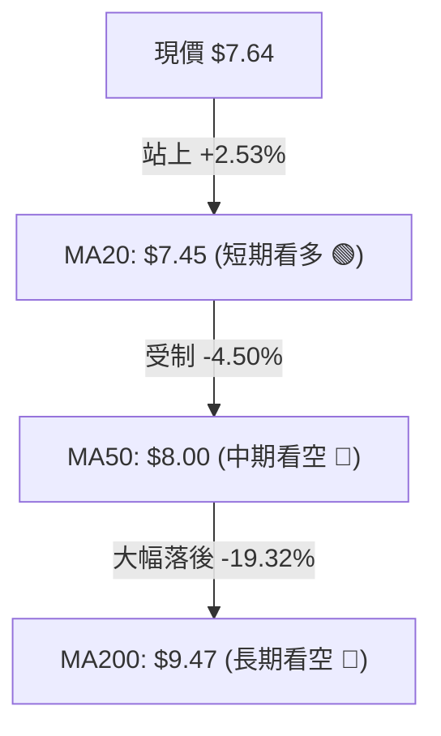
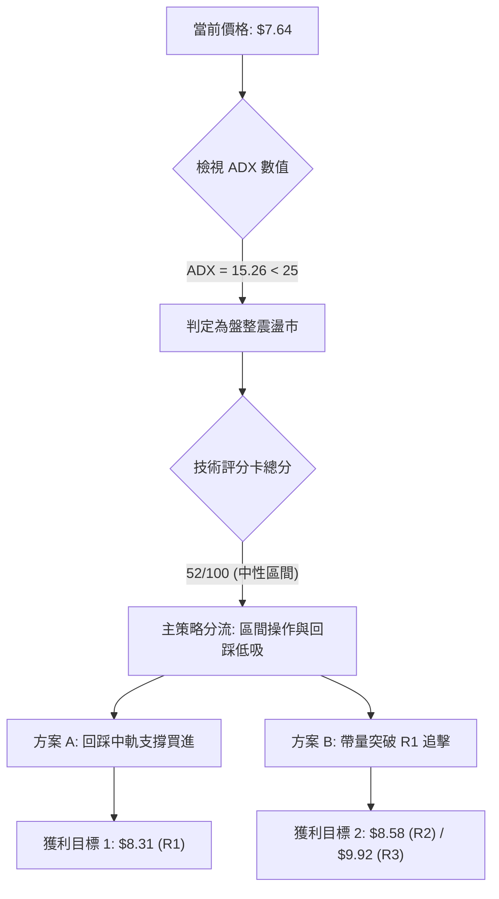
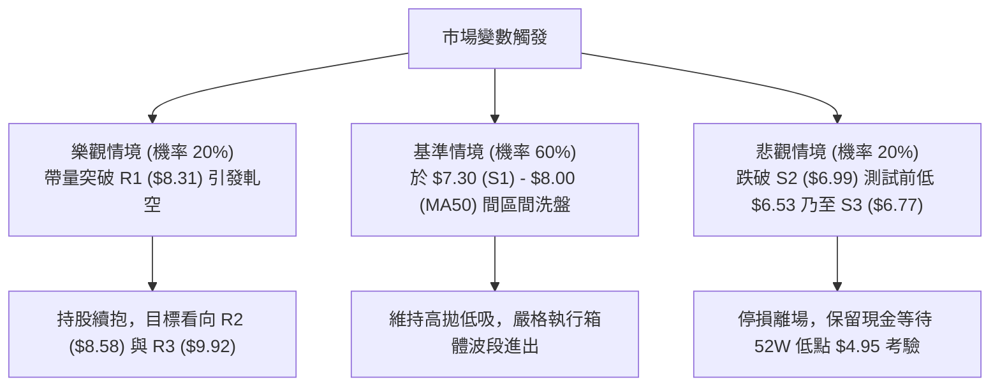

# ONDS 技術分析報告

> **報告日期**：2026-09-26 ｜ **語言**：繁體中文 ｜ **數據來源**：Yahoo Finance ｜ **當前價格**：$7.64

---

## 目錄

| 章節 | 內容 |
|------|------|
| [1. 技術面概覽](#1-技術面概覽) | 訊號儀表板、核心指標、評分卡 |
| [2. 趨勢分析](#2-趨勢分析) | 多時框趨勢、長中短期走勢 |
| [3. 圖表形態分析](#3-圖表形態分析) | 形態識別、K線組合、目標價 |
| [4. 支撐與阻力](#4-支撐與阻力) | 關鍵價位、斐波那契回調 |
| [5. 技術指標深度解讀](#5-技術指標深度解讀) | MA/RSI/MACD/布林/成交量 |
| [6. 動能與波動率](#6-動能與波動率) | 動能評估、ATR、Beta |
| [7. 多時框架總結](#7-多時框架總結) | 時框架評分矩陣 |
| [8. 交易策略建議](#8-交易策略建議) | 多空策略、風險報酬比 |
| [9. 風險提示與監控](#9-風險提示與監控) | 監控指標、風險場景 |

---

## 1. 技術面概覽

### 🎯 技術訊號儀表板



### 📊 核心指標速覽表

| 指標類別 | 指標名稱 | 當前數值 | 訊號 | 解讀 |
|----------|----------|----------|------|------|
| **價格** | 當前收盤價 | $7.64 | 🟡 | 位於52W區間 26.0%，自近期波段低點 $6.53 反彈回升 |
| **均線** | 短期 MA20 | $7.45 | 🟢 | 現價位於 MA20 之上 (+2.53%)，短線扭轉破底危機 |
| **均線** | 中期 MA50 | $8.00 | 🔴 | 現價位於 MA50 之下 (-4.50%)，構成上方動態阻力帶 |
| **均線** | 長期 MA200 | $9.47 | 🔴 | 現價大幅落後 MA200 (-19.32%)，長期架構仍受壓抑 |
| **動能** | RSI(14) | 50.65 | 🟢 | 突破50分界點，日線呈現明確底背離特徵 |
| **動能** | MACD (12,26,9) | 柱狀圖 +0.062 | 🟢 | 快線 (-0.172) 穿越慢線 (-0.234)，產生底部金叉 |
| **波動** | ATR(14) | $0.36 | 🟡 | 佔股價 4.75%，波動率較前期壓縮，進入收斂整理 |

### 🏆 技術評分卡

```
╔════════════════════════════════════════════════════════════════╗
║             技術評分卡 — ONDS (2026-09-26)                     ║
╠════════════════════════════════════════════════════════════════╣
║ 趨勢強度 (Trend)      ████████░░░░░░░░░░░░  38/100  🔴 弱勢空頭 ║
║ 動能指標 (Momentum)    █████████████░░░░░░░  65/100  🟢 底部金叉 ║
║ 支撐穩定度 (Support)  ██████████████░░░░░░  70/100  🟢 S1反覆確立║
║ 成交量配合 (Volume)   ████████████░░░░░░░░  60/100  🟢 量能回升 ║
║ 形態完整度 (Pattern)  ██████████░░░░░░░░░░  50/100  🟡 箱型構築 ║
║ 均線排列 (MA System)  ██████░░░░░░░░░░░░░░  30/100  🔴 順序受阻 ║
╠════════════════════════════════════════════════════════════════╣
║ 綜合技術評分          ███████████░░░░░░░░░  52/100  🟡 中性區間 ║
╚════════════════════════════════════════════════════════════════╝
```

---

## 2. 趨勢分析

### 🌐 多時框趨勢分析



### 📈 長期趨勢 — 12個月走勢圖（Unicode）

```
ONDS 月線走勢圖（過去12個月：2025-10 至 2026-09）
價格軸 ($)
$14.00 ┤                                      ● (05月 $13.22)
$13.00 ┤                                     ╱ ╲
$12.00 ┤                                    ╱   ╲
$11.00 ┤                     ● (01月 $10.36)╱     ╲
$10.00 ┤              ●─────╱ ╲    ●       ╱       ╲
$9.00  ┤       ●     ╱         ╲  ╱ ╲     ╱         ╲
$8.00  ┤      ╱ ╲   ╱           ●    ╲   ╱           ╲             ● (09月 $7.64 現價)
$7.00  ┤     ●   ╲ ╱                  ╲ ╱             ●─────●─────╱
$6.00  ┤●───╱     ●                                  (06月) (07月) (08月)
       └─────────────────────────────────────────────────────────────
        10月  11月  12月  01月  02月  03月  04月  05月  06月  07月  08月  09月
        2025  2025  2025  2026  2026  2026  2026  2026  2026  2026  2026  2026
```

**12個月走勢特徵分析表格**：

| 階段區間 | 時間跨度 | 價格起訖 | 漲跌幅 | 結構特徵與成交量能解讀 |
|----------|----------|----------|--------|------------------------|
| **第1階段：主升推動** | 2025/10 - 2026/01 | $6.44 → $10.36 | +60.87% | 帶量突破前高，法人與散戶資金共振推升 |
| **第2階段：高檔震盪** | 2026/01 - 2026/04 | $10.36 → $10.04 | -3.09% | 於 $9.00–$10.30 構築高位平台，換手頻繁 |
| **第3階段：末升噴出** | 2026/04 - 2026/05 | $10.04 → $13.22 | +31.67% | 月線收 $13.22 創波段高點（52W高點 $15.28 盤中觸及） |
| **第4階段：斷崖回調** | 2026/05 - 2026/07 | $13.22 → $7.49 | -43.34% | 獲利了結與高空賣壓湧現，跌破斐波那契 61.8% ($8.90) |
| **第5階段：打底修復** | 2026/07 - 2026/09 | $7.49 → $7.64 | +2.00% | 連續三個月收在 $7.49–$7.66，波動壓縮，低檔承接強 |

### 📊 中期趨勢（週線分析）

中期走勢近20週數據顯示，ONDS 自 2026-05-31 當週收在 $13.22 後展開單邊下行，於 2026-07-19 當週創下波段低點 $6.53（週成交量爆出 671.5M 股）。隨後於 2026-07-26 爆出 834.3M 股巨量大陽線收在 $7.80，確立了中期底部換手。

```
週線級別中期結構示意圖：
阻力區間 3: $9.92 ─────────────────────────────────── (近期反彈強阻力)
阻力區間 2: $8.58 ─────────────────────────────
阻力區間 1: $8.31 ───────────────────────
現價水平  : $7.64 ═════════════════════════◄ 當前位置 (處於築底箱體中軸)
支撐區間 1: $7.30 ─────────────────────── (近3週密集收盤下影線)
支撐區間 2: $6.99 ─────────────────────────────
支撐區間 3: $6.77 ─────────────────────────────────── (7月二次回測防線)
```

### ⚡ 趨勢強度評估（ADX 解讀）



| 指標變數 | 當前讀數 | 基準臨界值 | 狀態結論與多時框規則指向 |
|----------|----------|------------|--------------------------|
| **ADX(14)** | 15.26 | 25.00 | **無明確趨勢 (盤整)**：依多時框收斂規則，本標的轉由日線布林通道區間操作主導 |
| **+DI** | 21.81 | 20.00 | 多方動能由極端超賣區緩步復甦 |
| **-DI** | 23.35 | 20.00 | 空方力量自 7 月高位大幅收斂，雙線形成糾結 |
| **趨勢模式** | 區間收斂 | N/A | **禁止追價**，適合於區間下軌高拋低吸 |

---

## 3. 圖表形態分析

### 🔍 形態識別系統



**形態信心度與目標價評估表**：

| 形態類別 | 信心度 | 判斷依據（引用數據） | 完成度 | 目標價（附嚴謹計算式） |
|----------|--------|----------------------|--------|------------------------|
| **雙重底 (W-Bottom)** | 55% | 7月中旬低點 $6.53 與 9月中旬低點 $7.23 形成墊高底；頸線位於 8月中旬高點聚類 | 60% | 頸線阻力 $8.58 + 形態垂直高度 ($8.58 - $6.99 = $1.59) = **$10.17**（對應斐波那契 50.0% $10.11 區間） |
| **矩形整理箱體** | 80% | 價格連續8週封閉於 $6.99 至 $8.31 區間，ADX=15.26 驗證無趨勢特徵 | 85% | 突破箱頂 R1 $8.31 後，箱體高度 ($8.31 - $7.30 = $1.01) 推算第一延伸目標 = **$9.32** |
| **頭肩底形態** | 30% | 右肩尚未出現明確帶量右側突破，數據不足以確立三度觸底特徵 | 20% | *訊號不足，僅做指標型解讀，不預設目標價* |

### 🕯️ 重要K線形態分析

| 週期/月份 | 收盤價 | 核心K線型態 | 形態解讀與市場心理 | 多空訊號 |
|-----------|--------|-------------|--------------------|----------|
| **2026-05** | $13.22 | 巨量倒錘高位長上影線 | 觸及 52W 高點 $15.28 後遭遇獲利了結與主力出貨 | 🔴 強烈空頭反轉 |
| **2026-07** | $7.49 | 爆量長下影錘頭十字線 | 單月自 $6.53 大幅回抽，7/26 當週爆出 8.34 億股歷史天量 | 🟢 主力承接進場 |
| **2026-08** | $7.66 | 孕線 (Harami) 盤整十字星 | 上衝 $9.24 受阻回落，上下影線收斂，多空力道平衡 | 🟡 中性格局 |
| **2026-09** | $7.64 | 低位平底窄幅陽十字 | 於 MA20 之上縮量打底，9/20 與 9/27 週線連二紅，拋壓耗盡 | 🟢 築底完成徵兆 |

### 📉 ASCII 走勢形態示意圖

```
ONDS 2026年 07月–09月 雙底雛形與箱體震盪示意圖：

價格 ($)
$9.24 ┤              ● (頸線反彈高點 08-16)
$8.58 ┤             ╱ ╲                      [阻力 R2: $8.58]
$8.31 ┤───────[R1]─╱───╲───────[箱頂]─────── [阻力 R1: $8.31]
$8.00 ┤           ╱     ╲     ▲
$7.64 ┤          ╱       ╲   ╱ █ ◄ 現價 $7.64 (站在中軌上)
$7.30 ┤───[S1]──╱─────────╲─╱───█─────────── [支撐 S1: $7.30]
$6.99 ┤        ╱           ● (右底 09-13 $7.23) [支撐 S2: $6.99]
$6.53 ┤       ● (左底 07-19 $6.53)
      └──────────────────────────────────────────────────────────
           07月中旬      08月中旬      09月中旬      當前
```

### 🎯 形態目標價計算

依據幾何形態學與波段聚類，計算嚴謹目標價：
1. **箱體等距測幅 (信心度 80%)**：
   - 箱底基準：$7.30（支撐 S1）
   - 箱頂基準：$8.31（阻力 R1）
   - 箱體震盪高度 $H = \$8.31 - \$7.30 = \$1.01$
   - 向上突破量度目標 = 箱頂 $8.31 + $1.01 = **$9.32**（與長期均線 MA240 $9.13 及 MA200 $9.47 高度吻合）
2. **波段高點聚類驗證**：
   - 阻力 R1：**$8.31**
   - 阻力 R2：**$8.58**
   - 阻力 R3：**$9.92**（對應斐波那契 50.0% 回調位 $10.11 下方集結區）

---

## 4. 支撐與阻力

### 🗺️ 關鍵價位分布圖（Unicode）

```
ONDS 價位結構分布圖 (由實際交易數據波段聚類計算)
══════════════════════════════════════════════════════════════════════════
$10.11 ║░░░░░░░░░░░░░░░░░░░░░░░░░░░░░░░░░░░░░░░║ 斐波那契 50.0% 回調位
$ 9.92 ║████████████████████████████████████████║ 強阻力 R3 (波段密集套牢區)
$ 9.47 ║────────────────────────────────────────║ MA200 牛熊分水嶺
$ 8.90 ║░░░░░░░░░░░░░░░░░░░░░░░░░░░░░░░░░░░░░░░║ 斐波那契 61.8% 重要樞紐
$ 8.58 ║████████████████████                    ║ 阻力 R2 (8月中旬次高點)
$ 8.31 ║██████████████████████████████          ║ 關鍵阻力 R1 (箱體頂部邊界)
$ 7.90 ║▓▓▓▓▓▓▓▓▓▓▓▓▓▓▓▓▓▓▓▓                    ║ 布林上軌動態阻力 / MA50 ($8.00)
$ 7.64 ╠════════════════════════════════════════╣ ◄ 現價收盤位置 ($7.64)
$ 7.45 ║▓▓▓▓▓▓▓▓▓▓▓▓▓▓▓▓                        ║ MA20 短期均線 / 布林中軌
$ 7.30 ║██████████████████████████████          ║ 近期支撐 S1 (9月密集成交帶)
$ 7.16 ║░░░░░░░░░░░░░░░░░░░░░░░░░░░░░░░░░░░░░░░║ 斐波那契 78.6% 極限支撐位
$ 6.99 ║████████████████████                    ║ 強支撐 S2 (日線波段低點聚類)
$ 6.77 ║████████████████████████████████████████║ 核心防守支撐 S3 (左底頸線保衛點)
══════════════════════════════════════════════════════════════════════════
```

### 🚧 阻力位分析表

所有阻力數值完全引用自歷史波段高點聚類數據：

| 阻力級別 | 價位 | 距現價幅動 | 形成原因與籌碼解讀 | 突破難度 | 重要性 |
|----------|------|------------|--------------------|----------|--------|
| **動態阻力** | $7.90 - $8.00 | +3.4% ~ +4.7% | 布林通道上軌 ($7.90) 與 MA50 ($8.00) 重合共振帶 | 中等 | 🟡 短期反彈分界 |
| **阻力 R1** | $8.31 | +8.84% | 近一年日線級別多重高點聚類，箱體震盪上限邊界 | 高 | 🟢 短線突破確認點 |
| **阻力 R2** | $8.58 | +12.30% | 8月中旬高檔反彈次高點，解套盤第一波湧現處 | 極高 | 🔴 中期多空樞紐 |
| **阻力 R3** | $9.92 | +29.91% | 前期高檔盤整平台底部，MA200 ($9.47) 之上重度套牢區 | 極難 | 🔴 長期趨勢扭轉點 |

### 🛡️ 支撐位分析表

所有支撐數值完全引用自歷史波段低點聚類數據：

| 支撐級別 | 價位 | 距現價幅動 | 形成原因與籌碼解讀 | 守住機率 | 重要性 |
|----------|------|------------|--------------------|----------|--------|
| **動態支撐** | $7.45 | -2.53% | 短期 MA20 與布林中軌所在，短線多頭第一防線 | 75% | 🟢 短線多空強弱點 |
| **支撐 S1** | $7.30 | -4.52% | 近期一週低點聚類（9/20、9/27當週下影線承接區） | 70% | 🟢 操作止損基準點 |
| **支撐 S2** | $6.99 | -8.51% | 日線波段低點聚類，整數心理關卡 $7.00 之防線 | 85% | 🟡 強力防守緩衝區 |
| **支撐 S3** | $6.77 | -11.39% | 7月波段極端低點聚類，跌破將引發停損賣壓 | 90% | 🔴 最終多頭底線 |

### 📐 斐波那契回調位分析

依據 52 週完整波動區間（最低點 $4.95 → 最高點 $15.28，垂直落差 $10.33）計算回調位：

| 斐波那契回調層級 | 精確價位 | 相對於現價 ($7.64) 位置 | 技術意涵分析 |
|------------------|----------|--------------------------|--------------|
| **0.0% (52W High)** | $15.28 | +100.00% | 年內最高峰值，長線極端目標 |
| **23.6%** | $12.84 | +68.06% | 5月主升段回檔初階支撐（已跌破轉為長期天花板） |
| **38.2%** | $11.33 | +48.30% | 多頭防守黃金回檔位（跌破後進入深度修正） |
| **50.0%** | $10.11 | +32.33% | 多空平衡中軸，逼近阻力 R3 ($9.92) |
| **61.8%** | $8.90 | +16.49% | 黃金分割強防守位，當前轉為中期重要反彈壓制 |
| **78.6%** | $7.16 | -6.28% | **現價 ($7.64) 落於 61.8% ($8.90) 與 78.6% ($7.16) 之間** |
| **100.0% (52W Low)**| $4.95 | -35.21% | 歷史基期底部，結構性多頭最後屏障 |

**位置解讀**：現價 $7.64 剛好在深度回調位 78.6% ($7.16) 之上展開企穩，該位置通常為專業機構投資者建構左側防禦性部位之關鍵區域。

---

## 5. 技術指標深度解讀

### 🎛️ 指標訊號總覽



### 📈 移動平均線排列分析



| 均線天期 | 當前價位 | 現價相對距離 | 趨勢排列狀態 | 戰略解讀 |
|----------|----------|--------------|--------------|----------|
| **MA5** | $7.55 | +1.22% 🟢 | 微幅上揚 | 短線極具彈性，發揮第一道墊腳石作用 |
| **MA10** | $7.42 | +2.98% 🟢 | 扣抵低檔反轉上向 | 短天期均線金叉 MA20，形成多頭排列 |
| **MA20** | $7.45 | +2.53% 🟢 | 止跌走平轉揚 | 短期生命線，已由阻力轉換為有效動態支撐 |
| **MA60** | $7.88 | -3.09% 🔴 | 持續下行緩慢扣高 | 與布林上軌 ($7.90) 形成密集交會阻力帶 |
| **MA120** | $8.87 | -13.89% 🔴 | 下行壓制 | 靠近斐波那契 61.8% ($8.90)，形成中期壓力 |
| **MA200** | $9.47 | -19.32% 🔴 | 典型空頭排列 | 中長期牛熊分界線，未收復前均屬於反彈架構 |

### 📉 RSI(14) 分析

當前數值：**50.65**
```
RSI(14) 狀態儀：
0        20       40   50.65    60       80      100
├────────┼────────┼─────┼───────┼────────┼────────┤
│ 極度超賣│ 弱勢區 │中性 │ 偏多  │強勢區  │極度超買│
└────────┴────────┴─────┴───────┴────────┴────────┘
指標強度：██████████░░░░░░░░░░  50.65%
```
- **背離判斷 (極重要)**：**⚠️ 出現明確日線底背離 (Bullish Divergence)**。
  - 價格端：2026-07-19 收在 $6.53，隨後在 2026-09-13 再次下探收在 $7.23（價格在低位震盪築雙底）。
  - 指標端：7月中旬 RSI 曾下挫至 21.3 嚴重超賣區，而 9月中旬二次探底時 RSI 守在 30.1 以上，目前更向上翻越 50.65。指標低點明顯墊高，確認空方下殺動能已耗盡，多方底背離訊號成立。

### 📊 MACD(12/26/9) 訊號解讀

- **DIF (MACD線)**：-0.172
- **DEA (Signal線)**：-0.234
- **MACD Histogram (柱狀圖)**：**+0.062** 🟢


### 📦 布林通道分析

當前布林參數 (20, 2)：
- **布林上軌**：$7.90
- **布林中軌 (MA20)**：$7.45
- **布林下軌**：$7.01
- **布林帶寬度 (Bandwidth)**：$(\$7.90 - \$7.01) / \$7.45 = 11.95\%$ (通道大幅收窄)
- **BB %B**：0.71

```
ASCII 布林通道位置示意圖：
$7.90 ┬────────────────────────────────────────── 布林上軌
      │                         ▲ 阻力區間
$7.64 ┼──────────────────────── ● 現價 ($7.64, %B = 0.71)
      │                         ▲ 中軌支撐上方
$7.45 ┼──────────────────────── 中軌 (MA20: $7.45)
      │
$7.01 ┴────────────────────────────────────────── 布林下軌
```
**解讀**：價格突破中軌並穩於中軌上方，%B 達到 0.71。通道嚴重縮口後，往往伴隨方向性暴衝。由於當前受制於上軌 $7.90，短線將在此面臨回洗震盪。

### 💹 成交量分析（量價配合度）

- **最新日成交量**：70,849,800 股
- **20日平均量**：64,460,370 股（**量比 1.10x**）
- **50日平均量**：81,467,296 股
- **OBV 趨勢狀態**：`OBV > MA` 🟢（能量潮均線由負轉正，量能支撐價格向上）。
- **籌碼配合度**：7月26日週量爆出 8.34 億股天量後，量能逐步收斂至每週 3.7 億股左右。在 $7.30–$7.64 區間呈現「跌縮量、漲微放量」的良性沉澱特徵，未見主力恐慌拋售。

---

## 6. 動能與波動率

### ⚡ 動能評估四象限

| 象限位置 | 動能強度 (Momentum) | 波動率水準 (Volatility) | ONDS 當前落點 | 操作環境評估 |
|----------|---------------------|-------------------------|---------------|--------------|
| **第一象限 (Q1)** | 強 (Bullish) | 低 (Low Volatility) | | 主升走勢，最舒適持股區間 |
| **第二象限 (Q2)** | **轉強中 (Emerging)** | **低至中等 (Compressed)**| **✓ 當前狀態** | **築底收斂，低波動孕育新趨勢** |
| **第三象限 (Q3)** | 強 (High Momentum) | 高 (High Volatility) | | 突破爆發期，高風險高回報 |
| **第四象限 (Q4)** | 弱 (Bearish) | 高 (Extreme Panic) | | 單邊暴跌出貨，絕對觀望 |

### 📊 ATR 波動率分析

- **ATR(14)**：**$0.36**
- **ATR 佔比**：$0.36 / $7.64 = **4.75%**
- **戰術應用與停損設置**：
  - 每日正常波動空間為 ±$0.36。
  - **保守型防守停損寬度 (2.0 × ATR)**：$2 \times \$0.36 = \$0.72$。若以進場點 $7.45 計算，防守點落於 $\$7.45 - \$0.72 = \$6.73$（恰好保護在 S3 $6.77 之下方）。
  - **進取型動態追蹤停損 (1.0 × ATR)**：$\$7.64 - \$0.36 = \$7.28$（緊扣 S1 支撐 $7.30）。

### 📐 Beta 與市場相關性

- **Beta 係數**：**2.736**
- **解讀**：ONDS 屬於極高彈性之高 Beta 標的。當那斯達克或科技板塊變動 1% 時，該股平均呈現約 2.74% 的同向波動。在高 Beta 驅動下，一旦大盤止跌反彈，ONDS 技術性超額收益（Alpha）彈性極大，但反向風險亦呈槓桿放大。
- **空頭部位壓力 (Short % Float = 41.0%)**：高達 41.0% 的流通股被放空，Short Ratio 為 3.83。在技術面出現底背離、MACD 金叉的背景下，極易在突破 R1 ($8.31) 時誘發空頭回補引爆軋空潮（Short Squeeze）。

---

## 7. 多時框架總結

### 📋 時框架評分表

| 時框架 | 趨勢方向 | 動能狀態 | 均線排列狀況 | 關鍵價位參考 | 綜合評分 | 操作指導建議 |
|--------|----------|----------|--------------|--------------|----------|--------------|
| **短期 (日線)** | 偏多反彈 🟢 | RSI 50.65 底背離 | 站上 MA5/10/20 | 支撐 $7.45 / 阻力 $7.90 | 65/100 | 逢低偏多，在布林通道內操作 |
| **中期 (週線)** | 區間築底 🟡 | MACD 翻紅 +0.062 | 受壓於 MA50 ($8.00) | 支撐 $6.99 / 阻力 $8.58 | 50/100 | 等待確認突破箱頂 R1 $8.31 |
| **長期 (月線)** | 空頭回檔 🔴 | ADX 15.26 弱勢 | MA200 ($9.47) 扣高 | 支撐 $4.95 / 阻力 $9.92 | 40/100 | 嚴控整體持倉部位，不長線重押 |

### 🔲 綜合訊號矩陣

```
訊號收斂一致性檢驗：
┌───────────────┬───────────────────────────────┬──────────────┐
│ 分析維度      │ 現行訊號呈現                  │ 權重方向     │
├───────────────┼───────────────────────────────┼──────────────┤
│ 均線系統 (MA) │ MA20 多頭，MA50/200 空頭      │ 中性 (±0)    │
│ 動能系統 (OSC)│ RSI 底背離 + MACD 金叉        │ 偏多 (+2)    │
│ 波動帶 (BB)   │ 突破中軌，逼近上軌 $7.90      │ 震盪 (+1)    │
│ 量能籌碼 (VOL)│ OBV 走多 + 空頭佔比 41% 軋空潛力│ 偏多 (+2)    │
│ 趨勢強度 (ADX)│ ADX = 15.26 缺乏單邊趨勢      │ 區間 (±0)    │
└───────────────┴───────────────────────────────┴──────────────┘
訊號收斂值：+5 (在總分 ±10 體系中屬於「區間中性偏多震盪」)
```

### ⚖️ 多時框收斂結論

**嚴格依據要求 14 進行收斂裁決**：
1. **趨勢模式判定**：當前 ADX(14) 讀數為 **15.26**，遠低於趨勢分界閾值 25.00，明確判定當前市場**並非單邊趨勢行情，而是典型的盤整震盪行情**。
2. **主導規則**：依收斂優先級規則，在盤整行情中，「以中長期均線單純判定方向」易遭遇來回洗盤，**必須改以日線布林通道上下軌 ($7.01–$7.90) 及矩形支撐阻力作為主要交易區間**。
3. **方向性收斂唯一結論**：**中性偏多觀望，區間高拋低吸（以回調低吸為主）**。短期動能（底背離、MACD 金叉）提供下檔支撐，但中長期空頭排列（MA50 $8.00、MA200 $9.47）封鎖追價空間。主策略嚴禁追高，應利用回踩布林中軌或 S1 支撐進行佈局。

---

## 8. 交易策略建議

### 🗺️ 策略決策流程圖



### 🧭 策略路由

> **當前主策略方向 = 中性偏多區間操作，主推回踩支撐佈局（依評分卡綜合評分 52/100）**

因評分落於 40–60 之中性震盪區間，禁止採用激進追突破手法，而應以布林通道中下軌與支撐聚類作為低風險防守進場點。

### 🎯 價格情境階梯（Price Scenarios）

價位嚴格引用自歷史關鍵點位聚類與斐波那契回調位：

| 觸發條件 | 下一目標 | 後續延伸 | 情境含義與操作指引 |
|----------|----------|----------|--------------------|
| **向上突破 R1 $8.31** | R2 $8.58 | R3 $9.92 | 短線結構轉強，引發 41% 融券空頭停損回補軋空 |
| **站穩現價 $7.45–$7.64** | 上軌 $7.90 | R1 $8.31 | 維持中軌之上健康蓄勢震盪，延續底部盤堅格局 |
| **跌破 S1 $7.30** | S2 $6.99 | S3 $6.77 | 短線反彈動能衰竭，多頭將退守 78.6% 回調線重測底點 |

### 📊 情境機率分佈

| 情境劇本 | 發生機率 | 主要量化與指標依據 |
|----------|----------|--------------------|
| **情境一：震盪盤堅並測試 R1** | **55%** | MACD 柱狀圖翻正 (+0.062) 且黃金交叉，RSI 呈現底背離，OBV 支撐量能回溫 |
| **情境二：布林帶內狹幅拉鋸** | **30%** | ADX 15.26 顯示動能不足，價格受制於 MA50 ($8.00) 與布林上軌 ($7.90) |
| **情境三：跌破 S1 回測前低** | **15%** | 均線長週期呈現空頭排列，若大盤重挫可能連帶拖累高 Beta (2.736) 標的破位 |

### 🟢 主策略詳情（方向依上方路由：中性偏多回踩買進）

| 策略要素 | 策略 A（保守型：回踩 MA20 支撐低吸） | 策略 B（進取型：突破 R1 順勢跟進） |
|----------|---------------------------------------|-----------------------------------|
| **進場條件** | 價格拉回測試 MA20 與 S1 不破，收出下影線 | 日線帶量收盤實體突破阻力 R1 |
| **精確進場價格** | **$7.45**（MA20 / 布林中軌） | **$8.35**（突破 R1 $8.31 確認位） |
| **目標價 T1** | **$8.31**（阻力 R1，漲幅 +11.54%） | **$8.58**（阻力 R2，漲幅 +2.75%） |
| **目標價 T2** | **$8.58**（阻力 R2，漲幅 +15.17%） | **$9.92**（阻力 R3，漲幅 +18.80%） |
| **停損價格** | **$6.99**（跌破強支撐 S2 嚴格停損） | **$7.88**（跌破 MA60 與回測箱頂失敗） |
| **風險報酬比 (R:R)**| **1.87 : 1**（目標T1計算）/ **2.46 : 1**（T2） | **1.77 : 1**（目標T2計算） |
| **成功機率估計** | **65%** | **50%** |
| **建議倉位配比** | **15% - 20%** 總資金 | **10%** 總資金（突破加碼性質） |

### 🔴 反向風險觸發點（對沖與風控提示）

若出現以下情境，必須立即撤銷多頭策略並考慮避險對沖：
1. **價格收盤跌破 S1 $7.30 且跌穿布林下軌 $7.01**：確認此波底背離失敗，下行風險開啟。
2. **MACD 柱狀圖由正轉負（跌破 0 軸）且 DIF 轉向跌破 DEA**：宣告指標死叉，修正週期延長。
3. **空頭反手防守點**：若觸發上述跌破，空方第一目標指向 S3 **$6.77**，極端目標為斐波那契 100% 處 **$4.95**。

### ⭐ 整體訊號強度評星

```
做多訊號強度：★★★☆☆  (3.0/5星 — 底背離成形但受均線重壓)
做空訊號強度：★★☆☆☆  (2.0/5星 — 短線量縮止跌，空單盈虧比不佳)
整體可信度：  ★★★★☆  (4.0/5星 — 多時框指標收斂度高度一致)
```

---

## 9. 風險提示與監控

### ✅ 關鍵監控指標 Checklist

```
╔══════════════════════════════════════════════════════════════════╗
║               ONDS 每日盤面風控監控清單 (Checklist)             ║
╠══════════════════════════════════════════════════════════════════╣
║ [ ] 價格是否穩守短期生命線 MA20 ($7.45) 之上                     ║
║ [ ] 布林通道帶寬是否開始向外擴張，伴隨突破 $7.90 上軌           ║
║ [ ] RSI(14) 是否持穩在 50 中軸上方，若跌破 45 需啟動減碼預警   ║
║ [ ] 成交量是否放大至 20日均量 (64.46M 股) 以上，驗證買盤真實性  ║
║ [ ] 融券餘額變化：Short Float 41.0% 是否出現爆量借券回補跡象    ║
║ [ ] 盤中極限停損線：嚴格監控支撐 S2 ($6.99) 是否遭到帶量實體擊穿 ║
╚══════════════════════════════════════════════════════════════════╝
```

### ⚠️ 風險場景分析



### 🛡️ 風險管理重要提醒

1. **極高 Beta 波動風險 (Beta = 2.736)**：
   ONDS 波動劇烈，每日平均真實波幅 ATR 高達 $0.36（4.75%）。單日跳空或急跌極易擊穿緊密停損，因此部位規模必須根據波動率進行逆向調整，**單筆交易總虧損金額絕對不宜超過總帳戶淨值的 1.5%**。
2. **高空頭部位雙刃劍效應 (Short % Float = 41.0%)**：
   此類股票具有典型迷因股（Meme）或高度投機屬性。一方面空頭擠壓可能引發猛烈噴出，但另一方面，若基本面出現利空，空頭往往會加倍下注壓制股價。不可對其基本面轉機抱持過度信仰，一切以技術線位為唯一的進出場依據。
3. **區間操作紀律**：
   在 ADX 未升破 25 之前，切忌在價格貼近布林上軌 ($7.90) 或 MA50 ($8.00) 附近追高買進。嚴格執行於 S1 ($7.30) 或 MA20 ($7.45) 附近之掛單買進，以最大化盈虧比。

---

## 📋 報告總結

```
╔════════════════════════════════════════════════════════════════╗
║                   ONDS 技術分析報告總結                        ║
╠════════════════════════════════════════════════════════════════╣
║ 報告日期：2026-09-26                                           ║
║ 當前價格：$7.64 (52W區間: $4.95 - $15.28)                      ║
║ 分析評級：⚖️ 中性偏多區間震盪 (Neutral to Bullish Accumulation) ║
╠════════════════════════════════════════════════════════════════╣
║ 關鍵結論：                                                     ║
║ ├─ 長期趨勢：🔴 弱勢修正，受制於 MA200 ($9.47) 空頭排列        ║
║ ├─ 中期趨勢：🟡 區間打底，於斐波那契 78.6% ($7.16) 上方構築雙底 ║
║ ├─ 短期趨勢：🟢 止跌轉強，站上 MA20 ($7.45)，MACD 與 RSI 金叉 ║
║ ├─ 關鍵支撐：S1: $7.30 ｜ S2: $6.99 ｜ S3: $6.77               ║
║ ├─ 關鍵阻力：R1: $8.31 ｜ R2: $8.58 ｜ R3: $9.92               ║
║ └─ 法人共識：9位分析師目標均價 $19.42 (評級 Strong Buy)         ║
╠════════════════════════════════════════════════════════════════╣
║ 最優策略組合：                                                 ║
║ 1. 🥇 最佳機會：回踩 MA20 ($7.45) 低吸，防守 S2 ($6.99)，目標 R1 ║
║ 2. 🥈 次選機會：帶量實體突破 R1 ($8.31) 順勢加碼，博取軋空行情   ║
║ 3. 🥉 保守選擇：空手觀望，靜待日線封閉站穩 MA50 ($8.00) 後介入   ║
╚════════════════════════════════════════════════════════════════╝
```

---

> ⚠️ **免責聲明**：本報告為技術量化模型與圖表形態之客觀研究分析，所有數據、指標及區間推算均嚴格基於歷史價量行情紀錄。本報告**僅供學術研究與交易架構參考**，**不構成任何形式的投資招攬或個人買賣建議**。金融市場瞬息萬變，高 Beta 股票具備高度資本虧損風險，投資人應獨立評估風險並自行承擔交易結果。

---

*報告生成時間：2026-09-26 ｜ 數據來源：Yahoo Finance ｜ 分析框架：多時框技術量化分析架構*