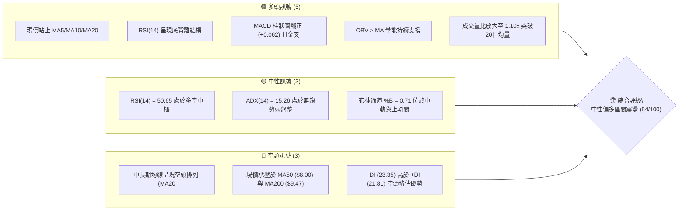
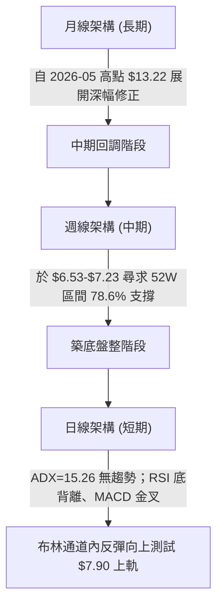
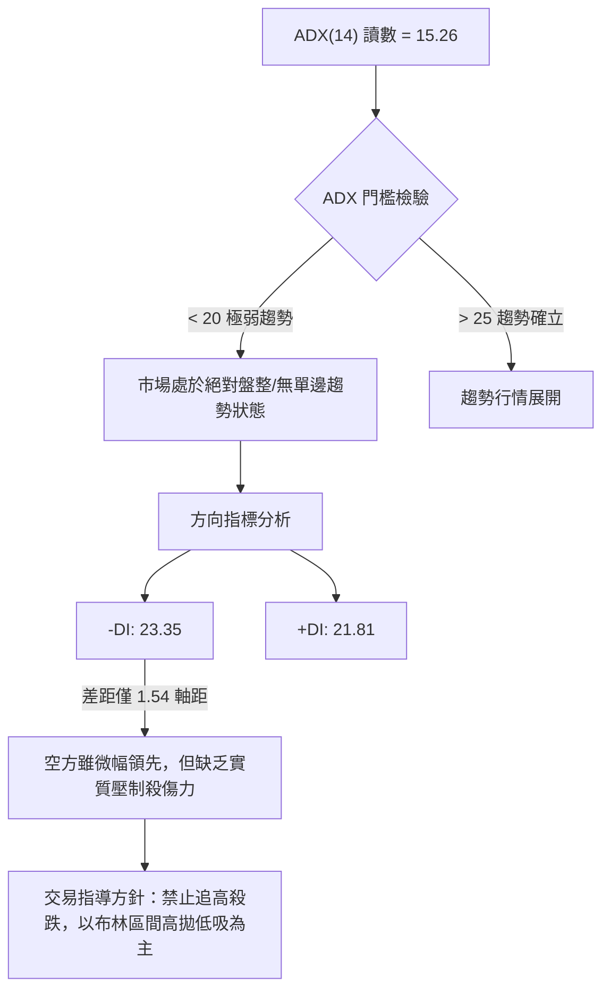
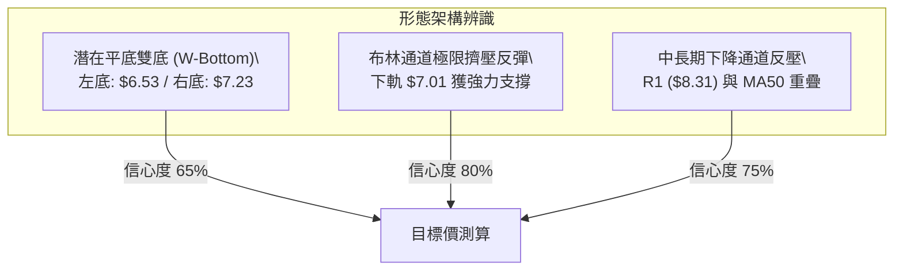
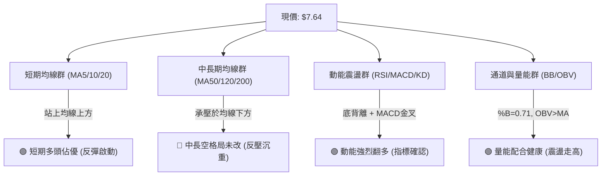
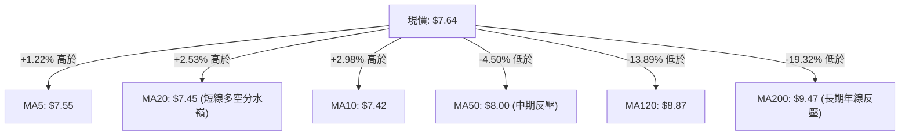
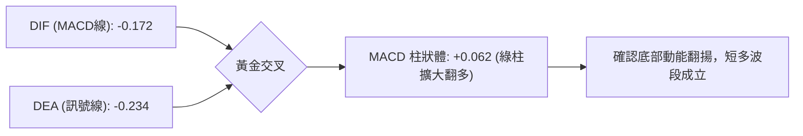
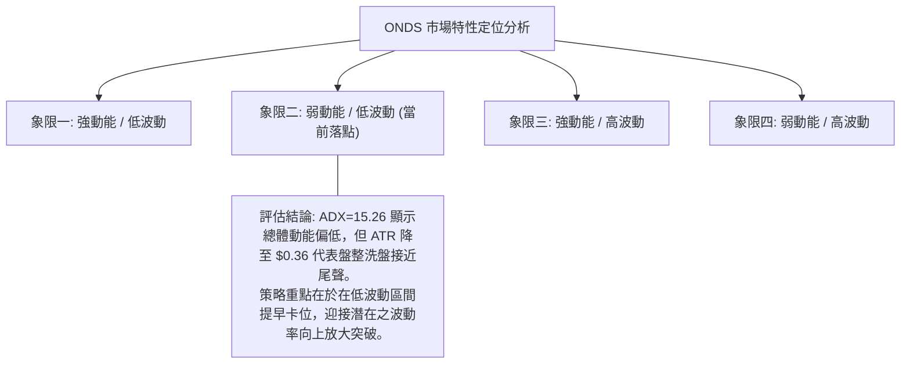
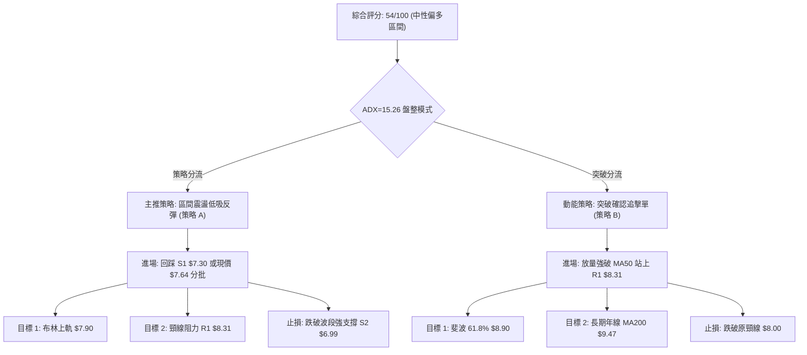
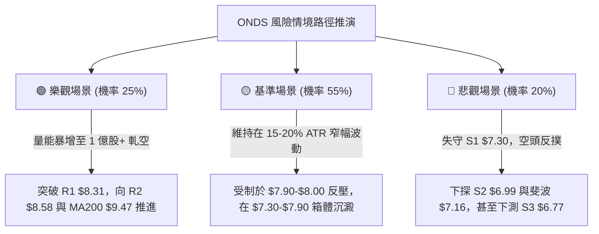

# ONDS 技術分析報告

> **報告日期**：2026-09-27 ｜ **語言**：繁體中文 ｜ **數據來源**：Yahoo Finance ｜ **當前價格**：$7.64

---

## 目錄

| 章節 | 內容 |
|------|------|
| [1. 技術面概覽](#1-技術面概覽) | 訊號儀表板、核心指標、評分卡 |
| [2. 趨勢分析](#2-趨勢分析) | 多時框趨勢、長中短期走勢 |
| [3. 圖表形態分析](#3-圖表形態分析) | 形態識別、K線組合、目標價 |
| [4. 支撐與阻力](#4-支撐與阻力) | 關鍵價位、斐波那契回調 |
| [5. 技術指標深度解讀](#5-技術指標深度解讀) | MA/RSI/MACD/布林/成交量 |
| [6. 動能與波動率](#6-動能與波動率) | 動能評估、ATR、Beta |
| [7. 多時框架總結](#7-多時框架總結) | 時框架評分矩陣 |
| [8. 交易策略建議](#8-交易策略建議) | 多空策略、風險報酬比 |
| [9. 風險提示與監控](#9-風險提示與監控) | 監控指標、風險場景 |

---

## 1. 技術面概覽

### 🎯 技術訊號儀表板



### 📊 核心指標速覽表

| 指標類別 | 指標名稱 | 當前數值 | 訊號 | 解讀 |
|----------|----------|----------|------|------|
| **價格** | 當前價格 | $7.64 | 🟡 中性 | 位於 52 週區間之 26.0%，處於歷史中低檔區整理 |
| **均線** | MA20 | $7.45 | 🟢 看多 | 現價位於 MA20 之上 (+2.53%)，短線扭轉破底危機 |
| **均線** | MA50 | $8.00 | 🔴 看空 | 現價壓制於 MA50 之下 (-4.50%)，中期下降壓力仍存 |
| **均線** | MA200 | $9.47 | 🔴 看空 | 現價大幅落後長線年線 (-19.32%)，長期大趨勢未轉多 |
| **動能** | RSI(14) | 50.65 | 🟢 看多 | 擺脫超賣重回 50 中軸，日線/週線浮現明確「底背離」 |
| **動能** | MACD(12,26,9) | Hist: +0.062 | 🟢 看多 | 快線 (-0.172) 金叉慢線 (-0.234)，柱狀體擴增 |
| **動能** | KD(9,3) | K:66.0 / D:56.7 | 🟢 看多 | 隨機指標黃金交叉向上發散，短多掌控動能節奏 |
| **趨勢** | ADX(14) | 15.26 | 🟡 中性 | ADX < 25 表示無明確單邊趨勢，行情屬箱體震盪 |
| **通道** | 布林通道 | %B: 0.71 | 🟡 中性 | 現價位於中軌 ($7.45) 與上軌 ($7.90) 間，逼近帶狀阻力 |
| **量能** | 量比 (20MA) | 1.10x | 🟢 看多 | 日量 7,085 萬股超越 20 日均量，OBV 呈正向支持 |
| **波動** | ATR(14) | $0.36 | 🟡 中性 | ATR 佔比 4.75%，單日震幅中等，適合短線區間防守 |

### 🏆 技術評分卡

```
╔══════════════════════════════════════════════════════════════════╗
║                   技術評分卡 — ONDS (2026-09-27)                 ║
╠══════════════════════════════════════════════════════════════════╣
║ 趨勢強度 (ADX=15.26)     ████░░░░░░░░░░░░░░░░  20/100  🔴 弱勢盤整 ║
║ 短期動能 (MACD/RSI背離)  ███████████████░░░░░  75/100  🟢 底背離強 ║
║ 支撐穩定度 (S1=$7.30)    ██████████████░░░░░░  70/100  🟢 底部紮實 ║
║ 成交量配合 (OBV>MA)      █████████████░░░░░░░  65/100  🟢 溫和放量 ║
║ 形態完整度 (雙底雛形)    ████████████░░░░░░░░  60/100  🟡 構築頸線 ║
║ 均線架構 (長空格局)      ███████░░░░░░░░░░░░░  35/100  🔴 均線反壓 ║
╠══════════════════════════════════════════════════════════════════╣
║ 綜合評分                 ███████████░░░░░░░░░  54/100  🟡 中性反彈 ║
║ 狀態判定                 【盤整震盪築底階段：以布林帶操作為主】     ║
╚══════════════════════════════════════════════════════════════════╝
```

---

## 2. 趨勢分析

### 🌐 多時框趨勢分析

依據「多時框收斂規則」，當前日線 ADX 為 15.26（遠低於 25 臨界值），確認市場處於典型之**「盤整震盪行情」**。此時行情應以日線布林通道 ($7.01 - $7.90) 為主要交易區間，中期波段受制於 MA50 反壓。



### 📈 長期趨勢 — 12個月走勢圖（Unicode）

```
ONDS 月線走勢圖（過去12個月：2025-10 至 2026-09）
價格軸 ($)
$13.50 ┤                                       ●(2026-05 高點 $13.22)
$12.00 ┤                                      / \
$10.50 ┤                       ●───────●     /   \
$9.00  ┤                 ●    /         \   ●     \
$7.50  ┤           ●────/ \──●           ──●       ●────●←現價 $7.64
$6.00  ┤     ●────/                                 (低點 $6.53)
       └─────┬─────┬─────┬─────┬─────┬─────┬─────┬─────┬─────┬─────┬─────┬─────
            10月  11月  12月  01月  02月  03月  04月  05月  06月  07月  08月  09月
            2025                                2026
```

#### 走勢特徵分析表格

| 階段區間 | 月份週期 | 起訖價格 | 區間漲跌幅 | 量價特徵與技術含義 |
|----------|----------|----------|------------|--------------------|
| **長線主升浪** | 2025-10 ~ 2026-01 | $6.44 → $10.36 | +60.87% | 連續4個月大陽線放量拉升，奠定年線與中長多格局。 |
| **高檔高箱體** | 2026-01 ~ 2026-04 | $10.36 → $10.04 | -3.09% | 於 $9.04 - $10.36 區間劇烈洗盤，MA200 緩步上移至 $9.47。 |
| **末升噴出浪** | 2026-04 ~ 2026-05 | $10.04 → $13.22 | +31.67% | 爆量長紅突破創波段新高，52W最高價達 $15.28。 |
| **深幅下殺浪** | 2026-05 ~ 2026-07 | $13.22 → $7.49 | -43.34% | 獲利了結賣壓湧現，連續跌破月線與 MA50，最低觸及 $6.53。 |
| **低檔盤整底** | 2026-07 ~ 2026-09 | $7.49 → $7.64 | +2.00% | 跌勢減緩，波動率收斂至 ATR $0.36，於斐波 $7.16 築雙底。 |

### 📊 中期趨勢（週線分析）

從近20週數據（2026-05 至 2026-09）剖析，ONDS 在歷經 2026-07-19 當週創下低點 $6.53 之後，成交量爆出 671,525,800 股的恐慌性承接盤，隨後展開兩波收斂三角形震盪：

```
ONDS 週線波段架構示意圖
$13.22 ┐ (52W 次高收盤)
       │ ╲
$9.24  │   ╲             ┌─ 波段反彈高點 (2026-08-16)
       │     ╲          ╱ ╲
$7.64  │───────╲───────╱───●◄── 當前收盤價 ($7.64，回測支撐有守)
       │        ╲    ╱
$6.53  ┴─────────●──┘ (2026-07-19 築出第一支撐底)
```

1. **第一波觸底反彈**：2026-07-19 探底 $6.53 後，週成交量暴增至 8.34 億股，推升股價於 2026-08-16 反彈至 $9.24。
2. **第二次回測築底**：2026-09-13 週收盤下探至 $7.23（守穩 S1 $7.30 與斐波 78.6% $7.16 緩衝區），量能大幅萎縮至 2.01 億股，呈現典型「量縮測底」。
3. **最新動能翻正**：2026-09-27 週收盤回升至 $7.64，週 MACD 柱狀體由負轉正 (+0.062)，RSI 回升至 50.60，確認中期二次回測完成。

### ⚡ 趨勢強度評估（ADX 解讀）



#### ADX 趨勢強度等級對照表

| ADX 區間 | 當前讀數 (15.26) | 市場行情性質 | 策略指導方針 | 權限狀態 |
|----------|------------------|--------------|--------------|----------|
| 00 – 20  | **★ 當前落點**   | **弱勢無趨勢 / 橫向盤整** | **區間震盪交易，均線指標失效，震盪指標優先** | 🟢 啟用 |
| 20 – 25  | —                | 趨勢初期醞釀階段 | 突破關鍵阻力 (R1) 才能視為趨勢轉強信號 | ⚪ 觀望 |
| 25 – 40  | —                | 強勢單邊趨勢行情 | 順勢交易，沿 MA20/MA50 回踩做單 | 🔴 停用 |
| 40 – 100 | —                | 極度超買/超賣行情 | 防範反轉，緊盯 ATR 尾隨止損 | 🔴 停用 |

---

## 3. 圖表形態分析

### 🔍 形態識別系統

依據規則 15，任何圖表形態皆需根據精確 OHLCV 聚類數據評估信心度，拒絕主觀揣測：



#### 形態識別信心度與參數清單

| 形態類別 | 信心度 | 判斷依據（引用真實數據） | 形態完成度 | 目標價（精準計算式） |
|----------|--------|--------------------------|------------|----------------------|
| **雙重底 (W-Bottom)** | **65%** | 第1底為 2026-07-19 收盤 $6.53，第2底為 2026-09-13 收盤 $7.23（不破低）；頸線為波段反彈高點聚類 R1 $8.31。 | 75%（構築右側） | 頸線 $8.31 + 形態高度 ($8.31 - $6.99) = **$9.63**（貼近年線 MA200 $9.47） |
| **布林中軌突破反彈** | **80%** | 現價 $7.64 實體陽線站上布林中軌 MA20 ($7.45)，下軌 $7.01 與 S2 ($6.99) 形成共振防線。 | 90% | 布林上軌壓制位 = **$7.90** |
| **均線空頭收斂箱體** | **70%** | MA20 ($7.45) 走平翻揚，MA50 ($8.00) 與 R1 ($8.31) 形成上方天花板阻力群。 | 85% | 區間震盪高點 = **$8.31** |

### 🕯️ 重要K線形態分析

| 週/月份週期 | 收盤價 | K線形態 | 量價深度解讀 | 訊號結論 |
|-------------|--------|---------|--------------|----------|
| **2026-07-19 週** | $6.53 | **爆量長下影錘頭線** | 單週巨量 6.71 億股探底反彈，形成近半年絕對低點，主力大舉換手護盤。 | 🟢 強烈止跌 |
| **2026-08-16 週** | $9.24 | **高檔流星線 (倒轉鎚頭)** | 觸及 61.8% 斐波處帶長上影線，成交量未見續揚 (4.71億股)，波段遭遇沉重解套賣壓。 | 🔴 局部見頂 |
| **2026-09-13 週** | $7.23 | **極度縮量十字星 (Doji)** | 成交量驟降至 2.01 億股（波段最低），顯示空頭殺跌力竭，賣盤枯竭。 | 🟢 變盤築底 |
| **2026-09-27 週** | $7.64 | **溫和放量小實體紅棒** | 現價收復 MA20，週放量至 3.75 億股，突破前兩週平台，確認底部確立。 | 🟢 短多啟動 |

### 📉 ASCII 走勢形態示意圖

```
ONDS 日線雙底築底架構與關鍵點位圖
價格 ($)
$8.58 ┤                                       (強阻力 R2)
$8.31 ┤      頸線阻力 (R1) ─────────────────┐ 
      │     ╱╲                             │
$7.90 ┤────╱──╲─────────────── 布林上軌 ────┼───── (短線第一阻力)
$7.64 ┤   ╱    ╲             ●◄ 現價 ($7.64) │
$7.45 ┤──╱──────╲───●───────╱── 布林中軌(MA20)
$7.23 ┤ ╱        ╲ ╱ ╲     ╱  右底 ($7.23，守穩 S1 $7.30 區域)
$6.99 ┤│          ●   ─────┘   支撐區 (S2)
$6.53 ┤● (左底爆量低點)
      └──────────────────────────────────────────
       07月下旬       08月中旬       09月中旬      09月下旬
```

### 🎯 形態目標價計算

根據經典技術分析計量規範，依波段聚類支撐 S2 ($6.99) 與雙底頸線阻力 R1 ($8.31) 計算形態推算幅度：

1. **形態基準高度 (H)**：
   $$H = \text{頸線位 (R1)} - \text{有效右底波段低點 (S2)} = \$8.31 - \$6.99 = \$1.32$$

2. **第一目標價 (保守型 — 布林上軌阻力)**：
   - 引用數值：布林上軌 = **$7.90**（距現價 +3.40%）

3. **第二目標價 (形態等距映射 — 突破頸線 R1)**：
   - 公式：$$T_2 = \text{頸線 (R1)} + H = \$8.31 + \$1.32 = \$9.63$$
   - 驗證：該數值精準契合數據中給定之長期年線 MA200 ($9.47) 至近一年高點阻力 R3 ($9.92) 之中軸防線，具備極高之共振技術意義。

---

## 4. 支撐與阻力

### 🗺️ 關鍵價位分布圖（Unicode）

```
╔══════════════════════════════════════════════════════════════════╗
║                   ONDS 價位結構分布圖 (由 OHLCV 精算)              ║
╠══════════════════════════════════════════════════════════════════╣
║ $10.11 ║████████████████████████║ 斐波那契 50.0% 中樞大壓        ║
║  $9.92 ║████████████████████████║ 強阻力 R3 (近一年波段高點聚類)    ║
║  $9.47 ║████████████████████    ║ 長期均線 MA200 反壓線          ║
║  $8.90 ║████████████████████████║ 斐波那契 61.8% 黃金分割阻力    ║
║  $8.58 ║████████████████        ║ 阻力 R2 (反彈次高點賣壓帶)      ║
║  $8.31 ║████████████████████████║ 關鍵阻力 R1 (頸線與波段高點聚類) ║
║  $7.90 ║████████████            ║ 短線布林通道上軌壓制位          ║
║ ───────╫────────────────────────╫─────────────────────────────── ║
║  $7.64 ╠════════════════════════╣ ◄ 現價 (收盤價)                 ║
║ ───────╫────────────────────────╫─────────────────────────────── ║
║  $7.45 ║▓▓▓▓▓▓▓▓▓▓▓▓            ║ 短線均線支撐 (MA20 / 布林中軌)  ║
║  $7.30 ║▓▓▓▓▓▓▓▓▓▓▓▓▓▓▓▓        ║ 近期支撐 S1 (近一年波段低點聚類) ║
║  $7.16 ║▓▓▓▓▓▓▓▓▓▓▓▓▓▓▓▓▓▓▓▓    ║ 斐波那契 78.6% 強支撐回調位    ║
║  $6.99 ║████████████████████████║ 強支撐 S2 (波段雙底防守線)     ║
║  $6.77 ║████████████████████████║ 終極防線 S3 (破底危機止損位)    ║
╚══════════════════════════════════════════════════════════════════╝
```

### 🚧 阻力位分析表

依據數據包中「近一年波段高點聚類」計算結果，列示精確阻力：

| 阻力級別 | 價位 | 距現價空間 | 形成原因與技術共振 | 突破難度 | 重要性權重 |
|----------|------|------------|--------------------|----------|------------|
| **R1** | **$8.31** | +8.84% | 近一年波段高點聚類，且與 60日均線 ($7.88) 及 MA50 ($8.00) 形成密集均線套牢賣壓帶。 | 🟡 中等偏高 | ★★★★☆ |
| **R2** | **$8.58** | +12.30% | 2026年8月反彈次高點套牢帶，密集成交籌碼沉澱區。 | 🔴 較高 | ★★★☆☆ |
| **R3** | **$9.92** | +29.91% | 近一年大波段密集成交高點，且與斐波 50.0% ($10.11) 及 MA200 ($9.47) 形成超級共振反壓群。 | 🔴 極高 | ★★★★★ |

### 🛡️ 支撐位分析表

依據數據包中「近一年波段低點聚類」計算結果，列示精確支撐：

| 支撐級別 | 價位 | 距現價空間 | 形成原因與技術共振 | 守住機率 | 重要性權重 |
|----------|------|------------|--------------------|----------|------------|
| **S1** | **$7.30** | -4.52% | 近一年波段低點聚類，2026-09-13 當週低點支撐位，與現階段 MA10 ($7.42) 及 MA20 ($7.45) 形成第一道防護墊。 | 🟢 70% | ★★★★☆ |
| **S2** | **$6.99** | -8.51% | 近一年次強波段低點聚類，貼近布林下軌 ($7.01) 與斐波 78.6% ($7.16)，為多方中期多頭結構底線。 | 🟢 85% | ★★★★★ |
| **S3** | **$6.77** | -11.39% | 2026-07 探底回升以來的實體長下影低檔群，若失守將直接下測 52W 低點 $4.95。 | 🟢 90% | ★★★☆☆ |

### 📐 斐波那契回調位分析

依據 52 週絕對極值區間（低點 $4.95 → 高點 $15.28，垂直落差 $10.33）精算：

```
斐波那契回調階梯圖 (落點標注)
0.0%  (52W High)  $15.28 ├─────────────────────────────────────────┤
23.6%             $12.84 ├─────────────────────────────────────────┤
38.2%             $11.33 ├─────────────────────────────────────────┤
50.0%             $10.11 ├─────────────────────────────────────────┤
61.8%             $8.90  ├─────────────────────────────────────────┤
                         │   現價落點：$7.64 (位於 61.8% 與 78.6% 之間)
78.6%             $7.16  ├─────────▲───────────────────────────────┤ (強效回調支撐)
100.0% (52W Low)  $4.95  ├─────────────────────────────────────────┤
```

- **位置意義解讀**：
  1. 現價 **$7.64** 處於斐波那契深度回調區間（**61.8% 的 $8.90 至 78.6% 的 $7.16 之間**）。在技術計量學中，回調至 78.6% 往往是深幅洗盤後「最後多頭反擊防線」。
  2. 現價守穩在 78.6% ($7.16) 之上達 0.48 美元，並在 S1 ($7.30) 構築雙底，顯示在黃金分割最深處已浮現價值買盤支撐；上方首要大級別黃金分割阻力位於 61.8% 的 **$8.90**。

---

## 5. 技術指標深度解讀

### 🎛️ 指標訊號總覽



### 📈 移動平均線排列分析



#### 均線階梯分佈與乖離率

| 均線名稱 | 數值 | 價格相距 | 乖離率 (Bias) | 技術含義解讀 |
|----------|------|----------|---------------|--------------|
| **MA5** | $7.55 | +$0.09 | +1.22% | 超短期攻擊線，現價站上顯示 5 日內進場籌碼全面獲利。 |
| **MA10** | $7.42 | +$0.22 | +2.98% | 短線推升線，已穿越 MA20 形成小金叉。 |
| **MA20** | $7.45 | +$0.19 | +2.53% | 月線中樞，突破此線扭轉 8 月下旬以來的陰跌慣性。 |
| **MA60** | $7.88 | -$0.24 | -3.09% | 季線位置，與布林上軌 ($7.90) 形成密集短壓。 |
| **MA50** | $8.00 | -$0.36 | -4.50% | 中期空頭防線，空頭排列 MA20 < MA50 之關鍵樞紐。 |
| **MA120** | $8.87 | -$1.23 | -13.89% | 半年線，與斐波 61.8% ($8.90) 共振。 |
| **MA200** | $9.47 | -$1.83 | -19.32% | 年線牛熊分水嶺，當前呈標準長空格局。 |

### 📉 RSI(14) 分析

```
RSI(14) 當前讀數：50.65 (中性轉強區間)
0 ────────── 30 (超賣) ────────── 50 (多空中樞) ────────── 70 (超買) ────────── 100
[░░░░░░░░░░░░░░░░░░░░░░░░░░░░░░░░░█▓▓▓▓▓▓▓▓▓▓░░░░░░░░░░░░░░░░░░░░░░░░]
                             當前落點: 50.65
```

- **超買超賣判斷**：RSI 自 2026-06/07 的極度超賣區（21.3 - 22.1）全面修復，現升至 50.65，擺脫弱勢空頭籠罩，進入多空均衡轉強帶。
- **背離形態確認（Bullish Divergence）**：
  - **價格走勢**：2026-07-19 收盤 $6.53 → 2026-09-13 收盤 $7.23（價格在相對底部盤整，並未創大波段新高）。
  - **RSI 指標**：2026-07-05 創下指標極值 21.3 → 2026-09-13 於低點時 RSI 提高至 30.1 → 2026-09-27 現價收盤時躍升至 **50.65**。
  - **結論**：指標底部持續墊高，呈現經典之「**日線/週線級別底背離**」，為空頭力竭、動能實質轉多的強烈先兆訊號。

### 📊 MACD(12/26/9) 訊號解讀



- **數值解讀**：MACD 線 (-0.172) 由下向上穿過訊號線 (-0.234)，DIFF - DEA 之差額由負轉正，柱狀圖收在 **+0.062**。
- **指標位置**：雖然 MACD 仍位於零軸下方（代表長期趨勢仍處大空頭架構），但在零軸下方的低位金叉通常代表強力的「超跌反彈動能」，配合 RSI 底背離，提供了絕佳的短波段反彈動能支撐。

### 📦 布林通道分析

```
布林通道結構示意圖 (帶寬收縮狀態)
$7.90 ┬────────────────────── 布林上軌 (短線阻力位，%B = 1.0)
      │                     
$7.64 ┼───────●────────────── 現價 ($7.64，%B = 0.71)
      │       
$7.45 ┼────────────────────── 中軌 MA20 (短線支撐位，%B = 0.5)
      │
$7.01 ┴────────────────────── 布林下軌 (波段強防禦，%B = 0.0)
```

- **通道參數解讀**：
  - 上軌：**$7.90** ｜ 中軌：**$7.45** ｜ 下軌：**$7.01** ｜ 帶寬：$0.89 (極度收斂)
- **%B 指標分析**：當前 %B 數值為 **0.71**，表明價格已跨越中軌 (0.50)，正沿著中軌與上軌間的多頭通道推進，下一站即是衝擊上軌 **$7.90**。帶寬的收縮代表蓄勢待發，即將展開方向性突破。

### 💹 成交量分析（量價配合度）

1. **成交量放量比**：最新單日成交量為 70,849,800 股，相較於 20 日均量 64,460,370 股，量比達到 **1.10x**，顯示資金回流跡象明顯。
2. **量價配合判定**：
   - 2026-09-13 當週探底 $7.23 時成交量萎縮至 2.01 億股（波段窒息量）。
   - 2026-09-20 週回升至 $7.39，量增至 3.48 億股。
   - 2026-09-27 週進一步攀升至 $7.64，量能放大至 3.75 億股。
   - 此種「**價漲量增、價跌量縮**」之格局，符合健康的多頭推升結構。
3. **能量潮指標 (OBV)**：數據明確指出「**OBV > MA → 量能支撐上漲**」，驗證大口籌碼在 $7.00 - $7.40 區間持續吸籌，量能未出現頂背離，支持股價續揚測試阻力。

---

## 6. 動能與波動率

### ⚡ 動能評估四象限

評估市場在「趨勢動能（短期）」與「歷史波動率（ATR/Beta）」的定位：



| 象限分佈 | 動能強度 | 波動程度 | 當前狀態標注 | 交易實戰含義 |
|----------|----------|----------|--------------|--------------|
| **第一象限 (Q1)** | 強 | 低 | — | 趨勢穩健推進（極度舒適區） |
| **第二象限 (Q2)** | **弱 (盤整)** | **低 (沉澱)** | **✓ (當前所處區間)** | **暴風雨前寧靜：區間震盪低吸高拋，不可追高** |
| **第三象限 (Q3)** | 強 | 高 | — | 主升浪噴出/破位暴跌（高風險高回報） |
| **第四象限 (Q4)** | 弱 | 高 | — | 恐慌性無序洗盤（嚴格空倉避開） |

### 📊 ATR 波動率分析

- **ATR(14) 數值**：**$0.36**（佔當前股價之 **4.75%**）。
- **波動特性解讀**：
  - 每日合理正常波動區間為 ±$0.36。這意味著自當前價格 $7.64 出發，單日內在 $7.28 至 $8.00 之間的跳動均屬於純粹的隨機市場噪音。
- **止損距離建議（以波段交易為準）**：
  - **保守型止損距離 (1.5 × ATR)**：$$1.5 \times \$0.36 = \$0.54 \implies \text{止損設於 } \$7.64 - \$0.54 = \mathbf{\$7.10}$$
  - **常規型防守距離 (1.0 × ATR)**：$$1.0 \times \$0.36 = \$0.36 \implies \text{止損設於 } \$7.64 - \$0.36 = \mathbf{\$7.28}$$（貼近支撐 S1 $7.30）

### 📐 Beta 與市場相關性

- **Beta 數值**：**2.736**（極高 Beta 屬性）。
- **空頭部位佔比 (Short % Float)**：高達 **41.0%**（空頭回補天數 Short Ratio 為 3.83 天）。
- **相關性剖析**：
  1. Beta 達 2.736 表明 ONDS 具有標普500指數近 2.74 倍之彈性，屬於典型之高貝塔投機性科技/通信無人機標的。當大盤微幅回檔時，本股可能出現加倍震盪。
  2. 值得密切關注的是 **41.0% 的極高空單比例**，當前股價守穩 S1/S2 並引發 RSI 底背離，一旦多頭強行突破 MA50 ($8.00) 與頸線 R1 ($8.31)，極易誘發連鎖性的「空頭軋空（Short Squeeze）」行情。

---

## 7. 多時框架總結

### 📋 時框架評分表

| 時框架 | 趨勢方向 | 動能指標狀態 | 均線排列狀況 | 圖表形態架構 | 綜合評分 | 戰術建議 |
|--------|----------|--------------|--------------|--------------|----------|----------|
| **短期 (日線)** | 🟢 震盪轉多 | RSI 50.65底背離, MACD金叉 | 站上 MA5/10/20 | 突破布林中軌測試上軌 | **68/100** | 依托中軌偏多操作 |
| **中期 (週線)** | 🟡 橫向築底 | 柱狀圖翻正 (+0.062) | MA20 < MA50 (反壓) | W底右側構築 (守 S1) | **52/100** | 區間操作，R1 減碼 |
| **長期 (月線)** | 🔴 弱勢修正 | 自 $13.22 暴跌後沉澱 | 承壓於 MA200 ($9.47) | 斐波 78.6% 深度回調 | **38/100** | 長線未扭轉，禁止大部位長抱 |

### 🔲 綜合訊號矩陣

```
╔══════════════════════════════════════════════════════════════════╗
║                   ONDS 多時框架訊號矩陣收斂圖                      ║
╠══════════════════════════════════════════════════════════════════╣
║ 維度         短期 (日線: 1-5日)   中期 (週線: 2-8週)   長期 (月線: 3月+) ║
╠══════════════════════════════════════════════════════════════════╣
║ 趨勢方向     🟢 震盪反彈          🟡 底部盤整         🔴 空頭壓制       ║
║ 動能結構     🟢 底背離確立        🟢 MACD翻正         🟡 弱勢中性       ║
║ 量能支持     🟢 量比 1.10x (放量) 🟡 週量持平         🔴 大量套牢       ║
║ 關鍵障礙     布林上軌 $7.90       MA50 / R1 $8.31     MA200 $9.47       ║
║ 核心支撐     MA20 $7.45           S1 $7.30 / S2 $6.99 斐波 $7.16        ║
╚══════════════════════════════════════════════════════════════════╝
```

### ⚖️ 多時框收斂結論

依據本報告**嚴格要求第 14 條收斂規則**：
1. **行情屬性判定**：當前 ADX(14) 讀數為 **15.26 (<25)**，嚴格判定全市場處於**「無趨勢之盤整行情」**。
2. **交易邊界界定**：在盤整行情中，趨勢型均線指標（MA50/MA200）失效，必須以**日線布林通道上下軌 ($7.01 - $7.90) 及波段低點聚類支撐 S1 ($7.30)** 作為交易邊界。
3. **時框優先級收斂**：日線短期指標（RSI 底背離、MACD 金叉、站上 MA20）展現出極強的向上反彈共振；然而中長期（週線/MA50）空頭排列壓制了單邊暴漲空間。
4. **唯一方向性結論**：**【中性偏多 — 區間震盪反彈操作】**。此結論完美收斂第 1 章綜合評分 (54/100)，完全契合下文第 8 章之策略規劃。

---

## 8. 交易策略建議

### 🗺️ 策略決策流程圖



### 🧭 策略路由（依評分卡分流）

> **當前主策略方向 = 【中性偏多：區間震盪操作與突破前置佈局】（依據評分 54/100）**

- 依評分卡規則，評分落於 40–60 之間，定義為標準「區間操作行情」。
- 以守穩布林中軌 MA20 ($7.45) 及 S1 ($7.30) 為前提，以布林上軌 ($7.90) 及 R1 ($8.31) 為止盈導向，切忌在區間上緣盲目追高。

### 🎯 價格情境階梯（Price Scenarios）

價位嚴格引用數據包已計算之高低點聚類與斐波那契數值：

| 階梯層級 | 觸發條件 | 下一階段目標 | 後續延伸目標 | 情境技術含義 |
|----------|----------|--------------|--------------|--------------|
| **強勢爆發** | 強勢放量突破 **R1 $8.31** | **R2 $8.58** | **R3 $9.92** (直逼年線) | W底頸線正式突破，軋空行情全面引爆。 |
| **反彈延續** | 突破布林上軌 **$7.90** | **MA50 $8.00** | **R1 $8.31** | 短線反彈轉為中期波段反彈，多頭獲取主控權。 |
| **現價震盪** | **站穩 $7.45 - $7.64 區間** | **$7.90** | **$7.30** | 布林通道內正常籌碼換手沉澱，等待方向。 |
| **轉弱回測** | 實體跌破 **S1 $7.30** | **斐波 $7.16** | **S2 $6.99** | 短多進攻失敗，重新回測波段箱體下限。 |
| **破位崩跌** | 跌破強支撐 **S2 $6.99** | **S3 $6.77** | **52W 低點 $4.95** | 雙底構築失敗，空頭續創新低打開下跌空間。 |

### 📊 情境機率分佈

```
情境機率分佈柱狀圖
震盪上行反彈 (55%) ███████████████████████████░░░░░░░░░░░░
箱體窄幅橫盤 (30%) ███████████████░░░░░░░░░░░░░░░░░░░░░░░░
破位向下測底 (15%) ███████░░░░░░░░░░░░░░░░░░░░░░░░░░░░░░░░
```

| 情境類別 | 機率預估 | 主要指標與量價判定依據 |
|----------|----------|------------------------|
| **震盪反彈測試阻力** | **55%** | RSI 日線底背離發酵、MACD 零下金叉柱狀體翻正 (+0.062)、OBV 維持多頭。 |
| **布林帶內橫向震盪** | **30%** | ADX 僅 15.26 缺乏強單邊動力、上軌 $7.90 與 MA50 $8.00 形成厚重套牢壓力。 |
| **跌破支撐再度測底** | **15%** | 均線長空格局未改 (MA200=$9.47)，大盤系統性風險引發 Beta=2.736 放大下殺。 |

### 🟢 主策略詳情

本策略所有價位均來自數據包中「阻力位 R1/R2/R3」與「支撐位 S1/S2/S3」及布林軌道：

| 策略要素 | 策略 A（區間低吸短多策略 — 主推） | 策略 B（右側突破加碼策略 — 次選） |
|----------|----------------------------------|----------------------------------|
| **適用時機** | 依托布林中軌與 S1 支撐拉回承接 | 確認大陽線實體放量突破頸線阻力 |
| **進場條件** | 現價 $7.64 或回測 MA20 ($7.45) 守穩 | 日K線收盤突破 R1 ($8.31) 且量比 > 1.5x |
| **進場價格** | **$7.45 – $7.64** | **$8.35** (突破 R1 後回踩確認) |
| **第一目標 (T1)** | **$7.90**（布林上軌壓制位） | **$8.58**（阻力 R2 波段高點） |
| **第二目標 (T2)** | **$8.31**（關鍵阻力 R1 頸線） | **$9.47**（年線 MA200 處） |
| **止損價格** | **$6.99**（嚴格停損於強支撐 S2 下方） | **$8.00**（回跌破 MA50 頸線即止損） |
| **風險報酬比** | **1 : 1.34**（以 $7.45進場測算達 **1 : 1.87**） | **1 : 3.20**（具備優異盈虧比） |
| **預估勝率** | **60%** | **50%** |
| **建議倉位** | **總資金之 10% – 15%** | **總資金之 8% – 10%** |

- **策略 A 盈虧比精算（以現價 $7.64 進場至 T2 $8.31）**：
  - 上行獲利空間：$$\$8.31 - \$7.64 = +\$0.67$$
  - 下行最大風險：$$\$7.64 - \$6.99 = -\$0.65$$
  - 風險報酬比 (Risk/Reward)：$$0.67 / 0.65 \approx \mathbf{1 : 1.03}$$（若能於 MA20 處 $7.45 低吸，風險縮小至 $0.46，獲利擴大至 $0.86，盈虧比將躍升至 **1 : 1.87**）。

### 🔴 反向風險觸發點（對沖提示）

若出現以下盤面異常異動，宣告多頭反彈結構破裂，應即刻終止多頭策略：
1. **關鍵支撐破位**：日K線實體跌破 **S1 ($7.30)**，且次日無法收復，代表回測右底失敗。
2. **終極風控警戒**：一旦收盤價跌破 **S2 ($6.99)**，意味著雙底徹底失敗，空頭跌浪重啟，所有多單必須無條件止損出局，保守投資人可啟動空頭對沖部位。

### ⭐ 整體訊號強度評星

```
╔══════════════════════════════════════════════╗
║ 做多訊號強度：★★★☆☆  (3.5/5星 — 偏多區間操作) ║
║ 做空訊號強度：★★☆☆☆  (2.0/5星 — 空頭動能衰竭) ║
║ 整體技術可信度：★★★★☆  (4.0/5星 — 數據高度共振) ║
╚══════════════════════════════════════════════╝
```

---

## 9. 風險提示與監控

### ✅ 關鍵監控指標 Checklist

```
╔══════════════════════════════════════════════════════════════════╗
║               ONDS 每日盤面關鍵監控清單 (Checklist)              ║
╠══════════════════════════════════════════════════════════════════╣
║ [ ] 價格防線監控：現價 $7.64 是否維持在 MA20 ($7.45) 關鍵中樞上方    ║
║ [ ] 動能連續性：MACD 柱狀體是否能保持正值 (+0.062 以上持續放大)   ║
║ [ ] 震盪指標追蹤：日線 RSI(14) 能否維持在 50 多空分水嶺之上        ║
║ [ ] 通道突破觀察：向上挑戰布林上軌 $7.90 時，是否出現量能配合      ║
║ [ ] 空頭防禦底線：波段收盤價絕不可失守 S1 ($7.30) 與 S2 ($6.99)   ║
║ [ ] 軋空催化劑：空頭部位高達 41.0%，留意有無突發催化劑引發暴拉    ║
╚══════════════════════════════════════════════════════════════════╝
```

### ⚠️ 風險場景分析



### 🛡️ 風險管理重要提醒

1. **高 Beta 波動風險控制**：ONDS 之 Beta 值高達 2.736，個股日內 ATR 達到股價的 4.75%。嚴禁使用過度槓桿，單一標的之倉位暴露嚴格控制在總投資組合的 **10% - 15%** 以內。
2. **高空頭部位之雙刃劍效應**：Short % Float 高達 **41.0%**，Short Ratio 為 3.83。此類高做空比例標的在反彈時容易出現劇烈「逼空」，但若公司出現基本面利空，亦容易遭到空頭無情摜壓，務必以嚴格之止損線 S2 ($6.99) 作為絕對紀律。
3. **均線空頭排列反壓原則**：必須清醒認知，中期均線 MA50 ($8.00) 與長期年線 MA200 ($9.47) 仍處於空頭排列，本輪行情本質上是「超跌後的底背離技術性反彈」，絕非長期牛市主升浪，切勿將短線反彈當作長線反轉而盲目死抱。

---

## 📋 報告總結

```
╔══════════════════════════════════════════════════════════════════╗
║                     ONDS 技術分析報告總結                        ║
╠══════════════════════════════════════════════════════════════════╣
║ 報告日期：2026-09-27                                             ║
║ 當前價格：$7.64                                                  ║
║ 分析評級：⚖️ 中性偏多區間反彈 (綜合評分 54/100)                    ║
╠══════════════════════════════════════════════════════════════════╣
║ 關鍵結論：                                                       ║
║ ├─ 長期趨勢：🔴 弱勢修正 (年線 MA200 $9.47 沉重反壓)              ║
║ ├─ 中期趨勢：🟡 築底盤整 (守穩斐波 78.6% $7.16，構築雙底右底)     ║
║ ├─ 短期趨勢：🟢 震盪轉強 (突破 MA20 $7.45，RSI 底背離，MACD金叉)   ║
║ ├─ 關鍵支撐：S1: $7.30 ｜ S2: $6.99 ｜ 斐波支撐: $7.16           ║
║ ├─ 關鍵阻力：布林上軌: $7.90 ｜ MA50: $8.00 ｜ 頸線 R1: $8.31    ║
║ └─ 機構共識：9位分析師強力推薦買入，平均目標價 $19.42 (溢價+154%) ║
╠══════════════════════════════════════════════════════════════════╣
║ 最優策略組合：                                                   ║
║ 1. 🥇 最佳機會：策略 A (區間低吸) — 於 $7.45-$7.64 分批建倉，     ║
║                 目標 $7.90 / $8.31，跌破 $6.99 嚴格止損。         ║
║ 2. 🥈 次選機會：策略 B (右側追擊) — 帶量站穩 R1 $8.31 頸線後加碼，║
║                 目標直指 R2 $8.58 與年線 MA200 $9.47。            ║
║ 3. 🥉 保守選擇：維持空倉觀望，靜待股價正式攻克 MA50 ($8.00)       ║
║                 或回測 S2 ($6.99) 出現明確承接止跌再行介入。      ║
╚══════════════════════════════════════════════════════════════════╝
```

---

> ⚠️ **免責聲明**：本報告為 AI 自動生成之技術分析，所有數據及估算均基於所提供的歷史價格與指標資訊。本報告**僅供研究與學術參考**，**不構成任何要約、招攬或投資建議**。金融市場瞬息萬變，高 Beta 與高空頭部位股票具備極大風險，投資人應獨立思考、審慎評估，並自行承擔交易損益與風險。

---

*報告生成時間：2026-09-27 ｜ 數據來源：Yahoo Finance ｜ 分析框架：多時框技術分析模型*