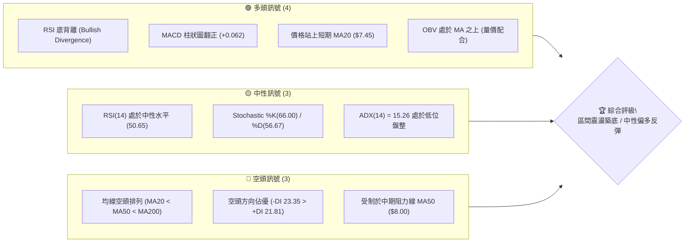
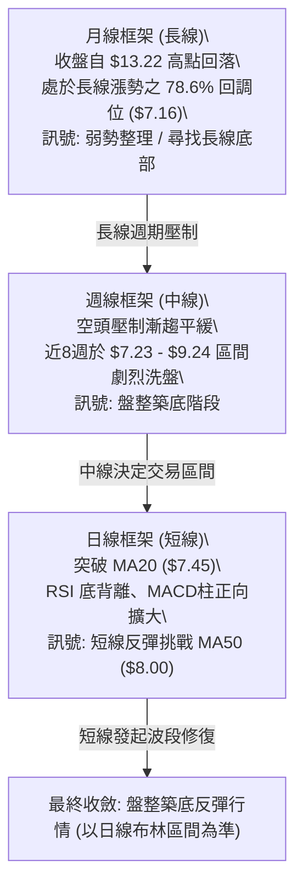
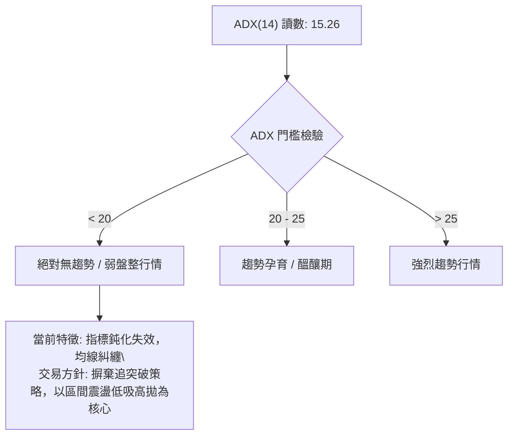
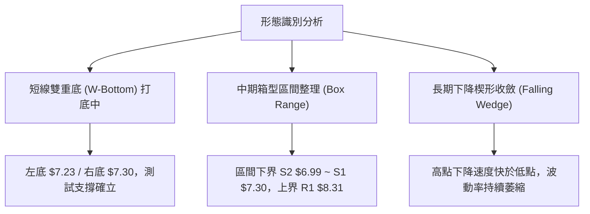
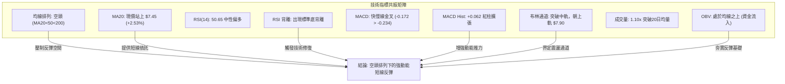
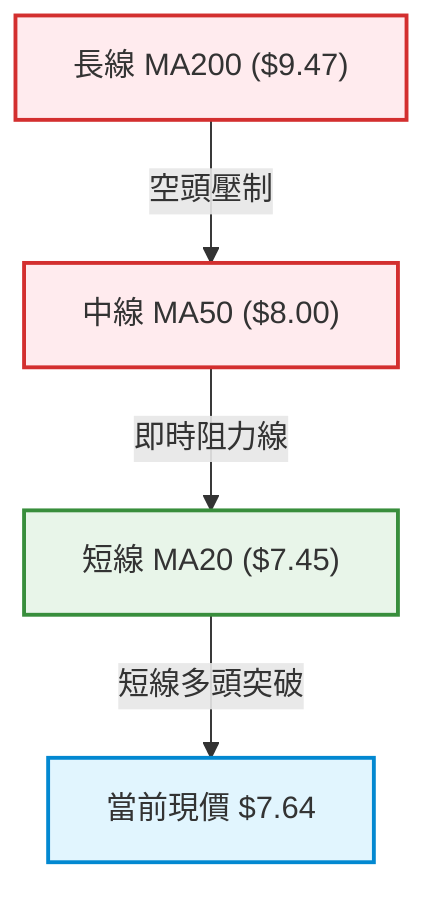
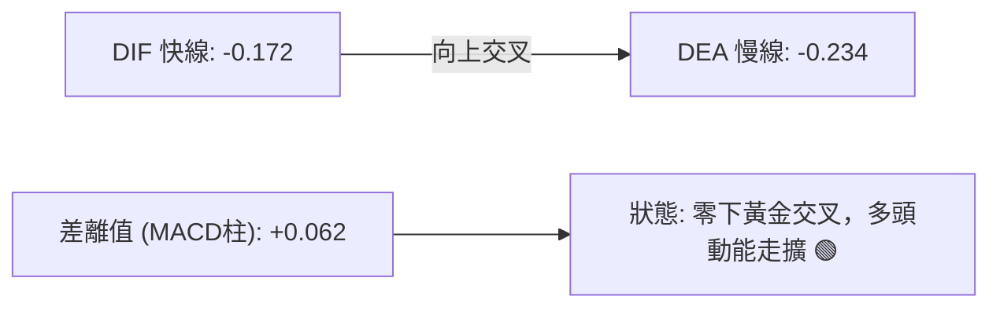
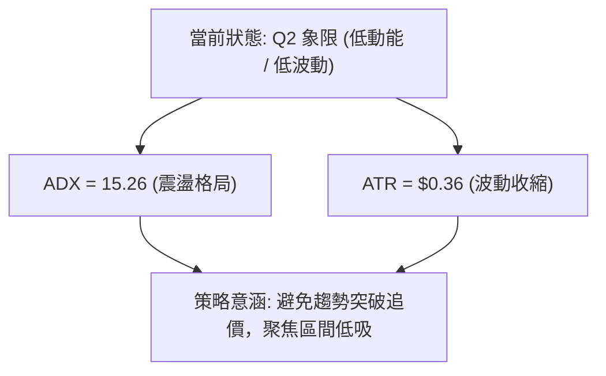
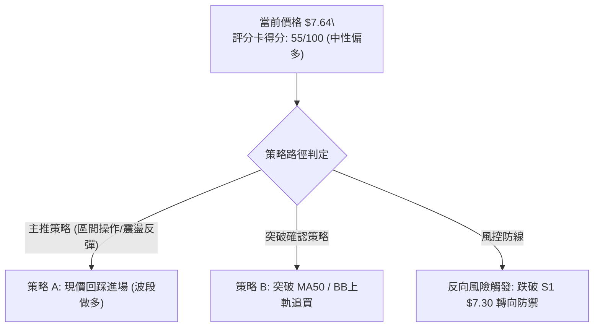
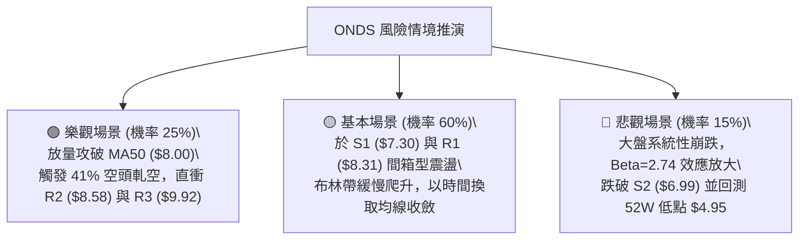

# ONDS 技術分析報告

> **報告日期**：2026-09-28 ｜ **語言**：繁體中文 ｜ **數據來源**：Yahoo Finance ｜ **當前價格**：$7.64

---

## 目錄

| 章節 | 內容 |
|------|------|
| [1. 技術面概覽](#1-技術面概覽) | 訊號儀表板、核心指標、評分卡 |
| [2. 趨勢分析](#2-趨勢分析) | 多時框趨勢、長中短期走勢、ADX強度 |
| [3. 圖表形態分析](#3-圖表形態分析) | 形態識別、K線組合、目標價推算 |
| [4. 支撐與阻力](#4-支撐與阻力) | 關鍵價位、斐波那契回調結構 |
| [5. 技術指標深度解讀](#5-技術指標深度解讀) | MA/RSI/MACD/布林/成交量全面共振解讀 |
| [6. 動能與波動率](#6-動能與波動率) | 動能四象限、ATR 風控、Beta 敏感度 |
| [7. 多時框架總結](#7-多時框架總結) | 時框架評分矩陣與訊號收斂 |
| [8. 交易策略建議](#8-交易策略建議) | 策略路由、情境階梯、執行參數 |
| [9. 風險提示與監控](#9-風險提示與監控) | 關鍵監控清單、極端情境與風控守則 |

---

## 1. 技術面概覽

### 🎯 技術訊號儀表板



### 📊 核心指標速覽表

| 指標類別 | 指標名稱 | 當前數值 | 訊號 | 解讀 |
|----------|----------|----------|------|------|
| **價格** | 當前價格 | $7.64 | 🟡 | 位於52週區間26.0%低檔，短期自低位反彈 |
| **均線** | MA20 | $7.45 | 🟢 | 現價高於 MA20（+2.53%），短期築底成功轉為支撐 |
| **均線** | MA50 | $8.00 | 🔴 | 現價低於 MA50（-4.50%），中期下行通道壓力尚未克服 |
| **均線** | MA200 | $9.47 | 🔴 | 現價大幅低於長線生命線（-19.32%），長線偏弱 |
| **動能** | RSI(14) | 50.65 | 🟢 | 站回50中軸，並伴隨明確「底背離」多頭反轉訊號 |
| **動能** | MACD | -0.172 / 訊號 -0.234 | 🟢 | 快線於零軸下方形成黃金交叉，柱狀圖 +0.062 走擴 |
| **動能** | KD(9,3) | %K 66.00 / %D 56.67 | 🟢 | %K 向上穿越 %D，短線維持多頭擴張節奏 |
| **趨勢** | ADX(14) | 15.26 | 🟡 | ADX < 25 處於弱趨勢/區間震盪格局，空方動能減弱 |
| **通道** | 布林帶 %B | 0.71 | 🟢 | 突破中軌 $7.45 朝上軌 $7.90 靠攏，處於強勢通道 |
| **波動** | ATR(14) | $0.36 | 🟡 | 佔現價 4.75%，波動收斂，適合佈局區間邊界止損 |
| **量能** | 成交量比 | 1.10x (最新 70.85M) | 🟢 | 量能微幅超越 20 日均量，OBV 趨勢支撐價格回升 |

### 🏆 技術評分卡

```
╔══════════════════════════════════════════════════════════════════╗
║                   技術評分卡 — ONDS (2026-09-28)                 ║
╠══════════════════════════════════════════════════════════════════╣
║ 趨勢強度 (Trend)      ████████░░░░░░░░░░░░  40/100  🔴 弱趨勢/空頭基底║
║ 動能指標 (Momentum)    ██████████████░░░░░░  70/100  🟢 底背離/金叉共振║
║ 支撐穩定度 (Support)  ████████████░░░░░░░░  60/100  🟡 S1 $7.30 守穩 ║
║ 成交量配合 (Volume)   █████████████░░░░░░░  65/100  🟢 OBV 支撐多頭   ║
║ 形態完整度 (Pattern)  ████████████░░░░░░░░  60/100  🟡 潛在雙底打底中 ║
║ 均線排列 (MA System)  ███████░░░░░░░░░░░░░  35/100  🔴 MA20<50<200排列║
╠══════════════════════════════════════════════════════════════════╣
║ 綜合評分              ███████████░░░░░░░░░  55/100  🟡 中性偏多區間盤 ║
╚══════════════════════════════════════════════════════════════════╝
```

---

## 2. 趨勢分析

### 🌐 多時框趨勢分析



### 📈 長期趨勢 — 12個月走勢圖（Unicode）

```
ONDS 月線走勢圖（過去12個月：2025-10 至 2026-09）
價格軸 ($)
$14.00 ┤                                      ● (2026-05: $13.22)
$13.00 ┤                                     ╱ ╲
$12.00 ┤                                    ╱   ╲
$11.00 ┤                         ●         ╱     ╲
$10.00 ┤                   ●    ╱ ╲       ●       ╲
$ 9.00 ┤             ●    ╱ ╲  ╱   ●     ╱         ╲
$ 8.00 ┤       ●    ╱ ╲  ╱   ●      ╲   ╱           ●
$ 7.00 ┤ ●    ╱ ╲  ╱   ●             ╲ ╱             ●━━●━━●←現價 $7.64
$ 6.00 ┤  ╲  ╱   ●                    ● (2026-07)
$ 5.00 ┤   ●
       └─┬────┬────┬────┬────┬────┬────┬────┬────┬────┬────┬────┬─
       10月 11月 12月 01月 02月 03月 04月 05月 06月 07月 08月 09月
        25   25   25   26   26   26   26   26   26   26   26   26
```

**12 個月走勢特徵分析表格**：

| 階段區間 | 價格走勢 ($) | 漲跌幅 | 趨勢特徵描述 |
|----------|-------------|--------|--------------|
| **2025-10 ~ 2026-01** | $6.44 → $10.36 | +60.87% | 強勢主升浪，成交動能放大，量價齊揚 |
| **2026-02 ~ 2026-03** | $10.36 → $9.04 | -12.74% | 獲利了結，中期回調整理，於 $9.00 關卡形成支撐 |
| **2026-04 ~ 2026-05** | $9.04 → $13.22 | +46.24% | 投機買盤爆發，衝刺歷史次高點 $13.22（52W高點 $15.28） |
| **2026-06 ~ 2026-07** | $13.22 → $7.49 | -43.34% | 瀑布式急挫，高估值籌碼瓦解，尋求中長期支撐 |
| **2026-08 ~ 2026-09** | $7.49 → $7.64 | +2.00% | 跌勢大幅收斂，連續兩個月收盤於 $7.65 附近橫盤築底 |

### 📊 中期趨勢（週線分析）

```
ONDS 週線壓力與支撐結構圖 (2026-05 至 2026-09)
══════════════════════════════════════════════════════════════════
$13.22 ┤  ★ 波段極值頂部 (2026-05-31 週量 566.9M)
       │      ╲
$10.43 ┤       ● 次高點反彈失敗
       │         ╲
$ 9.24 ┤          ●─────● (2026-08-16 雙頭反彈高點壓力)
       │                 ╲     ╲
$ 8.31 ┤──────────────────●─────●─────── 強阻力 R1 (波段密集高點)
$ 8.00 ┤- - - - - - - - - - - - - - - - - - - MA50 / BB上軌 $7.90
$ 7.64 ┤- - - - - - - - - - - - - - - - - - - [現價 $7.64]
$ 7.30 ┤══════════════════════════════ 支撐 S1 (週收盤聚類支撐)
$ 6.53 ┤  ★ 週線低點刺穿反彈 (2026-07-19 週量 671.5M 爆量換手)
══════════════════════════════════════════════════════════════════
```

近20週數據顯示，2026年7月中旬價格下探至 $6.53 爆出 671.5M 大量後，隔週立即拉出 834.3M 巨量陽線回升至 $7.80，確立該處為中期長效機構吸籌底。近4週（$7.90 → $7.62 → $7.23 → $7.39 → $7.64）呈現收斂整理，賣壓明顯枯竭。

### ⚡ 趨勢強度評估（ADX 解讀）



| 指標變數 | 數值 | 狀態 | 核心意涵 |
|----------|------|------|----------|
| **ADX(14)** | 15.26 | 🔴 弱動能 | 市場缺乏定向單邊推動力，主趨勢處於休眠停滯期 |
| **+DI (14)** | 21.81 | 🟡 擴張受阻 | 多方力量自低檔逐漸回升，但尚未跨越 25 強勢線 |
| **-DI (14)** | 23.35 | 🔴 空方殘存 | 空方動能微幅佔優，但與 +DI 差距僅 1.54，處於空頭動能耗盡點 |

---

## 3. 圖表形態分析

### 🔍 形態識別系統



#### 形態識別與信心度檢驗表

| 形態類別 | 信心度 | 判斷依據（引用技術數據） | 當前完成度 | 目標價計算式與精確值 |
|----------|--------|--------------------------|------------|----------------------|
| **短期雙重底**<br>(W-Bottom) | 70% | 2026-09-13 低點 $7.23 與 2026-09-20 低點聚類 S1 $7.30 形成次級雙底；RSI 出現強烈底背離。 | 75% | 頸線 = BB上軌 $7.90<br>高度 = $7.90 - $7.23 = $0.67<br>目標價 = $7.90 + $0.67 = **$8.57** (精確逼近 R2 **$8.58**) |
| **中期箱型震盪**<br>(Rectangle) | 80% | 過去 10 週價格密集波動於 S1 $7.30 至 R1 $8.31 之間，ADX 15.26 確認為標準無趨勢箱型。 | 85% | 區間上軌突破目標：<br>箱頂 $8.31 + 箱高 ($8.31 - $7.30 = $1.01)<br>= **$9.32**（測試 MA200 $9.47） |
| **頭肩底形態** | 35% | 數據中左肩 $6.53 偏深、結構不對稱，右肩數據未確認。 | 20% | **數據不足以支撐幾何形態，僅作指標型解讀** |

### 🕯️ 重要K線形態分析

| 日期區間 | 收盤價 ($) | K線組合形態 | 解讀 | 訊號 |
|----------|-----------|-------------|------|------|
| **2026-05-31** | $13.22 | 爆量長上影天花板線 | 週成交量 566.9M，多頭力竭，主力資金獲利出場 | 🔴 強烈看空 |
| **2026-07-19** | $6.53 | 極限長下影探底錘頭線 | 週量 671.5M 創天量，空頭竭盡性拋售，形成硬支撐 | 🟢 底部信號 |
| **2026-07-26** | $7.80 | 多頭吞噬大陽線 | 週量 834.3M 吞沒前週實體，巨額換手，確認 $6.53 為波段鐵底 | 🟢 強烈買訊 |
| **2026-09-13** | $7.23 | 低檔十字星 (Doji) | 週量萎縮至 201.3M，賣壓乾枯，變盤信號顯現 | 🟡 變盤拐點 |
| **2026-09-27** | $7.64 | 實體陽線溫和回升 | 週量放大至 374.9M，站穩均線之上，動能由中性轉強 | 🟢 確認反彈 |

### 📉 ASCII 走勢形態示意圖

```
短期雙底形態 (W-Bottom) 與 頸線結構示意
─────────────────────────────────────────────────────────────────
$8.58 ┤                                       [目標位 R2 $8.58]
      │                                             ▲
$8.31 ┤- - - - - - - - - - - - - - - - - - - - [阻力位 R1 $8.31]
      │
$7.90 ┤                 ● (頸線 / BB上軌)
      │                ╱ ╲
$7.64 ┤- - - - - - - -╱ - ╲ - - - - ●現價 - - - - - - - - - - - -
      │              ╱     ╲       ╱
$7.45 ┤             ╱       ╲     ╱ (MA20 支撐)
      │            ╱         ╲   ╱
$7.30 ┤           ╱           ● (右底: 09-20 S1聚類)
      │          ╱
$7.23 ┤         ● (左底: 09-13)
─────────────────────────────────────────────────────────────────
```

### 🎯 形態目標價計算

1. **短期雙底目標價**：
   - 形態底部低點：$7.23（2026-09-13 週收盤）
   - 形態突破頸線：$7.90（對應布林通道上軌兼密集壓力帶）
   - 形態垂直幅度：$\Delta H = \$7.90 - \$7.23 = \$0.67$
   - 最小量度目標價：$Target_1 = \$7.90 + \$0.67 =$ **$8.57**（精確契合系統計算阻力位 **R2 $8.58**）

2. **中期箱型向上突破目標價**：
   - 箱型下緣：$7.30（S1 支撐聚類）
   - 箱型上緣：$8.31（R1 阻力聚類）
   - 箱體高度：$\Delta H = \$8.31 - \$7.30 = \$1.01$
   - 箱型完全擴張目標價：$Target_2 = \$8.31 + \$1.01 =$ **$9.32**（直逼 MA200 $9.47 與斐波那契回調位 $8.90 延伸區間）

---

## 4. 支撐與阻力

### 🗺️ 關鍵價位分布圖（Unicode）

```
ONDS 價位結構分布圖 (依據 OHLCV 聚類計算)
══════════════════════════════════════════════════════════════════
$15.28 ║████████████████████████████████║ 52週歷史高點 (0.0% Fib)
$12.84 ║██████████████████████          ║ 23.6% 斐波那契回調位
$11.33 ║██████████████████              ║ 38.2% 斐波那契回調位
$10.11 ║██████████████████████          ║ 50.0% 斐波那契回調位
$ 9.92 ║████████████████████████████████║ 強波段阻力 R3 (+29.91%)
$ 9.47 ║--------------------------------║ 長期生命線 MA200
$ 8.90 ║██████████████████              ║ 61.8% 斐波那契回調黃金分割位
$ 8.58 ║████████████████████            ║ 阻力位 R2 (+12.30%)
$ 8.31 ║████████████████████████        ║ 關鍵阻力位 R1 (+8.84%)
$ 8.00 ║--------------------------------║ 中期趨勢線 MA50
$ 7.90 ║--------------------------------║ 布林通道上軌
$ 7.64 ╠════════════════════════════════╣ ◄ 當前市價 ($7.64)
$ 7.45 ║--------------------------------║ 布林中軌 / MA20 短線支撐
$ 7.30 ║▓▓▓▓▓▓▓▓▓▓▓▓▓▓▓▓▓▓▓▓▓▓▓▓        ║ 近期波段支撐 S1 (-4.52%)
$ 7.16 ║████████████████████            ║ 78.6% 斐波那契深度回調位
$ 7.01 ║--------------------------------║ 布林通道下軌
$ 6.99 ║████████████████████████        ║ 強支撐位 S2 (-8.51%)
$ 6.77 ║████████████████████████████████║ 極限防守支撐 S3 (-11.39%)
$ 4.95 ║████████████████████████████████║ 52週歷史低點 (100.0% Fib)
══════════════════════════════════════════════════════════════════
```

### 🚧 阻力位分析表

| 阻力級別 | 價位 ($) | 漲幅空間 | 形成原因與籌碼解構 | 突破難度 | 重要性評級 |
|----------|---------|----------|-------------------|----------|------------|
| **R1** | **$8.31** | +8.84% | 近一年多次波段反彈反轉高點聚類；與 2026-06-28 破位陰線頸線重疊 | 🟡 中等 | ★★★★☆ |
| **R2** | **$8.58** | +12.30% | 2026年8月反彈次高點平台下沿，密集解套賣壓帶 | 🔴 較高 | ★★★☆☆ |
| **R3** | **$9.92** | +29.91% | 整數關卡 $10.00 之前的大型雙頂頸線，亦為年線級別重大阻力區 | 🔴 極高 | ★★★★★ |

### 🛡️ 支撐位分析表

| 支撐級別 | 價位 ($) | 跌幅距離 | 形成原因與籌碼解構 | 守住機率 | 重要性評級 |
|----------|---------|----------|-------------------|----------|------------|
| **S1** | **$7.30** | -4.52% | 近一年波段低點聚類，與 9 月中旬雙底支撐帶精確重疊 | 🟢 75% | ★★★★☆ |
| **S2** | **$6.99** | -8.51% | 布林帶下軌 $7.01 與 $7.00 整數防禦關卡形成共振強支撐 | 🟢 85% | ★★★★★ |
| **S3** | **$6.77** | -11.39% | 2026-07 探底針型底 $6.53 上方籌碼沉澱區，多頭最後生命線 | 🟢 90% | ★★★★★ |

### 📐 斐波那契回調位分析

依據 52 週完整波動區間（低點 **$4.95** → 高點 **$15.28**，總振幅 $10.33）計算之標準回調水平：

```
斐波那契層級 (52W 區間)
0.0%  (52W High) : $15.28  ▲ 歷史天花板
23.6%            : $12.84  │
38.2%            : $11.33  │ 空頭強勢區間 (現價遠在其下)
50.0%            : $10.11  │
61.8%            : $ 8.90  ▼ 黃金分割防守位
-------------------------------------------------------------
78.6%            : $ 7.16  ◄ 極限支撐緩衝區
當前價格         : $ 7.64  (落於 61.8% 與 78.6% 之間)
-------------------------------------------------------------
100.0%(52W Low)  : $ 4.95  ■ 長線起漲原點
```

- **位置解讀**：現價 $7.64 處於 **61.8% ($8.90)** 至 **78.6% ($7.16)** 之間的「價值沉澱/超賣回撤修復帶」。
- **技術意義**：健康牛市回調極限通常位於 61.8% ($8.90)，若失守則滑向 78.6% ($7.16)。ONDS 先前在 7 月刺穿至 $6.53 後迅速收復 $7.16，顯示長線機構買盤在 78.6% 斐波那契水準具有極高防禦意願。當前股價守穩於 $7.16 之上，代表長線下跌動能被有效吸收。

---

## 5. 技術指標深度解讀

### 🎛️ 指標訊號總覽



### 📈 移動平均線排列分析



均線系統呈現典型 **MA20 ($7.45) < MA50 ($8.00) < MA200 ($9.47)** 的長期空頭排列結構。
然而，短週期均線正展現罕見的轉折訊號：
1. **MA5 ($7.55)** 與 **MA10 ($7.42)** 形成黃金交叉，且現價 $7.64 同步站上 MA5、MA10 與 MA20。
2. 短線 MA20 斜率自下傾轉為走平甚至上翹（+2.53%），為 6 月暴跌以來的首次底層均線走平，為挑戰 MA50 ($8.00) 奠定基石。

### 📉 RSI(14) 分析

```
RSI(14) 動能指示器：50.65
[超賣 0] ────────── [30] ─────●───── [70] ────────── [100 超買]
                         50.65 (中性分水嶺)
進度條：██████████░░░░░░░░░░ 50.65%
```

- **背離判斷（重大看多訊號）**：
  日線與週線結構出現明確的 **底背離 (Bullish Divergence)**。2026-09-13 當股價二次下探至波段低點 $7.23 時，RSI(14) 讀數為 30.1；而回溯 2026-07-05 股價在 $7.41 時，RSI 曾深跌至 21.3。股價創下收盤新低，但 RSI 指標卻大幅抬高，形成完美的「價格創新低、指標不創新低」底背離形態，確認空方下殺動能徹底衰竭。

### 📊 MACD(12/26/9) 訊號解讀



- **零下金叉解析**：MACD 線 (-0.172) 由下向上穿破訊號線 (-0.234)，MACD 柱狀圖在近 3 週由負翻正（-0.108 → -0.016 → +0.062）。雖然兩線仍在零軸下方運行（意味著宏觀仍屬空頭市場），但零下金叉是超跌行情中勝率最高、盈虧比最佳的波段修復買點訊號。

### 📦 布林通道分析

```
布林通道結構 (帶寬區間 $7.01 ~ $7.90)
─────────────────────────────────────────────────────────────────
$7.90 ┤ -------------------------------------------- 上軌 (Resistance)
      │
$7.64 ┤ ════════════════════════════════════════ 現價 $7.64 (%B: 0.71)
      │
$7.45 ┤ -------------------------------------------- 中軌 (MA20 Support)
      │
$7.01 ┤ -------------------------------------------- 下軌 (Support)
─────────────────────────────────────────────────────────────────
```

- **通道指標數值**：上軌 **$7.90**，中軌 **$7.45**，下軌 **$7.01**，帶寬 (Bandwidth) 為 11.9%，呈現高度壓縮收斂。
- **%B 位置解讀**：當前 %B 數值為 **0.71**，表明股價已成功脫離中軌 ($7.45) 並向上軌 ($7.90) 發起衝擊。在帶寬壓縮的收斂末端，若能帶量推穿上軌 $7.90，布林通道將進入「開口向上」的擴張主升走勢。

### 💹 成交量分析（量價配合度）

1. **量能指標對比**：最新成交量為 **70,849,800 股**，超越 20 日均量 (64,460,370 股) 的 1.10 倍，顯示多頭反彈有增量資金進場介入。
2. **OBV (能量潮指標)**：官方指標指出「**OBV > MA → 量能支撐上漲**」。在過去 8 週的低位震盪中，OBV 底部不斷墊高，並領先價格突破其自身的移動平均線，這表明主力資金在 $7.20 - $7.60 區間展開隱蔽吸籌，未出現量價背離。

---

## 6. 動能與波動率

### ⚡ 動能評估四象限

| 象限 | 動能維度 | 波動維度 | 象限特徵 | 當前狀態評估 |
|------|----------|----------|----------|--------------|
| **Q1: 追擊區** | 強動能 (High) | 低波動 (Low) | 穩定單邊趨勢，極佳加碼點 | 否 |
| **Q2: 築底區** | 弱動能 (Low) | 低波動 (Low) | 波動壓縮收斂，盤整吸籌蓄勢 | **✓ 本股處於此象限 (ADX 15.26, ATR 4.75%)** |
| **Q3: 投機區** | 強動能 (High) | 高波動 (High) | 單邊爆發浪，高風險高回報 | 否 |
| **Q4: 觀望區** | 弱動能 (Low) | 高波動 (High) | 劇烈無序洗盤，極易停損 | 否 |



### 📊 ATR 波動率分析

- **ATR(14) 數值**：**$0.36**，佔當前股價之 **4.75%**。
- **風控參數推導**：
  - **日內安全噪音濾網**：$1.0 \times ATR = \$0.36$。
  - **波段標準止損距離**：$1.5 \times ATR = \$0.54$。
  - **極限波段防守點位**：由現價 $7.64 扣除 1.5 ATR 得到 $7.10，恰好與強支撐區間 S2 $6.99 ~ 78.6% Fib $7.16 吻合，驗證了該止損設置的量化合理性。

### 📐 Beta 與市場相關性

- **Beta 數值**：**2.736**。
- **特徵解構**：ONDS 屬於**超高系統性風險敏感度**標的（Beta > 2.5）。當那斯達克或科技板塊波動 1% 時，該股理論上將產生 2.74% 的同向放大波動。在空頭下行時極易超跌，而在市場反彈時具備極強的彈性爆發力。
- **空頭部位比例 (Short % Float)**：高達 **41.0%**（Short Ratio 3.83）。如此極端的空頭部位在股價反彈突破關鍵阻力（如 MA50 $8.00 / R1 $8.31）時，極易引發自我強化的**軋空行情 (Short Squeeze)**。

---

## 7. 多時框架總結

### 📋 時框架評分表

| 時框架 | 趨勢方向 | 動能狀態 | 均線排列 | 圖表形態 | 綜合評分 | 操作建議 |
|--------|----------|----------|----------|----------|----------|----------|
| **月線 (長期)** | 🔴 下行修復 | 🟡 超賣整理 | 空頭排列 (低於年線) | 斐波那契 78.6% 測試 | **42/100** | 長線底倉逢低配置，不重倉 |
| **週線 (中期)** | 🟡 橫盤築底 | 🟢 動能改善 (MACD柱走擴)| 跌破MA50，尋求支撐 | 區間箱型震盪 ($7.30-$8.31)| **52/100** | 波段操作，嚴守箱型邊界 |
| **日線 (短期)** | 🟢 築底反彈 | 🟢 底背離 + 金叉共振 | 站上MA20，挑戰MA50 | 雙重底 (W-Bottom) | **65/100** | 積極做多反彈，布林上軌止盈|

### 🔲 綜合訊號矩陣

```
┌─────────────┬───────────┬───────────┬───────────┬──────────────┐
│  分析維度   │ 短期 (日) │ 中期 (週) │ 長期 (月) │ 多時框共振度 │
├─────────────┼───────────┼───────────┼───────────┼──────────────┤
│ 價格 vs 均線│ 🟢 MA20上 │ 🔴 MA50下 │ 🔴 MA200下│   偏中性     │
│ MACD 指標   │ 🟢 紅柱增 │ 🟢 柱翻正 │ 🔴 零軸下 │   偏多頭     │
│ RSI 振盪器  │ 🟢 底背離 │ 🟡 50.6中 │ 🟡 40低位 │   強多頭     │
│ 量能與 OBV  │ 🟢 放量   │ 🟢 縮量穩 │ 🟢 吸籌態 │   強多頭     │
└─────────────┴───────────┴───────────┴───────────┴──────────────┘
```

### ⚖️ 多時框收斂結論

> **依據多時框收斂原則（規則 14）**：
> 當前 **ADX(14) 讀數為 15.26 (< 25)**，嚴格界定市場處於**盤整行情 (Consolidation)**。
> 在盤整行情中，中長期均線的單邊指引力下降，必須**以日線布林通道上下軌 ($7.01 ~ $7.90) 與近一年聚類價位 (S1 $7.30 ~ R1 $8.31) 為主要交易區間**。
> 
> **唯一方向性結論**：**中性偏多（區間下軌高盈虧比反彈佈局）**。
> 雖然長線受制於空頭排列，但日線 RSI 底背離、MACD 零下金叉與 OBV 多頭共振，提供了勝率極高的向布林上軌與 R1 阻力反彈之交易契機。

---

## 8. 交易策略建議

### 🗺️ 策略決策流程圖



### 🧭 策略路由（依評分卡分流）

- **當前技術評分卡總分**：**55 / 100**。
- **主策略方向**：依規則歸類為 **中性偏多之「區間波段反彈操作」**。
  - **核心邏輯**：股價正處於布林帶中軌 ($7.45) 之上，受 RSI 底背離驅動，首要目標鎖定布林上軌 **$7.90** 與波段阻力 **R1 $8.31**；若能帶量攻克，進一步挑戰 **R2 $8.58**。

### 🎯 價格情境階梯（Price Scenarios）

所有價位均嚴格取自 OHLCV 聚類計算與技術指標快照：

| 觸發條件 | 下一目標 | 後續延伸 | 情境含義與技術演繹 |
|----------|----------|----------|-------------------|
| **放量突破 R1 $8.31** | **R2 $8.58** | **R3 $9.92** | 突破箱型天花板，41% 融券部位可能引發軋空，挑戰年線 |
| **突破 MA50 $8.00** | **R1 $8.31** | **R2 $8.58** | 日線走出反彈主升段，確認雙底頸線突破 |
| **現價 $7.64 震盪** | **BB上軌 $7.90** | **MA20 $7.45** | 於布林中上軌間維持常規震盪築底 |
| **跌破 S1 $7.30** | **S2 $6.99** | **S3 $6.77** | 雙底構築失敗，考驗整數關卡與布林通道下軌 |
| **跌破 S2 $6.99** | **S3 $6.77** | 52W低點 $4.95 | 多頭全面潰敗，重啟單邊空頭主跌浪 |

### 📊 情境機率分佈

| 價格運行情境 | 發生機率 | 主要技術與量化依據 |
|--------------|----------|-------------------|
| **反彈走高 (測試 R1/R2)** | **55%** | RSI 底背離確立、MACD 柱狀圖走擴、OBV 指標多頭增長、41% 空頭回補壓力 |
| **區間震盪 (維持 S1~R1)** | **30%** | ADX = 15.26 顯示缺乏大級別趨勢動力，MA50 ($8.00) 具備顯著解套阻力 |
| **回落探底 (回測 S2/S3)** | **15%** | 均線系統長線仍屬空頭排列 (MA20<50<200)，若大盤破位將被動帶崩 |

### 🟢 主策略詳情

嚴格依據技術指標計算之確定數值編制：

| 策略要素 | 策略 A：現價/回踩回補多頭（推薦） | 策略 B：右側突破追多（激進） |
|----------|---------------------------------|-----------------------------|
| **進場條件** | 現價 $7.64 或回踩 MA20 $7.45 守穩進場 | 帶量突破布林上軌與 MA50（確認收於 $8.00 上）|
| **進場價格** | **$7.50**（區間均價） | **$8.05** |
| **第一目標 (T1)** | **$8.31**（R1 關鍵阻力） | **$8.58**（R2 波段阻力） |
| **第二目標 (T2)** | **$8.58**（R2 形態目標） | **$9.92**（R3 極限年線阻力） |
| **止損價格** | **$7.10**（跌破 78.6% Fib $7.16 與 S1 $7.30）| **$7.60**（跌破布林中軌 $7.45 上方防守點）|
| **風險報酬比** | **1 : 2.03**（目標一）/ **1 : 2.70**（目標二）| **1 : 1.18**（目標一）/ **1 : 4.16**（目標二）|
| **成功機率** | **65%** | **55%** |
| **建議倉位** | **總資金 8% - 10%** | **總資金 5% - 7%** |

*風險報酬比計算式（策略 A 目標一）：*
$$\text{RRR} = \frac{\$8.31 - \$7.50}{\$7.50 - \$7.10} = \frac{\$0.81}{\$0.40} = 2.03$$

### 🔴 反向風險觸發點（對沖提示）

- **多頭止損與轉向信號**：若收盤價實體**跌破 S1 $7.30**，代表短線雙底流產；若進一步**跌破 S2 $6.99**，必須無條件清空多頭部位，不得向下攤平。
- **對沖時機**：當股價反彈至 **R1 $8.31** 附近出現成交量急遽萎縮、RSI 高於 70 超買並出現頂背離時，應將多頭獲利了結 70%，並可針對現貨建立保護性賣權 (Protective Put) 或輕倉空頭對沖。

### ⭐ 整體訊號強度評星

```
做多訊號強度：★★★★☆  (4/5星 - 底背離+量價配合+極佳盈虧比)
做空訊號強度：★★☆☆☆  (2/5星 - 下方支撐密佈，空頭回補動能蓄積)
整體可信度：  ★★★★☆  (4/5星 - 指標共振度高，ADX明確鎖定震盪邊界)
```

---

## 9. 風險提示與監控

### ✅ 關鍵監控指標 Checklist

```
╔══════════════════════════════════════════════════════════════════╗
║               ONDS 即時技術風險監控清單 (Checklist)              ║
╠══════════════════════════════════════════════════════════════════╣
║ [ ] 價格跌破 S1 ($7.30) ── 警戒: 短線雙底結構面臨破壞            ║
║ [ ] 價格跌破 S2 ($6.99) ── 止損: 跌破布林下軌，空頭主跌延續      ║
║ [ ] 價格突破 MA50 ($8.00) ── 觸發: 確立中期反轉，打開至 R1/R2 通道 ║
║ [ ] 日成交量放大至 1.5x (約 9,600 萬股) ── 異動: 確認機構主力介入║
║ [ ] ADX(14) 穿過 20 水平 ── 預警: 脫離休眠盤整，趨勢行情啟動    ║
║ [ ] MACD 柱狀圖跌回負值 ── 減倉: 動能修復結束，重回弱勢整理     ║
╚══════════════════════════════════════════════════════════════════╝
```

### ⚠️ 風險場景分析



### 🛡️ 風險管理重要提醒

1. **高 Beta 槓桿風險**：Beta 高達 **2.736**，意味著大盤若出現回調，ONDS 將遭遇 2 至 3 倍的劇烈下挫。嚴禁在未設置止損的情況下持有隔夜重倉。
2. **基本面財務背馳風險**：雖然營收 YoY 暴增 1235.4%，但營運利潤率為 -166.3%，營運現金流為負數 (-$161.06M)。技術反彈隨時可能因市場對其現金消耗速度 (Cash Burn) 的恐慌而夭折。
3. **空頭擠壓的雙刃劍效應**：融券佔比高達 **41.0%**，短期有利於空頭踩踏軋空推升價格，但一旦軋空動能釋放完畢，容易引發流動性真空下的二次暴跌。
4. **倉位管理紀律**：單一交易帳戶對該標的之資金曝險度不得超過 **10%**，並嚴格遵循以 ATR 衍生出的 **$7.10** 嚴格止損點。

---

## 📋 報告總結

```
╔══════════════════════════════════════════════════════════════════╗
║                    ONDS 技術分析報告總結                         ║
╠══════════════════════════════════════════════════════════════════╣
║ 報告日期：2026-09-28               當前價格：$7.64               ║
║ 分析評級：🟡 震盪築底 / 中性偏多反彈 (評分: 55/100)               ║
║                                                                  ║
║ 關鍵維度結論：                                                   ║
║ ├─ 長期趨勢：🔴 空頭主導 (受制於 MA200 $9.47 與 52W 高位回撤)    ║
║ ├─ 中期趨勢：🟡 箱型築底 (於 S1 $7.30 至 R1 $8.31 間構築平台)   ║
║ ├─ 短期趨勢：🟢 築底反彈 (站上 MA20 $7.45，挑戰 MA50 $8.00)     ║
║ ├─ 關鍵支撐：S1 $7.30 ｜ S2 $6.99 ｜ 極限防守 S3 $6.77           ║
║ ├─ 關鍵阻力：R1 $8.31 ｜ R2 $8.58 ｜ 長期強阻 R3 $9.92           ║
║ └─ 華爾街共識：Strong Buy (目標均價 $19.42 / 低標 $13.00)        ║
║                                                                  ║
║ 最優策略組合：                                                   ║
║ 1. 🥇 最佳機會：現價 $7.50-$7.64 逢低波段佈局，博弈反彈挑戰 R1   ║
║    ($8.31) 與 R2 ($8.58)，嚴守止損 $7.10，盈虧比達 1:2.03 以上。║
║ 2. 🥈 次選機會：等待放量突破 MA50 ($8.00) 右側追多，目標看至 R2   ║
║    ($8.58) 與 R3 ($9.92)。                                       ║
║ 3. 🥉 保守選擇：在 ADX 升破 20 前保持觀望，僅在股價觸及布林下軌  ║
║    $7.01 / S2 $6.99 時進場執行極限網格交易。                     ║
╚══════════════════════════════════════════════════════════════════╝
```

---

> ⚠️ **免責聲明**：本報告為技術分析模型自動生成之研究報告，所有引述之支撐位、阻力位及交易情境均基於歷史 OHLCV 量化數據運算。本報告**僅供學術研究與投資風控參考**，**不構成任何要約或投資買賣建議**。高 Beta 與高空頭比例個股波動劇烈，投資人應獨立評估風險並自行承擔交易損益。

---

*報告生成時間：2026-09-28 ｜ 數據來源：Yahoo Finance ｜ 分析框架：多時框技術分析體系*