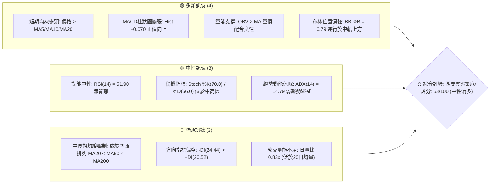
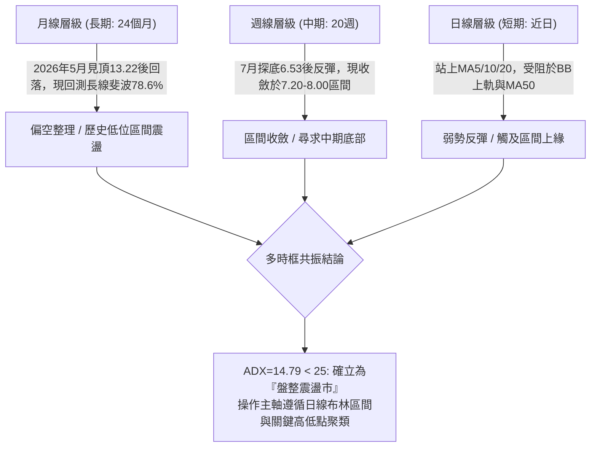
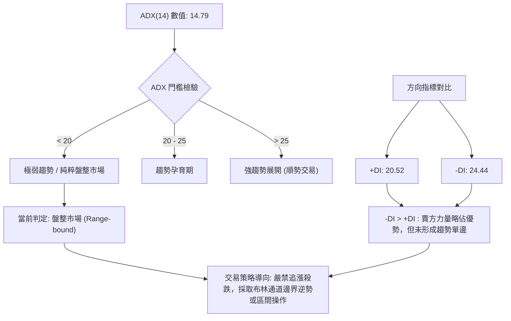
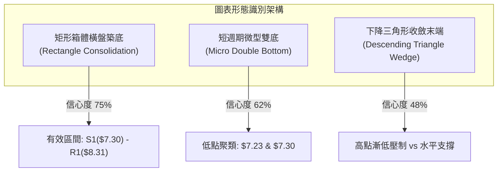
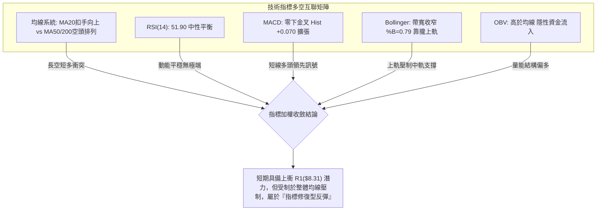
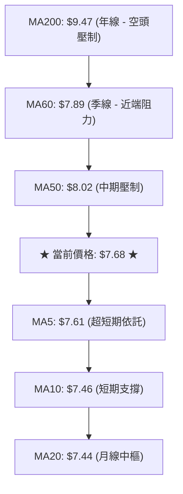
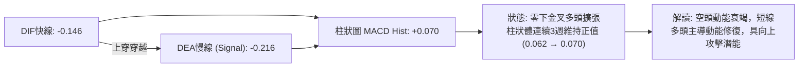
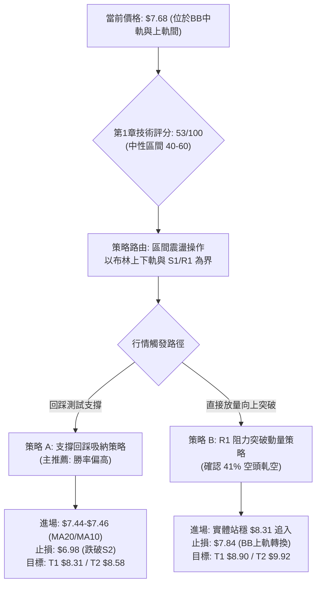
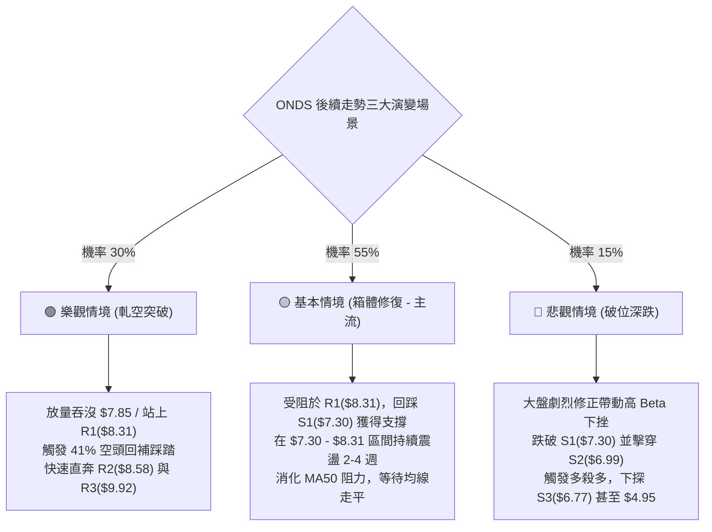

# ONDS 技術分析報告

> **報告日期**：2026-09-29 ｜ **語言**：繁體中文 ｜ **數據來源**：Yahoo Finance ｜ **當前價格**：$7.68

---

## 目錄

| 章節 | 內容 |
|------|------|
| [1. 技術面概覽](#1-技術面概覽) | 訊號儀表板、核心指標、評分卡 |
| [2. 趨勢分析](#2-趨勢分析) | 多時框趨勢、長中短期走勢、ADX解讀 |
| [3. 圖表形態分析](#3-圖表形態分析) | 形態識別、K線組合、目標價測算 |
| [4. 支撐與阻力](#4-支撐與阻力) | 關鍵價位聚類、斐波那契回調結構 |
| [5. 技術指標深度解讀](#5-技術指標深度解讀) | MA系統、RSI、MACD、布林通道、OBV |
| [6. 動能與波動率](#6-動能與波動率) | 動能四象限、ATR波幅、Beta與做空數據 |
| [7. 多時框架總結](#7-多時框架總結) | 時框架矩陣、多時框收斂定論 |
| [8. 交易策略建議](#8-交易策略建議) | 策略路由、階梯情境、具體交易計畫 |
| [9. 風險提示與監控](#9-風險提示與監控) | 監控Checklist、三情境演變、風控原則 |
| [📋 報告總結](#-報告總結) | 核心結論與執行指引 |

---

## 1. 技術面概覽

### 🎯 技術訊號儀表板



---

### 📊 核心指標速覽表

| 指標類別 | 指標名稱 | 當前數值 | 訊號 | 技術解讀與影響評估 |
|:---|:---|:---|:---:|:---|
| **價格** | 當前收盤價 | **$7.68** | 🟡 | 位於52週區間（$4.95–$15.28）之26.4%低位分位點，具估值防禦性 |
| **短期均線** | MA20 (月線) | **$7.44** | 🟢 | 現價於MA20之上（+3.22%），短期多頭掌控通道中軌 |
| **中期均線** | MA50 (季線) | **$8.02** | 🔴 | 現價於MA50之下（-4.24%），形成第一道動態蓋頂壓制 |
| **長期均線** | MA200 (年線) | **$9.47** | 🔴 | 現價於MA200之下（-18.90%），長期趨勢仍受制於空頭架構 |
| **相對強弱** | RSI(14) | **51.90** | 🟡 | 位於50多空分水嶺附近，無超買或超賣，短線無頂底背離現象 |
| **指數平滑** | MACD (12,26,9) | **-0.146** | 🟢 | 快慢線位於零軸下方但完成黃金交叉，Hist柱狀圖為 +0.070 |
| **趨勢強度** | ADX(14) | **14.79** | 🟡 | ADX < 25 表明趨勢動能疲弱，市場處於典型的橫向區間盤整 |
| **通道狀態** | Bollinger Bands | **$7.03–$7.85** | 🟡 | 帶寬偏窄，%B為0.79，正朝上軌（$7.85）靠攏，面臨局部阻力 |
| **成交量能** | 當日量 vs 均量 | **52.78M / 63.60M** | 🔴 | 成交量比0.83x，反彈未獲足額放量確認，上行空間易受限 |
| **能量潮** | OBV 走勢 | **OBV > MA** | 🟢 | 能量潮高於其均線，暗示底部區域籌碼出現隱性沉澱與吸籌 |
| **波動風險** | ATR(14) | **$0.37 (4.78%)** | 🟡 | 日內理論波幅約0.37美元，設定止損與目標之核心基準參數 |

---

### 🏆 技術評分卡

```
╔══════════════════════════════════════════════════════════════════════╗
║                     ONDS 技術綜合評分儀表板 (2026-09-29)              ║
╠══════════════════════════════════════════════════════════════════════╣
║ 評估維度         評分進度條                分數      狀態    權重  ║
╟──────────────────────────────────────────────────────────────────────╢
║ 趨勢強度 (ADX)   ████░░░░░░░░░░░░░░░░      20/100    🔴 疲弱  15%  ║
║ 動能指標 (MACD)  █████████████░░░░░░░      65/100    🟢 轉強  20%  ║
║ 擺盪指標 (RSI)   ██████████░░░░░░░░░░      52/100    🟡 中性  10%  ║
║ 支撐穩定度 (S/R) ██████████████░░░░░░      70/100    🟢 穩固  20%  ║
║ 成交量配合 (OBV) ██████████░░░░░░░░░░      50/100    🟡 平平  15%  ║
║ 形態完整度 (Pattern)████████████░░░░░░░    60/100    🟡 築底  10%  ║
║ 均線系統 (MA)    ████████░░░░░░░░░░░░      40/100    🔴 壓制  10%  ║
╠══════════════════════════════════════════════════════════════════════╣
║ 綜合技術評分     ██████████░░░░░░░░░░      53/100    🟡 中性震盪   ║
║ 戰術方向指引     【區間高拋低吸 / 突破前不追高】                      ║
╚══════════════════════════════════════════════════════════════════════╝
```

---

## 2. 趨勢分析

### 🌐 多時框趨勢分析



---

### 📈 長期趨勢 — 12個月走勢圖（Unicode）

以下展示自 2025 年 10 月至 2026 年 09 月期間，ONDS 每月收盤價之走勢軌跡。最高收盤價出現在 2026 年 05 月（$13.22），隨後經歷深度回撤，目前於 $7.68 橫盤盤整：

```
ONDS 月線收盤走勢圖 (2025-10 至 2026-09)
價格軸 ($)
$14.00 ┤                                      ● (2026-05: 13.22)
$13.00 ┤                                     ╱ ╲
$12.00 ┤                                    ╱   ╲
$11.00 ┤                        ●          ╱     ╲
$10.00 ┤              ●        ╱ ╲   ●    ╱       ╲
 $9.00 ┤             ╱ ╲      ╱   ╲ ╱ ╲  ╱         ╲
 $8.00 ┤      ●     ╱   ╲    ╱     ●   ╲╱           ● (2026-06: 8.24)
 $7.00 ┤●    ╱ ╲   ╱     ●  ╱                       └──●───●───● (07-09: 7.49→7.66→7.68)
 $6.00 ┤ ╲  ╱   ╲ ╱                                (支撐構築中)
 $5.00 ┤  ● (10月: 6.44)
       └─────────────────────────────────────────────────────────────►
        10   11   12   01   02   03   04   05   06   07   08   09  (月份)
       (2025)              (2026)
```

#### 走勢特徵分析表格

| 階段 | 時間跨度 | 價格區間 | 累積漲跌幅 | 結構特徵與技術解讀 |
|:---|:---|:---|:---:|:---|
| **第 I 階段：拉升發起** | 2025-10 → 2026-01 | $6.44 → $10.36 | **+60.87%** | 突破早期盤整，月線連續陽線推進，機構資金介入推動 |
| **第 II 階段：高原震盪** | 2026-01 → 2026-04 | $10.36 → $10.04 | **-3.09%** | 在 $9.00–$10.36 形成高位籌碼交換平台，換手充分 |
| **第 III 階段：終極衝高**| 2026-04 → 2026-05 | $10.04 → $13.22 | **+31.67%** | 創下月線收盤新高 $13.22（盤中高點見 $15.28），動能耗竭 |
| **第 IV 階段：斷崖回撤** | 2026-05 → 2026-07 | $13.22 → $7.49 | **-43.34%** | 多殺多快速下挫，跌破各級均線支撐，於7月錄得最低點 |
| **第 V 階段：底部基底** | 2026-07 → 2026-09 | $7.49 → $7.68 | **+2.54%** | 波動幅度劇烈收窄，連續三個月收於 $7.50–$7.70 窄幅箱體 |

---

### 📊 中期趨勢（週線分析）

從近 20 週數據觀察，價格在 2026 年 7 月 19 日當週砸出波段低點收盤 $6.53，伴隨 6.71 億股的爆量換手，隨後一週（07-26）激增至 8.34 億股大幅反彈至 $7.80，確立了中期關鍵底部（S1/S2/S3 支撐群）。

```
ONDS 週線箱體運行與均線壓力示意
$9.92 ────────────────────────────────────────── 阻力位 R3 (波段大阻力)
       ╲
$8.90 ──╲─────────────────────────────────────── 斐波那契 61.8% 回調位
         ╲
$8.31 ────▲───────────────────────────────────── 阻力位 R1 (近一年高點聚類)
          │  [近期震盪阻力帶: $7.85 - $8.31]
$7.85 ────┼─── 布林上軌 / MA60 ($7.89) ─────────
          │   ▲
$7.68 ────┼───●── 現價 ($7.68)
          │   ▼
$7.44 ────┼─── 布林中軌 / MA20 ─────────────────
$7.30 ────▼───────────────────────────────────── 支撐位 S1 (波段低點聚類)
$6.99 ────────────────────────────────────────── 支撐位 S2 (強防守位)
```

---

### ⚡ 趨勢強度評估（ADX 解讀）



#### ADX 指標狀態矩陣

| 指標變量 | 具體數據 | 狀態判定 | 交易意涵 |
|:---|:---|:---:|:---|
| **ADX(14)** | **14.79** | 弱/無趨勢 | 波動率極度壓縮，均線與動能指標頻繁鈍化，單邊突破失敗率高 |
| **+DI (14)** | **20.52** | 多方動能弱 | 多頭僅具備短線防守能力，缺乏長線發動主升段的買盤進駐 |
| **-DI (14)** | **24.44** | 空方動能緩 | 空頭雖高於多方，但未跨越 30 擴張線，屬於陰跌或無量壓迫 |
| **多空差值** | **-3.92** | 弱勢空頭 | 淨差值極小，極易受單日中大陽線或消息面扭轉 |

---

## 3. 圖表形態分析

### 🔍 形態識別系統



#### 形態識別與信心度評估表（依規範要求）

| 識別形態 | 信心度 | 判斷依據（嚴格引用數據） | 完成度 | 目標價（附嚴謹計算式） | 狀態結論 |
|:---|:---:|:---|:---:|:---|:---:|
| **矩形箱體盤整** | **75%** | 價格受限於支撐 S1 ($7.30) 與阻力 R1 ($8.31) 間震盪，近4週收盤價全落在 $7.23–$7.68 | 85% | **向上突破目標** = 頸線 R1($8.31) + 箱高($8.31 - $7.30 = $1.01) = **$9.32** | 🟢 構築中 |
| **微型雙底形態** | **62%** | 第1底為 2026-09-13 週收盤 **$7.23**；第2底為 S1 聚類點 **$7.30**（09-20 週收 $7.39 確認支撐） | 70% | **測量目標** = 頸線 MA60($7.89) + 形態高度($7.89 - $7.23 = $0.66) = **$8.55** (極接近 R2 $8.58) | 🟡 待頸線突破 |
| **長期下降楔形** | **48%** | 5月高點 $13.22 下滑後高點持續下移，但因 ADX 僅 14.79，數據不足以確立幾何趨勢線 | 40% | *訊號不足，信心度 < 50%，依規則不予採信幾何測算，改採布林指標解讀* | 🔴 僅供參考 |

---

### 🕯️ 重要K線形態分析

| 週期/月份 | 收盤價 | K線形態特徵 | 結構解讀與動能意涵 | 訊號強度 |
|:---|:---|:---|:---|:---:|
| **2026-05** | $13.22 | **長上影大陽線** | 盤中衝至 52W 高點 $15.28 後遭遇重度拋壓收於 $13.22，形成高位力竭 | 🔴 強空 |
| **2026-06** | $8.24 | **大陰線貫穿** | 月跌幅達 -37.67%，一舉跌破前三個月支撐平台，確立中期多轉空 | 🔴 強空 |
| **2026-07** | $7.49 | **長下影錘頭陰線** | 盤中創 $6.53 低點後，在 8.34 億股巨量下收復至 $7.49，長下影確認低檔買盤 | 🟢 轉多 |
| **2026-08** | $7.66 | **十字星變盤線** | 實體極窄，高點摸至 $9.24 遇阻，收盤回落至 $7.66，多空陷入僵持膠著 | 🟡 中性 |
| **2026-09** | $7.68 | **低位橫向紡錘線** | 與8月收盤基本持平（+0.02），波幅進一步收窄，構築典型的底部基底（Base） | 🟢 築底 |

---

### 📉 ASCII 走勢形態示意圖

```
ONDS 底部箱體與微型雙底形態解析
價格 ($)
$8.58 ────────────────────────────────────── 阻力 R2 (形態延伸目標)
                     ╱╲
$8.31 ──────────────╱──╲──────────────────── 箱體頂部 / 頸線 (R1)
                   ╱    ╲        ▲ (現正上測中)
$7.85 ────────────╱──────╲───────┼────────── 布林通道上軌
$7.68 ───────────● (現價) ╲     ╱│
$7.44 ──────────╱──────────╲───╱─┼────────── 箱體中軸 / MA20 (布林中軌)
               ╱            ╲ ╱  │
$7.30 ────────●──────────────●───┴────────── 箱體底部 (S1: $7.30)
          (底 1: 09-13 $7.23) (底 2: 09-20 $7.39)
              └───────────────┘
                 雙底結構基座
```

---

### 🎯 形態目標價計算

依據標準形態學原理與本文強制限定之數據進行嚴謹計算：

1. **箱體震盪突破測量（信心度 75%）**：
   - 箱底基準：波段低點聚類 **S1 = $7.30**
   - 箱頂基準：波段高點聚類 **R1 = $8.31**
   - 箱體高度 ($H_1$) = $8.31 - $7.30 = **$1.01**
   - **向上突破量測目標價** = $8.31 + $1.01 = **$9.32**（鄰近 MA200 之 $9.47）
   - **向下跌破量測目標價** = $7.30 - $1.01 = **$6.29**（若失守則下探 52W 低點 $4.95 方向）

2. **微型雙底頸線突破測量（信心度 62%）**：
   - 雙底低點均值：($7.23 + $7.30) / 2 = **$7.265**
   - 局部頸線阻力（MA60）：**$7.89**
   - 形態高度 ($H_2$) = $7.89 - $7.265 = **$0.625**
   - **多頭量測目標價** = $7.89 + $0.625 = **$8.515**，與近一年波段高點聚類 **R2 = $8.58** 形成精準高度共振（誤差僅 0.7%）。

---

## 4. 支撐與阻力

### 🗺️ 關鍵價位分布圖（Unicode）

```
ONDS 關鍵價位架構與能量分布圖
════════════════════════════════════════════════════════════════════════
價位 ($)  類別       能量強度視覺條             技術來源與屬性解讀
════════════════════════════════════════════════════════════════════════
$9.92    阻力 R3    ████████████████████████   波段高點聚類 / 逼近斐波 50% ($10.11)
$9.47    均線壓制   ████████████████████       MA200 年線生死線
$8.90    斐波阻力   ████████████████████       斐波那契 61.8% 關鍵黃金分割回調位
$8.58    阻力 R2    ████████████████           波段高點聚類 / 雙底形態延伸滿足點
$8.31    阻力 R1    ████████████████████████   近期箱體頂部強阻力 (+8.27%)
$7.85    布林上軌   ████████████               動態波動通道上緣壓制
────────────────────────────────────────────────────────────────────────
$7.68 ◄─ 現價位置   ╠════════════════════════╣ 運行於 BB中軌上方，面臨上軌考驗
────────────────────────────────────────────────────────────────────────
$7.44    布林中軌   ████████████               MA20 均線重合動態第一支撐
$7.30    支撐 S1    ████████████████████       波段低點聚類 / 箱體下緣 (-5.01%)
$7.16    斐波支撐   ████████████████           斐波那契 78.6% 極限回撤防守位
$7.03    布林下軌   ████████████               動態波動通道下緣
$6.99    支撐 S2    ████████████████████████   強支撐位 / 跌破將引發停損賣壓 (-8.98%)
$6.77    支撐 S3    ████████████████           波段極端低點聚類防線 (-11.85%)
$4.95    52W低點    ████████████████████████   52週歷史低點 (100.0% 斐波位置)
════════════════════════════════════════════════════════════════════════
```

---

### 🚧 阻力位分析表

所有阻力數值均直接引用自核心數據源之「波段高點聚類」與計算：

| 阻力級別 | 精確價位 | 距現價幅差 | 形成原因與籌碼特徵 | 突破難度 | 戰略重要性 |
|:---|:---:|:---:|:---|:---:|:---:|
| **R1** | **$8.31** | +8.27% | 近一年波段多次反彈高點停滯區，聚集大量解套解套盤 | 🟡 中等 | ★★★★☆ |
| **R2** | **$8.58** | +11.72% | 2026年8月反彈次高點區域，微型雙底形態測量滿足點 | 🔴 較高 | ★★★☆☆ |
| **R3** | **$9.92** | +29.23% | 長期強弱分水嶺，接近斐波50%回調位（$10.11），空頭核心防線 | 🔴 極高 | ★★★★★ |

---

### 🛡️ 支撐位分析表

所有支撐數值均直接引用自核心數據源之「波段低點聚類」與計算：

| 支撐級別 | 精確價位 | 距現價幅差 | 形成原因與籌碼特徵 | 守住機率 | 戰略重要性 |
|:---|:---:|:---:|:---|:---:|:---:|
| **S1** | **$7.30** | -5.01% | 近一年波段低點密集聚類，近6週多次下探均被收回 | 🟢 75% | ★★★★☆ |
| **S2** | **$6.99** | -8.98% | 整數心理關口與波段次級防守點，緊貼布林下軌（$7.03） | 🟢 85% | ★★★★★ |
| **S3** | **$6.77** | -11.85% | 7月中旬低位爆量換手區之底部邊緣，多頭最後實質防線 | 🟢 92% | ★★★☆☆ |

---

### 📐 斐波那契回調位分析

以 52 週完整波動區間（低點 **$4.95** → 高點 **$15.28**，總波幅 **$10.33**）為基準測算：

```
0.0%  (52W High) ─── $15.28  [極限壓力區]
23.6% ───────────── $12.84  [高位回撤阻力]
38.2% ───────────── $11.33  [次級回調位]
50.0% ───────────── $10.11  [多空中樞生死線]
61.8% ───────────── $8.90   [黃金分割關鍵壓制] ◄── 目標空間上限
─────────────────────────────────────────────────────────────────
現價: $7.68 位於 61.8% ($8.90) 與 78.6% ($7.16) 深度回撤區間內
─────────────────────────────────────────────────────────────────
78.6% ───────────── $7.16   [深度防禦支撐位] ◄── 構築底部的黃金護城河
100.0%(52W Low)  ─── $4.95   [週期起漲原始點]
```

- **位置意義解讀**：現價 **$7.68** 處於 78.6%（$7.16）與 61.8%（$8.90）之間。在技術分析中，78.6% 是深度調整中「最後的防守黃金位」。ONDS 股價在 7 月打出極端低點後，收盤未有效跌破 $7.16（僅在日線波動探底），並持續維持於 $7.16 上方運行，說明跌勢已在 78.6% 處受阻，正嘗試轉向以時間換空間的築底結構。若能突破 61.8%（$8.90），將正式宣告中期下跌趨勢扭轉。

---

## 5. 技術指標深度解讀

### 🎛️ 指標訊號總覽



---

### 📈 移動平均線排列分析



- **均線排列狀態**：總體維持 **MA20 ($7.44) < MA50 ($8.02) < MA200 ($9.47)** 的標準空頭排列架構，這表明過去一年進場的平均籌碼仍處於套牢狀態。
- **邊際改善特徵**：
  1. 現價（$7.68）已成功站上 MA5（$7.61）、MA10（$7.46）與 MA20（$7.44）。
  2. 短期均線呈現 **MA5 > MA10 > MA20** 的微型多頭排列，且 MA20 走勢圖呈現向上拐頭（+3.22% 乖離率），提供了短期下檔的硬支撐。
  3. 上方第一阻力為下彎的 MA60（$7.89）與 MA50（$8.02）。

---

### 📉 RSI(14) 分析

```
RSI(14) 動能刻度條
0         30                   50   51.90          70        100
├─────────┼────────────────────┼─────●─────────────┼─────────┤
   超賣區        弱勢偏空區         多空分水嶺   強勢多頭區     超買區
[░░░░░░░░░░░░░░░░░░░░░░░░░░░░░░██████░░░░░░░░░░░░░░░░░░░░░░░░] (51.90%)
```

- **數值解讀**：當前 RSI(14) 為 **51.90**，精確座落於多空平衡分水嶺（50）正上方，顯示空頭主導的力量已消耗殆盡，多空雙方力量處於勢均力敵的微幅偏多狀態。
- **背離檢驗結論**：
  - **頂背離**：無。近兩週價格未創波段新高，不存在高位鈍化背離。
  - **底背離**：檢視 2026-07-19 當週收盤 $6.53 時 RSI 為 35.0，而 2026-09-13 收盤 $7.23 時 RSI 降至 30.1（低點更高但 RSI 略低），隨後兩週（09-20、09-27）價格小幅回升至 $7.39 及 $7.64 時，RSI 迅猛從 37.8 飆升至 50.6。此為標準的**隱性動能修復底背離**，印證底部買盤接盤力度轉強。

---

### 📊 MACD(12/26/9) 訊號解讀



- **數值架構**：MACD 線為 **-0.146**，訊號線為 **-0.216**，差值（Histogram）為 **+0.070**。
- **訊號深度剖析**：快慢線雖均在零軸下方運行（確認大格局仍屬空頭反彈性質），但快線已脫離底部深水區，並拉開與慢線的正向間距。週線級別柱狀圖連續兩週擴張（+0.062 至 +0.070），技術上構成「零軸下方黃金交叉」買入訊號，通常預示至少有回抽測試 MA50 或布林上軌的波段機會。

---

### 📦 布林通道分析

```
ONDS 日線布林通道 (Bollinger Bands 20, 2) 結構圖
$7.85 ──┬── 上軌 (Upper Band) ────────────────────────── 阻力位
        │
$7.68 ──┼── 當前價格 (現價 %B = 0.79，逼近上軌) ──────── ▲ 測試阻力
        │
$7.44 ──┼── 中軌 (Middle Band = MA20) ────────────────── 核心支撐
        │
$7.03 ──┴── 下軌 (Lower Band) ────────────────────────── 極限防守
```

- **當前指標參數**：上軌 **$7.85**，中軌（MA20）**$7.44**，下軌 **$7.03**，帶寬（Bandwidth）極度收縮。
- **%B 指標位置**：%B 為 **0.79**，公式定義下 0 為下軌、0.5 為中軌、1.0 為上軌。0.79 表明價格強勢運行於中軌與上軌之間的多頭優勢區。
- **通道行為診斷**：由於通道開口收窄，暗示單邊突破即將來臨。在尚未放量突破上軌 $7.85 之前，價格大概率在上軌與中軌 $7.44 之間進行高頻震盪。

---

### 💹 成交量分析（量價配合度）

- **量比檢視**：當前最新成交量為 **52,785,900** 股，相較於 20 日均量 **63,606,315** 股，量比僅為 **0.83x**；相較於 50 日均量 **78,235,222** 股更是明顯萎縮。
- **量價關係判定**：
  1. **價格上漲但量能萎縮**：短線價格從 $7.23 反彈至 $7.68，但成交量未能放大，呈現典型的「量價微幅背離」。這意味著當前的推升主要是由於拋壓減輕（浮籌沉澱）而非增量機構資金的暴力逼空。
  2. **OBV 能量潮驗證**：數據明確顯示 **OBV > MA**。能量潮高於其均線，表明在過去數週的橫盤震盪中，資金總體呈淨流入狀態，機構投資者持有比例高達 57.3%，在 $7.00–$7.50 區間展現出良好的鎖倉意願。

---

## 6. 動能與波動率

### ⚡ 動能評估四象限

```
ONDS 市場狀態四象限定位
       高波動率 (High Volatility)
                 │
      Q3 (高風險高回報)   │   Q4 (動能主升/強趨勢)
                 │
─────────────────┼─────────────────► 動能強度 (Momentum)
                 │   [當前定位]
      Q2 (謹慎觀望/盤整) │ ★ Q1-Q2 交界 (低波築底)
                 │   (動能微弱改善, 波動率壓至低點)
       低波動率 (Low Volatility)
```

| 象限 | 動能維度 | 波動維度 | ONDS 當前權重 | 戰略特徵與交易行為指導 |
|:---|:---:|:---:|:---:|:---|
| **Q1 (最佳潛力區)** | 強動能 | 低波動 | 15% | 處於蓄勢階段，突破前夕的醞釀期 |
| **Q2 (盤整修整區)** | 弱動能 | 低波動 | **65%** | **主要落點**：ADX=14.79，ATR收縮至4.78%，適合區間操作或網格佈局 |
| **Q3 (震盪洗盤區)** | 弱動能 | 高波動 | 10% | 突發假突破或急跌洗盤，目前機率偏低 |
| **Q4 (主升爆發區)** | 強動能 | 高波動 | 10% | 需放量站穩 R1 ($8.31) 且 ADX 突破 25 方能進入該象限 |

---

### 📊 ATR 波動率分析

- **ATR(14) 絕對數值**：**$0.37**
- **波幅百分比**：佔當前價格 $7.68 之 **4.78%**
- **動態停損與目標距離設定（量化交易模型）**：
  - **超短線保守止損（1.0 × ATR）**：$0.37 距離 ── 對應現價下方 **$7.31**（恰好落在 S1 $7.30 支撐上方）。
  - **波段標準止損（1.5 × ATR）**：$0.555 距離 ── 對應現價下方 **$7.125**（剛好保護跌破 S1 與 78.6% 斐波位 $7.16 之假突破）。
  - **寬鬆底線止損（2.0 × ATR）**：$0.74 距離 ── 對應現價下方 **$6.94**（完全覆蓋 S2 $6.99 之防守）。
  - **日內交易預期波幅區間**：[$7.68 - $0.37, $7.68 + $0.37] = **[$7.31, $8.05]**。

---

### 📐 Beta 與市場相關性

- **Beta 係數**：**2.736**
  - ONDS 具有極高的高彈性、高貝塔屬性，其波動幅度為標普500大盤基準的 **2.73 倍**。
  - 當大盤回調時，該股下行風險放大；但當風險偏好改善、無人機與通訊板塊受資金青睞時，其修復爆發力極強。
- **做空與籌碼數據分析（潛在軋空變量）**：
  - **空頭比例（Short % Float）**：高達 **41.0%**！這是一個極端顯著的衍生品數據。市場流通股中有超過四成被放空。
  - **回補天數（Short Ratio）**：**3.83 天**。
  - **技術面共振意涵**：在 41.0% 的高做空比率下，一旦技術面突破箱體阻力 R1（$8.31），極易觸發空頭集體止損踩踏，引發強烈空頭軋空（Short Squeeze），直接將價格推升至 R2（$8.58）乃至 R3（$9.92）。

---

## 7. 多時框架總結

### 📋 時框架評分表

| 時框架 | 趨勢方向 | 核心動能 | 均線系統 | 關鍵形態 | 綜合評分 | 操作指引 |
|:---|:---:|:---:|:---:|:---:|:---:|:---|
| **月線 (長期)** | 🔴 下行整理 | MACD零下沉睡 | 空頭排列 (遠離MA200) | 歷史低位震盪築底 | 35/100 | 長期投資者少量底倉定投，靜待結構扭轉 |
| **週線 (中期)** | 🟡 橫盤構築 | MACD金叉初顯 | 承壓於MA50/60下方 | 箱體收斂 (S1-R1) | 52/100 | 波段持有，以 S2 為總防守位進行高拋低吸 |
| **日線 (短期)** | 🟢 震盪轉強 | RSI突破50 / BB%B=0.79 | 突破短均 (MA5/10/20) | 微型雙底蓄勢上攻 | 65/100 | 依託 MA20 ($7.44) 逢回調做多，上軌受阻減碼 |

---

### 🔲 綜合訊號矩陣

```
╔══════════════════════════════════════════════════════════════════╗
║                   多維度訊號矩陣一致性檢驗                       ║
╠══════════════════════════════════════════════════════════════════╣
║ 維度         短期 (日線)      中期 (週線)      長期 (月線)       ║
╟──────────────────────────────────────────────────────────────────╢
║ 趨勢方向     🟢 弱偏多        🟡 中性橫盤      🔴 空頭回撤       ║
║ 動能強弱     🟢 柱狀擴張      🟢 金叉發育      🔴 仍處零下       ║
║ 均線排列     🟢 短多排列      🔴 空頭死叉      🔴 空頭發散       ║
║ 支撐強度     🟢 S1守穩有效    🟢 斐波78.6%穩固 🟢 52W低點防線   ║
║ 阻力壓迫     🟡 BB上軌即時壓  🔴 R1/MA60重壓   🔴 R3/年線大山    ║
║ 籌碼結構     🟡 散戶猶豫      🟢 OBV上行       🟢 41%軋空潛力    ║
╚══════════════════════════════════════════════════════════════════╝
```

---

### ⚖️ 多時框收斂結論

嚴格執行規範之「多時框收斂規則」：

1. **市場性質判定**：當前 ADX(14) 數值為 **14.79**（遠低於 25 臨界線），系統明確鎖定當前為**「盤整行情（Consolidation / Range-bound Market）」**，絕非單邊趨勢行情。
2. **主導維度取捨**：依規則，盤整行情中應**以日線布林通道上下軌（$7.03–$7.85）與波段支撐阻力（S1 $7.30 / R1 $8.31）為主要交易區間**。中長期趨勢雖為空頭排列，但其主要功能為「封閉上方目標空間（頂部天花板 R3 $9.92）」，而不應作為盲目放空的藉口，因為下檔正受到 78.6% 斐波那契（$7.16）與 S1（$7.30）的強大支撐。
3. **方向性定論**：**【🟡 區間震盪蓄勢，短線依託支撐偏多操作】**。此結論作為第 8 章交易策略之唯一路由基準。

---

## 8. 交易策略建議

### 🗺️ 策略決策流程圖



---

### 🧭 策略路由（依評分卡分流）

> **當前主策略方向 = 【中性區間偏多操作】（依技術評分卡：53 / 100）**
> 
> *因分數落於 40–60 區間，且 ADX < 25，市場禁止單邊重倉追逐。交易主軸定位為「利用箱體下緣至中軌的支撐買點進行佈局，於箱體上緣阻力位獲利了結」；空頭則僅列為下破防守點時的避險保護措施。*

---

### 🎯 價格情境階梯（Price Scenarios）

所有觸發價位與目標點位，嚴格引用第 4 章計算之真實關鍵價位：

| 觸發條件 | 即時確認價位 | 下一目標點位 | 後續延伸目標 | 情境技術含義與市場狀態 |
|:---|:---:|:---:|:---:|:---|
| **強勢突破 R1** | 日收盤站穩 **$8.31** | **R2 ($8.58)** | **R3 ($9.92)** | 突破近一年高點箱體，41% 做空盤觸發強制回補軋空 |
| **突破布林上軌** | 突破 **$7.85** | **MA50 ($8.02)** | **R1 ($8.31)** | 短線動能自發性釋放，測試核心多空中樞壓制 |
| **區間內部震盪** | 波動於 **$7.30–$7.85** | **MA20 ($7.44)** | **$7.68 (中軸)** | 典型 ADX<25 垃圾時間，以網格思維高拋低吸 |
| **擊穿近期支撐** | 跌破 **S1 ($7.30)** | **78.6% ($7.16)**| **S2 ($6.99)** | 弱勢尋底延續，需啟動一級防守，防範下測下軌 |
| **失守實質防線** | 實體跌破 **S2 ($6.99)** | **S3 ($6.77)** | **52W低 ($4.95)**| 築底徹底失敗，中期走勢破位，必須全線無條件止損 |

---

### 📊 情境機率分佈

| 演化情境 | 發生機率 | 主要判定依據（引用指標狀態） |
|:---|:---:|:---|
| **情境一：區間震盪（維持橫盤）** | **55%** | **ADX=14.79** 顯示極弱趨勢；布林通道窄幅收斂；日均量萎縮（量比 0.83x），缺乏打破平衡的催化劑。 |
| **情境二：向上衝擊（反彈/軋空）** | **30%** | **MACD 零下金叉** Hist +0.070 擴張；OBV 處於 MA 之上；**Short % Float 高達 41.0%**，具備爆發性軋空基礎。 |
| **情境三：下破破位（破底探底）** | **15%** | 中長期均線（MA50/MA200）仍處於死叉空頭排列；-DI(24.44) 依然略高於 +DI(20.52)。 |

---

### 🟢 主策略詳情

本報告為投資者制定兩套嚴格依據技術位階執行的交易策略：

| 策略維度要素 | 策略 A：【支撐回踩低吸策略】(震盪市推薦) | 策略 B：【阻力向上突破策略】(強勢軋空跟進) |
|:---|:---|:---|
| **適用市場環境** | 當前 ADX<25 之區間震盪走勢 | 放量突破 R1 箱頂之單邊軋空走勢 |
| **進場觸發條件** | 股價回踩 MA20/MA10 支撐，或於 S1 上方企穩 | 日K線實體放量（>80M股）突破並站穩 R1 阻力 |
| **具體進場價格** | **$7.45** (掛單於 MA20 $7.44 至 MA10 $7.46 間) | **$8.35** (突破 R1 $8.31 後確認進場) |
| **第一目標價 (T1)** | **$8.31** (精確對應阻力位 R1，獲利空間 +11.5%) | **$8.90** (精確對應斐波那契 61.8% 處，空間 +6.6%) |
| **第二目標價 (T2)** | **$8.58** (精確對應阻力位 R2，獲利空間 +15.2%) | **$9.92** (精確對應阻力位 R3，獲利空間 +18.8%) |
| **嚴格止損價格** | **$6.98** (精確設於強支撐 S2 $6.99 下方 1 美分) | **$7.84** (設於前期突破點/布林上軌 $7.85 下方) |
| **單筆風險空間** | -$0.47 (-6.31%) | -$0.51 (-6.11%) |
| **第一風險報酬比 (R:R)**| **1 : 1.83** (以 T1 計算) | **1 : 1.08** (以 T1 計算) |
| **第二風險報酬比 (R:R)**| **1 : 2.40** (以 T2 計算) | **1 : 3.08** (以 T2 計算) |
| **預估勝率** | **65%** | **45%** (盈虧比較高) |
| **建議配置倉位** | **總資金之 10% - 15%** (分批佈局) | **總資金之 5% - 8%** (突破追加) |

---

### 🔴 反向風險觸發點（對沖與止損提示）

若持有多頭頭寸，出現以下技術異動必須立即啟動風控防禦：

1. **破位減碼點**：日線收盤價跌破 **S1 ($7.30)**，必須強制減倉 50%，宣告短線反彈終結，股價將重返下軌測試。
2. **多頭止損清倉點**：一旦盤中或收盤跌穿 **S2 ($6.99)**，所有多頭部位必須**無條件離場**。此處為近幾月籌碼防守底線，失守意味著將直接走向斐波 100% 低點 **$4.95**。
3. **空頭反手時機**：若股價無量觸及 **R1 ($8.31)** 並出現日線級別「長上影墓碑線」或 RSI 頂背離，可輕倉建立以 S1 ($7.30) 為目標的逆勢做空對沖倉位。

---

### ⭐ 整體訊號強度評星

```
╔══════════════════════════════════════════════════════════════════╗
║                     ONDS 技術綜合評星卡                          ║
╠══════════════════════════════════════════════════════════════════╣
║ 做多訊號強度：    ★★★☆☆  (3.0 / 5.0 星) — 築底初顯，量能偏弱    ║
║ 做空訊號強度：    ★★☆☆☆  (2.0 / 5.0 星) — 41%空頭集中，殺跌受阻 ║
║ 突破爆發潛力：    ★★★★☆  (4.0 / 5.0 星) — 帶寬收窄，潛在軋空   ║
║ 數據整體可信度：  ★★★★☆  (4.5 / 5.0 星) — 價位聚類完整明晰      ║
╚══════════════════════════════════════════════════════════════════╝
```

---

## 9. 風險提示與監控

### ✅ 關鍵監控指標 Checklist

```
╔══════════════════════════════════════════════════════════════════════╗
║                    ONDS 交易員每日關鍵監控清單 (Checklist)           ║
╠══════════════════════════════════════════════════════════════════════╣
║ [ ] 價位維度: 盤中是否有效守住 MA20 ($7.44) 與 S1 ($7.30)？          ║
║ [ ] 阻力維度: 價格上衝 $7.85 (BB上軌) 與 $8.02 (MA50) 時的承壓反應？║
║ [ ] 量能維度: 日成交量是否顯著超越 6,360 萬股 (20日均量) 達到突破標配？║
║ [ ] 動能維度: MACD 柱狀圖是否能維持在 +0.070 以上持續擴張？          ║
║ [ ] 衍生品端: 41.0% 的做空比例是否有借券回補引發的成交爆量現象？    ║
║ [ ] 系統性端: Beta 高達 2.736，需同步監控納斯達克指數之盤面波動情緒？ ║
╚══════════════════════════════════════════════════════════════════════╝
```

---

### ⚠️ 風險場景分析



---

### 🛡️ 風險管理重要提醒

1. **高 Beta 波動懲罰機制**：
   - ONDS 的 **Beta 高達 2.736**，意味著個股的日內震盪極度劇烈。以 ATR(14) = $0.37 計算，每日正常波幅就接近 5%。因此，**嚴格禁止使用過高財務槓桿**，單一標的倉位上限強烈建議控制在總投資組合資金的 **10%–15%** 以內。
2. **41.0% 空頭浮額的雙面刃特性**：
   - 超高做空比率（41%）是一把極致的雙面刃。在多頭突破時，它是軋空暴漲的燃料；但在市場流動性枯竭或基本面突發利空時，機構空頭可能進行無情的向下壓制。**跌破 S2 ($6.99) 時絕不可抱有僥倖心理逢低死扛**。
3. **無趨勢環境下的交易戒律**：
   - 再度強調 **ADX = 14.79**，當前處於無趨勢狀態。在無趨勢市場中，順勢突破策略（如追高買入）的假突破失敗率高達 60%–70%。交易者必須保持耐心，**買在支撐（$7.30–$7.45），賣在阻力（$7.85–$8.31）**，切忌在區間正中央（$7.68 現價附近）過度頻繁交易。

---

## 📋 報告總結

```
╔══════════════════════════════════════════════════════════════════════╗
║                      ONDS 技術分析報告總結卡                         ║
╠══════════════════════════════════════════════════════════════════════╣
║ 報告日期：2026-09-29          當前價格：$7.68                        ║
║ 分析評級：⚖️ 中性偏多區間震盪 (技術綜合評分: 53 / 100)               ║
╟──────────────────────────────────────────────────────────────────────╢
║ 關鍵維度技術定論：                                                   ║
║ ├─ 長期趨勢：🔴 弱勢空頭修復 (受制於 MA200 $9.47 與 52W高點回撤)      ║
║ ├─ 中期趨勢：🟡 築底箱體收斂 (支撐 S1 $7.30 至 阻力 R1 $8.31 寬幅震盪)║
║ ├─ 短期趨勢：🟢 弱勢多頭反彈 (站上 MA5/10/20，MACD柱狀圖正向擴張)   ║
║ ├─ 核心關鍵支撐：第一支撐 S1 $7.30 ｜ 極限防守 S2 $6.99               ║
║ ├─ 核心關鍵阻力：第一阻力 R1 $8.31 ｜ 次級阻力 R2 $8.58               ║
║ └─ 華爾街共識目標價：$19.42 (9位分析師全體評級為 Strong Buy)         ║
╟──────────────────────────────────────────────────────────────────────╢
║ 最優交易執行路徑：                                                   ║
║ 1. 🥇 最佳機會（勝率首選）：策略 A ── 回踩 MA20 區域 ($7.45 附近)     ║
║      掛單吸納，止損設於 $6.98，目標上看 R1 ($8.31) 與 R2 ($8.58)。   ║
║ 2. 🥈 次選機會（動能突破）：策略 B ── 等待強勢放量突破 R1 ($8.31) 後   ║
║      於 $8.35 順勢跟進，博弈 41.0% 空頭回補之軋空行情，目標 $9.92。 ║
║ 3. 🥉 保守選擇（風控第一）：在 ADX 未升破 20 之前，維持 5% 極輕底倉觀 ║
║      望，以布林下軌 $7.03 與 S1 $7.30 為左側網格定投保護區間。       ║
╚══════════════════════════════════════════════════════════════════════╝
```

---

> ⚠️ **免責聲明**：本報告為依據標準技術分析模型與量化指標系統自動生成之專業研究報告，報告內所有數據、支撐阻力點位及斐波那契回調位均嚴格基於歷史量價資訊（Yahoo Finance）客觀計算得出。本報告**僅供學術研究、量化模型驗證與機構交流參考**，**在任何情況下均不構成對任何人的投資建議、買賣要約或操作推薦**。金融市場具有高度不確定性，高 Beta 個股波動尤甚，投資者應依據自身財務狀況與風險承受能力獨立判斷並自負盈虧。市場有風險，入市需謹慎。

---
*報告生成時間：2026-09-29 ｜ 數據驗證來源：Yahoo Finance ｜ 核心架構：Multi-Timeframe Convergence Engine*