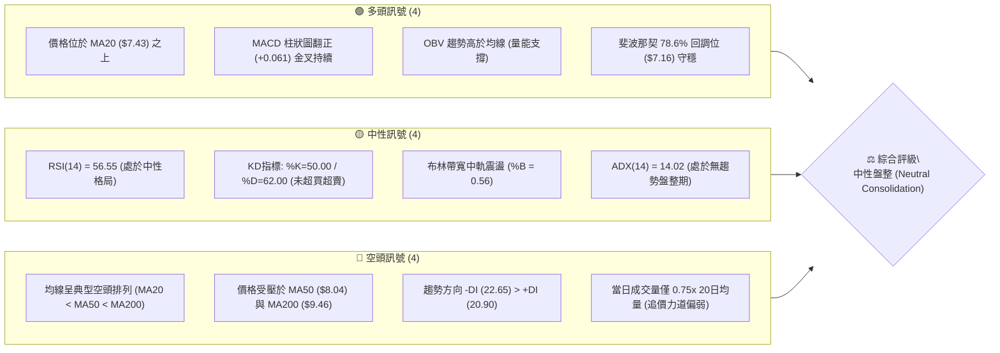
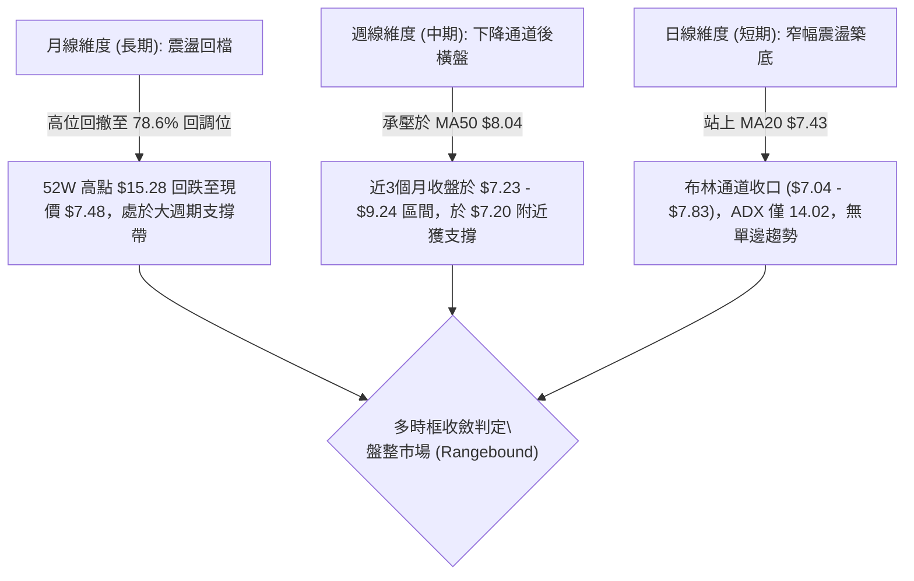
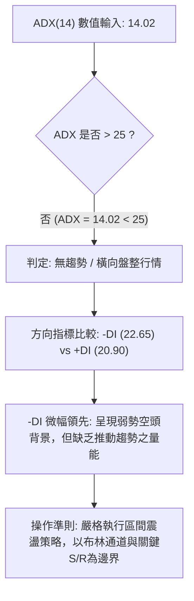
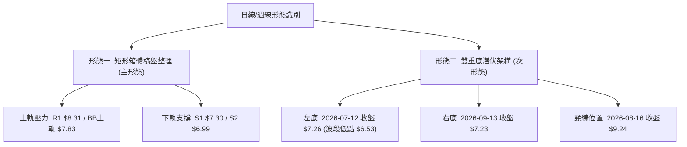
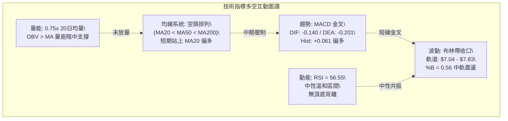
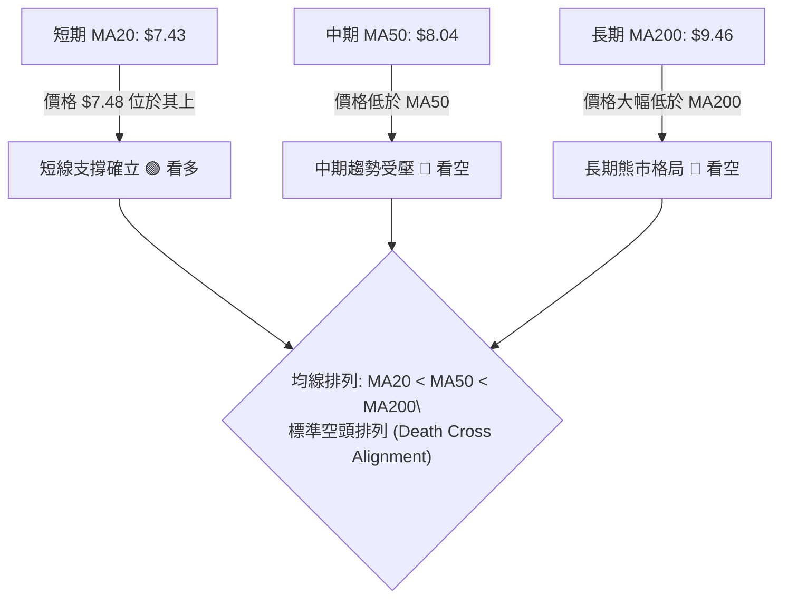
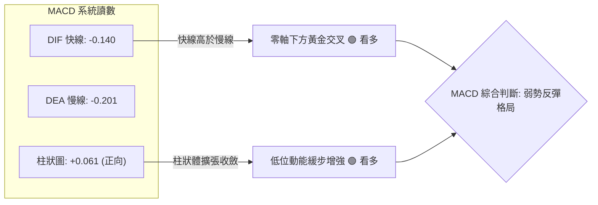
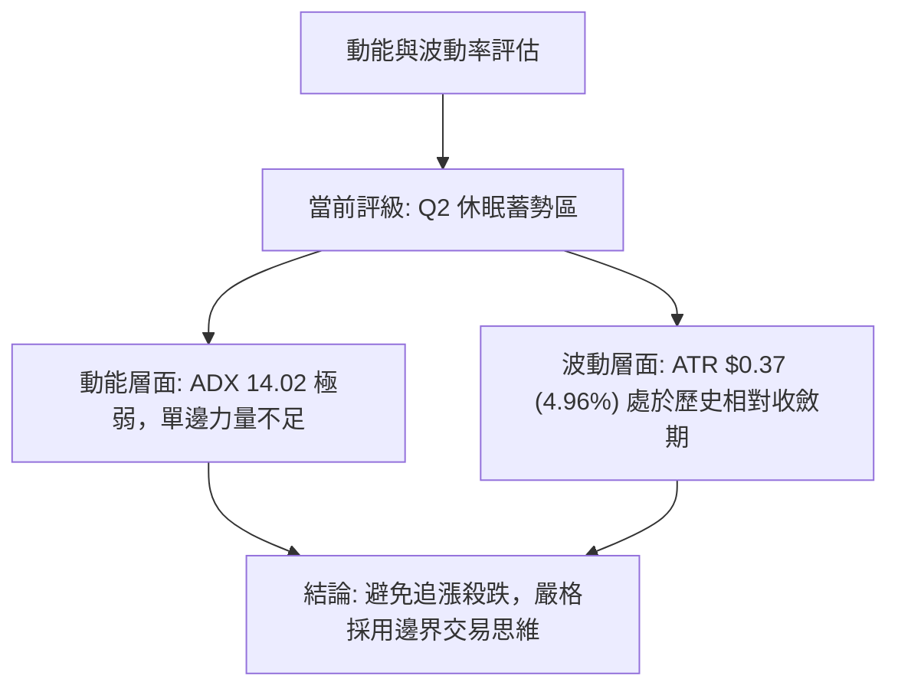
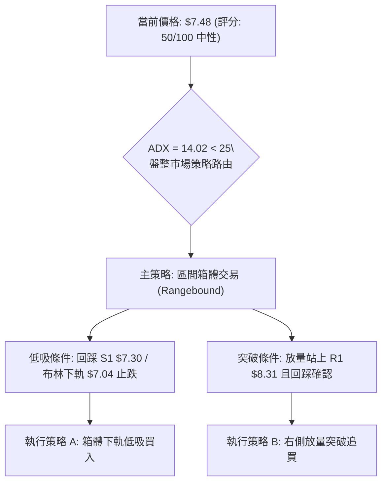
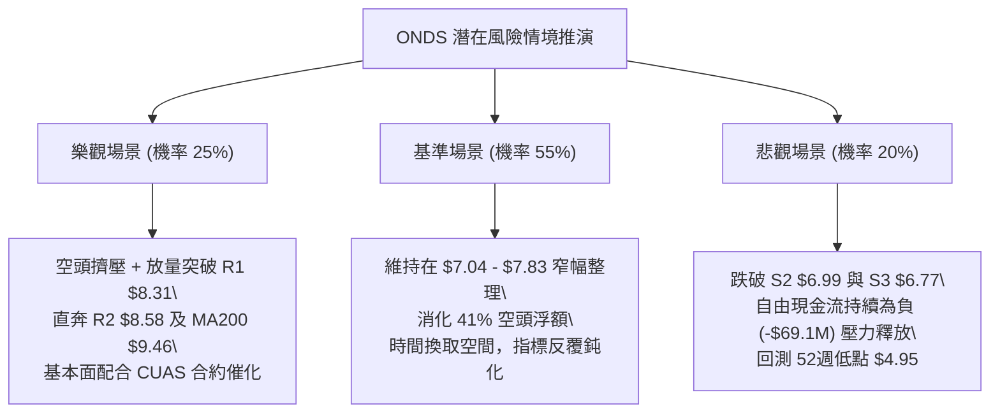

# ONDS 技術分析報告

> **報告日期**：2026-09-30 ｜ **語言**：繁體中文 ｜ **數據來源**：Yahoo Finance ｜ **當前價格**：$7.48

---

## 目錄

| 章節 | 內容 |
|------|------|
| [1. 技術面概覽](#1-技術面概覽) | 訊號儀表板、核心指標、評分卡 |
| [2. 趨勢分析](#2-趨勢分析) | 多時框趨勢、長中短期走勢 |
| [3. 圖表形態分析](#3-圖表形態分析) | 形態識別、K線組合、目標價 |
| [4. 支撐與阻力](#4-支撐與阻力) | 關鍵價位、斐波那契回調 |
| [5. 技術指標深度解讀](#5-技術指標深度解讀) | MA/RSI/MACD/布林/成交量 |
| [6. 動能與波動率](#6-動能與波動率) | 動能評估、ATR、Beta |
| [7. 多時框架總結](#7-多時框架總結) | 時框架評分矩陣 |
| [8. 交易策略建議](#8-交易策略建議) | 多空策略、風險報酬比 |
| [9. 風險提示與監控](#9-風險提示與監控) | 監控指標、風險場景 |

---

## 1. 技術面概覽

### 🎯 技術訊號儀表板



---

### 📊 核心指標速覽表

| 指標類別 | 指標名稱 | 當前數值 | 訊號 | 解讀 |
|----------|----------|----------|------|------|
| **價格** | 當前收盤價 | $7.48 | 🟡 | 位於52週區間 24.5% 分位，底部震盪築底中 |
| **均線** | 短期 MA20 | $7.43 | 🟢 | 現價微幅站上 MA20 (+0.65%)，短線具備支撐 |
| **均線** | 中期 MA50 | $8.04 | 🔴 | 位於 MA50 之下 (-6.97%)，中期下降壓力仍存 |
| **均線** | 長期 MA200 | $9.46 | 🔴 | 位於 MA200 之下 (-20.93%)，長期牛熊分水嶺在上方 |
| **動能** | RSI(14) | 56.55 | 🟡 | 位於 50–60 溫和區間，無超買超賣，無顯著背離 |
| **動能** | MACD (12/26/9) | DIF: -0.140 / DEA: -0.201 / Hist: +0.061 | 🟢 | 零軸下方黃金交叉，多頭動能微幅增溫 |
| **趨勢** | ADX(14) | 14.02 (-DI: 22.65, +DI: 20.90) | 🟡 | ADX < 25 處於典型無趨勢/盤整行情，空頭微幅主導 |
| **通道** | 布林帶 (%B) | 軌道 $7.04–$7.83 (%B: 0.56) | 🟡 | 位於中軌 $7.43 附近，窄幅波動等待突破 |
| **成交量** | 20日成交量比 | 48.73M / 64.57M (0.75x) | 🟡 | 縮量整理，缺乏突破動能，但 OBV 指標維持偏多 |
| **波動** | ATR(14) | $0.37 (4.96% of price) | 🟡 | 每日平均波動幅度近 5%，維持中小盤成長股特性 |

---

### 🏆 技術評分卡

```
╔══════════════════════════════════════════════════════════════╗
║              技術評分卡 — ONDS (2026-09-30)                  ║
╠══════════════════════════════════════════════════════════════╣
║ 趨勢強度 (ADX=14.02)      ████░░░░░░░░░░░░░░░░  20/100 🔴 弱勢 ║
║ 動能指標 (MACD/RSI)       ████████████░░░░░░░░  60/100 🟢 偏多 ║
║ 支撐穩定度 (S1=$7.30)     ██████████████░░░░░░  70/100 🟢 穩固 ║
║ 成交量配合 (量比 0.75x)   ████████░░░░░░░░░░░░  40/100 🟡 偏弱 ║
║ 形態完整度 (矩形震盪)     ████████████░░░░░░░░  60/100 🟡 中性 ║
║ 均線排列 (空頭排列)       ██████░░░░░░░░░░░░░░  30/100 🔴 偏空 ║
╠══════════════════════════════════════════════════════════════╣
║ 綜合評分                  ██████████░░░░░░░░░░  50/100 🟡 中性 ║
║ 評級結論：區間震盪整理 (ADX<25，布林通道上下軌操作為主)      ║
╚══════════════════════════════════════════════════════════════╝
```

---

## 2. 趨勢分析

### 🌐 多時框趨勢分析



---

### 📈 長期趨勢 — 12個月走勢圖（Unicode）

```
ONDS 月線收盤走勢圖（2025-10 至 2026-09）
價格 ($)
$14.00 ┤                                      ● $13.22 (2026-05)
$13.00 ┤                                     ╱ ╲
$12.00 ┤                                    ╱   ╲
$11.00 ┤                     ● $10.36      ╱     ╲
$10.00 ┤               ●    ╱ ╲     ●     ╱       ╲
$9.00  ┤              ╱ ╲  ╱   ╲   ╱ ╲   ╱         ╲
$8.00  ┤       ●     ╱   ╲╱     ●─┘   ╲ ╱           ● $8.24
$7.00  ┤ ●────┘ ╲   ╱                      ●━━━━━━━●← 現價 $7.48
$6.00  ┤         ● $6.44 (2025-10)          $7.49(07) $7.66(08)
       └─┬────┬────┬────┬────┬────┬────┬────┬────┬────┬────┬────
        10   11   12   01   02   03   04   05   06   07   08   09 (月份)
        ──────── 2025 ──────── ──────────── 2026 ────────────
```

#### 月度走勢特徵分析表

| 階段區間 | 時間跨度 | 起訖價位 | 漲跌幅 | 主要特徵與結構 |
|----------|----------|----------|--------|----------------|
| **第1階段：主升推升** | 2025-10 ～ 2026-01 | $6.44 → $10.36 | +60.87% | 連續放量攀升，突破多重阻力，奠定中期牛市基準 |
| **第2階段：高位盤整** | 2026-01 ～ 2026-04 | $10.36 → $10.04 | -3.09% | 於 $9.04–$10.36 高位寬幅拉鋸，籌碼出現換手 |
| **第3階段：衝頂見頂** | 2026-04 ～ 2026-05 | $10.04 → $13.22 | +31.67% | 月收盤達 $13.22（52W高點見 $15.28），動能衰竭爆量見頂 |
| **第4階段：大幅回撤** | 2026-05 ～ 2026-07 | $13.22 → $7.49 | -43.34% | 遭遇深度獲利回吐與空頭壓制，連續兩月跳空跌破中期均線 |
| **第5階段：築底震盪** | 2026-07 ～ 2026-09 | $7.49 → $7.48 | -0.13% | 價格連續3個月橫盤於 $7.40–$7.70，波動度驟降，進入壓縮築底期 |

---

### 📊 中期趨勢（週線分析）

```
近20週關鍵走勢示意與週線級別多空攻防：
$13.22 ┤  ▲ 52W高點壓制帶 ($15.28 / 週收 $13.22)
       │  │
$10.43 ┤  │  ▼ 2026-06 重挫跌破雙位數
$9.24  ┤──┼───● 2026-08 反彈次高點 (受到 MA200 $9.46 壓制)
$8.31  ┤  │   ├─── 阻力位 R1 ($8.31)
$7.48  ┤──┼───┼─── 目前現價 ($7.48) ── MA20 ($7.43) 支撐
$7.16  ┤──┼───┴─── 斐波那契 78.6% 回調位 ($7.16)
$6.53  ┤  ▼ 2026-07-19 週波段低點 ($6.53)
```

從近期20週走勢觀察：
1. **量能峰值換手**：2026-07-26 當週爆出 8.34億股 歷史巨量反彈，收盤回升至 $7.80，確立了 $6.53–$7.00 區間的強勁機構承接盤。
2. **反彈高點降階**：8月上旬反彈至 $9.24（8/16收盤）後無力挑戰 MA200（$9.46），隨後回落至 $7.23（9/13收盤），確認中期呈現「高點下移、低點抬高」的收斂整理走勢。
3. **短期指標微幅修復**：近兩週（9/20、9/27、10/04）週 MACD 柱狀圖由 -0.108 轉正至 +0.061，RSI 從 30.1 修復至 56.6，短期下行動能暫告一段落。

---

### ⚡ 趨勢強度評估（ADX 解讀）



#### ADX 趨勢強度對照表

| 指標變數 | 當前讀數 | 強度區間 | 市場環境解讀 | 策略意涵 |
|----------|----------|----------|--------------|----------|
| **ADX(14)** | **14.02** | 0 ～ 20 (極弱趨勢) | 市場處於典型休眠盤整狀態，單邊趨勢完全消失 | 順勢突破策略無效，假突破頻繁，應採用低吸高拋 |
| **+DI(14)** | **20.90** | 多方攻擊力 | 買盤力道偏弱，無法激發連續長陽線 | 多頭僅能維持守勢，無法發起單邊上攻 |
| **-DI(14)** | **22.65** | 空方壓制力 | 空方雖佔微弱優勢，但未超過 25，未引發恐慌拋盤 | 空方動能亦在衰退，向下擊穿空間受限 |
| **DI差值** | **-1.75** | 勢均力敵 | 多空力量處於臨界平衡點 | 靜待帶量方向性選擇 |

---

## 3. 圖表形態分析

### 🔍 形態識別系統



#### 圖表形態信心度評估表（依規則 15）

| 形態名稱 | 信心度 | 判斷依據（引用數據） | 完成度 | 目標價（附嚴格計算式） |
|----------|--------|----------------------|--------|------------------------|
| **矩形箱體整理** | **80%** | 價格受限於 BB下軌 $7.04 (S1 $7.30) 至 BB上軌 $7.83 (R1 $8.31) 之間震盪，ADX=14.02 極低 | 85% | 向上突破：$7.83 + ($7.83 - $7.04) = $8.62 (逼近 R2 $8.58)；向下跌破：$7.04 - 0.79 = $6.25 (靠近前低) |
| **雙重底 (W底)** | **55%** | 左底於 2026-07-12 收盤 $7.26，右底於 2026-09-13 收盤 $7.23，兩次低點相隔近2個月 | 45% (尚未突破頸線) | 若能放量突破頸線 $9.24：形態高度 = $9.24 - $7.23 = $2.01；理論目標價 = $9.24 + $2.01 = **$11.25** (接近斐波那契 38.2% 回調位 $11.33) |
| **頭肩底形態** | **25%** | 數據不足，僅有 7月中旬一處極端低點 $6.53，兩側對稱肩部不明顯 | 15% | 訊號不足，依規則不予採納，僅做指標型解讀 |

---

### 🕯️ 重要K線形態分析

| 週期 / 日期 | 收盤價 | 交易量 | K線形態 / 量價特徵 | 技術解讀 | 訊號 |
|-------------|--------|--------|--------------------|----------|------|
| **2026-05-31** | $13.22 | 566.99M | **爆量長上影反轉陰線** (觸及52W高 $15.28) | 主力高位派發籌碼，多頭竭盡，確立長期頭部阻力 | 🔴 強烈看跌 |
| **2026-07-19** | $6.53 | 671.52M | **恐慌殺跌長陰洗盤** (接近52W低 $4.95) | 恐慌盤湧出，空頭動能極致釋放，創下波段最低點 | 🔴 恐慌拋售 |
| **2026-07-26** | $7.80 | 834.31M | **歷史天量低位吞噬陽線** | 機構資金強力進場掃貨，單週換手逾 1.5 倍流通盤，確立中期底 | 🟢 強烈看漲 |
| **2026-08-16** | $9.24 | 471.59M | **受阻流星線** (未能觸及 MA200 $9.46) | 反彈遭遇長期均線密集解套壓制，多頭量能無法接續 | 🔴 受阻回落 |
| **2026-09-13** | $7.23 | 201.36M | **縮量十字星 / 探底針** | 拋壓大幅萎縮，回試 S1 $7.30 支撐帶獲得承接，形成次低點 | 🟢 築底確認 |
| **2026-09-27** | $7.64 | 375.05M | **溫和放量小實體陽線** | 重新站上短均 MA20 ($7.43)，MACD 柱狀圖翻正，買盤回流 | 🟢 短線轉多 |

---

### 📉 ASCII 走勢形態示意圖

```
ONDS 箱體整理與雙底構建示意圖
價格
$9.24 ┤                  頸線位置 ───────────────────────┐ (未突破)
      │                 ╱        ╲                      │
$8.31 ┤─ R1 阻力 ──────╱──────────╲──────── 阻力上軌 ───┼──────
      │               ╱            ╲        ┌─ 箱體頂部 ─┘
$7.83 ┤─ BB上軌 ─────╱──────────────╲───────● ($7.80)
$7.48 ┤             ╱                ╲     ▲ 現價 $7.48 (震盪中軸)
$7.30 ┤─ S1 支撐 ──● ($7.26)          ● ($7.23)
      │           左底                右底 (二次探底成功)
$6.53 ┤   ▼ 假跌破極端低點 ($6.53)
      └────────────────────────────────────────────────────────
         2026-07            2026-08            2026-09
```

---

### 🎯 形態目標價計算

1. **短期箱體突破測算**：
   - 箱體上限：布林上軌 $7.83 / 阻力 R1 $8.31
   - 箱體下限：布林下軌 $7.04 / 支撐 S1 $7.30
   - **量度幅度**：$7.83 - $7.04 = $0.79
   - **向上突破量度目標價**：$7.83 + $0.79 = **$8.62**（高度吻合 R2 阻力位 $8.58）
   - **向下跌破量度目標價**：$7.04 - $0.79 = **$6.25**（介於 S3 $6.77 與 52W低點 $4.95 之間）

2. **雙重底完整測算（需待站穩 $9.24 確立）**：
   - 頸線水平：$9.24
   - 雙底底部：$7.23
   - **形態垂直高度**：$9.24 - $7.23 = $2.01
   - **最小理論目標價**：$9.24 + $2.01 = **$11.25**（對應斐波那契 38.2% 回調位 $11.33）

---

## 4. 支撐與阻力

### 🗺️ 關鍵價位分布圖（Unicode）

```
ONDS 關鍵價位結構分布圖
══════════════════════════════════════════════════════════════════
$15.28 ║                                                        ║ 52週高點 (0.0% Fib)
$12.84 ║                                                        ║ Fib 23.6% 回調位
$11.33 ║                                                        ║ Fib 38.2% 回調位
$10.11 ║                                                        ║ Fib 50.0% 分水嶺
$9.92  ║████████████████████████████████████████████████████████║ 強阻力 R3 (+32.69%)
$9.46  ║--------------------------------------------------------║ 長期均線 MA200
$8.90  ║                                                        ║ Fib 61.8% 黃金分割位
$8.58  ║████████████████████████████████                        ║ 阻力位 R2 (+14.71%)
$8.31  ║████████████████████████████████████████                ║ 關鍵阻力 R1 (+11.16%)
$8.04  ║--------------------------------------------------------║ 中期均線 MA50
$7.83  ║┈┈┈┈┈┈┈┈┈┈┈┈┈┈┈┈┈┈┈┈┈┈┈┈┈┈┈┈┈┈┈┈┈┈┈┈┈┈┈┈┈┈┈┈┈┈┈┈┈┈┈┈┈┈┈┈║ 布林通道上軌
$7.48  ╠════════════════════════════════════════════════════════╣ ◄ 現價 $7.48
$7.43  ║--------------------------------------------------------║ 短期均線 MA20 / BB中軌
$7.30  ║▓▓▓▓▓▓▓▓▓▓▓▓▓▓▓▓▓▓▓▓▓▓▓▓▓▓▓▓▓▓▓▓▓▓▓▓▓▓▓                ║ 近期支撐 S1 (-2.47%)
$7.16  ║                                                        ║ Fib 78.6% 回調位
$7.04  ║┈┈┈┈┈┈┈┈┈┈┈┈┈┈┈┈┈┈┈┈┈┈┈┈┈┈┈┈┈┈┈┈┈┈┈┈┈┈┈┈┈┈┈┈┈┈┈┈┈┈┈┈┈┈┈┈║ 布林通道下軌
$6.99  ║████████████████████████████████████████████████████    ║ 強支撐 S2 (-6.55%)
$6.77  ║████████████████████████████████████████████████████████║ 核心防線 S3 (-9.49%)
$4.95  ║                                                        ║ 52週低點 (100.0% Fib)
══════════════════════════════════════════════════════════════════
```

---

### 🚧 阻力位分析表

所有阻力數值嚴格引用近一年波段高點聚類與均線計算：

| 阻力級別 | 價位 | 距現價空間 | 形成原因與籌碼特徵 | 突破難度 | 重要性權重 |
|----------|------|------------|--------------------|----------|------------|
| **BB上軌** | **$7.83** | +4.68% | 日線布林通道動態上限，近期數次上攻受阻點 | 🟡 中等 | ★★★☆☆ |
| **阻力 R1** | **$8.31** | +11.16% | 近一年波段密集高點聚類，接近 MA60 ($7.88) 與 MA50 ($8.04) 聚集帶 | 🔴 較高 | ★★★★☆ |
| **阻力 R2** | **$8.58** | +14.71% | 2026年7-8月反彈次高套牢籌碼峰，突破需持續放量 | 🔴 高 | ★★★★☆ |
| **Fib 61.8%** | **$8.90** | +18.98% | 52週回調之重要黃金分割位，接近 MA120 ($8.84) | 🔴 極高 | ★★★★★ |
| **阻力 R3** | **$9.92** | +32.69% | 近一年核心波段頂部聚類，MA200 ($9.46) 上方牛熊轉換分水嶺 | 🔴 堅不可摧 | ★★★★★ |

---

### 🛡️ 支撐位分析表

所有支撐數值嚴格引用近一年波段低點聚類與均線計算：

| 支撐級別 | 價位 | 距現價空間 | 形成原因與籌碼特徵 | 守住機率 | 重要性權重 |
|----------|------|------------|--------------------|----------|------------|
| **MA20 / BB中軌** | **$7.43** | -0.67% | 短期多空動態分水嶺，當前多頭防守的第一道陣線 | 🟡 60% | ★★★☆☆ |
| **支撐 S1** | **$7.30** | -2.47% | 近一年波段低點密集聚類，9月中旬週線雙底承接平台 | 🟢 75% | ★★★★☆ |
| **Fib 78.6%** | **$7.16** | -4.28% | 52週區間極限深度回調位，技術派買盤強力護盤位 | 🟢 80% | ★★★★★ |
| **BB下軌** | **$7.04** | -5.88% | 日線布林通道下軌極限，通常伴隨超賣反抽 | 🟢 85% | ★★★★☆ |
| **支撐 S2** | **$6.99** | -6.55% | 整數關卡 $7.00 下方多頭防禦重鎮，波段洗盤極限點 | 🟢 85% | ★★★★★ |
| **支撐 S3** | **$6.77** | -9.49% | 近一年極端波段低點聚類，跌破將引發向 52W低點 $4.95 之探底 | 🟢 90% | ★★★★★ |

---

### 📐 斐波那契回調位分析

依據 52週高點 **$15.28** 與 52週低點 **$4.95** 之完整波段計算（波段總落差 $10.33）：

| 回調比率 | 精確價位 | 技術含義 | 當前價格位置狀態與互動分析 |
|----------|----------|----------|----------------------------|
| **0.0% (高點)** | **$15.28** | 52W 最高點 | 2026年5月爆量長上影頂部，中長期極限目標 |
| **23.6%** | **$12.84** | 強勢回調阻力 | 跌破後形成中長期結構性重壓區 |
| **38.2%** | **$11.33** | 弱勢反彈阻力 | 雙重底形態理論目標價（$11.25）共振區間 |
| **50.0%** | **$10.11** | 中軸多空分水嶺 | 整數心理關卡，跌破象徵空頭佔據主導權 |
| **61.8%** | **$8.90** | 黃金分割強阻力 | 接近 MA120 ($8.84) 與 8月反彈受阻區域 |
| **78.6%** | **$7.16** | 深度防禦回調位 | **目前現價 $7.48 正落於 78.6% ($7.16) 與 61.8% ($8.90) 之間** |
| **100.0% (低點)** | **$4.95** | 52W 最低點 | 終極底部防線，基本面防禦定價底限 |

**深度解讀**：
當前價格 $7.48 位於斐波那契 **78.6% ($7.16)** 回調位上方僅 +4.47%，屬於深度回調後之弱勢築底區間。技術上，78.6% 回調位是多頭防守的最後一道黃金比率防線；若能在 $7.16 之上完成量能壓縮，將提供向上反抽 61.8% ($8.90) 的充足力矩。

---

## 5. 技術指標深度解讀

### 🎛️ 指標訊號總覽



---

### 📈 移動平均線排列分析



#### 均線系統監控矩陣

| 均線名稱 | 數值 | 距現價差距 (%) | 走勢方向 | 技術狀態解讀 |
|----------|------|----------------|----------|--------------|
| **MA 5** | $7.56 | -1.06% | 轉向微跌 ▼ | 短期攻勢暫歇，受阻於布林上軌前沿 |
| **MA 10** | $7.49 | -0.11% | 橫向走平 ▼ | 與現價高度重合，多空陷入極短線拉鋸 |
| **MA 20** | $7.43 | +0.65% | 轉折向上 ▲ | **現價成功站上，提供短期下檔依託** |
| **MA 50** | $8.04 | -6.97% | 下行壓制 ▼ | 中期下降趨勢線，多頭反彈第一關鍵考驗 |
| **MA 60** | $7.88 | -5.11% | 緩步下行 ▼ | 位於布林上軌 $7.83 附近，構成共振阻力帶 |
| **MA 120** | $8.84 | -15.39% | 加速下行 ▼ | 半年線下壓，限制反彈高度於 $8.84–$8.90 |
| **MA 200** | $9.46 | -20.93% | 穩定下行 ▼ | 年線壓制，中長期空頭防線 |
| **MA 240** | $9.10 | -17.84% | 走低下行 ▼ | 與長期均線形成密集套牢阻力雲 |

---

### 📉 RSI(14) 分析

```
RSI(14) 強度儀表板
0                    30                  50   56.55        70                   100
├────────────────────┼───────────────────┼─────●───────────┼────────────────────┤
│     極度超賣區      │      弱勢區       │    溫和偏多     │     極度超買區      │
└────────────────────┴───────────────────┴─────────────────┴────────────────────┘
當前讀數：56.55  ███████████░░░░░░░░░ (56.55%) 🟡 中性微偏多
```

- **超買超賣判讀**：RSI(14) 目前為 **56.55**，自 2026-07-05 的超賣低點 21.3 逐步走高，已脫離低位鈍化區，回到 50 中軸之上，代表多頭動能正在微幅修復，但尚未觸及 70 超買警戒線，具備向上施展空間。
- **背離分析判斷**：
  - **頂背離**：無。當前價格橫盤震盪，無新高可背離。
  - **底背離**：無顯著底背離。2026-07-12 收盤 $7.26 (RSI 28.0)，2026-09-13 收盤 $7.23 (RSI 30.1)，價格微破低而 RSI 略高，呈現**極輕微的隱性底背離**跡象，但斜率不足以確認為強烈反轉訊號，結論維持**中性無明顯背離**。

---

### 📊 MACD(12/26/9) 訊號解讀



- **DIF (-0.140) 與 DEA (-0.201)**：雙線均處於零軸之下，反映中長期趨勢仍處於空頭控制區。
- **柱狀圖 (+0.061)**：柱狀圖自 9月中旬翻紅後持續維持在正值區間，週線 MACD 柱狀圖亦由 -0.108 改善至 +0.061，顯示空方拋售動能衰退，多頭正在進行低位技術性修復。

---

### 📦 布林通道分析

```
ONDS 日線布林通道結構示意圖
價格
$7.83 ┤─────────────────────────────────── 上軌 $7.83 (通道阻力 / 減倉區)
      │
$7.48 ┤             ● 現價 $7.48 (%B = 0.56)
$7.43 ┤┈┈┈┈┈┈┈┈┈┈┈┈┈┈┈┈┈┈┈┈┈┈┈┈┈┈┈┈┈┈┈┈ 中軌 $7.43 (MA20 / 多空分水嶺)
      │
$7.04 ┤─────────────────────────────────── 下軌 $7.04 (通道支撐 / 吸籌區)
      └──────────────────────────────────────────────────────────
```

- **帶寬特徵**：布林帶寬度為 $7.83 - $7.04 = $0.79（相對帶寬僅 10.5%），帶寬顯著收窄，顯示市場進入**極致壓縮（Squeeze）狀態**，歷史經驗顯示隨後常伴隨大幅度的方向性突破。
- **%B 指標解讀**：%B 當前為 **0.56**，價格略高於中軌（0.50），顯示短期買盤略佔上風，但尚未貼近上軌（1.00），維持在通道內部良性游動。

---

### 💹 成交量分析（量價配合度）

```
成交量對比儀表板
最新成交量: 48,733,300  █████████████░░░░░ (0.75x) 🟡 偏低
20日均量:   64,569,595  █████████████████ (1.00x)
50日均量:   75,469,502  ████████████████████ (1.17x)
```

1. **量能縮減特徵**：最新成交量為 48.73M，僅達 20日均量的 75% 與 50日均量的 64%。呈現典型的「價穩量縮」盤整格局，代表洗盤充分，浮額逐漸沉澱。
2. **OBV (能量潮) 趨勢**：數據顯示 **OBV > MA**，能量潮均線呈現多頭指引。這意味著在 $7.00–$7.50 的震盪區間內，主力資金呈現淨流入或逢低吸納跡象，量能並未隨價格回檔而惡意流出，量價配合出現良性隱性背離（價平而量能底聚）。

---

## 6. 動能與波動率

### ⚡ 動能評估四象限

| 象限 | 動能強度 (Momentum) | 波動率水準 (Volatility) | 當前狀態判定 | 操作策略與評估 |
|------|---------------------|-------------------------|--------------|----------------|
| **Q1：突破暴發區** | 強 (ADX > 25, RSI > 60) | 低 (ATR < 4%) | — | 最佳單邊進場點（未出現） |
| **Q2：休眠蓄勢區** | **弱 (ADX = 14.02)** | **中低 (ATR = 4.96%)** | **✓ 當前 ONDS 狀態** | **謹慎觀望 / 區間高拋低吸，嚴控止損** |
| **Q3：高危博弈區** | 強 (動能充沛) | 高 (ATR > 8%, Beta > 3) | — | 順勢短線交易（如 5月衝頂期） |
| **Q4：震盪絞殺區** | 弱 (無方向) | 高 (劇烈洗盤) | — | 觀望避免頻繁停損 |



---

### 📊 ATR 波動率分析

- **ATR(14) 數值**：**$0.37**，佔當前價格比例為 **4.96%**。
- **止損距離設計建議**：
  - **激進型（短線交易）**：1.0 × ATR = **$0.37**。以現價 $7.48 計算，止損設於 $7.11（緊貼 78.6% 回調位 $7.16 之下）。
  - **標準型（波段操作）**：1.5 × ATR = **$0.55**。以現價 $7.48 計算，止損設於 $6.93（跌破整數心理關卡 $7.00 與 S2 $6.99）。
  - **保守型（中線持有）**：2.0 × ATR = **$0.74**。以現價 $7.48 計算，止損設於 $6.74（略低於核心防線 S3 $6.77）。

---

### 📐 Beta 與市場相關性

- **Beta 係數**：**2.736**。
- **市場特徵分析**：
  1. **超高彈性特徵**：ONDS 屬於高 Beta 成長股，其波動性接近大盤（S&P 500）的 2.74 倍。在市場風險偏好上升（Risk-on）時，具備高度爆發力；在大盤回調時亦容易出現放大性下挫。
  2. **空頭擠壓潛能（Short Squeeze Risk）**：當前放空比例（Short % Float）高達 **41.0%**，空頭回補天數（Short Ratio）為 **3.83**。極高比例的空頭持倉意味著一旦技術面突破關鍵阻力（如 R1 $8.31 或 R2 $8.58），將極易誘發空頭集體踩踏式回補，形成非理性的逼空暴漲。

---

## 7. 多時框架總結

### 📋 時框架評分表

| 時框架 | 趨勢方向 | 動能狀態 | 均線排列 | 形態特徵 | 綜合評分 | 建議方向 |
|--------|----------|----------|----------|----------|----------|----------|
| **長期 (月線)** | 偏空回調 🔴 | 減弱中 🟡 | 空頭排列 (下行中) 🔴 | 衝頂回撤，築底中 🟡 | 40/100 🔴 | 長期觀望，等待結構修復 |
| **中期 (週線)** | 橫向整理 🟡 | 修復中 🟢 | MA50 壓制 🔴 | 潛在雙底架構 🟡 | 50/100 🟡 | 逢低佈局，分批建倉 |
| **短期 (日線)** | 窄幅震盪 🟢 | 金叉中 🟢 | 站上 MA20 🟢 | 布林通道壓縮 🟡 | 60/100 🟢 | 區間操作，嚴控止損 |

---

### 🔲 綜合訊號矩陣

```
時框維度與技術指標矩陣：
┌───────────┬──────────────┬──────────────┬──────────────┐
│ 指標類別  │ 長期 (月線)  │ 中期 (週線)  │ 短期 (日線)  │
├───────────┼──────────────┼──────────────┼──────────────┤
│ 均線系統  │ 🔴 空頭壓制  │ 🔴 MA50之下  │ 🟢 站上MA20  │
│ 動能指標  │ 🟡 中立偏弱  │ 🟢 MACD轉正  │ 🟢 MACD金叉  │
│ 形態架構  │ 🔴 衝頂回落  │ 🟡 次低收斂  │ 🟡 箱體收口  │
│ 量能配合  │ 🟡 量能萎縮  │ 🟢 巨量護盤  │ 🟡 縮量整理  │
│ 波動狀態  │ 🔴 大幅震盪  │ 🟡 逐步降溫  │ 🟢 極致收窄  │
└───────────┴──────────────┴──────────────┴──────────────┘
```

---

### ⚖️ 多時框收斂結論（依規則 14 執行）

1. **市場性質判定**：
   當前日線 **ADX(14) 數值為 14.02**，遠低於趨勢臨界線 25。依據多時框收斂規則：**當前定性為典型盤整行情（ADX < 25）**。
2. **主導維度確立**：
   在無單邊趨勢之盤整行情中，不可追逐順勢突破，**必須以日線布林通道上下軌（$7.04 ～ $7.83）及波段聚類支撐阻力（S1 $7.30 / R1 $8.31）作為主要交易依據**。
3. **唯一方向性結論**：
   **【中性觀望 / 區間網格操作（Neutral / Rangebound Trading）】**。
   日線層面雖有 MACD 金叉與站穩 MA20 支撐，但上方受阻於 MA50 ($8.04) 與布林上軌 ($7.83)；因此在有效帶量擊破區間前，拒絕主觀單邊押注，採取「區間下緣低吸、區間上緣減碼」之策略。

---

## 8. 交易策略建議

### 🗺️ 策略決策流程圖



---

### 🧭 策略路由（依評分卡 50/100 分流）

> **當前主策略方向 = 【中性區間震盪操作】（依評分 50/100）**
> 因目前技術指標呈現多空勢均力敵（MACD 金叉 vs 均線空頭排列），市場缺乏單邊趨勢，交易策略嚴格錨定布林通道與關鍵價位執行高拋低吸，嚴禁在箱體中部（如目前 $7.48）重倉追價。

---

### 🎯 價格情境階梯（Price Scenarios）

所有價位均嚴格引用自第 4 章波段計算數據：

| 觸發條件 | 下一目標 | 後續延伸 | 情境技術含義 |
|----------|----------|----------|--------------|
| **強勢突破 R1 ($8.31)** | **阻力 R2 ($8.58)** | **阻力 R3 ($9.92)** | 短線全面轉強，逼空行情啟動，挑戰年線 MA200 ($9.46) |
| **小幅突破 BB上軌 ($7.83)** | **MA50 ($8.04)** | **阻力 R1 ($8.31)** | 弱勢反彈，進入均線密集解套阻力區，易生反覆震盪 |
| **維持現價區間 ($7.30 - $7.83)** | **BB中軌 ($7.43)** | **—** | 典型箱體拉鋸，成交量進一步萎縮，蓄勢待變 |
| **跌破短期支撐 S1 ($7.30)** | **Fib 78.6% ($7.16)** | **BB下軌 ($7.04)** | 短期偏弱，回踩測試通道下限與整數心理關卡 |
| **跌破核心防線 S2 ($6.99)** | **支撐 S3 ($6.77)** | **52W低點 ($4.95)** | 中期結構破壞，引發恐慌停損盤，空頭重新主導 |

---

### 📊 情境機率分佈

| 情境 | 機率 | 主要依據 |
|------|------|----------|
| **情境一：區間震盪整理** | **55%** | ADX 僅 14.02，成交量比 0.75x，布林通道顯著收窄，市場動能不足以支持突破 |
| **情境二：向上突破反彈** | **25%** | MACD 柱狀圖翻正 (+0.061)，OBV > MA 量能暗中支撐，41% 空頭比例潛在逼空 |
| **情境三：向下回落破位** | **20%** | 均線呈標準空頭排列 (MA20 < MA50 < MA200)，-DI > +DI，中長期趨勢向下牽引 |

---

### 🟢 主策略詳情（區間操作與突破買入）

所有價位精確引用已確定之數據：

| 策略要素 | 策略 A：箱體下軌低吸（左側/勝率優先） | 策略 B：突破追隨交易（右側/動能優先） |
|----------|----------------------------------------|----------------------------------------|
| **策略類型** | 逆勢區間低吸操作 | 順勢突破逼空交易 |
| **進場條件** | 價格回調至 S1 附近獲得支撐，出現分時底背離 | 日線放量長陽突破 R1，成交量放大至均量 1.5x 以上 |
| **進場價格** | **$7.30**（精確匹配 S1 支撐位） | **$8.35**（有效突破 R1 $8.31 後掛單） |
| **目標價 T1** | **$7.83**（布林通道上軌，獲利 +7.26%） | **$8.58**（精確匹配 R2 阻力位，獲利 +2.75%） |
| **目標價 T2** | **$8.31**（關鍵阻力 R1，獲利 +13.84%） | **$9.92**（精確匹配 R3 阻力位，獲利 +18.80%） |
| **止損價格** | **$6.93**（跌破 S2 $6.99 下方約 1.5×ATR） | **$7.95**（跌回 MA50 $8.04 之下） |
| **風險報酬比** | **1 : 2.73**（風險 $0.37，T2利潤 $1.01） | **1 : 3.93**（風險 $0.40，T2利潤 $1.57） |
| **預估勝率** | **55%** | **45%** |
| **建議倉位** | **10% - 15%** | **8% - 10%** |

---

### 🔴 反向風險觸發點（對沖提示）

若發生下列技術性破位訊號，意味著區間震盪格局徹底失敗，應立即執行防禦性對沖或離場：
1. **破位賣出訊號**：日線收盤價**實質跌破 S2 ($6.99)**，且成交量放大。此時多頭防線瓦解，下方空間直指 S3 ($6.77) 與 52W低點 $4.95。
2. **反轉止盈訊號**：若價格觸及布林上軌 **$7.83** 或阻力 R1 **$8.31** 時出現爆量長上影線（類似 2026-05 之 K線形態），應立即出清所有多頭部位。

---

### ⭐ 整體訊號強度評星

```
╔══════════════════════════════════════════════════════╗
║ 做多訊號強度：  ★★☆☆☆  (2.5/5星 - 缺乏趨勢量能確認)    ║
║ 做空訊號強度：  ★★☆☆☆  (2.5/5星 - 底部支撐穩定縮量)    ║
║ 整體可信度：    ★★★☆☆  (3.0/5星 - 典型箱體壓縮期)      ║
╚══════════════════════════════════════════════════════╝
```

---

## 9. 風險提示與監控

### ✅ 關鍵監控指標 Checklist

```
╔══════════════════════════════════════════════════════════════╗
║              ONDS 交易日常技術監控清單 (Checklist)           ║
╠══════════════════════════════════════════════════════════════╣
║ [ ] 價格是否跌破 MA20 ($7.43)？若收盤跌破，短線轉弱。       ║
║ [ ] 價格是否守穩 S1 ($7.30)？波段防禦第一道底線。            ║
║ [ ] RSI(14) 是否跌破 50？跌破意味多頭動能修復宣告失敗。      ║
║ [ ] MACD 柱狀圖是否由紅翻綠？若 Hist < 0，短線反彈終結。     ║
║ [ ] 成交量是否放大至 64.57M (20日均量) 之上？突破必備條件。  ║
║ [ ] 空頭借券比例 (Short Float 41%) 是否出現急遽下降？       ║
║ [ ] ADX 是否自 14 向上抬頭突破 20？新趨勢發動之關鍵信號。    ║
╚══════════════════════════════════════════════════════════════╝
```

---

### ⚠️ 風險場景分析



---

### 🛡️ 風險管理重要提醒

1. **極端放空比例與波動風險**：
   ONDS 當前 Short % Float 高達 **41.0%**，屬於美股市場中空頭重兵屯積的標的。此類標的具備「平時波動劇烈、突破時逼空猛烈」的雙刃劍特性。做空者需嚴防逼空（Short Squeeze）導致的向上跳空風險；做多者亦不可在無量反彈時追高，防止空頭二次反撲。
2. **基本面財務背離風險**：
   技術面雖然出現 MACD 弱勢金叉，但基本面營運現金流為 **-$161.06M**，自由現金流為 **-$69.11M**，營運利潤率仍處於負值 (-166.3%)。雖然公司帳上現金充裕（$1.38B，淨現金 $1.34B，無短期償債危機），但高估值倍數（EV/Revenue 達 16.8x）將使股價對大盤科技股之估值修正極為敏感。
3. **倉位管理與止損紀律**：
   基於 Beta 高達 **2.736** 且 ATR 為 **4.96%**，單一交易對帳戶淨值之曝險部位不宜超過 **1.5%**。若帳戶規模為 10萬美元，單筆止損金額應控制在 1,500美元以內；以標準止損距離 $0.55 計算，單一持股上限不得超過 2,700 股（約 20,000 美元倉位）。

---

## 📋 報告總結

```
╔════════════════════════════════════════════════════════════════╗
║                   ONDS 技術分析報告總結                        ║
╠════════════════════════════════════════════════════════════════╣
║ 報告日期：2026-09-30                                          ║
║ 當前價格：$7.48                                                ║
║ 技術評級：⚖️ 中性觀望 / 區間震盪 (Neutral Consolidation)        ║
║                                                                ║
║ 關鍵結論：                                                     ║
║ ├─ 長期趨勢：🔴 偏空回撤 (受限於年線 MA200 $9.46 之下)         ║
║ ├─ 中期趨勢：🟡 橫向築底 (受壓於 MA50 $8.04，獲支撐於 $7.20)   ║
║ ├─ 短期趨勢：🟢 弱勢反彈 (微幅站上 MA20 $7.43，MACD正向)       ║
║ ├─ 關鍵支撐：S1 $7.30 ｜ S2 $6.99 ｜ 核心防線 S3 $6.77         ║
║ ├─ 關鍵阻力：布林上軌 $7.83 ｜ R1 $8.31 ｜ R2 $8.58            ║
║ └─ 機構共識：Strong Buy (目標均價 $19.42，區間 $13.00-$25.00)  ║
║                                                                ║
║ 最優策略組合：                                                 ║
║ 1. 🥇 最佳機會：於 S1 $7.30 附近執行區間下軌低吸，止損 $6.93   ║
║ 2. 🥈 次選機會：靜待放量實質突破 R1 $8.31 後右側跟進，目標 $9.92║
║ 3. 🥉 保守選擇：空倉觀望，等待日線 ADX 回升至 25 趨勢明朗化    ║
╚════════════════════════════════════════════════════════════════╝
```

---

> ⚠️ **免責聲明**：本報告為 AI 自動生成之技術分析研究，所有數據及技術圖表推算均嚴格基於所提供之歷史價格與量化指標。本報告**僅供研究與學術參考**，**不構成任何形式的要約、招攬或投資建議**。金融市場投資具有極高風險，投資人應自行承擔所有交易風險，並於入市前諮詢獨立合格之財務顧問。

---

*報告生成時間：2026-09-30 ｜ 數據來源：Yahoo Finance ｜ 分析框架：多時框技術分析體系*