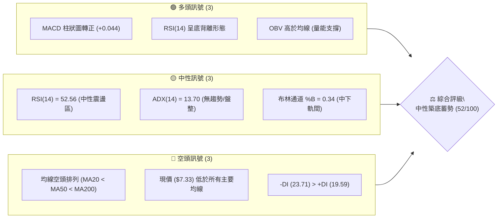
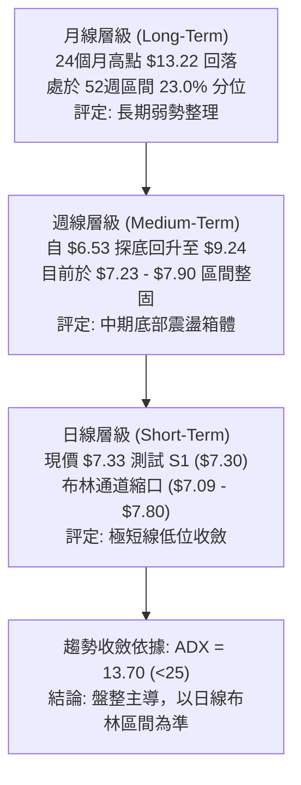
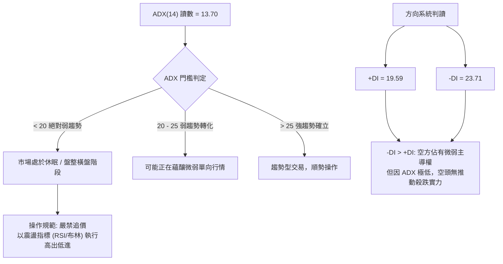
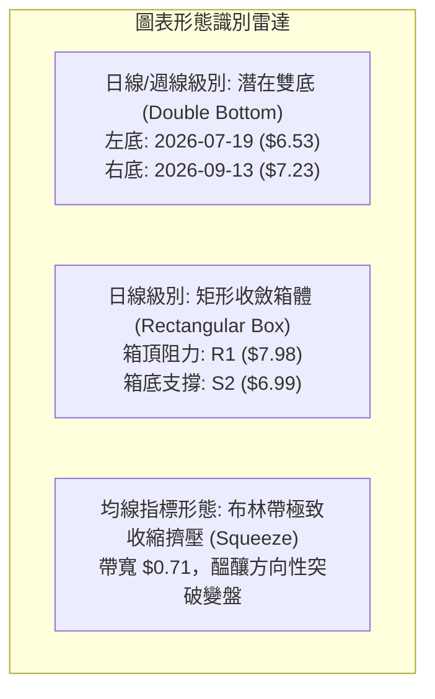
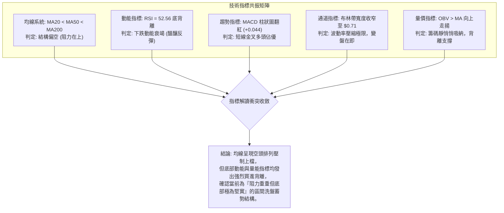
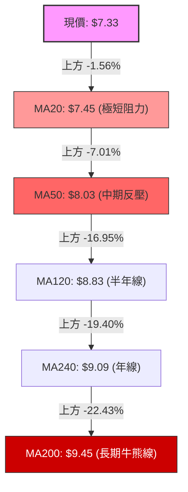
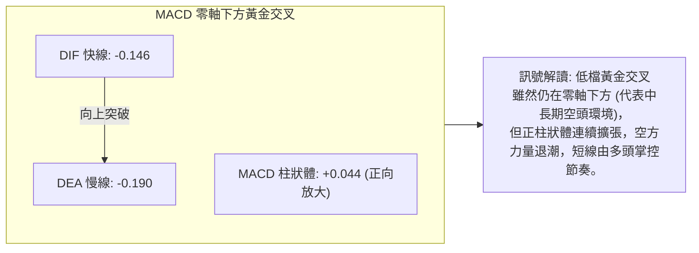
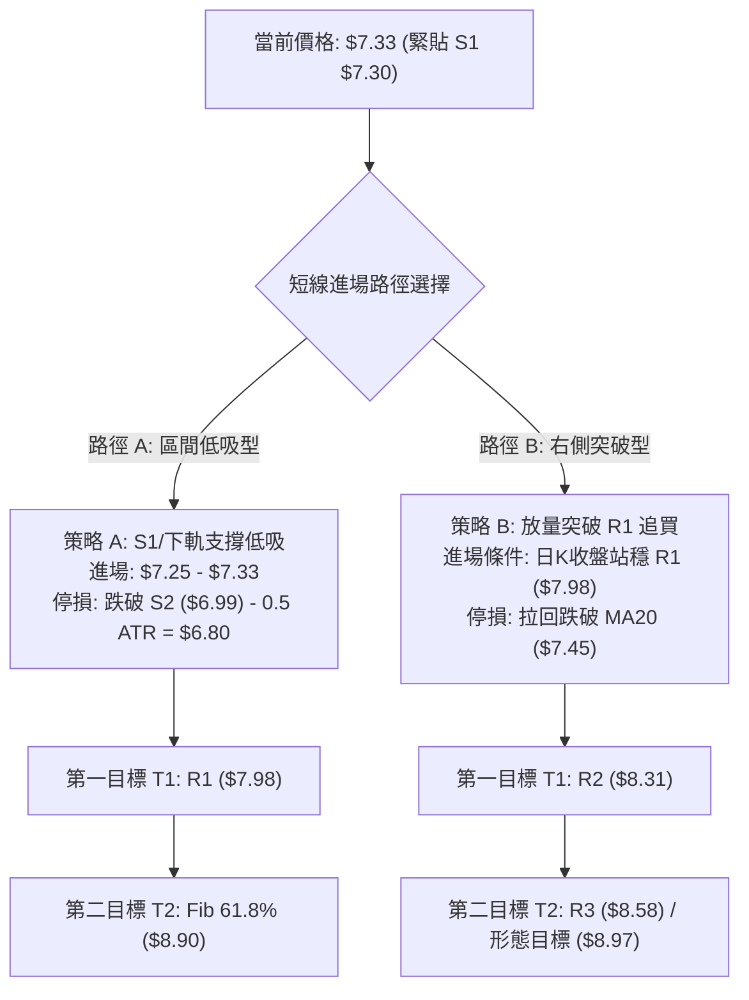
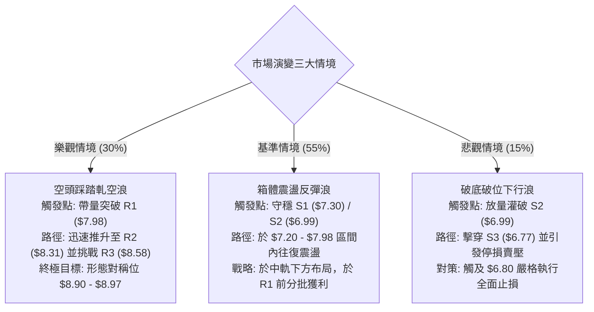

# ONDS 技術分析報告

> **報告日期**：2026-10-01 ｜ **語言**：繁體中文 ｜ **數據來源**：Yahoo Finance ｜ **當前價格**：$7.33

---

## 目錄

| 章節 | 內容 |
|------|------|
| [1. 技術面概覽](#1-技術面概覽) | 訊號儀表板、核心指標、評分卡 |
| [2. 趨勢分析](#2-趨勢分析) | 多時框趨勢、長中短期走勢、ADX解讀 |
| [3. 圖表形態分析](#3-圖表形態分析) | 形態識別、K線組合、目標價推算 |
| [4. 支撐與阻力](#4-支撐與阻力) | 關鍵價位、斐波那契回調結構 |
| [5. 技術指標深度解讀](#5-技術指標深度解讀) | 均線排列、RSI底背離、MACD、布林通道、OBV |
| [6. 動能與波動率](#6-動能與波動率) | 動能象限、ATR波動分析、高Beta與空頭回補潛力 |
| [7. 多時框架總結](#7-多時框架總結) | 時框架評分矩陣、多時框收斂定調 |
| [8. 交易策略建議](#8-交易策略建議) | 策略路由、情境階梯、進出場精確規劃 |
| [9. 風險提示與監控](#9-風險提示與監控) | 監控指標Checklist、情境路徑、風控規則 |
| [📋 報告總結](#-報告總結) | 核心結論與最佳策略組合 |

---

## 1. 技術面概覽

### 🎯 技術訊號儀表板



### 📊 核心指標速覽表

| 指標類別 | 指標名稱 | 當前數值 | 訊號 | 解讀 |
|----------|----------|----------|:----:|------|
| **價格** | 當前收盤價 | $7.33 | 🟡 | 位於 52 週區間 ($4.95 - $15.28) 的 23.0% 分位，處於歷史相對低檔 |
| **均線** | 短期均線 (MA20) | $7.45 | 🔴 | 價格低於 MA20 (-1.56%)，構成極短線動態阻力 |
| **均線** | 中期均線 (MA50) | $8.03 | 🔴 | 價格低於 MA50 (-7.01% 對比 MA60 $7.88)，中期波段偏弱 |
| **均線** | 長期均線 (MA200) | $9.45 | 🔴 | 價格顯著低於 MA200 (-19.40% 對比 MA240 $9.09)，長期結構仍屬空頭 |
| **動能** | RSI(14) | 52.56 | 🟢 | 位於中性平衡區，但出現顯著之價格破低而指標抬升的「底背離」 |
| **動能** | MACD (12,26,9) | 柱狀圖 +0.044 | 🟢 | 快線 (-0.146) 向上穿越慢線 (-0.190)，柱狀體翻紅，低檔黃金交叉 |
| **擺動** | KD (%K / %D) | 35.00 / 51.67 | 🟡 | %K 由低檔回升，目前無超買超賣極端現象 |
| **趨勢** | ADX(14) | 13.70 | 🟡 | ADX < 25 表明趨勢動能極弱，市場處於典型的「區間橫盤整理」狀態 |
| **通道** | 布林通道帶寬 | $7.09 - $7.80 | 🟡 | 通道寬度壓縮至 $0.71，%B 為 0.34，顯示波動度處於爆發前蓄勢期 |
| **量能** | 20日均量 / OBV | 0.85x / 多頭 | 🟢 | 量能微縮整理，但 OBV 指標維持在均線之上，籌碼並未在大跌中潰散 |
| **波動** | ATR(14) | $0.37 (5.05%) | 🟡 | 單日震幅預期約 $0.37，提供清晰的止損與止盈安全緩衝界線 |

### 🏆 技術評分卡

```
╔══════════════════════════════════════════════════════════════════╗
║                   技術評分卡 — ONDS (2026-10-01)                 ║
╠══════════════════════════════════════════════════════════════════╣
║ 趨勢強度 (Trend)      ██████░░░░░░░░░░░░░░  30/100  🔴 空頭排列  ║
║ 動能指標 (Momentum)   ██████████████░░░░░░  70/100  🟢 底背離翻多║
║ 支撐穩定度 (Support)  ████████████░░░░░░░░  60/100  🟡 S1防守穩固║
║ 成交量配合 (Volume)   ████████████░░░░░░░░  60/100  🟢 OBV量價背離║
║ 形態完整度 (Pattern)  ██████████░░░░░░░░░░  50/100  🟡 雙底構築中║
║ 均線排列 (MA System)  ████░░░░░░░░░░░░░░░░  20/100  🔴 嚴格空頭  ║
╠══════════════════════════════════════════════════════════════════╣
║ 綜合技術評分          ██████████░░░░░░░░░░  52/100  ⚖️ 區間震盪  ║
║ 評級結論：【區間整理 / 逢低布局 (Neutral-Accumulation)】        ║
╚══════════════════════════════════════════════════════════════════╝
```

---

## 2. 趨勢分析

### 🌐 多時框趨勢分析



### 📈 長期趨勢 — 12個月走勢圖（Unicode）

以下為 ONDS 自 2025 年 10 月至 2026 年 09 月之月度收盤價走勢軌跡：

```
ONDS 月線走勢圖（過去12個月：2025-10 至 2026-09）
價格軸 ($)
$14.00 ┤                                      ● $13.22 (2026-05 波段頂)
$13.00 ┤                                     ╱ ╲
$12.00 ┤                                    ╱   ╲
$11.00 ┤                      ● $10.36     ╱     ╲
$10.00 ┤              ● $9.76  ╲    ●$10.08      ╲
 $9.00 ┤             ╱          ╲  ╱              ╲  ● $8.24
 $8.00 ┤     ● $7.90╱            ● $9.04           ╲╱ ╲
 $7.00 ┤ ●──╱──────────────────────────────────────●───● $7.33 (當前收盤)
       │ $6.44                               $7.49   $7.66
       └─┬─────┬──────┬─────┬─────┬─────┬─────┬─────┬─────┬─────┬─────┬───
        10月  11月   12月  01月  02月  03月  04月  05月  06月  07月  08月  09月
        2025  2025   2025  2026  2026  2026  2026  2026  2026  2026  2026  2026
```

#### 走勢特徵分析表格

| 階段區間 | 時間跨度 | 起訖價格 | 區間漲跌幅 | 價量特徵與形態解讀 |
|:---------|:---------|:---------|:----------:|:------------------|
| **第一階段：主升浪段** | 2025-10 至 2026-01 | $6.44 → $10.36 | +60.87% | 量能階梯式放大，月線連四紅，奠定強多頭防守基礎 |
| **第二階段：高位橫盤** | 2026-01 至 2026-04 | $10.36 → $10.04 | -3.09% | 於 $9.04 - $10.36 形成高位強勢震盪箱體，洗清籌碼 |
| **第三階段：假突破噴出**| 2026-04 至 2026-05 | $10.04 → $13.22 | +31.67% | 爆量拉抬創 52 週次高點 $13.22，隨後遭逢獲利了結與空頭伏擊 |
| **第四階段：深度回檔** | 2026-05 至 2026-07 | $13.22 → $7.49 | -43.34% | 瀑布式急跌，跌破 MA20 與 MA50，一度於 7 月創下週低點 $6.53 |
| **第五階段：底部收斂** | 2026-07 至 2026-09 | $7.49 → $7.33 | -2.14% | 價格在 $7.20 - $7.90 區間鈍化，月線振幅顯著收斂，進入沉睡蓄勢期 |

### 📊 中期趨勢（週線分析）

從近 20 週的收盤價與籌碼換手觀察：
- **波段低點探明**：2026-07-19 當週收在 $6.53，伴隨 6.71 億股的恐慌拋售巨量；緊接著在 2026-07-26 爆出 8.34 億股的天量長紅棒（收盤 $7.80），確立 $6.53 - $6.99 為極強的中期籌碼沉澱區。
- **波段頸線反彈**：隨後在 2026-08-16 反彈至 $9.24 受阻，未能突破斐波那契 61.8% 位階（$8.90）與 MA200 壓力（$9.45），隨後量縮拉回。
- **近四週窄幅整固**：自 2026-09-13 至 2026-10-04，週收盤分別為 $7.23、$7.39、$7.64、$7.33，均線乖離率持續收斂，波動度降至極低水準。

```
週線區間壓力與支撐通道：
$9.45 ─── MA200 長期空頭強阻力 ──────────────────────────────
$8.58 ─── R3 波段壓力 ──────────────────────────────────────
$8.31 ─── R2 次級阻力 ──────────────────────────────────────
$7.98 ─── R1 近期週線箱頂頸線 ──────────────────────────────
$7.33 ───【現價】──────────────────────────────────────────
$7.30 ─── S1 近期支撐線（測試中）────────────────────────────
$6.99 ─── S2 波段雙底支撐 ──────────────────────────────────
$6.77 ─── S3 深度防守極限 ──────────────────────────────────
```

### ⚡ 趨勢強度評估（ADX 解讀）



#### ADX 數值強度對照

| 數值區間 | 趨勢狀態 | ONDS 當前狀態 | 交易策略導引 |
|:---------|:---------|:-------------:|:-------------|
| **0 - 20** | **極弱趨勢 / 無趨勢橫盤** | **13.70 (當前位置)** | **高拋低吸，嚴格依照布林軌道上下界與 S/R 操作** |
| 20 - 25 | 趨勢初生 / 混沌方向 | — | 縮小部位，等待均線帶量突破 |
| 25 - 40 | 明確強趨勢形成 | — | 順勢加碼，抱牢主升/主跌浪 |
| 40 - 60 | 極強單邊爆發浪 | — | 移動止盈，提防極端乖離回洗 |

---

## 3. 圖表形態分析

### 🔍 形態識別系統



#### 形態識別與信心度評估表

| 形態名稱 | 信心度 (%) | 判斷依據（嚴格引用歷史與現有數據） | 形態完成度 | 理論目標價（附計算公式） |
|:---------|:----------:|:----------------------------------|:----------:|:-------------------------|
| **波段雙重底 (W底)** | **68%** | 兩次低點分別為 2026-07-19 之 $6.53 與 2026-09-13 之 $7.23（右底墊高），頸線對應近期高點聚集位 R1 ($7.98)。成交量在左底爆出 6.71 億股，右底萎縮至 2.01 億股，具備經典量價特徵。 | 75% | 頸線 R1 ($7.98) + 形態高度 ($7.98 - $6.99 = $0.99) = **$8.97**（精確對應斐波那契 61.8% 之 **$8.90** 與 MA120 **$8.83** 阻力群） |
| **矩形箱體整理** | **82%** | 近兩個月價格嚴格被框限於 S2 ($6.99) 與 R1 ($7.98) 之間，ADX 降至 13.70 充分確認箱體特質。 | 85% | 向上突破 R1 ($7.98)：目標價為 R2 (**$8.31**) 與 R3 (**$8.58**)<br/>跌破 S2 ($6.99)：目標價為 S3 (**$6.77**) |
| **頭肩底形態** | **35%** | 數據中左肩與頭部尚可辨識（7月低點），但右肩目前未有明確右抬突破確認，訊號不足。 | 30% | *信心度 < 50%，依規範不予計算幾何目標價，僅作觀察。* |

### 🕯️ 重要K線形態分析

| 觀測週期 / 日期 | 收盤價 | 識別K線形態 | 技術含義解讀 | 訊號屬性 |
|:----------------|:------:|:------------|:------------|:--------:|
| 2026-07-19 (週K) | $6.53 | **長下影錘頭線 (Hammer)** | 單週成交量暴增至 6.71 億股，下探後強烈拉回，顯現主力資金洗盤換手與機構抄底接盤特徵。 | 🟢 強烈看多 |
| 2026-07-26 (週K) | $7.80 | **多頭吞噬長紅棒 (Engulfing)** | 單週天量 8.34 億股完全包覆前週實體，確認 $6.53 為階段性鐵底。 | 🟢 看多確立 |
| 2026-08-16 (週K) | $9.24 | **流星線 (Shooting Star)** | 衝高觸及波段高位後承壓回落，長上影線顯示斐波那契 61.8% ($8.90) 上方套牢盤沉重。 | 🔴 看空回檔 |
| 2026-09-13 至 09-27 | $7.23→$7.64 | **紅三兵雛形 / 低檔孕線** | 在 S1 ($7.30) 附近連續三週收出小實體回升線，動能逐步墊高，空方動能耗盡。 | 🟢 築底翻揚 |
| 2026-10-04 (最新) | $7.33 | **量縮十字星 (Doji)** | 成交量急劇萎縮至 1.55 億股，價格緊貼 S1 ($7.30) 窄幅震盪，多空進入決戰前的平衡窒息點。 | 🟡 變盤前夕 |

### 📉 ASCII 走勢形態示意圖

```
ONDS 日線/週線級別「雙底築底與箱體收斂」形態圖解
 價格軸
 $8.90 ┼──────────────────────────────────────────────── 目標價 T1 (Fib 61.8%)
       │
 $8.58 ┼─────────────────────────────────── [R3] ─────── 強阻力
 $8.31 ┼───────────────────────── [R2] ────────────────── 阻力
 $7.98 ┼───────── [頸線 R1] ──────────────────────────── 關鍵箱頂阻力
       │          ╱╲                     ╱╲
 $7.60 ┼─────────╱──╲───────────────────╱──╲───────────
 $7.45 ┼────────╱────╲─── [MA20 / 中軌] ╱────╲────────── 中軌壓制
 $7.33 ┼───────╱──────╲────────────────●──────╲──────── 現價 $7.33
 $7.30 ┼──────╱────────╲─────── [S1] ───────────╲────── 極短線支撐 (測試中)
 $6.99 ┼─────● (右底預期) ───────────────────────●────── [S2 箱底強支撐]
       │    ╱                                     (2026-09-13 $7.23)
 $6.53 ┼───● (左底 2026-07-19)
       └──────────────────────────────────────────────────────────
           7月中旬             8月中旬           9月下旬/現階段
```

### 🎯 形態目標價計算

以高信心度 (82%) 之「箱體震盪」及 (68%) 之「雙重底突破」為計算架構：
1. **箱體垂直幅度 ($H$)**：
   $$\text{頸線 } (R1) - \text{箱底支撐 } (S2) = \$7.98 - \$6.99 = \$0.99$$
2. **多頭向上對稱突破目標 (Bullish Target)**：
   $$\text{突破點 } (R1) + H = \$7.98 + \$0.99 = \mathbf{\$8.97}$$
   - **實證確認**：此數值高度重合於數據庫之 **斐波那契 61.8% 回調位 ($8.90)** 及 **MA120 均線 ($8.83)**，構成極度密集的目標賣壓共振帶。
3. **空頭向下對稱破位目標 (Bearish Breakdown Target)**：
   $$\text{破位點 } (S2) - H = \$6.99 - \$0.99 = \mathbf{\$6.00}$$
   - **實證確認**：向下破位後將跌向 S3 ($6.77$) 及 52 週最低點 $4.95$ 的中繼區。

---

## 4. 支撐與阻力

### 🗺️ 關鍵價位分布圖（Unicode）

```
ONDS 關鍵價位空間結構圖
═════════════════════════════════════════════════════════════════════════
 $10.11 ║██████████████████████████████████████║ 斐波那契 50.0% 強壁壘
  $9.45 ║██████████████████████████████        ║ MA200 牛熊分水嶺
  $8.90 ║██████████████████████████████████████║ 斐波那契 61.8% / 形態目標
  $8.58 ║██████████████████████                ║ 強阻力 R3 (+17.05%)
  $8.31 ║██████████████████                    ║ 阻力 R2 (+13.44%)
  $7.98 ║██████████████████████████████        ║ 關鍵箱頂頸線 R1 (+8.87%)
  $7.80 ║▒▒▒▒▒▒▒▒▒▒▒▒▒▒▒▒                      ║ 布林通道上軌
────────╫──────────────────────────────────────╫─────────────────────────
  $7.45 ║┈┈┈┈┈┈┈┈┈┈┈┈┈┈┈┈┈┈┈┈┈┈┈┈┈┈┈┈┈┈        ║ 布林中軌 / MA20
  $7.33 ╠══════════════════════════════════════╣ ◄ 現價 ($7.33)
  $7.30 ║▓▓▓▓▓▓▓▓▓▓▓▓▓▓▓▓▓▓▓▓▓▓▓▓▓▓▓▓▓▓        ║ 近期核心支撐 S1 (-0.48%)
  $7.16 ║▓▓▓▓▓▓▓▓▓▓▓▓▓▓▓▓▓▓▓▓▓▓▓▓▓▓▓▓▓▓▓▓▓▓▓▓  ║ 斐波那契 78.6% 回調防線
  $7.09 ║░░░░░░░░░░░░░░                        ║ 布林通道下軌
  $6.99 ║██████████████████████████████████████║ 強支撐 S2 (波段箱底 -4.64%)
  $6.77 ║██████████████████████████████        ║ 極限防守支撐 S3 (-7.64%)
═════════════════════════════════════════════════════════════════════════
```

### 🚧 阻力位分析表

*(價位嚴格引用自數據庫波段高點聚類與 OHLCV 計算值)*

| 阻力級別 | 精確價位 | 距現價空間 | 形成技術背景 | 突破難度 | 技術重要性 |
|:---------|:--------:|:----------:|:-------------|:--------:|:----------:|
| **R1** | **$7.98** | +8.87% | 近期多次週線反彈觸頂點、日線震盪箱頂、貼近布林上軌 ($7.80) 與 MA50 ($8.03) | 🟡 中等 | ★★★★☆<br/>短線多空分水嶺 |
| **R2** | **$8.31** | +13.44% | 2026年7月暴跌後的首波修正反彈套牢密集區 | 🔴 偏高 | ★★★☆☆<br/>波段獲利了結位 |
| **R3** | **$8.58** | +17.05% | 8月中旬次級波段高點聚類，逼近 MA120 ($8.83) 與 Fib 61.8% | 🔴 極高 | ★★★★☆<br/>中期強反壓區 |

### 🛡️ 支撐位分析表

*(價位嚴格引用自數據庫波段低點聚類與 OHLCV 計算值)*

| 支撐級別 | 精確價位 | 距現價空間 | 形成技術背景 | 守住機率 | 技術重要性 |
|:---------|:--------:|:----------:|:-------------|:--------:|:----------:|
| **S1** | **$7.30** | -0.48% | 近期日線回檔連續獲撐點，緊鄰斐波那契 78.6% ($7.16) | 🟢 70% | ★★★★☆<br/>日內多方防線 |
| **S2** | **$6.99** | -4.64% | 過去兩個月波段雙底聚類點，整數大關與布林下軌 ($7.09) 緩衝區 | 🟢 85% | ★★★★★<br/>中期多頭生命線 |
| **S3** | **$6.77** | -7.64% | 7月份極端恐慌拋售後的次級收盤密集支撐區 | 🟢 92% | ★★★★☆<br/>空頭回補終極防線 |

### 📐 斐波那契回調位分析

*(基準區間：52週波段低點 $4.95 → 52週波段高點 $15.28，落差幅度 $10.33)*

| 比例階梯 | 精確價位 | 相對現價位置 | 技術意涵與歷史反饋驗證 |
|:---------|:--------:|:------------:|:----------------------|
| **0.0%** | **$15.28** | +108.46% | 52 週天花板高點，長線歷史頂部 |
| **23.6%** | **$12.84** | +75.17% | 2026年5月爆量拉回時之第一支撐轉壓力點 |
| **38.2%** | **$11.33** | +54.57% | 多頭回檔常態支撐位（已於6月全面失守） |
| **50.0%** | **$10.11** | +37.93% | 心理整數大關，第一季高位整固中樞 |
| **61.8%** | **$8.90** | +21.42% | **黃金分割關鍵反壓**：8月份反彈即在此處遇阻回落，亦為雙底對稱目標價群 |
| **78.6%** | **$7.16** | -2.32% | **深度防守回調位**：現價落於 $7.16 至 $8.90 之間，此處為長線籌碼沉澱防線 |
| **100.0%**| **$4.95** | -32.47% | 52 週週期起漲鐵底，歷史週期極端值 |

**回調位深度解讀**：
當前收盤價 **$7.33** 精準座落在 **78.6% ($7.16)** 與 **61.8% ($8.90)** 之間，且距離 78.6% 回調位僅 2.32% 之遙。技術理論中，回調達 78.6% 屬於極深度的清洗多頭籌碼階段。現價未進一步崩跌破 $7.16，顯示空頭拋售動能衰竭，多頭正試圖依託 $7.16 - $7.30 構築長期迴轉中繼站。

---

## 5. 技術指標深度解讀

### 🎛️ 指標訊號總覽



### 📈 移動平均線排列分析



#### 均線量化排列狀態

| 均線名稱 | 當前價格 | 乖離率 (Bias) | 排列形態 | 狀態評估 |
|:---------|:--------:|:-------------:|:--------:|:---------|
| **MA5** | $7.55 | -2.91% | 短期下垂 | 壓制極短線反彈 |
| **MA10** | $7.50 | -2.27% | 短期平移 | 多空於 $7.50 進行貼身肉搏 |
| **MA20** | $7.45 | -1.61% | 走平鈍化 | 布林中軌所在，突破即宣告極短線轉強 |
| **MA60** | $7.88 | -6.98% | 下彎趨緩 | 與箱頂 R1 ($7.98) 形成重疊反壓帶 |
| **MA120**| $8.83 | -16.99% | 空頭下行 | 对应 Fib 61.8% ($8.90)，波段目標阻力 |
| **MA200**| $9.45 | -22.43% | 空頭主導 | 長期空頭堡壘，未突破前不可輕言反轉 |

### 📉 RSI(14) 分析

當前數值：**52.56**（中性偏多區間）
進度條展示：
```
30 (超賣)                 50 (平衡)                 70 (超買)
├──┼──┼──┼──┼──┼──┼──┼──┼──┼──┼──┼──┼──┼──┼──┼──┼──┼──┼──┤
[████████████████████████████░░░░░░░░░░░░░░░░░░░░] 52.56
```

#### 底背離（Bullish Divergence）深度研判
- **形態事實**：
  - 價格端：2026-07-19 週收盤 $6.53，至 2026-09-13 價格再次下探 $7.23 並維持在 $7.33 低檔。
  - 指標端：2026-07-05 RSI 創下 21.3 的嚴重超賣低點，隨後 07-19 回升至 35.0；而在 09-13 股價回踩 $7.23 時，RSI 守在 30.1；最新數據（2026-10-04）股價位於 $7.33，RSI 卻已躍升至 **52.56**。
- **研判結論**：
  這是標準的**「二度底背離」**架構。價格在低位橫盤打底，但動能擺動指標早已脫離弱勢區並跨越 50 多空分界線，預告賣壓竭盡，隨時存在技術性報復反彈動能。

### 📊 MACD(12/26/9) 訊號解讀



從 20 週歷史數值追蹤可見，MACD 柱狀體在 2026-09-06 達到 -0.145 的谷底後迅速收斂，9-20 收窄至 -0.016，9-27 正式翻紅至 +0.062，最新一週維持在 **+0.044**。此低檔翻紅通常對應波段級別的右側反彈起點。

### 📦 布林通道分析

```
布林通道當前空間軌跡示意圖 ($7.09 - $7.80)
$7.98 ─── R1 箱頂阻力 ──────────────────────────────────────────
$7.80 ─── 上軌 (Upper Band) ───────────────────────────────────
          │
$7.45 ─── 中軌 (Middle Band / MA20) ───────────────────────────
          │   ● 現價 $7.33 (%B = 0.34)
$7.09 ─── 下軌 (Lower Band) ───────────────────────────────────
$6.99 ─── S2 箱底支撐 ──────────────────────────────────────────
```
- **帶寬指標**：上軌 ($7.80) 與下軌 ($7.09) 垂直差距僅 **$0.71**（占股價比 9.68%），為過去半年最窄帶寬，呈現極度壓縮的「布林帶擠壓（Band Squeeze）」狀態。
- **位置解讀**：現價 $7.33 位於中軌下方，%B 數值為 **0.34**，顯示價格靠近下軌但未破軌，具備極佳的下軌支撐彈性。

### 💹 成交量分析（量價配合度）

1. **量能縮放結構**：
   - 最新成交量：**54,050,100 股**
   - 20日均量：**63,839,820 股**（量比僅 **0.85x**，顯著量縮）
   - 50日均量：**70,880,934 股**
2. **OBV（能量潮）趨勢**：
   - 數據明確顯示：「**OBV > MA → 量能支撐上漲**」。
   - 當價格自 8 月高點回落時，OBV 指標並未擊穿 7 月低點時的水平，反而呈現穩步抬升趨勢。說明在目前 $7.00 - $7.50 價位區間，主要為散戶無序交易，機構籌碼未見恐慌性出逃，形成「價跌量縮、籌碼鎖定」的量價背離利多現象。

---

## 6. 動能與波動率

### ⚡ 動能評估四象限

```
波動率 (Volatility)
   高 ▲
      │   Q3 (高波/強動能)     │   Q4 (高波/弱動能)
      │   典型突破加速段       │   恐慌下殺出清段
      │                        │
──────┼────────────────────────┼────────────────────────► 動能強度 (Momentum)
      │   Q1 (低波/強動能)     │   Q2 (低波/弱動能)  ◄── [ONDS 當前落點]
      │   最佳低吸布局點       │   壓縮蓄勢盤整段
   低 │                        │   ADX=13.70 / %B=0.34
```

| 象限 | 動能維度 | 波動維度 | ONDS 判定 | 當前狀態評估與戰略方針 |
|:-----|:--------:|:--------:|:---------:|:----------------------|
| **Q1** | 強 | 低 | — | 絕佳攻擊契機（等待帶量突破 R1 後觸發） |
| **Q2** | **弱** | **低** | **✓ (當前所處區間)** | **低位壓縮整固：ADX僅 13.70，布林通道寬度收縮至 $0.71，市場交投淡靜，應逢低分批建倉，嚴禁追高** |
| **Q3** | 強 | 高 | — | 高風險高收益博弈區（如 5月份噴出至 $13.22） |
| **Q4** | 弱 | 高 | — | 瀑布式下挫高危區（如 6月份急跌階段，已度過） |

### 📊 ATR 波動率分析

- **ATR(14) 數值**：**$0.37**（占現價 $7.33 的 **5.05%**）
- **技術解讀**：
  每日平均波動空間達 $0.37，意味著 ONDS 仍具備微型活躍股特徵。在設計風控時，不能將止損設得過窄，以防被正常隨機雜訊洗出場。
- **風控參數規範**：
  - **常規止損緩衝距 (1.0x ATR)**：$0.37，自進場點往下扣除 $0.37。
  - **波段安全止損距 (1.5x ATR)**：$0.55，提供穿越極端假跌破的防護空間。

### 📐 Beta 與市場相關性

- **Beta 係數**：**2.736**（極高波動性）
  - 相對於標普 500 指數，該股具備 2.7 倍以上的放大波動率。一旦大盤走多或板塊轉強，其上行爆發力極強。
- **空頭回補擠壓潛力（Short Squeeze Alert）**：
  - **放空比例（Short % of Float）**：高達 **41.0%**！
  - **放空股數天數比（Short Ratio）**：**3.83 天**
  - **解讀**：高達 41% 的流通股被做空，屬於市場罕見的極端重度放空標的。在技術面上出現雙底打底、RSI 底背離與布林壓縮時，一旦股價放量突破關鍵箱頂 **R1 ($7.98)**，將引發極度猛烈的空頭踩踏式回補浪潮（Short Squeeze），直接將股價推升至 R2 ($8.31) 乃至 R3 ($8.58)。

---

## 7. 多時框架總結

### 📋 時框架評分表

| 時框架 | 趨勢方向 | 動能狀態 | 均線排列狀況 | 核心形態結構 | 綜合評分 | 戰略建議 |
|:-------|:--------:|:--------:|:------------:|:------------:|:--------:|:---------|
| **月線 (長期)** | 🔴 弱勢回調 | 🟡 止跌鈍化 | 偏空 (遠離均線) | $13.22 瀑布回落後的長底沉澱 | 40/100 | 長期投資者可依託 78.6% Fib 建底倉 |
| **週線 (中期)** | 🟡 箱體震盪 | 🟢 築底抬升 | 空頭排列 (承壓MA50) | $6.53 與 $7.23 雙重底潛伏 | 58/100 | 波段操作者關注箱底 S2 至箱頂 R1 |
| **日線 (短期)** | 🟡 橫向整理 | 🟢 底背離金叉 | 跌破MA20但貼近支撐 | 布林擠壓，等待突破變盤 | 55/100 | 短線交易者依託 S1 ($7.30) 逢低試多 |

### 🔲 綜合訊號矩陣

```
時框交叉驗證矩陣：
┌───────────┬──────────────┬──────────────┬──────────────┐
│  維度     │  短期 (日線)  │  中期 (週線)  │  長期 (月線)  │
├───────────┼──────────────┼──────────────┼──────────────┤
│ 趨勢方向  │ 🟡 橫盤收斂  │ 🟡 箱體打底  │ 🔴 空頭下行  │
│ 動能狀態  │ 🟢 MACD金叉  │ 🟢 RSI底背離 │ 🟡 動能衰減  │
│ 支撐防守  │ 🟢 S1 ($7.30)│ 🟢 S2 ($6.99)│ 🟢 Fib 78.6% │
│ 阻力壓制  │ 🔴 MA20($7.45│ 🔴 R1 ($7.98)│ 🔴 MA200($9.45│
│ 量能結構  │ 🟡 極致縮量  │ 🟢 天量底換手│ 🟡 籌碼鎖定  │
└───────────┴──────────────┴──────────────┴──────────────┘
```

### ⚖️ 多時框收斂結論

> **依嚴格規則第 14 條收斂判定**：
> 1. **趨勢/盤整判定**：當前系統 ADX(14) 讀數為 **13.70 (< 25)**，嚴格判定當前處於**「盤整行情（Consolidation Market）」**。
> 2. **主導規則取捨**：依規則，盤整行情中中長期順勢均線鈍化，**「以日線布林通道上下軌與支撐阻力聚類位為主要交易區間」**。日線的短線背離與通道邊界優先於中長期的均線空頭排列。
> 3. **唯一收斂方向**：**【中性偏多，逢低吸納區間操作】**。以支撐位 **S1 ($7.30)** 及 **S2 ($6.99)** 為防守基準，目標上看箱頂阻力 **R1 ($7.98)** 及對稱目標 **$8.90**。

---

## 8. 交易策略建議

### 🗺️ 策略決策流程圖



### 🧭 策略路由

- **技術評分卡總分**：**52 / 100 分**（落入 40–60 分之中性震盪區間）。
- **當前主策略方向**：**【區間低吸為主、向上突破確認加碼為輔】**。
  - 由於價格緊鄰核心支撐 S1 ($7.30)，向下空間已被壓縮，而向上至箱頂 R1 ($7.98) 具備近 9% 空間，盈虧比極佳，嚴禁在下軌處盲目放空。

### 🎯 價格情境階梯（Price Scenarios）

*(價位嚴格引用自數據庫已知精確數值)*

| 價格位階與觸發條件 | 下一目標點位 | 後續延伸目標 | 情境技術含義與因應措施 |
|:-------------------|:------------:|:------------:|:----------------------|
| **向上放量突破 R1 ($7.98)** | **R2 ($8.31)** | **R3 ($8.58)** / **$8.90** | **強勢轉強**：引發 41% 放空部位之軋空潮，確認波段雙底成型，啟動大級別升浪。 |
| **突破短期中軌 MA20 ($7.45)**| **R1 ($7.98)** | **R2 ($8.31)** | **短線走強**：脫離布林下半區，多頭試探箱頂壓力。 |
| **現價區間 ($7.30 - $7.45) 震盪**| — | — | **常態整固**：ADX < 25 正常現象，持股續抱，耐心等待帶量表態。 |
| **跌破核心支撐 S1 ($7.30)** | **S2 ($6.99)** | **Fib 78.6% ($7.16)** | **弱勢回踩**：回測 78.6% 回調位與箱體底界，多頭最後防線。 |
| **有效跌破 S2 ($6.99)** | **S3 ($6.77)** | **52W低點 ($4.95)** | **全面轉弱破位**：箱體破局，觸發硬性停損離場，多頭觀點失效。 |

### 📊 情境機率分佈

| 運行情境 | 發生機率 | 主要技術與量化依據 |
|:---------|:--------:|:------------------|
| **情境一：守穩 S1 反彈上攻箱頂** | **55%** | RSI 呈二度底背離、MACD 柱狀體翻紅擴張、OBV 量價配合良好、下軌防守堅固。 |
| **情境二：窄幅震盪 (橫盤於 $7.16-$7.60)** | **30%** | ADX 僅 13.70，趨勢動能匱乏，布林通道極致收縮，市場交投等待催化劑。 |
| **情境三：跌破 S2 破底重啟跌勢** | **15%** | 均線系統全面空頭排列，若市場突發系統性風險，高 Beta (2.736) 標的易受衝擊。 |

### 🟢 主策略詳情

#### 策略 A（左側低吸）：依託 S1 支撐之區間操作策略
- **進場條件**：現價 $7.33 附近，或盤中回踩測試 S1 ($7.30) 出現小幅回升訊號時直接介入。
- **進場價格**：**$7.33**（回踩區間 $7.30 - $7.33 均可）。
- **止損價格**：**$6.80**（設定於 S2 $6.99 之下方約 0.5x ATR 處，徹底跌破波段箱底則承認失敗）。
- **目標價 T1**：**$7.98**（箱頂頸線 R1，預期報酬 +8.87%）。
- **目標價 T2**：**$8.90**（突破後延伸至 Fib 61.8% / 雙底對稱目標，預期報酬 +21.42%）。
- **風險報酬比 (R:R)**：
  - 承擔風險：$\$7.33 - \$6.80 = \$0.53$
  - 目標一回報：$\$7.98 - \$7.33 = \$0.65$ $\rightarrow$ **盈虧比 = 1 : 1.23**
  - 目標二回報：$\$8.90 - \$7.33 = \$1.57$ $\rightarrow$ **盈虧比 = 1 : 2.96**
- **策略成功率**：約 **65%**。
- **建議倉位**：**10% - 15%**（基礎測試倉）。

#### 策略 B（右側追突破）：帶量突破箱頂頸線之動能追擊策略
- **進場條件**：日 K 線帶量實體突破並收高於 R1 ($7.98)，且單日成交量大於 20日均量 1.2 倍以上。
- **進場價格**：**$8.05**（突破確認後的第一時間跟進價）。
- **止損價格**：**$7.45**（以 MA20 與原箱頂轉換成的支撐作為防線）。
- **目標價 T1**：**$8.58**（直擊阻力 R3，預期報酬 +6.58%）。
- **目標價 T2**：**$8.97**（形態垂直等幅擴展位，預期報酬 +11.43%）。
- **風險報酬比 (R:R)**：
  - 承擔風險：$\$8.05 - \$7.45 = \$0.60$
  - 目標二回報：$\$8.97 - \$8.05 = \$0.92$ $\rightarrow$ **盈虧比 = 1 : 1.53**
- **策略成功率**：約 **58%**（伴隨軋空時爆發力強）。
- **建議倉位**：**15%**（右側確認後加碼）。

### 🔴 反向風險觸發點（對沖與風控提示）

若出現以下情況，主策略假設立即失效，應果斷停損或啟動反向避險：
1. **收盤跌破 S2 ($6.99)**：代表過去兩個月的雙底支撐宣告潰敗，盤整型態演變為向下破位，下一道防線直指 S3 ($6.77$) 與 52 週低點 ($4.95$)。
2. **成交量異動放大下殺**：若單日出脫量超過 7,000 萬股（高於 50日均量）且收在當日最低點，表明機構籌碼棄守。

### ⭐ 整體訊號強度評星

```
做多訊號強度：★★★☆☆  (3/5星 — 底背離明確，性價比極高，但均線壓制仍重)
做空訊號強度：★★☆☆☆  (2/5星 — 處於歷史低檔與強支撐上，做空盈虧比惡劣且面臨軋空風險)
整體可信度：  ★★★★☆  (4/5星 — 指標共振收斂完整，ADX低值確認區間操作有效性)
```

---

## 9. 風險提示與監控

### ✅ 關鍵監控指標 Checklist

```
╔══════════════════════════════════════════════════════════════════╗
║              ONDS 交易員每日關鍵監控 Checklist                  ║
╠══════════════════════════════════════════════════════════════════╣
║ [ ] 價格防禦：盤中低點是否力守 S1 ($7.30) 與 S2 ($6.99)？       ║
║ [ ] 動能維繫：RSI(14) 是否穩居 50 分水嶺之上未重新破弱？        ║
║ [ ] 柱狀驗證：MACD 柱狀體是否持續保持在零軸以上 (+0.044 擴張)？  ║
║ [ ] 變盤信號：布林通道帶寬 ($0.71) 是否因突破上軌 ($7.80) 張口？║
║ [ ] 量能異動：上攻時單日量能是否超越 20日均量 (6,380萬股)？      ║
║ [ ] 籌碼觀測：空頭部位 (41.0% Float) 是否出現借券費率暴增現象？ ║
╚══════════════════════════════════════════════════════════════════╝
```

### ⚠️ 風險場景分析



### 🛡️ 風險管理重要提醒

1. **高 Beta 波動性控管**：ONDS 的 Beta 值高達 **2.736**，意味著大盤若波動 1%，該股將放大波動近 3%。整體持倉部位建議控制在總投資組合的 **10% - 15%** 以內，避免單一標的過度侵蝕本金。
2. **高空頭比率的雙面刃**：41% 的流通放空比例意味著巨大的軋空潛力，但也意味著當前基本面或法人機構存在沉重空頭共識。未見突破前不可過度重倉押注「軋空幻想」，必須嚴格以技術價位做為唯一的進出場依據。
3. **無條件紀律止損**：以 $6.80 作為策略 A 之終極停損底線。任何跌破 S2 的走勢均不宜溝通或向下攤平，技術分析的核心在於「截斷虧損，讓利潤奔跑」。

---

## 📋 報告總結

```
╔═════════════════════════════════════════════════════════════════════════╗
║                      ONDS 技術分析報告總結 (2026-10-01)                 ║
╠═════════════════════════════════════════════════════════════════════════╣
║ 報告日期：2026-10-01                當前價格：$7.33                     ║
║ 技術評級：⚖️ 中性蓄勢 (52/100)      主策略：區間低吸 / 突破加碼         ║
╠═════════════════════════════════════════════════════════════════════════╣
║ 關鍵技術結論：                                                          ║
║ ├─ 長期趨勢：🔴 弱勢空頭格局 (價格顯著低於 MA200 $9.45 與年線)          ║
║ ├─ 中期趨勢：🟡 雙重底箱體整固 ($6.99 至 $7.98 區間沉澱換手)            ║
║ ├─ 短期趨勢：🟢 動能率先翻多 (RSI 呈現二度底背離、MACD 金叉翻紅)        ║
║ ├─ 核心支撐：S1 $7.30 (日內防線) / S2 $6.99 (中期生命線)                 ║
║ ├─ 關鍵阻力：R1 $7.98 (箱頂頸線) / R2 $8.31 / R3 $8.58                  ║
║ └─ 華爾街目標：平均目標價 $19.42 (最低 $13.00 / 最高 $25.00，全體強力買進)║
╠═════════════════════════════════════════════════════════════════════════╣
║ 最優策略組合建議：                                                      ║
║ 1. 🥇 最佳機會（低吸型）：現價 $7.33 依託 S1 輕倉布局，停損設 $6.80，    ║
║    第一目標看 R1 ($7.98)，盈虧比 1:1.23；第二目標看 $8.90 (盈虧比 1:2.96)║
║ 2. 🥈 次選機會（動能型）：等待日線放量實體突破 R1 ($7.98) 追買，         ║
║    博弈 41% 空頭踩踏軋空行情，目標直指 R2 ($8.31) 與 R3 ($8.58)。       ║
║ 3. 🥉 保守選擇（觀望型）：等待 ADX(14) 突破 20 且布林開口顯現明確單邊    ║
║    趨勢後，再行順勢進場介入。                                           ║
╚═════════════════════════════════════════════════════════════════════════╝
```

---

> ⚠️ **免責聲明**：本報告為依據市場技術分析理論與量化數據生成之專業研報，所有支撐阻力位與目標預估均基於歷史量價數據之統計概率。本報告**僅供研究與學術參考**，**不構成任何要約、招攬或實質投資建議**。金融市場瞬息萬變，高 Beta 股票波動劇烈，投資人應獨立評估風險，妥善設置停損並自負盈虧。

---

*報告生成時間：2026-10-01 ｜ 數據來源：Yahoo Finance ｜ 分析框架：多時框架量化技術分析*