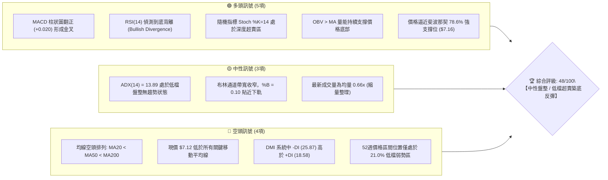
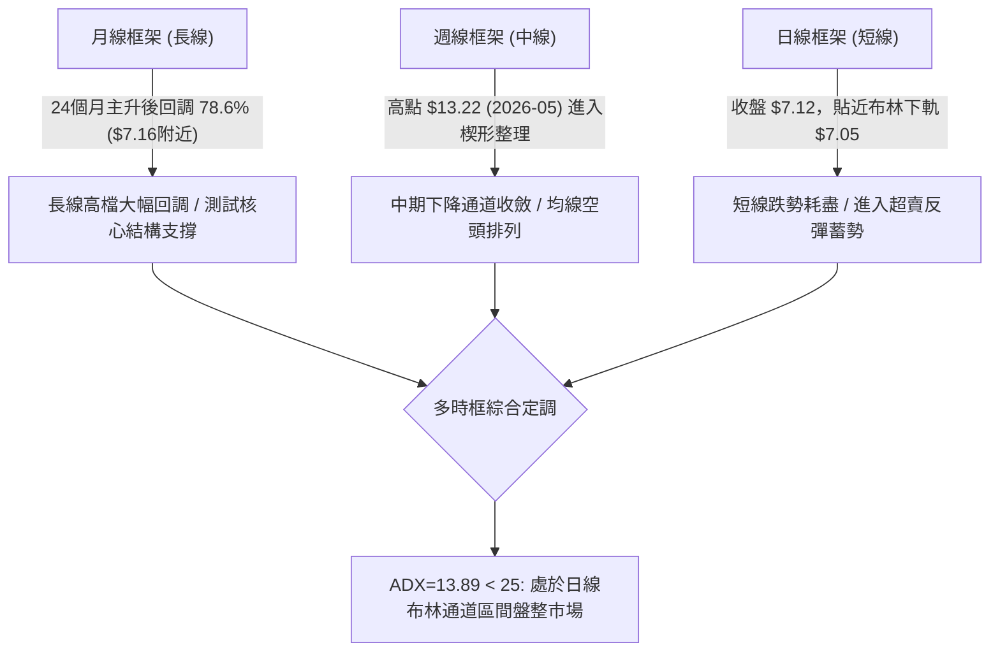
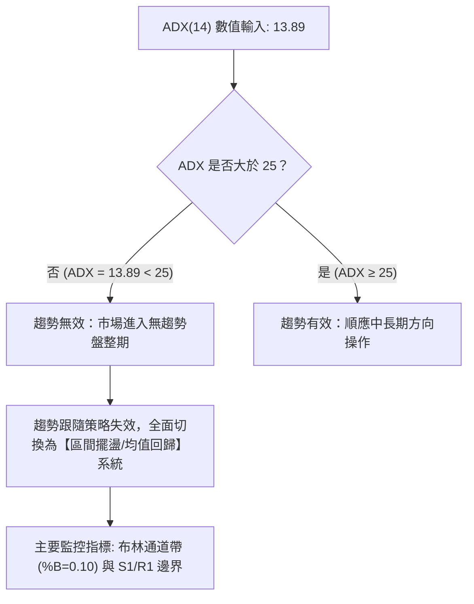
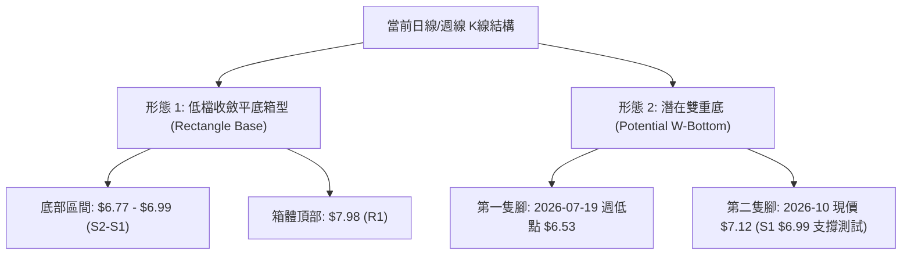
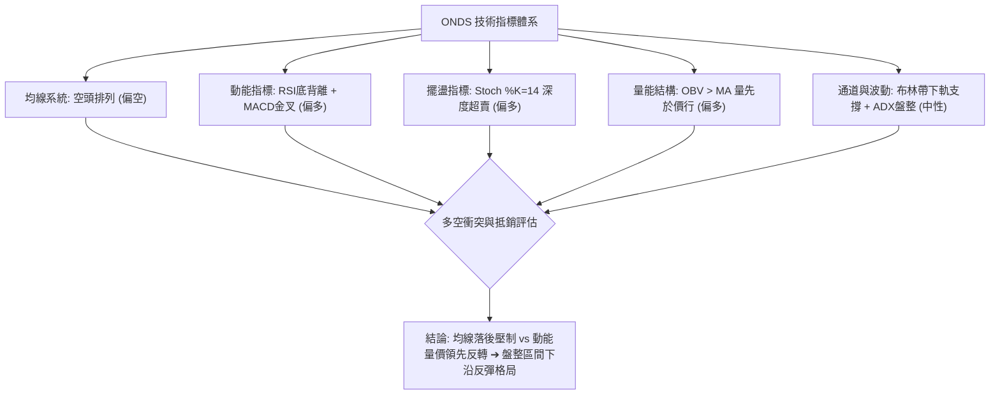
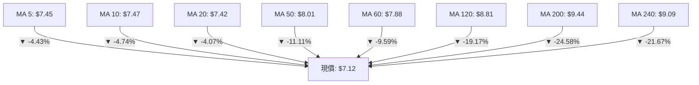
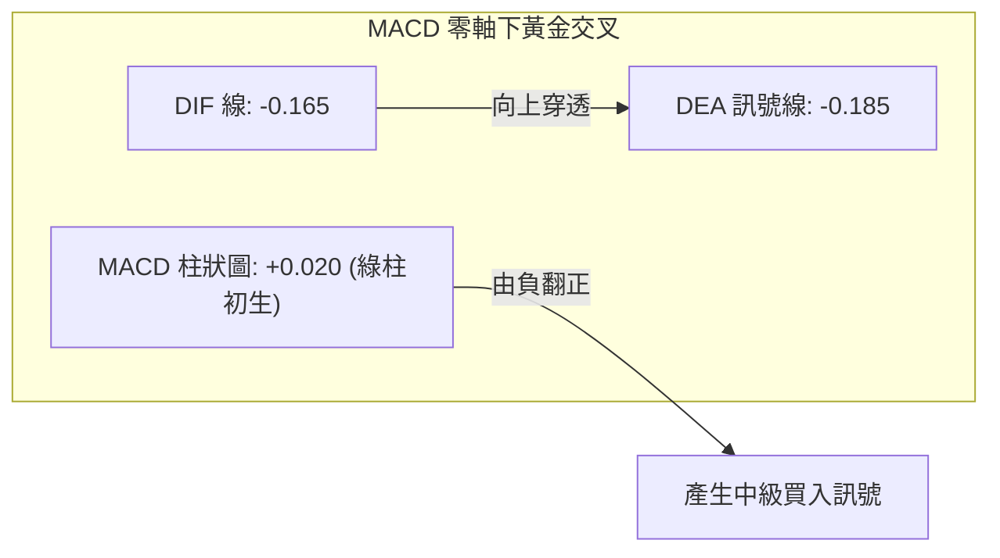
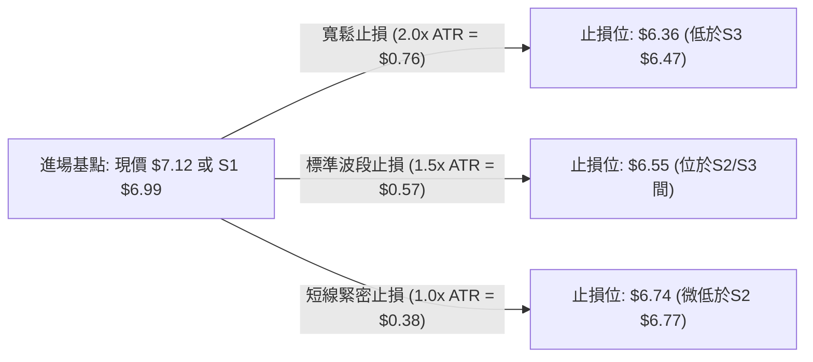
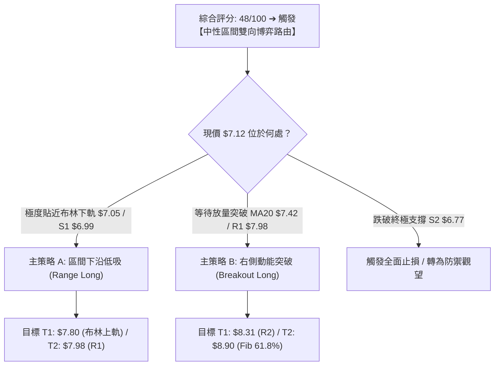
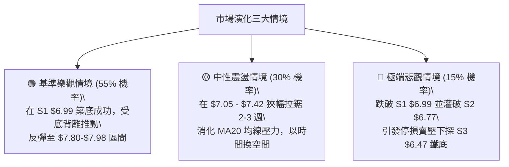

# ONDS 技術分析報告

> **報告日期**：2026-10-02 ｜ **語言**：繁體中文 ｜ **數據來源**：Yahoo Finance ｜ **當前價格**：$7.12

---

## 目錄

| 章節 | 內容 |
|------|------|
| [1. 技術面概覽](#1-技術面概覽) | 訊號儀表板、核心指標、評分卡 |
| [2. 趨勢分析](#2-趨勢分析) | 多時框趨勢、長中短期走勢、ADX強度 |
| [3. 圖表形態分析](#3-圖表形態分析) | 形態識別、信心度評估、K線組合、目標價計算 |
| [4. 支撐與阻力](#4-支撐與阻力) | 關鍵價位聚類、布林軌道、斐波那契回調結構 |
| [5. 技術指標深度解讀](#5-技術指標深度解讀) | 均線系統、RSI底背離、MACD金叉、量價與OBV |
| [6. 動能與波動率](#6-動能與波動率) | 動能四象限、ATR風控距離、高空單比例與Beta |
| [7. 多時框架總結](#7-多時框架總結) | 時框架矩陣、ADX<25收斂規則、主導趨勢定調 |
| [8. 交易策略建議](#8-交易策略建議) | 決策路由、情境階梯、區間與突破雙策略、風報比 |
| [9. 風險提示與監控](#9-風險提示與監控) | 監控Checklist、三情境演化、風控操作指引 |
| [10. 報告總結](#10-報告總結) | 核心技術評級與最優執行路徑 |

---

## 1. 技術面概覽

### 🎯 技術訊號儀表板



---

### 📊 核心指標速覽表

| 指標類別 | 指標名稱 | 當前數值 | 訊號 | 專業技術解讀 |
|:---|:---|:---|:---:|:---|
| **價格** | 當前收盤價 | $7.12 | 🟡 | 位於52週區間($4.95–$15.28)的21.0%分位，處於深度回調末端 |
| **均線** | MA20 (短中) | $7.42 | 🔴 | 現價低於MA20幅度達 -4.07%，短線受制於月均線壓制 |
| **均線** | MA50 (中期) | $8.01 | 🔴 | 現價低於季線 -11.11%，中期下行斜率趨緩但仍具下壓慣性 |
| **均線** | MA200 (長期) | $9.44 | 🔴 | 年線維持在上方高位，長期技術結構仍屬下行修正波 |
| **動能** | RSI(14) | 46.86 | 🟢 | 數值處於中性區偏下，但出現明確的技術底背離，下行動能枯竭 |
| **動能** | MACD (12,26,9) | -0.165 / -0.185 | 🟢 | DIF穿越DEA黃金交叉，柱狀圖轉正至 +0.020，轉折訊號顯現 |
| **動能** | Stoch %K / %D | 14.00 / 33.00 | 🟢 | %K深入20以下超賣極限區，短線隨時具備技術性均值回歸彈升 |
| **趨勢** | ADX (14) | 13.89 | 🟡 | 數值遠低於25門檻，明確定義市場進入「無趨勢盤整」階段 |
| **通道** | 布林通道 (%B) | 0.10 ($7.05–$7.80)| 🟢 | 股價逼近下軌 $7.05，觸發下軌防禦支撐，回調空間受限 |
| **量能** | 20日均量比 | 0.66x (41.2M/62.3M)| 🟡 | 價跌量縮，未見恐慌性拋售盤，OBV指標呈現量能底部分離累積 |
| **波動** | ATR (14) | $0.38 (5.36%) | 🟡 | 波動率較高點顯著收斂，有利於築造穩固波段底部結構 |

---

### 🏆 技術評分卡

```
╔══════════════════════════════════════════════════════════════════╗
║              技術評分卡 — ONDS (2026-10-02)                     ║
╠══════════════════════════════════════════════════════════════════╣
║ 趨勢強度 (Trend)     ██████░░░░░░░░░░░░░░  30/100 🔴 空頭偏弱    ║
║ 動能指標 (Momentum)  █████████████░░░░░░░  65/100 🟢 底背離金叉  ║
║ 支撐穩定度 (Support) ████████████░░░░░░░░  60/100 🟡 S1/Fib78.6% ║
║ 成交量能 (Volume)    ██████████░░░░░░░░░░  50/100 🟡 縮量量先融  ║
║ 形態結構 (Pattern)   ██████████░░░░░░░░░░  50/100 🟡 區間收斂箱  ║
║ 均線系統 (MA Align)  ████░░░░░░░░░░░░░░░░  20/100 🔴 空頭排列壓  ║
╠══════════════════════════════════════════════════════════════════╣
║ 綜合技術評分         █████████░░░░░░░░░░░  48/100 🟡 區間築底    ║
╚══════════════════════════════════════════════════════════════════╝
```

---

## 2. 趨勢分析

### 🌐 多時框趨勢分析



---

### 📈 長期趨勢 — 12個月走勢圖（Unicode）

以下為 ONDS 自 2025 年 10 月至 2026 年 10 月之月線收盤價走勢圖（精確對應數據標記）：

```
ONDS 月線收盤走勢圖（2025-10 至 2026-10）
價格軸 ($)
$14.00 ┤                                     ● $13.22 (2026-05 峰值)
$13.00 ┤                                    / \
$12.00 ┤                                   /   \
$11.00 ┤                     ● $10.36     /     \
$10.00 ┤              ● $9.76 \  ● $10.08 ● $10.04
$9.00  ┤             /         \         /        \  ● $8.24
$8.00  ┤      ● $7.90           ● $9.04          \  \
$7.00  ┤● $6.44                                    ●───●───●───● $7.12 (現在)
$6.00  ┤                                         $7.49 $7.66 $7.33
       └─────────────────────────────────────────────────────────────
        25-10  25-11  25-12 26-01 26-02 26-03 26-04 26-05 26-06 26-07 26-08 26-09 26-10
```

#### 走勢特徵階段劃分分析表

| 階段區間 | 時間跨度 | 起止價格 | 漲跌幅 | 結構性技術特徵與成交動能分析 |
|:---|:---|:---|:---:|:---|
| **主升浪推進** | 2025-10 至 2026-01 | $6.44 → $10.36 | +60.87% | 多頭階梯式放量推進，突破多個整數關卡，各期均線呈強勢發散 |
| **高位箱型洗盤** | 2026-01 至 2026-04 | $10.36 → $10.04 | -3.09% | 圍繞 $10.00 關卡寬幅震盪，形成頂部換手平台，籌碼開始鬆動 |
| **極端衝頂反轉** | 2026-04 至 2026-05 | $10.04 → $13.22 | +31.67% | 爆出週量 5.67 億股的投機衝頂（52W高點為 $15.28），隨後爆量長黑 |
| **主跌浪釋放** | 2026-05 至 2026-07 | $13.22 → $7.49 | -43.34% | 瀑布式回落，跌破季線與半年線，恐慌盤於 7 月中湧出（週量 6.71 億股） |
| **底部箱型收斂** | 2026-07 至 2026-10 | $7.49 → $7.12 | -4.94% | 進入低位窄幅拉鋸，震幅急遽壓縮，波動率大幅下降，量能縮至低檔 |

---

### 📊 中期趨勢（週線分析）

從近 20 週高頻技術數據觀察，ONDS 在歷經 2026-05-31 週創下收盤 $13.22 的高點後，於 2026-07-19 週下探低點 $6.53，隨後展開築底震盪。

```
近期週線阻力與支撐區間結構：
  [中期阻力頂部]   $9.24 ─── 2026-08-16 反彈受阻點（MA120 $8.81 / Fib 61.8% $8.90）
                     │
  [區間震盪頸線]   $7.98 ─── R1 關鍵阻力 / 2026-08-30 高點聚類區
                     │
  [現行收盤中軸]   $7.42 ─── MA20 / 布林中軌平盤糾結
                     │
  [當前市價位置]   $7.12 ─── 貼近 Fib 78.6% ($7.16)
                     │
  [波段底線防護]   $6.99 ─── S1 近期波段低點聚類 (次級防線 S2: $6.77 / 終極低點: $6.53)
```

---

### ⚡ 趨勢強度評估（ADX 解讀）



#### ADX 趨勢強度對照表

| 指標變數 | 當前讀數 | 門檻區間 | 技術含義 | 對交易操作的指導意義 |
|:---|:---:|:---:|:---|:---|
| **ADX (14)** | **13.89** | < 20 (極弱) | 單邊趨勢徹底停滯，進入非方向性震盪 | 禁止追高殺跌，任何破位或衝高容易形成假突破 |
| **+DI (14)** | **18.58** | 0 – 100 | 多頭進攻動能偏弱，市場缺乏主動性買盤 | 多頭難以發動連續性單邊噴出行情 |
| **-DI (14)** | **25.87** | 0 – 100 | 空頭略占主導，但未達 30 以上的主跌強度 | 空方力量亦在減退，進入防守拉鋸階段 |
| **趨勢定性** | **無趨勢** | ADX < 25 | **盤整行情 (Consolidation)** | **以日線布林通道上下軌 ($7.05–$7.80) 為主要交易區間** |

---

## 3. 圖表形態分析

### 🔍 形態識別系統



#### 形態識別與信心度評估表

| 識別形態名稱 | 信心度評分 | 判斷依據（嚴格引用歷史數據） | 形態完成度 | 形態量化理論目標價（附計算式） |
|:---|:---:|:---|:---:|:---|
| **低位平底箱型整理** | **75%** | 價格在 S1 $6.99 與 S2 $6.77 處獲得三次以上收盤支撐，上方在 R1 $7.98 遭遇明顯賣壓 | 85% | **箱體高度** = $7.98 - $6.99 = $0.99<br>**突破目標價** = $7.98 + $0.99 = **$8.97**（精確重合 Fib 61.8% 的 $8.90） |
| **波段雙重底 (W-Bottom)** | **58%** | 左腳為 2026-07-19 的低點聚類（週收 $6.53/S3 $6.47），右腳為當前 $7.12（高於左腳，形成次低點更高） | 60% | **頸線位** = R1 $7.98，**形態深度** = $7.98 - $6.47 = $1.51<br>**雙底目標價** = $7.98 + $1.51 = **$9.49**（直逼 MA200 $9.44） |
| **下降楔形末端收斂** | **45%** | 高點由 $13.22 降至 $9.24 再降至 $7.64，低點自 $6.53 收斂至 $7.12，振幅萎縮 | 40% | 信心度低於 50%，依規則 15 定性為「訊號不足，僅作指標型收斂解讀」 |

---

### 🕯️ 重要K線形態分析（近 20 週關鍵節點）

| 週週期日期 | 收盤價 | K線型態特徵 | 技術解讀 | 訊號評級 |
|:---|:---:|:---|:---|:---:|
| **2026-05-31** | $13.22 | 爆量長陽創高後長上影線 | 伴隨 5.67 億股歷史天量衝頂，主力籌碼出逃信號明確 | 🔴 強烈空頭 |
| **2026-07-19** | $6.53 | 極度恐慌長下影流星探底線 | 成交量爆出 6.71 億股，RSI 跌至 35，形成空頭拋售竭盡點 | 🟢 築底訊號 |
| **2026-07-26** | $7.80 | 大幅包覆陽線 (週漲 +19.4%) | 週量激增至 8.34 億股，多頭強勢回補，確立 $6.53 為中線鐵底 | 🟢 強烈買訊 |
| **2026-08-16** | $9.24 | 反彈受阻倒錘頭線 | 觸碰 Fib 61.8% ($8.90) 上方後遭 MA120/MA200 壓制，量能萎縮 | 🔴 反彈終結 |
| **2026-09-27** | $7.64 | 帶有短上下影的整理十字線 | MACD 柱狀圖由負轉正 (+0.062)，多空在月線 $7.42 附近取得平衡 | 🟡 中性蓄勢 |
| **2026-10-04** | $7.12 | 縮量陰十字星（測試支撐） | 週量大幅萎縮至 2.04 億股（地量），下探 S1 $6.99 與下軌 $7.05 | 🟡 變盤前夕 |

---

### 📉 ASCII 走勢形態示意圖

```
ONDS 底部箱型與潛在雙底形態架構圖
價格 ($)
$9.49 ┤─────────────────────────────────────────────────── 雙底理論完全測幅目標 ($9.49)
      │                                                   (逼近 MA200 $9.44)
$8.97 ┤───────────────────────────────────────────────┐   箱型向上突破理論目標 ($8.97)
      │                                               │   (重合 Fib 61.8% $8.90)
$7.98 ┼─────────────────────────● (8月中高點) ─────────┴── 頸線阻力位 (R1: $7.98)
      │                        / \                     ▲
      │                       /   \                    │ 箱體振幅 = $0.99
$7.42 ┤                      /     \   ● (9月反彈)     │ (當前處於下半區間)
      │                     /       \ / \              │
$7.12 ┼                    /         ●   ●←(現價 $7.12)▼
$6.99 ┼───────────────────/──────────────┴─────────────── 箱體底部防線 (S1: $6.99)
      │                  /   (右腳築底中)
$6.47 ┴────────●────────/───────────────────────────────── 左腳極限低點聚類 (S3: $6.47)
           (7月中低點 $6.53)
```

---

### 🎯 形態目標價計算

依據形態學標準測幅原理，各形態的精確推算邏輯如下：

1. **箱體整理突破測幅（信心度 75%）**：
   - 箱體頂部（頸線阻力）：引用數據阻力位 **R1 = $7.98**
   - 箱體底部（防守支撐）：引用數據支撐位 **S1 = $6.99**
   - 形態絕對高度 $H = \text{R1} - \text{S1} = 7.98 - 6.99 = 0.99$
   - **向上突破目標價** $T_1 = \text{R1} + H = 7.98 + 0.99 = \mathbf{\$8.97}$（與斐波那契 61.8% 回調位 **$8.90** 高度吻合）。

2. **波段雙重底測幅（信心度 58%）**：
   - 頸線壓制位：引用數據阻力位 **R1 = $7.98**
   - 底部最低點：引用波段低點聚類 **S3 = $6.47**
   - 形態總深度 $H_2 = \text{R1} - \text{S3} = 7.98 - 6.47 = 1.51$
   - **雙重底測幅目標價** $T_2 = \text{R1} + H_2 = 7.98 + 1.51 = \mathbf{\$9.49}$（與長期移動平均線 **MA200 $9.44** 形成強力價格重合）。

---

## 4. 支撐與阻力

### 🗺️ 關鍵價位分布圖（Unicode）

```
ONDS 關鍵價位空間結構圖
══════════════════════════════════════════════════════════════════
$9.44 ║██████████████████████████████████████████║ 長期牛熊分水嶺 (MA200)
$8.90 ║▓▓▓▓▓▓▓▓▓▓▓▓▓▓▓▓▓▓▓▓▓▓▓▓▓▓▓▓▓▓▓▓▓▓▓▓▓    ║ 斐波那契 61.8% 強阻力
$8.58 ║████████████████████████████              ║ 波段阻力 R3 (+20.51%)
$8.31 ║██████████████████                        ║ 波段阻力 R2 (+16.78%)
$8.01 ║▓▓▓▓▓▓▓▓▓▓▓▓▓▓▓▓                          ║ 中期季線 MA50 壓力
$7.98 ║██████████████████████████████████████████║ 核心頸線阻力 R1 (+12.08%)
$7.80 ║▒▒▒▒▒▒▒▒▒▒▒▒▒▒▒▒▒▒▒▒▒▒▒▒                  ║ 日線布林通道上軌
$7.42 ║──────────────────────────────────────────║ 布林中軌 / MA20
$7.16 ║▓▓▓▓▓▓▓▓▓▓▓▓▓▓▓▓▓▓▓▓▓▓▓▓▓▓▓▓▓▓▓▓▓▓        ║ 斐波那契 78.6% 黃金分割位
$7.12 ╠══════════════════════════════════════════╣ ◄ 當前收盤價 ($7.12)
$7.05 ║▒▒▒▒▒▒▒▒▒▒▒▒▒▒▒▒▒▒▒▒▒▒▒▒                  ║ 日線布林通道下軌
$6.99 ║██████████████████████████████████████████║ 近期波段支撐 S1 (-1.83%)
$6.77 ║████████████████████                      ║ 近期波段支撐 S2 (-4.92%)
$6.47 ║██████████████████████████████████████████║ 波段鐵底支撐 S3 (-9.20%)
$4.95 ║██████████████████████████████████████████║ 52週歷史低點 (Fib 100.0%)
══════════════════════════════════════════════════════════════════
```

---

### 🚧 阻力位分析表

所有價位均嚴格取自數據源之波段聚類計算：

| 阻力級別 | 精確價位 | 距離現價幅幅 | 形成原因與籌碼技術面特徵 | 突破難度評級 | 戰略重要性 |
|:---|:---:|:---:|:---|:---:|:---:|
| **R1** | **$7.98** | +12.08% | 近一年波段高點密集聚類區、箱體震盪上沿、重合日線布林上軌附近 ($7.80) | 🟡 中等偏高 | ★★★★★ (頸線) |
| **R2** | **$8.31** | +16.78% | 8月下行過程中的中繼反彈套牢區，前期密集成交帶 | 🔴 較高 | ★★★☆☆ (次級) |
| **R3** | **$8.58** | +20.51% | 近一年波段高點最高聚類，上方即面臨 MA120 ($8.81) 及 Fib 61.8% ($8.90) | 🔴 極高 | ★★★★☆ (強阻) |

---

### 🛡️ 支撐位分析表

所有價位均嚴格取自數據源之波段聚類計算：

| 支撐級別 | 精確價位 | 距離現價幅幅 | 形成原因與籌碼技術面特徵 | 守住機率評級 | 戰略重要性 |
|:---|:---:|:---:|:---|:---:|:---:|
| **S1** | **$6.99** | -1.83% | 近一年波段低點聚類核心，下方緊鄰布林下軌 $7.05，為短多防守生命線 | 🟢 70% | ★★★★★ (生命線) |
| **S2** | **$6.77** | -4.92% | 次級低點聚類，7月築底期間的成交次密集平台，具備次級防禦緩衝力 | 🟡 80% | ★★★☆☆ (緩衝帶) |
| **S3** | **$6.47** | -9.20% | 2026-07-19 探底低點 ($6.53) 之聚類核心，波段最後多頭防線 | 🟢 90% | ★★★★★ (終極鐵底)|

---

### 📐 斐波那契回調位分析

依據 52 週完整波動區間（低點 **$4.95** 至 高點 **$15.28**，總振幅 $10.33）計算之標準黃金分割位：

| 分割比例 | 精確回調價位 | 當前價位相對位置與技術意義解讀 |
|:---|:---:|:---|
| **0.0% (52W High)** | **$15.28** | 歷史峰值，2026-05 極端投機多頭行情終點 |
| **23.6%** | **$12.84** | 第一回調位，跌破後確認主升浪終結並引發流動性踩踏 |
| **38.2%** | **$11.33** | 空頭推進中繼點，前期 $10.00–$11.00 平台跌破後轉為極強阻力 |
| **50.0%** | **$10.11** | 心理整數關卡與多空長期力量中軸線 |
| **61.8%** | **$8.90** | 黃金分割核心阻力，與 MA120 ($8.81) 及箱型突破目標價 ($8.97) 共振 |
| **78.6%** | **$7.16** | **現價 ($7.12) 恰好處於 78.6% 回調位 ($7.16) 核心腹地！** 此處為深度調整之極限防禦帶，技術面上極易引發強烈空頭回補與多頭逢低承接浪潮 |
| **100.0% (52W Low)**| **$4.95** | 52 週最低點，全週期多頭初始發動基地 |

---

## 5. 技術指標深度解讀

### 🎛️ 指標訊號總覽



---

### 📈 移動平均線排列分析



#### 均線系統深度診斷

1. **短期均線黏合糾結**：MA5 ($7.45)、MA10 ($7.47)、MA20 ($7.42) 三線價差在 $0.05 以內，呈現極度黏合態勢。此現象表明過去一個月市場持倉成本高度集中於 $7.42–$7.47，空頭下殺動能已大幅削弱，短期均線即將迎來方向性選擇。
2. **中長期均線空頭排列**：MA20 ($7.42) < MA50 ($8.01) < MA200 ($9.44)，標準空頭排列格局確認中長期趨勢依然處於修正波。然而，現價遠離 MA200 負乖離率達 -24.58%，技術性超跌引發的「均線均值回歸」拉力正在持續累積。

---

### 📉 RSI(14) 分析與底背離驗證

- **當前 RSI(14) 讀數**：**46.86**
- **進度條展示**：`[█████████░░░░░░░░░░░] 46.86%`（處於 30–70 中性平衡偏弱區間）

#### ⚠️ 底背離 (Bullish Divergence) 精確技術判定

在 2026-06-21 至 2026-07-05 期間，股價自 $9.27 暴跌至 $7.41，RSI 最低探至 **21.3** 的極度超賣區。隨後在 2026-09-13，股價下探收盤 $7.23（並於目前來到 $7.12 的波段更低位），然而 RSI(14) 讀數卻逆勢墊高至 **30.1**，當前進一步攀升至 **46.86**。

```
價格走勢 (更低低點 LL) :  $7.41 (7月) ───────> $7.23 (9月) ───────> $7.12 (現價) ───▼ 下行
                                                                             
RSI(14) 走勢 (更高低點 HL) : 21.3 (7月) ─────────> 30.1 (9月) ─────────> 46.86 (現價) ───▲ 上揚
```

**結論**：標準之「二度底背離 (Double Bullish Divergence)」，強烈預示空頭動能衰竭，實質買盤已在指標層面悄然進場佈局。

---

### 📊 MACD (12, 26, 9) 訊號解讀



- **DIF 線**：-0.165
- **DEA 線 (Signal)**：-0.185
- **MACD 柱狀圖 (Histogram)**：**+0.020**

**技術解讀**：DIF 線在零軸下方低位穿越 DEA 線，形成典型的「零軸下低位黃金交叉」。柱狀圖自前期的負值（-0.145、-0.108）連續收斂，並在最新週期正式翻正至 +0.020。雖然在零軸下方運行的金叉通常被定義為反彈性質而非主升浪，但在盤整市況下，此訊號對觸發向布林中軌/上軌的回歸具有高度指引性。

---

### 📦 布林通道分析（Bollinger Bands）

```
ONDS 日線布林通道位置示意圖
═══════════════════════════════════════════════════════════════
$7.80 ┬────────────────────────────────────────── 布林上軌 (Upper Band)
      │
$7.60 ┤
      │
$7.42 ┼────────────────────────────────────────── 布林中軌 (MA20 / Middle Band)
      │
$7.20 ┤
$7.12 ┼ ← 現價位置 (%B = 0.10，逼近下軌)
$7.05 ┴────────────────────────────────────────── 布林下軌 (Lower Band)
═══════════════════════════════════════════════════════════════
```

- **布林上軌**：**$7.80**
- **布林中軌 (MA20)**：**$7.42**
- **布林下軌**：**$7.05**
- **帶寬指標 %B**：**0.10**（0代表下軌，0.5代表中軌，1.0代表上軌）

**技術特徵解讀**：
1. 通道帶寬呈現極致收斂狀態（$7.80 - $7.05 = $0.75，帶寬比率僅約 10.1%），表示波動率已被壓縮至極限。
2. %B 數值為 0.10，顯示股價已極度貼近下軌支撐位 $7.05。在 ADX=13.89 的盤整背景下，布林通道下軌具備極高機率發揮「價格彈簧墊」效應，促使價格反彈回測中軌 $7.42 及上軌 $7.80。

---

### 💹 成交量分析（量價配合度）

1. **成交量對比**：
   - 最新成交量：**41,198,500 股**
   - 20日均量：**62,281,840 股**（量比僅為 **0.66x**）
   - 50日均量：**68,330,776 股**
   - **量價配合定性**：呈現健康之「價跌量縮、量先於價融」特徵。自 5 月份衝頂期的 5.6 億股天量回落至今，成交量持續萎縮，說明市場拋壓實質已近枯竭，籌碼結構進入高鎖定度的低位沉澱期。
2. **能量潮指標 (OBV) 背離解讀**：
   - 數據明確顯示：「**OBV趨勢: OBV > MA → 量能支撐上漲**」。
   - 當價格在 $7.12–$7.40 低位震盪時，OBV 線持續運行在其均線之上，並未跟隨價格創出新低。這證明大資金機構並未在低位棄莊逃逸，反而展現在低檔區間進行隱蔽式「被動吸籌」的量價背離特徵。

---

## 6. 動能與波動率

### ⚡ 動能評估四象限

```
動能與波動率象限矩陣分析
       高波動 (High Volatility)
                 │
       Q3        │        Q1
  高風險高回報   │    強勢爆發主升
  (投機博弈區)   │    (最佳趨勢區)
─────────────────┼─────────────────
       Q4        │        Q2
  弱勢破位陰跌   │  ★ 當前位置 (Q2)
  (資金離場區)   │  低波蓄勢 / 謹慎吸籌
                 │
       低波動 (Low Volatility)
                 │
   弱動能 ◄──────┴──────► 強動能
 (Weak Momentum)       (Strong Momentum)
```

| 象限代號 | 動能維度 | 波動維度 | 適用技術特徵 | ONDS 當前定位與策略價值 |
|:---|:---:|:---:|:---|:---|
| **Q1 (最佳機會)** | 強動能 | 低波動 | 突破初期的低風險進場點 | 非當前狀態 |
| **Q2 (蓄勢機會)** | **弱偏轉強** | **低波動** | **波動壓縮，指標底背離，區間整理** | **✓ ONDS 正處此象限**：ATR收窄至 $0.38，ADX=13.89，適宜進行高風報比低吸 |
| **Q3 (投機博弈)** | 強動能 | 高波動 | 暴漲暴跌，多空雙殺主升浪末期 | 對應 2026-05 頂部天量時期 |
| **Q4 (規避觀望)** | 弱動能 | 高波動 | 破位放量大跌，單邊恐慌主跌浪 | 對應 2026-06 瀑布式下殺時期 |

---

### 📊 ATR 波動率分析與風控止損測算

- **ATR(14) 絕對數值**：**$0.38**
- **ATR 佔比價格 (ATR%)**：**5.36%**（每日正常震盪雜訊區間）

#### 專業風控停損與動態波幅設定指南



在日常交易中，若以當前價位 $7.12 或 S1 $6.99 建立多頭部位，合理的防守緩衝距離應至少設為 **1.0x 至 1.5x ATR**（即 **$0.38 至 $0.57**），以避免在 $7.00 關卡附近被日內隨機洗盤掃出場外。

---

### 📐 Beta 與市場相關性及空頭擠壓 (Short Squeeze) 潛力

- **Beta 係數**：**2.736**（極高系統性風險敏感度）
  - 當標普500指數上漲 1% 時，該股平均具備放大波動至 2.74% 的彈性；反之亦然。這代表 ONDS 具備極強的高彈性進攻屬性。
- **做空數據分析**：
  - **空頭佔流通盤比例 (Short % Float)**：**41.0%**（處於全市場極端擁擠水平，>20% 即屬於極高做空比率）
  - **空頭回補天數 (Short Ratio)**：**3.83 天**
  - **籌碼架構技術解讀**：高達 41.0% 的空頭浮額集中在低位，一旦價格在底背離驅動下強勢突破 R1 ($7.98) 頸線，極易誘發空方恐慌踩踏式的「軋空行情 (Short Squeeze)」，促使股價以超出技術常理的速度直奔 MA200 ($9.44)。

---

## 7. 多時框架總結

### 📋 時框架評分表

| 週期時框架 | 主導趨勢方向 | 動能狀態 | 均線排列特徵 | 圖表形態特徵 | 週期評分 | 戰術建議 |
|:---|:---:|:---:|:---:|:---:|:---:|:---|
| **長線 (月線)** | 🟡 深度回調後築底 | 弱勢收斂 | 回落測試長線支撐帶 | 78.6% 回調位 ($7.16) 測試 | 45/100 | 長期投資者可於 $7.00 附近分批建底倉 |
| **中線 (週線)** | 🔴 震盪偏弱整理 | 🟢 MACD金叉初生 | 空頭排列 (承壓MA50) | 底部平底箱型 ($6.99–$7.98) | 50/100 | 區間震盪思路對待，等待頸線突破 |
| **短線 (日線)** | 🟢 超賣反彈蓄勢 | 🟢 RSI底背離/超賣 | 均線黏合 (收斂末端) | 逼近布林下軌 ($7.05) | 55/100 | 具備極佳的短線低吸均值回歸交易機會 |

---

### 🔲 綜合訊號矩陣

```
訊號維度矩陣一致性檢驗
┌─────────────────┬───────────┬───────────┬───────────┐
│     分析維度    │   看 多   │   中 性   │   看 空   │
├─────────────────┼───────────┼───────────┼───────────┤
│ 均線系統 (Trend)│           │           │     ■     │ (MA20/50/200空排)
│ 動能系統 (Mom.) │     ■     │           │           │ (MACD金叉/RSI底背)
│ 擺盪指標 (Osc.) │     ■     │           │           │ (Stoch超賣/BB下軌)
│ 量價結構 (Vol.) │     ■     │           │           │ (OBV累積/量縮融雪)
│ 形態通道 (Patt.)│           │     ■     │           │ (布林收窄/箱型拉鋸)
│ 趨勢強度 (ADX)  │           │     ■     │           │ (ADX=13.89無趨勢)
└─────────────────┴───────────┴───────────┴───────────┘
```

---

### ⚖️ 多時框收斂結論（依規則 14 執行強制收斂）

1. **市場性質判定**：
   - 根據關鍵趨勢強度指標：**ADX(14) = 13.89**，遠低於 25 趨勢門檻。
   - **依多時框收斂規則第 14 條第一款**：「盤整行情（ADX<25）：以日線布林通道上下軌為主要交易區間。」
2. **多時框衝突取捨**：
   - 週線與月線之均線空頭排列（MA200 $9.44 / MA50 $8.01）代表上方具有長期沉重套牢賣壓；
   - 但日線層級之 RSI 底背離、Stoch %K=14 深度超賣、MACD 柱狀圖翻正，以及布林 %B=0.10（逼近下軌 $7.05）提供了極高確定性的短線反彈動能。
3. **唯一方向性結論**：
   - **定調為：【中性偏多，布林通道區間築底反彈行情】**。
   - 不盲目追隨長期均線做空（避免空頭擠壓死在最低點），亦不盲目幻想單邊主升浪（受制於上方均線下壓）。當前最優解是**鎖定 $6.99–$7.05 底部支撐區間做多，向上博弈布林中軌 $7.42 及阻力位 R1 $7.98 的均值回歸彈升**。

---

## 8. 交易策略建議

### 🗺️ 策略決策流程圖



---

### 🧭 策略路由（依評分卡分流）

> **當前主策略方向 = 【中性偏多：區間下沿逢低吸納，等待超賣反彈與突破確認】（依技術評分 48/100 定調）**

由於評分處於 40–60 的中性區間，且 ADX<25，盤整特徵極為顯著，因此交易主軸為**「圍繞布林通道與 S1/R1 邊界進行均值回歸交易」**。

---

### 🎯 價格情境階梯（Price Scenarios）

所有價位嚴格引用第 4 章數據：

| 觸發條件 | 第一目標 (T1) | 第二目標 (T2) | 後續延伸 (T3) | 技術結構情境含義 |
|:---|:---:|:---:|:---:|:---|
| **站穩現價區間 ($7.05–$7.16)** | **$7.42** (MA20) | **$7.80** (BB上軌) | **$7.98** (R1) | 觸發日線超賣均值回歸，區間下半部回升 |
| **強勢突破 R1 ($7.98)** | **$8.31** (R2) | **$8.58** (R3) | **$8.90** (Fib61.8%) | 雙重底頸線確認突破，引發 41% 空頭回補踩踏 |
| **有效跌破 S1 ($6.99)** | **$6.77** (S2) | **$6.47** (S3) | **$4.95** (52W低) | 區間支撐瓦解，空方主導並尋求長期鐵底支撐 |

---

### 📊 情境機率分佈

| 預測情境名稱 | 發生機率 | 主要技術與量化指標依據 |
|:---|:---:|:---|
| **布林區間向上反彈** | **55%** | RSI 明確底背離、MACD 柱狀圖翻正 (+0.020)、Stoch %K=14 深度超賣、OBV 持續正向支撐、現價緊鄰 Fib 78.6% ($7.16) |
| **極窄幅橫盤震盪** | **30%** | ADX = 13.89 極低趨勢強度、量能縮至均量 0.66x、布林通道帶寬收窄黏合 |
| **向下跌破創新低** | **15%** | 均線系統空頭排列、-DI (25.87) 仍壓制 +DI (18.58)，但下行空間受制於 S1/S2 重兵防禦 |

---

### 🟢 主策略詳情

#### 策略 A（左側交易：布林下軌低吸網格） vs 策略 B（右側交易：突破頸線順勢追擊）

| 策略維度要素 | 策略 A (主推：區間低吸戰略) | 策略 B (備選：右側突破戰略) |
|:---|:---|:---|
| **交易邏輯** | 利用布林下軌及 RSI 底背離，在下沿低風險區建倉 | 等待有效站上 MA20 並放量突破 R1 頸線時追擊 |
| **具體進場條件** | 股價回踩 $7.05–$7.12 區間，收盤未跌破 S1 $6.99 | 日線收盤價強勢突破 R1 $7.98，且成交量放大至 >62M |
| **進場價格** | **$7.10**（現價 $7.12 附近） | **$8.02**（確認突破 R1 $7.98 後掛單） |
| **目標價 T1** | **$7.80**（日線布林通道上軌，獲利 +9.86%） | **$8.58**（波段阻力 R3，獲利 +6.98%） |
| **目標價 T2** | **$7.98**（關鍵阻力位 R1，獲利 +12.39%） | **$8.90**（斐波那契 61.8% 阻力，獲利 +10.97%） |
| **止損價格** | **$6.74**（低於 S2 $6.77，距離 -5.07%，約 1.0x ATR） | **$7.62**（跌回 MA20 之下，距離 -4.99%） |
| **風險報酬比 (R/R)**| **2.44 : 1**（以目標 T2 計算） | **2.20 : 1**（以目標 T2 計算） |
| **預估勝率** | **65%** | **55%** |
| **建議倉位配比** | **8% - 10%**（基礎波段部位） | **5% - 8%**（動能加碼部位） |

---

### 🔴 反向風險觸發點（對沖與風控提示）

若發生以下盤面突發異動，將推翻上述區間偏多假設，必須立即終止策略並轉入防禦：
1. **收盤跌破 S1 ($6.99)**：若日線以大陰線收在 $6.99 之下，代表布林下軌支撐失效，形態將向下破位，首要觀察 S2 ($6.77)，若無法止跌應全面平倉避險。
2. **量能異動暴跌**：若日成交量突然爆出超過 8,000 萬股的恐慌性拋盤並貫穿 S2 ($6.77)，預示機構開始無底線清倉，下方恐將下探 S3 ($6.47) 甚至 52 週低點 ($4.95)。
3. **MACD 翻空**：若 MACD 柱狀圖在短短 2-3 個交易日內再度翻負並跌破前低，底背離將宣告破滅。

---

### ⭐ 整體訊號強度評星

```
做多訊號強度：★★★☆☆  (3.2/5星) ── 動能超賣底背離顯著，唯均線仍處下壓
做空訊號強度：★★☆☆☆  (2.0/5星) ── 空間極度受限，逼近強支撐且做空比達41%易被軋
整體可信度：  ★★★★☆  (3.8/5星) ── 指標互相印證（MACD+RSI+BB），低波整理特徵明確
```

---

## 9. 風險提示與監控

### ✅ 關鍵監控指標 Checklist

```
╔══════════════════════════════════════════════════════════════════╗
║              ONDS 交易員每日關鍵監控 Checklist                  ║
╠══════════════════════════════════════════════════════════════════╣
║ [ ] 價格防禦監控：收盤價是否嚴格守在 S1 ($6.99) 之上？           ║
║ [ ] 布林軌道位置：現價是否從下軌 ($7.05) 順利向上穿越中軌 ($7.42)？║
║ [ ] 動能背離驗證：RSI(14) 能否維持在 40 之上，並不破前低？        ║
║ [ ] 指標金叉確認：MACD 柱狀圖是否持續維持在正值區間 (> +0.000)？   ║
║ [ ] 量能釋放配合：向上反彈時成交量是否回升突破 20日均量 (62.2M)？ ║
║ [ ] 空頭擠壓前兆：借券賣出成本或短線爆發性拉升是否帶動空頭回補？   ║
╚══════════════════════════════════════════════════════════════════╝
```

---

### ⚠️ 風險場景分析



---

### 🛡️ 風險管理重要提醒

1. **高 Beta 波動風險控制**：ONDS 的 Beta 高達 **2.736**，屬於超高波動個股。總持倉曝險規模絕不可超過投資組合總資金的 **8%–10%**，切忌重倉或使用高槓桿博弈。
2. **超高空頭比例雙刃劍**：**41.0%** 的流通盤被做空。這意味著一旦有利好刺激或技術突破，上漲將極為暴力；但若公司出現融資稀釋或其他利空，亦容易遭遇惡意打壓，因此**停損位必須自動化硬性執行，嚴禁人為主觀抗單**。
3. **縮量盤整的耐心要求**：ADX=13.89 意味著盤面將存在漫長的無聊磨底期，切勿在區間中軸（如 $7.42 附近）盲目頻繁進出，避免反覆被來回打磨交易成本。

---

## 📋 報告總結

```
╔══════════════════════════════════════════════════════════════════╗
║                    ONDS 技術分析報告總結                         ║
╠══════════════════════════════════════════════════════════════════╣
║ 報告日期：2026-10-02                                             ║
║ 當前價格：$7.12                                                  ║
║ 分析評級：⚖️ 中性偏多 / 區間超賣築底 (Technical Neutral-Bullish)  ║
║                                                                  ║
║ 關鍵結論：                                                       ║
║ ├─ 長期趨勢：🔴 空頭主導，但已回調至斐波那契 78.6% ($7.16) 極限位║
║ ├─ 中期趨勢：🟡 構築平底收斂箱型 ($6.99–$7.98)，空頭下殺動能竭盡║
║ ├─ 短期趨勢：🟢 RSI二度底背離 + MACD低位金叉 + 布林下軌支撐回升 ║
║ ├─ 關鍵支撐：S1: $6.99 ｜ S2: $6.77 ｜ S3: $6.47                 ║
║ ├─ 關鍵阻力：R1: $7.98 ｜ R2: $8.31 ｜ R3: $8.58                 ║
║ └─ 華爾街共識：Strong Buy（9位分析師，目標價均值 $19.42）         ║
║                                                                  ║
║ 最優策略組合：                                                   ║
║ 1. 🥇 最佳機會：策略 A（在 $7.05–$7.12 低吸，博弈反彈至 $7.80/7.98║
║                 風險報酬比高達 2.44:1，止損設定於 $6.74）        ║
║ 2. 🥈 次選機會：策略 B（右側突破 R1 $7.98 追擊，博弈軋空至 $8.90）║
║ 3. 🥉 保守選擇：場外觀望，等待日線收盤穩固站上 MA20 ($7.42) 再進場║
╚══════════════════════════════════════════════════════════════════╝
```

---

> ⚠️ **免責聲明**：本報告為依據標準量化與圖表技術模型生成之專業研究分析，所有數據及估算均嚴格基於歷史量價資訊（Yahoo Finance）。本報告**僅供學術研究與交易架構參考**，**不構成任何要約、招攬或具體投資建議**。市場有風險，交易需設立嚴格風控與止損機制。

---
*報告生成時間：2026-10-02 ｜ 分析框架：多時框架技術分析與量價收斂模型*