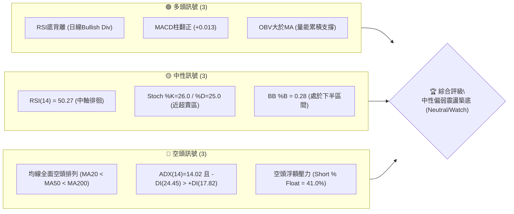
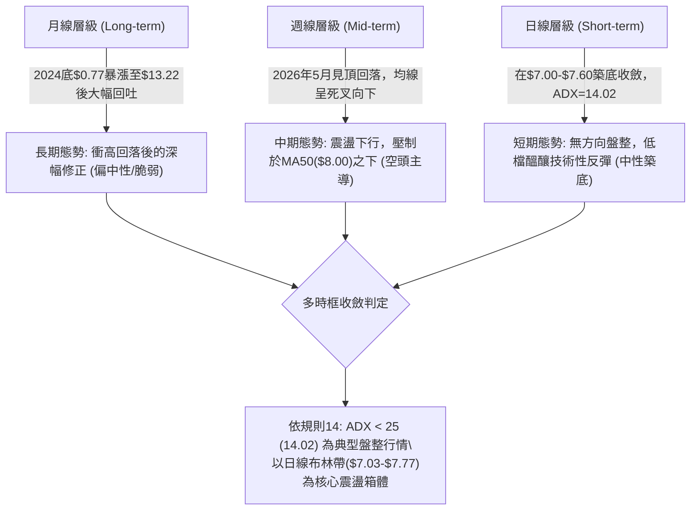
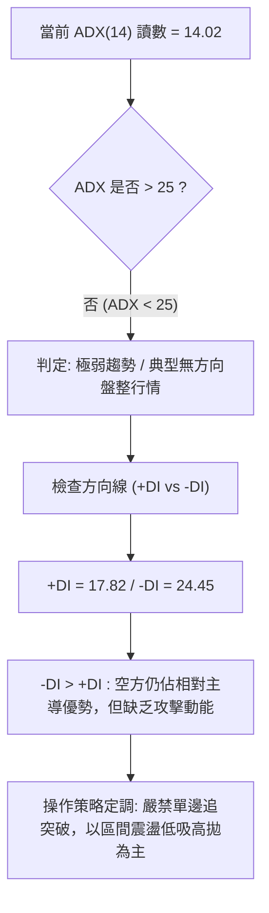
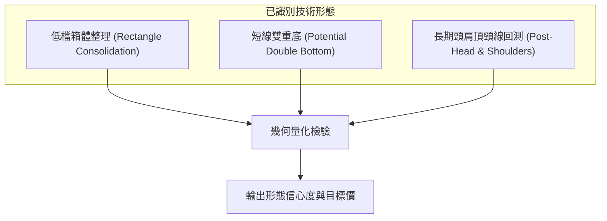
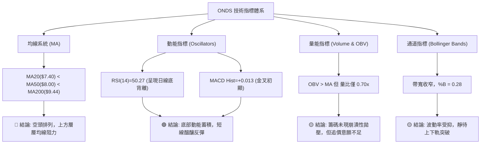
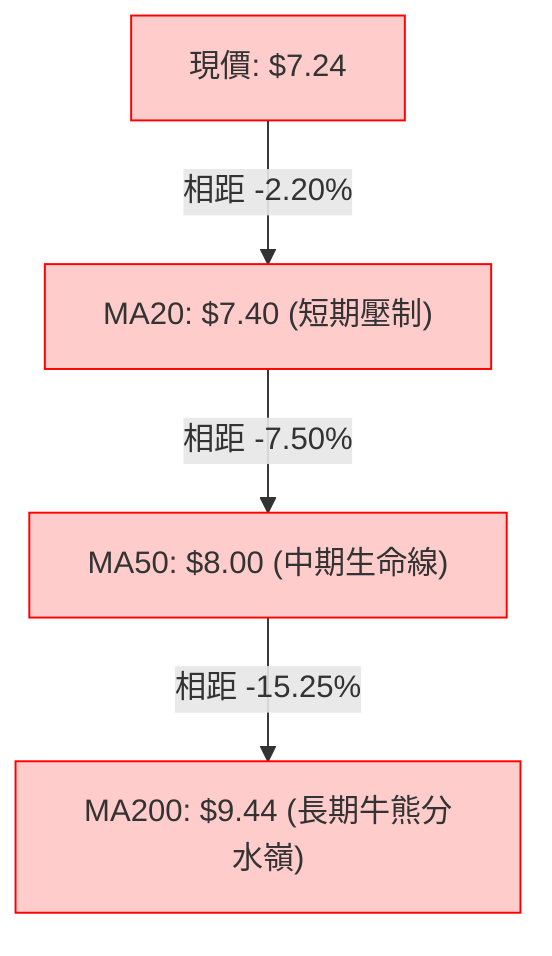
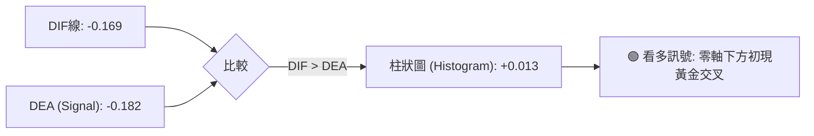
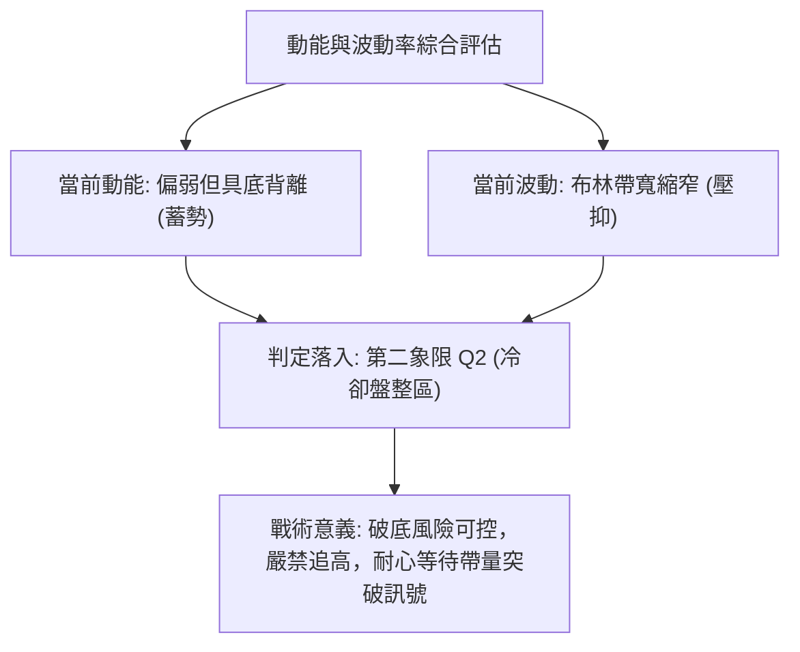
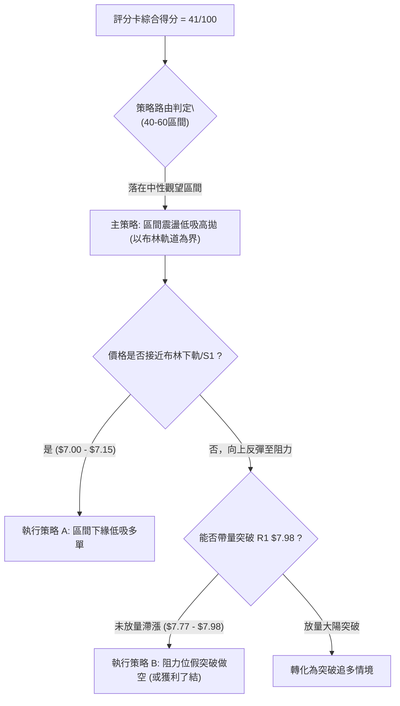
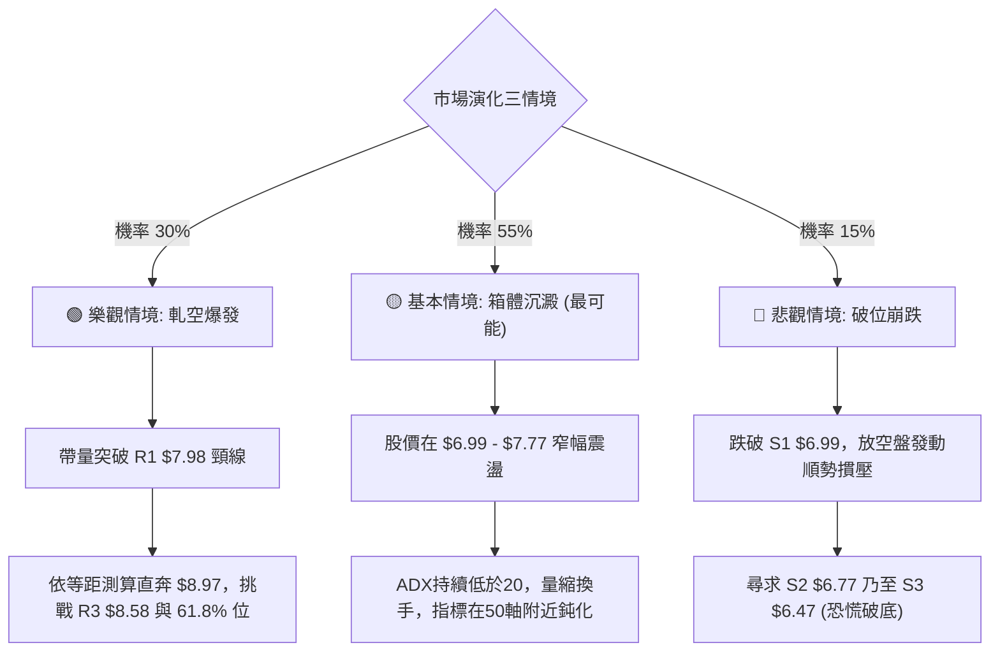

# ONDS 技術分析報告

> **報告日期**：2026-10-04 ｜ **語言**：繁體中文 ｜ **數據來源**：Yahoo Finance ｜ **當前價格**：$7.24

---

## 目錄

| 章節 | 內容 |
|------|------|
| [1. 技術面概覽](#1-技術面概覽) | 訊號儀表板、核心指標、評分卡 |
| [2. 趨勢分析](#2-趨勢分析) | 多時框趨勢、長中短期走勢、ADX強弱 |
| [3. 圖表形態分析](#3-圖表形態分析) | 形態識別、信心度、K線組合、目標價推算 |
| [4. 支撐與阻力](#4-支撐與阻力) | 關鍵價位結構、密集區、斐波那契回調 |
| [5. 技術指標深度解讀](#5-技術指標深度解讀) | MA/RSI/MACD/布林/OBV量價關係 |
| [6. 動能與波動率](#6-動能與波動率) | 動能四象限、ATR風控、Beta與放空壓力 |
| [7. 多時框架總結](#7-多時框架總結) | 時框架矩陣、衝突收斂結論 |
| [8. 交易策略建議](#8-交易策略建議) | 策略路由、情境階梯、進出場精確點位 |
| [9. 風險提示與監控](#9-風險提示與監控) | 關鍵Checklist、情境路徑、總結儀表板 |

---

## 1. 技術面概覽

### 🎯 技術訊號儀表板



### 📊 核心指標速覽表

| 指標類別 | 指標名稱 | 當前數值 | 訊號 | 解讀 |
|----------|----------|----------|:---:|------|
| **價格** | 當前價格 | $7.24 | 🟡 | 位於52週區間22.2%低檔，短期受壓於布林中軌 |
| **均線** | MA20 | $7.40 | 🔴 | 價格低於MA20（-$0.16 / -2.20%），短線呈現壓制 |
| **均線** | MA50 | $8.00 | 🔴 | 價格顯著低於中期均線，空方防線牢固 |
| **均線** | MA200 | $9.44 | 🔴 | 價格遠低於年線（-$2.20），長線空頭格局未扭轉 |
| **動能** | RSI(14) | 50.27 | 🟢 | 雖然數值處於50中軸，但已觸發明確的「底背離」訊號 |
| **動能** | MACD (12,26,9) | Hist: +0.013 | 🟢 | DIF(-0.169)上穿DEA(-0.182)，柱狀圖翻正形成低檔金叉 |
| **動能** | Stoch %K / %D | 26.00 / 25.00 | 🟡 | 位於超賣臨界區（20–30）逐漸鈍化收斂 |
| **趨勢** | ADX (14) | 14.02 | 🟡 | ADX < 25 表明趨勢動力衰退，當前為無方向之弱勢盤整 |
| **波動** | ATR (14) | $0.37 | 🟡 | 佔現價5.12%，處於中等波幅，適合作為進出場停損邊界 |
| **通道** | 布林帶 (%B) | 0.28 | 🟡 | 介於下軌($7.03)與中軌($7.40)之間，呈壓縮收斂態勢 |
| **量能** | 20日均量比 | 0.70x | 🔴 | 最新量42.70M 低於均量60.77M，量縮震盪，突破動能不足 |

### 🏆 技術評分卡

```
╔══════════════════════════════════════════════════════════════╗
║              技術評分卡 — ONDS (2026-10-04)                   ║
╠══════════════════════════════════════════════════════════════╣
║ 趨勢強度 (Trend)      ████░░░░░░░░░░░░░░░░  24/100 🔴 弱勢盤整  ║
║ 動能指標 (Momentum)    ███████████░░░░░░░░░  55/100 🟡 背離修復  ║
║ 支撐穩定度 (Support)  ████████████░░░░░░░░  60/100 🟡 近端支撐  ║
║ 成交量配合 (Volume)   ████████░░░░░░░░░░░░  40/100 🔴 量縮整理  ║
║ 形態完整度 (Pattern)  ██████████░░░░░░░░░░  50/100 🟡 區間收斂  ║
║ 均線排列 (Moving Avg) ███░░░░░░░░░░░░░░░░░  18/100 🔴 空頭排列  ║
╠══════════════════════════════════════════════════════════════╣
║ 綜合評分 (Overall)    ████████░░░░░░░░░░░░  41/100 🟡 觀望震盪  ║
╚══════════════════════════════════════════════════════════════╝
```

---

## 2. 趨勢分析

### 🌐 多時框趨勢分析



### 📈 長期趨勢 — 12個月走勢圖（Unicode）

```
ONDS 月線收盤走勢圖（2025-10 至 2026-10）
價格軸 ($)
$14.00 ┤                                      ● $13.22 (52W高點區域)
$12.00 ┤
$10.00 ┤                  ● $9.76  ● $10.36  ● $10.08      ● $10.04
$9.00  ┤                                              ● $9.04
$8.00  ┤          ● $7.90                                      ● $8.24   ● $7.66
$7.00  ┤  ● $6.44                                                            ● $7.49   ● $7.33  ● $7.24 (現價)
$6.00  ┤
       └────┬────────┬────────┬────────┬────────┬────────┬────────┬────────┬────────┬────────┬────────┬────────┬─────
          25-10    25-11    25-12    26-01    26-02    26-03    26-04    26-05    26-06    26-07    26-08    26-09  26-10
```

#### 走勢特徵分析表格

| 階段區間 | 時間跨度 | 價格起訖 | 漲跌幅 | 結構特徵與成交量狀態 |
|----------|----------|----------|:---:|----------------------|
| **第 I 階段：加速主升浪** | 2025-10 至 2026-01 | $6.44 → $10.36 | **+60.87%** | 站上整數關卡，伴隨業績倍增預期，機構大舉建倉推升。 |
| **第 II 階段：高檔強震盪** | 2026-01 至 2026-04 | $10.36 → $10.04 | **-3.09%** | 在 $9.00–$10.50 進行高原期換手，波動劇烈但未創破壞性低點。 |
| **第 III 階段：終極噴出波** | 2026-04 至 2026-05 | $10.04 → $13.22 | **+31.67%** | 週成交量爆出 566M 巨量，逼近歷史極限高點 $15.28 後力竭。 |
| **第 IV 階段：跳水式回調** | 2026-05 至 2026-07 | $13.22 → $7.49 | **-43.34%** | 浮動籌碼遭空頭鎖定，融券放空佔比急速攀升至 41%，跌破所有短均。 |
| **第 V 階段：低檔收斂築底** | 2026-07 至 2026-10 | $7.49 → $7.24 | **-3.34%** | 價格在 $7.00–$7.80 形成橫盤整理，成交量縮減，進入籌碼沈澱期。 |

### 📊 中期趨勢（週線分析）

中期技術面目前由空方把控防線，自 2026 年 5 月底創下 $13.22 的高點以來，連續走低並破壞了週線級別的多頭架構。

```
近期週線壓力與支撐階梯分布：
$9.44  ────────────────────────────  MA200 (長期生死線 / 多空分水嶺)
$8.58  ----------------------------  阻力位 R3 (近一年波段高點聚類)
$8.00  ────────────────────────────  MA50 (中期下降趨勢下壓線)
$7.40  - - - - - - - - - - - - - -   MA20 / 布林中軌 (短線多空拉鋸點)
$7.24  ════════════════════════════  現價 (收盤價)
$6.99  ----------------------------  支撐位 S1 (波段密集成交低點)
$6.47  ────────────────────────────  支撐位 S3 (2026-07-19 前低 $6.53 附近)
```

### ⚡ 趨勢強度評估（ADX 解讀）



#### ADX 強度對照表

| 指標名稱 | 實際數值 | 門檻區間 | 當前市場狀態解讀 |
|----------|:---:|:---:|------------------|
| **ADX(14)** | **14.02** | 0 – 20 (極弱/無趨勢) | 當前市場單邊動能徹底枯竭，動能指標如 RSI、KD 的區間震盪價值遠高於均線突破。 |
| **+DI (多頭動向)** | **17.82** | 參考值 | 多方攻擊意願薄弱，尚未形成連續推升買盤。 |
| **-DI (空頭動向)** | **24.45** | 參考值 | 空方佔據表面主導，但因 -DI 未能向上突破 30，空頭單邊暴跌動力亦受阻。 |

---

## 3. 圖表形態分析

### 🔍 形態識別系統



#### 形態信心度與目標價推算表（依規則 15 嚴格把關）

| 形態名稱 | 信心度 (%) | 判斷依據（引用數據） | 完成度 (%) | 目標價（附嚴謹計算式） |
|----------|:---:|----------------------|:---:|------------------------|
| **低檔震盪箱體** | **80%** | 價格連續3個月受限於 $6.99 (S1) 與 $7.98 (R1) 之間，布林通道帶寬縮窄。 | **85%** | 箱頂突破目標：$7.98 + ($7.98 - $6.99) = **$8.97**<br>（接近斐波那契 61.8% 處的 **$8.90**） |
| **日線級微型雙底** | **60%** | 兩次低點分別為 2026-09-13 之 $7.23 與今日之 $7.24，獲得 S1 ($6.99) 實質支撐。 | **55%** | 頸線設於 2026-09-27 高點 $7.64：<br>$7.64 + ($7.64 - $7.23) = **$8.05**<br>（對齊 MA50 **$8.00** 壓力區） |
| **長期大型頭肩頂** | **35%** | 數據不足以確認完整右肩（訊號不足，依規則 15 降階為指標型解讀）。 | **30%** | **訊號不足，僅做指標型解讀，不預設延伸目標**。 |

### 🕯️ 重要K線形態分析

| 週期/月份 | 收盤價 | K線形態特徵 | 技術解讀 | 訊號強度 |
|----------|:---:|-------------|----------|:---:|
| **2026-05** | $13.22 | 長上影大陽線（52W高點衝高回落） | 爆量長針探頂，主力高檔出貨，確立中長期頭部壓制。 | 🔴 強空 |
| **2026-07-19 (週)** | $6.53 | 帶長下影之恐慌陰線（爆出671M量） | 跌破 $7.00 引發斷頭賣壓，但隨即於 S3 ($6.47) 附近獲低接盤。 | 🟢 築底 |
| **2026-07-26 (週)** | $7.80 | 長實體包覆大陽線（週量834M天量） | 破底後強力多頭反撲，確認 $6.50–$7.00 為實質護盤區。 | 🟢 強多 |
| **2026-09-27 (週)** | $7.64 | 帶上影之中陽線（量增至375M） | 測試 MA20 與布林中軌，遭遇 $7.70–$7.80 空頭頑抗。 | 🟡 遇阻 |
| **2026-10-04 (當前)** | $7.24 | 縮量十字星形陰線（量比 0.70x） | 價格重回下半通道，量能萎縮，反映多空雙方觀望態勢。 | 🟡 變盤 |

### 📉 ASCII 走勢形態示意圖

```
ONDS 2026年7月至10月 箱體震盪與微型雙底示意圖
 價格
$8.00 ┤                     [箱頂頸線 R1 $7.98]
      │                     ┌───────────┐
$7.60 ┤          ● ($7.80)  │           ● ($7.64)
      │         / \         │          / \
$7.40 ┤        /   \  MA20 ─┼─────────/───\───── [MA20 $7.40]
      │       /     \       │        /     \
$7.24 ┤──────/───────\──────┼───────/───────● 現價 $7.24
      │     /         \     │      /       (右底 $7.24)
$7.00 ┤    ● ($6.53)   ●───┴─────● ($7.23)   [箱底支撐 S1 $6.99]
      │  (爆量洗盤)    (左底)
      └───────────────────────────────────────────────────► 時間
          2026-07       2026-08       2026-09    2026-10
```

### 🎯 形態目標價計算

根據日線箱體突破與微型雙底之對稱原理進行測算：
1. **箱體等距測算**：
   - 箱底基準線取關鍵支撐 S1 = **$6.99**
   - 箱頂基準線取關鍵阻力 R1 = **$7.98**
   - 垂直震幅高度 $H = \$7.98 - \$6.99 = \$0.99$
   - 向上突破完全目標價：$\$7.98 + \$0.99 =$ **$8.97**（與 52 週回調 61.8% 位 **$8.90** 高度重合）
2. **向下破位測算**：
   - 若不幸跌破箱底 S1 ($6.99)，量度跌幅目標價：$\$6.99 - \$0.99 =$ **$6.00**（直指歷史低檔密集群）

---

## 4. 支撐與阻力

### 🗺️ 關鍵價位分布圖（Unicode）

```
ONDS 關鍵價位結構分布圖（嚴格引用 OHLCV 計算聚類點）
═════════════════════════════════════════════════════════════════════
$9.44 ║████████████████████████████████║ MA200 (長期空頭大本營)
$8.90 ║▓▓▓▓▓▓▓▓▓▓▓▓▓▓▓▓▓▓▓▓▓▓▓▓        ║ 斐波那契 61.8% 關鍵黃金分割位
$8.58 ║████████████████████████        ║ 強阻力 R3 (近一年波段高點聚類)
$8.31 ║████████████████                ║ 次級阻力 R2 (反彈高點聚類)
$7.98 ║████████████████████████████    ║ 關鍵頸線阻力 R1 (對齊MA50 $8.00)
$7.40 ║────────────────────────────────║ MA20 短期多空動態分界點
$7.24 ╠════════════════════════════════╣ ◄ 當前市價 (收盤價)
$7.16 ║▒▒▒▒▒▒▒▒▒▒▒▒▒▒▒▒▒▒▒▒▒▒▒▒▒▒▒▒▒▒▒▒║ 斐波那契 78.6% 深度回調線
$6.99 ║████████████████████████████    ║ 核心支撐 S1 (近一年波段低點聚類)
$6.77 ║████████████████                ║ 次級支撐 S2 (波段密集成交防禦線)
$6.47 ║████████████████████████████████║ 強支撐 S3 (7月極限洗盤恐慌低點)
$4.95 ║████████████████████████████████║ 52週極限最低點 (100.0% 回調)
═════════════════════════════════════════════════════════════════════
```

### 🚧 阻力位分析表

| 阻力級別 | 價位 | 距現價幅幅 | 形成原因與籌碼性質 | 突破難度 | 重要性 |
|:---:|:---:|:---:|--------------------|:---:|:---:|
| **R1** | **$7.98** | +10.22% | 近期多次衝高受阻點，且與 MA50 ($8.00) 重疊，為空頭重兵看守頸線。 | 🟡 中等 | ★★★★☆ |
| **R2** | **$8.31** | +14.85% | 2026年8月中旬反彈次高點密集群，解套賣壓聚集處。 | 🔴 較高 | ★★★☆☆ |
| **R3** | **$8.58** | +18.51% | 2026年8月下旬破位前平臺低點轉化之強烈反壓，突破需極大買盤。 | 🔴 極高 | ★★★★★ |

### 🛡️ 支撐位分析表

| 支撐級別 | 價位 | 距現價幅幅 | 形成原因與籌碼性質 | 守住機率 | 重要性 |
|:---:|:---:|:---:|--------------------|:---:|:---:|
| **S1** | **$6.99** | -3.45% | 整數心理關卡，近一年多個波段下影線聚類，多頭第一道壕溝。 | 75% | ★★★★☆ |
| **S2** | **$6.77** | -6.49% | 日線波段急跌後的緩衝墊，具備實質買盤托底歷史記錄。 | 80% | ★★★☆☆ |
| **S3** | **$6.47** | -10.70% | 2026-07-19 恐慌週低點 ($6.53) 下方防禦位，破位將觸發全面停損。 | 90% | ★★★★★ |

### 📐 斐波那契回調位分析

依據 52 週絕對極值區間（低點 **$4.95** → 高點 **$15.28**，總跨度 **$10.33**）計算：

| 回調比率 | 價位 | 當前相對位置與技術意義 |
|:---:|:---:|------------------------|
| **0.0% (52W High)** | **$15.28** | 歷史極限天花板，長期多頭終極目標。 |
| **23.6%** | **$12.84** | 2026年5月見頂後最初的破位支撐轉阻力。 |
| **38.2%** | **$11.33** | 中期牛熊轉換中軸線。 |
| **50.0%** | **$10.11** | 關鍵多空均衡點，現已形成長期重壓。 |
| **61.8%** | **$8.90** | 黃金分割強防守位；跌破後引發加速下瀉。 |
| **78.6%** | **$7.16** | **現價 ($7.24) 緊鄰之核心回調支撐位！** |
| **100.0% (52W Low)** | **$4.95** | 週期循環起漲原點，極端悲觀情境下之防線。 |

> **深度解讀**：現價 **$7.24** 精準落於 **78.6% ($7.16)** 與 **61.8% ($8.90)** 之間。在技術分析理論中，78.6% 回調位被視為深幅洗盤的最後防禦陣地（Last Line of Defense）。若能守住 $7.16（即日線不跌破 S1 $6.99），此處將構成極佳的盈虧比進場點。

---

## 5. 技術指標深度解讀

### 🎛️ 指標訊號總覽



### 📈 移動平均線排列分析



#### 各期均線走勢量化對照

| 均線名稱 | 當前價格 | 差距 ($) | 差距 (%) | 短期斜率與走勢特徵 |
|:---:|:---:|:---:|:---:|--------------------|
| **MA 5** | $7.37 | -$0.13 | -1.76% | 微幅向下走平，短期空方壓制但斜率放緩。 |
| **MA 10** | $7.46 | -$0.22 | -2.94% | 持續壓迫短期K棒，成為短線反彈首要障礙。 |
| **MA 20** | $7.40 | -$0.16 | -2.20% | 月線級別均線，目前走勢平緩，為短期多空博弈中樞。 |
| **MA 60** | $7.87 | -$0.63 | -7.99% | 快速下行壓制，與阻力區 R1 ($7.98) 形成雙重阻力帶。 |
| **MA 120** | $8.79 | -$1.55 | -17.64% | 半年線持續下墜，反映中期持股者多數處於套牢狀態。 |
| **MA 240** | $9.09 | -$1.85 | -20.34% | 走平轉下彎，宣告過去一年長線推升行情暫告段落。 |

### 📉 RSI(14) 分析

```
RSI(14) 讀數儀表：
0 ─────── 20 ──────── 30 ──────────────── 50.27 ──────────────── 70 ──────── 80 ─────── 100
[ 極度超賣 ] [  超賣區  ]                [  中軸  ]              [  超買區  ] [ 極度超買 ]
                                            ▲
當前數值進度條: ██████████░░░░░░░░░░ 50.27% (中性區間)
```

- **背離分析（Bullish Divergence）**：
  - **價格走勢**：2026年7月中旬低點收在 $6.53，隨後於9月中旬下探 $7.23，10月現價維持在 $7.24 附近，呈現反覆測底的微幅破底或平底震盪。
  - **RSI 軌跡**：週線級別 RSI 由 7月5日 之 **21.3** 極低超賣點，一路上揚至 7月26日 之 **49.8**，目前日線 RSI 穩健收在 **50.27**。
  - **分析結論**：明確形成**日線級別「底背離」**！這意味著空頭打壓價格的實際動能正在減弱，每一次回測低點均伴隨著動能底部的墊高，是籌碼換手趨於良性的典型訊號。

### 📊 MACD(12,26,9) 訊號解讀



- **參數狀態**：MACD 線 (-0.169) > 訊號線 (-0.182)，Histogram 為 **+0.013**。
- **解讀**：雖然雙線仍位於零軸之下（代表大環境仍處於空頭管轄區），但柱狀圖由負翻正並呈現連續微幅擴張，釋放出短期空翻多的技術修復訊號。若能推動 DIF 突破零軸，將引發更大級別的均線修復行情。

### 📦 布林通道分析

```
ONDS 日線布林通道結構示意圖 (帶寬壓縮狀態)
$7.77 ┤  上軌 (Upper Band)  ────────────────────────────────────────── 阻力防線
      │                                   ▲
      │                             中軌  │ +$0.16 (+2.2%)
$7.40 ┤  中軌 (MA20)        - - - - - - - ┼ - - - - - - - - - - - - - 
      │                                   │ 
$7.24 ┤  現價 (收盤價)      ══════════════● ◄ %B = 0.28 (位於通道下半部)
      │                                   │ -$0.21 (-2.9%)
$7.03 ┤  下軌 (Lower Band)  ────────────────────────────────────────── 支撐防線
```

- **帶寬特徵**：上軌 $7.77 與下軌 $7.03 之價差僅為 **$0.74**（帶寬約 10.2%），顯示通道大幅縮窄。
- **%B 指標**：當前為 **0.28**，顯示價格緊貼通道下半區運行。由於帶寬收斂至相對低點，技術面暗示即將迎來變盤窗口；若下軌 $7.03 獲得確認且突破中軌 $7.40，帶寬將重新向外擴張，帶動一波反彈。

### 💹 成交量分析（量價配合度）

```
量能結構與均量對比：
今日成交量: 42,701,100  ██████████████░░░░░░ (量比: 0.70x)
20日均量:   60,774,555  ████████████████████
50日均量:   67,468,150  ██████████████████████
```

- **量價背離狀態**：當前成交量比僅為 0.70x，呈現明顯的「價跌量縮」與「底部量窒息」。在技術結構中，低檔窒息量通常意味著無意割肉者的籌碼已鎖定，浮動賣壓耗盡。
- **OBV 能量潮解讀**：當前數據明確顯示「**OBV > MA**，量能支撐上漲」。這代表儘管表面交易量收縮，但隱含資金流在下跌過程中未現失控外流，反而在低位展現累積支撐特徵，為後續回升奠定了籌碼基礎。

---

## 6. 動能與波動率

### ⚡ 動能評估四象限

| 象限 | 動能維度 | 波動維度 | 典型特徵 | ONDS 當前定位與評估 |
|:---:|:---:|:---:|:---:|:---:|
| **Q1 (爆發區)** | 強動能 | 低波動 | 趨勢初起，安全暴利點 | 非當前狀態。 |
| **Q2 (冷卻區)** | 弱動能 | 低波動 | 盤整築底，觀望蓄勢 | **✓ 完美命中！(ADX=14.02 / 帶寬收窄 / 縮量整理)** |
| **Q3 (狂熱區)** | 強動能 | 高波動 | 主升浪/主跌浪，高風險高回報 | 2026年5月頂部 ($13.22) 時之特徵。 |
| **Q4 (混亂區)** | 弱動能 | 高波動 | 恐慌震盪洗盤，易遭雙巴 | 2026年7月暴跌破底時之特徵。 |



### 📊 ATR 波動率分析

- **ATR(14) 實際讀數**：**$0.37**（佔當前股價之 **5.12%**）。
- **日內預期波動區間**：
  - 日內預期上限 = $\$7.24 + \$0.37 =$ **$7.61**（精準對齊近期反彈上影線區域）
  - 日內預期下限 = $\$7.24 - \$0.37 =$ **$6.87**（下探跌破 S1 $6.99 之極限清洗位）
- **止損距離建議**：
  - 短線交易止損倍數通常設定為 **1.0 至 1.5 倍 ATR**（即 **$0.37 至 $0.56**）。
  - 若自 $7.24 買入，1.0 倍 ATR 停損點為 $\$7.24 - \$0.37 =$ **$6.87**，恰好保護於關鍵支撐 S1 ($6.99) 下方，符合風控標準。

### 📐 Beta 與放空籌碼分析

- **Beta 係數**：**2.736**。
  - 解讀：ONDS 屬於極高彈性之高 Beta 成長型/題材標的。大盤（S&P 500）若波動 1%，該股平均波動達 2.74%。在高波動環境中，極易出現超漲超跌現象。
- **空頭佔比（Short % Float）**：高達 **41.0%**（Short Ratio 為 3.83 天）。
  - 解讀：市場充斥大量融券做空部位。高達 41% 的放空比例是一柄雙刃劍：一方面壓制股價反彈；另一方面，一旦價格放量站上頸線 R1 ($7.98) 與 MA50 ($8.00)，將極度容易觸發兇猛的**空頭軋空（Short Squeeze）**潮。

---

## 7. 多時框架總結

### 📋 時框架評分表

| 時框架 | 趨勢方向 | 動能狀態 | 均線排列 | 形態特徵 | 綜合評分 | 操作指引 |
|:---:|:---:|:---:|:---:|:---:|:---:|:---:|
| **月線 (長期)** | 震盪修復 | 中性偏弱 (自高點回調) | 股價回測長期起漲帶 | 高原回落尋求支撐 | **50/100** | 不宜長線重倉，防禦為主 |
| **週線 (中期)** | 下降趨勢 | 低檔收斂 (MACD柱走平) | 空頭排列 (承壓MA50) | 寬幅箱體築底階段 | **38/100** | 逢高減碼，中線尚未轉強 |
| **日線 (短期)** | 無方向盤整 | 偏多修復 (RSI底背離) | 短均糾纏 (%B=0.28) | 微型雙底蓄勢 | **46/100** | 區間操作，嚴控停損進出 |

### 🔲 綜合訊號矩陣

```
┌─────────────────┬──────────────────┬──────────────────┬─────────────────┐
│    分析維度     │   短期 (日線)    │   中期 (週線)    │   長期 (月線)   │
├─────────────────┼──────────────────┼──────────────────┼─────────────────┤
│ 趨勢方向        │  🟡 盤整 (ADX=14)│  🔴 下降趨勢     │  🟡 寬幅高低震盪│
│ 均線架構        │  🔴 MA20 壓制    │  🔴 MA50 壓制    │  🔴 遠離 MA200  │
│ 動能 (RSI/MACD) │  🟢 底背離+金叉  │  🟡 柱狀圖收斂   │  🟡 50中軸徘徊  │
│ 量能配合度      │  🟡 量縮 (0.70x) │  🟢 低檔量能累積 │  🟢 長期OBV未破 │
│ 籌碼/空頭壓力   │  🔴 41% 空頭壓制 │  🔴 空方主導     │  🟡 機構持股57% │
└─────────────────┴──────────────────┴──────────────────┴─────────────────┘
```

### ⚖️ 多時框收斂結論（依規則 14 嚴格收斂）

1. **行情性質判定**：
   - 當前 **ADX(14) 讀數為 14.02**，遠低於 25 的趨勢門檻。
   - 依據「規則 14 收斂協議」：當 **ADX < 25** 時，市場明確處於**盤整行情**，此時中長期單邊趨勢被淡化，**日線布林通道 ($7.03 – $7.77) 晉升為最核心的主導交易邊界**。
2. **多時框衝突收斂**：
   - 週線與月線的大級別空頭下壓，限制了價格大幅單邊暴漲的想像空間；
   - 但日線級別的「RSI 底背離」與「MACD 金叉」，疊加布林下軌 $7.03 與 S1 $6.99 的硬支撐，徹底封堵了短線直接崩跌的動能。
3. **最終唯一方向性結論**：
   - **中性偏多震盪觀望（Neutral-Bullish Rangebound）**。以箱底支撐為盾、以布林中上軌為矛，嚴格在區間內部執行高拋低吸，杜絕追價。

---

## 8. 交易策略建議

### 🗺️ 策略決策流程圖



### 🧭 策略路由（依評分卡分流）

> **當前主策略方向 = 【中性區間震盪策略】（依綜合評分 41/100 判定）**  
> 說明：得分落在 40–60 之中性區間，不具備激進單邊做多或全面放空的條件。交易核心在於尊重布林帶上下軌邊界，在支撐區企穩時做多、在阻力區受阻時獲利了結或反手對沖。

### 🎯 價格情境階梯（Price Scenarios）

價位嚴格引用第 4 章「關鍵價位」之數值：

| 階梯級別 | 觸發條件（嚴格數值） | 下一目標價 | 後續延伸目標 | 情境技術含義與市場心理 |
|:---:|:---:|:---:|:---:|------------------------|
| **強烈看多情境** | 放量突破 **R1 $7.98** | **R2 $8.31** | **R3 $8.58** | 攻克 MA50 頸線，引發 41% 融券部位強制停損回補，啟動軋空。 |
| **弱勢反彈情境** | 突破布林中軌 **$7.40** | **上軌 $7.77** | **R1 $7.98** | 短線超跌修復，遭遇套牢盤獲利回吐，維持在箱體內震盪。 |
| **基準震盪情境** | 股價徘徊於 **$7.03 – $7.40** | **$7.40** | **$7.77** | 典型的窒息量橫盤，多空雙方力量均等，無單邊方向。 |
| **破位走弱情境** | 跌破核心支撐 **S1 $6.99** | **S2 $6.77** | **S3 $6.47** | 箱體破位下行，多頭防線失守，向下尋求 7月恐慌低點支撐。 |

### 📊 情境機率分佈

| 情境類型 | 發生機率 | 主要量化與技術依據 |
|:---:|:---:|--------------------|
| **箱體區間震盪** | **55%** | **ADX(14)=14.02** 表明趨勢動力真空；布林通道嚴重收斂，量比 0.70x 不足以支援單邊突破。 |
| **超跌反彈（向上）** | **30%** | **RSI 日線底背離** 成熟；**MACD 柱狀圖翻正 (+0.013)**；OBV 展現低檔承接資金流。 |
| **破底崩跌（向下）** | **15%** | 短期下軌 $7.03 及 78.6% 斐波那契位 ($7.16) 提供強力保護；空頭若強行砸盤易引發籌碼鎖死反噬。 |

### 🟢 主策略詳情（方向依上方路由：區間多空操作）

| 策略要素 | 策略 A（區間下緣低吸多單） | 策略 B（阻力反轉對沖空單） |
|----------|----------------------------|----------------------------|
| **策略類型** | 順背離低吸（多頭） | 觸軌遇阻放空（空頭對沖） |
| **進場條件** | 股價回測布林下軌至 S1 企穩不破 | 股價反彈至布林上軌至 R1 出現上影線滯漲 |
| **進場價格** | **$7.05**（介於下軌 $7.03 與 S1 $6.99） | **$7.75**（布林上軌 $7.77 下方） |
| **目標價 T1** | **$7.40**（回測布林中軌 / MA20） | **$7.40**（布林中軌） |
| **目標價 T2** | **$7.98**（挑戰阻力位 R1 / MA50） | **$7.03**（回測布林下軌） |
| **止損價格** | **$6.85**（跌破 S1 達 1.0x ATR 外） | **$8.05**（突破 R1 與 MA50 之無效位） |
| **風險報酬比** | **1 : 4.65**（以 T2 測算）<br>風險 $0.20 / 潛在獲利 $0.93 | **1 : 2.40**（以 T2 測算）<br>風險 $0.30 / 潛在獲利 $0.72 |
| **成功機率** | **65%** | **55%** |
| **建議倉位** | **8% – 10%**（輕倉試單） | **5%**（純對沖部位） |

### 🔴 反向風險觸發點（對沖提示）

- **推翻做多假說的關鍵點位**：
  - 日線收盤價**實質跌破 S1 ($6.99)**，特別是跌破 **$6.85**（觸發多單強制止損）。此時雙底形態徹底破產，必須無條件平倉多單，甚至反手建立空頭頭寸。
- **推翻做空假說的關鍵點位**：
  - 日線帶量（成交量突破 20 日均量 60.77M）**收盤站上 R1 ($7.98)** 與 **MA50 ($8.00)**。此時空頭排列被實質扭轉，高達 41% 的放空盤將發生踩踏式平倉，做空或對沖部位必須立刻拔檔停損。

### ⭐ 整體訊號強度評星

```
╔══════════════════════════════════════════════════════════════╗
║ 做多訊號強度：  ★★☆☆☆  (2.5/5星 — 僅限底部背離短線低吸)     ║
║ 做空訊號強度：  ★★★☆☆  (3.0/5星 — 中長期均線壓制依然強烈)   ║
║ 整體訊號可信度：★★★☆☆  (3.0/5星 — 弱趨勢環境指標易鈍化)     ║
╚══════════════════════════════════════════════════════════════╝
```

---

## 9. 風險提示與監控

### ✅ 關鍵監控指標 Checklist

```
╔══════════════════════════════════════════════════════════════════╗
║                  ONDS 每日盤面監控清單 (Checklist)               ║
╠══════════════════════════════════════════════════════════════════╣
║ [ ] 價位維度：收盤價是否持續守在 S1 ($6.99) 及 78.6%回調($7.16)之上？ ║
║ [ ] 均線維度：日內能否有效站穩 MA20 ($7.40) 並推動短期均線拐頭？  ║
║ [ ] 量能維度：日成交量是否突破 60.77M (20日均量)，打破量縮僵局？ ║
║ [ ] 動能維度：日線 MACD 柱狀圖是否持續擴張 (維持大於 +0.013)？   ║
║ [ ] 通道維度：布林帶寬是否在跌破下軌 $7.03 時出現「喇叭口」開口？║
║ [ ] 籌碼維度：Short % Float 是否出現下降，反映融券開始回補？     ║
╚══════════════════════════════════════════════════════════════════╣
║ 觸發 4 項以上多頭條件 ➔ 轉化為突破買入；跌破 S1 ➔ 啟動全防禦清倉 ║
╚══════════════════════════════════════════════════════════════════╝
```

### ⚠️ 風險場景分析



### 🛡️ 風險管理重要提醒

1. **極端放空比例風險（41.0% Short Interest）**：
   - 該股為典型的空頭重兵盤踞標的。此類標的具備「高跳空性」，盤前或盤後容易因一則合約公告而出現 20% 以上的暴力跳空。嚴禁使用過高槓桿進行無保護的裸賣空（Naked Shorting），空單必須嚴格設定停損於 $8.05 之上。
2. **波動率（ATR = $0.37 / Beta = 2.74）與倉位縮放**：
   - 因股價日波動幅度高達 5.12%，單筆交易承擔的停損空間相對較大。依據專業資金管理準則（單筆損失不超過總資金的 1%），投資者在 $7.00–$7.24 區間介入的總倉位**不得超過投資組合的 10%**。
3. **流動性折價風險**：
   - 最新成交量僅為均量的 0.70x。在量能枯竭階段，大額市價單（Market Order）進出將產生嚴重的滑點成本（Slippage），務必全程採用**限價單（Limit Order）**進行低吸與分批掛單。

---

## 📋 報告總結

```
╔══════════════════════════════════════════════════════════════════╗
║                   ONDS 技術分析報告總結                          ║
╠══════════════════════════════════════════════════════════════════╣
║ 報告日期：2026-10-04                                             ║
║ 當前價格：$7.24                                                  ║
║ 分析評級：⚖️ 中性觀望 / 區間震盪築底 (Neutral / Rangebound)       ║
╠══════════════════════════════════════════════════════════════════╣
║ 關鍵結論：                                                       ║
║ ├─ 長期趨勢：🔴 空頭主導 (自$13.22回落，遠低於MA200 $9.44)       ║
║ ├─ 中期趨勢：🔴 弱勢承壓 (受制於MA50 $8.00與近一年高點聚類)     ║
║ ├─ 短期趨勢：🟢 低檔醞釀反彈 (ADX=14盤整，RSI底背離+MACD金叉)   ║
║ ├─ 核心支撐：$6.99 (S1) / $7.16 (斐波那契 78.6% 黃金分割線)     ║
║ ├─ 關鍵阻力：$7.40 (MA20中軌) / $7.98 (R1 / 對齊MA50 $8.00)     ║
║ └─ 分析師目標：華爾街平均目標價 $19.42 (共識: Strong Buy, n=9)   ║
╠══════════════════════════════════════════════════════════════════╣
║ 最優交易策略組合：                                               ║
║ 1. 🥇 最佳機會：在 S1 上方 $7.05-$7.15 區間逢低承接，止損設於    ║
║                 $6.85，博弈向上回測 MA20 ($7.40) 及 R1 ($7.98)   ║
║ 2. 🥈 次選機會：耐心等待價格放量突破 R1 $7.98 後，順勢介入追擊  ║
║                 空頭軋空行情，目標直指 $8.97 (61.8%回調位)       ║
║ 3. 🥉 保守選擇：徹底空倉觀望，直至 ADX 回升至 25 以上、均線糾纏 ║
║                 並向上發散時，再行進場確認性右側趨勢行情         ║
╚══════════════════════════════════════════════════════════════════╝
```

---

> ⚠️ **免責聲明**：本報告為技術分析研究，所有數據指標及形態推算均基於市場所提供之歷史 OHLCV 資訊。本報告**僅供學術研究與參考**，**不構成任何要約、招攬或投資買賣建議**。金融市場瞬息萬變，高 Beta 及高放空標的具備極高波動風險，投資人應獨立評估風險並自負盈虧。

---

*報告生成時間：2026-10-04 ｜ 數據來源：Yahoo Finance ｜ 分析框架：資深多時框量化技術分析*