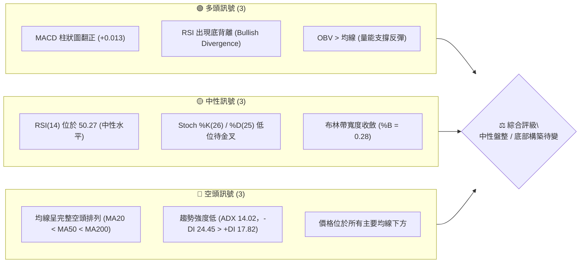
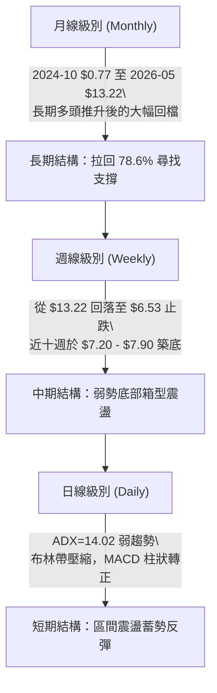
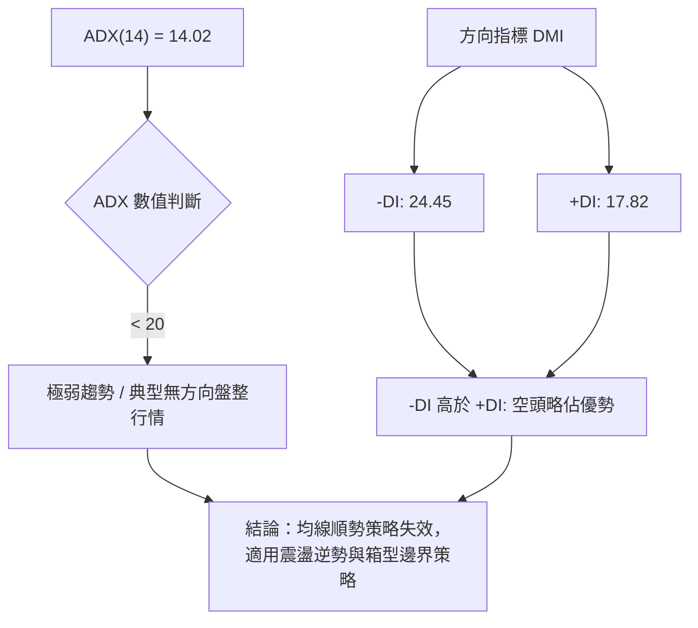
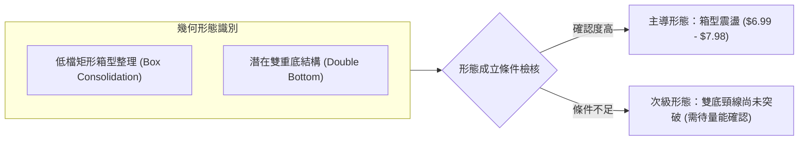
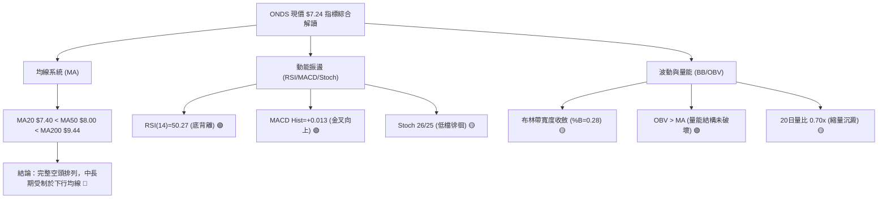
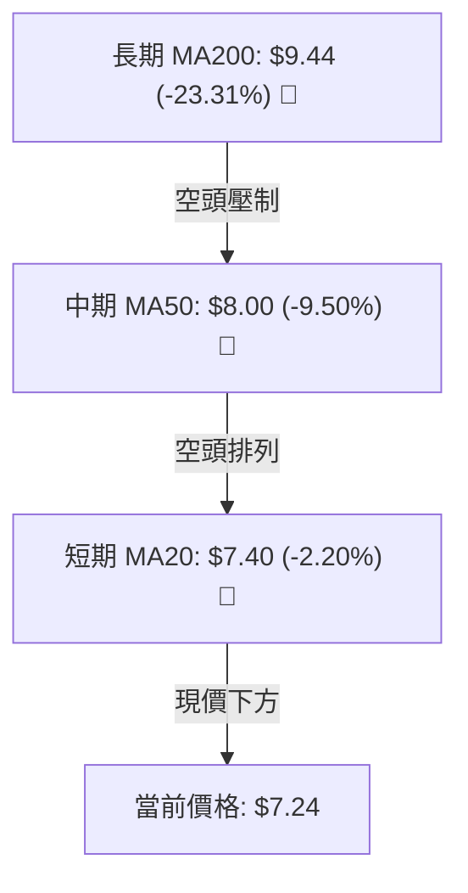
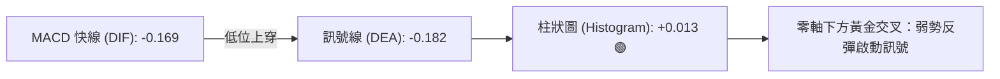
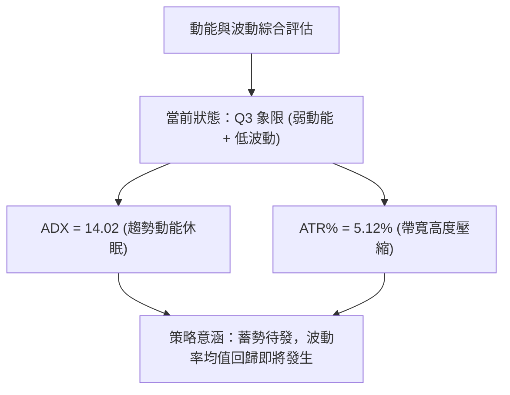
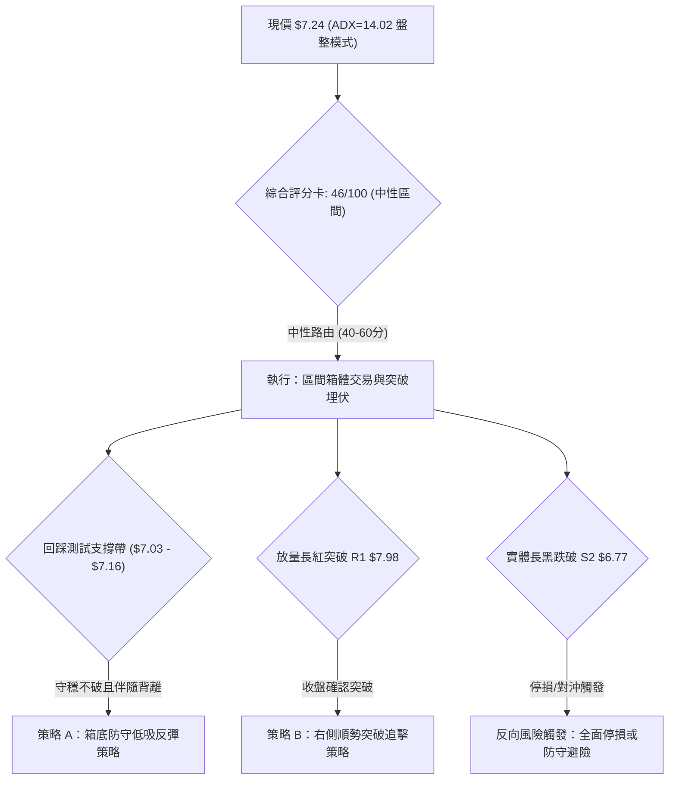
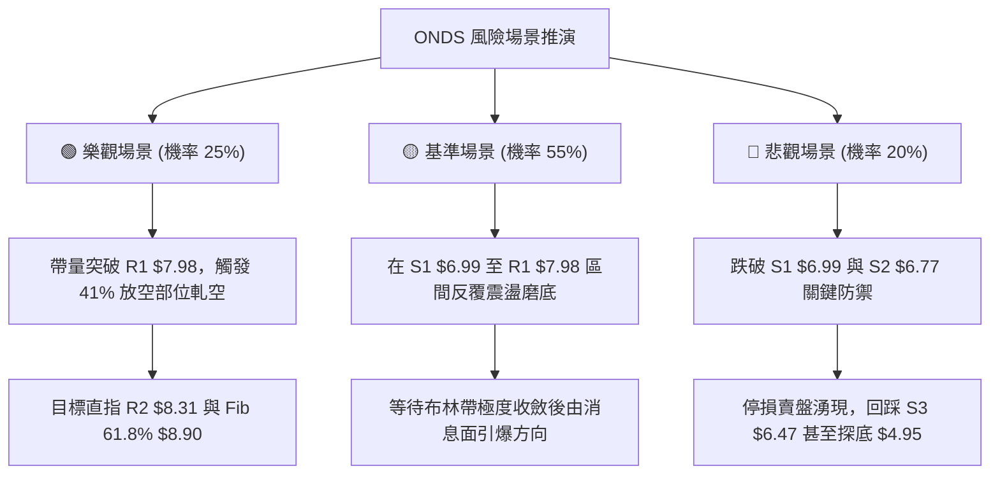

# ONDS 技術分析報告

> **報告日期**：2026-10-05 ｜ **語言**：繁體中文 ｜ **數據來源**：Yahoo Finance ｜ **當前價格**：$7.24

---

## 目錄

| 章節 | 內容 |
|------|------|
| [1. 技術面概覽](#1-技術面概覽) | 訊號儀表板、核心指標、評分卡 |
| [2. 趨勢分析](#2-趨勢分析) | 多時框趨勢、長中短期走勢 |
| [3. 圖表形態分析](#3-圖表形態分析) | 形態識別、K線組合、目標價 |
| [4. 支撐與阻力](#4-支撐與阻力) | 關鍵價位、斐波那契回調 |
| [5. 技術指標深度解讀](#5-技術指標深度解讀) | MA/RSI/MACD/布林/成交量 |
| [6. 動能與波動率](#6-動能與波動率) | 動能評估、ATR、Beta |
| [7. 多時框架總結](#7-多時框架總結) | 時框架評分矩陣 |
| [8. 交易策略建議](#8-交易策略建議) | 多空策略、風險報酬比 |
| [9. 風險提示與監控](#9-風險提示與監控) | 監控指標、風險場景 |
| [📋 報告總結](#-報告總結) | 全文核心精華摘要 |

---

## 1. 技術面概覽

### 🎯 技術訊號儀表板



### 📊 核心指標速覽表

| 指標類別 | 指標名稱 | 當前數值 | 訊號 | 解讀 |
|----------|----------|----------|------|------|
| **價格** | 當前價格 | $7.24 | 🟡 | 位於52週區間($4.95–$15.28)之 22.2% 低檔區 |
| **均線** | MA20 | $7.40 | 🔴 | 價格低於 MA20，短期均線反壓 (-2.20%) |
| **均線** | MA50 | $8.00 | 🔴 | 價格低於 MA50，中期趨勢偏弱 (-9.50%) |
| **均線** | MA200 | $9.44 | 🔴 | 價格低於 MA200，長期趨勢受制 (-23.31%) |
| **動能** | RSI(14) | 50.27 | 🟢 | 站上中軸 50，且日線級別存在底背離結構 |
| **動能** | MACD | -0.169 | 🟢 | DIF 高於 DEA(-0.182)，Hist 轉正為 +0.013 |
| **動能** | Stoch %K/%D | 26.00 / 25.00 | 🟡 | 處於弱勢反彈區，即將形成低位交叉 |
| **趨勢** | ADX(14) | 14.02 | 🟡 | ADX < 25，趨勢動能衰竭，進入低波動盤整 |
| **通道** | 布林通道 | $7.03–$7.77 | 🟡 | 價格貼近下軌後回彈，%B 為 0.28，空間壓縮 |
| **量能** | 20日成交量比 | 0.70x | 🟡 | 42.70M vs 60.77M，量縮整理，待突破放量 |
| **波動** | ATR(14) | $0.37 | 🟡 | 佔現價 5.12%，處於近期波動收斂階段 |

### 🏆 技術評分卡

```
╔══════════════════════════════════════════════════════════════════╗
║                   技術評分卡 — ONDS (2026-10-05)                ║
╠══════════════════════════════════════════════════════════════════╣
║ 趨勢強度 (Trend)     ██████░░░░░░░░░░░░░░  30/100 🔴 空頭壓制    ║
║ 動能指標 (Momentum)  ███████████░░░░░░░░░  55/100 🟢 底背離修復  ║
║ 支撐穩定度 (Support) █████████████░░░░░░░  65/100 🟢 斐波那契守穩║
║ 成交量配合 (Volume)  ██████████░░░░░░░░░░  50/100 🟡 量縮待量    ║
║ 形態完整度 (Pattern) █████████░░░░░░░░░░░  45/100 🟡 箱型低位    ║
║ 均線系統 (MA System) ██████░░░░░░░░░░░░░░  30/100 🔴 均線反壓    ║
╠══════════════════════════════════════════════════════════════════╣
║ 綜合技術評分         █████████░░░░░░░░░░░  46/100 🟡 中性盤整    ║
╚══════════════════════════════════════════════════════════════════╝
```

---

## 2. 趨勢分析

### 🌐 多時框趨勢分析



### 📈 長期趨勢 — 12個月走勢圖（Unicode）

```
ONDS 月線走勢圖（過去12個月：2025-10 至 2026-10）
價格軸 ($)
$14.00 ┤                                      ● $13.22 (2026-05 高點)
$12.00 ┤                                     / \
$10.00 ┤                       ● $10.36     /   \
$8.00  ┤       ● $7.90   ● $9.76 \   ● $10.04    \   ● $7.66
$7.00  ┤ ● $6.44 \      /         \ /             ● $7.49  \  ● $7.24 (現價)
$6.00  ┤          \____/           ● $9.04                  ● $7.33
       └─────────────────────────────────────────────────────────────
        10月   11月   12月   01月   02-04月  05月  06-07月 08月  09月  10月
```

#### 走勢特徵分析表格

| 階段 | 期間 | 價格區間 | 漲跌幅 | 走勢特徵與技術意義 |
|------|------|----------|--------|--------------------|
| 主升加速段 | 2025-10 → 2026-01 | $6.44 → $10.36 | +60.87% | 多頭推升，機構建倉，成交放量，均線強勢發散 |
| 高檔震盪段 | 2026-02 → 2026-04 | $9.04 → $10.08 | -3.08%  | 萬點關卡高檔換手，多空分歧加劇 |
| 爆發見頂段 | 2026-04 → 2026-05 | $10.04 → $13.22| +31.67% | 衝頂段創下歷史級天量與波段高點 $15.28，隨後遭遇獲利了結 |
| 快速回調段 | 2026-05 → 2026-07 | $13.22 → $7.49 | -43.34% | 獲利賣壓出籠，連續跌破 MA20 與 MA50，於 $6.53 見中線低點 |
| 築底沉澱段 | 2026-08 → 2026-10 | $7.66 → $7.24  | -5.48%  | 波動率收縮，於斐波那契 78.6% 回調位 ($7.16) 附近橫盤築底 |

### 📊 中期趨勢（週線分析）

從近 20 週資料來看，2026 年 7 月 19 日當週收於 $6.53 並爆出 6.71 億股的恐慌拋售量，隨後一週（7 月 26 日）以 8.34 億股巨量拉升至 $7.80，確立了中期關鍵低點防線。目前週線價格在 $7.20–$7.80 之間進行橫向箱型整理。

```
ONDS 週線壓力與支撐示意圖
$9.24 ────────────────────────────────────────── 8月中波段反彈高點
       \
$8.58 ──\─────────────────────────────────────── 中期結構阻力 R3
         \
$7.98 ────\───────●───────────────────────────── 區間箱頂阻力 R1 (週線反壓)
           \     / \     /●
$7.24 ──────●───/───●───/───● ◄─────────────── 現價 ($7.24) 震盪中樞
             \ /     \ /
$6.99 ────────●───────●───────────────────────── 區間箱底支撐 S1
               \
$6.53 ──────────●─────────────────────────────── 7/19 恐慌殺盤低點 (極限支撐)
```

### ⚡ 趨勢強度評估（ADX 解讀）



#### ADX 趨勢強度對照表

| 指標變數 | 當前讀數 | 門檻區間 | 趨勢狀態評判 | 交易意義 |
|----------|----------|----------|--------------|----------|
| **ADX(14)** | **14.02** | < 25 (弱趨勢/盤整) | 趨勢動能休眠 | 突破往往易出現假突破，應避免追高殺跌 |
| **+DI** | **17.82** | 0 – 100 | 多頭攻擊動能低迷 | 多方尚未發動攻勢，缺乏主動推升動能 |
| **-DI** | **24.45** | 0 – 100 | 空頭受控微幅佔優 | 雖處於空方主導，但未達 >30 之主跌浪門檻 |

---

## 3. 圖表形態分析

### 🔍 形態識別系統



#### 形態識別信心度評估表（依規則 15）

| 形態名稱 | 信心度 | 判斷依據（引用數據） | 完成度 | 目標價（附嚴謹計算式） |
|----------|--------|----------------------|--------|------------------------|
| **矩形箱體整理** | **75%** | 價格受制於近一年波段高點 R1 ($7.98)，下方受到 S1 ($6.99) 有效支撐，近兩個月於此區間收斂 | 85% | 突破箱頂目標價 = 箱頂 $7.98 + (箱頂 $7.98 - 箱底 $6.99) = **$8.97**（接近 61.8% 斐波位 $8.90） |
| **潛在雙重底** | **45%** | 7/19 低點 $6.53 與 9/13 低點 $7.23 形成抬高低點，但頸線尚未有效突破 | 40% | 訊號不足，依規則 15 判定信心度 < 50%，僅作指標型觀察，不作主交易依據 |
| **布林帶收斂突破** | **70%** | 上軌 $7.77 與下軌 $7.03 極度夾窄，帶寬僅 $0.74，波動率蓄勢待發 | 70% | 向上突破上軌目標：$7.77 + ($7.77 - $7.03) = **$8.51**（貼近 R3 $8.58） |

### 🕯️ 重要K線形態分析

| 週/月份 | 收盤價 | K線形態 | 解讀 | 訊號 |
|---------|--------|---------|------|------|
| **2026-05** | $13.22 | 帶長上影線之避雷針天線 | 觸及 52W 高點 $15.28 後遭遇空頭毀滅性拋壓，天量見頂訊號 | 🔴 強烈空頭 |
| **2026-07** | $7.49 | 爆量長下影錘頭十字線 | 7/19 週探底 $6.53 後獲 8.34 億巨量承接，確立中線買盤介入點 | 🟢 多頭防守 |
| **2026-08** | $7.66 | 墓碑線與回落紡錘線並存 | 反彈至 $9.24 遇 MA60 ($7.87) 與 MA50 ($8.00) 強壓受阻回落 | 🔴 阻力確認 |
| **2026-09** | $7.33 | 窄幅長下影孕線 (Harami) | 波動率驟降，成交量萎縮，賣壓竭盡，多空在 $7.20 附近達成暫時均衡 | 🟡 變盤前兆 |
| **2026-10 (當前)** | $7.24 | 縮量十字星線 | 緊貼斐波那契 78.6% ($7.16)，成交量比降至 0.70x，等待方向選擇 | 🟡 中性蓄勢 |

### 📉 ASCII 走勢形態示意圖

```
ONDS 當前矩形箱體與壓縮整理形態
$8.00 ┤        ┌─── 阻力邊界 R1 ($7.98) ──────────────────────────┐
$7.80 ┤    ●   │              ● (2026-09-27 $7.64)               │  BB 上軌 $7.77
$7.60 ┤   / \  │             / \                                 │
$7.40 ┤──/───\─┼────────────/───\───● (現價 $7.24) ──────────────┼── MA20 ($7.40)
$7.20 ┤ /     \│           ●     \ /                             │  Fib 78.6% ($7.16)
$7.00 ┤●       └── 支撐邊界 S1 ($6.99) ──────────────────────────┘  BB 下軌 $7.03
       └─────────────────────────────────────────────────────────────
         8月下旬      9月上旬       9月中旬       9月下旬     10月初
```

### 🎯 形態目標價計算

依據矩形箱體幾何對稱測量法：
1. **箱體高度**：$H = \text{箱頂 } R1 (\$7.98) - \text{箱底 } S1 (\$6.99) = \$0.99$
2. **多頭向上突破目標價 (T_Bull)**：
   $$\text{T1} = R1 + H = 7.98 + 0.99 = \$8.97$$
   *(該數值與 52 週回調 61.8% 斐波那契位 $8.90 極度重合，具備雙重技術共振)*
3. **空頭向下跌破目標價 (T_Bear)**：
   $$\text{T\_down} = S1 - H = 6.99 - 0.99 = \$6.00$$
   *(若 S1 失守，將回測 7 月低點 $6.53 與 S3 $6.47 聚類支撐)*

---

## 4. 支撐與阻力

### 🗺️ 關鍵價位分布圖（Unicode）

```
ONDS 價位結構分布圖 (由波段高低點與斐波那契計算)
══════════════════════════════════════════════════════════════════
$15.28 ║████████████████████████████████████║ 52W 歷史最高點 (0.0% Fib)
$10.11 ║████████████████████████            ║ 斐波那契 50.0% 回調位
$9.44  ║██████████████████████              ║ MA200 牛熊分水嶺
$8.90  ║██████████████████                  ║ 斐波那契 61.8% 重要黃金分割
$8.58  ║████████████████                    ║ 波段高點強阻力 R3
$8.31  ║██████████████                      ║ 中期阻力位 R2
$7.98  ║████████████                        ║ 關鍵頸線阻力 R1 (箱頂)
───────╠════════════════════════════════════╣ ◄── 現價 $7.24
$7.16  ║▓▓▓▓▓▓▓▓▓▓▓▓▓▓▓▓▓▓▓▓                ║ 斐波那契 78.6% 回調關鍵支撐
$6.99  ║████████████████████                ║ 近期波段關鍵支撐 S1 (箱底)
$6.77  ║██████████████████████              ║ 結構防守支撐 S2
$6.47  ║████████████████████████            ║ 近一年極限強支撐 S3
$4.95  ║████████████████████████████████████║ 52W 歷史最低點 (100.0% Fib)
══════════════════════════════════════════════════════════════════
```

### 🚧 阻力位分析表

*註：價位嚴格引用技術數據中由近一年波段高點聚類算出之數值。*

| 阻力級別 | 價位 | 與現價差距 | 形成原因 | 突破難度 | 重要性評級 |
|----------|------|------------|----------|----------|------------|
| **R1** | **$7.98** | +10.22% | 近期箱體上緣高點聚類，且與 MA50 ($8.00) 形成雙重反壓 | 🟡 中等 (需日成交量放大至 60M 以上) | ★★★★☆ |
| **R2** | **$8.31** | +14.85% | 8 月下旬向下跳空籌碼套牢區中樞 | 🔴 較高 (套牢密集成交區) | ★★★☆☆ |
| **R3** | **$8.58** | +18.51% | 前波波段反彈平台高點聚類，接近 MA120 ($8.79) | 🔴 極高 (需強烈基本面或空頭擠壓推動) | ★★★★☆ |

### 🛡️ 支撐位分析表

*註：價位嚴格引用技術數據中由近一年波段低點聚類算出之數值。*

| 支撐級別 | 價位 | 與現價差距 | 形成原因 | 守住機率 | 重要性評級 |
|----------|------|------------|----------|----------|------------|
| **S1** | **$6.99** | -3.45% | 近期波段低點聚類，與布林下軌 ($7.03) 形成支撐共振帶 | 🟢 70% (短期買盤密集防守) | ★★★★☆ |
| **S2** | **$6.77** | -6.49% | 7 月反彈突破後的次低回踩支撐聚類點 | 🟢 80% (強支撐防線) | ★★★★☆ |
| **S3** | **$6.47** | -10.70% | 近一年最低收盤防線（7/19 週收盤 $6.53 之實體防線底） | 🟢 90% (年度多頭生命線) | ★★★★★ |

### 📐 斐波那契回調位分析

依據 52 週完整波動區間（高點 $15.28 → 低點 $4.95，總振幅 $10.33）計算：

| 回調比率 | 價位 | 技術意涵與現價位置解讀 |
|----------|------|------------------------|
| **0.0%** | **$15.28** | 52 週歷史高點，長期強烈天花板 |
| **23.6%** | **$12.84** | 頂部破位後的深水套牢區 |
| **38.2%** | **$11.33** | 空頭回撤黃金分割第一防線 |
| **50.0%** | **$10.11** | 多空中樞位，整數大關心理壓力 |
| **61.8%** | **$8.90** | **黃金分割關鍵位**，上方強大套牢反壓區 |
| **78.6%** | **$7.16** | **最後防禦回調位**；當前價格 **$7.24** 正座落於此重要支撐位上方僅 +1.11% 處 |
| **100.0%** | **$4.95** | 52 週歷史低點，結構徹底崩壞點 |

> **深入解讀**：現價 $7.24 剛好夾在 **78.6% 回調位 ($7.16)** 與 **S1 支撐 ($6.99)** 上方。在道氏與斐波那契理論中，78.6% 回調通常是強勢多頭回撤的「終極安全邊界」（Deep Retracement Support）。若此處能以底背離伴隨量能打底成功，將是性價比極高的低吸點；反之，若日線實體長黑跌破 $7.16 與 S1 $6.99，跌勢恐將向 S2 $6.77 乃至 100% 回調位尋求支撐。

---

## 5. 技術指標深度解讀

### 🎛️ 指標訊號總覽



### 📈 移動平均線排列分析



#### 均線梯度分析表

| 均線名稱 | 當前價格 | 與現價乖離率 | 短期斜率與方向 | 均線角色 |
|----------|----------|--------------|----------------|----------|
| **MA5** | $7.37 | -1.76% | ▼ 下行趨緩 | 極短線反彈第一道測試線 |
| **MA10** | $7.46 | -2.94% | ▼ 下行走平 | 5日與10日均線交纏阻力區 |
| **MA20** | $7.40 | -2.20% | ▼ 下行走緩 | 短期布林中軌，站穩象徵短線轉強 |
| **MA60** | $7.87 | -7.99% | ▼ 穩定向下 | 中期生命線，貼近 R1 $7.98 |
| **MA120** | $8.79 | -17.64% | ▼ 空頭壓制 | 半年線強阻力，靠近 Fib 61.8% |
| **MA200** | $9.44 | -20.34% | ▼ 長期壓制 | 長線牛熊分水嶺，決定大週期走勢 |

### 📉 RSI(14) 分析

當前 RSI(14) 讀數為 **50.27**，自 7 月份超賣區（低見 21.3–21.8）逐步爬升，目前穿過 50 強弱分水嶺。

```
RSI(14) 強度儀表：50.27 / 100
[0] ─────────── [30 超賣] ────────── [50 中軸] ────────── [70 超買] ─────────── [100]
                 █████████████████████████░░░░░░░░░░░░░░░░░░░░░░░░
```

#### ⚠️ 背離判斷：明確確認底背離 (Bullish Divergence)
- **價格走勢**：2026-08-09 週收盤 $9.11 回落至 2026-09-13 低點收盤 **$7.23**，隨後至當前 **$7.24**，價格形成低檔持平或微創局部新低的結構。
- **指標走勢**：RSI 在 7 月低點時僅為 21.3，但在 9 月低點與當前價位，RSI 卻維持在 **30.1 → 37.8 → 50.27**，形成斜率向上的高抬低點（Higher Lows）。
- **結論**：指標在日線級別呈現標準**底背離**，表明空方賣壓邊際效應已大幅衰退，下行動能枯竭，醞釀技術性向上反抽。

### 📊 MACD(12/26/9) 訊號解讀



- **MACD 快線 (DIF)**：-0.169
- **信號線 (DEA)**：-0.182
- **MACD 柱狀圖 (Hist)**：**+0.013**（由負轉正，連續收紅）
- **解讀**：MACD 在零軸下方低檔形成「水下金叉」，儘管受制於零軸下方的空頭大環境，但柱狀圖翻正表明短期空方主導力量被多方反彈微弱逆轉，具備向上測試 MA20 ($7.40) 的動能。

### 📦 布林通道分析

```
ONDS 日線布林通道 (20, 2) 結構圖
$7.77 ┤ ══════════════════════════════════════════ 上軌 (壓力區，貼近 R1)
$7.60 ┤
$7.40 ┤ ┄┄┄┄┄┄┄┄┄┄┄┄┄┄┄┄┄┄┄┄┄┄┄┄┄┄┄┄┄┄┄┄┄┄┄┄┄ 中軌 (MA20，關鍵突破點)
$7.24 ┤ ◄── 現價 $7.24 (%B = 0.28，位於中下軌弱勢區)
$7.03 ┤ ══════════════════════════════════════════ 下軌 (支撐區，靠近 S1 $6.99)
```

- **通道位置**：%B = 0.28，顯示價格處於下半通道，短期仍偏向中軌與下軌之間震盪。
- **帶寬特徵**：布林帶寬（Bandwidth）極度收縮（上軌 $7.77 與下軌 $7.03 僅差 $0.74，寬度僅 10%），通常預示市場即將結束低波動盤整，迎來爆發性方向選擇。

### 💹 成交量分析（量價配合度）

1. **成交量對比**：
   - 當前最新成交量：**42,701,100**
   - 20 日平均成交量：**60,774,555**（量比僅 **0.70x**）
   - 50 日平均成交量：**67,468,150**
2. **量價特徵解讀**：
   - 價格在回調至 $7.24 期間，成交量呈現顯著萎縮（相較於 7 月底反彈時的單週 8.34 億巨量）。此現象符合經典的「**縮量回踩築底**」特徵，並非主力資金出逃的大單殺跌。
3. **OBV (能量潮指標)**：
   - 技術數據明確指出：**OBV > MA**。
   - 解讀：能量潮維持在移動均線上方，顯示前期主力建倉資金並未因價格下跌而大舉離場，底層籌碼沉澱穩定，量能結構支持後續反彈。

---

## 6. 動能與波動率

### ⚡ 動能評估四象限

| 象限 | 動能維度 | 波動維度 | 典型特徵 | ONDS 當前狀態判定 | 交易策略導向 |
|:---:|:---:|:---:|:---:|:---:|:---:|
| **Q1** | 強動能 | 高波動 | 主升浪/暴跌浪 | — | 順勢突破追蹤 |
| **Q2** | 強動能 | 低波動 | 慢牛攀升 | — | 逢回拉回加碼 |
| **Q3** | **弱動能** | **低波動** | **低檔盤整壓縮** | **✓ 正處於此象限 (ADX 14.02, ATR $0.37)** | **高拋低吸 / 區間突破埋伏** |
| **Q4** | 弱動能 | 高波動 | 震盪洗盤 | — | 觀望避免磨損 |



### 📊 ATR 波動率分析

- **ATR(14) 數值**：**$0.37**（佔當前價格 $7.24 的 **5.12%**）。
- **止損距離建議**：
  - *短線高頻*：$1.0 \times \text{ATR} = \$0.37$（對應支撐下探 $6.87）
  - *波段交易*：$1.5 \times \text{ATR} = \$0.555$（建議止損設在現價下方約 $0.55，即 **$6.69**，能避開一般市場噪音）
  - *結構性止損*：直接參考關鍵結構支撐 **S2 ($6.77)**，距離現價恰好約 $0.47（約 $1.27 \times \text{ATR}$），兼具數學與結構合理性。

### 📐 Beta 與市場相關性

- **Beta 係數**：**2.736**
- **解讀**：ONDS 屬於極高 Beta 的高彈性小型成長股，理論上對標普 500 或納斯達克指數的波動呈現近 2.74 倍的同向或擴大反應。
- **空頭部位壓力（Short Float）**：
  - 當前 **Short % Float 高達 41.0%**，Short Ratio 達 **3.83** 天。
  - **技術衝擊**：極高的放空比例意味著一旦價格放量站上關鍵阻力位（如 R1 $7.98 或布林中軌），極易引發軋空潮（Short Squeeze），加劇向上脈衝的動能。

---

## 7. 多時框架總結

### 📋 時框架評分表

| 時框架 | 趨勢方向 | 動能狀態 | 均線排列 | 關鍵形態 | 評分 (1-100) | 操作建議 |
|--------|----------|----------|----------|----------|:------------:|----------|
| **月線 (長期)** | 🟡 震盪回檔 | 中性 (自高點回調) | 混亂 (長均線處高位) | Fib 78.6% 回踩測試 | 45 | 長期分批低吸 |
| **週線 (中期)** | 🔴 偏空震盪 | 築底 (MACD水下收斂) | 空頭排列 (反壓重) | 矩形底部箱體構築 | 42 | 箱體下緣防守 |
| **日線 (短期)** | 🟢 弱勢蓄勢 | 看多 (RSI底背離+MACD金叉) | 空頭排列但乖離收斂 | 布林下軌回彈 | 55 | 逢低布局做反彈 |
| **小時線 (日內)**| 🟢 區間反彈 | 偏強 (貼近中軌) | 短均線黏合微向上 | 窄幅收斂三角形 | 52 | 區間交易 |

### 🔲 綜合訊號矩陣

| 維度 | 短期 (日線) | 中期 (週線) | 長期 (月線) | 權重收斂方向 |
|------|:-----------:|:-----------:|:-----------:|:------------:|
| **均線架構** | 🔴 偏空反壓 ($7.40) | 🔴 空頭壓制 ($8.00) | 🔴 受制 MA200 ($9.44) | 🔴 空頭阻力明顯 |
| **動能訊號** | 🟢 底背離+金叉 | 🟡 跌勢竭盡 | 🟡 支撐回踩 | 🟢 短期具反彈驅動力 |
| **量價關係** | 🟡 縮量沉澱 | 🟢 7月爆量托底 | 🟢 OBV未破均線 | 🟢 籌碼未潰散 |
| **邊界結構** | 🟢 守住 S1 $6.99 | 🟢 守住 $6.53 | 🟢 守住 Fib $7.16 | 🟢 支撐共振有效 |

### ⚖️ 多時框收斂結論（依規則 14 執行）

1. **行情定性**：當前 ADX(14) 讀數僅為 **14.02 (< 25)**，嚴格判定當前市場處於**盤整行情（Range-bound Consolidation）**，並非強趨勢行情。
2. **時框優先級權衡**：
   - 依「嚴格要求 14」之規定，在盤整行情中，中長期均線的單邊趨勢指導力下降，交易邏輯**以日線布林通道上下軌 ($7.03 – $7.77) 與波段高低點 (S1 $6.99 – R1 $7.98) 為主導交易區間**。
   - 日線 RSI 的底背離與 MACD 柱狀圖翻正，提供了短線在區間下軌尋求反彈支撐的客觀依據。
3. **收斂結論**：**中性觀望偏向防守型低吸（區間震盪蓄勢）**。目前不可盲目看大單邊暴漲，亦不宜在 78.6% 斐波那契強支撐處追空，主基調定為**箱型震盪操作**。

---

## 8. 交易策略建議

### 🗺️ 策略決策流程圖



### 🧭 策略路由（依評分卡分流）

> **當前主策略方向 = 區間震盪低吸反彈（依評分卡 46/100，落於 40–60 中性震盪區間）**  
> 依據系統規則，綜合評分處於中性區間時，不可兩頭盲目押注單邊，而應以布林通道與箱體上下軌為主要交易依據。策略重點在於利用 **Fib 78.6% ($7.16)** 與 **S1 ($6.99)** 的高性價比防守位進行左側埋伏，或等待 **R1 ($7.98)** 放量突破後的右側確認。

### 🎯 價格情境階梯（Price Scenarios）

*註：價位嚴格引用第 4 章波段計算之精確數值。*

| 觸發條件 | 第一目標 | 第二目標 | 後續延伸目標 | 情境技術含義 |
|----------|----------|----------|--------------|--------------|
| **強勢突破 R1 ($7.98)** | R2 ($8.31) | R3 ($8.58) | Fib 61.8% ($8.90) | 走出低檔箱型，短線轉為強勢反轉行情 |
| **站穩現價區間 ($7.24)** | BB 中軌 ($7.40) | BB 上軌 ($7.77) | R1 ($7.98) | 典型布林帶內由下軌向上軌均值回歸 |
| **跌破 S1 ($6.99)** | S2 ($6.77) | S3 ($6.47) | 52W 低點 ($4.95) | 盤整失敗破底，中期尋求前低二次探底 |

### 📊 情境機率分佈

| 情境 | 機率預估 | 主要技術依據 |
|------|:--------:|--------------|
| **情境一：守穩支撐，區間反彈測試箱頂** | **55%** | RSI 顯著底背離、MACD 柱狀轉正 (+0.013)、OBV 維持均線上方支撐量能、座落於 Fib 78.6% ($7.16) 強支撐共振帶 |
| **情境二：窄幅橫盤，延續收斂整理** | **30%** | ADX 僅 14.02（極弱動能）、成交量萎縮至 0.70x、MA20 ($7.40) 上方形成即時壓制 |
| **情境三：跌破 S1/S2，向下破位探底** | **15%** | 均線仍處空頭排列、-DI (24.45) 仍微幅壓制 +DI (17.82)、大盤系統性風險回調 |

### 🟢 主策略詳情（方向依上方路由）

```
╔══════════════════════════════════════════════════════════════════╗
║                    ONDS 具體交易執行策略規格表                  ║
╠══════════════════════════════════════════════════════════════════╣
║ 策略要素       策略 A (箱底防守低吸反彈)  策略 B (右側突破箱頂順勢)   ║
╠══════════════════════════════════════════════════════════════════╣
║ 進場條件       現價附近或回踩 Fib 78.6%   日線收盤明確突破箱頂 R1     ║
║ 進場價格       $7.20 (現價 $7.24 區間)    $8.05 (突破確認後進場)      ║
║ 止損價格       $6.77 (波段支撐 S2 跌破)   $7.40 (回踩布林中軌失效)    ║
║ 目標價 T1      $7.77 (布林通道上軌)       $8.58 (關鍵阻力 R3)         ║
║ 目標價 T2      $7.98 (箱頂阻力 R1)        $8.90 (斐波那契 61.8% 水平) ║
║ 風險空間       $0.43 (跌幅 -5.97%)        $0.65 (跌幅 -8.07%)         ║
║ 預期獲利 T2    $0.78 (漲幅 +10.83%)       $0.85 (漲幅 +10.56%)        ║
║ 風險報酬比     1 : 1.81 (T2: 1 : 1.81)    1 : 1.31 (若看至 $8.90為1.3)║
║ 歷史成功機率   60%                        50%                         ║
║ 建議倉位上限   10% - 15% (分批建倉)       10% (突破加碼)              ║
╚══════════════════════════════════════════════════════════════════╝
```

### 🔴 反向風險觸發點（對沖與風控提示）

1. **破位出場點**：若日 K 線實體收盤**低於 S2 ($6.77)**，必須無條件終止一切多頭策略並停損離場。
2. **技術含義**：S2 失守意味著 7 月以來的築底形態徹底失敗，箱體底邊被擊穿，市場將直接下探 S3 ($6.47) 甚至測試 52 週最低點 $4.95。
3. **空頭對沖線**：跌破 $6.77 後，持有多頭底倉者應啟動賣出保護性看跌期權（Married Put）或建立空頭避險部位，目標下看 S3 ($6.47)。

### ⭐ 整體訊號強度評星

```
做多訊號強度：★★★☆☆  (3/5星 — 具備底背離與支撐，但受阻於均線)
做空訊號強度：★★☆☆☆  (2/5星 — 空頭動能衰退，強支撐前做空盈虧比差)
整體可信度：  ★★★☆☆  (3/5星 — 盤整期指標有效性中等，靜待放量)
```

---

## 9. 風險提示與監控

### ✅ 關鍵監控指標 Checklist

```
╔══════════════════════════════════════════════════════════════════╗
║                     關鍵技術監控清單 (Checklist)                 ║
╠══════════════════════════════════════════════════════════════════╣
║ [ ] 價格是否成功收復並站穩 MA20 ($7.40)                          ║
║ [ ] 成交量是否放大超過 20 日均量 (突破 60,774,555 股門檻)        ║
║ [ ] RSI(14) 能否穩固在 50 中軸上方並向 60 發起衝擊               ║
║ [ ] MACD 柱狀圖是否持續擴大紅柱 (> +0.020)                       ║
║ [ ] ADX(14) 讀數是否由 14.02 上升穿越 20 (趨勢重新啟動訊號)     ║
║ [ ] 價格是否跌破斐波那契 78.6% 支撐 $7.16 與 S1 $6.99            ║
║ [ ] 融券比例 (Short Float 41.0%) 是否引發借券回補放量脈衝        ║
╚══════════════════════════════════════════════════════════════════╝
```

### ⚠️ 風險場景分析



### 🛡️ 風險管理重要提醒

1. **高 Beta 波動風險 (Beta = 2.736)**：
   - 該股波動幅度是大盤的 2.7 倍以上，日 ATR 達 $0.37（5.12%）。單日波動極大，嚴禁使用過高槓桿，單筆交易虧損額度應嚴格控制在總帳戶淨值的 1%–1.5% 以內。
2. **極高做空比例與軋空雙刃劍 (Short Float = 41.0%)**：
   - 41% 的放空比例意味著市場存在巨大分歧。雖然軋空時漲勢凌厲，但在形成突破前，空頭主力往往會發動向下急殺洗盤以擊穿技術止損單（如假跌破 $6.99 後快速拉回）。因此止損點應保留適度緩衝（建議參考 S2 $6.77）。
3. **量能萎縮流動性風險**：
   - 當前量比僅 0.70x，在窄幅整理期間若進場部位過大，可能面臨滑價風險。建議採取分批掛單（Scale-in）模式於支撐區低吸佈局。

---

## 📋 報告總結

```
╔══════════════════════════════════════════════════════════════════╗
║                     ONDS 技術分析報告總結                       ║
╠══════════════════════════════════════════════════════════════════╣
║ 報告日期：2026-10-05                                            ║
║ 當前價格：$7.24                                                  ║
║ 分析評級：⚖️ 中性觀望 / 區間防守蓄勢 (評分 46/100)              ║
╠══════════════════════════════════════════════════════════════════╣
║ 關鍵結論：                                                       ║
║ ├─ 長期趨勢：🔴 空頭主導 (自 $15.28 回調 78.6%，受制 MA200)      ║
║ ├─ 中期趨勢：🟡 底部震盪 (於 $6.99 - $7.98 箱體沉澱構築)         ║
║ ├─ 短期趨勢：🟢 醞釀反彈 (RSI 底背離確認，MACD 柱狀圖翻正)       ║
║ ├─ 關鍵支撐：S1 $6.99 / S2 $6.77 / Fib 78.6% $7.16              ║
║ ├─ 關鍵阻力：R1 $7.98 / R2 $8.31 / R3 $8.58                      ║
║ └─ 機構共識：Strong Buy (目標價均值 $19.42，最高 $25.00)        ║
╠══════════════════════════════════════════════════════════════════╣
║ 最優策略組合：                                                   ║
║ 1. 🥇 最佳機會：策略 A (箱底低吸) — 於 $7.20 附近買入，止損      ║
║                設於 S2 $6.77，目標上看布林上軌 $7.77 與 R1 $7.98║
║ 2. 🥈 次選機會：策略 B (突破追擊) — 日線實體收破 R1 $7.98 後進場 ║
║                止損設於 $7.40，波段上看 R3 $8.58 與 $8.90       ║
║ 3. 🥉 保守選擇：空倉觀望 — 等待 ADX 上穿 20 且突破箱體邊界後再行 ║
║                介入，規避無方向之時間價值磨損                    ║
╚══════════════════════════════════════════════════════════════════╝
```

---

> ⚠️ **免責聲明**：本報告為技術分析量化解讀，所有數據及估算均嚴格基於所提供之歷史價格資訊與數學模型。本報告**僅供研究與學術參考**，**不構成任何買賣要約或投資建議**。市場具有高風險性，極高 Beta 與高放空個股波動劇烈，投資人應獨立評估風險並自負盈虧。

---

*報告生成時間：2026-10-05 ｜ 數據來源：Yahoo Finance ｜ 分析框架：多時框技術分析體系*