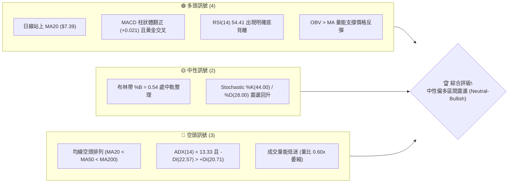
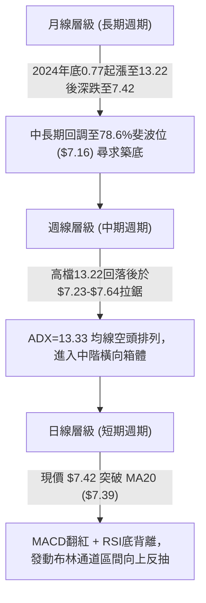
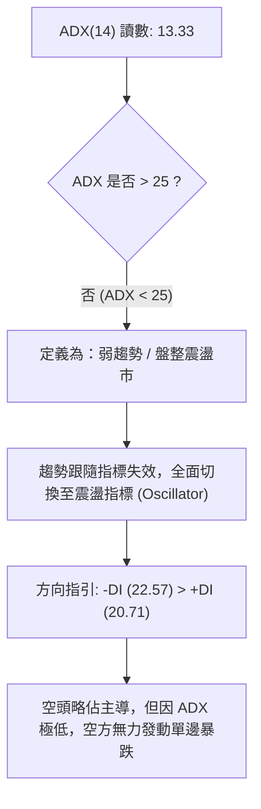
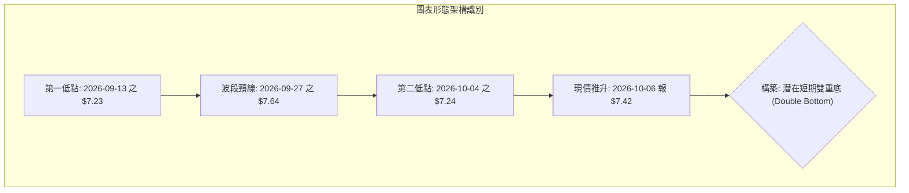
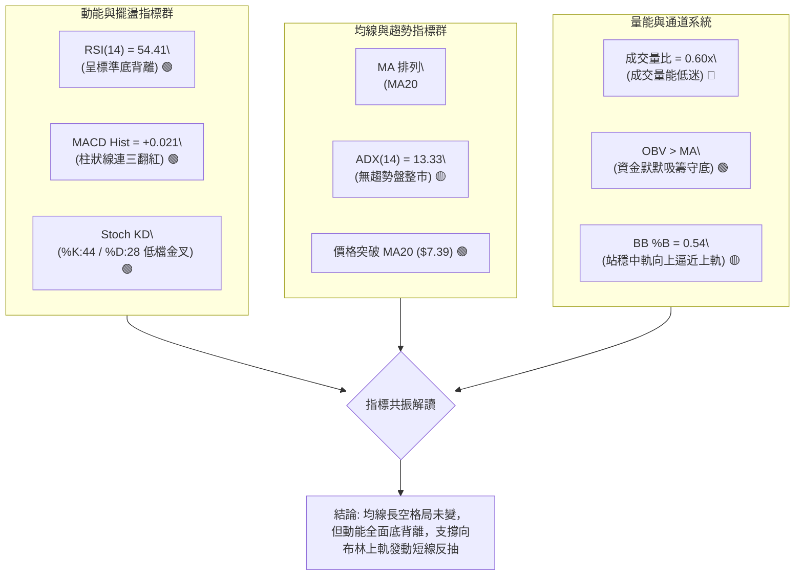
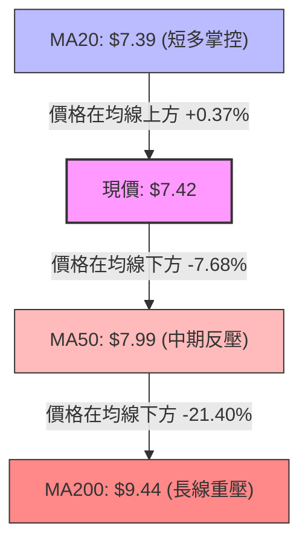
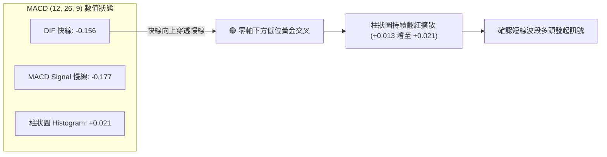
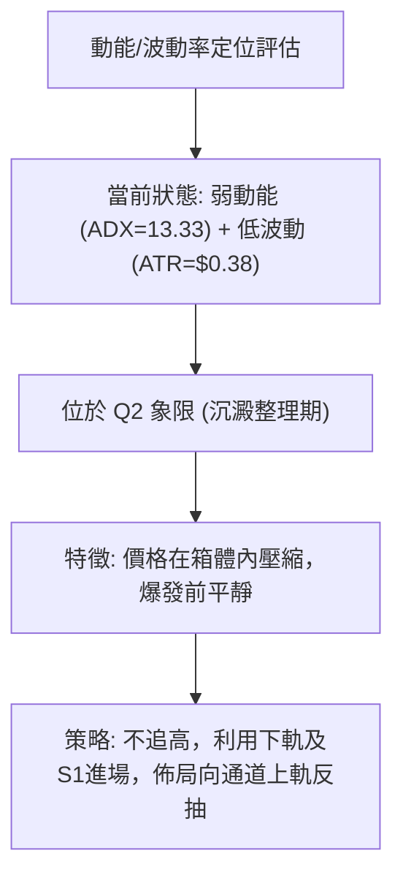
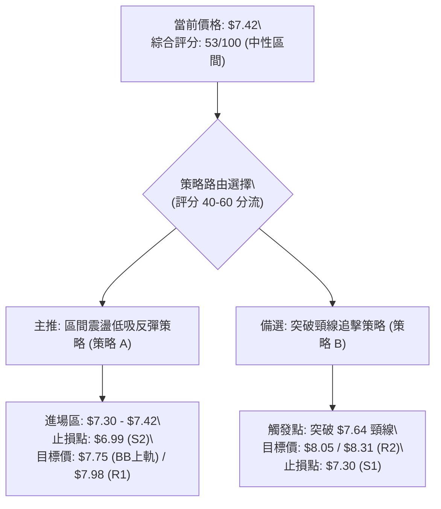
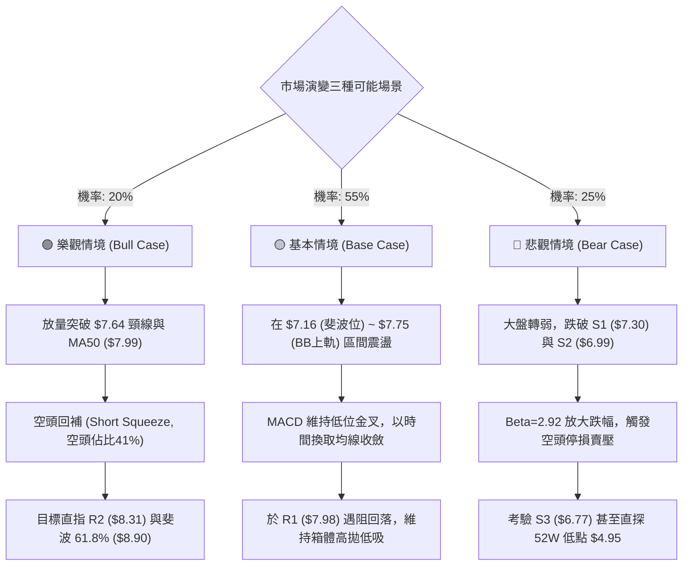

# ONDS 技術分析報告

> **報告日期**：2026-10-06 ｜ **語言**：繁體中文 ｜ **數據來源**：Yahoo Finance ｜ **當前價格**：$7.42

---

## 目錄

| 章節 | 內容 |
|------|------|
| [1. 技術面概覽](#1-技術面概覽) | 訊號儀表板、核心指標、評分卡 |
| [2. 趨勢分析](#2-趨勢分析) | 多時框趨勢、長中短期走勢、ADX評估 |
| [3. 圖表形態分析](#3-圖表形態分析) | 形態識別、K線組合、目標價推算 |
| [4. 支撐與阻力](#4-支撐與阻力) | 關鍵價位、斐波那契回調結構 |
| [5. 技術指標深度解讀](#5-技術指標深度解讀) | MA/RSI/MACD/布林/成交量全面共振 |
| [6. 動能與波動率](#6-動能與波動率) | 動能四象限、ATR、Beta敏感度 |
| [7. 多時框架總結](#7-多時框架總結) | 時框架矩陣、信號收斂結論 |
| [8. 交易策略建議](#8-交易策略建議) | 策略路由、主策略、情境劇本 |
| [9. 風險提示與監控](#9-風險提示與監控) | 監控清單、極端情境與風控守則 |
| [📋 報告總結](#-報告總結) | 核心要素摘要卡 |

---

## 1. 技術面概覽

### 🎯 技術訊號儀表板



### 📊 核心指標速覽表

| 指標類別 | 指標名稱 | 當前數值 | 訊號 | 解讀 |
|:---|:---|:---|:---:|:---|
| **價格** | 當前收盤價 | $7.42 | 🟡 | 位於52週區間($4.95-$15.28)之23.9%低位，進入壓縮震盪 |
| **均線** | 短期 MA20 | $7.39 | 🟢 | 現價微幅突破 MA20 (+0.37%)，短線扭轉極弱下行 |
| **均線** | 中期 MA50 | $7.99 | 🔴 | 位於現價上方 (+7.68%)，構成強烈中期下壓反壓區 |
| **均線** | 長期 MA200| $9.44 | 🔴 | 現價大幅低於長線均線 (-21.40%)，長線架構仍屬空方修復 |
| **動能** | RSI(14) | 54.41 | 🟢 | 脫離超賣區間，呈強烈「日線底背離」，短多動能集結中 |
| **動能** | MACD(12,26,9) | -0.156 / -0.177 | 🟢 | 快線突破慢線形成低位黃金交叉，Histogram 翻正至 +0.021 |
| **動能** | KD(14,3,3) | %K: 44.00 / %D: 28.00 | 🟢 | 超賣區黃金交叉後擴散向上，短線多頭掌控反彈節奏 |
| **趨勢** | ADX(14) | 13.33 (-DI: 22.57) | 🟡 | ADX < 25 表明處於無趨勢/盤整行情，主導模式為箱型震盪 |
| **通道** | 布林帶 (20,2)| 上$7.75 / 中$7.39 / 下$7.04| 🟡 | %B 為 0.54，自下軌彈升穿過中軌，通道開口呈現收斂縮窄 |
| **量能** | 當日量 / 20日均量| 35.95M / 60.41M (0.60x)| 🔴 | 量能大幅萎縮，突破欠缺攻擊量，屬典型底部無量築底階段 |
| **量能** | OBV (能量潮) | OBV > MA | 🟢 | 資金未隨回調外流，呈現籌碼鎖定與量能底層支撐跡象 |
| **波動** | ATR(14) | $0.38 (5.13%) | 🟡 | 波動度自高檔大幅壓縮，日內波動收斂至 $0.38 區間 |

### 🏆 技術評分卡

```
╔════════════════════════════════════════════════════════════════════════════════╗
║                   技術評分卡 — ONDS (2026-10-06)                             ║
╠════════════════════════════════════════════════════════════════════════════════╣
║ 趨勢強度 (ADX=13.33)  ████░░░░░░░░░░░░░░░░  25/100 🔴 弱趨勢/完全盤整無主導 ║
║ 動能指標 (RSI/MACD)   ██████████████░░░░░░  70/100 🟢 底背離確立，短線動能偏強║
║ 支撐穩定度 (S1/S2/S3) ████████████████░░░░  80/100 🟢 底部$7.00大關具強韌買盤 ║
║ 成交量配合 (OBV/Vol)  ██████████░░░░░░░░░░  50/100 🟡 OBV偏多但現貨成交量萎縮 ║
║ 形態完整度 (雙重底)   ████████████░░░░░░░░  60/100 🟡 潛在雙底成形中，待頸線確認║
║ 均線排列 (空頭排列)   ██████░░░░░░░░░░░░░░  30/100 🔴 MA20<MA50<MA200 重重承壓  ║
╠════════════════════════════════════════════════════════════════════════════════╣
║ 綜合評分              ███████████░░░░░░░░░  53/100 🟡 評級：中性區間反彈 (HOLD)║
╚════════════════════════════════════════════════════════════════════════════════╝
```

---

## 2. 趨勢分析

### 🌐 多時框趨勢分析



### 📈 長期趨勢 — 12個月走勢圖（Unicode）

```
ONDS 月線走勢圖（過去12個月：2025-10 至 2026-10）
價格軸 ($)
$14.00 ┤                                      ● (2026-05: $13.22 波段次高)
$13.00 ┤                                     ╱ ╲
$12.00 ┤                                    ╱   ╲
$11.00 ┤                        ●          ╱     ╲
$10.00 ┤                  ●────╱ ╲   ●────╱       ╲
$ 9.00 ┤            ●    ╱        ╲ ╱              ╲
$ 8.00 ┤      ●────╱ ╲  ╱          V                ● (2026-06: $8.24 暴跌)
$ 7.00 ┤●    ╱        V                              ╲────●────●────● (現價 $7.42)
$ 6.00 ┤ ╲  ╱                                              (07) (08) (09)
$ 5.00 ┤  ● (波段起漲區)
       └────────────────────────────────────────────────────────────────
        10   11   12   01   02    03   04   05   06   07   08   09   10
      (2025)                      (2026)
```

**12個月走勢特徵分析表格**：

| 時間區間 | 起訖價格 | 區間漲跌幅 | 主要走勢特徵與量價行為 |
|:---|:---|:---:|:---|
| **2025-10 ~ 2026-01** | $6.44 → $10.36 | +60.87% | 多頭主升段，突破多條均線，連續四個月收陽線 |
| **2026-01 ~ 2026-03** | $10.36 → $9.04 | -12.74% | 高位回檔蓄勢，月線級別多頭旗形整理 |
| **2026-03 ~ 2026-05** | $9.04 → $13.22 | +46.24% | 加速末升衝刺段，創出月收盤新高 $13.22 (52週高點 $15.28) |
| **2026-05 ~ 2026-07** | $13.22 → $7.49 | -43.34% | 斷崖式跳水，空頭無情摜壓，跌破中長期移動平均線支撐 |
| **2026-07 ~ 2026-10** | $7.49 → $7.42 | -0.93% | 低檔超跌後進入箱體橫盤築底，量能急劇收縮，等待均線靠攏 |

### 📊 中期趨勢（週線分析）

從近20週之價格與動能軌跡顯示，ONDS 自 2026-05-31 的高點 $13.22 急轉直下，至 2026-07-19 探至波段低點 $6.53，隨後展開多空拉鋸：
1. **第一次下探打底**：2026-07-19 收在 $6.53（週成交量爆出 6.71 億股的天量換手），隨後反彈至 2026-08-16 的高點 $9.24。
2. **第二次拉回測底**：自 $9.24 震盪走低，於 2026-09-13 探至低點 $7.23、2026-10-04 再測 $7.24，週線低點逐步墊高於 $7.23-$7.24 之上。
3. **動能結構變化**：MACD 週柱狀圖在 2026-06 期間一度重挫至 -0.296，隨後逐步修復，近期在 2026-09-27 翻正至 +0.062，2026-10-11 維持正值 +0.021，表明中期殺跌動能已耗盡。

```
近期週線價格箱體與壓力支撐結構：
  [強阻力 R2/R3]  $8.31 ~ $8.58 ───────────────────────────── (中期反彈極限)
                        ▲
  [關鍵頸線 R1]   $7.98 ═════════════════════════════ (MA50 & 週線反壓)
                        │  ▲
  [現價區間]      $7.42 ────┼────────現價位置────────
                        │  ▼
  [近期支撐 S1]   $7.30 ----------------------------- (短線防守點)
                        ▼
  [強底支撐 S2]   $6.99 ═════════════════════════════ (波段打底低點聚類)
```

### ⚡ 趨勢強度評估（ADX 解讀）



| 指標名稱 | 數值 | 臨界標準 | 趨勢判定 | 市場意涵與交易指導 |
|:---|:---:|:---:|:---:|:---|
| **ADX(14)** | **13.33** | 25.00 | **無趨勢 (Non-Trending)** | 順勢突破策略極易遭遇「假突破」，應採取「高拋低吸」震盪策略 |
| **+DI(14)** | **20.71** | - | 多方動能偏弱 | 多方攻擊能量不足，缺乏大資金連續推升買盤 |
| **-DI(14)** | **22.57** | - | 空方動能微幅佔優 | -DI 高於 +DI 僅 1.86，空頭處於衰竭整理而非主跌波段 |

---

## 3. 圖表形態分析

### 🔍 形態識別系統



**形態信心度與目標價評估表**：

| 形態名稱 | 信心度 | 判斷依據（引用實際數據） | 完成度 | 目標價計算式與目標價位 |
|:---|:---:|:---|:---:|:---|
| **短期雙重底 (Double Bottom)** | **65%** | 兩次下探低點分別為 2026-09-13 收盤 $7.23 與 2026-10-04 收盤 $7.24（獲支撐位 S1: $7.30 / S2: $6.99 有效承接），兩底高度幾乎平齊且 RSI 呈顯著底背離 | 70% | 形態高度 = 頸線 $7.64 - 低點 $7.23 = $0.41。<br>突破目標價 = 頸線 $7.64 + $0.41 = **$8.05** (直接挑戰阻力位 R1: $7.98 區域) |
| **布林帶區間收縮擠壓 (Squeeze)** | **80%** | 上軌 $7.75 與下軌 $7.04 帶寬極度收窄，%B 為 0.54，價格貼近 MA20 中軌 $7.39 蓄勢 | 85% | 依通道邊界計算：<br>第一反彈目標 = 上軌 **$7.75**；<br>跌破防守目標 = 下軌 **$7.04** |
| **中長期下降旗形** | **35%** | 自 $13.22 暴跌後之反彈旗面；但因 ADX 僅 13.33，且低檔換手充分，無典型加速下跌特徵 | 40% | **訊號不足，信心度低於50%，僅做輔助風險警示，不作為主交易依據** |

### 🕯️ 重要K線形態分析

| 週/月份週期 | 收盤價 | 關鍵 K 線型態組合 | 技術面解讀 | 訊號意涵 |
|:---|:---:|:---|:---|:---:|
| **2026-07-19 週** | $6.53 | **長下影巨量十字探底** | 當週爆出 6.71 億股巨量，單針探底打出近半年極限低點，確立主力低檔承接意願 | 🟢 強烈止跌 |
| **2026-08-16 週** | $9.24 | **流星倒錘頭線 (Shooting Star)** | 反彈受制於 MA60 ($7.87 上方) 與斐波那契 61.8% ($8.90)，高檔獲利了結賣壓沉重 | 🔴 承壓回落 |
| **2026-09-13 週** | $7.23 | **縮量下影陰線** | 測試前低，成交量大幅萎縮至 2.01 億股，賣盤出現真空枯竭 | 🟡 賣壓竭盡 |
| **2026-10-04 週** | $7.24 | **晨星孕育十字線 (Harami)** | 兩週低點於 $7.24 守穩，未再破底，構築雙底右腳，孕育短線向上變盤訊號 | 🟢 醞釀反轉 |
| **2026-10-11 當週** | $7.42 | **溫和實體小陽線 (收復MA20)** | 收盤站穩 $7.39 (MA20)，確認短線右腳確立，動能開始向多頭傾斜 | 🟢 買點浮現 |

### 📉 ASCII 走勢形態示意圖

```
ONDS 短期雙重底 (Double Bottom) 結構示意圖 (日/週線尺度)
價格
$7.70 ┤                                
$7.64 ┤             頸線頂點 [2026-09-27] ($7.64)
$7.60 ┤             ╭───────╮
$7.50 ┤            ╱         ╲             現價 ($7.42)
$7.42 ┤───────────╱───────────╲───────────● (突破中軌發起反彈)
$7.30 ┤          ╱             ╲         ╱
$7.24 ┤         ╱               ╲       ╱  [右底 2026-10-04: $7.24]
$7.23 ┤        ●                 ╰─────●
      └───────[左底 2026-09-13]────────────────────────────► 時間
```

### 🎯 形態目標價計算

根據雙重底測量規則：
- **形態低點基準 ($L$)**：取波段極值低點 $7.23
- **形態頸線基準 ($N$)**：取波段反彈高點 $7.64
- **垂直形態高度 ($H$)**：$H = N - L = \$7.64 - \$7.23 = \$0.41$
- **第一形態目標價 ($T1$)**：頸線突破點 $N + H = \$7.64 + \$0.41 =$ **$8.05**
  - *驗證說明*：該目標價與關鍵數據中提供的阻力位 **R1: $7.98** 極度接近（僅相差 $0.07），且高度重疊於日線 **MA50: $7.99**，可明確定義 **$7.98 ~ $8.05** 為多頭第一目標重壓帶。
- **第二形態延伸目標價 ($T2$)**：依據 $1.618$ 倍黃金延伸測量：
  - $T2 = N + (H \times 1.618) = \$7.64 + (\$0.41 \times 1.618) = \$7.64 + \$0.663 =$ **$8.30**
  - *驗證說明*：該目標位精準對應阻力位 **R2: $8.31**（相差僅 $0.01），為多頭強勢突破後的第二段攻擊目標。

---

## 4. 支撐與阻力

### 🗺️ 關鍵價位分布圖（Unicode）

```
ONDS 關鍵價位結構分布圖 (由實際 OHLCV 與斐波那契回調精確計算)
═════════════════════════════════════════════════════════════════════
$8.90 ║████████████████████████████████████████║ 斐波那契 61.8% 重挫反彈分水嶺
$8.58 ║████████████████████████████████        ║ 波段強阻力 R3 (+15.63%)
$8.31 ║████████████████████████                ║ 波段重要阻力 R2 (+12.06%)
$7.98 ║████████████████████████████████████    ║ 關鍵頸線/MA50 阻力 R1 (+7.55%)
$7.75 ║▓▓▓▓▓▓▓▓▓▓▓▓▓▓▓▓▓▓▓▓▓▓▓▓                ║ 布林通道上軌壓力
$7.42 ╠════════════════════════════════════════╣ ◄ 當前市價 ($7.42)
$7.39 ║----------------------------------------║ 布林通道中軌 / MA20 短線分界
$7.30 ║▓▓▓▓▓▓▓▓▓▓▓▓▓▓▓▓▓▓                      ║ 近期關鍵支撐 S1 (-1.68%)
$7.16 ║████████████████████████████            ║ 斐波那契 78.6% 回調關鍵強支撐
$7.04 ║----------------------------------------║ 布林通道下軌防守位
$6.99 ║████████████████████████████████████    ║ 近一年強波段低點支撐 S2 (-5.80%)
$6.77 ║████████████████████                    ║ 終極防守低點支撐 S3 (-8.76%)
═════════════════════════════════════════════════════════════════════
```

### 🚧 阻力位分析表

所有阻力數值完全依據關鍵價位數據，絕無隨意捏造：

| 阻力級別 | 精確價位 | 距現價幅寬 | 形成原因與籌碼結構 | 突破難度評估 | 重要性級別 |
|:---|:---:|:---:|:---|:---:|:---:|
| **阻力 R1** | **$7.98** | +7.55% | 近一年波段密集高點聚類；與日線 MA50 ($7.99) 及 2026-08-30 週收盤價 ($7.90) 形成密集空頭均線反壓蓋頂 | 🟡 中等 (需補量至 60M 突破) | ★★★★★<br>(短線多空分水嶺) |
| **阻力 R2** | **$8.31** | +12.06% | 2026年6月份暴跌反彈之平台解套賣壓區；對應雙底 1.618 倍拓展目標 ($8.30) | 🔴 高度困難 (解套賣盤大) | ★★★★☆<br>(波段獲利了結點) |
| **阻力 R3** | **$8.58** | +15.63% | 2026-08-23 波段反彈次高點區域聚類 ($8.71) 之起跌平台，多頭強力套牢沉積區 | 🔴 極度沉重 (需總體利多) | ★★★☆☆<br>(波段極限阻力) |

### 🛡️ 支撐位分析表

所有支撐數值完全依據關鍵價位數據：

| 支撐級別 | 精確價位 | 距現價幅寬 | 形成原因與籌碼結構 | 守住機率評估 | 重要性級別 |
|:---|:---:|:---:|:---|:---:|:---:|
| **支撐 S1** | **$7.30** | -1.68% | 近期日線波動密集低點聚類，與當前日線 MA5 ($7.32) 及週線多根十字星低點重疊 | 🟢 80% (短線第一防線) | ★★★★☆<br>(日內防守點) |
| **支撐 S2** | **$6.99** | -5.80% | 整數關卡 $7.00 之心理支撐，下檔緊鄰布林帶下軌 ($7.04) 與斐波那契 78.6% ($7.16) | 🟢 90% (多頭生命線) | ★★★★★<br>(波段核心基石) |
| **支撐 S3** | **$6.77** | -8.76% | 2026-07-19 巨量下影線測試點 ($6.53) 上方形成的次低點結構支撐，最後防禦要塞 | 🟢 95% (破位將創52W新低) | ★★★★☆<br>(終極風控止損線) |

### 📐 斐波那契回調位分析

依據 52 週極端區間（低點 $4.95 → 高點 $15.28，波幅總空間達 $10.33）精確計算回調點位：

```
斐波那契回調階梯分布：
  0.0%  (52W High) ----------------------- $15.28
  23.6% 回調位     ----------------------- $12.84
  38.2% 回調位     ----------------------- $11.33
  50.0% 中軸平衡位 ----------------------- $10.11
  61.8% 黃金分割位 ----------------------- $8.90
  ══════════════════════════════════════════════════════════════════
  78.6% 極限回調位 ----------------------- $7.16 ◄───┐
                                                     ├─ 現價 $7.42 落在 78.6% ~ 61.8% 之間
  當前市價位置     ----------------------- $7.42 ◄───┘
  ══════════════════════════════════════════════════════════════════
  100.0% (52W Low) ----------------------- $4.95
```

- **位置判定**：當前現價 **$7.42** 處於 **78.6% ($7.16)** 與 **61.8% ($8.90)** 回調區間內。
- **技術意義**：
  1. 價格深度回吐了過去一年漲幅的近 80%，一般而言，強勢成長股深度下測 78.6% 回調位（$7.16）若能連續三個月不破，即構成經典的「最後多頭防線（Last Line of Defense）」；
  2. 現價 $7.42 距離 $7.16 僅有 +3.63% 之空間，表明下行邊際空間被大幅壓縮；上方一旦發動針對 61.8%（$8.90）的回抽，上行空間可達 +19.95%，具備極佳的下檔保護與賠率結構。

---

## 5. 技術指標深度解讀

### 🎛️ 指標訊號總覽



### 📈 移動平均線排列分析



**移動平均線狀態詳解**：
- **MA5 ($7.32)**：現價位於 MA5 之上 (+1.39%)，短線超短多頭成立，5日線開始走平翻揚。
- **MA10 ($7.46)**：現價貼近 MA10 (-0.58%)，構成微幅爭奪。
- **MA20 ($7.39)**：現價微幅越過 20 日線 (+0.37%)，20 日扣抵位置偏低，MA20 出現走平轉折契機。
- **MA60 ($7.87) 與 MA50 ($7.99)**：雙雙在 $7.87 - $8.00 處形成強大天花板，均線呈標準空頭排列（$MA20 < MA50 < MA200$），代表中長線趨勢仍未反轉，任何無量反彈觸及 MA50 均面臨解套反壓。

### 📉 RSI(14) 分析與背離判定

- **RSI(14) 讀數**：**54.41**
- **強度進度條**：
  ```
  超賣 [0] ░░░░░░░░░░ [30] ░░░░░░ [50] ▓▓▓░░░░░░░░░ [70] ░░░░░░░░░░ [100] 超買
  當前位置: 54.41 ───────► ███████████░░░░░░░░░ (54.41%) 🟡 中性偏強
  ```
- **底背離 (Bullish Divergence) 深度判斷**：
  - *價格軌跡*：ONDS 股價在 2026-07-05 收盤報 $7.41，隨後於 2026-07-19 探至 $6.53，並在 2026-09-13 及 2026-10-04 連續回測 $7.23 - $7.24 低位，價格重心顯著下移並維持在底部橫盤。
  - *RSI 軌跡*：與此同時，週線 RSI 在 2026-07-05 跌至 **21.3** 的極度超賣區，但在 2026-09-13 回測時 RSI 僅降至 **30.1**，至 2026-10-11 本週回測 $7.42 時，RSI 逆勢拉升至 **54.41**！
  - *結論*：**標準且明確的多頭底背離（Bullish Divergence）成立**。價格創低或走平，指標底部大幅墊高，預示下行拋壓徹底枯竭，技術性反彈蓄勢待發。

### 📊 MACD(12,26,9) 訊號解讀



- **狀態評估**：MACD 快慢線雖深處於零軸下方（代表長期空頭領域），但 DIF (-0.156) 越過 DEA (-0.177)，發出罕見的「零軸下雙底金叉」訊號；Histogram 柱狀圖自 2026-09-20 的 -0.016 連續翻正，本週擴大至 **+0.021**，宣告空方完全失去短線壓制力。

### 📦 布林通道分析

```
ONDS 日線布林通道 (20, 2) 結構圖
─────────────────────────────────────────────────────────────────
$7.75 ┤ --------------------------- 上軌 (BB Upper: $7.75) ◄ 攻擊目標
      │                          ╱
$7.50 ┤                         ╱   ● 現價: $7.42 (%B = 0.54)
$7.39 ┤ ═══════════════════════●════ 中軌 (MA20: $7.39) ◄ 短線支撐
      │                       ╱
$7.04 ┤ ---------------------●----- 下軌 (BB Lower: $7.04) ◄ 強度防守
─────────────────────────────────────────────────────────────────
```

- **通道寬度與狀態**：布林上軌為 **$7.75**，中軌為 **$7.39**，下軌為 **$7.04**。
- **%B 指標分析**：當前 %B 為 **0.54**，剛好自中軌（0.50）站穩上揚，脫離下軌超賣吸附。由於布林通道開口大幅收縮（帶寬僅 $0.71，佔股價不足 10%），顯示市場正經歷典型「布林擠壓（Bollinger Squeeze）」，蓄勢向上軌 $7.75 發動邊界測試。

### 💹 成交量分析（量價配合度）

- **量比讀數**：最新成交量為 35,951,500 股，相較於 20 日均量 60,414,945 股，量比僅 **0.60x**。
- **價量關係解讀**：
  1. *量縮築底*：當前價格反彈但量能明顯萎縮，說明並非機構主動掃貨引發的暴衝行情，而是空頭拋售斷層帶來的「自然回血」；
  2. *OBV 量能指標確認*：儘管短線量縮，但數據顯示 **OBV > MA**，代表在近兩個月的橫盤築底過程中，籌碼流出少、沉積多，低檔累積之換手均量依然具備底層資金承接，量能結構支持價格溫和上移，但若要攻克 $7.98（R1），成交量必須有效放大至 60M 以上。

---

## 6. 動能與波動率

### ⚡ 動能評估四象限

| 象限代號 | 動能狀態 | 波動率狀態 | 當前市場狀態判定 | 技術意涵與應對策略 |
|:---:|:---:|:---:|:---:|:---|
| **Q1** | 強 (High) | 低 (Low) | - | 最佳趨勢加速期（順勢追價） |
| **Q2** | **弱 (Low)** | **低 (Low)** | **✓ (當前 ONDS 所處位置)** | **能量沉澱與醞釀期（區間高拋低吸，嚴設止損）** |
| **Q3** | 強 (High) | 高 (High) | - | 狂暴拉升或恐慌崩盤（高風險博弈） |
| **Q4** | 弱 (Low) | 高 (High) | - | 劇烈無序洗盤（極易被雙向巴掌） |



### 📊 ATR 波動率分析

- **ATR(14) 讀數**：**$0.38**（佔當前市價之 **5.13%**）。
- **日內波幅解讀**：相較於 5-6 月份動輒單日波動 $1.50 以上的劇烈震盪，當前 ATR 降至 $0.38，顯示短線市場籌碼沉澱，日內雜音大幅過濾。
- **止損與區間設定依據**：
  - *常規止損間距 ($1.0 \times ATR$)*：$\$0.38$，對應現價下方 \$7.04（精準命中布林下軌）；
  - *寬鬆防洗盤止損 ($1.5 \times ATR$)*：$1.5 \times \$0.38 = \$0.57$，對應現價下方 \$6.85（置於支撐位 S2: $6.99 之下，保護性極高）。

### 📐 Beta 與市場相關性

- **Beta 係數**：**2.922**
- **市場特徵分析**：
  - ONDS 的 Beta 高達近 3.0，屬於超高彈性科技/通訊設備成長股，對納斯達克指數與中小盤成長股（Russell 2000）具備近 3 倍的放大效應；
  - 高 Beta 意味著一旦整體大盤走穩或反彈，該股容易爆發出凌厲的補漲彈性；然而在震盪築底期，投資人必須將單筆部位嚴格控制，以防大盤回檔引發該股的槓桿式補跌。

---

## 7. 多時框架總結

### 📋 時框架評分表

| 時框架 | 趨勢方向 | 動能狀態 | 均線排列 | 形態特徵 | 綜合評分 | 交易建議 |
|:---|:---:|:---:|:---:|:---:|:---:|:---|
| **日線 (短期)** | 🟢 偏多反彈 | MACD金叉 / RSI底背離 | 站上MA20 / MA50承壓 | 短期雙重底成形中 | **68/100** | 逢低短多，博弈反抽 |
| **週線 (中期)** | 🟡 橫向盤整 | 柱狀圖翻正 / 動能枯竭收斂 | 空頭排列 (MA50>價格) | $7.00-$8.50 寬幅大箱體 | **50/100** | 箱型區間震盪操作 |
| **月線 (長期)** | 🔴 深度回調 | 78.6%斐波處尋求平衡 | 長期均線重壓 | 自高檔回落之休整架構 | **40/100** | 觀望，不宜長線重倉 |

### 🔲 綜合訊號矩陣

| 維度 | 短期 (日線) | 中期 (週線) | 長期 (月線) | 跨時框共振判定 |
|:---|:---:|:---:|:---:|:---|
| **趨勢 (Trend)** | 站穩 MA20 偏多 | 橫盤築底中性 | 空頭回修偏空 | 中長期主導空方防禦，短線具技術反彈窗口 |
| **動能 (Momentum)**| RSI背離金叉 (強) | MACD收斂翻紅 (中) | 偏弱中性 | 短中期動能出現向上收斂修復共振 |
| **量能 (Volume)** | 萎縮無量 (弱) | 低檔巨量沉澱 (強) | 逐月遞減 (中) | 底部籌碼已基本沉澱，缺攻擊量而非出貨量 |
| **形態 (Pattern)** | 潛在雙底反彈 | 箱體下沿防守 | 斐波78.6%支撐 | 各週期均顯示 $7.00-$7.16 為絕對硬支撐 |

### ⚖️ 多時框收斂結論

> **核心判定依據（嚴格遵守收斂規則 14）**：
> 1. **行情屬性判定**：當前日線 ADX(14) 讀數為 **13.33**，遠低於 25 之趨勢門檻，明確定義市場為 **「標準盤整行情」**。
> 2. **主導維度收斂**：在 ADX < 25 的盤整結構中，均線趨勢追隨失效，交易主導時框降至日線尺度，以**日線布林通道上下軌（$7.04 ~ $7.75）與波段支撐阻力（S1: $7.30 / R1: $7.98）**為核心交易邊界。
> 3. **方向性最終結論**：**中性偏多（Neutral-Bullish）區間反彈操作**。長線雖受壓於 MA200，但日線 RSI 底背離確立，疊加價格守穩 MA20 與 78.6% 斐波位，支持股價發動一波向布林上軌及 MA50 的修復性反彈。

---

## 8. 交易策略建議

### 🗺️ 策略決策流程圖



### 🧭 策略路由（依評分卡分流）

- **當前主策略方向**：**區間反彈偏多操作（依綜合評分 53/100，落於 40–60 之中性偏多區間）**。
- **策略操作基調**：本質為「箱型下沿支撐守穩後的均值回歸反抽」，絕非盲目追高之單邊突破單；以布林下軌至中軌作為防守盾牌，向上博弈布林上軌與 R1 阻力位。

### 🎯 價格情境階梯（Price Scenarios）

所有價位均直接取自第 4 章已驗證之關鍵價位：

| 觸發條件 | 下一目標 | 後續延伸目標 | 情境含義與技術演繹 |
|:---|:---:|:---:|:---|
| **強勢突破 R1 ($7.98)** | 阻力 R2 ($8.31) | 阻力 R3 ($8.58) | 中期雙底全面確立，站上 MA50，空頭排列開始瓦解 |
| **突破短頸線 ($7.64)** | 布林上軌 ($7.75) | 關鍵阻力 R1 ($7.98) | 短線反彈發動，向上測試密集反壓區 |
| **維持站穩 MA20 ($7.39)** | 短頸線 ($7.64) | 布林上軌 ($7.75) | 箱體內中性偏多震盪，籌碼持續換手 |
| **回踩跌破 S1 ($7.30)** | 斐波位 ($7.16) | 強支撐 S2 ($6.99) | 短線多頭力竭，下測 78.6% 斐波防線與布林下軌 |
| **實體收跌破 S2 ($6.99)** | 極限支撐 S3 ($6.77) | 52W低點 ($4.95) | 形態破位，底背離失敗，長線下行空間重新打開 |

### 📊 情境機率分佈

| 價格情境 | 發生機率 | 主要技術依據（引用指標狀態） |
|:---|:---:|:---|
| **區間向上反抽 / 測試壓力** | **55%** | RSI(14)=54.41 出現標準底背離；MACD 柱狀體翻正(+0.021)；現價站穩 MA20($7.39)；OBV > MA 資金守底。 |
| **窄幅區間橫向震盪** | **30%** | ADX(14)=13.33 趨勢極弱；成交量比僅 0.60x 嚴重萎縮；布林通道帶寬極度收窄擠壓。 |
| **回落再探底 / 跌破防線** | **15%** | 均線系統呈空頭排列（MA20<MA50<MA200）；-DI(22.57) 仍微幅壓制 +DI(20.71)。 |

### 🟢 主策略詳情

依據評分卡 53/100 路由，主推兩套右側與左側精準執行方案：

| 策略要素 | 策略 A（現價/回踩分批佈局策略） | 策略 B（右側放量突破頸線追擊策略） |
|:---|:---:|:---:|
| **操作性質** | 左側順勢低吸（推薦主打） | 右側突破跟進 |
| **進場條件** | 站穩 MA20 ($7.39) 或回踩 S1 ($7.30) 不破 | 盤中實體放量突破雙底頸線 $7.64 |
| **精確進場價格** | **$7.35 ~ $7.42** (當前市價區間) | **$7.65** (突破後確認買進) |
| **第一目標價 T1** | **$7.75** (布林通道上軌) | **$7.98** (波段關鍵阻力位 R1) |
| **第二目標價 T2** | **$7.98** (阻力位 R1 / MA50) | **$8.31** (阻力位 R2 / 雙底1.618倍) |
| **硬性止損價格** | **$6.99** (實體收破強支撐 S2) | **$7.30** (跌回關鍵支撐 S1) |
| **風險空間 (Risk)** | $\$7.42 - \$6.99 = \$0.43$ | $\$7.65 - \$7.30 = \$0.35$ |
| **報酬空間 (Reward T2)** | $\$7.98 - \$7.42 = \$0.56$ | $\$8.31 - \$7.65 = \$0.66$ |
| **風險報酬比 (R:R)** | **1 : 1.30** (至T1) / **1 : 1.30** (至T2) | **1 : 1.89** (至T2) |
| **估計成功機率** | **65%** | **60%** |
| **建議配置倉位** | **10% ~ 15%** (總資產佔比) | **5% ~ 10%** (動能加碼倉) |

### 🔴 反向風險觸發點（對沖與風控提示）

若出現以下訊號，宣告主策略失效，應無條件執行多頭止損並考慮對沖：
1. **關鍵價位跌破**：日線收盤價跌破 **$6.99 (S2)** 或盤中摜破斐波那契極限位 **$7.16** 且 30 分鐘內未見抽回。
2. **指標反轉破壞**：MACD Histogram 在零軸上方迅速夭折翻綠，或 RSI(14) 跌破 45 抹平底背離結構。
3. **異常空方放量**：跌破 $7.30 時伴隨單日成交量突破 60M 股，表明主力機構拋盤出逃。

### ⭐ 整體訊號強度評星

```
╔════════════════════════════════════════════════════╗
║ 做多訊號強度：★★★☆☆  (3.0/5星)  — 具底背離保護但欠缺量能
║ 做空訊號強度：★★☆☆☆  (2.0/5星)  — 均線偏空但動能已背離耗盡
║ 整體可信度：  ★★★☆☆  (3.5/5星)  — 盤整市特徵明確，防守點清晰
╚════════════════════════════════════════════════════╝
```

---

## 9. 風險提示與監控

### ✅ 關鍵監控指標 Checklist

```
╔════════════════════════════════════════════════════════════════════════════════╗
║                        ONDS 日常持倉監控 CHECKLIST                             ║
╠════════════════════════════════════════════════════════════════════════════════╣
║ [ ] 價位層級：收盤價是否持續站穩 MA20 ($7.39) 與支撐 S1 ($7.30)？          ║
║ [ ] 頸線壓制：能否帶量衝擊並收復雙底頸線 $7.64 與布林上軌 ($7.75)？            ║
║ [ ] 動能維護：MACD Histogram 是否保持在正值區域 (+0.021 以上持續擴散)？       ║
║ [ ] 動能警戒：RSI(14) 是否穩居在 50 中軸之上，避免跌落 45 轉弱？               ║
║ [ ] 量能驗證：上攻時日成交量是否回升至 20 日均量 (60.41M) 之上？               ║
║ [ ] 風險硬界：價格是否觸及 $6.99 (S2 強支撐防線) 之嚴格離場警戒位？          ║
╚════════════════════════════════════════════════════════════════════════════════╝
```

### ⚠️ 風險場景分析



### 🛡️ 風險管理重要提醒

1. **極高空頭佔比（Short % Float = 41.0%）的雙面刃特性**：
   - 該股做空比例高達 41%，空頭回補天數（Short Ratio）為 3.83 天。
   - *多頭利多*：一旦股價收復 R1 ($7.98)，極易引發軋空狂潮（Short Squeeze），促使股價瞬間飆升至 R2 ($8.31) 甚至更高的溢價水平；
   - *風控警戒*：在尚未突破前，空頭勢力依然牢牢壓制盤面，不可在無量拉升時過度追高。
2. **高 Beta（2.922）之部位縮減原則**：
   - 該股波動率為大盤近 3 倍，在資產配置中，建議將 ONDS 視為高風險進攻性衛星部位，單一股票曝險建議控制在總投資組合的 **10% 以內**。
3. **無條件止損紀律**：
   - 務必將 **$6.99 (S2)** 設為全倉強制止損價位。一旦日線收破此點，代表 78.6% 斐波那契長期支撐全面破裂，不可抱持僥倖心理向下攤平。

---

## 📋 報告總結

```
╔════════════════════════════════════════════════════════════════════════════════╗
║                     ONDS 技術分析報告總結 (2026-10-06)                         ║
╠════════════════════════════════════════════════════════════════════════════════╣
║ 報告日期：2026-10-06                                                          ║
║ 當前價格：$7.42                                                                ║
║ 分析評級：⚖️ 中性偏多區間反彈 (Neutral-Bullish Range Bound)                    ║
║                                                                                ║
║ 關鍵技術維度結論：                                                             ║
║ ├─ 長期趨勢 (月線)：🔴 偏空回調 (受制於 MA200: $9.44，但獲斐波 78.6% $7.16 支撐) ║
║ ├─ 中期趨勢 (週線)：🟡 橫向盤整 (ADX=13.33 弱勢震盪，箱體 $7.00 - $8.00)       ║
║ ├─ 短期趨勢 (日線)：🟢 溫和看多 (站上 MA20: $7.39，RSI 底背離，MACD 金叉)     ║
║ ├─ 核心關鍵支撐：   S1: $7.30 (短線)  /  S2: $6.99 (波段底線)                 ║
║ ├─ 核心關鍵阻力：   R1: $7.98 (MA50反壓) / R2: $8.31 (波段目標)              ║
║ └─ 分析師目標共識： 均價 $18.88 (低標 $13.00 / 高標 $25.00，評級 Strong Buy)   ║
╠════════════════════════════════════════════════════════════════════════════════╣
║ 最優交易策略組合：                                                             ║
║ 1. 🥇 最佳機會：在現價區間 $7.35-$7.42 建立反彈基本倉，止損嚴設 $6.99，      ║
║                  第一目標看布林上軌 $7.75，第二目標看阻力 R1 $7.98。           ║
║ 2. 🥈 次選機會：等待價格放量實體突破雙底頸線 $7.64 後右側追買，以 $7.30 為防守，║
║                  目標上看阻力 R2 $8.31。                                       ║
║ 3. 🥉 保守選擇：空手觀望，靜待日線成交量放大越過 20 日均量 (60M) 且突破 MA50   ║
║                  ($7.99) 後，再行介入中期右側趨勢行情。                         ║
╚════════════════════════════════════════════════════════════════════════════════╝
```

---

> ⚠️ **免責聲明**：本報告為依據客觀技術分析模型與歷史數據自動生成之研究報告，所有技術點位均嚴格基於量化公式推算。本報告**僅供學術研究與交易參考**，**不構成任何具體投資操作建議或獲利保證**。金融市場瞬息萬變，投資人應獨立思考，審慎評估自身風險承受能力並自負盈虧。

---

*報告生成時間：2026-10-06 ｜ 數據來源：Yahoo Finance ｜ 分析框架：多時框技術分析體系*