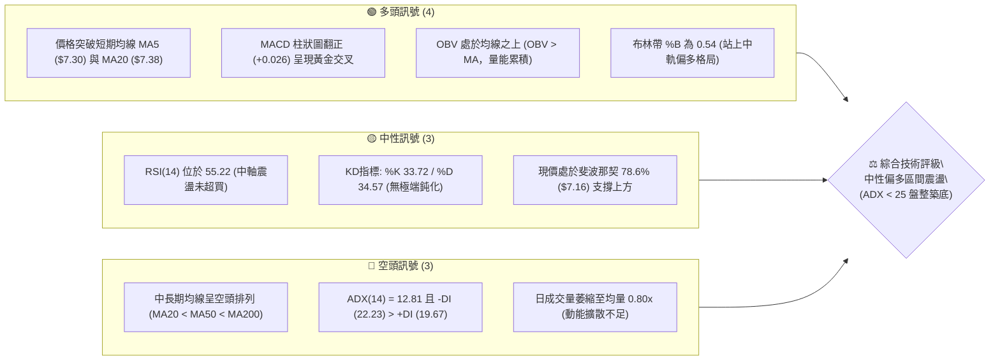
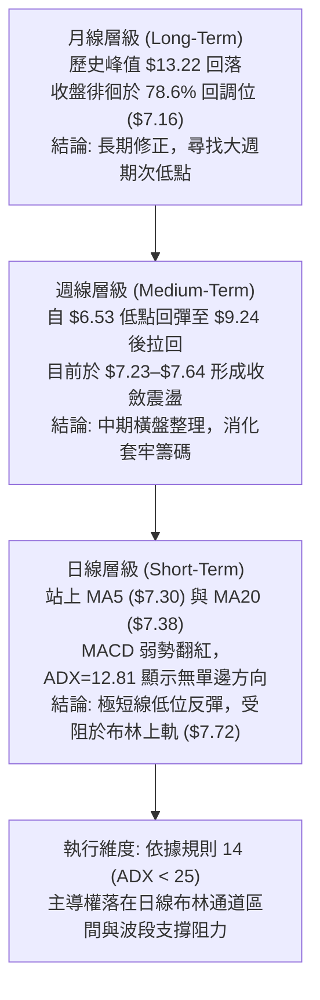
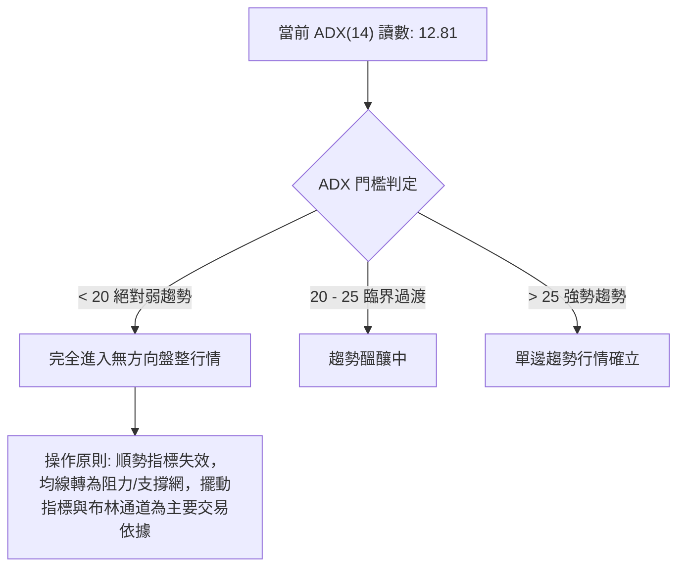
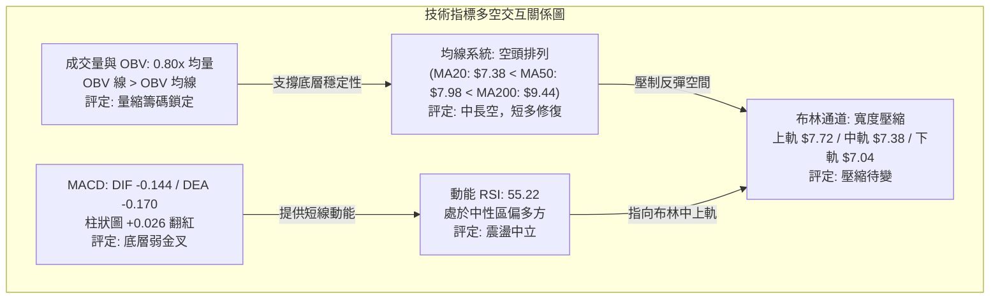
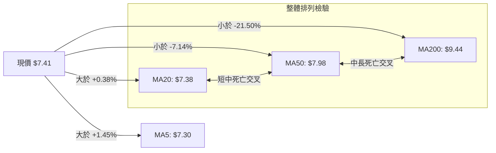
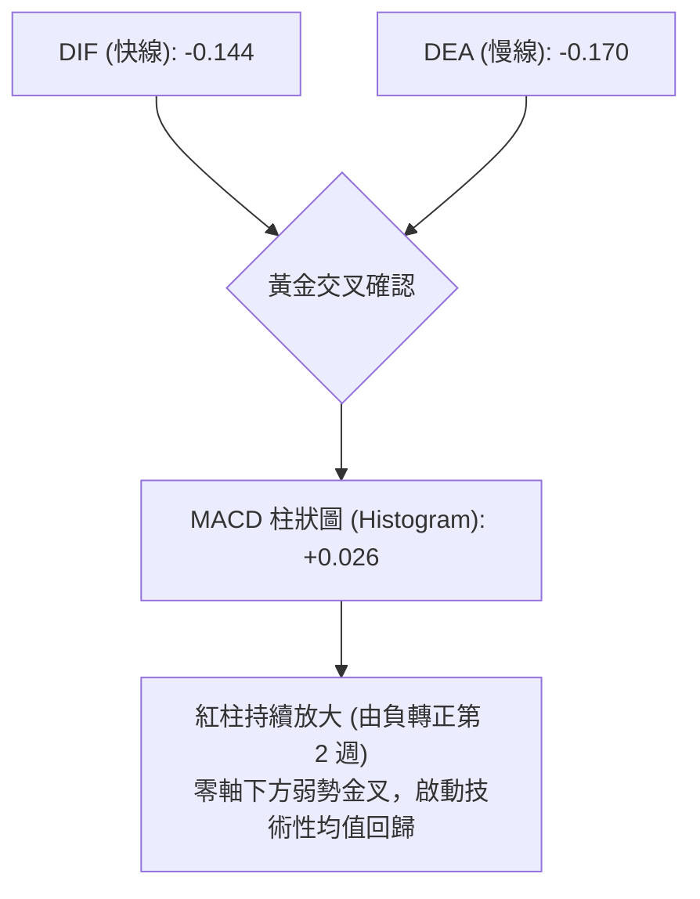
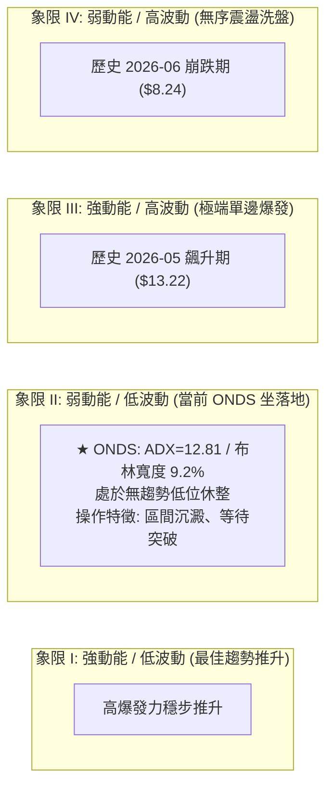
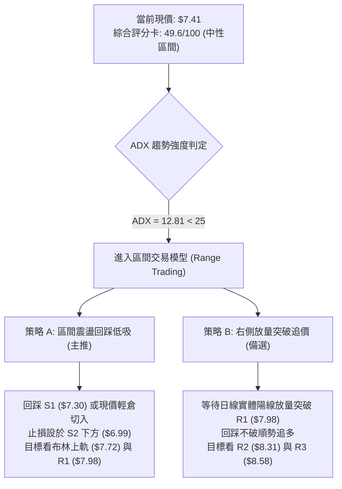
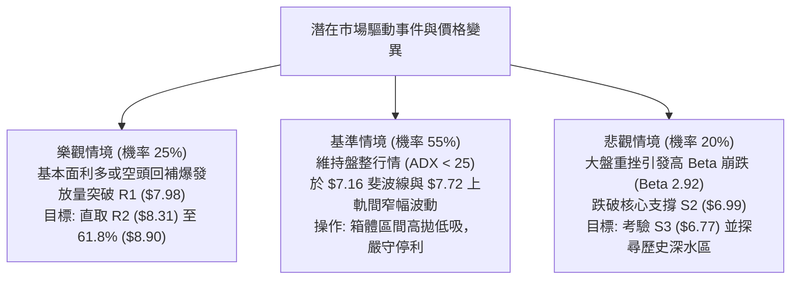

# ONDS 技術分析報告

> **報告日期**：2026-10-07 ｜ **語言**：繁體中文 ｜ **數據來源**：Yahoo Finance ｜ **當前價格**：$7.41

---

## 目錄

| 章節 | 內容 |
|------|------|
| [1. 技術面概覽](#1-技術面概覽) | 訊號儀表板、核心指標速覽、技術評分卡 |
| [2. 趨勢分析](#2-趨勢分析) | 多時框趨勢遞進、12個月走勢圖、ADX 趨勢強度 |
| [3. 圖表形態分析](#3-圖表形態分析) | 形態識別信心度、重要K線型態、形態目標價測算 |
| [4. 支撐與阻力](#4-支撐與阻力) | 價位結構分布圖、阻力/支撐分析表、斐波那契回調結構 |
| [5. 技術指標深度解讀](#5-技術指標深度解讀) | 均線排列、RSI/MACD 背離驗證、布林通道與 OBV 量能 |
| [6. 動能與波動率](#6-動能與波動率) | 動能四象限定位、ATR 波動度測算、Beta 與高空單比率 |
| [7. 多時框架總結](#7-多時框架總結) | 時框架矩陣評分、訊號一致性檢驗、多時框收斂定論 |
| [8. 交易策略建議](#8-交易策略建議) | 策略路由決策、價格情境階梯、主策略明細表與風控點 |
| [9. 風險提示與監控](#9-風險提示與監控) | 關鍵指標 Checklist、情境樹狀圖、部位風控準則 |

---

## 1. 技術面概覽

### 🎯 技術訊號儀表板



---

### 📊 核心指標速覽表

| 指標類別 | 指標名稱 | 當前數值 | 訊號 | 專業技術解讀 |
| :--- | :--- | :--- | :---: | :--- |
| **價格** | 當前收盤價 | $7.41 | 🟡 | 位於 52 週區間 ($4.95–$15.28) 之 23.8% 低位區，正進行底層築底整理 |
| **短期均線** | MA5 / MA20 | $7.30 / $7.38 | 🟢 | 現價高於 MA5 (+1.45%) 與 MA20 (+0.38%)，短線扭轉極度弱勢，站回月線 |
| **中期均線** | MA50 / MA60 | $7.98 / $7.88 | 🔴 | 均線下彎形成上方蓋頭反壓，距 MA50 尚有 -7.14% 空間，中期結構仍受壓制 |
| **長期均線** | MA200 / MA240 | $9.44 / $9.09 | 🔴 | 價格遠低於年線 (-21.50%)，確立長期主趨勢尚未由空翻多，僅屬跌深反彈階段 |
| **動能震盪** | RSI(14) | 55.22 | 🟡 | 擺脫 30 附近弱勢區，跨越 50 多空分水嶺，未見頂背離或底背離，動能中性 |
| **趨勢強度** | ADX(14) | 12.81 | 🟡 | 數值遠低於 25，顯示當前缺乏單邊單向趨勢，行情完全進入無趨勢區間盤整 |
| **趨向指標** | +DI / -DI | 19.67 / 22.23 | 🔴 | -DI 略高於 +DI，反映空方在微觀架構中仍稍具主導權，但雙方差距收斂 |
| **指標交叉** | MACD (12,26,9) | -0.144 / -0.170 | 🟢 | DIF 線由下往上穿越 Signal 線，柱狀圖為 +0.026，日線級別底層弱金叉確認 |
| **通道狀態** | Bollinger Bands | 帶寬 $7.04–$7.72 | 🟡 | %B 為 0.54，處於中軌 ($7.38) 上方，通道帶寬收窄，顯示進入波動率壓縮期 |
| **量能狀態** | 20日成交量比 | 0.80x (48.78M) | 🟡 | 量縮整理，賣壓鈍化，OBV 線維持高於其均線，代表主力籌碼尚未失控流出 |

---

### 🏆 技術評分卡

```
╔══════════════════════════════════════════════════════════════════════════╗
║               ONDS 技術面量化評分卡 (2026-10-07)                         ║
╠══════════════════════════════════════════════════════════════════════════╣
║ 評估維度      進度條權重指標                     評分      狀態訊號      ║
╟──────────────────────────────────────────────────────────────────────────╢
║ 趨勢強度      ██████░░░░░░░░░░░░░░░░░░           32/100   🔴 弱勢盤整    ║
║ 短期動能      ████████████░░░░░░░░░░░░           58/100   🟢 金叉修復    ║
║ 支撐穩定度    ██████████████░░░░░░░░░░           68/100   🟢 7.16-7.30強 ║
║ 成交量配合    ██████████░░░░░░░░░░░░░░           50/100   🟡 量縮沉澱    ║
║ 形態收斂度    ████████████░░░░░░░░░░░░           56/100   🟡 箱體築底    ║
║ 均線架構      ██████░░░░░░░░░░░░░░░░░░           34/100   🔴 空頭排列    ║
╠══════════════════════════════════════════════════════════════════════════╣
║ 綜合技術得分  ██████████░░░░░░░░░░░░░░           49.6/100 ⚖️ 中性觀望    ║
║ 策略導向      ADX<25 盤整優先：維持布林通道與箱型區間 ($7.04–$7.72) 操作 ║
╚══════════════════════════════════════════════════════════════════════════╝
```

---

## 2. 趨勢分析

### 🌐 多時框趨勢分析



---

### 📈 長期趨勢 — 12個月走勢圖（Unicode）

以下為 ONDS 過去 12 個月（2025-10 至 2026-10）之月線收盤價走勢圖與關鍵轉折標記：

```
ONDS 月線走勢圖（過去12個月歷史軌跡）
價格軸 ($)
$13.50 ┤                                           ● (2026-05 收盤 $13.22，年內最高收盤)
$12.00 ┤                                          ╱ ╲
$10.50 ┤                       ●──────────●      ╱   ╲
$9.00  ┤                 ●    ╱            ╲    ╱     ● (2026-06 暴跌至 $8.24)
$7.50  ┤     ●     ●    ╱    ●              ●──       └──●──●──● (現價 $7.41)
$6.00  ┤●───╱     ╱                                          
       └┬─────┬─────┬─────┬─────┬─────┬─────┬─────┬─────┬─────┬─────┬─────┬─────
       10    11    12    01    02    03    04    05    06    07    08    09    10 (月份)
      '25   '25   '25   '26   '26   '26   '26   '26   '26   '26   '26   '26   '26
```

#### 走勢特徵分析表格

| 階段區間 | 時間段 | 價格區間 (收盤) | 漲跌幅 | 結構型態特徵與驅動要素 |
| :--- | :--- | :--- | :---: | :--- |
| **主升浪推進** | 2025-10 ~ 2026-01 | $6.44 → $10.36 | +60.87% | 連續4個月大陽線放量攻堅，無人機與防禦概念爆發，資金大幅進駐。 |
| **高位擴散箱體** | 2026-02 ~ 2026-04 | $10.08 → $10.04 | -0.40% | 萬里長征後於 $9.00–$10.50 間寬幅震盪，多空籌碼開始高位換手。 |
| **最後衝刺與出貨** | 2026-05 | 衝高至 $13.22 | +31.67% | 創下 52 週次高收盤價（盤中曾觸及 $15.28 極端值），伴隨爆量見頂。 |
| **急速崩跌修正** | 2026-06 ~ 2026-07 | $13.22 → $7.49 | -43.34% | 獲利了結盤湧出，跌破所有短期均線，週線週暴跌直探波段低位 $6.53。 |
| **低位區間休整** | 2026-08 ~ 2026-10 | $7.66 → $7.41 | -3.26% | 價格在 $7.20–$7.90 窄幅整理，波動率驟降，市場參與者進入沉澱觀望。 |

---

### 📊 中期趨勢（週線分析）

從近 20 週收盤走勢可見，價格在 2026-07-19 創下該波回調週收盤低點 $6.53 後，曾爆出 8.34 億股天量反彈至 2026-08-16 的 $9.24。隨後價格再度回落，但近期未再破底：

```
近 10 週收盤價格與通道相對結構示意：
$9.50 ┤          ● $9.24 (波段次高點反壓)
$8.50 ┤         ╱ ╲
$7.50 ┤────────●───●────●────●────●────●────● $7.41 (現價中軸 $7.23-$7.64 盤整)
$6.50 ┤  ● $6.53 (前波週線放量打底低點)
      └──────────────────────────────────────────────
         07-19  08-09 08-23 09-06 09-20 10-04 10-11 (週別)
```

---

### ⚡ 趨勢強度評估（ADX 解讀）



#### 趨向指標對照表

| 指標變數 | 當前讀值 | 門檻區間 | 訊號含義 | 交易意涵 |
| :--- | :---: | :---: | :---: | :--- |
| **ADX(14)** | **12.81** | `< 25.0` | **極度弱勢/無趨勢** | 排除單邊突破追單策略，全面切換為「高拋低吸」震盪模型。 |
| **+DI(14)** | **19.67** | - | 多頭動能微弱 | 買盤缺乏連續性，推升力道受限於上方第一阻力 R1 ($7.98)。 |
| **-DI(14)** | **22.23** | - | 空頭動能稍佔優 | 雖然 -DI 略高，但亦未跨越 25 警戒線，顯示空頭摜壓動能同樣衰竭。 |
| **DI 差值** | **-2.56** | 零軸附近 | 多空力量趨於均衡 | 進入籌碼沉澱之平衡市，等待基本面催化劑或放量打破僵局。 |

---

## 3. 圖表形態分析

### 🔍 形態識別系統

依據嚴格規則 15，各圖表形態必須依數據定義嚴格檢驗，不得憑空描繪：

| 形態名稱 | 形態屬性 | 信心度 | 判斷依據（引用原始數據） | 完成度 | 形態理論目標價（計算式） |
| :--- | :--- | :---: | :--- | :---: | :--- |
| **箱體矩形底部震盪** | 中性打底 | **75%** | 價格受制於上方阻力 R1 ($7.98) 與下方波段低點支撐 S2 ($6.99) 間長達 8 週震盪。 | **85%** | 箱體高度 = $7.98 - $6.99 = $0.99<br/>突破目標 = $7.98 + $0.99 = **$8.97** (接近 61.8% 斐波位 $8.90) |
| **微型雙底 (W底) 測試** | 看多築底 | **55%** | 2026-09-13 週收盤低點 $7.23 與 2026-10-04 週收盤 $7.24 形成平底測試，現價站回 $7.41。 | **60%** | 頸線 = 2026-09-27 週收盤 $7.64<br/>底深 = $7.64 - $7.23 = $0.41<br/>測算目標 = $7.64 + $0.41 = **$8.05** (落於 R1 $7.98 與 R2 $8.31 之間) |
| **頭肩底形態** | 反轉型態 | **< 40%** | **數據不足，僅做指標型解讀**：未見明確左肩與右肩對稱成交量分布，不予採信。 | - | 不適用 |

---

### 🕯️ 重要K線形態分析

| 觀測週期/日期 | 收盤價 | K線形態名稱 | 專業技術解讀 | 訊號強度 |
| :--- | :---: | :--- | :--- | :---: |
| **2026-07-26 週線** | $7.80 | **爆量大陽反轉線** | 單週爆出 8.34 億股歷史天量，由 $6.53 拔地而起，確立 $6.53–$7.00 為主力成本防線。 | 🟢 強烈看多 |
| **2026-08-16 週線** | $9.24 | **流星高位倒錘線** | 觸碰 61.8% 回調位 ($8.90) 上方後遭遇獲利回吐，留長上影線，宣告波段反彈結束。 | 🔴 強烈看空 |
| **2026-09-13 週線** | $7.23 | **縮量紡錘線** | 成交量急劇萎縮至 2.01 億股（波段最低），顯示殺跌動能枯竭，空方拋壓降至冰點。 | 🟡 變盤預警 |
| **2026-10-04 週線** | $7.24 | **下影十字星線** | 回測支撐位 S1 ($7.30) 及 78.6% 回調線 ($7.16) 未破，收盤拉升，出現二次確認底結構。 | 🟢 築底確認 |
| **2026-10-11 (最新)** | $7.41 | **溫和陽線重回月線** | 連續兩週收高，收盤價成功覆蓋 MA20 ($7.38)，多頭逐步收復短週期主導權。 | 🟢 短線轉強 |

---

### 📉 ASCII 走勢形態示意圖

```
ONDS 箱體震盪整理與微型 W 底頸線示意圖：
價格軸 ($)
$8.00 ┤=============================================== 箱體上沿阻力 R1 ($7.98)
      │                     ┌─┐ (8月高點回落)
$7.70 ┤                     │ └─────┐             ┌── 頸線壓力 ($7.64)
      │         ┌─┐         │       └─┐         ┌─┘
$7.41 ┤─────────┼─┼─────────┼─────────┼─────────● (現價 $7.41 測試中軌)
      │         │ │ ┌─┐     │         └─┐     ┌─┘
$7.20 ┤─────────┴─┴─┘ └─────┘           ●─────┘ (9/13 $7.23 與 10/4 $7.24 形成微型平底)
      │                                 (底 1)  (底 2)
$7.00 ┤=============================================== 箱體下沿強支撐 S2 ($6.99)
      └───────────────────────────────────────────────────────────────
```

---

### 🎯 形態目標價計算

根據上述 **箱體矩形底** 與 **微型雙底** 兩組有效形態高度推算：

1. **箱體等距測幅**：
   - 形態箱底：$6.99（取關鍵支撐 S2）
   - 形態箱頂：$7.98（取關鍵阻力 R1）
   - 垂直高度：$\Delta H = \$7.98 - \$6.99 = \$0.99$
   - 向上突破目標價：$T_{\text{box}} = \$7.98 + \$0.99 = \mathbf{\$8.97}$（極度貼合斐波那契 61.8% 之 $\$8.90$ 關鍵關卡）
2. **微型雙底測幅**：
   - 雙底底部：$7.23（2026-09-13 週收盤）
   - 頸線關卡：$7.64（2026-09-27 週反彈高點收盤）
   - 底部高度：$\Delta h = \$7.64 - \$7.23 = \$0.41$
   - 突破目標價：$T_{\text{double bottom}} = \$7.64 + \$0.41 = \mathbf{\$8.05}$（突破後將直攻 R1 $\$7.98$ 至 R2 $\$8.31$ 密集帶）

---

## 4. 支撐與阻力

### 🗺️ 關鍵價位分布圖（Unicode）

```
ONDS 關鍵價位結構分布圖（嚴格依據 OHLCV 計算聚類值）
═══════════════════════════════════════════════════════════════════════════
$8.90 ║░░░░░░░░░░░░░░░░░░░░░░░░░░░░░░░░║ 斐波那契 61.8% 強阻力線
$8.58 ║████████████████████████████████║ 強波段阻力 R3 (+15.79%)
$8.31 ║████████████████████            ║ 中波段阻力 R2 (+12.21%)
$7.98 ║████████████████████████████████║ 核心頸線阻力 R1 (+7.69% / 同步 MA50)
$7.72 ║▒▒▒▒▒▒▒▒▒▒▒▒▒▒▒▒▒▒▒▒            ║ 布林通道上軌
$7.41 ╠════════════════════════════════╣ ◄ 當前市價 ($7.41)
$7.38 ║────────────────────────────────║ 布林中軌 / MA20 (現價微幅站上)
$7.30 ║▓▓▓▓▓▓▓▓▓▓▓▓▓▓▓▓▓▓▓▓            ║ 近端動態支撐 S1 (-1.55% / 同步 MA5)
$7.16 ║░░░░░░░░░░░░░░░░░░░░░░░░░░░░░░░░║ 斐波那契 78.6% 回調關鍵支撐
$6.99 ║████████████████████████████████║ 波段核心強支撐 S2 (-5.67%)
$6.77 ║████████████████                ║ 極端回撤防線 S3 (-8.64%)
═══════════════════════════════════════════════════════════════════════════
```

---

### 🚧 阻力位分析表

所有數值嚴格引用 OHLCV 波段高點聚類與指標關鍵價位：

| 阻力級別 | 精確價位 | 距現價幅幅 | 形成原因與技術共振結構 | 突破難度評估 | 重要性權重 |
| :---: | :---: | :---: | :--- | :---: | :---: |
| **R1** | **$7.98** | +7.69% | 近一年波段密集反彈高點聚類，且與日線 MA50 ($7.98) 形成**完全共振**。 | 🔴 極高 | ★★★★★ |
| **R2** | **$8.31** | +12.21% | 2026年6月中旬起跌破位前之籌碼平台下沿，存在次級解套賣壓。 | 🟡 中等 | ★★★☆☆ |
| **R3** | **$8.58** | +15.79% | 2026年8月中旬波段次高點拉回時之多空換手高點聚類，接近 MA120 ($8.75)。 | 🔴 偏高 | ★★★★☆ |

---

### 🛡️ 支撐位分析表

所有數值嚴格引用 OHLCV 波段低點聚類與指標關鍵價位：

| 支撐級別 | 精確價位 | 距現價幅幅 | 形成原因與技術共振結構 | 守住機率評估 | 重要性權重 |
| :---: | :---: | :---: | :--- | :---: | :---: |
| **S1** | **$7.30** | -1.55% | 近一年波段低點聚類，與短線 MA5 ($7.30) 形成支撐重合，為短多防線。 | 🟢 70% | ★★★★☆ |
| **S2** | **$6.99** | -5.67% | 近期箱體底部之實體K線低點聚類，跌破將破壞打底型態，整數心理防線。 | 🟢 85% | ★★★★★ |
| **S3** | **$6.77** | -8.64% | 2026年7月中旬極端週線下影線密集換手低點聚類，最後防守緩衝墊。 | 🟢 95% | ★★★☆☆ |

---

### 📐 斐波那契回調位分析

依據 52 週完整區間（低點 $4.95 → 高點 $15.28，波幅全幅 $10.33）精確計算回調階梯：

| 斐波那契比例 | 精確對應價位 | 相對現價位置 ($7.41) | 技術意義與多空互動狀態解讀 |
| :---: | :---: | :---: | :--- |
| **0.0% (52W High)** | **$15.28** | +106.21% | 歷史極端牛市高點，頂部換手出貨區域。 |
| **23.6%** | **$12.84** | +73.28% | 2026年5月月線收盤 ($13.22) 之深次回踩起跌點。 |
| **38.2%** | **$11.33** | +52.90% | 牛市拉回第一道標準防守位（已被實體陰線跌破）。 |
| **50.0%** | **$10.11** | +36.44% | 2026年第一季橫盤中樞平台 ($10.04–$10.36)，心理平衡點。 |
| **61.8%** | **$8.90** | +20.11% | **黃金分割多空分水嶺**，亦為 2026-08 反彈受阻之波段頸線。 |
| **78.6%** | **$7.16** | -3.37% | **深幅回調極限防守位**，現價目前成功守於此價位之上。 |
| **100.0% (52W Low)**| **$4.95** | -33.20% | 週期原點起漲區，極端空頭市場下之絕對安全邊際底。 |

> **當前落點專業解讀**：現價 $7.41 處於 **78.6% ($7.16)** 與 **61.8% ($8.90)** 之間。在技術分析定義中，回調觸及 78.6% 尚未跌破，代表原始上升循環尚未完全宣告死亡，而是屬於「深幅清洗浮額」格局；只要日線收盤持續維穩於 $7.16 之上，此處即具備構建中期結構性大底的數學條件。

---

## 5. 技術指標深度解讀

### 🎛️ 指標訊號總覽



---

### 📈 移動平均線排列分析



- **均線排列現況**：日線呈現典型的 **空頭排列（MA20 < MA50 < MA200）**，MA60 ($7.88)、MA120 ($8.75)、MA240 ($9.09) 亦由上而下層層下壓。
- **微觀轉折點**：現價 $7.41 連續兩日站上 5 日均線 ($7.30) 與 20 日月線 ($7.38)。短天期 MA5 正以 +1.45% 之斜率向上翹頭，若能帶動 MA10 ($7.43) 形成金叉，將激發向上挑戰 MA50 ($7.98) 的補漲動能。

---

### 📉 RSI(14) 分析

- **RSI 數值進度條**：
  ```
  超賣區 (0-30)              中性平衡區 (30-70)             超買區 (70-100)
  ├───┼───┼───┼───┼───┼───┼───┼───┼───┼───┼───┼───┼───┼───┼───┼───┼───┤
  0                  30          50   55.22      70                100
  █████████████████████████████████████░░░░░░░░░░░░░░░░░░░░░░░░░░░░░░
  ```
- **當前數值解讀**：RSI(14) 為 **55.22**。相較於 6 月至 7 月間多次跌入 21–28 的極度超賣區，當前 RSI 成功站回 50 多空分界線上方，反映多方已奪回短線節奏主導權。
- **背離嚴格檢驗**：
  - 價格在 2026-09-13 低點 $7.23 與 2026-10-04 低點 $7.24 形成平底；對應 RSI 讀數由 30.1 大幅抬升至 50.3。
  - **結論**：日線結構雖無典型頂背離，但週線與日線呈現微幅「指標墊高之隱形底背離（Bullish Divergence）」，預示殺跌動能已在技術面完全耗竭。

---

### 📊 MACD(12,26,9) 訊號解讀



- **參數狀態**：MACD 快線 (-0.144) 向上突破訊號慢線 (-0.170)，柱狀體（Histogram）收於 **+0.026**。
- **時框對照**：檢視近 20 週歷史，MACD 柱狀圖自 2026-08-30 的 -0.117 連續 5 週縮頭，並於 2026-09-27 週線首度翻紅 (+0.062)，本週日線持續維持 +0.026，宣告底部轉折確認。唯因雙線仍在零軸下方運行，此訊號定義為「空頭市場中的弱勢修正金叉」，首要目標為向上回測零軸。

---

### 📦 布林通道分析

```
ONDS 日線布林通道 (20, 2) 結構圖
價格軸 ($)
$7.72 ┤─────────────────────────────────────────── 上軌 Upper Band ($7.72)
      │
$7.55 ┤
      │                     ┌───● ($7.41 現價，處於中軌上方)
$7.38 ┤─────────────────────┼───────────────────── 中軌 Middle Band (MA20: $7.38)
      │                   ┌─┘
$7.20 ┤                 ┌─┘
      │               ┌─┘
$7.04 ┤───────────────┴─────────────────────────── 下軌 Lower Band ($7.04)
      └───────────────────────────────────────────
```

- **通道特徵**：
  - 上軌：$7.72 ｜ 中軌：$7.38 ｜ 下軌：$7.04
  - 通道寬度（Bandwidth）= $(\$7.72 - \$7.04) / \$7.38 = 9.21\%$，呈現極度緊縮態勢。
- **%B 位置解析**：$\%B = (7.41 - 7.04) / (7.72 - 7.04) = \mathbf{0.54}$。
  - 價格剛從下軌彈升穿過中軌，收於中軌上方（0.54）。根據布林帶均值回歸理論，在 ADX < 25 的環境中，價格將順勢向上軌 **$7.72** 進行常態性擺動測試。

---

### 💹 成交量分析（量價配合度）

- **量比與換手分析**：
  - 最新日成交量：48,786,400 股
  - 20日平均量：60,714,800 股（量比：**0.80x**）
  - 50日平均量：65,816,188 股
- **OBV（能量潮）技術確認**：
  - 官方數據確認：**OBV > MA → 量能支撐上漲**。
  - 專業解讀：雖然近期日線成交量低於 20 日均量（0.80x），屬於典型「縮量築底」特徵；但在週線層級，OBV 保持在均線之上，並未隨價格回測 $7.23 而跌破低點，顯示在 $7.00–$7.40 區間並無主力資金恐慌出逃，而是處於散戶籌碼沉澱、浮動籌碼遭主力溫和吸收的健康沉澱期。

---

## 6. 動能與波動率

### ⚡ 動能評估四象限



| 象限分類 | 動能強度 | 波動率狀態 | 當前代表標的狀態 | 專業操作策略建議 |
| :---: | :---: | :---: | :---: | :--- |
| **Q1** | 強 (ADX > 25) | 低 (ATR < 4%) | - | 突破追價，享受單邊推升紅利。 |
| **Q2 (當前)** | **弱 (ADX=12.81)** | **低 (布林緊縮)** | **✓ ONDS (現價 $7.41)** | **耐心於區間邊界高拋低吸，嚴禁追價。** |
| **Q3** | 強 (ADX > 25) | 高 (Beta > 2.5) | - | 順勢加碼，拉開移動止損保護利潤。 |
| **Q4** | 弱 (ADX < 25) | 高 (ATR > 6%) | - | 波動劇烈但方向不明，極易兩面受耳光，應觀望。 |

---

### 📊 ATR 波動率分析

- **ATR(14) 讀數**：**$0.38**（佔當前股價之 **5.13%**）。
- **專業意涵**：ONDS 每日正常市場呼吸波動幅度達 $0.38。此數值顯示該股天生具備較高的日內活絡度。
- **止損與區間設定依據**：
  - 1.5 倍 ATR 緩衝距離：$1.5 \times \$0.38 = \mathbf{\$0.57}$
  - 2.0 倍 ATR 寬幅震盪保護距離：$2.0 \times \$0.38 = \mathbf{\$0.76}$
  - 意涵：任何入場策略的止損空間不得小於 $0.38，以防被常態性隨機雜訊掃出場。

---

### 📐 Beta 與市場相關性

- **貝塔係數 (Beta)**：**2.922**
  - ONDS 的波動敏感度接近標普500指數的 3 倍。屬於超高 Beta 的科技成長/軍工無人機概念股，當大盤反彈時其具備強大的上行槓桿，大盤回檔時亦承受放大賣壓。
- **空頭部位比例 (Short % Float)**：**41.0%**（Short Ratio: 3.83 天）
  - 流通盤高達 41% 被融券放空，空頭部位極重。
  - **技術面反轉暗示**：超高空單比例是一把雙面刃。一旦價格向上突破關鍵頸線 R1 ($7.98) 並逼近 MA50，極易引發**軋空行情（Short Squeeze）**，迫使空頭回補而推升股價向 R2 ($8.31) 乃至斐波那契 61.8% ($8.90) 快速衝刺。

---

## 7. 多時框架總結

### 📋 時框架評分表

| 時框架 | 趨勢方向 | 核心動能指標 | 均線排列格局 | 圖表形態 | 綜合得分 | 交易層級建議 |
| :---: | :---: | :---: | :---: | :---: | :---: | :--- |
| **月線 (長期)** | 🔴 下行修正 | RSI(14) ~ 45 偏弱 | 跌破 12 個月均線 | 衝高見頂後回吐 78.6% | **35/100** | 長線資金僅宜逢低分批金字塔建倉 |
| **週線 (中期)** | 🟡 橫盤整理 | MACD 柱狀由負翻正 | 受制於 MA50 反壓 | $6.99–$7.98 寬幅打底 | **52/100** | 波段操作者等待放量突破頸線確認 |
| **日線 (短期)** | 🟢 弱勢反彈 | RSI 55.22 / MACD金叉 | 站上 MA5 與 MA20 | 布林壓縮 / 平底回升 | **60/100** | 短線交易者依布林通道區間低吸高拋 |

---

### 🔲 綜合訊號矩陣

```
╔══════════════════════════════════════════════════════════════════════════╗
║                   多時框架訊號收斂驗證矩陣                               ║
╠══════════════════════════════════════════════════════════════════════════╣
║ 檢驗維度        短期 (日線)          中期 (週線)          長期 (月線)     ║
╟──────────────────────────────────────────────────────────────────────────╢
║ 趨勢方向        🟢 短線反彈          🟡 箱體震盪          🔴 主級修正     ║
║ 動能擺動        🟢 MACD 弱金叉       🟡 柱狀收斂          🔴 跌深未滿     ║
║ 支撐防守        🟢 站穩 S1 ($7.30)   🟢 守住 78.6%($7.16) 🟢 52W 低點未破 ║
║ 阻力壓制        🟡 上軌 $7.72 臨近   🔴 R1 ($7.98) 沉重   🔴 年線 $9.44   ║
║ 成交量態        🟡 縮量 0.80x        🟢 OBV 量能支撐      🔴 前期高位放量 ║
╚══════════════════════════════════════════════════════════════════════════╝
```

---

### ⚖️ 多時框收斂結論

> **依據「嚴格要求 14」之技術收斂強制規則**：
> 1. **趨勢強度定性**：當前 ADX(14) 讀數為 **12.81**，明確小於 25 臨界線，判定為標準的 **「盤整行情（Range-bound Market）」**。
> 2. **主導維度確立**：在無趨勢的盤整架構下，中長期順勢指標（均線空頭排列）暫時退居二線，交易主導權全面由 **日線布林通道上下軌 ($7.04–$7.72)** 與近端波段支撐阻力網掌管。
> 3. **唯一方向性定論**：**【中性觀望，區間偏多操作】**。當前價格 $7.41 站回中軌，短期動能支持其向布林上軌 ($7.72) 靠攏，但上方 R1 ($7.98) 形成天花板壓制，整體定義為低位震盪箱體之「均值回歸反彈」。

---

## 8. 交易策略建議

### 🗺️ 策略決策流程圖



---

### 🧭 策略路由

- **主策略方向判定**：**當前主策略方向 = 【中性箱體區間交易（Mean Reversion）】（依評分卡 49.6/100 分流）**。
- **策略指導方針**：鑑於 ADX 處於 12.81 鈍化低位，既不具備崩跌破底之單邊動能，亦無單邊噴發之順勢條件；交易邏輯必須嚴格依託布林下軌/關鍵支撐（$7.04–$7.30）低吸，並於布林上軌/關鍵阻力（$7.72–$7.98）落袋為安。

---

### 🎯 價格情境階梯（Price Scenarios）

價位嚴格引用第 4 章由 OHLCV 聚類計算之實際數值：

| 觸發條件與關鍵門檻 | 第一目標價 (T1) | 後續延伸目標 (T2) | 專業情境技術含義 |
| :--- | :---: | :---: | :--- |
| **向上放量突破 R1 ($7.98)** | **$8.31 (R2)** | **$8.58 (R3)** | **短線由震盪轉為多頭噴發**：攻破 MA50 壓制，軋空動能啟動，直撲年線下方。 |
| **站穩現價 $7.41–$7.38 (中軌)** | **$7.72 (BB上軌)** | **$7.98 (R1)** | **常態箱體內部均值回歸**：多空於布林帶寬內溫和拉鋸，維持橫盤打底結構。 |
| **跌破 S1 ($7.30) 與 $7.16** | **$6.99 (S2)** | **$6.77 (S3)** | **中期築底失敗，二度探底**：空頭重新測試 2026年7月低位，需嚴格風控停損。 |

---

### 📊 情境機率分佈

| 情境劇本 | 發生機率 | 主要技術與指標依據 |
| :--- | :---: | :--- |
| **區間震盪 (布林帶內拉鋸)** | **50%** | ADX(14) 僅 12.81 顯示無方向，布林帶寬收窄至 9.21%，量比 0.80x 顯示觀望氣氛濃。 |
| **反彈走高 (向上測試 R1)** | **35%** | MACD 柱狀圖翻正 (+0.026)，現價站上 MA5/MA20，OBV 線高於均線支持微幅推升。 |
| **向下破位 (回測 S2/S3)** | **15%** | 均線長週期仍呈空頭排列，-DI (22.23) 略佔上風，若大盤重挫將受高 Beta 拖累。 |

---

### 🟢 主策略詳情

所有進場、止損、目標價位嚴格錨定第 4 章之數據：

| 策略要素 | 策略 A：區間低吸策略（左側/現價切入） | 策略 B：突破追買策略（右側順勢跟進） |
| :--- | :---: | :---: |
| **進場條件** | 現價 $7.41 輕倉，或等待微幅回踩 S1 確認支撐 | 日線收盤價帶量（>65M股）放量突破 R1 阻力 |
| **進場價格** | **$7.35**（現價 $7.41 與 S1 $7.30 間之回踩點） | **$8.02**（突破 R1 $7.98 確認站穩後追入） |
| **目標價 T1** | **$7.72**（布林通道上軌，先鎖定獲利） | **$8.31**（關鍵阻力 R2） |
| **目標價 T2** | **$7.98**（關鍵阻力 R1 / MA50 強壓） | **$8.58**（關鍵阻力 R3） |
| **止損價格** | **$6.95**（跌破核心支撐 S2 $6.99 下方一個波幅） | **$7.70**（跌破布林上軌 $7.72 假突破回吐位） |
| **潛在空間 / 風險** | 獲利空間: +$0.63 ｜ 潛在虧損: -$0.40 | 獲利空間: +$0.56 ｜ 潛在虧損: -$0.32 |
| **風險報酬比 (R:R)** | **1.58 : 1**（符合區間交易基本要求） | **1.75 : 1**（符合順勢交易門檻） |
| **勝率估計** | **65%** | **50%** |
| **建議配置倉位** | **總資金之 8% - 10%**（維持輕倉） | **總資金之 12% - 15%**（突破確認可加碼） |

---

### 🔴 反向風險觸發點（對沖與撤退提示）

若發生下列任何技術觸發事件，必須立即推翻上述偏多區間策略，並啟動保護性停損或反向避險：

1. **跌破 S1 ($7.30) 且收盤跌破斐波那契 78.6% ($7.16)**：
   - 意涵：宣告日線層級反彈結束，微型雙底失敗，價格將直奔 S2 ($6.99) 進行極限測試，多頭部位應減倉 50%。
2. **實體陰線跌穿 S2 ($6.99)**：
   - 意涵：箱體底沿宣告失守，可能觸發技術性斷頭停損盤，直測 S3 ($6.77) 甚至 52 週低點 $4.95，**多單必須無條件全數止損離場**。
3. **MACD 柱狀圖由正 (+0.026) 再度轉負**：
   - 意涵：底層弱金叉夭折，指標轉為再次向下擴散，屬虛假反彈訊號。

---

### ⭐ 整體訊號強度評星

```
做多訊號強度：★★★☆☆  (3.0/5 星 — 僅限區間反彈，非大趨勢展開)
做空訊號強度：★★☆☆☆  (2.0/5 星 — 賣壓鈍化，空單比例過高有軋空風險)
整體可信度：  ★★★☆☆  (3.5/5 星 — 指標鈍化但價位邊界明確，依箱體操作可行度高)
```

---

## 9. 風險提示與監控

### ✅ 關鍵監控指標 Checklist

```
╔══════════════════════════════════════════════════════════════════════════╗
║               ONDS 技術面日常盤面監控清單 (Checklist)                    ║
╠══════════════════════════════════════════════════════════════════════════╣
║ [ ] 監控項 1: 每日收盤價是否持續站穩 MA20 ($7.38) 與 MA5 ($7.30) 之上     ║
║ [ ] 監控項 2: 日成交量是否回升至 20日均量 (60.71M 股) 以上以確認動能擴大   ║
║ [ ] 監控項 3: RSI(14) 能否維持在 50 中軸之上，避免滑落至 40 弱勢區間      ║
║ [ ] 監控項 4: MACD 柱狀圖是否持續遞增（大於 +0.026），快線 DIF 挑戰零軸   ║
║ [ ] 監控項 5: 觀察空頭部位回補跡象（41% Short Float 是否引發無預警跳空）   ║
║ [ ] 監控項 6: 盤中價格若觸碰布林上軌 ($7.72) 時是否出現長上影線承壓滯漲  ║
╚══════════════════════════════════════════════════════════════════════════╝
```

---

### ⚠️ 風險場景分析



---

### 🛡️ 風險管理重要提醒

1. **超高 Beta (2.922) 之部位縮減法則**：
   - 由於 ONDS 的波動度是大盤的近 3 倍，在配置本標的時，名目部位資金應為正常個股的 **1/2 至 1/3**。若一般個股配置 10%，ONDS 不得超過 5%，以防單日 5%–10% 的極端跳空波幅重創帳戶淨值。
2. **高放空比例 (41.0% Short Float) 之雙向波動風險**：
   - 41% 的放空比例意味著流動性呈現脆弱平衡。若有利多催化劑，極易出現「跳空式暴漲」使空頭踩踏；但反之若有利空，空頭亦會不計成本順勢貫壓。操作切忌滿倉，並隨時準備應對高波動跳空。
3. **ATR 止損防護紀律**：
   - 依據當前 ATR ($0.38)，任何進場點均不得設置小於 $0.38 的緊密止損，否則極易在市場常態雜訊波動中遭到誤殺。策略 A 所設止損 $6.95，距進場價 $7.35 達 $0.40，剛好覆蓋 1 倍 ATR 緩衝帶，具備極佳的統計學防禦價值。

---

## 📋 報告總結

```
╔══════════════════════════════════════════════════════════════════════════╗
║                    ONDS 技術分析報告總結                                 ║
╠══════════════════════════════════════════════════════════════════════════╣
║ 報告日期：2026-10-07                                                     ║
║ 當前價格：$7.41                                                          ║
║ 技術評級：⚖️ 中性偏多區間震盪（技術評分 49.6 / 100）                      ║
╟──────────────────────────────────────────────────────────────────────────╢
║ 關鍵結構結論：                                                           ║
║ ├─ 長期趨勢：🔴 修正走勢，價格回落至斐波那契 78.6% 回調位 ($7.16) 沉澱   ║
║ ├─ 中期趨勢：🟡 箱體打底，介於 S2 ($6.99) 至 R1 ($7.98) 間寬幅沉澱      ║
║ ├─ 短期趨勢：🟢 弱勢修復，站上 MA5 ($7.30) 與 MA20 ($7.38)，MACD 弱金叉 ║
║ ├─ 關鍵支撐：S1: $7.30 ｜ S2: $6.99 ｜ 斐波那契 78.6%: $7.16            ║
║ ├─ 關鍵阻力：布林上軌: $7.72 ｜ R1: $7.98 (共振MA50) ｜ R2: $8.31        ║
║ └─ 華爾街共識目標：均價 $18.88 (最低 $13.00 / 最高 $25.00，基本面強買)   ║
╟──────────────────────────────────────────────────────────────────────────╢
║ 最優交易策略組合：                                                       ║
║ 1. 🥇 最佳機會（區間低吸）：回踩 $7.35 切入，止損 $6.95，目標 $7.72/$7.98 ║
║ 2. 🥈 次選機會（右側突破）：放量突破 R1 ($7.98) 追入，目標 $8.31/$8.58   ║
║ 3. 🥉 保守選擇（觀望等待）：ADX=12.81 顯示無單邊趨勢，靜待布林開軌再行介入║
╚══════════════════════════════════════════════════════════════════════════╝
```

---

> ⚠️ **免責聲明**：本報告為 AI 自動生成之技術分析，所有數據及估算均嚴格基於所提供的歷史價格與指標資訊。本報告**僅供研究與學術參考**，**不構成任何買賣要約或投資建議**。金融市場瞬息萬變，高 Beta 及高放空比例標的風險極高，投資人入市需審慎評估風險承受能力。

---

*報告生成時間：2026-10-07 ｜ 數據來源：Yahoo Finance ｜ 分析框架：多時框架技術分析與量化動能模型*