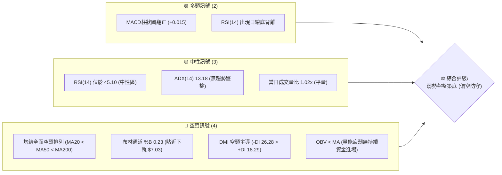
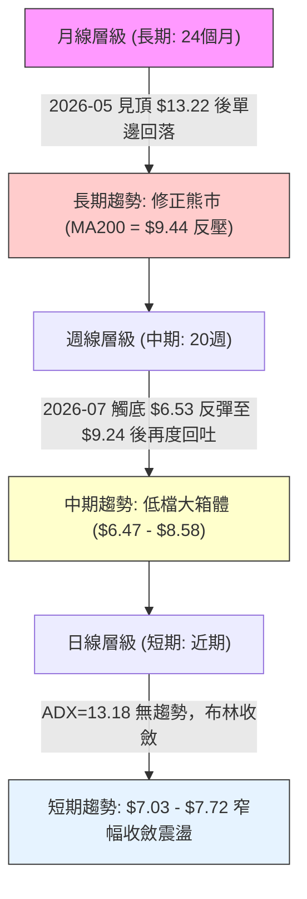
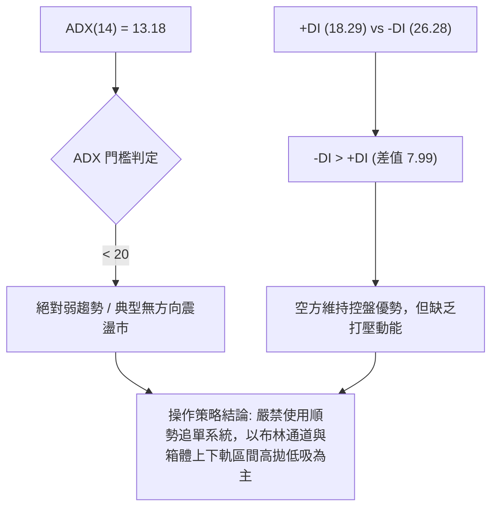
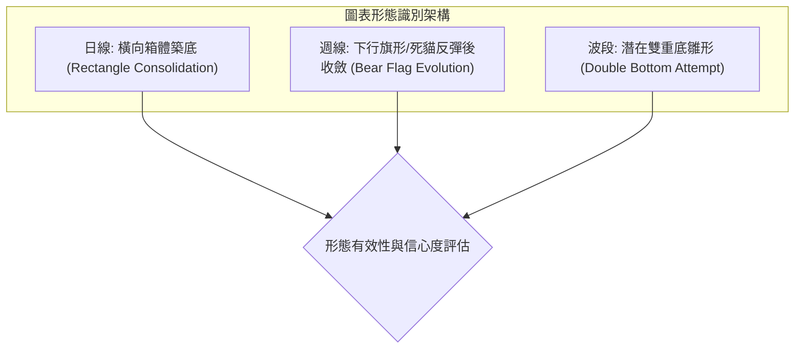
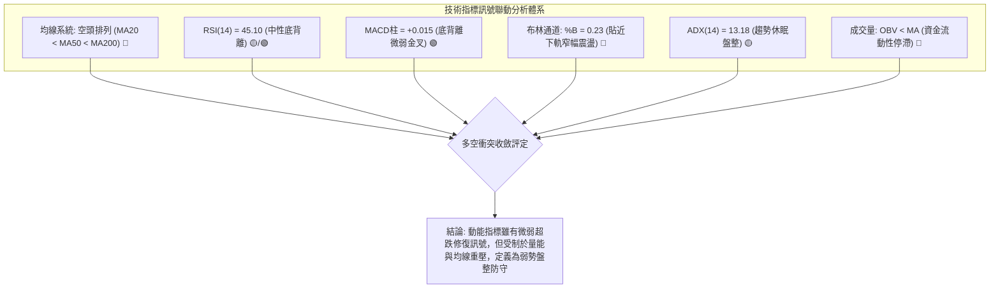
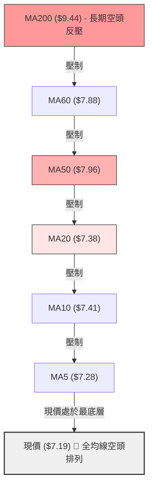
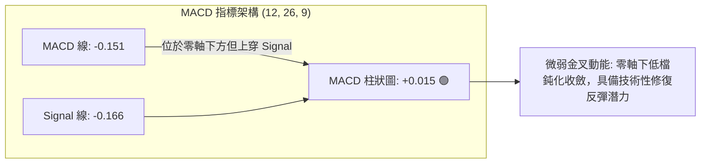
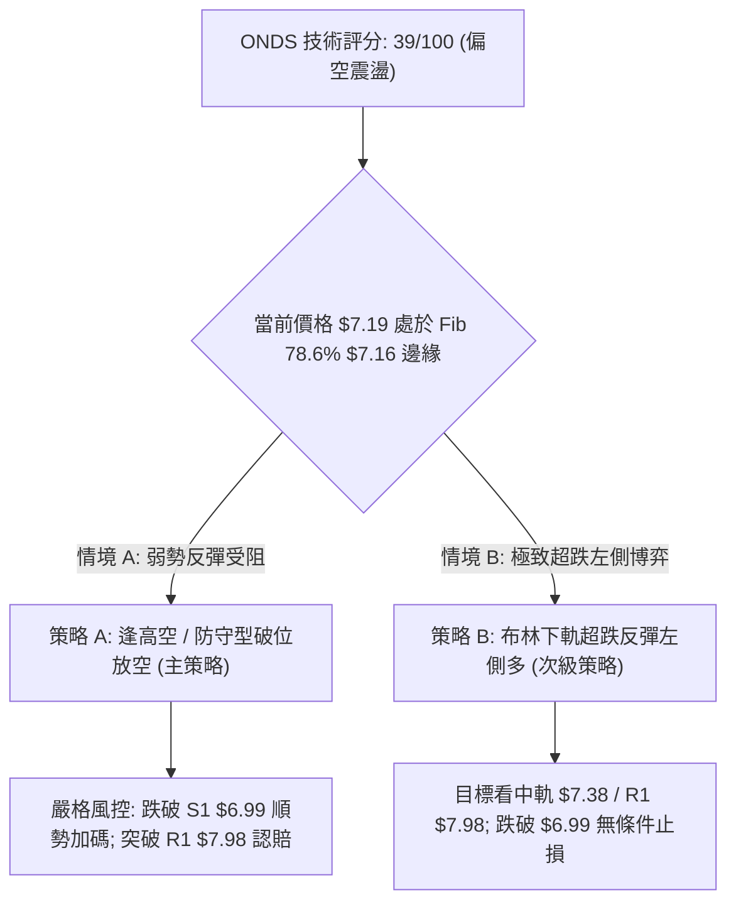
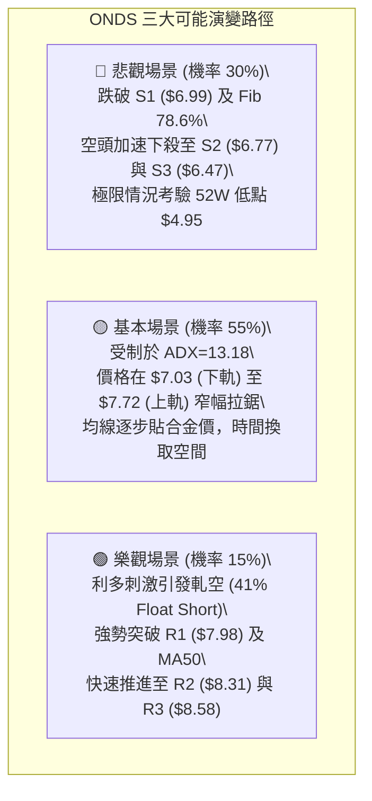

# ONDS 技術分析報告

> **報告日期**：2026-10-08 ｜ **語言**：繁體中文 ｜ **數據來源**：Yahoo Finance ｜ **當前價格**：$7.19

---

## 目錄

| 章節 | 內容 |
|------|------|
| [1. 技術面概覽](#1-技術面概覽) | 訊號儀表板、核心指標、評分卡 |
| [2. 趨勢分析](#2-趨勢分析) | 多時框趨勢、長中短期走勢 |
| [3. 圖表形態分析](#3-圖表形態分析) | 形態識別、K線組合、目標價 |
| [4. 支撐與阻力](#4-支撐與阻力) | 關鍵價位、斐波那契回調 |
| [5. 技術指標深度解讀](#5-技術指標深度解讀) | MA/RSI/MACD/布林/成交量 |
| [6. 動能與波動率](#6-動能與波動率) | 動能評估、ATR、Beta |
| [7. 多時框架總結](#7-多時框架總結) | 時框架評分矩陣 |
| [8. 交易策略建議](#8-交易策略建議) | 多空策略、風險報酬比 |
| [9. 風險提示與監控](#9-風險提示與監控) | 監控指標、風險場景 |

---

## 1. 技術面概覽

### 🎯 技術訊號儀表板



### 📊 核心指標速覽表

| 指標類別 | 指標名稱 | 當前數值 | 訊號 | 解讀 |
|----------|----------|----------|------|------|
| **價格** | 當前收盤價 | $7.19 | 🟡 | 位於52週區間 21.7% 低檔，距52W低點僅 45.2% 緩衝 |
| **均線** | MA20 | $7.38 | 🔴 | 價格低於 MA20 (-2.53%)，短期均線反壓沉重 |
| **均線** | MA50 | $7.96 | 🔴 | 價格低於 MA50 (-9.67%)，中期空方結構未扭轉 |
| **均線** | MA200 | $9.44 | 🔴 | 價格低於 MA200 (-23.83%)，長期牛熊分水嶺遠在上方 |
| **動能** | RSI(14) | 45.10 | 🟡 | 位於中性區（30–70），但指標伴隨底背離訊號 |
| **動能** | MACD(12,26,9) | -0.151 / Sig -0.166 | 🟢 | MACD 柱狀圖為 +0.015，零軸下方出現微弱金叉動能 |
| **擺動** | KD (Stoch %K/%D) | 18.56 / 32.09 | 🟢 | %K 處於 20 以下超賣區，短線具備技術性修復需求 |
| **趨勢** | ADX(14) | 13.18 | 🟡 | ADX < 25 表明無方向性單邊強勢，處於低波動箱體震盪 |
| **波動** | ATR(14) | $0.38 | 🟡 | 每日平均真實波幅佔股價 5.35%，處於震盪收斂末期 |
| **通道** | 布林通道 (%B) | 0.23 | 🔴 | 價格處於中軌 ($7.38) 與下軌 ($7.03) 之間，偏向弱勢區間 |
| **籌碼** | 空單比例 (Short Float)| 41.0% | 🔴/🟢 | 空頭極重壓（潛在空頭擠壓軋空燃料，但基本面受壓制） |

### 🏆 技術評分卡

```
╔════════════════════════════════════════════════════════════════╗
║                   技術評分卡 — ONDS (2026-10-08)                ║
╠════════════════════════════════════════════════════════════════╣
║ 趨勢強度 (ADX=13.18)       ████░░░░░░░░░░░░░░░░  25/100   🔴 弱勢 ║
║ 動能指標 (RSI/MACD/KD)     ██████████░░░░░░░░░░  50/100   🟡 中性 ║
║ 支撐穩定度 (Fib 78.6%/S1)  ████████████░░░░░░░░  60/100   🟡 尚可 ║
║ 成交量配合 (OBV<MA)        ██████░░░░░░░░░░░░░░  30/100   🔴 疲弱 ║
║ 形態完整度 (箱體整理)      ██████████░░░░░░░░░░  50/100   🟡 構築 ║
║ 均線排列 (空頭排列)        ████░░░░░░░░░░░░░░░░  20/100   🔴 劣勢 ║
╠════════════════════════════════════════════════════════════════╣
║ 綜合評分                   ███████░░░░░░░░░░░░░  39/100   🔴 偏空 ║
║ 評級結論                   弱勢區間盤整（偏空防守，防範破位） ║
╚════════════════════════════════════════════════════════════════╝
```

---

## 2. 趨勢分析

### 🌐 多時框趨勢分析



### 📈 長期趨勢 — 12個月走勢圖（Unicode）

```
ONDS 月線走勢圖（2025-11 至 2026-10）
價格軸 ($)
$14.00 ┤                                   ● (2026-05: $13.22 波段最高收盤)
$12.00 ┤                                  ╱ ╲
$10.00 ┤                     ●    ●      ╱   ● (2026-06: $8.24 重挫)
$8.00  ┤          ●    ●    ╱ ╲  ╱ ╲    ╱     ╲  ●   ●
$7.00  ┤ ───●────╱──────╲──╱───●────●──╱───────●───────● (2026-10: $7.19 當前)
$6.00  ┤   (2025-10: $6.44)
       └─────────────────────────────────────────────────────────────
         25-11 25-12 26-01 26-02 26-03 26-04 26-05 26-06 26-07 26-08 26-09 26-10
         $7.90 $9.76 $10.36$10.08 $9.04 $10.04$13.22 $8.24 $7.49 $7.66 $7.33 $7.19
```

#### 走勢特徵分析表格

| 階段區間 | 時間段 | 價格區間 | 累計漲跌幅 | 結構特徵與成交量狀態 |
|----------|--------|----------|------------|----------------------|
| **第 I 階段：強勁推升** | 2025-10 → 2026-01 | $6.44 → $10.36 | +60.87% | 多頭主升段，伴隨防禦科技與無人機合約利多，量能顯著放大 |
| **第 II 階段：高檔震盪** | 2026-01 → 2026-04 | $10.36 → $10.04 | -3.09% | 構築 $9.04–$10.36 高檔整理平台，籌碼開始分歧 |
| **第 III 階段：終極誘多**| 2026-04 → 2026-05 | $10.04 → $13.22 | +31.67% | 月線爆量拉升至 $13.22（盤中創52W高點 $15.28），形成巨幅影線出貨 |
| **第 IV 階段：急速崩跌** | 2026-05 → 2026-07 | $13.22 → $7.49 | -43.34% | 斷崖式跳水，連續跌破各級中長期均線，7月中旬週線見低點 $6.53 |
| **第 V 階段：弱勢沉澱** | 2026-07 → 2026-10 | $7.49 → $7.19 | -4.01% | 8月短暫反彈至 $9.24 後受阻，當前在 $7.19 呈現量縮低波動盤整 |

### 📊 中期趨勢（週線分析）

中期走勢自 2026-05 見頂後確立為下行通道，隨後在 2026-07-19 當週創下週收盤低點 $6.53（爆出 6.71 億股巨量），引發軋空反彈至 2026-08-16 的 $9.24。然而，反彈於 MA200（$9.44）附近徹底熄火，隨後週線成交量逐週萎縮（由 4.71 億股萎縮至當前 1.46 億股），週線 RSI 滑落至 45.10，顯示中期反彈力量衰竭，再次退守 $7.19。

```
ONDS 週線支撐與壓力結構
$9.24 ───────────────────────────── [8月波段反彈頂點 / 均線重壓區]
  │
$7.98 ┄┄┄┄┄┄┄┄┄┄┄┄┄┄┄┄┄┄┄┄┄┄┄┄┄┄┄ [近期反彈第一反壓 R1 / 近 MA50]
  │
$7.19 ═════════════════════════════ [現價 / 位於 Fib 78.6% $7.16 支撐處]
  │
$6.53 ───────────────────────────── [7月週線回測極限波段低點 / S3 $6.47 附近]
```

### ⚡ 趨勢強度評估（ADX 解讀）



#### ADX 強度對照表

| 指標變數 | 當前讀數 | 門檻區間 | 市場狀態解讀 |
|----------|----------|----------|--------------|
| **ADX(14)** | **13.18** | 0 – 20 | **極度微弱趨勢**：市場參與者觀望，單邊趨勢完全熄火，波動率極度收斂 |
| **+DI** | **18.29** | 參考線 20 | 多頭進攻意願低落，無法形成推升動能 |
| **-DI** | **26.28** | 參考線 25 | 空頭力量雖然主導市場，但未見加速發散跡象 |
| **趨勢綜合** | **空方微弱佔優** | ADX < 25 | **盤整行情優先**：根據規則14，技術分析以**日線布林通道 ($7.03–$7.72)** 為主要交易考量區間 |

---

## 3. 圖表形態分析

### 🔍 形態識別系統



#### 形態識別與信心度評估表

| 形態識別 | 信心度 | 判斷依據（引用數據） | 完成度 | 目標價（附嚴格計算式） |
|----------|--------|----------------------|--------|------------------------|
| **日線橫向整理箱體** | **75%** | 價格受限於下軌支撐 S1 ($6.99) 與通道上軌阻力 R1 ($7.98) 之間，近4週收盤於 $7.19–$7.64 密集重疊 | 80% | **突破目標**：箱頂 $7.98 + 箱高 ($7.98 - $6.99 = $0.99) = **$8.97**（接近 Fib 61.8% $8.90） |
| **日線潛在雙底結構** | **45%** | 第一隻腳為 2026-07 低點 $6.53（聚類 S3 $6.47），當前尋求於 S1 ($6.99)/S2 ($6.77) 構築第二隻腳；但量能 OBV 疲弱，信心度不足 50% | 40% | **訊號不足，僅做指標型解讀**：頸線為 2026-08 高點聚類 R3 ($8.58)，若未突破不可視為雙底確立 |
| **週線空頭旗形整理** | **65%** | 自 2026-05 $13.22 急殺至 $6.53 為旗桿，8月反彈至 $9.24 形成傾斜旗面，隨後再次跌破中軌 | 70% | **破位目標**：跌破 S1 ($6.99) 則測 S2 ($6.77) 與 S3 ($6.47)，理論旗桿等長跌幅遠超數據，僅看波段低點聚類 S3 ($6.47) |

### 🕯️ 重要K線形態分析

| 日期 / 月份 | 收盤價 | K線形態 | 解讀 | 訊號 |
|-------------|--------|---------|------|------|
| **2026-05-31** | $13.22 | **高檔避雷針 (倒錘長上影線)** | 盤中衝高至52W高點 $15.28 後巨量回落，成交量達 5.66 億股，屬於典型的多頭衰竭出貨訊號 | 🔴 強烈看跌 |
| **2026-07-19** | $6.53 | **爆量探底錘頭線 (Hammer)** | 週成交量爆出 6.71 億股歷史天量，下影線回踩波段低點後強烈反抽，形成強支撐聚類區域 | 🟢 觸底反彈 |
| **2026-08-16** | $9.24 | **反彈遇阻吊頸線 (Hanging Man)** | 成交量萎縮至 4.71 億股，衝高挑戰 MA200 ($9.44) 未果，留長上影線宣告反彈結束 | 🔴 漲勢衰竭 |
| **2026-09-27** | $7.64 | **反彈實體小陽線** | 測試短期阻力 R1 ($7.98) 失敗，收盤受制於布林上軌 $7.72 | 🟡 假突破盤整 |
| **2026-10-11 (當週)**| $7.19 | **極度縮量十字星 (Doji)** | 週成交量驟降至 1.46 億股，實體極小，多空在 Fib 78.6% ($7.16) 達成暫時脆弱平衡 | 🟡 變盤前夕 |

### 📉 ASCII 走勢形態示意圖

```
ONDS 2026-07 至 2026-10 日線/週線形態演變結構圖
$9.24 ─────────● (2026-08-16 反彈高點 / 旗面頂部)
                ╲
                 ╲
$7.98 ────────────╲──────────● (R1 頸線阻力聚類 / 2026-09-27 反彈頂點 $7.64)
                   ╲        ╱ ╲
$7.38 ──────────────╲──────╱───╲─── [MA20 / 布林中軌反壓]
$7.19 ═══════════════╲════╱═════●═ [現價: 窄幅震盪中軸 / Fib 78.6% $7.16]
                      ╲  ╱        
$6.99 ─────────────────╲╱───────── [S1 近期波段支撐 / 箱體下緣]
$6.53 ───● (2026-07-19 第一隻腳 / S3 $6.47 聚類)
         └────── 潛在雙底構築中？(未過 R1/R3 頸線前僅視為橫盤箱體) ──────┘
```

### 🎯 形態目標價計算

根據嚴格數據紀律與形態測量法則：

1. **橫向箱體震盪突破目標（多頭情境）**：
   - 箱體頂部（頸線）：採用數據阻力聚類 **R1 = $7.98**
   - 箱體底部：採用數據支撐聚類 **S1 = $6.99**
   - 形態垂直高度（$H$）：$7.98 - 6.99 = \$0.99$
   - **向上突破等幅目標價**：$7.98 + 0.99 = \mathbf{\$8.97}$（該價位與關鍵斐波那契 61.8% 回調位 **$8.90** 強烈共振）
2. **箱體破位下行目標（空頭情境）**：
   - **向下破位等幅目標價**：$6.99 - 0.99 = \mathbf{\$6.00}$（若跌破 S1，下探中途必經 S2 **$6.77** 及 S3 **$6.47** 聚類支撐）

---

## 4. 支撐與阻力

### 🗺️ 關鍵價位分布圖（Unicode）

```
ONDS 關鍵價位結構分布圖 (由 OHLCV 聚類計算)
═══════════════════════════════════════════════════════════════════
$9.44  ║████████████████████████████████║ MA200 牛熊分水嶺 / 長期強壓
$8.90  ║██████████████████████████      ║ Fib 61.8% 黃金分割強壓
$8.58  ║████████████████████████        ║ 強阻力 R3 (+19.33%) [波段高點聚類]
$8.31  ║██████████████████              ║ 阻力 R2 (+15.65%) [密集成交區]
$7.98  ║████████████████████████████    ║ 關鍵阻力 R1 (+10.99%) [MA50 $7.96 匯合處]
$7.72  ║████████████                    ║ 布林通道上軌
$7.38  ║┈┈┈┈┈┈┈┈┈┈┈┈┈┈┈┈┈┈┈┈┈┈┈┈┈┈┈┈┈┈┈┈║ 布林通道中軌 (MA20 短期多空線)
$7.19  ╠════════════════════════════════╣ ◄ 現價 ($7.19)
$7.16  ║▓▓▓▓▓▓▓▓▓▓▓▓▓▓▓▓▓▓▓▓▓▓▓▓▓▓▓▓    ║ Fib 78.6% 回調關鍵樞紐支撐
$7.03  ║▓▓▓▓▓▓▓▓▓▓▓▓                    ║ 布林通道下軌
$6.99  ║▓▓▓▓▓▓▓▓▓▓▓▓▓▓▓▓▓▓▓▓            ║ 近期波段支撐 S1 (-2.78%) [近一年低點聚類]
$6.77  ║▓▓▓▓▓▓▓▓▓▓▓▓▓▓▓▓▓▓▓▓▓▓▓▓        ║ 強支撐 S2 (-5.84%) [密集成交低點]
$6.47  ║████████████████████████████████║ 極限防守支撐 S3 (-10.08%) [7月低點 $6.53 聚類]
$4.95  ║████████████████████████████████║ 52週最低點 (Fib 100.0%)
═══════════════════════════════════════════════════════════════════
```

### 🚧 阻力位分析表

| 阻力級別 | 價位 | 形成原因（嚴格引用數據） | 突破難度 | 重要性 |
|----------|------|--------------------------|----------|--------|
| **R1** | **$7.98** | 近一年波段高點聚類，且與當前 **MA50 ($7.96)** 形成雙重共振壓制 | 80% (極高) | ★★★★★ (短線多空轉折頸線) |
| **R2** | **$8.31** | 2026-06 重挫反彈平台密集套牢區，近一年波段高點聚類 | 70% (高) | ★★★☆☆ (次級阻力) |
| **R3** | **$8.58** | 2026-08 波段衝高（高點 $9.24）回落後次級反彈高點聚類 | 85% (極高) | ★★★★☆ (強阻力，確立波段反轉必經之路) |

### 🛡️ 支撐位分析表

| 支撐級別 | 價位 | 形成原因（嚴格引用數據） | 守住機率 | 重要性 |
|----------|------|--------------------------|----------|--------|
| **S1** | **$6.99** | 近一年波段低點聚類，緊貼布林通道下軌 **$7.03**，為日線箱體底邊 | 60% (中等) | ★★★★☆ (短線防守第一道防線) |
| **S2** | **$6.77** | 近一年次級波段低點聚類，7月反彈初期的回測起漲跳板 | 70% (較高) | ★★★☆☆ (緩衝支撐) |
| **S3** | **$6.47** | 2026-07-19 當週創下週收盤低點 **$6.53** 之波段低點聚類極限區 | 85% (極高) | ★★★★★ (中期牛熊底線，破位將測 $4.95) |

### 📐 斐波那契回調位分析

依據 52 週完整波動區間（低點 **$4.95** 至高點 **$15.28**，總振幅 $10.33）計算：

| 斐波那契回調比例 | 精確價位 | 技術含義與目前價格關係解讀 |
|------------------|----------|----------------------------|
| **0.0% (52W High)** | **$15.28** | 歷史極限高點（2026-05 衝高位置） |
| **23.6%** | **$12.84** | 第一回調位，失守後宣告多頭趨勢受損 |
| **38.2%** | **$11.33** | 強勢回調分水嶺，跌破後轉入弱勢整理 |
| **50.0%** | **$10.11** | 多空心理平衡位（與 2026-01/04 月線平台重合） |
| **61.8%** | **$8.90** | 黃金分割強防守位（失守後全面轉熊，當前上方強壓） |
| **78.6%** | **$7.16** | **現價 ($7.19) 坐落位置**：價格目前僅高於該位 $0.03 (+0.42%) |
| **100.0% (52W Low)**| **$4.95** | 52 週最低點，終極週期支撐 |

**斐波那契深度解讀**：
當前收盤價 **$7.19** 處於 **61.8% ($8.90)** 與 **78.6% ($7.16)** 深度回調帶的底端，且實質緊貼 **$7.16**。78.6% 回調位通常被視為波段牛市最後的「黃金防禦網」。若股價在 $7.16 獲得確認並止跌，尚能維持大級別震盪築底格局；一旦有效跌破 $7.16（日線收低於 S1 $6.99），價格將直接面臨回測 100% 斐波那契低點 **$4.95** 的沉重壓力。

---

## 5. 技術指標深度解讀

### 🎛️ 指標訊號總覽



### 📈 移動平均線排列分析



#### 各週期均線數據一覽

| 週期均線 | 當前價格 | 與現價差距 ($) | 偏離幅度 (%) | 走勢狀態與歷史軌跡解讀 |
|----------|----------|----------------|--------------|------------------------|
| **MA 5** | $7.28 | -$0.09 | -1.18% | 短線下彎，極短期動能受阻 |
| **MA 10** | $7.41 | -$0.22 | -2.98% | 連續下滑，形成短期蓋頭反壓 |
| **MA 20** | $7.38 | -$0.19 | -2.53% | 布林中軌，短線多空分水嶺 |
| **MA 50** | $7.96 | -$0.77 | -9.67% | 季線阻力，與波段高點 R1 ($7.98) 形成重疊壓力帶 |
| **MA 60** | $7.88 | -$0.69 | -8.71% | 中期均線下壓，限制反彈空間 |
| **MA 120** | $8.73 | -$1.54 | -17.61% | 半年線持續走低，反映半年內籌碼全面套牢 |
| **MA 200** | $9.44 | -$2.25 | -23.83% | 年線牛熊分水嶺，宣告大週期處於修正熊市 |
| **MA 240** | $9.09 | -$1.90 | -20.90% | 長期平均成本線持續向下跌落 |

**均線綜合解讀**：
當前呈現標準的「極弱勢全均線空頭排列」（Price < MA5 < MA20 < MA50 < MA200）。現價距離 MA200 負乖離達 -23.83%，說明長期超跌；但短期均線群（MA5、MA10、MA20）在 $7.28–$7.41 區間形成極為密集的阻力天花板，任何未帶量的反彈皆會在此遭遇多殺多反壓。

### 📉 RSI(14) 分析

#### RSI 數值進度條
```
RSI(14) 數值: 45.10
0 ──────────超賣[30]──────────中軸[50]──────────超買[70]────────── 100
[██████████████████░░░░░░░░░░░░░░░░░░░░░░] 45.10% (弱中性區間)
```

- **背離判斷（Bullish Divergence 確立）**：
  - 價格端：2026-07-12 當週收盤 $7.26，隨後在 2026-09-13 下探至 $7.23，當前收盤為 $7.19（價格重心逐步創波段收盤新低）。
  - 指標端：2026-07-05 RSI(14) 探底至 **21.3** 極度超賣區；2026-09-13 RSI 為 **30.1**；當前 2026-10-11 RSI 回升至 **45.10**。
  - **結論**：日線及週線級別均呈現標準的**底背離（Bullish Divergence）**。這表明空方雖然將價格微幅推向新低，但內部下行動能大幅衰退，屬於潛在的空頭衰竭訊號。然而，底背離僅代表「跌不動」，在缺乏量能配合下，往往轉化為橫盤盤整而非強烈暴漲。

### 📊 MACD(12/26/9) 訊號解讀



- **MACD 線**：-0.151
- **訊號線 (Signal)**：-0.166
- **柱狀圖 (Histogram)**：+0.015（綠色翻正）
- **解讀**：MACD 在零軸深處形成弱勢黃金交叉，柱狀圖連續微幅擴張（+0.013 → +0.015）。這與 RSI 底背離形成了**多指標共振確認**，確認下行拋壓減緩。但因雙線均處於零軸下方（零軸下金叉），技術上定性為「弱勢反彈/抵抗性盤整」，而非強勢主升浪。

### 📦 布林通道分析

```
ONDS 日線布林通道 (20, 2) 結構圖
$7.72 ──────────────────────────────── 上軌 (Upper Band)
        │
$7.38 ┄┄┄┄┄┄┄┄┄┄┄┄┄┄┄┄┄┄┄┄┄┄┄┄┄┄┄┄┄┄ 中軌 (MA20 / SMA)
        │
$7.19 ════════════════════════════════ 現價 (%B = 0.23)
        │
$7.03 ──────────────────────────────── 下軌 (Lower Band)
```

- **帶寬與位置特徵**：
  - 通道寬度：$7.72 - $7.03 = \$0.69$（通道帶寬僅為股價的 9.59%，極度收窄）。
  - **%B 指標**：**0.23**。表明現價極度偏向布林下軌（0 代表下軌，$7.03；0.5 代表中軌，$7.38）。
- **通道走勢研判**：
  布林通道進入極限擠壓（Squeeze）狀態。根據波動率聚集原理，極窄的通道往往預示著即將發生方向性變盤。當前價格在 %B 0.23 徘徊，若帶量跌破下軌 $7.03，將觸發通道「向下開口」；若能重返中軌 $7.38 之上，方能緩解下行壓力並挑戰上軌 $7.72。

### 💹 成交量分析（量價配合度）

```
成交量對比長條圖
最新成交量:  61,629,300   [████████████████░░░░] (量比 1.02x)
20日均量:    60,610,605   [████████████████░░░░]
50日均量:    65,811,990   [█████████████████░░░]
週成交量走勢: 834M(7月) → 471M(8月) → 375M(9月) → 146M(10月) [縮量 82.5%]
```

- **量價特徵評估**：
  - 當前日成交量 61,629,300 股與 20 日均量基本持平（量比 1.02x），但低於 50 日均量。
  - 週線成交量由 7 月底反彈時的 8.34 億股大幅萎縮至當前的 1.46 億股。這是一種極度的**量能退潮**現象。
- **OBV 能量潮判斷**：
  數據明確顯示：**OBV 趨勢 < MA → 量能疲弱**。雖然 RSI 與 MACD 呈現底背離，但資金面 OBV 指標並未拐頭向上，表明機構主動性買盤（Smart Money）並未在此價位展開大規模吸籌，當前價格的企穩更多源於「賣盤枯竭」而非「買盤推升」。量能無法確認多頭信號，制約了向上突破的高度。

---

## 6. 動能與波動率

### ⚡ 動能評估四象限

```
動能與波動率四象限矩陣
    高波動 │
           │     Q3: 高風險高收益            Q4: 劇烈殺跌 / 派發
           │   (High Mom / High Vol)       (Low Mom / High Vol)
           │
           │
───────────┼─────────────────────────────────────────────────────
           │     Q1: 強勢穩健主升            Q2: 謹慎觀望 / 弱勢收斂 ◄ [ONDS 落點]
           │   (High Mom / Low Vol)        (Low Mom / Low Vol)
    低波動 │                               [ADX=13.18, ATR=$0.38]
           └─────────────────────────────────────────────────────
                 強動能                      弱動能
```

#### 動能狀態評估表

| 象限位置 | 動能指標狀態 | 波動率狀態 | 當前符合度 | 戰略應對方針 |
|----------|--------------|------------|------------|--------------|
| **Q1 (強動能/低波動)** | MACD主升、RSI>60 | ATR收縮、通道平行 | 不符合 | 最理想順勢加碼階段 |
| **Q2 (弱動能/低波動)** | **ADX=13.18、RSI=45.10** | **ATR=$0.38、布林緊繃** | **✓ 完全吻合** | **謹慎觀望**：處於變盤前夕垃圾時間，嚴控倉位，不盲目追單 |
| **Q3 (強動能/高波動)** | +DI大幅領先、爆量拉升 | ATR放大、Beta>3 | 不符合 | 突破後追隨強勢趨勢 |
| **Q4 (弱動能/高波動)** | -DI主導、崩跌破位 | 52W區間劇烈洗盤 | 部分過往吻合 | 2026-06 暴跌時狀態，目前已鈍化過渡至 Q2 |

### 📊 ATR 波動率分析

- **當前數值**：**ATR(14) = $0.38**
- **波動比例**：佔當前股價 $7.19 的 **5.35%**。
- **波幅含義**：ONDS 具備典型的單日高波幅特徵，即使處於低動能盤整期，每日正常雜訊波動亦接近 $0.40。
- **防守止損距離設定建議**：
  - 超短線/日內交易：最低保護距離為 $1.0 \times \text{ATR} = \mathbf{\$0.38}$。
  - 波段交易風控：建議設定安全緩衝距離為 $1.5 \times \text{ATR} \sim 2.0 \times \text{ATR}$（即 **$0.57 ～ $0.76**）。
  - 若以支撐 S1 ($6.99) 為進場基準，合理波段止損點應設於 $6.99 - 1.5 \times \text{ATR} = 6.99 - 0.57 = \mathbf{\$6.42}$（緊貼 S3 $6.47 聚類下方）。

### 📐 Beta 與市場相關性

- **Beta 係數**：**2.922**（極高 Beta 屬性）。
- **市場敏感度分析**：
  ONDS 的波動幅度接近標普500指數的 **3 倍**。當大盤微幅調整時，該股容易出現放大式震盪。
- **籌碼面放大效應**：
  - 流通股空單比例高達 **41.0%**（Short Ratio = 3.83 天）。
  - 機構持股比例為 **57.1%**，內部人持股僅 1.8%。
  - **分析**：極高的 Beta 結合 41.0% 的極端空頭部位，說明該股處於機構對沖與空頭重壓的核心風暴區。一旦市場出現利多刺激突破 R1 ($7.98)，極易引發高 Beta 屬性的劇烈軋空（Short Squeeze）；反之，在大盤弱勢下，高 Beta 將成為空頭無情打壓的放大器。

---

## 7. 多時框架總結

### 📋 時框架評分表

| 時框架 | 趨勢方向 | 動能狀態 | 均線排列 | 圖表形態 | 綜合評分 | 操作指導建議 |
|--------|----------|----------|----------|----------|----------|--------------|
| **月線 (長期)** | 🔴 下行修正 | 弱勢 (自$13.22回落) | 偏空 (遠離MA200) | 高檔長影線下壓 | 30/100 | 長期處於熊市修復期，防範二度探底 |
| **週線 (中期)** | 🔴 偏空震盪 | 疲弱 (RSI 45.10) | 空頭反壓沉重 | 旗面收斂/潛在雙底 | 40/100 | $6.47–$8.58 大箱體運行，反彈動能衰竭 |
| **日線 (短期)** | 🟡 橫向盤整 | 底背離鈍化中性 | 全均線空頭排列 | 布林擠壓收斂箱體 | 45/100 | 依託布林下軌及 S1 防守，觀望等待變盤 |

### 🔲 綜合訊號矩陣

```
┌─────────────────┬───────────────────┬───────────────────┬───────────────────┐
│     分析維度    │    短期 (日線)    │    中期 (週線)    │    長期 (月線)    │
├─────────────────┼───────────────────┼───────────────────┼───────────────────┤
│   趨勢方向性    │ 🟡 橫盤無方向     │ 🔴 空頭下行通道   │ 🔴 熊市修正格局   │
│   動能指標狀態  │ 🟢 底背離微幅翻多 │ 🟡 中性走平 (45)  │ 🔴 賣壓主導       │
│   均線系統排列  │ 🔴 空頭排列壓制   │ 🔴 壓制於MA50下方 │ 🔴 遠低於MA200    │
│   成交量能配合  │ 🔴 極度縮量疲弱   │ 🔴 週量萎縮82%    │ 🟡 高檔天量後沉寂 │
│   關鍵結構邊界  │ $6.99 (S1) - $7.72│ $6.47 (S3)- $8.58 │ $4.95 - $15.28    │
└─────────────────┴───────────────────┴───────────────────┴───────────────────┘
```

### ⚖️ 多時框收斂結論

依據多時框收斂規則（規則 14）：
1. **行情定性判定**：當前日線指標 **ADX(14) 數值為 13.18**（遠低於 25 臨界線）。系統明確觸發「**盤整行情優先原則**」，即單邊趨勢追單失效，日線布林通道上下軌（**$7.03 至 $7.72**）以及波段聚類支撐阻力為核心交易決策區間。
2. **多時框矛盾裁決**：雖然中長期均線（週線、MA50 $7.96、MA200 $9.44）呈現壓倒性空頭排列，但日線短期出現 RSI 底背離及 MACD 微弱金叉，空方短期打壓動能亦已耗竭。
3. **唯一方向性結論**：**【弱勢盤整觀望（偏空防守）】**。
   目前市場處於「跌勢暫止、但多頭無力反攻」的脆弱平衡期。綜合評分判定為 **39/100（≤40）**，整體防禦優先，任何交易策略均須將下行跌破 S1 ($6.99) 的風險列為首要防範考量。

---

## 8. 交易策略建議

### 🗺️ 策略決策流程圖



### 🧭 策略路由

> **當前主策略方向 = 【防守型空頭佈局 / 區間破位偏空策略】（依評分卡綜合評分 39/100 定調）**

由於綜合評分低於 40 分，均線空頭排列且 OBV 資金疲弱，主策略以**逢高阻力放空**或**向下破位順勢跟進**為主；多頭操作僅能作為在特定支撐位之極小倉位超短線反彈博弈。

### 🎯 價格情境階梯（Price Scenarios）

以當前價格 **$7.19** 為基準，嚴格引用第 4 章數據聚類價位：

| 觸發條件 | 下一目標 | 後續延伸 | 情境技術含義 |
|----------|----------|----------|--------------|
| **強勢突破 R1 ($7.98)** | **R2 ($8.31)** | **R3 ($8.58)** | 短線結構反轉，日線空頭排列遭破壞，觸發 41% 浮動空單回補 |
| **突破布林中軌 ($7.38)**| **布林上軌 ($7.72)**| **R1 ($7.98)** | 弱勢技術性修復，測試箱體頂部壓力 |
| **維持現價 ($7.19) 震盪**| **布林中軌 ($7.38)**| **布林下軌 ($7.03)**| 垃圾時間橫盤沉澱，等待 ADX 醞釀方向 |
| **跌破下軌與 S1 ($6.99)**| **S2 ($6.77)** | **S3 ($6.47)** | 盤整箱體向下破位，開啟新一輪下行探底 |
| **跌破極限支撐 S3 ($6.47)**| **$5.50 (過渡)** | **$4.95 (52W Low)**| 中期結構徹底崩潰，考驗 52 週最低點 |

### 📊 情境機率分佈

| 價格演變情境 | 機率預估 | 主要技術依據（引用指標狀態） |
|--------------|----------|------------------------------|
| **情境 I：區間震盪（維持 $7.03–$7.72）** | **55%** | **ADX=13.18** 處於極度弱勢，成交量萎縮至均量以下，布林帶寬度極度收斂 |
| **情境 II：破位下行 / 二度探底（測 S1/S2/S3）** | **30%** | **均線全空頭排列**（MA20/50/200 反壓），**OBV < MA** 資金持續流出，-DI 佔優 |
| **情境 III：強勢反彈 / 突破上行（挑戰 R1）** | **15%** | 僅憑 **RSI 底背離** 與 **MACD 柱狀圖微紅**，在無量環境下難以單獨推動大反轉 |

### 🔴 主策略詳情（空頭防守與破位策略）

依據路由規則，評分 39/100 主推空頭應對策略：

| 策略要素 | 策略 A（反彈至阻力受阻沽空） | 策略 B（跌破 S1 箱底順勢破位空） |
|----------|------------------------------|----------------------------------|
| **進場條件** | 反彈測試布林上軌/MA50，滯漲收長上影線 | 日線實體收盤跌破關鍵支撐 S1 |
| **進場價格** | **$7.72**（布林上軌）至 **$7.98**（阻力 R1） | **$6.95**（確認有效跌破 S1 $6.99 後跟進） |
| **目標價 T1** | **$7.19**（當前震盪中軸） | **$6.77**（支撐 S2） |
| **目標價 T2** | **$6.99**（支撐 S1 / 箱體底部） | **$6.47**（支撐 S3 / 7月低點聚類） |
| **止損價格** | **$8.15**（突破 R1 $7.98 加上 0.5×ATR $0.19）| **$7.20**（重回現價與布林下軌之上） |
| **風險報酬比** | **1: 2.35**（以 $7.85 進場，風險 $0.30，目標 $6.99 獲利 $0.86） | **1: 1.92**（以 $6.95 進場，風險 $0.25，目標 $6.47 獲利 $0.48） |
| **勝率預估** | **58%** | **52%** |
| **建議倉位** | **10% - 15%** | **10%** |

---

### 🟢 次要交易策略（多頭超跌左側博弈）

此策略僅供極高風險承受者參考，嚴格執行防守：

| 策略要素 | 多頭超跌反彈博弈策略（極限防守多） |
|----------|----------------------------------|
| **進場條件** | 股價回踩 S1 不破，且日線收盤守穩 Fib 78.6% ($7.16) |
| **進場價格** | **$7.10**（介於布林下軌 $7.03 與 Fib 78.6% $7.16 之間） |
| **目標價 T1** | **$7.38**（布林中軌 / MA20） |
| **目標價 T2** | **$7.98**（關鍵阻力 R1 / MA50 匯合點） |
| **止損價格** | **$6.95**（精確跌破支撐 S1 $6.99 即刻止損） |
| **風險報酬比** | **1: 1.87**（至 T1） / **1: 5.87**（至 T2） |
| **勝率預估** | **42%**（逆大趨勢交易，勝率偏低，依賴高風報比） |
| **建議倉位** | **5% (輕倉試探)** |

### ⚠️ 反向風險觸發點（對沖與空頭止損提示）

若主策略持有空單，出現以下情況必須**無條件平倉對沖並推翻偏空假設**：
1. **價位觸發點**：日線實體大陽線收盤站上 **$7.98 (R1)**。此舉將一舉收復 MA50 ($7.96) 並突破自 8 月以來的下降壓力線。
2. **量能觸發點**：單日成交量暴增至 **1.2 億股以上**（達 20 日均量 2 倍），伴隨 OBV 指標強勢突破其均線。
3. **空頭擠壓信號**：若空單比例 41.0% 出現集體平倉踩踏，股價短線暴拉突破 **$8.31 (R2)**，空頭部位必須全部止損出局。

### ⭐ 整體訊號強度評星

```
╔════════════════════════════════════════════════════════════════╗
║ 做多訊號強度：★★☆☆☆  (2.0/5星) — 僅具備底背離，缺乏趨勢與量能支撐
║ 做空訊號強度：★★★☆☆  (3.5/5星) — 均線與大週期主導，但低位鈍化
║ 整體可信度：  ★★★☆☆  (3.0/5星) — ADX=13.18 表明信號隨時受假突破干擾
╚════════════════════════════════════════════════════════════════╝
```

---

## 9. 風險提示與監控

### ✅ 關鍵監控指標 Checklist

```
╔══════════════════════════════════════════════════════════════════╗
║               ONDS 日常交易風控監控清單 (Checklist)               ║
╠══════════════════════════════════════════════════════════════════╣
║ [ ] 價格是否跌破 S1 ($6.99) 關鍵支撐？ (破位標誌新一輪殺跌開啟)    ║
║ [ ] RSI(14) 底背離是否被破壞？ (若 RSI 跌破 30，底背離正式失效)   ║
║ [ ] MACD 柱狀圖是否由紅翻綠？ (柱狀圖 < 0 代表弱勢反彈徹底終結)    ║
║ [ ] 成交量是否突破 6,000 萬股基準線？ (量縮視為無效震盪雜訊)       ║
║ [ ] 價格是否帶量攻克 MA20 ($7.38)？ (站穩方有機會挑戰布林上軌)     ║
║ [ ] 空單餘額 (Short % Float = 41%) 是否出現異動回補跡象？         ║
║ [ ] ADX(14) 是否由 13 拐頭突破 20？ (突破代表新單邊趨勢啟動)      ║
╚══════════════════════════════════════════════════════════════════╝
```

### ⚠️ 風險場景分析



### 🛡️ 風險管理重要提醒

1. **極端流動性與軋空雙向風險**：
   該股具備高達 **41.0% 的空頭部位比例 (Short % Float)**，這是一把極度危險的雙刃劍。一方面反映了市場機構對其基本面營運現金流為負（$-161.06M）的極度擔憂；另一方面，高空單部位意味著任何超預期的合約或防禦訂單新聞，隨時可能在成交量匱乏的盤面引發「非理性暴力軋空」。因此，**進行空頭操作時，止損位必須嚴格釘死在 R1 ($7.98) 之上，絕不可扛單**。
2. **波動率放大的倉位控管**：
   考慮到 ONDS 的 **Beta 高達 2.922**，且 ATR 佔股價高達 **5.35%**，其日內常態波動相當於一般大型科技股的三倍。投資人應將常規單筆交易倉位**縮減至平時的 1/3 至 1/2**（建議總倉位不超過 10%–15%），避免單一標的之劇烈震盪造成整體投資組合淨值的重大回撤。
3. **無趨勢環境下的交易戒律**：
   當前 ADX 為 13.18，代表市場正處於標準的「趨勢休眠期」。在此階段，順勢突破策略（Breakout Trading）往往遭遇高達 70% 以上的假突破機率。在成交量與 ADX 明確放大前，嚴格禁止追高殺低，耐性等待價格觸及邊界價位（$6.99 或 $7.98）方可動作。

---

## 📋 報告總結

```
╔════════════════════════════════════════════════════════════════╗
║                     ONDS 技術分析報告總結                      ║
╠════════════════════════════════════════════════════════════════╣
║ 報告日期：2026-10-08                                           ║
║ 當前價格：$7.19                                                ║
║ 綜合評級：⚖️ 弱勢盤整觀望（偏空防守，評分 39/100）            ║
╠════════════════════════════════════════════════════════════════╣
║ 關鍵結論：                                                     ║
║ ├─ 長期趨勢：🔴 空頭修正（受阻於 MA200 $9.44，處於下行週期）  ║
║ ├─ 中期趨勢：🔴 弱勢反彈衰竭（週線量能萎縮 82%，退守箱體下緣）║
║ ├─ 短期趨勢：🟡 窄幅收斂震盪（ADX=13.18，布林帶寬度極限擠壓） ║
║ ├─ 核心支撐：$6.99 (S1) / $6.77 (S2) / $6.47 (S3)              ║
║ ├─ 核心阻力：$7.98 (R1) / $8.31 (R2) / $8.58 (R3)              ║
║ └─ 分析師共識目標：$18.88 (機構覆蓋10家，均為強烈買進)         ║
╠════════════════════════════════════════════════════════════════╣
║ 最優策略組合：                                                 ║
║ 1. 🥇 最佳機會（主策略）：反彈至阻力區 $7.72–$7.98 受阻逢高沽空║
║ 2. 🥈 次選機會（破位單）：實體跌破 S1 ($6.99) 後順勢追空測 S3 ║
║ 3. 🥉 保守選擇（超短多）：依託 Fib 78.6% $7.16 輕倉博弈反彈   ║
╚════════════════════════════════════════════════════════════════╝
```

---

> ⚠️ **免責聲明**：本報告為 AI 自動生成之量化技術分析，所有數據及估算均嚴格基於所提供的歷史價格與指標資訊。本報告**僅供研究與學術參考**，**不構成任何形式的投資建議與要約**。金融市場瞬息萬變，高 Beta 及高空單標的具備極高波動風險，入市需保持嚴格的風險管理與獨立判斷。

---

*報告生成時間：2026-10-08 ｜ 數據來源：Yahoo Finance ｜ 分析框架：多時框技術分析體系*