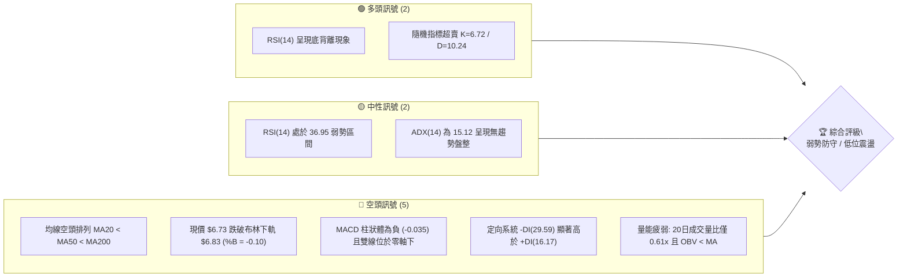
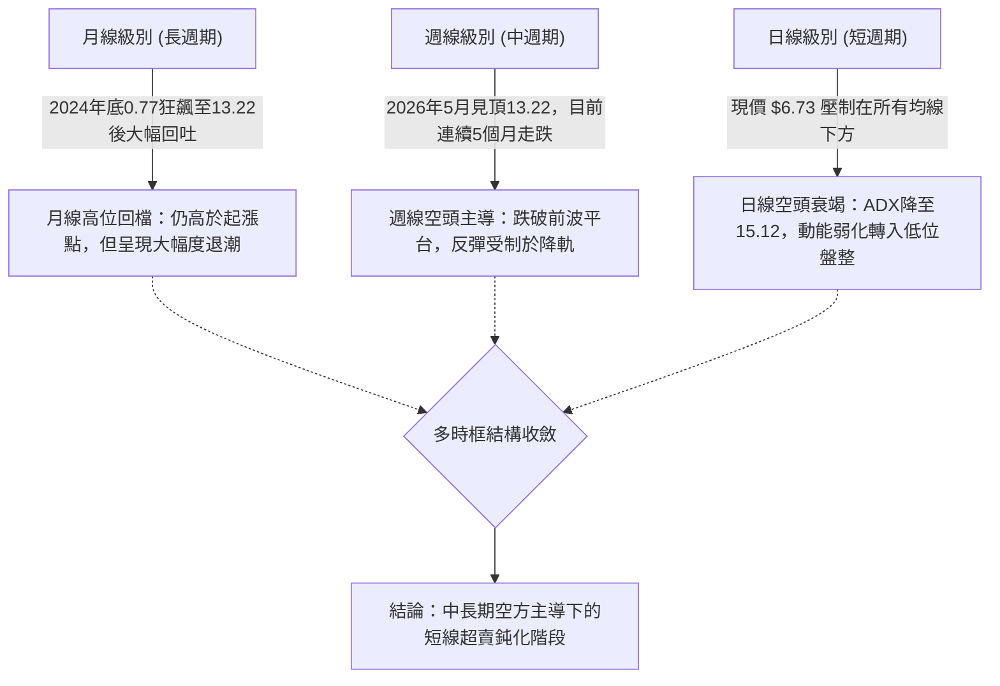
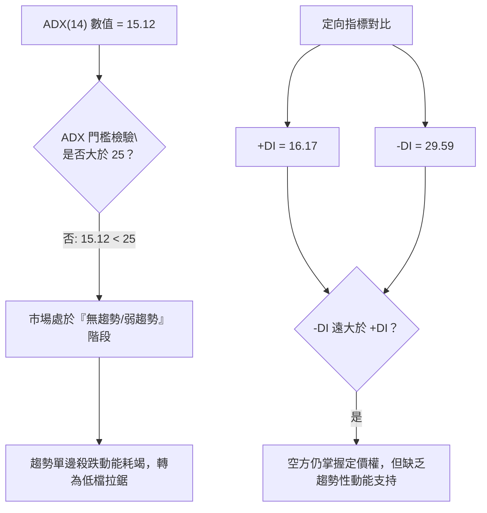
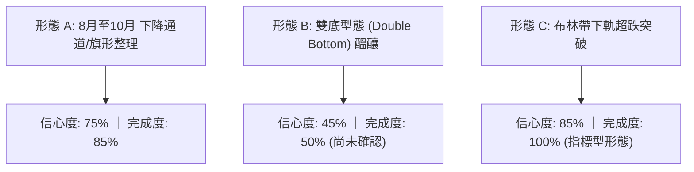
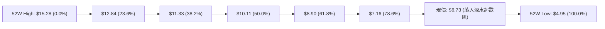
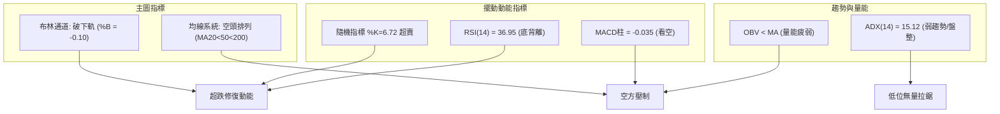
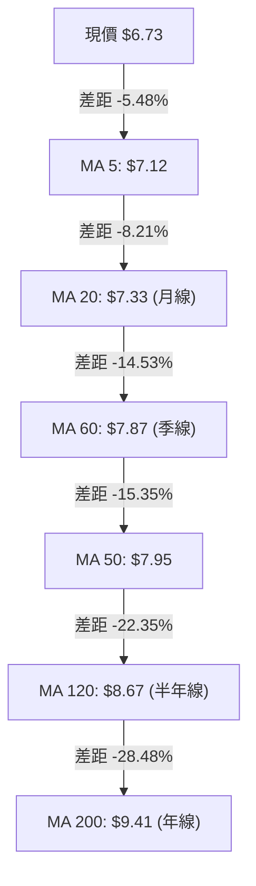
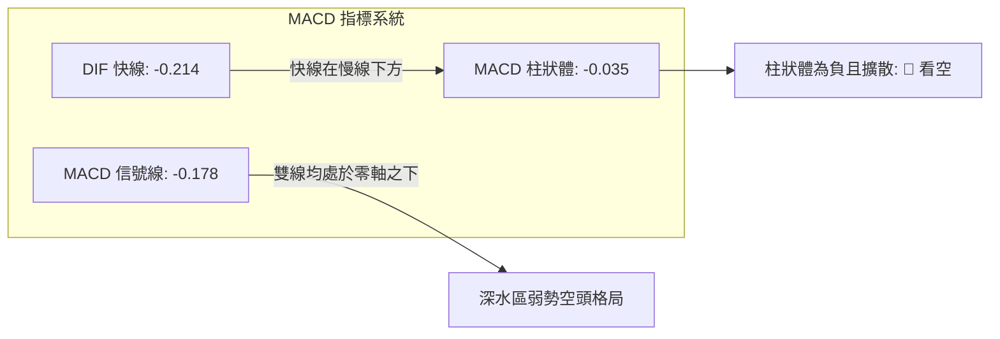
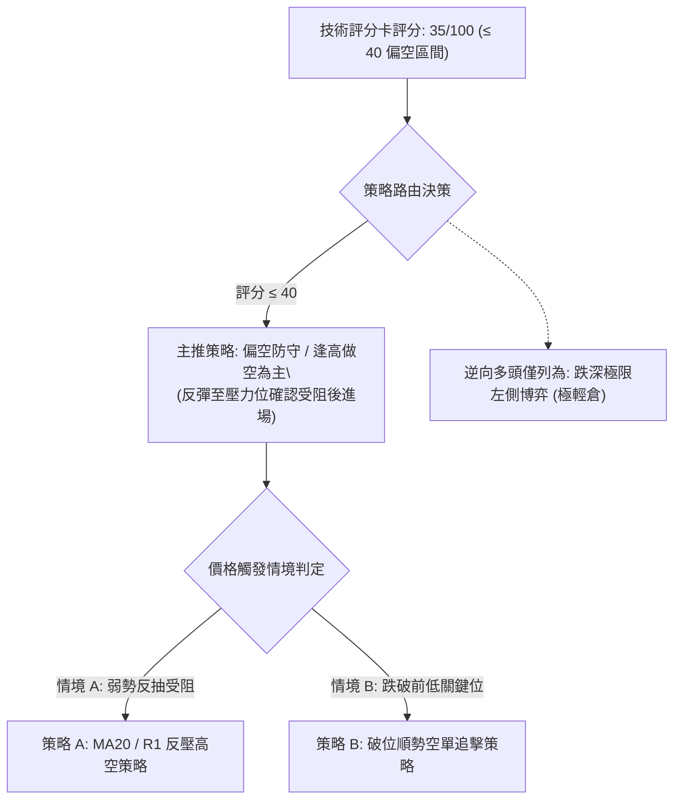
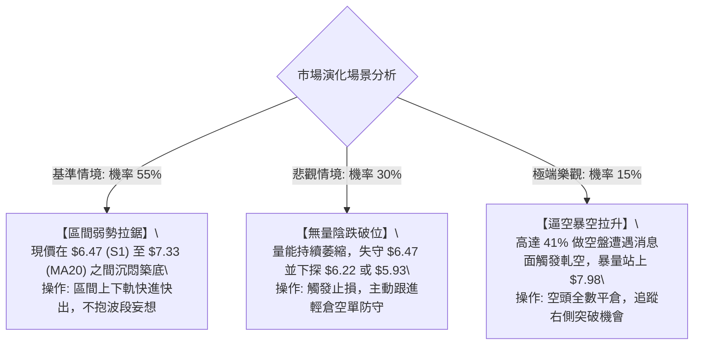

# ONDS 技術分析報告

> **報告日期**：2026-10-10 ｜ **語言**：繁體中文 ｜ **數據來源**：Yahoo Finance ｜ **當前價格**：$6.73

---

## 目錄

| 章節 | 內容 |
|------|------|
| [1. 技術面概覽](#1-技術面概覽) | 訊號儀表板、核心指標、評分卡 |
| [2. 趨勢分析](#2-趨勢分析) | 多時框趨勢、長中短期走勢 |
| [3. 圖表形態分析](#3-圖表形態分析) | 形態識別、K線組合、目標價 |
| [4. 支撐與阻力](#4-支撐與阻力) | 關鍵價位、斐波那契回調 |
| [5. 技術指標深度解讀](#5-技術指標深度解讀) | MA/RSI/MACD/布林/成交量 |
| [6. 動能與波動率](#6-動能與波動率) | 動能評估、ATR、Beta |
| [7. 多時框架總結](#7-多時框架總結) | 時框架評分矩陣、收斂結論 |
| [8. 交易策略建議](#8-交易策略建議) | 策略路由、情境階梯、主策略詳情 |
| [9. 風險提示與監控](#9-風險提示與監控) | 監控指標、風險場景、部位風控 |

---

## 1. 技術面概覽

### 🎯 技術訊號儀表板



### 📊 核心指標速覽表

| 指標類別 | 指標名稱 | 當前數值 | 訊號 | 解讀 |
|----------|----------|----------|------|------|
| **價格** | 當前價格 | $6.73 | 🔴 | 位於52週區間17.2%，跌破日線布林下軌 $6.83 |
| **均線** | MA20 | $7.33 | 🔴 | 現價低於MA20達 -8.21%，短線反壓沉重 |
| **均線** | MA50 | $7.95 | 🔴 | 現價低於MA50，中期下降趨勢未扭轉 |
| **均線** | MA200 | $9.41 | 🔴 | 長期牛熊分界線遙遙在上，偏離度達 -28.48% |
| **動能** | RSI(14) | 36.95 | 🟡 | 位於低檔弱勢區，但日線級別出現底背離醞釀 |
| **動能** | MACD | -0.214 | 🔴 | 快慢線均在零軸下，柱狀體 -0.035 空方佔優 |
| **擺動** | Stoch %K/%D | 6.72 / 10.24 | 🟢 | 極度超賣區，短線隨時具備超跌技術性抽頭動能 |
| **趨勢** | ADX(14) | 15.12 | 🟡 | 數值低於25，代表單邊暴跌趨緩，轉入低檔沉悶整理 |
| **量能** | 量比 / OBV | 0.61x / 疲弱 | 🔴 | 今日量 36.98M 低於均量，缺乏抄底買盤主動介入 |
| **波動** | ATR(14) | $0.39 | 🟡 | 佔股價 5.76%，單日絕對波幅收斂但波動率仍偏高 |

### 🏆 技術評分卡

```
╔══════════════════════════════════════════════════════════════════╗
║                 技術評分卡 — ONDS (2026-10-10)                   ║
╠══════════════════════════════════════════════════════════════════╣
║ 趨勢強度 (ADX/方向)   ████░░░░░░░░░░░░░░░░  20/100  🔴 極弱勢    ║
║ 動能指標 (RSI/MACD)   ████████░░░░░░░░░░░░  40/100  🟡 背離醞釀  ║
║ 支撐穩定度 (S1/S2)    ██████████░░░░░░░░░░  50/100  🟡 臨近考驗  ║
║ 成交量配合 (Volume)   ████░░░░░░░░░░░░░░░░  20/100  🔴 無量陰跌  ║
║ 形態完整度 (Patterns) ██████░░░░░░░░░░░░░░  30/100  🔴 破位下飄  ║
║ 均線系統 (MA Align)   ██░░░░░░░░░░░░░░░░░░  10/100  🔴 空頭排列  ║
╠══════════════════════════════════════════════════════════════════╣
║ 綜合技術評分          ███████░░░░░░░░░░░░░  35/100  🔴 偏空震盪  ║
╚══════════════════════════════════════════════════════════════════╝
```

---

## 2. 趨勢分析

### 🌐 多時框趨勢分析



### 📈 長期趨勢 — 12個月走勢圖（Unicode）

```
ONDS 月線走勢圖（2025-11 至 2026-10）
價格軸 ($)
$14.00 ┤                                      ● (2026-05: $13.22)
$12.00 ┤                                     / \
$10.00 ┤                    ●─────●         /   \
 $8.00 ┤    ●       ●      /       \   ●   /     ● (2026-06: $8.24)
 $7.00 ┤     \     / \    /         \ / \ /       \   ●─────● 
 $6.00 ┤      \   /   \  /           ●   ●         \ /       \   ●←現價 $6.73
 $5.00 ┤       ●       ●                            ●         ●
       └─────────────────────────────────────────────────────────────────
       25-11 25-12 26-01 26-02 26-03 26-04 26-05 26-06 26-07 26-08 26-09 26-10
收盤價:  7.90  9.76 10.36 10.08  9.04 10.04 13.22  8.24  7.49  7.66  7.33  6.73
```

#### 走勢特徵分析表格

| 階段區間 | 時間跨度 | 價格起訖 | 漲跌幅 | 核心技術結構與市場特徵 |
|----------|----------|----------|--------|------------------------|
| **第一階段：高檔震盪蓄勢** | 2025-11 ~ 2026-04 | $7.90 ➔ $10.04 | +27.09% | 股價於 $9.00~$10.36 構築高檔震盪箱型，成交量健康。 |
| **第二階段：終極誘多衝頂** | 2026-04 ~ 2026-05 | $10.04 ➔ $13.22 | +31.67% | 月線爆出單月歷史次高量，創下收盤高點 $13.22 後迅速反轉。 |
| **第三階段：暴跌去槓桿** | 2026-05 ~ 2026-06 | $13.22 ➔ $8.24 | -37.67% | 形成典型「流星倒轉」大陰線，跌破多條短期均線。 |
| **第四階段：階梯陰跌盤整** | 2026-06 ~ 2026-10 | $8.24 ➔ $6.73 | -18.33% | 反彈力道逐月遞減，高點不過 $7.66，低點持續下探至 $6.73。 |

### 📊 中期趨勢（週線分析）

中期走勢圖展示了 2026 年下半年的阻力與支撐分佈：

```
中期週線阻力與支撐架構圖 (2026-06 ~ 2026-10)
$9.24 ────────────────────────────────────────── 8月中旬次高點反壓 (波段頸線)
       \
$7.98 ───\────────────────────────────────────── R1 關鍵強阻力 / MA50反壓區
          \       ┌───┐ (9月反彈高點 $7.64)
$7.33 ─────\──────│   │───────────────────────── MA20 / 布林中軌動態反壓
            \     │   │     ┌───┐ (10月第一週 $7.24)
$6.73 ───────\────│───│─────│───│─────────────── 當前收盤價 ($6.73，跌破布林下軌)
              └───│───│─────│───│─────────────── 7月中旬前低點 $6.53
$6.47 ────────────┴───┴─────┴───┴─────────────── S1 支撐位 (近期波段低點聚類)
$6.22 ────────────────────────────────────────── S2 次級強支撐位
```

從週線收盤數據可見，自 2026-08-16 創出反彈高點 $9.24（MACD柱 +0.171）後，週線 MACD 柱已連續轉弱，並於 2026-10-11 當週轉負至 -0.035，週成交量萎縮至 2.44 億股，顯示中線空頭動能雖然未引發崩跌式放量拋售，但多頭毫無招架之力，呈現溫水煮青蛙式的「無量陰跌」。

### ⚡ 趨勢強度評估（ADX 解讀）



#### ADX 強度與行情對照表

| 指標變數 | 當前讀數 | 門檻區間 | 趨勢性質判定 | 交易涵義 |
|----------|----------|----------|--------------|----------|
| **ADX(14)** | **15.12** | `< 20` 極弱趨勢 | 震盪盤整市 | 不宜採用突破追單策略，極易產生假突破 |
| **+DI(14)** | **16.17** | `0 ~ 100` | 多方動能低迷 | 多頭缺乏主動買盤發動波段攻擊 |
| **-DI(14)** | **29.59** | `0 ~ 100` | 空方佔據優勢 | 空頭維持主控，但因ADX低，不會產生連續大跌單邊市 |
| **DI差值** | **-13.42** | 負向擴大 | 空方佔優但鈍化 | 需防範低檔空頭回補所引發的技術性假反彈 |

---

## 3. 圖表形態分析

### 🔍 形態識別系統



#### 形態識別與信心度評估表

| 形態類別 | 信心度 | 判斷依據（嚴格引用歷史與現有數據） | 完成度 | 目標價計算方式（附精確公式） |
|----------|--------|------------------------------------|--------|------------------------------|
| **下降通道（向下漂移旗形）** | **75%** | 上軌由 8/16 高點 $9.24 與 9/27 高點 $7.64 連接；下軌由 7/19 低點 $6.53 與當前 $6.73 連接。斜率向下，震盪走低。 | **85%** | 若跌破通道下軌支撐 S1 $6.47，量測跌幅目標：<br>形態頂部 $7.64 - (通道寬度 $7.64 - $6.53 = $1.11) = **$6.53**；進一步延伸測試 S2 **$6.22**。 |
| **雙重底（潛在底背離構建）** | **40%** | 前低為 2026-07-19 的低點收盤 $6.53，現價 $6.73 逼近此區間，但因尚未突破頸線，僅屬構想。 | **45%** | **訊號不足，僅做指標型解讀**（因信心度 < 50%）。若未來突破頸線 R1 $7.98，目標價為：<br>頸線 $7.98 + (形態高度 $7.98 - $6.47 = $1.51) = **$9.49**。 |
| **布林極限超賣破軌** | **85%** | 價格跌穿日線布林下軌 $6.83，%B 達到 -0.10，呈現標準「帶外收盤」的極限偏離。 | **100%** | 均值回歸理論目標：<br>回抽回歸測試中軌（MA20）= **$7.33**。 |

### 🕯️ 重要K線形態分析

| 週期/月份 | 收盤價 | K線形態特徵 | 技術解讀 | 訊號方向 |
|-----------|--------|-------------|----------|----------|
| **2026-05** | $13.22 | 帶長上影巨量流星大陽線 | 多頭竭盡全力推升至52週高點 $15.28 後遭遇機構沉重倒貨。 | 🔴 強烈見頂 |
| **2026-06** | $8.24 | 長陰貫穿跌破多條均線 | 獲利了結盤與恐慌停損出籠，直接宣告中長期牛市上升浪潮終結。 | 🔴 空方宣洩 |
| **2026-07** | $7.49 | 低檔帶長下影之十字鎚子線 | 下探 52 週低檔波段低位 $6.53 後引發買盤抵抗，短線浮現初步支撐。 | 🟢 觸底反彈 |
| **2026-08** | $7.66 | 衝高回落十字星線 | 反彈上衝至 $9.24 遭遇 MA50（$7.95）附近強大套牢賣壓，多頭無功而返。 | 🟡 滯漲受阻 |
| **2026-09** | $7.33 | 實體極窄的小陰孕線 | 成交量急劇萎縮，多空雙方在 $7.30~$7.60 間陷入膠著，動能休眠。 | 🟡 變盤前兆 |
| **2026-10 (迄今)** | $6.73 | 破位下挫之中陰線 | 跌破 9 月盤整低點，測試 7 月份支撐平台，短期空方再次微幅破位。 | 🔴 弱勢尋底 |

### 📉 ASCII 走勢形態示意圖

```
下降通道與超賣破位形態展示
價格 ($)
 $9.24 ┼───────● (8月中旬高點)
       │        \
 $8.58 ┼─────────\─────────────────────────── R3 強壓
       │          \     下降通道上軌
 $7.98 ┼───────────\──────● (9月高點 $7.64)────── R1 阻力位
       │            \      \
 $7.33 ┼─────────────\──────\──────● (MA20 / 中軌)
       │              \      \      \
 $6.83 ┼───布林下軌────\──────\──────\───────
 $6.73 ┼───────────────\──────\───────● ◄─── 現價 $6.73 (布林下軌外破位)
       │                \      \
 $6.47 ┼─────────────────●──────●──────────── S1 支撐位 (7月低點 $6.53 聚類)
       │                (7月中旬低點)   下降通道下軌
 $6.22 ┼───────────────────────────────────── S2 強支撐位
```

---

## 4. 支撐與阻力

### 🗺️ 關鍵價位分布圖（Unicode）

```
ONDS 關鍵價位結構分布圖 (由 OHLCV 精確計算)
══════════════════════════════════════════════════════════════════
 $8.58 ║████████████████████████║ 強阻力 R3 (+27.49%) — 密集換手反壓
 $8.31 ║████████████████        ║ 阻力 R2   (+23.55%) — 波段反彈高點聚類
 $7.98 ║████████████████████    ║ 關鍵阻力 R1 (+18.57%) — MA50 ($7.95) 共振帶
 $7.33 ║▓▓▓▓▓▓▓▓▓▓▓▓            ║ 動態反壓 MA20 / 布林中軌
 $7.16 ║░░░░░░░░░░░░░░░░        ║ 斐波那契 78.6% 回調位
───────╫────────────────────────╫─────────────────────────────────
 $6.73 ╠════════════════════════╣ ◄ 當前市價 (跌破布林下軌 $6.83)
───────╫────────────────────────╫─────────────────────────────────
 $6.47 ║▓▓▓▓▓▓▓▓▓▓▓▓▓▓▓▓        ║ 近期核心支撐 S1 (-3.94%) — 7月波段低點
 $6.22 ║████████████████████    ║ 次級強支撐 S2   (-7.58%) — 波段低點聚類
 $5.93 ║████████████████████████║ 終極強支撐 S3   (-11.89%) — 避險防守底線
 $4.95 ║████████████████████████║ 52週歷史低點 (Fib 100.0%)
══════════════════════════════════════════════════════════════════
```

### 🚧 阻力位分析表

所有價位嚴格引用技術數據中「關鍵價位」區塊之波段聚類計算數值：

| 阻力級別 | 價位 | 與現價距離 | 形成原因及技術共振 | 突破難度 | 重要性評級 |
|----------|------|------------|--------------------|----------|------------|
| **R1** | **$7.98** | +18.57% | 近期波段反彈高點聚類；與日線 MA50（$7.95）高度重合，且臨近布林上軌（$7.83）。 | 極高 | ★★★★★ |
| **R2** | **$8.31** | +23.55% | 6月份崩跌後的初次反彈平台高點聚類，大量被套牢籌碼沉澱區。 | 高 | ★★★★☆ |
| **R3** | **$8.58** | +27.49% | 日線 MA120（$8.67）下方之波段高點聚類，屬於多空長期結構轉換點。 | 極高 | ★★★☆☆ |

### 🛡️ 支撐位分析表

所有價位嚴格引用技術數據中「關鍵價位」區塊之波段聚類計算數值：

| 支撐級別 | 價位 | 與現價距離 | 形成原因及技術共振 | 守住機率 | 重要性評級 |
|----------|------|------------|--------------------|----------|------------|
| **S1** | **$6.47** | -3.94% | 近一年波段低點聚類；對應 2026-07-19 週線低位收盤 $6.53 之防守頸線。 | 60% | ★★★★★ |
| **S2** | **$6.22** | -7.58% | 波段低點聚類次級支撐，下檔多頭最後的結構性護城河。 | 75% | ★★★★☆ |
| **S3** | **$5.93** | -11.89% | 逼近 $6.00 整數心理關口之聚類強支撐，若失守將直接滑向 52W 低點 $4.95。 | 85% | ★★★☆☆ |

### 📐 斐波那契回調位分析

依據 52 週極值區間（最低 $4.95 至 最高 $15.28，垂直落差 $10.33）計算之黃金分割水準：



#### 斐波那契落點深入解讀

1. **現價區間定位**：現價 **$6.73** 已正式跌破 78.6% 回調位 **$7.16**，落入 **$7.16 (78.6%) 至 $4.95 (100.0%)** 的深度回調區。
2. **回調結構意涵**：在道氏理論與斐波那契幾何學中，跌破 61.8%（$8.90）即代表前波上升多頭結構遭到破壞；而進一步失守 78.6%（$7.16）則確立了市場已經將 2025-2026 年初的所有估值溢價全數回吐。
3. **反彈壓力確認**：未來多頭若要發動任何技術性修復行情，斐波那契 78.6% 回調位 **$7.16** 將成為由支撐轉化成的第一道反壓，未越過 $7.16 之前，所有上漲均僅能以極弱勢超跌反彈視之。

---

## 5. 技術指標深度解讀

### 🎛️ 指標訊號總覽



### 📈 移動平均線排列分析



#### 均線數據明細與技術意涵

| 均線週期 | 當前價位 | 現價乖離率 | 排列狀態 | 趨勢解讀 |
|----------|----------|------------|----------|----------|
| **MA 5** | $7.12 | -5.48% | 空頭排列 | 極短線受制於 5 日線，連續向下發散，短壓顯著。 |
| **MA 10** | $7.24 | -7.11% | 空頭排列 | 扣抵高值，下行斜率陡峭，壓制反彈動能。 |
| **MA 20** | $7.33 | -8.21% | 空頭排列 | 短期生命線持續下彎，構成第一道重要防線阻力。 |
| **MA 50** | $7.95 | -15.35% | 空頭排列 | 中期趨勢線，目前與波段阻力 R1 $7.98 共振。 |
| **MA 120** | $8.67 | -22.35% | 空頭排列 | 中長期均線下壓，套牢籌碼在此區間高度堆積。 |
| **MA 200** | $9.41 | -28.48% | 空頭排列 | 長期牛熊分水嶺，現價深幅偏離年線，呈現負乖離過大。 |

均線系統呈標準的**完美空頭排列**（MA5 < MA10 < MA20 < MA50 < MA120 < MA200），這表明中長期的空頭拋壓依然籠罩。然而，現價相對於 MA200 的負乖離高達 -28.48%，相對於 MA20 的負乖離達 -8.21%，在統計學上已經進入「負乖離極端警戒區」，隨時可能引發向 MA20 均值靠攏的修復走勢。

### 📉 RSI(14) 分析

進度條展示當前 RSI 位置：
```
RSI(14): 36.95  [░░░░░░░░░░███████░░░░░░░░░░░░░] 36.95% (弱勢偏空區間)
超賣臨界: 30.00 | 中性平衡: 50.00 | 超買臨界: 70.00
```

#### 底背離確認與評估

在數據中明確標記：`RSI 背離: ⚠️ 底背離 (Bullish Divergence)`。
- **背離形態確認**：觀察 2026-06-28 至 2026-07-05 期間，週線收盤價由 $7.83 跌至 $7.41，RSI 為 21.3~21.8；隨後在 2026-07-19 價格下殺至 $6.53 時，週線 RSI 卻逆勢上升至 35.0。當前日線價格跌至 $6.73，但日線 RSI(14) 仍守在 36.95，並未跟隨價格跌破前低指標讀數。
- **背離結論**：此現象構成了典型的**二度底背離**。這說明空方的邊際拋售力道正在減弱，價格的進一步走低是市場成交量匱乏下的「滑落」而非主動恐慌拋盤推動，為短線反彈積蓄了潛在動能。

### 📊 MACD(12/26/9) 訊號解讀



- **絕對數值分析**：DIF 快線為 -0.214，DEA 訊號線為 -0.178，快線位於慢線下方且雙雙低於零軸，表明大週期依然完全由空頭掌控。
- **動能柱狀圖變化**：MACD 柱狀體目前為 **-0.035**，相較於 9 月下旬短暫轉正（2026-09-27 達 +0.062），目前已再度翻黑下行，顯示反彈動能衰退，短線重回空頭微幅放量下探格局。若要見到有效止跌，必須等待柱狀體負值開始收斂（如回升至 -0.010 以上）並形成零軸下二次金叉。

### 📦 布林通道分析

```
日線布林通道結構展示 (20日, 2倍標準差)
$7.83 ┼──────────────────────────────── 上軌 (波段反彈極限)
      │
$7.33 ┼──────────────────────────────── 中軌 (MA 20 / 均值回歸目標)
      │
$6.83 ┼──────────────────────────────── 下軌 (常態統計波動下限)
      │
$6.73 ┼───────● ◄─── 現價 ($6.73) 跌穿下軌，%B = -0.10
```

- **軌道狀態**：上軌 $7.83、中軌 $7.33、下軌 $6.83。通道帶寬為 $1.00（寬度約 13.6%），處於收斂後的水平下移階段。
- **%B 極限指標解讀**：當前 %B 讀數為 **-0.10**（常態為 0 至 1 之間，0 代表剛好觸及下軌，負值代表跌破下軌）。這表明市場目前出現了統計學上的**「帶外超跌」**異常值。根據均值回歸理論，在 ADX 低於 25 的環境下，跌破布林下軌往往難以形成連續暴跌單邊行情，通常會在 1-3 個交易日內被拉回通道內部（回歸測試中軌 $7.33）。

### 💹 成交量分析（量價配合度）

```
量能指標比對進度條：
今日成交量: 36.98M  [██████░░░░░░░░░░░░░░] 60.8% (相對於20日均量)
20日均量:   60.78M  [██████████░░░░░░░░░░] 基準 (100%)
50日均量:   65.48M  [███████████░░░░░░░░░] 107.7%
```

- **量比分析**：最新成交量為 36,986,900 股，相較於 20 日均量 60,786,100 股，**量比僅為 0.61x**；相較於 50 日均量更是明顯縮小。這是一種標準的**「無量陰跌」**特徵。
- **OBV 走勢評估**：數據顯示 `OBV < MA → 量能疲弱`。能量潮指標持續下行且位於其均線下方，證明在當前價格下探過程中，尚未看到機構級主力資金進行主動性「左側承接吸籌」，市場缺乏堅實的量能底座。

---

## 6. 動能與波動率

### ⚡ 動能評估四象限

```
                    動能與波動率定位矩陣
        強動能 ↑
               │   象限 I (突破攻擊)    │   象限 III (高波博弈)
               │   強動能 / 低波動      │   強動能 / 高波動
               │                        │
        ───────┼────────────────────────┼───────────────────────
               │   象限 II (沉悶休眠)   │   象限 IV (弱勢尋底) ◄── [ONDS 當前定位]
               │   弱動能 / 低波動      │   弱動能 / 高波動 (Beta 2.92)
        弱動能 ↓                        │
               └────────────────────────┴───────────────────────
               低波動 ───────────────→ 高波動
```

#### 象限狀態評估表

| 象限分佈 | 動能水準 | 波動特徵 | ONDS 定位 | 策略應對方針 |
|----------|----------|----------|-----------|--------------|
| **Q1 (最佳擴張)** | 強動能 (ADX>25) | 低波動 (ATR收斂) | 否 | 順勢加碼追擊波段 |
| **Q2 (盤整蓄勢)** | 弱動能 (ADX<25) | 低波動 (Beta<1.0) | 否 | 網格交易或區間高拋低吸 |
| **Q3 (強勢分歧)** | 強動能 (單邊市) | 高波動 (Beta>2.0) | 否 | 緊盯追蹤止損，博取主升浪 |
| **Q4 (弱勢尋底)** | **弱動能 (ADX 15.12)** | **高波動 (Beta 2.92)** | **✓ (處於此區)** | **嚴禁重倉，防範高Beta放大下行風險，僅宜低吸博取反彈** |

### 📊 ATR 波動率分析

- **ATR(14) 當前數值**：**$0.39**，佔當前股價 $6.73 的比例達 **5.76%**。
- **技術涵義解讀**：這意味著 ONDS 每日的正常隨機噪聲波動空間約為 ±$0.39。任何日內小於 $0.39 的波動均不具備方向性突破意義。
- **交易風控設置標準**：
  - **極窄止損距離（1.0 × ATR）**：$0.39，止損位宜設在進場點下方 $0.39。
  - **常規風控距離（1.5 × ATR）**：**$0.58**（$0.39 × 1.5），適合做為隔夜波段交易的防守緩衝墊。
  - **寬鬆濾網距離（2.0 × ATR）**：$0.78，防止日內洗盤的極限容忍度。

### 📐 Beta 與市場相關性

- **Beta 係數**：**2.922**（極高 Beta 屬性）。
- **市場特徵分析**：ONDS 具備超高波動性股票的典型特質。當納斯達克指數或整體科技板塊波動 1% 時，ONDS 理論上會產生近 3% 的同向放大波幅。
- **空頭市場風險**：在當前大盤環境下，若美股市場整體面臨回調，ONDS 因高達 41.0% 的做空比例（Short % Float）與高 Beta，將面臨被槓桿資金放大拋售的壓力；反之，一旦大盤出現反彈或個股浮現利多，高達 41.0% 的空頭浮額亦可能引發極其劇烈的軋空（Short Squeeze）反抽。

---

## 7. 多時框架總結

### 📋 時框架評分表

| 時框架 | 趨勢方向 | 動能表現 | 均線排列 | 圖表形態 | 綜合評分 | 操作建議 |
|--------|----------|----------|----------|----------|----------|----------|
| **月線 (長期)** | 🔴 偏空回調 | 🟡 退潮鈍化 | 🟡 仍高於起漲 | 頂部回吐 | **42/100** | 逢高獲利了結，不宜長抱 |
| **週線 (中期)** | 🔴 下降通道 | 🔴 MACD柱轉負 | 🔴 空頭排列 | 下降旗形 | **30/100** | 嚴格防守，中線未見底部信號 |
| **日線 (短期)** | 🟡 跌深超賣 | 🟢 RSI底背離 | 🔴 均線死叉 | 跌破布林下軌 | **38/100** | 僅適合輕倉博取均值回歸反彈 |

### 🔲 綜合訊號矩陣

```
時框架維度      趨勢訊號    動能訊號    量價配合    超買超賣    最終矩陣指向
──────────────────────────────────────────────────────────────────────
長期 (月線)       🔴 空       🟡 中       🟡 中       🟡 中性      🔴 長線回調
中期 (週線)       🔴 空       🔴 空       🔴 空       🟡 中性      🔴 中線尋底
短期 (日線)       🔴 空       🟢 偏多     🔴 空       🟢 極度超賣  🟡 超跌待彈
──────────────────────────────────────────────────────────────────────
多維共振結論：大週期向下壓制，小週期指標超跌鈍化，呈現「長空格多」的結構衝突。
```

### ⚖️ 多時框收斂結論

依據多時框收斂規則進行系統性整合：
1. **行情性質判定**：當前日線 **ADX(14) 讀數為 15.12**，遠低於 25 的趨勢行情門檻。依規則，市場當前確立為**「盤整行情（ADX < 25）」**，單邊破位暴跌動能實質已大幅衰竭。
2. **主導時框與優先級**：在盤整行情中，中長期的單邊趨勢壓制暫時退居次席，市場核心轉向**日線布林通道上下軌（$6.83 至 $7.83）以及近期波段高低點所界定的交易區間**。
3. **方向性收斂結論**：
   - **最終結論：【中性觀望，偏空防守】（綜合技術評分 35/100，偏空區間）**。
   - 儘管短期日線出現極度超賣與 RSI 底背離，具備反彈訴求，但因週線空頭主導且成交量嚴重萎縮（0.61x 量比），反彈空間極度受限於布林中軌 MA20（$7.33）與 R1（$7.98）。因此，絕不可採取積極追多策略，交易重心以防範跌破支撐 S1（$6.47）為主。

---

## 8. 交易策略建議

### 🗺️ 策略決策流程圖



### 🧭 策略路由（依評分卡分流）

> **當前主策略方向 = 【逢高偏空防守與破位空頭跟進】（依綜合評分 35/100）**
> 
> 由於綜合技術評分僅為 **35/100**，進入 ≤40 的偏空評級，依照交易紀律，主策略必須以**空頭與防守思路**為主導。任何多頭操作均被嚴格定義為「高風險超跌反抽博弈」，不得重倉參與。

### 🎯 價格情境階梯（Price Scenarios）

價位嚴格引用「關鍵價位」區塊與斐波那契回調水準計算之實際數值：

| 觸發條件 | 下一目標 | 後續延伸 | 情境技術涵義 |
|----------|----------|----------|--------------|
| **向上反彈突破 R1 $7.98** | R2 **$8.31** | R3 **$8.58** | 短線徹底扭轉空頭排列，回補跌幅，展開中期修復級別反彈。 |
| **站穩 MA20 $7.33 區間** | R1 **$7.98** | — | 超跌均值回歸，在日線布林通道內部（$6.83~$7.83）進行寬幅震盪。 |
| **有效跌破 S1 $6.47** | S2 **$6.22** | S3 **$5.93** | 跌破 7 月波段平台低點，形態破位，向下打開通往整數關口的下跌空間。 |

### 📊 情境機率分佈

| 價格情境走向 | 機率預估 | 主要技術指標支撐依據 |
|--------------|----------|----------------------|
| **情境一：低檔區間震盪（均值回歸）** | **55%** | **ADX 為 15.12** 確立弱趨勢盤整；現價跌穿布林下軌（%B=-0.10）引發抽頭吸力；隨機指標極度超賣。 |
| **情境二：跌破 S1 順勢探底** | **30%** | **均線系統呈標準空頭排列**；-DI(29.59) 遠高於 +DI(16.17)；OBV 疲軟顯示無買盤支撐。 |
| **情境三：向上強勢反轉突破 R1** | **15%** | **量能極度不足**（量比僅 0.61x）；週線 MACD 柱狀體翻黑下行，難以支撐大幅度反轉。 |

### 🔴 主策略詳情（空頭主導策略）

#### 策略 A：布林中軌 / MA20 反彈受阻做空策略（勝率型）
- **進場條件**：股價因超跌反彈回抽日線布林中軌 MA20（$7.33）或斐波那契 78.6% 位（$7.16），若在 $7.16~$7.33 區間出現長上影線或日線收陰滞漲。
- **進場價格**：**$7.25**（反彈進入阻力帶確認受阻時進場）
- **止損價格**：**$7.85**（設於布林上軌 $7.83 上方，距離進場點 $0.60，約 1.54 × ATR）
- **目標價 T1**：**$6.73**（回踩當前低點水平，獲利率 +7.17%）
- **目標價 T2**：**$6.47**（下探關鍵支撐位 S1，獲利率 +10.76%）
- **風險報酬比**：
  - 至 T1：`($7.25 - $6.73) / ($7.85 - $7.25) = $0.52 / $0.60 = 0.87 : 1`
  - 至 T2：`($7.25 - $6.47) / ($7.85 - $7.25) = $0.78 / $0.60 = 1.30 : 1`
- **預期成功機率**：**60%**
- **建議倉位**：**10%**

#### 策略 B：關鍵支撐破位順勢空單追擊策略（突破型）
- **進場條件**：股價放量跌破前波平台關鍵支撐 S1 **$6.47**，且日線收盤確認收於 $6.47 下方。
- **進場價格**：**$6.42**（跌破 S1 確認後掛單進場）
- **止損價格**：**$6.81**（設於跌破前之布林下軌 $6.83 附近，止損距離 $0.39，剛好 1.0 × ATR）
- **目標價 T1**：**$6.22**（測試次級強支撐 S2，獲利率 +3.12%）
- **目標價 T2**：**$5.93**（測試終極強支撐 S3，獲利率 +7.63%）
- **風險報酬比**：
  - 至 T1：`($6.42 - $6.22) / ($6.81 - $6.42) = $0.20 / $0.39 = 0.51 : 1`
  - 至 T2：`($6.42 - $5.93) / ($6.81 - $6.42) = $0.49 / $0.39 = 1.26 : 1`
- **預期成功機率**：**50%**
- **建議倉位**：**5%**（突破追單風險較高，採輕倉防守）

### 🟢 反向風險觸發點（多頭逆勢反抽提示）

本小節僅作為空頭部位之**風控預警與對沖停損依據**，非推薦主要多頭策略：
1. **多頭反轉翻多觸發價**：若股價收盤帶量（單日成交量 > 6,000 萬股，量比回升至 1.0x 以上）**有效突破並站穩 R1 $7.98 及 MA50（$7.95）**，則整體空頭架構被徹底破壞，所有空頭部位必須無條件強制平倉離場。
2. **極限超跌搶反彈條件（僅限短線激進交易者）**：
   - 僅當價格測試 **S1 $6.47** 獲得長下影線確認未跌破時，方可用 **3% 迷你部位** 於 **$6.50** 介入。
   - 嚴格止損價位：**$6.20**（跌破 S2 $6.22 即砍倉）。
   - 反彈目標：**$7.16**（斐波那契 78.6% 位）與 **$7.33**（MA20）。

### ⭐ 整體訊號強度評星

```
做多訊號強度：★★☆☆☆  (2/5星 — 僅具備超跌與背離支撐，缺乏趨勢與量能)
做空訊號強度：★★★★☆  (4/5星 — 均線與週線全面壓制，順應主級別空頭)
整體可信度：  ★★★☆☆  (3/5星 — 受制於低 ADX 盤整環境，突破連貫性低)
```

---

## 9. 風險提示與監控

### ✅ 關鍵監控指標 Checklist

```
╔══════════════════════════════════════════════════════════════════╗
║               ONDS 技術面即時風控監控清單 (Checklist)           ║
╠══════════════════════════════════════════════════════════════════╣
║ [ ] 價格防守線：每日收盤價是否跌破支撐位 S1 $6.47               ║
║ [ ] 均值回歸位：價格回抽測試 MA20 $7.33 時的量價反應 (是否滯漲) ║
║ [ ] 波動率警戒：單日真實波幅是否超過 1.5 × ATR ($0.58)          ║
║ [ ] 量能突破點：單日成交量是否放大至 60.78M (突破 20 日均量線)   ║
║ [ ] 軋空風控點：Short Float 高達 41.0%，需監控借券費率與空頭回補║
║ [ ] 擺動指標驗證：日線 RSI(14) 能否突破 45 關鍵中性分水嶺       ║
║ [ ] 趨勢重啟確認：ADX(14) 是否由 15.12 回升至 25 以上 (趨勢發動)║
╚══════════════════════════════════════════════════════════════════╝
```

### ⚠️ 風險場景分析



### 🛡️ 風險管理重要提醒

1. **41.0% 極高空頭部位（Short Float）的「雙面刃效應」**：
   - 當前 ONDS 浮動股中高達 41.0% 被借券做空，天數比（Short Ratio）為 3.83 天。
   - **下行推力**：做空力量沉重，造成盤面買盤萎縮、均線持續受壓。
   - **軋空爆發力**：一旦公司有突發利多或科技板塊劇烈反彈，空頭回補將引發「流動性擠壓」，導致股價在極短時間內向上脫離技術阻力位。因此，**空頭部位絕不可忽視止損點（必須堅決執行 $7.85 止損）**。
2. **高 Beta（2.92）之部位規模折算公式**：
   - 普通標的（Beta ≈ 1.0）單筆交易若承擔總資金 2% 的風險，在操作 ONDS 時，因其波動率為市場大盤的近 3 倍，**實體倉位必須降至常規規模的 1/3（即單筆最大資金配置不宜超過 5%~10%）**。
3. **ATR 動態止損紀律**：
   - 現行 ATR(14) 為 **$0.39**。在盤中交易時，凡價格波動在 $0.39 以內，切勿頻繁止損停利，避免被隨機噪聲洗盤；但一旦出現單日逆向收盤偏離超過 1.5 倍 ATR（**$0.58**），則必須強制退場觀望。

---

## 📋 報告總結

```
╔══════════════════════════════════════════════════════════════════╗
║                    ONDS 技術分析報告總結                         ║
╠══════════════════════════════════════════════════════════════════╣
║ 報告日期：2026-10-10                                             ║
║ 當前價格：$6.73                                                  ║
║ 分析評級：🔴 偏空防守 / 弱勢震盪 (技術評分: 35/100)              ║
╠══════════════════════════════════════════════════════════════════╣
║ 關鍵結構結論：                                                   ║
║ ├─ 長期趨勢：🔴 高位回吐，斐波那契 78.6% ($7.16) 失守           ║
║ ├─ 中期趨勢：🔴 下降通道壓制，週線 MACD 翻黑，均線空頭排列      ║
║ ├─ 短期趨勢：🟡 跌破布林下軌 (%B=-0.10) 極度超賣，醞釀低位拉鋸  ║
║ ├─ 關鍵支撐：S1: $6.47 ｜ S2: $6.22 ｜ S3: $5.93                 ║
║ ├─ 關鍵阻力：R1: $7.98 ｜ R2: $8.31 ｜ R3: $8.58                 ║
║ └─ 均線反壓：MA20: $7.33 ｜ MA50: $7.95 ｜ MA200: $9.41          ║
╠══════════════════════════════════════════════════════════════════╣
║ 最優策略組合建議：                                               ║
║ 1. 🥇 最佳機會（空頭）：等待反彈至 $7.16~$7.33 (MA20) 受阻做空   ║
║    進場: $7.25 ｜ 止損: $7.85 ｜ 目標: $6.47 ｜ 風報比: 1.30:1   ║
║ 2. 🥈 次選機會（防守）：跌破 S1 $6.47 後輕倉跟進破位空單         ║
║    進場: $6.42 ｜ 止損: $6.81 ｜ 目標: $5.93 ｜ 風報比: 1.26:1   ║
║ 3. 🥉 保守選擇（觀望）：空手觀望，靜待 ADX>25 且成交量放大確認底 ║
╚══════════════════════════════════════════════════════════════════╝
```

---

> ⚠️ **免責聲明**：本報告為依據客觀量化技術指標與歷史走勢數據生成之技術分析報告。所有提及之價位、形態與指標判斷僅供學術研究與交易架構參考，不構成任何形式的投資買賣建議。市場存在極高不確定性，高 Beta 股票波動劇烈，投資人應自行評估風險並獨立承擔交易後果。

---

*報告生成時間：2026-10-10 ｜ 數據來源：Yahoo Finance ｜ 分析框架：多時框技術分析體系*