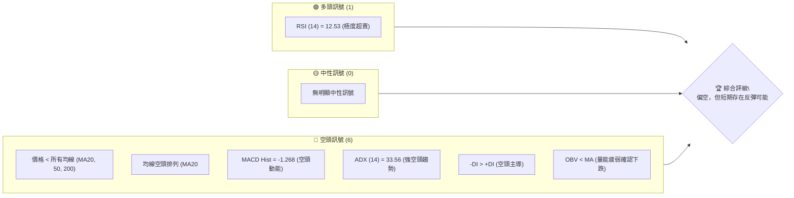
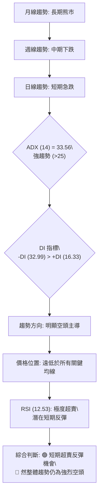
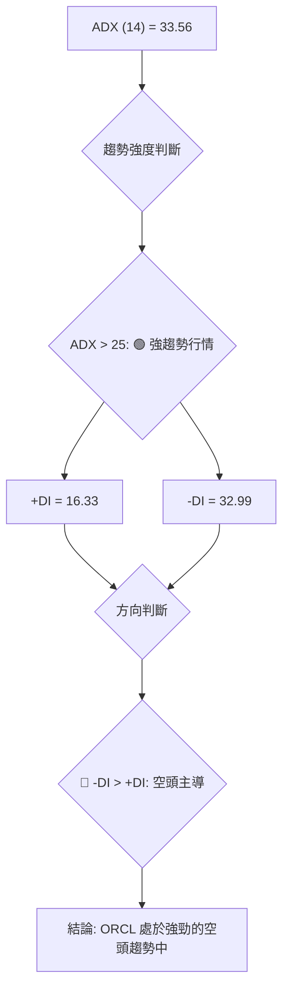
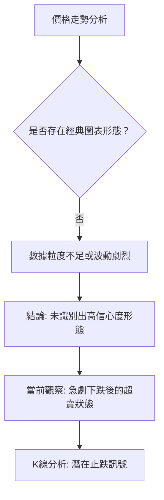
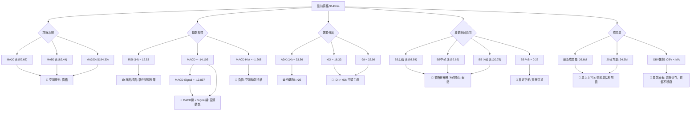
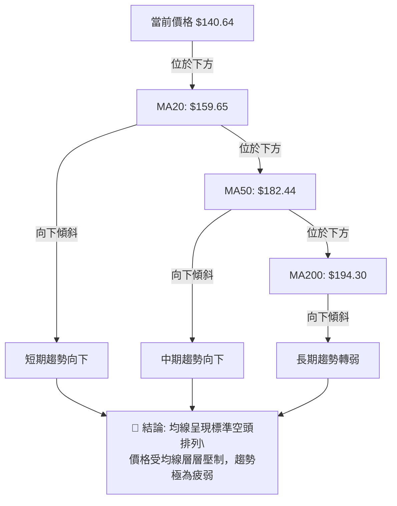
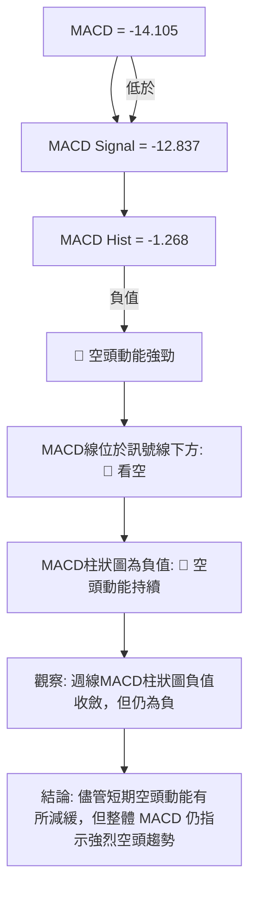
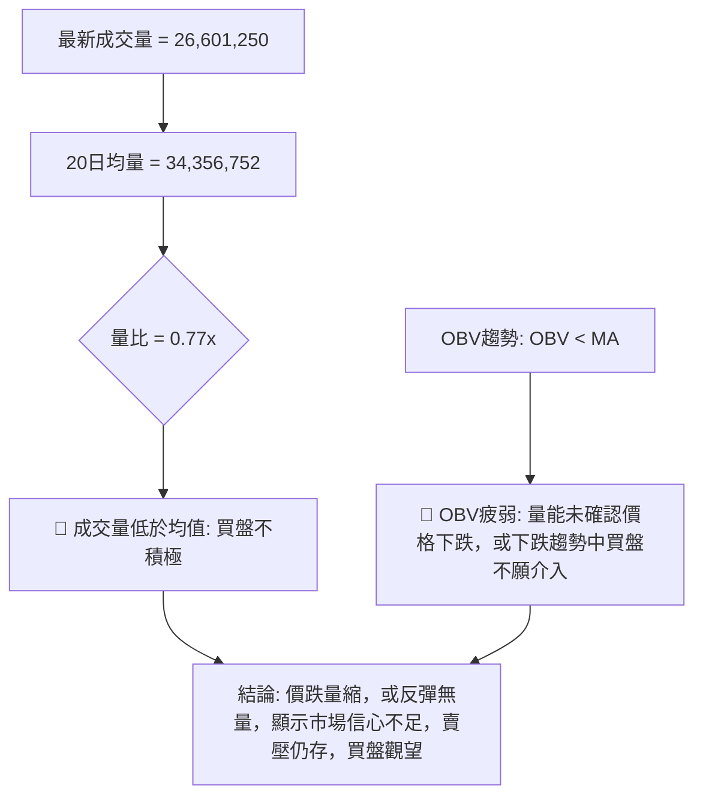
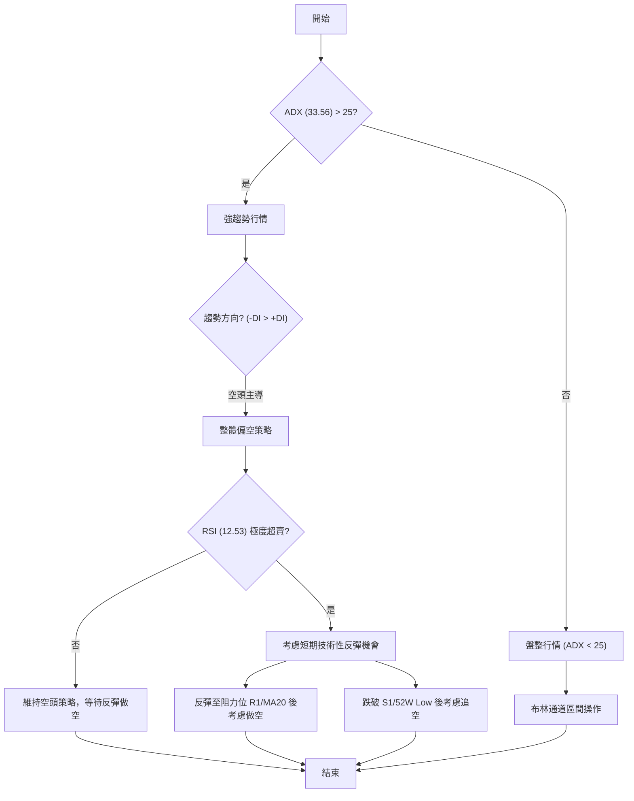
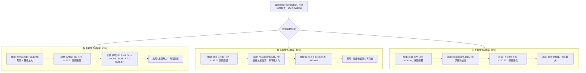

<details>
<summary>📊 靜態圖表 (點擊展開)</summary>

</details>

<html>
<head><meta charset="utf-8" /></head>
<body>
    <div style="height:500px; width:100%;">                        <script>window.PlotlyConfig = {MathJaxConfig: 'local'};</script>
        <script charset="utf-8" src="https://cdn.plot.ly/plotly-3.7.0.min.js" integrity="sha256-jvTGqxNp8AGWEcvNLVuKr+8j5dGe9Yw51LQkmDH+IYA=" crossorigin="anonymous"></script>                <div id="candlestick-chart" class="plotly-graph-div" style="height:100%; width:100%;"></div>            <script>                window.PLOTLYENV=window.PLOTLYENV || {};                                if (document.getElementById("candlestick-chart")) {                    Plotly.newPlot(                        "candlestick-chart",                        [{"close":{"dtype":"f8","bdata":"AAAAoLFkc0AAAAAAvg9zQAAAACDAAHJAAAAAAECEcUAAAAAgLXlxQAAAAEAhYXFAAAAAoAzccUAAAABAadhxQAAAAMClrnFAAAAAQN0EckAAAADglpBxQAAAAMAJ1nFAAAAA4PdhckAAAACAlCJyQAAAAEAUEXNAAAAA4EuCckAAAACggstyQAAAAAAoYHNAAAAAgG4IckAAAADggihxQAAAAIBXCHFAAAAAAOLgcEAAAABgT1ZxQAAAAMD4iXFAAAAA4GJrcUAAAACAWmJxQAAAACC4CnFAAAAAYPLNb0AAAABAnkFwQAAAAGBf7G9AAAAAYJK5bkAAAADgZf1uQAAAAIARL25AAAAAAC2fbUAAAACg79BtQAAAAGCbPG1AAAAAgEkabEAAAABAuu9qQAAAAKASl2tAAAAAgE44a0AAAABARkxrQAAAAGAD7GtAAAAAgKsVakAAAACgjptoQAAAAGC7y2hAAAAA4LlkaEAAAADgD2BpQAAAAGCpAGlAAAAAoKbgaEAAAADguOVoQAAAAODat2lAAAAAoAmJakAAAAAgC\u002fBqQAAAAMDbTWtAAAAAYDxta0AAAADAJJxrQAAAAABpnmhAAAAA4PaEZ0AAAACA6ORmQAAAAMAgW2dAAAAAwCkYZkAAAABA7ElmQAAAAGBaxGdAAAAAgIOPaEAAAACgKS9oQAAAAEBOc2hAAAAAICeDaEAAAABAbjBoQAAAAGBuamhAAAAAwIghaEAAAADA4zpoQAAAAMAA2GdAAAAA4MT8Z0AAAABA7d9nQAAAAGDSemdAAAAAQJWkaEAAAADgVWhpQAAAAMBiHGlAAAAAgI0IaEAAAAAgEZFnQAAAAMB4uGdAAAAAoIJVZkAAAABAkpVlQAAAAGA3HmZAAAAAoM39ZUAAAACAl6VmQAAAAAD8tWVAAAAAIEBzZUAAAADAz\u002fpkQAAAAOAIbmRAAAAA4GXeY0AAAABAHTNjQAAAAMDjNGJAAAAAQBLxYEAAAABgi7phQAAAAMAgcGNAAAAA4P7YY0AAAADgPYJjQAAAAOChbGNAAAAAwPDgY0AAAACg3hxjQAAAACDIYmNAAAAAAIpuY0AAAABgsmFiQAAAACCPimFAAAAAIAwkYkAAAACgqFtiQAAAAMCPqGJAAAAAAIgMYkAAAACA4IZiQAAAACBAf2JAAAAAQAbqYkAAAABg7TZjQAAAACDG\u002fGJAAAAAwEjQYkAAAADApItiQAAAAICjP2RAAAAAYMzBY0AAAADAGEFjQAAAAABtXGNAAAAAAMAzY0AAAADg3fpiQAAAAEAgTmNAAAAAoIqUYkAAAACgoChjQAAAAIA8QmJAAAAAADwgYkAAAADgObphQAAAACAgVmFAAAAA4Ms6YUAAAABA30JiQAAAACAhB2JAAAAAoKwrYkAAAADg+hBiQAAAAKCqxWFAAAAA4DzVYUAAAADAOSxhQAAAAGCPM2FAAAAAQJNiY0AAAACg6k1kQAAAAMAUJ2VAAAAAQBg3ZkAAAACgf85lQAAAAADcHmZAAAAAQFeRZkAAAADgMltnQAAAAEBn9WVAAAAAgLyVZUAAAAAgiItlQAAAAABPrGRAAAAAgGJoZEAAAABAkxpkQAAAAEB\u002fZ2VAAAAAQEd1ZkAAAAAgoxZnQAAAACBvK2hAAAAAwEo9aEAAAABAqWhoQAAAAABgJWhAAAAAQNVFZ0AAAACARKNnQAAAAKDRXWhAAAAAYP4IaEAAAABA0T5nQAAAAMCWmmZAAAAA4D5wZ0AAAABAlqNnQAAAACBA7WdAAAAAYIAMaEAAAAAAiclnQAAAACDNX2lAAAAAYOkfbEAAAAAgReluQAAAACBtd25AAAAAwAGxbEAAAAAAqXBtQAAAAMANnmpAAAAAoL1iakAAAABgFqNpQAAAAOD9EWlAAAAAoMbuZkAAAACAu+9mQAAAAMAb\u002f2dAAAAAoKp1Z0AAAABgmdxmQAAAAKDV9GZAAAAAYNHOZUAAAAAAzJJkQAAAAMB7n2NAAAAAYM79YkAAAABge4BiQAAAAGDtZ2JAAAAAgFdBYkAAAADgMMBhQAAAACAUeWFAAAAAAF\u002foYUAAAACgfaNhQAAAACAYgGFAAAAAQAr3YUAAAADgepRhQA=="},"high":{"dtype":"f8","bdata":"mrf4Z2YVdEC+vSrnLU9zQJQ35\u002f8hdnJA3P\u002fVXP0qckCp61OeHaxxQCJlzNnKjHFAY9bkY43rcUCl84LHVTpyQLwFcGcdNXJAbR6X7WJVckDGWr9+ph5yQPMB8kPqA3JA1Rvm9YOhckBrfY3vewxzQCTZxzy1O3NA\u002fUgGKTDYckBnMMHynkBzQF71pJBW93NAMSiQGPjVckBm1gq0oOdxQCIA2Fn0WXFAtUaoONQocUCRUwCvU4ZxQKnFiVQkx3FAWbGMXSHEcUDzSObSuatxQNM66pHfbnFAm6cCE+2ycEBGW5RHVHRwQCpeyYNRcXBAXErZDuuab0CUSxCPoz9vQOZu6+8Y1m5AagkkqE7DbUDWRra3GJxuQKYIn0LPZW1A6el9WIZRbUCrisl\u002fSeBrQEAJD00wHGxA\u002fwkK6XyVa0BzpQNIA7JrQBt8XlQNP2xAi1Mdt3b4bEAw+knaPMppQPMCZRPuO2lAT\u002fmynCiwaEBjIuAPzf9pQCzkVroFDWlAxBuQxskxaUDcCc\u002fzSvZpQAt3UIHgvWlAp6dFekSrakBqjLB85SxrQCXWVqRK02tAmybaUciPa0AbjvKWW+VrQJo7fSLuAWlAA4EkLLd+aEALHl4qRWVnQOccrp+Tf2dAFGhLJvwWZ0CdTD8y1t9mQBia\u002fJkwKGhAboleQdOcaEDwCO8uHWpoQGp+hAxYjGhA5XMGvZXOaEAAqMIqopNoQMTjE2+Dj2hACcr1Jx1qaECowVE7K5ZoQDW\u002fddBr+GhAReJ5cJUgaEDYw98knzloQG4lXkIGpGdASFyvkFXZaEDuyb2KWaVpQJ2JgLR7y2lAI6FcZAAJaUASST2XCjVoQCw8fS9C0WdAnFgBdok8Z0DZg2a2HmtmQLa18CEjXWZAlj7IKO5MZkAiMkdyywBnQBBkF6gnT2ZACo18fXCNZkDIntmvlCFlQNVSB9BQ92RAKlD+12dAZUAq5zYIyshjQCx8s5bqG2NAfVnToxMxYkAj1VGpnsZhQMHXtveL1GNAS77NZcaHZECieaWVzFBkQHFkbu77vWNAK7dQyJQlZEDXfJdxnMVjQCniCe2whmNAxDX6oAjfY0D8MtBagR1jQIUguic+GWJAfeCa5r83YkBYl4VF8QZjQC1fn9Mn7mJAOrO1\u002fSMiYkCcQS3bHKRiQKjeJqtDvGJAZ7Th7G0RY0APjv9IB5tjQJapwUzAwmNASqJrQETeYkDXn6GTRSJjQGnkhYAzUmVAmpswblDVZEAuUibv9fRjQOgEIYBztGNAJPG4zSu6Y0ANrffEpTxjQHu5J3ademNAFz62TP0FY0CURCpQY1ZjQP2sBxmlGmNAJ3VGWaCZYkAAcGKviC5iQC+k\u002fIqilmFAogO3RRCHYUBnIz5mFkxiQEDcmqKWk2JAEO1gt5QtYkBexgvdoXBiQGdQ4fUn8mFApqgZWhvNYkAnPNLywclhQExtGK3jdWFAkD10w9JrY0AVsbmbARplQGNfy6XGfmVA38urD6R0ZkBmcQsFiPtmQPTCWmOZJGZAHS6UcVEWZ0CamX6pxZBnQOFz2AtNqGZAPFDLG6yCZkC9D1SeWJ5lQKDntC6vA2VAVoBulgqGZEC7QlY8b5NkQGBQillDtmVAhy9VdaTbZkBQvViF8jtnQGk0rZ25M2hAXiiKV5juaECk7ESnCKpoQIrZBP4MYGhAiKoDigkIaEA5GwS4\u002fNxnQOezvQd0AGlAF9wFqvd3aEDWWQYjKMNnQJb0SW8agmdA83bIqyhyZ0BuwpxA2QRoQGB8egQlimhAF5u4eL5QaECAU878Ke9nQMsPLtRBiWlAjcgBxCwwbEBY\u002fsG7PCxvQJSlBThgBG9AM+6EIKP1bUA\u002f67P\u002f48NtQK55jlhn1GxASJW9AJ5Ja0DyEZiriXdrQKOpBHfJd2pAVFGsOCQEZ0D07IWx+B1nQN1VvUKSVGhAOlssOpJUaEBQZvf5+rBnQLdclgrTamdA5TiiKBX+ZkBDz4QvOLdlQH9dU4ucpWRAZcSkc1qiY0AoBkb2PiBjQFaQGxTcPmNA5QWBYSCtYkAI41ITO2FiQHSmBOmaUWJAMOi\u002fTK8jYkD0c\u002fRnxSFiQOX\u002f0egkq2FAcxQ1wbORYkAAAABACjNiQA=="},"hovertemplate":"\u003cb\u003e%{x|%Y-%m-%d}\u003c\u002fb\u003e\u003cbr\u003e\u958b: $%{open:.2f}\u003cbr\u003e\u9ad8: $%{high:.2f}\u003cbr\u003e\u4f4e: $%{low:.2f}\u003cbr\u003e\u6536: $%{close:.2f}\u003cextra\u003e\u003c\u002fextra\u003e","low":{"dtype":"f8","bdata":"U5biOuUoc0BglSveYYpyQKata5LF1HFABROKG\u002fl8cUCxn8cGWEdxQP6bHx2nDHFAkyKZ3\u002fkrcUC\u002fZ1EjOa1xQLvOjwfLjHFAA2c11134cUADz78DI79wQO\u002fsdQ13hnFAdrkmUUDIcUCp51CMhhNyQEncYCBUbnJAqmu6sgwTckAwL+xpB4FyQAPlCFLLwnJAmVrI1g3McUAaFNKM4ApxQMTGdzaL2nBAThiRD9iqcECwgEqmmtxwQF5DsmLbeHFAdhrmdzBScUDrRtsYwl1xQCHpkpAfzHBAoHem3Zy6b0B2MXp\u002fPchvQPyTJExVmW9As+RVeB9bbkDILY7ScJVuQMfyp3UgoG1AsdVxKSvEbEBaGGkDxFltQNez+KyBVmxADhDYLEwAbEDSMvPpPqVqQLb216Y0GGpA5hiUZgWwakDDWmbpbI5qQIuM0G9852pA++mnJU8JakAE9tkdbvZnQMjpHUIzDmhARdJpTmn7ZkCT+iV\u002f2glpQMuYFMgbd2hA2ztSVERaaEA71Iq228JoQIS0AWvXr2hASuZunyqLaUCCrAmriHJqQDV+\u002fvbO2mpAmVz2uToGa0CNksY1C\u002fBqQG6QZIhtDmdAr1W9A4EGZ0BMVSEbWHVmQAP39LBH12ZAzb22qBvsZUDC+cZa9xtmQDB\u002fu25USmdAc1\u002fhOZzfZ0AnxQxmU8tnQPDkdwMBEmhAYB7OQZFHaEDqmuuPltlnQG\u002fzgsTjOmhAsPx1NtQbaECLzYskWQtoQHIjBDnDz2dAIQR68hmcZ0ArmVa9TcVnQPgAsUrkC2dAMDo+fRBvZ0AOoMgCmXRoQBvHInuW6GhAtDbT85KvZ0D0jYHicoJnQFDg0lGQJ2dA+PHW8LZDZkBIAjvZVi1lQEWpeVLU6GVAijDACNRZZUCfwsrjVilmQDE2IhA3j2VAuyPQB2FVZUAbqDFJywxkQKR6h8FzQ2RA1hCgyH3cY0AfLcu\u002fFttiQBm1XeO07WFAzfhMAfzJYEBB7TzESj5hQN2YhlhgP2JAWsf71uJ7Y0COyzyo0h1jQFWZjt4n7mJAYhjRC9FGY0B\u002f6UZNO\u002fpiQPLV9zM\u002fymJAxcL3\u002fhFWY0D50aMTxUtiQMbhr2gfNGFAdA1RXZI4YUDKWXs\u002fLkpiQMUpaCmWBGJAnVZC\u002fKmjYUB4RW59bYZhQCNbV3vawWFAGF\u002f7RxyCYkDkhlUShqJiQDFJmeEw0mJA8NPvNEMtYkDwIhpZdG1iQBjdoy7s7mNAophU\u002f1GwY0DWuqLqliJjQOPF05IHLmNApxe9G+8NY0A0SjOcid9iQCnvXuxve2JAkXiXyZBdYkAhPK37RbViQElXgCKcOmJAEGe8DBzzYUB07w1XpbFhQJM7U0ToKmFAGNYVuwEAYUDthLzXKVxhQClLuXBV9WFAaR5CrXZqYUCGovGDRtthQNg28wEGX2FAVTzXDRa9YUDYTHhz6fBgQHZegZhPw2BASI0IE4pnYUChHsoF\u002fx9kQF+LKt5HtGRAkJ2BkFGmZUBzRRWISZhlQI5uLxcSnWVA6eFcDMvsZUAt8qj7UcVmQF2tVFs\u002fr2VA4IECnN8GZUDicrU1LOpkQPp99UufL2RAS\u002fVwMPoCZEClV9vaxfhjQABXOfFdsmRAOuWxwfy0ZUA3lLQ4JExmQMWHV6IswWZAy1Z8w27EZ0BO7hxFnrFnQHMG2wQOvmdAgsLhJMaHZkCQ4hGcYw1nQIRvoW3TGWdAayZTxteHZ0CNGc3bTtRmQDXIiO2viWZAGoidlMNFZkCKb4a9oVFnQO9\u002fMdX\u002fzWdALZy7YMe8Z0Czm4eWl2hnQIMgrdi0FmhAIGqILz7paUAAGdh1SPprQFJ+NAViwG1AbvZCwERabEAzyk03JudrQJ3W98IpF2pAT+flN1YTakCoydhFVqNoQNUwsfnFr2hAcII\u002fn4PVZUDYh6syJExmQFFf5N0PMmdApBZRB01gZ0BOVgX7Tb5mQFWUaYmvImZAMU9mp3O5ZUBz7+r+QYFkQNl08Sn3WWNA0v5cxNa6YkAzX2qtlG9iQA2wuJRKFmJACB4pylT\u002fYUAAAADgMMBhQBLjm4UoS2FAWz5lt3WVYUDL2H4GVyJhQHBjcR9XImFAy7PJp3GOYUAAAADgUWhhQA=="},"name":"\u50f9\u683c","open":{"dtype":"f8","bdata":"YZSckJQFdEBi6IBvh0VzQKkLKYIUP3JAmQFyhSsbckDatmHRSJZxQIYn8mjjh3FAmKR2qIc6cUCiNSS6LwhyQMpA4ipi5XFA\u002fZjKqFwRckDGWr9+ph5yQAufK8tBo3FA3+R6MjwMckAZQcvQlJZyQErCUM+KfXJA1pL1y7fKckDDxKZpy99yQNTlrzHj6nJAZCHY9ZHNckA6betMCONxQO2EO8w\u002fN3FAgk5B2hwDcUDbDo34ouVwQMZhkiYEs3FAP\u002fYH8VC9cUDvx+D1vYRxQK6bvHRWbHFAIo8K\u002fcKicEDMV0sOfhBwQAqngOJLa3BAxxagOPDybkDKdLfzVLFuQG1JeF9Ism5AbcL7eO+WbUAvhwHtNXNuQICuLH0kP21AjVvIck5PbUCph6st5tprQHXgynQbGmpAomai4QIEa0BdpYR1n8RqQDeii3rzHmtAwMOSunOebEDGEy39QKNpQCPvLWhWX2hAIJYRXzoHaECVjVwx9O9pQEx0l9VTs2hAyOdtj7TSaEB3PAdTxGVpQHHJXEJRzWhAKKTSufm7aUDyWTqeDB1rQDb6W\u002fuHZ2tADBeZxLE9a0DHfiYyy3VrQKs2SNeQmWdAe7UnwM5PaEC37UvCt09nQOd\u002fzIHv3WZABwQrTuGxZkBpGaM5Lp9mQBHlNC3jUmdAqRRuFhJeaEAOR\u002fORtVFoQMLpJ\u002f9iJGhAHmG2BV+FaEDdO696wwloQCs4cYD7RWhAqXQ+c2RRaEC7uXTiq3JoQC+LK74+jmhAeoKRgQ3XZ0D\u002fO7sZ5S1oQE2hqVzOoWdAIq2u3ZXKZ0AgzHndWIdoQDJWuCiBcmlAI6FcZAAJaUASST2XCjVoQOAEIUr5kmdAnFgBdok8Z0BgC1Y74k1mQOe\u002fIkQIRGZA3rRXz4dtZUCZ7oABdDtmQO09lQRQPmZAW27ZrZ62ZUD8JW3bCR9lQLXybCke4GRA9H5kAII3ZUAkW\u002f2JMqVjQH0y9s1TGmNA3svEPOMSYkA+2BVL\u002fFhhQIHWUtG5bmJAO3EbwH3cY0CieaWVzFBkQK+9st61mmNA3BJlcKjEY0CCGUetTJxjQOoeoD3aKmNAsM0O8jGDY0D1BHQOlAdjQHyunUe\u002fFWJAparVnJ97YUB\u002fcoJYBIRiQAypnztCeGJAbjJKmzrcYUAbvdv9aJRhQHduPEbg92FAh2zCNAefYkBYQKT9A\u002fFiQN335aWA+2JADGc1fPS0YkAKXcM+vxFjQNu+KUk8p2RA+Kkj55NwZEC1omFnTb5jQDEmECNJX2NAJKPIY5VLY0AIsMt3wQpjQLBpzzlUrWJAgHqHSaL\u002fYkCVJljl1ctiQAKV2noL\u002fmJAi9g+4T2GYkCaEgHki9xhQCrG1bh7fmFAr6QubTNiYUAeYNWmdmphQGgnVPPKgWJAJ5OA50W5YUDMm2bNW01iQH6N+xcN2WFAHqGWgT6oYkCXGUa9n7ZhQPBSTH4BG2FAPsJ6RyJpYUB1UqAbIetkQF2cMg73yWRACEaNJ975ZUAYygQcd8lmQG10Wv5NBmZAR2gO92k3ZkA83zTdGjFnQCwOGj3JeGZA7O39SUt8ZkCpWuTqaX9lQCkUMUwhM2RAXI0+yRRvZEBhrXZbqi5kQN2WHyb6umRA2T5fxRztZUCF1IRT9K9mQM1rCCG+MWdA3OUydHy9aECB7dn1Mf1nQI1ObX9772dAiKoDigkIaEDLl4wb\u002fYtnQEtG1wTicGdAhBfX\u002fYu6Z0DmcqXY66pnQIsgZ29dK2dAcCgpFB5qZkALYLzVWYtnQKHk\u002fAQt4GdAl2P+ricUaECABmX7HdpnQLTPJ7rAK2hAJ+yLMdAIakCY7YWlbbZsQDN5ou2pPm5AUn2hOq70bUANHnkD0UZsQJHwXlo4lmxAVBc+tdcfa0CV7X6UY6VqQNXdBWP6uWhAj3gR0YFhZkAFf95hywtnQHzAo9qwV2dALfhfaT2rZ0AXdFyudzBnQBkjZToEzGZAIUPtwLG1ZkAW+4JheTRlQGnzWYpVPWRA9SCiXr6ZY0DGSN9dprdiQAVqoHsALWNAnSid\u002fqlXYkCUzGp7pv9hQO98PtKz2WFAS4\u002fVaZf5YUAnQBRqGOdhQOK68hx+UmFAhMHlJcCdYUAAAADAzDRiQA=="},"x":["2025-09-23T00:00:00-04:00","2025-09-24T00:00:00-04:00","2025-09-25T00:00:00-04:00","2025-09-26T00:00:00-04:00","2025-09-29T00:00:00-04:00","2025-09-30T00:00:00-04:00","2025-10-01T00:00:00-04:00","2025-10-02T00:00:00-04:00","2025-10-03T00:00:00-04:00","2025-10-06T00:00:00-04:00","2025-10-07T00:00:00-04:00","2025-10-08T00:00:00-04:00","2025-10-09T00:00:00-04:00","2025-10-10T00:00:00-04:00","2025-10-13T00:00:00-04:00","2025-10-14T00:00:00-04:00","2025-10-15T00:00:00-04:00","2025-10-16T00:00:00-04:00","2025-10-17T00:00:00-04:00","2025-10-20T00:00:00-04:00","2025-10-21T00:00:00-04:00","2025-10-22T00:00:00-04:00","2025-10-23T00:00:00-04:00","2025-10-24T00:00:00-04:00","2025-10-27T00:00:00-04:00","2025-10-28T00:00:00-04:00","2025-10-29T00:00:00-04:00","2025-10-30T00:00:00-04:00","2025-10-31T00:00:00-04:00","2025-11-03T00:00:00-05:00","2025-11-04T00:00:00-05:00","2025-11-05T00:00:00-05:00","2025-11-06T00:00:00-05:00","2025-11-07T00:00:00-05:00","2025-11-10T00:00:00-05:00","2025-11-11T00:00:00-05:00","2025-11-12T00:00:00-05:00","2025-11-13T00:00:00-05:00","2025-11-14T00:00:00-05:00","2025-11-17T00:00:00-05:00","2025-11-18T00:00:00-05:00","2025-11-19T00:00:00-05:00","2025-11-20T00:00:00-05:00","2025-11-21T00:00:00-05:00","2025-11-24T00:00:00-05:00","2025-11-25T00:00:00-05:00","2025-11-26T00:00:00-05:00","2025-11-28T00:00:00-05:00","2025-12-01T00:00:00-05:00","2025-12-02T00:00:00-05:00","2025-12-03T00:00:00-05:00","2025-12-04T00:00:00-05:00","2025-12-05T00:00:00-05:00","2025-12-08T00:00:00-05:00","2025-12-09T00:00:00-05:00","2025-12-10T00:00:00-05:00","2025-12-11T00:00:00-05:00","2025-12-12T00:00:00-05:00","2025-12-15T00:00:00-05:00","2025-12-16T00:00:00-05:00","2025-12-17T00:00:00-05:00","2025-12-18T00:00:00-05:00","2025-12-19T00:00:00-05:00","2025-12-22T00:00:00-05:00","2025-12-23T00:00:00-05:00","2025-12-24T00:00:00-05:00","2025-12-26T00:00:00-05:00","2025-12-29T00:00:00-05:00","2025-12-30T00:00:00-05:00","2025-12-31T00:00:00-05:00","2026-01-02T00:00:00-05:00","2026-01-05T00:00:00-05:00","2026-01-06T00:00:00-05:00","2026-01-07T00:00:00-05:00","2026-01-08T00:00:00-05:00","2026-01-09T00:00:00-05:00","2026-01-12T00:00:00-05:00","2026-01-13T00:00:00-05:00","2026-01-14T00:00:00-05:00","2026-01-15T00:00:00-05:00","2026-01-16T00:00:00-05:00","2026-01-20T00:00:00-05:00","2026-01-21T00:00:00-05:00","2026-01-22T00:00:00-05:00","2026-01-23T00:00:00-05:00","2026-01-26T00:00:00-05:00","2026-01-27T00:00:00-05:00","2026-01-28T00:00:00-05:00","2026-01-29T00:00:00-05:00","2026-01-30T00:00:00-05:00","2026-02-02T00:00:00-05:00","2026-02-03T00:00:00-05:00","2026-02-04T00:00:00-05:00","2026-02-05T00:00:00-05:00","2026-02-06T00:00:00-05:00","2026-02-09T00:00:00-05:00","2026-02-10T00:00:00-05:00","2026-02-11T00:00:00-05:00","2026-02-12T00:00:00-05:00","2026-02-13T00:00:00-05:00","2026-02-17T00:00:00-05:00","2026-02-18T00:00:00-05:00","2026-02-19T00:00:00-05:00","2026-02-20T00:00:00-05:00","2026-02-23T00:00:00-05:00","2026-02-24T00:00:00-05:00","2026-02-25T00:00:00-05:00","2026-02-26T00:00:00-05:00","2026-02-27T00:00:00-05:00","2026-03-02T00:00:00-05:00","2026-03-03T00:00:00-05:00","2026-03-04T00:00:00-05:00","2026-03-05T00:00:00-05:00","2026-03-06T00:00:00-05:00","2026-03-09T00:00:00-04:00","2026-03-10T00:00:00-04:00","2026-03-11T00:00:00-04:00","2026-03-12T00:00:00-04:00","2026-03-13T00:00:00-04:00","2026-03-16T00:00:00-04:00","2026-03-17T00:00:00-04:00","2026-03-18T00:00:00-04:00","2026-03-19T00:00:00-04:00","2026-03-20T00:00:00-04:00","2026-03-23T00:00:00-04:00","2026-03-24T00:00:00-04:00","2026-03-25T00:00:00-04:00","2026-03-26T00:00:00-04:00","2026-03-27T00:00:00-04:00","2026-03-30T00:00:00-04:00","2026-03-31T00:00:00-04:00","2026-04-01T00:00:00-04:00","2026-04-02T00:00:00-04:00","2026-04-06T00:00:00-04:00","2026-04-07T00:00:00-04:00","2026-04-08T00:00:00-04:00","2026-04-09T00:00:00-04:00","2026-04-10T00:00:00-04:00","2026-04-13T00:00:00-04:00","2026-04-14T00:00:00-04:00","2026-04-15T00:00:00-04:00","2026-04-16T00:00:00-04:00","2026-04-17T00:00:00-04:00","2026-04-20T00:00:00-04:00","2026-04-21T00:00:00-04:00","2026-04-22T00:00:00-04:00","2026-04-23T00:00:00-04:00","2026-04-24T00:00:00-04:00","2026-04-27T00:00:00-04:00","2026-04-28T00:00:00-04:00","2026-04-29T00:00:00-04:00","2026-04-30T00:00:00-04:00","2026-05-01T00:00:00-04:00","2026-05-04T00:00:00-04:00","2026-05-05T00:00:00-04:00","2026-05-06T00:00:00-04:00","2026-05-07T00:00:00-04:00","2026-05-08T00:00:00-04:00","2026-05-11T00:00:00-04:00","2026-05-12T00:00:00-04:00","2026-05-13T00:00:00-04:00","2026-05-14T00:00:00-04:00","2026-05-15T00:00:00-04:00","2026-05-18T00:00:00-04:00","2026-05-19T00:00:00-04:00","2026-05-20T00:00:00-04:00","2026-05-21T00:00:00-04:00","2026-05-22T00:00:00-04:00","2026-05-26T00:00:00-04:00","2026-05-27T00:00:00-04:00","2026-05-28T00:00:00-04:00","2026-05-29T00:00:00-04:00","2026-06-01T00:00:00-04:00","2026-06-02T00:00:00-04:00","2026-06-03T00:00:00-04:00","2026-06-04T00:00:00-04:00","2026-06-05T00:00:00-04:00","2026-06-08T00:00:00-04:00","2026-06-09T00:00:00-04:00","2026-06-10T00:00:00-04:00","2026-06-11T00:00:00-04:00","2026-06-12T00:00:00-04:00","2026-06-15T00:00:00-04:00","2026-06-16T00:00:00-04:00","2026-06-17T00:00:00-04:00","2026-06-18T00:00:00-04:00","2026-06-22T00:00:00-04:00","2026-06-23T00:00:00-04:00","2026-06-24T00:00:00-04:00","2026-06-25T00:00:00-04:00","2026-06-26T00:00:00-04:00","2026-06-29T00:00:00-04:00","2026-06-30T00:00:00-04:00","2026-07-01T00:00:00-04:00","2026-07-02T00:00:00-04:00","2026-07-06T00:00:00-04:00","2026-07-07T00:00:00-04:00","2026-07-08T00:00:00-04:00","2026-07-09T00:00:00-04:00","2026-07-10T00:00:00-04:00"],"type":"candlestick"},{"hovertemplate":"MA30: $%{y:.2f}\u003cextra\u003e\u003c\u002fextra\u003e","line":{"color":"#2196F3","dash":"dash","width":2},"mode":"lines","name":"MA30","x":["2025-09-23T00:00:00-04:00","2025-09-24T00:00:00-04:00","2025-09-25T00:00:00-04:00","2025-09-26T00:00:00-04:00","2025-09-29T00:00:00-04:00","2025-09-30T00:00:00-04:00","2025-10-01T00:00:00-04:00","2025-10-02T00:00:00-04:00","2025-10-03T00:00:00-04:00","2025-10-06T00:00:00-04:00","2025-10-07T00:00:00-04:00","2025-10-08T00:00:00-04:00","2025-10-09T00:00:00-04:00","2025-10-10T00:00:00-04:00","2025-10-13T00:00:00-04:00","2025-10-14T00:00:00-04:00","2025-10-15T00:00:00-04:00","2025-10-16T00:00:00-04:00","2025-10-17T00:00:00-04:00","2025-10-20T00:00:00-04:00","2025-10-21T00:00:00-04:00","2025-10-22T00:00:00-04:00","2025-10-23T00:00:00-04:00","2025-10-24T00:00:00-04:00","2025-10-27T00:00:00-04:00","2025-10-28T00:00:00-04:00","2025-10-29T00:00:00-04:00","2025-10-30T00:00:00-04:00","2025-10-31T00:00:00-04:00","2025-11-03T00:00:00-05:00","2025-11-04T00:00:00-05:00","2025-11-05T00:00:00-05:00","2025-11-06T00:00:00-05:00","2025-11-07T00:00:00-05:00","2025-11-10T00:00:00-05:00","2025-11-11T00:00:00-05:00","2025-11-12T00:00:00-05:00","2025-11-13T00:00:00-05:00","2025-11-14T00:00:00-05:00","2025-11-17T00:00:00-05:00","2025-11-18T00:00:00-05:00","2025-11-19T00:00:00-05:00","2025-11-20T00:00:00-05:00","2025-11-21T00:00:00-05:00","2025-11-24T00:00:00-05:00","2025-11-25T00:00:00-05:00","2025-11-26T00:00:00-05:00","2025-11-28T00:00:00-05:00","2025-12-01T00:00:00-05:00","2025-12-02T00:00:00-05:00","2025-12-03T00:00:00-05:00","2025-12-04T00:00:00-05:00","2025-12-05T00:00:00-05:00","2025-12-08T00:00:00-05:00","2025-12-09T00:00:00-05:00","2025-12-10T00:00:00-05:00","2025-12-11T00:00:00-05:00","2025-12-12T00:00:00-05:00","2025-12-15T00:00:00-05:00","2025-12-16T00:00:00-05:00","2025-12-17T00:00:00-05:00","2025-12-18T00:00:00-05:00","2025-12-19T00:00:00-05:00","2025-12-22T00:00:00-05:00","2025-12-23T00:00:00-05:00","2025-12-24T00:00:00-05:00","2025-12-26T00:00:00-05:00","2025-12-29T00:00:00-05:00","2025-12-30T00:00:00-05:00","2025-12-31T00:00:00-05:00","2026-01-02T00:00:00-05:00","2026-01-05T00:00:00-05:00","2026-01-06T00:00:00-05:00","2026-01-07T00:00:00-05:00","2026-01-08T00:00:00-05:00","2026-01-09T00:00:00-05:00","2026-01-12T00:00:00-05:00","2026-01-13T00:00:00-05:00","2026-01-14T00:00:00-05:00","2026-01-15T00:00:00-05:00","2026-01-16T00:00:00-05:00","2026-01-20T00:00:00-05:00","2026-01-21T00:00:00-05:00","2026-01-22T00:00:00-05:00","2026-01-23T00:00:00-05:00","2026-01-26T00:00:00-05:00","2026-01-27T00:00:00-05:00","2026-01-28T00:00:00-05:00","2026-01-29T00:00:00-05:00","2026-01-30T00:00:00-05:00","2026-02-02T00:00:00-05:00","2026-02-03T00:00:00-05:00","2026-02-04T00:00:00-05:00","2026-02-05T00:00:00-05:00","2026-02-06T00:00:00-05:00","2026-02-09T00:00:00-05:00","2026-02-10T00:00:00-05:00","2026-02-11T00:00:00-05:00","2026-02-12T00:00:00-05:00","2026-02-13T00:00:00-05:00","2026-02-17T00:00:00-05:00","2026-02-18T00:00:00-05:00","2026-02-19T00:00:00-05:00","2026-02-20T00:00:00-05:00","2026-02-23T00:00:00-05:00","2026-02-24T00:00:00-05:00","2026-02-25T00:00:00-05:00","2026-02-26T00:00:00-05:00","2026-02-27T00:00:00-05:00","2026-03-02T00:00:00-05:00","2026-03-03T00:00:00-05:00","2026-03-04T00:00:00-05:00","2026-03-05T00:00:00-05:00","2026-03-06T00:00:00-05:00","2026-03-09T00:00:00-04:00","2026-03-10T00:00:00-04:00","2026-03-11T00:00:00-04:00","2026-03-12T00:00:00-04:00","2026-03-13T00:00:00-04:00","2026-03-16T00:00:00-04:00","2026-03-17T00:00:00-04:00","2026-03-18T00:00:00-04:00","2026-03-19T00:00:00-04:00","2026-03-20T00:00:00-04:00","2026-03-23T00:00:00-04:00","2026-03-24T00:00:00-04:00","2026-03-25T00:00:00-04:00","2026-03-26T00:00:00-04:00","2026-03-27T00:00:00-04:00","2026-03-30T00:00:00-04:00","2026-03-31T00:00:00-04:00","2026-04-01T00:00:00-04:00","2026-04-02T00:00:00-04:00","2026-04-06T00:00:00-04:00","2026-04-07T00:00:00-04:00","2026-04-08T00:00:00-04:00","2026-04-09T00:00:00-04:00","2026-04-10T00:00:00-04:00","2026-04-13T00:00:00-04:00","2026-04-14T00:00:00-04:00","2026-04-15T00:00:00-04:00","2026-04-16T00:00:00-04:00","2026-04-17T00:00:00-04:00","2026-04-20T00:00:00-04:00","2026-04-21T00:00:00-04:00","2026-04-22T00:00:00-04:00","2026-04-23T00:00:00-04:00","2026-04-24T00:00:00-04:00","2026-04-27T00:00:00-04:00","2026-04-28T00:00:00-04:00","2026-04-29T00:00:00-04:00","2026-04-30T00:00:00-04:00","2026-05-01T00:00:00-04:00","2026-05-04T00:00:00-04:00","2026-05-05T00:00:00-04:00","2026-05-06T00:00:00-04:00","2026-05-07T00:00:00-04:00","2026-05-08T00:00:00-04:00","2026-05-11T00:00:00-04:00","2026-05-12T00:00:00-04:00","2026-05-13T00:00:00-04:00","2026-05-14T00:00:00-04:00","2026-05-15T00:00:00-04:00","2026-05-18T00:00:00-04:00","2026-05-19T00:00:00-04:00","2026-05-20T00:00:00-04:00","2026-05-21T00:00:00-04:00","2026-05-22T00:00:00-04:00","2026-05-26T00:00:00-04:00","2026-05-27T00:00:00-04:00","2026-05-28T00:00:00-04:00","2026-05-29T00:00:00-04:00","2026-06-01T00:00:00-04:00","2026-06-02T00:00:00-04:00","2026-06-03T00:00:00-04:00","2026-06-04T00:00:00-04:00","2026-06-05T00:00:00-04:00","2026-06-08T00:00:00-04:00","2026-06-09T00:00:00-04:00","2026-06-10T00:00:00-04:00","2026-06-11T00:00:00-04:00","2026-06-12T00:00:00-04:00","2026-06-15T00:00:00-04:00","2026-06-16T00:00:00-04:00","2026-06-17T00:00:00-04:00","2026-06-18T00:00:00-04:00","2026-06-22T00:00:00-04:00","2026-06-23T00:00:00-04:00","2026-06-24T00:00:00-04:00","2026-06-25T00:00:00-04:00","2026-06-26T00:00:00-04:00","2026-06-29T00:00:00-04:00","2026-06-30T00:00:00-04:00","2026-07-01T00:00:00-04:00","2026-07-02T00:00:00-04:00","2026-07-06T00:00:00-04:00","2026-07-07T00:00:00-04:00","2026-07-08T00:00:00-04:00","2026-07-09T00:00:00-04:00","2026-07-10T00:00:00-04:00"],"y":{"dtype":"f8","bdata":"AAAAAAAA+H8AAAAAAAD4fwAAAAAAAPh\u002fAAAAAAAA+H8AAAAAAAD4fwAAAAAAAPh\u002fAAAAAAAA+H8AAAAAAAD4fwAAAAAAAPh\u002fAAAAAAAA+H8AAAAAAAD4fwAAAAAAAPh\u002fAAAAAAAA+H8AAAAAAAD4fwAAAAAAAPh\u002fAAAAAAAA+H8AAAAAAAD4fwAAAAAAAPh\u002fAAAAAAAA+H8AAAAAAAD4fwAAAAAAAPh\u002fAAAAAAAA+H8AAAAAAAD4fwAAAAAAAPh\u002fAAAAAAAA+H8AAAAAAAD4fwAAAAAAAPh\u002fAAAAAAAA+H8AAAAAAAD4f1VVVSVjunFAAAAAiP2XcUCrqqo6jnlxQM3MzAy3YHFAVVVVVaBJcUBERERsvDNxQGZmZtYsHHFAREREpK37cEAzMzOjU9ZwQN7d3QUotXBAMzMzW4iPcEAREREZHm5wQDMzM8MMTXBA7+7ujnofcECJiIj4b9tvQImIiIifaW9AAAAA8OT9bkDv7u6OqZVuQERERDRXIG5AzczM7N3AbUDv7u5+fXBtQJqZmTlDKW1AmpmZaaPrbEDe3d19nqlsQO\u002fu7m5IZ2xA7+7uHggobEDv7u4+8uprQM3MzLwtmmtAAAAAsHpTa0AiIiLSZgFrQCIiIiJLuGpAMzMzg6VuakCamZm5ZSRqQDMzM+Oj7WlAIiIiknPCaUAAAABwZJJpQImIiIiMaWlAERERQelKaUCamZnJdzNpQO\u002fu7j5hGGlAIiIiUgX+aEDv7u5e1+NoQLy7u3sKwWhA3t3d7SSvaEARERHR46hoQJqZmdmonWhAMzMzw8mfaEDNzMxcEKBoQBEREfH8oGhAd3d358iZaECrqqr6bY5oQM3MzCxifWhAd3d3V4hZaEBVVVWl2StoQO\u002fu7m6Y\u002f2dAAAAA4DbRZ0BVVVXV3KZnQGZmZmYMjmdAzczMLGR8Z0BEREQEDmxnQBEREcEVU2dAIiIiwhdAZ0BmZmaGuyVnQDMzM6NI9mZAzczM3ES1ZkBVVVWFLn5mQM3MzLxoU2ZAiYiImJorZkDNzMwMqgNmQKuqqioS2WVAVVVV1ci0ZUDv7u7+HYllQDMzM5MTY2VA7+7uvjM8ZUCrqqrqUw1lQCIiIgKn2mRAiYiI+CqjZEAAAAAQA2dkQO\u002fu7n7zL2RA7+7uPuL8Y0AAAACg4NFjQLy7u6tNpWNAvLu72x6IY0CamZkp5nNjQAAAADAvWWNAiYiIKBE+Y0CamZmZERtjQO\u002fu7i6XDmNAREREZCQAY0B3d3cXa\u002fFiQLy7u0tM6GJAmpmZGZziYkDv7u4evOBiQBEREQEc6mJAvLu7exf4YkBERERkSwRjQAAAAEA7+mJAZmZmForrYkARERHBVtxiQBEREaGFymJAzczMzOqzYkDe3d2NpqxiQLy7u+sPoWJA7+7uzkyWYkBmZmYGnJNiQImIiGiUlWJAZmZm5vOSYkCrqqqa1ohiQImIiKhnfGJA7+7ubs6HYkAAAABw+ZZiQImIiKiirWJAzczM7M3JYkBmZmZm7N9iQM3MzNyo+mJAERER4bEaY0BmZmYmv0NjQN7d3b1WUmNAAAAA0O9hY0Dv7u4OfHVjQCIiIkKugGNAERER8feKY0De3d0Nj5RjQO\u002fu7p54pmNAmpmZ+Y\u002fHY0B3d3eXGOljQGZmZjaJG2RA7+7uXrRPZEBVVVUVuIhkQAAAANDTwmRAERERMWX2ZEDv7u5uRiRlQCIiImJdWmVAREREpGiMZUBERER0mrhlQGZmZobV4WVAzczM7KoRZkDNzMys2EhmQO\u002fu7m48gmZAq6qqmgiqZkBVVVUVwcdmQKuqqjrH62ZAmpmZmTQeZ0CamZnZ5WtnQDMzM+Mds2dA3t3dTV\u002fnZ0BERESkSRtoQM3MzOwKQ2hA3t3dbQJsaEAiIiKS7Y5oQGZmZmZztGhAVVVVRf\u002fJaEB3d3dHK+JoQImIiBhK+GhAERER8dUAaUDv7u6u5v5oQLy7uzuM9GhAREREdMzfaEARERHhEb9oQERERDR5mGhAERERcfBzaEAAAADwHEhoQO\u002fu7v4\u002fFWhAIiIiou3jZ0C8u7trCrVnQM3MzMxBiWdAvLu7qw9aZ0BmZmam2yZnQLy7u\u002fsE8GZAVVVVpRq8ZkBVVVW1IodmQA=="},"type":"scatter"},{"hovertemplate":"MA60: $%{y:.2f}\u003cextra\u003e\u003c\u002fextra\u003e","line":{"color":"#9C27B0","dash":"dash","width":2},"mode":"lines","name":"MA60","x":["2025-09-23T00:00:00-04:00","2025-09-24T00:00:00-04:00","2025-09-25T00:00:00-04:00","2025-09-26T00:00:00-04:00","2025-09-29T00:00:00-04:00","2025-09-30T00:00:00-04:00","2025-10-01T00:00:00-04:00","2025-10-02T00:00:00-04:00","2025-10-03T00:00:00-04:00","2025-10-06T00:00:00-04:00","2025-10-07T00:00:00-04:00","2025-10-08T00:00:00-04:00","2025-10-09T00:00:00-04:00","2025-10-10T00:00:00-04:00","2025-10-13T00:00:00-04:00","2025-10-14T00:00:00-04:00","2025-10-15T00:00:00-04:00","2025-10-16T00:00:00-04:00","2025-10-17T00:00:00-04:00","2025-10-20T00:00:00-04:00","2025-10-21T00:00:00-04:00","2025-10-22T00:00:00-04:00","2025-10-23T00:00:00-04:00","2025-10-24T00:00:00-04:00","2025-10-27T00:00:00-04:00","2025-10-28T00:00:00-04:00","2025-10-29T00:00:00-04:00","2025-10-30T00:00:00-04:00","2025-10-31T00:00:00-04:00","2025-11-03T00:00:00-05:00","2025-11-04T00:00:00-05:00","2025-11-05T00:00:00-05:00","2025-11-06T00:00:00-05:00","2025-11-07T00:00:00-05:00","2025-11-10T00:00:00-05:00","2025-11-11T00:00:00-05:00","2025-11-12T00:00:00-05:00","2025-11-13T00:00:00-05:00","2025-11-14T00:00:00-05:00","2025-11-17T00:00:00-05:00","2025-11-18T00:00:00-05:00","2025-11-19T00:00:00-05:00","2025-11-20T00:00:00-05:00","2025-11-21T00:00:00-05:00","2025-11-24T00:00:00-05:00","2025-11-25T00:00:00-05:00","2025-11-26T00:00:00-05:00","2025-11-28T00:00:00-05:00","2025-12-01T00:00:00-05:00","2025-12-02T00:00:00-05:00","2025-12-03T00:00:00-05:00","2025-12-04T00:00:00-05:00","2025-12-05T00:00:00-05:00","2025-12-08T00:00:00-05:00","2025-12-09T00:00:00-05:00","2025-12-10T00:00:00-05:00","2025-12-11T00:00:00-05:00","2025-12-12T00:00:00-05:00","2025-12-15T00:00:00-05:00","2025-12-16T00:00:00-05:00","2025-12-17T00:00:00-05:00","2025-12-18T00:00:00-05:00","2025-12-19T00:00:00-05:00","2025-12-22T00:00:00-05:00","2025-12-23T00:00:00-05:00","2025-12-24T00:00:00-05:00","2025-12-26T00:00:00-05:00","2025-12-29T00:00:00-05:00","2025-12-30T00:00:00-05:00","2025-12-31T00:00:00-05:00","2026-01-02T00:00:00-05:00","2026-01-05T00:00:00-05:00","2026-01-06T00:00:00-05:00","2026-01-07T00:00:00-05:00","2026-01-08T00:00:00-05:00","2026-01-09T00:00:00-05:00","2026-01-12T00:00:00-05:00","2026-01-13T00:00:00-05:00","2026-01-14T00:00:00-05:00","2026-01-15T00:00:00-05:00","2026-01-16T00:00:00-05:00","2026-01-20T00:00:00-05:00","2026-01-21T00:00:00-05:00","2026-01-22T00:00:00-05:00","2026-01-23T00:00:00-05:00","2026-01-26T00:00:00-05:00","2026-01-27T00:00:00-05:00","2026-01-28T00:00:00-05:00","2026-01-29T00:00:00-05:00","2026-01-30T00:00:00-05:00","2026-02-02T00:00:00-05:00","2026-02-03T00:00:00-05:00","2026-02-04T00:00:00-05:00","2026-02-05T00:00:00-05:00","2026-02-06T00:00:00-05:00","2026-02-09T00:00:00-05:00","2026-02-10T00:00:00-05:00","2026-02-11T00:00:00-05:00","2026-02-12T00:00:00-05:00","2026-02-13T00:00:00-05:00","2026-02-17T00:00:00-05:00","2026-02-18T00:00:00-05:00","2026-02-19T00:00:00-05:00","2026-02-20T00:00:00-05:00","2026-02-23T00:00:00-05:00","2026-02-24T00:00:00-05:00","2026-02-25T00:00:00-05:00","2026-02-26T00:00:00-05:00","2026-02-27T00:00:00-05:00","2026-03-02T00:00:00-05:00","2026-03-03T00:00:00-05:00","2026-03-04T00:00:00-05:00","2026-03-05T00:00:00-05:00","2026-03-06T00:00:00-05:00","2026-03-09T00:00:00-04:00","2026-03-10T00:00:00-04:00","2026-03-11T00:00:00-04:00","2026-03-12T00:00:00-04:00","2026-03-13T00:00:00-04:00","2026-03-16T00:00:00-04:00","2026-03-17T00:00:00-04:00","2026-03-18T00:00:00-04:00","2026-03-19T00:00:00-04:00","2026-03-20T00:00:00-04:00","2026-03-23T00:00:00-04:00","2026-03-24T00:00:00-04:00","2026-03-25T00:00:00-04:00","2026-03-26T00:00:00-04:00","2026-03-27T00:00:00-04:00","2026-03-30T00:00:00-04:00","2026-03-31T00:00:00-04:00","2026-04-01T00:00:00-04:00","2026-04-02T00:00:00-04:00","2026-04-06T00:00:00-04:00","2026-04-07T00:00:00-04:00","2026-04-08T00:00:00-04:00","2026-04-09T00:00:00-04:00","2026-04-10T00:00:00-04:00","2026-04-13T00:00:00-04:00","2026-04-14T00:00:00-04:00","2026-04-15T00:00:00-04:00","2026-04-16T00:00:00-04:00","2026-04-17T00:00:00-04:00","2026-04-20T00:00:00-04:00","2026-04-21T00:00:00-04:00","2026-04-22T00:00:00-04:00","2026-04-23T00:00:00-04:00","2026-04-24T00:00:00-04:00","2026-04-27T00:00:00-04:00","2026-04-28T00:00:00-04:00","2026-04-29T00:00:00-04:00","2026-04-30T00:00:00-04:00","2026-05-01T00:00:00-04:00","2026-05-04T00:00:00-04:00","2026-05-05T00:00:00-04:00","2026-05-06T00:00:00-04:00","2026-05-07T00:00:00-04:00","2026-05-08T00:00:00-04:00","2026-05-11T00:00:00-04:00","2026-05-12T00:00:00-04:00","2026-05-13T00:00:00-04:00","2026-05-14T00:00:00-04:00","2026-05-15T00:00:00-04:00","2026-05-18T00:00:00-04:00","2026-05-19T00:00:00-04:00","2026-05-20T00:00:00-04:00","2026-05-21T00:00:00-04:00","2026-05-22T00:00:00-04:00","2026-05-26T00:00:00-04:00","2026-05-27T00:00:00-04:00","2026-05-28T00:00:00-04:00","2026-05-29T00:00:00-04:00","2026-06-01T00:00:00-04:00","2026-06-02T00:00:00-04:00","2026-06-03T00:00:00-04:00","2026-06-04T00:00:00-04:00","2026-06-05T00:00:00-04:00","2026-06-08T00:00:00-04:00","2026-06-09T00:00:00-04:00","2026-06-10T00:00:00-04:00","2026-06-11T00:00:00-04:00","2026-06-12T00:00:00-04:00","2026-06-15T00:00:00-04:00","2026-06-16T00:00:00-04:00","2026-06-17T00:00:00-04:00","2026-06-18T00:00:00-04:00","2026-06-22T00:00:00-04:00","2026-06-23T00:00:00-04:00","2026-06-24T00:00:00-04:00","2026-06-25T00:00:00-04:00","2026-06-26T00:00:00-04:00","2026-06-29T00:00:00-04:00","2026-06-30T00:00:00-04:00","2026-07-01T00:00:00-04:00","2026-07-02T00:00:00-04:00","2026-07-06T00:00:00-04:00","2026-07-07T00:00:00-04:00","2026-07-08T00:00:00-04:00","2026-07-09T00:00:00-04:00","2026-07-10T00:00:00-04:00"],"y":{"dtype":"f8","bdata":"AAAAAAAA+H8AAAAAAAD4fwAAAAAAAPh\u002fAAAAAAAA+H8AAAAAAAD4fwAAAAAAAPh\u002fAAAAAAAA+H8AAAAAAAD4fwAAAAAAAPh\u002fAAAAAAAA+H8AAAAAAAD4fwAAAAAAAPh\u002fAAAAAAAA+H8AAAAAAAD4fwAAAAAAAPh\u002fAAAAAAAA+H8AAAAAAAD4fwAAAAAAAPh\u002fAAAAAAAA+H8AAAAAAAD4fwAAAAAAAPh\u002fAAAAAAAA+H8AAAAAAAD4fwAAAAAAAPh\u002fAAAAAAAA+H8AAAAAAAD4fwAAAAAAAPh\u002fAAAAAAAA+H8AAAAAAAD4fwAAAAAAAPh\u002fAAAAAAAA+H8AAAAAAAD4fwAAAAAAAPh\u002fAAAAAAAA+H8AAAAAAAD4fwAAAAAAAPh\u002fAAAAAAAA+H8AAAAAAAD4fwAAAAAAAPh\u002fAAAAAAAA+H8AAAAAAAD4fwAAAAAAAPh\u002fAAAAAAAA+H8AAAAAAAD4fwAAAAAAAPh\u002fAAAAAAAA+H8AAAAAAAD4fwAAAAAAAPh\u002fAAAAAAAA+H8AAAAAAAD4fwAAAAAAAPh\u002fAAAAAAAA+H8AAAAAAAD4fwAAAAAAAPh\u002fAAAAAAAA+H8AAAAAAAD4fwAAAAAAAPh\u002fAAAAAAAA+H8AAAAAAAD4f2ZmZraIFm9AmpmZSVDPbkB3d3cXwYtuQGZmZv6IV25AZmZmHtoqbkBERESk7vxtQKuqqhrz0G1AzczMRCKhbUAAAACID3BtQFVVVaVYQW1AREREBIsObUCJiIjICeBsQBEREQGSrWxA3t3dBQ13bEDNzMzkKUJsQBERETGkA2xAmpmZWdfOa0De3d313JprQKuqqhKqYGtAIiIialMta0DNzMy8df9qQDMzM7NS02pAiYiI4JWiakCamZkRvGpqQO\u002fu7m5wM2pAd3d3f5\u002f8aUAiIiKK58hpQJqZmREdlGlAZmZmbu9naUAzMzNrujZpQJqZmXGwBWlAq6qqol7XaEAAAACgEKVoQDMzM0P2cWhAd3d3N9w7aECrqqp6SQhoQKuqqqJ63mdAzczM7EG7Z0AzMzPrkJtnQM3MzLS5eGdAvLu7E2dZZ0Dv7u6uejZnQHd3dwcPEmdAZmZmVqz1ZkDe3d3dG9tmQN7d3e0nvGZA3t3dXXqhZkBmZma2iYNmQAAAADh4aGZAMzMzk1VLZkBVVVVNJzBmQEREROxXEWZAmpmZmdPwZUB3d3fn389lQHd3d89jrGVAREREBKSHZUB3d3c392BlQKuqqspRTmVAiYiISEQ+ZUDe3d2NvC5lQGZmZgaxHWVA3t3d7VkRZUCrqqrSOwNlQCIiIlIy8GRARERELK7WZEDNzMz0PMFkQGZmZv7RpmRAd3d3V5KLZEDv7u5mAHBkQN7d3eXLUWRAERER0Vk0ZEBmZmZG4hpkQHd3d78RAmRA7+7uRkDpY0CJiIj4d9BjQFVVVbUduGNAd3d3bw+bY0BVVVXV7HdjQLy7u5MtVmNA7+7uVlhCY0AAAAAIbTRjQCIiIip4KWNAREREZPYoY0AAAABI6SljQGZmZgbsKWNAzczMhGEsY0AAAABgaC9jQGZmZvZ2MGNAIiIiGgoxY0AzMzOTczNjQO\u002fu7kZ9NGNAVVVVBco2Y0BmZmaWpTpjQAAAAFBKSGNAq6qqutNfY0De3d39sXZjQDMzMzviimNAq6qqOp+dY0AzMzNrh7JjQImIiLisxmNA7+7u\u002fifVY0BmZmZ+duhjQO\u002fu7qa2\u002fWNAmpmZuVoRZEBVVVU9GyZkQHd3d\u002fe0O2RAmpmZaU9SZEC8u7uj12hkQLy7uwtSf2RAzczMhOuYZECrqqpCXa9kQJqZmfG0zGRAMzMzQwH0ZEAAAAAg6SVlQAAAAGDjVmVAd3d3lwiBZUBVVVVlhK9lQFVVVdWwymVA7+7uHvnmZUCJiIjQNAJmQERERNSQGmZAMzMzm3sqZkCrqqoqXTtmQLy7u1thT2ZAVVVV9TJkZkAzMzOj\u002f3NmQBEREbkKiGZAmpmZacCXZkAzMzP75KNmQCIiIoKmrWZAERER0Sq1ZkB3d3evMbZmQImIiLDOt2ZAMzMzIyu4ZkAAAABw0rZmQJqZmamLtWZARERETN21ZkCamZkp2rdmQFVVVbUguWZAAAAAoBGzZkBVVVXlcadmQA=="},"type":"scatter"},{"hovertemplate":"MA200: $%{y:.2f}\u003cextra\u003e\u003c\u002fextra\u003e","line":{"color":"#FF6F00","dash":"solid","width":2},"mode":"lines","name":"MA200","x":["2025-09-23T00:00:00-04:00","2025-09-24T00:00:00-04:00","2025-09-25T00:00:00-04:00","2025-09-26T00:00:00-04:00","2025-09-29T00:00:00-04:00","2025-09-30T00:00:00-04:00","2025-10-01T00:00:00-04:00","2025-10-02T00:00:00-04:00","2025-10-03T00:00:00-04:00","2025-10-06T00:00:00-04:00","2025-10-07T00:00:00-04:00","2025-10-08T00:00:00-04:00","2025-10-09T00:00:00-04:00","2025-10-10T00:00:00-04:00","2025-10-13T00:00:00-04:00","2025-10-14T00:00:00-04:00","2025-10-15T00:00:00-04:00","2025-10-16T00:00:00-04:00","2025-10-17T00:00:00-04:00","2025-10-20T00:00:00-04:00","2025-10-21T00:00:00-04:00","2025-10-22T00:00:00-04:00","2025-10-23T00:00:00-04:00","2025-10-24T00:00:00-04:00","2025-10-27T00:00:00-04:00","2025-10-28T00:00:00-04:00","2025-10-29T00:00:00-04:00","2025-10-30T00:00:00-04:00","2025-10-31T00:00:00-04:00","2025-11-03T00:00:00-05:00","2025-11-04T00:00:00-05:00","2025-11-05T00:00:00-05:00","2025-11-06T00:00:00-05:00","2025-11-07T00:00:00-05:00","2025-11-10T00:00:00-05:00","2025-11-11T00:00:00-05:00","2025-11-12T00:00:00-05:00","2025-11-13T00:00:00-05:00","2025-11-14T00:00:00-05:00","2025-11-17T00:00:00-05:00","2025-11-18T00:00:00-05:00","2025-11-19T00:00:00-05:00","2025-11-20T00:00:00-05:00","2025-11-21T00:00:00-05:00","2025-11-24T00:00:00-05:00","2025-11-25T00:00:00-05:00","2025-11-26T00:00:00-05:00","2025-11-28T00:00:00-05:00","2025-12-01T00:00:00-05:00","2025-12-02T00:00:00-05:00","2025-12-03T00:00:00-05:00","2025-12-04T00:00:00-05:00","2025-12-05T00:00:00-05:00","2025-12-08T00:00:00-05:00","2025-12-09T00:00:00-05:00","2025-12-10T00:00:00-05:00","2025-12-11T00:00:00-05:00","2025-12-12T00:00:00-05:00","2025-12-15T00:00:00-05:00","2025-12-16T00:00:00-05:00","2025-12-17T00:00:00-05:00","2025-12-18T00:00:00-05:00","2025-12-19T00:00:00-05:00","2025-12-22T00:00:00-05:00","2025-12-23T00:00:00-05:00","2025-12-24T00:00:00-05:00","2025-12-26T00:00:00-05:00","2025-12-29T00:00:00-05:00","2025-12-30T00:00:00-05:00","2025-12-31T00:00:00-05:00","2026-01-02T00:00:00-05:00","2026-01-05T00:00:00-05:00","2026-01-06T00:00:00-05:00","2026-01-07T00:00:00-05:00","2026-01-08T00:00:00-05:00","2026-01-09T00:00:00-05:00","2026-01-12T00:00:00-05:00","2026-01-13T00:00:00-05:00","2026-01-14T00:00:00-05:00","2026-01-15T00:00:00-05:00","2026-01-16T00:00:00-05:00","2026-01-20T00:00:00-05:00","2026-01-21T00:00:00-05:00","2026-01-22T00:00:00-05:00","2026-01-23T00:00:00-05:00","2026-01-26T00:00:00-05:00","2026-01-27T00:00:00-05:00","2026-01-28T00:00:00-05:00","2026-01-29T00:00:00-05:00","2026-01-30T00:00:00-05:00","2026-02-02T00:00:00-05:00","2026-02-03T00:00:00-05:00","2026-02-04T00:00:00-05:00","2026-02-05T00:00:00-05:00","2026-02-06T00:00:00-05:00","2026-02-09T00:00:00-05:00","2026-02-10T00:00:00-05:00","2026-02-11T00:00:00-05:00","2026-02-12T00:00:00-05:00","2026-02-13T00:00:00-05:00","2026-02-17T00:00:00-05:00","2026-02-18T00:00:00-05:00","2026-02-19T00:00:00-05:00","2026-02-20T00:00:00-05:00","2026-02-23T00:00:00-05:00","2026-02-24T00:00:00-05:00","2026-02-25T00:00:00-05:00","2026-02-26T00:00:00-05:00","2026-02-27T00:00:00-05:00","2026-03-02T00:00:00-05:00","2026-03-03T00:00:00-05:00","2026-03-04T00:00:00-05:00","2026-03-05T00:00:00-05:00","2026-03-06T00:00:00-05:00","2026-03-09T00:00:00-04:00","2026-03-10T00:00:00-04:00","2026-03-11T00:00:00-04:00","2026-03-12T00:00:00-04:00","2026-03-13T00:00:00-04:00","2026-03-16T00:00:00-04:00","2026-03-17T00:00:00-04:00","2026-03-18T00:00:00-04:00","2026-03-19T00:00:00-04:00","2026-03-20T00:00:00-04:00","2026-03-23T00:00:00-04:00","2026-03-24T00:00:00-04:00","2026-03-25T00:00:00-04:00","2026-03-26T00:00:00-04:00","2026-03-27T00:00:00-04:00","2026-03-30T00:00:00-04:00","2026-03-31T00:00:00-04:00","2026-04-01T00:00:00-04:00","2026-04-02T00:00:00-04:00","2026-04-06T00:00:00-04:00","2026-04-07T00:00:00-04:00","2026-04-08T00:00:00-04:00","2026-04-09T00:00:00-04:00","2026-04-10T00:00:00-04:00","2026-04-13T00:00:00-04:00","2026-04-14T00:00:00-04:00","2026-04-15T00:00:00-04:00","2026-04-16T00:00:00-04:00","2026-04-17T00:00:00-04:00","2026-04-20T00:00:00-04:00","2026-04-21T00:00:00-04:00","2026-04-22T00:00:00-04:00","2026-04-23T00:00:00-04:00","2026-04-24T00:00:00-04:00","2026-04-27T00:00:00-04:00","2026-04-28T00:00:00-04:00","2026-04-29T00:00:00-04:00","2026-04-30T00:00:00-04:00","2026-05-01T00:00:00-04:00","2026-05-04T00:00:00-04:00","2026-05-05T00:00:00-04:00","2026-05-06T00:00:00-04:00","2026-05-07T00:00:00-04:00","2026-05-08T00:00:00-04:00","2026-05-11T00:00:00-04:00","2026-05-12T00:00:00-04:00","2026-05-13T00:00:00-04:00","2026-05-14T00:00:00-04:00","2026-05-15T00:00:00-04:00","2026-05-18T00:00:00-04:00","2026-05-19T00:00:00-04:00","2026-05-20T00:00:00-04:00","2026-05-21T00:00:00-04:00","2026-05-22T00:00:00-04:00","2026-05-26T00:00:00-04:00","2026-05-27T00:00:00-04:00","2026-05-28T00:00:00-04:00","2026-05-29T00:00:00-04:00","2026-06-01T00:00:00-04:00","2026-06-02T00:00:00-04:00","2026-06-03T00:00:00-04:00","2026-06-04T00:00:00-04:00","2026-06-05T00:00:00-04:00","2026-06-08T00:00:00-04:00","2026-06-09T00:00:00-04:00","2026-06-10T00:00:00-04:00","2026-06-11T00:00:00-04:00","2026-06-12T00:00:00-04:00","2026-06-15T00:00:00-04:00","2026-06-16T00:00:00-04:00","2026-06-17T00:00:00-04:00","2026-06-18T00:00:00-04:00","2026-06-22T00:00:00-04:00","2026-06-23T00:00:00-04:00","2026-06-24T00:00:00-04:00","2026-06-25T00:00:00-04:00","2026-06-26T00:00:00-04:00","2026-06-29T00:00:00-04:00","2026-06-30T00:00:00-04:00","2026-07-01T00:00:00-04:00","2026-07-02T00:00:00-04:00","2026-07-06T00:00:00-04:00","2026-07-07T00:00:00-04:00","2026-07-08T00:00:00-04:00","2026-07-09T00:00:00-04:00","2026-07-10T00:00:00-04:00"],"y":{"dtype":"f8","bdata":"AAAAAAAA+H8AAAAAAAD4fwAAAAAAAPh\u002fAAAAAAAA+H8AAAAAAAD4fwAAAAAAAPh\u002fAAAAAAAA+H8AAAAAAAD4fwAAAAAAAPh\u002fAAAAAAAA+H8AAAAAAAD4fwAAAAAAAPh\u002fAAAAAAAA+H8AAAAAAAD4fwAAAAAAAPh\u002fAAAAAAAA+H8AAAAAAAD4fwAAAAAAAPh\u002fAAAAAAAA+H8AAAAAAAD4fwAAAAAAAPh\u002fAAAAAAAA+H8AAAAAAAD4fwAAAAAAAPh\u002fAAAAAAAA+H8AAAAAAAD4fwAAAAAAAPh\u002fAAAAAAAA+H8AAAAAAAD4fwAAAAAAAPh\u002fAAAAAAAA+H8AAAAAAAD4fwAAAAAAAPh\u002fAAAAAAAA+H8AAAAAAAD4fwAAAAAAAPh\u002fAAAAAAAA+H8AAAAAAAD4fwAAAAAAAPh\u002fAAAAAAAA+H8AAAAAAAD4fwAAAAAAAPh\u002fAAAAAAAA+H8AAAAAAAD4fwAAAAAAAPh\u002fAAAAAAAA+H8AAAAAAAD4fwAAAAAAAPh\u002fAAAAAAAA+H8AAAAAAAD4fwAAAAAAAPh\u002fAAAAAAAA+H8AAAAAAAD4fwAAAAAAAPh\u002fAAAAAAAA+H8AAAAAAAD4fwAAAAAAAPh\u002fAAAAAAAA+H8AAAAAAAD4fwAAAAAAAPh\u002fAAAAAAAA+H8AAAAAAAD4fwAAAAAAAPh\u002fAAAAAAAA+H8AAAAAAAD4fwAAAAAAAPh\u002fAAAAAAAA+H8AAAAAAAD4fwAAAAAAAPh\u002fAAAAAAAA+H8AAAAAAAD4fwAAAAAAAPh\u002fAAAAAAAA+H8AAAAAAAD4fwAAAAAAAPh\u002fAAAAAAAA+H8AAAAAAAD4fwAAAAAAAPh\u002fAAAAAAAA+H8AAAAAAAD4fwAAAAAAAPh\u002fAAAAAAAA+H8AAAAAAAD4fwAAAAAAAPh\u002fAAAAAAAA+H8AAAAAAAD4fwAAAAAAAPh\u002fAAAAAAAA+H8AAAAAAAD4fwAAAAAAAPh\u002fAAAAAAAA+H8AAAAAAAD4fwAAAAAAAPh\u002fAAAAAAAA+H8AAAAAAAD4fwAAAAAAAPh\u002fAAAAAAAA+H8AAAAAAAD4fwAAAAAAAPh\u002fAAAAAAAA+H8AAAAAAAD4fwAAAAAAAPh\u002fAAAAAAAA+H8AAAAAAAD4fwAAAAAAAPh\u002fAAAAAAAA+H8AAAAAAAD4fwAAAAAAAPh\u002fAAAAAAAA+H8AAAAAAAD4fwAAAAAAAPh\u002fAAAAAAAA+H8AAAAAAAD4fwAAAAAAAPh\u002fAAAAAAAA+H8AAAAAAAD4fwAAAAAAAPh\u002fAAAAAAAA+H8AAAAAAAD4fwAAAAAAAPh\u002fAAAAAAAA+H8AAAAAAAD4fwAAAAAAAPh\u002fAAAAAAAA+H8AAAAAAAD4fwAAAAAAAPh\u002fAAAAAAAA+H8AAAAAAAD4fwAAAAAAAPh\u002fAAAAAAAA+H8AAAAAAAD4fwAAAAAAAPh\u002fAAAAAAAA+H8AAAAAAAD4fwAAAAAAAPh\u002fAAAAAAAA+H8AAAAAAAD4fwAAAAAAAPh\u002fAAAAAAAA+H8AAAAAAAD4fwAAAAAAAPh\u002fAAAAAAAA+H8AAAAAAAD4fwAAAAAAAPh\u002fAAAAAAAA+H8AAAAAAAD4fwAAAAAAAPh\u002fAAAAAAAA+H8AAAAAAAD4fwAAAAAAAPh\u002fAAAAAAAA+H8AAAAAAAD4fwAAAAAAAPh\u002fAAAAAAAA+H8AAAAAAAD4fwAAAAAAAPh\u002fAAAAAAAA+H8AAAAAAAD4fwAAAAAAAPh\u002fAAAAAAAA+H8AAAAAAAD4fwAAAAAAAPh\u002fAAAAAAAA+H8AAAAAAAD4fwAAAAAAAPh\u002fAAAAAAAA+H8AAAAAAAD4fwAAAAAAAPh\u002fAAAAAAAA+H8AAAAAAAD4fwAAAAAAAPh\u002fAAAAAAAA+H8AAAAAAAD4fwAAAAAAAPh\u002fAAAAAAAA+H8AAAAAAAD4fwAAAAAAAPh\u002fAAAAAAAA+H8AAAAAAAD4fwAAAAAAAPh\u002fAAAAAAAA+H8AAAAAAAD4fwAAAAAAAPh\u002fAAAAAAAA+H8AAAAAAAD4fwAAAAAAAPh\u002fAAAAAAAA+H8AAAAAAAD4fwAAAAAAAPh\u002fAAAAAAAA+H8AAAAAAAD4fwAAAAAAAPh\u002fAAAAAAAA+H8AAAAAAAD4fwAAAAAAAPh\u002fAAAAAAAA+H8AAAAAAAD4fwAAAAAAAPh\u002fAAAAAAAA+H+amZk9tUloQA=="},"type":"scatter"}],                        {"template":{"data":{"barpolar":[{"marker":{"line":{"color":"rgb(17,17,17)","width":0.5},"pattern":{"fillmode":"overlay","size":10,"solidity":0.2}},"type":"barpolar"}],"bar":[{"error_x":{"color":"#f2f5fa"},"error_y":{"color":"#f2f5fa"},"marker":{"line":{"color":"rgb(17,17,17)","width":0.5},"pattern":{"fillmode":"overlay","size":10,"solidity":0.2}},"type":"bar"}],"carpet":[{"aaxis":{"endlinecolor":"#A2B1C6","gridcolor":"#506784","linecolor":"#506784","minorgridcolor":"#506784","startlinecolor":"#A2B1C6"},"baxis":{"endlinecolor":"#A2B1C6","gridcolor":"#506784","linecolor":"#506784","minorgridcolor":"#506784","startlinecolor":"#A2B1C6"},"type":"carpet"}],"choropleth":[{"colorbar":{"outlinewidth":0,"ticks":""},"type":"choropleth"}],"contourcarpet":[{"colorbar":{"outlinewidth":0,"ticks":""},"type":"contourcarpet"}],"contour":[{"colorbar":{"outlinewidth":0,"ticks":""},"colorscale":[[0.0,"#0d0887"],[0.1111111111111111,"#46039f"],[0.2222222222222222,"#7201a8"],[0.3333333333333333,"#9c179e"],[0.4444444444444444,"#bd3786"],[0.5555555555555556,"#d8576b"],[0.6666666666666666,"#ed7953"],[0.7777777777777778,"#fb9f3a"],[0.8888888888888888,"#fdca26"],[1.0,"#f0f921"]],"type":"contour"}],"heatmap":[{"colorbar":{"outlinewidth":0,"ticks":""},"colorscale":[[0.0,"#0d0887"],[0.1111111111111111,"#46039f"],[0.2222222222222222,"#7201a8"],[0.3333333333333333,"#9c179e"],[0.4444444444444444,"#bd3786"],[0.5555555555555556,"#d8576b"],[0.6666666666666666,"#ed7953"],[0.7777777777777778,"#fb9f3a"],[0.8888888888888888,"#fdca26"],[1.0,"#f0f921"]],"type":"heatmap"}],"histogram2dcontour":[{"colorbar":{"outlinewidth":0,"ticks":""},"colorscale":[[0.0,"#0d0887"],[0.1111111111111111,"#46039f"],[0.2222222222222222,"#7201a8"],[0.3333333333333333,"#9c179e"],[0.4444444444444444,"#bd3786"],[0.5555555555555556,"#d8576b"],[0.6666666666666666,"#ed7953"],[0.7777777777777778,"#fb9f3a"],[0.8888888888888888,"#fdca26"],[1.0,"#f0f921"]],"type":"histogram2dcontour"}],"histogram2d":[{"colorbar":{"outlinewidth":0,"ticks":""},"colorscale":[[0.0,"#0d0887"],[0.1111111111111111,"#46039f"],[0.2222222222222222,"#7201a8"],[0.3333333333333333,"#9c179e"],[0.4444444444444444,"#bd3786"],[0.5555555555555556,"#d8576b"],[0.6666666666666666,"#ed7953"],[0.7777777777777778,"#fb9f3a"],[0.8888888888888888,"#fdca26"],[1.0,"#f0f921"]],"type":"histogram2d"}],"histogram":[{"marker":{"pattern":{"fillmode":"overlay","size":10,"solidity":0.2}},"type":"histogram"}],"mesh3d":[{"colorbar":{"outlinewidth":0,"ticks":""},"type":"mesh3d"}],"parcoords":[{"line":{"colorbar":{"outlinewidth":0,"ticks":""}},"type":"parcoords"}],"pie":[{"automargin":true,"type":"pie"}],"scatter3d":[{"line":{"colorbar":{"outlinewidth":0,"ticks":""}},"marker":{"colorbar":{"outlinewidth":0,"ticks":""}},"type":"scatter3d"}],"scattercarpet":[{"marker":{"colorbar":{"outlinewidth":0,"ticks":""}},"type":"scattercarpet"}],"scattergeo":[{"marker":{"colorbar":{"outlinewidth":0,"ticks":""}},"type":"scattergeo"}],"scattergl":[{"marker":{"line":{"color":"#283442"}},"type":"scattergl"}],"scattermapbox":[{"marker":{"colorbar":{"outlinewidth":0,"ticks":""}},"type":"scattermapbox"}],"scattermap":[{"marker":{"colorbar":{"outlinewidth":0,"ticks":""}},"type":"scattermap"}],"scatterpolargl":[{"marker":{"colorbar":{"outlinewidth":0,"ticks":""}},"type":"scatterpolargl"}],"scatterpolar":[{"marker":{"colorbar":{"outlinewidth":0,"ticks":""}},"type":"scatterpolar"}],"scatter":[{"marker":{"line":{"color":"#283442"}},"type":"scatter"}],"scatterternary":[{"marker":{"colorbar":{"outlinewidth":0,"ticks":""}},"type":"scatterternary"}],"surface":[{"colorbar":{"outlinewidth":0,"ticks":""},"colorscale":[[0.0,"#0d0887"],[0.1111111111111111,"#46039f"],[0.2222222222222222,"#7201a8"],[0.3333333333333333,"#9c179e"],[0.4444444444444444,"#bd3786"],[0.5555555555555556,"#d8576b"],[0.6666666666666666,"#ed7953"],[0.7777777777777778,"#fb9f3a"],[0.8888888888888888,"#fdca26"],[1.0,"#f0f921"]],"type":"surface"}],"table":[{"cells":{"fill":{"color":"#506784"},"line":{"color":"rgb(17,17,17)"}},"header":{"fill":{"color":"#2a3f5f"},"line":{"color":"rgb(17,17,17)"}},"type":"table"}]},"layout":{"annotationdefaults":{"arrowcolor":"#f2f5fa","arrowhead":0,"arrowwidth":1},"autotypenumbers":"strict","coloraxis":{"colorbar":{"outlinewidth":0,"ticks":""}},"colorscale":{"diverging":[[0,"#8e0152"],[0.1,"#c51b7d"],[0.2,"#de77ae"],[0.3,"#f1b6da"],[0.4,"#fde0ef"],[0.5,"#f7f7f7"],[0.6,"#e6f5d0"],[0.7,"#b8e186"],[0.8,"#7fbc41"],[0.9,"#4d9221"],[1,"#276419"]],"sequential":[[0.0,"#0d0887"],[0.1111111111111111,"#46039f"],[0.2222222222222222,"#7201a8"],[0.3333333333333333,"#9c179e"],[0.4444444444444444,"#bd3786"],[0.5555555555555556,"#d8576b"],[0.6666666666666666,"#ed7953"],[0.7777777777777778,"#fb9f3a"],[0.8888888888888888,"#fdca26"],[1.0,"#f0f921"]],"sequentialminus":[[0.0,"#0d0887"],[0.1111111111111111,"#46039f"],[0.2222222222222222,"#7201a8"],[0.3333333333333333,"#9c179e"],[0.4444444444444444,"#bd3786"],[0.5555555555555556,"#d8576b"],[0.6666666666666666,"#ed7953"],[0.7777777777777778,"#fb9f3a"],[0.8888888888888888,"#fdca26"],[1.0,"#f0f921"]]},"colorway":["#636efa","#EF553B","#00cc96","#ab63fa","#FFA15A","#19d3f3","#FF6692","#B6E880","#FF97FF","#FECB52"],"font":{"color":"#f2f5fa"},"geo":{"bgcolor":"rgb(17,17,17)","lakecolor":"rgb(17,17,17)","landcolor":"rgb(17,17,17)","showlakes":true,"showland":true,"subunitcolor":"#506784"},"hoverlabel":{"align":"left"},"hovermode":"closest","mapbox":{"style":"dark"},"paper_bgcolor":"rgb(17,17,17)","plot_bgcolor":"rgb(17,17,17)","polar":{"angularaxis":{"gridcolor":"#506784","linecolor":"#506784","ticks":""},"bgcolor":"rgb(17,17,17)","radialaxis":{"gridcolor":"#506784","linecolor":"#506784","ticks":""}},"scene":{"xaxis":{"backgroundcolor":"rgb(17,17,17)","gridcolor":"#506784","gridwidth":2,"linecolor":"#506784","showbackground":true,"ticks":"","zerolinecolor":"#C8D4E3"},"yaxis":{"backgroundcolor":"rgb(17,17,17)","gridcolor":"#506784","gridwidth":2,"linecolor":"#506784","showbackground":true,"ticks":"","zerolinecolor":"#C8D4E3"},"zaxis":{"backgroundcolor":"rgb(17,17,17)","gridcolor":"#506784","gridwidth":2,"linecolor":"#506784","showbackground":true,"ticks":"","zerolinecolor":"#C8D4E3"}},"shapedefaults":{"line":{"color":"#f2f5fa"}},"sliderdefaults":{"bgcolor":"#C8D4E3","bordercolor":"rgb(17,17,17)","borderwidth":1,"tickwidth":0},"ternary":{"aaxis":{"gridcolor":"#506784","linecolor":"#506784","ticks":""},"baxis":{"gridcolor":"#506784","linecolor":"#506784","ticks":""},"bgcolor":"rgb(17,17,17)","caxis":{"gridcolor":"#506784","linecolor":"#506784","ticks":""}},"title":{"x":0.05},"updatemenudefaults":{"bgcolor":"#506784","borderwidth":0},"xaxis":{"automargin":true,"gridcolor":"#283442","linecolor":"#506784","ticks":"","title":{"standoff":15},"zerolinecolor":"#283442","zerolinewidth":2},"yaxis":{"automargin":true,"gridcolor":"#283442","linecolor":"#506784","ticks":"","title":{"standoff":15},"zerolinecolor":"#283442","zerolinewidth":2}}},"xaxis":{"rangeslider":{"visible":false},"title":{"text":"\u65e5\u671f"}},"font":{"size":11},"title":{"text":"ORCL  |  MA(30\u002f60\u002f200)  |  \u6700\u8fd1200\u4ea4\u6613\u65e5"},"yaxis":{"title":{"text":"\u80a1\u50f9 (USD)"}},"hovermode":"x unified","height":500},                        {"responsive": true}                    )                };            </script>        </div>
</body>
</html>

# ORCL 技術分析報告

> **報告日期**：2026-07-11 ｜ **語言**：繁體中文 ｜ **數據來源**：Yahoo Finance ｜ **當前價格**：$140.64

---

## 目錄

| 章節 | 內容 |
|------|------|
| [1. 技術面概覽](#1-技術面概覽) | 訊號儀表板、核心指標、評分卡 |
| [2. 趨勢分析](#2-趨勢分析) | 多時框趨勢、長中短期走勢 |
| [3. 圖表形態分析](#3-圖表形態分析) | 形態識別、K線組合、目標價 |
| [4. 支撐與阻力](#4-支撐與阻力) | 關鍵價位、斐波那契回調 |
| [5. 技術指標深度解讀](#5-技術指標深度解讀) | MA/RSI/MACD/布林/成交量 |
| [6. 動能與波動率](#6-動能與波動率) | 動能評估、ATR、Beta |
| [7. 多時框架總結](#7-多時框架總結) | 時框架評分矩陣 |
| [8. 交易策略建議](#8-交易策略建議) | 多空策略、風險報酬比 |
| [9. 風險提示與監控](#9-風險提示與監控) | 監控指標、風險場景 |

---

## 1. 技術面概覽

### 🎯 技術訊號儀表板

ORCL 當前技術面呈現強烈空頭趨勢，儘管短期指標顯示超賣，但整體趨勢結構仍偏弱。



### 📊 核心指標速覽表

| 指標類別 | 指標名稱 | 當前數值 | 訊號 | 解讀 |
|----------|----------|----------|------|------|
| **價格** | 當前價格 | $140.64 | 🔴 | 位於52週低點附近，遠低於各期均線 |
| **均線** | MA20 | $159.65 | 🔴 | 價格遠低於短期均線，顯示短期賣壓沉重 |
| **均線** | MA50 | $182.44 | 🔴 | 價格遠低於中期均線，中期趨勢向下 |
| **均線** | MA200 | $194.30 | 🔴 | 價格遠低於長期均線，長期趨勢轉弱 |
| **動能** | RSI(14) | 12.53 | 🟢 | 極度超賣區間，技術性反彈可能性增加 |
| **動能** | MACD | -14.105 | 🔴 | MACD線位於訊號線下方，且柱狀圖為負，空頭動能強勁 |
| **波動** | ATR | $7.44 | 🟡 | 相較於當前價格，ATR佔比5.29%，波動性偏高 |

### 🏆 技術評分卡

ORCL 的技術評分顯示整體趨勢嚴重偏空，儘管短期超賣提供了潛在反彈的機會，但仍需極度謹慎。

```
技術評分卡 — ORCL (2026-07-11)
════════════════════════════════════════════════════
趨勢強度      ██████████████░░░░░░  70/100  🔴 (強空頭趨勢)
動能指標      ████░░░░░░░░░░░░░░░░  20/100  🔴 (MACD空頭，RSI超賣但非反轉)
支撐穩定度    ██████░░░░░░░░░░░░░░  30/100  🔴 (接近52週低點，支撐強度待觀察)
成交量配合    ████░░░░░░░░░░░░░░░░  20/100  🔴 (OBV疲弱，量能配合下跌)
形態完整度    ████░░░░░░░░░░░░░░░░  20/100  🔴 (缺乏明確反轉形態，下跌趨勢顯著)
均線排列      ██░░░░░░░░░░░░░░░░░░  10/100  🔴 (標準空頭排列)
════════════════════════════════════════════════════
綜合評分      ████░░░░░░░░░░░░░░░░  25/100  🔴 (強烈偏空)
════════════════════════════════════════════════════
```

---

## 2. 趨勢分析

### 🌐 多時框趨勢分析

ORCL 在所有主要時框架上均呈現明顯的空頭趨勢，長期、中期、短期均線均已形成空頭排列，且價格遠低於這些均線。儘管短期指標顯示極度超賣，但這更多被視為下跌過程中的技術性反彈潛力，而非趨勢反轉的訊號。



### 📈 長期趨勢 — 12個月走勢圖（Unicode）

ORCL 過去12個月的走勢呈現先大幅上漲後急劇下跌的 V 形反轉（或稱倒V形）模式，當前價格已回落至去年底及今年初的低點附近，甚至逼近52週低點。

```
ORCL 月線走勢圖（過去12個月）
價格軸 ($)
$341.82 ┤                                        ●(25/09高點 $278.07, 52W高點 $341.82)
$300.00 ┤                                      /
$250.00 ┤                       ●(25/07 $250.91)
$225.00 ┤                                  ●(26/05 $225.00)
$200.00 ┤               ●(25/11 $200.02) /
$175.00 ┤         ●(25/01 $167.19)
$150.00 ┤●(24/07 $136.45)━━━━━━━━━━━━━━━━━━━━━━━━━━━━━━━●(26/07 $140.64)←現在
$134.10 ┤    ●(25/03 $137.45) ●(52W低點 $134.10)
        └───────────────────────────────────────────────────────────────────────────────────
         24/07 24/09 24/11 25/01 25/03 25/05 25/07 25/09 25/11 26/01 26/03 26/05 26/07
```

**走勢特徵分析表格**：

| 階段 | 時間區間 | 價格範圍 | 漲跌幅 | 主要特徵 |
|------|----------|----------|--------|----------|
| **築底反彈** | 2024-07 至 2025-03 | $136.45 - $137.45 | 緩慢震盪 | 股價在低位區間盤整，積蓄動能。 |
| **強勁上漲** | 2025-03 至 2025-09 | $137.45 - $278.07 | +102.3% | 經歷一波強勢上漲，創下年內新高。 |
| **高位回調** | 2025-09 至 2026-02 | $278.07 - $144.39 | -48.1% | 快速回調，跌幅深。 |
| **短期反彈** | 2026-02 至 2026-05 | $144.39 - $225.00 | +55.8% | 從低點V型反彈，但未能突破前期高點。 |
| **急劇下跌** | 2026-05 至 2026-07 | $225.00 - $140.64 | -37.5% | 再度急跌，跌破多個關鍵支撐，逼近52週低點。 |

### 📊 中期趨勢（週線分析）

ORCL 的中期趨勢由週線圖來看，自2026年5月高點 $225.00 之後，呈現出明顯且加速的下跌趨勢。股價在過去兩個月內迅速跌破了所有短期與中期均線，並持續尋找新的支撐。這波下跌伴隨著較大的成交量，顯示市場賣壓沉重。

```
ORCL 近期週線壓力與支撐示意圖
價格軸 ($)
$198.54 ┤                                      R (BB上軌, 潛在壓力)
        │
$182.44 ┤                                      R (MA50, 強阻力)
$170.57 ┤                                      R (R2)
$164.24 ┤                                      R (R1)
$159.65 ┤                                      R (MA20, 近期壓力)
        │
$140.64 ├─────────────────────────────────────────● (現價)
        │
$135.51 ┤                                      S (S1, 近期支撐)
        │
$134.10 ┤                                      S (52W Low, 關鍵支撐)
        │
$120.75 ┤                                      S (BB下軌, 極強支撐)
```
從週線角度看，目前的價格 $140.64 處於短期 MA20 ($159.65) 和中期 MA50 ($182.44) 的下方，顯示中期趨勢極為疲弱。最近的下跌使得股價逼近了52週低點 $134.10，這個位置將是中期趨勢能否暫時止跌的關鍵考驗。任何反彈若不能有效突破 MA20 和 MA50，都可能被視為反彈無力，進而繼續下探。

### ⚡ 趨勢強度評估（ADX 解讀）

ADX 指標用於衡量趨勢的強度，而非方向。當 ADX 值高於25時，通常表示趨勢強勁。



**ADX 強度對照表**：

| ADX 值範圍 | 趨勢強度 | 適用行情 | ORCL 當前狀態 |
|------------|----------|----------|----------------|
| 0-25       | 無趨勢或弱趨勢 | 盤整行情 | 否 |
| 25-50      | 強趨勢     | 趨勢行情 | ✅ 是 (33.56) |
| 50-75      | 非常強趨勢 | 趨勢行情 | 否 |
| 75-100     | 極強趨勢   | 趨勢行情 | 否 |

**解讀**：ORCL 的 ADX(14) 值為 33.56，明確指示當前處於一個**強勁的趨勢行情**。進一步觀察方向性指標 +DI 和 -DI，其中 -DI (32.99) 顯著高於 +DI (16.33)。這明確指出，當前的強趨勢是由**空頭力量主導**的下跌趨勢。這意味著市場的賣壓非常強勁，且短期內趨勢方向難以改變。對於交易者而言，應順應此強空頭趨勢，任何逆勢操作都將面臨較高風險。

---

## 3. 圖表形態分析

### 🔍 形態識別系統

根據提供的月線數據和近20週週線收盤價，ORCL 的價格走勢在過去一年中呈現出一個「倒V形」的急漲急跌模式。從2025年9月的高點 $278.07 之後，股價經歷了長達數月的下跌，隨後在2026年2月至5月間出現一次反彈，但未能突破前高，並再次急劇下跌。目前價格正逼近52週低點 $134.10。由於數據粒度較粗，且價格波動劇烈，未能識別出具備高信心度的經典圖表反轉或持續形態（如頭肩頂/底、雙頂/底、三角形整理等）。



**形態信心度表格**：

| 形態 | 信心度 | 判斷依據（引用數據） | 完成度 | 目標價（附計算式） |
|------|--------|----------------------|--------|--------------------|
| **倒V形反轉** | 70% | 2025年9月高點 $278.07 後急跌，2026年5月反彈至 $225.00 後再度急跌。 | 已完成 | 無特定目標價，指示趨勢反轉向下。 |
| **潛在下跌通道** | 55% | 自2025年9月高點以來，價格在下跌過程中形成一系列更低的低點和更低的高點。 | 進行中 | 難以精確測量通道線，僅為趨勢觀察。 |
| **潛在短期止跌** | 40% | RSI(14) 處於極度超賣區 (12.53)，且週線MACD柱狀圖負值收斂 (-5.043 -> -1.268)。 | 初始階段 | 無特定目標價，僅為技術性反彈預期。 |
| **K線形態** | 30% | 近期週線收盤價 $140.64 於上週 $139.78 後略有反彈，結合極度超賣RSI，可能構成短期底部K線組合。 | 初始階段 | 無特定目標價。 |

*   **說明**：由於數據主要為月線和週線收盤價，且價格波動劇烈，難以識別出傳統意義上具有高信心度的幾何圖表形態。當前價格走勢更像是對前期上漲的深度修正，並在尋找新的平衡點。

### 🕯️ 重要K線形態分析

根據近20週的週線收盤數據，我們可以觀察到以下幾個關鍵的K線形態和其蘊含的意義：

| 月份 (週末) | 收盤價 | RSI | MACD柱 | 週成交量 | K線形態 (週) | 解讀 | 訊號 |
|-------------|--------|-----|--------|----------|----------------|------|------|
| 2026-04-19  | $174.45 | 77.6 | +4.297 | 245,068,200 | 長陽線 / 突破 | 股價急劇上漲，RSI進入超買區，量能放大，顯示強勁買盤。 | 🟢 |
| 2026-05-03  | $171.23 | 60.8 | -0.705 | 123,255,000 | 陰線 / 漲勢衰竭 | 價格小幅下跌，MACD柱轉負，顯示動能減弱，買盤開始疲軟。 | 🟡 |
| 2026-05-31  | $225.00 | 68.5 | +1.717 | 91,404,200 | 長陽線 / 高點 | 再次衝高，但成交量未能有效放大，RSI雖高但未創新高，可能為誘多。 | 🟡 |
| 2026-06-14  | $183.49 | 47.1 | -5.224 | 182,617,000 | 長陰線 / 破位 | 價格急劇下跌，跌破關鍵支撐，MACD柱狀圖大幅轉負，賣壓沉重。 | 🔴 |
| 2026-06-28  | $148.02 | 11.1 | -6.743 | 167,944,800 | 長陰線 / 恐慌性拋售 | 價格加速下跌，RSI進入極度超賣區，顯示市場恐慌情緒。 | 🔴 |
| 2026-07-05  | $139.78 | 14.9 | -5.043 | 160,367,900 | 陰線 / 跌勢放緩 | 價格繼續下跌，但RSI有所回升（從11.1到14.9），MACD柱負值收斂，跌勢可能暫時放緩。 | 🟡 |
| 2026-07-12  | $140.64 | 12.5 | -1.268 | 180,313,450 | 小陽線 / 潛在底部 | 價格略有反彈，RSI仍處超賣區但MACD柱負值進一步收斂，可能構成短期止跌訊號。 | 🟡 |

*   **總結**：近期K線形態顯示，自5月底的高點以來，ORCL 經歷了快速且劇烈的下跌。特別是6月和7月初的連續大陰線，伴隨著RSI進入極度超賣區，表明市場出現恐慌性拋售。最新一週的小幅反彈伴隨MACD柱負值收斂，可能預示著短期賣壓暫時減輕，但尚未形成明確的反轉K線組合（如晨星、吞噬等）。需要更多時間和成交量來確認底部。

### 📉 ASCII 走勢形態示意圖

以下示意圖展示了 ORCL 近期的急劇下跌以及當前在52週低點附近的盤整狀態。

```
ORCL 近期走勢形態示意圖 (2026年5月至今)
價格軸 ($)
$225.00 ┤              ● (26/05 高點)
        │             /
$200.00 ┤            /
        │           /
$180.00 ┤          /
        │         /
$160.00 ┤        /
        │       /
$140.64 ├───────────● (現價)
$139.78 ┤          /
$135.51 ┤         S1 (支撐)
$134.10 ┤         L  (52W 低點)
        └───────────────────────────
         26/05   26/06   26/07
```

*   **形態解讀**：自2026年5月高點 $225.00 以來，ORCL 呈現出強勁的下跌趨勢，形成了一個陡峭的下降斜率。當前價格 $140.64 位於近期下跌趨勢的低位區間，並接近52週低點 $134.10 和關鍵支撐 S1 ($135.51)。儘管有RSI超賣的技術性反彈潛力，但目前尚未出現明確的底部反轉形態，價格走勢仍處於弱勢。

### 🎯 形態目標價計算

由於缺乏高信心度的經典圖表形態，我們無法通過傳統的形態高度測量法來計算精確的目標價。當前的「倒V形反轉」形態本身更多指示了趨勢的反轉，而非提供具體的價格目標。

*   **下跌通道目標價**：如果將自2025年9月以來形成的下跌趨勢視為一個寬鬆的下跌通道，那麼其目標價將是通道下緣的延伸。然而，由於通道線定義模糊，且近期跌幅巨大，此方法難以提供精確數值。
*   **基於支撐阻力評估**：在當前情況下，更實際的做法是利用斐波那契回調位和關鍵支撐阻力位來評估潛在的止跌點和反彈目標。
    *   **潛在反彈目標**：若能從當前超賣區反彈，首要目標將是挑戰近期阻力位 R1 ($164.24) 和 MA20 ($159.65)。
    *   **潛在下跌目標**：若跌破 S1 ($135.51) 和52週低點 $134.10，則可能進一步下探布林通道下軌 $120.75。

---

## 4. 支撐與阻力

### 🗺️ 關鍵價位分布圖（Unicode）

ORCL 的價格結構目前呈現明顯的下行趨勢，當前價格 $140.64 位於多個阻力位下方，並逼近關鍵支撐位。

```
ORCL 價位結構分布圖
═══════════════════════════════════════════════════
$341.82 ║████████████████████████║ 52W High (強烈長期阻力)
$292.80 ║████████████████████    ║ 斐波那契 23.6%
$262.47 ║████████████████████████║ 斐波那契 38.2%
$237.96 ║▓▓▓▓▓▓▓▓▓▓▓▓▓▓▓▓▓▓▓▓▓▓▓▓║ 斐波那契 50.0%
$213.45 ║████████████████████    ║ 斐波那契 61.8%
$198.54 ║████████████████████████║ BB上軌 / MA200之上
$194.30 ║▓▓▓▓▓▓▓▓▓▓▓▓▓▓▓▓▓▓▓▓▓▓▓▓║ 強阻力 MA200
$188.52 ║████████████████████    ║ 強阻力 R3
$182.44 ║▓▓▓▓▓▓▓▓▓▓▓▓▓▓▓▓▓▓▓▓▓▓▓▓║ 強阻力 MA50
$178.56 ║████████████████████████║ 斐波那契 78.6%
$170.57 ║▓▓▓▓▓▓▓▓▓▓▓▓▓▓▓▓▓▓▓▓▓▓▓▓║ 阻力 R2
$164.24 ║████████████████████    ║ 關鍵阻力 R1
$159.65 ║▓▓▓▓▓▓▓▓▓▓▓▓▓▓▓▓▓▓▓▓▓▓▓▓║ 關鍵阻力 MA20 (BB中軌)
$140.64 ╠════════════════════════╣ ◄ 現價
$135.51 ║▓▓▓▓▓▓▓▓▓▓▓▓▓▓▓▓        ║ 近期支撐 S1
$134.10 ║████████████████████████║ 52W Low (關鍵支撐)
$120.75 ║▓▓▓▓▓▓▓▓▓▓▓▓▓▓▓▓▓▓▓▓▓▓▓▓║ 強支撐 BB下軌
═══════════════════════════════════════════════════
```

### 🚧 阻力位分析表

ORCL 目前面臨多重阻力，特別是短期和中期均線的壓力。任何反彈都將在這些關鍵價位遇到挑戰。

| 阻力級別 | 價位 | 形成原因 | 突破難度 | 重要性 |
|----------|------|----------|----------|--------|
| **短期阻力** | $159.65 | MA20 / 布林中軌 | 中等偏高 | 🟢 |
| **關鍵阻力 R1** | $164.24 | 近一年波段高點聚類 | 高 | 🟢 |
| **阻力 R2** | $170.57 | 近一年波段高點聚類 | 高 | 🟡 |
| **阻力 R3** | $188.52 | 近一年波段高點聚類 | 很高 | 🔴 |
| **中期阻力** | $182.44 | MA50 | 很高 | 🟡 |
| **長期阻力** | $194.30 | MA200 | 極高 | 🔴 |

### 🛡️ 支撐位分析表

ORCL 當前價格已非常接近其52週低點及關鍵支撐位，這些點位對於判斷短期止跌和中期趨勢穩定性至關重要。

| 支撐級別 | 價位 | 形成原因 | 守住機率 | 重要性 |
|----------|------|----------|----------|--------|
| **近期支撐 S1** | $135.51 | 近一年波段低點聚類 | 中等 | 🟢 |
| **關鍵支撐** | $134.10 | 52週低點 / 斐波那契100% | 中等 | 🟢 |
| **強支撐** | $120.75 | 布林通道下軌 | 較高 | 🟡 |

### 📐 斐波那契回調位分析

ORCL 目前價格 $140.64 位於52週區間 ($134.10 → $341.82) 的極低端，非常接近 100% 回調位 ($134.10)。這意味著股價已幾乎回吐了過去52週的所有漲幅，顯示市場對其前景的悲觀預期。

| 斐波那契級別 | 價位 | 相對現價 ($140.64) | 解讀 |
|--------------|--------|-------------------|------|
| 0.0% (52W High) | $341.82 | +143.05%          | 長期上漲趨勢的起點，當前極遠。 |
| 23.6%          | $292.80 | +108.19%          | 若能反轉上漲，需突破此位才能確認強勁反彈。 |
| 38.2%          | $262.47 | +86.63%           | 中期反彈的關鍵阻力。 |
| 50.0%          | $237.96 | +69.20%           | 重要的心理關口和多空分界線。 |
| 61.8%          | $213.45 | +51.78%           | 重要的黃金分割位，反彈至此可能受阻。 |
| 78.6%          | $178.56 | +26.96%           | 較強的反彈目標，但目前看來遙遠。 |
| 100.0% (52W Low) | $134.10 | -4.65%            | 關鍵的長期支撐位，一旦跌破，可能引發新一輪下跌。 |

**現價 $140.64 位於 78.6% 回調位 ($178.56) 和 100% 回調位 ($134.10) 之間，且更靠近 100% 回調位。** 這表明 ORCL 處於一個極度弱勢的狀態，多頭力量幾乎完全被壓制。當前價格距離52週低點僅約 -4.65%，顯示其已處於歷史區間的底部。在這種情況下，100%回調位 $134.10 構成了極為關鍵的心理和技術支撐。若此位失守，可能引發更大規模的恐慌性拋售，並開啟新的下跌空間。

---

## 5. 技術指標深度解讀

### 🎛️ 指標訊號總覽

ORCL 的技術指標普遍發出空頭訊號，僅有 RSI 顯示極度超賣，暗示短期有技術性反彈的可能性，但整體趨勢仍由空頭主導。



### 📈 移動平均線排列分析

ORCL 的移動平均線系統呈現出教科書般的空頭排列，這是一個極其強烈的看跌訊號，表明股價在長期、中期和短期內都處於下跌趨勢。



**均線排列狀態**：

*   **MA20 ($159.65)**：短期均線，股價遠在其下方，顯示短期賣壓沉重。
*   **MA50 ($182.44)**：中期均線，股價遠在其下方，顯示中期下跌趨勢確立。
*   **MA200 ($194.30)**：長期均線，股價遠在其下方，顯示長期趨勢已轉為弱勢甚至空頭。
*   **排列順序**：MA20 < MA50 < MA200，形成典型的「空頭排列」或「死亡交叉」結構。這表明在不同時間框架內，賣方力量均佔據主導地位。均線本身也呈現向下傾斜的趨勢，進一步確認了下跌動能的持續性。在這種情況下，均線將成為股價反彈時的強勁阻力。

### 📉 RSI(14) 分析

**RSI 數值進度條展示**：
RSI(14): ▓▓░░░░░░░░░░░░░░░░░░ 12.53/100 🟢 (極度超賣)

**超買超賣區間分析**：
*   **當前 RSI(14) 值為 12.53**。這遠低於傳統的超賣區間閾值 30，表明 ORCL 已進入**極度超賣**狀態。
*   **解讀**：極度超賣通常意味著股價在短期內下跌過快，市場情緒過於悲觀，可能存在技術性反彈的需求。然而，RSI 超賣本身並非趨勢反轉的訊號，在強勢空頭趨勢中，RSI 可能長時間維持在超賣區間，或僅引發短暫且無力的反彈。

**背離判斷**：
*   **RSI 背離**：根據提供的數據，**無明顯背離**。在股價持續下跌的過程中，RSI 雖然創下低點，但未有明顯的底背離現象（即價格創新低，RSI 未創新低），因此目前無法依據背離訊號判斷趨勢反轉。若未來價格在低位震盪，RSI 卻開始抬升，則可能形成底背離，屆時將是更可靠的反彈訊號。

### 📊 MACD(12/26/9) 訊號解讀

MACD 是衡量動能的趨勢追蹤指標，由 MACD 線、訊號線和 MACD 柱狀圖組成。



**解讀**：
*   **MACD 線 (-14.105) 位於訊號線 (-12.837) 下方**：這是一個明確的**看空訊號**，表示短期動能弱於中期動能，賣方力量佔據主導。
*   **MACD 柱狀圖 (-1.268) 為負值**：這也確認了空頭動能的存在。雖然從近20週週線數據來看，MACD 柱狀圖的負值從上週的 -5.043 收斂到本週的 -1.268，表明空頭動能的**強度有所減弱**，可能預示著下跌速度放緩或短期內有反彈需求。然而，只要 MACD 柱狀圖仍為負值，就不能完全排除空頭壓力。
*   **綜合判斷**：MACD 整體仍處於空頭區域，確認了 ORCL 的下跌趨勢。儘管柱狀圖負值收斂提供了一絲喘息的機會，但尚未構成明確的買入訊號，需警惕「死貓跳」的可能性。

### 📦 布林通道分析

布林通道由三條線組成：上軌、中軌（通常是20日移動平均線）和下軌，用於衡量價格波動範圍。

```
ORCL 布林通道示意圖
價格軸 ($)
$198.54 ┤───────────────────── BB上軌
        │
$180.00 ┤
        │
$159.65 ┤───────────────────── BB中軌 (MA20)
        │
$140.64 ├─────────● (現價)
        │
$120.75 ┤───────────────────── BB下軌
        └────────────────────────────
```

**解讀**：
*   **布林上軌 ($198.54)**，**中軌 ($159.65)**，**下軌 ($120.75)**。
*   **當前價格 $140.64 位於布林通道中軌 ($159.65) 和下軌 ($120.75) 之間，且靠近下軌**。
*   **BB %B 值為 0.26**：這表示價格位於布林通道的下四分之一區間，非常接近下軌。
*   **通道寬度**：上軌與下軌之間的距離約為 $77.79 ($198.54 - $120.75)，顯示出較高的波動性。
*   **訊號**：價格在布林通道下軌附近運行，通常被視為**極度弱勢**的表現，或暗示短期超賣。在強勢下跌趨勢中，價格可能會沿著下軌運行，甚至跌破下軌。當價格觸及或跌破下軌時，有時會引發技術性反彈，但反彈通常會在中軌處遇到阻力。目前價格仍在下半區間，顯示賣壓仍盛。

### 💹 成交量分析（量價配合度）

成交量是價格走勢的能量來源，量價配合度可以幫助我們判斷趨勢的可靠性。



**解讀**：
*   **最新成交量 (26,601,250) 顯著低於20日均量 (34,356,752)**，量比為 0.77x。這表示當前的交易活動相對不活躍。在價格持續下跌的背景下，量能萎縮可能意味著：
    *   **下跌趨勢中的價跌量縮**：如果當前是下跌趨勢，量縮可能表示賣壓暫時減輕，但買盤也缺乏進場意願，市場處於觀望狀態。
    *   **反彈無量**：如果價格出現小幅反彈，但成交量未能有效放大，則反彈的持續性存疑。
*   **OBV 趨勢**：OBV (On-Balance Volume) 趨勢顯示「OBV < MA」，這是一個**量能疲弱的訊號**。OBV 是一種累積成交量指標，當 OBV 趨勢向下或低於其移動平均線時，表明累積的買盤壓力不足，賣壓佔據主導，或買盤不願在當前價格區間積極介入。這進一步確認了價格下跌的趨勢，且缺乏強勁買盤的支撐。
*   **綜合判斷**：成交量分析顯示，當前市場情緒低迷，買盤力量不足以支撐價格反彈或逆轉趨勢。量能的疲弱配合價格的下跌，強化了當前的空頭趨勢判斷。

---

## 6. 動能與波動率

### ⚡ 動能評估四象限

根據 ORCL 當前的 ADX (33.56) 和 ATR ($7.44，佔價格的 5.29%)，我們可以評估其動能和波動率。ADX > 25 表示趨勢強勁，而 ATR 佔比大則表示波動性較高。結合 ADX 的方向性判斷 (-DI > +DI)，ORCL 處於一個強勁的下跌趨勢中，且波動性偏高。

| 象限 | 動能 (方向) | 波動 (ATR) | 當前狀態 | 評估 |
|------|-------------|------------|----------|------|
| Q1   | 強 (多頭)   | 低         | -        | 最佳機會 (順勢低風險) |
| Q2   | 弱 (盤整)   | 低         | -        | 謹慎觀望 (等待方向) |
| Q3   | 強 (多頭)   | 高         | -        | 高風險高收益 (順勢高波動) |
| Q4   | 弱 (盤整)   | 高         | -        | 避免進場 (高波動無方向) |
| **當前 ORCL** | **強 (空頭)** | **高**     | ✅       | **高風險空頭趨勢 (順勢高波動)** |

*   **詳細評估**：ORCL 的 ADX 顯示強勁趨勢，但 -DI 遠高於 +DI，表明是強勁的**空頭動能**。ATR 佔比價格超過 5%，顯示其波動性較高。因此，ORCL 不屬於上述四象限的標準分類，它更符合「強空頭動能，高波動」的特徵。這意味著股價在強勁的下跌趨勢中，且每日的價格波動幅度較大，提供了潛在的日內交易機會，但同時也伴隨著更高的風險。對於多頭而言，這是一個非常不利的環境，應避免盲目抄底。對於空頭而言，則需警惕高波動帶來的快速反彈風險。

### 📊 ATR 波動率分析

*   **ATR(14) 數值為 $7.44**。
*   **佔當前價格 $140.64 的比例為 5.29%**。
*   **解讀**：ATR (Average True Range) 衡量的是資產價格的平均真實波動範圍。$7.44 的 ATR 意味著 ORCL 在過去14天內，平均每天的價格波動幅度約為 $7.44。相對於 $140.64 的價格，5.29% 的波動率是相當高的，顯示 ORCL 是一支波動性較大的股票。
*   **止損距離建議**：高 ATR 意味著止損點需要設置得更寬，以避免被日常波動「洗出」。
    *   對於短期交易者，建議將止損點設置在 ATR 的 1.5 倍至 2 倍範圍之外，即約 $11.16 ($7.44 * 1.5) 至 $14.88 ($7.44 * 2)。
    *   例如，若在 $140.64 附近進場，止損點可考慮設置在 $140.64 - $11.16 = $129.48 或 $140.64 - $14.88 = $125.76 之下。
    *   反之，若做空，止損點則設於上方。
*   **風險管理**：高波動性也意味著潛在的利潤空間較大，但同時風險也更高。交易者應根據其風險承受能力，調整倉位大小，避免因單次波動造成過大損失。

### 📐 Beta 與市場相關性

*   **Beta 值為 1.712**。
*   **解讀**：Beta 值衡量的是個股相對於整體市場（通常是 S&P 500 指數）的波動性。
    *   Beta > 1 意味著該股票的波動性高於市場。ORCL 的 Beta 值為 1.712，顯著高於 1，這表示當市場波動 1% 時，ORCL 的股價預計會同向波動 1.712%。
    *   **市場相關性**：ORCL 與大盤的相關性較高，但其波動幅度更大。在市場上漲時，ORCL 有望獲得超額收益；但在市場下跌時，ORCL 也會承受更大的跌幅。
*   **對投資的影響**：
    *   **風險敞口**：持有 ORCL 會使投資組合的市場風險敞口增加。在當前整體市場不確定性較高的環境下，高 Beta 值可能帶來更大的下行風險。
    *   **交易策略**：對於順勢交易者而言，高 Beta 股票在趨勢明確時能提供更大的利潤空間。但對於逆勢操作或尋求穩定收益的投資者，則需謹慎。
    *   **當前情境**：鑑於 ORCL 目前處於強勁的空頭趨勢，且 Beta 值高，如果大盤繼續走弱，ORCL 將面臨更為嚴峻的下跌壓力。

---

## 7. 多時框架總結

ORCL 在多個時框架下均呈現出明確的空頭訊號，尤其在趨勢強度方面表現尤為突出。儘管短期指標顯示超賣，但這並未改變其整體偏空的結構。

### 📋 時框架評分表

| 時框架 | 趨勢方向 | 動能 | 均線排列 | 形態 | 綜合評分 (1-10) | 建議 |
|--------|----------|------|----------|------|-----------------|------|
| **月線** | 🔴 偏空 | 🔴 弱 | 🔴 空頭 | 🔴 倒V形 | 2               | 避免長期多頭佈局 |
| **週線** | 🔴 強空 | 🟡 減弱 | 🔴 空頭 | 🔴 弱勢 | 3               | 順勢操作，警惕短期反彈 |
| **日線** | 🔴 強空 | 🟢 超賣 | 🔴 空頭 | 🔴 弱勢 | 4               | 短期反彈可期，但需謹慎 |

### 🔲 綜合訊號矩陣

| 指標 / 時框架 | 短期 (日線) | 中期 (週線) | 長期 (月線/MA200) | 一致性 |
|---------------|-------------|-------------|-------------------|--------|
| **價格趨勢**  | 🔴 下跌      | 🔴 下跌      | 🔴 下跌            | 高     |
| **均線排列**  | 🔴 空頭排列  | 🔴 空頭排列  | 🔴 空頭排列        | 高     |
| **動能 (RSI)** | 🟢 極度超賣  | 🟡 超賣      | 🟡 中性偏弱        | 低     |
| **動能 (MACD)**| 🔴 空頭      | 🔴 空頭      | 🔴 空頭            | 高     |
| **趨勢強度 (ADX)** | 🟢 強趨勢 (-DI主導) | 🟢 強趨勢 (-DI主導) | 🟢 強趨勢 (-DI主導) | 高     |
| **支撐阻力**  | 🔴 逼近支撐  | 🔴 逼近支撐  | 🔴 逼近支撐        | 高     |
| **成交量**    | 🔴 疲弱      | 🔴 疲弱      | 🔴 疲弱            | 高     |

### ⚖️ 多時框收斂結論

**根據「嚴格要求 14」的多時框收斂規則：**

1.  **趨勢行情判斷**：ADX(14) 值為 33.56，顯著高於 25，明確指示當前 ORCL 處於**強勁的趨勢行情**。
2.  **主導時框與方向**：在強趨勢行情中，應以中長期（週線/MA50、MA200）方向為主。
    *   **週線和月線趨勢**：均線系統呈現完美的空頭排列 (MA20 < MA50 < MA200)，且價格遠低於所有關鍵均線，顯示中長期趨勢強烈偏空。ADX 的 -DI 顯著高於 +DI，進一步確認了空頭主導。
    *   **日線訊號**：日線 RSI 處於極度超賣區 (12.53)，MACD 柱狀圖負值收斂，這些是短期可能出現技術性反彈的訊號。然而，根據收斂規則，日線訊號在此時主要用於尋找**進場時機**，而非改變主要趨勢判斷。
3.  **最終結論**：儘管 ORCL 在短期內表現出極度超賣的技術性反彈需求，但其**中長期趨勢仍為強烈的空頭趨勢**。因此，本報告的最終結論是：**偏空，任何反彈都應被視為在下跌趨勢中的技術性修正，並可能在關鍵阻力位附近遭遇賣壓。主要的交易策略應以順應空頭趨勢或等待更明確的底部訊號為主。**

---

## 8. 交易策略建議

### 🗺️ 策略決策流程圖



### 🧭 策略路由（依評分卡分流）

**當前主策略方向 = 🔴 偏空操作（依評分 25/100）**

根據技術評分卡綜合評分僅為 25/100，ORCL 的技術面處於強烈偏空的狀態。因此，主策略應以順應下跌趨勢為主，或等待更明確的底部反轉訊號。儘管短期指標顯示極度超賣，可能引發技術性反彈，但這應被視為下跌趨勢中的修正，而非趨勢反轉。

### 🎯 價格情境階梯（Price Scenarios）

| 觸發條件 | 下一目標 | 後續延伸 | 情境含義 |
|----------|----------|----------|----------|
| **短期反彈**：價格從現價 $140.64 向上反彈，並突破短期壓力位。 | **R1 $164.24** | **MA20 $159.65 / R2 $170.57** | 在極度超賣後的技術性反彈，將測試近期下跌趨勢的阻力。 |
| **區間震盪**：價格在當前低位附近盤整，未有效跌破或突破。 | **$135.51 - $145.00** | **MA20 $159.65** | 市場在52週低點附近尋找平衡，等待新的催化劑。 |
| **繼續下探**：價格跌破關鍵支撐位 $135.51。 | **52W Low $134.10** | **BB下軌 $120.75** | 空頭趨勢延續，市場恐慌情緒可能加劇，進一步尋找更低的支撐。 |

### 📊 情境機率分佈

| 情境 | 機率 | 主要依據 |
|------|--------|----------|
| **繼續上行 / 反彈** | 30% | RSI (14) 處於極度超賣區 (12.53)，MACD柱狀圖負值收斂，價格逼近52週低點。 |
| **區間震盪** | 40% | ADX 顯示強趨勢，但近期價格在低位震盪，量能疲弱，市場觀望情緒濃。 |
| **回落 / 再探底** | 30% | 長中期均線空頭排列，價格遠低於所有均線，ADX 強空頭趨勢。 |

*   **說明**：鑑於 ADX 顯示強勁的空頭趨勢，且均線系統嚴重偏空，繼續下跌或在低位震盪的機率較高。然而，RSI 極度超賣為短期技術性反彈提供了可能，因此反彈的機率雖不高，但不能完全忽視。

### 🟢 主策略詳情（方向依上方路由）

**主策略：在強空頭趨勢下，等待反彈至關鍵阻力位後做空；或在支撐位破位後追空。**

| 策略要素 | 策略 A：反彈做空 | 策略 B：破位追空 |
|----------|------------------|------------------|
| 進場條件 | 價格反彈至R1或MA20附近，並出現看跌K線形態或動能減弱訊號。 | 價格有效跌破52週低點 $134.10，並伴隨放量。 |
| 進場價格 | 區間 $159.65 - $164.24 | 跌破 $134.10 後，約 $133.00 - $132.00 |
| 目標價 T1 | $135.51 (S1) | $120.75 (BB下軌) |
| 目標價 T2 | $120.75 (BB下軌) | 形態高度測量 (若有) 或更低 |
| 止損價格 | $170.57 (R2 上方) | $135.51 (S1 上方) |
| 風險報酬比 | 約 1:2.5 (以 $162進場，$135目標，$170止損計算) | 約 1:3 (以 $132進場，$120目標，$135止損計算) |
| 成功機率 | 60% (順應大趨勢) | 55% (需確認有效跌破) |
| 建議倉位 | 輕倉 (5-10%) | 輕倉 (5-10%) |

**輔助策略（短期超賣反彈）：**
鑑於 RSI 極度超賣，若出現明確的底部K線組合（如錘子線、吞噬形態）且伴隨量能溫和放大，可考慮輕倉進行短線技術性反彈操作，目標價為 MA5 或 MA10，但風險極高，需設置極嚴格的止損。此為逆勢操作，不建議作為主要策略。

| 策略要素 | 策略 C：短期超賣反彈 (逆勢，高風險) |
|----------|------------------------------------|
| 進場條件 | 價格在 $134.10 - $135.51 區間出現明確止跌K線，RSI維持超賣並略有回升。 |
| 進場價格 | $135.00 - $137.00 |
| 目標價 T1 | $141.75 (MA5) |
| 目標價 T2 | $143.18 (MA10) / $145.36 (上週收盤價) |
| 止損價格 | $133.00 (52W Low下方) |
| 風險報酬比 | 約 1:1.5 (以 $136進場，$141目標，$133止損計算) |
| 成功機率 | 40% (逆勢操作，波動性高) |
| 建議倉位 | 極輕倉 (1-3%)，僅限經驗豐富者 |

### 🔴 反向風險觸發點（對沖提示）

若 ORCL 出現以下任一情況，將推翻當前的偏空主策略，需重新評估：
1.  **價格有效站穩並突破 MA20 ($159.65)**：若能突破短期均線，表明短期賣壓大幅減輕。
2.  **MACD 向上金叉，且柱狀圖轉正**：動能指標由負轉正，預示買盤力量正在積聚。
3.  **RSI 脫離超賣區並突破 30，且形成底背離**：明確的底背離訊號將大大增加反轉的可能性。
4.  **成交量在反彈過程中持續放大，並突破關鍵阻力位**：量價配合的突破將是趨勢反轉的有力確認。

### ⭐ 整體訊號強度評星

```
做多訊號強度：★★☆☆☆  (2/5星) (僅因RSI超賣，逆勢風險高)
做空訊號強度：★★★★☆  (4/5星) (強趨勢，均線空頭排列)
整體可信度：  ★★★☆☆  (3/5星) (趨勢明確，但短期超賣增加不確定性)
```

---

## 9. 風險提示與監控

### ✅ 關鍵監控指標 Checklist

以下列出 ORCL 投資者應密切關注的關鍵技術指標和價位，以應對市場變化。

```
╔══════════════════════════════════════════════════════════════╗
║              ORCL 關鍵監控指標 Checklist                       ║
╠══════════════════════════════════════════════════════════════╣
║ [ ] 價格動態：                                                 ║
║     [ ] 是否跌破 52週低點 $134.10？ (🔴 警示)                 ║
║     [ ] 是否守住 支撐 S1 $135.51？ (🟡 觀察)                  ║
║     [ ] 是否突破 阻力 R1 $164.24 或 MA20 $159.65？ (🟢 反轉訊號)║
║                                                              ║
║ [ ] 均線系統：                                                 ║
║     [ ] MA20 ($159.65) 是否向上穿越 MA50 ($182.44)？ (🟢 金叉)║
║     [ ] 均線排列是否從空頭轉為多頭？ (🟢 趨勢反轉)            ║
║                                                              ║
║ [ ] 動能指標：                                                 ║
║     [ ] RSI(14) 是否脫離超賣區 (>30)？ (🟢 買盤回歸)           ║
║     [ ] MACD 線是否向上穿越訊號線 (金叉)？ (🟢 動能轉強)      ║
║     [ ] MACD 柱狀圖是否由負轉正？ (🟢 空頭動能衰竭)           ║
║                                                              ║
║ [ ] 趨勢強度：                                                 ║
║     [ ] ADX 是否跌破 25，進入盤整？ (🟡 趨勢減弱)             ║
║     [ ] +DI 是否向上穿越 -DI？ (🟢 多頭主導)                  ║
║                                                              
║ [ ] 成交量：                                                   ║
║     [ ] 價格下跌時，成交量是否異常放大？ (🔴 恐慌拋售)        ║
║     [ ] 價格反彈時，成交量是否持續溫和放大？ (🟢 反彈可靠性)  ║
║     [ ] OBV 趨勢是否開始向上？ (🟢 買盤積聚)                  ║
╚══════════════════════════════════════════════════════════════╝
```

### ⚠️ 風險場景分析



### 🛡️ 風險管理重要提醒

1.  **嚴格止損**：鑑於 ORCL 目前的 Beta 值高 (1.712) 和 ATR 值大 ($7.44)，其波動性極高。任何交易策略都必須設置嚴格的止損點，並嚴格執行，以限制潛在損失。特別是逆勢操作，止損點應設置得更窄。
2.  **倉位控制**：在強空頭趨勢和高波動的市場環境中，應採用輕倉策略。切勿重倉抄底或追高，以免造成不可挽回的損失。對於短期反彈策略，倉位應更輕。
3.  **趨勢為王**：儘管短期指標可能超賣，但強勁的空頭趨勢不容忽視。在 ADX 指示強趨勢時，順勢而為是更安全的選擇。逆勢操作應僅限於短線且有明確訊號配合的情況。
4.  **耐心等待確認**：目前市場情緒偏弱，缺乏明確的底部反轉訊號。投資者應保持耐心，等待更明確的止跌訊號、量價配合或均線系統的改善，再考慮進場。
5.  **宏觀環境**：作為高 Beta 股票，ORCL 的走勢與整體市場環境高度相關。持續關注宏觀經濟數據、科技板塊表現以及市場情緒，將有助於更全面地判斷其未來走勢。
6.  **基本面配合**：技術分析應與基本面分析相結合。儘管本報告專注於技術面，但了解公司的基本面狀況（如盈利能力、債務水平、產業前景等）對於長期投資決策同樣重要。

---

## 📋 報告總結

```
ORCL 技術分析報告總結
════════════════════════════════════════════════════════
報告日期：2026-07-11
當前價格：$140.64
分析評級：🔴 強烈偏空，但短期存在技術性反彈可能

關鍵結論：
├─ 長期趨勢：🔴 偏空，價格遠低於長期均線。
├─ 中期趨勢：🔴 強空，均線呈現空頭排列，賣壓沉重。
├─ 短期趨勢：🔴 急跌，但RSI極度超賣，有技術性反彈需求。
├─ 關鍵支撐：$135.51 (S1), $134.10 (52W Low)
├─ 關鍵阻力：$159.65 (MA20), $164.24 (R1)
└─ 分析師目標：根據提供的分析師共識，均值目標價為 $251.85，但當前技術面與此存在巨大差異，顯示股價經歷了快速修正。技術面不提供上行目標，更多關注下跌空間。

最優策略組合：
1. 🥇 **最佳機會（主策略）**：等待 ORCL 反彈至關鍵阻力區間 ($159.65 - $164.24)，若出現看跌訊號，則考慮輕倉做空，目標價為 $135.51 (S1) 和 $120.75 (BB下軌)。
2. 🥈 **次選機會（風險較高）**：若價格有效跌破 52週低點 $134.10 並伴隨放量，可考慮輕倉追空，目標價為 $120.75 (BB下軌)。
3. 🥉 **保守選擇（逆勢，極高風險）**：鑑於 RSI 極度超賣，若在 $134.10 - $135.51 區間出現明確止跌K線且量能溫和放大，可極輕倉進行短線技術性反彈操作，目標價為 $141.75 (MA5)，但需設置極嚴格止損。此非主流策略。
════════════════════════════════════════════════════════
```

---

> ⚠️ **免責聲明**：本報告為 AI 自動生成之技術分析，所有數據及估算均基於提供的歷史價格資訊。本報告**僅供研究與學術參考**，**不構成任何投資建議**。投資有風險，入市需謹慎。

---

*報告生成時間：2026-07-11 ｜ 數據來源：Yahoo Finance ｜ 分析框架：多時框技術分析*