<details>
<summary>📊 靜態圖表 (點擊展開)</summary>
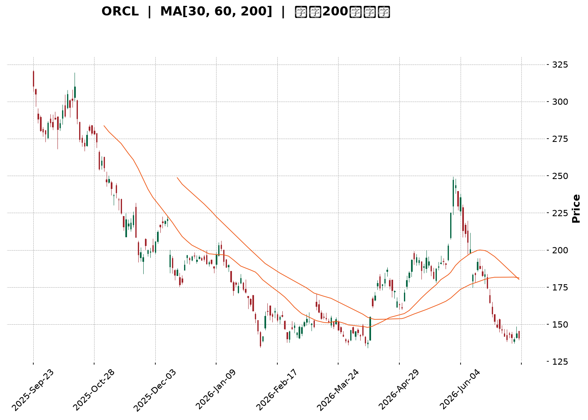
</details>

<html>
<head><meta charset="utf-8" /></head>
<body>
    <div style="height:500px; width:100%;">                        <script>window.PlotlyConfig = {MathJaxConfig: 'local'};</script>
        <script charset="utf-8" src="https://cdn.plot.ly/plotly-3.7.0.min.js" integrity="sha256-jvTGqxNp8AGWEcvNLVuKr+8j5dGe9Yw51LQkmDH+IYA=" crossorigin="anonymous"></script>                <div id="candlestick-chart" class="plotly-graph-div" style="height:100%; width:100%;"></div>            <script>                window.PLOTLYENV=window.PLOTLYENV || {};                                if (document.getElementById("candlestick-chart")) {                    Plotly.newPlot(                        "candlestick-chart",                        [{"close":{"dtype":"f8","bdata":"AAAAoLFkc0AAAAAAvg9zQAAAAEDAAHJAAAAAAECEcUAAAABALXlxQAAAAGAhYXFAAAAAgAzccUAAAAAgadhxQAAAAMClrnFAAAAAIN0EckAAAADAlpBxQAAAAMAJ1nFAAAAA4PdhckAAAACAlCJyQAAAAEAUEXNAAAAA4EuCckAAAACggstyQAAAAAAoYHNAAAAAgG4IckAAAADggihxQAAAAIBXCHFAAAAAAOLgcEAAAABgT1ZxQAAAAMD4iXFAAAAA4GJrcUAAAACAWmJxQAAAACC4CnFAAAAAYPLNb0AAAABAnkFwQAAAAGBf7G9AAAAAYJK5bkAAAADgZf1uQAAAAIARL25AAAAAAC2fbUAAAACg79BtQAAAAGCbPG1AAAAAgEkabEAAAABAuu9qQAAAAKASl2tAAAAAgE44a0AAAABARkxrQAAAAGAD7GtAAAAAgKsVakAAAACgjptoQAAAAGC7y2hAAAAA4LlkaEAAAADgD2BpQAAAAGCpAGlAAAAAoKbgaEAAAADguOVoQAAAAODat2lAAAAAoAmJakAAAAAgC\u002fBqQAAAAMDbTWtAAAAAYDxta0AAAADAJJxrQAAAAABpnmhAAAAA4PaEZ0AAAACA6ORmQAAAAMAgW2dAAAAAwCkYZkAAAABA7ElmQAAAAGBaxGdAAAAAgIOPaEAAAACgKS9oQAAAAEBOc2hAAAAAICeDaEAAAABAbjBoQAAAAGBuamhAAAAAwIghaEAAAADA4zpoQAAAAMAA2GdAAAAA4MT8Z0AAAABA7d9nQAAAAGDSemdAAAAAQJWkaEAAAADgVWhpQAAAAMBiHGlAAAAAgI0IaEAAAAAgEZFnQAAAAMB4uGdAAAAAoIJVZkAAAABAkpVlQAAAAGA3HmZAAAAAoM39ZUAAAACAl6VmQAAAAAD8tWVAAAAAIEBzZUAAAADAz\u002fpkQAAAAOAIbmRAAAAA4GXeY0AAAABAHTNjQAAAAMDjNGJAAAAAQBLxYEAAAABgi7phQAAAAMAgcGNAAAAA4P7YY0AAAADgPYJjQAAAAOChbGNAAAAAwPDgY0AAAACg3hxjQAAAACDIYmNAAAAAAIpuY0AAAABgsmFiQAAAACCPimFAAAAAIAwkYkAAAACgqFtiQAAAAMCPqGJAAAAAAIgMYkAAAACA4IZiQAAAACBAf2JAAAAAQAbqYkAAAABg7TZjQAAAACDG\u002fGJAAAAAwEjQYkAAAADApItiQAAAAICjP2RAAAAAYMzBY0AAAADAGEFjQAAAAABtXGNAAAAAAMAzY0AAAADg3fpiQAAAAEAgTmNAAAAAoIqUYkAAAACgoChjQAAAAIA8QmJAAAAAADwgYkAAAADgObphQAAAACAgVmFAAAAA4Ms6YUAAAABA30JiQAAAACAhB2JAAAAAoKwrYkAAAADg+hBiQAAAAKCqxWFAAAAA4DzVYUAAAADAOSxhQAAAAGCPM2FAAAAAQJNiY0AAAACg6k1kQAAAAMAUJ2VAAAAAQBg3ZkAAAACgf85lQAAAAADcHmZAAAAAQFeRZkAAAADgMltnQAAAAEBn9WVAAAAAgLyVZUAAAAAgiItlQAAAAABPrGRAAAAAgGJoZEAAAABAkxpkQAAAAEB\u002fZ2VAAAAAQEd1ZkAAAAAgoxZnQAAAACBvK2hAAAAAwEo9aEAAAABAqWhoQAAAAABgJWhAAAAAQNVFZ0AAAACARKNnQAAAAKDRXWhAAAAAYP4IaEAAAABA0T5nQAAAAMCWmmZAAAAA4D5wZ0AAAABAlqNnQAAAACBA7WdAAAAAYIAMaEAAAAAAiclnQAAAACDNX2lAAAAAYOkfbEAAAAAgReluQAAAACBtd25AAAAAwAGxbEAAAAAAqXBtQAAAAMANnmpAAAAAoL1iakAAAABgFqNpQAAAAOD9EWlAAAAAoMbuZkAAAACAu+9mQAAAAMAb\u002f2dAAAAAoKp1Z0AAAABgmdxmQAAAAKDV9GZAAAAAYNHOZUAAAAAAzJJkQAAAAMB7n2NAAAAAYM79YkAAAABge4BiQAAAAGDtZ2JAAAAAgFdBYkAAAADgMMBhQAAAACAUeWFAAAAAAF\u002foYUAAAACgfaNhQAAAACAYgGFAAAAAQAr3YUAAAADgepRhQA=="},"high":{"dtype":"f8","bdata":"mrf4Z2YVdEC+vSrnLU9zQOHctyAidnJA3P\u002fVXP0qckCDNbG+HaxxQP7JHPrKjHFAUw\u002fJQ43rcUArW9OmVTpyQLwFcGcdNXJAhx4IzWJVckBTi7xdph5yQPMB8kPqA3JA1Rvm9YOhckBrfY3vewxzQCTZxzy1O3NA\u002fUgGKTDYckBnMMHynkBzQF71pJBW93NAMSiQGPjVckBm1gq0oOdxQCIA2Fn0WXFAtUaoONQocUCRUwCvU4ZxQKnFiVQkx3FAWbGMXSHEcUDzSObSuatxQNM66pHfbnFAm6cCE+2ycEBGW5RHVHRwQCpeyYNRcXBAXErZDuuab0CUSxCPoz9vQOZu6+8Y1m5AagkkqE7DbUDWRra3GJxuQKYIn0LPZW1A6el9WIZRbUCrisl\u002fSeBrQEAJD00wHGxA\u002fwkK6XyVa0BzpQNIA7JrQBt8XlQNP2xAi1Mdt3b4bEAw+knaPMppQPMCZRPuO2lAT\u002fmynCiwaEBjIuAPzf9pQCzkVroFDWlAxBuQxskxaUDcCc\u002fzSvZpQAt3UIHgvWlAp6dFekSrakBqjLB85SxrQCXWVqRK02tAmybaUciPa0AbjvKWW+VrQJo7fSLuAWlAA4EkLLd+aEALHl4qRWVnQOccrp+Tf2dAFGhLJvwWZ0CdTD8y1t9mQBia\u002fJkwKGhAboleQdOcaEDwCO8uHWpoQGp+hAxYjGhA5XMGvZXOaEAAqMIqopNoQMTjE2+Dj2hACcr1Jx1qaECowVE7K5ZoQDW\u002fddBr+GhAReJ5cJUgaEDYw98knzloQG4lXkIGpGdASFyvkFXZaEDuyb2KWaVpQJ2JgLR7y2lAI6FcZAAJaUASST2XCjVoQCw8fS9C0WdAnFgBdok8Z0DZg2a2HmtmQLa18CEjXWZAlj7IKO5MZkAiMkdyywBnQBBkF6gnT2ZACo18fXCNZkDIntmvlCFlQNVSB9BQ92RAKlD+12dAZUAq5zYIyshjQCx8s5bqG2NAfVnToxMxYkAj1VGpnsZhQMHXtveL1GNAS77NZcaHZECieaWVzFBkQHFkbu77vWNAK7dQyJQlZEDXfJdxnMVjQCniCe2whmNAxDX6oAjfY0D8MtBagR1jQIUguic+GWJAfeCa5r83YkBYl4VF8QZjQC1fn9Mn7mJAOrO1\u002fSMiYkCcQS3bHKRiQKjeJqtDvGJAZ7Th7G0RY0APjv9IB5tjQJapwUzAwmNASqJrQETeYkDXn6GTRSJjQGnkhYAzUmVAmpswblDVZEAuUibv9fRjQOgEIYBztGNAJPG4zSu6Y0ANrffEpTxjQHu5J3ademNAFz62TP0FY0CURCpQY1ZjQP2sBxmlGmNAJ3VGWaCZYkAAcGKviC5iQC+k\u002fIqilmFAogO3RRCHYUBnIz5mFkxiQEDcmqKWk2JAEO1gt5QtYkBexgvdoXBiQGdQ4fUn8mFApqgZWhvNYkAnPNLywclhQExtGK3jdWFAkD10w9JrY0AVsbmbARplQGNfy6XGfmVA38urD6R0ZkBmcQsFiPtmQPTCWmOZJGZAHS6UcVEWZ0CamX6pxZBnQOFz2AtNqGZAPFDLG6yCZkC9D1SeWJ5lQKDntC6vA2VAVoBulgqGZEC7QlY8b5NkQGBQillDtmVAhy9VdaTbZkBQvViF8jtnQGk0rZ25M2hAXiiKV5juaECk7ESnCKpoQIrZBP4MYGhAiKoDigkIaEA5GwS4\u002fNxnQOezvQd0AGlAF9wFqvd3aEDWWQYjKMNnQJb0SW8agmdA83bIqyhyZ0BuwpxA2QRoQGB8egQlimhAF5u4eL5QaECAU878Ke9nQMsPLtRBiWlAjcgBxCwwbEBY\u002fsG7PCxvQJSlBThgBG9AM+6EIKP1bUA\u002f67P\u002f48NtQK55jlhn1GxASJW9AJ5Ja0DyEZiriXdrQKOpBHfJd2pAVFGsOCQEZ0D07IWx+B1nQN1VvUKSVGhAOlssOpJUaEBQZvf5+rBnQLdclgrTamdA5TiiKBX+ZkBDz4QvOLdlQH9dU4ucpWRAZcSkc1qiY0AoBkb2PiBjQFaQGxTcPmNA5QWBYSCtYkAI41ITO2FiQHSmBOmaUWJAMOi\u002fTK8jYkD0c\u002fRnxSFiQOX\u002f0egkq2FAcxQ1wbORYkAAAACAwjViQA=="},"hovertemplate":"\u003cb\u003e%{x|%Y-%m-%d}\u003c\u002fb\u003e\u003cbr\u003e\u958b: $%{open:.2f}\u003cbr\u003e\u9ad8: $%{high:.2f}\u003cbr\u003e\u4f4e: $%{low:.2f}\u003cbr\u003e\u6536: $%{close:.2f}\u003cextra\u003e\u003c\u002fextra\u003e","low":{"dtype":"f8","bdata":"U5biOuUoc0BglSveYYpyQLSBHbLF1HFABROKG\u002fl8cUDXXGwmWEdxQK0QhDynDHFAkJ3UwPkrcUBj2Z4DOa1xQLvOjwfLjHFA2phLt134cUAHZT3lIr9wQO\u002fsdQ13hnFAdrkmUUDIcUCp51CMhhNyQEncYCBUbnJAqmu6sgwTckAwL+xpB4FyQAPlCFLLwnJAmVrI1g3McUAaFNKM4ApxQMTGdzaL2nBAThiRD9iqcECwgEqmmtxwQF5DsmLbeHFAdhrmdzBScUDrRtsYwl1xQCHpkpAfzHBAoHem3Zy6b0B2MXp\u002fPchvQPyTJExVmW9As+RVeB9bbkDILY7ScJVuQMfyp3UgoG1AsdVxKSvEbEBaGGkDxFltQNez+KyBVmxADhDYLEwAbEDSMvPpPqVqQLb216Y0GGpA5hiUZgWwakDDWmbpbI5qQIuM0G9852pA++mnJU8JakAE9tkdbvZnQMjpHUIzDmhARdJpTmn7ZkCT+iV\u002f2glpQMuYFMgbd2hA2ztSVERaaEA71Iq228JoQIS0AWvXr2hASuZunyqLaUCCrAmriHJqQDV+\u002fvbO2mpAmVz2uToGa0CNksY1C\u002fBqQG6QZIhtDmdAr1W9A4EGZ0BMVSEbWHVmQAP39LBH12ZAzb22qBvsZUDC+cZa9xtmQDB\u002fu25USmdAc1\u002fhOZzfZ0AnxQxmU8tnQPDkdwMBEmhAYB7OQZFHaEDqmuuPltlnQG\u002fzgsTjOmhAsPx1NtQbaECLzYskWQtoQHIjBDnDz2dAIQR68hmcZ0ArmVa9TcVnQPgAsUrkC2dAMDo+fRBvZ0AOoMgCmXRoQBvHInuW6GhAtDbT85KvZ0D0jYHicoJnQFDg0lGQJ2dA+PHW8LZDZkBIAjvZVi1lQEWpeVLU6GVAijDACNRZZUCfwsrjVilmQDE2IhA3j2VAuyPQB2FVZUAbqDFJywxkQKR6h8FzQ2RA1hCgyH3cY0AfLcu\u002fFttiQBm1XeO07WFAzfhMAfzJYEBB7TzESj5hQN2YhlhgP2JAWsf71uJ7Y0COyzyo0h1jQFWZjt4n7mJAYhjRC9FGY0B\u002f6UZNO\u002fpiQPLV9zM\u002fymJAxcL3\u002fhFWY0D50aMTxUtiQMbhr2gfNGFAdA1RXZI4YUDKWXs\u002fLkpiQMUpaCmWBGJAnVZC\u002fKmjYUB4RW59bYZhQCNbV3vawWFAGF\u002f7RxyCYkDkhlUShqJiQDFJmeEw0mJA8NPvNEMtYkDwIhpZdG1iQBjdoy7s7mNAophU\u002f1GwY0DWuqLqliJjQOPF05IHLmNApxe9G+8NY0A0SjOcid9iQCnvXuxve2JAkXiXyZBdYkAhPK37RbViQElXgCKcOmJAEGe8DBzzYUB07w1XpbFhQJM7U0ToKmFAGNYVuwEAYUDthLzXKVxhQClLuXBV9WFAaR5CrXZqYUCGovGDRtthQNg28wEGX2FAVTzXDRa9YUDYTHhz6fBgQHZegZhPw2BASI0IE4pnYUChHsoF\u002fx9kQF+LKt5HtGRAkJ2BkFGmZUBzRRWISZhlQI5uLxcSnWVA6eFcDMvsZUAt8qj7UcVmQF2tVFs\u002fr2VA4IECnN8GZUDicrU1LOpkQPp99UufL2RAS\u002fVwMPoCZEClV9vaxfhjQABXOfFdsmRAOuWxwfy0ZUA3lLQ4JExmQMWHV6IswWZAy1Z8w27EZ0BO7hxFnrFnQHMG2wQOvmdAgsLhJMaHZkCQ4hGcYw1nQIRvoW3TGWdAayZTxteHZ0CNGc3bTtRmQDXIiO2viWZAGoidlMNFZkCKb4a9oVFnQO9\u002fMdX\u002fzWdALZy7YMe8Z0Czm4eWl2hnQIMgrdi0FmhAIGqILz7paUAAGdh1SPprQFJ+NAViwG1AbvZCwERabEAzyk03JudrQJ3W98IpF2pAT+flN1YTakCoydhFVqNoQNUwsfnFr2hAcII\u002fn4PVZUDYh6syJExmQFFf5N0PMmdApBZRB01gZ0BOVgX7Tb5mQFWUaYmvImZAMU9mp3O5ZUBz7+r+QYFkQNl08Sn3WWNA0v5cxNa6YkAzX2qtlG9iQA2wuJRKFmJACB4pylT\u002fYUAAAADgMMBhQBLjm4UoS2FAWz5lt3WVYUDL2H4GVyJhQHBjcR9XImFAy7PJp3GOYUAAAADgUWhhQA=="},"name":"\u50f9\u683c","open":{"dtype":"f8","bdata":"YZSckJQFdEBi6IBvh0VzQPLVl6IUP3JAmQFyhSsbckCYBZfxSJZxQMuEOYnjh3FA4guYiYc6cUAkis6ZLwhyQMpA4ipi5XFAJme0iFwRckBTi7xdph5yQAufK8tBo3FA3+R6MjwMckAZQcvQlJZyQErCUM+KfXJA1pL1y7fKckDDxKZpy99yQNTlrzHj6nJAZCHY9ZHNckA6betMCONxQO2EO8w\u002fN3FAgk5B2hwDcUDbDo34ouVwQMZhkiYEs3FAP\u002fYH8VC9cUDvx+D1vYRxQK6bvHRWbHFAIo8K\u002fcKicEDMV0sOfhBwQAqngOJLa3BAxxagOPDybkDKdLfzVLFuQG1JeF9Ism5AbcL7eO+WbUAvhwHtNXNuQICuLH0kP21AjVvIck5PbUCph6st5tprQHXgynQbGmpAomai4QIEa0BdpYR1n8RqQDeii3rzHmtAwMOSunOebEDGEy39QKNpQCPvLWhWX2hAIJYRXzoHaECVjVwx9O9pQEx0l9VTs2hAyOdtj7TSaEB3PAdTxGVpQHHJXEJRzWhAKKTSufm7aUDyWTqeDB1rQDb6W\u002fuHZ2tADBeZxLE9a0DHfiYyy3VrQKs2SNeQmWdAe7UnwM5PaEC37UvCt09nQOd\u002fzIHv3WZABwQrTuGxZkBpGaM5Lp9mQBHlNC3jUmdAqRRuFhJeaEAOR\u002fORtVFoQMLpJ\u002f9iJGhAHmG2BV+FaEDdO696wwloQCs4cYD7RWhAqXQ+c2RRaEC7uXTiq3JoQC+LK74+jmhAeoKRgQ3XZ0D\u002fO7sZ5S1oQE2hqVzOoWdAIq2u3ZXKZ0AgzHndWIdoQDJWuCiBcmlAI6FcZAAJaUASST2XCjVoQOAEIUr5kmdAnFgBdok8Z0BgC1Y74k1mQOe\u002fIkQIRGZA3rRXz4dtZUCZ7oABdDtmQO09lQRQPmZAW27ZrZ62ZUD8JW3bCR9lQLXybCke4GRA9H5kAII3ZUAkW\u002f2JMqVjQH0y9s1TGmNA3svEPOMSYkA+2BVL\u002fFhhQIHWUtG5bmJAO3EbwH3cY0CieaWVzFBkQK+9st61mmNA3BJlcKjEY0CCGUetTJxjQOoeoD3aKmNAsM0O8jGDY0D1BHQOlAdjQHyunUe\u002fFWJAparVnJ97YUB\u002fcoJYBIRiQAypnztCeGJAbjJKmzrcYUAbvdv9aJRhQHduPEbg92FAh2zCNAefYkBYQKT9A\u002fFiQN335aWA+2JADGc1fPS0YkAKXcM+vxFjQNu+KUk8p2RA+Kkj55NwZEC1omFnTb5jQDEmECNJX2NAJKPIY5VLY0AIsMt3wQpjQLBpzzlUrWJAgHqHSaL\u002fYkCVJljl1ctiQAKV2noL\u002fmJAi9g+4T2GYkCaEgHki9xhQCrG1bh7fmFAr6QubTNiYUAeYNWmdmphQGgnVPPKgWJAJ5OA50W5YUDMm2bNW01iQH6N+xcN2WFAHqGWgT6oYkCXGUa9n7ZhQPBSTH4BG2FAPsJ6RyJpYUB1UqAbIetkQF2cMg73yWRACEaNJ975ZUAYygQcd8lmQG10Wv5NBmZAR2gO92k3ZkA83zTdGjFnQCwOGj3JeGZA7O39SUt8ZkCpWuTqaX9lQCkUMUwhM2RAXI0+yRRvZEBhrXZbqi5kQN2WHyb6umRA2T5fxRztZUCF1IRT9K9mQM1rCCG+MWdA3OUydHy9aECB7dn1Mf1nQI1ObX9772dAiKoDigkIaEDLl4wb\u002fYtnQEtG1wTicGdAhBfX\u002fYu6Z0DmcqXY66pnQIsgZ29dK2dAcCgpFB5qZkALYLzVWYtnQKHk\u002fAQt4GdAl2P+ricUaECABmX7HdpnQLTPJ7rAK2hAJ+yLMdAIakCY7YWlbbZsQDN5ou2pPm5AUn2hOq70bUANHnkD0UZsQJHwXlo4lmxAVBc+tdcfa0CV7X6UY6VqQNXdBWP6uWhAj3gR0YFhZkAFf95hywtnQHzAo9qwV2dALfhfaT2rZ0AXdFyudzBnQBkjZToEzGZAIUPtwLG1ZkAW+4JheTRlQGnzWYpVPWRA9SCiXr6ZY0DGSN9dprdiQAVqoHsALWNAnSid\u002fqlXYkCUzGp7pv9hQO98PtKz2WFAS4\u002fVaZf5YUAnQBRqGOdhQOK68hx+UmFAhMHlJcCdYUAAAADAzDRiQA=="},"x":["2025-09-23T00:00:00-04:00","2025-09-24T00:00:00-04:00","2025-09-25T00:00:00-04:00","2025-09-26T00:00:00-04:00","2025-09-29T00:00:00-04:00","2025-09-30T00:00:00-04:00","2025-10-01T00:00:00-04:00","2025-10-02T00:00:00-04:00","2025-10-03T00:00:00-04:00","2025-10-06T00:00:00-04:00","2025-10-07T00:00:00-04:00","2025-10-08T00:00:00-04:00","2025-10-09T00:00:00-04:00","2025-10-10T00:00:00-04:00","2025-10-13T00:00:00-04:00","2025-10-14T00:00:00-04:00","2025-10-15T00:00:00-04:00","2025-10-16T00:00:00-04:00","2025-10-17T00:00:00-04:00","2025-10-20T00:00:00-04:00","2025-10-21T00:00:00-04:00","2025-10-22T00:00:00-04:00","2025-10-23T00:00:00-04:00","2025-10-24T00:00:00-04:00","2025-10-27T00:00:00-04:00","2025-10-28T00:00:00-04:00","2025-10-29T00:00:00-04:00","2025-10-30T00:00:00-04:00","2025-10-31T00:00:00-04:00","2025-11-03T00:00:00-05:00","2025-11-04T00:00:00-05:00","2025-11-05T00:00:00-05:00","2025-11-06T00:00:00-05:00","2025-11-07T00:00:00-05:00","2025-11-10T00:00:00-05:00","2025-11-11T00:00:00-05:00","2025-11-12T00:00:00-05:00","2025-11-13T00:00:00-05:00","2025-11-14T00:00:00-05:00","2025-11-17T00:00:00-05:00","2025-11-18T00:00:00-05:00","2025-11-19T00:00:00-05:00","2025-11-20T00:00:00-05:00","2025-11-21T00:00:00-05:00","2025-11-24T00:00:00-05:00","2025-11-25T00:00:00-05:00","2025-11-26T00:00:00-05:00","2025-11-28T00:00:00-05:00","2025-12-01T00:00:00-05:00","2025-12-02T00:00:00-05:00","2025-12-03T00:00:00-05:00","2025-12-04T00:00:00-05:00","2025-12-05T00:00:00-05:00","2025-12-08T00:00:00-05:00","2025-12-09T00:00:00-05:00","2025-12-10T00:00:00-05:00","2025-12-11T00:00:00-05:00","2025-12-12T00:00:00-05:00","2025-12-15T00:00:00-05:00","2025-12-16T00:00:00-05:00","2025-12-17T00:00:00-05:00","2025-12-18T00:00:00-05:00","2025-12-19T00:00:00-05:00","2025-12-22T00:00:00-05:00","2025-12-23T00:00:00-05:00","2025-12-24T00:00:00-05:00","2025-12-26T00:00:00-05:00","2025-12-29T00:00:00-05:00","2025-12-30T00:00:00-05:00","2025-12-31T00:00:00-05:00","2026-01-02T00:00:00-05:00","2026-01-05T00:00:00-05:00","2026-01-06T00:00:00-05:00","2026-01-07T00:00:00-05:00","2026-01-08T00:00:00-05:00","2026-01-09T00:00:00-05:00","2026-01-12T00:00:00-05:00","2026-01-13T00:00:00-05:00","2026-01-14T00:00:00-05:00","2026-01-15T00:00:00-05:00","2026-01-16T00:00:00-05:00","2026-01-20T00:00:00-05:00","2026-01-21T00:00:00-05:00","2026-01-22T00:00:00-05:00","2026-01-23T00:00:00-05:00","2026-01-26T00:00:00-05:00","2026-01-27T00:00:00-05:00","2026-01-28T00:00:00-05:00","2026-01-29T00:00:00-05:00","2026-01-30T00:00:00-05:00","2026-02-02T00:00:00-05:00","2026-02-03T00:00:00-05:00","2026-02-04T00:00:00-05:00","2026-02-05T00:00:00-05:00","2026-02-06T00:00:00-05:00","2026-02-09T00:00:00-05:00","2026-02-10T00:00:00-05:00","2026-02-11T00:00:00-05:00","2026-02-12T00:00:00-05:00","2026-02-13T00:00:00-05:00","2026-02-17T00:00:00-05:00","2026-02-18T00:00:00-05:00","2026-02-19T00:00:00-05:00","2026-02-20T00:00:00-05:00","2026-02-23T00:00:00-05:00","2026-02-24T00:00:00-05:00","2026-02-25T00:00:00-05:00","2026-02-26T00:00:00-05:00","2026-02-27T00:00:00-05:00","2026-03-02T00:00:00-05:00","2026-03-03T00:00:00-05:00","2026-03-04T00:00:00-05:00","2026-03-05T00:00:00-05:00","2026-03-06T00:00:00-05:00","2026-03-09T00:00:00-04:00","2026-03-10T00:00:00-04:00","2026-03-11T00:00:00-04:00","2026-03-12T00:00:00-04:00","2026-03-13T00:00:00-04:00","2026-03-16T00:00:00-04:00","2026-03-17T00:00:00-04:00","2026-03-18T00:00:00-04:00","2026-03-19T00:00:00-04:00","2026-03-20T00:00:00-04:00","2026-03-23T00:00:00-04:00","2026-03-24T00:00:00-04:00","2026-03-25T00:00:00-04:00","2026-03-26T00:00:00-04:00","2026-03-27T00:00:00-04:00","2026-03-30T00:00:00-04:00","2026-03-31T00:00:00-04:00","2026-04-01T00:00:00-04:00","2026-04-02T00:00:00-04:00","2026-04-06T00:00:00-04:00","2026-04-07T00:00:00-04:00","2026-04-08T00:00:00-04:00","2026-04-09T00:00:00-04:00","2026-04-10T00:00:00-04:00","2026-04-13T00:00:00-04:00","2026-04-14T00:00:00-04:00","2026-04-15T00:00:00-04:00","2026-04-16T00:00:00-04:00","2026-04-17T00:00:00-04:00","2026-04-20T00:00:00-04:00","2026-04-21T00:00:00-04:00","2026-04-22T00:00:00-04:00","2026-04-23T00:00:00-04:00","2026-04-24T00:00:00-04:00","2026-04-27T00:00:00-04:00","2026-04-28T00:00:00-04:00","2026-04-29T00:00:00-04:00","2026-04-30T00:00:00-04:00","2026-05-01T00:00:00-04:00","2026-05-04T00:00:00-04:00","2026-05-05T00:00:00-04:00","2026-05-06T00:00:00-04:00","2026-05-07T00:00:00-04:00","2026-05-08T00:00:00-04:00","2026-05-11T00:00:00-04:00","2026-05-12T00:00:00-04:00","2026-05-13T00:00:00-04:00","2026-05-14T00:00:00-04:00","2026-05-15T00:00:00-04:00","2026-05-18T00:00:00-04:00","2026-05-19T00:00:00-04:00","2026-05-20T00:00:00-04:00","2026-05-21T00:00:00-04:00","2026-05-22T00:00:00-04:00","2026-05-26T00:00:00-04:00","2026-05-27T00:00:00-04:00","2026-05-28T00:00:00-04:00","2026-05-29T00:00:00-04:00","2026-06-01T00:00:00-04:00","2026-06-02T00:00:00-04:00","2026-06-03T00:00:00-04:00","2026-06-04T00:00:00-04:00","2026-06-05T00:00:00-04:00","2026-06-08T00:00:00-04:00","2026-06-09T00:00:00-04:00","2026-06-10T00:00:00-04:00","2026-06-11T00:00:00-04:00","2026-06-12T00:00:00-04:00","2026-06-15T00:00:00-04:00","2026-06-16T00:00:00-04:00","2026-06-17T00:00:00-04:00","2026-06-18T00:00:00-04:00","2026-06-22T00:00:00-04:00","2026-06-23T00:00:00-04:00","2026-06-24T00:00:00-04:00","2026-06-25T00:00:00-04:00","2026-06-26T00:00:00-04:00","2026-06-29T00:00:00-04:00","2026-06-30T00:00:00-04:00","2026-07-01T00:00:00-04:00","2026-07-02T00:00:00-04:00","2026-07-06T00:00:00-04:00","2026-07-07T00:00:00-04:00","2026-07-08T00:00:00-04:00","2026-07-09T00:00:00-04:00","2026-07-10T00:00:00-04:00"],"type":"candlestick"},{"hovertemplate":"MA30: $%{y:.2f}\u003cextra\u003e\u003c\u002fextra\u003e","line":{"color":"#2196F3","dash":"dash","width":2},"mode":"lines","name":"MA30","x":["2025-09-23T00:00:00-04:00","2025-09-24T00:00:00-04:00","2025-09-25T00:00:00-04:00","2025-09-26T00:00:00-04:00","2025-09-29T00:00:00-04:00","2025-09-30T00:00:00-04:00","2025-10-01T00:00:00-04:00","2025-10-02T00:00:00-04:00","2025-10-03T00:00:00-04:00","2025-10-06T00:00:00-04:00","2025-10-07T00:00:00-04:00","2025-10-08T00:00:00-04:00","2025-10-09T00:00:00-04:00","2025-10-10T00:00:00-04:00","2025-10-13T00:00:00-04:00","2025-10-14T00:00:00-04:00","2025-10-15T00:00:00-04:00","2025-10-16T00:00:00-04:00","2025-10-17T00:00:00-04:00","2025-10-20T00:00:00-04:00","2025-10-21T00:00:00-04:00","2025-10-22T00:00:00-04:00","2025-10-23T00:00:00-04:00","2025-10-24T00:00:00-04:00","2025-10-27T00:00:00-04:00","2025-10-28T00:00:00-04:00","2025-10-29T00:00:00-04:00","2025-10-30T00:00:00-04:00","2025-10-31T00:00:00-04:00","2025-11-03T00:00:00-05:00","2025-11-04T00:00:00-05:00","2025-11-05T00:00:00-05:00","2025-11-06T00:00:00-05:00","2025-11-07T00:00:00-05:00","2025-11-10T00:00:00-05:00","2025-11-11T00:00:00-05:00","2025-11-12T00:00:00-05:00","2025-11-13T00:00:00-05:00","2025-11-14T00:00:00-05:00","2025-11-17T00:00:00-05:00","2025-11-18T00:00:00-05:00","2025-11-19T00:00:00-05:00","2025-11-20T00:00:00-05:00","2025-11-21T00:00:00-05:00","2025-11-24T00:00:00-05:00","2025-11-25T00:00:00-05:00","2025-11-26T00:00:00-05:00","2025-11-28T00:00:00-05:00","2025-12-01T00:00:00-05:00","2025-12-02T00:00:00-05:00","2025-12-03T00:00:00-05:00","2025-12-04T00:00:00-05:00","2025-12-05T00:00:00-05:00","2025-12-08T00:00:00-05:00","2025-12-09T00:00:00-05:00","2025-12-10T00:00:00-05:00","2025-12-11T00:00:00-05:00","2025-12-12T00:00:00-05:00","2025-12-15T00:00:00-05:00","2025-12-16T00:00:00-05:00","2025-12-17T00:00:00-05:00","2025-12-18T00:00:00-05:00","2025-12-19T00:00:00-05:00","2025-12-22T00:00:00-05:00","2025-12-23T00:00:00-05:00","2025-12-24T00:00:00-05:00","2025-12-26T00:00:00-05:00","2025-12-29T00:00:00-05:00","2025-12-30T00:00:00-05:00","2025-12-31T00:00:00-05:00","2026-01-02T00:00:00-05:00","2026-01-05T00:00:00-05:00","2026-01-06T00:00:00-05:00","2026-01-07T00:00:00-05:00","2026-01-08T00:00:00-05:00","2026-01-09T00:00:00-05:00","2026-01-12T00:00:00-05:00","2026-01-13T00:00:00-05:00","2026-01-14T00:00:00-05:00","2026-01-15T00:00:00-05:00","2026-01-16T00:00:00-05:00","2026-01-20T00:00:00-05:00","2026-01-21T00:00:00-05:00","2026-01-22T00:00:00-05:00","2026-01-23T00:00:00-05:00","2026-01-26T00:00:00-05:00","2026-01-27T00:00:00-05:00","2026-01-28T00:00:00-05:00","2026-01-29T00:00:00-05:00","2026-01-30T00:00:00-05:00","2026-02-02T00:00:00-05:00","2026-02-03T00:00:00-05:00","2026-02-04T00:00:00-05:00","2026-02-05T00:00:00-05:00","2026-02-06T00:00:00-05:00","2026-02-09T00:00:00-05:00","2026-02-10T00:00:00-05:00","2026-02-11T00:00:00-05:00","2026-02-12T00:00:00-05:00","2026-02-13T00:00:00-05:00","2026-02-17T00:00:00-05:00","2026-02-18T00:00:00-05:00","2026-02-19T00:00:00-05:00","2026-02-20T00:00:00-05:00","2026-02-23T00:00:00-05:00","2026-02-24T00:00:00-05:00","2026-02-25T00:00:00-05:00","2026-02-26T00:00:00-05:00","2026-02-27T00:00:00-05:00","2026-03-02T00:00:00-05:00","2026-03-03T00:00:00-05:00","2026-03-04T00:00:00-05:00","2026-03-05T00:00:00-05:00","2026-03-06T00:00:00-05:00","2026-03-09T00:00:00-04:00","2026-03-10T00:00:00-04:00","2026-03-11T00:00:00-04:00","2026-03-12T00:00:00-04:00","2026-03-13T00:00:00-04:00","2026-03-16T00:00:00-04:00","2026-03-17T00:00:00-04:00","2026-03-18T00:00:00-04:00","2026-03-19T00:00:00-04:00","2026-03-20T00:00:00-04:00","2026-03-23T00:00:00-04:00","2026-03-24T00:00:00-04:00","2026-03-25T00:00:00-04:00","2026-03-26T00:00:00-04:00","2026-03-27T00:00:00-04:00","2026-03-30T00:00:00-04:00","2026-03-31T00:00:00-04:00","2026-04-01T00:00:00-04:00","2026-04-02T00:00:00-04:00","2026-04-06T00:00:00-04:00","2026-04-07T00:00:00-04:00","2026-04-08T00:00:00-04:00","2026-04-09T00:00:00-04:00","2026-04-10T00:00:00-04:00","2026-04-13T00:00:00-04:00","2026-04-14T00:00:00-04:00","2026-04-15T00:00:00-04:00","2026-04-16T00:00:00-04:00","2026-04-17T00:00:00-04:00","2026-04-20T00:00:00-04:00","2026-04-21T00:00:00-04:00","2026-04-22T00:00:00-04:00","2026-04-23T00:00:00-04:00","2026-04-24T00:00:00-04:00","2026-04-27T00:00:00-04:00","2026-04-28T00:00:00-04:00","2026-04-29T00:00:00-04:00","2026-04-30T00:00:00-04:00","2026-05-01T00:00:00-04:00","2026-05-04T00:00:00-04:00","2026-05-05T00:00:00-04:00","2026-05-06T00:00:00-04:00","2026-05-07T00:00:00-04:00","2026-05-08T00:00:00-04:00","2026-05-11T00:00:00-04:00","2026-05-12T00:00:00-04:00","2026-05-13T00:00:00-04:00","2026-05-14T00:00:00-04:00","2026-05-15T00:00:00-04:00","2026-05-18T00:00:00-04:00","2026-05-19T00:00:00-04:00","2026-05-20T00:00:00-04:00","2026-05-21T00:00:00-04:00","2026-05-22T00:00:00-04:00","2026-05-26T00:00:00-04:00","2026-05-27T00:00:00-04:00","2026-05-28T00:00:00-04:00","2026-05-29T00:00:00-04:00","2026-06-01T00:00:00-04:00","2026-06-02T00:00:00-04:00","2026-06-03T00:00:00-04:00","2026-06-04T00:00:00-04:00","2026-06-05T00:00:00-04:00","2026-06-08T00:00:00-04:00","2026-06-09T00:00:00-04:00","2026-06-10T00:00:00-04:00","2026-06-11T00:00:00-04:00","2026-06-12T00:00:00-04:00","2026-06-15T00:00:00-04:00","2026-06-16T00:00:00-04:00","2026-06-17T00:00:00-04:00","2026-06-18T00:00:00-04:00","2026-06-22T00:00:00-04:00","2026-06-23T00:00:00-04:00","2026-06-24T00:00:00-04:00","2026-06-25T00:00:00-04:00","2026-06-26T00:00:00-04:00","2026-06-29T00:00:00-04:00","2026-06-30T00:00:00-04:00","2026-07-01T00:00:00-04:00","2026-07-02T00:00:00-04:00","2026-07-06T00:00:00-04:00","2026-07-07T00:00:00-04:00","2026-07-08T00:00:00-04:00","2026-07-09T00:00:00-04:00","2026-07-10T00:00:00-04:00"],"y":{"dtype":"f8","bdata":"AAAAAAAA+H8AAAAAAAD4fwAAAAAAAPh\u002fAAAAAAAA+H8AAAAAAAD4fwAAAAAAAPh\u002fAAAAAAAA+H8AAAAAAAD4fwAAAAAAAPh\u002fAAAAAAAA+H8AAAAAAAD4fwAAAAAAAPh\u002fAAAAAAAA+H8AAAAAAAD4fwAAAAAAAPh\u002fAAAAAAAA+H8AAAAAAAD4fwAAAAAAAPh\u002fAAAAAAAA+H8AAAAAAAD4fwAAAAAAAPh\u002fAAAAAAAA+H8AAAAAAAD4fwAAAAAAAPh\u002fAAAAAAAA+H8AAAAAAAD4fwAAAAAAAPh\u002fAAAAAAAA+H8AAAAAAAD4f0RERCRjunFA7+7uhv2XcUCamZk5jnlxQKuqqgq3YHFAMzMzU6BJcUARERFpvDNxQCIiItIsHHFAERERoa37cEARERGhU9ZwQLy7uwMotXBAIiIiWoiPcEAREREZHm5wQDMzM8MMTXBA7+7ujnofcECJiIj4b9tvQImIiIifaW9AAAAA8OT9bkDv7u6OqZVuQERERDRXIG5AzczM7N3AbUDv7u5+fXBtQJqZmTlDKW1AmpmZaaPrbEDe3d19nqlsQO\u002fu7m5IZ2xA7+7uHggobEDv7u4+8uprQM3MzLwtmmtAAAAAsHpTa0AiIiLSZgFrQCIiIiJLuGpAMzMzg6VuakCamZm5ZSRqQDMzM+Oj7WlAIiIiknPCaUAAAABwZJJpQImIiIiMaWlAERERQelKaUCamZnJdzNpQO\u002fu7j5hGGlAIiIiUgX+aEDv7u5e1+NoQLy7u3sKwWhA3t3d7SSvaEARERHR46hoQJqZmdmonWhAMzMzw8mfaEDNzMxcEKBoQBEREfH8oGhAd3d358iZaECrqqr6bY5oQM3MzCxifWhAd3d3V4hZaEBVVVWl2StoQO\u002fu7m6Y\u002f2dAAAAA4DbRZ0BVVVXV3KZnQGZmZmYMjmdAzczMLGR8Z0BEREQEDmxnQBEREcEVU2dAIiIiwhdAZ0BmZmaGuyVnQDMzM6NI9mZAzczM3ES1ZkBVVVWFLn5mQM3MzLxoU2ZAiYiImJorZkDNzMwMqgNmQKuqqioS2WVAVVVV1ci0ZUDv7u7+HYllQDMzM5MTY2VA7+7uvjM8ZUCrqqrqUw1lQCIiIgKn2mRAiYiI+CqjZEAAAAAQA2dkQO\u002fu7n7zL2RA7+7uPuL8Y0AAAACg4NFjQLy7u6tNpWNAvLu72x6IY0CamZkp5nNjQAAAADAvWWNAiYiIKBE+Y0CamZmZERtjQO\u002fu7i6XDmNAREREZCQAY0B3d3cXa\u002fFiQLy7u0tM6GJAmpmZGZziYkDv7u4evOBiQBEREQEc6mJAvLu7exf4YkBERERkSwRjQAAAAEA7+mJAZmZmForrYkARERHBVtxiQBEREaGFymJAzczMzOqzYkDe3d2NpqxiQLy7u+sPoWJA7+7uzkyWYkBmZmYGnJNiQImIiGiUlWJAZmZm5vOSYkCrqqqa1ohiQImIiKhnfGJA7+7ubs6HYkAAAABw+ZZiQImIiKiirWJAzczM7M3JYkBmZmZm7N9iQM3MzNyo+mJAERER4bEaY0BmZmYmv0NjQN7d3b1WUmNAAAAA0O9hY0Dv7u4OfHVjQCIiIkKugGNAERER8feKY0De3d0Nj5RjQO\u002fu7p54pmNAmpmZ+Y\u002fHY0B3d3eXGOljQGZmZjaJG2RA7+7uXrRPZEBVVVUVuIhkQAAAANDTwmRAERERMWX2ZEDv7u5uRiRlQCIiImJdWmVAREREpGiMZUBERER0mrhlQGZmZobV4WVAzczM7KoRZkDNzMys2EhmQO\u002fu7m48gmZAq6qqmgiqZkBVVVUVwcdmQKuqqjrH62ZAmpmZmTQeZ0CamZnZ5WtnQDMzM+Mds2dA3t3dTV\u002fnZ0BERESkSRtoQM3MzOwKQ2hA3t3dbQJsaEAiIiKS7Y5oQGZmZmZztGhAVVVVRf\u002fJaEB3d3dHK+JoQImIiBhK+GhAERER8dUAaUDv7u6u5v5oQLy7uzuM9GhAREREdMzfaEARERHhEb9oQERERDR5mGhAERERcfBzaEAAAADwHEhoQO\u002fu7v4\u002fFWhAIiIiou3jZ0C8u7trCrVnQM3MzMxBiWdAvLu7qw9aZ0BmZmam2yZnQLy7u\u002fsE8GZAVVVVpRq8ZkBVVVW1IodmQA=="},"type":"scatter"},{"hovertemplate":"MA60: $%{y:.2f}\u003cextra\u003e\u003c\u002fextra\u003e","line":{"color":"#9C27B0","dash":"dash","width":2},"mode":"lines","name":"MA60","x":["2025-09-23T00:00:00-04:00","2025-09-24T00:00:00-04:00","2025-09-25T00:00:00-04:00","2025-09-26T00:00:00-04:00","2025-09-29T00:00:00-04:00","2025-09-30T00:00:00-04:00","2025-10-01T00:00:00-04:00","2025-10-02T00:00:00-04:00","2025-10-03T00:00:00-04:00","2025-10-06T00:00:00-04:00","2025-10-07T00:00:00-04:00","2025-10-08T00:00:00-04:00","2025-10-09T00:00:00-04:00","2025-10-10T00:00:00-04:00","2025-10-13T00:00:00-04:00","2025-10-14T00:00:00-04:00","2025-10-15T00:00:00-04:00","2025-10-16T00:00:00-04:00","2025-10-17T00:00:00-04:00","2025-10-20T00:00:00-04:00","2025-10-21T00:00:00-04:00","2025-10-22T00:00:00-04:00","2025-10-23T00:00:00-04:00","2025-10-24T00:00:00-04:00","2025-10-27T00:00:00-04:00","2025-10-28T00:00:00-04:00","2025-10-29T00:00:00-04:00","2025-10-30T00:00:00-04:00","2025-10-31T00:00:00-04:00","2025-11-03T00:00:00-05:00","2025-11-04T00:00:00-05:00","2025-11-05T00:00:00-05:00","2025-11-06T00:00:00-05:00","2025-11-07T00:00:00-05:00","2025-11-10T00:00:00-05:00","2025-11-11T00:00:00-05:00","2025-11-12T00:00:00-05:00","2025-11-13T00:00:00-05:00","2025-11-14T00:00:00-05:00","2025-11-17T00:00:00-05:00","2025-11-18T00:00:00-05:00","2025-11-19T00:00:00-05:00","2025-11-20T00:00:00-05:00","2025-11-21T00:00:00-05:00","2025-11-24T00:00:00-05:00","2025-11-25T00:00:00-05:00","2025-11-26T00:00:00-05:00","2025-11-28T00:00:00-05:00","2025-12-01T00:00:00-05:00","2025-12-02T00:00:00-05:00","2025-12-03T00:00:00-05:00","2025-12-04T00:00:00-05:00","2025-12-05T00:00:00-05:00","2025-12-08T00:00:00-05:00","2025-12-09T00:00:00-05:00","2025-12-10T00:00:00-05:00","2025-12-11T00:00:00-05:00","2025-12-12T00:00:00-05:00","2025-12-15T00:00:00-05:00","2025-12-16T00:00:00-05:00","2025-12-17T00:00:00-05:00","2025-12-18T00:00:00-05:00","2025-12-19T00:00:00-05:00","2025-12-22T00:00:00-05:00","2025-12-23T00:00:00-05:00","2025-12-24T00:00:00-05:00","2025-12-26T00:00:00-05:00","2025-12-29T00:00:00-05:00","2025-12-30T00:00:00-05:00","2025-12-31T00:00:00-05:00","2026-01-02T00:00:00-05:00","2026-01-05T00:00:00-05:00","2026-01-06T00:00:00-05:00","2026-01-07T00:00:00-05:00","2026-01-08T00:00:00-05:00","2026-01-09T00:00:00-05:00","2026-01-12T00:00:00-05:00","2026-01-13T00:00:00-05:00","2026-01-14T00:00:00-05:00","2026-01-15T00:00:00-05:00","2026-01-16T00:00:00-05:00","2026-01-20T00:00:00-05:00","2026-01-21T00:00:00-05:00","2026-01-22T00:00:00-05:00","2026-01-23T00:00:00-05:00","2026-01-26T00:00:00-05:00","2026-01-27T00:00:00-05:00","2026-01-28T00:00:00-05:00","2026-01-29T00:00:00-05:00","2026-01-30T00:00:00-05:00","2026-02-02T00:00:00-05:00","2026-02-03T00:00:00-05:00","2026-02-04T00:00:00-05:00","2026-02-05T00:00:00-05:00","2026-02-06T00:00:00-05:00","2026-02-09T00:00:00-05:00","2026-02-10T00:00:00-05:00","2026-02-11T00:00:00-05:00","2026-02-12T00:00:00-05:00","2026-02-13T00:00:00-05:00","2026-02-17T00:00:00-05:00","2026-02-18T00:00:00-05:00","2026-02-19T00:00:00-05:00","2026-02-20T00:00:00-05:00","2026-02-23T00:00:00-05:00","2026-02-24T00:00:00-05:00","2026-02-25T00:00:00-05:00","2026-02-26T00:00:00-05:00","2026-02-27T00:00:00-05:00","2026-03-02T00:00:00-05:00","2026-03-03T00:00:00-05:00","2026-03-04T00:00:00-05:00","2026-03-05T00:00:00-05:00","2026-03-06T00:00:00-05:00","2026-03-09T00:00:00-04:00","2026-03-10T00:00:00-04:00","2026-03-11T00:00:00-04:00","2026-03-12T00:00:00-04:00","2026-03-13T00:00:00-04:00","2026-03-16T00:00:00-04:00","2026-03-17T00:00:00-04:00","2026-03-18T00:00:00-04:00","2026-03-19T00:00:00-04:00","2026-03-20T00:00:00-04:00","2026-03-23T00:00:00-04:00","2026-03-24T00:00:00-04:00","2026-03-25T00:00:00-04:00","2026-03-26T00:00:00-04:00","2026-03-27T00:00:00-04:00","2026-03-30T00:00:00-04:00","2026-03-31T00:00:00-04:00","2026-04-01T00:00:00-04:00","2026-04-02T00:00:00-04:00","2026-04-06T00:00:00-04:00","2026-04-07T00:00:00-04:00","2026-04-08T00:00:00-04:00","2026-04-09T00:00:00-04:00","2026-04-10T00:00:00-04:00","2026-04-13T00:00:00-04:00","2026-04-14T00:00:00-04:00","2026-04-15T00:00:00-04:00","2026-04-16T00:00:00-04:00","2026-04-17T00:00:00-04:00","2026-04-20T00:00:00-04:00","2026-04-21T00:00:00-04:00","2026-04-22T00:00:00-04:00","2026-04-23T00:00:00-04:00","2026-04-24T00:00:00-04:00","2026-04-27T00:00:00-04:00","2026-04-28T00:00:00-04:00","2026-04-29T00:00:00-04:00","2026-04-30T00:00:00-04:00","2026-05-01T00:00:00-04:00","2026-05-04T00:00:00-04:00","2026-05-05T00:00:00-04:00","2026-05-06T00:00:00-04:00","2026-05-07T00:00:00-04:00","2026-05-08T00:00:00-04:00","2026-05-11T00:00:00-04:00","2026-05-12T00:00:00-04:00","2026-05-13T00:00:00-04:00","2026-05-14T00:00:00-04:00","2026-05-15T00:00:00-04:00","2026-05-18T00:00:00-04:00","2026-05-19T00:00:00-04:00","2026-05-20T00:00:00-04:00","2026-05-21T00:00:00-04:00","2026-05-22T00:00:00-04:00","2026-05-26T00:00:00-04:00","2026-05-27T00:00:00-04:00","2026-05-28T00:00:00-04:00","2026-05-29T00:00:00-04:00","2026-06-01T00:00:00-04:00","2026-06-02T00:00:00-04:00","2026-06-03T00:00:00-04:00","2026-06-04T00:00:00-04:00","2026-06-05T00:00:00-04:00","2026-06-08T00:00:00-04:00","2026-06-09T00:00:00-04:00","2026-06-10T00:00:00-04:00","2026-06-11T00:00:00-04:00","2026-06-12T00:00:00-04:00","2026-06-15T00:00:00-04:00","2026-06-16T00:00:00-04:00","2026-06-17T00:00:00-04:00","2026-06-18T00:00:00-04:00","2026-06-22T00:00:00-04:00","2026-06-23T00:00:00-04:00","2026-06-24T00:00:00-04:00","2026-06-25T00:00:00-04:00","2026-06-26T00:00:00-04:00","2026-06-29T00:00:00-04:00","2026-06-30T00:00:00-04:00","2026-07-01T00:00:00-04:00","2026-07-02T00:00:00-04:00","2026-07-06T00:00:00-04:00","2026-07-07T00:00:00-04:00","2026-07-08T00:00:00-04:00","2026-07-09T00:00:00-04:00","2026-07-10T00:00:00-04:00"],"y":{"dtype":"f8","bdata":"AAAAAAAA+H8AAAAAAAD4fwAAAAAAAPh\u002fAAAAAAAA+H8AAAAAAAD4fwAAAAAAAPh\u002fAAAAAAAA+H8AAAAAAAD4fwAAAAAAAPh\u002fAAAAAAAA+H8AAAAAAAD4fwAAAAAAAPh\u002fAAAAAAAA+H8AAAAAAAD4fwAAAAAAAPh\u002fAAAAAAAA+H8AAAAAAAD4fwAAAAAAAPh\u002fAAAAAAAA+H8AAAAAAAD4fwAAAAAAAPh\u002fAAAAAAAA+H8AAAAAAAD4fwAAAAAAAPh\u002fAAAAAAAA+H8AAAAAAAD4fwAAAAAAAPh\u002fAAAAAAAA+H8AAAAAAAD4fwAAAAAAAPh\u002fAAAAAAAA+H8AAAAAAAD4fwAAAAAAAPh\u002fAAAAAAAA+H8AAAAAAAD4fwAAAAAAAPh\u002fAAAAAAAA+H8AAAAAAAD4fwAAAAAAAPh\u002fAAAAAAAA+H8AAAAAAAD4fwAAAAAAAPh\u002fAAAAAAAA+H8AAAAAAAD4fwAAAAAAAPh\u002fAAAAAAAA+H8AAAAAAAD4fwAAAAAAAPh\u002fAAAAAAAA+H8AAAAAAAD4fwAAAAAAAPh\u002fAAAAAAAA+H8AAAAAAAD4fwAAAAAAAPh\u002fAAAAAAAA+H8AAAAAAAD4fwAAAAAAAPh\u002fAAAAAAAA+H8AAAAAAAD4f1VVVbWIFm9AiYiISFDPbkBmZmYWwYtuQERERPyIV25AREREHNoqbkARERGh7vxtQGZmZhbz0G1AmpmZQSKhbUDe3d2FD3BtQDMzM6NYQW1AMzMzA4sObUCJiIjICeBsQBEREQGSrWxA3t3dBQ13bEDNzMzkKUJsQBERETGkA2xAmpmZWdfOa0De3d313JprQKuqqhKqYGtAIiIialMta0DNzMy8df9qQDMzM7NS02pAiYiI4JWiakCamZkRvGpqQO\u002fu7m5wM2pAd3d3f5\u002f8aUAiIiKK58hpQJqZmREdlGlAZmZmbu9naUAzMzNrujZpQJqZmXGwBWlAq6qqol7XaEAAAACgEKVoQDMzM0P2cWhAd3d3N9w7aECrqqp6SQhoQKuqqqJ63mdAzczM7EG7Z0AzMzPrkJtnQM3MzLS5eGdAvLu7E2dZZ0Dv7u6uejZnQHd3dwcPEmdAZmZmVqz1ZkDe3d3dG9tmQN7d3e0nvGZA3t3dXXqhZkBmZma2iYNmQAAAADh4aGZAMzMzk1VLZkBVVVVNJzBmQEREROxXEWZAmpmZmdPwZUB3d3fn389lQHd3d89jrGVAREREBKSHZUB3d3c392BlQKuqqspRTmVAiYiISEQ+ZUDe3d2NvC5lQGZmZgaxHWVA3t3d7VkRZUCrqqrSOwNlQCIiIlIy8GRARERELK7WZEDNzMz0PMFkQGZmZv7RpmRAd3d3V5KLZEDv7u5mAHBkQN7d3eXLUWRAERER0Vk0ZEBmZmZG4hpkQHd3d78RAmRA7+7uRkDpY0CJiIj4d9BjQFVVVbUduGNAd3d3bw+bY0BVVVXV7HdjQLy7u5MtVmNA7+7uVlhCY0AAAAAIbTRjQCIiIip4KWNAREREZPYoY0AAAABI6SljQGZmZgbsKWNAzczMhGEsY0AAAABgaC9jQGZmZvZ2MGNAIiIiGgoxY0AzMzOTczNjQO\u002fu7kZ9NGNAVVVVBco2Y0BmZmaWpTpjQAAAAFBKSGNAq6qqutNfY0De3d39sXZjQDMzMzviimNAq6qqOp+dY0AzMzNrh7JjQImIiLisxmNA7+7u\u002fifVY0BmZmZ+duhjQO\u002fu7qa2\u002fWNAmpmZuVoRZEBVVVU9GyZkQHd3d\u002fe0O2RAmpmZaU9SZEC8u7uj12hkQLy7uwtSf2RAzczMhOuYZECrqqpCXa9kQJqZmfG0zGRAMzMzQwH0ZEAAAAAg6SVlQAAAAGDjVmVAd3d3lwiBZUBVVVVlhK9lQFVVVdWwymVA7+7uHvnmZUCJiIjQNAJmQERERNSQGmZAMzMzm3sqZkCrqqoqXTtmQLy7u1thT2ZAVVVV9TJkZkAzMzOj\u002f3NmQBEREbkKiGZAmpmZacCXZkAzMzP75KNmQCIiIoKmrWZAERER0Sq1ZkB3d3evMbZmQImIiLDOt2ZAMzMzIyu4ZkAAAABw0rZmQJqZmamLtWZARERETN21ZkCamZkp2rdmQFVVVbUguWZAAAAAoBGzZkBVVVXlcadmQA=="},"type":"scatter"},{"hovertemplate":"MA200: $%{y:.2f}\u003cextra\u003e\u003c\u002fextra\u003e","line":{"color":"#FF6F00","dash":"solid","width":2},"mode":"lines","name":"MA200","x":["2025-09-23T00:00:00-04:00","2025-09-24T00:00:00-04:00","2025-09-25T00:00:00-04:00","2025-09-26T00:00:00-04:00","2025-09-29T00:00:00-04:00","2025-09-30T00:00:00-04:00","2025-10-01T00:00:00-04:00","2025-10-02T00:00:00-04:00","2025-10-03T00:00:00-04:00","2025-10-06T00:00:00-04:00","2025-10-07T00:00:00-04:00","2025-10-08T00:00:00-04:00","2025-10-09T00:00:00-04:00","2025-10-10T00:00:00-04:00","2025-10-13T00:00:00-04:00","2025-10-14T00:00:00-04:00","2025-10-15T00:00:00-04:00","2025-10-16T00:00:00-04:00","2025-10-17T00:00:00-04:00","2025-10-20T00:00:00-04:00","2025-10-21T00:00:00-04:00","2025-10-22T00:00:00-04:00","2025-10-23T00:00:00-04:00","2025-10-24T00:00:00-04:00","2025-10-27T00:00:00-04:00","2025-10-28T00:00:00-04:00","2025-10-29T00:00:00-04:00","2025-10-30T00:00:00-04:00","2025-10-31T00:00:00-04:00","2025-11-03T00:00:00-05:00","2025-11-04T00:00:00-05:00","2025-11-05T00:00:00-05:00","2025-11-06T00:00:00-05:00","2025-11-07T00:00:00-05:00","2025-11-10T00:00:00-05:00","2025-11-11T00:00:00-05:00","2025-11-12T00:00:00-05:00","2025-11-13T00:00:00-05:00","2025-11-14T00:00:00-05:00","2025-11-17T00:00:00-05:00","2025-11-18T00:00:00-05:00","2025-11-19T00:00:00-05:00","2025-11-20T00:00:00-05:00","2025-11-21T00:00:00-05:00","2025-11-24T00:00:00-05:00","2025-11-25T00:00:00-05:00","2025-11-26T00:00:00-05:00","2025-11-28T00:00:00-05:00","2025-12-01T00:00:00-05:00","2025-12-02T00:00:00-05:00","2025-12-03T00:00:00-05:00","2025-12-04T00:00:00-05:00","2025-12-05T00:00:00-05:00","2025-12-08T00:00:00-05:00","2025-12-09T00:00:00-05:00","2025-12-10T00:00:00-05:00","2025-12-11T00:00:00-05:00","2025-12-12T00:00:00-05:00","2025-12-15T00:00:00-05:00","2025-12-16T00:00:00-05:00","2025-12-17T00:00:00-05:00","2025-12-18T00:00:00-05:00","2025-12-19T00:00:00-05:00","2025-12-22T00:00:00-05:00","2025-12-23T00:00:00-05:00","2025-12-24T00:00:00-05:00","2025-12-26T00:00:00-05:00","2025-12-29T00:00:00-05:00","2025-12-30T00:00:00-05:00","2025-12-31T00:00:00-05:00","2026-01-02T00:00:00-05:00","2026-01-05T00:00:00-05:00","2026-01-06T00:00:00-05:00","2026-01-07T00:00:00-05:00","2026-01-08T00:00:00-05:00","2026-01-09T00:00:00-05:00","2026-01-12T00:00:00-05:00","2026-01-13T00:00:00-05:00","2026-01-14T00:00:00-05:00","2026-01-15T00:00:00-05:00","2026-01-16T00:00:00-05:00","2026-01-20T00:00:00-05:00","2026-01-21T00:00:00-05:00","2026-01-22T00:00:00-05:00","2026-01-23T00:00:00-05:00","2026-01-26T00:00:00-05:00","2026-01-27T00:00:00-05:00","2026-01-28T00:00:00-05:00","2026-01-29T00:00:00-05:00","2026-01-30T00:00:00-05:00","2026-02-02T00:00:00-05:00","2026-02-03T00:00:00-05:00","2026-02-04T00:00:00-05:00","2026-02-05T00:00:00-05:00","2026-02-06T00:00:00-05:00","2026-02-09T00:00:00-05:00","2026-02-10T00:00:00-05:00","2026-02-11T00:00:00-05:00","2026-02-12T00:00:00-05:00","2026-02-13T00:00:00-05:00","2026-02-17T00:00:00-05:00","2026-02-18T00:00:00-05:00","2026-02-19T00:00:00-05:00","2026-02-20T00:00:00-05:00","2026-02-23T00:00:00-05:00","2026-02-24T00:00:00-05:00","2026-02-25T00:00:00-05:00","2026-02-26T00:00:00-05:00","2026-02-27T00:00:00-05:00","2026-03-02T00:00:00-05:00","2026-03-03T00:00:00-05:00","2026-03-04T00:00:00-05:00","2026-03-05T00:00:00-05:00","2026-03-06T00:00:00-05:00","2026-03-09T00:00:00-04:00","2026-03-10T00:00:00-04:00","2026-03-11T00:00:00-04:00","2026-03-12T00:00:00-04:00","2026-03-13T00:00:00-04:00","2026-03-16T00:00:00-04:00","2026-03-17T00:00:00-04:00","2026-03-18T00:00:00-04:00","2026-03-19T00:00:00-04:00","2026-03-20T00:00:00-04:00","2026-03-23T00:00:00-04:00","2026-03-24T00:00:00-04:00","2026-03-25T00:00:00-04:00","2026-03-26T00:00:00-04:00","2026-03-27T00:00:00-04:00","2026-03-30T00:00:00-04:00","2026-03-31T00:00:00-04:00","2026-04-01T00:00:00-04:00","2026-04-02T00:00:00-04:00","2026-04-06T00:00:00-04:00","2026-04-07T00:00:00-04:00","2026-04-08T00:00:00-04:00","2026-04-09T00:00:00-04:00","2026-04-10T00:00:00-04:00","2026-04-13T00:00:00-04:00","2026-04-14T00:00:00-04:00","2026-04-15T00:00:00-04:00","2026-04-16T00:00:00-04:00","2026-04-17T00:00:00-04:00","2026-04-20T00:00:00-04:00","2026-04-21T00:00:00-04:00","2026-04-22T00:00:00-04:00","2026-04-23T00:00:00-04:00","2026-04-24T00:00:00-04:00","2026-04-27T00:00:00-04:00","2026-04-28T00:00:00-04:00","2026-04-29T00:00:00-04:00","2026-04-30T00:00:00-04:00","2026-05-01T00:00:00-04:00","2026-05-04T00:00:00-04:00","2026-05-05T00:00:00-04:00","2026-05-06T00:00:00-04:00","2026-05-07T00:00:00-04:00","2026-05-08T00:00:00-04:00","2026-05-11T00:00:00-04:00","2026-05-12T00:00:00-04:00","2026-05-13T00:00:00-04:00","2026-05-14T00:00:00-04:00","2026-05-15T00:00:00-04:00","2026-05-18T00:00:00-04:00","2026-05-19T00:00:00-04:00","2026-05-20T00:00:00-04:00","2026-05-21T00:00:00-04:00","2026-05-22T00:00:00-04:00","2026-05-26T00:00:00-04:00","2026-05-27T00:00:00-04:00","2026-05-28T00:00:00-04:00","2026-05-29T00:00:00-04:00","2026-06-01T00:00:00-04:00","2026-06-02T00:00:00-04:00","2026-06-03T00:00:00-04:00","2026-06-04T00:00:00-04:00","2026-06-05T00:00:00-04:00","2026-06-08T00:00:00-04:00","2026-06-09T00:00:00-04:00","2026-06-10T00:00:00-04:00","2026-06-11T00:00:00-04:00","2026-06-12T00:00:00-04:00","2026-06-15T00:00:00-04:00","2026-06-16T00:00:00-04:00","2026-06-17T00:00:00-04:00","2026-06-18T00:00:00-04:00","2026-06-22T00:00:00-04:00","2026-06-23T00:00:00-04:00","2026-06-24T00:00:00-04:00","2026-06-25T00:00:00-04:00","2026-06-26T00:00:00-04:00","2026-06-29T00:00:00-04:00","2026-06-30T00:00:00-04:00","2026-07-01T00:00:00-04:00","2026-07-02T00:00:00-04:00","2026-07-06T00:00:00-04:00","2026-07-07T00:00:00-04:00","2026-07-08T00:00:00-04:00","2026-07-09T00:00:00-04:00","2026-07-10T00:00:00-04:00"],"y":{"dtype":"f8","bdata":"AAAAAAAA+H8AAAAAAAD4fwAAAAAAAPh\u002fAAAAAAAA+H8AAAAAAAD4fwAAAAAAAPh\u002fAAAAAAAA+H8AAAAAAAD4fwAAAAAAAPh\u002fAAAAAAAA+H8AAAAAAAD4fwAAAAAAAPh\u002fAAAAAAAA+H8AAAAAAAD4fwAAAAAAAPh\u002fAAAAAAAA+H8AAAAAAAD4fwAAAAAAAPh\u002fAAAAAAAA+H8AAAAAAAD4fwAAAAAAAPh\u002fAAAAAAAA+H8AAAAAAAD4fwAAAAAAAPh\u002fAAAAAAAA+H8AAAAAAAD4fwAAAAAAAPh\u002fAAAAAAAA+H8AAAAAAAD4fwAAAAAAAPh\u002fAAAAAAAA+H8AAAAAAAD4fwAAAAAAAPh\u002fAAAAAAAA+H8AAAAAAAD4fwAAAAAAAPh\u002fAAAAAAAA+H8AAAAAAAD4fwAAAAAAAPh\u002fAAAAAAAA+H8AAAAAAAD4fwAAAAAAAPh\u002fAAAAAAAA+H8AAAAAAAD4fwAAAAAAAPh\u002fAAAAAAAA+H8AAAAAAAD4fwAAAAAAAPh\u002fAAAAAAAA+H8AAAAAAAD4fwAAAAAAAPh\u002fAAAAAAAA+H8AAAAAAAD4fwAAAAAAAPh\u002fAAAAAAAA+H8AAAAAAAD4fwAAAAAAAPh\u002fAAAAAAAA+H8AAAAAAAD4fwAAAAAAAPh\u002fAAAAAAAA+H8AAAAAAAD4fwAAAAAAAPh\u002fAAAAAAAA+H8AAAAAAAD4fwAAAAAAAPh\u002fAAAAAAAA+H8AAAAAAAD4fwAAAAAAAPh\u002fAAAAAAAA+H8AAAAAAAD4fwAAAAAAAPh\u002fAAAAAAAA+H8AAAAAAAD4fwAAAAAAAPh\u002fAAAAAAAA+H8AAAAAAAD4fwAAAAAAAPh\u002fAAAAAAAA+H8AAAAAAAD4fwAAAAAAAPh\u002fAAAAAAAA+H8AAAAAAAD4fwAAAAAAAPh\u002fAAAAAAAA+H8AAAAAAAD4fwAAAAAAAPh\u002fAAAAAAAA+H8AAAAAAAD4fwAAAAAAAPh\u002fAAAAAAAA+H8AAAAAAAD4fwAAAAAAAPh\u002fAAAAAAAA+H8AAAAAAAD4fwAAAAAAAPh\u002fAAAAAAAA+H8AAAAAAAD4fwAAAAAAAPh\u002fAAAAAAAA+H8AAAAAAAD4fwAAAAAAAPh\u002fAAAAAAAA+H8AAAAAAAD4fwAAAAAAAPh\u002fAAAAAAAA+H8AAAAAAAD4fwAAAAAAAPh\u002fAAAAAAAA+H8AAAAAAAD4fwAAAAAAAPh\u002fAAAAAAAA+H8AAAAAAAD4fwAAAAAAAPh\u002fAAAAAAAA+H8AAAAAAAD4fwAAAAAAAPh\u002fAAAAAAAA+H8AAAAAAAD4fwAAAAAAAPh\u002fAAAAAAAA+H8AAAAAAAD4fwAAAAAAAPh\u002fAAAAAAAA+H8AAAAAAAD4fwAAAAAAAPh\u002fAAAAAAAA+H8AAAAAAAD4fwAAAAAAAPh\u002fAAAAAAAA+H8AAAAAAAD4fwAAAAAAAPh\u002fAAAAAAAA+H8AAAAAAAD4fwAAAAAAAPh\u002fAAAAAAAA+H8AAAAAAAD4fwAAAAAAAPh\u002fAAAAAAAA+H8AAAAAAAD4fwAAAAAAAPh\u002fAAAAAAAA+H8AAAAAAAD4fwAAAAAAAPh\u002fAAAAAAAA+H8AAAAAAAD4fwAAAAAAAPh\u002fAAAAAAAA+H8AAAAAAAD4fwAAAAAAAPh\u002fAAAAAAAA+H8AAAAAAAD4fwAAAAAAAPh\u002fAAAAAAAA+H8AAAAAAAD4fwAAAAAAAPh\u002fAAAAAAAA+H8AAAAAAAD4fwAAAAAAAPh\u002fAAAAAAAA+H8AAAAAAAD4fwAAAAAAAPh\u002fAAAAAAAA+H8AAAAAAAD4fwAAAAAAAPh\u002fAAAAAAAA+H8AAAAAAAD4fwAAAAAAAPh\u002fAAAAAAAA+H8AAAAAAAD4fwAAAAAAAPh\u002fAAAAAAAA+H8AAAAAAAD4fwAAAAAAAPh\u002fAAAAAAAA+H8AAAAAAAD4fwAAAAAAAPh\u002fAAAAAAAA+H8AAAAAAAD4fwAAAAAAAPh\u002fAAAAAAAA+H8AAAAAAAD4fwAAAAAAAPh\u002fAAAAAAAA+H8AAAAAAAD4fwAAAAAAAPh\u002fAAAAAAAA+H8AAAAAAAD4fwAAAAAAAPh\u002fAAAAAAAA+H8AAAAAAAD4fwAAAAAAAPh\u002fAAAAAAAA+H8AAAAAAAD4fwAAAAAAAPh\u002fAAAAAAAA+H8AAAAAAAD4fwAAAAAAAPh\u002fAAAAAAAA+H8Urkc9tUloQA=="},"type":"scatter"}],                        {"template":{"data":{"barpolar":[{"marker":{"line":{"color":"rgb(17,17,17)","width":0.5},"pattern":{"fillmode":"overlay","size":10,"solidity":0.2}},"type":"barpolar"}],"bar":[{"error_x":{"color":"#f2f5fa"},"error_y":{"color":"#f2f5fa"},"marker":{"line":{"color":"rgb(17,17,17)","width":0.5},"pattern":{"fillmode":"overlay","size":10,"solidity":0.2}},"type":"bar"}],"carpet":[{"aaxis":{"endlinecolor":"#A2B1C6","gridcolor":"#506784","linecolor":"#506784","minorgridcolor":"#506784","startlinecolor":"#A2B1C6"},"baxis":{"endlinecolor":"#A2B1C6","gridcolor":"#506784","linecolor":"#506784","minorgridcolor":"#506784","startlinecolor":"#A2B1C6"},"type":"carpet"}],"choropleth":[{"colorbar":{"outlinewidth":0,"ticks":""},"type":"choropleth"}],"contourcarpet":[{"colorbar":{"outlinewidth":0,"ticks":""},"type":"contourcarpet"}],"contour":[{"colorbar":{"outlinewidth":0,"ticks":""},"colorscale":[[0.0,"#0d0887"],[0.1111111111111111,"#46039f"],[0.2222222222222222,"#7201a8"],[0.3333333333333333,"#9c179e"],[0.4444444444444444,"#bd3786"],[0.5555555555555556,"#d8576b"],[0.6666666666666666,"#ed7953"],[0.7777777777777778,"#fb9f3a"],[0.8888888888888888,"#fdca26"],[1.0,"#f0f921"]],"type":"contour"}],"heatmap":[{"colorbar":{"outlinewidth":0,"ticks":""},"colorscale":[[0.0,"#0d0887"],[0.1111111111111111,"#46039f"],[0.2222222222222222,"#7201a8"],[0.3333333333333333,"#9c179e"],[0.4444444444444444,"#bd3786"],[0.5555555555555556,"#d8576b"],[0.6666666666666666,"#ed7953"],[0.7777777777777778,"#fb9f3a"],[0.8888888888888888,"#fdca26"],[1.0,"#f0f921"]],"type":"heatmap"}],"histogram2dcontour":[{"colorbar":{"outlinewidth":0,"ticks":""},"colorscale":[[0.0,"#0d0887"],[0.1111111111111111,"#46039f"],[0.2222222222222222,"#7201a8"],[0.3333333333333333,"#9c179e"],[0.4444444444444444,"#bd3786"],[0.5555555555555556,"#d8576b"],[0.6666666666666666,"#ed7953"],[0.7777777777777778,"#fb9f3a"],[0.8888888888888888,"#fdca26"],[1.0,"#f0f921"]],"type":"histogram2dcontour"}],"histogram2d":[{"colorbar":{"outlinewidth":0,"ticks":""},"colorscale":[[0.0,"#0d0887"],[0.1111111111111111,"#46039f"],[0.2222222222222222,"#7201a8"],[0.3333333333333333,"#9c179e"],[0.4444444444444444,"#bd3786"],[0.5555555555555556,"#d8576b"],[0.6666666666666666,"#ed7953"],[0.7777777777777778,"#fb9f3a"],[0.8888888888888888,"#fdca26"],[1.0,"#f0f921"]],"type":"histogram2d"}],"histogram":[{"marker":{"pattern":{"fillmode":"overlay","size":10,"solidity":0.2}},"type":"histogram"}],"mesh3d":[{"colorbar":{"outlinewidth":0,"ticks":""},"type":"mesh3d"}],"parcoords":[{"line":{"colorbar":{"outlinewidth":0,"ticks":""}},"type":"parcoords"}],"pie":[{"automargin":true,"type":"pie"}],"scatter3d":[{"line":{"colorbar":{"outlinewidth":0,"ticks":""}},"marker":{"colorbar":{"outlinewidth":0,"ticks":""}},"type":"scatter3d"}],"scattercarpet":[{"marker":{"colorbar":{"outlinewidth":0,"ticks":""}},"type":"scattercarpet"}],"scattergeo":[{"marker":{"colorbar":{"outlinewidth":0,"ticks":""}},"type":"scattergeo"}],"scattergl":[{"marker":{"line":{"color":"#283442"}},"type":"scattergl"}],"scattermapbox":[{"marker":{"colorbar":{"outlinewidth":0,"ticks":""}},"type":"scattermapbox"}],"scattermap":[{"marker":{"colorbar":{"outlinewidth":0,"ticks":""}},"type":"scattermap"}],"scatterpolargl":[{"marker":{"colorbar":{"outlinewidth":0,"ticks":""}},"type":"scatterpolargl"}],"scatterpolar":[{"marker":{"colorbar":{"outlinewidth":0,"ticks":""}},"type":"scatterpolar"}],"scatter":[{"marker":{"line":{"color":"#283442"}},"type":"scatter"}],"scatterternary":[{"marker":{"colorbar":{"outlinewidth":0,"ticks":""}},"type":"scatterternary"}],"surface":[{"colorbar":{"outlinewidth":0,"ticks":""},"colorscale":[[0.0,"#0d0887"],[0.1111111111111111,"#46039f"],[0.2222222222222222,"#7201a8"],[0.3333333333333333,"#9c179e"],[0.4444444444444444,"#bd3786"],[0.5555555555555556,"#d8576b"],[0.6666666666666666,"#ed7953"],[0.7777777777777778,"#fb9f3a"],[0.8888888888888888,"#fdca26"],[1.0,"#f0f921"]],"type":"surface"}],"table":[{"cells":{"fill":{"color":"#506784"},"line":{"color":"rgb(17,17,17)"}},"header":{"fill":{"color":"#2a3f5f"},"line":{"color":"rgb(17,17,17)"}},"type":"table"}]},"layout":{"annotationdefaults":{"arrowcolor":"#f2f5fa","arrowhead":0,"arrowwidth":1},"autotypenumbers":"strict","coloraxis":{"colorbar":{"outlinewidth":0,"ticks":""}},"colorscale":{"diverging":[[0,"#8e0152"],[0.1,"#c51b7d"],[0.2,"#de77ae"],[0.3,"#f1b6da"],[0.4,"#fde0ef"],[0.5,"#f7f7f7"],[0.6,"#e6f5d0"],[0.7,"#b8e186"],[0.8,"#7fbc41"],[0.9,"#4d9221"],[1,"#276419"]],"sequential":[[0.0,"#0d0887"],[0.1111111111111111,"#46039f"],[0.2222222222222222,"#7201a8"],[0.3333333333333333,"#9c179e"],[0.4444444444444444,"#bd3786"],[0.5555555555555556,"#d8576b"],[0.6666666666666666,"#ed7953"],[0.7777777777777778,"#fb9f3a"],[0.8888888888888888,"#fdca26"],[1.0,"#f0f921"]],"sequentialminus":[[0.0,"#0d0887"],[0.1111111111111111,"#46039f"],[0.2222222222222222,"#7201a8"],[0.3333333333333333,"#9c179e"],[0.4444444444444444,"#bd3786"],[0.5555555555555556,"#d8576b"],[0.6666666666666666,"#ed7953"],[0.7777777777777778,"#fb9f3a"],[0.8888888888888888,"#fdca26"],[1.0,"#f0f921"]]},"colorway":["#636efa","#EF553B","#00cc96","#ab63fa","#FFA15A","#19d3f3","#FF6692","#B6E880","#FF97FF","#FECB52"],"font":{"color":"#f2f5fa"},"geo":{"bgcolor":"rgb(17,17,17)","lakecolor":"rgb(17,17,17)","landcolor":"rgb(17,17,17)","showlakes":true,"showland":true,"subunitcolor":"#506784"},"hoverlabel":{"align":"left"},"hovermode":"closest","mapbox":{"style":"dark"},"paper_bgcolor":"rgb(17,17,17)","plot_bgcolor":"rgb(17,17,17)","polar":{"angularaxis":{"gridcolor":"#506784","linecolor":"#506784","ticks":""},"bgcolor":"rgb(17,17,17)","radialaxis":{"gridcolor":"#506784","linecolor":"#506784","ticks":""}},"scene":{"xaxis":{"backgroundcolor":"rgb(17,17,17)","gridcolor":"#506784","gridwidth":2,"linecolor":"#506784","showbackground":true,"ticks":"","zerolinecolor":"#C8D4E3"},"yaxis":{"backgroundcolor":"rgb(17,17,17)","gridcolor":"#506784","gridwidth":2,"linecolor":"#506784","showbackground":true,"ticks":"","zerolinecolor":"#C8D4E3"},"zaxis":{"backgroundcolor":"rgb(17,17,17)","gridcolor":"#506784","gridwidth":2,"linecolor":"#506784","showbackground":true,"ticks":"","zerolinecolor":"#C8D4E3"}},"shapedefaults":{"line":{"color":"#f2f5fa"}},"sliderdefaults":{"bgcolor":"#C8D4E3","bordercolor":"rgb(17,17,17)","borderwidth":1,"tickwidth":0},"ternary":{"aaxis":{"gridcolor":"#506784","linecolor":"#506784","ticks":""},"baxis":{"gridcolor":"#506784","linecolor":"#506784","ticks":""},"bgcolor":"rgb(17,17,17)","caxis":{"gridcolor":"#506784","linecolor":"#506784","ticks":""}},"title":{"x":0.05},"updatemenudefaults":{"bgcolor":"#506784","borderwidth":0},"xaxis":{"automargin":true,"gridcolor":"#283442","linecolor":"#506784","ticks":"","title":{"standoff":15},"zerolinecolor":"#283442","zerolinewidth":2},"yaxis":{"automargin":true,"gridcolor":"#283442","linecolor":"#506784","ticks":"","title":{"standoff":15},"zerolinecolor":"#283442","zerolinewidth":2}}},"xaxis":{"rangeslider":{"visible":false},"title":{"text":"\u65e5\u671f"}},"font":{"size":11},"title":{"text":"ORCL  |  MA(30\u002f60\u002f200)  |  \u6700\u8fd1200\u4ea4\u6613\u65e5"},"yaxis":{"title":{"text":"\u80a1\u50f9 (USD)"}},"hovermode":"x unified","height":500},                        {"responsive": true}                    )                };            </script>        </div>
</body>
</html>

# ORCL 技術分析報告

> **報告日期**：2026-07-12 ｜ **語言**：繁體中文 ｜ **數據來源**：Yahoo Finance ｜ **當前價格**：$140.64

---

## 目錄

| 章節 | 內容 |
|------|------|
| [1. 技術面概覽](#1-技術面概覽) | 訊號儀表板、核心指標、評分卡 |
| [2. 趨勢分析](#2-趨勢分析) | 多時框趨勢、長中短期走勢 |
| [3. 圖表形態分析](#3-圖表形態分析) | 形態識別、K線組合、目標價 |
| [4. 支撐與阻力](#4-支撐與阻力) | 關鍵價位、斐波那契回調 |
| [5. 技術指標深度解讀](#5-技術指標深度解讀) | MA/RSI/MACD/布林/成交量 |
| [6. 動能與波動率](#6-動能與波動率) | 動能評估、ATR、Beta |
| [7. 多時框架總結](#7-多時框架總結) | 時框架評分矩陣 |
| [8. 交易策略建議](#8-交易策略建議) | 多空策略、風險報酬比 |
| [9. 風險提示與監控](#9-風險提示與監控) | 監控指標、風險場景 |

---

## 1. 技術面概覽

### 🎯 技術訊號儀表板

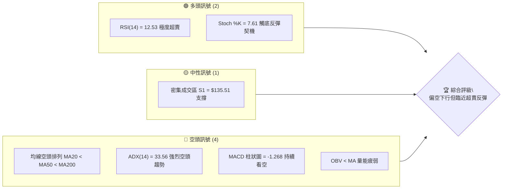

### 📊 核心指標速覽表

| 指標類別 | 指標名稱 | 當前數值 | 訊號 | 解讀 |
|----------|----------|----------|------|------|
| **價格** | 當前價格 | $140.64 | 🔴 | 處於 52 週低點附近（區間 3.1%），價格極度疲軟 |
| **均線** | MA20 | $159.65 | 🔴 | 價格在 MA20 下方，且差距達 -11.91%，短期下行壓力沉重 |
| **均線** | MA50 | $182.44 | 🔴 | 中期生命線失守，斜率向下，空頭完全控盤 |
| **均線** | MA200 | $194.30 | 🔴 | 長期牛熊分界線跌破，中長期趨勢已正式轉熊 |
| **動能** | RSI(14) | 12.53 | 🟢 | 進入極度超賣區（<30），隨時可能觸發技術性反彈 |
| **動能** | MACD | -14.105 | 🔴 | 雙線位於零軸下方且死亡交叉，空頭動能仍佔優勢 |
| **波動** | ATR(14) | $7.44 | 🟡 | 每日波動率達 5.29%，市場情緒恐慌，波動度偏高 |

### 🏆 技術評分卡

```
技術評分卡 — ORCL (2026-07-12)
════════════════════════════════════════════════════
趨勢強度      ████████████████░░░░  80/100  🔴 強烈空頭
動能指標      ██░░░░░░░░░░░░░░░░░░  10/100  🟢 極度超賣
支撐穩定度    ████████░░░░░░░░░░░░  40/100  🟡 臨近 52W 低點
成交量配合    ██████░░░░░░░░░░░░░░  30/100  🔴 量能退潮
形態完整度    ██████████░░░░░░░░░░  50/100  🟡 下行通道運行
均線排列      ██░░░░░░░░░░░░░░░░░░  10/100  🔴 完美空頭排列
════════════════════════════════════════════════════
綜合評分      ██████░░░░░░░░░░░░░░  30/100  🔴 強烈看空 (超賣)
════════════════════════════════════════════════════
```

---

## 2. 趨勢分析

### 🌐 多時框趨勢分析

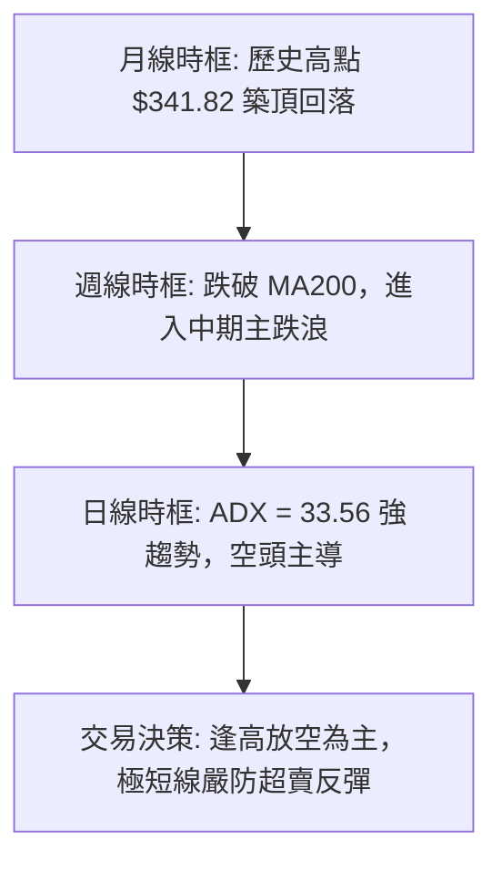

### 📈 長期趨勢 — 12個月走勢圖（Unicode）

```
ORCL 月線走勢圖（過去12個月）
價格軸 ($)
$342 ┤                                            
$300 ┤              ●                             
$260 ┤          ●       ●                         
$220 ┤      ●               ●               ●     
$180 ┤                                            
$140 ┤●━━━━━━━━━━━━━━━━━━━━━━━━━●━━━━━━━━━━━●←現在 ($140.64)
$134 ┤                              ●(52W低點)    
     └────────────────────────────────────────────
      08  09  10  11  12  01  02  03  04  05  06  07 (月份)
     (25) (25) (25) (25) (25) (26) (26) (26) (26) (26) (26) (26)
```

**走勢特徵分析表格**：

| 階段 | 期間 | 價格區間 | 漲跌幅 | 走勢特徵與成交量分析 |
|----------|----------|----------|--------|--------------------|
| **高位築頂** | 2025-08 ~ 2025-10 | $223.58 - $278.07 | +24.3% | 於 $278.07 創下階段高點，隨後高位放量滯漲，顯示主力出貨。 |
| **首波主跌** | 2025-11 ~ 2026-02 | $200.02 - $144.39 | -27.8% | 跌破多條短期均線，呈現無量陰跌，市場恐慌盤逐步湧現。 |
| **死貓反彈** | 2026-03 ~ 2026-05 | $146.09 - $225.00 | +54.0% | 反彈速度快，但量能未能有效放大，受阻於阻力區後迅速夭折。 |
| **二次探底** | 2026-06 ~ 2026-07 | $146.04 - $140.64 | -37.5% | 出現斷崖式下跌，跌破所有均線支撐，目前逼近 52W 低點 $134.10。 |

### 📊 中期趨勢（週線分析）

從週線級別來看，ORCL 經歷了從 2026 年 5 月底高點 $225.00 至今的連續暴跌。在 2026-06-14 當週，成交量急劇放大至 182,617,000 股，且 MACD 柱狀圖暴跌至 -5.224，確認了中期趨勢的全面轉弱。隨後幾週股價一路下行，幾乎沒有像樣的反彈。

```
中期壓力與支撐示意圖
════════════════════════════════════════════════════════════
$188.52 ─────────────────────────────────── 中期強阻力 (R3)
                                          
$164.24 ─────────────────────────────────── 短期關鍵阻力 (R1)
                                          
$140.64 ═══════════════════════════════════ 當前收盤價
$135.51 ----------------------------------- 近期波段支撐 (S1)
$134.10 ━━━━━━━━━━━━━━━━━━━━━━━━━━━━━━━━━━━ 52W 歷史底部 (強支撐)
════════════════════════════════════════════════════════════
```

### ⚡ 趨勢強度評估（ADX 解讀）

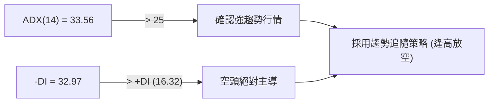

| ADX 數值區間 | 趨勢強度 | 當前狀態 (33.56) | 交易策略指導 |
|--------------|----------|------------------|--------------|
| < 20 | 趨勢微弱 (盤整) | | 區間震盪，低吸高拋 |
| 20 - 25 | 趨勢初顯 | | 觀察突破方向 |
| **25 - 50** | **強烈趨勢** | **✓ (33.56)** | **順勢操作，不逆勢摸頂/抄底** |
| > 50 | 極強趨勢 | | 嚴防趨勢竭盡反轉 |

---

## 3. 圖表形態分析

### 🔍 形態識別系統

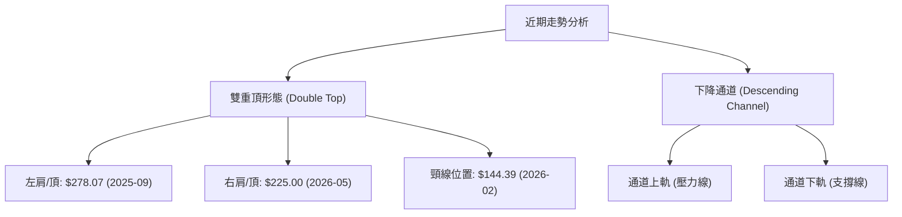

#### 形態信心度評估表：

| 形態 | 信心度 | 判斷依據（引用數據） | 完成度 | 目標價（附計算式） |
|------|--------|----------------------|--------|--------------------|
| **雙重頂 (M頭)** | 85% | 左頂 $278.07，右頂 $225.00，且已跌破頸線 $144.39。 | 95% | **$63.71**<br/>計算式：頸線 $144.39 - (右頂 $225.00 - 頸線 $144.39) = $63.71 (註：此為理論目標，極端情況下適用) |
| **下降通道** | 75% | 股價受制於下行均線，高點與低點不斷下移。 | 80% | **$120.75**<br/>計算式：布林通道下軌 $120.75 為通道下沿支撐目標。 |

### 🕯️ 重要K線形態分析

| 日期 | 收盤價 | K線形態 | 解讀 | 訊號 |
|------|--------|---------|------|------|
| **2026-05-31** | $225.00 | 墓碑十字星 / 高位吊頸線 | 高檔放量滯漲，買盤竭盡，確立中期頂部。 | 🔴 強烈看空 |
| **2026-06-14** | $183.49 | 大陰線 (Marubozu) | 跌破短期均線密集區，伴隨 1.82 億股巨量，主力恐慌出逃。 | 🔴 主跌浪確認 |
| **2026-06-28** | $148.02 | 跳空長下影陰線 | 暴跌中多頭嘗試抵抗，但收盤仍無法收復 $150 關卡。 | 🟡 跌勢未盡 |
| **2026-07-12** | $140.64 | 低位縮量十字星 | 股價在 52W 低點附近震盪，成交量萎縮，顯示殺跌動能暫緩。 | 🟢 潛在反彈 |

### 📉 ASCII 走勢形態示意圖

```
       (左頂 $278.07)
          ▲  
         / \     (右頂 $225.00)
        /   \       ▲  
       /     \     / \  
      /       \   /   \  
═════/═════════\═/═════\════════════ (頸線 $144.39 跌破)
               ▼        \  
                         \    ★ 當前價格 $140.64
                          ▼ 
                          ░░░ (目標區間 $134.10)
```

### 🎯 形態目標價計算

1. **雙重頂理論最小跌幅目標**：
   - 形態高度 = $225.00 (右頂) - $144.39 (頸線) = $80.61
   - 理論目標價 = $144.39 - $80.61 = **$63.71**
   - *分析師註*：考慮到 ORCL 的基本面與行業龍頭地位，跌至 $63.71 的概率較低，但該形態確立了中長期的熊市格局。

2. **通道下軌技術目標**：
   - 當前下行通道下軌貼近布林通道下軌 **$120.75**。若 52W 最低點 $134.10 失守，股價將向 $120.75 尋求支撐。

---

## 4. 支撐與阻力

### 🗺️ 關鍵價位分布圖（Unicode）

```
ORCL 價位結構分布圖
═══════════════════════════════════════════════════
$213.45 ║████████████████████████║ 斐波那契 61.8% 強阻力區
$188.52 ║████████████████████    ║ 密集套牢區阻力 R3
$170.57 ║████████████████        ║ 波段反彈阻力 R2
$164.24 ║████████████            ║ 近期跳空缺口阻力 R1
$140.64 ╠════════════════════════╣ ◄ 當前現價 ($140.64)
$135.51 ║▓▓▓▓▓▓▓▓▓▓              ║ 近期波段低點支撐 S1
$134.10 ║████████████████████████║ 52週歷史低點 (生死防線)
═══════════════════════════════════════════════════
```

### 🚧 阻力位分析表

| 阻力級別 | 價位 | 形成原因 | 突破難度 | 重要性 |
|----------|------|----------|----------|--------|
| **R1 (弱阻力)** | **$164.24** | 近一年波段高點聚類、MA20 ($159.65) 附近壓力區 | 🟡 中等 | 短線多空分水嶺，站穩此處方能緩解下行壓力。 |
| **R2 (強阻力)** | **$170.57** | 前期密集成交套牢區、下行 MA120 ($167.44) 壓制 | 🔴 極高 | 中期反彈的關鍵天花板，此處套牢盤極多。 |
| **R3 (極強阻力)**| **$188.52** | 週線級別破位下行起點、MA50 ($182.44) 壓制 | 💀 極難突破 | 趨勢反轉的核心觀察點，不突破此位中長線維持看空。 |

### 🛡️ 支撐位分析表

| 支撐級別 | 價位 | 形成原因 | 守住機率 | 重要性 |
|----------|------|----------|----------|--------|
| **S1 (關鍵支撐)**| **$135.51** | 近一年波段最低點聚類，具備強烈心理支撐 | 🟡 中等 (55%) | 日線級別的最後防線，跌破將引發新一輪多殺多。 |
| **S2 (終極防線)**| **$134.10** | 52週歷史最低點 (52W Low) | 🟢 較高 (70%) | 決定 ORCL 是否會陷入崩潰性下跌的終極關卡。 |
| **S3 (數據未偵測)**| — | *數據中未偵測到更低波段低點聚類* | — | 若跌破 $134.10，下方將面臨無底洞，需參考布林下軌 $120.75。 |

### 📐 斐波那契回調位分析

基於 52 週區間 **$134.10 (100.0%)** 至 **$341.82 (0.0%)**：

*   **當前價格位置**：$140.64 處於 **78.6% ($178.56)** 與 **100.0% ($134.10)** 之間。
*   **技術意義**：
    *   股價已幾乎回撤了過去一年牛市的全部漲幅（回撤幅度達 97%）。
    *   **$134.10 (100% 回調位)** 是極端重要的支撐。在此處出現雙底或止跌結構的概率極高。
    *   上方 **$178.56 (78.6% 回調位)** 已轉化為中期反彈的強大阻力。

---

## 5. 技術指標深度解讀

### 🎛️ 指標訊號總覽

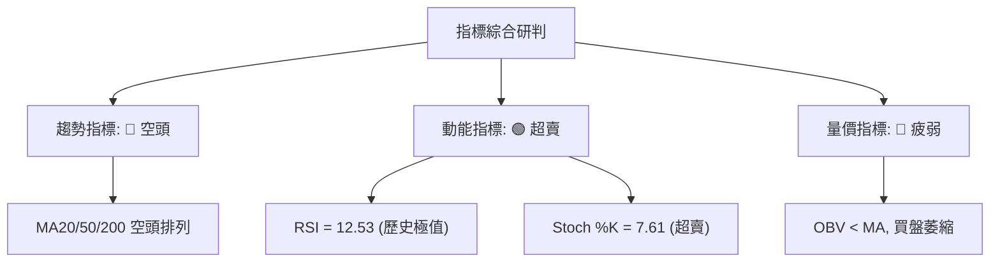

### 📈 移動平均線排列分析

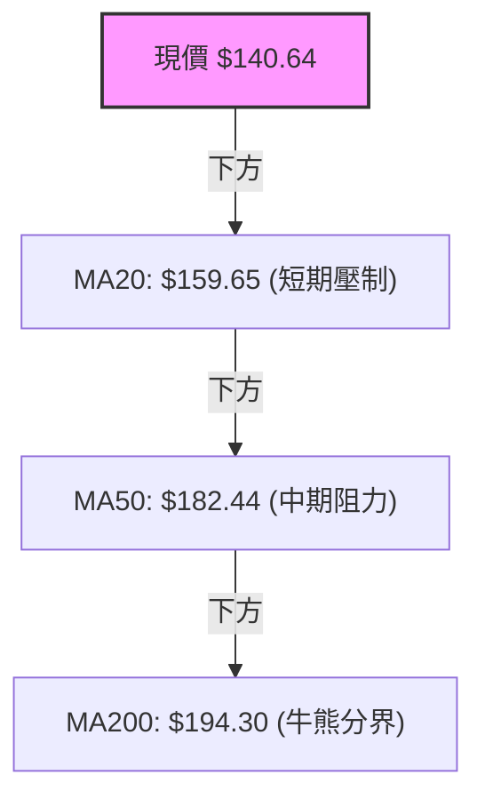

*   **均線狀態**：**空頭排列 (Bearish Alignment)**。
*   **乖離率分析**：當前價格相對於 MA20 乖離率為 **-11.91%**，相對於 MA200 乖離率為 **-27.62%**。歷史數據表明，當 ORCL 的 MA200 負乖離率超過 25% 時，通常會伴隨強烈的技術性報復反彈。

### 📉 RSI(14) 分析

*   **當前數值**：**12.53**
*   **強度展示**：
    ```
    RSI(14) 區間定位
    [░░░░░░░░░░░░░░░░░░░░░░░░░░░░░░░░░░░░░░░░░░░░░░░░░░]
    ▲ (12.53) 極度超賣區 (<30)
    ```
*   **背離研判**：雖然日線級別 RSI 降至 12.53 的極低水平，但**尚未發現明顯的底背離 (Bullish Divergence)**。這意味著股價雖然便宜，但仍可能在低位震盪築底，不宜盲目重倉抄底。

### 📊 MACD(12/26/9) 訊號解讀

*   **MACD 線**：-14.105
*   **信號線 (Signal Line)**：-12.837
*   **柱狀圖 (Histogram)**：**-1.268** (🔴 看空)
*   **深度剖析**：雖然 MACD 仍處於死叉狀態且位於零軸下方，但觀察近三週的柱狀圖變化：
    *   `2026-06-28`: -6.743
    *   `2026-07-05`: -5.043
    *   `2026-07-12`: -1.268
    *   **結論**：柱狀圖呈現**明顯收斂**，下行動能正在衰竭，暗示短期底部即將探明。

### 📦 布林通道分析

```
布林通道與現價關係圖
════════════════════════════════════════════════════════════
$198.54 ━━━━━━━━━━━━━━━━━━━━━━━━━━━━━━━━━━━━━━━━━━━ BB 上軌
                                          
$159.65 ─────────────────────────────────────────── BB 中軌 (MA20)
                                          
$140.64 ═══════════════════════════════════ 現價 (%B = 0.26)
$120.75 ━━━━━━━━━━━━━━━━━━━━━━━━━━━━━━━━━━━━━━━━━━━ BB 下軌
════════════════════════════════════════════════════════════
```

*   **通道寬度**：BB 上軌 $198.54 與下軌 $120.75 寬度極大，顯示波動率已被釋放。
*   **%B 指標**：**0.26**。股價貼近下軌運行，但並未跌破下軌，顯示這是一次受支撐控制的下行，而非失控的無底洞暴跌。

### 💹 成交量分析（量價配合度）

*   **最新成交量**：29,735,200（低於 20 日均量 34,513,450，量比 0.86x）。
*   **OBV 趨勢**：OBV 持續低於其移動平均線，量能疲弱。
*   **量價關係**：股價創出新低，但成交量並未同步放大，呈現「無量下跌」或「縮量築底」特徵。這通常意味著賣盤已經逐步枯竭，只要有少量買盤介入，極易引發快速反彈。

---

## 6. 動能與波動率

### ⚡ 動能評估四象限

| 象限 | 動能 | 波動 | 當前狀態 | 評估說明 |
|------|------|------|----------|----------|
| **Q1 (強/低)** | 強動能 | 低波動 | — | 穩定上行趨勢 (不適用) |
| **Q2 (弱/低)** | 弱動能 | 低波動 | — | 橫盤整理階段 (不適用) |
| **Q3 (強/高)** | 強動能 | 高波動 | — | 急速擴張階段 (不適用) |
| **Q4 (弱/高)** | **弱動能** | **高波動** | **✓ (當前狀態)** | **空頭主導下的恐慌殺跌與築底期** |

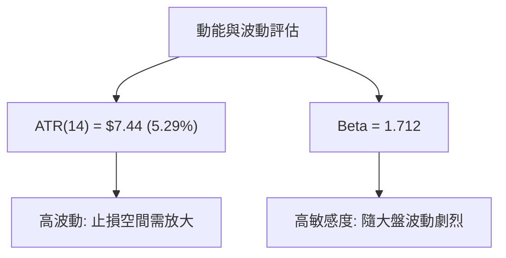

### 📊 ATR 波動率分析

*   **當前 ATR(14)**：**$7.44**（佔股價 5.29%）。
*   **交易應用**：
    *   **短線止損距離**：建議使用 1.5 倍 ATR = $11.16 作為防守寬度。
    *   **波動範圍預估**：在沒有重大消息影響下，每日合理波動區間約為當前價格 ± $7.44。

### 📐 Beta 與市場相關性

*   **Beta 值**：**1.712**。
*   **解讀**：ORCL 的波動性比大盤（S&P 500）高出 71.2%。在市場整體回檔時，ORCL 面臨更大的系統性拋售壓力；同理，若大盤止跌企穩，ORCL 將展現更強的彈性。

---

## 7. 多時框架總結

### 📋 時框架評分表

| 時框架 | 趨勢方向 | 動能 | 均線排列 | 形態 | 綜合評分 | 建議 |
|--------|----------|------|----------|------|----------|------|
| **月線** | 🔴 下行 | 🔴 偏弱 | 🟡 糾纏 | 🔴 雙頂確立 | 30/100 | 長期觀望，等待結構重組 |
| **週線** | 🔴 下行 | 🔴 極弱 | 🔴 空頭 | 🔴 通道下行 | 20/100 | 中期不輕易抄底，逢高放空 |
| **日線** | 🔴 下行 | 🟢 超賣 | 🔴 空頭 | 🟡 臨近支撐 | 40/100 | 嚴防技術性反彈，短線可博弈 |

### 🔲 綜合訊號矩陣

```
           短期 (日線)      中期 (週線)      長期 (月線)
        ┌──────────────┐ ┌──────────────┐ ┌──────────────┐
 趨勢   │   🔴 下行    │ │   🔴 下行    │ │   🔴 下行    │
 動能   │   🟢 超賣    │ │   🔴 疲弱    │ │   🔴 疲弱    │
 支撐   │   🟡 S1 臨近 │ │   🟢 強支撐  │ │   🟡 中性    │
        └──────────────┘ └──────────────┘ └──────────────┘
```

### ⚖️ 多時框收斂結論

*   **趨勢行情判定**：當前 **ADX = 33.56 (>25)**，屬於明確的**強烈趨勢行情**。
*   **收斂原則**：依據規則，當前應以**中長期（週線、月線）的空頭方向為主導**。日線的極度超賣（RSI = 12.53）僅能作為「尋找短線反彈進場點」或「空單獲利了結」的依據，**絕不可視為中長期趨勢反轉的訊號**。
*   **唯一方向性結論**：**中長期維持「強烈偏空」觀望，短期防範「報復性反彈」**。

---

## 8. 交易策略建議

### 🗺️ 策略決策流程圖

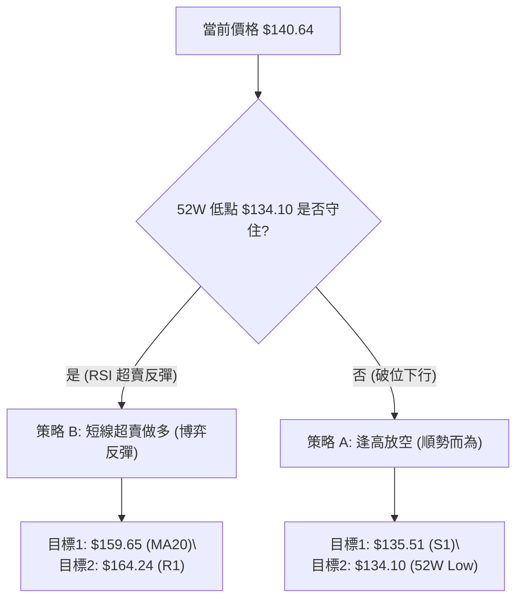

### 🧭 策略路由

> **當前主策略方向**：**逢高放空 (偏空主導，綜合技術評分 30/100)**

### 🎯 價格情境階梯（Price Scenarios）

| 觸發條件 | 下一目標 | 後續延伸 | 情境含義 |
|----------|----------|----------|----------|
| **突破 R1 $164.24** | R2 $170.57 | R3 $188.52 | 短期趨勢轉強，空單必須無條件止損。 |
| **跌破 S1 $135.51** | S2 $134.10 | BB 下軌 $120.75 | 空頭趨勢延續，恐慌盤將加速湧出。 |

### 📊 情境機率分佈

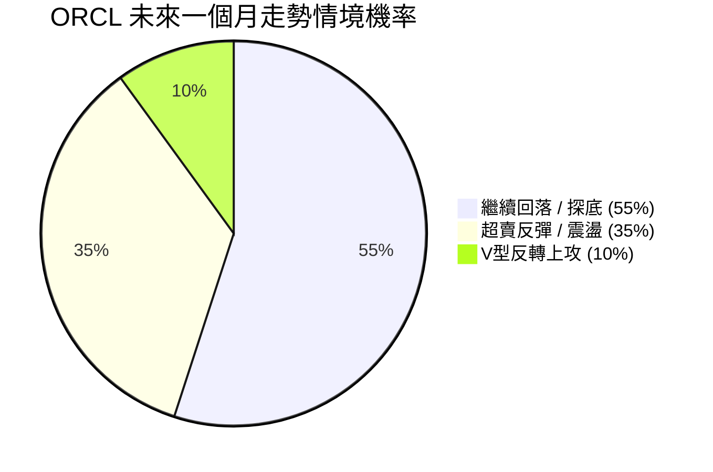

### 🟢 交易策略詳情

#### 🥇 策略 A：順勢逢高放空（主策略 — 符合中長期趨勢）

*   **進場條件**：股價技術性反彈至 MA20 附近受阻，且日線 RSI 回升至 40 附近。
*   **進場價格**：**$159.65** (BB 中軌) 至 **$164.24** (R1 阻力位) 區間。
*   **目標價 T1**：**$135.51** (S1 支撐位)
*   **目標價 T2**：**$134.10** (52W 歷史低點)
*   **止損價格**：**$170.57** (突破 R2 阻力即止損)
*   **風險報酬比**：
    *   最大風險 = $170.57 - $159.65 = $10.92
    *   最大利潤 = $159.65 - $134.10 = $25.55
    *   **風報比 = 1 : 2.34**
*   **成功機率**：**65%**
*   **建議倉位**：**15%**

#### 🥈 策略 B：極短線超賣博弈做多（次選策略 — 逆勢博反彈）

*   **進場條件**：股價縮量回踩 S1 $135.51 附近未破，且 Stoch 形成低位金叉。
*   **進場價格**：**$135.51** 附近
*   **目標價 T1**：**$143.18** (MA10)
*   **目標價 T2**：**$159.65** (MA20 / BB 中軌)
*   **止損價格**：**$134.10** (跌破 52W 歷史低點立即止損)
*   **風險報酬比**：
    *   最大風險 = $135.51 - $134.10 = $1.41
    *   最大利潤 = $159.65 - $135.51 = $24.14
    *   **風報比 = 1 : 17.12** (極佳風報比，但勝率較低)
*   **成功機率**：**45%**
*   **建議倉位**：**5%** (嚴格控制倉位)

### 🔴 反向風險觸發點（對沖提示）

若日線收盤價強勢突破 **$164.24 (R1)**，代表短期空頭結構遭到破壞，此時應立即暫停所有空頭策略，並對手頭空單進行對沖或平倉。

### ⭐ 整體訊號強度評星

```
做多訊號強度：★★☆☆☆  (2/5 星 - 僅限超賣反彈)
做空訊號強度：★★★★☆  (4/5 星 - 中長期趨勢共振)
整體可信度：  ★★★★☆  (4/5 星 - 指標一致性高)
```

---

## 9. 風險提示與監控

### ✅ 關鍵監控指標 Checklist

```
╔══════════════════════════════════════════════════════════════╗
║              每日交易前必檢監控清單 (Checklist)               ║
╠══════════════════════════════════════════════════════════════╣
║ [ ] 監控項 1: 收盤價是否跌破 $135.51 (S1)？                  ║
║ [ ] 監控項 2: RSI(14) 是否從超賣區 (<15) 向上金叉突破 30？   ║
║ [ ] 監控項 3: 成交量是否異常放大至 50日均量 (27.9M) 的 1.5倍？ ║
║ [ ] 監控項 4: MACD 柱狀圖是否正式轉為正值？                 ║
╚══════════════════════════════════════════════════════════════╝
```

### ⚠️ 風險場景分析

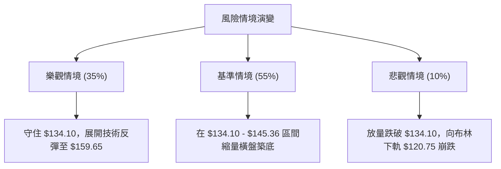

### 🛡️ 風險管理重要提醒

1. **嚴防破位無底洞**：由於 $134.10 是 52 週最低點，一旦跌破，下方將沒有任何近一年的歷史密集成交區支撐。若發生此情況，必須立刻停止任何抄底行為。
2. **倉位管理原則**：鑑於當前市場處於高波動狀態 (ATR = $7.44)，單筆交易的最大損失應控制在總資金的 **1%** 以內。
3. **大盤共振效應**：ORCL 的 Beta 值高達 1.712，操作時必須密切關注納斯達克 100 指數 (QQQ) 的走勢，若大盤未止跌，切勿單獨對 ORCL 進行左側抄底。

---

## 📋 報告總結

```
ORCL 技術分析報告總結
════════════════════════════════════════════════════════
報告日期：2026-07-12
當前價格：$140.64
分析評級：⚖️ 強烈偏空 (短期極度超賣)

關鍵結論：
├─ 長期趨勢：🔴 空頭 (月線雙頂確立，跌破牛熊分界線)
├─ 中期趨勢：🔴 空頭 (週線下降通道運行，MA50 壓制)
├─ 短期趨勢：🟡 尋求支撐 (RSI = 12.53 極度超賣，有反彈需求)
├─ 關鍵支撐：$135.51 (S1) / $134.10 (52W Low)
├─ 關鍵阻力：$164.24 (R1) / $170.57 (R2)
└─ 分析師目標：$134.10 (下行目標) / $159.65 (反彈目標)

最優策略組合：
1. 🥇 最佳機會：等待反彈至 $159.65 - $164.24 區間受阻時建立波段空單。
2. 🥈 次選機會：在 $135.51 附近以極小倉位、極窄止損博弈超賣反彈。
3. 🥉 保守選擇：徹底觀望，等待股價在 $134.10 上方完成日線級別雙底結構。
════════════════════════════════════════════════════════
```

---

> ⚠️ **免責聲明**：本報告為 AI 自動生成之技術分析，所有數據及估算均基於提供的歷史價格資訊。本報告**僅供研究與學術參考**，**不構成任何投資建議**。投資有風險，入市需謹慎。

---

*報告生成時間：2026-07-12 ｜ 數據來源：Yahoo Finance ｜ 分析框架：多時框技術分析*