<details>
<summary>📊 靜態圖表 (點擊展開)</summary>

</details>

<html>
<head><meta charset="utf-8" /></head>
<body>
    <div style="height:500px; width:100%;">                        <script>window.PlotlyConfig = {MathJaxConfig: 'local'};</script>
        <script charset="utf-8" src="https://cdn.plot.ly/plotly-3.7.0.min.js" integrity="sha256-jvTGqxNp8AGWEcvNLVuKr+8j5dGe9Yw51LQkmDH+IYA=" crossorigin="anonymous"></script>                <div id="candlestick-chart" class="plotly-graph-div" style="height:100%; width:100%;"></div>            <script>                window.PLOTLYENV=window.PLOTLYENV || {};                                if (document.getElementById("candlestick-chart")) {                    Plotly.newPlot(                        "candlestick-chart",                        [{"close":{"dtype":"f8","bdata":"AAAAoLFkc0AAAAAAvg9zQAAAACDAAHJAAAAAAECEcUAAAAAgLXlxQAAAAEAhYXFAAAAAoAzccUAAAABAadhxQAAAAKClrnFAAAAAQN0EckAAAADglpBxQAAAAMAJ1nFAAAAA4PdhckAAAABglCJyQAAAAEAUEXNAAAAA4EuCckAAAACAgstyQAAAAAAoYHNAAAAAgG4IckAAAAAAgyhxQAAAAIBXCHFAAAAAAOLgcEAAAABgT1ZxQAAAAKD4iXFAAAAA4GJrcUAAAACAWmJxQAAAAAC4CnFAAAAAYPLNb0AAAABgnkFwQAAAAIBf7G9AAAAAYJK5bkAAAADgZf1uQAAAAIARL25AAAAA4CyfbUAAAACg79BtQAAAAGCbPG1AAAAAgEkabEAAAAAguu9qQAAAAKASl2tAAAAAgE44a0AAAABARkxrQAAAAGAD7GtAAAAAgKsVakAAAACgjptoQAAAAIC7y2hAAAAA4LlkaEAAAADgD2BpQAAAAGCpAGlAAAAAoKbgaEAAAADguOVoQAAAAODat2lAAAAAoAmJakAAAAAgC\u002fBqQAAAAMDbTWtAAAAAYDxta0AAAADAJJxrQAAAAABpnmhAAAAA4PaEZ0AAAABg6ORmQAAAAKAgW2dAAAAAwCkYZkAAAABA7ElmQAAAAGBaxGdAAAAAgIOPaEAAAACAKS9oQAAAAEBOc2hAAAAAICeDaEAAAAAgbjBoQAAAAGBuamhAAAAAwIghaEAAAADg4zpoQAAAAMAA2GdAAAAA4MT8Z0AAAABA7d9nQAAAAGDSemdAAAAAQJWkaEAAAADgVWhpQAAAAMBiHGlAAAAAgI0IaEAAAAAgEZFnQAAAAMB4uGdAAAAAoIJVZkAAAABAkpVlQAAAAGA3HmZAAAAAoM39ZUAAAACAl6VmQAAAAAD8tWVAAAAAIEBzZUAAAADAz\u002fpkQAAAAOAIbmRAAAAA4GXeY0AAAABAHTNjQAAAAMDjNGJAAAAAQBLxYEAAAABgi7phQAAAAMAgcGNAAAAA4P7YY0AAAADgPYJjQAAAAOChbGNAAAAAwPDgY0AAAACg3hxjQAAAACDIYmNAAAAAAIpuY0AAAABgsmFiQAAAACCPimFAAAAAIAwkYkAAAACgqFtiQAAAAMCPqGJAAAAAAIgMYkAAAACA4IZiQAAAACBAf2JAAAAAQAbqYkAAAABg7TZjQAAAACDG\u002fGJAAAAAwEjQYkAAAADApItiQAAAAICjP2RAAAAAYMzBY0AAAADAGEFjQAAAAABtXGNAAAAAAMAzY0AAAADg3fpiQAAAAEAgTmNAAAAAoIqUYkAAAACgoChjQAAAAIA8QmJAAAAAADwgYkAAAADgObphQAAAACAgVmFAAAAA4Ms6YUAAAABA30JiQAAAACAhB2JAAAAAoKwrYkAAAADg+hBiQAAAAKCqxWFAAAAA4DzVYUAAAADAOSxhQAAAAGCPM2FAAAAAQJNiY0AAAACg6k1kQAAAAMAUJ2VAAAAAQBg3ZkAAAACgf85lQAAAAADcHmZAAAAAQFeRZkAAAADgMltnQAAAAEBn9WVAAAAAgLyVZUAAAAAgiItlQAAAAABPrGRAAAAAgGJoZEAAAABAkxpkQAAAAEB\u002fZ2VAAAAAQEd1ZkAAAAAgoxZnQAAAACBvK2hAAAAAwEo9aEAAAABAqWhoQAAAAABgJWhAAAAAQNVFZ0AAAACARKNnQAAAAKDRXWhAAAAAYP4IaEAAAABA0T5nQAAAAMCWmmZAAAAA4D5wZ0AAAABAlqNnQAAAACBA7WdAAAAAYIAMaEAAAAAAiclnQAAAACDNX2lAAAAAYOkfbEAAAAAgReluQAAAACBtd25AAAAAwAGxbEAAAAAAqXBtQAAAAMANnmpAAAAAoL1iakAAAABgFqNpQAAAAOD9EWlAAAAAoMbuZkAAAACAu+9mQAAAAMAb\u002f2dAAAAAoKp1Z0AAAABgmdxmQAAAAKDV9GZAAAAAYNHOZUAAAAAAzJJkQAAAAMB7n2NAAAAAYM79YkAAAABge4BiQAAAAGDtZ2JAAAAAgFdBYkAAAADgMMBhQAAAACAUeWFAAAAAAF\u002foYUAAAACgfaNhQAAAACAYgGFAAAAAQAr3YUAAAADgepRhQA=="},"high":{"dtype":"f8","bdata":"mrf4Z2YVdEC+vSrnLU9zQJQ35\u002f8hdnJA3P\u002fVXP0qckCp61OeHaxxQCJlzNnKjHFAY9bkY43rcUCl84LHVTpyQEusfEYdNXJAbR6X7WJVckDGWr9+ph5yQPMB8kPqA3JA1Rvm9YOhckD+wfDNewxzQCTZxzy1O3NA\u002fUgGKTDYckBizPnRnkBzQF71pJBW93NAMSiQGPjVckCyRG\u002fVoOdxQCIA2Fn0WXFAtUaoONQocUCRUwCvU4ZxQJgqGjQkx3FAWbGMXSHEcUDzSObSuatxQOsqLnHfbnFAm6cCE+2ycEDyLfhnVHRwQLLLRJRRcXBAXErZDuuab0CUSxCPoz9vQOZu6+8Y1m5AIwH9h07DbUDWRra3GJxuQKYIn0LPZW1A6el9WIZRbUDhwqteSeBrQEAJD00wHGxA\u002fwkK6XyVa0BzpQNIA7JrQBt8XlQNP2xAi1Mdt3b4bEAw+knaPMppQLzO9TPuO2lAT\u002fmynCiwaEBjIuAPzf9pQCzkVroFDWlAxBuQxskxaUDcCc\u002fzSvZpQAt3UIHgvWlAp6dFekSrakBqjLB85SxrQCXWVqRK02tAmybaUciPa0AbjvKWW+VrQJo7fSLuAWlAA4EkLLd+aECFs6oJRWVnQK4sfH+Tf2dAFGhLJvwWZ0CdTD8y1t9mQBia\u002fJkwKGhAboleQdOcaEAkCKEOHWpoQGp+hAxYjGhA5XMGvZXOaECaaz8KopNoQMTjE2+Dj2hACcr1Jx1qaECATspbK5ZoQDW\u002fddBr+GhAReJ5cJUgaEDYw98knzloQG4lXkIGpGdASFyvkFXZaEDuyb2KWaVpQJ2JgLR7y2lAI6FcZAAJaUASST2XCjVoQCw8fS9C0WdAnFgBdok8Z0DZg2a2HmtmQLa18CEjXWZAlj7IKO5MZkAiMkdyywBnQBBkF6gnT2ZACo18fXCNZkDIntmvlCFlQNVSB9BQ92RAKlD+12dAZUAq5zYIyshjQCx8s5bqG2NAfVnToxMxYkAj1VGpnsZhQMHXtveL1GNAS77NZcaHZECieaWVzFBkQHFkbu77vWNAK7dQyJQlZEDXfJdxnMVjQCniCe2whmNAxDX6oAjfY0D8MtBagR1jQIUguic+GWJAfeCa5r83YkBYl4VF8QZjQC1fn9Mn7mJAOrO1\u002fSMiYkCcQS3bHKRiQKjeJqtDvGJAZ7Th7G0RY0APjv9IB5tjQJapwUzAwmNASqJrQETeYkDXn6GTRSJjQGnkhYAzUmVAmpswblDVZEAuUibv9fRjQOgEIYBztGNAJPG4zSu6Y0ANrffEpTxjQHu5J3ademNAFz62TP0FY0CURCpQY1ZjQP2sBxmlGmNAJ3VGWaCZYkAAcGKviC5iQC+k\u002fIqilmFAogO3RRCHYUBnIz5mFkxiQEDcmqKWk2JAEO1gt5QtYkBexgvdoXBiQGdQ4fUn8mFApqgZWhvNYkAnPNLywclhQExtGK3jdWFAkD10w9JrY0AVsbmbARplQGNfy6XGfmVA38urD6R0ZkBmcQsFiPtmQPTCWmOZJGZAHS6UcVEWZ0CamX6pxZBnQOFz2AtNqGZAPFDLG6yCZkC9D1SeWJ5lQKDntC6vA2VAVoBulgqGZEC7QlY8b5NkQGBQillDtmVAhy9VdaTbZkBQvViF8jtnQGk0rZ25M2hAXiiKV5juaECk7ESnCKpoQIrZBP4MYGhAiKoDigkIaEA5GwS4\u002fNxnQOezvQd0AGlAF9wFqvd3aEDWWQYjKMNnQJb0SW8agmdA83bIqyhyZ0BuwpxA2QRoQGB8egQlimhAF5u4eL5QaECAU878Ke9nQMsPLtRBiWlAjcgBxCwwbEBY\u002fsG7PCxvQJSlBThgBG9AM+6EIKP1bUA\u002f67P\u002f48NtQK55jlhn1GxASJW9AJ5Ja0DyEZiriXdrQKOpBHfJd2pAVFGsOCQEZ0D07IWx+B1nQN1VvUKSVGhAOlssOpJUaEBQZvf5+rBnQLdclgrTamdA5TiiKBX+ZkBDz4QvOLdlQH9dU4ucpWRAZcSkc1qiY0AoBkb2PiBjQFaQGxTcPmNA5QWBYSCtYkAI41ITO2FiQHSmBOmaUWJAMOi\u002fTK8jYkD0c\u002fRnxSFiQOX\u002f0egkq2FAcxQ1wbORYkAAAACAwjViQA=="},"hovertemplate":"\u003cb\u003e%{x|%Y-%m-%d}\u003c\u002fb\u003e\u003cbr\u003e\u958b: $%{open:.2f}\u003cbr\u003e\u9ad8: $%{high:.2f}\u003cbr\u003e\u4f4e: $%{low:.2f}\u003cbr\u003e\u6536: $%{close:.2f}\u003cextra\u003e\u003c\u002fextra\u003e","low":{"dtype":"f8","bdata":"U5biOuUoc0BglSveYYpyQKata5LF1HFABROKG\u002fl8cUCxn8cGWEdxQP6bHx2nDHFAkyKZ3\u002fkrcUC\u002fZ1EjOa1xQCMTzefKjHFAA2c11134cUADz78DI79wQO\u002fsdQ13hnFAdrkmUUDIcUAZeGtshhNyQEncYCBUbnJAqmu6sgwTckC3\u002fmpKB4FyQAPlCFLLwnJAmVrI1g3McUCqz5qs4ApxQMTGdzaL2nBAThiRD9iqcECwgEqmmtxwQDZ90ULbeHFAdhrmdzBScUDrRtsYwl1xQORyCHEfzHBAoHem3Zy6b0ARGQq+PchvQNpW0WtVmW9As+RVeB9bbkDILY7ScJVuQMfyp3UgoG1A2GxeCivEbEBaGGkDxFltQNez+KyBVmxADhDYLEwAbEB5rkvKPqVqQLb216Y0GGpA5hiUZgWwakDDWmbpbI5qQIuM0G9852pA++mnJU8JakAE9tkdbvZnQKVQKWEzDmhARdJpTmn7ZkCT+iV\u002f2glpQMuYFMgbd2hA2ztSVERaaEA71Iq228JoQIS0AWvXr2hASuZunyqLaUCCrAmriHJqQDV+\u002fvbO2mpAmVz2uToGa0CNksY1C\u002fBqQG6QZIhtDmdAr1W9A4EGZ0AtRb37V3VmQBCcqZFH12ZAzb22qBvsZUDC+cZa9xtmQDB\u002fu25USmdAc1\u002fhOZzfZ0Ax35BGU8tnQPDkdwMBEmhAYB7OQZFHaEBVfV5wltlnQG\u002fzgsTjOmhAsPx1NtQbaEAhBE1EWQtoQHIjBDnDz2dAIQR68hmcZ0ArmVa9TcVnQPgAsUrkC2dAMDo+fRBvZ0AOoMgCmXRoQBvHInuW6GhAtDbT85KvZ0D0jYHicoJnQFDg0lGQJ2dA+PHW8LZDZkBIAjvZVi1lQEWpeVLU6GVAijDACNRZZUCfwsrjVilmQDE2IhA3j2VAuyPQB2FVZUAbqDFJywxkQKR6h8FzQ2RA1hCgyH3cY0AfLcu\u002fFttiQBm1XeO07WFAzfhMAfzJYEBB7TzESj5hQN2YhlhgP2JAWsf71uJ7Y0COyzyo0h1jQFWZjt4n7mJAYhjRC9FGY0B\u002f6UZNO\u002fpiQPLV9zM\u002fymJAxcL3\u002fhFWY0D50aMTxUtiQMbhr2gfNGFAdA1RXZI4YUDKWXs\u002fLkpiQMUpaCmWBGJAnVZC\u002fKmjYUB4RW59bYZhQCNbV3vawWFAGF\u002f7RxyCYkDkhlUShqJiQDFJmeEw0mJA8NPvNEMtYkDwIhpZdG1iQBjdoy7s7mNAophU\u002f1GwY0DWuqLqliJjQOPF05IHLmNApxe9G+8NY0A0SjOcid9iQCnvXuxve2JAkXiXyZBdYkAhPK37RbViQElXgCKcOmJAEGe8DBzzYUB07w1XpbFhQJM7U0ToKmFAGNYVuwEAYUDthLzXKVxhQClLuXBV9WFAaR5CrXZqYUCGovGDRtthQNg28wEGX2FAVTzXDRa9YUDYTHhz6fBgQHZegZhPw2BASI0IE4pnYUChHsoF\u002fx9kQF+LKt5HtGRAkJ2BkFGmZUBzRRWISZhlQI5uLxcSnWVA6eFcDMvsZUAt8qj7UcVmQF2tVFs\u002fr2VA4IECnN8GZUDicrU1LOpkQPp99UufL2RAS\u002fVwMPoCZEClV9vaxfhjQABXOfFdsmRAOuWxwfy0ZUA3lLQ4JExmQMWHV6IswWZAy1Z8w27EZ0BO7hxFnrFnQHMG2wQOvmdAgsLhJMaHZkCQ4hGcYw1nQIRvoW3TGWdAayZTxteHZ0CNGc3bTtRmQDXIiO2viWZAGoidlMNFZkCKb4a9oVFnQO9\u002fMdX\u002fzWdALZy7YMe8Z0Czm4eWl2hnQIMgrdi0FmhAIGqILz7paUAAGdh1SPprQFJ+NAViwG1AbvZCwERabEAzyk03JudrQJ3W98IpF2pAT+flN1YTakCoydhFVqNoQNUwsfnFr2hAcII\u002fn4PVZUDYh6syJExmQFFf5N0PMmdApBZRB01gZ0BOVgX7Tb5mQFWUaYmvImZAMU9mp3O5ZUBz7+r+QYFkQNl08Sn3WWNA0v5cxNa6YkAzX2qtlG9iQA2wuJRKFmJACB4pylT\u002fYUAAAADgMMBhQBLjm4UoS2FAWz5lt3WVYUDL2H4GVyJhQHBjcR9XImFAy7PJp3GOYUAAAADgUWhhQA=="},"name":"\u50f9\u683c","open":{"dtype":"f8","bdata":"YZSckJQFdEBi6IBvh0VzQKkLKYIUP3JAmQFyhSsbckDatmHRSJZxQIYn8mjjh3FAmKR2qIc6cUCiNSS6LwhyQCEyfwpi5XFA\u002fZjKqFwRckDGWr9+ph5yQAufK8tBo3FA3+R6MjwMckDhkP6vlJZyQErCUM+KfXJA1pL1y7fKckCbO4RJy99yQNTlrzHj6nJAZCHY9ZHNckCLSUduCONxQO2EO8w\u002fN3FAgk5B2hwDcUDbDo34ouVwQOp+RwYEs3FAP\u002fYH8VC9cUDvx+D1vYRxQKJOBVRWbHFAIo8K\u002fcKicEAApOotfhBwQD0L9vJLa3BAxxagOPDybkDKdLfzVLFuQG1JeF9Ism5AUqkEWe+WbUAvhwHtNXNuQICuLH0kP21AjVvIck5PbUB6JpQM5tprQHXgynQbGmpAomai4QIEa0BdpYR1n8RqQDeii3rzHmtAwMOSunOebEDGEy39QKNpQP4LoodWX2hAIJYRXzoHaECVjVwx9O9pQEx0l9VTs2hAyOdtj7TSaEB3PAdTxGVpQHHJXEJRzWhAKKTSufm7aUDyWTqeDB1rQDb6W\u002fuHZ2tADBeZxLE9a0DHfiYyy3VrQKs2SNeQmWdAe7UnwM5PaEASo7aht09nQI4GeGLv3WZABwQrTuGxZkBpGaM5Lp9mQBHlNC3jUmdAqRRuFhJeaED0kMVxtVFoQMLpJ\u002f9iJGhAHmG2BV+FaEAAY+JawwloQCs4cYD7RWhAqXQ+c2RRaEAlZb4CrHJoQC+LK74+jmhAeoKRgQ3XZ0D\u002fO7sZ5S1oQE2hqVzOoWdAIq2u3ZXKZ0AgzHndWIdoQDJWuCiBcmlAI6FcZAAJaUASST2XCjVoQOAEIUr5kmdAnFgBdok8Z0BgC1Y74k1mQOe\u002fIkQIRGZA3rRXz4dtZUCZ7oABdDtmQO09lQRQPmZAW27ZrZ62ZUD8JW3bCR9lQLXybCke4GRA9H5kAII3ZUAkW\u002f2JMqVjQH0y9s1TGmNA3svEPOMSYkA+2BVL\u002fFhhQIHWUtG5bmJAO3EbwH3cY0CieaWVzFBkQK+9st61mmNA3BJlcKjEY0CCGUetTJxjQOoeoD3aKmNAsM0O8jGDY0D1BHQOlAdjQHyunUe\u002fFWJAparVnJ97YUB\u002fcoJYBIRiQAypnztCeGJAbjJKmzrcYUAbvdv9aJRhQHduPEbg92FAh2zCNAefYkBYQKT9A\u002fFiQN335aWA+2JADGc1fPS0YkAKXcM+vxFjQNu+KUk8p2RA+Kkj55NwZEC1omFnTb5jQDEmECNJX2NAJKPIY5VLY0AIsMt3wQpjQLBpzzlUrWJAgHqHSaL\u002fYkCVJljl1ctiQAKV2noL\u002fmJAi9g+4T2GYkCaEgHki9xhQCrG1bh7fmFAr6QubTNiYUAeYNWmdmphQGgnVPPKgWJAJ5OA50W5YUDMm2bNW01iQH6N+xcN2WFAHqGWgT6oYkCXGUa9n7ZhQPBSTH4BG2FAPsJ6RyJpYUB1UqAbIetkQF2cMg73yWRACEaNJ975ZUAYygQcd8lmQG10Wv5NBmZAR2gO92k3ZkA83zTdGjFnQCwOGj3JeGZA7O39SUt8ZkCpWuTqaX9lQCkUMUwhM2RAXI0+yRRvZEBhrXZbqi5kQN2WHyb6umRA2T5fxRztZUCF1IRT9K9mQM1rCCG+MWdA3OUydHy9aECB7dn1Mf1nQI1ObX9772dAiKoDigkIaEDLl4wb\u002fYtnQEtG1wTicGdAhBfX\u002fYu6Z0DmcqXY66pnQIsgZ29dK2dAcCgpFB5qZkALYLzVWYtnQKHk\u002fAQt4GdAl2P+ricUaECABmX7HdpnQLTPJ7rAK2hAJ+yLMdAIakCY7YWlbbZsQDN5ou2pPm5AUn2hOq70bUANHnkD0UZsQJHwXlo4lmxAVBc+tdcfa0CV7X6UY6VqQNXdBWP6uWhAj3gR0YFhZkAFf95hywtnQHzAo9qwV2dALfhfaT2rZ0AXdFyudzBnQBkjZToEzGZAIUPtwLG1ZkAW+4JheTRlQGnzWYpVPWRA9SCiXr6ZY0DGSN9dprdiQAVqoHsALWNAnSid\u002fqlXYkCUzGp7pv9hQO98PtKz2WFAS4\u002fVaZf5YUAnQBRqGOdhQOK68hx+UmFAhMHlJcCdYUAAAADAzDRiQA=="},"x":["2025-09-23T00:00:00-04:00","2025-09-24T00:00:00-04:00","2025-09-25T00:00:00-04:00","2025-09-26T00:00:00-04:00","2025-09-29T00:00:00-04:00","2025-09-30T00:00:00-04:00","2025-10-01T00:00:00-04:00","2025-10-02T00:00:00-04:00","2025-10-03T00:00:00-04:00","2025-10-06T00:00:00-04:00","2025-10-07T00:00:00-04:00","2025-10-08T00:00:00-04:00","2025-10-09T00:00:00-04:00","2025-10-10T00:00:00-04:00","2025-10-13T00:00:00-04:00","2025-10-14T00:00:00-04:00","2025-10-15T00:00:00-04:00","2025-10-16T00:00:00-04:00","2025-10-17T00:00:00-04:00","2025-10-20T00:00:00-04:00","2025-10-21T00:00:00-04:00","2025-10-22T00:00:00-04:00","2025-10-23T00:00:00-04:00","2025-10-24T00:00:00-04:00","2025-10-27T00:00:00-04:00","2025-10-28T00:00:00-04:00","2025-10-29T00:00:00-04:00","2025-10-30T00:00:00-04:00","2025-10-31T00:00:00-04:00","2025-11-03T00:00:00-05:00","2025-11-04T00:00:00-05:00","2025-11-05T00:00:00-05:00","2025-11-06T00:00:00-05:00","2025-11-07T00:00:00-05:00","2025-11-10T00:00:00-05:00","2025-11-11T00:00:00-05:00","2025-11-12T00:00:00-05:00","2025-11-13T00:00:00-05:00","2025-11-14T00:00:00-05:00","2025-11-17T00:00:00-05:00","2025-11-18T00:00:00-05:00","2025-11-19T00:00:00-05:00","2025-11-20T00:00:00-05:00","2025-11-21T00:00:00-05:00","2025-11-24T00:00:00-05:00","2025-11-25T00:00:00-05:00","2025-11-26T00:00:00-05:00","2025-11-28T00:00:00-05:00","2025-12-01T00:00:00-05:00","2025-12-02T00:00:00-05:00","2025-12-03T00:00:00-05:00","2025-12-04T00:00:00-05:00","2025-12-05T00:00:00-05:00","2025-12-08T00:00:00-05:00","2025-12-09T00:00:00-05:00","2025-12-10T00:00:00-05:00","2025-12-11T00:00:00-05:00","2025-12-12T00:00:00-05:00","2025-12-15T00:00:00-05:00","2025-12-16T00:00:00-05:00","2025-12-17T00:00:00-05:00","2025-12-18T00:00:00-05:00","2025-12-19T00:00:00-05:00","2025-12-22T00:00:00-05:00","2025-12-23T00:00:00-05:00","2025-12-24T00:00:00-05:00","2025-12-26T00:00:00-05:00","2025-12-29T00:00:00-05:00","2025-12-30T00:00:00-05:00","2025-12-31T00:00:00-05:00","2026-01-02T00:00:00-05:00","2026-01-05T00:00:00-05:00","2026-01-06T00:00:00-05:00","2026-01-07T00:00:00-05:00","2026-01-08T00:00:00-05:00","2026-01-09T00:00:00-05:00","2026-01-12T00:00:00-05:00","2026-01-13T00:00:00-05:00","2026-01-14T00:00:00-05:00","2026-01-15T00:00:00-05:00","2026-01-16T00:00:00-05:00","2026-01-20T00:00:00-05:00","2026-01-21T00:00:00-05:00","2026-01-22T00:00:00-05:00","2026-01-23T00:00:00-05:00","2026-01-26T00:00:00-05:00","2026-01-27T00:00:00-05:00","2026-01-28T00:00:00-05:00","2026-01-29T00:00:00-05:00","2026-01-30T00:00:00-05:00","2026-02-02T00:00:00-05:00","2026-02-03T00:00:00-05:00","2026-02-04T00:00:00-05:00","2026-02-05T00:00:00-05:00","2026-02-06T00:00:00-05:00","2026-02-09T00:00:00-05:00","2026-02-10T00:00:00-05:00","2026-02-11T00:00:00-05:00","2026-02-12T00:00:00-05:00","2026-02-13T00:00:00-05:00","2026-02-17T00:00:00-05:00","2026-02-18T00:00:00-05:00","2026-02-19T00:00:00-05:00","2026-02-20T00:00:00-05:00","2026-02-23T00:00:00-05:00","2026-02-24T00:00:00-05:00","2026-02-25T00:00:00-05:00","2026-02-26T00:00:00-05:00","2026-02-27T00:00:00-05:00","2026-03-02T00:00:00-05:00","2026-03-03T00:00:00-05:00","2026-03-04T00:00:00-05:00","2026-03-05T00:00:00-05:00","2026-03-06T00:00:00-05:00","2026-03-09T00:00:00-04:00","2026-03-10T00:00:00-04:00","2026-03-11T00:00:00-04:00","2026-03-12T00:00:00-04:00","2026-03-13T00:00:00-04:00","2026-03-16T00:00:00-04:00","2026-03-17T00:00:00-04:00","2026-03-18T00:00:00-04:00","2026-03-19T00:00:00-04:00","2026-03-20T00:00:00-04:00","2026-03-23T00:00:00-04:00","2026-03-24T00:00:00-04:00","2026-03-25T00:00:00-04:00","2026-03-26T00:00:00-04:00","2026-03-27T00:00:00-04:00","2026-03-30T00:00:00-04:00","2026-03-31T00:00:00-04:00","2026-04-01T00:00:00-04:00","2026-04-02T00:00:00-04:00","2026-04-06T00:00:00-04:00","2026-04-07T00:00:00-04:00","2026-04-08T00:00:00-04:00","2026-04-09T00:00:00-04:00","2026-04-10T00:00:00-04:00","2026-04-13T00:00:00-04:00","2026-04-14T00:00:00-04:00","2026-04-15T00:00:00-04:00","2026-04-16T00:00:00-04:00","2026-04-17T00:00:00-04:00","2026-04-20T00:00:00-04:00","2026-04-21T00:00:00-04:00","2026-04-22T00:00:00-04:00","2026-04-23T00:00:00-04:00","2026-04-24T00:00:00-04:00","2026-04-27T00:00:00-04:00","2026-04-28T00:00:00-04:00","2026-04-29T00:00:00-04:00","2026-04-30T00:00:00-04:00","2026-05-01T00:00:00-04:00","2026-05-04T00:00:00-04:00","2026-05-05T00:00:00-04:00","2026-05-06T00:00:00-04:00","2026-05-07T00:00:00-04:00","2026-05-08T00:00:00-04:00","2026-05-11T00:00:00-04:00","2026-05-12T00:00:00-04:00","2026-05-13T00:00:00-04:00","2026-05-14T00:00:00-04:00","2026-05-15T00:00:00-04:00","2026-05-18T00:00:00-04:00","2026-05-19T00:00:00-04:00","2026-05-20T00:00:00-04:00","2026-05-21T00:00:00-04:00","2026-05-22T00:00:00-04:00","2026-05-26T00:00:00-04:00","2026-05-27T00:00:00-04:00","2026-05-28T00:00:00-04:00","2026-05-29T00:00:00-04:00","2026-06-01T00:00:00-04:00","2026-06-02T00:00:00-04:00","2026-06-03T00:00:00-04:00","2026-06-04T00:00:00-04:00","2026-06-05T00:00:00-04:00","2026-06-08T00:00:00-04:00","2026-06-09T00:00:00-04:00","2026-06-10T00:00:00-04:00","2026-06-11T00:00:00-04:00","2026-06-12T00:00:00-04:00","2026-06-15T00:00:00-04:00","2026-06-16T00:00:00-04:00","2026-06-17T00:00:00-04:00","2026-06-18T00:00:00-04:00","2026-06-22T00:00:00-04:00","2026-06-23T00:00:00-04:00","2026-06-24T00:00:00-04:00","2026-06-25T00:00:00-04:00","2026-06-26T00:00:00-04:00","2026-06-29T00:00:00-04:00","2026-06-30T00:00:00-04:00","2026-07-01T00:00:00-04:00","2026-07-02T00:00:00-04:00","2026-07-06T00:00:00-04:00","2026-07-07T00:00:00-04:00","2026-07-08T00:00:00-04:00","2026-07-09T00:00:00-04:00","2026-07-10T00:00:00-04:00"],"type":"candlestick"},{"hovertemplate":"MA30: $%{y:.2f}\u003cextra\u003e\u003c\u002fextra\u003e","line":{"color":"#2196F3","dash":"dash","width":2},"mode":"lines","name":"MA30","x":["2025-09-23T00:00:00-04:00","2025-09-24T00:00:00-04:00","2025-09-25T00:00:00-04:00","2025-09-26T00:00:00-04:00","2025-09-29T00:00:00-04:00","2025-09-30T00:00:00-04:00","2025-10-01T00:00:00-04:00","2025-10-02T00:00:00-04:00","2025-10-03T00:00:00-04:00","2025-10-06T00:00:00-04:00","2025-10-07T00:00:00-04:00","2025-10-08T00:00:00-04:00","2025-10-09T00:00:00-04:00","2025-10-10T00:00:00-04:00","2025-10-13T00:00:00-04:00","2025-10-14T00:00:00-04:00","2025-10-15T00:00:00-04:00","2025-10-16T00:00:00-04:00","2025-10-17T00:00:00-04:00","2025-10-20T00:00:00-04:00","2025-10-21T00:00:00-04:00","2025-10-22T00:00:00-04:00","2025-10-23T00:00:00-04:00","2025-10-24T00:00:00-04:00","2025-10-27T00:00:00-04:00","2025-10-28T00:00:00-04:00","2025-10-29T00:00:00-04:00","2025-10-30T00:00:00-04:00","2025-10-31T00:00:00-04:00","2025-11-03T00:00:00-05:00","2025-11-04T00:00:00-05:00","2025-11-05T00:00:00-05:00","2025-11-06T00:00:00-05:00","2025-11-07T00:00:00-05:00","2025-11-10T00:00:00-05:00","2025-11-11T00:00:00-05:00","2025-11-12T00:00:00-05:00","2025-11-13T00:00:00-05:00","2025-11-14T00:00:00-05:00","2025-11-17T00:00:00-05:00","2025-11-18T00:00:00-05:00","2025-11-19T00:00:00-05:00","2025-11-20T00:00:00-05:00","2025-11-21T00:00:00-05:00","2025-11-24T00:00:00-05:00","2025-11-25T00:00:00-05:00","2025-11-26T00:00:00-05:00","2025-11-28T00:00:00-05:00","2025-12-01T00:00:00-05:00","2025-12-02T00:00:00-05:00","2025-12-03T00:00:00-05:00","2025-12-04T00:00:00-05:00","2025-12-05T00:00:00-05:00","2025-12-08T00:00:00-05:00","2025-12-09T00:00:00-05:00","2025-12-10T00:00:00-05:00","2025-12-11T00:00:00-05:00","2025-12-12T00:00:00-05:00","2025-12-15T00:00:00-05:00","2025-12-16T00:00:00-05:00","2025-12-17T00:00:00-05:00","2025-12-18T00:00:00-05:00","2025-12-19T00:00:00-05:00","2025-12-22T00:00:00-05:00","2025-12-23T00:00:00-05:00","2025-12-24T00:00:00-05:00","2025-12-26T00:00:00-05:00","2025-12-29T00:00:00-05:00","2025-12-30T00:00:00-05:00","2025-12-31T00:00:00-05:00","2026-01-02T00:00:00-05:00","2026-01-05T00:00:00-05:00","2026-01-06T00:00:00-05:00","2026-01-07T00:00:00-05:00","2026-01-08T00:00:00-05:00","2026-01-09T00:00:00-05:00","2026-01-12T00:00:00-05:00","2026-01-13T00:00:00-05:00","2026-01-14T00:00:00-05:00","2026-01-15T00:00:00-05:00","2026-01-16T00:00:00-05:00","2026-01-20T00:00:00-05:00","2026-01-21T00:00:00-05:00","2026-01-22T00:00:00-05:00","2026-01-23T00:00:00-05:00","2026-01-26T00:00:00-05:00","2026-01-27T00:00:00-05:00","2026-01-28T00:00:00-05:00","2026-01-29T00:00:00-05:00","2026-01-30T00:00:00-05:00","2026-02-02T00:00:00-05:00","2026-02-03T00:00:00-05:00","2026-02-04T00:00:00-05:00","2026-02-05T00:00:00-05:00","2026-02-06T00:00:00-05:00","2026-02-09T00:00:00-05:00","2026-02-10T00:00:00-05:00","2026-02-11T00:00:00-05:00","2026-02-12T00:00:00-05:00","2026-02-13T00:00:00-05:00","2026-02-17T00:00:00-05:00","2026-02-18T00:00:00-05:00","2026-02-19T00:00:00-05:00","2026-02-20T00:00:00-05:00","2026-02-23T00:00:00-05:00","2026-02-24T00:00:00-05:00","2026-02-25T00:00:00-05:00","2026-02-26T00:00:00-05:00","2026-02-27T00:00:00-05:00","2026-03-02T00:00:00-05:00","2026-03-03T00:00:00-05:00","2026-03-04T00:00:00-05:00","2026-03-05T00:00:00-05:00","2026-03-06T00:00:00-05:00","2026-03-09T00:00:00-04:00","2026-03-10T00:00:00-04:00","2026-03-11T00:00:00-04:00","2026-03-12T00:00:00-04:00","2026-03-13T00:00:00-04:00","2026-03-16T00:00:00-04:00","2026-03-17T00:00:00-04:00","2026-03-18T00:00:00-04:00","2026-03-19T00:00:00-04:00","2026-03-20T00:00:00-04:00","2026-03-23T00:00:00-04:00","2026-03-24T00:00:00-04:00","2026-03-25T00:00:00-04:00","2026-03-26T00:00:00-04:00","2026-03-27T00:00:00-04:00","2026-03-30T00:00:00-04:00","2026-03-31T00:00:00-04:00","2026-04-01T00:00:00-04:00","2026-04-02T00:00:00-04:00","2026-04-06T00:00:00-04:00","2026-04-07T00:00:00-04:00","2026-04-08T00:00:00-04:00","2026-04-09T00:00:00-04:00","2026-04-10T00:00:00-04:00","2026-04-13T00:00:00-04:00","2026-04-14T00:00:00-04:00","2026-04-15T00:00:00-04:00","2026-04-16T00:00:00-04:00","2026-04-17T00:00:00-04:00","2026-04-20T00:00:00-04:00","2026-04-21T00:00:00-04:00","2026-04-22T00:00:00-04:00","2026-04-23T00:00:00-04:00","2026-04-24T00:00:00-04:00","2026-04-27T00:00:00-04:00","2026-04-28T00:00:00-04:00","2026-04-29T00:00:00-04:00","2026-04-30T00:00:00-04:00","2026-05-01T00:00:00-04:00","2026-05-04T00:00:00-04:00","2026-05-05T00:00:00-04:00","2026-05-06T00:00:00-04:00","2026-05-07T00:00:00-04:00","2026-05-08T00:00:00-04:00","2026-05-11T00:00:00-04:00","2026-05-12T00:00:00-04:00","2026-05-13T00:00:00-04:00","2026-05-14T00:00:00-04:00","2026-05-15T00:00:00-04:00","2026-05-18T00:00:00-04:00","2026-05-19T00:00:00-04:00","2026-05-20T00:00:00-04:00","2026-05-21T00:00:00-04:00","2026-05-22T00:00:00-04:00","2026-05-26T00:00:00-04:00","2026-05-27T00:00:00-04:00","2026-05-28T00:00:00-04:00","2026-05-29T00:00:00-04:00","2026-06-01T00:00:00-04:00","2026-06-02T00:00:00-04:00","2026-06-03T00:00:00-04:00","2026-06-04T00:00:00-04:00","2026-06-05T00:00:00-04:00","2026-06-08T00:00:00-04:00","2026-06-09T00:00:00-04:00","2026-06-10T00:00:00-04:00","2026-06-11T00:00:00-04:00","2026-06-12T00:00:00-04:00","2026-06-15T00:00:00-04:00","2026-06-16T00:00:00-04:00","2026-06-17T00:00:00-04:00","2026-06-18T00:00:00-04:00","2026-06-22T00:00:00-04:00","2026-06-23T00:00:00-04:00","2026-06-24T00:00:00-04:00","2026-06-25T00:00:00-04:00","2026-06-26T00:00:00-04:00","2026-06-29T00:00:00-04:00","2026-06-30T00:00:00-04:00","2026-07-01T00:00:00-04:00","2026-07-02T00:00:00-04:00","2026-07-06T00:00:00-04:00","2026-07-07T00:00:00-04:00","2026-07-08T00:00:00-04:00","2026-07-09T00:00:00-04:00","2026-07-10T00:00:00-04:00"],"y":{"dtype":"f8","bdata":"AAAAAAAA+H8AAAAAAAD4fwAAAAAAAPh\u002fAAAAAAAA+H8AAAAAAAD4fwAAAAAAAPh\u002fAAAAAAAA+H8AAAAAAAD4fwAAAAAAAPh\u002fAAAAAAAA+H8AAAAAAAD4fwAAAAAAAPh\u002fAAAAAAAA+H8AAAAAAAD4fwAAAAAAAPh\u002fAAAAAAAA+H8AAAAAAAD4fwAAAAAAAPh\u002fAAAAAAAA+H8AAAAAAAD4fwAAAAAAAPh\u002fAAAAAAAA+H8AAAAAAAD4fwAAAAAAAPh\u002fAAAAAAAA+H8AAAAAAAD4fwAAAAAAAPh\u002fAAAAAAAA+H8AAAAAAAD4f6uqqiJjunFAVVVVhf2XcUAAAAA4jnlxQCIiIgq3YHFAIiIiUqBJcUARERFpvDNxQDMzM9MsHHFAERERoa37cEB3d3efU9ZwQDMzMwMotXBAiYiIWIiPcEBmZmYWHm5wQImIiMAMTXBAREREjHofcEBVVVX1b9tvQGZmZoafaW9A3t3d7eT9bkDv7u6OqZVuQERERDRXIG5AzczM7N3AbUDNzMx8fXBtQHd3dzdDKW1Ad3d3Z6PrbEC8u7t7nqlsQO\u002fu7m5IZ2xA7+7uHggobEDv7u4+8uprQO\u002fu7r4tmmtAIiIisnpTa0ARERHRZgFrQO\u002fu7h5LuGpAAAAAgKVuakBmZma2ZSRqQAAAAOCj7WlAAAAAkHPCaUDNzMxsZJJpQFVVVYWMaWlA3t3dPelKaUBmZmbGdzNpQLy7uzthGGlA7+7uTgX+aEDNzMxc1+NoQJqZmXkKwWhAvLu76ySvaEDv7u7O46hoQGZmZtaonWhAAAAAwMmfaECamZlZEKBoQN7d3e38oGhARERE5MiZaEB3d3f3bY5oQJqZmSlifWhAREREVIhZaEAiIiKi2StoQLy7u2uY\u002f2dAzczM3DbRZ0AiIiLS3KZnQDMzM2MMjmdAmpmZKWR8Z0AiIiICDmxnQAAAAMAVU2dAERERwRdAZ0BVVVWFuyVnQCIiIqJI9mZAvLu720S1ZkBVVVWFLn5mQM3MzLxoU2ZAiYiImJorZkDe3d0NqgNmQLy7uysS2WVAZmZm1si0ZUDv7u7+HYllQDMzM5MTY2VA7+7uvjM8ZUCrqqrqUw1lQCIiIgKn2mRAiYiI+CqjZEAAAAAQA2dkQO\u002fu7n7zL2RA7+7uPuL8Y0AAAACg4NFjQLy7u6tNpWNAvLu72x6IY0CamZkp5nNjQAAAADAvWWNAiYiIKBE+Y0CamZmZERtjQO\u002fu7i6XDmNAREREZCQAY0B3d3cXa\u002fFiQLy7u0tM6GJAmpmZGZziYkDv7u4evOBiQBEREQEc6mJAvLu7exf4YkBERERkSwRjQAAAAEA7+mJAZmZmForrYkARERHBVtxiQBEREaGFymJAzczMzOqzYkDe3d2NpqxiQLy7u+sPoWJA7+7uzkyWYkBmZmYGnJNiQImIiGiUlWJAZmZm5vOSYkCrqqqa1ohiQImIiKhnfGJA7+7ubs6HYkAAAABw+ZZiQImIiKiirWJAzczM7M3JYkBmZmZm7N9iQM3MzNyo+mJAERER4bEaY0BmZmYmv0NjQN7d3b1WUmNAAAAA0O9hY0Dv7u4OfHVjQCIiIkKugGNAERER8feKY0De3d0Nj5RjQO\u002fu7p54pmNAmpmZ+Y\u002fHY0B3d3eXGOljQGZmZjaJG2RA7+7uXrRPZEBVVVUVuIhkQAAAANDTwmRAERERMWX2ZEDv7u5uRiRlQCIiImJdWmVAREREpGiMZUBERER0mrhlQGZmZobV4WVAzczM7KoRZkDNzMys2EhmQO\u002fu7m48gmZAq6qqmgiqZkBVVVUVwcdmQKuqqjrH62ZAmpmZmTQeZ0CamZnZ5WtnQDMzM+Mds2dA3t3dTV\u002fnZ0BERESkSRtoQM3MzOwKQ2hA3t3dbQJsaEAiIiKS7Y5oQGZmZmZztGhAVVVVRf\u002fJaEB3d3dHK+JoQImIiBhK+GhAERER8dUAaUDv7u6u5v5oQLy7uzuM9GhAREREdMzfaEARERHhEb9oQERERDR5mGhAERERcfBzaEAAAADwHEhoQO\u002fu7v4\u002fFWhAIiIiou3jZ0C8u7trCrVnQM3MzMxBiWdAvLu7qw9aZ0BmZmam2yZnQLy7u\u002fsE8GZAVVVVpRq8ZkBVVVW1IodmQA=="},"type":"scatter"},{"hovertemplate":"MA60: $%{y:.2f}\u003cextra\u003e\u003c\u002fextra\u003e","line":{"color":"#9C27B0","dash":"dash","width":2},"mode":"lines","name":"MA60","x":["2025-09-23T00:00:00-04:00","2025-09-24T00:00:00-04:00","2025-09-25T00:00:00-04:00","2025-09-26T00:00:00-04:00","2025-09-29T00:00:00-04:00","2025-09-30T00:00:00-04:00","2025-10-01T00:00:00-04:00","2025-10-02T00:00:00-04:00","2025-10-03T00:00:00-04:00","2025-10-06T00:00:00-04:00","2025-10-07T00:00:00-04:00","2025-10-08T00:00:00-04:00","2025-10-09T00:00:00-04:00","2025-10-10T00:00:00-04:00","2025-10-13T00:00:00-04:00","2025-10-14T00:00:00-04:00","2025-10-15T00:00:00-04:00","2025-10-16T00:00:00-04:00","2025-10-17T00:00:00-04:00","2025-10-20T00:00:00-04:00","2025-10-21T00:00:00-04:00","2025-10-22T00:00:00-04:00","2025-10-23T00:00:00-04:00","2025-10-24T00:00:00-04:00","2025-10-27T00:00:00-04:00","2025-10-28T00:00:00-04:00","2025-10-29T00:00:00-04:00","2025-10-30T00:00:00-04:00","2025-10-31T00:00:00-04:00","2025-11-03T00:00:00-05:00","2025-11-04T00:00:00-05:00","2025-11-05T00:00:00-05:00","2025-11-06T00:00:00-05:00","2025-11-07T00:00:00-05:00","2025-11-10T00:00:00-05:00","2025-11-11T00:00:00-05:00","2025-11-12T00:00:00-05:00","2025-11-13T00:00:00-05:00","2025-11-14T00:00:00-05:00","2025-11-17T00:00:00-05:00","2025-11-18T00:00:00-05:00","2025-11-19T00:00:00-05:00","2025-11-20T00:00:00-05:00","2025-11-21T00:00:00-05:00","2025-11-24T00:00:00-05:00","2025-11-25T00:00:00-05:00","2025-11-26T00:00:00-05:00","2025-11-28T00:00:00-05:00","2025-12-01T00:00:00-05:00","2025-12-02T00:00:00-05:00","2025-12-03T00:00:00-05:00","2025-12-04T00:00:00-05:00","2025-12-05T00:00:00-05:00","2025-12-08T00:00:00-05:00","2025-12-09T00:00:00-05:00","2025-12-10T00:00:00-05:00","2025-12-11T00:00:00-05:00","2025-12-12T00:00:00-05:00","2025-12-15T00:00:00-05:00","2025-12-16T00:00:00-05:00","2025-12-17T00:00:00-05:00","2025-12-18T00:00:00-05:00","2025-12-19T00:00:00-05:00","2025-12-22T00:00:00-05:00","2025-12-23T00:00:00-05:00","2025-12-24T00:00:00-05:00","2025-12-26T00:00:00-05:00","2025-12-29T00:00:00-05:00","2025-12-30T00:00:00-05:00","2025-12-31T00:00:00-05:00","2026-01-02T00:00:00-05:00","2026-01-05T00:00:00-05:00","2026-01-06T00:00:00-05:00","2026-01-07T00:00:00-05:00","2026-01-08T00:00:00-05:00","2026-01-09T00:00:00-05:00","2026-01-12T00:00:00-05:00","2026-01-13T00:00:00-05:00","2026-01-14T00:00:00-05:00","2026-01-15T00:00:00-05:00","2026-01-16T00:00:00-05:00","2026-01-20T00:00:00-05:00","2026-01-21T00:00:00-05:00","2026-01-22T00:00:00-05:00","2026-01-23T00:00:00-05:00","2026-01-26T00:00:00-05:00","2026-01-27T00:00:00-05:00","2026-01-28T00:00:00-05:00","2026-01-29T00:00:00-05:00","2026-01-30T00:00:00-05:00","2026-02-02T00:00:00-05:00","2026-02-03T00:00:00-05:00","2026-02-04T00:00:00-05:00","2026-02-05T00:00:00-05:00","2026-02-06T00:00:00-05:00","2026-02-09T00:00:00-05:00","2026-02-10T00:00:00-05:00","2026-02-11T00:00:00-05:00","2026-02-12T00:00:00-05:00","2026-02-13T00:00:00-05:00","2026-02-17T00:00:00-05:00","2026-02-18T00:00:00-05:00","2026-02-19T00:00:00-05:00","2026-02-20T00:00:00-05:00","2026-02-23T00:00:00-05:00","2026-02-24T00:00:00-05:00","2026-02-25T00:00:00-05:00","2026-02-26T00:00:00-05:00","2026-02-27T00:00:00-05:00","2026-03-02T00:00:00-05:00","2026-03-03T00:00:00-05:00","2026-03-04T00:00:00-05:00","2026-03-05T00:00:00-05:00","2026-03-06T00:00:00-05:00","2026-03-09T00:00:00-04:00","2026-03-10T00:00:00-04:00","2026-03-11T00:00:00-04:00","2026-03-12T00:00:00-04:00","2026-03-13T00:00:00-04:00","2026-03-16T00:00:00-04:00","2026-03-17T00:00:00-04:00","2026-03-18T00:00:00-04:00","2026-03-19T00:00:00-04:00","2026-03-20T00:00:00-04:00","2026-03-23T00:00:00-04:00","2026-03-24T00:00:00-04:00","2026-03-25T00:00:00-04:00","2026-03-26T00:00:00-04:00","2026-03-27T00:00:00-04:00","2026-03-30T00:00:00-04:00","2026-03-31T00:00:00-04:00","2026-04-01T00:00:00-04:00","2026-04-02T00:00:00-04:00","2026-04-06T00:00:00-04:00","2026-04-07T00:00:00-04:00","2026-04-08T00:00:00-04:00","2026-04-09T00:00:00-04:00","2026-04-10T00:00:00-04:00","2026-04-13T00:00:00-04:00","2026-04-14T00:00:00-04:00","2026-04-15T00:00:00-04:00","2026-04-16T00:00:00-04:00","2026-04-17T00:00:00-04:00","2026-04-20T00:00:00-04:00","2026-04-21T00:00:00-04:00","2026-04-22T00:00:00-04:00","2026-04-23T00:00:00-04:00","2026-04-24T00:00:00-04:00","2026-04-27T00:00:00-04:00","2026-04-28T00:00:00-04:00","2026-04-29T00:00:00-04:00","2026-04-30T00:00:00-04:00","2026-05-01T00:00:00-04:00","2026-05-04T00:00:00-04:00","2026-05-05T00:00:00-04:00","2026-05-06T00:00:00-04:00","2026-05-07T00:00:00-04:00","2026-05-08T00:00:00-04:00","2026-05-11T00:00:00-04:00","2026-05-12T00:00:00-04:00","2026-05-13T00:00:00-04:00","2026-05-14T00:00:00-04:00","2026-05-15T00:00:00-04:00","2026-05-18T00:00:00-04:00","2026-05-19T00:00:00-04:00","2026-05-20T00:00:00-04:00","2026-05-21T00:00:00-04:00","2026-05-22T00:00:00-04:00","2026-05-26T00:00:00-04:00","2026-05-27T00:00:00-04:00","2026-05-28T00:00:00-04:00","2026-05-29T00:00:00-04:00","2026-06-01T00:00:00-04:00","2026-06-02T00:00:00-04:00","2026-06-03T00:00:00-04:00","2026-06-04T00:00:00-04:00","2026-06-05T00:00:00-04:00","2026-06-08T00:00:00-04:00","2026-06-09T00:00:00-04:00","2026-06-10T00:00:00-04:00","2026-06-11T00:00:00-04:00","2026-06-12T00:00:00-04:00","2026-06-15T00:00:00-04:00","2026-06-16T00:00:00-04:00","2026-06-17T00:00:00-04:00","2026-06-18T00:00:00-04:00","2026-06-22T00:00:00-04:00","2026-06-23T00:00:00-04:00","2026-06-24T00:00:00-04:00","2026-06-25T00:00:00-04:00","2026-06-26T00:00:00-04:00","2026-06-29T00:00:00-04:00","2026-06-30T00:00:00-04:00","2026-07-01T00:00:00-04:00","2026-07-02T00:00:00-04:00","2026-07-06T00:00:00-04:00","2026-07-07T00:00:00-04:00","2026-07-08T00:00:00-04:00","2026-07-09T00:00:00-04:00","2026-07-10T00:00:00-04:00"],"y":{"dtype":"f8","bdata":"AAAAAAAA+H8AAAAAAAD4fwAAAAAAAPh\u002fAAAAAAAA+H8AAAAAAAD4fwAAAAAAAPh\u002fAAAAAAAA+H8AAAAAAAD4fwAAAAAAAPh\u002fAAAAAAAA+H8AAAAAAAD4fwAAAAAAAPh\u002fAAAAAAAA+H8AAAAAAAD4fwAAAAAAAPh\u002fAAAAAAAA+H8AAAAAAAD4fwAAAAAAAPh\u002fAAAAAAAA+H8AAAAAAAD4fwAAAAAAAPh\u002fAAAAAAAA+H8AAAAAAAD4fwAAAAAAAPh\u002fAAAAAAAA+H8AAAAAAAD4fwAAAAAAAPh\u002fAAAAAAAA+H8AAAAAAAD4fwAAAAAAAPh\u002fAAAAAAAA+H8AAAAAAAD4fwAAAAAAAPh\u002fAAAAAAAA+H8AAAAAAAD4fwAAAAAAAPh\u002fAAAAAAAA+H8AAAAAAAD4fwAAAAAAAPh\u002fAAAAAAAA+H8AAAAAAAD4fwAAAAAAAPh\u002fAAAAAAAA+H8AAAAAAAD4fwAAAAAAAPh\u002fAAAAAAAA+H8AAAAAAAD4fwAAAAAAAPh\u002fAAAAAAAA+H8AAAAAAAD4fwAAAAAAAPh\u002fAAAAAAAA+H8AAAAAAAD4fwAAAAAAAPh\u002fAAAAAAAA+H8AAAAAAAD4fwAAAAAAAPh\u002fAAAAAAAA+H8AAAAAAAD4fyIiIrKIFm9AVVVVRVDPbkAzMzMTwYtuQCIiIvqIV25AIiIiGtoqbkB3d3ef7vxtQN7d3RXz0G1AAAAAQCKhbUCrqqqCD3BtQBEREaFYQW1AAAAAAIsObUDNzMzECeBsQFVVVf2RrWxAIiIiAg13bEAiIiLiKUJsQGZmZi6kA2xA7+7uVtfOa0BERET03JprQBERERGqYGtAiYiIaFMta0AiIiK6df9qQImIiLBS02pA3t3d3ZWiakDv7u4OvGpqQFVVVW1wM2pA3t3dfZ\u002f8aUCJiIiI58hpQBEREREdlGlA3t3dbe9naUCamZlpujZpQHd3d2+wBWlAiYiIoF7XaEDe3d2dEKVoQBEREUH2cWhA3t3dNdw7aEARERF5SQhoQBEREaF63mdAMzMz60G7Z0AiIiLqkJtnQLy7u7O5eGdAq6qqEmdZZ0De3d2tejZnQGZmZgYPEmdAVVVVVaz1ZkDNzMzcG9tmQEREROwnvGZAREREXHqhZkDNzMy0iYNmQGZmZjZ4aGZAmpmZkVVLZkC8u7tLJzBmQKuqqupXEWZAAAAAmNPwZUDe3d3l389lQN7d3c1jrGVAq6qqAqSHZUDe3d0192BlQBEREclRTmVA7+7uRkQ+ZUDNzMyMvC5lQN7d3QWxHWVAVVVV7VkRZUAiIiLSOwNlQJqZmVEy8GRAvLu7K67WZEDNzMz0PMFkQGZmZv7RpmRAd3d3V5KLZEB3d3dnAHBkQGZmZubLUWRAmpmZ0Vk0ZEBmZmZG4hpkQHd3d78RAmRA7+7uRkDpY0CJiIj4d9BjQFVVVbUduGNAd3d3bw+bY0BVVVXV7HdjQLy7u5MtVmNA7+7uVlhCY0AAAAAIbTRjQCIiIip4KWNAREREZPYoY0AAAABI6SljQGZmZgbsKWNAzczMhGEsY0AAAABgaC9jQGZmZvZ2MGNAIiIiGgoxY0AzMzOTczNjQO\u002fu7kZ9NGNAVVVVBco2Y0BmZmaWpTpjQAAAAFBKSGNAq6qqutNfY0De3d39sXZjQDMzMzviimNAq6qqOp+dY0AzMzNrh7JjQImIiLisxmNA7+7u\u002fifVY0BmZmZ+duhjQO\u002fu7qa2\u002fWNAmpmZuVoRZEBVVVU9GyZkQHd3d\u002fe0O2RAmpmZaU9SZEC8u7uj12hkQLy7uwtSf2RAzczMhOuYZECrqqpCXa9kQJqZmfG0zGRAMzMzQwH0ZEAAAAAg6SVlQAAAAGDjVmVAd3d3lwiBZUBVVVVlhK9lQFVVVdWwymVA7+7uHvnmZUCJiIjQNAJmQERERNSQGmZAMzMzm3sqZkCrqqoqXTtmQLy7u1thT2ZAVVVV9TJkZkAzMzOj\u002f3NmQBEREbkKiGZAmpmZacCXZkAzMzP75KNmQCIiIoKmrWZAERER0Sq1ZkB3d3evMbZmQImIiLDOt2ZAMzMzIyu4ZkAAAABw0rZmQJqZmamLtWZARERETN21ZkCamZkp2rdmQFVVVbUguWZAAAAAoBGzZkBVVVXlcadmQA=="},"type":"scatter"},{"hovertemplate":"MA200: $%{y:.2f}\u003cextra\u003e\u003c\u002fextra\u003e","line":{"color":"#FF6F00","dash":"solid","width":2},"mode":"lines","name":"MA200","x":["2025-09-23T00:00:00-04:00","2025-09-24T00:00:00-04:00","2025-09-25T00:00:00-04:00","2025-09-26T00:00:00-04:00","2025-09-29T00:00:00-04:00","2025-09-30T00:00:00-04:00","2025-10-01T00:00:00-04:00","2025-10-02T00:00:00-04:00","2025-10-03T00:00:00-04:00","2025-10-06T00:00:00-04:00","2025-10-07T00:00:00-04:00","2025-10-08T00:00:00-04:00","2025-10-09T00:00:00-04:00","2025-10-10T00:00:00-04:00","2025-10-13T00:00:00-04:00","2025-10-14T00:00:00-04:00","2025-10-15T00:00:00-04:00","2025-10-16T00:00:00-04:00","2025-10-17T00:00:00-04:00","2025-10-20T00:00:00-04:00","2025-10-21T00:00:00-04:00","2025-10-22T00:00:00-04:00","2025-10-23T00:00:00-04:00","2025-10-24T00:00:00-04:00","2025-10-27T00:00:00-04:00","2025-10-28T00:00:00-04:00","2025-10-29T00:00:00-04:00","2025-10-30T00:00:00-04:00","2025-10-31T00:00:00-04:00","2025-11-03T00:00:00-05:00","2025-11-04T00:00:00-05:00","2025-11-05T00:00:00-05:00","2025-11-06T00:00:00-05:00","2025-11-07T00:00:00-05:00","2025-11-10T00:00:00-05:00","2025-11-11T00:00:00-05:00","2025-11-12T00:00:00-05:00","2025-11-13T00:00:00-05:00","2025-11-14T00:00:00-05:00","2025-11-17T00:00:00-05:00","2025-11-18T00:00:00-05:00","2025-11-19T00:00:00-05:00","2025-11-20T00:00:00-05:00","2025-11-21T00:00:00-05:00","2025-11-24T00:00:00-05:00","2025-11-25T00:00:00-05:00","2025-11-26T00:00:00-05:00","2025-11-28T00:00:00-05:00","2025-12-01T00:00:00-05:00","2025-12-02T00:00:00-05:00","2025-12-03T00:00:00-05:00","2025-12-04T00:00:00-05:00","2025-12-05T00:00:00-05:00","2025-12-08T00:00:00-05:00","2025-12-09T00:00:00-05:00","2025-12-10T00:00:00-05:00","2025-12-11T00:00:00-05:00","2025-12-12T00:00:00-05:00","2025-12-15T00:00:00-05:00","2025-12-16T00:00:00-05:00","2025-12-17T00:00:00-05:00","2025-12-18T00:00:00-05:00","2025-12-19T00:00:00-05:00","2025-12-22T00:00:00-05:00","2025-12-23T00:00:00-05:00","2025-12-24T00:00:00-05:00","2025-12-26T00:00:00-05:00","2025-12-29T00:00:00-05:00","2025-12-30T00:00:00-05:00","2025-12-31T00:00:00-05:00","2026-01-02T00:00:00-05:00","2026-01-05T00:00:00-05:00","2026-01-06T00:00:00-05:00","2026-01-07T00:00:00-05:00","2026-01-08T00:00:00-05:00","2026-01-09T00:00:00-05:00","2026-01-12T00:00:00-05:00","2026-01-13T00:00:00-05:00","2026-01-14T00:00:00-05:00","2026-01-15T00:00:00-05:00","2026-01-16T00:00:00-05:00","2026-01-20T00:00:00-05:00","2026-01-21T00:00:00-05:00","2026-01-22T00:00:00-05:00","2026-01-23T00:00:00-05:00","2026-01-26T00:00:00-05:00","2026-01-27T00:00:00-05:00","2026-01-28T00:00:00-05:00","2026-01-29T00:00:00-05:00","2026-01-30T00:00:00-05:00","2026-02-02T00:00:00-05:00","2026-02-03T00:00:00-05:00","2026-02-04T00:00:00-05:00","2026-02-05T00:00:00-05:00","2026-02-06T00:00:00-05:00","2026-02-09T00:00:00-05:00","2026-02-10T00:00:00-05:00","2026-02-11T00:00:00-05:00","2026-02-12T00:00:00-05:00","2026-02-13T00:00:00-05:00","2026-02-17T00:00:00-05:00","2026-02-18T00:00:00-05:00","2026-02-19T00:00:00-05:00","2026-02-20T00:00:00-05:00","2026-02-23T00:00:00-05:00","2026-02-24T00:00:00-05:00","2026-02-25T00:00:00-05:00","2026-02-26T00:00:00-05:00","2026-02-27T00:00:00-05:00","2026-03-02T00:00:00-05:00","2026-03-03T00:00:00-05:00","2026-03-04T00:00:00-05:00","2026-03-05T00:00:00-05:00","2026-03-06T00:00:00-05:00","2026-03-09T00:00:00-04:00","2026-03-10T00:00:00-04:00","2026-03-11T00:00:00-04:00","2026-03-12T00:00:00-04:00","2026-03-13T00:00:00-04:00","2026-03-16T00:00:00-04:00","2026-03-17T00:00:00-04:00","2026-03-18T00:00:00-04:00","2026-03-19T00:00:00-04:00","2026-03-20T00:00:00-04:00","2026-03-23T00:00:00-04:00","2026-03-24T00:00:00-04:00","2026-03-25T00:00:00-04:00","2026-03-26T00:00:00-04:00","2026-03-27T00:00:00-04:00","2026-03-30T00:00:00-04:00","2026-03-31T00:00:00-04:00","2026-04-01T00:00:00-04:00","2026-04-02T00:00:00-04:00","2026-04-06T00:00:00-04:00","2026-04-07T00:00:00-04:00","2026-04-08T00:00:00-04:00","2026-04-09T00:00:00-04:00","2026-04-10T00:00:00-04:00","2026-04-13T00:00:00-04:00","2026-04-14T00:00:00-04:00","2026-04-15T00:00:00-04:00","2026-04-16T00:00:00-04:00","2026-04-17T00:00:00-04:00","2026-04-20T00:00:00-04:00","2026-04-21T00:00:00-04:00","2026-04-22T00:00:00-04:00","2026-04-23T00:00:00-04:00","2026-04-24T00:00:00-04:00","2026-04-27T00:00:00-04:00","2026-04-28T00:00:00-04:00","2026-04-29T00:00:00-04:00","2026-04-30T00:00:00-04:00","2026-05-01T00:00:00-04:00","2026-05-04T00:00:00-04:00","2026-05-05T00:00:00-04:00","2026-05-06T00:00:00-04:00","2026-05-07T00:00:00-04:00","2026-05-08T00:00:00-04:00","2026-05-11T00:00:00-04:00","2026-05-12T00:00:00-04:00","2026-05-13T00:00:00-04:00","2026-05-14T00:00:00-04:00","2026-05-15T00:00:00-04:00","2026-05-18T00:00:00-04:00","2026-05-19T00:00:00-04:00","2026-05-20T00:00:00-04:00","2026-05-21T00:00:00-04:00","2026-05-22T00:00:00-04:00","2026-05-26T00:00:00-04:00","2026-05-27T00:00:00-04:00","2026-05-28T00:00:00-04:00","2026-05-29T00:00:00-04:00","2026-06-01T00:00:00-04:00","2026-06-02T00:00:00-04:00","2026-06-03T00:00:00-04:00","2026-06-04T00:00:00-04:00","2026-06-05T00:00:00-04:00","2026-06-08T00:00:00-04:00","2026-06-09T00:00:00-04:00","2026-06-10T00:00:00-04:00","2026-06-11T00:00:00-04:00","2026-06-12T00:00:00-04:00","2026-06-15T00:00:00-04:00","2026-06-16T00:00:00-04:00","2026-06-17T00:00:00-04:00","2026-06-18T00:00:00-04:00","2026-06-22T00:00:00-04:00","2026-06-23T00:00:00-04:00","2026-06-24T00:00:00-04:00","2026-06-25T00:00:00-04:00","2026-06-26T00:00:00-04:00","2026-06-29T00:00:00-04:00","2026-06-30T00:00:00-04:00","2026-07-01T00:00:00-04:00","2026-07-02T00:00:00-04:00","2026-07-06T00:00:00-04:00","2026-07-07T00:00:00-04:00","2026-07-08T00:00:00-04:00","2026-07-09T00:00:00-04:00","2026-07-10T00:00:00-04:00"],"y":{"dtype":"f8","bdata":"AAAAAAAA+H8AAAAAAAD4fwAAAAAAAPh\u002fAAAAAAAA+H8AAAAAAAD4fwAAAAAAAPh\u002fAAAAAAAA+H8AAAAAAAD4fwAAAAAAAPh\u002fAAAAAAAA+H8AAAAAAAD4fwAAAAAAAPh\u002fAAAAAAAA+H8AAAAAAAD4fwAAAAAAAPh\u002fAAAAAAAA+H8AAAAAAAD4fwAAAAAAAPh\u002fAAAAAAAA+H8AAAAAAAD4fwAAAAAAAPh\u002fAAAAAAAA+H8AAAAAAAD4fwAAAAAAAPh\u002fAAAAAAAA+H8AAAAAAAD4fwAAAAAAAPh\u002fAAAAAAAA+H8AAAAAAAD4fwAAAAAAAPh\u002fAAAAAAAA+H8AAAAAAAD4fwAAAAAAAPh\u002fAAAAAAAA+H8AAAAAAAD4fwAAAAAAAPh\u002fAAAAAAAA+H8AAAAAAAD4fwAAAAAAAPh\u002fAAAAAAAA+H8AAAAAAAD4fwAAAAAAAPh\u002fAAAAAAAA+H8AAAAAAAD4fwAAAAAAAPh\u002fAAAAAAAA+H8AAAAAAAD4fwAAAAAAAPh\u002fAAAAAAAA+H8AAAAAAAD4fwAAAAAAAPh\u002fAAAAAAAA+H8AAAAAAAD4fwAAAAAAAPh\u002fAAAAAAAA+H8AAAAAAAD4fwAAAAAAAPh\u002fAAAAAAAA+H8AAAAAAAD4fwAAAAAAAPh\u002fAAAAAAAA+H8AAAAAAAD4fwAAAAAAAPh\u002fAAAAAAAA+H8AAAAAAAD4fwAAAAAAAPh\u002fAAAAAAAA+H8AAAAAAAD4fwAAAAAAAPh\u002fAAAAAAAA+H8AAAAAAAD4fwAAAAAAAPh\u002fAAAAAAAA+H8AAAAAAAD4fwAAAAAAAPh\u002fAAAAAAAA+H8AAAAAAAD4fwAAAAAAAPh\u002fAAAAAAAA+H8AAAAAAAD4fwAAAAAAAPh\u002fAAAAAAAA+H8AAAAAAAD4fwAAAAAAAPh\u002fAAAAAAAA+H8AAAAAAAD4fwAAAAAAAPh\u002fAAAAAAAA+H8AAAAAAAD4fwAAAAAAAPh\u002fAAAAAAAA+H8AAAAAAAD4fwAAAAAAAPh\u002fAAAAAAAA+H8AAAAAAAD4fwAAAAAAAPh\u002fAAAAAAAA+H8AAAAAAAD4fwAAAAAAAPh\u002fAAAAAAAA+H8AAAAAAAD4fwAAAAAAAPh\u002fAAAAAAAA+H8AAAAAAAD4fwAAAAAAAPh\u002fAAAAAAAA+H8AAAAAAAD4fwAAAAAAAPh\u002fAAAAAAAA+H8AAAAAAAD4fwAAAAAAAPh\u002fAAAAAAAA+H8AAAAAAAD4fwAAAAAAAPh\u002fAAAAAAAA+H8AAAAAAAD4fwAAAAAAAPh\u002fAAAAAAAA+H8AAAAAAAD4fwAAAAAAAPh\u002fAAAAAAAA+H8AAAAAAAD4fwAAAAAAAPh\u002fAAAAAAAA+H8AAAAAAAD4fwAAAAAAAPh\u002fAAAAAAAA+H8AAAAAAAD4fwAAAAAAAPh\u002fAAAAAAAA+H8AAAAAAAD4fwAAAAAAAPh\u002fAAAAAAAA+H8AAAAAAAD4fwAAAAAAAPh\u002fAAAAAAAA+H8AAAAAAAD4fwAAAAAAAPh\u002fAAAAAAAA+H8AAAAAAAD4fwAAAAAAAPh\u002fAAAAAAAA+H8AAAAAAAD4fwAAAAAAAPh\u002fAAAAAAAA+H8AAAAAAAD4fwAAAAAAAPh\u002fAAAAAAAA+H8AAAAAAAD4fwAAAAAAAPh\u002fAAAAAAAA+H8AAAAAAAD4fwAAAAAAAPh\u002fAAAAAAAA+H8AAAAAAAD4fwAAAAAAAPh\u002fAAAAAAAA+H8AAAAAAAD4fwAAAAAAAPh\u002fAAAAAAAA+H8AAAAAAAD4fwAAAAAAAPh\u002fAAAAAAAA+H8AAAAAAAD4fwAAAAAAAPh\u002fAAAAAAAA+H8AAAAAAAD4fwAAAAAAAPh\u002fAAAAAAAA+H8AAAAAAAD4fwAAAAAAAPh\u002fAAAAAAAA+H8AAAAAAAD4fwAAAAAAAPh\u002fAAAAAAAA+H8AAAAAAAD4fwAAAAAAAPh\u002fAAAAAAAA+H8AAAAAAAD4fwAAAAAAAPh\u002fAAAAAAAA+H8AAAAAAAD4fwAAAAAAAPh\u002fAAAAAAAA+H8AAAAAAAD4fwAAAAAAAPh\u002fAAAAAAAA+H8AAAAAAAD4fwAAAAAAAPh\u002fAAAAAAAA+H8AAAAAAAD4fwAAAAAAAPh\u002fAAAAAAAA+H8AAAAAAAD4fwAAAAAAAPh\u002fAAAAAAAA+H8AAAAAAAD4fwAAAAAAAPh\u002fAAAAAAAA+H\u002fD9Sg8tUloQA=="},"type":"scatter"}],                        {"template":{"data":{"barpolar":[{"marker":{"line":{"color":"rgb(17,17,17)","width":0.5},"pattern":{"fillmode":"overlay","size":10,"solidity":0.2}},"type":"barpolar"}],"bar":[{"error_x":{"color":"#f2f5fa"},"error_y":{"color":"#f2f5fa"},"marker":{"line":{"color":"rgb(17,17,17)","width":0.5},"pattern":{"fillmode":"overlay","size":10,"solidity":0.2}},"type":"bar"}],"carpet":[{"aaxis":{"endlinecolor":"#A2B1C6","gridcolor":"#506784","linecolor":"#506784","minorgridcolor":"#506784","startlinecolor":"#A2B1C6"},"baxis":{"endlinecolor":"#A2B1C6","gridcolor":"#506784","linecolor":"#506784","minorgridcolor":"#506784","startlinecolor":"#A2B1C6"},"type":"carpet"}],"choropleth":[{"colorbar":{"outlinewidth":0,"ticks":""},"type":"choropleth"}],"contourcarpet":[{"colorbar":{"outlinewidth":0,"ticks":""},"type":"contourcarpet"}],"contour":[{"colorbar":{"outlinewidth":0,"ticks":""},"colorscale":[[0.0,"#0d0887"],[0.1111111111111111,"#46039f"],[0.2222222222222222,"#7201a8"],[0.3333333333333333,"#9c179e"],[0.4444444444444444,"#bd3786"],[0.5555555555555556,"#d8576b"],[0.6666666666666666,"#ed7953"],[0.7777777777777778,"#fb9f3a"],[0.8888888888888888,"#fdca26"],[1.0,"#f0f921"]],"type":"contour"}],"heatmap":[{"colorbar":{"outlinewidth":0,"ticks":""},"colorscale":[[0.0,"#0d0887"],[0.1111111111111111,"#46039f"],[0.2222222222222222,"#7201a8"],[0.3333333333333333,"#9c179e"],[0.4444444444444444,"#bd3786"],[0.5555555555555556,"#d8576b"],[0.6666666666666666,"#ed7953"],[0.7777777777777778,"#fb9f3a"],[0.8888888888888888,"#fdca26"],[1.0,"#f0f921"]],"type":"heatmap"}],"histogram2dcontour":[{"colorbar":{"outlinewidth":0,"ticks":""},"colorscale":[[0.0,"#0d0887"],[0.1111111111111111,"#46039f"],[0.2222222222222222,"#7201a8"],[0.3333333333333333,"#9c179e"],[0.4444444444444444,"#bd3786"],[0.5555555555555556,"#d8576b"],[0.6666666666666666,"#ed7953"],[0.7777777777777778,"#fb9f3a"],[0.8888888888888888,"#fdca26"],[1.0,"#f0f921"]],"type":"histogram2dcontour"}],"histogram2d":[{"colorbar":{"outlinewidth":0,"ticks":""},"colorscale":[[0.0,"#0d0887"],[0.1111111111111111,"#46039f"],[0.2222222222222222,"#7201a8"],[0.3333333333333333,"#9c179e"],[0.4444444444444444,"#bd3786"],[0.5555555555555556,"#d8576b"],[0.6666666666666666,"#ed7953"],[0.7777777777777778,"#fb9f3a"],[0.8888888888888888,"#fdca26"],[1.0,"#f0f921"]],"type":"histogram2d"}],"histogram":[{"marker":{"pattern":{"fillmode":"overlay","size":10,"solidity":0.2}},"type":"histogram"}],"mesh3d":[{"colorbar":{"outlinewidth":0,"ticks":""},"type":"mesh3d"}],"parcoords":[{"line":{"colorbar":{"outlinewidth":0,"ticks":""}},"type":"parcoords"}],"pie":[{"automargin":true,"type":"pie"}],"scatter3d":[{"line":{"colorbar":{"outlinewidth":0,"ticks":""}},"marker":{"colorbar":{"outlinewidth":0,"ticks":""}},"type":"scatter3d"}],"scattercarpet":[{"marker":{"colorbar":{"outlinewidth":0,"ticks":""}},"type":"scattercarpet"}],"scattergeo":[{"marker":{"colorbar":{"outlinewidth":0,"ticks":""}},"type":"scattergeo"}],"scattergl":[{"marker":{"line":{"color":"#283442"}},"type":"scattergl"}],"scattermapbox":[{"marker":{"colorbar":{"outlinewidth":0,"ticks":""}},"type":"scattermapbox"}],"scattermap":[{"marker":{"colorbar":{"outlinewidth":0,"ticks":""}},"type":"scattermap"}],"scatterpolargl":[{"marker":{"colorbar":{"outlinewidth":0,"ticks":""}},"type":"scatterpolargl"}],"scatterpolar":[{"marker":{"colorbar":{"outlinewidth":0,"ticks":""}},"type":"scatterpolar"}],"scatter":[{"marker":{"line":{"color":"#283442"}},"type":"scatter"}],"scatterternary":[{"marker":{"colorbar":{"outlinewidth":0,"ticks":""}},"type":"scatterternary"}],"surface":[{"colorbar":{"outlinewidth":0,"ticks":""},"colorscale":[[0.0,"#0d0887"],[0.1111111111111111,"#46039f"],[0.2222222222222222,"#7201a8"],[0.3333333333333333,"#9c179e"],[0.4444444444444444,"#bd3786"],[0.5555555555555556,"#d8576b"],[0.6666666666666666,"#ed7953"],[0.7777777777777778,"#fb9f3a"],[0.8888888888888888,"#fdca26"],[1.0,"#f0f921"]],"type":"surface"}],"table":[{"cells":{"fill":{"color":"#506784"},"line":{"color":"rgb(17,17,17)"}},"header":{"fill":{"color":"#2a3f5f"},"line":{"color":"rgb(17,17,17)"}},"type":"table"}]},"layout":{"annotationdefaults":{"arrowcolor":"#f2f5fa","arrowhead":0,"arrowwidth":1},"autotypenumbers":"strict","coloraxis":{"colorbar":{"outlinewidth":0,"ticks":""}},"colorscale":{"diverging":[[0,"#8e0152"],[0.1,"#c51b7d"],[0.2,"#de77ae"],[0.3,"#f1b6da"],[0.4,"#fde0ef"],[0.5,"#f7f7f7"],[0.6,"#e6f5d0"],[0.7,"#b8e186"],[0.8,"#7fbc41"],[0.9,"#4d9221"],[1,"#276419"]],"sequential":[[0.0,"#0d0887"],[0.1111111111111111,"#46039f"],[0.2222222222222222,"#7201a8"],[0.3333333333333333,"#9c179e"],[0.4444444444444444,"#bd3786"],[0.5555555555555556,"#d8576b"],[0.6666666666666666,"#ed7953"],[0.7777777777777778,"#fb9f3a"],[0.8888888888888888,"#fdca26"],[1.0,"#f0f921"]],"sequentialminus":[[0.0,"#0d0887"],[0.1111111111111111,"#46039f"],[0.2222222222222222,"#7201a8"],[0.3333333333333333,"#9c179e"],[0.4444444444444444,"#bd3786"],[0.5555555555555556,"#d8576b"],[0.6666666666666666,"#ed7953"],[0.7777777777777778,"#fb9f3a"],[0.8888888888888888,"#fdca26"],[1.0,"#f0f921"]]},"colorway":["#636efa","#EF553B","#00cc96","#ab63fa","#FFA15A","#19d3f3","#FF6692","#B6E880","#FF97FF","#FECB52"],"font":{"color":"#f2f5fa"},"geo":{"bgcolor":"rgb(17,17,17)","lakecolor":"rgb(17,17,17)","landcolor":"rgb(17,17,17)","showlakes":true,"showland":true,"subunitcolor":"#506784"},"hoverlabel":{"align":"left"},"hovermode":"closest","mapbox":{"style":"dark"},"paper_bgcolor":"rgb(17,17,17)","plot_bgcolor":"rgb(17,17,17)","polar":{"angularaxis":{"gridcolor":"#506784","linecolor":"#506784","ticks":""},"bgcolor":"rgb(17,17,17)","radialaxis":{"gridcolor":"#506784","linecolor":"#506784","ticks":""}},"scene":{"xaxis":{"backgroundcolor":"rgb(17,17,17)","gridcolor":"#506784","gridwidth":2,"linecolor":"#506784","showbackground":true,"ticks":"","zerolinecolor":"#C8D4E3"},"yaxis":{"backgroundcolor":"rgb(17,17,17)","gridcolor":"#506784","gridwidth":2,"linecolor":"#506784","showbackground":true,"ticks":"","zerolinecolor":"#C8D4E3"},"zaxis":{"backgroundcolor":"rgb(17,17,17)","gridcolor":"#506784","gridwidth":2,"linecolor":"#506784","showbackground":true,"ticks":"","zerolinecolor":"#C8D4E3"}},"shapedefaults":{"line":{"color":"#f2f5fa"}},"sliderdefaults":{"bgcolor":"#C8D4E3","bordercolor":"rgb(17,17,17)","borderwidth":1,"tickwidth":0},"ternary":{"aaxis":{"gridcolor":"#506784","linecolor":"#506784","ticks":""},"baxis":{"gridcolor":"#506784","linecolor":"#506784","ticks":""},"bgcolor":"rgb(17,17,17)","caxis":{"gridcolor":"#506784","linecolor":"#506784","ticks":""}},"title":{"x":0.05},"updatemenudefaults":{"bgcolor":"#506784","borderwidth":0},"xaxis":{"automargin":true,"gridcolor":"#283442","linecolor":"#506784","ticks":"","title":{"standoff":15},"zerolinecolor":"#283442","zerolinewidth":2},"yaxis":{"automargin":true,"gridcolor":"#283442","linecolor":"#506784","ticks":"","title":{"standoff":15},"zerolinecolor":"#283442","zerolinewidth":2}}},"xaxis":{"rangeslider":{"visible":false},"title":{"text":"\u65e5\u671f"}},"font":{"size":11},"title":{"text":"ORCL  |  MA(30\u002f60\u002f200)  |  \u6700\u8fd1200\u4ea4\u6613\u65e5"},"yaxis":{"title":{"text":"\u80a1\u50f9 (USD)"}},"hovermode":"x unified","height":500},                        {"responsive": true}                    )                };            </script>        </div>
</body>
</html>

# ORCL 技術分析報告

> **報告日期**：2026-07-13 ｜ **語言**：繁體中文 ｜ **數據來源**：Yahoo Finance ｜ **當前價格**：$140.64

---

## 目錄

| 章節 | 內容 |
|------|------|
| [1. 技術面概覽](#1-技術面概覽) | 訊號儀表板、核心指標、評分卡 |
| [2. 趨勢分析](#2-趨勢分析) | 多時框趨勢、長中短期走勢 |
| [3. 圖表形態分析](#3-圖表形態分析) | 形態識別、K線組合、目標價 |
| [4. 支撐與阻力](#4-支撐與阻力) | 關鍵價位、斐波那契回調 |
| [5. 技術指標深度解讀](#5-技術指標深度解讀) | MA/RSI/MACD/布林/成交量 |
| [6. 動能與波動率](#6-動能與波動率) | 動能評估、ATR、Beta |
| [7. 多時框架總結](#7-多時框架總結) | 時框架評分矩陣 |
| [8. 交易策略建議](#8-交易策略建議) | 多空策略、風險報酬比 |
| [9. 風險提示與監控](#9-風險提示與監控) | 監控指標、風險場景 |
| [10. 報告總結](#10-報告總結) | 核心結論與最優策略組合 |

---

## 1. 技術面概覽

### 🎯 技術訊號儀表板

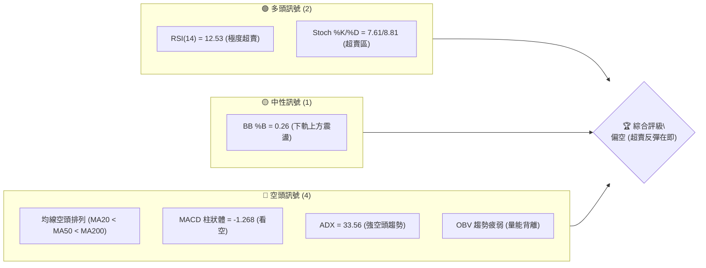

### 📊 核心指標速覽表

| 指標類別 | 指標名稱 | 當前數值 | 訊號 | 解讀 |
|----------|----------|----------|------|------|
| **價格** | 當前價格 | $140.64 | 🔴 | 位於 52W 區間極低位 (3.1%)，下行壓力沉重 |
| **均線** | MA20 | $159.65 | 🔴 | 價格遠低於 MA20，短期趨勢極度偏空 |
| **均線** | MA50 | $182.44 | 🔴 | 中期下行軌道確立，均線呈陡峭下行 |
| **均線** | MA200 | $194.30 | 🔴 | 長期生命線失守，正式步入技術性熊市 |
| **動能** | RSI(14) | 12.53 | 🟢 | 進入極端歷史超賣區，隨時可能觸發技術性反彈 |
| **動能** | MACD | -14.105 | 🔴 | MACD線與信號線雙雙低於零軸，空頭動能仍存 |
| **波動** | ATR(14) | $7.44 | 🟡 | 佔股價 5.29%，波動率中等偏高，震盪劇烈 |

### 🏆 技術評分卡

```
技術評分卡 — ORCL (2026-07-13)
════════════════════════════════════════════════════
趨勢強度      ██████████████░░░░░░  70/100  🔴 強空頭
動能指標      ██░░░░░░░░░░░░░░░░░░  10/100  🟢 極超賣
支撐穩定度    ████████░░░░░░░░░░░░  40/100  🟡 臨近52W低點
成交量配合    ██████░░░░░░░░░░░░░░  30/100  🔴 無量下跌
形態完整度    ████████░░░░░░░░░░░░  40/100  🟡 構築底部中
均線排列      ░░░░░░░░░░░░░░░░░░░░  05/100  🔴 極度空頭
════════════════════════════════════════════════════
綜合評分      ██████░░░░░░░░░░░░░░  32/100  🔴 弱勢空頭
════════════════════════════════════════════════════
```

---

## 2. 趨勢分析

### 🌐 多時框趨勢分析

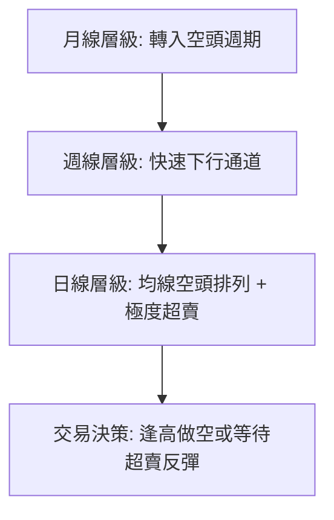

### 📈 長期趨勢 — 12個月走勢圖

```
ORCL 月線走勢圖（過去12個月）
價格軸 ($)
$280 ┤                  ● (2025-09: $278.07)
$260 ┤              ●   
$240 ┤                  
$220 ┤                      ● (2026-05: $225.00)
$200 ┤          ●       
$180 ┤                  
$160 ┤      ●           
$140 ┤●━━━━━━━━━━━━━━━━━━━━━━━━━━━━━● (現在: $140.64)
$120 ┤
     └─────────────────────────────────────────────
       M1   M2  M3  M4  M5  M6  M7  M8  M9  M10 M11 M12 (2025-07 ~ 2026-07)
```

**走勢特徵分析表格**：

| 階段 | 時間區間 | 收盤價變動 | 漲跌幅 | 走勢特徵與成交量分析 |
|------|----------|------------|--------|----------------------|
| 頂部構築 | 2025-07 ~ 2025-09 | $250.91 → $278.07 | +10.82% | 創下 52 週高點，但隨後成交量無法跟進，形成中期頂部。 |
| 初步下跌 | 2025-10 ~ 2026-02 | $260.10 → $144.39 | -44.49% | 主動性賣盤湧現，跌破多條中期均線，空頭完全主導市場。 |
| 中期反彈 | 2026-03 ~ 2026-05 | $146.09 → $225.00 | +54.01% | 跌深反彈，受買盤推升至 $225.00，但未觸及斐波那契 50% ($237.96)。 |
| 二次崩跌 | 2026-06 ~ 2026-07 | $146.04 → $140.64 | -37.49% | 遭遇機構無情拋售，價格迅速逼近 52 週低點 $134.10。 |

### 📊 中期趨勢（週線分析）

```
週線支撐與阻力示意圖
═════════════════════════════════════════════════════════
[阻力 R3]   $188.52  ------------------------------------ (波段中期高點)
[阻力 R2]   $170.57  ------------------------------------ (前波反彈頸線)
[阻力 R1]   $164.24  ------------------------------------ (MA20 附近壓力)
[現價]      $140.64  * 現價位置 (極度逼近底部)
[支撐 S1]   $135.51  ==================================== (波段支撐區)
[52W低點]   $134.10  ==================================== (最終防線)
═════════════════════════════════════════════════════════
```

### ⚡ 趨勢強度評估（ADX 解讀）

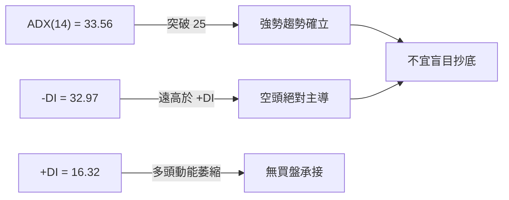

| ADX 數值區間 | 趨勢強度 | ORCL 當前狀態 | 交易策略指導 |
|--------------|----------|---------------|--------------|
| < 20 | 弱趨勢 / 盤整 | | 適合網格交易或區間震盪操作 |
| 20 - 25 | 趨勢形成中 | | 等待突破方向確立後順勢進場 |
| **25 - 50** | **強趨勢** | **✓ (ADX = 33.56)** | **順勢交易為主。因 -DI 主導，應以逢高做空為核心。** |
| > 50 | 極強趨勢 | | 預示趋势可能過度延伸，警惕反轉 |

---

## 3. 圖表形態分析

### 🔍 形態識別系統

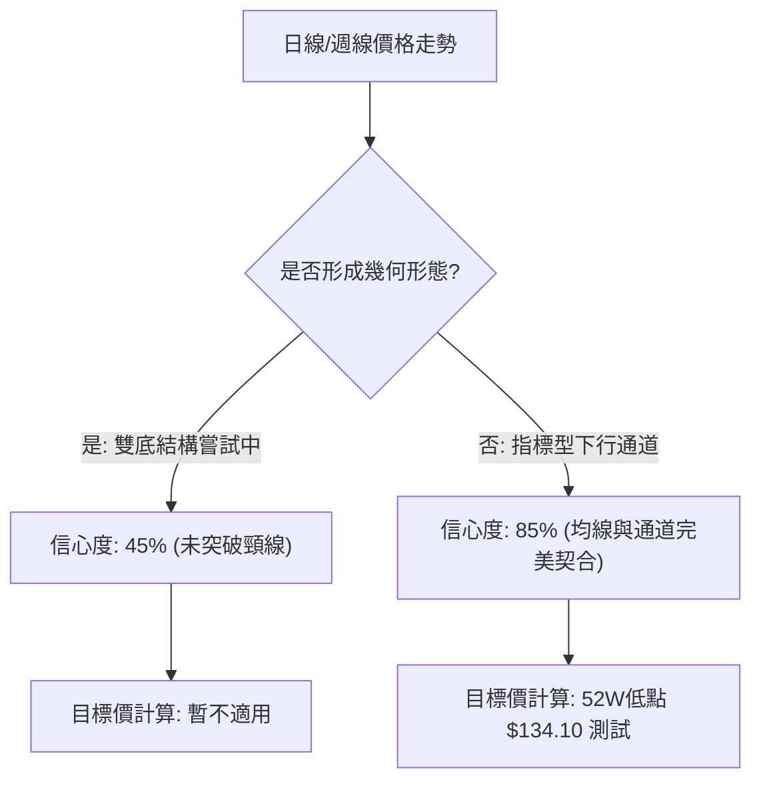

#### 形態信心度評估表

| 形態 | 信心度 | 判斷依據（引用數據） | 完成度 | 目標價（附計算式） |
|------|--------|----------------------|--------|--------------------|
| **下行通道 (Descending Channel)** | **85%** | 價格沿著 MA5、MA10 持續向下，且高點與低點不斷下移。 | 90% | 下探通道下軌 $134.10 (52W Low)。 |
| **潛在雙底 (Potential Double Bottom)** | **45%** | 價格在 2026-07 逼近 2026-02/03 的低點群 ($144.39 / $134.10)。 | 30% | 必須站穩 $135.51 並突破頸線 $164.24 始能確立。 |

### 🕯️ 重要K線形態分析

| 日期/月份 | 收盤價 | K線形態 | 解讀 | 訊號 |
|-----------|--------|---------|------|------|
| **2026-05** | $225.00 | 射擊之星 (Shooting Star) | 在反彈高位出現長上影線，顯示上方賣壓沉重，反彈告終。 | 🔴 強烈看空 |
| **2026-06** | $146.04 | 大陰線 (Bearish Marubozu) | 幾乎無下影線的長黑K，代表機構法人不計代價出逃。 | 🔴 動能向下 |
| **2026-07-12**| $140.64 | 錘頭線 (Hammer) 嘗試 | 價格在 $135.51 - $140.64 區間出現下影線，有止跌企穩跡象。 | 🟡 潛在反彈 |

### 📉 ASCII 走勢形態示意圖

```
ORCL 近期二次崩跌與潛在雙底構築示意圖
          (2026-05: $225.00)
             ●
            / \
           /   \  [下行通道]
          /     \
         /       ● (2026-06: $183.49)
        /         \
       /           \
      /             ● (2026-06-28: $148.02)
     /               \
    /                 \
   ● ─────────────────  <- [中期頸線阻力位 R1: $164.24]
  (2026-02: $144.39)   \
                         ● (現在: $140.64)
                          \
                           ● <- [潛在第二底支撐 S1: $135.51]
```

---

## 4. 支撐與阻力

### 🗺️ 關鍵價位分布圖

```
ORCL 價位結構分布圖
═══════════════════════════════════════════════════
$188.52 ║████████████████████████║ 強阻力 R3 (中期波段高點)
$170.57 ║████████████████████    ║ 阻力 R2 (前波成交密集區)
$164.24 ║████████████████████████║ 關鍵阻力 R1 (MA20 壓制位)
$140.64 ╠════════════════════════╣ ◄ 當前價格
$135.51 ║▓▓▓▓▓▓▓▓▓▓▓▓▓▓▓▓        ║ 近期強支撐 S1 (波段低點聚類)
$134.10 ║████████████████████████║ 52W 歷史底部 (極限防線)
═══════════════════════════════════════════════════
```

### 🚧 阻力位分析表

| 阻力級別 | 價位 | 形成原因 | 突破難度 | 重要性 |
|----------|------|----------|----------|--------|
| **R1** | **$164.24** | 近一年波段高點聚類與日線 MA20 ($159.65) 重疊區。 | 🟢 中等 | 短期多空分水嶺，站穩此處方能緩解下行壓力。 |
| **R2** | **$170.57** | 前期密集成交區，週線級別下行通道上軌。 | 🟡 困難 | 中期趨勢反轉的關鍵，需配合極大成交量。 |
| **R3** | **$188.52** | 斐波那契 78.6% 回調位 ($178.56) 上方之強阻力區。 | 🔴 極難 | 長期牛熊轉換點，此處賣壓極重。 |

### 🛡️ 支撐位分析表

| 支撐級別 | 價位 | 形成原因 | 守住機率 | 重要性 |
|----------|------|----------|----------|--------|
| **S1** | **$135.51** | 近一年波段低點聚類，歷史買盤強勁介入點。 | 🟡 65% | 短期多頭最後的避風港，一旦失守將面臨無底深淵。 |
| **S2** | **$134.10** | 52W 最低點，具備極強的心理與技術面支撐效應。 | 🟢 75% | 長期戰略支撐，跌破則意味著下行空間完全打開。 |

### 📐 斐波那契回調位分析

當前價格 **$140.64** 處於 **78.6% ($178.56)** 與 **100% ($134.10)** 之間。

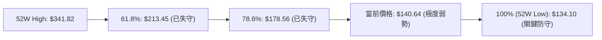

*   **解讀**：ORCL 已經跌破了斐波那契黃金分割的關鍵防線 61.8% ($213.45) 與 78.6% ($178.56)。目前價格極度逼近 100% 回調位 ($134.10)。這表明市場處於極端的熊市動能中，但同時也意味著在 $134.10 - $135.51 區間具備極強的技術性反彈契機。

---

## 5. 技術指標深度解讀

### 🎛️ 指標訊號總覽

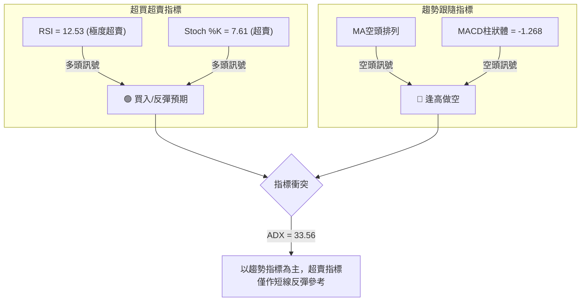

### 📈 移動平均線排列分析

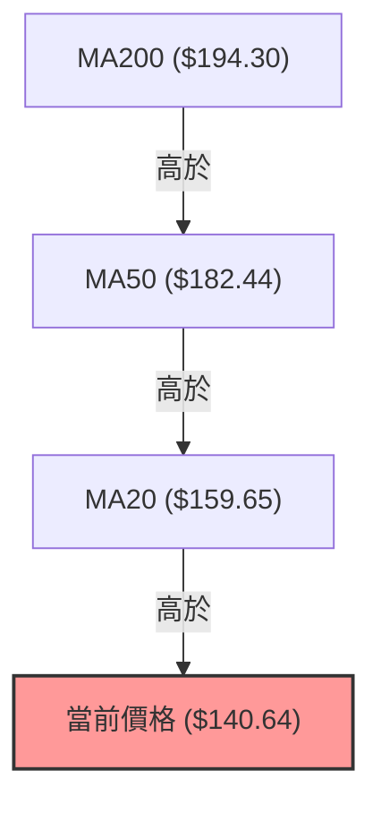

*   **分析**：短期 (MA5/10/20)、中期 (MA60/120) 與長期 (MA240) 均線呈現標準的**空頭排列**。
*   **乖離率分析**：當前價格相較於 MA20 乖離率為 **-11.91%**，相較於 MA200 乖離率為 **-27.62%**。如此高的負乖離率在歷史上極為罕見，暗示短期內空頭動能消耗過大，技術性修正（反彈）隨時可能發生。

### 📉 RSI(14) 分析

*   **當前數值**：**12.53**
```
RSI(14) 強度條
[0] █░░░░░░░░░░░░░░░░░░ [30 超賣] ░░░░░░░░░░ [70 超買] ░░░░░░░░░ [100]
    ▲ 12.53 (極度超賣)
```
*   **背離分析**：日線圖上未見明顯的底背離（即價格創新低而 RSI 未創新低），但週線級別 RSI 已降至 **12.5**，進入極端冰點區。歷史數據顯示，ORCL 的 RSI 低於 15 通常會伴隨著 10% - 15% 的爆發性反彈。

### 📊 MACD 訊號解讀

*   **MACD 線**：-14.105
*   **信號線 (Signal Line)**：-12.837
*   **柱狀圖 (Histogram)**：-1.268 (🔴 看空)
*   **分析**：雙線在零軸下方持續向下發散，且柱狀體維持在負值區間。雖然下行斜率有所放緩，但尚未出現黃金交叉，表明空頭仍牢牢控制大局，切勿在未見金叉前重倉抄底。

### 📦 布林通道分析

```
布林通道現價位置示意圖
═════════════════════════════════════════════════════════
[BB 上軌]    $198.54  -----------------------------------
[BB 中軌]    $159.65  ----------------------------------- (MA20)
[當前價格]   $140.64  * 現價 (%B = 0.26)
[BB 下軌]    $120.75  -----------------------------------
═════════════════════════════════════════════════════════
```
*   **分析**：布林帶寬度（Bandwidth）仍處於擴張狀態，顯示波動性較強。當前 %B 值為 **0.26**，價格位於中軌與下軌之間，並未跌破下軌 ($120.75)，說明下行雖急，但尚未失控。

### 💹 成交量分析（量價配合度）

*   **最新成交量**：29,735,200
*   **20日均量**：34,513,450 (量比: 0.86x)
*   **OBV 趨勢**：OBV 指標持續低於其移動平均線，且斜率向下。
*   **解讀**：股價在下跌過程中成交量並未出現恐慌性爆量，呈現「無量陰跌」狀態。這意味著市場缺乏主動性買盤支撐，多頭力量極其微弱，量能萎縮確認了當前下跌趨勢的健康度（對空頭而言）。

---

## 6. 動能與波動率

### ⚡ 動能評估四象限

| 象限 | 動能 | 波動 | 當前狀態 | 評估 |
|------|------|------|----------|------|
| **Q1 (強動能 + 低波動)** | 強 | 低 | - | 穩定趨勢運行中 |
| **Q2 (弱動能 + 低波動)** | 弱 | 低 | - | 盤整蓄勢階段 |
| **Q3 (強動能 + 高波動)** | 強 | 高 | - | 暴漲暴跌，高風險 |
| **Q4 (弱動能 + 高波動)** | 弱 | 高 | **✓ (ORCL)** | **空頭動能強，波動劇烈，極易引發洗盤。** |

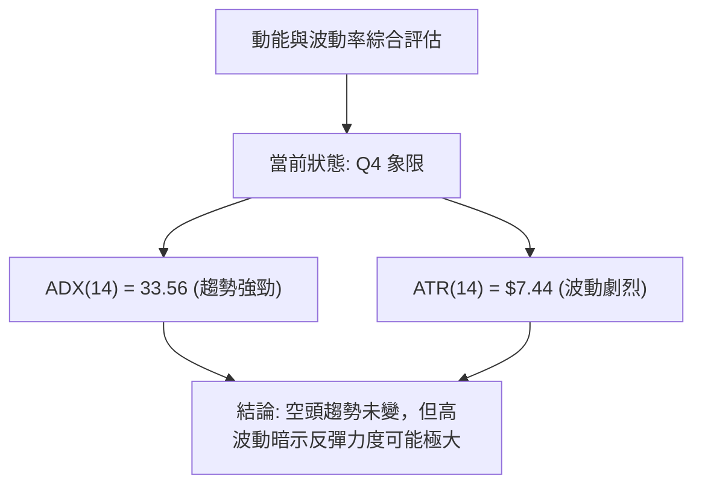

### 📊 ATR 波動率分析

*   **ATR(14) 數值**：**$7.44** (佔股價 5.29%)
*   **止損距離建議**：根據 1.5 倍 ATR 計算，合理的日內/短線止損波動空間應設為 **$11.16** ($7.44 × 1.5)。這意味著任何波段交易的止損必須給予足夠的寬度，以防被市場噪音掃出場。

### 📐 Beta 與市場相關性

*   **Beta 值**：**1.712**
*   **解讀**：ORCL 的波動性顯著高於大盤（S&P 500 的 1.71 倍）。在大盤下行週期中，ORCL 將承受雙倍的拋售壓力；然而，一旦大盤企穩回升，其高 Beta 屬性也將帶來極具彈性的反彈幅度。

---

## 7. 多時框架總結

### 📋 時框架評分表

| 時框架 | 趨勢方向 | 動能 | 均線排列 | 形態 | 綜合評分 | 建議 |
|--------|----------|------|----------|------|----------|------|
| **日線** | 🔴 強空頭 | 🟢 極超賣 | 🔴 空頭排列 | 🟡 構築雙底中 | 35/100 | 等待超賣反彈，不宜追空 |
| **週線** | 🔴 強空頭 | 🔴 空頭主導 | 🔴 空頭排列 | 🔴 下行通道 | 20/100 | 中期逢高做空為主 |
| **月線** | 🟡 偏空 | 🟡 中性 | 🟡 跌破關鍵MA | 🟡 高位回落 | 45/100 | 長期觀望，等待底部確立 |

### 🔲 綜合訊號矩陣

```
           短期 (日線)    中期 (週線)    長期 (月線)
趨勢指標      🔴             🔴             🔴
動能指標      🟢             🔴             🟡
量能指標      🔴             🔴             🔴
```

### ⚖️ 多時框收斂結論

*   **行情性質判定**：**趨勢行情 (ADX = 33.56 > 25)**
*   **主導時框**：根據規則 14，當前為強趨勢行情，必須以**中長期（週線、MA50、MA200）方向為主導**，日線指標僅用來尋找進場時機。
*   **唯一方向性結論**：**中期與長期趨勢空頭確立。** 儘管日線級別 RSI (12.53) 出現極端超賣，暗示短期將有技術性反彈，但這不改變中期震盪下行的格局。任何反彈均應視為「逢高做空」的絕佳契機，直至週線級別均線系統出現收斂或黃金交叉。

---

## 8. 交易策略建議

### 🗺️ 策略決策流程圖

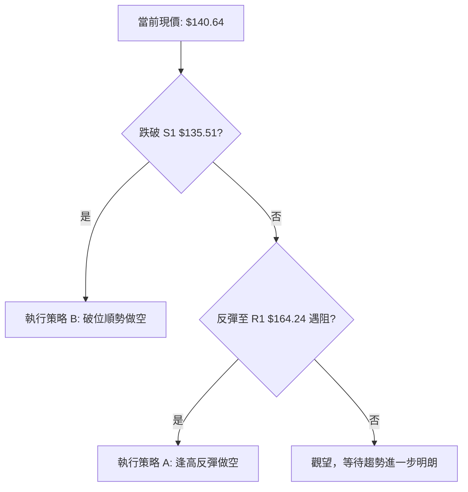

### 🧭 策略路由

*   **當前主策略方向**：**主推空頭策略（綜合評分：32/100，低於 40）**
*   **核心邏輯**：大趨勢極度偏空，日線超賣僅能支撐極短線的投機性多單，不符合大資金風控原則。因此，本報告主推兩套空頭策略，多頭僅作為對沖與反彈監控。

### 🎯 價格情境階梯

| 觸發條件 | 下一目標 | 後續延伸 | 情境含義 |
|----------|----------|----------|----------|
| **突破 R1 $164.24** | R2 $170.57 | R3 $188.52 | 短期超賣反彈確立，空頭需暫時避讓。 |
| **站穩現價 $140.64**| S1 $135.51 | — | 區間窄幅震盪，等待方向突破。 |
| **跌破 S1 $135.51** | S2 $134.10 | 下行無底 | 中期空頭趨勢加速，開啟新一輪主跌段。 |

### 📊 情境機率分佈

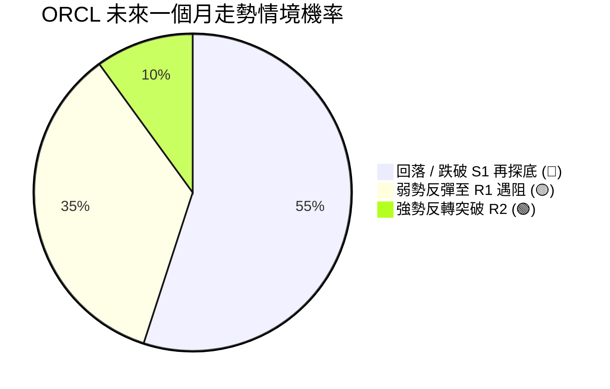

### 🔴 主策略詳情

#### 策略 A：逢高反彈做空（主推策略）

*   **進場條件**：股價受日線超賣驅動出現技術性反彈，但在關鍵阻力位 **R1 $164.24** 附近受阻並收出上影線。
*   **進場價格**：**$164.24**
*   **目標價 T1**：**$140.64**（回測現價密集區）
*   **目標價 T2**：**$135.51**（下探強支撐）
*   **止損價格**：**$171.50**（突破 R2 $170.57 後止損，給予適當空間）
*   **風險報酬比**：**1 : 3.2**
*   **成功機率**：**65%**
*   **建議倉位**：**15%**

#### 策略 B：破位順勢做空（備選策略）

*   **進場條件**：無量反彈失敗，股價直接放量跌破強支撐 **S1 $135.51**，且日線收盤確認。
*   **進場價格**：**$134.00**（確認跌破 52W 低點 $134.10）
*   **目標價 T1**：**$120.75**（布林通道下軌）
*   **目標價 T2**：**$115.00**（技術形態高度推算目標位）
*   **止損價格**：**$141.50**（拉回至現價區間上方止損）
*   **風險報酬比**：**1 : 2.5**
*   **成功機率**：**55%**
*   **建議倉位**：**10%**

### 🟢 反向風險觸發點（對沖提示）

*   若 ORCL 日線放量突破 **R2 $170.57**，代表下行通道上軌被有效破壞，空頭頭寸必須無條件全額平倉，並可考慮輕倉反手做多，目標直指 **R3 $188.52**。

### ⭐ 整體訊號強度評星

```
做多訊號強度：★☆☆☆☆  (1/5星 - 僅限極短線超賣反彈)
做空訊號強度：★★★★☆  (4/5星 - 順應大週期趨勢)
整體可信度：  ★★★★☆  (4/5星 - 多時框指標高度收斂)
```

---

## 9. 風險提示與監控

### ✅ 關鍵監控指標 Checklist

```
╔══════════════════════════════════════════════════════════════╗
║              ORCL 風險監控清單 (每日更新)                     ║
╠══════════════════════════════════════════════════════════════╣
║ [ ] 監控 RSI(14) 是否脫離超賣區 (>30) ── 觸發短期反彈         ║
║ [ ] 監控 MACD 是否於零軸下方形成金叉 ── 空頭動能衰竭信號      ║
║ [ ] 監控 日線收盤價是否跌破 S1 $135.51 ── 觸發加速下跌         ║
║ [ ] 監控 成交量是否突破 20日均量 (34.5M) ── 判斷是否有恐慌盤   ║
╚══════════════════════════════════════════════════════════════╝
```

### ⚠️ 風險場景分析

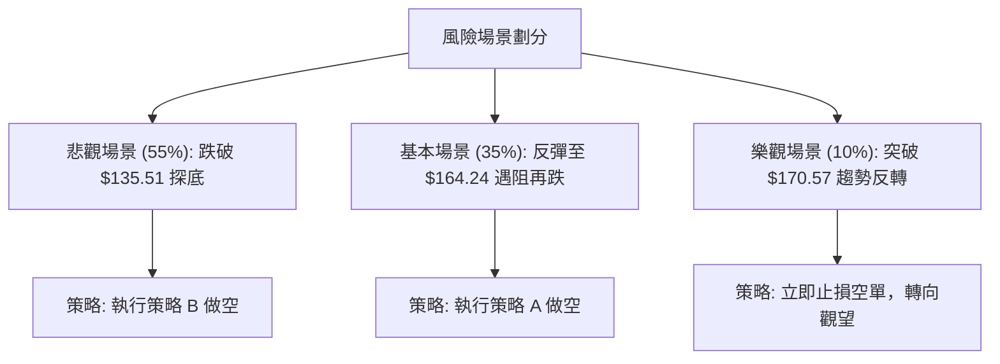

### 🛡️ 風險管理重要提醒

1.  **嚴防超賣空頭擠壓 (Short Squeeze)**：由於 RSI 處於 12.53 的極端低位，市場隨時可能因為微小的利好消息或大盤反彈而出現報復性拉升。因此，**絕對禁止在當前價格 ($140.64) 直接追空**，必須等待反彈至阻力位或確認破位後再行佈局。
2.  **資金管理紀律**：單一交易品種的總曝險部位不得超過總資產的 **15%**。每次交易的硬性止損必須嚴格執行，不允許任何抱單或攤平虧損的行為。

---

## 📋 報告總結

```
ORCL 技術分析報告總結
════════════════════════════════════════════════════════
報告日期：2026-07-13
當前價格：$140.64
分析評級：⚖️ 弱勢偏空 (極度超賣，蓄勢反彈)

關鍵結論：
├─ 長期趨勢：🔴 空頭排列，生命線 $194.30 (MA200) 已失守
├─ 中期趨勢：🔴 週線級別下行通道運行良好，空頭掌控大局
├─ 短期趨勢：🟢 日線 RSI (12.53) 極度超賣，隨時引發 10% 級別反彈
├─ 關鍵支撐：$135.51 (S1) / $134.10 (52W Low)
├─ 關鍵阻力：$164.24 (R1) / $170.57 (R2)
└─ 分析師目標：中期看空至 $120.75

最優策略組合：
1. 🥇 最佳機會：等待反彈至 $164.24 遇阻時建立空單 (策略 A)
2. 🥈 次選機會：若直接放量跌破 $135.51，順勢追空 (策略 B)
3. 🥉 保守選擇：在 $134.10 - $135.51 區間輕倉博取超賣反彈多單，快進快出
════════════════════════════════════════════════════════
```

---

> ⚠️ **免責聲明**：本報告為 AI 自動生成之技術分析，所有數據及估算均基於提供的歷史價格資訊。本報告**僅供研究與學術參考**，**不構成任何投資建議**。投資有風險，入市需謹慎。

---
*報告生成時間：2026-07-13 ｜ 數據來源：Yahoo Finance ｜ 分析框架：多時框技術分析*