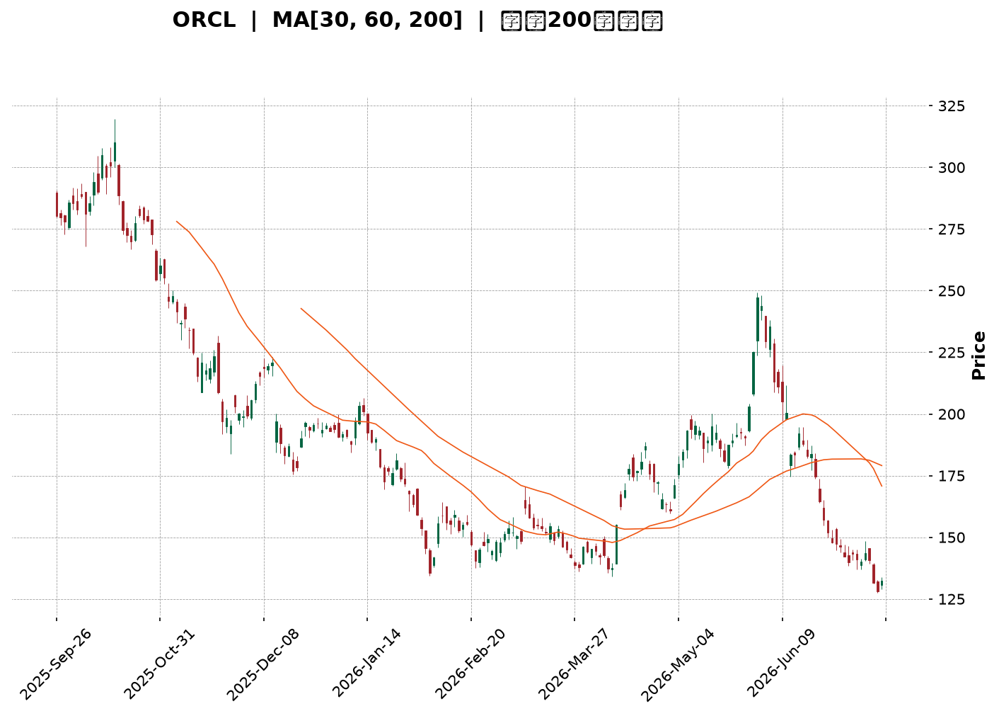
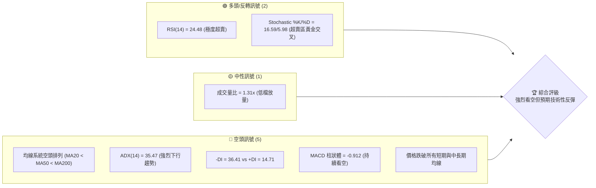
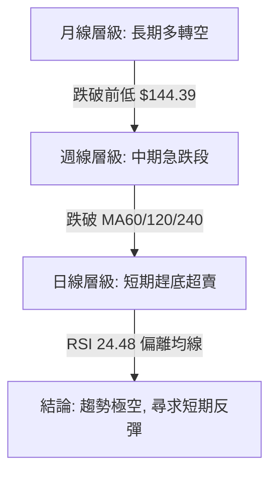
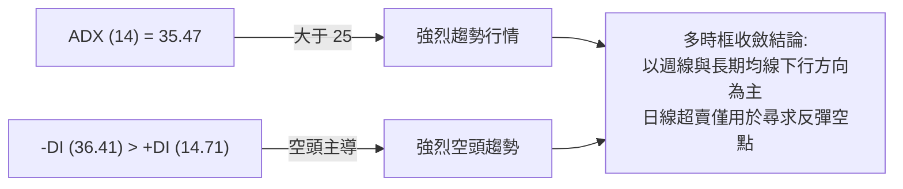
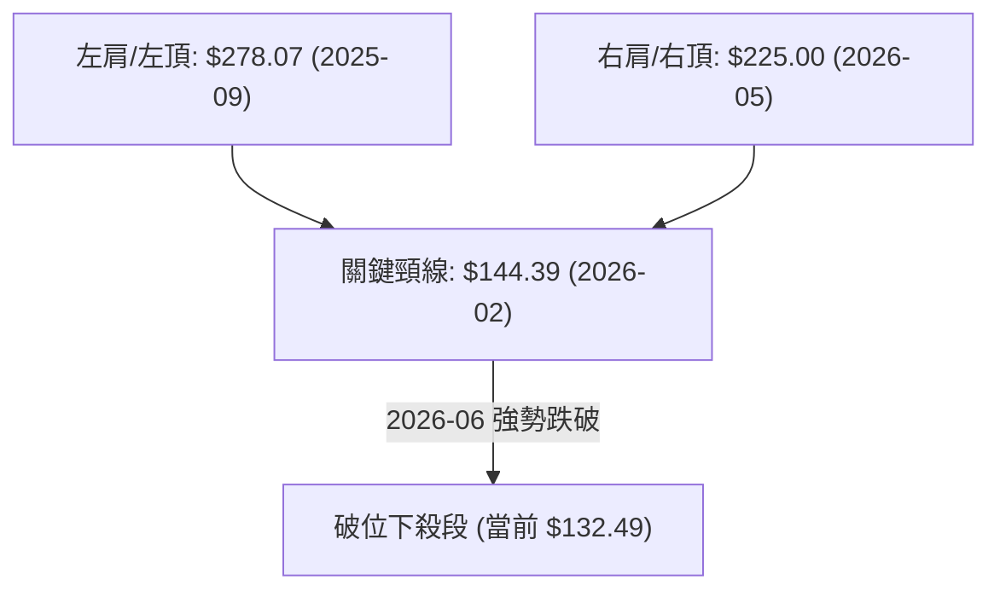
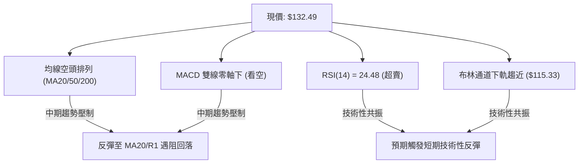
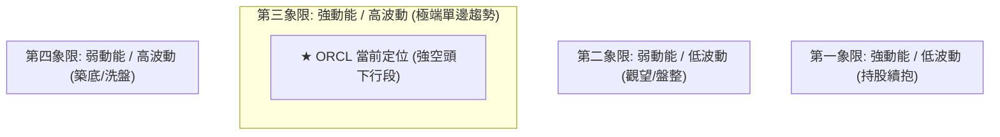
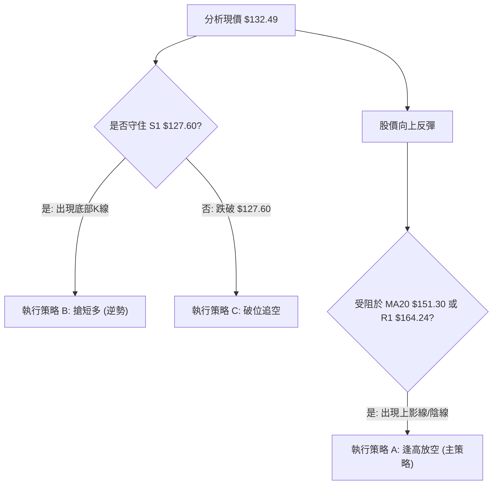
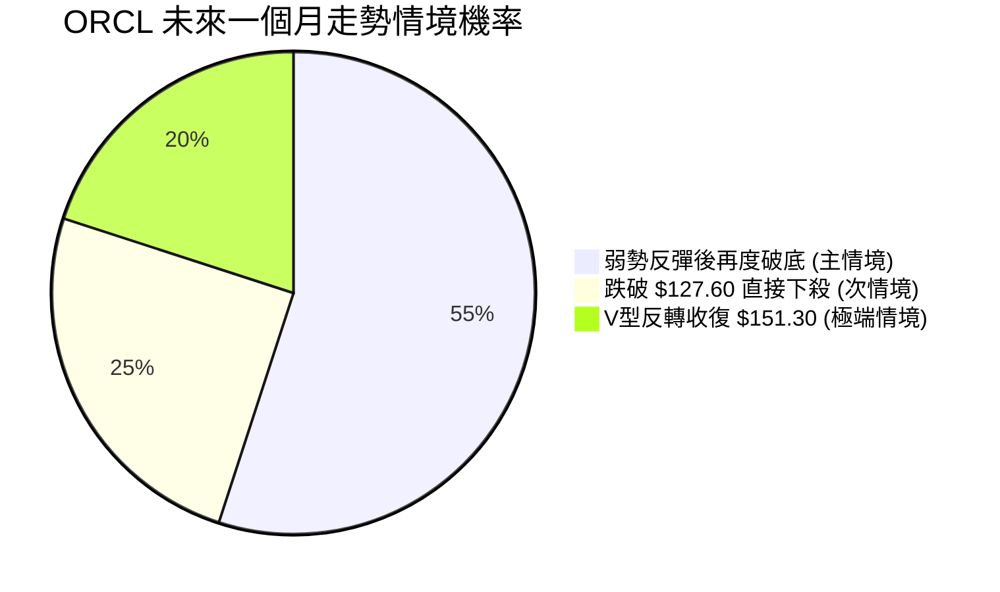
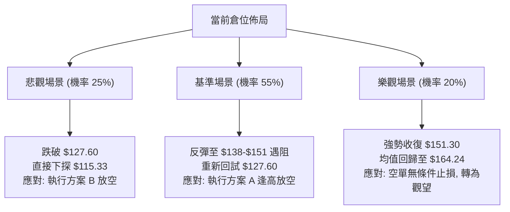

<details>
<summary>📊 靜態圖表 (點擊展開)</summary>

</details>

<html>
<head><meta charset="utf-8" /></head>
<body>
    <div style="height:500px; width:100%;">                        <script>window.PlotlyConfig = {MathJaxConfig: 'local'};</script>
        <script charset="utf-8" src="https://cdn.plot.ly/plotly-3.7.0.min.js" integrity="sha256-jvTGqxNp8AGWEcvNLVuKr+8j5dGe9Yw51LQkmDH+IYA=" crossorigin="anonymous"></script>                <div id="candlestick-chart" class="plotly-graph-div" style="height:100%; width:100%;"></div>            <script>                window.PLOTLYENV=window.PLOTLYENV || {};                                if (document.getElementById("candlestick-chart")) {                    Plotly.newPlot(                        "candlestick-chart",                        [{"close":{"dtype":"f8","bdata":"AAAAAECEcUAAAAAgLXlxQAAAAGAhYXFAAAAAoAzccUAAAABAadhxQAAAAKClrnFAAAAAIN0EckAAAADglpBxQAAAAMAJ1nFAAAAAwPdhckAAAACAlCJyQAAAAEAUEXNAAAAA4EuCckAAAACggstyQAAAAAAoYHNAAAAAgG4IckAAAADggihxQAAAAIBXCHFAAAAAAOLgcEAAAABgT1ZxQAAAAMD4iXFAAAAA4GJrcUAAAACAWmJxQAAAACC4CnFAAAAAYPLNb0AAAABgnkFwQAAAAGBf7G9AAAAAYJK5bkAAAADgZf1uQAAAAIARL25AAAAA4CyfbUAAAADA79BtQAAAAECbPG1AAAAAYEkabEAAAABAuu9qQAAAAMASl2tAAAAAgE44a0AAAABARkxrQAAAAGAD7GtAAAAAoKsVakAAAACAjptoQAAAAIC7y2hAAAAAwLlkaEAAAADgD2BpQAAAAICpAGlAAAAAoKbgaEAAAADguOVoQAAAAMDat2lAAAAAoAmJakAAAAAgC\u002fBqQAAAAODbTWtAAAAAgDxta0AAAADAJJxrQAAAAABpnmhAAAAAwPaEZ0AAAACA6ORmQAAAAKAgW2dAAAAA4CkYZkAAAABg7ElmQAAAAGBaxGdAAAAAgIOPaEAAAACgKS9oQAAAAEBOc2hAAAAAACeDaEAAAABAbjBoQAAAAGBuamhAAAAAwIghaEAAAADA4zpoQAAAAOAA2GdAAAAA4MT8Z0AAAABA7d9nQAAAAGDSemdAAAAAQJWkaEAAAADgVWhpQAAAAMBiHGlAAAAAYI0IaEAAAABAEZFnQAAAAMB4uGdAAAAAwIJVZkAAAABAkpVlQAAAAGA3HmZAAAAAoM39ZUAAAABgl6VmQAAAAAD8tWVAAAAAQEBzZUAAAADgz\u002fpkQAAAAOAIbmRAAAAA4GXeY0AAAABAHTNjQAAAAMDjNGJAAAAAQBLxYEAAAABgi7phQAAAAOAgcGNAAAAAAP\u002fYY0AAAADgPYJjQAAAAACibGNAAAAAwPDgY0AAAACg3hxjQAAAAADIYmNAAAAAAIpuY0AAAABgsmFiQAAAACCPimFAAAAAIAwkYkAAAACgqFtiQAAAAOCPqGJAAAAAAIgMYkAAAACA4IZiQAAAACBAf2JAAAAAQAbqYkAAAACA7TZjQAAAACDG\u002fGJAAAAA4EjQYkAAAADApItiQAAAAICjP2RAAAAAQMzBY0AAAADAGEFjQAAAACBtXGNAAAAAAMAzY0AAAADg3fpiQAAAAEAgTmNAAAAAoIqUYkAAAACgoChjQAAAAIA8QmJAAAAA4DsgYkAAAAAAOrphQAAAACAgVmFAAAAA4Ms6YUAAAABA30JiQAAAACAhB2JAAAAAgKwrYkAAAADg+hBiQAAAAKCqxWFAAAAA4DzVYUAAAADAOSxhQAAAAGCPM2FAAAAAQJNiY0AAAACg6k1kQAAAAMAUJ2VAAAAAQBg3ZkAAAACgf85lQAAAAADcHmZAAAAAQFeRZkAAAADgMltnQAAAAEBn9WVAAAAAgLyVZUAAAAAgiItlQAAAAABPrGRAAAAAgGJoZEAAAABAkxpkQAAAAEB\u002fZ2VAAAAAQEd1ZkAAAAAgoxZnQAAAACBvK2hAAAAAwEo9aEAAAABAqWhoQAAAAABgJWhAAAAAQNVFZ0AAAACARKNnQAAAAKDRXWhAAAAAYP4IaEAAAABA0T5nQAAAAMCWmmZAAAAA4D5wZ0AAAABAlqNnQAAAACBA7WdAAAAAYIAMaEAAAAAAiclnQAAAACDNX2lAAAAAYOkfbEAAAAAgReluQAAAACBtd25AAAAAwAGxbEAAAAAAqXBtQAAAAMANnmpAAAAAoL1iakAAAABgFqNpQAAAAOD9EWlAAAAAoMbuZkAAAACAu+9mQAAAAMAb\u002f2dAAAAAoKp1Z0AAAABgmdxmQAAAAKDV9GZAAAAAYNHOZUAAAAAAzJJkQAAAAMB7n2NAAAAAYM79YkAAAABge4BiQAAAAGDtZ2JAAAAAgFdBYkAAAADgMMBhQAAAACAUeWFAAAAAAF\u002foYUAAAACgfaNhQAAAACAYgGFAAAAAQAr3YUAAAADgepRhQAAAAKBHcWBAAAAAACn8X0AAAAAgro9gQA=="},"high":{"dtype":"f8","bdata":"3P\u002fVXP0qckCp61OeHaxxQP7JHPrKjHFAY9bkY43rcUCl84LHVTpyQEusfEYdNXJAhx4IzWJVckDGWr9+ph5yQPMB8kPqA3JA3nx31YOhckBrfY3vewxzQCTZxzy1O3NA\u002fUgGKTDYckBnMMHynkBzQF71pJBW93NAMSiQGPjVckBm1gq0oOdxQCIA2Fn0WXFAtUaoONQocUCRUwCvU4ZxQKnFiVQkx3FAWbGMXSHEcUDzSObSuatxQNM66pHfbnFAm6cCE+2ycEDyLfhnVHRwQCpeyYNRcXBAXErZDuuab0CUSxCPoz9vQOZu6+8Y1m5AIwH9h07DbUBDUZDYGJxuQNrvcSLPZW1AYoMbN4ZRbUCrisl\u002fSeBrQL1tqW0wHGxA\u002fwkK6XyVa0BzpQNIA7JrQBt8XlQNP2xACKmn2nb4bEBoXsC4PMppQLzO9TPuO2lA9gRQfCiwaEBjIuAPzf9pQB+2ZtoFDWlAxBuQxskxaUDcCc\u002fzSvZpQNz4SGHgvWlAp6dFekSrakBqjLB85SxrQM8388RK02tAPnUCcsiPa0AbjvKWW+VrQJo7fSLuAWlAmrLQCrd+aEALHl4qRWVnQK4sfH+Tf2dAIHm8R\u002fwWZ0DfhxZT1t9mQBia\u002fJkwKGhAboleQdOcaEDwCO8uHWpoQGp+hAxYjGhAi\u002fqjnJXOaEAAqMIqopNoQMTjE2+Dj2hACcr1Jx1qaECowVE7K5ZoQArT+PFr+GhAReJ5cJUgaEDYw98knzloQG4lXkIGpGdASFyvkFXZaEDuyb2KWaVpQJ2JgLR7y2lASywHQwAJaUAs8Bu4CjVoQCw8fS9C0WdA9ltMl4k8Z0DZg2a2HmtmQLa18CEjXWZAlj7IKO5MZkB5U8ZRywBnQBBkF6gnT2ZAOYchn3CNZkAbwRTQlCFlQNVSB9BQ92RAKlD+12dAZUAq5zYIyshjQCx8s5bqG2NAfVnToxMxYkAj1VGpnsZhQIQoXBiM1GNAfYnnhsaHZECieaWVzFBkQKVp9A78vWNAK7dQyJQlZEDXfJdxnMVjQLibzsywhmNAxDX6oAjfY0D8MtBagR1jQIUguic+GWJAfeCa5r83YkBYl4VF8QZjQHu6FvQn7mJAOrO1\u002fSMiYkCcQS3bHKRiQKjeJqtDvGJAZ7Th7G0RY0CMQ6ZpB5tjQJapwUzAwmNApmqDYETeYkDXn6GTRSJjQGnkhYAzUmVAc1xyTFDVZEAuUibv9fRjQAWCsqBztGNAJPG4zSu6Y0ANrffEpTxjQHu5J3ademNAFz62TP0FY0CURCpQY1ZjQP2sBxmlGmNAGCZwOKCZYkDTYjTQiC5iQC+k\u002fIqilmFAogO3RRCHYUBnIz5mFkxiQEDcmqKWk2JAfZFdl5QtYkBexgvdoXBiQGdQ4fUn8mFApqgZWhvNYkAnPNLywclhQExtGK3jdWFAkD10w9JrY0AVsbmbARplQGNfy6XGfmVA38urD6R0ZkBmcQsFiPtmQPTCWmOZJGZAHS6UcVEWZ0CamX6pxZBnQOFz2AtNqGZAPFDLG6yCZkC9D1SeWJ5lQKDntC6vA2VAVoBulgqGZEC7QlY8b5NkQGBQillDtmVAhy9VdaTbZkBQvViF8jtnQGk0rZ25M2hAXiiKV5juaECk7ESnCKpoQIrZBP4MYGhAiKoDigkIaEA5GwS4\u002fNxnQOezvQd0AGlAF9wFqvd3aEDWWQYjKMNnQJb0SW8agmdA83bIqyhyZ0BuwpxA2QRoQGB8egQlimhAF5u4eL5QaECAU878Ke9nQMsPLtRBiWlAjcgBxCwwbEBY\u002fsG7PCxvQJSlBThgBG9AM+6EIKP1bUA\u002f67P\u002f48NtQK55jlhn1GxASJW9AJ5Ja0DyEZiriXdrQKOpBHfJd2pAVFGsOCQEZ0D07IWx+B1nQN1VvUKSVGhAOlssOpJUaEBQZvf5+rBnQLdclgrTamdA5TiiKBX+ZkBDz4QvOLdlQH9dU4ucpWRAZcSkc1qiY0AoBkb2PiBjQFaQGxTcPmNA5QWBYSCtYkAI41ITO2FiQHSmBOmaUWJAMOi\u002fTK8jYkD0c\u002fRnxSFiQOX\u002f0egkq2FAcxQ1wbORYkAAAACAwjViQAAAAMDMdGFAAAAA4FGYYEAAAADAzLxgQA=="},"hovertemplate":"\u003cb\u003e%{x|%Y-%m-%d}\u003c\u002fb\u003e\u003cbr\u003e\u958b: $%{open:.2f}\u003cbr\u003e\u9ad8: $%{high:.2f}\u003cbr\u003e\u4f4e: $%{low:.2f}\u003cbr\u003e\u6536: $%{close:.2f}\u003cextra\u003e\u003c\u002fextra\u003e","low":{"dtype":"f8","bdata":"BROKG\u002fl8cUCxn8cGWEdxQK0QhDynDHFAkyKZ3\u002fkrcUC\u002fZ1EjOa1xQCMTzefKjHFA2phLt134cUADz78DI79wQO\u002fsdQ13hnFAaE8yMkDIcUCp51CMhhNyQEncYCBUbnJAqmu6sgwTckAwL+xpB4FyQAPlCFLLwnJAmVrI1g3McUAaFNKM4ApxQMTGdzaL2nBAThiRD9iqcECwgEqmmtxwQF5DsmLbeHFAdhrmdzBScUDrRtsYwl1xQCHpkpAfzHBAoHem3Zy6b0ARGQq+PchvQPyTJExVmW9As+RVeB9bbkDILY7ScJVuQMfyp3UgoG1A2GxeCivEbEBAMukixFltQOaM9I2BVmxAE6j1DEwAbEDSMvPpPqVqQKnmG8U0GGpA5hiUZgWwakDDWmbpbI5qQIuM0G9852pACMCYRU8JakCPsbD+bfZnQKVQKWEzDmhAw81DMGn7ZkCT+iV\u002f2glpQA2MZOcbd2hA2ztSVERaaEA71Iq228JoQJo0SkzXr2hASuZunyqLaUCCrAmriHJqQAaodxbP2mpA6S1+2ToGa0CNksY1C\u002fBqQG6QZIhtDmdA5GRp5IAGZ0BMVSEbWHVmQBCcqZFH12ZAYu92yBvsZUDh\u002foR69xtmQDB\u002fu25USmdAc1\u002fhOZzfZ0AnxQxmU8tnQPDkdwMBEmhAyecbIpFHaEDqmuuPltlnQG\u002fzgsTjOmhAsPx1NtQbaECLzYskWQtoQE8U+VjDz2dAIQR68hmcZ0ArmVa9TcVnQPgAsUrkC2dAMDo+fRBvZ0AOoMgCmXRoQBvHInuW6GhA4a9J1JKvZ0CNtG0Cc4JnQFDg0lGQJ2dAn3K9ELdDZkBIAjvZVi1lQEWpeVLU6GVAijDACNRZZUAzVHrEVilmQDE2IhA3j2VAlZOjJ2FVZUDxnMZnywxkQKR6h8FzQ2RA1hCgyH3cY0AfLcu\u002fFttiQBm1XeO07WFAzfhMAfzJYEBB7TzESj5hQJXlkHZgP2JA7qhl9uJ7Y0COyzyo0h1jQD89vv0n7mJAYhjRC9FGY0B\u002f6UZNO\u002fpiQH+f8xQ\u002fymJAxcL3\u002fhFWY0D50aMTxUtiQMbhr2gfNGFAdA1RXZI4YUDKWXs\u002fLkpiQHrwTkiWBGJAnVZC\u002fKmjYUB4RW59bYZhQCNbV3vawWFAGF\u002f7RxyCYkAIYF4xhqJiQDFJmeEw0mJAgovaU0MtYkDwIhpZdG1iQBjdoy7s7mNArudw31GwY0DWuqLqliJjQNQWh7IHLmNApxe9G+8NY0A0SjOcid9iQCnvXuxve2JAkXiXyZBdYkAhPK37RbViQElXgCKcOmJAMxEM7RvzYUB3cv52pbFhQJM7U0ToKmFAGNYVuwEAYUDthLzXKVxhQClLuXBV9WFALGGWjnZqYUCGovGDRtthQNg28wEGX2FAVTzXDRa9YUDYTHhz6fBgQHZegZhPw2BASI0IE4pnYUChHsoF\u002fx9kQF+LKt5HtGRAkJ2BkFGmZUBzRRWISZhlQI5uLxcSnWVA6eFcDMvsZUAt8qj7UcVmQF2tVFs\u002fr2VA4IECnN8GZUDicrU1LOpkQPp99UufL2RAS\u002fVwMPoCZEClV9vaxfhjQABXOfFdsmRAOuWxwfy0ZUA3lLQ4JExmQMWHV6IswWZAy1Z8w27EZ0BO7hxFnrFnQHMG2wQOvmdAgsLhJMaHZkCQ4hGcYw1nQIRvoW3TGWdAayZTxteHZ0CNGc3bTtRmQDXIiO2viWZAGoidlMNFZkCKb4a9oVFnQO9\u002fMdX\u002fzWdALZy7YMe8Z0Czm4eWl2hnQIMgrdi0FmhAIGqILz7paUAAGdh1SPprQFJ+NAViwG1AbvZCwERabEAzyk03JudrQJ3W98IpF2pAT+flN1YTakCoydhFVqNoQNUwsfnFr2hAcII\u002fn4PVZUDYh6syJExmQFFf5N0PMmdApBZRB01gZ0BOVgX7Tb5mQFWUaYmvImZAMU9mp3O5ZUBz7+r+QYFkQNl08Sn3WWNA0v5cxNa6YkAzX2qtlG9iQA2wuJRKFmJACB4pylT\u002fYUAAAADgMMBhQBLjm4UoS2FAWz5lt3WVYUDL2H4GVyJhQHBjcR9XImFAy7PJp3GOYUAAAADgUWhhQAAAAEAza2BAAAAAYGbmX0AAAADA7BpgQA=="},"name":"\u50f9\u683c","open":{"dtype":"f8","bdata":"mQFyhSsbckDatmHRSJZxQMuEOYnjh3FAmKR2qIc6cUCiNSS6LwhyQCEyfwpi5XFAJme0iFwRckDGWr9+ph5yQAufK8tBo3FAsSIQEzwMckAZQcvQlJZyQErCUM+KfXJA1pL1y7fKckDDxKZpy99yQNTlrzHj6nJAZCHY9ZHNckA6betMCONxQO2EO8w\u002fN3FAgk5B2hwDcUDbDo34ouVwQMZhkiYEs3FAP\u002fYH8VC9cUDvx+D1vYRxQK6bvHRWbHFAIo8K\u002fcKicEAApOotfhBwQAqngOJLa3BAxxagOPDybkDKdLfzVLFuQG1JeF9Ism5AUqkEWe+WbUAysK8NNnNuQAroKV0kP21ArXtoUU5PbUCph6st5tprQAUFEZMbGmpAomai4QIEa0BdpYR1n8RqQDeii3rzHmtArayu3XOebEDlKdbbQKNpQP4LoodWX2hAXj2MPzoHaECVjVwx9O9pQBB6NPVTs2hAyOdtj7TSaEB3PAdTxGVpQJKcgCNRzWhAKKTSufm7aUDyWTqeDB1rQMIQehuIZ2tACZ9h5LE9a0DHfiYyy3VrQKs2SNeQmWdAe7kTn85PaEC37UvCt09nQI4GeGLv3WZAIaYJb+GxZkD8gB1aLp9mQBHlNC3jUmdAqRRuFhJeaEAOR\u002fORtVFoQMLpJ\u002f9iJGhAwHuz5V6FaEDdO696wwloQCs4cYD7RWhAqXQ+c2RRaEC7uXTiq3JoQB0gIN8+jmhAeoKRgQ3XZ0D\u002fO7sZ5S1oQE2hqVzOoWdAIq2u3ZXKZ0AgzHndWIdoQDJWuCiBcmlASywHQwAJaUAs8Bu4CjVoQOAEIUr5kmdA9ltMl4k8Z0BgC1Y74k1mQOe\u002fIkQIRGZA3rRXz4dtZUDv5xbicztmQO09lQRQPmZAPu89zp62ZUCdZ6T7CR9lQLXybCke4GRA9H5kAII3ZUAkW\u002f2JMqVjQH0y9s1TGmNA3svEPOMSYkA+2BVL\u002fFhhQFEWq++5bmJABhQh4H3cY0CieaWVzFBkQJum\u002fv61mmNA3BJlcKjEY0CCGUetTJxjQENx\u002fB3aKmNAsM0O8jGDY0D1BHQOlAdjQHyunUe\u002fFWJAparVnJ97YUB\u002fcoJYBIRiQK3RTFtCeGJAbjJKmzrcYUAbvdv9aJRhQHduPEbg92FAh2zCNAefYkD50S8dBPFiQN335aWA+2JAIOsGnPS0YkAKXcM+vxFjQNu+KUk8p2RA55MIxpNwZEC1omFnTb5jQEXgFENJX2NAJKPIY5VLY0AIsMt3wQpjQLBpzzlUrWJAgHqHSaL\u002fYkCVJljl1ctiQAKV2noL\u002fmJAXcKKwD2GYkBVBj8EjNxhQCrG1bh7fmFAr6QubTNiYUAeYNWmdmphQGgnVPPKgWJAmAtKyEW5YUDMm2bNW01iQH6N+xcN2WFAHqGWgT6oYkCXGUa9n7ZhQPBSTH4BG2FAPsJ6RyJpYUB1UqAbIetkQF2cMg73yWRACEaNJ975ZUAYygQcd8lmQG10Wv5NBmZAR2gO92k3ZkA83zTdGjFnQCwOGj3JeGZA7O39SUt8ZkCpWuTqaX9lQCkUMUwhM2RAXI0+yRRvZEBhrXZbqi5kQN2WHyb6umRA2T5fxRztZUCF1IRT9K9mQM1rCCG+MWdA3OUydHy9aECB7dn1Mf1nQI1ObX9772dAiKoDigkIaEDLl4wb\u002fYtnQEtG1wTicGdAhBfX\u002fYu6Z0DmcqXY66pnQIsgZ29dK2dAcCgpFB5qZkALYLzVWYtnQKHk\u002fAQt4GdAl2P+ricUaECABmX7HdpnQLTPJ7rAK2hAJ+yLMdAIakCY7YWlbbZsQDN5ou2pPm5AUn2hOq70bUANHnkD0UZsQJHwXlo4lmxAVBc+tdcfa0CV7X6UY6VqQNXdBWP6uWhAj3gR0YFhZkAFf95hywtnQHzAo9qwV2dALfhfaT2rZ0AXdFyudzBnQBkjZToEzGZAIUPtwLG1ZkAW+4JheTRlQGnzWYpVPWRA9SCiXr6ZY0DGSN9dprdiQAVqoHsALWNAnSid\u002fqlXYkCUzGp7pv9hQO98PtKz2WFAS4\u002fVaZf5YUAnQBRqGOdhQOK68hx+UmFAhMHlJcCdYUAAAADAzDRiQAAAAMD1YGFAAAAAAACAYEAAAACA61FgQA=="},"x":["2025-09-26T00:00:00-04:00","2025-09-29T00:00:00-04:00","2025-09-30T00:00:00-04:00","2025-10-01T00:00:00-04:00","2025-10-02T00:00:00-04:00","2025-10-03T00:00:00-04:00","2025-10-06T00:00:00-04:00","2025-10-07T00:00:00-04:00","2025-10-08T00:00:00-04:00","2025-10-09T00:00:00-04:00","2025-10-10T00:00:00-04:00","2025-10-13T00:00:00-04:00","2025-10-14T00:00:00-04:00","2025-10-15T00:00:00-04:00","2025-10-16T00:00:00-04:00","2025-10-17T00:00:00-04:00","2025-10-20T00:00:00-04:00","2025-10-21T00:00:00-04:00","2025-10-22T00:00:00-04:00","2025-10-23T00:00:00-04:00","2025-10-24T00:00:00-04:00","2025-10-27T00:00:00-04:00","2025-10-28T00:00:00-04:00","2025-10-29T00:00:00-04:00","2025-10-30T00:00:00-04:00","2025-10-31T00:00:00-04:00","2025-11-03T00:00:00-05:00","2025-11-04T00:00:00-05:00","2025-11-05T00:00:00-05:00","2025-11-06T00:00:00-05:00","2025-11-07T00:00:00-05:00","2025-11-10T00:00:00-05:00","2025-11-11T00:00:00-05:00","2025-11-12T00:00:00-05:00","2025-11-13T00:00:00-05:00","2025-11-14T00:00:00-05:00","2025-11-17T00:00:00-05:00","2025-11-18T00:00:00-05:00","2025-11-19T00:00:00-05:00","2025-11-20T00:00:00-05:00","2025-11-21T00:00:00-05:00","2025-11-24T00:00:00-05:00","2025-11-25T00:00:00-05:00","2025-11-26T00:00:00-05:00","2025-11-28T00:00:00-05:00","2025-12-01T00:00:00-05:00","2025-12-02T00:00:00-05:00","2025-12-03T00:00:00-05:00","2025-12-04T00:00:00-05:00","2025-12-05T00:00:00-05:00","2025-12-08T00:00:00-05:00","2025-12-09T00:00:00-05:00","2025-12-10T00:00:00-05:00","2025-12-11T00:00:00-05:00","2025-12-12T00:00:00-05:00","2025-12-15T00:00:00-05:00","2025-12-16T00:00:00-05:00","2025-12-17T00:00:00-05:00","2025-12-18T00:00:00-05:00","2025-12-19T00:00:00-05:00","2025-12-22T00:00:00-05:00","2025-12-23T00:00:00-05:00","2025-12-24T00:00:00-05:00","2025-12-26T00:00:00-05:00","2025-12-29T00:00:00-05:00","2025-12-30T00:00:00-05:00","2025-12-31T00:00:00-05:00","2026-01-02T00:00:00-05:00","2026-01-05T00:00:00-05:00","2026-01-06T00:00:00-05:00","2026-01-07T00:00:00-05:00","2026-01-08T00:00:00-05:00","2026-01-09T00:00:00-05:00","2026-01-12T00:00:00-05:00","2026-01-13T00:00:00-05:00","2026-01-14T00:00:00-05:00","2026-01-15T00:00:00-05:00","2026-01-16T00:00:00-05:00","2026-01-20T00:00:00-05:00","2026-01-21T00:00:00-05:00","2026-01-22T00:00:00-05:00","2026-01-23T00:00:00-05:00","2026-01-26T00:00:00-05:00","2026-01-27T00:00:00-05:00","2026-01-28T00:00:00-05:00","2026-01-29T00:00:00-05:00","2026-01-30T00:00:00-05:00","2026-02-02T00:00:00-05:00","2026-02-03T00:00:00-05:00","2026-02-04T00:00:00-05:00","2026-02-05T00:00:00-05:00","2026-02-06T00:00:00-05:00","2026-02-09T00:00:00-05:00","2026-02-10T00:00:00-05:00","2026-02-11T00:00:00-05:00","2026-02-12T00:00:00-05:00","2026-02-13T00:00:00-05:00","2026-02-17T00:00:00-05:00","2026-02-18T00:00:00-05:00","2026-02-19T00:00:00-05:00","2026-02-20T00:00:00-05:00","2026-02-23T00:00:00-05:00","2026-02-24T00:00:00-05:00","2026-02-25T00:00:00-05:00","2026-02-26T00:00:00-05:00","2026-02-27T00:00:00-05:00","2026-03-02T00:00:00-05:00","2026-03-03T00:00:00-05:00","2026-03-04T00:00:00-05:00","2026-03-05T00:00:00-05:00","2026-03-06T00:00:00-05:00","2026-03-09T00:00:00-04:00","2026-03-10T00:00:00-04:00","2026-03-11T00:00:00-04:00","2026-03-12T00:00:00-04:00","2026-03-13T00:00:00-04:00","2026-03-16T00:00:00-04:00","2026-03-17T00:00:00-04:00","2026-03-18T00:00:00-04:00","2026-03-19T00:00:00-04:00","2026-03-20T00:00:00-04:00","2026-03-23T00:00:00-04:00","2026-03-24T00:00:00-04:00","2026-03-25T00:00:00-04:00","2026-03-26T00:00:00-04:00","2026-03-27T00:00:00-04:00","2026-03-30T00:00:00-04:00","2026-03-31T00:00:00-04:00","2026-04-01T00:00:00-04:00","2026-04-02T00:00:00-04:00","2026-04-06T00:00:00-04:00","2026-04-07T00:00:00-04:00","2026-04-08T00:00:00-04:00","2026-04-09T00:00:00-04:00","2026-04-10T00:00:00-04:00","2026-04-13T00:00:00-04:00","2026-04-14T00:00:00-04:00","2026-04-15T00:00:00-04:00","2026-04-16T00:00:00-04:00","2026-04-17T00:00:00-04:00","2026-04-20T00:00:00-04:00","2026-04-21T00:00:00-04:00","2026-04-22T00:00:00-04:00","2026-04-23T00:00:00-04:00","2026-04-24T00:00:00-04:00","2026-04-27T00:00:00-04:00","2026-04-28T00:00:00-04:00","2026-04-29T00:00:00-04:00","2026-04-30T00:00:00-04:00","2026-05-01T00:00:00-04:00","2026-05-04T00:00:00-04:00","2026-05-05T00:00:00-04:00","2026-05-06T00:00:00-04:00","2026-05-07T00:00:00-04:00","2026-05-08T00:00:00-04:00","2026-05-11T00:00:00-04:00","2026-05-12T00:00:00-04:00","2026-05-13T00:00:00-04:00","2026-05-14T00:00:00-04:00","2026-05-15T00:00:00-04:00","2026-05-18T00:00:00-04:00","2026-05-19T00:00:00-04:00","2026-05-20T00:00:00-04:00","2026-05-21T00:00:00-04:00","2026-05-22T00:00:00-04:00","2026-05-26T00:00:00-04:00","2026-05-27T00:00:00-04:00","2026-05-28T00:00:00-04:00","2026-05-29T00:00:00-04:00","2026-06-01T00:00:00-04:00","2026-06-02T00:00:00-04:00","2026-06-03T00:00:00-04:00","2026-06-04T00:00:00-04:00","2026-06-05T00:00:00-04:00","2026-06-08T00:00:00-04:00","2026-06-09T00:00:00-04:00","2026-06-10T00:00:00-04:00","2026-06-11T00:00:00-04:00","2026-06-12T00:00:00-04:00","2026-06-15T00:00:00-04:00","2026-06-16T00:00:00-04:00","2026-06-17T00:00:00-04:00","2026-06-18T00:00:00-04:00","2026-06-22T00:00:00-04:00","2026-06-23T00:00:00-04:00","2026-06-24T00:00:00-04:00","2026-06-25T00:00:00-04:00","2026-06-26T00:00:00-04:00","2026-06-29T00:00:00-04:00","2026-06-30T00:00:00-04:00","2026-07-01T00:00:00-04:00","2026-07-02T00:00:00-04:00","2026-07-06T00:00:00-04:00","2026-07-07T00:00:00-04:00","2026-07-08T00:00:00-04:00","2026-07-09T00:00:00-04:00","2026-07-10T00:00:00-04:00","2026-07-13T00:00:00-04:00","2026-07-14T00:00:00-04:00","2026-07-15T00:00:00-04:00"],"type":"candlestick"},{"hovertemplate":"MA30: $%{y:.2f}\u003cextra\u003e\u003c\u002fextra\u003e","line":{"color":"#2196F3","dash":"dash","width":2},"mode":"lines","name":"MA30","x":["2025-09-26T00:00:00-04:00","2025-09-29T00:00:00-04:00","2025-09-30T00:00:00-04:00","2025-10-01T00:00:00-04:00","2025-10-02T00:00:00-04:00","2025-10-03T00:00:00-04:00","2025-10-06T00:00:00-04:00","2025-10-07T00:00:00-04:00","2025-10-08T00:00:00-04:00","2025-10-09T00:00:00-04:00","2025-10-10T00:00:00-04:00","2025-10-13T00:00:00-04:00","2025-10-14T00:00:00-04:00","2025-10-15T00:00:00-04:00","2025-10-16T00:00:00-04:00","2025-10-17T00:00:00-04:00","2025-10-20T00:00:00-04:00","2025-10-21T00:00:00-04:00","2025-10-22T00:00:00-04:00","2025-10-23T00:00:00-04:00","2025-10-24T00:00:00-04:00","2025-10-27T00:00:00-04:00","2025-10-28T00:00:00-04:00","2025-10-29T00:00:00-04:00","2025-10-30T00:00:00-04:00","2025-10-31T00:00:00-04:00","2025-11-03T00:00:00-05:00","2025-11-04T00:00:00-05:00","2025-11-05T00:00:00-05:00","2025-11-06T00:00:00-05:00","2025-11-07T00:00:00-05:00","2025-11-10T00:00:00-05:00","2025-11-11T00:00:00-05:00","2025-11-12T00:00:00-05:00","2025-11-13T00:00:00-05:00","2025-11-14T00:00:00-05:00","2025-11-17T00:00:00-05:00","2025-11-18T00:00:00-05:00","2025-11-19T00:00:00-05:00","2025-11-20T00:00:00-05:00","2025-11-21T00:00:00-05:00","2025-11-24T00:00:00-05:00","2025-11-25T00:00:00-05:00","2025-11-26T00:00:00-05:00","2025-11-28T00:00:00-05:00","2025-12-01T00:00:00-05:00","2025-12-02T00:00:00-05:00","2025-12-03T00:00:00-05:00","2025-12-04T00:00:00-05:00","2025-12-05T00:00:00-05:00","2025-12-08T00:00:00-05:00","2025-12-09T00:00:00-05:00","2025-12-10T00:00:00-05:00","2025-12-11T00:00:00-05:00","2025-12-12T00:00:00-05:00","2025-12-15T00:00:00-05:00","2025-12-16T00:00:00-05:00","2025-12-17T00:00:00-05:00","2025-12-18T00:00:00-05:00","2025-12-19T00:00:00-05:00","2025-12-22T00:00:00-05:00","2025-12-23T00:00:00-05:00","2025-12-24T00:00:00-05:00","2025-12-26T00:00:00-05:00","2025-12-29T00:00:00-05:00","2025-12-30T00:00:00-05:00","2025-12-31T00:00:00-05:00","2026-01-02T00:00:00-05:00","2026-01-05T00:00:00-05:00","2026-01-06T00:00:00-05:00","2026-01-07T00:00:00-05:00","2026-01-08T00:00:00-05:00","2026-01-09T00:00:00-05:00","2026-01-12T00:00:00-05:00","2026-01-13T00:00:00-05:00","2026-01-14T00:00:00-05:00","2026-01-15T00:00:00-05:00","2026-01-16T00:00:00-05:00","2026-01-20T00:00:00-05:00","2026-01-21T00:00:00-05:00","2026-01-22T00:00:00-05:00","2026-01-23T00:00:00-05:00","2026-01-26T00:00:00-05:00","2026-01-27T00:00:00-05:00","2026-01-28T00:00:00-05:00","2026-01-29T00:00:00-05:00","2026-01-30T00:00:00-05:00","2026-02-02T00:00:00-05:00","2026-02-03T00:00:00-05:00","2026-02-04T00:00:00-05:00","2026-02-05T00:00:00-05:00","2026-02-06T00:00:00-05:00","2026-02-09T00:00:00-05:00","2026-02-10T00:00:00-05:00","2026-02-11T00:00:00-05:00","2026-02-12T00:00:00-05:00","2026-02-13T00:00:00-05:00","2026-02-17T00:00:00-05:00","2026-02-18T00:00:00-05:00","2026-02-19T00:00:00-05:00","2026-02-20T00:00:00-05:00","2026-02-23T00:00:00-05:00","2026-02-24T00:00:00-05:00","2026-02-25T00:00:00-05:00","2026-02-26T00:00:00-05:00","2026-02-27T00:00:00-05:00","2026-03-02T00:00:00-05:00","2026-03-03T00:00:00-05:00","2026-03-04T00:00:00-05:00","2026-03-05T00:00:00-05:00","2026-03-06T00:00:00-05:00","2026-03-09T00:00:00-04:00","2026-03-10T00:00:00-04:00","2026-03-11T00:00:00-04:00","2026-03-12T00:00:00-04:00","2026-03-13T00:00:00-04:00","2026-03-16T00:00:00-04:00","2026-03-17T00:00:00-04:00","2026-03-18T00:00:00-04:00","2026-03-19T00:00:00-04:00","2026-03-20T00:00:00-04:00","2026-03-23T00:00:00-04:00","2026-03-24T00:00:00-04:00","2026-03-25T00:00:00-04:00","2026-03-26T00:00:00-04:00","2026-03-27T00:00:00-04:00","2026-03-30T00:00:00-04:00","2026-03-31T00:00:00-04:00","2026-04-01T00:00:00-04:00","2026-04-02T00:00:00-04:00","2026-04-06T00:00:00-04:00","2026-04-07T00:00:00-04:00","2026-04-08T00:00:00-04:00","2026-04-09T00:00:00-04:00","2026-04-10T00:00:00-04:00","2026-04-13T00:00:00-04:00","2026-04-14T00:00:00-04:00","2026-04-15T00:00:00-04:00","2026-04-16T00:00:00-04:00","2026-04-17T00:00:00-04:00","2026-04-20T00:00:00-04:00","2026-04-21T00:00:00-04:00","2026-04-22T00:00:00-04:00","2026-04-23T00:00:00-04:00","2026-04-24T00:00:00-04:00","2026-04-27T00:00:00-04:00","2026-04-28T00:00:00-04:00","2026-04-29T00:00:00-04:00","2026-04-30T00:00:00-04:00","2026-05-01T00:00:00-04:00","2026-05-04T00:00:00-04:00","2026-05-05T00:00:00-04:00","2026-05-06T00:00:00-04:00","2026-05-07T00:00:00-04:00","2026-05-08T00:00:00-04:00","2026-05-11T00:00:00-04:00","2026-05-12T00:00:00-04:00","2026-05-13T00:00:00-04:00","2026-05-14T00:00:00-04:00","2026-05-15T00:00:00-04:00","2026-05-18T00:00:00-04:00","2026-05-19T00:00:00-04:00","2026-05-20T00:00:00-04:00","2026-05-21T00:00:00-04:00","2026-05-22T00:00:00-04:00","2026-05-26T00:00:00-04:00","2026-05-27T00:00:00-04:00","2026-05-28T00:00:00-04:00","2026-05-29T00:00:00-04:00","2026-06-01T00:00:00-04:00","2026-06-02T00:00:00-04:00","2026-06-03T00:00:00-04:00","2026-06-04T00:00:00-04:00","2026-06-05T00:00:00-04:00","2026-06-08T00:00:00-04:00","2026-06-09T00:00:00-04:00","2026-06-10T00:00:00-04:00","2026-06-11T00:00:00-04:00","2026-06-12T00:00:00-04:00","2026-06-15T00:00:00-04:00","2026-06-16T00:00:00-04:00","2026-06-17T00:00:00-04:00","2026-06-18T00:00:00-04:00","2026-06-22T00:00:00-04:00","2026-06-23T00:00:00-04:00","2026-06-24T00:00:00-04:00","2026-06-25T00:00:00-04:00","2026-06-26T00:00:00-04:00","2026-06-29T00:00:00-04:00","2026-06-30T00:00:00-04:00","2026-07-01T00:00:00-04:00","2026-07-02T00:00:00-04:00","2026-07-06T00:00:00-04:00","2026-07-07T00:00:00-04:00","2026-07-08T00:00:00-04:00","2026-07-09T00:00:00-04:00","2026-07-10T00:00:00-04:00","2026-07-13T00:00:00-04:00","2026-07-14T00:00:00-04:00","2026-07-15T00:00:00-04:00"],"y":{"dtype":"f8","bdata":"AAAAAAAA+H8AAAAAAAD4fwAAAAAAAPh\u002fAAAAAAAA+H8AAAAAAAD4fwAAAAAAAPh\u002fAAAAAAAA+H8AAAAAAAD4fwAAAAAAAPh\u002fAAAAAAAA+H8AAAAAAAD4fwAAAAAAAPh\u002fAAAAAAAA+H8AAAAAAAD4fwAAAAAAAPh\u002fAAAAAAAA+H8AAAAAAAD4fwAAAAAAAPh\u002fAAAAAAAA+H8AAAAAAAD4fwAAAAAAAPh\u002fAAAAAAAA+H8AAAAAAAD4fwAAAAAAAPh\u002fAAAAAAAA+H8AAAAAAAD4fwAAAAAAAPh\u002fAAAAAAAA+H8AAAAAAAD4f7y7uwu3YHFAvLu7U6BJcUAzMzNrvDNxQLy7u9MsHHFAERERoa37cEAAAACgU9ZwQERERAQotXBAq6qqWoiPcECJiIgYHm5wQKuqqsIMTXBAAAAAkHofcECamZn5b9tvQKuqqoqfaW9AERER8eT9bkAAAACQqZVuQGZmZjZXIG5A7+7u7t3AbUARERGBfXBtQKuqqjpDKW1Aq6qqaqPrbEDv7u5+nqlsQBEREXFIZ2xAIiIiIggobEAiIiJC8uprQAAAAMAtmmtAIiIisnpTa0AiIiLSZgFrQBERESFLuGpAMzMzg6VuakCrqqq6ZSRqQEREROSj7WlARERElHPCaUARERFxZJJpQKuqqoqMaWlAMzMzQ+lKaUC8u7vLdzNpQAAAAEBhGGlAMzMzUwX+aEAAAABg1+NoQN7d3X0KwWhA7+7u7iSvaEAzMzPT46hoQKuqqtqonWhAVVVVxcmfaEDv7u5eEKBoQCIiIvL8oGhAd3d358iZaEC8u7v7bY5oQO\u002fu7i5ifWhAq6qqWohZaECJiIio2StoQBEREXGY\u002f2dAERER4TbRZ0BVVVXV3KZnQGZmZmYMjmdA7+7uLmR8Z0B3d3cHDmxnQFVVVcUVU2dAVVVVxRdAZ0CJiIiIuyVnQFVVVaVI9mZA7+7u3kS1ZkB3d3eHLn5mQAAAAMBoU2ZA3t3dnZorZkAiIiISqgNmQBERETES2WVAvLu728i0ZUBVVVUFHollQHd3d5cTY2VAMzMzwzM8ZUDv7u7uUw1lQGZmZgan2mRAzczM\u002fCqjZEBEREQUA2dkQERERITzL2RAVVVVReL8Y0BVVVWl4NFjQBEREbFNpWNAAAAA4B6IY0Dv7u4u5nNjQFVVVTUvWWNA7+7uLhE+Y0ARERGhERtjQGZmZjaXDmNAmpmZaSQAY0C8u7sba\u002fFiQBEREVFM6GJA7+7uHpziYkBEREQkvOBiQGZmZgYc6mJAERERgRf4YkCamZlpSwRjQEREREQ7+mJAiYiIGIrrYkBERETEVtxiQDMzM6OFymJA7+7uzuqzYkAAAACQpqxiQO\u002fu7u4PoWJAERER0UyWYkCJiIgInJNiQKuqqmqUlWJAiYiI6POSYkDNzMyc1ohiQJqZmalnfGJAAAAAcM6HYkARERFx+ZZiQJqZmamirWJA3t3d7c3JYkBmZmZm7N9iQM3MzNyo+mJAAAAA4LEaY0BVVVUlv0NjQM3MzLxWUmNAAAAA0O9hY0Dv7u4OfHVjQBEREUGugGNAAAAA8PeKY0DNzMwMj5RjQN7d3Z14pmNAiYiI+I\u002fHY0BmZmaWGOljQFVVVTWJG2RA7+7uXrRPZEBEREQUuIhkQO\u002fu7s7TwmRAAAAAMGX2ZEDe3d1tRiRlQBEREWFdWmVAREREpGiMZUBERER0mrhlQGZmZobV4WVAzczM7KoRZkDNzMys2EhmQO\u002fu7m48gmZAq6qqmgiqZkBVVVUVwcdmQKuqqjrH62ZAmpmZmTQeZ0CamZnZ5WtnQDMzM+Mds2dA3t3dTV\u002fnZ0BERESkSRtoQM3MzOwKQ2hA3t3dbQJsaEAiIiKS7Y5oQGZmZmZztGhAVVVVRf\u002fJaEB3d3dHK+JoQImIiBhK+GhAERER8dUAaUDv7u6u5v5oQLy7uzuM9GhAREREdMzfaEARERHhEb9oQERERDR5mGhAERERcfBzaEAAAADwHEhoQO\u002fu7v4\u002fFWhAIiIiou3jZ0C8u7trCrVnQM3MzMxBiWdAvLu7qw9aZ0BmZmam2yZnQLy7u\u002fsE8GZAVVVVpRq8ZkBVVVW1IodmQO\u002fu7g7rOmZAZmZm9mPTZUDv7u7+71hlQA=="},"type":"scatter"},{"hovertemplate":"MA60: $%{y:.2f}\u003cextra\u003e\u003c\u002fextra\u003e","line":{"color":"#9C27B0","dash":"dash","width":2},"mode":"lines","name":"MA60","x":["2025-09-26T00:00:00-04:00","2025-09-29T00:00:00-04:00","2025-09-30T00:00:00-04:00","2025-10-01T00:00:00-04:00","2025-10-02T00:00:00-04:00","2025-10-03T00:00:00-04:00","2025-10-06T00:00:00-04:00","2025-10-07T00:00:00-04:00","2025-10-08T00:00:00-04:00","2025-10-09T00:00:00-04:00","2025-10-10T00:00:00-04:00","2025-10-13T00:00:00-04:00","2025-10-14T00:00:00-04:00","2025-10-15T00:00:00-04:00","2025-10-16T00:00:00-04:00","2025-10-17T00:00:00-04:00","2025-10-20T00:00:00-04:00","2025-10-21T00:00:00-04:00","2025-10-22T00:00:00-04:00","2025-10-23T00:00:00-04:00","2025-10-24T00:00:00-04:00","2025-10-27T00:00:00-04:00","2025-10-28T00:00:00-04:00","2025-10-29T00:00:00-04:00","2025-10-30T00:00:00-04:00","2025-10-31T00:00:00-04:00","2025-11-03T00:00:00-05:00","2025-11-04T00:00:00-05:00","2025-11-05T00:00:00-05:00","2025-11-06T00:00:00-05:00","2025-11-07T00:00:00-05:00","2025-11-10T00:00:00-05:00","2025-11-11T00:00:00-05:00","2025-11-12T00:00:00-05:00","2025-11-13T00:00:00-05:00","2025-11-14T00:00:00-05:00","2025-11-17T00:00:00-05:00","2025-11-18T00:00:00-05:00","2025-11-19T00:00:00-05:00","2025-11-20T00:00:00-05:00","2025-11-21T00:00:00-05:00","2025-11-24T00:00:00-05:00","2025-11-25T00:00:00-05:00","2025-11-26T00:00:00-05:00","2025-11-28T00:00:00-05:00","2025-12-01T00:00:00-05:00","2025-12-02T00:00:00-05:00","2025-12-03T00:00:00-05:00","2025-12-04T00:00:00-05:00","2025-12-05T00:00:00-05:00","2025-12-08T00:00:00-05:00","2025-12-09T00:00:00-05:00","2025-12-10T00:00:00-05:00","2025-12-11T00:00:00-05:00","2025-12-12T00:00:00-05:00","2025-12-15T00:00:00-05:00","2025-12-16T00:00:00-05:00","2025-12-17T00:00:00-05:00","2025-12-18T00:00:00-05:00","2025-12-19T00:00:00-05:00","2025-12-22T00:00:00-05:00","2025-12-23T00:00:00-05:00","2025-12-24T00:00:00-05:00","2025-12-26T00:00:00-05:00","2025-12-29T00:00:00-05:00","2025-12-30T00:00:00-05:00","2025-12-31T00:00:00-05:00","2026-01-02T00:00:00-05:00","2026-01-05T00:00:00-05:00","2026-01-06T00:00:00-05:00","2026-01-07T00:00:00-05:00","2026-01-08T00:00:00-05:00","2026-01-09T00:00:00-05:00","2026-01-12T00:00:00-05:00","2026-01-13T00:00:00-05:00","2026-01-14T00:00:00-05:00","2026-01-15T00:00:00-05:00","2026-01-16T00:00:00-05:00","2026-01-20T00:00:00-05:00","2026-01-21T00:00:00-05:00","2026-01-22T00:00:00-05:00","2026-01-23T00:00:00-05:00","2026-01-26T00:00:00-05:00","2026-01-27T00:00:00-05:00","2026-01-28T00:00:00-05:00","2026-01-29T00:00:00-05:00","2026-01-30T00:00:00-05:00","2026-02-02T00:00:00-05:00","2026-02-03T00:00:00-05:00","2026-02-04T00:00:00-05:00","2026-02-05T00:00:00-05:00","2026-02-06T00:00:00-05:00","2026-02-09T00:00:00-05:00","2026-02-10T00:00:00-05:00","2026-02-11T00:00:00-05:00","2026-02-12T00:00:00-05:00","2026-02-13T00:00:00-05:00","2026-02-17T00:00:00-05:00","2026-02-18T00:00:00-05:00","2026-02-19T00:00:00-05:00","2026-02-20T00:00:00-05:00","2026-02-23T00:00:00-05:00","2026-02-24T00:00:00-05:00","2026-02-25T00:00:00-05:00","2026-02-26T00:00:00-05:00","2026-02-27T00:00:00-05:00","2026-03-02T00:00:00-05:00","2026-03-03T00:00:00-05:00","2026-03-04T00:00:00-05:00","2026-03-05T00:00:00-05:00","2026-03-06T00:00:00-05:00","2026-03-09T00:00:00-04:00","2026-03-10T00:00:00-04:00","2026-03-11T00:00:00-04:00","2026-03-12T00:00:00-04:00","2026-03-13T00:00:00-04:00","2026-03-16T00:00:00-04:00","2026-03-17T00:00:00-04:00","2026-03-18T00:00:00-04:00","2026-03-19T00:00:00-04:00","2026-03-20T00:00:00-04:00","2026-03-23T00:00:00-04:00","2026-03-24T00:00:00-04:00","2026-03-25T00:00:00-04:00","2026-03-26T00:00:00-04:00","2026-03-27T00:00:00-04:00","2026-03-30T00:00:00-04:00","2026-03-31T00:00:00-04:00","2026-04-01T00:00:00-04:00","2026-04-02T00:00:00-04:00","2026-04-06T00:00:00-04:00","2026-04-07T00:00:00-04:00","2026-04-08T00:00:00-04:00","2026-04-09T00:00:00-04:00","2026-04-10T00:00:00-04:00","2026-04-13T00:00:00-04:00","2026-04-14T00:00:00-04:00","2026-04-15T00:00:00-04:00","2026-04-16T00:00:00-04:00","2026-04-17T00:00:00-04:00","2026-04-20T00:00:00-04:00","2026-04-21T00:00:00-04:00","2026-04-22T00:00:00-04:00","2026-04-23T00:00:00-04:00","2026-04-24T00:00:00-04:00","2026-04-27T00:00:00-04:00","2026-04-28T00:00:00-04:00","2026-04-29T00:00:00-04:00","2026-04-30T00:00:00-04:00","2026-05-01T00:00:00-04:00","2026-05-04T00:00:00-04:00","2026-05-05T00:00:00-04:00","2026-05-06T00:00:00-04:00","2026-05-07T00:00:00-04:00","2026-05-08T00:00:00-04:00","2026-05-11T00:00:00-04:00","2026-05-12T00:00:00-04:00","2026-05-13T00:00:00-04:00","2026-05-14T00:00:00-04:00","2026-05-15T00:00:00-04:00","2026-05-18T00:00:00-04:00","2026-05-19T00:00:00-04:00","2026-05-20T00:00:00-04:00","2026-05-21T00:00:00-04:00","2026-05-22T00:00:00-04:00","2026-05-26T00:00:00-04:00","2026-05-27T00:00:00-04:00","2026-05-28T00:00:00-04:00","2026-05-29T00:00:00-04:00","2026-06-01T00:00:00-04:00","2026-06-02T00:00:00-04:00","2026-06-03T00:00:00-04:00","2026-06-04T00:00:00-04:00","2026-06-05T00:00:00-04:00","2026-06-08T00:00:00-04:00","2026-06-09T00:00:00-04:00","2026-06-10T00:00:00-04:00","2026-06-11T00:00:00-04:00","2026-06-12T00:00:00-04:00","2026-06-15T00:00:00-04:00","2026-06-16T00:00:00-04:00","2026-06-17T00:00:00-04:00","2026-06-18T00:00:00-04:00","2026-06-22T00:00:00-04:00","2026-06-23T00:00:00-04:00","2026-06-24T00:00:00-04:00","2026-06-25T00:00:00-04:00","2026-06-26T00:00:00-04:00","2026-06-29T00:00:00-04:00","2026-06-30T00:00:00-04:00","2026-07-01T00:00:00-04:00","2026-07-02T00:00:00-04:00","2026-07-06T00:00:00-04:00","2026-07-07T00:00:00-04:00","2026-07-08T00:00:00-04:00","2026-07-09T00:00:00-04:00","2026-07-10T00:00:00-04:00","2026-07-13T00:00:00-04:00","2026-07-14T00:00:00-04:00","2026-07-15T00:00:00-04:00"],"y":{"dtype":"f8","bdata":"AAAAAAAA+H8AAAAAAAD4fwAAAAAAAPh\u002fAAAAAAAA+H8AAAAAAAD4fwAAAAAAAPh\u002fAAAAAAAA+H8AAAAAAAD4fwAAAAAAAPh\u002fAAAAAAAA+H8AAAAAAAD4fwAAAAAAAPh\u002fAAAAAAAA+H8AAAAAAAD4fwAAAAAAAPh\u002fAAAAAAAA+H8AAAAAAAD4fwAAAAAAAPh\u002fAAAAAAAA+H8AAAAAAAD4fwAAAAAAAPh\u002fAAAAAAAA+H8AAAAAAAD4fwAAAAAAAPh\u002fAAAAAAAA+H8AAAAAAAD4fwAAAAAAAPh\u002fAAAAAAAA+H8AAAAAAAD4fwAAAAAAAPh\u002fAAAAAAAA+H8AAAAAAAD4fwAAAAAAAPh\u002fAAAAAAAA+H8AAAAAAAD4fwAAAAAAAPh\u002fAAAAAAAA+H8AAAAAAAD4fwAAAAAAAPh\u002fAAAAAAAA+H8AAAAAAAD4fwAAAAAAAPh\u002fAAAAAAAA+H8AAAAAAAD4fwAAAAAAAPh\u002fAAAAAAAA+H8AAAAAAAD4fwAAAAAAAPh\u002fAAAAAAAA+H8AAAAAAAD4fwAAAAAAAPh\u002fAAAAAAAA+H8AAAAAAAD4fwAAAAAAAPh\u002fAAAAAAAA+H8AAAAAAAD4fwAAAAAAAPh\u002fAAAAAAAA+H8AAAAAAAD4f97d3f2IV25A3t3dHdoqbkC8u7uj7vxtQBERERnz0G1Aq6qqQiKhbUDe3d2FD3BtQERERKRYQW1AREREBIsObUCJiIjICeBsQJqZmQGSrWxAd3d3Bw13bEBmZmbmKUJsQKuqqjKkA2xAMzMzW9fOa0B3d3f33JprQERERBSqYGtAMzMza1Mta0BmZma+df9qQM3MzLRS02pAq6qq4pWiakC8u7sTvGpqQBEREXFwM2pAmpmZgZ\u002f8aUC8u7uL58hpQDMzMxMdlGlAiYiIcO9naUDNzMxsujZpQDMzM3OwBWlAREREpF7XaECamZmhEKVoQM3MzET2cWhAmpmZOdw7aEBERER8SQhoQFVVVaV63mdAiYiI8EG7Z0Dv7u7ukJtnQImIiLi5eGdAd3d3F2dZZ0CrqqqyejZnQKuqqgoPEmdAERERWaz1ZkARERHhG9tmQImIiPAnvGZAERERYXqhZkCamZm5iYNmQDMzMzt4aGZAZmZmllVLZkCJiIhQJzBmQAAAAPBXEWZAVVVVndPwZUC8u7vr389lQDMzM9NjrGVAAAAACKSHZUAzMzM792BlQGZmZs5RTmVARERETEQ+ZUCamZmRvC5lQDMzMwuxHWVAIiIi8lkRZUBmZmbWOwNlQN7d3VUy8GRAAAAAMK7WZECJiIj4PMFkQCIiIgLSpmRAMzMzW5KLZEAzMzNrAHBkQCIiIurLUWRAVVVV1Vk0ZECrqqpK4hpkQDMzM8MRAmRAIiIiSkDpY0C8u7v7d9BjQImIiLgduGNAq6qqcg+bY0CJiIjY7HdjQO\u002fu7pYtVmNAq6qqWlhCY0AzMzMLbTRjQFVVVS14KWNA7+7uZvYoY0CrqqpK6SljQBEREQnsKWNAd3d3h2EsY0AzMzNjaC9jQJqZmfl2MGNAzczMHAoxY0BVVVWVczNjQBEREUl9NGNAd3d3B8o2Y0CJiIiYpTpjQCIiIlJKSGNAzczMvNNfY0AAAAAAsnZjQM3MzDziimNAvLu7O5+dY0BERERsh7JjQBEREbmsxmNAd3d3\u002fyfVY0Dv7u5+duhjQAAAAKi2\u002fWNAq6qquloRZEBmZmY+GyZkQImIiPi0O2RAq6qqak9SZEDNzMyk12hkQERERAxSf2RAVVVVheuYZEAzMzNDXa9kQCIiIvK0zGRAvLu7QwH0ZEAAAAAg6SVlQAAAAGDjVmVA7+7ulgiBZUDNzMxkhK9lQM3MzNSwymVA7+7uHvnmZUCJiIjQNAJmQLy7u9OQGmZAq6qqmnsqZkAiIiIqXTtmQDMzM1thT2ZAzczM9DJkZkCrqqqi\u002f3NmQImIiLgKiGZAmpmZacCXZkCrqqr65KNmQJqZmYGmrWZAiYiI0Cq1ZkDv7u6uMbZmQAAAALDOt2ZAMzMzIyu4ZkAAAABw0rZmQJqZmamLtWZARERETN21ZkCamZkp2rdmQFVVVbUguWZAAAAAoBGzZkBVVVXlcadmQM3MzCRZk2ZAAAAASMx4ZkBERETsamJmQA=="},"type":"scatter"},{"hovertemplate":"MA200: $%{y:.2f}\u003cextra\u003e\u003c\u002fextra\u003e","line":{"color":"#FF6F00","dash":"solid","width":2},"mode":"lines","name":"MA200","x":["2025-09-26T00:00:00-04:00","2025-09-29T00:00:00-04:00","2025-09-30T00:00:00-04:00","2025-10-01T00:00:00-04:00","2025-10-02T00:00:00-04:00","2025-10-03T00:00:00-04:00","2025-10-06T00:00:00-04:00","2025-10-07T00:00:00-04:00","2025-10-08T00:00:00-04:00","2025-10-09T00:00:00-04:00","2025-10-10T00:00:00-04:00","2025-10-13T00:00:00-04:00","2025-10-14T00:00:00-04:00","2025-10-15T00:00:00-04:00","2025-10-16T00:00:00-04:00","2025-10-17T00:00:00-04:00","2025-10-20T00:00:00-04:00","2025-10-21T00:00:00-04:00","2025-10-22T00:00:00-04:00","2025-10-23T00:00:00-04:00","2025-10-24T00:00:00-04:00","2025-10-27T00:00:00-04:00","2025-10-28T00:00:00-04:00","2025-10-29T00:00:00-04:00","2025-10-30T00:00:00-04:00","2025-10-31T00:00:00-04:00","2025-11-03T00:00:00-05:00","2025-11-04T00:00:00-05:00","2025-11-05T00:00:00-05:00","2025-11-06T00:00:00-05:00","2025-11-07T00:00:00-05:00","2025-11-10T00:00:00-05:00","2025-11-11T00:00:00-05:00","2025-11-12T00:00:00-05:00","2025-11-13T00:00:00-05:00","2025-11-14T00:00:00-05:00","2025-11-17T00:00:00-05:00","2025-11-18T00:00:00-05:00","2025-11-19T00:00:00-05:00","2025-11-20T00:00:00-05:00","2025-11-21T00:00:00-05:00","2025-11-24T00:00:00-05:00","2025-11-25T00:00:00-05:00","2025-11-26T00:00:00-05:00","2025-11-28T00:00:00-05:00","2025-12-01T00:00:00-05:00","2025-12-02T00:00:00-05:00","2025-12-03T00:00:00-05:00","2025-12-04T00:00:00-05:00","2025-12-05T00:00:00-05:00","2025-12-08T00:00:00-05:00","2025-12-09T00:00:00-05:00","2025-12-10T00:00:00-05:00","2025-12-11T00:00:00-05:00","2025-12-12T00:00:00-05:00","2025-12-15T00:00:00-05:00","2025-12-16T00:00:00-05:00","2025-12-17T00:00:00-05:00","2025-12-18T00:00:00-05:00","2025-12-19T00:00:00-05:00","2025-12-22T00:00:00-05:00","2025-12-23T00:00:00-05:00","2025-12-24T00:00:00-05:00","2025-12-26T00:00:00-05:00","2025-12-29T00:00:00-05:00","2025-12-30T00:00:00-05:00","2025-12-31T00:00:00-05:00","2026-01-02T00:00:00-05:00","2026-01-05T00:00:00-05:00","2026-01-06T00:00:00-05:00","2026-01-07T00:00:00-05:00","2026-01-08T00:00:00-05:00","2026-01-09T00:00:00-05:00","2026-01-12T00:00:00-05:00","2026-01-13T00:00:00-05:00","2026-01-14T00:00:00-05:00","2026-01-15T00:00:00-05:00","2026-01-16T00:00:00-05:00","2026-01-20T00:00:00-05:00","2026-01-21T00:00:00-05:00","2026-01-22T00:00:00-05:00","2026-01-23T00:00:00-05:00","2026-01-26T00:00:00-05:00","2026-01-27T00:00:00-05:00","2026-01-28T00:00:00-05:00","2026-01-29T00:00:00-05:00","2026-01-30T00:00:00-05:00","2026-02-02T00:00:00-05:00","2026-02-03T00:00:00-05:00","2026-02-04T00:00:00-05:00","2026-02-05T00:00:00-05:00","2026-02-06T00:00:00-05:00","2026-02-09T00:00:00-05:00","2026-02-10T00:00:00-05:00","2026-02-11T00:00:00-05:00","2026-02-12T00:00:00-05:00","2026-02-13T00:00:00-05:00","2026-02-17T00:00:00-05:00","2026-02-18T00:00:00-05:00","2026-02-19T00:00:00-05:00","2026-02-20T00:00:00-05:00","2026-02-23T00:00:00-05:00","2026-02-24T00:00:00-05:00","2026-02-25T00:00:00-05:00","2026-02-26T00:00:00-05:00","2026-02-27T00:00:00-05:00","2026-03-02T00:00:00-05:00","2026-03-03T00:00:00-05:00","2026-03-04T00:00:00-05:00","2026-03-05T00:00:00-05:00","2026-03-06T00:00:00-05:00","2026-03-09T00:00:00-04:00","2026-03-10T00:00:00-04:00","2026-03-11T00:00:00-04:00","2026-03-12T00:00:00-04:00","2026-03-13T00:00:00-04:00","2026-03-16T00:00:00-04:00","2026-03-17T00:00:00-04:00","2026-03-18T00:00:00-04:00","2026-03-19T00:00:00-04:00","2026-03-20T00:00:00-04:00","2026-03-23T00:00:00-04:00","2026-03-24T00:00:00-04:00","2026-03-25T00:00:00-04:00","2026-03-26T00:00:00-04:00","2026-03-27T00:00:00-04:00","2026-03-30T00:00:00-04:00","2026-03-31T00:00:00-04:00","2026-04-01T00:00:00-04:00","2026-04-02T00:00:00-04:00","2026-04-06T00:00:00-04:00","2026-04-07T00:00:00-04:00","2026-04-08T00:00:00-04:00","2026-04-09T00:00:00-04:00","2026-04-10T00:00:00-04:00","2026-04-13T00:00:00-04:00","2026-04-14T00:00:00-04:00","2026-04-15T00:00:00-04:00","2026-04-16T00:00:00-04:00","2026-04-17T00:00:00-04:00","2026-04-20T00:00:00-04:00","2026-04-21T00:00:00-04:00","2026-04-22T00:00:00-04:00","2026-04-23T00:00:00-04:00","2026-04-24T00:00:00-04:00","2026-04-27T00:00:00-04:00","2026-04-28T00:00:00-04:00","2026-04-29T00:00:00-04:00","2026-04-30T00:00:00-04:00","2026-05-01T00:00:00-04:00","2026-05-04T00:00:00-04:00","2026-05-05T00:00:00-04:00","2026-05-06T00:00:00-04:00","2026-05-07T00:00:00-04:00","2026-05-08T00:00:00-04:00","2026-05-11T00:00:00-04:00","2026-05-12T00:00:00-04:00","2026-05-13T00:00:00-04:00","2026-05-14T00:00:00-04:00","2026-05-15T00:00:00-04:00","2026-05-18T00:00:00-04:00","2026-05-19T00:00:00-04:00","2026-05-20T00:00:00-04:00","2026-05-21T00:00:00-04:00","2026-05-22T00:00:00-04:00","2026-05-26T00:00:00-04:00","2026-05-27T00:00:00-04:00","2026-05-28T00:00:00-04:00","2026-05-29T00:00:00-04:00","2026-06-01T00:00:00-04:00","2026-06-02T00:00:00-04:00","2026-06-03T00:00:00-04:00","2026-06-04T00:00:00-04:00","2026-06-05T00:00:00-04:00","2026-06-08T00:00:00-04:00","2026-06-09T00:00:00-04:00","2026-06-10T00:00:00-04:00","2026-06-11T00:00:00-04:00","2026-06-12T00:00:00-04:00","2026-06-15T00:00:00-04:00","2026-06-16T00:00:00-04:00","2026-06-17T00:00:00-04:00","2026-06-18T00:00:00-04:00","2026-06-22T00:00:00-04:00","2026-06-23T00:00:00-04:00","2026-06-24T00:00:00-04:00","2026-06-25T00:00:00-04:00","2026-06-26T00:00:00-04:00","2026-06-29T00:00:00-04:00","2026-06-30T00:00:00-04:00","2026-07-01T00:00:00-04:00","2026-07-02T00:00:00-04:00","2026-07-06T00:00:00-04:00","2026-07-07T00:00:00-04:00","2026-07-08T00:00:00-04:00","2026-07-09T00:00:00-04:00","2026-07-10T00:00:00-04:00","2026-07-13T00:00:00-04:00","2026-07-14T00:00:00-04:00","2026-07-15T00:00:00-04:00"],"y":{"dtype":"f8","bdata":"AAAAAAAA+H8AAAAAAAD4fwAAAAAAAPh\u002fAAAAAAAA+H8AAAAAAAD4fwAAAAAAAPh\u002fAAAAAAAA+H8AAAAAAAD4fwAAAAAAAPh\u002fAAAAAAAA+H8AAAAAAAD4fwAAAAAAAPh\u002fAAAAAAAA+H8AAAAAAAD4fwAAAAAAAPh\u002fAAAAAAAA+H8AAAAAAAD4fwAAAAAAAPh\u002fAAAAAAAA+H8AAAAAAAD4fwAAAAAAAPh\u002fAAAAAAAA+H8AAAAAAAD4fwAAAAAAAPh\u002fAAAAAAAA+H8AAAAAAAD4fwAAAAAAAPh\u002fAAAAAAAA+H8AAAAAAAD4fwAAAAAAAPh\u002fAAAAAAAA+H8AAAAAAAD4fwAAAAAAAPh\u002fAAAAAAAA+H8AAAAAAAD4fwAAAAAAAPh\u002fAAAAAAAA+H8AAAAAAAD4fwAAAAAAAPh\u002fAAAAAAAA+H8AAAAAAAD4fwAAAAAAAPh\u002fAAAAAAAA+H8AAAAAAAD4fwAAAAAAAPh\u002fAAAAAAAA+H8AAAAAAAD4fwAAAAAAAPh\u002fAAAAAAAA+H8AAAAAAAD4fwAAAAAAAPh\u002fAAAAAAAA+H8AAAAAAAD4fwAAAAAAAPh\u002fAAAAAAAA+H8AAAAAAAD4fwAAAAAAAPh\u002fAAAAAAAA+H8AAAAAAAD4fwAAAAAAAPh\u002fAAAAAAAA+H8AAAAAAAD4fwAAAAAAAPh\u002fAAAAAAAA+H8AAAAAAAD4fwAAAAAAAPh\u002fAAAAAAAA+H8AAAAAAAD4fwAAAAAAAPh\u002fAAAAAAAA+H8AAAAAAAD4fwAAAAAAAPh\u002fAAAAAAAA+H8AAAAAAAD4fwAAAAAAAPh\u002fAAAAAAAA+H8AAAAAAAD4fwAAAAAAAPh\u002fAAAAAAAA+H8AAAAAAAD4fwAAAAAAAPh\u002fAAAAAAAA+H8AAAAAAAD4fwAAAAAAAPh\u002fAAAAAAAA+H8AAAAAAAD4fwAAAAAAAPh\u002fAAAAAAAA+H8AAAAAAAD4fwAAAAAAAPh\u002fAAAAAAAA+H8AAAAAAAD4fwAAAAAAAPh\u002fAAAAAAAA+H8AAAAAAAD4fwAAAAAAAPh\u002fAAAAAAAA+H8AAAAAAAD4fwAAAAAAAPh\u002fAAAAAAAA+H8AAAAAAAD4fwAAAAAAAPh\u002fAAAAAAAA+H8AAAAAAAD4fwAAAAAAAPh\u002fAAAAAAAA+H8AAAAAAAD4fwAAAAAAAPh\u002fAAAAAAAA+H8AAAAAAAD4fwAAAAAAAPh\u002fAAAAAAAA+H8AAAAAAAD4fwAAAAAAAPh\u002fAAAAAAAA+H8AAAAAAAD4fwAAAAAAAPh\u002fAAAAAAAA+H8AAAAAAAD4fwAAAAAAAPh\u002fAAAAAAAA+H8AAAAAAAD4fwAAAAAAAPh\u002fAAAAAAAA+H8AAAAAAAD4fwAAAAAAAPh\u002fAAAAAAAA+H8AAAAAAAD4fwAAAAAAAPh\u002fAAAAAAAA+H8AAAAAAAD4fwAAAAAAAPh\u002fAAAAAAAA+H8AAAAAAAD4fwAAAAAAAPh\u002fAAAAAAAA+H8AAAAAAAD4fwAAAAAAAPh\u002fAAAAAAAA+H8AAAAAAAD4fwAAAAAAAPh\u002fAAAAAAAA+H8AAAAAAAD4fwAAAAAAAPh\u002fAAAAAAAA+H8AAAAAAAD4fwAAAAAAAPh\u002fAAAAAAAA+H8AAAAAAAD4fwAAAAAAAPh\u002fAAAAAAAA+H8AAAAAAAD4fwAAAAAAAPh\u002fAAAAAAAA+H8AAAAAAAD4fwAAAAAAAPh\u002fAAAAAAAA+H8AAAAAAAD4fwAAAAAAAPh\u002fAAAAAAAA+H8AAAAAAAD4fwAAAAAAAPh\u002fAAAAAAAA+H8AAAAAAAD4fwAAAAAAAPh\u002fAAAAAAAA+H8AAAAAAAD4fwAAAAAAAPh\u002fAAAAAAAA+H8AAAAAAAD4fwAAAAAAAPh\u002fAAAAAAAA+H8AAAAAAAD4fwAAAAAAAPh\u002fAAAAAAAA+H8AAAAAAAD4fwAAAAAAAPh\u002fAAAAAAAA+H8AAAAAAAD4fwAAAAAAAPh\u002fAAAAAAAA+H8AAAAAAAD4fwAAAAAAAPh\u002fAAAAAAAA+H8AAAAAAAD4fwAAAAAAAPh\u002fAAAAAAAA+H8AAAAAAAD4fwAAAAAAAPh\u002fAAAAAAAA+H8AAAAAAAD4fwAAAAAAAPh\u002fAAAAAAAA+H8AAAAAAAD4fwAAAAAAAPh\u002fAAAAAAAA+H8AAAAAAAD4fwAAAAAAAPh\u002fAAAAAAAA+H\u002fXo3At5PdnQA=="},"type":"scatter"}],                        {"template":{"data":{"barpolar":[{"marker":{"line":{"color":"rgb(17,17,17)","width":0.5},"pattern":{"fillmode":"overlay","size":10,"solidity":0.2}},"type":"barpolar"}],"bar":[{"error_x":{"color":"#f2f5fa"},"error_y":{"color":"#f2f5fa"},"marker":{"line":{"color":"rgb(17,17,17)","width":0.5},"pattern":{"fillmode":"overlay","size":10,"solidity":0.2}},"type":"bar"}],"carpet":[{"aaxis":{"endlinecolor":"#A2B1C6","gridcolor":"#506784","linecolor":"#506784","minorgridcolor":"#506784","startlinecolor":"#A2B1C6"},"baxis":{"endlinecolor":"#A2B1C6","gridcolor":"#506784","linecolor":"#506784","minorgridcolor":"#506784","startlinecolor":"#A2B1C6"},"type":"carpet"}],"choropleth":[{"colorbar":{"outlinewidth":0,"ticks":""},"type":"choropleth"}],"contourcarpet":[{"colorbar":{"outlinewidth":0,"ticks":""},"type":"contourcarpet"}],"contour":[{"colorbar":{"outlinewidth":0,"ticks":""},"colorscale":[[0.0,"#0d0887"],[0.1111111111111111,"#46039f"],[0.2222222222222222,"#7201a8"],[0.3333333333333333,"#9c179e"],[0.4444444444444444,"#bd3786"],[0.5555555555555556,"#d8576b"],[0.6666666666666666,"#ed7953"],[0.7777777777777778,"#fb9f3a"],[0.8888888888888888,"#fdca26"],[1.0,"#f0f921"]],"type":"contour"}],"heatmap":[{"colorbar":{"outlinewidth":0,"ticks":""},"colorscale":[[0.0,"#0d0887"],[0.1111111111111111,"#46039f"],[0.2222222222222222,"#7201a8"],[0.3333333333333333,"#9c179e"],[0.4444444444444444,"#bd3786"],[0.5555555555555556,"#d8576b"],[0.6666666666666666,"#ed7953"],[0.7777777777777778,"#fb9f3a"],[0.8888888888888888,"#fdca26"],[1.0,"#f0f921"]],"type":"heatmap"}],"histogram2dcontour":[{"colorbar":{"outlinewidth":0,"ticks":""},"colorscale":[[0.0,"#0d0887"],[0.1111111111111111,"#46039f"],[0.2222222222222222,"#7201a8"],[0.3333333333333333,"#9c179e"],[0.4444444444444444,"#bd3786"],[0.5555555555555556,"#d8576b"],[0.6666666666666666,"#ed7953"],[0.7777777777777778,"#fb9f3a"],[0.8888888888888888,"#fdca26"],[1.0,"#f0f921"]],"type":"histogram2dcontour"}],"histogram2d":[{"colorbar":{"outlinewidth":0,"ticks":""},"colorscale":[[0.0,"#0d0887"],[0.1111111111111111,"#46039f"],[0.2222222222222222,"#7201a8"],[0.3333333333333333,"#9c179e"],[0.4444444444444444,"#bd3786"],[0.5555555555555556,"#d8576b"],[0.6666666666666666,"#ed7953"],[0.7777777777777778,"#fb9f3a"],[0.8888888888888888,"#fdca26"],[1.0,"#f0f921"]],"type":"histogram2d"}],"histogram":[{"marker":{"pattern":{"fillmode":"overlay","size":10,"solidity":0.2}},"type":"histogram"}],"mesh3d":[{"colorbar":{"outlinewidth":0,"ticks":""},"type":"mesh3d"}],"parcoords":[{"line":{"colorbar":{"outlinewidth":0,"ticks":""}},"type":"parcoords"}],"pie":[{"automargin":true,"type":"pie"}],"scatter3d":[{"line":{"colorbar":{"outlinewidth":0,"ticks":""}},"marker":{"colorbar":{"outlinewidth":0,"ticks":""}},"type":"scatter3d"}],"scattercarpet":[{"marker":{"colorbar":{"outlinewidth":0,"ticks":""}},"type":"scattercarpet"}],"scattergeo":[{"marker":{"colorbar":{"outlinewidth":0,"ticks":""}},"type":"scattergeo"}],"scattergl":[{"marker":{"line":{"color":"#283442"}},"type":"scattergl"}],"scattermapbox":[{"marker":{"colorbar":{"outlinewidth":0,"ticks":""}},"type":"scattermapbox"}],"scattermap":[{"marker":{"colorbar":{"outlinewidth":0,"ticks":""}},"type":"scattermap"}],"scatterpolargl":[{"marker":{"colorbar":{"outlinewidth":0,"ticks":""}},"type":"scatterpolargl"}],"scatterpolar":[{"marker":{"colorbar":{"outlinewidth":0,"ticks":""}},"type":"scatterpolar"}],"scatter":[{"marker":{"line":{"color":"#283442"}},"type":"scatter"}],"scatterternary":[{"marker":{"colorbar":{"outlinewidth":0,"ticks":""}},"type":"scatterternary"}],"surface":[{"colorbar":{"outlinewidth":0,"ticks":""},"colorscale":[[0.0,"#0d0887"],[0.1111111111111111,"#46039f"],[0.2222222222222222,"#7201a8"],[0.3333333333333333,"#9c179e"],[0.4444444444444444,"#bd3786"],[0.5555555555555556,"#d8576b"],[0.6666666666666666,"#ed7953"],[0.7777777777777778,"#fb9f3a"],[0.8888888888888888,"#fdca26"],[1.0,"#f0f921"]],"type":"surface"}],"table":[{"cells":{"fill":{"color":"#506784"},"line":{"color":"rgb(17,17,17)"}},"header":{"fill":{"color":"#2a3f5f"},"line":{"color":"rgb(17,17,17)"}},"type":"table"}]},"layout":{"annotationdefaults":{"arrowcolor":"#f2f5fa","arrowhead":0,"arrowwidth":1},"autotypenumbers":"strict","coloraxis":{"colorbar":{"outlinewidth":0,"ticks":""}},"colorscale":{"diverging":[[0,"#8e0152"],[0.1,"#c51b7d"],[0.2,"#de77ae"],[0.3,"#f1b6da"],[0.4,"#fde0ef"],[0.5,"#f7f7f7"],[0.6,"#e6f5d0"],[0.7,"#b8e186"],[0.8,"#7fbc41"],[0.9,"#4d9221"],[1,"#276419"]],"sequential":[[0.0,"#0d0887"],[0.1111111111111111,"#46039f"],[0.2222222222222222,"#7201a8"],[0.3333333333333333,"#9c179e"],[0.4444444444444444,"#bd3786"],[0.5555555555555556,"#d8576b"],[0.6666666666666666,"#ed7953"],[0.7777777777777778,"#fb9f3a"],[0.8888888888888888,"#fdca26"],[1.0,"#f0f921"]],"sequentialminus":[[0.0,"#0d0887"],[0.1111111111111111,"#46039f"],[0.2222222222222222,"#7201a8"],[0.3333333333333333,"#9c179e"],[0.4444444444444444,"#bd3786"],[0.5555555555555556,"#d8576b"],[0.6666666666666666,"#ed7953"],[0.7777777777777778,"#fb9f3a"],[0.8888888888888888,"#fdca26"],[1.0,"#f0f921"]]},"colorway":["#636efa","#EF553B","#00cc96","#ab63fa","#FFA15A","#19d3f3","#FF6692","#B6E880","#FF97FF","#FECB52"],"font":{"color":"#f2f5fa"},"geo":{"bgcolor":"rgb(17,17,17)","lakecolor":"rgb(17,17,17)","landcolor":"rgb(17,17,17)","showlakes":true,"showland":true,"subunitcolor":"#506784"},"hoverlabel":{"align":"left"},"hovermode":"closest","mapbox":{"style":"dark"},"paper_bgcolor":"rgb(17,17,17)","plot_bgcolor":"rgb(17,17,17)","polar":{"angularaxis":{"gridcolor":"#506784","linecolor":"#506784","ticks":""},"bgcolor":"rgb(17,17,17)","radialaxis":{"gridcolor":"#506784","linecolor":"#506784","ticks":""}},"scene":{"xaxis":{"backgroundcolor":"rgb(17,17,17)","gridcolor":"#506784","gridwidth":2,"linecolor":"#506784","showbackground":true,"ticks":"","zerolinecolor":"#C8D4E3"},"yaxis":{"backgroundcolor":"rgb(17,17,17)","gridcolor":"#506784","gridwidth":2,"linecolor":"#506784","showbackground":true,"ticks":"","zerolinecolor":"#C8D4E3"},"zaxis":{"backgroundcolor":"rgb(17,17,17)","gridcolor":"#506784","gridwidth":2,"linecolor":"#506784","showbackground":true,"ticks":"","zerolinecolor":"#C8D4E3"}},"shapedefaults":{"line":{"color":"#f2f5fa"}},"sliderdefaults":{"bgcolor":"#C8D4E3","bordercolor":"rgb(17,17,17)","borderwidth":1,"tickwidth":0},"ternary":{"aaxis":{"gridcolor":"#506784","linecolor":"#506784","ticks":""},"baxis":{"gridcolor":"#506784","linecolor":"#506784","ticks":""},"bgcolor":"rgb(17,17,17)","caxis":{"gridcolor":"#506784","linecolor":"#506784","ticks":""}},"title":{"x":0.05},"updatemenudefaults":{"bgcolor":"#506784","borderwidth":0},"xaxis":{"automargin":true,"gridcolor":"#283442","linecolor":"#506784","ticks":"","title":{"standoff":15},"zerolinecolor":"#283442","zerolinewidth":2},"yaxis":{"automargin":true,"gridcolor":"#283442","linecolor":"#506784","ticks":"","title":{"standoff":15},"zerolinecolor":"#283442","zerolinewidth":2}}},"xaxis":{"rangeslider":{"visible":false},"title":{"text":"\u65e5\u671f"}},"font":{"size":11},"title":{"text":"ORCL  |  MA(30\u002f60\u002f200)  |  \u6700\u8fd1200\u4ea4\u6613\u65e5"},"yaxis":{"title":{"text":"\u80a1\u50f9 (USD)"}},"hovermode":"x unified","height":500},                        {"responsive": true}                    )                };            </script>        </div>
</body>
</html>

# ORCL 技術分析報告

> **報告日期**：2026-07-16 ｜ **語言**：繁體中文 ｜ **數據來源**：Yahoo Finance ｜ **當前價格**：$132.49

---

## 目錄

| 章節 | 內容 |
|------|------|
| [1. 技術面概覽](#1-技術面概覽) | 訊號儀表板、核心指標、評分卡 |
| [2. 趨勢分析](#2-趨勢分析) | 多時框趨勢、長中短期走勢 |
| [3. 圖表形態分析](#3-圖表形態分析) | 形態識別、K線組合、目標價 |
| [4. 支撐與阻力](#4-支撐與阻力) | 關鍵價位、斐波那契回調 |
| [5. 技術指標深度解讀](#5-技術指標深度解讀) | MA/RSI/MACD/布林/成交量 |
| [6. 動能與波動率](#6-動能與波動率) | 動能評估、ATR、Beta |
| [7. 多時框架總結](#7-多時框架總結) | 時框架評分矩陣 |
| [8. 交易策略建議](#8-交易策略建議) | 多空策略、風險報酬比 |
| [9. 風險提示與監控](#9-風險提示與監控) | 監控指標、風險場景 |
| [10. 報告總結](#-報告總結) | 關鍵結論與最優策略組合 |

---

## 1. 技術面概覽

### 🎯 技術訊號儀表板

目前甲骨文（ORCL）的技術面呈現極端的**空頭主導但伴隨強烈超賣**狀態。以下為多空訊號分佈：



### 📊 核心指標速覽表

| 指標類別 | 指標名稱 | 當前數值 | 訊號 | 解讀 |
|----------|----------|----------|------|------|
| **價格** | 當前價格 | $132.49 | 🔴 | 位於52週區間極低點（2.3%），下行壓力沉重 |
| **均線** | MA20 | $151.30 | 🔴 | 價格在MA20下方 -12.43%，短期趨勢極度疲弱 |
| **均線** | MA50 | $180.38 | 🔴 | 中期生命線下彎，與現價偏離率達 -26.55% |
| **均線** | MA200 | $191.75 | 🔴 | 長期牛熊分界線失守，長期趨勢轉空 |
| **動能** | RSI(14) | 24.48 | 🟢 | 進入極度超賣區（<30），隨時可能觸發空頭補回 |
| **動能** | MACD | -14.640 | 🔴 | 雙線位於零軸下方，且與信號線維持負乖離 |
| **波動** | ATR(14) | $6.69 | 🟡 | 佔股價 5.05%，波動度顯著放大，洗盤風險高 |
| **量能** | 量比 (20D) | 1.31x | 🟢 | 低檔放量（48.26M），暗示有資金嘗試承接或恐慌盤湧出 |

### 🏆 技術評分卡

根據多時框指標加權計算，ORCL 當前的技術綜合評分為 **28/100**，屬於強烈看空區間，但因指標極度鈍化，不宜盲目在地板價追空。

```
技術評分卡 — ORCL (2026-07-16)
════════════════════════════════════════════════════
趨勢強度      ████████████████░░░░  80/100  🔴 強烈看空
動能指標      ████░░░░░░░░░░░░░░░░  20/100  🔴 極度疲弱
支撐穩定度    ██████░░░░░░░░░░░░░░  30/100  🟡 逼近52W低點
成交量配合    ████████████░░░░░░░░  60/100  🟡 低檔放量
形態完整度    ████████░░░░░░░░░░░░  40/100  🔴 破位形態
均線排列      ██░░░░░░░░░░░░░░░░░░  10/100  🔴 完美空頭排列
════════════════════════════════════════════════════
綜合評分      █████░░░░░░░░░░░░░░░  28/100  強烈看空(超賣)
════════════════════════════════════════════════════
```

---

## 2. 趨勢分析

### 🌐 多時框趨勢分析



### 📈 長期趨勢 — 12個月走勢圖（Unicode）

以下為 ORCL 過去 12 個月的月線收盤價格走勢圖：

```
ORCL 月線走勢圖（過去12個月）
價格軸 ($)
$278 ┤         ● (2025-09 歷史高點)
$260 ┤             ●
$225 ┤                             ● (2026-05 次高點)
$200 ┤                 ●   ●
$163 ┤     ●               ●               ●
$144 ┤                                         ●   ● (2026-06 頸線破位)
$132 ┤●━━━━━━━━━━━━━━━━━━━━━━━━━━━━━━━━━━━━━━━━━━━━━● (現在 2026-07)
     └──────────────────────────────────────────────────────────
      08  09  10  11  12  01  02  03  04  05  06  07 (月份)
```

**走勢特徵分析表格**：

| 期間 | 價格區間 | 走勢特徵 | 成交量變化 | 技術解讀 |
|------|----------|----------|------------|----------|
| **2025-08 ~ 2025-10** | $223.58 - $278.07 | 頂部衝刺與噴出 | 顯著放量 | 歷史高點確立，隨後高檔震盪出貨 |
| **2025-11 ~ 2026-02** | $200.02 - $144.39 | 第一波急跌段 | 溫和縮量 | 跌破中期均線，於 $144.39 尋求支撐 |
| **2026-03 ~ 2026-05** | $146.09 - $225.00 | 中期強勁反彈 | 反彈縮量 | 構築右肩（低於左肩 $278.07），多頭無力無量 |
| **2026-06 ~ 2026-07** | $146.04 - $132.49 | 崩盤式下殺 | 急遽放量 | 跌破頸線 $144.39，引發恐慌性拋售與融資斷頭 |

### 📊 中期趨勢（週線分析）

從週線級別來看，ORCL 在跌破了關鍵的年線（MA240 $202.78）後，下行速度明顯加快。近五週的收盤價呈現連續陰線：$212.94 → $183.49 → $148.02 → $139.78 → $132.49。

```
週線級別壓力與支撐示意圖
──────────────────────────────────────────────────────────
阻力位 R1: $164.24  (近一年波段高點聚類，原支撐轉阻力)
──────────────────────────────────────────────────────────
現價:      $132.49
──────────────────────────────────────────────────────────
支撐位 S1: $127.60  (52週最低點，多頭最後防線)
──────────────────────────────────────────────────────────
```

### ⚡ 趨勢強度評估（ADX 解讀）



*   **ADX(14) 讀數為 35.47**：遠高於 25 的趨勢臨界值，代表當前市場處於極強的單邊趨勢行情中，而非盤整震盪。
*   **方向性指標 (+DI / -DI)**：`-DI` 達 36.41，而 `+DI` 僅有 14.71。兩者差距極大，證實空頭力量完全主導市場。
*   **多時框收斂規則應用**：由於 ADX 指示強趨勢，我們必須嚴格依循中長期（週線、MA200）的下行方向。日線層級的 RSI 超賣（24.48）不可視為趨勢反轉信號，而應視為**極短線反彈、尋求更佳空頭進場點（逢高做空）**的時機。

---

## 3. 圖表形態分析

### 🔍 形態識別系統

在日線與週線圖表上，ORCL 已經完成了一個大型的**雙重頂（Double Top）**形態。



**形態信心度與目標價評估**：

| 形態 | 信心度 | 判斷依據（引用數據） | 完成度 | 目標價（附計算式） |
|------|--------|----------------------|--------|--------------------|
| **雙重頂 (Double Top)** | **85%** 🟢 | 1. 2025-09 高點 $278.07 與 2026-05 高點 $225.00 形成雙頂。<br>2. 2026-06 跌破頸線 $144.39，且成交量放大至 1.31x。 | 100% (已破位) | **$67.18**<br>計算式：頸線 $146.09 - (右頂 $225.00 - 頸線 $146.09) = $67.18 |
| **下降通道 (Descending Channel)** | **70%** 🟡 | 價格沿著 MA5、MA10、MA20 呈階梯式下跌，低點不斷破底。 | 80% (進行中) | **$127.60**<br>計算式：52週低點支撐測試 |

### 🕯️ 重要K線形態分析

| 日期/月份 | 收盤價 | K線形態 | 解讀 | 訊號 |
|------|--------|---------|------|------|
| **2026-05-31** | $225.00 | **流星線 (Shooting Star)** | 伴隨高成交量，上影線極長，顯示高檔買盤衰竭，右頂確立。 | 🔴 強烈看空 |
| **2026-06-14** | $183.49 | **長黑破位線 (Marubozu)** | 一舉跌破 MA120 ($166.19) 與多條短期均線，確認中期轉勢。 | 🔴 強烈看空 |
| **2026-06-28** | $148.02 | **恐慌長陰線 (Panic Selling)** | 週成交量爆出 167.9M 的巨量，股價無抵抗下跌，擊穿頸線。 | 🔴 空頭主導 |
| **2026-07-19** (最新) | $132.49 | **低檔錘子線 (Hammer-like)** | 股價逼近 52W 低點 $127.60，下影線開始拉長，RSI 嚴重超賣，暗示有買盤進行短線博弈。 | 🟢 短期反彈訊號 |

### 📉 ASCII 雙重頂破位示意圖

```
$225.00 ├───────● (右頂)
        │      / \
        │     /   \
$146.09 ├────/─────● (頸線位)
        │   /       \
        │  /         \
$132.49 ├─/───────────● ◄ [當前現價: 破位加速段]
        │/             \
$127.60 ├───────────────● ◄ [52W 低點支撐]
        └────────────────────────────────────────
```

### 🎯 形態目標價計算

1.  **中期雙頂形態高度**：$225.00 (2026-05 高點) - $146.09 (2026-03 收盤低點/頸線) = $78.91。
2.  **理論破位最小測幅滿足點**：頸線 $146.09 - 形態高度 $78.91 = **$67.18**。
3.  **短線下行目標**：考慮到 52W 低點 $127.60 具有強大的歷史心理支撐，當前股價 $132.49 距離該位置僅有 3.8% 空間，因此短線目標應先看 **$127.60**。若此處失守，下一個清算目標將直指 **$115.33**（布林通道下軌）。

---

## 4. 支撐與阻力

### 🗺️ 關鍵價位分布圖（Unicode）

```
ORCL 價位結構分布圖
═══════════════════════════════════════════════════
$188.52 ║████████████████████████║ 強阻力 R3 (密集套牢區 & MA200 附近)
$170.57 ║████████████████████    ║ 中阻力 R2 (MA120 附近)
$164.24 ║████████████████████████║ 關鍵阻力 R1 (前波低點平台)
$151.30 ║▓▓▓▓▓▓▓▓▓▓▓▓▓▓          ║ BB中軌 / MA20 (短線多空分水嶺)
$132.49 ╠════════════════════════╣ ◄ 當前現價 $132.49
$127.60 ║▓▓▓▓▓▓▓▓▓▓▓▓            ║ 關鍵支撐 S1 (52W 最低點)
$115.33 ║████████████████████████║ 強支撐 S2 (布林通道下軌)
═══════════════════════════════════════════════════
```

### 🚧 阻力位分析表

| 阻力級別 | 價位 | 形成原因 | 突破難度 | 重要性 |
|----------|------|----------|----------|--------|
| **R1 (關鍵阻力)** | **$164.24** | 近一年波段低點聚類，破位後「支撐變阻力」，且為密集交易區底邊。 | ★★★★☆ | 極高。此處不收復，多頭中期無望。 |
| **R2 (中度阻力)** | **$170.57** | 近一年波段高點聚類，且靠近 MA120 ($166.19) 與斐波那契 78.6% 回調位 ($173.44)。 | ★★★★☆ | 中高。為空頭波段防守要塞。 |
| **R3 (強烈阻力)** | **$188.52** | 高檔套牢籌碼密集區，且與 MA50 ($180.38) 及 MA200 ($191.75) 重合。 | ★★★★★ | 極高。長期趨勢多空分界。 |

### 🛡️ 支撐位分析表

| 支撐級別 | 價位 | 形成原因 | 守住機率 | 重要性 |
|----------|------|----------|----------|--------|
| **S1 (關鍵支撐)** | **$127.60** | 52週最低點。此處為近一年多頭的最底線，具有強大心理支撐。 | ★★★☆☆ | 極高。一旦跌破將引發無底洞式的恐慌拋售。 |
| **S2 (強烈支撐)** | **$115.33** | 日線布林通道下軌。極端波動下的超賣邊界。 | ★★★★☆ | 中。技術性超賣反彈點。 |

### 📐 斐波那契回調位分析

基於 52 週區間 **$127.60 (低點) → $341.82 (高點)** 計算：

*   **0.0% (52W High)**: $341.82
*   **23.6%**: $291.27
*   **38.2%**: $259.99
*   **50.0%**: $234.71
*   **61.8%**: $209.43
*   **78.6%**: $173.44
*   **100.0% (52W Low)**: $127.60

**當前位置解讀**：
現價 **$132.49** 正處於 **$127.60 (100.0%)** 與 **$173.44 (78.6%)** 之間，且極度逼近 100% 的完全回調位。這意味著 ORCL 已經將過去一整年錄得的漲幅全數吐回。這在技術分析中代表**趨勢極端弱勢**，但也代表股價已來到最關鍵的黃金防守大底。在 $127.60 - $132.49 區間，多頭必須展現抵抗，否則將陷入長期熊市。

---

## 5. 技術指標深度解讀

### 🎛️ 指標訊號關係圖



### 📈 移動平均線排列分析

ORCL 目前的均線系統呈現標準且強烈的**空頭排列（Bearish Alignment）**：
`現價 ($132.49) < MA5 ($135.27) < MA10 ($138.25) < MA20 ($151.30) < MA120 ($166.19) < MA50 ($180.38) < MA200 ($191.75)`。

1.  **短期乖離過大**：現價與 MA20 ($151.30) 的偏離率高達 **-12.43%**，與 MA240 ($202.78) 的偏離率更是達到驚人的 **-34.66%**。歷史經驗顯示，當偏離率達到此等極端值時，股價極易出現向均線靠攏的「均值回歸」反彈。
2.  **壓制作用明顯**：每一次股價試圖反彈，都將在 MA10 ($138.25) 和 MA20 ($151.30) 遭遇沉重賣壓。

### 📉 RSI(14) 分析

*   **當前數值**：**24.48**。
*   **區間定位**：進入 **<30 的極度超賣區**。
*   **背離分析**：
    *   在週線圖上，股價在 2026-06-28 收盤 $148.02 時，RSI 跌至 11.1 的歷史極值；隨後股價繼續下探至 $132.49，但 RSI 回升至 24.5。
    *   **結論**：日線與週線層級開始出現**潛在的底背離（Bullish Divergence）萌芽**（股價創新低，RSI 未創新低），這強烈暗示下行殺傷力正在減弱，空頭不宜在此處繼續追空。

```
RSI(14) 強度進度條
░░░░░░░░░░░░░░░░░░░░  24.48 [極度超賣 - 隨時反彈]
0                   30                  100
```

### 📊 MACD(12/26/9) 訊號解讀

*   **MACD 線**：-14.640 ｜ **信號線 (Signal)**：-13.729
*   **柱狀體 (Histogram)**：-0.912 (🔴 看空)
*   **深度解讀**：MACD 雙線在零軸下方極深的位置運行，顯示中期下行動能仍未完全扭轉。然而，柱狀體已從 2026-06-28 的 -6.743 收斂至當前的 -0.912。這表明**下跌斜率正在放緩**，空頭動能正在衰竭，雙線隨時可能在低檔形成黃金交叉。

### 📦 布林通道分析

*   **BB 上軌**：$187.27
*   **BB 中軌**：$151.30
*   **BB 下軌**：$115.33
*   **%B 指標**：**0.24**（0 代表下軌，0.5 代表中軌）。
*   **通道狀態**：通道呈現開口擴張狀態，股價沿著下軌與中軌之間的外軌道加速下滑。現價 $132.49 距離下軌 $115.33 仍有約 $17.16 的空間，但由於 %B 已達 0.24，顯示股價已處於異常低溫區，跌勢隨時可能在下軌上方獲得支撐。

### 💹 成交量分析（量價配合度）

1.  **量比高達 1.31x**：最新日成交量為 48,263,565，顯著高於 20 日均量（36,724,033）。
2.  **量價關係**：週線級別在 2026-06-14 至 2026-07-19 期間，成交量持續維持在 150M-180M 的高水位。股價在下跌過程中放量，代表**恐慌盤湧出（Capitulation）**。這種「爆量下跌」通常是波段底部的特徵之一，因為這代表不計成本的賣盤已逐漸被市場吸收，籌碼正在進行換手。

---

## 6. 動能與波動率

### ⚡ 動能評估四象限



| 象限 | 動能 | 波動 | 當前狀態 | 評估 |
|------|------|------|----------|------|
| **Q3 (強下行)** | **極強 (ADX=35.47)** | **高 (ATR=5.05%)** | **✓ 適用** | 股價處於非理性的恐慌拋售期，波動極大，操作上必須嚴格執行止損。 |

### 📊 ATR 波動率分析

*   **ATR(14) 數值**：**$6.69** (佔當前股價 5.05%)。
*   **風控應用**：
    *   由於日均波動高達 $6.69，設置止損時必須預留足夠的空間，以防日內雜訊掃單。
    *   **建議的日內波動安全間距 (2x ATR)**：$6.69 × 2 = **$13.38**。
    *   這代表任何短線交易的止損距離不應小於 $13.38，否則極易被隨機波動震盪出場。

### 📐 Beta 與市場相關性

*   **Beta 值**：**1.712**。
*   **解讀**：ORCL 具有極高的系統性風險敏感度。當美股大盤（S&P 500）下跌 1% 時，ORCL 理論上將下跌 1.71%。這解釋了為何在近期科技股修正潮中，ORCL 出現了崩盤式的跌幅。在操作上，必須密切監控大盤走勢，若大盤未止跌，ORCL 很難單獨築底成功。

---

## 7. 多時框架總結

### 📋 時框架評分表

| 時框架 | 趨勢方向 | 動能 (RSI) | 均線排列 | 形態 | 綜合評分 | 建議 |
|--------|----------|------------|----------|------|----------|------|
| **日線** | 🔴 極空 | 🟢 超賣 (24.48) | 🔴 空頭排列 | 🔴 雙頂破位 | **30/100** | 避開追空，等待超賣反彈 |
| **週線** | 🔴 強空 | 🟢 超賣 (24.50) | 🔴 空頭排列 | 🔴 跌破年線 | **25/100** | 中期趨勢徹底轉弱，逢高放空 |
| **月線** | 🔴 轉空 | 🟡 中性 (45.00) | 🟡 跌破MA20 | 🔴 高檔雙頂 | **35/100** | 長期牛市格局破壞，進入修正期 |

### 🔲 綜合訊號矩陣

```
┌──────────────────────────────────────────────────────────┐
│                    ORCL 多時框訊號矩陣                    │
├─────────────┬─────────────┬─────────────┬────────────────┤
│   時框架    │  趨勢指標   │  動能指標   │    量能配合    │
├─────────────┼─────────────┼─────────────┼────────────────┤
│    短期     │    🔴 空    │   🟢 超賣   │     🟢 放量    │
│    中期     │    🔴 空    │   🟢 超賣   │     🟢 放量    │
│    長期     │    🔴 空    │    🟡 弱    │     🟡 溫和    │
└─────────────┴─────────────┴─────────────┴────────────────┘
```

### ⚖️ 多時框收斂結論

根據**「多時框收斂規則」**：
1.  **趨勢行情確立**：ADX(14) 達 35.47（>25），顯示當前為極強的單邊空頭趨勢。
2.  **主導時框**：以中長期（週線、MA200）方向為主導，即**大方向堅決看空**。
3.  **日線定位**：日線的極端超賣（RSI 24.48）與低檔放量不代表趨勢反轉，僅能視為「短線空頭力竭、技術性反彈在即」的訊號。
4.  **唯一方向性結論**：**整體偏空，但短線不宜追空。最佳策略為「等待技術性反彈至阻力區（如 MA20 或 R1）後，再順勢建立空單」**。

---

## 8. 交易策略建議

### 🗺️ 策略決策流程圖



### 🧭 策略路由

*   **當前技術評分**：**28/100** (偏空)
*   **當前主策略方向**：**主推空頭策略（逢高放空 / 破位追空）**。多頭策略僅列為極短線的「超賣反彈搶短」風控對沖提示。

### 🎯 價格情境階梯（Price Scenarios）

| 觸發條件 | 下一目標 | 後續延伸 | 情境含義 |
|----------|----------|----------|----------|
| **反彈突破 $138.25 (MA10)** | $151.30 (MA20) | $164.24 (R1) | 超賣引發的強烈技術性反彈，提供極佳的空頭建倉機會。 |
| **守住現價 $127.60 - $132.49** | $138.25 | — | 於 52W 低點附近進行低檔震盪築底。 |
| **跌破 S1 $127.60** | $115.33 (S2) | $110.00 | 52W 底線失守，引發新一輪恐慌性殺單。 |

### 📊 情境機率分佈



---

### 🔴 主策略：空頭交易方案

由於技術評分極低，且中長期均線呈完美空頭排列，操作上應以**放空**為主。

#### 方案 A：逢高放空（最優風險報酬比）

*   **進場條件**：股價出現技術性反彈，在 **MA20 ($151.30)** 或 **R1 ($164.24)** 附近受阻（日線出現長上影線或陰吞噬 K 線）。
*   **進場價格**：**$151.30** (保守防守位)
*   **止損價格**：**$158.00** (高於 MA20 加上 1x ATR，若突破此處代表反彈強度超預期)
*   **目標價 T1**：**$132.49** (前波低點)
*   **目標價 T2**：**$127.60** (52W 最低點)
*   **風險報酬比**：**2.81 : 1** 
    *   *計算式*：(進場 $151.30 - T1 $132.49) / (止損 $158.00 - 進場 $151.30) = $18.81 / $6.70 = 2.81
*   **成功機率**：**65%**
*   **建議倉位**：**10% - 15%**

#### 方案 B：破位追空（動能順勢）

*   **進場條件**：股價日線收盤價強勢跌破 52W 低點 **$127.60**，確認下行空間打開。
*   **進場價格**：**$126.00** (跌破後確認進場)
*   **止損價格**：**$132.49** (原現價轉為阻力位)
*   **目標價 T1**：**$115.33** (布林通道下軌)
*   **目標價 T2**：**$110.00** (整數心理關卡)
*   **風險報酬比**：**1.64 : 1**
    *   *計算式*：(進場 $126.00 - T1 $115.33) / (止損 $132.49 - 進場 $126.00) = $10.67 / $6.49 = 1.64
*   **成功機率**：**60%**
*   **建議倉位**：**5% - 10%**

---

### 🟢 逆勢策略：極短線搶反彈（高風險）

*   **進場條件**：股價極度逼近 52W 最低點 **$127.60** 且日線收盤未跌破，並伴隨 RSI 底背離及 Stochastic 低檔黃金交叉。
*   **進場價格**：**$128.50**
*   **止損價格**：**$124.00** (跌破 52W 最低點 2% 以上即無條件止損)
*   **目標價 T1**：**$138.25** (MA10)
*   **目標價 T2**：**$151.30** (MA20)
*   **風險報酬比**：**2.17 : 1**
    *   *計算式*：(T1 $138.25 - 進場 $128.50) / (進場 $128.50 - 止損 $124.00) = $9.75 / $4.50 = 2.17
*   **成功機率**：**45%** (逆勢交易，成功率較低)
*   **建議倉位**：**5% 以下** (嚴格控制資金)

---

### ⭐ 整體訊號強度評星

```
做多訊號強度：★★☆☆☆  (2/5星 - 僅具備超賣反彈動能)
做空訊號強度：★★★★☆  (4/5星 - 趨勢與形態完美共振看空)
整體可信度：  ★★★★☆  (4/5星 - ADX 指示強趨勢，技術指標指向一致)
```

---

## 9. 風險提示與監控

### ✅ 關鍵監控指標 Checklist

```
╔══════════════════════════════════════════════════════════════╗
║              ORCL 每日交易風控監控清單 (Checklist)           ║
╠══════════════════════════════════════════════════════════════╣
║ [ ] 52W 低點 $127.60 是否失守？ (若跌破，全面啟動破位追空)    ║
║ [ ] RSI(14) 是否脫離超賣區 (>30)？ (若脫離，代表反彈波正式啟動)║
║ [ ] 日成交量是否萎縮至 30M 以下？ (若縮量，代表恐慌拋售暫告段落)║
║ [ ] MACD 柱狀體是否翻紅？ (若翻紅，空頭應暫時出場觀望)         ║
║ [ ] 標普500指數 (SPY) 是否止跌？ (若大盤持續破底，ORCL 無條件看空)║
╚══════════════════════════════════════════════════════════════╝
```

### ⚠️ 風險場景分析



### 🛡️ 風險管理重要提醒

1.  **嚴格執行止損**：當前 ORCL 的 Beta 值高達 1.712，ATR 達 $6.69。高波動意味著市場極易出現日內「假突破」或「假跌破」。任何交易必須在進場時即設定好系統止損單，**絕不人工抗單**。
2.  **資金管理**：由於當前股價處於極端超賣區，空頭隨時面臨「軋空（Short Squeeze）」風險。因此，**逢高放空（方案A）**的倉位不應超過總資金的 15%，且應分批建倉，避免一次性將成本鎖定在不利位置。
3.  **大盤共振效應**：ORCL 作為科技藍籌股，其走勢與納斯達克 100 指數及標普 500 指數高度相關。若大盤未出現明確的築底訊號，ORCL 的任何反彈都應視為「逃命波」或「誘多陷阱」。

---

## 📋 報告總結

```
ORCL 技術分析報告總結
════════════════════════════════════════════════════════
報告日期：2026-07-16
當前價格：$132.49 (位於52週波動區間 2.3% 之極低位置)
分析評級：⚖️ 強烈看空但預期技術性反彈 (ADX=35.47, RSI=24.48)

關鍵結論：
├─ 長期趨勢：🔴 看空 (跌破年線 MA200 $191.75，雙頂形態破位)
├─ 中期趨勢：🔴 看空 (週線連五陰，MA20 < MA50 < MA200 空頭排列)
├─ 短期趨勢：🟡 超賣 (RSI 24.48 進入極端區，隨時觸發均值回歸反彈)
├─ 關鍵支撐：$127.60 (52W 最低點) ｜ $115.33 (布林下軌)
├─ 關鍵阻力：$151.30 (MA20/BB中軌) ｜ $164.24 (前波平台阻力)
└─ 分析師目標：均值 $251.85 (與技術面嚴重背離，暫不具參考價值)

最優策略組合：
1. 🥇 最佳機會：【方案 A】等待股價反彈至 $151.30 附近受阻時建立空單，
               止損設於 $158.00，目標指向 $132.49 及 $127.60。
2. 🥈 次選機會：【方案 B】若股價無力反彈，直接放量跌破 $127.60，
               則順勢追空，止損設於 $132.49，下看 $115.33。
3. 🥉 保守選擇：【觀望】等待日線級別出現明確的「雙底」或「頭肩底」
               等反轉形態，且 RSI 回到 30 以上，再行介入。
════════════════════════════════════════════════════════
```

---

> ⚠️ **免責聲明**：本報告為 AI 自動生成之技術分析，所有數據及估算均基於提供的歷史價格資訊。本報告**僅供研究與學術參考**，**不構成任何投資建議**。投資有風險，入市需謹慎。

---

*報告生成時間：2026-07-16 ｜ 數據來源：Yahoo Finance ｜ 分析框架：多時框技術分析*