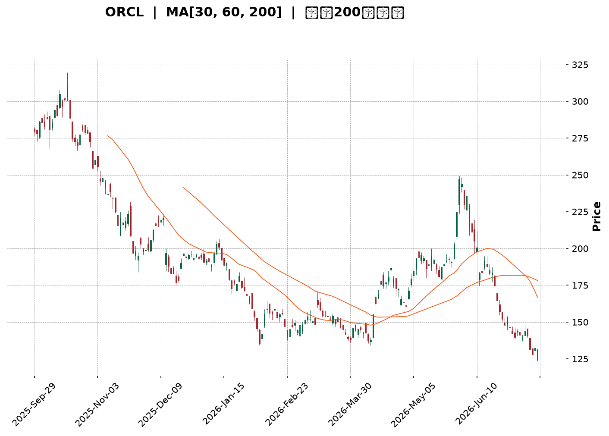
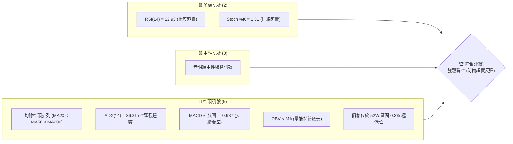
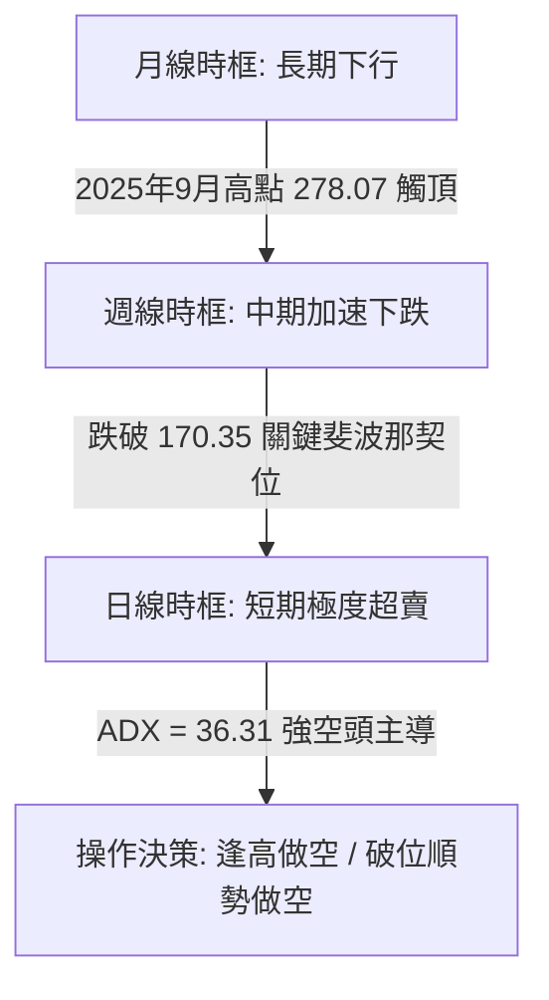
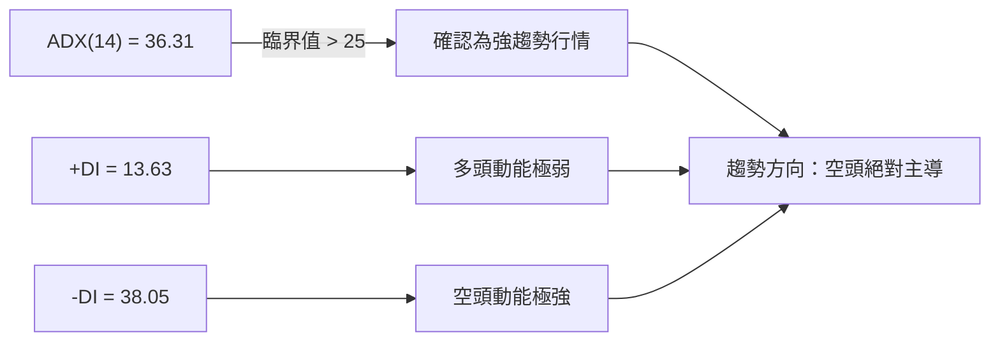
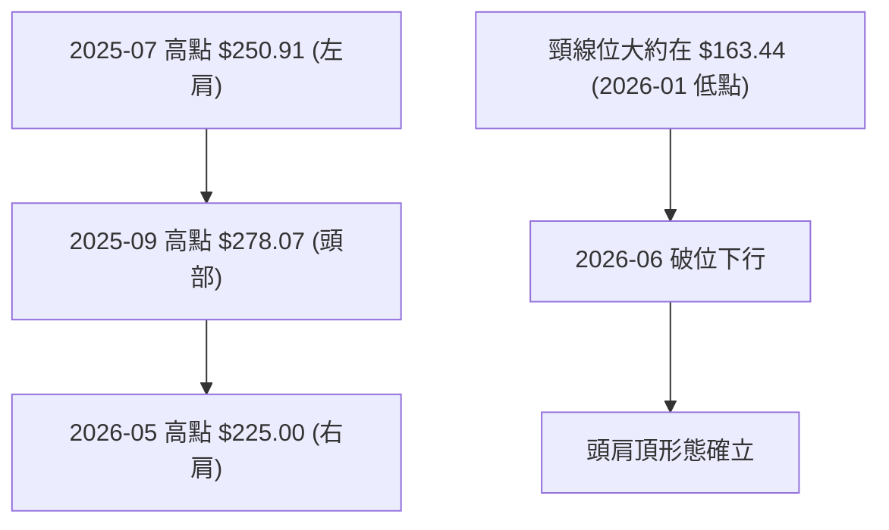
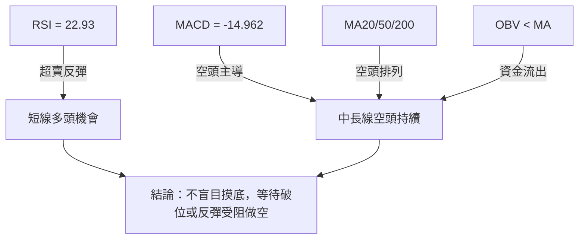
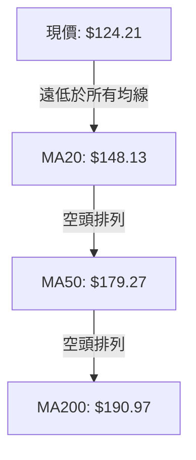
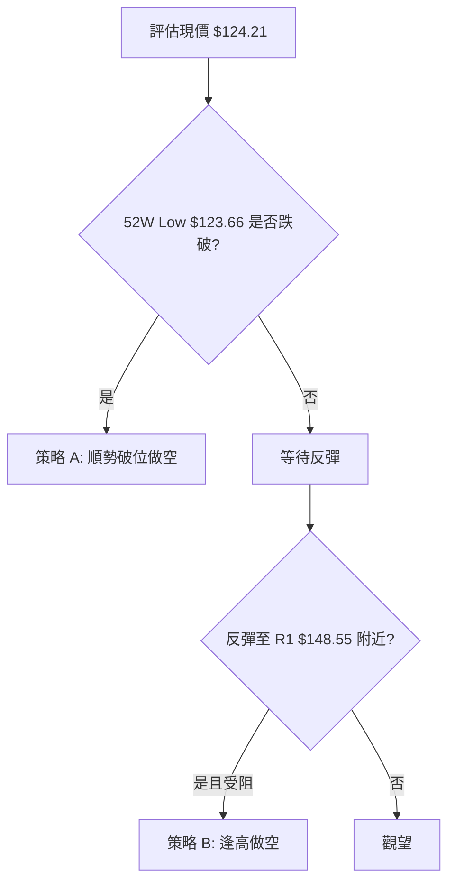
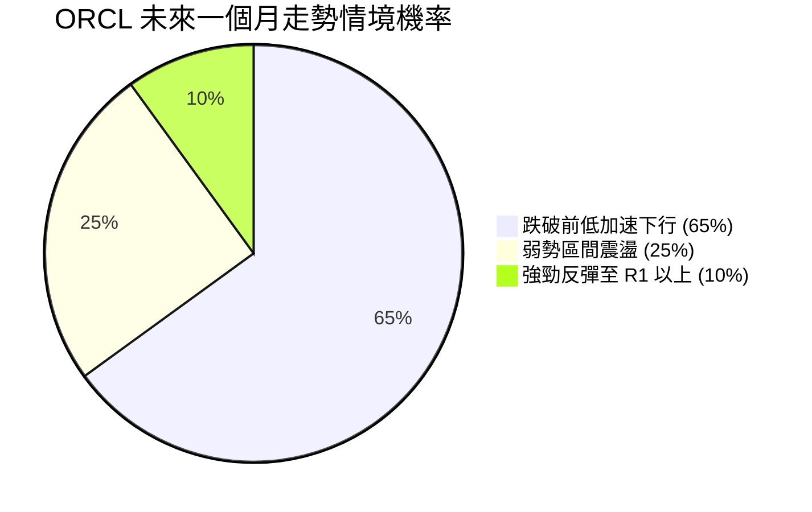
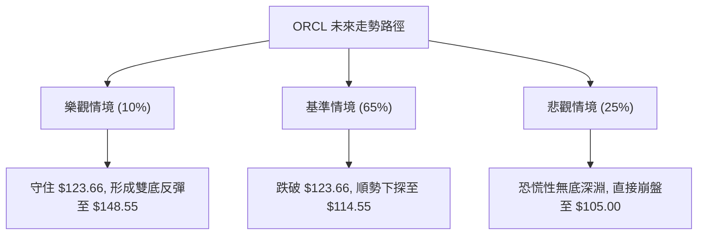

<details>
<summary>📊 靜態圖表 (點擊展開)</summary>

</details>

<html>
<head><meta charset="utf-8" /></head>
<body>
    <div style="height:500px; width:100%;">                        <script>window.PlotlyConfig = {MathJaxConfig: 'local'};</script>
        <script charset="utf-8" src="https://cdn.plot.ly/plotly-3.7.0.min.js" integrity="sha256-jvTGqxNp8AGWEcvNLVuKr+8j5dGe9Yw51LQkmDH+IYA=" crossorigin="anonymous"></script>                <div id="candlestick-chart" class="plotly-graph-div" style="height:100%; width:100%;"></div>            <script>                window.PLOTLYENV=window.PLOTLYENV || {};                                if (document.getElementById("candlestick-chart")) {                    Plotly.newPlot(                        "candlestick-chart",                        [{"close":{"dtype":"f8","bdata":"AAAAIC15cUAAAABAIWFxQAAAAKAM3HFAAAAAAGnYcUAAAACgpa5xQAAAACDdBHJAAAAAwJaQcUAAAACgCdZxQAAAAMD3YXJAAAAAYJQickAAAABgFBFzQAAAAOBLgnJAAAAAgILLckAAAAAAKGBzQAAAAKBuCHJAAAAAAIMocUAAAACgVwhxQAAAAADi4HBAAAAAYE9WcUAAAACg+IlxQAAAAABja3FAAAAAoFpicUAAAAAguApxQAAAAEDyzW9AAAAAYJ5BcEAAAACAX+xvQAAAAGCSuW5AAAAAwGX9bkAAAABgES9uQAAAAOAsn21AAAAAoO\u002fQbUAAAABgmzxtQAAAAIBJGmxAAAAAALrvakAAAACgEpdrQAAAAIBOOGtAAAAAIEZMa0AAAACAA+xrQAAAAKCrFWpAAAAAoI6baEAAAACAu8toQAAAAOC5ZGhAAAAA4A9gaUAAAACAqQBpQAAAAKCm4GhAAAAA4LjlaEAAAADg2rdpQAAAAKAJiWpAAAAAIAvwakAAAADg201rQAAAAIA8bWtAAAAAwCSca0AAAADgaJ5oQAAAAOD2hGdAAAAAYOjkZkAAAADAIFtnQAAAAMApGGZAAAAAYOxJZkAAAABAWsRnQAAAAICDj2hAAAAAoCkvaEAAAABATnNoQAAAACAng2hAAAAAQG4waEAAAABgbmpoQAAAAMCIIWhAAAAAwOM6aEAAAADAANhnQAAAAODE\u002fGdAAAAAQO3fZ0AAAABg0npnQAAAAECVpGhAAAAA4FVoaUAAAADAYhxpQAAAAICNCGhAAAAAIBGRZ0AAAADAeLhnQAAAAKCCVWZAAAAAQJKVZUAAAABgNx5mQAAAAKDN\u002fWVAAAAAgJelZkAAAAAA\u002fLVlQAAAACBAc2VAAAAAwM\u002f6ZEAAAADgCG5kQAAAAOBl3mNAAAAAQB0zY0AAAADA4zRiQAAAAEAS8WBAAAAAYIu6YUAAAADAIHBjQAAAAOD+2GNAAAAA4D2CY0AAAADgoWxjQAAAAMDw4GNAAAAAoN4cY0AAAAAgyGJjQAAAAACKbmNAAAAAYLJhYkAAAAAgj4phQAAAACAMJGJAAAAAoKhbYkAAAADAj6hiQAAAAACIDGJAAAAAgOCGYkAAAAAgQH9iQAAAAEAG6mJAAAAAYO02Y0AAAAAgxvxiQAAAAMBI0GJAAAAAwKSLYkAAAACAoz9kQAAAAGDMwWNAAAAAwBhBY0AAAAAAbVxjQAAAAADAM2NAAAAA4N36YkAAAABAIE5jQAAAAKCKlGJAAAAAoKAoY0AAAACAPEJiQAAAAAA8IGJAAAAA4Dm6YUAAAAAgIFZhQAAAAODLOmFAAAAAQN9CYkAAAAAgIQdiQAAAAKCsK2JAAAAA4PoQYkAAAACgqsVhQAAAAOA81WFAAAAAwDksYUAAAABgjzNhQAAAAECTYmNAAAAAoOpNZEAAAADAFCdlQAAAAEAYN2ZAAAAAoH\u002fOZUAAAAAA3B5mQAAAAEBXkWZAAAAA4DJbZ0AAAABAZ\u002fVlQAAAAIC8lWVAAAAAIIiLZUAAAAAAT6xkQAAAAIBiaGRAAAAAQJMaZEAAAABAf2dlQAAAAEBHdWZAAAAAIKMWZ0AAAAAgbytoQAAAAMBKPWhAAAAAQKloaEAAAAAAYCVoQAAAAEDVRWdAAAAAgESjZ0AAAACg0V1oQAAAAGD+CGhAAAAAQNE+Z0AAAADAlppmQAAAAOA+cGdAAAAAQJajZ0AAAAAgQO1nQAAAAGCADGhAAAAAAInJZ0AAAAAgzV9pQAAAAGDpH2xAAAAAIEXpbkAAAAAgbXduQAAAAMABsWxAAAAAAKlwbUAAAADADZ5qQAAAAKC9YmpAAAAAYBajaUAAAADg\u002fRFpQAAAAKDG7mZAAAAAgLvvZkAAAADAG\u002f9nQAAAAKCqdWdAAAAAYJncZkAAAACg1fRmQAAAAGDRzmVAAAAAAMySZEAAAADAe59jQAAAAGDO\u002fWJAAAAAYHuAYkAAAABg7WdiQAAAAIBXQWJAAAAA4DDAYUAAAAAgFHlhQAAAAABf6GFAAAAAoH2jYUAAAAAgGIBhQAAAAEAK92FAAAAA4HqUYUAAAACgR3FgQAAAAAAp\u002fF9AAAAAIK6PYEAAAACgcA1fQA=="},"high":{"dtype":"f8","bdata":"qetTnh2scUAiZczZyoxxQGPW5GON63FAscIjhlU6ckBLrHxGHTVyQIceCM1iVXJAU4u8XaYeckDusp8j6gNyQN58d9WDoXJA\u002fsHwzXsMc0CaZA9dtTtzQP1IBikw2HJAYsz50Z5Ac0Be9aSQVvdzQLzj\u002fDn41XJAskRv1aDncUCdVHF69FlxQLVGqDjUKHFAkVMAr1OGcUCYKho0JMdxQMO3L34hxHFAZ1ht87mrcUDTOuqR325xQL5yNQLtsnBA8i34Z1R0cECyy0SUUXFwQFxK2Q7rmm9AIuXLbqM\u002fb0CpWjrPGNZuQCMB\u002fYdOw21A1ka2txicbkCmCJ9Cz2VtQOnpfViGUW1AFvuNPUnga0BACQ9NMBxsQP8JCul8lWtALmKMJwOya0DYpr10DT9sQAipp9p2+GxAMPpJ2jzKaUC8zvUz7jtpQE\u002f5spwosGhAYyLgD83\u002faUAftmbaBQ1pQMQbkMbJMWlA3AnP80r2aUALd1CB4L1pQKenRXpEq2pAaoywfOUsa0DPN\u002fPEStNrQD51AnLIj2tAG47yllvla0Do3\u002fsB7gFpQAOBJCy3fmhAhbOqCUVlZ0DnHK6fk39nQBRoSyb8FmdA34cWU9bfZkBiLnZ5MChoQG6JXkHTnGhA8AjvLh1qaEBqfoQMWIxoQOVzBr2VzmhAAKjCKqKTaEDE4xNvg49oQAnK9ScdamhAqMFROyuWaEA1v3XQa\u002fhoQEXieXCVIGhA2MPfJJ85aEBuJV5CBqRnQEhcr5BV2WhA7sm9ilmlaUCdiYC0e8tpQCOhXGQACWlAEkk9lwo1aEAsPH0vQtFnQJxYAXaJPGdA2YNmth5rZkC2tfAhI11mQJY+yCjuTGZAIjJHcssAZ0AQZBeoJ09mQAqNfH1wjWZAyJ7Zr5QhZUDVUgfQUPdkQCpQ\u002ftdnQGVAKuc2CMrIY0AsfLOW6htjQH1Z06MTMWJAI9VRqZ7GYUDB17b3i9RjQEu+zWXGh2RAonmllcxQZEBxZG7u+71jQCu3UMiUJWRA13yXcZzFY0Ap4gntsIZjQMQ1+qAI32NA\u002fDLQWoEdY0CFILonPhliQH3gmua\u002fN2JAWJeFRfEGY0AtX5\u002fTJ+5iQDqztf0jImJAnEEt2xykYkCo3iarQ7xiQGe04extEWNAD47\u002fSAebY0CWqcFMwMJjQEqia0BE3mJA15+hk0UiY0Bp5IWAM1JlQJqbMG5Q1WRALlIm7\u002fX0Y0DoBCGAc7RjQCTxuM0rumNADa33xKU8Y0B7uSd2nXpjQBc+tkz9BWNAlEQqUGNWY0D9rAcZpRpjQCd1RlmgmWJAAHBir4guYkAvpPyKopZhQKIDt0UQh2FAZyM+ZhZMYkBA3JqilpNiQBDtYLeULWJAXsYL3aFwYkBnUOH1J\u002fJhQKaoGVobzWJAJzzS8sHJYUBMbRit43VhQJA9dMPSa2NAFbG5mwEaZUBjX8ulxn5lQN\u002fLqw+kdGZAZnELBYj7ZkD0wlpjmSRmQB0ulHFRFmdAmpl+qcWQZ0Dhc9gLTahmQDxQyxusgmZAvQ9UnlieZUCg57QurwNlQFaAbpYKhmRAu0JWPG+TZEBgUIpZQ7ZlQIcvVXWk22ZAUL1YhfI7Z0BpNK2duTNoQF4oileY7mhApOxEpwiqaECK2QT+DGBoQIiqA4oJCGhAORsEuPzcZ0Dns70HdABpQBfcBar3d2hA1lkGIyjDZ0CW9ElvGoJnQPN2yKsocmdAbsKcQNkEaEBgfHoEJYpoQBebuHi+UGhAgFPO\u002fCnvZ0DLDy7UQYlpQI3IAcQsMGxAWP7Buzwsb0CUpQU4YARvQDPuhCCj9W1AP+uz\u002f+PDbUCueY5YZ9RsQEiVvQCeSWtA8hGYq4l3a0CjqQR3yXdqQFRRrDgkBGdA9OyFsfgdZ0DdVb1CklRoQDpbLDqSVGhAUGb3+fqwZ0C3XJYK02pnQOU4oigV\u002fmZAQ8+ELzi3ZUB\u002fXVOLnKVkQGXEpHNaomNAKAZG9j4gY0BWkBsU3D5jQOUFgWEgrWJACONSEzthYkB0pgTpmlFiQDDov0yvI2JA9HP0Z8UhYkDl\u002f9HoJKthQHMUNcGzkWJAAAAAgMI1YkAAAADAzHRhQAAAAOBRmGBAAAAAwMy8YEAAAADAzHRgQA=="},"hovertemplate":"\u003cb\u003e%{x|%Y-%m-%d}\u003c\u002fb\u003e\u003cbr\u003e\u958b: $%{open:.2f}\u003cbr\u003e\u9ad8: $%{high:.2f}\u003cbr\u003e\u4f4e: $%{low:.2f}\u003cbr\u003e\u6536: $%{close:.2f}\u003cextra\u003e\u003c\u002fextra\u003e","low":{"dtype":"f8","bdata":"sZ\u002fHBlhHcUD+mx8dpwxxQJMimd\u002f5K3FABkvs4zitcUAjE83nyoxxQNqYS7dd+HFAB2U95SK\u002fcEBSsATudoZxQGhPMjJAyHFAGXhrbIYTckCptk8\u002fVG5yQKprurIME3JAt\u002f5qSgeBckAD5QhSy8JyQEc2XfYNzHFAqs+arOAKcUC+uyFWi9pwQE4YkQ\u002fYqnBAsIBKpprccEA2fdFC23hxQOnQt5cwUnFAc9HSOMJdcUAh6ZKQH8xwQI\u002frub2cum9AERkKvj3Ib0DaVtFrVZlvQLPkVXgfW25AVIb5snCVbkCYfT9WIKBtQNhsXgorxGxAWhhpA8RZbUDXs\u002fisgVZsQA4Q2CxMAGxAHyqkqj6lakC29temNBhqQOYYlGYFsGpApudEymyOakCg+KWOfOdqQAjAmEVPCWpABPbZHW72Z0ClUClhMw5oQEXSaU5p+2ZAk\u002folf9oJaUANjGTnG3doQNs7UlREWmhAO9SKttvCaECEtAFr169oQErmbp8qi2lAgqwJq4hyakAGqHcWz9pqQOktftk6BmtAjZLGNQvwakAgeGxqbQ5nQK9VvQOBBmdALUW9+1d1ZkAD9\u002fSwR9dmQM29tqgb7GVA4f6EevcbZkAYyl9PVEpnQHNf4Tmc32dAJ8UMZlPLZ0Dw5HcDARJoQGAezkGRR2hA6prrj5bZZ0Bv84LE4zpoQLD8dTbUG2hAi82LJFkLaEByIwQ5w89nQCEEevIZnGdAK5lWvU3FZ0D4ALFK5AtnQDA6Pn0Qb2dADqDIApl0aEAbxyJ7luhoQLQ20\u002fOSr2dA9I2B4nKCZ0BQ4NJRkCdnQPjx1vC2Q2ZASAI72VYtZUBFqXlS1OhlQIowwAjUWWVAn8LK41YpZkAxNiIQN49lQLsj0AdhVWVAG6gxScsMZECkeofBc0NkQNYQoMh93GNAHy3LvxbbYkAZtV3jtO1hQM34TAH8yWBAQe08xEo+YUDdmIZYYD9iQFrH+9bie2NAjss8qNIdY0BVmY7eJ+5iQGIY0QvRRmNAf+lGTTv6YkDy1fczP8piQMXC9\u002f4RVmNA+dGjE8VLYkDG4a9oHzRhQHQNUV2SOGFAyll7Py5KYkDFKWgplgRiQJ1WQvypo2FAeEVufW2GYUAjW1d72sFhQBhf+0ccgmJA5IZVEoaiYkAxSZnhMNJiQPDT7zRDLWJA8CIaWXRtYkAY3aMu7O5jQKKYVP9RsGNA1rqi6pYiY0DjxdOSBy5jQKcXvRvvDWNANEoznInfYkAp717sb3tiQJF4l8mQXWJAITyt+0W1YkBJV4AinDpiQBBnvAwc82FAdO8NV6WxYUCTO1NE6CphQBjWFbsBAGFA7YS81ylcYUApS7lwVfVhQGkeQq12amFAhqLxg0bbYUDYNvMBBl9hQFU81w0WvWFA2Ex4c+nwYEB2XoGYT8NgQEiNCBOKZ2FAoR7KBf8fZEBfiyreR7RkQJCdgZBRpmVAc0UViEmYZUCObi8XEp1lQOnhXAzL7GVALfKo+1HFZkBdrVRbP69lQOCBApzfBmVA4nK1NSzqZED6ffVLny9kQEv1cDD6AmRApVfb2sX4Y0AAVznxXbJkQDrlscH8tGVAN5S0OCRMZkDFh1eiLMFmQMtWfMNuxGdATu4cRZ6xZ0BzBtsEDr5nQILC4STGh2ZAkOIRnGMNZ0CEb6Ft0xlnQGsmU8bXh2dAjRnN207UZkA1yIjtr4lmQBqInZTDRWZAim+GvaFRZ0DvfzHV\u002f81nQC2cu2DHvGdAs5uHlpdoZ0CDIK3YtBZoQCBqiC8+6WlAABnYdUj6a0BSfjQFYsBtQG72QsBEWmxAM8pNNybna0Cd1vfCKRdqQE\u002fn5TdWE2pAqMnYRVajaEDVMLH5xa9oQHCCP5+D1WVA2IerMiRMZkBRX+TdDzJnQKQWUQdNYGdATlYF+02+ZkBVlGmJryJmQDFPZqdzuWVAc+\u002fq\u002fkGBZEDZdPEp91ljQNL+XMTWumJAM19qrZRvYkANsLiUShZiQAgeKcpU\u002f2FAAAAA4DDAYUAS45uFKEthQFs+Zbd1lWFAy9h+BlciYUBwY3EfVyJhQMuzyadxjmFAAAAA4FFoYUAAAABAM2tgQAAAAGBm5l9AAAAAQOEaYEAAAACAPepeQA=="},"name":"\u50f9\u683c","open":{"dtype":"f8","bdata":"2rZh0UiWcUCGJ\u002fJo44dxQJikdqiHOnFApt54eS8IckAhMn8KYuVxQCZntIhcEXJAU4u8XaYeckB4uoarQaNxQLEiEBM8DHJA4ZD+r5SWckAuJVnuin1yQNaS9cu3ynJAmzuEScvfckDU5a8x4+pyQHP1NReSzXJAi0lHbgjjcUCJpZPsPzdxQIJOQdocA3FA2w6N+KLlcEDqfkcGBLNxQBx4nhFRvXFA7RQgFr6EcUCum7x0VmxxQMudTezConBAAKTqLX4QcEA9C\u002fbyS2twQMcWoDjw8m5AdwAG1FSxbkBrLe0+SLJuQFKpBFnvlm1AL4cB7TVzbkCArix9JD9tQI1byHJOT21AS8V86+Xaa0B14Mp0GxpqQKJmouECBGtA0qkjVp\u002fEakAnn6CZ8x5rQK2srt1znmxAxhMt\u002fUCjaUD+C6KHVl9oQCCWEV86B2hAlY1cMfTvaUAQejT1U7NoQMjnbY+00mhAdzwHU8RlaUBxyVxCUc1oQCik0rn5u2lA8lk6ngwda0DCEHobiGdrQAmfYeSxPWtAx34mMst1a0CrQ5u4kJlnQHu1J8DOT2hAEqO2obdPZ0Dnf8yB791mQAcEK07hsWZA\u002fIAdWi6fZkBXqs0N41JnQKkUbhYSXmhADkfzkbVRaEDC6Sf\u002fYiRoQB5htgVfhWhA3TuvesMJaEArOHGA+0VoQKl0PnNkUWhAu7l04qtyaEAviyu+Po5oQHqCkYEN12dA\u002fzu7GeUtaEBNoalczqFnQCKtrt2VymdAIMx53ViHaEAyVrgogXJpQCOhXGQACWlAEkk9lwo1aEDgBCFK+ZJnQJxYAXaJPGdAYAtWO+JNZkDnvyJECERmQN60V8+HbWVAme6AAXQ7ZkDtPZUEUD5mQFtu2a2etmVA\u002fCVt2wkfZUC18mwpHuBkQPR+ZACCN2VAJFv9iTKlY0B9MvbNUxpjQN7LxDzjEmJAPtgVS\u002fxYYUCB1lLRuW5iQDtxG8B93GNAonmllcxQZECvvbLetZpjQNwSZXCoxGNAghlHrUycY0DqHqA92ipjQLDNDvIxg2NA9QR0DpQHY0B8rp1HvxViQKWq1Zyfe2FAf3KCWASEYkAMqZ87QnhiQG4ySps63GFAG73b\u002fWiUYUB3bjxG4PdhQIdswjQHn2JAWECk\u002fQPxYkDd9+WlgPtiQAxnNXz0tGJACl3DPr8RY0DbvilJPKdkQPipI+eTcGRAtaJhZ02+Y0AxJhAjSV9jQCSjyGOVS2NACLDLd8EKY0Cwac85VK1iQIB6h0mi\u002f2JAlSZY5dXLYkACldp6C\u002f5iQIvYPuE9hmJAmhIB5IvcYUAqxtW4e35hQK+kLm0zYmFAHmDVpnZqYUBoJ1TzyoFiQCeTgOdFuWFAzJtmzVtNYkB+jfsXDdlhQB6hloE+qGJAlxlGvZ+2YUDwUkx+ARthQD7CekciaWFAdVKgGyHrZEBdnDIO98lkQAhGjSfe+WVAGMoEHHfJZkBtdFr+TQZmQEdoDvdpN2ZAPN803RoxZ0AsDho9yXhmQOzt\u002fUlLfGZAqVrk6ml\u002fZUApFDFMITNkQFyNPskUb2RAYa12W6ouZEDdlh8m+rpkQNk+X8Uc7WVAhdSEU\u002fSvZkDNawghvjFnQNzlMnR8vWhAge3Z9TH9Z0CNTm1\u002fe+9nQIiqA4oJCGhAy5eMG\u002f2LZ0BLRtcE4nBnQIQX1\u002f2LumdA5nKl2OuqZ0CLIGdvXStnQHAoKRQeamZAC2C81VmLZ0Ch5PwELeBnQJdj\u002fq4nFGhAgAZl+x3aZ0C0zye6wCtoQCfsizHQCGpAmO2FpW22bEAzeaLtqT5uQFJ9oTqu9G1ADR55A9FGbECR8F5aOJZsQFQXPrXXH2tAle1+lGOlakDV3QVj+rloQI94EdGBYWZABX\u002feYcsLZ0B8wKPasFdnQC34X2k9q2dAF3RcrncwZ0AZI2U6BMxmQCFD7cCxtWZAFvuCYXk0ZUBp81mKVT1kQPUgol6+mWNAxkjfXaa3YkAFaqB7AC1jQJ0onf6pV2JAlMxqe6b\u002fYUDvfD7Ss9lhQEuP1WmX+WFAJ0AUahjnYUDiuvIcflJhQITB5SXAnWFAAAAAwMw0YkAAAADA9WBhQAAAAAAAgGBAAAAAgOtRYEAAAABAM29gQA=="},"x":["2025-09-29T00:00:00-04:00","2025-09-30T00:00:00-04:00","2025-10-01T00:00:00-04:00","2025-10-02T00:00:00-04:00","2025-10-03T00:00:00-04:00","2025-10-06T00:00:00-04:00","2025-10-07T00:00:00-04:00","2025-10-08T00:00:00-04:00","2025-10-09T00:00:00-04:00","2025-10-10T00:00:00-04:00","2025-10-13T00:00:00-04:00","2025-10-14T00:00:00-04:00","2025-10-15T00:00:00-04:00","2025-10-16T00:00:00-04:00","2025-10-17T00:00:00-04:00","2025-10-20T00:00:00-04:00","2025-10-21T00:00:00-04:00","2025-10-22T00:00:00-04:00","2025-10-23T00:00:00-04:00","2025-10-24T00:00:00-04:00","2025-10-27T00:00:00-04:00","2025-10-28T00:00:00-04:00","2025-10-29T00:00:00-04:00","2025-10-30T00:00:00-04:00","2025-10-31T00:00:00-04:00","2025-11-03T00:00:00-05:00","2025-11-04T00:00:00-05:00","2025-11-05T00:00:00-05:00","2025-11-06T00:00:00-05:00","2025-11-07T00:00:00-05:00","2025-11-10T00:00:00-05:00","2025-11-11T00:00:00-05:00","2025-11-12T00:00:00-05:00","2025-11-13T00:00:00-05:00","2025-11-14T00:00:00-05:00","2025-11-17T00:00:00-05:00","2025-11-18T00:00:00-05:00","2025-11-19T00:00:00-05:00","2025-11-20T00:00:00-05:00","2025-11-21T00:00:00-05:00","2025-11-24T00:00:00-05:00","2025-11-25T00:00:00-05:00","2025-11-26T00:00:00-05:00","2025-11-28T00:00:00-05:00","2025-12-01T00:00:00-05:00","2025-12-02T00:00:00-05:00","2025-12-03T00:00:00-05:00","2025-12-04T00:00:00-05:00","2025-12-05T00:00:00-05:00","2025-12-08T00:00:00-05:00","2025-12-09T00:00:00-05:00","2025-12-10T00:00:00-05:00","2025-12-11T00:00:00-05:00","2025-12-12T00:00:00-05:00","2025-12-15T00:00:00-05:00","2025-12-16T00:00:00-05:00","2025-12-17T00:00:00-05:00","2025-12-18T00:00:00-05:00","2025-12-19T00:00:00-05:00","2025-12-22T00:00:00-05:00","2025-12-23T00:00:00-05:00","2025-12-24T00:00:00-05:00","2025-12-26T00:00:00-05:00","2025-12-29T00:00:00-05:00","2025-12-30T00:00:00-05:00","2025-12-31T00:00:00-05:00","2026-01-02T00:00:00-05:00","2026-01-05T00:00:00-05:00","2026-01-06T00:00:00-05:00","2026-01-07T00:00:00-05:00","2026-01-08T00:00:00-05:00","2026-01-09T00:00:00-05:00","2026-01-12T00:00:00-05:00","2026-01-13T00:00:00-05:00","2026-01-14T00:00:00-05:00","2026-01-15T00:00:00-05:00","2026-01-16T00:00:00-05:00","2026-01-20T00:00:00-05:00","2026-01-21T00:00:00-05:00","2026-01-22T00:00:00-05:00","2026-01-23T00:00:00-05:00","2026-01-26T00:00:00-05:00","2026-01-27T00:00:00-05:00","2026-01-28T00:00:00-05:00","2026-01-29T00:00:00-05:00","2026-01-30T00:00:00-05:00","2026-02-02T00:00:00-05:00","2026-02-03T00:00:00-05:00","2026-02-04T00:00:00-05:00","2026-02-05T00:00:00-05:00","2026-02-06T00:00:00-05:00","2026-02-09T00:00:00-05:00","2026-02-10T00:00:00-05:00","2026-02-11T00:00:00-05:00","2026-02-12T00:00:00-05:00","2026-02-13T00:00:00-05:00","2026-02-17T00:00:00-05:00","2026-02-18T00:00:00-05:00","2026-02-19T00:00:00-05:00","2026-02-20T00:00:00-05:00","2026-02-23T00:00:00-05:00","2026-02-24T00:00:00-05:00","2026-02-25T00:00:00-05:00","2026-02-26T00:00:00-05:00","2026-02-27T00:00:00-05:00","2026-03-02T00:00:00-05:00","2026-03-03T00:00:00-05:00","2026-03-04T00:00:00-05:00","2026-03-05T00:00:00-05:00","2026-03-06T00:00:00-05:00","2026-03-09T00:00:00-04:00","2026-03-10T00:00:00-04:00","2026-03-11T00:00:00-04:00","2026-03-12T00:00:00-04:00","2026-03-13T00:00:00-04:00","2026-03-16T00:00:00-04:00","2026-03-17T00:00:00-04:00","2026-03-18T00:00:00-04:00","2026-03-19T00:00:00-04:00","2026-03-20T00:00:00-04:00","2026-03-23T00:00:00-04:00","2026-03-24T00:00:00-04:00","2026-03-25T00:00:00-04:00","2026-03-26T00:00:00-04:00","2026-03-27T00:00:00-04:00","2026-03-30T00:00:00-04:00","2026-03-31T00:00:00-04:00","2026-04-01T00:00:00-04:00","2026-04-02T00:00:00-04:00","2026-04-06T00:00:00-04:00","2026-04-07T00:00:00-04:00","2026-04-08T00:00:00-04:00","2026-04-09T00:00:00-04:00","2026-04-10T00:00:00-04:00","2026-04-13T00:00:00-04:00","2026-04-14T00:00:00-04:00","2026-04-15T00:00:00-04:00","2026-04-16T00:00:00-04:00","2026-04-17T00:00:00-04:00","2026-04-20T00:00:00-04:00","2026-04-21T00:00:00-04:00","2026-04-22T00:00:00-04:00","2026-04-23T00:00:00-04:00","2026-04-24T00:00:00-04:00","2026-04-27T00:00:00-04:00","2026-04-28T00:00:00-04:00","2026-04-29T00:00:00-04:00","2026-04-30T00:00:00-04:00","2026-05-01T00:00:00-04:00","2026-05-04T00:00:00-04:00","2026-05-05T00:00:00-04:00","2026-05-06T00:00:00-04:00","2026-05-07T00:00:00-04:00","2026-05-08T00:00:00-04:00","2026-05-11T00:00:00-04:00","2026-05-12T00:00:00-04:00","2026-05-13T00:00:00-04:00","2026-05-14T00:00:00-04:00","2026-05-15T00:00:00-04:00","2026-05-18T00:00:00-04:00","2026-05-19T00:00:00-04:00","2026-05-20T00:00:00-04:00","2026-05-21T00:00:00-04:00","2026-05-22T00:00:00-04:00","2026-05-26T00:00:00-04:00","2026-05-27T00:00:00-04:00","2026-05-28T00:00:00-04:00","2026-05-29T00:00:00-04:00","2026-06-01T00:00:00-04:00","2026-06-02T00:00:00-04:00","2026-06-03T00:00:00-04:00","2026-06-04T00:00:00-04:00","2026-06-05T00:00:00-04:00","2026-06-08T00:00:00-04:00","2026-06-09T00:00:00-04:00","2026-06-10T00:00:00-04:00","2026-06-11T00:00:00-04:00","2026-06-12T00:00:00-04:00","2026-06-15T00:00:00-04:00","2026-06-16T00:00:00-04:00","2026-06-17T00:00:00-04:00","2026-06-18T00:00:00-04:00","2026-06-22T00:00:00-04:00","2026-06-23T00:00:00-04:00","2026-06-24T00:00:00-04:00","2026-06-25T00:00:00-04:00","2026-06-26T00:00:00-04:00","2026-06-29T00:00:00-04:00","2026-06-30T00:00:00-04:00","2026-07-01T00:00:00-04:00","2026-07-02T00:00:00-04:00","2026-07-06T00:00:00-04:00","2026-07-07T00:00:00-04:00","2026-07-08T00:00:00-04:00","2026-07-09T00:00:00-04:00","2026-07-10T00:00:00-04:00","2026-07-13T00:00:00-04:00","2026-07-14T00:00:00-04:00","2026-07-15T00:00:00-04:00","2026-07-16T00:00:00-04:00"],"type":"candlestick"},{"hovertemplate":"MA30: $%{y:.2f}\u003cextra\u003e\u003c\u002fextra\u003e","line":{"color":"#2196F3","dash":"dash","width":2},"mode":"lines","name":"MA30","x":["2025-09-29T00:00:00-04:00","2025-09-30T00:00:00-04:00","2025-10-01T00:00:00-04:00","2025-10-02T00:00:00-04:00","2025-10-03T00:00:00-04:00","2025-10-06T00:00:00-04:00","2025-10-07T00:00:00-04:00","2025-10-08T00:00:00-04:00","2025-10-09T00:00:00-04:00","2025-10-10T00:00:00-04:00","2025-10-13T00:00:00-04:00","2025-10-14T00:00:00-04:00","2025-10-15T00:00:00-04:00","2025-10-16T00:00:00-04:00","2025-10-17T00:00:00-04:00","2025-10-20T00:00:00-04:00","2025-10-21T00:00:00-04:00","2025-10-22T00:00:00-04:00","2025-10-23T00:00:00-04:00","2025-10-24T00:00:00-04:00","2025-10-27T00:00:00-04:00","2025-10-28T00:00:00-04:00","2025-10-29T00:00:00-04:00","2025-10-30T00:00:00-04:00","2025-10-31T00:00:00-04:00","2025-11-03T00:00:00-05:00","2025-11-04T00:00:00-05:00","2025-11-05T00:00:00-05:00","2025-11-06T00:00:00-05:00","2025-11-07T00:00:00-05:00","2025-11-10T00:00:00-05:00","2025-11-11T00:00:00-05:00","2025-11-12T00:00:00-05:00","2025-11-13T00:00:00-05:00","2025-11-14T00:00:00-05:00","2025-11-17T00:00:00-05:00","2025-11-18T00:00:00-05:00","2025-11-19T00:00:00-05:00","2025-11-20T00:00:00-05:00","2025-11-21T00:00:00-05:00","2025-11-24T00:00:00-05:00","2025-11-25T00:00:00-05:00","2025-11-26T00:00:00-05:00","2025-11-28T00:00:00-05:00","2025-12-01T00:00:00-05:00","2025-12-02T00:00:00-05:00","2025-12-03T00:00:00-05:00","2025-12-04T00:00:00-05:00","2025-12-05T00:00:00-05:00","2025-12-08T00:00:00-05:00","2025-12-09T00:00:00-05:00","2025-12-10T00:00:00-05:00","2025-12-11T00:00:00-05:00","2025-12-12T00:00:00-05:00","2025-12-15T00:00:00-05:00","2025-12-16T00:00:00-05:00","2025-12-17T00:00:00-05:00","2025-12-18T00:00:00-05:00","2025-12-19T00:00:00-05:00","2025-12-22T00:00:00-05:00","2025-12-23T00:00:00-05:00","2025-12-24T00:00:00-05:00","2025-12-26T00:00:00-05:00","2025-12-29T00:00:00-05:00","2025-12-30T00:00:00-05:00","2025-12-31T00:00:00-05:00","2026-01-02T00:00:00-05:00","2026-01-05T00:00:00-05:00","2026-01-06T00:00:00-05:00","2026-01-07T00:00:00-05:00","2026-01-08T00:00:00-05:00","2026-01-09T00:00:00-05:00","2026-01-12T00:00:00-05:00","2026-01-13T00:00:00-05:00","2026-01-14T00:00:00-05:00","2026-01-15T00:00:00-05:00","2026-01-16T00:00:00-05:00","2026-01-20T00:00:00-05:00","2026-01-21T00:00:00-05:00","2026-01-22T00:00:00-05:00","2026-01-23T00:00:00-05:00","2026-01-26T00:00:00-05:00","2026-01-27T00:00:00-05:00","2026-01-28T00:00:00-05:00","2026-01-29T00:00:00-05:00","2026-01-30T00:00:00-05:00","2026-02-02T00:00:00-05:00","2026-02-03T00:00:00-05:00","2026-02-04T00:00:00-05:00","2026-02-05T00:00:00-05:00","2026-02-06T00:00:00-05:00","2026-02-09T00:00:00-05:00","2026-02-10T00:00:00-05:00","2026-02-11T00:00:00-05:00","2026-02-12T00:00:00-05:00","2026-02-13T00:00:00-05:00","2026-02-17T00:00:00-05:00","2026-02-18T00:00:00-05:00","2026-02-19T00:00:00-05:00","2026-02-20T00:00:00-05:00","2026-02-23T00:00:00-05:00","2026-02-24T00:00:00-05:00","2026-02-25T00:00:00-05:00","2026-02-26T00:00:00-05:00","2026-02-27T00:00:00-05:00","2026-03-02T00:00:00-05:00","2026-03-03T00:00:00-05:00","2026-03-04T00:00:00-05:00","2026-03-05T00:00:00-05:00","2026-03-06T00:00:00-05:00","2026-03-09T00:00:00-04:00","2026-03-10T00:00:00-04:00","2026-03-11T00:00:00-04:00","2026-03-12T00:00:00-04:00","2026-03-13T00:00:00-04:00","2026-03-16T00:00:00-04:00","2026-03-17T00:00:00-04:00","2026-03-18T00:00:00-04:00","2026-03-19T00:00:00-04:00","2026-03-20T00:00:00-04:00","2026-03-23T00:00:00-04:00","2026-03-24T00:00:00-04:00","2026-03-25T00:00:00-04:00","2026-03-26T00:00:00-04:00","2026-03-27T00:00:00-04:00","2026-03-30T00:00:00-04:00","2026-03-31T00:00:00-04:00","2026-04-01T00:00:00-04:00","2026-04-02T00:00:00-04:00","2026-04-06T00:00:00-04:00","2026-04-07T00:00:00-04:00","2026-04-08T00:00:00-04:00","2026-04-09T00:00:00-04:00","2026-04-10T00:00:00-04:00","2026-04-13T00:00:00-04:00","2026-04-14T00:00:00-04:00","2026-04-15T00:00:00-04:00","2026-04-16T00:00:00-04:00","2026-04-17T00:00:00-04:00","2026-04-20T00:00:00-04:00","2026-04-21T00:00:00-04:00","2026-04-22T00:00:00-04:00","2026-04-23T00:00:00-04:00","2026-04-24T00:00:00-04:00","2026-04-27T00:00:00-04:00","2026-04-28T00:00:00-04:00","2026-04-29T00:00:00-04:00","2026-04-30T00:00:00-04:00","2026-05-01T00:00:00-04:00","2026-05-04T00:00:00-04:00","2026-05-05T00:00:00-04:00","2026-05-06T00:00:00-04:00","2026-05-07T00:00:00-04:00","2026-05-08T00:00:00-04:00","2026-05-11T00:00:00-04:00","2026-05-12T00:00:00-04:00","2026-05-13T00:00:00-04:00","2026-05-14T00:00:00-04:00","2026-05-15T00:00:00-04:00","2026-05-18T00:00:00-04:00","2026-05-19T00:00:00-04:00","2026-05-20T00:00:00-04:00","2026-05-21T00:00:00-04:00","2026-05-22T00:00:00-04:00","2026-05-26T00:00:00-04:00","2026-05-27T00:00:00-04:00","2026-05-28T00:00:00-04:00","2026-05-29T00:00:00-04:00","2026-06-01T00:00:00-04:00","2026-06-02T00:00:00-04:00","2026-06-03T00:00:00-04:00","2026-06-04T00:00:00-04:00","2026-06-05T00:00:00-04:00","2026-06-08T00:00:00-04:00","2026-06-09T00:00:00-04:00","2026-06-10T00:00:00-04:00","2026-06-11T00:00:00-04:00","2026-06-12T00:00:00-04:00","2026-06-15T00:00:00-04:00","2026-06-16T00:00:00-04:00","2026-06-17T00:00:00-04:00","2026-06-18T00:00:00-04:00","2026-06-22T00:00:00-04:00","2026-06-23T00:00:00-04:00","2026-06-24T00:00:00-04:00","2026-06-25T00:00:00-04:00","2026-06-26T00:00:00-04:00","2026-06-29T00:00:00-04:00","2026-06-30T00:00:00-04:00","2026-07-01T00:00:00-04:00","2026-07-02T00:00:00-04:00","2026-07-06T00:00:00-04:00","2026-07-07T00:00:00-04:00","2026-07-08T00:00:00-04:00","2026-07-09T00:00:00-04:00","2026-07-10T00:00:00-04:00","2026-07-13T00:00:00-04:00","2026-07-14T00:00:00-04:00","2026-07-15T00:00:00-04:00","2026-07-16T00:00:00-04:00"],"y":{"dtype":"f8","bdata":"AAAAAAAA+H8AAAAAAAD4fwAAAAAAAPh\u002fAAAAAAAA+H8AAAAAAAD4fwAAAAAAAPh\u002fAAAAAAAA+H8AAAAAAAD4fwAAAAAAAPh\u002fAAAAAAAA+H8AAAAAAAD4fwAAAAAAAPh\u002fAAAAAAAA+H8AAAAAAAD4fwAAAAAAAPh\u002fAAAAAAAA+H8AAAAAAAD4fwAAAAAAAPh\u002fAAAAAAAA+H8AAAAAAAD4fwAAAAAAAPh\u002fAAAAAAAA+H8AAAAAAAD4fwAAAAAAAPh\u002fAAAAAAAA+H8AAAAAAAD4fwAAAAAAAPh\u002fAAAAAAAA+H8AAAAAAAD4f4mIiFCgSXFAd3d3Z7wzcUCamZnRLBxxQHd3d5+t+3BAd3d3n1PWcEAzMzMDKLVwQJqZmVmIj3BAAAAAGB5ucEC8u7vDDE1wQBEREZF6H3BA7+7u\u002fm\u002fbb0De3d2Nn2lvQFVVVfXk\u002fW5AZmZmlqmVbkDNzMw8VyBuQDMzM\u002fPdwG1AMzMzg31wbUC8u7s7QyltQLy7u2uj62xAAAAAgJ6pbEBERER0SGdsQDMzMyMIKGxAERERQfLqa0De3d29LZprQCIiIrJ6U2tAERER0WYBa0AAAAAgS7hqQBEREYGlbmpAmpmZuWUkakAzMzPjo+1pQDMzM5NzwmlAERERcWSSaUCamZmJjGlpQCIiIkLpSmlAzczMzHczaUAiIiJCYRhpQFVVVVUF\u002fmhAMzMzY9fjaEDv7u5+CsFoQAAAAPAkr2hAMzMz0+OoaECrqqraqJ1oQERERMTJn2hA3t3dXRCgaEARERHx\u002fKBoQHd3d+fImWhAq6qq+m2OaEDNzMwsYn1oQHd3d1eIWWhAVVVVpdkraEDe3d1tmP9nQN7d3d020WdAMzMz09ymZ0BVVVVlDI5nQLy7uytkfGdAREREBA5sZ0ARERHBFVNnQCIiIsIXQGdAVVVVhbslZ0AzMzOjSPZmQM3MzNxEtWZAVVVVhS5+ZkDNzMy8aFNmQImIiJiaK2ZAzczMDKoDZkCrqqoqEtllQFVVVdXItGVA7+7u\u002fh2JZUAzMzOTE2NlQO\u002fu7r4zPGVAq6qq6lMNZUAiIiICp9pkQImIiPgqo2RAAAAAEANnZEDv7u5+8y9kQO\u002fu7j7i\u002fGNAAAAAoODRY0C8u7urTaVjQLy7u9seiGNAmpmZKeZzY0AAAAAwL1ljQImIiCgRPmNAmpmZmREbY0Dv7u4ulw5jQERERGQkAGNAd3d3F2vxYkC8u7tLTOhiQJqZmRmc4mJA7+7uHrzgYkAREREBHOpiQLy7u3sX+GJAREREZEsEY0AAAABAO\u002fpiQGZmZhaK62JAERERwVbcYkARERGhhcpiQM3MzMzqs2JA3t3djaasYkC8u7vrD6FiQO\u002fu7s5MlmJAZmZmBpyTYkCJiIholJViQGZmZubzkmJAq6qqmtaIYkCJiIioZ3xiQO\u002fu7m7Oh2JAAAAAcPmWYkCJiIiooq1iQM3MzOzNyWJAZmZmZuzfYkDNzMzcqPpiQBEREeGxGmNAZmZmJr9DY0De3d29VlJjQAAAANDvYWNA7+7uDnx1Y0AiIiJCroBjQBEREfH3imNA3t3dDY+UY0Dv7u6eeKZjQJqZmfmPx2NAd3d3lxjpY0BmZmY2iRtkQO\u002fu7l60T2RAVVVVFbiIZEAAAADQ08JkQBERETFl9mRA7+7ubkYkZUAiIiJiXVplQERERKRojGVAREREdJq4ZUBmZmaG1eFlQM3MzOyqEWZAzczMrNhIZkDv7u5uPIJmQKuqqpoIqmZAVVVVFcHHZkCrqqo6x+tmQJqZmZk0HmdAmpmZ2eVrZ0AzMzPjHbNnQN7d3U1f52dAREREpEkbaEDNzMzsCkNoQN7d3W0CbGhAIiIiku2OaEBmZmZmc7RoQFVVVUX\u002fyWhAd3d3RyviaECJiIgYSvhoQBEREfHVAGlA7+7urub+aEC8u7s7jPRoQERERHTM32hAERER4RG\u002faEBEREQ0eZhoQBEREXHwc2hAAAAA8BxIaEDv7u7+PxVoQCIiIqLt42dAvLu7awq1Z0DNzMzMQYlnQLy7u6sPWmdAZmZmptsmZ0C8u7v7BPBmQFVVVaUavGZAVVVVtSKHZkDv7u4O6zpmQGZmZvZj02VA7+7u\u002fu9YZUCJiIiActlkQA=="},"type":"scatter"},{"hovertemplate":"MA60: $%{y:.2f}\u003cextra\u003e\u003c\u002fextra\u003e","line":{"color":"#9C27B0","dash":"dash","width":2},"mode":"lines","name":"MA60","x":["2025-09-29T00:00:00-04:00","2025-09-30T00:00:00-04:00","2025-10-01T00:00:00-04:00","2025-10-02T00:00:00-04:00","2025-10-03T00:00:00-04:00","2025-10-06T00:00:00-04:00","2025-10-07T00:00:00-04:00","2025-10-08T00:00:00-04:00","2025-10-09T00:00:00-04:00","2025-10-10T00:00:00-04:00","2025-10-13T00:00:00-04:00","2025-10-14T00:00:00-04:00","2025-10-15T00:00:00-04:00","2025-10-16T00:00:00-04:00","2025-10-17T00:00:00-04:00","2025-10-20T00:00:00-04:00","2025-10-21T00:00:00-04:00","2025-10-22T00:00:00-04:00","2025-10-23T00:00:00-04:00","2025-10-24T00:00:00-04:00","2025-10-27T00:00:00-04:00","2025-10-28T00:00:00-04:00","2025-10-29T00:00:00-04:00","2025-10-30T00:00:00-04:00","2025-10-31T00:00:00-04:00","2025-11-03T00:00:00-05:00","2025-11-04T00:00:00-05:00","2025-11-05T00:00:00-05:00","2025-11-06T00:00:00-05:00","2025-11-07T00:00:00-05:00","2025-11-10T00:00:00-05:00","2025-11-11T00:00:00-05:00","2025-11-12T00:00:00-05:00","2025-11-13T00:00:00-05:00","2025-11-14T00:00:00-05:00","2025-11-17T00:00:00-05:00","2025-11-18T00:00:00-05:00","2025-11-19T00:00:00-05:00","2025-11-20T00:00:00-05:00","2025-11-21T00:00:00-05:00","2025-11-24T00:00:00-05:00","2025-11-25T00:00:00-05:00","2025-11-26T00:00:00-05:00","2025-11-28T00:00:00-05:00","2025-12-01T00:00:00-05:00","2025-12-02T00:00:00-05:00","2025-12-03T00:00:00-05:00","2025-12-04T00:00:00-05:00","2025-12-05T00:00:00-05:00","2025-12-08T00:00:00-05:00","2025-12-09T00:00:00-05:00","2025-12-10T00:00:00-05:00","2025-12-11T00:00:00-05:00","2025-12-12T00:00:00-05:00","2025-12-15T00:00:00-05:00","2025-12-16T00:00:00-05:00","2025-12-17T00:00:00-05:00","2025-12-18T00:00:00-05:00","2025-12-19T00:00:00-05:00","2025-12-22T00:00:00-05:00","2025-12-23T00:00:00-05:00","2025-12-24T00:00:00-05:00","2025-12-26T00:00:00-05:00","2025-12-29T00:00:00-05:00","2025-12-30T00:00:00-05:00","2025-12-31T00:00:00-05:00","2026-01-02T00:00:00-05:00","2026-01-05T00:00:00-05:00","2026-01-06T00:00:00-05:00","2026-01-07T00:00:00-05:00","2026-01-08T00:00:00-05:00","2026-01-09T00:00:00-05:00","2026-01-12T00:00:00-05:00","2026-01-13T00:00:00-05:00","2026-01-14T00:00:00-05:00","2026-01-15T00:00:00-05:00","2026-01-16T00:00:00-05:00","2026-01-20T00:00:00-05:00","2026-01-21T00:00:00-05:00","2026-01-22T00:00:00-05:00","2026-01-23T00:00:00-05:00","2026-01-26T00:00:00-05:00","2026-01-27T00:00:00-05:00","2026-01-28T00:00:00-05:00","2026-01-29T00:00:00-05:00","2026-01-30T00:00:00-05:00","2026-02-02T00:00:00-05:00","2026-02-03T00:00:00-05:00","2026-02-04T00:00:00-05:00","2026-02-05T00:00:00-05:00","2026-02-06T00:00:00-05:00","2026-02-09T00:00:00-05:00","2026-02-10T00:00:00-05:00","2026-02-11T00:00:00-05:00","2026-02-12T00:00:00-05:00","2026-02-13T00:00:00-05:00","2026-02-17T00:00:00-05:00","2026-02-18T00:00:00-05:00","2026-02-19T00:00:00-05:00","2026-02-20T00:00:00-05:00","2026-02-23T00:00:00-05:00","2026-02-24T00:00:00-05:00","2026-02-25T00:00:00-05:00","2026-02-26T00:00:00-05:00","2026-02-27T00:00:00-05:00","2026-03-02T00:00:00-05:00","2026-03-03T00:00:00-05:00","2026-03-04T00:00:00-05:00","2026-03-05T00:00:00-05:00","2026-03-06T00:00:00-05:00","2026-03-09T00:00:00-04:00","2026-03-10T00:00:00-04:00","2026-03-11T00:00:00-04:00","2026-03-12T00:00:00-04:00","2026-03-13T00:00:00-04:00","2026-03-16T00:00:00-04:00","2026-03-17T00:00:00-04:00","2026-03-18T00:00:00-04:00","2026-03-19T00:00:00-04:00","2026-03-20T00:00:00-04:00","2026-03-23T00:00:00-04:00","2026-03-24T00:00:00-04:00","2026-03-25T00:00:00-04:00","2026-03-26T00:00:00-04:00","2026-03-27T00:00:00-04:00","2026-03-30T00:00:00-04:00","2026-03-31T00:00:00-04:00","2026-04-01T00:00:00-04:00","2026-04-02T00:00:00-04:00","2026-04-06T00:00:00-04:00","2026-04-07T00:00:00-04:00","2026-04-08T00:00:00-04:00","2026-04-09T00:00:00-04:00","2026-04-10T00:00:00-04:00","2026-04-13T00:00:00-04:00","2026-04-14T00:00:00-04:00","2026-04-15T00:00:00-04:00","2026-04-16T00:00:00-04:00","2026-04-17T00:00:00-04:00","2026-04-20T00:00:00-04:00","2026-04-21T00:00:00-04:00","2026-04-22T00:00:00-04:00","2026-04-23T00:00:00-04:00","2026-04-24T00:00:00-04:00","2026-04-27T00:00:00-04:00","2026-04-28T00:00:00-04:00","2026-04-29T00:00:00-04:00","2026-04-30T00:00:00-04:00","2026-05-01T00:00:00-04:00","2026-05-04T00:00:00-04:00","2026-05-05T00:00:00-04:00","2026-05-06T00:00:00-04:00","2026-05-07T00:00:00-04:00","2026-05-08T00:00:00-04:00","2026-05-11T00:00:00-04:00","2026-05-12T00:00:00-04:00","2026-05-13T00:00:00-04:00","2026-05-14T00:00:00-04:00","2026-05-15T00:00:00-04:00","2026-05-18T00:00:00-04:00","2026-05-19T00:00:00-04:00","2026-05-20T00:00:00-04:00","2026-05-21T00:00:00-04:00","2026-05-22T00:00:00-04:00","2026-05-26T00:00:00-04:00","2026-05-27T00:00:00-04:00","2026-05-28T00:00:00-04:00","2026-05-29T00:00:00-04:00","2026-06-01T00:00:00-04:00","2026-06-02T00:00:00-04:00","2026-06-03T00:00:00-04:00","2026-06-04T00:00:00-04:00","2026-06-05T00:00:00-04:00","2026-06-08T00:00:00-04:00","2026-06-09T00:00:00-04:00","2026-06-10T00:00:00-04:00","2026-06-11T00:00:00-04:00","2026-06-12T00:00:00-04:00","2026-06-15T00:00:00-04:00","2026-06-16T00:00:00-04:00","2026-06-17T00:00:00-04:00","2026-06-18T00:00:00-04:00","2026-06-22T00:00:00-04:00","2026-06-23T00:00:00-04:00","2026-06-24T00:00:00-04:00","2026-06-25T00:00:00-04:00","2026-06-26T00:00:00-04:00","2026-06-29T00:00:00-04:00","2026-06-30T00:00:00-04:00","2026-07-01T00:00:00-04:00","2026-07-02T00:00:00-04:00","2026-07-06T00:00:00-04:00","2026-07-07T00:00:00-04:00","2026-07-08T00:00:00-04:00","2026-07-09T00:00:00-04:00","2026-07-10T00:00:00-04:00","2026-07-13T00:00:00-04:00","2026-07-14T00:00:00-04:00","2026-07-15T00:00:00-04:00","2026-07-16T00:00:00-04:00"],"y":{"dtype":"f8","bdata":"AAAAAAAA+H8AAAAAAAD4fwAAAAAAAPh\u002fAAAAAAAA+H8AAAAAAAD4fwAAAAAAAPh\u002fAAAAAAAA+H8AAAAAAAD4fwAAAAAAAPh\u002fAAAAAAAA+H8AAAAAAAD4fwAAAAAAAPh\u002fAAAAAAAA+H8AAAAAAAD4fwAAAAAAAPh\u002fAAAAAAAA+H8AAAAAAAD4fwAAAAAAAPh\u002fAAAAAAAA+H8AAAAAAAD4fwAAAAAAAPh\u002fAAAAAAAA+H8AAAAAAAD4fwAAAAAAAPh\u002fAAAAAAAA+H8AAAAAAAD4fwAAAAAAAPh\u002fAAAAAAAA+H8AAAAAAAD4fwAAAAAAAPh\u002fAAAAAAAA+H8AAAAAAAD4fwAAAAAAAPh\u002fAAAAAAAA+H8AAAAAAAD4fwAAAAAAAPh\u002fAAAAAAAA+H8AAAAAAAD4fwAAAAAAAPh\u002fAAAAAAAA+H8AAAAAAAD4fwAAAAAAAPh\u002fAAAAAAAA+H8AAAAAAAD4fwAAAAAAAPh\u002fAAAAAAAA+H8AAAAAAAD4fwAAAAAAAPh\u002fAAAAAAAA+H8AAAAAAAD4fwAAAAAAAPh\u002fAAAAAAAA+H8AAAAAAAD4fwAAAAAAAPh\u002fAAAAAAAA+H8AAAAAAAD4fwAAAAAAAPh\u002fAAAAAAAA+H8AAAAAAAD4fyIiIhraKm5AAAAAoO78bUBmZmYW89BtQImIiEAioW1A3t3dhQ9wbUBERESkWEFtQERERASLDm1AmpmZyQngbEAzMzMDkq1sQBEREQkNd2xAERER6SlCbEBEREQ0pANsQM3MzFzXzmtAIiIi+tyaa0Dv7u4WqmBrQFVVVW1TLWtA7+7uvnX\u002fakBERES0UtNqQJqZmeGVompAq6qqErxqakARERFxcDNqQImIiICf\u002fGlAIiIiiufIaUCamZkRHZRpQO\u002fu7m7vZ2lAq6qqaro2aUCJiIhwsAVpQJqZmaFe12hAd3d3nxClaEAzMzND9nFoQAAAADjcO2hAMzMze0kIaEAzMzOjet5nQFVVVe1Bu2dAzczM7JCbZ0BmZma2uXhnQFVVVRVnWWdAERERsXo2Z0AREREJDxJnQHd3d1es9WZA7+7u3hvbZkBmZmbuJ7xmQGZmZl56oWZA7+7utomDZkAAAAA4eGhmQDMzM5NVS2ZAVVVVTScwZkBERETsVxFmQJqZmZnT8GVAd3d359\u002fPZUDv7u7OY6xlQDMzMwOkh2VAZmZmNvdgZUAiIiLKUU5lQAAAAEhEPmVA3t3djbwuZUBmZmYGsR1lQN7d3e1ZEWVAIiIi0jsDZUAiIiJSMvBkQERERCyu1mRAzczM9DzBZEBmZmb+0aZkQHd3d1eSi2RA7+7uZgBwZEDe3d3ly1FkQBEREdFZNGRAZmZmRuIaZEB3d3e\u002fEQJkQO\u002fu7kZA6WNAiYiI+HfQY0BVVVW1HbhjQHd3d28Pm2NAVVVV1ex3Y0C8u7uTLVZjQO\u002fu7lZYQmNAAAAACG00Y0AiIiIqeCljQERERGT2KGNAAAAASOkpY0BmZmYG7CljQM3MzIRhLGNAAAAAYGgvY0BmZmb2djBjQCIiIhoKMWNAMzMzk3MzY0Dv7u5GfTRjQFVVVQXKNmNAZmZmlqU6Y0AAAABQSkhjQKuqqrrTX2NA3t3d\u002fbF2Y0AzMzM74opjQKuqqjqfnWNAMzMza4eyY0CJiIi4rMZjQO\u002fu7v4n1WNAZmZmfnboY0Dv7u6mtv1jQJqZmblaEWRAVVVVPRsmZEB3d3f3tDtkQJqZmWlPUmRAvLu7o9doZEC8u7sLUn9kQM3MzITrmGRAq6qqQl2vZECamZnxtMxkQDMzM0MB9GRAAAAAIOklZUAAAABg41ZlQHd3d5cIgWVAVVVVZYSvZUBVVVXVsMplQO\u002fu7h755mVAiYiI0DQCZkBERETUkBpmQDMzM5t7KmZAq6qqKl07ZkC8u7tbYU9mQFVVVfUyZGZAMzMzo\u002f9zZkARERG5CohmQJqZmWnAl2ZAMzMz++SjZkAiIiKCpq1mQBEREdEqtWZAd3d3rzG2ZkCJiIiwzrdmQDMzMyMruGZAAAAAcNK2ZkCamZmpi7VmQEREREzdtWZAmpmZKdq3ZkBVVVW1ILlmQAAAAKARs2ZAVVVV5XGnZkDNzMwkWZNmQAAAAEjMeGZARERE7GpiZkDe3d0xSEZmQA=="},"type":"scatter"},{"hovertemplate":"MA200: $%{y:.2f}\u003cextra\u003e\u003c\u002fextra\u003e","line":{"color":"#FF6F00","dash":"solid","width":2},"mode":"lines","name":"MA200","x":["2025-09-29T00:00:00-04:00","2025-09-30T00:00:00-04:00","2025-10-01T00:00:00-04:00","2025-10-02T00:00:00-04:00","2025-10-03T00:00:00-04:00","2025-10-06T00:00:00-04:00","2025-10-07T00:00:00-04:00","2025-10-08T00:00:00-04:00","2025-10-09T00:00:00-04:00","2025-10-10T00:00:00-04:00","2025-10-13T00:00:00-04:00","2025-10-14T00:00:00-04:00","2025-10-15T00:00:00-04:00","2025-10-16T00:00:00-04:00","2025-10-17T00:00:00-04:00","2025-10-20T00:00:00-04:00","2025-10-21T00:00:00-04:00","2025-10-22T00:00:00-04:00","2025-10-23T00:00:00-04:00","2025-10-24T00:00:00-04:00","2025-10-27T00:00:00-04:00","2025-10-28T00:00:00-04:00","2025-10-29T00:00:00-04:00","2025-10-30T00:00:00-04:00","2025-10-31T00:00:00-04:00","2025-11-03T00:00:00-05:00","2025-11-04T00:00:00-05:00","2025-11-05T00:00:00-05:00","2025-11-06T00:00:00-05:00","2025-11-07T00:00:00-05:00","2025-11-10T00:00:00-05:00","2025-11-11T00:00:00-05:00","2025-11-12T00:00:00-05:00","2025-11-13T00:00:00-05:00","2025-11-14T00:00:00-05:00","2025-11-17T00:00:00-05:00","2025-11-18T00:00:00-05:00","2025-11-19T00:00:00-05:00","2025-11-20T00:00:00-05:00","2025-11-21T00:00:00-05:00","2025-11-24T00:00:00-05:00","2025-11-25T00:00:00-05:00","2025-11-26T00:00:00-05:00","2025-11-28T00:00:00-05:00","2025-12-01T00:00:00-05:00","2025-12-02T00:00:00-05:00","2025-12-03T00:00:00-05:00","2025-12-04T00:00:00-05:00","2025-12-05T00:00:00-05:00","2025-12-08T00:00:00-05:00","2025-12-09T00:00:00-05:00","2025-12-10T00:00:00-05:00","2025-12-11T00:00:00-05:00","2025-12-12T00:00:00-05:00","2025-12-15T00:00:00-05:00","2025-12-16T00:00:00-05:00","2025-12-17T00:00:00-05:00","2025-12-18T00:00:00-05:00","2025-12-19T00:00:00-05:00","2025-12-22T00:00:00-05:00","2025-12-23T00:00:00-05:00","2025-12-24T00:00:00-05:00","2025-12-26T00:00:00-05:00","2025-12-29T00:00:00-05:00","2025-12-30T00:00:00-05:00","2025-12-31T00:00:00-05:00","2026-01-02T00:00:00-05:00","2026-01-05T00:00:00-05:00","2026-01-06T00:00:00-05:00","2026-01-07T00:00:00-05:00","2026-01-08T00:00:00-05:00","2026-01-09T00:00:00-05:00","2026-01-12T00:00:00-05:00","2026-01-13T00:00:00-05:00","2026-01-14T00:00:00-05:00","2026-01-15T00:00:00-05:00","2026-01-16T00:00:00-05:00","2026-01-20T00:00:00-05:00","2026-01-21T00:00:00-05:00","2026-01-22T00:00:00-05:00","2026-01-23T00:00:00-05:00","2026-01-26T00:00:00-05:00","2026-01-27T00:00:00-05:00","2026-01-28T00:00:00-05:00","2026-01-29T00:00:00-05:00","2026-01-30T00:00:00-05:00","2026-02-02T00:00:00-05:00","2026-02-03T00:00:00-05:00","2026-02-04T00:00:00-05:00","2026-02-05T00:00:00-05:00","2026-02-06T00:00:00-05:00","2026-02-09T00:00:00-05:00","2026-02-10T00:00:00-05:00","2026-02-11T00:00:00-05:00","2026-02-12T00:00:00-05:00","2026-02-13T00:00:00-05:00","2026-02-17T00:00:00-05:00","2026-02-18T00:00:00-05:00","2026-02-19T00:00:00-05:00","2026-02-20T00:00:00-05:00","2026-02-23T00:00:00-05:00","2026-02-24T00:00:00-05:00","2026-02-25T00:00:00-05:00","2026-02-26T00:00:00-05:00","2026-02-27T00:00:00-05:00","2026-03-02T00:00:00-05:00","2026-03-03T00:00:00-05:00","2026-03-04T00:00:00-05:00","2026-03-05T00:00:00-05:00","2026-03-06T00:00:00-05:00","2026-03-09T00:00:00-04:00","2026-03-10T00:00:00-04:00","2026-03-11T00:00:00-04:00","2026-03-12T00:00:00-04:00","2026-03-13T00:00:00-04:00","2026-03-16T00:00:00-04:00","2026-03-17T00:00:00-04:00","2026-03-18T00:00:00-04:00","2026-03-19T00:00:00-04:00","2026-03-20T00:00:00-04:00","2026-03-23T00:00:00-04:00","2026-03-24T00:00:00-04:00","2026-03-25T00:00:00-04:00","2026-03-26T00:00:00-04:00","2026-03-27T00:00:00-04:00","2026-03-30T00:00:00-04:00","2026-03-31T00:00:00-04:00","2026-04-01T00:00:00-04:00","2026-04-02T00:00:00-04:00","2026-04-06T00:00:00-04:00","2026-04-07T00:00:00-04:00","2026-04-08T00:00:00-04:00","2026-04-09T00:00:00-04:00","2026-04-10T00:00:00-04:00","2026-04-13T00:00:00-04:00","2026-04-14T00:00:00-04:00","2026-04-15T00:00:00-04:00","2026-04-16T00:00:00-04:00","2026-04-17T00:00:00-04:00","2026-04-20T00:00:00-04:00","2026-04-21T00:00:00-04:00","2026-04-22T00:00:00-04:00","2026-04-23T00:00:00-04:00","2026-04-24T00:00:00-04:00","2026-04-27T00:00:00-04:00","2026-04-28T00:00:00-04:00","2026-04-29T00:00:00-04:00","2026-04-30T00:00:00-04:00","2026-05-01T00:00:00-04:00","2026-05-04T00:00:00-04:00","2026-05-05T00:00:00-04:00","2026-05-06T00:00:00-04:00","2026-05-07T00:00:00-04:00","2026-05-08T00:00:00-04:00","2026-05-11T00:00:00-04:00","2026-05-12T00:00:00-04:00","2026-05-13T00:00:00-04:00","2026-05-14T00:00:00-04:00","2026-05-15T00:00:00-04:00","2026-05-18T00:00:00-04:00","2026-05-19T00:00:00-04:00","2026-05-20T00:00:00-04:00","2026-05-21T00:00:00-04:00","2026-05-22T00:00:00-04:00","2026-05-26T00:00:00-04:00","2026-05-27T00:00:00-04:00","2026-05-28T00:00:00-04:00","2026-05-29T00:00:00-04:00","2026-06-01T00:00:00-04:00","2026-06-02T00:00:00-04:00","2026-06-03T00:00:00-04:00","2026-06-04T00:00:00-04:00","2026-06-05T00:00:00-04:00","2026-06-08T00:00:00-04:00","2026-06-09T00:00:00-04:00","2026-06-10T00:00:00-04:00","2026-06-11T00:00:00-04:00","2026-06-12T00:00:00-04:00","2026-06-15T00:00:00-04:00","2026-06-16T00:00:00-04:00","2026-06-17T00:00:00-04:00","2026-06-18T00:00:00-04:00","2026-06-22T00:00:00-04:00","2026-06-23T00:00:00-04:00","2026-06-24T00:00:00-04:00","2026-06-25T00:00:00-04:00","2026-06-26T00:00:00-04:00","2026-06-29T00:00:00-04:00","2026-06-30T00:00:00-04:00","2026-07-01T00:00:00-04:00","2026-07-02T00:00:00-04:00","2026-07-06T00:00:00-04:00","2026-07-07T00:00:00-04:00","2026-07-08T00:00:00-04:00","2026-07-09T00:00:00-04:00","2026-07-10T00:00:00-04:00","2026-07-13T00:00:00-04:00","2026-07-14T00:00:00-04:00","2026-07-15T00:00:00-04:00","2026-07-16T00:00:00-04:00"],"y":{"dtype":"f8","bdata":"AAAAAAAA+H8AAAAAAAD4fwAAAAAAAPh\u002fAAAAAAAA+H8AAAAAAAD4fwAAAAAAAPh\u002fAAAAAAAA+H8AAAAAAAD4fwAAAAAAAPh\u002fAAAAAAAA+H8AAAAAAAD4fwAAAAAAAPh\u002fAAAAAAAA+H8AAAAAAAD4fwAAAAAAAPh\u002fAAAAAAAA+H8AAAAAAAD4fwAAAAAAAPh\u002fAAAAAAAA+H8AAAAAAAD4fwAAAAAAAPh\u002fAAAAAAAA+H8AAAAAAAD4fwAAAAAAAPh\u002fAAAAAAAA+H8AAAAAAAD4fwAAAAAAAPh\u002fAAAAAAAA+H8AAAAAAAD4fwAAAAAAAPh\u002fAAAAAAAA+H8AAAAAAAD4fwAAAAAAAPh\u002fAAAAAAAA+H8AAAAAAAD4fwAAAAAAAPh\u002fAAAAAAAA+H8AAAAAAAD4fwAAAAAAAPh\u002fAAAAAAAA+H8AAAAAAAD4fwAAAAAAAPh\u002fAAAAAAAA+H8AAAAAAAD4fwAAAAAAAPh\u002fAAAAAAAA+H8AAAAAAAD4fwAAAAAAAPh\u002fAAAAAAAA+H8AAAAAAAD4fwAAAAAAAPh\u002fAAAAAAAA+H8AAAAAAAD4fwAAAAAAAPh\u002fAAAAAAAA+H8AAAAAAAD4fwAAAAAAAPh\u002fAAAAAAAA+H8AAAAAAAD4fwAAAAAAAPh\u002fAAAAAAAA+H8AAAAAAAD4fwAAAAAAAPh\u002fAAAAAAAA+H8AAAAAAAD4fwAAAAAAAPh\u002fAAAAAAAA+H8AAAAAAAD4fwAAAAAAAPh\u002fAAAAAAAA+H8AAAAAAAD4fwAAAAAAAPh\u002fAAAAAAAA+H8AAAAAAAD4fwAAAAAAAPh\u002fAAAAAAAA+H8AAAAAAAD4fwAAAAAAAPh\u002fAAAAAAAA+H8AAAAAAAD4fwAAAAAAAPh\u002fAAAAAAAA+H8AAAAAAAD4fwAAAAAAAPh\u002fAAAAAAAA+H8AAAAAAAD4fwAAAAAAAPh\u002fAAAAAAAA+H8AAAAAAAD4fwAAAAAAAPh\u002fAAAAAAAA+H8AAAAAAAD4fwAAAAAAAPh\u002fAAAAAAAA+H8AAAAAAAD4fwAAAAAAAPh\u002fAAAAAAAA+H8AAAAAAAD4fwAAAAAAAPh\u002fAAAAAAAA+H8AAAAAAAD4fwAAAAAAAPh\u002fAAAAAAAA+H8AAAAAAAD4fwAAAAAAAPh\u002fAAAAAAAA+H8AAAAAAAD4fwAAAAAAAPh\u002fAAAAAAAA+H8AAAAAAAD4fwAAAAAAAPh\u002fAAAAAAAA+H8AAAAAAAD4fwAAAAAAAPh\u002fAAAAAAAA+H8AAAAAAAD4fwAAAAAAAPh\u002fAAAAAAAA+H8AAAAAAAD4fwAAAAAAAPh\u002fAAAAAAAA+H8AAAAAAAD4fwAAAAAAAPh\u002fAAAAAAAA+H8AAAAAAAD4fwAAAAAAAPh\u002fAAAAAAAA+H8AAAAAAAD4fwAAAAAAAPh\u002fAAAAAAAA+H8AAAAAAAD4fwAAAAAAAPh\u002fAAAAAAAA+H8AAAAAAAD4fwAAAAAAAPh\u002fAAAAAAAA+H8AAAAAAAD4fwAAAAAAAPh\u002fAAAAAAAA+H8AAAAAAAD4fwAAAAAAAPh\u002fAAAAAAAA+H8AAAAAAAD4fwAAAAAAAPh\u002fAAAAAAAA+H8AAAAAAAD4fwAAAAAAAPh\u002fAAAAAAAA+H8AAAAAAAD4fwAAAAAAAPh\u002fAAAAAAAA+H8AAAAAAAD4fwAAAAAAAPh\u002fAAAAAAAA+H8AAAAAAAD4fwAAAAAAAPh\u002fAAAAAAAA+H8AAAAAAAD4fwAAAAAAAPh\u002fAAAAAAAA+H8AAAAAAAD4fwAAAAAAAPh\u002fAAAAAAAA+H8AAAAAAAD4fwAAAAAAAPh\u002fAAAAAAAA+H8AAAAAAAD4fwAAAAAAAPh\u002fAAAAAAAA+H8AAAAAAAD4fwAAAAAAAPh\u002fAAAAAAAA+H8AAAAAAAD4fwAAAAAAAPh\u002fAAAAAAAA+H8AAAAAAAD4fwAAAAAAAPh\u002fAAAAAAAA+H8AAAAAAAD4fwAAAAAAAPh\u002fAAAAAAAA+H8AAAAAAAD4fwAAAAAAAPh\u002fAAAAAAAA+H8AAAAAAAD4fwAAAAAAAPh\u002fAAAAAAAA+H8AAAAAAAD4fwAAAAAAAPh\u002fAAAAAAAA+H8AAAAAAAD4fwAAAAAAAPh\u002fAAAAAAAA+H8AAAAAAAD4fwAAAAAAAPh\u002fAAAAAAAA+H8AAAAAAAD4fwAAAAAAAPh\u002fAAAAAAAA+H+4HoUh7N5nQA=="},"type":"scatter"}],                        {"template":{"data":{"barpolar":[{"marker":{"line":{"color":"rgb(17,17,17)","width":0.5},"pattern":{"fillmode":"overlay","size":10,"solidity":0.2}},"type":"barpolar"}],"bar":[{"error_x":{"color":"#f2f5fa"},"error_y":{"color":"#f2f5fa"},"marker":{"line":{"color":"rgb(17,17,17)","width":0.5},"pattern":{"fillmode":"overlay","size":10,"solidity":0.2}},"type":"bar"}],"carpet":[{"aaxis":{"endlinecolor":"#A2B1C6","gridcolor":"#506784","linecolor":"#506784","minorgridcolor":"#506784","startlinecolor":"#A2B1C6"},"baxis":{"endlinecolor":"#A2B1C6","gridcolor":"#506784","linecolor":"#506784","minorgridcolor":"#506784","startlinecolor":"#A2B1C6"},"type":"carpet"}],"choropleth":[{"colorbar":{"outlinewidth":0,"ticks":""},"type":"choropleth"}],"contourcarpet":[{"colorbar":{"outlinewidth":0,"ticks":""},"type":"contourcarpet"}],"contour":[{"colorbar":{"outlinewidth":0,"ticks":""},"colorscale":[[0.0,"#0d0887"],[0.1111111111111111,"#46039f"],[0.2222222222222222,"#7201a8"],[0.3333333333333333,"#9c179e"],[0.4444444444444444,"#bd3786"],[0.5555555555555556,"#d8576b"],[0.6666666666666666,"#ed7953"],[0.7777777777777778,"#fb9f3a"],[0.8888888888888888,"#fdca26"],[1.0,"#f0f921"]],"type":"contour"}],"heatmap":[{"colorbar":{"outlinewidth":0,"ticks":""},"colorscale":[[0.0,"#0d0887"],[0.1111111111111111,"#46039f"],[0.2222222222222222,"#7201a8"],[0.3333333333333333,"#9c179e"],[0.4444444444444444,"#bd3786"],[0.5555555555555556,"#d8576b"],[0.6666666666666666,"#ed7953"],[0.7777777777777778,"#fb9f3a"],[0.8888888888888888,"#fdca26"],[1.0,"#f0f921"]],"type":"heatmap"}],"histogram2dcontour":[{"colorbar":{"outlinewidth":0,"ticks":""},"colorscale":[[0.0,"#0d0887"],[0.1111111111111111,"#46039f"],[0.2222222222222222,"#7201a8"],[0.3333333333333333,"#9c179e"],[0.4444444444444444,"#bd3786"],[0.5555555555555556,"#d8576b"],[0.6666666666666666,"#ed7953"],[0.7777777777777778,"#fb9f3a"],[0.8888888888888888,"#fdca26"],[1.0,"#f0f921"]],"type":"histogram2dcontour"}],"histogram2d":[{"colorbar":{"outlinewidth":0,"ticks":""},"colorscale":[[0.0,"#0d0887"],[0.1111111111111111,"#46039f"],[0.2222222222222222,"#7201a8"],[0.3333333333333333,"#9c179e"],[0.4444444444444444,"#bd3786"],[0.5555555555555556,"#d8576b"],[0.6666666666666666,"#ed7953"],[0.7777777777777778,"#fb9f3a"],[0.8888888888888888,"#fdca26"],[1.0,"#f0f921"]],"type":"histogram2d"}],"histogram":[{"marker":{"pattern":{"fillmode":"overlay","size":10,"solidity":0.2}},"type":"histogram"}],"mesh3d":[{"colorbar":{"outlinewidth":0,"ticks":""},"type":"mesh3d"}],"parcoords":[{"line":{"colorbar":{"outlinewidth":0,"ticks":""}},"type":"parcoords"}],"pie":[{"automargin":true,"type":"pie"}],"scatter3d":[{"line":{"colorbar":{"outlinewidth":0,"ticks":""}},"marker":{"colorbar":{"outlinewidth":0,"ticks":""}},"type":"scatter3d"}],"scattercarpet":[{"marker":{"colorbar":{"outlinewidth":0,"ticks":""}},"type":"scattercarpet"}],"scattergeo":[{"marker":{"colorbar":{"outlinewidth":0,"ticks":""}},"type":"scattergeo"}],"scattergl":[{"marker":{"line":{"color":"#283442"}},"type":"scattergl"}],"scattermapbox":[{"marker":{"colorbar":{"outlinewidth":0,"ticks":""}},"type":"scattermapbox"}],"scattermap":[{"marker":{"colorbar":{"outlinewidth":0,"ticks":""}},"type":"scattermap"}],"scatterpolargl":[{"marker":{"colorbar":{"outlinewidth":0,"ticks":""}},"type":"scatterpolargl"}],"scatterpolar":[{"marker":{"colorbar":{"outlinewidth":0,"ticks":""}},"type":"scatterpolar"}],"scatter":[{"marker":{"line":{"color":"#283442"}},"type":"scatter"}],"scatterternary":[{"marker":{"colorbar":{"outlinewidth":0,"ticks":""}},"type":"scatterternary"}],"surface":[{"colorbar":{"outlinewidth":0,"ticks":""},"colorscale":[[0.0,"#0d0887"],[0.1111111111111111,"#46039f"],[0.2222222222222222,"#7201a8"],[0.3333333333333333,"#9c179e"],[0.4444444444444444,"#bd3786"],[0.5555555555555556,"#d8576b"],[0.6666666666666666,"#ed7953"],[0.7777777777777778,"#fb9f3a"],[0.8888888888888888,"#fdca26"],[1.0,"#f0f921"]],"type":"surface"}],"table":[{"cells":{"fill":{"color":"#506784"},"line":{"color":"rgb(17,17,17)"}},"header":{"fill":{"color":"#2a3f5f"},"line":{"color":"rgb(17,17,17)"}},"type":"table"}]},"layout":{"annotationdefaults":{"arrowcolor":"#f2f5fa","arrowhead":0,"arrowwidth":1},"autotypenumbers":"strict","coloraxis":{"colorbar":{"outlinewidth":0,"ticks":""}},"colorscale":{"diverging":[[0,"#8e0152"],[0.1,"#c51b7d"],[0.2,"#de77ae"],[0.3,"#f1b6da"],[0.4,"#fde0ef"],[0.5,"#f7f7f7"],[0.6,"#e6f5d0"],[0.7,"#b8e186"],[0.8,"#7fbc41"],[0.9,"#4d9221"],[1,"#276419"]],"sequential":[[0.0,"#0d0887"],[0.1111111111111111,"#46039f"],[0.2222222222222222,"#7201a8"],[0.3333333333333333,"#9c179e"],[0.4444444444444444,"#bd3786"],[0.5555555555555556,"#d8576b"],[0.6666666666666666,"#ed7953"],[0.7777777777777778,"#fb9f3a"],[0.8888888888888888,"#fdca26"],[1.0,"#f0f921"]],"sequentialminus":[[0.0,"#0d0887"],[0.1111111111111111,"#46039f"],[0.2222222222222222,"#7201a8"],[0.3333333333333333,"#9c179e"],[0.4444444444444444,"#bd3786"],[0.5555555555555556,"#d8576b"],[0.6666666666666666,"#ed7953"],[0.7777777777777778,"#fb9f3a"],[0.8888888888888888,"#fdca26"],[1.0,"#f0f921"]]},"colorway":["#636efa","#EF553B","#00cc96","#ab63fa","#FFA15A","#19d3f3","#FF6692","#B6E880","#FF97FF","#FECB52"],"font":{"color":"#f2f5fa"},"geo":{"bgcolor":"rgb(17,17,17)","lakecolor":"rgb(17,17,17)","landcolor":"rgb(17,17,17)","showlakes":true,"showland":true,"subunitcolor":"#506784"},"hoverlabel":{"align":"left"},"hovermode":"closest","mapbox":{"style":"dark"},"paper_bgcolor":"rgb(17,17,17)","plot_bgcolor":"rgb(17,17,17)","polar":{"angularaxis":{"gridcolor":"#506784","linecolor":"#506784","ticks":""},"bgcolor":"rgb(17,17,17)","radialaxis":{"gridcolor":"#506784","linecolor":"#506784","ticks":""}},"scene":{"xaxis":{"backgroundcolor":"rgb(17,17,17)","gridcolor":"#506784","gridwidth":2,"linecolor":"#506784","showbackground":true,"ticks":"","zerolinecolor":"#C8D4E3"},"yaxis":{"backgroundcolor":"rgb(17,17,17)","gridcolor":"#506784","gridwidth":2,"linecolor":"#506784","showbackground":true,"ticks":"","zerolinecolor":"#C8D4E3"},"zaxis":{"backgroundcolor":"rgb(17,17,17)","gridcolor":"#506784","gridwidth":2,"linecolor":"#506784","showbackground":true,"ticks":"","zerolinecolor":"#C8D4E3"}},"shapedefaults":{"line":{"color":"#f2f5fa"}},"sliderdefaults":{"bgcolor":"#C8D4E3","bordercolor":"rgb(17,17,17)","borderwidth":1,"tickwidth":0},"ternary":{"aaxis":{"gridcolor":"#506784","linecolor":"#506784","ticks":""},"baxis":{"gridcolor":"#506784","linecolor":"#506784","ticks":""},"bgcolor":"rgb(17,17,17)","caxis":{"gridcolor":"#506784","linecolor":"#506784","ticks":""}},"title":{"x":0.05},"updatemenudefaults":{"bgcolor":"#506784","borderwidth":0},"xaxis":{"automargin":true,"gridcolor":"#283442","linecolor":"#506784","ticks":"","title":{"standoff":15},"zerolinecolor":"#283442","zerolinewidth":2},"yaxis":{"automargin":true,"gridcolor":"#283442","linecolor":"#506784","ticks":"","title":{"standoff":15},"zerolinecolor":"#283442","zerolinewidth":2}}},"xaxis":{"rangeslider":{"visible":false},"title":{"text":"\u65e5\u671f"}},"font":{"size":11},"title":{"text":"ORCL  |  MA(30\u002f60\u002f200)  |  \u6700\u8fd1200\u4ea4\u6613\u65e5"},"yaxis":{"title":{"text":"\u80a1\u50f9 (USD)"}},"hovermode":"x unified","height":500},                        {"responsive": true}                    )                };            </script>        </div>
</body>
</html>

# ORCL 技術分析報告

> **報告日期**：2026-07-17 ｜ **語言**：繁體中文 ｜ **數據來源**：Yahoo Finance ｜ **當前價格**：$124.21

---

## 目錄

| 章節 | 內容 |
|------|------|
| [1. 技術面概覽](#1-技術面概覽) | 訊號儀表板、核心指標、評分卡 |
| [2. 趨勢分析](#2-趨勢分析) | 多時框趨勢、長中短期走勢 |
| [3. 圖表形態分析](#3-圖表形態分析) | 形態識別、K線組合、目標價 |
| [4. 支撐與阻力](#4-支撐與阻力) | 關鍵價位、斐波那契回調 |
| [5. 技術指標深度解讀](#5-技術指標深度解讀) | MA/RSI/MACD/布林/成交量 |
| [6. 動能與波動率](#6-動能與波動率) | 動能評估、ATR、Beta |
| [7. 多時框架總結](#7-多時框架總結) | 時框架評分矩陣 |
| [8. 交易策略建議](#8-交易策略建議) | 多空策略、風險報酬比 |
| [9. 風險提示與監控](#9-風險提示與監控) | 監控指標、風險場景 |

---

## 1. 技術面概覽

### 🎯 技術訊號儀表板



### 📊 核心指標速覽表

| 指標類別 | 指標名稱 | 當前數值 | 訊號 | 解讀 |
|----------|----------|----------|------|------|
| **價格** | 當前價格 | $124.21 | 🔴 | 貼近 52 週最低價 $123.66，下行壓力極重 |
| **均線** | MA20 | $148.13 | 🔴 | 價格遠在 MA20 下方 (-16.15%)，短期下行趨勢陡峭 |
| **均線** | MA50 | $179.27 | 🔴 | 中期生命線失守，斜率向下 |
| **均線** | MA200 | $190.97 | 🔴 | 長期牛熊分界線失守，確認進入技術性熊市 |
| **動能** | RSI(14) | 22.93 | 🟢 | 進入嚴重超賣區（<30），隨時可能引發技術性反彈 |
| **動能** | MACD | -14.962 | 🔴 | MACD 線與信號線維持死叉，空頭動能仍佔優勢 |
| **波動** | ATR(14) | $6.80 | 🔴 | 佔股價 5.48%，波動率顯著放大，恐慌拋售特徵明顯 |
| **量能** | OBV | OBV < MA | 🔴 | 量能指標低於均線，資金持續淨流出，無買盤承接 |

### 🏆 技術評分卡

```
技術評分卡 — ORCL (2026-07-17)
════════════════════════════════════════════════════
趨勢強度      ██████████████░░░░░░  70/100  🔴 空頭強勢
動能指標      ████░░░░░░░░░░░░░░░░  20/100  🟢 極度超賣
支撐穩定度    ██░░░░░░░░░░░░░░░░░░  10/100  🔴 支撐薄弱
成交量配合    ████████████░░░░░░░░  60/100  🔴 殺多放量
形態完整度    ████████████████░░░  80/100  🔴 頂部破位
均線排列      █░░░░░░░░░░░░░░░░░░░  05/100  🔴 完美空頭
════════════════════════════════════════════════════
綜合評分      ████░░░░░░░░░░░░░░░░  20/100  🔴 強烈看空
════════════════════════════════════════════════════
```

---

## 2. 趨勢分析

### 🌐 多時框趨勢分析



### 📈 長期趨勢 — 12個月走勢圖（Unicode）

```
ORCL 月線走勢圖（過去12個月）
價格軸 ($)
$278.07 ┤       ● (2025-09 高點)
$260.10 ┤         ●
$225.00 ┤                             ● (2026-05 反彈高點)
$200.02 ┤             ●
$163.44 ┤                 ●
$144.39 ┤                     ●   ●
$124.21 ┤───────────────────────────────● (2026-07 現在)
$123.66 ┤ (52W Low)
        └──────────────────────────────────────────
         07  08  09  10  11  12  01  02  03  04  05  06  07 (月份)
```

**走勢特徵分析表格**：

| 階段 | 時間區間 | 收盤價變動 | 漲跌幅 | 主要技術特徵 |
|------|----------|------------|--------|--------------|
| 頂部構築期 | 2025-07 ~ 2025-10 | $250.91 → $260.10 | +3.66% | 於 $278.07 見歷史高點，隨後高檔震盪，構築頭部形態。 |
| 初次主跌段 | 2025-10 ~ 2026-02 | $260.10 → $144.39 | -44.49% | 跌破多條中期均線，呈現無支撐式快速下挫。 |
| 弱勢反彈期 | 2026-02 ~ 2026-05 | $144.39 → $225.00 | +55.83% | 報復性反彈，但受阻於長期均線壓力，形成下降通道中的次級反彈。 |
| 二次加速主跌 | 2026-05 ~ 2026-07 | $225.00 → $124.21 | -44.79% | 跌勢加劇，連續跌破多個關鍵整數關卡，直逼 52 週最低點。 |

### 📊 中期趨勢（週線分析）

週線圖上，ORCL 呈現典型的「一波比一波低」的下降常態。近期 20 週數據顯示，自 2026-05-31 收盤 $225.00 起，週線已連續數週收陰，僅在 2026-07-12 有微幅反彈至 $140.64，但隨即在最新一週（2026-07-19）暴跌至 $124.21，成交量放大至 212,203,795 股。這顯示中期賣壓極重，且伴隨恐慌性拋售。

```
週線壓力與支撐示意圖
──────────────────────────────────────────────────────────
[阻力 R3] $170.57 ════════════════════════════════════ (中期強阻力)
                              ▲
                              │ (反彈空間)
[阻力 R1] $148.55 ════════════════════════════════════ (短期反彈極限)
                              ▲
                              │
[現價]    $124.21 ─────────────────────────── ◄ 當前位置
                              ▼
[52W Low] $123.66 ━━━━━━━━━━━━━━━━━━━━━━━━━━━━━━━━━━━━ (生死防線)
──────────────────────────────────────────────────────────
```

### ⚡ 趨勢強度評估（ADX 解讀）



**ADX 趨勢強度對照表**：

| ADX 數值區間 | 趨勢強度 | ORCL 當前狀態 | 交易策略導向 |
|--------------|----------|---------------|--------------|
| < 20 | 趨勢微弱 / 盤整 | | 區間震盪、高拋低吸 |
| 20 - 25 | 趨勢初建 | | 尋找突破方向 |
| 25 - 50 | 強烈趨勢 | **✓ (36.31)** | **順勢交易，避免逆勢摸底** |
| > 50 | 極強趨勢 | | 趨勢極端化，注意超買超賣逆轉 |

---

## 3. 圖表形態分析

### 🔍 形態識別系統



**形態信心度與目標價評估**：

| 形態名稱 | 信心度 | 判斷依據（引用數據） | 完成度 | 目標價（附計算式） |
|----------|--------|----------------------|--------|--------------------|
| **頭肩頂** | 85% | 左肩 $250.91，頭部 $278.07，右肩 $225.00，頸線 $163.44。 | 100% (已破位) | **$48.81**<br>計算式：$163.44 - ($278.07 - $163.44) = $48.81 |
| **下降旗形** | 70% | 2026-06 快速下跌後，在 2026-07-12 出現短暫弱勢修正（$140.64），隨即於 2026-07-19 跌破中繼平台。 | 90% | **$105.00**<br>由近期旗桿高度（$183.65 - $148.02 = $35.63）自旗部 $140.64 處向下推算：$140.64 - $35.63 = $105.01 |

### 🕯️ 重要K線形態分析

| 月份 | 收盤價 | K線形態 | 解讀 | 訊號 |
|------|--------|---------|------|------|
| 2026-05 | $225.00 | 長上影線十字星 | 買盤衰竭，多頭反彈在 $225.00 遭遇強大阻力，確認右肩構築完成。 | 🔴 看空反轉 |
| 2026-06 | $146.04 | 大陰線破位 | 一口氣跌破多條均線與頸線，確立中期空頭趨勢。 | 🔴 強烈看空 |
| 2026-07 | $124.21 | 光腳大陰線（進行中）| 賣壓毫無減弱跡象，直逼前低，顯示市場恐慌性拋售仍在持續。 | 🔴 強烈看空 |

### 📉 ASCII 走勢形態示意圖（頭肩頂破位）

```
         [頭部] $278.07
             ▲
            / \
[左肩]     /   \         [右肩] $225.00
$250.91   ●     \            ▲
         / \     \          / \
        /   \     \        /   \
       /     \     ●      /     \
      /       \   / [頸線]       \
     /         \ /  $163.44       \
════●═══════════●═══════════════════● (頸線破位)
                                    \
                                     \
                                      \  [加速下跌]
                                       ▼
                                      現價 $124.21
```

### 🎯 形態目標價計算

根據上述**頭肩頂**形態：
- **頭部高度** = $278.07 - $163.44 (頸線) = $114.63
- **破位最低目標價** = $163.44 - $114.63 = **$48.81**

雖然此理論目標價極低，但考慮到基本面支撐與市場估值，中短期內我們應先關注**下降旗形**的量測目標價 **$105.00**。

---

## 4. 支撐與阻力

### 🗺️ 關鍵價位分布圖

```
ORCL 價位結構分布圖
═══════════════════════════════════════════════════
$170.57 ║████████████████████████║ 強阻力 R3 (斐波那契 78.6%)
$164.24 ║████████████████████    ║ 阻力 R2 (中期下降通道上軌)
$148.55 ║████████████████████████║ 關鍵阻力 R1 (MA20 / 前波低點聚類)
$124.21 ╠════════════════════════╣ ◄ 現價
$123.66 ║▓▓▓▓▓▓▓▓▓▓▓▓▓▓▓▓        ║ 52W 最低價 (生死防線)
$114.55 ║████████████████████████║ 布林通道下軌 (極端超賣支撐)
═══════════════════════════════════════════════════
```

### 🚧 阻力位分析表

| 阻力級別 | 價位 | 形成原因 | 突破難度 | 重要性 |
|----------|------|----------|----------|--------|
| **R1** | $148.55 | 近期波段高點聚類、MA20 均線重合區。 | 🟢 中等 | 短期多空分水嶺，若反彈無法站穩此處，弱勢格局不變。 |
| **R2** | $164.24 | 前期頸線破位點、波段密集交易區。 | 🟡 困難 | 中期強大套牢盤壓力區，需極大成交量配合方能突破。 |
| **R3** | $170.57 | 斐波那契 78.6% 回調位、長期均線密集區。| 🔴 極難 | 中期趨勢反轉的終極考驗位。 |

### 🛡️ 支撐位分析表

> ⚠️ **數據紀律說明**：歷史數據中未偵測到低於現價的 swing-low 波段低點聚類。因此，下方的支撐位是根據 52W 區間低點、斐波那契 100% 關卡以及布林通道下軌精確導出。

| 支撐級別 | 價位 | 形成原因 | 守住機率 | 重要性 |
|----------|------|----------|----------|--------|
| **S1** | $123.66 | 52週歷史最低價、斐波那契 100% 回調位。 | 🟡 中等 | 歷史大底，一旦失守將引發多頭全面崩盤與止損潮。 |
| **S2** | $114.55 | 日線布林通道下軌。 | 🟢 較高 | 極端超賣情況下的物理支撐位，通常會引發技術性反彈。 |

### 📐 斐波那契回調位分析

依據 52 週區間（$123.66 → $341.82）繪製：

- **0.0% (52W High)**: $341.82
- **23.6%**: $290.34
- **38.2%**: $258.49
- **50.0%**: $232.74
- **61.8%**: $207.00
- **78.6%**: $170.35
- **100.0% (52W Low)**: $123.66 ◄ **現價 $124.21 處於此處**

**深度解讀**：
現價 $124.21 距離 100% 斐波那契回調位 $123.66 僅有 **0.44%** 的空間。這意味著 ORCL 已經退無可退。如果 $123.66 失守，代表 52 週的完整漲幅已被 100% 回吐，市場將進入無歷史支撐的「無底深淵」狀態。反之，此處也是多頭進行防禦性反擊的最後堡壘。

---

## 5. 技術指標深度解讀

### 🎛️ 指標訊號總覽



### 📈 移動平均線排列分析



ORCL 均線系統呈現完美的**空頭排列（Bearish Alignment）**：
- **短期（MA5, MA10, MA20）** 全部向下，且與現價負乖離率極大。
- **中期（MA60, MA120）** 亦呈現陡峭下行軌跡。
- **長期（MA240 / $202.26）** 壓制在最上方。
- 這種均線結構表明，每一次的反彈都會在上方遭遇重重均線壓制，屬於典型的熊市特徵。

### 📉 RSI(14) 分析

- **當前數值**：**22.93**（████░░░░░░░░░░░░░░░░ 22.93%）
- **超買超賣區間**：低於 30 臨界值，進入嚴重超賣區。
- **背離判斷**：雖然 RSI 處於極低位，但對比 2026-06-28 的 RSI 11.1，現價創新低而 RSI 未創新低，呈現微弱的**底背離（Bullish Divergence）**雛形。然而，由於趨勢極強（ADX = 36.31），此背離尚未得到價格上漲的確認，不可盲目作為買入依據。

### 📊 MACD(12/26/9) 訊號解讀


MACD 指標顯示空頭動能雖然有所收斂（柱狀圖從之前的更低位置回升至 -0.987），但兩線仍處於零軸以下極深的位置，且並未發出黃金交叉訊號。這表明空頭仍牢牢掌握控制權。

### 📦 布林通道分析

```
布林通道波動範圍與現價位置
──────────────────────────────────────────────────────────
[BB 上軌]   $181.70 ══════════════════════════════════════════════
                                 ▲
                                 │
[BB 中軌]   $148.13 ────────────────────────────────────────────── (MA20)
                                 ▲
                                 │
[現價]      $124.21 ─────────────────────────────── ◄ %B = 0.14
                                 ▼
[BB 下軌]   $114.55 ══════════════════════════════════════════════
──────────────────────────────────────────────────────────
```

**布林通道解讀**：
當前 %B 值為 **0.14**，價格貼近布林通道下軌。布林通道帶寬並未出現極端收窄，而是呈現向下開口的擴張狀態，這代表**價格正在沿著下軌進行「流星墜落」式的異常波動**。

### 💹 成交量分析（量價配合度）

- **最新成交量**：54,322,695
- **20日均量**：38,603,735（**量比 1.41x**）
- **量價關係**：最新一週價格暴跌 -11.68%，而成交量顯著放大至 2.12 億股。這屬於典型的**「跌有量」**，顯示市場恐慌盤湧出，機構資金正在加速離場，而非無量空跌。
- **OBV 趨勢**：OBV 指標持續低於其移動平均線，量能疲弱，未見任何主力資金建倉跡象。

---

## 6. 動能與波動率

### ⚡ 動能評估四象限

| 象限 | 動能 | 波動 | 當前狀態 | 評估 |
|------|------|------|----------|------|
| **Q1 (高動能/低波動)** | 強 | 低 | - | 穩定趨勢運行 |
| **Q2 (弱動能/低波動)** | 弱 | 低 | - | 盤整蓄勢階段 |
| **Q3 (高動能/高波動)** | 強 | 高 | **✓ (空頭)** | **極端恐慌殺跌，波動率大，高風險** |
| **Q4 (弱動能/高波動)** | 弱 | 高 | - | 震盪洗盤階段 |

### 📊 ATR 波動率分析

- **ATR(14)**：**$6.80**（佔股價 5.48%）
- **交易啟示**：當前每日平均波動範圍高達 $6.80。在制定止損與止盈時，必須給予足夠的空間。
  - **建議短線止損距離**：至少為 1.5 倍 ATR = **$10.20**。
  - **建議中線止損距離**：2 倍 ATR = **$13.60**。

### 📐 Beta 與市場相關性

- **Beta 值**：**1.712**
- **解讀**：ORCL 的波動性顯著高於大盤（S&P 500 的 1.71 倍）。在大盤下行時，ORCL 將承受雙倍的系統性跌幅；而在市場反彈時，其彈性亦會較大。

---

## 7. 多時框架總結

### 📋 時框架評分表

| 時框架 | 趨勢方向 | 動能 | 均線排列 | 形態 | 綜合評分 | 交易建議 |
|--------|----------|------|----------|------|----------|----------|
| **日線** | 🔴 強烈看空 | 🟢 超賣 | 🔴 空頭 | 🔴 破位 | 20/100 | 等待反彈受阻做空 |
| **週線** | 🔴 強烈看空 | 🔴 看空 | 🔴 空頭 | 🔴 頂部 | 15/100 | 順勢做空 |
| **月線** | 🔴 看空 | 🔴 看空 | 🟡 中性 | 🔴 頭肩頂 | 30/100 | 長期觀望 |

### 🔲 綜合訊號矩陣

```
短期 (日線) ────►  🔴 強烈看空 (RSI 超賣，防技術性反彈)
中期 (週線) ────►  🔴 強烈看空 (破位下行，賣壓沈重)
長期 (月線) ────►  🔴 看空 (頭肩頂確立，尋求大週期支撐)
```

### ⚖️ 多時框收斂結論

> **收斂規則應用**：當前 ADX 為 **36.31**（> 25），屬於**強趨勢行情**。根據多時框收斂規則，必須以中長期（週線、MA50、MA200）方向為主導，日線僅用於尋找精確進場時機。

**最終唯一方向性結論**：
**中期與長期趨勢全面看空。** 日線的 RSI 超賣僅能視為「短線反彈的誘因」，不可作為逆勢抄底的信號。任何短線的反彈（如觸及 R1 $148.55）皆為中長線資金逢高做空的絕佳機會。若價格直接跌破 52W 低點 $123.66，則確立新一輪主跌段，應順勢加碼做空。

---

## 8. 交易策略建議

### 🗺️ 策略決策流程圖



### 🧭 策略路由

> **依評分卡分流**：當前技術評分卡綜合評分為 **20/100（強烈看空）**。
> **主推策略方向**：**空頭策略（做空）**。多頭僅作為反彈風控參考。

### 🎯 價格情境階梯（Price Scenarios）

| 觸發條件 | 下一目標 | 後續延伸 | 情境含義 |
|----------|----------|----------|----------|
| **反彈突破 R1 $148.55** | R2 $164.24 | R3 $170.57 | 短期超賣反彈，中期下降趨勢未改 |
| **維持在 $123.66 - $148.55** | — | — | 低檔弱勢震盪，時間換取空間 |
| **跌破 52W Low $123.66** | 布林下軌 $114.55 | 下降旗形目標 $105.00 | 中期跌勢加速，開啟新一輪殺多 |

### 📊 情境機率分佈



- **跌破前低加速下行 (65%)**：均線完美空頭，量能配合殺跌，順勢下行機率最高。
- **弱勢區間震盪 (25%)**：RSI 嚴重超賣，可能在 $123.66 關卡前進行多空拉鋸。
- **強勁反彈至 R1 以上 (10%)**：需有極大基本面利多刺激，否則技術面上極難實現。

---

### 🔴 主推策略：空頭交易方案

由於技術指標全面偏空，以下提供兩套空頭操作方案：

#### 方案 A：順勢破位做空（高勝率）

*   **進場條件**：日線收盤價明確跌破 52W 最低價 **$123.66**。
*   **進場價格**：**$123.00**（確認跌破後進場）。
*   **目標價 T1**：**$114.55**（日線布林下軌）。
*   **目標價 T2**：**$105.00**（下降旗形量測目標價）。
*   **止損價格**：**$131.36**（MA5 均線位置，若收盤站回此處代表破位失敗）。
*   **風險報酬比**：
    *   至 T1 = 1 : 1.02
    *   至 T2 = **1 : 2.15**（優異）
*   **成功機率**：**65%**
*   **建議倉位**：**10%**

#### 方案 B：逢高做空（高風報酬比）

*   **進場條件**：股價因超賣引發技術性反彈，觸及 R1 阻力區且日線出現反轉陰線。
*   **進場價格**：**$148.55** 附近。
*   **目標價 T1**：**$123.66**（前波低點）。
*   **目標價 T2**：**$114.55**（布林下軌）。
*   **止損價格**：**$155.00**（分析師最低目標價，站穩此處代表中期反彈確立）。
*   **風險報酬比**：
    *   至 T1 = 1 : 3.86
    *   至 T2 = **1 : 5.27**（極佳）
*   **成功機率**：**55%**
*   **建議倉位**：**15%**

---

### 🟢 反向風險觸發點（對沖提示）

若發生以下情況，必須立即中止空頭策略並進行對沖或止損：
1. **價格強勢站穩 R1 $148.55**，且伴隨成交量大於 50 日均量（> 30,145,776）。
2. **RSI(14) 形成明確底背離**，且日線 MACD 形成黃金交叉。

### ⭐ 整體訊號強度評星

```
做多訊號強度：★☆☆☆☆  (1/5 星 - 僅具備超賣反彈機會)
做空訊號強度：★★★★☆  (4/5 星 - 趨勢與量能完美配合)
整體可信度：  ★★★★☆  (4/5 星 - 多時框共振向下)
```

---

## 9. Risk Warning & Monitoring

### ✅ 關鍵監控指標 Checklist

```
╔══════════════════════════════════════════════════════════════╗
║                 每日交易監控清單 (Checklist)                 ║
╠══════════════════════════════════════════════════════════════╣
║ [ ] 52W 低點 $123.66 是否被日線收盤價跌破？                  ║
║ [ ] 成交量是否持續高於 20日均量 (38,603,735)？               ║
║ [ ] RSI(14) 是否脫離超賣區 (回升至 30 以上)？                ║
║ [ ] MACD 柱狀圖是否由負轉正？                                ║
║ [ ] 價格是否觸及日線布林下軌 $114.55？                       ║
╚══════════════════════════════════════════════════════════════╝
```

### ⚠️ 風險場景分析



### 🛡️ 風險管理重要提醒

1. **嚴防「熊市多暴漲」**：由於 RSI 處於 22.93 的極度超賣狀態，空頭市場中常會出現極其迅猛的技術性抽風反彈。**切勿在現價 $124.21 直接追空**，必須等待破位確認（方案 A）或反彈受阻（方案 B）。
2. **嚴格執行止損**：在 Beta 達 1.712 且 ATR 高達 $6.80 的環境下，不設止損無異於自殺。一旦價格觸及止損位，必須無條件離場。
3. **資金分批建倉**：首筆空單倉位不宜超過 10%，待趨勢進一步明朗（如順勢破位後）再行加碼。

---

## 📋 報告總結

```
ORCL 技術分析報告總結
════════════════════════════════════════════════════════
報告日期：2026-07-17
當前價格：$124.21
分析評級：🔴 強烈看空 (Bearish)

關鍵結論：
├─ 長期趨勢：🔴 看空 (頭肩頂頸線破位)
├─ 中期趨勢：🔴 強烈看空 (週線連陰，賣壓沈重)
├─ 短期趨勢：🔴 強烈看空 (ADX=36.31 強空頭主導)
├─ 關鍵支撐：$123.66 (52W Low) ｜ $114.55 (布林下軌)
├─ 關鍵阻力：$148.55 (MA20/R1) ｜ $164.24 (R2)
└─ 分析師目標：平均 $251.85 ｜ 最低 $155.00 (遠高於現價，存在估值與技術面脫節)

最優策略組合：
1. 🥇 最佳機會：跌破 $123.66 順勢做空 (方案 A)，目標 $114.55。
2. 🥈 次選機會：反彈至 $148.55 附近受阻做空 (方案 B)，目標 $123.66。
3. 🥉 保守選擇：在 $123.66 未有明確方向前，保持現金觀望。
════════════════════════════════════════════════════════
```

---

> ⚠️ **免責聲明**：本報告為 AI 自動生成之技術分析，所有數據及估算均基於提供的歷史價格資訊。本報告**僅供研究與學術參考**，**不構成任何投資建議**。投資有風險，入市需謹慎。

---

*報告生成時間：2026-07-17 ｜ 數據來源：Yahoo Finance ｜ 分析框架：多時框技術分析*