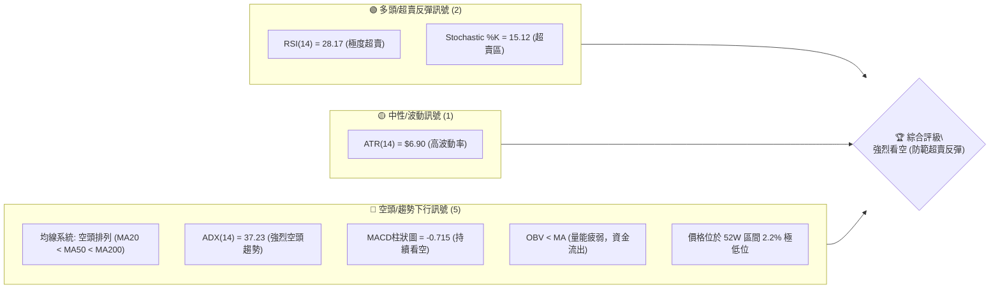
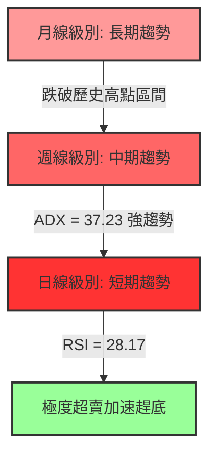
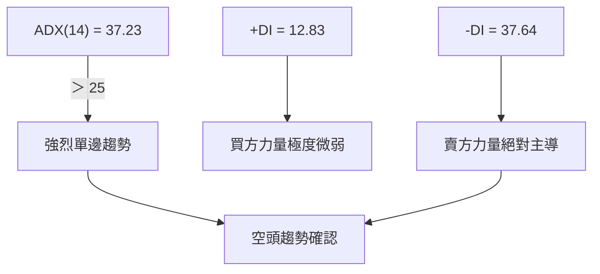
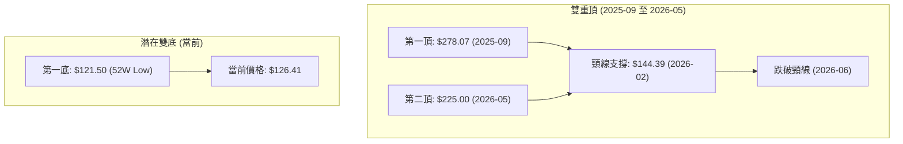
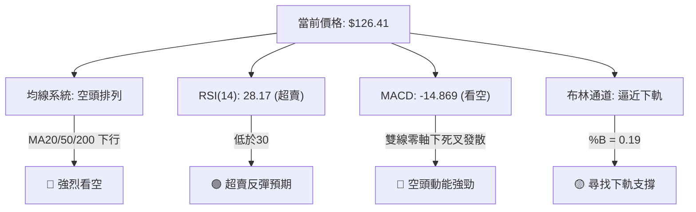
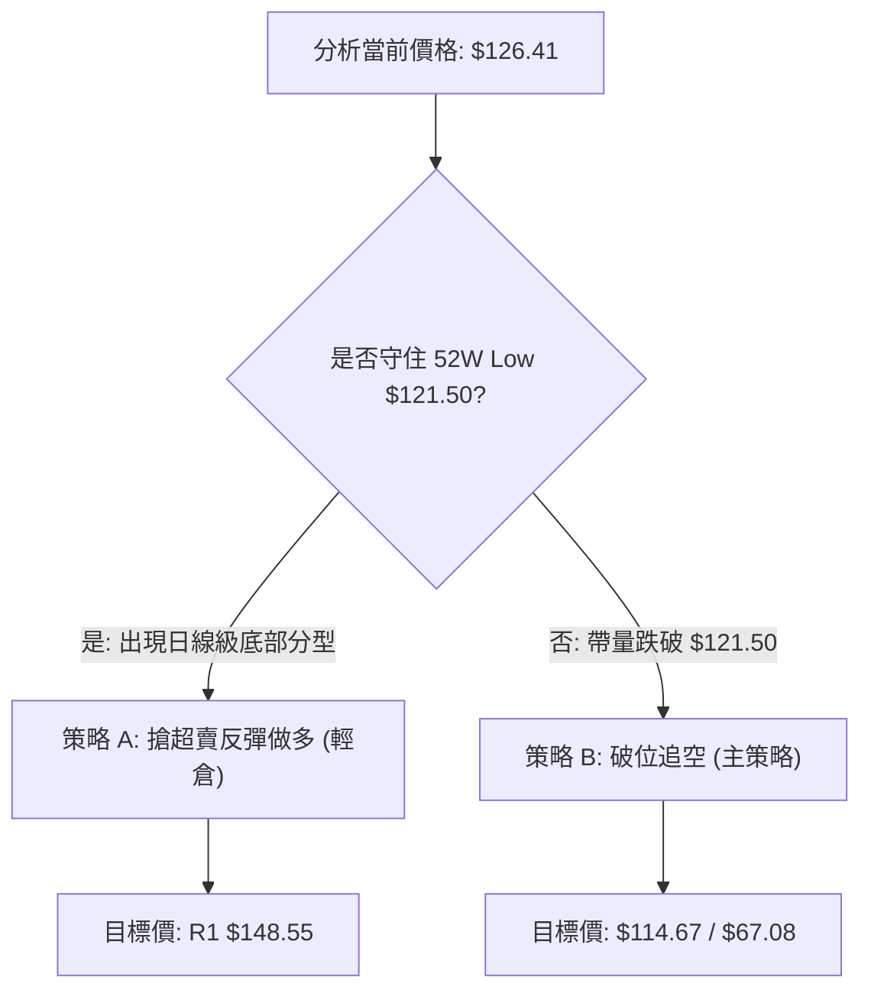
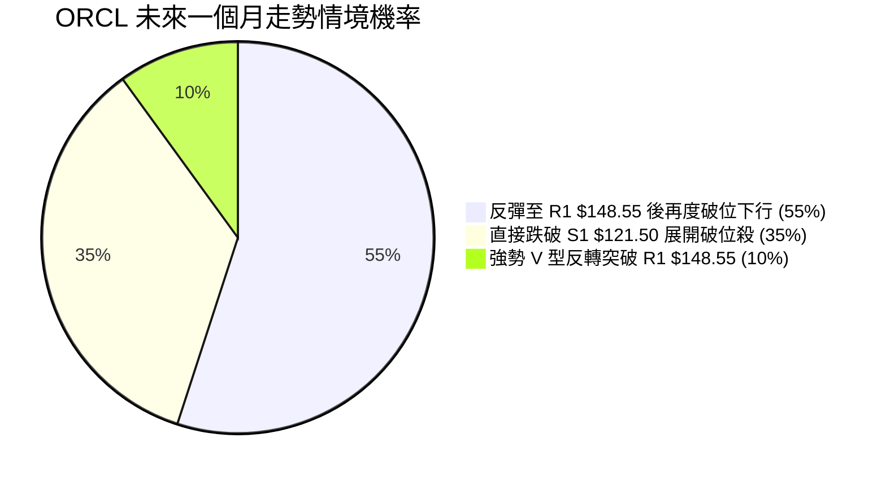
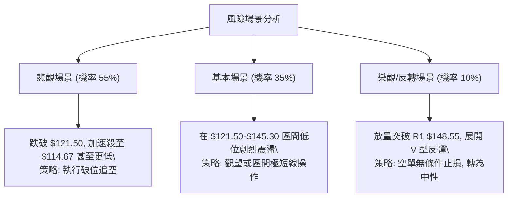

<details>
<summary>📊 靜態圖表 (點擊展開)</summary>

</details>

<html>
<head><meta charset="utf-8" /></head>
<body>
    <div style="height:500px; width:100%;">                        <script>window.PlotlyConfig = {MathJaxConfig: 'local'};</script>
        <script charset="utf-8" src="https://cdn.plot.ly/plotly-3.7.0.min.js" integrity="sha256-jvTGqxNp8AGWEcvNLVuKr+8j5dGe9Yw51LQkmDH+IYA=" crossorigin="anonymous"></script>                <div id="candlestick-chart" class="plotly-graph-div" style="height:100%; width:100%;"></div>            <script>                window.PLOTLYENV=window.PLOTLYENV || {};                                if (document.getElementById("candlestick-chart")) {                    Plotly.newPlot(                        "candlestick-chart",                        [{"close":{"dtype":"f8","bdata":"AAAAYCFhcUAAAACgDNxxQAAAAEBp2HFAAAAAoKWucUAAAAAg3QRyQAAAAOCWkHFAAAAAwAnWcUAAAADA92FyQAAAAICUInJAAAAAQBQRc0AAAADgS4JyQAAAAKCCy3JAAAAAAChgc0AAAACAbghyQAAAAOCCKHFAAAAAgFcIcUAAAAAA4uBwQAAAAGBPVnFAAAAAwPiJcUAAAADgYmtxQAAAAIBaYnFAAAAAILgKcUAAAABg8s1vQAAAAGCeQXBAAAAAYF\u002fsb0AAAABgkrluQAAAAOBl\u002fW5AAAAAgBEvbkAAAADgLJ9tQAAAAMDv0G1AAAAAQJs8bUAAAABgSRpsQAAAAEC672pAAAAAwBKXa0AAAACATjhrQAAAAEBGTGtAAAAAYAPsa0AAAACgqxVqQAAAAICOm2hAAAAAgLvLaEAAAADAuWRoQAAAAOAPYGlAAAAAgKkAaUAAAACgpuBoQAAAAOC45WhAAAAAwNq3aUAAAACgCYlqQAAAACAL8GpAAAAA4NtNa0AAAACAPG1rQAAAAMAknGtAAAAAAGmeaEAAAADA9oRnQAAAAIDo5GZAAAAAoCBbZ0AAAADgKRhmQAAAAGDsSWZAAAAAYFrEZ0AAAACAg49oQAAAAKApL2hAAAAAQE5zaEAAAAAAJ4NoQAAAAEBuMGhAAAAAYG5qaEAAAADAiCFoQAAAAMDjOmhAAAAA4ADYZ0AAAADgxPxnQAAAAEDt32dAAAAAYNJ6Z0AAAABAlaRoQAAAAOBVaGlAAAAAwGIcaUAAAABgjQhoQAAAAEARkWdAAAAAwHi4Z0AAAADAglVmQAAAAECSlWVAAAAAYDceZkAAAACgzf1lQAAAAGCXpWZAAAAAAPy1ZUAAAABAQHNlQAAAAODP+mRAAAAA4AhuZEAAAADgZd5jQAAAAEAdM2NAAAAAwOM0YkAAAABAEvFgQAAAAGCLumFAAAAA4CBwY0AAAAAA\u002f9hjQAAAAOA9gmNAAAAAAKJsY0AAAADA8OBjQAAAAKDeHGNAAAAAAMhiY0AAAAAAim5jQAAAAGCyYWJAAAAAII+KYUAAAAAgDCRiQAAAAKCoW2JAAAAA4I+oYkAAAAAAiAxiQAAAAIDghmJAAAAAIEB\u002fYkAAAABABupiQAAAAIDtNmNAAAAAIMb8YkAAAADgSNBiQAAAAMCki2JAAAAAgKM\u002fZEAAAABAzMFjQAAAAMAYQWNAAAAAIG1cY0AAAAAAwDNjQAAAAODd+mJAAAAAQCBOY0AAAACgipRiQAAAAKCgKGNAAAAAgDxCYkAAAADgOyBiQAAAAAA6umFAAAAAICBWYUAAAADgyzphQAAAAEDfQmJAAAAAICEHYkAAAACArCtiQAAAAOD6EGJAAAAAoKrFYUAAAADgPNVhQAAAAMA5LGFAAAAAYI8zYUAAAABAk2JjQAAAAKDqTWRAAAAAwBQnZUAAAABAGDdmQAAAAKB\u002fzmVAAAAAANweZkAAAABAV5FmQAAAAOAyW2dAAAAAQGf1ZUAAAACAvJVlQAAAACCIi2VAAAAAAE+sZEAAAACAYmhkQAAAAECTGmRAAAAAQH9nZUAAAABAR3VmQAAAACCjFmdAAAAAIG8raEAAAADASj1oQAAAAECpaGhAAAAAAGAlaEAAAABA1UVnQAAAAIBEo2dAAAAAoNFdaEAAAABg\u002fghoQAAAAEDRPmdAAAAAwJaaZkAAAADgPnBnQAAAAECWo2dAAAAAIEDtZ0AAAABggAxoQAAAAACJyWdAAAAAIM1faUAAAABg6R9sQAAAACBF6W5AAAAAIG13bkAAAADAAbFsQAAAAACpcG1AAAAAwA2eakAAAACgvWJqQAAAAGAWo2lAAAAA4P0RaUAAAACgxu5mQAAAAIC772ZAAAAAwBv\u002fZ0AAAACgqnVnQAAAAGCZ3GZAAAAAoNX0ZkAAAABg0c5lQAAAAADMkmRAAAAAwHufY0AAAABgzv1iQAAAAGB7gGJAAAAAYO1nYkAAAACAV0FiQAAAAOAwwGFAAAAAIBR5YUAAAAAAX+hhQAAAAKB9o2FAAAAAIBiAYUAAAABACvdhQAAAAOB6lGFAAAAAoEdxYEAAAAAAKfxfQAAAACCuj2BAAAAAoHANX0AAAACAPZpfQA=="},"high":{"dtype":"f8","bdata":"\u002fskc+sqMcUBj1uRjjetxQKXzgsdVOnJAS6x8Rh01ckCHHgjNYlVyQMZav36mHnJA8wHyQ+oDckDefHfVg6FyQGt9je97DHNAJNnHPLU7c0D9SAYpMNhyQGcwwfKeQHNAXvWkkFb3c0AxKJAY+NVyQGbWCrSg53FAIgDYWfRZcUC1Rqg41ChxQJFTAK9ThnFAqcWJVCTHcUBZsYxdIcRxQPNI5tK5q3FA0zrqkd9ucUCbpwIT7bJwQPIt+GdUdHBAKl7Jg1FxcEBcStkO65pvQJRLEI+jP29A5m7r7xjWbkAjAf2HTsNtQENRkNgYnG5A2u9xIs9lbUBigxs3hlFtQKuKyX9J4GtAvW2pbTAcbED\u002fCQrpfJVrQHOlA0gDsmtAG3xeVA0\u002fbEAIqafadvhsQGhewLg8ymlAvM71M+47aUD2BFB8KLBoQGMi4A\u002fN\u002f2lAH7Zm2gUNaUDEG5DGyTFpQNwJz\u002fNK9mlA3PhIYeC9aUCnp0V6RKtqQGqMsHzlLGtAzzfzxErTa0A+dQJyyI9rQBuO8pZb5WtAmjt9Iu4BaUCastAKt35oQAseXipFZWdArix8f5N\u002fZ0AgebxH\u002fBZnQN+HFlPW32ZAGJr8mTAoaEBuiV5B05xoQPAI7y4damhAan6EDFiMaECL+qOclc5oQACowiqik2hAxOMTb4OPaEAJyvUnHWpoQKjBUTsrlmhACtP48Wv4aEBF4nlwlSBoQNjD3ySfOWhAbiVeQgakZ0BIXK+QVdloQO7JvYpZpWlAnYmAtHvLaUBLLAdDAAlpQCzwG7gKNWhALDx9L0LRZ0D2W0yXiTxnQNmDZrYea2ZAtrXwISNdZkCWPsgo7kxmQHlTxlHLAGdAEGQXqCdPZkA5hyGfcI1mQBvBFNCUIWVA1VIH0FD3ZEAqUP7XZ0BlQCrnNgjKyGNALHyzluobY0B9WdOjEzFiQCPVUamexmFAhChcGIzUY0B9ieeGxodkQKJ5pZXMUGRApWn0Dvy9Y0Art1DIlCVkQNd8l3GcxWNAuJvOzLCGY0DENfqgCN9jQPwy0FqBHWNAhSC6Jz4ZYkB94JrmvzdiQFiXhUXxBmNAe7oW9CfuYkA6s7X9IyJiQJxBLdscpGJAqN4mq0O8YkBntOHsbRFjQIxDpmkHm2NAlqnBTMDCY0CmaoNgRN5iQNefoZNFImNAaeSFgDNSZUBzXHJMUNVkQC5SJu\u002f19GNABYKyoHO0Y0Ak8bjNK7pjQA2t98SlPGNAe7kndp16Y0AXPrZM\u002fQVjQJREKlBjVmNA\u002fawHGaUaY0AYJnA4oJliQNNiNNCILmJAL6T8iqKWYUCiA7dFEIdhQGcjPmYWTGJAQNyaopaTYkB9kV2XlC1iQF7GC92hcGJAZ1Dh9SfyYUCmqBlaG81iQCc80vLByWFATG0YreN1YUCQPXTD0mtjQBWxuZsBGmVAY1\u002fLpcZ+ZUDfy6sPpHRmQGZxCwWI+2ZA9MJaY5kkZkAdLpRxURZnQJqZfqnFkGdA4XPYC02oZkA8UMsbrIJmQL0PVJ5YnmVAoOe0Lq8DZUBWgG6WCoZkQLtCVjxvk2RAYFCKWUO2ZUCHL1V1pNtmQFC9WIXyO2dAaTStnbkzaEBeKIpXmO5oQKTsRKcIqmhAitkE\u002fgxgaECIqgOKCQhoQDkbBLj83GdA57O9B3QAaUAX3AWq93doQNZZBiMow2dAlvRJbxqCZ0DzdsirKHJnQG7CnEDZBGhAYHx6BCWKaEAXm7h4vlBoQIBTzvwp72dAyw8u1EGJaUCNyAHELDBsQFj+wbs8LG9AlKUFOGAEb0Az7oQgo\u002fVtQD\u002frs\u002f\u002fjw21ArnmOWGfUbEBIlb0AnklrQPIRmKuJd2tAo6kEd8l3akBUUaw4JARnQPTshbH4HWdA3VW9QpJUaEA6Wyw6klRoQFBm9\u002fn6sGdAt1yWCtNqZ0DlOKIoFf5mQEPPhC84t2VAf11Ti5ylZEBlxKRzWqJjQCgGRvY+IGNAVpAbFNw+Y0DlBYFhIK1iQAjjUhM7YWJAdKYE6ZpRYkAw6L9MryNiQPRz9GfFIWJA5f\u002fR6CSrYUBzFDXBs5FiQAAAAIDCNWJAAAAAwMx0YUAAAADgUZhgQAAAAMDMvGBAAAAAwPV4YEAAAACAwg1gQA=="},"hovertemplate":"\u003cb\u003e%{x|%Y-%m-%d}\u003c\u002fb\u003e\u003cbr\u003e\u958b: $%{open:.2f}\u003cbr\u003e\u9ad8: $%{high:.2f}\u003cbr\u003e\u4f4e: $%{low:.2f}\u003cbr\u003e\u6536: $%{close:.2f}\u003cextra\u003e\u003c\u002fextra\u003e","low":{"dtype":"f8","bdata":"rRCEPKcMcUCTIpnf+StxQL9nUSM5rXFAIxPN58qMcUDamEu3XfhxQAPPvwMjv3BA7+x1DXeGcUBoTzIyQMhxQKnnUIyGE3JASdxgIFRuckCqa7qyDBNyQDAv7GkHgXJAA+UIUsvCckCZWsjWDcxxQBoU0ozgCnFAxMZ3NovacEBOGJEP2KpwQLCASqaa3HBAXkOyYtt4cUB2GuZ3MFJxQOtG2xjCXXFAIemSkB\u002fMcECgd6bdnLpvQBEZCr49yG9A\u002fJMkTFWZb0Cz5FV4H1tuQMgtjtJwlW5Ax\u002fKndSCgbUDYbF4KK8RsQEAy6SLEWW1A5oz0jYFWbEATqPUMTABsQNIy8+k+pWpAqeYbxTQYakDmGJRmBbBqQMNaZulsjmpAi4zQb3znakAIwJhFTwlqQI+xsP5t9mdApVApYTMOaEDDzUMwaftmQJP6JX\u002faCWlADYxk5xt3aEDbO1JURFpoQDvUirbbwmhAmjRKTNevaEBK5m6fKotpQIKsCauIcmpABqh3Fs\u002faakDpLX7ZOgZrQI2SxjUL8GpAbpBkiG0OZ0DkZGnkgAZnQExVIRtYdWZAEJypkUfXZkBi73bIG+xlQOH+hHr3G2ZAMH+7blRKZ0BzX+E5nN9nQCfFDGZTy2dA8OR3AwESaEDJ5xsikUdoQOqa64+W2WdAb\u002fOCxOM6aECw\u002fHU21BtoQIvNiyRZC2hATxT5WMPPZ0AhBHryGZxnQCuZVr1NxWdA+ACxSuQLZ0AwOj59EG9nQA6gyAKZdGhAG8cie5boaEDhr0nUkq9nQI20bQJzgmdAUODSUZAnZ0Cfcr0Qt0NmQEgCO9lWLWVARal5UtToZUCKMMAI1FllQDNUesRWKWZAMTYiEDePZUCVk6MnYVVlQPGcxmfLDGRApHqHwXNDZEDWEKDIfdxjQB8ty78W22JAGbVd47TtYUDN+EwB\u002fMlgQEHtPMRKPmFAleWQdmA\u002fYkDuqGX24ntjQI7LPKjSHWNAPz2+\u002fSfuYkBiGNEL0UZjQH\u002fpRk07+mJAf5\u002fzFD\u002fKYkDFwvf+EVZjQPnRoxPFS2JAxuGvaB80YUB0DVFdkjhhQMpZez8uSmJAevBOSJYEYkCdVkL8qaNhQHhFbn1thmFAI1tXe9rBYUAYX\u002ftHHIJiQAhgXjGGomJAMUmZ4TDSYkCCi9pTQy1iQPAiGll0bWJAGN2jLuzuY0Cu53DfUbBjQNa6ouqWImNA1BaHsgcuY0CnF70b7w1jQDRKM5yJ32JAKe9e7G97YkCReJfJkF1iQCE8rftFtWJASVeAIpw6YkAzEQztG\u002fNhQHdy\u002fnalsWFAkztTROgqYUAY1hW7AQBhQO2EvNcpXGFAKUu5cFX1YUAsYZaOdmphQIai8YNG22FA2DbzAQZfYUBVPNcNFr1hQNhMeHPp8GBAdl6BmE\u002fDYEBIjQgTimdhQKEeygX\u002fH2RAX4sq3ke0ZECQnYGQUaZlQHNFFYhJmGVAjm4vFxKdZUDp4VwMy+xlQC3yqPtRxWZAXa1UWz+vZUDggQKc3wZlQOJytTUs6mRA+n31S58vZEBL9XAw+gJkQKVX29rF+GNAAFc58V2yZEA65bHB\u002fLRlQDeUtDgkTGZAxYdXoizBZkDLVnzDbsRnQE7uHEWesWdAcwbbBA6+Z0CCwuEkxodmQJDiEZxjDWdAhG+hbdMZZ0BrJlPG14dnQI0ZzdtO1GZANciI7a+JZkAaiJ2Uw0VmQIpvhr2hUWdA738x1f\u002fNZ0AtnLtgx7xnQLObh5aXaGdAgyCt2LQWaEAgaogvPulpQAAZ2HVI+mtAUn40BWLAbUBu9kLARFpsQDPKTTcm52tAndb3wikXakBP5+U3VhNqQKjJ2EVWo2hA1TCx+cWvaEBwgj+fg9VlQNiHqzIkTGZAUV\u002fk3Q8yZ0CkFlEHTWBnQE5WBftNvmZAVZRpia8iZkAxT2anc7llQHPv6v5BgWRA2XTxKfdZY0DS\u002flzE1rpiQDNfaq2Ub2JADbC4lEoWYkAIHinKVP9hQAAAAOAwwGFAEuObhShLYUBbPmW3dZVhQMvYfgZXImFAcGNxH1ciYUDLs8mncY5hQAAAAOBRaGFAAAAAQDNrYEAAAABgZuZfQAAAAEDhGmBAAAAAgD3qXkAAAAAAAGBeQA=="},"name":"\u50f9\u683c","open":{"dtype":"f8","bdata":"y4Q5ieOHcUCYpHaohzpxQKI1JLovCHJAITJ\u002fCmLlcUAmZ7SIXBFyQMZav36mHnJAC58ry0GjcUCxIhATPAxyQBlBy9CUlnJASsJQz4p9ckDWkvXLt8pyQMPEpmnL33JA1OWvMePqckBkIdj1kc1yQDpt60wI43FA7YQ7zD83cUCCTkHaHANxQNsOjfii5XBAxmGSJgSzcUA\u002f9gfxUL1xQO\u002fH4PW9hHFArpu8dFZscUAijwr9wqJwQACk6i1+EHBACqeA4ktrcEDHFqA48PJuQMp0t\u002fNUsW5AbUl4X0iybkBSqQRZ75ZtQDKwrw02c25ACugpXSQ\u002fbUCte2hRTk9tQKmHqy3m2mtABQURkxsaakCiZqLhAgRrQF2lhHWfxGpAN6KLevMea0CtrK7dc55sQOUp1ttAo2lA\u002fguih1ZfaEBePYw\u002fOgdoQJWNXDH072lAEHo09VOzaEDI522PtNJoQHc8B1PEZWlAkpyAI1HNaEAopNK5+btpQPJZOp4MHWtAwhB6G4hna0AJn2HksT1rQMd+JjLLdWtAqzZI15CZZ0B7uROfzk9oQLftS8K3T2dAjgZ4Yu\u002fdZkAhpglv4bFmQPyAHVoun2ZAEeU0LeNSZ0CpFG4WEl5oQA5H85G1UWhAwukn\u002f2IkaEDAe7PlXoVoQN07r3rDCWhAKzhxgPtFaECpdD5zZFFoQLu5dOKrcmhAHSAg3z6OaEB6gpGBDddnQP87uxnlLWhATaGpXM6hZ0Aira7dlcpnQCDMed1Yh2hAMla4KIFyaUBLLAdDAAlpQCzwG7gKNWhA4AQhSvmSZ0D2W0yXiTxnQGALVjviTWZA578iRAhEZkDetFfPh21lQO\u002fnFuJzO2ZA7T2VBFA+ZkA+7z3OnrZlQJ1npPsJH2VAtfJsKR7gZED0fmQAgjdlQCRb\u002fYkypWNAfTL2zVMaY0Dey8Q84xJiQD7YFUv8WGFAURar77luYkAGFCHgfdxjQKJ5pZXMUGRAm6b+\u002frWaY0DcEmVwqMRjQIIZR61MnGNAQ3H8HdoqY0CwzQ7yMYNjQPUEdA6UB2NAfK6dR78VYkClqtWcn3thQH9yglgEhGJArdFMW0J4YkBuMkqbOtxhQBu92\u002f1olGFAd248RuD3YUCHbMI0B59iQPnRLx0E8WJA3fflpYD7YkAg6wac9LRiQApdwz6\u002fEWNA274pSTynZEDnkwjGk3BkQLWiYWdNvmNAReAUQ0lfY0Ako8hjlUtjQAiwy3fBCmNAsGnPOVStYkCAeodJov9iQJUmWOXVy2JAApXaegv+YkBdworAPYZiQFUGPwSM3GFAKsbVuHt+YUCvpC5tM2JhQB5g1aZ2amFAaCdU88qBYkCYC0rIRblhQMybZs1bTWJAfo37Fw3ZYUAeoZaBPqhiQJcZRr2ftmFA8FJMfgEbYUA+wnpHImlhQHVSoBsh62RAXZwyDvfJZEAIRo0n3vllQBjKBBx3yWZAbXRa\u002fk0GZkBHaA73aTdmQDzfNN0aMWdALA4aPcl4ZkDs7f1JS3xmQKla5Oppf2VAKRQxTCEzZEBcjT7JFG9kQGGtdluqLmRA3ZYfJvq6ZEDZPl\u002fFHO1lQIXUhFP0r2ZAzWsIIb4xZ0Dc5TJ0fL1oQIHt2fUx\u002fWdAjU5tf3vvZ0CIqgOKCQhoQMuXjBv9i2dAS0bXBOJwZ0CEF9f9i7pnQOZypdjrqmdAiyBnb10rZ0BwKCkUHmpmQAtgvNVZi2dAoeT8BC3gZ0CXY\u002f6uJxRoQIAGZfsd2mdAtM8nusAraEAn7Isx0AhqQJjthaVttmxAM3mi7ak+bkBSfaE6rvRtQA0eeQPRRmxAkfBeWjiWbEBUFz611x9rQJXtfpRjpWpA1d0FY\u002fq5aECPeBHRgWFmQAV\u002f3mHLC2dAfMCj2rBXZ0At+F9pPatnQBd0XK53MGdAGSNlOgTMZkAhQ+3AsbVmQBb7gmF5NGVAafNZilU9ZED1IKJevpljQMZI312mt2JABWqgewAtY0CdKJ3+qVdiQJTManum\u002f2FA73w+0rPZYUBLj9Vpl\u002flhQCdAFGoY52FA4rryHH5SYUCEweUlwJ1hQAAAAMDMNGJAAAAAwPVgYUAAAAAAAIBgQAAAAIDrUWBAAAAAIFxvYEAAAADAzGxeQA=="},"x":["2025-09-30T00:00:00-04:00","2025-10-01T00:00:00-04:00","2025-10-02T00:00:00-04:00","2025-10-03T00:00:00-04:00","2025-10-06T00:00:00-04:00","2025-10-07T00:00:00-04:00","2025-10-08T00:00:00-04:00","2025-10-09T00:00:00-04:00","2025-10-10T00:00:00-04:00","2025-10-13T00:00:00-04:00","2025-10-14T00:00:00-04:00","2025-10-15T00:00:00-04:00","2025-10-16T00:00:00-04:00","2025-10-17T00:00:00-04:00","2025-10-20T00:00:00-04:00","2025-10-21T00:00:00-04:00","2025-10-22T00:00:00-04:00","2025-10-23T00:00:00-04:00","2025-10-24T00:00:00-04:00","2025-10-27T00:00:00-04:00","2025-10-28T00:00:00-04:00","2025-10-29T00:00:00-04:00","2025-10-30T00:00:00-04:00","2025-10-31T00:00:00-04:00","2025-11-03T00:00:00-05:00","2025-11-04T00:00:00-05:00","2025-11-05T00:00:00-05:00","2025-11-06T00:00:00-05:00","2025-11-07T00:00:00-05:00","2025-11-10T00:00:00-05:00","2025-11-11T00:00:00-05:00","2025-11-12T00:00:00-05:00","2025-11-13T00:00:00-05:00","2025-11-14T00:00:00-05:00","2025-11-17T00:00:00-05:00","2025-11-18T00:00:00-05:00","2025-11-19T00:00:00-05:00","2025-11-20T00:00:00-05:00","2025-11-21T00:00:00-05:00","2025-11-24T00:00:00-05:00","2025-11-25T00:00:00-05:00","2025-11-26T00:00:00-05:00","2025-11-28T00:00:00-05:00","2025-12-01T00:00:00-05:00","2025-12-02T00:00:00-05:00","2025-12-03T00:00:00-05:00","2025-12-04T00:00:00-05:00","2025-12-05T00:00:00-05:00","2025-12-08T00:00:00-05:00","2025-12-09T00:00:00-05:00","2025-12-10T00:00:00-05:00","2025-12-11T00:00:00-05:00","2025-12-12T00:00:00-05:00","2025-12-15T00:00:00-05:00","2025-12-16T00:00:00-05:00","2025-12-17T00:00:00-05:00","2025-12-18T00:00:00-05:00","2025-12-19T00:00:00-05:00","2025-12-22T00:00:00-05:00","2025-12-23T00:00:00-05:00","2025-12-24T00:00:00-05:00","2025-12-26T00:00:00-05:00","2025-12-29T00:00:00-05:00","2025-12-30T00:00:00-05:00","2025-12-31T00:00:00-05:00","2026-01-02T00:00:00-05:00","2026-01-05T00:00:00-05:00","2026-01-06T00:00:00-05:00","2026-01-07T00:00:00-05:00","2026-01-08T00:00:00-05:00","2026-01-09T00:00:00-05:00","2026-01-12T00:00:00-05:00","2026-01-13T00:00:00-05:00","2026-01-14T00:00:00-05:00","2026-01-15T00:00:00-05:00","2026-01-16T00:00:00-05:00","2026-01-20T00:00:00-05:00","2026-01-21T00:00:00-05:00","2026-01-22T00:00:00-05:00","2026-01-23T00:00:00-05:00","2026-01-26T00:00:00-05:00","2026-01-27T00:00:00-05:00","2026-01-28T00:00:00-05:00","2026-01-29T00:00:00-05:00","2026-01-30T00:00:00-05:00","2026-02-02T00:00:00-05:00","2026-02-03T00:00:00-05:00","2026-02-04T00:00:00-05:00","2026-02-05T00:00:00-05:00","2026-02-06T00:00:00-05:00","2026-02-09T00:00:00-05:00","2026-02-10T00:00:00-05:00","2026-02-11T00:00:00-05:00","2026-02-12T00:00:00-05:00","2026-02-13T00:00:00-05:00","2026-02-17T00:00:00-05:00","2026-02-18T00:00:00-05:00","2026-02-19T00:00:00-05:00","2026-02-20T00:00:00-05:00","2026-02-23T00:00:00-05:00","2026-02-24T00:00:00-05:00","2026-02-25T00:00:00-05:00","2026-02-26T00:00:00-05:00","2026-02-27T00:00:00-05:00","2026-03-02T00:00:00-05:00","2026-03-03T00:00:00-05:00","2026-03-04T00:00:00-05:00","2026-03-05T00:00:00-05:00","2026-03-06T00:00:00-05:00","2026-03-09T00:00:00-04:00","2026-03-10T00:00:00-04:00","2026-03-11T00:00:00-04:00","2026-03-12T00:00:00-04:00","2026-03-13T00:00:00-04:00","2026-03-16T00:00:00-04:00","2026-03-17T00:00:00-04:00","2026-03-18T00:00:00-04:00","2026-03-19T00:00:00-04:00","2026-03-20T00:00:00-04:00","2026-03-23T00:00:00-04:00","2026-03-24T00:00:00-04:00","2026-03-25T00:00:00-04:00","2026-03-26T00:00:00-04:00","2026-03-27T00:00:00-04:00","2026-03-30T00:00:00-04:00","2026-03-31T00:00:00-04:00","2026-04-01T00:00:00-04:00","2026-04-02T00:00:00-04:00","2026-04-06T00:00:00-04:00","2026-04-07T00:00:00-04:00","2026-04-08T00:00:00-04:00","2026-04-09T00:00:00-04:00","2026-04-10T00:00:00-04:00","2026-04-13T00:00:00-04:00","2026-04-14T00:00:00-04:00","2026-04-15T00:00:00-04:00","2026-04-16T00:00:00-04:00","2026-04-17T00:00:00-04:00","2026-04-20T00:00:00-04:00","2026-04-21T00:00:00-04:00","2026-04-22T00:00:00-04:00","2026-04-23T00:00:00-04:00","2026-04-24T00:00:00-04:00","2026-04-27T00:00:00-04:00","2026-04-28T00:00:00-04:00","2026-04-29T00:00:00-04:00","2026-04-30T00:00:00-04:00","2026-05-01T00:00:00-04:00","2026-05-04T00:00:00-04:00","2026-05-05T00:00:00-04:00","2026-05-06T00:00:00-04:00","2026-05-07T00:00:00-04:00","2026-05-08T00:00:00-04:00","2026-05-11T00:00:00-04:00","2026-05-12T00:00:00-04:00","2026-05-13T00:00:00-04:00","2026-05-14T00:00:00-04:00","2026-05-15T00:00:00-04:00","2026-05-18T00:00:00-04:00","2026-05-19T00:00:00-04:00","2026-05-20T00:00:00-04:00","2026-05-21T00:00:00-04:00","2026-05-22T00:00:00-04:00","2026-05-26T00:00:00-04:00","2026-05-27T00:00:00-04:00","2026-05-28T00:00:00-04:00","2026-05-29T00:00:00-04:00","2026-06-01T00:00:00-04:00","2026-06-02T00:00:00-04:00","2026-06-03T00:00:00-04:00","2026-06-04T00:00:00-04:00","2026-06-05T00:00:00-04:00","2026-06-08T00:00:00-04:00","2026-06-09T00:00:00-04:00","2026-06-10T00:00:00-04:00","2026-06-11T00:00:00-04:00","2026-06-12T00:00:00-04:00","2026-06-15T00:00:00-04:00","2026-06-16T00:00:00-04:00","2026-06-17T00:00:00-04:00","2026-06-18T00:00:00-04:00","2026-06-22T00:00:00-04:00","2026-06-23T00:00:00-04:00","2026-06-24T00:00:00-04:00","2026-06-25T00:00:00-04:00","2026-06-26T00:00:00-04:00","2026-06-29T00:00:00-04:00","2026-06-30T00:00:00-04:00","2026-07-01T00:00:00-04:00","2026-07-02T00:00:00-04:00","2026-07-06T00:00:00-04:00","2026-07-07T00:00:00-04:00","2026-07-08T00:00:00-04:00","2026-07-09T00:00:00-04:00","2026-07-10T00:00:00-04:00","2026-07-13T00:00:00-04:00","2026-07-14T00:00:00-04:00","2026-07-15T00:00:00-04:00","2026-07-16T00:00:00-04:00","2026-07-17T00:00:00-04:00"],"type":"candlestick"},{"hovertemplate":"MA30: $%{y:.2f}\u003cextra\u003e\u003c\u002fextra\u003e","line":{"color":"#2196F3","dash":"dash","width":2},"mode":"lines","name":"MA30","x":["2025-09-30T00:00:00-04:00","2025-10-01T00:00:00-04:00","2025-10-02T00:00:00-04:00","2025-10-03T00:00:00-04:00","2025-10-06T00:00:00-04:00","2025-10-07T00:00:00-04:00","2025-10-08T00:00:00-04:00","2025-10-09T00:00:00-04:00","2025-10-10T00:00:00-04:00","2025-10-13T00:00:00-04:00","2025-10-14T00:00:00-04:00","2025-10-15T00:00:00-04:00","2025-10-16T00:00:00-04:00","2025-10-17T00:00:00-04:00","2025-10-20T00:00:00-04:00","2025-10-21T00:00:00-04:00","2025-10-22T00:00:00-04:00","2025-10-23T00:00:00-04:00","2025-10-24T00:00:00-04:00","2025-10-27T00:00:00-04:00","2025-10-28T00:00:00-04:00","2025-10-29T00:00:00-04:00","2025-10-30T00:00:00-04:00","2025-10-31T00:00:00-04:00","2025-11-03T00:00:00-05:00","2025-11-04T00:00:00-05:00","2025-11-05T00:00:00-05:00","2025-11-06T00:00:00-05:00","2025-11-07T00:00:00-05:00","2025-11-10T00:00:00-05:00","2025-11-11T00:00:00-05:00","2025-11-12T00:00:00-05:00","2025-11-13T00:00:00-05:00","2025-11-14T00:00:00-05:00","2025-11-17T00:00:00-05:00","2025-11-18T00:00:00-05:00","2025-11-19T00:00:00-05:00","2025-11-20T00:00:00-05:00","2025-11-21T00:00:00-05:00","2025-11-24T00:00:00-05:00","2025-11-25T00:00:00-05:00","2025-11-26T00:00:00-05:00","2025-11-28T00:00:00-05:00","2025-12-01T00:00:00-05:00","2025-12-02T00:00:00-05:00","2025-12-03T00:00:00-05:00","2025-12-04T00:00:00-05:00","2025-12-05T00:00:00-05:00","2025-12-08T00:00:00-05:00","2025-12-09T00:00:00-05:00","2025-12-10T00:00:00-05:00","2025-12-11T00:00:00-05:00","2025-12-12T00:00:00-05:00","2025-12-15T00:00:00-05:00","2025-12-16T00:00:00-05:00","2025-12-17T00:00:00-05:00","2025-12-18T00:00:00-05:00","2025-12-19T00:00:00-05:00","2025-12-22T00:00:00-05:00","2025-12-23T00:00:00-05:00","2025-12-24T00:00:00-05:00","2025-12-26T00:00:00-05:00","2025-12-29T00:00:00-05:00","2025-12-30T00:00:00-05:00","2025-12-31T00:00:00-05:00","2026-01-02T00:00:00-05:00","2026-01-05T00:00:00-05:00","2026-01-06T00:00:00-05:00","2026-01-07T00:00:00-05:00","2026-01-08T00:00:00-05:00","2026-01-09T00:00:00-05:00","2026-01-12T00:00:00-05:00","2026-01-13T00:00:00-05:00","2026-01-14T00:00:00-05:00","2026-01-15T00:00:00-05:00","2026-01-16T00:00:00-05:00","2026-01-20T00:00:00-05:00","2026-01-21T00:00:00-05:00","2026-01-22T00:00:00-05:00","2026-01-23T00:00:00-05:00","2026-01-26T00:00:00-05:00","2026-01-27T00:00:00-05:00","2026-01-28T00:00:00-05:00","2026-01-29T00:00:00-05:00","2026-01-30T00:00:00-05:00","2026-02-02T00:00:00-05:00","2026-02-03T00:00:00-05:00","2026-02-04T00:00:00-05:00","2026-02-05T00:00:00-05:00","2026-02-06T00:00:00-05:00","2026-02-09T00:00:00-05:00","2026-02-10T00:00:00-05:00","2026-02-11T00:00:00-05:00","2026-02-12T00:00:00-05:00","2026-02-13T00:00:00-05:00","2026-02-17T00:00:00-05:00","2026-02-18T00:00:00-05:00","2026-02-19T00:00:00-05:00","2026-02-20T00:00:00-05:00","2026-02-23T00:00:00-05:00","2026-02-24T00:00:00-05:00","2026-02-25T00:00:00-05:00","2026-02-26T00:00:00-05:00","2026-02-27T00:00:00-05:00","2026-03-02T00:00:00-05:00","2026-03-03T00:00:00-05:00","2026-03-04T00:00:00-05:00","2026-03-05T00:00:00-05:00","2026-03-06T00:00:00-05:00","2026-03-09T00:00:00-04:00","2026-03-10T00:00:00-04:00","2026-03-11T00:00:00-04:00","2026-03-12T00:00:00-04:00","2026-03-13T00:00:00-04:00","2026-03-16T00:00:00-04:00","2026-03-17T00:00:00-04:00","2026-03-18T00:00:00-04:00","2026-03-19T00:00:00-04:00","2026-03-20T00:00:00-04:00","2026-03-23T00:00:00-04:00","2026-03-24T00:00:00-04:00","2026-03-25T00:00:00-04:00","2026-03-26T00:00:00-04:00","2026-03-27T00:00:00-04:00","2026-03-30T00:00:00-04:00","2026-03-31T00:00:00-04:00","2026-04-01T00:00:00-04:00","2026-04-02T00:00:00-04:00","2026-04-06T00:00:00-04:00","2026-04-07T00:00:00-04:00","2026-04-08T00:00:00-04:00","2026-04-09T00:00:00-04:00","2026-04-10T00:00:00-04:00","2026-04-13T00:00:00-04:00","2026-04-14T00:00:00-04:00","2026-04-15T00:00:00-04:00","2026-04-16T00:00:00-04:00","2026-04-17T00:00:00-04:00","2026-04-20T00:00:00-04:00","2026-04-21T00:00:00-04:00","2026-04-22T00:00:00-04:00","2026-04-23T00:00:00-04:00","2026-04-24T00:00:00-04:00","2026-04-27T00:00:00-04:00","2026-04-28T00:00:00-04:00","2026-04-29T00:00:00-04:00","2026-04-30T00:00:00-04:00","2026-05-01T00:00:00-04:00","2026-05-04T00:00:00-04:00","2026-05-05T00:00:00-04:00","2026-05-06T00:00:00-04:00","2026-05-07T00:00:00-04:00","2026-05-08T00:00:00-04:00","2026-05-11T00:00:00-04:00","2026-05-12T00:00:00-04:00","2026-05-13T00:00:00-04:00","2026-05-14T00:00:00-04:00","2026-05-15T00:00:00-04:00","2026-05-18T00:00:00-04:00","2026-05-19T00:00:00-04:00","2026-05-20T00:00:00-04:00","2026-05-21T00:00:00-04:00","2026-05-22T00:00:00-04:00","2026-05-26T00:00:00-04:00","2026-05-27T00:00:00-04:00","2026-05-28T00:00:00-04:00","2026-05-29T00:00:00-04:00","2026-06-01T00:00:00-04:00","2026-06-02T00:00:00-04:00","2026-06-03T00:00:00-04:00","2026-06-04T00:00:00-04:00","2026-06-05T00:00:00-04:00","2026-06-08T00:00:00-04:00","2026-06-09T00:00:00-04:00","2026-06-10T00:00:00-04:00","2026-06-11T00:00:00-04:00","2026-06-12T00:00:00-04:00","2026-06-15T00:00:00-04:00","2026-06-16T00:00:00-04:00","2026-06-17T00:00:00-04:00","2026-06-18T00:00:00-04:00","2026-06-22T00:00:00-04:00","2026-06-23T00:00:00-04:00","2026-06-24T00:00:00-04:00","2026-06-25T00:00:00-04:00","2026-06-26T00:00:00-04:00","2026-06-29T00:00:00-04:00","2026-06-30T00:00:00-04:00","2026-07-01T00:00:00-04:00","2026-07-02T00:00:00-04:00","2026-07-06T00:00:00-04:00","2026-07-07T00:00:00-04:00","2026-07-08T00:00:00-04:00","2026-07-09T00:00:00-04:00","2026-07-10T00:00:00-04:00","2026-07-13T00:00:00-04:00","2026-07-14T00:00:00-04:00","2026-07-15T00:00:00-04:00","2026-07-16T00:00:00-04:00","2026-07-17T00:00:00-04:00"],"y":{"dtype":"f8","bdata":"AAAAAAAA+H8AAAAAAAD4fwAAAAAAAPh\u002fAAAAAAAA+H8AAAAAAAD4fwAAAAAAAPh\u002fAAAAAAAA+H8AAAAAAAD4fwAAAAAAAPh\u002fAAAAAAAA+H8AAAAAAAD4fwAAAAAAAPh\u002fAAAAAAAA+H8AAAAAAAD4fwAAAAAAAPh\u002fAAAAAAAA+H8AAAAAAAD4fwAAAAAAAPh\u002fAAAAAAAA+H8AAAAAAAD4fwAAAAAAAPh\u002fAAAAAAAA+H8AAAAAAAD4fwAAAAAAAPh\u002fAAAAAAAA+H8AAAAAAAD4fwAAAAAAAPh\u002fAAAAAAAA+H8AAAAAAAD4fzMzM2u8M3FAvLu70ywccUARERGhrftwQAAAAKBT1nBAREREBCi1cECrqqpaiI9wQImIiBgebnBAq6qqwgxNcEAAAACQeh9wQJqZmflv229Aq6qqip9pb0ARERHx5P1uQAAAAJCplW5AZmZmNlcgbkDv7u7u3cBtQBEREYF9cG1Aq6qqOkMpbUCrqqpqo+tsQO\u002fu7n6eqWxAERERcUhnbEAiIiIiCChsQCIiIkLy6mtAAAAAwC2aa0AiIiKyelNrQCIiItJmAWtAERERIUu4akAzMzODpW5qQKuqqrplJGpARERE5KPtaUBERESUc8JpQBEREXFkkmlAq6qqioxpaUAzMzND6UppQLy7u8t3M2lAAAAAQGEYaUAzMzNTBf5oQAAAAGDX42hA3t3dfQrBaEDv7u7uJK9oQDMzM9PjqGhAq6qq2qidaEBVVVXFyZ9oQO\u002fu7l4QoGhAIiIi8vygaEB3d3fnyJloQLy7u\u002fttjmhA7+7uLmJ9aECrqqpaiFloQImIiKjZK2hAERERcZj\u002fZ0ARERHhNtFnQFVVVdXcpmdAZmZmZgyOZ0Dv7u4uZHxnQHd3dwcObGdAVVVVxRVTZ0BVVVXFF0BnQImIiIi7JWdAVVVVpUj2ZkDv7u7eRLVmQHd3d4cufmZAAAAAwGhTZkDe3d2dmitmQCIiIhKqA2ZAERERMRLZZUC8u7vbyLRlQFVVVQUeiWVAd3d3lxNjZUAzMzPDMzxlQO\u002fu7u5TDWVAZmZmBqfaZEDNzMz8KqNkQERERBQDZ2RAREREhPMvZEBVVVVF4vxjQFVVVaXg0WNAERERsU2lY0AAAADgHohjQO\u002fu7i7mc2NAVVVVNS9ZY0Dv7u4uET5jQBEREaERG2NAZmZmNpcOY0CamZlpJABjQLy7uxtr8WJAERERUUzoYkDv7u4enOJiQERERCS84GJAZmZmBhzqYkARERGBF\u002fhiQJqZmWlLBGNARERERDv6YkCJiIgYiutiQERERMRW3GJAMzMzo4XKYkDv7u7O6rNiQAAAAJCmrGJA7+7u7g+hYkARERHRTJZiQImIiAick2JAq6qqapSVYkCJiIjo85JiQM3MzJzWiGJAmpmZqWd8YkAAAABwzodiQBEREXH5lmJAmpmZqaKtYkDe3d3tzcliQGZmZmbs32JAzczM3Kj6YkAAAADgsRpjQFVVVSW\u002fQ2NAzczMvFZSY0AAAADQ72FjQO\u002fu7g58dWNAERERQa6AY0AAAADw94pjQM3MzAyPlGNA3t3dnXimY0CJiIj4j8djQGZmZpYY6WNAVVVVNYkbZEDv7u5etE9kQERERBS4iGRA7+7uztPCZEAAAAAwZfZkQN7d3W1GJGVAERERYV1aZUBERESkaIxlQERERHSauGVAZmZmhtXhZUDNzMzsqhFmQM3MzKzYSGZA7+7ubjyCZkCrqqqaCKpmQFVVVRXBx2ZAq6qqOsfrZkCamZmZNB5nQJqZmdnla2dAMzMz4x2zZ0De3d1NX+dnQERERKRJG2hAzczM7ApDaEDe3d1tAmxoQCIiIpLtjmhAZmZmZnO0aEBVVVVF\u002f8loQHd3d0cr4mhAiYiIGEr4aEARERHx1QBpQO\u002fu7q7m\u002fmhAvLu7O4z0aEBERER0zN9oQBEREeERv2hARERENHmYaEARERFx8HNoQAAAAPAcSGhA7+7u\u002fj8VaEAiIiKi7eNnQLy7u2sKtWdAzczMzEGJZ0C8u7urD1pnQGZmZqbbJmdAvLu7+wTwZkBVVVWlGrxmQFVVVbUih2ZA7+7uDus6ZkBmZmb2Y9NlQO\u002fu7v7vWGVAiYiIgHLZZEAAAAB4c2tkQA=="},"type":"scatter"},{"hovertemplate":"MA60: $%{y:.2f}\u003cextra\u003e\u003c\u002fextra\u003e","line":{"color":"#9C27B0","dash":"dash","width":2},"mode":"lines","name":"MA60","x":["2025-09-30T00:00:00-04:00","2025-10-01T00:00:00-04:00","2025-10-02T00:00:00-04:00","2025-10-03T00:00:00-04:00","2025-10-06T00:00:00-04:00","2025-10-07T00:00:00-04:00","2025-10-08T00:00:00-04:00","2025-10-09T00:00:00-04:00","2025-10-10T00:00:00-04:00","2025-10-13T00:00:00-04:00","2025-10-14T00:00:00-04:00","2025-10-15T00:00:00-04:00","2025-10-16T00:00:00-04:00","2025-10-17T00:00:00-04:00","2025-10-20T00:00:00-04:00","2025-10-21T00:00:00-04:00","2025-10-22T00:00:00-04:00","2025-10-23T00:00:00-04:00","2025-10-24T00:00:00-04:00","2025-10-27T00:00:00-04:00","2025-10-28T00:00:00-04:00","2025-10-29T00:00:00-04:00","2025-10-30T00:00:00-04:00","2025-10-31T00:00:00-04:00","2025-11-03T00:00:00-05:00","2025-11-04T00:00:00-05:00","2025-11-05T00:00:00-05:00","2025-11-06T00:00:00-05:00","2025-11-07T00:00:00-05:00","2025-11-10T00:00:00-05:00","2025-11-11T00:00:00-05:00","2025-11-12T00:00:00-05:00","2025-11-13T00:00:00-05:00","2025-11-14T00:00:00-05:00","2025-11-17T00:00:00-05:00","2025-11-18T00:00:00-05:00","2025-11-19T00:00:00-05:00","2025-11-20T00:00:00-05:00","2025-11-21T00:00:00-05:00","2025-11-24T00:00:00-05:00","2025-11-25T00:00:00-05:00","2025-11-26T00:00:00-05:00","2025-11-28T00:00:00-05:00","2025-12-01T00:00:00-05:00","2025-12-02T00:00:00-05:00","2025-12-03T00:00:00-05:00","2025-12-04T00:00:00-05:00","2025-12-05T00:00:00-05:00","2025-12-08T00:00:00-05:00","2025-12-09T00:00:00-05:00","2025-12-10T00:00:00-05:00","2025-12-11T00:00:00-05:00","2025-12-12T00:00:00-05:00","2025-12-15T00:00:00-05:00","2025-12-16T00:00:00-05:00","2025-12-17T00:00:00-05:00","2025-12-18T00:00:00-05:00","2025-12-19T00:00:00-05:00","2025-12-22T00:00:00-05:00","2025-12-23T00:00:00-05:00","2025-12-24T00:00:00-05:00","2025-12-26T00:00:00-05:00","2025-12-29T00:00:00-05:00","2025-12-30T00:00:00-05:00","2025-12-31T00:00:00-05:00","2026-01-02T00:00:00-05:00","2026-01-05T00:00:00-05:00","2026-01-06T00:00:00-05:00","2026-01-07T00:00:00-05:00","2026-01-08T00:00:00-05:00","2026-01-09T00:00:00-05:00","2026-01-12T00:00:00-05:00","2026-01-13T00:00:00-05:00","2026-01-14T00:00:00-05:00","2026-01-15T00:00:00-05:00","2026-01-16T00:00:00-05:00","2026-01-20T00:00:00-05:00","2026-01-21T00:00:00-05:00","2026-01-22T00:00:00-05:00","2026-01-23T00:00:00-05:00","2026-01-26T00:00:00-05:00","2026-01-27T00:00:00-05:00","2026-01-28T00:00:00-05:00","2026-01-29T00:00:00-05:00","2026-01-30T00:00:00-05:00","2026-02-02T00:00:00-05:00","2026-02-03T00:00:00-05:00","2026-02-04T00:00:00-05:00","2026-02-05T00:00:00-05:00","2026-02-06T00:00:00-05:00","2026-02-09T00:00:00-05:00","2026-02-10T00:00:00-05:00","2026-02-11T00:00:00-05:00","2026-02-12T00:00:00-05:00","2026-02-13T00:00:00-05:00","2026-02-17T00:00:00-05:00","2026-02-18T00:00:00-05:00","2026-02-19T00:00:00-05:00","2026-02-20T00:00:00-05:00","2026-02-23T00:00:00-05:00","2026-02-24T00:00:00-05:00","2026-02-25T00:00:00-05:00","2026-02-26T00:00:00-05:00","2026-02-27T00:00:00-05:00","2026-03-02T00:00:00-05:00","2026-03-03T00:00:00-05:00","2026-03-04T00:00:00-05:00","2026-03-05T00:00:00-05:00","2026-03-06T00:00:00-05:00","2026-03-09T00:00:00-04:00","2026-03-10T00:00:00-04:00","2026-03-11T00:00:00-04:00","2026-03-12T00:00:00-04:00","2026-03-13T00:00:00-04:00","2026-03-16T00:00:00-04:00","2026-03-17T00:00:00-04:00","2026-03-18T00:00:00-04:00","2026-03-19T00:00:00-04:00","2026-03-20T00:00:00-04:00","2026-03-23T00:00:00-04:00","2026-03-24T00:00:00-04:00","2026-03-25T00:00:00-04:00","2026-03-26T00:00:00-04:00","2026-03-27T00:00:00-04:00","2026-03-30T00:00:00-04:00","2026-03-31T00:00:00-04:00","2026-04-01T00:00:00-04:00","2026-04-02T00:00:00-04:00","2026-04-06T00:00:00-04:00","2026-04-07T00:00:00-04:00","2026-04-08T00:00:00-04:00","2026-04-09T00:00:00-04:00","2026-04-10T00:00:00-04:00","2026-04-13T00:00:00-04:00","2026-04-14T00:00:00-04:00","2026-04-15T00:00:00-04:00","2026-04-16T00:00:00-04:00","2026-04-17T00:00:00-04:00","2026-04-20T00:00:00-04:00","2026-04-21T00:00:00-04:00","2026-04-22T00:00:00-04:00","2026-04-23T00:00:00-04:00","2026-04-24T00:00:00-04:00","2026-04-27T00:00:00-04:00","2026-04-28T00:00:00-04:00","2026-04-29T00:00:00-04:00","2026-04-30T00:00:00-04:00","2026-05-01T00:00:00-04:00","2026-05-04T00:00:00-04:00","2026-05-05T00:00:00-04:00","2026-05-06T00:00:00-04:00","2026-05-07T00:00:00-04:00","2026-05-08T00:00:00-04:00","2026-05-11T00:00:00-04:00","2026-05-12T00:00:00-04:00","2026-05-13T00:00:00-04:00","2026-05-14T00:00:00-04:00","2026-05-15T00:00:00-04:00","2026-05-18T00:00:00-04:00","2026-05-19T00:00:00-04:00","2026-05-20T00:00:00-04:00","2026-05-21T00:00:00-04:00","2026-05-22T00:00:00-04:00","2026-05-26T00:00:00-04:00","2026-05-27T00:00:00-04:00","2026-05-28T00:00:00-04:00","2026-05-29T00:00:00-04:00","2026-06-01T00:00:00-04:00","2026-06-02T00:00:00-04:00","2026-06-03T00:00:00-04:00","2026-06-04T00:00:00-04:00","2026-06-05T00:00:00-04:00","2026-06-08T00:00:00-04:00","2026-06-09T00:00:00-04:00","2026-06-10T00:00:00-04:00","2026-06-11T00:00:00-04:00","2026-06-12T00:00:00-04:00","2026-06-15T00:00:00-04:00","2026-06-16T00:00:00-04:00","2026-06-17T00:00:00-04:00","2026-06-18T00:00:00-04:00","2026-06-22T00:00:00-04:00","2026-06-23T00:00:00-04:00","2026-06-24T00:00:00-04:00","2026-06-25T00:00:00-04:00","2026-06-26T00:00:00-04:00","2026-06-29T00:00:00-04:00","2026-06-30T00:00:00-04:00","2026-07-01T00:00:00-04:00","2026-07-02T00:00:00-04:00","2026-07-06T00:00:00-04:00","2026-07-07T00:00:00-04:00","2026-07-08T00:00:00-04:00","2026-07-09T00:00:00-04:00","2026-07-10T00:00:00-04:00","2026-07-13T00:00:00-04:00","2026-07-14T00:00:00-04:00","2026-07-15T00:00:00-04:00","2026-07-16T00:00:00-04:00","2026-07-17T00:00:00-04:00"],"y":{"dtype":"f8","bdata":"AAAAAAAA+H8AAAAAAAD4fwAAAAAAAPh\u002fAAAAAAAA+H8AAAAAAAD4fwAAAAAAAPh\u002fAAAAAAAA+H8AAAAAAAD4fwAAAAAAAPh\u002fAAAAAAAA+H8AAAAAAAD4fwAAAAAAAPh\u002fAAAAAAAA+H8AAAAAAAD4fwAAAAAAAPh\u002fAAAAAAAA+H8AAAAAAAD4fwAAAAAAAPh\u002fAAAAAAAA+H8AAAAAAAD4fwAAAAAAAPh\u002fAAAAAAAA+H8AAAAAAAD4fwAAAAAAAPh\u002fAAAAAAAA+H8AAAAAAAD4fwAAAAAAAPh\u002fAAAAAAAA+H8AAAAAAAD4fwAAAAAAAPh\u002fAAAAAAAA+H8AAAAAAAD4fwAAAAAAAPh\u002fAAAAAAAA+H8AAAAAAAD4fwAAAAAAAPh\u002fAAAAAAAA+H8AAAAAAAD4fwAAAAAAAPh\u002fAAAAAAAA+H8AAAAAAAD4fwAAAAAAAPh\u002fAAAAAAAA+H8AAAAAAAD4fwAAAAAAAPh\u002fAAAAAAAA+H8AAAAAAAD4fwAAAAAAAPh\u002fAAAAAAAA+H8AAAAAAAD4fwAAAAAAAPh\u002fAAAAAAAA+H8AAAAAAAD4fwAAAAAAAPh\u002fAAAAAAAA+H8AAAAAAAD4fwAAAAAAAPh\u002fAAAAAAAA+H8AAAAAAAD4f7y7u6Pu\u002fG1AERERGfPQbUCrqqpCIqFtQN7d3YUPcG1AREREpFhBbUBEREQEiw5tQImIiMgJ4GxAmpmZAZKtbEB3d3cHDXdsQGZmZuYpQmxAq6qqMqQDbEAzMzNb185rQHd3d\u002ffcmmtAREREFKpga0AzMzNrUy1rQGZmZr51\u002f2pAzczMtFLTakCrqqrilaJqQLy7uxO8ampAERERcXAzakCamZmBn\u002fxpQLy7u4vnyGlAMzMzEx2UaUCJiIhw72dpQM3MzGy6NmlAMzMzc7AFaUBERESkXtdoQJqZmaEQpWhAzczMRPZxaECamZk53DtoQERERHxJCGhAVVVVpXreZ0CJiIjwQbtnQO\u002fu7u6Qm2dAiYiIuLl4Z0B3d3cXZ1lnQKuqqrJ6NmdAq6qqCg8SZ0ARERFZrPVmQBEREeEb22ZAiYiI8Ce8ZkARERFheqFmQJqZmbmJg2ZAMzMzO3hoZkBmZmaWVUtmQImIiFAnMGZAAAAA8FcRZkBVVVWd0\u002fBlQLy7u+vfz2VAMzMz02OsZUAAAAAIpIdlQDMzMzv3YGVAZmZmzlFOZUBERERMRD5lQJqZmZG8LmVAMzMzC7EdZUAiIiLyWRFlQGZmZtY7A2VA3t3dVTLwZEAAAAAwrtZkQImIiPg8wWRAIiIiAtKmZEAzMzNbkotkQDMzM2sAcGRAIiIi6stRZEBVVVXVWTRkQKuqqkriGmRAMzMzwxECZEAiIiJKQOljQLy7u\u002ft30GNAiYiIuB24Y0CrqqpyD5tjQImIiNjsd2NA7+7uli1WY0CrqqpaWEJjQDMzMwttNGNAVVVVLXgpY0Dv7u5m9ihjQKuqqkrpKWNAERERCewpY0B3d3eHYSxjQDMzM2NoL2NAmpmZ+XYwY0DNzMwcCjFjQFVVVZVzM2NAERERSX00Y0B3d3cHyjZjQImIiJilOmNAIiIiUkpIY0DNzMy8019jQAAAAACydmNAzczMPOKKY0C8u7s7n51jQERERGyHsmNAERERuazGY0B3d3f\u002fJ9VjQO\u002fu7n526GNAAAAAqLb9Y0Crqqq6WhFkQGZmZj4bJmRAiYiI+LQ7ZECrqqpqT1JkQM3MzKTXaGRAREREDFJ\u002fZEBVVVWF65hkQDMzM0Ndr2RAIiIi8rTMZEC8u7tDAfRkQAAAACDpJWVAAAAAYONWZUDv7u6WCIFlQM3MzGSEr2VAzczM1LDKZUDv7u4e+eZlQImIiNA0AmZAvLu705AaZkCrqqqaeypmQCIiIipdO2ZAMzMzW2FPZkDNzMz0MmRmQKuqqqL\u002fc2ZAiYiIuAqIZkCamZlpwJdmQKuqqvrko2ZAmpmZgaatZkCJiIjQKrVmQO\u002fu7q4xtmZAAAAAsM63ZkAzMzMjK7hmQAAAAHDStmZAmpmZqYu1ZkBERERM3bVmQJqZmSnat2ZAVVVVtSC5ZkAAAACgEbNmQFVVVeVxp2ZAzczMJFmTZkAAAABIzHhmQEREROxqYmZA3t3dMUhGZkDv7u5iaSlmQA=="},"type":"scatter"},{"hovertemplate":"MA200: $%{y:.2f}\u003cextra\u003e\u003c\u002fextra\u003e","line":{"color":"#FF6F00","dash":"solid","width":2},"mode":"lines","name":"MA200","x":["2025-09-30T00:00:00-04:00","2025-10-01T00:00:00-04:00","2025-10-02T00:00:00-04:00","2025-10-03T00:00:00-04:00","2025-10-06T00:00:00-04:00","2025-10-07T00:00:00-04:00","2025-10-08T00:00:00-04:00","2025-10-09T00:00:00-04:00","2025-10-10T00:00:00-04:00","2025-10-13T00:00:00-04:00","2025-10-14T00:00:00-04:00","2025-10-15T00:00:00-04:00","2025-10-16T00:00:00-04:00","2025-10-17T00:00:00-04:00","2025-10-20T00:00:00-04:00","2025-10-21T00:00:00-04:00","2025-10-22T00:00:00-04:00","2025-10-23T00:00:00-04:00","2025-10-24T00:00:00-04:00","2025-10-27T00:00:00-04:00","2025-10-28T00:00:00-04:00","2025-10-29T00:00:00-04:00","2025-10-30T00:00:00-04:00","2025-10-31T00:00:00-04:00","2025-11-03T00:00:00-05:00","2025-11-04T00:00:00-05:00","2025-11-05T00:00:00-05:00","2025-11-06T00:00:00-05:00","2025-11-07T00:00:00-05:00","2025-11-10T00:00:00-05:00","2025-11-11T00:00:00-05:00","2025-11-12T00:00:00-05:00","2025-11-13T00:00:00-05:00","2025-11-14T00:00:00-05:00","2025-11-17T00:00:00-05:00","2025-11-18T00:00:00-05:00","2025-11-19T00:00:00-05:00","2025-11-20T00:00:00-05:00","2025-11-21T00:00:00-05:00","2025-11-24T00:00:00-05:00","2025-11-25T00:00:00-05:00","2025-11-26T00:00:00-05:00","2025-11-28T00:00:00-05:00","2025-12-01T00:00:00-05:00","2025-12-02T00:00:00-05:00","2025-12-03T00:00:00-05:00","2025-12-04T00:00:00-05:00","2025-12-05T00:00:00-05:00","2025-12-08T00:00:00-05:00","2025-12-09T00:00:00-05:00","2025-12-10T00:00:00-05:00","2025-12-11T00:00:00-05:00","2025-12-12T00:00:00-05:00","2025-12-15T00:00:00-05:00","2025-12-16T00:00:00-05:00","2025-12-17T00:00:00-05:00","2025-12-18T00:00:00-05:00","2025-12-19T00:00:00-05:00","2025-12-22T00:00:00-05:00","2025-12-23T00:00:00-05:00","2025-12-24T00:00:00-05:00","2025-12-26T00:00:00-05:00","2025-12-29T00:00:00-05:00","2025-12-30T00:00:00-05:00","2025-12-31T00:00:00-05:00","2026-01-02T00:00:00-05:00","2026-01-05T00:00:00-05:00","2026-01-06T00:00:00-05:00","2026-01-07T00:00:00-05:00","2026-01-08T00:00:00-05:00","2026-01-09T00:00:00-05:00","2026-01-12T00:00:00-05:00","2026-01-13T00:00:00-05:00","2026-01-14T00:00:00-05:00","2026-01-15T00:00:00-05:00","2026-01-16T00:00:00-05:00","2026-01-20T00:00:00-05:00","2026-01-21T00:00:00-05:00","2026-01-22T00:00:00-05:00","2026-01-23T00:00:00-05:00","2026-01-26T00:00:00-05:00","2026-01-27T00:00:00-05:00","2026-01-28T00:00:00-05:00","2026-01-29T00:00:00-05:00","2026-01-30T00:00:00-05:00","2026-02-02T00:00:00-05:00","2026-02-03T00:00:00-05:00","2026-02-04T00:00:00-05:00","2026-02-05T00:00:00-05:00","2026-02-06T00:00:00-05:00","2026-02-09T00:00:00-05:00","2026-02-10T00:00:00-05:00","2026-02-11T00:00:00-05:00","2026-02-12T00:00:00-05:00","2026-02-13T00:00:00-05:00","2026-02-17T00:00:00-05:00","2026-02-18T00:00:00-05:00","2026-02-19T00:00:00-05:00","2026-02-20T00:00:00-05:00","2026-02-23T00:00:00-05:00","2026-02-24T00:00:00-05:00","2026-02-25T00:00:00-05:00","2026-02-26T00:00:00-05:00","2026-02-27T00:00:00-05:00","2026-03-02T00:00:00-05:00","2026-03-03T00:00:00-05:00","2026-03-04T00:00:00-05:00","2026-03-05T00:00:00-05:00","2026-03-06T00:00:00-05:00","2026-03-09T00:00:00-04:00","2026-03-10T00:00:00-04:00","2026-03-11T00:00:00-04:00","2026-03-12T00:00:00-04:00","2026-03-13T00:00:00-04:00","2026-03-16T00:00:00-04:00","2026-03-17T00:00:00-04:00","2026-03-18T00:00:00-04:00","2026-03-19T00:00:00-04:00","2026-03-20T00:00:00-04:00","2026-03-23T00:00:00-04:00","2026-03-24T00:00:00-04:00","2026-03-25T00:00:00-04:00","2026-03-26T00:00:00-04:00","2026-03-27T00:00:00-04:00","2026-03-30T00:00:00-04:00","2026-03-31T00:00:00-04:00","2026-04-01T00:00:00-04:00","2026-04-02T00:00:00-04:00","2026-04-06T00:00:00-04:00","2026-04-07T00:00:00-04:00","2026-04-08T00:00:00-04:00","2026-04-09T00:00:00-04:00","2026-04-10T00:00:00-04:00","2026-04-13T00:00:00-04:00","2026-04-14T00:00:00-04:00","2026-04-15T00:00:00-04:00","2026-04-16T00:00:00-04:00","2026-04-17T00:00:00-04:00","2026-04-20T00:00:00-04:00","2026-04-21T00:00:00-04:00","2026-04-22T00:00:00-04:00","2026-04-23T00:00:00-04:00","2026-04-24T00:00:00-04:00","2026-04-27T00:00:00-04:00","2026-04-28T00:00:00-04:00","2026-04-29T00:00:00-04:00","2026-04-30T00:00:00-04:00","2026-05-01T00:00:00-04:00","2026-05-04T00:00:00-04:00","2026-05-05T00:00:00-04:00","2026-05-06T00:00:00-04:00","2026-05-07T00:00:00-04:00","2026-05-08T00:00:00-04:00","2026-05-11T00:00:00-04:00","2026-05-12T00:00:00-04:00","2026-05-13T00:00:00-04:00","2026-05-14T00:00:00-04:00","2026-05-15T00:00:00-04:00","2026-05-18T00:00:00-04:00","2026-05-19T00:00:00-04:00","2026-05-20T00:00:00-04:00","2026-05-21T00:00:00-04:00","2026-05-22T00:00:00-04:00","2026-05-26T00:00:00-04:00","2026-05-27T00:00:00-04:00","2026-05-28T00:00:00-04:00","2026-05-29T00:00:00-04:00","2026-06-01T00:00:00-04:00","2026-06-02T00:00:00-04:00","2026-06-03T00:00:00-04:00","2026-06-04T00:00:00-04:00","2026-06-05T00:00:00-04:00","2026-06-08T00:00:00-04:00","2026-06-09T00:00:00-04:00","2026-06-10T00:00:00-04:00","2026-06-11T00:00:00-04:00","2026-06-12T00:00:00-04:00","2026-06-15T00:00:00-04:00","2026-06-16T00:00:00-04:00","2026-06-17T00:00:00-04:00","2026-06-18T00:00:00-04:00","2026-06-22T00:00:00-04:00","2026-06-23T00:00:00-04:00","2026-06-24T00:00:00-04:00","2026-06-25T00:00:00-04:00","2026-06-26T00:00:00-04:00","2026-06-29T00:00:00-04:00","2026-06-30T00:00:00-04:00","2026-07-01T00:00:00-04:00","2026-07-02T00:00:00-04:00","2026-07-06T00:00:00-04:00","2026-07-07T00:00:00-04:00","2026-07-08T00:00:00-04:00","2026-07-09T00:00:00-04:00","2026-07-10T00:00:00-04:00","2026-07-13T00:00:00-04:00","2026-07-14T00:00:00-04:00","2026-07-15T00:00:00-04:00","2026-07-16T00:00:00-04:00","2026-07-17T00:00:00-04:00"],"y":{"dtype":"f8","bdata":"AAAAAAAA+H8AAAAAAAD4fwAAAAAAAPh\u002fAAAAAAAA+H8AAAAAAAD4fwAAAAAAAPh\u002fAAAAAAAA+H8AAAAAAAD4fwAAAAAAAPh\u002fAAAAAAAA+H8AAAAAAAD4fwAAAAAAAPh\u002fAAAAAAAA+H8AAAAAAAD4fwAAAAAAAPh\u002fAAAAAAAA+H8AAAAAAAD4fwAAAAAAAPh\u002fAAAAAAAA+H8AAAAAAAD4fwAAAAAAAPh\u002fAAAAAAAA+H8AAAAAAAD4fwAAAAAAAPh\u002fAAAAAAAA+H8AAAAAAAD4fwAAAAAAAPh\u002fAAAAAAAA+H8AAAAAAAD4fwAAAAAAAPh\u002fAAAAAAAA+H8AAAAAAAD4fwAAAAAAAPh\u002fAAAAAAAA+H8AAAAAAAD4fwAAAAAAAPh\u002fAAAAAAAA+H8AAAAAAAD4fwAAAAAAAPh\u002fAAAAAAAA+H8AAAAAAAD4fwAAAAAAAPh\u002fAAAAAAAA+H8AAAAAAAD4fwAAAAAAAPh\u002fAAAAAAAA+H8AAAAAAAD4fwAAAAAAAPh\u002fAAAAAAAA+H8AAAAAAAD4fwAAAAAAAPh\u002fAAAAAAAA+H8AAAAAAAD4fwAAAAAAAPh\u002fAAAAAAAA+H8AAAAAAAD4fwAAAAAAAPh\u002fAAAAAAAA+H8AAAAAAAD4fwAAAAAAAPh\u002fAAAAAAAA+H8AAAAAAAD4fwAAAAAAAPh\u002fAAAAAAAA+H8AAAAAAAD4fwAAAAAAAPh\u002fAAAAAAAA+H8AAAAAAAD4fwAAAAAAAPh\u002fAAAAAAAA+H8AAAAAAAD4fwAAAAAAAPh\u002fAAAAAAAA+H8AAAAAAAD4fwAAAAAAAPh\u002fAAAAAAAA+H8AAAAAAAD4fwAAAAAAAPh\u002fAAAAAAAA+H8AAAAAAAD4fwAAAAAAAPh\u002fAAAAAAAA+H8AAAAAAAD4fwAAAAAAAPh\u002fAAAAAAAA+H8AAAAAAAD4fwAAAAAAAPh\u002fAAAAAAAA+H8AAAAAAAD4fwAAAAAAAPh\u002fAAAAAAAA+H8AAAAAAAD4fwAAAAAAAPh\u002fAAAAAAAA+H8AAAAAAAD4fwAAAAAAAPh\u002fAAAAAAAA+H8AAAAAAAD4fwAAAAAAAPh\u002fAAAAAAAA+H8AAAAAAAD4fwAAAAAAAPh\u002fAAAAAAAA+H8AAAAAAAD4fwAAAAAAAPh\u002fAAAAAAAA+H8AAAAAAAD4fwAAAAAAAPh\u002fAAAAAAAA+H8AAAAAAAD4fwAAAAAAAPh\u002fAAAAAAAA+H8AAAAAAAD4fwAAAAAAAPh\u002fAAAAAAAA+H8AAAAAAAD4fwAAAAAAAPh\u002fAAAAAAAA+H8AAAAAAAD4fwAAAAAAAPh\u002fAAAAAAAA+H8AAAAAAAD4fwAAAAAAAPh\u002fAAAAAAAA+H8AAAAAAAD4fwAAAAAAAPh\u002fAAAAAAAA+H8AAAAAAAD4fwAAAAAAAPh\u002fAAAAAAAA+H8AAAAAAAD4fwAAAAAAAPh\u002fAAAAAAAA+H8AAAAAAAD4fwAAAAAAAPh\u002fAAAAAAAA+H8AAAAAAAD4fwAAAAAAAPh\u002fAAAAAAAA+H8AAAAAAAD4fwAAAAAAAPh\u002fAAAAAAAA+H8AAAAAAAD4fwAAAAAAAPh\u002fAAAAAAAA+H8AAAAAAAD4fwAAAAAAAPh\u002fAAAAAAAA+H8AAAAAAAD4fwAAAAAAAPh\u002fAAAAAAAA+H8AAAAAAAD4fwAAAAAAAPh\u002fAAAAAAAA+H8AAAAAAAD4fwAAAAAAAPh\u002fAAAAAAAA+H8AAAAAAAD4fwAAAAAAAPh\u002fAAAAAAAA+H8AAAAAAAD4fwAAAAAAAPh\u002fAAAAAAAA+H8AAAAAAAD4fwAAAAAAAPh\u002fAAAAAAAA+H8AAAAAAAD4fwAAAAAAAPh\u002fAAAAAAAA+H8AAAAAAAD4fwAAAAAAAPh\u002fAAAAAAAA+H8AAAAAAAD4fwAAAAAAAPh\u002fAAAAAAAA+H8AAAAAAAD4fwAAAAAAAPh\u002fAAAAAAAA+H8AAAAAAAD4fwAAAAAAAPh\u002fAAAAAAAA+H8AAAAAAAD4fwAAAAAAAPh\u002fAAAAAAAA+H8AAAAAAAD4fwAAAAAAAPh\u002fAAAAAAAA+H8AAAAAAAD4fwAAAAAAAPh\u002fAAAAAAAA+H8AAAAAAAD4fwAAAAAAAPh\u002fAAAAAAAA+H8AAAAAAAD4fwAAAAAAAPh\u002fAAAAAAAA+H8AAAAAAAD4fwAAAAAAAPh\u002fAAAAAAAA+H9cj8KPasZnQA=="},"type":"scatter"}],                        {"template":{"data":{"barpolar":[{"marker":{"line":{"color":"rgb(17,17,17)","width":0.5},"pattern":{"fillmode":"overlay","size":10,"solidity":0.2}},"type":"barpolar"}],"bar":[{"error_x":{"color":"#f2f5fa"},"error_y":{"color":"#f2f5fa"},"marker":{"line":{"color":"rgb(17,17,17)","width":0.5},"pattern":{"fillmode":"overlay","size":10,"solidity":0.2}},"type":"bar"}],"carpet":[{"aaxis":{"endlinecolor":"#A2B1C6","gridcolor":"#506784","linecolor":"#506784","minorgridcolor":"#506784","startlinecolor":"#A2B1C6"},"baxis":{"endlinecolor":"#A2B1C6","gridcolor":"#506784","linecolor":"#506784","minorgridcolor":"#506784","startlinecolor":"#A2B1C6"},"type":"carpet"}],"choropleth":[{"colorbar":{"outlinewidth":0,"ticks":""},"type":"choropleth"}],"contourcarpet":[{"colorbar":{"outlinewidth":0,"ticks":""},"type":"contourcarpet"}],"contour":[{"colorbar":{"outlinewidth":0,"ticks":""},"colorscale":[[0.0,"#0d0887"],[0.1111111111111111,"#46039f"],[0.2222222222222222,"#7201a8"],[0.3333333333333333,"#9c179e"],[0.4444444444444444,"#bd3786"],[0.5555555555555556,"#d8576b"],[0.6666666666666666,"#ed7953"],[0.7777777777777778,"#fb9f3a"],[0.8888888888888888,"#fdca26"],[1.0,"#f0f921"]],"type":"contour"}],"heatmap":[{"colorbar":{"outlinewidth":0,"ticks":""},"colorscale":[[0.0,"#0d0887"],[0.1111111111111111,"#46039f"],[0.2222222222222222,"#7201a8"],[0.3333333333333333,"#9c179e"],[0.4444444444444444,"#bd3786"],[0.5555555555555556,"#d8576b"],[0.6666666666666666,"#ed7953"],[0.7777777777777778,"#fb9f3a"],[0.8888888888888888,"#fdca26"],[1.0,"#f0f921"]],"type":"heatmap"}],"histogram2dcontour":[{"colorbar":{"outlinewidth":0,"ticks":""},"colorscale":[[0.0,"#0d0887"],[0.1111111111111111,"#46039f"],[0.2222222222222222,"#7201a8"],[0.3333333333333333,"#9c179e"],[0.4444444444444444,"#bd3786"],[0.5555555555555556,"#d8576b"],[0.6666666666666666,"#ed7953"],[0.7777777777777778,"#fb9f3a"],[0.8888888888888888,"#fdca26"],[1.0,"#f0f921"]],"type":"histogram2dcontour"}],"histogram2d":[{"colorbar":{"outlinewidth":0,"ticks":""},"colorscale":[[0.0,"#0d0887"],[0.1111111111111111,"#46039f"],[0.2222222222222222,"#7201a8"],[0.3333333333333333,"#9c179e"],[0.4444444444444444,"#bd3786"],[0.5555555555555556,"#d8576b"],[0.6666666666666666,"#ed7953"],[0.7777777777777778,"#fb9f3a"],[0.8888888888888888,"#fdca26"],[1.0,"#f0f921"]],"type":"histogram2d"}],"histogram":[{"marker":{"pattern":{"fillmode":"overlay","size":10,"solidity":0.2}},"type":"histogram"}],"mesh3d":[{"colorbar":{"outlinewidth":0,"ticks":""},"type":"mesh3d"}],"parcoords":[{"line":{"colorbar":{"outlinewidth":0,"ticks":""}},"type":"parcoords"}],"pie":[{"automargin":true,"type":"pie"}],"scatter3d":[{"line":{"colorbar":{"outlinewidth":0,"ticks":""}},"marker":{"colorbar":{"outlinewidth":0,"ticks":""}},"type":"scatter3d"}],"scattercarpet":[{"marker":{"colorbar":{"outlinewidth":0,"ticks":""}},"type":"scattercarpet"}],"scattergeo":[{"marker":{"colorbar":{"outlinewidth":0,"ticks":""}},"type":"scattergeo"}],"scattergl":[{"marker":{"line":{"color":"#283442"}},"type":"scattergl"}],"scattermapbox":[{"marker":{"colorbar":{"outlinewidth":0,"ticks":""}},"type":"scattermapbox"}],"scattermap":[{"marker":{"colorbar":{"outlinewidth":0,"ticks":""}},"type":"scattermap"}],"scatterpolargl":[{"marker":{"colorbar":{"outlinewidth":0,"ticks":""}},"type":"scatterpolargl"}],"scatterpolar":[{"marker":{"colorbar":{"outlinewidth":0,"ticks":""}},"type":"scatterpolar"}],"scatter":[{"marker":{"line":{"color":"#283442"}},"type":"scatter"}],"scatterternary":[{"marker":{"colorbar":{"outlinewidth":0,"ticks":""}},"type":"scatterternary"}],"surface":[{"colorbar":{"outlinewidth":0,"ticks":""},"colorscale":[[0.0,"#0d0887"],[0.1111111111111111,"#46039f"],[0.2222222222222222,"#7201a8"],[0.3333333333333333,"#9c179e"],[0.4444444444444444,"#bd3786"],[0.5555555555555556,"#d8576b"],[0.6666666666666666,"#ed7953"],[0.7777777777777778,"#fb9f3a"],[0.8888888888888888,"#fdca26"],[1.0,"#f0f921"]],"type":"surface"}],"table":[{"cells":{"fill":{"color":"#506784"},"line":{"color":"rgb(17,17,17)"}},"header":{"fill":{"color":"#2a3f5f"},"line":{"color":"rgb(17,17,17)"}},"type":"table"}]},"layout":{"annotationdefaults":{"arrowcolor":"#f2f5fa","arrowhead":0,"arrowwidth":1},"autotypenumbers":"strict","coloraxis":{"colorbar":{"outlinewidth":0,"ticks":""}},"colorscale":{"diverging":[[0,"#8e0152"],[0.1,"#c51b7d"],[0.2,"#de77ae"],[0.3,"#f1b6da"],[0.4,"#fde0ef"],[0.5,"#f7f7f7"],[0.6,"#e6f5d0"],[0.7,"#b8e186"],[0.8,"#7fbc41"],[0.9,"#4d9221"],[1,"#276419"]],"sequential":[[0.0,"#0d0887"],[0.1111111111111111,"#46039f"],[0.2222222222222222,"#7201a8"],[0.3333333333333333,"#9c179e"],[0.4444444444444444,"#bd3786"],[0.5555555555555556,"#d8576b"],[0.6666666666666666,"#ed7953"],[0.7777777777777778,"#fb9f3a"],[0.8888888888888888,"#fdca26"],[1.0,"#f0f921"]],"sequentialminus":[[0.0,"#0d0887"],[0.1111111111111111,"#46039f"],[0.2222222222222222,"#7201a8"],[0.3333333333333333,"#9c179e"],[0.4444444444444444,"#bd3786"],[0.5555555555555556,"#d8576b"],[0.6666666666666666,"#ed7953"],[0.7777777777777778,"#fb9f3a"],[0.8888888888888888,"#fdca26"],[1.0,"#f0f921"]]},"colorway":["#636efa","#EF553B","#00cc96","#ab63fa","#FFA15A","#19d3f3","#FF6692","#B6E880","#FF97FF","#FECB52"],"font":{"color":"#f2f5fa"},"geo":{"bgcolor":"rgb(17,17,17)","lakecolor":"rgb(17,17,17)","landcolor":"rgb(17,17,17)","showlakes":true,"showland":true,"subunitcolor":"#506784"},"hoverlabel":{"align":"left"},"hovermode":"closest","mapbox":{"style":"dark"},"paper_bgcolor":"rgb(17,17,17)","plot_bgcolor":"rgb(17,17,17)","polar":{"angularaxis":{"gridcolor":"#506784","linecolor":"#506784","ticks":""},"bgcolor":"rgb(17,17,17)","radialaxis":{"gridcolor":"#506784","linecolor":"#506784","ticks":""}},"scene":{"xaxis":{"backgroundcolor":"rgb(17,17,17)","gridcolor":"#506784","gridwidth":2,"linecolor":"#506784","showbackground":true,"ticks":"","zerolinecolor":"#C8D4E3"},"yaxis":{"backgroundcolor":"rgb(17,17,17)","gridcolor":"#506784","gridwidth":2,"linecolor":"#506784","showbackground":true,"ticks":"","zerolinecolor":"#C8D4E3"},"zaxis":{"backgroundcolor":"rgb(17,17,17)","gridcolor":"#506784","gridwidth":2,"linecolor":"#506784","showbackground":true,"ticks":"","zerolinecolor":"#C8D4E3"}},"shapedefaults":{"line":{"color":"#f2f5fa"}},"sliderdefaults":{"bgcolor":"#C8D4E3","bordercolor":"rgb(17,17,17)","borderwidth":1,"tickwidth":0},"ternary":{"aaxis":{"gridcolor":"#506784","linecolor":"#506784","ticks":""},"baxis":{"gridcolor":"#506784","linecolor":"#506784","ticks":""},"bgcolor":"rgb(17,17,17)","caxis":{"gridcolor":"#506784","linecolor":"#506784","ticks":""}},"title":{"x":0.05},"updatemenudefaults":{"bgcolor":"#506784","borderwidth":0},"xaxis":{"automargin":true,"gridcolor":"#283442","linecolor":"#506784","ticks":"","title":{"standoff":15},"zerolinecolor":"#283442","zerolinewidth":2},"yaxis":{"automargin":true,"gridcolor":"#283442","linecolor":"#506784","ticks":"","title":{"standoff":15},"zerolinecolor":"#283442","zerolinewidth":2}}},"xaxis":{"rangeslider":{"visible":false},"title":{"text":"\u65e5\u671f"}},"font":{"size":11},"title":{"text":"ORCL  |  MA(30\u002f60\u002f200)  |  \u6700\u8fd1200\u4ea4\u6613\u65e5"},"yaxis":{"title":{"text":"\u80a1\u50f9 (USD)"}},"hovermode":"x unified","height":500},                        {"responsive": true}                    )                };            </script>        </div>
</body>
</html>

# ORCL 技術分析報告

> **報告日期**：2026-07-18 ｜ **語言**：繁體中文 ｜ **數據來源**：Yahoo Finance ｜ **當前價格**：$126.41

---

## 目錄

| 章節 | 內容 |
|------|------|
| [1. 技術面概覽](#1-技術面概覽) | 訊號儀表板、核心指標、評分卡 |
| [2. 趨勢分析](#2-趨勢分析) | 多時框趨勢、長中短期走勢 |
| [3. 圖表形態分析](#3-圖表形態分析) | 形態識別、K線組合、目標價 |
| [4. 支撐與阻力](#4-支撐與阻力) | 關鍵價位、斐波那契回調 |
| [5. 技術指標深度解讀](#5-技術指標深度解讀) | MA/RSI/MACD/布林/成交量 |
| [6. 動能與波動率](#6-動能與波動率) | 動能評估、ATR、Beta |
| [7. 多時框架總結](#7-多時框架總結) | 時框架評分矩陣 |
| [8. 交易策略建議](#8-交易策略建議) | 多空策略、風險報酬比 |
| [9. 風險提示與監控](#9-風險提示與監控) | 監控指標、風險場景 |
| [10. 報告總結](#-報告總結) | 核心結論與最優策略組合 |

---

## 1. 技術面概覽

### 🎯 技術訊號儀表板

本儀表板整合了 ORCL 當前多個時間維度與技術指標的強弱分佈。當前市場呈現極端的空頭主導格局，但短期動能指標已進入嚴重超賣區域，預示著隨時可能出現技術性反彈。



### 📊 核心指標速覽表

| 指標類別 | 指標名稱 | 當前數值 | 訊號 | 解讀 |
|----------|----------|----------|------|------|
| **價格** | 當前價格 | $126.41 | 🔴 | 位於 52W 區間極底部位（2.2%），下行壓力沉重 |
| **均線** | MA20 | $145.30 | 🔴 | 價格遠低於 MA20（偏離率 -13.00%），中期趨勢極弱 |
| **均線** | MA50 | $178.10 | 🔴 | 價格遠低於 MA50，中期生命線失守 |
| **均線** | MA200 | $190.20 | 🔴 | 價格遠低於年線，長期牛熊分界線宣告失守 |
| **動能** | RSI(14) | 28.17 | 🟢 | 進入低於 30 的極度超賣區，存在技術性反彈需求 |
| **動能** | MACD | -14.869 | 🔴 | 雙線位於零軸下方且持續發散，空頭動能強勁 |
| **波動** | ATR(14) | $6.90 | 🟡 | 佔股價 5.46%，波動率顯著放大，市場恐慌情緒蔓延 |

### 🏆 技術評分卡

╔══════════════════════════════════════════════════════════════╗
║              技術評分卡 — ORCL (2026-07-18)                  ║
╠══════════════════════════════════════════════════════════════╣
║  趨勢強度      ███████████████░░░░░  75/100  🔴 強烈空頭趨勢   ║
║  動能指標      ████░░░░░░░░░░░░░░░░  20/100  🔴 空頭動能主導   ║
║  支撐穩定度    ██░░░░░░░░░░░░░░░░░░  10/100  🔴 逼近歷史極限支撐║
║  成交量配合    ██████░░░░░░░░░░░░░░  30/100  🔴 恐慌殺盤帶量   ║
║  形態完整度    ██████████████░░░░░░  70/100  🔴 破位下行結構   ║
║  均線排列      █░░░░░░░░░░░░░░░░░░░  05/100  🔴 完美空頭排列   ║
╠══════════════════════════════════════════════════════════════╣
║  綜合評分      ████░░░░░░░░░░░░░░░░  20/100  評級：🔴 強烈看空 ║
╚══════════════════════════════════════════════════════════════╝

---

## 2. 趨勢分析

### 🌐 多時框趨勢分析

透過多時框架的層層遞進分析，我們能更清晰地看清 ORCL 的趨勢全貌。目前中長期趨勢完全由空頭掌控，日線級別則處於極度超賣的加速趕底階段。



### 📈 長期趨勢 — 24個月走勢圖（Unicode）

以下為 ORCL 過去 24 個月的收盤價走勢圖。可以明顯看出，股價在 2025 年 9 月達到 $278.07 的歷史高點後，經歷了雙頂結構，並在 2026 年 5 月反彈至 $225.00 形成次高點，隨後展開了極為慘烈的崩盤式下跌。

```
ORCL 24個月收盤價走勢圖
價格軸 ($)
$280 ┤                                  ● (2025-09: $278.07)
$260 ┤                              ●   █
$240 ┤                          ●   ██  █   ●
$220 ┤                      ●   ██  ██  ██  █   ● (2026-05: $225.00)
$200 ┤                  ●   ██  ██  ██  ██  ██  █
$180 ┤              ●   ██  ██  ██  ██  ██  ██  ██
$160 ┤      ●   ●   ██  ██  ██  ██  ██  ██  ██  ██      ●   ●
$140 ┤●   ● ██  ██  ██  ██  ██  ██  ██  ██  ██  ██  ●   ██  ██  ●       ●
$120 ┤██  ████  ██  ██  ██  ██  ██  ██  ██  ██  ██  ██  ██  ██  ██  ●   ██  ●(現在: $126.41)
     └─┬───┬───┬───┬───┬───┬───┬───┬───┬───┬───┬───┬───┬───┬───┬───┬───┬───┬───┬───┬───► 月份
      07/ 09/ 11/ 01/ 03/ 05/ 07/ 09/ 11/ 01/ 03/ 05/ 07/ (2024-07 至 2026-07)
      24  24  24  25  25  25  25  25  25  26  26  26  26
```

**走勢特徵分析表**：

| 階段 | 時間區間 | 起始與終止價格 | 漲跌幅 | 走勢特徵與量能配合 |
|------|----------|----------------|--------|--------------------|
| 1. 緩步築底 | 2024-07 ~ 2024-08 | $136.45 → $138.25 | +1.32% | 窄幅震盪，量能溫和，處於長期吸籌階段。 |
| 2. 主升浪潮 | 2024-09 ~ 2025-09 | $166.74 → $278.07 | +66.77%| 伴隨雲端業務高成長，股價見歷史高點 $278.07，量能放大。 |
| 3. 高檔震盪 | 2025-10 ~ 2026-01 | $260.10 → $163.44 | -37.16%| 資金高檔派發，跌破中期均線，高點逐漸降低。 |
| 4. 死貓反彈 | 2026-02 ~ 2026-05 | $144.39 → $225.00 | +55.83%| 季報利多刺激的強勁反彈，但未能突破前高，形成次高點。 |
| 5. 恐慌崩盤 | 2026-06 ~ 2026-07 | $146.04 → $126.41 | -13.44%| 崩盤式下跌，連續跌破多重週線支撐，目前逼近 52W 低點。 |

### 📊 中期趨勢（週線分析）

從近 20 週的收盤走勢來看，ORCL 經歷了極其劇烈的「高台跳水」。
- **高點確立**：2026-05-31 收盤價 $225.00，RSI 達到 68.5，隨後一週（2026-06-07）收盤滑落至 $212.94，MACD 雖然仍為正值（+2.132），但已顯示出動能衰竭。
- **破位加速**：2026-06-14 週收盤暴跌至 $183.49，MACD 柱狀圖瞬間轉為 -5.224 的極度看空訊號，週成交量放大至 182,617,000 股，顯示機構資金出現恐慌性出逃。
- **無量陰跌與放量殺底**：在經歷了 2026-06-28 的大陰線（收 $148.02，RSI 跌至 11.1 的歷史極值）後，近期（2026-07-19 週）股價再度放量殺跌至 $126.41，週成交量高達 246,254,043 股。這表明在逼近 52W 低點 $121.50 之際，市場多空博弈極其慘烈，恐慌盤全面湧出。

### ⚡ 趨勢強度評估（ADX 解讀）

當前 ADX(14) 數值為 **37.23**，遠高於 25 的趨勢臨界線，這明確指出市場目前處於**極強的單邊趨勢行情**中。



| ADX 區間 | 趨勢強度 | ORCL 當前狀態 | 交易策略導向 |
|----------|----------|---------------|--------------|
| < 20 | 盤整無趨勢 | | 區間震盪，低買高賣 |
| 20 - 25 | 趨勢初顯 | | 觀察突破方向 |
| 25 - 35 | 強趨勢 | | 順勢交易，不輕易逆勢 |
| **> 35** | **極強趨勢** | **✓ (37.23)** | **順勢放空為主，或耐心等待極端超賣的反彈拐點** |

---

## 3. 圖表形態分析

### 🔍 形態識別系統

根據近兩年的價格走勢，我們識別出一個極具警示意義的宏觀圖表形態：**雙重頂（Double Top）**，以及近期成型的**雙重底（Double Bottom）預備結構**。



**形態信心度與參數表**：

| 形態名稱 | 信心度 | 判斷依據（引用數據） | 完成度 | 目標價（附計算式） |
|----------|--------|----------------------|--------|--------------------|
| **雙重頂** | 90% | 第一頂 $278.07，第二頂 $225.00（次高點），頸線跌破 $144.39。 | 100% | 已完全跌破頸線，理論量測目標已達成。 |
| **潛在雙底** | 35% | 股價逼近 52W 低點 $121.50，RSI 出現超賣，但尚未有任何止跌訊號。 | 10% | 需等股價在 $121.50 企穩並突破 $148.55 頸線。目前「信心度極低」，僅作指標型超賣解讀。 |

### 🕯️ 重要K線形態分析

分析近兩個月的關鍵日K線，可以發現空頭力量的肆虐軌跡：

| 日期/月份 | 收盤價 | K線形態 | 解讀 | 訊號 |
|------|--------|---------|------|------|
| 2026-05 | $225.00 | **流星線 (Shooting Star)** | 在反彈高位出現長上影線，顯示買盤後勁不足，見頂訊號。 | 🔴 看空反轉 |
| 2026-06 | $146.04 | **大陰線 (Long Bearish Candle)** | 帶量跌破多重均線與前低支撐，恐慌盤湧出，確立下行趨勢。 | 🔴 強烈看空 |
| 2026-07-18 | $126.41 | **下影十字星 (Hammer-like Doji)** | 盤中一度逼近 52W 低點，收盤拉回，顯示在 $121.50 附近有初步買盤支撐，但仍未扭轉頹勢。 | 🟡 中性偏弱 |

### 📉 ASCII 走勢形態示意圖

```
ORCL 破位下行與關鍵支撐示意圖
價格 ($)
$225 ┤   ● (第二頂)
     │    \
$180 ┤     \      
     │      \ 
$148 ┤───────\───────●─────── (關鍵阻力 R1: $148.55)
     │        \     / \
$144 ┤─────────●───/───\───── (原頸線位: $144.39)
     │          \ /     \
$126 ┤───────────●───────●─── (現價: $126.41)
     │                    \
$121 ┤─────────────────────●─ (52W Low 強支撐 S1: $121.50)
     └────────────────────────
```

### 🎯 形態目標價計算

根據**雙重頂**破位後的量測幅度計算：
- **第一頂**：$278.07
- **頸線位**：$144.39
- **形態高度**：$278.07 - $144.39 = $133.68
- **理論最大下行目標價**：頸線 $144.39 - 形態高度 $133.68 = **$10.71**（此為極端理論值，實際市場中通常會在中途的長期結構支撐位止跌）。

若以**第二頂（次高點）**計算：
- **第二頂**：$225.00
- **頸線位**：$146.04（2026-06 收盤價）
- **形態高度**：$225.00 - $146.04 = $78.96
- **保守下行目標價**：頸線 $146.04 - 形態高度 $78.96 = **$67.08**。
- *分析師註：目前股價已跌至 $126.41，極度逼近 52W 最低支撐 $121.50。若此處失守，下一個技術面可參考的形態量測目標將指向 $67.08。*

---

## 4. 支撐與阻力

### 🗺️ 關鍵價位分布圖

╔══════════════════════════════════════════════════════════════╗
║                    ORCL 價位結構分布圖                       ║
╠══════════════════════════════════════════════════════════════╣
║  $170.57 ║██████████████████████████████║ 強阻力 R3             ║
║  $164.24 ║████████████████████████      ║ 中期阻力 R2           ║
║  $148.55 ║██████████████                ║ 近期關鍵阻力 R1       ║
║  $126.41 ╠══════════════════════════════╣ ◄ 當前價格            ║
║  $121.50 ║▓▓▓▓▓▓▓▓▓▓▓▓▓▓                ║ 52W Low 關鍵支撐 S1   ║
║  $114.67 ║░░░░░░░                       ║ 布林通道下軌支撐      ║
╚══════════════════════════════════════════════════════════════╝

### 🚧 阻力位分析表

| 阻力級別 | 價位 | 形成原因 | 突破難度 | 重要性 |
|----------|------|----------|----------|--------|
| **R1** | **$148.55** | 近一年波段高點聚類、MA20 ($145.30) 附近重合壓制區。 | 🟢 中等 | 極高。此處為多頭奪回中期主導權的第一道難關。 |
| **R2** | **$164.24** | 前期密集交易區、MA120 ($165.34) 下行壓制線。 | 🟡 困難 | 高。此區間聚集了大量套牢盤，需要極大成交量才能克服。 |
| **R3** | **$170.57** | 前期波段高點、斐波那契 78.6% 回調位 ($168.65) 附近強壓。 | 🔴 極難 | 極高。突破此處代表中期空頭趨勢的徹底反轉。 |

### 🛡️ 支撐位分析表

由於數據中未偵測到低於當前價格的波段低點聚類支撐（no swing-low support detected below current price），我們必須完全依賴 52W 歷史低點與通道下軌作為防守依據。

| 支撐級別 | 價位 | 形成原因 | 守住機率 | 重要性 |
|----------|------|----------|----------|--------|
| **S1** | **$121.50** | **52W 歷史最低點**，多頭最後的護城河。 | 🟡 中等 | 絕對關鍵。一旦跌破，將引發新一輪止損潮與無底洞式的探底。 |
| **S2** | **$114.67** | **日線布林通道下軌**。 | 🟢 較高 (短線) | 中。提供短線超賣時的外軌支撐，通常會引發技術性抽頭。 |

### 📐 斐波那契回調位分析

基於 52 週高低點區間（**$121.50 → $341.82**）進行的斐波那契回調分析顯示：
- **0.0% (52W High)**: $341.82
- **23.6%**: $289.83
- **38.2%**: $257.66
- **50.0%**: $231.66
- **61.8%**: $205.66
- **78.6%**: $168.65
- **100.0% (52W Low)**: $121.50

**解讀**：
當前價格 **$126.41** 已經跌破了黃金分割的最後防線 **78.6% ($168.65)**，目前正處於 **78.6% 與 100% ($121.50) 區間的極底端**。這意味著 ORCL 已經回吐了過去一年幾乎所有的漲幅。股價在 $121.50 的 100% 回調位具有極強的心理與技術支撐意義，多頭若在此處無法組織有效反擊，長期結構將面臨毀滅性破壞。

---

## 5. 技術指標深度解讀

### 🎛️ 指標訊號總覽



### 📈 移動平均線排列分析

ORCL 的均線系統目前呈現標準的**完美空頭排列**。

```
均線壓制層級示意圖：
[MA240: $201.78] ──────► 長期極強壓
  [MA200: $190.20] ────► 牛熊分界線壓制
    [MA50: $178.10] ───► 中期生命線壓制
      [MA20: $145.30] ─► 20日線（短期趨勢線）
        [現價: $126.41] ─► 價格嚴重負乖離
```

- **短均線壓制**：MA5 ($128.52) 與 MA10 ($135.13) 持續向下斜率極陡，股價連最弱的 MA5 都無法站穩，顯示短期拋壓極重。
- **乖離率過大**：當前價格與 MA20 的乖離率高達 **-13.00%**，與 MA200 的乖離率更高達 **-33.54%**。歷史經驗顯示，當乖離率達到如此極端水平時，即使在強烈空頭市場中，也極易引發暴烈式的均線修正反彈。

### 📉 RSI(14) 分析

當前 RSI(14) 數值為 **28.17**。

```
RSI 強度進度條：
[🟢 超賣區] ░░░░░░░░░░░░░ [🟡 中性區] ░░░░░░░░░░░░░ [🔴 超買區]
█████████████░░░░░░░░░░░░░░░░░░░░░░░░░░░░░░░░░░░░░░░ (28.17)
```

- **超賣確認**：RSI 跌破 30 臨界線，進入技術性超賣區。隨機指標 Stochastic %K (15.12) 與 %D (11.18) 同步在 20 以下超賣區鈍化，確認了短期殺盤已達極致。
- **背離分析**：目前 RSI 與價格同步創下新低，**無明顯底背離**跡象。這意味著雖然短線有反彈機會，但由於缺乏結構性背離的支持，反彈後大概率仍會再次回測低點。

### 📊 MACD(12/26/9) 訊號解讀

- **MACD 主線**：-14.869
- **信號線 (Signal)**：-14.154
- **柱狀圖 (Histogram)**：-0.715

MACD 雙線在零軸下方極深的位置運行。雖然柱狀圖負值（-0.715）相較於前幾週的極端值有所收斂，但雙線仍未形成黃金交叉。這表明**中期下跌動能雖然有所減緩，但空頭依然牢牢掌控大局**，不可盲目抄底。

### 📦 布林通道分析

- **BB 上軌**：$175.93
- **BB 中軌 (MA20)**：$145.30
- **BB 下軌**：$114.67
- **當前 %B**：0.19

```
布林通道價格位置示意圖：
[上軌: $175.93] ──────────────────────────────────────────────────
[中軌: $145.30] ──────────────────────────────────────────────────
[現價: $126.41] ─────────────★ (靠近下軌，%B = 0.19)
[下軌: $114.67] ──────────────────────────────────────────────────
```

目前 %B 數值為 0.19，股價運行於中軌與下軌之間，尚未跌破下軌（$114.67）。這意味著雖然股價超賣，但從波動率通道來看，**下方仍有約 9.28% 的下行空間**才會觸碰布林帶的極限邊界。這為空頭提供了繼續向下試探 $121.50 的空間。

### 💹 成交量分析（量價配合度）

- **最新成交量**：33,592,043
- **20日均量**：39,475,417（量比 0.85x）
- **50日均量**：30,356,837
- **OBV 趨勢**：OBV 指標持續低於其移動平均線，且斜率向下。

**量價解讀**：
雖然日線級別最新成交量略低於 20 日均量，但從週線級別來看，近期的殺跌（如 2026-07-19 週的 246M 成交量）呈現顯著的**放量下挫**特徵。OBV 的持續走弱表明主流資金（Institutions）仍在進行系統性減倉，並未出現主力資金暗中吸籌（Accumulation）的跡象。

---

## 6. 動能與波動率

### ⚡ 動能評估

根據 ORCL 當前的技術特徵，我們將其定位於**「弱動能、高波動」**的危險象限。

| 象限 | 東能強度 | 波動率 | 當前狀態 | 交易應對策略 |
|------|----------|--------|----------|--------------|
| **Q1 (強/低)** | 強勁 (多頭) | 低波動 | — | 穩定持股，順勢加碼 |
| **Q2 (弱/低)** | 疲弱 (陰跌) | 低波動 | — | 避開，資金效率極低 |
| **Q3 (強/高)** | 強勁 (主升/主降) | 高波動 | — | 突破交易，嚴格止損 |
| **Q4 (弱/高)** | **疲弱 (恐慌殺跌)** | **高波動** | **✓ (ORCL 當前)** | **逢反彈放空，或利用極高波動率進行極短線超賣反彈交易** |

### 📊 ATR 波動率分析

當前 ATR(14) 為 **$6.90**，佔股價比例高達 **5.46%**。
- **波動率解讀**：這是一個極高的波動率水平，表明市場情緒極度不穩定，日內震盪劇烈。
- **止損與倉位管理建議**：在如此高波動的環境下，常規的窄幅止損極易被市場噪音無情掃出。我們建議使用 **1.5x 至 2.0x ATR** 作為止損距離：
  - *1.5x ATR* = $10.35
  - *2.0x ATR* = $13.80
  - 投資人必須相應調低單筆交易的倉位權重，以應對高波動帶來的淨值回撤風險。

### 📐 Beta 與市場相關性

- **Beta**：**1.712**
- **解讀**：ORCL 的 Beta 值高達 1.712，表明其波動性遠高於標普 500 指數（SPY）。在大盤整體走弱或科技板塊面臨估值修正時，ORCL 將承受 1.7 倍於大盤的下跌壓力。這解釋了近期其股價跌勢如此慘烈的原因。

---

## 7. 多時框架總結

### 📋 時框架評分表

| 時框架 | 趨勢方向 | 動能 (RSI) | 均線排列 | 形態 | 綜合評分 | 交易建議 |
|--------|----------|------------|----------|------|----------|----------|
| **日線 (Daily)** | 🔴 強烈看空 | 🟢 超賣 (28.17) | 🔴 空頭排列 | 🔴 破位下行 | 25/100 | 等待超賣反彈至 MA20 放空 |
| **週線 (Weekly)**| 🔴 強烈看空 | 🟢 超賣 (28.2) | 🔴 空頭排列 | 🔴 雙頂確立 | 15/100 | 中線空單續抱，不盲目抄底 |
| **月線 (Monthly)**| 🔴 中期轉空 | 🟡 中性 (42.0) | 🟡 跌破MA20 | 🔴 歷史高位回落| 35/100 | 長期資產配置應暫時避開 |

### 🔲 綜合訊號矩陣

```
               【 趨勢方向 】    【 動能強度 】    【 量能配合 】
  短期 (日線)      🔴 空頭          🟢 超賣          🔴 資金流出
  中期 (週線)      🔴 空頭          🟢 超賣          🔴 恐慌放量
  長期 (月線)      🔴 轉空          🟡 中性          🟡 高檔派發
```

### ⚖️ 多時框收斂結論

根據**多時框收斂規則**：當前 ADX(14) 為 37.23（＞25），市場處於**強烈趨勢行情**中。因此，我們必須**以中長期（週線/MA50、MA200）的空頭方向為主導**，日線級別的極度超賣（RSI=28.17）僅能用作尋找短線反彈進場放空或極短線搶反彈的時機，絕不能作為中長線抄底做多的依據。

**唯一方向性結論：🔴 強烈看空（主動交易策略為逢高放空，或在 52W 低點 $121.50 破位時順勢追空）。**

---

## 8. 交易策略建議

### 🗺️ 策略決策流程圖



### 🧭 策略路由

**當前主策略方向 = 🔴 強烈看空 / 破位放空（依評分 20/100 路由）**

由於 ORCL 技術評分卡綜合得分僅為 **20/100**，處於極度弱勢區間，因此本報告**主推空頭策略**。多頭策略僅作為極端超賣下的極短線對沖/搶反彈提示。

### 🎯 價格情境階梯（Price Scenarios）

| 觸發條件 | 下一目標 | 後續延伸 | 情境含義 |
|----------|----------|----------|----------|
| **反彈受阻於 R1 $148.55** | 再試現價 $126.41 | 回測 S1 $121.50 | 中期空頭趨勢持續，最佳波段放空點。 |
| **跌破 52W Low $121.50** | BB下軌 $114.67 | 形態量測目標 $67.08 | 空頭全面失控，開啟新一輪無底洞式下跌。 |
| **突破 R1 $148.55 (需放量)**| R2 $164.24 | R3 $170.57 | 超賣反彈確立，空頭需暫時平倉觀望。 |

### 📊 情境機率分佈



### 🔴 主推策略一：逢高反彈做空（波段安全係數最高）

| 策略要素 | 具體參數與執行細則 |
|----------|--------------------------------------------------|
| **進場條件** | 股價短線超賣反彈，在 **$145.30 (MA20)** 至 **$148.55 (R1)** 區間出現日K線留長上影線或陰包陽等滯漲訊號。 |
| **進場價格** | **$145.30** |
| **目標價 T1** | **$126.41** (當前價格，預期回測) |
| **目標價 T2** | **$121.50** (52W 歷史低點) |
| **止損價格** | **$164.24** (R2 強阻力位，跌破此處代表結構走強) |
| **風險報酬比** | **1 : 1.26** (若看至 T2，風險 $18.94，利潤 $23.80) |
| **成功機率** | **65%** |
| **建議倉位** | **15%** (高波動市場，控制整體曝險) |

### 🔴 主推策略二：破位追空（順應強烈趨勢）

| 策略要素 | 具體參數與執行細則 |
|----------|--------------------------------------------------|
| **進場條件** | 日線收盤價**明確跌破 52W 最低價 $121.50**，且當日成交量大於 20 日均量。 |
| **進場價格** | **$121.00** (破位確認進場) |
| **目標價 T1** | **$114.67** (日線布林通道下軌) |
| **目標價 T2** | **$67.08** (由雙頂形態高度推算之終極目標價) |
| **止損價格** | **$135.13** (日線 MA10 壓力位，重新站回代表破位失敗) |
| **風險報酬比** | **1 : 3.82** (若看至 T2，風險 $14.13，利潤 $53.92) |
| **成功機率** | **55%** |
| **建議倉位** | **10%** (破位追單，防範假突破風險) |

### 🟢 備選多頭策略：極短線超賣搶反彈（高風險，僅限專業交易員）

- **進場點**：股價首次觸及 **$121.50 (S1)** 且盤中出現長下影線（如今日之十字星跡象）。
- **止損點**：**$119.50** (給予 52W Low 之外約 1.6% 的容錯空間)。
- **目標價**：**$135.13 (MA10)** 或 **$145.30 (MA20)**。
- **風險報酬比**：**1 : 5.0** (風險 $2.00，利潤 $10.00 以上，極具吸引力但勝率較低)。
- **成功機率**：**35%**。

---

### ⭐ 整體訊號強度評星

```
做多訊號強度：★☆☆☆☆  (1.0/5星 - 僅存超賣反彈機會)
做空訊號強度：★★★★☆  (4.5/5星 - 趨勢與均線完美共振看空)
整體可信度：  ★★★★☆  (4.0/5星 - ADX 強趨勢支持)
```

---

## 9. 風險提示與監控

### ✅ 關鍵監控指標 Checklist

╔══════════════════════════════════════════════════════════════╗
║                    每日交易監控清單 (Checklist)              ║
╠══════════════════════════════════════════════════════════════╣
║ [ ] 52W Low $121.50：收盤價是否跌破？(破位追空觸發點)         ║
║ [ ] RSI(14)：是否低於 20 進入極端鈍化？(防範無預警暴拉反彈)   ║
║ [ ] 日成交量：跌破 $121.50 時是否放量超過 40,000,000 股？      ║
║ [ ] MACD 柱狀圖：是否在零軸下方出現連續三日紅柱縮短？         ║
║ [ ] MA5 ($128.52)：股價是否重新站穩？(短線止跌的第一步)       ║
╚══════════════════════════════════════════════════════════════╝

### ⚠️ 風險場景分析



### 🛡️ 風險管理重要提醒

1. **防範「熊市多暴拉」**：在極度超賣（RSI < 30）的強烈空頭市場中，往往會因為空頭補回（Short Squeezing）而出現極為暴烈、單日漲幅超 5% 以上的無預警反彈。**空單交易者必須嚴格設置硬性止損（Hard Stop），絕不可抱持「會跌回去」的僥倖心理**。
2. **倉位控制**：鑑於 ORCL 當前 ATR 佔股價比高達 5.46%，屬於高波動標的。建議任何單一空頭頭寸的風險曝險額（即進場價與止損價的差額 × 股數）不應超過個人交易賬戶總資產的 **1.0%**。
3. **多空收斂紀律**：當前中期趨勢完全看空，任何試圖抄底做多的交易均屬於「火中取栗」，必須以極短線、輕倉、快進快出為原則，一旦跌破 $121.50 必須立即認賠出局。

---

## 📋 報告總結

╔══════════════════════════════════════════════════════════════╗
║                 ORCL 技術分析報告總結                        ║
╠══════════════════════════════════════════════════════════════╣
║  報告日期：2026-07-18                                        ║
║  當前價格：$126.41                                           ║
║  分析評級：🔴 強烈看空 (Strong Bearish)                      ║
║                                                              ║
║  關鍵結論：                                                  ║
║  ├─ 長期趨勢：🔴 轉空。回吐過去一年幾乎所有漲幅。            ║
║  ├─ 中期趨勢：🔴 強烈看空。週線放量大陰線，均線完美空頭排列。 ║
║  ├─ 短期趨勢：🟡 超賣。RSI 28.17 逼近 52W Low $121.50。      ║
║  ├─ 關鍵支撐：$121.50 (52W 最低點)                           ║
║  ├─ 關鍵阻力：$148.55 (近期波段高點與 MA20 壓制區)            ║
║  └─ 形態目標：雙頂破位量測目標指向 $67.08。                  ║
║                                                              ║
║  最優策略組合：                                              ║
║  1. 🥇 最佳機會：破位追空。若日線帶量收低於 $121.50，順勢放空 ║
║                  ，目標看至 $114.67 與 $67.08。              ║
║  2. 🥈 次選機會：逢高放空。若短線反彈至 MA20 ($145.30) 附近   ║
║                  出現滯漲，進場建立波段空單。                ║
║  3. 🥉 保守選擇：觀望。等待 $121.50 關卡的多空決戰結果確立。   ║
╚══════════════════════════════════════════════════════════════╝

---

> ⚠️ **免責聲明**：本報告為基於客觀技術數據與量化指標進行之專業技術分析，所有數據及估算均基於提供的歷史價格資訊。本報告**僅供研究與學術參考**，**不構成任何投資建議**。投資有風險，入市需謹慎。交易者應獨立決策並自負盈虧。

---
*報告生成時間：2026-07-18 ｜ 數據來源：Yahoo Finance ｜ 分析框架：多時框技術分析*