<details>
<summary>📊 靜態圖表 (點擊展開)</summary>

</details>

<html>
<head><meta charset="utf-8" /></head>
<body>
    <div style="height:500px; width:100%;">                        <script>window.PlotlyConfig = {MathJaxConfig: 'local'};</script>
        <script charset="utf-8" src="https://cdn.plot.ly/plotly-3.7.0.min.js" integrity="sha256-jvTGqxNp8AGWEcvNLVuKr+8j5dGe9Yw51LQkmDH+IYA=" crossorigin="anonymous"></script>                <div id="candlestick-chart" class="plotly-graph-div" style="height:100%; width:100%;"></div>            <script>                window.PLOTLYENV=window.PLOTLYENV || {};                                if (document.getElementById("candlestick-chart")) {                    Plotly.newPlot(                        "candlestick-chart",                        [{"close":{"dtype":"f8","bdata":"AAAAYCFhcUAAAACgDNxxQAAAAEBp2HFAAAAAoKWucUAAAABA3QRyQAAAAMCWkHFAAAAAwAnWcUAAAADA92FyQAAAAGCUInJAAAAAQBQRc0AAAAAATIJyQAAAAKCCy3JAAAAAAChgc0AAAACAbghyQAAAAOCCKHFAAAAAgFcIcUAAAADg4eBwQAAAAGBPVnFAAAAAwPiJcUAAAAAAY2txQAAAAIBaYnFAAAAAALgKcUAAAABg8s1vQAAAAICeQXBAAAAAQF\u002fsb0AAAACAkrluQAAAAOBl\u002fW5AAAAAgBEvbkAAAAAALZ9tQAAAAKDv0G1AAAAAQJs8bUAAAACASRpsQAAAACC672pAAAAAoBKXa0AAAACATjhrQAAAAEBGTGtAAAAAgAPsa0AAAACgqxVqQAAAAICOm2hAAAAAgLvLaEAAAADguWRoQAAAAAAQYGlAAAAAgKkAaUAAAACgpuBoQAAAAOC45WhAAAAA4Nq3aUAAAACgCYlqQAAAAEAL8GpAAAAA4NtNa0AAAABgPG1rQAAAAOAknGtAAAAAAGmeaEAAAADg9oRnQAAAAIDo5GZAAAAAoCBbZ0AAAADAKRhmQAAAAGDsSWZAAAAAYFrEZ0AAAACAg49oQAAAAKApL2hAAAAAQE5zaEAAAAAgJ4NoQAAAAEBuMGhAAAAAYG5qaEAAAADAiCFoQAAAAMDjOmhAAAAAwADYZ0AAAADgxPxnQAAAACDt32dAAAAAgNJ6Z0AAAABAlaRoQAAAAOBVaGlAAAAAwGIcaUAAAABgjQhoQAAAAEARkWdAAAAAwHi4Z0AAAADAglVmQAAAAECSlWVAAAAAYDceZkAAAACgzf1lQAAAAGCXpWZAAAAAAPy1ZUAAAABAQHNlQAAAAODP+mRAAAAA4AhuZEAAAADgZd5jQAAAAEAdM2NAAAAAwOM0YkAAAABAEvFgQAAAAGCLumFAAAAA4CBwY0AAAAAA\u002f9hjQAAAAOA9gmNAAAAAAKJsY0AAAADA8OBjQAAAAKDeHGNAAAAAAMhiY0AAAAAAim5jQAAAAGCyYWJAAAAAII+KYUAAAAAgDCRiQAAAAKCoW2JAAAAA4I+oYkAAAAAAiAxiQAAAAIDghmJAAAAAIEB\u002fYkAAAABABupiQAAAAIDtNmNAAAAAIMb8YkAAAADgSNBiQAAAAMCki2JAAAAAgKM\u002fZEAAAABAzMFjQAAAAMAYQWNAAAAAIG1cY0AAAAAAwDNjQAAAAODd+mJAAAAAQCBOY0AAAACgipRiQAAAAKCgKGNAAAAAgDxCYkAAAADgOyBiQAAAAAA6umFAAAAAICBWYUAAAADgyzphQAAAAEDfQmJAAAAAICEHYkAAAACArCtiQAAAAOD6EGJAAAAAoKrFYUAAAADgPNVhQAAAAMA5LGFAAAAAYI8zYUAAAABAk2JjQAAAAKDqTWRAAAAAwBQnZUAAAABAGDdmQAAAAKB\u002fzmVAAAAAANweZkAAAABAV5FmQAAAAOAyW2dAAAAAQGf1ZUAAAACAvJVlQAAAACCIi2VAAAAAAE+sZEAAAACAYmhkQAAAAECTGmRAAAAAQH9nZUAAAABAR3VmQAAAACCjFmdAAAAAIG8raEAAAADASj1oQAAAAECpaGhAAAAAAGAlaEAAAABA1UVnQAAAAIBEo2dAAAAAoNFdaEAAAABg\u002fghoQAAAAEDRPmdAAAAAwJaaZkAAAADgPnBnQAAAAECWo2dAAAAAIEDtZ0AAAABggAxoQAAAAACJyWdAAAAAIM1faUAAAABg6R9sQAAAACBF6W5AAAAAIG13bkAAAADAAbFsQAAAAACpcG1AAAAAwA2eakAAAACgvWJqQAAAAGAWo2lAAAAA4P0RaUAAAACgxu5mQAAAAIC772ZAAAAAwBv\u002fZ0AAAACgqnVnQAAAAGCZ3GZAAAAAoNX0ZkAAAABg0c5lQAAAAADMkmRAAAAAwHufY0AAAABgzv1iQAAAAGB7gGJAAAAAYO1nYkAAAACAV0FiQAAAAOAwwGFAAAAAIBR5YUAAAAAAX+hhQAAAAKB9o2FAAAAAIBiAYUAAAABACvdhQAAAAOB6lGFAAAAAoEdxYEAAAAAAKfxfQAAAACCuj2BAAAAAoHANX0AAAACAPZpfQA=="},"high":{"dtype":"f8","bdata":"\u002fskc+sqMcUBj1uRjjetxQKXzgsdVOnJAS6x8Rh01ckBtHpftYlVyQFOLvF2mHnJA8wHyQ+oDckDefHfVg6FyQP7B8M17DHNAJNnHPLU7c0BZyJpJMNhyQGcwwfKeQHNAXvWkkFb3c0AxKJAY+NVyQGbWCrSg53FAIgDYWfRZcUBw3x8Y1ChxQJFTAK9ThnFAqcWJVCTHcUDDty9+IcRxQPNI5tK5q3FA6youcd9ucUCbpwIT7bJwQJ4AXIhUdHBAofBNc1FxcEAt\u002fcMv65pvQJRLEI+jP29A5m7r7xjWbkBqCSSoTsNtQNZGtrcYnG5A2u9xIs9lbUDp6X1YhlFtQOHCq15J4GtAQAkPTTAcbED\u002fCQrpfJVrQHOlA0gDsmtA2Ka9dA0\u002fbEAIqafadvhsQGhewLg8ymlAvM71M+47aUBP+bKcKLBoQKGTqTDN\u002f2lAH7Zm2gUNaUDEG5DGyTFpQNwJz\u002fNK9mlAC3dQgeC9aUCnp0V6RKtqQGHW+JzlLGtAzzfzxErTa0CbJtpRyI9rQB1pR7db5WtAmjt9Iu4BaUADgSQst35oQAseXipFZWdArix8f5N\u002fZ0AUaEsm\u002fBZnQN+HFlPW32ZAGJr8mTAoaEBuiV5B05xoQPAI7y4damhAan6EDFiMaEDlcwa9lc5oQACowiqik2hAxOMTb4OPaEAJyvUnHWpoQKjBUTsrlmhANb910Gv4aEBF4nlwlSBoQFOLZwSfOWhA4UyWYgakZ0BIXK+QVdloQO7JvYpZpWlAnYmAtHvLaUBLLAdDAAlpQCzwG7gKNWhALDx9L0LRZ0D2W0yXiTxnQNmDZrYea2ZAtrXwISNdZkCWPsgo7kxmQHlTxlHLAGdAEGQXqCdPZkA5hyGfcI1mQBvBFNCUIWVA1VIH0FD3ZEAqUP7XZ0BlQCrnNgjKyGNALHyzluobY0B9WdOjEzFiQCPVUamexmFAhChcGIzUY0B9ieeGxodkQKJ5pZXMUGRApWn0Dvy9Y0Art1DIlCVkQNd8l3GcxWNAuJvOzLCGY0DENfqgCN9jQPwy0FqBHWNAhSC6Jz4ZYkB94JrmvzdiQFiXhUXxBmNAe7oW9CfuYkA6s7X9IyJiQJxBLdscpGJAqN4mq0O8YkBntOHsbRFjQIxDpmkHm2NAlqnBTMDCY0CmaoNgRN5iQNefoZNFImNAaeSFgDNSZUBzXHJMUNVkQC5SJu\u002f19GNABYKyoHO0Y0Ak8bjNK7pjQA2t98SlPGNAe7kndp16Y0AXPrZM\u002fQVjQJREKlBjVmNA\u002fawHGaUaY0AYJnA4oJliQNNiNNCILmJAL6T8iqKWYUCiA7dFEIdhQGcjPmYWTGJAQNyaopaTYkB9kV2XlC1iQF7GC92hcGJAZ1Dh9SfyYUCmqBlaG81iQCc80vLByWFATG0YreN1YUCQPXTD0mtjQBWxuZsBGmVAY1\u002fLpcZ+ZUDfy6sPpHRmQGZxCwWI+2ZA9MJaY5kkZkAdLpRxURZnQJqZfqnFkGdA4XPYC02oZkA8UMsbrIJmQL0PVJ5YnmVAoOe0Lq8DZUBWgG6WCoZkQLtCVjxvk2RAYFCKWUO2ZUCHL1V1pNtmQFC9WIXyO2dAaTStnbkzaEBeKIpXmO5oQKTsRKcIqmhAitkE\u002fgxgaECIqgOKCQhoQDkbBLj83GdA57O9B3QAaUAX3AWq93doQNZZBiMow2dAlvRJbxqCZ0DzdsirKHJnQG7CnEDZBGhAYHx6BCWKaEAXm7h4vlBoQIBTzvwp72dAyw8u1EGJaUCNyAHELDBsQFj+wbs8LG9AlKUFOGAEb0Az7oQgo\u002fVtQD\u002frs\u002f\u002fjw21ArnmOWGfUbEBIlb0AnklrQPIRmKuJd2tAo6kEd8l3akBUUaw4JARnQPTshbH4HWdA3VW9QpJUaEA6Wyw6klRoQFBm9\u002fn6sGdAt1yWCtNqZ0DlOKIoFf5mQEPPhC84t2VAf11Ti5ylZEBlxKRzWqJjQCgGRvY+IGNAVpAbFNw+Y0DlBYFhIK1iQAjjUhM7YWJAdKYE6ZpRYkAw6L9MryNiQPRz9GfFIWJA5f\u002fR6CSrYUBzFDXBs5FiQAAAAIDCNWJAAAAAwMx0YUAAAADgUZhgQAAAAMDMvGBAAAAAwPV4YEAAAACAFA5gQA=="},"hovertemplate":"\u003cb\u003e%{x|%Y-%m-%d}\u003c\u002fb\u003e\u003cbr\u003e\u958b: $%{open:.2f}\u003cbr\u003e\u9ad8: $%{high:.2f}\u003cbr\u003e\u4f4e: $%{low:.2f}\u003cbr\u003e\u6536: $%{close:.2f}\u003cextra\u003e\u003c\u002fextra\u003e","low":{"dtype":"f8","bdata":"rRCEPKcMcUCTIpnf+StxQL9nUSM5rXFAIxPN58qMcUADZzXXXfhxQAdlPeUiv3BA7+x1DXeGcUBoTzIyQMhxQBl4a2yGE3JASdxgIFRuckBDFvrRDBNyQDAv7GkHgXJAA+UIUsvCckCZWsjWDcxxQBoU0ozgCnFAxMZ3NovacEAxjPfv16pwQLCASqaa3HBAXkOyYtt4cUDp0LeXMFJxQOtG2xjCXXFA5HIIcR\u002fMcECgd6bdnLpvQKwAmvw9yG9AHtF3LFWZb0BZhvOXH1tuQMgtjtJwlW5Ax\u002fKndSCgbUCx1XEpK8RsQFoYaQPEWW1A5oz0jYFWbEAOENgsTABsQHmuS8o+pWpAtvbXpjQYakDmGJRmBbBqQMNaZulsjmpAoPiljnznakAIwJhFTwlqQI+xsP5t9mdApVApYTMOaEBF0mlOaftmQIFDuZ7aCWlADYxk5xt3aEDbO1JURFpoQDvUirbbwmhAhLQBa9evaEBK5m6fKotpQNqTdMqIcmpABqh3Fs\u002faakCZXPa5OgZrQLsb\u002f1QL8GpAbpBkiG0OZ0CvVb0DgQZnQExVIRtYdWZAEJypkUfXZkDNvbaoG+xlQOH+hHr3G2ZAMH+7blRKZ0BzX+E5nN9nQCfFDGZTy2dA8OR3AwESaEBgHs5BkUdoQOqa64+W2WdAb\u002fOCxOM6aECw\u002fHU21BtoQIvNiyRZC2hAciMEOcPPZ0AhBHryGZxnQDRIep1NxWdA7NEZauQLZ0AwOj59EG9nQA6gyAKZdGhAG8cie5boaEDhr0nUkq9nQI20bQJzgmdAUODSUZAnZ0Cfcr0Qt0NmQEgCO9lWLWVARal5UtToZUCKMMAI1FllQDNUesRWKWZAMTYiEDePZUCVk6MnYVVlQPGcxmfLDGRApHqHwXNDZEDWEKDIfdxjQB8ty78W22JAGbVd47TtYUDN+EwB\u002fMlgQEHtPMRKPmFAleWQdmA\u002fYkDuqGX24ntjQI7LPKjSHWNAPz2+\u002fSfuYkBiGNEL0UZjQH\u002fpRk07+mJAf5\u002fzFD\u002fKYkDFwvf+EVZjQPnRoxPFS2JAxuGvaB80YUB0DVFdkjhhQMpZez8uSmJAevBOSJYEYkCdVkL8qaNhQHhFbn1thmFAI1tXe9rBYUAYX\u002ftHHIJiQAhgXjGGomJAMUmZ4TDSYkCCi9pTQy1iQPAiGll0bWJAGN2jLuzuY0Cu53DfUbBjQNa6ouqWImNA1BaHsgcuY0CnF70b7w1jQDRKM5yJ32JAKe9e7G97YkCReJfJkF1iQCE8rftFtWJASVeAIpw6YkAzEQztG\u002fNhQHdy\u002fnalsWFAkztTROgqYUAY1hW7AQBhQO2EvNcpXGFAKUu5cFX1YUAsYZaOdmphQIai8YNG22FA2DbzAQZfYUBVPNcNFr1hQNhMeHPp8GBAdl6BmE\u002fDYEBIjQgTimdhQKEeygX\u002fH2RAX4sq3ke0ZECQnYGQUaZlQHNFFYhJmGVAjm4vFxKdZUDp4VwMy+xlQC3yqPtRxWZAXa1UWz+vZUDggQKc3wZlQOJytTUs6mRA+n31S58vZEBL9XAw+gJkQKVX29rF+GNAAFc58V2yZEA65bHB\u002fLRlQDeUtDgkTGZAxYdXoizBZkDLVnzDbsRnQE7uHEWesWdAcwbbBA6+Z0CCwuEkxodmQJDiEZxjDWdAhG+hbdMZZ0BrJlPG14dnQI0ZzdtO1GZANciI7a+JZkAaiJ2Uw0VmQIpvhr2hUWdA738x1f\u002fNZ0AtnLtgx7xnQLObh5aXaGdAgyCt2LQWaEAgaogvPulpQAAZ2HVI+mtAUn40BWLAbUBu9kLARFpsQDPKTTcm52tAndb3wikXakBP5+U3VhNqQKjJ2EVWo2hA1TCx+cWvaEBwgj+fg9VlQNiHqzIkTGZAUV\u002fk3Q8yZ0CkFlEHTWBnQE5WBftNvmZAVZRpia8iZkAxT2anc7llQHPv6v5BgWRA2XTxKfdZY0DS\u002flzE1rpiQDNfaq2Ub2JADbC4lEoWYkAIHinKVP9hQAAAAOAwwGFAEuObhShLYUBbPmW3dZVhQMvYfgZXImFAcGNxH1ciYUDLs8mncY5hQAAAAOBRaGFAAAAAQDNrYEAAAABgZuZfQAAAAEDhGmBAAAAAgD3qXkAAAAAAAGBeQA=="},"name":"\u50f9\u683c","open":{"dtype":"f8","bdata":"y4Q5ieOHcUCYpHaohzpxQKI1JLovCHJAITJ\u002fCmLlcUD9mMqoXBFyQFOLvF2mHnJAC58ry0GjcUCxIhATPAxyQOGQ\u002fq+UlnJASsJQz4p9ckBZyHLst8pyQMPEpmnL33JA1OWvMePqckBkIdj1kc1yQDpt60wI43FA7YQ7zD83cUDwaAC6HANxQNsOjfii5XBAxmGSJgSzcUAceJ4RUb1xQO\u002fH4PW9hHFAok4FVFZscUAijwr9wqJwQDPwiU1+EHBA10IL0ktrcEAZ1ttY8PJuQMp0t\u002fNUsW5AbUl4X0iybkBtwvt475ZtQC+HAe01c25ACugpXSQ\u002fbUCNW8hyTk9tQHomlAzm2mtAdeDKdBsaakCiZqLhAgRrQF2lhHWfxGpAJ5+gmfMea0CtrK7dc55sQOUp1ttAo2lA\u002fguih1ZfaEAglhFfOgdoQNICElL072lAEHo09VOzaEDI522PtNJoQHc8B1PEZWlAcclcQlHNaEAopNK5+btpQKTQb74MHWtAwhB6G4hna0AMF5nEsT1rQDQM+lHLdWtAqzZI15CZZ0B7tSfAzk9oQLftS8K3T2dAjgZ4Yu\u002fdZkAHBCtO4bFmQPyAHVoun2ZAEeU0LeNSZ0CpFG4WEl5oQA5H85G1UWhAwukn\u002f2IkaEAeYbYFX4VoQN07r3rDCWhAKzhxgPtFaECpdD5zZFFoQLu5dOKrcmhAL4srvj6OaEB6gpGBDddnQDW7UvnkLWhAx8LefM6hZ0Aira7dlcpnQCDMed1Yh2hAMla4KIFyaUBLLAdDAAlpQCzwG7gKNWhA4AQhSvmSZ0D2W0yXiTxnQGALVjviTWZA578iRAhEZkDetFfPh21lQO\u002fnFuJzO2ZA7T2VBFA+ZkA+7z3OnrZlQJ1npPsJH2VAtfJsKR7gZED0fmQAgjdlQCRb\u002fYkypWNAfTL2zVMaY0Dey8Q84xJiQD7YFUv8WGFAURar77luYkAGFCHgfdxjQKJ5pZXMUGRAm6b+\u002frWaY0DcEmVwqMRjQIIZR61MnGNAQ3H8HdoqY0CwzQ7yMYNjQPUEdA6UB2NAfK6dR78VYkClqtWcn3thQH9yglgEhGJArdFMW0J4YkBuMkqbOtxhQBu92\u002f1olGFAd248RuD3YUCHbMI0B59iQPnRLx0E8WJA3fflpYD7YkAg6wac9LRiQApdwz6\u002fEWNA274pSTynZEDnkwjGk3BkQLWiYWdNvmNAReAUQ0lfY0Ako8hjlUtjQAiwy3fBCmNAsGnPOVStYkCAeodJov9iQJUmWOXVy2JAApXaegv+YkBdworAPYZiQFUGPwSM3GFAKsbVuHt+YUCvpC5tM2JhQB5g1aZ2amFAaCdU88qBYkCYC0rIRblhQMybZs1bTWJAfo37Fw3ZYUAeoZaBPqhiQJcZRr2ftmFA8FJMfgEbYUA+wnpHImlhQHVSoBsh62RAXZwyDvfJZEAIRo0n3vllQBjKBBx3yWZAbXRa\u002fk0GZkBHaA73aTdmQDzfNN0aMWdALA4aPcl4ZkDs7f1JS3xmQKla5Oppf2VAKRQxTCEzZEBcjT7JFG9kQGGtdluqLmRA3ZYfJvq6ZEDZPl\u002fFHO1lQIXUhFP0r2ZAzWsIIb4xZ0Dc5TJ0fL1oQIHt2fUx\u002fWdAjU5tf3vvZ0CIqgOKCQhoQMuXjBv9i2dAS0bXBOJwZ0CEF9f9i7pnQOZypdjrqmdAiyBnb10rZ0BwKCkUHmpmQAtgvNVZi2dAoeT8BC3gZ0CXY\u002f6uJxRoQIAGZfsd2mdAtM8nusAraEAn7Isx0AhqQJjthaVttmxAM3mi7ak+bkBSfaE6rvRtQA0eeQPRRmxAkfBeWjiWbEBUFz611x9rQJXtfpRjpWpA1d0FY\u002fq5aECPeBHRgWFmQAV\u002f3mHLC2dAfMCj2rBXZ0At+F9pPatnQBd0XK53MGdAGSNlOgTMZkAhQ+3AsbVmQBb7gmF5NGVAafNZilU9ZED1IKJevpljQMZI312mt2JABWqgewAtY0CdKJ3+qVdiQJTManum\u002f2FA73w+0rPZYUBLj9Vpl\u002flhQCdAFGoY52FA4rryHH5SYUCEweUlwJ1hQAAAAMDMNGJAAAAAwPVgYUAAAAAAAIBgQAAAAIDrUWBAAAAAIFxvYEAAAADAzGxeQA=="},"x":["2025-09-30T00:00:00-04:00","2025-10-01T00:00:00-04:00","2025-10-02T00:00:00-04:00","2025-10-03T00:00:00-04:00","2025-10-06T00:00:00-04:00","2025-10-07T00:00:00-04:00","2025-10-08T00:00:00-04:00","2025-10-09T00:00:00-04:00","2025-10-10T00:00:00-04:00","2025-10-13T00:00:00-04:00","2025-10-14T00:00:00-04:00","2025-10-15T00:00:00-04:00","2025-10-16T00:00:00-04:00","2025-10-17T00:00:00-04:00","2025-10-20T00:00:00-04:00","2025-10-21T00:00:00-04:00","2025-10-22T00:00:00-04:00","2025-10-23T00:00:00-04:00","2025-10-24T00:00:00-04:00","2025-10-27T00:00:00-04:00","2025-10-28T00:00:00-04:00","2025-10-29T00:00:00-04:00","2025-10-30T00:00:00-04:00","2025-10-31T00:00:00-04:00","2025-11-03T00:00:00-05:00","2025-11-04T00:00:00-05:00","2025-11-05T00:00:00-05:00","2025-11-06T00:00:00-05:00","2025-11-07T00:00:00-05:00","2025-11-10T00:00:00-05:00","2025-11-11T00:00:00-05:00","2025-11-12T00:00:00-05:00","2025-11-13T00:00:00-05:00","2025-11-14T00:00:00-05:00","2025-11-17T00:00:00-05:00","2025-11-18T00:00:00-05:00","2025-11-19T00:00:00-05:00","2025-11-20T00:00:00-05:00","2025-11-21T00:00:00-05:00","2025-11-24T00:00:00-05:00","2025-11-25T00:00:00-05:00","2025-11-26T00:00:00-05:00","2025-11-28T00:00:00-05:00","2025-12-01T00:00:00-05:00","2025-12-02T00:00:00-05:00","2025-12-03T00:00:00-05:00","2025-12-04T00:00:00-05:00","2025-12-05T00:00:00-05:00","2025-12-08T00:00:00-05:00","2025-12-09T00:00:00-05:00","2025-12-10T00:00:00-05:00","2025-12-11T00:00:00-05:00","2025-12-12T00:00:00-05:00","2025-12-15T00:00:00-05:00","2025-12-16T00:00:00-05:00","2025-12-17T00:00:00-05:00","2025-12-18T00:00:00-05:00","2025-12-19T00:00:00-05:00","2025-12-22T00:00:00-05:00","2025-12-23T00:00:00-05:00","2025-12-24T00:00:00-05:00","2025-12-26T00:00:00-05:00","2025-12-29T00:00:00-05:00","2025-12-30T00:00:00-05:00","2025-12-31T00:00:00-05:00","2026-01-02T00:00:00-05:00","2026-01-05T00:00:00-05:00","2026-01-06T00:00:00-05:00","2026-01-07T00:00:00-05:00","2026-01-08T00:00:00-05:00","2026-01-09T00:00:00-05:00","2026-01-12T00:00:00-05:00","2026-01-13T00:00:00-05:00","2026-01-14T00:00:00-05:00","2026-01-15T00:00:00-05:00","2026-01-16T00:00:00-05:00","2026-01-20T00:00:00-05:00","2026-01-21T00:00:00-05:00","2026-01-22T00:00:00-05:00","2026-01-23T00:00:00-05:00","2026-01-26T00:00:00-05:00","2026-01-27T00:00:00-05:00","2026-01-28T00:00:00-05:00","2026-01-29T00:00:00-05:00","2026-01-30T00:00:00-05:00","2026-02-02T00:00:00-05:00","2026-02-03T00:00:00-05:00","2026-02-04T00:00:00-05:00","2026-02-05T00:00:00-05:00","2026-02-06T00:00:00-05:00","2026-02-09T00:00:00-05:00","2026-02-10T00:00:00-05:00","2026-02-11T00:00:00-05:00","2026-02-12T00:00:00-05:00","2026-02-13T00:00:00-05:00","2026-02-17T00:00:00-05:00","2026-02-18T00:00:00-05:00","2026-02-19T00:00:00-05:00","2026-02-20T00:00:00-05:00","2026-02-23T00:00:00-05:00","2026-02-24T00:00:00-05:00","2026-02-25T00:00:00-05:00","2026-02-26T00:00:00-05:00","2026-02-27T00:00:00-05:00","2026-03-02T00:00:00-05:00","2026-03-03T00:00:00-05:00","2026-03-04T00:00:00-05:00","2026-03-05T00:00:00-05:00","2026-03-06T00:00:00-05:00","2026-03-09T00:00:00-04:00","2026-03-10T00:00:00-04:00","2026-03-11T00:00:00-04:00","2026-03-12T00:00:00-04:00","2026-03-13T00:00:00-04:00","2026-03-16T00:00:00-04:00","2026-03-17T00:00:00-04:00","2026-03-18T00:00:00-04:00","2026-03-19T00:00:00-04:00","2026-03-20T00:00:00-04:00","2026-03-23T00:00:00-04:00","2026-03-24T00:00:00-04:00","2026-03-25T00:00:00-04:00","2026-03-26T00:00:00-04:00","2026-03-27T00:00:00-04:00","2026-03-30T00:00:00-04:00","2026-03-31T00:00:00-04:00","2026-04-01T00:00:00-04:00","2026-04-02T00:00:00-04:00","2026-04-06T00:00:00-04:00","2026-04-07T00:00:00-04:00","2026-04-08T00:00:00-04:00","2026-04-09T00:00:00-04:00","2026-04-10T00:00:00-04:00","2026-04-13T00:00:00-04:00","2026-04-14T00:00:00-04:00","2026-04-15T00:00:00-04:00","2026-04-16T00:00:00-04:00","2026-04-17T00:00:00-04:00","2026-04-20T00:00:00-04:00","2026-04-21T00:00:00-04:00","2026-04-22T00:00:00-04:00","2026-04-23T00:00:00-04:00","2026-04-24T00:00:00-04:00","2026-04-27T00:00:00-04:00","2026-04-28T00:00:00-04:00","2026-04-29T00:00:00-04:00","2026-04-30T00:00:00-04:00","2026-05-01T00:00:00-04:00","2026-05-04T00:00:00-04:00","2026-05-05T00:00:00-04:00","2026-05-06T00:00:00-04:00","2026-05-07T00:00:00-04:00","2026-05-08T00:00:00-04:00","2026-05-11T00:00:00-04:00","2026-05-12T00:00:00-04:00","2026-05-13T00:00:00-04:00","2026-05-14T00:00:00-04:00","2026-05-15T00:00:00-04:00","2026-05-18T00:00:00-04:00","2026-05-19T00:00:00-04:00","2026-05-20T00:00:00-04:00","2026-05-21T00:00:00-04:00","2026-05-22T00:00:00-04:00","2026-05-26T00:00:00-04:00","2026-05-27T00:00:00-04:00","2026-05-28T00:00:00-04:00","2026-05-29T00:00:00-04:00","2026-06-01T00:00:00-04:00","2026-06-02T00:00:00-04:00","2026-06-03T00:00:00-04:00","2026-06-04T00:00:00-04:00","2026-06-05T00:00:00-04:00","2026-06-08T00:00:00-04:00","2026-06-09T00:00:00-04:00","2026-06-10T00:00:00-04:00","2026-06-11T00:00:00-04:00","2026-06-12T00:00:00-04:00","2026-06-15T00:00:00-04:00","2026-06-16T00:00:00-04:00","2026-06-17T00:00:00-04:00","2026-06-18T00:00:00-04:00","2026-06-22T00:00:00-04:00","2026-06-23T00:00:00-04:00","2026-06-24T00:00:00-04:00","2026-06-25T00:00:00-04:00","2026-06-26T00:00:00-04:00","2026-06-29T00:00:00-04:00","2026-06-30T00:00:00-04:00","2026-07-01T00:00:00-04:00","2026-07-02T00:00:00-04:00","2026-07-06T00:00:00-04:00","2026-07-07T00:00:00-04:00","2026-07-08T00:00:00-04:00","2026-07-09T00:00:00-04:00","2026-07-10T00:00:00-04:00","2026-07-13T00:00:00-04:00","2026-07-14T00:00:00-04:00","2026-07-15T00:00:00-04:00","2026-07-16T00:00:00-04:00","2026-07-17T00:00:00-04:00"],"type":"candlestick"},{"hovertemplate":"MA30: $%{y:.2f}\u003cextra\u003e\u003c\u002fextra\u003e","line":{"color":"#2196F3","dash":"dash","width":2},"mode":"lines","name":"MA30","x":["2025-09-30T00:00:00-04:00","2025-10-01T00:00:00-04:00","2025-10-02T00:00:00-04:00","2025-10-03T00:00:00-04:00","2025-10-06T00:00:00-04:00","2025-10-07T00:00:00-04:00","2025-10-08T00:00:00-04:00","2025-10-09T00:00:00-04:00","2025-10-10T00:00:00-04:00","2025-10-13T00:00:00-04:00","2025-10-14T00:00:00-04:00","2025-10-15T00:00:00-04:00","2025-10-16T00:00:00-04:00","2025-10-17T00:00:00-04:00","2025-10-20T00:00:00-04:00","2025-10-21T00:00:00-04:00","2025-10-22T00:00:00-04:00","2025-10-23T00:00:00-04:00","2025-10-24T00:00:00-04:00","2025-10-27T00:00:00-04:00","2025-10-28T00:00:00-04:00","2025-10-29T00:00:00-04:00","2025-10-30T00:00:00-04:00","2025-10-31T00:00:00-04:00","2025-11-03T00:00:00-05:00","2025-11-04T00:00:00-05:00","2025-11-05T00:00:00-05:00","2025-11-06T00:00:00-05:00","2025-11-07T00:00:00-05:00","2025-11-10T00:00:00-05:00","2025-11-11T00:00:00-05:00","2025-11-12T00:00:00-05:00","2025-11-13T00:00:00-05:00","2025-11-14T00:00:00-05:00","2025-11-17T00:00:00-05:00","2025-11-18T00:00:00-05:00","2025-11-19T00:00:00-05:00","2025-11-20T00:00:00-05:00","2025-11-21T00:00:00-05:00","2025-11-24T00:00:00-05:00","2025-11-25T00:00:00-05:00","2025-11-26T00:00:00-05:00","2025-11-28T00:00:00-05:00","2025-12-01T00:00:00-05:00","2025-12-02T00:00:00-05:00","2025-12-03T00:00:00-05:00","2025-12-04T00:00:00-05:00","2025-12-05T00:00:00-05:00","2025-12-08T00:00:00-05:00","2025-12-09T00:00:00-05:00","2025-12-10T00:00:00-05:00","2025-12-11T00:00:00-05:00","2025-12-12T00:00:00-05:00","2025-12-15T00:00:00-05:00","2025-12-16T00:00:00-05:00","2025-12-17T00:00:00-05:00","2025-12-18T00:00:00-05:00","2025-12-19T00:00:00-05:00","2025-12-22T00:00:00-05:00","2025-12-23T00:00:00-05:00","2025-12-24T00:00:00-05:00","2025-12-26T00:00:00-05:00","2025-12-29T00:00:00-05:00","2025-12-30T00:00:00-05:00","2025-12-31T00:00:00-05:00","2026-01-02T00:00:00-05:00","2026-01-05T00:00:00-05:00","2026-01-06T00:00:00-05:00","2026-01-07T00:00:00-05:00","2026-01-08T00:00:00-05:00","2026-01-09T00:00:00-05:00","2026-01-12T00:00:00-05:00","2026-01-13T00:00:00-05:00","2026-01-14T00:00:00-05:00","2026-01-15T00:00:00-05:00","2026-01-16T00:00:00-05:00","2026-01-20T00:00:00-05:00","2026-01-21T00:00:00-05:00","2026-01-22T00:00:00-05:00","2026-01-23T00:00:00-05:00","2026-01-26T00:00:00-05:00","2026-01-27T00:00:00-05:00","2026-01-28T00:00:00-05:00","2026-01-29T00:00:00-05:00","2026-01-30T00:00:00-05:00","2026-02-02T00:00:00-05:00","2026-02-03T00:00:00-05:00","2026-02-04T00:00:00-05:00","2026-02-05T00:00:00-05:00","2026-02-06T00:00:00-05:00","2026-02-09T00:00:00-05:00","2026-02-10T00:00:00-05:00","2026-02-11T00:00:00-05:00","2026-02-12T00:00:00-05:00","2026-02-13T00:00:00-05:00","2026-02-17T00:00:00-05:00","2026-02-18T00:00:00-05:00","2026-02-19T00:00:00-05:00","2026-02-20T00:00:00-05:00","2026-02-23T00:00:00-05:00","2026-02-24T00:00:00-05:00","2026-02-25T00:00:00-05:00","2026-02-26T00:00:00-05:00","2026-02-27T00:00:00-05:00","2026-03-02T00:00:00-05:00","2026-03-03T00:00:00-05:00","2026-03-04T00:00:00-05:00","2026-03-05T00:00:00-05:00","2026-03-06T00:00:00-05:00","2026-03-09T00:00:00-04:00","2026-03-10T00:00:00-04:00","2026-03-11T00:00:00-04:00","2026-03-12T00:00:00-04:00","2026-03-13T00:00:00-04:00","2026-03-16T00:00:00-04:00","2026-03-17T00:00:00-04:00","2026-03-18T00:00:00-04:00","2026-03-19T00:00:00-04:00","2026-03-20T00:00:00-04:00","2026-03-23T00:00:00-04:00","2026-03-24T00:00:00-04:00","2026-03-25T00:00:00-04:00","2026-03-26T00:00:00-04:00","2026-03-27T00:00:00-04:00","2026-03-30T00:00:00-04:00","2026-03-31T00:00:00-04:00","2026-04-01T00:00:00-04:00","2026-04-02T00:00:00-04:00","2026-04-06T00:00:00-04:00","2026-04-07T00:00:00-04:00","2026-04-08T00:00:00-04:00","2026-04-09T00:00:00-04:00","2026-04-10T00:00:00-04:00","2026-04-13T00:00:00-04:00","2026-04-14T00:00:00-04:00","2026-04-15T00:00:00-04:00","2026-04-16T00:00:00-04:00","2026-04-17T00:00:00-04:00","2026-04-20T00:00:00-04:00","2026-04-21T00:00:00-04:00","2026-04-22T00:00:00-04:00","2026-04-23T00:00:00-04:00","2026-04-24T00:00:00-04:00","2026-04-27T00:00:00-04:00","2026-04-28T00:00:00-04:00","2026-04-29T00:00:00-04:00","2026-04-30T00:00:00-04:00","2026-05-01T00:00:00-04:00","2026-05-04T00:00:00-04:00","2026-05-05T00:00:00-04:00","2026-05-06T00:00:00-04:00","2026-05-07T00:00:00-04:00","2026-05-08T00:00:00-04:00","2026-05-11T00:00:00-04:00","2026-05-12T00:00:00-04:00","2026-05-13T00:00:00-04:00","2026-05-14T00:00:00-04:00","2026-05-15T00:00:00-04:00","2026-05-18T00:00:00-04:00","2026-05-19T00:00:00-04:00","2026-05-20T00:00:00-04:00","2026-05-21T00:00:00-04:00","2026-05-22T00:00:00-04:00","2026-05-26T00:00:00-04:00","2026-05-27T00:00:00-04:00","2026-05-28T00:00:00-04:00","2026-05-29T00:00:00-04:00","2026-06-01T00:00:00-04:00","2026-06-02T00:00:00-04:00","2026-06-03T00:00:00-04:00","2026-06-04T00:00:00-04:00","2026-06-05T00:00:00-04:00","2026-06-08T00:00:00-04:00","2026-06-09T00:00:00-04:00","2026-06-10T00:00:00-04:00","2026-06-11T00:00:00-04:00","2026-06-12T00:00:00-04:00","2026-06-15T00:00:00-04:00","2026-06-16T00:00:00-04:00","2026-06-17T00:00:00-04:00","2026-06-18T00:00:00-04:00","2026-06-22T00:00:00-04:00","2026-06-23T00:00:00-04:00","2026-06-24T00:00:00-04:00","2026-06-25T00:00:00-04:00","2026-06-26T00:00:00-04:00","2026-06-29T00:00:00-04:00","2026-06-30T00:00:00-04:00","2026-07-01T00:00:00-04:00","2026-07-02T00:00:00-04:00","2026-07-06T00:00:00-04:00","2026-07-07T00:00:00-04:00","2026-07-08T00:00:00-04:00","2026-07-09T00:00:00-04:00","2026-07-10T00:00:00-04:00","2026-07-13T00:00:00-04:00","2026-07-14T00:00:00-04:00","2026-07-15T00:00:00-04:00","2026-07-16T00:00:00-04:00","2026-07-17T00:00:00-04:00"],"y":{"dtype":"f8","bdata":"AAAAAAAA+H8AAAAAAAD4fwAAAAAAAPh\u002fAAAAAAAA+H8AAAAAAAD4fwAAAAAAAPh\u002fAAAAAAAA+H8AAAAAAAD4fwAAAAAAAPh\u002fAAAAAAAA+H8AAAAAAAD4fwAAAAAAAPh\u002fAAAAAAAA+H8AAAAAAAD4fwAAAAAAAPh\u002fAAAAAAAA+H8AAAAAAAD4fwAAAAAAAPh\u002fAAAAAAAA+H8AAAAAAAD4fwAAAAAAAPh\u002fAAAAAAAA+H8AAAAAAAD4fwAAAAAAAPh\u002fAAAAAAAA+H8AAAAAAAD4fwAAAAAAAPh\u002fAAAAAAAA+H8AAAAAAAD4fzMzM2u8M3FAvLu70ywccUCamZmhrftwQAAAAKBT1nBAvLu7Ayi1cEARERFZiI9wQAAAABgebnBAq6qqwgxNcEAAAACQeh9wQLy7u\u002ftv229AzczMjJ9pb0AiIiLy5P1uQCIiIpKplW5AiYiIOFcgbkARERHx3cBtQDMzM4N9cG1A3t3dPUMpbUAAAABwo+tsQFVVVYWeqWxAd3d3d0hnbEBVVVUlCChsQGZmZkby6mtAZmZmxi2aa0CamZm5elNrQHd3d9dmAWtAd3d3J0u4akB3d3eHpW5qQO\u002fu7r5lJGpAiYiI6KPtaUB3d3eXc8JpQFVVVXVkkmlA7+7ujoxpaUB3d3dH6UppQBEREdF3M2lAZmZmRmEYaUCamZlZBf5oQGZmZmbX42hAIiIiggrBaEAzMzPzJK9oQGZmZtbjqGhA7+7u3qidaECJiIjIyZ9oQBEREWEQoGhARERE9PygaECamZnpyJloQN7d3f1tjmhAAAAAMGJ9aEC8u7tbiFloQImIiKjZK2hAERERcZj\u002fZ0AiIiLiNtFnQFVVVdXcpmdAZmZmZgyOZ0De3d0tZHxnQGZmZgYObGdARERExBVTZ0BVVVXFF0BnQImIiIi7JWdAVVVVpUj2ZkDv7u7eRLVmQHd3d4cufmZAAAAAwGhTZkDNzMycmitmQBERERGqA2ZAAAAAMBLZZUCrqqrayLRlQERERAQeiWVAd3d3lxNjZUAzMzPDMzxlQAAAAPBTDWVAZmZmBqfaZEDNzMz8KqNkQERERBQDZ2RAREREhPMvZEBVVVVF4vxjQFVVVaXg0WNAERERsU2lY0AAAADgHohjQO\u002fu7i7mc2NAVVVVNS9ZY0Dv7u4uET5jQBEREaERG2NAZmZmNpcOY0CamZlpJABjQLy7uxtr8WJAERERUUzoYkDv7u4enOJiQERERCS84GJAZmZmBhzqYkARERGBF\u002fhiQJqZmWlLBGNARERERDv6YkCJiIgYiutiQERERMRW3GJAMzMzo4XKYkDv7u7O6rNiQAAAAJCmrGJA7+7u7g+hYkARERHRTJZiQImIiAick2JAq6qqapSVYkCJiIjo85JiQM3MzJzWiGJAmpmZqWd8YkAAAABwzodiQBEREXH5lmJAmpmZqaKtYkDe3d3tzcliQGZmZmbs32JAzczM3Kj6YkAAAADgsRpjQFVVVSW\u002fQ2NAzczMvFZSY0AAAADQ72FjQO\u002fu7g58dWNAERERQa6AY0AAAADw94pjQM3MzAyPlGNA3t3dnXimY0CJiIj4j8djQGZmZpYY6WNAVVVVNYkbZEDv7u5etE9kQERERBS4iGRA7+7uztPCZEAAAAAwZfZkQN7d3W1GJGVAERERYV1aZUBERESkaIxlQERERHSauGVAZmZmhtXhZUDNzMzsqhFmQM3MzKzYSGZA7+7ubjyCZkCrqqqaCKpmQFVVVRXBx2ZAq6qqOsfrZkCamZmZNB5nQJqZmdnla2dAMzMz4x2zZ0De3d1NX+dnQERERKRJG2hAzczM7ApDaEDe3d1tAmxoQCIiIpLtjmhAZmZmZnO0aEBVVVVF\u002f8loQHd3d0cr4mhAiYiIGEr4aEARERHx1QBpQO\u002fu7q7m\u002fmhAvLu7O4z0aEBERER0zN9oQBEREeERv2hARERENHmYaEARERFx8HNoQAAAAPAcSGhA7+7u\u002fj8VaEAiIiKi7eNnQLy7u2sKtWdAzczMzEGJZ0C8u7urD1pnQGZmZqbbJmdAvLu7+wTwZkBVVVWlGrxmQFVVVbUih2ZA7+7uDus6ZkBmZmb2Y9NlQO\u002fu7v7vWGVAiYiIgHLZZEAAAAB4c2tkQA=="},"type":"scatter"},{"hovertemplate":"MA60: $%{y:.2f}\u003cextra\u003e\u003c\u002fextra\u003e","line":{"color":"#9C27B0","dash":"dash","width":2},"mode":"lines","name":"MA60","x":["2025-09-30T00:00:00-04:00","2025-10-01T00:00:00-04:00","2025-10-02T00:00:00-04:00","2025-10-03T00:00:00-04:00","2025-10-06T00:00:00-04:00","2025-10-07T00:00:00-04:00","2025-10-08T00:00:00-04:00","2025-10-09T00:00:00-04:00","2025-10-10T00:00:00-04:00","2025-10-13T00:00:00-04:00","2025-10-14T00:00:00-04:00","2025-10-15T00:00:00-04:00","2025-10-16T00:00:00-04:00","2025-10-17T00:00:00-04:00","2025-10-20T00:00:00-04:00","2025-10-21T00:00:00-04:00","2025-10-22T00:00:00-04:00","2025-10-23T00:00:00-04:00","2025-10-24T00:00:00-04:00","2025-10-27T00:00:00-04:00","2025-10-28T00:00:00-04:00","2025-10-29T00:00:00-04:00","2025-10-30T00:00:00-04:00","2025-10-31T00:00:00-04:00","2025-11-03T00:00:00-05:00","2025-11-04T00:00:00-05:00","2025-11-05T00:00:00-05:00","2025-11-06T00:00:00-05:00","2025-11-07T00:00:00-05:00","2025-11-10T00:00:00-05:00","2025-11-11T00:00:00-05:00","2025-11-12T00:00:00-05:00","2025-11-13T00:00:00-05:00","2025-11-14T00:00:00-05:00","2025-11-17T00:00:00-05:00","2025-11-18T00:00:00-05:00","2025-11-19T00:00:00-05:00","2025-11-20T00:00:00-05:00","2025-11-21T00:00:00-05:00","2025-11-24T00:00:00-05:00","2025-11-25T00:00:00-05:00","2025-11-26T00:00:00-05:00","2025-11-28T00:00:00-05:00","2025-12-01T00:00:00-05:00","2025-12-02T00:00:00-05:00","2025-12-03T00:00:00-05:00","2025-12-04T00:00:00-05:00","2025-12-05T00:00:00-05:00","2025-12-08T00:00:00-05:00","2025-12-09T00:00:00-05:00","2025-12-10T00:00:00-05:00","2025-12-11T00:00:00-05:00","2025-12-12T00:00:00-05:00","2025-12-15T00:00:00-05:00","2025-12-16T00:00:00-05:00","2025-12-17T00:00:00-05:00","2025-12-18T00:00:00-05:00","2025-12-19T00:00:00-05:00","2025-12-22T00:00:00-05:00","2025-12-23T00:00:00-05:00","2025-12-24T00:00:00-05:00","2025-12-26T00:00:00-05:00","2025-12-29T00:00:00-05:00","2025-12-30T00:00:00-05:00","2025-12-31T00:00:00-05:00","2026-01-02T00:00:00-05:00","2026-01-05T00:00:00-05:00","2026-01-06T00:00:00-05:00","2026-01-07T00:00:00-05:00","2026-01-08T00:00:00-05:00","2026-01-09T00:00:00-05:00","2026-01-12T00:00:00-05:00","2026-01-13T00:00:00-05:00","2026-01-14T00:00:00-05:00","2026-01-15T00:00:00-05:00","2026-01-16T00:00:00-05:00","2026-01-20T00:00:00-05:00","2026-01-21T00:00:00-05:00","2026-01-22T00:00:00-05:00","2026-01-23T00:00:00-05:00","2026-01-26T00:00:00-05:00","2026-01-27T00:00:00-05:00","2026-01-28T00:00:00-05:00","2026-01-29T00:00:00-05:00","2026-01-30T00:00:00-05:00","2026-02-02T00:00:00-05:00","2026-02-03T00:00:00-05:00","2026-02-04T00:00:00-05:00","2026-02-05T00:00:00-05:00","2026-02-06T00:00:00-05:00","2026-02-09T00:00:00-05:00","2026-02-10T00:00:00-05:00","2026-02-11T00:00:00-05:00","2026-02-12T00:00:00-05:00","2026-02-13T00:00:00-05:00","2026-02-17T00:00:00-05:00","2026-02-18T00:00:00-05:00","2026-02-19T00:00:00-05:00","2026-02-20T00:00:00-05:00","2026-02-23T00:00:00-05:00","2026-02-24T00:00:00-05:00","2026-02-25T00:00:00-05:00","2026-02-26T00:00:00-05:00","2026-02-27T00:00:00-05:00","2026-03-02T00:00:00-05:00","2026-03-03T00:00:00-05:00","2026-03-04T00:00:00-05:00","2026-03-05T00:00:00-05:00","2026-03-06T00:00:00-05:00","2026-03-09T00:00:00-04:00","2026-03-10T00:00:00-04:00","2026-03-11T00:00:00-04:00","2026-03-12T00:00:00-04:00","2026-03-13T00:00:00-04:00","2026-03-16T00:00:00-04:00","2026-03-17T00:00:00-04:00","2026-03-18T00:00:00-04:00","2026-03-19T00:00:00-04:00","2026-03-20T00:00:00-04:00","2026-03-23T00:00:00-04:00","2026-03-24T00:00:00-04:00","2026-03-25T00:00:00-04:00","2026-03-26T00:00:00-04:00","2026-03-27T00:00:00-04:00","2026-03-30T00:00:00-04:00","2026-03-31T00:00:00-04:00","2026-04-01T00:00:00-04:00","2026-04-02T00:00:00-04:00","2026-04-06T00:00:00-04:00","2026-04-07T00:00:00-04:00","2026-04-08T00:00:00-04:00","2026-04-09T00:00:00-04:00","2026-04-10T00:00:00-04:00","2026-04-13T00:00:00-04:00","2026-04-14T00:00:00-04:00","2026-04-15T00:00:00-04:00","2026-04-16T00:00:00-04:00","2026-04-17T00:00:00-04:00","2026-04-20T00:00:00-04:00","2026-04-21T00:00:00-04:00","2026-04-22T00:00:00-04:00","2026-04-23T00:00:00-04:00","2026-04-24T00:00:00-04:00","2026-04-27T00:00:00-04:00","2026-04-28T00:00:00-04:00","2026-04-29T00:00:00-04:00","2026-04-30T00:00:00-04:00","2026-05-01T00:00:00-04:00","2026-05-04T00:00:00-04:00","2026-05-05T00:00:00-04:00","2026-05-06T00:00:00-04:00","2026-05-07T00:00:00-04:00","2026-05-08T00:00:00-04:00","2026-05-11T00:00:00-04:00","2026-05-12T00:00:00-04:00","2026-05-13T00:00:00-04:00","2026-05-14T00:00:00-04:00","2026-05-15T00:00:00-04:00","2026-05-18T00:00:00-04:00","2026-05-19T00:00:00-04:00","2026-05-20T00:00:00-04:00","2026-05-21T00:00:00-04:00","2026-05-22T00:00:00-04:00","2026-05-26T00:00:00-04:00","2026-05-27T00:00:00-04:00","2026-05-28T00:00:00-04:00","2026-05-29T00:00:00-04:00","2026-06-01T00:00:00-04:00","2026-06-02T00:00:00-04:00","2026-06-03T00:00:00-04:00","2026-06-04T00:00:00-04:00","2026-06-05T00:00:00-04:00","2026-06-08T00:00:00-04:00","2026-06-09T00:00:00-04:00","2026-06-10T00:00:00-04:00","2026-06-11T00:00:00-04:00","2026-06-12T00:00:00-04:00","2026-06-15T00:00:00-04:00","2026-06-16T00:00:00-04:00","2026-06-17T00:00:00-04:00","2026-06-18T00:00:00-04:00","2026-06-22T00:00:00-04:00","2026-06-23T00:00:00-04:00","2026-06-24T00:00:00-04:00","2026-06-25T00:00:00-04:00","2026-06-26T00:00:00-04:00","2026-06-29T00:00:00-04:00","2026-06-30T00:00:00-04:00","2026-07-01T00:00:00-04:00","2026-07-02T00:00:00-04:00","2026-07-06T00:00:00-04:00","2026-07-07T00:00:00-04:00","2026-07-08T00:00:00-04:00","2026-07-09T00:00:00-04:00","2026-07-10T00:00:00-04:00","2026-07-13T00:00:00-04:00","2026-07-14T00:00:00-04:00","2026-07-15T00:00:00-04:00","2026-07-16T00:00:00-04:00","2026-07-17T00:00:00-04:00"],"y":{"dtype":"f8","bdata":"AAAAAAAA+H8AAAAAAAD4fwAAAAAAAPh\u002fAAAAAAAA+H8AAAAAAAD4fwAAAAAAAPh\u002fAAAAAAAA+H8AAAAAAAD4fwAAAAAAAPh\u002fAAAAAAAA+H8AAAAAAAD4fwAAAAAAAPh\u002fAAAAAAAA+H8AAAAAAAD4fwAAAAAAAPh\u002fAAAAAAAA+H8AAAAAAAD4fwAAAAAAAPh\u002fAAAAAAAA+H8AAAAAAAD4fwAAAAAAAPh\u002fAAAAAAAA+H8AAAAAAAD4fwAAAAAAAPh\u002fAAAAAAAA+H8AAAAAAAD4fwAAAAAAAPh\u002fAAAAAAAA+H8AAAAAAAD4fwAAAAAAAPh\u002fAAAAAAAA+H8AAAAAAAD4fwAAAAAAAPh\u002fAAAAAAAA+H8AAAAAAAD4fwAAAAAAAPh\u002fAAAAAAAA+H8AAAAAAAD4fwAAAAAAAPh\u002fAAAAAAAA+H8AAAAAAAD4fwAAAAAAAPh\u002fAAAAAAAA+H8AAAAAAAD4fwAAAAAAAPh\u002fAAAAAAAA+H8AAAAAAAD4fwAAAAAAAPh\u002fAAAAAAAA+H8AAAAAAAD4fwAAAAAAAPh\u002fAAAAAAAA+H8AAAAAAAD4fwAAAAAAAPh\u002fAAAAAAAA+H8AAAAAAAD4fwAAAAAAAPh\u002fAAAAAAAA+H8AAAAAAAD4f97d3aXu\u002fG1AMzMzG\u002fPQbUBVVVVFIqFtQImIiIgPcG1A7+7uplhBbUDe3d0Fiw5tQDMzM8sJ4GxAvLu7A5KtbECamZkJDXdsQBEREekpQmxA3t3dNaQDbEBVVVVd185rQJqZmfncmmtAZmZmFqpga0BVVVVtUy1rQImIiMB1\u002f2pA7+7utlLTakDe3d3llaJqQO\u002fu7ha8ampAREREdHAzakC8u7uDn\u002fxpQN7d3Y3nyGlAZmZmFh2UaUC8u7tz72dpQO\u002fu7m66NmlA3t3ddbAFaUBmZmamXtdoQLy7u6MQpWhA7+7uRvZxaEAzMzM73DtoQGZmZn5JCGhAd3d3p3reZ0AiIiLyQbtnQBEREfGQm2dAMzMzu7l4Z0AiIiIaZ1lnQFVVVbV6NmdAzczMDA8SZ0AzMzNbrPVmQDMzM+Mb22ZAq6qq8ie8ZkCrqqpieqFmQKuqqrqJg2ZAREREPHhoZkB3d3eXVUtmQJqZmVEnMGZAiYiI8FcRZkDe3d2d0\u002fBlQLy7u+vfz2VAMzMz02OsZUCJiIgIpIdlQDMzMzv3YGVAZmZmzlFOZUC8u7tLRD5lQBEREZG8LmVAq6qqCrEdZUAiIiLyWRFlQGZmZtY7A2VA3t3dVTLwZEAAAAAwrtZkQImIiPg8wWRAIiIiAtKmZECrqqpakotkQKuqqmoAcGRAmpmZ6ctRZEDNzMzUWTRkQCIiIkriGmRAMzMzwxECZEAiIiJKQOljQERERPx30GNAiYiIuB24Y0CrqqpyD5tjQImIiNjsd2NA7+7uli1WY0CrqqpaWEJjQDMzMwttNGNAVVVVLXgpY0Dv7u5m9ihjQKuqqkrpKWNAERERCewpY0B3d3eHYSxjQDMzM2NoL2NAmpmZ+XYwY0DNzMwcCjFjQFVVVZVzM2NAERERSX00Y0B3d3cHyjZjQImIiJilOmNAIiIiUkpIY0DNzMy8019jQAAAAACydmNAzczMPOKKY0C8u7s7n51jQERERGyHsmNAERERuazGY0B3d3f\u002fJ9VjQO\u002fu7n526GNAAAAAqLb9Y0Crqqq6WhFkQGZmZj4bJmRAiYiI+LQ7ZECrqqpqT1JkQM3MzKTXaGRAREREDFJ\u002fZEBVVVWF65hkQDMzM0Ndr2RAIiIi8rTMZEC8u7tDAfRkQAAAACDpJWVAAAAAYONWZUDv7u6WCIFlQM3MzGSEr2VAzczM1LDKZUDv7u4e+eZlQImIiNA0AmZAvLu705AaZkCrqqqaeypmQCIiIipdO2ZAMzMzW2FPZkDNzMz0MmRmQKuqqqL\u002fc2ZAiYiIuAqIZkCamZlpwJdmQKuqqvrko2ZAmpmZgaatZkCJiIjQKrVmQO\u002fu7q4xtmZAAAAAsM63ZkAzMzMjK7hmQAAAAHDStmZAmpmZqYu1ZkBERERM3bVmQJqZmSnat2ZAVVVVtSC5ZkAAAACgEbNmQFVVVeVxp2ZAzczMJFmTZkAAAABIzHhmQEREROxqYmZA3t3dMUhGZkDv7u5iaSlmQA=="},"type":"scatter"},{"hovertemplate":"MA200: $%{y:.2f}\u003cextra\u003e\u003c\u002fextra\u003e","line":{"color":"#FF6F00","dash":"solid","width":2},"mode":"lines","name":"MA200","x":["2025-09-30T00:00:00-04:00","2025-10-01T00:00:00-04:00","2025-10-02T00:00:00-04:00","2025-10-03T00:00:00-04:00","2025-10-06T00:00:00-04:00","2025-10-07T00:00:00-04:00","2025-10-08T00:00:00-04:00","2025-10-09T00:00:00-04:00","2025-10-10T00:00:00-04:00","2025-10-13T00:00:00-04:00","2025-10-14T00:00:00-04:00","2025-10-15T00:00:00-04:00","2025-10-16T00:00:00-04:00","2025-10-17T00:00:00-04:00","2025-10-20T00:00:00-04:00","2025-10-21T00:00:00-04:00","2025-10-22T00:00:00-04:00","2025-10-23T00:00:00-04:00","2025-10-24T00:00:00-04:00","2025-10-27T00:00:00-04:00","2025-10-28T00:00:00-04:00","2025-10-29T00:00:00-04:00","2025-10-30T00:00:00-04:00","2025-10-31T00:00:00-04:00","2025-11-03T00:00:00-05:00","2025-11-04T00:00:00-05:00","2025-11-05T00:00:00-05:00","2025-11-06T00:00:00-05:00","2025-11-07T00:00:00-05:00","2025-11-10T00:00:00-05:00","2025-11-11T00:00:00-05:00","2025-11-12T00:00:00-05:00","2025-11-13T00:00:00-05:00","2025-11-14T00:00:00-05:00","2025-11-17T00:00:00-05:00","2025-11-18T00:00:00-05:00","2025-11-19T00:00:00-05:00","2025-11-20T00:00:00-05:00","2025-11-21T00:00:00-05:00","2025-11-24T00:00:00-05:00","2025-11-25T00:00:00-05:00","2025-11-26T00:00:00-05:00","2025-11-28T00:00:00-05:00","2025-12-01T00:00:00-05:00","2025-12-02T00:00:00-05:00","2025-12-03T00:00:00-05:00","2025-12-04T00:00:00-05:00","2025-12-05T00:00:00-05:00","2025-12-08T00:00:00-05:00","2025-12-09T00:00:00-05:00","2025-12-10T00:00:00-05:00","2025-12-11T00:00:00-05:00","2025-12-12T00:00:00-05:00","2025-12-15T00:00:00-05:00","2025-12-16T00:00:00-05:00","2025-12-17T00:00:00-05:00","2025-12-18T00:00:00-05:00","2025-12-19T00:00:00-05:00","2025-12-22T00:00:00-05:00","2025-12-23T00:00:00-05:00","2025-12-24T00:00:00-05:00","2025-12-26T00:00:00-05:00","2025-12-29T00:00:00-05:00","2025-12-30T00:00:00-05:00","2025-12-31T00:00:00-05:00","2026-01-02T00:00:00-05:00","2026-01-05T00:00:00-05:00","2026-01-06T00:00:00-05:00","2026-01-07T00:00:00-05:00","2026-01-08T00:00:00-05:00","2026-01-09T00:00:00-05:00","2026-01-12T00:00:00-05:00","2026-01-13T00:00:00-05:00","2026-01-14T00:00:00-05:00","2026-01-15T00:00:00-05:00","2026-01-16T00:00:00-05:00","2026-01-20T00:00:00-05:00","2026-01-21T00:00:00-05:00","2026-01-22T00:00:00-05:00","2026-01-23T00:00:00-05:00","2026-01-26T00:00:00-05:00","2026-01-27T00:00:00-05:00","2026-01-28T00:00:00-05:00","2026-01-29T00:00:00-05:00","2026-01-30T00:00:00-05:00","2026-02-02T00:00:00-05:00","2026-02-03T00:00:00-05:00","2026-02-04T00:00:00-05:00","2026-02-05T00:00:00-05:00","2026-02-06T00:00:00-05:00","2026-02-09T00:00:00-05:00","2026-02-10T00:00:00-05:00","2026-02-11T00:00:00-05:00","2026-02-12T00:00:00-05:00","2026-02-13T00:00:00-05:00","2026-02-17T00:00:00-05:00","2026-02-18T00:00:00-05:00","2026-02-19T00:00:00-05:00","2026-02-20T00:00:00-05:00","2026-02-23T00:00:00-05:00","2026-02-24T00:00:00-05:00","2026-02-25T00:00:00-05:00","2026-02-26T00:00:00-05:00","2026-02-27T00:00:00-05:00","2026-03-02T00:00:00-05:00","2026-03-03T00:00:00-05:00","2026-03-04T00:00:00-05:00","2026-03-05T00:00:00-05:00","2026-03-06T00:00:00-05:00","2026-03-09T00:00:00-04:00","2026-03-10T00:00:00-04:00","2026-03-11T00:00:00-04:00","2026-03-12T00:00:00-04:00","2026-03-13T00:00:00-04:00","2026-03-16T00:00:00-04:00","2026-03-17T00:00:00-04:00","2026-03-18T00:00:00-04:00","2026-03-19T00:00:00-04:00","2026-03-20T00:00:00-04:00","2026-03-23T00:00:00-04:00","2026-03-24T00:00:00-04:00","2026-03-25T00:00:00-04:00","2026-03-26T00:00:00-04:00","2026-03-27T00:00:00-04:00","2026-03-30T00:00:00-04:00","2026-03-31T00:00:00-04:00","2026-04-01T00:00:00-04:00","2026-04-02T00:00:00-04:00","2026-04-06T00:00:00-04:00","2026-04-07T00:00:00-04:00","2026-04-08T00:00:00-04:00","2026-04-09T00:00:00-04:00","2026-04-10T00:00:00-04:00","2026-04-13T00:00:00-04:00","2026-04-14T00:00:00-04:00","2026-04-15T00:00:00-04:00","2026-04-16T00:00:00-04:00","2026-04-17T00:00:00-04:00","2026-04-20T00:00:00-04:00","2026-04-21T00:00:00-04:00","2026-04-22T00:00:00-04:00","2026-04-23T00:00:00-04:00","2026-04-24T00:00:00-04:00","2026-04-27T00:00:00-04:00","2026-04-28T00:00:00-04:00","2026-04-29T00:00:00-04:00","2026-04-30T00:00:00-04:00","2026-05-01T00:00:00-04:00","2026-05-04T00:00:00-04:00","2026-05-05T00:00:00-04:00","2026-05-06T00:00:00-04:00","2026-05-07T00:00:00-04:00","2026-05-08T00:00:00-04:00","2026-05-11T00:00:00-04:00","2026-05-12T00:00:00-04:00","2026-05-13T00:00:00-04:00","2026-05-14T00:00:00-04:00","2026-05-15T00:00:00-04:00","2026-05-18T00:00:00-04:00","2026-05-19T00:00:00-04:00","2026-05-20T00:00:00-04:00","2026-05-21T00:00:00-04:00","2026-05-22T00:00:00-04:00","2026-05-26T00:00:00-04:00","2026-05-27T00:00:00-04:00","2026-05-28T00:00:00-04:00","2026-05-29T00:00:00-04:00","2026-06-01T00:00:00-04:00","2026-06-02T00:00:00-04:00","2026-06-03T00:00:00-04:00","2026-06-04T00:00:00-04:00","2026-06-05T00:00:00-04:00","2026-06-08T00:00:00-04:00","2026-06-09T00:00:00-04:00","2026-06-10T00:00:00-04:00","2026-06-11T00:00:00-04:00","2026-06-12T00:00:00-04:00","2026-06-15T00:00:00-04:00","2026-06-16T00:00:00-04:00","2026-06-17T00:00:00-04:00","2026-06-18T00:00:00-04:00","2026-06-22T00:00:00-04:00","2026-06-23T00:00:00-04:00","2026-06-24T00:00:00-04:00","2026-06-25T00:00:00-04:00","2026-06-26T00:00:00-04:00","2026-06-29T00:00:00-04:00","2026-06-30T00:00:00-04:00","2026-07-01T00:00:00-04:00","2026-07-02T00:00:00-04:00","2026-07-06T00:00:00-04:00","2026-07-07T00:00:00-04:00","2026-07-08T00:00:00-04:00","2026-07-09T00:00:00-04:00","2026-07-10T00:00:00-04:00","2026-07-13T00:00:00-04:00","2026-07-14T00:00:00-04:00","2026-07-15T00:00:00-04:00","2026-07-16T00:00:00-04:00","2026-07-17T00:00:00-04:00"],"y":{"dtype":"f8","bdata":"AAAAAAAA+H8AAAAAAAD4fwAAAAAAAPh\u002fAAAAAAAA+H8AAAAAAAD4fwAAAAAAAPh\u002fAAAAAAAA+H8AAAAAAAD4fwAAAAAAAPh\u002fAAAAAAAA+H8AAAAAAAD4fwAAAAAAAPh\u002fAAAAAAAA+H8AAAAAAAD4fwAAAAAAAPh\u002fAAAAAAAA+H8AAAAAAAD4fwAAAAAAAPh\u002fAAAAAAAA+H8AAAAAAAD4fwAAAAAAAPh\u002fAAAAAAAA+H8AAAAAAAD4fwAAAAAAAPh\u002fAAAAAAAA+H8AAAAAAAD4fwAAAAAAAPh\u002fAAAAAAAA+H8AAAAAAAD4fwAAAAAAAPh\u002fAAAAAAAA+H8AAAAAAAD4fwAAAAAAAPh\u002fAAAAAAAA+H8AAAAAAAD4fwAAAAAAAPh\u002fAAAAAAAA+H8AAAAAAAD4fwAAAAAAAPh\u002fAAAAAAAA+H8AAAAAAAD4fwAAAAAAAPh\u002fAAAAAAAA+H8AAAAAAAD4fwAAAAAAAPh\u002fAAAAAAAA+H8AAAAAAAD4fwAAAAAAAPh\u002fAAAAAAAA+H8AAAAAAAD4fwAAAAAAAPh\u002fAAAAAAAA+H8AAAAAAAD4fwAAAAAAAPh\u002fAAAAAAAA+H8AAAAAAAD4fwAAAAAAAPh\u002fAAAAAAAA+H8AAAAAAAD4fwAAAAAAAPh\u002fAAAAAAAA+H8AAAAAAAD4fwAAAAAAAPh\u002fAAAAAAAA+H8AAAAAAAD4fwAAAAAAAPh\u002fAAAAAAAA+H8AAAAAAAD4fwAAAAAAAPh\u002fAAAAAAAA+H8AAAAAAAD4fwAAAAAAAPh\u002fAAAAAAAA+H8AAAAAAAD4fwAAAAAAAPh\u002fAAAAAAAA+H8AAAAAAAD4fwAAAAAAAPh\u002fAAAAAAAA+H8AAAAAAAD4fwAAAAAAAPh\u002fAAAAAAAA+H8AAAAAAAD4fwAAAAAAAPh\u002fAAAAAAAA+H8AAAAAAAD4fwAAAAAAAPh\u002fAAAAAAAA+H8AAAAAAAD4fwAAAAAAAPh\u002fAAAAAAAA+H8AAAAAAAD4fwAAAAAAAPh\u002fAAAAAAAA+H8AAAAAAAD4fwAAAAAAAPh\u002fAAAAAAAA+H8AAAAAAAD4fwAAAAAAAPh\u002fAAAAAAAA+H8AAAAAAAD4fwAAAAAAAPh\u002fAAAAAAAA+H8AAAAAAAD4fwAAAAAAAPh\u002fAAAAAAAA+H8AAAAAAAD4fwAAAAAAAPh\u002fAAAAAAAA+H8AAAAAAAD4fwAAAAAAAPh\u002fAAAAAAAA+H8AAAAAAAD4fwAAAAAAAPh\u002fAAAAAAAA+H8AAAAAAAD4fwAAAAAAAPh\u002fAAAAAAAA+H8AAAAAAAD4fwAAAAAAAPh\u002fAAAAAAAA+H8AAAAAAAD4fwAAAAAAAPh\u002fAAAAAAAA+H8AAAAAAAD4fwAAAAAAAPh\u002fAAAAAAAA+H8AAAAAAAD4fwAAAAAAAPh\u002fAAAAAAAA+H8AAAAAAAD4fwAAAAAAAPh\u002fAAAAAAAA+H8AAAAAAAD4fwAAAAAAAPh\u002fAAAAAAAA+H8AAAAAAAD4fwAAAAAAAPh\u002fAAAAAAAA+H8AAAAAAAD4fwAAAAAAAPh\u002fAAAAAAAA+H8AAAAAAAD4fwAAAAAAAPh\u002fAAAAAAAA+H8AAAAAAAD4fwAAAAAAAPh\u002fAAAAAAAA+H8AAAAAAAD4fwAAAAAAAPh\u002fAAAAAAAA+H8AAAAAAAD4fwAAAAAAAPh\u002fAAAAAAAA+H8AAAAAAAD4fwAAAAAAAPh\u002fAAAAAAAA+H8AAAAAAAD4fwAAAAAAAPh\u002fAAAAAAAA+H8AAAAAAAD4fwAAAAAAAPh\u002fAAAAAAAA+H8AAAAAAAD4fwAAAAAAAPh\u002fAAAAAAAA+H8AAAAAAAD4fwAAAAAAAPh\u002fAAAAAAAA+H8AAAAAAAD4fwAAAAAAAPh\u002fAAAAAAAA+H8AAAAAAAD4fwAAAAAAAPh\u002fAAAAAAAA+H8AAAAAAAD4fwAAAAAAAPh\u002fAAAAAAAA+H8AAAAAAAD4fwAAAAAAAPh\u002fAAAAAAAA+H8AAAAAAAD4fwAAAAAAAPh\u002fAAAAAAAA+H8AAAAAAAD4fwAAAAAAAPh\u002fAAAAAAAA+H8AAAAAAAD4fwAAAAAAAPh\u002fAAAAAAAA+H8AAAAAAAD4fwAAAAAAAPh\u002fAAAAAAAA+H8AAAAAAAD4fwAAAAAAAPh\u002fAAAAAAAA+H8AAAAAAAD4fwAAAAAAAPh\u002fAAAAAAAA+H9mZmaQasZnQA=="},"type":"scatter"}],                        {"template":{"data":{"barpolar":[{"marker":{"line":{"color":"rgb(17,17,17)","width":0.5},"pattern":{"fillmode":"overlay","size":10,"solidity":0.2}},"type":"barpolar"}],"bar":[{"error_x":{"color":"#f2f5fa"},"error_y":{"color":"#f2f5fa"},"marker":{"line":{"color":"rgb(17,17,17)","width":0.5},"pattern":{"fillmode":"overlay","size":10,"solidity":0.2}},"type":"bar"}],"carpet":[{"aaxis":{"endlinecolor":"#A2B1C6","gridcolor":"#506784","linecolor":"#506784","minorgridcolor":"#506784","startlinecolor":"#A2B1C6"},"baxis":{"endlinecolor":"#A2B1C6","gridcolor":"#506784","linecolor":"#506784","minorgridcolor":"#506784","startlinecolor":"#A2B1C6"},"type":"carpet"}],"choropleth":[{"colorbar":{"outlinewidth":0,"ticks":""},"type":"choropleth"}],"contourcarpet":[{"colorbar":{"outlinewidth":0,"ticks":""},"type":"contourcarpet"}],"contour":[{"colorbar":{"outlinewidth":0,"ticks":""},"colorscale":[[0.0,"#0d0887"],[0.1111111111111111,"#46039f"],[0.2222222222222222,"#7201a8"],[0.3333333333333333,"#9c179e"],[0.4444444444444444,"#bd3786"],[0.5555555555555556,"#d8576b"],[0.6666666666666666,"#ed7953"],[0.7777777777777778,"#fb9f3a"],[0.8888888888888888,"#fdca26"],[1.0,"#f0f921"]],"type":"contour"}],"heatmap":[{"colorbar":{"outlinewidth":0,"ticks":""},"colorscale":[[0.0,"#0d0887"],[0.1111111111111111,"#46039f"],[0.2222222222222222,"#7201a8"],[0.3333333333333333,"#9c179e"],[0.4444444444444444,"#bd3786"],[0.5555555555555556,"#d8576b"],[0.6666666666666666,"#ed7953"],[0.7777777777777778,"#fb9f3a"],[0.8888888888888888,"#fdca26"],[1.0,"#f0f921"]],"type":"heatmap"}],"histogram2dcontour":[{"colorbar":{"outlinewidth":0,"ticks":""},"colorscale":[[0.0,"#0d0887"],[0.1111111111111111,"#46039f"],[0.2222222222222222,"#7201a8"],[0.3333333333333333,"#9c179e"],[0.4444444444444444,"#bd3786"],[0.5555555555555556,"#d8576b"],[0.6666666666666666,"#ed7953"],[0.7777777777777778,"#fb9f3a"],[0.8888888888888888,"#fdca26"],[1.0,"#f0f921"]],"type":"histogram2dcontour"}],"histogram2d":[{"colorbar":{"outlinewidth":0,"ticks":""},"colorscale":[[0.0,"#0d0887"],[0.1111111111111111,"#46039f"],[0.2222222222222222,"#7201a8"],[0.3333333333333333,"#9c179e"],[0.4444444444444444,"#bd3786"],[0.5555555555555556,"#d8576b"],[0.6666666666666666,"#ed7953"],[0.7777777777777778,"#fb9f3a"],[0.8888888888888888,"#fdca26"],[1.0,"#f0f921"]],"type":"histogram2d"}],"histogram":[{"marker":{"pattern":{"fillmode":"overlay","size":10,"solidity":0.2}},"type":"histogram"}],"mesh3d":[{"colorbar":{"outlinewidth":0,"ticks":""},"type":"mesh3d"}],"parcoords":[{"line":{"colorbar":{"outlinewidth":0,"ticks":""}},"type":"parcoords"}],"pie":[{"automargin":true,"type":"pie"}],"scatter3d":[{"line":{"colorbar":{"outlinewidth":0,"ticks":""}},"marker":{"colorbar":{"outlinewidth":0,"ticks":""}},"type":"scatter3d"}],"scattercarpet":[{"marker":{"colorbar":{"outlinewidth":0,"ticks":""}},"type":"scattercarpet"}],"scattergeo":[{"marker":{"colorbar":{"outlinewidth":0,"ticks":""}},"type":"scattergeo"}],"scattergl":[{"marker":{"line":{"color":"#283442"}},"type":"scattergl"}],"scattermapbox":[{"marker":{"colorbar":{"outlinewidth":0,"ticks":""}},"type":"scattermapbox"}],"scattermap":[{"marker":{"colorbar":{"outlinewidth":0,"ticks":""}},"type":"scattermap"}],"scatterpolargl":[{"marker":{"colorbar":{"outlinewidth":0,"ticks":""}},"type":"scatterpolargl"}],"scatterpolar":[{"marker":{"colorbar":{"outlinewidth":0,"ticks":""}},"type":"scatterpolar"}],"scatter":[{"marker":{"line":{"color":"#283442"}},"type":"scatter"}],"scatterternary":[{"marker":{"colorbar":{"outlinewidth":0,"ticks":""}},"type":"scatterternary"}],"surface":[{"colorbar":{"outlinewidth":0,"ticks":""},"colorscale":[[0.0,"#0d0887"],[0.1111111111111111,"#46039f"],[0.2222222222222222,"#7201a8"],[0.3333333333333333,"#9c179e"],[0.4444444444444444,"#bd3786"],[0.5555555555555556,"#d8576b"],[0.6666666666666666,"#ed7953"],[0.7777777777777778,"#fb9f3a"],[0.8888888888888888,"#fdca26"],[1.0,"#f0f921"]],"type":"surface"}],"table":[{"cells":{"fill":{"color":"#506784"},"line":{"color":"rgb(17,17,17)"}},"header":{"fill":{"color":"#2a3f5f"},"line":{"color":"rgb(17,17,17)"}},"type":"table"}]},"layout":{"annotationdefaults":{"arrowcolor":"#f2f5fa","arrowhead":0,"arrowwidth":1},"autotypenumbers":"strict","coloraxis":{"colorbar":{"outlinewidth":0,"ticks":""}},"colorscale":{"diverging":[[0,"#8e0152"],[0.1,"#c51b7d"],[0.2,"#de77ae"],[0.3,"#f1b6da"],[0.4,"#fde0ef"],[0.5,"#f7f7f7"],[0.6,"#e6f5d0"],[0.7,"#b8e186"],[0.8,"#7fbc41"],[0.9,"#4d9221"],[1,"#276419"]],"sequential":[[0.0,"#0d0887"],[0.1111111111111111,"#46039f"],[0.2222222222222222,"#7201a8"],[0.3333333333333333,"#9c179e"],[0.4444444444444444,"#bd3786"],[0.5555555555555556,"#d8576b"],[0.6666666666666666,"#ed7953"],[0.7777777777777778,"#fb9f3a"],[0.8888888888888888,"#fdca26"],[1.0,"#f0f921"]],"sequentialminus":[[0.0,"#0d0887"],[0.1111111111111111,"#46039f"],[0.2222222222222222,"#7201a8"],[0.3333333333333333,"#9c179e"],[0.4444444444444444,"#bd3786"],[0.5555555555555556,"#d8576b"],[0.6666666666666666,"#ed7953"],[0.7777777777777778,"#fb9f3a"],[0.8888888888888888,"#fdca26"],[1.0,"#f0f921"]]},"colorway":["#636efa","#EF553B","#00cc96","#ab63fa","#FFA15A","#19d3f3","#FF6692","#B6E880","#FF97FF","#FECB52"],"font":{"color":"#f2f5fa"},"geo":{"bgcolor":"rgb(17,17,17)","lakecolor":"rgb(17,17,17)","landcolor":"rgb(17,17,17)","showlakes":true,"showland":true,"subunitcolor":"#506784"},"hoverlabel":{"align":"left"},"hovermode":"closest","mapbox":{"style":"dark"},"paper_bgcolor":"rgb(17,17,17)","plot_bgcolor":"rgb(17,17,17)","polar":{"angularaxis":{"gridcolor":"#506784","linecolor":"#506784","ticks":""},"bgcolor":"rgb(17,17,17)","radialaxis":{"gridcolor":"#506784","linecolor":"#506784","ticks":""}},"scene":{"xaxis":{"backgroundcolor":"rgb(17,17,17)","gridcolor":"#506784","gridwidth":2,"linecolor":"#506784","showbackground":true,"ticks":"","zerolinecolor":"#C8D4E3"},"yaxis":{"backgroundcolor":"rgb(17,17,17)","gridcolor":"#506784","gridwidth":2,"linecolor":"#506784","showbackground":true,"ticks":"","zerolinecolor":"#C8D4E3"},"zaxis":{"backgroundcolor":"rgb(17,17,17)","gridcolor":"#506784","gridwidth":2,"linecolor":"#506784","showbackground":true,"ticks":"","zerolinecolor":"#C8D4E3"}},"shapedefaults":{"line":{"color":"#f2f5fa"}},"sliderdefaults":{"bgcolor":"#C8D4E3","bordercolor":"rgb(17,17,17)","borderwidth":1,"tickwidth":0},"ternary":{"aaxis":{"gridcolor":"#506784","linecolor":"#506784","ticks":""},"baxis":{"gridcolor":"#506784","linecolor":"#506784","ticks":""},"bgcolor":"rgb(17,17,17)","caxis":{"gridcolor":"#506784","linecolor":"#506784","ticks":""}},"title":{"x":0.05},"updatemenudefaults":{"bgcolor":"#506784","borderwidth":0},"xaxis":{"automargin":true,"gridcolor":"#283442","linecolor":"#506784","ticks":"","title":{"standoff":15},"zerolinecolor":"#283442","zerolinewidth":2},"yaxis":{"automargin":true,"gridcolor":"#283442","linecolor":"#506784","ticks":"","title":{"standoff":15},"zerolinecolor":"#283442","zerolinewidth":2}}},"xaxis":{"rangeslider":{"visible":false},"title":{"text":"\u65e5\u671f"}},"font":{"size":11},"title":{"text":"ORCL  |  MA(30\u002f60\u002f200)  |  \u6700\u8fd1200\u4ea4\u6613\u65e5"},"yaxis":{"title":{"text":"\u80a1\u50f9 (USD)"}},"hovermode":"x unified","height":500},                        {"responsive": true}                    )                };            </script>        </div>
</body>
</html>

# ORCL 技術分析報告

> **報告日期**：2026-07-20 ｜ **語言**：繁體中文 ｜ **數據來源**：Yahoo Finance ｜ **當前價格**：$126.41

---

## 目錄

| 章節 | 內容 |
|------|------|
| [1. 技術面概覽](#1-技術面概覽) | 訊號儀表板、核心指標、評分卡 |
| [2. 趨勢分析](#2-趨勢分析) | 多時框趨勢、長中短期走勢 |
| [3. 圖表形態分析](#3-圖表形態分析) | 形態識別、K線組合、目標價 |
| [4. 支撐與阻力](#4-支撐與阻力) | 關鍵價位、斐波那契回調 |
| [5. 技術指標深度解讀](#5-技術指標深度解讀) | MA/RSI/MACD/布林/成交量 |
| [6. 動能與波動率](#6-動能與波動率) | 動能評估、ATR、Beta |
| [7. 多時框架總結](#7-多時框架總結) | 時框架評分矩陣 |
| [8. 交易策略建議](#8-交易策略建議) | 多空策略、風險報酬比 |
| [9. 風險提示與監控](#9-風險提示與監控) | 監控指標、風險場景 |
| [📋 報告總結](#-報告總結) | 核心結論與最優策略組合 |

---

## 1. 技術面概覽

### 🎯 技術訊號儀表板

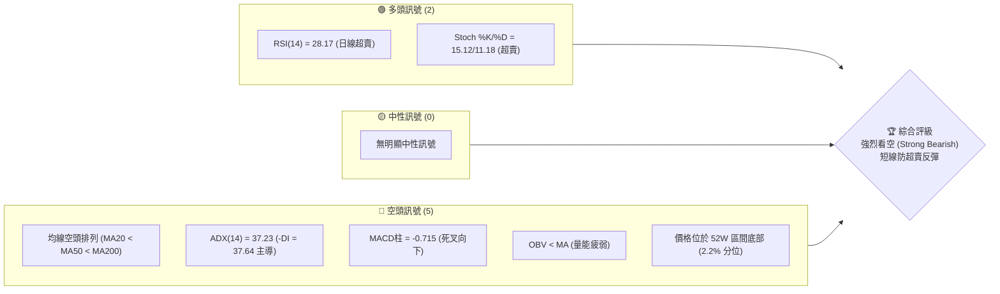

### 📊 核心指標速覽表

| 指標類別 | 指標名稱 | 當前數值 | 訊號 | 解讀 |
|----------|----------|----------|------|------|
| **價格** | 當前價格 | $126.41 | 🔴 | 處於 52 週極低點附近（52W Low 為 $121.50） |
| **均線** | MA20 | $145.30 | 🔴 | 價格遠低於 MA20 (-13.00%)，短期下行趨勢極強 |
| **均線** | MA50 | $178.10 | 🔴 | 中期生命線，呈陡峭下行斜率 |
| **均線** | MA200 | $190.20 | 🔴 | 長期牛熊分界線，已失守且形成死亡交叉 |
| **動能** | RSI(14) | 28.17 | 🟢 | 進入技術性超賣區，暗示隨時可能出現死貓跳反彈 |
| **動能** | MACD | -14.869 | 🔴 | MACD線與訊號線雙雙深陷負值區，空頭絕對主導 |
| **波動** | ATR(14) | $6.91 | 🔴 | 波動率佔股價 5.46%，市場恐慌情緒擴大，波幅劇烈 |

### 🏆 技術評分卡

```
技術評分卡 — ORCL (2026-07-20)
════════════════════════════════════════════════════
趨勢強度      ███████████████░░░░░  75/100  🔴 強烈看空
動能指標      ████░░░░░░░░░░░░░░░░  20/100  🔴 極度疲弱
支撐穩定度    ██████░░░░░░░░░░░░░░  30/100  🔴 僅存 52W 低點
成交量配合    ██████████░░░░░░░░░░  50/100  🟡 放量下跌
形態完整度    ████████████░░░░░░░░  60/100  🟡 下行通道
均線排列      ██░░░░░░░░░░░░░░░░░░  10/100  🔴 完美空頭
════════════════════════════════════════════════════
綜合評分      █████░░░░░░░░░░░░░░  25/100  強烈看空
════════════════════════════════════════════════════
```

---

## 2. 趨勢分析

### 🌐 多時框趨勢分析

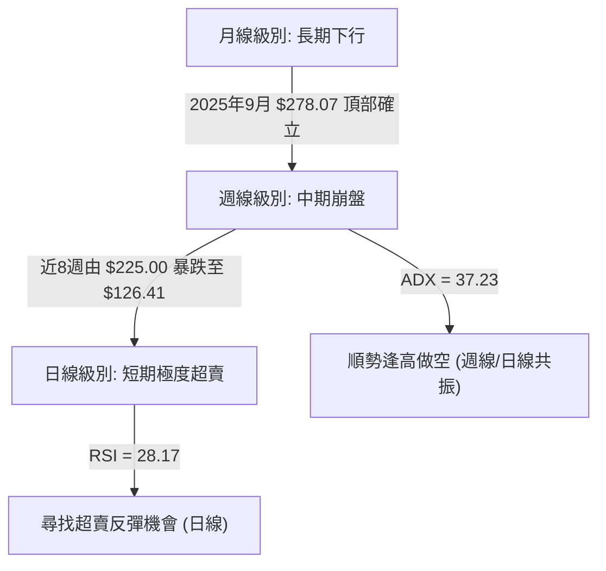

### 📈 長期趨勢 — 12個月走勢圖（Unicode）

```
ORCL 月線走勢圖（過去12個月）
價格軸 ($)
$280 ┤               ● (2025-09: $278.07 高點)
$260 ┤               █  ● (2025-10: $260.10)
$240 ┤               █  █
$220 ┤            ●  █  █           ● (2026-05: $225.00 次高)
$200 ┤         ●  █  █  █  ●  ●     █
$180 ┤         █  █  █  █  █  █     █
$160 ┤      ●  █  █  █  █  █  █  ●  █
$140 ┤●  ●  █  █  █  █  █  █  █  █  █  ● (2026-06: $146.04)
$120 ┤█  █  █  █  █  █  █  █  █  █  █  █  ● (現在: $126.41)
     └─┬──┬──┬──┬──┬──┬──┬──┬──┬──┬──┬──┬──► 時間軸 (月)
      08 09 10 11 12 01 02 03 04 05 06 07  (2025-08 至 2026-07)
```

**長期走勢特徵分析**：

| 階段 | 時間區間 | 收盤價變動 | 走勢特徵 | 成交量配合度 |
|------|----------|------------|----------|--------------|
| **頂部確立** | 2025-07 ~ 2025-09 | $250.91 → $278.07 | 歷史高位震盪，多頭動能見頂 | 縮量上攻，呈現價量背離 |
| **第一波主跌** | 2025-10 ~ 2026-02 | $260.10 → $144.39 | 恐慌性殺跌，失守多條中期均線 | 放量下跌，賣壓沉重 |
| **中期反彈** | 2026-03 ~ 2026-05 | $146.09 → $225.00 | 強力死貓跳，一度收復 MA120 | 反彈縮量，顯示為誘多行情 |
| **第二波主跌** | 2026-06 ~ 2026-07 | $146.04 → $126.41 | 無抵抗崩盤，直接灌破前低 | 殺跌極度放量，空頭完全控盤 |

### 📊 中期趨勢（週線分析）

在週線級別上，ORCL 呈現極為標準的「高點降低 (Lower Highs)」與「低點降低 (Lower Lows)」之典型熊市結構。

```
週線級別壓力與支撐示意圖
══════════════════════════════════════════════════════════════
[阻力 R3] $170.57 ─────────────────────────────────────── (波段高點聚類)
              \
               \
[阻力 R2] $164.24 ─────────────────────────────────────── (前波反彈頸線)
                  \
                   \
[阻力 R1] $148.55 ─────────────────────────────────────── (近期反彈失效點)
                      \
                       \
[現價]    $126.41 ━━━━━● (當前價格，岌岌可危)
                         \
[支撐 S1] $121.50 ─────────────────────────────────────── (52週最低點)
                           \
[支撐 S2] $114.67 ─────────────────────────────────────── (布林下軌極限支撐)
══════════════════════════════════════════════════════════════
```

### ⚡ 趨勢強度評估（ADX 解讀）

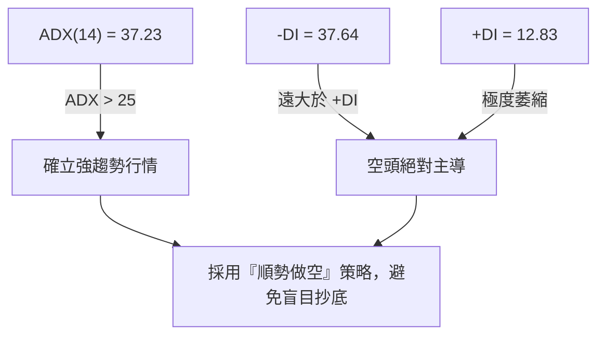

**ADX 趨勢強度對照表**：

| ADX 數值區間 | 趨勢狀態 | ORCL 當前定位 | 交易策略導向 |
|--------------|----------|---------------|--------------|
| < 20 | 無趨勢 / 盤整 | | 區間震盪高拋低吸 |
| 20 - 25 | 趨勢初建 | | 觀察突破方向 |
| **25 - 50** | **強趨勢** | **★ 37.23 (空頭強趨勢)** | **順勢做空（逢反彈建立空單）** |
| > 50 | 極強趨勢 | | 趨勢極端，謹防反轉 |

---

## 3. 圖表形態分析

### 🔍 形態識別系統

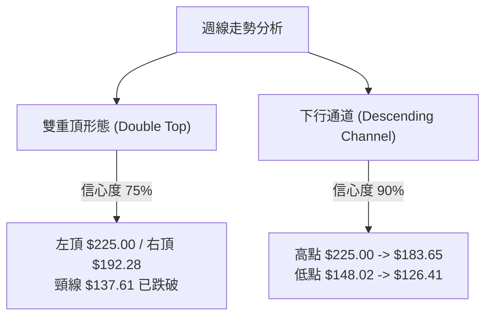

**形態信心度與目標價評估**：

| 形態名稱 | 信心度 | 判斷依據（引用數據） | 完成度 | 目標價（附計算式） |
|----------|--------|----------------------|--------|--------------------|
| **下行通道** | **90%** | 高點從 $225.00 降至 $183.65，低點自 $148.02 降至 $126.41，軌道平行且清晰。 | 95% (已接近通道下軌) | **$114.67** <br>*(通道下軌支撐)* |
| **雙重頂 (M頭)** | **75%** | 左頂 $225.00 (2026-05-31)，右頂 $192.28 (2026-05-17)，頸線 $137.61 (2026-04-12)。 | 100% (已完全破位) | **$121.50** <br>*(頸線 $137.61 - (左頂 $225.00 - 頸線 $137.61) = $50.22 跌幅，理論目標已達 52W Low)* |

### 🕯️ 重要K線形態分析

| 日期/月份 | 收盤價 | K線形態 | 解讀 | 訊號 |
|-----------|--------|---------|------|------|
| **2026-05-31** | $225.00 | **射擊之星 (Shooting Star)** | 週線長上影線，多頭上攻 $225.00 受阻，大資金逢高派發。 | 🔴 強烈看空 |
| **2026-06-28** | $148.02 | **大陰線破位** | 一舉跌破 MA20 ($145.30) 與多個關鍵支撐，確立崩盤勢。 | 🔴 強烈看空 |
| **2026-07-19** | $126.41 | **長下影錘頭線 (Hammer)** | 股價探底 $121.50 後回升，伴隨 2.52 億股巨量，暗示有短線抄底資金介入。 | 🟢 短線反彈 |

### 📉 ASCII 走勢形態示意圖

```
ORCL 下行通道與雙重頂破位示意圖
      (左頂: $225.00)
         ▲      (右頂: $192.28)
        / \        ▲
       /   \      / \
      /     \____/   \
     /                \
    /                  \   (通道上軌)
   /                    ▼───────────────────────────┐
  /                      \                          │
 /                        \      (頸線: $137.61)     │
/                          ▼───────────▼            │
                                        \           │
                                         \          │
                                          ▼         │
                                           \        │
                                            \       ▼ (現價: $126.41)
                                             ▼──────────────────────
                                                    (通道下軌 / 52W Low: $121.50)
```

### 🎯 形態目標價計算

1. **雙重頂破位測幅最小目標價**：
   $$\text{目標價} = \text{頸線} - (\text{頂點} - \text{頸線}) = 137.61 - (225.00 - 137.61) = 50.22 \implies \text{已超額完成，直奔 52W Low } \$121.50$$
2. **下行通道下軌投影目標價**：
   根據當前下軌斜率與布林下軌共振，目標指向 **$114.67**。

---

## 4. 支撐與阻力

### 🗺️ 關鍵價位分布圖（Unicode）

```
ORCL 價位結構分布圖
═══════════════════════════════════════════════════
$170.57 ║████████████████████████║ 強阻力 R3 (近一年波段高點聚類)
$164.24 ║████████████████████    ║ 阻力 R2 (中期反彈重要套牢區)
$148.55 ║████████████████████████║ 關鍵阻力 R1 (前波低點轉阻力)
$126.41 ╠════════════════════════╣ ◄ 當前現價 $126.41
$121.50 ║▓▓▓▓▓▓▓▓▓▓▓▓▓▓▓▓        ║ 強支撐 S1 (52週最低點)
$114.67 ║████████████████████████║ 極限支撐 S2 (布林通道下軌)
═══════════════════════════════════════════════════
```

### 🚧 阻力位分析表

| 阻力級別 | 價位 | 形成原因 | 突破難度 | 重要性 |
|----------|------|----------|----------|--------|
| **R1** | **$148.55** | 近一年波段高點聚類、MA20 ($145.30) 附近重合套牢區 | ▓▓▓▓▓▓░░░░ 60% | ★★★★☆ 短期反彈生死線 |
| **R2** | **$164.24** | 密集籌碼套牢區、MA120 ($165.34) 重合阻力 | ▓▓▓▓▓▓▓▓░░ 80% | ★★★★★ 中期趨勢分水嶺 |
| **R3** | **$170.57** | 近期週線破位前的起跌點、斐波那契 78.6% 回調位 ($168.65) 阻力帶 | ▓▓▓▓▓▓▓▓▓░ 90% | ★★★☆☆ 強力波段壓制 |

### 🛡️ 支撐位分析表

| 支撐級別 | 價位 | 形成原因 | 守住機率 | 重要性 |
|----------|------|----------|----------|--------|
| **S1** | **$121.50** | 52週最低點，多頭最後的護城河 | ▓▓▓▓▓░░░░░ 50% | ★★★★★ 絕對不可跌破的防線 |
| **S2** | **$114.67** | 日線布林通道下軌，極端超賣技術支撐點 | ▓▓▓▓▓▓▓░░░ 70% | ★★★★☆ 空頭恐慌盤竭盡點 |

### 📐 斐波那契回調位分析

基於 52 週區間（$121.50 → $341.82）進行斐波那契回調分析：

```
0.0%  (52W High)   $341.82 ──────────────────────────────────────────
23.6%              $289.83 ──────────────────────────────────────────
38.2%              $257.66 ──────────────────────────────────────────
50.0%              $231.66 ──────────────────────────────────────────
61.8%              $205.66 ──────────────────────────────────────────
78.6%              $168.65 ──────────────────────────────────────────
現價 ($126.41)      ▼ (處於 78.6% 與 100% 之間)
100.0% (52W Low)   $121.50 ──────────────────────────────────────────
```

* **現價定位**：當前價格 $126.41 已深幅回調至接近 **100% 回調位 ($121.50)**。
* **技術含義**：股價幾乎吞噬了過去一整年的全部漲幅。100% 回調位通常伴隨著強烈的雙重底預期，若在此處止跌，將形成大型週線級別底部；若失守，則意味著 ORCL 將進入無底深淵的熊市第二階段。

---

## 5. 技術指標深度解讀

### 🎛️ 指標訊號總覽

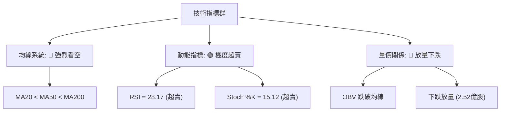

### 📈 移動平均線排列分析

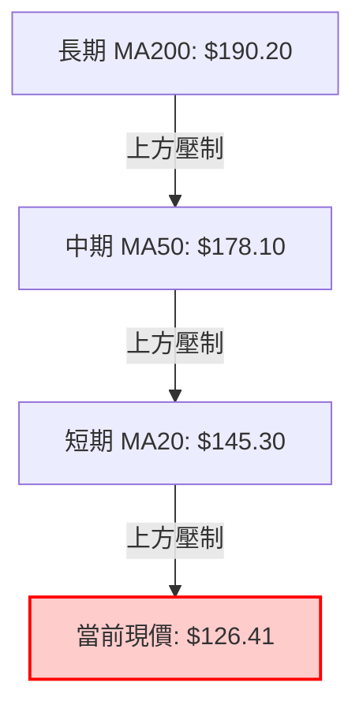

* **均線狀態**：當前呈現極其標準的**空頭排列**。
* **乖離率分析**：現價與 MA20 乖離率高達 **-13.00%**，與 MA240 ($201.78) 乖離率更達 **-37.35%**。如此極端的負乖離率通常無法長期維持，強烈暗示短期內將有技術性均線修復反彈。

### 📉 RSI(14) 分析

* **RSI(14) 數值**：**28.17**
  ```
  [0] ░░░░░░░░░░▓▓▓▓▓▓▓ [30] ░░░░░░░░░░░░░░░░░░░░ [70] ░░░░░░░░░░░░░░ [100]
                     ▲ (當前 28.17 - 超賣區)
  ```
* **背離分析**：**無明顯背離**。雖然日線 RSI 進入超賣，但週線 RSI 亦同步創下新低（7月19日週 RSI 為 28.2），量能並未出現價格創新低而指標不創新低的底背離現象。這表明下行路徑是由真實的恐慌性拋壓推動，反彈僅能視為修正，而非趨勢反轉。

### 📊 MACD(12/26/9) 訊號解讀

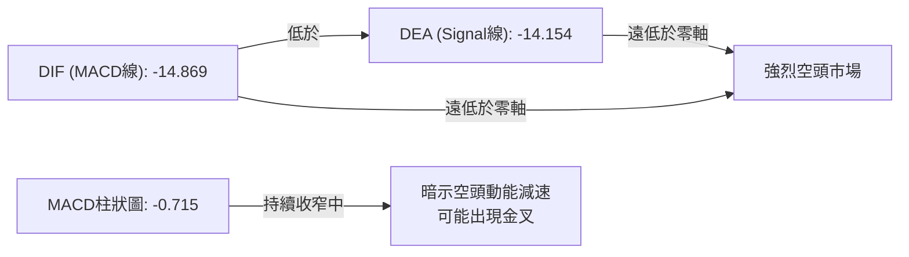

* **動能狀態**：雙線在極低位（-14下方）運行。雖然柱狀圖仍在負值區（-0.715），但相較於前幾週已有所收斂，表明空頭殺跌動能最猛烈的階段可能暫告一段落，正醞釀超賣反彈。

### 📦 布林通道分析

```
日線布林通道結構與現價位置
══════════════════════════════════════════════════════════════
[BB 上軌]   $175.93 ──────────────────────────────────────────
                       \
                        \
[BB 中軌]   $145.30 ────────────────────────────────────────── (MA20)
                            \
                             \
[現價]      $126.41 ━━━━━● (%B = 0.19)
                               \
[BB 下軌]   $114.67 ──────────────────────────────────────────
══════════════════════════════════════════════════════════════
```

* **通道寬度**：帶寬極度張開，顯示波動率極大。
* **%B 指標**：**0.19**。股價貼近下軌運行，尚未完全跌破下軌，表明下行趨勢雖然強烈，但空頭已將彈藥消耗至極限，短期內下軌 $114.67 將具備極強的技術支撐。

### 💹 成交量分析（量價配合度）

* **量比**：**1.00x**（最新成交量 39,851,000 / 20日均量 39,788,365）。
* **週成交量變化**：7月19日當週成交量急遽放大至 **252,513,000 股**（前一週為 183,555,500 股），股價暴跌 -10.12%。
* **量價診斷**：**放量下跌，量價配合**。這意味著市場主力資金在加速割肉或恐慌性拋售，OBV 亦持續低於其移動平均線，量能並未出現主力暗中吸籌的跡象。

---

## 6. 動能與波動率

### ⚡ 動能評估四象限

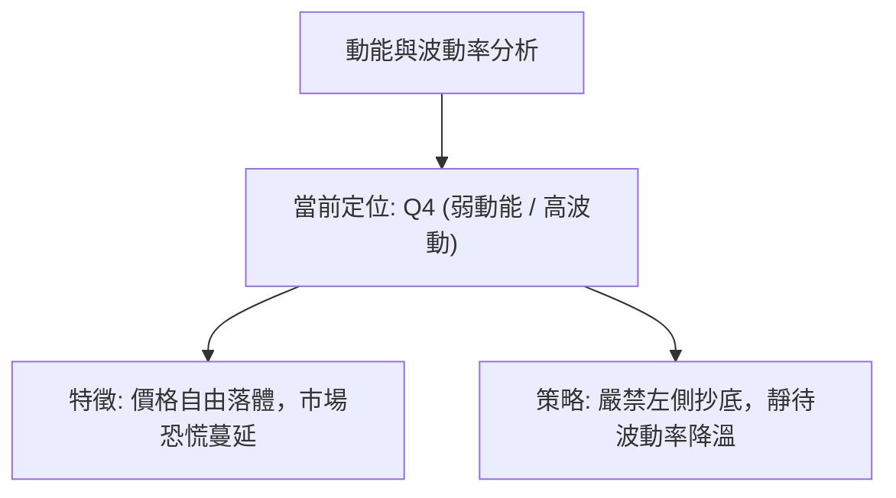

| 象限 | 動能 | 波動 | 當前狀態 | 評估與交易指引 |
|------|------|------|----------|----------------|
| **Q1** | 強 (多頭) | 低 | - | 穩定上升趨勢，最優買入持有區 |
| **Q2** | 弱 (多頭) | 低 | - | 橫盤整理，適合觀望或區間操作 |
| **Q3** | 強 (多頭) | 高 | - | 暴漲行情，適合突破追多 |
| **Q4** | **弱 (空頭)** | **高** | **★ ORCL 當前定位** | **極端殺跌，高波動。應以反彈做空為主，嚴禁重倉抄底。** |

### 📊 ATR 波動率分析

* **ATR(14)**：**$6.91**（佔股價 5.46%）。
* **止損與波動幅度參考**：
  * **1倍 ATR 距離**：$6.91
  * **2倍 ATR 距離（波段安全止損）**：$13.82
  * **解讀**：目前 ORCL 每日平均波動高達 $6.91，這意味著任何日內或短線交易必須給予足夠寬的止損空間，否則極易被噪音震盪出場。

### 📐 Beta 與市場相關性

* **Beta 係數**：**1.712**。
* **市場敏感度**：ORCL 的波動性比標普500大盤高出 **71.2%**。在大盤調整期間，ORCL 將承擔顯著放大的下行壓力。當前高 Beta 屬性加劇了其股價的崩塌，在大盤企穩前，該股難以獨自走強。

---

## 7. 多時框架總結

### 📋 時框架評分表

| 時框架 | 趨勢方向 | 動能 (RSI) | 均線排列 | 形態 | 綜合評分 | 交易建議 |
|--------|----------|------------|----------|------|----------|----------|
| **日線** | 🔴 強空頭 | 🟢 超賣 (28.17) | 🔴 空頭排列 | 🟡 下行通道底部 | 30/100 | 靜待超賣反彈，不盲目追空 |
| **週線** | 🔴 強空頭 | 🔴 弱勢 (28.20) | 🔴 空頭排列 | 🔴 M頭破位 | 20/100 | 逢反彈至阻力位建立中線空單 |
| **月線** | 🔴 轉弱 | 🟡 中性 (42.00) | 🟡 跌破MA20 | 🔴 頂部確立 | 40/100 | 長期多頭趨勢破壞，減碼防守 |

### 🔲 綜合訊號矩陣

```
 跨時框指標矩陣
┌──────────┬──────────────┬──────────────┬──────────────┐
│ 指標 / 時框│     日線     │     週線     │     月線     │
├──────────┼──────────────┼──────────────┼──────────────┤
│ 趨勢 (MA)│  🔴 強烈看空  │  🔴 強烈看空  │  🟡 偏空整理  │
│ 動能(RSI)│  🟢 技術超賣  │  🔴 極度疲弱  │  🟡 中性偏弱  │
│ 波動(BB) │  🔴 貼近下軌  │  🔴 破位下行  │  🟡 寬幅震盪  │
└──────────┴──────────────┴──────────────┴──────────────┘
```

### ⚖️ 多時框收斂結論

**當前行情屬性**：**趨勢行情 (ADX = 37.23 > 25)**。

根據多時框收斂規則，在強趨勢行情中，**必須以中長期（週線、MA50、MA200）的下行方向為主導**，日線的超賣僅用於尋找短線反彈進場做空的時機，不可作為反手做多的依據。

* **最終方向性結論**：**強烈偏空**。
* **核心邏輯**：週線與日線共振看空，日線 RSI 超賣僅能引發短暫的技術性反彈（預期極限在 MA20 $145.30 或 R1 $148.55 附近）。任何反彈皆為中線空單的優質進場點。

---

## 8. 交易策略建議

### 🗺️ 策略決策流程圖

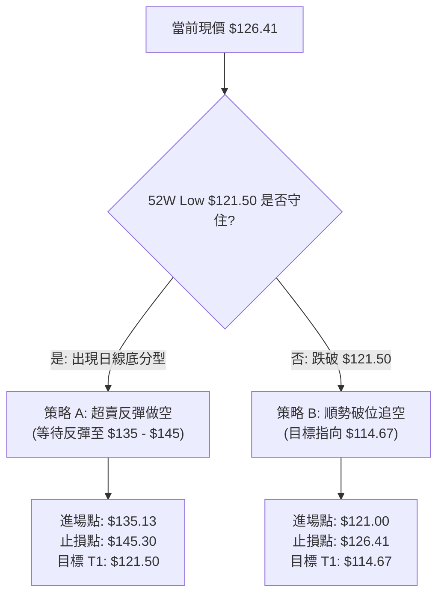

### 🧭 策略路由

> 📢 **當前主策略方向**：**主推空頭策略（綜合技術評分：25/100，極度看空）**。
> *由於指標呈現完美空頭排列且 ADX 確立強下行趨勢，本報告不推薦任何左側做多策略。多頭僅作為風險對沖與空單平倉的參考。*

### 🎯 價格情境階梯（Price Scenarios）

| 觸發條件 | 下一目標 | 後續延伸 | 情境含義 |
|----------|----------|----------|----------|
| **向上突破 R1 $148.55** | R2 $164.24 | R3 $170.57 | 超賣強反彈，空單必須無條件止損 |
| **受阻於 MA10 $135.13** | S1 $121.50 | S2 $114.67 | 弱勢反彈結束，重回主跌浪（高機率） |
| **跌破 S1 $121.50** | S2 $114.67 | 尋找新低 | 破位加速殺跌，空頭空間打開 |

### 📊 情境機率分佈

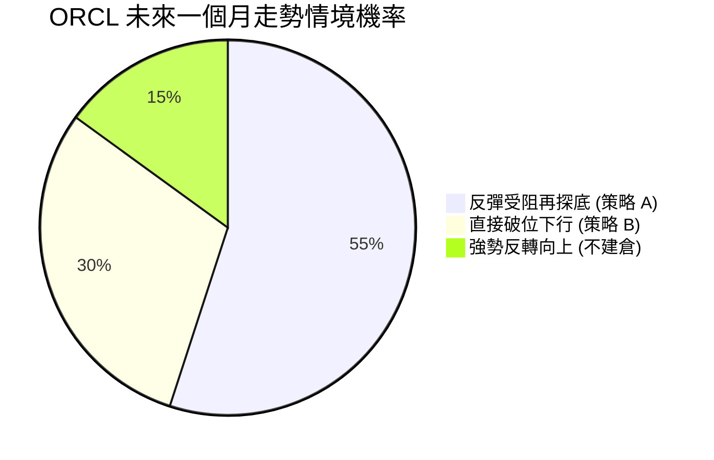

### 🔴 主推空頭交易策略

#### 策略 A：超賣反彈逢高做空（首選）

* **進場條件**：股價因日線超賣出現技術性反彈，在 **MA10 ($135.13)** 至 **MA20 ($145.30)** 區間受阻並出現小時線級別陰線吞噬。
* **確切進場價**：**$135.13** (或反彈至此價位附近)
* **止損價格**：**$145.30** (站穩 MA20 則手動止損)
* **目標價 T1**：**$121.50** (52W 最低點)
* **目標價 T2**：**$114.67** (布林下軌極限)
* **風險報酬比**：**1 : 1.34**（風險 $10.17，預期最大收益 $13.63）
* **成功機率**：**55%**
* **建議倉位**：**10%**

#### 策略 B：順勢破位做空（次選）

* **進場條件**：股價無力反彈，直接放量跌破 52W 最低點 **$121.50**，確立新一輪下跌空間。
* **確切進場價**：**$121.00** (破位確認)
* **止損價格**：**$126.41** (當前現價，若拉回此處代表假突破)
* **目標價 T1**：**$114.67** (布林下軌)
* **目標價 T2**：**$114.67** (由於數據中無更低支撐，以此為唯一終極目標)
* **風險報酬比**：**1 : 1.17**（風險 $5.41，預期收益 $6.33）
* **成功機率**：**30%**
* **建議倉位**：**5%**

### 🟢 反向風險觸發點（空單對沖/平倉提示）

若日線收盤價**強勢站穩 R1 $148.55**，且 RSI(14) 回升至 **45** 以上，代表空頭趨勢暫時瓦解，中線空單必須全部離場觀望。

### ⭐ 整體訊號強度評星

```
做多訊號強度：★☆☆☆☆  (1/5星 - 僅具備超賣反彈契機)
做空訊號強度：★★★★☆  (4/5星 - 趨勢、均線、量價全面看空)
整體可信度：  ★★★★☆  (4/5星 - 指標共振度極高)
```

---

## 9. Risk Warning and Monitoring

### ✅ 關鍵監控指標 Checklist

```
╔══════════════════════════════════════════════════════════════╗
║              ORCL 每日交易監控清單                            ║
╠══════════════════════════════════════════════════════════════╣
║ [ ] RSI(14) 是否脫離超賣區 (>30)？                            ║
║ [ ] 每日成交量是否跌破 20日均量 (39,788,365)？                 ║
║ [ ] 價格是否跌破 52W Low $121.50？                           ║
║ [ ] MACD 柱狀圖是否在零軸下方完成金叉？                       ║
║ [ ] 股價與 MA20 ($145.30) 的乖離率是否收窄至 -5% 以內？       ║
╚══════════════════════════════════════════════════════════════╝
```

### ⚠️ 風險場景分析

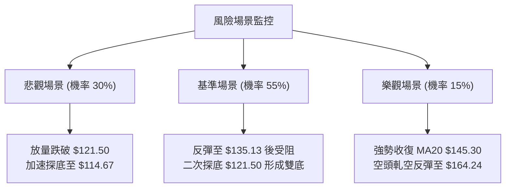

### 🛡️ 風險管理重要提醒

1. **嚴防極端超賣引發的軋空**：當前 RSI 處於 28.17 的極度超賣狀態，隨時可能因微小的利多或大盤反彈而出現 5% - 10% 的暴烈反彈。**切勿在現價 $126.41 直接追空**，耐心等待反彈至阻力區再行佈局。
2. **嚴格執行止損**：不論是策略 A 還是策略 B，一旦觸及止損價位（$145.30 / $126.41），必須毫不猶豫地執行，防止因資金管理不當導致爆倉。
3. **倉位控制**：鑑於當前 ATR 達 $6.91，市場波動極大，整體做空總倉位建議控制在 **15% 以內**，並採用分批建倉原則。

---

## 📋 報告總結

```
ORCL 技術分析報告總結
════════════════════════════════════════════════════════
報告日期：2026-07-20
當前價格：$126.41
分析評級：🔴 強烈看空 (Strong Bearish)

關鍵結論：
├─ 長期趨勢：🔴 轉弱，月線級別頂部確立，失守關鍵均線。
├─ 中期趨勢：🔴 強烈看空，週線呈現 M 頭破位，下行通道完整。
├─ 短期趨勢：🟡 偏空，日線極度超賣，隨時醞釀技術性反彈。
├─ 關鍵支撐：$121.50 (52W Low) ｜ $114.67 (布林下軌)
├─ 關鍵阻力：$148.55 (MA20/R1) ｜ $164.24 (MA120/R2)
└─ 分析師目標均價：$251.85 (與技術面嚴重背離，暫不具備參考價值)

最優策略組合：
1. 🥇 首選機會：等待股價反彈至 MA10 $135.13 附近受阻時建立空單，
               止損設於 $145.30，目標看至 $121.50。
2. 🥈 次選機會：若股價直接放量灌破 $121.50，順勢輕倉追空，
               止損設於 $126.41，目標指向 $114.67。
════════════════════════════════════════════════════════
```

---

> ⚠️ **免責聲明**：本報告為 AI 自動生成之技術分析，所有數據及估算均基於提供的歷史價格資訊。本報告**僅供研究與學術參考**，**不構成任何投資建議**。投資有風險，入市需謹慎。

---

*報告生成時間：2026-07-20 ｜ 數據來源：Yahoo Finance ｜ 分析框架：多時框技術分析*