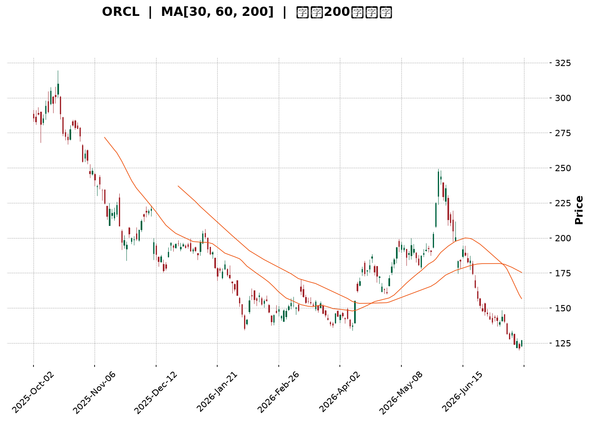
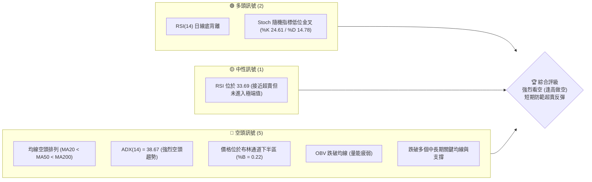
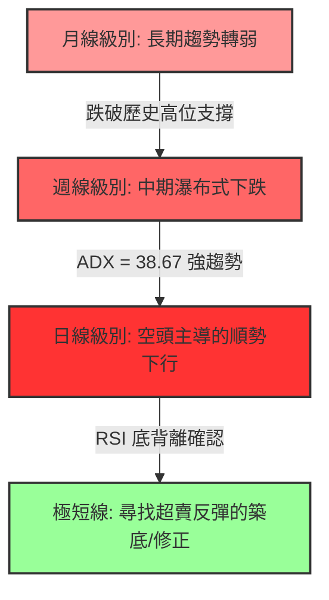
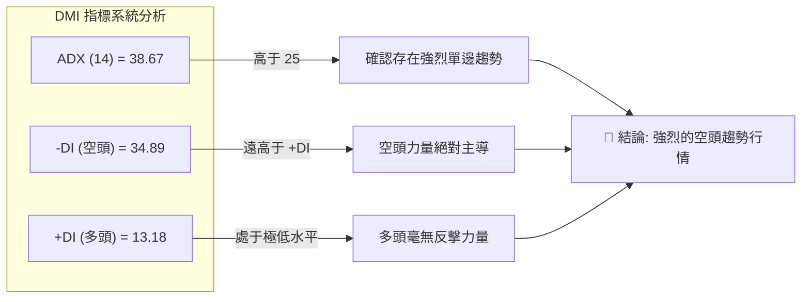
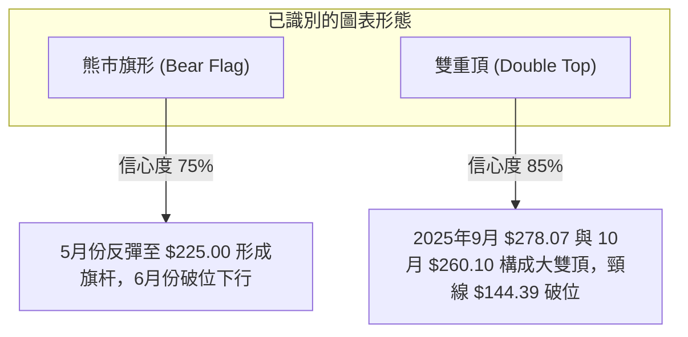
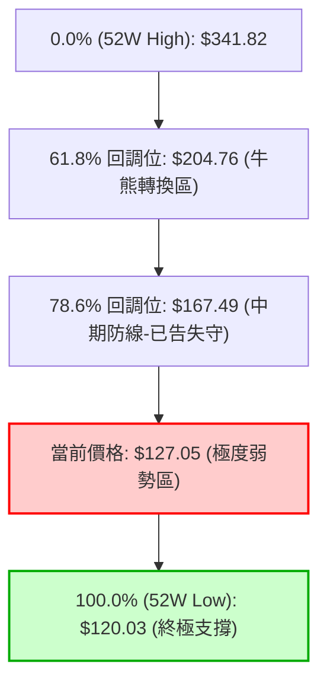
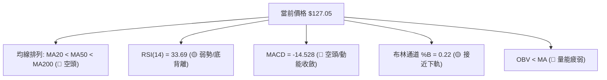
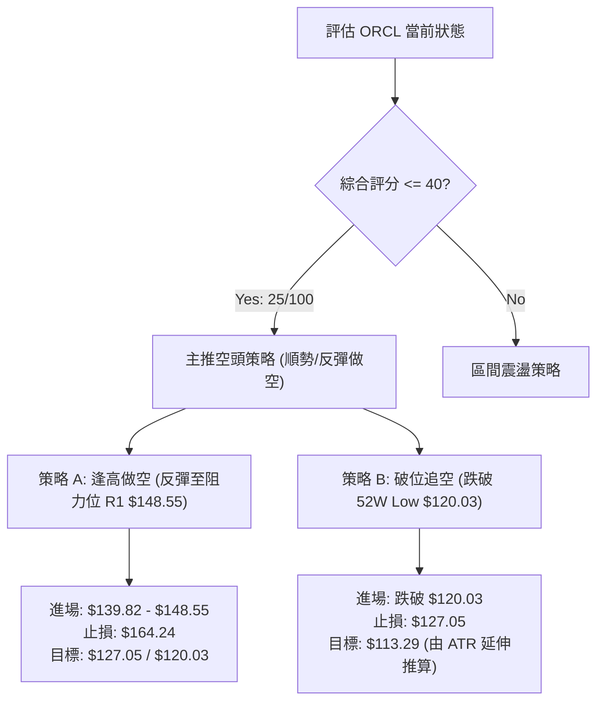
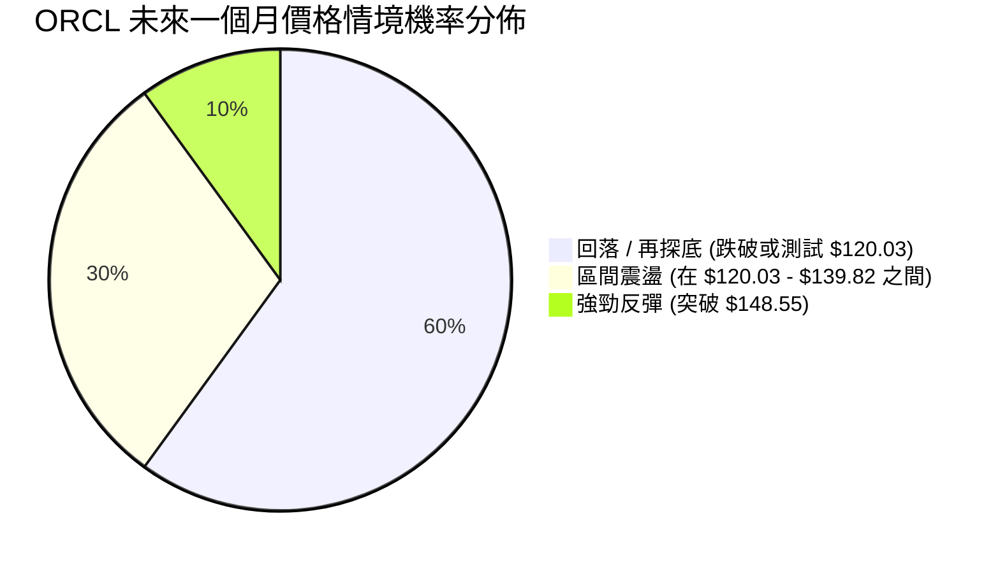
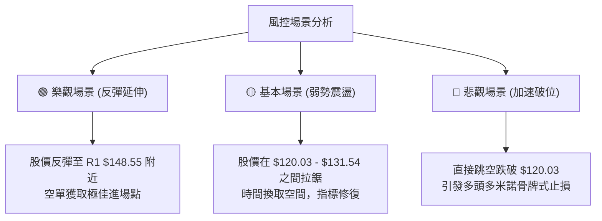

<details>
<summary>📊 靜態圖表 (點擊展開)</summary>

</details>

<html>
<head><meta charset="utf-8" /></head>
<body>
    <div style="height:500px; width:100%;">                        <script>window.PlotlyConfig = {MathJaxConfig: 'local'};</script>
        <script charset="utf-8" src="https://cdn.plot.ly/plotly-3.7.0.min.js" integrity="sha256-jvTGqxNp8AGWEcvNLVuKr+8j5dGe9Yw51LQkmDH+IYA=" crossorigin="anonymous"></script>                <div id="candlestick-chart" class="plotly-graph-div" style="height:100%; width:100%;"></div>            <script>                window.PLOTLYENV=window.PLOTLYENV || {};                                if (document.getElementById("candlestick-chart")) {                    Plotly.newPlot(                        "candlestick-chart",                        [{"close":{"dtype":"f8","bdata":"AAAAQGnYcUAAAACApa5xQAAAACDdBHJAAAAA4JaQcUAAAADgCdZxQAAAAMD3YXJAAAAAgJQickAAAABAFBFzQAAAAOBLgnJAAAAAoILLckAAAAAAKGBzQAAAAIBuCHJAAAAA4IIocUAAAACAVwhxQAAAAADi4HBAAAAAYE9WcUAAAADA+IlxQAAAAOBia3FAAAAAgFpicUAAAAAguApxQAAAAGDyzW9AAAAAYJ5BcEAAAABgX+xvQAAAAGCSuW5AAAAA4GX9bkAAAACAES9uQAAAAOAsn21AAAAAwO\u002fQbUAAAABAmzxtQAAAAGBJGmxAAAAAQLrvakAAAADAEpdrQAAAAIBOOGtAAAAAQEZMa0AAAABgA+xrQAAAAKCrFWpAAAAAgI6baEAAAACAu8toQAAAAMC5ZGhAAAAA4A9gaUAAAACAqQBpQAAAAKCm4GhAAAAA4LjlaEAAAADA2rdpQAAAAKAJiWpAAAAAIAvwakAAAADg201rQAAAAIA8bWtAAAAAwCSca0AAAAAAaZ5oQAAAAMD2hGdAAAAAgOjkZkAAAACgIFtnQAAAAOApGGZAAAAAYOxJZkAAAABgWsRnQAAAAICDj2hAAAAAoCkvaEAAAABATnNoQAAAAAAng2hAAAAAQG4waEAAAABgbmpoQAAAAMCIIWhAAAAAwOM6aEAAAADgANhnQAAAAODE\u002fGdAAAAAQO3fZ0AAAABg0npnQAAAAECVpGhAAAAA4FVoaUAAAADAYhxpQAAAAGCNCGhAAAAAQBGRZ0AAAADAeLhnQAAAAMCCVWZAAAAAQJKVZUAAAABgNx5mQAAAAKDN\u002fWVAAAAAYJelZkAAAAAA\u002fLVlQAAAAEBAc2VAAAAA4M\u002f6ZEAAAADgCG5kQAAAAOBl3mNAAAAAQB0zY0AAAADA4zRiQAAAAEAS8WBAAAAAYIu6YUAAAADgIHBjQAAAAAD\u002f2GNAAAAA4D2CY0AAAAAAomxjQAAAAMDw4GNAAAAAoN4cY0AAAAAAyGJjQAAAAACKbmNAAAAAYLJhYkAAAAAgj4phQAAAACAMJGJAAAAAoKhbYkAAAADgj6hiQAAAAACIDGJAAAAAgOCGYkAAAAAgQH9iQAAAAEAG6mJAAAAAgO02Y0AAAAAgxvxiQAAAAOBI0GJAAAAAwKSLYkAAAACAoz9kQAAAAEDMwWNAAAAAwBhBY0AAAAAgbVxjQAAAAADAM2NAAAAA4N36YkAAAABAIE5jQAAAAKCKlGJAAAAAoKAoY0AAAACAPEJiQAAAAOA7IGJAAAAAADq6YUAAAAAgIFZhQAAAAODLOmFAAAAAQN9CYkAAAAAgIQdiQAAAAICsK2JAAAAA4PoQYkAAAACgqsVhQAAAAOA81WFAAAAAwDksYUAAAABgjzNhQAAAAECTYmNAAAAAoOpNZEAAAADAFCdlQAAAAEAYN2ZAAAAAoH\u002fOZUAAAAAA3B5mQAAAAEBXkWZAAAAA4DJbZ0AAAABAZ\u002fVlQAAAAIC8lWVAAAAAIIiLZUAAAAAAT6xkQAAAAIBiaGRAAAAAQJMaZEAAAABAf2dlQAAAAEBHdWZAAAAAIKMWZ0AAAAAgbytoQAAAAMBKPWhAAAAAQKloaEAAAAAAYCVoQAAAAEDVRWdAAAAAgESjZ0AAAACg0V1oQAAAAGD+CGhAAAAAQNE+Z0AAAADAlppmQAAAAOA+cGdAAAAAQJajZ0AAAAAgQO1nQAAAAGCADGhAAAAAAInJZ0AAAAAgzV9pQAAAAGDpH2xAAAAAIEXpbkAAAAAgbXduQAAAAMABsWxAAAAAAKlwbUAAAADADZ5qQAAAAKC9YmpAAAAAYBajaUAAAADg\u002fRFpQAAAAKDG7mZAAAAAgLvvZkAAAADAG\u002f9nQAAAAKCqdWdAAAAAYJncZkAAAACg1fRmQAAAAGDRzmVAAAAAAMySZEAAAADAe59jQAAAAGDO\u002fWJAAAAAYHuAYkAAAABg7WdiQAAAAIBXQWJAAAAA4DDAYUAAAAAgFHlhQAAAAABf6GFAAAAAoH2jYUAAAAAgGIBhQAAAAEAK92FAAAAA4HqUYUAAAACgR3FgQAAAAAAp\u002fF9AAAAAIK6PYEAAAACgcA1fQAAAAIA9ml9AAAAA4FFYXkAAAABAM8NfQA=="},"high":{"dtype":"f8","bdata":"pfOCx1U6ckDYUoklHTVyQIceCM1iVXJAxlq\u002ffqYeckD3UERk6gNyQN58d9WDoXJAa32N73sMc0Ak2cc8tTtzQP1IBikw2HJAZzDB8p5Ac0Be9aSQVvdzQDEokBj41XJAZtYKtKDncUAiANhZ9FlxQLVGqDjUKHFAkVMAr1OGcUCpxYlUJMdxQFmxjF0hxHFA80jm0rmrcUDTOuqR325xQJunAhPtsnBA8i34Z1R0cEAqXsmDUXFwQFxK2Q7rmm9AlEsQj6M\u002fb0DmbuvvGNZuQCMB\u002fYdOw21AQ1GQ2BicbkDa73Eiz2VtQGKDGzeGUW1Aq4rJf0nga0C9baltMBxsQP8JCul8lWtAc6UDSAOya0AbfF5UDT9sQAipp9p2+GxAaF7AuDzKaUC8zvUz7jtpQPYEUHwosGhAYyLgD83\u002faUAftmbaBQ1pQMQbkMbJMWlA3AnP80r2aUDc+Ehh4L1pQKenRXpEq2pAaoywfOUsa0DPN\u002fPEStNrQD51AnLIj2tAG47yllvla0CaO30i7gFpQJqy0Aq3fmhACx5eKkVlZ0CuLHx\u002fk39nQCB5vEf8FmdA34cWU9bfZkAYmvyZMChoQG6JXkHTnGhA8AjvLh1qaEBqfoQMWIxoQIv6o5yVzmhAAKjCKqKTaEDE4xNvg49oQAnK9ScdamhAqMFROyuWaEAK0\u002fjxa\u002fhoQEXieXCVIGhA2MPfJJ85aEBuJV5CBqRnQEhcr5BV2WhA7sm9ilmlaUCdiYC0e8tpQEssB0MACWlALPAbuAo1aEAsPH0vQtFnQPZbTJeJPGdA2YNmth5rZkC2tfAhI11mQJY+yCjuTGZAeVPGUcsAZ0AQZBeoJ09mQDmHIZ9wjWZAG8EU0JQhZUDVUgfQUPdkQCpQ\u002ftdnQGVAKuc2CMrIY0AsfLOW6htjQH1Z06MTMWJAI9VRqZ7GYUCEKFwYjNRjQH2J54bGh2RAonmllcxQZEClafQO\u002fL1jQCu3UMiUJWRA13yXcZzFY0C4m87MsIZjQMQ1+qAI32NA\u002fDLQWoEdY0CFILonPhliQH3gmua\u002fN2JAWJeFRfEGY0B7uhb0J+5iQDqztf0jImJAnEEt2xykYkCo3iarQ7xiQGe04extEWNAjEOmaQebY0CWqcFMwMJjQKZqg2BE3mJA15+hk0UiY0Bp5IWAM1JlQHNcckxQ1WRALlIm7\u002fX0Y0AFgrKgc7RjQCTxuM0rumNADa33xKU8Y0B7uSd2nXpjQBc+tkz9BWNAlEQqUGNWY0D9rAcZpRpjQBgmcDigmWJA02I00IguYkAvpPyKopZhQKIDt0UQh2FAZyM+ZhZMYkBA3JqilpNiQH2RXZeULWJAXsYL3aFwYkBnUOH1J\u002fJhQKaoGVobzWJAJzzS8sHJYUBMbRit43VhQJA9dMPSa2NAFbG5mwEaZUBjX8ulxn5lQN\u002fLqw+kdGZAZnELBYj7ZkD0wlpjmSRmQB0ulHFRFmdAmpl+qcWQZ0Dhc9gLTahmQDxQyxusgmZAvQ9UnlieZUCg57QurwNlQFaAbpYKhmRAu0JWPG+TZEBgUIpZQ7ZlQIcvVXWk22ZAUL1YhfI7Z0BpNK2duTNoQF4oileY7mhApOxEpwiqaECK2QT+DGBoQIiqA4oJCGhAORsEuPzcZ0Dns70HdABpQBfcBar3d2hA1lkGIyjDZ0CW9ElvGoJnQPN2yKsocmdAbsKcQNkEaEBgfHoEJYpoQBebuHi+UGhAgFPO\u002fCnvZ0DLDy7UQYlpQI3IAcQsMGxAWP7Buzwsb0CUpQU4YARvQDPuhCCj9W1AP+uz\u002f+PDbUCueY5YZ9RsQEiVvQCeSWtA8hGYq4l3a0CjqQR3yXdqQFRRrDgkBGdA9OyFsfgdZ0DdVb1CklRoQDpbLDqSVGhAUGb3+fqwZ0C3XJYK02pnQOU4oigV\u002fmZAQ8+ELzi3ZUB\u002fXVOLnKVkQGXEpHNaomNAKAZG9j4gY0BWkBsU3D5jQOUFgWEgrWJACONSEzthYkB0pgTpmlFiQDDov0yvI2JA9HP0Z8UhYkDl\u002f9HoJKthQHMUNcGzkWJAAAAAgMI1YkAAAADAzHRhQAAAAOBRmGBAAAAAwMy8YEAAAADA9XhgQAAAAIAUDmBAAAAAIFxfX0AAAABA4dpfQA=="},"hovertemplate":"\u003cb\u003e%{x|%Y-%m-%d}\u003c\u002fb\u003e\u003cbr\u003e\u958b: $%{open:.2f}\u003cbr\u003e\u9ad8: $%{high:.2f}\u003cbr\u003e\u4f4e: $%{low:.2f}\u003cbr\u003e\u6536: $%{close:.2f}\u003cextra\u003e\u003c\u002fextra\u003e","low":{"dtype":"f8","bdata":"v2dRIzmtcUCLVwrIyoxxQNqYS7dd+HFAA8+\u002fAyO\u002fcECMKecsd4ZxQGhPMjJAyHFAqedQjIYTckBJ3GAgVG5yQKprurIME3JAMC\u002fsaQeBckAD5QhSy8JyQJlayNYNzHFAGhTSjOAKcUDExnc2i9pwQE4YkQ\u002fYqnBAsIBKpprccEBeQ7Ji23hxQHYa5ncwUnFA60bbGMJdcUAh6ZKQH8xwQKB3pt2cum9AERkKvj3Ib0D8kyRMVZlvQLPkVXgfW25AyC2O0nCVbkDH8qd1IKBtQNhsXgorxGxAQDLpIsRZbUDmjPSNgVZsQBOo9QxMAGxA0jLz6T6lakCp5hvFNBhqQOYYlGYFsGpAw1pm6WyOakCLjNBvfOdqQAjAmEVPCWpAj7Gw\u002fm32Z0ClUClhMw5oQMPNQzBp+2ZAk\u002folf9oJaUANjGTnG3doQNs7UlREWmhAO9SKttvCaECaNEpM169oQErmbp8qi2lAgqwJq4hyakAGqHcWz9pqQOktftk6BmtAjZLGNQvwakBukGSIbQ5nQORkaeSABmdATFUhG1h1ZkAQnKmRR9dmQGLvdsgb7GVA4f6EevcbZkAwf7tuVEpnQHNf4Tmc32dAJ8UMZlPLZ0Dw5HcDARJoQMnnGyKRR2hA6prrj5bZZ0Bv84LE4zpoQLD8dTbUG2hAi82LJFkLaEBPFPlYw89nQCEEevIZnGdAK5lWvU3FZ0D4ALFK5AtnQDA6Pn0Qb2dADqDIApl0aEAbxyJ7luhoQOGvSdSSr2dAjbRtAnOCZ0BQ4NJRkCdnQJ9yvRC3Q2ZASAI72VYtZUBFqXlS1OhlQIowwAjUWWVAM1R6xFYpZkAxNiIQN49lQJWToydhVWVA8ZzGZ8sMZECkeofBc0NkQNYQoMh93GNAHy3LvxbbYkAZtV3jtO1hQM34TAH8yWBAQe08xEo+YUCV5ZB2YD9iQO6oZfbie2NAjss8qNIdY0A\u002fPb79J+5iQGIY0QvRRmNAf+lGTTv6YkB\u002fn\u002fMUP8piQMXC9\u002f4RVmNA+dGjE8VLYkDG4a9oHzRhQHQNUV2SOGFAyll7Py5KYkB68E5IlgRiQJ1WQvypo2FAeEVufW2GYUAjW1d72sFhQBhf+0ccgmJACGBeMYaiYkAxSZnhMNJiQIKL2lNDLWJA8CIaWXRtYkAY3aMu7O5jQK7ncN9RsGNA1rqi6pYiY0DUFoeyBy5jQKcXvRvvDWNANEoznInfYkAp717sb3tiQJF4l8mQXWJAITyt+0W1YkBJV4AinDpiQDMRDO0b82FAd3L+dqWxYUCTO1NE6CphQBjWFbsBAGFA7YS81ylcYUApS7lwVfVhQCxhlo52amFAhqLxg0bbYUDYNvMBBl9hQFU81w0WvWFA2Ex4c+nwYEB2XoGYT8NgQEiNCBOKZ2FAoR7KBf8fZEBfiyreR7RkQJCdgZBRpmVAc0UViEmYZUCObi8XEp1lQOnhXAzL7GVALfKo+1HFZkBdrVRbP69lQOCBApzfBmVA4nK1NSzqZED6ffVLny9kQEv1cDD6AmRApVfb2sX4Y0AAVznxXbJkQDrlscH8tGVAN5S0OCRMZkDFh1eiLMFmQMtWfMNuxGdATu4cRZ6xZ0BzBtsEDr5nQILC4STGh2ZAkOIRnGMNZ0CEb6Ft0xlnQGsmU8bXh2dAjRnN207UZkA1yIjtr4lmQBqInZTDRWZAim+GvaFRZ0DvfzHV\u002f81nQC2cu2DHvGdAs5uHlpdoZ0CDIK3YtBZoQCBqiC8+6WlAABnYdUj6a0BSfjQFYsBtQG72QsBEWmxAM8pNNybna0Cd1vfCKRdqQE\u002fn5TdWE2pAqMnYRVajaEDVMLH5xa9oQHCCP5+D1WVA2IerMiRMZkBRX+TdDzJnQKQWUQdNYGdATlYF+02+ZkBVlGmJryJmQDFPZqdzuWVAc+\u002fq\u002fkGBZEDZdPEp91ljQNL+XMTWumJAM19qrZRvYkANsLiUShZiQAgeKcpU\u002f2FAAAAA4DDAYUAS45uFKEthQFs+Zbd1lWFAy9h+BlciYUBwY3EfVyJhQMuzyadxjmFAAAAA4FFoYUAAAABAM2tgQAAAAGBm5l9AAAAAQOEaYEAAAACAPepeQAAAAAAAYF5AAAAAgOsBXkAAAACgcI1eQA=="},"name":"\u50f9\u683c","open":{"dtype":"f8","bdata":"ojUkui8IckB3IxzqYeVxQCZntIhcEXJAxlq\u002ffqYeckCfg9DqQaNxQLEiEBM8DHJAGUHL0JSWckBKwlDPin1yQNaS9cu3ynJAw8SmacvfckDU5a8x4+pyQGQh2PWRzXJAOm3rTAjjcUDthDvMPzdxQIJOQdocA3FA2w6N+KLlcEDGYZImBLNxQD\u002f2B\u002fFQvXFA78fg9b2EcUCum7x0VmxxQCKPCv3ConBAAKTqLX4QcEAKp4DiS2twQMcWoDjw8m5AynS381SxbkBtSXhfSLJuQFKpBFnvlm1AMrCvDTZzbkAK6CldJD9tQK17aFFOT21AqYerLebaa0AFBRGTGxpqQKJmouECBGtAXaWEdZ\u002fEakA3oot68x5rQK2srt1znmxA5SnW20CjaUD+C6KHVl9oQF49jD86B2hAlY1cMfTvaUAQejT1U7NoQMjnbY+00mhAdzwHU8RlaUCSnIAjUc1oQCik0rn5u2lA8lk6ngwda0DCEHobiGdrQAmfYeSxPWtAx34mMst1a0CrNkjXkJlnQHu5E5\u002fOT2hAt+1LwrdPZ0COBnhi791mQCGmCW\u002fhsWZA\u002fIAdWi6fZkAR5TQt41JnQKkUbhYSXmhADkfzkbVRaEDC6Sf\u002fYiRoQMB7s+VehWhA3TuvesMJaEArOHGA+0VoQKl0PnNkUWhAu7l04qtyaEAdICDfPo5oQHqCkYEN12dA\u002fzu7GeUtaEBNoalczqFnQCKtrt2VymdAIMx53ViHaEAyVrgogXJpQEssB0MACWlALPAbuAo1aEDgBCFK+ZJnQPZbTJeJPGdAYAtWO+JNZkDnvyJECERmQN60V8+HbWVA7+cW4nM7ZkDtPZUEUD5mQD7vPc6etmVAnWek+wkfZUC18mwpHuBkQPR+ZACCN2VAJFv9iTKlY0B9MvbNUxpjQN7LxDzjEmJAPtgVS\u002fxYYUBRFqvvuW5iQAYUIeB93GNAonmllcxQZECbpv7+tZpjQNwSZXCoxGNAghlHrUycY0BDcfwd2ipjQLDNDvIxg2NA9QR0DpQHY0B8rp1HvxViQKWq1Zyfe2FAf3KCWASEYkCt0UxbQnhiQG4ySps63GFAG73b\u002fWiUYUB3bjxG4PdhQIdswjQHn2JA+dEvHQTxYkDd9+WlgPtiQCDrBpz0tGJACl3DPr8RY0DbvilJPKdkQOeTCMaTcGRAtaJhZ02+Y0BF4BRDSV9jQCSjyGOVS2NACLDLd8EKY0Cwac85VK1iQIB6h0mi\u002f2JAlSZY5dXLYkACldp6C\u002f5iQF3CisA9hmJAVQY\u002fBIzcYUAqxtW4e35hQK+kLm0zYmFAHmDVpnZqYUBoJ1TzyoFiQJgLSshFuWFAzJtmzVtNYkB+jfsXDdlhQB6hloE+qGJAlxlGvZ+2YUDwUkx+ARthQD7CekciaWFAdVKgGyHrZEBdnDIO98lkQAhGjSfe+WVAGMoEHHfJZkBtdFr+TQZmQEdoDvdpN2ZAPN803RoxZ0AsDho9yXhmQOzt\u002fUlLfGZAqVrk6ml\u002fZUApFDFMITNkQFyNPskUb2RAYa12W6ouZEDdlh8m+rpkQNk+X8Uc7WVAhdSEU\u002fSvZkDNawghvjFnQNzlMnR8vWhAge3Z9TH9Z0CNTm1\u002fe+9nQIiqA4oJCGhAy5eMG\u002f2LZ0BLRtcE4nBnQIQX1\u002f2LumdA5nKl2OuqZ0CLIGdvXStnQHAoKRQeamZAC2C81VmLZ0Ch5PwELeBnQJdj\u002fq4nFGhAgAZl+x3aZ0C0zye6wCtoQCfsizHQCGpAmO2FpW22bEAzeaLtqT5uQFJ9oTqu9G1ADR55A9FGbECR8F5aOJZsQFQXPrXXH2tAle1+lGOlakDV3QVj+rloQI94EdGBYWZABX\u002feYcsLZ0B8wKPasFdnQC34X2k9q2dAF3RcrncwZ0AZI2U6BMxmQCFD7cCxtWZAFvuCYXk0ZUBp81mKVT1kQPUgol6+mWNAxkjfXaa3YkAFaqB7AC1jQJ0onf6pV2JAlMxqe6b\u002fYUDvfD7Ss9lhQEuP1WmX+WFAJ0AUahjnYUDiuvIcflJhQITB5SXAnWFAAAAAwMw0YkAAAADA9WBhQAAAAAAAgGBAAAAAgOtRYEAAAAAgXG9gQAAAAMDMbF5AAAAAoEcRX0AAAAAA17NeQA=="},"x":["2025-10-02T00:00:00-04:00","2025-10-03T00:00:00-04:00","2025-10-06T00:00:00-04:00","2025-10-07T00:00:00-04:00","2025-10-08T00:00:00-04:00","2025-10-09T00:00:00-04:00","2025-10-10T00:00:00-04:00","2025-10-13T00:00:00-04:00","2025-10-14T00:00:00-04:00","2025-10-15T00:00:00-04:00","2025-10-16T00:00:00-04:00","2025-10-17T00:00:00-04:00","2025-10-20T00:00:00-04:00","2025-10-21T00:00:00-04:00","2025-10-22T00:00:00-04:00","2025-10-23T00:00:00-04:00","2025-10-24T00:00:00-04:00","2025-10-27T00:00:00-04:00","2025-10-28T00:00:00-04:00","2025-10-29T00:00:00-04:00","2025-10-30T00:00:00-04:00","2025-10-31T00:00:00-04:00","2025-11-03T00:00:00-05:00","2025-11-04T00:00:00-05:00","2025-11-05T00:00:00-05:00","2025-11-06T00:00:00-05:00","2025-11-07T00:00:00-05:00","2025-11-10T00:00:00-05:00","2025-11-11T00:00:00-05:00","2025-11-12T00:00:00-05:00","2025-11-13T00:00:00-05:00","2025-11-14T00:00:00-05:00","2025-11-17T00:00:00-05:00","2025-11-18T00:00:00-05:00","2025-11-19T00:00:00-05:00","2025-11-20T00:00:00-05:00","2025-11-21T00:00:00-05:00","2025-11-24T00:00:00-05:00","2025-11-25T00:00:00-05:00","2025-11-26T00:00:00-05:00","2025-11-28T00:00:00-05:00","2025-12-01T00:00:00-05:00","2025-12-02T00:00:00-05:00","2025-12-03T00:00:00-05:00","2025-12-04T00:00:00-05:00","2025-12-05T00:00:00-05:00","2025-12-08T00:00:00-05:00","2025-12-09T00:00:00-05:00","2025-12-10T00:00:00-05:00","2025-12-11T00:00:00-05:00","2025-12-12T00:00:00-05:00","2025-12-15T00:00:00-05:00","2025-12-16T00:00:00-05:00","2025-12-17T00:00:00-05:00","2025-12-18T00:00:00-05:00","2025-12-19T00:00:00-05:00","2025-12-22T00:00:00-05:00","2025-12-23T00:00:00-05:00","2025-12-24T00:00:00-05:00","2025-12-26T00:00:00-05:00","2025-12-29T00:00:00-05:00","2025-12-30T00:00:00-05:00","2025-12-31T00:00:00-05:00","2026-01-02T00:00:00-05:00","2026-01-05T00:00:00-05:00","2026-01-06T00:00:00-05:00","2026-01-07T00:00:00-05:00","2026-01-08T00:00:00-05:00","2026-01-09T00:00:00-05:00","2026-01-12T00:00:00-05:00","2026-01-13T00:00:00-05:00","2026-01-14T00:00:00-05:00","2026-01-15T00:00:00-05:00","2026-01-16T00:00:00-05:00","2026-01-20T00:00:00-05:00","2026-01-21T00:00:00-05:00","2026-01-22T00:00:00-05:00","2026-01-23T00:00:00-05:00","2026-01-26T00:00:00-05:00","2026-01-27T00:00:00-05:00","2026-01-28T00:00:00-05:00","2026-01-29T00:00:00-05:00","2026-01-30T00:00:00-05:00","2026-02-02T00:00:00-05:00","2026-02-03T00:00:00-05:00","2026-02-04T00:00:00-05:00","2026-02-05T00:00:00-05:00","2026-02-06T00:00:00-05:00","2026-02-09T00:00:00-05:00","2026-02-10T00:00:00-05:00","2026-02-11T00:00:00-05:00","2026-02-12T00:00:00-05:00","2026-02-13T00:00:00-05:00","2026-02-17T00:00:00-05:00","2026-02-18T00:00:00-05:00","2026-02-19T00:00:00-05:00","2026-02-20T00:00:00-05:00","2026-02-23T00:00:00-05:00","2026-02-24T00:00:00-05:00","2026-02-25T00:00:00-05:00","2026-02-26T00:00:00-05:00","2026-02-27T00:00:00-05:00","2026-03-02T00:00:00-05:00","2026-03-03T00:00:00-05:00","2026-03-04T00:00:00-05:00","2026-03-05T00:00:00-05:00","2026-03-06T00:00:00-05:00","2026-03-09T00:00:00-04:00","2026-03-10T00:00:00-04:00","2026-03-11T00:00:00-04:00","2026-03-12T00:00:00-04:00","2026-03-13T00:00:00-04:00","2026-03-16T00:00:00-04:00","2026-03-17T00:00:00-04:00","2026-03-18T00:00:00-04:00","2026-03-19T00:00:00-04:00","2026-03-20T00:00:00-04:00","2026-03-23T00:00:00-04:00","2026-03-24T00:00:00-04:00","2026-03-25T00:00:00-04:00","2026-03-26T00:00:00-04:00","2026-03-27T00:00:00-04:00","2026-03-30T00:00:00-04:00","2026-03-31T00:00:00-04:00","2026-04-01T00:00:00-04:00","2026-04-02T00:00:00-04:00","2026-04-06T00:00:00-04:00","2026-04-07T00:00:00-04:00","2026-04-08T00:00:00-04:00","2026-04-09T00:00:00-04:00","2026-04-10T00:00:00-04:00","2026-04-13T00:00:00-04:00","2026-04-14T00:00:00-04:00","2026-04-15T00:00:00-04:00","2026-04-16T00:00:00-04:00","2026-04-17T00:00:00-04:00","2026-04-20T00:00:00-04:00","2026-04-21T00:00:00-04:00","2026-04-22T00:00:00-04:00","2026-04-23T00:00:00-04:00","2026-04-24T00:00:00-04:00","2026-04-27T00:00:00-04:00","2026-04-28T00:00:00-04:00","2026-04-29T00:00:00-04:00","2026-04-30T00:00:00-04:00","2026-05-01T00:00:00-04:00","2026-05-04T00:00:00-04:00","2026-05-05T00:00:00-04:00","2026-05-06T00:00:00-04:00","2026-05-07T00:00:00-04:00","2026-05-08T00:00:00-04:00","2026-05-11T00:00:00-04:00","2026-05-12T00:00:00-04:00","2026-05-13T00:00:00-04:00","2026-05-14T00:00:00-04:00","2026-05-15T00:00:00-04:00","2026-05-18T00:00:00-04:00","2026-05-19T00:00:00-04:00","2026-05-20T00:00:00-04:00","2026-05-21T00:00:00-04:00","2026-05-22T00:00:00-04:00","2026-05-26T00:00:00-04:00","2026-05-27T00:00:00-04:00","2026-05-28T00:00:00-04:00","2026-05-29T00:00:00-04:00","2026-06-01T00:00:00-04:00","2026-06-02T00:00:00-04:00","2026-06-03T00:00:00-04:00","2026-06-04T00:00:00-04:00","2026-06-05T00:00:00-04:00","2026-06-08T00:00:00-04:00","2026-06-09T00:00:00-04:00","2026-06-10T00:00:00-04:00","2026-06-11T00:00:00-04:00","2026-06-12T00:00:00-04:00","2026-06-15T00:00:00-04:00","2026-06-16T00:00:00-04:00","2026-06-17T00:00:00-04:00","2026-06-18T00:00:00-04:00","2026-06-22T00:00:00-04:00","2026-06-23T00:00:00-04:00","2026-06-24T00:00:00-04:00","2026-06-25T00:00:00-04:00","2026-06-26T00:00:00-04:00","2026-06-29T00:00:00-04:00","2026-06-30T00:00:00-04:00","2026-07-01T00:00:00-04:00","2026-07-02T00:00:00-04:00","2026-07-06T00:00:00-04:00","2026-07-07T00:00:00-04:00","2026-07-08T00:00:00-04:00","2026-07-09T00:00:00-04:00","2026-07-10T00:00:00-04:00","2026-07-13T00:00:00-04:00","2026-07-14T00:00:00-04:00","2026-07-15T00:00:00-04:00","2026-07-16T00:00:00-04:00","2026-07-17T00:00:00-04:00","2026-07-20T00:00:00-04:00","2026-07-21T00:00:00-04:00"],"type":"candlestick"},{"hovertemplate":"MA30: $%{y:.2f}\u003cextra\u003e\u003c\u002fextra\u003e","line":{"color":"#2196F3","dash":"dash","width":2},"mode":"lines","name":"MA30","x":["2025-10-02T00:00:00-04:00","2025-10-03T00:00:00-04:00","2025-10-06T00:00:00-04:00","2025-10-07T00:00:00-04:00","2025-10-08T00:00:00-04:00","2025-10-09T00:00:00-04:00","2025-10-10T00:00:00-04:00","2025-10-13T00:00:00-04:00","2025-10-14T00:00:00-04:00","2025-10-15T00:00:00-04:00","2025-10-16T00:00:00-04:00","2025-10-17T00:00:00-04:00","2025-10-20T00:00:00-04:00","2025-10-21T00:00:00-04:00","2025-10-22T00:00:00-04:00","2025-10-23T00:00:00-04:00","2025-10-24T00:00:00-04:00","2025-10-27T00:00:00-04:00","2025-10-28T00:00:00-04:00","2025-10-29T00:00:00-04:00","2025-10-30T00:00:00-04:00","2025-10-31T00:00:00-04:00","2025-11-03T00:00:00-05:00","2025-11-04T00:00:00-05:00","2025-11-05T00:00:00-05:00","2025-11-06T00:00:00-05:00","2025-11-07T00:00:00-05:00","2025-11-10T00:00:00-05:00","2025-11-11T00:00:00-05:00","2025-11-12T00:00:00-05:00","2025-11-13T00:00:00-05:00","2025-11-14T00:00:00-05:00","2025-11-17T00:00:00-05:00","2025-11-18T00:00:00-05:00","2025-11-19T00:00:00-05:00","2025-11-20T00:00:00-05:00","2025-11-21T00:00:00-05:00","2025-11-24T00:00:00-05:00","2025-11-25T00:00:00-05:00","2025-11-26T00:00:00-05:00","2025-11-28T00:00:00-05:00","2025-12-01T00:00:00-05:00","2025-12-02T00:00:00-05:00","2025-12-03T00:00:00-05:00","2025-12-04T00:00:00-05:00","2025-12-05T00:00:00-05:00","2025-12-08T00:00:00-05:00","2025-12-09T00:00:00-05:00","2025-12-10T00:00:00-05:00","2025-12-11T00:00:00-05:00","2025-12-12T00:00:00-05:00","2025-12-15T00:00:00-05:00","2025-12-16T00:00:00-05:00","2025-12-17T00:00:00-05:00","2025-12-18T00:00:00-05:00","2025-12-19T00:00:00-05:00","2025-12-22T00:00:00-05:00","2025-12-23T00:00:00-05:00","2025-12-24T00:00:00-05:00","2025-12-26T00:00:00-05:00","2025-12-29T00:00:00-05:00","2025-12-30T00:00:00-05:00","2025-12-31T00:00:00-05:00","2026-01-02T00:00:00-05:00","2026-01-05T00:00:00-05:00","2026-01-06T00:00:00-05:00","2026-01-07T00:00:00-05:00","2026-01-08T00:00:00-05:00","2026-01-09T00:00:00-05:00","2026-01-12T00:00:00-05:00","2026-01-13T00:00:00-05:00","2026-01-14T00:00:00-05:00","2026-01-15T00:00:00-05:00","2026-01-16T00:00:00-05:00","2026-01-20T00:00:00-05:00","2026-01-21T00:00:00-05:00","2026-01-22T00:00:00-05:00","2026-01-23T00:00:00-05:00","2026-01-26T00:00:00-05:00","2026-01-27T00:00:00-05:00","2026-01-28T00:00:00-05:00","2026-01-29T00:00:00-05:00","2026-01-30T00:00:00-05:00","2026-02-02T00:00:00-05:00","2026-02-03T00:00:00-05:00","2026-02-04T00:00:00-05:00","2026-02-05T00:00:00-05:00","2026-02-06T00:00:00-05:00","2026-02-09T00:00:00-05:00","2026-02-10T00:00:00-05:00","2026-02-11T00:00:00-05:00","2026-02-12T00:00:00-05:00","2026-02-13T00:00:00-05:00","2026-02-17T00:00:00-05:00","2026-02-18T00:00:00-05:00","2026-02-19T00:00:00-05:00","2026-02-20T00:00:00-05:00","2026-02-23T00:00:00-05:00","2026-02-24T00:00:00-05:00","2026-02-25T00:00:00-05:00","2026-02-26T00:00:00-05:00","2026-02-27T00:00:00-05:00","2026-03-02T00:00:00-05:00","2026-03-03T00:00:00-05:00","2026-03-04T00:00:00-05:00","2026-03-05T00:00:00-05:00","2026-03-06T00:00:00-05:00","2026-03-09T00:00:00-04:00","2026-03-10T00:00:00-04:00","2026-03-11T00:00:00-04:00","2026-03-12T00:00:00-04:00","2026-03-13T00:00:00-04:00","2026-03-16T00:00:00-04:00","2026-03-17T00:00:00-04:00","2026-03-18T00:00:00-04:00","2026-03-19T00:00:00-04:00","2026-03-20T00:00:00-04:00","2026-03-23T00:00:00-04:00","2026-03-24T00:00:00-04:00","2026-03-25T00:00:00-04:00","2026-03-26T00:00:00-04:00","2026-03-27T00:00:00-04:00","2026-03-30T00:00:00-04:00","2026-03-31T00:00:00-04:00","2026-04-01T00:00:00-04:00","2026-04-02T00:00:00-04:00","2026-04-06T00:00:00-04:00","2026-04-07T00:00:00-04:00","2026-04-08T00:00:00-04:00","2026-04-09T00:00:00-04:00","2026-04-10T00:00:00-04:00","2026-04-13T00:00:00-04:00","2026-04-14T00:00:00-04:00","2026-04-15T00:00:00-04:00","2026-04-16T00:00:00-04:00","2026-04-17T00:00:00-04:00","2026-04-20T00:00:00-04:00","2026-04-21T00:00:00-04:00","2026-04-22T00:00:00-04:00","2026-04-23T00:00:00-04:00","2026-04-24T00:00:00-04:00","2026-04-27T00:00:00-04:00","2026-04-28T00:00:00-04:00","2026-04-29T00:00:00-04:00","2026-04-30T00:00:00-04:00","2026-05-01T00:00:00-04:00","2026-05-04T00:00:00-04:00","2026-05-05T00:00:00-04:00","2026-05-06T00:00:00-04:00","2026-05-07T00:00:00-04:00","2026-05-08T00:00:00-04:00","2026-05-11T00:00:00-04:00","2026-05-12T00:00:00-04:00","2026-05-13T00:00:00-04:00","2026-05-14T00:00:00-04:00","2026-05-15T00:00:00-04:00","2026-05-18T00:00:00-04:00","2026-05-19T00:00:00-04:00","2026-05-20T00:00:00-04:00","2026-05-21T00:00:00-04:00","2026-05-22T00:00:00-04:00","2026-05-26T00:00:00-04:00","2026-05-27T00:00:00-04:00","2026-05-28T00:00:00-04:00","2026-05-29T00:00:00-04:00","2026-06-01T00:00:00-04:00","2026-06-02T00:00:00-04:00","2026-06-03T00:00:00-04:00","2026-06-04T00:00:00-04:00","2026-06-05T00:00:00-04:00","2026-06-08T00:00:00-04:00","2026-06-09T00:00:00-04:00","2026-06-10T00:00:00-04:00","2026-06-11T00:00:00-04:00","2026-06-12T00:00:00-04:00","2026-06-15T00:00:00-04:00","2026-06-16T00:00:00-04:00","2026-06-17T00:00:00-04:00","2026-06-18T00:00:00-04:00","2026-06-22T00:00:00-04:00","2026-06-23T00:00:00-04:00","2026-06-24T00:00:00-04:00","2026-06-25T00:00:00-04:00","2026-06-26T00:00:00-04:00","2026-06-29T00:00:00-04:00","2026-06-30T00:00:00-04:00","2026-07-01T00:00:00-04:00","2026-07-02T00:00:00-04:00","2026-07-06T00:00:00-04:00","2026-07-07T00:00:00-04:00","2026-07-08T00:00:00-04:00","2026-07-09T00:00:00-04:00","2026-07-10T00:00:00-04:00","2026-07-13T00:00:00-04:00","2026-07-14T00:00:00-04:00","2026-07-15T00:00:00-04:00","2026-07-16T00:00:00-04:00","2026-07-17T00:00:00-04:00","2026-07-20T00:00:00-04:00","2026-07-21T00:00:00-04:00"],"y":{"dtype":"f8","bdata":"AAAAAAAA+H8AAAAAAAD4fwAAAAAAAPh\u002fAAAAAAAA+H8AAAAAAAD4fwAAAAAAAPh\u002fAAAAAAAA+H8AAAAAAAD4fwAAAAAAAPh\u002fAAAAAAAA+H8AAAAAAAD4fwAAAAAAAPh\u002fAAAAAAAA+H8AAAAAAAD4fwAAAAAAAPh\u002fAAAAAAAA+H8AAAAAAAD4fwAAAAAAAPh\u002fAAAAAAAA+H8AAAAAAAD4fwAAAAAAAPh\u002fAAAAAAAA+H8AAAAAAAD4fwAAAAAAAPh\u002fAAAAAAAA+H8AAAAAAAD4fwAAAAAAAPh\u002fAAAAAAAA+H8AAAAAAAD4fxEREaGt+3BAAAAAoFPWcEBVVVUFKLVwQLy7u1uIj3BAmpmZGR5ucECrqqrCDE1wQAAAAJB6H3BAmpmZ+W\u002fbb0CrqqqKn2lvQBEREfHk\u002fW5AAAAAkKmVbkBmZmY2VyBuQO\u002fu7u7dwG1AERERgX1wbUCrqqo6QyltQKuqqmqj62xA7+7ufp6pbEARERFxSGdsQCIiIiIIKGxAIiIiQvLqa0AAAADALZprQCIiIrJ6U2tAIiIi0mYBa0AREREhS7hqQDMzM4OlbmpAq6qqumUkakBERETko+1pQERERJRzwmlAERERcWSSaUCrqqqKjGlpQDMzM0PpSmlAvLu7y3czaUAAAABAYRhpQDMzM1MF\u002fmhAAAAAYNfjaEDe3d19CsFoQO\u002fu7u4kr2hAMzMz0+OoaECrqqraqJ1oQFVVVcXJn2hA7+7uXhCgaEAiIiLy\u002fKBoQHd3d+fImWhAvLu7+22OaEDv7u4uYn1oQKuqqlqIWWhAiYiIqNkraEARERFxmP9nQBEREeE20WdAVVVV1dymZ0BmZmZmDI5nQO\u002fu7i5kfGdAd3d3Bw5sZ0BVVVXFFVNnQFVVVcUXQGdAiYiIiLslZ0BVVVWlSPZmQO\u002fu7t5EtWZAd3d3hy5+ZkAAAADAaFNmQN7d3Z2aK2ZAIiIiEqoDZkARERExEtllQLy7u9vItGVAVVVVBR6JZUB3d3eXE2NlQDMzM8MzPGVA7+7u7lMNZUBmZmYGp9pkQM3MzPwqo2RAREREFANnZEBERESE8y9kQFVVVUXi\u002fGNAVVVVpeDRY0ARERGxTaVjQAAAAOAeiGNA7+7uLuZzY0BVVVU1L1ljQO\u002fu7i4RPmNAERERoREbY0BmZmY2lw5jQJqZmWkkAGNAvLu7G2vxYkARERFRTOhiQO\u002fu7h6c4mJAREREJLzgYkBmZmYGHOpiQBEREYEX+GJAmpmZaUsEY0BEREREO\u002fpiQImIiBiK62JARERExFbcYkAzMzOjhcpiQO\u002fu7s7qs2JAAAAAkKasYkDv7u7uD6FiQBEREdFMlmJAiYiICJyTYkCrqqpqlJViQImIiOjzkmJAzczMnNaIYkCamZmpZ3xiQAAAAHDOh2JAERERcfmWYkCamZmpoq1iQN7d3e3NyWJAZmZmZuzfYkDNzMzcqPpiQAAAAOCxGmNAVVVVJb9DY0DNzMy8VlJjQAAAANDvYWNA7+7uDnx1Y0ARERFBroBjQAAAAPD3imNAzczMDI+UY0De3d2deKZjQImIiPiPx2NAZmZmlhjpY0BVVVU1iRtkQO\u002fu7l60T2RAREREFLiIZEDv7u7O08JkQAAAADBl9mRA3t3dbUYkZUARERFhXVplQERERKRojGVAREREdJq4ZUBmZmaG1eFlQM3MzOyqEWZAzczMrNhIZkDv7u5uPIJmQKuqqpoIqmZAVVVVFcHHZkCrqqo6x+tmQJqZmZk0HmdAmpmZ2eVrZ0AzMzPjHbNnQN7d3U1f52dAREREpEkbaEDNzMzsCkNoQN7d3W0CbGhAIiIiku2OaEBmZmZmc7RoQFVVVUX\u002fyWhAd3d3RyviaECJiIgYSvhoQBEREfHVAGlA7+7urub+aEC8u7s7jPRoQERERHTM32hAERER4RG\u002faEBEREQ0eZhoQBEREXHwc2hAAAAA8BxIaEDv7u7+PxVoQCIiIqLt42dAvLu7awq1Z0DNzMzMQYlnQLy7u6sPWmdAZmZmptsmZ0C8u7v7BPBmQFVVVaUavGZAVVVVtSKHZkDv7u4O6zpmQGZmZvZj02VA7+7u\u002fu9YZUCJiIiActlkQAAAAHhza2RAd3d3d7PxY0Dv7u7+FZZjQA=="},"type":"scatter"},{"hovertemplate":"MA60: $%{y:.2f}\u003cextra\u003e\u003c\u002fextra\u003e","line":{"color":"#9C27B0","dash":"dash","width":2},"mode":"lines","name":"MA60","x":["2025-10-02T00:00:00-04:00","2025-10-03T00:00:00-04:00","2025-10-06T00:00:00-04:00","2025-10-07T00:00:00-04:00","2025-10-08T00:00:00-04:00","2025-10-09T00:00:00-04:00","2025-10-10T00:00:00-04:00","2025-10-13T00:00:00-04:00","2025-10-14T00:00:00-04:00","2025-10-15T00:00:00-04:00","2025-10-16T00:00:00-04:00","2025-10-17T00:00:00-04:00","2025-10-20T00:00:00-04:00","2025-10-21T00:00:00-04:00","2025-10-22T00:00:00-04:00","2025-10-23T00:00:00-04:00","2025-10-24T00:00:00-04:00","2025-10-27T00:00:00-04:00","2025-10-28T00:00:00-04:00","2025-10-29T00:00:00-04:00","2025-10-30T00:00:00-04:00","2025-10-31T00:00:00-04:00","2025-11-03T00:00:00-05:00","2025-11-04T00:00:00-05:00","2025-11-05T00:00:00-05:00","2025-11-06T00:00:00-05:00","2025-11-07T00:00:00-05:00","2025-11-10T00:00:00-05:00","2025-11-11T00:00:00-05:00","2025-11-12T00:00:00-05:00","2025-11-13T00:00:00-05:00","2025-11-14T00:00:00-05:00","2025-11-17T00:00:00-05:00","2025-11-18T00:00:00-05:00","2025-11-19T00:00:00-05:00","2025-11-20T00:00:00-05:00","2025-11-21T00:00:00-05:00","2025-11-24T00:00:00-05:00","2025-11-25T00:00:00-05:00","2025-11-26T00:00:00-05:00","2025-11-28T00:00:00-05:00","2025-12-01T00:00:00-05:00","2025-12-02T00:00:00-05:00","2025-12-03T00:00:00-05:00","2025-12-04T00:00:00-05:00","2025-12-05T00:00:00-05:00","2025-12-08T00:00:00-05:00","2025-12-09T00:00:00-05:00","2025-12-10T00:00:00-05:00","2025-12-11T00:00:00-05:00","2025-12-12T00:00:00-05:00","2025-12-15T00:00:00-05:00","2025-12-16T00:00:00-05:00","2025-12-17T00:00:00-05:00","2025-12-18T00:00:00-05:00","2025-12-19T00:00:00-05:00","2025-12-22T00:00:00-05:00","2025-12-23T00:00:00-05:00","2025-12-24T00:00:00-05:00","2025-12-26T00:00:00-05:00","2025-12-29T00:00:00-05:00","2025-12-30T00:00:00-05:00","2025-12-31T00:00:00-05:00","2026-01-02T00:00:00-05:00","2026-01-05T00:00:00-05:00","2026-01-06T00:00:00-05:00","2026-01-07T00:00:00-05:00","2026-01-08T00:00:00-05:00","2026-01-09T00:00:00-05:00","2026-01-12T00:00:00-05:00","2026-01-13T00:00:00-05:00","2026-01-14T00:00:00-05:00","2026-01-15T00:00:00-05:00","2026-01-16T00:00:00-05:00","2026-01-20T00:00:00-05:00","2026-01-21T00:00:00-05:00","2026-01-22T00:00:00-05:00","2026-01-23T00:00:00-05:00","2026-01-26T00:00:00-05:00","2026-01-27T00:00:00-05:00","2026-01-28T00:00:00-05:00","2026-01-29T00:00:00-05:00","2026-01-30T00:00:00-05:00","2026-02-02T00:00:00-05:00","2026-02-03T00:00:00-05:00","2026-02-04T00:00:00-05:00","2026-02-05T00:00:00-05:00","2026-02-06T00:00:00-05:00","2026-02-09T00:00:00-05:00","2026-02-10T00:00:00-05:00","2026-02-11T00:00:00-05:00","2026-02-12T00:00:00-05:00","2026-02-13T00:00:00-05:00","2026-02-17T00:00:00-05:00","2026-02-18T00:00:00-05:00","2026-02-19T00:00:00-05:00","2026-02-20T00:00:00-05:00","2026-02-23T00:00:00-05:00","2026-02-24T00:00:00-05:00","2026-02-25T00:00:00-05:00","2026-02-26T00:00:00-05:00","2026-02-27T00:00:00-05:00","2026-03-02T00:00:00-05:00","2026-03-03T00:00:00-05:00","2026-03-04T00:00:00-05:00","2026-03-05T00:00:00-05:00","2026-03-06T00:00:00-05:00","2026-03-09T00:00:00-04:00","2026-03-10T00:00:00-04:00","2026-03-11T00:00:00-04:00","2026-03-12T00:00:00-04:00","2026-03-13T00:00:00-04:00","2026-03-16T00:00:00-04:00","2026-03-17T00:00:00-04:00","2026-03-18T00:00:00-04:00","2026-03-19T00:00:00-04:00","2026-03-20T00:00:00-04:00","2026-03-23T00:00:00-04:00","2026-03-24T00:00:00-04:00","2026-03-25T00:00:00-04:00","2026-03-26T00:00:00-04:00","2026-03-27T00:00:00-04:00","2026-03-30T00:00:00-04:00","2026-03-31T00:00:00-04:00","2026-04-01T00:00:00-04:00","2026-04-02T00:00:00-04:00","2026-04-06T00:00:00-04:00","2026-04-07T00:00:00-04:00","2026-04-08T00:00:00-04:00","2026-04-09T00:00:00-04:00","2026-04-10T00:00:00-04:00","2026-04-13T00:00:00-04:00","2026-04-14T00:00:00-04:00","2026-04-15T00:00:00-04:00","2026-04-16T00:00:00-04:00","2026-04-17T00:00:00-04:00","2026-04-20T00:00:00-04:00","2026-04-21T00:00:00-04:00","2026-04-22T00:00:00-04:00","2026-04-23T00:00:00-04:00","2026-04-24T00:00:00-04:00","2026-04-27T00:00:00-04:00","2026-04-28T00:00:00-04:00","2026-04-29T00:00:00-04:00","2026-04-30T00:00:00-04:00","2026-05-01T00:00:00-04:00","2026-05-04T00:00:00-04:00","2026-05-05T00:00:00-04:00","2026-05-06T00:00:00-04:00","2026-05-07T00:00:00-04:00","2026-05-08T00:00:00-04:00","2026-05-11T00:00:00-04:00","2026-05-12T00:00:00-04:00","2026-05-13T00:00:00-04:00","2026-05-14T00:00:00-04:00","2026-05-15T00:00:00-04:00","2026-05-18T00:00:00-04:00","2026-05-19T00:00:00-04:00","2026-05-20T00:00:00-04:00","2026-05-21T00:00:00-04:00","2026-05-22T00:00:00-04:00","2026-05-26T00:00:00-04:00","2026-05-27T00:00:00-04:00","2026-05-28T00:00:00-04:00","2026-05-29T00:00:00-04:00","2026-06-01T00:00:00-04:00","2026-06-02T00:00:00-04:00","2026-06-03T00:00:00-04:00","2026-06-04T00:00:00-04:00","2026-06-05T00:00:00-04:00","2026-06-08T00:00:00-04:00","2026-06-09T00:00:00-04:00","2026-06-10T00:00:00-04:00","2026-06-11T00:00:00-04:00","2026-06-12T00:00:00-04:00","2026-06-15T00:00:00-04:00","2026-06-16T00:00:00-04:00","2026-06-17T00:00:00-04:00","2026-06-18T00:00:00-04:00","2026-06-22T00:00:00-04:00","2026-06-23T00:00:00-04:00","2026-06-24T00:00:00-04:00","2026-06-25T00:00:00-04:00","2026-06-26T00:00:00-04:00","2026-06-29T00:00:00-04:00","2026-06-30T00:00:00-04:00","2026-07-01T00:00:00-04:00","2026-07-02T00:00:00-04:00","2026-07-06T00:00:00-04:00","2026-07-07T00:00:00-04:00","2026-07-08T00:00:00-04:00","2026-07-09T00:00:00-04:00","2026-07-10T00:00:00-04:00","2026-07-13T00:00:00-04:00","2026-07-14T00:00:00-04:00","2026-07-15T00:00:00-04:00","2026-07-16T00:00:00-04:00","2026-07-17T00:00:00-04:00","2026-07-20T00:00:00-04:00","2026-07-21T00:00:00-04:00"],"y":{"dtype":"f8","bdata":"AAAAAAAA+H8AAAAAAAD4fwAAAAAAAPh\u002fAAAAAAAA+H8AAAAAAAD4fwAAAAAAAPh\u002fAAAAAAAA+H8AAAAAAAD4fwAAAAAAAPh\u002fAAAAAAAA+H8AAAAAAAD4fwAAAAAAAPh\u002fAAAAAAAA+H8AAAAAAAD4fwAAAAAAAPh\u002fAAAAAAAA+H8AAAAAAAD4fwAAAAAAAPh\u002fAAAAAAAA+H8AAAAAAAD4fwAAAAAAAPh\u002fAAAAAAAA+H8AAAAAAAD4fwAAAAAAAPh\u002fAAAAAAAA+H8AAAAAAAD4fwAAAAAAAPh\u002fAAAAAAAA+H8AAAAAAAD4fwAAAAAAAPh\u002fAAAAAAAA+H8AAAAAAAD4fwAAAAAAAPh\u002fAAAAAAAA+H8AAAAAAAD4fwAAAAAAAPh\u002fAAAAAAAA+H8AAAAAAAD4fwAAAAAAAPh\u002fAAAAAAAA+H8AAAAAAAD4fwAAAAAAAPh\u002fAAAAAAAA+H8AAAAAAAD4fwAAAAAAAPh\u002fAAAAAAAA+H8AAAAAAAD4fwAAAAAAAPh\u002fAAAAAAAA+H8AAAAAAAD4fwAAAAAAAPh\u002fAAAAAAAA+H8AAAAAAAD4fwAAAAAAAPh\u002fAAAAAAAA+H8AAAAAAAD4fwAAAAAAAPh\u002fAAAAAAAA+H8AAAAAAAD4f6uqqkIioW1A3t3dhQ9wbUBVVVWlWEFtQFVVVQWLDm1AmpmZyQngbECamZkBkq1sQHd3dwcNd2xAZmZm5ilCbECrqqoypANsQDMzM1vXzmtAd3d399yaa0BEREQUqmBrQDMzM2tTLWtAZmZmvnX\u002fakDNzMy0UtNqQKuqquKVompAvLu7E7xqakARERFxcDNqQJqZmYGf\u002fGlAvLu7i+fIaUAzMzMTHZRpQImIiHDvZ2lAzczMbLo2aUAzMzNzsAVpQERERKRe12hAmpmZoRClaEDNzMxE9nFoQJqZmTncO2hAREREfEkIaEBVVVWlet5nQImIiPBBu2dA7+7u7pCbZ0CJiIi4uXhnQHd3dxdnWWdAq6qqsno2Z0CrqqoKDxJnQBEREVms9WZAERER4RvbZkCJiIjwJ7xmQBEREWF6oWZAmpmZuYmDZkAzMzM7eGhmQGZmZpZVS2ZAiYiIUCcwZkAAAADwVxFmQFVVVZ3T8GVAvLu769\u002fPZUAzMzPTY6xlQAAAAAikh2VAMzMzO\u002fdgZUBmZmbOUU5lQERERExEPmVAmpmZkbwuZUAzMzMLsR1lQCIiIvJZEWVAZmZm1jsDZUDe3d1VMvBkQAAAADCu1mRAiYiI+DzBZEAiIiIC0qZkQDMzM1uSi2RAMzMzawBwZEAiIiLqy1FkQFVVVdVZNGRAq6qqSuIaZEAzMzPDEQJkQCIiIkpA6WNAvLu7+3fQY0CJiIi4HbhjQKuqqnIPm2NAiYiI2Ox3Y0Dv7u6WLVZjQKuqqlpYQmNAMzMzC200Y0BVVVUteCljQO\u002fu7mb2KGNAq6qqSukpY0AREREJ7CljQHd3d4dhLGNAMzMzY2gvY0CamZn5djBjQM3MzBwKMWNAVVVVlXMzY0ARERFJfTRjQHd3dwfKNmNAiYiImKU6Y0AiIiJSSkhjQM3MzLzTX2NAAAAAALJ2Y0DNzMw84opjQLy7uzufnWNAREREbIeyY0ARERG5rMZjQHd3d\u002f8n1WNA7+7ufnboY0AAAACotv1jQKuqqrpaEWRAZmZmPhsmZECJiIj4tDtkQKuqqmpPUmRAzczMpNdoZEBEREQMUn9kQFVVVYXrmGRAMzMzQ12vZEAiIiLytMxkQLy7u0MB9GRAAAAAIOklZUAAAABg41ZlQO\u002fu7pYIgWVAzczMZISvZUDNzMzUsMplQO\u002fu7h755mVAiYiI0DQCZkC8u7vTkBpmQKuqqpp7KmZAIiIiKl07ZkAzMzNbYU9mQM3MzPQyZGZAq6qqov9zZkCJiIi4CohmQJqZmWnAl2ZAq6qq+uSjZkCamZmBpq1mQImIiNAqtWZA7+7urjG2ZkAAAACwzrdmQDMzMyMruGZAAAAAcNK2ZkCamZmpi7VmQEREREzdtWZAmpmZKdq3ZkBVVVW1ILlmQAAAAKARs2ZAVVVV5XGnZkDNzMwkWZNmQAAAAEjMeGZARERE7GpiZkDe3d0xSEZmQO\u002fu7mJpKWZA3t3djX4GZkDe3d11kOxlQA=="},"type":"scatter"},{"hovertemplate":"MA200: $%{y:.2f}\u003cextra\u003e\u003c\u002fextra\u003e","line":{"color":"#FF6F00","dash":"solid","width":2},"mode":"lines","name":"MA200","x":["2025-10-02T00:00:00-04:00","2025-10-03T00:00:00-04:00","2025-10-06T00:00:00-04:00","2025-10-07T00:00:00-04:00","2025-10-08T00:00:00-04:00","2025-10-09T00:00:00-04:00","2025-10-10T00:00:00-04:00","2025-10-13T00:00:00-04:00","2025-10-14T00:00:00-04:00","2025-10-15T00:00:00-04:00","2025-10-16T00:00:00-04:00","2025-10-17T00:00:00-04:00","2025-10-20T00:00:00-04:00","2025-10-21T00:00:00-04:00","2025-10-22T00:00:00-04:00","2025-10-23T00:00:00-04:00","2025-10-24T00:00:00-04:00","2025-10-27T00:00:00-04:00","2025-10-28T00:00:00-04:00","2025-10-29T00:00:00-04:00","2025-10-30T00:00:00-04:00","2025-10-31T00:00:00-04:00","2025-11-03T00:00:00-05:00","2025-11-04T00:00:00-05:00","2025-11-05T00:00:00-05:00","2025-11-06T00:00:00-05:00","2025-11-07T00:00:00-05:00","2025-11-10T00:00:00-05:00","2025-11-11T00:00:00-05:00","2025-11-12T00:00:00-05:00","2025-11-13T00:00:00-05:00","2025-11-14T00:00:00-05:00","2025-11-17T00:00:00-05:00","2025-11-18T00:00:00-05:00","2025-11-19T00:00:00-05:00","2025-11-20T00:00:00-05:00","2025-11-21T00:00:00-05:00","2025-11-24T00:00:00-05:00","2025-11-25T00:00:00-05:00","2025-11-26T00:00:00-05:00","2025-11-28T00:00:00-05:00","2025-12-01T00:00:00-05:00","2025-12-02T00:00:00-05:00","2025-12-03T00:00:00-05:00","2025-12-04T00:00:00-05:00","2025-12-05T00:00:00-05:00","2025-12-08T00:00:00-05:00","2025-12-09T00:00:00-05:00","2025-12-10T00:00:00-05:00","2025-12-11T00:00:00-05:00","2025-12-12T00:00:00-05:00","2025-12-15T00:00:00-05:00","2025-12-16T00:00:00-05:00","2025-12-17T00:00:00-05:00","2025-12-18T00:00:00-05:00","2025-12-19T00:00:00-05:00","2025-12-22T00:00:00-05:00","2025-12-23T00:00:00-05:00","2025-12-24T00:00:00-05:00","2025-12-26T00:00:00-05:00","2025-12-29T00:00:00-05:00","2025-12-30T00:00:00-05:00","2025-12-31T00:00:00-05:00","2026-01-02T00:00:00-05:00","2026-01-05T00:00:00-05:00","2026-01-06T00:00:00-05:00","2026-01-07T00:00:00-05:00","2026-01-08T00:00:00-05:00","2026-01-09T00:00:00-05:00","2026-01-12T00:00:00-05:00","2026-01-13T00:00:00-05:00","2026-01-14T00:00:00-05:00","2026-01-15T00:00:00-05:00","2026-01-16T00:00:00-05:00","2026-01-20T00:00:00-05:00","2026-01-21T00:00:00-05:00","2026-01-22T00:00:00-05:00","2026-01-23T00:00:00-05:00","2026-01-26T00:00:00-05:00","2026-01-27T00:00:00-05:00","2026-01-28T00:00:00-05:00","2026-01-29T00:00:00-05:00","2026-01-30T00:00:00-05:00","2026-02-02T00:00:00-05:00","2026-02-03T00:00:00-05:00","2026-02-04T00:00:00-05:00","2026-02-05T00:00:00-05:00","2026-02-06T00:00:00-05:00","2026-02-09T00:00:00-05:00","2026-02-10T00:00:00-05:00","2026-02-11T00:00:00-05:00","2026-02-12T00:00:00-05:00","2026-02-13T00:00:00-05:00","2026-02-17T00:00:00-05:00","2026-02-18T00:00:00-05:00","2026-02-19T00:00:00-05:00","2026-02-20T00:00:00-05:00","2026-02-23T00:00:00-05:00","2026-02-24T00:00:00-05:00","2026-02-25T00:00:00-05:00","2026-02-26T00:00:00-05:00","2026-02-27T00:00:00-05:00","2026-03-02T00:00:00-05:00","2026-03-03T00:00:00-05:00","2026-03-04T00:00:00-05:00","2026-03-05T00:00:00-05:00","2026-03-06T00:00:00-05:00","2026-03-09T00:00:00-04:00","2026-03-10T00:00:00-04:00","2026-03-11T00:00:00-04:00","2026-03-12T00:00:00-04:00","2026-03-13T00:00:00-04:00","2026-03-16T00:00:00-04:00","2026-03-17T00:00:00-04:00","2026-03-18T00:00:00-04:00","2026-03-19T00:00:00-04:00","2026-03-20T00:00:00-04:00","2026-03-23T00:00:00-04:00","2026-03-24T00:00:00-04:00","2026-03-25T00:00:00-04:00","2026-03-26T00:00:00-04:00","2026-03-27T00:00:00-04:00","2026-03-30T00:00:00-04:00","2026-03-31T00:00:00-04:00","2026-04-01T00:00:00-04:00","2026-04-02T00:00:00-04:00","2026-04-06T00:00:00-04:00","2026-04-07T00:00:00-04:00","2026-04-08T00:00:00-04:00","2026-04-09T00:00:00-04:00","2026-04-10T00:00:00-04:00","2026-04-13T00:00:00-04:00","2026-04-14T00:00:00-04:00","2026-04-15T00:00:00-04:00","2026-04-16T00:00:00-04:00","2026-04-17T00:00:00-04:00","2026-04-20T00:00:00-04:00","2026-04-21T00:00:00-04:00","2026-04-22T00:00:00-04:00","2026-04-23T00:00:00-04:00","2026-04-24T00:00:00-04:00","2026-04-27T00:00:00-04:00","2026-04-28T00:00:00-04:00","2026-04-29T00:00:00-04:00","2026-04-30T00:00:00-04:00","2026-05-01T00:00:00-04:00","2026-05-04T00:00:00-04:00","2026-05-05T00:00:00-04:00","2026-05-06T00:00:00-04:00","2026-05-07T00:00:00-04:00","2026-05-08T00:00:00-04:00","2026-05-11T00:00:00-04:00","2026-05-12T00:00:00-04:00","2026-05-13T00:00:00-04:00","2026-05-14T00:00:00-04:00","2026-05-15T00:00:00-04:00","2026-05-18T00:00:00-04:00","2026-05-19T00:00:00-04:00","2026-05-20T00:00:00-04:00","2026-05-21T00:00:00-04:00","2026-05-22T00:00:00-04:00","2026-05-26T00:00:00-04:00","2026-05-27T00:00:00-04:00","2026-05-28T00:00:00-04:00","2026-05-29T00:00:00-04:00","2026-06-01T00:00:00-04:00","2026-06-02T00:00:00-04:00","2026-06-03T00:00:00-04:00","2026-06-04T00:00:00-04:00","2026-06-05T00:00:00-04:00","2026-06-08T00:00:00-04:00","2026-06-09T00:00:00-04:00","2026-06-10T00:00:00-04:00","2026-06-11T00:00:00-04:00","2026-06-12T00:00:00-04:00","2026-06-15T00:00:00-04:00","2026-06-16T00:00:00-04:00","2026-06-17T00:00:00-04:00","2026-06-18T00:00:00-04:00","2026-06-22T00:00:00-04:00","2026-06-23T00:00:00-04:00","2026-06-24T00:00:00-04:00","2026-06-25T00:00:00-04:00","2026-06-26T00:00:00-04:00","2026-06-29T00:00:00-04:00","2026-06-30T00:00:00-04:00","2026-07-01T00:00:00-04:00","2026-07-02T00:00:00-04:00","2026-07-06T00:00:00-04:00","2026-07-07T00:00:00-04:00","2026-07-08T00:00:00-04:00","2026-07-09T00:00:00-04:00","2026-07-10T00:00:00-04:00","2026-07-13T00:00:00-04:00","2026-07-14T00:00:00-04:00","2026-07-15T00:00:00-04:00","2026-07-16T00:00:00-04:00","2026-07-17T00:00:00-04:00","2026-07-20T00:00:00-04:00","2026-07-21T00:00:00-04:00"],"y":{"dtype":"f8","bdata":"AAAAAAAA+H8AAAAAAAD4fwAAAAAAAPh\u002fAAAAAAAA+H8AAAAAAAD4fwAAAAAAAPh\u002fAAAAAAAA+H8AAAAAAAD4fwAAAAAAAPh\u002fAAAAAAAA+H8AAAAAAAD4fwAAAAAAAPh\u002fAAAAAAAA+H8AAAAAAAD4fwAAAAAAAPh\u002fAAAAAAAA+H8AAAAAAAD4fwAAAAAAAPh\u002fAAAAAAAA+H8AAAAAAAD4fwAAAAAAAPh\u002fAAAAAAAA+H8AAAAAAAD4fwAAAAAAAPh\u002fAAAAAAAA+H8AAAAAAAD4fwAAAAAAAPh\u002fAAAAAAAA+H8AAAAAAAD4fwAAAAAAAPh\u002fAAAAAAAA+H8AAAAAAAD4fwAAAAAAAPh\u002fAAAAAAAA+H8AAAAAAAD4fwAAAAAAAPh\u002fAAAAAAAA+H8AAAAAAAD4fwAAAAAAAPh\u002fAAAAAAAA+H8AAAAAAAD4fwAAAAAAAPh\u002fAAAAAAAA+H8AAAAAAAD4fwAAAAAAAPh\u002fAAAAAAAA+H8AAAAAAAD4fwAAAAAAAPh\u002fAAAAAAAA+H8AAAAAAAD4fwAAAAAAAPh\u002fAAAAAAAA+H8AAAAAAAD4fwAAAAAAAPh\u002fAAAAAAAA+H8AAAAAAAD4fwAAAAAAAPh\u002fAAAAAAAA+H8AAAAAAAD4fwAAAAAAAPh\u002fAAAAAAAA+H8AAAAAAAD4fwAAAAAAAPh\u002fAAAAAAAA+H8AAAAAAAD4fwAAAAAAAPh\u002fAAAAAAAA+H8AAAAAAAD4fwAAAAAAAPh\u002fAAAAAAAA+H8AAAAAAAD4fwAAAAAAAPh\u002fAAAAAAAA+H8AAAAAAAD4fwAAAAAAAPh\u002fAAAAAAAA+H8AAAAAAAD4fwAAAAAAAPh\u002fAAAAAAAA+H8AAAAAAAD4fwAAAAAAAPh\u002fAAAAAAAA+H8AAAAAAAD4fwAAAAAAAPh\u002fAAAAAAAA+H8AAAAAAAD4fwAAAAAAAPh\u002fAAAAAAAA+H8AAAAAAAD4fwAAAAAAAPh\u002fAAAAAAAA+H8AAAAAAAD4fwAAAAAAAPh\u002fAAAAAAAA+H8AAAAAAAD4fwAAAAAAAPh\u002fAAAAAAAA+H8AAAAAAAD4fwAAAAAAAPh\u002fAAAAAAAA+H8AAAAAAAD4fwAAAAAAAPh\u002fAAAAAAAA+H8AAAAAAAD4fwAAAAAAAPh\u002fAAAAAAAA+H8AAAAAAAD4fwAAAAAAAPh\u002fAAAAAAAA+H8AAAAAAAD4fwAAAAAAAPh\u002fAAAAAAAA+H8AAAAAAAD4fwAAAAAAAPh\u002fAAAAAAAA+H8AAAAAAAD4fwAAAAAAAPh\u002fAAAAAAAA+H8AAAAAAAD4fwAAAAAAAPh\u002fAAAAAAAA+H8AAAAAAAD4fwAAAAAAAPh\u002fAAAAAAAA+H8AAAAAAAD4fwAAAAAAAPh\u002fAAAAAAAA+H8AAAAAAAD4fwAAAAAAAPh\u002fAAAAAAAA+H8AAAAAAAD4fwAAAAAAAPh\u002fAAAAAAAA+H8AAAAAAAD4fwAAAAAAAPh\u002fAAAAAAAA+H8AAAAAAAD4fwAAAAAAAPh\u002fAAAAAAAA+H8AAAAAAAD4fwAAAAAAAPh\u002fAAAAAAAA+H8AAAAAAAD4fwAAAAAAAPh\u002fAAAAAAAA+H8AAAAAAAD4fwAAAAAAAPh\u002fAAAAAAAA+H8AAAAAAAD4fwAAAAAAAPh\u002fAAAAAAAA+H8AAAAAAAD4fwAAAAAAAPh\u002fAAAAAAAA+H8AAAAAAAD4fwAAAAAAAPh\u002fAAAAAAAA+H8AAAAAAAD4fwAAAAAAAPh\u002fAAAAAAAA+H8AAAAAAAD4fwAAAAAAAPh\u002fAAAAAAAA+H8AAAAAAAD4fwAAAAAAAPh\u002fAAAAAAAA+H8AAAAAAAD4fwAAAAAAAPh\u002fAAAAAAAA+H8AAAAAAAD4fwAAAAAAAPh\u002fAAAAAAAA+H8AAAAAAAD4fwAAAAAAAPh\u002fAAAAAAAA+H8AAAAAAAD4fwAAAAAAAPh\u002fAAAAAAAA+H8AAAAAAAD4fwAAAAAAAPh\u002fAAAAAAAA+H8AAAAAAAD4fwAAAAAAAPh\u002fAAAAAAAA+H8AAAAAAAD4fwAAAAAAAPh\u002fAAAAAAAA+H8AAAAAAAD4fwAAAAAAAPh\u002fAAAAAAAA+H8AAAAAAAD4fwAAAAAAAPh\u002fAAAAAAAA+H8AAAAAAAD4fwAAAAAAAPh\u002fAAAAAAAA+H8AAAAAAAD4fwAAAAAAAPh\u002fAAAAAAAA+H\u002fNzMwI9JNnQA=="},"type":"scatter"}],                        {"template":{"data":{"barpolar":[{"marker":{"line":{"color":"rgb(17,17,17)","width":0.5},"pattern":{"fillmode":"overlay","size":10,"solidity":0.2}},"type":"barpolar"}],"bar":[{"error_x":{"color":"#f2f5fa"},"error_y":{"color":"#f2f5fa"},"marker":{"line":{"color":"rgb(17,17,17)","width":0.5},"pattern":{"fillmode":"overlay","size":10,"solidity":0.2}},"type":"bar"}],"carpet":[{"aaxis":{"endlinecolor":"#A2B1C6","gridcolor":"#506784","linecolor":"#506784","minorgridcolor":"#506784","startlinecolor":"#A2B1C6"},"baxis":{"endlinecolor":"#A2B1C6","gridcolor":"#506784","linecolor":"#506784","minorgridcolor":"#506784","startlinecolor":"#A2B1C6"},"type":"carpet"}],"choropleth":[{"colorbar":{"outlinewidth":0,"ticks":""},"type":"choropleth"}],"contourcarpet":[{"colorbar":{"outlinewidth":0,"ticks":""},"type":"contourcarpet"}],"contour":[{"colorbar":{"outlinewidth":0,"ticks":""},"colorscale":[[0.0,"#0d0887"],[0.1111111111111111,"#46039f"],[0.2222222222222222,"#7201a8"],[0.3333333333333333,"#9c179e"],[0.4444444444444444,"#bd3786"],[0.5555555555555556,"#d8576b"],[0.6666666666666666,"#ed7953"],[0.7777777777777778,"#fb9f3a"],[0.8888888888888888,"#fdca26"],[1.0,"#f0f921"]],"type":"contour"}],"heatmap":[{"colorbar":{"outlinewidth":0,"ticks":""},"colorscale":[[0.0,"#0d0887"],[0.1111111111111111,"#46039f"],[0.2222222222222222,"#7201a8"],[0.3333333333333333,"#9c179e"],[0.4444444444444444,"#bd3786"],[0.5555555555555556,"#d8576b"],[0.6666666666666666,"#ed7953"],[0.7777777777777778,"#fb9f3a"],[0.8888888888888888,"#fdca26"],[1.0,"#f0f921"]],"type":"heatmap"}],"histogram2dcontour":[{"colorbar":{"outlinewidth":0,"ticks":""},"colorscale":[[0.0,"#0d0887"],[0.1111111111111111,"#46039f"],[0.2222222222222222,"#7201a8"],[0.3333333333333333,"#9c179e"],[0.4444444444444444,"#bd3786"],[0.5555555555555556,"#d8576b"],[0.6666666666666666,"#ed7953"],[0.7777777777777778,"#fb9f3a"],[0.8888888888888888,"#fdca26"],[1.0,"#f0f921"]],"type":"histogram2dcontour"}],"histogram2d":[{"colorbar":{"outlinewidth":0,"ticks":""},"colorscale":[[0.0,"#0d0887"],[0.1111111111111111,"#46039f"],[0.2222222222222222,"#7201a8"],[0.3333333333333333,"#9c179e"],[0.4444444444444444,"#bd3786"],[0.5555555555555556,"#d8576b"],[0.6666666666666666,"#ed7953"],[0.7777777777777778,"#fb9f3a"],[0.8888888888888888,"#fdca26"],[1.0,"#f0f921"]],"type":"histogram2d"}],"histogram":[{"marker":{"pattern":{"fillmode":"overlay","size":10,"solidity":0.2}},"type":"histogram"}],"mesh3d":[{"colorbar":{"outlinewidth":0,"ticks":""},"type":"mesh3d"}],"parcoords":[{"line":{"colorbar":{"outlinewidth":0,"ticks":""}},"type":"parcoords"}],"pie":[{"automargin":true,"type":"pie"}],"scatter3d":[{"line":{"colorbar":{"outlinewidth":0,"ticks":""}},"marker":{"colorbar":{"outlinewidth":0,"ticks":""}},"type":"scatter3d"}],"scattercarpet":[{"marker":{"colorbar":{"outlinewidth":0,"ticks":""}},"type":"scattercarpet"}],"scattergeo":[{"marker":{"colorbar":{"outlinewidth":0,"ticks":""}},"type":"scattergeo"}],"scattergl":[{"marker":{"line":{"color":"#283442"}},"type":"scattergl"}],"scattermapbox":[{"marker":{"colorbar":{"outlinewidth":0,"ticks":""}},"type":"scattermapbox"}],"scattermap":[{"marker":{"colorbar":{"outlinewidth":0,"ticks":""}},"type":"scattermap"}],"scatterpolargl":[{"marker":{"colorbar":{"outlinewidth":0,"ticks":""}},"type":"scatterpolargl"}],"scatterpolar":[{"marker":{"colorbar":{"outlinewidth":0,"ticks":""}},"type":"scatterpolar"}],"scatter":[{"marker":{"line":{"color":"#283442"}},"type":"scatter"}],"scatterternary":[{"marker":{"colorbar":{"outlinewidth":0,"ticks":""}},"type":"scatterternary"}],"surface":[{"colorbar":{"outlinewidth":0,"ticks":""},"colorscale":[[0.0,"#0d0887"],[0.1111111111111111,"#46039f"],[0.2222222222222222,"#7201a8"],[0.3333333333333333,"#9c179e"],[0.4444444444444444,"#bd3786"],[0.5555555555555556,"#d8576b"],[0.6666666666666666,"#ed7953"],[0.7777777777777778,"#fb9f3a"],[0.8888888888888888,"#fdca26"],[1.0,"#f0f921"]],"type":"surface"}],"table":[{"cells":{"fill":{"color":"#506784"},"line":{"color":"rgb(17,17,17)"}},"header":{"fill":{"color":"#2a3f5f"},"line":{"color":"rgb(17,17,17)"}},"type":"table"}]},"layout":{"annotationdefaults":{"arrowcolor":"#f2f5fa","arrowhead":0,"arrowwidth":1},"autotypenumbers":"strict","coloraxis":{"colorbar":{"outlinewidth":0,"ticks":""}},"colorscale":{"diverging":[[0,"#8e0152"],[0.1,"#c51b7d"],[0.2,"#de77ae"],[0.3,"#f1b6da"],[0.4,"#fde0ef"],[0.5,"#f7f7f7"],[0.6,"#e6f5d0"],[0.7,"#b8e186"],[0.8,"#7fbc41"],[0.9,"#4d9221"],[1,"#276419"]],"sequential":[[0.0,"#0d0887"],[0.1111111111111111,"#46039f"],[0.2222222222222222,"#7201a8"],[0.3333333333333333,"#9c179e"],[0.4444444444444444,"#bd3786"],[0.5555555555555556,"#d8576b"],[0.6666666666666666,"#ed7953"],[0.7777777777777778,"#fb9f3a"],[0.8888888888888888,"#fdca26"],[1.0,"#f0f921"]],"sequentialminus":[[0.0,"#0d0887"],[0.1111111111111111,"#46039f"],[0.2222222222222222,"#7201a8"],[0.3333333333333333,"#9c179e"],[0.4444444444444444,"#bd3786"],[0.5555555555555556,"#d8576b"],[0.6666666666666666,"#ed7953"],[0.7777777777777778,"#fb9f3a"],[0.8888888888888888,"#fdca26"],[1.0,"#f0f921"]]},"colorway":["#636efa","#EF553B","#00cc96","#ab63fa","#FFA15A","#19d3f3","#FF6692","#B6E880","#FF97FF","#FECB52"],"font":{"color":"#f2f5fa"},"geo":{"bgcolor":"rgb(17,17,17)","lakecolor":"rgb(17,17,17)","landcolor":"rgb(17,17,17)","showlakes":true,"showland":true,"subunitcolor":"#506784"},"hoverlabel":{"align":"left"},"hovermode":"closest","mapbox":{"style":"dark"},"paper_bgcolor":"rgb(17,17,17)","plot_bgcolor":"rgb(17,17,17)","polar":{"angularaxis":{"gridcolor":"#506784","linecolor":"#506784","ticks":""},"bgcolor":"rgb(17,17,17)","radialaxis":{"gridcolor":"#506784","linecolor":"#506784","ticks":""}},"scene":{"xaxis":{"backgroundcolor":"rgb(17,17,17)","gridcolor":"#506784","gridwidth":2,"linecolor":"#506784","showbackground":true,"ticks":"","zerolinecolor":"#C8D4E3"},"yaxis":{"backgroundcolor":"rgb(17,17,17)","gridcolor":"#506784","gridwidth":2,"linecolor":"#506784","showbackground":true,"ticks":"","zerolinecolor":"#C8D4E3"},"zaxis":{"backgroundcolor":"rgb(17,17,17)","gridcolor":"#506784","gridwidth":2,"linecolor":"#506784","showbackground":true,"ticks":"","zerolinecolor":"#C8D4E3"}},"shapedefaults":{"line":{"color":"#f2f5fa"}},"sliderdefaults":{"bgcolor":"#C8D4E3","bordercolor":"rgb(17,17,17)","borderwidth":1,"tickwidth":0},"ternary":{"aaxis":{"gridcolor":"#506784","linecolor":"#506784","ticks":""},"baxis":{"gridcolor":"#506784","linecolor":"#506784","ticks":""},"bgcolor":"rgb(17,17,17)","caxis":{"gridcolor":"#506784","linecolor":"#506784","ticks":""}},"title":{"x":0.05},"updatemenudefaults":{"bgcolor":"#506784","borderwidth":0},"xaxis":{"automargin":true,"gridcolor":"#283442","linecolor":"#506784","ticks":"","title":{"standoff":15},"zerolinecolor":"#283442","zerolinewidth":2},"yaxis":{"automargin":true,"gridcolor":"#283442","linecolor":"#506784","ticks":"","title":{"standoff":15},"zerolinecolor":"#283442","zerolinewidth":2}}},"xaxis":{"rangeslider":{"visible":false},"title":{"text":"\u65e5\u671f"}},"font":{"size":11},"title":{"text":"ORCL  |  MA(30\u002f60\u002f200)  |  \u6700\u8fd1200\u4ea4\u6613\u65e5"},"yaxis":{"title":{"text":"\u80a1\u50f9 (USD)"}},"hovermode":"x unified","height":500},                        {"responsive": true}                    )                };            </script>        </div>
</body>
</html>

# ORCL 技術分析報告

> **報告日期**：2026-07-22 ｜ **語言**：繁體中文 ｜ **數據來源**：Yahoo Finance ｜ **當前價格**：$127.05

---

## 目錄

| 章節 | 內容 |
|------|------|
| [1. 技術面概覽](#1-技術面概覽) | 訊號儀表板、核心指標、評分卡 |
| [2. 趨勢分析](#2-趨勢分析) | 多時框趨勢、長中短期走勢 |
| [3. 圖表形態分析](#3-圖表形態分析) | 形態識別、K線組合、目標價 |
| [4. 支撐與阻力](#4-支撐與阻力) | 關鍵價位、斐波那契回調 |
| [5. 技術指標深度解讀](#5-技術指標深度解讀) | MA/RSI/MACD/布林/成交量 |
| [6. 動能與波動率](#6-動能與波動率) | 動能評估、ATR、Beta |
| [7. 多時框架總結](#7-多時框架總結) | 時框架評分矩陣 |
| [8. 交易策略建議](#8-交易策略建議) | 多空策略、風險報酬比 |
| [9. 風險提示與監控](#9-風險提示與監控) | 監控指標、風險場景 |
| [10. 報告總結](#-報告總結) | 核心結論與最優策略組合 |

---

## 1. 技術面概覽

### 🎯 技術訊號儀表板

本儀表板綜合反映了甲骨文（Oracle Corporation, ORCL）當前的多空力量對比。目前，整體市場結構呈現顯著的空頭主導態勢，但短期內存在技術性超賣反彈的底背離訊號。



### 📊 核心指標速覽表

| 指標類別 | 指標名稱 | 當前數值 | 訊號 | 解讀 |
|----------|----------|----------|------|------|
| **價格** | 當前價格 | $127.05 | 🔴 空頭 | 價格極度疲弱，位於52週區間的 3.2% 極低分位數，顯示強烈拋壓。 |
| **均線** | MA20 | $139.82 | 🔴 空頭 | 價格遠低於短期均線（相差 -9.13%），MA20 呈現陡峭下行斜率。 |
| **均線** | MA50 | $175.32 | 🔴 空頭 | 中期生命線已徹底失守，下行斜率擴大，構成中期沉重阻力。 |
| **均線** | MA200 | $188.62 | 🔴 空頭 | 長期牛熊分界線失守，均線呈現完美空頭排列，長期趨勢轉熊。 |
| **動能** | RSI(14) | 33.69 | 🟡 中性 | 處於弱勢區間，但自低位回升且日線出現底背離，暗示下行動能減緩。 |
| **動能** | MACD | -14.528 | 🔴 空頭 | MACD 處於零軸下方深處。柱狀圖為 -0.159，雖看空但柱狀體正收窄。 |
| **波動** | ATR(14) | $6.74 | 🔴 高波動 | 每日波動率達 5.31%，顯示市場恐慌情緒蔓延，波動性急劇放大。 |
| **趨勢** | ADX(14) | 38.67 | 🔴 強趨勢 | ADX 遠高於 25，且 -DI (34.89) 遠高於 +DI (13.18)，確認強空頭趨勢。 |

### 🏆 技術評分卡

根據多因子技術分析模型，對 ORCL 各技術維度進行定量評分（總分 100 分）：

```
技術評分卡 — ORCL (2026-07-22)
════════════════════════════════════════════════════
趨勢強度      ███████████████░░░░░  75/100  🔴 強空頭
動能指標      ██████░░░░░░░░░░░░░░  30/100  🔴 弱動能
支撐穩定度    ██░░░░░░░░░░░░░░░░░░  10/100  🔴 極脆弱
成交量配合    ████████░░░░░░░░░░░░  40/100  🟡 縮量下跌
形態完整度    ██████░░░░░░░░░░░░░░  30/100  🔴 破位形態
均線排列      ██░░░░░░░░░░░░░░░░░░  10/100  🔴 空頭排列
════════════════════════════════════════════════════
綜合評分      █████░░░░░░░░░░░░░░░  25/100  🔴 強烈看空
════════════════════════════════════════════════════
```

---

## 2. 趨勢分析

### 🌐 多時框趨勢分析

技術分析的核心在於多時框架的收斂與確認。下圖展示了 ORCL 從月線至日線的趨勢傳導路徑：



### 📈 長期趨勢 — 12個月走勢圖（Unicode）

以下為 ORCL 過去 12 個月的月線收盤價格走勢圖。該圖清晰地展現了股價在 2025 年 9 月見頂後，經歷了兩波巨大的中期拋售潮，目前正處於本輪熊市的最低點區域。

```
ORCL 月線走勢圖（過去12個月）
價格軸 ($)
$280 ┤          ● (2025-09: $278.07)
$260 ┤              ● (2025-10: $260.10)
$240 ┤
$220 ┤      ● (2025-08: $223.58)                      ● (2026-05: $225.00)
$200 ┤                  ● (2025-11: $200.02)
$180 ┤                      ● (2025-12: $193.05)
$160 ┤                          ● (2026-01: $163.44)      ● (2026-06: $146.04)
$140 ┤                              ● (2026-02: $144.39) 
$120 ┤                                                    ● (現在 2026-07: $127.05)
     └───────────────────────────────────────────────────────────────────────
            M1  M2  M3  M4  M5  M6  M7  M8  M9  M10 M11 M12 (月份)
```

**走勢特徵分析表**：

| 階段 | 時間區間 | 起始/結束價格 | 漲跌幅 | 交易量特徵 | 主導資金與技術特徵 |
|------|----------|----------------|--------|------------|--------------------|
| **第一波崩跌** | 2025-09 至 2026-02 | $278.07 → $144.39 | -48.07% | 溫和放量 | 機構多頭踩踏，跌破多條長期均線，於 $144 附近尋得暫時支撐。 |
| **中期強反彈** | 2026-02 至 2026-05 | $144.39 → $225.00 | +55.83% | 縮量反彈 | 典型熊市反彈，價格重回 MA200 上方，但成交量未能持續放大，形成多頭陷阱。 |
| **第二波崩跌** | 2026-05 至 2026-07 | $225.00 → $127.05 | -43.53% | 顯著放量 | 主力資金加速流出。週成交量在 6-7 月多次突破 1.8 億股，呈現恐慌性拋售。 |

### 📊 中期趨勢（週線分析）

從週線結構來看，自 2026 年 5 月底觸及 $225.00 的中期高點後，ORCL 經歷了連續 8 週的下行。
1. **下行速度與斜率**：在 2026-06-28 當週，週收盤價暴跌至 $148.02，單週跌幅極大，並伴隨 1.67 億股的恐慌性成交量。
2. **多空分水嶺破位**：週線級別徹底跌破了此前的重要支撐帶（R1 阻力位的前身 $148.55），將該支撐轉化為極強的結構性阻力位。
3. **52週低點測試**：當前價格 $127.05 距離 52 週最低點 $120.03 僅有 5.5% 的空間。週線級別暫無任何企穩形態。

### ⚡ 趨勢強度評估（ADX 解讀）

我們採用 DMI 指標系統來精確量化當前趨勢的強度與方向。



**ADX 趨勢強度對照表**：

| ADX 數值區間 | 趨勢狀態 | ORCL 當前狀態 (38.67) | 交易策略指導 |
|--------------|----------|-----------------------|--------------|
| < 20 | 無趨勢 / 盤整 | 否 | 適合區間震盪指標（如 Stoch, BB 軌道上限） |
| 20 - 25 | 趨勢初建 | 否 | 觀察突破方向 |
| **25 - 40** | **強趨勢** | **是 (38.67)** | **應嚴格順勢交易。禁止盲目逆勢抄底，以逢高做空為主。** |
| > 40 | 極強趨勢 | 否 | 預防趨勢進入末端超買/超賣竭盡狀態 |

---

## 3. 圖表形態分析

### 🔍 形態識別系統

在日線與週線結構中，ORCL 的價格走勢呈現出經典的空頭延續與破位形態。



**圖表形態信心度評估表**：

| 形態名稱 | 信心度 | 判斷依據（引用數據） | 完成度 | 目標價（附計算式） |
|----------|--------|----------------------|--------|--------------------|
| **大級別雙重頂** | 85% 🟢 | 頂部1: $278.07 (2025-09)<br>頂部2: $260.10 (2025-10)<br>頸線位: $144.39 (2026-02) | 100% (已破位) | **第一階段目標已達成。**<br>理論最大跌幅目標：$144.39 - ($278.07 - $144.39) = **$10.71** (此為理論極端值，實際受 52W Low $120.03 強支撐約束)。 |
| **熊市旗形 (Bear Flag)** | 75% 🟡 | 旗杆：$225.00 (2026-05) 至 $146.04 (2026-06)<br>旗面：$146.04 至 $148.02 盤整 | 100% (已向下突破) | **形態高度推算目標價**：<br>旗杆高度 = $225.00 - $146.04 = $78.96。<br>破位點 = $148.02。<br>目標價 = $148.02 - $78.96 = **$69.06** (中長期下行潛力)。 |

### 🕯️ 重要 K 線形態分析

觀察近期（2026年6月至7月）的日線與週 K 線，展現了強烈的賣方流動性主導特徵：

| 日期/區間 | 收盤價 | K線形態 | 技術解讀 | 訊號強度 |
|-----------|--------|---------|----------|----------|
| **2026-06-14 當週** | $183.49 | **大陰線 (Marubozu)** | 跌破所有短期均線，成交量放大至 1.82 億股，確認中期反彈夭折，空頭全面接管市場。 | 🔴 強烈看空 |
| **2026-06-28 當週** | $148.02 | **跳空破位大陰線** | 一舉跌破前低支撐及 R1 關鍵位 ($148.55)，留下未補缺口，確立了下行空間。 | 🔴 極強看空 |
| **2026-07-19 當週** | $126.41 | **長下影錘頭線 (Hammer)** | 股價盤中逼近 52W 低點 $120.03 後獲得部分買盤支撐，收盤微幅回升，暗示短線賣壓暫時竭盡。 | 🟢 短線看多 (反彈) |
| **2026-07-26 當週** | $127.05 | **低位十字星 (Doji)** | 價格在 $127.05 窄幅震盪，成交量顯著萎縮（64,390,100），顯示多空在 52W Low 上方達成短暫平衡。 | 🟡 中性 (醞釀變盤) |

### 📉 ASCII 走勢形態示意圖（日線破位）

```
      $225.00 (旗杆頂部)
         ●
          \
           \  (加速下跌)
            \
             ● $146.04 (旗面底部)
            / \
  $148.02  ●   ● $148.55 (阻力位 R1 / 旗面整理後破位)
            \
             \ (第二波加速下跌)
              \
               ● 現價 $127.05 (接近 52W Low $120.03)
```

---

## 4. 支撐與阻力

### 🗺️ 關鍵價位分布圖（Unicode）

基於歷史 OHLCV 密集交易區與波段高低點聚類，ORCL 的價格結構分布如下：

```
ORCL 價位結構分布圖
═══════════════════════════════════════════════════
$341.82 ║ (52W High / 0.0% 斐波那契回調位)
        ║
$170.57 ║████████████████████████║ 強阻力 R3 (密集籌碼套牢區)
$164.24 ║████████████████████    ║ 中期阻力 R2 (MA120 附近)
$148.55 ║████████████████████████║ 關鍵阻力 R1 (前波段低點/頸線轉阻力)
        ╠════════════════════════╣ ◄ 當前價格: $127.05
$120.03 ║▓▓▓▓▓▓▓▓▓▓▓▓▓▓▓▓        ║ 關鍵支撐 S1 (52W Low / 100.0% 斐波那契)
═══════════════════════════════════════════════════
```

### 🚧 阻力位分析表

| 阻力級別 | 價位 | 形成原因 | 突破難度 | 技術重要性 |
|----------|------|----------|----------|------------|
| **R1 (關鍵阻力)** | **$148.55** | 近期週線多個收盤價聚類區，且為前下行通道之頸線。 | 🔴 高 | 此為多空防線。若不能收復此位，任何反彈均視為賣出機會。 |
| **R2 (中期阻力)** | **$164.24** | 近一年波段高點聚類，接近 MA120 ($164.45) 均線壓制。 | 🔴 極高 | 伴隨大量歷史套牢盤，需要重大利多與極大成交量配合方能突破。 |
| **R3 (強阻力)** | **$170.57** | 斐波那契 78.6% 回調位 ($167.49) 與 MA50 ($175.32) 之間的密集震盪區。 | 🔴 壁壘級 | 中期趨勢徹底扭轉的終極分水嶺。 |

### 🛡️ 支撐位分析表

*數據紀律說明：根據 OHLCV 歷史數據，當前價格下方「未偵測到任何波段低點聚類支撐（no swing-low support detected below current price）」。因此，下方唯一的結構性支撐為 52週最低點 $120.03。*

| 支撐級別 | 價位 | 形成原因 | 守住機率 | 技術重要性 |
|----------|------|----------|----------|------------|
| **S1 (52W Low)** | **$120.03** | 52週歷史極限低點，也是 100.0% 斐波那契回調位。 | 🟡 中等 (33.7% RSI底背離支持) | **ORCL 的終極防線。**一旦放量跌破，將引發新一輪無底部的恐慌性拋售。 |

### 📐 斐波那契回調位分析（52週區間 $120.03 → $341.82）

當前價格 **$127.05** 正處於斐波那契 **78.6% ($167.49)** 與 **100.0% ($120.03)** 之間，且極度逼近 100% 的極限回調位置。



*   **技術解讀**：股價跌破 78.6% 回調位（$167.49）意味著此前的牛市結構已被破壞了近 80%，市場已進入深度的中期熊市修正。目前價格正在向 100% 回調位（$120.03）靠攏，該位置具有極強的心理與技術面支撐效應。

---

## 5. 技術指標深度解讀

### 🎛️ 指標訊號總覽



### 📈 移動平均線 (MA) 排列分析

ORCL 的均線系統呈現完美的**空頭排列（Bearish Alignment）**：

$$\text{Price} \, (\$127.05) < \text{MA20} \, (\$139.82) < \text{MA50} \, (\$175.32) < \text{MA200} \, (\$188.62)$$

*   **短期均線 (MA5, MA10, MA20)**：MA5 ($126.31) 雖有微幅上行（+$0.74），但 MA10 ($131.54) 與 MA20 ($139.82) 均呈陡峭下行，顯示短期反彈空間受到 MA10/MA20 的強烈壓制。
*   **中長期均線 (MA60, MA120, MA240)**：長期均線 MA240 位於 $200.72，與現價偏離度高達 -36.70%，這反映了極度的中長期超賣。然而，在均線順序未發生扭轉前，任何向上的反彈均應視為均線修正（Mean Reversion），而非趨勢反轉。

### 📉 RSI(14) 分析與底背離判定

*   **當前數值**：**33.69**（處於弱勢偏超賣區間）。
*   **底背離判定 (Bullish Divergence)**：**⚠️ 存在顯著的日線級別底背離！**

```
價格走勢 (創下新低)：
2026-06-28 收盤 $148.02  ───────►  2026-07-26 收盤 $127.05 (價格顯著降低 🔴)

RSI(14) 走勢 (未創下新低，反而抬升)：
2026-06-28 RSI 11.1  ──────────►  2026-07-26 RSI 33.7 (RSI 顯著抬升 🟢)
```

*   **結論**：此為經典的**一級牛市底背離（Class A Bullish Divergence）**。這表明雖然價格仍在下跌並創出新低，但下行的絕對動能正在衰竭，多頭力量在低位開始暗中積聚，極易引發一波向 MA20 ($139.82) 的快速技術性反彈。

### 📊 MACD (12, 26, 9) 訊號解讀

*   **MACD 線**：-14.528
*   **訊號線 (Signal Line)**：-14.369
*   **直方圖 (Histogram)**：-0.159 (看空)
*   **深度解析**：MACD 雙線在零軸下方極深位置運行，屬於絕對空頭市場。然而，直方圖數值（-0.159）已連續數日收窄。這種「在極低位柱狀圖縮腳」的現象，與 RSI 底背離互相確認，進一步增強了短期超賣反彈的機率。

### 📦 布林通道 (Bollinger Bands) 分析

*   **上軌**：$162.48
*   **中軌 (MA20)**：$139.82
*   **下軌**：$117.15
*   **當前位置 (%B)**：**0.22**

```
布林通道結構與現價位置：
[ $162.48 (上軌) ] ───────────────────────────────────────────────────
                                      
[ $139.82 (中軌) ] ───────────────────────────────────────────────────
                      ▲ (現價 $127.05 處於下軌上方，%B = 0.22)
[ $117.15 (下軌) ] ───────────────────────────────────────────────────
```

*   **技術解讀**：%B 接近 0.22 顯示價格已從極端超賣區（跌破下軌）回縮至通道內部。布林通道帶寬並未出現極端收窄，這意味著當前仍處於高波動的趨勢行情中，價格有向中軌 $139.82 進行均值回歸的拉力。

### 💹 成交量分析（量價配合度）

*   **當前成交量**：27,596,900
*   **20日均量**：40,295,100 (量比: 0.68x)
*   **50日均量**：30,581,366
*   **OBV (能量潮指標)**：**OBV < MA**，量能整體呈疲弱態勢。
*   **量價關係評估**：
    1.  **縮量企穩**：近期價格在 $127.05 附近震盪，但成交量僅為 20 日均量的 68%，顯示恐慌性拋售暫時告一段落（賣方力竭）。
    2.  **缺乏買盤**：然而，縮量也意味著在當前價位並未出現強烈的主動性機構買盤（Buying Climax）。這暗示隨後的反彈可能僅是空頭平倉（Short Covering）驅動，而非多頭建倉。

---

## 6. 動能與波動率

### ⚡ 動能評估四象限

基於動能（RSI、MACD）與波動率（ATR、布林帶寬）的二維評估模型，ORCL 當前處於 **Q4 (弱動能、高波動)** 象限。

| 象限 | 動能強度 | 波動率水平 | 當前狀態 | 技術評估與交易指導 |
|------|----------|------------|----------|--------------------|
| **Q1** | 強 (多頭) | 低 | - | 最佳趨勢建立期，適合突破買入。 |
| **Q2** | 弱 (盤整) | 低 | - | 觀望期，等待方向選擇。 |
| **Q3** | 強 (多頭) | 高 | - | 高風險高收益，適合追隨趨勢。 |
| **Q4** | **弱 (空頭)** | **高** | **✓ (ORCL)** | **極度恐慌與下行趨勢期。股價易出現暴跌，但同時也伴隨著劇烈的技術性反彈（震盪幅度大）。適合逢高做空或利用 ATR 設定寬幅止損。** |

### 📊 ATR 波動率分析

*   **ATR(14)**：**$6.74**
*   **價格佔比**：**5.31%** (高波動屬性)
*   **交易應用**：
    *   **合理止損距離**：基於 $1.5 \times \text{ATR}$ 的風控標準，ORCL 的日內/隔夜隨機波動噪音約為 **$10.11**。因此，任何交易倉位的止損距離必須大於此數值，以防被市場隨機噪音惡意掃出場。
    *   **反彈目標參考**：若自現價 $127.05 發起反彈，一個 ATR 的上行目標約為 **$133.79**，接近 MA10 ($131.54)；兩個 ATR 的上行目標約為 **$140.53**，與 MA20 ($139.82) 強烈重合。

### 📐 Beta 與市場相關性

*   **Beta 係數**：**1.712**
*   **技術含義**：ORCL 的波動性比大盤（S&P 500）高出 71.2%。在當前大盤可能面臨系統性調整的背景下，高 Beta 屬性將放大 ORCL 的跌幅。因此，在多頭策略中必須保持極度審慎，而在空頭策略中，ORCL 是極佳的對沖與做空標的。

---

## 7. 多時框架總結

### 📋 時框架評分表

| 時框架 | 趨勢方向 | 動能指標 | 均線排列 | 圖表形態 | 綜合評分 | 交易建議 |
|--------|----------|----------|----------|----------|----------|----------|
| **日線 (D1)** | 🔴 強空頭 | 🟡 中性 (底背離) | 🔴 空頭排列 | 🔴 熊市旗形破位 | 35/100 | 等待超賣反彈至阻力位 R1 做空 |
| **週線 (W1)** | 🔴 強空頭 | 🔴 極度超賣 | 🔴 空頭排列 | 🔴 大雙頂頸線破位 | 20/100 | 順勢做空，不盲目抄底 |
| **月線 (M1)** | 🔴 轉弱 | 🔴 空頭主導 | 🟡 跌破MA50 | 🔴 高位築頂破位 | 30/100 | 長期投資者應減碼觀望 |

### 🔲 綜合訊號矩陣

```
┌──────────────────────────────────────────────────────────────┐
│                  ORCL 多時框技術訊號矩陣                     │
├──────────────┬──────────────┬──────────────┬─────────────────┤
│    維度      │  短期 (日線)  │  中期 (週線)  │    長期 (月線)  │
├──────────────┼──────────────┼──────────────┼─────────────────┤
│  趨勢方向    │    🔴 空頭   │    🔴 空頭   │     🔴 空頭     │
│  動能強度    │    🟡 底背離 │    🔴 超賣   │     🔴 衰退     │
│  關鍵位置    │  逼近52W Low │  跌破重要頸線│   跌破長期均線  │
│  成交量能    │    🟡 縮量   │    🔴 放量   │     🟡 溫和     │
└──────────────┴──────────────┴──────────────┴─────────────────┘
```

### ⚖️ 多時框收斂結論

根據**「多時框收斂規則（規則 14）」**：
*   當前 ADX(14) 為 38.67（>25），屬於**強趨勢行情**。
*   在此行情下，必須以**中長期（週線、MA50、MA200）方向為主導**，日線指標僅用於尋找精確的進場時機與短線套利。
*   週線與月線均呈現無爭議的空頭排列與大級別破位形態。因此，**唯一合乎邏輯的趨勢結論為：偏空（Bearish）**。
*   日線級別的 RSI 底背離與 MACD 柱狀圖收窄**不代表趨勢反轉**，僅視為「空頭趨勢中的超賣修正（Bear Market Rally）」。
*   交易策略必須嚴格收斂至：**以逢高做空為主，或在極小倉位下進行超賣反彈的短線博弈。**

---

## 8. 交易策略建議

### 🗺️ 策略決策流程圖



### 🧭 策略路由

*   **當前主策略方向**：**強烈看空（Bearish）— 逢高做空為主**（基於技術評分卡 25/100 的極度偏空結論）。
*   **策略指導思想**：不盲目猜底。利用日線底背離引發的反彈，在關鍵阻力位重新佈局空單。

### 🎯 價格情境階梯 (Price Scenarios)

以當前價格 **$127.05** 為基準，建立以下情境：

| 觸發條件 | 下一目標 | 後續延伸 | 情境含義 |
|----------|----------|----------|----------|
| **向上突破 R1 ($148.55)** | R2 ($164.24) | R3 ($170.57) | 短期空頭結構遭到破壞，進入中期寬幅震盪。 |
| **反彈受阻於 MA20 ($139.82)** | 現價 ($127.05) | 52W Low ($120.03) | 典型熊市反彈結束，下行趨勢延續。 |
| **跌破 S1 ($120.03)** | $113.29 (ATR推算) | $106.55 (ATR推算) | 52W 最低點失守，引發新一波恐慌性拋售。 |

### 📊 情境機率分佈



*   **主要依據**：
    *   **回落/再探底 (60%)**：均線空頭排列強烈，ADX(14)=38.67 顯示空頭趨勢強勁，任何反彈均缺乏成交量支持。
    *   **區間震盪 (30%)**：RSI 底背離與 Stoch 金叉將提供下行緩衝，股價可能在 52W Low $120.03 上方進行震盪築底。
    *   **強勁反彈 (10%)**：基本面無重大利多，技術面上方面臨 R1 ($148.55) 的多重套牢盤，直接 V 型反轉的機率極低。

### 🟢 主策略詳情

#### 策略 A：逢高做空（優選策略，順應中期趨勢）

*   **進場條件**：股價向 MA20 進行均值回歸反彈，或在阻力位 R1 附近出現 K 線見頂訊號（如流星線或陰吞噬）。
*   **進場價格區間**：**$139.82** (MA20/布林中軌) 至 **$148.55** (關鍵阻力位 R1)。
*   **止損價格**：**$164.24** (阻力位 R2，高於此處意味著空頭結構失效)。
*   **目標價 T1**：**$127.05** (當前價格，套利起點)。
*   **目標價 T2**：**$120.03** (52W 最低點)。
*   **風險報酬比**：
    *   以 $148.55 進場為例，止損距離為 $15.69，T2 利潤空間為 $28.52。**風險報酬比為 1 : 1.82**。
*   **成功機率**：**65%**。
*   **建議倉位**：**8% - 10%**。

#### 策略 B：破位追空（突破交易策略）

*   **進場條件**：日線收盤價放量跌破 52W 最低點 $120.03，且 30 分鐘 K 線確認站穩其下方。
*   **進場價格**：**$119.50** (破位確認點)。
*   **止損價格**：**$127.05** (現價，重新收復此處視為假突破)。
*   **目標價 T1**：**$113.29**（由現有數據推算：$120.03 - \text{ATR} \, \$6.74 = \$113.29$）。
*   **目標價 T2**：**$106.55**（由現有數據推算：$120.03 - 2 \times \text{ATR} \, \$6.74 = \$106.55$）。
*   **風險報酬比**：
    *   止損距離為 $7.55，T2 利潤空間為 $12.95。**風險報酬比為 1 : 1.72**。
*   **成功機率**：**55%**。
*   **建議倉位**：**5%**。

### 🔴 反向風險觸發點（多頭對沖提示）

若出現以下情況，必須立即無條件平倉所有空單，並考慮輕倉進場多頭對沖：
1.  **價格強勢收復 R1 ($148.55)**，且日線成交量高於 20 日均量的 1.5 倍（即 > 60,000,000 股）。
2.  **RSI(14) 突破 50 中性分水嶺**，且日線底背離形態完成向上突破。

### ⭐ 整體訊號強度評星

```
做多訊號強度：★☆☆☆☆  (1/5 星 - 僅限極短線超賣反彈)
做空訊號強度：★★★★☆  (4/5 星 - 中期趨勢完美契合)
整體可信度：  ★★★★☆  (4/5 星 - 多時框指標高度收斂)
```

---

## 9. 風險提示與監控

### ✅ 關鍵監控指標 Checklist

交易者在執行上述策略時，應每日追蹤以下指標的變化：

```
╔══════════════════════════════════════════════════════════════════╗
║  ORCL 每日風控監控清單 (Checklist)                              ║
╠══════════════════════════════════════════════════════════════════╣
║  [ ] 52W Low $120.03 是否失守？ (若跌破，立即啟動策略 B)         ║
║  [ ] 日線 RSI(14) 是否突破 40？ (若突破，反彈可能延伸至 R1)      ║
║  [ ] 成交量是否低於 3,000 萬股？ (縮量意味著反彈動能不足)        ║
║  [ ] MACD 直方圖是否完成金叉？ (金叉將引發 3-5 天的技術性反彈)   ║
║  [ ] 市場 Beta 效應：S&P 500 是否同步走弱？ (共振下跌將加速跌勢) ║
╚══════════════════════════════════════════════════════════════════╝
```

### ⚠️ 風險場景分析



### 🛡️ 風險管理重要提醒

1.  **倉位控制**：鑑於 ORCL 當前 Beta 達 1.712 且 ATR 高達 5.31%，個股波動極大。建議總做空倉位控制在總資產的 **10% 以內**，避免單一標的過度暴露。
2.  **禁止逆勢死扛**：若市場出現非理性的基本面利多（如重組或大額訂單公佈），導致股價突破 R1 ($148.55)，空頭必須嚴格執行止損，切勿逆勢補倉。
3.  **利潤保護**：在策略 A 中，若股價跌至當前價格 $127.05 附近，應將止損單下調至進場成本價（Trailing Stop），確保本金安全。

---

## 📋 報告總結

```
ORCL 技術分析報告總結
════════════════════════════════════════════════════════
報告日期：2026-07-22
當前價格：$127.05
分析評級：⚖️ 強烈看空 (Bearish) - 逢高做空

關鍵結論：
├─ 長期趨勢：🔴 看空 (均線完美空頭排列，偏離度極大)
├─ 中期趨勢：🔴 看空 (大雙頂頸線 $144.39 已破位)
├─ 短期趨勢：🟡 中性偏弱 (存在 RSI 底背離，暗示超賣反彈在即)
├─ 關鍵支撐：$120.03 (52W 最低點 / 終極防線)
├─ 關鍵阻力：$148.55 (阻力位 R1 / 多空分水嶺)
└─ 分析師目標：$249.24 (共識均值，與技術面嚴重脫節，暫不具參考性)

最優策略組合：
1. 🥇 最佳機會：等待反彈至 $139.82 - $148.55 區間逢高做空 (策略 A)
2. 🥈 次選機會：放量跌破 $120.03 後順勢追空，目標 $113.29 (策略 B)
3. 🥉 保守選擇：在 $120.03 附近輕倉博弈極短線超賣反彈，嚴格止損 $117.15
════════════════════════════════════════════════════════
```

---

> ⚠️ **免責聲明**：本報告為 AI 自動生成之技術分析，所有數據及估算均基於提供的歷史價格資訊。本報告**僅供研究與學術參考**，**不構成任何投資建議**。投資有風險，入市需謹慎。

---

*報告生成時間：2026-07-22 ｜ 數據來源：Yahoo Finance ｜ 分析框架：多時框技術分析*