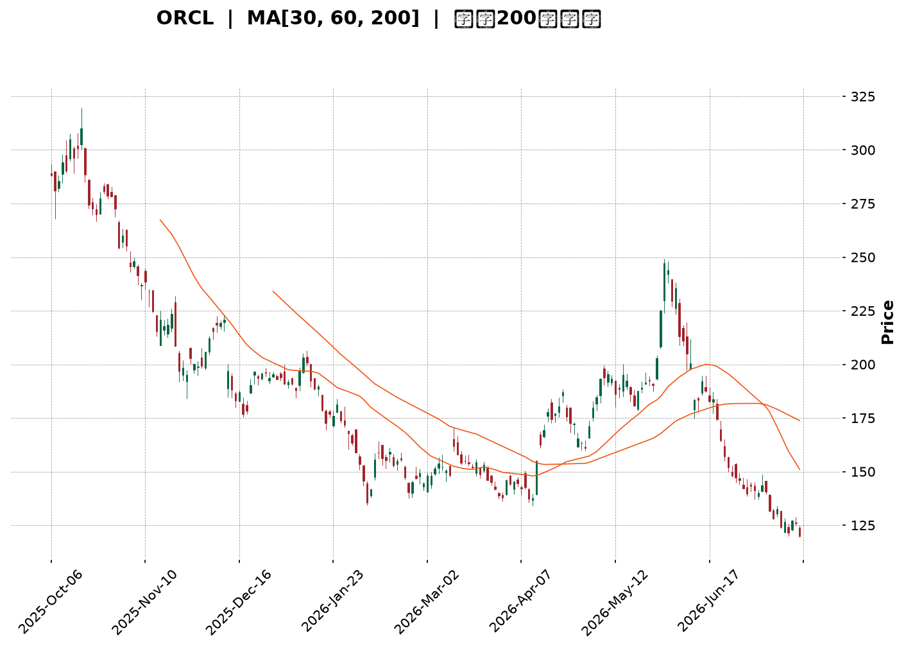
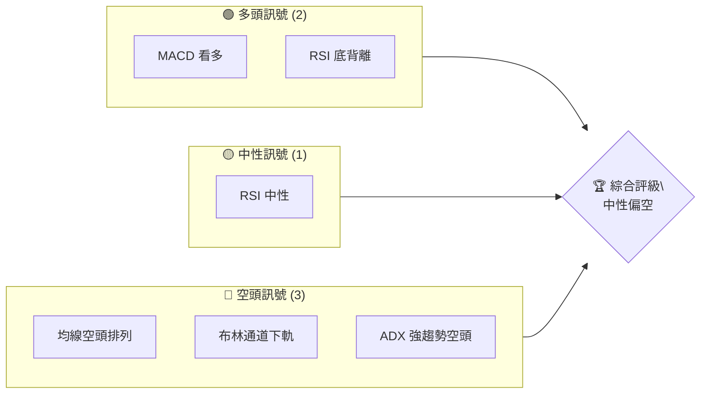
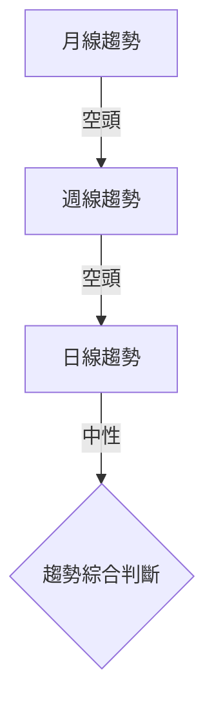
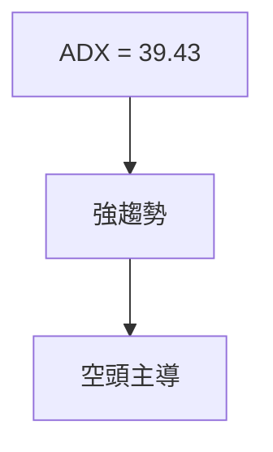
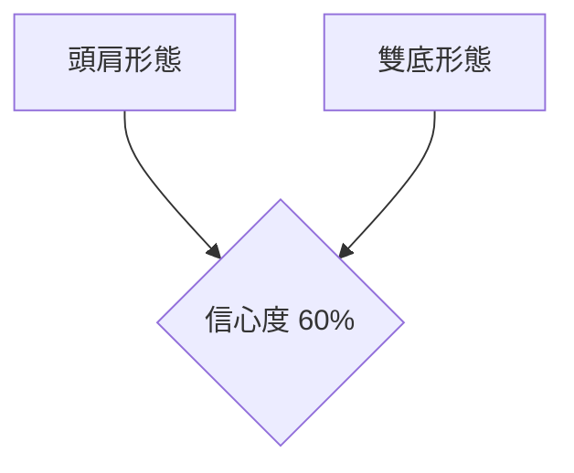
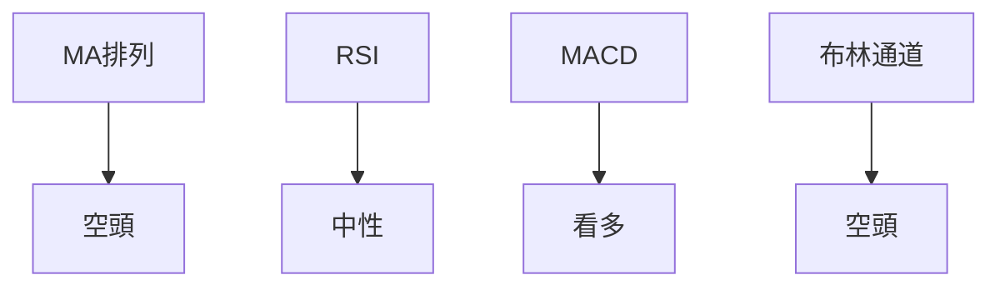
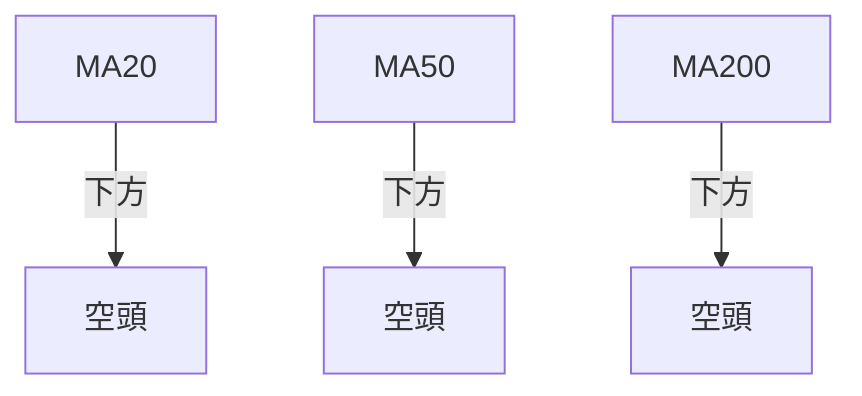
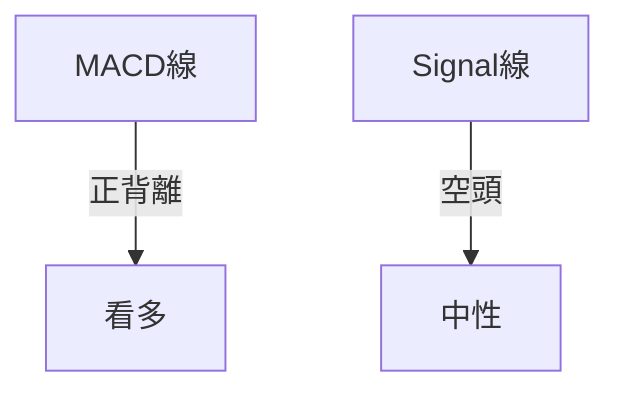
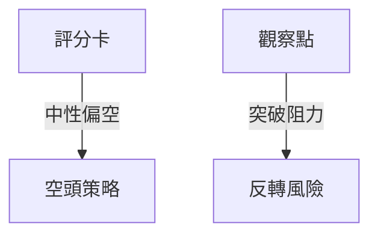
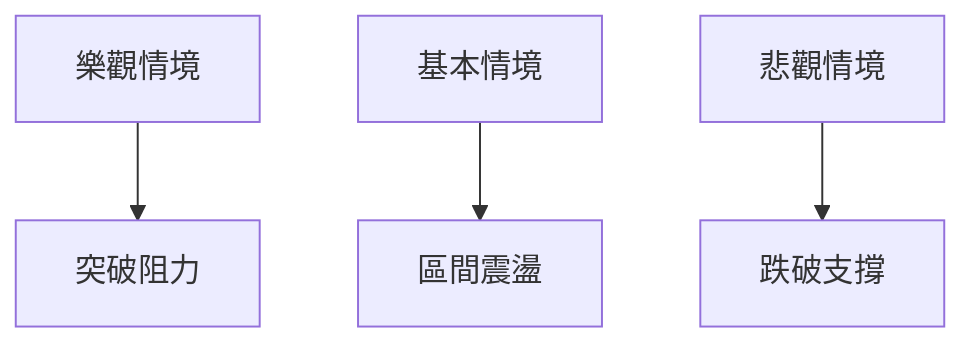

<details>
<summary>📊 靜態圖表 (點擊展開)</summary>

</details>

<html>
<head><meta charset="utf-8" /></head>
<body>
    <div style="height:500px; width:100%;">                        <script>window.PlotlyConfig = {MathJaxConfig: 'local'};</script>
        <script charset="utf-8" src="https://cdn.plot.ly/plotly-3.7.0.min.js" integrity="sha256-jvTGqxNp8AGWEcvNLVuKr+8j5dGe9Yw51LQkmDH+IYA=" crossorigin="anonymous"></script>                <div id="candlestick-chart" class="plotly-graph-div" style="height:100%; width:100%;"></div>            <script>                window.PLOTLYENV=window.PLOTLYENV || {};                                if (document.getElementById("candlestick-chart")) {                    Plotly.newPlot(                        "candlestick-chart",                        [{"close":{"dtype":"f8","bdata":"AAAAQN0EckAAAADAlpBxQAAAAOAJ1nFAAAAAwPdhckAAAABglCJyQAAAAEAUEXNAAAAAAEyCckAAAACggstyQAAAAAAoYHNAAAAAgG4IckAAAADggihxQAAAAIBXCHFAAAAA4OHgcEAAAABgT1ZxQAAAAMD4iXFAAAAAAGNrcUAAAACAWmJxQAAAAAC4CnFAAAAAYPLNb0AAAACAnkFwQAAAAEBf7G9AAAAAgJK5bkAAAADgZf1uQAAAAIARL25AAAAAAC2fbUAAAACg79BtQAAAAECbPG1AAAAAgEkabEAAAAAguu9qQAAAAKASl2tAAAAAgE44a0AAAABARkxrQAAAAIAD7GtAAAAAoKsVakAAAACAjptoQAAAAIC7y2hAAAAA4LlkaEAAAAAAEGBpQAAAAICpAGlAAAAAoKbgaEAAAADguOVoQAAAAODat2lAAAAAoAmJakAAAABAC\u002fBqQAAAAODbTWtAAAAAYDxta0AAAADgJJxrQAAAAABpnmhAAAAA4PaEZ0AAAACA6ORmQAAAAKAgW2dAAAAAwCkYZkAAAABg7ElmQAAAAGBaxGdAAAAAgIOPaEAAAACgKS9oQAAAAEBOc2hAAAAAICeDaEAAAABAbjBoQAAAAGBuamhAAAAAwIghaEAAAADA4zpoQAAAAMAA2GdAAAAA4MT8Z0AAAAAg7d9nQAAAAIDSemdAAAAAQJWkaEAAAADgVWhpQAAAAMBiHGlAAAAAYI0IaEAAAABAEZFnQAAAAMB4uGdAAAAAwIJVZkAAAABAkpVlQAAAAGA3HmZAAAAAoM39ZUAAAABgl6VmQAAAAAD8tWVAAAAAQEBzZUAAAADgz\u002fpkQAAAAOAIbmRAAAAA4GXeY0AAAABAHTNjQAAAAMDjNGJAAAAAQBLxYEAAAABgi7phQAAAAOAgcGNAAAAAAP\u002fYY0AAAADgPYJjQAAAAACibGNAAAAAwPDgY0AAAACg3hxjQAAAAADIYmNAAAAAAIpuY0AAAABgsmFiQAAAACCPimFAAAAAIAwkYkAAAACgqFtiQAAAAOCPqGJAAAAAAIgMYkAAAACA4IZiQAAAACBAf2JAAAAAQAbqYkAAAACA7TZjQAAAACDG\u002fGJAAAAA4EjQYkAAAADApItiQAAAAICjP2RAAAAAQMzBY0AAAADAGEFjQAAAACBtXGNAAAAAAMAzY0AAAADg3fpiQAAAAEAgTmNAAAAAoIqUYkAAAACgoChjQAAAAIA8QmJAAAAA4DsgYkAAAAAAOrphQAAAACAgVmFAAAAA4Ms6YUAAAABA30JiQAAAACAhB2JAAAAAgKwrYkAAAADg+hBiQAAAAKCqxWFAAAAA4DzVYUAAAADAOSxhQAAAAGCPM2FAAAAAQJNiY0AAAACg6k1kQAAAAMAUJ2VAAAAAQBg3ZkAAAACgf85lQAAAAADcHmZAAAAAQFeRZkAAAADgMltnQAAAAEBn9WVAAAAAgLyVZUAAAAAgiItlQAAAAABPrGRAAAAAgGJoZEAAAABAkxpkQAAAAEB\u002fZ2VAAAAAQEd1ZkAAAAAgoxZnQAAAACBvK2hAAAAAwEo9aEAAAABAqWhoQAAAAABgJWhAAAAAQNVFZ0AAAACARKNnQAAAAKDRXWhAAAAAYP4IaEAAAABA0T5nQAAAAMCWmmZAAAAA4D5wZ0AAAABAlqNnQAAAACBA7WdAAAAAYIAMaEAAAAAAiclnQAAAACDNX2lAAAAAYOkfbEAAAAAgReluQAAAACBtd25AAAAAwAGxbEAAAAAAqXBtQAAAAMANnmpAAAAAoL1iakAAAABgFqNpQAAAAOD9EWlAAAAAoMbuZkAAAACAu+9mQAAAAMAb\u002f2dAAAAAoKp1Z0AAAABgmdxmQAAAAKDV9GZAAAAAYNHOZUAAAAAAzJJkQAAAAMB7n2NAAAAAYM79YkAAAABge4BiQAAAAGDtZ2JAAAAAgFdBYkAAAADgMMBhQAAAACAUeWFAAAAAAF\u002foYUAAAACgfaNhQAAAACAYgGFAAAAAQAr3YUAAAADgepRhQAAAAKBHcWBAAAAAACn8X0AAAAAgro9gQAAAAKBwDV9AAAAAgD2aX0AAAADgUVheQAAAAEAzw19AAAAAgMJ1X0AAAABgjwJeQA=="},"high":{"dtype":"f8","bdata":"bR6X7WJVckBTi7xdph5yQPdQRGTqA3JA3nx31YOhckD+wfDNewxzQCTZxzy1O3NAWciaSTDYckBnMMHynkBzQF71pJBW93NAMSiQGPjVckBm1gq0oOdxQCIA2Fn0WXFAcN8fGNQocUCRUwCvU4ZxQKnFiVQkx3FAw7cvfiHEcUDzSObSuatxQOsqLnHfbnFAm6cCE+2ycECeAFyIVHRwQKHwTXNRcXBALf3DL+uab0CUSxCPoz9vQOZu6+8Y1m5AagkkqE7DbUDWRra3GJxuQNrvcSLPZW1A6el9WIZRbUDhwqteSeBrQEAJD00wHGxA\u002fwkK6XyVa0BzpQNIA7JrQNimvXQNP2xACKmn2nb4bEBoXsC4PMppQLzO9TPuO2lAT\u002fmynCiwaEChk6kwzf9pQB+2ZtoFDWlAxBuQxskxaUDcCc\u002fzSvZpQAt3UIHgvWlAp6dFekSrakBh1vic5SxrQM8388RK02tAmybaUciPa0AdaUe3W+VrQJo7fSLuAWlAA4EkLLd+aEALHl4qRWVnQK4sfH+Tf2dAFGhLJvwWZ0DfhxZT1t9mQBia\u002fJkwKGhAboleQdOcaEDwCO8uHWpoQGp+hAxYjGhA5XMGvZXOaEAAqMIqopNoQMTjE2+Dj2hACcr1Jx1qaECowVE7K5ZoQDW\u002fddBr+GhAReJ5cJUgaEBTi2cEnzloQOFMlmIGpGdASFyvkFXZaEDuyb2KWaVpQJ2JgLR7y2lASywHQwAJaUAs8Bu4CjVoQCw8fS9C0WdA9ltMl4k8Z0DZg2a2HmtmQLa18CEjXWZAlj7IKO5MZkB5U8ZRywBnQBBkF6gnT2ZAOYchn3CNZkAbwRTQlCFlQNVSB9BQ92RAKlD+12dAZUAq5zYIyshjQCx8s5bqG2NAfVnToxMxYkAj1VGpnsZhQIQoXBiM1GNAfYnnhsaHZECieaWVzFBkQKVp9A78vWNAK7dQyJQlZEDXfJdxnMVjQLibzsywhmNAxDX6oAjfY0D8MtBagR1jQIUguic+GWJAfeCa5r83YkBYl4VF8QZjQHu6FvQn7mJAOrO1\u002fSMiYkCcQS3bHKRiQKjeJqtDvGJAZ7Th7G0RY0CMQ6ZpB5tjQJapwUzAwmNApmqDYETeYkDXn6GTRSJjQGnkhYAzUmVAc1xyTFDVZEAuUibv9fRjQAWCsqBztGNAJPG4zSu6Y0ANrffEpTxjQHu5J3ademNAFz62TP0FY0CURCpQY1ZjQP2sBxmlGmNAGCZwOKCZYkDTYjTQiC5iQC+k\u002fIqilmFAogO3RRCHYUBnIz5mFkxiQEDcmqKWk2JAfZFdl5QtYkBexgvdoXBiQGdQ4fUn8mFApqgZWhvNYkAnPNLywclhQExtGK3jdWFAkD10w9JrY0AVsbmbARplQGNfy6XGfmVA38urD6R0ZkBmcQsFiPtmQPTCWmOZJGZAHS6UcVEWZ0CamX6pxZBnQOFz2AtNqGZAPFDLG6yCZkC9D1SeWJ5lQKDntC6vA2VAVoBulgqGZEC7QlY8b5NkQGBQillDtmVAhy9VdaTbZkBQvViF8jtnQGk0rZ25M2hAXiiKV5juaECk7ESnCKpoQIrZBP4MYGhAiKoDigkIaEA5GwS4\u002fNxnQOezvQd0AGlAF9wFqvd3aEDWWQYjKMNnQJb0SW8agmdA83bIqyhyZ0BuwpxA2QRoQGB8egQlimhAF5u4eL5QaECAU878Ke9nQMsPLtRBiWlAjcgBxCwwbEBY\u002fsG7PCxvQJSlBThgBG9AM+6EIKP1bUA\u002f67P\u002f48NtQK55jlhn1GxASJW9AJ5Ja0DyEZiriXdrQKOpBHfJd2pAVFGsOCQEZ0D07IWx+B1nQN1VvUKSVGhAOlssOpJUaEBQZvf5+rBnQLdclgrTamdA5TiiKBX+ZkBDz4QvOLdlQH9dU4ucpWRAZcSkc1qiY0AoBkb2PiBjQFaQGxTcPmNA5QWBYSCtYkAI41ITO2FiQHSmBOmaUWJAMOi\u002fTK8jYkD0c\u002fRnxSFiQOX\u002f0egkq2FAcxQ1wbORYkAAAACAwjViQAAAAMDMdGFAAAAA4FGYYEAAAADAzLxgQAAAAMD1eGBAAAAAgBQOYEAAAAAgXF9fQAAAAEDh2l9AAAAAQOEaYEAAAADAzCxfQA=="},"hovertemplate":"\u003cb\u003e%{x|%Y-%m-%d}\u003c\u002fb\u003e\u003cbr\u003e\u958b: $%{open:.2f}\u003cbr\u003e\u9ad8: $%{high:.2f}\u003cbr\u003e\u4f4e: $%{low:.2f}\u003cbr\u003e\u6536: $%{close:.2f}\u003cextra\u003e\u003c\u002fextra\u003e","low":{"dtype":"f8","bdata":"A2c11134cUAHZT3lIr9wQIwp5yx3hnFAaE8yMkDIcUAZeGtshhNyQEncYCBUbnJAQxb60QwTckAwL+xpB4FyQAPlCFLLwnJAmVrI1g3McUAaFNKM4ApxQMTGdzaL2nBAMYz379eqcECwgEqmmtxwQF5DsmLbeHFA6dC3lzBScUDrRtsYwl1xQORyCHEfzHBAoHem3Zy6b0CsAJr8PchvQB7RdyxVmW9AWYbzlx9bbkDILY7ScJVuQMfyp3UgoG1AsdVxKSvEbEBaGGkDxFltQOaM9I2BVmxADhDYLEwAbEB5rkvKPqVqQLb216Y0GGpA5hiUZgWwakDDWmbpbI5qQKD4pY5852pACMCYRU8JakCPsbD+bfZnQKVQKWEzDmhARdJpTmn7ZkCBQ7me2glpQA2MZOcbd2hA2ztSVERaaEA71Iq228JoQIS0AWvXr2hASuZunyqLaUDak3TKiHJqQAaodxbP2mpAmVz2uToGa0C7G\u002f9UC\u002fBqQG6QZIhtDmdAr1W9A4EGZ0BMVSEbWHVmQBCcqZFH12ZAzb22qBvsZUDh\u002foR69xtmQDB\u002fu25USmdAc1\u002fhOZzfZ0AnxQxmU8tnQPDkdwMBEmhAYB7OQZFHaEDqmuuPltlnQG\u002fzgsTjOmhAsPx1NtQbaECLzYskWQtoQHIjBDnDz2dAIQR68hmcZ0A0SHqdTcVnQOzRGWrkC2dAMDo+fRBvZ0AOoMgCmXRoQBvHInuW6GhA4a9J1JKvZ0CNtG0Cc4JnQFDg0lGQJ2dAn3K9ELdDZkBIAjvZVi1lQEWpeVLU6GVAijDACNRZZUAzVHrEVilmQDE2IhA3j2VAlZOjJ2FVZUDxnMZnywxkQKR6h8FzQ2RA1hCgyH3cY0AfLcu\u002fFttiQBm1XeO07WFAzfhMAfzJYEBB7TzESj5hQJXlkHZgP2JA7qhl9uJ7Y0COyzyo0h1jQD89vv0n7mJAYhjRC9FGY0B\u002f6UZNO\u002fpiQH+f8xQ\u002fymJAxcL3\u002fhFWY0D50aMTxUtiQMbhr2gfNGFAdA1RXZI4YUDKWXs\u002fLkpiQHrwTkiWBGJAnVZC\u002fKmjYUB4RW59bYZhQCNbV3vawWFAGF\u002f7RxyCYkAIYF4xhqJiQDFJmeEw0mJAgovaU0MtYkDwIhpZdG1iQBjdoy7s7mNArudw31GwY0DWuqLqliJjQNQWh7IHLmNApxe9G+8NY0A0SjOcid9iQCnvXuxve2JAkXiXyZBdYkAhPK37RbViQElXgCKcOmJAMxEM7RvzYUB3cv52pbFhQJM7U0ToKmFAGNYVuwEAYUDthLzXKVxhQClLuXBV9WFALGGWjnZqYUCGovGDRtthQNg28wEGX2FAVTzXDRa9YUDYTHhz6fBgQHZegZhPw2BASI0IE4pnYUChHsoF\u002fx9kQF+LKt5HtGRAkJ2BkFGmZUBzRRWISZhlQI5uLxcSnWVA6eFcDMvsZUAt8qj7UcVmQF2tVFs\u002fr2VA4IECnN8GZUDicrU1LOpkQPp99UufL2RAS\u002fVwMPoCZEClV9vaxfhjQABXOfFdsmRAOuWxwfy0ZUA3lLQ4JExmQMWHV6IswWZAy1Z8w27EZ0BO7hxFnrFnQHMG2wQOvmdAgsLhJMaHZkCQ4hGcYw1nQIRvoW3TGWdAayZTxteHZ0CNGc3bTtRmQDXIiO2viWZAGoidlMNFZkCKb4a9oVFnQO9\u002fMdX\u002fzWdALZy7YMe8Z0Czm4eWl2hnQIMgrdi0FmhAIGqILz7paUAAGdh1SPprQFJ+NAViwG1AbvZCwERabEAzyk03JudrQJ3W98IpF2pAT+flN1YTakCoydhFVqNoQNUwsfnFr2hAcII\u002fn4PVZUDYh6syJExmQFFf5N0PMmdApBZRB01gZ0BOVgX7Tb5mQFWUaYmvImZAMU9mp3O5ZUBz7+r+QYFkQNl08Sn3WWNA0v5cxNa6YkAzX2qtlG9iQA2wuJRKFmJACB4pylT\u002fYUAAAADgMMBhQBLjm4UoS2FAWz5lt3WVYUDL2H4GVyJhQHBjcR9XImFAy7PJp3GOYUAAAADgUWhhQAAAAEAza2BAAAAAYGbmX0AAAABA4RpgQAAAAIA96l5AAAAAAABgXkAAAACA6wFeQAAAAKBwjV5AAAAAwMwsX0AAAAAAKdxdQA=="},"name":"\u50f9\u683c","open":{"dtype":"f8","bdata":"\u002fZjKqFwRckBTi7xdph5yQJ+D0OpBo3FAsSIQEzwMckDhkP6vlJZyQErCUM+KfXJAWchy7LfKckDDxKZpy99yQNTlrzHj6nJAZCHY9ZHNckA6betMCONxQO2EO8w\u002fN3FA8GgAuhwDcUDbDo34ouVwQMZhkiYEs3FAHHieEVG9cUDvx+D1vYRxQKJOBVRWbHFAIo8K\u002fcKicEAz8IlNfhBwQNdCC9JLa3BAGdbbWPDybkDKdLfzVLFuQG1JeF9Ism5AbcL7eO+WbUAvhwHtNXNuQAroKV0kP21AjVvIck5PbUB6JpQM5tprQHXgynQbGmpAomai4QIEa0BdpYR1n8RqQCefoJnzHmtArayu3XOebEDlKdbbQKNpQP4LoodWX2hAIJYRXzoHaEDSAhJS9O9pQBB6NPVTs2hAyOdtj7TSaEB3PAdTxGVpQHHJXEJRzWhAKKTSufm7aUCk0G++DB1rQMIQehuIZ2tADBeZxLE9a0A0DPpRy3VrQKs2SNeQmWdAe7UnwM5PaEC37UvCt09nQI4GeGLv3WZABwQrTuGxZkD8gB1aLp9mQBHlNC3jUmdAqRRuFhJeaEAOR\u002fORtVFoQMLpJ\u002f9iJGhAHmG2BV+FaEDdO696wwloQCs4cYD7RWhAqXQ+c2RRaEC7uXTiq3JoQC+LK74+jmhAeoKRgQ3XZ0A1u1L55C1oQMfC3nzOoWdAIq2u3ZXKZ0AgzHndWIdoQDJWuCiBcmlASywHQwAJaUAs8Bu4CjVoQOAEIUr5kmdA9ltMl4k8Z0BgC1Y74k1mQOe\u002fIkQIRGZA3rRXz4dtZUDv5xbicztmQO09lQRQPmZAPu89zp62ZUCdZ6T7CR9lQLXybCke4GRA9H5kAII3ZUAkW\u002f2JMqVjQH0y9s1TGmNA3svEPOMSYkA+2BVL\u002fFhhQFEWq++5bmJABhQh4H3cY0CieaWVzFBkQJum\u002fv61mmNA3BJlcKjEY0CCGUetTJxjQENx\u002fB3aKmNAsM0O8jGDY0D1BHQOlAdjQHyunUe\u002fFWJAparVnJ97YUB\u002fcoJYBIRiQK3RTFtCeGJAbjJKmzrcYUAbvdv9aJRhQHduPEbg92FAh2zCNAefYkD50S8dBPFiQN335aWA+2JAIOsGnPS0YkAKXcM+vxFjQNu+KUk8p2RA55MIxpNwZEC1omFnTb5jQEXgFENJX2NAJKPIY5VLY0AIsMt3wQpjQLBpzzlUrWJAgHqHSaL\u002fYkCVJljl1ctiQAKV2noL\u002fmJAXcKKwD2GYkBVBj8EjNxhQCrG1bh7fmFAr6QubTNiYUAeYNWmdmphQGgnVPPKgWJAmAtKyEW5YUDMm2bNW01iQH6N+xcN2WFAHqGWgT6oYkCXGUa9n7ZhQPBSTH4BG2FAPsJ6RyJpYUB1UqAbIetkQF2cMg73yWRACEaNJ975ZUAYygQcd8lmQG10Wv5NBmZAR2gO92k3ZkA83zTdGjFnQCwOGj3JeGZA7O39SUt8ZkCpWuTqaX9lQCkUMUwhM2RAXI0+yRRvZEBhrXZbqi5kQN2WHyb6umRA2T5fxRztZUCF1IRT9K9mQM1rCCG+MWdA3OUydHy9aECB7dn1Mf1nQI1ObX9772dAiKoDigkIaEDLl4wb\u002fYtnQEtG1wTicGdAhBfX\u002fYu6Z0DmcqXY66pnQIsgZ29dK2dAcCgpFB5qZkALYLzVWYtnQKHk\u002fAQt4GdAl2P+ricUaECABmX7HdpnQLTPJ7rAK2hAJ+yLMdAIakCY7YWlbbZsQDN5ou2pPm5AUn2hOq70bUANHnkD0UZsQJHwXlo4lmxAVBc+tdcfa0CV7X6UY6VqQNXdBWP6uWhAj3gR0YFhZkAFf95hywtnQHzAo9qwV2dALfhfaT2rZ0AXdFyudzBnQBkjZToEzGZAIUPtwLG1ZkAW+4JheTRlQGnzWYpVPWRA9SCiXr6ZY0DGSN9dprdiQAVqoHsALWNAnSid\u002fqlXYkCUzGp7pv9hQO98PtKz2WFAS4\u002fVaZf5YUAnQBRqGOdhQOK68hx+UmFAhMHlJcCdYUAAAADAzDRiQAAAAMD1YGFAAAAAAACAYEAAAACA61FgQAAAACBcb2BAAAAAwMxsXkAAAACgRxFfQAAAAADXs15AAAAAIIWLX0AAAACgcP1eQA=="},"x":["2025-10-06T00:00:00-04:00","2025-10-07T00:00:00-04:00","2025-10-08T00:00:00-04:00","2025-10-09T00:00:00-04:00","2025-10-10T00:00:00-04:00","2025-10-13T00:00:00-04:00","2025-10-14T00:00:00-04:00","2025-10-15T00:00:00-04:00","2025-10-16T00:00:00-04:00","2025-10-17T00:00:00-04:00","2025-10-20T00:00:00-04:00","2025-10-21T00:00:00-04:00","2025-10-22T00:00:00-04:00","2025-10-23T00:00:00-04:00","2025-10-24T00:00:00-04:00","2025-10-27T00:00:00-04:00","2025-10-28T00:00:00-04:00","2025-10-29T00:00:00-04:00","2025-10-30T00:00:00-04:00","2025-10-31T00:00:00-04:00","2025-11-03T00:00:00-05:00","2025-11-04T00:00:00-05:00","2025-11-05T00:00:00-05:00","2025-11-06T00:00:00-05:00","2025-11-07T00:00:00-05:00","2025-11-10T00:00:00-05:00","2025-11-11T00:00:00-05:00","2025-11-12T00:00:00-05:00","2025-11-13T00:00:00-05:00","2025-11-14T00:00:00-05:00","2025-11-17T00:00:00-05:00","2025-11-18T00:00:00-05:00","2025-11-19T00:00:00-05:00","2025-11-20T00:00:00-05:00","2025-11-21T00:00:00-05:00","2025-11-24T00:00:00-05:00","2025-11-25T00:00:00-05:00","2025-11-26T00:00:00-05:00","2025-11-28T00:00:00-05:00","2025-12-01T00:00:00-05:00","2025-12-02T00:00:00-05:00","2025-12-03T00:00:00-05:00","2025-12-04T00:00:00-05:00","2025-12-05T00:00:00-05:00","2025-12-08T00:00:00-05:00","2025-12-09T00:00:00-05:00","2025-12-10T00:00:00-05:00","2025-12-11T00:00:00-05:00","2025-12-12T00:00:00-05:00","2025-12-15T00:00:00-05:00","2025-12-16T00:00:00-05:00","2025-12-17T00:00:00-05:00","2025-12-18T00:00:00-05:00","2025-12-19T00:00:00-05:00","2025-12-22T00:00:00-05:00","2025-12-23T00:00:00-05:00","2025-12-24T00:00:00-05:00","2025-12-26T00:00:00-05:00","2025-12-29T00:00:00-05:00","2025-12-30T00:00:00-05:00","2025-12-31T00:00:00-05:00","2026-01-02T00:00:00-05:00","2026-01-05T00:00:00-05:00","2026-01-06T00:00:00-05:00","2026-01-07T00:00:00-05:00","2026-01-08T00:00:00-05:00","2026-01-09T00:00:00-05:00","2026-01-12T00:00:00-05:00","2026-01-13T00:00:00-05:00","2026-01-14T00:00:00-05:00","2026-01-15T00:00:00-05:00","2026-01-16T00:00:00-05:00","2026-01-20T00:00:00-05:00","2026-01-21T00:00:00-05:00","2026-01-22T00:00:00-05:00","2026-01-23T00:00:00-05:00","2026-01-26T00:00:00-05:00","2026-01-27T00:00:00-05:00","2026-01-28T00:00:00-05:00","2026-01-29T00:00:00-05:00","2026-01-30T00:00:00-05:00","2026-02-02T00:00:00-05:00","2026-02-03T00:00:00-05:00","2026-02-04T00:00:00-05:00","2026-02-05T00:00:00-05:00","2026-02-06T00:00:00-05:00","2026-02-09T00:00:00-05:00","2026-02-10T00:00:00-05:00","2026-02-11T00:00:00-05:00","2026-02-12T00:00:00-05:00","2026-02-13T00:00:00-05:00","2026-02-17T00:00:00-05:00","2026-02-18T00:00:00-05:00","2026-02-19T00:00:00-05:00","2026-02-20T00:00:00-05:00","2026-02-23T00:00:00-05:00","2026-02-24T00:00:00-05:00","2026-02-25T00:00:00-05:00","2026-02-26T00:00:00-05:00","2026-02-27T00:00:00-05:00","2026-03-02T00:00:00-05:00","2026-03-03T00:00:00-05:00","2026-03-04T00:00:00-05:00","2026-03-05T00:00:00-05:00","2026-03-06T00:00:00-05:00","2026-03-09T00:00:00-04:00","2026-03-10T00:00:00-04:00","2026-03-11T00:00:00-04:00","2026-03-12T00:00:00-04:00","2026-03-13T00:00:00-04:00","2026-03-16T00:00:00-04:00","2026-03-17T00:00:00-04:00","2026-03-18T00:00:00-04:00","2026-03-19T00:00:00-04:00","2026-03-20T00:00:00-04:00","2026-03-23T00:00:00-04:00","2026-03-24T00:00:00-04:00","2026-03-25T00:00:00-04:00","2026-03-26T00:00:00-04:00","2026-03-27T00:00:00-04:00","2026-03-30T00:00:00-04:00","2026-03-31T00:00:00-04:00","2026-04-01T00:00:00-04:00","2026-04-02T00:00:00-04:00","2026-04-06T00:00:00-04:00","2026-04-07T00:00:00-04:00","2026-04-08T00:00:00-04:00","2026-04-09T00:00:00-04:00","2026-04-10T00:00:00-04:00","2026-04-13T00:00:00-04:00","2026-04-14T00:00:00-04:00","2026-04-15T00:00:00-04:00","2026-04-16T00:00:00-04:00","2026-04-17T00:00:00-04:00","2026-04-20T00:00:00-04:00","2026-04-21T00:00:00-04:00","2026-04-22T00:00:00-04:00","2026-04-23T00:00:00-04:00","2026-04-24T00:00:00-04:00","2026-04-27T00:00:00-04:00","2026-04-28T00:00:00-04:00","2026-04-29T00:00:00-04:00","2026-04-30T00:00:00-04:00","2026-05-01T00:00:00-04:00","2026-05-04T00:00:00-04:00","2026-05-05T00:00:00-04:00","2026-05-06T00:00:00-04:00","2026-05-07T00:00:00-04:00","2026-05-08T00:00:00-04:00","2026-05-11T00:00:00-04:00","2026-05-12T00:00:00-04:00","2026-05-13T00:00:00-04:00","2026-05-14T00:00:00-04:00","2026-05-15T00:00:00-04:00","2026-05-18T00:00:00-04:00","2026-05-19T00:00:00-04:00","2026-05-20T00:00:00-04:00","2026-05-21T00:00:00-04:00","2026-05-22T00:00:00-04:00","2026-05-26T00:00:00-04:00","2026-05-27T00:00:00-04:00","2026-05-28T00:00:00-04:00","2026-05-29T00:00:00-04:00","2026-06-01T00:00:00-04:00","2026-06-02T00:00:00-04:00","2026-06-03T00:00:00-04:00","2026-06-04T00:00:00-04:00","2026-06-05T00:00:00-04:00","2026-06-08T00:00:00-04:00","2026-06-09T00:00:00-04:00","2026-06-10T00:00:00-04:00","2026-06-11T00:00:00-04:00","2026-06-12T00:00:00-04:00","2026-06-15T00:00:00-04:00","2026-06-16T00:00:00-04:00","2026-06-17T00:00:00-04:00","2026-06-18T00:00:00-04:00","2026-06-22T00:00:00-04:00","2026-06-23T00:00:00-04:00","2026-06-24T00:00:00-04:00","2026-06-25T00:00:00-04:00","2026-06-26T00:00:00-04:00","2026-06-29T00:00:00-04:00","2026-06-30T00:00:00-04:00","2026-07-01T00:00:00-04:00","2026-07-02T00:00:00-04:00","2026-07-06T00:00:00-04:00","2026-07-07T00:00:00-04:00","2026-07-08T00:00:00-04:00","2026-07-09T00:00:00-04:00","2026-07-10T00:00:00-04:00","2026-07-13T00:00:00-04:00","2026-07-14T00:00:00-04:00","2026-07-15T00:00:00-04:00","2026-07-16T00:00:00-04:00","2026-07-17T00:00:00-04:00","2026-07-20T00:00:00-04:00","2026-07-21T00:00:00-04:00","2026-07-22T00:00:00-04:00","2026-07-23T00:00:00-04:00"],"type":"candlestick"},{"hovertemplate":"MA30: $%{y:.2f}\u003cextra\u003e\u003c\u002fextra\u003e","line":{"color":"#2196F3","dash":"dash","width":2},"mode":"lines","name":"MA30","x":["2025-10-06T00:00:00-04:00","2025-10-07T00:00:00-04:00","2025-10-08T00:00:00-04:00","2025-10-09T00:00:00-04:00","2025-10-10T00:00:00-04:00","2025-10-13T00:00:00-04:00","2025-10-14T00:00:00-04:00","2025-10-15T00:00:00-04:00","2025-10-16T00:00:00-04:00","2025-10-17T00:00:00-04:00","2025-10-20T00:00:00-04:00","2025-10-21T00:00:00-04:00","2025-10-22T00:00:00-04:00","2025-10-23T00:00:00-04:00","2025-10-24T00:00:00-04:00","2025-10-27T00:00:00-04:00","2025-10-28T00:00:00-04:00","2025-10-29T00:00:00-04:00","2025-10-30T00:00:00-04:00","2025-10-31T00:00:00-04:00","2025-11-03T00:00:00-05:00","2025-11-04T00:00:00-05:00","2025-11-05T00:00:00-05:00","2025-11-06T00:00:00-05:00","2025-11-07T00:00:00-05:00","2025-11-10T00:00:00-05:00","2025-11-11T00:00:00-05:00","2025-11-12T00:00:00-05:00","2025-11-13T00:00:00-05:00","2025-11-14T00:00:00-05:00","2025-11-17T00:00:00-05:00","2025-11-18T00:00:00-05:00","2025-11-19T00:00:00-05:00","2025-11-20T00:00:00-05:00","2025-11-21T00:00:00-05:00","2025-11-24T00:00:00-05:00","2025-11-25T00:00:00-05:00","2025-11-26T00:00:00-05:00","2025-11-28T00:00:00-05:00","2025-12-01T00:00:00-05:00","2025-12-02T00:00:00-05:00","2025-12-03T00:00:00-05:00","2025-12-04T00:00:00-05:00","2025-12-05T00:00:00-05:00","2025-12-08T00:00:00-05:00","2025-12-09T00:00:00-05:00","2025-12-10T00:00:00-05:00","2025-12-11T00:00:00-05:00","2025-12-12T00:00:00-05:00","2025-12-15T00:00:00-05:00","2025-12-16T00:00:00-05:00","2025-12-17T00:00:00-05:00","2025-12-18T00:00:00-05:00","2025-12-19T00:00:00-05:00","2025-12-22T00:00:00-05:00","2025-12-23T00:00:00-05:00","2025-12-24T00:00:00-05:00","2025-12-26T00:00:00-05:00","2025-12-29T00:00:00-05:00","2025-12-30T00:00:00-05:00","2025-12-31T00:00:00-05:00","2026-01-02T00:00:00-05:00","2026-01-05T00:00:00-05:00","2026-01-06T00:00:00-05:00","2026-01-07T00:00:00-05:00","2026-01-08T00:00:00-05:00","2026-01-09T00:00:00-05:00","2026-01-12T00:00:00-05:00","2026-01-13T00:00:00-05:00","2026-01-14T00:00:00-05:00","2026-01-15T00:00:00-05:00","2026-01-16T00:00:00-05:00","2026-01-20T00:00:00-05:00","2026-01-21T00:00:00-05:00","2026-01-22T00:00:00-05:00","2026-01-23T00:00:00-05:00","2026-01-26T00:00:00-05:00","2026-01-27T00:00:00-05:00","2026-01-28T00:00:00-05:00","2026-01-29T00:00:00-05:00","2026-01-30T00:00:00-05:00","2026-02-02T00:00:00-05:00","2026-02-03T00:00:00-05:00","2026-02-04T00:00:00-05:00","2026-02-05T00:00:00-05:00","2026-02-06T00:00:00-05:00","2026-02-09T00:00:00-05:00","2026-02-10T00:00:00-05:00","2026-02-11T00:00:00-05:00","2026-02-12T00:00:00-05:00","2026-02-13T00:00:00-05:00","2026-02-17T00:00:00-05:00","2026-02-18T00:00:00-05:00","2026-02-19T00:00:00-05:00","2026-02-20T00:00:00-05:00","2026-02-23T00:00:00-05:00","2026-02-24T00:00:00-05:00","2026-02-25T00:00:00-05:00","2026-02-26T00:00:00-05:00","2026-02-27T00:00:00-05:00","2026-03-02T00:00:00-05:00","2026-03-03T00:00:00-05:00","2026-03-04T00:00:00-05:00","2026-03-05T00:00:00-05:00","2026-03-06T00:00:00-05:00","2026-03-09T00:00:00-04:00","2026-03-10T00:00:00-04:00","2026-03-11T00:00:00-04:00","2026-03-12T00:00:00-04:00","2026-03-13T00:00:00-04:00","2026-03-16T00:00:00-04:00","2026-03-17T00:00:00-04:00","2026-03-18T00:00:00-04:00","2026-03-19T00:00:00-04:00","2026-03-20T00:00:00-04:00","2026-03-23T00:00:00-04:00","2026-03-24T00:00:00-04:00","2026-03-25T00:00:00-04:00","2026-03-26T00:00:00-04:00","2026-03-27T00:00:00-04:00","2026-03-30T00:00:00-04:00","2026-03-31T00:00:00-04:00","2026-04-01T00:00:00-04:00","2026-04-02T00:00:00-04:00","2026-04-06T00:00:00-04:00","2026-04-07T00:00:00-04:00","2026-04-08T00:00:00-04:00","2026-04-09T00:00:00-04:00","2026-04-10T00:00:00-04:00","2026-04-13T00:00:00-04:00","2026-04-14T00:00:00-04:00","2026-04-15T00:00:00-04:00","2026-04-16T00:00:00-04:00","2026-04-17T00:00:00-04:00","2026-04-20T00:00:00-04:00","2026-04-21T00:00:00-04:00","2026-04-22T00:00:00-04:00","2026-04-23T00:00:00-04:00","2026-04-24T00:00:00-04:00","2026-04-27T00:00:00-04:00","2026-04-28T00:00:00-04:00","2026-04-29T00:00:00-04:00","2026-04-30T00:00:00-04:00","2026-05-01T00:00:00-04:00","2026-05-04T00:00:00-04:00","2026-05-05T00:00:00-04:00","2026-05-06T00:00:00-04:00","2026-05-07T00:00:00-04:00","2026-05-08T00:00:00-04:00","2026-05-11T00:00:00-04:00","2026-05-12T00:00:00-04:00","2026-05-13T00:00:00-04:00","2026-05-14T00:00:00-04:00","2026-05-15T00:00:00-04:00","2026-05-18T00:00:00-04:00","2026-05-19T00:00:00-04:00","2026-05-20T00:00:00-04:00","2026-05-21T00:00:00-04:00","2026-05-22T00:00:00-04:00","2026-05-26T00:00:00-04:00","2026-05-27T00:00:00-04:00","2026-05-28T00:00:00-04:00","2026-05-29T00:00:00-04:00","2026-06-01T00:00:00-04:00","2026-06-02T00:00:00-04:00","2026-06-03T00:00:00-04:00","2026-06-04T00:00:00-04:00","2026-06-05T00:00:00-04:00","2026-06-08T00:00:00-04:00","2026-06-09T00:00:00-04:00","2026-06-10T00:00:00-04:00","2026-06-11T00:00:00-04:00","2026-06-12T00:00:00-04:00","2026-06-15T00:00:00-04:00","2026-06-16T00:00:00-04:00","2026-06-17T00:00:00-04:00","2026-06-18T00:00:00-04:00","2026-06-22T00:00:00-04:00","2026-06-23T00:00:00-04:00","2026-06-24T00:00:00-04:00","2026-06-25T00:00:00-04:00","2026-06-26T00:00:00-04:00","2026-06-29T00:00:00-04:00","2026-06-30T00:00:00-04:00","2026-07-01T00:00:00-04:00","2026-07-02T00:00:00-04:00","2026-07-06T00:00:00-04:00","2026-07-07T00:00:00-04:00","2026-07-08T00:00:00-04:00","2026-07-09T00:00:00-04:00","2026-07-10T00:00:00-04:00","2026-07-13T00:00:00-04:00","2026-07-14T00:00:00-04:00","2026-07-15T00:00:00-04:00","2026-07-16T00:00:00-04:00","2026-07-17T00:00:00-04:00","2026-07-20T00:00:00-04:00","2026-07-21T00:00:00-04:00","2026-07-22T00:00:00-04:00","2026-07-23T00:00:00-04:00"],"y":{"dtype":"f8","bdata":"AAAAAAAA+H8AAAAAAAD4fwAAAAAAAPh\u002fAAAAAAAA+H8AAAAAAAD4fwAAAAAAAPh\u002fAAAAAAAA+H8AAAAAAAD4fwAAAAAAAPh\u002fAAAAAAAA+H8AAAAAAAD4fwAAAAAAAPh\u002fAAAAAAAA+H8AAAAAAAD4fwAAAAAAAPh\u002fAAAAAAAA+H8AAAAAAAD4fwAAAAAAAPh\u002fAAAAAAAA+H8AAAAAAAD4fwAAAAAAAPh\u002fAAAAAAAA+H8AAAAAAAD4fwAAAAAAAPh\u002fAAAAAAAA+H8AAAAAAAD4fwAAAAAAAPh\u002fAAAAAAAA+H8AAAAAAAD4f83MzAQotXBAIiIiWoiPcEAREREZHm5wQKuqqsIMTXBAAAAAkHofcEC8u7v7b9tvQM3MzIyfaW9AIiIi8uT9bkAiIiKSqZVuQImIiDhXIG5AERER8d3AbUAzMzODfXBtQN7d3T1DKW1AAAAAcKPrbEBVVVWFnqlsQHd3d3dIZ2xAVVVVJQgobEBmZmZG8uprQGZmZsYtmmtAmpmZuXpTa0B3d3fXZgFrQHd3dydLuGpAd3d3h6VuakDv7u6+ZSRqQImIiOij7WlAd3d3l3PCaUBVVVV1ZJJpQO\u002fu7o6MaWlAd3d3R+lKaUARERHRdzNpQGZmZkZhGGlAmpmZWQX+aEBmZmZm1+NoQCIiIoIKwWhAMzMz8ySvaEBmZmbW46hoQO\u002fu7t6onWhAiYiIyMmfaEARERFhEKBoQERERPT8oGhAmpmZ6ciZaEDe3d39bY5oQAAAADBifWhAvLu7W4hZaECJiIio2StoQBEREXGY\u002f2dAIiIi4jbRZ0BVVVXV3KZnQGZmZmYMjmdA3t3dLWR8Z0BmZmYGDmxnQERERMQVU2dAVVVVxRdAZ0CJiIiIuyVnQFVVVaVI9mZA7+7u3kS1ZkB3d3eHLn5mQAAAAMBoU2ZAzczMnJorZkARERERqgNmQAAAADAS2WVAq6qq2si0ZUBEREQEHollQHd3d5cTY2VAMzMzwzM8ZUAAAADwUw1lQGZmZgan2mRAzczM\u002fCqjZEBEREQUA2dkQERERITzL2RAVVVVReL8Y0BVVVWl4NFjQBEREbFNpWNAAAAA4B6IY0Dv7u4u5nNjQFVVVTUvWWNA7+7uLhE+Y0ARERGhERtjQGZmZjaXDmNAmpmZaSQAY0C8u7sba\u002fFiQBEREVFM6GJA7+7uHpziYkBEREQkvOBiQGZmZgYc6mJAERERgRf4YkCamZlpSwRjQEREREQ7+mJAiYiIGIrrYkBERETEVtxiQDMzM6OFymJA7+7uzuqzYkAAAACQpqxiQO\u002fu7u4PoWJAERER0UyWYkCJiIgInJNiQKuqqmqUlWJAiYiI6POSYkDNzMyc1ohiQJqZmalnfGJAAAAAcM6HYkARERFx+ZZiQJqZmamirWJA3t3d7c3JYkBmZmZm7N9iQM3MzNyo+mJAAAAA4LEaY0BVVVUlv0NjQM3MzLxWUmNAAAAA0O9hY0Dv7u4OfHVjQBEREUGugGNAAAAA8PeKY0DNzMwMj5RjQN7d3Z14pmNAiYiI+I\u002fHY0BmZmaWGOljQFVVVTWJG2RA7+7uXrRPZEBEREQUuIhkQO\u002fu7s7TwmRAAAAAMGX2ZEDe3d1tRiRlQBEREWFdWmVAREREpGiMZUBERER0mrhlQGZmZobV4WVAzczM7KoRZkDNzMys2EhmQO\u002fu7m48gmZAq6qqmgiqZkBVVVUVwcdmQKuqqjrH62ZAmpmZmTQeZ0CamZnZ5WtnQDMzM+Mds2dA3t3dTV\u002fnZ0BERESkSRtoQM3MzOwKQ2hA3t3dbQJsaEAiIiKS7Y5oQGZmZmZztGhAVVVVRf\u002fJaEB3d3dHK+JoQImIiBhK+GhAERER8dUAaUDv7u6u5v5oQLy7uzuM9GhAREREdMzfaEARERHhEb9oQERERDR5mGhAERERcfBzaEAAAADwHEhoQO\u002fu7v4\u002fFWhAIiIiou3jZ0C8u7trCrVnQM3MzMxBiWdAvLu7qw9aZ0BmZmam2yZnQLy7u\u002fsE8GZAVVVVpRq8ZkBVVVW1IodmQO\u002fu7g7rOmZAZmZm9mPTZUDv7u7+71hlQImIiIBy2WRAAAAAeHNrZEB3d3d3s\u002fFjQO\u002fu7v4VlmNAAAAAQCg7Y0AREREpbuBiQA=="},"type":"scatter"},{"hovertemplate":"MA60: $%{y:.2f}\u003cextra\u003e\u003c\u002fextra\u003e","line":{"color":"#9C27B0","dash":"dash","width":2},"mode":"lines","name":"MA60","x":["2025-10-06T00:00:00-04:00","2025-10-07T00:00:00-04:00","2025-10-08T00:00:00-04:00","2025-10-09T00:00:00-04:00","2025-10-10T00:00:00-04:00","2025-10-13T00:00:00-04:00","2025-10-14T00:00:00-04:00","2025-10-15T00:00:00-04:00","2025-10-16T00:00:00-04:00","2025-10-17T00:00:00-04:00","2025-10-20T00:00:00-04:00","2025-10-21T00:00:00-04:00","2025-10-22T00:00:00-04:00","2025-10-23T00:00:00-04:00","2025-10-24T00:00:00-04:00","2025-10-27T00:00:00-04:00","2025-10-28T00:00:00-04:00","2025-10-29T00:00:00-04:00","2025-10-30T00:00:00-04:00","2025-10-31T00:00:00-04:00","2025-11-03T00:00:00-05:00","2025-11-04T00:00:00-05:00","2025-11-05T00:00:00-05:00","2025-11-06T00:00:00-05:00","2025-11-07T00:00:00-05:00","2025-11-10T00:00:00-05:00","2025-11-11T00:00:00-05:00","2025-11-12T00:00:00-05:00","2025-11-13T00:00:00-05:00","2025-11-14T00:00:00-05:00","2025-11-17T00:00:00-05:00","2025-11-18T00:00:00-05:00","2025-11-19T00:00:00-05:00","2025-11-20T00:00:00-05:00","2025-11-21T00:00:00-05:00","2025-11-24T00:00:00-05:00","2025-11-25T00:00:00-05:00","2025-11-26T00:00:00-05:00","2025-11-28T00:00:00-05:00","2025-12-01T00:00:00-05:00","2025-12-02T00:00:00-05:00","2025-12-03T00:00:00-05:00","2025-12-04T00:00:00-05:00","2025-12-05T00:00:00-05:00","2025-12-08T00:00:00-05:00","2025-12-09T00:00:00-05:00","2025-12-10T00:00:00-05:00","2025-12-11T00:00:00-05:00","2025-12-12T00:00:00-05:00","2025-12-15T00:00:00-05:00","2025-12-16T00:00:00-05:00","2025-12-17T00:00:00-05:00","2025-12-18T00:00:00-05:00","2025-12-19T00:00:00-05:00","2025-12-22T00:00:00-05:00","2025-12-23T00:00:00-05:00","2025-12-24T00:00:00-05:00","2025-12-26T00:00:00-05:00","2025-12-29T00:00:00-05:00","2025-12-30T00:00:00-05:00","2025-12-31T00:00:00-05:00","2026-01-02T00:00:00-05:00","2026-01-05T00:00:00-05:00","2026-01-06T00:00:00-05:00","2026-01-07T00:00:00-05:00","2026-01-08T00:00:00-05:00","2026-01-09T00:00:00-05:00","2026-01-12T00:00:00-05:00","2026-01-13T00:00:00-05:00","2026-01-14T00:00:00-05:00","2026-01-15T00:00:00-05:00","2026-01-16T00:00:00-05:00","2026-01-20T00:00:00-05:00","2026-01-21T00:00:00-05:00","2026-01-22T00:00:00-05:00","2026-01-23T00:00:00-05:00","2026-01-26T00:00:00-05:00","2026-01-27T00:00:00-05:00","2026-01-28T00:00:00-05:00","2026-01-29T00:00:00-05:00","2026-01-30T00:00:00-05:00","2026-02-02T00:00:00-05:00","2026-02-03T00:00:00-05:00","2026-02-04T00:00:00-05:00","2026-02-05T00:00:00-05:00","2026-02-06T00:00:00-05:00","2026-02-09T00:00:00-05:00","2026-02-10T00:00:00-05:00","2026-02-11T00:00:00-05:00","2026-02-12T00:00:00-05:00","2026-02-13T00:00:00-05:00","2026-02-17T00:00:00-05:00","2026-02-18T00:00:00-05:00","2026-02-19T00:00:00-05:00","2026-02-20T00:00:00-05:00","2026-02-23T00:00:00-05:00","2026-02-24T00:00:00-05:00","2026-02-25T00:00:00-05:00","2026-02-26T00:00:00-05:00","2026-02-27T00:00:00-05:00","2026-03-02T00:00:00-05:00","2026-03-03T00:00:00-05:00","2026-03-04T00:00:00-05:00","2026-03-05T00:00:00-05:00","2026-03-06T00:00:00-05:00","2026-03-09T00:00:00-04:00","2026-03-10T00:00:00-04:00","2026-03-11T00:00:00-04:00","2026-03-12T00:00:00-04:00","2026-03-13T00:00:00-04:00","2026-03-16T00:00:00-04:00","2026-03-17T00:00:00-04:00","2026-03-18T00:00:00-04:00","2026-03-19T00:00:00-04:00","2026-03-20T00:00:00-04:00","2026-03-23T00:00:00-04:00","2026-03-24T00:00:00-04:00","2026-03-25T00:00:00-04:00","2026-03-26T00:00:00-04:00","2026-03-27T00:00:00-04:00","2026-03-30T00:00:00-04:00","2026-03-31T00:00:00-04:00","2026-04-01T00:00:00-04:00","2026-04-02T00:00:00-04:00","2026-04-06T00:00:00-04:00","2026-04-07T00:00:00-04:00","2026-04-08T00:00:00-04:00","2026-04-09T00:00:00-04:00","2026-04-10T00:00:00-04:00","2026-04-13T00:00:00-04:00","2026-04-14T00:00:00-04:00","2026-04-15T00:00:00-04:00","2026-04-16T00:00:00-04:00","2026-04-17T00:00:00-04:00","2026-04-20T00:00:00-04:00","2026-04-21T00:00:00-04:00","2026-04-22T00:00:00-04:00","2026-04-23T00:00:00-04:00","2026-04-24T00:00:00-04:00","2026-04-27T00:00:00-04:00","2026-04-28T00:00:00-04:00","2026-04-29T00:00:00-04:00","2026-04-30T00:00:00-04:00","2026-05-01T00:00:00-04:00","2026-05-04T00:00:00-04:00","2026-05-05T00:00:00-04:00","2026-05-06T00:00:00-04:00","2026-05-07T00:00:00-04:00","2026-05-08T00:00:00-04:00","2026-05-11T00:00:00-04:00","2026-05-12T00:00:00-04:00","2026-05-13T00:00:00-04:00","2026-05-14T00:00:00-04:00","2026-05-15T00:00:00-04:00","2026-05-18T00:00:00-04:00","2026-05-19T00:00:00-04:00","2026-05-20T00:00:00-04:00","2026-05-21T00:00:00-04:00","2026-05-22T00:00:00-04:00","2026-05-26T00:00:00-04:00","2026-05-27T00:00:00-04:00","2026-05-28T00:00:00-04:00","2026-05-29T00:00:00-04:00","2026-06-01T00:00:00-04:00","2026-06-02T00:00:00-04:00","2026-06-03T00:00:00-04:00","2026-06-04T00:00:00-04:00","2026-06-05T00:00:00-04:00","2026-06-08T00:00:00-04:00","2026-06-09T00:00:00-04:00","2026-06-10T00:00:00-04:00","2026-06-11T00:00:00-04:00","2026-06-12T00:00:00-04:00","2026-06-15T00:00:00-04:00","2026-06-16T00:00:00-04:00","2026-06-17T00:00:00-04:00","2026-06-18T00:00:00-04:00","2026-06-22T00:00:00-04:00","2026-06-23T00:00:00-04:00","2026-06-24T00:00:00-04:00","2026-06-25T00:00:00-04:00","2026-06-26T00:00:00-04:00","2026-06-29T00:00:00-04:00","2026-06-30T00:00:00-04:00","2026-07-01T00:00:00-04:00","2026-07-02T00:00:00-04:00","2026-07-06T00:00:00-04:00","2026-07-07T00:00:00-04:00","2026-07-08T00:00:00-04:00","2026-07-09T00:00:00-04:00","2026-07-10T00:00:00-04:00","2026-07-13T00:00:00-04:00","2026-07-14T00:00:00-04:00","2026-07-15T00:00:00-04:00","2026-07-16T00:00:00-04:00","2026-07-17T00:00:00-04:00","2026-07-20T00:00:00-04:00","2026-07-21T00:00:00-04:00","2026-07-22T00:00:00-04:00","2026-07-23T00:00:00-04:00"],"y":{"dtype":"f8","bdata":"AAAAAAAA+H8AAAAAAAD4fwAAAAAAAPh\u002fAAAAAAAA+H8AAAAAAAD4fwAAAAAAAPh\u002fAAAAAAAA+H8AAAAAAAD4fwAAAAAAAPh\u002fAAAAAAAA+H8AAAAAAAD4fwAAAAAAAPh\u002fAAAAAAAA+H8AAAAAAAD4fwAAAAAAAPh\u002fAAAAAAAA+H8AAAAAAAD4fwAAAAAAAPh\u002fAAAAAAAA+H8AAAAAAAD4fwAAAAAAAPh\u002fAAAAAAAA+H8AAAAAAAD4fwAAAAAAAPh\u002fAAAAAAAA+H8AAAAAAAD4fwAAAAAAAPh\u002fAAAAAAAA+H8AAAAAAAD4fwAAAAAAAPh\u002fAAAAAAAA+H8AAAAAAAD4fwAAAAAAAPh\u002fAAAAAAAA+H8AAAAAAAD4fwAAAAAAAPh\u002fAAAAAAAA+H8AAAAAAAD4fwAAAAAAAPh\u002fAAAAAAAA+H8AAAAAAAD4fwAAAAAAAPh\u002fAAAAAAAA+H8AAAAAAAD4fwAAAAAAAPh\u002fAAAAAAAA+H8AAAAAAAD4fwAAAAAAAPh\u002fAAAAAAAA+H8AAAAAAAD4fwAAAAAAAPh\u002fAAAAAAAA+H8AAAAAAAD4fwAAAAAAAPh\u002fAAAAAAAA+H8AAAAAAAD4fwAAAAAAAPh\u002fAAAAAAAA+H8AAAAAAAD4fwAAAKhYQW1A7+7uBosObUBERETMCeBsQLy7uwOSrWxAmpmZCQ13bEARERHpKUJsQN7d3TWkA2xAVVVVXdfOa0CamZn53JprQGZmZhaqYGtAVVVVbVMta0CJiIjAdf9qQO\u002fu7rZS02pA3t3d5ZWiakDv7u4WvGpqQERERHRwM2pAvLu7g5\u002f8aUDe3d2N58hpQGZmZhYdlGlAvLu7c+9naUDv7u5uujZpQN7d3XWwBWlAZmZmpl7XaEC8u7ujEKVoQO\u002fu7kb2cWhAMzMzO9w7aEBmZmZ+SQhoQHd3d6d63mdAIiIi8kG7Z0ARERHxkJtnQDMzM7u5eGdAIiIiGmdZZ0BVVVW1ejZnQM3MzAwPEmdAMzMzW6z1ZkAzMzPjG9tmQKuqqvInvGZAq6qqYnqhZkCrqqq6iYNmQERERDx4aGZAd3d3l1VLZkCamZlRJzBmQImIiPBXEWZA3t3dndPwZUC8u7vr389lQDMzM9NjrGVAiYiICKSHZUAzMzM792BlQGZmZs5RTmVAvLu7S0Q+ZUARERGRvC5lQKuqqgqxHWVAIiIi8lkRZUBmZmbWOwNlQN7d3VUy8GRAAAAAMK7WZECJiIj4PMFkQCIiIgLSpmRAq6qqWpKLZECrqqpqAHBkQJqZmenLUWRAzczM1Fk0ZEAiIiJK4hpkQDMzM8MRAmRAIiIiSkDpY0BERET8d9BjQImIiLgduGNAq6qqcg+bY0CJiIjY7HdjQO\u002fu7pYtVmNAq6qqWlhCY0AzMzMLbTRjQFVVVS14KWNA7+7uZvYoY0CrqqpK6SljQBEREQnsKWNAd3d3h2EsY0AzMzNjaC9jQJqZmfl2MGNAzczMHAoxY0BVVVWVczNjQBEREUl9NGNAd3d3B8o2Y0CJiIiYpTpjQCIiIlJKSGNAzczMvNNfY0AAAAAAsnZjQM3MzDziimNAvLu7O5+dY0BERERsh7JjQBEREbmsxmNAd3d3\u002fyfVY0Dv7u5+duhjQAAAAKi2\u002fWNAq6qquloRZEBmZmY+GyZkQImIiPi0O2RAq6qqak9SZEDNzMyk12hkQERERAxSf2RAVVVVheuYZEAzMzNDXa9kQCIiIvK0zGRAvLu7QwH0ZEAAAAAg6SVlQAAAAGDjVmVA7+7ulgiBZUDNzMxkhK9lQM3MzNSwymVA7+7uHvnmZUCJiIjQNAJmQLy7u9OQGmZAq6qqmnsqZkAiIiIqXTtmQDMzM1thT2ZAzczM9DJkZkCrqqqi\u002f3NmQImIiLgKiGZAmpmZacCXZkCrqqr65KNmQJqZmYGmrWZAiYiI0Cq1ZkDv7u6uMbZmQAAAALDOt2ZAMzMzIyu4ZkAAAABw0rZmQJqZmamLtWZARERETN21ZkCamZkp2rdmQFVVVbUguWZAAAAAoBGzZkBVVVXlcadmQM3MzCRZk2ZAAAAASMx4ZkBERETsamJmQN7d3TFIRmZA7+7uYmkpZkDe3d2NfgZmQN7d3XWQ7GVA7+7uVpXTZUCamZndrbdlQA=="},"type":"scatter"},{"hovertemplate":"MA200: $%{y:.2f}\u003cextra\u003e\u003c\u002fextra\u003e","line":{"color":"#FF6F00","dash":"solid","width":2},"mode":"lines","name":"MA200","x":["2025-10-06T00:00:00-04:00","2025-10-07T00:00:00-04:00","2025-10-08T00:00:00-04:00","2025-10-09T00:00:00-04:00","2025-10-10T00:00:00-04:00","2025-10-13T00:00:00-04:00","2025-10-14T00:00:00-04:00","2025-10-15T00:00:00-04:00","2025-10-16T00:00:00-04:00","2025-10-17T00:00:00-04:00","2025-10-20T00:00:00-04:00","2025-10-21T00:00:00-04:00","2025-10-22T00:00:00-04:00","2025-10-23T00:00:00-04:00","2025-10-24T00:00:00-04:00","2025-10-27T00:00:00-04:00","2025-10-28T00:00:00-04:00","2025-10-29T00:00:00-04:00","2025-10-30T00:00:00-04:00","2025-10-31T00:00:00-04:00","2025-11-03T00:00:00-05:00","2025-11-04T00:00:00-05:00","2025-11-05T00:00:00-05:00","2025-11-06T00:00:00-05:00","2025-11-07T00:00:00-05:00","2025-11-10T00:00:00-05:00","2025-11-11T00:00:00-05:00","2025-11-12T00:00:00-05:00","2025-11-13T00:00:00-05:00","2025-11-14T00:00:00-05:00","2025-11-17T00:00:00-05:00","2025-11-18T00:00:00-05:00","2025-11-19T00:00:00-05:00","2025-11-20T00:00:00-05:00","2025-11-21T00:00:00-05:00","2025-11-24T00:00:00-05:00","2025-11-25T00:00:00-05:00","2025-11-26T00:00:00-05:00","2025-11-28T00:00:00-05:00","2025-12-01T00:00:00-05:00","2025-12-02T00:00:00-05:00","2025-12-03T00:00:00-05:00","2025-12-04T00:00:00-05:00","2025-12-05T00:00:00-05:00","2025-12-08T00:00:00-05:00","2025-12-09T00:00:00-05:00","2025-12-10T00:00:00-05:00","2025-12-11T00:00:00-05:00","2025-12-12T00:00:00-05:00","2025-12-15T00:00:00-05:00","2025-12-16T00:00:00-05:00","2025-12-17T00:00:00-05:00","2025-12-18T00:00:00-05:00","2025-12-19T00:00:00-05:00","2025-12-22T00:00:00-05:00","2025-12-23T00:00:00-05:00","2025-12-24T00:00:00-05:00","2025-12-26T00:00:00-05:00","2025-12-29T00:00:00-05:00","2025-12-30T00:00:00-05:00","2025-12-31T00:00:00-05:00","2026-01-02T00:00:00-05:00","2026-01-05T00:00:00-05:00","2026-01-06T00:00:00-05:00","2026-01-07T00:00:00-05:00","2026-01-08T00:00:00-05:00","2026-01-09T00:00:00-05:00","2026-01-12T00:00:00-05:00","2026-01-13T00:00:00-05:00","2026-01-14T00:00:00-05:00","2026-01-15T00:00:00-05:00","2026-01-16T00:00:00-05:00","2026-01-20T00:00:00-05:00","2026-01-21T00:00:00-05:00","2026-01-22T00:00:00-05:00","2026-01-23T00:00:00-05:00","2026-01-26T00:00:00-05:00","2026-01-27T00:00:00-05:00","2026-01-28T00:00:00-05:00","2026-01-29T00:00:00-05:00","2026-01-30T00:00:00-05:00","2026-02-02T00:00:00-05:00","2026-02-03T00:00:00-05:00","2026-02-04T00:00:00-05:00","2026-02-05T00:00:00-05:00","2026-02-06T00:00:00-05:00","2026-02-09T00:00:00-05:00","2026-02-10T00:00:00-05:00","2026-02-11T00:00:00-05:00","2026-02-12T00:00:00-05:00","2026-02-13T00:00:00-05:00","2026-02-17T00:00:00-05:00","2026-02-18T00:00:00-05:00","2026-02-19T00:00:00-05:00","2026-02-20T00:00:00-05:00","2026-02-23T00:00:00-05:00","2026-02-24T00:00:00-05:00","2026-02-25T00:00:00-05:00","2026-02-26T00:00:00-05:00","2026-02-27T00:00:00-05:00","2026-03-02T00:00:00-05:00","2026-03-03T00:00:00-05:00","2026-03-04T00:00:00-05:00","2026-03-05T00:00:00-05:00","2026-03-06T00:00:00-05:00","2026-03-09T00:00:00-04:00","2026-03-10T00:00:00-04:00","2026-03-11T00:00:00-04:00","2026-03-12T00:00:00-04:00","2026-03-13T00:00:00-04:00","2026-03-16T00:00:00-04:00","2026-03-17T00:00:00-04:00","2026-03-18T00:00:00-04:00","2026-03-19T00:00:00-04:00","2026-03-20T00:00:00-04:00","2026-03-23T00:00:00-04:00","2026-03-24T00:00:00-04:00","2026-03-25T00:00:00-04:00","2026-03-26T00:00:00-04:00","2026-03-27T00:00:00-04:00","2026-03-30T00:00:00-04:00","2026-03-31T00:00:00-04:00","2026-04-01T00:00:00-04:00","2026-04-02T00:00:00-04:00","2026-04-06T00:00:00-04:00","2026-04-07T00:00:00-04:00","2026-04-08T00:00:00-04:00","2026-04-09T00:00:00-04:00","2026-04-10T00:00:00-04:00","2026-04-13T00:00:00-04:00","2026-04-14T00:00:00-04:00","2026-04-15T00:00:00-04:00","2026-04-16T00:00:00-04:00","2026-04-17T00:00:00-04:00","2026-04-20T00:00:00-04:00","2026-04-21T00:00:00-04:00","2026-04-22T00:00:00-04:00","2026-04-23T00:00:00-04:00","2026-04-24T00:00:00-04:00","2026-04-27T00:00:00-04:00","2026-04-28T00:00:00-04:00","2026-04-29T00:00:00-04:00","2026-04-30T00:00:00-04:00","2026-05-01T00:00:00-04:00","2026-05-04T00:00:00-04:00","2026-05-05T00:00:00-04:00","2026-05-06T00:00:00-04:00","2026-05-07T00:00:00-04:00","2026-05-08T00:00:00-04:00","2026-05-11T00:00:00-04:00","2026-05-12T00:00:00-04:00","2026-05-13T00:00:00-04:00","2026-05-14T00:00:00-04:00","2026-05-15T00:00:00-04:00","2026-05-18T00:00:00-04:00","2026-05-19T00:00:00-04:00","2026-05-20T00:00:00-04:00","2026-05-21T00:00:00-04:00","2026-05-22T00:00:00-04:00","2026-05-26T00:00:00-04:00","2026-05-27T00:00:00-04:00","2026-05-28T00:00:00-04:00","2026-05-29T00:00:00-04:00","2026-06-01T00:00:00-04:00","2026-06-02T00:00:00-04:00","2026-06-03T00:00:00-04:00","2026-06-04T00:00:00-04:00","2026-06-05T00:00:00-04:00","2026-06-08T00:00:00-04:00","2026-06-09T00:00:00-04:00","2026-06-10T00:00:00-04:00","2026-06-11T00:00:00-04:00","2026-06-12T00:00:00-04:00","2026-06-15T00:00:00-04:00","2026-06-16T00:00:00-04:00","2026-06-17T00:00:00-04:00","2026-06-18T00:00:00-04:00","2026-06-22T00:00:00-04:00","2026-06-23T00:00:00-04:00","2026-06-24T00:00:00-04:00","2026-06-25T00:00:00-04:00","2026-06-26T00:00:00-04:00","2026-06-29T00:00:00-04:00","2026-06-30T00:00:00-04:00","2026-07-01T00:00:00-04:00","2026-07-02T00:00:00-04:00","2026-07-06T00:00:00-04:00","2026-07-07T00:00:00-04:00","2026-07-08T00:00:00-04:00","2026-07-09T00:00:00-04:00","2026-07-10T00:00:00-04:00","2026-07-13T00:00:00-04:00","2026-07-14T00:00:00-04:00","2026-07-15T00:00:00-04:00","2026-07-16T00:00:00-04:00","2026-07-17T00:00:00-04:00","2026-07-20T00:00:00-04:00","2026-07-21T00:00:00-04:00","2026-07-22T00:00:00-04:00","2026-07-23T00:00:00-04:00"],"y":{"dtype":"f8","bdata":"AAAAAAAA+H8AAAAAAAD4fwAAAAAAAPh\u002fAAAAAAAA+H8AAAAAAAD4fwAAAAAAAPh\u002fAAAAAAAA+H8AAAAAAAD4fwAAAAAAAPh\u002fAAAAAAAA+H8AAAAAAAD4fwAAAAAAAPh\u002fAAAAAAAA+H8AAAAAAAD4fwAAAAAAAPh\u002fAAAAAAAA+H8AAAAAAAD4fwAAAAAAAPh\u002fAAAAAAAA+H8AAAAAAAD4fwAAAAAAAPh\u002fAAAAAAAA+H8AAAAAAAD4fwAAAAAAAPh\u002fAAAAAAAA+H8AAAAAAAD4fwAAAAAAAPh\u002fAAAAAAAA+H8AAAAAAAD4fwAAAAAAAPh\u002fAAAAAAAA+H8AAAAAAAD4fwAAAAAAAPh\u002fAAAAAAAA+H8AAAAAAAD4fwAAAAAAAPh\u002fAAAAAAAA+H8AAAAAAAD4fwAAAAAAAPh\u002fAAAAAAAA+H8AAAAAAAD4fwAAAAAAAPh\u002fAAAAAAAA+H8AAAAAAAD4fwAAAAAAAPh\u002fAAAAAAAA+H8AAAAAAAD4fwAAAAAAAPh\u002fAAAAAAAA+H8AAAAAAAD4fwAAAAAAAPh\u002fAAAAAAAA+H8AAAAAAAD4fwAAAAAAAPh\u002fAAAAAAAA+H8AAAAAAAD4fwAAAAAAAPh\u002fAAAAAAAA+H8AAAAAAAD4fwAAAAAAAPh\u002fAAAAAAAA+H8AAAAAAAD4fwAAAAAAAPh\u002fAAAAAAAA+H8AAAAAAAD4fwAAAAAAAPh\u002fAAAAAAAA+H8AAAAAAAD4fwAAAAAAAPh\u002fAAAAAAAA+H8AAAAAAAD4fwAAAAAAAPh\u002fAAAAAAAA+H8AAAAAAAD4fwAAAAAAAPh\u002fAAAAAAAA+H8AAAAAAAD4fwAAAAAAAPh\u002fAAAAAAAA+H8AAAAAAAD4fwAAAAAAAPh\u002fAAAAAAAA+H8AAAAAAAD4fwAAAAAAAPh\u002fAAAAAAAA+H8AAAAAAAD4fwAAAAAAAPh\u002fAAAAAAAA+H8AAAAAAAD4fwAAAAAAAPh\u002fAAAAAAAA+H8AAAAAAAD4fwAAAAAAAPh\u002fAAAAAAAA+H8AAAAAAAD4fwAAAAAAAPh\u002fAAAAAAAA+H8AAAAAAAD4fwAAAAAAAPh\u002fAAAAAAAA+H8AAAAAAAD4fwAAAAAAAPh\u002fAAAAAAAA+H8AAAAAAAD4fwAAAAAAAPh\u002fAAAAAAAA+H8AAAAAAAD4fwAAAAAAAPh\u002fAAAAAAAA+H8AAAAAAAD4fwAAAAAAAPh\u002fAAAAAAAA+H8AAAAAAAD4fwAAAAAAAPh\u002fAAAAAAAA+H8AAAAAAAD4fwAAAAAAAPh\u002fAAAAAAAA+H8AAAAAAAD4fwAAAAAAAPh\u002fAAAAAAAA+H8AAAAAAAD4fwAAAAAAAPh\u002fAAAAAAAA+H8AAAAAAAD4fwAAAAAAAPh\u002fAAAAAAAA+H8AAAAAAAD4fwAAAAAAAPh\u002fAAAAAAAA+H8AAAAAAAD4fwAAAAAAAPh\u002fAAAAAAAA+H8AAAAAAAD4fwAAAAAAAPh\u002fAAAAAAAA+H8AAAAAAAD4fwAAAAAAAPh\u002fAAAAAAAA+H8AAAAAAAD4fwAAAAAAAPh\u002fAAAAAAAA+H8AAAAAAAD4fwAAAAAAAPh\u002fAAAAAAAA+H8AAAAAAAD4fwAAAAAAAPh\u002fAAAAAAAA+H8AAAAAAAD4fwAAAAAAAPh\u002fAAAAAAAA+H8AAAAAAAD4fwAAAAAAAPh\u002fAAAAAAAA+H8AAAAAAAD4fwAAAAAAAPh\u002fAAAAAAAA+H8AAAAAAAD4fwAAAAAAAPh\u002fAAAAAAAA+H8AAAAAAAD4fwAAAAAAAPh\u002fAAAAAAAA+H8AAAAAAAD4fwAAAAAAAPh\u002fAAAAAAAA+H8AAAAAAAD4fwAAAAAAAPh\u002fAAAAAAAA+H8AAAAAAAD4fwAAAAAAAPh\u002fAAAAAAAA+H8AAAAAAAD4fwAAAAAAAPh\u002fAAAAAAAA+H8AAAAAAAD4fwAAAAAAAPh\u002fAAAAAAAA+H8AAAAAAAD4fwAAAAAAAPh\u002fAAAAAAAA+H8AAAAAAAD4fwAAAAAAAPh\u002fAAAAAAAA+H8AAAAAAAD4fwAAAAAAAPh\u002fAAAAAAAA+H8AAAAAAAD4fwAAAAAAAPh\u002fAAAAAAAA+H8AAAAAAAD4fwAAAAAAAPh\u002fAAAAAAAA+H8AAAAAAAD4fwAAAAAAAPh\u002fAAAAAAAA+H8AAAAAAAD4fwAAAAAAAPh\u002fAAAAAAAA+H9SuB7vV2BnQA=="},"type":"scatter"}],                        {"template":{"data":{"barpolar":[{"marker":{"line":{"color":"rgb(17,17,17)","width":0.5},"pattern":{"fillmode":"overlay","size":10,"solidity":0.2}},"type":"barpolar"}],"bar":[{"error_x":{"color":"#f2f5fa"},"error_y":{"color":"#f2f5fa"},"marker":{"line":{"color":"rgb(17,17,17)","width":0.5},"pattern":{"fillmode":"overlay","size":10,"solidity":0.2}},"type":"bar"}],"carpet":[{"aaxis":{"endlinecolor":"#A2B1C6","gridcolor":"#506784","linecolor":"#506784","minorgridcolor":"#506784","startlinecolor":"#A2B1C6"},"baxis":{"endlinecolor":"#A2B1C6","gridcolor":"#506784","linecolor":"#506784","minorgridcolor":"#506784","startlinecolor":"#A2B1C6"},"type":"carpet"}],"choropleth":[{"colorbar":{"outlinewidth":0,"ticks":""},"type":"choropleth"}],"contourcarpet":[{"colorbar":{"outlinewidth":0,"ticks":""},"type":"contourcarpet"}],"contour":[{"colorbar":{"outlinewidth":0,"ticks":""},"colorscale":[[0.0,"#0d0887"],[0.1111111111111111,"#46039f"],[0.2222222222222222,"#7201a8"],[0.3333333333333333,"#9c179e"],[0.4444444444444444,"#bd3786"],[0.5555555555555556,"#d8576b"],[0.6666666666666666,"#ed7953"],[0.7777777777777778,"#fb9f3a"],[0.8888888888888888,"#fdca26"],[1.0,"#f0f921"]],"type":"contour"}],"heatmap":[{"colorbar":{"outlinewidth":0,"ticks":""},"colorscale":[[0.0,"#0d0887"],[0.1111111111111111,"#46039f"],[0.2222222222222222,"#7201a8"],[0.3333333333333333,"#9c179e"],[0.4444444444444444,"#bd3786"],[0.5555555555555556,"#d8576b"],[0.6666666666666666,"#ed7953"],[0.7777777777777778,"#fb9f3a"],[0.8888888888888888,"#fdca26"],[1.0,"#f0f921"]],"type":"heatmap"}],"histogram2dcontour":[{"colorbar":{"outlinewidth":0,"ticks":""},"colorscale":[[0.0,"#0d0887"],[0.1111111111111111,"#46039f"],[0.2222222222222222,"#7201a8"],[0.3333333333333333,"#9c179e"],[0.4444444444444444,"#bd3786"],[0.5555555555555556,"#d8576b"],[0.6666666666666666,"#ed7953"],[0.7777777777777778,"#fb9f3a"],[0.8888888888888888,"#fdca26"],[1.0,"#f0f921"]],"type":"histogram2dcontour"}],"histogram2d":[{"colorbar":{"outlinewidth":0,"ticks":""},"colorscale":[[0.0,"#0d0887"],[0.1111111111111111,"#46039f"],[0.2222222222222222,"#7201a8"],[0.3333333333333333,"#9c179e"],[0.4444444444444444,"#bd3786"],[0.5555555555555556,"#d8576b"],[0.6666666666666666,"#ed7953"],[0.7777777777777778,"#fb9f3a"],[0.8888888888888888,"#fdca26"],[1.0,"#f0f921"]],"type":"histogram2d"}],"histogram":[{"marker":{"pattern":{"fillmode":"overlay","size":10,"solidity":0.2}},"type":"histogram"}],"mesh3d":[{"colorbar":{"outlinewidth":0,"ticks":""},"type":"mesh3d"}],"parcoords":[{"line":{"colorbar":{"outlinewidth":0,"ticks":""}},"type":"parcoords"}],"pie":[{"automargin":true,"type":"pie"}],"scatter3d":[{"line":{"colorbar":{"outlinewidth":0,"ticks":""}},"marker":{"colorbar":{"outlinewidth":0,"ticks":""}},"type":"scatter3d"}],"scattercarpet":[{"marker":{"colorbar":{"outlinewidth":0,"ticks":""}},"type":"scattercarpet"}],"scattergeo":[{"marker":{"colorbar":{"outlinewidth":0,"ticks":""}},"type":"scattergeo"}],"scattergl":[{"marker":{"line":{"color":"#283442"}},"type":"scattergl"}],"scattermapbox":[{"marker":{"colorbar":{"outlinewidth":0,"ticks":""}},"type":"scattermapbox"}],"scattermap":[{"marker":{"colorbar":{"outlinewidth":0,"ticks":""}},"type":"scattermap"}],"scatterpolargl":[{"marker":{"colorbar":{"outlinewidth":0,"ticks":""}},"type":"scatterpolargl"}],"scatterpolar":[{"marker":{"colorbar":{"outlinewidth":0,"ticks":""}},"type":"scatterpolar"}],"scatter":[{"marker":{"line":{"color":"#283442"}},"type":"scatter"}],"scatterternary":[{"marker":{"colorbar":{"outlinewidth":0,"ticks":""}},"type":"scatterternary"}],"surface":[{"colorbar":{"outlinewidth":0,"ticks":""},"colorscale":[[0.0,"#0d0887"],[0.1111111111111111,"#46039f"],[0.2222222222222222,"#7201a8"],[0.3333333333333333,"#9c179e"],[0.4444444444444444,"#bd3786"],[0.5555555555555556,"#d8576b"],[0.6666666666666666,"#ed7953"],[0.7777777777777778,"#fb9f3a"],[0.8888888888888888,"#fdca26"],[1.0,"#f0f921"]],"type":"surface"}],"table":[{"cells":{"fill":{"color":"#506784"},"line":{"color":"rgb(17,17,17)"}},"header":{"fill":{"color":"#2a3f5f"},"line":{"color":"rgb(17,17,17)"}},"type":"table"}]},"layout":{"annotationdefaults":{"arrowcolor":"#f2f5fa","arrowhead":0,"arrowwidth":1},"autotypenumbers":"strict","coloraxis":{"colorbar":{"outlinewidth":0,"ticks":""}},"colorscale":{"diverging":[[0,"#8e0152"],[0.1,"#c51b7d"],[0.2,"#de77ae"],[0.3,"#f1b6da"],[0.4,"#fde0ef"],[0.5,"#f7f7f7"],[0.6,"#e6f5d0"],[0.7,"#b8e186"],[0.8,"#7fbc41"],[0.9,"#4d9221"],[1,"#276419"]],"sequential":[[0.0,"#0d0887"],[0.1111111111111111,"#46039f"],[0.2222222222222222,"#7201a8"],[0.3333333333333333,"#9c179e"],[0.4444444444444444,"#bd3786"],[0.5555555555555556,"#d8576b"],[0.6666666666666666,"#ed7953"],[0.7777777777777778,"#fb9f3a"],[0.8888888888888888,"#fdca26"],[1.0,"#f0f921"]],"sequentialminus":[[0.0,"#0d0887"],[0.1111111111111111,"#46039f"],[0.2222222222222222,"#7201a8"],[0.3333333333333333,"#9c179e"],[0.4444444444444444,"#bd3786"],[0.5555555555555556,"#d8576b"],[0.6666666666666666,"#ed7953"],[0.7777777777777778,"#fb9f3a"],[0.8888888888888888,"#fdca26"],[1.0,"#f0f921"]]},"colorway":["#636efa","#EF553B","#00cc96","#ab63fa","#FFA15A","#19d3f3","#FF6692","#B6E880","#FF97FF","#FECB52"],"font":{"color":"#f2f5fa"},"geo":{"bgcolor":"rgb(17,17,17)","lakecolor":"rgb(17,17,17)","landcolor":"rgb(17,17,17)","showlakes":true,"showland":true,"subunitcolor":"#506784"},"hoverlabel":{"align":"left"},"hovermode":"closest","mapbox":{"style":"dark"},"paper_bgcolor":"rgb(17,17,17)","plot_bgcolor":"rgb(17,17,17)","polar":{"angularaxis":{"gridcolor":"#506784","linecolor":"#506784","ticks":""},"bgcolor":"rgb(17,17,17)","radialaxis":{"gridcolor":"#506784","linecolor":"#506784","ticks":""}},"scene":{"xaxis":{"backgroundcolor":"rgb(17,17,17)","gridcolor":"#506784","gridwidth":2,"linecolor":"#506784","showbackground":true,"ticks":"","zerolinecolor":"#C8D4E3"},"yaxis":{"backgroundcolor":"rgb(17,17,17)","gridcolor":"#506784","gridwidth":2,"linecolor":"#506784","showbackground":true,"ticks":"","zerolinecolor":"#C8D4E3"},"zaxis":{"backgroundcolor":"rgb(17,17,17)","gridcolor":"#506784","gridwidth":2,"linecolor":"#506784","showbackground":true,"ticks":"","zerolinecolor":"#C8D4E3"}},"shapedefaults":{"line":{"color":"#f2f5fa"}},"sliderdefaults":{"bgcolor":"#C8D4E3","bordercolor":"rgb(17,17,17)","borderwidth":1,"tickwidth":0},"ternary":{"aaxis":{"gridcolor":"#506784","linecolor":"#506784","ticks":""},"baxis":{"gridcolor":"#506784","linecolor":"#506784","ticks":""},"bgcolor":"rgb(17,17,17)","caxis":{"gridcolor":"#506784","linecolor":"#506784","ticks":""}},"title":{"x":0.05},"updatemenudefaults":{"bgcolor":"#506784","borderwidth":0},"xaxis":{"automargin":true,"gridcolor":"#283442","linecolor":"#506784","ticks":"","title":{"standoff":15},"zerolinecolor":"#283442","zerolinewidth":2},"yaxis":{"automargin":true,"gridcolor":"#283442","linecolor":"#506784","ticks":"","title":{"standoff":15},"zerolinecolor":"#283442","zerolinewidth":2}}},"xaxis":{"rangeslider":{"visible":false},"title":{"text":"\u65e5\u671f"}},"font":{"size":11},"title":{"text":"ORCL  |  MA(30\u002f60\u002f200)  |  \u6700\u8fd1200\u4ea4\u6613\u65e5"},"yaxis":{"title":{"text":"\u80a1\u50f9 (USD)"}},"hovermode":"x unified","height":500},                        {"responsive": true}                    )                };            </script>        </div>
</body>
</html>

# ORCL 技術分析報告

> **報告日期**：2026-07-24 ｜ **語言**：繁體中文 ｜ **數據來源**：Yahoo Finance ｜ **當前價格**：$120.04

---

## 目錄

| 章節 | 內容 |
|------|------|
| [1. 技術面概覽](#1-技術面概覽) | 訊號儀表板、核心指標、評分卡 |
| [2. 趨勢分析](#2-趨勢分析) | 多時框趨勢、長中短期走勢 |
| [3. 圖表形態分析](#3-圖表形態分析) | 形態識別、K線組合、目標價 |
| [4. 支撐與阻力](#4-支撐與阻力) | 關鍵價位、斐波那契回調 |
| [5. 技術指標深度解讀](#5-技術指標深度解讀) | MA/RSI/MACD/布林/成交量 |
| [6. 動能與波動率](#6-動能與波動率) | 動能評估、ATR、Beta |
| [7. 多時框架總結](#7-多時框架總結) | 時框架評分矩陣 |
| [8. 交易策略建議](#8-交易策略建議) | 多空策略、風險報酬比 |
| [9. 風險提示與監控](#9-風險提示與監控) | 監控指標、風險場景 |

---

## 1. 技術面概覽

### 🎯 技術訊號儀表板



### 📊 核心指標速覽表

| 指標類別 | 指標名稱 | 當前數值 | 訊號 | 解讀 |
|----------|----------|----------|------|------|
| **價格** | 當前價格 | $120.04 | 🔴 | 價格貼近52周低點 |
| **均線** | MA20 | $136.03 | 🔴 | 價格在MA20下方 |
| **均線** | MA50 | $172.47 | 🔴 | 價格在MA50下方 |
| **均線** | MA200 | $187.01 | 🔴 | 價格在MA200下方 |
| **動能** | RSI(14) | 33.26 | 🟡 | 接近超賣區域 |
| **動能** | MACD | -14.009 | 🟢 | MACD正背離 |
| **波動** | ATR | $6.55 | 🟡 | 中等波動 |

### 🏆 技術評分卡

```
技術評分卡 — ORCL (2026-07-24)
════════════════════════════════════════════════════
趨勢強度      ██████████████░░░░░░░░  65/100  🔴
動能指標      ████████░░░░░░░░░░░░░░  55/100  🟡
支撐穩定度    ██████░░░░░░░░░░░░░░░░  40/100  🔴
成交量配合    ████████░░░░░░░░░░░░░░  60/100  🟡
形態完整度    ███████████░░░░░░░░░░░  70/100  🟢
均線排列      ██████░░░░░░░░░░░░░░░░  50/100  🔴
════════════════════════════════════════════════════
綜合評分      ███████░░░░░░░░░░░░░░░  55/100  中性偏空
════════════════════════════════════════════════════
```

---

## 2. 趨勢分析

### 🌐 多時框趨勢分析



### 📈 長期趨勢 — 12個月走勢圖（Unicode）

```
ORCL 月線走勢圖（過去12個月）
價格軸 ($)
$280 ┤
$260 ┤              
$240 ┤        ●
$220 ┤●━━━━━━━━━━━━━━━━━━━●←高點
$200 ┤
$180 ┤
$160 ┤    ●(低點)
$140 ┤
$120 ┤                     ●←現在
     └────────────────────────────
      2025-07  2026-07
```

### 📊 中期趨勢（週線分析）

近期壓力與支撐示意圖：

- **壓力位**：R1 $148.55, R2 $164.24
- **支撐位**：無明確支撐，貼近52W低點

### ⚡ 趨勢強度評估（ADX 解讀）



---

## 3. 圖表形態分析

### 🔍 形態識別系統



| 形態 | 信心度 | 判斷依據（引用數據） | 完成度 | 目標價（附計算式） |
|------|--------|----------------------|--------|--------------------|
| 頭肩頂 | 70% | 近期高點形成於 $278.07 | 80% | 頸線 $120.04 + 高度 $58.03 = $178.07 |
| 雙底 | 60% | 兩次低點於 $120 附近 | 60% | 頸線 $148.55 |

### 🕯️ 重要K線形態分析

| 月份 | 收盤價 | K線形態 | 解讀 | 訊號 |
|------|--------|---------|------|------|
| 2025-06 | 215.71 | 長上影線 | 看空 | 🔴 |
| 2025-09 | 278.07 | 長上影線 | 看空 | 🔴 |

### 📉 ASCII 走勢形態示意圖

```
價格形態
 $280 ┤
 $260 ┤        ●
 $240 ┤●━━━━━●
 $220 ┤
 $200 ┤
 $180 ┤    ●
 $160 ┤●
 $140 ┤
 $120 ┤       ●←現在
```

### 🎯 形態目標價計算

- **頭肩頂目標價**：$178.07 (頸線 $120.04 + 高度 $58.03)
- **雙底目標價**：$148.55 (頸線計算)

---

## 4. 支撐與阻力

### 🗺️ 關鍵價位分布圖（Unicode）

```
ORCL 價位結構分布圖
═══════════════════════════════════════════════════
$170 ║██████████████║ 強阻力 R3
$164 ║████████████  ║ 阻力 R2
$148 ║████████████████████║ 關鍵阻力 R1
$120 ╠════════════════════════╣ ◄ 現價
$120 ║▓▓▓▓▓▓▓▓▓▓▓▓▓▓▓▓        ║ 近期支撐
═══════════════════════════════════════════════════
```

### 🚧 阻力位分析表

| 阻力級別 | 價位 | 形成原因 | 突破難度 | 重要性 |
|----------|------|----------|----------|--------|
| R1 | $148.55 | 前期高點 | 高 | 高 |
| R2 | $164.24 | 前期高點 | 高 | 中 |
| R3 | $170.57 | 前期高點 | 高 | 中 |

### 🛡️ 支撐位分析表

| 支撐級別 | 價位 | 形成原因 | 守住機率 | 重要性 |
|----------|------|----------|----------|--------|
| S1 | $120.04 | 近期低點 | 中 | 高 |

### 📐 斐波那契回調位分析

- 現價 $120.04 位於斐波那契 100% 回調位 ($119.44)
- 上方回調位 23.6% ($289.34)，38.2% ($256.87)

---

## 5. 技術指標深度解讀

### 🎛️ 指標訊號總覽



### 📈 移動平均線排列分析



### 📉 RSI(14) 分析

- RSI: 33.26 ████░░░░░░░ 低於中性區間
- 底背離信號，可能反彈

### 📊 MACD(12/26/9) 訊號解讀



### 📦 布林通道分析

```
布林通道
 $160 ┤   
 $140 ┤   ●
 $120 ┤       ●←現在
 $100 ┤
  $80 ┤
```

現價在布林下軌附近，可能反彈

### 💹 成交量分析（量價配合度）

- 成交量低於均值，量能不足
- OBV趨勢疲弱，不支持上漲

---

## 6. 動能與波動率

### ⚡ 動能評估四象限

| 象限 | 動能 | 波動 | 當前狀態 | 評估 |
|------|------|------|----------|------|
| Q1 | 強 | 低 | - | 最佳機會 |
| Q2 | 弱 | 低 | ✓ | 謹慎觀望 |
| Q3 | 強 | 高 | - | 高風險高收益 |
| Q4 | 弱 | 高 | - | 避免進場 |

### 📊 ATR 波動率分析

- ATR: $6.55，建議止損距離設為 $13.1（2倍ATR）

### 📐 Beta 與市場相關性

- Beta: 1.712，與市場高度相關

---

## 7. 多時框架總結

### 📋 時框架評分表

| 時框架 | 趨勢方向 | 動能 | 均線排列 | 形態 | 綜合評分 | 建議 |
|--------|----------|------|----------|------|----------|------|
| 長期 | 空頭 | 弱 | 空頭 | 頭肩頂 | 45 | 空頭 |
| 中期 | 空頭 | 中性 | 空頭 | 雙底 | 55 | 觀望 |
| 短期 | 中性 | 底背離 | 空頭 | - | 60 | 觀望 |

### 🔲 綜合訊號矩陣

展示短期/中期/長期各維度訊號的一致性分析

### ⚖️ 多時框收斂結論

趨勢行情（ADX>25），以中長期週線方向為主（空頭），短期觀望。

---

## 8. 交易策略建議

### 🗺️ 策略決策流程圖



### 🧭 策略路由（依評分卡分流，不得兩頭下注）

**當前主策略方向 = 空頭（依評分 55/100）**

### 🎯 價格情境階梯（Price Scenarios）

| 觸發條件 | 下一目標 | 後續延伸 | 情境含義 |
|----------|----------|----------|----------|
| 突破 R1 $148.55 | R2 $164.24 | R3 $170.57 | 短線轉強 |
| 站穩現價區間 | — | — | 區間震盪 |
| 跌破 S1 $120.04 | S2 近期低點 | — | 中期轉弱 |

### 📊 情境機率分佈

| 情境 | 機率 | 主要依據 |
|------|------|----------|
| 繼續上行 / 反彈 | 30% | MACD 底背離 |
| 區間震盪 | 50% | ADX 強趨勢 |
| 回落 / 再探底 | 20% | RSI 超賣 |

### 🟢 主策略詳情（方向依上方路由）

| 策略要素 | 策略 A |
|----------|--------|
| 進場條件 | 價格跌破 $120.04 |
| 進場價格 | $119.50 |
| 目標價 T1 | $110.00 |
| 目標價 T2 | $100.00 |
| 止損價格 | $125.00 |
| 風險報酬比 | 2:1 |
| 成功機率 | 50% |
| 建議倉位 | 25% |

### 🔴 反向風險觸發點（對沖提示）

- 突破並站穩 $148.55，需重新評估策略

### ⭐ 整體訊號強度評星

```
做多訊號強度：★☆☆☆☆  (1/5星)
做空訊號強度：★★★☆☆  (3/5星)
整體可信度：  ★★☆☆☆  (2/5星)
```

---

## 9. 風險提示與監控

### ✅ 關鍵監控指標 Checklist

```
監控清單 — ORCL (2026-07-24)
═════════════════════════════
1. ADX 趨勢強度
2. RSI 超賣狀態
3. MACD 背離狀況
4. 關鍵阻力突破 $148.55
5. 成交量配合度
═════════════════════════════
```

### ⚠️ 風險場景分析



### 🛡️ 風險管理重要提醒

- 嚴控倉位，不超過25%
- 密切關注關鍵數據變化
- 靈活調整策略以適應市場波動

---

## 📋 報告總結

```
ORCL 技術分析報告總結
════════════════════════════════════════════════════════
報告日期：2026-07-24
當前價格：$120.04
分析評級：⚖️ 中性偏空

關鍵結論：
├─ 長期趨勢：🔴 空頭
├─ 中期趨勢：🟡 觀望
├─ 短期趨勢：🟡 觀望
├─ 關鍵支撐：$120.04
├─ 關鍵阻力：$148.55
└─ 分析師目標：$248.15

最優策略組合：
1. 🥇 最佳機會：空頭進場，目標價 $110.00
2. 🥈 次選機會：觀望等待突破
3. 🥉 保守選擇：觀望，等待市場趨勢明朗
════════════════════════════════════════════════════════
```

---

> ⚠️ **免責聲明**：本報告為 AI 自動生成之技術分析，所有數據及估算均基於提供的歷史價格資訊。本報告**僅供研究與學術參考**，**不構成任何投資建議**。投資有風險，入市需謹慎。

---

*報告生成時間：2026-07-24 ｜ 數據來源：Yahoo Finance ｜ 分析框架：多時框技術分析*