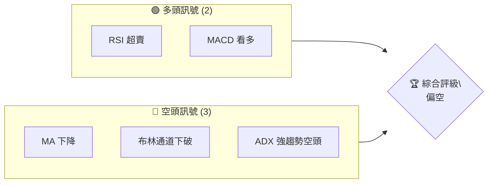
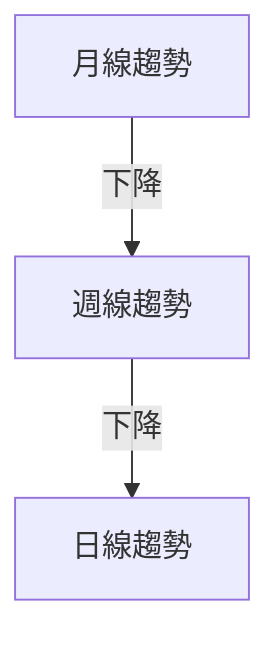
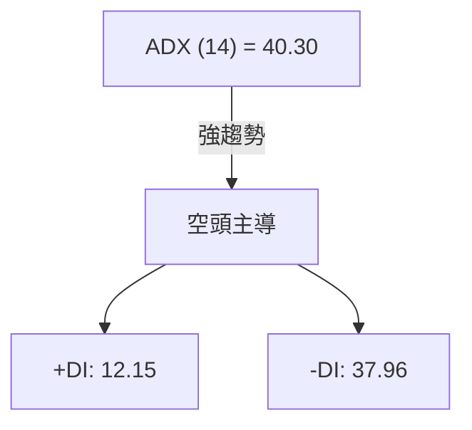
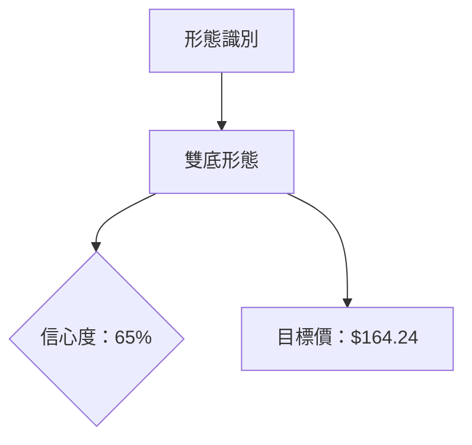
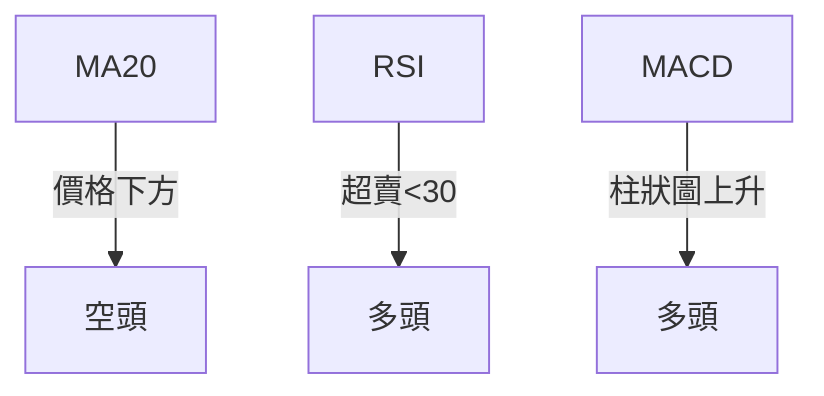
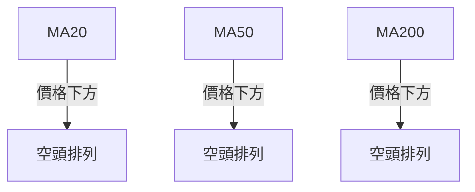
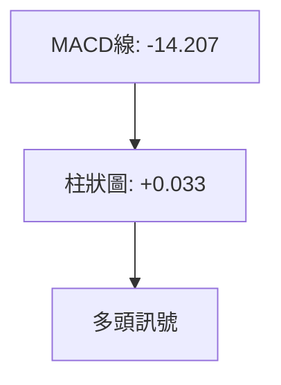
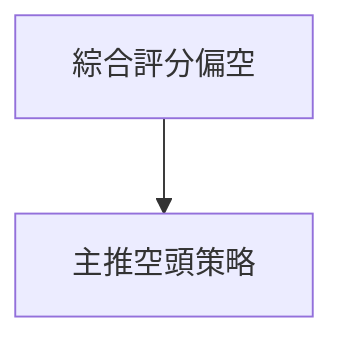
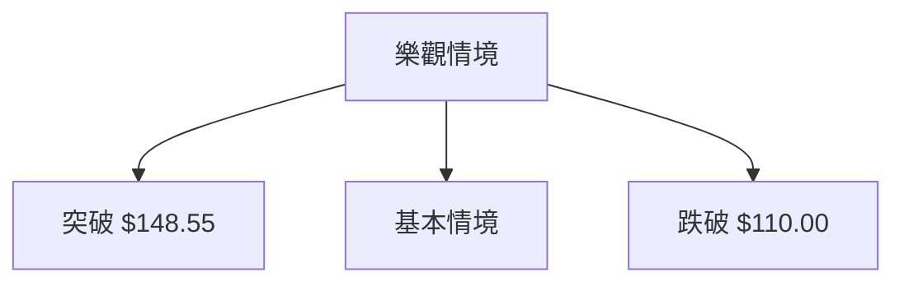

<details>
<summary>📊 靜態圖表 (點擊展開)</summary>

</details>

<html>
<head><meta charset="utf-8" /></head>
<body>
    <div style="height:500px; width:100%;">                        <script>window.PlotlyConfig = {MathJaxConfig: 'local'};</script>
        <script charset="utf-8" src="https://cdn.plot.ly/plotly-3.7.0.min.js" integrity="sha256-jvTGqxNp8AGWEcvNLVuKr+8j5dGe9Yw51LQkmDH+IYA=" crossorigin="anonymous"></script>                <div id="candlestick-chart" class="plotly-graph-div" style="height:100%; width:100%;"></div>            <script>                window.PLOTLYENV=window.PLOTLYENV || {};                                if (document.getElementById("candlestick-chart")) {                    Plotly.newPlot(                        "candlestick-chart",                        [{"close":{"dtype":"f8","bdata":"AAAAwJaQcUAAAADACdZxQAAAAMD3YXJAAAAAYJQickAAAABAFBFzQAAAAABMgnJAAAAAoILLckAAAAAAKGBzQAAAAIBuCHJAAAAA4IIocUAAAACAVwhxQAAAAODh4HBAAAAAYE9WcUAAAADA+IlxQAAAAABja3FAAAAAgFpicUAAAAAAuApxQAAAAGDyzW9AAAAAgJ5BcEAAAABAX+xvQAAAAICSuW5AAAAA4GX9bkAAAACAES9uQAAAAAAtn21AAAAAoO\u002fQbUAAAABAmzxtQAAAAIBJGmxAAAAAILrvakAAAACgEpdrQAAAAIBOOGtAAAAAQEZMa0AAAACAA+xrQAAAAKCrFWpAAAAAgI6baEAAAACAu8toQAAAAOC5ZGhAAAAAABBgaUAAAACAqQBpQAAAAKCm4GhAAAAA4LjlaEAAAADg2rdpQAAAAKAJiWpAAAAAQAvwakAAAADg201rQAAAAGA8bWtAAAAA4CSca0AAAAAAaZ5oQAAAAOD2hGdAAAAAgOjkZkAAAACgIFtnQAAAAMApGGZAAAAAYOxJZkAAAABgWsRnQAAAAICDj2hAAAAAoCkvaEAAAABATnNoQAAAACAng2hAAAAAQG4waEAAAABgbmpoQAAAAMCIIWhAAAAAwOM6aEAAAADAANhnQAAAAODE\u002fGdAAAAAIO3fZ0AAAACA0npnQAAAAECVpGhAAAAA4FVoaUAAAADAYhxpQAAAAGCNCGhAAAAAQBGRZ0AAAADAeLhnQAAAAMCCVWZAAAAAQJKVZUAAAABgNx5mQAAAAKDN\u002fWVAAAAAYJelZkAAAAAA\u002fLVlQAAAAEBAc2VAAAAA4M\u002f6ZEAAAADgCG5kQAAAAOBl3mNAAAAAQB0zY0AAAADA4zRiQAAAAEAS8WBAAAAAYIu6YUAAAADgIHBjQAAAAAD\u002f2GNAAAAA4D2CY0AAAAAAomxjQAAAAMDw4GNAAAAAoN4cY0AAAAAAyGJjQAAAAACKbmNAAAAAYLJhYkAAAAAgj4phQAAAACAMJGJAAAAAoKhbYkAAAADgj6hiQAAAAACIDGJAAAAAgOCGYkAAAAAgQH9iQAAAAEAG6mJAAAAAgO02Y0AAAAAgxvxiQAAAAOBI0GJAAAAAwKSLYkAAAACAoz9kQAAAAEDMwWNAAAAAwBhBY0AAAAAgbVxjQAAAAADAM2NAAAAA4N36YkAAAABAIE5jQAAAAKCKlGJAAAAAoKAoY0AAAACAPEJiQAAAAOA7IGJAAAAAADq6YUAAAAAgIFZhQAAAAODLOmFAAAAAQN9CYkAAAAAgIQdiQAAAAICsK2JAAAAA4PoQYkAAAACgqsVhQAAAAOA81WFAAAAAwDksYUAAAABgjzNhQAAAAECTYmNAAAAAoOpNZEAAAADAFCdlQAAAAEAYN2ZAAAAAoH\u002fOZUAAAAAA3B5mQAAAAEBXkWZAAAAA4DJbZ0AAAABAZ\u002fVlQAAAAIC8lWVAAAAAIIiLZUAAAAAAT6xkQAAAAIBiaGRAAAAAQJMaZEAAAABAf2dlQAAAAEBHdWZAAAAAIKMWZ0AAAAAgbytoQAAAAMBKPWhAAAAAQKloaEAAAAAAYCVoQAAAAEDVRWdAAAAAgESjZ0AAAACg0V1oQAAAAGD+CGhAAAAAQNE+Z0AAAADAlppmQAAAAOA+cGdAAAAAQJajZ0AAAAAgQO1nQAAAAGCADGhAAAAAAInJZ0AAAAAgzV9pQAAAAGDpH2xAAAAAIEXpbkAAAAAgbXduQAAAAMABsWxAAAAAAKlwbUAAAADADZ5qQAAAAKC9YmpAAAAAYBajaUAAAADg\u002fRFpQAAAAKDG7mZAAAAAgLvvZkAAAADAG\u002f9nQAAAAKCqdWdAAAAAYJncZkAAAACg1fRmQAAAAGDRzmVAAAAAAMySZEAAAADAe59jQAAAAGDO\u002fWJAAAAAYHuAYkAAAABg7WdiQAAAAIBXQWJAAAAA4DDAYUAAAAAgFHlhQAAAAABf6GFAAAAAoH2jYUAAAAAgGIBhQAAAAEAK92FAAAAA4HqUYUAAAACgR3FgQAAAAAAp\u002fF9AAAAAIK6PYEAAAACgcA1fQAAAAIA9ml9AAAAA4FFYXkAAAABAM8NfQAAAAIDCdV9AAAAAYI8CXkAAAAAgXL9cQA=="},"high":{"dtype":"f8","bdata":"U4u8XaYeckDzAfJD6gNyQN58d9WDoXJA\u002fsHwzXsMc0Ak2cc8tTtzQFnImkkw2HJAZzDB8p5Ac0Be9aSQVvdzQDEokBj41XJAZtYKtKDncUAiANhZ9FlxQHDfHxjUKHFAkVMAr1OGcUCpxYlUJMdxQMO3L34hxHFA80jm0rmrcUDrKi5x325xQJunAhPtsnBAngBciFR0cECh8E1zUXFwQC39wy\u002frmm9AlEsQj6M\u002fb0DmbuvvGNZuQGoJJKhOw21A1ka2txicbkDa73Eiz2VtQOnpfViGUW1A4cKrXknga0BACQ9NMBxsQP8JCul8lWtAc6UDSAOya0DYpr10DT9sQAipp9p2+GxAaF7AuDzKaUC8zvUz7jtpQE\u002f5spwosGhAoZOpMM3\u002faUAftmbaBQ1pQMQbkMbJMWlA3AnP80r2aUALd1CB4L1pQKenRXpEq2pAYdb4nOUsa0DPN\u002fPEStNrQJsm2lHIj2tAHWlHt1vla0CaO30i7gFpQAOBJCy3fmhACx5eKkVlZ0CuLHx\u002fk39nQBRoSyb8FmdA34cWU9bfZkAYmvyZMChoQG6JXkHTnGhA8AjvLh1qaEBqfoQMWIxoQOVzBr2VzmhAAKjCKqKTaEDE4xNvg49oQAnK9ScdamhAqMFROyuWaEA1v3XQa\u002fhoQEXieXCVIGhAU4tnBJ85aEDhTJZiBqRnQEhcr5BV2WhA7sm9ilmlaUCdiYC0e8tpQEssB0MACWlALPAbuAo1aEAsPH0vQtFnQPZbTJeJPGdA2YNmth5rZkC2tfAhI11mQJY+yCjuTGZAeVPGUcsAZ0AQZBeoJ09mQDmHIZ9wjWZAG8EU0JQhZUDVUgfQUPdkQCpQ\u002ftdnQGVAKuc2CMrIY0AsfLOW6htjQH1Z06MTMWJAI9VRqZ7GYUCEKFwYjNRjQH2J54bGh2RAonmllcxQZEClafQO\u002fL1jQCu3UMiUJWRA13yXcZzFY0C4m87MsIZjQMQ1+qAI32NA\u002fDLQWoEdY0CFILonPhliQH3gmua\u002fN2JAWJeFRfEGY0B7uhb0J+5iQDqztf0jImJAnEEt2xykYkCo3iarQ7xiQGe04extEWNAjEOmaQebY0CWqcFMwMJjQKZqg2BE3mJA15+hk0UiY0Bp5IWAM1JlQHNcckxQ1WRALlIm7\u002fX0Y0AFgrKgc7RjQCTxuM0rumNADa33xKU8Y0B7uSd2nXpjQBc+tkz9BWNAlEQqUGNWY0D9rAcZpRpjQBgmcDigmWJA02I00IguYkAvpPyKopZhQKIDt0UQh2FAZyM+ZhZMYkBA3JqilpNiQH2RXZeULWJAXsYL3aFwYkBnUOH1J\u002fJhQKaoGVobzWJAJzzS8sHJYUBMbRit43VhQJA9dMPSa2NAFbG5mwEaZUBjX8ulxn5lQN\u002fLqw+kdGZAZnELBYj7ZkD0wlpjmSRmQB0ulHFRFmdAmpl+qcWQZ0Dhc9gLTahmQDxQyxusgmZAvQ9UnlieZUCg57QurwNlQFaAbpYKhmRAu0JWPG+TZEBgUIpZQ7ZlQIcvVXWk22ZAUL1YhfI7Z0BpNK2duTNoQF4oileY7mhApOxEpwiqaECK2QT+DGBoQIiqA4oJCGhAORsEuPzcZ0Dns70HdABpQBfcBar3d2hA1lkGIyjDZ0CW9ElvGoJnQPN2yKsocmdAbsKcQNkEaEBgfHoEJYpoQBebuHi+UGhAgFPO\u002fCnvZ0DLDy7UQYlpQI3IAcQsMGxAWP7Buzwsb0CUpQU4YARvQDPuhCCj9W1AP+uz\u002f+PDbUCueY5YZ9RsQEiVvQCeSWtA8hGYq4l3a0CjqQR3yXdqQFRRrDgkBGdA9OyFsfgdZ0DdVb1CklRoQDpbLDqSVGhAUGb3+fqwZ0C3XJYK02pnQOU4oigV\u002fmZAQ8+ELzi3ZUB\u002fXVOLnKVkQGXEpHNaomNAKAZG9j4gY0BWkBsU3D5jQOUFgWEgrWJACONSEzthYkB0pgTpmlFiQDDov0yvI2JA9HP0Z8UhYkDl\u002f9HoJKthQHMUNcGzkWJAAAAAgMI1YkAAAADAzHRhQAAAAOBRmGBAAAAAwMy8YEAAAADA9XhgQAAAAIAUDmBAAAAAIFxfX0AAAABA4dpfQAAAAEDhGmBAAAAAwMwsX0AAAADAHsVeQA=="},"hovertemplate":"\u003cb\u003e%{x|%Y-%m-%d}\u003c\u002fb\u003e\u003cbr\u003e\u958b: $%{open:.2f}\u003cbr\u003e\u9ad8: $%{high:.2f}\u003cbr\u003e\u4f4e: $%{low:.2f}\u003cbr\u003e\u6536: $%{close:.2f}\u003cextra\u003e\u003c\u002fextra\u003e","low":{"dtype":"f8","bdata":"B2U95SK\u002fcEDv7HUNd4ZxQGhPMjJAyHFAGXhrbIYTckBJ3GAgVG5yQEMW+tEME3JAMC\u002fsaQeBckAD5QhSy8JyQJlayNYNzHFAGhTSjOAKcUDExnc2i9pwQDGM9+\u002fXqnBAsIBKpprccEBeQ7Ji23hxQOnQt5cwUnFA60bbGMJdcUDkcghxH8xwQKB3pt2cum9ArACa\u002fD3Ib0Ae0XcsVZlvQFmG85cfW25AyC2O0nCVbkDH8qd1IKBtQLHVcSkrxGxAWhhpA8RZbUDmjPSNgVZsQA4Q2CxMAGxAea5Lyj6lakC29temNBhqQOYYlGYFsGpAw1pm6WyOakCg+KWOfOdqQAjAmEVPCWpAj7Gw\u002fm32Z0ClUClhMw5oQEXSaU5p+2ZAgUO5ntoJaUANjGTnG3doQNs7UlREWmhAO9SKttvCaECEtAFr169oQErmbp8qi2lA2pN0yohyakAGqHcWz9pqQJlc9rk6BmtAuxv\u002fVAvwakBukGSIbQ5nQK9VvQOBBmdATFUhG1h1ZkAQnKmRR9dmQM29tqgb7GVA4f6EevcbZkAwf7tuVEpnQHNf4Tmc32dAJ8UMZlPLZ0Dw5HcDARJoQGAezkGRR2hA6prrj5bZZ0Bv84LE4zpoQLD8dTbUG2hAi82LJFkLaEByIwQ5w89nQCEEevIZnGdANEh6nU3FZ0Ds0Rlq5AtnQDA6Pn0Qb2dADqDIApl0aEAbxyJ7luhoQOGvSdSSr2dAjbRtAnOCZ0BQ4NJRkCdnQJ9yvRC3Q2ZASAI72VYtZUBFqXlS1OhlQIowwAjUWWVAM1R6xFYpZkAxNiIQN49lQJWToydhVWVA8ZzGZ8sMZECkeofBc0NkQNYQoMh93GNAHy3LvxbbYkAZtV3jtO1hQM34TAH8yWBAQe08xEo+YUCV5ZB2YD9iQO6oZfbie2NAjss8qNIdY0A\u002fPb79J+5iQGIY0QvRRmNAf+lGTTv6YkB\u002fn\u002fMUP8piQMXC9\u002f4RVmNA+dGjE8VLYkDG4a9oHzRhQHQNUV2SOGFAyll7Py5KYkB68E5IlgRiQJ1WQvypo2FAeEVufW2GYUAjW1d72sFhQBhf+0ccgmJACGBeMYaiYkAxSZnhMNJiQIKL2lNDLWJA8CIaWXRtYkAY3aMu7O5jQK7ncN9RsGNA1rqi6pYiY0DUFoeyBy5jQKcXvRvvDWNANEoznInfYkAp717sb3tiQJF4l8mQXWJAITyt+0W1YkBJV4AinDpiQDMRDO0b82FAd3L+dqWxYUCTO1NE6CphQBjWFbsBAGFA7YS81ylcYUApS7lwVfVhQCxhlo52amFAhqLxg0bbYUDYNvMBBl9hQFU81w0WvWFA2Ex4c+nwYEB2XoGYT8NgQEiNCBOKZ2FAoR7KBf8fZEBfiyreR7RkQJCdgZBRpmVAc0UViEmYZUCObi8XEp1lQOnhXAzL7GVALfKo+1HFZkBdrVRbP69lQOCBApzfBmVA4nK1NSzqZED6ffVLny9kQEv1cDD6AmRApVfb2sX4Y0AAVznxXbJkQDrlscH8tGVAN5S0OCRMZkDFh1eiLMFmQMtWfMNuxGdATu4cRZ6xZ0BzBtsEDr5nQILC4STGh2ZAkOIRnGMNZ0CEb6Ft0xlnQGsmU8bXh2dAjRnN207UZkA1yIjtr4lmQBqInZTDRWZAim+GvaFRZ0DvfzHV\u002f81nQC2cu2DHvGdAs5uHlpdoZ0CDIK3YtBZoQCBqiC8+6WlAABnYdUj6a0BSfjQFYsBtQG72QsBEWmxAM8pNNybna0Cd1vfCKRdqQE\u002fn5TdWE2pAqMnYRVajaEDVMLH5xa9oQHCCP5+D1WVA2IerMiRMZkBRX+TdDzJnQKQWUQdNYGdATlYF+02+ZkBVlGmJryJmQDFPZqdzuWVAc+\u002fq\u002fkGBZEDZdPEp91ljQNL+XMTWumJAM19qrZRvYkANsLiUShZiQAgeKcpU\u002f2FAAAAA4DDAYUAS45uFKEthQFs+Zbd1lWFAy9h+BlciYUBwY3EfVyJhQMuzyadxjmFAAAAA4FFoYUAAAABAM2tgQAAAAGBm5l9AAAAAQOEaYEAAAACAPepeQAAAAAAAYF5AAAAAgOsBXkAAAACgcI1eQAAAAMDMLF9AAAAAACncXUAAAAAAALBcQA=="},"name":"\u50f9\u683c","open":{"dtype":"f8","bdata":"U4u8XaYeckALnyvLQaNxQLEiEBM8DHJA4ZD+r5SWckBKwlDPin1yQFnIcuy3ynJAw8SmacvfckDU5a8x4+pyQGQh2PWRzXJAOm3rTAjjcUDthDvMPzdxQPBoALocA3FA2w6N+KLlcEDGYZImBLNxQBx4nhFRvXFA78fg9b2EcUCiTgVUVmxxQCKPCv3ConBAM\u002fCJTX4QcEDXQgvSS2twQBnW21jw8m5AynS381SxbkBtSXhfSLJuQG3C+3jvlm1AL4cB7TVzbkAK6CldJD9tQI1byHJOT21AeiaUDObaa0B14Mp0GxpqQKJmouECBGtAXaWEdZ\u002fEakAnn6CZ8x5rQK2srt1znmxA5SnW20CjaUD+C6KHVl9oQCCWEV86B2hA0gISUvTvaUAQejT1U7NoQMjnbY+00mhAdzwHU8RlaUBxyVxCUc1oQCik0rn5u2lApNBvvgwda0DCEHobiGdrQAwXmcSxPWtANAz6Uct1a0CrNkjXkJlnQHu1J8DOT2hAt+1LwrdPZ0COBnhi791mQAcEK07hsWZA\u002fIAdWi6fZkAR5TQt41JnQKkUbhYSXmhADkfzkbVRaEDC6Sf\u002fYiRoQB5htgVfhWhA3TuvesMJaEArOHGA+0VoQKl0PnNkUWhAu7l04qtyaEAviyu+Po5oQHqCkYEN12dANbtS+eQtaEDHwt58zqFnQCKtrt2VymdAIMx53ViHaEAyVrgogXJpQEssB0MACWlALPAbuAo1aEDgBCFK+ZJnQPZbTJeJPGdAYAtWO+JNZkDnvyJECERmQN60V8+HbWVA7+cW4nM7ZkDtPZUEUD5mQD7vPc6etmVAnWek+wkfZUC18mwpHuBkQPR+ZACCN2VAJFv9iTKlY0B9MvbNUxpjQN7LxDzjEmJAPtgVS\u002fxYYUBRFqvvuW5iQAYUIeB93GNAonmllcxQZECbpv7+tZpjQNwSZXCoxGNAghlHrUycY0BDcfwd2ipjQLDNDvIxg2NA9QR0DpQHY0B8rp1HvxViQKWq1Zyfe2FAf3KCWASEYkCt0UxbQnhiQG4ySps63GFAG73b\u002fWiUYUB3bjxG4PdhQIdswjQHn2JA+dEvHQTxYkDd9+WlgPtiQCDrBpz0tGJACl3DPr8RY0DbvilJPKdkQOeTCMaTcGRAtaJhZ02+Y0BF4BRDSV9jQCSjyGOVS2NACLDLd8EKY0Cwac85VK1iQIB6h0mi\u002f2JAlSZY5dXLYkACldp6C\u002f5iQF3CisA9hmJAVQY\u002fBIzcYUAqxtW4e35hQK+kLm0zYmFAHmDVpnZqYUBoJ1TzyoFiQJgLSshFuWFAzJtmzVtNYkB+jfsXDdlhQB6hloE+qGJAlxlGvZ+2YUDwUkx+ARthQD7CekciaWFAdVKgGyHrZEBdnDIO98lkQAhGjSfe+WVAGMoEHHfJZkBtdFr+TQZmQEdoDvdpN2ZAPN803RoxZ0AsDho9yXhmQOzt\u002fUlLfGZAqVrk6ml\u002fZUApFDFMITNkQFyNPskUb2RAYa12W6ouZEDdlh8m+rpkQNk+X8Uc7WVAhdSEU\u002fSvZkDNawghvjFnQNzlMnR8vWhAge3Z9TH9Z0CNTm1\u002fe+9nQIiqA4oJCGhAy5eMG\u002f2LZ0BLRtcE4nBnQIQX1\u002f2LumdA5nKl2OuqZ0CLIGdvXStnQHAoKRQeamZAC2C81VmLZ0Ch5PwELeBnQJdj\u002fq4nFGhAgAZl+x3aZ0C0zye6wCtoQCfsizHQCGpAmO2FpW22bEAzeaLtqT5uQFJ9oTqu9G1ADR55A9FGbECR8F5aOJZsQFQXPrXXH2tAle1+lGOlakDV3QVj+rloQI94EdGBYWZABX\u002feYcsLZ0B8wKPasFdnQC34X2k9q2dAF3RcrncwZ0AZI2U6BMxmQCFD7cCxtWZAFvuCYXk0ZUBp81mKVT1kQPUgol6+mWNAxkjfXaa3YkAFaqB7AC1jQJ0onf6pV2JAlMxqe6b\u002fYUDvfD7Ss9lhQEuP1WmX+WFAJ0AUahjnYUDiuvIcflJhQITB5SXAnWFAAAAAwMw0YkAAAADA9WBhQAAAAAAAgGBAAAAAgOtRYEAAAAAgXG9gQAAAAMDMbF5AAAAAoEcRX0AAAAAA17NeQAAAACCFi19AAAAAoHD9XkAAAACAFJ5eQA=="},"x":["2025-10-07T00:00:00-04:00","2025-10-08T00:00:00-04:00","2025-10-09T00:00:00-04:00","2025-10-10T00:00:00-04:00","2025-10-13T00:00:00-04:00","2025-10-14T00:00:00-04:00","2025-10-15T00:00:00-04:00","2025-10-16T00:00:00-04:00","2025-10-17T00:00:00-04:00","2025-10-20T00:00:00-04:00","2025-10-21T00:00:00-04:00","2025-10-22T00:00:00-04:00","2025-10-23T00:00:00-04:00","2025-10-24T00:00:00-04:00","2025-10-27T00:00:00-04:00","2025-10-28T00:00:00-04:00","2025-10-29T00:00:00-04:00","2025-10-30T00:00:00-04:00","2025-10-31T00:00:00-04:00","2025-11-03T00:00:00-05:00","2025-11-04T00:00:00-05:00","2025-11-05T00:00:00-05:00","2025-11-06T00:00:00-05:00","2025-11-07T00:00:00-05:00","2025-11-10T00:00:00-05:00","2025-11-11T00:00:00-05:00","2025-11-12T00:00:00-05:00","2025-11-13T00:00:00-05:00","2025-11-14T00:00:00-05:00","2025-11-17T00:00:00-05:00","2025-11-18T00:00:00-05:00","2025-11-19T00:00:00-05:00","2025-11-20T00:00:00-05:00","2025-11-21T00:00:00-05:00","2025-11-24T00:00:00-05:00","2025-11-25T00:00:00-05:00","2025-11-26T00:00:00-05:00","2025-11-28T00:00:00-05:00","2025-12-01T00:00:00-05:00","2025-12-02T00:00:00-05:00","2025-12-03T00:00:00-05:00","2025-12-04T00:00:00-05:00","2025-12-05T00:00:00-05:00","2025-12-08T00:00:00-05:00","2025-12-09T00:00:00-05:00","2025-12-10T00:00:00-05:00","2025-12-11T00:00:00-05:00","2025-12-12T00:00:00-05:00","2025-12-15T00:00:00-05:00","2025-12-16T00:00:00-05:00","2025-12-17T00:00:00-05:00","2025-12-18T00:00:00-05:00","2025-12-19T00:00:00-05:00","2025-12-22T00:00:00-05:00","2025-12-23T00:00:00-05:00","2025-12-24T00:00:00-05:00","2025-12-26T00:00:00-05:00","2025-12-29T00:00:00-05:00","2025-12-30T00:00:00-05:00","2025-12-31T00:00:00-05:00","2026-01-02T00:00:00-05:00","2026-01-05T00:00:00-05:00","2026-01-06T00:00:00-05:00","2026-01-07T00:00:00-05:00","2026-01-08T00:00:00-05:00","2026-01-09T00:00:00-05:00","2026-01-12T00:00:00-05:00","2026-01-13T00:00:00-05:00","2026-01-14T00:00:00-05:00","2026-01-15T00:00:00-05:00","2026-01-16T00:00:00-05:00","2026-01-20T00:00:00-05:00","2026-01-21T00:00:00-05:00","2026-01-22T00:00:00-05:00","2026-01-23T00:00:00-05:00","2026-01-26T00:00:00-05:00","2026-01-27T00:00:00-05:00","2026-01-28T00:00:00-05:00","2026-01-29T00:00:00-05:00","2026-01-30T00:00:00-05:00","2026-02-02T00:00:00-05:00","2026-02-03T00:00:00-05:00","2026-02-04T00:00:00-05:00","2026-02-05T00:00:00-05:00","2026-02-06T00:00:00-05:00","2026-02-09T00:00:00-05:00","2026-02-10T00:00:00-05:00","2026-02-11T00:00:00-05:00","2026-02-12T00:00:00-05:00","2026-02-13T00:00:00-05:00","2026-02-17T00:00:00-05:00","2026-02-18T00:00:00-05:00","2026-02-19T00:00:00-05:00","2026-02-20T00:00:00-05:00","2026-02-23T00:00:00-05:00","2026-02-24T00:00:00-05:00","2026-02-25T00:00:00-05:00","2026-02-26T00:00:00-05:00","2026-02-27T00:00:00-05:00","2026-03-02T00:00:00-05:00","2026-03-03T00:00:00-05:00","2026-03-04T00:00:00-05:00","2026-03-05T00:00:00-05:00","2026-03-06T00:00:00-05:00","2026-03-09T00:00:00-04:00","2026-03-10T00:00:00-04:00","2026-03-11T00:00:00-04:00","2026-03-12T00:00:00-04:00","2026-03-13T00:00:00-04:00","2026-03-16T00:00:00-04:00","2026-03-17T00:00:00-04:00","2026-03-18T00:00:00-04:00","2026-03-19T00:00:00-04:00","2026-03-20T00:00:00-04:00","2026-03-23T00:00:00-04:00","2026-03-24T00:00:00-04:00","2026-03-25T00:00:00-04:00","2026-03-26T00:00:00-04:00","2026-03-27T00:00:00-04:00","2026-03-30T00:00:00-04:00","2026-03-31T00:00:00-04:00","2026-04-01T00:00:00-04:00","2026-04-02T00:00:00-04:00","2026-04-06T00:00:00-04:00","2026-04-07T00:00:00-04:00","2026-04-08T00:00:00-04:00","2026-04-09T00:00:00-04:00","2026-04-10T00:00:00-04:00","2026-04-13T00:00:00-04:00","2026-04-14T00:00:00-04:00","2026-04-15T00:00:00-04:00","2026-04-16T00:00:00-04:00","2026-04-17T00:00:00-04:00","2026-04-20T00:00:00-04:00","2026-04-21T00:00:00-04:00","2026-04-22T00:00:00-04:00","2026-04-23T00:00:00-04:00","2026-04-24T00:00:00-04:00","2026-04-27T00:00:00-04:00","2026-04-28T00:00:00-04:00","2026-04-29T00:00:00-04:00","2026-04-30T00:00:00-04:00","2026-05-01T00:00:00-04:00","2026-05-04T00:00:00-04:00","2026-05-05T00:00:00-04:00","2026-05-06T00:00:00-04:00","2026-05-07T00:00:00-04:00","2026-05-08T00:00:00-04:00","2026-05-11T00:00:00-04:00","2026-05-12T00:00:00-04:00","2026-05-13T00:00:00-04:00","2026-05-14T00:00:00-04:00","2026-05-15T00:00:00-04:00","2026-05-18T00:00:00-04:00","2026-05-19T00:00:00-04:00","2026-05-20T00:00:00-04:00","2026-05-21T00:00:00-04:00","2026-05-22T00:00:00-04:00","2026-05-26T00:00:00-04:00","2026-05-27T00:00:00-04:00","2026-05-28T00:00:00-04:00","2026-05-29T00:00:00-04:00","2026-06-01T00:00:00-04:00","2026-06-02T00:00:00-04:00","2026-06-03T00:00:00-04:00","2026-06-04T00:00:00-04:00","2026-06-05T00:00:00-04:00","2026-06-08T00:00:00-04:00","2026-06-09T00:00:00-04:00","2026-06-10T00:00:00-04:00","2026-06-11T00:00:00-04:00","2026-06-12T00:00:00-04:00","2026-06-15T00:00:00-04:00","2026-06-16T00:00:00-04:00","2026-06-17T00:00:00-04:00","2026-06-18T00:00:00-04:00","2026-06-22T00:00:00-04:00","2026-06-23T00:00:00-04:00","2026-06-24T00:00:00-04:00","2026-06-25T00:00:00-04:00","2026-06-26T00:00:00-04:00","2026-06-29T00:00:00-04:00","2026-06-30T00:00:00-04:00","2026-07-01T00:00:00-04:00","2026-07-02T00:00:00-04:00","2026-07-06T00:00:00-04:00","2026-07-07T00:00:00-04:00","2026-07-08T00:00:00-04:00","2026-07-09T00:00:00-04:00","2026-07-10T00:00:00-04:00","2026-07-13T00:00:00-04:00","2026-07-14T00:00:00-04:00","2026-07-15T00:00:00-04:00","2026-07-16T00:00:00-04:00","2026-07-17T00:00:00-04:00","2026-07-20T00:00:00-04:00","2026-07-21T00:00:00-04:00","2026-07-22T00:00:00-04:00","2026-07-23T00:00:00-04:00","2026-07-24T00:00:00-04:00"],"type":"candlestick"},{"hovertemplate":"MA30: $%{y:.2f}\u003cextra\u003e\u003c\u002fextra\u003e","line":{"color":"#2196F3","dash":"dash","width":2},"mode":"lines","name":"MA30","x":["2025-10-07T00:00:00-04:00","2025-10-08T00:00:00-04:00","2025-10-09T00:00:00-04:00","2025-10-10T00:00:00-04:00","2025-10-13T00:00:00-04:00","2025-10-14T00:00:00-04:00","2025-10-15T00:00:00-04:00","2025-10-16T00:00:00-04:00","2025-10-17T00:00:00-04:00","2025-10-20T00:00:00-04:00","2025-10-21T00:00:00-04:00","2025-10-22T00:00:00-04:00","2025-10-23T00:00:00-04:00","2025-10-24T00:00:00-04:00","2025-10-27T00:00:00-04:00","2025-10-28T00:00:00-04:00","2025-10-29T00:00:00-04:00","2025-10-30T00:00:00-04:00","2025-10-31T00:00:00-04:00","2025-11-03T00:00:00-05:00","2025-11-04T00:00:00-05:00","2025-11-05T00:00:00-05:00","2025-11-06T00:00:00-05:00","2025-11-07T00:00:00-05:00","2025-11-10T00:00:00-05:00","2025-11-11T00:00:00-05:00","2025-11-12T00:00:00-05:00","2025-11-13T00:00:00-05:00","2025-11-14T00:00:00-05:00","2025-11-17T00:00:00-05:00","2025-11-18T00:00:00-05:00","2025-11-19T00:00:00-05:00","2025-11-20T00:00:00-05:00","2025-11-21T00:00:00-05:00","2025-11-24T00:00:00-05:00","2025-11-25T00:00:00-05:00","2025-11-26T00:00:00-05:00","2025-11-28T00:00:00-05:00","2025-12-01T00:00:00-05:00","2025-12-02T00:00:00-05:00","2025-12-03T00:00:00-05:00","2025-12-04T00:00:00-05:00","2025-12-05T00:00:00-05:00","2025-12-08T00:00:00-05:00","2025-12-09T00:00:00-05:00","2025-12-10T00:00:00-05:00","2025-12-11T00:00:00-05:00","2025-12-12T00:00:00-05:00","2025-12-15T00:00:00-05:00","2025-12-16T00:00:00-05:00","2025-12-17T00:00:00-05:00","2025-12-18T00:00:00-05:00","2025-12-19T00:00:00-05:00","2025-12-22T00:00:00-05:00","2025-12-23T00:00:00-05:00","2025-12-24T00:00:00-05:00","2025-12-26T00:00:00-05:00","2025-12-29T00:00:00-05:00","2025-12-30T00:00:00-05:00","2025-12-31T00:00:00-05:00","2026-01-02T00:00:00-05:00","2026-01-05T00:00:00-05:00","2026-01-06T00:00:00-05:00","2026-01-07T00:00:00-05:00","2026-01-08T00:00:00-05:00","2026-01-09T00:00:00-05:00","2026-01-12T00:00:00-05:00","2026-01-13T00:00:00-05:00","2026-01-14T00:00:00-05:00","2026-01-15T00:00:00-05:00","2026-01-16T00:00:00-05:00","2026-01-20T00:00:00-05:00","2026-01-21T00:00:00-05:00","2026-01-22T00:00:00-05:00","2026-01-23T00:00:00-05:00","2026-01-26T00:00:00-05:00","2026-01-27T00:00:00-05:00","2026-01-28T00:00:00-05:00","2026-01-29T00:00:00-05:00","2026-01-30T00:00:00-05:00","2026-02-02T00:00:00-05:00","2026-02-03T00:00:00-05:00","2026-02-04T00:00:00-05:00","2026-02-05T00:00:00-05:00","2026-02-06T00:00:00-05:00","2026-02-09T00:00:00-05:00","2026-02-10T00:00:00-05:00","2026-02-11T00:00:00-05:00","2026-02-12T00:00:00-05:00","2026-02-13T00:00:00-05:00","2026-02-17T00:00:00-05:00","2026-02-18T00:00:00-05:00","2026-02-19T00:00:00-05:00","2026-02-20T00:00:00-05:00","2026-02-23T00:00:00-05:00","2026-02-24T00:00:00-05:00","2026-02-25T00:00:00-05:00","2026-02-26T00:00:00-05:00","2026-02-27T00:00:00-05:00","2026-03-02T00:00:00-05:00","2026-03-03T00:00:00-05:00","2026-03-04T00:00:00-05:00","2026-03-05T00:00:00-05:00","2026-03-06T00:00:00-05:00","2026-03-09T00:00:00-04:00","2026-03-10T00:00:00-04:00","2026-03-11T00:00:00-04:00","2026-03-12T00:00:00-04:00","2026-03-13T00:00:00-04:00","2026-03-16T00:00:00-04:00","2026-03-17T00:00:00-04:00","2026-03-18T00:00:00-04:00","2026-03-19T00:00:00-04:00","2026-03-20T00:00:00-04:00","2026-03-23T00:00:00-04:00","2026-03-24T00:00:00-04:00","2026-03-25T00:00:00-04:00","2026-03-26T00:00:00-04:00","2026-03-27T00:00:00-04:00","2026-03-30T00:00:00-04:00","2026-03-31T00:00:00-04:00","2026-04-01T00:00:00-04:00","2026-04-02T00:00:00-04:00","2026-04-06T00:00:00-04:00","2026-04-07T00:00:00-04:00","2026-04-08T00:00:00-04:00","2026-04-09T00:00:00-04:00","2026-04-10T00:00:00-04:00","2026-04-13T00:00:00-04:00","2026-04-14T00:00:00-04:00","2026-04-15T00:00:00-04:00","2026-04-16T00:00:00-04:00","2026-04-17T00:00:00-04:00","2026-04-20T00:00:00-04:00","2026-04-21T00:00:00-04:00","2026-04-22T00:00:00-04:00","2026-04-23T00:00:00-04:00","2026-04-24T00:00:00-04:00","2026-04-27T00:00:00-04:00","2026-04-28T00:00:00-04:00","2026-04-29T00:00:00-04:00","2026-04-30T00:00:00-04:00","2026-05-01T00:00:00-04:00","2026-05-04T00:00:00-04:00","2026-05-05T00:00:00-04:00","2026-05-06T00:00:00-04:00","2026-05-07T00:00:00-04:00","2026-05-08T00:00:00-04:00","2026-05-11T00:00:00-04:00","2026-05-12T00:00:00-04:00","2026-05-13T00:00:00-04:00","2026-05-14T00:00:00-04:00","2026-05-15T00:00:00-04:00","2026-05-18T00:00:00-04:00","2026-05-19T00:00:00-04:00","2026-05-20T00:00:00-04:00","2026-05-21T00:00:00-04:00","2026-05-22T00:00:00-04:00","2026-05-26T00:00:00-04:00","2026-05-27T00:00:00-04:00","2026-05-28T00:00:00-04:00","2026-05-29T00:00:00-04:00","2026-06-01T00:00:00-04:00","2026-06-02T00:00:00-04:00","2026-06-03T00:00:00-04:00","2026-06-04T00:00:00-04:00","2026-06-05T00:00:00-04:00","2026-06-08T00:00:00-04:00","2026-06-09T00:00:00-04:00","2026-06-10T00:00:00-04:00","2026-06-11T00:00:00-04:00","2026-06-12T00:00:00-04:00","2026-06-15T00:00:00-04:00","2026-06-16T00:00:00-04:00","2026-06-17T00:00:00-04:00","2026-06-18T00:00:00-04:00","2026-06-22T00:00:00-04:00","2026-06-23T00:00:00-04:00","2026-06-24T00:00:00-04:00","2026-06-25T00:00:00-04:00","2026-06-26T00:00:00-04:00","2026-06-29T00:00:00-04:00","2026-06-30T00:00:00-04:00","2026-07-01T00:00:00-04:00","2026-07-02T00:00:00-04:00","2026-07-06T00:00:00-04:00","2026-07-07T00:00:00-04:00","2026-07-08T00:00:00-04:00","2026-07-09T00:00:00-04:00","2026-07-10T00:00:00-04:00","2026-07-13T00:00:00-04:00","2026-07-14T00:00:00-04:00","2026-07-15T00:00:00-04:00","2026-07-16T00:00:00-04:00","2026-07-17T00:00:00-04:00","2026-07-20T00:00:00-04:00","2026-07-21T00:00:00-04:00","2026-07-22T00:00:00-04:00","2026-07-23T00:00:00-04:00","2026-07-24T00:00:00-04:00"],"y":{"dtype":"f8","bdata":"AAAAAAAA+H8AAAAAAAD4fwAAAAAAAPh\u002fAAAAAAAA+H8AAAAAAAD4fwAAAAAAAPh\u002fAAAAAAAA+H8AAAAAAAD4fwAAAAAAAPh\u002fAAAAAAAA+H8AAAAAAAD4fwAAAAAAAPh\u002fAAAAAAAA+H8AAAAAAAD4fwAAAAAAAPh\u002fAAAAAAAA+H8AAAAAAAD4fwAAAAAAAPh\u002fAAAAAAAA+H8AAAAAAAD4fwAAAAAAAPh\u002fAAAAAAAA+H8AAAAAAAD4fwAAAAAAAPh\u002fAAAAAAAA+H8AAAAAAAD4fwAAAAAAAPh\u002fAAAAAAAA+H8AAAAAAAD4fxEREVmIj3BAAAAAGB5ucECrqqrCDE1wQAAAAJB6H3BAvLu7+2\u002fbb0DNzMyMn2lvQCIiIvLk\u002fW5AIiIikqmVbkCJiIg4VyBuQBEREfHdwG1AMzMzg31wbUDe3d09QyltQAAAAHCj62xAVVVVhZ6pbEB3d3d3SGdsQFVVVSUIKGxAZmZmRvLqa0BmZmbGLZprQJqZmbl6U2tAd3d312YBa0B3d3cnS7hqQHd3d4elbmpA7+7uvmUkakCJiIjoo+1pQHd3d5dzwmlAVVVVdWSSaUDv7u6OjGlpQHd3d0fpSmlAERER0XczaUBmZmZGYRhpQJqZmVkF\u002fmhAZmZmZtfjaEAiIiKCCsFoQDMzM\u002fMkr2hAZmZm1uOoaEDv7u7eqJ1oQImIiMjJn2hAERERYRCgaEBERET0\u002fKBoQJqZmenImWhA3t3d\u002fW2OaEAAAAAwYn1oQLy7u1uIWWhAiYiIqNkraEARERFxmP9nQCIiIuI20WdAVVVV1dymZ0BmZmZmDI5nQN7d3S1kfGdAZmZmBg5sZ0BERETEFVNnQFVVVcUXQGdAiYiIiLslZ0BVVVWlSPZmQO\u002fu7t5EtWZAd3d3hy5+ZkAAAADAaFNmQM3MzJyaK2ZAEREREaoDZkAAAAAwEtllQKuqqtrItGVAREREBB6JZUB3d3eXE2NlQDMzM8MzPGVAAAAA8FMNZUBmZmYGp9pkQM3MzPwqo2RAREREFANnZEBERESE8y9kQFVVVUXi\u002fGNAVVVVpeDRY0ARERGxTaVjQAAAAOAeiGNA7+7uLuZzY0BVVVU1L1ljQO\u002fu7i4RPmNAERERoREbY0BmZmY2lw5jQJqZmWkkAGNAvLu7G2vxYkARERFRTOhiQO\u002fu7h6c4mJAREREJLzgYkBmZmYGHOpiQBEREYEX+GJAmpmZaUsEY0BEREREO\u002fpiQImIiBiK62JARERExFbcYkAzMzOjhcpiQO\u002fu7s7qs2JAAAAAkKasYkDv7u7uD6FiQBEREdFMlmJAiYiICJyTYkCrqqpqlJViQImIiOjzkmJAzczMnNaIYkCamZmpZ3xiQAAAAHDOh2JAERERcfmWYkCamZmpoq1iQN7d3e3NyWJAZmZmZuzfYkDNzMzcqPpiQAAAAOCxGmNAVVVVJb9DY0DNzMy8VlJjQAAAANDvYWNA7+7uDnx1Y0ARERFBroBjQAAAAPD3imNAzczMDI+UY0De3d2deKZjQImIiPiPx2NAZmZmlhjpY0BVVVU1iRtkQO\u002fu7l60T2RAREREFLiIZEDv7u7O08JkQAAAADBl9mRA3t3dbUYkZUARERFhXVplQERERKRojGVAREREdJq4ZUBmZmaG1eFlQM3MzOyqEWZAzczMrNhIZkDv7u5uPIJmQKuqqpoIqmZAVVVVFcHHZkCrqqo6x+tmQJqZmZk0HmdAmpmZ2eVrZ0AzMzPjHbNnQN7d3U1f52dAREREpEkbaEDNzMzsCkNoQN7d3W0CbGhAIiIiku2OaEBmZmZmc7RoQFVVVUX\u002fyWhAd3d3RyviaECJiIgYSvhoQBEREfHVAGlA7+7urub+aEC8u7s7jPRoQERERHTM32hAERER4RG\u002faEBEREQ0eZhoQBEREXHwc2hAAAAA8BxIaEDv7u7+PxVoQCIiIqLt42dAvLu7awq1Z0DNzMzMQYlnQLy7u6sPWmdAZmZmptsmZ0C8u7v7BPBmQFVVVaUavGZAVVVVtSKHZkDv7u4O6zpmQGZmZvZj02VA7+7u\u002fu9YZUCJiIiActlkQAAAAHhza2RAd3d3d7PxY0Dv7u7+FZZjQAAAAEAoO2NAERERKW7gYkC8u7s7J4ViQA=="},"type":"scatter"},{"hovertemplate":"MA60: $%{y:.2f}\u003cextra\u003e\u003c\u002fextra\u003e","line":{"color":"#9C27B0","dash":"dash","width":2},"mode":"lines","name":"MA60","x":["2025-10-07T00:00:00-04:00","2025-10-08T00:00:00-04:00","2025-10-09T00:00:00-04:00","2025-10-10T00:00:00-04:00","2025-10-13T00:00:00-04:00","2025-10-14T00:00:00-04:00","2025-10-15T00:00:00-04:00","2025-10-16T00:00:00-04:00","2025-10-17T00:00:00-04:00","2025-10-20T00:00:00-04:00","2025-10-21T00:00:00-04:00","2025-10-22T00:00:00-04:00","2025-10-23T00:00:00-04:00","2025-10-24T00:00:00-04:00","2025-10-27T00:00:00-04:00","2025-10-28T00:00:00-04:00","2025-10-29T00:00:00-04:00","2025-10-30T00:00:00-04:00","2025-10-31T00:00:00-04:00","2025-11-03T00:00:00-05:00","2025-11-04T00:00:00-05:00","2025-11-05T00:00:00-05:00","2025-11-06T00:00:00-05:00","2025-11-07T00:00:00-05:00","2025-11-10T00:00:00-05:00","2025-11-11T00:00:00-05:00","2025-11-12T00:00:00-05:00","2025-11-13T00:00:00-05:00","2025-11-14T00:00:00-05:00","2025-11-17T00:00:00-05:00","2025-11-18T00:00:00-05:00","2025-11-19T00:00:00-05:00","2025-11-20T00:00:00-05:00","2025-11-21T00:00:00-05:00","2025-11-24T00:00:00-05:00","2025-11-25T00:00:00-05:00","2025-11-26T00:00:00-05:00","2025-11-28T00:00:00-05:00","2025-12-01T00:00:00-05:00","2025-12-02T00:00:00-05:00","2025-12-03T00:00:00-05:00","2025-12-04T00:00:00-05:00","2025-12-05T00:00:00-05:00","2025-12-08T00:00:00-05:00","2025-12-09T00:00:00-05:00","2025-12-10T00:00:00-05:00","2025-12-11T00:00:00-05:00","2025-12-12T00:00:00-05:00","2025-12-15T00:00:00-05:00","2025-12-16T00:00:00-05:00","2025-12-17T00:00:00-05:00","2025-12-18T00:00:00-05:00","2025-12-19T00:00:00-05:00","2025-12-22T00:00:00-05:00","2025-12-23T00:00:00-05:00","2025-12-24T00:00:00-05:00","2025-12-26T00:00:00-05:00","2025-12-29T00:00:00-05:00","2025-12-30T00:00:00-05:00","2025-12-31T00:00:00-05:00","2026-01-02T00:00:00-05:00","2026-01-05T00:00:00-05:00","2026-01-06T00:00:00-05:00","2026-01-07T00:00:00-05:00","2026-01-08T00:00:00-05:00","2026-01-09T00:00:00-05:00","2026-01-12T00:00:00-05:00","2026-01-13T00:00:00-05:00","2026-01-14T00:00:00-05:00","2026-01-15T00:00:00-05:00","2026-01-16T00:00:00-05:00","2026-01-20T00:00:00-05:00","2026-01-21T00:00:00-05:00","2026-01-22T00:00:00-05:00","2026-01-23T00:00:00-05:00","2026-01-26T00:00:00-05:00","2026-01-27T00:00:00-05:00","2026-01-28T00:00:00-05:00","2026-01-29T00:00:00-05:00","2026-01-30T00:00:00-05:00","2026-02-02T00:00:00-05:00","2026-02-03T00:00:00-05:00","2026-02-04T00:00:00-05:00","2026-02-05T00:00:00-05:00","2026-02-06T00:00:00-05:00","2026-02-09T00:00:00-05:00","2026-02-10T00:00:00-05:00","2026-02-11T00:00:00-05:00","2026-02-12T00:00:00-05:00","2026-02-13T00:00:00-05:00","2026-02-17T00:00:00-05:00","2026-02-18T00:00:00-05:00","2026-02-19T00:00:00-05:00","2026-02-20T00:00:00-05:00","2026-02-23T00:00:00-05:00","2026-02-24T00:00:00-05:00","2026-02-25T00:00:00-05:00","2026-02-26T00:00:00-05:00","2026-02-27T00:00:00-05:00","2026-03-02T00:00:00-05:00","2026-03-03T00:00:00-05:00","2026-03-04T00:00:00-05:00","2026-03-05T00:00:00-05:00","2026-03-06T00:00:00-05:00","2026-03-09T00:00:00-04:00","2026-03-10T00:00:00-04:00","2026-03-11T00:00:00-04:00","2026-03-12T00:00:00-04:00","2026-03-13T00:00:00-04:00","2026-03-16T00:00:00-04:00","2026-03-17T00:00:00-04:00","2026-03-18T00:00:00-04:00","2026-03-19T00:00:00-04:00","2026-03-20T00:00:00-04:00","2026-03-23T00:00:00-04:00","2026-03-24T00:00:00-04:00","2026-03-25T00:00:00-04:00","2026-03-26T00:00:00-04:00","2026-03-27T00:00:00-04:00","2026-03-30T00:00:00-04:00","2026-03-31T00:00:00-04:00","2026-04-01T00:00:00-04:00","2026-04-02T00:00:00-04:00","2026-04-06T00:00:00-04:00","2026-04-07T00:00:00-04:00","2026-04-08T00:00:00-04:00","2026-04-09T00:00:00-04:00","2026-04-10T00:00:00-04:00","2026-04-13T00:00:00-04:00","2026-04-14T00:00:00-04:00","2026-04-15T00:00:00-04:00","2026-04-16T00:00:00-04:00","2026-04-17T00:00:00-04:00","2026-04-20T00:00:00-04:00","2026-04-21T00:00:00-04:00","2026-04-22T00:00:00-04:00","2026-04-23T00:00:00-04:00","2026-04-24T00:00:00-04:00","2026-04-27T00:00:00-04:00","2026-04-28T00:00:00-04:00","2026-04-29T00:00:00-04:00","2026-04-30T00:00:00-04:00","2026-05-01T00:00:00-04:00","2026-05-04T00:00:00-04:00","2026-05-05T00:00:00-04:00","2026-05-06T00:00:00-04:00","2026-05-07T00:00:00-04:00","2026-05-08T00:00:00-04:00","2026-05-11T00:00:00-04:00","2026-05-12T00:00:00-04:00","2026-05-13T00:00:00-04:00","2026-05-14T00:00:00-04:00","2026-05-15T00:00:00-04:00","2026-05-18T00:00:00-04:00","2026-05-19T00:00:00-04:00","2026-05-20T00:00:00-04:00","2026-05-21T00:00:00-04:00","2026-05-22T00:00:00-04:00","2026-05-26T00:00:00-04:00","2026-05-27T00:00:00-04:00","2026-05-28T00:00:00-04:00","2026-05-29T00:00:00-04:00","2026-06-01T00:00:00-04:00","2026-06-02T00:00:00-04:00","2026-06-03T00:00:00-04:00","2026-06-04T00:00:00-04:00","2026-06-05T00:00:00-04:00","2026-06-08T00:00:00-04:00","2026-06-09T00:00:00-04:00","2026-06-10T00:00:00-04:00","2026-06-11T00:00:00-04:00","2026-06-12T00:00:00-04:00","2026-06-15T00:00:00-04:00","2026-06-16T00:00:00-04:00","2026-06-17T00:00:00-04:00","2026-06-18T00:00:00-04:00","2026-06-22T00:00:00-04:00","2026-06-23T00:00:00-04:00","2026-06-24T00:00:00-04:00","2026-06-25T00:00:00-04:00","2026-06-26T00:00:00-04:00","2026-06-29T00:00:00-04:00","2026-06-30T00:00:00-04:00","2026-07-01T00:00:00-04:00","2026-07-02T00:00:00-04:00","2026-07-06T00:00:00-04:00","2026-07-07T00:00:00-04:00","2026-07-08T00:00:00-04:00","2026-07-09T00:00:00-04:00","2026-07-10T00:00:00-04:00","2026-07-13T00:00:00-04:00","2026-07-14T00:00:00-04:00","2026-07-15T00:00:00-04:00","2026-07-16T00:00:00-04:00","2026-07-17T00:00:00-04:00","2026-07-20T00:00:00-04:00","2026-07-21T00:00:00-04:00","2026-07-22T00:00:00-04:00","2026-07-23T00:00:00-04:00","2026-07-24T00:00:00-04:00"],"y":{"dtype":"f8","bdata":"AAAAAAAA+H8AAAAAAAD4fwAAAAAAAPh\u002fAAAAAAAA+H8AAAAAAAD4fwAAAAAAAPh\u002fAAAAAAAA+H8AAAAAAAD4fwAAAAAAAPh\u002fAAAAAAAA+H8AAAAAAAD4fwAAAAAAAPh\u002fAAAAAAAA+H8AAAAAAAD4fwAAAAAAAPh\u002fAAAAAAAA+H8AAAAAAAD4fwAAAAAAAPh\u002fAAAAAAAA+H8AAAAAAAD4fwAAAAAAAPh\u002fAAAAAAAA+H8AAAAAAAD4fwAAAAAAAPh\u002fAAAAAAAA+H8AAAAAAAD4fwAAAAAAAPh\u002fAAAAAAAA+H8AAAAAAAD4fwAAAAAAAPh\u002fAAAAAAAA+H8AAAAAAAD4fwAAAAAAAPh\u002fAAAAAAAA+H8AAAAAAAD4fwAAAAAAAPh\u002fAAAAAAAA+H8AAAAAAAD4fwAAAAAAAPh\u002fAAAAAAAA+H8AAAAAAAD4fwAAAAAAAPh\u002fAAAAAAAA+H8AAAAAAAD4fwAAAAAAAPh\u002fAAAAAAAA+H8AAAAAAAD4fwAAAAAAAPh\u002fAAAAAAAA+H8AAAAAAAD4fwAAAAAAAPh\u002fAAAAAAAA+H8AAAAAAAD4fwAAAAAAAPh\u002fAAAAAAAA+H8AAAAAAAD4fwAAAAAAAPh\u002fAAAAAAAA+H8AAAAAAAD4f97d3QWLDm1AMzMzywngbEC8u7sDkq1sQJqZmQkNd2xAERER6SlCbEDe3d01pANsQFVVVV3XzmtAmpmZ+dyaa0BmZmYWqmBrQFVVVW1TLWtAiYiIwHX\u002fakDv7u62UtNqQN7d3eWVompA7+7uFrxqakBERER0cDNqQLy7u4Of\u002fGlA3t3djefIaUBmZmYWHZRpQLy7u3PvZ2lA7+7ubro2aUDe3d11sAVpQGZmZqZe12hAvLu7oxClaEDv7u5G9nFoQDMzMzvcO2hAZmZmfkkIaEB3d3enet5nQCIiIvJBu2dAERER8ZCbZ0AzMzO7uXhnQCIiIhpnWWdAVVVVtXo2Z0DNzMwMDxJnQDMzM1us9WZAMzMz4xvbZkCrqqryJ7xmQKuqqmJ6oWZAq6qquomDZkBEREQ8eGhmQHd3d5dVS2ZAmpmZUScwZkCJiIjwVxFmQN7d3Z3T8GVAvLu769\u002fPZUAzMzPTY6xlQImIiAikh2VAMzMzO\u002fdgZUBmZmbOUU5lQLy7u0tEPmVAERERkbwuZUCrqqoKsR1lQCIiIvJZEWVAZmZm1jsDZUDe3d1VMvBkQAAAADCu1mRAiYiI+DzBZEAiIiIC0qZkQKuqqlqSi2RAq6qqagBwZECamZnpy1FkQM3MzNRZNGRAIiIiSuIaZEAzMzPDEQJkQCIiIkpA6WNARERE\u002fHfQY0CJiIi4HbhjQKuqqnIPm2NAiYiI2Ox3Y0Dv7u6WLVZjQKuqqlpYQmNAMzMzC200Y0BVVVUteCljQO\u002fu7mb2KGNAq6qqSukpY0AREREJ7CljQHd3d4dhLGNAMzMzY2gvY0CamZn5djBjQM3MzBwKMWNAVVVVlXMzY0ARERFJfTRjQHd3dwfKNmNAiYiImKU6Y0AiIiJSSkhjQM3MzLzTX2NAAAAAALJ2Y0DNzMw84opjQLy7uzufnWNAREREbIeyY0ARERG5rMZjQHd3d\u002f8n1WNA7+7ufnboY0AAAACotv1jQKuqqrpaEWRAZmZmPhsmZECJiIj4tDtkQKuqqmpPUmRAzczMpNdoZEBEREQMUn9kQFVVVYXrmGRAMzMzQ12vZEAiIiLytMxkQLy7u0MB9GRAAAAAIOklZUAAAABg41ZlQO\u002fu7pYIgWVAzczMZISvZUDNzMzUsMplQO\u002fu7h755mVAiYiI0DQCZkC8u7vTkBpmQKuqqpp7KmZAIiIiKl07ZkAzMzNbYU9mQM3MzPQyZGZAq6qqov9zZkCJiIi4CohmQJqZmWnAl2ZAq6qq+uSjZkCamZmBpq1mQImIiNAqtWZA7+7urjG2ZkAAAACwzrdmQDMzMyMruGZAAAAAcNK2ZkCamZmpi7VmQEREREzdtWZAmpmZKdq3ZkBVVVW1ILlmQAAAAKARs2ZAVVVV5XGnZkDNzMwkWZNmQAAAAEjMeGZARERE7GpiZkDe3d0xSEZmQO\u002fu7mJpKWZA3t3djX4GZkDe3d11kOxlQO\u002fu7laV02VAmpmZ3a23ZUARERFRzZxlQA=="},"type":"scatter"},{"hovertemplate":"MA200: $%{y:.2f}\u003cextra\u003e\u003c\u002fextra\u003e","line":{"color":"#FF6F00","dash":"solid","width":2},"mode":"lines","name":"MA200","x":["2025-10-07T00:00:00-04:00","2025-10-08T00:00:00-04:00","2025-10-09T00:00:00-04:00","2025-10-10T00:00:00-04:00","2025-10-13T00:00:00-04:00","2025-10-14T00:00:00-04:00","2025-10-15T00:00:00-04:00","2025-10-16T00:00:00-04:00","2025-10-17T00:00:00-04:00","2025-10-20T00:00:00-04:00","2025-10-21T00:00:00-04:00","2025-10-22T00:00:00-04:00","2025-10-23T00:00:00-04:00","2025-10-24T00:00:00-04:00","2025-10-27T00:00:00-04:00","2025-10-28T00:00:00-04:00","2025-10-29T00:00:00-04:00","2025-10-30T00:00:00-04:00","2025-10-31T00:00:00-04:00","2025-11-03T00:00:00-05:00","2025-11-04T00:00:00-05:00","2025-11-05T00:00:00-05:00","2025-11-06T00:00:00-05:00","2025-11-07T00:00:00-05:00","2025-11-10T00:00:00-05:00","2025-11-11T00:00:00-05:00","2025-11-12T00:00:00-05:00","2025-11-13T00:00:00-05:00","2025-11-14T00:00:00-05:00","2025-11-17T00:00:00-05:00","2025-11-18T00:00:00-05:00","2025-11-19T00:00:00-05:00","2025-11-20T00:00:00-05:00","2025-11-21T00:00:00-05:00","2025-11-24T00:00:00-05:00","2025-11-25T00:00:00-05:00","2025-11-26T00:00:00-05:00","2025-11-28T00:00:00-05:00","2025-12-01T00:00:00-05:00","2025-12-02T00:00:00-05:00","2025-12-03T00:00:00-05:00","2025-12-04T00:00:00-05:00","2025-12-05T00:00:00-05:00","2025-12-08T00:00:00-05:00","2025-12-09T00:00:00-05:00","2025-12-10T00:00:00-05:00","2025-12-11T00:00:00-05:00","2025-12-12T00:00:00-05:00","2025-12-15T00:00:00-05:00","2025-12-16T00:00:00-05:00","2025-12-17T00:00:00-05:00","2025-12-18T00:00:00-05:00","2025-12-19T00:00:00-05:00","2025-12-22T00:00:00-05:00","2025-12-23T00:00:00-05:00","2025-12-24T00:00:00-05:00","2025-12-26T00:00:00-05:00","2025-12-29T00:00:00-05:00","2025-12-30T00:00:00-05:00","2025-12-31T00:00:00-05:00","2026-01-02T00:00:00-05:00","2026-01-05T00:00:00-05:00","2026-01-06T00:00:00-05:00","2026-01-07T00:00:00-05:00","2026-01-08T00:00:00-05:00","2026-01-09T00:00:00-05:00","2026-01-12T00:00:00-05:00","2026-01-13T00:00:00-05:00","2026-01-14T00:00:00-05:00","2026-01-15T00:00:00-05:00","2026-01-16T00:00:00-05:00","2026-01-20T00:00:00-05:00","2026-01-21T00:00:00-05:00","2026-01-22T00:00:00-05:00","2026-01-23T00:00:00-05:00","2026-01-26T00:00:00-05:00","2026-01-27T00:00:00-05:00","2026-01-28T00:00:00-05:00","2026-01-29T00:00:00-05:00","2026-01-30T00:00:00-05:00","2026-02-02T00:00:00-05:00","2026-02-03T00:00:00-05:00","2026-02-04T00:00:00-05:00","2026-02-05T00:00:00-05:00","2026-02-06T00:00:00-05:00","2026-02-09T00:00:00-05:00","2026-02-10T00:00:00-05:00","2026-02-11T00:00:00-05:00","2026-02-12T00:00:00-05:00","2026-02-13T00:00:00-05:00","2026-02-17T00:00:00-05:00","2026-02-18T00:00:00-05:00","2026-02-19T00:00:00-05:00","2026-02-20T00:00:00-05:00","2026-02-23T00:00:00-05:00","2026-02-24T00:00:00-05:00","2026-02-25T00:00:00-05:00","2026-02-26T00:00:00-05:00","2026-02-27T00:00:00-05:00","2026-03-02T00:00:00-05:00","2026-03-03T00:00:00-05:00","2026-03-04T00:00:00-05:00","2026-03-05T00:00:00-05:00","2026-03-06T00:00:00-05:00","2026-03-09T00:00:00-04:00","2026-03-10T00:00:00-04:00","2026-03-11T00:00:00-04:00","2026-03-12T00:00:00-04:00","2026-03-13T00:00:00-04:00","2026-03-16T00:00:00-04:00","2026-03-17T00:00:00-04:00","2026-03-18T00:00:00-04:00","2026-03-19T00:00:00-04:00","2026-03-20T00:00:00-04:00","2026-03-23T00:00:00-04:00","2026-03-24T00:00:00-04:00","2026-03-25T00:00:00-04:00","2026-03-26T00:00:00-04:00","2026-03-27T00:00:00-04:00","2026-03-30T00:00:00-04:00","2026-03-31T00:00:00-04:00","2026-04-01T00:00:00-04:00","2026-04-02T00:00:00-04:00","2026-04-06T00:00:00-04:00","2026-04-07T00:00:00-04:00","2026-04-08T00:00:00-04:00","2026-04-09T00:00:00-04:00","2026-04-10T00:00:00-04:00","2026-04-13T00:00:00-04:00","2026-04-14T00:00:00-04:00","2026-04-15T00:00:00-04:00","2026-04-16T00:00:00-04:00","2026-04-17T00:00:00-04:00","2026-04-20T00:00:00-04:00","2026-04-21T00:00:00-04:00","2026-04-22T00:00:00-04:00","2026-04-23T00:00:00-04:00","2026-04-24T00:00:00-04:00","2026-04-27T00:00:00-04:00","2026-04-28T00:00:00-04:00","2026-04-29T00:00:00-04:00","2026-04-30T00:00:00-04:00","2026-05-01T00:00:00-04:00","2026-05-04T00:00:00-04:00","2026-05-05T00:00:00-04:00","2026-05-06T00:00:00-04:00","2026-05-07T00:00:00-04:00","2026-05-08T00:00:00-04:00","2026-05-11T00:00:00-04:00","2026-05-12T00:00:00-04:00","2026-05-13T00:00:00-04:00","2026-05-14T00:00:00-04:00","2026-05-15T00:00:00-04:00","2026-05-18T00:00:00-04:00","2026-05-19T00:00:00-04:00","2026-05-20T00:00:00-04:00","2026-05-21T00:00:00-04:00","2026-05-22T00:00:00-04:00","2026-05-26T00:00:00-04:00","2026-05-27T00:00:00-04:00","2026-05-28T00:00:00-04:00","2026-05-29T00:00:00-04:00","2026-06-01T00:00:00-04:00","2026-06-02T00:00:00-04:00","2026-06-03T00:00:00-04:00","2026-06-04T00:00:00-04:00","2026-06-05T00:00:00-04:00","2026-06-08T00:00:00-04:00","2026-06-09T00:00:00-04:00","2026-06-10T00:00:00-04:00","2026-06-11T00:00:00-04:00","2026-06-12T00:00:00-04:00","2026-06-15T00:00:00-04:00","2026-06-16T00:00:00-04:00","2026-06-17T00:00:00-04:00","2026-06-18T00:00:00-04:00","2026-06-22T00:00:00-04:00","2026-06-23T00:00:00-04:00","2026-06-24T00:00:00-04:00","2026-06-25T00:00:00-04:00","2026-06-26T00:00:00-04:00","2026-06-29T00:00:00-04:00","2026-06-30T00:00:00-04:00","2026-07-01T00:00:00-04:00","2026-07-02T00:00:00-04:00","2026-07-06T00:00:00-04:00","2026-07-07T00:00:00-04:00","2026-07-08T00:00:00-04:00","2026-07-09T00:00:00-04:00","2026-07-10T00:00:00-04:00","2026-07-13T00:00:00-04:00","2026-07-14T00:00:00-04:00","2026-07-15T00:00:00-04:00","2026-07-16T00:00:00-04:00","2026-07-17T00:00:00-04:00","2026-07-20T00:00:00-04:00","2026-07-21T00:00:00-04:00","2026-07-22T00:00:00-04:00","2026-07-23T00:00:00-04:00","2026-07-24T00:00:00-04:00"],"y":{"dtype":"f8","bdata":"AAAAAAAA+H8AAAAAAAD4fwAAAAAAAPh\u002fAAAAAAAA+H8AAAAAAAD4fwAAAAAAAPh\u002fAAAAAAAA+H8AAAAAAAD4fwAAAAAAAPh\u002fAAAAAAAA+H8AAAAAAAD4fwAAAAAAAPh\u002fAAAAAAAA+H8AAAAAAAD4fwAAAAAAAPh\u002fAAAAAAAA+H8AAAAAAAD4fwAAAAAAAPh\u002fAAAAAAAA+H8AAAAAAAD4fwAAAAAAAPh\u002fAAAAAAAA+H8AAAAAAAD4fwAAAAAAAPh\u002fAAAAAAAA+H8AAAAAAAD4fwAAAAAAAPh\u002fAAAAAAAA+H8AAAAAAAD4fwAAAAAAAPh\u002fAAAAAAAA+H8AAAAAAAD4fwAAAAAAAPh\u002fAAAAAAAA+H8AAAAAAAD4fwAAAAAAAPh\u002fAAAAAAAA+H8AAAAAAAD4fwAAAAAAAPh\u002fAAAAAAAA+H8AAAAAAAD4fwAAAAAAAPh\u002fAAAAAAAA+H8AAAAAAAD4fwAAAAAAAPh\u002fAAAAAAAA+H8AAAAAAAD4fwAAAAAAAPh\u002fAAAAAAAA+H8AAAAAAAD4fwAAAAAAAPh\u002fAAAAAAAA+H8AAAAAAAD4fwAAAAAAAPh\u002fAAAAAAAA+H8AAAAAAAD4fwAAAAAAAPh\u002fAAAAAAAA+H8AAAAAAAD4fwAAAAAAAPh\u002fAAAAAAAA+H8AAAAAAAD4fwAAAAAAAPh\u002fAAAAAAAA+H8AAAAAAAD4fwAAAAAAAPh\u002fAAAAAAAA+H8AAAAAAAD4fwAAAAAAAPh\u002fAAAAAAAA+H8AAAAAAAD4fwAAAAAAAPh\u002fAAAAAAAA+H8AAAAAAAD4fwAAAAAAAPh\u002fAAAAAAAA+H8AAAAAAAD4fwAAAAAAAPh\u002fAAAAAAAA+H8AAAAAAAD4fwAAAAAAAPh\u002fAAAAAAAA+H8AAAAAAAD4fwAAAAAAAPh\u002fAAAAAAAA+H8AAAAAAAD4fwAAAAAAAPh\u002fAAAAAAAA+H8AAAAAAAD4fwAAAAAAAPh\u002fAAAAAAAA+H8AAAAAAAD4fwAAAAAAAPh\u002fAAAAAAAA+H8AAAAAAAD4fwAAAAAAAPh\u002fAAAAAAAA+H8AAAAAAAD4fwAAAAAAAPh\u002fAAAAAAAA+H8AAAAAAAD4fwAAAAAAAPh\u002fAAAAAAAA+H8AAAAAAAD4fwAAAAAAAPh\u002fAAAAAAAA+H8AAAAAAAD4fwAAAAAAAPh\u002fAAAAAAAA+H8AAAAAAAD4fwAAAAAAAPh\u002fAAAAAAAA+H8AAAAAAAD4fwAAAAAAAPh\u002fAAAAAAAA+H8AAAAAAAD4fwAAAAAAAPh\u002fAAAAAAAA+H8AAAAAAAD4fwAAAAAAAPh\u002fAAAAAAAA+H8AAAAAAAD4fwAAAAAAAPh\u002fAAAAAAAA+H8AAAAAAAD4fwAAAAAAAPh\u002fAAAAAAAA+H8AAAAAAAD4fwAAAAAAAPh\u002fAAAAAAAA+H8AAAAAAAD4fwAAAAAAAPh\u002fAAAAAAAA+H8AAAAAAAD4fwAAAAAAAPh\u002fAAAAAAAA+H8AAAAAAAD4fwAAAAAAAPh\u002fAAAAAAAA+H8AAAAAAAD4fwAAAAAAAPh\u002fAAAAAAAA+H8AAAAAAAD4fwAAAAAAAPh\u002fAAAAAAAA+H8AAAAAAAD4fwAAAAAAAPh\u002fAAAAAAAA+H8AAAAAAAD4fwAAAAAAAPh\u002fAAAAAAAA+H8AAAAAAAD4fwAAAAAAAPh\u002fAAAAAAAA+H8AAAAAAAD4fwAAAAAAAPh\u002fAAAAAAAA+H8AAAAAAAD4fwAAAAAAAPh\u002fAAAAAAAA+H8AAAAAAAD4fwAAAAAAAPh\u002fAAAAAAAA+H8AAAAAAAD4fwAAAAAAAPh\u002fAAAAAAAA+H8AAAAAAAD4fwAAAAAAAPh\u002fAAAAAAAA+H8AAAAAAAD4fwAAAAAAAPh\u002fAAAAAAAA+H8AAAAAAAD4fwAAAAAAAPh\u002fAAAAAAAA+H8AAAAAAAD4fwAAAAAAAPh\u002fAAAAAAAA+H8AAAAAAAD4fwAAAAAAAPh\u002fAAAAAAAA+H8AAAAAAAD4fwAAAAAAAPh\u002fAAAAAAAA+H8AAAAAAAD4fwAAAAAAAPh\u002fAAAAAAAA+H8AAAAAAAD4fwAAAAAAAPh\u002fAAAAAAAA+H8AAAAAAAD4fwAAAAAAAPh\u002fAAAAAAAA+H8AAAAAAAD4fwAAAAAAAPh\u002fAAAAAAAA+H8AAAAAAAD4fwAAAAAAAPh\u002fAAAAAAAA+H+amZn9nERnQA=="},"type":"scatter"}],                        {"template":{"data":{"barpolar":[{"marker":{"line":{"color":"rgb(17,17,17)","width":0.5},"pattern":{"fillmode":"overlay","size":10,"solidity":0.2}},"type":"barpolar"}],"bar":[{"error_x":{"color":"#f2f5fa"},"error_y":{"color":"#f2f5fa"},"marker":{"line":{"color":"rgb(17,17,17)","width":0.5},"pattern":{"fillmode":"overlay","size":10,"solidity":0.2}},"type":"bar"}],"carpet":[{"aaxis":{"endlinecolor":"#A2B1C6","gridcolor":"#506784","linecolor":"#506784","minorgridcolor":"#506784","startlinecolor":"#A2B1C6"},"baxis":{"endlinecolor":"#A2B1C6","gridcolor":"#506784","linecolor":"#506784","minorgridcolor":"#506784","startlinecolor":"#A2B1C6"},"type":"carpet"}],"choropleth":[{"colorbar":{"outlinewidth":0,"ticks":""},"type":"choropleth"}],"contourcarpet":[{"colorbar":{"outlinewidth":0,"ticks":""},"type":"contourcarpet"}],"contour":[{"colorbar":{"outlinewidth":0,"ticks":""},"colorscale":[[0.0,"#0d0887"],[0.1111111111111111,"#46039f"],[0.2222222222222222,"#7201a8"],[0.3333333333333333,"#9c179e"],[0.4444444444444444,"#bd3786"],[0.5555555555555556,"#d8576b"],[0.6666666666666666,"#ed7953"],[0.7777777777777778,"#fb9f3a"],[0.8888888888888888,"#fdca26"],[1.0,"#f0f921"]],"type":"contour"}],"heatmap":[{"colorbar":{"outlinewidth":0,"ticks":""},"colorscale":[[0.0,"#0d0887"],[0.1111111111111111,"#46039f"],[0.2222222222222222,"#7201a8"],[0.3333333333333333,"#9c179e"],[0.4444444444444444,"#bd3786"],[0.5555555555555556,"#d8576b"],[0.6666666666666666,"#ed7953"],[0.7777777777777778,"#fb9f3a"],[0.8888888888888888,"#fdca26"],[1.0,"#f0f921"]],"type":"heatmap"}],"histogram2dcontour":[{"colorbar":{"outlinewidth":0,"ticks":""},"colorscale":[[0.0,"#0d0887"],[0.1111111111111111,"#46039f"],[0.2222222222222222,"#7201a8"],[0.3333333333333333,"#9c179e"],[0.4444444444444444,"#bd3786"],[0.5555555555555556,"#d8576b"],[0.6666666666666666,"#ed7953"],[0.7777777777777778,"#fb9f3a"],[0.8888888888888888,"#fdca26"],[1.0,"#f0f921"]],"type":"histogram2dcontour"}],"histogram2d":[{"colorbar":{"outlinewidth":0,"ticks":""},"colorscale":[[0.0,"#0d0887"],[0.1111111111111111,"#46039f"],[0.2222222222222222,"#7201a8"],[0.3333333333333333,"#9c179e"],[0.4444444444444444,"#bd3786"],[0.5555555555555556,"#d8576b"],[0.6666666666666666,"#ed7953"],[0.7777777777777778,"#fb9f3a"],[0.8888888888888888,"#fdca26"],[1.0,"#f0f921"]],"type":"histogram2d"}],"histogram":[{"marker":{"pattern":{"fillmode":"overlay","size":10,"solidity":0.2}},"type":"histogram"}],"mesh3d":[{"colorbar":{"outlinewidth":0,"ticks":""},"type":"mesh3d"}],"parcoords":[{"line":{"colorbar":{"outlinewidth":0,"ticks":""}},"type":"parcoords"}],"pie":[{"automargin":true,"type":"pie"}],"scatter3d":[{"line":{"colorbar":{"outlinewidth":0,"ticks":""}},"marker":{"colorbar":{"outlinewidth":0,"ticks":""}},"type":"scatter3d"}],"scattercarpet":[{"marker":{"colorbar":{"outlinewidth":0,"ticks":""}},"type":"scattercarpet"}],"scattergeo":[{"marker":{"colorbar":{"outlinewidth":0,"ticks":""}},"type":"scattergeo"}],"scattergl":[{"marker":{"line":{"color":"#283442"}},"type":"scattergl"}],"scattermapbox":[{"marker":{"colorbar":{"outlinewidth":0,"ticks":""}},"type":"scattermapbox"}],"scattermap":[{"marker":{"colorbar":{"outlinewidth":0,"ticks":""}},"type":"scattermap"}],"scatterpolargl":[{"marker":{"colorbar":{"outlinewidth":0,"ticks":""}},"type":"scatterpolargl"}],"scatterpolar":[{"marker":{"colorbar":{"outlinewidth":0,"ticks":""}},"type":"scatterpolar"}],"scatter":[{"marker":{"line":{"color":"#283442"}},"type":"scatter"}],"scatterternary":[{"marker":{"colorbar":{"outlinewidth":0,"ticks":""}},"type":"scatterternary"}],"surface":[{"colorbar":{"outlinewidth":0,"ticks":""},"colorscale":[[0.0,"#0d0887"],[0.1111111111111111,"#46039f"],[0.2222222222222222,"#7201a8"],[0.3333333333333333,"#9c179e"],[0.4444444444444444,"#bd3786"],[0.5555555555555556,"#d8576b"],[0.6666666666666666,"#ed7953"],[0.7777777777777778,"#fb9f3a"],[0.8888888888888888,"#fdca26"],[1.0,"#f0f921"]],"type":"surface"}],"table":[{"cells":{"fill":{"color":"#506784"},"line":{"color":"rgb(17,17,17)"}},"header":{"fill":{"color":"#2a3f5f"},"line":{"color":"rgb(17,17,17)"}},"type":"table"}]},"layout":{"annotationdefaults":{"arrowcolor":"#f2f5fa","arrowhead":0,"arrowwidth":1},"autotypenumbers":"strict","coloraxis":{"colorbar":{"outlinewidth":0,"ticks":""}},"colorscale":{"diverging":[[0,"#8e0152"],[0.1,"#c51b7d"],[0.2,"#de77ae"],[0.3,"#f1b6da"],[0.4,"#fde0ef"],[0.5,"#f7f7f7"],[0.6,"#e6f5d0"],[0.7,"#b8e186"],[0.8,"#7fbc41"],[0.9,"#4d9221"],[1,"#276419"]],"sequential":[[0.0,"#0d0887"],[0.1111111111111111,"#46039f"],[0.2222222222222222,"#7201a8"],[0.3333333333333333,"#9c179e"],[0.4444444444444444,"#bd3786"],[0.5555555555555556,"#d8576b"],[0.6666666666666666,"#ed7953"],[0.7777777777777778,"#fb9f3a"],[0.8888888888888888,"#fdca26"],[1.0,"#f0f921"]],"sequentialminus":[[0.0,"#0d0887"],[0.1111111111111111,"#46039f"],[0.2222222222222222,"#7201a8"],[0.3333333333333333,"#9c179e"],[0.4444444444444444,"#bd3786"],[0.5555555555555556,"#d8576b"],[0.6666666666666666,"#ed7953"],[0.7777777777777778,"#fb9f3a"],[0.8888888888888888,"#fdca26"],[1.0,"#f0f921"]]},"colorway":["#636efa","#EF553B","#00cc96","#ab63fa","#FFA15A","#19d3f3","#FF6692","#B6E880","#FF97FF","#FECB52"],"font":{"color":"#f2f5fa"},"geo":{"bgcolor":"rgb(17,17,17)","lakecolor":"rgb(17,17,17)","landcolor":"rgb(17,17,17)","showlakes":true,"showland":true,"subunitcolor":"#506784"},"hoverlabel":{"align":"left"},"hovermode":"closest","mapbox":{"style":"dark"},"paper_bgcolor":"rgb(17,17,17)","plot_bgcolor":"rgb(17,17,17)","polar":{"angularaxis":{"gridcolor":"#506784","linecolor":"#506784","ticks":""},"bgcolor":"rgb(17,17,17)","radialaxis":{"gridcolor":"#506784","linecolor":"#506784","ticks":""}},"scene":{"xaxis":{"backgroundcolor":"rgb(17,17,17)","gridcolor":"#506784","gridwidth":2,"linecolor":"#506784","showbackground":true,"ticks":"","zerolinecolor":"#C8D4E3"},"yaxis":{"backgroundcolor":"rgb(17,17,17)","gridcolor":"#506784","gridwidth":2,"linecolor":"#506784","showbackground":true,"ticks":"","zerolinecolor":"#C8D4E3"},"zaxis":{"backgroundcolor":"rgb(17,17,17)","gridcolor":"#506784","gridwidth":2,"linecolor":"#506784","showbackground":true,"ticks":"","zerolinecolor":"#C8D4E3"}},"shapedefaults":{"line":{"color":"#f2f5fa"}},"sliderdefaults":{"bgcolor":"#C8D4E3","bordercolor":"rgb(17,17,17)","borderwidth":1,"tickwidth":0},"ternary":{"aaxis":{"gridcolor":"#506784","linecolor":"#506784","ticks":""},"baxis":{"gridcolor":"#506784","linecolor":"#506784","ticks":""},"bgcolor":"rgb(17,17,17)","caxis":{"gridcolor":"#506784","linecolor":"#506784","ticks":""}},"title":{"x":0.05},"updatemenudefaults":{"bgcolor":"#506784","borderwidth":0},"xaxis":{"automargin":true,"gridcolor":"#283442","linecolor":"#506784","ticks":"","title":{"standoff":15},"zerolinecolor":"#283442","zerolinewidth":2},"yaxis":{"automargin":true,"gridcolor":"#283442","linecolor":"#506784","ticks":"","title":{"standoff":15},"zerolinecolor":"#283442","zerolinewidth":2}}},"xaxis":{"rangeslider":{"visible":false},"title":{"text":"\u65e5\u671f"}},"font":{"size":11},"title":{"text":"ORCL  |  MA(30\u002f60\u002f200)  |  \u6700\u8fd1200\u4ea4\u6613\u65e5"},"yaxis":{"title":{"text":"\u80a1\u50f9 (USD)"}},"hovermode":"x unified","height":500},                        {"responsive": true}                    )                };            </script>        </div>
</body>
</html>

# ORCL 技術分析報告

> **報告日期**：2026-07-25 ｜ **語言**：繁體中文 ｜ **數據來源**：Yahoo Finance ｜ **當前價格**：$114.99

---

## 目錄

| 章節 | 內容 |
|------|------|
| [1. 技術面概覽](#1-技術面概覽) | 訊號儀表板、核心指標、評分卡 |
| [2. 趨勢分析](#2-趨勢分析) | 多時框趨勢、長中短期走勢 |
| [3. 圖表形態分析](#3-圖表形態分析) | 形態識別、K線組合、目標價 |
| [4. 支撐與阻力](#4-支撐與阻力) | 關鍵價位、斐波那契回調 |
| [5. 技術指標深度解讀](#5-技術指標深度解讀) | MA/RSI/MACD/布林/成交量 |
| [6. 動能與波動率](#6-動能與波動率) | 動能評估、ATR、Beta |
| [7. 多時框架總結](#7-多時框架總結) | 時框架評分矩陣 |
| [8. 交易策略建議](#8-交易策略建議) | 多空策略、風險報酬比 |
| [9. 風險提示與監控](#9-風險提示與監控) | 監控指標、風險場景 |

---

## 1. 技術面概覽

### 🎯 技術訊號儀表板



### 📊 核心指標速覽表

| 指標類別 | 指標名稱 | 當前數值 | 訊號 | 解讀 |
|----------|----------|----------|------|------|
| **價格** | 當前價格 | $114.99 | 🔴 | 位於52W低點 |
| **均線** | MA20 | $134.19 | 🔴 | 價格在MA下方 |
| **均線** | MA50 | $171.05 | 🔴 | 空頭排列 |
| **均線** | MA200 | $186.14 | 🔴 | 價格在MA下方 |
| **動能** | RSI(14) | 26.65 | 🟢 | 超賣 |
| **動能** | MACD | +0.033 | 🟢 | 多頭 |
| **波動** | ATR | $6.76 | 🟡 | 中等波動 |

### 🏆 技術評分卡

```
技術評分卡 — ORCL (2026-07-25)
════════════════════════════════════════════════════
趨勢強度      ██████████░░░░░░░░░░░  40/100  🔴
動能指標      ████████░░░░░░░░░░░░░  50/100  🟡
支撐穩定度    ██████░░░░░░░░░░░░░░░  30/100  🔴
成交量配合    █████░░░░░░░░░░░░░░░░  25/100  🔴
形態完整度    ███████░░░░░░░░░░░░░░  35/100  🔴
均線排列      █████░░░░░░░░░░░░░░░░  25/100  🔴
════════════════════════════════════════════════════
綜合評分      ██████░░░░░░░░░░░░░░░  34/100  偏空
════════════════════════════════════════════════════
```

---

## 2. 趨勢分析

### 🌐 多時框趨勢分析



### 📈 長期趨勢 — 12個月走勢圖（Unicode）

```
ORCL 月線走勢圖（過去12個月）
價格軸 ($)
$300 ┤ 
$250 ┤                  ●   
$200 ┤                  ●   ●
$150 ┤   ●     ●     ●  ●   ●
$100 ┤●━━━━━━━━━━━━━━━━━━━━●←現在
     └────────────────────────────
      '25-07 '25-10 '26-01 '26-04 '26-07
```

### 📊 中期趨勢（週線分析）

近期壓力與支撐示意：
```
$170 ┤        ●       阻力
$150 ┤      ●
$130 ┤    ●
$110 ┤●───────────
      支撐
```

### ⚡ 趨勢強度評估（ADX 解讀）



---

## 3. 圖表形態分析

### 🔍 形態識別系統



| 形態 | 信心度 | 判斷依據（引用數據） | 完成度 | 目標價（附計算式） |
|------|--------|----------------------|--------|--------------------|
| 雙底 | 65% | 兩次低點於 $114.75 | 80% | 頸線 $148.55 + 形態高度 $49.49 = $198.04 |

### 🕯️ 重要K線形態分析

| 月份 | 收盤價 | K線形態 | 解讀 | 訊號 |
|------|--------|---------|------|------|
| 2026-03 | 160.83 | 上影線 | 壓力重 | 🔴 |
| 2026-05 | 225.00 | 十字星 | 轉折信號 | 🟡 |

### 📉 ASCII 走勢形態示意圖

```
雙底形態示意圖
$150 ┤             ●
$130 ┤     ●      ── 頸線
$110 ┤ ●       ●   ── 低點
```

### 🎯 形態目標價計算

目標價計算：$148.55 + (225 - 114.75) = $258.80

---

## 4. 支撐與阻力

### 🗺️ 關鍵價位分布圖（Unicode）

```
ORCL 價位結構分布圖
═══════════════════════════════════════════════════
$170 ║████████████████████████████████████║ 阻力 R3
$164 ║████████████████████████████        ║ 阻力 R2
$148 ║███████████████████████████████████║ 關鍵阻力 R1
$115 ╠═══════════════════════════════════╣ ◄ 現價
$110 ║▓▓▓▓▓▓▓▓▓▓▓▓▓▓▓▓▓▓▓▓▓▓▓▓▓▓▓▓▓▓▓▓▓▓▓║ 近期支撐 S1
$100 ║███████████████████████████████████║ 強支撐 S2
═══════════════════════════════════════════════════
```

### 🚧 阻力位分析表

| 阻力級別 | 價位 | 形成原因 | 突破難度 | 重要性 |
|----------|------|----------|----------|--------|
| R1 | $148.55 | 前高 | 高 | 高 |
| R2 | $164.24 | 波動高點 | 高 | 中 |
| R3 | $170.57 | 歷史高點 | 高 | 高 |

### 🛡️ 支撐位分析表

| 支撐級別 | 價位 | 形成原因 | 守住機率 | 重要性 |
|----------|------|----------|----------|--------|
| S1 | $110.00 | 歷史低點 | 高 | 高 |
| S2 | $100.00 | 長期低點 | 高 | 高 |

### 📐 斐波那契回調位分析

現價 $114.99 位於斐波那契回調的 0% 和 23.6% 之間，接近 0%（52W Low），預示可能的反彈潛力。

---

## 5. 技術指標深度解讀

### 🎛️ 指標訊號總覽



### 📈 移動平均線排列分析



### 📉 RSI(14) 分析

- RSI 進度條：████░░░░░░░░░░░░ 26.65
- 超賣區間分析：RSI < 30，超賣區域
- 底背離：價格新低但 RSI 未創新低，顯示底背離

### 📊 MACD(12/26/9) 訊號解讀



### 📦 布林通道分析

```
布林通道示意圖
$150 ┤  ──上軌
$130 ┤  ──中軌
$110 ┤●──下軌
```

現價位於下軌附近，可能有反彈空間。

### 💹 成交量分析（量價配合度）

成交量低於均量，顯示上漲缺乏動力。

---

## 6. 動能與波動率

### ⚡ 動能評估四象限

| 象限 | 動能 | 波動 | 當前狀態 | 評估 |
|------|------|------|----------|------|
| Q1 | 強 | 低 | - | 最佳機會 |
| Q2 | 弱 | 低 | ✓ | 謹慎觀望 |
| Q3 | 強 | 高 | - | 高風險高收益 |
| Q4 | 弱 | 高 | - | 避免進場 |

### 📊 ATR 波動率分析

ATR $6.76 顯示中等波動，止損設置建議在 $6.76 以上。

### 📐 Beta 與市場相關性

Beta 1.712，顯示與市場相關性高，波動較大。

---

## 7. 多時框架總結

### 📋 時框架評分表

| 時框架 | 趨勢方向 | 動能 | 均線排列 | 形態 | 綜合評分 | 建議 |
|--------|----------|------|----------|------|----------|------|
| 長期 | 空頭 | 弱 | 空頭 | - | 30/100 | 偏空 |
| 中期 | 空頭 | 弱 | 空頭 | - | 35/100 | 偏空 |
| 短期 | 空頭 | 弱 | 空頭 | - | 40/100 | 偏空 |

### 🔲 綜合訊號矩陣

短期、中期、長期一致偏空。

### ⚖️ 多時框收斂結論

當前為趨勢行情（ADX > 25），中長期空頭趨勢為主，短期僅作為進場時機。

---

## 8. 交易策略建議

### 🗺️ 策略決策流程圖



### 🧭 策略路由（依評分卡分流，不得兩頭下注）

**當前主策略方向 = 空頭**

### 🎯 價格情境階梯（Price Scenarios）

| 觸發條件 | 下一目標 | 後續延伸 | 情境含義 |
|----------|----------|----------|----------|
| 突破 R1 $148.55 | R2 $164.24 | R3 $170.57 | 短線轉強 |
| 站穩現價區間 | — | — | 區間震盪 |
| 跌破 S1 $110.00 | S2 $100.00 | — | 中期轉弱 |

### 📊 情境機率分佈

| 情境 | 機率 | 主要依據 |
|------|------|----------|
| 繼續上行 / 反彈 | 30% | MACD 看多 |
| 區間震盪 | 20% | 布林帶寬 |
| 回落 / 再探底 | 50% | RSI 超賣 |

### 🟢 主策略詳情（方向依上方路由）

| 策略要素 | 策略 A |
|----------|--------|
| 進場條件 | 跌破 $110.00 |
| 進場價格 | $110.00 |
| 目標價 T1 | $100.00 |
| 目標價 T2 | $95.00 |
| 止損價格 | $115.00 |
| 風險報酬比 | 1:2 |
| 成功機率 | 50% |
| 建議倉位 | 50% |

### 🔴 反向風險觸發點（對沖提示）

突破 $148.55 轉強為多頭

### ⭐ 整體訊號強度評星

```
做多訊號強度：★★☆☆☆  (2/5星)
做空訊號強度：★★★☆☆  (3/5星)
整體可信度：  ★★★☆☆  (3/5星)
```

---

## 9. 風險提示與監控

### ✅ 關鍵監控指標 Checklist

```
風險監控清單
════════════════════════════════════════════════════
1. RSI 超賣狀態監控
2. MACD 柱狀圖變化
3. ADX 趨勢強度變化
4. 關鍵價位突破與守住情況
════════════════════════════════════════════════════
```

### ⚠️ 風險場景分析



### 🛡️ 風險管理重要提醒

- 謹慎設定止損，特別在波動加劇時。
- 密切關注市場新聞和宏觀經濟數據，影響可能巨大。

---

## 📋 報告總結

```
ORCL 技術分析報告總結
════════════════════════════════════════════════════════
報告日期：2026-07-25
當前價格：$114.99
分析評級：⚖️ 偏空

關鍵結論：
├─ 長期趨勢：🔴 持續空頭
├─ 中期趨勢：🔴 空頭壓力
├─ 短期趨勢：🔴 短期偏空
├─ 關鍵支撐：$110.00
├─ 關鍵阻力：$148.55
└─ 分析師目標：$100.00

最優策略組合：
1. 🥇 空頭策略：跌破 $110.00 進場
2. 🥈 反轉風險：突破 $148.55 轉多
3. 🥉 保守選擇：觀望
════════════════════════════════════════════════════════
```

---

> ⚠️ **免責聲明**：本報告為 AI 自動生成之技術分析，所有數據及估算均基於提供的歷史價格資訊。本報告**僅供研究與學術參考**，**不構成任何投資建議**。投資有風險，入市需謹慎。

---

*報告生成時間：2026-07-25 ｜ 數據來源：Yahoo Finance ｜ 分析框架：多時框技術分析*