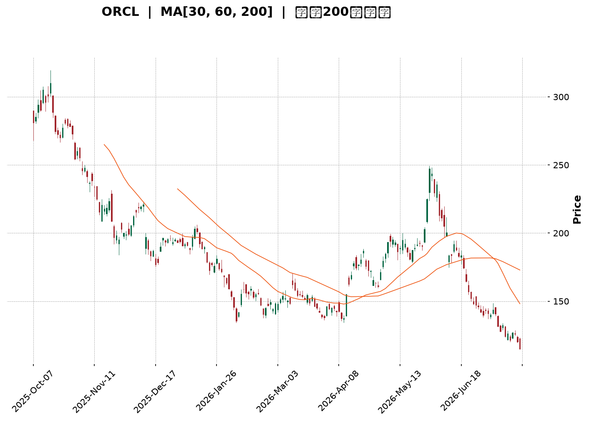
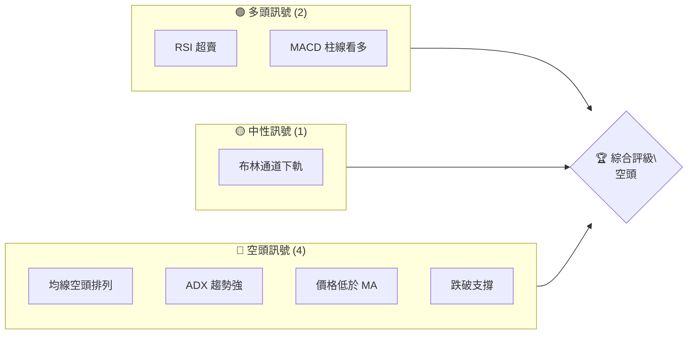
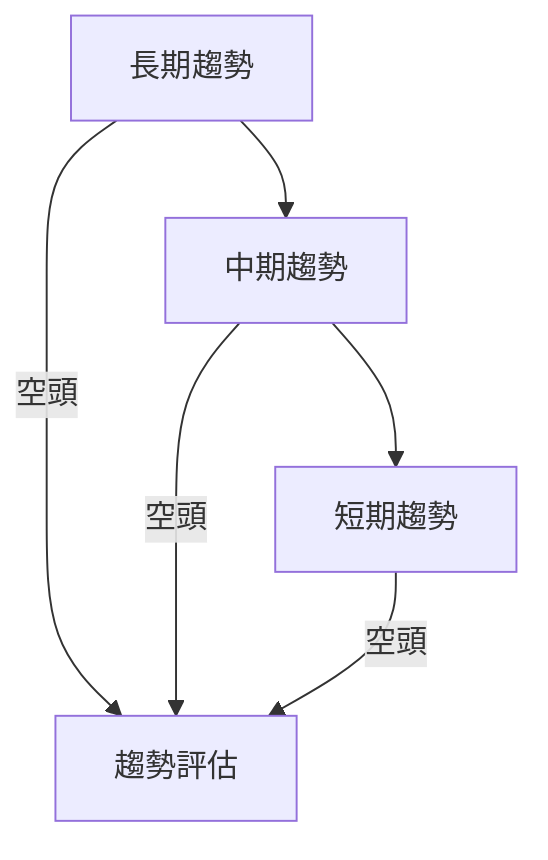
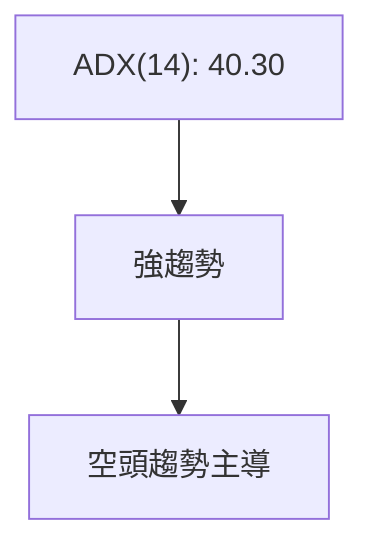
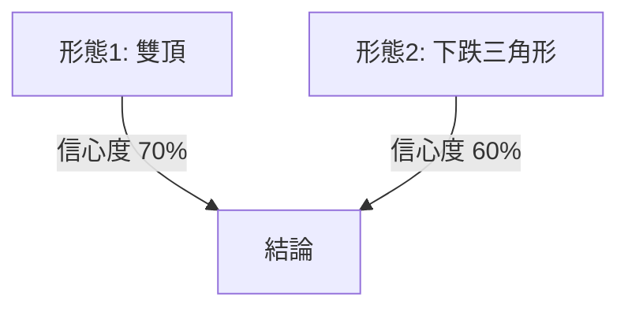
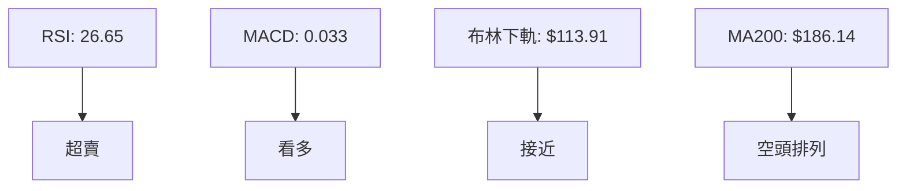
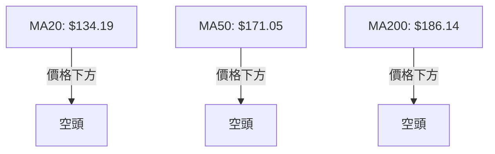
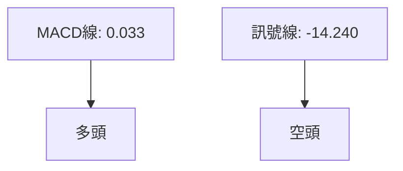
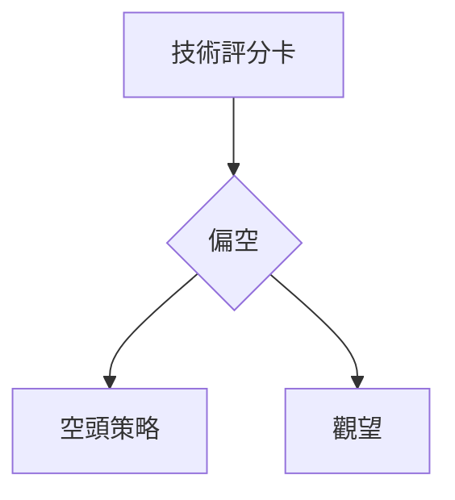
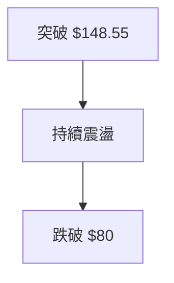

<details>
<summary>📊 靜態圖表 (點擊展開)</summary>

</details>

<html>
<head><meta charset="utf-8" /></head>
<body>
    <div style="height:500px; width:100%;">                        <script>window.PlotlyConfig = {MathJaxConfig: 'local'};</script>
        <script charset="utf-8" src="https://cdn.plot.ly/plotly-3.7.0.min.js" integrity="sha256-jvTGqxNp8AGWEcvNLVuKr+8j5dGe9Yw51LQkmDH+IYA=" crossorigin="anonymous"></script>                <div id="candlestick-chart" class="plotly-graph-div" style="height:100%; width:100%;"></div>            <script>                window.PLOTLYENV=window.PLOTLYENV || {};                                if (document.getElementById("candlestick-chart")) {                    Plotly.newPlot(                        "candlestick-chart",                        [{"close":{"dtype":"f8","bdata":"AAAAwJaQcUAAAACgCdZxQAAAAMD3YXJAAAAAYJQickAAAABgFBFzQAAAAOBLgnJAAAAAgILLckAAAAAAKGBzQAAAAKBuCHJAAAAAAIMocUAAAACgVwhxQAAAAADi4HBAAAAAYE9WcUAAAACg+IlxQAAAAABja3FAAAAAoFpicUAAAAAguApxQAAAAEDyzW9AAAAAYJ5BcEAAAACAX+xvQAAAAGCSuW5AAAAAwGX9bkAAAABgES9uQAAAAOAsn21AAAAAoO\u002fQbUAAAABgmzxtQAAAAIBJGmxAAAAAALrvakAAAACgEpdrQAAAAIBOOGtAAAAAIEZMa0AAAACAA+xrQAAAAKCrFWpAAAAAoI6baEAAAACAu8toQAAAAOC5ZGhAAAAA4A9gaUAAAACAqQBpQAAAAKCm4GhAAAAA4LjlaEAAAADg2rdpQAAAAKAJiWpAAAAAIAvwakAAAADg201rQAAAAIA8bWtAAAAAwCSca0AAAADgaJ5oQAAAAOD2hGdAAAAAYOjkZkAAAADAIFtnQAAAAMApGGZAAAAAYOxJZkAAAABAWsRnQAAAAICDj2hAAAAAoCkvaEAAAABATnNoQAAAACAng2hAAAAAQG4waEAAAABgbmpoQAAAAMCIIWhAAAAAwOM6aEAAAADAANhnQAAAAODE\u002fGdAAAAAQO3fZ0AAAABg0npnQAAAAECVpGhAAAAA4FVoaUAAAADAYhxpQAAAAICNCGhAAAAAIBGRZ0AAAADAeLhnQAAAAKCCVWZAAAAAQJKVZUAAAABgNx5mQAAAAKDN\u002fWVAAAAAgJelZkAAAAAA\u002fLVlQAAAACBAc2VAAAAAwM\u002f6ZEAAAADgCG5kQAAAAOBl3mNAAAAAQB0zY0AAAADA4zRiQAAAAEAS8WBAAAAAYIu6YUAAAADAIHBjQAAAAOD+2GNAAAAA4D2CY0AAAADgoWxjQAAAAMDw4GNAAAAAoN4cY0AAAAAgyGJjQAAAAACKbmNAAAAAYLJhYkAAAAAgj4phQAAAACAMJGJAAAAAoKhbYkAAAADAj6hiQAAAAACIDGJAAAAAgOCGYkAAAAAgQH9iQAAAAEAG6mJAAAAAYO02Y0AAAAAgxvxiQAAAAMBI0GJAAAAAwKSLYkAAAACAoz9kQAAAAGDMwWNAAAAAwBhBY0AAAAAAbVxjQAAAAADAM2NAAAAA4N36YkAAAABAIE5jQAAAAKCKlGJAAAAAoKAoY0AAAACAPEJiQAAAAAA8IGJAAAAA4Dm6YUAAAAAgIFZhQAAAAODLOmFAAAAAQN9CYkAAAAAgIQdiQAAAAKCsK2JAAAAA4PoQYkAAAACgqsVhQAAAAOA81WFAAAAAwDksYUAAAABgjzNhQAAAAECTYmNAAAAAoOpNZEAAAADAFCdlQAAAAEAYN2ZAAAAAoH\u002fOZUAAAAAA3B5mQAAAAEBXkWZAAAAA4DJbZ0AAAABAZ\u002fVlQAAAAIC8lWVAAAAAIIiLZUAAAAAAT6xkQAAAAIBiaGRAAAAAQJMaZEAAAABAf2dlQAAAAEBHdWZAAAAAIKMWZ0AAAAAgbytoQAAAAMBKPWhAAAAAQKloaEAAAAAAYCVoQAAAAEDVRWdAAAAAgESjZ0AAAACg0V1oQAAAAGD+CGhAAAAAQNE+Z0AAAADAlppmQAAAAOA+cGdAAAAAQJajZ0AAAAAgQO1nQAAAAGCADGhAAAAAAInJZ0AAAAAgzV9pQAAAAGDpH2xAAAAAIEXpbkAAAAAgbXduQAAAAMABsWxAAAAAAKlwbUAAAADADZ5qQAAAAKC9YmpAAAAAYBajaUAAAADg\u002fRFpQAAAAKDG7mZAAAAAgLvvZkAAAADAG\u002f9nQAAAAKCqdWdAAAAAYJncZkAAAACg1fRmQAAAAGDRzmVAAAAAAMySZEAAAADAe59jQAAAAGDO\u002fWJAAAAAYHuAYkAAAABg7WdiQAAAAIBXQWJAAAAA4DDAYUAAAAAgFHlhQAAAAABf6GFAAAAAoH2jYUAAAAAgGIBhQAAAAEAK92FAAAAA4HqUYUAAAACgR3FgQAAAAAAp\u002fF9AAAAAIK6PYEAAAACgcA1fQAAAAIA9ml9AAAAA4FFYXkAAAABAM8NfQAAAAIDCdV9AAAAAYI8CXkAAAAAgXL9cQA=="},"high":{"dtype":"f8","bdata":"U4u8XaYeckDusp8j6gNyQN58d9WDoXJA\u002fsHwzXsMc0CaZA9dtTtzQP1IBikw2HJAYsz50Z5Ac0Be9aSQVvdzQLzj\u002fDn41XJAskRv1aDncUCdVHF69FlxQLVGqDjUKHFAkVMAr1OGcUCYKho0JMdxQMO3L34hxHFAZ1ht87mrcUDTOuqR325xQL5yNQLtsnBA8i34Z1R0cECyy0SUUXFwQFxK2Q7rmm9AIuXLbqM\u002fb0CpWjrPGNZuQCMB\u002fYdOw21A1ka2txicbkCmCJ9Cz2VtQOnpfViGUW1AFvuNPUnga0BACQ9NMBxsQP8JCul8lWtALmKMJwOya0DYpr10DT9sQAipp9p2+GxAMPpJ2jzKaUC8zvUz7jtpQE\u002f5spwosGhAYyLgD83\u002faUAftmbaBQ1pQMQbkMbJMWlA3AnP80r2aUALd1CB4L1pQKenRXpEq2pAaoywfOUsa0DPN\u002fPEStNrQD51AnLIj2tAG47yllvla0Do3\u002fsB7gFpQAOBJCy3fmhAhbOqCUVlZ0DnHK6fk39nQBRoSyb8FmdA34cWU9bfZkBiLnZ5MChoQG6JXkHTnGhA8AjvLh1qaEBqfoQMWIxoQOVzBr2VzmhAAKjCKqKTaEDE4xNvg49oQAnK9ScdamhAqMFROyuWaEA1v3XQa\u002fhoQEXieXCVIGhA2MPfJJ85aEBuJV5CBqRnQEhcr5BV2WhA7sm9ilmlaUCdiYC0e8tpQCOhXGQACWlAEkk9lwo1aEAsPH0vQtFnQJxYAXaJPGdA2YNmth5rZkC2tfAhI11mQJY+yCjuTGZAIjJHcssAZ0AQZBeoJ09mQAqNfH1wjWZAyJ7Zr5QhZUDVUgfQUPdkQCpQ\u002ftdnQGVAKuc2CMrIY0AsfLOW6htjQH1Z06MTMWJAI9VRqZ7GYUDB17b3i9RjQEu+zWXGh2RAonmllcxQZEBxZG7u+71jQCu3UMiUJWRA13yXcZzFY0Ap4gntsIZjQMQ1+qAI32NA\u002fDLQWoEdY0CFILonPhliQH3gmua\u002fN2JAWJeFRfEGY0AtX5\u002fTJ+5iQDqztf0jImJAnEEt2xykYkCo3iarQ7xiQGe04extEWNAD47\u002fSAebY0CWqcFMwMJjQEqia0BE3mJA15+hk0UiY0Bp5IWAM1JlQJqbMG5Q1WRALlIm7\u002fX0Y0DoBCGAc7RjQCTxuM0rumNADa33xKU8Y0B7uSd2nXpjQBc+tkz9BWNAlEQqUGNWY0D9rAcZpRpjQCd1RlmgmWJAAHBir4guYkAvpPyKopZhQKIDt0UQh2FAZyM+ZhZMYkBA3JqilpNiQBDtYLeULWJAXsYL3aFwYkBnUOH1J\u002fJhQKaoGVobzWJAJzzS8sHJYUBMbRit43VhQJA9dMPSa2NAFbG5mwEaZUBjX8ulxn5lQN\u002fLqw+kdGZAZnELBYj7ZkD0wlpjmSRmQB0ulHFRFmdAmpl+qcWQZ0Dhc9gLTahmQDxQyxusgmZAvQ9UnlieZUCg57QurwNlQFaAbpYKhmRAu0JWPG+TZEBgUIpZQ7ZlQIcvVXWk22ZAUL1YhfI7Z0BpNK2duTNoQF4oileY7mhApOxEpwiqaECK2QT+DGBoQIiqA4oJCGhAORsEuPzcZ0Dns70HdABpQBfcBar3d2hA1lkGIyjDZ0CW9ElvGoJnQPN2yKsocmdAbsKcQNkEaEBgfHoEJYpoQBebuHi+UGhAgFPO\u002fCnvZ0DLDy7UQYlpQI3IAcQsMGxAWP7Buzwsb0CUpQU4YARvQDPuhCCj9W1AP+uz\u002f+PDbUCueY5YZ9RsQEiVvQCeSWtA8hGYq4l3a0CjqQR3yXdqQFRRrDgkBGdA9OyFsfgdZ0DdVb1CklRoQDpbLDqSVGhAUGb3+fqwZ0C3XJYK02pnQOU4oigV\u002fmZAQ8+ELzi3ZUB\u002fXVOLnKVkQGXEpHNaomNAKAZG9j4gY0BWkBsU3D5jQOUFgWEgrWJACONSEzthYkB0pgTpmlFiQDDov0yvI2JA9HP0Z8UhYkDl\u002f9HoJKthQHMUNcGzkWJAAAAAgMI1YkAAAADAzHRhQAAAAOBRmGBAAAAAwMy8YEAAAADA9XhgQAAAAIAUDmBAAAAAIFxfX0AAAABA4dpfQAAAAEDhGmBAAAAAwMwsX0AAAADAHsVeQA=="},"hovertemplate":"\u003cb\u003e%{x|%Y-%m-%d}\u003c\u002fb\u003e\u003cbr\u003e\u958b: $%{open:.2f}\u003cbr\u003e\u9ad8: $%{high:.2f}\u003cbr\u003e\u4f4e: $%{low:.2f}\u003cbr\u003e\u6536: $%{close:.2f}\u003cextra\u003e\u003c\u002fextra\u003e","low":{"dtype":"f8","bdata":"B2U95SK\u002fcEBSsATudoZxQGhPMjJAyHFAGXhrbIYTckCptk8\u002fVG5yQKprurIME3JAt\u002f5qSgeBckAD5QhSy8JyQEc2XfYNzHFAqs+arOAKcUC+uyFWi9pwQE4YkQ\u002fYqnBAsIBKpprccEA2fdFC23hxQOnQt5cwUnFAc9HSOMJdcUAh6ZKQH8xwQI\u002frub2cum9AERkKvj3Ib0DaVtFrVZlvQLPkVXgfW25AVIb5snCVbkCYfT9WIKBtQNhsXgorxGxAWhhpA8RZbUDXs\u002fisgVZsQA4Q2CxMAGxAHyqkqj6lakC29temNBhqQOYYlGYFsGpApudEymyOakCg+KWOfOdqQAjAmEVPCWpABPbZHW72Z0ClUClhMw5oQEXSaU5p+2ZAk\u002folf9oJaUANjGTnG3doQNs7UlREWmhAO9SKttvCaECEtAFr169oQErmbp8qi2lAgqwJq4hyakAGqHcWz9pqQOktftk6BmtAjZLGNQvwakAgeGxqbQ5nQK9VvQOBBmdALUW9+1d1ZkAD9\u002fSwR9dmQM29tqgb7GVA4f6EevcbZkAYyl9PVEpnQHNf4Tmc32dAJ8UMZlPLZ0Dw5HcDARJoQGAezkGRR2hA6prrj5bZZ0Bv84LE4zpoQLD8dTbUG2hAi82LJFkLaEByIwQ5w89nQCEEevIZnGdAK5lWvU3FZ0D4ALFK5AtnQDA6Pn0Qb2dADqDIApl0aEAbxyJ7luhoQLQ20\u002fOSr2dA9I2B4nKCZ0BQ4NJRkCdnQPjx1vC2Q2ZASAI72VYtZUBFqXlS1OhlQIowwAjUWWVAn8LK41YpZkAxNiIQN49lQLsj0AdhVWVAG6gxScsMZECkeofBc0NkQNYQoMh93GNAHy3LvxbbYkAZtV3jtO1hQM34TAH8yWBAQe08xEo+YUDdmIZYYD9iQFrH+9bie2NAjss8qNIdY0BVmY7eJ+5iQGIY0QvRRmNAf+lGTTv6YkDy1fczP8piQMXC9\u002f4RVmNA+dGjE8VLYkDG4a9oHzRhQHQNUV2SOGFAyll7Py5KYkDFKWgplgRiQJ1WQvypo2FAeEVufW2GYUAjW1d72sFhQBhf+0ccgmJA5IZVEoaiYkAxSZnhMNJiQPDT7zRDLWJA8CIaWXRtYkAY3aMu7O5jQKKYVP9RsGNA1rqi6pYiY0DjxdOSBy5jQKcXvRvvDWNANEoznInfYkAp717sb3tiQJF4l8mQXWJAITyt+0W1YkBJV4AinDpiQBBnvAwc82FAdO8NV6WxYUCTO1NE6CphQBjWFbsBAGFA7YS81ylcYUApS7lwVfVhQGkeQq12amFAhqLxg0bbYUDYNvMBBl9hQFU81w0WvWFA2Ex4c+nwYEB2XoGYT8NgQEiNCBOKZ2FAoR7KBf8fZEBfiyreR7RkQJCdgZBRpmVAc0UViEmYZUCObi8XEp1lQOnhXAzL7GVALfKo+1HFZkBdrVRbP69lQOCBApzfBmVA4nK1NSzqZED6ffVLny9kQEv1cDD6AmRApVfb2sX4Y0AAVznxXbJkQDrlscH8tGVAN5S0OCRMZkDFh1eiLMFmQMtWfMNuxGdATu4cRZ6xZ0BzBtsEDr5nQILC4STGh2ZAkOIRnGMNZ0CEb6Ft0xlnQGsmU8bXh2dAjRnN207UZkA1yIjtr4lmQBqInZTDRWZAim+GvaFRZ0DvfzHV\u002f81nQC2cu2DHvGdAs5uHlpdoZ0CDIK3YtBZoQCBqiC8+6WlAABnYdUj6a0BSfjQFYsBtQG72QsBEWmxAM8pNNybna0Cd1vfCKRdqQE\u002fn5TdWE2pAqMnYRVajaEDVMLH5xa9oQHCCP5+D1WVA2IerMiRMZkBRX+TdDzJnQKQWUQdNYGdATlYF+02+ZkBVlGmJryJmQDFPZqdzuWVAc+\u002fq\u002fkGBZEDZdPEp91ljQNL+XMTWumJAM19qrZRvYkANsLiUShZiQAgeKcpU\u002f2FAAAAA4DDAYUAS45uFKEthQFs+Zbd1lWFAy9h+BlciYUBwY3EfVyJhQMuzyadxjmFAAAAA4FFoYUAAAABAM2tgQAAAAGBm5l9AAAAAQOEaYEAAAACAPepeQAAAAAAAYF5AAAAAgOsBXkAAAACgcI1eQAAAAMDMLF9AAAAAACncXUAAAAAAALBcQA=="},"name":"\u50f9\u683c","open":{"dtype":"f8","bdata":"U4u8XaYeckB4uoarQaNxQLEiEBM8DHJA4ZD+r5SWckAuJVnuin1yQNaS9cu3ynJAmzuEScvfckDU5a8x4+pyQHP1NReSzXJAi0lHbgjjcUCJpZPsPzdxQIJOQdocA3FA2w6N+KLlcEDqfkcGBLNxQBx4nhFRvXFA7RQgFr6EcUCum7x0VmxxQMudTezConBAAKTqLX4QcEA9C\u002fbyS2twQMcWoDjw8m5AdwAG1FSxbkBrLe0+SLJuQFKpBFnvlm1AL4cB7TVzbkCArix9JD9tQI1byHJOT21AS8V86+Xaa0B14Mp0GxpqQKJmouECBGtA0qkjVp\u002fEakAnn6CZ8x5rQK2srt1znmxAxhMt\u002fUCjaUD+C6KHVl9oQCCWEV86B2hAlY1cMfTvaUAQejT1U7NoQMjnbY+00mhAdzwHU8RlaUBxyVxCUc1oQCik0rn5u2lA8lk6ngwda0DCEHobiGdrQAmfYeSxPWtAx34mMst1a0CrQ5u4kJlnQHu1J8DOT2hAEqO2obdPZ0Dnf8yB791mQAcEK07hsWZA\u002fIAdWi6fZkBXqs0N41JnQKkUbhYSXmhADkfzkbVRaEDC6Sf\u002fYiRoQB5htgVfhWhA3TuvesMJaEArOHGA+0VoQKl0PnNkUWhAu7l04qtyaEAviyu+Po5oQHqCkYEN12dA\u002fzu7GeUtaEBNoalczqFnQCKtrt2VymdAIMx53ViHaEAyVrgogXJpQCOhXGQACWlAEkk9lwo1aEDgBCFK+ZJnQJxYAXaJPGdAYAtWO+JNZkDnvyJECERmQN60V8+HbWVAme6AAXQ7ZkDtPZUEUD5mQFtu2a2etmVA\u002fCVt2wkfZUC18mwpHuBkQPR+ZACCN2VAJFv9iTKlY0B9MvbNUxpjQN7LxDzjEmJAPtgVS\u002fxYYUCB1lLRuW5iQDtxG8B93GNAonmllcxQZECvvbLetZpjQNwSZXCoxGNAghlHrUycY0DqHqA92ipjQLDNDvIxg2NA9QR0DpQHY0B8rp1HvxViQKWq1Zyfe2FAf3KCWASEYkAMqZ87QnhiQG4ySps63GFAG73b\u002fWiUYUB3bjxG4PdhQIdswjQHn2JAWECk\u002fQPxYkDd9+WlgPtiQAxnNXz0tGJACl3DPr8RY0DbvilJPKdkQPipI+eTcGRAtaJhZ02+Y0AxJhAjSV9jQCSjyGOVS2NACLDLd8EKY0Cwac85VK1iQIB6h0mi\u002f2JAlSZY5dXLYkACldp6C\u002f5iQIvYPuE9hmJAmhIB5IvcYUAqxtW4e35hQK+kLm0zYmFAHmDVpnZqYUBoJ1TzyoFiQCeTgOdFuWFAzJtmzVtNYkB+jfsXDdlhQB6hloE+qGJAlxlGvZ+2YUDwUkx+ARthQD7CekciaWFAdVKgGyHrZEBdnDIO98lkQAhGjSfe+WVAGMoEHHfJZkBtdFr+TQZmQEdoDvdpN2ZAPN803RoxZ0AsDho9yXhmQOzt\u002fUlLfGZAqVrk6ml\u002fZUApFDFMITNkQFyNPskUb2RAYa12W6ouZEDdlh8m+rpkQNk+X8Uc7WVAhdSEU\u002fSvZkDNawghvjFnQNzlMnR8vWhAge3Z9TH9Z0CNTm1\u002fe+9nQIiqA4oJCGhAy5eMG\u002f2LZ0BLRtcE4nBnQIQX1\u002f2LumdA5nKl2OuqZ0CLIGdvXStnQHAoKRQeamZAC2C81VmLZ0Ch5PwELeBnQJdj\u002fq4nFGhAgAZl+x3aZ0C0zye6wCtoQCfsizHQCGpAmO2FpW22bEAzeaLtqT5uQFJ9oTqu9G1ADR55A9FGbECR8F5aOJZsQFQXPrXXH2tAle1+lGOlakDV3QVj+rloQI94EdGBYWZABX\u002feYcsLZ0B8wKPasFdnQC34X2k9q2dAF3RcrncwZ0AZI2U6BMxmQCFD7cCxtWZAFvuCYXk0ZUBp81mKVT1kQPUgol6+mWNAxkjfXaa3YkAFaqB7AC1jQJ0onf6pV2JAlMxqe6b\u002fYUDvfD7Ss9lhQEuP1WmX+WFAJ0AUahjnYUDiuvIcflJhQITB5SXAnWFAAAAAwMw0YkAAAADA9WBhQAAAAAAAgGBAAAAAgOtRYEAAAAAgXG9gQAAAAMDMbF5AAAAAoEcRX0AAAAAA17NeQAAAACCFi19AAAAAoHD9XkAAAACAFJ5eQA=="},"x":["2025-10-07T00:00:00-04:00","2025-10-08T00:00:00-04:00","2025-10-09T00:00:00-04:00","2025-10-10T00:00:00-04:00","2025-10-13T00:00:00-04:00","2025-10-14T00:00:00-04:00","2025-10-15T00:00:00-04:00","2025-10-16T00:00:00-04:00","2025-10-17T00:00:00-04:00","2025-10-20T00:00:00-04:00","2025-10-21T00:00:00-04:00","2025-10-22T00:00:00-04:00","2025-10-23T00:00:00-04:00","2025-10-24T00:00:00-04:00","2025-10-27T00:00:00-04:00","2025-10-28T00:00:00-04:00","2025-10-29T00:00:00-04:00","2025-10-30T00:00:00-04:00","2025-10-31T00:00:00-04:00","2025-11-03T00:00:00-05:00","2025-11-04T00:00:00-05:00","2025-11-05T00:00:00-05:00","2025-11-06T00:00:00-05:00","2025-11-07T00:00:00-05:00","2025-11-10T00:00:00-05:00","2025-11-11T00:00:00-05:00","2025-11-12T00:00:00-05:00","2025-11-13T00:00:00-05:00","2025-11-14T00:00:00-05:00","2025-11-17T00:00:00-05:00","2025-11-18T00:00:00-05:00","2025-11-19T00:00:00-05:00","2025-11-20T00:00:00-05:00","2025-11-21T00:00:00-05:00","2025-11-24T00:00:00-05:00","2025-11-25T00:00:00-05:00","2025-11-26T00:00:00-05:00","2025-11-28T00:00:00-05:00","2025-12-01T00:00:00-05:00","2025-12-02T00:00:00-05:00","2025-12-03T00:00:00-05:00","2025-12-04T00:00:00-05:00","2025-12-05T00:00:00-05:00","2025-12-08T00:00:00-05:00","2025-12-09T00:00:00-05:00","2025-12-10T00:00:00-05:00","2025-12-11T00:00:00-05:00","2025-12-12T00:00:00-05:00","2025-12-15T00:00:00-05:00","2025-12-16T00:00:00-05:00","2025-12-17T00:00:00-05:00","2025-12-18T00:00:00-05:00","2025-12-19T00:00:00-05:00","2025-12-22T00:00:00-05:00","2025-12-23T00:00:00-05:00","2025-12-24T00:00:00-05:00","2025-12-26T00:00:00-05:00","2025-12-29T00:00:00-05:00","2025-12-30T00:00:00-05:00","2025-12-31T00:00:00-05:00","2026-01-02T00:00:00-05:00","2026-01-05T00:00:00-05:00","2026-01-06T00:00:00-05:00","2026-01-07T00:00:00-05:00","2026-01-08T00:00:00-05:00","2026-01-09T00:00:00-05:00","2026-01-12T00:00:00-05:00","2026-01-13T00:00:00-05:00","2026-01-14T00:00:00-05:00","2026-01-15T00:00:00-05:00","2026-01-16T00:00:00-05:00","2026-01-20T00:00:00-05:00","2026-01-21T00:00:00-05:00","2026-01-22T00:00:00-05:00","2026-01-23T00:00:00-05:00","2026-01-26T00:00:00-05:00","2026-01-27T00:00:00-05:00","2026-01-28T00:00:00-05:00","2026-01-29T00:00:00-05:00","2026-01-30T00:00:00-05:00","2026-02-02T00:00:00-05:00","2026-02-03T00:00:00-05:00","2026-02-04T00:00:00-05:00","2026-02-05T00:00:00-05:00","2026-02-06T00:00:00-05:00","2026-02-09T00:00:00-05:00","2026-02-10T00:00:00-05:00","2026-02-11T00:00:00-05:00","2026-02-12T00:00:00-05:00","2026-02-13T00:00:00-05:00","2026-02-17T00:00:00-05:00","2026-02-18T00:00:00-05:00","2026-02-19T00:00:00-05:00","2026-02-20T00:00:00-05:00","2026-02-23T00:00:00-05:00","2026-02-24T00:00:00-05:00","2026-02-25T00:00:00-05:00","2026-02-26T00:00:00-05:00","2026-02-27T00:00:00-05:00","2026-03-02T00:00:00-05:00","2026-03-03T00:00:00-05:00","2026-03-04T00:00:00-05:00","2026-03-05T00:00:00-05:00","2026-03-06T00:00:00-05:00","2026-03-09T00:00:00-04:00","2026-03-10T00:00:00-04:00","2026-03-11T00:00:00-04:00","2026-03-12T00:00:00-04:00","2026-03-13T00:00:00-04:00","2026-03-16T00:00:00-04:00","2026-03-17T00:00:00-04:00","2026-03-18T00:00:00-04:00","2026-03-19T00:00:00-04:00","2026-03-20T00:00:00-04:00","2026-03-23T00:00:00-04:00","2026-03-24T00:00:00-04:00","2026-03-25T00:00:00-04:00","2026-03-26T00:00:00-04:00","2026-03-27T00:00:00-04:00","2026-03-30T00:00:00-04:00","2026-03-31T00:00:00-04:00","2026-04-01T00:00:00-04:00","2026-04-02T00:00:00-04:00","2026-04-06T00:00:00-04:00","2026-04-07T00:00:00-04:00","2026-04-08T00:00:00-04:00","2026-04-09T00:00:00-04:00","2026-04-10T00:00:00-04:00","2026-04-13T00:00:00-04:00","2026-04-14T00:00:00-04:00","2026-04-15T00:00:00-04:00","2026-04-16T00:00:00-04:00","2026-04-17T00:00:00-04:00","2026-04-20T00:00:00-04:00","2026-04-21T00:00:00-04:00","2026-04-22T00:00:00-04:00","2026-04-23T00:00:00-04:00","2026-04-24T00:00:00-04:00","2026-04-27T00:00:00-04:00","2026-04-28T00:00:00-04:00","2026-04-29T00:00:00-04:00","2026-04-30T00:00:00-04:00","2026-05-01T00:00:00-04:00","2026-05-04T00:00:00-04:00","2026-05-05T00:00:00-04:00","2026-05-06T00:00:00-04:00","2026-05-07T00:00:00-04:00","2026-05-08T00:00:00-04:00","2026-05-11T00:00:00-04:00","2026-05-12T00:00:00-04:00","2026-05-13T00:00:00-04:00","2026-05-14T00:00:00-04:00","2026-05-15T00:00:00-04:00","2026-05-18T00:00:00-04:00","2026-05-19T00:00:00-04:00","2026-05-20T00:00:00-04:00","2026-05-21T00:00:00-04:00","2026-05-22T00:00:00-04:00","2026-05-26T00:00:00-04:00","2026-05-27T00:00:00-04:00","2026-05-28T00:00:00-04:00","2026-05-29T00:00:00-04:00","2026-06-01T00:00:00-04:00","2026-06-02T00:00:00-04:00","2026-06-03T00:00:00-04:00","2026-06-04T00:00:00-04:00","2026-06-05T00:00:00-04:00","2026-06-08T00:00:00-04:00","2026-06-09T00:00:00-04:00","2026-06-10T00:00:00-04:00","2026-06-11T00:00:00-04:00","2026-06-12T00:00:00-04:00","2026-06-15T00:00:00-04:00","2026-06-16T00:00:00-04:00","2026-06-17T00:00:00-04:00","2026-06-18T00:00:00-04:00","2026-06-22T00:00:00-04:00","2026-06-23T00:00:00-04:00","2026-06-24T00:00:00-04:00","2026-06-25T00:00:00-04:00","2026-06-26T00:00:00-04:00","2026-06-29T00:00:00-04:00","2026-06-30T00:00:00-04:00","2026-07-01T00:00:00-04:00","2026-07-02T00:00:00-04:00","2026-07-06T00:00:00-04:00","2026-07-07T00:00:00-04:00","2026-07-08T00:00:00-04:00","2026-07-09T00:00:00-04:00","2026-07-10T00:00:00-04:00","2026-07-13T00:00:00-04:00","2026-07-14T00:00:00-04:00","2026-07-15T00:00:00-04:00","2026-07-16T00:00:00-04:00","2026-07-17T00:00:00-04:00","2026-07-20T00:00:00-04:00","2026-07-21T00:00:00-04:00","2026-07-22T00:00:00-04:00","2026-07-23T00:00:00-04:00","2026-07-24T00:00:00-04:00"],"type":"candlestick"},{"hovertemplate":"MA30: $%{y:.2f}\u003cextra\u003e\u003c\u002fextra\u003e","line":{"color":"#2196F3","dash":"dash","width":2},"mode":"lines","name":"MA30","x":["2025-10-07T00:00:00-04:00","2025-10-08T00:00:00-04:00","2025-10-09T00:00:00-04:00","2025-10-10T00:00:00-04:00","2025-10-13T00:00:00-04:00","2025-10-14T00:00:00-04:00","2025-10-15T00:00:00-04:00","2025-10-16T00:00:00-04:00","2025-10-17T00:00:00-04:00","2025-10-20T00:00:00-04:00","2025-10-21T00:00:00-04:00","2025-10-22T00:00:00-04:00","2025-10-23T00:00:00-04:00","2025-10-24T00:00:00-04:00","2025-10-27T00:00:00-04:00","2025-10-28T00:00:00-04:00","2025-10-29T00:00:00-04:00","2025-10-30T00:00:00-04:00","2025-10-31T00:00:00-04:00","2025-11-03T00:00:00-05:00","2025-11-04T00:00:00-05:00","2025-11-05T00:00:00-05:00","2025-11-06T00:00:00-05:00","2025-11-07T00:00:00-05:00","2025-11-10T00:00:00-05:00","2025-11-11T00:00:00-05:00","2025-11-12T00:00:00-05:00","2025-11-13T00:00:00-05:00","2025-11-14T00:00:00-05:00","2025-11-17T00:00:00-05:00","2025-11-18T00:00:00-05:00","2025-11-19T00:00:00-05:00","2025-11-20T00:00:00-05:00","2025-11-21T00:00:00-05:00","2025-11-24T00:00:00-05:00","2025-11-25T00:00:00-05:00","2025-11-26T00:00:00-05:00","2025-11-28T00:00:00-05:00","2025-12-01T00:00:00-05:00","2025-12-02T00:00:00-05:00","2025-12-03T00:00:00-05:00","2025-12-04T00:00:00-05:00","2025-12-05T00:00:00-05:00","2025-12-08T00:00:00-05:00","2025-12-09T00:00:00-05:00","2025-12-10T00:00:00-05:00","2025-12-11T00:00:00-05:00","2025-12-12T00:00:00-05:00","2025-12-15T00:00:00-05:00","2025-12-16T00:00:00-05:00","2025-12-17T00:00:00-05:00","2025-12-18T00:00:00-05:00","2025-12-19T00:00:00-05:00","2025-12-22T00:00:00-05:00","2025-12-23T00:00:00-05:00","2025-12-24T00:00:00-05:00","2025-12-26T00:00:00-05:00","2025-12-29T00:00:00-05:00","2025-12-30T00:00:00-05:00","2025-12-31T00:00:00-05:00","2026-01-02T00:00:00-05:00","2026-01-05T00:00:00-05:00","2026-01-06T00:00:00-05:00","2026-01-07T00:00:00-05:00","2026-01-08T00:00:00-05:00","2026-01-09T00:00:00-05:00","2026-01-12T00:00:00-05:00","2026-01-13T00:00:00-05:00","2026-01-14T00:00:00-05:00","2026-01-15T00:00:00-05:00","2026-01-16T00:00:00-05:00","2026-01-20T00:00:00-05:00","2026-01-21T00:00:00-05:00","2026-01-22T00:00:00-05:00","2026-01-23T00:00:00-05:00","2026-01-26T00:00:00-05:00","2026-01-27T00:00:00-05:00","2026-01-28T00:00:00-05:00","2026-01-29T00:00:00-05:00","2026-01-30T00:00:00-05:00","2026-02-02T00:00:00-05:00","2026-02-03T00:00:00-05:00","2026-02-04T00:00:00-05:00","2026-02-05T00:00:00-05:00","2026-02-06T00:00:00-05:00","2026-02-09T00:00:00-05:00","2026-02-10T00:00:00-05:00","2026-02-11T00:00:00-05:00","2026-02-12T00:00:00-05:00","2026-02-13T00:00:00-05:00","2026-02-17T00:00:00-05:00","2026-02-18T00:00:00-05:00","2026-02-19T00:00:00-05:00","2026-02-20T00:00:00-05:00","2026-02-23T00:00:00-05:00","2026-02-24T00:00:00-05:00","2026-02-25T00:00:00-05:00","2026-02-26T00:00:00-05:00","2026-02-27T00:00:00-05:00","2026-03-02T00:00:00-05:00","2026-03-03T00:00:00-05:00","2026-03-04T00:00:00-05:00","2026-03-05T00:00:00-05:00","2026-03-06T00:00:00-05:00","2026-03-09T00:00:00-04:00","2026-03-10T00:00:00-04:00","2026-03-11T00:00:00-04:00","2026-03-12T00:00:00-04:00","2026-03-13T00:00:00-04:00","2026-03-16T00:00:00-04:00","2026-03-17T00:00:00-04:00","2026-03-18T00:00:00-04:00","2026-03-19T00:00:00-04:00","2026-03-20T00:00:00-04:00","2026-03-23T00:00:00-04:00","2026-03-24T00:00:00-04:00","2026-03-25T00:00:00-04:00","2026-03-26T00:00:00-04:00","2026-03-27T00:00:00-04:00","2026-03-30T00:00:00-04:00","2026-03-31T00:00:00-04:00","2026-04-01T00:00:00-04:00","2026-04-02T00:00:00-04:00","2026-04-06T00:00:00-04:00","2026-04-07T00:00:00-04:00","2026-04-08T00:00:00-04:00","2026-04-09T00:00:00-04:00","2026-04-10T00:00:00-04:00","2026-04-13T00:00:00-04:00","2026-04-14T00:00:00-04:00","2026-04-15T00:00:00-04:00","2026-04-16T00:00:00-04:00","2026-04-17T00:00:00-04:00","2026-04-20T00:00:00-04:00","2026-04-21T00:00:00-04:00","2026-04-22T00:00:00-04:00","2026-04-23T00:00:00-04:00","2026-04-24T00:00:00-04:00","2026-04-27T00:00:00-04:00","2026-04-28T00:00:00-04:00","2026-04-29T00:00:00-04:00","2026-04-30T00:00:00-04:00","2026-05-01T00:00:00-04:00","2026-05-04T00:00:00-04:00","2026-05-05T00:00:00-04:00","2026-05-06T00:00:00-04:00","2026-05-07T00:00:00-04:00","2026-05-08T00:00:00-04:00","2026-05-11T00:00:00-04:00","2026-05-12T00:00:00-04:00","2026-05-13T00:00:00-04:00","2026-05-14T00:00:00-04:00","2026-05-15T00:00:00-04:00","2026-05-18T00:00:00-04:00","2026-05-19T00:00:00-04:00","2026-05-20T00:00:00-04:00","2026-05-21T00:00:00-04:00","2026-05-22T00:00:00-04:00","2026-05-26T00:00:00-04:00","2026-05-27T00:00:00-04:00","2026-05-28T00:00:00-04:00","2026-05-29T00:00:00-04:00","2026-06-01T00:00:00-04:00","2026-06-02T00:00:00-04:00","2026-06-03T00:00:00-04:00","2026-06-04T00:00:00-04:00","2026-06-05T00:00:00-04:00","2026-06-08T00:00:00-04:00","2026-06-09T00:00:00-04:00","2026-06-10T00:00:00-04:00","2026-06-11T00:00:00-04:00","2026-06-12T00:00:00-04:00","2026-06-15T00:00:00-04:00","2026-06-16T00:00:00-04:00","2026-06-17T00:00:00-04:00","2026-06-18T00:00:00-04:00","2026-06-22T00:00:00-04:00","2026-06-23T00:00:00-04:00","2026-06-24T00:00:00-04:00","2026-06-25T00:00:00-04:00","2026-06-26T00:00:00-04:00","2026-06-29T00:00:00-04:00","2026-06-30T00:00:00-04:00","2026-07-01T00:00:00-04:00","2026-07-02T00:00:00-04:00","2026-07-06T00:00:00-04:00","2026-07-07T00:00:00-04:00","2026-07-08T00:00:00-04:00","2026-07-09T00:00:00-04:00","2026-07-10T00:00:00-04:00","2026-07-13T00:00:00-04:00","2026-07-14T00:00:00-04:00","2026-07-15T00:00:00-04:00","2026-07-16T00:00:00-04:00","2026-07-17T00:00:00-04:00","2026-07-20T00:00:00-04:00","2026-07-21T00:00:00-04:00","2026-07-22T00:00:00-04:00","2026-07-23T00:00:00-04:00","2026-07-24T00:00:00-04:00"],"y":{"dtype":"f8","bdata":"AAAAAAAA+H8AAAAAAAD4fwAAAAAAAPh\u002fAAAAAAAA+H8AAAAAAAD4fwAAAAAAAPh\u002fAAAAAAAA+H8AAAAAAAD4fwAAAAAAAPh\u002fAAAAAAAA+H8AAAAAAAD4fwAAAAAAAPh\u002fAAAAAAAA+H8AAAAAAAD4fwAAAAAAAPh\u002fAAAAAAAA+H8AAAAAAAD4fwAAAAAAAPh\u002fAAAAAAAA+H8AAAAAAAD4fwAAAAAAAPh\u002fAAAAAAAA+H8AAAAAAAD4fwAAAAAAAPh\u002fAAAAAAAA+H8AAAAAAAD4fwAAAAAAAPh\u002fAAAAAAAA+H8AAAAAAAD4f5qZmVmIj3BAAAAAGB5ucEC8u7vDDE1wQBEREZF6H3BA7+7u\u002fm\u002fbb0De3d2Nn2lvQFVVVfXk\u002fW5AZmZmlqmVbkDNzMw8VyBuQDMzM\u002fPdwG1AMzMzg31wbUC8u7s7QyltQLy7u2uj62xAAAAAgJ6pbEBERER0SGdsQDMzMyMIKGxAERERQfLqa0De3d29LZprQCIiIrJ6U2tAERER0WYBa0AAAAAgS7hqQBEREYGlbmpAmpmZuWUkakAzMzPjo+1pQDMzM5NzwmlAERERcWSSaUCamZmJjGlpQCIiIkLpSmlAzczMzHczaUAiIiJCYRhpQFVVVVUF\u002fmhAMzMzY9fjaEDv7u5+CsFoQAAAAPAkr2hAMzMz0+OoaECrqqraqJ1oQERERMTJn2hA3t3dXRCgaEARERHx\u002fKBoQHd3d+fImWhAq6qq+m2OaEDNzMwsYn1oQHd3d1eIWWhAVVVVpdkraEDe3d1tmP9nQN7d3d020WdAMzMz09ymZ0BVVVVlDI5nQLy7uytkfGdAREREBA5sZ0ARERHBFVNnQCIiIsIXQGdAVVVVhbslZ0AzMzOjSPZmQM3MzNxEtWZAVVVVhS5+ZkDNzMy8aFNmQImIiJiaK2ZAzczMDKoDZkCrqqoqEtllQFVVVdXItGVA7+7u\u002fh2JZUAzMzOTE2NlQO\u002fu7r4zPGVAq6qq6lMNZUAiIiICp9pkQImIiPgqo2RAAAAAEANnZEDv7u5+8y9kQO\u002fu7j7i\u002fGNAAAAAoODRY0C8u7urTaVjQLy7u9seiGNAmpmZKeZzY0AAAAAwL1ljQImIiCgRPmNAmpmZmREbY0Dv7u4ulw5jQERERGQkAGNAd3d3F2vxYkC8u7tLTOhiQJqZmRmc4mJA7+7uHrzgYkAREREBHOpiQLy7u3sX+GJAREREZEsEY0AAAABAO\u002fpiQGZmZhaK62JAERERwVbcYkARERGhhcpiQM3MzMzqs2JA3t3djaasYkC8u7vrD6FiQO\u002fu7s5MlmJAZmZmBpyTYkCJiIholJViQGZmZubzkmJAq6qqmtaIYkCJiIioZ3xiQO\u002fu7m7Oh2JAAAAAcPmWYkCJiIiooq1iQM3MzOzNyWJAZmZmZuzfYkDNzMzcqPpiQBEREeGxGmNAZmZmJr9DY0De3d29VlJjQAAAANDvYWNA7+7uDnx1Y0AiIiJCroBjQBEREfH3imNA3t3dDY+UY0Dv7u6eeKZjQJqZmfmPx2NAd3d3lxjpY0BmZmY2iRtkQO\u002fu7l60T2RAVVVVFbiIZEAAAADQ08JkQBERETFl9mRA7+7ubkYkZUAiIiJiXVplQERERKRojGVAREREdJq4ZUBmZmaG1eFlQM3MzOyqEWZAzczMrNhIZkDv7u5uPIJmQKuqqpoIqmZAVVVVFcHHZkCrqqo6x+tmQJqZmZk0HmdAmpmZ2eVrZ0AzMzPjHbNnQN7d3U1f52dAREREpEkbaEDNzMzsCkNoQN7d3W0CbGhAIiIiku2OaEBmZmZmc7RoQFVVVUX\u002fyWhAd3d3RyviaECJiIgYSvhoQBEREfHVAGlA7+7urub+aEC8u7s7jPRoQERERHTM32hAERER4RG\u002faEBEREQ0eZhoQBEREXHwc2hAAAAA8BxIaEDv7u7+PxVoQCIiIqLt42dAvLu7awq1Z0DNzMzMQYlnQLy7u6sPWmdAZmZmptsmZ0C8u7v7BPBmQFVVVaUavGZAVVVVtSKHZkDv7u4O6zpmQGZmZvZj02VA7+7u\u002fu9YZUCJiIiActlkQAAAAHhza2RAd3d3d7PxY0Dv7u7+FZZjQAAAAEAoO2NAERERKW7gYkC8u7s7J4ViQA=="},"type":"scatter"},{"hovertemplate":"MA60: $%{y:.2f}\u003cextra\u003e\u003c\u002fextra\u003e","line":{"color":"#9C27B0","dash":"dash","width":2},"mode":"lines","name":"MA60","x":["2025-10-07T00:00:00-04:00","2025-10-08T00:00:00-04:00","2025-10-09T00:00:00-04:00","2025-10-10T00:00:00-04:00","2025-10-13T00:00:00-04:00","2025-10-14T00:00:00-04:00","2025-10-15T00:00:00-04:00","2025-10-16T00:00:00-04:00","2025-10-17T00:00:00-04:00","2025-10-20T00:00:00-04:00","2025-10-21T00:00:00-04:00","2025-10-22T00:00:00-04:00","2025-10-23T00:00:00-04:00","2025-10-24T00:00:00-04:00","2025-10-27T00:00:00-04:00","2025-10-28T00:00:00-04:00","2025-10-29T00:00:00-04:00","2025-10-30T00:00:00-04:00","2025-10-31T00:00:00-04:00","2025-11-03T00:00:00-05:00","2025-11-04T00:00:00-05:00","2025-11-05T00:00:00-05:00","2025-11-06T00:00:00-05:00","2025-11-07T00:00:00-05:00","2025-11-10T00:00:00-05:00","2025-11-11T00:00:00-05:00","2025-11-12T00:00:00-05:00","2025-11-13T00:00:00-05:00","2025-11-14T00:00:00-05:00","2025-11-17T00:00:00-05:00","2025-11-18T00:00:00-05:00","2025-11-19T00:00:00-05:00","2025-11-20T00:00:00-05:00","2025-11-21T00:00:00-05:00","2025-11-24T00:00:00-05:00","2025-11-25T00:00:00-05:00","2025-11-26T00:00:00-05:00","2025-11-28T00:00:00-05:00","2025-12-01T00:00:00-05:00","2025-12-02T00:00:00-05:00","2025-12-03T00:00:00-05:00","2025-12-04T00:00:00-05:00","2025-12-05T00:00:00-05:00","2025-12-08T00:00:00-05:00","2025-12-09T00:00:00-05:00","2025-12-10T00:00:00-05:00","2025-12-11T00:00:00-05:00","2025-12-12T00:00:00-05:00","2025-12-15T00:00:00-05:00","2025-12-16T00:00:00-05:00","2025-12-17T00:00:00-05:00","2025-12-18T00:00:00-05:00","2025-12-19T00:00:00-05:00","2025-12-22T00:00:00-05:00","2025-12-23T00:00:00-05:00","2025-12-24T00:00:00-05:00","2025-12-26T00:00:00-05:00","2025-12-29T00:00:00-05:00","2025-12-30T00:00:00-05:00","2025-12-31T00:00:00-05:00","2026-01-02T00:00:00-05:00","2026-01-05T00:00:00-05:00","2026-01-06T00:00:00-05:00","2026-01-07T00:00:00-05:00","2026-01-08T00:00:00-05:00","2026-01-09T00:00:00-05:00","2026-01-12T00:00:00-05:00","2026-01-13T00:00:00-05:00","2026-01-14T00:00:00-05:00","2026-01-15T00:00:00-05:00","2026-01-16T00:00:00-05:00","2026-01-20T00:00:00-05:00","2026-01-21T00:00:00-05:00","2026-01-22T00:00:00-05:00","2026-01-23T00:00:00-05:00","2026-01-26T00:00:00-05:00","2026-01-27T00:00:00-05:00","2026-01-28T00:00:00-05:00","2026-01-29T00:00:00-05:00","2026-01-30T00:00:00-05:00","2026-02-02T00:00:00-05:00","2026-02-03T00:00:00-05:00","2026-02-04T00:00:00-05:00","2026-02-05T00:00:00-05:00","2026-02-06T00:00:00-05:00","2026-02-09T00:00:00-05:00","2026-02-10T00:00:00-05:00","2026-02-11T00:00:00-05:00","2026-02-12T00:00:00-05:00","2026-02-13T00:00:00-05:00","2026-02-17T00:00:00-05:00","2026-02-18T00:00:00-05:00","2026-02-19T00:00:00-05:00","2026-02-20T00:00:00-05:00","2026-02-23T00:00:00-05:00","2026-02-24T00:00:00-05:00","2026-02-25T00:00:00-05:00","2026-02-26T00:00:00-05:00","2026-02-27T00:00:00-05:00","2026-03-02T00:00:00-05:00","2026-03-03T00:00:00-05:00","2026-03-04T00:00:00-05:00","2026-03-05T00:00:00-05:00","2026-03-06T00:00:00-05:00","2026-03-09T00:00:00-04:00","2026-03-10T00:00:00-04:00","2026-03-11T00:00:00-04:00","2026-03-12T00:00:00-04:00","2026-03-13T00:00:00-04:00","2026-03-16T00:00:00-04:00","2026-03-17T00:00:00-04:00","2026-03-18T00:00:00-04:00","2026-03-19T00:00:00-04:00","2026-03-20T00:00:00-04:00","2026-03-23T00:00:00-04:00","2026-03-24T00:00:00-04:00","2026-03-25T00:00:00-04:00","2026-03-26T00:00:00-04:00","2026-03-27T00:00:00-04:00","2026-03-30T00:00:00-04:00","2026-03-31T00:00:00-04:00","2026-04-01T00:00:00-04:00","2026-04-02T00:00:00-04:00","2026-04-06T00:00:00-04:00","2026-04-07T00:00:00-04:00","2026-04-08T00:00:00-04:00","2026-04-09T00:00:00-04:00","2026-04-10T00:00:00-04:00","2026-04-13T00:00:00-04:00","2026-04-14T00:00:00-04:00","2026-04-15T00:00:00-04:00","2026-04-16T00:00:00-04:00","2026-04-17T00:00:00-04:00","2026-04-20T00:00:00-04:00","2026-04-21T00:00:00-04:00","2026-04-22T00:00:00-04:00","2026-04-23T00:00:00-04:00","2026-04-24T00:00:00-04:00","2026-04-27T00:00:00-04:00","2026-04-28T00:00:00-04:00","2026-04-29T00:00:00-04:00","2026-04-30T00:00:00-04:00","2026-05-01T00:00:00-04:00","2026-05-04T00:00:00-04:00","2026-05-05T00:00:00-04:00","2026-05-06T00:00:00-04:00","2026-05-07T00:00:00-04:00","2026-05-08T00:00:00-04:00","2026-05-11T00:00:00-04:00","2026-05-12T00:00:00-04:00","2026-05-13T00:00:00-04:00","2026-05-14T00:00:00-04:00","2026-05-15T00:00:00-04:00","2026-05-18T00:00:00-04:00","2026-05-19T00:00:00-04:00","2026-05-20T00:00:00-04:00","2026-05-21T00:00:00-04:00","2026-05-22T00:00:00-04:00","2026-05-26T00:00:00-04:00","2026-05-27T00:00:00-04:00","2026-05-28T00:00:00-04:00","2026-05-29T00:00:00-04:00","2026-06-01T00:00:00-04:00","2026-06-02T00:00:00-04:00","2026-06-03T00:00:00-04:00","2026-06-04T00:00:00-04:00","2026-06-05T00:00:00-04:00","2026-06-08T00:00:00-04:00","2026-06-09T00:00:00-04:00","2026-06-10T00:00:00-04:00","2026-06-11T00:00:00-04:00","2026-06-12T00:00:00-04:00","2026-06-15T00:00:00-04:00","2026-06-16T00:00:00-04:00","2026-06-17T00:00:00-04:00","2026-06-18T00:00:00-04:00","2026-06-22T00:00:00-04:00","2026-06-23T00:00:00-04:00","2026-06-24T00:00:00-04:00","2026-06-25T00:00:00-04:00","2026-06-26T00:00:00-04:00","2026-06-29T00:00:00-04:00","2026-06-30T00:00:00-04:00","2026-07-01T00:00:00-04:00","2026-07-02T00:00:00-04:00","2026-07-06T00:00:00-04:00","2026-07-07T00:00:00-04:00","2026-07-08T00:00:00-04:00","2026-07-09T00:00:00-04:00","2026-07-10T00:00:00-04:00","2026-07-13T00:00:00-04:00","2026-07-14T00:00:00-04:00","2026-07-15T00:00:00-04:00","2026-07-16T00:00:00-04:00","2026-07-17T00:00:00-04:00","2026-07-20T00:00:00-04:00","2026-07-21T00:00:00-04:00","2026-07-22T00:00:00-04:00","2026-07-23T00:00:00-04:00","2026-07-24T00:00:00-04:00"],"y":{"dtype":"f8","bdata":"AAAAAAAA+H8AAAAAAAD4fwAAAAAAAPh\u002fAAAAAAAA+H8AAAAAAAD4fwAAAAAAAPh\u002fAAAAAAAA+H8AAAAAAAD4fwAAAAAAAPh\u002fAAAAAAAA+H8AAAAAAAD4fwAAAAAAAPh\u002fAAAAAAAA+H8AAAAAAAD4fwAAAAAAAPh\u002fAAAAAAAA+H8AAAAAAAD4fwAAAAAAAPh\u002fAAAAAAAA+H8AAAAAAAD4fwAAAAAAAPh\u002fAAAAAAAA+H8AAAAAAAD4fwAAAAAAAPh\u002fAAAAAAAA+H8AAAAAAAD4fwAAAAAAAPh\u002fAAAAAAAA+H8AAAAAAAD4fwAAAAAAAPh\u002fAAAAAAAA+H8AAAAAAAD4fwAAAAAAAPh\u002fAAAAAAAA+H8AAAAAAAD4fwAAAAAAAPh\u002fAAAAAAAA+H8AAAAAAAD4fwAAAAAAAPh\u002fAAAAAAAA+H8AAAAAAAD4fwAAAAAAAPh\u002fAAAAAAAA+H8AAAAAAAD4fwAAAAAAAPh\u002fAAAAAAAA+H8AAAAAAAD4fwAAAAAAAPh\u002fAAAAAAAA+H8AAAAAAAD4fwAAAAAAAPh\u002fAAAAAAAA+H8AAAAAAAD4fwAAAAAAAPh\u002fAAAAAAAA+H8AAAAAAAD4fwAAAAAAAPh\u002fAAAAAAAA+H8AAAAAAAD4f0RERASLDm1AmpmZyQngbEAzMzMDkq1sQBEREQkNd2xAERER6SlCbEBEREQ0pANsQM3MzFzXzmtAIiIi+tyaa0Dv7u4WqmBrQFVVVW1TLWtA7+7uvnX\u002fakBERES0UtNqQJqZmeGVompAq6qqErxqakARERFxcDNqQImIiICf\u002fGlAIiIiiufIaUCamZkRHZRpQO\u002fu7m7vZ2lAq6qqaro2aUCJiIhwsAVpQJqZmaFe12hAd3d3nxClaEAzMzND9nFoQAAAADjcO2hAMzMze0kIaEAzMzOjet5nQFVVVe1Bu2dAzczM7JCbZ0BmZma2uXhnQFVVVRVnWWdAERERsXo2Z0AREREJDxJnQHd3d1es9WZA7+7u3hvbZkBmZmbuJ7xmQGZmZl56oWZA7+7utomDZkAAAAA4eGhmQDMzM5NVS2ZAVVVVTScwZkBERETsVxFmQJqZmZnT8GVAd3d359\u002fPZUDv7u7OY6xlQDMzMwOkh2VAZmZmNvdgZUAiIiLKUU5lQAAAAEhEPmVA3t3djbwuZUBmZmYGsR1lQN7d3e1ZEWVAIiIi0jsDZUAiIiJSMvBkQERERCyu1mRAzczM9DzBZEBmZmb+0aZkQHd3d1eSi2RA7+7uZgBwZEDe3d3ly1FkQBEREdFZNGRAZmZmRuIaZEB3d3e\u002fEQJkQO\u002fu7kZA6WNAiYiI+HfQY0BVVVW1HbhjQHd3d28Pm2NAVVVV1ex3Y0C8u7uTLVZjQO\u002fu7lZYQmNAAAAACG00Y0AiIiIqeCljQERERGT2KGNAAAAASOkpY0BmZmYG7CljQM3MzIRhLGNAAAAAYGgvY0BmZmb2djBjQCIiIhoKMWNAMzMzk3MzY0Dv7u5GfTRjQFVVVQXKNmNAZmZmlqU6Y0AAAABQSkhjQKuqqrrTX2NA3t3d\u002fbF2Y0AzMzM74opjQKuqqjqfnWNAMzMza4eyY0CJiIi4rMZjQO\u002fu7v4n1WNAZmZmfnboY0Dv7u6mtv1jQJqZmblaEWRAVVVVPRsmZEB3d3f3tDtkQJqZmWlPUmRAvLu7o9doZEC8u7sLUn9kQM3MzITrmGRAq6qqQl2vZECamZnxtMxkQDMzM0MB9GRAAAAAIOklZUAAAABg41ZlQHd3d5cIgWVAVVVVZYSvZUBVVVXVsMplQO\u002fu7h755mVAiYiI0DQCZkBERETUkBpmQDMzM5t7KmZAq6qqKl07ZkC8u7tbYU9mQFVVVfUyZGZAMzMzo\u002f9zZkARERG5CohmQJqZmWnAl2ZAMzMz++SjZkAiIiKCpq1mQBEREdEqtWZAd3d3rzG2ZkCJiIiwzrdmQDMzMyMruGZAAAAAcNK2ZkCamZmpi7VmQEREREzdtWZAmpmZKdq3ZkBVVVW1ILlmQAAAAKARs2ZAVVVV5XGnZkDNzMwkWZNmQAAAAEjMeGZARERE7GpiZkDe3d0xSEZmQO\u002fu7mJpKWZA3t3djX4GZkDe3d11kOxlQO\u002fu7laV02VAmpmZ3a23ZUARERFRzZxlQA=="},"type":"scatter"},{"hovertemplate":"MA200: $%{y:.2f}\u003cextra\u003e\u003c\u002fextra\u003e","line":{"color":"#FF6F00","dash":"solid","width":2},"mode":"lines","name":"MA200","x":["2025-10-07T00:00:00-04:00","2025-10-08T00:00:00-04:00","2025-10-09T00:00:00-04:00","2025-10-10T00:00:00-04:00","2025-10-13T00:00:00-04:00","2025-10-14T00:00:00-04:00","2025-10-15T00:00:00-04:00","2025-10-16T00:00:00-04:00","2025-10-17T00:00:00-04:00","2025-10-20T00:00:00-04:00","2025-10-21T00:00:00-04:00","2025-10-22T00:00:00-04:00","2025-10-23T00:00:00-04:00","2025-10-24T00:00:00-04:00","2025-10-27T00:00:00-04:00","2025-10-28T00:00:00-04:00","2025-10-29T00:00:00-04:00","2025-10-30T00:00:00-04:00","2025-10-31T00:00:00-04:00","2025-11-03T00:00:00-05:00","2025-11-04T00:00:00-05:00","2025-11-05T00:00:00-05:00","2025-11-06T00:00:00-05:00","2025-11-07T00:00:00-05:00","2025-11-10T00:00:00-05:00","2025-11-11T00:00:00-05:00","2025-11-12T00:00:00-05:00","2025-11-13T00:00:00-05:00","2025-11-14T00:00:00-05:00","2025-11-17T00:00:00-05:00","2025-11-18T00:00:00-05:00","2025-11-19T00:00:00-05:00","2025-11-20T00:00:00-05:00","2025-11-21T00:00:00-05:00","2025-11-24T00:00:00-05:00","2025-11-25T00:00:00-05:00","2025-11-26T00:00:00-05:00","2025-11-28T00:00:00-05:00","2025-12-01T00:00:00-05:00","2025-12-02T00:00:00-05:00","2025-12-03T00:00:00-05:00","2025-12-04T00:00:00-05:00","2025-12-05T00:00:00-05:00","2025-12-08T00:00:00-05:00","2025-12-09T00:00:00-05:00","2025-12-10T00:00:00-05:00","2025-12-11T00:00:00-05:00","2025-12-12T00:00:00-05:00","2025-12-15T00:00:00-05:00","2025-12-16T00:00:00-05:00","2025-12-17T00:00:00-05:00","2025-12-18T00:00:00-05:00","2025-12-19T00:00:00-05:00","2025-12-22T00:00:00-05:00","2025-12-23T00:00:00-05:00","2025-12-24T00:00:00-05:00","2025-12-26T00:00:00-05:00","2025-12-29T00:00:00-05:00","2025-12-30T00:00:00-05:00","2025-12-31T00:00:00-05:00","2026-01-02T00:00:00-05:00","2026-01-05T00:00:00-05:00","2026-01-06T00:00:00-05:00","2026-01-07T00:00:00-05:00","2026-01-08T00:00:00-05:00","2026-01-09T00:00:00-05:00","2026-01-12T00:00:00-05:00","2026-01-13T00:00:00-05:00","2026-01-14T00:00:00-05:00","2026-01-15T00:00:00-05:00","2026-01-16T00:00:00-05:00","2026-01-20T00:00:00-05:00","2026-01-21T00:00:00-05:00","2026-01-22T00:00:00-05:00","2026-01-23T00:00:00-05:00","2026-01-26T00:00:00-05:00","2026-01-27T00:00:00-05:00","2026-01-28T00:00:00-05:00","2026-01-29T00:00:00-05:00","2026-01-30T00:00:00-05:00","2026-02-02T00:00:00-05:00","2026-02-03T00:00:00-05:00","2026-02-04T00:00:00-05:00","2026-02-05T00:00:00-05:00","2026-02-06T00:00:00-05:00","2026-02-09T00:00:00-05:00","2026-02-10T00:00:00-05:00","2026-02-11T00:00:00-05:00","2026-02-12T00:00:00-05:00","2026-02-13T00:00:00-05:00","2026-02-17T00:00:00-05:00","2026-02-18T00:00:00-05:00","2026-02-19T00:00:00-05:00","2026-02-20T00:00:00-05:00","2026-02-23T00:00:00-05:00","2026-02-24T00:00:00-05:00","2026-02-25T00:00:00-05:00","2026-02-26T00:00:00-05:00","2026-02-27T00:00:00-05:00","2026-03-02T00:00:00-05:00","2026-03-03T00:00:00-05:00","2026-03-04T00:00:00-05:00","2026-03-05T00:00:00-05:00","2026-03-06T00:00:00-05:00","2026-03-09T00:00:00-04:00","2026-03-10T00:00:00-04:00","2026-03-11T00:00:00-04:00","2026-03-12T00:00:00-04:00","2026-03-13T00:00:00-04:00","2026-03-16T00:00:00-04:00","2026-03-17T00:00:00-04:00","2026-03-18T00:00:00-04:00","2026-03-19T00:00:00-04:00","2026-03-20T00:00:00-04:00","2026-03-23T00:00:00-04:00","2026-03-24T00:00:00-04:00","2026-03-25T00:00:00-04:00","2026-03-26T00:00:00-04:00","2026-03-27T00:00:00-04:00","2026-03-30T00:00:00-04:00","2026-03-31T00:00:00-04:00","2026-04-01T00:00:00-04:00","2026-04-02T00:00:00-04:00","2026-04-06T00:00:00-04:00","2026-04-07T00:00:00-04:00","2026-04-08T00:00:00-04:00","2026-04-09T00:00:00-04:00","2026-04-10T00:00:00-04:00","2026-04-13T00:00:00-04:00","2026-04-14T00:00:00-04:00","2026-04-15T00:00:00-04:00","2026-04-16T00:00:00-04:00","2026-04-17T00:00:00-04:00","2026-04-20T00:00:00-04:00","2026-04-21T00:00:00-04:00","2026-04-22T00:00:00-04:00","2026-04-23T00:00:00-04:00","2026-04-24T00:00:00-04:00","2026-04-27T00:00:00-04:00","2026-04-28T00:00:00-04:00","2026-04-29T00:00:00-04:00","2026-04-30T00:00:00-04:00","2026-05-01T00:00:00-04:00","2026-05-04T00:00:00-04:00","2026-05-05T00:00:00-04:00","2026-05-06T00:00:00-04:00","2026-05-07T00:00:00-04:00","2026-05-08T00:00:00-04:00","2026-05-11T00:00:00-04:00","2026-05-12T00:00:00-04:00","2026-05-13T00:00:00-04:00","2026-05-14T00:00:00-04:00","2026-05-15T00:00:00-04:00","2026-05-18T00:00:00-04:00","2026-05-19T00:00:00-04:00","2026-05-20T00:00:00-04:00","2026-05-21T00:00:00-04:00","2026-05-22T00:00:00-04:00","2026-05-26T00:00:00-04:00","2026-05-27T00:00:00-04:00","2026-05-28T00:00:00-04:00","2026-05-29T00:00:00-04:00","2026-06-01T00:00:00-04:00","2026-06-02T00:00:00-04:00","2026-06-03T00:00:00-04:00","2026-06-04T00:00:00-04:00","2026-06-05T00:00:00-04:00","2026-06-08T00:00:00-04:00","2026-06-09T00:00:00-04:00","2026-06-10T00:00:00-04:00","2026-06-11T00:00:00-04:00","2026-06-12T00:00:00-04:00","2026-06-15T00:00:00-04:00","2026-06-16T00:00:00-04:00","2026-06-17T00:00:00-04:00","2026-06-18T00:00:00-04:00","2026-06-22T00:00:00-04:00","2026-06-23T00:00:00-04:00","2026-06-24T00:00:00-04:00","2026-06-25T00:00:00-04:00","2026-06-26T00:00:00-04:00","2026-06-29T00:00:00-04:00","2026-06-30T00:00:00-04:00","2026-07-01T00:00:00-04:00","2026-07-02T00:00:00-04:00","2026-07-06T00:00:00-04:00","2026-07-07T00:00:00-04:00","2026-07-08T00:00:00-04:00","2026-07-09T00:00:00-04:00","2026-07-10T00:00:00-04:00","2026-07-13T00:00:00-04:00","2026-07-14T00:00:00-04:00","2026-07-15T00:00:00-04:00","2026-07-16T00:00:00-04:00","2026-07-17T00:00:00-04:00","2026-07-20T00:00:00-04:00","2026-07-21T00:00:00-04:00","2026-07-22T00:00:00-04:00","2026-07-23T00:00:00-04:00","2026-07-24T00:00:00-04:00"],"y":{"dtype":"f8","bdata":"AAAAAAAA+H8AAAAAAAD4fwAAAAAAAPh\u002fAAAAAAAA+H8AAAAAAAD4fwAAAAAAAPh\u002fAAAAAAAA+H8AAAAAAAD4fwAAAAAAAPh\u002fAAAAAAAA+H8AAAAAAAD4fwAAAAAAAPh\u002fAAAAAAAA+H8AAAAAAAD4fwAAAAAAAPh\u002fAAAAAAAA+H8AAAAAAAD4fwAAAAAAAPh\u002fAAAAAAAA+H8AAAAAAAD4fwAAAAAAAPh\u002fAAAAAAAA+H8AAAAAAAD4fwAAAAAAAPh\u002fAAAAAAAA+H8AAAAAAAD4fwAAAAAAAPh\u002fAAAAAAAA+H8AAAAAAAD4fwAAAAAAAPh\u002fAAAAAAAA+H8AAAAAAAD4fwAAAAAAAPh\u002fAAAAAAAA+H8AAAAAAAD4fwAAAAAAAPh\u002fAAAAAAAA+H8AAAAAAAD4fwAAAAAAAPh\u002fAAAAAAAA+H8AAAAAAAD4fwAAAAAAAPh\u002fAAAAAAAA+H8AAAAAAAD4fwAAAAAAAPh\u002fAAAAAAAA+H8AAAAAAAD4fwAAAAAAAPh\u002fAAAAAAAA+H8AAAAAAAD4fwAAAAAAAPh\u002fAAAAAAAA+H8AAAAAAAD4fwAAAAAAAPh\u002fAAAAAAAA+H8AAAAAAAD4fwAAAAAAAPh\u002fAAAAAAAA+H8AAAAAAAD4fwAAAAAAAPh\u002fAAAAAAAA+H8AAAAAAAD4fwAAAAAAAPh\u002fAAAAAAAA+H8AAAAAAAD4fwAAAAAAAPh\u002fAAAAAAAA+H8AAAAAAAD4fwAAAAAAAPh\u002fAAAAAAAA+H8AAAAAAAD4fwAAAAAAAPh\u002fAAAAAAAA+H8AAAAAAAD4fwAAAAAAAPh\u002fAAAAAAAA+H8AAAAAAAD4fwAAAAAAAPh\u002fAAAAAAAA+H8AAAAAAAD4fwAAAAAAAPh\u002fAAAAAAAA+H8AAAAAAAD4fwAAAAAAAPh\u002fAAAAAAAA+H8AAAAAAAD4fwAAAAAAAPh\u002fAAAAAAAA+H8AAAAAAAD4fwAAAAAAAPh\u002fAAAAAAAA+H8AAAAAAAD4fwAAAAAAAPh\u002fAAAAAAAA+H8AAAAAAAD4fwAAAAAAAPh\u002fAAAAAAAA+H8AAAAAAAD4fwAAAAAAAPh\u002fAAAAAAAA+H8AAAAAAAD4fwAAAAAAAPh\u002fAAAAAAAA+H8AAAAAAAD4fwAAAAAAAPh\u002fAAAAAAAA+H8AAAAAAAD4fwAAAAAAAPh\u002fAAAAAAAA+H8AAAAAAAD4fwAAAAAAAPh\u002fAAAAAAAA+H8AAAAAAAD4fwAAAAAAAPh\u002fAAAAAAAA+H8AAAAAAAD4fwAAAAAAAPh\u002fAAAAAAAA+H8AAAAAAAD4fwAAAAAAAPh\u002fAAAAAAAA+H8AAAAAAAD4fwAAAAAAAPh\u002fAAAAAAAA+H8AAAAAAAD4fwAAAAAAAPh\u002fAAAAAAAA+H8AAAAAAAD4fwAAAAAAAPh\u002fAAAAAAAA+H8AAAAAAAD4fwAAAAAAAPh\u002fAAAAAAAA+H8AAAAAAAD4fwAAAAAAAPh\u002fAAAAAAAA+H8AAAAAAAD4fwAAAAAAAPh\u002fAAAAAAAA+H8AAAAAAAD4fwAAAAAAAPh\u002fAAAAAAAA+H8AAAAAAAD4fwAAAAAAAPh\u002fAAAAAAAA+H8AAAAAAAD4fwAAAAAAAPh\u002fAAAAAAAA+H8AAAAAAAD4fwAAAAAAAPh\u002fAAAAAAAA+H8AAAAAAAD4fwAAAAAAAPh\u002fAAAAAAAA+H8AAAAAAAD4fwAAAAAAAPh\u002fAAAAAAAA+H8AAAAAAAD4fwAAAAAAAPh\u002fAAAAAAAA+H8AAAAAAAD4fwAAAAAAAPh\u002fAAAAAAAA+H8AAAAAAAD4fwAAAAAAAPh\u002fAAAAAAAA+H8AAAAAAAD4fwAAAAAAAPh\u002fAAAAAAAA+H8AAAAAAAD4fwAAAAAAAPh\u002fAAAAAAAA+H8AAAAAAAD4fwAAAAAAAPh\u002fAAAAAAAA+H8AAAAAAAD4fwAAAAAAAPh\u002fAAAAAAAA+H8AAAAAAAD4fwAAAAAAAPh\u002fAAAAAAAA+H8AAAAAAAD4fwAAAAAAAPh\u002fAAAAAAAA+H8AAAAAAAD4fwAAAAAAAPh\u002fAAAAAAAA+H8AAAAAAAD4fwAAAAAAAPh\u002fAAAAAAAA+H8AAAAAAAD4fwAAAAAAAPh\u002fAAAAAAAA+H8AAAAAAAD4fwAAAAAAAPh\u002fAAAAAAAA+H8AAAAAAAD4fwAAAAAAAPh\u002fAAAAAAAA+H\u002fD9Sj8nERnQA=="},"type":"scatter"}],                        {"template":{"data":{"barpolar":[{"marker":{"line":{"color":"rgb(17,17,17)","width":0.5},"pattern":{"fillmode":"overlay","size":10,"solidity":0.2}},"type":"barpolar"}],"bar":[{"error_x":{"color":"#f2f5fa"},"error_y":{"color":"#f2f5fa"},"marker":{"line":{"color":"rgb(17,17,17)","width":0.5},"pattern":{"fillmode":"overlay","size":10,"solidity":0.2}},"type":"bar"}],"carpet":[{"aaxis":{"endlinecolor":"#A2B1C6","gridcolor":"#506784","linecolor":"#506784","minorgridcolor":"#506784","startlinecolor":"#A2B1C6"},"baxis":{"endlinecolor":"#A2B1C6","gridcolor":"#506784","linecolor":"#506784","minorgridcolor":"#506784","startlinecolor":"#A2B1C6"},"type":"carpet"}],"choropleth":[{"colorbar":{"outlinewidth":0,"ticks":""},"type":"choropleth"}],"contourcarpet":[{"colorbar":{"outlinewidth":0,"ticks":""},"type":"contourcarpet"}],"contour":[{"colorbar":{"outlinewidth":0,"ticks":""},"colorscale":[[0.0,"#0d0887"],[0.1111111111111111,"#46039f"],[0.2222222222222222,"#7201a8"],[0.3333333333333333,"#9c179e"],[0.4444444444444444,"#bd3786"],[0.5555555555555556,"#d8576b"],[0.6666666666666666,"#ed7953"],[0.7777777777777778,"#fb9f3a"],[0.8888888888888888,"#fdca26"],[1.0,"#f0f921"]],"type":"contour"}],"heatmap":[{"colorbar":{"outlinewidth":0,"ticks":""},"colorscale":[[0.0,"#0d0887"],[0.1111111111111111,"#46039f"],[0.2222222222222222,"#7201a8"],[0.3333333333333333,"#9c179e"],[0.4444444444444444,"#bd3786"],[0.5555555555555556,"#d8576b"],[0.6666666666666666,"#ed7953"],[0.7777777777777778,"#fb9f3a"],[0.8888888888888888,"#fdca26"],[1.0,"#f0f921"]],"type":"heatmap"}],"histogram2dcontour":[{"colorbar":{"outlinewidth":0,"ticks":""},"colorscale":[[0.0,"#0d0887"],[0.1111111111111111,"#46039f"],[0.2222222222222222,"#7201a8"],[0.3333333333333333,"#9c179e"],[0.4444444444444444,"#bd3786"],[0.5555555555555556,"#d8576b"],[0.6666666666666666,"#ed7953"],[0.7777777777777778,"#fb9f3a"],[0.8888888888888888,"#fdca26"],[1.0,"#f0f921"]],"type":"histogram2dcontour"}],"histogram2d":[{"colorbar":{"outlinewidth":0,"ticks":""},"colorscale":[[0.0,"#0d0887"],[0.1111111111111111,"#46039f"],[0.2222222222222222,"#7201a8"],[0.3333333333333333,"#9c179e"],[0.4444444444444444,"#bd3786"],[0.5555555555555556,"#d8576b"],[0.6666666666666666,"#ed7953"],[0.7777777777777778,"#fb9f3a"],[0.8888888888888888,"#fdca26"],[1.0,"#f0f921"]],"type":"histogram2d"}],"histogram":[{"marker":{"pattern":{"fillmode":"overlay","size":10,"solidity":0.2}},"type":"histogram"}],"mesh3d":[{"colorbar":{"outlinewidth":0,"ticks":""},"type":"mesh3d"}],"parcoords":[{"line":{"colorbar":{"outlinewidth":0,"ticks":""}},"type":"parcoords"}],"pie":[{"automargin":true,"type":"pie"}],"scatter3d":[{"line":{"colorbar":{"outlinewidth":0,"ticks":""}},"marker":{"colorbar":{"outlinewidth":0,"ticks":""}},"type":"scatter3d"}],"scattercarpet":[{"marker":{"colorbar":{"outlinewidth":0,"ticks":""}},"type":"scattercarpet"}],"scattergeo":[{"marker":{"colorbar":{"outlinewidth":0,"ticks":""}},"type":"scattergeo"}],"scattergl":[{"marker":{"line":{"color":"#283442"}},"type":"scattergl"}],"scattermapbox":[{"marker":{"colorbar":{"outlinewidth":0,"ticks":""}},"type":"scattermapbox"}],"scattermap":[{"marker":{"colorbar":{"outlinewidth":0,"ticks":""}},"type":"scattermap"}],"scatterpolargl":[{"marker":{"colorbar":{"outlinewidth":0,"ticks":""}},"type":"scatterpolargl"}],"scatterpolar":[{"marker":{"colorbar":{"outlinewidth":0,"ticks":""}},"type":"scatterpolar"}],"scatter":[{"marker":{"line":{"color":"#283442"}},"type":"scatter"}],"scatterternary":[{"marker":{"colorbar":{"outlinewidth":0,"ticks":""}},"type":"scatterternary"}],"surface":[{"colorbar":{"outlinewidth":0,"ticks":""},"colorscale":[[0.0,"#0d0887"],[0.1111111111111111,"#46039f"],[0.2222222222222222,"#7201a8"],[0.3333333333333333,"#9c179e"],[0.4444444444444444,"#bd3786"],[0.5555555555555556,"#d8576b"],[0.6666666666666666,"#ed7953"],[0.7777777777777778,"#fb9f3a"],[0.8888888888888888,"#fdca26"],[1.0,"#f0f921"]],"type":"surface"}],"table":[{"cells":{"fill":{"color":"#506784"},"line":{"color":"rgb(17,17,17)"}},"header":{"fill":{"color":"#2a3f5f"},"line":{"color":"rgb(17,17,17)"}},"type":"table"}]},"layout":{"annotationdefaults":{"arrowcolor":"#f2f5fa","arrowhead":0,"arrowwidth":1},"autotypenumbers":"strict","coloraxis":{"colorbar":{"outlinewidth":0,"ticks":""}},"colorscale":{"diverging":[[0,"#8e0152"],[0.1,"#c51b7d"],[0.2,"#de77ae"],[0.3,"#f1b6da"],[0.4,"#fde0ef"],[0.5,"#f7f7f7"],[0.6,"#e6f5d0"],[0.7,"#b8e186"],[0.8,"#7fbc41"],[0.9,"#4d9221"],[1,"#276419"]],"sequential":[[0.0,"#0d0887"],[0.1111111111111111,"#46039f"],[0.2222222222222222,"#7201a8"],[0.3333333333333333,"#9c179e"],[0.4444444444444444,"#bd3786"],[0.5555555555555556,"#d8576b"],[0.6666666666666666,"#ed7953"],[0.7777777777777778,"#fb9f3a"],[0.8888888888888888,"#fdca26"],[1.0,"#f0f921"]],"sequentialminus":[[0.0,"#0d0887"],[0.1111111111111111,"#46039f"],[0.2222222222222222,"#7201a8"],[0.3333333333333333,"#9c179e"],[0.4444444444444444,"#bd3786"],[0.5555555555555556,"#d8576b"],[0.6666666666666666,"#ed7953"],[0.7777777777777778,"#fb9f3a"],[0.8888888888888888,"#fdca26"],[1.0,"#f0f921"]]},"colorway":["#636efa","#EF553B","#00cc96","#ab63fa","#FFA15A","#19d3f3","#FF6692","#B6E880","#FF97FF","#FECB52"],"font":{"color":"#f2f5fa"},"geo":{"bgcolor":"rgb(17,17,17)","lakecolor":"rgb(17,17,17)","landcolor":"rgb(17,17,17)","showlakes":true,"showland":true,"subunitcolor":"#506784"},"hoverlabel":{"align":"left"},"hovermode":"closest","mapbox":{"style":"dark"},"paper_bgcolor":"rgb(17,17,17)","plot_bgcolor":"rgb(17,17,17)","polar":{"angularaxis":{"gridcolor":"#506784","linecolor":"#506784","ticks":""},"bgcolor":"rgb(17,17,17)","radialaxis":{"gridcolor":"#506784","linecolor":"#506784","ticks":""}},"scene":{"xaxis":{"backgroundcolor":"rgb(17,17,17)","gridcolor":"#506784","gridwidth":2,"linecolor":"#506784","showbackground":true,"ticks":"","zerolinecolor":"#C8D4E3"},"yaxis":{"backgroundcolor":"rgb(17,17,17)","gridcolor":"#506784","gridwidth":2,"linecolor":"#506784","showbackground":true,"ticks":"","zerolinecolor":"#C8D4E3"},"zaxis":{"backgroundcolor":"rgb(17,17,17)","gridcolor":"#506784","gridwidth":2,"linecolor":"#506784","showbackground":true,"ticks":"","zerolinecolor":"#C8D4E3"}},"shapedefaults":{"line":{"color":"#f2f5fa"}},"sliderdefaults":{"bgcolor":"#C8D4E3","bordercolor":"rgb(17,17,17)","borderwidth":1,"tickwidth":0},"ternary":{"aaxis":{"gridcolor":"#506784","linecolor":"#506784","ticks":""},"baxis":{"gridcolor":"#506784","linecolor":"#506784","ticks":""},"bgcolor":"rgb(17,17,17)","caxis":{"gridcolor":"#506784","linecolor":"#506784","ticks":""}},"title":{"x":0.05},"updatemenudefaults":{"bgcolor":"#506784","borderwidth":0},"xaxis":{"automargin":true,"gridcolor":"#283442","linecolor":"#506784","ticks":"","title":{"standoff":15},"zerolinecolor":"#283442","zerolinewidth":2},"yaxis":{"automargin":true,"gridcolor":"#283442","linecolor":"#506784","ticks":"","title":{"standoff":15},"zerolinecolor":"#283442","zerolinewidth":2}}},"xaxis":{"rangeslider":{"visible":false},"title":{"text":"\u65e5\u671f"}},"font":{"size":11},"title":{"text":"ORCL  |  MA(30\u002f60\u002f200)  |  \u6700\u8fd1200\u4ea4\u6613\u65e5"},"yaxis":{"title":{"text":"\u80a1\u50f9 (USD)"}},"hovermode":"x unified","height":500},                        {"responsive": true}                    )                };            </script>        </div>
</body>
</html>

# ORCL 技術分析報告

> **報告日期**：2026-07-26 ｜ **語言**：繁體中文 ｜ **數據來源**：Yahoo Finance ｜ **當前價格**：$114.99

---

## 目錄

| 章節 | 內容 |
|------|------|
| [1. 技術面概覽](#1-技術面概覽) | 訊號儀表板、核心指標、評分卡 |
| [2. 趨勢分析](#2-趨勢分析) | 多時框趨勢、長中短期走勢 |
| [3. 圖表形態分析](#3-圖表形態分析) | 形態識別、K線組合、目標價 |
| [4. 支撐與阻力](#4-支撐與阻力) | 關鍵價位、斐波那契回調 |
| [5. 技術指標深度解讀](#5-技術指標深度解讀) | MA/RSI/MACD/布林/成交量 |
| [6. 動能與波動率](#6-動能與波動率) | 動能評估、ATR、Beta |
| [7. 多時框架總結](#7-多時框架總結) | 時框架評分矩陣 |
| [8. 交易策略建議](#8-交易策略建議) | 多空策略、風險報酬比 |
| [9. 風險提示與監控](#9-風險提示與監控) | 監控指標、風險場景 |

---

## 1. 技術面概覽

### 🎯 技術訊號儀表板



### 📊 核心指標速覽表

| 指標類別 | 指標名稱 | 當前數值 | 訊號 | 解讀 |
|----------|----------|----------|------|------|
| **價格** | 當前價格 | $114.99 | 🔴 | 價格低於各均線 |
| **均線** | MA20 | $134.19 | 🔴 | 價格在MA下方 |
| **均線** | MA50 | $171.05 | 🔴 | 價格在MA下方 |
| **均線** | MA200 | $186.14 | 🔴 | 價格在MA下方 |
| **動能** | RSI(14) | 26.65 | 🟢 | 超賣 |
| **動能** | MACD | 0.033 | 🟢 | 多頭 |
| **波動** | ATR | $6.76 | 🟡 | 中波動 |

### 🏆 技術評分卡

```
技術評分卡 — ORCL (2026-07-26)
════════════════════════════════════════════════════
趨勢強度      ██████████░░░░░░░░░░  70/100  🔴
動能指標      ███████░░░░░░░░░░░░░  50/100  🟡
支撐穩定度    █████░░░░░░░░░░░░░░░░  30/100  🔴
成交量配合    ██████░░░░░░░░░░░░░░  40/100  🟡
形態完整度    █████░░░░░░░░░░░░░░░░  30/100  🔴
均線排列      ███░░░░░░░░░░░░░░░░░░  20/100  🔴
════════════════════════════════════════════════════
綜合評分      █████░░░░░░░░░░░░░░░░  40/100  中性偏空
════════════════════════════════════════════════════
```

---

## 2. 趨勢分析

### 🌐 多時框趨勢分析



### 📈 長期趨勢 — 12個月走勢圖（Unicode）

```
ORCL 月線走勢圖（過去12個月）
價格軸 ($)
$278 ┤                    ●
$250 ┤              ●
$225 ┤        ●
$200 ┤●━━━━━━━━━━━━━━━━━━━●←現在
$115 ┤    ●
     └────────────────────────────
      Jul  Aug  Sep  Oct  Nov  Dec  Jan  Feb  Mar  Apr  May  Jun  Jul
```

**走勢特徵分析表格**

| 月份 | 收盤價 | 漲跌幅 | 特徵 |
|------|--------|--------|------|
| 2025-07 | $250.91 | +16.3% | 上漲且創高 |
| 2025-10 | $260.10 | -6.47% | 回調 |
| 2026-07 | $114.99 | -55.8% | 大幅下跌 |

### 📊 中期趨勢（週線分析）

```
週線壓力與支撐示意圖
價格軸 ($)
$170 ┤        ┌─── 高點
$150 ┤      ─┘
$130 ┤    ┌─── 低點
$110 ┤───┘
     └────────────────────
      W1  W2  W3  W4  W5
```

### ⚡ 趨勢強度評估（ADX 解讀）



---

## 3. 圖表形態分析

### 🔍 形態識別系統



**信心度表格**

| 形態 | 信心度 | 判斷依據 | 完成度 | 目標價 |
|------|--------|----------|--------|--------|
| 雙頂 | 70% | 兩次高點於 $170 | 80% | 頸線 $114 + 高度 $56 = $170 |
| 下跌三角形 | 60% | 反彈高點遞減 | 75% | 頸線 $114 - 高度 $30 = $84 |

### 🕯️ 重要K線形態分析

| 月份 | 收盤價 | K線形態 | 解讀 | 訊號 |
|------|--------|---------|------|------|
| 2026-03-15 | $154.03 | 長上影線 | 上方壓力重 | 🔴 |
| 2026-06-21 | $183.65 | 十字星 | 轉折可能 | 🟡 |

### 📉 ASCII 走勢形態示意圖

```
ASCII 形態示意圖
價格軸 ($)
$170 ┤      ┐
$150 ┤─┐  ─┘
$130 ┤ └─┐
$110 ┤   └───
     └────────────────────
      P1  P2  P3  P4  P5
```

### 🎯 形態目標價計算

- 雙頂目標價：$114 + ($170 - $114) = $170
- 下跌三角形目標價：$114 - ($144 - $114) = $84

---

## 4. 支撐與阻力

### 🗺️ 關鍵價位分布圖（Unicode）

```
ORCL 價位結構分布圖
═══════════════════════════════════════════════════
$170 ║████████████████████████║ 強阻力 R3
$164 ║████████████████████    ║ 阻力 R2
$148 ║████████████████████████║ 關鍵阻力 R1
$115 ╠════════════════════════╣ ◄ 現價
$100 ║▓▓▓▓▓▓▓▓▓▓▓▓▓▓▓▓        ║ 近期支撐 S1
$ 80 ║████████████████████████║ 強支撐 S2
═══════════════════════════════════════════════════
```

### 🚧 阻力位分析表

| 阻力級別 | 價位 | 形成原因 | 突破難度 | 重要性 |
|----------|------|----------|----------|--------|
| R1 | $148.55 | 前高點 | 高 | ★★★★ |
| R2 | $164.24 | 斐波那契61.8% | 高 | ★★★ |
| R3 | $170.57 | 波段高點 | 很高 | ★★★★★ |

### 🛡️ 支撐位分析表

| 支撐級別 | 價位 | 形成原因 | 守住機率 | 重要性 |
|----------|------|----------|----------|--------|
| S1 | $114.75 | 52週低點 | 中 | ★★★ |
| S2 | $80.00 | 心理支撐 | 低 | ★★ |

### 📐 斐波那契回調位分析

現價位於52W低點 $114.75 附近，接近斐波那契0% 回調位。這表明潛在反彈可能性，但需注意阻力位壓力。

---

## 5. 技術指標深度解讀

### 🎛️ 指標訊號總覽



### 📈 移動平均線排列分析



### 📉 RSI(14) 分析

- RSI 進度條：████░░░░░░ 26.65
- 超賣區間：RSI < 30
- 底背離：價格創新低，RSI未創新低，顯示潛在反彈

### 📊 MACD(12/26/9) 訊號解讀



### 📦 布林通道分析

```
布林通道示意圖
價格軸 ($)
$155 ┤
$135 ┤    ──── 上軌
$115 ┤─────── 現價
$ 95 ┤    ──── 下軌
     └────────────────────
```

### 💹 成交量分析（量價配合度）

當前成交量高於20日均量，但價格仍下跌，顯示拋壓較重。

---

## 6. 動能與波動率

### ⚡ 動能評估四象限

| 象限 | 動能 | 波動 | 當前狀態 | 評估 |
|------|------|------|----------|------|
| Q1 | 強 | 低 | - | 最佳機會 |
| Q2 | 弱 | 低 | ✓ | 謹慎觀望 |
| Q3 | 強 | 高 | - | 高風險高收益 |
| Q4 | 弱 | 高 | - | 避免進場 |

### 📊 ATR 波動率分析

ATR $6.76 提示日內波動較大，建議設定止損點距離為此數值的1.5倍，即 $10.14

### 📐 Beta 與市場相關性

Beta 1.712 顯示與市場相關性較高，市場波動可能加劇 ORCL 波動。

---

## 7. 多時框架總結

### 📋 時框架評分表

| 時框架 | 趨勢方向 | 動能 | 均線排列 | 形態 | 綜合評分 | 建議 |
|--------|----------|------|----------|------|----------|------|
| 長期 | 空頭 | 弱 | 空頭 | 雙頂 | 40 | 觀望 |
| 中期 | 空頭 | 弱 | 空頭 | 下跌三角 | 30 | 觀望 |
| 短期 | 空頭 | 超賣 | 空頭 | - | 35 | 觀望 |

### 🔲 綜合訊號矩陣

| 維度 | 短期 | 中期 | 長期 |
|------|------|------|------|
| 趨勢方向 | 🔴 | 🔴 | 🔴 |
| 動能 | 🟡 | 🟡 | 🟡 |
| 形態 | 🔴 | 🔴 | 🔴 |

### ⚖️ 多時框收斂結論

當前為趨勢行情（ADX>25），主導時框為週線。整體偏空，建議觀望或短空操作。

---

## 8. 交易策略建議

### 🗺️ 策略決策流程圖



### 🧭 策略路由

當前主策略方向 = 偏空（依評分 40/100）

### 🎯 價格情境階梯

| 觸發條件 | 下一目標 | 後續延伸 | 情境含義 |
|----------|----------|----------|----------|
| 突破 R1 $148.55 | R2 $164.24 | R3 $170.57 | 短線轉強 |
| 站穩現價區間 | — | — | 區間震盪 |
| 跌破 S1 $114.75 | S2 $80.00 | — | 中期轉弱 |

### 📊 情境機率分佈

| 情境 | 機率 | 主要依據 |
|------|------|----------|
| 繼續上行 / 反彈 | 20% | RSI 超賣 |
| 區間震盪 | 30% | ADX 趨勢強 |
| 回落 / 再探底 | 50% | 均線排列 |

### 🟢 主策略詳情

| 策略要素 | 策略 A | 策略 B |
|----------|--------|--------|
| 進場條件 | 跌破 $114.75 | 跌破 $80 |
| 進場價格 | $114 | $79 |
| 目標價 T1 | $100 | $70 |
| 目標價 T2 | $80 | $60 |
| 止損價格 | $120 | $85 |
| 風險報酬比 | 2:1 | 3:1 |
| 成功機率 | 50% | 40% |
| 建議倉位 | 30% | 20% |

### 🔴 反向風險觸發點

突破 $148.55 將推翻空頭策略。

### ⭐ 整體訊號強度評星

```
做多訊號強度：★★☆☆☆  (2/5星)
做空訊號強度：★★★☆☆  (3/5星)
整體可信度：  ★★★☆☆  (3/5星)
```

---

## 9. 風險提示與監控

### ✅ 關鍵監控指標 Checklist

```
關鍵監控指標
════════════════════════════════
1. RSI 指數：監控是否回到50以上
2. MACD 柱狀圖：留意由正轉負
3. 成交量：與價格走勢的背離
4. 支撐位 $114.75：是否能守住
════════════════════════════════
```

### ⚠️ 風險場景分析



### 🛡️ 風險管理重要提醒

- 風險控制：止損點設置必須嚴格執行
- 倉位管理：單筆交易不超過資金的5%
- 隨時關注重大新聞事件影響

---

## 📋 報告總結

```
ORCL 技術分析報告總結
════════════════════════════════════════════════════════
報告日期：2026-07-26
當前價格：$114.99
分析評級：⚖️ 中性偏空

關鍵結論：
├─ 長期趨勢：🔴 空頭排列
├─ 中期趨勢：🔴 空頭排列
├─ 短期趨勢：🔴 空頭排列
├─ 關鍵支撐：$114.75
├─ 關鍵阻力：$148.55
└─ 分析師目標：$248.15

最優策略組合：
1. 🥇 短空策略：跌破 $114 進場，目標 $100
2. 🥈 觀望策略：等待突破 $148.55 再行動
3. 🥉 長空策略：跌破 $80 進場，目標 $70
════════════════════════════════════════════════════════
```

---

> ⚠️ **免責聲明**：本報告為 AI 自動生成之技術分析，所有數據及估算均基於提供的歷史價格資訊。本報告**僅供研究與學術參考**，**不構成任何投資建議**。投資有風險，入市需謹慎。

---

*報告生成時間：2026-07-26 ｜ 數據來源：Yahoo Finance ｜ 分析框架：多時框技術分析*