<details>
<summary>📊 靜態圖表 (點擊展開)</summary>
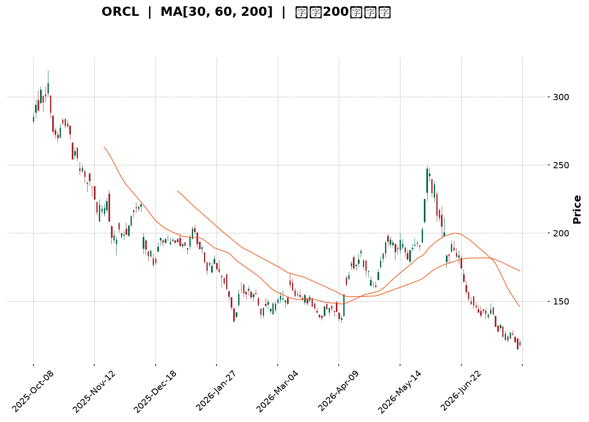
</details>

<html>
<head><meta charset="utf-8" /></head>
<body>
    <div style="height:500px; width:100%;">                        <script>window.PlotlyConfig = {MathJaxConfig: 'local'};</script>
        <script charset="utf-8" src="https://cdn.plot.ly/plotly-3.7.0.min.js" integrity="sha256-jvTGqxNp8AGWEcvNLVuKr+8j5dGe9Yw51LQkmDH+IYA=" crossorigin="anonymous"></script>                <div id="candlestick-chart" class="plotly-graph-div" style="height:100%; width:100%;"></div>            <script>                window.PLOTLYENV=window.PLOTLYENV || {};                                if (document.getElementById("candlestick-chart")) {                    Plotly.newPlot(                        "candlestick-chart",                        [{"close":{"dtype":"f8","bdata":"AAAAwAnWcUAAAADg92FyQAAAAICUInJAAAAAQBQRc0AAAADgS4JyQAAAAKCCy3JAAAAAAChgc0AAAACAbghyQAAAAOCCKHFAAAAAgFcIcUAAAAAA4uBwQAAAAGBPVnFAAAAAwPiJcUAAAADgYmtxQAAAAIBaYnFAAAAAILgKcUAAAABg8s1vQAAAAECeQXBAAAAAYF\u002fsb0AAAABgkrluQAAAAOBl\u002fW5AAAAAgBEvbkAAAAAALZ9tQAAAAKDv0G1AAAAAYJs8bUAAAACASRpsQAAAAEC672pAAAAAoBKXa0AAAACATjhrQAAAAEBGTGtAAAAAYAPsa0AAAACAqxVqQAAAAKCOm2hAAAAAYLvLaEAAAADguWRoQAAAAOAPYGlAAAAAYKkAaUAAAACgpuBoQAAAAOC45WhAAAAA4Nq3aUAAAACgCYlqQAAAACAL8GpAAAAAwNtNa0AAAABgPG1rQAAAAMAknGtAAAAAAGmeaEAAAADg9oRnQAAAAIDo5GZAAAAAwCBbZ0AAAADAKRhmQAAAAEDsSWZAAAAAYFrEZ0AAAACAg49oQAAAAKApL2hAAAAAQE5zaEAAAAAgJ4NoQAAAAEBuMGhAAAAAYG5qaEAAAADAiCFoQAAAAMDjOmhAAAAAwADYZ0AAAADgxPxnQAAAAEDt32dAAAAAYNJ6Z0AAAABAlaRoQAAAAOBVaGlAAAAAwGIcaUAAAACAjQhoQAAAACARkWdAAAAAwHi4Z0AAAACgglVmQAAAAECSlWVAAAAAYDceZkAAAACgzf1lQAAAAICXpWZAAAAAAPy1ZUAAAAAgQHNlQAAAAMDP+mRAAAAA4AhuZEAAAADgZd5jQAAAAEAdM2NAAAAAwOM0YkAAAABAEvFgQAAAAGCLumFAAAAAwCBwY0AAAADg\u002fthjQAAAAOA9gmNAAAAA4KFsY0AAAADA8OBjQAAAAKDeHGNAAAAAIMhiY0AAAAAAim5jQAAAAGCyYWJAAAAAII+KYUAAAAAgDCRiQAAAAKCoW2JAAAAAwI+oYkAAAAAAiAxiQAAAAIDghmJAAAAAIEB\u002fYkAAAABABupiQAAAAGDtNmNAAAAAIMb8YkAAAADASNBiQAAAAMCki2JAAAAAgKM\u002fZEAAAABgzMFjQAAAAMAYQWNAAAAAAG1cY0AAAAAAwDNjQAAAAODd+mJAAAAAQCBOY0AAAACgipRiQAAAAKCgKGNAAAAAgDxCYkAAAAAAPCBiQAAAAOA5umFAAAAAICBWYUAAAADgyzphQAAAAEDfQmJAAAAAICEHYkAAAACgrCtiQAAAAOD6EGJAAAAAoKrFYUAAAADgPNVhQAAAAMA5LGFAAAAAYI8zYUAAAABAk2JjQAAAAKDqTWRAAAAAwBQnZUAAAABAGDdmQAAAAKB\u002fzmVAAAAAANweZkAAAABAV5FmQAAAAOAyW2dAAAAAQGf1ZUAAAACAvJVlQAAAACCIi2VAAAAAAE+sZEAAAACAYmhkQAAAAECTGmRAAAAAQH9nZUAAAABAR3VmQAAAACCjFmdAAAAAIG8raEAAAADASj1oQAAAAECpaGhAAAAAAGAlaEAAAABA1UVnQAAAAIBEo2dAAAAAoNFdaEAAAABg\u002fghoQAAAAEDRPmdAAAAAwJaaZkAAAADgPnBnQAAAAECWo2dAAAAAIEDtZ0AAAABggAxoQAAAAACJyWdAAAAAIM1faUAAAABg6R9sQAAAACBF6W5AAAAAIG13bkAAAADAAbFsQAAAAACpcG1AAAAAwA2eakAAAACgvWJqQAAAAGAWo2lAAAAA4P0RaUAAAACgxu5mQAAAAIC772ZAAAAAwBv\u002fZ0AAAACgqnVnQAAAAGCZ3GZAAAAAoNX0ZkAAAABg0c5lQAAAAADMkmRAAAAAwHufY0AAAABgzv1iQAAAAGB7gGJAAAAAYO1nYkAAAACAV0FiQAAAAOAwwGFAAAAAIBR5YUAAAAAAX+hhQAAAAKB9o2FAAAAAIBiAYUAAAABACvdhQAAAAOB6lGFAAAAAoEdxYEAAAAAAKfxfQAAAACCuj2BAAAAAoHANX0AAAACAPZpfQAAAAOBRWF5AAAAAQDPDX0AAAACAwnVfQAAAAGCPAl5AAAAAIFy\u002fXEAAAACgmfldQA=="},"high":{"dtype":"f8","bdata":"8wHyQ+oDckDVG+b1g6FyQGt9je97DHNAJNnHPLU7c0D9SAYpMNhyQGcwwfKeQHNAXvWkkFb3c0AxKJAY+NVyQGbWCrSg53FAIgDYWfRZcUC1Rqg41ChxQJFTAK9ThnFAqcWJVCTHcUBZsYxdIcRxQPNI5tK5q3FA0zrqkd9ucUCbpwIT7bJwQEZblEdUdHBAKl7Jg1FxcEBcStkO65pvQJRLEI+jP29A5m7r7xjWbkBqCSSoTsNtQNZGtrcYnG5ApgifQs9lbUDp6X1YhlFtQKuKyX9J4GtAQAkPTTAcbED\u002fCQrpfJVrQHOlA0gDsmtAG3xeVA0\u002fbECLUx23dvhsQDD6Sdo8ymlA8wJlE+47aUBP+bKcKLBoQGMi4A\u002fN\u002f2lALORWugUNaUDEG5DGyTFpQNwJz\u002fNK9mlAC3dQgeC9aUCnp0V6RKtqQGqMsHzlLGtAJdZWpErTa0CbJtpRyI9rQBuO8pZb5WtAmjt9Iu4BaUADgSQst35oQAseXipFZWdA5xyun5N\u002fZ0AUaEsm\u002fBZnQJ1MPzLW32ZAGJr8mTAoaEBuiV5B05xoQPAI7y4damhAan6EDFiMaEDlcwa9lc5oQACowiqik2hAxOMTb4OPaEAJyvUnHWpoQKjBUTsrlmhANb910Gv4aEBF4nlwlSBoQNjD3ySfOWhAbiVeQgakZ0BIXK+QVdloQO7JvYpZpWlAnYmAtHvLaUAjoVxkAAlpQBJJPZcKNWhALDx9L0LRZ0CcWAF2iTxnQNmDZrYea2ZAtrXwISNdZkCWPsgo7kxmQCIyR3LLAGdAEGQXqCdPZkAKjXx9cI1mQMie2a+UIWVA1VIH0FD3ZEAqUP7XZ0BlQCrnNgjKyGNALHyzluobY0B9WdOjEzFiQCPVUamexmFAwde294vUY0BLvs1lxodkQKJ5pZXMUGRAcWRu7vu9Y0Art1DIlCVkQNd8l3GcxWNAKeIJ7bCGY0DENfqgCN9jQPwy0FqBHWNAhSC6Jz4ZYkB94JrmvzdiQFiXhUXxBmNALV+f0yfuYkA6s7X9IyJiQJxBLdscpGJAqN4mq0O8YkBntOHsbRFjQA+O\u002f0gHm2NAlqnBTMDCY0BKomtARN5iQNefoZNFImNAaeSFgDNSZUCamzBuUNVkQC5SJu\u002f19GNA6AQhgHO0Y0Ak8bjNK7pjQA2t98SlPGNAe7kndp16Y0AXPrZM\u002fQVjQJREKlBjVmNA\u002fawHGaUaY0AndUZZoJliQABwYq+ILmJAL6T8iqKWYUCiA7dFEIdhQGcjPmYWTGJAQNyaopaTYkAQ7WC3lC1iQF7GC92hcGJAZ1Dh9SfyYUCmqBlaG81iQCc80vLByWFATG0YreN1YUCQPXTD0mtjQBWxuZsBGmVAY1\u002fLpcZ+ZUDfy6sPpHRmQGZxCwWI+2ZA9MJaY5kkZkAdLpRxURZnQJqZfqnFkGdA4XPYC02oZkA8UMsbrIJmQL0PVJ5YnmVAoOe0Lq8DZUBWgG6WCoZkQLtCVjxvk2RAYFCKWUO2ZUCHL1V1pNtmQFC9WIXyO2dAaTStnbkzaEBeKIpXmO5oQKTsRKcIqmhAitkE\u002fgxgaECIqgOKCQhoQDkbBLj83GdA57O9B3QAaUAX3AWq93doQNZZBiMow2dAlvRJbxqCZ0DzdsirKHJnQG7CnEDZBGhAYHx6BCWKaEAXm7h4vlBoQIBTzvwp72dAyw8u1EGJaUCNyAHELDBsQFj+wbs8LG9AlKUFOGAEb0Az7oQgo\u002fVtQD\u002frs\u002f\u002fjw21ArnmOWGfUbEBIlb0AnklrQPIRmKuJd2tAo6kEd8l3akBUUaw4JARnQPTshbH4HWdA3VW9QpJUaEA6Wyw6klRoQFBm9\u002fn6sGdAt1yWCtNqZ0DlOKIoFf5mQEPPhC84t2VAf11Ti5ylZEBlxKRzWqJjQCgGRvY+IGNAVpAbFNw+Y0DlBYFhIK1iQAjjUhM7YWJAdKYE6ZpRYkAw6L9MryNiQPRz9GfFIWJA5f\u002fR6CSrYUBzFDXBs5FiQAAAAIDCNWJAAAAAwMx0YUAAAADgUZhgQAAAAMDMvGBAAAAAwPV4YEAAAACAFA5gQAAAACBcX19AAAAAQOHaX0AAAABA4RpgQAAAAMDMLF9AAAAAwB7FXkAAAAAgXH9eQA=="},"hovertemplate":"\u003cb\u003e%{x|%Y-%m-%d}\u003c\u002fb\u003e\u003cbr\u003e\u958b: $%{open:.2f}\u003cbr\u003e\u9ad8: $%{high:.2f}\u003cbr\u003e\u4f4e: $%{low:.2f}\u003cbr\u003e\u6536: $%{close:.2f}\u003cextra\u003e\u003c\u002fextra\u003e","low":{"dtype":"f8","bdata":"7+x1DXeGcUB2uSZRQMhxQKnnUIyGE3JASdxgIFRuckCqa7qyDBNyQDAv7GkHgXJAA+UIUsvCckCZWsjWDcxxQBoU0ozgCnFAxMZ3NovacEBOGJEP2KpwQLCASqaa3HBAXkOyYtt4cUB2GuZ3MFJxQOtG2xjCXXFAIemSkB\u002fMcECgd6bdnLpvQHYxen89yG9A\u002fJMkTFWZb0Cz5FV4H1tuQMgtjtJwlW5Ax\u002fKndSCgbUCx1XEpK8RsQFoYaQPEWW1A17P4rIFWbEAOENgsTABsQNIy8+k+pWpAtvbXpjQYakDmGJRmBbBqQMNaZulsjmpAi4zQb3znakD76aclTwlqQAT22R1u9mdAyOkdQjMOaEBF0mlOaftmQJP6JX\u002faCWlAy5gUyBt3aEDbO1JURFpoQDvUirbbwmhAhLQBa9evaEBK5m6fKotpQIKsCauIcmpANX7+9s7aakCZXPa5OgZrQI2SxjUL8GpAbpBkiG0OZ0CvVb0DgQZnQExVIRtYdWZAA\u002ff0sEfXZkDNvbaoG+xlQML5xlr3G2ZAMH+7blRKZ0BzX+E5nN9nQCfFDGZTy2dA8OR3AwESaEBgHs5BkUdoQOqa64+W2WdAb\u002fOCxOM6aECw\u002fHU21BtoQIvNiyRZC2hAciMEOcPPZ0AhBHryGZxnQCuZVr1NxWdA+ACxSuQLZ0AwOj59EG9nQA6gyAKZdGhAG8cie5boaEC0NtPzkq9nQPSNgeJygmdAUODSUZAnZ0D48dbwtkNmQEgCO9lWLWVARal5UtToZUCKMMAI1FllQJ\u002fCyuNWKWZAMTYiEDePZUC7I9AHYVVlQBuoMUnLDGRApHqHwXNDZEDWEKDIfdxjQB8ty78W22JAGbVd47TtYUDN+EwB\u002fMlgQEHtPMRKPmFA3ZiGWGA\u002fYkBax\u002fvW4ntjQI7LPKjSHWNAVZmO3ifuYkBiGNEL0UZjQH\u002fpRk07+mJA8tX3Mz\u002fKYkDFwvf+EVZjQPnRoxPFS2JAxuGvaB80YUB0DVFdkjhhQMpZez8uSmJAxSloKZYEYkCdVkL8qaNhQHhFbn1thmFAI1tXe9rBYUAYX\u002ftHHIJiQOSGVRKGomJAMUmZ4TDSYkDw0+80Qy1iQPAiGll0bWJAGN2jLuzuY0CimFT\u002fUbBjQNa6ouqWImNA48XTkgcuY0CnF70b7w1jQDRKM5yJ32JAKe9e7G97YkCReJfJkF1iQCE8rftFtWJASVeAIpw6YkAQZ7wMHPNhQHTvDVelsWFAkztTROgqYUAY1hW7AQBhQO2EvNcpXGFAKUu5cFX1YUBpHkKtdmphQIai8YNG22FA2DbzAQZfYUBVPNcNFr1hQNhMeHPp8GBAdl6BmE\u002fDYEBIjQgTimdhQKEeygX\u002fH2RAX4sq3ke0ZECQnYGQUaZlQHNFFYhJmGVAjm4vFxKdZUDp4VwMy+xlQC3yqPtRxWZAXa1UWz+vZUDggQKc3wZlQOJytTUs6mRA+n31S58vZEBL9XAw+gJkQKVX29rF+GNAAFc58V2yZEA65bHB\u002fLRlQDeUtDgkTGZAxYdXoizBZkDLVnzDbsRnQE7uHEWesWdAcwbbBA6+Z0CCwuEkxodmQJDiEZxjDWdAhG+hbdMZZ0BrJlPG14dnQI0ZzdtO1GZANciI7a+JZkAaiJ2Uw0VmQIpvhr2hUWdA738x1f\u002fNZ0AtnLtgx7xnQLObh5aXaGdAgyCt2LQWaEAgaogvPulpQAAZ2HVI+mtAUn40BWLAbUBu9kLARFpsQDPKTTcm52tAndb3wikXakBP5+U3VhNqQKjJ2EVWo2hA1TCx+cWvaEBwgj+fg9VlQNiHqzIkTGZAUV\u002fk3Q8yZ0CkFlEHTWBnQE5WBftNvmZAVZRpia8iZkAxT2anc7llQHPv6v5BgWRA2XTxKfdZY0DS\u002flzE1rpiQDNfaq2Ub2JADbC4lEoWYkAIHinKVP9hQAAAAOAwwGFAEuObhShLYUBbPmW3dZVhQMvYfgZXImFAcGNxH1ciYUDLs8mncY5hQAAAAOBRaGFAAAAAQDNrYEAAAABgZuZfQAAAAEDhGmBAAAAAgD3qXkAAAAAAAGBeQAAAAIDrAV5AAAAAoHCNXkAAAADAzCxfQAAAAAAp3F1AAAAAAACwXEAAAABAMzNdQA=="},"name":"\u50f9\u683c","open":{"dtype":"f8","bdata":"C58ry0GjcUDf5HoyPAxyQBlBy9CUlnJASsJQz4p9ckDWkvXLt8pyQMPEpmnL33JA1OWvMePqckBkIdj1kc1yQDpt60wI43FA7YQ7zD83cUCCTkHaHANxQNsOjfii5XBAxmGSJgSzcUA\u002f9gfxUL1xQO\u002fH4PW9hHFArpu8dFZscUAijwr9wqJwQMxXSw5+EHBACqeA4ktrcEDHFqA48PJuQMp0t\u002fNUsW5AbUl4X0iybkBtwvt475ZtQC+HAe01c25AgK4sfSQ\u002fbUCNW8hyTk9tQKmHqy3m2mtAdeDKdBsaakCiZqLhAgRrQF2lhHWfxGpAN6KLevMea0DAw5K6c55sQMYTLf1Ao2lAI+8taFZfaEAglhFfOgdoQJWNXDH072lATHSX1VOzaEDI522PtNJoQHc8B1PEZWlAcclcQlHNaEAopNK5+btpQPJZOp4MHWtANvpb+4dna0AMF5nEsT1rQMd+JjLLdWtAqzZI15CZZ0B7tSfAzk9oQLftS8K3T2dA53\u002fMge\u002fdZkAHBCtO4bFmQGkZozkun2ZAEeU0LeNSZ0CpFG4WEl5oQA5H85G1UWhAwukn\u002f2IkaEAeYbYFX4VoQN07r3rDCWhAKzhxgPtFaECpdD5zZFFoQLu5dOKrcmhAL4srvj6OaEB6gpGBDddnQP87uxnlLWhATaGpXM6hZ0Aira7dlcpnQCDMed1Yh2hAMla4KIFyaUAjoVxkAAlpQBJJPZcKNWhA4AQhSvmSZ0CcWAF2iTxnQGALVjviTWZA578iRAhEZkDetFfPh21lQJnugAF0O2ZA7T2VBFA+ZkBbbtmtnrZlQPwlbdsJH2VAtfJsKR7gZED0fmQAgjdlQCRb\u002fYkypWNAfTL2zVMaY0Dey8Q84xJiQD7YFUv8WGFAgdZS0bluYkA7cRvAfdxjQKJ5pZXMUGRAr72y3rWaY0DcEmVwqMRjQIIZR61MnGNA6h6gPdoqY0CwzQ7yMYNjQPUEdA6UB2NAfK6dR78VYkClqtWcn3thQH9yglgEhGJADKmfO0J4YkBuMkqbOtxhQBu92\u002f1olGFAd248RuD3YUCHbMI0B59iQFhApP0D8WJA3fflpYD7YkAMZzV89LRiQApdwz6\u002fEWNA274pSTynZED4qSPnk3BkQLWiYWdNvmNAMSYQI0lfY0Ako8hjlUtjQAiwy3fBCmNAsGnPOVStYkCAeodJov9iQJUmWOXVy2JAApXaegv+YkCL2D7hPYZiQJoSAeSL3GFAKsbVuHt+YUCvpC5tM2JhQB5g1aZ2amFAaCdU88qBYkAnk4DnRblhQMybZs1bTWJAfo37Fw3ZYUAeoZaBPqhiQJcZRr2ftmFA8FJMfgEbYUA+wnpHImlhQHVSoBsh62RAXZwyDvfJZEAIRo0n3vllQBjKBBx3yWZAbXRa\u002fk0GZkBHaA73aTdmQDzfNN0aMWdALA4aPcl4ZkDs7f1JS3xmQKla5Oppf2VAKRQxTCEzZEBcjT7JFG9kQGGtdluqLmRA3ZYfJvq6ZEDZPl\u002fFHO1lQIXUhFP0r2ZAzWsIIb4xZ0Dc5TJ0fL1oQIHt2fUx\u002fWdAjU5tf3vvZ0CIqgOKCQhoQMuXjBv9i2dAS0bXBOJwZ0CEF9f9i7pnQOZypdjrqmdAiyBnb10rZ0BwKCkUHmpmQAtgvNVZi2dAoeT8BC3gZ0CXY\u002f6uJxRoQIAGZfsd2mdAtM8nusAraEAn7Isx0AhqQJjthaVttmxAM3mi7ak+bkBSfaE6rvRtQA0eeQPRRmxAkfBeWjiWbEBUFz611x9rQJXtfpRjpWpA1d0FY\u002fq5aECPeBHRgWFmQAV\u002f3mHLC2dAfMCj2rBXZ0At+F9pPatnQBd0XK53MGdAGSNlOgTMZkAhQ+3AsbVmQBb7gmF5NGVAafNZilU9ZED1IKJevpljQMZI312mt2JABWqgewAtY0CdKJ3+qVdiQJTManum\u002f2FA73w+0rPZYUBLj9Vpl\u002flhQCdAFGoY52FA4rryHH5SYUCEweUlwJ1hQAAAAMDMNGJAAAAAwPVgYUAAAAAAAIBgQAAAAIDrUWBAAAAAIFxvYEAAAADAzGxeQAAAAKBHEV9AAAAAANezXkAAAAAghYtfQAAAAKBw\u002fV5AAAAAgBSeXkAAAAAAAIBdQA=="},"x":["2025-10-08T00:00:00-04:00","2025-10-09T00:00:00-04:00","2025-10-10T00:00:00-04:00","2025-10-13T00:00:00-04:00","2025-10-14T00:00:00-04:00","2025-10-15T00:00:00-04:00","2025-10-16T00:00:00-04:00","2025-10-17T00:00:00-04:00","2025-10-20T00:00:00-04:00","2025-10-21T00:00:00-04:00","2025-10-22T00:00:00-04:00","2025-10-23T00:00:00-04:00","2025-10-24T00:00:00-04:00","2025-10-27T00:00:00-04:00","2025-10-28T00:00:00-04:00","2025-10-29T00:00:00-04:00","2025-10-30T00:00:00-04:00","2025-10-31T00:00:00-04:00","2025-11-03T00:00:00-05:00","2025-11-04T00:00:00-05:00","2025-11-05T00:00:00-05:00","2025-11-06T00:00:00-05:00","2025-11-07T00:00:00-05:00","2025-11-10T00:00:00-05:00","2025-11-11T00:00:00-05:00","2025-11-12T00:00:00-05:00","2025-11-13T00:00:00-05:00","2025-11-14T00:00:00-05:00","2025-11-17T00:00:00-05:00","2025-11-18T00:00:00-05:00","2025-11-19T00:00:00-05:00","2025-11-20T00:00:00-05:00","2025-11-21T00:00:00-05:00","2025-11-24T00:00:00-05:00","2025-11-25T00:00:00-05:00","2025-11-26T00:00:00-05:00","2025-11-28T00:00:00-05:00","2025-12-01T00:00:00-05:00","2025-12-02T00:00:00-05:00","2025-12-03T00:00:00-05:00","2025-12-04T00:00:00-05:00","2025-12-05T00:00:00-05:00","2025-12-08T00:00:00-05:00","2025-12-09T00:00:00-05:00","2025-12-10T00:00:00-05:00","2025-12-11T00:00:00-05:00","2025-12-12T00:00:00-05:00","2025-12-15T00:00:00-05:00","2025-12-16T00:00:00-05:00","2025-12-17T00:00:00-05:00","2025-12-18T00:00:00-05:00","2025-12-19T00:00:00-05:00","2025-12-22T00:00:00-05:00","2025-12-23T00:00:00-05:00","2025-12-24T00:00:00-05:00","2025-12-26T00:00:00-05:00","2025-12-29T00:00:00-05:00","2025-12-30T00:00:00-05:00","2025-12-31T00:00:00-05:00","2026-01-02T00:00:00-05:00","2026-01-05T00:00:00-05:00","2026-01-06T00:00:00-05:00","2026-01-07T00:00:00-05:00","2026-01-08T00:00:00-05:00","2026-01-09T00:00:00-05:00","2026-01-12T00:00:00-05:00","2026-01-13T00:00:00-05:00","2026-01-14T00:00:00-05:00","2026-01-15T00:00:00-05:00","2026-01-16T00:00:00-05:00","2026-01-20T00:00:00-05:00","2026-01-21T00:00:00-05:00","2026-01-22T00:00:00-05:00","2026-01-23T00:00:00-05:00","2026-01-26T00:00:00-05:00","2026-01-27T00:00:00-05:00","2026-01-28T00:00:00-05:00","2026-01-29T00:00:00-05:00","2026-01-30T00:00:00-05:00","2026-02-02T00:00:00-05:00","2026-02-03T00:00:00-05:00","2026-02-04T00:00:00-05:00","2026-02-05T00:00:00-05:00","2026-02-06T00:00:00-05:00","2026-02-09T00:00:00-05:00","2026-02-10T00:00:00-05:00","2026-02-11T00:00:00-05:00","2026-02-12T00:00:00-05:00","2026-02-13T00:00:00-05:00","2026-02-17T00:00:00-05:00","2026-02-18T00:00:00-05:00","2026-02-19T00:00:00-05:00","2026-02-20T00:00:00-05:00","2026-02-23T00:00:00-05:00","2026-02-24T00:00:00-05:00","2026-02-25T00:00:00-05:00","2026-02-26T00:00:00-05:00","2026-02-27T00:00:00-05:00","2026-03-02T00:00:00-05:00","2026-03-03T00:00:00-05:00","2026-03-04T00:00:00-05:00","2026-03-05T00:00:00-05:00","2026-03-06T00:00:00-05:00","2026-03-09T00:00:00-04:00","2026-03-10T00:00:00-04:00","2026-03-11T00:00:00-04:00","2026-03-12T00:00:00-04:00","2026-03-13T00:00:00-04:00","2026-03-16T00:00:00-04:00","2026-03-17T00:00:00-04:00","2026-03-18T00:00:00-04:00","2026-03-19T00:00:00-04:00","2026-03-20T00:00:00-04:00","2026-03-23T00:00:00-04:00","2026-03-24T00:00:00-04:00","2026-03-25T00:00:00-04:00","2026-03-26T00:00:00-04:00","2026-03-27T00:00:00-04:00","2026-03-30T00:00:00-04:00","2026-03-31T00:00:00-04:00","2026-04-01T00:00:00-04:00","2026-04-02T00:00:00-04:00","2026-04-06T00:00:00-04:00","2026-04-07T00:00:00-04:00","2026-04-08T00:00:00-04:00","2026-04-09T00:00:00-04:00","2026-04-10T00:00:00-04:00","2026-04-13T00:00:00-04:00","2026-04-14T00:00:00-04:00","2026-04-15T00:00:00-04:00","2026-04-16T00:00:00-04:00","2026-04-17T00:00:00-04:00","2026-04-20T00:00:00-04:00","2026-04-21T00:00:00-04:00","2026-04-22T00:00:00-04:00","2026-04-23T00:00:00-04:00","2026-04-24T00:00:00-04:00","2026-04-27T00:00:00-04:00","2026-04-28T00:00:00-04:00","2026-04-29T00:00:00-04:00","2026-04-30T00:00:00-04:00","2026-05-01T00:00:00-04:00","2026-05-04T00:00:00-04:00","2026-05-05T00:00:00-04:00","2026-05-06T00:00:00-04:00","2026-05-07T00:00:00-04:00","2026-05-08T00:00:00-04:00","2026-05-11T00:00:00-04:00","2026-05-12T00:00:00-04:00","2026-05-13T00:00:00-04:00","2026-05-14T00:00:00-04:00","2026-05-15T00:00:00-04:00","2026-05-18T00:00:00-04:00","2026-05-19T00:00:00-04:00","2026-05-20T00:00:00-04:00","2026-05-21T00:00:00-04:00","2026-05-22T00:00:00-04:00","2026-05-26T00:00:00-04:00","2026-05-27T00:00:00-04:00","2026-05-28T00:00:00-04:00","2026-05-29T00:00:00-04:00","2026-06-01T00:00:00-04:00","2026-06-02T00:00:00-04:00","2026-06-03T00:00:00-04:00","2026-06-04T00:00:00-04:00","2026-06-05T00:00:00-04:00","2026-06-08T00:00:00-04:00","2026-06-09T00:00:00-04:00","2026-06-10T00:00:00-04:00","2026-06-11T00:00:00-04:00","2026-06-12T00:00:00-04:00","2026-06-15T00:00:00-04:00","2026-06-16T00:00:00-04:00","2026-06-17T00:00:00-04:00","2026-06-18T00:00:00-04:00","2026-06-22T00:00:00-04:00","2026-06-23T00:00:00-04:00","2026-06-24T00:00:00-04:00","2026-06-25T00:00:00-04:00","2026-06-26T00:00:00-04:00","2026-06-29T00:00:00-04:00","2026-06-30T00:00:00-04:00","2026-07-01T00:00:00-04:00","2026-07-02T00:00:00-04:00","2026-07-06T00:00:00-04:00","2026-07-07T00:00:00-04:00","2026-07-08T00:00:00-04:00","2026-07-09T00:00:00-04:00","2026-07-10T00:00:00-04:00","2026-07-13T00:00:00-04:00","2026-07-14T00:00:00-04:00","2026-07-15T00:00:00-04:00","2026-07-16T00:00:00-04:00","2026-07-17T00:00:00-04:00","2026-07-20T00:00:00-04:00","2026-07-21T00:00:00-04:00","2026-07-22T00:00:00-04:00","2026-07-23T00:00:00-04:00","2026-07-24T00:00:00-04:00","2026-07-27T00:00:00-04:00"],"type":"candlestick"},{"hovertemplate":"MA30: $%{y:.2f}\u003cextra\u003e\u003c\u002fextra\u003e","line":{"color":"#2196F3","dash":"dash","width":2},"mode":"lines","name":"MA30","x":["2025-10-08T00:00:00-04:00","2025-10-09T00:00:00-04:00","2025-10-10T00:00:00-04:00","2025-10-13T00:00:00-04:00","2025-10-14T00:00:00-04:00","2025-10-15T00:00:00-04:00","2025-10-16T00:00:00-04:00","2025-10-17T00:00:00-04:00","2025-10-20T00:00:00-04:00","2025-10-21T00:00:00-04:00","2025-10-22T00:00:00-04:00","2025-10-23T00:00:00-04:00","2025-10-24T00:00:00-04:00","2025-10-27T00:00:00-04:00","2025-10-28T00:00:00-04:00","2025-10-29T00:00:00-04:00","2025-10-30T00:00:00-04:00","2025-10-31T00:00:00-04:00","2025-11-03T00:00:00-05:00","2025-11-04T00:00:00-05:00","2025-11-05T00:00:00-05:00","2025-11-06T00:00:00-05:00","2025-11-07T00:00:00-05:00","2025-11-10T00:00:00-05:00","2025-11-11T00:00:00-05:00","2025-11-12T00:00:00-05:00","2025-11-13T00:00:00-05:00","2025-11-14T00:00:00-05:00","2025-11-17T00:00:00-05:00","2025-11-18T00:00:00-05:00","2025-11-19T00:00:00-05:00","2025-11-20T00:00:00-05:00","2025-11-21T00:00:00-05:00","2025-11-24T00:00:00-05:00","2025-11-25T00:00:00-05:00","2025-11-26T00:00:00-05:00","2025-11-28T00:00:00-05:00","2025-12-01T00:00:00-05:00","2025-12-02T00:00:00-05:00","2025-12-03T00:00:00-05:00","2025-12-04T00:00:00-05:00","2025-12-05T00:00:00-05:00","2025-12-08T00:00:00-05:00","2025-12-09T00:00:00-05:00","2025-12-10T00:00:00-05:00","2025-12-11T00:00:00-05:00","2025-12-12T00:00:00-05:00","2025-12-15T00:00:00-05:00","2025-12-16T00:00:00-05:00","2025-12-17T00:00:00-05:00","2025-12-18T00:00:00-05:00","2025-12-19T00:00:00-05:00","2025-12-22T00:00:00-05:00","2025-12-23T00:00:00-05:00","2025-12-24T00:00:00-05:00","2025-12-26T00:00:00-05:00","2025-12-29T00:00:00-05:00","2025-12-30T00:00:00-05:00","2025-12-31T00:00:00-05:00","2026-01-02T00:00:00-05:00","2026-01-05T00:00:00-05:00","2026-01-06T00:00:00-05:00","2026-01-07T00:00:00-05:00","2026-01-08T00:00:00-05:00","2026-01-09T00:00:00-05:00","2026-01-12T00:00:00-05:00","2026-01-13T00:00:00-05:00","2026-01-14T00:00:00-05:00","2026-01-15T00:00:00-05:00","2026-01-16T00:00:00-05:00","2026-01-20T00:00:00-05:00","2026-01-21T00:00:00-05:00","2026-01-22T00:00:00-05:00","2026-01-23T00:00:00-05:00","2026-01-26T00:00:00-05:00","2026-01-27T00:00:00-05:00","2026-01-28T00:00:00-05:00","2026-01-29T00:00:00-05:00","2026-01-30T00:00:00-05:00","2026-02-02T00:00:00-05:00","2026-02-03T00:00:00-05:00","2026-02-04T00:00:00-05:00","2026-02-05T00:00:00-05:00","2026-02-06T00:00:00-05:00","2026-02-09T00:00:00-05:00","2026-02-10T00:00:00-05:00","2026-02-11T00:00:00-05:00","2026-02-12T00:00:00-05:00","2026-02-13T00:00:00-05:00","2026-02-17T00:00:00-05:00","2026-02-18T00:00:00-05:00","2026-02-19T00:00:00-05:00","2026-02-20T00:00:00-05:00","2026-02-23T00:00:00-05:00","2026-02-24T00:00:00-05:00","2026-02-25T00:00:00-05:00","2026-02-26T00:00:00-05:00","2026-02-27T00:00:00-05:00","2026-03-02T00:00:00-05:00","2026-03-03T00:00:00-05:00","2026-03-04T00:00:00-05:00","2026-03-05T00:00:00-05:00","2026-03-06T00:00:00-05:00","2026-03-09T00:00:00-04:00","2026-03-10T00:00:00-04:00","2026-03-11T00:00:00-04:00","2026-03-12T00:00:00-04:00","2026-03-13T00:00:00-04:00","2026-03-16T00:00:00-04:00","2026-03-17T00:00:00-04:00","2026-03-18T00:00:00-04:00","2026-03-19T00:00:00-04:00","2026-03-20T00:00:00-04:00","2026-03-23T00:00:00-04:00","2026-03-24T00:00:00-04:00","2026-03-25T00:00:00-04:00","2026-03-26T00:00:00-04:00","2026-03-27T00:00:00-04:00","2026-03-30T00:00:00-04:00","2026-03-31T00:00:00-04:00","2026-04-01T00:00:00-04:00","2026-04-02T00:00:00-04:00","2026-04-06T00:00:00-04:00","2026-04-07T00:00:00-04:00","2026-04-08T00:00:00-04:00","2026-04-09T00:00:00-04:00","2026-04-10T00:00:00-04:00","2026-04-13T00:00:00-04:00","2026-04-14T00:00:00-04:00","2026-04-15T00:00:00-04:00","2026-04-16T00:00:00-04:00","2026-04-17T00:00:00-04:00","2026-04-20T00:00:00-04:00","2026-04-21T00:00:00-04:00","2026-04-22T00:00:00-04:00","2026-04-23T00:00:00-04:00","2026-04-24T00:00:00-04:00","2026-04-27T00:00:00-04:00","2026-04-28T00:00:00-04:00","2026-04-29T00:00:00-04:00","2026-04-30T00:00:00-04:00","2026-05-01T00:00:00-04:00","2026-05-04T00:00:00-04:00","2026-05-05T00:00:00-04:00","2026-05-06T00:00:00-04:00","2026-05-07T00:00:00-04:00","2026-05-08T00:00:00-04:00","2026-05-11T00:00:00-04:00","2026-05-12T00:00:00-04:00","2026-05-13T00:00:00-04:00","2026-05-14T00:00:00-04:00","2026-05-15T00:00:00-04:00","2026-05-18T00:00:00-04:00","2026-05-19T00:00:00-04:00","2026-05-20T00:00:00-04:00","2026-05-21T00:00:00-04:00","2026-05-22T00:00:00-04:00","2026-05-26T00:00:00-04:00","2026-05-27T00:00:00-04:00","2026-05-28T00:00:00-04:00","2026-05-29T00:00:00-04:00","2026-06-01T00:00:00-04:00","2026-06-02T00:00:00-04:00","2026-06-03T00:00:00-04:00","2026-06-04T00:00:00-04:00","2026-06-05T00:00:00-04:00","2026-06-08T00:00:00-04:00","2026-06-09T00:00:00-04:00","2026-06-10T00:00:00-04:00","2026-06-11T00:00:00-04:00","2026-06-12T00:00:00-04:00","2026-06-15T00:00:00-04:00","2026-06-16T00:00:00-04:00","2026-06-17T00:00:00-04:00","2026-06-18T00:00:00-04:00","2026-06-22T00:00:00-04:00","2026-06-23T00:00:00-04:00","2026-06-24T00:00:00-04:00","2026-06-25T00:00:00-04:00","2026-06-26T00:00:00-04:00","2026-06-29T00:00:00-04:00","2026-06-30T00:00:00-04:00","2026-07-01T00:00:00-04:00","2026-07-02T00:00:00-04:00","2026-07-06T00:00:00-04:00","2026-07-07T00:00:00-04:00","2026-07-08T00:00:00-04:00","2026-07-09T00:00:00-04:00","2026-07-10T00:00:00-04:00","2026-07-13T00:00:00-04:00","2026-07-14T00:00:00-04:00","2026-07-15T00:00:00-04:00","2026-07-16T00:00:00-04:00","2026-07-17T00:00:00-04:00","2026-07-20T00:00:00-04:00","2026-07-21T00:00:00-04:00","2026-07-22T00:00:00-04:00","2026-07-23T00:00:00-04:00","2026-07-24T00:00:00-04:00","2026-07-27T00:00:00-04:00"],"y":{"dtype":"f8","bdata":"AAAAAAAA+H8AAAAAAAD4fwAAAAAAAPh\u002fAAAAAAAA+H8AAAAAAAD4fwAAAAAAAPh\u002fAAAAAAAA+H8AAAAAAAD4fwAAAAAAAPh\u002fAAAAAAAA+H8AAAAAAAD4fwAAAAAAAPh\u002fAAAAAAAA+H8AAAAAAAD4fwAAAAAAAPh\u002fAAAAAAAA+H8AAAAAAAD4fwAAAAAAAPh\u002fAAAAAAAA+H8AAAAAAAD4fwAAAAAAAPh\u002fAAAAAAAA+H8AAAAAAAD4fwAAAAAAAPh\u002fAAAAAAAA+H8AAAAAAAD4fwAAAAAAAPh\u002fAAAAAAAA+H8AAAAAAAD4fxERERkebnBAMzMzwwxNcEDv7u6Oeh9wQImIiPhv229AiYiIiJ9pb0AAAADw5P1uQO\u002fu7o6plW5ARERENFcgbkDNzMzs3cBtQO\u002fu7n59cG1AmpmZOUMpbUCamZlpo+tsQN7d3X2eqWxA7+7ubkhnbEDv7u4eCChsQO\u002fu7j7y6mtAzczMvC2aa0AAAACwelNrQCIiItJmAWtAIiIiIku4akAzMzODpW5qQJqZmbllJGpAMzMz46PtaUAiIiKSc8JpQAAAAHBkkmlAiYiIiIxpaUARERFB6UppQJqZmcl3M2lA7+7uPmEYaUAiIiJSBf5oQO\u002fu7l7X42hAvLu7ewrBaEDe3d3tJK9oQBEREdHjqGhAmpmZ2aidaEAzMzPDyZ9oQM3MzFwQoGhAERER8fygaEB3d3fnyJloQKuqqvptjmhAzczMLGJ9aEB3d3dXiFloQFVVVaXZK2hA7+7ubpj\u002fZ0AAAADgNtFnQFVVVdXcpmdAZmZmZgyOZ0DNzMwsZHxnQERERAQObGdAERERwRVTZ0AiIiLCF0BnQGZmZoa7JWdAMzMzo0j2ZkDNzMzcRLVmQFVVVYUufmZAzczMvGhTZkCJiIiYmitmQM3MzAyqA2ZAq6qqKhLZZUBVVVXVyLRlQO\u002fu7v4diWVAMzMzkxNjZUDv7u6+MzxlQKuqqupTDWVAIiIiAqfaZECJiIj4KqNkQAAAABADZ2RA7+7ufvMvZEDv7u4+4vxjQAAAAKDg0WNAvLu7q02lY0C8u7vbHohjQJqZmSnmc2NAAAAAMC9ZY0CJiIgoET5jQJqZmZkRG2NA7+7uLpcOY0BERERkJABjQHd3dxdr8WJAvLu7S0zoYkCamZkZnOJiQO\u002fu7h684GJAERERARzqYkC8u7t7F\u002fhiQERERGRLBGNAAAAAQDv6YkBmZmYWiutiQBEREcFW3GJAERERoYXKYkDNzMzM6rNiQN7d3Y2mrGJAvLu76w+hYkDv7u7OTJZiQGZmZgack2JAiYiIaJSVYkBmZmbm85JiQKuqqprWiGJAiYiIqGd8YkDv7u5uzodiQAAAAHD5lmJAiYiIqKKtYkDNzMzszcliQGZmZmbs32JAzczM3Kj6YkARERHhsRpjQGZmZia\u002fQ2NA3t3dvVZSY0AAAADQ72FjQO\u002fu7g58dWNAIiIiQq6AY0ARERHx94pjQN7d3Q2PlGNA7+7unnimY0CamZn5j8djQHd3d5cY6WNAZmZmNokbZEDv7u5etE9kQFVVVRW4iGRAAAAA0NPCZEARERExZfZkQO\u002fu7m5GJGVAIiIiYl1aZUBERESkaIxlQERERHSauGVAZmZmhtXhZUDNzMzsqhFmQM3MzKzYSGZA7+7ubjyCZkCrqqqaCKpmQFVVVRXBx2ZAq6qqOsfrZkCamZmZNB5nQJqZmdnla2dAMzMz4x2zZ0De3d1NX+dnQERERKRJG2hAzczM7ApDaEDe3d1tAmxoQCIiIpLtjmhAZmZmZnO0aEBVVVVF\u002f8loQHd3d0cr4mhAiYiIGEr4aEARERHx1QBpQO\u002fu7q7m\u002fmhAvLu7O4z0aEBERER0zN9oQBEREeERv2hARERENHmYaEARERFx8HNoQAAAAPAcSGhA7+7u\u002fj8VaEAiIiKi7eNnQLy7u2sKtWdAzczMzEGJZ0C8u7urD1pnQGZmZqbbJmdAvLu7+wTwZkBVVVWlGrxmQFVVVbUih2ZA7+7uDus6ZkBmZmb2Y9NlQO\u002fu7v7vWGVAiYiIgHLZZEAAAAB4c2tkQHd3d3ez8WNA7+7u\u002fhWWY0AAAABAKDtjQBERESlu4GJAvLu7OyeFYkC8u7ujWkFiQA=="},"type":"scatter"},{"hovertemplate":"MA60: $%{y:.2f}\u003cextra\u003e\u003c\u002fextra\u003e","line":{"color":"#9C27B0","dash":"dash","width":2},"mode":"lines","name":"MA60","x":["2025-10-08T00:00:00-04:00","2025-10-09T00:00:00-04:00","2025-10-10T00:00:00-04:00","2025-10-13T00:00:00-04:00","2025-10-14T00:00:00-04:00","2025-10-15T00:00:00-04:00","2025-10-16T00:00:00-04:00","2025-10-17T00:00:00-04:00","2025-10-20T00:00:00-04:00","2025-10-21T00:00:00-04:00","2025-10-22T00:00:00-04:00","2025-10-23T00:00:00-04:00","2025-10-24T00:00:00-04:00","2025-10-27T00:00:00-04:00","2025-10-28T00:00:00-04:00","2025-10-29T00:00:00-04:00","2025-10-30T00:00:00-04:00","2025-10-31T00:00:00-04:00","2025-11-03T00:00:00-05:00","2025-11-04T00:00:00-05:00","2025-11-05T00:00:00-05:00","2025-11-06T00:00:00-05:00","2025-11-07T00:00:00-05:00","2025-11-10T00:00:00-05:00","2025-11-11T00:00:00-05:00","2025-11-12T00:00:00-05:00","2025-11-13T00:00:00-05:00","2025-11-14T00:00:00-05:00","2025-11-17T00:00:00-05:00","2025-11-18T00:00:00-05:00","2025-11-19T00:00:00-05:00","2025-11-20T00:00:00-05:00","2025-11-21T00:00:00-05:00","2025-11-24T00:00:00-05:00","2025-11-25T00:00:00-05:00","2025-11-26T00:00:00-05:00","2025-11-28T00:00:00-05:00","2025-12-01T00:00:00-05:00","2025-12-02T00:00:00-05:00","2025-12-03T00:00:00-05:00","2025-12-04T00:00:00-05:00","2025-12-05T00:00:00-05:00","2025-12-08T00:00:00-05:00","2025-12-09T00:00:00-05:00","2025-12-10T00:00:00-05:00","2025-12-11T00:00:00-05:00","2025-12-12T00:00:00-05:00","2025-12-15T00:00:00-05:00","2025-12-16T00:00:00-05:00","2025-12-17T00:00:00-05:00","2025-12-18T00:00:00-05:00","2025-12-19T00:00:00-05:00","2025-12-22T00:00:00-05:00","2025-12-23T00:00:00-05:00","2025-12-24T00:00:00-05:00","2025-12-26T00:00:00-05:00","2025-12-29T00:00:00-05:00","2025-12-30T00:00:00-05:00","2025-12-31T00:00:00-05:00","2026-01-02T00:00:00-05:00","2026-01-05T00:00:00-05:00","2026-01-06T00:00:00-05:00","2026-01-07T00:00:00-05:00","2026-01-08T00:00:00-05:00","2026-01-09T00:00:00-05:00","2026-01-12T00:00:00-05:00","2026-01-13T00:00:00-05:00","2026-01-14T00:00:00-05:00","2026-01-15T00:00:00-05:00","2026-01-16T00:00:00-05:00","2026-01-20T00:00:00-05:00","2026-01-21T00:00:00-05:00","2026-01-22T00:00:00-05:00","2026-01-23T00:00:00-05:00","2026-01-26T00:00:00-05:00","2026-01-27T00:00:00-05:00","2026-01-28T00:00:00-05:00","2026-01-29T00:00:00-05:00","2026-01-30T00:00:00-05:00","2026-02-02T00:00:00-05:00","2026-02-03T00:00:00-05:00","2026-02-04T00:00:00-05:00","2026-02-05T00:00:00-05:00","2026-02-06T00:00:00-05:00","2026-02-09T00:00:00-05:00","2026-02-10T00:00:00-05:00","2026-02-11T00:00:00-05:00","2026-02-12T00:00:00-05:00","2026-02-13T00:00:00-05:00","2026-02-17T00:00:00-05:00","2026-02-18T00:00:00-05:00","2026-02-19T00:00:00-05:00","2026-02-20T00:00:00-05:00","2026-02-23T00:00:00-05:00","2026-02-24T00:00:00-05:00","2026-02-25T00:00:00-05:00","2026-02-26T00:00:00-05:00","2026-02-27T00:00:00-05:00","2026-03-02T00:00:00-05:00","2026-03-03T00:00:00-05:00","2026-03-04T00:00:00-05:00","2026-03-05T00:00:00-05:00","2026-03-06T00:00:00-05:00","2026-03-09T00:00:00-04:00","2026-03-10T00:00:00-04:00","2026-03-11T00:00:00-04:00","2026-03-12T00:00:00-04:00","2026-03-13T00:00:00-04:00","2026-03-16T00:00:00-04:00","2026-03-17T00:00:00-04:00","2026-03-18T00:00:00-04:00","2026-03-19T00:00:00-04:00","2026-03-20T00:00:00-04:00","2026-03-23T00:00:00-04:00","2026-03-24T00:00:00-04:00","2026-03-25T00:00:00-04:00","2026-03-26T00:00:00-04:00","2026-03-27T00:00:00-04:00","2026-03-30T00:00:00-04:00","2026-03-31T00:00:00-04:00","2026-04-01T00:00:00-04:00","2026-04-02T00:00:00-04:00","2026-04-06T00:00:00-04:00","2026-04-07T00:00:00-04:00","2026-04-08T00:00:00-04:00","2026-04-09T00:00:00-04:00","2026-04-10T00:00:00-04:00","2026-04-13T00:00:00-04:00","2026-04-14T00:00:00-04:00","2026-04-15T00:00:00-04:00","2026-04-16T00:00:00-04:00","2026-04-17T00:00:00-04:00","2026-04-20T00:00:00-04:00","2026-04-21T00:00:00-04:00","2026-04-22T00:00:00-04:00","2026-04-23T00:00:00-04:00","2026-04-24T00:00:00-04:00","2026-04-27T00:00:00-04:00","2026-04-28T00:00:00-04:00","2026-04-29T00:00:00-04:00","2026-04-30T00:00:00-04:00","2026-05-01T00:00:00-04:00","2026-05-04T00:00:00-04:00","2026-05-05T00:00:00-04:00","2026-05-06T00:00:00-04:00","2026-05-07T00:00:00-04:00","2026-05-08T00:00:00-04:00","2026-05-11T00:00:00-04:00","2026-05-12T00:00:00-04:00","2026-05-13T00:00:00-04:00","2026-05-14T00:00:00-04:00","2026-05-15T00:00:00-04:00","2026-05-18T00:00:00-04:00","2026-05-19T00:00:00-04:00","2026-05-20T00:00:00-04:00","2026-05-21T00:00:00-04:00","2026-05-22T00:00:00-04:00","2026-05-26T00:00:00-04:00","2026-05-27T00:00:00-04:00","2026-05-28T00:00:00-04:00","2026-05-29T00:00:00-04:00","2026-06-01T00:00:00-04:00","2026-06-02T00:00:00-04:00","2026-06-03T00:00:00-04:00","2026-06-04T00:00:00-04:00","2026-06-05T00:00:00-04:00","2026-06-08T00:00:00-04:00","2026-06-09T00:00:00-04:00","2026-06-10T00:00:00-04:00","2026-06-11T00:00:00-04:00","2026-06-12T00:00:00-04:00","2026-06-15T00:00:00-04:00","2026-06-16T00:00:00-04:00","2026-06-17T00:00:00-04:00","2026-06-18T00:00:00-04:00","2026-06-22T00:00:00-04:00","2026-06-23T00:00:00-04:00","2026-06-24T00:00:00-04:00","2026-06-25T00:00:00-04:00","2026-06-26T00:00:00-04:00","2026-06-29T00:00:00-04:00","2026-06-30T00:00:00-04:00","2026-07-01T00:00:00-04:00","2026-07-02T00:00:00-04:00","2026-07-06T00:00:00-04:00","2026-07-07T00:00:00-04:00","2026-07-08T00:00:00-04:00","2026-07-09T00:00:00-04:00","2026-07-10T00:00:00-04:00","2026-07-13T00:00:00-04:00","2026-07-14T00:00:00-04:00","2026-07-15T00:00:00-04:00","2026-07-16T00:00:00-04:00","2026-07-17T00:00:00-04:00","2026-07-20T00:00:00-04:00","2026-07-21T00:00:00-04:00","2026-07-22T00:00:00-04:00","2026-07-23T00:00:00-04:00","2026-07-24T00:00:00-04:00","2026-07-27T00:00:00-04:00"],"y":{"dtype":"f8","bdata":"AAAAAAAA+H8AAAAAAAD4fwAAAAAAAPh\u002fAAAAAAAA+H8AAAAAAAD4fwAAAAAAAPh\u002fAAAAAAAA+H8AAAAAAAD4fwAAAAAAAPh\u002fAAAAAAAA+H8AAAAAAAD4fwAAAAAAAPh\u002fAAAAAAAA+H8AAAAAAAD4fwAAAAAAAPh\u002fAAAAAAAA+H8AAAAAAAD4fwAAAAAAAPh\u002fAAAAAAAA+H8AAAAAAAD4fwAAAAAAAPh\u002fAAAAAAAA+H8AAAAAAAD4fwAAAAAAAPh\u002fAAAAAAAA+H8AAAAAAAD4fwAAAAAAAPh\u002fAAAAAAAA+H8AAAAAAAD4fwAAAAAAAPh\u002fAAAAAAAA+H8AAAAAAAD4fwAAAAAAAPh\u002fAAAAAAAA+H8AAAAAAAD4fwAAAAAAAPh\u002fAAAAAAAA+H8AAAAAAAD4fwAAAAAAAPh\u002fAAAAAAAA+H8AAAAAAAD4fwAAAAAAAPh\u002fAAAAAAAA+H8AAAAAAAD4fwAAAAAAAPh\u002fAAAAAAAA+H8AAAAAAAD4fwAAAAAAAPh\u002fAAAAAAAA+H8AAAAAAAD4fwAAAAAAAPh\u002fAAAAAAAA+H8AAAAAAAD4fwAAAAAAAPh\u002fAAAAAAAA+H8AAAAAAAD4fwAAAAAAAPh\u002fAAAAAAAA+H8AAAAAAAD4f4mIiMgJ4GxAERERAZKtbEDe3d0FDXdsQM3MzOQpQmxAERERMaQDbECamZlZ185rQN7d3fXcmmtAq6qqEqpga0AiIiJqUy1rQM3MzLx1\u002f2pAMzMzs1LTakCJiIjglaJqQJqZmRG8ampA7+7ubnAzakB3d3d\u002fn\u002fxpQCIiIornyGlAmpmZER2UaUBmZmZu72dpQDMzM2u6NmlAmpmZcbAFaUCrqqqiXtdoQAAAAKAQpWhAMzMzQ\u002fZxaEB3d3c33DtoQKuqqnpJCGhAq6qqonreZ0DNzMzsQbtnQDMzM+uQm2dAzczMtLl4Z0C8u7sTZ1lnQO\u002fu7q56NmdAd3d3Bw8SZ0BmZmZWrPVmQN7d3d0b22ZA3t3d7Se8ZkDe3d1deqFmQGZmZraJg2ZAAAAAOHhoZkAzMzOTVUtmQFVVVU0nMGZARERE7FcRZkCamZmZ0\u002fBlQHd3d+ffz2VAd3d3z2OsZUBEREQEpIdlQHd3dzf3YGVAq6qqylFOZUCJiIhIRD5lQN7d3Y28LmVAZmZmBrEdZUDe3d3tWRFlQKuqqtI7A2VAIiIiUjLwZEBEREQsrtZkQM3MzPQ8wWRAZmZm\u002ftGmZEB3d3dXkotkQO\u002fu7mYAcGRA3t3d5ctRZEARERHRWTRkQGZmZkbiGmRAd3d3vxECZEDv7u5GQOljQImIiPh30GNAVVVVtR24Y0B3d3dvD5tjQFVVVdXsd2NAvLu7ky1WY0Dv7u5WWEJjQAAAAAhtNGNAIiIiKngpY0BERERk9ihjQAAAAEjpKWNAZmZmBuwpY0DNzMyEYSxjQAAAAGBoL2NAZmZm9nYwY0AiIiIaCjFjQDMzM5NzM2NA7+7uRn00Y0BVVVUFyjZjQGZmZpalOmNAAAAAUEpIY0Crqqq6019jQN7d3f2xdmNAMzMzO+KKY0Crqqo6n51jQDMzM2uHsmNAiYiIuKzGY0Dv7u7+J9VjQGZmZn526GNA7+7uprb9Y0CamZm5WhFkQFVVVT0bJmRAd3d397Q7ZECamZlpT1JkQLy7u6PXaGRAvLu7C1J\u002fZEDNzMyE65hkQKuqqkJdr2RAmpmZ8bTMZEAzMzNDAfRkQAAAACDpJWVAAAAAYONWZUB3d3eXCIFlQFVVVWWEr2VAVVVV1bDKZUDv7u4e+eZlQImIiNA0AmZARERE1JAaZkAzMzObeypmQKuqqipdO2ZAvLu7W2FPZkBVVVX1MmRmQDMzM6P\u002fc2ZAERERuQqIZkCamZlpwJdmQDMzM\u002fvko2ZAIiIigqatZkARERHRKrVmQHd3d68xtmZAiYiIsM63ZkAzMzMjK7hmQAAAAHDStmZAmpmZqYu1ZkBERERM3bVmQJqZmSnat2ZAVVVVtSC5ZkAAAACgEbNmQFVVVeVxp2ZAzczMJFmTZkAAAABIzHhmQEREROxqYmZA3t3dMUhGZkDv7u5iaSlmQN7d3Y1+BmZA3t3ddZDsZUDv7u5WldNlQJqZmd2tt2VAERERUc2cZUCJiIj0rIVlQA=="},"type":"scatter"},{"hovertemplate":"MA200: $%{y:.2f}\u003cextra\u003e\u003c\u002fextra\u003e","line":{"color":"#FF6F00","dash":"solid","width":2},"mode":"lines","name":"MA200","x":["2025-10-08T00:00:00-04:00","2025-10-09T00:00:00-04:00","2025-10-10T00:00:00-04:00","2025-10-13T00:00:00-04:00","2025-10-14T00:00:00-04:00","2025-10-15T00:00:00-04:00","2025-10-16T00:00:00-04:00","2025-10-17T00:00:00-04:00","2025-10-20T00:00:00-04:00","2025-10-21T00:00:00-04:00","2025-10-22T00:00:00-04:00","2025-10-23T00:00:00-04:00","2025-10-24T00:00:00-04:00","2025-10-27T00:00:00-04:00","2025-10-28T00:00:00-04:00","2025-10-29T00:00:00-04:00","2025-10-30T00:00:00-04:00","2025-10-31T00:00:00-04:00","2025-11-03T00:00:00-05:00","2025-11-04T00:00:00-05:00","2025-11-05T00:00:00-05:00","2025-11-06T00:00:00-05:00","2025-11-07T00:00:00-05:00","2025-11-10T00:00:00-05:00","2025-11-11T00:00:00-05:00","2025-11-12T00:00:00-05:00","2025-11-13T00:00:00-05:00","2025-11-14T00:00:00-05:00","2025-11-17T00:00:00-05:00","2025-11-18T00:00:00-05:00","2025-11-19T00:00:00-05:00","2025-11-20T00:00:00-05:00","2025-11-21T00:00:00-05:00","2025-11-24T00:00:00-05:00","2025-11-25T00:00:00-05:00","2025-11-26T00:00:00-05:00","2025-11-28T00:00:00-05:00","2025-12-01T00:00:00-05:00","2025-12-02T00:00:00-05:00","2025-12-03T00:00:00-05:00","2025-12-04T00:00:00-05:00","2025-12-05T00:00:00-05:00","2025-12-08T00:00:00-05:00","2025-12-09T00:00:00-05:00","2025-12-10T00:00:00-05:00","2025-12-11T00:00:00-05:00","2025-12-12T00:00:00-05:00","2025-12-15T00:00:00-05:00","2025-12-16T00:00:00-05:00","2025-12-17T00:00:00-05:00","2025-12-18T00:00:00-05:00","2025-12-19T00:00:00-05:00","2025-12-22T00:00:00-05:00","2025-12-23T00:00:00-05:00","2025-12-24T00:00:00-05:00","2025-12-26T00:00:00-05:00","2025-12-29T00:00:00-05:00","2025-12-30T00:00:00-05:00","2025-12-31T00:00:00-05:00","2026-01-02T00:00:00-05:00","2026-01-05T00:00:00-05:00","2026-01-06T00:00:00-05:00","2026-01-07T00:00:00-05:00","2026-01-08T00:00:00-05:00","2026-01-09T00:00:00-05:00","2026-01-12T00:00:00-05:00","2026-01-13T00:00:00-05:00","2026-01-14T00:00:00-05:00","2026-01-15T00:00:00-05:00","2026-01-16T00:00:00-05:00","2026-01-20T00:00:00-05:00","2026-01-21T00:00:00-05:00","2026-01-22T00:00:00-05:00","2026-01-23T00:00:00-05:00","2026-01-26T00:00:00-05:00","2026-01-27T00:00:00-05:00","2026-01-28T00:00:00-05:00","2026-01-29T00:00:00-05:00","2026-01-30T00:00:00-05:00","2026-02-02T00:00:00-05:00","2026-02-03T00:00:00-05:00","2026-02-04T00:00:00-05:00","2026-02-05T00:00:00-05:00","2026-02-06T00:00:00-05:00","2026-02-09T00:00:00-05:00","2026-02-10T00:00:00-05:00","2026-02-11T00:00:00-05:00","2026-02-12T00:00:00-05:00","2026-02-13T00:00:00-05:00","2026-02-17T00:00:00-05:00","2026-02-18T00:00:00-05:00","2026-02-19T00:00:00-05:00","2026-02-20T00:00:00-05:00","2026-02-23T00:00:00-05:00","2026-02-24T00:00:00-05:00","2026-02-25T00:00:00-05:00","2026-02-26T00:00:00-05:00","2026-02-27T00:00:00-05:00","2026-03-02T00:00:00-05:00","2026-03-03T00:00:00-05:00","2026-03-04T00:00:00-05:00","2026-03-05T00:00:00-05:00","2026-03-06T00:00:00-05:00","2026-03-09T00:00:00-04:00","2026-03-10T00:00:00-04:00","2026-03-11T00:00:00-04:00","2026-03-12T00:00:00-04:00","2026-03-13T00:00:00-04:00","2026-03-16T00:00:00-04:00","2026-03-17T00:00:00-04:00","2026-03-18T00:00:00-04:00","2026-03-19T00:00:00-04:00","2026-03-20T00:00:00-04:00","2026-03-23T00:00:00-04:00","2026-03-24T00:00:00-04:00","2026-03-25T00:00:00-04:00","2026-03-26T00:00:00-04:00","2026-03-27T00:00:00-04:00","2026-03-30T00:00:00-04:00","2026-03-31T00:00:00-04:00","2026-04-01T00:00:00-04:00","2026-04-02T00:00:00-04:00","2026-04-06T00:00:00-04:00","2026-04-07T00:00:00-04:00","2026-04-08T00:00:00-04:00","2026-04-09T00:00:00-04:00","2026-04-10T00:00:00-04:00","2026-04-13T00:00:00-04:00","2026-04-14T00:00:00-04:00","2026-04-15T00:00:00-04:00","2026-04-16T00:00:00-04:00","2026-04-17T00:00:00-04:00","2026-04-20T00:00:00-04:00","2026-04-21T00:00:00-04:00","2026-04-22T00:00:00-04:00","2026-04-23T00:00:00-04:00","2026-04-24T00:00:00-04:00","2026-04-27T00:00:00-04:00","2026-04-28T00:00:00-04:00","2026-04-29T00:00:00-04:00","2026-04-30T00:00:00-04:00","2026-05-01T00:00:00-04:00","2026-05-04T00:00:00-04:00","2026-05-05T00:00:00-04:00","2026-05-06T00:00:00-04:00","2026-05-07T00:00:00-04:00","2026-05-08T00:00:00-04:00","2026-05-11T00:00:00-04:00","2026-05-12T00:00:00-04:00","2026-05-13T00:00:00-04:00","2026-05-14T00:00:00-04:00","2026-05-15T00:00:00-04:00","2026-05-18T00:00:00-04:00","2026-05-19T00:00:00-04:00","2026-05-20T00:00:00-04:00","2026-05-21T00:00:00-04:00","2026-05-22T00:00:00-04:00","2026-05-26T00:00:00-04:00","2026-05-27T00:00:00-04:00","2026-05-28T00:00:00-04:00","2026-05-29T00:00:00-04:00","2026-06-01T00:00:00-04:00","2026-06-02T00:00:00-04:00","2026-06-03T00:00:00-04:00","2026-06-04T00:00:00-04:00","2026-06-05T00:00:00-04:00","2026-06-08T00:00:00-04:00","2026-06-09T00:00:00-04:00","2026-06-10T00:00:00-04:00","2026-06-11T00:00:00-04:00","2026-06-12T00:00:00-04:00","2026-06-15T00:00:00-04:00","2026-06-16T00:00:00-04:00","2026-06-17T00:00:00-04:00","2026-06-18T00:00:00-04:00","2026-06-22T00:00:00-04:00","2026-06-23T00:00:00-04:00","2026-06-24T00:00:00-04:00","2026-06-25T00:00:00-04:00","2026-06-26T00:00:00-04:00","2026-06-29T00:00:00-04:00","2026-06-30T00:00:00-04:00","2026-07-01T00:00:00-04:00","2026-07-02T00:00:00-04:00","2026-07-06T00:00:00-04:00","2026-07-07T00:00:00-04:00","2026-07-08T00:00:00-04:00","2026-07-09T00:00:00-04:00","2026-07-10T00:00:00-04:00","2026-07-13T00:00:00-04:00","2026-07-14T00:00:00-04:00","2026-07-15T00:00:00-04:00","2026-07-16T00:00:00-04:00","2026-07-17T00:00:00-04:00","2026-07-20T00:00:00-04:00","2026-07-21T00:00:00-04:00","2026-07-22T00:00:00-04:00","2026-07-23T00:00:00-04:00","2026-07-24T00:00:00-04:00","2026-07-27T00:00:00-04:00"],"y":{"dtype":"f8","bdata":"AAAAAAAA+H8AAAAAAAD4fwAAAAAAAPh\u002fAAAAAAAA+H8AAAAAAAD4fwAAAAAAAPh\u002fAAAAAAAA+H8AAAAAAAD4fwAAAAAAAPh\u002fAAAAAAAA+H8AAAAAAAD4fwAAAAAAAPh\u002fAAAAAAAA+H8AAAAAAAD4fwAAAAAAAPh\u002fAAAAAAAA+H8AAAAAAAD4fwAAAAAAAPh\u002fAAAAAAAA+H8AAAAAAAD4fwAAAAAAAPh\u002fAAAAAAAA+H8AAAAAAAD4fwAAAAAAAPh\u002fAAAAAAAA+H8AAAAAAAD4fwAAAAAAAPh\u002fAAAAAAAA+H8AAAAAAAD4fwAAAAAAAPh\u002fAAAAAAAA+H8AAAAAAAD4fwAAAAAAAPh\u002fAAAAAAAA+H8AAAAAAAD4fwAAAAAAAPh\u002fAAAAAAAA+H8AAAAAAAD4fwAAAAAAAPh\u002fAAAAAAAA+H8AAAAAAAD4fwAAAAAAAPh\u002fAAAAAAAA+H8AAAAAAAD4fwAAAAAAAPh\u002fAAAAAAAA+H8AAAAAAAD4fwAAAAAAAPh\u002fAAAAAAAA+H8AAAAAAAD4fwAAAAAAAPh\u002fAAAAAAAA+H8AAAAAAAD4fwAAAAAAAPh\u002fAAAAAAAA+H8AAAAAAAD4fwAAAAAAAPh\u002fAAAAAAAA+H8AAAAAAAD4fwAAAAAAAPh\u002fAAAAAAAA+H8AAAAAAAD4fwAAAAAAAPh\u002fAAAAAAAA+H8AAAAAAAD4fwAAAAAAAPh\u002fAAAAAAAA+H8AAAAAAAD4fwAAAAAAAPh\u002fAAAAAAAA+H8AAAAAAAD4fwAAAAAAAPh\u002fAAAAAAAA+H8AAAAAAAD4fwAAAAAAAPh\u002fAAAAAAAA+H8AAAAAAAD4fwAAAAAAAPh\u002fAAAAAAAA+H8AAAAAAAD4fwAAAAAAAPh\u002fAAAAAAAA+H8AAAAAAAD4fwAAAAAAAPh\u002fAAAAAAAA+H8AAAAAAAD4fwAAAAAAAPh\u002fAAAAAAAA+H8AAAAAAAD4fwAAAAAAAPh\u002fAAAAAAAA+H8AAAAAAAD4fwAAAAAAAPh\u002fAAAAAAAA+H8AAAAAAAD4fwAAAAAAAPh\u002fAAAAAAAA+H8AAAAAAAD4fwAAAAAAAPh\u002fAAAAAAAA+H8AAAAAAAD4fwAAAAAAAPh\u002fAAAAAAAA+H8AAAAAAAD4fwAAAAAAAPh\u002fAAAAAAAA+H8AAAAAAAD4fwAAAAAAAPh\u002fAAAAAAAA+H8AAAAAAAD4fwAAAAAAAPh\u002fAAAAAAAA+H8AAAAAAAD4fwAAAAAAAPh\u002fAAAAAAAA+H8AAAAAAAD4fwAAAAAAAPh\u002fAAAAAAAA+H8AAAAAAAD4fwAAAAAAAPh\u002fAAAAAAAA+H8AAAAAAAD4fwAAAAAAAPh\u002fAAAAAAAA+H8AAAAAAAD4fwAAAAAAAPh\u002fAAAAAAAA+H8AAAAAAAD4fwAAAAAAAPh\u002fAAAAAAAA+H8AAAAAAAD4fwAAAAAAAPh\u002fAAAAAAAA+H8AAAAAAAD4fwAAAAAAAPh\u002fAAAAAAAA+H8AAAAAAAD4fwAAAAAAAPh\u002fAAAAAAAA+H8AAAAAAAD4fwAAAAAAAPh\u002fAAAAAAAA+H8AAAAAAAD4fwAAAAAAAPh\u002fAAAAAAAA+H8AAAAAAAD4fwAAAAAAAPh\u002fAAAAAAAA+H8AAAAAAAD4fwAAAAAAAPh\u002fAAAAAAAA+H8AAAAAAAD4fwAAAAAAAPh\u002fAAAAAAAA+H8AAAAAAAD4fwAAAAAAAPh\u002fAAAAAAAA+H8AAAAAAAD4fwAAAAAAAPh\u002fAAAAAAAA+H8AAAAAAAD4fwAAAAAAAPh\u002fAAAAAAAA+H8AAAAAAAD4fwAAAAAAAPh\u002fAAAAAAAA+H8AAAAAAAD4fwAAAAAAAPh\u002fAAAAAAAA+H8AAAAAAAD4fwAAAAAAAPh\u002fAAAAAAAA+H8AAAAAAAD4fwAAAAAAAPh\u002fAAAAAAAA+H8AAAAAAAD4fwAAAAAAAPh\u002fAAAAAAAA+H8AAAAAAAD4fwAAAAAAAPh\u002fAAAAAAAA+H8AAAAAAAD4fwAAAAAAAPh\u002fAAAAAAAA+H8AAAAAAAD4fwAAAAAAAPh\u002fAAAAAAAA+H8AAAAAAAD4fwAAAAAAAPh\u002fAAAAAAAA+H8AAAAAAAD4fwAAAAAAAPh\u002fAAAAAAAA+H8AAAAAAAD4fwAAAAAAAPh\u002fAAAAAAAA+H8AAAAAAAD4fwAAAAAAAPh\u002fAAAAAAAA+H8AAADS1CpnQA=="},"type":"scatter"}],                        {"template":{"data":{"barpolar":[{"marker":{"line":{"color":"rgb(17,17,17)","width":0.5},"pattern":{"fillmode":"overlay","size":10,"solidity":0.2}},"type":"barpolar"}],"bar":[{"error_x":{"color":"#f2f5fa"},"error_y":{"color":"#f2f5fa"},"marker":{"line":{"color":"rgb(17,17,17)","width":0.5},"pattern":{"fillmode":"overlay","size":10,"solidity":0.2}},"type":"bar"}],"carpet":[{"aaxis":{"endlinecolor":"#A2B1C6","gridcolor":"#506784","linecolor":"#506784","minorgridcolor":"#506784","startlinecolor":"#A2B1C6"},"baxis":{"endlinecolor":"#A2B1C6","gridcolor":"#506784","linecolor":"#506784","minorgridcolor":"#506784","startlinecolor":"#A2B1C6"},"type":"carpet"}],"choropleth":[{"colorbar":{"outlinewidth":0,"ticks":""},"type":"choropleth"}],"contourcarpet":[{"colorbar":{"outlinewidth":0,"ticks":""},"type":"contourcarpet"}],"contour":[{"colorbar":{"outlinewidth":0,"ticks":""},"colorscale":[[0.0,"#0d0887"],[0.1111111111111111,"#46039f"],[0.2222222222222222,"#7201a8"],[0.3333333333333333,"#9c179e"],[0.4444444444444444,"#bd3786"],[0.5555555555555556,"#d8576b"],[0.6666666666666666,"#ed7953"],[0.7777777777777778,"#fb9f3a"],[0.8888888888888888,"#fdca26"],[1.0,"#f0f921"]],"type":"contour"}],"heatmap":[{"colorbar":{"outlinewidth":0,"ticks":""},"colorscale":[[0.0,"#0d0887"],[0.1111111111111111,"#46039f"],[0.2222222222222222,"#7201a8"],[0.3333333333333333,"#9c179e"],[0.4444444444444444,"#bd3786"],[0.5555555555555556,"#d8576b"],[0.6666666666666666,"#ed7953"],[0.7777777777777778,"#fb9f3a"],[0.8888888888888888,"#fdca26"],[1.0,"#f0f921"]],"type":"heatmap"}],"histogram2dcontour":[{"colorbar":{"outlinewidth":0,"ticks":""},"colorscale":[[0.0,"#0d0887"],[0.1111111111111111,"#46039f"],[0.2222222222222222,"#7201a8"],[0.3333333333333333,"#9c179e"],[0.4444444444444444,"#bd3786"],[0.5555555555555556,"#d8576b"],[0.6666666666666666,"#ed7953"],[0.7777777777777778,"#fb9f3a"],[0.8888888888888888,"#fdca26"],[1.0,"#f0f921"]],"type":"histogram2dcontour"}],"histogram2d":[{"colorbar":{"outlinewidth":0,"ticks":""},"colorscale":[[0.0,"#0d0887"],[0.1111111111111111,"#46039f"],[0.2222222222222222,"#7201a8"],[0.3333333333333333,"#9c179e"],[0.4444444444444444,"#bd3786"],[0.5555555555555556,"#d8576b"],[0.6666666666666666,"#ed7953"],[0.7777777777777778,"#fb9f3a"],[0.8888888888888888,"#fdca26"],[1.0,"#f0f921"]],"type":"histogram2d"}],"histogram":[{"marker":{"pattern":{"fillmode":"overlay","size":10,"solidity":0.2}},"type":"histogram"}],"mesh3d":[{"colorbar":{"outlinewidth":0,"ticks":""},"type":"mesh3d"}],"parcoords":[{"line":{"colorbar":{"outlinewidth":0,"ticks":""}},"type":"parcoords"}],"pie":[{"automargin":true,"type":"pie"}],"scatter3d":[{"line":{"colorbar":{"outlinewidth":0,"ticks":""}},"marker":{"colorbar":{"outlinewidth":0,"ticks":""}},"type":"scatter3d"}],"scattercarpet":[{"marker":{"colorbar":{"outlinewidth":0,"ticks":""}},"type":"scattercarpet"}],"scattergeo":[{"marker":{"colorbar":{"outlinewidth":0,"ticks":""}},"type":"scattergeo"}],"scattergl":[{"marker":{"line":{"color":"#283442"}},"type":"scattergl"}],"scattermapbox":[{"marker":{"colorbar":{"outlinewidth":0,"ticks":""}},"type":"scattermapbox"}],"scattermap":[{"marker":{"colorbar":{"outlinewidth":0,"ticks":""}},"type":"scattermap"}],"scatterpolargl":[{"marker":{"colorbar":{"outlinewidth":0,"ticks":""}},"type":"scatterpolargl"}],"scatterpolar":[{"marker":{"colorbar":{"outlinewidth":0,"ticks":""}},"type":"scatterpolar"}],"scatter":[{"marker":{"line":{"color":"#283442"}},"type":"scatter"}],"scatterternary":[{"marker":{"colorbar":{"outlinewidth":0,"ticks":""}},"type":"scatterternary"}],"surface":[{"colorbar":{"outlinewidth":0,"ticks":""},"colorscale":[[0.0,"#0d0887"],[0.1111111111111111,"#46039f"],[0.2222222222222222,"#7201a8"],[0.3333333333333333,"#9c179e"],[0.4444444444444444,"#bd3786"],[0.5555555555555556,"#d8576b"],[0.6666666666666666,"#ed7953"],[0.7777777777777778,"#fb9f3a"],[0.8888888888888888,"#fdca26"],[1.0,"#f0f921"]],"type":"surface"}],"table":[{"cells":{"fill":{"color":"#506784"},"line":{"color":"rgb(17,17,17)"}},"header":{"fill":{"color":"#2a3f5f"},"line":{"color":"rgb(17,17,17)"}},"type":"table"}]},"layout":{"annotationdefaults":{"arrowcolor":"#f2f5fa","arrowhead":0,"arrowwidth":1},"autotypenumbers":"strict","coloraxis":{"colorbar":{"outlinewidth":0,"ticks":""}},"colorscale":{"diverging":[[0,"#8e0152"],[0.1,"#c51b7d"],[0.2,"#de77ae"],[0.3,"#f1b6da"],[0.4,"#fde0ef"],[0.5,"#f7f7f7"],[0.6,"#e6f5d0"],[0.7,"#b8e186"],[0.8,"#7fbc41"],[0.9,"#4d9221"],[1,"#276419"]],"sequential":[[0.0,"#0d0887"],[0.1111111111111111,"#46039f"],[0.2222222222222222,"#7201a8"],[0.3333333333333333,"#9c179e"],[0.4444444444444444,"#bd3786"],[0.5555555555555556,"#d8576b"],[0.6666666666666666,"#ed7953"],[0.7777777777777778,"#fb9f3a"],[0.8888888888888888,"#fdca26"],[1.0,"#f0f921"]],"sequentialminus":[[0.0,"#0d0887"],[0.1111111111111111,"#46039f"],[0.2222222222222222,"#7201a8"],[0.3333333333333333,"#9c179e"],[0.4444444444444444,"#bd3786"],[0.5555555555555556,"#d8576b"],[0.6666666666666666,"#ed7953"],[0.7777777777777778,"#fb9f3a"],[0.8888888888888888,"#fdca26"],[1.0,"#f0f921"]]},"colorway":["#636efa","#EF553B","#00cc96","#ab63fa","#FFA15A","#19d3f3","#FF6692","#B6E880","#FF97FF","#FECB52"],"font":{"color":"#f2f5fa"},"geo":{"bgcolor":"rgb(17,17,17)","lakecolor":"rgb(17,17,17)","landcolor":"rgb(17,17,17)","showlakes":true,"showland":true,"subunitcolor":"#506784"},"hoverlabel":{"align":"left"},"hovermode":"closest","mapbox":{"style":"dark"},"paper_bgcolor":"rgb(17,17,17)","plot_bgcolor":"rgb(17,17,17)","polar":{"angularaxis":{"gridcolor":"#506784","linecolor":"#506784","ticks":""},"bgcolor":"rgb(17,17,17)","radialaxis":{"gridcolor":"#506784","linecolor":"#506784","ticks":""}},"scene":{"xaxis":{"backgroundcolor":"rgb(17,17,17)","gridcolor":"#506784","gridwidth":2,"linecolor":"#506784","showbackground":true,"ticks":"","zerolinecolor":"#C8D4E3"},"yaxis":{"backgroundcolor":"rgb(17,17,17)","gridcolor":"#506784","gridwidth":2,"linecolor":"#506784","showbackground":true,"ticks":"","zerolinecolor":"#C8D4E3"},"zaxis":{"backgroundcolor":"rgb(17,17,17)","gridcolor":"#506784","gridwidth":2,"linecolor":"#506784","showbackground":true,"ticks":"","zerolinecolor":"#C8D4E3"}},"shapedefaults":{"line":{"color":"#f2f5fa"}},"sliderdefaults":{"bgcolor":"#C8D4E3","bordercolor":"rgb(17,17,17)","borderwidth":1,"tickwidth":0},"ternary":{"aaxis":{"gridcolor":"#506784","linecolor":"#506784","ticks":""},"baxis":{"gridcolor":"#506784","linecolor":"#506784","ticks":""},"bgcolor":"rgb(17,17,17)","caxis":{"gridcolor":"#506784","linecolor":"#506784","ticks":""}},"title":{"x":0.05},"updatemenudefaults":{"bgcolor":"#506784","borderwidth":0},"xaxis":{"automargin":true,"gridcolor":"#283442","linecolor":"#506784","ticks":"","title":{"standoff":15},"zerolinecolor":"#283442","zerolinewidth":2},"yaxis":{"automargin":true,"gridcolor":"#283442","linecolor":"#506784","ticks":"","title":{"standoff":15},"zerolinecolor":"#283442","zerolinewidth":2}}},"xaxis":{"rangeslider":{"visible":false},"title":{"text":"\u65e5\u671f"}},"font":{"size":11},"title":{"text":"ORCL  |  MA(30\u002f60\u002f200)  |  \u6700\u8fd1200\u4ea4\u6613\u65e5"},"yaxis":{"title":{"text":"\u80a1\u50f9 (USD)"}},"hovermode":"x unified","height":500},                        {"responsive": true}                    )                };            </script>        </div>
</body>
</html>

# ORCL 技術分析報告

> **報告日期**：2026-07-28 ｜ **語言**：繁體中文 ｜ **數據來源**：Yahoo Finance ｜ **當前價格**：$119.90

---

## 目錄

| 章節 | 內容 |
|------|------|
| [1. 技術面概覽](#1-技術面概覽) | 訊號儀表板、核心指標、評分卡 |
| [2. 趨勢分析](#2-趨勢分析) | 多時框趨勢、長中短期走勢 |
| [3. 圖表形態分析](#3-圖表形態分析) | 形態識別、K線組合、目標價 |
| [4. 支撐與阻力](#4-支撐與阻力) | 關鍵價位、斐波那契回調 |
| [5. 技術指標深度解讀](#5-技術指標深度解讀) | MA/RSI/MACD/布林/成交量 |
| [6. 動能與波動率](#6-動能與波動率) | 動能評估、ATR、Beta |
| [7. 多時框架總結](#7-多時框架總結) | 時框架評分矩陣 |
| [8. 交易策略建議](#8-交易策略建議) | 多空策略、風險報酬比 |
| [9. 風險提示與監控](#9-風險提示與監控) | 監控指標、風險場景 |

---

## 1. 技術面概覽

### 🎯 技術訊號儀表板

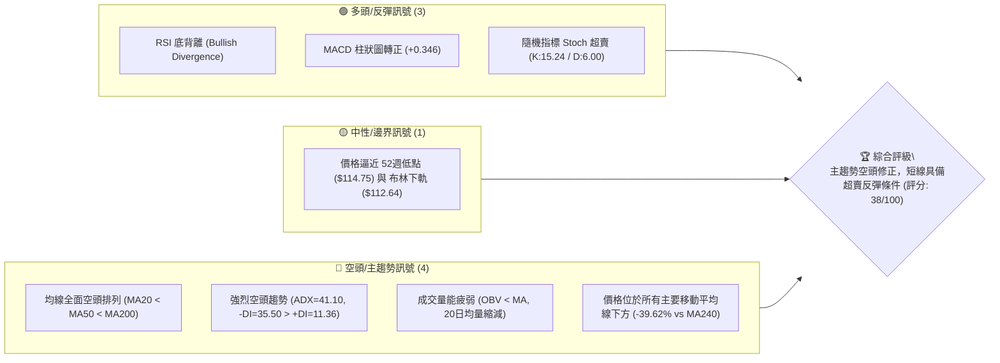

### 📊 核心指標速覽表

| 指標類別 | 指標名稱 | 當前數值 | 訊號 | 解讀 |
|----------|----------|----------|------|------|
| **價格** | 當前價格 | $119.90 | 🔴 空頭 | 處於 52週區間 2.3% 百分位，極度接近歷史低點 $114.75 |
| **均線** | MA20 | $132.78 | 🔴 空頭 | 現價低於 MA20 達 -9.70%，短期均線持續下行向下壓制 |
| **均線** | MA50 | $169.66 | 🔴 空頭 | 現價低於 MA50 達 -29.33%，中期走勢陷入深度修正 |
| **均線** | MA200 | $185.34 | 🔴 空頭 | 現價低於 MA200 達 -35.31%，長期牛熊分界線已被跌破 |
| **動能** | RSI(14) | 33.25 | 🟡 邊界 | 接近超賣區，且價格創低但RSI未創低，形成**底背離** |
| **動能** | MACD (12,26,9) | -13.808 | 🟢 多頭 | MACD線位於訊號線上方，柱狀圖轉正 (+0.346)，示警空頭衰竭 |
| **動能** | Stoch %K / %D | 15.24 / 6.00 | 🟢 多頭 | 進入極度超賣區 (K, D < 20)，具備超賣回升（Mean Reversion）契機 |
| **趨勢** | ADX(14) | 41.10 | 🔴 空頭 | 強趨勢狀態 (>25)，且 -DI(35.50) 遠大於 +DI(11.36)，空頭主導 |
| **波動** | ATR(14) | $6.69 | 🔴 高波動 | 日波動佔價格 5.58%，極具修復性反彈與震盪風險 |
| **通道** | 布林通道 %B | 0.18 | 🟡 邊界 | 價格貼近布林通道下軌 ($112.64)，短線面臨下軌強烈支撐 |

### 🏆 技術評分卡

```
╔══════════════════════════════════════════════════════════════════╗
║                   技術評分卡 — ORCL (2026-07-28)                 ║
╠══════════════════════════════════════════════════════════════════╣
║ 趨勢強度 (Trend)     ▓▓▓▓▓▓▓▓▓▓▓▓▓▓▓▓▓░░░  85/100  🔴 強烈空頭趨勢 ║
║ 動能指標 (Momentum)  ▓▓▓▓▓▓▓▓░░░░░░░░░░░░  40/100  🟢 底部背離萌芽 ║
║ 支撐穩定度 (Support) ▓▓▓▓▓▓░░░░░░░░░░░░░░  30/100  🔴 靠近52W Low   ║
║ 成交量配合 (Volume)  ▓▓▓▓▓▓░░░░░░░░░░░░░░  30/100  🔴 OBV低迷無量   ║
║ 形態完整度 (Pattern) ▓▓▓▓▓▓▓▓░░░░░░░░░░░░  40/100  🟡 探底築底階段 ║
║ 均線排列 (MAs Align) ▓▓▓▓░░░░░░░░░░░░░░░░  20/100  🔴 完美空頭排列 ║
╠══════════════════════════════════════════════════════════════════╣
║ 綜合技術評分         ▓▓▓▓▓▓▓█░░░░░░░░░░░░  38/100  🔴 空頭控制/超賣 ║
╚══════════════════════════════════════════════════════════════════╝
```

---

## 2. 趨勢分析

### 🌐 多時框趨勢分析

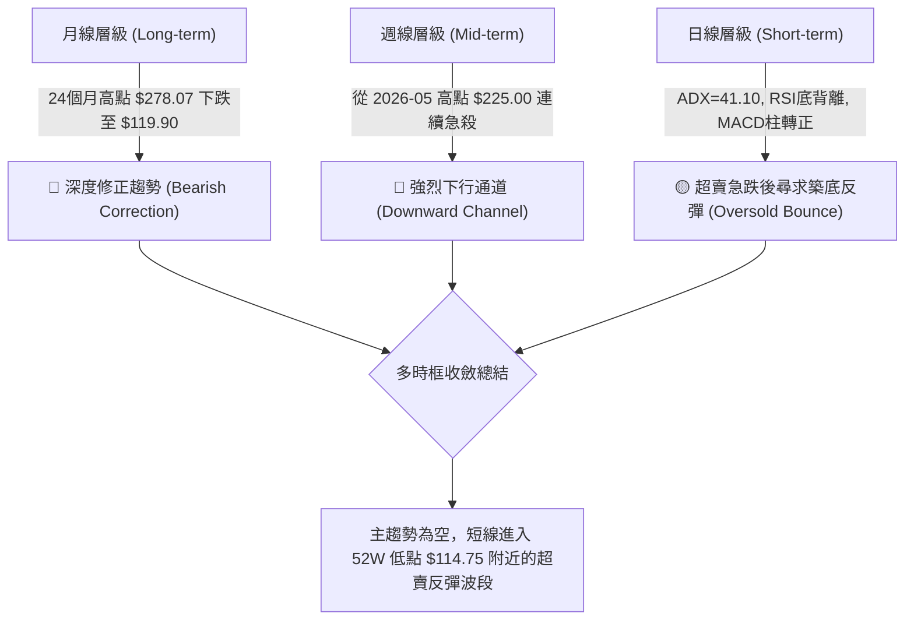

### 📈 長期趨勢 — 24個月走勢圖（Unicode）

```
ORCL 24個月收盤價走勢圖 (2024-07 至 2026-07)
價格軸 ($)
$300 ┤                                    ● $278.07 (2025-09)
$275 ┤                               ●  ●
$250 ┤                       ● $250.91    ●
$225 ┤                   ●                    ● $225.00
$200 ┤               ●                            ● $200.02
$175 ┤        ●  ●                                    ●
$150 ┤    ●  ●    ●  ●  ●  ●                                ● $146.04
$125 ┤●                                                        ● $119.90
     └┬──┬──┬──┬──┬──┬──┬──┬──┬──┬──┬──┬──┬──┬──┬──┬──┬──┬──┬──┬──┬──┬──┬──┬──
      07 08 09 10 11 12 01 02 03 04 05 06 07 08 09 10 11 12 01 02 03 04 05 06 07
      2024                                2025                                2026
```

#### 24個月走勢特徵分析

| 階段 | 期間 | 價格區間 | 變動幅度 | 主要技術特徵與驅動因素 |
|------|------|----------|----------|------------------------|
| **1. 橫盤蓄勢** | 2024-07 ~ 2025-04 | $136.45 ➔ $138.84 | +1.75% | 在 $136-$181 區間打底，MA20/MA50 反覆糾結 |
| **2. 主升浪噴發** | 2025-05 ~ 2025-09 | $163.32 ➔ $278.07 | **+70.26%** | 雲端業務暴增，放量大陽線突破，創下 $278.07 波段高點 |
| **3. 高檔做頭與派發**| 2025-10 ~ 2025-12 | $260.10 ➔ $193.05 | -25.77% | 跌破 MA20 與 MA50，機構高檔獲利了結派發 |
| **4. 二次反彈築頂** | 2026-01 ~ 2026-05 | $163.44 ➔ $225.00 | +37.67% | 弱勢反彈，受阻於斐波那契 50% 回調位 ($228.29) |
| **5. 無量急殺下探** | 2026-06 ~ 2026-07 | $225.00 ➔ $119.90 | **-46.71%** | 摔落所有均線，直接打穿 78.6% 回調位，逼近 52週低點 |

### 📊 中期趨勢（週線分析）

```
ORCL 近20週價格與阻力結構示意圖
$240 ┤
$220 ┤          ● $225.00 (2026-05-31)
$200 ┤        ●   ●
$180 ┤    ● ●       ●                                ─── 斐波那契 78.6% ($163.34)
$160 ┤  ●             ●                              ─── 阻力 R1 ($148.55)
$140 ┤●                 ● ● ●                        ─── 布林中軌 ($132.78)
$120 ┤                         ● ● ● ● $119.90 (現價)  ─── 52W 低點 ($114.75)
```

1. **週線連跌壓力**：從 2026-05-31 高點 $225.00 下滑至今，近 8 週內有 7 週收陰線，成交量於 2026-07-19 當週爆出 252.5M 股巨量後，價格落於 $126.41，顯示賣壓在低位進行強烈換手。
2. **週線 MACD 止跌**：週線 MACD 柱狀圖在 2026-06-28 達到最小值 -6.743，隨後收斂至 2026-07-26 的 +0.033 及當前的 +0.346，顯示中期下行動能已顯著放緩。

### ⚡ 趨勢強度評估（ADX 解讀）

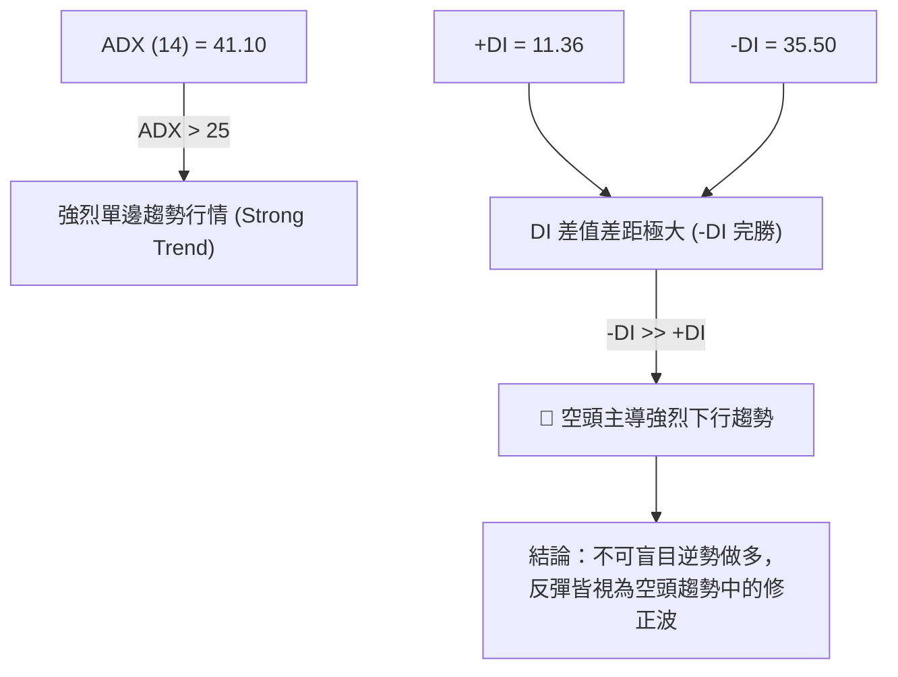

| 指標名稱 | 當前數值 | 強度標準 | 門檻判定 | 趨勢解讀 |
|----------|----------|----------|----------|----------|
| **ADX(14)** | **41.10** | > 25 為趨勢行情；> 40 為極強趨勢 | 🟢 進入極強趨勢區 | 市場處於極強烈的單邊下行通道，而非無序盤整 |
| **+DI(14)** | **11.36** | > 20 代表多頭買盤強勁 | 🔴 極度弱勢 | 多頭買盤動能幾乎完全消失 |
| **-DI(14)** | **35.50** | > 20 代表空頭賣盤強勁 | 🔴 強力主導 | 空頭賣壓全面控制盤面 |

---

## 3. 圖表形態分析

### 🔍 形態識別系統

根據 24 個月的價格走勢，ORCL 呈現出一個巨大的**「雙重頂 (Double Top)」**派發形態，隨後進入下行旗形摔落：

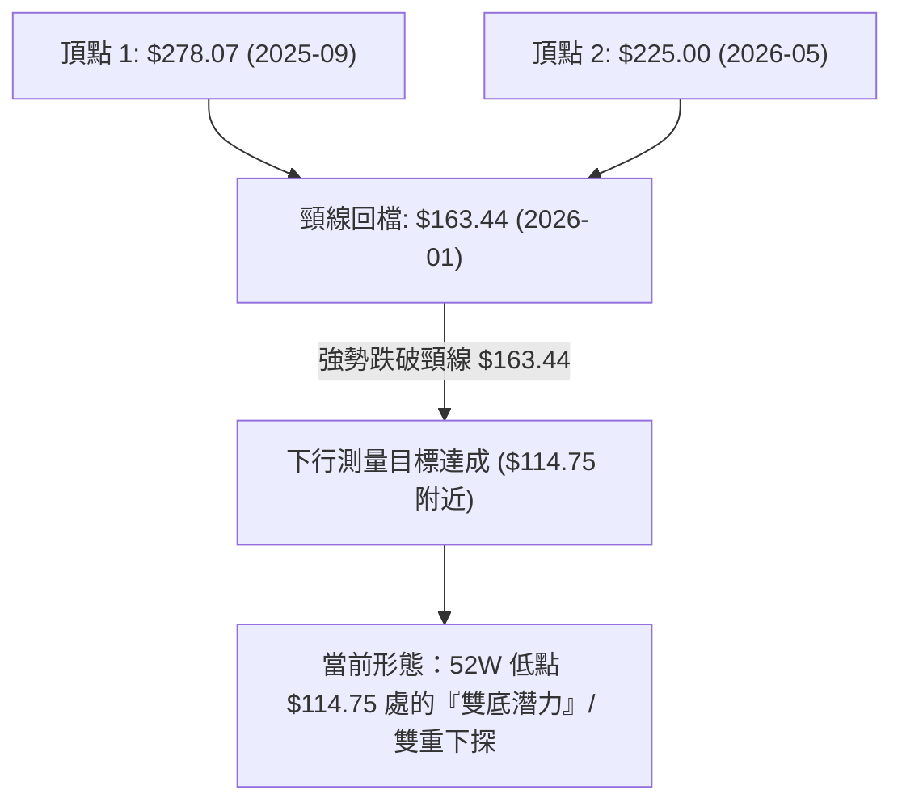

| 形態類型 | 信心度 | 判斷依據（引用數據） | 完成度 | 目標價計算與數值 |
|----------|--------|----------------------|--------|------------------|
| **雙頂形態 (Double Top)** | **90%** | 高點1 $278.07，高點2 $225.00，跌破頸線 $163.34 (78.6% 回調位) | **100%** | 測量目標：$163.34 - ($225.00 - $163.34) = **$101.68** (已接近達成) |
| **潛在雙重底 (Potential Double Bottom)** | **45%** | 價格逼近 52週低點 $114.75，RSI 呈現底背離 | **30%** | 若突破頸線 R1 $148.55：$148.55 + ($148.55 - $114.75) = **$182.35** |
| **下降通道 (Descending Channel)** | **85%** | 週線高點連線下降，均線呈多頭反向（空頭排列） | **85%** | 通道下軌支撐約位於 $112.64 (布林下軌) |

*(註：潛在雙重底信心度低於 50%，僅作為超賣反彈之指標型參考，不宜作為主升浪進場依據)*

### 🕯️ 重要 K 線形態分析（近 5 個月）

| 月份 | 收盤價 | K 線形態 | 技術解讀 | 訊號強度 |
|------|--------|----------|----------|----------|
| **2026-03** | $146.09 | 錘子線 (Hammer) | 探底後獲得 $137.45 買盤支撐，短期見底 | 🟢 看多 |
| **2026-04** | $160.83 | 中陽線 | 築底反彈，確認 3 月低點有效 | 🟢 看多 |
| **2026-05** | $225.00 | 長陽突破線 | 放量上攻，觸及波段高點 $225.00，然留下高點壓力 | 🟢 看多 |
| **2026-06** | $146.04 | 大陰吞噬 (Bearish Engulfing) | 一舉吞噬前兩個月漲幅，主力派發訊號 | 🔴 極度看空 |
| **2026-07** | $119.90 | 長下影小陰線 | 價格一度下探至 $114.99 (逼近 $114.75)，低位出現抄底換手 | 🟡 中性偏多 (超賣反彈) |

### 📉 ASCII 走勢形態示意圖

```
ORCL 雙頂跌破與當前超賣築底形態示意圖
$278.07 ┼───────● (頂點 1: 2025-09)
        │      ╱ \
$225.00 ┼─────╱───\──────────────● (頂點 2: 2026-05)
        │    ╱     \            ╱ \
$163.34 ┼───╱───────●──────────╱───\───────────── (頸線/78.6% Fib 阻力 R2/R3)
        │  ╱   (2026-01低點)  ╱     \
$148.55 ┼─╱──────────────────╱───────\─────────── (短線頸線阻力 R1)
        │╱                       \  
$119.90 ┼─────────────────────────●─────────── (當前價格 $119.90)
$114.75 ┼───────────────────────────●───────── (52週低點強支撐)
```

### 🎯 形態目標價計算

1. **空頭雙頂跌破目標價（歷史已觸及區域）**：
   $$\text{頸線價位} = \$163.34$$
   $$\text{雙頂平均高度} = \$225.00 - \$163.34 = \$61.66$$
   $$\text{最小空頭目標價} = \$163.34 - \$61.66 = \mathbf{\$101.68}$$
   *目前價格 $119.90 已極度逼近此測量目標區，下行動能開始衰竭。*

2. **短線反彈目標價（基於頸線與均線）**：
   - **目標 1 (R1 阻力)**：$\mathbf{\$148.55}$ (近一年波段高點聚類與形態阻力)
   - **目標 2 (R2 / 78.6% Fib)**：$\mathbf{\$163.34}$ 至 $\mathbf{\$164.24}$ (前波跌破頸線強阻力區)

---

## 4. 支撐與阻力

### 🗺️ 關鍵價位分布圖（Unicode）

```
ORCL 價位結構與阻力支撐分布圖
════════════════════════════════════════════════════════════════════
$341.82 ║████████████████████████████████████████; 52週歷史高點 (0.0% Fib)
$288.23 ║██████████████████████████████; 斐波那契 23.6% 回調位
$255.08 ║████████████████████; 斐波那契 38.2% 回調位
$228.29 ║████████████████; 斐波那契 50.0% 回調位
$201.49 ║████████████; 斐波那契 61.8% 回調位 / MA240 ($198.57)
$185.34 ║████████; 長期牛熊分界 MA200
$170.57 ║██████; 強阻力 R3 (+42.26%) / MA50 ($169.66)
$164.24 ║████; 阻力 R2 (+36.98%) / 斐波那契 78.6% ($163.34)
$148.55 ║██; 關鍵阻力 R1 (+23.90%)
$132.78 ║; 布林中軌 (MA20)
$119.90 ╠════════════════════════════════════════; ◄ 當前價格 $119.90
$114.75 ║▓▓▓▓▓▓▓▓▓▓▓▓▓▓▓▓▓▓▓▓▓▓▓▓▓▓▓▓▓▓; 52週歷史低點 (100.0% Fib)
$112.64 ║▓▓▓▓▓▓▓▓▓▓▓▓▓▓▓▓▓▓▓▓▓▓▓▓▓▓▓▓▓▓▓▓; 布林通道下軌強支撐
$110.00 ║▓▓▓▓▓▓▓▓▓▓▓▓▓▓▓▓▓▓▓▓▓▓▓▓▓▓▓▓▓▓▓▓▓▓; 券商最低目標價 (Analyst Low)
════════════════════════════════════════════════════════════════════
```

### 🚧 阻力位分析表

| 阻力級別 | 價位 | 形成原因 | 突破難度 | 重要性 |
|----------|------|----------|----------|--------|
| **R1** | **$148.55** | 近一年波段高點聚類、前週成交量密集反彈高點 | 🟡 中等 | 🟢 短線多空強弱分水嶺，突破方能確立反彈結構 |
| **R2** | **$164.24** | 斐波那契 78.6% ($163.34) 重疊區、MA120 ($162.94) | 🔴 極高 | 🔴 中期多頭反彈防線，派發賣壓極其強烈 |
| **R3** | **$170.57** | 波段高點聚類、MA50 ($169.66) 與 MA60 ($172.18) 反壓 | 🔴 極高 | 🔴 跌破後形成之地獄級反壓區，多頭中期反攻天花板 |

### 🛡️ 支撐位分析表

| 支撐級別 | 價位 | 形成原因 | 守住機率 | 重要性 |
|----------|------|----------|----------|--------|
| **S1** | **$114.75** | **52週歷史低點** (100.0% 斐波那契點位) | 🟡 60% | 🟢 絕對心理與技術防線，跌破將引發清算停損 |
| **S2** | **$112.64** | **布林通道下軌** (Bollinger Lower Band) | 🟢 75% | 🟢 超賣動能防禦點，具備動能均值回歸強支撐 |
| **S3** | **$110.00** | **41位華爾街分析師最低目標價** | 🟢 85% | 🟢 基本面與價值面最終防線 |

*(數據紀律聲明：OHLCV 數據中現價下方未偵測到 Swing-Low 波段低點聚類，上述支撐由 52週低點 $114.75、布林下軌 $112.64 與券商最低目標價 $110.00 組成)*

### 📐 斐波那契回調位分析

基於 52週高點 **$341.82** 至 52週低點 **$114.75** 之完整波段進行計算：

| 斐波那契回調層級 | 算定價位 | 與現價 ($119.90) 距離 | 技術面解讀與意義 |
|------------------|----------|------------------------|------------------|
| **0.0% (52W High)** | **$341.82** | +185.09% | 歷史高點天花板 |
| **23.6%** | **$288.23** | +140.39% | 極強牛市回檔位 |
| **38.2%** | **$255.08** | +112.74% | 多頭防守黃金切割位 |
| **50.0%** | **$228.29** | +90.40% | 中長線多空對峙中樞 (2026-05 反彈在此受阻 $225.00) |
| **61.8%** | **$201.49** | +68.05% | 關鍵牛熊反轉位 (與 MA240 $198.57 形成共振) |
| **78.6%** | **$163.34** | +36.23% | 深遠回檔防線 (與 R2 $164.24 及 MA120 $162.94 共振) |
| **100.0% (52W Low)**| **$114.75** | **-4.30%** | **當前價格所在區間，100% 全數回撤之底部強支撐** |

**現價位置解讀**：當前價格 **$119.90** 落在 78.6% ($163.34) 與 100.0% ($114.75) 之間，極度逼近 100% 回撤點 ($114.75)，屬於典型的大幅下修末端，技術面累積了強烈的均值回歸 (Mean Reversion) 壓力。

---

## 5. 技術指標深度解讀

### 🎛️ 指標訊號總覽

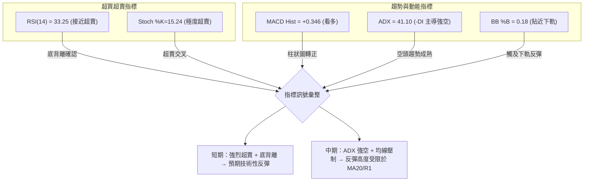

### 📈 移動平均線排列分析

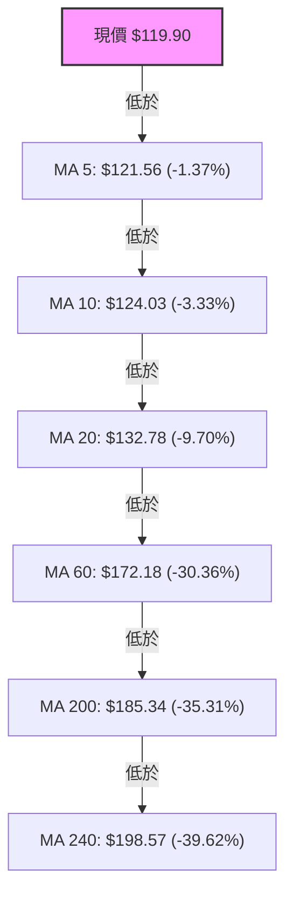

| 均線名稱 | 均線數值 | 與現價乖離率 | 走勢方向 | 技術面解析 |
|----------|----------|--------------|----------|------------|
| **MA 5** | $121.56 | -1.37% | ▼ 下行 | 極短期扣抵高價，短線仍受壓制 |
| **MA 10** | $124.03 | -3.33% | ▼ 下行 | 第一道短線反彈動能抵抗位 |
| **MA 20** | $132.78 | -9.70% | ▼ 下行 | **布林中軌**，負乖離接近 10%，反彈首要目標 |
| **MA 60** | $172.18 | -30.36% | ▼ 下行 | 中期季線蓋頂，空頭陣營核心 |
| **MA 120** | $162.94 | -26.42% | ▼ 下行 | 半年線，與阻力 R2 形成強共振 |
| **MA 200** | $185.34 | -35.31% | ▼ 下行 | 長期年線，確定轉為空頭格局 |

**均線排列結論**：均線呈現**標準空頭排列 (MA20 < MA50 < MA200)**，且負乖離率相當顯著（對 MA200 負乖離高達 -35.31%）。歷史經驗顯示，當乖離率過大時，價格傾向向 MA20（$132.78）進行乖離修正。

### 📉 RSI(14) 分析與背離判定

- **當前 RSI 數值**：**33.25**
  ```
  RSI(14) 強度進度條
  [0] ███████████░░░░░░░░░░░░░░░░░░░░ [100] (33.25 - 接近超賣)
  ```
- **RSI 超買/超賣區間判斷**：位於 30-70 之中性偏超賣區，且隨機指標 Stoch %K (15.24) 已經深鎖超賣區。
- **背離判斷 (Divergence Analysis)**：
  - ⚠️ **確認存在看多底背離 (Bullish Divergence)**：
    - 近期週線收盤價從 2026-06-28 的 $148.02 (RSI=11.1) 降至 2026-07-26 的 $114.99 (RSI=26.7)，再升至當前 $119.90 (RSI=33.25)。
    - **價格刷新波段新低，但 RSI 指標卻低點持續抬高**（11.1 ➔ 14.9 ➔ 26.7 ➔ 33.25），此為典型且高信度的**底背離訊號**，預示下跌動能衰竭，即將引發技術性反彈。

### 📊 MACD(12,26,9) 訊號解讀

- **MACD 快線**：-13.808
- **MACD 慢線 (Signal)**：-14.154
- **MACD 柱狀圖 (Histogram)**：**+0.346** 🟢 **看多黃金交叉**

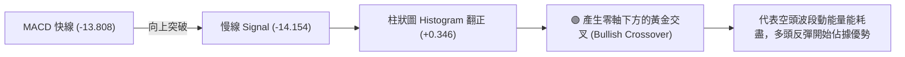

### 📦 布林通道分析 (Bollinger Bands)

```
ORCL 布林通道與現價位置示意圖
$152.92 ┼───────────────────────────────── Upper Band (布林上軌)
        │
$132.78 ┼───────────────────────────────── Middle Band (MA20 布林中軌)
        │    ● 現價 $119.90 (%B = 0.18)
$112.64 ┼───▲───────────────────────────── Lower Band (布林下軌)
```

- **布林上軌**：$152.92
- **布林中軌 (MA20)**：$132.78
- **布林下軌**：$112.64
- **當前位置 %B**：**0.18**（0 代表下軌，0.5 代表中軌，1 代表上軌）
- **通道解讀**：%B 降至 0.18，價格貼近布林通道下軌（$112.64）運行。布林帶寬呈現擴張後的收斂跡象，跌破下軌的風險極低，通常會觸發回歸中軌（$132.78）的均值修正行情。

### 💹 成交量與 OBV 分析（量價配合度）

- **最新成交量**：36,664,762 股
- **20日均量**：39,805,578 股（量比 0.92x，量能稍有萎縮）
- **50日均量**：31,766,513 股
- **OBV 趨勢**：OBV < MA，量能指標呈現疲弱。
- **量價配合解析**：
  - 價格在 2026-07-19 當週爆出 **252.5M** 股的巨量下擦，隨後一週（2026-07-26）成交量降至 **162.9M** 股，當前量比降至 0.92x。
  - **恐慌拋售潮（Capitulation Volume）已於 7 月中旬完成**，當前量縮代表賣壓已大幅耗盡，無量陰跌進入尾聲，利於多頭低位築底。

---

## 6. 動能與波動率

### ⚡ 動能與波動率定位

| 象限分類 | 動能強度 | 波動率水準 | 當前狀態 | 技術面評估與策略 |
|----------|----------|------------|----------|------------------|
| **Q1 (高動能/低波動)** | 強 | 低 | - | 最佳順勢趨勢波段 |
| **Q2 (弱動能/低波動)** | 弱 | 低 | - | 沉悶盤整，等待方向 |
| **Q3 (強動能/高波動)** | 強 | 高 | - | 突破行情，風險極高 |
| **Q4 (弱動能/高波動)** | **弱 (下行)** | **高** | **✓ 當前狀態** | **超賣跌深，高波動下極易出現劇烈技術性反彈** |

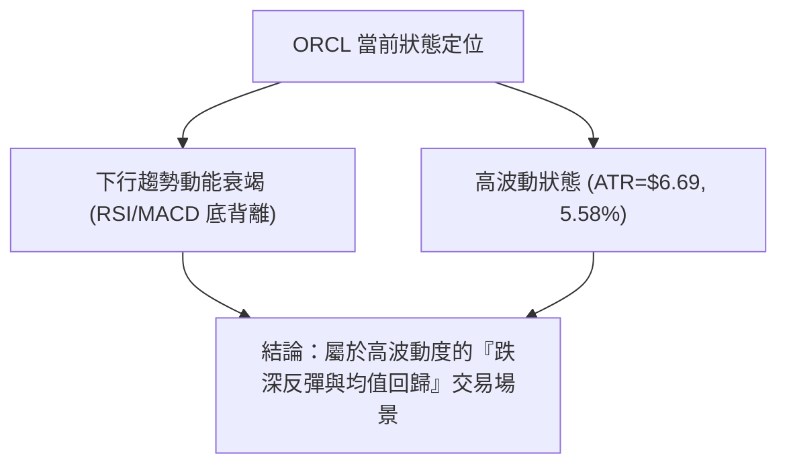

### 📊 ATR 波動率分析

- **ATR(14) 數值**：**$6.69**
- **價格波動百分比**：**5.58%**（$6.69 / $119.90）
- **風控止損建議**：
  - **日內交易 / 緊密止損**：1.0 × ATR = **$6.69**
  - **波段交易 / 標準止損**：1.5 × ATR = **$10.04**
  - **趨勢交易 / 寬鬆止損**：2.0 × ATR = **$13.38**
- **解讀**：ORCL 目前每日平均波動高達 $6.69，意味著設定止損價格時，必須至少給予 **$6.70 以上** 的緩衝空間，否則極易在盤中隨機噪音中被掃出場。

### 📐 Beta 與市場相關性

- **Beta 係數**：**1.712**
- **風險解讀**：ORCL 的 Beta 顯著高於 1.0，屬於高敏感度科技股。當大盤（S&P 500 或 納斯達克）出現 1% 的反彈時，ORCL 理論上將出現約 1.71% 的彈升；反之，若市場大盤持續走弱，ORCL 的下修壓力亦將被放大。

---

## 7. 多時框架總結

### 📋 時框架評分表

| 時框架 | 趨勢方向 | 動能狀態 | 均線排列 | 形態結構 | 綜合評分 | 交易建議 |
|--------|----------|----------|----------|----------|----------|----------|
| **月線 (Long-term)** | 🔴 強烈空頭 | 🔴 疲弱 | 🔴 空頭排列 | 🔴 雙頂派發 | **25/100** | 長線避開，等待築底 |
| **週線 (Mid-term)** | 🔴 下行通道 | 🟡 止跌收斂 | 🔴 空頭排列 | 🟡 逼近52W Low | **35/100** | 觀望，逢高減碼 |
| **日線 (Short-term)**| 🟢 超賣反彈 | 🟢 底背離/MACD金叉 | 🔴 負乖離過大 | 🟢 築底反彈形態 | **55/100** | **短線尋求博弈反彈機會** |

### 🔲 綜合訊號矩陣

```
時框架訊號矩陣圖
┌──────────┬─────────────┬─────────────┬─────────────┐
│ 時框架   │ 趨勢指標    │ 動能指標    │ 波動/通道   │
├──────────┼─────────────┼─────────────┼─────────────┤
│ 長期月線 │ 🔴 MA空頭   │ 🔴 RSI低迷  │ 🔴 跌破均線 │
│ 中期週線 │ 🔴 ADX=41.1 │ 🟢 MACD收斂 │ 🟡 52W低點  │
│ 短期日線 │ 🟡 負乖離大 │ 🟢 底背離   │ 🟢 布林下軌 │
└──────────┴─────────────┴─────────────┴─────────────┘
```

### ⚖️ 多時框收斂結論

依據多時框收斂規則：
1. **趨勢行情判定**：ADX = 41.10 (>25)，整體處於**極強烈的中長期空頭趨勢行情**中。因此，中長期方向（週線/MA200）絕對主導大局，**任何買進操作均被定義為「逆勢/超賣反彈交易」**。
2. **日線級別收斂**：雖然中期趨勢強烈看空，但日線與週線動能指標（RSI 底背離、MACD 柱狀圖翻正、Stoch 超賣、布林下軌 $112.64 強支撐）已高度收斂出**「空頭竭盡與技術性強彈」**的訊號。
3. **最終收斂方向**：**偏多反彈（短期） / 逢高偏空（中長期）**。主策略以博弈短期超賣回歸布林中軌（$132.78）及 R1（$148.55）為主，並嚴格鎖定止損於 52週低點 $114.75 下方。

---

## 8. 交易策略建議

### 🗺️ 策略決策流程圖

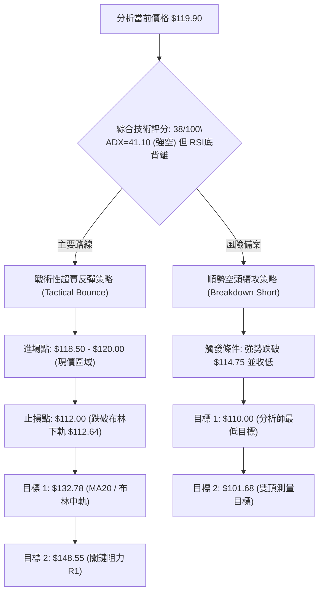

### 🧭 策略路由

**當前主策略方向 = 🟢 戰術性超賣反彈策略（綜合評分 38/100，利用極端背離進行均值回歸交易）**

### 🎯 價格情境階梯 (Price Scenarios)

| 觸發條件 | 下一目標 | 後續延伸 | 情境含義 |
|----------|----------|----------|----------|
| **突破 R1 $148.55** | R2 $164.24 | R3 $170.57 | 中期結構轉強，V型大反彈發動 |
| **站穩現價區間 ($118-$120)** | MA20 $132.78 | R1 $148.55 | **預期主情境：超賣均值回歸行情** |
| **跌破 S1 $114.75** | 布林下軌 $112.64 | 測量目標 $101.68 | 止損觸發，空頭主趨勢向下續跌 |

### 📊 情境機率分佈

```
情境機率分佈圖
超賣反彈至 MA20/R1 [55%] ▓▓▓▓▓▓▓▓▓▓▓▓▓▓▓▓▓▓▓▓▓▓▓▓▓░░░░░░░░░░░░░░░░
低位狹幅震盪打底   [30%] ▓▓▓▓▓▓▓▓▓▓▓▓▓░░░░░░░░░░░░░░░░░░░░░░░░░░░
跌破$114.75續跌    [15%] ▓▓▓▓▓▓░░░░░░░░░░░░░░░░░░░░░░░░░░░░░░░░░░
```

| 情境 | 機率 | 主要依據 |
|------|------|----------|
| **超賣反彈至 MA20/R1** | **55%** | RSI 顯著底背離、MACD 柱轉正 (+0.346)、Stoch 超賣 (15.24) |
| **低位狹幅震盪打底** | **30%** | ADX=41.10 顯示空頭仍強，多頭買盤仍顯謹慎 |
| **跌破 $114.75 續跌** | **15%** | 全面均線空頭排列，全球巨集觀或科技股集體拋售 |

### 🟢 主策略詳情：戰術性超賣反彈策略 (Tactical Long)

| 策略要素 | 策略 A：現價分批布局 (Aggressive) | 策略 B：突破 MA10 確認加碼 (Conservative) |
|----------|------------------------------------|------------------------------------------|
| **進場條件** | 價格於 $118.50 - $120.00 築底拉回時進場 | 價格突破並收高於 MA10 ($124.03) 確認短轉強 |
| **進場價格** | **$119.90** (現價附近) | **$124.50** |
| **目標價 T1** | **$132.78** (MA20 / 布林中軌) | **$132.78** (MA20 / 布林中軌) |
| **目標價 T2** | **$148.55** (關鍵阻力 R1) | **$148.55** (關鍵阻力 R1) |
| **止損價格** | **$112.00** (跌破布林下軌 $112.64) | **$114.00** (跌破 52W Low $114.75) |
| **風險報酬比** | **3.63 : 1** (以 T2 計算：$28.65 潛利 / $7.90 風險) | **2.28 : 1** (以 T2 計算：$24.05 潛利 / $10.50 風險) |
| **成功機率** | **55%** | **65%** |
| **建議倉位** | **5% - 8%** (總資金，小倉位試錯) | **8% - 10%** (總資金) |

### 🔴 反向風險觸發點（對沖與清算提示）

- **清算觸發價**：收盤價**跌破 $114.75** (52週低點) 或跌破 **$112.64** (布林下軌)。
- **對沖/做空條件**：若價格反彈至 **$148.55 (R1)** 或 **$163.34 (R2/78.6% Fib)** 出現長上影線黑K，為順應主趨勢的最佳**重啟做空點位**。

### ⭐ 整體訊號強度評星

```
做多訊號強度 (超賣反彈)：★★★☆☆  (3/5星 - 僅限短線反彈)
做空訊號強度 (順勢波段)：★★★★☆  (4/5星 - 中長線主趨勢)
整體技術可信度：        ★★██☆  (4/5星 - 指標共振度高)
```

---

## 9. 風險提示與監控

### ✅ 關鍵監控指標 Checklist

```
╔══════════════════════════════════════════════════════════════════╗
║                   ORCL 日常風險監控清單                          ║
╠══════════════════════════════════════════════════════════════════╣
║ [ ] 1. 52週低點防線：每日收盤價是否維持在 $114.75 上方          ║
║ [ ] 2. MACD 柱狀圖：+0.346 能否持續擴大，確認紅柱延續            ║
║ [ ] 3. RSI 底背離：RSI 能否突破 40 正式走出超賣區                ║
║ [ ] 4. 成交量變化：反彈時日成交量是否突破 20日均量 (39.8M)       ║
║ [ ] 5. MA20 扣抵：價格能否儘速挑戰 $132.78 (布林中軌)            ║
╚══════════════════════════════════════════════════════════════════╝
```

### ⚠️ 風險場景分析

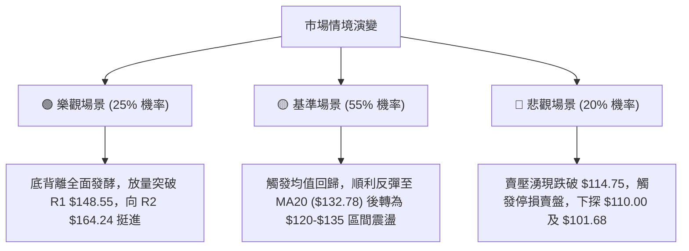

### 🛡️ 風險管理重要提醒

1. **嚴格控制倉位**：由於 ADX = 41.10 顯示空頭主趨勢極為強烈，本次做多屬於**「逆勢交易 (Counter-Trend Trade)」**，建議總倉位控制在 10% 以內，絕不可開槓桿。
2. **波動率緩衝**：ATR 高達 $6.69 (5.58%)，盤中價格波動劇烈，止損單應以「日線收盤價跌破」作為最終執行標準，避免盤中插針被掃出場。
3. **利空事件防範**：需密切注意軟體/雲端產業整體財報與巨集觀利率環境對高 Beta (1.712) 股票的連帶衝擊。

---

## 📋 報告總結

```
╔══════════════════════════════════════════════════════════════════╗
║                    ORCL 技術分析報告總結                         ║
════════════════════════════════════════════════════════════════════
報告日期：2026-07-28
當前價格：$119.90
分析評級：🟡 戰術性超賣反彈 / 🔴 中長線空頭控制 (技術評分: 38/100)

關鍵結論：
├─ 長期趨勢：🔴 深度修正 (雙頂派發完成，逼近測量目標 $101.68)
├─ 中期趨勢：🔴 空頭主導 (ADX=41.10, -DI=35.50 > +DI=11.36)
├─ 短期趨勢：🟢 超賣強彈 (RSI底背離 + MACD柱狀圖轉正 + Stoch超賣)
├─ 關鍵支撐：$114.75 (52W Low) / $112.64 (布林下軌)
├─ 關鍵阻力：$132.78 (MA20/布林中軌) / $148.55 (阻力 R1)
└─ 分析師目標：$248.15 (均值) / $110.00 (最低) / $400.00 (最高)

最優策略組合：
1. 🥇 最佳機會：現價 $119.90 輕倉進場博弈超賣反彈，目標 $132.78 / $148.55，止損 $112.00
2. 🥈 次選機會：等待突破 MA10 ($124.03) 後右側加碼進場
3. 🥉 保守選擇：保持觀望，等待價格反彈至 R1 ($148.55) 或 R2 ($164.24) 建立順勢空單
════════════════════════════════════════════════════════════════════
```

---

> ⚠️ **免責聲明**：本報告為 AI 自動生成之技術分析，所有數據及估算均基於提供的歷史價格資訊。本報告**僅供研究與學術參考**，**不構成任何投資建議**。投資有風險，入市需謹慎。

---

*報告生成時間：2026-07-28 ｜ 數據來源：Yahoo Finance ｜ 分析框架：多時框技術分析*