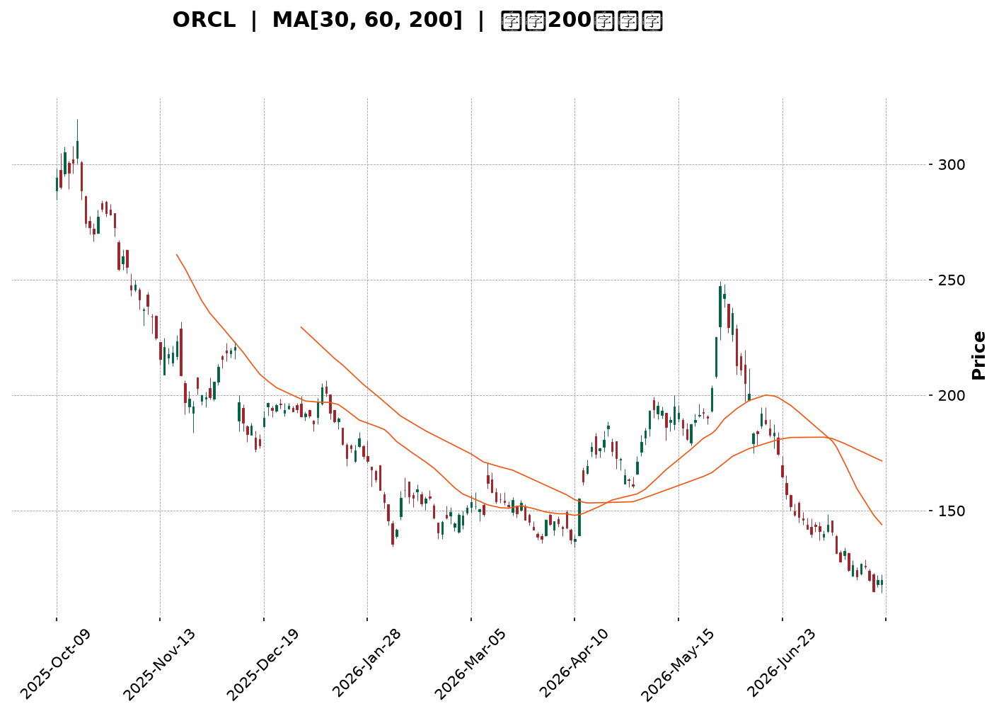
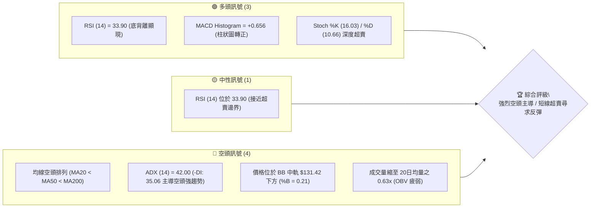
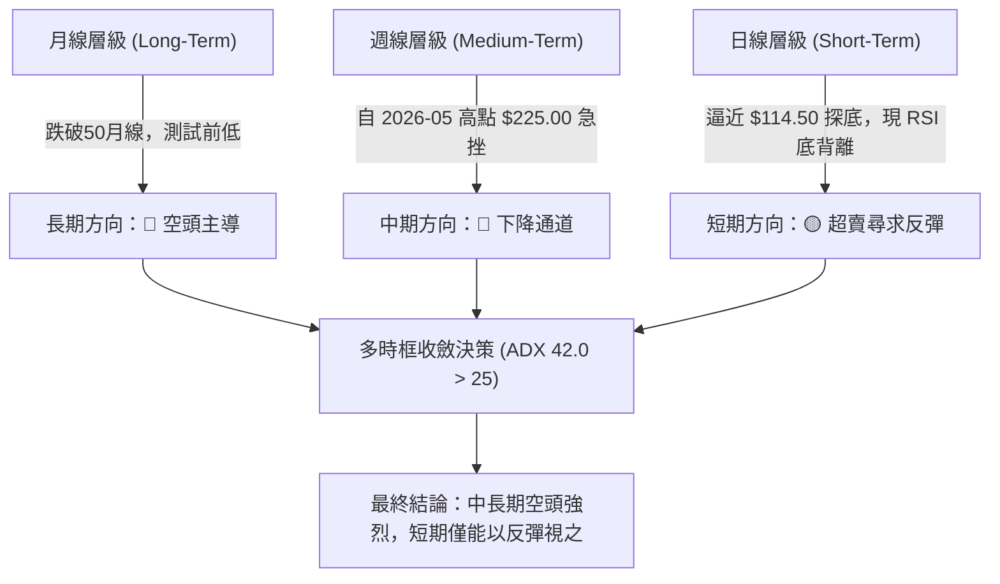
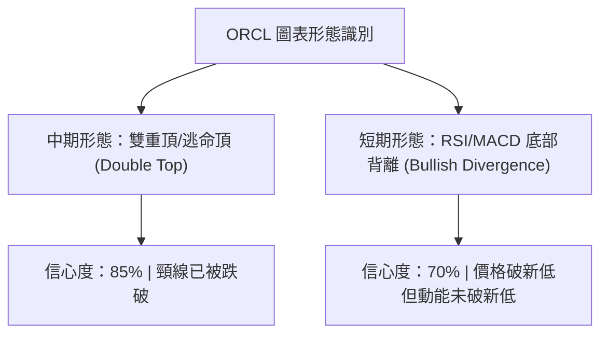
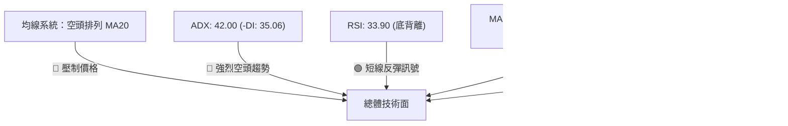
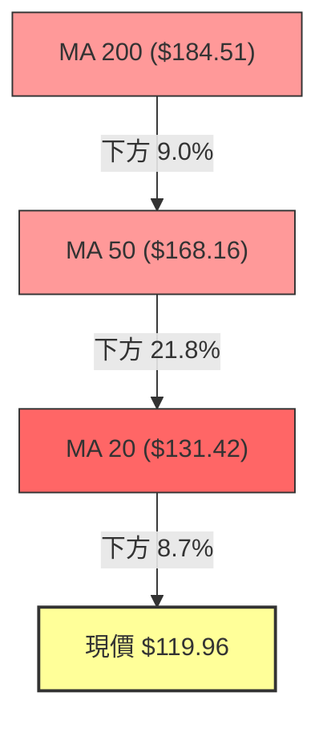
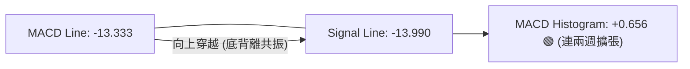
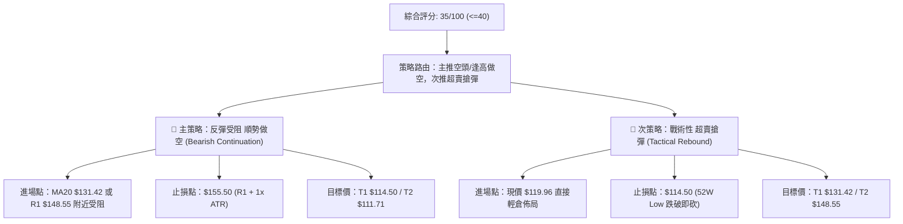
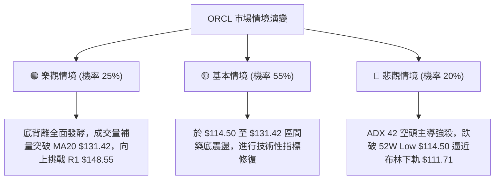

<details markdown="1">
<summary>📊 靜態圖表 (點擊展開)</summary>



</details>

<html>
<head><meta charset="utf-8" /></head>
<body>
    <div style="height:500px; width:100%;">                        <script>window.PlotlyConfig = {MathJaxConfig: 'local'};</script>
        <script charset="utf-8" src="https://cdn.plot.ly/plotly-3.7.0.min.js" integrity="sha256-jvTGqxNp8AGWEcvNLVuKr+8j5dGe9Yw51LQkmDH+IYA=" crossorigin="anonymous"></script>                <div id="candlestick-chart" class="plotly-graph-div" style="height:100%; width:100%;"></div>            <script>                window.PLOTLYENV=window.PLOTLYENV || {};                                if (document.getElementById("candlestick-chart")) {                    Plotly.newPlot(                        "candlestick-chart",                        [{"close":{"dtype":"f8","bdata":"AAAA4PdhckAAAABglCJyQAAAAEAUEXNAAAAA4EuCckAAAACAgstyQAAAAAAoYHNAAAAAgG4IckAAAAAAgyhxQAAAAIBXCHFAAAAAAOLgcEAAAABgT1ZxQAAAAKD4iXFAAAAA4GJrcUAAAACAWmJxQAAAAAC4CnFAAAAAYPLNb0AAAABgnkFwQAAAAIBf7G9AAAAAYJK5bkAAAADgZf1uQAAAAIARL25AAAAA4CyfbUAAAACg79BtQAAAAGCbPG1AAAAAgEkabEAAAAAguu9qQAAAAKASl2tAAAAAgE44a0AAAABARkxrQAAAAGAD7GtAAAAAgKsVakAAAACgjptoQAAAAIC7y2hAAAAA4LlkaEAAAADgD2BpQAAAAGCpAGlAAAAAoKbgaEAAAADguOVoQAAAAODat2lAAAAAoAmJakAAAAAgC\u002fBqQAAAAMDbTWtAAAAAYDxta0AAAADAJJxrQAAAAABpnmhAAAAA4PaEZ0AAAABg6ORmQAAAAKAgW2dAAAAAwCkYZkAAAABA7ElmQAAAAGBaxGdAAAAAgIOPaEAAAACAKS9oQAAAAEBOc2hAAAAAICeDaEAAAAAgbjBoQAAAAGBuamhAAAAAwIghaEAAAADg4zpoQAAAAMAA2GdAAAAA4MT8Z0AAAABA7d9nQAAAAGDSemdAAAAAQJWkaEAAAADgVWhpQAAAAMBiHGlAAAAAgI0IaEAAAAAgEZFnQAAAAMB4uGdAAAAAoIJVZkAAAABAkpVlQAAAAGA3HmZAAAAAoM39ZUAAAACAl6VmQAAAAAD8tWVAAAAAIEBzZUAAAADAz\u002fpkQAAAAOAIbmRAAAAA4GXeY0AAAABAHTNjQAAAAMDjNGJAAAAAQBLxYEAAAABgi7phQAAAAMAgcGNAAAAA4P7YY0AAAADgPYJjQAAAAOChbGNAAAAAwPDgY0AAAACg3hxjQAAAACDIYmNAAAAAAIpuY0AAAABgsmFiQAAAACCPimFAAAAAIAwkYkAAAACgqFtiQAAAAMCPqGJAAAAAAIgMYkAAAACA4IZiQAAAACBAf2JAAAAAQAbqYkAAAABg7TZjQAAAACDG\u002fGJAAAAAwEjQYkAAAADApItiQAAAAICjP2RAAAAAYMzBY0AAAADAGEFjQAAAAABtXGNAAAAAAMAzY0AAAADg3fpiQAAAAEAgTmNAAAAAoIqUYkAAAACgoChjQAAAAIA8QmJAAAAAADwgYkAAAADgObphQAAAACAgVmFAAAAA4Ms6YUAAAABA30JiQAAAACAhB2JAAAAAoKwrYkAAAADg+hBiQAAAAKCqxWFAAAAA4DzVYUAAAADAOSxhQAAAAGCPM2FAAAAAQJNiY0AAAACg6k1kQAAAAMAUJ2VAAAAAQBg3ZkAAAACgf85lQAAAAADcHmZAAAAAQFeRZkAAAADgMltnQAAAAEBn9WVAAAAAgLyVZUAAAAAgiItlQAAAAABPrGRAAAAAgGJoZEAAAABAkxpkQAAAAEB\u002fZ2VAAAAAQEd1ZkAAAAAgoxZnQAAAACBvK2hAAAAAwEo9aEAAAABAqWhoQAAAAABgJWhAAAAAQNVFZ0AAAACARKNnQAAAAKDRXWhAAAAAYP4IaEAAAABA0T5nQAAAAMCWmmZAAAAA4D5wZ0AAAABAlqNnQAAAACBA7WdAAAAAYIAMaEAAAAAAiclnQAAAACDNX2lAAAAAYOkfbEAAAAAgReluQAAAACBtd25AAAAAwAGxbEAAAAAAqXBtQAAAAMANnmpAAAAAoL1iakAAAABgFqNpQAAAAOD9EWlAAAAAoMbuZkAAAACAu+9mQAAAAMAb\u002f2dAAAAAoKp1Z0AAAABgmdxmQAAAAKDV9GZAAAAAYNHOZUAAAAAAzJJkQAAAAMB7n2NAAAAAYM79YkAAAABge4BiQAAAAGDtZ2JAAAAAgFdBYkAAAADgMMBhQAAAACAUeWFAAAAAAF\u002foYUAAAACgfaNhQAAAACAYgGFAAAAAQAr3YUAAAADgepRhQAAAAKBHcWBAAAAAACn8X0AAAAAgro9gQAAAAKBwDV9AAAAAgD2aX0AAAADgUVheQAAAAEAzw19AAAAAgMJ1X0AAAABgjwJeQAAAACBcv1xAAAAAoJn5XUAAAACgcP1dQA=="},"high":{"dtype":"f8","bdata":"1Rvm9YOhckD+wfDNewxzQCTZxzy1O3NA\u002fUgGKTDYckBizPnRnkBzQF71pJBW93NAMSiQGPjVckCyRG\u002fVoOdxQCIA2Fn0WXFAtUaoONQocUCRUwCvU4ZxQJgqGjQkx3FAWbGMXSHEcUDzSObSuatxQOsqLnHfbnFAm6cCE+2ycEDyLfhnVHRwQLLLRJRRcXBAXErZDuuab0CUSxCPoz9vQOZu6+8Y1m5AIwH9h07DbUDWRra3GJxuQKYIn0LPZW1A6el9WIZRbUDhwqteSeBrQEAJD00wHGxA\u002fwkK6XyVa0BzpQNIA7JrQBt8XlQNP2xAi1Mdt3b4bEAw+knaPMppQLzO9TPuO2lAT\u002fmynCiwaEBjIuAPzf9pQCzkVroFDWlAxBuQxskxaUDcCc\u002fzSvZpQAt3UIHgvWlAp6dFekSrakBqjLB85SxrQCXWVqRK02tAmybaUciPa0AbjvKWW+VrQJo7fSLuAWlAA4EkLLd+aECFs6oJRWVnQK4sfH+Tf2dAFGhLJvwWZ0CdTD8y1t9mQBia\u002fJkwKGhAboleQdOcaEAkCKEOHWpoQGp+hAxYjGhA5XMGvZXOaECaaz8KopNoQMTjE2+Dj2hACcr1Jx1qaECATspbK5ZoQDW\u002fddBr+GhAReJ5cJUgaEDYw98knzloQG4lXkIGpGdASFyvkFXZaEDuyb2KWaVpQJ2JgLR7y2lAI6FcZAAJaUASST2XCjVoQCw8fS9C0WdAnFgBdok8Z0DZg2a2HmtmQLa18CEjXWZAlj7IKO5MZkAiMkdyywBnQBBkF6gnT2ZACo18fXCNZkDIntmvlCFlQNVSB9BQ92RAKlD+12dAZUAq5zYIyshjQCx8s5bqG2NAfVnToxMxYkAj1VGpnsZhQMHXtveL1GNAS77NZcaHZECieaWVzFBkQHFkbu77vWNAK7dQyJQlZEDXfJdxnMVjQCniCe2whmNAxDX6oAjfY0D8MtBagR1jQIUguic+GWJAfeCa5r83YkBYl4VF8QZjQC1fn9Mn7mJAOrO1\u002fSMiYkCcQS3bHKRiQKjeJqtDvGJAZ7Th7G0RY0APjv9IB5tjQJapwUzAwmNASqJrQETeYkDXn6GTRSJjQGnkhYAzUmVAmpswblDVZEAuUibv9fRjQOgEIYBztGNAJPG4zSu6Y0ANrffEpTxjQHu5J3ademNAFz62TP0FY0CURCpQY1ZjQP2sBxmlGmNAJ3VGWaCZYkAAcGKviC5iQC+k\u002fIqilmFAogO3RRCHYUBnIz5mFkxiQEDcmqKWk2JAEO1gt5QtYkBexgvdoXBiQGdQ4fUn8mFApqgZWhvNYkAnPNLywclhQExtGK3jdWFAkD10w9JrY0AVsbmbARplQGNfy6XGfmVA38urD6R0ZkBmcQsFiPtmQPTCWmOZJGZAHS6UcVEWZ0CamX6pxZBnQOFz2AtNqGZAPFDLG6yCZkC9D1SeWJ5lQKDntC6vA2VAVoBulgqGZEC7QlY8b5NkQGBQillDtmVAhy9VdaTbZkBQvViF8jtnQGk0rZ25M2hAXiiKV5juaECk7ESnCKpoQIrZBP4MYGhAiKoDigkIaEA5GwS4\u002fNxnQOezvQd0AGlAF9wFqvd3aEDWWQYjKMNnQJb0SW8agmdA83bIqyhyZ0BuwpxA2QRoQGB8egQlimhAF5u4eL5QaECAU878Ke9nQMsPLtRBiWlAjcgBxCwwbEBY\u002fsG7PCxvQJSlBThgBG9AM+6EIKP1bUA\u002f67P\u002f48NtQK55jlhn1GxASJW9AJ5Ja0DyEZiriXdrQKOpBHfJd2pAVFGsOCQEZ0D07IWx+B1nQN1VvUKSVGhAOlssOpJUaEBQZvf5+rBnQLdclgrTamdA5TiiKBX+ZkBDz4QvOLdlQH9dU4ucpWRAZcSkc1qiY0AoBkb2PiBjQFaQGxTcPmNA5QWBYSCtYkAI41ITO2FiQHSmBOmaUWJAMOi\u002fTK8jYkD0c\u002fRnxSFiQOX\u002f0egkq2FAcxQ1wbORYkAAAACAwjViQAAAAMDMdGFAAAAA4FGYYEAAAADAzLxgQAAAAMD1eGBAAAAAgBQOYEAAAAAgXF9fQAAAAEDh2l9AAAAAQOEaYEAAAADAzCxfQAAAAMAexV5AAAAAIFx\u002fXkAAAADAHpVeQA=="},"hovertemplate":"\u003cb\u003e%{x|%Y-%m-%d}\u003c\u002fb\u003e\u003cbr\u003e\u958b: $%{open:.2f}\u003cbr\u003e\u9ad8: $%{high:.2f}\u003cbr\u003e\u4f4e: $%{low:.2f}\u003cbr\u003e\u6536: $%{close:.2f}\u003cextra\u003e\u003c\u002fextra\u003e","low":{"dtype":"f8","bdata":"drkmUUDIcUAZeGtshhNyQEncYCBUbnJAqmu6sgwTckC3\u002fmpKB4FyQAPlCFLLwnJAmVrI1g3McUCqz5qs4ApxQMTGdzaL2nBAThiRD9iqcECwgEqmmtxwQDZ90ULbeHFAdhrmdzBScUDrRtsYwl1xQORyCHEfzHBAoHem3Zy6b0ARGQq+PchvQNpW0WtVmW9As+RVeB9bbkDILY7ScJVuQMfyp3UgoG1A2GxeCivEbEBaGGkDxFltQNez+KyBVmxADhDYLEwAbEB5rkvKPqVqQLb216Y0GGpA5hiUZgWwakDDWmbpbI5qQIuM0G9852pA++mnJU8JakAE9tkdbvZnQKVQKWEzDmhARdJpTmn7ZkCT+iV\u002f2glpQMuYFMgbd2hA2ztSVERaaEA71Iq228JoQIS0AWvXr2hASuZunyqLaUCCrAmriHJqQDV+\u002fvbO2mpAmVz2uToGa0CNksY1C\u002fBqQG6QZIhtDmdAr1W9A4EGZ0AtRb37V3VmQBCcqZFH12ZAzb22qBvsZUDC+cZa9xtmQDB\u002fu25USmdAc1\u002fhOZzfZ0Ax35BGU8tnQPDkdwMBEmhAYB7OQZFHaEBVfV5wltlnQG\u002fzgsTjOmhAsPx1NtQbaEAhBE1EWQtoQHIjBDnDz2dAIQR68hmcZ0ArmVa9TcVnQPgAsUrkC2dAMDo+fRBvZ0AOoMgCmXRoQBvHInuW6GhAtDbT85KvZ0D0jYHicoJnQFDg0lGQJ2dA+PHW8LZDZkBIAjvZVi1lQEWpeVLU6GVAijDACNRZZUCfwsrjVilmQDE2IhA3j2VAuyPQB2FVZUAbqDFJywxkQKR6h8FzQ2RA1hCgyH3cY0AfLcu\u002fFttiQBm1XeO07WFAzfhMAfzJYEBB7TzESj5hQN2YhlhgP2JAWsf71uJ7Y0COyzyo0h1jQFWZjt4n7mJAYhjRC9FGY0B\u002f6UZNO\u002fpiQPLV9zM\u002fymJAxcL3\u002fhFWY0D50aMTxUtiQMbhr2gfNGFAdA1RXZI4YUDKWXs\u002fLkpiQMUpaCmWBGJAnVZC\u002fKmjYUB4RW59bYZhQCNbV3vawWFAGF\u002f7RxyCYkDkhlUShqJiQDFJmeEw0mJA8NPvNEMtYkDwIhpZdG1iQBjdoy7s7mNAophU\u002f1GwY0DWuqLqliJjQOPF05IHLmNApxe9G+8NY0A0SjOcid9iQCnvXuxve2JAkXiXyZBdYkAhPK37RbViQElXgCKcOmJAEGe8DBzzYUB07w1XpbFhQJM7U0ToKmFAGNYVuwEAYUDthLzXKVxhQClLuXBV9WFAaR5CrXZqYUCGovGDRtthQNg28wEGX2FAVTzXDRa9YUDYTHhz6fBgQHZegZhPw2BASI0IE4pnYUChHsoF\u002fx9kQF+LKt5HtGRAkJ2BkFGmZUBzRRWISZhlQI5uLxcSnWVA6eFcDMvsZUAt8qj7UcVmQF2tVFs\u002fr2VA4IECnN8GZUDicrU1LOpkQPp99UufL2RAS\u002fVwMPoCZEClV9vaxfhjQABXOfFdsmRAOuWxwfy0ZUA3lLQ4JExmQMWHV6IswWZAy1Z8w27EZ0BO7hxFnrFnQHMG2wQOvmdAgsLhJMaHZkCQ4hGcYw1nQIRvoW3TGWdAayZTxteHZ0CNGc3bTtRmQDXIiO2viWZAGoidlMNFZkCKb4a9oVFnQO9\u002fMdX\u002fzWdALZy7YMe8Z0Czm4eWl2hnQIMgrdi0FmhAIGqILz7paUAAGdh1SPprQFJ+NAViwG1AbvZCwERabEAzyk03JudrQJ3W98IpF2pAT+flN1YTakCoydhFVqNoQNUwsfnFr2hAcII\u002fn4PVZUDYh6syJExmQFFf5N0PMmdApBZRB01gZ0BOVgX7Tb5mQFWUaYmvImZAMU9mp3O5ZUBz7+r+QYFkQNl08Sn3WWNA0v5cxNa6YkAzX2qtlG9iQA2wuJRKFmJACB4pylT\u002fYUAAAADgMMBhQBLjm4UoS2FAWz5lt3WVYUDL2H4GVyJhQHBjcR9XImFAy7PJp3GOYUAAAADgUWhhQAAAAEAza2BAAAAAYGbmX0AAAABA4RpgQAAAAIA96l5AAAAAAABgXkAAAACA6wFeQAAAAKBwjV5AAAAAwMwsX0AAAAAAKdxdQAAAAAAAsFxAAAAAQDMzXUAAAAAAAKBcQA=="},"name":"\u50f9\u683c","open":{"dtype":"f8","bdata":"3+R6MjwMckDhkP6vlJZyQErCUM+KfXJA1pL1y7fKckCbO4RJy99yQNTlrzHj6nJAZCHY9ZHNckCLSUduCONxQO2EO8w\u002fN3FAgk5B2hwDcUDbDo34ouVwQOp+RwYEs3FAP\u002fYH8VC9cUDvx+D1vYRxQKJOBVRWbHFAIo8K\u002fcKicEAApOotfhBwQD0L9vJLa3BAxxagOPDybkDKdLfzVLFuQG1JeF9Ism5AUqkEWe+WbUAvhwHtNXNuQICuLH0kP21AjVvIck5PbUB6JpQM5tprQHXgynQbGmpAomai4QIEa0BdpYR1n8RqQDeii3rzHmtAwMOSunOebEDGEy39QKNpQP4LoodWX2hAIJYRXzoHaECVjVwx9O9pQEx0l9VTs2hAyOdtj7TSaEB3PAdTxGVpQHHJXEJRzWhAKKTSufm7aUDyWTqeDB1rQDb6W\u002fuHZ2tADBeZxLE9a0DHfiYyy3VrQKs2SNeQmWdAe7UnwM5PaEASo7aht09nQI4GeGLv3WZABwQrTuGxZkBpGaM5Lp9mQBHlNC3jUmdAqRRuFhJeaED0kMVxtVFoQMLpJ\u002f9iJGhAHmG2BV+FaEAAY+JawwloQCs4cYD7RWhAqXQ+c2RRaEAlZb4CrHJoQC+LK74+jmhAeoKRgQ3XZ0D\u002fO7sZ5S1oQE2hqVzOoWdAIq2u3ZXKZ0AgzHndWIdoQDJWuCiBcmlAI6FcZAAJaUASST2XCjVoQOAEIUr5kmdAnFgBdok8Z0BgC1Y74k1mQOe\u002fIkQIRGZA3rRXz4dtZUCZ7oABdDtmQO09lQRQPmZAW27ZrZ62ZUD8JW3bCR9lQLXybCke4GRA9H5kAII3ZUAkW\u002f2JMqVjQH0y9s1TGmNA3svEPOMSYkA+2BVL\u002fFhhQIHWUtG5bmJAO3EbwH3cY0CieaWVzFBkQK+9st61mmNA3BJlcKjEY0CCGUetTJxjQOoeoD3aKmNAsM0O8jGDY0D1BHQOlAdjQHyunUe\u002fFWJAparVnJ97YUB\u002fcoJYBIRiQAypnztCeGJAbjJKmzrcYUAbvdv9aJRhQHduPEbg92FAh2zCNAefYkBYQKT9A\u002fFiQN335aWA+2JADGc1fPS0YkAKXcM+vxFjQNu+KUk8p2RA+Kkj55NwZEC1omFnTb5jQDEmECNJX2NAJKPIY5VLY0AIsMt3wQpjQLBpzzlUrWJAgHqHSaL\u002fYkCVJljl1ctiQAKV2noL\u002fmJAi9g+4T2GYkCaEgHki9xhQCrG1bh7fmFAr6QubTNiYUAeYNWmdmphQGgnVPPKgWJAJ5OA50W5YUDMm2bNW01iQH6N+xcN2WFAHqGWgT6oYkCXGUa9n7ZhQPBSTH4BG2FAPsJ6RyJpYUB1UqAbIetkQF2cMg73yWRACEaNJ975ZUAYygQcd8lmQG10Wv5NBmZAR2gO92k3ZkA83zTdGjFnQCwOGj3JeGZA7O39SUt8ZkCpWuTqaX9lQCkUMUwhM2RAXI0+yRRvZEBhrXZbqi5kQN2WHyb6umRA2T5fxRztZUCF1IRT9K9mQM1rCCG+MWdA3OUydHy9aECB7dn1Mf1nQI1ObX9772dAiKoDigkIaEDLl4wb\u002fYtnQEtG1wTicGdAhBfX\u002fYu6Z0DmcqXY66pnQIsgZ29dK2dAcCgpFB5qZkALYLzVWYtnQKHk\u002fAQt4GdAl2P+ricUaECABmX7HdpnQLTPJ7rAK2hAJ+yLMdAIakCY7YWlbbZsQDN5ou2pPm5AUn2hOq70bUANHnkD0UZsQJHwXlo4lmxAVBc+tdcfa0CV7X6UY6VqQNXdBWP6uWhAj3gR0YFhZkAFf95hywtnQHzAo9qwV2dALfhfaT2rZ0AXdFyudzBnQBkjZToEzGZAIUPtwLG1ZkAW+4JheTRlQGnzWYpVPWRA9SCiXr6ZY0DGSN9dprdiQAVqoHsALWNAnSid\u002fqlXYkCUzGp7pv9hQO98PtKz2WFAS4\u002fVaZf5YUAnQBRqGOdhQOK68hx+UmFAhMHlJcCdYUAAAADAzDRiQAAAAMD1YGFAAAAAAACAYEAAAACA61FgQAAAACBcb2BAAAAAwMxsXkAAAACgRxFfQAAAAADXs15AAAAAIIWLX0AAAACgcP1eQAAAAIAUnl5AAAAAAACAXUAAAAAghYtdQA=="},"x":["2025-10-09T00:00:00-04:00","2025-10-10T00:00:00-04:00","2025-10-13T00:00:00-04:00","2025-10-14T00:00:00-04:00","2025-10-15T00:00:00-04:00","2025-10-16T00:00:00-04:00","2025-10-17T00:00:00-04:00","2025-10-20T00:00:00-04:00","2025-10-21T00:00:00-04:00","2025-10-22T00:00:00-04:00","2025-10-23T00:00:00-04:00","2025-10-24T00:00:00-04:00","2025-10-27T00:00:00-04:00","2025-10-28T00:00:00-04:00","2025-10-29T00:00:00-04:00","2025-10-30T00:00:00-04:00","2025-10-31T00:00:00-04:00","2025-11-03T00:00:00-05:00","2025-11-04T00:00:00-05:00","2025-11-05T00:00:00-05:00","2025-11-06T00:00:00-05:00","2025-11-07T00:00:00-05:00","2025-11-10T00:00:00-05:00","2025-11-11T00:00:00-05:00","2025-11-12T00:00:00-05:00","2025-11-13T00:00:00-05:00","2025-11-14T00:00:00-05:00","2025-11-17T00:00:00-05:00","2025-11-18T00:00:00-05:00","2025-11-19T00:00:00-05:00","2025-11-20T00:00:00-05:00","2025-11-21T00:00:00-05:00","2025-11-24T00:00:00-05:00","2025-11-25T00:00:00-05:00","2025-11-26T00:00:00-05:00","2025-11-28T00:00:00-05:00","2025-12-01T00:00:00-05:00","2025-12-02T00:00:00-05:00","2025-12-03T00:00:00-05:00","2025-12-04T00:00:00-05:00","2025-12-05T00:00:00-05:00","2025-12-08T00:00:00-05:00","2025-12-09T00:00:00-05:00","2025-12-10T00:00:00-05:00","2025-12-11T00:00:00-05:00","2025-12-12T00:00:00-05:00","2025-12-15T00:00:00-05:00","2025-12-16T00:00:00-05:00","2025-12-17T00:00:00-05:00","2025-12-18T00:00:00-05:00","2025-12-19T00:00:00-05:00","2025-12-22T00:00:00-05:00","2025-12-23T00:00:00-05:00","2025-12-24T00:00:00-05:00","2025-12-26T00:00:00-05:00","2025-12-29T00:00:00-05:00","2025-12-30T00:00:00-05:00","2025-12-31T00:00:00-05:00","2026-01-02T00:00:00-05:00","2026-01-05T00:00:00-05:00","2026-01-06T00:00:00-05:00","2026-01-07T00:00:00-05:00","2026-01-08T00:00:00-05:00","2026-01-09T00:00:00-05:00","2026-01-12T00:00:00-05:00","2026-01-13T00:00:00-05:00","2026-01-14T00:00:00-05:00","2026-01-15T00:00:00-05:00","2026-01-16T00:00:00-05:00","2026-01-20T00:00:00-05:00","2026-01-21T00:00:00-05:00","2026-01-22T00:00:00-05:00","2026-01-23T00:00:00-05:00","2026-01-26T00:00:00-05:00","2026-01-27T00:00:00-05:00","2026-01-28T00:00:00-05:00","2026-01-29T00:00:00-05:00","2026-01-30T00:00:00-05:00","2026-02-02T00:00:00-05:00","2026-02-03T00:00:00-05:00","2026-02-04T00:00:00-05:00","2026-02-05T00:00:00-05:00","2026-02-06T00:00:00-05:00","2026-02-09T00:00:00-05:00","2026-02-10T00:00:00-05:00","2026-02-11T00:00:00-05:00","2026-02-12T00:00:00-05:00","2026-02-13T00:00:00-05:00","2026-02-17T00:00:00-05:00","2026-02-18T00:00:00-05:00","2026-02-19T00:00:00-05:00","2026-02-20T00:00:00-05:00","2026-02-23T00:00:00-05:00","2026-02-24T00:00:00-05:00","2026-02-25T00:00:00-05:00","2026-02-26T00:00:00-05:00","2026-02-27T00:00:00-05:00","2026-03-02T00:00:00-05:00","2026-03-03T00:00:00-05:00","2026-03-04T00:00:00-05:00","2026-03-05T00:00:00-05:00","2026-03-06T00:00:00-05:00","2026-03-09T00:00:00-04:00","2026-03-10T00:00:00-04:00","2026-03-11T00:00:00-04:00","2026-03-12T00:00:00-04:00","2026-03-13T00:00:00-04:00","2026-03-16T00:00:00-04:00","2026-03-17T00:00:00-04:00","2026-03-18T00:00:00-04:00","2026-03-19T00:00:00-04:00","2026-03-20T00:00:00-04:00","2026-03-23T00:00:00-04:00","2026-03-24T00:00:00-04:00","2026-03-25T00:00:00-04:00","2026-03-26T00:00:00-04:00","2026-03-27T00:00:00-04:00","2026-03-30T00:00:00-04:00","2026-03-31T00:00:00-04:00","2026-04-01T00:00:00-04:00","2026-04-02T00:00:00-04:00","2026-04-06T00:00:00-04:00","2026-04-07T00:00:00-04:00","2026-04-08T00:00:00-04:00","2026-04-09T00:00:00-04:00","2026-04-10T00:00:00-04:00","2026-04-13T00:00:00-04:00","2026-04-14T00:00:00-04:00","2026-04-15T00:00:00-04:00","2026-04-16T00:00:00-04:00","2026-04-17T00:00:00-04:00","2026-04-20T00:00:00-04:00","2026-04-21T00:00:00-04:00","2026-04-22T00:00:00-04:00","2026-04-23T00:00:00-04:00","2026-04-24T00:00:00-04:00","2026-04-27T00:00:00-04:00","2026-04-28T00:00:00-04:00","2026-04-29T00:00:00-04:00","2026-04-30T00:00:00-04:00","2026-05-01T00:00:00-04:00","2026-05-04T00:00:00-04:00","2026-05-05T00:00:00-04:00","2026-05-06T00:00:00-04:00","2026-05-07T00:00:00-04:00","2026-05-08T00:00:00-04:00","2026-05-11T00:00:00-04:00","2026-05-12T00:00:00-04:00","2026-05-13T00:00:00-04:00","2026-05-14T00:00:00-04:00","2026-05-15T00:00:00-04:00","2026-05-18T00:00:00-04:00","2026-05-19T00:00:00-04:00","2026-05-20T00:00:00-04:00","2026-05-21T00:00:00-04:00","2026-05-22T00:00:00-04:00","2026-05-26T00:00:00-04:00","2026-05-27T00:00:00-04:00","2026-05-28T00:00:00-04:00","2026-05-29T00:00:00-04:00","2026-06-01T00:00:00-04:00","2026-06-02T00:00:00-04:00","2026-06-03T00:00:00-04:00","2026-06-04T00:00:00-04:00","2026-06-05T00:00:00-04:00","2026-06-08T00:00:00-04:00","2026-06-09T00:00:00-04:00","2026-06-10T00:00:00-04:00","2026-06-11T00:00:00-04:00","2026-06-12T00:00:00-04:00","2026-06-15T00:00:00-04:00","2026-06-16T00:00:00-04:00","2026-06-17T00:00:00-04:00","2026-06-18T00:00:00-04:00","2026-06-22T00:00:00-04:00","2026-06-23T00:00:00-04:00","2026-06-24T00:00:00-04:00","2026-06-25T00:00:00-04:00","2026-06-26T00:00:00-04:00","2026-06-29T00:00:00-04:00","2026-06-30T00:00:00-04:00","2026-07-01T00:00:00-04:00","2026-07-02T00:00:00-04:00","2026-07-06T00:00:00-04:00","2026-07-07T00:00:00-04:00","2026-07-08T00:00:00-04:00","2026-07-09T00:00:00-04:00","2026-07-10T00:00:00-04:00","2026-07-13T00:00:00-04:00","2026-07-14T00:00:00-04:00","2026-07-15T00:00:00-04:00","2026-07-16T00:00:00-04:00","2026-07-17T00:00:00-04:00","2026-07-20T00:00:00-04:00","2026-07-21T00:00:00-04:00","2026-07-22T00:00:00-04:00","2026-07-23T00:00:00-04:00","2026-07-24T00:00:00-04:00","2026-07-27T00:00:00-04:00","2026-07-28T00:00:00-04:00"],"type":"candlestick"},{"hovertemplate":"MA30: $%{y:.2f}\u003cextra\u003e\u003c\u002fextra\u003e","line":{"color":"#2196F3","dash":"dash","width":2},"mode":"lines","name":"MA30","x":["2025-10-09T00:00:00-04:00","2025-10-10T00:00:00-04:00","2025-10-13T00:00:00-04:00","2025-10-14T00:00:00-04:00","2025-10-15T00:00:00-04:00","2025-10-16T00:00:00-04:00","2025-10-17T00:00:00-04:00","2025-10-20T00:00:00-04:00","2025-10-21T00:00:00-04:00","2025-10-22T00:00:00-04:00","2025-10-23T00:00:00-04:00","2025-10-24T00:00:00-04:00","2025-10-27T00:00:00-04:00","2025-10-28T00:00:00-04:00","2025-10-29T00:00:00-04:00","2025-10-30T00:00:00-04:00","2025-10-31T00:00:00-04:00","2025-11-03T00:00:00-05:00","2025-11-04T00:00:00-05:00","2025-11-05T00:00:00-05:00","2025-11-06T00:00:00-05:00","2025-11-07T00:00:00-05:00","2025-11-10T00:00:00-05:00","2025-11-11T00:00:00-05:00","2025-11-12T00:00:00-05:00","2025-11-13T00:00:00-05:00","2025-11-14T00:00:00-05:00","2025-11-17T00:00:00-05:00","2025-11-18T00:00:00-05:00","2025-11-19T00:00:00-05:00","2025-11-20T00:00:00-05:00","2025-11-21T00:00:00-05:00","2025-11-24T00:00:00-05:00","2025-11-25T00:00:00-05:00","2025-11-26T00:00:00-05:00","2025-11-28T00:00:00-05:00","2025-12-01T00:00:00-05:00","2025-12-02T00:00:00-05:00","2025-12-03T00:00:00-05:00","2025-12-04T00:00:00-05:00","2025-12-05T00:00:00-05:00","2025-12-08T00:00:00-05:00","2025-12-09T00:00:00-05:00","2025-12-10T00:00:00-05:00","2025-12-11T00:00:00-05:00","2025-12-12T00:00:00-05:00","2025-12-15T00:00:00-05:00","2025-12-16T00:00:00-05:00","2025-12-17T00:00:00-05:00","2025-12-18T00:00:00-05:00","2025-12-19T00:00:00-05:00","2025-12-22T00:00:00-05:00","2025-12-23T00:00:00-05:00","2025-12-24T00:00:00-05:00","2025-12-26T00:00:00-05:00","2025-12-29T00:00:00-05:00","2025-12-30T00:00:00-05:00","2025-12-31T00:00:00-05:00","2026-01-02T00:00:00-05:00","2026-01-05T00:00:00-05:00","2026-01-06T00:00:00-05:00","2026-01-07T00:00:00-05:00","2026-01-08T00:00:00-05:00","2026-01-09T00:00:00-05:00","2026-01-12T00:00:00-05:00","2026-01-13T00:00:00-05:00","2026-01-14T00:00:00-05:00","2026-01-15T00:00:00-05:00","2026-01-16T00:00:00-05:00","2026-01-20T00:00:00-05:00","2026-01-21T00:00:00-05:00","2026-01-22T00:00:00-05:00","2026-01-23T00:00:00-05:00","2026-01-26T00:00:00-05:00","2026-01-27T00:00:00-05:00","2026-01-28T00:00:00-05:00","2026-01-29T00:00:00-05:00","2026-01-30T00:00:00-05:00","2026-02-02T00:00:00-05:00","2026-02-03T00:00:00-05:00","2026-02-04T00:00:00-05:00","2026-02-05T00:00:00-05:00","2026-02-06T00:00:00-05:00","2026-02-09T00:00:00-05:00","2026-02-10T00:00:00-05:00","2026-02-11T00:00:00-05:00","2026-02-12T00:00:00-05:00","2026-02-13T00:00:00-05:00","2026-02-17T00:00:00-05:00","2026-02-18T00:00:00-05:00","2026-02-19T00:00:00-05:00","2026-02-20T00:00:00-05:00","2026-02-23T00:00:00-05:00","2026-02-24T00:00:00-05:00","2026-02-25T00:00:00-05:00","2026-02-26T00:00:00-05:00","2026-02-27T00:00:00-05:00","2026-03-02T00:00:00-05:00","2026-03-03T00:00:00-05:00","2026-03-04T00:00:00-05:00","2026-03-05T00:00:00-05:00","2026-03-06T00:00:00-05:00","2026-03-09T00:00:00-04:00","2026-03-10T00:00:00-04:00","2026-03-11T00:00:00-04:00","2026-03-12T00:00:00-04:00","2026-03-13T00:00:00-04:00","2026-03-16T00:00:00-04:00","2026-03-17T00:00:00-04:00","2026-03-18T00:00:00-04:00","2026-03-19T00:00:00-04:00","2026-03-20T00:00:00-04:00","2026-03-23T00:00:00-04:00","2026-03-24T00:00:00-04:00","2026-03-25T00:00:00-04:00","2026-03-26T00:00:00-04:00","2026-03-27T00:00:00-04:00","2026-03-30T00:00:00-04:00","2026-03-31T00:00:00-04:00","2026-04-01T00:00:00-04:00","2026-04-02T00:00:00-04:00","2026-04-06T00:00:00-04:00","2026-04-07T00:00:00-04:00","2026-04-08T00:00:00-04:00","2026-04-09T00:00:00-04:00","2026-04-10T00:00:00-04:00","2026-04-13T00:00:00-04:00","2026-04-14T00:00:00-04:00","2026-04-15T00:00:00-04:00","2026-04-16T00:00:00-04:00","2026-04-17T00:00:00-04:00","2026-04-20T00:00:00-04:00","2026-04-21T00:00:00-04:00","2026-04-22T00:00:00-04:00","2026-04-23T00:00:00-04:00","2026-04-24T00:00:00-04:00","2026-04-27T00:00:00-04:00","2026-04-28T00:00:00-04:00","2026-04-29T00:00:00-04:00","2026-04-30T00:00:00-04:00","2026-05-01T00:00:00-04:00","2026-05-04T00:00:00-04:00","2026-05-05T00:00:00-04:00","2026-05-06T00:00:00-04:00","2026-05-07T00:00:00-04:00","2026-05-08T00:00:00-04:00","2026-05-11T00:00:00-04:00","2026-05-12T00:00:00-04:00","2026-05-13T00:00:00-04:00","2026-05-14T00:00:00-04:00","2026-05-15T00:00:00-04:00","2026-05-18T00:00:00-04:00","2026-05-19T00:00:00-04:00","2026-05-20T00:00:00-04:00","2026-05-21T00:00:00-04:00","2026-05-22T00:00:00-04:00","2026-05-26T00:00:00-04:00","2026-05-27T00:00:00-04:00","2026-05-28T00:00:00-04:00","2026-05-29T00:00:00-04:00","2026-06-01T00:00:00-04:00","2026-06-02T00:00:00-04:00","2026-06-03T00:00:00-04:00","2026-06-04T00:00:00-04:00","2026-06-05T00:00:00-04:00","2026-06-08T00:00:00-04:00","2026-06-09T00:00:00-04:00","2026-06-10T00:00:00-04:00","2026-06-11T00:00:00-04:00","2026-06-12T00:00:00-04:00","2026-06-15T00:00:00-04:00","2026-06-16T00:00:00-04:00","2026-06-17T00:00:00-04:00","2026-06-18T00:00:00-04:00","2026-06-22T00:00:00-04:00","2026-06-23T00:00:00-04:00","2026-06-24T00:00:00-04:00","2026-06-25T00:00:00-04:00","2026-06-26T00:00:00-04:00","2026-06-29T00:00:00-04:00","2026-06-30T00:00:00-04:00","2026-07-01T00:00:00-04:00","2026-07-02T00:00:00-04:00","2026-07-06T00:00:00-04:00","2026-07-07T00:00:00-04:00","2026-07-08T00:00:00-04:00","2026-07-09T00:00:00-04:00","2026-07-10T00:00:00-04:00","2026-07-13T00:00:00-04:00","2026-07-14T00:00:00-04:00","2026-07-15T00:00:00-04:00","2026-07-16T00:00:00-04:00","2026-07-17T00:00:00-04:00","2026-07-20T00:00:00-04:00","2026-07-21T00:00:00-04:00","2026-07-22T00:00:00-04:00","2026-07-23T00:00:00-04:00","2026-07-24T00:00:00-04:00","2026-07-27T00:00:00-04:00","2026-07-28T00:00:00-04:00"],"y":{"dtype":"f8","bdata":"AAAAAAAA+H8AAAAAAAD4fwAAAAAAAPh\u002fAAAAAAAA+H8AAAAAAAD4fwAAAAAAAPh\u002fAAAAAAAA+H8AAAAAAAD4fwAAAAAAAPh\u002fAAAAAAAA+H8AAAAAAAD4fwAAAAAAAPh\u002fAAAAAAAA+H8AAAAAAAD4fwAAAAAAAPh\u002fAAAAAAAA+H8AAAAAAAD4fwAAAAAAAPh\u002fAAAAAAAA+H8AAAAAAAD4fwAAAAAAAPh\u002fAAAAAAAA+H8AAAAAAAD4fwAAAAAAAPh\u002fAAAAAAAA+H8AAAAAAAD4fwAAAAAAAPh\u002fAAAAAAAA+H8AAAAAAAD4f4mIiMAMTXBAREREjHofcEBVVVX1b9tvQGZmZoafaW9A3t3d7eT9bkDv7u6OqZVuQERERDRXIG5AzczM7N3AbUDNzMx8fXBtQHd3dzdDKW1Ad3d3Z6PrbEC8u7t7nqlsQO\u002fu7m5IZ2xA7+7uHggobEDv7u4+8uprQO\u002fu7r4tmmtAIiIisnpTa0ARERHRZgFrQO\u002fu7h5LuGpAAAAAgKVuakBmZma2ZSRqQAAAAOCj7WlAAAAAkHPCaUDNzMxsZJJpQFVVVYWMaWlA3t3dPelKaUBmZmbGdzNpQLy7uzthGGlA7+7uTgX+aEDNzMxc1+NoQJqZmXkKwWhAvLu76ySvaEDv7u7O46hoQGZmZtaonWhAAAAAwMmfaECamZlZEKBoQN7d3e38oGhARERE5MiZaEB3d3f3bY5oQJqZmSlifWhAREREVIhZaEAiIiKi2StoQLy7u2uY\u002f2dAzczM3DbRZ0AiIiLS3KZnQDMzM2MMjmdAmpmZKWR8Z0AiIiICDmxnQAAAAMAVU2dAERERwRdAZ0BVVVWFuyVnQCIiIqJI9mZAvLu720S1ZkBVVVWFLn5mQM3MzLxoU2ZAiYiImJorZkDe3d0NqgNmQLy7uysS2WVAZmZm1si0ZUDv7u7+HYllQDMzM5MTY2VA7+7uvjM8ZUCrqqrqUw1lQCIiIgKn2mRAiYiI+CqjZEAAAAAQA2dkQO\u002fu7n7zL2RA7+7uPuL8Y0AAAACg4NFjQLy7u6tNpWNAvLu72x6IY0CamZkp5nNjQAAAADAvWWNAiYiIKBE+Y0CamZmZERtjQO\u002fu7i6XDmNAREREZCQAY0B3d3cXa\u002fFiQLy7u0tM6GJAmpmZGZziYkDv7u4evOBiQBEREQEc6mJAvLu7exf4YkBERERkSwRjQAAAAEA7+mJAZmZmForrYkARERHBVtxiQBEREaGFymJAzczMzOqzYkDe3d2NpqxiQLy7u+sPoWJA7+7uzkyWYkBmZmYGnJNiQImIiGiUlWJAZmZm5vOSYkCrqqqa1ohiQImIiKhnfGJA7+7ubs6HYkAAAABw+ZZiQImIiKiirWJAzczM7M3JYkBmZmZm7N9iQM3MzNyo+mJAERER4bEaY0BmZmYmv0NjQN7d3b1WUmNAAAAA0O9hY0Dv7u4OfHVjQCIiIkKugGNAERER8feKY0De3d0Nj5RjQO\u002fu7p54pmNAmpmZ+Y\u002fHY0B3d3eXGOljQGZmZjaJG2RA7+7uXrRPZEBVVVUVuIhkQAAAANDTwmRAERERMWX2ZEDv7u5uRiRlQCIiImJdWmVAREREpGiMZUBERER0mrhlQGZmZobV4WVAzczM7KoRZkDNzMys2EhmQO\u002fu7m48gmZAq6qqmgiqZkBVVVUVwcdmQKuqqjrH62ZAmpmZmTQeZ0CamZnZ5WtnQDMzM+Mds2dA3t3dTV\u002fnZ0BERESkSRtoQM3MzOwKQ2hA3t3dbQJsaEAiIiKS7Y5oQGZmZmZztGhAVVVVRf\u002fJaEB3d3dHK+JoQImIiBhK+GhAERER8dUAaUDv7u6u5v5oQLy7uzuM9GhAREREdMzfaEARERHhEb9oQERERDR5mGhAERERcfBzaEAAAADwHEhoQO\u002fu7v4\u002fFWhAIiIiou3jZ0C8u7trCrVnQM3MzMxBiWdAvLu7qw9aZ0BmZmam2yZnQLy7u\u002fsE8GZAVVVVpRq8ZkBVVVW1IodmQO\u002fu7g7rOmZAZmZm9mPTZUDv7u7+71hlQImIiIBy2WRAAAAAeHNrZEB3d3d3s\u002fFjQO\u002fu7v4VlmNAAAAAQCg7Y0AREREpbuBiQLy7uzsnhWJAvLu7o1pBYkBERERElv1hQA=="},"type":"scatter"},{"hovertemplate":"MA60: $%{y:.2f}\u003cextra\u003e\u003c\u002fextra\u003e","line":{"color":"#9C27B0","dash":"dash","width":2},"mode":"lines","name":"MA60","x":["2025-10-09T00:00:00-04:00","2025-10-10T00:00:00-04:00","2025-10-13T00:00:00-04:00","2025-10-14T00:00:00-04:00","2025-10-15T00:00:00-04:00","2025-10-16T00:00:00-04:00","2025-10-17T00:00:00-04:00","2025-10-20T00:00:00-04:00","2025-10-21T00:00:00-04:00","2025-10-22T00:00:00-04:00","2025-10-23T00:00:00-04:00","2025-10-24T00:00:00-04:00","2025-10-27T00:00:00-04:00","2025-10-28T00:00:00-04:00","2025-10-29T00:00:00-04:00","2025-10-30T00:00:00-04:00","2025-10-31T00:00:00-04:00","2025-11-03T00:00:00-05:00","2025-11-04T00:00:00-05:00","2025-11-05T00:00:00-05:00","2025-11-06T00:00:00-05:00","2025-11-07T00:00:00-05:00","2025-11-10T00:00:00-05:00","2025-11-11T00:00:00-05:00","2025-11-12T00:00:00-05:00","2025-11-13T00:00:00-05:00","2025-11-14T00:00:00-05:00","2025-11-17T00:00:00-05:00","2025-11-18T00:00:00-05:00","2025-11-19T00:00:00-05:00","2025-11-20T00:00:00-05:00","2025-11-21T00:00:00-05:00","2025-11-24T00:00:00-05:00","2025-11-25T00:00:00-05:00","2025-11-26T00:00:00-05:00","2025-11-28T00:00:00-05:00","2025-12-01T00:00:00-05:00","2025-12-02T00:00:00-05:00","2025-12-03T00:00:00-05:00","2025-12-04T00:00:00-05:00","2025-12-05T00:00:00-05:00","2025-12-08T00:00:00-05:00","2025-12-09T00:00:00-05:00","2025-12-10T00:00:00-05:00","2025-12-11T00:00:00-05:00","2025-12-12T00:00:00-05:00","2025-12-15T00:00:00-05:00","2025-12-16T00:00:00-05:00","2025-12-17T00:00:00-05:00","2025-12-18T00:00:00-05:00","2025-12-19T00:00:00-05:00","2025-12-22T00:00:00-05:00","2025-12-23T00:00:00-05:00","2025-12-24T00:00:00-05:00","2025-12-26T00:00:00-05:00","2025-12-29T00:00:00-05:00","2025-12-30T00:00:00-05:00","2025-12-31T00:00:00-05:00","2026-01-02T00:00:00-05:00","2026-01-05T00:00:00-05:00","2026-01-06T00:00:00-05:00","2026-01-07T00:00:00-05:00","2026-01-08T00:00:00-05:00","2026-01-09T00:00:00-05:00","2026-01-12T00:00:00-05:00","2026-01-13T00:00:00-05:00","2026-01-14T00:00:00-05:00","2026-01-15T00:00:00-05:00","2026-01-16T00:00:00-05:00","2026-01-20T00:00:00-05:00","2026-01-21T00:00:00-05:00","2026-01-22T00:00:00-05:00","2026-01-23T00:00:00-05:00","2026-01-26T00:00:00-05:00","2026-01-27T00:00:00-05:00","2026-01-28T00:00:00-05:00","2026-01-29T00:00:00-05:00","2026-01-30T00:00:00-05:00","2026-02-02T00:00:00-05:00","2026-02-03T00:00:00-05:00","2026-02-04T00:00:00-05:00","2026-02-05T00:00:00-05:00","2026-02-06T00:00:00-05:00","2026-02-09T00:00:00-05:00","2026-02-10T00:00:00-05:00","2026-02-11T00:00:00-05:00","2026-02-12T00:00:00-05:00","2026-02-13T00:00:00-05:00","2026-02-17T00:00:00-05:00","2026-02-18T00:00:00-05:00","2026-02-19T00:00:00-05:00","2026-02-20T00:00:00-05:00","2026-02-23T00:00:00-05:00","2026-02-24T00:00:00-05:00","2026-02-25T00:00:00-05:00","2026-02-26T00:00:00-05:00","2026-02-27T00:00:00-05:00","2026-03-02T00:00:00-05:00","2026-03-03T00:00:00-05:00","2026-03-04T00:00:00-05:00","2026-03-05T00:00:00-05:00","2026-03-06T00:00:00-05:00","2026-03-09T00:00:00-04:00","2026-03-10T00:00:00-04:00","2026-03-11T00:00:00-04:00","2026-03-12T00:00:00-04:00","2026-03-13T00:00:00-04:00","2026-03-16T00:00:00-04:00","2026-03-17T00:00:00-04:00","2026-03-18T00:00:00-04:00","2026-03-19T00:00:00-04:00","2026-03-20T00:00:00-04:00","2026-03-23T00:00:00-04:00","2026-03-24T00:00:00-04:00","2026-03-25T00:00:00-04:00","2026-03-26T00:00:00-04:00","2026-03-27T00:00:00-04:00","2026-03-30T00:00:00-04:00","2026-03-31T00:00:00-04:00","2026-04-01T00:00:00-04:00","2026-04-02T00:00:00-04:00","2026-04-06T00:00:00-04:00","2026-04-07T00:00:00-04:00","2026-04-08T00:00:00-04:00","2026-04-09T00:00:00-04:00","2026-04-10T00:00:00-04:00","2026-04-13T00:00:00-04:00","2026-04-14T00:00:00-04:00","2026-04-15T00:00:00-04:00","2026-04-16T00:00:00-04:00","2026-04-17T00:00:00-04:00","2026-04-20T00:00:00-04:00","2026-04-21T00:00:00-04:00","2026-04-22T00:00:00-04:00","2026-04-23T00:00:00-04:00","2026-04-24T00:00:00-04:00","2026-04-27T00:00:00-04:00","2026-04-28T00:00:00-04:00","2026-04-29T00:00:00-04:00","2026-04-30T00:00:00-04:00","2026-05-01T00:00:00-04:00","2026-05-04T00:00:00-04:00","2026-05-05T00:00:00-04:00","2026-05-06T00:00:00-04:00","2026-05-07T00:00:00-04:00","2026-05-08T00:00:00-04:00","2026-05-11T00:00:00-04:00","2026-05-12T00:00:00-04:00","2026-05-13T00:00:00-04:00","2026-05-14T00:00:00-04:00","2026-05-15T00:00:00-04:00","2026-05-18T00:00:00-04:00","2026-05-19T00:00:00-04:00","2026-05-20T00:00:00-04:00","2026-05-21T00:00:00-04:00","2026-05-22T00:00:00-04:00","2026-05-26T00:00:00-04:00","2026-05-27T00:00:00-04:00","2026-05-28T00:00:00-04:00","2026-05-29T00:00:00-04:00","2026-06-01T00:00:00-04:00","2026-06-02T00:00:00-04:00","2026-06-03T00:00:00-04:00","2026-06-04T00:00:00-04:00","2026-06-05T00:00:00-04:00","2026-06-08T00:00:00-04:00","2026-06-09T00:00:00-04:00","2026-06-10T00:00:00-04:00","2026-06-11T00:00:00-04:00","2026-06-12T00:00:00-04:00","2026-06-15T00:00:00-04:00","2026-06-16T00:00:00-04:00","2026-06-17T00:00:00-04:00","2026-06-18T00:00:00-04:00","2026-06-22T00:00:00-04:00","2026-06-23T00:00:00-04:00","2026-06-24T00:00:00-04:00","2026-06-25T00:00:00-04:00","2026-06-26T00:00:00-04:00","2026-06-29T00:00:00-04:00","2026-06-30T00:00:00-04:00","2026-07-01T00:00:00-04:00","2026-07-02T00:00:00-04:00","2026-07-06T00:00:00-04:00","2026-07-07T00:00:00-04:00","2026-07-08T00:00:00-04:00","2026-07-09T00:00:00-04:00","2026-07-10T00:00:00-04:00","2026-07-13T00:00:00-04:00","2026-07-14T00:00:00-04:00","2026-07-15T00:00:00-04:00","2026-07-16T00:00:00-04:00","2026-07-17T00:00:00-04:00","2026-07-20T00:00:00-04:00","2026-07-21T00:00:00-04:00","2026-07-22T00:00:00-04:00","2026-07-23T00:00:00-04:00","2026-07-24T00:00:00-04:00","2026-07-27T00:00:00-04:00","2026-07-28T00:00:00-04:00"],"y":{"dtype":"f8","bdata":"AAAAAAAA+H8AAAAAAAD4fwAAAAAAAPh\u002fAAAAAAAA+H8AAAAAAAD4fwAAAAAAAPh\u002fAAAAAAAA+H8AAAAAAAD4fwAAAAAAAPh\u002fAAAAAAAA+H8AAAAAAAD4fwAAAAAAAPh\u002fAAAAAAAA+H8AAAAAAAD4fwAAAAAAAPh\u002fAAAAAAAA+H8AAAAAAAD4fwAAAAAAAPh\u002fAAAAAAAA+H8AAAAAAAD4fwAAAAAAAPh\u002fAAAAAAAA+H8AAAAAAAD4fwAAAAAAAPh\u002fAAAAAAAA+H8AAAAAAAD4fwAAAAAAAPh\u002fAAAAAAAA+H8AAAAAAAD4fwAAAAAAAPh\u002fAAAAAAAA+H8AAAAAAAD4fwAAAAAAAPh\u002fAAAAAAAA+H8AAAAAAAD4fwAAAAAAAPh\u002fAAAAAAAA+H8AAAAAAAD4fwAAAAAAAPh\u002fAAAAAAAA+H8AAAAAAAD4fwAAAAAAAPh\u002fAAAAAAAA+H8AAAAAAAD4fwAAAAAAAPh\u002fAAAAAAAA+H8AAAAAAAD4fwAAAAAAAPh\u002fAAAAAAAA+H8AAAAAAAD4fwAAAAAAAPh\u002fAAAAAAAA+H8AAAAAAAD4fwAAAAAAAPh\u002fAAAAAAAA+H8AAAAAAAD4fwAAAAAAAPh\u002fAAAAAAAA+H8AAAAAAAD4f1VVVf2RrWxAIiIiAg13bEAiIiLiKUJsQGZmZi6kA2xA7+7uVtfOa0BERET03JprQBERERGqYGtAiYiIaFMta0AiIiK6df9qQImIiLBS02pA3t3d3ZWiakDv7u4OvGpqQFVVVW1wM2pA3t3dfZ\u002f8aUCJiIiI58hpQBEREREdlGlA3t3dbe9naUCamZlpujZpQHd3d2+wBWlAiYiIoF7XaEDe3d2dEKVoQBEREUH2cWhA3t3dNdw7aEARERF5SQhoQBEREaF63mdAMzMz60G7Z0AiIiLqkJtnQLy7u7O5eGdAq6qqEmdZZ0De3d2tejZnQGZmZgYPEmdAVVVVVaz1ZkDNzMzcG9tmQEREROwnvGZAREREXHqhZkDNzMy0iYNmQGZmZjZ4aGZAmpmZkVVLZkC8u7tLJzBmQKuqqupXEWZAAAAAmNPwZUDe3d3l389lQN7d3c1jrGVAq6qqAqSHZUDe3d0192BlQBEREclRTmVA7+7uRkQ+ZUDNzMyMvC5lQN7d3QWxHWVAVVVV7VkRZUAiIiLSOwNlQJqZmVEy8GRAvLu7K67WZEDNzMz0PMFkQGZmZv7RpmRAd3d3V5KLZEB3d3dnAHBkQGZmZubLUWRAmpmZ0Vk0ZEBmZmZG4hpkQHd3d78RAmRA7+7uRkDpY0CJiIj4d9BjQFVVVbUduGNAd3d3bw+bY0BVVVXV7HdjQLy7u5MtVmNA7+7uVlhCY0AAAAAIbTRjQCIiIip4KWNAREREZPYoY0AAAABI6SljQGZmZgbsKWNAzczMhGEsY0AAAABgaC9jQGZmZvZ2MGNAIiIiGgoxY0AzMzOTczNjQO\u002fu7kZ9NGNAVVVVBco2Y0BmZmaWpTpjQAAAAFBKSGNAq6qqutNfY0De3d39sXZjQDMzMzviimNAq6qqOp+dY0AzMzNrh7JjQImIiLisxmNA7+7u\u002fifVY0BmZmZ+duhjQO\u002fu7qa2\u002fWNAmpmZuVoRZEBVVVU9GyZkQHd3d\u002fe0O2RAmpmZaU9SZEC8u7uj12hkQLy7uwtSf2RAzczMhOuYZECrqqpCXa9kQJqZmfG0zGRAMzMzQwH0ZEAAAAAg6SVlQAAAAGDjVmVAd3d3lwiBZUBVVVVlhK9lQFVVVdWwymVA7+7uHvnmZUCJiIjQNAJmQERERNSQGmZAMzMzm3sqZkCrqqoqXTtmQLy7u1thT2ZAVVVV9TJkZkAzMzOj\u002f3NmQBEREbkKiGZAmpmZacCXZkAzMzP75KNmQCIiIoKmrWZAERER0Sq1ZkB3d3evMbZmQImIiLDOt2ZAMzMzIyu4ZkAAAABw0rZmQJqZmamLtWZARERETN21ZkCamZkp2rdmQFVVVbUguWZAAAAAoBGzZkBVVVXlcadmQM3MzCRZk2ZAAAAASMx4ZkBERETsamJmQN7d3TFIRmZA7+7uYmkpZkDe3d2NfgZmQN7d3XWQ7GVA7+7uVpXTZUCamZndrbdlQBEREVHNnGVAiYiI9KyFZUDe3d3F4G9lQA=="},"type":"scatter"},{"hovertemplate":"MA200: $%{y:.2f}\u003cextra\u003e\u003c\u002fextra\u003e","line":{"color":"#FF6F00","dash":"solid","width":2},"mode":"lines","name":"MA200","x":["2025-10-09T00:00:00-04:00","2025-10-10T00:00:00-04:00","2025-10-13T00:00:00-04:00","2025-10-14T00:00:00-04:00","2025-10-15T00:00:00-04:00","2025-10-16T00:00:00-04:00","2025-10-17T00:00:00-04:00","2025-10-20T00:00:00-04:00","2025-10-21T00:00:00-04:00","2025-10-22T00:00:00-04:00","2025-10-23T00:00:00-04:00","2025-10-24T00:00:00-04:00","2025-10-27T00:00:00-04:00","2025-10-28T00:00:00-04:00","2025-10-29T00:00:00-04:00","2025-10-30T00:00:00-04:00","2025-10-31T00:00:00-04:00","2025-11-03T00:00:00-05:00","2025-11-04T00:00:00-05:00","2025-11-05T00:00:00-05:00","2025-11-06T00:00:00-05:00","2025-11-07T00:00:00-05:00","2025-11-10T00:00:00-05:00","2025-11-11T00:00:00-05:00","2025-11-12T00:00:00-05:00","2025-11-13T00:00:00-05:00","2025-11-14T00:00:00-05:00","2025-11-17T00:00:00-05:00","2025-11-18T00:00:00-05:00","2025-11-19T00:00:00-05:00","2025-11-20T00:00:00-05:00","2025-11-21T00:00:00-05:00","2025-11-24T00:00:00-05:00","2025-11-25T00:00:00-05:00","2025-11-26T00:00:00-05:00","2025-11-28T00:00:00-05:00","2025-12-01T00:00:00-05:00","2025-12-02T00:00:00-05:00","2025-12-03T00:00:00-05:00","2025-12-04T00:00:00-05:00","2025-12-05T00:00:00-05:00","2025-12-08T00:00:00-05:00","2025-12-09T00:00:00-05:00","2025-12-10T00:00:00-05:00","2025-12-11T00:00:00-05:00","2025-12-12T00:00:00-05:00","2025-12-15T00:00:00-05:00","2025-12-16T00:00:00-05:00","2025-12-17T00:00:00-05:00","2025-12-18T00:00:00-05:00","2025-12-19T00:00:00-05:00","2025-12-22T00:00:00-05:00","2025-12-23T00:00:00-05:00","2025-12-24T00:00:00-05:00","2025-12-26T00:00:00-05:00","2025-12-29T00:00:00-05:00","2025-12-30T00:00:00-05:00","2025-12-31T00:00:00-05:00","2026-01-02T00:00:00-05:00","2026-01-05T00:00:00-05:00","2026-01-06T00:00:00-05:00","2026-01-07T00:00:00-05:00","2026-01-08T00:00:00-05:00","2026-01-09T00:00:00-05:00","2026-01-12T00:00:00-05:00","2026-01-13T00:00:00-05:00","2026-01-14T00:00:00-05:00","2026-01-15T00:00:00-05:00","2026-01-16T00:00:00-05:00","2026-01-20T00:00:00-05:00","2026-01-21T00:00:00-05:00","2026-01-22T00:00:00-05:00","2026-01-23T00:00:00-05:00","2026-01-26T00:00:00-05:00","2026-01-27T00:00:00-05:00","2026-01-28T00:00:00-05:00","2026-01-29T00:00:00-05:00","2026-01-30T00:00:00-05:00","2026-02-02T00:00:00-05:00","2026-02-03T00:00:00-05:00","2026-02-04T00:00:00-05:00","2026-02-05T00:00:00-05:00","2026-02-06T00:00:00-05:00","2026-02-09T00:00:00-05:00","2026-02-10T00:00:00-05:00","2026-02-11T00:00:00-05:00","2026-02-12T00:00:00-05:00","2026-02-13T00:00:00-05:00","2026-02-17T00:00:00-05:00","2026-02-18T00:00:00-05:00","2026-02-19T00:00:00-05:00","2026-02-20T00:00:00-05:00","2026-02-23T00:00:00-05:00","2026-02-24T00:00:00-05:00","2026-02-25T00:00:00-05:00","2026-02-26T00:00:00-05:00","2026-02-27T00:00:00-05:00","2026-03-02T00:00:00-05:00","2026-03-03T00:00:00-05:00","2026-03-04T00:00:00-05:00","2026-03-05T00:00:00-05:00","2026-03-06T00:00:00-05:00","2026-03-09T00:00:00-04:00","2026-03-10T00:00:00-04:00","2026-03-11T00:00:00-04:00","2026-03-12T00:00:00-04:00","2026-03-13T00:00:00-04:00","2026-03-16T00:00:00-04:00","2026-03-17T00:00:00-04:00","2026-03-18T00:00:00-04:00","2026-03-19T00:00:00-04:00","2026-03-20T00:00:00-04:00","2026-03-23T00:00:00-04:00","2026-03-24T00:00:00-04:00","2026-03-25T00:00:00-04:00","2026-03-26T00:00:00-04:00","2026-03-27T00:00:00-04:00","2026-03-30T00:00:00-04:00","2026-03-31T00:00:00-04:00","2026-04-01T00:00:00-04:00","2026-04-02T00:00:00-04:00","2026-04-06T00:00:00-04:00","2026-04-07T00:00:00-04:00","2026-04-08T00:00:00-04:00","2026-04-09T00:00:00-04:00","2026-04-10T00:00:00-04:00","2026-04-13T00:00:00-04:00","2026-04-14T00:00:00-04:00","2026-04-15T00:00:00-04:00","2026-04-16T00:00:00-04:00","2026-04-17T00:00:00-04:00","2026-04-20T00:00:00-04:00","2026-04-21T00:00:00-04:00","2026-04-22T00:00:00-04:00","2026-04-23T00:00:00-04:00","2026-04-24T00:00:00-04:00","2026-04-27T00:00:00-04:00","2026-04-28T00:00:00-04:00","2026-04-29T00:00:00-04:00","2026-04-30T00:00:00-04:00","2026-05-01T00:00:00-04:00","2026-05-04T00:00:00-04:00","2026-05-05T00:00:00-04:00","2026-05-06T00:00:00-04:00","2026-05-07T00:00:00-04:00","2026-05-08T00:00:00-04:00","2026-05-11T00:00:00-04:00","2026-05-12T00:00:00-04:00","2026-05-13T00:00:00-04:00","2026-05-14T00:00:00-04:00","2026-05-15T00:00:00-04:00","2026-05-18T00:00:00-04:00","2026-05-19T00:00:00-04:00","2026-05-20T00:00:00-04:00","2026-05-21T00:00:00-04:00","2026-05-22T00:00:00-04:00","2026-05-26T00:00:00-04:00","2026-05-27T00:00:00-04:00","2026-05-28T00:00:00-04:00","2026-05-29T00:00:00-04:00","2026-06-01T00:00:00-04:00","2026-06-02T00:00:00-04:00","2026-06-03T00:00:00-04:00","2026-06-04T00:00:00-04:00","2026-06-05T00:00:00-04:00","2026-06-08T00:00:00-04:00","2026-06-09T00:00:00-04:00","2026-06-10T00:00:00-04:00","2026-06-11T00:00:00-04:00","2026-06-12T00:00:00-04:00","2026-06-15T00:00:00-04:00","2026-06-16T00:00:00-04:00","2026-06-17T00:00:00-04:00","2026-06-18T00:00:00-04:00","2026-06-22T00:00:00-04:00","2026-06-23T00:00:00-04:00","2026-06-24T00:00:00-04:00","2026-06-25T00:00:00-04:00","2026-06-26T00:00:00-04:00","2026-06-29T00:00:00-04:00","2026-06-30T00:00:00-04:00","2026-07-01T00:00:00-04:00","2026-07-02T00:00:00-04:00","2026-07-06T00:00:00-04:00","2026-07-07T00:00:00-04:00","2026-07-08T00:00:00-04:00","2026-07-09T00:00:00-04:00","2026-07-10T00:00:00-04:00","2026-07-13T00:00:00-04:00","2026-07-14T00:00:00-04:00","2026-07-15T00:00:00-04:00","2026-07-16T00:00:00-04:00","2026-07-17T00:00:00-04:00","2026-07-20T00:00:00-04:00","2026-07-21T00:00:00-04:00","2026-07-22T00:00:00-04:00","2026-07-23T00:00:00-04:00","2026-07-24T00:00:00-04:00","2026-07-27T00:00:00-04:00","2026-07-28T00:00:00-04:00"],"y":{"dtype":"f8","bdata":"AAAAAAAA+H8AAAAAAAD4fwAAAAAAAPh\u002fAAAAAAAA+H8AAAAAAAD4fwAAAAAAAPh\u002fAAAAAAAA+H8AAAAAAAD4fwAAAAAAAPh\u002fAAAAAAAA+H8AAAAAAAD4fwAAAAAAAPh\u002fAAAAAAAA+H8AAAAAAAD4fwAAAAAAAPh\u002fAAAAAAAA+H8AAAAAAAD4fwAAAAAAAPh\u002fAAAAAAAA+H8AAAAAAAD4fwAAAAAAAPh\u002fAAAAAAAA+H8AAAAAAAD4fwAAAAAAAPh\u002fAAAAAAAA+H8AAAAAAAD4fwAAAAAAAPh\u002fAAAAAAAA+H8AAAAAAAD4fwAAAAAAAPh\u002fAAAAAAAA+H8AAAAAAAD4fwAAAAAAAPh\u002fAAAAAAAA+H8AAAAAAAD4fwAAAAAAAPh\u002fAAAAAAAA+H8AAAAAAAD4fwAAAAAAAPh\u002fAAAAAAAA+H8AAAAAAAD4fwAAAAAAAPh\u002fAAAAAAAA+H8AAAAAAAD4fwAAAAAAAPh\u002fAAAAAAAA+H8AAAAAAAD4fwAAAAAAAPh\u002fAAAAAAAA+H8AAAAAAAD4fwAAAAAAAPh\u002fAAAAAAAA+H8AAAAAAAD4fwAAAAAAAPh\u002fAAAAAAAA+H8AAAAAAAD4fwAAAAAAAPh\u002fAAAAAAAA+H8AAAAAAAD4fwAAAAAAAPh\u002fAAAAAAAA+H8AAAAAAAD4fwAAAAAAAPh\u002fAAAAAAAA+H8AAAAAAAD4fwAAAAAAAPh\u002fAAAAAAAA+H8AAAAAAAD4fwAAAAAAAPh\u002fAAAAAAAA+H8AAAAAAAD4fwAAAAAAAPh\u002fAAAAAAAA+H8AAAAAAAD4fwAAAAAAAPh\u002fAAAAAAAA+H8AAAAAAAD4fwAAAAAAAPh\u002fAAAAAAAA+H8AAAAAAAD4fwAAAAAAAPh\u002fAAAAAAAA+H8AAAAAAAD4fwAAAAAAAPh\u002fAAAAAAAA+H8AAAAAAAD4fwAAAAAAAPh\u002fAAAAAAAA+H8AAAAAAAD4fwAAAAAAAPh\u002fAAAAAAAA+H8AAAAAAAD4fwAAAAAAAPh\u002fAAAAAAAA+H8AAAAAAAD4fwAAAAAAAPh\u002fAAAAAAAA+H8AAAAAAAD4fwAAAAAAAPh\u002fAAAAAAAA+H8AAAAAAAD4fwAAAAAAAPh\u002fAAAAAAAA+H8AAAAAAAD4fwAAAAAAAPh\u002fAAAAAAAA+H8AAAAAAAD4fwAAAAAAAPh\u002fAAAAAAAA+H8AAAAAAAD4fwAAAAAAAPh\u002fAAAAAAAA+H8AAAAAAAD4fwAAAAAAAPh\u002fAAAAAAAA+H8AAAAAAAD4fwAAAAAAAPh\u002fAAAAAAAA+H8AAAAAAAD4fwAAAAAAAPh\u002fAAAAAAAA+H8AAAAAAAD4fwAAAAAAAPh\u002fAAAAAAAA+H8AAAAAAAD4fwAAAAAAAPh\u002fAAAAAAAA+H8AAAAAAAD4fwAAAAAAAPh\u002fAAAAAAAA+H8AAAAAAAD4fwAAAAAAAPh\u002fAAAAAAAA+H8AAAAAAAD4fwAAAAAAAPh\u002fAAAAAAAA+H8AAAAAAAD4fwAAAAAAAPh\u002fAAAAAAAA+H8AAAAAAAD4fwAAAAAAAPh\u002fAAAAAAAA+H8AAAAAAAD4fwAAAAAAAPh\u002fAAAAAAAA+H8AAAAAAAD4fwAAAAAAAPh\u002fAAAAAAAA+H8AAAAAAAD4fwAAAAAAAPh\u002fAAAAAAAA+H8AAAAAAAD4fwAAAAAAAPh\u002fAAAAAAAA+H8AAAAAAAD4fwAAAAAAAPh\u002fAAAAAAAA+H8AAAAAAAD4fwAAAAAAAPh\u002fAAAAAAAA+H8AAAAAAAD4fwAAAAAAAPh\u002fAAAAAAAA+H8AAAAAAAD4fwAAAAAAAPh\u002fAAAAAAAA+H8AAAAAAAD4fwAAAAAAAPh\u002fAAAAAAAA+H8AAAAAAAD4fwAAAAAAAPh\u002fAAAAAAAA+H8AAAAAAAD4fwAAAAAAAPh\u002fAAAAAAAA+H8AAAAAAAD4fwAAAAAAAPh\u002fAAAAAAAA+H8AAAAAAAD4fwAAAAAAAPh\u002fAAAAAAAA+H8AAAAAAAD4fwAAAAAAAPh\u002fAAAAAAAA+H8AAAAAAAD4fwAAAAAAAPh\u002fAAAAAAAA+H8AAAAAAAD4fwAAAAAAAPh\u002fAAAAAAAA+H8AAAAAAAD4fwAAAAAAAPh\u002fAAAAAAAA+H8AAAAAAAD4fwAAAAAAAPh\u002fAAAAAAAA+H8AAAAAAAD4fwAAAAAAAPh\u002fAAAAAAAA+H8fhetRXRBnQA=="},"type":"scatter"}],                        {"template":{"data":{"barpolar":[{"marker":{"line":{"color":"rgb(17,17,17)","width":0.5},"pattern":{"fillmode":"overlay","size":10,"solidity":0.2}},"type":"barpolar"}],"bar":[{"error_x":{"color":"#f2f5fa"},"error_y":{"color":"#f2f5fa"},"marker":{"line":{"color":"rgb(17,17,17)","width":0.5},"pattern":{"fillmode":"overlay","size":10,"solidity":0.2}},"type":"bar"}],"carpet":[{"aaxis":{"endlinecolor":"#A2B1C6","gridcolor":"#506784","linecolor":"#506784","minorgridcolor":"#506784","startlinecolor":"#A2B1C6"},"baxis":{"endlinecolor":"#A2B1C6","gridcolor":"#506784","linecolor":"#506784","minorgridcolor":"#506784","startlinecolor":"#A2B1C6"},"type":"carpet"}],"choropleth":[{"colorbar":{"outlinewidth":0,"ticks":""},"type":"choropleth"}],"contourcarpet":[{"colorbar":{"outlinewidth":0,"ticks":""},"type":"contourcarpet"}],"contour":[{"colorbar":{"outlinewidth":0,"ticks":""},"colorscale":[[0.0,"#0d0887"],[0.1111111111111111,"#46039f"],[0.2222222222222222,"#7201a8"],[0.3333333333333333,"#9c179e"],[0.4444444444444444,"#bd3786"],[0.5555555555555556,"#d8576b"],[0.6666666666666666,"#ed7953"],[0.7777777777777778,"#fb9f3a"],[0.8888888888888888,"#fdca26"],[1.0,"#f0f921"]],"type":"contour"}],"heatmap":[{"colorbar":{"outlinewidth":0,"ticks":""},"colorscale":[[0.0,"#0d0887"],[0.1111111111111111,"#46039f"],[0.2222222222222222,"#7201a8"],[0.3333333333333333,"#9c179e"],[0.4444444444444444,"#bd3786"],[0.5555555555555556,"#d8576b"],[0.6666666666666666,"#ed7953"],[0.7777777777777778,"#fb9f3a"],[0.8888888888888888,"#fdca26"],[1.0,"#f0f921"]],"type":"heatmap"}],"histogram2dcontour":[{"colorbar":{"outlinewidth":0,"ticks":""},"colorscale":[[0.0,"#0d0887"],[0.1111111111111111,"#46039f"],[0.2222222222222222,"#7201a8"],[0.3333333333333333,"#9c179e"],[0.4444444444444444,"#bd3786"],[0.5555555555555556,"#d8576b"],[0.6666666666666666,"#ed7953"],[0.7777777777777778,"#fb9f3a"],[0.8888888888888888,"#fdca26"],[1.0,"#f0f921"]],"type":"histogram2dcontour"}],"histogram2d":[{"colorbar":{"outlinewidth":0,"ticks":""},"colorscale":[[0.0,"#0d0887"],[0.1111111111111111,"#46039f"],[0.2222222222222222,"#7201a8"],[0.3333333333333333,"#9c179e"],[0.4444444444444444,"#bd3786"],[0.5555555555555556,"#d8576b"],[0.6666666666666666,"#ed7953"],[0.7777777777777778,"#fb9f3a"],[0.8888888888888888,"#fdca26"],[1.0,"#f0f921"]],"type":"histogram2d"}],"histogram":[{"marker":{"pattern":{"fillmode":"overlay","size":10,"solidity":0.2}},"type":"histogram"}],"mesh3d":[{"colorbar":{"outlinewidth":0,"ticks":""},"type":"mesh3d"}],"parcoords":[{"line":{"colorbar":{"outlinewidth":0,"ticks":""}},"type":"parcoords"}],"pie":[{"automargin":true,"type":"pie"}],"scatter3d":[{"line":{"colorbar":{"outlinewidth":0,"ticks":""}},"marker":{"colorbar":{"outlinewidth":0,"ticks":""}},"type":"scatter3d"}],"scattercarpet":[{"marker":{"colorbar":{"outlinewidth":0,"ticks":""}},"type":"scattercarpet"}],"scattergeo":[{"marker":{"colorbar":{"outlinewidth":0,"ticks":""}},"type":"scattergeo"}],"scattergl":[{"marker":{"line":{"color":"#283442"}},"type":"scattergl"}],"scattermapbox":[{"marker":{"colorbar":{"outlinewidth":0,"ticks":""}},"type":"scattermapbox"}],"scattermap":[{"marker":{"colorbar":{"outlinewidth":0,"ticks":""}},"type":"scattermap"}],"scatterpolargl":[{"marker":{"colorbar":{"outlinewidth":0,"ticks":""}},"type":"scatterpolargl"}],"scatterpolar":[{"marker":{"colorbar":{"outlinewidth":0,"ticks":""}},"type":"scatterpolar"}],"scatter":[{"marker":{"line":{"color":"#283442"}},"type":"scatter"}],"scatterternary":[{"marker":{"colorbar":{"outlinewidth":0,"ticks":""}},"type":"scatterternary"}],"surface":[{"colorbar":{"outlinewidth":0,"ticks":""},"colorscale":[[0.0,"#0d0887"],[0.1111111111111111,"#46039f"],[0.2222222222222222,"#7201a8"],[0.3333333333333333,"#9c179e"],[0.4444444444444444,"#bd3786"],[0.5555555555555556,"#d8576b"],[0.6666666666666666,"#ed7953"],[0.7777777777777778,"#fb9f3a"],[0.8888888888888888,"#fdca26"],[1.0,"#f0f921"]],"type":"surface"}],"table":[{"cells":{"fill":{"color":"#506784"},"line":{"color":"rgb(17,17,17)"}},"header":{"fill":{"color":"#2a3f5f"},"line":{"color":"rgb(17,17,17)"}},"type":"table"}]},"layout":{"annotationdefaults":{"arrowcolor":"#f2f5fa","arrowhead":0,"arrowwidth":1},"autotypenumbers":"strict","coloraxis":{"colorbar":{"outlinewidth":0,"ticks":""}},"colorscale":{"diverging":[[0,"#8e0152"],[0.1,"#c51b7d"],[0.2,"#de77ae"],[0.3,"#f1b6da"],[0.4,"#fde0ef"],[0.5,"#f7f7f7"],[0.6,"#e6f5d0"],[0.7,"#b8e186"],[0.8,"#7fbc41"],[0.9,"#4d9221"],[1,"#276419"]],"sequential":[[0.0,"#0d0887"],[0.1111111111111111,"#46039f"],[0.2222222222222222,"#7201a8"],[0.3333333333333333,"#9c179e"],[0.4444444444444444,"#bd3786"],[0.5555555555555556,"#d8576b"],[0.6666666666666666,"#ed7953"],[0.7777777777777778,"#fb9f3a"],[0.8888888888888888,"#fdca26"],[1.0,"#f0f921"]],"sequentialminus":[[0.0,"#0d0887"],[0.1111111111111111,"#46039f"],[0.2222222222222222,"#7201a8"],[0.3333333333333333,"#9c179e"],[0.4444444444444444,"#bd3786"],[0.5555555555555556,"#d8576b"],[0.6666666666666666,"#ed7953"],[0.7777777777777778,"#fb9f3a"],[0.8888888888888888,"#fdca26"],[1.0,"#f0f921"]]},"colorway":["#636efa","#EF553B","#00cc96","#ab63fa","#FFA15A","#19d3f3","#FF6692","#B6E880","#FF97FF","#FECB52"],"font":{"color":"#f2f5fa"},"geo":{"bgcolor":"rgb(17,17,17)","lakecolor":"rgb(17,17,17)","landcolor":"rgb(17,17,17)","showlakes":true,"showland":true,"subunitcolor":"#506784"},"hoverlabel":{"align":"left"},"hovermode":"closest","mapbox":{"style":"dark"},"paper_bgcolor":"rgb(17,17,17)","plot_bgcolor":"rgb(17,17,17)","polar":{"angularaxis":{"gridcolor":"#506784","linecolor":"#506784","ticks":""},"bgcolor":"rgb(17,17,17)","radialaxis":{"gridcolor":"#506784","linecolor":"#506784","ticks":""}},"scene":{"xaxis":{"backgroundcolor":"rgb(17,17,17)","gridcolor":"#506784","gridwidth":2,"linecolor":"#506784","showbackground":true,"ticks":"","zerolinecolor":"#C8D4E3"},"yaxis":{"backgroundcolor":"rgb(17,17,17)","gridcolor":"#506784","gridwidth":2,"linecolor":"#506784","showbackground":true,"ticks":"","zerolinecolor":"#C8D4E3"},"zaxis":{"backgroundcolor":"rgb(17,17,17)","gridcolor":"#506784","gridwidth":2,"linecolor":"#506784","showbackground":true,"ticks":"","zerolinecolor":"#C8D4E3"}},"shapedefaults":{"line":{"color":"#f2f5fa"}},"sliderdefaults":{"bgcolor":"#C8D4E3","bordercolor":"rgb(17,17,17)","borderwidth":1,"tickwidth":0},"ternary":{"aaxis":{"gridcolor":"#506784","linecolor":"#506784","ticks":""},"baxis":{"gridcolor":"#506784","linecolor":"#506784","ticks":""},"bgcolor":"rgb(17,17,17)","caxis":{"gridcolor":"#506784","linecolor":"#506784","ticks":""}},"title":{"x":0.05},"updatemenudefaults":{"bgcolor":"#506784","borderwidth":0},"xaxis":{"automargin":true,"gridcolor":"#283442","linecolor":"#506784","ticks":"","title":{"standoff":15},"zerolinecolor":"#283442","zerolinewidth":2},"yaxis":{"automargin":true,"gridcolor":"#283442","linecolor":"#506784","ticks":"","title":{"standoff":15},"zerolinecolor":"#283442","zerolinewidth":2}}},"xaxis":{"rangeslider":{"visible":false},"title":{"text":"\u65e5\u671f"}},"font":{"size":11},"title":{"text":"ORCL  |  MA(30\u002f60\u002f200)  |  \u6700\u8fd1200\u4ea4\u6613\u65e5"},"yaxis":{"title":{"text":"\u80a1\u50f9 (USD)"}},"hovermode":"x unified","height":500},                        {"responsive": true}                    )                };            </script>        </div>
</body>
</html>

# ORCL 技術分析報告

> **報告日期**：2026-07-29 ｜ **語言**：繁體中文 ｜ **數據來源**：Yahoo Finance ｜ **當前價格**：$119.96

---

## 目錄

| 章節 | 內容 |
|------|------|
| [1. 技術面概覽](#1-技術面概覽) | 訊號儀表板、核心指標、評分卡 |
| [2. 趨勢分析](#2-趨勢分析) | 多時框趨勢、長中短期走勢 |
| [3. 圖表形態分析](#3-圖表形態分析) | 形態識別、K線組合、目標價 |
| [4. 支撐與阻力](#4-支撐與阻力) | 關鍵價位、斐波那契回調 |
| [5. 技術指標深度解讀](#5-技術指標深度解讀) | MA/RSI/MACD/布林/成交量 |
| [6. 動能與波動率](#6-動能與波動率) | 動能評估、ATR、Beta |
| [7. 多時框架總結](#7-多時框架總結) | 時框架評分矩陣 |
| [8. 交易策略建議](#8-交易策略建議) | 多空策略、風險報酬比 |
| [9. 風險提示與監控](#9-風險提示與監控) | 監控指標、風險場景 |

---

## 1. 技術面概覽

### 🎯 技術訊號儀表板



---

### 📊 核心指標速覽表

| 指標類別 | 指標名稱 | 當前數值 | 訊號 | 解讀 |
|----------|----------|----------|------|------|
| **價格** | 當前收盤價 | $119.96 | 🔴 空頭 | 逼近52週低點 $114.50 (分位點 2.4%) |
| **均線** | MA20 | $131.42 | 🔴 空頭 | 價格位於MA20下方 (-8.72%) |
| **均線** | MA50 | $168.16 | 🔴 空頭 | 價格位於MA50下方 (-28.66%) |
| **均線** | MA200 | $184.51 | 🔴 空頭 | 價格位於MA200下方 (-34.98%) |
| **動能** | RSI(14) | 33.90 | 🟢 看多 | 處於中性偏超賣區，現底背離訊號 |
| **動能** | MACD (12,26,9) | -13.333 | 🟢 看多 | MACD Hist +0.656，快慢線出現黃金交叉跡象 |
| **動能** | Stoch %K / %D | 16.03 / 10.66 | 🟢 看多 | 進入極度超賣區 (Stoch < 20) |
| **趨勢** | ADX (14) | 42.00 | 🔴 空頭 | ADX > 25 強趨勢，-DI (35.06) 遠高於 +DI (10.54) |
| **波動** | ATR (14) | $6.95 | 🔴 高波動 | 每日波動率高達 5.79% |
| **通道** | 布林通道 | $111.71 - $151.12 | 🟡 中性 | %B = 0.21，位於下軌上方探底 |
| **量能** | 20日量比 | 0.63x | 🔴 空頭 | 成交量 24.9M 低於 20日均量 39.3M，買盤遞減 |

---

### 🏆 技術評分卡

```
╔══════════════════════════════════════════════════════════════════╗
║                   ORCL 技術評分卡 (2026-07-29)                   ║
╠══════════════════════════════════════════════════════════════════╣
║ 趨勢強度 (ADX)     ████████████████░░░░  80/100  🔴 (空頭強烈)    ║
║ 動能指標 (RSI/MACD) ████████░░░░░░░░░░░░  40/100  🟢 (底背離初現)  ║
║ 支撐穩定度         ████░░░░░░░░░░░░░░░░  20/100  🔴 (無波段支撐)  ║
║ 成交量配合 (OBV)   ██████░░░░░░░░░░░░░░  30/100  🔴 (量能持續退潮)║
║ 形態完整度         ██████░░░░░░░░░░░░░░  30/100  🟡 (築底階段未定)║
║ 均線排列 (MA Stack)████░░░░░░░░░░░░░░░░  10/100  🔴 (完美空頭排列)║
╠══════════════════════════════════════════════════════════════════╣
║ 綜合技術評分       ███████░░░░░░░░░░░░░  35/100  🔴 [強烈偏空/弱勢]║
╚══════════════════════════════════════════════════════════════════╝
```

---

## 2. 趨勢分析

### 🌐 多時框趨勢分析



---

### 📈 長期趨勢 — 12個月走勢圖（Unicode）

```
ORCL 過去12個月歷史收盤價格走勢圖 (2025-08 至 2026-07)
價格軸 ($)
$280 ┼                               ● (2025-09 $278.07 歷史高點)
$260 ┼                           ●   
$240 ┼                       ●       
$220 ┼   ●               ●                               ● (2026-05 $225.00 次高點)
$200 ┼               ●   
$180 ┼   
$160 ┼                   ●                                   ●
$140 ┼                                   ●   ●   ●               ● (2026-06 $146.04)
$120 ┼───────────────────────────────────────────────────────────────● (現價 $119.96)
$100 ┼ (2026-07 探底 $114.50 52W Low)
     └─┬───┬───┬───┬───┬───┬───┬───┬───┬───┬───┬───┬───
      08  09  10  11  12  01  02  03  04  05  06  07  (月份)
```

#### 走勢特徵分析表格

| 時間段 | 收盤價區間 | 變動率 (YoY/MoM) | 走勢特徵解讀 |
|--------|------------|------------------|--------------|
| **2025-08 ~ 2025-09** | $223.58 → $278.07 | +24.37% | 強勢爆發，創下近兩年波段極致高點 $278.07 |
| **2025-10 ~ 2025-12** | $260.10 → $193.05 | -25.78% | 高位見頂回落，賣壓湧現，連續跌破多條長期均線 |
| **2026-01 ~ 2026-04** | $163.44 → $160.83 | -1.60% | 下降中繼區間震盪，低點下探至 $144.39 後起死回生 |
| **2026-05** | $225.00 | +39.90% | 強烈逃命波反彈，觸及 $225.00 後形成雙重頂結構 |
| **2026-06 ~ 2026-07** | $146.04 → $119.96 | -17.86% MoM | 無量自由落體式下挫，一度下探 52週新低 $114.50 |

---

### 📊 中期趨勢（週線分析）

從近20週的數據變化觀察，ORCL 在 2026年5月底觸及週線收盤高點 **$225.00** 後，隨即展開劇烈的多頭潰敗：
1. **陡峭下行通道**：從 2026-05-31 的 $225.00 跌至 2026-07-26 的低點 $114.99，僅花了 8 週時間，跌幅高達 48.89%。
2. **量能放大殺跌**：在 2026-06-28 與 2026-07-19 當週，週成交量分別激增至 1.67億 與 2.52億 股，顯示出強烈的機構恐慌性拋售（Capitulation）。
3. **動能極致修復**：RSI 在 2026-06-28 最低降至 **11.1**（極度超賣），目前反彈至 **33.90**；MACD 柱狀圖由 -6.743 縮窄並轉正至 **+0.656**，顯示中期下行動能已顯著放緩。

---

### ⚡ 趨勢強度評估（ADX 解讀）

```mermaid
graph TD
    A["ADX (14) = 42.00"] -->|"ADX > 25 (強趨勢行情報告)"| B["極強單邊趨勢環境"]
    B --> C["+DI (10.54) vs -DI (35.06)"]
    C -->|" -DI 遠遠凌駕於 +DI 之上 "| D["🔴 空頭絕對主導趨勢"]
    D --> E["交易策略收斂：嚴禁盲目摸底，以反彈尋找空點或極短線超賣搶彈為主"]
```



#### ADX 趨勢強度指標對照表

| 指標名稱 | 數據 | 門檻標準 | 狀態評估 | 技術面影響 |
|----------|------|----------|----------|------------|
| **ADX (14)** | **42.00** | > 25.0 (強趨勢) | 🟢 強烈單邊趨勢 | 震盪指標（如RSI）高低位失效，趨勢指標為主 |
| **+DI (14)** | **10.54** | - | 🔴 多頭力量極度匱乏 | 缺乏買盤追價意願 |
| **-DI (14)** | **35.06** | - | 🔴 空頭控制市場主導權 | 任何反彈易誘發順勢賣壓 |

---

## 3. 圖表形態分析

### 🔍 形態識別系統



#### 圖表形態信心度與目標價評估表

| 形態名稱 | 信心度 (%) | 判斷依據（引用數據） | 完成度 | 目標價（附計算式） |
|----------|------------|----------------------|--------|--------------------|
| **雙重頂 (逃命頂)** | **85%** | 2025-09 高點 $278.07 與 2026-05 高點 $225.00，頸線 $144.39 於6月跌破 | 100% (已觸及) | 頸線 $144.39 - (高點 $225.00 - 頸線 $144.39) = **$63.78** (過度推算，受 52W 低點 $114.50 支撐) |
| **底背離反彈形態** | **70%** | 價格下探 $114.50 (新低)，但 RSI 自 11.1 回升至 33.90，MACD Hist 由 -6.743 轉正至 +0.656 | 60% (推進中) | 當前價 $119.96 + (MA20 $131.42 - 當前價 $119.96) = **$131.42** (首要反彈目標) |
| **下降通道延續** | **80%** | 均線系統全面呈空頭排列 (MA20 < MA50 < MA200)，-DI (35.06) > +DI (10.54) | 90% (強烈) | 下軌測算：布林下軌 **$111.71** |

---

### 🕯️ 重要K線形態分析

| 月份 | 收盤價 | K線形態名稱 | 形態特徵與解讀 | 訊號強度 |
|------|--------|-------------|----------------|----------|
| **2026-04** | $160.83 | 長下影打底線 | 於 $137.61 獲得強力低吸買盤支撐 | 🟢 看多 |
| **2026-05** | $225.00 | 長紅突破 K線 | 旱地拔蔥式拉升，但無量配合，形成誘多頂點 | 🟡 假突破 |
| **2026-06** | $146.04 | 大陰線殺跌 (Marubozu)| 無情跌破短期均線與頸線，多頭全面潰敗 | 🔴 強空 |
| **2026-07** | $119.96 | 探底鎚子線 (Hammer) | 盤中下探 52週新低 $114.50 後收復部分失地，留下影線 | 🟢 看多反彈 |

---

### 📉 ASCII 走勢形態示意圖

```
ORCL 日線底背離與布林下軌探底示意圖
價格 ($)
$151.12 ┼───────────────────────────────────────────── [布林上軌 Upper BB]
$148.55 ┼───────────────────────────────────────────── [阻力位 R1]
$131.42 ┼ - - - - - - - - - - - - - - - - - - - - - - - [布林中軌 MA20]
        │
$119.96 ┼─────────────────● (現價)
$114.50 ┼─────────● (52W 低點)
$111.71 ┼───────────────────────────────────────────── [布林下軌 Lower BB]
        └─────────────────────────────────────────────
RSI(14) ┼ 11.1 (06-28) ──────► 26.7 (07-26) ──────► 33.90 (07-29) 🟢 底背離確立！
```

---

### 🎯 形態目標價計算

根據**底部背離與布林通道反彈形態**進行目標價推算：
1. **反彈第一目標價 (T1)**：布林通道中軌 (MA20) = **$131.42**
   * *計算式*：$\text{T1} = \text{MA20} = \$131.42$
2. **反彈第二目標價 (T2)**：近一年波段高點聚類阻力位 R1 = **$148.55**
   * *計算式*：$\text{T2} = \text{R1} = \$148.55$
3. **空頭下行延伸目標價 (S_Ext)**：52週歷史極限低點 = **$114.50** 或 布林通道下軌 **$111.71**
   * *計算式*：$\text{S\_Ext} = \text{Lower BB} = \$111.71$

---

## 4. 支撐與阻力

### 🗺️ 關鍵價位分布圖（Unicode）

```
ORCL 價位結構分布圖 (當前價格：$119.96)
═══════════════════════════════════════════════════════════════════
$341.82 ║████████████████████████████████████████  52週最高點 (0.0% Fib)
$288.18 ║████████████████████████████              Fib 23.6% 回調位
$254.99 ║████████████████████                      Fib 38.2% 回調位
$228.16 ║████████████████                          Fib 50.0% 中樞位
$201.34 ║████████████                              Fib 61.8% 強弱分水嶺
$170.57 ║██████████                                強阻力 R3
$164.24 ║████████                                  阻力 R2 / Fib 78.6% ($163.15)
$148.55 ║██████                                    關鍵阻力 R1 / 布林上軌 ($151.12)
$131.42 ║████                                      布林中軌 MA20 (短線反彈壓力)
$119.96 ╠═════════════════════════════════════════ ◄ 當前價格 $119.96
$114.50 ║▓▓▓▓▓▓▓▓▓▓▓▓▓▓▓▓▓▓▓▓▓▓▓▓                  關鍵支撐 52W Low (100.0% Fib)
$111.71 ║▓▓▓▓▓▓▓▓▓▓▓▓▓▓▓▓                          動態下限 布林通道下軌
═══════════════════════════════════════════════════════════════════
```

---

### 🚧 阻力位分析表

（依據 OHLCV 計算之精確波段高點聚類數據）

| 阻力級別 | 價位 | 形成原因 | 突破難度 | 重要性 |
|----------|------|----------|----------|--------|
| **R1** | **$148.55** | 近一年波段高點聚類、接近布林上軌 ($151.12) | 🟡 中等 | 🟢 短期多空分水嶺 |
| **R2** | **$164.24** | 近一年波段高點聚類、斐波那契 78.6% ($163.15) | 🔴 極高 | 🟡 中期空頭強防線 |
| **R3** | **$170.57** | 近一年波段高點聚類、MA50/MA60 ($168.16/$171.50) | 🔴 極高 | 🔴 趨勢翻多絕對防線 |

---

### 🛡️ 支撐位分析表

（依據 OHLCV 計算之精確波段低點聚類數據）

| 支撐級別 | 價位 | 形成原因 | 守住機率 | 重要性 |
|----------|------|----------|----------|--------|
| **S1 (52W Low)** | **$114.50** | 52週最低點、斐波那契 100.0% 回調位 | 🟡 55% | 🔴 絕對底線防線 |
| **S2 (動態下軌)**| **$111.71** | 布林通道下軌 (Bollinger Lower Band) | 🟢 70% | 🟡 超賣超載防線 |
| **S3** | *數據中未偵測到* | 現價下方無其餘波段低點聚類 | N/A | N/A |

---

### 📐 斐波那契回調位分析

（基於 52週區間 $114.50 → $341.82 計算）

| 回調比例 | 價位 | 當前相對位置與技術意義解讀 |
|----------|------|----------------------------|
| **0.0%** | **$341.82** | 52週最高點（牛市極致頂點） |
| **23.6%** | **$288.18** | 極強多頭區間界線 |
| **38.2%** | **$254.99** | 中期回調支撐位 |
| **50.0%** | **$228.16** | 多空價值中樞（2026年5月逃命頂點 $225.00 所在區域） |
| **61.8%** | **$201.34** | 黃金分割強弱分水嶺（跌破後宣告牛市轉熊） |
| **78.6%** | **$163.15** | 深幅回調防線（與阻力位 R2 $164.24 產生共振） |
| **100.0%** | **$114.50** | 52週最低點（目前價格 $119.96 緊鄰此位，偏離僅 +4.77%） |

*解讀*：當前價格 **$119.96** 運行於 **78.6% ($163.15)** 與 **100.0% ($114.50)** 之間，極度貼近 100.0% 斐波那契底部。若跌破 $114.50，將進入無波段歷史支撐的盲飛行程；若守住，則存在向 78.6% ($163.15) 進行技術性修正的空間。

---

## 5. 技術指標深度解讀

### 🎛️ 指標訊號總覽



---

### 📈 移動平均線排列分析



* **MA Stack 評估**：MA20 ($131.42) < MA50 ($168.16) < MA200 ($184.51)，呈現典型的**標準空頭排列**。
* **均線扣抵壓力**：短中長期 MA 全部呈負斜率下滑，價格距離 MA20 達 -8.72%，距離 MA60 ($171.50) 達 -30.05%，顯示中期負張力極大，隨時引發均線負乖離過大的乖離修正（Mean Reversion）。

---

### 📉 RSI(14) 分析

* **數值與狀態**：`RSI(14) = 33.90`
  ```
  [超賣 0] ═══█▓▓▓▓▓▓▓░░░░░░░░░░░░░░░░░░ [33.90] ═══════════════ [超買 100]
  ```
* **背離判定**：**明確底背離 (Bullish Divergence 🟢)**
  * *事實依據*：ORCL 股價在 2026-06-28 創下近兩週低點區間，當時 RSI 跌至 **11.1**；其後在 2026-07-26 股價進一步探底至 **$114.99**，但 RSI 卻逆勢回升至 **26.7**，今日更進一步站上 **33.90**。價格破低而 RSI 高度抬升，證實賣盤殺傷力已衰竭。

---

### 📊 MACD(12,26,9) 訊號解讀



* **數值**：DIF = -13.333，DEA = -13.990，MACD柱 = **+0.656**。
* **解讀**：MACD 雖處於零軸下方深水區（代表大趨勢仍屬熊市），但柱狀圖已連續翻正擴張（從 0.033 增至 0.656），快線向上穿越慢線形成零下金叉，與 RSI 底背離互相確認，短線技術性反彈動能強烈。

---

### 📦 布林通道分析

```
布林通道現狀示意圖 ($111.71 ~ $151.12)
╔══════════════════════════════════════════════════════════════════╗
║ $151.12  ═══════════════════════════════════════════ 上軌 (Upper)║
║                                                                  ║
║ $131.42  ------------------------------------------- 中軌 (MA20) ║
║               ▲                                                  ║
║               │ [向上修正空間 +9.55%]                            ║
║ $119.96  ─────●───────────────────────────────────── 現價 (Price)║
║ $111.71  ═══════════════════════════════════════════ 下軌 (Lower)║
╚══════════════════════════════════════════════════════════════════╝
```
* **布林指標數值**：%B = **0.21**（接近下軌 0 軸線）。
* **通道狀態**：通道寬度維持在高位（上軌 $151.12 與下軌 $111.71 相差 $39.41）。當前價格自下軌 $111.71 尋獲彈升力道，目標直指中軌 **$131.42**。

---

### 💹 成交量分析（量價配合度）

* **量能數據**：最新成交量為 **24,924,314** 股，相較於 20日均量 **39,348,871** 股（量比 **0.63x**）。
* **OBV 能量潮**：OBV 趨勢低於其移動平均線，且近期成交量在價格打底時顯著縮減。
* **量價特徵解讀**：跌勢中出現「無量陰跌與縮量反彈」，顯示機構追高買盤依然謹慎，但恐慌性拋售潮（Capitulation）暫時告一段落，有利於短線賣壓減輕後的技術性夾縫反彈。

---

## 6. 動能與波動率

### ⚡ 動能評估四象限

| 象限區塊 | 動能強度 (Momentum) | 波動率 (Volatility) | 當前 ORCL 定位 | 技術特徵與策略 |
|----------|---------------------|---------------------|----------------|----------------|
| **Q1 (衝刺區)** | 強 (High) | 低 (Low) | ❌ 非當前狀態 | 穩定上升趨勢 |
| **Q2 (震盪沉澱區)**| 弱 (Low) | 低 (Low) | ❌ 非當前狀態 | 築底盤整 |
| **Q3 (爆發高風險)**| 強 (High) | 高 (High) | ❌ 非當前狀態 | 雙向單邊爆發 |
| **Q4 (恐慌下潰區)**| **弱 (Low)** | **高 (High)** | **🟢 確認為當前狀態** | **ADX=42.00 / ATR 5.79%：高波動空頭下行，短線超賣修復** |

---

### 📊 ATR 波動率分析

* **ATR (14) 精確數值**：**$6.95**（占當前股價之 **5.79%**）。
* **止損與區間風控建議**：
  * **單日預期波幅**：±$6.95
  * **緊密止損距離 (1.5x ATR)**：$6.95 \times 1.5 = **$10.43**
  * **寬鬆止損距離 (2.0x ATR)**：$6.95 \times 2.0 = **$13.90**

---

### 📐 Beta 與市場相關性

* **Beta 係數**：**1.712**（屬於極高 Beta 科技股）。
* **解讀**：ORCL 的波動程度比標普500指數高出 71.2%。在大盤出現反彈時，ORCL 具有極高的彈升爆發力；同理，在大盤大跌時其下行風險亦成倍放大。

---

## 7. 多時框架總結

### 📋 時框架評分表

| 時框架 | 趨勢方向 | 動能狀態 | 均線排列 | 形態結構 | 綜合評分 | 交易建議 |
|--------|----------|----------|----------|----------|----------|----------|
| **月線 (Long)** | 🔴 熊市 | 🔴 弱勢 | 🔴 空頭 | 破位下行 | **20/100** | 減碼/遠離 |
| **週線 (Medium)**| 🔴 下降通道 | 🟡 超賣回升 | 🔴 空頭 | 逃命雙頂 | **35/100** | 逢高做空 |
| **日線 (Short)** | 🟢 超賣反彈 | 🟢 底背離 | 🔴 空頭 | 下軌探底 | **55/100** | 戰術抢彈 |

---

### 🔲 綜合訊號矩陣

```
╔══════════════════════════════════════════════════════════════════════╗
║                     多時框架訊號一致性評估                           ║
╠══════════════════════════════════════════════════════════════════════╣
║ [月線] 趨勢: 🔴 空頭 ｜ 動能: 🔴 下降 ｜ 支撐: 52W Low $114.50         ║
║ [週線] 趨勢: 🔴 空頭 ｜ 動能: 🟡 轉正 ｜ 壓力: R1 $148.55 / R2 $164.24║
║ [日線] 趨勢: 🟢 反彈 ｜ 動能: 🟢 背離 ｜ 目標: MA20 $131.42          ║
╚══════════════════════════════════════════════════════════════════════╝
```

---

### ⚖️ 多時框收斂結論

根據**多時框收斂規則（ADX = 42.00 > 25，屬於強趨勢行情）**：
1. **主導層級**：以**中長期空頭趨勢（週線/MA50/MA200）**為絕對導向。日線層級出現的 RSI/MACD 底背離僅能視為**超賣後的技術性反彈修正**，不可誤判為大牛市翻轉。
2. **方向收斂**：**整體趨勢偏空，短期存在向 MA20 ($131.42) 的搶彈空間**。反彈至均線反壓區後，仍將面臨強烈的順勢賣壓。

---

## 8. 交易策略建議

### 🗺️ 策略決策流程圖



---

### 🧭 策略路由

**當前主策略方向 = 🔴 順勢逢高做空（偏空主導，評分 35/100）**

---

### 🎯 價格情境階梯 (Price Scenarios)

| 觸發條件 | 下一目標 | 後續延伸 | 情境含義 |
|----------|----------|----------|----------|
| **強勢突破 R1 $148.55** | R2 **$164.24** | R3 **$170.57** | 底部型態確立，中期趨勢反轉 |
| **突破 MA20 $131.42** | R1 **$148.55** | R2 **$164.24** | 超賣反彈擴大，挑戰波段阻力 |
| **維持於現價區間震盪** | MA20 **$131.42** | 52W Low **$114.50** | 築底打底，等待量能表態 |
| **跌破 52W Low $114.50**| 布林下軌 **$111.71** | 無波段支撐探底 | 空頭趨勢續挫，下尋盲飛支撐 |

---

### 📊 情境機率分佈

```
╔══════════════════════════════════════════════════════════════════╗
║ 情境 1: 超賣技術性反彈至 MA20 ($131.42)        [45%] ▓▓▓▓▓▓▓▓▓▓  ║
║ 情境 2: 於 $114.50 ~ $131.42 區間打底震盪      [35%] ▓▓▓▓▓▓▓▓    ║
║ 情境 3: 跌破 52W Low ($114.50) 續創新低        [20%] ▓▓▓▓        ║
╚══════════════════════════════════════════════════════════════════╝
```
* **依據**：RSI 底背離與 MACD 柱狀圖轉正支持短線反彈（45%）；惟 ADX 42.00 強空壓制，致使區間震盪概率居次（35%）。

---

### 🟢 交易策略明細表

（所有價位嚴格引用 OHLCV 計算數據）

| 策略要素 | 🥇 策略 A（主推：反彈受阻 順勢做空） | 🥈 策略 B（次選：戰術性 超賣搶彈） |
|----------|-------------------------------------|-----------------------------------|
| **交易邏輯** | 順應 ADX 42 強空趨勢，趁底背離反彈至均線做空 | 利用 RSI 底背離與 Stoch 超賣博取短線修正 |
| **進場條件** | 價格反彈至 MA20 附近出現阻力收陰線 | 現價 $119.96 輕倉進場 |
| **進場價格** | **$131.42** (布林中軌 MA20) | **$119.96** (當前價格) |
| **目標價 T1** | **$114.50** (52W Low) | **$131.42** (MA20 / 布林中軌) |
| **目標價 T2** | **$111.71** (布林通道下軌) | **$148.55** (關鍵阻力位 R1) |
| **止損價格** | **$138.37** (MA20 + 1x ATR $6.95) | **$114.50** (52W 最低點防線) |
| **預估期望收益**| T1: +12.87% / T2: +15.00% | T1: +9.55% / T2: +23.84% |
| **風險報酬比** | **2.46 : 1** (以 T1 計算) | **2.10 : 1** (以 T1 計算) |
| **勝率估計** | **65%** | **45%** |
| **建議倉位** | **10% - 15%** | **5% - 8%** (嚴格控制) |

---

### 🔴 反向風險觸發點（對沖與風控提示）

* **做空失效觸發位**：若股價收盤突破 **R1 $148.55**，代表底背離已演變為中期反轉，空頭頭寸必須立即停損離場。
* **搶彈失敗觸發位**：若股價收盤跌破 **52W Low $114.50**，代表空頭強趨勢（ADX 42）發威撕裂背離，多頭搶彈頭寸須無條件執行止損。

---

### ⭐ 整體訊號強度評星

```
做多訊號強度：★★☆☆☆  (2/5星 — 僅限短線超賣搶彈)
做空訊號強度：★★██☆  (4/5星 — 中長期趨勢強烈看空)
整體可信度：  ★★★██  (4/5星 — 多時框指標共振度高)
```

---

## 9. 風險提示與監控

### ✅ 關鍵監控指標 Checklist

```
╔══════════════════════════════════════════════════════════════════╗
║                   ORCL 每日風險監控 CHECKLIST                    ║
╠══════════════════════════════════════════════════════════════════╣
║ [ ] 52週低點 $114.50 守備狀況（跌破即觸發止損）                  ║
║ [ ] RSI(14) 能否持續維持於 30 上方並突破 40                      ║
║ [ ] MACD Histogram 柱狀圖是否持續正向擴張（高於 +0.656）         ║
║ [ ] 日成交量是否回升至 20日均量 (39.3M) 上方以確認買盤進駐       ║
║ [ ] 股價對布林中軌 MA20 ($131.42) 的測試與反應                   ║
╚══════════════════════════════════════════════════════════════════╝
```

---

### ⚠️ 風險場景分析



---

### 🛡️ 風險管理重要提醒

1. **極高 Beta 係數風險**：ORCL Beta 達 **1.712**，波動劇烈。任何大盤（QQQ/SPY）的回調都可能造成 ORCL 放大下殺，個股倉位建議維持在 **15% 以下**。
2. **高 ATR 波動防護**：ATR(14) 為 **$6.95** (5.79%)，交易者切勿將止損設定過窄（建議至少距離進場價 1.5 倍 ATR），避免因盤中正常噪聲波動被掃出場。
3. **無歷史波段支撐風險**：當前價格 $119.96 距離 52週低點 $114.50 僅有不到 $5.50 的緩衝區。若 $114.50 宣告失守，下方缺乏任何歷史波段低點聚類支撐，下行空間將急劇擴大。

---

## 📋 報告總結

```
╔══════════════════════════════════════════════════════════════════╗
║                    ORCL 技術分析報告總結                         ║
══════════════════════════════════════════════════════════════════
 報告日期：2026-07-29
 當前價格：$119.96
 技術評級：🔴 強烈空頭主導 / 短線尋求超賣反彈 (評分 35/100)

 關鍵價位速查：
 ├─ 阻力位 R3：$170.57  (強阻力 / MA50 防線)
 ├─ 阻力位 R2：$164.24  (Fib 78.6% 回調位)
 ├─ 阻力位 R1：$148.55  (波段高點聚類 / 關鍵空頭頸線)
 ├─ 動態壓力：$131.42  (布林通道中軌 MA20)
 ├─ 當前價格：$119.96
 └─ 關鍵支撐：$114.50  (52週最低點 100.0% Fib) / $111.71 (布林下軌)

 最優交易策略組合：
 1. 🥇 最佳主策略 (做空)：反彈至 MA20 $131.42 附近逢高順勢做空，
    止損 $138.37，目標價 $114.50 (風報比 2.46:1)。
 2. 🥈 戰術次策略 (做多)：現價 $119.96 輕倉博取 RSI 底背離超賣反彈，
    止損嚴格設於 $114.50，目標價 $131.42 (風報比 2.10:1)。
══════════════════════════════════════════════════════════════════
```

---

> ⚠️ **免責聲明**：本報告為 AI 自動生成之技術分析報告，所有數據、圖表及價位均基於提供的歷史價格資訊（Yahoo Finance）。本報告**僅供研究與學術參考**，**不構成任何形式的投資建議、邀約或操作指南**。金融市場投資具有高風險，投資人應獨立思考，審慎評估風險並自負盈虧。

---

*報告生成時間：2026-07-29 ｜ 數據來源：Yahoo Finance ｜ 分析框架：多時框技術分析體系*