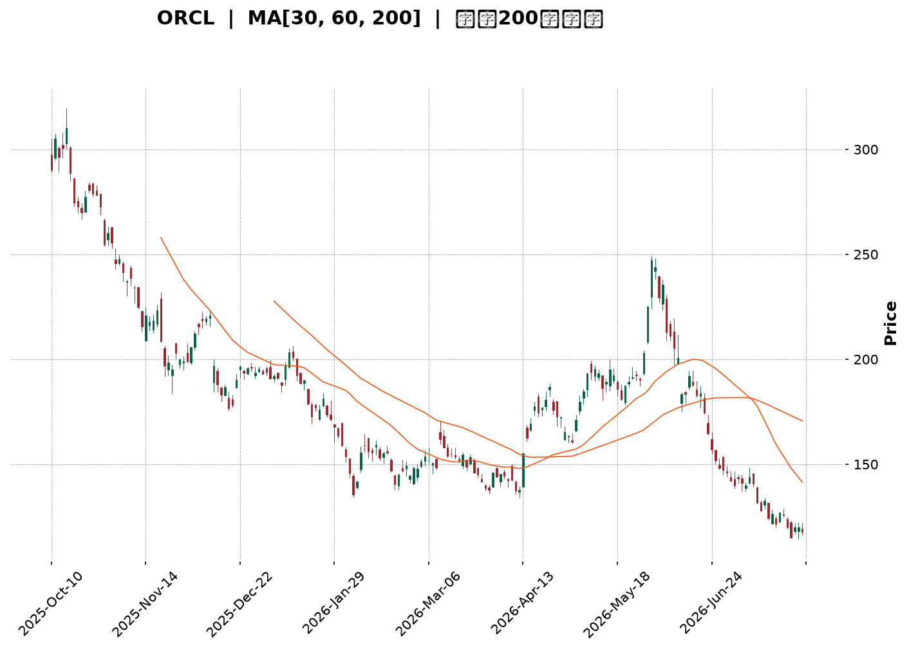
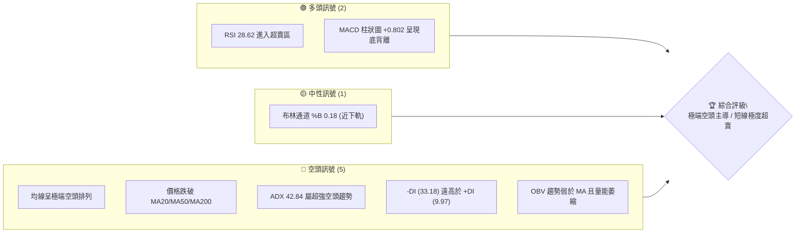
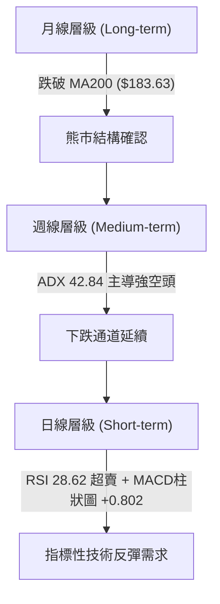
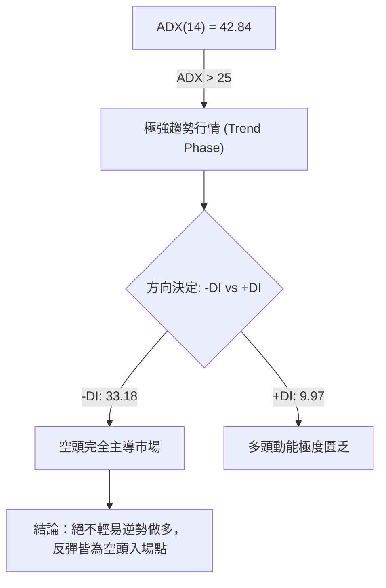
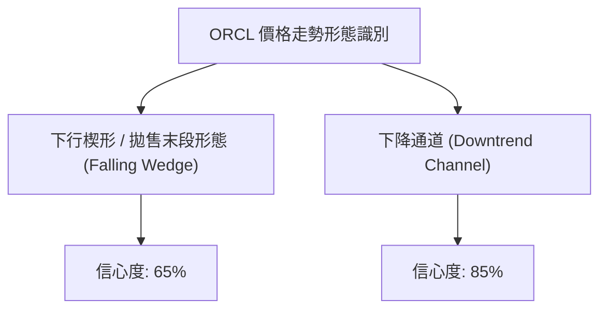
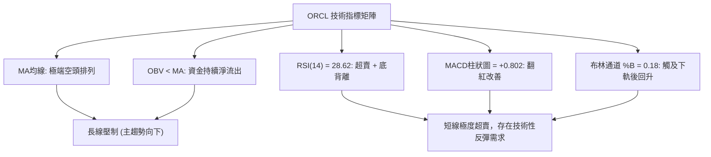
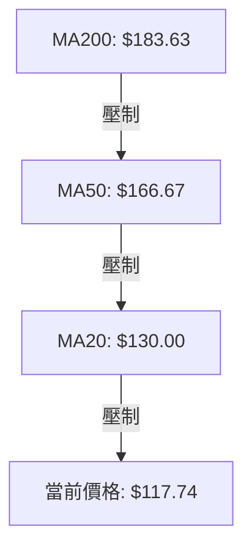
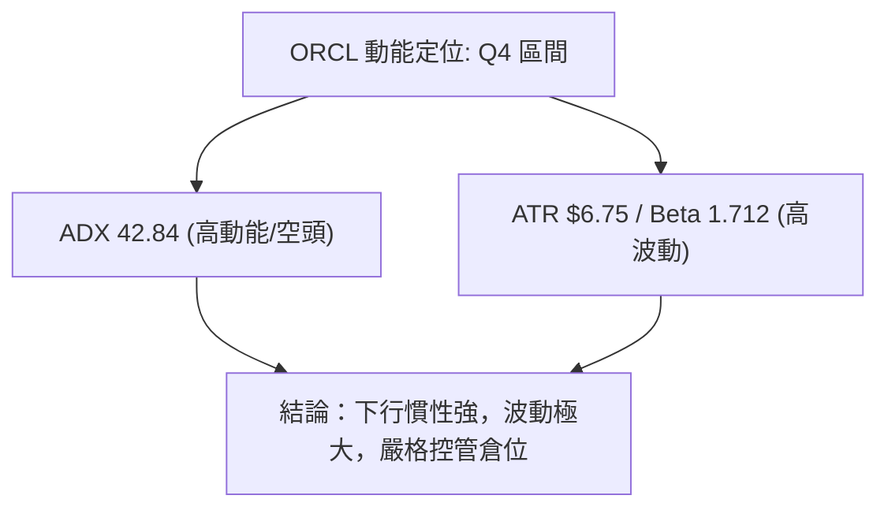
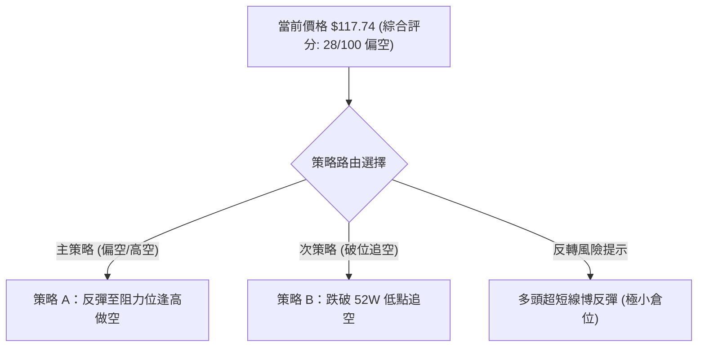
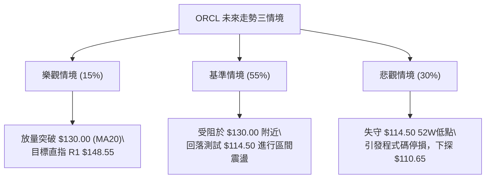

<details markdown="1">
<summary>📊 靜態圖表 (點擊展開)</summary>



</details>

<html>
<head><meta charset="utf-8" /></head>
<body>
    <div style="height:500px; width:100%;">                        <script>window.PlotlyConfig = {MathJaxConfig: 'local'};</script>
        <script charset="utf-8" src="https://cdn.plot.ly/plotly-3.7.0.min.js" integrity="sha256-jvTGqxNp8AGWEcvNLVuKr+8j5dGe9Yw51LQkmDH+IYA=" crossorigin="anonymous"></script>                <div id="candlestick-chart" class="plotly-graph-div" style="height:100%; width:100%;"></div>            <script>                window.PLOTLYENV=window.PLOTLYENV || {};                                if (document.getElementById("candlestick-chart")) {                    Plotly.newPlot(                        "candlestick-chart",                        [{"close":{"dtype":"f8","bdata":"AAAAgJQickAAAABAFBFzQAAAAOBLgnJAAAAAoILLckAAAAAAKGBzQAAAAIBuCHJAAAAA4IIocUAAAACAVwhxQAAAAADi4HBAAAAAYE9WcUAAAADA+IlxQAAAAOBia3FAAAAAgFpicUAAAAAguApxQAAAAGDyzW9AAAAAYJ5BcEAAAABgX+xvQAAAAGCSuW5AAAAA4GX9bkAAAACAES9uQAAAAOAsn21AAAAAwO\u002fQbUAAAABAmzxtQAAAAGBJGmxAAAAAQLrvakAAAADAEpdrQAAAAIBOOGtAAAAAQEZMa0AAAABgA+xrQAAAAKCrFWpAAAAAgI6baEAAAACAu8toQAAAAMC5ZGhAAAAA4A9gaUAAAACAqQBpQAAAAKCm4GhAAAAA4LjlaEAAAADA2rdpQAAAAKAJiWpAAAAAIAvwakAAAADg201rQAAAAIA8bWtAAAAAwCSca0AAAAAAaZ5oQAAAAMD2hGdAAAAAgOjkZkAAAACgIFtnQAAAAOApGGZAAAAAYOxJZkAAAABgWsRnQAAAAICDj2hAAAAAoCkvaEAAAABATnNoQAAAAAAng2hAAAAAQG4waEAAAABgbmpoQAAAAMCIIWhAAAAAwOM6aEAAAADgANhnQAAAAODE\u002fGdAAAAAQO3fZ0AAAABg0npnQAAAAECVpGhAAAAA4FVoaUAAAADAYhxpQAAAAGCNCGhAAAAAQBGRZ0AAAADAeLhnQAAAAMCCVWZAAAAAQJKVZUAAAABgNx5mQAAAAKDN\u002fWVAAAAAYJelZkAAAAAA\u002fLVlQAAAAEBAc2VAAAAA4M\u002f6ZEAAAADgCG5kQAAAAOBl3mNAAAAAQB0zY0AAAADA4zRiQAAAAEAS8WBAAAAAYIu6YUAAAADgIHBjQAAAAAD\u002f2GNAAAAA4D2CY0AAAAAAomxjQAAAAMDw4GNAAAAAoN4cY0AAAAAAyGJjQAAAAACKbmNAAAAAYLJhYkAAAAAgj4phQAAAACAMJGJAAAAAoKhbYkAAAADgj6hiQAAAAACIDGJAAAAAgOCGYkAAAAAgQH9iQAAAAEAG6mJAAAAAgO02Y0AAAAAgxvxiQAAAAOBI0GJAAAAAwKSLYkAAAACAoz9kQAAAAEDMwWNAAAAAwBhBY0AAAAAgbVxjQAAAAADAM2NAAAAA4N36YkAAAABAIE5jQAAAAKCKlGJAAAAAoKAoY0AAAACAPEJiQAAAAOA7IGJAAAAAADq6YUAAAAAgIFZhQAAAAODLOmFAAAAAQN9CYkAAAAAgIQdiQAAAAICsK2JAAAAA4PoQYkAAAACgqsVhQAAAAOA81WFAAAAAwDksYUAAAABgjzNhQAAAAECTYmNAAAAAoOpNZEAAAADAFCdlQAAAAEAYN2ZAAAAAoH\u002fOZUAAAAAA3B5mQAAAAEBXkWZAAAAA4DJbZ0AAAABAZ\u002fVlQAAAAIC8lWVAAAAAIIiLZUAAAAAAT6xkQAAAAIBiaGRAAAAAQJMaZEAAAABAf2dlQAAAAEBHdWZAAAAAIKMWZ0AAAAAgbytoQAAAAMBKPWhAAAAAQKloaEAAAAAAYCVoQAAAAEDVRWdAAAAAgESjZ0AAAACg0V1oQAAAAGD+CGhAAAAAQNE+Z0AAAADAlppmQAAAAOA+cGdAAAAAQJajZ0AAAAAgQO1nQAAAAGCADGhAAAAAAInJZ0AAAAAgzV9pQAAAAGDpH2xAAAAAIEXpbkAAAAAgbXduQAAAAMABsWxAAAAAAKlwbUAAAADADZ5qQAAAAKC9YmpAAAAAYBajaUAAAADg\u002fRFpQAAAAKDG7mZAAAAAgLvvZkAAAADAG\u002f9nQAAAAKCqdWdAAAAAYJncZkAAAACg1fRmQAAAAGDRzmVAAAAAAMySZEAAAADAe59jQAAAAGDO\u002fWJAAAAAYHuAYkAAAABg7WdiQAAAAIBXQWJAAAAA4DDAYUAAAAAgFHlhQAAAAABf6GFAAAAAoH2jYUAAAAAgGIBhQAAAAEAK92FAAAAA4HqUYUAAAACgR3FgQAAAAAAp\u002fF9AAAAAIK6PYEAAAACgcA1fQAAAAIA9ml9AAAAA4FFYXkAAAABAM8NfQAAAAIDCdV9AAAAAYI8CXkAAAAAgXL9cQAAAAKCZ+V1AAAAAoHD9XUAAAAAgXG9dQA=="},"high":{"dtype":"f8","bdata":"a32N73sMc0Ak2cc8tTtzQP1IBikw2HJAZzDB8p5Ac0Be9aSQVvdzQDEokBj41XJAZtYKtKDncUAiANhZ9FlxQLVGqDjUKHFAkVMAr1OGcUCpxYlUJMdxQFmxjF0hxHFA80jm0rmrcUDTOuqR325xQJunAhPtsnBA8i34Z1R0cEAqXsmDUXFwQFxK2Q7rmm9AlEsQj6M\u002fb0DmbuvvGNZuQCMB\u002fYdOw21AQ1GQ2BicbkDa73Eiz2VtQGKDGzeGUW1Aq4rJf0nga0C9baltMBxsQP8JCul8lWtAc6UDSAOya0AbfF5UDT9sQAipp9p2+GxAaF7AuDzKaUC8zvUz7jtpQPYEUHwosGhAYyLgD83\u002faUAftmbaBQ1pQMQbkMbJMWlA3AnP80r2aUDc+Ehh4L1pQKenRXpEq2pAaoywfOUsa0DPN\u002fPEStNrQD51AnLIj2tAG47yllvla0CaO30i7gFpQJqy0Aq3fmhACx5eKkVlZ0CuLHx\u002fk39nQCB5vEf8FmdA34cWU9bfZkAYmvyZMChoQG6JXkHTnGhA8AjvLh1qaEBqfoQMWIxoQIv6o5yVzmhAAKjCKqKTaEDE4xNvg49oQAnK9ScdamhAqMFROyuWaEAK0\u002fjxa\u002fhoQEXieXCVIGhA2MPfJJ85aEBuJV5CBqRnQEhcr5BV2WhA7sm9ilmlaUCdiYC0e8tpQEssB0MACWlALPAbuAo1aEAsPH0vQtFnQPZbTJeJPGdA2YNmth5rZkC2tfAhI11mQJY+yCjuTGZAeVPGUcsAZ0AQZBeoJ09mQDmHIZ9wjWZAG8EU0JQhZUDVUgfQUPdkQCpQ\u002ftdnQGVAKuc2CMrIY0AsfLOW6htjQH1Z06MTMWJAI9VRqZ7GYUCEKFwYjNRjQH2J54bGh2RAonmllcxQZEClafQO\u002fL1jQCu3UMiUJWRA13yXcZzFY0C4m87MsIZjQMQ1+qAI32NA\u002fDLQWoEdY0CFILonPhliQH3gmua\u002fN2JAWJeFRfEGY0B7uhb0J+5iQDqztf0jImJAnEEt2xykYkCo3iarQ7xiQGe04extEWNAjEOmaQebY0CWqcFMwMJjQKZqg2BE3mJA15+hk0UiY0Bp5IWAM1JlQHNcckxQ1WRALlIm7\u002fX0Y0AFgrKgc7RjQCTxuM0rumNADa33xKU8Y0B7uSd2nXpjQBc+tkz9BWNAlEQqUGNWY0D9rAcZpRpjQBgmcDigmWJA02I00IguYkAvpPyKopZhQKIDt0UQh2FAZyM+ZhZMYkBA3JqilpNiQH2RXZeULWJAXsYL3aFwYkBnUOH1J\u002fJhQKaoGVobzWJAJzzS8sHJYUBMbRit43VhQJA9dMPSa2NAFbG5mwEaZUBjX8ulxn5lQN\u002fLqw+kdGZAZnELBYj7ZkD0wlpjmSRmQB0ulHFRFmdAmpl+qcWQZ0Dhc9gLTahmQDxQyxusgmZAvQ9UnlieZUCg57QurwNlQFaAbpYKhmRAu0JWPG+TZEBgUIpZQ7ZlQIcvVXWk22ZAUL1YhfI7Z0BpNK2duTNoQF4oileY7mhApOxEpwiqaECK2QT+DGBoQIiqA4oJCGhAORsEuPzcZ0Dns70HdABpQBfcBar3d2hA1lkGIyjDZ0CW9ElvGoJnQPN2yKsocmdAbsKcQNkEaEBgfHoEJYpoQBebuHi+UGhAgFPO\u002fCnvZ0DLDy7UQYlpQI3IAcQsMGxAWP7Buzwsb0CUpQU4YARvQDPuhCCj9W1AP+uz\u002f+PDbUCueY5YZ9RsQEiVvQCeSWtA8hGYq4l3a0CjqQR3yXdqQFRRrDgkBGdA9OyFsfgdZ0DdVb1CklRoQDpbLDqSVGhAUGb3+fqwZ0C3XJYK02pnQOU4oigV\u002fmZAQ8+ELzi3ZUB\u002fXVOLnKVkQGXEpHNaomNAKAZG9j4gY0BWkBsU3D5jQOUFgWEgrWJACONSEzthYkB0pgTpmlFiQDDov0yvI2JA9HP0Z8UhYkDl\u002f9HoJKthQHMUNcGzkWJAAAAAgMI1YkAAAADAzHRhQAAAAOBRmGBAAAAAwMy8YEAAAADA9XhgQAAAAIAUDmBAAAAAIFxfX0AAAABA4dpfQAAAAEDhGmBAAAAAwMwsX0AAAADAHsVeQAAAACBcf15AAAAAwB6VXkAAAABA4XpeQA=="},"hovertemplate":"\u003cb\u003e%{x|%Y-%m-%d}\u003c\u002fb\u003e\u003cbr\u003e\u958b: $%{open:.2f}\u003cbr\u003e\u9ad8: $%{high:.2f}\u003cbr\u003e\u4f4e: $%{low:.2f}\u003cbr\u003e\u6536: $%{close:.2f}\u003cextra\u003e\u003c\u002fextra\u003e","low":{"dtype":"f8","bdata":"qedQjIYTckBJ3GAgVG5yQKprurIME3JAMC\u002fsaQeBckAD5QhSy8JyQJlayNYNzHFAGhTSjOAKcUDExnc2i9pwQE4YkQ\u002fYqnBAsIBKpprccEBeQ7Ji23hxQHYa5ncwUnFA60bbGMJdcUAh6ZKQH8xwQKB3pt2cum9AERkKvj3Ib0D8kyRMVZlvQLPkVXgfW25AyC2O0nCVbkDH8qd1IKBtQNhsXgorxGxAQDLpIsRZbUDmjPSNgVZsQBOo9QxMAGxA0jLz6T6lakCp5hvFNBhqQOYYlGYFsGpAw1pm6WyOakCLjNBvfOdqQAjAmEVPCWpAj7Gw\u002fm32Z0ClUClhMw5oQMPNQzBp+2ZAk\u002folf9oJaUANjGTnG3doQNs7UlREWmhAO9SKttvCaECaNEpM169oQErmbp8qi2lAgqwJq4hyakAGqHcWz9pqQOktftk6BmtAjZLGNQvwakBukGSIbQ5nQORkaeSABmdATFUhG1h1ZkAQnKmRR9dmQGLvdsgb7GVA4f6EevcbZkAwf7tuVEpnQHNf4Tmc32dAJ8UMZlPLZ0Dw5HcDARJoQMnnGyKRR2hA6prrj5bZZ0Bv84LE4zpoQLD8dTbUG2hAi82LJFkLaEBPFPlYw89nQCEEevIZnGdAK5lWvU3FZ0D4ALFK5AtnQDA6Pn0Qb2dADqDIApl0aEAbxyJ7luhoQOGvSdSSr2dAjbRtAnOCZ0BQ4NJRkCdnQJ9yvRC3Q2ZASAI72VYtZUBFqXlS1OhlQIowwAjUWWVAM1R6xFYpZkAxNiIQN49lQJWToydhVWVA8ZzGZ8sMZECkeofBc0NkQNYQoMh93GNAHy3LvxbbYkAZtV3jtO1hQM34TAH8yWBAQe08xEo+YUCV5ZB2YD9iQO6oZfbie2NAjss8qNIdY0A\u002fPb79J+5iQGIY0QvRRmNAf+lGTTv6YkB\u002fn\u002fMUP8piQMXC9\u002f4RVmNA+dGjE8VLYkDG4a9oHzRhQHQNUV2SOGFAyll7Py5KYkB68E5IlgRiQJ1WQvypo2FAeEVufW2GYUAjW1d72sFhQBhf+0ccgmJACGBeMYaiYkAxSZnhMNJiQIKL2lNDLWJA8CIaWXRtYkAY3aMu7O5jQK7ncN9RsGNA1rqi6pYiY0DUFoeyBy5jQKcXvRvvDWNANEoznInfYkAp717sb3tiQJF4l8mQXWJAITyt+0W1YkBJV4AinDpiQDMRDO0b82FAd3L+dqWxYUCTO1NE6CphQBjWFbsBAGFA7YS81ylcYUApS7lwVfVhQCxhlo52amFAhqLxg0bbYUDYNvMBBl9hQFU81w0WvWFA2Ex4c+nwYEB2XoGYT8NgQEiNCBOKZ2FAoR7KBf8fZEBfiyreR7RkQJCdgZBRpmVAc0UViEmYZUCObi8XEp1lQOnhXAzL7GVALfKo+1HFZkBdrVRbP69lQOCBApzfBmVA4nK1NSzqZED6ffVLny9kQEv1cDD6AmRApVfb2sX4Y0AAVznxXbJkQDrlscH8tGVAN5S0OCRMZkDFh1eiLMFmQMtWfMNuxGdATu4cRZ6xZ0BzBtsEDr5nQILC4STGh2ZAkOIRnGMNZ0CEb6Ft0xlnQGsmU8bXh2dAjRnN207UZkA1yIjtr4lmQBqInZTDRWZAim+GvaFRZ0DvfzHV\u002f81nQC2cu2DHvGdAs5uHlpdoZ0CDIK3YtBZoQCBqiC8+6WlAABnYdUj6a0BSfjQFYsBtQG72QsBEWmxAM8pNNybna0Cd1vfCKRdqQE\u002fn5TdWE2pAqMnYRVajaEDVMLH5xa9oQHCCP5+D1WVA2IerMiRMZkBRX+TdDzJnQKQWUQdNYGdATlYF+02+ZkBVlGmJryJmQDFPZqdzuWVAc+\u002fq\u002fkGBZEDZdPEp91ljQNL+XMTWumJAM19qrZRvYkANsLiUShZiQAgeKcpU\u002f2FAAAAA4DDAYUAS45uFKEthQFs+Zbd1lWFAy9h+BlciYUBwY3EfVyJhQMuzyadxjmFAAAAA4FFoYUAAAABAM2tgQAAAAGBm5l9AAAAAQOEaYEAAAACAPepeQAAAAAAAYF5AAAAAgOsBXkAAAACgcI1eQAAAAMDMLF9AAAAAACncXUAAAAAAALBcQAAAAEAzM11AAAAAAACgXEAAAADAzAxdQA=="},"name":"\u50f9\u683c","open":{"dtype":"f8","bdata":"GUHL0JSWckBKwlDPin1yQNaS9cu3ynJAw8SmacvfckDU5a8x4+pyQGQh2PWRzXJAOm3rTAjjcUDthDvMPzdxQIJOQdocA3FA2w6N+KLlcEDGYZImBLNxQD\u002f2B\u002fFQvXFA78fg9b2EcUCum7x0VmxxQCKPCv3ConBAAKTqLX4QcEAKp4DiS2twQMcWoDjw8m5AynS381SxbkBtSXhfSLJuQFKpBFnvlm1AMrCvDTZzbkAK6CldJD9tQK17aFFOT21AqYerLebaa0AFBRGTGxpqQKJmouECBGtAXaWEdZ\u002fEakA3oot68x5rQK2srt1znmxA5SnW20CjaUD+C6KHVl9oQF49jD86B2hAlY1cMfTvaUAQejT1U7NoQMjnbY+00mhAdzwHU8RlaUCSnIAjUc1oQCik0rn5u2lA8lk6ngwda0DCEHobiGdrQAmfYeSxPWtAx34mMst1a0CrNkjXkJlnQHu5E5\u002fOT2hAt+1LwrdPZ0COBnhi791mQCGmCW\u002fhsWZA\u002fIAdWi6fZkAR5TQt41JnQKkUbhYSXmhADkfzkbVRaEDC6Sf\u002fYiRoQMB7s+VehWhA3TuvesMJaEArOHGA+0VoQKl0PnNkUWhAu7l04qtyaEAdICDfPo5oQHqCkYEN12dA\u002fzu7GeUtaEBNoalczqFnQCKtrt2VymdAIMx53ViHaEAyVrgogXJpQEssB0MACWlALPAbuAo1aEDgBCFK+ZJnQPZbTJeJPGdAYAtWO+JNZkDnvyJECERmQN60V8+HbWVA7+cW4nM7ZkDtPZUEUD5mQD7vPc6etmVAnWek+wkfZUC18mwpHuBkQPR+ZACCN2VAJFv9iTKlY0B9MvbNUxpjQN7LxDzjEmJAPtgVS\u002fxYYUBRFqvvuW5iQAYUIeB93GNAonmllcxQZECbpv7+tZpjQNwSZXCoxGNAghlHrUycY0BDcfwd2ipjQLDNDvIxg2NA9QR0DpQHY0B8rp1HvxViQKWq1Zyfe2FAf3KCWASEYkCt0UxbQnhiQG4ySps63GFAG73b\u002fWiUYUB3bjxG4PdhQIdswjQHn2JA+dEvHQTxYkDd9+WlgPtiQCDrBpz0tGJACl3DPr8RY0DbvilJPKdkQOeTCMaTcGRAtaJhZ02+Y0BF4BRDSV9jQCSjyGOVS2NACLDLd8EKY0Cwac85VK1iQIB6h0mi\u002f2JAlSZY5dXLYkACldp6C\u002f5iQF3CisA9hmJAVQY\u002fBIzcYUAqxtW4e35hQK+kLm0zYmFAHmDVpnZqYUBoJ1TzyoFiQJgLSshFuWFAzJtmzVtNYkB+jfsXDdlhQB6hloE+qGJAlxlGvZ+2YUDwUkx+ARthQD7CekciaWFAdVKgGyHrZEBdnDIO98lkQAhGjSfe+WVAGMoEHHfJZkBtdFr+TQZmQEdoDvdpN2ZAPN803RoxZ0AsDho9yXhmQOzt\u002fUlLfGZAqVrk6ml\u002fZUApFDFMITNkQFyNPskUb2RAYa12W6ouZEDdlh8m+rpkQNk+X8Uc7WVAhdSEU\u002fSvZkDNawghvjFnQNzlMnR8vWhAge3Z9TH9Z0CNTm1\u002fe+9nQIiqA4oJCGhAy5eMG\u002f2LZ0BLRtcE4nBnQIQX1\u002f2LumdA5nKl2OuqZ0CLIGdvXStnQHAoKRQeamZAC2C81VmLZ0Ch5PwELeBnQJdj\u002fq4nFGhAgAZl+x3aZ0C0zye6wCtoQCfsizHQCGpAmO2FpW22bEAzeaLtqT5uQFJ9oTqu9G1ADR55A9FGbECR8F5aOJZsQFQXPrXXH2tAle1+lGOlakDV3QVj+rloQI94EdGBYWZABX\u002feYcsLZ0B8wKPasFdnQC34X2k9q2dAF3RcrncwZ0AZI2U6BMxmQCFD7cCxtWZAFvuCYXk0ZUBp81mKVT1kQPUgol6+mWNAxkjfXaa3YkAFaqB7AC1jQJ0onf6pV2JAlMxqe6b\u002fYUDvfD7Ss9lhQEuP1WmX+WFAJ0AUahjnYUDiuvIcflJhQITB5SXAnWFAAAAAwMw0YkAAAADA9WBhQAAAAAAAgGBAAAAAgOtRYEAAAAAgXG9gQAAAAMDMbF5AAAAAoEcRX0AAAAAA17NeQAAAACCFi19AAAAAoHD9XkAAAACAFJ5eQAAAAAAAgF1AAAAAIIWLXUAAAABA4dpdQA=="},"x":["2025-10-10T00:00:00-04:00","2025-10-13T00:00:00-04:00","2025-10-14T00:00:00-04:00","2025-10-15T00:00:00-04:00","2025-10-16T00:00:00-04:00","2025-10-17T00:00:00-04:00","2025-10-20T00:00:00-04:00","2025-10-21T00:00:00-04:00","2025-10-22T00:00:00-04:00","2025-10-23T00:00:00-04:00","2025-10-24T00:00:00-04:00","2025-10-27T00:00:00-04:00","2025-10-28T00:00:00-04:00","2025-10-29T00:00:00-04:00","2025-10-30T00:00:00-04:00","2025-10-31T00:00:00-04:00","2025-11-03T00:00:00-05:00","2025-11-04T00:00:00-05:00","2025-11-05T00:00:00-05:00","2025-11-06T00:00:00-05:00","2025-11-07T00:00:00-05:00","2025-11-10T00:00:00-05:00","2025-11-11T00:00:00-05:00","2025-11-12T00:00:00-05:00","2025-11-13T00:00:00-05:00","2025-11-14T00:00:00-05:00","2025-11-17T00:00:00-05:00","2025-11-18T00:00:00-05:00","2025-11-19T00:00:00-05:00","2025-11-20T00:00:00-05:00","2025-11-21T00:00:00-05:00","2025-11-24T00:00:00-05:00","2025-11-25T00:00:00-05:00","2025-11-26T00:00:00-05:00","2025-11-28T00:00:00-05:00","2025-12-01T00:00:00-05:00","2025-12-02T00:00:00-05:00","2025-12-03T00:00:00-05:00","2025-12-04T00:00:00-05:00","2025-12-05T00:00:00-05:00","2025-12-08T00:00:00-05:00","2025-12-09T00:00:00-05:00","2025-12-10T00:00:00-05:00","2025-12-11T00:00:00-05:00","2025-12-12T00:00:00-05:00","2025-12-15T00:00:00-05:00","2025-12-16T00:00:00-05:00","2025-12-17T00:00:00-05:00","2025-12-18T00:00:00-05:00","2025-12-19T00:00:00-05:00","2025-12-22T00:00:00-05:00","2025-12-23T00:00:00-05:00","2025-12-24T00:00:00-05:00","2025-12-26T00:00:00-05:00","2025-12-29T00:00:00-05:00","2025-12-30T00:00:00-05:00","2025-12-31T00:00:00-05:00","2026-01-02T00:00:00-05:00","2026-01-05T00:00:00-05:00","2026-01-06T00:00:00-05:00","2026-01-07T00:00:00-05:00","2026-01-08T00:00:00-05:00","2026-01-09T00:00:00-05:00","2026-01-12T00:00:00-05:00","2026-01-13T00:00:00-05:00","2026-01-14T00:00:00-05:00","2026-01-15T00:00:00-05:00","2026-01-16T00:00:00-05:00","2026-01-20T00:00:00-05:00","2026-01-21T00:00:00-05:00","2026-01-22T00:00:00-05:00","2026-01-23T00:00:00-05:00","2026-01-26T00:00:00-05:00","2026-01-27T00:00:00-05:00","2026-01-28T00:00:00-05:00","2026-01-29T00:00:00-05:00","2026-01-30T00:00:00-05:00","2026-02-02T00:00:00-05:00","2026-02-03T00:00:00-05:00","2026-02-04T00:00:00-05:00","2026-02-05T00:00:00-05:00","2026-02-06T00:00:00-05:00","2026-02-09T00:00:00-05:00","2026-02-10T00:00:00-05:00","2026-02-11T00:00:00-05:00","2026-02-12T00:00:00-05:00","2026-02-13T00:00:00-05:00","2026-02-17T00:00:00-05:00","2026-02-18T00:00:00-05:00","2026-02-19T00:00:00-05:00","2026-02-20T00:00:00-05:00","2026-02-23T00:00:00-05:00","2026-02-24T00:00:00-05:00","2026-02-25T00:00:00-05:00","2026-02-26T00:00:00-05:00","2026-02-27T00:00:00-05:00","2026-03-02T00:00:00-05:00","2026-03-03T00:00:00-05:00","2026-03-04T00:00:00-05:00","2026-03-05T00:00:00-05:00","2026-03-06T00:00:00-05:00","2026-03-09T00:00:00-04:00","2026-03-10T00:00:00-04:00","2026-03-11T00:00:00-04:00","2026-03-12T00:00:00-04:00","2026-03-13T00:00:00-04:00","2026-03-16T00:00:00-04:00","2026-03-17T00:00:00-04:00","2026-03-18T00:00:00-04:00","2026-03-19T00:00:00-04:00","2026-03-20T00:00:00-04:00","2026-03-23T00:00:00-04:00","2026-03-24T00:00:00-04:00","2026-03-25T00:00:00-04:00","2026-03-26T00:00:00-04:00","2026-03-27T00:00:00-04:00","2026-03-30T00:00:00-04:00","2026-03-31T00:00:00-04:00","2026-04-01T00:00:00-04:00","2026-04-02T00:00:00-04:00","2026-04-06T00:00:00-04:00","2026-04-07T00:00:00-04:00","2026-04-08T00:00:00-04:00","2026-04-09T00:00:00-04:00","2026-04-10T00:00:00-04:00","2026-04-13T00:00:00-04:00","2026-04-14T00:00:00-04:00","2026-04-15T00:00:00-04:00","2026-04-16T00:00:00-04:00","2026-04-17T00:00:00-04:00","2026-04-20T00:00:00-04:00","2026-04-21T00:00:00-04:00","2026-04-22T00:00:00-04:00","2026-04-23T00:00:00-04:00","2026-04-24T00:00:00-04:00","2026-04-27T00:00:00-04:00","2026-04-28T00:00:00-04:00","2026-04-29T00:00:00-04:00","2026-04-30T00:00:00-04:00","2026-05-01T00:00:00-04:00","2026-05-04T00:00:00-04:00","2026-05-05T00:00:00-04:00","2026-05-06T00:00:00-04:00","2026-05-07T00:00:00-04:00","2026-05-08T00:00:00-04:00","2026-05-11T00:00:00-04:00","2026-05-12T00:00:00-04:00","2026-05-13T00:00:00-04:00","2026-05-14T00:00:00-04:00","2026-05-15T00:00:00-04:00","2026-05-18T00:00:00-04:00","2026-05-19T00:00:00-04:00","2026-05-20T00:00:00-04:00","2026-05-21T00:00:00-04:00","2026-05-22T00:00:00-04:00","2026-05-26T00:00:00-04:00","2026-05-27T00:00:00-04:00","2026-05-28T00:00:00-04:00","2026-05-29T00:00:00-04:00","2026-06-01T00:00:00-04:00","2026-06-02T00:00:00-04:00","2026-06-03T00:00:00-04:00","2026-06-04T00:00:00-04:00","2026-06-05T00:00:00-04:00","2026-06-08T00:00:00-04:00","2026-06-09T00:00:00-04:00","2026-06-10T00:00:00-04:00","2026-06-11T00:00:00-04:00","2026-06-12T00:00:00-04:00","2026-06-15T00:00:00-04:00","2026-06-16T00:00:00-04:00","2026-06-17T00:00:00-04:00","2026-06-18T00:00:00-04:00","2026-06-22T00:00:00-04:00","2026-06-23T00:00:00-04:00","2026-06-24T00:00:00-04:00","2026-06-25T00:00:00-04:00","2026-06-26T00:00:00-04:00","2026-06-29T00:00:00-04:00","2026-06-30T00:00:00-04:00","2026-07-01T00:00:00-04:00","2026-07-02T00:00:00-04:00","2026-07-06T00:00:00-04:00","2026-07-07T00:00:00-04:00","2026-07-08T00:00:00-04:00","2026-07-09T00:00:00-04:00","2026-07-10T00:00:00-04:00","2026-07-13T00:00:00-04:00","2026-07-14T00:00:00-04:00","2026-07-15T00:00:00-04:00","2026-07-16T00:00:00-04:00","2026-07-17T00:00:00-04:00","2026-07-20T00:00:00-04:00","2026-07-21T00:00:00-04:00","2026-07-22T00:00:00-04:00","2026-07-23T00:00:00-04:00","2026-07-24T00:00:00-04:00","2026-07-27T00:00:00-04:00","2026-07-28T00:00:00-04:00","2026-07-29T00:00:00-04:00"],"type":"candlestick"},{"hovertemplate":"MA30: $%{y:.2f}\u003cextra\u003e\u003c\u002fextra\u003e","line":{"color":"#2196F3","dash":"dash","width":2},"mode":"lines","name":"MA30","x":["2025-10-10T00:00:00-04:00","2025-10-13T00:00:00-04:00","2025-10-14T00:00:00-04:00","2025-10-15T00:00:00-04:00","2025-10-16T00:00:00-04:00","2025-10-17T00:00:00-04:00","2025-10-20T00:00:00-04:00","2025-10-21T00:00:00-04:00","2025-10-22T00:00:00-04:00","2025-10-23T00:00:00-04:00","2025-10-24T00:00:00-04:00","2025-10-27T00:00:00-04:00","2025-10-28T00:00:00-04:00","2025-10-29T00:00:00-04:00","2025-10-30T00:00:00-04:00","2025-10-31T00:00:00-04:00","2025-11-03T00:00:00-05:00","2025-11-04T00:00:00-05:00","2025-11-05T00:00:00-05:00","2025-11-06T00:00:00-05:00","2025-11-07T00:00:00-05:00","2025-11-10T00:00:00-05:00","2025-11-11T00:00:00-05:00","2025-11-12T00:00:00-05:00","2025-11-13T00:00:00-05:00","2025-11-14T00:00:00-05:00","2025-11-17T00:00:00-05:00","2025-11-18T00:00:00-05:00","2025-11-19T00:00:00-05:00","2025-11-20T00:00:00-05:00","2025-11-21T00:00:00-05:00","2025-11-24T00:00:00-05:00","2025-11-25T00:00:00-05:00","2025-11-26T00:00:00-05:00","2025-11-28T00:00:00-05:00","2025-12-01T00:00:00-05:00","2025-12-02T00:00:00-05:00","2025-12-03T00:00:00-05:00","2025-12-04T00:00:00-05:00","2025-12-05T00:00:00-05:00","2025-12-08T00:00:00-05:00","2025-12-09T00:00:00-05:00","2025-12-10T00:00:00-05:00","2025-12-11T00:00:00-05:00","2025-12-12T00:00:00-05:00","2025-12-15T00:00:00-05:00","2025-12-16T00:00:00-05:00","2025-12-17T00:00:00-05:00","2025-12-18T00:00:00-05:00","2025-12-19T00:00:00-05:00","2025-12-22T00:00:00-05:00","2025-12-23T00:00:00-05:00","2025-12-24T00:00:00-05:00","2025-12-26T00:00:00-05:00","2025-12-29T00:00:00-05:00","2025-12-30T00:00:00-05:00","2025-12-31T00:00:00-05:00","2026-01-02T00:00:00-05:00","2026-01-05T00:00:00-05:00","2026-01-06T00:00:00-05:00","2026-01-07T00:00:00-05:00","2026-01-08T00:00:00-05:00","2026-01-09T00:00:00-05:00","2026-01-12T00:00:00-05:00","2026-01-13T00:00:00-05:00","2026-01-14T00:00:00-05:00","2026-01-15T00:00:00-05:00","2026-01-16T00:00:00-05:00","2026-01-20T00:00:00-05:00","2026-01-21T00:00:00-05:00","2026-01-22T00:00:00-05:00","2026-01-23T00:00:00-05:00","2026-01-26T00:00:00-05:00","2026-01-27T00:00:00-05:00","2026-01-28T00:00:00-05:00","2026-01-29T00:00:00-05:00","2026-01-30T00:00:00-05:00","2026-02-02T00:00:00-05:00","2026-02-03T00:00:00-05:00","2026-02-04T00:00:00-05:00","2026-02-05T00:00:00-05:00","2026-02-06T00:00:00-05:00","2026-02-09T00:00:00-05:00","2026-02-10T00:00:00-05:00","2026-02-11T00:00:00-05:00","2026-02-12T00:00:00-05:00","2026-02-13T00:00:00-05:00","2026-02-17T00:00:00-05:00","2026-02-18T00:00:00-05:00","2026-02-19T00:00:00-05:00","2026-02-20T00:00:00-05:00","2026-02-23T00:00:00-05:00","2026-02-24T00:00:00-05:00","2026-02-25T00:00:00-05:00","2026-02-26T00:00:00-05:00","2026-02-27T00:00:00-05:00","2026-03-02T00:00:00-05:00","2026-03-03T00:00:00-05:00","2026-03-04T00:00:00-05:00","2026-03-05T00:00:00-05:00","2026-03-06T00:00:00-05:00","2026-03-09T00:00:00-04:00","2026-03-10T00:00:00-04:00","2026-03-11T00:00:00-04:00","2026-03-12T00:00:00-04:00","2026-03-13T00:00:00-04:00","2026-03-16T00:00:00-04:00","2026-03-17T00:00:00-04:00","2026-03-18T00:00:00-04:00","2026-03-19T00:00:00-04:00","2026-03-20T00:00:00-04:00","2026-03-23T00:00:00-04:00","2026-03-24T00:00:00-04:00","2026-03-25T00:00:00-04:00","2026-03-26T00:00:00-04:00","2026-03-27T00:00:00-04:00","2026-03-30T00:00:00-04:00","2026-03-31T00:00:00-04:00","2026-04-01T00:00:00-04:00","2026-04-02T00:00:00-04:00","2026-04-06T00:00:00-04:00","2026-04-07T00:00:00-04:00","2026-04-08T00:00:00-04:00","2026-04-09T00:00:00-04:00","2026-04-10T00:00:00-04:00","2026-04-13T00:00:00-04:00","2026-04-14T00:00:00-04:00","2026-04-15T00:00:00-04:00","2026-04-16T00:00:00-04:00","2026-04-17T00:00:00-04:00","2026-04-20T00:00:00-04:00","2026-04-21T00:00:00-04:00","2026-04-22T00:00:00-04:00","2026-04-23T00:00:00-04:00","2026-04-24T00:00:00-04:00","2026-04-27T00:00:00-04:00","2026-04-28T00:00:00-04:00","2026-04-29T00:00:00-04:00","2026-04-30T00:00:00-04:00","2026-05-01T00:00:00-04:00","2026-05-04T00:00:00-04:00","2026-05-05T00:00:00-04:00","2026-05-06T00:00:00-04:00","2026-05-07T00:00:00-04:00","2026-05-08T00:00:00-04:00","2026-05-11T00:00:00-04:00","2026-05-12T00:00:00-04:00","2026-05-13T00:00:00-04:00","2026-05-14T00:00:00-04:00","2026-05-15T00:00:00-04:00","2026-05-18T00:00:00-04:00","2026-05-19T00:00:00-04:00","2026-05-20T00:00:00-04:00","2026-05-21T00:00:00-04:00","2026-05-22T00:00:00-04:00","2026-05-26T00:00:00-04:00","2026-05-27T00:00:00-04:00","2026-05-28T00:00:00-04:00","2026-05-29T00:00:00-04:00","2026-06-01T00:00:00-04:00","2026-06-02T00:00:00-04:00","2026-06-03T00:00:00-04:00","2026-06-04T00:00:00-04:00","2026-06-05T00:00:00-04:00","2026-06-08T00:00:00-04:00","2026-06-09T00:00:00-04:00","2026-06-10T00:00:00-04:00","2026-06-11T00:00:00-04:00","2026-06-12T00:00:00-04:00","2026-06-15T00:00:00-04:00","2026-06-16T00:00:00-04:00","2026-06-17T00:00:00-04:00","2026-06-18T00:00:00-04:00","2026-06-22T00:00:00-04:00","2026-06-23T00:00:00-04:00","2026-06-24T00:00:00-04:00","2026-06-25T00:00:00-04:00","2026-06-26T00:00:00-04:00","2026-06-29T00:00:00-04:00","2026-06-30T00:00:00-04:00","2026-07-01T00:00:00-04:00","2026-07-02T00:00:00-04:00","2026-07-06T00:00:00-04:00","2026-07-07T00:00:00-04:00","2026-07-08T00:00:00-04:00","2026-07-09T00:00:00-04:00","2026-07-10T00:00:00-04:00","2026-07-13T00:00:00-04:00","2026-07-14T00:00:00-04:00","2026-07-15T00:00:00-04:00","2026-07-16T00:00:00-04:00","2026-07-17T00:00:00-04:00","2026-07-20T00:00:00-04:00","2026-07-21T00:00:00-04:00","2026-07-22T00:00:00-04:00","2026-07-23T00:00:00-04:00","2026-07-24T00:00:00-04:00","2026-07-27T00:00:00-04:00","2026-07-28T00:00:00-04:00","2026-07-29T00:00:00-04:00"],"y":{"dtype":"f8","bdata":"AAAAAAAA+H8AAAAAAAD4fwAAAAAAAPh\u002fAAAAAAAA+H8AAAAAAAD4fwAAAAAAAPh\u002fAAAAAAAA+H8AAAAAAAD4fwAAAAAAAPh\u002fAAAAAAAA+H8AAAAAAAD4fwAAAAAAAPh\u002fAAAAAAAA+H8AAAAAAAD4fwAAAAAAAPh\u002fAAAAAAAA+H8AAAAAAAD4fwAAAAAAAPh\u002fAAAAAAAA+H8AAAAAAAD4fwAAAAAAAPh\u002fAAAAAAAA+H8AAAAAAAD4fwAAAAAAAPh\u002fAAAAAAAA+H8AAAAAAAD4fwAAAAAAAPh\u002fAAAAAAAA+H8AAAAAAAD4fwAAAJB6H3BAmpmZ+W\u002fbb0CrqqqKn2lvQBEREfHk\u002fW5AAAAAkKmVbkBmZmY2VyBuQO\u002fu7u7dwG1AERERgX1wbUCrqqo6QyltQKuqqmqj62xA7+7ufp6pbEARERFxSGdsQCIiIiIIKGxAIiIiQvLqa0AAAADALZprQCIiIrJ6U2tAIiIi0mYBa0AREREhS7hqQDMzM4OlbmpAq6qqumUkakBERETko+1pQERERJRzwmlAERERcWSSaUCrqqqKjGlpQDMzM0PpSmlAvLu7y3czaUAAAABAYRhpQDMzM1MF\u002fmhAAAAAYNfjaEDe3d19CsFoQO\u002fu7u4kr2hAMzMz0+OoaECrqqraqJ1oQFVVVcXJn2hA7+7uXhCgaEAiIiLy\u002fKBoQHd3d+fImWhAvLu7+22OaEDv7u4uYn1oQKuqqlqIWWhAiYiIqNkraEARERFxmP9nQBEREeE20WdAVVVV1dymZ0BmZmZmDI5nQO\u002fu7i5kfGdAd3d3Bw5sZ0BVVVXFFVNnQFVVVcUXQGdAiYiIiLslZ0BVVVWlSPZmQO\u002fu7t5EtWZAd3d3hy5+ZkAAAADAaFNmQN7d3Z2aK2ZAIiIiEqoDZkARERExEtllQLy7u9vItGVAVVVVBR6JZUB3d3eXE2NlQDMzM8MzPGVA7+7u7lMNZUBmZmYGp9pkQM3MzPwqo2RAREREFANnZEBERESE8y9kQFVVVUXi\u002fGNAVVVVpeDRY0ARERGxTaVjQAAAAOAeiGNA7+7uLuZzY0BVVVU1L1ljQO\u002fu7i4RPmNAERERoREbY0BmZmY2lw5jQJqZmWkkAGNAvLu7G2vxYkARERFRTOhiQO\u002fu7h6c4mJAREREJLzgYkBmZmYGHOpiQBEREYEX+GJAmpmZaUsEY0BEREREO\u002fpiQImIiBiK62JARERExFbcYkAzMzOjhcpiQO\u002fu7s7qs2JAAAAAkKasYkDv7u7uD6FiQBEREdFMlmJAiYiICJyTYkCrqqpqlJViQImIiOjzkmJAzczMnNaIYkCamZmpZ3xiQAAAAHDOh2JAERERcfmWYkCamZmpoq1iQN7d3e3NyWJAZmZmZuzfYkDNzMzcqPpiQAAAAOCxGmNAVVVVJb9DY0DNzMy8VlJjQAAAANDvYWNA7+7uDnx1Y0ARERFBroBjQAAAAPD3imNAzczMDI+UY0De3d2deKZjQImIiPiPx2NAZmZmlhjpY0BVVVU1iRtkQO\u002fu7l60T2RAREREFLiIZEDv7u7O08JkQAAAADBl9mRA3t3dbUYkZUARERFhXVplQERERKRojGVAREREdJq4ZUBmZmaG1eFlQM3MzOyqEWZAzczMrNhIZkDv7u5uPIJmQKuqqpoIqmZAVVVVFcHHZkCrqqo6x+tmQJqZmZk0HmdAmpmZ2eVrZ0AzMzPjHbNnQN7d3U1f52dAREREpEkbaEDNzMzsCkNoQN7d3W0CbGhAIiIiku2OaEBmZmZmc7RoQFVVVUX\u002fyWhAd3d3RyviaECJiIgYSvhoQBEREfHVAGlA7+7urub+aEC8u7s7jPRoQERERHTM32hAERER4RG\u002faEBEREQ0eZhoQBEREXHwc2hAAAAA8BxIaEDv7u7+PxVoQCIiIqLt42dAvLu7awq1Z0DNzMzMQYlnQLy7u6sPWmdAZmZmptsmZ0C8u7v7BPBmQFVVVaUavGZAVVVVtSKHZkDv7u4O6zpmQGZmZvZj02VA7+7u\u002fu9YZUCJiIiActlkQAAAAHhza2RAd3d3d7PxY0Dv7u7+FZZjQAAAAEAoO2NAERERKW7gYkC8u7s7J4ViQLy7u6NaQWJARERERJb9YUCamZnxZ65hQA=="},"type":"scatter"},{"hovertemplate":"MA60: $%{y:.2f}\u003cextra\u003e\u003c\u002fextra\u003e","line":{"color":"#9C27B0","dash":"dash","width":2},"mode":"lines","name":"MA60","x":["2025-10-10T00:00:00-04:00","2025-10-13T00:00:00-04:00","2025-10-14T00:00:00-04:00","2025-10-15T00:00:00-04:00","2025-10-16T00:00:00-04:00","2025-10-17T00:00:00-04:00","2025-10-20T00:00:00-04:00","2025-10-21T00:00:00-04:00","2025-10-22T00:00:00-04:00","2025-10-23T00:00:00-04:00","2025-10-24T00:00:00-04:00","2025-10-27T00:00:00-04:00","2025-10-28T00:00:00-04:00","2025-10-29T00:00:00-04:00","2025-10-30T00:00:00-04:00","2025-10-31T00:00:00-04:00","2025-11-03T00:00:00-05:00","2025-11-04T00:00:00-05:00","2025-11-05T00:00:00-05:00","2025-11-06T00:00:00-05:00","2025-11-07T00:00:00-05:00","2025-11-10T00:00:00-05:00","2025-11-11T00:00:00-05:00","2025-11-12T00:00:00-05:00","2025-11-13T00:00:00-05:00","2025-11-14T00:00:00-05:00","2025-11-17T00:00:00-05:00","2025-11-18T00:00:00-05:00","2025-11-19T00:00:00-05:00","2025-11-20T00:00:00-05:00","2025-11-21T00:00:00-05:00","2025-11-24T00:00:00-05:00","2025-11-25T00:00:00-05:00","2025-11-26T00:00:00-05:00","2025-11-28T00:00:00-05:00","2025-12-01T00:00:00-05:00","2025-12-02T00:00:00-05:00","2025-12-03T00:00:00-05:00","2025-12-04T00:00:00-05:00","2025-12-05T00:00:00-05:00","2025-12-08T00:00:00-05:00","2025-12-09T00:00:00-05:00","2025-12-10T00:00:00-05:00","2025-12-11T00:00:00-05:00","2025-12-12T00:00:00-05:00","2025-12-15T00:00:00-05:00","2025-12-16T00:00:00-05:00","2025-12-17T00:00:00-05:00","2025-12-18T00:00:00-05:00","2025-12-19T00:00:00-05:00","2025-12-22T00:00:00-05:00","2025-12-23T00:00:00-05:00","2025-12-24T00:00:00-05:00","2025-12-26T00:00:00-05:00","2025-12-29T00:00:00-05:00","2025-12-30T00:00:00-05:00","2025-12-31T00:00:00-05:00","2026-01-02T00:00:00-05:00","2026-01-05T00:00:00-05:00","2026-01-06T00:00:00-05:00","2026-01-07T00:00:00-05:00","2026-01-08T00:00:00-05:00","2026-01-09T00:00:00-05:00","2026-01-12T00:00:00-05:00","2026-01-13T00:00:00-05:00","2026-01-14T00:00:00-05:00","2026-01-15T00:00:00-05:00","2026-01-16T00:00:00-05:00","2026-01-20T00:00:00-05:00","2026-01-21T00:00:00-05:00","2026-01-22T00:00:00-05:00","2026-01-23T00:00:00-05:00","2026-01-26T00:00:00-05:00","2026-01-27T00:00:00-05:00","2026-01-28T00:00:00-05:00","2026-01-29T00:00:00-05:00","2026-01-30T00:00:00-05:00","2026-02-02T00:00:00-05:00","2026-02-03T00:00:00-05:00","2026-02-04T00:00:00-05:00","2026-02-05T00:00:00-05:00","2026-02-06T00:00:00-05:00","2026-02-09T00:00:00-05:00","2026-02-10T00:00:00-05:00","2026-02-11T00:00:00-05:00","2026-02-12T00:00:00-05:00","2026-02-13T00:00:00-05:00","2026-02-17T00:00:00-05:00","2026-02-18T00:00:00-05:00","2026-02-19T00:00:00-05:00","2026-02-20T00:00:00-05:00","2026-02-23T00:00:00-05:00","2026-02-24T00:00:00-05:00","2026-02-25T00:00:00-05:00","2026-02-26T00:00:00-05:00","2026-02-27T00:00:00-05:00","2026-03-02T00:00:00-05:00","2026-03-03T00:00:00-05:00","2026-03-04T00:00:00-05:00","2026-03-05T00:00:00-05:00","2026-03-06T00:00:00-05:00","2026-03-09T00:00:00-04:00","2026-03-10T00:00:00-04:00","2026-03-11T00:00:00-04:00","2026-03-12T00:00:00-04:00","2026-03-13T00:00:00-04:00","2026-03-16T00:00:00-04:00","2026-03-17T00:00:00-04:00","2026-03-18T00:00:00-04:00","2026-03-19T00:00:00-04:00","2026-03-20T00:00:00-04:00","2026-03-23T00:00:00-04:00","2026-03-24T00:00:00-04:00","2026-03-25T00:00:00-04:00","2026-03-26T00:00:00-04:00","2026-03-27T00:00:00-04:00","2026-03-30T00:00:00-04:00","2026-03-31T00:00:00-04:00","2026-04-01T00:00:00-04:00","2026-04-02T00:00:00-04:00","2026-04-06T00:00:00-04:00","2026-04-07T00:00:00-04:00","2026-04-08T00:00:00-04:00","2026-04-09T00:00:00-04:00","2026-04-10T00:00:00-04:00","2026-04-13T00:00:00-04:00","2026-04-14T00:00:00-04:00","2026-04-15T00:00:00-04:00","2026-04-16T00:00:00-04:00","2026-04-17T00:00:00-04:00","2026-04-20T00:00:00-04:00","2026-04-21T00:00:00-04:00","2026-04-22T00:00:00-04:00","2026-04-23T00:00:00-04:00","2026-04-24T00:00:00-04:00","2026-04-27T00:00:00-04:00","2026-04-28T00:00:00-04:00","2026-04-29T00:00:00-04:00","2026-04-30T00:00:00-04:00","2026-05-01T00:00:00-04:00","2026-05-04T00:00:00-04:00","2026-05-05T00:00:00-04:00","2026-05-06T00:00:00-04:00","2026-05-07T00:00:00-04:00","2026-05-08T00:00:00-04:00","2026-05-11T00:00:00-04:00","2026-05-12T00:00:00-04:00","2026-05-13T00:00:00-04:00","2026-05-14T00:00:00-04:00","2026-05-15T00:00:00-04:00","2026-05-18T00:00:00-04:00","2026-05-19T00:00:00-04:00","2026-05-20T00:00:00-04:00","2026-05-21T00:00:00-04:00","2026-05-22T00:00:00-04:00","2026-05-26T00:00:00-04:00","2026-05-27T00:00:00-04:00","2026-05-28T00:00:00-04:00","2026-05-29T00:00:00-04:00","2026-06-01T00:00:00-04:00","2026-06-02T00:00:00-04:00","2026-06-03T00:00:00-04:00","2026-06-04T00:00:00-04:00","2026-06-05T00:00:00-04:00","2026-06-08T00:00:00-04:00","2026-06-09T00:00:00-04:00","2026-06-10T00:00:00-04:00","2026-06-11T00:00:00-04:00","2026-06-12T00:00:00-04:00","2026-06-15T00:00:00-04:00","2026-06-16T00:00:00-04:00","2026-06-17T00:00:00-04:00","2026-06-18T00:00:00-04:00","2026-06-22T00:00:00-04:00","2026-06-23T00:00:00-04:00","2026-06-24T00:00:00-04:00","2026-06-25T00:00:00-04:00","2026-06-26T00:00:00-04:00","2026-06-29T00:00:00-04:00","2026-06-30T00:00:00-04:00","2026-07-01T00:00:00-04:00","2026-07-02T00:00:00-04:00","2026-07-06T00:00:00-04:00","2026-07-07T00:00:00-04:00","2026-07-08T00:00:00-04:00","2026-07-09T00:00:00-04:00","2026-07-10T00:00:00-04:00","2026-07-13T00:00:00-04:00","2026-07-14T00:00:00-04:00","2026-07-15T00:00:00-04:00","2026-07-16T00:00:00-04:00","2026-07-17T00:00:00-04:00","2026-07-20T00:00:00-04:00","2026-07-21T00:00:00-04:00","2026-07-22T00:00:00-04:00","2026-07-23T00:00:00-04:00","2026-07-24T00:00:00-04:00","2026-07-27T00:00:00-04:00","2026-07-28T00:00:00-04:00","2026-07-29T00:00:00-04:00"],"y":{"dtype":"f8","bdata":"AAAAAAAA+H8AAAAAAAD4fwAAAAAAAPh\u002fAAAAAAAA+H8AAAAAAAD4fwAAAAAAAPh\u002fAAAAAAAA+H8AAAAAAAD4fwAAAAAAAPh\u002fAAAAAAAA+H8AAAAAAAD4fwAAAAAAAPh\u002fAAAAAAAA+H8AAAAAAAD4fwAAAAAAAPh\u002fAAAAAAAA+H8AAAAAAAD4fwAAAAAAAPh\u002fAAAAAAAA+H8AAAAAAAD4fwAAAAAAAPh\u002fAAAAAAAA+H8AAAAAAAD4fwAAAAAAAPh\u002fAAAAAAAA+H8AAAAAAAD4fwAAAAAAAPh\u002fAAAAAAAA+H8AAAAAAAD4fwAAAAAAAPh\u002fAAAAAAAA+H8AAAAAAAD4fwAAAAAAAPh\u002fAAAAAAAA+H8AAAAAAAD4fwAAAAAAAPh\u002fAAAAAAAA+H8AAAAAAAD4fwAAAAAAAPh\u002fAAAAAAAA+H8AAAAAAAD4fwAAAAAAAPh\u002fAAAAAAAA+H8AAAAAAAD4fwAAAAAAAPh\u002fAAAAAAAA+H8AAAAAAAD4fwAAAAAAAPh\u002fAAAAAAAA+H8AAAAAAAD4fwAAAAAAAPh\u002fAAAAAAAA+H8AAAAAAAD4fwAAAAAAAPh\u002fAAAAAAAA+H8AAAAAAAD4fwAAAAAAAPh\u002fAAAAAAAA+H8AAAAAAAD4f3d3dwcNd2xAZmZm5ilCbECrqqoypANsQDMzM1vXzmtAd3d399yaa0BEREQUqmBrQDMzM2tTLWtAZmZmvnX\u002fakDNzMy0UtNqQKuqquKVompAvLu7E7xqakARERFxcDNqQJqZmYGf\u002fGlAvLu7i+fIaUAzMzMTHZRpQImIiHDvZ2lAzczMbLo2aUAzMzNzsAVpQERERKRe12hAmpmZoRClaEDNzMxE9nFoQJqZmTncO2hAREREfEkIaEBVVVWlet5nQImIiPBBu2dA7+7u7pCbZ0CJiIi4uXhnQHd3dxdnWWdAq6qqsno2Z0CrqqoKDxJnQBEREVms9WZAERER4RvbZkCJiIjwJ7xmQBEREWF6oWZAmpmZuYmDZkAzMzM7eGhmQGZmZpZVS2ZAiYiIUCcwZkAAAADwVxFmQFVVVZ3T8GVAvLu769\u002fPZUAzMzPTY6xlQAAAAAikh2VAMzMzO\u002fdgZUBmZmbOUU5lQERERExEPmVAmpmZkbwuZUAzMzMLsR1lQCIiIvJZEWVAZmZm1jsDZUDe3d1VMvBkQAAAADCu1mRAiYiI+DzBZEAiIiIC0qZkQDMzM1uSi2RAMzMzawBwZEAiIiLqy1FkQFVVVdVZNGRAq6qqSuIaZEAzMzPDEQJkQCIiIkpA6WNAvLu7+3fQY0CJiIi4HbhjQKuqqnIPm2NAiYiI2Ox3Y0Dv7u6WLVZjQKuqqlpYQmNAMzMzC200Y0BVVVUteCljQO\u002fu7mb2KGNAq6qqSukpY0AREREJ7CljQHd3d4dhLGNAMzMzY2gvY0CamZn5djBjQM3MzBwKMWNAVVVVlXMzY0ARERFJfTRjQHd3dwfKNmNAiYiImKU6Y0AiIiJSSkhjQM3MzLzTX2NAAAAAALJ2Y0DNzMw84opjQLy7uzufnWNAREREbIeyY0ARERG5rMZjQHd3d\u002f8n1WNA7+7ufnboY0AAAACotv1jQKuqqrpaEWRAZmZmPhsmZECJiIj4tDtkQKuqqmpPUmRAzczMpNdoZEBEREQMUn9kQFVVVYXrmGRAMzMzQ12vZEAiIiLytMxkQLy7u0MB9GRAAAAAIOklZUAAAABg41ZlQO\u002fu7pYIgWVAzczMZISvZUDNzMzUsMplQO\u002fu7h755mVAiYiI0DQCZkC8u7vTkBpmQKuqqpp7KmZAIiIiKl07ZkAzMzNbYU9mQM3MzPQyZGZAq6qqov9zZkCJiIi4CohmQJqZmWnAl2ZAq6qq+uSjZkCamZmBpq1mQImIiNAqtWZA7+7urjG2ZkAAAACwzrdmQDMzMyMruGZAAAAAcNK2ZkCamZmpi7VmQEREREzdtWZAmpmZKdq3ZkBVVVW1ILlmQAAAAKARs2ZAVVVV5XGnZkDNzMwkWZNmQAAAAEjMeGZARERE7GpiZkDe3d0xSEZmQO\u002fu7mJpKWZA3t3djX4GZkDe3d11kOxlQO\u002fu7laV02VAmpmZ3a23ZUARERFRzZxlQImIiPSshWVA3t3dxeBvZUAREREFWVNlQA=="},"type":"scatter"},{"hovertemplate":"MA200: $%{y:.2f}\u003cextra\u003e\u003c\u002fextra\u003e","line":{"color":"#FF6F00","dash":"solid","width":2},"mode":"lines","name":"MA200","x":["2025-10-10T00:00:00-04:00","2025-10-13T00:00:00-04:00","2025-10-14T00:00:00-04:00","2025-10-15T00:00:00-04:00","2025-10-16T00:00:00-04:00","2025-10-17T00:00:00-04:00","2025-10-20T00:00:00-04:00","2025-10-21T00:00:00-04:00","2025-10-22T00:00:00-04:00","2025-10-23T00:00:00-04:00","2025-10-24T00:00:00-04:00","2025-10-27T00:00:00-04:00","2025-10-28T00:00:00-04:00","2025-10-29T00:00:00-04:00","2025-10-30T00:00:00-04:00","2025-10-31T00:00:00-04:00","2025-11-03T00:00:00-05:00","2025-11-04T00:00:00-05:00","2025-11-05T00:00:00-05:00","2025-11-06T00:00:00-05:00","2025-11-07T00:00:00-05:00","2025-11-10T00:00:00-05:00","2025-11-11T00:00:00-05:00","2025-11-12T00:00:00-05:00","2025-11-13T00:00:00-05:00","2025-11-14T00:00:00-05:00","2025-11-17T00:00:00-05:00","2025-11-18T00:00:00-05:00","2025-11-19T00:00:00-05:00","2025-11-20T00:00:00-05:00","2025-11-21T00:00:00-05:00","2025-11-24T00:00:00-05:00","2025-11-25T00:00:00-05:00","2025-11-26T00:00:00-05:00","2025-11-28T00:00:00-05:00","2025-12-01T00:00:00-05:00","2025-12-02T00:00:00-05:00","2025-12-03T00:00:00-05:00","2025-12-04T00:00:00-05:00","2025-12-05T00:00:00-05:00","2025-12-08T00:00:00-05:00","2025-12-09T00:00:00-05:00","2025-12-10T00:00:00-05:00","2025-12-11T00:00:00-05:00","2025-12-12T00:00:00-05:00","2025-12-15T00:00:00-05:00","2025-12-16T00:00:00-05:00","2025-12-17T00:00:00-05:00","2025-12-18T00:00:00-05:00","2025-12-19T00:00:00-05:00","2025-12-22T00:00:00-05:00","2025-12-23T00:00:00-05:00","2025-12-24T00:00:00-05:00","2025-12-26T00:00:00-05:00","2025-12-29T00:00:00-05:00","2025-12-30T00:00:00-05:00","2025-12-31T00:00:00-05:00","2026-01-02T00:00:00-05:00","2026-01-05T00:00:00-05:00","2026-01-06T00:00:00-05:00","2026-01-07T00:00:00-05:00","2026-01-08T00:00:00-05:00","2026-01-09T00:00:00-05:00","2026-01-12T00:00:00-05:00","2026-01-13T00:00:00-05:00","2026-01-14T00:00:00-05:00","2026-01-15T00:00:00-05:00","2026-01-16T00:00:00-05:00","2026-01-20T00:00:00-05:00","2026-01-21T00:00:00-05:00","2026-01-22T00:00:00-05:00","2026-01-23T00:00:00-05:00","2026-01-26T00:00:00-05:00","2026-01-27T00:00:00-05:00","2026-01-28T00:00:00-05:00","2026-01-29T00:00:00-05:00","2026-01-30T00:00:00-05:00","2026-02-02T00:00:00-05:00","2026-02-03T00:00:00-05:00","2026-02-04T00:00:00-05:00","2026-02-05T00:00:00-05:00","2026-02-06T00:00:00-05:00","2026-02-09T00:00:00-05:00","2026-02-10T00:00:00-05:00","2026-02-11T00:00:00-05:00","2026-02-12T00:00:00-05:00","2026-02-13T00:00:00-05:00","2026-02-17T00:00:00-05:00","2026-02-18T00:00:00-05:00","2026-02-19T00:00:00-05:00","2026-02-20T00:00:00-05:00","2026-02-23T00:00:00-05:00","2026-02-24T00:00:00-05:00","2026-02-25T00:00:00-05:00","2026-02-26T00:00:00-05:00","2026-02-27T00:00:00-05:00","2026-03-02T00:00:00-05:00","2026-03-03T00:00:00-05:00","2026-03-04T00:00:00-05:00","2026-03-05T00:00:00-05:00","2026-03-06T00:00:00-05:00","2026-03-09T00:00:00-04:00","2026-03-10T00:00:00-04:00","2026-03-11T00:00:00-04:00","2026-03-12T00:00:00-04:00","2026-03-13T00:00:00-04:00","2026-03-16T00:00:00-04:00","2026-03-17T00:00:00-04:00","2026-03-18T00:00:00-04:00","2026-03-19T00:00:00-04:00","2026-03-20T00:00:00-04:00","2026-03-23T00:00:00-04:00","2026-03-24T00:00:00-04:00","2026-03-25T00:00:00-04:00","2026-03-26T00:00:00-04:00","2026-03-27T00:00:00-04:00","2026-03-30T00:00:00-04:00","2026-03-31T00:00:00-04:00","2026-04-01T00:00:00-04:00","2026-04-02T00:00:00-04:00","2026-04-06T00:00:00-04:00","2026-04-07T00:00:00-04:00","2026-04-08T00:00:00-04:00","2026-04-09T00:00:00-04:00","2026-04-10T00:00:00-04:00","2026-04-13T00:00:00-04:00","2026-04-14T00:00:00-04:00","2026-04-15T00:00:00-04:00","2026-04-16T00:00:00-04:00","2026-04-17T00:00:00-04:00","2026-04-20T00:00:00-04:00","2026-04-21T00:00:00-04:00","2026-04-22T00:00:00-04:00","2026-04-23T00:00:00-04:00","2026-04-24T00:00:00-04:00","2026-04-27T00:00:00-04:00","2026-04-28T00:00:00-04:00","2026-04-29T00:00:00-04:00","2026-04-30T00:00:00-04:00","2026-05-01T00:00:00-04:00","2026-05-04T00:00:00-04:00","2026-05-05T00:00:00-04:00","2026-05-06T00:00:00-04:00","2026-05-07T00:00:00-04:00","2026-05-08T00:00:00-04:00","2026-05-11T00:00:00-04:00","2026-05-12T00:00:00-04:00","2026-05-13T00:00:00-04:00","2026-05-14T00:00:00-04:00","2026-05-15T00:00:00-04:00","2026-05-18T00:00:00-04:00","2026-05-19T00:00:00-04:00","2026-05-20T00:00:00-04:00","2026-05-21T00:00:00-04:00","2026-05-22T00:00:00-04:00","2026-05-26T00:00:00-04:00","2026-05-27T00:00:00-04:00","2026-05-28T00:00:00-04:00","2026-05-29T00:00:00-04:00","2026-06-01T00:00:00-04:00","2026-06-02T00:00:00-04:00","2026-06-03T00:00:00-04:00","2026-06-04T00:00:00-04:00","2026-06-05T00:00:00-04:00","2026-06-08T00:00:00-04:00","2026-06-09T00:00:00-04:00","2026-06-10T00:00:00-04:00","2026-06-11T00:00:00-04:00","2026-06-12T00:00:00-04:00","2026-06-15T00:00:00-04:00","2026-06-16T00:00:00-04:00","2026-06-17T00:00:00-04:00","2026-06-18T00:00:00-04:00","2026-06-22T00:00:00-04:00","2026-06-23T00:00:00-04:00","2026-06-24T00:00:00-04:00","2026-06-25T00:00:00-04:00","2026-06-26T00:00:00-04:00","2026-06-29T00:00:00-04:00","2026-06-30T00:00:00-04:00","2026-07-01T00:00:00-04:00","2026-07-02T00:00:00-04:00","2026-07-06T00:00:00-04:00","2026-07-07T00:00:00-04:00","2026-07-08T00:00:00-04:00","2026-07-09T00:00:00-04:00","2026-07-10T00:00:00-04:00","2026-07-13T00:00:00-04:00","2026-07-14T00:00:00-04:00","2026-07-15T00:00:00-04:00","2026-07-16T00:00:00-04:00","2026-07-17T00:00:00-04:00","2026-07-20T00:00:00-04:00","2026-07-21T00:00:00-04:00","2026-07-22T00:00:00-04:00","2026-07-23T00:00:00-04:00","2026-07-24T00:00:00-04:00","2026-07-27T00:00:00-04:00","2026-07-28T00:00:00-04:00","2026-07-29T00:00:00-04:00"],"y":{"dtype":"f8","bdata":"AAAAAAAA+H8AAAAAAAD4fwAAAAAAAPh\u002fAAAAAAAA+H8AAAAAAAD4fwAAAAAAAPh\u002fAAAAAAAA+H8AAAAAAAD4fwAAAAAAAPh\u002fAAAAAAAA+H8AAAAAAAD4fwAAAAAAAPh\u002fAAAAAAAA+H8AAAAAAAD4fwAAAAAAAPh\u002fAAAAAAAA+H8AAAAAAAD4fwAAAAAAAPh\u002fAAAAAAAA+H8AAAAAAAD4fwAAAAAAAPh\u002fAAAAAAAA+H8AAAAAAAD4fwAAAAAAAPh\u002fAAAAAAAA+H8AAAAAAAD4fwAAAAAAAPh\u002fAAAAAAAA+H8AAAAAAAD4fwAAAAAAAPh\u002fAAAAAAAA+H8AAAAAAAD4fwAAAAAAAPh\u002fAAAAAAAA+H8AAAAAAAD4fwAAAAAAAPh\u002fAAAAAAAA+H8AAAAAAAD4fwAAAAAAAPh\u002fAAAAAAAA+H8AAAAAAAD4fwAAAAAAAPh\u002fAAAAAAAA+H8AAAAAAAD4fwAAAAAAAPh\u002fAAAAAAAA+H8AAAAAAAD4fwAAAAAAAPh\u002fAAAAAAAA+H8AAAAAAAD4fwAAAAAAAPh\u002fAAAAAAAA+H8AAAAAAAD4fwAAAAAAAPh\u002fAAAAAAAA+H8AAAAAAAD4fwAAAAAAAPh\u002fAAAAAAAA+H8AAAAAAAD4fwAAAAAAAPh\u002fAAAAAAAA+H8AAAAAAAD4fwAAAAAAAPh\u002fAAAAAAAA+H8AAAAAAAD4fwAAAAAAAPh\u002fAAAAAAAA+H8AAAAAAAD4fwAAAAAAAPh\u002fAAAAAAAA+H8AAAAAAAD4fwAAAAAAAPh\u002fAAAAAAAA+H8AAAAAAAD4fwAAAAAAAPh\u002fAAAAAAAA+H8AAAAAAAD4fwAAAAAAAPh\u002fAAAAAAAA+H8AAAAAAAD4fwAAAAAAAPh\u002fAAAAAAAA+H8AAAAAAAD4fwAAAAAAAPh\u002fAAAAAAAA+H8AAAAAAAD4fwAAAAAAAPh\u002fAAAAAAAA+H8AAAAAAAD4fwAAAAAAAPh\u002fAAAAAAAA+H8AAAAAAAD4fwAAAAAAAPh\u002fAAAAAAAA+H8AAAAAAAD4fwAAAAAAAPh\u002fAAAAAAAA+H8AAAAAAAD4fwAAAAAAAPh\u002fAAAAAAAA+H8AAAAAAAD4fwAAAAAAAPh\u002fAAAAAAAA+H8AAAAAAAD4fwAAAAAAAPh\u002fAAAAAAAA+H8AAAAAAAD4fwAAAAAAAPh\u002fAAAAAAAA+H8AAAAAAAD4fwAAAAAAAPh\u002fAAAAAAAA+H8AAAAAAAD4fwAAAAAAAPh\u002fAAAAAAAA+H8AAAAAAAD4fwAAAAAAAPh\u002fAAAAAAAA+H8AAAAAAAD4fwAAAAAAAPh\u002fAAAAAAAA+H8AAAAAAAD4fwAAAAAAAPh\u002fAAAAAAAA+H8AAAAAAAD4fwAAAAAAAPh\u002fAAAAAAAA+H8AAAAAAAD4fwAAAAAAAPh\u002fAAAAAAAA+H8AAAAAAAD4fwAAAAAAAPh\u002fAAAAAAAA+H8AAAAAAAD4fwAAAAAAAPh\u002fAAAAAAAA+H8AAAAAAAD4fwAAAAAAAPh\u002fAAAAAAAA+H8AAAAAAAD4fwAAAAAAAPh\u002fAAAAAAAA+H8AAAAAAAD4fwAAAAAAAPh\u002fAAAAAAAA+H8AAAAAAAD4fwAAAAAAAPh\u002fAAAAAAAA+H8AAAAAAAD4fwAAAAAAAPh\u002fAAAAAAAA+H8AAAAAAAD4fwAAAAAAAPh\u002fAAAAAAAA+H8AAAAAAAD4fwAAAAAAAPh\u002fAAAAAAAA+H8AAAAAAAD4fwAAAAAAAPh\u002fAAAAAAAA+H8AAAAAAAD4fwAAAAAAAPh\u002fAAAAAAAA+H8AAAAAAAD4fwAAAAAAAPh\u002fAAAAAAAA+H8AAAAAAAD4fwAAAAAAAPh\u002fAAAAAAAA+H8AAAAAAAD4fwAAAAAAAPh\u002fAAAAAAAA+H8AAAAAAAD4fwAAAAAAAPh\u002fAAAAAAAA+H8AAAAAAAD4fwAAAAAAAPh\u002fAAAAAAAA+H8AAAAAAAD4fwAAAAAAAPh\u002fAAAAAAAA+H8AAAAAAAD4fwAAAAAAAPh\u002fAAAAAAAA+H8AAAAAAAD4fwAAAAAAAPh\u002fAAAAAAAA+H8AAAAAAAD4fwAAAAAAAPh\u002fAAAAAAAA+H8AAAAAAAD4fwAAAAAAAPh\u002fAAAAAAAA+H8AAAAAAAD4fwAAAAAAAPh\u002fAAAAAAAA+H8AAAAAAAD4fwAAAAAAAPh\u002fAAAAAAAA+H9I4XquJPRmQA=="},"type":"scatter"}],                        {"template":{"data":{"barpolar":[{"marker":{"line":{"color":"rgb(17,17,17)","width":0.5},"pattern":{"fillmode":"overlay","size":10,"solidity":0.2}},"type":"barpolar"}],"bar":[{"error_x":{"color":"#f2f5fa"},"error_y":{"color":"#f2f5fa"},"marker":{"line":{"color":"rgb(17,17,17)","width":0.5},"pattern":{"fillmode":"overlay","size":10,"solidity":0.2}},"type":"bar"}],"carpet":[{"aaxis":{"endlinecolor":"#A2B1C6","gridcolor":"#506784","linecolor":"#506784","minorgridcolor":"#506784","startlinecolor":"#A2B1C6"},"baxis":{"endlinecolor":"#A2B1C6","gridcolor":"#506784","linecolor":"#506784","minorgridcolor":"#506784","startlinecolor":"#A2B1C6"},"type":"carpet"}],"choropleth":[{"colorbar":{"outlinewidth":0,"ticks":""},"type":"choropleth"}],"contourcarpet":[{"colorbar":{"outlinewidth":0,"ticks":""},"type":"contourcarpet"}],"contour":[{"colorbar":{"outlinewidth":0,"ticks":""},"colorscale":[[0.0,"#0d0887"],[0.1111111111111111,"#46039f"],[0.2222222222222222,"#7201a8"],[0.3333333333333333,"#9c179e"],[0.4444444444444444,"#bd3786"],[0.5555555555555556,"#d8576b"],[0.6666666666666666,"#ed7953"],[0.7777777777777778,"#fb9f3a"],[0.8888888888888888,"#fdca26"],[1.0,"#f0f921"]],"type":"contour"}],"heatmap":[{"colorbar":{"outlinewidth":0,"ticks":""},"colorscale":[[0.0,"#0d0887"],[0.1111111111111111,"#46039f"],[0.2222222222222222,"#7201a8"],[0.3333333333333333,"#9c179e"],[0.4444444444444444,"#bd3786"],[0.5555555555555556,"#d8576b"],[0.6666666666666666,"#ed7953"],[0.7777777777777778,"#fb9f3a"],[0.8888888888888888,"#fdca26"],[1.0,"#f0f921"]],"type":"heatmap"}],"histogram2dcontour":[{"colorbar":{"outlinewidth":0,"ticks":""},"colorscale":[[0.0,"#0d0887"],[0.1111111111111111,"#46039f"],[0.2222222222222222,"#7201a8"],[0.3333333333333333,"#9c179e"],[0.4444444444444444,"#bd3786"],[0.5555555555555556,"#d8576b"],[0.6666666666666666,"#ed7953"],[0.7777777777777778,"#fb9f3a"],[0.8888888888888888,"#fdca26"],[1.0,"#f0f921"]],"type":"histogram2dcontour"}],"histogram2d":[{"colorbar":{"outlinewidth":0,"ticks":""},"colorscale":[[0.0,"#0d0887"],[0.1111111111111111,"#46039f"],[0.2222222222222222,"#7201a8"],[0.3333333333333333,"#9c179e"],[0.4444444444444444,"#bd3786"],[0.5555555555555556,"#d8576b"],[0.6666666666666666,"#ed7953"],[0.7777777777777778,"#fb9f3a"],[0.8888888888888888,"#fdca26"],[1.0,"#f0f921"]],"type":"histogram2d"}],"histogram":[{"marker":{"pattern":{"fillmode":"overlay","size":10,"solidity":0.2}},"type":"histogram"}],"mesh3d":[{"colorbar":{"outlinewidth":0,"ticks":""},"type":"mesh3d"}],"parcoords":[{"line":{"colorbar":{"outlinewidth":0,"ticks":""}},"type":"parcoords"}],"pie":[{"automargin":true,"type":"pie"}],"scatter3d":[{"line":{"colorbar":{"outlinewidth":0,"ticks":""}},"marker":{"colorbar":{"outlinewidth":0,"ticks":""}},"type":"scatter3d"}],"scattercarpet":[{"marker":{"colorbar":{"outlinewidth":0,"ticks":""}},"type":"scattercarpet"}],"scattergeo":[{"marker":{"colorbar":{"outlinewidth":0,"ticks":""}},"type":"scattergeo"}],"scattergl":[{"marker":{"line":{"color":"#283442"}},"type":"scattergl"}],"scattermapbox":[{"marker":{"colorbar":{"outlinewidth":0,"ticks":""}},"type":"scattermapbox"}],"scattermap":[{"marker":{"colorbar":{"outlinewidth":0,"ticks":""}},"type":"scattermap"}],"scatterpolargl":[{"marker":{"colorbar":{"outlinewidth":0,"ticks":""}},"type":"scatterpolargl"}],"scatterpolar":[{"marker":{"colorbar":{"outlinewidth":0,"ticks":""}},"type":"scatterpolar"}],"scatter":[{"marker":{"line":{"color":"#283442"}},"type":"scatter"}],"scatterternary":[{"marker":{"colorbar":{"outlinewidth":0,"ticks":""}},"type":"scatterternary"}],"surface":[{"colorbar":{"outlinewidth":0,"ticks":""},"colorscale":[[0.0,"#0d0887"],[0.1111111111111111,"#46039f"],[0.2222222222222222,"#7201a8"],[0.3333333333333333,"#9c179e"],[0.4444444444444444,"#bd3786"],[0.5555555555555556,"#d8576b"],[0.6666666666666666,"#ed7953"],[0.7777777777777778,"#fb9f3a"],[0.8888888888888888,"#fdca26"],[1.0,"#f0f921"]],"type":"surface"}],"table":[{"cells":{"fill":{"color":"#506784"},"line":{"color":"rgb(17,17,17)"}},"header":{"fill":{"color":"#2a3f5f"},"line":{"color":"rgb(17,17,17)"}},"type":"table"}]},"layout":{"annotationdefaults":{"arrowcolor":"#f2f5fa","arrowhead":0,"arrowwidth":1},"autotypenumbers":"strict","coloraxis":{"colorbar":{"outlinewidth":0,"ticks":""}},"colorscale":{"diverging":[[0,"#8e0152"],[0.1,"#c51b7d"],[0.2,"#de77ae"],[0.3,"#f1b6da"],[0.4,"#fde0ef"],[0.5,"#f7f7f7"],[0.6,"#e6f5d0"],[0.7,"#b8e186"],[0.8,"#7fbc41"],[0.9,"#4d9221"],[1,"#276419"]],"sequential":[[0.0,"#0d0887"],[0.1111111111111111,"#46039f"],[0.2222222222222222,"#7201a8"],[0.3333333333333333,"#9c179e"],[0.4444444444444444,"#bd3786"],[0.5555555555555556,"#d8576b"],[0.6666666666666666,"#ed7953"],[0.7777777777777778,"#fb9f3a"],[0.8888888888888888,"#fdca26"],[1.0,"#f0f921"]],"sequentialminus":[[0.0,"#0d0887"],[0.1111111111111111,"#46039f"],[0.2222222222222222,"#7201a8"],[0.3333333333333333,"#9c179e"],[0.4444444444444444,"#bd3786"],[0.5555555555555556,"#d8576b"],[0.6666666666666666,"#ed7953"],[0.7777777777777778,"#fb9f3a"],[0.8888888888888888,"#fdca26"],[1.0,"#f0f921"]]},"colorway":["#636efa","#EF553B","#00cc96","#ab63fa","#FFA15A","#19d3f3","#FF6692","#B6E880","#FF97FF","#FECB52"],"font":{"color":"#f2f5fa"},"geo":{"bgcolor":"rgb(17,17,17)","lakecolor":"rgb(17,17,17)","landcolor":"rgb(17,17,17)","showlakes":true,"showland":true,"subunitcolor":"#506784"},"hoverlabel":{"align":"left"},"hovermode":"closest","mapbox":{"style":"dark"},"paper_bgcolor":"rgb(17,17,17)","plot_bgcolor":"rgb(17,17,17)","polar":{"angularaxis":{"gridcolor":"#506784","linecolor":"#506784","ticks":""},"bgcolor":"rgb(17,17,17)","radialaxis":{"gridcolor":"#506784","linecolor":"#506784","ticks":""}},"scene":{"xaxis":{"backgroundcolor":"rgb(17,17,17)","gridcolor":"#506784","gridwidth":2,"linecolor":"#506784","showbackground":true,"ticks":"","zerolinecolor":"#C8D4E3"},"yaxis":{"backgroundcolor":"rgb(17,17,17)","gridcolor":"#506784","gridwidth":2,"linecolor":"#506784","showbackground":true,"ticks":"","zerolinecolor":"#C8D4E3"},"zaxis":{"backgroundcolor":"rgb(17,17,17)","gridcolor":"#506784","gridwidth":2,"linecolor":"#506784","showbackground":true,"ticks":"","zerolinecolor":"#C8D4E3"}},"shapedefaults":{"line":{"color":"#f2f5fa"}},"sliderdefaults":{"bgcolor":"#C8D4E3","bordercolor":"rgb(17,17,17)","borderwidth":1,"tickwidth":0},"ternary":{"aaxis":{"gridcolor":"#506784","linecolor":"#506784","ticks":""},"baxis":{"gridcolor":"#506784","linecolor":"#506784","ticks":""},"bgcolor":"rgb(17,17,17)","caxis":{"gridcolor":"#506784","linecolor":"#506784","ticks":""}},"title":{"x":0.05},"updatemenudefaults":{"bgcolor":"#506784","borderwidth":0},"xaxis":{"automargin":true,"gridcolor":"#283442","linecolor":"#506784","ticks":"","title":{"standoff":15},"zerolinecolor":"#283442","zerolinewidth":2},"yaxis":{"automargin":true,"gridcolor":"#283442","linecolor":"#506784","ticks":"","title":{"standoff":15},"zerolinecolor":"#283442","zerolinewidth":2}}},"xaxis":{"rangeslider":{"visible":false},"title":{"text":"\u65e5\u671f"}},"font":{"size":11},"title":{"text":"ORCL  |  MA(30\u002f60\u002f200)  |  \u6700\u8fd1200\u4ea4\u6613\u65e5"},"yaxis":{"title":{"text":"\u80a1\u50f9 (USD)"}},"hovermode":"x unified","height":500},                        {"responsive": true}                    )                };            </script>        </div>
</body>
</html>

# ORCL 技術分析報告

> **報告日期**：2026-07-30 ｜ **語言**：繁體中文 ｜ **數據來源**：Yahoo Finance ｜ **當前價格**：$117.74

---

## 目錄

| 章節 | 內容 |
|------|------|
| [1. 技術面概覽](#1-技術面概覽) | 訊號儀表板、核心指標、評分卡 |
| [2. 趨勢分析](#2-趨勢分析) | 多時框趨勢、長中短期走勢、12個月走勢圖 |
| [3. 圖表形態分析](#3-圖表形態分析) | 形態識別與信心度、K線組合、形態目標價 |
| [4. 支撐與阻力](#4-支撐與阻力) | 關鍵價位分布圖、阻力/支撐位分析、斐波那契回調 |
| [5. 技術指標深度解讀](#5-技術指標深度解讀) | MA/RSI/MACD/布林通道/成交量與OBV |
| [6. 動能與波動率](#6-動能與波動率) | 動能四象限、ATR波動率、Beta風險 |
| [7. 多時框架總結](#7-多時框架總結) | 時框架評分矩陣、多時框收斂結論 |
| [8. 交易策略建議](#8-交易策略建議) | 策略路由、價格情境、主策略詳情、風報比 |
| [9. 風險提示與監控](#9-風險提示與監控) | 監控 Checklist、風險場景分析、風控提醒 |

---

## 1. 技術面概覽

### 🎯 技術訊號儀表板



### 📊 核心指標速覽表

| 指標類別 | 指標名稱 | 當前數值 | 訊號 | 解讀 |
|----------|----------|----------|------|------|
| **價格** | 當前價格 | $117.74 | 🔴 | 位於 52 週區間前 1.4% 位置，貼近歷史極低位 |
| **均線** | MA20 | $130.00 | 🔴 | 價格在 MA20 下方 (-9.43%)，短線承壓 |
| **均線** | MA50 | $166.67 | 🔴 | 價格在 MA50 下方 (-29.36%)，中期空頭 |
| **均線** | MA200 | $183.63 | 🔴 | 價格在 MA200 下方 (-35.88%)，長期熊市 |
| **動能** | RSI(14) | 28.62 | 🟢 | 極度超賣 (<30)，且伴隨明確底背離訊號 |
| **動能** | MACD | -12.987 (Hist: +0.802) | 🟢 | MACD 線在零軸下方，但柱狀圖翻紅呈多頭交叉改善 |
| **趨勢** | ADX(14) | 42.84 (-DI: 33.18) | 🔴 | 強烈空頭趨勢行情（ADX > 25 且 -DI 掌控） |
| **波動** | ATR(14) | $6.75 (5.73%) | 🔴 | 每日波動大幅擴張，市場劇烈恐慌拋售 |

### 🏆 技術評分卡

```
╔══════════════════════════════════════════════════════════════╗
║              技術評分卡 — ORCL (2026-07-30)                 ║
╠══════════════════════════════════════════════════════════════╣
║ 趨勢強度      ████████████████░░░░  80/100  🔴 強烈空頭趨勢   ║
║ 動能指標      ██████░░░░░░░░░░░░░░  30/100  🟢 底背離超賣反彈 ║
║ 支撐穩定度    ██░░░░░░░░░░░░░░░░░░  10/100  🔴 跌破多重支撐   ║
║ 成交量配合    ████████░░░░░░░░░░░░  40/100  🟡 攻擊量能不足   ║
║ 形態完整度    ██████████████░░░░░░  70/100  🔴 下行通道延續   ║
║ 均線排列      ██░░░░░░░░░░░░░░░░░░  10/100  🔴 完勝空頭排列   ║
╠══════════════════════════════════════════════════════════════╣
║ 綜合評分      ██████░░░░░░░░░░░░░░  28/100  🔴 強烈看空 / 反彈賣 ║
╚══════════════════════════════════════════════════════════════╝
```

---

## 2. 趨勢分析

### 🌐 多時框趨勢分析



### 📈 長期趨勢 — 12個月走勢圖（Unicode）

```
ORCL 月線走勢圖（過去12個月：2025-08 至 2026-07）
價格軸 ($)
$280 ┤                            ● (2025-09: $278.07)
$250 ┤                                  ● (2025-10: $260.10)
$220 ┤● (2025-08: $223.58)                   ● (2026-05: $225.00)
$190 ┤              ● (2025-11: $200.02)
$160 ┤                     ● (2026-01: $163.44)     ● (2026-06: $146.04)
$130 ┤                                                        ● (現價 $117.74)
$100 └─────────────────────────────────────────────────────────────────
       08月   09月   10月   11月   12月   01月   02月   03月   04月   05月   06月   07月
```

**走勢特徵分析表格**：

| 階段 | 時間區間 | 價格區間 | 漲跌幅 | 走勢特徵與市場心理 |
|------|----------|----------|--------|--------------------|
| 歷史高點衝刺 | 2025/08–2025/09 | $223.58 → $278.07 | +24.37% | 市場對雲端與AI業務極度樂觀，推升股價創階段高點 |
| 主升段修正 | 2025/10–2026/02 | $260.10 → $144.39 | -44.49% | 高估值修正與獲利了結賣壓湧現，連續數月大幅回撤 |
| 死貓反彈波 | 2026/03–2026/05 | $146.09 → $225.00 | +54.01% | 財報誘發空頭回補，強勁強彈至 $225.00 阻力關卡 |
| 斷崖式拋售 | 2026/06–2026/07 | $225.00 → $117.74 | -47.67% | 籌碼崩盤，連續下挫逼近 52 週低點 $114.50 |

### 📊 中期趨勢（週線分析）

中期走勢呈現「高點不破前高、低點持續創新低」的典型下跌趨勢。從近 20 週數據觀察，ORCL 在 2026 年 5 月底觸及 $225.00 的高點後，短短兩個月內快速暴跌至 $117.74。目前跌破所有重要均線（MA20 $130.00、MA50 $166.67、MA200 $183.63），多頭防線已全面退守至 52 週最低點 $114.50。

### ⚡ 趨勢強度評估（ADX 解讀）



| 指標名稱 | 數據 | 趨勢判定閾值 | 當前狀態解讀 |
|----------|------|--------------|--------------|
| **ADX(14)** | 42.84 | > 25 表示強趨勢，> 40 表示極端趨勢 | 市場處於極強烈的單邊趨勢行情中，非盤整格局 |
| **+DI(14)** | 9.97 | < 15 表示買盤完全消失 | 多頭進攻力道極度微弱，無法維持價格反彈 |
| **-DI(14)** | 33.18 | > 30 表示賣壓極度強烈 | 空頭全面掌控盤面，下行情緒高度濃厚 |

---

## 3. 圖表形態分析

### 🔍 形態識別系統



**形態信心度與目標價評估**：

| 形態名稱 | 信心度 | 判斷依據（引用數據） | 完成度 | 目標價（附計算式） |
|----------|--------|----------------------|--------|--------------------|
| **下降通道** | 85% | 沿 MA20 ($130.00) 下方持續創新低，高低點階梯式下降 | 90% | 通道下軌延伸：下探布林下軌 $110.65 |
| **下行楔形** | 65% | 價格急跌至 52W 低點 $114.50 附近，成交量收縮，RSI 底背離 | 70% | 若突破楔形上軌 $130.00，推算高度：$130.00 + ($130.00 - $114.50) = **$145.50** |

### 🕯️ 重要K線形態分析

| 月份 | 收盤價 | K線形態 | 解讀 | 訊號 |
|------|--------|---------|------|------|
| 2026-05 | $225.00 | 長陽突破實體 | 假突破拉高出貨，吸引散戶追高後見頂 | 🔴 假突破 |
| 2026-06 | $146.04 | 大陰線包覆 | 一筆抹平前三個月漲幅，極端恐慌拋售 | 🔴 崩盤訊號 |
| 2026-07 | $117.74 | 下影線流星/探底線 | 觸及 52W 低點 $114.50 後微幅抽離，空頭力道稍緩 | 🟡 止跌嘗試 |

### 📉 ASCII 走勢形態示意圖

```
ORCL 下降通道與下行楔形末段示意圖
$225.00 ┐
        │  \  (通道上軌)
$183.63 ┼───\──────────── MA200 壓力
        │    \
$148.55 ┼─────\────────── 關鍵阻力 R1 / 楔形突破點
        │      \      \
$130.00 ┼───────\───●──\── MA20 / 布林中軌
        │        \ /  \ \
$117.74 ┼─────────●────\─► 當前價格 $117.74 (楔形尖端底背離區)
$114.50 ┴─────────────── 52W 低點強支撐 S1
```

### 🎯 形態目標價計算

1. **下行楔形向上反彈理論目標價**：
   - 楔形底部位：$114.50
   - 楔形頸線/突破位（MA20）：$130.00
   - 形態高度：$130.00 - $114.50 = $15.50
   - 反彈目標價 = $130.00 + $15.50 = **$145.50**（接近阻力 R1 $148.55）

2. **下降通道跌破延伸目標價**：
   - 若有效跌破 52W 低點 $114.50，下尋布林下軌 $110.65。

---

## 4. 支撐與阻力

### 🗺️ 關鍵價位分布圖（Unicode）

```
ORCL 價位結構分布圖
════════════════════════════════════════════════════════════════
$170.57 ║████████████████████████████████████║ 強阻力 R3 (MA60)
$164.24 ║████████████████████████████        ║ 中期阻力 R2 (Fib 78.6%)
$148.55 ║████████████████████                ║ 近期強阻力 R1 (布林上軌)
$130.00 ║▓▓▓▓▓▓▓▓▓▓▓▓▓▓                      ║ 短線壓制位 (MA20/布林中軌)
$117.74 ╠════════════════════════════════════╣ ◄ 現價 ($117.74)
$114.50 ║████████████████████████████████████║ 52週歷史低點強支撐
$110.65 ║▓▓▓▓▓▓▓▓▓▓▓▓▓▓▓▓▓▓                  ║ 布林通道下軌動態支撐
════════════════════════════════════════════════════════════════
```

### 🚧 阻力位分析表

| 阻力級別 | 價位 | 形成原因 | 突破難度 | 重要性 |
|----------|------|----------|----------|--------|
| **R1** | $148.55 | 近一年波段高點聚類、布林上軌 ($149.35) | 🔴 極高 | 超強阻力，反彈強勁壓力區 |
| **R2** | $164.24 | 波段高點聚類、斐波那契 78.6% ($163.15) | 🔴 極高 | 中期多空分水嶺，MA120 壓制 |
| **R3** | $170.57 | 波段高點聚類、MA60 ($170.60) 密集區 | 🔴 極高 | 長期強壓，牛熊轉折關卡 |

### 🛡️ 支撐位分析表

| 支撐級別 | 價位 | 形成原因 | 守住機率 | 重要性 |
|----------|------|----------|----------|--------|
| **52W Low** | $114.50 | 近 52 週最低價，多頭最後防線 | 🟡 50% | 心理與技術面生死關卡 |
| **BB Lower**| $110.65 | 布林通道下軌極限超賣動態支撐 | 🟢 65% | 短線極限下挫超買超賣邊界 |
| **歷史低點**| 數據未偵測 | OHLCV 數據中未偵測到 $110.65 以下之波段低點 | N/A | 無歷史籌碼支撐，若跌破將入無底洞 |

### 📐 斐波那契回調位分析

依據 52 週區間高點 **$341.82** 至低點 **$114.50** 計算：

```
0.0%  (52W High)   $341.82 ─────────────────────────────────────
23.6%              $288.18 ─────────────────────────────────────
38.2%              $254.99 ─────────────────────────────────────
50.0%              $228.16 ─────────────────────────────────────
61.8%              $201.34 ─────────────────────────────────────
78.6%              $163.15 ─────────────────────────────────────
100.0% (52W Low)   $114.50 ───▲─────────────────────────────────
                              │ 現價 $117.74 (位於 78.6% 與 100% 之間)
```

**解讀**：當前價格 $117.74 落在 78.6% ($163.15) 與 100.0% ($114.50) 的極端底部區域（距離 100% 低點僅 +2.83%）。若回升，78.6% 回調位 $163.15 將與阻力 R2 ($164.24) 形成強烈的複合阻力牆。

---

## 5. 技術指標深度解讀

### 🎛️ 指標訊號總覽



### 📈 移動平均線排列分析



| 均線天數 | 當前價位 | 偏離度 (與現價) | 趨勢方向 | 解讀 |
|----------|----------|------------------|----------|------|
| **MA5**  | $118.53  | -0.66%           | 下降 ▼   | 短線微幅壓制 |
| **MA10** | $121.75  | -3.30%           | 下降 ▼   | 短線反彈第一道關卡 |
| **MA20** | $130.00  | -9.43%           | 下降 ▼   | 20日均線扣高，形成下壓動能 |
| **MA60** | $170.60  | -30.99%          | 下降 ▼   | 中期季線強烈下彎 |
| **MA120**| $162.43  | -27.51%          | 下降 ▼   | 半年線走空 |
| **MA240**| $197.50  | -40.39%          | 下降 ▼   | 年線重壓，整體處於熊市 |

### 📉 RSI(14) 分析

- **RSI 當前數值**：`28.62` 
- **進度條**：`█████░░░░░░░░░░░░░░░ 28.62%`（🟢 進入 <30 超賣區）

```
RSI(14) 底背離 (Bullish Divergence) 結構示意圖：
價格走勢： 06/28 ($148.02) ──► 07/19 ($126.41) ──► 07/26 ($114.99)  [創新低]
RSI 指標： 06/28 (11.10)   ──► 07/19 (28.20)   ──► 07/26 (26.70)   [未創新低，底背離確認]
```
**判定結論**：RSI 在 6 月底下探 11.1 的極端低點後，隨股價跌破 $115 時，RSI 卻維持在 26-28 區間，形成標準**看多底背離 (Bullish Divergence)**，預示賣壓邊際遞減，隨時可能引發空頭回補的反彈。

### 📊 MACD(12/26/9) 訊號解讀

- **MACD 快線**：-12.987
- **Signal 慢線**：-13.789
- **MACD 柱狀圖**：+0.802（🟢 柱狀圖翻紅）

**解讀**：MACD 快線已向穿過慢線形成黃金交叉，柱狀圖自前期的 -6.743 連續收斂並轉正至 +0.802，多頭動能正在低位築底積聚。

### 📦 布林通道分析

```
布林通道現狀示意圖：
上軌 (Upper):   $149.35  -----------------------------------------
中軌 (MA20):    $130.00  -----------------------------------------
當前價 (Price): $117.74  ========► [%B = 0.18]
下軌 (Lower):   $110.65  -----------------------------------------
```
- **帶寬與位置**：價格位於布林通道下半區（%B = 0.18），距離下軌 $110.65 僅有些微距離，並未乖離過大，通道呈現向下張口擴散狀態，屬下行趨勢推升階段。

### 💹 成交量分析（量價配合度）

- **最新成交量**：27,130,082 股
- **20 日均量**：39,296,084 股（**量比：0.69x**）
- **OBV 趨勢**：`OBV < MA`（量能疲弱，資金無明顯進駐）

**解讀**：價格在底部震盪時成交量縮至 20日均量 的 69%，顯示拋壓有所減緩，但同時也反映買盤追高意願極低。量能未放量突破前，難以形成大層級的 V 型翻轉。

---

## 6. 動能與波動率

### ⚡ 動能評估四象限

| 象限 | 動能強度 | 波動率 | 當前狀態 | 評估與策略 |
|------|----------|--------|----------|------------|
| **Q1** | 強 (Bullish) | 低 | - | 穩健上行區 |
| **Q2** | 弱 (Bearish) | 低 | - | 橫盤打底區 |
| **Q3** | 強 (Bullish) | 高 | - | 劇烈暴漲區 |
| **Q4** | 弱 (Bearish) | 高 | **✓ (ORCL 當前位置)** | **恐慌拋售 / 高風險反彈區** |



### 📊 ATR 波動率分析

- **ATR(14)**：$6.75
- **ATR 百分比**：`5.73%`（高波動率）

**止損與掛單距離建議**：
- **短線止損距離 (1.5x ATR)**：$6.75 × 1.5 = **$10.13**
- **波段止損距離 (2.0x ATR)**：$6.75 × 2.0 = **$13.50**

### 📐 Beta 與市場相關性

- **Beta 係數**：`1.712`
- **解讀**：ORCL 波動性比大盤高出 71.2%。在大盤下跌時，ORCL 將承擔放大倍數的拋售壓力；同理，若大盤展開反彈，ORCL 的彈升幅度亦會較大。

---

## 7. 多時框架總結

### 📋 時框架評分表

| 時框架 | 趨勢方向 | 動能指標 | 均線排列 | 形態結構 | 綜合評分 | 建議 |
|--------|----------|----------|----------|----------|----------|------|
| **日線 (Daily)** | 🟡 止跌反彈 | 🟢 RSI底背離 | 🔴 空頭排列 | 🟡 楔形收斂 | **35/100** | 觀望 / 超短線博反彈 |
| **週線 (Weekly)**| 🔴 強烈空頭 | 🔴 -DI 主導 | 🔴 跌破MA200 | 🔴 下降通道 | **20/100** | 逢高做空 / 減碼 |
| **月線 (Monthly)**| 🔴 熊市格局 | 🔴 高位崩跌 | 🔴 跌破多重支撐 | 🔴 大頂部完成 | **25/100** | 避開長線多頭佈局 |

### 🔲 綜合訊號矩陣

```
                     短線 (日線)    中線 (週線)    長線 (月線)
趨勢 (Trend)            🟡 中性        🔴 看空        🔴 看空
動能 (Momentum)         🟢 看多        🔴 看空        🔴 看空
均線 (MA System)        🔴 看空        🔴 看空        🔴 看空
成交量 (Volume)         🟡 中性        🔴 看空        🟡 中性
──────────────────────────────────────────────────────────────
整體一致性收斂：       🔴 空頭主導 (ADX 42.84 強趨勢壓制)
```

### ⚖️ 多時框收斂結論

根據**多時框收斂規則**：ADX(14) 為 42.84 (>25)，市場處於**強趨勢行情**。因此，必須以中期（週線）與長期（MA200）方向為主導。

**最終收斂方向**：**偏空 (Bearish)**。日線層級出現的 RSI 底背離與 MACD 柱狀圖翻紅，僅能定義為「極度超賣後的技術性修復反彈」，絕非反轉牛市訊號。主策略應定調為：**利用短線技術性反彈至壓力區時，建立空頭部位或出清多頭殘餘倉位**。

---

## 8. 交易策略建議

### 🗺️ 策略決策流程圖



### 🧭 策略路由

**當前主策略方向 = 🔴 偏空／逢高做空（依綜合評分 28/100）**

由於整體趨勢呈強烈空頭排列（ADX 42.84），多頭策略僅作為極短線超賣反彈之避險對沖參考，主主力交易應以「順應週線空頭趨勢、尋求日線反彈阻力做空」為主。

### 🎯 價格情境階梯（Price Scenarios）

| 觸發條件 | 下一目標 | 後續延伸 | 情境含義 |
|----------|----------|----------|----------|
| **突破 MA20 ($130.00)** | R1 $148.55 | R2 $164.24 | 強力技術性反彈，測試下降通道上軌 |
| **現價區間震盪 ($114.50–$130.00)** | — | — | 築底修復指標，消化超賣賣壓 |
| **跌破 52W 低點 ($114.50)** | 布林下軌 $110.65 | $100.00 整數關卡 | 拋售潮再起，進入無底洞探底段 |

### 📊 情境機率分佈

| 情境 | 機率 | 主要依據 |
|------|------|----------|
| **反彈至阻力後回落** | **55%** | RSI 底背離引發反彈，但受到 MA20 ($130.00) 與強壓 R1 ($148.55) 重壓 |
| **直接跌破再探底** | **30%** | ADX 42.84 空頭極強，OBV 疲弱，量能無法支撐反彈 |
| **強勢 V 型反轉** | **15%** | 均線全數向下，且無重大基本面催化，反轉機率極低 |

### 🟢 主策略詳情（空頭主導策略）

| 策略要素 | 策略 A：反彈逢高做空 (主推) | 策略 B：破位追空 (次選) |
|----------|----------------------------|------------------------|
| **進場條件** | 反彈至 MA20 附近受阻出陰線 | 強勢跌破 52W 低點 $114.50 |
| **進場價格** | **$130.00** (MA20 附近) | **$114.00** (確認跌破 $114.50) |
| **目標價 T1** | **$114.50** (52W 低點) | **$110.65** (布林下軌) |
| **目標價 T2** | **$110.65** (布林下軌) | **$100.00** (整數關卡) |
| **止損價格** | **$138.50** (高於 MA20 + 1.2x ATR) | **$121.75** (MA10 壓力位) |
| **風險報酬比** | **1.82 : 1** (以 T1 計算) | **1.70 : 1** (以 T1 計算) |
| **成功機率** | **65%** | **60%** |
| **建議倉位** | **15% - 20%** | **10% - 15%** |

*計算範例（策略 A）*：
- 上行風險（止損距離）：$138.50 - $130.00 = $8.50
- 下行獲利（目標距離）：$130.00 - $114.50 = $15.50
- 風險報酬比 = $15.50 / $8.50 = **1.82**

### 🔴 反向風險觸發點（對沖與多頭提醒）

若股價強勢收復 **$148.55 (R1)** 阻力關卡，且日線成交量放量突破 20 日均量 (39.3M)，代表下行楔形向上向上突破成立，空頭部位必須立即停損離場，市場可能展開向 R2 ($164.24) 的中期修復波。

### ⭐ 整體訊號強度評星

```
做多訊號強度：★★☆☆☆  (2/5星 - 僅限極短線超賣反彈)
做空訊號強度：★★██☆  (4/5星 - 中長期趨勢極度順勢)
整體可信度：  ★★██☆  (4/5星 - 多指標高度收斂與確認)
```

---

## 9. 風險提示與監控

### ✅ 關鍵監控指標 Checklist

```
╔══════════════════════════════════════════════════════════════╗
║                ORCL 每日交易監控清單 (Checklist)             ║
╠══════════════════════════════════════════════════════════════╣
║ [ ] 52 週低點防線：收盤價是否跌破 $114.50                     ║
║ [ ] 動能修復情況：RSI(14) 能否站穩 30 以上並突破 40           ║
║ [ ] 均線壓制力道：價格觸及 MA20 ($130.00) 時的 K 線形態       ║
║ [ ] 成交量能配合：反彈日成交量是否大於 39.3M (20日均量)      ║
║ [ ] MACD 柱狀圖：+0.802 能否持續擴大翻紅                      ║
╚══════════════════════════════════════════════════════════════╝
```

### ⚠️ 風險場景分析



### 🛡️ 風險管理重要提醒

1. **極端波動風險**：目前 ORCL 的 ATR 為 $6.75 (5.73%)，且 Beta 高達 1.712，單日漲跌幅較大。操作時務必降低單筆槓桿與倉位大小（建議總資金不超過 20%）。
2. **無歷史支撐區間警告**：若價格跌破 52 週低點 $114.50，下方除動態布林下軌 $110.65 外，OHLCV 數據庫中已無近一年波段低點支撐，盲目摸底做多極易遭套牢。
3. **止損紀律**：空頭進場務必將止損設於阻力位外側（如 $138.50），避免因短線超賣引發的劇烈抽離而被掃出場。

---

## 📋 報告總結

```
ORCL 技術分析報告總結
════════════════════════════════════════════════════════
報告日期：2026-07-30
當前價格：$117.74
分析評級：🔴 強烈看空 / 逢高做空 (綜合評分: 28/100)

關鍵結論：
├─ 長期趨勢：🔴 熊市格局 (跌破 MA200 $183.63)
├─ 中期趨勢：🔴 下降通道延續 (ADX 42.84 強勢空頭)
├─ 短期趨勢：🟢 觸及超賣區，存在 RSI 底背離技術反彈
├─ 關鍵支撐：$114.50 (52W 低點)、$110.65 (布林下軌)
├─ 關鍵阻力：$130.00 (MA20)、$148.55 (R1 壓力牆)
└─ 分析師目標：均價 $248.15 (最低 $110.00 / 最高 $400.00)

最優策略組合：
1. 🥇 最佳機會：等待反彈至 MA20 ($130.00) 附近受阻，建立空頭部位
2. 🥈 次選機會：若日線實體跌破 $114.50，順勢追空至 $110.65
3. 🥉 保守選擇：多頭投資人應保持觀望，等待突破 R1 $148.55 後再行評估
════════════════════════════════════════════════════════
```

---

> ⚠️ **免責聲明**：本報告為 AI 自動生成之技術分析，所有數據及估算均基於提供的歷史價格資訊。本報告**僅供研究與學術參考**，**不構成任何投資建議**。投資有風險，入市需謹慎。

---

*報告生成時間：2026-07-30 ｜ 數據來源：Yahoo Finance ｜ 分析框架：多時框技術分析*