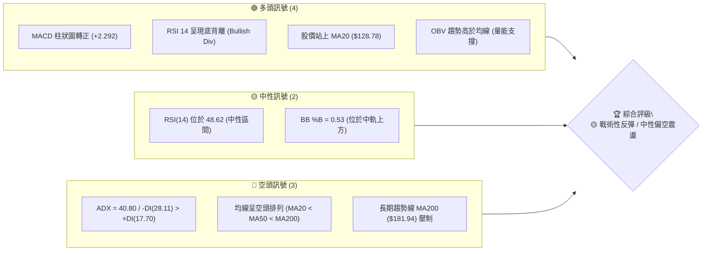
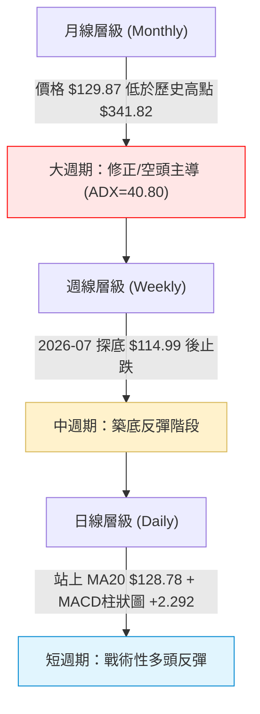
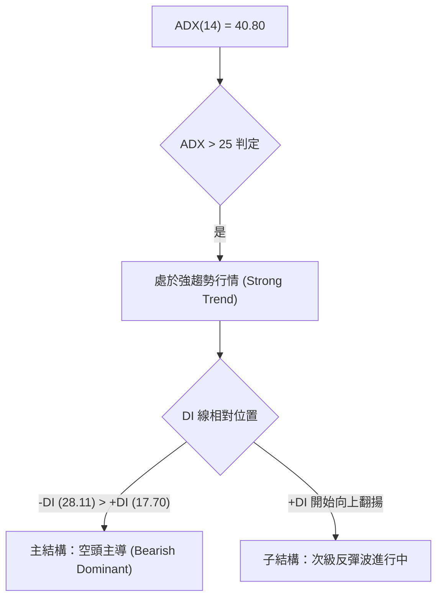
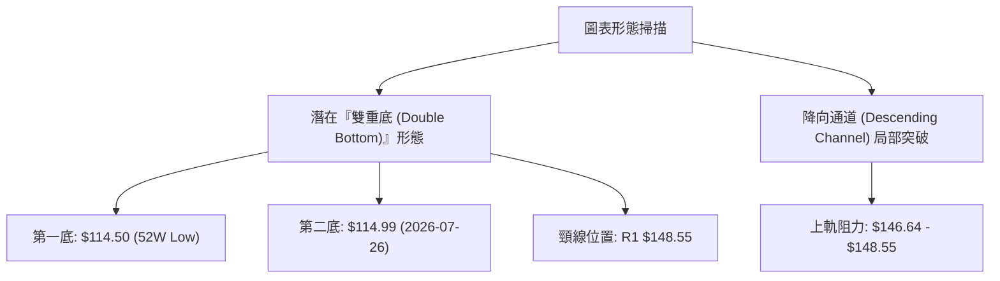
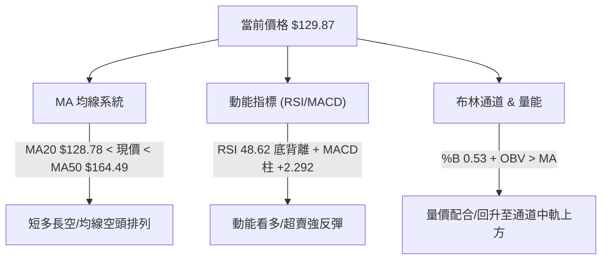
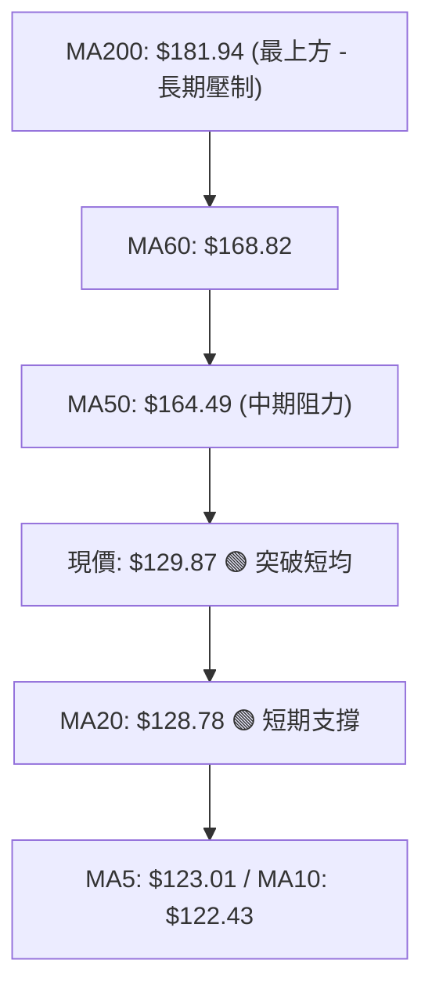
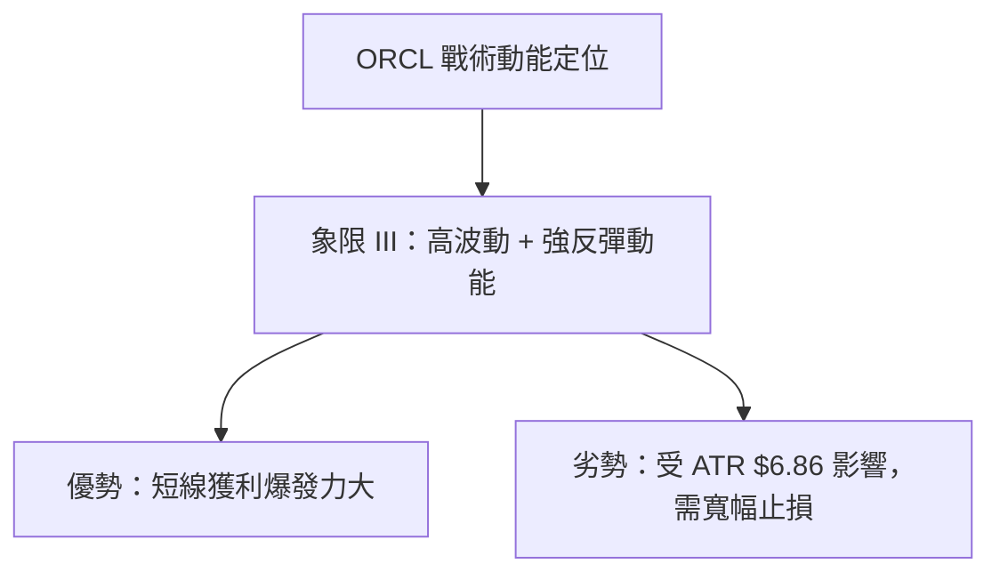
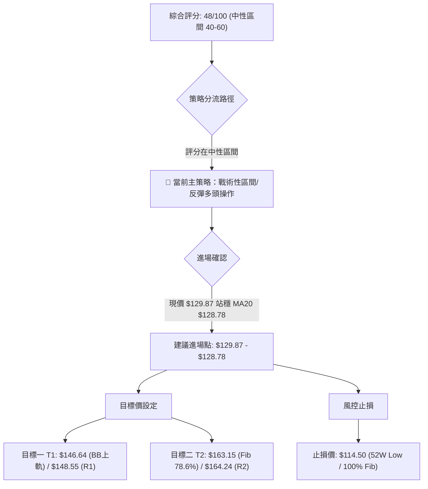
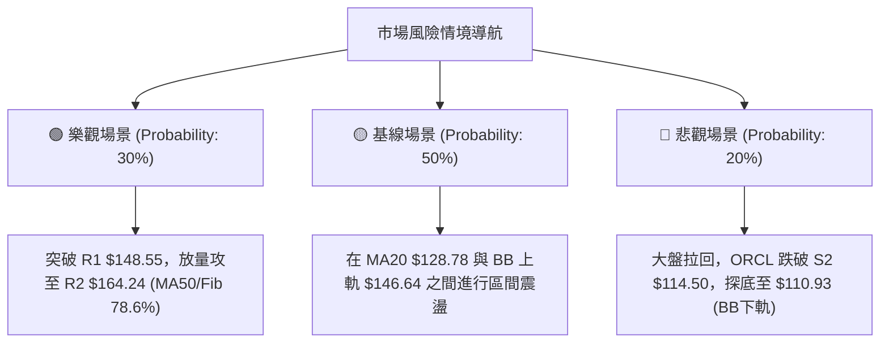

<details markdown="1">
<summary>📊 靜態圖表 (點擊展開)</summary>


</details>

<html>
<head><meta charset="utf-8" /></head>
<body>
    <div style="height:500px; width:100%;">                        <script>window.PlotlyConfig = {MathJaxConfig: 'local'};</script>
        <script charset="utf-8" src="https://cdn.plot.ly/plotly-3.7.0.min.js" integrity="sha256-jvTGqxNp8AGWEcvNLVuKr+8j5dGe9Yw51LQkmDH+IYA=" crossorigin="anonymous"></script>                <div id="candlestick-chart" class="plotly-graph-div" style="height:100%; width:100%;"></div>            <script>                window.PLOTLYENV=window.PLOTLYENV || {};                                if (document.getElementById("candlestick-chart")) {                    Plotly.newPlot(                        "candlestick-chart",                        [{"close":{"dtype":"f8","bdata":"AAAA4EuCckAAAACAgstyQAAAAAAoYHNAAAAAoG4IckAAAAAAgyhxQAAAAKBXCHFAAAAAAOLgcEAAAABgT1ZxQAAAAKD4iXFAAAAAAGNrcUAAAACgWmJxQAAAACC4CnFAAAAAQPLNb0AAAABgnkFwQAAAAIBf7G9AAAAAYJK5bkAAAADAZf1uQAAAAGARL25AAAAA4CyfbUAAAACg79BtQAAAAGCbPG1AAAAAgEkabEAAAAAAuu9qQAAAAKASl2tAAAAAgE44a0AAAAAgRkxrQAAAAIAD7GtAAAAAoKsVakAAAACgjptoQAAAAIC7y2hAAAAA4LlkaEAAAADgD2BpQAAAAICpAGlAAAAAoKbgaEAAAADguOVoQAAAAODat2lAAAAAoAmJakAAAAAgC\u002fBqQAAAAODbTWtAAAAAgDxta0AAAADAJJxrQAAAAOBonmhAAAAA4PaEZ0AAAABg6ORmQAAAAMAgW2dAAAAAwCkYZkAAAABg7ElmQAAAAEBaxGdAAAAAgIOPaEAAAACgKS9oQAAAAEBOc2hAAAAAICeDaEAAAABAbjBoQAAAAGBuamhAAAAAwIghaEAAAADA4zpoQAAAAMAA2GdAAAAA4MT8Z0AAAABA7d9nQAAAAGDSemdAAAAAQJWkaEAAAADgVWhpQAAAAMBiHGlAAAAAgI0IaEAAAAAgEZFnQAAAAMB4uGdAAAAAoIJVZkAAAABAkpVlQAAAAGA3HmZAAAAAoM39ZUAAAACAl6VmQAAAAAD8tWVAAAAAIEBzZUAAAADAz\u002fpkQAAAAOAIbmRAAAAA4GXeY0AAAABAHTNjQAAAAMDjNGJAAAAAQBLxYEAAAABgi7phQAAAAMAgcGNAAAAA4P7YY0AAAADgPYJjQAAAAOChbGNAAAAAwPDgY0AAAACg3hxjQAAAACDIYmNAAAAAAIpuY0AAAABgsmFiQAAAACCPimFAAAAAIAwkYkAAAACgqFtiQAAAAMCPqGJAAAAAAIgMYkAAAACA4IZiQAAAACBAf2JAAAAAQAbqYkAAAABg7TZjQAAAACDG\u002fGJAAAAAwEjQYkAAAADApItiQAAAAICjP2RAAAAAYMzBY0AAAADAGEFjQAAAAABtXGNAAAAAAMAzY0AAAADg3fpiQAAAAEAgTmNAAAAAoIqUYkAAAACgoChjQAAAAIA8QmJAAAAAADwgYkAAAADgObphQAAAACAgVmFAAAAA4Ms6YUAAAABA30JiQAAAACAhB2JAAAAAoKwrYkAAAADg+hBiQAAAAKCqxWFAAAAA4DzVYUAAAADAOSxhQAAAAGCPM2FAAAAAQJNiY0AAAACg6k1kQAAAAMAUJ2VAAAAAQBg3ZkAAAACgf85lQAAAAADcHmZAAAAAQFeRZkAAAADgMltnQAAAAEBn9WVAAAAAgLyVZUAAAAAgiItlQAAAAABPrGRAAAAAgGJoZEAAAABAkxpkQAAAAEB\u002fZ2VAAAAAQEd1ZkAAAAAgoxZnQAAAACBvK2hAAAAAwEo9aEAAAABAqWhoQAAAAABgJWhAAAAAQNVFZ0AAAACARKNnQAAAAKDRXWhAAAAAYP4IaEAAAABA0T5nQAAAAMCWmmZAAAAA4D5wZ0AAAABAlqNnQAAAACBA7WdAAAAAYIAMaEAAAAAAiclnQAAAACDNX2lAAAAAYOkfbEAAAAAgReluQAAAACBtd25AAAAAwAGxbEAAAAAAqXBtQAAAAMANnmpAAAAAoL1iakAAAABgFqNpQAAAAOD9EWlAAAAAoMbuZkAAAACAu+9mQAAAAMAb\u002f2dAAAAAoKp1Z0AAAABgmdxmQAAAAKDV9GZAAAAAYNHOZUAAAAAAzJJkQAAAAMB7n2NAAAAAYM79YkAAAABge4BiQAAAAGDtZ2JAAAAAgFdBYkAAAADgMMBhQAAAACAUeWFAAAAAAF\u002foYUAAAACgfaNhQAAAACAYgGFAAAAAQAr3YUAAAADgepRhQAAAAKBHcWBAAAAAACn8X0AAAAAgro9gQAAAAKBwDV9AAAAAgD2aX0AAAADgUVheQAAAAEAzw19AAAAAgMJ1X0AAAABgjwJeQAAAACBcv1xAAAAAoJn5XUAAAACgcP1dQAAAACBcb11AAAAAANfjX0AAAAAA1ztgQA=="},"high":{"dtype":"f8","bdata":"\u002fUgGKTDYckBizPnRnkBzQF71pJBW93NAvOP8OfjVckCyRG\u002fVoOdxQJ1UcXr0WXFAtUaoONQocUCRUwCvU4ZxQJgqGjQkx3FAw7cvfiHEcUBnWG3zuatxQNM66pHfbnFAvnI1Au2ycEDyLfhnVHRwQLLLRJRRcXBAXErZDuuab0Ai5ctuoz9vQKlaOs8Y1m5AIwH9h07DbUDWRra3GJxuQKYIn0LPZW1A6el9WIZRbUAW+409SeBrQEAJD00wHGxA\u002fwkK6XyVa0AuYownA7JrQNimvXQNP2xACKmn2nb4bEAw+knaPMppQLzO9TPuO2lAT\u002fmynCiwaEBjIuAPzf9pQB+2ZtoFDWlAxBuQxskxaUDcCc\u002fzSvZpQAt3UIHgvWlAp6dFekSrakBqjLB85SxrQM8388RK02tAPnUCcsiPa0AbjvKWW+VrQOjf+wHuAWlAA4EkLLd+aECFs6oJRWVnQOccrp+Tf2dAFGhLJvwWZ0DfhxZT1t9mQGIudnkwKGhAboleQdOcaEDwCO8uHWpoQGp+hAxYjGhA5XMGvZXOaEAAqMIqopNoQMTjE2+Dj2hACcr1Jx1qaECowVE7K5ZoQDW\u002fddBr+GhAReJ5cJUgaEDYw98knzloQG4lXkIGpGdASFyvkFXZaEDuyb2KWaVpQJ2JgLR7y2lAI6FcZAAJaUASST2XCjVoQCw8fS9C0WdAnFgBdok8Z0DZg2a2HmtmQLa18CEjXWZAlj7IKO5MZkAiMkdyywBnQBBkF6gnT2ZACo18fXCNZkDIntmvlCFlQNVSB9BQ92RAKlD+12dAZUAq5zYIyshjQCx8s5bqG2NAfVnToxMxYkAj1VGpnsZhQMHXtveL1GNAS77NZcaHZECieaWVzFBkQHFkbu77vWNAK7dQyJQlZEDXfJdxnMVjQCniCe2whmNAxDX6oAjfY0D8MtBagR1jQIUguic+GWJAfeCa5r83YkBYl4VF8QZjQC1fn9Mn7mJAOrO1\u002fSMiYkCcQS3bHKRiQKjeJqtDvGJAZ7Th7G0RY0APjv9IB5tjQJapwUzAwmNASqJrQETeYkDXn6GTRSJjQGnkhYAzUmVAmpswblDVZEAuUibv9fRjQOgEIYBztGNAJPG4zSu6Y0ANrffEpTxjQHu5J3ademNAFz62TP0FY0CURCpQY1ZjQP2sBxmlGmNAJ3VGWaCZYkAAcGKviC5iQC+k\u002fIqilmFAogO3RRCHYUBnIz5mFkxiQEDcmqKWk2JAEO1gt5QtYkBexgvdoXBiQGdQ4fUn8mFApqgZWhvNYkAnPNLywclhQExtGK3jdWFAkD10w9JrY0AVsbmbARplQGNfy6XGfmVA38urD6R0ZkBmcQsFiPtmQPTCWmOZJGZAHS6UcVEWZ0CamX6pxZBnQOFz2AtNqGZAPFDLG6yCZkC9D1SeWJ5lQKDntC6vA2VAVoBulgqGZEC7QlY8b5NkQGBQillDtmVAhy9VdaTbZkBQvViF8jtnQGk0rZ25M2hAXiiKV5juaECk7ESnCKpoQIrZBP4MYGhAiKoDigkIaEA5GwS4\u002fNxnQOezvQd0AGlAF9wFqvd3aEDWWQYjKMNnQJb0SW8agmdA83bIqyhyZ0BuwpxA2QRoQGB8egQlimhAF5u4eL5QaECAU878Ke9nQMsPLtRBiWlAjcgBxCwwbEBY\u002fsG7PCxvQJSlBThgBG9AM+6EIKP1bUA\u002f67P\u002f48NtQK55jlhn1GxASJW9AJ5Ja0DyEZiriXdrQKOpBHfJd2pAVFGsOCQEZ0D07IWx+B1nQN1VvUKSVGhAOlssOpJUaEBQZvf5+rBnQLdclgrTamdA5TiiKBX+ZkBDz4QvOLdlQH9dU4ucpWRAZcSkc1qiY0AoBkb2PiBjQFaQGxTcPmNA5QWBYSCtYkAI41ITO2FiQHSmBOmaUWJAMOi\u002fTK8jYkD0c\u002fRnxSFiQOX\u002f0egkq2FAcxQ1wbORYkAAAACAwjViQAAAAMDMdGFAAAAA4FGYYEAAAADAzLxgQAAAAMD1eGBAAAAAgBQOYEAAAAAgXF9fQAAAAEDh2l9AAAAAQOEaYEAAAADAzCxfQAAAAMAexV5AAAAAIFx\u002fXkAAAADAHpVeQAAAAEDhel5AAAAAQOEKYEAAAADAzIxgQA=="},"hovertemplate":"\u003cb\u003e%{x|%Y-%m-%d}\u003c\u002fb\u003e\u003cbr\u003e\u958b: $%{open:.2f}\u003cbr\u003e\u9ad8: $%{high:.2f}\u003cbr\u003e\u4f4e: $%{low:.2f}\u003cbr\u003e\u6536: $%{close:.2f}\u003cextra\u003e\u003c\u002fextra\u003e","low":{"dtype":"f8","bdata":"qmu6sgwTckC3\u002fmpKB4FyQAPlCFLLwnJARzZd9g3McUCqz5qs4ApxQL67IVaL2nBAThiRD9iqcECwgEqmmtxwQDZ90ULbeHFA6dC3lzBScUBz0dI4wl1xQCHpkpAfzHBAj+u5vZy6b0ARGQq+PchvQNpW0WtVmW9As+RVeB9bbkBUhvmycJVuQJh9P1YgoG1A2GxeCivEbEBaGGkDxFltQNez+KyBVmxADhDYLEwAbEAfKqSqPqVqQLb216Y0GGpA5hiUZgWwakCm50TKbI5qQKD4pY5852pACMCYRU8JakAE9tkdbvZnQKVQKWEzDmhARdJpTmn7ZkCT+iV\u002f2glpQA2MZOcbd2hA2ztSVERaaEA71Iq228JoQIS0AWvXr2hASuZunyqLaUCCrAmriHJqQAaodxbP2mpA6S1+2ToGa0CNksY1C\u002fBqQCB4bGptDmdAr1W9A4EGZ0AtRb37V3VmQAP39LBH12ZAzb22qBvsZUDh\u002foR69xtmQBjKX09USmdAc1\u002fhOZzfZ0AnxQxmU8tnQPDkdwMBEmhAYB7OQZFHaEDqmuuPltlnQG\u002fzgsTjOmhAsPx1NtQbaECLzYskWQtoQHIjBDnDz2dAIQR68hmcZ0ArmVa9TcVnQPgAsUrkC2dAMDo+fRBvZ0AOoMgCmXRoQBvHInuW6GhAtDbT85KvZ0D0jYHicoJnQFDg0lGQJ2dA+PHW8LZDZkBIAjvZVi1lQEWpeVLU6GVAijDACNRZZUCfwsrjVilmQDE2IhA3j2VAuyPQB2FVZUAbqDFJywxkQKR6h8FzQ2RA1hCgyH3cY0AfLcu\u002fFttiQBm1XeO07WFAzfhMAfzJYEBB7TzESj5hQN2YhlhgP2JAWsf71uJ7Y0COyzyo0h1jQFWZjt4n7mJAYhjRC9FGY0B\u002f6UZNO\u002fpiQPLV9zM\u002fymJAxcL3\u002fhFWY0D50aMTxUtiQMbhr2gfNGFAdA1RXZI4YUDKWXs\u002fLkpiQMUpaCmWBGJAnVZC\u002fKmjYUB4RW59bYZhQCNbV3vawWFAGF\u002f7RxyCYkDkhlUShqJiQDFJmeEw0mJA8NPvNEMtYkDwIhpZdG1iQBjdoy7s7mNAophU\u002f1GwY0DWuqLqliJjQOPF05IHLmNApxe9G+8NY0A0SjOcid9iQCnvXuxve2JAkXiXyZBdYkAhPK37RbViQElXgCKcOmJAEGe8DBzzYUB07w1XpbFhQJM7U0ToKmFAGNYVuwEAYUDthLzXKVxhQClLuXBV9WFAaR5CrXZqYUCGovGDRtthQNg28wEGX2FAVTzXDRa9YUDYTHhz6fBgQHZegZhPw2BASI0IE4pnYUChHsoF\u002fx9kQF+LKt5HtGRAkJ2BkFGmZUBzRRWISZhlQI5uLxcSnWVA6eFcDMvsZUAt8qj7UcVmQF2tVFs\u002fr2VA4IECnN8GZUDicrU1LOpkQPp99UufL2RAS\u002fVwMPoCZEClV9vaxfhjQABXOfFdsmRAOuWxwfy0ZUA3lLQ4JExmQMWHV6IswWZAy1Z8w27EZ0BO7hxFnrFnQHMG2wQOvmdAgsLhJMaHZkCQ4hGcYw1nQIRvoW3TGWdAayZTxteHZ0CNGc3bTtRmQDXIiO2viWZAGoidlMNFZkCKb4a9oVFnQO9\u002fMdX\u002fzWdALZy7YMe8Z0Czm4eWl2hnQIMgrdi0FmhAIGqILz7paUAAGdh1SPprQFJ+NAViwG1AbvZCwERabEAzyk03JudrQJ3W98IpF2pAT+flN1YTakCoydhFVqNoQNUwsfnFr2hAcII\u002fn4PVZUDYh6syJExmQFFf5N0PMmdApBZRB01gZ0BOVgX7Tb5mQFWUaYmvImZAMU9mp3O5ZUBz7+r+QYFkQNl08Sn3WWNA0v5cxNa6YkAzX2qtlG9iQA2wuJRKFmJACB4pylT\u002fYUAAAADgMMBhQBLjm4UoS2FAWz5lt3WVYUDL2H4GVyJhQHBjcR9XImFAy7PJp3GOYUAAAADgUWhhQAAAAEAza2BAAAAAYGbmX0AAAABA4RpgQAAAAIA96l5AAAAAAABgXkAAAACA6wFeQAAAAKBwjV5AAAAAwMwsX0AAAAAAKdxdQAAAAAAAsFxAAAAAQDMzXUAAAAAAAKBcQAAAAMDMDF1AAAAAwB5lXkAAAADAzGxfQA=="},"name":"\u50f9\u683c","open":{"dtype":"f8","bdata":"1pL1y7fKckCbO4RJy99yQNTlrzHj6nJAc\u002fU1F5LNckCLSUduCONxQImlk+w\u002fN3FAgk5B2hwDcUDbDo34ouVwQOp+RwYEs3FAHHieEVG9cUDtFCAWvoRxQK6bvHRWbHFAy51N7MKicEAApOotfhBwQD0L9vJLa3BAxxagOPDybkB3AAbUVLFuQGst7T5Ism5AUqkEWe+WbUAvhwHtNXNuQICuLH0kP21AjVvIck5PbUBLxXzr5dprQHXgynQbGmpAomai4QIEa0DSqSNWn8RqQCefoJnzHmtArayu3XOebEDGEy39QKNpQP4LoodWX2hAIJYRXzoHaECVjVwx9O9pQBB6NPVTs2hAyOdtj7TSaEB3PAdTxGVpQHHJXEJRzWhAKKTSufm7aUDyWTqeDB1rQMIQehuIZ2tACZ9h5LE9a0DHfiYyy3VrQKtDm7iQmWdAe7UnwM5PaEASo7aht09nQOd\u002fzIHv3WZABwQrTuGxZkD8gB1aLp9mQFeqzQ3jUmdAqRRuFhJeaEAOR\u002fORtVFoQMLpJ\u002f9iJGhAHmG2BV+FaEDdO696wwloQCs4cYD7RWhAqXQ+c2RRaEC7uXTiq3JoQC+LK74+jmhAeoKRgQ3XZ0D\u002fO7sZ5S1oQE2hqVzOoWdAIq2u3ZXKZ0AgzHndWIdoQDJWuCiBcmlAI6FcZAAJaUASST2XCjVoQOAEIUr5kmdAnFgBdok8Z0BgC1Y74k1mQOe\u002fIkQIRGZA3rRXz4dtZUCZ7oABdDtmQO09lQRQPmZAW27ZrZ62ZUD8JW3bCR9lQLXybCke4GRA9H5kAII3ZUAkW\u002f2JMqVjQH0y9s1TGmNA3svEPOMSYkA+2BVL\u002fFhhQIHWUtG5bmJAO3EbwH3cY0CieaWVzFBkQK+9st61mmNA3BJlcKjEY0CCGUetTJxjQOoeoD3aKmNAsM0O8jGDY0D1BHQOlAdjQHyunUe\u002fFWJAparVnJ97YUB\u002fcoJYBIRiQAypnztCeGJAbjJKmzrcYUAbvdv9aJRhQHduPEbg92FAh2zCNAefYkBYQKT9A\u002fFiQN335aWA+2JADGc1fPS0YkAKXcM+vxFjQNu+KUk8p2RA+Kkj55NwZEC1omFnTb5jQDEmECNJX2NAJKPIY5VLY0AIsMt3wQpjQLBpzzlUrWJAgHqHSaL\u002fYkCVJljl1ctiQAKV2noL\u002fmJAi9g+4T2GYkCaEgHki9xhQCrG1bh7fmFAr6QubTNiYUAeYNWmdmphQGgnVPPKgWJAJ5OA50W5YUDMm2bNW01iQH6N+xcN2WFAHqGWgT6oYkCXGUa9n7ZhQPBSTH4BG2FAPsJ6RyJpYUB1UqAbIetkQF2cMg73yWRACEaNJ975ZUAYygQcd8lmQG10Wv5NBmZAR2gO92k3ZkA83zTdGjFnQCwOGj3JeGZA7O39SUt8ZkCpWuTqaX9lQCkUMUwhM2RAXI0+yRRvZEBhrXZbqi5kQN2WHyb6umRA2T5fxRztZUCF1IRT9K9mQM1rCCG+MWdA3OUydHy9aECB7dn1Mf1nQI1ObX9772dAiKoDigkIaEDLl4wb\u002fYtnQEtG1wTicGdAhBfX\u002fYu6Z0DmcqXY66pnQIsgZ29dK2dAcCgpFB5qZkALYLzVWYtnQKHk\u002fAQt4GdAl2P+ricUaECABmX7HdpnQLTPJ7rAK2hAJ+yLMdAIakCY7YWlbbZsQDN5ou2pPm5AUn2hOq70bUANHnkD0UZsQJHwXlo4lmxAVBc+tdcfa0CV7X6UY6VqQNXdBWP6uWhAj3gR0YFhZkAFf95hywtnQHzAo9qwV2dALfhfaT2rZ0AXdFyudzBnQBkjZToEzGZAIUPtwLG1ZkAW+4JheTRlQGnzWYpVPWRA9SCiXr6ZY0DGSN9dprdiQAVqoHsALWNAnSid\u002fqlXYkCUzGp7pv9hQO98PtKz2WFAS4\u002fVaZf5YUAnQBRqGOdhQOK68hx+UmFAhMHlJcCdYUAAAADAzDRiQAAAAMD1YGFAAAAAAACAYEAAAACA61FgQAAAACBcb2BAAAAAwMxsXkAAAACgRxFfQAAAAADXs15AAAAAIIWLX0AAAACgcP1eQAAAAIAUnl5AAAAAAACAXUAAAAAghYtdQAAAAEDh2l1AAAAAIK63XkAAAACAPUJgQA=="},"x":["2025-10-14T00:00:00-04:00","2025-10-15T00:00:00-04:00","2025-10-16T00:00:00-04:00","2025-10-17T00:00:00-04:00","2025-10-20T00:00:00-04:00","2025-10-21T00:00:00-04:00","2025-10-22T00:00:00-04:00","2025-10-23T00:00:00-04:00","2025-10-24T00:00:00-04:00","2025-10-27T00:00:00-04:00","2025-10-28T00:00:00-04:00","2025-10-29T00:00:00-04:00","2025-10-30T00:00:00-04:00","2025-10-31T00:00:00-04:00","2025-11-03T00:00:00-05:00","2025-11-04T00:00:00-05:00","2025-11-05T00:00:00-05:00","2025-11-06T00:00:00-05:00","2025-11-07T00:00:00-05:00","2025-11-10T00:00:00-05:00","2025-11-11T00:00:00-05:00","2025-11-12T00:00:00-05:00","2025-11-13T00:00:00-05:00","2025-11-14T00:00:00-05:00","2025-11-17T00:00:00-05:00","2025-11-18T00:00:00-05:00","2025-11-19T00:00:00-05:00","2025-11-20T00:00:00-05:00","2025-11-21T00:00:00-05:00","2025-11-24T00:00:00-05:00","2025-11-25T00:00:00-05:00","2025-11-26T00:00:00-05:00","2025-11-28T00:00:00-05:00","2025-12-01T00:00:00-05:00","2025-12-02T00:00:00-05:00","2025-12-03T00:00:00-05:00","2025-12-04T00:00:00-05:00","2025-12-05T00:00:00-05:00","2025-12-08T00:00:00-05:00","2025-12-09T00:00:00-05:00","2025-12-10T00:00:00-05:00","2025-12-11T00:00:00-05:00","2025-12-12T00:00:00-05:00","2025-12-15T00:00:00-05:00","2025-12-16T00:00:00-05:00","2025-12-17T00:00:00-05:00","2025-12-18T00:00:00-05:00","2025-12-19T00:00:00-05:00","2025-12-22T00:00:00-05:00","2025-12-23T00:00:00-05:00","2025-12-24T00:00:00-05:00","2025-12-26T00:00:00-05:00","2025-12-29T00:00:00-05:00","2025-12-30T00:00:00-05:00","2025-12-31T00:00:00-05:00","2026-01-02T00:00:00-05:00","2026-01-05T00:00:00-05:00","2026-01-06T00:00:00-05:00","2026-01-07T00:00:00-05:00","2026-01-08T00:00:00-05:00","2026-01-09T00:00:00-05:00","2026-01-12T00:00:00-05:00","2026-01-13T00:00:00-05:00","2026-01-14T00:00:00-05:00","2026-01-15T00:00:00-05:00","2026-01-16T00:00:00-05:00","2026-01-20T00:00:00-05:00","2026-01-21T00:00:00-05:00","2026-01-22T00:00:00-05:00","2026-01-23T00:00:00-05:00","2026-01-26T00:00:00-05:00","2026-01-27T00:00:00-05:00","2026-01-28T00:00:00-05:00","2026-01-29T00:00:00-05:00","2026-01-30T00:00:00-05:00","2026-02-02T00:00:00-05:00","2026-02-03T00:00:00-05:00","2026-02-04T00:00:00-05:00","2026-02-05T00:00:00-05:00","2026-02-06T00:00:00-05:00","2026-02-09T00:00:00-05:00","2026-02-10T00:00:00-05:00","2026-02-11T00:00:00-05:00","2026-02-12T00:00:00-05:00","2026-02-13T00:00:00-05:00","2026-02-17T00:00:00-05:00","2026-02-18T00:00:00-05:00","2026-02-19T00:00:00-05:00","2026-02-20T00:00:00-05:00","2026-02-23T00:00:00-05:00","2026-02-24T00:00:00-05:00","2026-02-25T00:00:00-05:00","2026-02-26T00:00:00-05:00","2026-02-27T00:00:00-05:00","2026-03-02T00:00:00-05:00","2026-03-03T00:00:00-05:00","2026-03-04T00:00:00-05:00","2026-03-05T00:00:00-05:00","2026-03-06T00:00:00-05:00","2026-03-09T00:00:00-04:00","2026-03-10T00:00:00-04:00","2026-03-11T00:00:00-04:00","2026-03-12T00:00:00-04:00","2026-03-13T00:00:00-04:00","2026-03-16T00:00:00-04:00","2026-03-17T00:00:00-04:00","2026-03-18T00:00:00-04:00","2026-03-19T00:00:00-04:00","2026-03-20T00:00:00-04:00","2026-03-23T00:00:00-04:00","2026-03-24T00:00:00-04:00","2026-03-25T00:00:00-04:00","2026-03-26T00:00:00-04:00","2026-03-27T00:00:00-04:00","2026-03-30T00:00:00-04:00","2026-03-31T00:00:00-04:00","2026-04-01T00:00:00-04:00","2026-04-02T00:00:00-04:00","2026-04-06T00:00:00-04:00","2026-04-07T00:00:00-04:00","2026-04-08T00:00:00-04:00","2026-04-09T00:00:00-04:00","2026-04-10T00:00:00-04:00","2026-04-13T00:00:00-04:00","2026-04-14T00:00:00-04:00","2026-04-15T00:00:00-04:00","2026-04-16T00:00:00-04:00","2026-04-17T00:00:00-04:00","2026-04-20T00:00:00-04:00","2026-04-21T00:00:00-04:00","2026-04-22T00:00:00-04:00","2026-04-23T00:00:00-04:00","2026-04-24T00:00:00-04:00","2026-04-27T00:00:00-04:00","2026-04-28T00:00:00-04:00","2026-04-29T00:00:00-04:00","2026-04-30T00:00:00-04:00","2026-05-01T00:00:00-04:00","2026-05-04T00:00:00-04:00","2026-05-05T00:00:00-04:00","2026-05-06T00:00:00-04:00","2026-05-07T00:00:00-04:00","2026-05-08T00:00:00-04:00","2026-05-11T00:00:00-04:00","2026-05-12T00:00:00-04:00","2026-05-13T00:00:00-04:00","2026-05-14T00:00:00-04:00","2026-05-15T00:00:00-04:00","2026-05-18T00:00:00-04:00","2026-05-19T00:00:00-04:00","2026-05-20T00:00:00-04:00","2026-05-21T00:00:00-04:00","2026-05-22T00:00:00-04:00","2026-05-26T00:00:00-04:00","2026-05-27T00:00:00-04:00","2026-05-28T00:00:00-04:00","2026-05-29T00:00:00-04:00","2026-06-01T00:00:00-04:00","2026-06-02T00:00:00-04:00","2026-06-03T00:00:00-04:00","2026-06-04T00:00:00-04:00","2026-06-05T00:00:00-04:00","2026-06-08T00:00:00-04:00","2026-06-09T00:00:00-04:00","2026-06-10T00:00:00-04:00","2026-06-11T00:00:00-04:00","2026-06-12T00:00:00-04:00","2026-06-15T00:00:00-04:00","2026-06-16T00:00:00-04:00","2026-06-17T00:00:00-04:00","2026-06-18T00:00:00-04:00","2026-06-22T00:00:00-04:00","2026-06-23T00:00:00-04:00","2026-06-24T00:00:00-04:00","2026-06-25T00:00:00-04:00","2026-06-26T00:00:00-04:00","2026-06-29T00:00:00-04:00","2026-06-30T00:00:00-04:00","2026-07-01T00:00:00-04:00","2026-07-02T00:00:00-04:00","2026-07-06T00:00:00-04:00","2026-07-07T00:00:00-04:00","2026-07-08T00:00:00-04:00","2026-07-09T00:00:00-04:00","2026-07-10T00:00:00-04:00","2026-07-13T00:00:00-04:00","2026-07-14T00:00:00-04:00","2026-07-15T00:00:00-04:00","2026-07-16T00:00:00-04:00","2026-07-17T00:00:00-04:00","2026-07-20T00:00:00-04:00","2026-07-21T00:00:00-04:00","2026-07-22T00:00:00-04:00","2026-07-23T00:00:00-04:00","2026-07-24T00:00:00-04:00","2026-07-27T00:00:00-04:00","2026-07-28T00:00:00-04:00","2026-07-29T00:00:00-04:00","2026-07-30T00:00:00-04:00","2026-07-31T00:00:00-04:00"],"type":"candlestick"},{"hovertemplate":"MA30: $%{y:.2f}\u003cextra\u003e\u003c\u002fextra\u003e","line":{"color":"#2196F3","dash":"dash","width":2},"mode":"lines","name":"MA30","x":["2025-10-14T00:00:00-04:00","2025-10-15T00:00:00-04:00","2025-10-16T00:00:00-04:00","2025-10-17T00:00:00-04:00","2025-10-20T00:00:00-04:00","2025-10-21T00:00:00-04:00","2025-10-22T00:00:00-04:00","2025-10-23T00:00:00-04:00","2025-10-24T00:00:00-04:00","2025-10-27T00:00:00-04:00","2025-10-28T00:00:00-04:00","2025-10-29T00:00:00-04:00","2025-10-30T00:00:00-04:00","2025-10-31T00:00:00-04:00","2025-11-03T00:00:00-05:00","2025-11-04T00:00:00-05:00","2025-11-05T00:00:00-05:00","2025-11-06T00:00:00-05:00","2025-11-07T00:00:00-05:00","2025-11-10T00:00:00-05:00","2025-11-11T00:00:00-05:00","2025-11-12T00:00:00-05:00","2025-11-13T00:00:00-05:00","2025-11-14T00:00:00-05:00","2025-11-17T00:00:00-05:00","2025-11-18T00:00:00-05:00","2025-11-19T00:00:00-05:00","2025-11-20T00:00:00-05:00","2025-11-21T00:00:00-05:00","2025-11-24T00:00:00-05:00","2025-11-25T00:00:00-05:00","2025-11-26T00:00:00-05:00","2025-11-28T00:00:00-05:00","2025-12-01T00:00:00-05:00","2025-12-02T00:00:00-05:00","2025-12-03T00:00:00-05:00","2025-12-04T00:00:00-05:00","2025-12-05T00:00:00-05:00","2025-12-08T00:00:00-05:00","2025-12-09T00:00:00-05:00","2025-12-10T00:00:00-05:00","2025-12-11T00:00:00-05:00","2025-12-12T00:00:00-05:00","2025-12-15T00:00:00-05:00","2025-12-16T00:00:00-05:00","2025-12-17T00:00:00-05:00","2025-12-18T00:00:00-05:00","2025-12-19T00:00:00-05:00","2025-12-22T00:00:00-05:00","2025-12-23T00:00:00-05:00","2025-12-24T00:00:00-05:00","2025-12-26T00:00:00-05:00","2025-12-29T00:00:00-05:00","2025-12-30T00:00:00-05:00","2025-12-31T00:00:00-05:00","2026-01-02T00:00:00-05:00","2026-01-05T00:00:00-05:00","2026-01-06T00:00:00-05:00","2026-01-07T00:00:00-05:00","2026-01-08T00:00:00-05:00","2026-01-09T00:00:00-05:00","2026-01-12T00:00:00-05:00","2026-01-13T00:00:00-05:00","2026-01-14T00:00:00-05:00","2026-01-15T00:00:00-05:00","2026-01-16T00:00:00-05:00","2026-01-20T00:00:00-05:00","2026-01-21T00:00:00-05:00","2026-01-22T00:00:00-05:00","2026-01-23T00:00:00-05:00","2026-01-26T00:00:00-05:00","2026-01-27T00:00:00-05:00","2026-01-28T00:00:00-05:00","2026-01-29T00:00:00-05:00","2026-01-30T00:00:00-05:00","2026-02-02T00:00:00-05:00","2026-02-03T00:00:00-05:00","2026-02-04T00:00:00-05:00","2026-02-05T00:00:00-05:00","2026-02-06T00:00:00-05:00","2026-02-09T00:00:00-05:00","2026-02-10T00:00:00-05:00","2026-02-11T00:00:00-05:00","2026-02-12T00:00:00-05:00","2026-02-13T00:00:00-05:00","2026-02-17T00:00:00-05:00","2026-02-18T00:00:00-05:00","2026-02-19T00:00:00-05:00","2026-02-20T00:00:00-05:00","2026-02-23T00:00:00-05:00","2026-02-24T00:00:00-05:00","2026-02-25T00:00:00-05:00","2026-02-26T00:00:00-05:00","2026-02-27T00:00:00-05:00","2026-03-02T00:00:00-05:00","2026-03-03T00:00:00-05:00","2026-03-04T00:00:00-05:00","2026-03-05T00:00:00-05:00","2026-03-06T00:00:00-05:00","2026-03-09T00:00:00-04:00","2026-03-10T00:00:00-04:00","2026-03-11T00:00:00-04:00","2026-03-12T00:00:00-04:00","2026-03-13T00:00:00-04:00","2026-03-16T00:00:00-04:00","2026-03-17T00:00:00-04:00","2026-03-18T00:00:00-04:00","2026-03-19T00:00:00-04:00","2026-03-20T00:00:00-04:00","2026-03-23T00:00:00-04:00","2026-03-24T00:00:00-04:00","2026-03-25T00:00:00-04:00","2026-03-26T00:00:00-04:00","2026-03-27T00:00:00-04:00","2026-03-30T00:00:00-04:00","2026-03-31T00:00:00-04:00","2026-04-01T00:00:00-04:00","2026-04-02T00:00:00-04:00","2026-04-06T00:00:00-04:00","2026-04-07T00:00:00-04:00","2026-04-08T00:00:00-04:00","2026-04-09T00:00:00-04:00","2026-04-10T00:00:00-04:00","2026-04-13T00:00:00-04:00","2026-04-14T00:00:00-04:00","2026-04-15T00:00:00-04:00","2026-04-16T00:00:00-04:00","2026-04-17T00:00:00-04:00","2026-04-20T00:00:00-04:00","2026-04-21T00:00:00-04:00","2026-04-22T00:00:00-04:00","2026-04-23T00:00:00-04:00","2026-04-24T00:00:00-04:00","2026-04-27T00:00:00-04:00","2026-04-28T00:00:00-04:00","2026-04-29T00:00:00-04:00","2026-04-30T00:00:00-04:00","2026-05-01T00:00:00-04:00","2026-05-04T00:00:00-04:00","2026-05-05T00:00:00-04:00","2026-05-06T00:00:00-04:00","2026-05-07T00:00:00-04:00","2026-05-08T00:00:00-04:00","2026-05-11T00:00:00-04:00","2026-05-12T00:00:00-04:00","2026-05-13T00:00:00-04:00","2026-05-14T00:00:00-04:00","2026-05-15T00:00:00-04:00","2026-05-18T00:00:00-04:00","2026-05-19T00:00:00-04:00","2026-05-20T00:00:00-04:00","2026-05-21T00:00:00-04:00","2026-05-22T00:00:00-04:00","2026-05-26T00:00:00-04:00","2026-05-27T00:00:00-04:00","2026-05-28T00:00:00-04:00","2026-05-29T00:00:00-04:00","2026-06-01T00:00:00-04:00","2026-06-02T00:00:00-04:00","2026-06-03T00:00:00-04:00","2026-06-04T00:00:00-04:00","2026-06-05T00:00:00-04:00","2026-06-08T00:00:00-04:00","2026-06-09T00:00:00-04:00","2026-06-10T00:00:00-04:00","2026-06-11T00:00:00-04:00","2026-06-12T00:00:00-04:00","2026-06-15T00:00:00-04:00","2026-06-16T00:00:00-04:00","2026-06-17T00:00:00-04:00","2026-06-18T00:00:00-04:00","2026-06-22T00:00:00-04:00","2026-06-23T00:00:00-04:00","2026-06-24T00:00:00-04:00","2026-06-25T00:00:00-04:00","2026-06-26T00:00:00-04:00","2026-06-29T00:00:00-04:00","2026-06-30T00:00:00-04:00","2026-07-01T00:00:00-04:00","2026-07-02T00:00:00-04:00","2026-07-06T00:00:00-04:00","2026-07-07T00:00:00-04:00","2026-07-08T00:00:00-04:00","2026-07-09T00:00:00-04:00","2026-07-10T00:00:00-04:00","2026-07-13T00:00:00-04:00","2026-07-14T00:00:00-04:00","2026-07-15T00:00:00-04:00","2026-07-16T00:00:00-04:00","2026-07-17T00:00:00-04:00","2026-07-20T00:00:00-04:00","2026-07-21T00:00:00-04:00","2026-07-22T00:00:00-04:00","2026-07-23T00:00:00-04:00","2026-07-24T00:00:00-04:00","2026-07-27T00:00:00-04:00","2026-07-28T00:00:00-04:00","2026-07-29T00:00:00-04:00","2026-07-30T00:00:00-04:00","2026-07-31T00:00:00-04:00"],"y":{"dtype":"f8","bdata":"AAAAAAAA+H8AAAAAAAD4fwAAAAAAAPh\u002fAAAAAAAA+H8AAAAAAAD4fwAAAAAAAPh\u002fAAAAAAAA+H8AAAAAAAD4fwAAAAAAAPh\u002fAAAAAAAA+H8AAAAAAAD4fwAAAAAAAPh\u002fAAAAAAAA+H8AAAAAAAD4fwAAAAAAAPh\u002fAAAAAAAA+H8AAAAAAAD4fwAAAAAAAPh\u002fAAAAAAAA+H8AAAAAAAD4fwAAAAAAAPh\u002fAAAAAAAA+H8AAAAAAAD4fwAAAAAAAPh\u002fAAAAAAAA+H8AAAAAAAD4fwAAAAAAAPh\u002fAAAAAAAA+H8AAAAAAAD4f97d3Y2faW9AVVVV9eT9bkBmZmaWqZVuQM3MzDxXIG5AMzMz893AbUAzMzODfXBtQLy7uztDKW1AvLu7a6PrbEAAAACAnqlsQERERHRIZ2xAMzMzIwgobEARERFB8uprQN7d3b0tmmtAIiIisnpTa0ARERHRZgFrQAAAACBLuGpAERERgaVuakCamZm5ZSRqQDMzM+Oj7WlAMzMzk3PCaUARERFxZJJpQJqZmYmMaWlAIiIiQulKaUDNzMzMdzNpQCIiIkJhGGlAVVVVVQX+aEAzMzNj1+NoQO\u002fu7n4KwWhAAAAA8CSvaEAzMzPT46hoQKuqqtqonWhARERExMmfaEDe3d1dEKBoQBEREfH8oGhAd3d358iZaECrqqr6bY5oQM3MzCxifWhAd3d3V4hZaEBVVVWl2StoQN7d3W2Y\u002f2dA3t3d3TbRZ0AzMzPT3KZnQFVVVWUMjmdAvLu7K2R8Z0BEREQEDmxnQBEREcEVU2dAIiIiwhdAZ0BVVVWFuyVnQDMzM6NI9mZAzczM3ES1ZkBVVVWFLn5mQM3MzLxoU2ZAiYiImJorZkDNzMwMqgNmQKuqqioS2WVAVVVV1ci0ZUDv7u7+HYllQDMzM5MTY2VA7+7uvjM8ZUCrqqrqUw1lQCIiIgKn2mRAiYiI+CqjZEAAAAAQA2dkQO\u002fu7n7zL2RA7+7uPuL8Y0AAAACg4NFjQLy7u6tNpWNAvLu72x6IY0CamZkp5nNjQAAAADAvWWNAiYiIKBE+Y0CamZmZERtjQO\u002fu7i6XDmNAREREZCQAY0B3d3cXa\u002fFiQLy7u0tM6GJAmpmZGZziYkDv7u4evOBiQBEREQEc6mJAvLu7exf4YkBERERkSwRjQAAAAEA7+mJAZmZmForrYkARERHBVtxiQBEREaGFymJAzczMzOqzYkDe3d2NpqxiQLy7u+sPoWJA7+7uzkyWYkBmZmYGnJNiQImIiGiUlWJAZmZm5vOSYkCrqqqa1ohiQImIiKhnfGJA7+7ubs6HYkAAAABw+ZZiQImIiKiirWJAzczM7M3JYkBmZmZm7N9iQM3MzNyo+mJAERER4bEaY0BmZmYmv0NjQN7d3b1WUmNAAAAA0O9hY0Dv7u4OfHVjQCIiIkKugGNAERER8feKY0De3d0Nj5RjQO\u002fu7p54pmNAmpmZ+Y\u002fHY0B3d3eXGOljQGZmZjaJG2RA7+7uXrRPZEBVVVUVuIhkQAAAANDTwmRAERERMWX2ZEDv7u5uRiRlQCIiImJdWmVAREREpGiMZUBERER0mrhlQGZmZobV4WVAzczM7KoRZkDNzMys2EhmQO\u002fu7m48gmZAq6qqmgiqZkBVVVUVwcdmQKuqqjrH62ZAmpmZmTQeZ0CamZnZ5WtnQDMzM+Mds2dA3t3dTV\u002fnZ0BERESkSRtoQM3MzOwKQ2hA3t3dbQJsaEAiIiKS7Y5oQGZmZmZztGhAVVVVRf\u002fJaEB3d3dHK+JoQImIiBhK+GhAERER8dUAaUDv7u6u5v5oQLy7uzuM9GhAREREdMzfaEARERHhEb9oQERERDR5mGhAERERcfBzaEAAAADwHEhoQO\u002fu7v4\u002fFWhAIiIiou3jZ0C8u7trCrVnQM3MzMxBiWdAvLu7qw9aZ0BmZmam2yZnQLy7u\u002fsE8GZAVVVVpRq8ZkBVVVW1IodmQO\u002fu7g7rOmZAZmZm9mPTZUDv7u7+71hlQImIiIBy2WRAAAAAeHNrZEB3d3d3s\u002fFjQO\u002fu7v4VlmNAAAAAQCg7Y0AREREpbuBiQLy7uzsnhWJAvLu7o1pBYkBERERElv1hQJqZmfFnrmFAERER+UduYUDe3d31uDVhQA=="},"type":"scatter"},{"hovertemplate":"MA60: $%{y:.2f}\u003cextra\u003e\u003c\u002fextra\u003e","line":{"color":"#9C27B0","dash":"dash","width":2},"mode":"lines","name":"MA60","x":["2025-10-14T00:00:00-04:00","2025-10-15T00:00:00-04:00","2025-10-16T00:00:00-04:00","2025-10-17T00:00:00-04:00","2025-10-20T00:00:00-04:00","2025-10-21T00:00:00-04:00","2025-10-22T00:00:00-04:00","2025-10-23T00:00:00-04:00","2025-10-24T00:00:00-04:00","2025-10-27T00:00:00-04:00","2025-10-28T00:00:00-04:00","2025-10-29T00:00:00-04:00","2025-10-30T00:00:00-04:00","2025-10-31T00:00:00-04:00","2025-11-03T00:00:00-05:00","2025-11-04T00:00:00-05:00","2025-11-05T00:00:00-05:00","2025-11-06T00:00:00-05:00","2025-11-07T00:00:00-05:00","2025-11-10T00:00:00-05:00","2025-11-11T00:00:00-05:00","2025-11-12T00:00:00-05:00","2025-11-13T00:00:00-05:00","2025-11-14T00:00:00-05:00","2025-11-17T00:00:00-05:00","2025-11-18T00:00:00-05:00","2025-11-19T00:00:00-05:00","2025-11-20T00:00:00-05:00","2025-11-21T00:00:00-05:00","2025-11-24T00:00:00-05:00","2025-11-25T00:00:00-05:00","2025-11-26T00:00:00-05:00","2025-11-28T00:00:00-05:00","2025-12-01T00:00:00-05:00","2025-12-02T00:00:00-05:00","2025-12-03T00:00:00-05:00","2025-12-04T00:00:00-05:00","2025-12-05T00:00:00-05:00","2025-12-08T00:00:00-05:00","2025-12-09T00:00:00-05:00","2025-12-10T00:00:00-05:00","2025-12-11T00:00:00-05:00","2025-12-12T00:00:00-05:00","2025-12-15T00:00:00-05:00","2025-12-16T00:00:00-05:00","2025-12-17T00:00:00-05:00","2025-12-18T00:00:00-05:00","2025-12-19T00:00:00-05:00","2025-12-22T00:00:00-05:00","2025-12-23T00:00:00-05:00","2025-12-24T00:00:00-05:00","2025-12-26T00:00:00-05:00","2025-12-29T00:00:00-05:00","2025-12-30T00:00:00-05:00","2025-12-31T00:00:00-05:00","2026-01-02T00:00:00-05:00","2026-01-05T00:00:00-05:00","2026-01-06T00:00:00-05:00","2026-01-07T00:00:00-05:00","2026-01-08T00:00:00-05:00","2026-01-09T00:00:00-05:00","2026-01-12T00:00:00-05:00","2026-01-13T00:00:00-05:00","2026-01-14T00:00:00-05:00","2026-01-15T00:00:00-05:00","2026-01-16T00:00:00-05:00","2026-01-20T00:00:00-05:00","2026-01-21T00:00:00-05:00","2026-01-22T00:00:00-05:00","2026-01-23T00:00:00-05:00","2026-01-26T00:00:00-05:00","2026-01-27T00:00:00-05:00","2026-01-28T00:00:00-05:00","2026-01-29T00:00:00-05:00","2026-01-30T00:00:00-05:00","2026-02-02T00:00:00-05:00","2026-02-03T00:00:00-05:00","2026-02-04T00:00:00-05:00","2026-02-05T00:00:00-05:00","2026-02-06T00:00:00-05:00","2026-02-09T00:00:00-05:00","2026-02-10T00:00:00-05:00","2026-02-11T00:00:00-05:00","2026-02-12T00:00:00-05:00","2026-02-13T00:00:00-05:00","2026-02-17T00:00:00-05:00","2026-02-18T00:00:00-05:00","2026-02-19T00:00:00-05:00","2026-02-20T00:00:00-05:00","2026-02-23T00:00:00-05:00","2026-02-24T00:00:00-05:00","2026-02-25T00:00:00-05:00","2026-02-26T00:00:00-05:00","2026-02-27T00:00:00-05:00","2026-03-02T00:00:00-05:00","2026-03-03T00:00:00-05:00","2026-03-04T00:00:00-05:00","2026-03-05T00:00:00-05:00","2026-03-06T00:00:00-05:00","2026-03-09T00:00:00-04:00","2026-03-10T00:00:00-04:00","2026-03-11T00:00:00-04:00","2026-03-12T00:00:00-04:00","2026-03-13T00:00:00-04:00","2026-03-16T00:00:00-04:00","2026-03-17T00:00:00-04:00","2026-03-18T00:00:00-04:00","2026-03-19T00:00:00-04:00","2026-03-20T00:00:00-04:00","2026-03-23T00:00:00-04:00","2026-03-24T00:00:00-04:00","2026-03-25T00:00:00-04:00","2026-03-26T00:00:00-04:00","2026-03-27T00:00:00-04:00","2026-03-30T00:00:00-04:00","2026-03-31T00:00:00-04:00","2026-04-01T00:00:00-04:00","2026-04-02T00:00:00-04:00","2026-04-06T00:00:00-04:00","2026-04-07T00:00:00-04:00","2026-04-08T00:00:00-04:00","2026-04-09T00:00:00-04:00","2026-04-10T00:00:00-04:00","2026-04-13T00:00:00-04:00","2026-04-14T00:00:00-04:00","2026-04-15T00:00:00-04:00","2026-04-16T00:00:00-04:00","2026-04-17T00:00:00-04:00","2026-04-20T00:00:00-04:00","2026-04-21T00:00:00-04:00","2026-04-22T00:00:00-04:00","2026-04-23T00:00:00-04:00","2026-04-24T00:00:00-04:00","2026-04-27T00:00:00-04:00","2026-04-28T00:00:00-04:00","2026-04-29T00:00:00-04:00","2026-04-30T00:00:00-04:00","2026-05-01T00:00:00-04:00","2026-05-04T00:00:00-04:00","2026-05-05T00:00:00-04:00","2026-05-06T00:00:00-04:00","2026-05-07T00:00:00-04:00","2026-05-08T00:00:00-04:00","2026-05-11T00:00:00-04:00","2026-05-12T00:00:00-04:00","2026-05-13T00:00:00-04:00","2026-05-14T00:00:00-04:00","2026-05-15T00:00:00-04:00","2026-05-18T00:00:00-04:00","2026-05-19T00:00:00-04:00","2026-05-20T00:00:00-04:00","2026-05-21T00:00:00-04:00","2026-05-22T00:00:00-04:00","2026-05-26T00:00:00-04:00","2026-05-27T00:00:00-04:00","2026-05-28T00:00:00-04:00","2026-05-29T00:00:00-04:00","2026-06-01T00:00:00-04:00","2026-06-02T00:00:00-04:00","2026-06-03T00:00:00-04:00","2026-06-04T00:00:00-04:00","2026-06-05T00:00:00-04:00","2026-06-08T00:00:00-04:00","2026-06-09T00:00:00-04:00","2026-06-10T00:00:00-04:00","2026-06-11T00:00:00-04:00","2026-06-12T00:00:00-04:00","2026-06-15T00:00:00-04:00","2026-06-16T00:00:00-04:00","2026-06-17T00:00:00-04:00","2026-06-18T00:00:00-04:00","2026-06-22T00:00:00-04:00","2026-06-23T00:00:00-04:00","2026-06-24T00:00:00-04:00","2026-06-25T00:00:00-04:00","2026-06-26T00:00:00-04:00","2026-06-29T00:00:00-04:00","2026-06-30T00:00:00-04:00","2026-07-01T00:00:00-04:00","2026-07-02T00:00:00-04:00","2026-07-06T00:00:00-04:00","2026-07-07T00:00:00-04:00","2026-07-08T00:00:00-04:00","2026-07-09T00:00:00-04:00","2026-07-10T00:00:00-04:00","2026-07-13T00:00:00-04:00","2026-07-14T00:00:00-04:00","2026-07-15T00:00:00-04:00","2026-07-16T00:00:00-04:00","2026-07-17T00:00:00-04:00","2026-07-20T00:00:00-04:00","2026-07-21T00:00:00-04:00","2026-07-22T00:00:00-04:00","2026-07-23T00:00:00-04:00","2026-07-24T00:00:00-04:00","2026-07-27T00:00:00-04:00","2026-07-28T00:00:00-04:00","2026-07-29T00:00:00-04:00","2026-07-30T00:00:00-04:00","2026-07-31T00:00:00-04:00"],"y":{"dtype":"f8","bdata":"AAAAAAAA+H8AAAAAAAD4fwAAAAAAAPh\u002fAAAAAAAA+H8AAAAAAAD4fwAAAAAAAPh\u002fAAAAAAAA+H8AAAAAAAD4fwAAAAAAAPh\u002fAAAAAAAA+H8AAAAAAAD4fwAAAAAAAPh\u002fAAAAAAAA+H8AAAAAAAD4fwAAAAAAAPh\u002fAAAAAAAA+H8AAAAAAAD4fwAAAAAAAPh\u002fAAAAAAAA+H8AAAAAAAD4fwAAAAAAAPh\u002fAAAAAAAA+H8AAAAAAAD4fwAAAAAAAPh\u002fAAAAAAAA+H8AAAAAAAD4fwAAAAAAAPh\u002fAAAAAAAA+H8AAAAAAAD4fwAAAAAAAPh\u002fAAAAAAAA+H8AAAAAAAD4fwAAAAAAAPh\u002fAAAAAAAA+H8AAAAAAAD4fwAAAAAAAPh\u002fAAAAAAAA+H8AAAAAAAD4fwAAAAAAAPh\u002fAAAAAAAA+H8AAAAAAAD4fwAAAAAAAPh\u002fAAAAAAAA+H8AAAAAAAD4fwAAAAAAAPh\u002fAAAAAAAA+H8AAAAAAAD4fwAAAAAAAPh\u002fAAAAAAAA+H8AAAAAAAD4fwAAAAAAAPh\u002fAAAAAAAA+H8AAAAAAAD4fwAAAAAAAPh\u002fAAAAAAAA+H8AAAAAAAD4fwAAAAAAAPh\u002fAAAAAAAA+H8AAAAAAAD4f0RERDSkA2xAzczMXNfOa0AiIiL63JprQO\u002fu7haqYGtAVVVVbVMta0Dv7u6+df9qQERERLRS02pAmpmZ4ZWiakCrqqoSvGpqQBEREXFwM2pAiYiIgJ\u002f8aUAiIiKK58hpQJqZmREdlGlA7+7ubu9naUCrqqpqujZpQImIiHCwBWlAmpmZoV7XaEB3d3efEKVoQDMzM0P2cWhAAAAAONw7aEAzMzN7SQhoQDMzM6N63mdAVVVV7UG7Z0DNzMzskJtnQGZmZra5eGdAVVVVFWdZZ0ARERGxejZnQBEREQkPEmdAd3d3V6z1ZkDv7u7eG9tmQGZmZu4nvGZAZmZmXnqhZkDv7u62iYNmQAAAADh4aGZAMzMzk1VLZkBVVVVNJzBmQEREROxXEWZAmpmZmdPwZUB3d3fn389lQO\u002fu7s5jrGVAMzMzA6SHZUBmZmY292BlQCIiIspRTmVAAAAASEQ+ZUDe3d2NvC5lQGZmZgaxHWVA3t3d7VkRZUAiIiLSOwNlQCIiIlIy8GRARERELK7WZEDNzMz0PMFkQGZmZv7RpmRAd3d3V5KLZEDv7u5mAHBkQN7d3eXLUWRAERER0Vk0ZEBmZmZG4hpkQHd3d78RAmRA7+7uRkDpY0CJiIj4d9BjQFVVVbUduGNAd3d3bw+bY0BVVVXV7HdjQLy7u5MtVmNA7+7uVlhCY0AAAAAIbTRjQCIiIip4KWNAREREZPYoY0AAAABI6SljQGZmZgbsKWNAzczMhGEsY0AAAABgaC9jQGZmZvZ2MGNAIiIiGgoxY0AzMzOTczNjQO\u002fu7kZ9NGNAVVVVBco2Y0BmZmaWpTpjQAAAAFBKSGNAq6qqutNfY0De3d39sXZjQDMzMzviimNAq6qqOp+dY0AzMzNrh7JjQImIiLisxmNA7+7u\u002fifVY0BmZmZ+duhjQO\u002fu7qa2\u002fWNAmpmZuVoRZEBVVVU9GyZkQHd3d\u002fe0O2RAmpmZaU9SZEC8u7uj12hkQLy7uwtSf2RAzczMhOuYZECrqqpCXa9kQJqZmfG0zGRAMzMzQwH0ZEAAAAAg6SVlQAAAAGDjVmVAd3d3lwiBZUBVVVVlhK9lQFVVVdWwymVA7+7uHvnmZUCJiIjQNAJmQERERNSQGmZAMzMzm3sqZkCrqqoqXTtmQLy7u1thT2ZAVVVV9TJkZkAzMzOj\u002f3NmQBEREbkKiGZAmpmZacCXZkAzMzP75KNmQCIiIoKmrWZAERER0Sq1ZkB3d3evMbZmQImIiLDOt2ZAMzMzIyu4ZkAAAABw0rZmQJqZmamLtWZARERETN21ZkCamZkp2rdmQFVVVbUguWZAAAAAoBGzZkBVVVXlcadmQM3MzCRZk2ZAAAAASMx4ZkBERETsamJmQN7d3TFIRmZA7+7uYmkpZkDe3d2NfgZmQN7d3XWQ7GVA7+7uVpXTZUCamZndrbdlQBEREVHNnGVAiYiI9KyFZUDe3d3F4G9lQBEREQVZU2VAERER9Y43ZUBmZmbSTxplQA=="},"type":"scatter"},{"hovertemplate":"MA200: $%{y:.2f}\u003cextra\u003e\u003c\u002fextra\u003e","line":{"color":"#FF6F00","dash":"solid","width":2},"mode":"lines","name":"MA200","x":["2025-10-14T00:00:00-04:00","2025-10-15T00:00:00-04:00","2025-10-16T00:00:00-04:00","2025-10-17T00:00:00-04:00","2025-10-20T00:00:00-04:00","2025-10-21T00:00:00-04:00","2025-10-22T00:00:00-04:00","2025-10-23T00:00:00-04:00","2025-10-24T00:00:00-04:00","2025-10-27T00:00:00-04:00","2025-10-28T00:00:00-04:00","2025-10-29T00:00:00-04:00","2025-10-30T00:00:00-04:00","2025-10-31T00:00:00-04:00","2025-11-03T00:00:00-05:00","2025-11-04T00:00:00-05:00","2025-11-05T00:00:00-05:00","2025-11-06T00:00:00-05:00","2025-11-07T00:00:00-05:00","2025-11-10T00:00:00-05:00","2025-11-11T00:00:00-05:00","2025-11-12T00:00:00-05:00","2025-11-13T00:00:00-05:00","2025-11-14T00:00:00-05:00","2025-11-17T00:00:00-05:00","2025-11-18T00:00:00-05:00","2025-11-19T00:00:00-05:00","2025-11-20T00:00:00-05:00","2025-11-21T00:00:00-05:00","2025-11-24T00:00:00-05:00","2025-11-25T00:00:00-05:00","2025-11-26T00:00:00-05:00","2025-11-28T00:00:00-05:00","2025-12-01T00:00:00-05:00","2025-12-02T00:00:00-05:00","2025-12-03T00:00:00-05:00","2025-12-04T00:00:00-05:00","2025-12-05T00:00:00-05:00","2025-12-08T00:00:00-05:00","2025-12-09T00:00:00-05:00","2025-12-10T00:00:00-05:00","2025-12-11T00:00:00-05:00","2025-12-12T00:00:00-05:00","2025-12-15T00:00:00-05:00","2025-12-16T00:00:00-05:00","2025-12-17T00:00:00-05:00","2025-12-18T00:00:00-05:00","2025-12-19T00:00:00-05:00","2025-12-22T00:00:00-05:00","2025-12-23T00:00:00-05:00","2025-12-24T00:00:00-05:00","2025-12-26T00:00:00-05:00","2025-12-29T00:00:00-05:00","2025-12-30T00:00:00-05:00","2025-12-31T00:00:00-05:00","2026-01-02T00:00:00-05:00","2026-01-05T00:00:00-05:00","2026-01-06T00:00:00-05:00","2026-01-07T00:00:00-05:00","2026-01-08T00:00:00-05:00","2026-01-09T00:00:00-05:00","2026-01-12T00:00:00-05:00","2026-01-13T00:00:00-05:00","2026-01-14T00:00:00-05:00","2026-01-15T00:00:00-05:00","2026-01-16T00:00:00-05:00","2026-01-20T00:00:00-05:00","2026-01-21T00:00:00-05:00","2026-01-22T00:00:00-05:00","2026-01-23T00:00:00-05:00","2026-01-26T00:00:00-05:00","2026-01-27T00:00:00-05:00","2026-01-28T00:00:00-05:00","2026-01-29T00:00:00-05:00","2026-01-30T00:00:00-05:00","2026-02-02T00:00:00-05:00","2026-02-03T00:00:00-05:00","2026-02-04T00:00:00-05:00","2026-02-05T00:00:00-05:00","2026-02-06T00:00:00-05:00","2026-02-09T00:00:00-05:00","2026-02-10T00:00:00-05:00","2026-02-11T00:00:00-05:00","2026-02-12T00:00:00-05:00","2026-02-13T00:00:00-05:00","2026-02-17T00:00:00-05:00","2026-02-18T00:00:00-05:00","2026-02-19T00:00:00-05:00","2026-02-20T00:00:00-05:00","2026-02-23T00:00:00-05:00","2026-02-24T00:00:00-05:00","2026-02-25T00:00:00-05:00","2026-02-26T00:00:00-05:00","2026-02-27T00:00:00-05:00","2026-03-02T00:00:00-05:00","2026-03-03T00:00:00-05:00","2026-03-04T00:00:00-05:00","2026-03-05T00:00:00-05:00","2026-03-06T00:00:00-05:00","2026-03-09T00:00:00-04:00","2026-03-10T00:00:00-04:00","2026-03-11T00:00:00-04:00","2026-03-12T00:00:00-04:00","2026-03-13T00:00:00-04:00","2026-03-16T00:00:00-04:00","2026-03-17T00:00:00-04:00","2026-03-18T00:00:00-04:00","2026-03-19T00:00:00-04:00","2026-03-20T00:00:00-04:00","2026-03-23T00:00:00-04:00","2026-03-24T00:00:00-04:00","2026-03-25T00:00:00-04:00","2026-03-26T00:00:00-04:00","2026-03-27T00:00:00-04:00","2026-03-30T00:00:00-04:00","2026-03-31T00:00:00-04:00","2026-04-01T00:00:00-04:00","2026-04-02T00:00:00-04:00","2026-04-06T00:00:00-04:00","2026-04-07T00:00:00-04:00","2026-04-08T00:00:00-04:00","2026-04-09T00:00:00-04:00","2026-04-10T00:00:00-04:00","2026-04-13T00:00:00-04:00","2026-04-14T00:00:00-04:00","2026-04-15T00:00:00-04:00","2026-04-16T00:00:00-04:00","2026-04-17T00:00:00-04:00","2026-04-20T00:00:00-04:00","2026-04-21T00:00:00-04:00","2026-04-22T00:00:00-04:00","2026-04-23T00:00:00-04:00","2026-04-24T00:00:00-04:00","2026-04-27T00:00:00-04:00","2026-04-28T00:00:00-04:00","2026-04-29T00:00:00-04:00","2026-04-30T00:00:00-04:00","2026-05-01T00:00:00-04:00","2026-05-04T00:00:00-04:00","2026-05-05T00:00:00-04:00","2026-05-06T00:00:00-04:00","2026-05-07T00:00:00-04:00","2026-05-08T00:00:00-04:00","2026-05-11T00:00:00-04:00","2026-05-12T00:00:00-04:00","2026-05-13T00:00:00-04:00","2026-05-14T00:00:00-04:00","2026-05-15T00:00:00-04:00","2026-05-18T00:00:00-04:00","2026-05-19T00:00:00-04:00","2026-05-20T00:00:00-04:00","2026-05-21T00:00:00-04:00","2026-05-22T00:00:00-04:00","2026-05-26T00:00:00-04:00","2026-05-27T00:00:00-04:00","2026-05-28T00:00:00-04:00","2026-05-29T00:00:00-04:00","2026-06-01T00:00:00-04:00","2026-06-02T00:00:00-04:00","2026-06-03T00:00:00-04:00","2026-06-04T00:00:00-04:00","2026-06-05T00:00:00-04:00","2026-06-08T00:00:00-04:00","2026-06-09T00:00:00-04:00","2026-06-10T00:00:00-04:00","2026-06-11T00:00:00-04:00","2026-06-12T00:00:00-04:00","2026-06-15T00:00:00-04:00","2026-06-16T00:00:00-04:00","2026-06-17T00:00:00-04:00","2026-06-18T00:00:00-04:00","2026-06-22T00:00:00-04:00","2026-06-23T00:00:00-04:00","2026-06-24T00:00:00-04:00","2026-06-25T00:00:00-04:00","2026-06-26T00:00:00-04:00","2026-06-29T00:00:00-04:00","2026-06-30T00:00:00-04:00","2026-07-01T00:00:00-04:00","2026-07-02T00:00:00-04:00","2026-07-06T00:00:00-04:00","2026-07-07T00:00:00-04:00","2026-07-08T00:00:00-04:00","2026-07-09T00:00:00-04:00","2026-07-10T00:00:00-04:00","2026-07-13T00:00:00-04:00","2026-07-14T00:00:00-04:00","2026-07-15T00:00:00-04:00","2026-07-16T00:00:00-04:00","2026-07-17T00:00:00-04:00","2026-07-20T00:00:00-04:00","2026-07-21T00:00:00-04:00","2026-07-22T00:00:00-04:00","2026-07-23T00:00:00-04:00","2026-07-24T00:00:00-04:00","2026-07-27T00:00:00-04:00","2026-07-28T00:00:00-04:00","2026-07-29T00:00:00-04:00","2026-07-30T00:00:00-04:00","2026-07-31T00:00:00-04:00"],"y":{"dtype":"f8","bdata":"AAAAAAAA+H8AAAAAAAD4fwAAAAAAAPh\u002fAAAAAAAA+H8AAAAAAAD4fwAAAAAAAPh\u002fAAAAAAAA+H8AAAAAAAD4fwAAAAAAAPh\u002fAAAAAAAA+H8AAAAAAAD4fwAAAAAAAPh\u002fAAAAAAAA+H8AAAAAAAD4fwAAAAAAAPh\u002fAAAAAAAA+H8AAAAAAAD4fwAAAAAAAPh\u002fAAAAAAAA+H8AAAAAAAD4fwAAAAAAAPh\u002fAAAAAAAA+H8AAAAAAAD4fwAAAAAAAPh\u002fAAAAAAAA+H8AAAAAAAD4fwAAAAAAAPh\u002fAAAAAAAA+H8AAAAAAAD4fwAAAAAAAPh\u002fAAAAAAAA+H8AAAAAAAD4fwAAAAAAAPh\u002fAAAAAAAA+H8AAAAAAAD4fwAAAAAAAPh\u002fAAAAAAAA+H8AAAAAAAD4fwAAAAAAAPh\u002fAAAAAAAA+H8AAAAAAAD4fwAAAAAAAPh\u002fAAAAAAAA+H8AAAAAAAD4fwAAAAAAAPh\u002fAAAAAAAA+H8AAAAAAAD4fwAAAAAAAPh\u002fAAAAAAAA+H8AAAAAAAD4fwAAAAAAAPh\u002fAAAAAAAA+H8AAAAAAAD4fwAAAAAAAPh\u002fAAAAAAAA+H8AAAAAAAD4fwAAAAAAAPh\u002fAAAAAAAA+H8AAAAAAAD4fwAAAAAAAPh\u002fAAAAAAAA+H8AAAAAAAD4fwAAAAAAAPh\u002fAAAAAAAA+H8AAAAAAAD4fwAAAAAAAPh\u002fAAAAAAAA+H8AAAAAAAD4fwAAAAAAAPh\u002fAAAAAAAA+H8AAAAAAAD4fwAAAAAAAPh\u002fAAAAAAAA+H8AAAAAAAD4fwAAAAAAAPh\u002fAAAAAAAA+H8AAAAAAAD4fwAAAAAAAPh\u002fAAAAAAAA+H8AAAAAAAD4fwAAAAAAAPh\u002fAAAAAAAA+H8AAAAAAAD4fwAAAAAAAPh\u002fAAAAAAAA+H8AAAAAAAD4fwAAAAAAAPh\u002fAAAAAAAA+H8AAAAAAAD4fwAAAAAAAPh\u002fAAAAAAAA+H8AAAAAAAD4fwAAAAAAAPh\u002fAAAAAAAA+H8AAAAAAAD4fwAAAAAAAPh\u002fAAAAAAAA+H8AAAAAAAD4fwAAAAAAAPh\u002fAAAAAAAA+H8AAAAAAAD4fwAAAAAAAPh\u002fAAAAAAAA+H8AAAAAAAD4fwAAAAAAAPh\u002fAAAAAAAA+H8AAAAAAAD4fwAAAAAAAPh\u002fAAAAAAAA+H8AAAAAAAD4fwAAAAAAAPh\u002fAAAAAAAA+H8AAAAAAAD4fwAAAAAAAPh\u002fAAAAAAAA+H8AAAAAAAD4fwAAAAAAAPh\u002fAAAAAAAA+H8AAAAAAAD4fwAAAAAAAPh\u002fAAAAAAAA+H8AAAAAAAD4fwAAAAAAAPh\u002fAAAAAAAA+H8AAAAAAAD4fwAAAAAAAPh\u002fAAAAAAAA+H8AAAAAAAD4fwAAAAAAAPh\u002fAAAAAAAA+H8AAAAAAAD4fwAAAAAAAPh\u002fAAAAAAAA+H8AAAAAAAD4fwAAAAAAAPh\u002fAAAAAAAA+H8AAAAAAAD4fwAAAAAAAPh\u002fAAAAAAAA+H8AAAAAAAD4fwAAAAAAAPh\u002fAAAAAAAA+H8AAAAAAAD4fwAAAAAAAPh\u002fAAAAAAAA+H8AAAAAAAD4fwAAAAAAAPh\u002fAAAAAAAA+H8AAAAAAAD4fwAAAAAAAPh\u002fAAAAAAAA+H8AAAAAAAD4fwAAAAAAAPh\u002fAAAAAAAA+H8AAAAAAAD4fwAAAAAAAPh\u002fAAAAAAAA+H8AAAAAAAD4fwAAAAAAAPh\u002fAAAAAAAA+H8AAAAAAAD4fwAAAAAAAPh\u002fAAAAAAAA+H8AAAAAAAD4fwAAAAAAAPh\u002fAAAAAAAA+H8AAAAAAAD4fwAAAAAAAPh\u002fAAAAAAAA+H8AAAAAAAD4fwAAAAAAAPh\u002fAAAAAAAA+H8AAAAAAAD4fwAAAAAAAPh\u002fAAAAAAAA+H8AAAAAAAD4fwAAAAAAAPh\u002fAAAAAAAA+H8AAAAAAAD4fwAAAAAAAPh\u002fAAAAAAAA+H8AAAAAAAD4fwAAAAAAAPh\u002fAAAAAAAA+H8AAAAAAAD4fwAAAAAAAPh\u002fAAAAAAAA+H8AAAAAAAD4fwAAAAAAAPh\u002fAAAAAAAA+H8AAAAAAAD4fwAAAAAAAPh\u002fAAAAAAAA+H8AAAAAAAD4fwAAAAAAAPh\u002fAAAAAAAA+H8AAAAAAAD4fwAAAAAAAPh\u002fAAAAAAAA+H89CtdxGL5mQA=="},"type":"scatter"}],                        {"template":{"data":{"barpolar":[{"marker":{"line":{"color":"rgb(17,17,17)","width":0.5},"pattern":{"fillmode":"overlay","size":10,"solidity":0.2}},"type":"barpolar"}],"bar":[{"error_x":{"color":"#f2f5fa"},"error_y":{"color":"#f2f5fa"},"marker":{"line":{"color":"rgb(17,17,17)","width":0.5},"pattern":{"fillmode":"overlay","size":10,"solidity":0.2}},"type":"bar"}],"carpet":[{"aaxis":{"endlinecolor":"#A2B1C6","gridcolor":"#506784","linecolor":"#506784","minorgridcolor":"#506784","startlinecolor":"#A2B1C6"},"baxis":{"endlinecolor":"#A2B1C6","gridcolor":"#506784","linecolor":"#506784","minorgridcolor":"#506784","startlinecolor":"#A2B1C6"},"type":"carpet"}],"choropleth":[{"colorbar":{"outlinewidth":0,"ticks":""},"type":"choropleth"}],"contourcarpet":[{"colorbar":{"outlinewidth":0,"ticks":""},"type":"contourcarpet"}],"contour":[{"colorbar":{"outlinewidth":0,"ticks":""},"colorscale":[[0.0,"#0d0887"],[0.1111111111111111,"#46039f"],[0.2222222222222222,"#7201a8"],[0.3333333333333333,"#9c179e"],[0.4444444444444444,"#bd3786"],[0.5555555555555556,"#d8576b"],[0.6666666666666666,"#ed7953"],[0.7777777777777778,"#fb9f3a"],[0.8888888888888888,"#fdca26"],[1.0,"#f0f921"]],"type":"contour"}],"heatmap":[{"colorbar":{"outlinewidth":0,"ticks":""},"colorscale":[[0.0,"#0d0887"],[0.1111111111111111,"#46039f"],[0.2222222222222222,"#7201a8"],[0.3333333333333333,"#9c179e"],[0.4444444444444444,"#bd3786"],[0.5555555555555556,"#d8576b"],[0.6666666666666666,"#ed7953"],[0.7777777777777778,"#fb9f3a"],[0.8888888888888888,"#fdca26"],[1.0,"#f0f921"]],"type":"heatmap"}],"histogram2dcontour":[{"colorbar":{"outlinewidth":0,"ticks":""},"colorscale":[[0.0,"#0d0887"],[0.1111111111111111,"#46039f"],[0.2222222222222222,"#7201a8"],[0.3333333333333333,"#9c179e"],[0.4444444444444444,"#bd3786"],[0.5555555555555556,"#d8576b"],[0.6666666666666666,"#ed7953"],[0.7777777777777778,"#fb9f3a"],[0.8888888888888888,"#fdca26"],[1.0,"#f0f921"]],"type":"histogram2dcontour"}],"histogram2d":[{"colorbar":{"outlinewidth":0,"ticks":""},"colorscale":[[0.0,"#0d0887"],[0.1111111111111111,"#46039f"],[0.2222222222222222,"#7201a8"],[0.3333333333333333,"#9c179e"],[0.4444444444444444,"#bd3786"],[0.5555555555555556,"#d8576b"],[0.6666666666666666,"#ed7953"],[0.7777777777777778,"#fb9f3a"],[0.8888888888888888,"#fdca26"],[1.0,"#f0f921"]],"type":"histogram2d"}],"histogram":[{"marker":{"pattern":{"fillmode":"overlay","size":10,"solidity":0.2}},"type":"histogram"}],"mesh3d":[{"colorbar":{"outlinewidth":0,"ticks":""},"type":"mesh3d"}],"parcoords":[{"line":{"colorbar":{"outlinewidth":0,"ticks":""}},"type":"parcoords"}],"pie":[{"automargin":true,"type":"pie"}],"scatter3d":[{"line":{"colorbar":{"outlinewidth":0,"ticks":""}},"marker":{"colorbar":{"outlinewidth":0,"ticks":""}},"type":"scatter3d"}],"scattercarpet":[{"marker":{"colorbar":{"outlinewidth":0,"ticks":""}},"type":"scattercarpet"}],"scattergeo":[{"marker":{"colorbar":{"outlinewidth":0,"ticks":""}},"type":"scattergeo"}],"scattergl":[{"marker":{"line":{"color":"#283442"}},"type":"scattergl"}],"scattermapbox":[{"marker":{"colorbar":{"outlinewidth":0,"ticks":""}},"type":"scattermapbox"}],"scattermap":[{"marker":{"colorbar":{"outlinewidth":0,"ticks":""}},"type":"scattermap"}],"scatterpolargl":[{"marker":{"colorbar":{"outlinewidth":0,"ticks":""}},"type":"scatterpolargl"}],"scatterpolar":[{"marker":{"colorbar":{"outlinewidth":0,"ticks":""}},"type":"scatterpolar"}],"scatter":[{"marker":{"line":{"color":"#283442"}},"type":"scatter"}],"scatterternary":[{"marker":{"colorbar":{"outlinewidth":0,"ticks":""}},"type":"scatterternary"}],"surface":[{"colorbar":{"outlinewidth":0,"ticks":""},"colorscale":[[0.0,"#0d0887"],[0.1111111111111111,"#46039f"],[0.2222222222222222,"#7201a8"],[0.3333333333333333,"#9c179e"],[0.4444444444444444,"#bd3786"],[0.5555555555555556,"#d8576b"],[0.6666666666666666,"#ed7953"],[0.7777777777777778,"#fb9f3a"],[0.8888888888888888,"#fdca26"],[1.0,"#f0f921"]],"type":"surface"}],"table":[{"cells":{"fill":{"color":"#506784"},"line":{"color":"rgb(17,17,17)"}},"header":{"fill":{"color":"#2a3f5f"},"line":{"color":"rgb(17,17,17)"}},"type":"table"}]},"layout":{"annotationdefaults":{"arrowcolor":"#f2f5fa","arrowhead":0,"arrowwidth":1},"autotypenumbers":"strict","coloraxis":{"colorbar":{"outlinewidth":0,"ticks":""}},"colorscale":{"diverging":[[0,"#8e0152"],[0.1,"#c51b7d"],[0.2,"#de77ae"],[0.3,"#f1b6da"],[0.4,"#fde0ef"],[0.5,"#f7f7f7"],[0.6,"#e6f5d0"],[0.7,"#b8e186"],[0.8,"#7fbc41"],[0.9,"#4d9221"],[1,"#276419"]],"sequential":[[0.0,"#0d0887"],[0.1111111111111111,"#46039f"],[0.2222222222222222,"#7201a8"],[0.3333333333333333,"#9c179e"],[0.4444444444444444,"#bd3786"],[0.5555555555555556,"#d8576b"],[0.6666666666666666,"#ed7953"],[0.7777777777777778,"#fb9f3a"],[0.8888888888888888,"#fdca26"],[1.0,"#f0f921"]],"sequentialminus":[[0.0,"#0d0887"],[0.1111111111111111,"#46039f"],[0.2222222222222222,"#7201a8"],[0.3333333333333333,"#9c179e"],[0.4444444444444444,"#bd3786"],[0.5555555555555556,"#d8576b"],[0.6666666666666666,"#ed7953"],[0.7777777777777778,"#fb9f3a"],[0.8888888888888888,"#fdca26"],[1.0,"#f0f921"]]},"colorway":["#636efa","#EF553B","#00cc96","#ab63fa","#FFA15A","#19d3f3","#FF6692","#B6E880","#FF97FF","#FECB52"],"font":{"color":"#f2f5fa"},"geo":{"bgcolor":"rgb(17,17,17)","lakecolor":"rgb(17,17,17)","landcolor":"rgb(17,17,17)","showlakes":true,"showland":true,"subunitcolor":"#506784"},"hoverlabel":{"align":"left"},"hovermode":"closest","mapbox":{"style":"dark"},"paper_bgcolor":"rgb(17,17,17)","plot_bgcolor":"rgb(17,17,17)","polar":{"angularaxis":{"gridcolor":"#506784","linecolor":"#506784","ticks":""},"bgcolor":"rgb(17,17,17)","radialaxis":{"gridcolor":"#506784","linecolor":"#506784","ticks":""}},"scene":{"xaxis":{"backgroundcolor":"rgb(17,17,17)","gridcolor":"#506784","gridwidth":2,"linecolor":"#506784","showbackground":true,"ticks":"","zerolinecolor":"#C8D4E3"},"yaxis":{"backgroundcolor":"rgb(17,17,17)","gridcolor":"#506784","gridwidth":2,"linecolor":"#506784","showbackground":true,"ticks":"","zerolinecolor":"#C8D4E3"},"zaxis":{"backgroundcolor":"rgb(17,17,17)","gridcolor":"#506784","gridwidth":2,"linecolor":"#506784","showbackground":true,"ticks":"","zerolinecolor":"#C8D4E3"}},"shapedefaults":{"line":{"color":"#f2f5fa"}},"sliderdefaults":{"bgcolor":"#C8D4E3","bordercolor":"rgb(17,17,17)","borderwidth":1,"tickwidth":0},"ternary":{"aaxis":{"gridcolor":"#506784","linecolor":"#506784","ticks":""},"baxis":{"gridcolor":"#506784","linecolor":"#506784","ticks":""},"bgcolor":"rgb(17,17,17)","caxis":{"gridcolor":"#506784","linecolor":"#506784","ticks":""}},"title":{"x":0.05},"updatemenudefaults":{"bgcolor":"#506784","borderwidth":0},"xaxis":{"automargin":true,"gridcolor":"#283442","linecolor":"#506784","ticks":"","title":{"standoff":15},"zerolinecolor":"#283442","zerolinewidth":2},"yaxis":{"automargin":true,"gridcolor":"#283442","linecolor":"#506784","ticks":"","title":{"standoff":15},"zerolinecolor":"#283442","zerolinewidth":2}}},"xaxis":{"rangeslider":{"visible":false},"title":{"text":"\u65e5\u671f"}},"font":{"size":11},"title":{"text":"ORCL  |  MA(30\u002f60\u002f200)  |  \u6700\u8fd1200\u4ea4\u6613\u65e5"},"yaxis":{"title":{"text":"\u80a1\u50f9 (USD)"}},"hovermode":"x unified","height":500},                        {"responsive": true}                    )                };            </script>        </div>
</body>
</html>

# ORCL 技術分析報告

> **報告日期**：2026-08-01 ｜ **語言**：繁體中文 ｜ **數據來源**：Yahoo Finance ｜ **當前價格**：$129.87

---

## 目錄

| 章節 | 內容 |
|------|------|
| [1. 技術面概覽](#1-技術面概覽) | 訊號儀表板、核心指標、評分卡 |
| [2. 趨勢分析](#2-趨勢分析) | 多時框趨勢、長中短期走勢、12個月走勢圖 |
| [3. 圖表形態分析](#3-圖表形態分析) | 形態識別、信心度評估、K線組合、目標價 |
| [4. 支撐與阻力](#4-支撐與阻力) | 關鍵價位、斐波那契回調 |
| [5. 技術指標深度解讀](#5-技術指標深度解讀) | MA/RSI/MACD/布林/成交量 |
| [6. 動能與波動率](#6-動能與波動率) | 動能評估、ATR、Beta |
| [7. 多時框架總結](#7-多時框架總結) | 時框架評分矩陣、多時框收斂 |
| [8. 交易策略建議](#8-交易策略建議) | 策略路由、情境階梯、多空策略、風險報酬比 |
| [9. 風險提示與監控](#9-風險提示與監控) | 監控指標、風險場景 |
| [10. 報告總結](#📋-報告總結) | 最終評級與精華摘要 |

---

## 1. 技術面概覽

### 🎯 技術訊號儀表板



### 📊 核心指標速覽表

| 指標類別 | 指標名稱 | 當前數值 | 訊號 | 解讀 |
|----------|----------|----------|------|------|
| **價格** | 當前價格 | $129.87 | 🟡 中性 | 自 52W 低點 $114.50 反彈，位於 52W 區間 6.8% |
| **均線** | MA20 | $128.78 | 🟢 看多 | 價格已站上短期均線 MA20 (+$1.09 / +0.84%) |
| **均線** | MA50 | $164.49 | 🔴 看空 | 遠低於 MA50 (-$34.62 / -21.05%)，中期下行壓力大 |
| **均線** | MA200 | $181.94 | 🔴 看空 | 遠低於 MA200 (-$52.07 / -28.62%)，長期空頭格局 |
| **動能** | RSI(14) | 48.62 | 🟢 看多 | 中性偏強，出現顯著 **底背離 (Bullish Divergence)** |
| **動能** | MACD(12,26,9) | -10.523 | 🟢 看多 | DIF 線上穿 Signal (-12.815)，柱狀圖 +2.292 翻紅 |
| **動能** | Stochastic | %K 79.23 / %D 47.18 | 🟢 看多 | 短線快線向上穿越慢線，短線動能增強 |
| **趨勢強度**| ADX(14) | 40.80 | 🔴 看空 | 強趨勢(ADX>25)，但 -DI (28.11) > +DI (17.70) 主導空頭 |
| **波動** | ATR(14) | $6.86 | 🟡 中性 | 日波幅達 5.28%，屬於中高波動狀態 |
| **布林帶** | Bollinger Bands | $110.93 - $146.64 | 🟢 看多 | %B = 0.53，自下軌向中軌及上軌挑戰 |
| **量能** | OBV | OBV > MA | 🟢 看多 | 成交量擴張配合價格反彈，量能健康 |

### 🏆 技術評分卡

```
╔══════════════════════════════════════════════════════════════╗
║              ORCL 技術綜合評分卡 (2026-08-01)               ║
╠══════════════════════════════════════════════════════════════╣
║ 趨勢強度 (Trend)     ▓▓▓▓▓▓▓▓▓▓▓▓▓▓░░░░░░  70/100 🔴 空頭強趨勢 ║
║ 動能指標 (Momentum)  ▓▓▓▓▓▓▓▓▓▓▓▓░░░░░░░░  60/100 🟢 底背離反彈 ║
║ 支撐穩定度 (Support) ▓▓▓▓▓▓▓▓▓▓░░░░░░░░░░  50/100 🟡 探底初築底 ║
║ 成交量配合 (Volume)  ▓▓▓▓▓▓▓▓▓▓▓▓▓▓░░░░░░  70/100 🟢 量能回升  ║
║ 形態完整度 (Pattern) ▓▓▓▓▓▓▓▓░░░░░░░░░░░░  40/100 🟡 築底早期   ║
║ 均線排列 (Moving Avg)▓▓▓▓░░░░░░░░░░░░░░░░  20/100 🔴 空頭排列   ║
╠══════════════════════════════════════════════════════════════╣
║ 綜合技術評分         ▓▓▓▓▓▓▓▓▓▓░░░░░░░░░░  48/100 🟡 戰術反彈   ║
╚══════════════════════════════════════════════════════════════╝
```

---

## 2. 趨勢分析

### 🌐 多時框趨勢分析



### 📈 長期趨勢 — 12個月走勢圖（Unicode）

以下為近 12 個月（2025-08 至 2026-07）ORCL 的月線收盤走勢視覺化圖表：

```
ORCL 過去 12 個月月線走勢圖 (2025-08 至 2026-07)
價格軸 ($)
$300 ┤                   
$275 ┤       ● (2025-09: $278.07)
$250 ┤
$225 ┤ ● (2025-08: $223.58)                               ● (2026-05: $225.00)
$200 ┤                ● (2025-11: $200.02)
$175 ┤
$150 ┤                                     ● (2026-04: $160.83)
$125 ┤                                                          ● (2026-07: $129.87) ◄ 現價
     └──────────────────────────────────────────────────────────────────────────
      M1   M2   M3    M4   M5   M6   M7   M8   M9   M10  M11  M12
     08/25 09/25 10/25 11/25 12/25 01/26 02/26 03/26 04/26 05/26 06/26 07/26
```

#### 走勢特徵分析表格

| 時間階段 | 收盤價範圍 | 變動特徵 | 技術面解讀 |
|----------|------------|----------|------------|
| **2025-08 ~ 2025-09** | $223.58 ➔ $278.07 | 強烈衝高 (+24.37%) | 創下中期高點 $278.07，多頭動能達到極致 |
| **2025-10 ~ 2026-02** | $260.10 ➔ $144.39 | 震盪急跌 (-44.49%) | 跌破多條長期均線，空頭趨勢確立 |
| **2026-03 ~ 2026-05** | $146.09 ➔ $225.00 | 強力反彈 (+54.01%) | 觸及 $225.00 阻力，無力突破斐波那契 50.0% ($228.16) |
| **2026-06 ~ 2026-07** | $146.04 ➔ $129.87 | 二次探底 (-11.07%) | 觸碰 52 週低點 $114.50 後回升至 $129.87，嘗試建立雙底 |

### 📊 中期趨勢（週線分析）

中期走勢圖示展現了現價 $129.87 夾在上方強烈阻力集結區與下方 52 週極限低點之間的結構：

```
ORCL 週線阻力與支撐示意圖
====================================================================
  $201.34  ───────────────────────────────────── [Fib 61.8% 強阻力]
  $181.94  ───────────────────────────────────── [MA200 長期壓力]
  $164.24  ───────────────────────────────────── [R2 阻力 / MA50]
  $148.55  ───────────────────────────────────── [R1 阻力 / BB上軌 $146.64]
  $129.87  ═════════════════════════════════════ ◄ 當前價格 $129.87
  $114.50  ───────────────────────────────────── [52W 低點 / 100% Fib 支撐]
====================================================================
```

* **週線動能解讀**：近 20 週數據顯示，RSI 在 2026-06-28 一度跌至極端超賣區 11.1，隨後在 2026-07-26 價格下探 $114.99 時，RSI 提升至 26.7，顯示極為標準的**週線級底背離**。2026-08-02 最新一週收盤回升至 $129.87，RSI 升至 48.6，MACD 柱狀圖翻紅至 +2.292，確認中期超賣反彈確立。

### ⚡ 趨勢強度評估（ADX 解讀）



#### ADX 趨勢強度對照表

| ADX 數值區間 | 趨勢狀態 | ORCL 當前狀態 (40.80) | 交易策略指示 |
|--------------|----------|----------------------|--------------|
| **0 - 20** | 無趨勢 / 盤整 | ❌ 非無趨勢 | 適合區間網格交易 |
| **20 - 25** | 趨勢形成中 | ❌ 非弱趨勢 | 關注突破方向 |
| **25 - 50** | **強趨勢** | 🟢 **符合 (40.80)** | **順主趨勢做空或反趨勢戰術搶反彈** |
| **50 - 100** | 極強趨勢 | ❌ 非極端趨勢 | 注意趨勢末端衰竭 |

---

## 3. 圖表形態分析

### 🔍 形態識別系統



#### 形態信心度與目標價評估表

| 形態名稱 | 信心度 | 判斷依據（引用數據） | 完成度 | 形態目標價（附計算式） |
|----------|--------|----------------------|--------|------------------------|
| **雙重底 (Double Bottom)** | **65%** | 兩次下探低點 $114.50 與 $114.99 均守住，且配合 RSI 底背離 | 40% (尚未突破頸線) | **$182.60**<br>`計算式：頸線 R1 $148.55 + (頸線 $148.55 - 低點 $114.50) = $182.60` |
| **布林帶下軌支撐反彈** | **85%** | 價格下探 BB 下軌 $110.93 附近止跌，回升至 BB 中軌 $128.78 上方 | 80% (進行中) | **$146.64**<br>`計算式：布林通道上軌價位 $146.64` |
| **均線空頭排列（旗形）**| **70%** | MA20 < MA50 < MA200，大週期下跌旗形格局 | 85% (主結構) | 訊號不足，不予推算更低目標價 |

### 🕯️ 重要K線形態分析

| 日期 / 週別 | 收盤價 | K線形態 | 解讀 | 訊號 |
|-------------|--------|---------|------|------|
| **2026-07-19** | $126.41 | 大陰線長下影 | 空頭強力下壓，但買盤在 $120 下方開始承接 | 🔴 空頭強勁但見支撐 |
| **2026-07-26** | $114.99 | 鎚頭線 (Hammer) | 再次測試 52W 低點 $114.50 未破，下影線展現極強支撐力 | 🟢 築底訊號 |
| **2026-08-02** | $129.87 | 中陽線突破 | 實體陽線吞噬前一週高點，成功站回 MA20 ($128.78) 上方 | 🟢 多頭確認反彈 |

### 📉 ASCII 走勢形態示意圖

以下為潛在「雙重底 (Double Bottom)」與突破 MA20 之示意圖：

```
ORCL 雙重底 (Double Bottom) 築底形態示意圖
====================================================================
$148.55 ┤───────────────── [頸線 R1 阻力] ─────────────────────────
        │                 / \
$138.69 ┤                /   \               ● 現價 $129.87 (嘗試挑戰頸線)
        │               /     \             /
$128.78 ┤              /       \───────────/ ◄ MA20 支撐
        │             /
$114.50 ┤● (底一 $114.50)           ● (底二 $114.99)
        └───────────────────────────────────────────────────────────
         2026-07-12                 2026-07-26        2026-08-01
====================================================================
```

### 🎯 形態目標價計算

1. **雙重底形態理論目標價**：
   * 底部支撐價位（均值）：$(114.50 + 114.99) / 2 = 114.75$
   * 頸線關鍵阻力價位：$148.55$ (R1)
   * 形態高度：$148.55 - 114.75 = 33.80$
   * **最小量測目標價**：$148.55 + 33.80 = \mathbf{\$182.35}$（此價位精確契合 MA200 $181.94 附近的強阻力區）

---

## 4. 支撐與阻力

### 🗺️ 關鍵價位分布圖（Unicode）

```
ORCL 價位結構分布圖 (截至 2026-08-01)
════════════════════════════════════════════════════════════════════
$341.82 ║████████████████████████████████████████║ 52週歷史高點 (0.0% Fib)
$288.18 ║████████████████████████████            ║ Fib 23.6% 回調位
$254.99 ║██████████████████                      ║ Fib 38.2% 回調位
$228.16 ║██████████████                          ║ Fib 50.0% 回調位
$201.34 ║██████████                              ║ Fib 61.8% 回調位
$181.94 ║████████                                ║ MA200 長期均線阻力
$170.57 ║███████                                 ║ 強阻力 R3
$164.24 ║██████                                  ║ 阻力 R2 / MA50 ($164.49) / Fib 78.6% ($163.15)
$148.55 ║█████                                   ║ 關鍵阻力 R1 / 布林上軌 ($146.64)
$129.87 ╠════════════════════════════════════════╣ ◄ 現價 (當前點位)
$128.78 ║▓▓▓▓▓                                   ║ BB 中軌 / MA20 短期支撐
$114.50 ║████████████████████████████████████████║ 52週低點 / 100.0% Fib 強支撐
$110.93 ║▓▓▓▓▓▓▓▓▓▓▓▓▓▓▓▓▓▓▓▓                    ║ 布林通道下軌
════════════════════════════════════════════════════════════════════
```

### 🚧 阻力位分析表

所有阻力價位嚴格引用自數據集「關鍵價位」與均線系統：

| 阻力級別 | 精確價位 | 形成原因 | 突破難度 | 技術面重要性 |
|----------|----------|----------|----------|--------------|
| **R1** | **$148.55** | 近一年波段高點聚類 / 靠近 BB 上軌 ($146.64) | 🟡 中等 | **短線多空分水嶺**，突破即確認雙底完成 |
| **R2** | **$164.24** | 波段高點聚類 / MA50 ($164.49) / Fib 78.6% ($163.15) | 🔴 極高 | **中期強壓區**，三重技術指標在此交會 |
| **R3** | **$170.57** | 近一年波段高點聚類 | 🔴 極高 | 波段密集成交解套區 |

### 🛡️ 支撐位分析表

所有支撐價位嚴格引用自數據集 OHLCV 計算與指標：

| 支撐級別 | 精確價位 | 形成原因 | 守住機率 | 技術面重要性 |
|----------|----------|----------|----------|--------------|
| **S1 (短)** | **$128.78** | MA20 / 布林通道中軌 | 🟢 65% | 短線多頭防線，失守將重回探底格局 |
| **S2 (強)** | **$114.50** | 52 週波段最低點 (100.0% Fib 回調位) | 🟢 80% | **絕對防守底線**，破位將引發停損賣壓 |
| **S3 (極限)**| **$110.93** | 布林通道下軌 (另參考分析師低標 $110.00) | 🟡 90% | 極端超賣區間防線 |

*註：根據系統 OHLCV 聚類計算，當前價格下方無其他波段低點聚類，因此 $114.50 為唯一之波段低點物理支撐。*

### 📐 斐波那契回調位分析

基於 52 週極限區間（高點 **$341.82** 至 低點 **$114.50**，總波幅 **$227.32**）：

| 斐波那契比例 | 計算價位 | 當前相對位置與技術意義 |
|--------------|----------|------------------------|
| **0.0%** (52W High) | **$341.82** | 歷史高點壓力區 |
| **23.6%** | **$288.18** | 超強長期牛熊分界點 |
| **38.2%** | **$254.99** | 中長期反彈目標壓制位 |
| **50.0%** | **$228.16** | 2026-05 反彈高點 ($225.00) 受阻位置 |
| **61.8%** | **$201.34** | 黃金分割強壓力位 |
| **78.6%** | **$163.15** | 與阻力位 R2 ($164.24) 及 MA50 ($164.49) 形成**重合阻力帶** |
| **100.0%** (52W Low) | **$114.50** | 本波段修正之絕對終點與起漲基石 |

**現價落點解讀**：當前價格 **$129.87** 位於 **100.0% ($114.50)** 與 **78.6% ($163.15)** 回調位之間（處於 52W 總區間的 6.8% 位置）。顯示價格自底部極端區域回升，距離第一階段回調目標 $163.15 仍有 **+25.62%** 的向上空間。

---

## 5. 技術指標深度解讀

### 🎛️ 指標訊號總覽



### 📈 移動平均線排列分析



* **均線狀態解讀**：均線整體呈現典型的**空頭排列 (MA20 < MA50 < MA200)**。然而，短線出現正面轉折：
  * **MA5 ($123.01)** 與 **MA10 ($122.43)** 已彎頭向上（MA5 較上期 +5.58%，MA10 +6.07%）。
  * 價格已成功突破 **MA20 ($128.78)**，短線扭轉了自 2026-06 以來的連續下挫格局。

### 📉 RSI(14) 分析

* **當前數值**：**48.62**（處於 30–70 中性黃金區域）。
* **進度條展示**：
  `0 [░░░░░░░░░░░░░░░▓▓▓▓▓▓▓▓▓▓░░░░░░░░░░░░░░░] 100` （48.62%）
* **底背離判斷 (Bullish Divergence)**：
  * 價格於 2026-06-28 創下低點 $148.02 時，RSI 跌至 **11.1**（極端超賣）。
  * 價格於 2026-07-26 繼續再破新低至 **$114.99**，但 RSI 卻大幅提升至 **26.7**。
  * **結論**：價格創低而 RSI 抬高，形成極為標準的**大週期底背離**，預告空頭推動力竭，價格具備強烈均值回歸需求。

### 📊 MACD(12/26/9) 訊號解讀

* **DIF 快線**：-10.523
* **DEA 慢線 (Signal)**：-12.815
* **MACD 柱狀圖 (Histogram)**：**+2.292** 🟢 （翻紅看多）
* **訊號解讀**：DIF 線已由下向上穿越 Signal 線形成**低位金叉**，且柱狀圖連續擴張至 +2.292。雖然兩線仍處於零軸下方（代表長期空頭市場），但低位金叉是中期波段反彈開始的最有力佐證。

### 📦 布林通道分析

```
ORCL 布林通道結構示意圖
====================================================================
$146.64 ┤------------------------------------------- BB 上軌 (阻力)
        │                                         /
$129.87 ┤=======================================●現價 ($129.87, %B=0.53)
$128.78 ┤------------------------------------------- BB 中軌 (MA20 支撐)
        │                       /
$110.93 ┤----------------------● (2026-07 觸底)----- BB 下軌 (支撐)
====================================================================
```

* **通道狀態**：BB 上軌為 **$146.64**，中軌(MA20)為 **$128.78**，下軌為 **$110.93**。
* **%B 指標**：**0.53**，代表價格已從下軌反彈並站上中軌，開啟向上軌 **$146.64** 尋求壓力的通道探測波段。

### 💹 成交量分析（量價配合度）

* **最新成交量**：34,373,400 股
* **20日均量**：38,622,725 股（量比 0.89x）
* **週成交量變化**：在 2026-07-19 探底時週成交量放大至 **252,579,100** 股（爆量止跌），隨後兩週（1.62億與1.73億股）量能維持溫和，顯示籌碼沉澱良好。
* **OBV 趨勢**：數據顯示 **OBV > MA**，呈現量能支撐價格上漲的健康配合狀態，未出現逢高大量吐籌的背離現象。

---

## 6. 動能與波動率

### ⚡ 動能評估四象限

| 象限區劃 | 動能強度 (Momentum) | 波動率 (Volatility) | ORCL 所在位置與評估 |
|----------|---------------------|---------------------|--------------------|
| **象限 I** | 強 (High) | 低 (Low) | 穩定主升段 |
| **象限 II**| 弱 (Low) | 低 (Low) | 盤整築底區 |
| **象限 III**| **強 (High - 反彈動能)** | **高 (High - ATR 5.28%)** | 🟢 **ORCL 當前落點 (超賣高波動劇烈反彈)** |
| **象限 IV**| 弱 (Low) | 高 (High) | 主跌段恐慌殺盤 |



### 📊 ATR 波動率分析

* **ATR(14)**：**$6.86**
* **相對波幅 (ATR / Current Price)**：**5.28%**
* **風控與止損距離設定建議**：
  * **日內噪音區間**：$129.87 \pm \$6.86$（即 $123.01 - $136.73）
  * **戰術止損距離 (1.5x ATR)**：$1.5 \times \$6.86 = \$10.29$
  * **結構止損位置**：若以現價 $129.87 進場，防守止損應設於 $129.87 - \$10.29 = \$119.58$，或直接設於波段低點 $114.50 下方。

### 📐 Beta 與市場相關性

* **Beta 值**：**1.712**（高 Beta 科技股）
* **市場相關性解讀**：ORCL 的波動性比大盤 (S&P 500) 高出 **71.2%**。在大盤反彈時，ORCL 具備強烈的槓桿彈升效應；反之若大盤拉回，ORCL 承受的下行壓力亦顯著放大。

---

## 7. 多時框架總結

### 📋 時框架評分表

| 時框架 | 趨勢方向 | 動能 (RSI/MACD) | 均線排列 | 形態結構 | 綜合評分 | 戰術建議 |
|--------|----------|-----------------|----------|----------|----------|----------|
| **日線 (Daily)** | 🟢 轉強 | 🟢 金叉翻紅 | 🟡 站上 MA20 | 🟢 雙底構建 | **65/100** | 戰術性做多 / 逢低買進 |
| **週線 (Weekly)** | 🟡 止跌 | 🟢 底背離確立 | 🔴 空頭排列 | 🟡 探底完成 | **50/100** | 區間震盪 / 尋求高拋低吸 |
| **月線 (Monthly)**| 🔴 下行 | 🔴 長期超賣 | 🔴 MA200壓制 | 🔴 降向通道 | **30/100** | 大結構仍受壓，不宜長抱 |

### 🔲 綜合訊號矩陣

```
                     日線 (Short-term)    週線 (Mid-term)    月線 (Long-term)
均線狀態 (MA)               🟢                   🔴                 🔴
動能狀態 (RSI/MACD)        🟢                   🟢                 🔴
形態結構 (Pattern)          🟢                   🟡                 🔴
量能配合 (OBV/Vol)          🟢                   🟢                 🟡
-------------------------------------------------------------------------
時框主導權                【次級反彈主導】      【區間震盪】       【主趨勢壓制】
```

### ⚖️ 多時框收斂結論

依據**多時框收斂規則（規則 14）**：
1. **行情性質判定**：ADX(14) = **40.80 > 25**，代表市場處於**強趨勢行情**。
2. **主導時框取捨**：中長期（週線/月線及 MA50/MA200）方向為空頭主導；然而，日線級別呈現完美的 **RSI 底背離**、**MACD 低位金叉**、**突破 MA20 ($128.78)** 及 **OBV 量能支持**。
3. **最終一致性結論**：當前 ORCL 處於**「長期空頭格局下的強烈戰術性反彈波 (Tactical Rebound in Major Bear Trend)」**。
4. **交易指導**：策略應定位為**中短線戰術做多 / 區間操作**，以布林上軌及 R1/R2 為獲利目標，嚴禁盲目長期死抱。

---

## 8. 交易策略建議

### 🗺️ 策略決策流程圖



### 🧭 策略路由

* **當前主策略方向**：**🟢 戰術性反彈多頭策略（Tactical Long Rebound）**
* **決策依據**：技術綜合評分 **48/100**，日線與週線出現強烈底背離與低位金叉，且價格已突破 MA20 ($128.78)，具備優異的反彈風險報酬比。

### 🎯 價格情境階梯 (Price Scenarios)

所有價位嚴格引用第 4 章及數據集之精確數字：

| 觸發條件 | 第一目標 | 後續延伸目標 | 情境技術含義 |
|----------|----------|--------------|--------------|
| **突破 R1 $148.55** | **R2 $164.24** | **R3 $170.57** | 雙底型態確立，啟動中期大級別反彈 |
| **站穩 MA20 $128.78** | **BB上軌 $146.64** | **R1 $148.55** | **【當前情境】短線震盪走高探頂** |
| **跌破 S1 $128.78** | **S2 $114.50** | **BB下軌 $110.93** | 反彈失敗，重新回探 52 週低點築底 |

### 📊 情境機率分佈

```
情境機率分佈圖
═══════════════════════════════════════════════════════════════
🟢 戰術性反彈 (挑戰 R1/R2)    ▓▓▓▓▓▓▓▓▓▓▓▓▓▓▓▓▓▓▓▓  50%
🟡 區間震盪 ($120 - $146)       ▓▓▓▓▓▓▓▓▓▓▓▓▓▓░░░░░░  35%
🔴 再次破底 (跌破 $114.50)      ▓▓▓▓▓▓░░░░░░░░░░░░░░  15%
═══════════════════════════════════════════════════════════════
```

* **主要依據**：MACD 柱狀圖翻紅(+2.292)、RSI 底背離與 OBV 量能支撐提供 50% 向上機率；ADX(40.80) 提示大週期空頭趨勢依然強烈，限制了直接暴漲的可能，故給予 35% 震盪機率與 15% 破底風險。

### 🟢 主策略詳情（戰術反彈多頭策略）

| 策略要素 | 方案 A（現價直接建立戰術倉位） | 方案 B（等待拉回 MA20 確認再進） |
|----------|--------------------------------|----------------------------------|
| **進場條件** | 價格站穩 MA20 ($128.78) 上方 | 價格回測 MA20 ($128.78) 獲得支撐 |
| **進場價格** | **$129.87** (當前價格) | **$128.78** (MA20 價位) |
| **目標價 T1**| **$146.64** (BB上軌) / **$148.55** (R1) | **$146.64** (BB上軌) / **$148.55** (R1) |
| **目標價 T2**| **$163.15** (Fib 78.6%) / **$164.24** (R2) | **$163.15** (Fib 78.6%) / **$164.24** (R2) |
| **止損價格** | **$114.50** (52W Low 強支撐) | **$114.50** (52W Low 強支撐) |
| **潛在上行** | T1: +14.38% / T2: +26.47% | T1: +13.87% / T2: +27.53% |
| **潛在風險** | -11.83% | -11.09% |
| **風險報酬比**| **1.22 : 1** (至T1) / **2.24 : 1** (至T2) | **1.25 : 1** (至T1) / **2.48 : 1** (至T2) |
| **建議倉位** | **10% - 15%** (戰術輕倉) | **15% - 20%** (標準戰術倉) |

### 🔴 反向風險觸發點（對沖與風控提示）

* **空頭反轉觸發位**：若收盤價**跌破 $123.01 (MA5)**，代表短期動能衰退；若**收盤跌破 $114.50 (S2 / 52W Low)**，宣告雙底築底失敗。
* **對沖提示**：跌破 $114.50 時應立即執行多頭全數止損，並可開啟戰術性做空，下階段目標看至布林下軌 **$110.93** 或分析師低標 **$110.00**。

### ⭐ 整體訊號強度評星

```
╔══════════════════════════════════════════════════════════════╗
║                    整體技術訊號評星卡                        ║
╠══════════════════════════════════════════════════════════════╣
║ 做多訊號強度： ★★★☆☆ (3/5星)  — 具備強底背離與量能配合       ║
║ 做空訊號強度： ★★☆☆☆ (2/5星)  — 阻力位未至，短空風險高       ║
║ 技術面可信度： ★★★★☆ (4/5星)  — 多指標達成底部收斂訊號       ║
╚══════════════════════════════════════════════════════════════╝
```

---

## 9. 風險提示與監控

### ✅ 關鍵監控指標 Checklist

```
╔══════════════════════════════════════════════════════════════╗
║               ORCL 每日關鍵技術監控清單                      ║
╠══════════════════════════════════════════════════════════════╣
║ [ ] 1. 價格是否每日收在 MA20 ($128.78) 上方？               ║
║ [ ] 2. MACD 柱狀圖是否持續擴張 (維持 > +2.292)？             ║
║ [ ] 3. RSI(14) 能否順利穿越 50 中性分水嶺並向上擴張？        ║
║ [ ] 4. 向上挑戰 BB 上軌 ($146.64) 時，成交量是否放大？        ║
║ [ ] 5. 52 週低點 $114.50 是否始終維持未被跌破？              ║
╚══════════════════════════════════════════════════════════════╝
```

### ⚠️ 風險場景分析



### 🛡️ 風險管理重要提醒

1. **高 Beta 波動風險**：ORCL 的 Beta 高達 **1.712**，ATR 達 **$6.86 (5.28%)**。投資人必須嚴格控制單一股票部位，建議本交易戰術倉位不超過總投資組合的 **15%**。
2. **均線壓制風險**：MA50 (**$164.49**) 與 MA200 (**$181.94**) 仍呈現顯著空頭向下傾斜。所有多頭操作均屬「反趨勢/戰術性反彈」，嚴禁過度槓桿或盲目長期持有。
3. **止損紀律**：**$114.50** 為近 52 週之絕對最低價，失守意味著新一輪主跌段開啟，屆時必須嚴格執行止損纪律。

---

## 📋 報告總結

```
╔══════════════════════════════════════════════════════════════════════╗
║                     ORCL 技術分析總結與決策儀表板                   ║
════════════════════════════════════════════════════════════════════════
報告日期：2026-08-01
當前價格：$129.87
技術評級：🟡 戰術性反彈 (Tactical Rebound) ｜ 綜合評分：48 / 100

關鍵技術結論：
├─ 長期趨勢 (月線)：🔴 空頭主導 (ADX=40.80, MA200 $181.94 下行壓制)
├─ 中期趨勢 (週線)：🟡 築底反彈 (RSI 週線底背離，探底 $114.50 成功)
├─ 短期趨勢 (日線)：🟢 多頭反彈 (突破 MA20 $128.78，MACD 柱狀圖 +2.292)
├─ 關鍵支撐：S1 $128.78 (MA20) ｜ S2 $114.50 (52W Low / 100% Fib)
├─ 關鍵阻力：R1 $148.55 (頸線) ｜ R2 $164.24 (MA50 / Fib 78.6%)
└─ 分析師共識目標：Mean $248.15 (遠期看好) ｜ Low $110.00

最優交易策略組合：
1. 🥇 首選策略 (戰術多頭)：現價 $129.87 或回測 $128.78 進場，防守 $114.50，
                         第一目標看 $146.64 - $148.55，第二目標看 $163.15 - $164.24。
2. 🥈 風控策略 (破位清場)：若日線收盤跌破 $114.50，立即無條件停損出場觀望。
3. 🥉 保守選擇 (觀望突破)：等待價格強勢突破 R1 $148.55 並站穩後，再行順勢加碼。
════════════════════════════════════════════════════════════════════════
```

---

> ⚠️ **免責聲明**：本報告為 AI 自動生成之技術分析研究報告，所有數據、圖表及價位推估均嚴格基於提供之歷史 OHLCV 與技術指標數據。本報告**僅供研究與學術參考**，**不構成任何形式的投資建議或買賣邀約**。投資有極高風險，入市請獨立思考並自負盈虧。

*報告生成時間：2026-08-01 ｜ 數據來源：Yahoo Finance ｜ 分析框架：多時框技術分析系統*