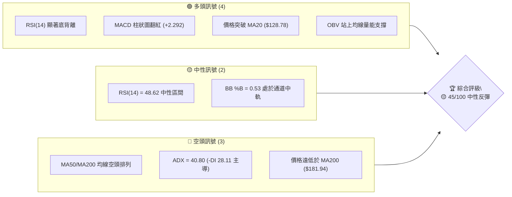
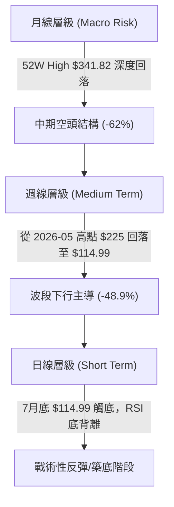
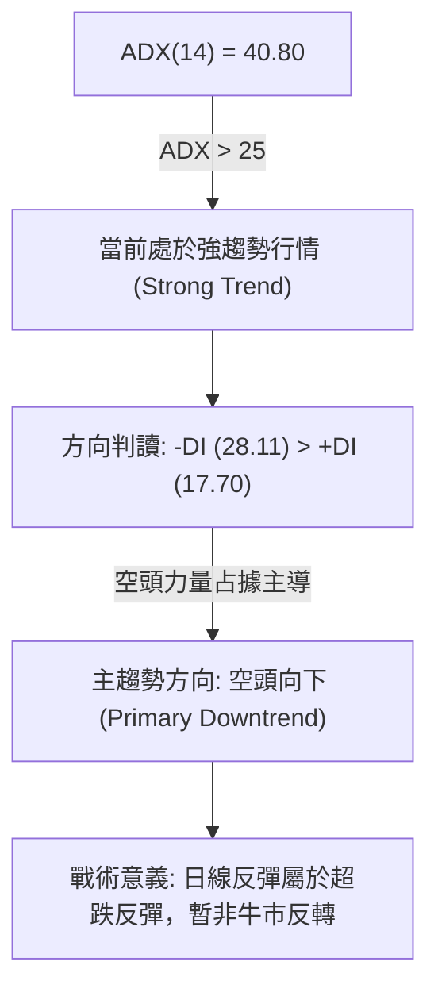
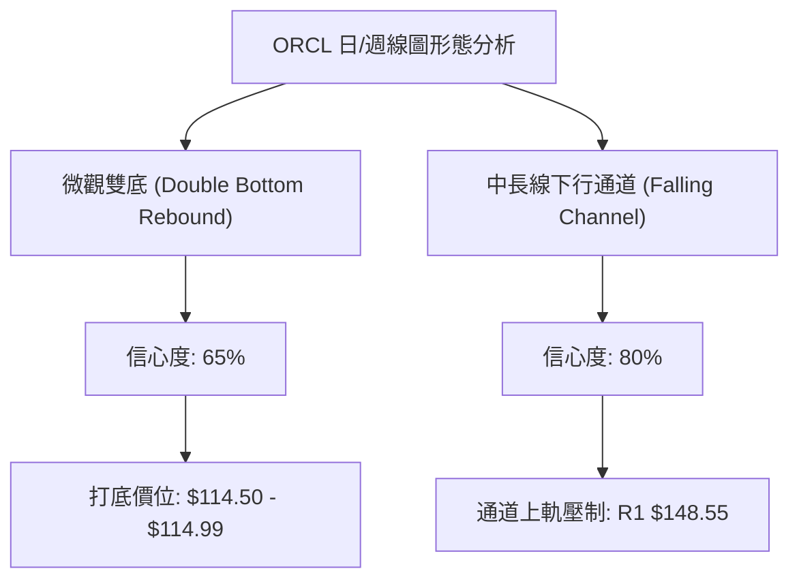
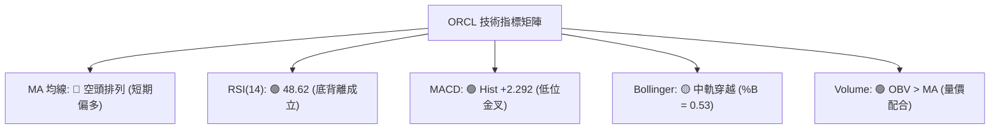
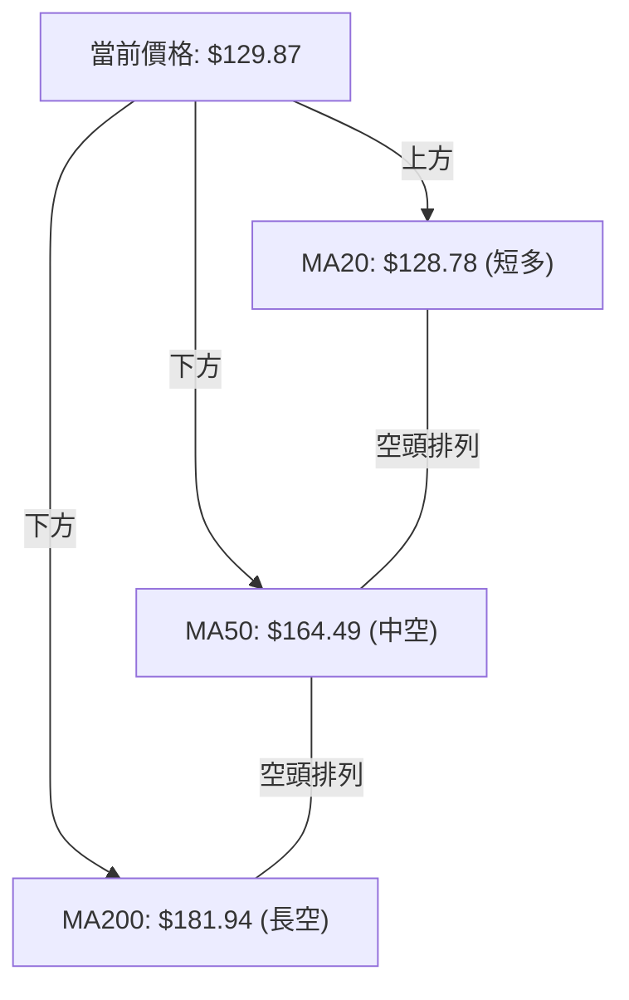
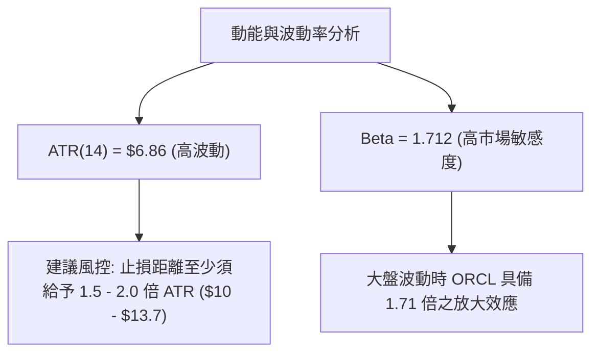
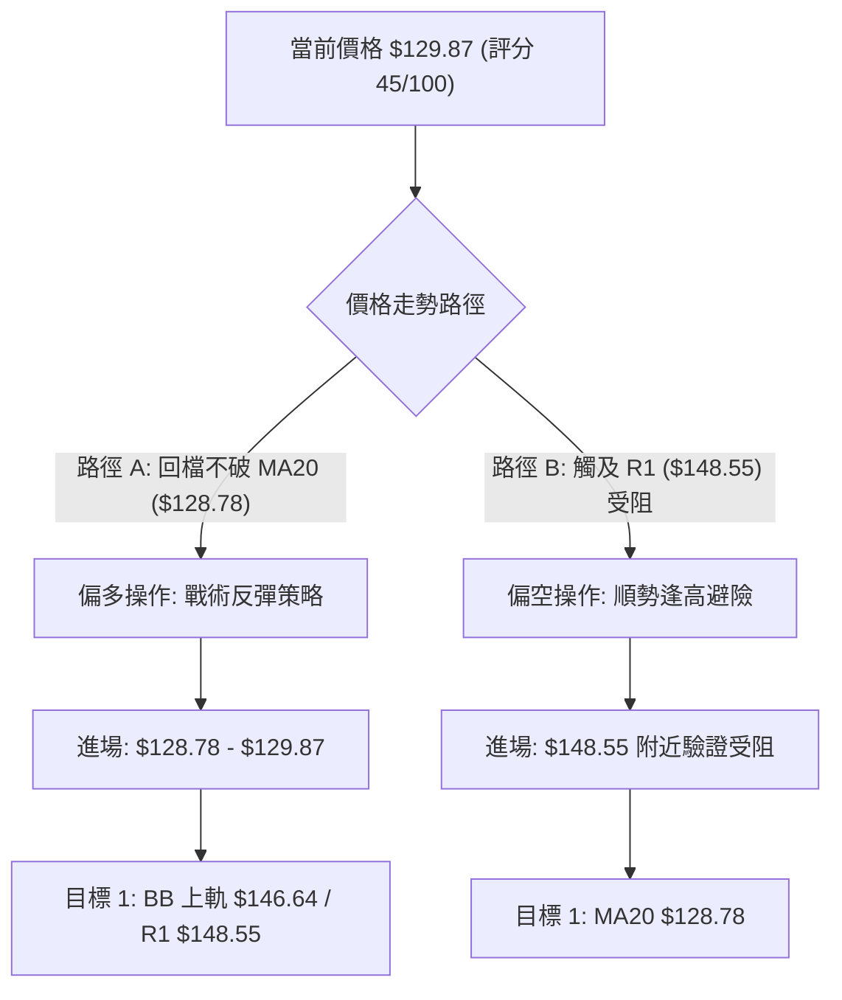
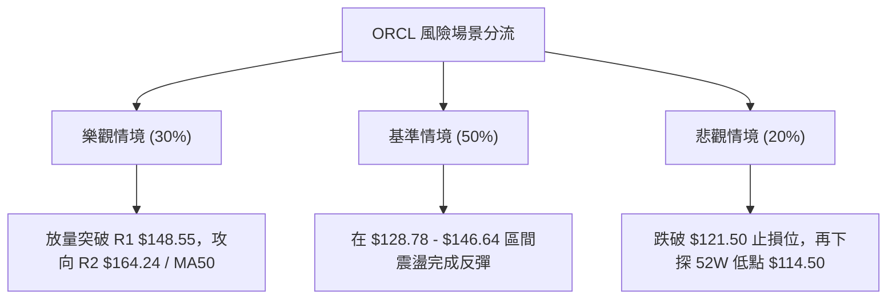

<details markdown="1">
<summary>📊 靜態圖表 (點擊展開)</summary>


</details>

<html>
<head><meta charset="utf-8" /></head>
<body>
    <div style="height:500px; width:100%;">                        <script>window.PlotlyConfig = {MathJaxConfig: 'local'};</script>
        <script charset="utf-8" src="https://cdn.plot.ly/plotly-3.7.0.min.js" integrity="sha256-jvTGqxNp8AGWEcvNLVuKr+8j5dGe9Yw51LQkmDH+IYA=" crossorigin="anonymous"></script>                <div id="candlestick-chart" class="plotly-graph-div" style="height:100%; width:100%;"></div>            <script>                window.PLOTLYENV=window.PLOTLYENV || {};                                if (document.getElementById("candlestick-chart")) {                    Plotly.newPlot(                        "candlestick-chart",                        [{"close":{"dtype":"f8","bdata":"AAAA4EuCckAAAACggstyQAAAAAAoYHNAAAAAgG4IckAAAADggihxQAAAAIBXCHFAAAAAAOLgcEAAAABgT1ZxQAAAAMD4iXFAAAAA4GJrcUAAAACAWmJxQAAAACC4CnFAAAAAYPLNb0AAAABgnkFwQAAAAGBf7G9AAAAAYJK5bkAAAADgZf1uQAAAAIARL25AAAAA4CyfbUAAAADA79BtQAAAAECbPG1AAAAAYEkabEAAAABAuu9qQAAAAMASl2tAAAAAgE44a0AAAABARkxrQAAAAGAD7GtAAAAAoKsVakAAAACAjptoQAAAAIC7y2hAAAAAwLlkaEAAAADgD2BpQAAAAICpAGlAAAAAoKbgaEAAAADguOVoQAAAAMDat2lAAAAAoAmJakAAAAAgC\u002fBqQAAAAODbTWtAAAAAgDxta0AAAADAJJxrQAAAAABpnmhAAAAAwPaEZ0AAAACA6ORmQAAAAKAgW2dAAAAA4CkYZkAAAABg7ElmQAAAAGBaxGdAAAAAgIOPaEAAAACgKS9oQAAAAEBOc2hAAAAAACeDaEAAAABAbjBoQAAAAGBuamhAAAAAwIghaEAAAADA4zpoQAAAAOAA2GdAAAAA4MT8Z0AAAABA7d9nQAAAAGDSemdAAAAAQJWkaEAAAADgVWhpQAAAAMBiHGlAAAAAYI0IaEAAAABAEZFnQAAAAMB4uGdAAAAAwIJVZkAAAABAkpVlQAAAAGA3HmZAAAAAoM39ZUAAAABgl6VmQAAAAAD8tWVAAAAAQEBzZUAAAADgz\u002fpkQAAAAOAIbmRAAAAA4GXeY0AAAABAHTNjQAAAAMDjNGJAAAAAQBLxYEAAAABgi7phQAAAAOAgcGNAAAAAAP\u002fYY0AAAADgPYJjQAAAAACibGNAAAAAwPDgY0AAAACg3hxjQAAAAADIYmNAAAAAAIpuY0AAAABgsmFiQAAAACCPimFAAAAAIAwkYkAAAACgqFtiQAAAAOCPqGJAAAAAAIgMYkAAAACA4IZiQAAAACBAf2JAAAAAQAbqYkAAAACA7TZjQAAAACDG\u002fGJAAAAA4EjQYkAAAADApItiQAAAAICjP2RAAAAAQMzBY0AAAADAGEFjQAAAACBtXGNAAAAAAMAzY0AAAADg3fpiQAAAAEAgTmNAAAAAoIqUYkAAAACgoChjQAAAAIA8QmJAAAAA4DsgYkAAAAAAOrphQAAAACAgVmFAAAAA4Ms6YUAAAABA30JiQAAAACAhB2JAAAAAgKwrYkAAAADg+hBiQAAAAKCqxWFAAAAA4DzVYUAAAADAOSxhQAAAAGCPM2FAAAAAQJNiY0AAAACg6k1kQAAAAMAUJ2VAAAAAQBg3ZkAAAACgf85lQAAAAADcHmZAAAAAQFeRZkAAAADgMltnQAAAAEBn9WVAAAAAgLyVZUAAAAAgiItlQAAAAABPrGRAAAAAgGJoZEAAAABAkxpkQAAAAEB\u002fZ2VAAAAAQEd1ZkAAAAAgoxZnQAAAACBvK2hAAAAAwEo9aEAAAABAqWhoQAAAAABgJWhAAAAAQNVFZ0AAAACARKNnQAAAAKDRXWhAAAAAYP4IaEAAAABA0T5nQAAAAMCWmmZAAAAA4D5wZ0AAAABAlqNnQAAAACBA7WdAAAAAYIAMaEAAAAAAiclnQAAAACDNX2lAAAAAYOkfbEAAAAAgReluQAAAACBtd25AAAAAwAGxbEAAAAAAqXBtQAAAAMANnmpAAAAAoL1iakAAAABgFqNpQAAAAOD9EWlAAAAAoMbuZkAAAACAu+9mQAAAAMAb\u002f2dAAAAAoKp1Z0AAAABgmdxmQAAAAKDV9GZAAAAAYNHOZUAAAAAAzJJkQAAAAMB7n2NAAAAAYM79YkAAAABge4BiQAAAAGDtZ2JAAAAAgFdBYkAAAADgMMBhQAAAACAUeWFAAAAAAF\u002foYUAAAACgfaNhQAAAACAYgGFAAAAAQAr3YUAAAADgepRhQAAAAKBHcWBAAAAAACn8X0AAAAAgro9gQAAAAKBwDV9AAAAAgD2aX0AAAADgUVheQAAAAEAzw19AAAAAgMJ1X0AAAABgjwJeQAAAACBcv1xAAAAAoJn5XUAAAACgcP1dQAAAACBcb11AAAAAANfjX0AAAAAA1ztgQA=="},"high":{"dtype":"f8","bdata":"\u002fUgGKTDYckBnMMHynkBzQF71pJBW93NAMSiQGPjVckBm1gq0oOdxQCIA2Fn0WXFAtUaoONQocUCRUwCvU4ZxQKnFiVQkx3FAWbGMXSHEcUDzSObSuatxQNM66pHfbnFAm6cCE+2ycEDyLfhnVHRwQCpeyYNRcXBAXErZDuuab0CUSxCPoz9vQOZu6+8Y1m5AIwH9h07DbUBDUZDYGJxuQNrvcSLPZW1AYoMbN4ZRbUCrisl\u002fSeBrQL1tqW0wHGxA\u002fwkK6XyVa0BzpQNIA7JrQBt8XlQNP2xACKmn2nb4bEBoXsC4PMppQLzO9TPuO2lA9gRQfCiwaEBjIuAPzf9pQB+2ZtoFDWlAxBuQxskxaUDcCc\u002fzSvZpQNz4SGHgvWlAp6dFekSrakBqjLB85SxrQM8388RK02tAPnUCcsiPa0AbjvKWW+VrQJo7fSLuAWlAmrLQCrd+aEALHl4qRWVnQK4sfH+Tf2dAIHm8R\u002fwWZ0DfhxZT1t9mQBia\u002fJkwKGhAboleQdOcaEDwCO8uHWpoQGp+hAxYjGhAi\u002fqjnJXOaEAAqMIqopNoQMTjE2+Dj2hACcr1Jx1qaECowVE7K5ZoQArT+PFr+GhAReJ5cJUgaEDYw98knzloQG4lXkIGpGdASFyvkFXZaEDuyb2KWaVpQJ2JgLR7y2lASywHQwAJaUAs8Bu4CjVoQCw8fS9C0WdA9ltMl4k8Z0DZg2a2HmtmQLa18CEjXWZAlj7IKO5MZkB5U8ZRywBnQBBkF6gnT2ZAOYchn3CNZkAbwRTQlCFlQNVSB9BQ92RAKlD+12dAZUAq5zYIyshjQCx8s5bqG2NAfVnToxMxYkAj1VGpnsZhQIQoXBiM1GNAfYnnhsaHZECieaWVzFBkQKVp9A78vWNAK7dQyJQlZEDXfJdxnMVjQLibzsywhmNAxDX6oAjfY0D8MtBagR1jQIUguic+GWJAfeCa5r83YkBYl4VF8QZjQHu6FvQn7mJAOrO1\u002fSMiYkCcQS3bHKRiQKjeJqtDvGJAZ7Th7G0RY0CMQ6ZpB5tjQJapwUzAwmNApmqDYETeYkDXn6GTRSJjQGnkhYAzUmVAc1xyTFDVZEAuUibv9fRjQAWCsqBztGNAJPG4zSu6Y0ANrffEpTxjQHu5J3ademNAFz62TP0FY0CURCpQY1ZjQP2sBxmlGmNAGCZwOKCZYkDTYjTQiC5iQC+k\u002fIqilmFAogO3RRCHYUBnIz5mFkxiQEDcmqKWk2JAfZFdl5QtYkBexgvdoXBiQGdQ4fUn8mFApqgZWhvNYkAnPNLywclhQExtGK3jdWFAkD10w9JrY0AVsbmbARplQGNfy6XGfmVA38urD6R0ZkBmcQsFiPtmQPTCWmOZJGZAHS6UcVEWZ0CamX6pxZBnQOFz2AtNqGZAPFDLG6yCZkC9D1SeWJ5lQKDntC6vA2VAVoBulgqGZEC7QlY8b5NkQGBQillDtmVAhy9VdaTbZkBQvViF8jtnQGk0rZ25M2hAXiiKV5juaECk7ESnCKpoQIrZBP4MYGhAiKoDigkIaEA5GwS4\u002fNxnQOezvQd0AGlAF9wFqvd3aEDWWQYjKMNnQJb0SW8agmdA83bIqyhyZ0BuwpxA2QRoQGB8egQlimhAF5u4eL5QaECAU878Ke9nQMsPLtRBiWlAjcgBxCwwbEBY\u002fsG7PCxvQJSlBThgBG9AM+6EIKP1bUA\u002f67P\u002f48NtQK55jlhn1GxASJW9AJ5Ja0DyEZiriXdrQKOpBHfJd2pAVFGsOCQEZ0D07IWx+B1nQN1VvUKSVGhAOlssOpJUaEBQZvf5+rBnQLdclgrTamdA5TiiKBX+ZkBDz4QvOLdlQH9dU4ucpWRAZcSkc1qiY0AoBkb2PiBjQFaQGxTcPmNA5QWBYSCtYkAI41ITO2FiQHSmBOmaUWJAMOi\u002fTK8jYkD0c\u002fRnxSFiQOX\u002f0egkq2FAcxQ1wbORYkAAAACAwjViQAAAAMDMdGFAAAAA4FGYYEAAAADAzLxgQAAAAMD1eGBAAAAAgBQOYEAAAAAgXF9fQAAAAEDh2l9AAAAAQOEaYEAAAADAzCxfQAAAAMAexV5AAAAAIFx\u002fXkAAAADAHpVeQAAAAEDhel5AAAAAQOEKYEAAAADAzIxgQA=="},"hovertemplate":"\u003cb\u003e%{x|%Y-%m-%d}\u003c\u002fb\u003e\u003cbr\u003e\u958b: $%{open:.2f}\u003cbr\u003e\u9ad8: $%{high:.2f}\u003cbr\u003e\u4f4e: $%{low:.2f}\u003cbr\u003e\u6536: $%{close:.2f}\u003cextra\u003e\u003c\u002fextra\u003e","low":{"dtype":"f8","bdata":"qmu6sgwTckAwL+xpB4FyQAPlCFLLwnJAmVrI1g3McUAaFNKM4ApxQMTGdzaL2nBAThiRD9iqcECwgEqmmtxwQF5DsmLbeHFAdhrmdzBScUDrRtsYwl1xQCHpkpAfzHBAoHem3Zy6b0ARGQq+PchvQPyTJExVmW9As+RVeB9bbkDILY7ScJVuQMfyp3UgoG1A2GxeCivEbEBAMukixFltQOaM9I2BVmxAE6j1DEwAbEDSMvPpPqVqQKnmG8U0GGpA5hiUZgWwakDDWmbpbI5qQIuM0G9852pACMCYRU8JakCPsbD+bfZnQKVQKWEzDmhAw81DMGn7ZkCT+iV\u002f2glpQA2MZOcbd2hA2ztSVERaaEA71Iq228JoQJo0SkzXr2hASuZunyqLaUCCrAmriHJqQAaodxbP2mpA6S1+2ToGa0CNksY1C\u002fBqQG6QZIhtDmdA5GRp5IAGZ0BMVSEbWHVmQBCcqZFH12ZAYu92yBvsZUDh\u002foR69xtmQDB\u002fu25USmdAc1\u002fhOZzfZ0AnxQxmU8tnQPDkdwMBEmhAyecbIpFHaEDqmuuPltlnQG\u002fzgsTjOmhAsPx1NtQbaECLzYskWQtoQE8U+VjDz2dAIQR68hmcZ0ArmVa9TcVnQPgAsUrkC2dAMDo+fRBvZ0AOoMgCmXRoQBvHInuW6GhA4a9J1JKvZ0CNtG0Cc4JnQFDg0lGQJ2dAn3K9ELdDZkBIAjvZVi1lQEWpeVLU6GVAijDACNRZZUAzVHrEVilmQDE2IhA3j2VAlZOjJ2FVZUDxnMZnywxkQKR6h8FzQ2RA1hCgyH3cY0AfLcu\u002fFttiQBm1XeO07WFAzfhMAfzJYEBB7TzESj5hQJXlkHZgP2JA7qhl9uJ7Y0COyzyo0h1jQD89vv0n7mJAYhjRC9FGY0B\u002f6UZNO\u002fpiQH+f8xQ\u002fymJAxcL3\u002fhFWY0D50aMTxUtiQMbhr2gfNGFAdA1RXZI4YUDKWXs\u002fLkpiQHrwTkiWBGJAnVZC\u002fKmjYUB4RW59bYZhQCNbV3vawWFAGF\u002f7RxyCYkAIYF4xhqJiQDFJmeEw0mJAgovaU0MtYkDwIhpZdG1iQBjdoy7s7mNArudw31GwY0DWuqLqliJjQNQWh7IHLmNApxe9G+8NY0A0SjOcid9iQCnvXuxve2JAkXiXyZBdYkAhPK37RbViQElXgCKcOmJAMxEM7RvzYUB3cv52pbFhQJM7U0ToKmFAGNYVuwEAYUDthLzXKVxhQClLuXBV9WFALGGWjnZqYUCGovGDRtthQNg28wEGX2FAVTzXDRa9YUDYTHhz6fBgQHZegZhPw2BASI0IE4pnYUChHsoF\u002fx9kQF+LKt5HtGRAkJ2BkFGmZUBzRRWISZhlQI5uLxcSnWVA6eFcDMvsZUAt8qj7UcVmQF2tVFs\u002fr2VA4IECnN8GZUDicrU1LOpkQPp99UufL2RAS\u002fVwMPoCZEClV9vaxfhjQABXOfFdsmRAOuWxwfy0ZUA3lLQ4JExmQMWHV6IswWZAy1Z8w27EZ0BO7hxFnrFnQHMG2wQOvmdAgsLhJMaHZkCQ4hGcYw1nQIRvoW3TGWdAayZTxteHZ0CNGc3bTtRmQDXIiO2viWZAGoidlMNFZkCKb4a9oVFnQO9\u002fMdX\u002fzWdALZy7YMe8Z0Czm4eWl2hnQIMgrdi0FmhAIGqILz7paUAAGdh1SPprQFJ+NAViwG1AbvZCwERabEAzyk03JudrQJ3W98IpF2pAT+flN1YTakCoydhFVqNoQNUwsfnFr2hAcII\u002fn4PVZUDYh6syJExmQFFf5N0PMmdApBZRB01gZ0BOVgX7Tb5mQFWUaYmvImZAMU9mp3O5ZUBz7+r+QYFkQNl08Sn3WWNA0v5cxNa6YkAzX2qtlG9iQA2wuJRKFmJACB4pylT\u002fYUAAAADgMMBhQBLjm4UoS2FAWz5lt3WVYUDL2H4GVyJhQHBjcR9XImFAy7PJp3GOYUAAAADgUWhhQAAAAEAza2BAAAAAYGbmX0AAAABA4RpgQAAAAIA96l5AAAAAAABgXkAAAACA6wFeQAAAAKBwjV5AAAAAwMwsX0AAAAAAKdxdQAAAAAAAsFxAAAAAQDMzXUAAAAAAAKBcQAAAAMDMDF1AAAAAwB5lXkAAAADAzGxfQA=="},"name":"\u50f9\u683c","open":{"dtype":"f8","bdata":"1pL1y7fKckDDxKZpy99yQNTlrzHj6nJAZCHY9ZHNckA6betMCONxQO2EO8w\u002fN3FAgk5B2hwDcUDbDo34ouVwQMZhkiYEs3FAP\u002fYH8VC9cUDvx+D1vYRxQK6bvHRWbHFAIo8K\u002fcKicEAApOotfhBwQAqngOJLa3BAxxagOPDybkDKdLfzVLFuQG1JeF9Ism5AUqkEWe+WbUAysK8NNnNuQAroKV0kP21ArXtoUU5PbUCph6st5tprQAUFEZMbGmpAomai4QIEa0BdpYR1n8RqQDeii3rzHmtArayu3XOebEDlKdbbQKNpQP4LoodWX2hAXj2MPzoHaECVjVwx9O9pQBB6NPVTs2hAyOdtj7TSaEB3PAdTxGVpQJKcgCNRzWhAKKTSufm7aUDyWTqeDB1rQMIQehuIZ2tACZ9h5LE9a0DHfiYyy3VrQKs2SNeQmWdAe7kTn85PaEC37UvCt09nQI4GeGLv3WZAIaYJb+GxZkD8gB1aLp9mQBHlNC3jUmdAqRRuFhJeaEAOR\u002fORtVFoQMLpJ\u002f9iJGhAwHuz5V6FaEDdO696wwloQCs4cYD7RWhAqXQ+c2RRaEC7uXTiq3JoQB0gIN8+jmhAeoKRgQ3XZ0D\u002fO7sZ5S1oQE2hqVzOoWdAIq2u3ZXKZ0AgzHndWIdoQDJWuCiBcmlASywHQwAJaUAs8Bu4CjVoQOAEIUr5kmdA9ltMl4k8Z0BgC1Y74k1mQOe\u002fIkQIRGZA3rRXz4dtZUDv5xbicztmQO09lQRQPmZAPu89zp62ZUCdZ6T7CR9lQLXybCke4GRA9H5kAII3ZUAkW\u002f2JMqVjQH0y9s1TGmNA3svEPOMSYkA+2BVL\u002fFhhQFEWq++5bmJABhQh4H3cY0CieaWVzFBkQJum\u002fv61mmNA3BJlcKjEY0CCGUetTJxjQENx\u002fB3aKmNAsM0O8jGDY0D1BHQOlAdjQHyunUe\u002fFWJAparVnJ97YUB\u002fcoJYBIRiQK3RTFtCeGJAbjJKmzrcYUAbvdv9aJRhQHduPEbg92FAh2zCNAefYkD50S8dBPFiQN335aWA+2JAIOsGnPS0YkAKXcM+vxFjQNu+KUk8p2RA55MIxpNwZEC1omFnTb5jQEXgFENJX2NAJKPIY5VLY0AIsMt3wQpjQLBpzzlUrWJAgHqHSaL\u002fYkCVJljl1ctiQAKV2noL\u002fmJAXcKKwD2GYkBVBj8EjNxhQCrG1bh7fmFAr6QubTNiYUAeYNWmdmphQGgnVPPKgWJAmAtKyEW5YUDMm2bNW01iQH6N+xcN2WFAHqGWgT6oYkCXGUa9n7ZhQPBSTH4BG2FAPsJ6RyJpYUB1UqAbIetkQF2cMg73yWRACEaNJ975ZUAYygQcd8lmQG10Wv5NBmZAR2gO92k3ZkA83zTdGjFnQCwOGj3JeGZA7O39SUt8ZkCpWuTqaX9lQCkUMUwhM2RAXI0+yRRvZEBhrXZbqi5kQN2WHyb6umRA2T5fxRztZUCF1IRT9K9mQM1rCCG+MWdA3OUydHy9aECB7dn1Mf1nQI1ObX9772dAiKoDigkIaEDLl4wb\u002fYtnQEtG1wTicGdAhBfX\u002fYu6Z0DmcqXY66pnQIsgZ29dK2dAcCgpFB5qZkALYLzVWYtnQKHk\u002fAQt4GdAl2P+ricUaECABmX7HdpnQLTPJ7rAK2hAJ+yLMdAIakCY7YWlbbZsQDN5ou2pPm5AUn2hOq70bUANHnkD0UZsQJHwXlo4lmxAVBc+tdcfa0CV7X6UY6VqQNXdBWP6uWhAj3gR0YFhZkAFf95hywtnQHzAo9qwV2dALfhfaT2rZ0AXdFyudzBnQBkjZToEzGZAIUPtwLG1ZkAW+4JheTRlQGnzWYpVPWRA9SCiXr6ZY0DGSN9dprdiQAVqoHsALWNAnSid\u002fqlXYkCUzGp7pv9hQO98PtKz2WFAS4\u002fVaZf5YUAnQBRqGOdhQOK68hx+UmFAhMHlJcCdYUAAAADAzDRiQAAAAMD1YGFAAAAAAACAYEAAAACA61FgQAAAACBcb2BAAAAAwMxsXkAAAACgRxFfQAAAAADXs15AAAAAIIWLX0AAAACgcP1eQAAAAIAUnl5AAAAAAACAXUAAAAAghYtdQAAAAEDh2l1AAAAAIK63XkAAAACAPUJgQA=="},"x":["2025-10-14T00:00:00-04:00","2025-10-15T00:00:00-04:00","2025-10-16T00:00:00-04:00","2025-10-17T00:00:00-04:00","2025-10-20T00:00:00-04:00","2025-10-21T00:00:00-04:00","2025-10-22T00:00:00-04:00","2025-10-23T00:00:00-04:00","2025-10-24T00:00:00-04:00","2025-10-27T00:00:00-04:00","2025-10-28T00:00:00-04:00","2025-10-29T00:00:00-04:00","2025-10-30T00:00:00-04:00","2025-10-31T00:00:00-04:00","2025-11-03T00:00:00-05:00","2025-11-04T00:00:00-05:00","2025-11-05T00:00:00-05:00","2025-11-06T00:00:00-05:00","2025-11-07T00:00:00-05:00","2025-11-10T00:00:00-05:00","2025-11-11T00:00:00-05:00","2025-11-12T00:00:00-05:00","2025-11-13T00:00:00-05:00","2025-11-14T00:00:00-05:00","2025-11-17T00:00:00-05:00","2025-11-18T00:00:00-05:00","2025-11-19T00:00:00-05:00","2025-11-20T00:00:00-05:00","2025-11-21T00:00:00-05:00","2025-11-24T00:00:00-05:00","2025-11-25T00:00:00-05:00","2025-11-26T00:00:00-05:00","2025-11-28T00:00:00-05:00","2025-12-01T00:00:00-05:00","2025-12-02T00:00:00-05:00","2025-12-03T00:00:00-05:00","2025-12-04T00:00:00-05:00","2025-12-05T00:00:00-05:00","2025-12-08T00:00:00-05:00","2025-12-09T00:00:00-05:00","2025-12-10T00:00:00-05:00","2025-12-11T00:00:00-05:00","2025-12-12T00:00:00-05:00","2025-12-15T00:00:00-05:00","2025-12-16T00:00:00-05:00","2025-12-17T00:00:00-05:00","2025-12-18T00:00:00-05:00","2025-12-19T00:00:00-05:00","2025-12-22T00:00:00-05:00","2025-12-23T00:00:00-05:00","2025-12-24T00:00:00-05:00","2025-12-26T00:00:00-05:00","2025-12-29T00:00:00-05:00","2025-12-30T00:00:00-05:00","2025-12-31T00:00:00-05:00","2026-01-02T00:00:00-05:00","2026-01-05T00:00:00-05:00","2026-01-06T00:00:00-05:00","2026-01-07T00:00:00-05:00","2026-01-08T00:00:00-05:00","2026-01-09T00:00:00-05:00","2026-01-12T00:00:00-05:00","2026-01-13T00:00:00-05:00","2026-01-14T00:00:00-05:00","2026-01-15T00:00:00-05:00","2026-01-16T00:00:00-05:00","2026-01-20T00:00:00-05:00","2026-01-21T00:00:00-05:00","2026-01-22T00:00:00-05:00","2026-01-23T00:00:00-05:00","2026-01-26T00:00:00-05:00","2026-01-27T00:00:00-05:00","2026-01-28T00:00:00-05:00","2026-01-29T00:00:00-05:00","2026-01-30T00:00:00-05:00","2026-02-02T00:00:00-05:00","2026-02-03T00:00:00-05:00","2026-02-04T00:00:00-05:00","2026-02-05T00:00:00-05:00","2026-02-06T00:00:00-05:00","2026-02-09T00:00:00-05:00","2026-02-10T00:00:00-05:00","2026-02-11T00:00:00-05:00","2026-02-12T00:00:00-05:00","2026-02-13T00:00:00-05:00","2026-02-17T00:00:00-05:00","2026-02-18T00:00:00-05:00","2026-02-19T00:00:00-05:00","2026-02-20T00:00:00-05:00","2026-02-23T00:00:00-05:00","2026-02-24T00:00:00-05:00","2026-02-25T00:00:00-05:00","2026-02-26T00:00:00-05:00","2026-02-27T00:00:00-05:00","2026-03-02T00:00:00-05:00","2026-03-03T00:00:00-05:00","2026-03-04T00:00:00-05:00","2026-03-05T00:00:00-05:00","2026-03-06T00:00:00-05:00","2026-03-09T00:00:00-04:00","2026-03-10T00:00:00-04:00","2026-03-11T00:00:00-04:00","2026-03-12T00:00:00-04:00","2026-03-13T00:00:00-04:00","2026-03-16T00:00:00-04:00","2026-03-17T00:00:00-04:00","2026-03-18T00:00:00-04:00","2026-03-19T00:00:00-04:00","2026-03-20T00:00:00-04:00","2026-03-23T00:00:00-04:00","2026-03-24T00:00:00-04:00","2026-03-25T00:00:00-04:00","2026-03-26T00:00:00-04:00","2026-03-27T00:00:00-04:00","2026-03-30T00:00:00-04:00","2026-03-31T00:00:00-04:00","2026-04-01T00:00:00-04:00","2026-04-02T00:00:00-04:00","2026-04-06T00:00:00-04:00","2026-04-07T00:00:00-04:00","2026-04-08T00:00:00-04:00","2026-04-09T00:00:00-04:00","2026-04-10T00:00:00-04:00","2026-04-13T00:00:00-04:00","2026-04-14T00:00:00-04:00","2026-04-15T00:00:00-04:00","2026-04-16T00:00:00-04:00","2026-04-17T00:00:00-04:00","2026-04-20T00:00:00-04:00","2026-04-21T00:00:00-04:00","2026-04-22T00:00:00-04:00","2026-04-23T00:00:00-04:00","2026-04-24T00:00:00-04:00","2026-04-27T00:00:00-04:00","2026-04-28T00:00:00-04:00","2026-04-29T00:00:00-04:00","2026-04-30T00:00:00-04:00","2026-05-01T00:00:00-04:00","2026-05-04T00:00:00-04:00","2026-05-05T00:00:00-04:00","2026-05-06T00:00:00-04:00","2026-05-07T00:00:00-04:00","2026-05-08T00:00:00-04:00","2026-05-11T00:00:00-04:00","2026-05-12T00:00:00-04:00","2026-05-13T00:00:00-04:00","2026-05-14T00:00:00-04:00","2026-05-15T00:00:00-04:00","2026-05-18T00:00:00-04:00","2026-05-19T00:00:00-04:00","2026-05-20T00:00:00-04:00","2026-05-21T00:00:00-04:00","2026-05-22T00:00:00-04:00","2026-05-26T00:00:00-04:00","2026-05-27T00:00:00-04:00","2026-05-28T00:00:00-04:00","2026-05-29T00:00:00-04:00","2026-06-01T00:00:00-04:00","2026-06-02T00:00:00-04:00","2026-06-03T00:00:00-04:00","2026-06-04T00:00:00-04:00","2026-06-05T00:00:00-04:00","2026-06-08T00:00:00-04:00","2026-06-09T00:00:00-04:00","2026-06-10T00:00:00-04:00","2026-06-11T00:00:00-04:00","2026-06-12T00:00:00-04:00","2026-06-15T00:00:00-04:00","2026-06-16T00:00:00-04:00","2026-06-17T00:00:00-04:00","2026-06-18T00:00:00-04:00","2026-06-22T00:00:00-04:00","2026-06-23T00:00:00-04:00","2026-06-24T00:00:00-04:00","2026-06-25T00:00:00-04:00","2026-06-26T00:00:00-04:00","2026-06-29T00:00:00-04:00","2026-06-30T00:00:00-04:00","2026-07-01T00:00:00-04:00","2026-07-02T00:00:00-04:00","2026-07-06T00:00:00-04:00","2026-07-07T00:00:00-04:00","2026-07-08T00:00:00-04:00","2026-07-09T00:00:00-04:00","2026-07-10T00:00:00-04:00","2026-07-13T00:00:00-04:00","2026-07-14T00:00:00-04:00","2026-07-15T00:00:00-04:00","2026-07-16T00:00:00-04:00","2026-07-17T00:00:00-04:00","2026-07-20T00:00:00-04:00","2026-07-21T00:00:00-04:00","2026-07-22T00:00:00-04:00","2026-07-23T00:00:00-04:00","2026-07-24T00:00:00-04:00","2026-07-27T00:00:00-04:00","2026-07-28T00:00:00-04:00","2026-07-29T00:00:00-04:00","2026-07-30T00:00:00-04:00","2026-07-31T00:00:00-04:00"],"type":"candlestick"},{"hovertemplate":"MA30: $%{y:.2f}\u003cextra\u003e\u003c\u002fextra\u003e","line":{"color":"#2196F3","dash":"dash","width":2},"mode":"lines","name":"MA30","x":["2025-10-14T00:00:00-04:00","2025-10-15T00:00:00-04:00","2025-10-16T00:00:00-04:00","2025-10-17T00:00:00-04:00","2025-10-20T00:00:00-04:00","2025-10-21T00:00:00-04:00","2025-10-22T00:00:00-04:00","2025-10-23T00:00:00-04:00","2025-10-24T00:00:00-04:00","2025-10-27T00:00:00-04:00","2025-10-28T00:00:00-04:00","2025-10-29T00:00:00-04:00","2025-10-30T00:00:00-04:00","2025-10-31T00:00:00-04:00","2025-11-03T00:00:00-05:00","2025-11-04T00:00:00-05:00","2025-11-05T00:00:00-05:00","2025-11-06T00:00:00-05:00","2025-11-07T00:00:00-05:00","2025-11-10T00:00:00-05:00","2025-11-11T00:00:00-05:00","2025-11-12T00:00:00-05:00","2025-11-13T00:00:00-05:00","2025-11-14T00:00:00-05:00","2025-11-17T00:00:00-05:00","2025-11-18T00:00:00-05:00","2025-11-19T00:00:00-05:00","2025-11-20T00:00:00-05:00","2025-11-21T00:00:00-05:00","2025-11-24T00:00:00-05:00","2025-11-25T00:00:00-05:00","2025-11-26T00:00:00-05:00","2025-11-28T00:00:00-05:00","2025-12-01T00:00:00-05:00","2025-12-02T00:00:00-05:00","2025-12-03T00:00:00-05:00","2025-12-04T00:00:00-05:00","2025-12-05T00:00:00-05:00","2025-12-08T00:00:00-05:00","2025-12-09T00:00:00-05:00","2025-12-10T00:00:00-05:00","2025-12-11T00:00:00-05:00","2025-12-12T00:00:00-05:00","2025-12-15T00:00:00-05:00","2025-12-16T00:00:00-05:00","2025-12-17T00:00:00-05:00","2025-12-18T00:00:00-05:00","2025-12-19T00:00:00-05:00","2025-12-22T00:00:00-05:00","2025-12-23T00:00:00-05:00","2025-12-24T00:00:00-05:00","2025-12-26T00:00:00-05:00","2025-12-29T00:00:00-05:00","2025-12-30T00:00:00-05:00","2025-12-31T00:00:00-05:00","2026-01-02T00:00:00-05:00","2026-01-05T00:00:00-05:00","2026-01-06T00:00:00-05:00","2026-01-07T00:00:00-05:00","2026-01-08T00:00:00-05:00","2026-01-09T00:00:00-05:00","2026-01-12T00:00:00-05:00","2026-01-13T00:00:00-05:00","2026-01-14T00:00:00-05:00","2026-01-15T00:00:00-05:00","2026-01-16T00:00:00-05:00","2026-01-20T00:00:00-05:00","2026-01-21T00:00:00-05:00","2026-01-22T00:00:00-05:00","2026-01-23T00:00:00-05:00","2026-01-26T00:00:00-05:00","2026-01-27T00:00:00-05:00","2026-01-28T00:00:00-05:00","2026-01-29T00:00:00-05:00","2026-01-30T00:00:00-05:00","2026-02-02T00:00:00-05:00","2026-02-03T00:00:00-05:00","2026-02-04T00:00:00-05:00","2026-02-05T00:00:00-05:00","2026-02-06T00:00:00-05:00","2026-02-09T00:00:00-05:00","2026-02-10T00:00:00-05:00","2026-02-11T00:00:00-05:00","2026-02-12T00:00:00-05:00","2026-02-13T00:00:00-05:00","2026-02-17T00:00:00-05:00","2026-02-18T00:00:00-05:00","2026-02-19T00:00:00-05:00","2026-02-20T00:00:00-05:00","2026-02-23T00:00:00-05:00","2026-02-24T00:00:00-05:00","2026-02-25T00:00:00-05:00","2026-02-26T00:00:00-05:00","2026-02-27T00:00:00-05:00","2026-03-02T00:00:00-05:00","2026-03-03T00:00:00-05:00","2026-03-04T00:00:00-05:00","2026-03-05T00:00:00-05:00","2026-03-06T00:00:00-05:00","2026-03-09T00:00:00-04:00","2026-03-10T00:00:00-04:00","2026-03-11T00:00:00-04:00","2026-03-12T00:00:00-04:00","2026-03-13T00:00:00-04:00","2026-03-16T00:00:00-04:00","2026-03-17T00:00:00-04:00","2026-03-18T00:00:00-04:00","2026-03-19T00:00:00-04:00","2026-03-20T00:00:00-04:00","2026-03-23T00:00:00-04:00","2026-03-24T00:00:00-04:00","2026-03-25T00:00:00-04:00","2026-03-26T00:00:00-04:00","2026-03-27T00:00:00-04:00","2026-03-30T00:00:00-04:00","2026-03-31T00:00:00-04:00","2026-04-01T00:00:00-04:00","2026-04-02T00:00:00-04:00","2026-04-06T00:00:00-04:00","2026-04-07T00:00:00-04:00","2026-04-08T00:00:00-04:00","2026-04-09T00:00:00-04:00","2026-04-10T00:00:00-04:00","2026-04-13T00:00:00-04:00","2026-04-14T00:00:00-04:00","2026-04-15T00:00:00-04:00","2026-04-16T00:00:00-04:00","2026-04-17T00:00:00-04:00","2026-04-20T00:00:00-04:00","2026-04-21T00:00:00-04:00","2026-04-22T00:00:00-04:00","2026-04-23T00:00:00-04:00","2026-04-24T00:00:00-04:00","2026-04-27T00:00:00-04:00","2026-04-28T00:00:00-04:00","2026-04-29T00:00:00-04:00","2026-04-30T00:00:00-04:00","2026-05-01T00:00:00-04:00","2026-05-04T00:00:00-04:00","2026-05-05T00:00:00-04:00","2026-05-06T00:00:00-04:00","2026-05-07T00:00:00-04:00","2026-05-08T00:00:00-04:00","2026-05-11T00:00:00-04:00","2026-05-12T00:00:00-04:00","2026-05-13T00:00:00-04:00","2026-05-14T00:00:00-04:00","2026-05-15T00:00:00-04:00","2026-05-18T00:00:00-04:00","2026-05-19T00:00:00-04:00","2026-05-20T00:00:00-04:00","2026-05-21T00:00:00-04:00","2026-05-22T00:00:00-04:00","2026-05-26T00:00:00-04:00","2026-05-27T00:00:00-04:00","2026-05-28T00:00:00-04:00","2026-05-29T00:00:00-04:00","2026-06-01T00:00:00-04:00","2026-06-02T00:00:00-04:00","2026-06-03T00:00:00-04:00","2026-06-04T00:00:00-04:00","2026-06-05T00:00:00-04:00","2026-06-08T00:00:00-04:00","2026-06-09T00:00:00-04:00","2026-06-10T00:00:00-04:00","2026-06-11T00:00:00-04:00","2026-06-12T00:00:00-04:00","2026-06-15T00:00:00-04:00","2026-06-16T00:00:00-04:00","2026-06-17T00:00:00-04:00","2026-06-18T00:00:00-04:00","2026-06-22T00:00:00-04:00","2026-06-23T00:00:00-04:00","2026-06-24T00:00:00-04:00","2026-06-25T00:00:00-04:00","2026-06-26T00:00:00-04:00","2026-06-29T00:00:00-04:00","2026-06-30T00:00:00-04:00","2026-07-01T00:00:00-04:00","2026-07-02T00:00:00-04:00","2026-07-06T00:00:00-04:00","2026-07-07T00:00:00-04:00","2026-07-08T00:00:00-04:00","2026-07-09T00:00:00-04:00","2026-07-10T00:00:00-04:00","2026-07-13T00:00:00-04:00","2026-07-14T00:00:00-04:00","2026-07-15T00:00:00-04:00","2026-07-16T00:00:00-04:00","2026-07-17T00:00:00-04:00","2026-07-20T00:00:00-04:00","2026-07-21T00:00:00-04:00","2026-07-22T00:00:00-04:00","2026-07-23T00:00:00-04:00","2026-07-24T00:00:00-04:00","2026-07-27T00:00:00-04:00","2026-07-28T00:00:00-04:00","2026-07-29T00:00:00-04:00","2026-07-30T00:00:00-04:00","2026-07-31T00:00:00-04:00"],"y":{"dtype":"f8","bdata":"AAAAAAAA+H8AAAAAAAD4fwAAAAAAAPh\u002fAAAAAAAA+H8AAAAAAAD4fwAAAAAAAPh\u002fAAAAAAAA+H8AAAAAAAD4fwAAAAAAAPh\u002fAAAAAAAA+H8AAAAAAAD4fwAAAAAAAPh\u002fAAAAAAAA+H8AAAAAAAD4fwAAAAAAAPh\u002fAAAAAAAA+H8AAAAAAAD4fwAAAAAAAPh\u002fAAAAAAAA+H8AAAAAAAD4fwAAAAAAAPh\u002fAAAAAAAA+H8AAAAAAAD4fwAAAAAAAPh\u002fAAAAAAAA+H8AAAAAAAD4fwAAAAAAAPh\u002fAAAAAAAA+H8AAAAAAAD4f6uqqoqfaW9AERER8eT9bkAAAACQqZVuQGZmZjZXIG5A7+7u7t3AbUARERGBfXBtQKuqqjpDKW1Aq6qqaqPrbEDv7u5+nqlsQBEREXFIZ2xAIiIiIggobEAiIiJC8uprQAAAAMAtmmtAIiIisnpTa0AiIiLSZgFrQBERESFLuGpAMzMzg6VuakCrqqq6ZSRqQEREROSj7WlARERElHPCaUARERFxZJJpQKuqqoqMaWlAMzMzQ+lKaUC8u7vLdzNpQAAAAEBhGGlAMzMzUwX+aEAAAABg1+NoQN7d3X0KwWhA7+7u7iSvaEAzMzPT46hoQKuqqtqonWhAVVVVxcmfaEDv7u5eEKBoQCIiIvL8oGhAd3d358iZaEC8u7v7bY5oQO\u002fu7i5ifWhAq6qqWohZaECJiIio2StoQBEREXGY\u002f2dAERER4TbRZ0BVVVXV3KZnQGZmZmYMjmdA7+7uLmR8Z0B3d3cHDmxnQFVVVcUVU2dAVVVVxRdAZ0CJiIiIuyVnQFVVVaVI9mZA7+7u3kS1ZkB3d3eHLn5mQAAAAMBoU2ZA3t3dnZorZkAiIiISqgNmQBERETES2WVAvLu728i0ZUBVVVUFHollQHd3d5cTY2VAMzMzwzM8ZUDv7u7uUw1lQGZmZgan2mRAzczM\u002fCqjZEBEREQUA2dkQERERITzL2RAVVVVReL8Y0BVVVWl4NFjQBEREbFNpWNAAAAA4B6IY0Dv7u4u5nNjQFVVVTUvWWNA7+7uLhE+Y0ARERGhERtjQGZmZjaXDmNAmpmZaSQAY0C8u7sba\u002fFiQBEREVFM6GJA7+7uHpziYkBEREQkvOBiQGZmZgYc6mJAERERgRf4YkCamZlpSwRjQEREREQ7+mJAiYiIGIrrYkBERETEVtxiQDMzM6OFymJA7+7uzuqzYkAAAACQpqxiQO\u002fu7u4PoWJAERER0UyWYkCJiIgInJNiQKuqqmqUlWJAiYiI6POSYkDNzMyc1ohiQJqZmalnfGJAAAAAcM6HYkARERFx+ZZiQJqZmamirWJA3t3d7c3JYkBmZmZm7N9iQM3MzNyo+mJAAAAA4LEaY0BVVVUlv0NjQM3MzLxWUmNAAAAA0O9hY0Dv7u4OfHVjQBEREUGugGNAAAAA8PeKY0DNzMwMj5RjQN7d3Z14pmNAiYiI+I\u002fHY0BmZmaWGOljQFVVVTWJG2RA7+7uXrRPZEBEREQUuIhkQO\u002fu7s7TwmRAAAAAMGX2ZEDe3d1tRiRlQBEREWFdWmVAREREpGiMZUBERER0mrhlQGZmZobV4WVAzczM7KoRZkDNzMys2EhmQO\u002fu7m48gmZAq6qqmgiqZkBVVVUVwcdmQKuqqjrH62ZAmpmZmTQeZ0CamZnZ5WtnQDMzM+Mds2dA3t3dTV\u002fnZ0BERESkSRtoQM3MzOwKQ2hA3t3dbQJsaEAiIiKS7Y5oQGZmZmZztGhAVVVVRf\u002fJaEB3d3dHK+JoQImIiBhK+GhAERER8dUAaUDv7u6u5v5oQLy7uzuM9GhAREREdMzfaEARERHhEb9oQERERDR5mGhAERERcfBzaEAAAADwHEhoQO\u002fu7v4\u002fFWhAIiIiou3jZ0C8u7trCrVnQM3MzMxBiWdAvLu7qw9aZ0BmZmam2yZnQLy7u\u002fsE8GZAVVVVpRq8ZkBVVVW1IodmQO\u002fu7g7rOmZAZmZm9mPTZUDv7u7+71hlQImIiIBy2WRAAAAAeHNrZEB3d3d3s\u002fFjQO\u002fu7v4VlmNAAAAAQCg7Y0AREREpbuBiQLy7uzsnhWJAvLu7o1pBYkBERERElv1hQJqZmfFnrmFAERER+UduYUDe3d31uDVhQA=="},"type":"scatter"},{"hovertemplate":"MA60: $%{y:.2f}\u003cextra\u003e\u003c\u002fextra\u003e","line":{"color":"#9C27B0","dash":"dash","width":2},"mode":"lines","name":"MA60","x":["2025-10-14T00:00:00-04:00","2025-10-15T00:00:00-04:00","2025-10-16T00:00:00-04:00","2025-10-17T00:00:00-04:00","2025-10-20T00:00:00-04:00","2025-10-21T00:00:00-04:00","2025-10-22T00:00:00-04:00","2025-10-23T00:00:00-04:00","2025-10-24T00:00:00-04:00","2025-10-27T00:00:00-04:00","2025-10-28T00:00:00-04:00","2025-10-29T00:00:00-04:00","2025-10-30T00:00:00-04:00","2025-10-31T00:00:00-04:00","2025-11-03T00:00:00-05:00","2025-11-04T00:00:00-05:00","2025-11-05T00:00:00-05:00","2025-11-06T00:00:00-05:00","2025-11-07T00:00:00-05:00","2025-11-10T00:00:00-05:00","2025-11-11T00:00:00-05:00","2025-11-12T00:00:00-05:00","2025-11-13T00:00:00-05:00","2025-11-14T00:00:00-05:00","2025-11-17T00:00:00-05:00","2025-11-18T00:00:00-05:00","2025-11-19T00:00:00-05:00","2025-11-20T00:00:00-05:00","2025-11-21T00:00:00-05:00","2025-11-24T00:00:00-05:00","2025-11-25T00:00:00-05:00","2025-11-26T00:00:00-05:00","2025-11-28T00:00:00-05:00","2025-12-01T00:00:00-05:00","2025-12-02T00:00:00-05:00","2025-12-03T00:00:00-05:00","2025-12-04T00:00:00-05:00","2025-12-05T00:00:00-05:00","2025-12-08T00:00:00-05:00","2025-12-09T00:00:00-05:00","2025-12-10T00:00:00-05:00","2025-12-11T00:00:00-05:00","2025-12-12T00:00:00-05:00","2025-12-15T00:00:00-05:00","2025-12-16T00:00:00-05:00","2025-12-17T00:00:00-05:00","2025-12-18T00:00:00-05:00","2025-12-19T00:00:00-05:00","2025-12-22T00:00:00-05:00","2025-12-23T00:00:00-05:00","2025-12-24T00:00:00-05:00","2025-12-26T00:00:00-05:00","2025-12-29T00:00:00-05:00","2025-12-30T00:00:00-05:00","2025-12-31T00:00:00-05:00","2026-01-02T00:00:00-05:00","2026-01-05T00:00:00-05:00","2026-01-06T00:00:00-05:00","2026-01-07T00:00:00-05:00","2026-01-08T00:00:00-05:00","2026-01-09T00:00:00-05:00","2026-01-12T00:00:00-05:00","2026-01-13T00:00:00-05:00","2026-01-14T00:00:00-05:00","2026-01-15T00:00:00-05:00","2026-01-16T00:00:00-05:00","2026-01-20T00:00:00-05:00","2026-01-21T00:00:00-05:00","2026-01-22T00:00:00-05:00","2026-01-23T00:00:00-05:00","2026-01-26T00:00:00-05:00","2026-01-27T00:00:00-05:00","2026-01-28T00:00:00-05:00","2026-01-29T00:00:00-05:00","2026-01-30T00:00:00-05:00","2026-02-02T00:00:00-05:00","2026-02-03T00:00:00-05:00","2026-02-04T00:00:00-05:00","2026-02-05T00:00:00-05:00","2026-02-06T00:00:00-05:00","2026-02-09T00:00:00-05:00","2026-02-10T00:00:00-05:00","2026-02-11T00:00:00-05:00","2026-02-12T00:00:00-05:00","2026-02-13T00:00:00-05:00","2026-02-17T00:00:00-05:00","2026-02-18T00:00:00-05:00","2026-02-19T00:00:00-05:00","2026-02-20T00:00:00-05:00","2026-02-23T00:00:00-05:00","2026-02-24T00:00:00-05:00","2026-02-25T00:00:00-05:00","2026-02-26T00:00:00-05:00","2026-02-27T00:00:00-05:00","2026-03-02T00:00:00-05:00","2026-03-03T00:00:00-05:00","2026-03-04T00:00:00-05:00","2026-03-05T00:00:00-05:00","2026-03-06T00:00:00-05:00","2026-03-09T00:00:00-04:00","2026-03-10T00:00:00-04:00","2026-03-11T00:00:00-04:00","2026-03-12T00:00:00-04:00","2026-03-13T00:00:00-04:00","2026-03-16T00:00:00-04:00","2026-03-17T00:00:00-04:00","2026-03-18T00:00:00-04:00","2026-03-19T00:00:00-04:00","2026-03-20T00:00:00-04:00","2026-03-23T00:00:00-04:00","2026-03-24T00:00:00-04:00","2026-03-25T00:00:00-04:00","2026-03-26T00:00:00-04:00","2026-03-27T00:00:00-04:00","2026-03-30T00:00:00-04:00","2026-03-31T00:00:00-04:00","2026-04-01T00:00:00-04:00","2026-04-02T00:00:00-04:00","2026-04-06T00:00:00-04:00","2026-04-07T00:00:00-04:00","2026-04-08T00:00:00-04:00","2026-04-09T00:00:00-04:00","2026-04-10T00:00:00-04:00","2026-04-13T00:00:00-04:00","2026-04-14T00:00:00-04:00","2026-04-15T00:00:00-04:00","2026-04-16T00:00:00-04:00","2026-04-17T00:00:00-04:00","2026-04-20T00:00:00-04:00","2026-04-21T00:00:00-04:00","2026-04-22T00:00:00-04:00","2026-04-23T00:00:00-04:00","2026-04-24T00:00:00-04:00","2026-04-27T00:00:00-04:00","2026-04-28T00:00:00-04:00","2026-04-29T00:00:00-04:00","2026-04-30T00:00:00-04:00","2026-05-01T00:00:00-04:00","2026-05-04T00:00:00-04:00","2026-05-05T00:00:00-04:00","2026-05-06T00:00:00-04:00","2026-05-07T00:00:00-04:00","2026-05-08T00:00:00-04:00","2026-05-11T00:00:00-04:00","2026-05-12T00:00:00-04:00","2026-05-13T00:00:00-04:00","2026-05-14T00:00:00-04:00","2026-05-15T00:00:00-04:00","2026-05-18T00:00:00-04:00","2026-05-19T00:00:00-04:00","2026-05-20T00:00:00-04:00","2026-05-21T00:00:00-04:00","2026-05-22T00:00:00-04:00","2026-05-26T00:00:00-04:00","2026-05-27T00:00:00-04:00","2026-05-28T00:00:00-04:00","2026-05-29T00:00:00-04:00","2026-06-01T00:00:00-04:00","2026-06-02T00:00:00-04:00","2026-06-03T00:00:00-04:00","2026-06-04T00:00:00-04:00","2026-06-05T00:00:00-04:00","2026-06-08T00:00:00-04:00","2026-06-09T00:00:00-04:00","2026-06-10T00:00:00-04:00","2026-06-11T00:00:00-04:00","2026-06-12T00:00:00-04:00","2026-06-15T00:00:00-04:00","2026-06-16T00:00:00-04:00","2026-06-17T00:00:00-04:00","2026-06-18T00:00:00-04:00","2026-06-22T00:00:00-04:00","2026-06-23T00:00:00-04:00","2026-06-24T00:00:00-04:00","2026-06-25T00:00:00-04:00","2026-06-26T00:00:00-04:00","2026-06-29T00:00:00-04:00","2026-06-30T00:00:00-04:00","2026-07-01T00:00:00-04:00","2026-07-02T00:00:00-04:00","2026-07-06T00:00:00-04:00","2026-07-07T00:00:00-04:00","2026-07-08T00:00:00-04:00","2026-07-09T00:00:00-04:00","2026-07-10T00:00:00-04:00","2026-07-13T00:00:00-04:00","2026-07-14T00:00:00-04:00","2026-07-15T00:00:00-04:00","2026-07-16T00:00:00-04:00","2026-07-17T00:00:00-04:00","2026-07-20T00:00:00-04:00","2026-07-21T00:00:00-04:00","2026-07-22T00:00:00-04:00","2026-07-23T00:00:00-04:00","2026-07-24T00:00:00-04:00","2026-07-27T00:00:00-04:00","2026-07-28T00:00:00-04:00","2026-07-29T00:00:00-04:00","2026-07-30T00:00:00-04:00","2026-07-31T00:00:00-04:00"],"y":{"dtype":"f8","bdata":"AAAAAAAA+H8AAAAAAAD4fwAAAAAAAPh\u002fAAAAAAAA+H8AAAAAAAD4fwAAAAAAAPh\u002fAAAAAAAA+H8AAAAAAAD4fwAAAAAAAPh\u002fAAAAAAAA+H8AAAAAAAD4fwAAAAAAAPh\u002fAAAAAAAA+H8AAAAAAAD4fwAAAAAAAPh\u002fAAAAAAAA+H8AAAAAAAD4fwAAAAAAAPh\u002fAAAAAAAA+H8AAAAAAAD4fwAAAAAAAPh\u002fAAAAAAAA+H8AAAAAAAD4fwAAAAAAAPh\u002fAAAAAAAA+H8AAAAAAAD4fwAAAAAAAPh\u002fAAAAAAAA+H8AAAAAAAD4fwAAAAAAAPh\u002fAAAAAAAA+H8AAAAAAAD4fwAAAAAAAPh\u002fAAAAAAAA+H8AAAAAAAD4fwAAAAAAAPh\u002fAAAAAAAA+H8AAAAAAAD4fwAAAAAAAPh\u002fAAAAAAAA+H8AAAAAAAD4fwAAAAAAAPh\u002fAAAAAAAA+H8AAAAAAAD4fwAAAAAAAPh\u002fAAAAAAAA+H8AAAAAAAD4fwAAAAAAAPh\u002fAAAAAAAA+H8AAAAAAAD4fwAAAAAAAPh\u002fAAAAAAAA+H8AAAAAAAD4fwAAAAAAAPh\u002fAAAAAAAA+H8AAAAAAAD4fwAAAAAAAPh\u002fAAAAAAAA+H8AAAAAAAD4f6uqqjKkA2xAMzMzW9fOa0B3d3f33JprQERERBSqYGtAMzMza1Mta0BmZma+df9qQM3MzLRS02pAq6qq4pWiakC8u7sTvGpqQBEREXFwM2pAmpmZgZ\u002f8aUC8u7uL58hpQDMzMxMdlGlAiYiIcO9naUDNzMxsujZpQDMzM3OwBWlAREREpF7XaECamZmhEKVoQM3MzET2cWhAmpmZOdw7aEBERER8SQhoQFVVVaV63mdAiYiI8EG7Z0Dv7u7ukJtnQImIiLi5eGdAd3d3F2dZZ0CrqqqyejZnQKuqqgoPEmdAERERWaz1ZkARERHhG9tmQImIiPAnvGZAERERYXqhZkCamZm5iYNmQDMzMzt4aGZAZmZmllVLZkCJiIhQJzBmQAAAAPBXEWZAVVVVndPwZUC8u7vr389lQDMzM9NjrGVAAAAACKSHZUAzMzM792BlQGZmZs5RTmVARERETEQ+ZUCamZmRvC5lQDMzMwuxHWVAIiIi8lkRZUBmZmbWOwNlQN7d3VUy8GRAAAAAMK7WZECJiIj4PMFkQCIiIgLSpmRAMzMzW5KLZEAzMzNrAHBkQCIiIurLUWRAVVVV1Vk0ZECrqqpK4hpkQDMzM8MRAmRAIiIiSkDpY0C8u7v7d9BjQImIiLgduGNAq6qqcg+bY0CJiIjY7HdjQO\u002fu7pYtVmNAq6qqWlhCY0AzMzMLbTRjQFVVVS14KWNA7+7uZvYoY0CrqqpK6SljQBEREQnsKWNAd3d3h2EsY0AzMzNjaC9jQJqZmfl2MGNAzczMHAoxY0BVVVWVczNjQBEREUl9NGNAd3d3B8o2Y0CJiIiYpTpjQCIiIlJKSGNAzczMvNNfY0AAAAAAsnZjQM3MzDziimNAvLu7O5+dY0BERERsh7JjQBEREbmsxmNAd3d3\u002fyfVY0Dv7u5+duhjQAAAAKi2\u002fWNAq6qquloRZEBmZmY+GyZkQImIiPi0O2RAq6qqak9SZEDNzMyk12hkQERERAxSf2RAVVVVheuYZEAzMzNDXa9kQCIiIvK0zGRAvLu7QwH0ZEAAAAAg6SVlQAAAAGDjVmVA7+7ulgiBZUDNzMxkhK9lQM3MzNSwymVA7+7uHvnmZUCJiIjQNAJmQLy7u9OQGmZAq6qqmnsqZkAiIiIqXTtmQDMzM1thT2ZAzczM9DJkZkCrqqqi\u002f3NmQImIiLgKiGZAmpmZacCXZkCrqqr65KNmQJqZmYGmrWZAiYiI0Cq1ZkDv7u6uMbZmQAAAALDOt2ZAMzMzIyu4ZkAAAABw0rZmQJqZmamLtWZARERETN21ZkCamZkp2rdmQFVVVbUguWZAAAAAoBGzZkBVVVXlcadmQM3MzCRZk2ZAAAAASMx4ZkBERETsamJmQN7d3TFIRmZA7+7uYmkpZkDe3d2NfgZmQN7d3XWQ7GVA7+7uVpXTZUCamZndrbdlQBEREVHNnGVAiYiI9KyFZUDe3d3F4G9lQBEREQVZU2VAERER9Y43ZUBmZmbSTxplQA=="},"type":"scatter"},{"hovertemplate":"MA200: $%{y:.2f}\u003cextra\u003e\u003c\u002fextra\u003e","line":{"color":"#FF6F00","dash":"solid","width":2},"mode":"lines","name":"MA200","x":["2025-10-14T00:00:00-04:00","2025-10-15T00:00:00-04:00","2025-10-16T00:00:00-04:00","2025-10-17T00:00:00-04:00","2025-10-20T00:00:00-04:00","2025-10-21T00:00:00-04:00","2025-10-22T00:00:00-04:00","2025-10-23T00:00:00-04:00","2025-10-24T00:00:00-04:00","2025-10-27T00:00:00-04:00","2025-10-28T00:00:00-04:00","2025-10-29T00:00:00-04:00","2025-10-30T00:00:00-04:00","2025-10-31T00:00:00-04:00","2025-11-03T00:00:00-05:00","2025-11-04T00:00:00-05:00","2025-11-05T00:00:00-05:00","2025-11-06T00:00:00-05:00","2025-11-07T00:00:00-05:00","2025-11-10T00:00:00-05:00","2025-11-11T00:00:00-05:00","2025-11-12T00:00:00-05:00","2025-11-13T00:00:00-05:00","2025-11-14T00:00:00-05:00","2025-11-17T00:00:00-05:00","2025-11-18T00:00:00-05:00","2025-11-19T00:00:00-05:00","2025-11-20T00:00:00-05:00","2025-11-21T00:00:00-05:00","2025-11-24T00:00:00-05:00","2025-11-25T00:00:00-05:00","2025-11-26T00:00:00-05:00","2025-11-28T00:00:00-05:00","2025-12-01T00:00:00-05:00","2025-12-02T00:00:00-05:00","2025-12-03T00:00:00-05:00","2025-12-04T00:00:00-05:00","2025-12-05T00:00:00-05:00","2025-12-08T00:00:00-05:00","2025-12-09T00:00:00-05:00","2025-12-10T00:00:00-05:00","2025-12-11T00:00:00-05:00","2025-12-12T00:00:00-05:00","2025-12-15T00:00:00-05:00","2025-12-16T00:00:00-05:00","2025-12-17T00:00:00-05:00","2025-12-18T00:00:00-05:00","2025-12-19T00:00:00-05:00","2025-12-22T00:00:00-05:00","2025-12-23T00:00:00-05:00","2025-12-24T00:00:00-05:00","2025-12-26T00:00:00-05:00","2025-12-29T00:00:00-05:00","2025-12-30T00:00:00-05:00","2025-12-31T00:00:00-05:00","2026-01-02T00:00:00-05:00","2026-01-05T00:00:00-05:00","2026-01-06T00:00:00-05:00","2026-01-07T00:00:00-05:00","2026-01-08T00:00:00-05:00","2026-01-09T00:00:00-05:00","2026-01-12T00:00:00-05:00","2026-01-13T00:00:00-05:00","2026-01-14T00:00:00-05:00","2026-01-15T00:00:00-05:00","2026-01-16T00:00:00-05:00","2026-01-20T00:00:00-05:00","2026-01-21T00:00:00-05:00","2026-01-22T00:00:00-05:00","2026-01-23T00:00:00-05:00","2026-01-26T00:00:00-05:00","2026-01-27T00:00:00-05:00","2026-01-28T00:00:00-05:00","2026-01-29T00:00:00-05:00","2026-01-30T00:00:00-05:00","2026-02-02T00:00:00-05:00","2026-02-03T00:00:00-05:00","2026-02-04T00:00:00-05:00","2026-02-05T00:00:00-05:00","2026-02-06T00:00:00-05:00","2026-02-09T00:00:00-05:00","2026-02-10T00:00:00-05:00","2026-02-11T00:00:00-05:00","2026-02-12T00:00:00-05:00","2026-02-13T00:00:00-05:00","2026-02-17T00:00:00-05:00","2026-02-18T00:00:00-05:00","2026-02-19T00:00:00-05:00","2026-02-20T00:00:00-05:00","2026-02-23T00:00:00-05:00","2026-02-24T00:00:00-05:00","2026-02-25T00:00:00-05:00","2026-02-26T00:00:00-05:00","2026-02-27T00:00:00-05:00","2026-03-02T00:00:00-05:00","2026-03-03T00:00:00-05:00","2026-03-04T00:00:00-05:00","2026-03-05T00:00:00-05:00","2026-03-06T00:00:00-05:00","2026-03-09T00:00:00-04:00","2026-03-10T00:00:00-04:00","2026-03-11T00:00:00-04:00","2026-03-12T00:00:00-04:00","2026-03-13T00:00:00-04:00","2026-03-16T00:00:00-04:00","2026-03-17T00:00:00-04:00","2026-03-18T00:00:00-04:00","2026-03-19T00:00:00-04:00","2026-03-20T00:00:00-04:00","2026-03-23T00:00:00-04:00","2026-03-24T00:00:00-04:00","2026-03-25T00:00:00-04:00","2026-03-26T00:00:00-04:00","2026-03-27T00:00:00-04:00","2026-03-30T00:00:00-04:00","2026-03-31T00:00:00-04:00","2026-04-01T00:00:00-04:00","2026-04-02T00:00:00-04:00","2026-04-06T00:00:00-04:00","2026-04-07T00:00:00-04:00","2026-04-08T00:00:00-04:00","2026-04-09T00:00:00-04:00","2026-04-10T00:00:00-04:00","2026-04-13T00:00:00-04:00","2026-04-14T00:00:00-04:00","2026-04-15T00:00:00-04:00","2026-04-16T00:00:00-04:00","2026-04-17T00:00:00-04:00","2026-04-20T00:00:00-04:00","2026-04-21T00:00:00-04:00","2026-04-22T00:00:00-04:00","2026-04-23T00:00:00-04:00","2026-04-24T00:00:00-04:00","2026-04-27T00:00:00-04:00","2026-04-28T00:00:00-04:00","2026-04-29T00:00:00-04:00","2026-04-30T00:00:00-04:00","2026-05-01T00:00:00-04:00","2026-05-04T00:00:00-04:00","2026-05-05T00:00:00-04:00","2026-05-06T00:00:00-04:00","2026-05-07T00:00:00-04:00","2026-05-08T00:00:00-04:00","2026-05-11T00:00:00-04:00","2026-05-12T00:00:00-04:00","2026-05-13T00:00:00-04:00","2026-05-14T00:00:00-04:00","2026-05-15T00:00:00-04:00","2026-05-18T00:00:00-04:00","2026-05-19T00:00:00-04:00","2026-05-20T00:00:00-04:00","2026-05-21T00:00:00-04:00","2026-05-22T00:00:00-04:00","2026-05-26T00:00:00-04:00","2026-05-27T00:00:00-04:00","2026-05-28T00:00:00-04:00","2026-05-29T00:00:00-04:00","2026-06-01T00:00:00-04:00","2026-06-02T00:00:00-04:00","2026-06-03T00:00:00-04:00","2026-06-04T00:00:00-04:00","2026-06-05T00:00:00-04:00","2026-06-08T00:00:00-04:00","2026-06-09T00:00:00-04:00","2026-06-10T00:00:00-04:00","2026-06-11T00:00:00-04:00","2026-06-12T00:00:00-04:00","2026-06-15T00:00:00-04:00","2026-06-16T00:00:00-04:00","2026-06-17T00:00:00-04:00","2026-06-18T00:00:00-04:00","2026-06-22T00:00:00-04:00","2026-06-23T00:00:00-04:00","2026-06-24T00:00:00-04:00","2026-06-25T00:00:00-04:00","2026-06-26T00:00:00-04:00","2026-06-29T00:00:00-04:00","2026-06-30T00:00:00-04:00","2026-07-01T00:00:00-04:00","2026-07-02T00:00:00-04:00","2026-07-06T00:00:00-04:00","2026-07-07T00:00:00-04:00","2026-07-08T00:00:00-04:00","2026-07-09T00:00:00-04:00","2026-07-10T00:00:00-04:00","2026-07-13T00:00:00-04:00","2026-07-14T00:00:00-04:00","2026-07-15T00:00:00-04:00","2026-07-16T00:00:00-04:00","2026-07-17T00:00:00-04:00","2026-07-20T00:00:00-04:00","2026-07-21T00:00:00-04:00","2026-07-22T00:00:00-04:00","2026-07-23T00:00:00-04:00","2026-07-24T00:00:00-04:00","2026-07-27T00:00:00-04:00","2026-07-28T00:00:00-04:00","2026-07-29T00:00:00-04:00","2026-07-30T00:00:00-04:00","2026-07-31T00:00:00-04:00"],"y":{"dtype":"f8","bdata":"AAAAAAAA+H8AAAAAAAD4fwAAAAAAAPh\u002fAAAAAAAA+H8AAAAAAAD4fwAAAAAAAPh\u002fAAAAAAAA+H8AAAAAAAD4fwAAAAAAAPh\u002fAAAAAAAA+H8AAAAAAAD4fwAAAAAAAPh\u002fAAAAAAAA+H8AAAAAAAD4fwAAAAAAAPh\u002fAAAAAAAA+H8AAAAAAAD4fwAAAAAAAPh\u002fAAAAAAAA+H8AAAAAAAD4fwAAAAAAAPh\u002fAAAAAAAA+H8AAAAAAAD4fwAAAAAAAPh\u002fAAAAAAAA+H8AAAAAAAD4fwAAAAAAAPh\u002fAAAAAAAA+H8AAAAAAAD4fwAAAAAAAPh\u002fAAAAAAAA+H8AAAAAAAD4fwAAAAAAAPh\u002fAAAAAAAA+H8AAAAAAAD4fwAAAAAAAPh\u002fAAAAAAAA+H8AAAAAAAD4fwAAAAAAAPh\u002fAAAAAAAA+H8AAAAAAAD4fwAAAAAAAPh\u002fAAAAAAAA+H8AAAAAAAD4fwAAAAAAAPh\u002fAAAAAAAA+H8AAAAAAAD4fwAAAAAAAPh\u002fAAAAAAAA+H8AAAAAAAD4fwAAAAAAAPh\u002fAAAAAAAA+H8AAAAAAAD4fwAAAAAAAPh\u002fAAAAAAAA+H8AAAAAAAD4fwAAAAAAAPh\u002fAAAAAAAA+H8AAAAAAAD4fwAAAAAAAPh\u002fAAAAAAAA+H8AAAAAAAD4fwAAAAAAAPh\u002fAAAAAAAA+H8AAAAAAAD4fwAAAAAAAPh\u002fAAAAAAAA+H8AAAAAAAD4fwAAAAAAAPh\u002fAAAAAAAA+H8AAAAAAAD4fwAAAAAAAPh\u002fAAAAAAAA+H8AAAAAAAD4fwAAAAAAAPh\u002fAAAAAAAA+H8AAAAAAAD4fwAAAAAAAPh\u002fAAAAAAAA+H8AAAAAAAD4fwAAAAAAAPh\u002fAAAAAAAA+H8AAAAAAAD4fwAAAAAAAPh\u002fAAAAAAAA+H8AAAAAAAD4fwAAAAAAAPh\u002fAAAAAAAA+H8AAAAAAAD4fwAAAAAAAPh\u002fAAAAAAAA+H8AAAAAAAD4fwAAAAAAAPh\u002fAAAAAAAA+H8AAAAAAAD4fwAAAAAAAPh\u002fAAAAAAAA+H8AAAAAAAD4fwAAAAAAAPh\u002fAAAAAAAA+H8AAAAAAAD4fwAAAAAAAPh\u002fAAAAAAAA+H8AAAAAAAD4fwAAAAAAAPh\u002fAAAAAAAA+H8AAAAAAAD4fwAAAAAAAPh\u002fAAAAAAAA+H8AAAAAAAD4fwAAAAAAAPh\u002fAAAAAAAA+H8AAAAAAAD4fwAAAAAAAPh\u002fAAAAAAAA+H8AAAAAAAD4fwAAAAAAAPh\u002fAAAAAAAA+H8AAAAAAAD4fwAAAAAAAPh\u002fAAAAAAAA+H8AAAAAAAD4fwAAAAAAAPh\u002fAAAAAAAA+H8AAAAAAAD4fwAAAAAAAPh\u002fAAAAAAAA+H8AAAAAAAD4fwAAAAAAAPh\u002fAAAAAAAA+H8AAAAAAAD4fwAAAAAAAPh\u002fAAAAAAAA+H8AAAAAAAD4fwAAAAAAAPh\u002fAAAAAAAA+H8AAAAAAAD4fwAAAAAAAPh\u002fAAAAAAAA+H8AAAAAAAD4fwAAAAAAAPh\u002fAAAAAAAA+H8AAAAAAAD4fwAAAAAAAPh\u002fAAAAAAAA+H8AAAAAAAD4fwAAAAAAAPh\u002fAAAAAAAA+H8AAAAAAAD4fwAAAAAAAPh\u002fAAAAAAAA+H8AAAAAAAD4fwAAAAAAAPh\u002fAAAAAAAA+H8AAAAAAAD4fwAAAAAAAPh\u002fAAAAAAAA+H8AAAAAAAD4fwAAAAAAAPh\u002fAAAAAAAA+H8AAAAAAAD4fwAAAAAAAPh\u002fAAAAAAAA+H8AAAAAAAD4fwAAAAAAAPh\u002fAAAAAAAA+H8AAAAAAAD4fwAAAAAAAPh\u002fAAAAAAAA+H8AAAAAAAD4fwAAAAAAAPh\u002fAAAAAAAA+H8AAAAAAAD4fwAAAAAAAPh\u002fAAAAAAAA+H8AAAAAAAD4fwAAAAAAAPh\u002fAAAAAAAA+H8AAAAAAAD4fwAAAAAAAPh\u002fAAAAAAAA+H8AAAAAAAD4fwAAAAAAAPh\u002fAAAAAAAA+H8AAAAAAAD4fwAAAAAAAPh\u002fAAAAAAAA+H8AAAAAAAD4fwAAAAAAAPh\u002fAAAAAAAA+H8AAAAAAAD4fwAAAAAAAPh\u002fAAAAAAAA+H8AAAAAAAD4fwAAAAAAAPh\u002fAAAAAAAA+H8AAAAAAAD4fwAAAAAAAPh\u002fAAAAAAAA+H+F61FyGL5mQA=="},"type":"scatter"}],                        {"template":{"data":{"barpolar":[{"marker":{"line":{"color":"rgb(17,17,17)","width":0.5},"pattern":{"fillmode":"overlay","size":10,"solidity":0.2}},"type":"barpolar"}],"bar":[{"error_x":{"color":"#f2f5fa"},"error_y":{"color":"#f2f5fa"},"marker":{"line":{"color":"rgb(17,17,17)","width":0.5},"pattern":{"fillmode":"overlay","size":10,"solidity":0.2}},"type":"bar"}],"carpet":[{"aaxis":{"endlinecolor":"#A2B1C6","gridcolor":"#506784","linecolor":"#506784","minorgridcolor":"#506784","startlinecolor":"#A2B1C6"},"baxis":{"endlinecolor":"#A2B1C6","gridcolor":"#506784","linecolor":"#506784","minorgridcolor":"#506784","startlinecolor":"#A2B1C6"},"type":"carpet"}],"choropleth":[{"colorbar":{"outlinewidth":0,"ticks":""},"type":"choropleth"}],"contourcarpet":[{"colorbar":{"outlinewidth":0,"ticks":""},"type":"contourcarpet"}],"contour":[{"colorbar":{"outlinewidth":0,"ticks":""},"colorscale":[[0.0,"#0d0887"],[0.1111111111111111,"#46039f"],[0.2222222222222222,"#7201a8"],[0.3333333333333333,"#9c179e"],[0.4444444444444444,"#bd3786"],[0.5555555555555556,"#d8576b"],[0.6666666666666666,"#ed7953"],[0.7777777777777778,"#fb9f3a"],[0.8888888888888888,"#fdca26"],[1.0,"#f0f921"]],"type":"contour"}],"heatmap":[{"colorbar":{"outlinewidth":0,"ticks":""},"colorscale":[[0.0,"#0d0887"],[0.1111111111111111,"#46039f"],[0.2222222222222222,"#7201a8"],[0.3333333333333333,"#9c179e"],[0.4444444444444444,"#bd3786"],[0.5555555555555556,"#d8576b"],[0.6666666666666666,"#ed7953"],[0.7777777777777778,"#fb9f3a"],[0.8888888888888888,"#fdca26"],[1.0,"#f0f921"]],"type":"heatmap"}],"histogram2dcontour":[{"colorbar":{"outlinewidth":0,"ticks":""},"colorscale":[[0.0,"#0d0887"],[0.1111111111111111,"#46039f"],[0.2222222222222222,"#7201a8"],[0.3333333333333333,"#9c179e"],[0.4444444444444444,"#bd3786"],[0.5555555555555556,"#d8576b"],[0.6666666666666666,"#ed7953"],[0.7777777777777778,"#fb9f3a"],[0.8888888888888888,"#fdca26"],[1.0,"#f0f921"]],"type":"histogram2dcontour"}],"histogram2d":[{"colorbar":{"outlinewidth":0,"ticks":""},"colorscale":[[0.0,"#0d0887"],[0.1111111111111111,"#46039f"],[0.2222222222222222,"#7201a8"],[0.3333333333333333,"#9c179e"],[0.4444444444444444,"#bd3786"],[0.5555555555555556,"#d8576b"],[0.6666666666666666,"#ed7953"],[0.7777777777777778,"#fb9f3a"],[0.8888888888888888,"#fdca26"],[1.0,"#f0f921"]],"type":"histogram2d"}],"histogram":[{"marker":{"pattern":{"fillmode":"overlay","size":10,"solidity":0.2}},"type":"histogram"}],"mesh3d":[{"colorbar":{"outlinewidth":0,"ticks":""},"type":"mesh3d"}],"parcoords":[{"line":{"colorbar":{"outlinewidth":0,"ticks":""}},"type":"parcoords"}],"pie":[{"automargin":true,"type":"pie"}],"scatter3d":[{"line":{"colorbar":{"outlinewidth":0,"ticks":""}},"marker":{"colorbar":{"outlinewidth":0,"ticks":""}},"type":"scatter3d"}],"scattercarpet":[{"marker":{"colorbar":{"outlinewidth":0,"ticks":""}},"type":"scattercarpet"}],"scattergeo":[{"marker":{"colorbar":{"outlinewidth":0,"ticks":""}},"type":"scattergeo"}],"scattergl":[{"marker":{"line":{"color":"#283442"}},"type":"scattergl"}],"scattermapbox":[{"marker":{"colorbar":{"outlinewidth":0,"ticks":""}},"type":"scattermapbox"}],"scattermap":[{"marker":{"colorbar":{"outlinewidth":0,"ticks":""}},"type":"scattermap"}],"scatterpolargl":[{"marker":{"colorbar":{"outlinewidth":0,"ticks":""}},"type":"scatterpolargl"}],"scatterpolar":[{"marker":{"colorbar":{"outlinewidth":0,"ticks":""}},"type":"scatterpolar"}],"scatter":[{"marker":{"line":{"color":"#283442"}},"type":"scatter"}],"scatterternary":[{"marker":{"colorbar":{"outlinewidth":0,"ticks":""}},"type":"scatterternary"}],"surface":[{"colorbar":{"outlinewidth":0,"ticks":""},"colorscale":[[0.0,"#0d0887"],[0.1111111111111111,"#46039f"],[0.2222222222222222,"#7201a8"],[0.3333333333333333,"#9c179e"],[0.4444444444444444,"#bd3786"],[0.5555555555555556,"#d8576b"],[0.6666666666666666,"#ed7953"],[0.7777777777777778,"#fb9f3a"],[0.8888888888888888,"#fdca26"],[1.0,"#f0f921"]],"type":"surface"}],"table":[{"cells":{"fill":{"color":"#506784"},"line":{"color":"rgb(17,17,17)"}},"header":{"fill":{"color":"#2a3f5f"},"line":{"color":"rgb(17,17,17)"}},"type":"table"}]},"layout":{"annotationdefaults":{"arrowcolor":"#f2f5fa","arrowhead":0,"arrowwidth":1},"autotypenumbers":"strict","coloraxis":{"colorbar":{"outlinewidth":0,"ticks":""}},"colorscale":{"diverging":[[0,"#8e0152"],[0.1,"#c51b7d"],[0.2,"#de77ae"],[0.3,"#f1b6da"],[0.4,"#fde0ef"],[0.5,"#f7f7f7"],[0.6,"#e6f5d0"],[0.7,"#b8e186"],[0.8,"#7fbc41"],[0.9,"#4d9221"],[1,"#276419"]],"sequential":[[0.0,"#0d0887"],[0.1111111111111111,"#46039f"],[0.2222222222222222,"#7201a8"],[0.3333333333333333,"#9c179e"],[0.4444444444444444,"#bd3786"],[0.5555555555555556,"#d8576b"],[0.6666666666666666,"#ed7953"],[0.7777777777777778,"#fb9f3a"],[0.8888888888888888,"#fdca26"],[1.0,"#f0f921"]],"sequentialminus":[[0.0,"#0d0887"],[0.1111111111111111,"#46039f"],[0.2222222222222222,"#7201a8"],[0.3333333333333333,"#9c179e"],[0.4444444444444444,"#bd3786"],[0.5555555555555556,"#d8576b"],[0.6666666666666666,"#ed7953"],[0.7777777777777778,"#fb9f3a"],[0.8888888888888888,"#fdca26"],[1.0,"#f0f921"]]},"colorway":["#636efa","#EF553B","#00cc96","#ab63fa","#FFA15A","#19d3f3","#FF6692","#B6E880","#FF97FF","#FECB52"],"font":{"color":"#f2f5fa"},"geo":{"bgcolor":"rgb(17,17,17)","lakecolor":"rgb(17,17,17)","landcolor":"rgb(17,17,17)","showlakes":true,"showland":true,"subunitcolor":"#506784"},"hoverlabel":{"align":"left"},"hovermode":"closest","mapbox":{"style":"dark"},"paper_bgcolor":"rgb(17,17,17)","plot_bgcolor":"rgb(17,17,17)","polar":{"angularaxis":{"gridcolor":"#506784","linecolor":"#506784","ticks":""},"bgcolor":"rgb(17,17,17)","radialaxis":{"gridcolor":"#506784","linecolor":"#506784","ticks":""}},"scene":{"xaxis":{"backgroundcolor":"rgb(17,17,17)","gridcolor":"#506784","gridwidth":2,"linecolor":"#506784","showbackground":true,"ticks":"","zerolinecolor":"#C8D4E3"},"yaxis":{"backgroundcolor":"rgb(17,17,17)","gridcolor":"#506784","gridwidth":2,"linecolor":"#506784","showbackground":true,"ticks":"","zerolinecolor":"#C8D4E3"},"zaxis":{"backgroundcolor":"rgb(17,17,17)","gridcolor":"#506784","gridwidth":2,"linecolor":"#506784","showbackground":true,"ticks":"","zerolinecolor":"#C8D4E3"}},"shapedefaults":{"line":{"color":"#f2f5fa"}},"sliderdefaults":{"bgcolor":"#C8D4E3","bordercolor":"rgb(17,17,17)","borderwidth":1,"tickwidth":0},"ternary":{"aaxis":{"gridcolor":"#506784","linecolor":"#506784","ticks":""},"baxis":{"gridcolor":"#506784","linecolor":"#506784","ticks":""},"bgcolor":"rgb(17,17,17)","caxis":{"gridcolor":"#506784","linecolor":"#506784","ticks":""}},"title":{"x":0.05},"updatemenudefaults":{"bgcolor":"#506784","borderwidth":0},"xaxis":{"automargin":true,"gridcolor":"#283442","linecolor":"#506784","ticks":"","title":{"standoff":15},"zerolinecolor":"#283442","zerolinewidth":2},"yaxis":{"automargin":true,"gridcolor":"#283442","linecolor":"#506784","ticks":"","title":{"standoff":15},"zerolinecolor":"#283442","zerolinewidth":2}}},"xaxis":{"rangeslider":{"visible":false},"title":{"text":"\u65e5\u671f"}},"font":{"size":11},"title":{"text":"ORCL  |  MA(30\u002f60\u002f200)  |  \u6700\u8fd1200\u4ea4\u6613\u65e5"},"yaxis":{"title":{"text":"\u80a1\u50f9 (USD)"}},"hovermode":"x unified","height":500},                        {"responsive": true}                    )                };            </script>        </div>
</body>
</html>

# ORCL 技術分析報告

> **報告日期**：2026-08-02 ｜ **語言**：繁體中文 ｜ **數據來源**：Yahoo Finance ｜ **當前價格**：$129.87

---

## 目錄

| 章節 | 內容 |
|------|------|
| [1. 技術面概覽](#1-技術面概覽) | 訊號儀表板、核心指標、評分卡 |
| [2. 趨勢分析](#2-趨勢分析) | 多時框趨勢、長中短期走勢 |
| [3. 圖表形態分析](#3-圖表形態分析) | 形態識別、K線組合、目標價 |
| [4. 支撐與阻力](#4-支撐與阻力) | 關鍵價位、斐波那契回調 |
| [5. 技術指標深度解讀](#5-技術指標深度解讀) | MA/RSI/MACD/布林/成交量 |
| [6. 動能與波動率](#6-動能與波動率) | 動能評估、ATR、Beta |
| [7. 多時框架總結](#7-多時框架總結) | 時框架評分矩陣 |
| [8. 交易策略建議](#8-交易策略建議) | 多空策略、風險報酬比 |
| [9. 風險提示與監控](#9-風險提示與監控) | 監控指標、風險場景 |

---

## 1. 技術面概覽

### 🎯 技術訊號儀表板



### 📊 核心指標速覽表

| 指標類別 | 指標名稱 | 當前數值 | 訊號 | 解讀 |
|----------|----------|----------|------|------|
| **價格** | 當前價格 | $129.87 | 🟡 中性 | 位於 52 週區間下方 6.8% 處，短線觸底回升 |
| **均線** | MA20 | $128.78 | 🟢 看多 | 價格已站上 20 日均線（+$1.09 / +0.84%） |
| **均線** | MA50 | $164.49 | 🔴 看空 | 價格遠高於 MA50 下方（-$34.62 / -21.05%） |
| **均線** | MA200 | $181.94 | 🔴 看空 | 偏離 200 日長線均線（-$52.07 / -28.62%） |
| **動能** | RSI(14) | 48.62 | 🟢 看多 | 擺脫超賣區，呈現典型「底背離」看多訊號 |
| **動能** | MACD | -10.523 | 🟢 看多 | 雙線在低位金叉，Histogram 擴張至 +2.292 |
| **波動** | ATR(14) | $6.86 | 🟡 中性 | 每日波動率約 5.28%，屬中高波動狀態 |
| **趨勢** | ADX(14) | 40.80 | 🔴 看空 | 強趨勢（>25），-DI(28.11) > +DI(17.70) 空頭主導 |
| **通道** | BB通道 | $110.93 - $146.64 | 🟡 中性 | %B = 0.53，價格向上穿越中軌，推向上軌 |

### 🏆 技術評分卡

```
╔══════════════════════════════════════════════════════════════╗
║              技術評分卡 — ORCL (2026-08-02)                  ║
╠══════════════════════════════════════════════════════════════╣
║ 趨勢強度      ████████████████░░░░  80/100  🔴 (空頭強趨勢)   ║
║ 動能指標      ███████████░░░░░░░░░  55/100  🟢 (短線柱狀翻紅) ║
║ 支撐穩定度    ████████████░░░░░░░░  60/100  🟡 (52W低點測試)  ║
║ 成交量配合    ██████████░░░░░░░░░░  50/100  🟡 (OBV微幅放量)  ║
║ 形態完整度    ████████████░░░░░░░░  60/100  🟡 (雙底結構築底) ║
║ 均線排列      ████░░░░░░░░░░░░░░░░  20/100  🔴 (典型空頭排列) ║
╠══════════════════════════════════════════════════════════════╣
║ 綜合評分      █████████░░░░░░░░░░░  45/100  🟡 中性觀望/反彈  ║
╚══════════════════════════════════════════════════════════════╝
```

---

## 2. 趨勢分析

### 🌐 多時框趨勢分析



### 📈 長期趨勢 — 12個月走勢圖（Unicode）

```
ORCL 月線走勢圖（2025-08 至 2026-07）
價格軸 ($)
$280 ┤         ● Sep $278.07
$260 ┤             ● Oct $260.10
$240 ┤
$220 ┤ ● Aug $223.58                            ● May $225.00
$200 ┤                 ● Nov $200.02
$180 ┤                     ● Dec $193.05
$160 ┤                         ● Jan $163.44        ● Apr $160.83
$140 ┤                             ● Feb $144.39        ● Jun $146.04
$120 ┤                                 ● Mar $137.45        ● Jul $129.87 (現在)
     └───────────────────────────────────────────────────────────────
       M01   M02   M03   M04   M05   M06   M07   M08   M09   M10   M11   M12
```

#### 走勢特徵分析表

| 時間區段 | 價格區間 ($) | 漲跌幅 (%) | 走勢特徵與市場動態 |
|----------|--------------|------------|--------------------+
| **2025-08~09** | 223.58 → 278.07 | +24.37% | 強勢上攻，創波段高點（衝向 52W 高點 $341.82 區域） |
| **2025-10~2026-02** | 278.07 → 144.39 | -48.07% | 估值修復與持續拋售，均線下穿形成死叉 |
| **2026-03~05** | 137.45 → 225.00 | +63.70% | 業績發布利多引發 V 型強烈強反彈 |
| **2026-06~07** | 225.00 → 129.87 | -42.28% | 二次深度拉回，下探 52 週低點 $114.50 附近 |

### 📊 中期趨勢（週線分析）

從 2026 年 3 月底至今的近 20 週數據顯示，ORCL 經歷了一輪極為劇烈的「洗盤 - 暴漲 - 劇烈拉回」過程：
- **上攻階段**：2026 年 5 月底週收盤達到 $225.00，RSI 衝高至 68.5，成交量放量至 9,140 萬股。
- **派發與崩跌**：6 月中旬開始連續大陰線下殺，週收盤價從 $212.94 跌至 7 月底的 $114.99（最低觸及 $114.50 區域），週 RSI 最低降至 11.1 的極端超賣區。
- **極致止跌**：截至 2026-08-02，週線出現強勁止跌陽線，收盤回升至 $129.87，週 RSI 快速修復至 48.6，MACD 柱狀圖翻紅至 +2.292。

### ⚡ 趨勢強度評估（ADX 解讀）



| 指標名稱 | 當前數值 | 參考標準 | 趨勢解讀 |
|----------|----------|----------|----------|
| **ADX (14)** | **40.80** | > 25 強趨勢 | 市場具備極高的趨勢性，擺脫盤整走勢 |
| **+DI** | **17.70** | 買方強度 | 多頭力量微弱但正在抬頭 |
| **-DI** | **28.11** | 賣方強度 | 空頭總體占據控制權，但差距正隨反彈收窄 |

---

## 3. 圖表形態分析

### 🔍 形態識別系統



#### 形態信心度與目標價評估

| 形態名稱 | 信心度 | 判斷依據（引用數據） | 完成度 | 目標價計算公式 | 推算目標價 |
|----------|--------|----------------------|--------|----------------|------------|
| **雙底形態 (Double Bottom)** | **65%** | 2026-07-26 低點 $114.99 與 52W 低點 $114.50 構成雙重底；Neckline 取 MA20 突破點 $128.78 | 75% | 頸線 ($128.78) + 形態高度 ($128.78 - $114.50 = $14.28) | **$143.06** (逼近 BB 上軌 $146.64) |
| **下降通道 (Falling Channel)** | **80%** | 高點點位降至 $225.00 → $148.55，均線呈現 MA20 < MA50 < MA200 完全空頭排列 | 90% | 通道上軌阻力點 (R1 $148.55) | **$148.55** |

*註：以上形態推算目標價均根據幾何形態高度與數據集中關鍵價位計算得來，不憑空繪製。*

### 🕯️ 重要 K 線形態分析

| 日期/週期 | 收盤價 | K 線形態 | 解讀 | 訊號 |
|-----------|--------|----------|------|------|
| **2026-07-26** | $114.99 | 長下影錘子線 (Hammer) | 探底 $114.50 後獲得強烈買盤支撐，宣告賣壓竭盡 | 🟢 看多反轉 |
| **2026-08-02** | $129.87 | 大陽線 (Bullish Marubozu) | 週漲幅達 +12.94%，一舉收復 MA20 ($128.78)，確立反彈 | 🟢 強勢買訊 |

### 📉 ASCII 走勢形態示意圖

```
ORCL 短線雙底反彈與通道上軌示意圖
$160.00 ┤                                                [R1 阻力 $148.55]
$148.55 ┤-----------------------------------------------x- (通道上軌/目標)
$143.06 ┤                                              /  (雙底測量目標)
$129.87 ┤                                    ▲  ▲    /   ◄ 當前價格 $129.87
$128.78 ┤===================================/==/====/=== (頸線 / MA20)
$120.00 ┤                         ●        /  /
$114.50 ┤------------------------/-\------/--/---------- (第一底 $114.50 / 第二底 $114.99)
         └───────────────────────┴──┴────┴──┴─────────────────► 時間
                                 7/19  7/26 8/02
```

---

## 4. 支撐與阻力

### 🗺️ 關鍵價位分布圖（Unicode）

```
ORCL 價位結構分布圖 (由 OHLCV 嚴格計算)
═══════════════════════════════════════════════════════════════════
$341.82 ║████████████████████████████████████████║ 52週高點 (0.0% Fib)
$288.18 ║██████████████████████                  ║ 23.6% Fib 回調位
$254.99 ║██████████████████                      ║ 38.2% Fib 回調位
$228.16 ║████████████████                        ║ 50.0% Fib 回調位
$201.34 ║██████████████                          ║ 61.8% Fib 回調位
$181.94 ║████████████                            ║ MA200 長期生命線
$170.57 ║███████████                             ║ 阻力 R3 (+31.34%)
$164.24 ║█████████                               ║ 阻力 R2 / MA50 ($164.49)
$163.15 ║█████████                               ║ 78.6% Fib 回調位
$148.55 ║███████                                 ║ 關鍵阻力 R1 (+14.39%)
$129.87 ╠════════════════════════════════════════╣ ◄ 當前價格 $129.87
$128.78 ║▓▓▓▓▓▓▓▓▓▓▓▓▓▓▓▓▓▓▓▓▓▓▓▓▓▓▓▓▓▓▓▓▓▓▓▓▓▓  ║ MA20 動態支撐
$114.99 ║████████████████████████████████████████║ 近期波段低點
$114.50 ║████████████████████████████████████████║ 52週低點 (100.0% Fib)
═══════════════════════════════════════════════════════════════════
```

### 🚧 阻力位分析表

| 阻力級別 | 價位 | 形成原因（嚴格數據對應） | 突破難度 | 重要性 |
|----------|------|--------------------------|----------|--------|
| **阻力 R1** | **$148.55** | 近一年波段高點聚類 / 日線下降通道上軌 | 🟡 中等 | 🟢 決定短線反彈能否轉為中期趨勢 |
| **阻力 R2** | **$164.24** | 波段高點聚類，與 MA50 ($164.49)、Fib 78.6% ($163.15) 共振 | 🔴 極高 | 🔴 中期多空分水嶺 |
| **阻力 R3** | **$170.57** | 近一年波段高點聚類，接近 MA120 ($162.27) 上方籌碼密集區 | 🔴 極高 | 🟡 中長線解套壓力區 |

### 🛡️ 支撐位分析表

| 支撐級別 | 價位 | 形成原因（嚴格數據對應） | 守住機率 | 重要性 |
|----------|------|--------------------------|----------|--------|
| **動態支撐**| **$128.78**| MA20 均線，已轉化為短線回檔支撐 | 🟢 高 | 🟢 短線多頭防禦陣地 |
| **支撐 S1** | **$114.99**| 近 20 週波段低點（2026-07-26 週收盤附近） | 🟢 中高 | 🔴 波段多頭生命線 |
| **支撐 S2** | **$114.50**| 52 週最低點 (100.0% 斐波那契位置) | 🟢 極高 | 🔴 絕對底線（跌破則下尋未知支撐）|

*註：數據庫檢測顯示下方無更低之 swing-low 波段低點，故以 52W Low $114.50 作為最終強支撐。*

### 📐 斐波那契回調位分析

基於 52 週高低點範圍（$114.50 → $341.82，總垂直波幅 $227.32）：

| 斐波那契比例 | 計算價位 | 當前價格相對位置與技術意義 |
|--------------|----------|----------------------------|
| **0.0% (52W High)** | $341.82 | 歷史高點區域 |
| **23.6%** | $288.18 | 強勢多頭領域 |
| **38.2%** | $254.99 | 中期強弱分水嶺 |
| **50.0%** | $228.16 | 前期高點 $225.00 區域，強壓力位 |
| **61.8%** | $201.34 | 黃金分割回調位，接近 MA200 ($181.94) |
| **78.6%** | $163.15 | **關鍵反彈阻力位**（與 R2 $164.24 及 MA50 $164.49 高度重合） |
| **100.0% (52W Low)**| $114.50 | **絕對支撐位**（當前價格 $129.87 位於 100.0% 與 78.6% 之間，處於超跌修復階段） |

---

## 5. 技術指標深度解讀

### 🎛️ 指標訊號總覽



### 📈 移動平均線排列分析



- **均線排列狀態**：典型空頭排列（MA20 < MA50 < MA200）。
- **短線轉強訊號**：MA5 ($123.01) 與 MA10 ($122.43) 已向上金叉，價格 $129.87 成功站上 MA20 ($128.78)，顯示短線急跌已告段落，進入戰術性反彈。
- **上方均線壓制**：MA60 ($168.82) 與 MA50 ($164.49) 將在 $164-$170 形成密集均線反抗區。

### 📉 RSI(14) 分析

- **RSI 當前數值**：**48.62**
  ```
  [超賣 0] ─── ▓▓▓▓▓▓▓▓▓▓▓▓▓▓▓▓▓▓▓░░░░░░░░░░░░░░░░ [超買 100]
                             ▲ (48.62)
  ```
- **背離診斷（底背離成立 🟢）**：
  在 2026 年 7 月 12 日，價格跌至 $140.64 時 RSI 為 12.5；7 月 19 日跌至 $126.41 時 RSI 為 28.2；7 月 26 日跌至最低 $114.99 時 RSI 為 26.7。價格刷新最低點，但 RSI 底部明顯墊高，形成典型的**強烈底背離 (Bullish Divergence)**，隨後引發本週大漲至 $129.87（RSI 升至 48.62）。

### 📊 MACD(12,26,9) 訊號解讀

- **DIF (MACD Line)**: -10.523
- **DEA (Signal Line)**: -12.815
- **MACD Histogram**: **+2.292**
- **解讀**：DIF 向上突破 DEA 形成低位金叉，柱狀圖連續由負轉正並擴張至 +2.292，確認動能快速修復，短線買盤強勢進場。

### 📦 布林通道分析

```
布林通道現狀示意圖
$146.64 ┤------------------------------------ 布林上軌 ( Upper )
        │                                   /
$129.87 ┤.................................●. 當前價格 ($129.87, %B=0.53)
$128.78 ┤=================================== 布林中軌 ( MA20 )
        │                                 /
$110.93 ┤------------------------------------ 布林下軌 ( Lower )
```

- **通道寬度與位置**：%B = 0.53，價格向上穿越中軌（MA20 $128.78）。
- **目標導向**：在布林通道內，穿越中軌後的下一個技術目標通常為上軌（$146.64），與阻力位 R1 ($148.55) 極為接近。

### 💹 成交量分析（量價配合度）

- **最新成交量**：34,373,400 股（相對 20日均量 38,622,725，量比 0.89x）。
- **週成交量動態**：7 月 19 日探底週放量至 2.52 億股（打底巨量），本週上攻收盤成交量達到 1.73 億股，顯示低檔承接意願強烈。
- **OBV 趨勢**：OBV 指標已突破其移動平均線，呈現「量先價行」特徵，支撐價格進一步反彈。

---

## 6. 動能與波動率

### ⚡ 動能評估四象限

| 象限 | 動能強度 | 波動率 | 當前位置 | 策略含義 |
|------|----------|--------|----------|----------|
| **Q1** | 強動能 | 低波動 | — | 最佳趨勢續強區 |
| **Q2 (當前)**| **中弱動能** | **高波動** | **✓ (ORCL)** | **超跌戰術反彈區：高風險高回報，適合快進快出** |
| **Q3** | 強動能 | 高波動 | — | 主升段 / 暴風圈 |
| **Q4** | 弱動能 | 低波動 | — | 盤整沉悶區 |



### 📊 ATR 波動率分析

- **ATR(14)**：**$6.86**（占當前股價 5.28%）。
- **止損距離建議**：由於每日平均波幅達 $6.86，短線交易若止損設定過窄（如 $3-$4）極易被噪音洗出場。建議多頭止損區間應設在 `當前價 - (1.5 × ATR)` 約 $10.29 以外，即 $119.58 下方，或直接以 52W 低點 $114.50 作為絕對止損。

### 📐 Beta 與市場相關性

- **Beta**：**1.712**。 ORCL 屬於高 Beta 科技股，當美股大盤（S&P 500 / Nasdaq）出現 1% 的波動時，ORCL 預計將產生約 1.71% 的同向波動。在當前反彈行情中，需密切關注大盤整體風險偏好。

---

## 7. 多時框架總結

### 📋 時框架評分表

| 時框架 | 趨勢方向 | 動能指標 | 均線排列 | 形態結構 | 綜合評分 | 戰術建議 |
|--------|----------|----------|----------|----------|----------|----------|
| **日線 (Daily)** | 🟢 轉強反彈 | 🟢 RSI 底背離/MACD金叉 | 🟡 站上 MA20 | 🟢 雙底築底 | **65/100** | 偏多操作/逢低買進 |
| **週線 (Weekly)**| 🟡 超跌修復 | 🟢 週 MACD 翻紅 | 🔴 空頭排列 | 🟡 止跌錘子線 | **45/100** | 戰術反彈/目標 R1 |
| **月線 (Monthly)**| 🔴 長期下行 | 🔴 ADX 40.8 (空頭) | 🔴 遠低於 MA200 | 🔴 深度拉回 | **30/100** | 長線反彈受阻宜減碼 |

### 🔲 綜合訊號矩陣

```
  時框架 ───►   日線 (Daily)       週線 (Weekly)      月線 (Monthly)
  指標類別 ┐
  趨勢方向     🟢 戰術看多        🟡 中性盤整        🔴 深度空頭
  動能強度     🟢 強烈回升        🟢 低位金叉        🔴 下行空頭
  均線型態     🟢 穿越 MA20       🔴 死叉壓制        🔴 遠離 MA200
  量能配合     🟢 OBV 金叉        🟢 底部放量        🟡 中性
```

### ⚖️ 多時框收斂結論

依據**多時框收斂規則**：
1. **當前市場環境**：ADX(14) = 40.80 (>25)，屬**強趨勢行情**，但 -DI > +DI 顯示長中期宏觀趨勢仍由空頭主導。
2. **主導與衝突收斂**：長中期（週/月線）為空頭，日線為強烈超跌反彈。故本報告最終方向定調為：**「主趨勢空頭背景下的戰術性區間反彈 (Tactical Counter-Trend Rebound)」**。
3. **最終結論**：**中性偏多（戰術反彈，綜合評分 45/100）**。交易者應以日線層級尋找進場點，向上目標看至阻力位 R1 ($148.55)，若接近 R1/R2 將面臨中期空頭均線壓制。

---

## 8. 交易策略建議

### 🗺️ 策略決策流程圖



### 🧭 策略路由

**當前主策略方向 = 區間戰術反彈策略 (依綜合評分 45/100 分流)**
由於日線動能強勁（RSI 底背離成立、MACD 擴張），短線具備向上挑戰布林上軌與 R1 的動能；但考慮到中期 MA50/MA200 的空頭壓制，本策略定位為**高性價比的戰術反彈交易**。

### 🎯 價格情境階梯 (Price Scenarios)

| 觸發條件 | 下一目標價 | 後續延伸價位 | 情境技術含義 |
|----------|------------|--------------|--------------|
| **突破 R1 $148.55** | R2 $164.24 | Fib 78.6% $163.15 / R3 $170.57 | 超跌反彈升級為中期趨勢反轉 |
| **維持在 $128.78 - $148.55** | BB 上軌 $146.64 | R1 $148.55 | 標準波段反彈推升區間 |
| **跌破 S1 $114.99 / S2 $114.50**| 下尋新低 | 無下方波段低點 | 反彈失敗，空頭趨勢續跌 |

### 📊 情境機率分佈

| 情境劇本 | 機率估算 | 主要技術依據 |
|----------|----------|--------------|
| **戰術反彈至 R1 區間** | **55%** | RSI 強烈底背離成立、MACD 柱狀圖翻紅、價格已突破 MA20 ($128.78) |
| **在中軌附近橫盤震盪** | **25%** | ADX 高達 40.80 顯示多空拉扯劇烈，可能於 $125-$138 間整理 |
| **跌破 52W 低點續跌** | **20%** | 長期均線 MA50/MA200 完全空頭排列，-DI 仍高於 +DI |

### 🟢 主策略詳情（戰術多頭與逢高對沖）

| 策略要素 | 策略 A：日線戰術反彈多單 (主推) | 策略 B：R1 阻力位逢高順勢避險/做空 |
|----------|---------------------------------|-----------------------------------|
| **策略類型** | 超跌反彈 / 雙底頸線突破 | 順應中長線空頭 / 阻力區遇阻 |
| **進場條件** | 股價位於 $128.78 (MA20) 至 $129.87 區間 | 股價反彈至 R1 $148.55 附近出現長上影線 |
| **進場價格** | **$129.87** (或回檔 $128.78) | **$148.55** |
| **目標價 T1** | **$146.64** (布林上軌) | **$128.78** (MA20 中軌) |
| **目標價 T2** | **$148.55** (阻力 R1) | **$114.50** (52週低點) |
| **止損價格** | **$121.50** (跌破 MA10 $122.43 且 >1.0x ATR) | **$154.00** (突破 R1 後溢價 3.6%) |
| **潛在收益/風險**| 收益 +$18.68 / 風險 -$8.37 | 收益 +$19.77 / 風險 -$5.45 |
| **風險報酬比** | **2.23 : 1** | **3.63 : 1** |
| **成功機率** | **55%** | **60%** (若達到 R1 觸發) |
| **建議倉位** | **5% - 10%** (輕倉戰術操作) | **5% - 10%** |

### 🔴 反向風險觸發點（對沖提示）

若多頭持倉期間發生以下狀況，主策略失效，應立即平倉離場：
1. **價格收盤跌破 $122.43 (MA10)**：代表短線反彈動能熄火。
2. **MACD 柱狀圖 (+2.292) 開始連續縮頭**：顯示買盤追高意願不足。

### ⭐ 整體訊號強度評星

```
做多訊號強度：★★★☆☆  (3.0/5星 - 具備底背離與低位金叉，但受制於中長線空頭)
做空訊號強度：★★★☆☆  (3.5/5星 - 中長線趨勢極為順暢，逢高做空勝率高)
整體可信度：  ★★██☆  (3.5/5星 - 數據指標互相確認度高)
```

---

## 9. 風險提示與監控

### ✅ 關鍵監控指標 Checklist

```
╔══════════════════════════════════════════════════════════════╗
║                ORCL 技術面每日監控清單 (Checklist)            ║
╠══════════════════════════════════════════════════════════════╣
║ [ ] 價格是否穩守 MA20 ($128.78) 上方                         ║
║ [ ] RSI(14) 能否進一步突破 50 中軸（目前 48.62）              ║
║ [ ] MACD Histogram 能否保持擴張 (> +2.292)                   ║
║ [ ] 日成交量能否保持在 20日均量 ($38.6M) 以上                ║
║ [ ] 價格接近 R1 ($148.55) 時是否出現爆量滯漲                  ║
║ [ ] 52 週低點 $114.50 是否面臨二次測試風險                   ║
╚══════════════════════════════════════════════════════════════╝
```

### ⚠️ 風險場景分析



### 🛡️ 風險管理重要提醒

1. **嚴格控制倉位**：鑑於中長線均線（MA50/MA200）仍呈現完全空頭排列，且 Beta 高達 1.712，反彈性質屬於逆勢操作（Counter-trend），總建倉比例不宜超過總資產的 10%。
2. **波動率動態止損**：當前 ATR 為 $6.86，日波幅劇烈，建議使用移動止損（Trailing Stop），將止損點隨價格向上推升逐步鎖定利潤。

---

## 📋 報告總結

```
╔══════════════════════════════════════════════════════════════╗
║                 ORCL 技術分析報告總結                        ║
════════════════════════════════════════════════════════════════
報告日期：2026-08-02
當前價格：$129.87
分析評級：🟡 45/100 中性觀望 / 戰術性反彈

關鍵結論：
├─ 長期趨勢：🔴 空頭主導 (ADX 40.80, 遠低於 MA200 $181.94)
├─ 中期趨勢：🔴 偏空震盪 (從 $225 回落，面臨 MA50 $164.49 壓制)
├─ 短期趨勢：🟢 戰術反彈 (突破 MA20 $128.78，RSI 呈現底背離)
├─ 關鍵支撐：$128.78 (MA20) / $114.99 (波段低點) / $114.50 (52W低點)
├─ 關鍵阻力：$148.55 (R1) / $164.24 (R2) / $163.15 (Fib 78.6%)
└─ 分析師目標均價：$248.15 (機構共識 Buy)

最優策略組合：
1. 🥇 最佳機會：日線戰術反彈多單（進場 $129.87，目標 $146.64-$148.55，止損 $121.50）
2. 🥈 次選機會：阻力區逢高做空（若觸及 R1 $148.55 遇阻，博弈回落至 $128.78）
3. 🥉 保守選擇：等待價格向上突破 R1 $148.55 或回踩 $114.50 確立右側訊號後再行布局
════════════════════════════════════════════════════════════════
```

---

> ⚠️ **免責聲明**：本報告為 AI 自動生成之技術分析，所有數據及估算均基於提供的歷史價格資訊。本報告**僅供研究與學術參考**，**不構成任何投資建議**。投資有風險，入市需謹慎。

*報告生成時間：2026-08-02 ｜ 數據來源：Yahoo Finance ｜ 分析框架：多時框技術分析*