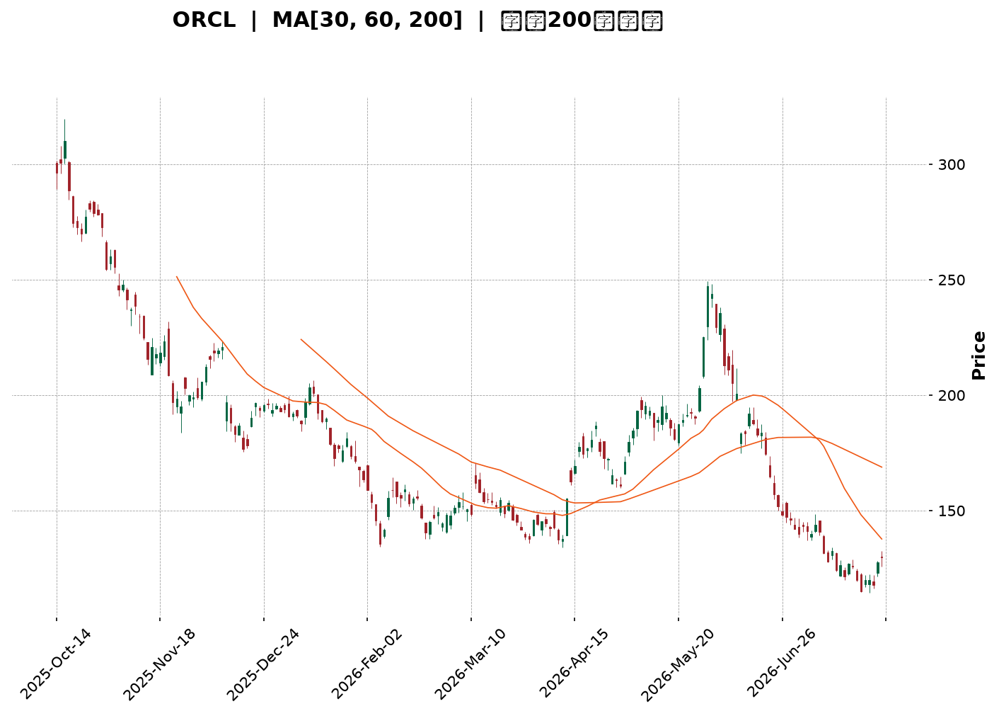
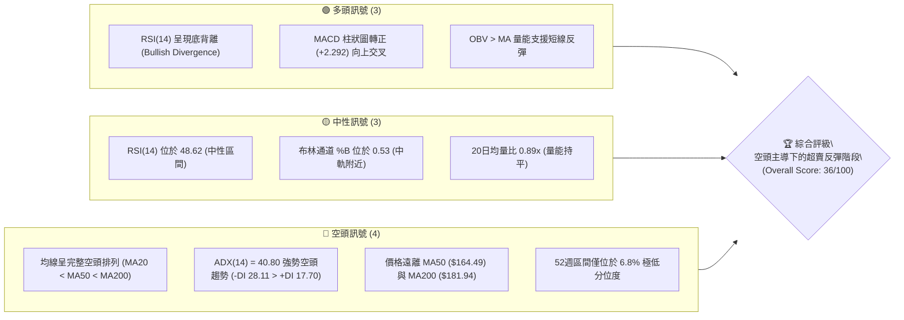
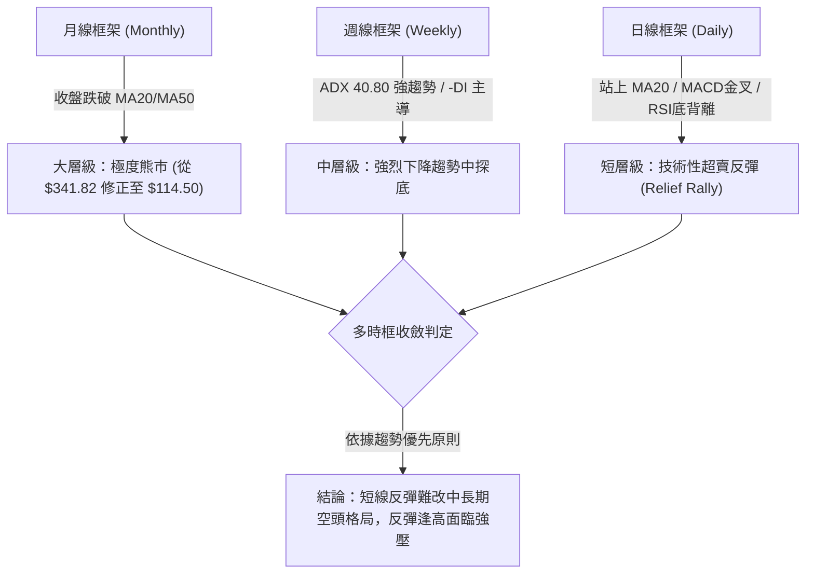
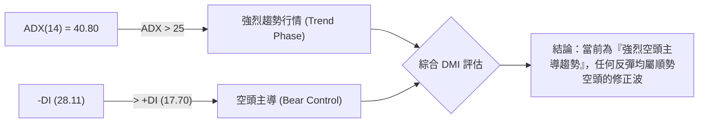
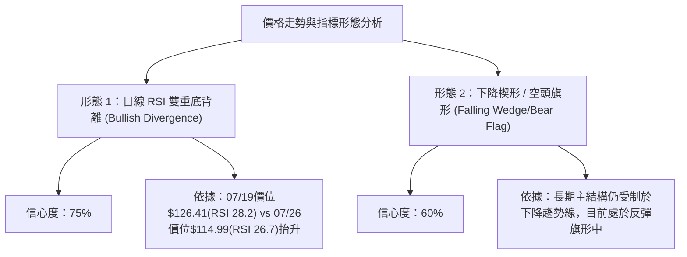
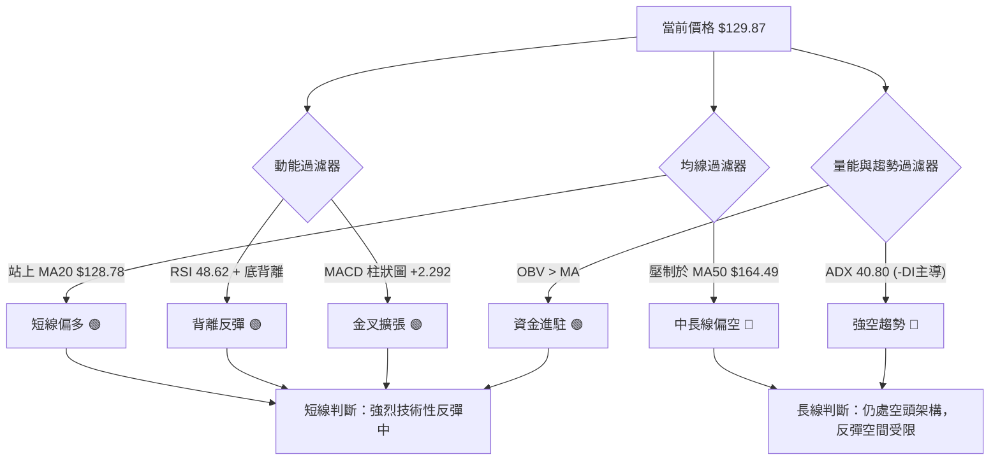
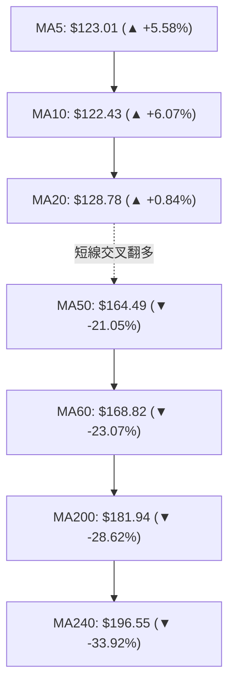
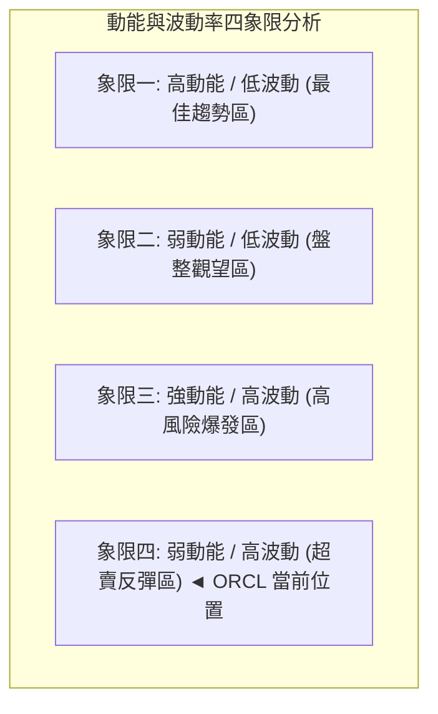
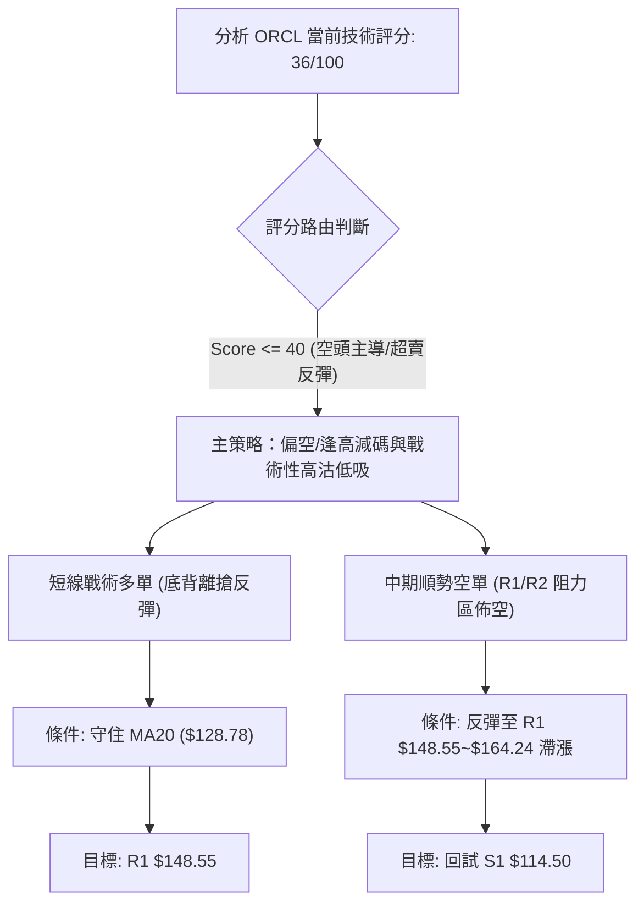
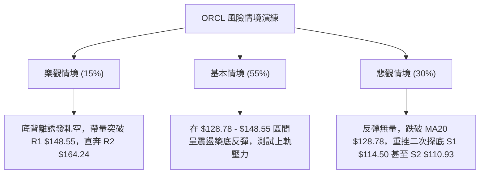

<details markdown="1">
<summary>📊 靜態圖表 (點擊展開)</summary>



</details>

<html>
<head><meta charset="utf-8" /></head>
<body>
    <div style="height:500px; width:100%;">                        <script>window.PlotlyConfig = {MathJaxConfig: 'local'};</script>
        <script charset="utf-8" src="https://cdn.plot.ly/plotly-3.7.0.min.js" integrity="sha256-jvTGqxNp8AGWEcvNLVuKr+8j5dGe9Yw51LQkmDH+IYA=" crossorigin="anonymous"></script>                <div id="candlestick-chart" class="plotly-graph-div" style="height:100%; width:100%;"></div>            <script>                window.PLOTLYENV=window.PLOTLYENV || {};                                if (document.getElementById("candlestick-chart")) {                    Plotly.newPlot(                        "candlestick-chart",                        [{"close":{"dtype":"f8","bdata":"AAAA4EuCckAAAACggstyQAAAAAAoYHNAAAAAgG4IckAAAADggihxQAAAAIBXCHFAAAAAAOLgcEAAAABgT1ZxQAAAAMD4iXFAAAAA4GJrcUAAAACAWmJxQAAAACC4CnFAAAAAYPLNb0AAAABAnkFwQAAAAGBf7G9AAAAAYJK5bkAAAADgZf1uQAAAAIARL25AAAAAAC2fbUAAAACg79BtQAAAAGCbPG1AAAAAgEkabEAAAABAuu9qQAAAAKASl2tAAAAAgE44a0AAAABARkxrQAAAAGAD7GtAAAAAgKsVakAAAACgjptoQAAAAGC7y2hAAAAA4LlkaEAAAADgD2BpQAAAAGCpAGlAAAAAoKbgaEAAAADguOVoQAAAAODat2lAAAAAoAmJakAAAAAgC\u002fBqQAAAAMDbTWtAAAAAYDxta0AAAADAJJxrQAAAAABpnmhAAAAA4PaEZ0AAAACA6ORmQAAAAMAgW2dAAAAAwCkYZkAAAABA7ElmQAAAAGBaxGdAAAAAgIOPaEAAAACgKS9oQAAAAEBOc2hAAAAAICeDaEAAAABAbjBoQAAAAGBuamhAAAAAwIghaEAAAADA4zpoQAAAAMAA2GdAAAAA4MT8Z0AAAABA7d9nQAAAAGDSemdAAAAAQJWkaEAAAADgVWhpQAAAAMBiHGlAAAAAgI0IaEAAAAAgEZFnQAAAAMB4uGdAAAAAoIJVZkAAAABAkpVlQAAAAGA3HmZAAAAAoM39ZUAAAACAl6VmQAAAAAD8tWVAAAAAIEBzZUAAAADAz\u002fpkQAAAAOAIbmRAAAAA4GXeY0AAAABAHTNjQAAAAMDjNGJAAAAAQBLxYEAAAABgi7phQAAAAMAgcGNAAAAA4P7YY0AAAADgPYJjQAAAAOChbGNAAAAAwPDgY0AAAACg3hxjQAAAACDIYmNAAAAAAIpuY0AAAABgsmFiQAAAACCPimFAAAAAIAwkYkAAAACgqFtiQAAAAMCPqGJAAAAAAIgMYkAAAACA4IZiQAAAACBAf2JAAAAAQAbqYkAAAABg7TZjQAAAACDG\u002fGJAAAAAwEjQYkAAAADApItiQAAAAICjP2RAAAAAYMzBY0AAAADAGEFjQAAAAABtXGNAAAAAAMAzY0AAAADg3fpiQAAAAEAgTmNAAAAAoIqUYkAAAACgoChjQAAAAIA8QmJAAAAAADwgYkAAAADgObphQAAAACAgVmFAAAAA4Ms6YUAAAABA30JiQAAAACAhB2JAAAAAoKwrYkAAAADg+hBiQAAAAKCqxWFAAAAA4DzVYUAAAADAOSxhQAAAAGCPM2FAAAAAQJNiY0AAAACg6k1kQAAAAMAUJ2VAAAAAQBg3ZkAAAACgf85lQAAAAADcHmZAAAAAQFeRZkAAAADgMltnQAAAAEBn9WVAAAAAgLyVZUAAAAAgiItlQAAAAABPrGRAAAAAgGJoZEAAAABAkxpkQAAAAEB\u002fZ2VAAAAAQEd1ZkAAAAAgoxZnQAAAACBvK2hAAAAAwEo9aEAAAABAqWhoQAAAAABgJWhAAAAAQNVFZ0AAAACARKNnQAAAAKDRXWhAAAAAYP4IaEAAAABA0T5nQAAAAMCWmmZAAAAA4D5wZ0AAAABAlqNnQAAAACBA7WdAAAAAYIAMaEAAAAAAiclnQAAAACDNX2lAAAAAYOkfbEAAAAAgReluQAAAACBtd25AAAAAwAGxbEAAAAAAqXBtQAAAAMANnmpAAAAAoL1iakAAAABgFqNpQAAAAOD9EWlAAAAAoMbuZkAAAACAu+9mQAAAAMAb\u002f2dAAAAAoKp1Z0AAAABgmdxmQAAAAKDV9GZAAAAAYNHOZUAAAAAAzJJkQAAAAMB7n2NAAAAAYM79YkAAAABge4BiQAAAAGDtZ2JAAAAAgFdBYkAAAADgMMBhQAAAACAUeWFAAAAAAF\u002foYUAAAACgfaNhQAAAACAYgGFAAAAAQAr3YUAAAADgepRhQAAAAKBHcWBAAAAAACn8X0AAAAAgro9gQAAAAKBwDV9AAAAAgD2aX0AAAADgUVheQAAAAEAzw19AAAAAgMJ1X0AAAABgjwJeQAAAACBcv1xAAAAAoJn5XUAAAACgcP1dQAAAACBcb11AAAAAANfjX0AAAAAA1ztgQA=="},"high":{"dtype":"f8","bdata":"\u002fUgGKTDYckBnMMHynkBzQF71pJBW93NAMSiQGPjVckBm1gq0oOdxQCIA2Fn0WXFAtUaoONQocUCRUwCvU4ZxQKnFiVQkx3FAWbGMXSHEcUDzSObSuatxQNM66pHfbnFAm6cCE+2ycEBGW5RHVHRwQCpeyYNRcXBAXErZDuuab0CUSxCPoz9vQOZu6+8Y1m5AagkkqE7DbUDWRra3GJxuQKYIn0LPZW1A6el9WIZRbUCrisl\u002fSeBrQEAJD00wHGxA\u002fwkK6XyVa0BzpQNIA7JrQBt8XlQNP2xAi1Mdt3b4bEAw+knaPMppQPMCZRPuO2lAT\u002fmynCiwaEBjIuAPzf9pQCzkVroFDWlAxBuQxskxaUDcCc\u002fzSvZpQAt3UIHgvWlAp6dFekSrakBqjLB85SxrQCXWVqRK02tAmybaUciPa0AbjvKWW+VrQJo7fSLuAWlAA4EkLLd+aEALHl4qRWVnQOccrp+Tf2dAFGhLJvwWZ0CdTD8y1t9mQBia\u002fJkwKGhAboleQdOcaEDwCO8uHWpoQGp+hAxYjGhA5XMGvZXOaEAAqMIqopNoQMTjE2+Dj2hACcr1Jx1qaECowVE7K5ZoQDW\u002fddBr+GhAReJ5cJUgaEDYw98knzloQG4lXkIGpGdASFyvkFXZaEDuyb2KWaVpQJ2JgLR7y2lAI6FcZAAJaUASST2XCjVoQCw8fS9C0WdAnFgBdok8Z0DZg2a2HmtmQLa18CEjXWZAlj7IKO5MZkAiMkdyywBnQBBkF6gnT2ZACo18fXCNZkDIntmvlCFlQNVSB9BQ92RAKlD+12dAZUAq5zYIyshjQCx8s5bqG2NAfVnToxMxYkAj1VGpnsZhQMHXtveL1GNAS77NZcaHZECieaWVzFBkQHFkbu77vWNAK7dQyJQlZEDXfJdxnMVjQCniCe2whmNAxDX6oAjfY0D8MtBagR1jQIUguic+GWJAfeCa5r83YkBYl4VF8QZjQC1fn9Mn7mJAOrO1\u002fSMiYkCcQS3bHKRiQKjeJqtDvGJAZ7Th7G0RY0APjv9IB5tjQJapwUzAwmNASqJrQETeYkDXn6GTRSJjQGnkhYAzUmVAmpswblDVZEAuUibv9fRjQOgEIYBztGNAJPG4zSu6Y0ANrffEpTxjQHu5J3ademNAFz62TP0FY0CURCpQY1ZjQP2sBxmlGmNAJ3VGWaCZYkAAcGKviC5iQC+k\u002fIqilmFAogO3RRCHYUBnIz5mFkxiQEDcmqKWk2JAEO1gt5QtYkBexgvdoXBiQGdQ4fUn8mFApqgZWhvNYkAnPNLywclhQExtGK3jdWFAkD10w9JrY0AVsbmbARplQGNfy6XGfmVA38urD6R0ZkBmcQsFiPtmQPTCWmOZJGZAHS6UcVEWZ0CamX6pxZBnQOFz2AtNqGZAPFDLG6yCZkC9D1SeWJ5lQKDntC6vA2VAVoBulgqGZEC7QlY8b5NkQGBQillDtmVAhy9VdaTbZkBQvViF8jtnQGk0rZ25M2hAXiiKV5juaECk7ESnCKpoQIrZBP4MYGhAiKoDigkIaEA5GwS4\u002fNxnQOezvQd0AGlAF9wFqvd3aEDWWQYjKMNnQJb0SW8agmdA83bIqyhyZ0BuwpxA2QRoQGB8egQlimhAF5u4eL5QaECAU878Ke9nQMsPLtRBiWlAjcgBxCwwbEBY\u002fsG7PCxvQJSlBThgBG9AM+6EIKP1bUA\u002f67P\u002f48NtQK55jlhn1GxASJW9AJ5Ja0DyEZiriXdrQKOpBHfJd2pAVFGsOCQEZ0D07IWx+B1nQN1VvUKSVGhAOlssOpJUaEBQZvf5+rBnQLdclgrTamdA5TiiKBX+ZkBDz4QvOLdlQH9dU4ucpWRAZcSkc1qiY0AoBkb2PiBjQFaQGxTcPmNA5QWBYSCtYkAI41ITO2FiQHSmBOmaUWJAMOi\u002fTK8jYkD0c\u002fRnxSFiQOX\u002f0egkq2FAcxQ1wbORYkAAAACAwjViQAAAAMDMdGFAAAAA4FGYYEAAAADAzLxgQAAAAMD1eGBAAAAAgBQOYEAAAAAgXF9fQAAAAEDh2l9AAAAAQOEaYEAAAADAzCxfQAAAAMAexV5AAAAAIFx\u002fXkAAAADAHpVeQAAAAEDhel5AAAAAQOEKYEAAAADAzIxgQA=="},"hovertemplate":"\u003cb\u003e%{x|%Y-%m-%d}\u003c\u002fb\u003e\u003cbr\u003e\u958b: $%{open:.2f}\u003cbr\u003e\u9ad8: $%{high:.2f}\u003cbr\u003e\u4f4e: $%{low:.2f}\u003cbr\u003e\u6536: $%{close:.2f}\u003cextra\u003e\u003c\u002fextra\u003e","low":{"dtype":"f8","bdata":"qmu6sgwTckAwL+xpB4FyQAPlCFLLwnJAmVrI1g3McUAaFNKM4ApxQMTGdzaL2nBAThiRD9iqcECwgEqmmtxwQF5DsmLbeHFAdhrmdzBScUDrRtsYwl1xQCHpkpAfzHBAoHem3Zy6b0B2MXp\u002fPchvQPyTJExVmW9As+RVeB9bbkDILY7ScJVuQMfyp3UgoG1AsdVxKSvEbEBaGGkDxFltQNez+KyBVmxADhDYLEwAbEDSMvPpPqVqQLb216Y0GGpA5hiUZgWwakDDWmbpbI5qQIuM0G9852pA++mnJU8JakAE9tkdbvZnQMjpHUIzDmhARdJpTmn7ZkCT+iV\u002f2glpQMuYFMgbd2hA2ztSVERaaEA71Iq228JoQIS0AWvXr2hASuZunyqLaUCCrAmriHJqQDV+\u002fvbO2mpAmVz2uToGa0CNksY1C\u002fBqQG6QZIhtDmdAr1W9A4EGZ0BMVSEbWHVmQAP39LBH12ZAzb22qBvsZUDC+cZa9xtmQDB\u002fu25USmdAc1\u002fhOZzfZ0AnxQxmU8tnQPDkdwMBEmhAYB7OQZFHaEDqmuuPltlnQG\u002fzgsTjOmhAsPx1NtQbaECLzYskWQtoQHIjBDnDz2dAIQR68hmcZ0ArmVa9TcVnQPgAsUrkC2dAMDo+fRBvZ0AOoMgCmXRoQBvHInuW6GhAtDbT85KvZ0D0jYHicoJnQFDg0lGQJ2dA+PHW8LZDZkBIAjvZVi1lQEWpeVLU6GVAijDACNRZZUCfwsrjVilmQDE2IhA3j2VAuyPQB2FVZUAbqDFJywxkQKR6h8FzQ2RA1hCgyH3cY0AfLcu\u002fFttiQBm1XeO07WFAzfhMAfzJYEBB7TzESj5hQN2YhlhgP2JAWsf71uJ7Y0COyzyo0h1jQFWZjt4n7mJAYhjRC9FGY0B\u002f6UZNO\u002fpiQPLV9zM\u002fymJAxcL3\u002fhFWY0D50aMTxUtiQMbhr2gfNGFAdA1RXZI4YUDKWXs\u002fLkpiQMUpaCmWBGJAnVZC\u002fKmjYUB4RW59bYZhQCNbV3vawWFAGF\u002f7RxyCYkDkhlUShqJiQDFJmeEw0mJA8NPvNEMtYkDwIhpZdG1iQBjdoy7s7mNAophU\u002f1GwY0DWuqLqliJjQOPF05IHLmNApxe9G+8NY0A0SjOcid9iQCnvXuxve2JAkXiXyZBdYkAhPK37RbViQElXgCKcOmJAEGe8DBzzYUB07w1XpbFhQJM7U0ToKmFAGNYVuwEAYUDthLzXKVxhQClLuXBV9WFAaR5CrXZqYUCGovGDRtthQNg28wEGX2FAVTzXDRa9YUDYTHhz6fBgQHZegZhPw2BASI0IE4pnYUChHsoF\u002fx9kQF+LKt5HtGRAkJ2BkFGmZUBzRRWISZhlQI5uLxcSnWVA6eFcDMvsZUAt8qj7UcVmQF2tVFs\u002fr2VA4IECnN8GZUDicrU1LOpkQPp99UufL2RAS\u002fVwMPoCZEClV9vaxfhjQABXOfFdsmRAOuWxwfy0ZUA3lLQ4JExmQMWHV6IswWZAy1Z8w27EZ0BO7hxFnrFnQHMG2wQOvmdAgsLhJMaHZkCQ4hGcYw1nQIRvoW3TGWdAayZTxteHZ0CNGc3bTtRmQDXIiO2viWZAGoidlMNFZkCKb4a9oVFnQO9\u002fMdX\u002fzWdALZy7YMe8Z0Czm4eWl2hnQIMgrdi0FmhAIGqILz7paUAAGdh1SPprQFJ+NAViwG1AbvZCwERabEAzyk03JudrQJ3W98IpF2pAT+flN1YTakCoydhFVqNoQNUwsfnFr2hAcII\u002fn4PVZUDYh6syJExmQFFf5N0PMmdApBZRB01gZ0BOVgX7Tb5mQFWUaYmvImZAMU9mp3O5ZUBz7+r+QYFkQNl08Sn3WWNA0v5cxNa6YkAzX2qtlG9iQA2wuJRKFmJACB4pylT\u002fYUAAAADgMMBhQBLjm4UoS2FAWz5lt3WVYUDL2H4GVyJhQHBjcR9XImFAy7PJp3GOYUAAAADgUWhhQAAAAEAza2BAAAAAYGbmX0AAAABA4RpgQAAAAIA96l5AAAAAAABgXkAAAACA6wFeQAAAAKBwjV5AAAAAwMwsX0AAAAAAKdxdQAAAAAAAsFxAAAAAQDMzXUAAAAAAAKBcQAAAAMDMDF1AAAAAwB5lXkAAAADAzGxfQA=="},"name":"\u50f9\u683c","open":{"dtype":"f8","bdata":"1pL1y7fKckDDxKZpy99yQNTlrzHj6nJAZCHY9ZHNckA6betMCONxQO2EO8w\u002fN3FAgk5B2hwDcUDbDo34ouVwQMZhkiYEs3FAP\u002fYH8VC9cUDvx+D1vYRxQK6bvHRWbHFAIo8K\u002fcKicEDMV0sOfhBwQAqngOJLa3BAxxagOPDybkDKdLfzVLFuQG1JeF9Ism5AbcL7eO+WbUAvhwHtNXNuQICuLH0kP21AjVvIck5PbUCph6st5tprQHXgynQbGmpAomai4QIEa0BdpYR1n8RqQDeii3rzHmtAwMOSunOebEDGEy39QKNpQCPvLWhWX2hAIJYRXzoHaECVjVwx9O9pQEx0l9VTs2hAyOdtj7TSaEB3PAdTxGVpQHHJXEJRzWhAKKTSufm7aUDyWTqeDB1rQDb6W\u002fuHZ2tADBeZxLE9a0DHfiYyy3VrQKs2SNeQmWdAe7UnwM5PaEC37UvCt09nQOd\u002fzIHv3WZABwQrTuGxZkBpGaM5Lp9mQBHlNC3jUmdAqRRuFhJeaEAOR\u002fORtVFoQMLpJ\u002f9iJGhAHmG2BV+FaEDdO696wwloQCs4cYD7RWhAqXQ+c2RRaEC7uXTiq3JoQC+LK74+jmhAeoKRgQ3XZ0D\u002fO7sZ5S1oQE2hqVzOoWdAIq2u3ZXKZ0AgzHndWIdoQDJWuCiBcmlAI6FcZAAJaUASST2XCjVoQOAEIUr5kmdAnFgBdok8Z0BgC1Y74k1mQOe\u002fIkQIRGZA3rRXz4dtZUCZ7oABdDtmQO09lQRQPmZAW27ZrZ62ZUD8JW3bCR9lQLXybCke4GRA9H5kAII3ZUAkW\u002f2JMqVjQH0y9s1TGmNA3svEPOMSYkA+2BVL\u002fFhhQIHWUtG5bmJAO3EbwH3cY0CieaWVzFBkQK+9st61mmNA3BJlcKjEY0CCGUetTJxjQOoeoD3aKmNAsM0O8jGDY0D1BHQOlAdjQHyunUe\u002fFWJAparVnJ97YUB\u002fcoJYBIRiQAypnztCeGJAbjJKmzrcYUAbvdv9aJRhQHduPEbg92FAh2zCNAefYkBYQKT9A\u002fFiQN335aWA+2JADGc1fPS0YkAKXcM+vxFjQNu+KUk8p2RA+Kkj55NwZEC1omFnTb5jQDEmECNJX2NAJKPIY5VLY0AIsMt3wQpjQLBpzzlUrWJAgHqHSaL\u002fYkCVJljl1ctiQAKV2noL\u002fmJAi9g+4T2GYkCaEgHki9xhQCrG1bh7fmFAr6QubTNiYUAeYNWmdmphQGgnVPPKgWJAJ5OA50W5YUDMm2bNW01iQH6N+xcN2WFAHqGWgT6oYkCXGUa9n7ZhQPBSTH4BG2FAPsJ6RyJpYUB1UqAbIetkQF2cMg73yWRACEaNJ975ZUAYygQcd8lmQG10Wv5NBmZAR2gO92k3ZkA83zTdGjFnQCwOGj3JeGZA7O39SUt8ZkCpWuTqaX9lQCkUMUwhM2RAXI0+yRRvZEBhrXZbqi5kQN2WHyb6umRA2T5fxRztZUCF1IRT9K9mQM1rCCG+MWdA3OUydHy9aECB7dn1Mf1nQI1ObX9772dAiKoDigkIaEDLl4wb\u002fYtnQEtG1wTicGdAhBfX\u002fYu6Z0DmcqXY66pnQIsgZ29dK2dAcCgpFB5qZkALYLzVWYtnQKHk\u002fAQt4GdAl2P+ricUaECABmX7HdpnQLTPJ7rAK2hAJ+yLMdAIakCY7YWlbbZsQDN5ou2pPm5AUn2hOq70bUANHnkD0UZsQJHwXlo4lmxAVBc+tdcfa0CV7X6UY6VqQNXdBWP6uWhAj3gR0YFhZkAFf95hywtnQHzAo9qwV2dALfhfaT2rZ0AXdFyudzBnQBkjZToEzGZAIUPtwLG1ZkAW+4JheTRlQGnzWYpVPWRA9SCiXr6ZY0DGSN9dprdiQAVqoHsALWNAnSid\u002fqlXYkCUzGp7pv9hQO98PtKz2WFAS4\u002fVaZf5YUAnQBRqGOdhQOK68hx+UmFAhMHlJcCdYUAAAADAzDRiQAAAAMD1YGFAAAAAAACAYEAAAACA61FgQAAAACBcb2BAAAAAwMxsXkAAAACgRxFfQAAAAADXs15AAAAAIIWLX0AAAACgcP1eQAAAAIAUnl5AAAAAAACAXUAAAAAghYtdQAAAAEDh2l1AAAAAIK63XkAAAACAPUJgQA=="},"x":["2025-10-14T00:00:00-04:00","2025-10-15T00:00:00-04:00","2025-10-16T00:00:00-04:00","2025-10-17T00:00:00-04:00","2025-10-20T00:00:00-04:00","2025-10-21T00:00:00-04:00","2025-10-22T00:00:00-04:00","2025-10-23T00:00:00-04:00","2025-10-24T00:00:00-04:00","2025-10-27T00:00:00-04:00","2025-10-28T00:00:00-04:00","2025-10-29T00:00:00-04:00","2025-10-30T00:00:00-04:00","2025-10-31T00:00:00-04:00","2025-11-03T00:00:00-05:00","2025-11-04T00:00:00-05:00","2025-11-05T00:00:00-05:00","2025-11-06T00:00:00-05:00","2025-11-07T00:00:00-05:00","2025-11-10T00:00:00-05:00","2025-11-11T00:00:00-05:00","2025-11-12T00:00:00-05:00","2025-11-13T00:00:00-05:00","2025-11-14T00:00:00-05:00","2025-11-17T00:00:00-05:00","2025-11-18T00:00:00-05:00","2025-11-19T00:00:00-05:00","2025-11-20T00:00:00-05:00","2025-11-21T00:00:00-05:00","2025-11-24T00:00:00-05:00","2025-11-25T00:00:00-05:00","2025-11-26T00:00:00-05:00","2025-11-28T00:00:00-05:00","2025-12-01T00:00:00-05:00","2025-12-02T00:00:00-05:00","2025-12-03T00:00:00-05:00","2025-12-04T00:00:00-05:00","2025-12-05T00:00:00-05:00","2025-12-08T00:00:00-05:00","2025-12-09T00:00:00-05:00","2025-12-10T00:00:00-05:00","2025-12-11T00:00:00-05:00","2025-12-12T00:00:00-05:00","2025-12-15T00:00:00-05:00","2025-12-16T00:00:00-05:00","2025-12-17T00:00:00-05:00","2025-12-18T00:00:00-05:00","2025-12-19T00:00:00-05:00","2025-12-22T00:00:00-05:00","2025-12-23T00:00:00-05:00","2025-12-24T00:00:00-05:00","2025-12-26T00:00:00-05:00","2025-12-29T00:00:00-05:00","2025-12-30T00:00:00-05:00","2025-12-31T00:00:00-05:00","2026-01-02T00:00:00-05:00","2026-01-05T00:00:00-05:00","2026-01-06T00:00:00-05:00","2026-01-07T00:00:00-05:00","2026-01-08T00:00:00-05:00","2026-01-09T00:00:00-05:00","2026-01-12T00:00:00-05:00","2026-01-13T00:00:00-05:00","2026-01-14T00:00:00-05:00","2026-01-15T00:00:00-05:00","2026-01-16T00:00:00-05:00","2026-01-20T00:00:00-05:00","2026-01-21T00:00:00-05:00","2026-01-22T00:00:00-05:00","2026-01-23T00:00:00-05:00","2026-01-26T00:00:00-05:00","2026-01-27T00:00:00-05:00","2026-01-28T00:00:00-05:00","2026-01-29T00:00:00-05:00","2026-01-30T00:00:00-05:00","2026-02-02T00:00:00-05:00","2026-02-03T00:00:00-05:00","2026-02-04T00:00:00-05:00","2026-02-05T00:00:00-05:00","2026-02-06T00:00:00-05:00","2026-02-09T00:00:00-05:00","2026-02-10T00:00:00-05:00","2026-02-11T00:00:00-05:00","2026-02-12T00:00:00-05:00","2026-02-13T00:00:00-05:00","2026-02-17T00:00:00-05:00","2026-02-18T00:00:00-05:00","2026-02-19T00:00:00-05:00","2026-02-20T00:00:00-05:00","2026-02-23T00:00:00-05:00","2026-02-24T00:00:00-05:00","2026-02-25T00:00:00-05:00","2026-02-26T00:00:00-05:00","2026-02-27T00:00:00-05:00","2026-03-02T00:00:00-05:00","2026-03-03T00:00:00-05:00","2026-03-04T00:00:00-05:00","2026-03-05T00:00:00-05:00","2026-03-06T00:00:00-05:00","2026-03-09T00:00:00-04:00","2026-03-10T00:00:00-04:00","2026-03-11T00:00:00-04:00","2026-03-12T00:00:00-04:00","2026-03-13T00:00:00-04:00","2026-03-16T00:00:00-04:00","2026-03-17T00:00:00-04:00","2026-03-18T00:00:00-04:00","2026-03-19T00:00:00-04:00","2026-03-20T00:00:00-04:00","2026-03-23T00:00:00-04:00","2026-03-24T00:00:00-04:00","2026-03-25T00:00:00-04:00","2026-03-26T00:00:00-04:00","2026-03-27T00:00:00-04:00","2026-03-30T00:00:00-04:00","2026-03-31T00:00:00-04:00","2026-04-01T00:00:00-04:00","2026-04-02T00:00:00-04:00","2026-04-06T00:00:00-04:00","2026-04-07T00:00:00-04:00","2026-04-08T00:00:00-04:00","2026-04-09T00:00:00-04:00","2026-04-10T00:00:00-04:00","2026-04-13T00:00:00-04:00","2026-04-14T00:00:00-04:00","2026-04-15T00:00:00-04:00","2026-04-16T00:00:00-04:00","2026-04-17T00:00:00-04:00","2026-04-20T00:00:00-04:00","2026-04-21T00:00:00-04:00","2026-04-22T00:00:00-04:00","2026-04-23T00:00:00-04:00","2026-04-24T00:00:00-04:00","2026-04-27T00:00:00-04:00","2026-04-28T00:00:00-04:00","2026-04-29T00:00:00-04:00","2026-04-30T00:00:00-04:00","2026-05-01T00:00:00-04:00","2026-05-04T00:00:00-04:00","2026-05-05T00:00:00-04:00","2026-05-06T00:00:00-04:00","2026-05-07T00:00:00-04:00","2026-05-08T00:00:00-04:00","2026-05-11T00:00:00-04:00","2026-05-12T00:00:00-04:00","2026-05-13T00:00:00-04:00","2026-05-14T00:00:00-04:00","2026-05-15T00:00:00-04:00","2026-05-18T00:00:00-04:00","2026-05-19T00:00:00-04:00","2026-05-20T00:00:00-04:00","2026-05-21T00:00:00-04:00","2026-05-22T00:00:00-04:00","2026-05-26T00:00:00-04:00","2026-05-27T00:00:00-04:00","2026-05-28T00:00:00-04:00","2026-05-29T00:00:00-04:00","2026-06-01T00:00:00-04:00","2026-06-02T00:00:00-04:00","2026-06-03T00:00:00-04:00","2026-06-04T00:00:00-04:00","2026-06-05T00:00:00-04:00","2026-06-08T00:00:00-04:00","2026-06-09T00:00:00-04:00","2026-06-10T00:00:00-04:00","2026-06-11T00:00:00-04:00","2026-06-12T00:00:00-04:00","2026-06-15T00:00:00-04:00","2026-06-16T00:00:00-04:00","2026-06-17T00:00:00-04:00","2026-06-18T00:00:00-04:00","2026-06-22T00:00:00-04:00","2026-06-23T00:00:00-04:00","2026-06-24T00:00:00-04:00","2026-06-25T00:00:00-04:00","2026-06-26T00:00:00-04:00","2026-06-29T00:00:00-04:00","2026-06-30T00:00:00-04:00","2026-07-01T00:00:00-04:00","2026-07-02T00:00:00-04:00","2026-07-06T00:00:00-04:00","2026-07-07T00:00:00-04:00","2026-07-08T00:00:00-04:00","2026-07-09T00:00:00-04:00","2026-07-10T00:00:00-04:00","2026-07-13T00:00:00-04:00","2026-07-14T00:00:00-04:00","2026-07-15T00:00:00-04:00","2026-07-16T00:00:00-04:00","2026-07-17T00:00:00-04:00","2026-07-20T00:00:00-04:00","2026-07-21T00:00:00-04:00","2026-07-22T00:00:00-04:00","2026-07-23T00:00:00-04:00","2026-07-24T00:00:00-04:00","2026-07-27T00:00:00-04:00","2026-07-28T00:00:00-04:00","2026-07-29T00:00:00-04:00","2026-07-30T00:00:00-04:00","2026-07-31T00:00:00-04:00"],"type":"candlestick"},{"hovertemplate":"MA30: $%{y:.2f}\u003cextra\u003e\u003c\u002fextra\u003e","line":{"color":"#2196F3","dash":"dash","width":2},"mode":"lines","name":"MA30","x":["2025-10-14T00:00:00-04:00","2025-10-15T00:00:00-04:00","2025-10-16T00:00:00-04:00","2025-10-17T00:00:00-04:00","2025-10-20T00:00:00-04:00","2025-10-21T00:00:00-04:00","2025-10-22T00:00:00-04:00","2025-10-23T00:00:00-04:00","2025-10-24T00:00:00-04:00","2025-10-27T00:00:00-04:00","2025-10-28T00:00:00-04:00","2025-10-29T00:00:00-04:00","2025-10-30T00:00:00-04:00","2025-10-31T00:00:00-04:00","2025-11-03T00:00:00-05:00","2025-11-04T00:00:00-05:00","2025-11-05T00:00:00-05:00","2025-11-06T00:00:00-05:00","2025-11-07T00:00:00-05:00","2025-11-10T00:00:00-05:00","2025-11-11T00:00:00-05:00","2025-11-12T00:00:00-05:00","2025-11-13T00:00:00-05:00","2025-11-14T00:00:00-05:00","2025-11-17T00:00:00-05:00","2025-11-18T00:00:00-05:00","2025-11-19T00:00:00-05:00","2025-11-20T00:00:00-05:00","2025-11-21T00:00:00-05:00","2025-11-24T00:00:00-05:00","2025-11-25T00:00:00-05:00","2025-11-26T00:00:00-05:00","2025-11-28T00:00:00-05:00","2025-12-01T00:00:00-05:00","2025-12-02T00:00:00-05:00","2025-12-03T00:00:00-05:00","2025-12-04T00:00:00-05:00","2025-12-05T00:00:00-05:00","2025-12-08T00:00:00-05:00","2025-12-09T00:00:00-05:00","2025-12-10T00:00:00-05:00","2025-12-11T00:00:00-05:00","2025-12-12T00:00:00-05:00","2025-12-15T00:00:00-05:00","2025-12-16T00:00:00-05:00","2025-12-17T00:00:00-05:00","2025-12-18T00:00:00-05:00","2025-12-19T00:00:00-05:00","2025-12-22T00:00:00-05:00","2025-12-23T00:00:00-05:00","2025-12-24T00:00:00-05:00","2025-12-26T00:00:00-05:00","2025-12-29T00:00:00-05:00","2025-12-30T00:00:00-05:00","2025-12-31T00:00:00-05:00","2026-01-02T00:00:00-05:00","2026-01-05T00:00:00-05:00","2026-01-06T00:00:00-05:00","2026-01-07T00:00:00-05:00","2026-01-08T00:00:00-05:00","2026-01-09T00:00:00-05:00","2026-01-12T00:00:00-05:00","2026-01-13T00:00:00-05:00","2026-01-14T00:00:00-05:00","2026-01-15T00:00:00-05:00","2026-01-16T00:00:00-05:00","2026-01-20T00:00:00-05:00","2026-01-21T00:00:00-05:00","2026-01-22T00:00:00-05:00","2026-01-23T00:00:00-05:00","2026-01-26T00:00:00-05:00","2026-01-27T00:00:00-05:00","2026-01-28T00:00:00-05:00","2026-01-29T00:00:00-05:00","2026-01-30T00:00:00-05:00","2026-02-02T00:00:00-05:00","2026-02-03T00:00:00-05:00","2026-02-04T00:00:00-05:00","2026-02-05T00:00:00-05:00","2026-02-06T00:00:00-05:00","2026-02-09T00:00:00-05:00","2026-02-10T00:00:00-05:00","2026-02-11T00:00:00-05:00","2026-02-12T00:00:00-05:00","2026-02-13T00:00:00-05:00","2026-02-17T00:00:00-05:00","2026-02-18T00:00:00-05:00","2026-02-19T00:00:00-05:00","2026-02-20T00:00:00-05:00","2026-02-23T00:00:00-05:00","2026-02-24T00:00:00-05:00","2026-02-25T00:00:00-05:00","2026-02-26T00:00:00-05:00","2026-02-27T00:00:00-05:00","2026-03-02T00:00:00-05:00","2026-03-03T00:00:00-05:00","2026-03-04T00:00:00-05:00","2026-03-05T00:00:00-05:00","2026-03-06T00:00:00-05:00","2026-03-09T00:00:00-04:00","2026-03-10T00:00:00-04:00","2026-03-11T00:00:00-04:00","2026-03-12T00:00:00-04:00","2026-03-13T00:00:00-04:00","2026-03-16T00:00:00-04:00","2026-03-17T00:00:00-04:00","2026-03-18T00:00:00-04:00","2026-03-19T00:00:00-04:00","2026-03-20T00:00:00-04:00","2026-03-23T00:00:00-04:00","2026-03-24T00:00:00-04:00","2026-03-25T00:00:00-04:00","2026-03-26T00:00:00-04:00","2026-03-27T00:00:00-04:00","2026-03-30T00:00:00-04:00","2026-03-31T00:00:00-04:00","2026-04-01T00:00:00-04:00","2026-04-02T00:00:00-04:00","2026-04-06T00:00:00-04:00","2026-04-07T00:00:00-04:00","2026-04-08T00:00:00-04:00","2026-04-09T00:00:00-04:00","2026-04-10T00:00:00-04:00","2026-04-13T00:00:00-04:00","2026-04-14T00:00:00-04:00","2026-04-15T00:00:00-04:00","2026-04-16T00:00:00-04:00","2026-04-17T00:00:00-04:00","2026-04-20T00:00:00-04:00","2026-04-21T00:00:00-04:00","2026-04-22T00:00:00-04:00","2026-04-23T00:00:00-04:00","2026-04-24T00:00:00-04:00","2026-04-27T00:00:00-04:00","2026-04-28T00:00:00-04:00","2026-04-29T00:00:00-04:00","2026-04-30T00:00:00-04:00","2026-05-01T00:00:00-04:00","2026-05-04T00:00:00-04:00","2026-05-05T00:00:00-04:00","2026-05-06T00:00:00-04:00","2026-05-07T00:00:00-04:00","2026-05-08T00:00:00-04:00","2026-05-11T00:00:00-04:00","2026-05-12T00:00:00-04:00","2026-05-13T00:00:00-04:00","2026-05-14T00:00:00-04:00","2026-05-15T00:00:00-04:00","2026-05-18T00:00:00-04:00","2026-05-19T00:00:00-04:00","2026-05-20T00:00:00-04:00","2026-05-21T00:00:00-04:00","2026-05-22T00:00:00-04:00","2026-05-26T00:00:00-04:00","2026-05-27T00:00:00-04:00","2026-05-28T00:00:00-04:00","2026-05-29T00:00:00-04:00","2026-06-01T00:00:00-04:00","2026-06-02T00:00:00-04:00","2026-06-03T00:00:00-04:00","2026-06-04T00:00:00-04:00","2026-06-05T00:00:00-04:00","2026-06-08T00:00:00-04:00","2026-06-09T00:00:00-04:00","2026-06-10T00:00:00-04:00","2026-06-11T00:00:00-04:00","2026-06-12T00:00:00-04:00","2026-06-15T00:00:00-04:00","2026-06-16T00:00:00-04:00","2026-06-17T00:00:00-04:00","2026-06-18T00:00:00-04:00","2026-06-22T00:00:00-04:00","2026-06-23T00:00:00-04:00","2026-06-24T00:00:00-04:00","2026-06-25T00:00:00-04:00","2026-06-26T00:00:00-04:00","2026-06-29T00:00:00-04:00","2026-06-30T00:00:00-04:00","2026-07-01T00:00:00-04:00","2026-07-02T00:00:00-04:00","2026-07-06T00:00:00-04:00","2026-07-07T00:00:00-04:00","2026-07-08T00:00:00-04:00","2026-07-09T00:00:00-04:00","2026-07-10T00:00:00-04:00","2026-07-13T00:00:00-04:00","2026-07-14T00:00:00-04:00","2026-07-15T00:00:00-04:00","2026-07-16T00:00:00-04:00","2026-07-17T00:00:00-04:00","2026-07-20T00:00:00-04:00","2026-07-21T00:00:00-04:00","2026-07-22T00:00:00-04:00","2026-07-23T00:00:00-04:00","2026-07-24T00:00:00-04:00","2026-07-27T00:00:00-04:00","2026-07-28T00:00:00-04:00","2026-07-29T00:00:00-04:00","2026-07-30T00:00:00-04:00","2026-07-31T00:00:00-04:00"],"y":{"dtype":"f8","bdata":"AAAAAAAA+H8AAAAAAAD4fwAAAAAAAPh\u002fAAAAAAAA+H8AAAAAAAD4fwAAAAAAAPh\u002fAAAAAAAA+H8AAAAAAAD4fwAAAAAAAPh\u002fAAAAAAAA+H8AAAAAAAD4fwAAAAAAAPh\u002fAAAAAAAA+H8AAAAAAAD4fwAAAAAAAPh\u002fAAAAAAAA+H8AAAAAAAD4fwAAAAAAAPh\u002fAAAAAAAA+H8AAAAAAAD4fwAAAAAAAPh\u002fAAAAAAAA+H8AAAAAAAD4fwAAAAAAAPh\u002fAAAAAAAA+H8AAAAAAAD4fwAAAAAAAPh\u002fAAAAAAAA+H8AAAAAAAD4f4mIiIifaW9AAAAA8OT9bkDv7u6OqZVuQERERDRXIG5AzczM7N3AbUDv7u5+fXBtQJqZmTlDKW1AmpmZaaPrbEDe3d19nqlsQO\u002fu7m5IZ2xA7+7uHggobEDv7u4+8uprQM3MzLwtmmtAAAAAsHpTa0AiIiLSZgFrQCIiIiJLuGpAMzMzg6VuakCamZm5ZSRqQDMzM+Oj7WlAIiIiknPCaUAAAABwZJJpQImIiIiMaWlAERERQelKaUCamZnJdzNpQO\u002fu7j5hGGlAIiIiUgX+aEDv7u5e1+NoQLy7u3sKwWhA3t3d7SSvaEARERHR46hoQJqZmdmonWhAMzMzw8mfaEDNzMxcEKBoQBEREfH8oGhAd3d358iZaECrqqr6bY5oQM3MzCxifWhAd3d3V4hZaEBVVVWl2StoQO\u002fu7m6Y\u002f2dAAAAA4DbRZ0BVVVXV3KZnQGZmZmYMjmdAzczMLGR8Z0BEREQEDmxnQBEREcEVU2dAIiIiwhdAZ0BmZmaGuyVnQDMzM6NI9mZAzczM3ES1ZkBVVVWFLn5mQM3MzLxoU2ZAiYiImJorZkDNzMwMqgNmQKuqqioS2WVAVVVV1ci0ZUDv7u7+HYllQDMzM5MTY2VA7+7uvjM8ZUCrqqrqUw1lQCIiIgKn2mRAiYiI+CqjZEAAAAAQA2dkQO\u002fu7n7zL2RA7+7uPuL8Y0AAAACg4NFjQLy7u6tNpWNAvLu72x6IY0CamZkp5nNjQAAAADAvWWNAiYiIKBE+Y0CamZmZERtjQO\u002fu7i6XDmNAREREZCQAY0B3d3cXa\u002fFiQLy7u0tM6GJAmpmZGZziYkDv7u4evOBiQBEREQEc6mJAvLu7exf4YkBERERkSwRjQAAAAEA7+mJAZmZmForrYkARERHBVtxiQBEREaGFymJAzczMzOqzYkDe3d2NpqxiQLy7u+sPoWJA7+7uzkyWYkBmZmYGnJNiQImIiGiUlWJAZmZm5vOSYkCrqqqa1ohiQImIiKhnfGJA7+7ubs6HYkAAAABw+ZZiQImIiKiirWJAzczM7M3JYkBmZmZm7N9iQM3MzNyo+mJAERER4bEaY0BmZmYmv0NjQN7d3b1WUmNAAAAA0O9hY0Dv7u4OfHVjQCIiIkKugGNAERER8feKY0De3d0Nj5RjQO\u002fu7p54pmNAmpmZ+Y\u002fHY0B3d3eXGOljQGZmZjaJG2RA7+7uXrRPZEBVVVUVuIhkQAAAANDTwmRAERERMWX2ZEDv7u5uRiRlQCIiImJdWmVAREREpGiMZUBERER0mrhlQGZmZobV4WVAzczM7KoRZkDNzMys2EhmQO\u002fu7m48gmZAq6qqmgiqZkBVVVUVwcdmQKuqqjrH62ZAmpmZmTQeZ0CamZnZ5WtnQDMzM+Mds2dA3t3dTV\u002fnZ0BERESkSRtoQM3MzOwKQ2hA3t3dbQJsaEAiIiKS7Y5oQGZmZmZztGhAVVVVRf\u002fJaEB3d3dHK+JoQImIiBhK+GhAERER8dUAaUDv7u6u5v5oQLy7uzuM9GhAREREdMzfaEARERHhEb9oQERERDR5mGhAERERcfBzaEAAAADwHEhoQO\u002fu7v4\u002fFWhAIiIiou3jZ0C8u7trCrVnQM3MzMxBiWdAvLu7qw9aZ0BmZmam2yZnQLy7u\u002fsE8GZAVVVVpRq8ZkBVVVW1IodmQO\u002fu7g7rOmZAZmZm9mPTZUDv7u7+71hlQImIiIBy2WRAAAAAeHNrZEB3d3d3s\u002fFjQO\u002fu7v4VlmNAAAAAQCg7Y0AREREpbuBiQLy7uzsnhWJAvLu7o1pBYkBERERElv1hQJqZmfFnrmFAERER+UduYUDe3d31uDVhQA=="},"type":"scatter"},{"hovertemplate":"MA60: $%{y:.2f}\u003cextra\u003e\u003c\u002fextra\u003e","line":{"color":"#9C27B0","dash":"dash","width":2},"mode":"lines","name":"MA60","x":["2025-10-14T00:00:00-04:00","2025-10-15T00:00:00-04:00","2025-10-16T00:00:00-04:00","2025-10-17T00:00:00-04:00","2025-10-20T00:00:00-04:00","2025-10-21T00:00:00-04:00","2025-10-22T00:00:00-04:00","2025-10-23T00:00:00-04:00","2025-10-24T00:00:00-04:00","2025-10-27T00:00:00-04:00","2025-10-28T00:00:00-04:00","2025-10-29T00:00:00-04:00","2025-10-30T00:00:00-04:00","2025-10-31T00:00:00-04:00","2025-11-03T00:00:00-05:00","2025-11-04T00:00:00-05:00","2025-11-05T00:00:00-05:00","2025-11-06T00:00:00-05:00","2025-11-07T00:00:00-05:00","2025-11-10T00:00:00-05:00","2025-11-11T00:00:00-05:00","2025-11-12T00:00:00-05:00","2025-11-13T00:00:00-05:00","2025-11-14T00:00:00-05:00","2025-11-17T00:00:00-05:00","2025-11-18T00:00:00-05:00","2025-11-19T00:00:00-05:00","2025-11-20T00:00:00-05:00","2025-11-21T00:00:00-05:00","2025-11-24T00:00:00-05:00","2025-11-25T00:00:00-05:00","2025-11-26T00:00:00-05:00","2025-11-28T00:00:00-05:00","2025-12-01T00:00:00-05:00","2025-12-02T00:00:00-05:00","2025-12-03T00:00:00-05:00","2025-12-04T00:00:00-05:00","2025-12-05T00:00:00-05:00","2025-12-08T00:00:00-05:00","2025-12-09T00:00:00-05:00","2025-12-10T00:00:00-05:00","2025-12-11T00:00:00-05:00","2025-12-12T00:00:00-05:00","2025-12-15T00:00:00-05:00","2025-12-16T00:00:00-05:00","2025-12-17T00:00:00-05:00","2025-12-18T00:00:00-05:00","2025-12-19T00:00:00-05:00","2025-12-22T00:00:00-05:00","2025-12-23T00:00:00-05:00","2025-12-24T00:00:00-05:00","2025-12-26T00:00:00-05:00","2025-12-29T00:00:00-05:00","2025-12-30T00:00:00-05:00","2025-12-31T00:00:00-05:00","2026-01-02T00:00:00-05:00","2026-01-05T00:00:00-05:00","2026-01-06T00:00:00-05:00","2026-01-07T00:00:00-05:00","2026-01-08T00:00:00-05:00","2026-01-09T00:00:00-05:00","2026-01-12T00:00:00-05:00","2026-01-13T00:00:00-05:00","2026-01-14T00:00:00-05:00","2026-01-15T00:00:00-05:00","2026-01-16T00:00:00-05:00","2026-01-20T00:00:00-05:00","2026-01-21T00:00:00-05:00","2026-01-22T00:00:00-05:00","2026-01-23T00:00:00-05:00","2026-01-26T00:00:00-05:00","2026-01-27T00:00:00-05:00","2026-01-28T00:00:00-05:00","2026-01-29T00:00:00-05:00","2026-01-30T00:00:00-05:00","2026-02-02T00:00:00-05:00","2026-02-03T00:00:00-05:00","2026-02-04T00:00:00-05:00","2026-02-05T00:00:00-05:00","2026-02-06T00:00:00-05:00","2026-02-09T00:00:00-05:00","2026-02-10T00:00:00-05:00","2026-02-11T00:00:00-05:00","2026-02-12T00:00:00-05:00","2026-02-13T00:00:00-05:00","2026-02-17T00:00:00-05:00","2026-02-18T00:00:00-05:00","2026-02-19T00:00:00-05:00","2026-02-20T00:00:00-05:00","2026-02-23T00:00:00-05:00","2026-02-24T00:00:00-05:00","2026-02-25T00:00:00-05:00","2026-02-26T00:00:00-05:00","2026-02-27T00:00:00-05:00","2026-03-02T00:00:00-05:00","2026-03-03T00:00:00-05:00","2026-03-04T00:00:00-05:00","2026-03-05T00:00:00-05:00","2026-03-06T00:00:00-05:00","2026-03-09T00:00:00-04:00","2026-03-10T00:00:00-04:00","2026-03-11T00:00:00-04:00","2026-03-12T00:00:00-04:00","2026-03-13T00:00:00-04:00","2026-03-16T00:00:00-04:00","2026-03-17T00:00:00-04:00","2026-03-18T00:00:00-04:00","2026-03-19T00:00:00-04:00","2026-03-20T00:00:00-04:00","2026-03-23T00:00:00-04:00","2026-03-24T00:00:00-04:00","2026-03-25T00:00:00-04:00","2026-03-26T00:00:00-04:00","2026-03-27T00:00:00-04:00","2026-03-30T00:00:00-04:00","2026-03-31T00:00:00-04:00","2026-04-01T00:00:00-04:00","2026-04-02T00:00:00-04:00","2026-04-06T00:00:00-04:00","2026-04-07T00:00:00-04:00","2026-04-08T00:00:00-04:00","2026-04-09T00:00:00-04:00","2026-04-10T00:00:00-04:00","2026-04-13T00:00:00-04:00","2026-04-14T00:00:00-04:00","2026-04-15T00:00:00-04:00","2026-04-16T00:00:00-04:00","2026-04-17T00:00:00-04:00","2026-04-20T00:00:00-04:00","2026-04-21T00:00:00-04:00","2026-04-22T00:00:00-04:00","2026-04-23T00:00:00-04:00","2026-04-24T00:00:00-04:00","2026-04-27T00:00:00-04:00","2026-04-28T00:00:00-04:00","2026-04-29T00:00:00-04:00","2026-04-30T00:00:00-04:00","2026-05-01T00:00:00-04:00","2026-05-04T00:00:00-04:00","2026-05-05T00:00:00-04:00","2026-05-06T00:00:00-04:00","2026-05-07T00:00:00-04:00","2026-05-08T00:00:00-04:00","2026-05-11T00:00:00-04:00","2026-05-12T00:00:00-04:00","2026-05-13T00:00:00-04:00","2026-05-14T00:00:00-04:00","2026-05-15T00:00:00-04:00","2026-05-18T00:00:00-04:00","2026-05-19T00:00:00-04:00","2026-05-20T00:00:00-04:00","2026-05-21T00:00:00-04:00","2026-05-22T00:00:00-04:00","2026-05-26T00:00:00-04:00","2026-05-27T00:00:00-04:00","2026-05-28T00:00:00-04:00","2026-05-29T00:00:00-04:00","2026-06-01T00:00:00-04:00","2026-06-02T00:00:00-04:00","2026-06-03T00:00:00-04:00","2026-06-04T00:00:00-04:00","2026-06-05T00:00:00-04:00","2026-06-08T00:00:00-04:00","2026-06-09T00:00:00-04:00","2026-06-10T00:00:00-04:00","2026-06-11T00:00:00-04:00","2026-06-12T00:00:00-04:00","2026-06-15T00:00:00-04:00","2026-06-16T00:00:00-04:00","2026-06-17T00:00:00-04:00","2026-06-18T00:00:00-04:00","2026-06-22T00:00:00-04:00","2026-06-23T00:00:00-04:00","2026-06-24T00:00:00-04:00","2026-06-25T00:00:00-04:00","2026-06-26T00:00:00-04:00","2026-06-29T00:00:00-04:00","2026-06-30T00:00:00-04:00","2026-07-01T00:00:00-04:00","2026-07-02T00:00:00-04:00","2026-07-06T00:00:00-04:00","2026-07-07T00:00:00-04:00","2026-07-08T00:00:00-04:00","2026-07-09T00:00:00-04:00","2026-07-10T00:00:00-04:00","2026-07-13T00:00:00-04:00","2026-07-14T00:00:00-04:00","2026-07-15T00:00:00-04:00","2026-07-16T00:00:00-04:00","2026-07-17T00:00:00-04:00","2026-07-20T00:00:00-04:00","2026-07-21T00:00:00-04:00","2026-07-22T00:00:00-04:00","2026-07-23T00:00:00-04:00","2026-07-24T00:00:00-04:00","2026-07-27T00:00:00-04:00","2026-07-28T00:00:00-04:00","2026-07-29T00:00:00-04:00","2026-07-30T00:00:00-04:00","2026-07-31T00:00:00-04:00"],"y":{"dtype":"f8","bdata":"AAAAAAAA+H8AAAAAAAD4fwAAAAAAAPh\u002fAAAAAAAA+H8AAAAAAAD4fwAAAAAAAPh\u002fAAAAAAAA+H8AAAAAAAD4fwAAAAAAAPh\u002fAAAAAAAA+H8AAAAAAAD4fwAAAAAAAPh\u002fAAAAAAAA+H8AAAAAAAD4fwAAAAAAAPh\u002fAAAAAAAA+H8AAAAAAAD4fwAAAAAAAPh\u002fAAAAAAAA+H8AAAAAAAD4fwAAAAAAAPh\u002fAAAAAAAA+H8AAAAAAAD4fwAAAAAAAPh\u002fAAAAAAAA+H8AAAAAAAD4fwAAAAAAAPh\u002fAAAAAAAA+H8AAAAAAAD4fwAAAAAAAPh\u002fAAAAAAAA+H8AAAAAAAD4fwAAAAAAAPh\u002fAAAAAAAA+H8AAAAAAAD4fwAAAAAAAPh\u002fAAAAAAAA+H8AAAAAAAD4fwAAAAAAAPh\u002fAAAAAAAA+H8AAAAAAAD4fwAAAAAAAPh\u002fAAAAAAAA+H8AAAAAAAD4fwAAAAAAAPh\u002fAAAAAAAA+H8AAAAAAAD4fwAAAAAAAPh\u002fAAAAAAAA+H8AAAAAAAD4fwAAAAAAAPh\u002fAAAAAAAA+H8AAAAAAAD4fwAAAAAAAPh\u002fAAAAAAAA+H8AAAAAAAD4fwAAAAAAAPh\u002fAAAAAAAA+H8AAAAAAAD4fxERETGkA2xAmpmZWdfOa0De3d313JprQKuqqhKqYGtAIiIialMta0DNzMy8df9qQDMzM7NS02pAiYiI4JWiakCamZkRvGpqQO\u002fu7m5wM2pAd3d3f5\u002f8aUAiIiKK58hpQJqZmREdlGlAZmZmbu9naUAzMzNrujZpQJqZmXGwBWlAq6qqol7XaEAAAACgEKVoQDMzM0P2cWhAd3d3N9w7aECrqqp6SQhoQKuqqqJ63mdAzczM7EG7Z0AzMzPrkJtnQM3MzLS5eGdAvLu7E2dZZ0Dv7u6uejZnQHd3dwcPEmdAZmZmVqz1ZkDe3d3dG9tmQN7d3e0nvGZA3t3dXXqhZkBmZma2iYNmQAAAADh4aGZAMzMzk1VLZkBVVVVNJzBmQEREROxXEWZAmpmZmdPwZUB3d3fn389lQHd3d89jrGVAREREBKSHZUB3d3c392BlQKuqqspRTmVAiYiISEQ+ZUDe3d2NvC5lQGZmZgaxHWVA3t3d7VkRZUCrqqrSOwNlQCIiIlIy8GRARERELK7WZEDNzMz0PMFkQGZmZv7RpmRAd3d3V5KLZEDv7u5mAHBkQN7d3eXLUWRAERER0Vk0ZEBmZmZG4hpkQHd3d78RAmRA7+7uRkDpY0CJiIj4d9BjQFVVVbUduGNAd3d3bw+bY0BVVVXV7HdjQLy7u5MtVmNA7+7uVlhCY0AAAAAIbTRjQCIiIip4KWNAREREZPYoY0AAAABI6SljQGZmZgbsKWNAzczMhGEsY0AAAABgaC9jQGZmZvZ2MGNAIiIiGgoxY0AzMzOTczNjQO\u002fu7kZ9NGNAVVVVBco2Y0BmZmaWpTpjQAAAAFBKSGNAq6qqutNfY0De3d39sXZjQDMzMzviimNAq6qqOp+dY0AzMzNrh7JjQImIiLisxmNA7+7u\u002fifVY0BmZmZ+duhjQO\u002fu7qa2\u002fWNAmpmZuVoRZEBVVVU9GyZkQHd3d\u002fe0O2RAmpmZaU9SZEC8u7uj12hkQLy7uwtSf2RAzczMhOuYZECrqqpCXa9kQJqZmfG0zGRAMzMzQwH0ZEAAAAAg6SVlQAAAAGDjVmVAd3d3lwiBZUBVVVVlhK9lQFVVVdWwymVA7+7uHvnmZUCJiIjQNAJmQERERNSQGmZAMzMzm3sqZkCrqqoqXTtmQLy7u1thT2ZAVVVV9TJkZkAzMzOj\u002f3NmQBEREbkKiGZAmpmZacCXZkAzMzP75KNmQCIiIoKmrWZAERER0Sq1ZkB3d3evMbZmQImIiLDOt2ZAMzMzIyu4ZkAAAABw0rZmQJqZmamLtWZARERETN21ZkCamZkp2rdmQFVVVbUguWZAAAAAoBGzZkBVVVXlcadmQM3MzCRZk2ZAAAAASMx4ZkBERETsamJmQN7d3TFIRmZA7+7uYmkpZkDe3d2NfgZmQN7d3XWQ7GVA7+7uVpXTZUCamZndrbdlQBEREVHNnGVAiYiI9KyFZUDe3d3F4G9lQBEREQVZU2VAERER9Y43ZUBmZmbSTxplQA=="},"type":"scatter"},{"hovertemplate":"MA200: $%{y:.2f}\u003cextra\u003e\u003c\u002fextra\u003e","line":{"color":"#FF6F00","dash":"solid","width":2},"mode":"lines","name":"MA200","x":["2025-10-14T00:00:00-04:00","2025-10-15T00:00:00-04:00","2025-10-16T00:00:00-04:00","2025-10-17T00:00:00-04:00","2025-10-20T00:00:00-04:00","2025-10-21T00:00:00-04:00","2025-10-22T00:00:00-04:00","2025-10-23T00:00:00-04:00","2025-10-24T00:00:00-04:00","2025-10-27T00:00:00-04:00","2025-10-28T00:00:00-04:00","2025-10-29T00:00:00-04:00","2025-10-30T00:00:00-04:00","2025-10-31T00:00:00-04:00","2025-11-03T00:00:00-05:00","2025-11-04T00:00:00-05:00","2025-11-05T00:00:00-05:00","2025-11-06T00:00:00-05:00","2025-11-07T00:00:00-05:00","2025-11-10T00:00:00-05:00","2025-11-11T00:00:00-05:00","2025-11-12T00:00:00-05:00","2025-11-13T00:00:00-05:00","2025-11-14T00:00:00-05:00","2025-11-17T00:00:00-05:00","2025-11-18T00:00:00-05:00","2025-11-19T00:00:00-05:00","2025-11-20T00:00:00-05:00","2025-11-21T00:00:00-05:00","2025-11-24T00:00:00-05:00","2025-11-25T00:00:00-05:00","2025-11-26T00:00:00-05:00","2025-11-28T00:00:00-05:00","2025-12-01T00:00:00-05:00","2025-12-02T00:00:00-05:00","2025-12-03T00:00:00-05:00","2025-12-04T00:00:00-05:00","2025-12-05T00:00:00-05:00","2025-12-08T00:00:00-05:00","2025-12-09T00:00:00-05:00","2025-12-10T00:00:00-05:00","2025-12-11T00:00:00-05:00","2025-12-12T00:00:00-05:00","2025-12-15T00:00:00-05:00","2025-12-16T00:00:00-05:00","2025-12-17T00:00:00-05:00","2025-12-18T00:00:00-05:00","2025-12-19T00:00:00-05:00","2025-12-22T00:00:00-05:00","2025-12-23T00:00:00-05:00","2025-12-24T00:00:00-05:00","2025-12-26T00:00:00-05:00","2025-12-29T00:00:00-05:00","2025-12-30T00:00:00-05:00","2025-12-31T00:00:00-05:00","2026-01-02T00:00:00-05:00","2026-01-05T00:00:00-05:00","2026-01-06T00:00:00-05:00","2026-01-07T00:00:00-05:00","2026-01-08T00:00:00-05:00","2026-01-09T00:00:00-05:00","2026-01-12T00:00:00-05:00","2026-01-13T00:00:00-05:00","2026-01-14T00:00:00-05:00","2026-01-15T00:00:00-05:00","2026-01-16T00:00:00-05:00","2026-01-20T00:00:00-05:00","2026-01-21T00:00:00-05:00","2026-01-22T00:00:00-05:00","2026-01-23T00:00:00-05:00","2026-01-26T00:00:00-05:00","2026-01-27T00:00:00-05:00","2026-01-28T00:00:00-05:00","2026-01-29T00:00:00-05:00","2026-01-30T00:00:00-05:00","2026-02-02T00:00:00-05:00","2026-02-03T00:00:00-05:00","2026-02-04T00:00:00-05:00","2026-02-05T00:00:00-05:00","2026-02-06T00:00:00-05:00","2026-02-09T00:00:00-05:00","2026-02-10T00:00:00-05:00","2026-02-11T00:00:00-05:00","2026-02-12T00:00:00-05:00","2026-02-13T00:00:00-05:00","2026-02-17T00:00:00-05:00","2026-02-18T00:00:00-05:00","2026-02-19T00:00:00-05:00","2026-02-20T00:00:00-05:00","2026-02-23T00:00:00-05:00","2026-02-24T00:00:00-05:00","2026-02-25T00:00:00-05:00","2026-02-26T00:00:00-05:00","2026-02-27T00:00:00-05:00","2026-03-02T00:00:00-05:00","2026-03-03T00:00:00-05:00","2026-03-04T00:00:00-05:00","2026-03-05T00:00:00-05:00","2026-03-06T00:00:00-05:00","2026-03-09T00:00:00-04:00","2026-03-10T00:00:00-04:00","2026-03-11T00:00:00-04:00","2026-03-12T00:00:00-04:00","2026-03-13T00:00:00-04:00","2026-03-16T00:00:00-04:00","2026-03-17T00:00:00-04:00","2026-03-18T00:00:00-04:00","2026-03-19T00:00:00-04:00","2026-03-20T00:00:00-04:00","2026-03-23T00:00:00-04:00","2026-03-24T00:00:00-04:00","2026-03-25T00:00:00-04:00","2026-03-26T00:00:00-04:00","2026-03-27T00:00:00-04:00","2026-03-30T00:00:00-04:00","2026-03-31T00:00:00-04:00","2026-04-01T00:00:00-04:00","2026-04-02T00:00:00-04:00","2026-04-06T00:00:00-04:00","2026-04-07T00:00:00-04:00","2026-04-08T00:00:00-04:00","2026-04-09T00:00:00-04:00","2026-04-10T00:00:00-04:00","2026-04-13T00:00:00-04:00","2026-04-14T00:00:00-04:00","2026-04-15T00:00:00-04:00","2026-04-16T00:00:00-04:00","2026-04-17T00:00:00-04:00","2026-04-20T00:00:00-04:00","2026-04-21T00:00:00-04:00","2026-04-22T00:00:00-04:00","2026-04-23T00:00:00-04:00","2026-04-24T00:00:00-04:00","2026-04-27T00:00:00-04:00","2026-04-28T00:00:00-04:00","2026-04-29T00:00:00-04:00","2026-04-30T00:00:00-04:00","2026-05-01T00:00:00-04:00","2026-05-04T00:00:00-04:00","2026-05-05T00:00:00-04:00","2026-05-06T00:00:00-04:00","2026-05-07T00:00:00-04:00","2026-05-08T00:00:00-04:00","2026-05-11T00:00:00-04:00","2026-05-12T00:00:00-04:00","2026-05-13T00:00:00-04:00","2026-05-14T00:00:00-04:00","2026-05-15T00:00:00-04:00","2026-05-18T00:00:00-04:00","2026-05-19T00:00:00-04:00","2026-05-20T00:00:00-04:00","2026-05-21T00:00:00-04:00","2026-05-22T00:00:00-04:00","2026-05-26T00:00:00-04:00","2026-05-27T00:00:00-04:00","2026-05-28T00:00:00-04:00","2026-05-29T00:00:00-04:00","2026-06-01T00:00:00-04:00","2026-06-02T00:00:00-04:00","2026-06-03T00:00:00-04:00","2026-06-04T00:00:00-04:00","2026-06-05T00:00:00-04:00","2026-06-08T00:00:00-04:00","2026-06-09T00:00:00-04:00","2026-06-10T00:00:00-04:00","2026-06-11T00:00:00-04:00","2026-06-12T00:00:00-04:00","2026-06-15T00:00:00-04:00","2026-06-16T00:00:00-04:00","2026-06-17T00:00:00-04:00","2026-06-18T00:00:00-04:00","2026-06-22T00:00:00-04:00","2026-06-23T00:00:00-04:00","2026-06-24T00:00:00-04:00","2026-06-25T00:00:00-04:00","2026-06-26T00:00:00-04:00","2026-06-29T00:00:00-04:00","2026-06-30T00:00:00-04:00","2026-07-01T00:00:00-04:00","2026-07-02T00:00:00-04:00","2026-07-06T00:00:00-04:00","2026-07-07T00:00:00-04:00","2026-07-08T00:00:00-04:00","2026-07-09T00:00:00-04:00","2026-07-10T00:00:00-04:00","2026-07-13T00:00:00-04:00","2026-07-14T00:00:00-04:00","2026-07-15T00:00:00-04:00","2026-07-16T00:00:00-04:00","2026-07-17T00:00:00-04:00","2026-07-20T00:00:00-04:00","2026-07-21T00:00:00-04:00","2026-07-22T00:00:00-04:00","2026-07-23T00:00:00-04:00","2026-07-24T00:00:00-04:00","2026-07-27T00:00:00-04:00","2026-07-28T00:00:00-04:00","2026-07-29T00:00:00-04:00","2026-07-30T00:00:00-04:00","2026-07-31T00:00:00-04:00"],"y":{"dtype":"f8","bdata":"AAAAAAAA+H8AAAAAAAD4fwAAAAAAAPh\u002fAAAAAAAA+H8AAAAAAAD4fwAAAAAAAPh\u002fAAAAAAAA+H8AAAAAAAD4fwAAAAAAAPh\u002fAAAAAAAA+H8AAAAAAAD4fwAAAAAAAPh\u002fAAAAAAAA+H8AAAAAAAD4fwAAAAAAAPh\u002fAAAAAAAA+H8AAAAAAAD4fwAAAAAAAPh\u002fAAAAAAAA+H8AAAAAAAD4fwAAAAAAAPh\u002fAAAAAAAA+H8AAAAAAAD4fwAAAAAAAPh\u002fAAAAAAAA+H8AAAAAAAD4fwAAAAAAAPh\u002fAAAAAAAA+H8AAAAAAAD4fwAAAAAAAPh\u002fAAAAAAAA+H8AAAAAAAD4fwAAAAAAAPh\u002fAAAAAAAA+H8AAAAAAAD4fwAAAAAAAPh\u002fAAAAAAAA+H8AAAAAAAD4fwAAAAAAAPh\u002fAAAAAAAA+H8AAAAAAAD4fwAAAAAAAPh\u002fAAAAAAAA+H8AAAAAAAD4fwAAAAAAAPh\u002fAAAAAAAA+H8AAAAAAAD4fwAAAAAAAPh\u002fAAAAAAAA+H8AAAAAAAD4fwAAAAAAAPh\u002fAAAAAAAA+H8AAAAAAAD4fwAAAAAAAPh\u002fAAAAAAAA+H8AAAAAAAD4fwAAAAAAAPh\u002fAAAAAAAA+H8AAAAAAAD4fwAAAAAAAPh\u002fAAAAAAAA+H8AAAAAAAD4fwAAAAAAAPh\u002fAAAAAAAA+H8AAAAAAAD4fwAAAAAAAPh\u002fAAAAAAAA+H8AAAAAAAD4fwAAAAAAAPh\u002fAAAAAAAA+H8AAAAAAAD4fwAAAAAAAPh\u002fAAAAAAAA+H8AAAAAAAD4fwAAAAAAAPh\u002fAAAAAAAA+H8AAAAAAAD4fwAAAAAAAPh\u002fAAAAAAAA+H8AAAAAAAD4fwAAAAAAAPh\u002fAAAAAAAA+H8AAAAAAAD4fwAAAAAAAPh\u002fAAAAAAAA+H8AAAAAAAD4fwAAAAAAAPh\u002fAAAAAAAA+H8AAAAAAAD4fwAAAAAAAPh\u002fAAAAAAAA+H8AAAAAAAD4fwAAAAAAAPh\u002fAAAAAAAA+H8AAAAAAAD4fwAAAAAAAPh\u002fAAAAAAAA+H8AAAAAAAD4fwAAAAAAAPh\u002fAAAAAAAA+H8AAAAAAAD4fwAAAAAAAPh\u002fAAAAAAAA+H8AAAAAAAD4fwAAAAAAAPh\u002fAAAAAAAA+H8AAAAAAAD4fwAAAAAAAPh\u002fAAAAAAAA+H8AAAAAAAD4fwAAAAAAAPh\u002fAAAAAAAA+H8AAAAAAAD4fwAAAAAAAPh\u002fAAAAAAAA+H8AAAAAAAD4fwAAAAAAAPh\u002fAAAAAAAA+H8AAAAAAAD4fwAAAAAAAPh\u002fAAAAAAAA+H8AAAAAAAD4fwAAAAAAAPh\u002fAAAAAAAA+H8AAAAAAAD4fwAAAAAAAPh\u002fAAAAAAAA+H8AAAAAAAD4fwAAAAAAAPh\u002fAAAAAAAA+H8AAAAAAAD4fwAAAAAAAPh\u002fAAAAAAAA+H8AAAAAAAD4fwAAAAAAAPh\u002fAAAAAAAA+H8AAAAAAAD4fwAAAAAAAPh\u002fAAAAAAAA+H8AAAAAAAD4fwAAAAAAAPh\u002fAAAAAAAA+H8AAAAAAAD4fwAAAAAAAPh\u002fAAAAAAAA+H8AAAAAAAD4fwAAAAAAAPh\u002fAAAAAAAA+H8AAAAAAAD4fwAAAAAAAPh\u002fAAAAAAAA+H8AAAAAAAD4fwAAAAAAAPh\u002fAAAAAAAA+H8AAAAAAAD4fwAAAAAAAPh\u002fAAAAAAAA+H8AAAAAAAD4fwAAAAAAAPh\u002fAAAAAAAA+H8AAAAAAAD4fwAAAAAAAPh\u002fAAAAAAAA+H8AAAAAAAD4fwAAAAAAAPh\u002fAAAAAAAA+H8AAAAAAAD4fwAAAAAAAPh\u002fAAAAAAAA+H8AAAAAAAD4fwAAAAAAAPh\u002fAAAAAAAA+H8AAAAAAAD4fwAAAAAAAPh\u002fAAAAAAAA+H8AAAAAAAD4fwAAAAAAAPh\u002fAAAAAAAA+H8AAAAAAAD4fwAAAAAAAPh\u002fAAAAAAAA+H8AAAAAAAD4fwAAAAAAAPh\u002fAAAAAAAA+H8AAAAAAAD4fwAAAAAAAPh\u002fAAAAAAAA+H8AAAAAAAD4fwAAAAAAAPh\u002fAAAAAAAA+H8AAAAAAAD4fwAAAAAAAPh\u002fAAAAAAAA+H8AAAAAAAD4fwAAAAAAAPh\u002fAAAAAAAA+H8AAAAAAAD4fwAAAAAAAPh\u002fAAAAAAAA+H+uR+FwGL5mQA=="},"type":"scatter"}],                        {"template":{"data":{"barpolar":[{"marker":{"line":{"color":"rgb(17,17,17)","width":0.5},"pattern":{"fillmode":"overlay","size":10,"solidity":0.2}},"type":"barpolar"}],"bar":[{"error_x":{"color":"#f2f5fa"},"error_y":{"color":"#f2f5fa"},"marker":{"line":{"color":"rgb(17,17,17)","width":0.5},"pattern":{"fillmode":"overlay","size":10,"solidity":0.2}},"type":"bar"}],"carpet":[{"aaxis":{"endlinecolor":"#A2B1C6","gridcolor":"#506784","linecolor":"#506784","minorgridcolor":"#506784","startlinecolor":"#A2B1C6"},"baxis":{"endlinecolor":"#A2B1C6","gridcolor":"#506784","linecolor":"#506784","minorgridcolor":"#506784","startlinecolor":"#A2B1C6"},"type":"carpet"}],"choropleth":[{"colorbar":{"outlinewidth":0,"ticks":""},"type":"choropleth"}],"contourcarpet":[{"colorbar":{"outlinewidth":0,"ticks":""},"type":"contourcarpet"}],"contour":[{"colorbar":{"outlinewidth":0,"ticks":""},"colorscale":[[0.0,"#0d0887"],[0.1111111111111111,"#46039f"],[0.2222222222222222,"#7201a8"],[0.3333333333333333,"#9c179e"],[0.4444444444444444,"#bd3786"],[0.5555555555555556,"#d8576b"],[0.6666666666666666,"#ed7953"],[0.7777777777777778,"#fb9f3a"],[0.8888888888888888,"#fdca26"],[1.0,"#f0f921"]],"type":"contour"}],"heatmap":[{"colorbar":{"outlinewidth":0,"ticks":""},"colorscale":[[0.0,"#0d0887"],[0.1111111111111111,"#46039f"],[0.2222222222222222,"#7201a8"],[0.3333333333333333,"#9c179e"],[0.4444444444444444,"#bd3786"],[0.5555555555555556,"#d8576b"],[0.6666666666666666,"#ed7953"],[0.7777777777777778,"#fb9f3a"],[0.8888888888888888,"#fdca26"],[1.0,"#f0f921"]],"type":"heatmap"}],"histogram2dcontour":[{"colorbar":{"outlinewidth":0,"ticks":""},"colorscale":[[0.0,"#0d0887"],[0.1111111111111111,"#46039f"],[0.2222222222222222,"#7201a8"],[0.3333333333333333,"#9c179e"],[0.4444444444444444,"#bd3786"],[0.5555555555555556,"#d8576b"],[0.6666666666666666,"#ed7953"],[0.7777777777777778,"#fb9f3a"],[0.8888888888888888,"#fdca26"],[1.0,"#f0f921"]],"type":"histogram2dcontour"}],"histogram2d":[{"colorbar":{"outlinewidth":0,"ticks":""},"colorscale":[[0.0,"#0d0887"],[0.1111111111111111,"#46039f"],[0.2222222222222222,"#7201a8"],[0.3333333333333333,"#9c179e"],[0.4444444444444444,"#bd3786"],[0.5555555555555556,"#d8576b"],[0.6666666666666666,"#ed7953"],[0.7777777777777778,"#fb9f3a"],[0.8888888888888888,"#fdca26"],[1.0,"#f0f921"]],"type":"histogram2d"}],"histogram":[{"marker":{"pattern":{"fillmode":"overlay","size":10,"solidity":0.2}},"type":"histogram"}],"mesh3d":[{"colorbar":{"outlinewidth":0,"ticks":""},"type":"mesh3d"}],"parcoords":[{"line":{"colorbar":{"outlinewidth":0,"ticks":""}},"type":"parcoords"}],"pie":[{"automargin":true,"type":"pie"}],"scatter3d":[{"line":{"colorbar":{"outlinewidth":0,"ticks":""}},"marker":{"colorbar":{"outlinewidth":0,"ticks":""}},"type":"scatter3d"}],"scattercarpet":[{"marker":{"colorbar":{"outlinewidth":0,"ticks":""}},"type":"scattercarpet"}],"scattergeo":[{"marker":{"colorbar":{"outlinewidth":0,"ticks":""}},"type":"scattergeo"}],"scattergl":[{"marker":{"line":{"color":"#283442"}},"type":"scattergl"}],"scattermapbox":[{"marker":{"colorbar":{"outlinewidth":0,"ticks":""}},"type":"scattermapbox"}],"scattermap":[{"marker":{"colorbar":{"outlinewidth":0,"ticks":""}},"type":"scattermap"}],"scatterpolargl":[{"marker":{"colorbar":{"outlinewidth":0,"ticks":""}},"type":"scatterpolargl"}],"scatterpolar":[{"marker":{"colorbar":{"outlinewidth":0,"ticks":""}},"type":"scatterpolar"}],"scatter":[{"marker":{"line":{"color":"#283442"}},"type":"scatter"}],"scatterternary":[{"marker":{"colorbar":{"outlinewidth":0,"ticks":""}},"type":"scatterternary"}],"surface":[{"colorbar":{"outlinewidth":0,"ticks":""},"colorscale":[[0.0,"#0d0887"],[0.1111111111111111,"#46039f"],[0.2222222222222222,"#7201a8"],[0.3333333333333333,"#9c179e"],[0.4444444444444444,"#bd3786"],[0.5555555555555556,"#d8576b"],[0.6666666666666666,"#ed7953"],[0.7777777777777778,"#fb9f3a"],[0.8888888888888888,"#fdca26"],[1.0,"#f0f921"]],"type":"surface"}],"table":[{"cells":{"fill":{"color":"#506784"},"line":{"color":"rgb(17,17,17)"}},"header":{"fill":{"color":"#2a3f5f"},"line":{"color":"rgb(17,17,17)"}},"type":"table"}]},"layout":{"annotationdefaults":{"arrowcolor":"#f2f5fa","arrowhead":0,"arrowwidth":1},"autotypenumbers":"strict","coloraxis":{"colorbar":{"outlinewidth":0,"ticks":""}},"colorscale":{"diverging":[[0,"#8e0152"],[0.1,"#c51b7d"],[0.2,"#de77ae"],[0.3,"#f1b6da"],[0.4,"#fde0ef"],[0.5,"#f7f7f7"],[0.6,"#e6f5d0"],[0.7,"#b8e186"],[0.8,"#7fbc41"],[0.9,"#4d9221"],[1,"#276419"]],"sequential":[[0.0,"#0d0887"],[0.1111111111111111,"#46039f"],[0.2222222222222222,"#7201a8"],[0.3333333333333333,"#9c179e"],[0.4444444444444444,"#bd3786"],[0.5555555555555556,"#d8576b"],[0.6666666666666666,"#ed7953"],[0.7777777777777778,"#fb9f3a"],[0.8888888888888888,"#fdca26"],[1.0,"#f0f921"]],"sequentialminus":[[0.0,"#0d0887"],[0.1111111111111111,"#46039f"],[0.2222222222222222,"#7201a8"],[0.3333333333333333,"#9c179e"],[0.4444444444444444,"#bd3786"],[0.5555555555555556,"#d8576b"],[0.6666666666666666,"#ed7953"],[0.7777777777777778,"#fb9f3a"],[0.8888888888888888,"#fdca26"],[1.0,"#f0f921"]]},"colorway":["#636efa","#EF553B","#00cc96","#ab63fa","#FFA15A","#19d3f3","#FF6692","#B6E880","#FF97FF","#FECB52"],"font":{"color":"#f2f5fa"},"geo":{"bgcolor":"rgb(17,17,17)","lakecolor":"rgb(17,17,17)","landcolor":"rgb(17,17,17)","showlakes":true,"showland":true,"subunitcolor":"#506784"},"hoverlabel":{"align":"left"},"hovermode":"closest","mapbox":{"style":"dark"},"paper_bgcolor":"rgb(17,17,17)","plot_bgcolor":"rgb(17,17,17)","polar":{"angularaxis":{"gridcolor":"#506784","linecolor":"#506784","ticks":""},"bgcolor":"rgb(17,17,17)","radialaxis":{"gridcolor":"#506784","linecolor":"#506784","ticks":""}},"scene":{"xaxis":{"backgroundcolor":"rgb(17,17,17)","gridcolor":"#506784","gridwidth":2,"linecolor":"#506784","showbackground":true,"ticks":"","zerolinecolor":"#C8D4E3"},"yaxis":{"backgroundcolor":"rgb(17,17,17)","gridcolor":"#506784","gridwidth":2,"linecolor":"#506784","showbackground":true,"ticks":"","zerolinecolor":"#C8D4E3"},"zaxis":{"backgroundcolor":"rgb(17,17,17)","gridcolor":"#506784","gridwidth":2,"linecolor":"#506784","showbackground":true,"ticks":"","zerolinecolor":"#C8D4E3"}},"shapedefaults":{"line":{"color":"#f2f5fa"}},"sliderdefaults":{"bgcolor":"#C8D4E3","bordercolor":"rgb(17,17,17)","borderwidth":1,"tickwidth":0},"ternary":{"aaxis":{"gridcolor":"#506784","linecolor":"#506784","ticks":""},"baxis":{"gridcolor":"#506784","linecolor":"#506784","ticks":""},"bgcolor":"rgb(17,17,17)","caxis":{"gridcolor":"#506784","linecolor":"#506784","ticks":""}},"title":{"x":0.05},"updatemenudefaults":{"bgcolor":"#506784","borderwidth":0},"xaxis":{"automargin":true,"gridcolor":"#283442","linecolor":"#506784","ticks":"","title":{"standoff":15},"zerolinecolor":"#283442","zerolinewidth":2},"yaxis":{"automargin":true,"gridcolor":"#283442","linecolor":"#506784","ticks":"","title":{"standoff":15},"zerolinecolor":"#283442","zerolinewidth":2}}},"xaxis":{"rangeslider":{"visible":false},"title":{"text":"\u65e5\u671f"}},"font":{"size":11},"title":{"text":"ORCL  |  MA(30\u002f60\u002f200)  |  \u6700\u8fd1200\u4ea4\u6613\u65e5"},"yaxis":{"title":{"text":"\u80a1\u50f9 (USD)"}},"hovermode":"x unified","height":500},                        {"responsive": true}                    )                };            </script>        </div>
</body>
</html>

# ORCL 技術分析報告

> **報告日期**：2026-08-03 ｜ **語言**：繁體中文 ｜ **數據來源**：Yahoo Finance ｜ **當前價格**：$129.87

---

## 目錄

| 章節 | 內容 |
|------|------|
| [1. 技術面概覽](#1-技術面概覽) | 訊號儀表板、核心指標、評分卡 |
| [2. 趨勢分析](#2-趨勢分析) | 多時框趨勢、長中短期走勢、12個月走勢圖 |
| [3. 圖表形態分析](#3-圖表形態分析) | 形態識別信心度、K線組合、目標價計算 |
| [4. 支撐與阻力](#4-支撐與阻力) | 關鍵價位結構、斐波那契回調層級 |
| [5. 技術指標深度解讀](#5-技術指標深度解讀) | MA/RSI背離/MACD/布林通道/OBV量能 |
| [6. 動能與波動率](#6-動能與波動率) | 動能四象限、ATR波動分析、Beta相關性 |
| [7. 多時框架總結](#7-多時框架總結) | 時框架評分矩陣、多時框收斂結論 |
| [8. 交易策略建議](#8-交易策略建議) | 策略路由、價格情境階梯、進出場規劃 |
| [9. 風險提示與監控](#9-風險提示與監控) | 監控 Checklist、三情境演練、風控守則 |

---

## 1. 技術面概覽

### 🎯 技術訊號儀表板



### 📊 核心指標速覽表

| 指標類別 | 指標名稱 | 當前數值 | 訊號 | 解讀 |
|----------|----------|----------|------|------|
| **價格** | 當前收盤價 | $129.87 | 🔴 | 位於52週區間($114.50–$341.82)之 6.8% 極低位 |
| **均線** | MA20 (月線) | $128.78 | 🟢 | 價格突破並站在 MA20 上方 (+0.84%) |
| **均線** | MA50 (季線) | $164.49 | 🔴 | 價格遠低於 MA50 (-21.05%)，承壓嚴重 |
| **均線** | MA200 (年線) | $181.94 | 🔴 | 長期空頭格局，距離 MA200 -28.62% |
| **動能** | RSI(14) | 48.62 | 🟢 | 遠離超賣區，且出現標準**日線底背離** |
| **動能** | MACD (12,26,9) | -10.523 | 🟢 | MACD(-10.523) > Signal(-12.815)，柱狀圖 +2.292 擴張 |
| **波動** | ATR(14) | $6.86 | 🟡 | 日波動率 5.28%，屬中高波動區間 |
| **趨勢** | ADX(14) / DMI | 40.80 | 🔴 | ADX>25 呈強趨勢，-DI(28.11) > +DI(17.70) 顯示空頭主導 |
| **通道** | 布林通道 | $110.93 - $146.64 | 🟡 | 價格站上中軌 ($128.78)，向上軌 $146.64 推進 |

### 🏆 技術評分卡

```
╔══════════════════════════════════════════════════════════════════╗
║                技術評分卡 — ORCL (2026-08-03)                    ║
╠══════════════════════════════════════════════════════════════════╣
║ 趨勢方向 (Trend Direction)  ▓▓▓░░░░░░░░░░░░░░░░░  15/100  🔴 空頭  ║
║ 趨勢強度 (ADX Trend Strength) ▓▓▓▓▓▓▓▓▓▓▓▓▓▓▓▓░░░░  80/100  🔴 強空  ║
║ 動能指標 (Momentum Signals) ▓▓▓▓▓▓▓▓▓▓▓░░░░░░░░░  55/100  🟡 中性  ║
║ 支撐穩定度 (Support Level)   ▓▓▓▓▓░░░░░░░░░░░░░░░  25/100  🔴 脆弱  ║
║ 成交量配合 (Volume Profile) ▓▓▓▓▓▓▓▓▓░░░░░░░░░░░  45/100  🟡 普通  ║
║ 形態完整度 (Pattern Status)  ▓▓▓▓▓▓▓▓░░░░░░░░░░░░  40/100  🟡 反彈  ║
║ 均線結構 (MA Alignment)     ▓▓▓░░░░░░░░░░░░░░░░░  15/100  🔴 死叉  ║
╠══════════════════════════════════════════════════════════════════╣
║ 綜合技術評分 (Overall Score) ▓▓▓▓▓▓▓░░░░░░░░░░░░░  36/100  🔴 空頭  ║
║ 結論評級：空頭架構未變 ｜ 短線具備超賣反彈動能（目標測試 R1 $148.55）    ║
╚══════════════════════════════════════════════════════════════════╝
```

---

## 2. 趨勢分析

### 🌐 多時框趨勢分析



### 📈 長期趨勢 — 24個月歷史走勢圖與軌跡

```
ORCL 24個月歷史收盤價格走勢圖 ($)
$350 ┤                                                    
$300 ┤                                  ● $278.07         
$250 ┤                        ● $250.91 █ █               
$200 ┤            ● $181.27   █ █       █ █   ● $200.02   ● $225.00
$150 ┤● $138.25   █ █   ● $163.32       █ █ █ █           █ █       
$100 ┤█ █ █ █ █ █ █ █ █ █ █ █ █ █ █ █ █ █ █ █ █ █ █ █ █ █ █ █ █ █ █ ● $129.87 (現價)
     └┬──┬──┬──┬──┬──┬──┬──┬──┬──┬──┬──┬──┬──┬──┬──┬──┬──┬──┬──┬──┬──┬──┬──
      24/08 10 12 25/02 04 06 08 10 12 26/02 04 06 08
```

**走勢特徵分析表格**：

| 時間區段 | 價格區間 | 漲跌幅 (%) | 主要特徵與轉折點解讀 |
|----------|----------|------------|----------------------|
| **2024/08 - 2024/11** | $138.25 ➔ $181.27 | +31.11% | 雲端業務擴張推動第一波震盪攻勢 |
| **2024/12 - 2025/03** | $181.27 ➔ $137.45 | -24.17% | 季報開出後資本支出過高疑慮引發深度修正 |
| **2025/04 - 2025/09** | $138.84 ➔ $278.07 | +100.28% | AI 雲端基礎設施合約爆發，股價創波段高點 |
| **2025/10 - 2026/02** | $260.10 ➔ $144.39 | -44.49% | 估值修復與大盤科技股回檔，連續突破多重均線支撐 |
| **2026/03 - 2026/05** | $146.09 ➔ $225.00 | +54.01% | 死貓反彈 (Dead Cat Bounce) 再次測試 $225 阻力關卡 |
| **2026/06 - 2026/07** | $225.00 ➔ $114.99 | -48.89% | 無量暴跌，跌破前低創下 52 週新低 $114.50 |
| **2026/08 (當前)** | $114.99 ➔ $129.87 | +12.94% | 日線層級呈現技術性底背離，發動極短線超賣反彈 |

### 📊 中期趨勢（週線結構分析）

週線角度觀察，ORCL 自 2026 年 5 月高點 $225.00 跌至 7 月底低點 $114.99，僅用 8 週時間即重挫逾 48%，顯示籌碼遭受無差別拋售。
近期（2026-07-26 至 2026-08-02）週收盤價由 $114.99 回升至 $129.87，週 RSI 由 26.7 彈升至 48.6，週 MACD 柱狀圖由 -0.715 轉正至 +2.292，確認週線層級亦落入超賣後的修復階段。

### ⚡ 趨勢強度評估 (ADX / DMI 分析)



**ADX 趨勢強度指標對照表**：

| 指標 | 當前數值 | 門檻標準 | 狀態評估 | 技術面含義 |
|------|----------|----------|----------|------------|
| **ADX(14)** | **40.80** | > 25.0 | 🔴 極強趨勢 | 市場處於強烈單邊行情中，非無方向盤整 |
| **+DI** | **17.70** | — | 🔴 多頭弱勢 | 多方買盤力道薄弱，無法形成持續性推升 |
| **-DI** | **28.11** | — | 🔴 空頭占優 | 空方仍控制整體市場動向 |
| **差值 (-DI - +DI)**| **+10.41** | > 0 | 🔴 空頭壓制 | 差距收窄中但空方優勢未變 |

---

## 3. 圖表形態分析

### 🔍 形態識別系統



| 形態名稱 | 信心度 (%) | 判斷依據（引用數據） | 完成度 | 目標價計算式 | 目標價 |
|----------|------------|----------------------|--------|--------------|--------|
| **RSI 底背離反彈** | **75%** | 07/26 觸及 $114.99 低點，RSI(26.7) 未創新低，MACD 柱狀圖轉正 (+2.292) | 90% | 當前價 $129.87 + 布林上軌壓制推估 | **$148.55 (R1)** |
| **下降通道反彈旗形**| **60%** | 主結構自 $225.00 下降，短線反彈量能比僅 0.89x | 50% | 破位後高度推算：$114.50 - ($148.55-$114.50) | **$114.50 (52W低)** |

*註：歷史數據中未偵測到標準「頭肩底」或「雙重底」等大型轉向幾何結構，故不強行劃定，本報告專注於指標型與通道型形態解讀。*

### 🕯️ 重要 K 線形態分析

| 日期/週期 | 收盤價 | 關鍵 K 線形態 | 技術解讀 | 多空訊號 |
|-----------|--------|---------------|----------|----------|
| **2026-06-28** | $148.02 | 大陰線破位 | 長黑跌破所有支撐，RSI 崩落至 11.1 極端超賣 | 🔴 極空 |
| **2026-07-19** | $126.41 | 探底長下影線 | 爆量 2.52 億股測試下方買盤，賣壓開始宣洩 | 🟡 止跌訊號 |
| **2026-07-26** | $114.99 | 甩尾落底小紅實體 | 刷出 52 週新低 $114.50 後迅速收復，RSI 抬升 | 🟢 底背離確立 |
| **2026-08-02** | $129.87 | 中陽線突破 MA20 | 帶量突破 MA20 ($128.78)，收復 130 關卡前哨 | 🟢 短多勝出 |

### 📉 ASCII 走勢形態示意圖

```
ORCL 短線底背離與反彈通道示意圖
價格 ($)
$150 ┼───────────────────────────────────────────── 阻力 R1 $148.55
     │                                     / 
$140 ┼────────────────────────────────────/─── 布林上軌 $146.64
     │             ● $139.78             /   
$130 ┼────────────/─────────● $129.87 (現價，站上MA20)
     │           /           \   /
$120 ┼────────  /             ● $114.99 (底背離二腳)
     │       ● $126.41 (初底)
$110 ┴───────────────────────────────────────────── 52W 低點 $114.50 / BB下軌 $110.93
      日 期:   07/19          07/26        08/02
      RSI  :    28.2           26.7 ➔ 48.6 (底背離發酵)
```

### 🎯 形態目標價計算

1. **短線底背離反彈目標 (Bullish Relief Target)**：
   * **頸線/首要目標**：R1 = **$148.55**（取自 2026-06-28 破位長黑收盤價 $148.02 與近一年波段高點聚類算式）。
   * **二次目標 (空頭防線)**：R2 = **$164.24**（MA50 所在位置 $164.49 聚類區）。
2. **下降趨勢續跌目標 (Bearish Continuation Target)**：
   * 若跌破波段低點，下尋 52 週最低價 **$114.50** 及布林下軌 **$110.93**。

---

## 4. 支撐與阻力

### 🗺️ 關鍵價位結構分布圖

```
ORCL 價位結構分布圖 ( Key Price Levels )
══════════════════════════════════════════════════════════════════
$341.82 ║██████████████████████████████████████  52週最高點 (0.0% Fib)
$254.99 ║████████████████████████                38.2% 斐波那契回調位
$201.34 ║████████████████                        61.8% 斐波那契回調位
$181.94 ║██████████████                          MA200 長期年線強壓
$170.57 ║████████████                            強阻力 R3
$164.24 ║██████████                              阻力 R2 (MA50 $164.49 壓制)
$148.55 ║████████                                關鍵阻力 R1 (BB上軌 $146.64)
$129.87 ╠════════════════════════════════════════ ◄ 當前價格 $129.87 (MA20 $128.78)
$114.50 ║▓▓▓▓▓▓▓▓▓▓▓▓▓▓▓▓                        52週最低點 / Fib 100% 支撐 S1
$110.93 ║▓▓▓▓▓▓▓▓▓▓▓▓                            布林通道下軌強支撐 S2
══════════════════════════════════════════════════════════════════
```

### 🚧 阻力位分析表

| 阻力級別 | 精確價位 | 形成原因 / 技術聚類 | 突破難度 | 重要性 |
|----------|----------|─────────────────────|----------|--------|
| **阻力 R1** | **$148.55** | 近一年波段高點聚類、BB上軌($146.64)附近、06/28解套賣壓 | 🟡 中等 | 🟢 短線多空分水嶺 |
| **阻力 R2** | **$164.24** | 季線 MA50 ($164.49) 下降軌跡、斐波那契 78.6% ($163.15) | 🔴 極難 | 🟡 中期強壓區 |
| **阻力 R3** | **$170.57** | 波段高點聚類區、MA60 ($168.82) 扣抵強壓區 | 🔴 極難 | 🔴 多頭牛熊轉換牆 |

### 🛡️ 支撐位分析表

| 支撐級別 | 精確價位 | 形成原因 / 技術聚類 | 守住機率 | 重要性 |
|----------|----------|─────────────────────|----------|--------|
| **支撐 S1** | **$114.50** | 52週最低價 (52W Low)、斐波那契 100.0% 完全回調位 | 🟡 60% | 🔴 絕對底線（不可跌破） |
| **支撐 S2** | **$110.93** | 布林通道下軌極限支撐位、分析師最低目標價 ($110.00) | 🟢 75% | 🟡 極端超賣防護網 |

*特別說明：根據 OHLCV 歷史波段演算，現價 $129.87 與 S1 $114.50 之間無任何密集波段低點支撐，若失守 MA20 ($128.78)，將直接回試 $114.50。*

### 📐 斐波那契回調位分析

由 52 週高點 **$341.82** 至 52 週低點 **$114.50** 計算之斐波那契層級如下：

```
斐波那契回調層級分析
0.0%   (52W High)  $341.82 ── 歷史高點
23.6%              $288.18 ── 長期轉強點
38.2%              $254.99 ── 分析師平均目標價 ($248.15) 附近
50.0%              $228.16 ── 2026/05 前波高點 ($225.00) 聚類
61.8%              $201.34 ── 黃金切割位 (MA240 $196.55 附近)
78.6%              $163.15 ── R2 $164.24 與 MA50 $164.49 強壓區
100.0% (52W Low)   $114.50 ── ◄ 目前現價 $129.87 落於 78.6%~100.0% 極低位區間
```

**解讀**：現價 $129.87 處於 78.6% ($163.15) 至 100.0% ($114.50) 的深層修正區間（僅居全程區間的 6.8%）。短線反彈若能突破 R1 ($148.55)，首要解套目標即為 78.6% 斐波位 **$163.15**。

---

## 5. 技術指標深度解讀

### 🎛️ 指標訊號總覽



### 📈 移動平均線排列分析



* **均線狀態**：均線整體呈現典型的**死亡交叉與空頭排列**（MA20 < MA50 < MA200）。
* **極短線轉變**：價格成功站上 MA5 ($123.01)、MA10 ($122.43) 與 MA20 ($128.78)，短線形成均線交織向上攻勢，提供 $128.78 的立即支撐。
* **上方壓制**：MA50 ($164.49) 與 MA60 ($168.82) 呈陡峭下傾，將在 $164–$170 形成極強蓋頂賣壓。

### 📉 RSI(14) 動能與背離分析

* **當前數值**：**48.62** [███████████░░░░░░░░░ 48.6%]
* **超買/超賣判定**：由 06/28 的極端超賣區 (11.1) 成功回升至中性區域 (48.62)，擺脫流動性枯竭危機。
* **背離判定 (⚠️ 確定存在底背離)**：
  * **價格軌跡**：2026-07-19 價位 $126.41 ➔ 2026-07-26 創低價位 $114.99（創新低）。
  * **RSI 軌跡**：2026-07-19 RSI 28.2 ➔ 2026-07-26 RSI 26.7（未跌破 06/28 的 11.1，且於 08/02 急拉至 48.6）。
  * **技術結論**：此為標準的**日線層級多頭底背離 (Bullish Divergence)**，預示至少有 2–4 週的技術性反彈波。

### 📊 MACD (12, 26, 9) 訊號解讀

* **DIF 線**：-10.523
* **DEA 信號線**：-12.815
* **MACD 柱狀圖**：**+2.292** (🟢 看多)
* **解讀**：DIF 線已由下向上突破 DEA 線形成金叉，柱狀圖連續由負轉正擴張至 +2.292，確認短線動能完全由多頭掌控，技術性修復行情進行中。

### 📦 布林通道分析

```
布林通道現況示意圖
-------------------------------------------------- $146.64  BB 上軌 (反彈首要壓力)
                       ▲
                       │
================================================== $128.78  BB 中軌/MA20 (現價 $129.87 剛站上)
                       │
                       ▼
-------------------------------------------------- $110.93  BB 下軌 (下檔強支撐)
```
* **通道帶寬**：上軌 $146.64，下軌 $110.93，帶寬達 $35.71 (27.5%)，顯示波動率偏高。
* **%B 指標**：**0.53**（位居中軌上方附近）。價格由下軌沿中軌反彈，向上軌 $146.64 擴張的機會極高。

### 💹 成交量與 OBV 分析

* **最新成交量**：34,373,400 股
* **20日均量**：38,622,725 股（量比：**0.89x**）
* **OBV 趨勢**：數據顯示 **OBV > MA**。
* **解讀**：近期在 $114.50–$126.41 區域伴隨週成交量放大（最高達 2.52 億股），顯示法人低檔接盤意願強烈。雖然日量比 0.89x 略低於均量，但 OBV 指標領先站上均線，確認資金淨流入，支撐短線價格上行。

---

## 6. 動能與波動率

### ⚡ 動能評估四象限



| 象限區塊 | 特徵描述 | ORCL 匹配狀態 | 策略指南 |
|----------|----------|---------------|----------|
| **象限四 (Q4)** | **主趨勢偏弱，但 ATR 波動率居高，出現超賣背離** | **✓ 當前狀態** (Beta 1.712, ATR $6.86) | **適合短線戰術性搶反彈，嚴設止損，不宜過度追高** |

### 📊 ATR 波動率分析

* **ATR(14)**：**$6.86**（占當前股價 **5.28%**）。
* **歷史波動度評估**：每日平均高低價差高達 $6.86，屬於典型的高波動科技股。
* **風控應用距離建議**：
  * **緊密止損 (1.0x ATR)**：$6.86 ➔ 建議止損距離不小於 $6.86。
  * **標準風控止損 (1.5x ATR)**：$10.29 ➔ 依現價計算止損點為 $129.87 - $10.29 = **$119.58**。
  * **寬鬆風控止損 (2.0x ATR)**：$13.72 ➔ 依現價計算止損點為 $129.87 - $13.72 = **$116.15**。

### 📐 Beta 與市場相關性

* **Beta 係數**：**1.712**
* **解讀**：ORCL 的波動幅度約為 S&P 500 指數的 1.71 倍。在大盤反彈時 ORCL 具備極強的彈升爆發力；同理，在大盤走弱時，其下行風險亦大幅高於市場平均。

---

## 7. 多時框架總結

### 📋 時框架評分表

| 時框架 | 趨勢方向 | 動能狀態 | 均線排列 | 形態結構 | 綜合評分 | 戰術建議 |
|--------|----------|----------|----------|----------|----------|----------|
| **日線 (Daily)** | 🟡 偏多反彈 | 🟢 金叉背離 | 🟡 站上 MA20 | 🟢 底背離確立 | **62/100** | 短線偏多，逢低買進 |
| **週線 (Weekly)**| 🔴 強烈空頭 | 🟡 低位止跌 | 🔴 空頭排列 | 🔴 下降通道中 | **32/100** | 中期偏空，反彈減碼 |
| **月線 (Monthly)**| 🔴 大空頭 | 🔴 趨勢下行 | 🔴 死叉下彎 | 🔴 破位長黑 | **20/100** | 長期偏空，觀望為主 |

### 🔲 綜合訊號矩陣

| 技術維度 | 短期 (1-5日) | 中期 (1-4週) | 長期 (1-6個月) | 訊號一致性 |
|----------|--------------|--------------|----------------|------------|
| **均線系統** | 🟢 看多 (MA20上) | 🔴 看空 (MA50下) | 🔴 看空 (MA200下) | ⚠️ 短中衝突 |
| **動能指標** | 🟢 看多 (MACD金叉)| 🟢 看多 (RSI底背離)| 🔴 看空 (ADX>40強空) | 🟡 中短致 |
| **成交量能** | 🟢 看多 (OBV>MA) | 🟡 中性 (量比0.89x)| 🟢 看多 (低檔爆量) | 🟢 支撐反彈 |
| **價位結構** | 🟢 挑戰 R1 $148.55 | 🔴 受制 R2 $164.24| 🔴 尋求 S1 $114.50 | 🔴 主結構偏空 |

### ⚖️ 多時框收斂結論

**多時框收斂規則應用**：
當前 ADX(14) = 40.80 (>25)，市場處於**強趨勢行情**。依規則，趨勢行情下必須以**中長期（週線 / MA50 / MA200）方向為主導**，日線層級僅用來尋找進場或反彈戰術時機。

* **最終收斂結論**：**【空頭主導下的短線反彈修復格局】**
* **方向確定**：主趨勢為空頭（週/月線死叉）。日線底背離發動的攻勢定位為「死貓反彈 / 超賣修復」，上方強阻力位於 **R1 ($148.55)** 與 **R2 ($164.24)**。在未能有效帶量突破 R2 之前，整體交易思維應以「反彈承壓逢高避險」或「極短線快進快出」為主。

---

## 8. 交易策略建議

### 🗺️ 策略決策流程圖



### 🧭 策略路由

* **當前主策略方向**：**偏空主導下的戰術性超賣反彈操作 (評分: 36/100)**
* **說明**：因技術評分低於 40 分，大架構屬空頭控制。多單僅限於短線戰術性搶反彈；中長線投資者應等待反彈至強阻力區進行減碼或順勢避險。

### 🎯 價格情境階梯 (Price Scenarios)

| 觸發條件 | 第一目標價 | 第二目標價 | 情境技術含義 |
|----------|------------|------------|--------------|
| **向上突破 R1 ($148.55)** | **$164.24 (R2)** | **$170.57 (R3)** | 填補破位缺口，挑戰季線 MA50 壓力區 |
| **站穩現價區間 ($129.87)** | **$146.64 (BB上軌)**| **$148.55 (R1)** | 底背離波段反彈發酵中 |
| **跌破 MA20 ($128.78)** | **$114.50 (S1)** | **$110.93 (S2)** | 短線反彈夭折，二次探底 52 週新低 |

### 📊 情境機率分佈

```
情境機率預測
┌──────────────────────────────────────────────────────────┐
│ 區間震盪反彈測試 R1 (55%)  ███████████████████████████░░ │
│ 迅速回落再探底 S1 (30%)   ███████████████░░░░░░░░░░░░░░ │
│ 強力強勢突破 R2 (15%)     ███████░░░░░░░░░░░░░░░░░░░░░░ │
└──────────────────────────────────────────────────────────┘
```

| 情境劇本 | 機率 | 主要技術依據 |
|----------|------|--------------|
| **震盪反彈測試 R1** | **55%** | 日線 RSI 底背離成立、MACD 柱狀圖正向擴張 (+2.292)、站上 MA20 |
| **短彈結束再探 S1** | **30%** | ADX 40.80 強空壓制、日量比 0.89x 攻勢量能不足、MA50/MA200 死叉 |
| **強力突破 R2 轉強**| **15%** | 需要極大基本面利多配合，目前技術面均線蓋頂壓制嚴重 |

### 🟢 交易策略詳情

#### 策略 A：短線戰術多單（超賣背離搶反彈 - 限輕倉）

* **進場條件**：價格維持在 MA20 **$128.78** 上方，或回檔測試 $125.00 附近止跌。
* **進場價格**：**$129.87**（現價）或回檔 **$126.41**（07/19低點聚類）。
* **目標價 T1**：**$146.64**（布林通道上軌，預計獲利 +12.91%）。
* **目標價 T2**：**$148.55**（阻力 R1，預計獲利 +14.38%）。
* **止損價格**：**$119.58**（現價減 1.5x ATR $10.29，或跌破前低關鍵防線）。
* **風險報酬比 (R/R Ratio)**：(148.55 - 129.87) / (129.87 - 119.58) = 18.68 / 10.29 = **1.82 : 1**
* **成功機率**：**55%**
* **建議倉位**：**10% - 15% (輕倉試水)**

#### 策略 B：中期順勢空單 / 逢高減碼策略（主趨勢順勢交易）

* **進場條件**：股價反彈至 R1 **$148.55** 或 R2 **$164.24** 附近出現上影線或 RSI 超買轉折。
* **進場價格**：**$148.55**（阻力 R1 附近處）。
* **目標價 T1**：**$128.78**（MA20 均線位置）。
* **目標價 T2**：**$114.50**（52週低點 S1）。
* **止損價格**：**$170.57**（突破阻力 R3 止損）。
* **風險報酬比 (R/R Ratio)**：(148.55 - 114.50) / (170.57 - 148.55) = 34.05 / 22.02 = **1.55 : 1**
* **成功機率**：**65%**
* **建議倉位**：**20% - 30%**

### 🔴 反向風險觸發點（對沖與風控提示）

* **多頭失效觸發點**：若日收盤價跌破 **$123.01 (MA5)** 並隨後貫穿 **$114.50 (S1)**，代表底背離結構全面失效，多單必須立即無條件止損離場。
* **空頭失效觸發點**：若週收盤價強勢突破並站穩 **$164.24 (R2 / MA50)** 上方，宣告中空架構解除，空頭部位必須全面回補。

### ⭐ 整體訊號強度評星

```
做多訊號強度：★★☆☆☆  (2.5/5 星 - 僅限極短線背離反彈)
做空訊號強度：★★★★☆  (4.0/5 星 - 中長期趨勢仍處強空)
整體可信度：  ★★★★☆  (4.0/5 星 - 多時框訊號收斂明確)
```

---

## 9. 風險提示與監控

### ✅ 關鍵監控指標 Checklist

```
╔══════════════════════════════════════════════════════════════════╗
║                    每日/每週技術面監控清單                      ║
╠══════════════════════════════════════════════════════════════════╣
║ [ ] MA20 支撐有效性：每日收盤價是否維持在 $128.78 之上？         ║
║ [ ] MACD 柱狀圖狀態：柱狀圖是否維持正值 (+2.292) 擴張？          ║
║ [ ] 量能變化：上攻 R1 ($148.55) 時，日成交量能否放大超越 3,862萬股？║
║ [ ] ADX(14) 變化：ADX 是否下降至 35 以下？(-DI 是否跌破 +DI？)     ║
║ [ ] 關鍵阻力測試：股價觸及 R1 ($148.55) 是否出現高檔滯漲？        ║
║ [ ] 52週低點防線：$114.50 (S1) 是否被尾盤爆量跌破？               ║
╚══════════════════════════════════════════════════════════════════╝
```

### ⚠️ 風險場景分析



### 🛡️ 風險管理重要提醒

1. **嚴禁高槓桿追高**：當前 ADX 為 40.80 的強空背景，短線反彈隨時可能因大盤修正或個股賣壓而結束。
2. **波動率保護**：由於 ATR 高達 $6.86 (5.28%)，進場時務必將止損點拉開至至少 1.5 倍 ATR（約 $10.29 距離），避免被日常噪音震盪洗出場。
3. **倉位管控纪律**：在價格未站穩 MA50 ($164.49) 前，總部位投入不得超過個人總資金的 15%。

---

## 📋 報告總結

```
╔══════════════════════════════════════════════════════════════════╗
║                     ORCL 技術分析報告總結                        ║
════════════════════════════════════════════════════════════════════
報告日期：2026-08-03
當前價格：$129.87
綜合評級：🔴 空頭主導 / 🟢 短線超賣反彈 (36/100)

關鍵結論：
├─ 長期趨勢：🔴 極度熊市，離 52週高點 $341.82 大跌逾 60%
├─ 中期趨勢：🔴 下降通道中，ADX(40.80) 顯示空頭強勢控制
├─ 短期趨勢：🟢 日線 RSI 底背離發酵，MACD 金叉，站上 MA20 $128.78
├─ 關鍵支撐：S1 $114.50 (52W低點) ｜ S2 $110.93 (BB下軌)
├─ 關鍵阻力：R1 $148.55 (波段高點/BB上軌) ｜ R2 $164.24 (MA50)
└─ 分析師目標：平均 $248.15 (遠高於現價) ｜ 最低 $110.00 (與S2貼近)

最優策略組合：
1. 🥇 戰術選擇 (短多)：現價 $129.87 輕倉參與，目標 R1 $148.55，嚴設止損 $119.58。
2. 🥈 順勢選擇 (中空)：待反彈至 R1 $148.55～R2 $164.24 區域滯漲時布空，目標下看 $114.50。
3. 🥉 保守選擇：保持現金觀望，等待突破 R2 ($164.24) 或 S1 ($114.50) 二腳打底完成。
════════════════════════════════════════════════════════════════════
```

---

> ⚠️ **免責聲明**：本報告為 AI 自動生成之技術分析，所有數據及估算均基於提供的歷史價格資訊（截至 2026-08-03）。本報告**僅供研究與學術參考**，**不構成任何投資建議或買賣指示**。投資有風險，入市需謹慎，請務必結合個股基本面與整體市場環境獨立判斷。

---

*報告生成時間：2026-08-03 ｜ 數據來源：Yahoo Finance ｜ 分析框架：多時框技術分析系統*