<details markdown="1">
<summary>📊 靜態圖表 (點擊展開)</summary>

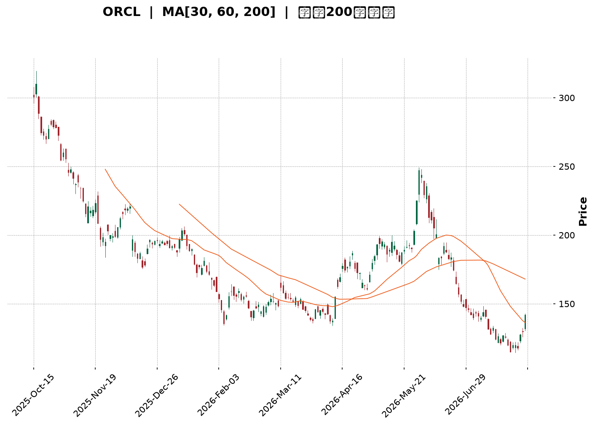

</details>

<html>
<head><meta charset="utf-8" /></head>
<body>
    <div style="height:500px; width:100%;">                        <script>window.PlotlyConfig = {MathJaxConfig: 'local'};</script>
        <script charset="utf-8" src="https://cdn.plot.ly/plotly-3.7.0.min.js" integrity="sha256-jvTGqxNp8AGWEcvNLVuKr+8j5dGe9Yw51LQkmDH+IYA=" crossorigin="anonymous"></script>                <div id="candlestick-chart" class="plotly-graph-div" style="height:100%; width:100%;"></div>            <script>                window.PLOTLYENV=window.PLOTLYENV || {};                                if (document.getElementById("candlestick-chart")) {                    Plotly.newPlot(                        "candlestick-chart",                        [{"close":{"dtype":"f8","bdata":"AAAAgILLckAAAAAAKGBzQAAAAKBuCHJAAAAAAIMocUAAAACgVwhxQAAAAADi4HBAAAAAYE9WcUAAAACg+IlxQAAAAABja3FAAAAAoFpicUAAAAAguApxQAAAAEDyzW9AAAAAYJ5BcEAAAACAX+xvQAAAAGCSuW5AAAAAwGX9bkAAAABgES9uQAAAAOAsn21AAAAAoO\u002fQbUAAAABgmzxtQAAAAIBJGmxAAAAAALrvakAAAACgEpdrQAAAAIBOOGtAAAAAIEZMa0AAAACAA+xrQAAAAKCrFWpAAAAAoI6baEAAAACAu8toQAAAAOC5ZGhAAAAA4A9gaUAAAACAqQBpQAAAAKCm4GhAAAAA4LjlaEAAAADg2rdpQAAAAKAJiWpAAAAAIAvwakAAAADg201rQAAAAIA8bWtAAAAAwCSca0AAAADgaJ5oQAAAAOD2hGdAAAAAYOjkZkAAAADAIFtnQAAAAMApGGZAAAAAYOxJZkAAAABAWsRnQAAAAICDj2hAAAAAoCkvaEAAAABATnNoQAAAACAng2hAAAAAQG4waEAAAABgbmpoQAAAAMCIIWhAAAAAwOM6aEAAAADAANhnQAAAAODE\u002fGdAAAAAQO3fZ0AAAABg0npnQAAAAECVpGhAAAAA4FVoaUAAAADAYhxpQAAAAICNCGhAAAAAIBGRZ0AAAADAeLhnQAAAAKCCVWZAAAAAQJKVZUAAAABgNx5mQAAAAKDN\u002fWVAAAAAgJelZkAAAAAA\u002fLVlQAAAACBAc2VAAAAAwM\u002f6ZEAAAADgCG5kQAAAAOBl3mNAAAAAQB0zY0AAAADA4zRiQAAAAEAS8WBAAAAAYIu6YUAAAADAIHBjQAAAAOD+2GNAAAAA4D2CY0AAAADgoWxjQAAAAMDw4GNAAAAAoN4cY0AAAAAgyGJjQAAAAACKbmNAAAAAYLJhYkAAAAAgj4phQAAAACAMJGJAAAAAoKhbYkAAAADAj6hiQAAAAACIDGJAAAAAgOCGYkAAAAAgQH9iQAAAAEAG6mJAAAAAYO02Y0AAAAAgxvxiQAAAAMBI0GJAAAAAwKSLYkAAAACAoz9kQAAAAGDMwWNAAAAAwBhBY0AAAAAAbVxjQAAAAADAM2NAAAAA4N36YkAAAABAIE5jQAAAAKCKlGJAAAAAoKAoY0AAAACAPEJiQAAAAAA8IGJAAAAA4Dm6YUAAAAAgIFZhQAAAAODLOmFAAAAAQN9CYkAAAAAgIQdiQAAAAKCsK2JAAAAA4PoQYkAAAACgqsVhQAAAAOA81WFAAAAAwDksYUAAAABgjzNhQAAAAECTYmNAAAAAoOpNZEAAAADAFCdlQAAAAEAYN2ZAAAAAoH\u002fOZUAAAAAA3B5mQAAAAEBXkWZAAAAA4DJbZ0AAAABAZ\u002fVlQAAAAIC8lWVAAAAAIIiLZUAAAAAAT6xkQAAAAIBiaGRAAAAAQJMaZEAAAABAf2dlQAAAAEBHdWZAAAAAIKMWZ0AAAAAgbytoQAAAAMBKPWhAAAAAQKloaEAAAAAAYCVoQAAAAEDVRWdAAAAAgESjZ0AAAACg0V1oQAAAAGD+CGhAAAAAQNE+Z0AAAADAlppmQAAAAOA+cGdAAAAAQJajZ0AAAAAgQO1nQAAAAGCADGhAAAAAAInJZ0AAAAAgzV9pQAAAAGDpH2xAAAAAIEXpbkAAAAAgbXduQAAAAMABsWxAAAAAAKlwbUAAAADADZ5qQAAAAKC9YmpAAAAAYBajaUAAAADg\u002fRFpQAAAAKDG7mZAAAAAgLvvZkAAAADAG\u002f9nQAAAAKCqdWdAAAAAYJncZkAAAACg1fRmQAAAAGDRzmVAAAAAAMySZEAAAADAe59jQAAAAGDO\u002fWJAAAAAYHuAYkAAAABg7WdiQAAAAIBXQWJAAAAA4DDAYUAAAAAgFHlhQAAAAABf6GFAAAAAoH2jYUAAAAAgGIBhQAAAAEAK92FAAAAA4HqUYUAAAACgR3FgQAAAAAAp\u002fF9AAAAAIK6PYEAAAACgcA1fQAAAAIA9ml9AAAAA4FFYXkAAAABAM8NfQAAAAIDCdV9AAAAAYI8CXkAAAAAgXL9cQAAAAKCZ+V1AAAAAoHD9XUAAAAAgXG9dQAAAAADX419AAAAAANc7YEAAAABAM7thQA=="},"high":{"dtype":"f8","bdata":"Ysz50Z5Ac0Be9aSQVvdzQLzj\u002fDn41XJAskRv1aDncUCdVHF69FlxQLVGqDjUKHFAkVMAr1OGcUCYKho0JMdxQMO3L34hxHFAZ1ht87mrcUDTOuqR325xQL5yNQLtsnBA8i34Z1R0cECyy0SUUXFwQFxK2Q7rmm9AIuXLbqM\u002fb0CpWjrPGNZuQCMB\u002fYdOw21A1ka2txicbkCmCJ9Cz2VtQOnpfViGUW1AFvuNPUnga0BACQ9NMBxsQP8JCul8lWtALmKMJwOya0DYpr10DT9sQAipp9p2+GxAMPpJ2jzKaUC8zvUz7jtpQE\u002f5spwosGhAYyLgD83\u002faUAftmbaBQ1pQMQbkMbJMWlA3AnP80r2aUALd1CB4L1pQKenRXpEq2pAaoywfOUsa0DPN\u002fPEStNrQD51AnLIj2tAG47yllvla0Do3\u002fsB7gFpQAOBJCy3fmhAhbOqCUVlZ0DnHK6fk39nQBRoSyb8FmdA34cWU9bfZkBiLnZ5MChoQG6JXkHTnGhA8AjvLh1qaEBqfoQMWIxoQOVzBr2VzmhAAKjCKqKTaEDE4xNvg49oQAnK9ScdamhAqMFROyuWaEA1v3XQa\u002fhoQEXieXCVIGhA2MPfJJ85aEBuJV5CBqRnQEhcr5BV2WhA7sm9ilmlaUCdiYC0e8tpQCOhXGQACWlAEkk9lwo1aEAsPH0vQtFnQJxYAXaJPGdA2YNmth5rZkC2tfAhI11mQJY+yCjuTGZAIjJHcssAZ0AQZBeoJ09mQAqNfH1wjWZAyJ7Zr5QhZUDVUgfQUPdkQCpQ\u002ftdnQGVAKuc2CMrIY0AsfLOW6htjQH1Z06MTMWJAI9VRqZ7GYUDB17b3i9RjQEu+zWXGh2RAonmllcxQZEBxZG7u+71jQCu3UMiUJWRA13yXcZzFY0Ap4gntsIZjQMQ1+qAI32NA\u002fDLQWoEdY0CFILonPhliQH3gmua\u002fN2JAWJeFRfEGY0AtX5\u002fTJ+5iQDqztf0jImJAnEEt2xykYkCo3iarQ7xiQGe04extEWNAD47\u002fSAebY0CWqcFMwMJjQEqia0BE3mJA15+hk0UiY0Bp5IWAM1JlQJqbMG5Q1WRALlIm7\u002fX0Y0DoBCGAc7RjQCTxuM0rumNADa33xKU8Y0B7uSd2nXpjQBc+tkz9BWNAlEQqUGNWY0D9rAcZpRpjQCd1RlmgmWJAAHBir4guYkAvpPyKopZhQKIDt0UQh2FAZyM+ZhZMYkBA3JqilpNiQBDtYLeULWJAXsYL3aFwYkBnUOH1J\u002fJhQKaoGVobzWJAJzzS8sHJYUBMbRit43VhQJA9dMPSa2NAFbG5mwEaZUBjX8ulxn5lQN\u002fLqw+kdGZAZnELBYj7ZkD0wlpjmSRmQB0ulHFRFmdAmpl+qcWQZ0Dhc9gLTahmQDxQyxusgmZAvQ9UnlieZUCg57QurwNlQFaAbpYKhmRAu0JWPG+TZEBgUIpZQ7ZlQIcvVXWk22ZAUL1YhfI7Z0BpNK2duTNoQF4oileY7mhApOxEpwiqaECK2QT+DGBoQIiqA4oJCGhAORsEuPzcZ0Dns70HdABpQBfcBar3d2hA1lkGIyjDZ0CW9ElvGoJnQPN2yKsocmdAbsKcQNkEaEBgfHoEJYpoQBebuHi+UGhAgFPO\u002fCnvZ0DLDy7UQYlpQI3IAcQsMGxAWP7Buzwsb0CUpQU4YARvQDPuhCCj9W1AP+uz\u002f+PDbUCueY5YZ9RsQEiVvQCeSWtA8hGYq4l3a0CjqQR3yXdqQFRRrDgkBGdA9OyFsfgdZ0DdVb1CklRoQDpbLDqSVGhAUGb3+fqwZ0C3XJYK02pnQOU4oigV\u002fmZAQ8+ELzi3ZUB\u002fXVOLnKVkQGXEpHNaomNAKAZG9j4gY0BWkBsU3D5jQOUFgWEgrWJACONSEzthYkB0pgTpmlFiQDDov0yvI2JA9HP0Z8UhYkDl\u002f9HoJKthQHMUNcGzkWJAAAAAgMI1YkAAAADAzHRhQAAAAOBRmGBAAAAAwMy8YEAAAADA9XhgQAAAAIAUDmBAAAAAIFxfX0AAAABA4dpfQAAAAEDhGmBAAAAAwMwsX0AAAADAHsVeQAAAACBcf15AAAAAwB6VXkAAAABA4XpeQAAAAEDhCmBAAAAAwMyMYEAAAADAzOBhQA=="},"hovertemplate":"\u003cb\u003e%{x|%Y-%m-%d}\u003c\u002fb\u003e\u003cbr\u003e\u958b: $%{open:.2f}\u003cbr\u003e\u9ad8: $%{high:.2f}\u003cbr\u003e\u4f4e: $%{low:.2f}\u003cbr\u003e\u6536: $%{close:.2f}\u003cextra\u003e\u003c\u002fextra\u003e","low":{"dtype":"f8","bdata":"t\u002f5qSgeBckAD5QhSy8JyQEc2XfYNzHFAqs+arOAKcUC+uyFWi9pwQE4YkQ\u002fYqnBAsIBKpprccEA2fdFC23hxQOnQt5cwUnFAc9HSOMJdcUAh6ZKQH8xwQI\u002frub2cum9AERkKvj3Ib0DaVtFrVZlvQLPkVXgfW25AVIb5snCVbkCYfT9WIKBtQNhsXgorxGxAWhhpA8RZbUDXs\u002fisgVZsQA4Q2CxMAGxAHyqkqj6lakC29temNBhqQOYYlGYFsGpApudEymyOakCg+KWOfOdqQAjAmEVPCWpABPbZHW72Z0ClUClhMw5oQEXSaU5p+2ZAk\u002folf9oJaUANjGTnG3doQNs7UlREWmhAO9SKttvCaECEtAFr169oQErmbp8qi2lAgqwJq4hyakAGqHcWz9pqQOktftk6BmtAjZLGNQvwakAgeGxqbQ5nQK9VvQOBBmdALUW9+1d1ZkAD9\u002fSwR9dmQM29tqgb7GVA4f6EevcbZkAYyl9PVEpnQHNf4Tmc32dAJ8UMZlPLZ0Dw5HcDARJoQGAezkGRR2hA6prrj5bZZ0Bv84LE4zpoQLD8dTbUG2hAi82LJFkLaEByIwQ5w89nQCEEevIZnGdAK5lWvU3FZ0D4ALFK5AtnQDA6Pn0Qb2dADqDIApl0aEAbxyJ7luhoQLQ20\u002fOSr2dA9I2B4nKCZ0BQ4NJRkCdnQPjx1vC2Q2ZASAI72VYtZUBFqXlS1OhlQIowwAjUWWVAn8LK41YpZkAxNiIQN49lQLsj0AdhVWVAG6gxScsMZECkeofBc0NkQNYQoMh93GNAHy3LvxbbYkAZtV3jtO1hQM34TAH8yWBAQe08xEo+YUDdmIZYYD9iQFrH+9bie2NAjss8qNIdY0BVmY7eJ+5iQGIY0QvRRmNAf+lGTTv6YkDy1fczP8piQMXC9\u002f4RVmNA+dGjE8VLYkDG4a9oHzRhQHQNUV2SOGFAyll7Py5KYkDFKWgplgRiQJ1WQvypo2FAeEVufW2GYUAjW1d72sFhQBhf+0ccgmJA5IZVEoaiYkAxSZnhMNJiQPDT7zRDLWJA8CIaWXRtYkAY3aMu7O5jQKKYVP9RsGNA1rqi6pYiY0DjxdOSBy5jQKcXvRvvDWNANEoznInfYkAp717sb3tiQJF4l8mQXWJAITyt+0W1YkBJV4AinDpiQBBnvAwc82FAdO8NV6WxYUCTO1NE6CphQBjWFbsBAGFA7YS81ylcYUApS7lwVfVhQGkeQq12amFAhqLxg0bbYUDYNvMBBl9hQFU81w0WvWFA2Ex4c+nwYEB2XoGYT8NgQEiNCBOKZ2FAoR7KBf8fZEBfiyreR7RkQJCdgZBRpmVAc0UViEmYZUCObi8XEp1lQOnhXAzL7GVALfKo+1HFZkBdrVRbP69lQOCBApzfBmVA4nK1NSzqZED6ffVLny9kQEv1cDD6AmRApVfb2sX4Y0AAVznxXbJkQDrlscH8tGVAN5S0OCRMZkDFh1eiLMFmQMtWfMNuxGdATu4cRZ6xZ0BzBtsEDr5nQILC4STGh2ZAkOIRnGMNZ0CEb6Ft0xlnQGsmU8bXh2dAjRnN207UZkA1yIjtr4lmQBqInZTDRWZAim+GvaFRZ0DvfzHV\u002f81nQC2cu2DHvGdAs5uHlpdoZ0CDIK3YtBZoQCBqiC8+6WlAABnYdUj6a0BSfjQFYsBtQG72QsBEWmxAM8pNNybna0Cd1vfCKRdqQE\u002fn5TdWE2pAqMnYRVajaEDVMLH5xa9oQHCCP5+D1WVA2IerMiRMZkBRX+TdDzJnQKQWUQdNYGdATlYF+02+ZkBVlGmJryJmQDFPZqdzuWVAc+\u002fq\u002fkGBZEDZdPEp91ljQNL+XMTWumJAM19qrZRvYkANsLiUShZiQAgeKcpU\u002f2FAAAAA4DDAYUAS45uFKEthQFs+Zbd1lWFAy9h+BlciYUBwY3EfVyJhQMuzyadxjmFAAAAA4FFoYUAAAABAM2tgQAAAAGBm5l9AAAAAQOEaYEAAAACAPepeQAAAAAAAYF5AAAAAgOsBXkAAAACgcI1eQAAAAMDMLF9AAAAAACncXUAAAAAAALBcQAAAAEAzM11AAAAAAACgXEAAAADAzAxdQAAAAMAeZV5AAAAAwMxsX0AAAABguEZgQA=="},"name":"\u50f9\u683c","open":{"dtype":"f8","bdata":"mzuEScvfckDU5a8x4+pyQHP1NReSzXJAi0lHbgjjcUCJpZPsPzdxQIJOQdocA3FA2w6N+KLlcEDqfkcGBLNxQBx4nhFRvXFA7RQgFr6EcUCum7x0VmxxQMudTezConBAAKTqLX4QcEA9C\u002fbyS2twQMcWoDjw8m5AdwAG1FSxbkBrLe0+SLJuQFKpBFnvlm1AL4cB7TVzbkCArix9JD9tQI1byHJOT21AS8V86+Xaa0B14Mp0GxpqQKJmouECBGtA0qkjVp\u002fEakAnn6CZ8x5rQK2srt1znmxAxhMt\u002fUCjaUD+C6KHVl9oQCCWEV86B2hAlY1cMfTvaUAQejT1U7NoQMjnbY+00mhAdzwHU8RlaUBxyVxCUc1oQCik0rn5u2lA8lk6ngwda0DCEHobiGdrQAmfYeSxPWtAx34mMst1a0CrQ5u4kJlnQHu1J8DOT2hAEqO2obdPZ0Dnf8yB791mQAcEK07hsWZA\u002fIAdWi6fZkBXqs0N41JnQKkUbhYSXmhADkfzkbVRaEDC6Sf\u002fYiRoQB5htgVfhWhA3TuvesMJaEArOHGA+0VoQKl0PnNkUWhAu7l04qtyaEAviyu+Po5oQHqCkYEN12dA\u002fzu7GeUtaEBNoalczqFnQCKtrt2VymdAIMx53ViHaEAyVrgogXJpQCOhXGQACWlAEkk9lwo1aEDgBCFK+ZJnQJxYAXaJPGdAYAtWO+JNZkDnvyJECERmQN60V8+HbWVAme6AAXQ7ZkDtPZUEUD5mQFtu2a2etmVA\u002fCVt2wkfZUC18mwpHuBkQPR+ZACCN2VAJFv9iTKlY0B9MvbNUxpjQN7LxDzjEmJAPtgVS\u002fxYYUCB1lLRuW5iQDtxG8B93GNAonmllcxQZECvvbLetZpjQNwSZXCoxGNAghlHrUycY0DqHqA92ipjQLDNDvIxg2NA9QR0DpQHY0B8rp1HvxViQKWq1Zyfe2FAf3KCWASEYkAMqZ87QnhiQG4ySps63GFAG73b\u002fWiUYUB3bjxG4PdhQIdswjQHn2JAWECk\u002fQPxYkDd9+WlgPtiQAxnNXz0tGJACl3DPr8RY0DbvilJPKdkQPipI+eTcGRAtaJhZ02+Y0AxJhAjSV9jQCSjyGOVS2NACLDLd8EKY0Cwac85VK1iQIB6h0mi\u002f2JAlSZY5dXLYkACldp6C\u002f5iQIvYPuE9hmJAmhIB5IvcYUAqxtW4e35hQK+kLm0zYmFAHmDVpnZqYUBoJ1TzyoFiQCeTgOdFuWFAzJtmzVtNYkB+jfsXDdlhQB6hloE+qGJAlxlGvZ+2YUDwUkx+ARthQD7CekciaWFAdVKgGyHrZEBdnDIO98lkQAhGjSfe+WVAGMoEHHfJZkBtdFr+TQZmQEdoDvdpN2ZAPN803RoxZ0AsDho9yXhmQOzt\u002fUlLfGZAqVrk6ml\u002fZUApFDFMITNkQFyNPskUb2RAYa12W6ouZEDdlh8m+rpkQNk+X8Uc7WVAhdSEU\u002fSvZkDNawghvjFnQNzlMnR8vWhAge3Z9TH9Z0CNTm1\u002fe+9nQIiqA4oJCGhAy5eMG\u002f2LZ0BLRtcE4nBnQIQX1\u002f2LumdA5nKl2OuqZ0CLIGdvXStnQHAoKRQeamZAC2C81VmLZ0Ch5PwELeBnQJdj\u002fq4nFGhAgAZl+x3aZ0C0zye6wCtoQCfsizHQCGpAmO2FpW22bEAzeaLtqT5uQFJ9oTqu9G1ADR55A9FGbECR8F5aOJZsQFQXPrXXH2tAle1+lGOlakDV3QVj+rloQI94EdGBYWZABX\u002feYcsLZ0B8wKPasFdnQC34X2k9q2dAF3RcrncwZ0AZI2U6BMxmQCFD7cCxtWZAFvuCYXk0ZUBp81mKVT1kQPUgol6+mWNAxkjfXaa3YkAFaqB7AC1jQJ0onf6pV2JAlMxqe6b\u002fYUDvfD7Ss9lhQEuP1WmX+WFAJ0AUahjnYUDiuvIcflJhQITB5SXAnWFAAAAAwMw0YkAAAADA9WBhQAAAAAAAgGBAAAAAgOtRYEAAAAAgXG9gQAAAAMDMbF5AAAAAoEcRX0AAAAAA17NeQAAAACCFi19AAAAAoHD9XkAAAACAFJ5eQAAAAAAAgF1AAAAAIIWLXUAAAABA4dpdQAAAACCut15AAAAAgD1CYEAAAACgcH1gQA=="},"x":["2025-10-15T00:00:00-04:00","2025-10-16T00:00:00-04:00","2025-10-17T00:00:00-04:00","2025-10-20T00:00:00-04:00","2025-10-21T00:00:00-04:00","2025-10-22T00:00:00-04:00","2025-10-23T00:00:00-04:00","2025-10-24T00:00:00-04:00","2025-10-27T00:00:00-04:00","2025-10-28T00:00:00-04:00","2025-10-29T00:00:00-04:00","2025-10-30T00:00:00-04:00","2025-10-31T00:00:00-04:00","2025-11-03T00:00:00-05:00","2025-11-04T00:00:00-05:00","2025-11-05T00:00:00-05:00","2025-11-06T00:00:00-05:00","2025-11-07T00:00:00-05:00","2025-11-10T00:00:00-05:00","2025-11-11T00:00:00-05:00","2025-11-12T00:00:00-05:00","2025-11-13T00:00:00-05:00","2025-11-14T00:00:00-05:00","2025-11-17T00:00:00-05:00","2025-11-18T00:00:00-05:00","2025-11-19T00:00:00-05:00","2025-11-20T00:00:00-05:00","2025-11-21T00:00:00-05:00","2025-11-24T00:00:00-05:00","2025-11-25T00:00:00-05:00","2025-11-26T00:00:00-05:00","2025-11-28T00:00:00-05:00","2025-12-01T00:00:00-05:00","2025-12-02T00:00:00-05:00","2025-12-03T00:00:00-05:00","2025-12-04T00:00:00-05:00","2025-12-05T00:00:00-05:00","2025-12-08T00:00:00-05:00","2025-12-09T00:00:00-05:00","2025-12-10T00:00:00-05:00","2025-12-11T00:00:00-05:00","2025-12-12T00:00:00-05:00","2025-12-15T00:00:00-05:00","2025-12-16T00:00:00-05:00","2025-12-17T00:00:00-05:00","2025-12-18T00:00:00-05:00","2025-12-19T00:00:00-05:00","2025-12-22T00:00:00-05:00","2025-12-23T00:00:00-05:00","2025-12-24T00:00:00-05:00","2025-12-26T00:00:00-05:00","2025-12-29T00:00:00-05:00","2025-12-30T00:00:00-05:00","2025-12-31T00:00:00-05:00","2026-01-02T00:00:00-05:00","2026-01-05T00:00:00-05:00","2026-01-06T00:00:00-05:00","2026-01-07T00:00:00-05:00","2026-01-08T00:00:00-05:00","2026-01-09T00:00:00-05:00","2026-01-12T00:00:00-05:00","2026-01-13T00:00:00-05:00","2026-01-14T00:00:00-05:00","2026-01-15T00:00:00-05:00","2026-01-16T00:00:00-05:00","2026-01-20T00:00:00-05:00","2026-01-21T00:00:00-05:00","2026-01-22T00:00:00-05:00","2026-01-23T00:00:00-05:00","2026-01-26T00:00:00-05:00","2026-01-27T00:00:00-05:00","2026-01-28T00:00:00-05:00","2026-01-29T00:00:00-05:00","2026-01-30T00:00:00-05:00","2026-02-02T00:00:00-05:00","2026-02-03T00:00:00-05:00","2026-02-04T00:00:00-05:00","2026-02-05T00:00:00-05:00","2026-02-06T00:00:00-05:00","2026-02-09T00:00:00-05:00","2026-02-10T00:00:00-05:00","2026-02-11T00:00:00-05:00","2026-02-12T00:00:00-05:00","2026-02-13T00:00:00-05:00","2026-02-17T00:00:00-05:00","2026-02-18T00:00:00-05:00","2026-02-19T00:00:00-05:00","2026-02-20T00:00:00-05:00","2026-02-23T00:00:00-05:00","2026-02-24T00:00:00-05:00","2026-02-25T00:00:00-05:00","2026-02-26T00:00:00-05:00","2026-02-27T00:00:00-05:00","2026-03-02T00:00:00-05:00","2026-03-03T00:00:00-05:00","2026-03-04T00:00:00-05:00","2026-03-05T00:00:00-05:00","2026-03-06T00:00:00-05:00","2026-03-09T00:00:00-04:00","2026-03-10T00:00:00-04:00","2026-03-11T00:00:00-04:00","2026-03-12T00:00:00-04:00","2026-03-13T00:00:00-04:00","2026-03-16T00:00:00-04:00","2026-03-17T00:00:00-04:00","2026-03-18T00:00:00-04:00","2026-03-19T00:00:00-04:00","2026-03-20T00:00:00-04:00","2026-03-23T00:00:00-04:00","2026-03-24T00:00:00-04:00","2026-03-25T00:00:00-04:00","2026-03-26T00:00:00-04:00","2026-03-27T00:00:00-04:00","2026-03-30T00:00:00-04:00","2026-03-31T00:00:00-04:00","2026-04-01T00:00:00-04:00","2026-04-02T00:00:00-04:00","2026-04-06T00:00:00-04:00","2026-04-07T00:00:00-04:00","2026-04-08T00:00:00-04:00","2026-04-09T00:00:00-04:00","2026-04-10T00:00:00-04:00","2026-04-13T00:00:00-04:00","2026-04-14T00:00:00-04:00","2026-04-15T00:00:00-04:00","2026-04-16T00:00:00-04:00","2026-04-17T00:00:00-04:00","2026-04-20T00:00:00-04:00","2026-04-21T00:00:00-04:00","2026-04-22T00:00:00-04:00","2026-04-23T00:00:00-04:00","2026-04-24T00:00:00-04:00","2026-04-27T00:00:00-04:00","2026-04-28T00:00:00-04:00","2026-04-29T00:00:00-04:00","2026-04-30T00:00:00-04:00","2026-05-01T00:00:00-04:00","2026-05-04T00:00:00-04:00","2026-05-05T00:00:00-04:00","2026-05-06T00:00:00-04:00","2026-05-07T00:00:00-04:00","2026-05-08T00:00:00-04:00","2026-05-11T00:00:00-04:00","2026-05-12T00:00:00-04:00","2026-05-13T00:00:00-04:00","2026-05-14T00:00:00-04:00","2026-05-15T00:00:00-04:00","2026-05-18T00:00:00-04:00","2026-05-19T00:00:00-04:00","2026-05-20T00:00:00-04:00","2026-05-21T00:00:00-04:00","2026-05-22T00:00:00-04:00","2026-05-26T00:00:00-04:00","2026-05-27T00:00:00-04:00","2026-05-28T00:00:00-04:00","2026-05-29T00:00:00-04:00","2026-06-01T00:00:00-04:00","2026-06-02T00:00:00-04:00","2026-06-03T00:00:00-04:00","2026-06-04T00:00:00-04:00","2026-06-05T00:00:00-04:00","2026-06-08T00:00:00-04:00","2026-06-09T00:00:00-04:00","2026-06-10T00:00:00-04:00","2026-06-11T00:00:00-04:00","2026-06-12T00:00:00-04:00","2026-06-15T00:00:00-04:00","2026-06-16T00:00:00-04:00","2026-06-17T00:00:00-04:00","2026-06-18T00:00:00-04:00","2026-06-22T00:00:00-04:00","2026-06-23T00:00:00-04:00","2026-06-24T00:00:00-04:00","2026-06-25T00:00:00-04:00","2026-06-26T00:00:00-04:00","2026-06-29T00:00:00-04:00","2026-06-30T00:00:00-04:00","2026-07-01T00:00:00-04:00","2026-07-02T00:00:00-04:00","2026-07-06T00:00:00-04:00","2026-07-07T00:00:00-04:00","2026-07-08T00:00:00-04:00","2026-07-09T00:00:00-04:00","2026-07-10T00:00:00-04:00","2026-07-13T00:00:00-04:00","2026-07-14T00:00:00-04:00","2026-07-15T00:00:00-04:00","2026-07-16T00:00:00-04:00","2026-07-17T00:00:00-04:00","2026-07-20T00:00:00-04:00","2026-07-21T00:00:00-04:00","2026-07-22T00:00:00-04:00","2026-07-23T00:00:00-04:00","2026-07-24T00:00:00-04:00","2026-07-27T00:00:00-04:00","2026-07-28T00:00:00-04:00","2026-07-29T00:00:00-04:00","2026-07-30T00:00:00-04:00","2026-07-31T00:00:00-04:00","2026-08-03T00:00:00-04:00"],"type":"candlestick"},{"hovertemplate":"MA30: $%{y:.2f}\u003cextra\u003e\u003c\u002fextra\u003e","line":{"color":"#2196F3","dash":"dash","width":2},"mode":"lines","name":"MA30","x":["2025-10-15T00:00:00-04:00","2025-10-16T00:00:00-04:00","2025-10-17T00:00:00-04:00","2025-10-20T00:00:00-04:00","2025-10-21T00:00:00-04:00","2025-10-22T00:00:00-04:00","2025-10-23T00:00:00-04:00","2025-10-24T00:00:00-04:00","2025-10-27T00:00:00-04:00","2025-10-28T00:00:00-04:00","2025-10-29T00:00:00-04:00","2025-10-30T00:00:00-04:00","2025-10-31T00:00:00-04:00","2025-11-03T00:00:00-05:00","2025-11-04T00:00:00-05:00","2025-11-05T00:00:00-05:00","2025-11-06T00:00:00-05:00","2025-11-07T00:00:00-05:00","2025-11-10T00:00:00-05:00","2025-11-11T00:00:00-05:00","2025-11-12T00:00:00-05:00","2025-11-13T00:00:00-05:00","2025-11-14T00:00:00-05:00","2025-11-17T00:00:00-05:00","2025-11-18T00:00:00-05:00","2025-11-19T00:00:00-05:00","2025-11-20T00:00:00-05:00","2025-11-21T00:00:00-05:00","2025-11-24T00:00:00-05:00","2025-11-25T00:00:00-05:00","2025-11-26T00:00:00-05:00","2025-11-28T00:00:00-05:00","2025-12-01T00:00:00-05:00","2025-12-02T00:00:00-05:00","2025-12-03T00:00:00-05:00","2025-12-04T00:00:00-05:00","2025-12-05T00:00:00-05:00","2025-12-08T00:00:00-05:00","2025-12-09T00:00:00-05:00","2025-12-10T00:00:00-05:00","2025-12-11T00:00:00-05:00","2025-12-12T00:00:00-05:00","2025-12-15T00:00:00-05:00","2025-12-16T00:00:00-05:00","2025-12-17T00:00:00-05:00","2025-12-18T00:00:00-05:00","2025-12-19T00:00:00-05:00","2025-12-22T00:00:00-05:00","2025-12-23T00:00:00-05:00","2025-12-24T00:00:00-05:00","2025-12-26T00:00:00-05:00","2025-12-29T00:00:00-05:00","2025-12-30T00:00:00-05:00","2025-12-31T00:00:00-05:00","2026-01-02T00:00:00-05:00","2026-01-05T00:00:00-05:00","2026-01-06T00:00:00-05:00","2026-01-07T00:00:00-05:00","2026-01-08T00:00:00-05:00","2026-01-09T00:00:00-05:00","2026-01-12T00:00:00-05:00","2026-01-13T00:00:00-05:00","2026-01-14T00:00:00-05:00","2026-01-15T00:00:00-05:00","2026-01-16T00:00:00-05:00","2026-01-20T00:00:00-05:00","2026-01-21T00:00:00-05:00","2026-01-22T00:00:00-05:00","2026-01-23T00:00:00-05:00","2026-01-26T00:00:00-05:00","2026-01-27T00:00:00-05:00","2026-01-28T00:00:00-05:00","2026-01-29T00:00:00-05:00","2026-01-30T00:00:00-05:00","2026-02-02T00:00:00-05:00","2026-02-03T00:00:00-05:00","2026-02-04T00:00:00-05:00","2026-02-05T00:00:00-05:00","2026-02-06T00:00:00-05:00","2026-02-09T00:00:00-05:00","2026-02-10T00:00:00-05:00","2026-02-11T00:00:00-05:00","2026-02-12T00:00:00-05:00","2026-02-13T00:00:00-05:00","2026-02-17T00:00:00-05:00","2026-02-18T00:00:00-05:00","2026-02-19T00:00:00-05:00","2026-02-20T00:00:00-05:00","2026-02-23T00:00:00-05:00","2026-02-24T00:00:00-05:00","2026-02-25T00:00:00-05:00","2026-02-26T00:00:00-05:00","2026-02-27T00:00:00-05:00","2026-03-02T00:00:00-05:00","2026-03-03T00:00:00-05:00","2026-03-04T00:00:00-05:00","2026-03-05T00:00:00-05:00","2026-03-06T00:00:00-05:00","2026-03-09T00:00:00-04:00","2026-03-10T00:00:00-04:00","2026-03-11T00:00:00-04:00","2026-03-12T00:00:00-04:00","2026-03-13T00:00:00-04:00","2026-03-16T00:00:00-04:00","2026-03-17T00:00:00-04:00","2026-03-18T00:00:00-04:00","2026-03-19T00:00:00-04:00","2026-03-20T00:00:00-04:00","2026-03-23T00:00:00-04:00","2026-03-24T00:00:00-04:00","2026-03-25T00:00:00-04:00","2026-03-26T00:00:00-04:00","2026-03-27T00:00:00-04:00","2026-03-30T00:00:00-04:00","2026-03-31T00:00:00-04:00","2026-04-01T00:00:00-04:00","2026-04-02T00:00:00-04:00","2026-04-06T00:00:00-04:00","2026-04-07T00:00:00-04:00","2026-04-08T00:00:00-04:00","2026-04-09T00:00:00-04:00","2026-04-10T00:00:00-04:00","2026-04-13T00:00:00-04:00","2026-04-14T00:00:00-04:00","2026-04-15T00:00:00-04:00","2026-04-16T00:00:00-04:00","2026-04-17T00:00:00-04:00","2026-04-20T00:00:00-04:00","2026-04-21T00:00:00-04:00","2026-04-22T00:00:00-04:00","2026-04-23T00:00:00-04:00","2026-04-24T00:00:00-04:00","2026-04-27T00:00:00-04:00","2026-04-28T00:00:00-04:00","2026-04-29T00:00:00-04:00","2026-04-30T00:00:00-04:00","2026-05-01T00:00:00-04:00","2026-05-04T00:00:00-04:00","2026-05-05T00:00:00-04:00","2026-05-06T00:00:00-04:00","2026-05-07T00:00:00-04:00","2026-05-08T00:00:00-04:00","2026-05-11T00:00:00-04:00","2026-05-12T00:00:00-04:00","2026-05-13T00:00:00-04:00","2026-05-14T00:00:00-04:00","2026-05-15T00:00:00-04:00","2026-05-18T00:00:00-04:00","2026-05-19T00:00:00-04:00","2026-05-20T00:00:00-04:00","2026-05-21T00:00:00-04:00","2026-05-22T00:00:00-04:00","2026-05-26T00:00:00-04:00","2026-05-27T00:00:00-04:00","2026-05-28T00:00:00-04:00","2026-05-29T00:00:00-04:00","2026-06-01T00:00:00-04:00","2026-06-02T00:00:00-04:00","2026-06-03T00:00:00-04:00","2026-06-04T00:00:00-04:00","2026-06-05T00:00:00-04:00","2026-06-08T00:00:00-04:00","2026-06-09T00:00:00-04:00","2026-06-10T00:00:00-04:00","2026-06-11T00:00:00-04:00","2026-06-12T00:00:00-04:00","2026-06-15T00:00:00-04:00","2026-06-16T00:00:00-04:00","2026-06-17T00:00:00-04:00","2026-06-18T00:00:00-04:00","2026-06-22T00:00:00-04:00","2026-06-23T00:00:00-04:00","2026-06-24T00:00:00-04:00","2026-06-25T00:00:00-04:00","2026-06-26T00:00:00-04:00","2026-06-29T00:00:00-04:00","2026-06-30T00:00:00-04:00","2026-07-01T00:00:00-04:00","2026-07-02T00:00:00-04:00","2026-07-06T00:00:00-04:00","2026-07-07T00:00:00-04:00","2026-07-08T00:00:00-04:00","2026-07-09T00:00:00-04:00","2026-07-10T00:00:00-04:00","2026-07-13T00:00:00-04:00","2026-07-14T00:00:00-04:00","2026-07-15T00:00:00-04:00","2026-07-16T00:00:00-04:00","2026-07-17T00:00:00-04:00","2026-07-20T00:00:00-04:00","2026-07-21T00:00:00-04:00","2026-07-22T00:00:00-04:00","2026-07-23T00:00:00-04:00","2026-07-24T00:00:00-04:00","2026-07-27T00:00:00-04:00","2026-07-28T00:00:00-04:00","2026-07-29T00:00:00-04:00","2026-07-30T00:00:00-04:00","2026-07-31T00:00:00-04:00","2026-08-03T00:00:00-04:00"],"y":{"dtype":"f8","bdata":"AAAAAAAA+H8AAAAAAAD4fwAAAAAAAPh\u002fAAAAAAAA+H8AAAAAAAD4fwAAAAAAAPh\u002fAAAAAAAA+H8AAAAAAAD4fwAAAAAAAPh\u002fAAAAAAAA+H8AAAAAAAD4fwAAAAAAAPh\u002fAAAAAAAA+H8AAAAAAAD4fwAAAAAAAPh\u002fAAAAAAAA+H8AAAAAAAD4fwAAAAAAAPh\u002fAAAAAAAA+H8AAAAAAAD4fwAAAAAAAPh\u002fAAAAAAAA+H8AAAAAAAD4fwAAAAAAAPh\u002fAAAAAAAA+H8AAAAAAAD4fwAAAAAAAPh\u002fAAAAAAAA+H8AAAAAAAD4f1VVVfXk\u002fW5AZmZmlqmVbkDNzMw8VyBuQDMzM\u002fPdwG1AMzMzg31wbUC8u7s7QyltQLy7u2uj62xAAAAAgJ6pbEBERER0SGdsQDMzMyMIKGxAERERQfLqa0De3d29LZprQCIiIrJ6U2tAERER0WYBa0AAAAAgS7hqQBEREYGlbmpAmpmZuWUkakAzMzPjo+1pQDMzM5NzwmlAERERcWSSaUCamZmJjGlpQCIiIkLpSmlAzczMzHczaUAiIiJCYRhpQFVVVVUF\u002fmhAMzMzY9fjaEDv7u5+CsFoQAAAAPAkr2hAMzMz0+OoaECrqqraqJ1oQERERMTJn2hA3t3dXRCgaEARERHx\u002fKBoQHd3d+fImWhAq6qq+m2OaEDNzMwsYn1oQHd3d1eIWWhAVVVVpdkraEDe3d1tmP9nQN7d3d020WdAMzMz09ymZ0BVVVVlDI5nQLy7uytkfGdAREREBA5sZ0ARERHBFVNnQCIiIsIXQGdAVVVVhbslZ0AzMzOjSPZmQM3MzNxEtWZAVVVVhS5+ZkDNzMy8aFNmQImIiJiaK2ZAzczMDKoDZkCrqqoqEtllQFVVVdXItGVA7+7u\u002fh2JZUAzMzOTE2NlQO\u002fu7r4zPGVAq6qq6lMNZUAiIiICp9pkQImIiPgqo2RAAAAAEANnZEDv7u5+8y9kQO\u002fu7j7i\u002fGNAAAAAoODRY0C8u7urTaVjQLy7u9seiGNAmpmZKeZzY0AAAAAwL1ljQImIiCgRPmNAmpmZmREbY0Dv7u4ulw5jQERERGQkAGNAd3d3F2vxYkC8u7tLTOhiQJqZmRmc4mJA7+7uHrzgYkAREREBHOpiQLy7u3sX+GJAREREZEsEY0AAAABAO\u002fpiQGZmZhaK62JAERERwVbcYkARERGhhcpiQM3MzMzqs2JA3t3djaasYkC8u7vrD6FiQO\u002fu7s5MlmJAZmZmBpyTYkCJiIholJViQGZmZubzkmJAq6qqmtaIYkCJiIioZ3xiQO\u002fu7m7Oh2JAAAAAcPmWYkCJiIiooq1iQM3MzOzNyWJAZmZmZuzfYkDNzMzcqPpiQBEREeGxGmNAZmZmJr9DY0De3d29VlJjQAAAANDvYWNA7+7uDnx1Y0AiIiJCroBjQBEREfH3imNA3t3dDY+UY0Dv7u6eeKZjQJqZmfmPx2NAd3d3lxjpY0BmZmY2iRtkQO\u002fu7l60T2RAVVVVFbiIZEAAAADQ08JkQBERETFl9mRA7+7ubkYkZUAiIiJiXVplQERERKRojGVAREREdJq4ZUBmZmaG1eFlQM3MzOyqEWZAzczMrNhIZkDv7u5uPIJmQKuqqpoIqmZAVVVVFcHHZkCrqqo6x+tmQJqZmZk0HmdAmpmZ2eVrZ0AzMzPjHbNnQN7d3U1f52dAREREpEkbaEDNzMzsCkNoQN7d3W0CbGhAIiIiku2OaEBmZmZmc7RoQFVVVUX\u002fyWhAd3d3RyviaECJiIgYSvhoQBEREfHVAGlA7+7urub+aEC8u7s7jPRoQERERHTM32hAERER4RG\u002faEBEREQ0eZhoQBEREXHwc2hAAAAA8BxIaEDv7u7+PxVoQCIiIqLt42dAvLu7awq1Z0DNzMzMQYlnQLy7u6sPWmdAZmZmptsmZ0C8u7v7BPBmQFVVVaUavGZAVVVVtSKHZkDv7u4O6zpmQGZmZvZj02VA7+7u\u002fu9YZUCJiIiActlkQAAAAHhza2RAd3d3d7PxY0Dv7u7+FZZjQAAAAEAoO2NAERERKW7gYkC8u7s7J4ViQLy7u6NaQWJARERERJb9YUCamZnxZ65hQBEREflHbmFA3t3d9bg1YUAzMzN7IglhQA=="},"type":"scatter"},{"hovertemplate":"MA60: $%{y:.2f}\u003cextra\u003e\u003c\u002fextra\u003e","line":{"color":"#9C27B0","dash":"dash","width":2},"mode":"lines","name":"MA60","x":["2025-10-15T00:00:00-04:00","2025-10-16T00:00:00-04:00","2025-10-17T00:00:00-04:00","2025-10-20T00:00:00-04:00","2025-10-21T00:00:00-04:00","2025-10-22T00:00:00-04:00","2025-10-23T00:00:00-04:00","2025-10-24T00:00:00-04:00","2025-10-27T00:00:00-04:00","2025-10-28T00:00:00-04:00","2025-10-29T00:00:00-04:00","2025-10-30T00:00:00-04:00","2025-10-31T00:00:00-04:00","2025-11-03T00:00:00-05:00","2025-11-04T00:00:00-05:00","2025-11-05T00:00:00-05:00","2025-11-06T00:00:00-05:00","2025-11-07T00:00:00-05:00","2025-11-10T00:00:00-05:00","2025-11-11T00:00:00-05:00","2025-11-12T00:00:00-05:00","2025-11-13T00:00:00-05:00","2025-11-14T00:00:00-05:00","2025-11-17T00:00:00-05:00","2025-11-18T00:00:00-05:00","2025-11-19T00:00:00-05:00","2025-11-20T00:00:00-05:00","2025-11-21T00:00:00-05:00","2025-11-24T00:00:00-05:00","2025-11-25T00:00:00-05:00","2025-11-26T00:00:00-05:00","2025-11-28T00:00:00-05:00","2025-12-01T00:00:00-05:00","2025-12-02T00:00:00-05:00","2025-12-03T00:00:00-05:00","2025-12-04T00:00:00-05:00","2025-12-05T00:00:00-05:00","2025-12-08T00:00:00-05:00","2025-12-09T00:00:00-05:00","2025-12-10T00:00:00-05:00","2025-12-11T00:00:00-05:00","2025-12-12T00:00:00-05:00","2025-12-15T00:00:00-05:00","2025-12-16T00:00:00-05:00","2025-12-17T00:00:00-05:00","2025-12-18T00:00:00-05:00","2025-12-19T00:00:00-05:00","2025-12-22T00:00:00-05:00","2025-12-23T00:00:00-05:00","2025-12-24T00:00:00-05:00","2025-12-26T00:00:00-05:00","2025-12-29T00:00:00-05:00","2025-12-30T00:00:00-05:00","2025-12-31T00:00:00-05:00","2026-01-02T00:00:00-05:00","2026-01-05T00:00:00-05:00","2026-01-06T00:00:00-05:00","2026-01-07T00:00:00-05:00","2026-01-08T00:00:00-05:00","2026-01-09T00:00:00-05:00","2026-01-12T00:00:00-05:00","2026-01-13T00:00:00-05:00","2026-01-14T00:00:00-05:00","2026-01-15T00:00:00-05:00","2026-01-16T00:00:00-05:00","2026-01-20T00:00:00-05:00","2026-01-21T00:00:00-05:00","2026-01-22T00:00:00-05:00","2026-01-23T00:00:00-05:00","2026-01-26T00:00:00-05:00","2026-01-27T00:00:00-05:00","2026-01-28T00:00:00-05:00","2026-01-29T00:00:00-05:00","2026-01-30T00:00:00-05:00","2026-02-02T00:00:00-05:00","2026-02-03T00:00:00-05:00","2026-02-04T00:00:00-05:00","2026-02-05T00:00:00-05:00","2026-02-06T00:00:00-05:00","2026-02-09T00:00:00-05:00","2026-02-10T00:00:00-05:00","2026-02-11T00:00:00-05:00","2026-02-12T00:00:00-05:00","2026-02-13T00:00:00-05:00","2026-02-17T00:00:00-05:00","2026-02-18T00:00:00-05:00","2026-02-19T00:00:00-05:00","2026-02-20T00:00:00-05:00","2026-02-23T00:00:00-05:00","2026-02-24T00:00:00-05:00","2026-02-25T00:00:00-05:00","2026-02-26T00:00:00-05:00","2026-02-27T00:00:00-05:00","2026-03-02T00:00:00-05:00","2026-03-03T00:00:00-05:00","2026-03-04T00:00:00-05:00","2026-03-05T00:00:00-05:00","2026-03-06T00:00:00-05:00","2026-03-09T00:00:00-04:00","2026-03-10T00:00:00-04:00","2026-03-11T00:00:00-04:00","2026-03-12T00:00:00-04:00","2026-03-13T00:00:00-04:00","2026-03-16T00:00:00-04:00","2026-03-17T00:00:00-04:00","2026-03-18T00:00:00-04:00","2026-03-19T00:00:00-04:00","2026-03-20T00:00:00-04:00","2026-03-23T00:00:00-04:00","2026-03-24T00:00:00-04:00","2026-03-25T00:00:00-04:00","2026-03-26T00:00:00-04:00","2026-03-27T00:00:00-04:00","2026-03-30T00:00:00-04:00","2026-03-31T00:00:00-04:00","2026-04-01T00:00:00-04:00","2026-04-02T00:00:00-04:00","2026-04-06T00:00:00-04:00","2026-04-07T00:00:00-04:00","2026-04-08T00:00:00-04:00","2026-04-09T00:00:00-04:00","2026-04-10T00:00:00-04:00","2026-04-13T00:00:00-04:00","2026-04-14T00:00:00-04:00","2026-04-15T00:00:00-04:00","2026-04-16T00:00:00-04:00","2026-04-17T00:00:00-04:00","2026-04-20T00:00:00-04:00","2026-04-21T00:00:00-04:00","2026-04-22T00:00:00-04:00","2026-04-23T00:00:00-04:00","2026-04-24T00:00:00-04:00","2026-04-27T00:00:00-04:00","2026-04-28T00:00:00-04:00","2026-04-29T00:00:00-04:00","2026-04-30T00:00:00-04:00","2026-05-01T00:00:00-04:00","2026-05-04T00:00:00-04:00","2026-05-05T00:00:00-04:00","2026-05-06T00:00:00-04:00","2026-05-07T00:00:00-04:00","2026-05-08T00:00:00-04:00","2026-05-11T00:00:00-04:00","2026-05-12T00:00:00-04:00","2026-05-13T00:00:00-04:00","2026-05-14T00:00:00-04:00","2026-05-15T00:00:00-04:00","2026-05-18T00:00:00-04:00","2026-05-19T00:00:00-04:00","2026-05-20T00:00:00-04:00","2026-05-21T00:00:00-04:00","2026-05-22T00:00:00-04:00","2026-05-26T00:00:00-04:00","2026-05-27T00:00:00-04:00","2026-05-28T00:00:00-04:00","2026-05-29T00:00:00-04:00","2026-06-01T00:00:00-04:00","2026-06-02T00:00:00-04:00","2026-06-03T00:00:00-04:00","2026-06-04T00:00:00-04:00","2026-06-05T00:00:00-04:00","2026-06-08T00:00:00-04:00","2026-06-09T00:00:00-04:00","2026-06-10T00:00:00-04:00","2026-06-11T00:00:00-04:00","2026-06-12T00:00:00-04:00","2026-06-15T00:00:00-04:00","2026-06-16T00:00:00-04:00","2026-06-17T00:00:00-04:00","2026-06-18T00:00:00-04:00","2026-06-22T00:00:00-04:00","2026-06-23T00:00:00-04:00","2026-06-24T00:00:00-04:00","2026-06-25T00:00:00-04:00","2026-06-26T00:00:00-04:00","2026-06-29T00:00:00-04:00","2026-06-30T00:00:00-04:00","2026-07-01T00:00:00-04:00","2026-07-02T00:00:00-04:00","2026-07-06T00:00:00-04:00","2026-07-07T00:00:00-04:00","2026-07-08T00:00:00-04:00","2026-07-09T00:00:00-04:00","2026-07-10T00:00:00-04:00","2026-07-13T00:00:00-04:00","2026-07-14T00:00:00-04:00","2026-07-15T00:00:00-04:00","2026-07-16T00:00:00-04:00","2026-07-17T00:00:00-04:00","2026-07-20T00:00:00-04:00","2026-07-21T00:00:00-04:00","2026-07-22T00:00:00-04:00","2026-07-23T00:00:00-04:00","2026-07-24T00:00:00-04:00","2026-07-27T00:00:00-04:00","2026-07-28T00:00:00-04:00","2026-07-29T00:00:00-04:00","2026-07-30T00:00:00-04:00","2026-07-31T00:00:00-04:00","2026-08-03T00:00:00-04:00"],"y":{"dtype":"f8","bdata":"AAAAAAAA+H8AAAAAAAD4fwAAAAAAAPh\u002fAAAAAAAA+H8AAAAAAAD4fwAAAAAAAPh\u002fAAAAAAAA+H8AAAAAAAD4fwAAAAAAAPh\u002fAAAAAAAA+H8AAAAAAAD4fwAAAAAAAPh\u002fAAAAAAAA+H8AAAAAAAD4fwAAAAAAAPh\u002fAAAAAAAA+H8AAAAAAAD4fwAAAAAAAPh\u002fAAAAAAAA+H8AAAAAAAD4fwAAAAAAAPh\u002fAAAAAAAA+H8AAAAAAAD4fwAAAAAAAPh\u002fAAAAAAAA+H8AAAAAAAD4fwAAAAAAAPh\u002fAAAAAAAA+H8AAAAAAAD4fwAAAAAAAPh\u002fAAAAAAAA+H8AAAAAAAD4fwAAAAAAAPh\u002fAAAAAAAA+H8AAAAAAAD4fwAAAAAAAPh\u002fAAAAAAAA+H8AAAAAAAD4fwAAAAAAAPh\u002fAAAAAAAA+H8AAAAAAAD4fwAAAAAAAPh\u002fAAAAAAAA+H8AAAAAAAD4fwAAAAAAAPh\u002fAAAAAAAA+H8AAAAAAAD4fwAAAAAAAPh\u002fAAAAAAAA+H8AAAAAAAD4fwAAAAAAAPh\u002fAAAAAAAA+H8AAAAAAAD4fwAAAAAAAPh\u002fAAAAAAAA+H8AAAAAAAD4fwAAAAAAAPh\u002fAAAAAAAA+H8AAAAAAAD4f83MzFzXzmtAIiIi+tyaa0Dv7u4WqmBrQFVVVW1TLWtA7+7uvnX\u002fakBERES0UtNqQJqZmeGVompAq6qqErxqakARERFxcDNqQImIiICf\u002fGlAIiIiiufIaUCamZkRHZRpQO\u002fu7m7vZ2lAq6qqaro2aUCJiIhwsAVpQJqZmaFe12hAd3d3nxClaEAzMzND9nFoQAAAADjcO2hAMzMze0kIaEAzMzOjet5nQFVVVe1Bu2dAzczM7JCbZ0BmZma2uXhnQFVVVRVnWWdAERERsXo2Z0AREREJDxJnQHd3d1es9WZA7+7u3hvbZkBmZmbuJ7xmQGZmZl56oWZA7+7utomDZkAAAAA4eGhmQDMzM5NVS2ZAVVVVTScwZkBERETsVxFmQJqZmZnT8GVAd3d359\u002fPZUDv7u7OY6xlQDMzMwOkh2VAZmZmNvdgZUAiIiLKUU5lQAAAAEhEPmVA3t3djbwuZUBmZmYGsR1lQN7d3e1ZEWVAIiIi0jsDZUAiIiJSMvBkQERERCyu1mRAzczM9DzBZEBmZmb+0aZkQHd3d1eSi2RA7+7uZgBwZEDe3d3ly1FkQBEREdFZNGRAZmZmRuIaZEB3d3e\u002fEQJkQO\u002fu7kZA6WNAiYiI+HfQY0BVVVW1HbhjQHd3d28Pm2NAVVVV1ex3Y0C8u7uTLVZjQO\u002fu7lZYQmNAAAAACG00Y0AiIiIqeCljQERERGT2KGNAAAAASOkpY0BmZmYG7CljQM3MzIRhLGNAAAAAYGgvY0BmZmb2djBjQCIiIhoKMWNAMzMzk3MzY0Dv7u5GfTRjQFVVVQXKNmNAZmZmlqU6Y0AAAABQSkhjQKuqqrrTX2NA3t3d\u002fbF2Y0AzMzM74opjQKuqqjqfnWNAMzMza4eyY0CJiIi4rMZjQO\u002fu7v4n1WNAZmZmfnboY0Dv7u6mtv1jQJqZmblaEWRAVVVVPRsmZEB3d3f3tDtkQJqZmWlPUmRAvLu7o9doZEC8u7sLUn9kQM3MzITrmGRAq6qqQl2vZECamZnxtMxkQDMzM0MB9GRAAAAAIOklZUAAAABg41ZlQHd3d5cIgWVAVVVVZYSvZUBVVVXVsMplQO\u002fu7h755mVAiYiI0DQCZkBERETUkBpmQDMzM5t7KmZAq6qqKl07ZkC8u7tbYU9mQFVVVfUyZGZAMzMzo\u002f9zZkARERG5CohmQJqZmWnAl2ZAMzMz++SjZkAiIiKCpq1mQBEREdEqtWZAd3d3rzG2ZkCJiIiwzrdmQDMzMyMruGZAAAAAcNK2ZkCamZmpi7VmQEREREzdtWZAmpmZKdq3ZkBVVVW1ILlmQAAAAKARs2ZAVVVV5XGnZkDNzMwkWZNmQAAAAEjMeGZARERE7GpiZkDe3d0xSEZmQO\u002fu7mJpKWZA3t3djX4GZkDe3d11kOxlQO\u002fu7laV02VAmpmZ3a23ZUARERFRzZxlQImIiPSshWVA3t3dxeBvZUAREREFWVNlQBEREfWON2VAZmZm0k8aZUB3d3db1\u002f5kQA=="},"type":"scatter"},{"hovertemplate":"MA200: $%{y:.2f}\u003cextra\u003e\u003c\u002fextra\u003e","line":{"color":"#FF6F00","dash":"solid","width":2},"mode":"lines","name":"MA200","x":["2025-10-15T00:00:00-04:00","2025-10-16T00:00:00-04:00","2025-10-17T00:00:00-04:00","2025-10-20T00:00:00-04:00","2025-10-21T00:00:00-04:00","2025-10-22T00:00:00-04:00","2025-10-23T00:00:00-04:00","2025-10-24T00:00:00-04:00","2025-10-27T00:00:00-04:00","2025-10-28T00:00:00-04:00","2025-10-29T00:00:00-04:00","2025-10-30T00:00:00-04:00","2025-10-31T00:00:00-04:00","2025-11-03T00:00:00-05:00","2025-11-04T00:00:00-05:00","2025-11-05T00:00:00-05:00","2025-11-06T00:00:00-05:00","2025-11-07T00:00:00-05:00","2025-11-10T00:00:00-05:00","2025-11-11T00:00:00-05:00","2025-11-12T00:00:00-05:00","2025-11-13T00:00:00-05:00","2025-11-14T00:00:00-05:00","2025-11-17T00:00:00-05:00","2025-11-18T00:00:00-05:00","2025-11-19T00:00:00-05:00","2025-11-20T00:00:00-05:00","2025-11-21T00:00:00-05:00","2025-11-24T00:00:00-05:00","2025-11-25T00:00:00-05:00","2025-11-26T00:00:00-05:00","2025-11-28T00:00:00-05:00","2025-12-01T00:00:00-05:00","2025-12-02T00:00:00-05:00","2025-12-03T00:00:00-05:00","2025-12-04T00:00:00-05:00","2025-12-05T00:00:00-05:00","2025-12-08T00:00:00-05:00","2025-12-09T00:00:00-05:00","2025-12-10T00:00:00-05:00","2025-12-11T00:00:00-05:00","2025-12-12T00:00:00-05:00","2025-12-15T00:00:00-05:00","2025-12-16T00:00:00-05:00","2025-12-17T00:00:00-05:00","2025-12-18T00:00:00-05:00","2025-12-19T00:00:00-05:00","2025-12-22T00:00:00-05:00","2025-12-23T00:00:00-05:00","2025-12-24T00:00:00-05:00","2025-12-26T00:00:00-05:00","2025-12-29T00:00:00-05:00","2025-12-30T00:00:00-05:00","2025-12-31T00:00:00-05:00","2026-01-02T00:00:00-05:00","2026-01-05T00:00:00-05:00","2026-01-06T00:00:00-05:00","2026-01-07T00:00:00-05:00","2026-01-08T00:00:00-05:00","2026-01-09T00:00:00-05:00","2026-01-12T00:00:00-05:00","2026-01-13T00:00:00-05:00","2026-01-14T00:00:00-05:00","2026-01-15T00:00:00-05:00","2026-01-16T00:00:00-05:00","2026-01-20T00:00:00-05:00","2026-01-21T00:00:00-05:00","2026-01-22T00:00:00-05:00","2026-01-23T00:00:00-05:00","2026-01-26T00:00:00-05:00","2026-01-27T00:00:00-05:00","2026-01-28T00:00:00-05:00","2026-01-29T00:00:00-05:00","2026-01-30T00:00:00-05:00","2026-02-02T00:00:00-05:00","2026-02-03T00:00:00-05:00","2026-02-04T00:00:00-05:00","2026-02-05T00:00:00-05:00","2026-02-06T00:00:00-05:00","2026-02-09T00:00:00-05:00","2026-02-10T00:00:00-05:00","2026-02-11T00:00:00-05:00","2026-02-12T00:00:00-05:00","2026-02-13T00:00:00-05:00","2026-02-17T00:00:00-05:00","2026-02-18T00:00:00-05:00","2026-02-19T00:00:00-05:00","2026-02-20T00:00:00-05:00","2026-02-23T00:00:00-05:00","2026-02-24T00:00:00-05:00","2026-02-25T00:00:00-05:00","2026-02-26T00:00:00-05:00","2026-02-27T00:00:00-05:00","2026-03-02T00:00:00-05:00","2026-03-03T00:00:00-05:00","2026-03-04T00:00:00-05:00","2026-03-05T00:00:00-05:00","2026-03-06T00:00:00-05:00","2026-03-09T00:00:00-04:00","2026-03-10T00:00:00-04:00","2026-03-11T00:00:00-04:00","2026-03-12T00:00:00-04:00","2026-03-13T00:00:00-04:00","2026-03-16T00:00:00-04:00","2026-03-17T00:00:00-04:00","2026-03-18T00:00:00-04:00","2026-03-19T00:00:00-04:00","2026-03-20T00:00:00-04:00","2026-03-23T00:00:00-04:00","2026-03-24T00:00:00-04:00","2026-03-25T00:00:00-04:00","2026-03-26T00:00:00-04:00","2026-03-27T00:00:00-04:00","2026-03-30T00:00:00-04:00","2026-03-31T00:00:00-04:00","2026-04-01T00:00:00-04:00","2026-04-02T00:00:00-04:00","2026-04-06T00:00:00-04:00","2026-04-07T00:00:00-04:00","2026-04-08T00:00:00-04:00","2026-04-09T00:00:00-04:00","2026-04-10T00:00:00-04:00","2026-04-13T00:00:00-04:00","2026-04-14T00:00:00-04:00","2026-04-15T00:00:00-04:00","2026-04-16T00:00:00-04:00","2026-04-17T00:00:00-04:00","2026-04-20T00:00:00-04:00","2026-04-21T00:00:00-04:00","2026-04-22T00:00:00-04:00","2026-04-23T00:00:00-04:00","2026-04-24T00:00:00-04:00","2026-04-27T00:00:00-04:00","2026-04-28T00:00:00-04:00","2026-04-29T00:00:00-04:00","2026-04-30T00:00:00-04:00","2026-05-01T00:00:00-04:00","2026-05-04T00:00:00-04:00","2026-05-05T00:00:00-04:00","2026-05-06T00:00:00-04:00","2026-05-07T00:00:00-04:00","2026-05-08T00:00:00-04:00","2026-05-11T00:00:00-04:00","2026-05-12T00:00:00-04:00","2026-05-13T00:00:00-04:00","2026-05-14T00:00:00-04:00","2026-05-15T00:00:00-04:00","2026-05-18T00:00:00-04:00","2026-05-19T00:00:00-04:00","2026-05-20T00:00:00-04:00","2026-05-21T00:00:00-04:00","2026-05-22T00:00:00-04:00","2026-05-26T00:00:00-04:00","2026-05-27T00:00:00-04:00","2026-05-28T00:00:00-04:00","2026-05-29T00:00:00-04:00","2026-06-01T00:00:00-04:00","2026-06-02T00:00:00-04:00","2026-06-03T00:00:00-04:00","2026-06-04T00:00:00-04:00","2026-06-05T00:00:00-04:00","2026-06-08T00:00:00-04:00","2026-06-09T00:00:00-04:00","2026-06-10T00:00:00-04:00","2026-06-11T00:00:00-04:00","2026-06-12T00:00:00-04:00","2026-06-15T00:00:00-04:00","2026-06-16T00:00:00-04:00","2026-06-17T00:00:00-04:00","2026-06-18T00:00:00-04:00","2026-06-22T00:00:00-04:00","2026-06-23T00:00:00-04:00","2026-06-24T00:00:00-04:00","2026-06-25T00:00:00-04:00","2026-06-26T00:00:00-04:00","2026-06-29T00:00:00-04:00","2026-06-30T00:00:00-04:00","2026-07-01T00:00:00-04:00","2026-07-02T00:00:00-04:00","2026-07-06T00:00:00-04:00","2026-07-07T00:00:00-04:00","2026-07-08T00:00:00-04:00","2026-07-09T00:00:00-04:00","2026-07-10T00:00:00-04:00","2026-07-13T00:00:00-04:00","2026-07-14T00:00:00-04:00","2026-07-15T00:00:00-04:00","2026-07-16T00:00:00-04:00","2026-07-17T00:00:00-04:00","2026-07-20T00:00:00-04:00","2026-07-21T00:00:00-04:00","2026-07-22T00:00:00-04:00","2026-07-23T00:00:00-04:00","2026-07-24T00:00:00-04:00","2026-07-27T00:00:00-04:00","2026-07-28T00:00:00-04:00","2026-07-29T00:00:00-04:00","2026-07-30T00:00:00-04:00","2026-07-31T00:00:00-04:00","2026-08-03T00:00:00-04:00"],"y":{"dtype":"f8","bdata":"AAAAAAAA+H8AAAAAAAD4fwAAAAAAAPh\u002fAAAAAAAA+H8AAAAAAAD4fwAAAAAAAPh\u002fAAAAAAAA+H8AAAAAAAD4fwAAAAAAAPh\u002fAAAAAAAA+H8AAAAAAAD4fwAAAAAAAPh\u002fAAAAAAAA+H8AAAAAAAD4fwAAAAAAAPh\u002fAAAAAAAA+H8AAAAAAAD4fwAAAAAAAPh\u002fAAAAAAAA+H8AAAAAAAD4fwAAAAAAAPh\u002fAAAAAAAA+H8AAAAAAAD4fwAAAAAAAPh\u002fAAAAAAAA+H8AAAAAAAD4fwAAAAAAAPh\u002fAAAAAAAA+H8AAAAAAAD4fwAAAAAAAPh\u002fAAAAAAAA+H8AAAAAAAD4fwAAAAAAAPh\u002fAAAAAAAA+H8AAAAAAAD4fwAAAAAAAPh\u002fAAAAAAAA+H8AAAAAAAD4fwAAAAAAAPh\u002fAAAAAAAA+H8AAAAAAAD4fwAAAAAAAPh\u002fAAAAAAAA+H8AAAAAAAD4fwAAAAAAAPh\u002fAAAAAAAA+H8AAAAAAAD4fwAAAAAAAPh\u002fAAAAAAAA+H8AAAAAAAD4fwAAAAAAAPh\u002fAAAAAAAA+H8AAAAAAAD4fwAAAAAAAPh\u002fAAAAAAAA+H8AAAAAAAD4fwAAAAAAAPh\u002fAAAAAAAA+H8AAAAAAAD4fwAAAAAAAPh\u002fAAAAAAAA+H8AAAAAAAD4fwAAAAAAAPh\u002fAAAAAAAA+H8AAAAAAAD4fwAAAAAAAPh\u002fAAAAAAAA+H8AAAAAAAD4fwAAAAAAAPh\u002fAAAAAAAA+H8AAAAAAAD4fwAAAAAAAPh\u002fAAAAAAAA+H8AAAAAAAD4fwAAAAAAAPh\u002fAAAAAAAA+H8AAAAAAAD4fwAAAAAAAPh\u002fAAAAAAAA+H8AAAAAAAD4fwAAAAAAAPh\u002fAAAAAAAA+H8AAAAAAAD4fwAAAAAAAPh\u002fAAAAAAAA+H8AAAAAAAD4fwAAAAAAAPh\u002fAAAAAAAA+H8AAAAAAAD4fwAAAAAAAPh\u002fAAAAAAAA+H8AAAAAAAD4fwAAAAAAAPh\u002fAAAAAAAA+H8AAAAAAAD4fwAAAAAAAPh\u002fAAAAAAAA+H8AAAAAAAD4fwAAAAAAAPh\u002fAAAAAAAA+H8AAAAAAAD4fwAAAAAAAPh\u002fAAAAAAAA+H8AAAAAAAD4fwAAAAAAAPh\u002fAAAAAAAA+H8AAAAAAAD4fwAAAAAAAPh\u002fAAAAAAAA+H8AAAAAAAD4fwAAAAAAAPh\u002fAAAAAAAA+H8AAAAAAAD4fwAAAAAAAPh\u002fAAAAAAAA+H8AAAAAAAD4fwAAAAAAAPh\u002fAAAAAAAA+H8AAAAAAAD4fwAAAAAAAPh\u002fAAAAAAAA+H8AAAAAAAD4fwAAAAAAAPh\u002fAAAAAAAA+H8AAAAAAAD4fwAAAAAAAPh\u002fAAAAAAAA+H8AAAAAAAD4fwAAAAAAAPh\u002fAAAAAAAA+H8AAAAAAAD4fwAAAAAAAPh\u002fAAAAAAAA+H8AAAAAAAD4fwAAAAAAAPh\u002fAAAAAAAA+H8AAAAAAAD4fwAAAAAAAPh\u002fAAAAAAAA+H8AAAAAAAD4fwAAAAAAAPh\u002fAAAAAAAA+H8AAAAAAAD4fwAAAAAAAPh\u002fAAAAAAAA+H8AAAAAAAD4fwAAAAAAAPh\u002fAAAAAAAA+H8AAAAAAAD4fwAAAAAAAPh\u002fAAAAAAAA+H8AAAAAAAD4fwAAAAAAAPh\u002fAAAAAAAA+H8AAAAAAAD4fwAAAAAAAPh\u002fAAAAAAAA+H8AAAAAAAD4fwAAAAAAAPh\u002fAAAAAAAA+H8AAAAAAAD4fwAAAAAAAPh\u002fAAAAAAAA+H8AAAAAAAD4fwAAAAAAAPh\u002fAAAAAAAA+H8AAAAAAAD4fwAAAAAAAPh\u002fAAAAAAAA+H8AAAAAAAD4fwAAAAAAAPh\u002fAAAAAAAA+H8AAAAAAAD4fwAAAAAAAPh\u002fAAAAAAAA+H8AAAAAAAD4fwAAAAAAAPh\u002fAAAAAAAA+H8AAAAAAAD4fwAAAAAAAPh\u002fAAAAAAAA+H8AAAAAAAD4fwAAAAAAAPh\u002fAAAAAAAA+H8AAAAAAAD4fwAAAAAAAPh\u002fAAAAAAAA+H8AAAAAAAD4fwAAAAAAAPh\u002fAAAAAAAA+H8AAAAAAAD4fwAAAAAAAPh\u002fAAAAAAAA+H8AAAAAAAD4fwAAAAAAAPh\u002fAAAAAAAA+H8AAAAAAAD4fwAAAAAAAPh\u002fAAAAAAAA+H9xPQqVaKVmQA=="},"type":"scatter"}],                        {"template":{"data":{"barpolar":[{"marker":{"line":{"color":"rgb(17,17,17)","width":0.5},"pattern":{"fillmode":"overlay","size":10,"solidity":0.2}},"type":"barpolar"}],"bar":[{"error_x":{"color":"#f2f5fa"},"error_y":{"color":"#f2f5fa"},"marker":{"line":{"color":"rgb(17,17,17)","width":0.5},"pattern":{"fillmode":"overlay","size":10,"solidity":0.2}},"type":"bar"}],"carpet":[{"aaxis":{"endlinecolor":"#A2B1C6","gridcolor":"#506784","linecolor":"#506784","minorgridcolor":"#506784","startlinecolor":"#A2B1C6"},"baxis":{"endlinecolor":"#A2B1C6","gridcolor":"#506784","linecolor":"#506784","minorgridcolor":"#506784","startlinecolor":"#A2B1C6"},"type":"carpet"}],"choropleth":[{"colorbar":{"outlinewidth":0,"ticks":""},"type":"choropleth"}],"contourcarpet":[{"colorbar":{"outlinewidth":0,"ticks":""},"type":"contourcarpet"}],"contour":[{"colorbar":{"outlinewidth":0,"ticks":""},"colorscale":[[0.0,"#0d0887"],[0.1111111111111111,"#46039f"],[0.2222222222222222,"#7201a8"],[0.3333333333333333,"#9c179e"],[0.4444444444444444,"#bd3786"],[0.5555555555555556,"#d8576b"],[0.6666666666666666,"#ed7953"],[0.7777777777777778,"#fb9f3a"],[0.8888888888888888,"#fdca26"],[1.0,"#f0f921"]],"type":"contour"}],"heatmap":[{"colorbar":{"outlinewidth":0,"ticks":""},"colorscale":[[0.0,"#0d0887"],[0.1111111111111111,"#46039f"],[0.2222222222222222,"#7201a8"],[0.3333333333333333,"#9c179e"],[0.4444444444444444,"#bd3786"],[0.5555555555555556,"#d8576b"],[0.6666666666666666,"#ed7953"],[0.7777777777777778,"#fb9f3a"],[0.8888888888888888,"#fdca26"],[1.0,"#f0f921"]],"type":"heatmap"}],"histogram2dcontour":[{"colorbar":{"outlinewidth":0,"ticks":""},"colorscale":[[0.0,"#0d0887"],[0.1111111111111111,"#46039f"],[0.2222222222222222,"#7201a8"],[0.3333333333333333,"#9c179e"],[0.4444444444444444,"#bd3786"],[0.5555555555555556,"#d8576b"],[0.6666666666666666,"#ed7953"],[0.7777777777777778,"#fb9f3a"],[0.8888888888888888,"#fdca26"],[1.0,"#f0f921"]],"type":"histogram2dcontour"}],"histogram2d":[{"colorbar":{"outlinewidth":0,"ticks":""},"colorscale":[[0.0,"#0d0887"],[0.1111111111111111,"#46039f"],[0.2222222222222222,"#7201a8"],[0.3333333333333333,"#9c179e"],[0.4444444444444444,"#bd3786"],[0.5555555555555556,"#d8576b"],[0.6666666666666666,"#ed7953"],[0.7777777777777778,"#fb9f3a"],[0.8888888888888888,"#fdca26"],[1.0,"#f0f921"]],"type":"histogram2d"}],"histogram":[{"marker":{"pattern":{"fillmode":"overlay","size":10,"solidity":0.2}},"type":"histogram"}],"mesh3d":[{"colorbar":{"outlinewidth":0,"ticks":""},"type":"mesh3d"}],"parcoords":[{"line":{"colorbar":{"outlinewidth":0,"ticks":""}},"type":"parcoords"}],"pie":[{"automargin":true,"type":"pie"}],"scatter3d":[{"line":{"colorbar":{"outlinewidth":0,"ticks":""}},"marker":{"colorbar":{"outlinewidth":0,"ticks":""}},"type":"scatter3d"}],"scattercarpet":[{"marker":{"colorbar":{"outlinewidth":0,"ticks":""}},"type":"scattercarpet"}],"scattergeo":[{"marker":{"colorbar":{"outlinewidth":0,"ticks":""}},"type":"scattergeo"}],"scattergl":[{"marker":{"line":{"color":"#283442"}},"type":"scattergl"}],"scattermapbox":[{"marker":{"colorbar":{"outlinewidth":0,"ticks":""}},"type":"scattermapbox"}],"scattermap":[{"marker":{"colorbar":{"outlinewidth":0,"ticks":""}},"type":"scattermap"}],"scatterpolargl":[{"marker":{"colorbar":{"outlinewidth":0,"ticks":""}},"type":"scatterpolargl"}],"scatterpolar":[{"marker":{"colorbar":{"outlinewidth":0,"ticks":""}},"type":"scatterpolar"}],"scatter":[{"marker":{"line":{"color":"#283442"}},"type":"scatter"}],"scatterternary":[{"marker":{"colorbar":{"outlinewidth":0,"ticks":""}},"type":"scatterternary"}],"surface":[{"colorbar":{"outlinewidth":0,"ticks":""},"colorscale":[[0.0,"#0d0887"],[0.1111111111111111,"#46039f"],[0.2222222222222222,"#7201a8"],[0.3333333333333333,"#9c179e"],[0.4444444444444444,"#bd3786"],[0.5555555555555556,"#d8576b"],[0.6666666666666666,"#ed7953"],[0.7777777777777778,"#fb9f3a"],[0.8888888888888888,"#fdca26"],[1.0,"#f0f921"]],"type":"surface"}],"table":[{"cells":{"fill":{"color":"#506784"},"line":{"color":"rgb(17,17,17)"}},"header":{"fill":{"color":"#2a3f5f"},"line":{"color":"rgb(17,17,17)"}},"type":"table"}]},"layout":{"annotationdefaults":{"arrowcolor":"#f2f5fa","arrowhead":0,"arrowwidth":1},"autotypenumbers":"strict","coloraxis":{"colorbar":{"outlinewidth":0,"ticks":""}},"colorscale":{"diverging":[[0,"#8e0152"],[0.1,"#c51b7d"],[0.2,"#de77ae"],[0.3,"#f1b6da"],[0.4,"#fde0ef"],[0.5,"#f7f7f7"],[0.6,"#e6f5d0"],[0.7,"#b8e186"],[0.8,"#7fbc41"],[0.9,"#4d9221"],[1,"#276419"]],"sequential":[[0.0,"#0d0887"],[0.1111111111111111,"#46039f"],[0.2222222222222222,"#7201a8"],[0.3333333333333333,"#9c179e"],[0.4444444444444444,"#bd3786"],[0.5555555555555556,"#d8576b"],[0.6666666666666666,"#ed7953"],[0.7777777777777778,"#fb9f3a"],[0.8888888888888888,"#fdca26"],[1.0,"#f0f921"]],"sequentialminus":[[0.0,"#0d0887"],[0.1111111111111111,"#46039f"],[0.2222222222222222,"#7201a8"],[0.3333333333333333,"#9c179e"],[0.4444444444444444,"#bd3786"],[0.5555555555555556,"#d8576b"],[0.6666666666666666,"#ed7953"],[0.7777777777777778,"#fb9f3a"],[0.8888888888888888,"#fdca26"],[1.0,"#f0f921"]]},"colorway":["#636efa","#EF553B","#00cc96","#ab63fa","#FFA15A","#19d3f3","#FF6692","#B6E880","#FF97FF","#FECB52"],"font":{"color":"#f2f5fa"},"geo":{"bgcolor":"rgb(17,17,17)","lakecolor":"rgb(17,17,17)","landcolor":"rgb(17,17,17)","showlakes":true,"showland":true,"subunitcolor":"#506784"},"hoverlabel":{"align":"left"},"hovermode":"closest","mapbox":{"style":"dark"},"paper_bgcolor":"rgb(17,17,17)","plot_bgcolor":"rgb(17,17,17)","polar":{"angularaxis":{"gridcolor":"#506784","linecolor":"#506784","ticks":""},"bgcolor":"rgb(17,17,17)","radialaxis":{"gridcolor":"#506784","linecolor":"#506784","ticks":""}},"scene":{"xaxis":{"backgroundcolor":"rgb(17,17,17)","gridcolor":"#506784","gridwidth":2,"linecolor":"#506784","showbackground":true,"ticks":"","zerolinecolor":"#C8D4E3"},"yaxis":{"backgroundcolor":"rgb(17,17,17)","gridcolor":"#506784","gridwidth":2,"linecolor":"#506784","showbackground":true,"ticks":"","zerolinecolor":"#C8D4E3"},"zaxis":{"backgroundcolor":"rgb(17,17,17)","gridcolor":"#506784","gridwidth":2,"linecolor":"#506784","showbackground":true,"ticks":"","zerolinecolor":"#C8D4E3"}},"shapedefaults":{"line":{"color":"#f2f5fa"}},"sliderdefaults":{"bgcolor":"#C8D4E3","bordercolor":"rgb(17,17,17)","borderwidth":1,"tickwidth":0},"ternary":{"aaxis":{"gridcolor":"#506784","linecolor":"#506784","ticks":""},"baxis":{"gridcolor":"#506784","linecolor":"#506784","ticks":""},"bgcolor":"rgb(17,17,17)","caxis":{"gridcolor":"#506784","linecolor":"#506784","ticks":""}},"title":{"x":0.05},"updatemenudefaults":{"bgcolor":"#506784","borderwidth":0},"xaxis":{"automargin":true,"gridcolor":"#283442","linecolor":"#506784","ticks":"","title":{"standoff":15},"zerolinecolor":"#283442","zerolinewidth":2},"yaxis":{"automargin":true,"gridcolor":"#283442","linecolor":"#506784","ticks":"","title":{"standoff":15},"zerolinecolor":"#283442","zerolinewidth":2}}},"xaxis":{"rangeslider":{"visible":false},"title":{"text":"\u65e5\u671f"}},"font":{"size":11},"title":{"text":"ORCL  |  MA(30\u002f60\u002f200)  |  \u6700\u8fd1200\u4ea4\u6613\u65e5"},"yaxis":{"title":{"text":"\u80a1\u50f9 (USD)"}},"hovermode":"x unified","height":500},                        {"responsive": true}                    )                };            </script>        </div>
</body>
</html>

# ORCL 技術分析報告

> **報告日期**：2026-08-04 ｜ **語言**：繁體中文 ｜ **數據來源**：Yahoo Finance ｜ **當前價格**：$141.85

---

## 目錄

| 章節 | 內容 |
|------|------|
| [1. 技術面概覽](#1-技術面概覽) | 訊號儀表板、核心指標、評分卡 |
| [2. 趨勢分析](#2-趨勢分析) | 多時框趨勢、長中短期走勢 |
| [3. 圖表形態分析](#3-圖表形態分析) | 形態識別、K線組合、目標價 |
| [4. 支撐與阻力](#4-支撐與阻力) | 關鍵價位、斐波那契回調 |
| [5. 技術指標深度解讀](#5-技術指標深度解讀) | MA/RSI/MACD/布林/成交量 |
| [6. 動能與波動率](#6-動能與波動率) | 動能評估、ATR、Beta |
| [7. 多時框架總結](#7-多時框架總結) | 時框架評分矩陣 |
| [8. 交易策略建議](#8-交易策略建議) | 多空策略、風險報酬比 |
| [9. 風險提示與監控](#9-風險提示與監控) | 監控指標、風險場景 |

---

## 1. 技術面概覽

### 🎯 技術訊號儀表板

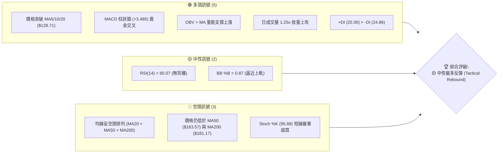

### 📊 核心指標速覽表

| 指標類別 | 指標名稱 | 當前數值 | 訊號 | 解讀 |
|----------|----------|----------|------|------|
| **價格** | 當前價格 | $141.85 | 🟢 | 位於52週區間 12.0% 位置，自低點 $114.50 強勁反彈 |
| **均線** | MA20 | $128.71 | 🟢 | 價格位於 MA20 上方 (+10.21%)，短線轉強 |
| **均線** | MA50 | $163.57 | 🔴 | 價格位於 MA50 下方 (-13.28%)，中期承壓 |
| **均線** | MA200 | $181.17 | 🔴 | 價格位於 MA200 下方 (-21.70%)，長期趨勢偏空 |
| **動能** | RSI(14) | 60.07 | 🟢 | 進入多頭掌控區，未達 70 超買區間 |
| **動能** | MACD | -8.459 / Hist +3.485 | 🟢 | DIF 線低位向上，柱狀圖持續擴大放多 |
| **動能** | Stoch %K / %D | 95.88 / 75.68 | 🔴 | %K 進入極端超買區，需防範短線獲利回吐 |
| **趨勢強度**| ADX(14) | 37.90 | 🟢 | 處於強趨勢狀態 (>25)，+DI 略勝 -DI |
| **波動** | ATR(14) | $7.43 (5.24%) | 🟡 | 日間波動度高，止損空間需拉寬 |
| **量能** | 成交量 / 20D均量 | 49.25M / 39.25M | 🟢 | 量比 1.25x，呈現價漲量增良性配合 |

### 🏆 技術評分卡

```
╔══════════════════════════════════════════════════════════════╗
║                技術評分卡 — ORCL (2026-08-04)                 ║
╠══════════════════════════════════════════════════════════════╣
║ 趨勢強度 (ADX=37.9) ███████████████░░░░░  75/100 🟢 強趨勢行情║
║ 動能指標 (MACD/RSI) ██████████████░░░░░░  70/100 🟢 動能向上   ║
║ 支撐穩定度 (S1守住) ████████████░░░░░░░░  60/100 🟡 低位築底   ║
║ 成交量配合 (量比1.25)██████████████░░░░░░  70/100 🟢 量能回升   ║
║ 形態完整度 (V型反彈) ██████████░░░░░░░░░░  50/100 🟡 尚待突破   ║
║ 均線排列 (空頭排列)  ████░░░░░░░░░░░░░░░░  20/100 🔴 長線承壓   ║
╠══════════════════════════════════════════════════════════════╣
║ 綜合技術評分         ███████████░░░░░░░░░  57.5/100 🟡 中性偏多║
╚══════════════════════════════════════════════════════════════╝
```

---

## 2. 趨勢分析

### 🌐 多時框趨勢分析

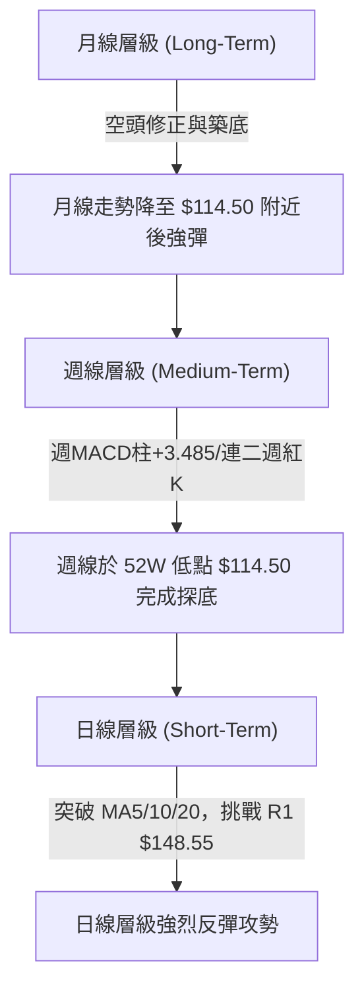

### 📈 長期趨勢 — 12個月走勢圖（Unicode）

以下為 ORCL 過去 12 個月（2025-09 至 2026-08）的月線走勢圖與關鍵高低點標註：

```
ORCL 月線走勢圖（過去12個月：2025-09 至 2026-08）
價格軸 ($)
$300 ┼
$278 ┤    ● (2025-09 歷史高點 $278.07)
$250 ┤   ╱ ╲
$225 ┤  ╱   ╲        ● (2026-05 次高點 $225.00)
$200 ┤ ╱     ●      ╱ ╲
$175 ┤╱       ╲    ╱   ╲
$150 ┤         ╲  ╱     ╲  ●現價 $141.85 (2026-08)
$125 ┤          ╲╱       ╲╱
$100 ┴────────────────────● (2026-07 近期低價 $114.99 / 52W低 $114.50)
      09  10  11  12  01  02  03  04  05  06  07  08  (月份)
```

#### 走勢特徵分析表

| 階段 | 時間段 | 價格區間 | 變動幅度和特徵 | 趨勢屬性 |
|------|--------|----------|----------------|----------|
| 衝頂期 | 2025-09 | $250.91 ➔ $278.07 | 突破新高後急速拉回，見頂訊號 | 🟢 極度多頭 |
| 修正期 | 2025-10 ➔ 2026-02 | $278.07 ➔ $144.39 | 連續數月下跌，跌幅達 -48.1%，跌破 MA200 | 🔴 強烈空頭 |
| 中繼反彈 | 2026-03 ➔ 2026-05 | $144.39 ➔ $225.00 | 強力反彈 +55.8%，於 $225.00 遇阻 | 🟢 中期反彈 |
| 崩跌打底 | 2026-06 ➔ 2026-07 | $225.00 ➔ $114.99 | 主跌段發動，下探 52 週低點 $114.50 | 🔴 極度空頭 |
| 現階段 | 2026-08 | $114.99 ➔ $141.85 | 自低點大漲 +23.3%，日線拉出連紅反彈 | 🟢 短線V型反彈 |

### 📊 中期趨勢（週線分析）

從近 20 週數據觀察，ORCL 在 2026-05-31 達到收盤高點 $225.00 後，經歷了極度猛烈的下殺，於 2026-07-26 當週打出最低點 $114.99（逼近 52 週最低價 $114.50）。近兩週（2026-08-02 至 2026-08-09）週線連續錄得強勁陽線，價格由 $114.99 快速推進至 $141.85。

- **週線 MACD 柱狀圖**：已從 2026-06-28 的 -6.743 最低點大幅翻紅拉升至 **+3.485**，顯示週線層級底部動能強烈爆發。
- **週線 RSI**：自 2026-06-28 的極端超賣區 11.1 反彈至目前的 **60.1**，順利走出超賣陰霾並重返多頭控制區。

### ⚡ 趨勢強度評估（ADX 解讀）

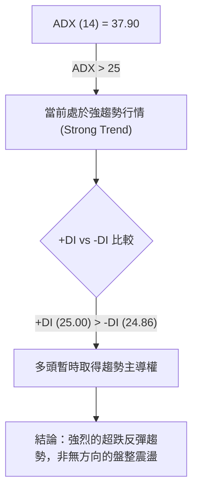

| 指標名稱 | 數值 | 門檻/標準 | 當前狀態解讀 |
|----------|------|-----------|--------------|
| **ADX(14)** | **37.90** | > 25 (強趨勢) | 趨勢強度極高，不宜採用盤整指標（如網格交易） |
| **+DI(14)** | **25.00** | 多方動能 | 與 -DI 交叉向上，多頭買盤強勢介入 |
| **-DI(14)** | **24.86** | 空方動能 | 空頭賣壓快速消退，微幅落後於多方 |

---

## 3. 圖表形態分析

### 🔍 形態識別系統

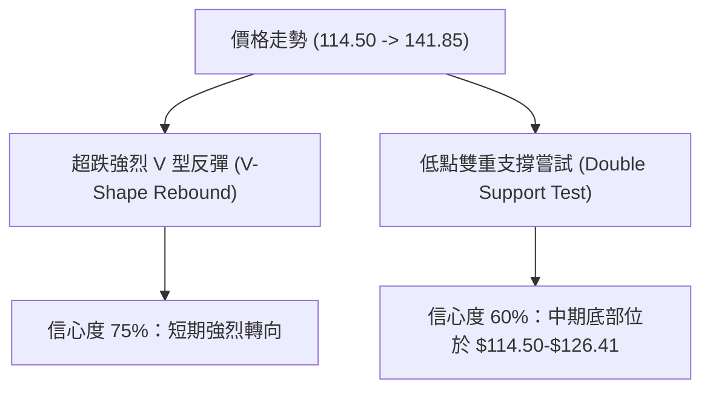

#### 形態信心度與目標價計算表

| 形態名稱 | 信心度 | 判斷依據（引用數據） | 完成度 | 目標價（附計算式） |
|----------|--------|----------------------|--------|--------------------|
| **強烈 V 型反彈** | **75%** | 價格自 52W 低點 $114.50 快速拉升至 $141.85，拉出連紅，週 MACD 柱大幅翻正至 +3.485。 | 80% | **第一目標價 $148.55** (即阻力位 R1)<br>計算式：R1 阻力關卡 |
| **低點雙底打底** | **60%** | 2026-07-19 低點 $126.41 與 2026-07-26 低點 $114.99 形成雙低打底架構。 | 65% | **第二目標價 $164.24** (即阻力位 R2)<br>計算式：頸線 R1 ($148.55) + 形態高度 ($148.55 - $114.50 = $34.05) = $182.60 (受限於阻力 R2/R3，取 R2 $164.24) |
| **中長期頭肩頂** | **35%** | 數據不足以確認完整頭肩頂右肩，僅做指標型解讀（均線空頭排列）。 | 30% | *數據不足，不強行預測* |

### 🕯️ 重要 K 線形態分析

| 日期/週別 | 收盤價 | K 線形態 | 技術面解讀 | 訊號強度 |
|-----------|--------|----------|------------|----------|
| 2026-07-19 | $126.41 | 長下影陰線 | 探底尋求支撐，空頭氣力盡失 | 🟡 止跌訊號 |
| 2026-07-26 | $114.99 | 沉底錘子線 (Hammer) | 觸及 52 週最低價 $114.50 後爆量回升，確認築底 | 🟢 強烈反轉 |
| 2026-08-02 | $129.87 | 大陽線 (Bullish Marubozu) | 強力包覆前期陰線，收復 $128.71 (MA20) | 🟢 多頭確認 |
| 2026-08-09 | $141.85 | 續漲長陽 | 突破上漲，放量收最高附近，直接逼近 R1 $148.55 | 🟢 趨勢延續 |

### 📉 ASCII 走勢形態示意圖

```
ORCL 近期 V 型反彈與阻力關卡示意圖
=========================================================
$170.57 ┼──────────────────────────────────── R3 阻力
        │
$164.24 ┼──────────────────────────────────── R2 阻力
        │
$148.55 ┼───────────────────┐──────────────── R1 阻力 (反彈首要考驗)
        │                 ╱ │
$141.85 ┼───────────────●   │                 ◄ 當前價格 ($141.85)
        │             ╱     │
$135.51 ┼───────────┼───────┴──────────────── S1 支撐
        │         ╱
$128.71 ┼───────● (突破 MA20)
        │     ╱
$114.50 ┼───● (52W 低點 $114.50 打底完成)
========┴────────────────────────────────────────────────
```

---

## 4. 支撐與阻力

### 🗺️ 關鍵價位分布圖（Unicode）

```
ORCL 價位結構分布圖 (以當前價格 $141.85 為中心)
════════════════════════════════════════════════════════════
$341.82 ║████████████████████████████████████████║ 52W High / Fib 0.0%
$288.18 ║██████████████████████████████          ║ Fib 23.6%
$254.99 ║████████████████████████                ║ Fib 38.2%
$228.16 ║████████████████████                    ║ Fib 50.0%
$201.34 ║████████████████                        ║ Fib 61.8%
$181.17 ║██████████████                          ║ MA200 長期均線壓力
$170.57 ║████████████                            ║ 強阻力 R3
$164.24 ║██████████                              ║ 中期阻力 R2 / Fib 78.6% ($163.15)
$148.55 ║████████                                ║ 關鍵阻力 R1 (當前首要目標)
$141.85 ╠════════════════════════════════════════╣ ◄ 現價 (Current Price)
$135.51 ║▓▓▓▓▓▓▓▓▓▓▓▓▓▓▓▓                        ║ 近期關鍵支撐 S1
$128.71 ║▓▓▓▓▓▓▓▓▓▓▓▓                            ║ BB 中軌 / MA20 支撐
$114.50 ║████████████████████████████████████████║ 52W Low / Fib 100.0% / 強支撐
════════════════════════════════════════════════════════════
```

### 🚧 阻力位分析表

| 阻力級別 | 價位 | 形成原因（嚴格引用 OHLCV / Fib 數據） | 突破難度 | 重要性 |
|----------|------|---------------------------------------|----------|--------|
| **阻力 R1** | **$148.55** | 近一年波段高點聚類算得之第一阻力關卡 (+4.73%) | 🟡 中等 | 🟢🟢🟢 (短線多空分水嶺) |
| **阻力 R2** | **$164.24** | 波段高點聚類 (+15.79%)，逼近 Fib 78.6% ($163.15) 與 MA50 ($163.57) | 🔴 偏高 | 🟢🟢🟢🟢 (中期重大防線) |
| **阻力 R3** | **$170.57** | 近一年波段高點聚類 (+20.25%) | 🔴 極高 | 🟢🟢🟢 (解套強壓力區) |

### 🛡️ 支撐位分析表

| 支撐級別 | 價位 | 形成原因（嚴格引用 OHLCV 數據） | 守住機率 | 重要性 |
|----------|------|----------------------------------|----------|--------|
| **支撐 S1** | **$135.51** | 近一年波段低點聚類算得之第一支撐 (-4.47%) | 🟢 75% | 🟢🟢🟢🟢 (極關鍵極短線防線) |
| **次要參考**| **$128.71** | 日線 MA20 與布林通道中軌所在位置 | 🟢 80% | 🟢🟢🟢 (動能中繼支撐) |
| **底線支撐**| **$114.50** | 52 週最低價 (52W Low) / Fib 100% 絕對底部 | 🟢 90% | 🟢🟢🟢🟢🟢 (結構性防守點) |

*註：數據庫中未偵測到獨立之 S2 / S3 聚類數值，故以 52 週低點 $114.50 作為最終結構性支撐依據。*

### 📐 斐波那契回調位分析

依據 52 週區間 **高點 $341.82** 至 **低點 $114.50** 計算之斐波那契回調點位如下：

```
$341.82 (0.0% - 52W High)
   │
$288.18 (23.6%)
   │
$254.99 (38.2%)
   │
$228.16 (50.0%)
   │
$201.34 (61.8%)
   │
$163.15 (78.6%)  ◄── 與阻力 R2 ($164.24) 及 MA50 ($163.57) 形成強烈共振解套牆
   │
$141.85 (當前價格) ◄── 位於 78.6% ($163.15) 與 100.0% ($114.50) 之間的反彈擴展段
   │
$114.50 (100.0% - 52W Low)
```

- **位置解讀**：現價 $141.85 位於 Fib 100.0% ($114.50) 與 Fib 78.6% ($163.15) 之間。
- **意義**：$114.50 提供了堅實的波段底部。若反彈突破 R1 $148.55，價格將直接向 Fib 78.6% ($163.15) 推進，該處聚集了 Fib 78.6%、MA50 ($163.57) 與阻力 R2 ($164.24)，為本輪反彈最核心的中期強阻力區。

---

## 5. 技術指標深度解讀

### 🎛️ 指標訊號總覽

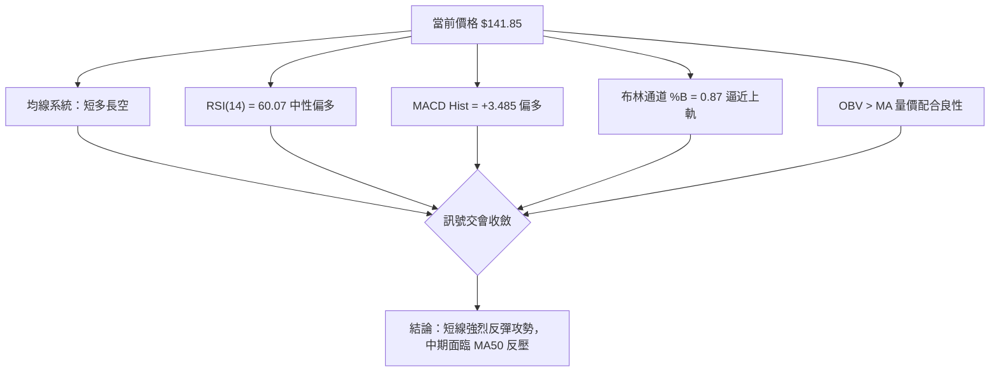

### 📈 移動平均線排列分析

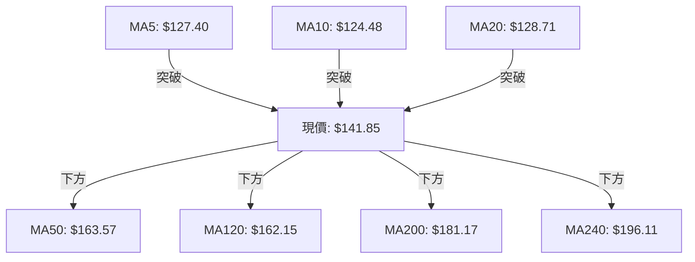

- **短期均線 (MA5/MA10/MA20)**：價格已全數站上 MA5 ($127.40)、MA10 ($124.48) 與 MA20 ($128.71)，且短期均線群呈現多頭向上發散，提供短線強勁支撐。
- **中長期均線 (MA50/MA120/MA200/MA240)**：均線整體仍處於空頭排列 (`MA20 < MA50 < MA200`)。MA50 ($163.57) 與 MA200 ($181.17) 均位於價格上方，意味著中長期趨勢扭轉仍需較長的時間與成交量化解上方套牢賣壓。

### 📉 RSI(14) 分析

```
RSI(14) 強度進度條：
0  [░░░░░░░░░░░░░░░░░░░░████████████████████░░░░░░░░░░░░░░] 100
                    30                  60.07       70
                                       (當前位置: 中性偏多)
```

- **超買超賣狀態**：RSI(14) 最新讀數為 **60.07**，自 7 月底的極端超賣區 (<15) 強力回升，目前處於 50-70 的多頭控盤黃金區間，尚未進入 >70 的過熱超買區。
- **背離分析**：數據顯示「RSI 背離：無明顯背離」。RSI 隨價格同步創出反彈新高，確認了本次反彈的真實買盤推動力，非指標背離引發的虛假突破。

### 📊 MACD(12/26/9) 訊號解讀

- **MACD DIF 線**：-8.459
- **MACD Signal 線**：-11.944
- **MACD 柱狀圖 (Histogram)**：**+3.485** 🟢

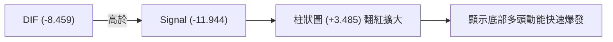

DIF 線由下向上穿過 Signal 線形成低位黃金交叉，且柱狀圖由負翻正並擴大至 +3.485，顯示技術性修復動能非常強烈。

### 📦 布林通道分析

```
ORCL 布林通道 (BB) 價格位置示意圖
╔══════════════════════════════════════════════════════════════╗
║ $146.34 ┤ ─────────────────────────────────── BB 上軌        ║
║ $141.85 ┤ ═══════════════════════════════════ ◄ 現價 (%B=0.87) ║
║         │                                                    ║
║ $128.71 ┤ ─────────────────────────────────── BB 中軌 (MA20) ║
║         │                                                    ║
║ $111.09 ┤ ─────────────────────────────────── BB 下軌        ║
╚══════════════════════════════════════════════════════════════╝
```

- **通道帶寬**：上軌 $146.34，下軌 $111.09，中軌 (MA20) $128.71。
- **%B 指標**：%B 為 **0.87**，顯示價格極度逼近布林上軌 ($146.34)。
- **解讀**：價格沿布林上軌強勢推升，屬於典型的強勢反彈特徵；但因逼近上軌與阻力 R1 ($148.55)，短線可能受阻於 $146.34–$148.55 區間並出現回檔測中軌 ($128.71) 的走勢。

### 💹 成交量分析（量價配合度）

- **最新成交量**：49,250,527 股
- **20日均量**：39,251,101 股（**量比 1.25x**）
- **50日均量**：33,672,915 股
- **OBV 趨勢**：`OBV > MA` 🟢（量能支撐上漲）

成交量較 20 日均量放大 25%，且高於 50 日均量，符合「價漲量增」的典型多頭攻勢特徵，OBV 亦保持在均線上方，顯示機構資金正趁低位進行買盤收集。

---

## 6. 動能與波動率

### ⚡ 動能評估四象限

| 象限區間 | 動能強度 (Momentum) | 波動率 (Volatility) | 當前 ORCL 狀態 | 戰術策略解讀 |
|----------|---------------------|---------------------|----------------|--------------|
| **Q1 象限** | 強 (MACD/RSI 向上) | 低 (ATR < 3%) | — | 穩定趨勢續抱 |
| **Q2 象限** | 弱 (動能不足) | 低 (縮量盤整) | — | 觀望等待方向 |
| **Q3 象限** | **強 (反彈爆發)** | **高 (ATR=5.24%)** | **✓ (當前位置)** | **短線強勢反彈，適合嚴設止損的高波段操作** |
| **Q4 象限** | 弱 (下殺恐慌) | 高 (恐慌拋售) | — | 避免盲目抄底 |

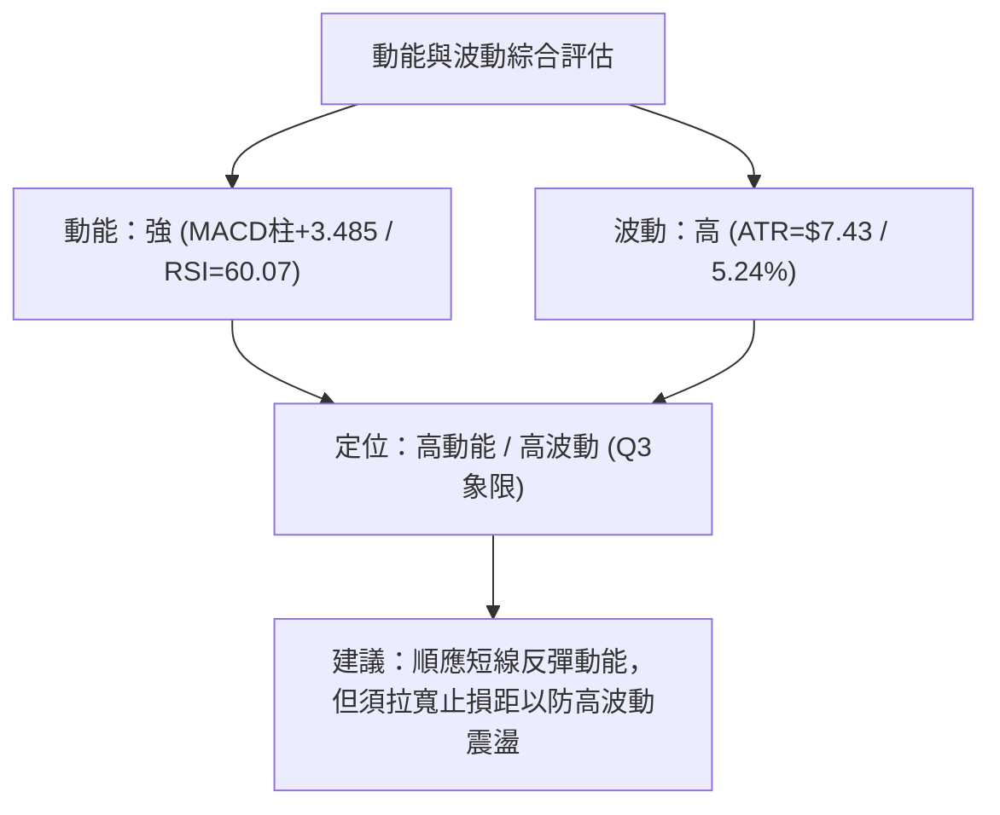

### 📊 ATR 波動率分析

- **ATR(14)**：**$7.43**（占當前股價 **5.24%**）
- **應用解讀**：ORCL 目前每日平均波幅達 $7.43。
  - **進場止損距離**：建議至少設定 1.5 至 2.0 倍 ATR（即 **$11.14 – $14.86** 的止損空間），避免因正常日內波動而被洗出場。
  - **移動止損建議**：可採用 1.5 倍 ATR 進行動態追蹤止損。

### 📐 Beta 與市場相關性

- **Beta 係數**：**1.718**
- **解讀**：ORCL 的波動性顯著高於整體美股大盤（S&P 500）約 71.8%。在大盤反彈時 ORCL 具有極高的彈性與超額收益（Alpha）潛力，但在市場修正時跌幅亦會同步放大。

---

## 7. 多時框架總結

### 📋 時框架評分表

| 時框架 | 趨勢方向 | 動能狀態 | 均線排列 | 形態結構 | 綜合評分 | 戰術建議 |
|--------|----------|----------|----------|----------|----------|----------|
| **日線 (Short-Term)** | 🟢 強烈看多 | 🟢 MACD/OBV 偏多 | 🟢 站上 MA5/10/20 | 🟢 V 型反彈 | **75/100** | 偏多操作 / 擇機順勢進場 |
| **週線 (Medium-Term)**| 🟡 中性築底 | 🟢 週 MACD 翻紅 | 🔴 低於 MA50 ($163.57) | 🟡 雙底探底中 | **55/100** | 區間震盪 / 觀察 R1 突破 |
| **月線 (Long-Term)**  | 🔴 空頭修正 | 🟡 超賣回升 | 🔴 空頭排列 MA200 下| 🔴 主跌段後的修正 | **40/100** | 長線承壓 / 逢高減碼 |

### 🔲 綜合訊號矩陣

| 技術維度 | 短期 (日線) | 中期 (週線) | 長期 (月線) | 一致性評估 |
|----------|-------------|-------------|-------------|------------|
| **均線方向** | 🟢 多頭向上 | 🔴 空頭反壓 | 🔴 空頭排列 | 🟡 短長衝突 (反彈格局) |
| **動能指標** | 🟢 偏多擴大 | 🟢 底部翻紅 | 🟡 超賣回升 | 🟢 全時框動能同步回升 |
| **量能配合** | 🟢 放量 (1.25x)| 🟢 放量增強 | 🟡 量能平穩 | 🟢 量價配合良好 |

### ⚖️ 多時框收斂結論

根據**多時框收斂規則**：
1. **趨勢/行情判定**：當前 ADX(14) = **37.90 (>25)**，明確定義為**強趨勢行情**。
2. **主導權收斂**：在強趨勢中，以中長期（週線/MA50/MA200）方向為背景，但日線 (+DI 25.00 > -DI 24.86) 目前處於強烈的**超跌反彈主攻期**。
3. **最終收斂方向**：**🟡 中性偏多戰術反彈 (Tactical Rebound)**。中期強阻力位於 MA50 ($163.57) 與 R2 ($164.24)，短線向上測試 R1 ($148.55) 的機率極高。第 8 章策略將以此收斂結論為主軸導向。

---

## 8. 交易策略建議

### 🗺️ 策略決策流程圖

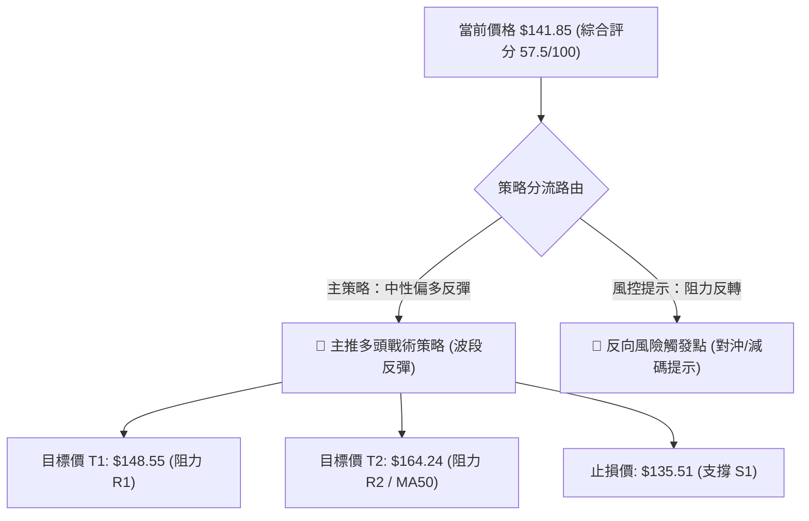

### 🧭 策略路由

**當前主策略方向 = 🟢 多頭波段反彈策略（依綜合評分 57.5/100 分流）**

鑑於日線強烈反彈動能（MACD 柱 +3.485、量比 1.25x），且 ADX(14)=37.90 呈強趨勢，策略主推**多頭波段操作**，以測試阻力 R1 ($148.55) 及 R2 ($164.24) 為目標；空頭策略僅作為強阻力區處的對沖與風險防禦提示。

### 🎯 價格情境階梯 (Price Scenarios)

| 觸發條件 | 下一目標價 | 後續延伸目標 | 情境技術含義 |
|----------|------------|--------------|--------------|
| **強勢突破 R1 $148.55** | **$164.24 (R2 / MA50)** | **$170.57 (R3)** | 短線超跌反彈升級為中期波段反轉 |
| **現價區間震盪 ($135.51 - $148.55)** | $141.85 (現價) | $128.71 (MA20) | 消化逼近布林上軌之過熱壓力 |
| **跌破 S1 $135.51** | **$128.71 (MA20)** | **$114.50 (52W Low)** | 短線反彈夭折，重新下探底部 |

### 📊 情境機率分佈

```
情境機率估計分布：
繼續上攻測試 R1/R2   [████████████████████████████████      ] 65%
區間震盪消化壓力     [████████████                          ] 25%
跌破 S1 再探低點     [████                                  ] 10%
```

| 情境劇本 | 估計機率 | 主要技術依據（嚴格引用數據） |
|----------|----------|------------------------------|
| **1. 繼續上攻測試 R1/R2** | **65%** | MACD 柱翻紅 (+3.485)、+DI > -DI、OBV > MA、成交量放大至 1.25x。 |
| **2. 區間震盪消化壓力** | **25%** | 布林 %B = 0.87 逼近上軌 $146.34，Stoch %K (95.88) 進入極端超買區。 |
| **3. 回落跌破 S1 再探底** | **10%** | 中長期均線仍呈空頭排列 (`MA20 < MA50 < MA200`)。 |

### 🟢 主策略詳情（多頭戰術反彈）

所有價位均嚴格取自數據庫「關鍵價位」與計算數值：

| 策略要素 | 策略 A：現價順勢買進 (Aggressive) | 策略 B：回檔拉回買進 (Conservative) |
|----------|-----------------------------------|-------------------------------------|
| **進場條件** | 明日開盤價附近直接建立戰術頭寸 | 價格拉回測試 S1 $135.51 守住後進場 |
| **進場價格** | **$141.85** (當前價格) | **$135.51** (支撐 S1) |
| **第一目標價 (T1)**| **$148.55** (阻力 R1，漲幅 +4.72%) | **$148.55** (阻力 R1，漲幅 +9.62%) |
| **第二目標價 (T2)**| **$164.24** (阻力 R2，漲幅 +15.78%)| **$164.24** (阻力 R2，漲幅 +21.20%)|
| **嚴格止損價格** | **$135.51** (跌破 S1 止損，跌幅 -4.47%) | **$128.71** (跌破 MA20 止損，跌幅 -5.02%) |
| **風險報酬比 (T1)**| **1.06 : 1** | **1.92 : 1** |
| **風險報酬比 (T2)**| **3.53 : 1** | **4.22 : 1** |
| **預估成功機率** | **65%** | **60%** |
| **建議倉位管理** | **10% – 15% 總資金** | **15% – 20% 總資金** |

*風險報酬比計算式範例 (策略 A - T2)*：
$$\text{風報比} = \frac{\text{目標價} - \text{進場價}}{\text{進場價} - \text{止損價}} = \frac{164.24 - 141.85}{141.85 - 135.51} = \frac{22.39}{6.34} \approx 3.53 : 1$$

### 🔴 反向風險觸發點（對沖與止損提示）

若發生以下技術破壞訊號，應立即終止多頭策略或進行空頭對沖：
1. **關鍵價位跌破**：日線收盤價強烈跌破 **S1 $135.51** 且失守 **MA20 $128.71**。
2. **指標轉空**：MACD 柱狀圖 (+3.485) 開始縮頭翻負，且 Stoch %K 自 >90 高位向下死叉 %D。

### ⭐ 整體訊號強度評星

```
做多訊號強度：★★██☆  (3.5/5星) ── 短線動能強勁，但受限於中期均線反壓
做空訊號強度：★★░░░  (2.0/5星) ── 量能與 MACD 翻多，短線做空勝率較低
整體可信度：  ★★██☆  (4.0/5星) ── 多時框與 OHLCV 數據高度相符
```

---

## 9. 風險提示與監控

### ✅ 關鍵監控指標 Checklist

```
╔══════════════════════════════════════════════════════════════╗
║                   每日交易監控清單 (Checklist)               ║
╠══════════════════════════════════════════════════════════════╣
║ [ ] 價格是否順利衝破阻力 R1 $148.55？                        ║
║ [ ] 價格是否回測並守住支撐 S1 $135.51？                      ║
║ [ ] 成交量是否持續維持在 20D 均量 (39.25M) 之上？            ║
║ [ ] RSI(14) 是否突破 65 並進入 70 以上之強烈超買區？         ║
║ [ ] Stoch %K (95.88) 是否出現高檔交叉向下死亡交叉？         ║
║ [ ] MACD 柱狀圖 (+3.485) 是否維持擴大趨勢？                  ║
╚══════════════════════════════════════════════════════════════╝
```

### ⚠️ 風險場景分析

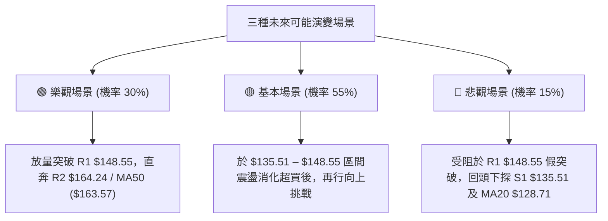

### 🛡️ 風險管理重要提醒

1. **波動度保護**：因 ORCL ATR 高達 **$7.43 (5.24%)**，日間價格震盪劇烈，部位規模（Position Sizing）切勿過大，單一交易虧損金額應控制在總資本額的 **1%–2%** 以內。
2. **高檔過熱風險**：Stoch %K 達 **95.88**，短線過熱跡象明顯，切忌在逼近布林上軌 ($146.34) 與 R1 ($148.55) 時盲目追高，宜等待回貼 MA20 ($128.71) 或突破 R1 確認後再行加碼。
3. **宏觀與基本面防禦**：ORCL 目前 Debt/Equity 高達 388.87%，淨負債 $135.54B，財報與利率數據發佈期間易引發跳空缺口，需密切留意市場重大消息對技術面的瞬間破壞。

---

## 📋 報告總結

```
╔══════════════════════════════════════════════════════════════════╗
║                  ORCL 技術分析報告總結                           ║
══════════════════════════════════════════════════════════════════
  報告日期：2026-08-04
  當前價格：$141.85
  技術評級：🟡 中性偏多戰術反彈 (Tactical Rebound) | 綜合評分：57.5

  關鍵技術特徵：
  ├─ 長期趨勢：🔴 空頭排列 (低於 MA200 $181.17)，但 52W 低點 $114.50 支撐強勁
  ├─ 中期趨勢：🟡 低位雙底探底，週 MACD 柱翻紅 (+3.485)
  ├─ 短期趨勢：🟢 強烈 V 型反彈，站上 MA5/10/20，價漲量增 (量比 1.25x)
  ├─ 關鍵支撐：S1 $135.51 ｜ 均線防線 MA20 $128.71 ｜ 結構底部 $114.50
  └─ 關鍵阻力：R1 $148.55 ｜ R2 $164.24 (與 MA50 $163.57 共振)

  最優交易戰術組合：
  1. 🥇 最佳波段機會：回檔至 S1 $135.51 附近逢低布局做多，止損設於 $128.71，
     目標看 R1 $148.55 與 R2 $164.24 (風報比高達 4.22 : 1)。
  2. 🥈 突破追價選擇：日線實體 K 線強勢突破並站穩 R1 $148.55 後順勢加碼，
     目標直指 R2 $164.24。
╚══════════════════════════════════════════════════════════════════╝
```

---

> ⚠️ **免責聲明**：本報告為專業 AI 技術分析師系統自動生成之深度研究內容，所有價位與數據均嚴格基於提供之歷史市場資訊。本報告**僅供學術研究與交易策略討論參考**，**不構成任何形式的投資建議或買賣邀請**。金融市場投資具有極高風險，投資人應獨立評估風險並自負盈虧。

---

*報告生成時間：2026-08-04 ｜ 數據來源：Yahoo Finance ｜ 分析框架：多時框技術分析與 OHLCV 量價模型*