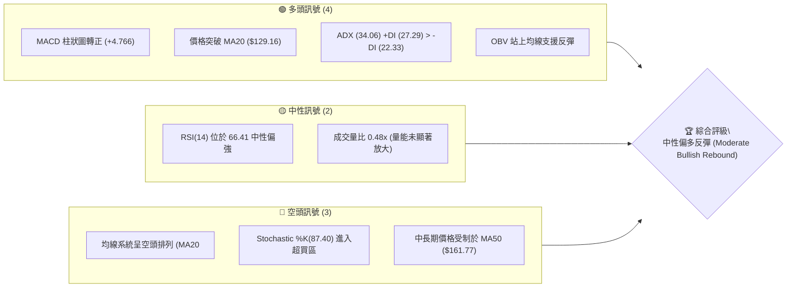
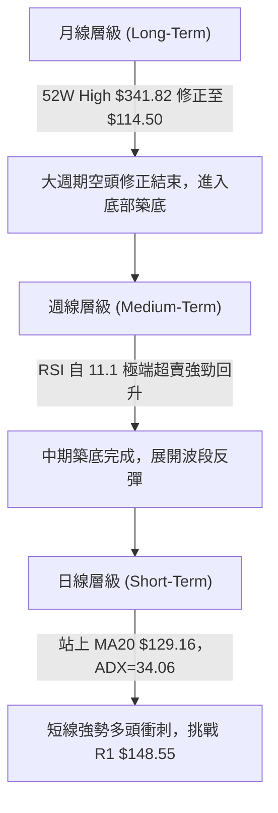
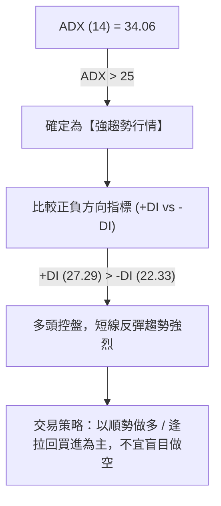
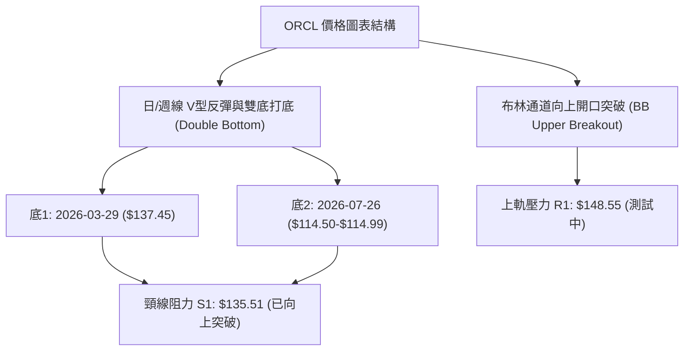
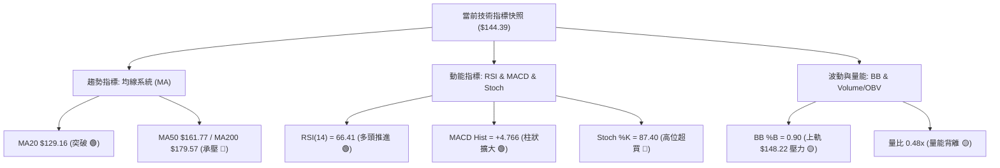
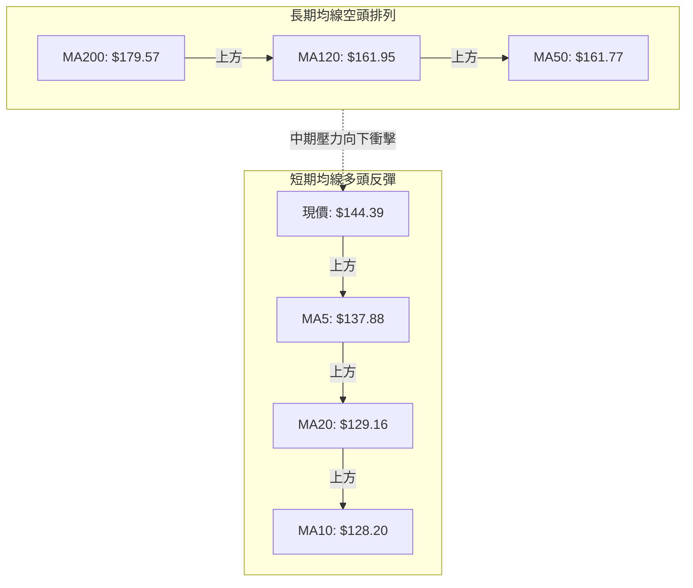
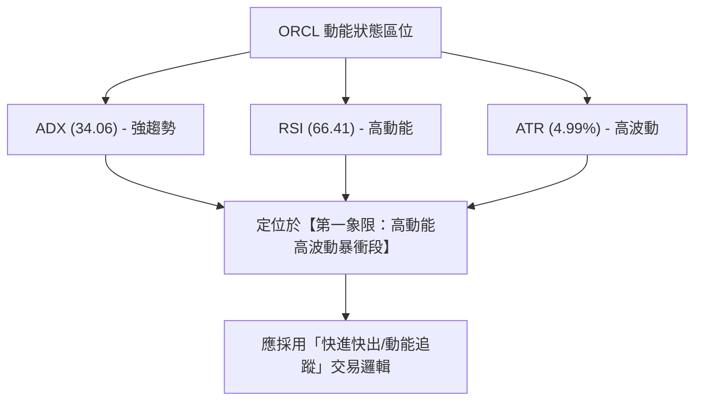
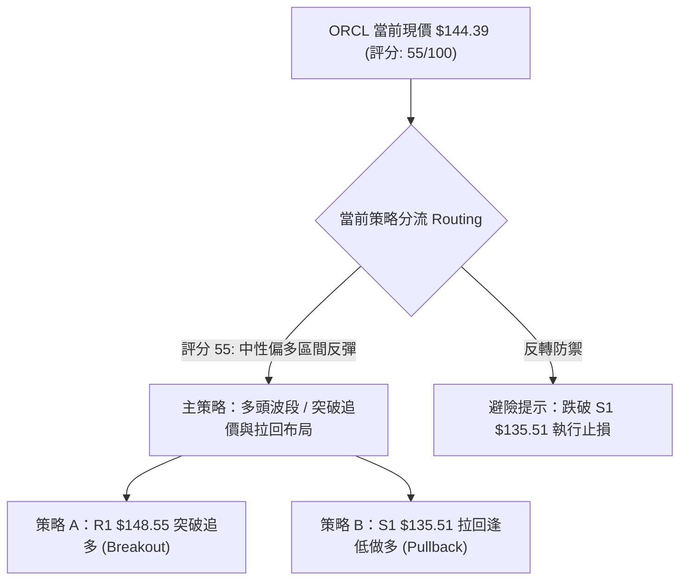
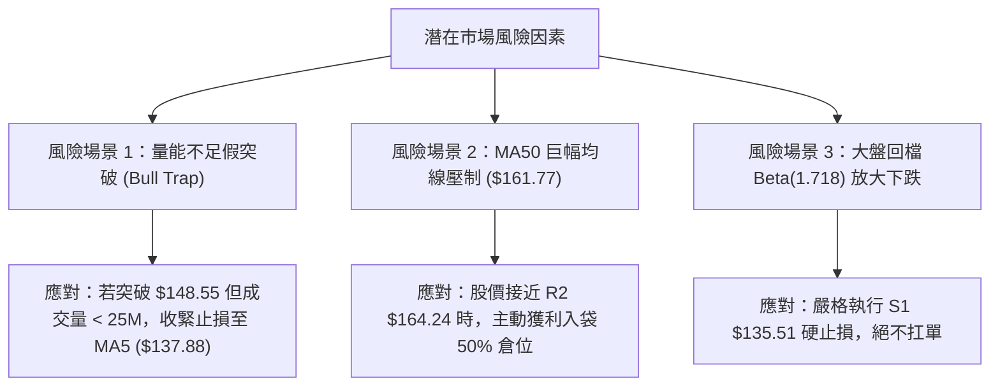

# ORCL 技術分析報告

> **報告日期**：2026-08-06 ｜ **語言**：繁體中文 ｜ **數據來源**：Yahoo Finance ｜ **當前價格**：$144.39

---

## 目錄

| 章節 | 內容 |
|------|------|
| [1. 技術面概覽](#1-技術面概覽) | 訊號儀表板、核心指標、評分卡 |
| [2. 趨勢分析](#2-趨勢分析) | 多時框趨勢、長中短期走勢 |
| [3. 圖表形態分析](#3-圖表形態分析) | 形態識別、K線組合、目標價 |
| [4. 支撐與阻力](#4-支撐與阻力) | 關鍵價位、斐波那契回調 |
| [5. 技術指標深度解讀](#5-技術指標深度解讀) | MA/RSI/MACD/布林/成交量 |
| [6. 動能與波動率](#6-動能與波動率) | 動能評估、ATR、Beta |
| [7. 多時框架總結](#7-多時框架總結) | 時框架評分矩陣 |
| [8. 交易策略建議](#8-交易策略建議) | 多空策略、風險報酬比 |
| [9. 風險提示與監控](#9-風險提示與監控) | 監控指標、風險場景 |

---

## 1. 技術面概覽

### 🎯 技術訊號儀表板



### 📊 核心指標速覽表

| 指標類別 | 指標名稱 | 當前數值 | 訊號 | 解讀 |
|----------|----------|----------|------|------|
| **價格** | 當前收盤價 | $144.39 | 🟢 | 站上 52 週低點 ($114.50) 強力反彈 +26.1% |
| **均線** | MA20 | $129.16 | 🟢 | 價格位於 MA20 上方 (+11.79%)，短線扭轉頹勢 |
| **均線** | MA50 | $161.77 | 🔴 | 價格位於 MA50 下方 (-10.74%)，中期承壓 |
| **均線** | MA200 | $179.57 | 🔴 | 價格位於 MA200 下方 (-19.59%)，長期趨勢偏空 |
| **動能** | RSI(14) | 66.41 | 🟢 | 強勁反彈進入偏多區間，尚未出現頂背離 |
| **動能** | MACD (12,26,9) | Hist +4.766 | 🟢 | 柱狀圖持續擴大，發出零軸下方金叉買入訊號 |
| **動能** | Stochastic %K/%D | 87.40 / 91.49 | 🔴 | 短線過熱，進入高檔超買區間 |
| **趨勢** | ADX (14) | 34.06 | 🟢 | 強趨勢狀態，+DI > -DI 顯示多頭掌控短線 |
| **波動** | ATR (14) | $7.20 (4.99%) | 🟡 | 日波動率正常，波幅提供充足交易空間 |
| **通道** | BB %B | 0.90 | 🟡 | 價格貼近布林通道上軌 ($148.22)，面臨軌道壓力 |

### 🏆 技術評分卡

```
╔══════════════════════════════════════════════════════════════════╗
║                技術評分卡 — ORCL (2026-08-06)                   ║
╠══════════════════════════════════════════════════════════════════╣
║ 趨勢強度 (ADX)     ██████████████░░░░░░  68/100  🟢 強趨勢反彈     ║
║ 動能指標 (RSI/MACD) ███████████████░░░░░  75/100  🟢 多頭動能強勁   ║
║ 支撐穩定度 (S1/S2)  ████████████░░░░░░░░  60/100  🟡 52W低點打底成功 ║
║ 成交量配合 (Volume) ████████░░░░░░░░░░░░  40/100  🔴 量能相對偏弱   ║
║ 形態完整度 (Pattern)████████████░░░░░░░░  60/100  🟡 V型反彈進行中  ║
║ 均線排列 (MA System)██████░░░░░░░░░░░░░░  30/100  🔴 長期均線逆風   ║
╠══════════════════════════════════════════════════════════════════╣
║ 綜合評分           ███████████░░░░░░░░░  55/100  🟡 中性偏多反彈   ║
╚══════════════════════════════════════════════════════════════════╝
```

---

## 2. 趨勢分析

### 🌐 多時框趨勢分析



### 📈 長期趨勢 — 12 個月走勢圖（Unicode）

```
ORCL 月線歷史走勢圖 (2025-08 ~ 2026-08)
價格軸 ($)
$300 ┤                                    
$275 ┤                  ● (2025-09 $278.07)
$250 ┤          ●(2025-07 $250.91)
$225 ┤      ●                           ● (2026-05 $225.00)
$200 ┤                                
$175 ┤                                
$150 ┤                                        ● (現價 $144.39)
$125 ┤                                    ● (2026-07 $129.87 / 52W Low $114.50)
     └─────────────────────────────────────────────────────────────► 月份
      25-08 25-09 25-10 25-11 25-12 26-01 26-02 26-03 26-04 26-05 26-06 26-07 26-08
```

#### 走勢特徵分析表

| 階段 | 時間區間 | 價格區間 | 漲跌幅 | 主要特徵分析 |
|------|----------|----------|--------|--------------|
| **高檔主跌段** | 2025-09 ~ 2026-02 | $278.07 ➔ $144.39 | -48.07% | 高估值修復與獲利賣壓，連續跌破多條長期均線 |
| **中繼反彈段** | 2026-03 ~ 2026-05 | $146.09 ➔ $225.00 | +54.01% | 財報效應帶動死貓跳（Dead Cat Bounce），攻高受阻於 50% 斐波那契位 |
| **二次探底段** | 2026-06 ~ 2026-07 | $225.00 ➔ $114.50 | -49.11% | 恐慌性拋售，週線 RSI 降至 11.1 之歷史極端超賣區 |
| **V型強反彈** | 2026-07-26 ~ 今日 | $114.99 ➔ $144.39 | +25.57% | 觸及 52 週低點 S2 ($114.50) 後呈現強烈空頭回補與抄底買盤 |

### 📊 中期趨勢（週線分析）

```
週線級別價格壓力與支撐結構示意圖
═════════════════════════════════════════════════════════════════
  $170.57 ─── [ R3 週線級別重壓 / MA120 $161.95 - MA50 $161.77 ]
    │
  $164.24 ─── [ R2 中期下降趨勢反彈壓力 / 78.6% 斐波位 $163.15 ]
    │
  $148.55 ─── [ R1 布林上軌 $148.22 / 近期前高阻力 ]
    ▲
  $144.39 ─── ◄◄◄ 當前收盤價 (攻向 R1 區域)
    │
  $135.51 ─── [ S1 近期波段回檔支撐 / 頸線位置 ]
    │
  $114.50 ─── [ S2 52週歷史低點 / 強力打底支撐位 ]
═════════════════════════════════════════════════════════════════
```

### ⚡ 趨勢強度評估（ADX 解讀）



#### ADX 趨勢強度對照表

| 指標項 | 數據 | 門檻值 | 當前狀態評估 |
|--------|------|--------|--------------|
| **ADX (14)** | **34.06** | > 25 (強趨勢) | 趨勢非常明確，擺脫無方向之盤整格局 |
| **+DI (14)** | **27.29** | 多方買盤力道 | 向上突破 -DI，顯示多頭短線取得主導權 |
| **-DI (14)** | **22.33** | 空方賣盤力道 | 持續下滑，空頭賣壓暫時退潮 |
| **趨勢定性** | **多頭強趨勢** | ADX>25 & +DI>-DI | 依據規則 14，採取趨勢行情策略，以中短期多頭方向為主導 |

---

## 3. 圖表形態分析

### 🔍 形態識別系統



#### 圖表形態信心度評估表（依據規則 15）

| 形態名稱 | 信心度 | 判斷依據（引用數據） | 完成度 | 目標價（附計算式） |
|----------|--------|----------------------|--------|--------------------|
| **雙底打底 (Double Bottom)** | **75%** | 兩次波段低點分別為 2025-03 ($137.45) 與 2026-07 ($114.50)，現已突破頸線 $135.51 | **85%** | **$156.52**<br>計算式：頸線 $135.51 + (頸線 $135.51 - 低點 $114.50) = $156.52 |
| **V型強勢反彈 (V-Rebound)** | **80%** | 週線自 2026-07-26 收盤 $114.99 連續三週拉出強勁陽線至 $144.39 | **90%** | **$164.24**<br>計算式：以上一波段跌幅之 38.2% 回檔目標及 R2 聚類位設定 |
| **布林通道上軌擠壓突破** | **65%** | %B 達到 0.90，價格接近上軌 $148.22 | **70%** | **$148.55**<br>計算式：直指第一波段阻力 R1 $148.55 |

### 🕯️ 重要 K 線形態分析

| 日期/週別 | 收盤價 | K 線形態 | 解讀 | 訊號 |
|-----------|--------|----------|------|------|
| **2026-06-28** | $148.02 | 大陰線 (Marubozu) | 恐慌性破位賣壓，跌破 MA20 | 🔴 強烈看空 |
| **2026-07-19** | $126.41 | 長下影線 (Hammer) | 探底尋求支撐，多頭開始試探性進場 | 🟡 止跌訊號 |
| **2026-07-26** | $114.99 | 雙重底打底 K 線 | 觸及 52 週低點 $114.50 後迅速獲得支撐 | 🟢 築底完成 |
| **2026-08-02** | $129.87 | 多頭貫穿線 (Piercing) | 強力吞噬前週陰線實體，站回 MA20 ($129.16) | 🟢 強烈看多 |
| **2026-08-09** | $144.39 | 中陽線衝刺 | 連續第三週大漲，向 R1 ($148.55) 逼近 | 🟢 多頭續強 |

### 📉 ASCII 雙底形態示意圖

```
ORCL 雙底 (Double Bottom) 形態構建圖
═════════════════════════════════════════════════════════════════
$164.24 ┤                                      [ R2 形態擴展目標 ]
$156.52 ┤......................................[ 雙底最小測量目標 ]
$148.55 ┤                            ●(現價$144.39衝刺中)
$135.51 ┤──────────● (頸線 Breakout)─────────
$125.00 ┤         / \                       /
$114.50 ┤● (底1) /   \___________● (底2) /
═════════════════════════════════════════════════════════════════
         2025-03                  2026-07
```

### 🎯 形態目標價計算

1. **雙底最小測量目標價 (Minimum Target)**：
   $$\text{目標價} = \text{頸線位} + (\text{頸線位} - \text{第一/二底平均位})$$
   $$\text{目標價} = 135.51 + (135.51 - 114.50) = 135.51 + 21.01 = \mathbf{\$156.52}$$

2. **壓力位對應關係**：
   * 形態目標價 $\$156.52$ 介於阻力位 **R1 ($148.55)** 與 **R2 ($164.24)** 之間，且靠近 MA50 ($161.77) 與 78.6% 斐波那契回調位 ($163.15)。

---

## 4. 支撐與阻力

### 🗺️ 關鍵價位分布圖（Unicode）

```
ORCL 價位結構分布圖 (Price Structure Map)
═════════════════════════════════════════════════════════════════
$341.82 ║████████████████████████████████████████║ 52W High (0.0% Fib)
$254.99 ║████████████████████████                ║ 38.2% Fib 回調位
$201.34 ║██████████████████                      ║ 61.8% Fib / MA240 ($195.38)
$179.57 ║██████████████                          ║ MA200 長期趨勢防線
$170.57 ║████████████                            ║ 強阻力 R3
$164.24 ║██████████                              ║ 阻力 R2 / 78.6% Fib ($163.15)
$161.77 ║█████████                               ║ MA50 中期生命線
$148.55 ║███████                                 ║ 關鍵阻力 R1 / 布林上軌 ($148.22)
$144.39 ╠════════════════════════════════════════╣ ◄◄◄ 當前收盤價
$135.51 ║▓▓▓▓▓▓▓                                 ║ 近期關鍵支撐 S1 / 頸線
$129.16 ║▓▓▓▓▓                                   ║ MA20 短線防禦線 / 布林中軌
$114.50 ║████████████████████████████████████████║ 強支撐 S2 / 52W Low (100.0% Fib)
═════════════════════════════════════════════════════════════════
```

### 🚧 阻力位分析表

| 阻力級別 | 精確價位 | 形成原因（OHLCV 計算） | 突破難度 | 戰略重要性 |
|----------|----------|------------------------|----------|------------|
| **阻力 R1** | **$148.55** | 近一年波段高點聚類 / 布林通道上軌 ($148.22) | 🟡 中等 | 短線多空分水嶺，突破即可打開通往 R2 的空間 |
| **阻力 R2** | **$164.24** | 近一年波段高點聚類 / 78.6% 斐波那契 ($163.15) / MA50 ($161.77) | 🔴 極高 | 中期熊市趨勢反彈的終極強壓區 |
| **阻力 R3** | **$170.57** | 近一年波段高點聚類 / MA120 ($161.95) 與 MA200 ($179.57) 轉折帶 | 🔴 極高 | 長期空頭強防禦區，需超預期催化劑方能跨越 |

### 🛡️ 支撐位分析表

| 支撐級別 | 精確價位 | 形成原因（OHLCV 計算） | 守住機率 | 戰略重要性 |
|----------|----------|------------------------|----------|------------|
| **支撐 S1** | **$135.51** | 近一年波段低點聚類 / 雙底頸線位置 / MA5 ($137.88) 鄰近 | 🟢 75% | 短線多頭防禦底線，回檔不破維持強勢 |
| **支撐 S2** | **$114.50** | 52 週歷史最低點 (52W Low) / 100% 斐波那契位 | 🟢 90% | 中長期絕對鐵底，若跌破將引發新一波結構性清算 |

### 📐 斐波那契回調位分析

依據 52 週區間 **$114.50 (Low)** 至 **$341.82 (High)** 計算：

```
斐波那契分佈與當前價格相對位置
0.0%  (52W High)  $341.82 ------------------------------------------------
23.6%             $288.18 ------------------------------------------------
38.2%             $254.99 ------------------------------------------------
50.0%             $228.16 ------------------------------------------------
61.8%             $201.34 ------------------------------------------------
78.6%             $163.15 ──────────────── (距離現價 +13.0%) ─── R2 阻力區
                             ▲
現價區域:          $144.39 ──┼─ (落於 78.6% 與 100.0% 之間，處於深度修復區)
                             ▼
100.0% (52W Low)  $114.50 ──────────────── (距離現價 -20.7%) ─── S2 鐵底區
```

* **解讀**：現價 $144.39 處於 100.0% ($114.50) 與 78.6% ($163.15) 的反彈修復區間。向上首要挑戰 78.6% 斐波位 ($163.15)，該位置與 R2 阻力位 ($164.24) 及 MA50 ($161.77) 重疊，形成強大的「多重阻力共振區」。

---

## 5. 技術指標深度解讀

### 🎛️ 指標訊號總覽



### 📈 移動平均線排列分析



* **均線狀態解讀**：
  * **短線**：價格 ($144.39) > MA5 ($137.88) > MA10 ($128.20) > MA20 ($129.16)，短線呈標準黃金交叉與多頭發散，推升股價極速反彈。
  * **中長期**：MA20 ($129.16) < MA50 ($161.77) < MA200 ($179.57)，長線仍處於空頭排列形態。當前反彈屬「空頭架構下的強烈技術性修復」。

### 📉 RSI(14) 分析

```
RSI (14) 指標狀態進度條
0                           30           50        66.41    70         100
├───────────────────────────┼────────────┼───────────█──────┼──────────┤
[           超賣區          ] [  中性區   ] [ 買盤主導 █ ]  [  超買區  ]
```

* **當前數值**：**66.41**（從 2026-06 的極端超賣 11.1 強力回升）。
* **背離檢查**：
  * **頂背離**：無（股價創近一月新高，RSI 同步創高）。
  * **底背離**：2026-07 股價探低 $114.99 時，RSI 自 11.1 提升至 26.7，已形成明確的**「底背離（Bullish Divergence）」**，隨後引發本波強烈反彈。
* **結論**：RSI 接近 70 超買臨界點，短線續航力強，但向上空間漸受擠壓。

### 📊 MACD(12,26,9) 訊號解讀

* **MACD 線**：-4.885
* **Signal 線**：-9.651
* **MACD 柱狀圖 (Histogram)**：**+4.766** (🟢 看多)


### 📦 布林通道分析

```
日線布林通道 (Bollinger Bands) 示意圖
═════════════════════════════════════════════════════════════════
  $148.22 ─── ╗ (BB 上軌)  ◄─── 現價 $144.39 逼近上軌 (%B = 0.90)
              ║
  $129.16 ─── ╬ (BB 中軌 / MA20)
              ║
  $110.10 ─── ╝ (BB 下軌)
═════════════════════════════════════════════════════════════════
```

* **帶寬狀態**：通道呈現擴張狀態，%B 達到 **0.90**，顯示股價沿著布林通道上軌劇烈向上推升。
* **軌道戰略意義**：若能突破上軌 $148.22，將觸發軋空行情衝向 R1 ($148.55) 甚至 R2 ($164.24)；若上軌阻力受阻，則可能拉回測試中軌 $129.16。

### 💹 成交量與 OBV 分析

* **最新成交量**：18,318,870
* **20日均量**：38,288,438（**量比 0.48x**）
* **OBV 趨勢**：OBV > MA，量能指標呈向上支撐態勢。
* **量價配合評估**：
  * 🟢 **優勢**：OBV 保持在均線上側，資金未見明顯流出。
  * 🔴 **隱憂**：當前反彈量比僅 0.48x，屬於「量縮價漲」之空頭回補（Short Covering）特徵。攻高至阻力 R1 ($148.55) 需補量（>38M）方能有效突破。

---

## 6. 動能與波動率

### ⚡ 動能評估四象限

| 象限區劃 | 動能強度 (Momentum) | 波動率 (Volatility) | ORCL 當前位置 | 策略涵義 |
|----------|---------------------|---------------------|---------------|----------|
| **Q1: 暴衝型** | 強 (ADX>25, RSI>60) | 高 (ATR%>4.5%) | **✓ 當前象限** | **高動能/高波動：短線順勢交易，緊定止損** |
| **Q2: 穩健型** | 強 (RSI>60) | 低 (ATR%<3.0%) | — | 最佳波段持股區間 |
| **Q3: 沉悶型** | 弱 (ADX<20) | 低 (ATR%<3.0%) | — | 觀望 / 沉澱打底 |
| **Q4: 危險型** | 弱 (RSI<40) | 高 (ATR%>4.5%) | — | 高風險自由落體，嚴禁過早抄底 |



### 📊 ATR 波動率分析

* **ATR(14)**：**$7.20**（占當前股價 4.99%）
* **日內波動範圍建議**：每日平均預期波幅達 $\pm \$7.20$。
* **止損與止盈距離建議**：
  * **短線動能止損 (1.5x ATR)**：$1.5 \times \$7.20 = \mathbf{\$10.80}$
  * **波段寬鬆止損 (2.0x ATR)**：$2.0 \times \$7.20 = \mathbf{\$14.40}$

### 📐 Beta 與市場相關性

* **Beta 係數**：**1.718**
* **解讀**：ORCL 屬於高 Beta 成長型科技股，波動度比標普 500 指數高出 71.8%。在大盤反彈時具有強烈的放大效應，但也需防範大盤拉回時的雙倍下跌風險。

---

## 7. 多時框架總結

### 📋 時框架評分矩陣

| 時框架 | 趨勢方向 | 動能 (RSI/MACD) | 均線排列 | 關鍵圖表形態 | 綜合評分 | 戰略建議 |
|--------|----------|-----------------|----------|--------------|----------|----------|
| **日線 (Daily)** | 🟢 多頭強反彈 | 🟢 RSI 66.4 / MACD+ | 🟢 價>MA5/10/20 | 觸及布林上軌衝刺 | **75/100** | 偏多操作 / 逢拉回進場 |
| **週線 (Weekly)**| 🟡 底部築底 | 🟢 週MACD柱轉正 | 🔴 MA20<MA50<200 | 雙底頸線突破 ($135.51) | **55/100** | 中期觀望 / 突破加碼 |
| **月線 (Monthly)**| 🔴 修正架構 | 🟡 月線跌幅趨緩 | 🔴 長期均線壓力重重 | 52W 低點 $114.50 支撐 | **40/100** | 長線承壓 / 逢高減碼 |

### 🔲 綜合訊號矩陣

```
                     短線 (日線)    中線 (週線)    長線 (月線)
  趨勢 (Trend)          🟢             🟡             🔴
  動能 (Momentum)       🟢             🟢             🟡
  均線 (MA System)      🟢             🔴             🔴
  成交量 (Volume)       🟡             🟡             🔴
  一致性收斂判定：      短期多頭強勁反彈，但受限於中長期空頭均線壓力。
```

### ⚖️ 多時框收斂結論（依據規則 14）

1. **行情定性**：當前 ADX 為 **34.06 (>25)**，明確為**「趨勢行情」**。
2. **主導層級**：依規則 14，趨勢行情以**中長期（週線/MA50 $161.77、MA200 $179.57）方向為宏觀框架**，日線用於尋找具體進場時機。
3. **最終方向性結論**：**【中性偏多反彈波（Tactical Bullish Rebound）】**。
   * **理由**：週線於 $114.50 完成雙底打底，日線突破頸線 $135.51 與 MA20 ($129.16)，多頭控盤明確；然而中長線 MA50 ($161.77) 與 R2 ($164.24) 存在強大上檔壓制，故定調為「中短線多頭反彈，唯上方空間受阻於中期壓力」。第 8 章策略將據此精確展開。

---

## 8. 交易策略建議

### 🗺️ 策略決策流程圖



### 🧭 策略路由說明

* **當前主策略方向**：**多頭波段反彈策略（偏多操作）**
* **依據**：技術評分卡綜合評分為 **55/100**（高於 50 門檻），ADX=34.06 且 +DI > -DI 顯示短線多頭掌控戰局。

---

### 🎯 價格情境階梯 (Price Scenarios)

| 情境劇本 | 觸發條件 | 第一目標價 | 第二目標價 | 技術面含義 |
|----------|----------|------------|------------|------------|
| **樂觀突破 (Bullish)** | 強勢突破阻力 R1 **$148.55** | R2 **$164.24** | R3 **$170.57** | 突破布林上軌與雙底頸線，挑戰 MA50 壓力 |
| **基準震盪 (Base)** | 於 **$135.51 – $148.55** 區間整理 | MA20 **$129.16** | R1 **$148.55** | 消化短期超買賣壓，進行波段打底 |
| **悲觀回落 (Bearish)** | 實體跌破支撐 S1 **$135.51** | S2 **$114.50** | — | 雙底反彈失敗，重新測試 52 週歷史低點 |

---

### 📊 情境機率分佈

```
情境機率預估 (Probability Distribution)
═════════════════════════════════════════════════════════════════
1. 樂觀突破攻 R2 ($164.24)   ████████████████████  50%
2. 基準震盪消化賣壓          ████████████              30%
3. 悲觀回落重測 S2 ($114.50) ████████                  20%
═════════════════════════════════════════════════════════════════
```

* **評估依據**：+DI (27.29) > -DI (22.33)，MACD 柱狀圖持續擴大 (+4.766)，支持多頭延續反彈；惟量比 0.48x 稍顯不足，給予 50% 樂觀突破機率。

---

### 🟢 主策略詳情

#### 策略 A：突破追多策略 (R1 突破追價)
* **適用情境**：日線收盤價強勢突破阻力位 R1 ($148.55)，伴隨成交量放大。

#### 策略 B：拉回低買策略 (S1 支撐布局)
* **適用情境**：股價短線自布林上軌拉回，於支撐位 S1 ($135.51) 附近出現止跌訊號。

| 策略要素 | 策略 A (突破追多) | 策略 B (拉回低買) |
|----------|-------------------|-------------------|
| **進場條件** | 突破 R1 $148.55 並站穩 | 拉回至 S1 $135.51 附近打底 |
| **進場價格** | **$148.80** | **$136.00** |
| **目標價 T1** | **$164.24** (R2 阻力位, +10.38%) | **$148.55** (R1 阻力位, +9.23%) |
| **目標價 T2** | **$170.57** (R3 阻力位, +14.63%) | **$164.24** (R2 阻力位, +20.76%) |
| **止損價格** | **$137.88** (跌破 MA5/S1 頸線, -7.34%) | **$128.20** (跌破 MA10/MA20 防線, -5.74%) |
| **風險報酬比 (R/R)** | **1.41 : 1** (T1) / **1.99 : 1** (T2) | **1.61 : 1** (T1) / **3.62 : 1** (T2) |
| **成功機率估計** | **55%** | **65%** |
| **建議倉位** | **15% - 20%** | **20% - 25%** |

---

### 🔴 反向風險觸發點（對沖與止損提示）

* **風控警告價位**：跌破支撐位 **S1 ($135.51)**。
* **觸發行動**：若日線收盤價跌破 $135.51，意味著雙底頸線突破無效（假突破），反彈趨勢結束。多頭倉位應全面平倉離場或進行對沖。

---

### ⭐ 整體訊號強度評星

```
╔══════════════════════════════════════════════════════════════════╗
║                    訊號強度評星 (Signal Stars)                   ║
╠══════════════════════════════════════════════════════════════════╣
║ 做多訊號強度： ★★★★☆  (4/5 星 - 短中線動能充沛)                   ║
║ 做空訊號強度： ★★☆☆☆  (2/5 星 - 空頭動能遭壓制)                   ║
║ 整體可信度：   ★★██☆  (4/5 星 - 多指標互相確認)                   ║
╚══════════════════════════════════════════════════════════════════╝
```

---

## 9. 風險提示與監控

### ✅ 關鍵監控指標 Checklist

```
╔══════════════════════════════════════════════════════════════════╗
║              每日交易前必檢查清單 (Daily Checklist)              ║
╠══════════════════════════════════════════════════════════════════╣
║ [ ] 1. R1 壓力突破：股價是否強勢越過 $148.55 且量能 > 38M？      ║
║ [ ] 2. S1 頸線防守：股價是否維持在 $135.51 之上？                 ║
║ [ ] 3. RSI 頂背離：RSI(14) 衝過 70 超買區後是否出現轉折？        ║
║ [ ] 4. Stochastic 死叉：高檔 87.40 區間是否向下穿過 %D (91.49)？  ║
║ [ ] 5. MACD 柱狀圖：Hist (+4.766) 是否開始縮頭？                 ║
╚══════════════════════════════════════════════════════════════════╝
```

### ⚠️ 風險場景分析



### 🛡️ 風險管理重要提醒

1. **波動率調整倉位 (ATR Sizing)**：
   * 當前 ATR 為 $7.20 (4.99%)，波動幅度較大。單筆交易承受風險不應超過總資產的 1.5%–2.0%。
2. **止損紀律**：
   * 進場前必須確定止損位。策略 A 止損設於 **$137.88**，策略 B 止損設於 **$128.20**。跌破即執行，切勿抱持僥倖心理。

---

## 📋 報告總結

```
╔══════════════════════════════════════════════════════════════════════════╗
║                    ORCL 技術分析報告總結 (Executive Summary)              ║
╠══════════════════════════════════════════════════════════════════════════╣
║ 報告日期：2026-08-06                                                     ║
║ 當前價格：$144.39                                                        ║
║ 分析評級：⚖️ 中性偏多反彈波 (Moderate Bullish Rebound)                   ║
╠══════════════════════════════════════════════════════════════════════════╣
║ 關鍵技術結論：                                                           ║
║ ├─ 長期趨勢：🔴 52W High $341.82 修正後呈空頭排列，MA200 ($179.57) 逆風   ║
║ ├─ 中期趨勢：🟡 52W Low $114.50 完成打底，強勢突破雙底頸線 $135.51        ║
║ ├─ 短期趨勢：🟢 站上 MA20 ($129.16)，ADX=34.06，強勢逼近 R1 ($148.55)     ║
║ ├─ 關鍵支撐：S1 $135.51 ｜ S2 $114.50 (52W 低點)                          ║
║ ├─ 關鍵阻力：R1 $148.55 ｜ R2 $164.24 ｜ R3 $170.57                      ║
║ └─ 分析師目標價：均價 $248.15 (最低 $110.00 / 最高 $400.00)               ║
╠══════════════════════════════════════════════════════════════════════════╣
║ 最優策略組合建議：                                                       ║
║ 1. 🥇 最佳機會 (策略 B)：拉回 $135.51 (S1) 附近布局做多，勝率 65%，R/R 3.62 ║
║ 2. 🥈 次選機會 (策略 A)：突破 $148.55 (R1) 追多衝刺 R2 $164.24，勝率 55%  ║
║ 3. 🥉 風險防禦：跌破 $135.51 無條件止損離場                              ║
╚══════════════════════════════════════════════════════════════════════════╝
```

---

> ⚠️ **免責聲明**：本報告為 AI 自動生成之技術分析報告，所有數據及估算均嚴格基於所提供之歷史價格與指標資訊計算。本報告**僅供學術研究與交易策略討論參考**，**不構成任何形式的投資建議或買賣要約**。金融市場投資具有高風險，投資人應獨立思考、審慎評估並自負投資盈虧。

---
*報告生成時間：2026-08-06 ｜ 數據來源：Yahoo Finance ｜ 分析框架：資深多時框技術分析體系*