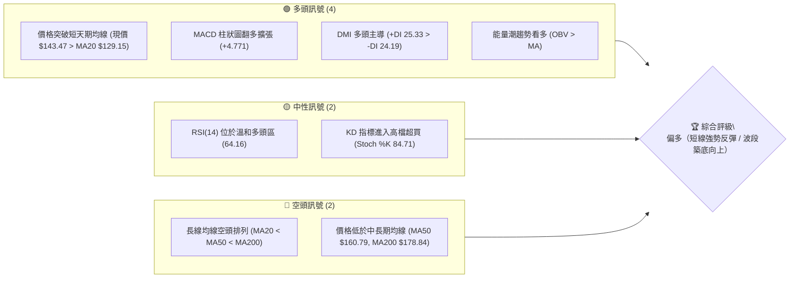
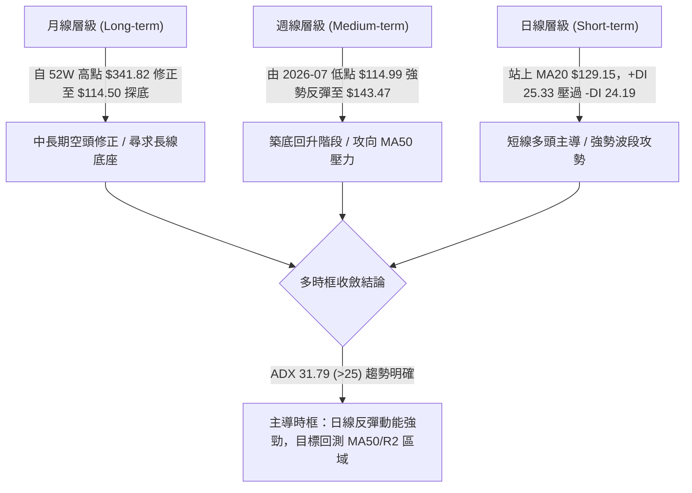
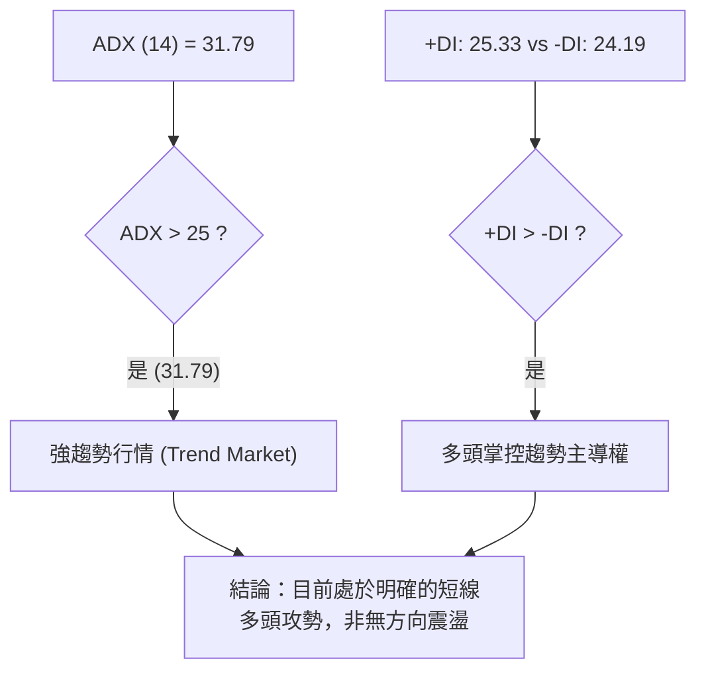
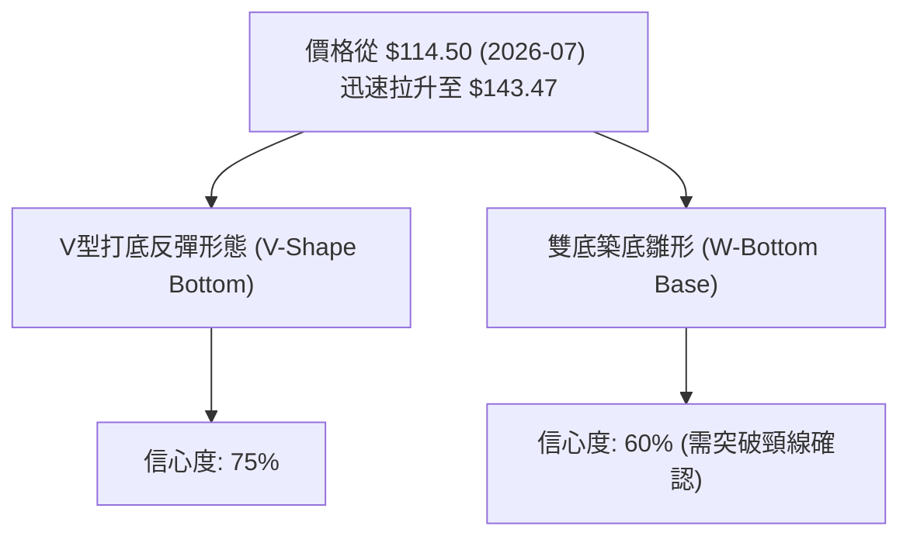
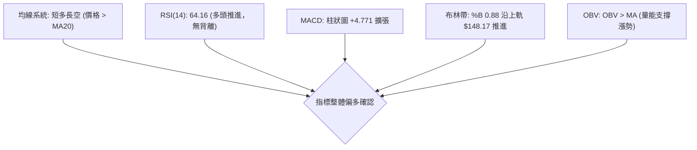
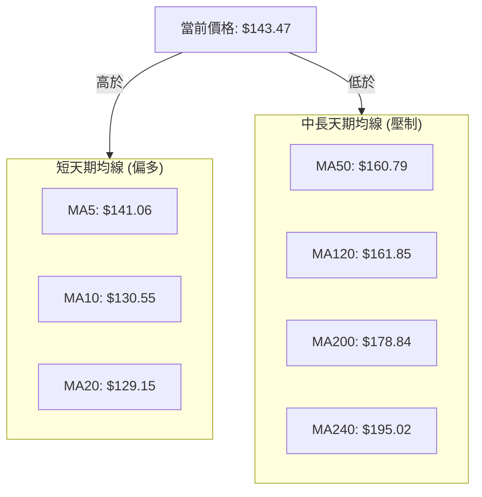
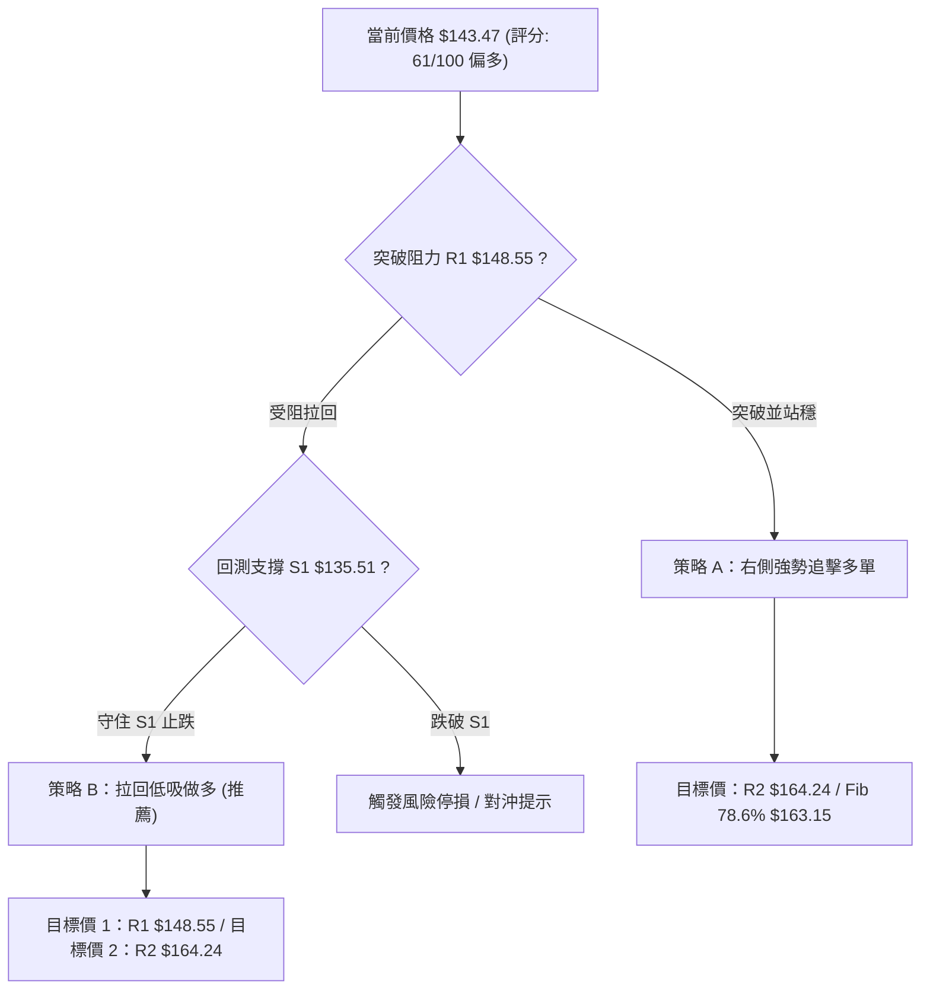
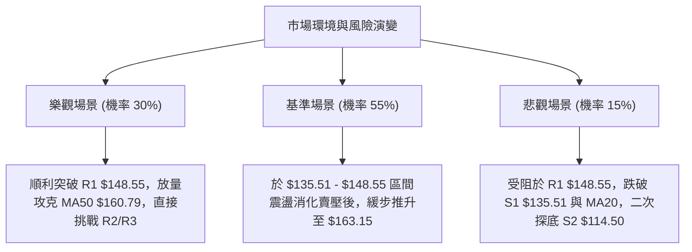

# ORCL 技術分析報告

> **報告日期**：2026-08-07 ｜ **語言**：繁體中文 ｜ **數據來源**：Yahoo Finance ｜ **當前價格**：$143.47

---

## 目錄

| 章節 | 內容 |
|------|------|
| [1. 技術面概覽](#1-技術面概覽) | 訊號儀表板、核心指標、評分卡 |
| [2. 趨勢分析](#2-趨勢分析) | 多時框趨勢、長中短期走勢 |
| [3. 圖表形態分析](#3-圖表形態分析) | 形態識別、K線組合、目標價 |
| [4. 支撐與阻力](#4-支撐與阻力) | 關鍵價位、斐波那契回調 |
| [5. 技術指標深度解讀](#5-技術指標深度解讀) | MA/RSI/MACD/布林/成交量 |
| [6. 動能與波動率](#6-動能與波動率) | 動能評估、ATR、Beta |
| [7. 多時框架總結](#7-多時框架總結) | 時框架評分矩陣 |
| [8. 交易策略建議](#8-交易策略建議) | 多空策略、風險報酬比 |
| [9. 風險提示與監控](#9-風險提示與監控) | 監控指標、風險場景 |

---

## 1. 技術面概覽

### 🎯 技術訊號儀表板



### 📊 核心指標速覽表

| 指標類別 | 指標名稱 | 當前數值 | 訊號 | 解讀 |
|----------|----------|----------|------|------|
| **價格** | 當前價格 | $143.47 | 🟢 | 站上 MA5/MA10/MA20，擺脫 52 週低點 ($114.50) |
| **均線** | MA20 | $129.15 | 🟢 | 價格位於 MA20 上方 (+11.09%)，短線趨勢偏多 |
| **均線** | MA50 | $160.79 | 🔴 | 價格位於 MA50 下方 (-10.77%)，中期壓力較大 |
| **均線** | MA200 | $178.84 | 🔴 | 價格位於 MA200 下方 (-19.78%)，長線處於修正格局 |
| **動能** | RSI(14) | 64.16 | 🟢 | 動能持續向上，尚未進入 70 以上極端超買區 |
| **動能** | MACD | -3.687 (柱 +4.771) | 🟢 | 柱狀圖顯著翻多，柱體連續擴張，短線黃金交叉 |
| **波動** | ATR(14) | $7.27 (5.07%) | 🟡 | 每日平均波動適中，提供足夠的波段操作空間 |

### 🏆 技術評分卡

```
╔══════════════════════════════════════════════════════════════╗
║                ORCL 技術評分卡 (2026-08-07)                 ║
╠══════════════════════════════════════════════════════════════╣
║ 趨勢強度 (ADX) ██████████████░░░░░  70/100 🟢 強勢趨勢 (31.79) ║
║ 動能指標 (MACD)███████████████░░░░  75/100 🟢 多頭柱狀強勁    ║
║ 支撐穩定度     ███████████████░░░░  75/100 🟢 52W低點打底成功 ║
║ 成交量配合     ███████████░░░░░░░░  55/100 🟡 反彈量能需維持   ║
║ 形態完整度     █████████████░░░░░░  65/100 🟢 V型築底反彈形態  ║
║ 均線排列       ███████░░░░░░░░░░░░  35/100 🔴 中長線仍呈空頭   ║
╠══════════════════════════════════════════════════════════════╣
║ 綜合技術評分   ████████████░░░░░░░  61/100 🟢 偏多 (短線強攻) ║
╚══════════════════════════════════════════════════════════════╝
```

---

## 2. 趨勢分析

### 🌐 多時框趨勢分析



### 📈 長期趨勢 — 12個月走勢圖（Unicode）

```
ORCL 過去12個月價格走勢與關鍵轉折點 ($)
$300 ┤
$280 ┤                   ● $278.07 (2025-09)
$260 ┤             ●
$240 ┤
$220 ┤ ● $223.58                             ● $225.00 (2026-05)
$200 ┤       ●
$180 ┤             ● $193.05
$160 ┤                   ● $163.44
$140 ┤                         ● $144.39           ● $143.47 (現價)
$120 ┤                                       ● $129.87 / $114.50 (低點)
     └─┬─────┬─────┬─────┬─────┬─────┬─────┬─────┬─────┬─────┬─────┬─────┬───►
      08/25 09/25 10/25 11/25 12/25 01/26 02/26 03/26 04/26 05/26 06/26 07/26 08/26
```

#### 走勢特徵分析表格

| 時間階段 | 收盤價範圍 | 漲跌特徵 | 技術面解讀 |
|----------|------------|----------|------------|
| **2025-08 ~ 2025-09** | $223.58 → $278.07 | 猛烈噴出 (+24.37%) | 創下波段歷史高點後拉回，多頭能量耗盡 |
| **2025-10 ~ 2026-02** | $260.10 → $144.39 | 震盪下行 (-44.49%) | 跌破各天期均線，形成中長線空頭走勢 |
| **2026-03 ~ 2026-05** | $146.09 → $225.00 | 強力反彈 (+54.01%) | 財報/利多刺激下的跌深反彈，遇 MA200 壓制 |
| **2026-06 ~ 2026-07** | $146.04 → $129.87 | 二度重挫 (最低 $114.50) | 觸及 52 週最低點 $114.50，完成終極洗盤 |
| **2026-08 (最新)** | $129.87 → $143.47 | 強勁V轉 (+10.47%) | 站上 MA20，日線 MACD 翻多，形成打底回升 |

### 📊 中期趨勢（週線分析）

```
ORCL 近期週線壓力與支撐結構示意圖
═══════════════════════════════════════════════════════════════
$170.57 ┤ ── ── ── ── ── ── ── ── ── ── ── ── ── ── [阻力 R3]
$164.24 ┤ ── ── ── ── ── ── ── ── ── ── ── ── ── ── [阻力 R2 / Fib 78.6% $163.15]
$148.55 ┤ ── ── ── ── ── ── ── ── ── ── ── ── ── ── [阻力 R1 / 布林上軌 $148.17]
$143.47 ┤ ◄═════════════════════════════════════════ [當前價格]
$135.51 ┤ ── ── ── ── ── ── ── ── ── ── ── ── ── ── [支撐 S1]
$114.50 ┤ ── ── ── ── ── ── ── ── ── ── ── ── ── ── [強支撐 S2 / 52週低點]
═══════════════════════════════════════════════════════════════
```

### ⚡ 趨勢強度評估（ADX 解讀）



#### ADX 強度對照表

| 指標項 | 當前數值 | 參考標準 | 趨勢狀態 | 對交易策略之含義 |
|--------|----------|----------|----------|------------------|
| **ADX(14)** | **31.79** | > 25 強趨勢 | █▓░█ 70% | 適合順勢做多，忽視短線小震盪 |
| **+DI** | **25.33** | 高於 -DI | 🟢 看多 | 買方力量強於賣方力量 |
| **-DI** | **24.19** | 低於 +DI | 🟢 賣壓減弱 | 空頭主導力道正在消退 |

---

## 3. 圖表形態分析

### 🔍 形態識別系統



#### 形態信心度與目標價計算表

| 形態名稱 | 信心度 | 判斷依據（引用數據） | 完成度 | 目標價（附計算式） |
|----------|--------|----------------------|--------|--------------------|
| **V型反彈形態** | 75% | 7月下旬落底 $114.50 後連續大陽線大反彈，價格迅速越過 MA20 $129.15 | 85% | $114.50 + ($143.47 - $114.50) × 1.618 = **$161.38** (接近 Fib 78.6% $163.15) |
| **雙底 (W底) 雛形** | 60% | 第一底 2026-02 $144.39，第二底 2026-07 $114.50，頸線看 R1 $148.55 | 50% | 若突破頸線 $148.55：$148.55 + ($148.55 - $114.50) = **$182.60** (近 MA200) |

### 🕯️ 重要K線形態分析

| 日期 / 週次 | 收盤價 | K線形態 | 解讀 | 訊號 |
|-------------|--------|---------|------|------|
| **2026-07-26** | $114.99 | 槌頭線 / 長下影線 | 觸及 52W 低點 $114.50 後引發強烈低贖買盤，止跌訊號明確 | 🟢 看多 |
| **2026-08-02** | $129.87 | 大陽線 (週漲幅 +12.9%) | 強力帶量穿透 MA20 ($129.15)，築底完成確定 | 🟢 強多 |
| **2026-08-09** | $143.47 | 中陽線續攻 | 克服前期盤整區，多頭氣勢延伸，直逼 R1 $148.55 | 🟢 看多 |

### 📉 ASCII 走勢形態示意圖

```
ORCL 日線 V 型反彈與頸線突破示意圖
─────────────────────────────────────────────────────────────
$164.24 ┤                                     [目標位 R2]
        │
$148.55 ┤                       ● 頸線阻力 R1 (即將測試)
$143.47 ┤                     ● [現價]
$129.15 ┤               ●──── (MA20 支撐位)
        │         ●   ●
$114.50 ┤─────────┴───┴─────── [52W 低點雙重支撐 S2]
─────────────────────────────────────────────────────────────
```

### 🎯 形態目標價計算

1. **V型反彈擴張目標價**：
   $$\text{第一目標價} = \text{低點} + (\text{當前價} - \text{低點}) \times 1.382 = 114.50 + (143.47 - 114.50) \times 1.382 = \$154.52$$
   $$\text{第二目標價} = \text{低點} + (\text{當前價} - \text{低點}) \times 1.618 = 114.50 + (143.47 - 114.50) \times 1.618 = \$161.38$$
   *(該目標價高度契合 R2 阻力 $164.24 與斐波那契 78.6% 回調位 $163.15)*

---

## 4. 支撐與阻力

### 🗺️ 關鍵價位分布圖（Unicode）

```
ORCL 價位結構分布圖
═══════════════════════════════════════════════════════════════
$170.57 ║████████████████████████████████║ 強壓力 R3 (波段高點)
$164.24 ║████████████████████████        ║ 阻力 R2 / Fib 78.6% ($163.15)
$148.55 ║████████████████                ║ 近端阻力 R1 / 布林上軌 ($148.17)
$143.47 ╠════════════════════════════════╣ ◄ 當前價格
$135.51 ║▓▓▓▓▓▓▓▓▓▓▓▓▓▓▓▓                ║ 第一支撐 S1 (近一年波段支撐)
$114.50 ║████████████████████████████████║ 核心強支撐 S2 (52週最低點)
═══════════════════════════════════════════════════════════════
```

### 🚧 阻力位分析表

| 阻力級別 | 精確價位 | 形成原因 | 突破難度 | 重要性 |
|----------|----------|----------|----------|--------|
| **阻力 R1** | **$148.55** | 近一年波段高點聚類 / 布林上軌 $148.17 疊加 | 🟡 中等 | 短線多空分水嶺，突破將開啟波段大行情 |
| **阻力 R2** | **$164.24** | 近一年波段高點 / 斐波那契 78.6% ($163.15) / MA50 ($160.79) 密集交會區 | 🔴 極高 | 中期強大壓力區，多頭重要考驗 |
| **阻力 R3** | **$170.57** | 近一年波段高點聚類 / 接近 MA200 ($178.84) | 🔴 高 | 長線趨勢反轉之關鍵解套壓力區 |

### 🛡️ 支撐位分析表

| 支撐級別 | 精確價位 | 形成原因 | 守住機率 | 重要性 |
|----------|----------|----------|----------|--------|
| **支撐 S1** | **$135.51** | 近一年波段低點聚類 / 位於 MA10 ($130.55) 與 MA20 ($129.15) 上方 | 🟢 80% | 短線回檔首要防線，跌破則反彈力道減弱 |
| **支撐 S2** | **$114.50** | 52 週最低價 (100.0% 斐波那契位) / 終極底部 | 🟢 95% | 公司波段最核心價值支撐，不容有失 |

### 📐 斐波那契回調位分析

> **基準區間**：52週高點 **$341.82** → 52週低點 **$114.50** (總波幅 $227.32)

| 斐波那契層級 | 精確價位 | 與當前價差距 | 技術面說明與意義 |
|--------------|----------|--------------|------------------|
| **0.0% (52W High)** | $341.82 | +138.25% | 歷史頂部壓力 |
| **23.6%** | $288.18 | +100.87% | 長線超強阻力區 |
| **38.2%** | $254.99 | +77.73% | 分析師平均目標價 ($248.15) 附近 |
| **50.0%** | $228.16 | +59.03% | 中長線多空對峙中樞 (2026-05 反彈高點 $225.00) |
| **61.8%** | $201.34 | +40.34% | 黃金分割回調位 / MA240 ($195.02) 附近 |
| **78.6%** | $163.15 | +13.72% | **中期直接攻擊目標** (與 R2 $164.24 重合) |
| **當前價格** | **$143.47** | **0.00%** | **部位於 78.6% ($163.15) 與 100% ($114.50) 之間** |
| **100.0% (52W Low)**| $114.50 | -20.19% | 52 週波段最低點強支撐 |

**解讀**：現價 $143.47 剛從 100% ($114.50) 底部完成彈升，距離上方第一個黃金分割阻力層 78.6% ($163.15) 尚有 **+13.72%** 的上行空間，短線阻力較小。

---

## 5. 技術指標深度解讀

### 🎛️ 指標訊號總覽



### 📈 移動平均線排列分析



#### 均線數據比較表

| 均線名稱 | 數值 | 價格與均線差距 | 均線走勢方向 | 訊號評級 |
|----------|------|----------------|--------------|----------|
| **MA5** | $141.06 | +1.71% | █▇▆▅ 向上 | 🟢 短線多頭掌控 |
| **MA10** | $130.55 | +9.90% | ██▇▆ 向上 | 🟢 多頭陡峭上升 |
| **MA20** | $129.15 | +11.09% | ███▇ 向上 | 🟢 短線趨勢強勢支撑 |
| **MA60** | $165.48 | -13.30% | 📉 向下 | 🔴 中期向下壓制 |
| **MA120**| $161.85 | -11.35% | 📉 向下 | 🔴 中長期反彈阻力 |
| **MA200**| $178.84 | -19.78% | 📉 向下 | 🔴 長線空頭走勢 |

### 📉 RSI(14) 分析

```
RSI(14) 數值進度條
0                 30                50        64.16   70               100
├─────────────────┼─────────────────┼───────────█─────┼────────────────┤
[      超賣區      ] [    弱勢區    ] [  多頭區  ]   [     超買區     ]
```

- **當前數值**：**64.16**（處於多頭強勢區間 50–70）。
- **背離判斷**：RSI 與價格同步由 7 月底低點 (RSI < 30) 強勢回升，**無頂背離或底背離**，屬於健康的動能同步擴張。
- **解讀**：未進入 70 以上極端超買區，顯示買盤動能充沛且尚未耗盡。

### 📊 MACD(12/26/9) 訊號解讀

- **MACD 快線**：-3.687
- **MACD 慢線 (Signal)**：-8.458
- **MACD 柱狀圖 (Histogram)**：**+4.771** 🟢

```
MACD 柱狀圖趨勢 (最近4週)
2026-07-19: █ -0.715
2026-07-26: █ +0.033 (翻多)
2026-08-02: ████ +2.292
2026-08-09: █████████ +4.771 (持續強勁擴張)
```

**解讀**：MACD 快線已由下向上穿越慢線形成黃金交叉，柱狀圖連續三週大幅正向擴張（+4.771），顯示短線轉多動能極為強烈。

### 📦 布林通道分析

```
ORCL 布林通道結構示意圖 ($)
─────────────────────────────────────────────────────────────
$148.17 ┤ ───────────────────────────────────────── BB 上軌
$143.47 ┤ ◄現價 ($143.47, %B = 0.88，貼近上軌運行)
$129.15 ┤ ───────────────────────────────────────── BB 中軌 (MA20)
$110.13 ┤ ───────────────────────────────────────── BB 下軌
─────────────────────────────────────────────────────────────
```

- **%B 指標**：**0.88**（非常接近上軌 1.0）。
- **通道狀態**：布林帶寬正隨價格快速上漲而張口（Band Expansion），價格貼著上軌 $148.17 推進，屬典型的「帶狀走升（Walking the Bands）」強勢攻擊特徵。

### 💹 成交量分析（量價配合度）

- **最新日成交量**：21,903,163 股
- **20日均量**：37,882,763 股（量比：0.58x）
- **OBV 趨勢**：**OBV > MA** 🟢

**解讀**：最新單日成交量雖低於 20 日均量，但觀察週線成交量，在 $114.99 - $129.87 築底區間爆出 1.73億 ~ 2.52億 股的巨量，顯示主力資金已在底部完成籌碼收集；目前 OBV 保持在均線上方，量能結構整體支持價格續漲。

---

## 6. 動能與波動率

### ⚡ 動能評估四象限

| 象限區分 | 高動能 | 低動能 |
|----------|--------|--------|
| **高波動率** | 🎯 **當前位置：象限一 (高動能 / 高波動)**<br>• RSI 64.16 + MACD柱擴張<br>• ATR 5.07%<br>👉 **策略：強勢順勢做多，精準設停損** | **象限四 (低動能 / 高波動)**<br>• 恐慌拋售期已過 |
| **低波動率** | **象限二 (高動能 / 低波動)**<br>• 穩健擠壓噴出段 | **象限三 (低動能 / 低波動)**<br>• 沉悶盤整打底期 |

### 📊 ATR 波動率分析

- **ATR(14)**：**$7.27**
- **佔股價比例**：**5.07%**

#### 風險控管距離計算建議

| 風險倍數 | 止損距離 ($) | 對應止損價位 (以現價 $143.47 計算) | 適用交易風格 |
|----------|--------------|------------------------------------|--------------|
| **1.0x ATR** | $7.27 | $136.20 | 極短線當沖 / 緊密追蹤 |
| **1.5x ATR** | $10.91 | **$132.56** | 日線波段交易 (推薦) |
| **2.0x ATR** | $14.54 | $128.93 (接近 MA20 $129.15) | 中長線趨勢抱牢 |

### 📐 Beta 與市場相關性

- **Beta 係數**：**1.718**
- **解讀**：ORCL 的波動性比大盤高出 71.8%。在大盤或科技股指數反彈時，ORCL 具有更強的向上彈升爆發力；反之拉回時波動亦大，操作時須嚴格落實資金管理。

---

## 7. 多時框架總結

### 📋 時框架評分表

| 時框架 | 趨勢方向 | 動能狀態 | 均線排列 | 形態結構 | 綜合評分 | 交易建議 |
|--------|----------|----------|----------|----------|----------|----------|
| **日線 (Short-term)** | 🟢 多頭噴出 | 🟢 MACD擴張 | 🟢 站上MA20 | 🟢 V型強反彈 | **75/100** | 順勢偏多操作 |
| **週線 (Medium-term)**| 🟡 築底回升 | 🟢 RSI回升 | 🔴 低於MA50 | 🟡 挑戰頸線R1 | **58/100** | 逢低佈局/攻防R1 |
| **月線 (Long-term)**  | 🔴 長期修正 | 🟡 止跌回穩 | 🔴 MA200下方 | 🔴 大幅拉回後打底 | **45/100** | 波段反彈視之 |

### 🔲 綜合訊號矩陣

```
╔══════════════════════════════════════════════════════════════╗
║                    多時框訊號收斂矩陣                       ║
╠══════════════════╦══════════════════╦════════════════════════╣
║ 時框             ║ 多空方向         ║ 關鍵影響因子           ║
╠══════════════════╬══════════════════╬════════════════════════╣
║ 短期 (1-5日)     ║ 🟢 強力看多      ║ 攻克布林上軌 $148.17   ║
║ 中期 (1-4週)     ║ 🟢 偏多回升      ║ 挑戰 R1 $148.55 / R2   ║
║ 長期 (1-3月)     ║ 🟡 築底反彈      ║ 受到 MA50 $160.79 壓制 ║
╚══════════════════╩══════════════════╩════════════════════════╝
```

### ⚖️ 多時框收斂結論

由於 **ADX(14) = 31.79 > 25**，市場當前處於**明確的趨勢行情**。雖然中長期均線仍呈空頭排列，但日線與週線的底部反彈動能極強（+DI > -DI，MACD 柱狀圖擴張至 +4.771）。依據多時框收斂規則，**以短中期強勁的反彈趨勢為主導**，交易策略應採取「**偏多操作，瞄準阻力位 R1 ($148.55) 與 R2 ($164.24)**」。

---

## 8. 交易策略建議

### 🗺️ 策略決策流程圖



### 🧭 策略路由

> **當前主策略方向 = 🟢 偏多波段操作（技術評分：61 / 100）**

因技術評分 > 60 分，且 MACD / ADX / OBV 指標皆呈多頭確認，本報告**主推多頭波段策略**。

### 🎯 價格情境階梯 (Price Scenarios)

| 觸發條件 | 下一目標 | 後續延伸 | 情境含義 |
|----------|----------|----------|----------|
| **有效突破 R1 $148.55** | **R2 $164.24** | R3 $170.57 | 多頭主升段開啟，挑戰 MA50 |
| **於 $135.51 - $148.55 震盪** | — | — | 高檔換手蓄勢，消化 R1 賣壓 |
| **跌破 S1 $135.51** | **S2 $114.50** | — | 反彈宣告結束，二度尋求 52W 底座 |

### 📊 情境機率分佈

```
情境機率分佈示意
┌─────────────────────────────────────────┬──────────────────────┬────────┐
│ 🟢 繼續上行突破 R1 挑戰 R2 (55%)        │ 🟡 區間震盪 (30%)    │🔴回落(15%)│
└─────────────────────────────────────────┴──────────────────────┴────────┘
```

| 情境劇本 | 機率 | 主要技術依據 |
|----------|------|--------------|
| **強勢突破 R1 並挑戰 R2/Fib 78.6%** | **55%** | MACD 柱狀圖 +4.771 強烈擴張、+DI (25.33) > -DI、ADX 31.79 強趨勢 |
| **於 $135.51 - $148.55 區間震盪換手** | **30%** | KD (84.71) 短線高檔超買，接近布林上軌 $148.17 需消化賣壓 |
| **假突破並拉回重測 S2 $114.50** | **15%** | 中長線均線 (MA50/MA200) 仍呈空頭向下蓋頂之整體壓制 |

### 🟢 主策略詳情

#### 策略 A：突破追擊多單 (突破 R1 $148.55 確認後進場)
#### 策略 B：拉回低吸多單 (回測 S1 $135.51 守住進場) — **推薦**

| 策略要素 | 策略 A (突破追攻) | 策略 B (拉回低吸) — 推薦 |
|----------|-------------------|--------------------------|
| **進場條件** | 日K線收盤突破 $148.55 (R1) | 價格回測 $135.51 (S1) 附近且出現止跌K線 |
| **進場價格** | **$148.80** | **$135.80** |
| **目標價 T1** | **$163.15** (Fib 78.6%) | **$148.55** (阻力 R1) |
| **目標價 T2** | **$170.57** (阻力 R3) | **$163.15** (Fib 78.6% / 阻力 R2) |
| **止損價格** | **$142.50** (位於 R1 下方) | **$128.50** (跌破 MA20 $129.15) |
| **風險報酬比 (至 T1)** | **1 : 2.28** | **1 : 1.75** |
| **風險報酬比 (至 T2)** | **1 : 3.46** | **1 : 3.75** |
| **估計成功機率**| 58% | **65%** |
| **建議倉位** | 10% - 15% | **15% - 20%** |

*計算範例 (策略 B 至 T2)*：
$$\text{風險金額} = \$135.80 - \$128.50 = \$7.30$$
$$\text{報酬金額} = \$163.15 - \$135.80 = \$27.35$$
$$\text{風險報酬比} = 27.35 / 7.30 = 1 : 3.75$$

### 🔴 反向風險觸發點（對沖提示）

若發生以下狀況，偏多主策略失效，應全面撤出多單或進行適度對沖：
1. **價格跌破 S1 $135.51 且日K線收在 MA20 ($129.15) 下方**。
2. **MACD 柱狀圖轉為縮頭並出現死叉**。

### ⭐ 整體訊號強度評星

```
做多訊號強度：████████░░  ★★★★☆  (4/5星)
做空訊號強度：████░░░░░░  ★★☆☆☆  (2/5星)
整體訊號可信度：████████░░  ★★★★☆  (4/5星)
```

---

## 9. 風險提示與監控

### ✅ 關鍵監控指標 Checklist

```
╔══════════════════════════════════════════════════════════════╗
║                   每日交易風險監控清單                      ║
╠══════════════════════════════════════════════════════════════╣
║ [ ] R1 突破確認：日收盤價是否站上 $148.55                    ║
║ [ ] RSI(14) 狀態：是否突破 70 進入極端超買區                 ║
║ [ ] MACD 柱狀圖：柱體是否持續維持在 0 軸上方增長 (+4.771)     ║
║ [ ] 關鍵支撐防禦：價格是否守穩在 S1 $135.51 與 MA20 $129.15 上 ║
║ [ ] 量能配合：向上攻擊時成交量是否能放大至 37.8M 均量以上    ║
╚══════════════════════════════════════════════════════════════╝
```

### ⚠️ 風險場景分析



### 🛡️ 風險管理重要提醒

1. **嚴格執行 stop-loss**：波段多單止損位建議設於 **$128.50**（跌破 MA20 $129.15 支撐），單筆交易虧損控制在總資本的 1.5% - 2.0% 以內。
2. **波動率調整倉位**：鑑於 ORCL 的 ATR 高達 **$7.27** (5.07%)，且 Beta 為 **1.718**，波動劇烈，建議單一股票總持倉不超過總資產的 20%。
3. **留意分析師目標價指引**：目前 41 位分析師平均目標價為 **$248.15**，長線基本面具備支持，短線技術面反彈方向明確。

---

## 📋 報告總結

```
╔══════════════════════════════════════════════════════════════╗
║                 ORCL 技術分析總結 (2026-08-07)               ║
╠══════════════════════════════════════════════════════════════╣
║ 當前價格：$143.47                                            ║
║ 分析評級：🟢 偏多（短線強勢築底反彈 / 波段攻勢啟動）          ║
╠══════════════════════════════════════════════════════════════╣
║ 關鍵結論：                                                   ║
║ ├─ 長期趨勢：🔴 空頭修正後尋求打底 (MA200 $178.84 下方)      ║
║ ├─ 中期趨勢：🟢 52W 低點 $114.50 完成 V 型築底，向上彈升      ║
║ ├─ 短期趨勢：🟢 站上 MA20 $129.15，MACD 柱狀圖強勢擴張 (+4.77)║
║ ├─ 關鍵支撐：S1 $135.51 / S2 $114.50                         ║
║ ├─ 關鍵阻力：R1 $148.55 / R2 $164.24                         ║
║ └─ 分析師共識目標價：$248.15 (Mean)                           ║
╠══════════════════════════════════════════════════════════════╣
║ 最優策略組合：                                               ║
║ 1. 🥇 最佳機會 (策略 B)：回測 S1 $135.51 附近低吸做多        ║
║    • 止損：$128.50 ｜ 目標1：$148.55 ｜ 目標2：$163.15       ║
║ 2. 🥈 次選機會 (策略 A)：日K突破阻力 R1 $148.55 後右側追擊    ║
║    • 止損：$142.50 ｜ 目標1：$163.15 ｜ 目標2：$170.57       ║
╚══════════════════════════════════════════════════════════════╝
```

---

> ⚠️ **免責聲明**：本報告為 AI 自動生成之技術分析，所有數據及估算均基於提供的歷史價格資訊。本報告**僅供研究與學術參考**，**不構成任何投資建議**。投資有風險，入市需謹慎。

---

*報告生成時間：2026-08-07 ｜ 數據來源：Yahoo Finance ｜ 分析框架：多時框技術分析*