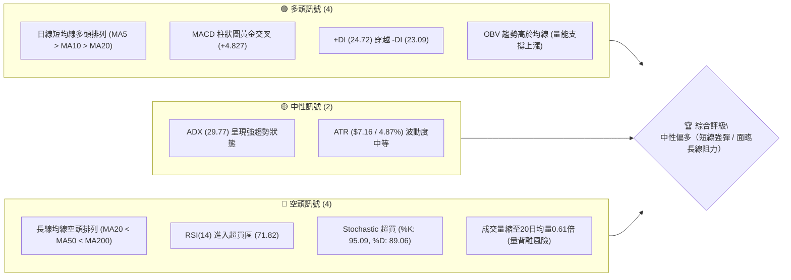
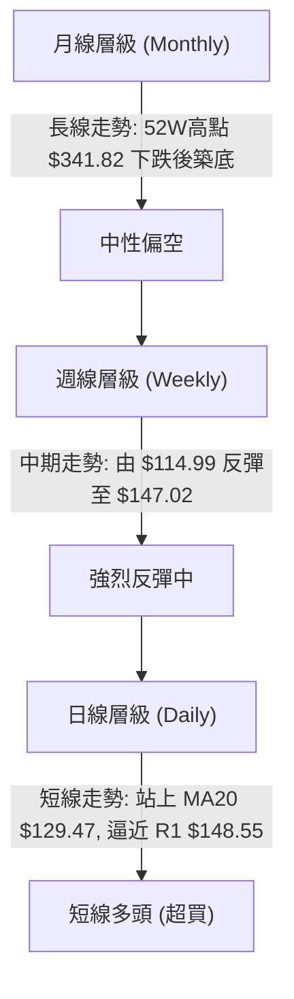
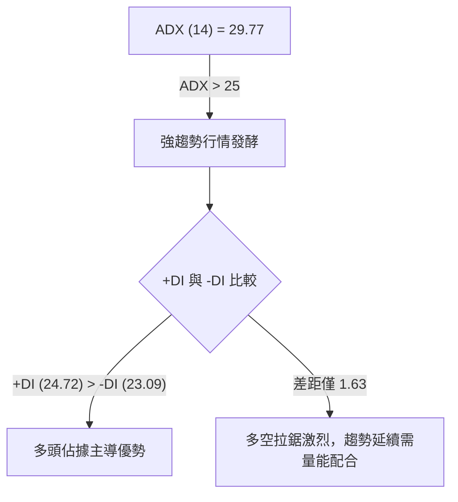
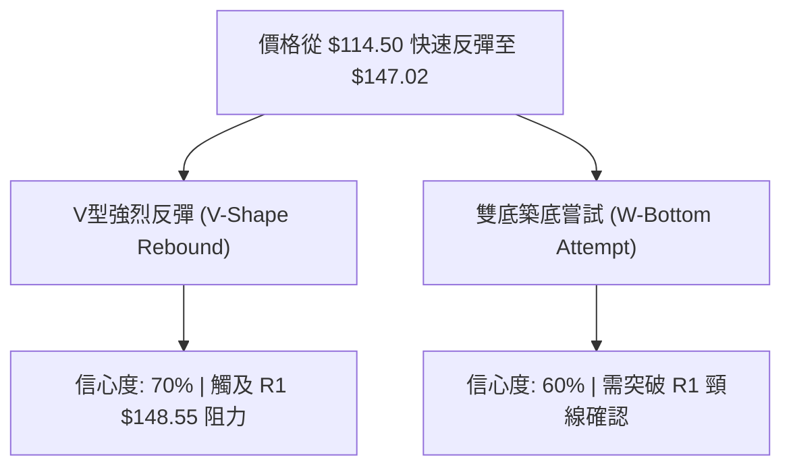
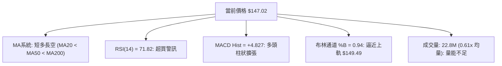
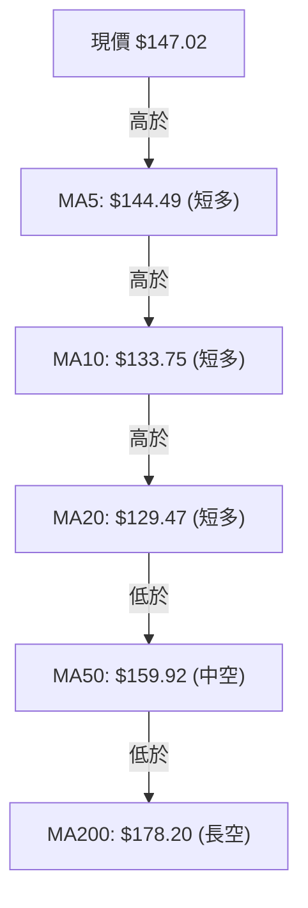
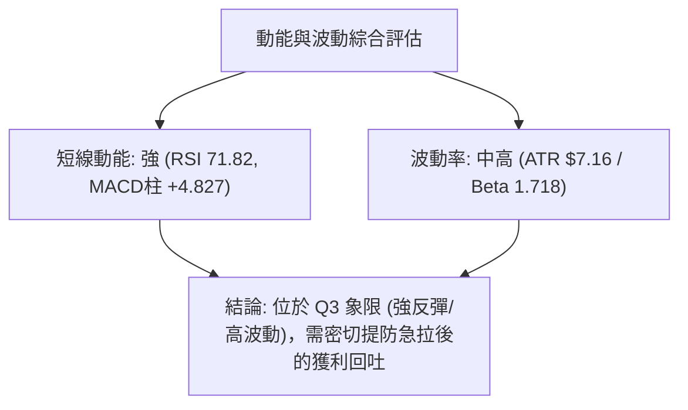
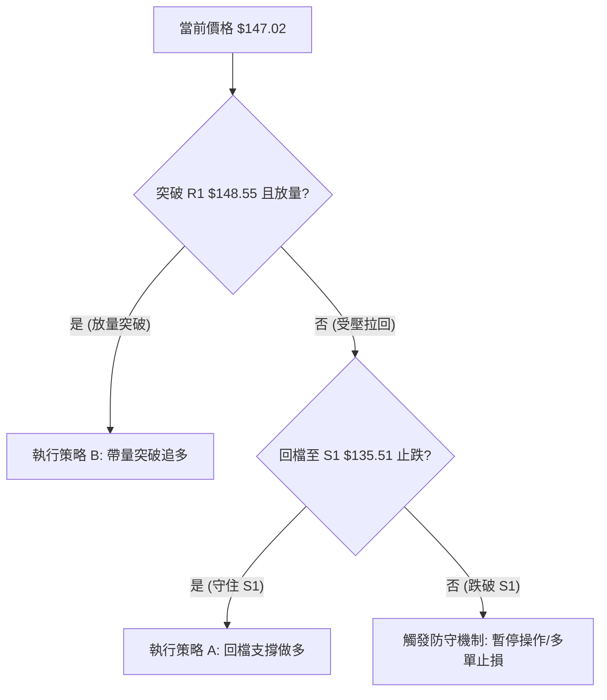
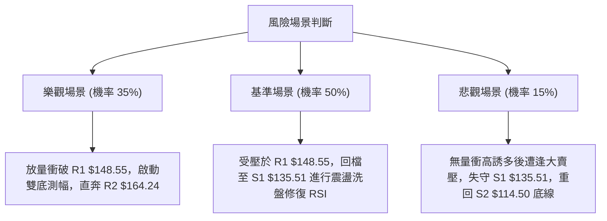

# ORCL 技術分析報告

> **報告日期**：2026-08-10 ｜ **語言**：繁體中文 ｜ **數據來源**：Yahoo Finance ｜ **當前價格**：$147.02

---

## 目錄

| 章節 | 內容 |
|------|------|
| [1. 技術面概覽](#1-技術面概覽) | 訊號儀表板、核心指標、評分卡 |
| [2. 趨勢分析](#2-趨勢分析) | 多時框趨勢、長中短期走勢 |
| [3. 圖表形態分析](#3-圖表形態分析) | 形態識別、K線組合、目標價 |
| [4. 支撐與阻力](#4-支撐與阻力) | 關鍵價位、斐波那契回調 |
| [5. 技術指標深度解讀](#5-技術指標深度解讀) | MA/RSI/MACD/布林/成交量 |
| [6. 動能與波動率](#6-動能與波動率) | 動能評估、ATR、Beta |
| [7. 多時框架總結](#7-多時框架總結) | 時框架評分矩陣 |
| [8. 交易策略建議](#8-交易策略建議) | 多空策略、風險報酬比 |
| [9. 風險提示與監控](#9-風險提示與監控) | 監控指標、風險場景 |

---

## 1. 技術面概覽

### 🎯 技術訊號儀表板



### 📊 核心指標速覽表

| 指標類別 | 指標名稱 | 當前數值 | 訊號 | 解讀 |
|----------|----------|----------|------|------|
| **價格** | 當前價格 | $147.02 | 🟡 | 位於52週區間14.3%位置，短線大幅反彈 |
| **均線** | MA20 | $129.47 | 🟢 | 價格位於MA20上方 +13.56%，短期支撐強勁 |
| **均線** | MA50 | $159.92 | 🔴 | 價格位於MA50下方 -8.07%，中期趨勢承壓 |
| **均線** | MA200 | $178.20 | 🔴 | 價格位於MA200下方 -17.50%，長期偏空 |
| **動能** | RSI(14) | 71.82 | 🔴 | 進入超買區（>70），短線過熱注意回檔 |
| **動能** | MACD | -2.424 / Hist +4.827 | 🟢 | 柱狀圖正向擴張，短線反彈動能充沛 |
| **波動** | ATR(14) | $7.16 (4.87%) | 🟡 | 日均波動幅度適中，提供合理的止損空間 |

### 🏆 技術評分卡

```
╔══════════════════════════════════════════════════════════════════╗
║                   技術評分卡 — ORCL (2026-08-10)                 ║
╠══════════════════════════════════════════════════════════════════╣
║ 趨勢強度      ████████████░░░░░░░░  60/100  🟡 中性強彈        ║
║ 動能指標      ██████████████░░░░░░  70/100  🟢 短線偏多        ║
║ 支撐穩定度    ████████████░░░░░░░░  60/100  🟡 S1護盤成功      ║
║ 成交量配合    ████████░░░░░░░░░░░░  40/100  🔴 價漲量縮        ║
║ 形態完整度    ██████████░░░░░░░░░░  50/100  🟡 V型反彈未確底  ║
║ 均線排列      ██████░░░░░░░░░░░░░░  30/100  🔴 長線空頭排列    ║
╠══════════════════════════════════════════════════════════════════╣
║ 綜合評分      ███████████░░░░░░░░░  52/100  評級：🟡 觀望/區間 ║
╚══════════════════════════════════════════════════════════════════╝
```

---

## 2. 趨勢分析

### 🌐 多時框趨勢分析



### 📈 長期趨勢 — 12個月走勢圖（Unicode）

```
ORCL 月線走勢圖（2025-08 至 2026-08）
價格軸 ($)
$280 ┤                ● 278.07 (高點)
$240 ┤           ●              
$200 ┤ ●              ●         ● 225.00
$160 ┤   ●  ●                     ●        ● 147.02 (現在)
$120 ┤                               ●  ●
     └───────────────────────────────────────────────
       08 09 10 11 12 01 02 03 04 05 06 07 08 (月)
```

#### 走勢特徵分析表

| 期間 | 起始價 | 終點價 | 漲跌幅 | 主要走勢特徵與驅動因素 |
|------|--------|--------|--------|------------------------|
| **2025-08~2025-09** | $223.58 | $278.07 | +24.37% | 雲端業務高速擴張，創下階段新高 |
| **2025-09~2026-02** | $278.07 | $144.39 | -48.07% | 高估值修正與大盤科技股流動性緊縮 |
| **2026-02~2026-05** | $144.39 | $225.00 | +55.83% | 財報超預期觸發強勁V型暴力反彈 |
| **2026-05~2026-07** | $225.00 | $129.87 | -42.28% | 獲利賣壓與資本支出擔憂引發急挫，探至52週低點 $114.50 附近 |
| **2026-07~2026-08** | $129.87 | $147.02 | +13.20% | 底部位 $114.50 (S2) 強力支撐，展開技術性絕地反彈 |

### 📊 中期趨勢（週線分析）

```
ORCL 近期壓力與支撐結構示意圖
$170.57 ┤─────────────────────────────── 阻力 R3 (強阻力)
$164.24 ┤─────────────────────────────── 阻力 R2 (MA50/MA60交會區)
$148.55 ┤─────────────────────────────── 阻力 R1 (當前前高/布林上軌 $149.49)
$147.02 ┤───────────────▲ (現價)
$135.51 ┤─────────────────────────────── 支撐 S1 (頸線/關鍵短支)
$114.50 ┤─────────────────────────────── 支撐 S2 (52W 低點強支)
```

### ⚡ 趨勢強度評估（ADX 解讀）



#### ADX 強度指標對照表

| 指標項 | 數據 | 門檻標準 | 狀態評估 | 交易意涵 |
|--------|------|----------|----------|----------|
| **ADX (14)** | **29.77** | > 25 (強趨勢) | 🟢 強趨勢 | 擺脫盤整，具有方向性動能 |
| **+DI** | **24.72** | - | 🟢 多頭控制 | 短線買盤強於賣盤 |
| **-DI** | **23.09** | - | 🔴 賣壓猶存 | 空頭尚未完全放棄抵擋 |
| **DI 差值** | **+1.63** | > 5.0 (明確) | 🟡 黃金交叉初期 | 多頭勝出但優勢尚未拉開 |

---

## 3. 圖表形態分析

### 🔍 形態識別系統



#### 形態識別與目標價計算表

| 形態名稱 | 信心度 | 判斷依據（引用數據） | 完成度 | 目標價（附計算式） |
|----------|--------|----------------------|--------|--------------------|
| **雙重底 (W-Bottom)** | **60%** | 兩次低點於 S2 $114.50 築底，頸線位於 R1 $148.55 | 85% | 頸線 $148.55 + (頸線 $148.55 - 低點 $114.50 = $34.05) = **$182.60** |
| **V型急彈 (V-Rebound)** | **70%** | 從 2026-07-26 低點 $114.99 連三週陽線反彈至 $147.02 | 90% | 第一目標為 R1 $148.55，若突破則看至 R2 **$164.24** |

*註：若無法突破 R1 $148.55，雙底形態宣告失效，將轉為區間震盪。*

### 🕯️ 重要K線形態分析

| 週次/日期 | 收盤價 | K線形態 | 解讀 | 訊號 |
|-----------|--------|---------|------|------|
| **2026-07-19** | $126.41 | 大陰線破位 | 賣壓強勁，下探波段低點 | 🔴 絕望賣壓 |
| **2026-07-26** | $114.99 | 長下影錘子線 | 在 S2 $114.50 附近尋得強烈支撐，買盤進場 | 🟢 止跌訊號 |
| **2026-08-02** | $129.87 | 強勢大陽線 | 包覆前週K線，多頭全面反攻，收復 MA20 | 🟢 轉強確認 |
| **2026-08-09** | $147.02 | 長陽線逼近阻力 | 強勢三連紅，但逼近布林上軌與 R1 $148.55 | 🟡 漲勢面臨考驗 |

### 📉 ASCII 走勢形態示意圖

```
ORCL 雙底 (W-Bottom) 與 V型反彈示意圖
$182.60 ┤                                           [雙底測幅目標價]
        │
$164.24 ┤────────────────────────────────────────── [R2 阻力/目標]
        │                       ▲ (測試阻力中)
$148.55 ┤───────────▲──────────/─────────────────── [R1 頸線阻力]
        │          / \        /
$135.51 ┤─────────/───\──────/───────────────────── [S1 支撐]
        │        /     \    /
$114.50 ┤───────●───────●──/─────────────────────── [S2 雙底支撐 $114.50]
        └──────────────────────────────────────────
                 底1     底2   當前反彈
```

### 🎯 形態目標價計算

1. **雙底形態測幅計算**：
   - 頸線位置：R1 = $148.55
   - 形態底部：S2 = $114.50
   - 形態垂直高度：$148.55 - $114.50 = $34.05
   - 最小測幅目標價：$148.55 + $34.05 = **$182.60**（恰位於 MA200 $178.20 附近之壓力帶）

---

## 4. 支撐與阻力

### 🗺️ 關鍵價位分布圖（Unicode）

```
ORCL 價位結構分布圖
══════════════════════════════════════════════════════════════════
$170.57 ║████████████████████████████████████████║ 強阻力 R3
$164.24 ║████████████████████████████            ║ 中期阻力 R2 (MA50/MA60)
$148.55 ║████████████████████████████████████████║ 關鍵頸線阻力 R1 / 布林上軌 $149.49
$147.02 ╠════════════════════════════════════════╣ ◄ 當前價格 $147.02
$135.51 ║▓▓▓▓▓▓▓▓▓▓▓▓▓▓▓▓▓▓▓▓▓▓▓▓                ║ 近期第一支撐 S1 / MA10
$114.50 ║████████████████████████████████████████║ 52週最低強支撐 S2
══════════════════════════════════════════════════════════════════
```

### 🚧 阻力位分析表

| 阻力級別 | 價位 | 形成原因 | 突破難度 | 重要性 |
|----------|------|----------|----------|--------|
| **阻力 R1** | **$148.55** | 近一年波段高點聚類、接近布林上軌 $149.49 | 🔴 極高 | 關鍵頸線，突破方能開啟大級別反彈 |
| **阻力 R2** | **$164.24** | 近一年波段高點聚類、交會 MA50 ($159.92) 與 MA60 ($164.83) | 🔴 高 | 中期多空分水嶺，解套賣壓密集區 |
| **阻力 R3** | **$170.57** | 近一年波段高點聚類、靠近 78.6% 斐波那契位 ($163.15) | 🟡 中 | 上檔強阻力區，解套賣壓峰值 |

### 🛡️ 支撐位分析表

| 支撐級別 | 價位 | 形成原因 | 守住機率 | 重要性 |
|----------|------|----------|----------|--------|
| **支撐 S1** | **$135.51** | 近一年波段低點聚類、接近 MA10 ($133.75) 與 MA20 ($129.47) | 🟢 高 | 短線多頭防守底線，回檔不可跌破 |
| **支撐 S2** | **$114.50** | 52週最低價 ($114.50) / 100.0% 斐波那契回調位 | 🟢 極高 | 長線鐵板支撐，若失守將引發估值崩塌 |

### 📐 斐波那契回調位分析

基於 52 週高低點區間（高點 **$341.82** → 低點 **$114.50**，總波幅 **$227.32**）：

| 斐波那契比例 | 價位 | 與現價 ($147.02) 關係 | 相關技術意義 |
|--------------|------|-----------------------|--------------|
| **0.0% (52W High)** | **$341.82** | +132.49% | 歷史高點壓力 |
| **23.6%** | **$288.18** | +96.01% | 長線超強壓力 |
| **38.2%** | **$254.99** | +73.44% | 中長線分水嶺 |
| **50.0%** | **$228.16** | +55.19% | 中期波段強阻力（2026-05高點） |
| **61.8%** | **$201.34** | +36.95% | 黃金分割阻力區 |
| **78.6%** | **$163.15** | +10.97% | 重大阻力，貼近 R2 ($164.24) |
| **當前價格** | **$147.02** | **—** | **位於 78.6% ($163.15) 與 100.0% ($114.50) 之間** |
| **100.0% (52W Low)**| **$114.50** | -22.12% | 52週底層絕對支撐 (S2) |

**結構解讀**：現價 $147.02 目前處於 100% ($114.50) 至 78.6% ($163.15) 的反彈築底階段。若能有效衝破 R1 ($148.55)，首要目標即為 78.6% 回調位 $163.15 與 R2 ($164.24) 的重疊壓力區。

---

## 5. 技術指標深度解讀

### 🎛️ 指標訊號總覽



### 📈 移動平均線排列分析



#### 均線狀態矩陣

| 均線名稱 | 數值 | 價格與均線差距 | 均線扣抵與斜率 | 訊號強度 |
|----------|------|----------------|----------------|----------|
| **MA5** | $144.49 | +1.75% | 向上 ↗ | 🟢 短線多頭強勁 |
| **MA10** | $133.75 | +9.92% | 向上 ↗ | 🟢 短期支撐形成 |
| **MA20** | $129.47 | +13.56% | 向上 ↗ | 🟢 短期趨勢轉多 |
| **MA50** | $159.92 | -8.07% | 下降 ↘ | 🔴 中期向下壓制 |
| **MA200**| $178.20 | -24.47% | 下降 ↘ | 🔴 長期空頭格局 |

### 📉 RSI(14) 分析

- **當前數值**：**71.82**
- **強度指示**：`█████████████████░░░ 71.8%` 🔴 **超買區 (>70)**
- **背離判斷**：日線與週線均未出現明確頂背離或底背離。RSI 隨著價格反彈直衝超買區，反映極短期內買盤情緒過熱，追高風險顯著上升，隨時可能面臨指標修正引起的短線拉回。

### 📊 MACD(12/26/9) 訊號解讀

- **MACD 線**：-2.424
- **Signal 線**：-7.251
- **MACD 柱狀圖**：**+4.827** 🟢 **看多（黃金交叉擴張中）**
- **解讀**：MACD 在零軸下方成功完成黃金交叉，且柱狀圖連續兩週顯著擴張（從 +0.033 增至 +4.827），顯示中短期下行動能已經衰竭，多頭反彈力道極為強勁。

### 📦 布林通道分析

```
ORCL 布林通道結構示意圖
$149.49 ┤─────────────────────────────── BB 上軌 (目前壓力)
$147.02 ┤───────────────▲ (現價, %B = 0.94)
        │
$129.47 ┤─────────────────────────────── BB 中軌 (MA20 支撐)
        │
$109.45 ┤─────────────────────────────── BB 下軌
```

- **BB 上軌**：$149.49
- **BB 中軌 (MA20)**：$129.47
- **BB 下軌**：$109.45
- **%B 指標**：**0.94**（已極度逼近上軌 1.0 處）
- **通道狀態**：布林帶開始向上張口，但價格已壓至上軌 $149.49 與 R1 $148.55 雙重壓制的狹窄空間，短線繼續向上突破的難度較高，易受壓回落至中軌 $129.47 尋求支撐。

### 💹 成交量分析（量價配合度）

- **最新成交量**：22,808,500 股
- **20日均量**：37,589,530 股（**量比：0.61x**）
- **OBV 趨勢**：OBV > MA，顯示累積能量仍維持多頭方向。
- **量價背離警訊**：價格從 $114.99 強攻至 $147.02，但每日成交量僅有 20 日均量的 61%，呈現典型「**價漲量縮**」的無量反彈特徵。若突破 R1 $148.55 時未見成交量放大至 3,700 萬股以上，需防範假突破回檔。

---

## 6. 動能與波動率

### ⚡ 動能評估四象限

| 象限 | 動能強度 | 波動率 | 當前狀態 | 技術面評估 |
|------|----------|--------|----------|------------|
| **Q1 (高動能/低波動)** | 強 | 低 | — | 最佳趨勢續漲區 |
| **Q2 (弱動能/低波動)** | 弱 | 低 | — | 區間沉悶盤整區 |
| **Q3 (強動能/高波動)** | **強** | **高** | **✓ ORCL 當前位置** | **短線劇烈反彈但接近壓力區（高風險高收益）** |
| **Q4 (弱動能/高波動)** | 弱 | 高 | — | 恐慌殺盤區 |



### 📊 ATR 波動率分析

- **ATR(14)**：**$7.16**（佔當前股價 **4.87%**）
- **每日波幅預估**：ORCL 每日平均合理波動區間為 ±$7.16。
- **風控止損距離建議**：
  - 短線交易（1.5x ATR）：$7.16 × 1.5 = **$10.74**
  - 中線交易（2.0x ATR）：$7.16 × 2.0 = **$14.32**

### 📐 Beta 與市場相關性

- **Beta 係數**：**1.718**
- **解讀**：ORCL 的波動性遠高於整體大盤（S&P 500）約 71.8%。在大盤反彈時具有強烈的放大效應，但在市場拉回時回檔幅度亦會顯著高於大盤。

---

## 7. 多時框架總結

### 📋 時框架評分表

| 時框架 | 趨勢方向 | 動能狀態 | 均線排列 | 形態狀態 | 綜合評分 | 操作建議 |
|--------|----------|----------|----------|----------|----------|----------|
| **日線 (Daily)** | 🟢 短線多頭 | 🔴 超買 (RSI 71.82) | 🟢 短多 (MA5>20) | 🟡 測試 R1 頸線 | **62/100** | 不宜追高，等拉回 S1 |
| **週線 (Weekly)**| 🟡 中期止跌 | 🟢 動能修復 | 🔴 交叉壓制 | 🟡 雙底築底中 | **50/100** | 觀望突破 R1 $148.55 |
| **月線 (Monthly)**| 🔴 長線空頭 | 🟡 低位回升 | 🔴 空頭排列 | 🔴 高位回落修復 | **40/100** | 長線趨勢尚未翻多 |

### 🔲 綜合訊號矩陣

```
ORCL 多時框架訊號矩陣
╔══════════════════════════════════════════════════════════════════╗
║ 時框架   短線均線   長線均線   動能指標   布林通道   量能配合    ║
╠══════════════════════════════════════════════════════════════════╣
║ 日線     🟢 看多     🔴 看空    🔴 超買    🔴 觸上軌   🔴 量縮     ║
║ 週線     🟡 中性     🔴 看多    🟢 轉強    🟡 中軌下   🟡 平穩     ║
║ 月線     🔴 看空     🔴 看空    🟡 中性    🟡 區間下   🟡 平穩     ║
╚══════════════════════════════════════════════════════════════════╝
```

### ⚖️ 多時框收斂結論

依據多時框收斂規則：當前 **ADX = 29.77 (>25)**，市場處於**強趨勢行情**。
收斂優先級以中長期方向（週線與 MA50/MA200）為主導，日線則作為尋找進場時機的工具：

1. **主導方向**：中期與長期均線（MA50 $159.92、MA200 $178.20）呈空頭排列，代表上檔壓力極沉重，整體大格局仍屬於**長期下行趨勢中的強烈技術性反彈**。
2. **日線狀態**：短線動能極強，但 RSI (71.82) 與布林上軌 ($149.49) 已發出強烈超買訊號，且成交量縮（0.61x），意味著反彈極可能在 **R1 ($148.55)** 附近遭到壓制。
3. **最終收斂結論**：**中性觀望（高位震盪/偏向拉回）**。當前價格 $147.02 距離強阻力 R1 $148.55 僅剩 1.04% 空間，盈虧比極差，嚴禁在此追高。應等待價格回檔至 **S1 ($135.51)** 確立支撐後再行佈局。

---

## 8. 交易策略建議

### 🗺️ 策略決策流程圖



### 🧭 策略路由

**當前主策略方向 = 🟡 觀望等待 / 回檔逢低做多（依評分 52/100）**
由於綜合評分處於 40–60 之間，且現價極度逼近 R1 阻力位與 RSI 超買區，策略核心為「**不追高，等待拉回 S1 $135.51 或帶量突破 R1 $148.55 後再進場**」。

### 🎯 價格情境階梯（Price Scenarios）

| 觸發條件 | 下一目標 | 後續延伸 | 情境含義 |
|----------|----------|----------|----------|
| **放量突破 R1 $148.55** | R2 $164.24 | R3 $170.57 | W底頸線確立突破，中期趨勢轉強 |
| **受壓於 $148.55 區間震盪** | S1 $135.51 | — | 短線過熱修復，消化上檔拋壓 |
| **跌破 S1 $135.51** | S2 $114.50 | 52W 新低 | 反彈波告終，再次探底考驗鐵支撐 |

### 📊 情境機率分佈

| 情境 | 機率 | 主要依據 |
|------|------|----------|
| **高位受壓回檔至 S1** | **50%** | RSI 71.82 超買、接近布林上軌 $149.49、量能僅 0.61x 顯著不足 |
| **放量直接衝破 R1** | **35%** | MACD 柱狀圖 +4.827 強勁擴張、+DI 穿越 -DI |
| **跌破 S1 深幅回檔** | **15%** | 長線均線 MA50/MA200 仍呈空頭壓制 |

### 🟢 主策略詳情

#### 策略 A：回檔支撐做多（首選偏好策略）

- **進場條件**：價格回檔至 **S1 ($135.51)** 附近，且出現止跌K線（如紅K包覆或下影線）。
- **進場價格**：**$135.51**
- **止損價格**：**$128.35**（設於 MA20 $129.47 下方約 1x ATR 處）
- **目標價 T1**：**$148.55**（阻力 R1）
- **目標價 T2**：**$164.24**（阻力 R2）
- **風險報酬比**：
  - 至 T1：($148.55 - $135.51) / ($135.51 - $128.35) = $13.04 / $7.16 = **1.82 : 1**
  - 至 T2：($164.24 - $135.51) / ($135.51 - $128.35) = $28.73 / $7.16 = **4.01 : 1**
- **建議倉位**：15% - 20%

#### 策略 B：帶量突破買進（次選備用策略）

- **進場條件**：收盤價強勢突破 **R1 ($148.55)**，且單日成交量超過 3,750 萬股（20日均量水準）。
- **進場價格**：**$149.50**（突破確認點）
- **止損價格**：**$142.34**（R1 轉支撐點下方約 1x ATR 處）
- **目標價 T1**：**$164.24**（阻力 R2）
- **目標價 T2**：**$170.57**（阻力 R3）
- **風險報酬比**：
  - 至 T1：($164.24 - $149.50) / ($149.50 - $142.34) = $14.74 / $7.16 = **2.06 : 1**
  - 至 T2：($170.57 - $149.50) / ($149.50 - $142.34) = $21.07 / $7.16 = **2.94 : 1**
- **建議倉位**：10% - 15%

### 🔴 反向風險觸發點（對沖提示）

- 若持有 ORCL 現貨多頭者，若價格無力衝破 **R1 ($148.55)** 且跌破 **MA5 ($144.49)**，應先減碼 50% 鎖定獲利；若有效跌破 **S1 ($135.51)**，則多單應全數離場避險。

### ⭐ 整體訊號強度評星

```
做多訊號強度：★★★☆☆  (3/5星 — 短線動能強，但面臨關鍵壓力)
做空訊號強度：★★☆☆☆  (2/5星 — 向上衝勁未衰，逆勢做空風險大)
整體可信度：  ★★★☆☆  (3/5星 — 價漲量縮，需等待突破或回檔確認)
```

---

## 9. 風險提示與監控

### ✅ 關鍵監控指標 Checklist

```
╔══════════════════════════════════════════════════════════════════╗
║                     ORCL 技術面風控監控清單                     ║
╠══════════════════════════════════════════════════════════════════╣
║ [ ] 阻力突破確認：每日收盤價是否站穩 R1 $148.55 以上             ║
║ [ ] 量能擴張指標：突破時單日成交量是否突破 37.5M 股 (20日均量)   ║
║ [ ] 超買修復狀態：日線 RSI(14) 是否從 71.82 回落至 50-60 健康區間 ║
║ [ ] 關鍵支撐守備：價格拉回時是否能在 S1 $135.51 穩固守住         ║
║ [ ] MACD 柱狀圖：柱狀圖是否維持正值 (+4.827) 無出現縮短衰退訊號  ║
╚══════════════════════════════════════════════════════════════════╝
```

### ⚠️ 風險場景分析



### 🛡️ 風險管理重要提醒

1. **嚴禁追高**：當前 RSI 為 71.82 處於超買狀態，且價格極度靠近布林上軌 ($149.49) 與阻力 R1 ($148.55)，追高潛在獲利空間僅約 1%，但拉回風險高達 7.8%（至 S1），風險報酬比極不對稱。
2. **留意量價背離**：此波反彈量能僅為 20 日均量的 0.61 倍，屬於典型的無量反彈。無量衝高極易形成假突破，進場務必嚴格執行止損纪律。
3. **波動度防護**：ORCL 的 Beta 高達 1.718，日均波動 ATR 為 $7.16 (4.87%)，部位建立應控制在總資金的 15-20% 以內，避免過度槓桿。

---

## 📋 報告總結

```
╔══════════════════════════════════════════════════════════════════╗
║                     ORCL 技術分析報告總結                        ║
════════════════════════════════════════════════════════════════════
報告日期：2026-08-10
當前價格：$147.02
分析評級：🟡 中性觀望 / 逢低佈局 (技術性強彈面臨關鍵阻力)

關鍵結論：
├─ 長期趨勢：🔴 看空 (MA50/200 空頭排列，位於52週區間 14.3%)
├─ 中期趨勢：🟡 築底反彈 (從 $114.50 止跌，強勢反彈中)
├─ 短期趨勢：🟢 強勢超買 (RSI 71.82，MACD柱狀圖 +4.827 擴張)
├─ 關鍵支撐：S1 $135.51 / S2 $114.50
├─ 關鍵阻力：R1 $148.55 / R2 $164.24
└─ 分析師共識目標價：$247.17 (均值) / 範圍 $110.00 - $400.00

最優策略組合：
1. 🥇 最佳機會：等待拉回 S1 $135.51 確立支撐後買進，目標 R1 $148.55 / R2 $164.24
2. 🥈 次選機會：若帶量突破 R1 $148.55 則順勢追多，目標 R2 $164.24
3. 🥉 保守選擇：在 R1 $148.55 至 S1 $135.51 區間保持觀望，等待形態確立
══════════════════════════════════════════════════════════════════╝
```

---

> ⚠️ **免責聲明**：本報告為 AI 自動生成之技術分析，所有數據及估算均基於提供的歷史價格資訊。本報告**僅供研究與學術參考**，**不構成任何投資建議**。投資有風險，入市需謹慎。

---

*報告生成時間：2026-08-10 ｜ 數據來源：Yahoo Finance ｜ 分析框架：多時框技術分析*