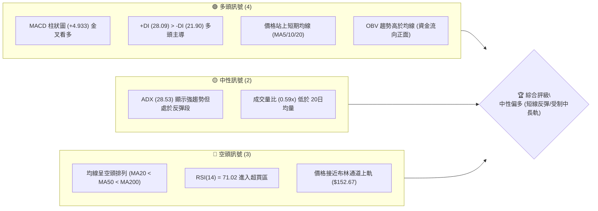
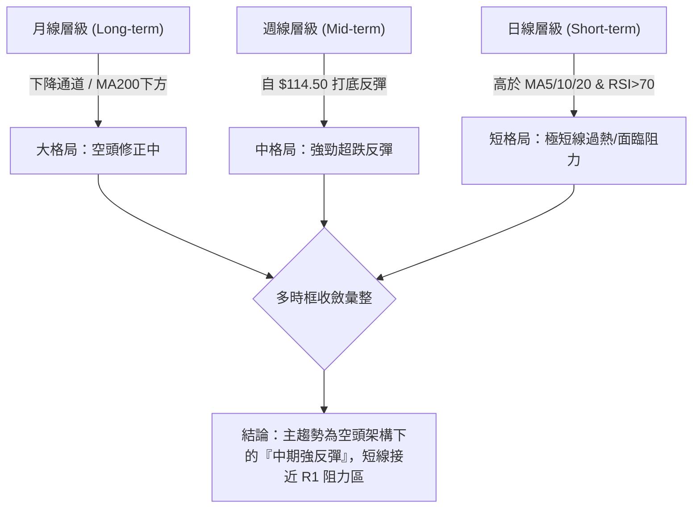
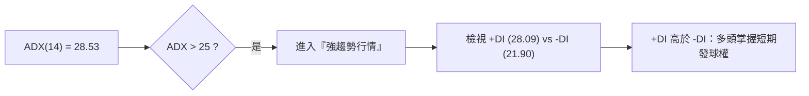
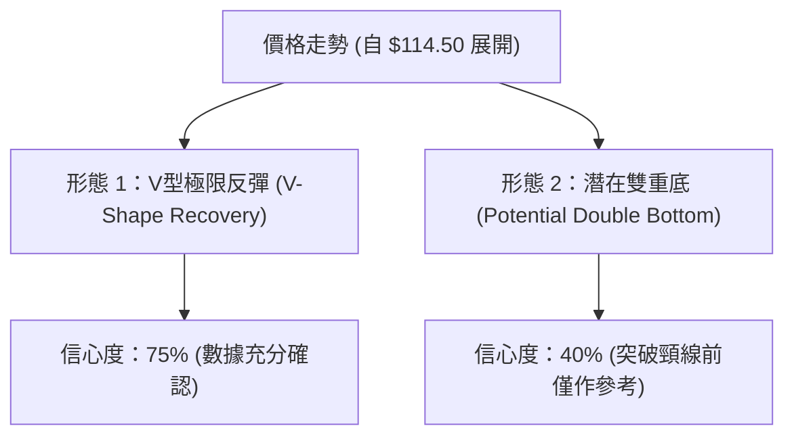
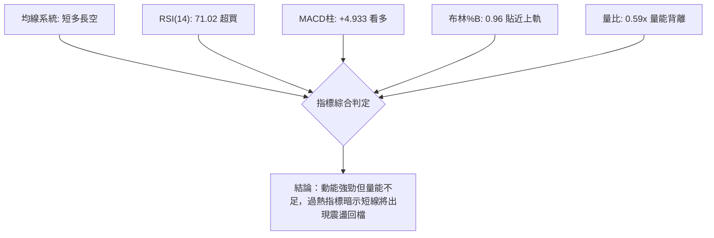
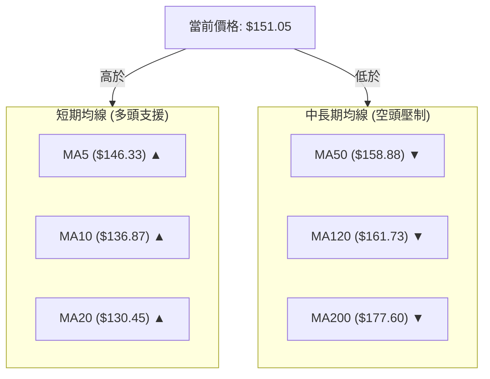
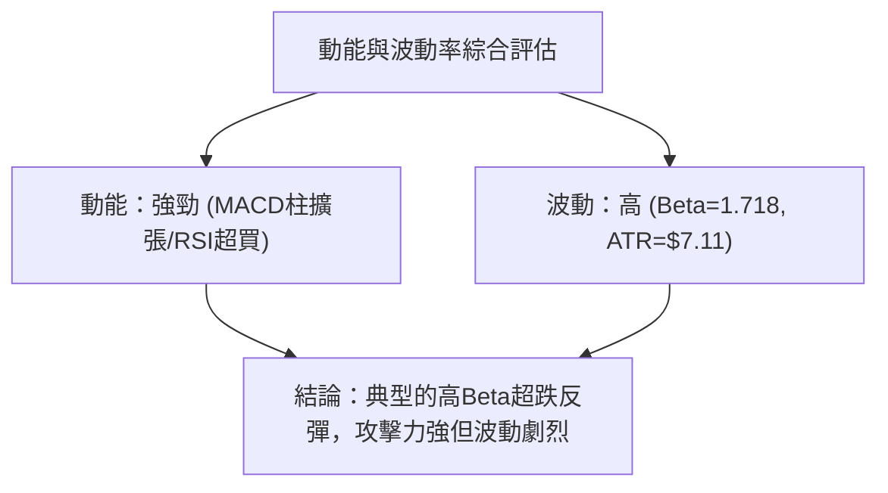
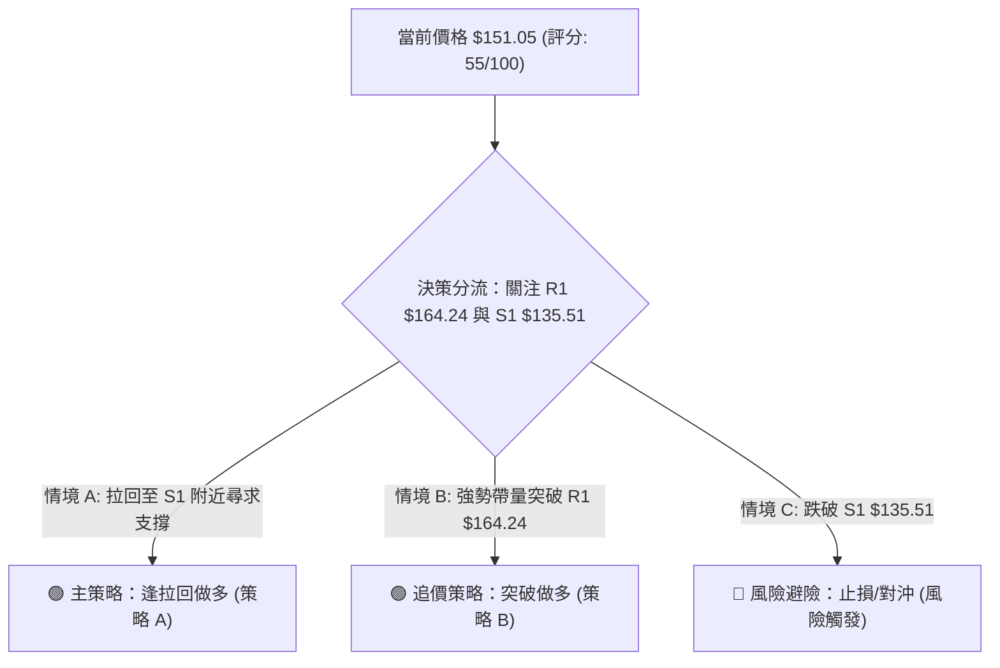
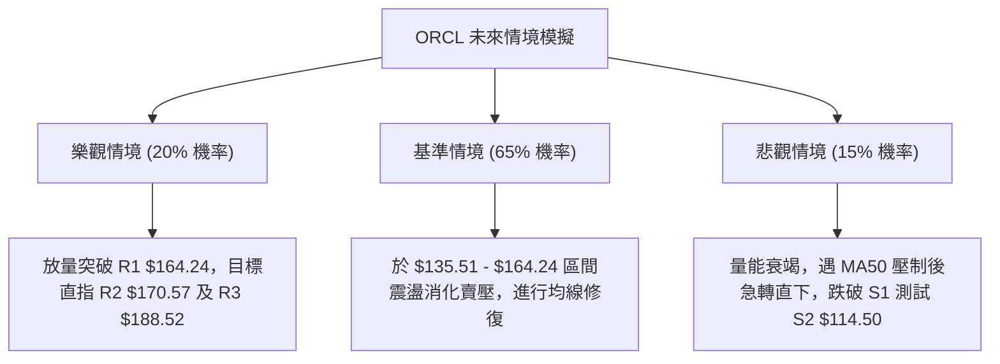

# ORCL 技術分析報告

> **報告日期**：2026-08-11 ｜ **語言**：繁體中文 ｜ **數據來源**：Yahoo Finance ｜ **當前價格**：$151.05

---

## 目錄

| 章節 | 內容 |
|------|------|
| [1. 技術面概覽](#1-技術面概覽) | 訊號儀表板、核心指標、評分卡 |
| [2. 趨勢分析](#2-趨勢分析) | 多時框趨勢、長中短期走勢 |
| [3. 圖表形態分析](#3-圖表形態分析) | 形態識別、K線組合、目標價 |
| [4. 支撐與阻力](#4-支撐與阻力) | 關鍵價位、斐波那契回調 |
| [5. 技術指標深度解讀](#5-技術指標深度解讀) | MA/RSI/MACD/布林/成交量 |
| [6. 動能與波動率](#6-動能與波動率) | 動能評估、ATR、Beta |
| [7. 多時框架總結](#7-多時框架總結) | 時框架評分矩陣 |
| [8. 交易策略建議](#8-交易策略建議) | 多空策略、風險報酬比 |
| [9. 風險提示與監控](#9-風險提示與監控) | 監控指標、風險場景 |

---

## 1. 技術面概覽

### 🎯 技術訊號儀表板



### 📊 核心指標速覽表

| 指標類別 | 指標名稱 | 當前數值 | 訊號 | 解讀 |
|----------|----------|----------|------|------|
| **價格** | 當前價格 | $151.05 | 🟡 中性 | 自 52週低點 $114.50 強勁反彈，位於 52週區間 16.1% |
| **均線** | MA20 | $130.45 | 🟢 看多 | 價格高於 MA20 (+15.80%)，提供短線支撐 |
| **均線** | MA50 | $158.88 | 🔴 看空 | 價格低於 MA50 (-4.93%)，上方面臨中期均線反壓 |
| **均線** | MA200 | $177.60 | 🔴 看空 | 價格遠低於 MA200 (-14.95%)，長期趨勢仍偏空 |
| **動能** | RSI(14) | 71.02 | 🔴 超買 | 指標進入 >70 超買區，短線隨時有回檔修復需求 |
| **動能** | MACD | -1.085 (Hist: +4.933) | 🟢 看多 | MACD 柱狀圖大幅擴張，零軸下方金叉提供反彈動能 |
| **波動** | ATR(14) | $7.11 (4.71%) | 🟡 中性 | 日均波動幅度正常，適合設置適度止損 |

### 🏆 技術評分卡

```
╔══════════════════════════════════════════════════════════════════╗
║                 技術評分卡 — ORCL (2026-08-11)                   ║
╠══════════════════════════════════════════════════════════════════╣
║ 趨勢強度      █████████████░░░░░░░  65/100  🟡 ADX 28.53 強動能   ║
║ 動能指標      ██████████████4░░░░░  72/100  🟢 MACD強勁/RSI偏熱  ║
║ 支撐穩定度    ████████████░░░░░░░░  60/100  🟡 S1 $135.51 有效守住 ║
║ 成交量配合    █████████░░░░░░░░░░░  45/100  🔴 量比 0.59x 追高無量 ║
║ 形態完整度    ███████████░░░░░░░░░  55/100  🟡 V型反彈面臨關卡阻力 ║
║ 均線排列      ███████░░░░░░░░░░░░░  35/100  🔴 MA20<MA50<MA200空頭 ║
╠══════════════════════════════════════════════════════════════════╣
║ 綜合評分      ███████████░░░░░░░░░  55/100  ⚖️ 中性反彈 (55分)     ║
╚══════════════════════════════════════════════════════════════════╝
```

---

## 2. 趨勢分析

### 🌐 多時框趨勢分析



### 📈 長期趨勢 — 12個月走勢圖（Unicode）

```
ORCL 月線走勢圖（過去12個月：2025-09 至 2026-08）
價格軸 ($)
$280 ┤        ● (2025-09 高點 $278.07)
$260 ┤            ●
$240 ┤
$220 ┤                ●               ● (2026-05 反彈 $225.00)
$200 ┤                    ●
$180 ┤                        ●
$160 ┤                            ●
$140 ┤                                ●               ● $151.05 (現在)
$120 ┤                                    ● (2026-07 低點 $129.87 / 52W低 $114.50)
     └─────────────────────────────────────────────────────────────
      09  10  11  12  01  02  03  04  05  06  07  08 (月份)
```

**走勢特徵分析表格**：

| 階段 | 時間區間 | 收盤價變化 | 漲跌幅 | 階段特徵與技術含義 |
|------|----------|------------|--------|----------------────|
| 頂部回檔 | 2025-09 ~ 2026-02 | $278.07 → $144.39 | -48.07% | 自歷史高點大幅拉估值修正，跌破多條長期均線 |
| 死貓反彈 | 2026-03 ~ 2026-05 | $146.09 → $225.00 | +54.01% | 財報效應引發強烈空頭回補，但未能在高位站穩 |
| 二次探底 | 2026-06 ~ 2026-07 | $146.04 → $129.87 | -42.28% | 恐慌性賣壓湧現，刷新 52週低點至 $114.50 |
| V型築底反彈| 2026-08 (當前) | $129.87 → $151.05 | +16.31% | 指標超賣後急劇 V型回升，目前收復 MA20 攻向 MA50 |

### 📊 中期趨勢（週線分析）

從近 20 週收盤數據觀察：
1. **超賣極值觸底**：2026年6月下旬至7月中旬，週線 RSI 降至 11.1~14.9 的歷史罕見超賣區，週收盤價於 2026-07-26 觸及 $114.99（盤中低點 $114.50），確立了強烈的打底訊號。
2. **週線 MACD 金叉回升**：週線 MACD 柱狀圖由 2026-06-28 的 -6.743 急速收窄並轉正至 +4.827（2026-08-09），顯示中期下行動能已完全衰竭，轉為中線反彈波段。

### ⚡ 趨勢強度評估（ADX 解讀）



*   **ADX 數值解析**：ADX 為 28.53，高於 25 的趨勢門檻，代表當前市場擺脫了 7 月份的無序震盪，進入單邊動能行情。
*   **正負方向線**：+DI（28.09）升至 -DI（21.90）上方，證實自 $114.50 以來的反彈屬於主動買盤推進的**強趨勢反彈**。

---

## 3. 圖表形態分析

### 🔍 形態識別系統



#### 形態信心度與目標價評估表

| 形態類別 | 信心度 | 判斷依據（引用數據） | 完成度 | 目標價計算式與精確數值 |
|----------|--------|----------------------|--------|------------------------|
| **V型極限反彈** | **75%** | 自 52W 低點 $114.50 直線拉升至 $151.05，RSI 從 11 飆升至 71.02 | 85% | 依支撐 R1 推算：目標價直接指向阻力位 **R1 ($164.24)** |
| **潛在雙重底** | **40%** | 前低 $126.41 與 52W 低點 $114.50 構成雙腳，但尚未有效突破頸線 | 45% | 訊號不足，僅做指標型解讀。若突破 R1 ($164.24)，形態高度推算：$164.24 + ($164.24 - $114.50) = **$213.98** |

### 🕯️ 重要 K 線形態分析

| 日期/週次 | 收盤價 | K線形態 | 解讀 | 訊號 |
|-----------|--------|---------|------|------|
| 2026-07-26 | $114.99 | 長下影錘子線 | 於 $114.50 探底後強烈拉回，多頭展現強烈護盤意願 | 🟢 強烈買進 |
| 2026-08-02 | $129.87 | 大陽線實體 | 吞噬前週黑K，確立 V型反彈結構 | 🟢 多頭確認 |
| 2026-08-09 | $147.02 | 強勢跳空長陽 | 一舉穿透 MA20 ($130.45)，買盤動能持續釋放 | 🟢 動能強勁 |
| 2026-08-16 | $151.05 | 高位小十字/星線 | 逼近布林上軌 ($152.67)，多空於高檔出現分歧 | 🟡 短線停頓 |

### 📉 ASCII 走勢形態示意圖

```
ORCL 短線 V型反彈與雙腳打底結構示意圖
阻力 R2 ── $170.57 ──────────────────────────────────────────────
阻力 R1 ── $164.24 ─────────────────────────────┐ (潛在目標/頸線)
                                                │
現價   ── $151.05 ───────────────────●          │
                                   / │          │
布林中軌─ $130.45 ───────●         /  │          │
                        / \       /   │ (回檔測試)
支撐 S1 ── $135.51 ────/───●     /    └──────────┘
                      /     \   / 
支撐 S2 ── $114.50 ──● (低點1)● (52W低點 $114.50)
                   2026/07/19  2026/07/26
```

### 🎯 形態目標價計算

1. **第一階段 V型反彈目標**：直接對齊第一個重壓力區 **R1 ($164.24)**（接近斐波那契 78.6% 回調位 $163.15 與 MA50 $158.88）。
2. **第二階段（若完成雙底突破）**：
   $$\text{頸線位} = R1 (\$164.24)$$
   $$\text{底部低點} = S2 (\$114.50)$$
   $$\text{形態高度} = \$164.24 - \$114.50 = \$49.74$$
   $$\text{雙底理論目標價} = \$164.24 + \$49.74 = \$213.98$$
   *(註：因雙底信心度僅 40%，現階段以第一階段 R1 $164.24 視為主要目標)*

---

## 4. 支撐與阻力

### 🗺️ 關鍵價位分布圖（Unicode）

```
ORCL 價位結構分布圖
═══════════════════════════════════════════════════════════════════
$341.82 ║████████████████████████████████████████║ 52週歷史高點 (0.0%)
$188.52 ║██████████████████                      ║ 強阻力 R3 (+24.81%)
$170.57 ║██████████████                          ║ 阻力 R2 (+12.92%)
$164.24 ║████████████                            ║ 關鍵阻力 R1 (+8.73%)
$163.15 ║----------------------------------------║ 斐波那契 78.6% 回調位
$158.88 ║----------------------------------------║ MA50 均線反壓
$151.05 ╠════════════════════════════════════════╣ ◄ 現價 (Current Price)
$135.51 ║▓▓▓▓▓▓▓▓▓▓▓▓                            ║ 近期關鍵支撐 S1 (-10.29%)
$130.45 ║----------------------------------------║ MA20 / 布林中軌
$114.50 ║████████████████████████████████████████║ 52週歷史低點 S2 (-24.20%)
═══════════════════════════════════════════════════════════════════
```

### 🚧 阻力位分析表

| 阻力級別 | 精確價位 | 形成原因 | 突破難度 | 重要性 |
|----------|----------|----------|----------|--------|
| **R1** | **$164.24** | 近一年波段高點聚類、重疊 Fib 78.6% ($163.15) 與 MA50 ($158.88) | 🔴 極高 | 關鍵分水嶺，決定反彈能否轉為解套行情 |
| **R2** | **$170.57** | 近一年波段高點聚類、接近 MA200 ($177.60) 密集區 | 🔴 高 | 中長線解套賣壓重災區 |
| **R3** | **$188.52** | 近一年強阻力聚類、接近 52週區間 61.8% ($201.34) 下方 | 🔴 極高 | 多頭波段攻勢的極限目標 |

### 🛡️ 支撐位分析表

| 支撐級別 | 精確價位 | 形成原因 | 守住機率 | 重要性 |
|----------|----------|----------|----------|--------|
| **S1** | **$135.51** | 近一年波段低點聚類、接近 MA20 ($130.45) 護盤線 | 🟢 高 | 短線多頭退守的底線，跌破則反彈宣告結束 |
| **S2** | **$114.50** | 52週最低點 (52W Low)、絕對歷史強支撐 | 🟢 極高 | 跌破將引發大規模停損，為多頭最後堡壘 |

### 📐 斐波那契回調位分析

依據 52週區間（$114.50 → $341.82）計算之標準斐波那契層級：

| 斐波那契層級 | 精確價位 | 與現價 ($151.05) 關係 | 技術解讀 |
|--------------|----------|-----------------------|----------|
| 0.0% (52W High) | $341.82 | 上方 +126.30% | 歷史頂部 |
| 23.6% | $288.18 | 上方 +90.78% | 強力空頭區域 |
| 38.2% | $254.99 | 上方 +68.81% | 中期多空分水嶺 |
| 50.0% | $228.16 | 上方 +51.05% | 心理關卡 |
| 61.8% | $201.34 | 上方 +33.30% | 黃金切割回調位 |
| **78.6%** | **$163.15** | **上方 +8.01%** | **即將面臨的強阻力位（極度接近 R1 $164.24）** |
| **100.0% (52W Low)**| **$114.50** | **下方 -24.20%** | **底部位（極度接近 S2 $114.50）** |

**現價位置解讀**：現價 $151.05 正處於 **100.0% ($114.50)** 與 **78.6% ($163.15)** 的回調區間內（進度約 73.8%）。向上距離 78.6% 阻力區僅剩不到 8% 的空間，代表當前反彈已進入高阻力密集的收尾階段。

---

## 5. 技術指標深度解讀

### 🎛️ 指標訊號總覽



### 📈 移動平均線排列分析



*   **整體排列**：MA20 ($130.45) < MA50 ($158.88) < MA200 ($177.60)，屬於標準的**空頭排列格局**。
*   **短線交叉**：價格強勢站上 MA5、MA10、MA20，且短期均線同步向上彎鉤，提供短線向上推升力道；然而 MA50 與 MA200 持續下彎，代表上方 $158.88 ~$177.60 具備解套賣壓。

### 📉 RSI(14) 分析

*   **當前數值**：**71.02**
*   **強度進度條**：`███████████████████████████████░░░░░░░░░` (71.02%) 🔴 **超買**
*   **狀態判斷**：RSI 突破 70 警戒線，進入短期過熱區域。
*   **背離檢測**：目前價格創反彈新高，RSI 同步創高，**無明顯背離現象**。但過高的 RSI 意味著短線追高風險急劇上升，隨時可能拉回回測 MA20 ($130.45)。

### 📊 MACD(12,26,9) 訊號解讀

*   **MACD 線**：-1.085
*   **Signal 線**：-6.018
*   **MACD 柱狀圖**：**+4.933** 🟢 **強烈看多**
*   **解讀**：MACD 線在零軸下方完成黃金交叉，且柱狀圖連續擴張至 +4.933，顯示這波自 $114.50 發動的反彈動能十分迅猛，為目前多頭最強烈的技術面依據。

### 📦 布林通道分析

```
ORCL 布林通道現狀示意圖
BB 上軌 ─── $152.67 ───────── Current Price $151.05 (貼近上軌, %B=0.96)
                      
BB 中軌 ─── $130.45 (MA20) ── 關鍵支撐位
                      
BB 下軌 ─── $108.22 ─────────
```

*   **%B 指標**：**0.96**（接近 1.0，代表價格高度貼近上軌）。
*   **通道型態**：通道開口隨著價格強彈而擴張，價格沿布林上軌向上逼近。歷史經驗顯示，當 %B 超過 0.95 且成交量未放大時，價格容易受到上軌壓制而回歸中軌 ($130.45)。

### 💹 成交量分析（量價配合度）

*   **最新成交量**：21,279,163 股
*   **20日均量**：35,822,248 股 (量比：**0.59x**)
*   **量價背離評估**：價格在上衝至 $151.05 的過程中，成交量比僅 0.59x，顯示**量能未跟上價格漲幅（量價背離）**。缺乏大機構買盤追高護航，此波反彈屬於典型的「無量拉升」，增添了在 R1 ($164.24) 前提早見頂的風險。

---

## 6. 動能與波動率

### ⚡ 動能評估四象限

| 象限區間 | 動能強度 (RSI/MACD) | 波動率 (ATR/Beta) | 當前 ORCL 位置 | 策略意味 |
|----------|---------------------|-------------------|----------------|----------|
| **Q1 (高動能/低波動)** | 強 | 低 | — | 最佳趨勢續抱區 |
| **Q2 (強動能/高波動)** | **強 (RSI 71, MACD+)** | **高 (Beta 1.718, ATR 4.7%)** | **✓ ORCL 歸屬此區** | **高動能反彈，但高 Beta 帶來劇烈震盪，宜緊設止損** |
| **Q3 (低動能/低波動)** | 弱 | 低 | — | 沉悶盤整區 |
| **Q4 (低動能/高波動)** | 弱 | 高 | — | 恐慌殺盤區 |



### 📊 ATR 波動率分析

*   **ATR(14) 數值**：**$7.11**（佔股價 4.71%）。
*   **交易應用建議**：
    *   **短線止損距離**：採用 1.5 倍 ATR = $\$7.11 \times 1.5 = \mathbf{\$10.67}$。
    *   **波段止損距離**：採用 2.0 倍 ATR = $\$7.11 \times 2.0 = \mathbf{\$14.22}$。

### 📐 Beta 與市場相關性

*   **Beta 係數**：**1.718**
*   **市場解讀**：ORCL 的 Beta 大於 1.5，代表其波動度遠高於整體大盤（S&P 500）。當大盤反彈時 ORCL 具備超額回報能力，但若大盤回檔，ORCL 也將承受 1.72 倍的下行放大風險。

---

## 7. 多時框架總結

### 📋 時框架評分表

| 時框架 | 趨勢方向 | 動能狀態 | 均線排列 | 形態結構 | 綜合評分 | 交易建議 |
|--------|----------|----------|----------|----------|----------|----------|
| **月線 (Long)** | 🔴 下降 | 🔴 偏弱 | 🔴 空頭排列 | 頂部回檔 | **35/100** | 長線逢高減碼 |
| **週線 (Mid)** | 🟢 築底反彈 | 🟢 金叉向上 | 🟡 試圖翻多 | V型底打底 | **55/100** | 中線觀望待確認 |
| **日線 (Short)** | 🟢 強勢反彈 | 🔴 超買過熱 | 🟢 短多挺進 | 貼布林上軌 | **65/100** | 短線逢高分批獲利 |

### 🔲 綜合訊號矩陣

```
ORCL 多時框訊號收斂矩陣
┌──────────┬─────────────┬─────────────┬─────────────┐
│ 時框架   │ 短期 (日線) │ 中期 (週線) │ 長期 (月線) │
├──────────┼─────────────┼─────────────┼─────────────┤
│ 趨勢方向 │   🟢 看多   │   🟡 中性   │   🔴 看空   │
│ 均線狀態 │   🟢 多頭   │   🔴 空頭   │   🔴 空頭   │
│ 動能指標 │   🔴 超買   │   🟢 看多   │   🔴 偏弱   │
└──────────┴─────────────┴─────────────┴─────────────┘
```

### ⚖️ 多時框收斂結論

依據多時框收斂規則：當前 **ADX(14) = 28.53 (>25)**，市場處於**強趨勢行情**。
因中長期均線（MA50 $158.88 / MA200 $177.60）仍處於下彎空頭架構，日線級別的飆升確定屬於**空頭大格局下的「中期強烈解套反彈」**。由於日線 RSI (71.02) 已進入超買區且量比僅 0.59x，短線上行空間將受到阻力位 **R1 ($164.24)** 與 **Fib 78.6% ($163.15)** 的強烈壓制。

---

## 8. 交易策略建議

### 🗺️ 策略決策流程圖



### 🧭 策略路由

*   **當前主策略方向**：**中性偏多——逢拉回做多 / 高檔獲利結算（綜合評分 55/100）**
*   **路由說明**：鑑於股價已逼近布林上軌 ($152.67) 且 RSI 超買，不宜在 $151.05 直接追高。最佳策略為等待股價回測 **S1 ($135.51)** 或 **MA20 ($130.45)** 建立多頭部位，或等待帶量突破 **R1 ($164.24)** 後追進。

### 🎯 價格情境階梯 (Price Scenarios)

| 觸發條件 | 下一目標 | 後續延伸 | 情境含義 |
|----------|----------|----------|----------|
| **強勢突破 R1 $164.24** | **R2 $170.57** | **R3 $188.52** | V型反彈升級為中線翻多行情 |
| **於 $135.51 - $152.67 震盪** | **MA20 $130.45** | **S1 $135.51** | 健康消化 RSI 超買的區間整理 |
| **有效跌破 S1 $135.51** | **S2 $114.50** | **52W 低點** | 反彈結束，再次探底 |

### 📊 情境機率分佈

| 情境 | 機率 | 主要依據 |
|------|------|----------|
| **回檔蓄勢後再挑戰 R1** | **50%** | MACD 柱狀圖 (+4.933) 強勁，但 RSI 過熱需過渡 |
| **在高檔 $135.51 - $152.67 區間震盪** | **35%** | 成交量比僅 0.59x，缺乏直接攻破阻力區的量能 |
| **直接轉弱跌破 S1 再度探底** | **15%** | 日線均線（MA5/10/20）已轉為多頭支撐，短期有墊高作用 |

### 🟢 主策略詳情

#### 策略 A：逢拉回做多策略 (Pullback Buy) — 主推策略

*   **適用場景**：股價自過熱區拉回，於 MA20 / S1 附近獲得支撐。

| 策略要素 | 策略 A (拉回做多) | 策略 B (突破追多) |
|----------|-------------------|-------------------|
| **進場條件** | 價格拉回至 S1 附近止跌 | 每日收盤價強勢突破 R1 $164.24 |
| **進場價格** | **$135.51** (或 MA20 $130.45 附近) | **$164.24** |
| **目標價 T1** | **$152.67** (布林上軌) | **$170.57** (阻力 R2) |
| **目標價 T2** | **$164.24** (阻力 R1) | **$188.52** (阻力 R3) |
| **止損價格** | **$124.84** (低於 MA20 約 1.5x ATR) | **$153.58** (低於突破點 1.5x ATR) |
| **風險報酬比** | **2.70 : 1** (以 T2 計算) | **2.28 : 1** (以 T2 計算) |
| **勝率預估** | **60%** | **50%** |
| **建議倉位** | **15% - 20%** | **10% - 15%** |

### 🔴 反向風險觸發點（對沖提示）

*   **多頭停損/離場觸發點**：若日線收盤價**跌破 S1 ($135.51)** 且 MACD 柱狀圖轉折向下，代表反彈波段結束，應立即執行停損離場，防止股價下探 S2 ($114.50)。

### ⭐ 整體訊號強度評星

```
做多訊號強度：★★★☆☆  (3/5星 — 動能強但受制阻力)
做空訊號強度：★★☆☆☆  (2/5星 — 短線動能過強，不宜盲目做空)
整體可信度：  ★★★☆☆  (3/5星 — 技術指標收斂一致，量能略有瑕疵)
```

---

## 9. 風險提示與監控

### ✅ 關鍵監控指標 Checklist

```
╔══════════════════════════════════════════════════════════════════╗
║                   ORCL 每日交易監控 Checklist                     ║
╠══════════════════════════════════════════════════════════════════╣
║ [ ] 1. 阻力區測試：關注 $158.88 (MA50) 與 R1 $164.24 的扣壓表現  ║
║ [ ] 2. RSI 超買修復：觀察 RSI(14) 能否降至 55-60 形成健康整理    ║
║ [ ] 3. 成交量配合：攻擊 R1 時，單日成交量需 > 35,820,000 股      ║
║ [ ] 4. 關鍵支撐捍衛：每日收盤價不得跌破 S1 $135.51              ║
║ [ ] 5. MACD 柱狀圖：關注柱狀圖 (+4.933) 是否出現高檔頂背離或縮水  ║
╚══════════════════════════════════════════════════════════════════╝
```

### ⚠️ 風險場景分析



### 🛡️ 風險管理重要提醒

1. **無量拉升風險**：當前量比僅 **0.59x**，無量反彈容易在遇到密集套牢區（如 MA50 $158.88 及 R1 $164.24）時引發獲利回吐與解套賣壓的雙重打擊。
2. **高 Beta 波動**：ORCL 的 **Beta 達 1.718**，ATR 達 **$7.11**，單日跌幅可能較大，務必嚴格執行止損纪律。
3. **長期均線壓制**：MA200 ($177.60) 仍呈現陡峭下彎，大趨勢尚未扭轉前，所有反彈策略皆應以「短線/波段操作」視之，不可過度盲目長期持有。

---

## 📋 報告總結

```
╔══════════════════════════════════════════════════════════════════╗
║                     ORCL 技術分析報告總結                        ║
════════════════════════════════════════════════════════════════════
報告日期：2026-08-11
當前價格：$151.05
分析評級：⚖️ 中性偏多 / 區間反彈 (綜合評分: 55/100)

關鍵結論：
├─ 長期趨勢：🔴 空頭架構 (MA20 < MA50 < MA200，價低於 MA200)
├─ 中期趨勢：🟢 築底反彈 (自 52週低點 $114.50 展現強勁 V型反彈)
├─ 短期趨勢：🔴 超買過熱 (RSI 71.02, 布林 %B 0.96 逼近上軌 $152.67)
├─ 關鍵支撐：S1 $135.51 / S2 $114.50 (52W Low)
├─ 關鍵阻力：R1 $164.24 / R2 $170.57 / R3 $188.52
└─ 分析師目標：均價 $247.17 (買進評級，共 41 位分析師)

最優策略組合：
1. 🥇 最佳機會：等待股價拉回至 S1 $135.51 附近逢低建立多頭部位
2. 🥈 次選機會：待每日收盤強勢帶量突破 R1 $164.24 後追價入場
3. 🥉 保守選擇：當前 $151.05 不追高，觀望 RSI 超買降溫與 MA50 測試
════════════════════════════════════════════════════════════════════
```

---

> ⚠️ **免責聲明**：本報告為 AI 自動生成之技術分析，所有數據及估算均基於提供的歷史價格資訊。本報告**僅供研究與學術參考**，**不構成任何投資建議**。投資有風險，入市需謹慎。

---

*報告生成時間：2026-08-11 ｜ 數據來源：Yahoo Finance ｜ 分析框架：多時框技術分析*