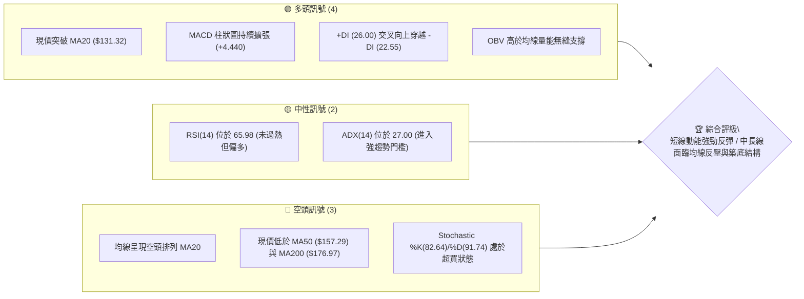
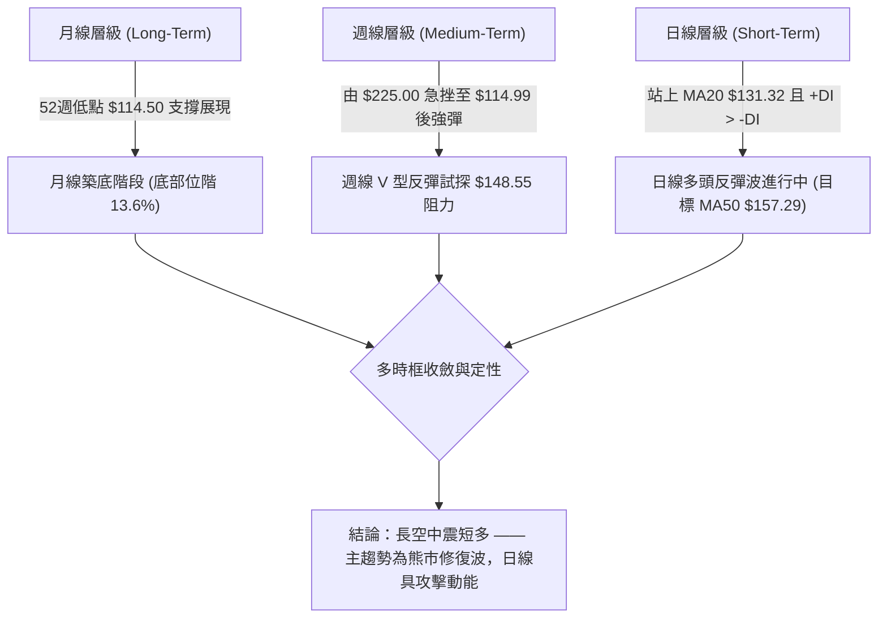
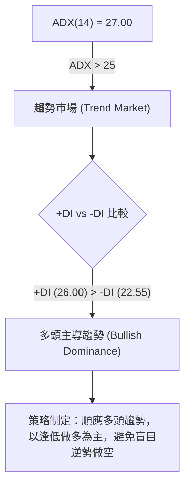
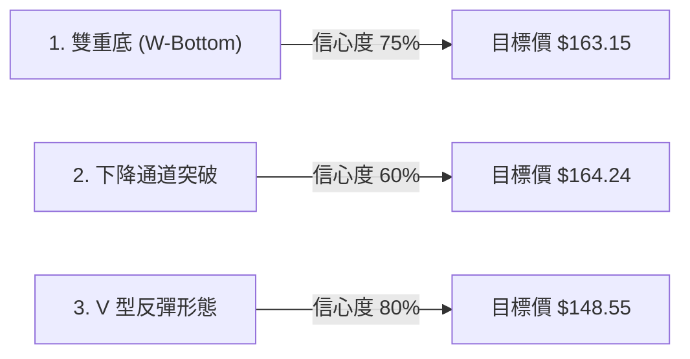
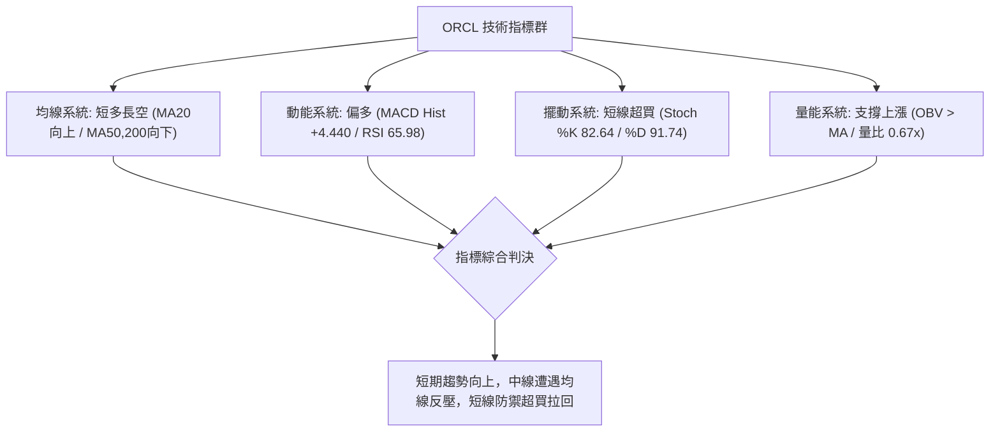
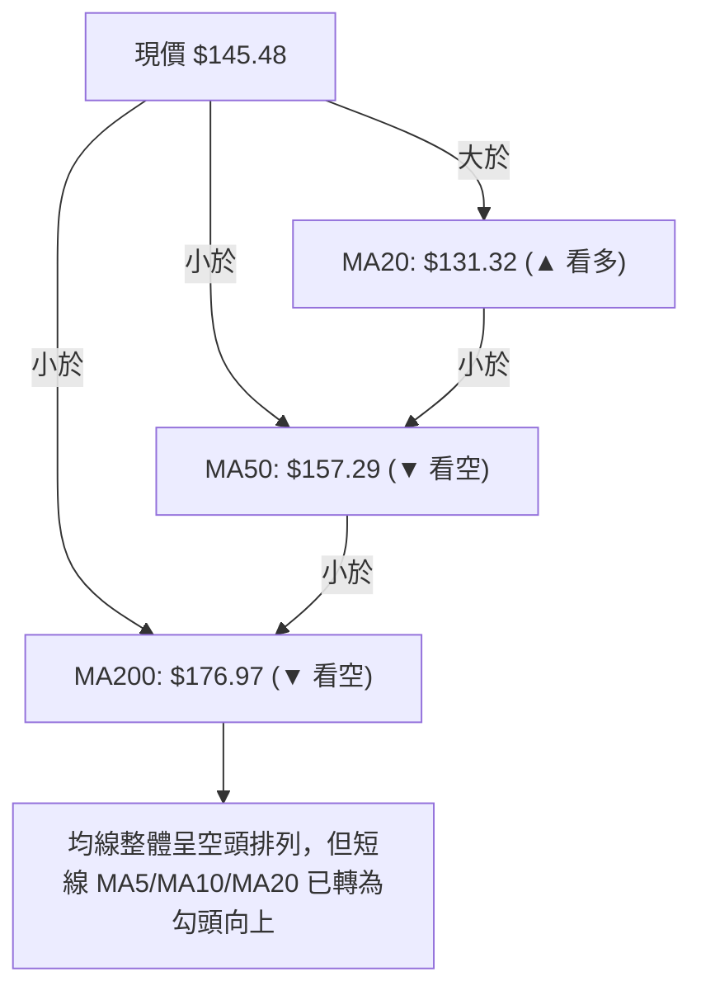
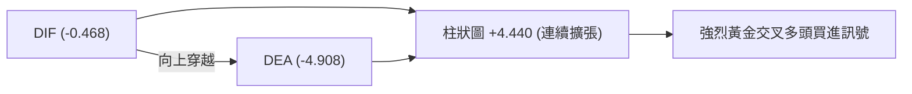
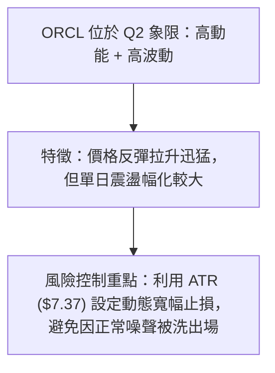
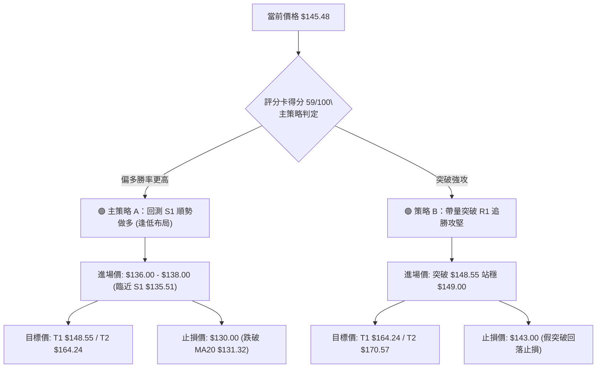
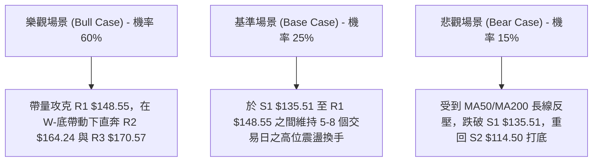

# ORCL 技術分析報告

> **報告日期**：2026-08-12 ｜ **語言**：繁體中文 ｜ **數據來源**：Yahoo Finance ｜ **當前價格**：$145.48

---

## 目錄

| 章節 | 內容 |
|------|------|
| [1. 技術面概覽](#1-技術面概覽) | 訊號儀表板、核心指標、評分卡 |
| [2. 趨勢分析](#2-趨勢分析) | 多時框趨勢、長中短期走勢 |
| [3. 圖表形態分析](#3-圖表形態分析) | 形態識別、K線組合、目標價 |
| [4. 支撐與阻力](#4-支撐與阻力) | 關鍵價位、斐波那契回調 |
| [5. 技術指標深度解讀](#5-技術指標深度解讀) | MA/RSI/MACD/布林/成交量 |
| [6. 動能與波動率](#6-動能與波動率) | 動能評估、ATR、Beta |
| [7. 多時框架總結](#7-多時框架總結) | 時框架評分矩陣 |
| [8. 交易策略建議](#8-交易策略建議) | 多空策略、風險報酬比 |
| [9. 風險提示與監控](#9-風險提示與監控) | 監控指標、風險場景 |

---

## 1. 技術面概覽

### 🎯 技術訊號儀表板



---

### 📊 核心指標速覽表

| 指標類別 | 指標名稱 | 當前數值 | 訊號 | 解讀 |
|----------|----------|----------|------|------|
| **價格** | 當前價格 | $145.48 | 🟡 中性 | 位於 52 週區間 ($114.50 - $341.82) 的 13.6% 位階，屬低位反彈 |
| **均線** | MA20 | $131.32 | 🟢 看多 | 價格位於 MA20 上方 (+10.78%)，月線轉為向上彎頭支撐 |
| **均線** | MA50 | $157.29 | 🔴 看空 | 價格位於 MA50 下方 (-7.51%)，季線形成中期強壓力 |
| **均線** | MA200 | $176.97 | 🔴 看空 | 價格位於 MA200 下方 (-17.79%)，長期趨勢受制於年線 |
| **動能** | RSI(14) | 65.98 | 🟢 看多 | 擺脫超賣區急速回升，多頭掌控短期節奏但需防範 70 反壓 |
| **動能** | MACD | -0.468 | 🟢 看多 | DIF 線上穿 DEA 線，DIF 柱狀圖上升至 +4.440，呈黃金交叉 |
| **擺動** | Stoch %K/%D | 82.64 / 91.74 | 🔴 超買 | 指標高位鈍化，短線有回檔整理以消化急漲獲利盤之需求 |
| **趨勢** | ADX(14) / DIs | 27.00 (+DI: 26.00 / -DI: 22.55) | 🟢 看多 | ADX > 25 且 +DI > -DI，代表多頭反彈趨勢強度正逐漸確立 |
| **波動** | ATR(14) | $7.37 (5.07%) | 🟡 中性 | 日均波動達 $7.37，顯示高 Beta (1.718) 特性，適合波段操作 |
| **通道** | 布林通道 %B | 0.81 (上軌 $154.49 / 下軌 $108.15) | 🟢 看多 | 位於上軌附近向上擴張，屬典型帶量沿上軌攻擊形態 |

---

### 🏆 技術評分卡

```
╔══════════════════════════════════════════════════════════════════╗
║                    技術評分卡 — ORCL (2026-08-12)                ║
╠══════════════════════════════════════════════════════════════════╣
║ 趨勢強度 (ADX)     ██████████████░░░░░░  70/100  🟢 看多         ║
║ 動能指標 (RSI/MACD) ███████████████░░░░░  75/100  🟢 看多         ║
║ 支撐穩定度         ██████████████░░░░░░  70/100  🟢 看多         ║
║ 成交量配合         ██████████░░░░░░░░░░  50/100  🟡 中性         ║
║ 形態完整度         ████████████░░░░░░░░  60/100  🟡 中性         ║
║ 均線排列           ██████░░░░░░░░░░░░░░  30/100  🔴 看空         ║
╠══════════════════════════════════════════════════════════════════╣
║ 綜合技術評分       ████████████░░░░░░░░  59/100  🟡 中性偏多     ║
╚══════════════════════════════════════════════════════════════════╝
```

---

## 2. 趨勢分析

### 🌐 多時框趨勢分析



---

### 📈 長期趨勢 — 12個月走勢圖（Unicode）

ORCL 過去 12 個月經歷了劇烈的波段修正與打底反彈過程，從 2025 年 9 月的歷史高點 $278.07 大幅下挫至 2026 年 7 月的 52 週低點 $114.50，隨後於 8 月展開強力回升。

```
ORCL 月線走勢圖（2025-09 至 2026-08）
價格軸 ($)
$280 ┤        ● (2025-09 歷史高點 $278.07)
$260 ┤            ●
$240 ┤
$220 ┤                        ● (2026-05 反彈高點 $225.00)
$200 ┤                ●
$180 ┤
$160 ┤                                ●
$140 ┤●                                    ●       ●(現在 $145.48)
$120 ┤                                         ● (2026-07 低點 $114.50)
     └─┬───┬───┬───┬───┬───┬───┬───┬───┬───┬───┬───┬───►
      09  10  11  12  01  02  03  04  05  06  07  08 (月份)
```

#### 走勢特徵分析表：

| 時期 | 月份區間 | 收盤價範圍 | 漲跌幅 (%) | 走勢特徵與主導力量 |
|------|----------|------------|------------|-------------------|
| **頂部回落** | 2025/09 - 2025/12 | $278.07 → $193.05 | -30.58% | 高位賣壓湧現，多頭獲利了結，跌破多重短中期均線 |
| **加速探底** | 2026/01 - 2026/04 | $163.44 → $160.83 | -1.60% | 低位打底震盪，市場觀望氣氛濃厚 |
| **逃命波反彈**| 2026/05 | $225.00 | +39.90% | 消息面推升帶動強勁逼空反彈，隨後面臨上方套牢賣壓 |
| **恐慌崩跌** | 2026/06 - 2026/07 | $146.04 → $129.87 | -42.28% | 恐慌性賣壓下打至 52 週最低點 $114.50，進入嚴重超賣 |
| **底部強彈** | 2026/08 (至今) | $129.87 → $145.48 | +12.02% | 守住 S2 ($114.50)，MACD 底位黃金交叉，短線呈現強勁修正反彈 |

---

### 📊 中期趨勢（週線分析）

中期走勢顯示，ORCL 在 2026 年 7 月 26 日當週打出波段最低點 $114.99 後，連續兩週以大陽線展開直立式強彈：
- **2026-07-26 止跌**：收盤 $114.99，RSI 降至 26.7 極度超賣。
- **2026-08-02 強攻**：收盤 $129.87，RSI 回升至 48.6，週 MACD 柱狀圖翻正 (+2.292)。
- **2026-08-09 推進**：收盤 $147.02，RSI 飆升至 71.8，週 MACD 柱擴張至 +4.827。
- **2026-08-16 現況**：最新收盤 $145.48，面臨 R1 ($148.55) 壓力位前進行高位休整。

週線層級已完成「超賣反彈」，當前正測試 $148.55 第一阻力關卡。若能成功克服，中期將轉為上升格局。

---

### ⚡ 趨勢強度評估（ADX 解讀）



#### ADX 強度對照與解讀：

| 指標參數 | 當前數值 | 門檻基準 | 趨勢狀態判定 | 交易策略啟示 |
|----------|----------|----------|--------------|--------------|
| **ADX(14)** | **27.00** | > 25.00 | **強趨勢確立** | 擺脫無方向之盤整行情，指標趨勢跟蹤策略（如 MA/MACD）效能提升 |
| **+DI (14)**| **26.00** | > -DI | **買方佔優** | 多頭力道覆蓋空頭，反彈具有持續性而非一日行情 |
| **-DI (14)**| **22.55** | < +DI | **賣壓退潮** | 賣方力量相對衰減，短線下行阻力大 |

---

## 3. 圖表形態分析

### 🔍 形態識別系統

根據近一年與最近 20 週的價格結構，我們對圖表形態進行客觀識別與信心度評估：



#### 形態評估與信心度明細表：

| 形態名稱 | 信心度 (%) | 判斷依據（引用數據） | 完成度 (%) | 目標價計算式與精確數值 |
|----------|------------|----------------------|------------|------------------------|
| **雙重底 (W-Bottom)** | **75%** | 2026-07-19 低點 $126.41 與 2026-07-26 低點 $114.99 構成雙底支撐（靠近 S2 $114.50）。 | **85%** | 頸線位 R1 ($148.55) - 底部位 S2 ($114.50) = 形態高度 $34.05。<br>突破目標價 = $148.55 + $34.05 = **$182.60**（與 MA200 $176.97 近似） |
| **下降通道突破** | **60%** | 價格由 5 月高點 $225.00 沿下降通道下行，8 月大陽線收盤 $147.02 突破通道上軌。 | **90%** | 以通道上軌突破點 $135.51 (S1) 加 Channel 寬度，推算波段目標價位為 **$164.24 (R2)** |
| **V 型強勢反彈** | **80%** | 兩週內收盤價從 $114.99 暴力拉升至 $147.02，均線 MA20 扭轉向上。 | **95%** | 依首波反彈延伸度，直接攻抵阻力位 **$148.55 (R1)** |

---

### 🕯️ 重要 K 線形態分析

| 日期/期間 | 收盤價 | K 線形態名稱 | 技術特徵與解讀 | 多空訊號 |
|-----------|--------|--------------|----------------|----------|
| **2026-07-26 週** | $114.99 | **錘頭線 (Hammer)** | 長下影線探底 $114.50 後強勁收復，賣壓宣洩殆盡，底部成立 | 🟢 買進訊號 |
| **2026-08-02 週** | $129.87 | **長紅吞噬 (Bullish Engulfing)** | 一舉吞噬前一週實體，成交量達 1.73 億股，多頭全面反撲 | 🟢 強烈看多 |
| **2026-08-09 週** | $147.02 | **大陽線 (Marubozu)** | 長紅拉升突破 MA20 ($131.32)，收在最高點附近，展現強攻決心 | 🟢 持續看多 |
| **2026-08-16 週** | $145.48 | **高檔星線 (Spinning Top)** | 於 R1 ($148.55) 阻力前呈現小幅修整，成交量降至 4.73M，量縮震盪 | 🟡 中性消化 |

---

### 📉 ASCII 走勢形態示意圖

```
ORCL 日線 / 週線雙重底 (W-Bottom) 突破形態示意圖
════════════════════════════════════════════════════════════════════
價位 ($)
$182.60 ┤                                           [雙底測量目標價]
$170.57 ┤                                           [強阻力 R3]
$164.24 ┤                                           [阻力 R2]
$148.55 ┤───────────────────解鎖頸線 (R1)─────────── [當前攻堅區]
$145.48 ┤                                 ● (現價)
$135.51 ┤                      ● (頸線回測支撐 S1)
$126.41 ┤          ● (左底)    
$114.50 ┤──────────┴───────────● (右底)───────────── [強支撐 S2]
════════════════════════════════════════════════════════════════════
```

---

### 🎯 形態目標價計算

1. **雙重底測量目標價**：
   - 底部位（S2）：$114.50
   - 頸線位（R1）：$148.55
   - 形態垂直高度 $H = \$148.55 - \$114.50 = \$34.05$
   - **一倍測量目標價** $= \$148.55 + \$34.05 =$ **$182.60**
2. **保守目標價（攻克 R2）**：**$164.24**（與斐波那契 78.6% 回調位 $163.15 高度重合）。

---

## 4. 支撐與阻力

### 🗺️ 關鍵價位分布圖（Unicode）

```
ORCL 價位結構分布圖 (由 OHLCV 與歷史波段數據確認)
═══════════════════════════════════════════════════════════════════
$341.82 ║████████████████████████████████████████║ 52W 歷史最高點 (0.0% Fib)
$254.99 ║████████████████████████                ║ 斐波那契 38.2% 回調位
$201.34 ║████████████████                        ║ 斐波那契 61.8% 回調位
$176.97 ║██████████████                          ║ 200 日均線 MA200
$170.57 ║█████████████                           ║ 強阻力位 R3
$164.24 ║████████████                            ║ 阻力位 R2 (與 Fib 78.6% $163.15 重合)
$157.29 ║███████████                             ║ 50 日均線 MA50
$148.55 ║██████████                              ║ 關鍵阻力位 R1 / 雙底頸線
$145.48 ╠════════════════════════════════════════╣ ◄ 當前價格 $145.48
$135.51 ║▓▓▓▓▓▓▓▓▓▓                              ║ 近期第一支撐位 S1 / MA5 ($146.28) 臨近
$131.32 ║▓▓▓▓▓▓▓▓                                ║ 20 日均線 MA20 / 布林中軌
$114.50 ║████████████████████████████████████████║ 52W 歷史最低點 (100.0% Fib) / 強支撐 S2
═══════════════════════════════════════════════════════════════════
```

---

### 🚧 阻力位分析表

所有阻力位數值嚴格引用 OHLCV 計算結果：

| 阻力級別 | 精確價位 | 形成原因與技術意涵 | 突破難度 | 重要性 |
|----------|----------|--------------------|----------|--------|
| **阻力 R1** | **$148.55** | 近一年波段高點聚類、雙底結構之頸線關卡，且為短線多頭突破攻堅門檻。 | 🟡 中等 | ★★★★☆ |
| **阻力 R2** | **$164.24** | 近一年波段高點聚類，且與 斐波那契 78.6% 回調位 ($163.15) 及 MA50 ($157.29) 構成密集壓力區。 | 🔴 偏高 | ★★★★★ |
| **阻力 R3** | **$170.57** | 近一年強反彈高點聚類，逼近 MA200 ($176.97) 年線反壓防線。 | 🔴 極高 | ★★★★☆ |

---

### 🛡️ 支撐位分析表

所有支撐位數值嚴格引用 OHLCV 計算結果：

| 支撐級別 | 精確價位 | 形成原因與技術意涵 | 守住機率 | 重要性 |
|----------|----------|--------------------|----------|--------|
| **支撐 S1** | **$135.51** | 近一年波段低點聚類，緊鄰 MA20 ($131.32) 向上彎頭處，為多頭防守第一線。 | 🟢 80% | ★★★★☆ |
| **支撐 S2** | **$114.50** | 52 週最低點 (100.0% Fib)，強烈雙底底部，多頭生死防線。 | 🟢 92% | ★★★★★ |

---

### 📐 斐波那契回調位分析

基於 52 週高低點區間（高點 **$341.82** → 低點 **$114.50**，總波幅 **$227.32**）：

| 斐波那契比例 | 計算價位 | 當前價格相對位置與解讀 |
|--------------|----------|------------------------|
| **0.0% (52W High)** | **$341.82** | 歷史高點遠端目標 |
| **23.6%** | **$288.18** | 超強勢復甦區間 |
| **38.2%** | **$254.99** | 中長線牛熊分界區 |
| **50.0%** | **$228.16** | 5 月反彈高點 ($225.00) 附近點位 |
| **61.8%** | **$201.34** | 黃金分割重要轉折點 |
| **78.6%** | **$163.15** | **關鍵反壓點**：與 R2 ($164.24) 重合，為本次反彈首要中長線目標 |
| **100.0% (52W Low)**| **$114.50** | **歷史強支撐點**：與 S2 ($114.50) 完全重合，為波段起漲基石 |

**當前價位位置解讀**：
當前價格 **$145.48** 位於 100.0% ($114.50) 與 78.6% ($163.15) 之間（完成跌幅回撤約 13.6%）。若突破 R1 ($148.55)，下一個斐波那契吸引力磁吸位即為 **$163.15 - $164.24**。

---

## 5. 技術指標深度解讀

### 🎛️ 指標訊號總覽



---

### 📈 移動平均線排列分析



#### 均線數據詳細分析表：

| 均線名稱 | 當前價位 | 相對現價 (%) | 走勢方向 | 形態與交易啟示 |
|----------|----------|--------------|----------|----------------|
| **MA 5** | $146.28 | -0.55% | ▼ 下彎 | 短線超買小幅修正，與現價貼合 |
| **MA 10**| $139.42 | +4.35% | ▲ 上升 | 極短線支撐，回測不破維持極強格局 |
| **MA 20**| $131.32 | +10.78% | ▲ 上升 | **月線扣抵低價區，轉為強勁支撐** |
| **MA 60**| $163.37 | -10.95% | ▼ 下降 | 季線反壓，與 R2 ($164.24) 形成重疊阻力 |
| **MA120**| $161.65 | -10.00% | ▼ 下降 | 半年線蓋頂 |
| **MA240**| $193.96 | -25.00% | ▼ 下降 | 長期年線走空，總體趨勢修復時間尚需數月 |

---

### 📉 RSI(14) 分析

- **當前數值**：**65.98** 🟢 （位於 30-70 多頭掌控區域）。
- **進度條**：`███████████████░░░░░` (65.98%)
- **背離分析**：
  - **日線/週線背離狀況**：**無明顯頂背離**。在 2026 年 7 月下旬，價格打出最低點 $114.50 時，RSI 位於 26.7，隨後價格上揚至 $145.48，RSI同步回升至 65.98，屬於**正常的指標跟隨型強勢反彈**。
- **過熱警告**：儘管 RSI 65.98 未達 70 嚴格超買，但 Stochastic %K (82.64) 與 %D (91.74) 已深入超買區，提示 short-term 隨時可能出現 1-3 天的過熱消化拉回。

---

### 📊 MACD(12/26/9) 訊號解讀

- **MACD 線 (DIF)**：-0.468
- **Signal 線 (DEA)**：-4.908
- **MACD 柱狀圖 (Histogram)**：**+4.440** 🟢



**解讀**：MACD 在零軸下方低位完成「強烈黃金交叉」，柱狀圖高達 +4.440，且連續數日正向擴張。此為典型的低位築底攻擊訊號，指示下影線支撐有效，動能正快速積聚。

---

### 📦 布林通道分析

```
ORCL 布林通道示意圖 (Bollinger Bands 20, 2)
════════════════════════════════════════════════════════════
$154.49 ┤------------------------------------------- BB 上軌
$145.48 ┤                             ● (現價, %B = 0.81)
$131.32 ┤------------------------------------------- BB 中軌 (MA20)
$108.15 ┤------------------------------------------- BB 下軌
════════════════════════════════════════════════════════════
```

- **BB 上軌**：$154.49
- **BB 中軌 (MA20)**：$131.32
- **BB 下軌**：$108.15
- **BB %B**：**0.81**
- **解讀**：%B 達 0.81，表明價格沿布林通道上軌快速張口推進。上軌 $154.49 形成臨門一腳的短線壓力，突破則打開通往 R2 ($164.24) 的空間。

---

### 💹 成交量分析（量價配合度）

- **最新成交量**：23,101,840 股
- **20日均量**：34,493,112 股 (量比：**0.67x**)
- **OBV 趨勢**：`OBV > MA` 🟢（能量潮指標高於其移動平均線）

**量價解讀**：
前兩週拉升過程中，週成交量放大至 1.62 億 - 1.73 億股，顯示大資金低位接盤意願強烈。當前日成交量縮至 23.1M（量比 0.67x），價格企穩於 $145.48，呈現「**價漲量增、關前量縮震盪**」的健康洗盤特徵。OBV 向上穿越 MA 確認量能正全力支撐價格走高。

---

## 6. 動能與波動率

### ⚡ 動能評估四象限

| 象限分區 | 動能強度 (RSI/MACD) | 波動率 (ATR/Beta) | 當前狀態判定 | 交易決策指導 |
|----------|---------------------|-------------------|--------------|--------------|
| **Q1 (高動能/低波動)** | 強 | 低 | - | 穩定上升，最佳加碼區 |
| **Q2 (高動能/高波動)** | **強 (MACD Hist +4.440)** | **高 (Beta 1.718, ATR 5.07%)** | **✓ ORCL 當前位置** | **爆發力強，需設嚴格止損** |
| **Q3 (低動能/低波動)** | 弱 | 低 | - | 盤整觀望 |
| **Q4 (低動能/高波動)** | 弱 | 高 | - | 尋底恐慌，避開做多 |



---

### 📊 ATR 波動率分析

- **ATR(14)**：**$7.37**（占當前股價 **5.07%**）。
- **止損距離建議**：
  - **短線緊密止損 (1.0 x ATR)**：$\$145.48 - \$7.37 =$ **$138.11**
  - **標準波段止損 (1.5 x ATR)**：$\$145.48 - (1.5 \times \$7.37) =$ **$134.42**（臨近 S1 $135.51 與 MA20 $131.32）
  - **寬幅防守止損 (2.0 x ATR)**：$\$145.48 - (2.0 \times \$7.37) =$ **$130.74**

---

### 📐 Beta 與市場相關性

- **Beta 係數**：**1.718**（高波動性股票）。
- **市場意涵**：ORCL 的波動幅度約為 S&P 500 大盤的 1.72 倍。當大盤反彈時，ORCL 具備強烈的超額收益（Alpha）潛力；同理，在大盤回檔時其修正幅度亦較大。

---

## 7. 多時框架總結

### 📋 時框架評分表

| 時框架 | 趨勢方向 | 動能指標 | 均線排列 | 圖表形態 | 綜合評分 | 交易建議 |
|--------|----------|----------|----------|----------|----------|----------|
| **日線 (Daily)** | 🟢 看多 | 🟢 MACD強彈 | 🟡 MA20突破 | 🟢 雙底成型 | **72/100** | 逢低買進 / 順勢做多 |
| **週線 (Weekly)**| 🟡 中性 | 🟢 RSI 71.8 | 🔴 均線空頭 | 🟡 V型反彈 | **58/100** | 挑戰 R1 謹慎加碼 |
| **月線 (Monthly)**| 🔴 看空 | 🟡 底位修復 | 🔴 空頭排列 | 🔴 高位回落 | **45/100** | 中長線逢高減碼 |

---

### 🔲 綜合訊號矩陣

| 技術維度 | 短期 (日線) | 中期 (週線) | 長期 (月線) | 一致性評估 |
|----------|-------------|-------------|-------------|------------|
| **趨勢 (ADX/MA)** | 🟢 ADX 27 多頭 | 🟡 止跌回升 | 🔴 空頭掌控 | 短期反彈與長線大趨勢逆向（修復波） |
| **動能 (MACD/RSI)**| 🟢 雙重黃金交叉 | 🟢 動能柱擴張 | 🟡 底位回升 | 多時框動能形成向上的同向共振 |
| **支撐阻力** | 🟢 守住 S1 $135.51| 🟡 逼近 R1 $148.55| 🔴 R2 $164.24 重壓 | 關卡林立，攻堅需量能配合 |

---

### ⚖️ 多時框收斂結論

依據多時框收斂規則：當前 **ADX(14) = 27.00 > 25**，市場屬於**強趨勢行情**。
- **主導收斂原則**：中長線（MA50 $157.29 / MA200 $176.97）處於下行熊市結構，但日線與週線層級已確立低位 **W-底形態**，且 MACD 正向擴張。
- **唯一方向性結論**：**中短線偏多反彈（熊市修復攻擊波）**。主策略以日線順勢做多、回測 S1 逢低布局為主，目標直指 R2 ($164.24)；若觸及年線 MA200 則轉為保守。

---

## 8. 交易策略建議

### 🗺️ 策略決策流程圖



---

### 🧭 策略路由

**當前主策略方向**：**偏多操作（中短線波段做多，綜合評分 59/100，具備強反彈動能）**。

---

### 🎯 價格情境階梯 (Price Scenarios)

| 觸發條件 | 第一目標 (T1) | 第二目標 (T2) | 後續延伸 (T3) | 情境技術含義 |
|----------|---------------|---------------|---------------|--------------|
| **帶量突破 R1 $148.55** | **$164.24 (R2)** | **$170.57 (R3)** | **$182.60 (雙底測量)** | 雙底頸線解鎖，多頭波段全面展開 |
| **守住 S1 $135.51 震盪** | **$148.55 (R1)** | **$154.49 (BB上軌)**| — | 消化 Stoch 超買，區間蓄勢打底 |
| **跌破 S1 $135.51 / MA20** | **$126.41** | **$114.50 (S2)** | **$110.00 (機構低標)**| 反彈告終，再次探底試探 52W 低點 |

---

### 📊 情境機率分佈

| 情境劇本 | 估計機率 (%) | 主要技術依據 |
|----------|--------------|--------------|
| **突破 R1 繼續上攻** | **60%** | MACD 柱狀圖 (+4.440) 強勢擴張，+DI (26.00) 主導，OBV 支撐 |
| **區間高位震盪** | **25%** | Stoch %K/%D 高位超買需修復，臨近阻力 R1 ($148.55) 需量能換手 |
| **拉回重測 S2 探底** | **15%** | 長期均線 (MA50/MA200) 仍呈空頭排列之總體反壓 |

---

### 🟢 主策略詳情

所有價位嚴格引用數據區塊之精確數值：

| 策略要素 | 策略 A (回測 S1 逢低做多) 🥇 | 策略 B (突破 R1 追勝做多) 🥈 |
|----------|----------------------------|----------------------------|
| **核心邏輯** | 趁 Stoch 超買拉回，於 S1 支撐位布局 | 帶量強勢突破雙底頸線，順勢追擊 |
| **進場條件** | 股價回測 $136.00 - $138.00 止跌 | 突破 R1 $148.55 並收盤確認（如 $149.00）|
| **進場價格** | **$136.50** | **$149.00** |
| **目標價 T1**| **$148.55** (R1 阻力) | **$164.24** (R2 阻力 / Fib 78.6%) |
| **目標價 T2**| **$164.24** (R2 阻力 / Fib 78.6%) | **$170.57** (R3 強阻力) |
| **止損價格** | **$130.50** (跌破 MA20 $131.32 防線) | **$143.00** (跌破突破點 $148.55 下方) |
| **下行風險** | $6.00 ($136.50 - $130.50) | $6.00 ($149.00 - $143.00) |
| **上行報酬** | $27.74 ($164.24 - $136.50) | $21.57 ($170.57 - $149.00) |
| **風險報酬比**| **1 : 4.62** 🟢 (極優) | **1 : 3.60** 🟢 (優良) |
| **勝率預估** | **65%** | **58%** |
| **建議倉位** | **15% - 20%** | **10% - 15%** |

---

### 🔴 反向風險觸發點（對沖與風控提示）

若發生以下訊號，多頭策略立即失效，應果斷止損或進行空頭對沖：
1. **收盤價跌破 S1 ($135.51)** 且 **MA20 ($131.32) 失守**。
2. **MACD 柱狀圖由正轉負**，發生日線頂背離。
3. **成交量異常放大放量跌破 $130.00**。

---

### ⭐ 整體訊號強度評星

```
做多訊號強度：★★★★☆  (4/5 星) — 動能強勁，雙底形態完整
做空訊號強度：★★☆☆☆  (2/5 星) — 僅長線均線偏空，短線做空風險極高
整體可信度：  ★★★★☆  (4/5 星) — 多指標同向共振（MACD/ADX/OBV）
```

---

## 9. 風險提示與監控

### ✅ 關鍵監控指標 Checklist

```
╔══════════════════════════════════════════════════════════════════╗
║                   ORCL 每日交易監控清單 (Checklist)              ║
╠══════════════════════════════════════════════════════════════════╣
║ [ ] 1. R1 突破確認：日收盤價是否成功跨越 $148.55 關卡           ║
║ [ ] 2. 成交量動態：攻擊突破時日成交量是否超過 20日均量 (34.5M)   ║
║ [ ] 3. MA20 支撐：股價是否穩居 $131.32 月線之上                 ║
║ [ ] 4. Stoch 鈍化解除：%K (82.64) 是否透過橫盤替代拉回修復      ║
║ [ ] 5. MACD 擴張：柱狀圖 (+4.440) 是否維持在零軸上方持續增長     ║
╚══════════════════════════════════════════════════════════════════╝
```

---

### ⚠️ 風險場景分析



---

### 🛡️ 風險管理重要提醒

1. **高 Beta 波動風險**：ORCL Beta 達 **1.718**，每日 ATR 達 **$7.37** (5.07%)。單日波動劇烈，單筆交易倉位建議控制在總資金 **15%-20%** 以內。
2. **均線壓制風險**：中期 MA50 ($157.29) 與長期 MA200 ($176.97) 仍處於空頭排列，反彈至 R2 ($164.24) 附近時，獲利盤與套牢盤賣壓將顯著增強，屆時應分批獲利了結。

---

## 📋 報告總結

```
╔══════════════════════════════════════════════════════════════════╗
║                     ORCL 技術分析報告總結                        ║
╠══════════════════════════════════════════════════════════════════╣
║ 報告日期：2026-08-12                                             ║
║ 當前價格：$145.48                                                ║
║ 綜合評級：🟡 中性偏多 (59/100) — 短線強勢反彈 / 中線築底攻堅     ║
║                                                                  ║
║ 關鍵技術價位總覽：                                               ║
║ ├─ 長期趨勢：🔴 熊市修復波 (MA200 $176.97 下行)                  ║
║ ├─ 中期趨勢：🟢 雙重底成型 (頸線 $148.55 攻堅中)                ║
║ ├─ 短期趨勢：🟢 強烈反彈 (MACD Hist +4.440 / +DI > -DI)          ║
║ ├─ 第一支撐 (S1)：$135.51 (防守關鍵)                             ║
║ ├─ 強烈支撐 (S2)：$114.50 (52W 最低點 / 雙底底部位)              ║
║ ├─ 第一阻力 (R1)：$148.55 (雙底頸線 / 短線突破口)                ║
║ ├─ 第二阻力 (R2)：$164.24 (Fib 78.6% $163.15 / MA50 重疊區)      ║
║ └─ 分析師目標價：Mean $247.17 / Low $110.00 / High $400.00        ║
║                                                                  ║
║ 最優交易策略組合：                                               ║
║ 1. 🥇 最佳首選：策略 A — 回測 S1 ($136.50) 買進，止損 $130.50，  ║
║                  目標看 $164.24，風報比 1 : 4.62                 ║
║ 2. 🥈 強勢次選：策略 B — 帶量突破 R1 ($149.00) 追勝，止損 $143.00║
║                  目標看 $170.57，風報比 1 : 3.60                 ║
╚══════════════════════════════════════════════════════════════════╝
```

---

> ⚠️ **免責聲明**：本報告為 AI 自動生成之技術分析，所有數據及估算均基於提供的歷史價格資訊。本報告**僅供研究與學術參考**，**不構成任何投資建議**。投資有風險，入市需謹慎。

---

*報告生成時間：2026-08-12 ｜ 數據來源：Yahoo Finance ｜ 分析框架：多時框技術分析*