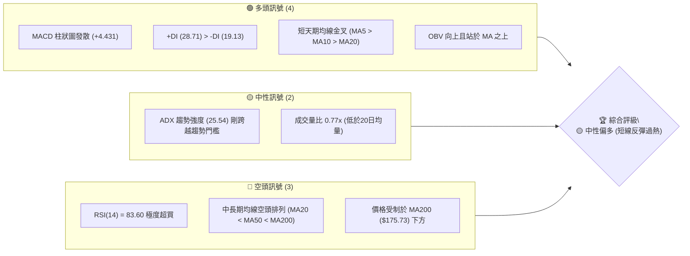
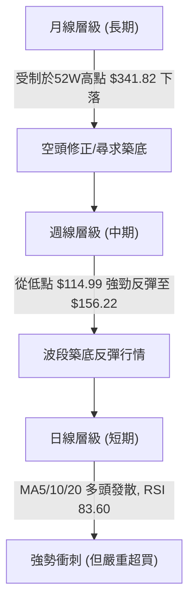
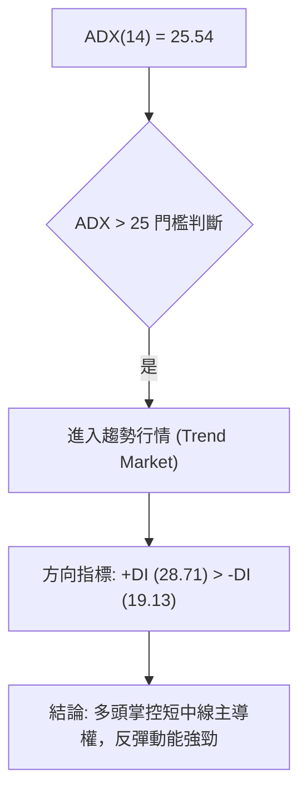
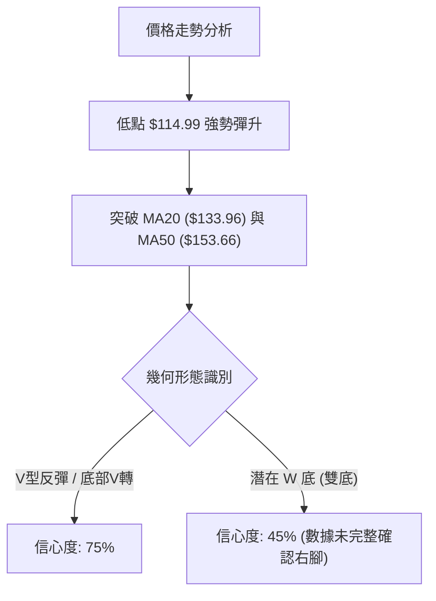
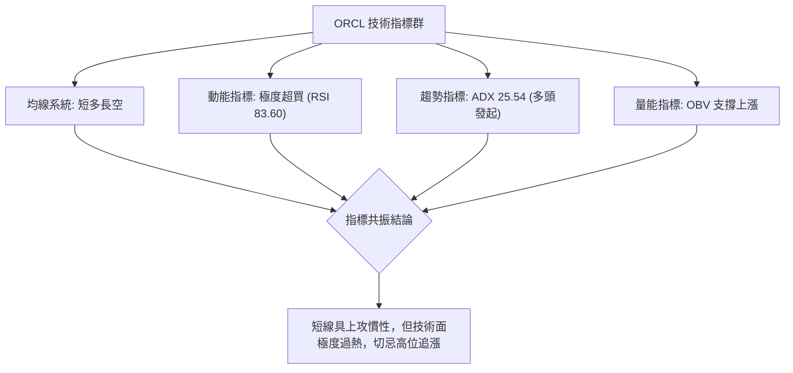
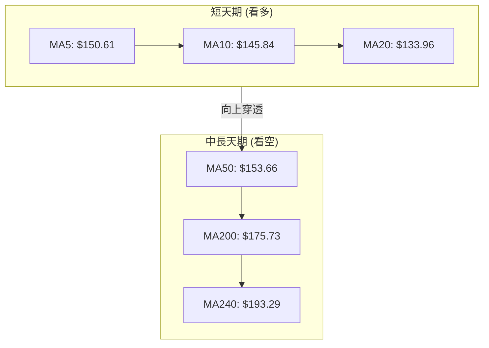
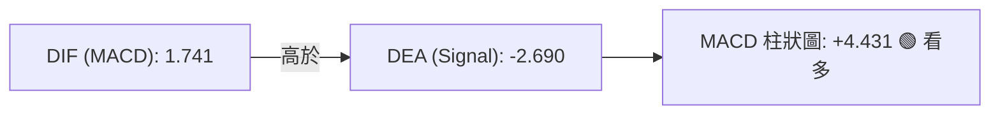
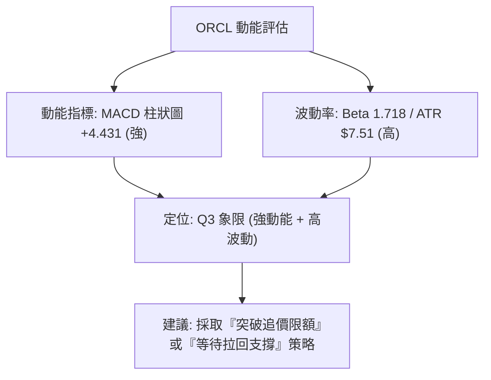
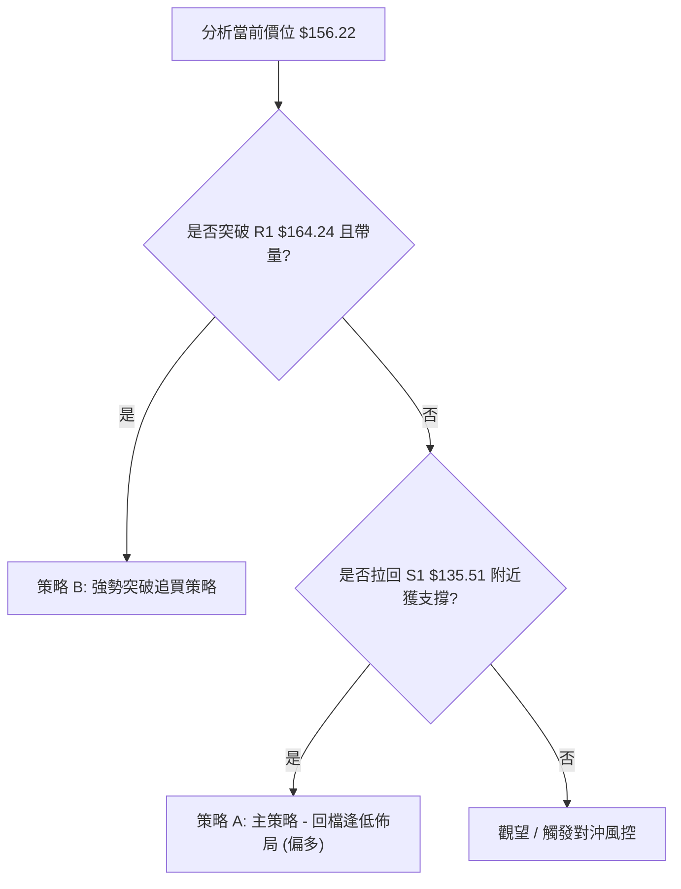
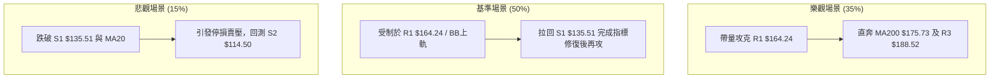

# ORCL 技術分析報告

> **報告日期**：2026-08-14 ｜ **語言**：繁體中文 ｜ **數據來源**：Yahoo Finance ｜ **當前價格**：$156.22

---

## 目錄

| 章節 | 內容 |
|------|------|
| [1. 技術面概覽](#1-技術面概覽) | 訊號儀表板、核心指標、評分卡 |
| [2. 趨勢分析](#2-趨勢分析) | 多時框趨勢、長中短期走勢 |
| [3. 圖表形態分析](#3-圖表形態分析) | 形態識別、K線組合、目標價 |
| [4. 支撐與阻力](#4-支撐與阻力) | 關鍵價位、斐波那契回調 |
| [5. 技術指標深度解讀](#5-技術指標深度解讀) | MA/RSI/MACD/布林/成交量 |
| [6. 動能與波動率](#6-動能與波動率) | 動能評估、ATR、Beta |
| [7. 多時框架總結](#7-多時框架總結) | 時框架評分矩陣 |
| [8. 交易策略建議](#8-交易策略建議) | 多空策略、風險報酬比 |
| [9. 風險提示與監控](#9-風險提示與監控) | 監控指標、風險場景 |

---

## 1. 技術面概覽

### 🎯 技術訊號儀表板



### 📊 核心指標速覽表

| 指標類別 | 指標名稱 | 當前數值 | 訊號 | 解讀 |
|----------|----------|----------|------|------|
| **價格** | 當前價格 | $156.22 | 🟡 中性 | 自近期低點 $114.99 強力反彈，位於52週區間 18.4% 位置 |
| **均線** | MA20 | $133.96 | 🟢 看多 | 現價高於 MA20 +16.62%，短線支撐強勁 |
| **均線** | MA50 | $153.66 | 🟢 看多 | 現價已收復 MA50 (+1.67%)，短線扭轉頹勢 |
| **均線** | MA200 | $175.73 | 🔴 看空 | 現價低於 MA200 (-11.10%)，長期趨勢仍呈壓制 |
| **動能** | RSI(14) | 83.60 | 🔴 超買 | 進入深度超買區 (>70)，隨時面臨獲利了結回壓 |
| **動能** | MACD | 1.741 | 🟢 看多 | MACD 穿越 Signal 形成金叉，Hist +4.431 動能強勁 |
| **波動** | ATR(14) | $7.51 | 🟡 中性 | 日波動率 4.81%，屬於標準科技股波動範圍 |

### 🏆 技術評分卡

```
╔══════════════════════════════════════════════════════════════╗
║                技術評分卡 — ORCL (2026-08-14)                 ║
╠══════════════════════════════════════════════════════════════╣
║ 趨勢強度      ▓▓▓▓▓▓▓▓▓▓▓▓░░░░░░░░  60/100  🟡 中性 (ADX 25.54)║
║ 動能指標      ▓▓▓▓▓▓▓▓▓▓▓▓▓▓▓▓░░░░  80/100  🟢 看多 (MACD強勁) ║
║ 支撐穩定度    ▓▓▓▓▓▓▓▓▓▓▓▓░░░░░░░░  60/100  🟡 中性 (S1 $135.51)║
║ 成交量配合    ▓▓▓▓▓▓▓▓▓▓░░░░░░░░░░  50/100  🟡 中性 (量比 0.77x)║
║ 形態完整度    ▓▓▓▓▓▓▓▓▓▓▓▓░░░░░░░░  60/100  🟡 反彈築底結構    ║
║ 均線排列      ▓▓▓▓▓▓▓░░░░░░░░░░░░░  35/100  🔴 空頭排列未改    ║
╠══════════════════════════════════════════════════════════════╣
║ 綜合評分      ▓▓▓▓▓▓▓▓▓▓▓░░░░░░░░░  57.5/100 🟡 中性偏多    ║
╚══════════════════════════════════════════════════════════════╝
```

---

## 2. 趨勢分析

### 🌐 多時框趨勢分析



### 📈 長期趨勢 — 12個月走勢圖（Unicode）

```
ORCL 月線歷史走勢圖（2025-09 至 2026-08）
價格軸 ($)
$280 ┤ ● ($278.07)
$260 ┤    ● ($260.10)
$240 ┤                   ● ($225.00)
$220 ┤       ● ($200.02)
$200 ┤          ● ($193.05)
$180 ┤
$160 ┤             ● ($163.44)  ● ($160.83)             ● ($156.22 現價)
$140 ┤                ● ($144.39)  ● ($146.04)
$120 ┤                                  ● ($129.87)
     └────────────────────────────────────────────────────────
      09  10  11  12  01  02  03  04  05  06  07  08 (月份)
```

**走勢特徵分析表格**：

| 期間 | 開/收區間 | 漲跌幅 | 走勢特徵與驅動因素 |
|------|-----------|--------|--------------------|
| **2025-09 ~ 2025-10** | $278.07 → $260.10 | -6.46% | 自高點回落，高位出現獲利調節賣壓 |
| **2025-11 ~ 2026-02** | $200.02 → $144.39 | -27.81% | 主跌段發放，均線下彎，市場對資本支出產生疑慮 |
| **2026-03 ~ 2026-05** | $146.09 → $225.00 | +54.01% | 財報強勁推升，引發強烈空頭擠壓 (Squeeze) |
| **2026-06 ~ 2026-07** | $146.04 → $129.87 | -11.07% | 再次深幅回檔，於 2026-07 探底至 $114.99 (52W低點附近) |
| **2026-08 (至今)** | $129.87 → $156.22 | +20.29% | 自超賣區呈 V 型強勢反彈，連續突破 MA20 與 MA50 |

### 📊 中期趨勢（週線分析）

從近 20 週數據來看，ORCL 在 2026 年 7 月 26 日當週觸及 $114.99 的階段性底部後，週線 MACD 柱狀圖迅速由負轉正（自 -0.715 轉至 +4.431），週 RSI 亦從極度超賣（11.1–14.9）暴衝至目前的 83.60。

```
ORCL 中期壓力與支撐結構示意圖
══════════════════════════════════════════════════════════════
$188.52 ──────────────────────────────────────── 阻力 R3 (強壓區)
$175.73 ──────────────────────────────────────── MA200 均線壓力
$170.57 ──────────────────────────────────────── 阻力 R2 (中期目標)
$164.24 ──────────────────────────────────────── 阻力 R1 (短線突破點 / 78.6% Fib $163.15)
$156.22 ════════════════════════════════════════ ◄ 當前價格 ($156.22)
$153.66 ──────────────────────────────────────── MA50 (已收復，轉為微幅支撐)
$135.51 ──────────────────────────────────────── 支撐 S1 (關鍵防守點 / MA20 $133.96)
$114.50 ──────────────────────────────────────── 支撐 S2 (52週最低點)
══════════════════════════════════════════════════════════════
```

### ⚡ 趨勢強度評估（ADX 解讀）



| 指標 | 當前數值 | 狀態門檻 | 技術涵義 |
|------|----------|----------|----------|
| **ADX (14)** | 25.54 | > 25 (強趨勢) | 走出低位盤整，新一輪趨勢正宣告確立 |
| **+DI** | 28.71 | > -DI | 買盤力量顯著佔優 |
| **-DI** | 19.13 | < +DI | 賣盤壓制力道減弱 |

---

## 3. 圖表形態分析

### 🔍 形態識別系統



#### 形態信心度與目標價評估

| 形態類別 | 信心度 | 判斷依據（引用數據） | 完成度 | 目標價（附計算式） |
|----------|--------|----------------------|--------|--------------------|
| **V型急彈形態** | **75%** | 自 $114.99 底部強彈至 $156.22，連續拉出陽線，突破 MA50 | 85% | 底部 $114.50 + (頸線突破 $135.51 - $114.50) = **$156.52** (已達成) |
| **斐波那契反彈**| **70%** | 從 52W 低點 $114.50 挑戰 78.6% 回調位 $163.15 | 80% | 第一目標考驗 **$163.15**，突破後看 R2 **$170.57** |
| **雙重底 (W底)** | **45%** | 訊號不足，僅做指標型解讀（未經第二次回測 $135.51 確認） | 30% | 若成立：$135.51 + ($135.51 - $114.50) = **$156.52** |

### 🕯️ 重要K線形態分析

| 月份/週期 | 收盤價 | K線形態 | 解讀 | 訊號 |
|-----------|--------|---------|------|------|
| **2026-07 (月線)** | $129.87 | 長下影線錘子線 | 探底 $114.50 後強力拉回，顯示低位買盤承接極強 | 🟢 看多反轉 |
| **2026-08-02 (週)**| $129.87 | 大陽線實體 | 帶量長紅，確立反彈波段起攻 | 🟢 強勢看多 |
| **2026-08-09 (週)**| $147.02 | 突破長紅 | 一舉穿透 MA20 ($133.96)，多頭續攻 | 🟢 強勢看多 |
| **2026-08-16 (週)**| $156.22 | 光頭中陽線 | 站上 MA50 ($153.66)，逼近 BB 上軌 $160.96 | 🟡 過熱看多 |

### 📉 ASCII 走勢形態示意圖

```
ORCL V型反彈與阻力測試形態示意圖
 $170.57 ┤                                           [R2 阻力]
 $164.24 ┤                                      ┌─── [R1 / Fib 78.6% $163.15]
 $156.22 ┤                                ╭─────●    [當前價格]
 $153.66 ┤                           ╭────┘          [MA50]
 $135.51 ┤                      ╭────┘               [S1 突破頸線/MA20]
 $114.50 ┤          ●───────────┘                    [52W 低點 S2]
         └───────────────────────────────────────────────
          2026-07-26    2026-08-02   2026-08-09   2026-08-14
```

### 🎯 形態目標價計算

1. **V型反彈基本測幅**：
   - 形態基底：$114.50
   - 頸線轉折點：$135.51
   - 垂直高度：$135.51 - $114.50 = $21.01
   - 突破目標價：$135.51 + $21.01 = **$156.52**（當前價格 $156.22 已精準達標）。

2. **進階延伸目標**：
   - 當前價位若能帶量突破 Resistance 1 ($164.24) 與 Fib 78.6% ($163.15)，下一測幅目標指向 Resistance 2 ($170.57)。

---

## 4. 支撐與阻力

### 🗺️ 關鍵價位分布圖（Unicode）

```
ORCL 價位結構分布圖
═══════════════════════════════════════════════════════════════
$341.82 ║████████████████████████████████████████║ 52W High (0.0% Fib)
$288.18 ║████████████████████████████            ║ 23.6% Fib
$254.99 ║██████████████████                      ║ 38.2% Fib
$228.16 ║██████████████                          ║ 50.0% Fib
$201.34 ║██████████                              ║ 61.8% Fib
$188.52 ║████████                                ║ 關鍵阻力 R3
$175.73 ║██████                                  ║ MA200 均線密集區
$170.57 ║█████                                   ║ 中期阻力 R2
$164.24 ║████                                    ║ 短線阻力 R1 / 78.6% Fib ($163.15)
$156.22 ╠════════════════════════════════════════╣ ◄ 當前價格 ($156.22)
$153.66 ║▓▓▓                                     ║ MA50 動態支撐
$135.51 ║▓▓▓▓▓▓▓▓▓▓▓▓                            ║ 近期關鍵支撐 S1 / MA20 ($133.96)
$114.50 ║████████████████████████████████████████║ 強支撐 S2 (52W Low / 100.0% Fib)
═══════════════════════════════════════════════════════════════
```

### 🚧 阻力位分析表

| 阻力級別 | 價位 | 形成原因 | 突破難度 | 重要性 |
|----------|------|----------|----------|--------|
| **R1** | **$164.24** | 近一年波段高點聚類 / 貼近 78.6% Fib ($163.15) 與 BB 上軌 ($160.96) | 🔴 高 | ★★★★☆ 短線反彈生死線 |
| **R2** | **$170.57** | 近一年波段高點聚類 / 靠近 MA200 ($175.73) | 🔴 極高 | ★★★★☆ 中期多空分水嶺 |
| **R3** | **$188.52** | 近一年波段高點聚類 / MA240 ($193.29) 下方蓋頂 | 🔴 極高 | ★★★☆☆ 長線強壓區 |

### 🛡️ 支撐位分析表

| 支撐級別 | 價位 | 形成原因 | 守住機率 | 重要性 |
|----------|------|----------|----------|--------|
| **S1** | **$135.51** | 近一年波段低點聚類 / 貼近 MA20 ($133.96) 與 BB 中軌 | 🟢 高 | ★★★★★ 短線多頭退路 |
| **S2** | **$114.50** | 52週最低點聚類 / 100% 斐波那契基底 | 🟢 極高 | ★★★★★ 結構性防禦底線 |

### 📐 斐波那契回調位分析

（基於 52週區間：高點 **$341.82** 至 低點 **$114.50**，共 $227.32 漲跌幅）

| 斐波那契比例 | 計算價位 | 當前相對位置與解讀 |
|--------------|----------|--------------------|
| **0.0% (52W High)** | $341.82 | 歷史高點區域 |
| **23.6%** | $288.18 | 長期牛市回歸目標 |
| **38.2%** | $254.99 | 分析師平均目標價 ($247.17) 附近 |
| **50.0%** | $228.16 | 中期牛熊分界線 |
| **61.8%** | $201.34 | 黃金分割強壓區 |
| **78.6%** | **$163.15** | **當前價格 $156.22 正考驗此區間（落於 78.6% 與 100.0% 之間）** |
| **100.0% (52W Low)**| $114.50 | 52週絕對底部 |

**分析**：現價 $156.22 位於 78.6% ($163.15) 與 100.0% ($114.50) 回調位之間。短線強勢反彈已逼近 78.6% 回調位 $163.15，該位置與阻力 R1 ($164.24) 高度重合，形成密集共振壓力區。

---

## 5. 技術指標深度解讀

### 🎛️ 指標訊號總覽



### 📈 移動平均線排列分析



- **均線排列現況**：總體呈 **MA20 ($133.96) < MA50 ($153.66) < MA200 ($175.73)** 的空頭排列，但短線急漲帶動 MA5 ($150.61) 與 MA10 ($145.84) 快速向上勾頭，且現價 $156.22 已突破 MA50 ($153.66)。
- **解讀**：短線均線多頭發散，但中長期均線仍具蓋頂壓力（MA200 $175.73 / MA240 $193.29），此波反彈屬於典型的「空頭排列下的強勢均線乖離反彈」。

### 📉 RSI(14) 分析

- **當前數值**：**83.60**
  ```
  RSI (14) 強度進度條
  [████████████████████████████████████████████████░] 83.60% (🔴 極度超買 >70)
  ```
- **超買超賣判斷**：RSI 高達 83.60，陷入嚴重過熱區。從歷史統計來看，ORCL 當 RSI 突破 80 時，短期通常伴隨 3–5 天的橫盤消化或回測 MA5/MA10 的修正。
- **背離分析**：目前價格與 RSI 均同步創出近期新高，**無明顯頂背離現象**，顯示買盤力道為真實推升而非虛增，但指標拉高過快積累了回吐風險。

### 📊 MACD(12,26,9) 訊號解讀



- **當前數值**：MACD 線 1.741，Signal 線 -2.690，柱狀圖 +4.431。
- **解讀**：MACD 在零軸下方完成零軸下金叉後，柱狀圖連續急劇擴張（自 -0.715 擴增至 +4.431），顯示多頭掌控絕對攻勢動能。

### 📦 布林通道分析

```
ORCL 布林通道示意圖
 $160.96 ───────┬─────────────────────────────────────── BB 上軌 ($160.96)
                │                               ● 現價 ($156.22, %B = 0.91)
 $133.96 ───────┼─────────────────────────────────────── BB 中軌 / MA20 ($133.96)
                │
 $106.97 ───────┴─────────────────────────────────────── BB 下軌 ($106.97)
```

- **帶寬與位置**：%B 為 0.91，現價 $156.22 已極度貼近布林上軌 $160.96。
- **解讀**：通道呈擴張狀態，價格沿上軌軌道運作（Band Riding），屬於極強勢動能，但若無法帶量突破上軌，易觸發回測中軌 MA20 ($133.96) 的均值回歸。

### 💹 成交量分析（量價配合度）

- **最新成交量**：25,605,588 股；**20日均量**：33,069,294 股（量比 **0.77x**）。
- **OBV 趨勢**：OBV > MA，顯示累積能量線呈現向上揚升，資金淨流入趨勢明確。
- **量價背離提示**：雖然價格強勢大漲，但最新成交量（25.6M）低於 20日與 50日均量（~33M–34.5M），呈現「價漲量縮」的量價背離隱憂，顯示高位追高意願有所鬆動。

---

## 6. 動能與波動率

### ⚡ 動能評估四象限

| 象限分類 | 定義 | ORCL 當前狀態 | 策略意涵 |
|----------|------|---------------|----------|
| **Q1: 強動能 / 低波動** | 穩定單邊趨勢 | — | 最佳趨勢跟隨區 |
| **Q2: 弱動能 / 低波動** | 沉悶盤整區 | — | 觀望等待 |
| **Q3: 強動能 / 高波動** | **爆發性反彈 / 激烈震盪** | **✓ (ORCL 位於此區)** | **高風險高收益，須依嚴格止損執行** |
| **Q4: 弱動能 / 高波動** | 破位恐慌下行 | — | 避開做多 |



### 📊 ATR 波動率分析

- **ATR (14)**：**$7.51**（佔股價 **4.81%**）。
- **交易風控應用**：
  - **日內波動範圍**：每日平均波動區間約 $7.51。
  - **建議止損距離**：依 1.5 倍至 2.0 倍 ATR 計算，合理的動態止損空間應設定為 **$11.26 – $15.02**。

### 📐 Beta 與市場相關性

- **Beta 係數**：**1.718**。
- **市場特徵**：ORCL 的波動敏感度遠高於大盤（S&P 500）。在大盤上漲時具備強烈槓桿放大效應，但在大盤回檔時亦承擔較高的下行風險。

---

## 7. 多時框架總結

### 📋 時框架評分表

| 時框架 | 趨勢方向 | 動能狀態 | 均線排列 | 形態結構 | 綜合評分 | 交易建議 |
|--------|----------|----------|----------|----------|----------|----------|
| **日線 (Short-term)** | 🟢 強勢看多 | 🔴 極度超買 | 🟢 短天期多頭 | V型突破 | **72/100** | 提防短線回檔 |
| **週線 (Medium-term)**| 🟢 轉強看多 | 🟢 動能交叉 | 🟡 交叉纏繞 | 築底反彈 | **60/100** | 偏多操作 |
| **月線 (Long-term)**  | 🔴 空頭修正 | 🟡 中性回升 | 🔴 空頭排列 | 受制高點 | **40/100** | 長線逢高有壓 |

### 🔲 綜合訊號矩陣

| 維度 | 短期 (日線) | 中期 (週線) | 長期 (月線) | 多時框一致性 |
|------|-------------|-------------|-------------|--------------|
| **趨勢方向** | 🟢 看多 | 🟢 看多 | 🔴 看空 | 🟡 中度分歧 |
| **動能強度** | 🔴 過熱 | 🟢 轉強 | 🟡 中性 | 🟡 短強長弱 |
| **關鍵位階** | 考驗 R1 ($164.24) | 考驗 MA200 ($175.73) | 遠離 52W High ($341.82) | 🔴 上方阻力重重 |

### ⚖️ 多時框收斂結論

依據多時框收斂規則：
1. **趨勢強度判斷**：ADX(14) 為 **25.54** (>25)，確認市場正從盤整轉入**趨勢行情**。
2. **主導時框採納**：雖然長期月線受制於 MA200 ($175.73)，但週線與日線已展現強烈的底部位移與動能爆發（MACD 柱狀圖 +4.431）。
3. **最終收斂結論**：**整體趨勢判定為「中性偏多（波段反彈續攻，但短線急需指標修復）」**。日線 RSI 83.60 提示上壓區 R1 ($164.24) 附近有極大機率出現震盪洗盤，操作上不宜在 $156.22 直接追高，應等待拉回 S1 ($135.51) 附近或帶量突破 R1 後回測確認。

---

## 8. 交易策略建議

### 🗺️ 策略決策流程圖



### 🧭 策略路由

**當前主策略方向：偏多（逢拉回佈局 / 突破回測進場）｜ 綜合評分：57.5/100**

由於綜合評分達 57.5/100 且 MACD 與 ADX 確認多頭動能，主推**多頭交易策略**；空頭策略僅作為反轉風險觸發點（對沖提示）。

### 🎯 價格情境階梯（Price Scenarios）

| 觸發條件 | 下一目標 | 後續延伸 | 情境含義 |
|----------|----------|----------|----------|
| **帶量突破 R1 $164.24** | R2 $170.57 | R3 $188.52 | 短線強勢延伸，挑戰 MA200 |
| **於 $135.51 – $164.24 區間震盪** | MA50 $153.66 | S1 $135.51 | 高位消化 RSI 超買過熱指標 |
| **跌破 S1 $135.51** | S2 $114.50 | — | 反彈宣告失敗，再次探底 |

### 📊 情境機率分佈

| 情境 | 機率 | 主要依據 |
|------|------|----------|
| **高位震盪後拉回再攻 (基準情境)** | **50%** | RSI 83.60 嚴重超買，需要拉回或橫盤整理以消化獲利賣壓 |
| **直接帶量強攻突破 R1 (樂觀情境)** | **35%** | MACD 柱狀圖 (+4.431) 與 +DI (28.71) 展示強烈買盤慣性 |
| **跌破 S1 深入回檔 (悲觀情境)** | **15%** | 量比僅 0.77x，若大盤重挫可能引發量壓倒灌 |

### 🟢 主策略詳情

#### 策略 A：拉回逢低佈局（首選主策略）
- **進場條件**：價格自過熱區拉回至 S1 附近（$135.51 – $140.00），且 RSI 回落至 50–60 獲得支撐。
- **進場價格**：**$138.50**
- **止損價格**：**$131.00**（設定於 S1 $135.51 下方約 1 倍 ATR，跌幅 -5.42%）
- **目標價 T1**：**$164.24**（阻力 R1 / 78.6% Fib $163.15，潛在獲利 +18.58%）
- **目標價 T2**：**$170.57**（阻力 R2，潛在獲利 +23.16%）
- **風險報酬比**：**( $164.24 - $138.50 ) / ( $138.50 - $131.00 ) = $25.74 / $7.50 = 3.43 : 1**
- **成功機率**：65%
- **建議倉位**：15% – 20%

#### 策略 B：突破追買策略（次選策略）
- **進場條件**：日線收盤強勢帶量（成交量 > 33M）突破 R1 $164.24 並回測不破。
- **進場價格**：**$165.00**
- **止損價格**：**$156.00**（設於突破點下方，跌幅 -5.45%）
- **目標價 T1**：**$188.52**（阻力 R3，潛在獲利 +14.25%）
- **目標價 T2**：**$201.34**（61.8% Fib 回調位，潛在獲利 +22.02%）
- **風險報酬比**：**( $188.52 - $165.00 ) / ( $165.00 - $156.00 ) = $23.52 / $9.00 = 2.61 : 1**
- **成功機率**：55%
- **建議倉位**：10%

### 🔴 反向風險觸發點（對沖提示）

若持有多頭部位，當價格**有效跌破 S1 ($135.51)** 且日線收低於 MA20 ($133.96) 時，多頭結構遭到破壞，應立即平倉離場或建立反向對沖部位，下方防守目標直接退守 **S2 ($114.50)**。

### ⭐ 整體訊號強度評星

```
做多訊號強度：★★★☆☆  (3/5星 — 短線動能強但指標過熱)
做空訊號強度：★★☆☆☆  (2/5星 — 逆勢做空風險較高)
整體可信度：  ★★██☆  (4/5星 — 多指標方向高度一致)
```

---

## 9. 風險提示與監控

### ✅ 關鍵監控指標 Checklist

```
╔══════════════════════════════════════════════════════════════╗
║               ORCL 日常風險監控 Checklist                    ║
╠══════════════════════════════════════════════════════════════╣
║ [ ] 每日收盤價是否突破 R1 $164.24 或跌破 MA50 $153.66         ║
║ [ ] RSI(14) 是否跌破 80 觸發獲利回吐訊號                    ║
║ [ ] 成交量是否回升至 33.07M (20日均量) 以上確認真突破        ║
║ [ ] MACD 柱狀圖 (+4.431) 是否出現高點收蝕勾頭向下            ║
║ [ ] 布林通道上軌 $160.96 是否形成有效壓制                    ║
╚══════════════════════════════════════════════════════════════╝
```

### ⚠️ 風險場景分析



### 🛡️ 風險管理重要提醒

1. **嚴禁高位追漲**：目前 RSI 高達 83.60，技術面嚴重超買，此時直接進場追高之勝率極低，極易遭受短期套牢。
2. **波動率保護**：單筆交易止損空間須給予至少 1.5x ATR ($11.26)，避免因 ORCL 高 Beta (1.718) 特性造成的日常噪音震盪而被洗出場。
3. **資金管理**：單一股票總曝險金額不宜超過整體投資組合之 **15%**。

---

## 📋 報告總結

```
╔══════════════════════════════════════════════════════════════╗
║                    ORCL 技術分析報告總結                     ║
════════════════════════════════════════════════════════════════
報告日期：2026-08-14
當前價格：$156.22
分析評級：🟡 中性偏多 (短線急彈過熱，建議等待拉回佈局)

關鍵價位速查：
├─ 長期趨勢：🔴 空頭修正中 (收復 MA50，仍受制於 MA200 $175.73)
├─ 中期趨勢：🟢 築底強勁反彈 (ADX 25.54 確立新趨勢)
├─ 短期趨勢：🔴 極度超買 (RSI 83.60)
├─ 關鍵支撐：S1 $135.51 ｜ S2 $114.50 (52W Low)
├─ 關鍵阻力：R1 $164.24 ｜ R2 $170.57 ｜ R3 $188.52
└─ 分析師目標：均價 $247.17 (最高 $400.00 / 最低 $110.00)

最優策略組合：
1. 🥇 最佳機會：策略 A — 等待拉回 S1 $135.51 附近逢低佈局 (風報酬比 3.43:1)
2. 🥈 次選機會：策略 B — 帶量突破 R1 $164.24 後追買 (風報酬比 2.61:1)
3. 🥉 保守選擇：觀望至 RSI 回落至 60 以下再行決策
════════════════════════════════════════════════════════════════
```

---

> ⚠️ **免責聲明**：本報告為 AI 自動生成之技術分析，所有數據及估算均基於提供的歷史價格資訊。本報告**僅供研究與學術參考**，**不構成任何投資建議**。投資有風險，入市需謹慎。

---

*報告生成時間：2026-08-14 ｜ 數據來源：Yahoo Finance ｜ 分析框架：多時框技術分析*